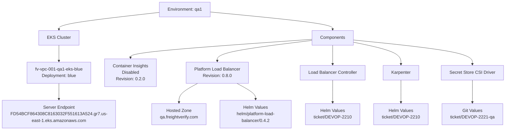
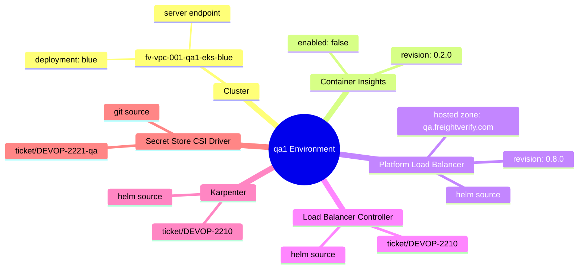
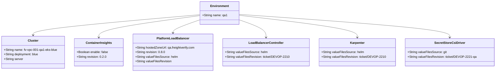

# Diagram: devops/k8s/argocd/app-manager/helm/values.qa1.yaml


> Auto-generated by Obscura crawlers

## Diagram 1

```mermaid
graph TD
      QA1[Environment: qa1]
      QA1 --> Cluster[EKS Cluster]
      Cluster --> BlueDeployment[fv-vpc-001-qa1-eks-blue<br/>Deployment: blue]...
  └ 162 lines...
```

> SVG rendering failed for this diagram.

## Diagram 2



### SVG

<svg id="container" width="1805.1171875" xmlns="http://www.w3.org/2000/svg" class="flowchart" height="478" viewBox="0 0 1805.1171875 478" role="graphics-document document" aria-roledescription="flowchart-v2"><style>#container{font-family:"trebuchet ms",verdana,arial,sans-serif;font-size:16px;fill:#333;}@keyframes edge-animation-frame{from{stroke-dashoffset:0;}}@keyframes dash{to{stroke-dashoffset:0;}}#container .edge-animation-slow{stroke-dasharray:9,5!important;stroke-dashoffset:900;animation:dash 50s linear infinite;stroke-linecap:round;}#container .edge-animation-fast{stroke-dasharray:9,5!important;stroke-dashoffset:900;animation:dash 20s linear infinite;stroke-linecap:round;}#container .error-icon{fill:#552222;}#container .error-text{fill:#552222;stroke:#552222;}#container .edge-thickness-normal{stroke-width:1px;}#container .edge-thickness-thick{stroke-width:3.5px;}#container .edge-pattern-solid{stroke-dasharray:0;}#container .edge-thickness-invisible{stroke-width:0;fill:none;}#container .edge-pattern-dashed{stroke-dasharray:3;}#container .edge-pattern-dotted{stroke-dasharray:2;}#container .marker{fill:#333333;stroke:#333333;}#container .marker.cross{stroke:#333333;}#container svg{font-family:"trebuchet ms",verdana,arial,sans-serif;font-size:16px;}#container p{margin:0;}#container .label{font-family:"trebuchet ms",verdana,arial,sans-serif;color:#333;}#container .cluster-label text{fill:#333;}#container .cluster-label span{color:#333;}#container .cluster-label span p{background-color:transparent;}#container .label text,#container span{fill:#333;color:#333;}#container .node rect,#container .node circle,#container .node ellipse,#container .node polygon,#container .node path{fill:#ECECFF;stroke:#9370DB;stroke-width:1px;}#container .rough-node .label text,#container .node .label text,#container .image-shape .label,#container .icon-shape .label{text-anchor:middle;}#container .node .katex path{fill:#000;stroke:#000;stroke-width:1px;}#container .rough-node .label,#container .node .label,#container .image-shape .label,#container .icon-shape .label{text-align:center;}#container .node.clickable{cursor:pointer;}#container .root .anchor path{fill:#333333!important;stroke-width:0;stroke:#333333;}#container .arrowheadPath{fill:#333333;}#container .edgePath .path{stroke:#333333;stroke-width:2.0px;}#container .flowchart-link{stroke:#333333;fill:none;}#container .edgeLabel{background-color:rgba(232,232,232, 0.8);text-align:center;}#container .edgeLabel p{background-color:rgba(232,232,232, 0.8);}#container .edgeLabel rect{opacity:0.5;background-color:rgba(232,232,232, 0.8);fill:rgba(232,232,232, 0.8);}#container .labelBkg{background-color:rgba(232, 232, 232, 0.5);}#container .cluster rect{fill:#ffffde;stroke:#aaaa33;stroke-width:1px;}#container .cluster text{fill:#333;}#container .cluster span{color:#333;}#container div.mermaidTooltip{position:absolute;text-align:center;max-width:200px;padding:2px;font-family:"trebuchet ms",verdana,arial,sans-serif;font-size:12px;background:hsl(80, 100%, 96.2745098039%);border:1px solid #aaaa33;border-radius:2px;pointer-events:none;z-index:100;}#container .flowchartTitleText{text-anchor:middle;font-size:18px;fill:#333;}#container rect.text{fill:none;stroke-width:0;}#container .icon-shape,#container .image-shape{background-color:rgba(232,232,232, 0.8);text-align:center;}#container .icon-shape p,#container .image-shape p{background-color:rgba(232,232,232, 0.8);padding:2px;}#container .icon-shape rect,#container .image-shape rect{opacity:0.5;background-color:rgba(232,232,232, 0.8);fill:rgba(232,232,232, 0.8);}#container .label-icon{display:inline-block;height:1em;overflow:visible;vertical-align:-0.125em;}#container .node .label-icon path{fill:currentColor;stroke:revert;stroke-width:revert;}#container :root{--mermaid-font-family:"trebuchet ms",verdana,arial,sans-serif;}</style><g><marker id="container_flowchart-v2-pointEnd" class="marker flowchart-v2" viewBox="0 0 10 10" refX="5" refY="5" markerUnits="userSpaceOnUse" markerWidth="8" markerHeight="8" orient="auto"><path d="M 0 0 L 10 5 L 0 10 z" class="arrowMarkerPath" style="stroke-width: 1; stroke-dasharray: 1, 0;"></path></marker><marker id="container_flowchart-v2-pointStart" class="marker flowchart-v2" viewBox="0 0 10 10" refX="4.5" refY="5" markerUnits="userSpaceOnUse" markerWidth="8" markerHeight="8" orient="auto"><path d="M 0 5 L 10 10 L 10 0 z" class="arrowMarkerPath" style="stroke-width: 1; stroke-dasharray: 1, 0;"></path></marker><marker id="container_flowchart-v2-circleEnd" class="marker flowchart-v2" viewBox="0 0 10 10" refX="11" refY="5" markerUnits="userSpaceOnUse" markerWidth="11" markerHeight="11" orient="auto"><circle cx="5" cy="5" r="5" class="arrowMarkerPath" style="stroke-width: 1; stroke-dasharray: 1, 0;"></circle></marker><marker id="container_flowchart-v2-circleStart" class="marker flowchart-v2" viewBox="0 0 10 10" refX="-1" refY="5" markerUnits="userSpaceOnUse" markerWidth="11" markerHeight="11" orient="auto"><circle cx="5" cy="5" r="5" class="arrowMarkerPath" style="stroke-width: 1; stroke-dasharray: 1, 0;"></circle></marker><marker id="container_flowchart-v2-crossEnd" class="marker cross flowchart-v2" viewBox="0 0 11 11" refX="12" refY="5.2" markerUnits="userSpaceOnUse" markerWidth="11" markerHeight="11" orient="auto"><path d="M 1,1 l 9,9 M 10,1 l -9,9" class="arrowMarkerPath" style="stroke-width: 2; stroke-dasharray: 1, 0;"></path></marker><marker id="container_flowchart-v2-crossStart" class="marker cross flowchart-v2" viewBox="0 0 11 11" refX="-1" refY="5.2" markerUnits="userSpaceOnUse" markerWidth="11" markerHeight="11" orient="auto"><path d="M 1,1 l 9,9 M 10,1 l -9,9" class="arrowMarkerPath" style="stroke-width: 2; stroke-dasharray: 1, 0;"></path></marker><g class="root"><g class="clusters"></g><g class="edgePaths"><path d="M554.109,45.618L494.155,52.515C434.201,59.412,314.292,73.206,254.337,83.603C194.383,94,194.383,101,194.383,104.5L194.383,108" id="L_QA1_Cluster_0" class="edge-thickness-normal edge-pattern-solid edge-thickness-normal edge-pattern-solid flowchart-link" style=";" data-edge="true" data-et="edge" data-id="L_QA1_Cluster_0" data-points="W3sieCI6NTU0LjEwOTM3NSwieSI6NDUuNjE3Njc0MDAwNTg3NjM0fSx7IngiOjE5NC4zODI4MTI1LCJ5Ijo4N30seyJ4IjoxOTQuMzgyODEyNSwieSI6MTEyfV0=" marker-end="url(#container_flowchart-v2-pointEnd)"></path><path d="M194.383,166L194.383,170.167C194.383,174.333,194.383,182.667,194.383,192.333C194.383,202,194.383,213,194.383,218.5L194.383,224" id="L_Cluster_BlueDeployment_0" class="edge-thickness-normal edge-pattern-solid edge-thickness-normal edge-pattern-solid flowchart-link" style=";" data-edge="true" data-et="edge" data-id="L_Cluster_BlueDeployment_0" data-points="W3sieCI6MTk0LjM4MjgxMjUsInkiOjE2Nn0seyJ4IjoxOTQuMzgyODEyNSwieSI6MTkxfSx7IngiOjE5NC4zODI4MTI1LCJ5IjoyMjh9XQ==" marker-end="url(#container_flowchart-v2-pointEnd)"></path><path d="M194.383,306L194.383,312.167C194.383,318.333,194.383,330.667,194.383,340.333C194.383,350,194.383,357,194.383,360.5L194.383,364" id="L_BlueDeployment_Server_0" class="edge-thickness-normal edge-pattern-solid edge-thickness-normal edge-pattern-solid flowchart-link" style=";" data-edge="true" data-et="edge" data-id="L_BlueDeployment_Server_0" data-points="W3sieCI6MTk0LjM4MjgxMjUsInkiOjMwNn0seyJ4IjoxOTQuMzgyODEyNSwieSI6MzQzfSx7IngiOjE5NC4zODI4MTI1LCJ5IjozNjh9XQ==" marker-end="url(#container_flowchart-v2-pointEnd)"></path><path d="M738.703,43.87L813.504,51.058C888.305,58.247,1037.906,72.623,1112.707,83.312C1187.508,94,1187.508,101,1187.508,104.5L1187.508,108" id="L_QA1_Components_0" class="edge-thickness-normal edge-pattern-solid edge-thickness-normal edge-pattern-solid flowchart-link" style=";" data-edge="true" data-et="edge" data-id="L_QA1_Components_0" data-points="W3sieCI6NzM4LjcwMzEyNSwieSI6NDMuODY5NzUzNTQwOTUzNzh9LHsieCI6MTE4Ny41MDc4MTI1LCJ5Ijo4N30seyJ4IjoxMTg3LjUwNzgxMjUsInkiOjExMn1d" marker-end="url(#container_flowchart-v2-pointEnd)"></path><path d="M1111.875,144.388L1002.828,152.157C893.781,159.925,675.688,175.463,566.641,186.731C457.594,198,457.594,205,457.594,208.5L457.594,212" id="L_Components_CI_0" class="edge-thickness-normal edge-pattern-solid edge-thickness-normal edge-pattern-solid flowchart-link" style=";" data-edge="true" data-et="edge" data-id="L_Components_CI_0" data-points="W3sieCI6MTExMS44NzUsInkiOjE0NC4zODgxNzcxMTg0NTM2fSx7IngiOjQ1Ny41OTM3NSwieSI6MTkxfSx7IngiOjQ1Ny41OTM3NSwieSI6MjE2fV0=" marker-end="url(#container_flowchart-v2-pointEnd)"></path><path d="M1111.875,148.335L1054.261,155.446C996.647,162.557,881.419,176.778,823.805,189.389C766.191,202,766.191,213,766.191,218.5L766.191,224" id="L_Components_PLB_0" class="edge-thickness-normal edge-pattern-solid edge-thickness-normal edge-pattern-solid flowchart-link" style=";" data-edge="true" data-et="edge" data-id="L_Components_PLB_0" data-points="W3sieCI6MTExMS44NzUsInkiOjE0OC4zMzQ4MDQ0MTY5NTk0OX0seyJ4Ijo3NjYuMTkxNDA2MjUsInkiOjE5MX0seyJ4Ijo3NjYuMTkxNDA2MjUsInkiOjIyOH1d" marker-end="url(#container_flowchart-v2-pointEnd)"></path><path d="M1187.508,166L1187.508,170.167C1187.508,174.333,1187.508,182.667,1187.508,194.333C1187.508,206,1187.508,221,1187.508,228.5L1187.508,236" id="L_Components_LBC_0" class="edge-thickness-normal edge-pattern-solid edge-thickness-normal edge-pattern-solid flowchart-link" style=";" data-edge="true" data-et="edge" data-id="L_Components_LBC_0" data-points="W3sieCI6MTE4Ny41MDc4MTI1LCJ5IjoxNjZ9LHsieCI6MTE4Ny41MDc4MTI1LCJ5IjoxOTF9LHsieCI6MTE4Ny41MDc4MTI1LCJ5IjoyNDB9XQ==" marker-end="url(#container_flowchart-v2-pointEnd)"></path><path d="M1263.141,155.159L1291.1,161.132C1319.06,167.106,1374.979,179.053,1402.939,192.526C1430.898,206,1430.898,221,1430.898,228.5L1430.898,236" id="L_Components_Karpenter_0" class="edge-thickness-normal edge-pattern-solid edge-thickness-normal edge-pattern-solid flowchart-link" style=";" data-edge="true" data-et="edge" data-id="L_Components_Karpenter_0" data-points="W3sieCI6MTI2My4xNDA2MjUsInkiOjE1NS4xNTg4MjM5MDcwNDI0M30seyJ4IjoxNDMwLjg5ODQzNzUsInkiOjE5MX0seyJ4IjoxNDMwLjg5ODQzNzUsInkiOjI0MH1d" marker-end="url(#container_flowchart-v2-pointEnd)"></path><path d="M1263.141,146.887L1333.641,154.239C1404.141,161.592,1545.141,176.296,1615.641,191.148C1686.141,206,1686.141,221,1686.141,228.5L1686.141,236" id="L_Components_SCSD_0" class="edge-thickness-normal edge-pattern-solid edge-thickness-normal edge-pattern-solid flowchart-link" style=";" data-edge="true" data-et="edge" data-id="L_Components_SCSD_0" data-points="W3sieCI6MTI2My4xNDA2MjUsInkiOjE0Ni44ODczNzk1NTM0NjY1fSx7IngiOjE2ODYuMTQwNjI1LCJ5IjoxOTF9LHsieCI6MTY4Ni4xNDA2MjUsInkiOjI0MH1d" marker-end="url(#container_flowchart-v2-pointEnd)"></path><path d="M693.906,306L682.477,312.167C671.047,318.333,648.188,330.667,636.758,342.333C625.328,354,625.328,365,625.328,370.5L625.328,376" id="L_PLB_HZ_0" class="edge-thickness-normal edge-pattern-solid edge-thickness-normal edge-pattern-solid flowchart-link" style=";" data-edge="true" data-et="edge" data-id="L_PLB_HZ_0" data-points="W3sieCI6NjkzLjkwNjMwMTM5ODAyNjQsInkiOjMwNn0seyJ4Ijo2MjUuMzI4MTI1LCJ5IjozNDN9LHsieCI6NjI1LjMyODEyNSwieSI6MzgwfV0=" marker-end="url(#container_flowchart-v2-pointEnd)"></path><path d="M838.477,306L849.906,312.167C861.336,318.333,884.195,330.667,895.625,340.333C907.055,350,907.055,357,907.055,360.5L907.055,364" id="L_PLB_PLBValues_0" class="edge-thickness-normal edge-pattern-solid edge-thickness-normal edge-pattern-solid flowchart-link" style=";" data-edge="true" data-et="edge" data-id="L_PLB_PLBValues_0" data-points="W3sieCI6ODM4LjQ3NjUxMTEwMTk3MzYsInkiOjMwNn0seyJ4Ijo5MDcuMDU0Njg3NSwieSI6MzQzfSx7IngiOjkwNy4wNTQ2ODc1LCJ5IjozNjh9XQ==" marker-end="url(#container_flowchart-v2-pointEnd)"></path><path d="M1187.508,294L1187.508,302.167C1187.508,310.333,1187.508,326.667,1187.508,340.333C1187.508,354,1187.508,365,1187.508,370.5L1187.508,376" id="L_LBC_LBCValues_0" class="edge-thickness-normal edge-pattern-solid edge-thickness-normal edge-pattern-solid flowchart-link" style=";" data-edge="true" data-et="edge" data-id="L_LBC_LBCValues_0" data-points="W3sieCI6MTE4Ny41MDc4MTI1LCJ5IjoyOTR9LHsieCI6MTE4Ny41MDc4MTI1LCJ5IjozNDN9LHsieCI6MTE4Ny41MDc4MTI1LCJ5IjozODB9XQ==" marker-end="url(#container_flowchart-v2-pointEnd)"></path><path d="M1430.898,294L1430.898,302.167C1430.898,310.333,1430.898,326.667,1430.898,340.333C1430.898,354,1430.898,365,1430.898,370.5L1430.898,376" id="L_Karpenter_KarpenterValues_0" class="edge-thickness-normal edge-pattern-solid edge-thickness-normal edge-pattern-solid flowchart-link" style=";" data-edge="true" data-et="edge" data-id="L_Karpenter_KarpenterValues_0" data-points="W3sieCI6MTQzMC44OTg0Mzc1LCJ5IjoyOTR9LHsieCI6MTQzMC44OTg0Mzc1LCJ5IjozNDN9LHsieCI6MTQzMC44OTg0Mzc1LCJ5IjozODB9XQ==" marker-end="url(#container_flowchart-v2-pointEnd)"></path><path d="M1686.141,294L1686.141,302.167C1686.141,310.333,1686.141,326.667,1686.141,340.333C1686.141,354,1686.141,365,1686.141,370.5L1686.141,376" id="L_SCSD_SCSDValues_0" class="edge-thickness-normal edge-pattern-solid edge-thickness-normal edge-pattern-solid flowchart-link" style=";" data-edge="true" data-et="edge" data-id="L_SCSD_SCSDValues_0" data-points="W3sieCI6MTY4Ni4xNDA2MjUsInkiOjI5NH0seyJ4IjoxNjg2LjE0MDYyNSwieSI6MzQzfSx7IngiOjE2ODYuMTQwNjI1LCJ5IjozODB9XQ==" marker-end="url(#container_flowchart-v2-pointEnd)"></path></g><g class="edgeLabels"><g class="edgeLabel"><g class="label" data-id="L_QA1_Cluster_0" transform="translate(0, 0)"><foreignObject width="0" height="0"><div xmlns="http://www.w3.org/1999/xhtml" class="labelBkg" style="display: table-cell; white-space: nowrap; line-height: 1.5; max-width: 200px; text-align: center;"><span class="edgeLabel"></span></div></foreignObject></g></g><g class="edgeLabel"><g class="label" data-id="L_Cluster_BlueDeployment_0" transform="translate(0, 0)"><foreignObject width="0" height="0"><div xmlns="http://www.w3.org/1999/xhtml" class="labelBkg" style="display: table-cell; white-space: nowrap; line-height: 1.5; max-width: 200px; text-align: center;"><span class="edgeLabel"></span></div></foreignObject></g></g><g class="edgeLabel"><g class="label" data-id="L_BlueDeployment_Server_0" transform="translate(0, 0)"><foreignObject width="0" height="0"><div xmlns="http://www.w3.org/1999/xhtml" class="labelBkg" style="display: table-cell; white-space: nowrap; line-height: 1.5; max-width: 200px; text-align: center;"><span class="edgeLabel"></span></div></foreignObject></g></g><g class="edgeLabel"><g class="label" data-id="L_QA1_Components_0" transform="translate(0, 0)"><foreignObject width="0" height="0"><div xmlns="http://www.w3.org/1999/xhtml" class="labelBkg" style="display: table-cell; white-space: nowrap; line-height: 1.5; max-width: 200px; text-align: center;"><span class="edgeLabel"></span></div></foreignObject></g></g><g class="edgeLabel"><g class="label" data-id="L_Components_CI_0" transform="translate(0, 0)"><foreignObject width="0" height="0"><div xmlns="http://www.w3.org/1999/xhtml" class="labelBkg" style="display: table-cell; white-space: nowrap; line-height: 1.5; max-width: 200px; text-align: center;"><span class="edgeLabel"></span></div></foreignObject></g></g><g class="edgeLabel"><g class="label" data-id="L_Components_PLB_0" transform="translate(0, 0)"><foreignObject width="0" height="0"><div xmlns="http://www.w3.org/1999/xhtml" class="labelBkg" style="display: table-cell; white-space: nowrap; line-height: 1.5; max-width: 200px; text-align: center;"><span class="edgeLabel"></span></div></foreignObject></g></g><g class="edgeLabel"><g class="label" data-id="L_Components_LBC_0" transform="translate(0, 0)"><foreignObject width="0" height="0"><div xmlns="http://www.w3.org/1999/xhtml" class="labelBkg" style="display: table-cell; white-space: nowrap; line-height: 1.5; max-width: 200px; text-align: center;"><span class="edgeLabel"></span></div></foreignObject></g></g><g class="edgeLabel"><g class="label" data-id="L_Components_Karpenter_0" transform="translate(0, 0)"><foreignObject width="0" height="0"><div xmlns="http://www.w3.org/1999/xhtml" class="labelBkg" style="display: table-cell; white-space: nowrap; line-height: 1.5; max-width: 200px; text-align: center;"><span class="edgeLabel"></span></div></foreignObject></g></g><g class="edgeLabel"><g class="label" data-id="L_Components_SCSD_0" transform="translate(0, 0)"><foreignObject width="0" height="0"><div xmlns="http://www.w3.org/1999/xhtml" class="labelBkg" style="display: table-cell; white-space: nowrap; line-height: 1.5; max-width: 200px; text-align: center;"><span class="edgeLabel"></span></div></foreignObject></g></g><g class="edgeLabel"><g class="label" data-id="L_PLB_HZ_0" transform="translate(0, 0)"><foreignObject width="0" height="0"><div xmlns="http://www.w3.org/1999/xhtml" class="labelBkg" style="display: table-cell; white-space: nowrap; line-height: 1.5; max-width: 200px; text-align: center;"><span class="edgeLabel"></span></div></foreignObject></g></g><g class="edgeLabel"><g class="label" data-id="L_PLB_PLBValues_0" transform="translate(0, 0)"><foreignObject width="0" height="0"><div xmlns="http://www.w3.org/1999/xhtml" class="labelBkg" style="display: table-cell; white-space: nowrap; line-height: 1.5; max-width: 200px; text-align: center;"><span class="edgeLabel"></span></div></foreignObject></g></g><g class="edgeLabel"><g class="label" data-id="L_LBC_LBCValues_0" transform="translate(0, 0)"><foreignObject width="0" height="0"><div xmlns="http://www.w3.org/1999/xhtml" class="labelBkg" style="display: table-cell; white-space: nowrap; line-height: 1.5; max-width: 200px; text-align: center;"><span class="edgeLabel"></span></div></foreignObject></g></g><g class="edgeLabel"><g class="label" data-id="L_Karpenter_KarpenterValues_0" transform="translate(0, 0)"><foreignObject width="0" height="0"><div xmlns="http://www.w3.org/1999/xhtml" class="labelBkg" style="display: table-cell; white-space: nowrap; line-height: 1.5; max-width: 200px; text-align: center;"><span class="edgeLabel"></span></div></foreignObject></g></g><g class="edgeLabel"><g class="label" data-id="L_SCSD_SCSDValues_0" transform="translate(0, 0)"><foreignObject width="0" height="0"><div xmlns="http://www.w3.org/1999/xhtml" class="labelBkg" style="display: table-cell; white-space: nowrap; line-height: 1.5; max-width: 200px; text-align: center;"><span class="edgeLabel"></span></div></foreignObject></g></g></g><g class="nodes"><g class="node default" id="flowchart-QA1-0" transform="translate(646.40625, 35)"><rect class="basic label-container" style="" x="-92.296875" y="-27" width="184.59375" height="54"></rect><g class="label" style="" transform="translate(-62.296875, -12)"><rect></rect><foreignObject width="124.59375" height="24"><div xmlns="http://www.w3.org/1999/xhtml" style="display: table-cell; white-space: nowrap; line-height: 1.5; max-width: 200px; text-align: center;"><span class="nodeLabel"><p>Environment: qa1</p></span></div></foreignObject></g></g><g class="node default" id="flowchart-Cluster-2" transform="translate(194.3828125, 139)"><rect class="basic label-container" style="" x="-70.75" y="-27" width="141.5" height="54"></rect><g class="label" style="" transform="translate(-40.75, -12)"><rect></rect><foreignObject width="81.5" height="24"><div xmlns="http://www.w3.org/1999/xhtml" style="display: table-cell; white-space: nowrap; line-height: 1.5; max-width: 200px; text-align: center;"><span class="nodeLabel"><p>EKS Cluster</p></span></div></foreignObject></g></g><g class="node default" id="flowchart-BlueDeployment-4" transform="translate(194.3828125, 267)"><rect class="basic label-container" style="" x="-117.3203125" y="-39" width="234.640625" height="78"></rect><g class="label" style="" transform="translate(-87.3203125, -24)"><rect></rect><foreignObject width="174.640625" height="48"><div xmlns="http://www.w3.org/1999/xhtml" style="display: table-cell; white-space: nowrap; line-height: 1.5; max-width: 200px; text-align: center;"><span class="nodeLabel"><p>fv-vpc-001-qa1-eks-blue<br/>Deployment: blue</p></span></div></foreignObject></g></g><g class="node default" id="flowchart-Server-6" transform="translate(194.3828125, 419)"><rect class="basic label-container" style="" x="-186.3828125" y="-51" width="372.765625" height="102"></rect><g class="label" style="" transform="translate(-156.3828125, -36)"><rect></rect><foreignObject width="312.765625" height="72"><div xmlns="http://www.w3.org/1999/xhtml" style="display: table; white-space: break-spaces; line-height: 1.5; max-width: 200px; text-align: center; width: 200px;"><span class="nodeLabel"><p>Server Endpoint<br/>FD54BCF864308C8163032F551613A524.gr7.us-east-1.eks.amazonaws.com</p></span></div></foreignObject></g></g><g class="node default" id="flowchart-Components-8" transform="translate(1187.5078125, 139)"><rect class="basic label-container" style="" x="-75.6328125" y="-27" width="151.265625" height="54"></rect><g class="label" style="" transform="translate(-45.6328125, -12)"><rect></rect><foreignObject width="91.265625" height="24"><div xmlns="http://www.w3.org/1999/xhtml" style="display: table-cell; white-space: nowrap; line-height: 1.5; max-width: 200px; text-align: center;"><span class="nodeLabel"><p>Components</p></span></div></foreignObject></g></g><g class="node default" id="flowchart-CI-10" transform="translate(457.59375, 267)"><rect class="basic label-container" style="" x="-95.890625" y="-51" width="191.78125" height="102"></rect><g class="label" style="" transform="translate(-65.890625, -36)"><rect></rect><foreignObject width="131.78125" height="72"><div xmlns="http://www.w3.org/1999/xhtml" style="display: table-cell; white-space: nowrap; line-height: 1.5; max-width: 200px; text-align: center;"><span class="nodeLabel"><p>Container Insights<br/>Disabled<br/>Revision: 0.2.0</p></span></div></foreignObject></g></g><g class="node default" id="flowchart-PLB-12" transform="translate(766.19140625, 267)"><rect class="basic label-container" style="" x="-114.6796875" y="-39" width="229.359375" height="78"></rect><g class="label" style="" transform="translate(-84.6796875, -24)"><rect></rect><foreignObject width="169.359375" height="48"><div xmlns="http://www.w3.org/1999/xhtml" style="display: table-cell; white-space: nowrap; line-height: 1.5; max-width: 200px; text-align: center;"><span class="nodeLabel"><p>Platform Load Balancer<br/>Revision: 0.8.0</p></span></div></foreignObject></g></g><g class="node default" id="flowchart-LBC-14" transform="translate(1187.5078125, 267)"><rect class="basic label-container" style="" x="-119.53125" y="-27" width="239.0625" height="54"></rect><g class="label" style="" transform="translate(-89.53125, -12)"><rect></rect><foreignObject width="179.0625" height="24"><div xmlns="http://www.w3.org/1999/xhtml" style="display: table-cell; white-space: nowrap; line-height: 1.5; max-width: 200px; text-align: center;"><span class="nodeLabel"><p>Load Balancer Controller</p></span></div></foreignObject></g></g><g class="node default" id="flowchart-Karpenter-16" transform="translate(1430.8984375, 267)"><rect class="basic label-container" style="" x="-66.1171875" y="-27" width="132.234375" height="54"></rect><g class="label" style="" transform="translate(-36.1171875, -12)"><rect></rect><foreignObject width="72.234375" height="24"><div xmlns="http://www.w3.org/1999/xhtml" style="display: table-cell; white-space: nowrap; line-height: 1.5; max-width: 200px; text-align: center;"><span class="nodeLabel"><p>Karpenter</p></span></div></foreignObject></g></g><g class="node default" id="flowchart-SCSD-18" transform="translate(1686.140625, 267)"><rect class="basic label-container" style="" x="-110.9765625" y="-27" width="221.953125" height="54"></rect><g class="label" style="" transform="translate(-80.9765625, -12)"><rect></rect><foreignObject width="161.953125" height="24"><div xmlns="http://www.w3.org/1999/xhtml" style="display: table-cell; white-space: nowrap; line-height: 1.5; max-width: 200px; text-align: center;"><span class="nodeLabel"><p>Secret Store CSI Driver</p></span></div></foreignObject></g></g><g class="node default" id="flowchart-HZ-20" transform="translate(625.328125, 419)"><rect class="basic label-container" style="" x="-101.7265625" y="-39" width="203.453125" height="78"></rect><g class="label" style="" transform="translate(-71.7265625, -24)"><rect></rect><foreignObject width="143.453125" height="48"><div xmlns="http://www.w3.org/1999/xhtml" style="display: table-cell; white-space: nowrap; line-height: 1.5; max-width: 200px; text-align: center;"><span class="nodeLabel"><p>Hosted Zone<br/>qa.freightverify.com</p></span></div></foreignObject></g></g><g class="node default" id="flowchart-PLBValues-22" transform="translate(907.0546875, 419)"><rect class="basic label-container" style="" x="-130" y="-51" width="260" height="102"></rect><g class="label" style="" transform="translate(-100, -36)"><rect></rect><foreignObject width="200" height="72"><div xmlns="http://www.w3.org/1999/xhtml" style="display: table; white-space: break-spaces; line-height: 1.5; max-width: 200px; text-align: center; width: 200px;"><span class="nodeLabel"><p>Helm Values<br/>helm/platform-load-balancer/0.4.2</p></span></div></foreignObject></g></g><g class="node default" id="flowchart-LBCValues-24" transform="translate(1187.5078125, 419)"><rect class="basic label-container" style="" x="-96.6953125" y="-39" width="193.390625" height="78"></rect><g class="label" style="" transform="translate(-66.6953125, -24)"><rect></rect><foreignObject width="133.390625" height="48"><div xmlns="http://www.w3.org/1999/xhtml" style="display: table-cell; white-space: nowrap; line-height: 1.5; max-width: 200px; text-align: center;"><span class="nodeLabel"><p>Helm Values<br/>ticket/DEVOP-2210</p></span></div></foreignObject></g></g><g class="node default" id="flowchart-KarpenterValues-26" transform="translate(1430.8984375, 419)"><rect class="basic label-container" style="" x="-96.6953125" y="-39" width="193.390625" height="78"></rect><g class="label" style="" transform="translate(-66.6953125, -24)"><rect></rect><foreignObject width="133.390625" height="48"><div xmlns="http://www.w3.org/1999/xhtml" style="display: table-cell; white-space: nowrap; line-height: 1.5; max-width: 200px; text-align: center;"><span class="nodeLabel"><p>Helm Values<br/>ticket/DEVOP-2210</p></span></div></foreignObject></g></g><g class="node default" id="flowchart-SCSDValues-28" transform="translate(1686.140625, 419)"><rect class="basic label-container" style="" x="-108.546875" y="-39" width="217.09375" height="78"></rect><g class="label" style="" transform="translate(-78.546875, -24)"><rect></rect><foreignObject width="157.09375" height="48"><div xmlns="http://www.w3.org/1999/xhtml" style="display: table-cell; white-space: nowrap; line-height: 1.5; max-width: 200px; text-align: center;"><span class="nodeLabel"><p>Git Values<br/>ticket/DEVOP-2221-qa</p></span></div></foreignObject></g></g></g></g></g></svg>

## Diagram 3



### SVG

<svg id="container" width="100%" xmlns="http://www.w3.org/2000/svg" class="mindmapDiagram" style="max-width: 1146.4617919921875px;" viewBox="5 5 1146.4617919921875 509.6444091796875" role="graphics-document document" aria-roledescription="mindmap"><style>#container{font-family:"trebuchet ms",verdana,arial,sans-serif;font-size:16px;fill:#333;}@keyframes edge-animation-frame{from{stroke-dashoffset:0;}}@keyframes dash{to{stroke-dashoffset:0;}}#container .edge-animation-slow{stroke-dasharray:9,5!important;stroke-dashoffset:900;animation:dash 50s linear infinite;stroke-linecap:round;}#container .edge-animation-fast{stroke-dasharray:9,5!important;stroke-dashoffset:900;animation:dash 20s linear infinite;stroke-linecap:round;}#container .error-icon{fill:#552222;}#container .error-text{fill:#552222;stroke:#552222;}#container .edge-thickness-normal{stroke-width:1px;}#container .edge-thickness-thick{stroke-width:3.5px;}#container .edge-pattern-solid{stroke-dasharray:0;}#container .edge-thickness-invisible{stroke-width:0;fill:none;}#container .edge-pattern-dashed{stroke-dasharray:3;}#container .edge-pattern-dotted{stroke-dasharray:2;}#container .marker{fill:#333333;stroke:#333333;}#container .marker.cross{stroke:#333333;}#container svg{font-family:"trebuchet ms",verdana,arial,sans-serif;font-size:16px;}#container p{margin:0;}#container .edge{stroke-width:3;}#container .section--1 rect,#container .section--1 path,#container .section--1 circle,#container .section--1 polygon,#container .section--1 path{fill:hsl(240, 100%, 76.2745098039%);}#container .section--1 text{fill:#ffffff;}#container .node-icon--1{font-size:40px;color:#ffffff;}#container .section-edge--1{stroke:hsl(240, 100%, 76.2745098039%);}#container .edge-depth--1{stroke-width:17;}#container .section--1 line{stroke:hsl(60, 100%, 86.2745098039%);stroke-width:3;}#container .disabled,#container .disabled circle,#container .disabled text{fill:lightgray;}#container .disabled text{fill:#efefef;}#container .section-0 rect,#container .section-0 path,#container .section-0 circle,#container .section-0 polygon,#container .section-0 path{fill:hsl(60, 100%, 73.5294117647%);}#container .section-0 text{fill:black;}#container .node-icon-0{font-size:40px;color:black;}#container .section-edge-0{stroke:hsl(60, 100%, 73.5294117647%);}#container .edge-depth-0{stroke-width:14;}#container .section-0 line{stroke:hsl(240, 100%, 83.5294117647%);stroke-width:3;}#container .disabled,#container .disabled circle,#container .disabled text{fill:lightgray;}#container .disabled text{fill:#efefef;}#container .section-1 rect,#container .section-1 path,#container .section-1 circle,#container .section-1 polygon,#container .section-1 path{fill:hsl(80, 100%, 76.2745098039%);}#container .section-1 text{fill:black;}#container .node-icon-1{font-size:40px;color:black;}#container .section-edge-1{stroke:hsl(80, 100%, 76.2745098039%);}#container .edge-depth-1{stroke-width:11;}#container .section-1 line{stroke:hsl(260, 100%, 86.2745098039%);stroke-width:3;}#container .disabled,#container .disabled circle,#container .disabled text{fill:lightgray;}#container .disabled text{fill:#efefef;}#container .section-2 rect,#container .section-2 path,#container .section-2 circle,#container .section-2 polygon,#container .section-2 path{fill:hsl(270, 100%, 76.2745098039%);}#container .section-2 text{fill:#ffffff;}#container .node-icon-2{font-size:40px;color:#ffffff;}#container .section-edge-2{stroke:hsl(270, 100%, 76.2745098039%);}#container .edge-depth-2{stroke-width:8;}#container .section-2 line{stroke:hsl(90, 100%, 86.2745098039%);stroke-width:3;}#container .disabled,#container .disabled circle,#container .disabled text{fill:lightgray;}#container .disabled text{fill:#efefef;}#container .section-3 rect,#container .section-3 path,#container .section-3 circle,#container .section-3 polygon,#container .section-3 path{fill:hsl(300, 100%, 76.2745098039%);}#container .section-3 text{fill:black;}#container .node-icon-3{font-size:40px;color:black;}#container .section-edge-3{stroke:hsl(300, 100%, 76.2745098039%);}#container .edge-depth-3{stroke-width:5;}#container .section-3 line{stroke:hsl(120, 100%, 86.2745098039%);stroke-width:3;}#container .disabled,#container .disabled circle,#container .disabled text{fill:lightgray;}#container .disabled text{fill:#efefef;}#container .section-4 rect,#container .section-4 path,#container .section-4 circle,#container .section-4 polygon,#container .section-4 path{fill:hsl(330, 100%, 76.2745098039%);}#container .section-4 text{fill:black;}#container .node-icon-4{font-size:40px;color:black;}#container .section-edge-4{stroke:hsl(330, 100%, 76.2745098039%);}#container .edge-depth-4{stroke-width:2;}#container .section-4 line{stroke:hsl(150, 100%, 86.2745098039%);stroke-width:3;}#container .disabled,#container .disabled circle,#container .disabled text{fill:lightgray;}#container .disabled text{fill:#efefef;}#container .section-5 rect,#container .section-5 path,#container .section-5 circle,#container .section-5 polygon,#container .section-5 path{fill:hsl(0, 100%, 76.2745098039%);}#container .section-5 text{fill:black;}#container .node-icon-5{font-size:40px;color:black;}#container .section-edge-5{stroke:hsl(0, 100%, 76.2745098039%);}#container .edge-depth-5{stroke-width:-1;}#container .section-5 line{stroke:hsl(180, 100%, 86.2745098039%);stroke-width:3;}#container .disabled,#container .disabled circle,#container .disabled text{fill:lightgray;}#container .disabled text{fill:#efefef;}#container .section-6 rect,#container .section-6 path,#container .section-6 circle,#container .section-6 polygon,#container .section-6 path{fill:hsl(30, 100%, 76.2745098039%);}#container .section-6 text{fill:black;}#container .node-icon-6{font-size:40px;color:black;}#container .section-edge-6{stroke:hsl(30, 100%, 76.2745098039%);}#container .edge-depth-6{stroke-width:-4;}#container .section-6 line{stroke:hsl(210, 100%, 86.2745098039%);stroke-width:3;}#container .disabled,#container .disabled circle,#container .disabled text{fill:lightgray;}#container .disabled text{fill:#efefef;}#container .section-7 rect,#container .section-7 path,#container .section-7 circle,#container .section-7 polygon,#container .section-7 path{fill:hsl(90, 100%, 76.2745098039%);}#container .section-7 text{fill:black;}#container .node-icon-7{font-size:40px;color:black;}#container .section-edge-7{stroke:hsl(90, 100%, 76.2745098039%);}#container .edge-depth-7{stroke-width:-7;}#container .section-7 line{stroke:hsl(270, 100%, 86.2745098039%);stroke-width:3;}#container .disabled,#container .disabled circle,#container .disabled text{fill:lightgray;}#container .disabled text{fill:#efefef;}#container .section-8 rect,#container .section-8 path,#container .section-8 circle,#container .section-8 polygon,#container .section-8 path{fill:hsl(150, 100%, 76.2745098039%);}#container .section-8 text{fill:black;}#container .node-icon-8{font-size:40px;color:black;}#container .section-edge-8{stroke:hsl(150, 100%, 76.2745098039%);}#container .edge-depth-8{stroke-width:-10;}#container .section-8 line{stroke:hsl(330, 100%, 86.2745098039%);stroke-width:3;}#container .disabled,#container .disabled circle,#container .disabled text{fill:lightgray;}#container .disabled text{fill:#efefef;}#container .section-9 rect,#container .section-9 path,#container .section-9 circle,#container .section-9 polygon,#container .section-9 path{fill:hsl(180, 100%, 76.2745098039%);}#container .section-9 text{fill:black;}#container .node-icon-9{font-size:40px;color:black;}#container .section-edge-9{stroke:hsl(180, 100%, 76.2745098039%);}#container .edge-depth-9{stroke-width:-13;}#container .section-9 line{stroke:hsl(0, 100%, 86.2745098039%);stroke-width:3;}#container .disabled,#container .disabled circle,#container .disabled text{fill:lightgray;}#container .disabled text{fill:#efefef;}#container .section-10 rect,#container .section-10 path,#container .section-10 circle,#container .section-10 polygon,#container .section-10 path{fill:hsl(210, 100%, 76.2745098039%);}#container .section-10 text{fill:black;}#container .node-icon-10{font-size:40px;color:black;}#container .section-edge-10{stroke:hsl(210, 100%, 76.2745098039%);}#container .edge-depth-10{stroke-width:-16;}#container .section-10 line{stroke:hsl(30, 100%, 86.2745098039%);stroke-width:3;}#container .disabled,#container .disabled circle,#container .disabled text{fill:lightgray;}#container .disabled text{fill:#efefef;}#container .section-root rect,#container .section-root path,#container .section-root circle,#container .section-root polygon{fill:hsl(240, 100%, 46.2745098039%);}#container .section-root text{fill:#ffffff;}#container .section-root span{color:#ffffff;}#container .section-2 span{color:#ffffff;}#container .icon-container{height:100%;display:flex;justify-content:center;align-items:center;}#container .edge{fill:none;}#container .mindmap-node-label{dy:1em;alignment-baseline:middle;text-anchor:middle;dominant-baseline:middle;text-align:center;}#container :root{--mermaid-font-family:"trebuchet ms",verdana,arial,sans-serif;}</style><g><marker id="container_mindmap-pointEnd" class="marker mindmap" viewBox="0 0 10 10" refX="5" refY="5" markerUnits="userSpaceOnUse" markerWidth="8" markerHeight="8" orient="auto"><path d="M 0 0 L 10 5 L 0 10 z" class="arrowMarkerPath" style="stroke-width: 1; stroke-dasharray: 1, 0;"></path></marker><marker id="container_mindmap-pointStart" class="marker mindmap" viewBox="0 0 10 10" refX="4.5" refY="5" markerUnits="userSpaceOnUse" markerWidth="8" markerHeight="8" orient="auto"><path d="M 0 5 L 10 10 L 10 0 z" class="arrowMarkerPath" style="stroke-width: 1; stroke-dasharray: 1, 0;"></path></marker><g class="subgraphs"></g><g class="edgePaths"><path d="M613.094,271.944L603.474,264.542C593.853,257.139,574.611,242.333,555.37,227.527C536.129,212.721,516.887,197.916,507.266,190.513L497.646,183.11" id="edge_0_1" class="edge-thickness-normal edge-pattern-solid edge section-edge-0 edge-depth-1" style="undefined;;;undefined" data-edge="true" data-et="edge" data-id="edge_0_1" data-points="W3sieCI6NjEzLjA5NDQwMTgyNzY1MTMsInkiOjI3MS45NDQ0ODIyMzA5NTU2Nn0seyJ4Ijo1NTUuMzcwMDQ0MTE2NzAyNywieSI6MjI3LjUyNzE4ODEwODUwNDg0fSx7IngiOjQ5Ny42NDU2ODY0MDU3NTQxMywieSI6MTgzLjEwOTg5Mzk4NjA1NDAzfV0="></path><path d="M471.773,168.537L462.434,164.914C453.096,161.292,434.418,154.046,415.741,146.8C397.063,139.554,378.385,132.309,369.047,128.686L359.708,125.063" id="edge_1_2" class="edge-thickness-normal edge-pattern-solid edge section-edge-0 edge-depth-3" style="undefined;;;undefined" data-edge="true" data-et="edge" data-id="edge_1_2" data-points="W3sieCI6NDcxLjc3MzE2MzAwODcxNCwieSI6MTY4LjUzNzI3MjEyNDUwNzU4fSx7IngiOjQxNS43NDA1NDc4NDg4OTgxLCJ5IjoxNDYuODAwMDIwMTI5MTk4NzR9LHsieCI6MzU5LjcwNzkzMjY4OTA4MjE2LCJ5IjoxMjUuMDYyNzY4MTMzODg5OTJ9XQ=="></path><path d="M330.762,118.555L312.676,117.247C294.589,115.938,258.415,113.321,222.241,110.704C186.067,108.087,149.893,105.47,131.806,104.162L113.719,102.853" id="edge_2_3" class="edge-thickness-normal edge-pattern-solid edge section-edge-0 edge-depth-5" style="undefined;;;undefined" data-edge="true" data-et="edge" data-id="edge_2_3" data-points="W3sieCI6MzMwLjc2MjQ4MTE1NDk3MzIsInkiOjExOC41NTUyNjk0Mzg3Nzk2Nn0seyJ4IjoyMjIuMjQwNTk2OTQzMTk0MDgsInkiOjExMC43MDQyODQ5MTA2NDA4N30seyJ4IjoxMTMuNzE4NzEyNzMxNDE0OTEsInkiOjEwMi44NTMzMDAzODI1MDIwN31d"></path><path d="M344.502,104.687L344.109,99.876C343.716,95.065,342.93,85.442,342.145,75.819C341.359,66.196,340.573,56.573,340.18,51.762L339.787,46.95" id="edge_2_4" class="edge-thickness-normal edge-pattern-solid edge section-edge-0 edge-depth-5" style="undefined;;;undefined" data-edge="true" data-et="edge" data-id="edge_2_4" data-points="W3sieCI6MzQ0LjUwMjMzNzkzODM2MTA1LCJ5IjoxMDQuNjg3MzkyMzA3OTUwOTl9LHsieCI6MzQyLjE0NDUyNjQ0OTcwNzksInkiOjc1LjgxODgwNTczMzQwNjkyfSx7IngiOjMzOS43ODY3MTQ5NjEwNTQ2LCJ5Ijo0Ni45NTAyMTkxNTg4NjI4NX1d"></path><path d="M633.507,268.75L639.739,259.728C645.97,250.707,658.433,232.664,670.896,214.621C683.358,196.578,695.821,178.535,702.052,169.513L708.284,160.492" id="edge_0_5" class="edge-thickness-normal edge-pattern-solid edge section-edge-1 edge-depth-1" style="undefined;;;undefined" data-edge="true" data-et="edge" data-id="edge_0_5" data-points="W3sieCI6NjMzLjUwNzMxMTgzODMxMDYsInkiOjI2OC43NDk5Mjg0MDQwOTA1NX0seyJ4Ijo2NzAuODk1NTY4MDk3NzgwMywieSI6MjE0LjYyMDkwNDMwMzQwNzE0fSx7IngiOjcwOC4yODM4MjQzNTcyNSwieSI6MTYwLjQ5MTg4MDIwMjcyMzczfV0="></path><path d="M731.331,144.396L744.485,140.995C757.639,137.595,783.947,130.794,810.255,123.994C836.563,117.193,862.871,110.392,876.025,106.992L889.179,103.592" id="edge_5_6" class="edge-thickness-normal edge-pattern-solid edge section-edge-1 edge-depth-3" style="undefined;;;undefined" data-edge="true" data-et="edge" data-id="edge_5_6" data-points="W3sieCI6NzMxLjMzMTM4MjgxOTk5MDgsInkiOjE0NC4zOTU3MzExMjcxMDQ5N30seyJ4Ijo4MTAuMjU1Mjg3ODY1MTkwNiwieSI6MTIzLjk5MzcyNDI3MjczODU4fSx7IngiOjg4OS4xNzkxOTI5MTAzOTAzLCJ5IjoxMDMuNTkxNzE3NDE4MzcyMTd9XQ=="></path><path d="M709.554,135.021L707.028,130.45C704.502,125.878,699.451,116.736,694.399,107.594C689.347,98.451,684.295,89.309,681.769,84.737L679.243,80.166" id="edge_5_7" class="edge-thickness-normal edge-pattern-solid edge section-edge-1 edge-depth-3" style="undefined;;;undefined" data-edge="true" data-et="edge" data-id="edge_5_7" data-points="W3sieCI6NzA5LjU1NDE0OTAyNzc3NDcsInkiOjEzNS4wMjA4NjMyNTEwODAyNH0seyJ4Ijo2OTQuMzk4Nzg3MzU5MTExMywieSI6MTA3LjU5MzUyNzY3MzA2NTN9LHsieCI6Njc5LjI0MzQyNTY5MDQ0ODIsInkiOjgwLjE2NjE5MjA5NTA1MDM2fV0="></path><path d="M639.929,282.359L656.853,283.793C673.778,285.228,707.626,288.097,741.475,290.966C775.324,293.835,809.172,296.704,826.097,298.139L843.021,299.573" id="edge_0_8" class="edge-thickness-normal edge-pattern-solid edge section-edge-2 edge-depth-1" style="undefined;;;undefined" data-edge="true" data-et="edge" data-id="edge_0_8" data-points="W3sieCI6NjM5LjkyODc3ODEzMzgzNzEsInkiOjI4Mi4zNTg4MzM4MTk4MTk4NH0seyJ4Ijo3NDEuNDc1MDA2MDg3ODM4LCJ5IjoyOTAuOTY2MDkwMzA1OTY3MTZ9LHsieCI6ODQzLjAyMTIzNDA0MTgzODksInkiOjI5OS41NzMzNDY3OTIxMTQ1fV0="></path><path d="M871.832,306.565L883.146,311.236C894.46,315.907,917.087,325.249,939.715,334.591C962.342,343.933,984.97,353.275,996.283,357.946L1007.597,362.617" id="edge_8_9" class="edge-thickness-normal edge-pattern-solid edge section-edge-2 edge-depth-3" style="undefined;;;undefined" data-edge="true" data-et="edge" data-id="edge_8_9" data-points="W3sieCI6ODcxLjgzMjQzMTc0MTEzOTEsInkiOjMwNi41NjQ1MjM2NzA5MzI2Nn0seyJ4Ijo5MzkuNzE0NzE4MzgxNTE3MiwieSI6MzM0LjU5MDc1NjI4ODY3MTk3fSx7IngiOjEwMDcuNTk3MDA1MDIxODk1MywieSI6MzYyLjYxNjk4ODkwNjQxMTN9XQ=="></path><path d="M872.449,296.93L885.141,293.504C897.832,290.077,923.216,283.224,948.599,276.371C973.982,269.517,999.365,262.664,1012.057,259.238L1024.748,255.811" id="edge_8_10" class="edge-thickness-normal edge-pattern-solid edge section-edge-2 edge-depth-3" style="undefined;;;undefined" data-edge="true" data-et="edge" data-id="edge_8_10" data-points="W3sieCI6ODcyLjQ0OTEwNjcyODkxNTUsInkiOjI5Ni45MzAzNjQ3OTk4ODQ2fSx7IngiOjk0OC41OTg2OTY5NzQ3MjkxLCJ5IjoyNzYuMzcwNjQ5MDQ1NTM0OH0seyJ4IjoxMDI0Ljc0ODI4NzIyMDU0MjgsInkiOjI1NS44MTA5MzMyOTExODQ5fV0="></path><path d="M856.039,285.965L855.433,281.287C854.827,276.609,853.614,267.252,852.401,257.896C851.188,248.54,849.975,239.184,849.369,234.506L848.762,229.828" id="edge_8_11" class="edge-thickness-normal edge-pattern-solid edge section-edge-2 edge-depth-3" style="undefined;;;undefined" data-edge="true" data-et="edge" data-id="edge_8_11" data-points="W3sieCI6ODU2LjAzOTM1MzQ4NzA1MjMsInkiOjI4NS45NjQ2OTIyNTk5MTM1fSx7IngiOjg1Mi40MDA4ODQ2Mzc1OTg5LCJ5IjoyNTcuODk2MTI0MTY0MDkxOH0seyJ4Ijo4NDguNzYyNDE1Nzg4MTQ1NywieSI6MjI5LjgyNzU1NjA2ODI3MDE4fV0="></path><path d="M634.005,293.075L640.71,301.98C647.416,310.885,660.826,328.695,674.237,346.505C687.647,364.315,701.058,382.125,707.763,391.03L714.468,399.935" id="edge_0_12" class="edge-thickness-normal edge-pattern-solid edge section-edge-3 edge-depth-1" style="undefined;;;undefined" data-edge="true" data-et="edge" data-id="edge_0_12" data-points="W3sieCI6NjM0LjAwNTE3ODI5MTUxMzcsInkiOjI5My4wNzQ4MTAyNDMxOTM2fSx7IngiOjY3NC4yMzY3MzI1NDgyNDU2LCJ5IjozNDYuNTA0ODk0MjY4MTQ5MDN9LHsieCI6NzE0LjQ2ODI4NjgwNDk3NzUsInkiOjM5OS45MzQ5NzgyOTMxMDQ0NX1d"></path><path d="M713.989,423.524L710.407,427.901C706.824,432.277,699.659,441.029,692.494,449.781C685.328,458.533,678.163,467.286,674.581,471.662L670.998,476.038" id="edge_12_13" class="edge-thickness-normal edge-pattern-solid edge section-edge-3 edge-depth-3" style="undefined;;;undefined" data-edge="true" data-et="edge" data-id="edge_12_13" data-points="W3sieCI6NzEzLjk4OTEyNDI2NTQxMDQsInkiOjQyMy41MjQ0MTc5MDQxNjgzM30seyJ4Ijo2OTIuNDkzNTE3NjM2OTQ0NSwieSI6NDQ5Ljc4MTEyOTk1NTM2MjR9LHsieCI6NjcwLjk5NzkxMTAwODQ3ODYsInkiOjQ3Ni4wMzc4NDIwMDY1NTY1fV0="></path><path d="M737.658,416.847L747.753,420.359C757.848,423.871,778.038,430.895,798.229,437.919C818.419,444.943,838.609,451.967,848.704,455.479L858.799,458.991" id="edge_12_14" class="edge-thickness-normal edge-pattern-solid edge section-edge-3 edge-depth-3" style="undefined;;;undefined" data-edge="true" data-et="edge" data-id="edge_12_14" data-points="W3sieCI6NzM3LjY1ODIzMTg2ODg1NjksInkiOjQxNi44NDY1NDUyNTU1ODZ9LHsieCI6Nzk4LjIyODU1ODkzNTA3NzgsInkiOjQzNy45MTg3NzM0ODQxNjIxfSx7IngiOjg1OC43OTg4ODYwMDEyOTg3LCJ5Ijo0NTguOTkxMDAxNzEyNzM4Mn1d"></path><path d="M612.946,290.043L603.191,297.298C593.436,304.553,573.927,319.062,554.417,333.571C534.907,348.08,515.398,362.59,505.643,369.844L495.888,377.099" id="edge_0_15" class="edge-thickness-normal edge-pattern-solid edge section-edge-4 edge-depth-1" style="undefined;;;undefined" data-edge="true" data-et="edge" data-id="edge_0_15" data-points="W3sieCI6NjEyLjk0NjA1NzY4NDk4MzgsInkiOjI5MC4wNDMzMjExNDM2MTA0Nn0seyJ4Ijo1NTQuNDE3MDM2MzE5MjI3NiwieSI6MzMzLjU3MTE4NTc1NjY1Mn0seyJ4Ijo0OTUuODg4MDE0OTUzNDcxMywieSI6Mzc3LjA5OTA1MDM2OTY5MzZ9XQ=="></path><path d="M469.008,388.213L456.913,389.975C444.818,391.737,420.628,395.26,396.438,398.784C372.248,402.308,348.058,405.832,335.963,407.594L323.868,409.356" id="edge_15_16" class="edge-thickness-normal edge-pattern-solid edge section-edge-4 edge-depth-3" style="undefined;;;undefined" data-edge="true" data-et="edge" data-id="edge_15_16" data-points="W3sieCI6NDY5LjAwODM2Njg3NDAwMTQ3LCJ5IjozODguMjEyNzE0NDk3MzEwOX0seyJ4IjozOTYuNDM4MTA1MDQ2OTk2NCwieSI6Mzk4Ljc4NDMyODkzMTU5NDEzfSx7IngiOjMyMy44Njc4NDMyMTk5OTEzLCJ5Ijo0MDkuMzU1OTQzMzY1ODc3MzV9XQ=="></path><path d="M477.508,399.643L475.332,404.305C473.156,408.967,468.805,418.292,464.453,427.616C460.101,436.94,455.749,446.265,453.573,450.927L451.398,455.589" id="edge_15_17" class="edge-thickness-normal edge-pattern-solid edge section-edge-4 edge-depth-3" style="undefined;;;undefined" data-edge="true" data-et="edge" data-id="edge_15_17" data-points="W3sieCI6NDc3LjUwNzk4MDA0Nzg0MTY3LCJ5IjozOTkuNjQyOTY3MzkxMjI4M30seyJ4Ijo0NjQuNDUyNzY4OTY1MjU2OTUsInkiOjQyNy42MTYwNzQ1Mjk4NDA4M30seyJ4Ijo0NTEuMzk3NTU3ODgyNjcyMjMsInkiOjQ1NS41ODkxODE2Njg0NTMzNn1d"></path><path d="M610.031,282.301L593.531,283.634C577.03,284.968,544.029,287.636,511.028,290.303C478.027,292.971,445.026,295.639,428.525,296.972L412.025,298.306" id="edge_0_18" class="edge-thickness-normal edge-pattern-solid edge section-edge-5 edge-depth-1" style="undefined;;;undefined" data-edge="true" data-et="edge" data-id="edge_0_18" data-points="W3sieCI6NjEwLjAzMTE0MTE3MDk2LCJ5IjoyODIuMzAwNTE2NTA2NzM5NTR9LHsieCI6NTExLjAyNzg1NTk1MDQ2OTUzLCJ5IjoyOTAuMzAzMzU1NTY3NDYxM30seyJ4Ijo0MTIuMDI0NTcwNzI5OTc5LCJ5IjoyOTguMzA2MTk0NjI4MTgzMX1d"></path><path d="M384.51,291.319L378.651,287.496C372.791,283.673,361.071,276.027,349.352,268.381C337.632,260.736,325.912,253.09,320.053,249.267L314.193,245.444" id="edge_18_19" class="edge-thickness-normal edge-pattern-solid edge section-edge-5 edge-depth-3" style="undefined;;;undefined" data-edge="true" data-et="edge" data-id="edge_18_19" data-points="W3sieCI6Mzg0LjUxMDQzODI3NTQxNjk2LCJ5IjoyOTEuMzE4ODE2NDc2OTJ9LHsieCI6MzQ5LjM1MTY2NTIwMjA2MTYsInkiOjI2OC4zODE0ODA2OTY4Mjg3Nn0seyJ4IjozMTQuMTkyODkyMTI4NzA2MjYsInkiOjI0NS40NDQxNDQ5MTY3Mzc0OX1d"></path><path d="M382.127,300.779L363.505,302.353C344.883,303.927,307.639,307.076,270.395,310.225C233.151,313.374,195.907,316.523,177.285,318.098L158.663,319.672" id="edge_18_20" class="edge-thickness-normal edge-pattern-solid edge section-edge-5 edge-depth-3" style="undefined;;;undefined" data-edge="true" data-et="edge" data-id="edge_18_20" data-points="W3sieCI6MzgyLjEyNjY2NzE4MzAyMjIsInkiOjMwMC43Nzg1MDEwNzA4MjI0fSx7IngiOjI3MC4zOTQ3NDc4NzkyMzI3NCwieSI6MzEwLjIyNTQwNzUyOTQ0MjM1fSx7IngiOjE1OC42NjI4Mjg1NzU0NDMyNiwieSI6MzE5LjY3MjMxMzk4ODA2MjN9XQ=="></path></g><g class="edgeLabels"><g class="edgeLabel"><g class="label" data-id="edge_0_1" transform="translate(0, 0)"><foreignObject width="0" height="0"><div xmlns="http://www.w3.org/1999/xhtml" class="labelBkg" style="display: table-cell; white-space: nowrap; line-height: 1.5; max-width: 200px; text-align: center;"><span class="edgeLabel"></span></div></foreignObject></g></g><g class="edgeLabel"><g class="label" data-id="edge_1_2" transform="translate(0, 0)"><foreignObject width="0" height="0"><div xmlns="http://www.w3.org/1999/xhtml" class="labelBkg" style="display: table-cell; white-space: nowrap; line-height: 1.5; max-width: 200px; text-align: center;"><span class="edgeLabel"></span></div></foreignObject></g></g><g class="edgeLabel"><g class="label" data-id="edge_2_3" transform="translate(0, 0)"><foreignObject width="0" height="0"><div xmlns="http://www.w3.org/1999/xhtml" class="labelBkg" style="display: table-cell; white-space: nowrap; line-height: 1.5; max-width: 200px; text-align: center;"><span class="edgeLabel"></span></div></foreignObject></g></g><g class="edgeLabel"><g class="label" data-id="edge_2_4" transform="translate(0, 0)"><foreignObject width="0" height="0"><div xmlns="http://www.w3.org/1999/xhtml" class="labelBkg" style="display: table-cell; white-space: nowrap; line-height: 1.5; max-width: 200px; text-align: center;"><span class="edgeLabel"></span></div></foreignObject></g></g><g class="edgeLabel"><g class="label" data-id="edge_0_5" transform="translate(0, 0)"><foreignObject width="0" height="0"><div xmlns="http://www.w3.org/1999/xhtml" class="labelBkg" style="display: table-cell; white-space: nowrap; line-height: 1.5; max-width: 200px; text-align: center;"><span class="edgeLabel"></span></div></foreignObject></g></g><g class="edgeLabel"><g class="label" data-id="edge_5_6" transform="translate(0, 0)"><foreignObject width="0" height="0"><div xmlns="http://www.w3.org/1999/xhtml" class="labelBkg" style="display: table-cell; white-space: nowrap; line-height: 1.5; max-width: 200px; text-align: center;"><span class="edgeLabel"></span></div></foreignObject></g></g><g class="edgeLabel"><g class="label" data-id="edge_5_7" transform="translate(0, 0)"><foreignObject width="0" height="0"><div xmlns="http://www.w3.org/1999/xhtml" class="labelBkg" style="display: table-cell; white-space: nowrap; line-height: 1.5; max-width: 200px; text-align: center;"><span class="edgeLabel"></span></div></foreignObject></g></g><g class="edgeLabel"><g class="label" data-id="edge_0_8" transform="translate(0, 0)"><foreignObject width="0" height="0"><div xmlns="http://www.w3.org/1999/xhtml" class="labelBkg" style="display: table-cell; white-space: nowrap; line-height: 1.5; max-width: 200px; text-align: center;"><span class="edgeLabel"></span></div></foreignObject></g></g><g class="edgeLabel"><g class="label" data-id="edge_8_9" transform="translate(0, 0)"><foreignObject width="0" height="0"><div xmlns="http://www.w3.org/1999/xhtml" class="labelBkg" style="display: table-cell; white-space: nowrap; line-height: 1.5; max-width: 200px; text-align: center;"><span class="edgeLabel"></span></div></foreignObject></g></g><g class="edgeLabel"><g class="label" data-id="edge_8_10" transform="translate(0, 0)"><foreignObject width="0" height="0"><div xmlns="http://www.w3.org/1999/xhtml" class="labelBkg" style="display: table-cell; white-space: nowrap; line-height: 1.5; max-width: 200px; text-align: center;"><span class="edgeLabel"></span></div></foreignObject></g></g><g class="edgeLabel"><g class="label" data-id="edge_8_11" transform="translate(0, 0)"><foreignObject width="0" height="0"><div xmlns="http://www.w3.org/1999/xhtml" class="labelBkg" style="display: table-cell; white-space: nowrap; line-height: 1.5; max-width: 200px; text-align: center;"><span class="edgeLabel"></span></div></foreignObject></g></g><g class="edgeLabel"><g class="label" data-id="edge_0_12" transform="translate(0, 0)"><foreignObject width="0" height="0"><div xmlns="http://www.w3.org/1999/xhtml" class="labelBkg" style="display: table-cell; white-space: nowrap; line-height: 1.5; max-width: 200px; text-align: center;"><span class="edgeLabel"></span></div></foreignObject></g></g><g class="edgeLabel"><g class="label" data-id="edge_12_13" transform="translate(0, 0)"><foreignObject width="0" height="0"><div xmlns="http://www.w3.org/1999/xhtml" class="labelBkg" style="display: table-cell; white-space: nowrap; line-height: 1.5; max-width: 200px; text-align: center;"><span class="edgeLabel"></span></div></foreignObject></g></g><g class="edgeLabel"><g class="label" data-id="edge_12_14" transform="translate(0, 0)"><foreignObject width="0" height="0"><div xmlns="http://www.w3.org/1999/xhtml" class="labelBkg" style="display: table-cell; white-space: nowrap; line-height: 1.5; max-width: 200px; text-align: center;"><span class="edgeLabel"></span></div></foreignObject></g></g><g class="edgeLabel"><g class="label" data-id="edge_0_15" transform="translate(0, 0)"><foreignObject width="0" height="0"><div xmlns="http://www.w3.org/1999/xhtml" class="labelBkg" style="display: table-cell; white-space: nowrap; line-height: 1.5; max-width: 200px; text-align: center;"><span class="edgeLabel"></span></div></foreignObject></g></g><g class="edgeLabel"><g class="label" data-id="edge_15_16" transform="translate(0, 0)"><foreignObject width="0" height="0"><div xmlns="http://www.w3.org/1999/xhtml" class="labelBkg" style="display: table-cell; white-space: nowrap; line-height: 1.5; max-width: 200px; text-align: center;"><span class="edgeLabel"></span></div></foreignObject></g></g><g class="edgeLabel"><g class="label" data-id="edge_15_17" transform="translate(0, 0)"><foreignObject width="0" height="0"><div xmlns="http://www.w3.org/1999/xhtml" class="labelBkg" style="display: table-cell; white-space: nowrap; line-height: 1.5; max-width: 200px; text-align: center;"><span class="edgeLabel"></span></div></foreignObject></g></g><g class="edgeLabel"><g class="label" data-id="edge_0_18" transform="translate(0, 0)"><foreignObject width="0" height="0"><div xmlns="http://www.w3.org/1999/xhtml" class="labelBkg" style="display: table-cell; white-space: nowrap; line-height: 1.5; max-width: 200px; text-align: center;"><span class="edgeLabel"></span></div></foreignObject></g></g><g class="edgeLabel"><g class="label" data-id="edge_18_19" transform="translate(0, 0)"><foreignObject width="0" height="0"><div xmlns="http://www.w3.org/1999/xhtml" class="labelBkg" style="display: table-cell; white-space: nowrap; line-height: 1.5; max-width: 200px; text-align: center;"><span class="edgeLabel"></span></div></foreignObject></g></g><g class="edgeLabel"><g class="label" data-id="edge_18_20" transform="translate(0, 0)"><foreignObject width="0" height="0"><div xmlns="http://www.w3.org/1999/xhtml" class="labelBkg" style="display: table-cell; white-space: nowrap; line-height: 1.5; max-width: 200px; text-align: center;"><span class="edgeLabel"></span></div></foreignObject></g></g></g><g class="nodes"><g class="node mindmap-node section-root section--1" id="node_0" transform="translate(624.9823739219975, 281.09194742542604)"><circle class="basic label-container" style="" r="70.3515625" cx="0" cy="0"></circle><g class="label" style="" transform="translate(-60.3515625, -12)"><rect></rect><foreignObject width="120.703125" height="24"><div xmlns="http://www.w3.org/1999/xhtml" style="display: table-cell; white-space: nowrap; line-height: 1.5; max-width: 200px; text-align: center;"><span class="nodeLabel"><p>qa1 Environment</p></span></div></foreignObject></g></g><g class="node mindmap-node section-0" id="node_1" transform="translate(485.757714311408, 173.96242879158365)"><path id="node-1" class="node-bkg node-0" style="" d="M-45.359375 12
    v-24
    q0,-5 5,-5
    h80.71875
    q5,0 5,5
    v24
    q0,5 -5,5
    h-80.71875
    q-5,0 -5,-5
    Z"></path><line class="node-line-" x1="-45.359375" y1="17" x2="45.359375" y2="17"></line><g class="label" style="" transform="translate(-25.359375, -12)"><rect></rect><foreignObject width="50.71875" height="24"><div xmlns="http://www.w3.org/1999/xhtml" style="display: table-cell; white-space: nowrap; line-height: 1.5; max-width: 200px; text-align: center;"><span class="nodeLabel"><p>Cluster</p></span></div></foreignObject></g></g><g class="node mindmap-node section-0" id="node_2" transform="translate(345.72338138638816, 119.63761146681384)"><path id="node-2" class="node-bkg node-0" style="" d="M-107.3203125 12
    v-24
    q0,-5 5,-5
    h204.640625
    q5,0 5,5
    v24
    q0,5 -5,5
    h-204.640625
    q-5,0 -5,-5
    Z"></path><line class="node-line-" x1="-107.3203125" y1="17" x2="107.3203125" y2="17"></line><g class="label" style="" transform="translate(-87.3203125, -12)"><rect></rect><foreignObject width="174.640625" height="24"><div xmlns="http://www.w3.org/1999/xhtml" style="display: table-cell; white-space: nowrap; line-height: 1.5; max-width: 200px; text-align: center;"><span class="nodeLabel"><p>fv-vpc-001-qa1-eks-blue</p></span></div></foreignObject></g></g><g class="node mindmap-node section-0" id="node_3" transform="translate(98.7578125, 101.7709583544679)"><path id="node-3" class="node-bkg node-0" style="" d="M-83.7578125 12
    v-24
    q0,-5 5,-5
    h157.515625
    q5,0 5,5
    v24
    q0,5 -5,5
    h-157.515625
    q-5,0 -5,-5
    Z"></path><line class="node-line-" x1="-83.7578125" y1="17" x2="83.7578125" y2="17"></line><g class="label" style="" transform="translate(-63.7578125, -12)"><rect></rect><foreignObject width="127.515625" height="24"><div xmlns="http://www.w3.org/1999/xhtml" style="display: table-cell; white-space: nowrap; line-height: 1.5; max-width: 200px; text-align: center;"><span class="nodeLabel"><p>deployment: blue</p></span></div></foreignObject></g></g><g class="node mindmap-node section-0" id="node_4" transform="translate(338.5656715130275, 32)"><path id="node-4" class="node-bkg node-0" style="" d="M-77.75 12
    v-24
    q0,-5 5,-5
    h145.5
    q5,0 5,5
    v24
    q0,5 -5,5
    h-145.5
    q-5,0 -5,-5
    Z"></path><line class="node-line-" x1="-77.75" y1="17" x2="77.75" y2="17"></line><g class="label" style="" transform="translate(-57.75, -12)"><rect></rect><foreignObject width="115.5" height="24"><div xmlns="http://www.w3.org/1999/xhtml" style="display: table-cell; white-space: nowrap; line-height: 1.5; max-width: 200px; text-align: center;"><span class="nodeLabel"><p>server endpoint</p></span></div></foreignObject></g></g><g class="node mindmap-node section-1" id="node_5" transform="translate(716.808762273563, 148.14986118138825)"><path id="node-5" class="node-bkg node-0" style="" d="M-85.890625 12
    v-24
    q0,-5 5,-5
    h161.78125
    q5,0 5,5
    v24
    q0,5 -5,5
    h-161.78125
    q-5,0 -5,-5
    Z"></path><line class="node-line-" x1="-85.890625" y1="17" x2="85.890625" y2="17"></line><g class="label" style="" transform="translate(-65.890625, -12)"><rect></rect><foreignObject width="131.78125" height="24"><div xmlns="http://www.w3.org/1999/xhtml" style="display: table-cell; white-space: nowrap; line-height: 1.5; max-width: 200px; text-align: center;"><span class="nodeLabel"><p>Container Insights</p></span></div></foreignObject></g></g><g class="node mindmap-node section-1" id="node_6" transform="translate(903.7018134568181, 99.8375873640889)"><path id="node-6" class="node-bkg node-0" style="" d="M-70.859375 12
    v-24
    q0,-5 5,-5
    h131.71875
    q5,0 5,5
    v24
    q0,5 -5,5
    h-131.71875
    q-5,0 -5,-5
    Z"></path><line class="node-line-" x1="-70.859375" y1="17" x2="70.859375" y2="17"></line><g class="label" style="" transform="translate(-50.859375, -12)"><rect></rect><foreignObject width="101.71875" height="24"><div xmlns="http://www.w3.org/1999/xhtml" style="display: table-cell; white-space: nowrap; line-height: 1.5; max-width: 200px; text-align: center;"><span class="nodeLabel"><p>enabled: false</p></span></div></foreignObject></g></g><g class="node mindmap-node section-1" id="node_7" transform="translate(671.9888124446599, 67.03719416474235)"><path id="node-7" class="node-bkg node-0" style="" d="M-69.296875 12
    v-24
    q0,-5 5,-5
    h128.59375
    q5,0 5,5
    v24
    q0,5 -5,5
    h-128.59375
    q-5,0 -5,-5
    Z"></path><line class="node-line-" x1="-69.296875" y1="17" x2="69.296875" y2="17"></line><g class="label" style="" transform="translate(-49.296875, -12)"><rect></rect><foreignObject width="98.59375" height="24"><div xmlns="http://www.w3.org/1999/xhtml" style="display: table-cell; white-space: nowrap; line-height: 1.5; max-width: 200px; text-align: center;"><span class="nodeLabel"><p>revision: 0.2.0</p></span></div></foreignObject></g></g><g class="node mindmap-node section-2" id="node_8" transform="translate(857.9676382536785, 300.84023318650827)"><path id="node-8" class="node-bkg node-0" style="" d="M-104.6796875 12
    v-24
    q0,-5 5,-5
    h199.359375
    q5,0 5,5
    v24
    q0,5 -5,5
    h-199.359375
    q-5,0 -5,-5
    Z"></path><line class="node-line-" x1="-104.6796875" y1="17" x2="104.6796875" y2="17"></line><g class="label" style="" transform="translate(-84.6796875, -12)"><rect></rect><foreignObject width="169.359375" height="24"><div xmlns="http://www.w3.org/1999/xhtml" style="display: table-cell; white-space: nowrap; line-height: 1.5; max-width: 200px; text-align: center;"><span class="nodeLabel"><p>Platform Load Balancer</p></span></div></foreignObject></g></g><g class="node mindmap-node section-2" id="node_9" transform="translate(1021.4617985093558, 368.34127939083567)"><path id="node-9" class="node-bkg node-0" style="" d="M-120 24
    v-48
    q0,-5 5,-5
    h230
    q5,0 5,5
    v48
    q0,5 -5,5
    h-230
    q-5,0 -5,-5
    Z"></path><line class="node-line-" x1="-120" y1="29" x2="120" y2="29"></line><g class="label" style="" transform="translate(-100, -24)"><rect></rect><foreignObject width="200" height="48"><div xmlns="http://www.w3.org/1999/xhtml" style="display: table; white-space: break-spaces; line-height: 1.5; max-width: 200px; text-align: center; width: 200px;"><span class="nodeLabel"><p>hosted zone: qa.freightverify.com</p></span></div></foreignObject></g></g><g class="node mindmap-node section-2" id="node_10" transform="translate(1039.2297556957797, 251.90106490456128)"><path id="node-10" class="node-bkg node-0" style="" d="M-64.3046875 12
    v-24
    q0,-5 5,-5
    h118.609375
    q5,0 5,5
    v24
    q0,5 -5,5
    h-118.609375
    q-5,0 -5,-5
    Z"></path><line class="node-line-" x1="-64.3046875" y1="17" x2="64.3046875" y2="17"></line><g class="label" style="" transform="translate(-44.3046875, -12)"><rect></rect><foreignObject width="88.609375" height="24"><div xmlns="http://www.w3.org/1999/xhtml" style="display: table-cell; white-space: nowrap; line-height: 1.5; max-width: 200px; text-align: center;"><span class="nodeLabel"><p>helm source</p></span></div></foreignObject></g></g><g class="node mindmap-node section-2" id="node_11" transform="translate(846.8341310215195, 214.95201514167536)"><path id="node-11" class="node-bkg node-0" style="" d="M-69.75 12
    v-24
    q0,-5 5,-5
    h129.5
    q5,0 5,5
    v24
    q0,5 -5,5
    h-129.5
    q-5,0 -5,-5
    Z"></path><line class="node-line-" x1="-69.75" y1="17" x2="69.75" y2="17"></line><g class="label" style="" transform="translate(-49.75, -12)"><rect></rect><foreignObject width="99.5" height="24"><div xmlns="http://www.w3.org/1999/xhtml" style="display: table-cell; white-space: nowrap; line-height: 1.5; max-width: 200px; text-align: center;"><span class="nodeLabel"><p>revision: 0.8.0</p></span></div></foreignObject></g></g><g class="node mindmap-node section-3" id="node_12" transform="translate(723.4910911744938, 411.917841110872)"><path id="node-12" class="node-bkg node-0" style="" d="M-109.53125 12
    v-24
    q0,-5 5,-5
    h209.0625
    q5,0 5,5
    v24
    q0,5 -5,5
    h-209.0625
    q-5,0 -5,-5
    Z"></path><line class="node-line-" x1="-109.53125" y1="17" x2="109.53125" y2="17"></line><g class="label" style="" transform="translate(-89.53125, -12)"><rect></rect><foreignObject width="179.0625" height="24"><div xmlns="http://www.w3.org/1999/xhtml" style="display: table-cell; white-space: nowrap; line-height: 1.5; max-width: 200px; text-align: center;"><span class="nodeLabel"><p>Load Balancer Controller</p></span></div></foreignObject></g></g><g class="node mindmap-node section-3" id="node_13" transform="translate(661.4959440993952, 487.6444187998528)"><path id="node-13" class="node-bkg node-0" style="" d="M-64.3046875 12
    v-24
    q0,-5 5,-5
    h118.609375
    q5,0 5,5
    v24
    q0,5 -5,5
    h-118.609375
    q-5,0 -5,-5
    Z"></path><line class="node-line-" x1="-64.3046875" y1="17" x2="64.3046875" y2="17"></line><g class="label" style="" transform="translate(-44.3046875, -12)"><rect></rect><foreignObject width="88.609375" height="24"><div xmlns="http://www.w3.org/1999/xhtml" style="display: table-cell; white-space: nowrap; line-height: 1.5; max-width: 200px; text-align: center;"><span class="nodeLabel"><p>helm source</p></span></div></foreignObject></g></g><g class="node mindmap-node section-3" id="node_14" transform="translate(872.9660266956618, 463.9197058574522)"><path id="node-14" class="node-bkg node-0" style="" d="M-86.6953125 12
    v-24
    q0,-5 5,-5
    h163.390625
    q5,0 5,5
    v24
    q0,5 -5,5
    h-163.390625
    q-5,0 -5,-5
    Z"></path><line class="node-line-" x1="-86.6953125" y1="17" x2="86.6953125" y2="17"></line><g class="label" style="" transform="translate(-66.6953125, -12)"><rect></rect><foreignObject width="133.390625" height="24"><div xmlns="http://www.w3.org/1999/xhtml" style="display: table-cell; white-space: nowrap; line-height: 1.5; max-width: 200px; text-align: center;"><span class="nodeLabel"><p>ticket/DEVOP-2210</p></span></div></foreignObject></g></g><g class="node mindmap-node section-4" id="node_15" transform="translate(483.8516987164577, 386.050424087878)"><path id="node-15" class="node-bkg node-0" style="" d="M-56.1171875 12
    v-24
    q0,-5 5,-5
    h102.234375
    q5,0 5,5
    v24
    q0,5 -5,5
    h-102.234375
    q-5,0 -5,-5
    Z"></path><line class="node-line-" x1="-56.1171875" y1="17" x2="56.1171875" y2="17"></line><g class="label" style="" transform="translate(-36.1171875, -12)"><rect></rect><foreignObject width="72.234375" height="24"><div xmlns="http://www.w3.org/1999/xhtml" style="display: table-cell; white-space: nowrap; line-height: 1.5; max-width: 200px; text-align: center;"><span class="nodeLabel"><p>Karpenter</p></span></div></foreignObject></g></g><g class="node mindmap-node section-4" id="node_16" transform="translate(309.0245113775351, 411.51823377531025)"><path id="node-16" class="node-bkg node-0" style="" d="M-64.3046875 12
    v-24
    q0,-5 5,-5
    h118.609375
    q5,0 5,5
    v24
    q0,5 -5,5
    h-118.609375
    q-5,0 -5,-5
    Z"></path><line class="node-line-" x1="-64.3046875" y1="17" x2="64.3046875" y2="17"></line><g class="label" style="" transform="translate(-44.3046875, -12)"><rect></rect><foreignObject width="88.609375" height="24"><div xmlns="http://www.w3.org/1999/xhtml" style="display: table-cell; white-space: nowrap; line-height: 1.5; max-width: 200px; text-align: center;"><span class="nodeLabel"><p>helm source</p></span></div></foreignObject></g></g><g class="node mindmap-node section-4" id="node_17" transform="translate(445.0538392140562, 469.18172497180365)"><path id="node-17" class="node-bkg node-0" style="" d="M-86.6953125 12
    v-24
    q0,-5 5,-5
    h163.390625
    q5,0 5,5
    v24
    q0,5 -5,5
    h-163.390625
    q-5,0 -5,-5
    Z"></path><line class="node-line-" x1="-86.6953125" y1="17" x2="86.6953125" y2="17"></line><g class="label" style="" transform="translate(-66.6953125, -12)"><rect></rect><foreignObject width="133.390625" height="24"><div xmlns="http://www.w3.org/1999/xhtml" style="display: table-cell; white-space: nowrap; line-height: 1.5; max-width: 200px; text-align: center;"><span class="nodeLabel"><p>ticket/DEVOP-2210</p></span></div></foreignObject></g></g><g class="node mindmap-node section-5" id="node_18" transform="translate(397.0733379789416, 299.5147637094966)"><path id="node-18" class="node-bkg node-0" style="" d="M-100.9765625 12
    v-24
    q0,-5 5,-5
    h191.953125
    q5,0 5,5
    v24
    q0,5 -5,5
    h-191.953125
    q-5,0 -5,-5
    Z"></path><line class="node-line-" x1="-100.9765625" y1="17" x2="100.9765625" y2="17"></line><g class="label" style="" transform="translate(-80.9765625, -12)"><rect></rect><foreignObject width="161.953125" height="24"><div xmlns="http://www.w3.org/1999/xhtml" style="display: table-cell; white-space: nowrap; line-height: 1.5; max-width: 200px; text-align: center;"><span class="nodeLabel"><p>Secret Store CSI Driver</p></span></div></foreignObject></g></g><g class="node mindmap-node section-5" id="node_19" transform="translate(301.6299924251816, 237.2481976841609)"><path id="node-19" class="node-bkg node-0" style="" d="M-55.3671875 12
    v-24
    q0,-5 5,-5
    h100.734375
    q5,0 5,5
    v24
    q0,5 -5,5
    h-100.734375
    q-5,0 -5,-5
    Z"></path><line class="node-line-" x1="-55.3671875" y1="17" x2="55.3671875" y2="17"></line><g class="label" style="" transform="translate(-35.3671875, -12)"><rect></rect><foreignObject width="70.734375" height="24"><div xmlns="http://www.w3.org/1999/xhtml" style="display: table-cell; white-space: nowrap; line-height: 1.5; max-width: 200px; text-align: center;"><span class="nodeLabel"><p>git source</p></span></div></foreignObject></g></g><g class="node mindmap-node section-5" id="node_20" transform="translate(143.71615777952388, 320.9360513493881)"><path id="node-20" class="node-bkg node-0" style="" d="M-98.546875 12
    v-24
    q0,-5 5,-5
    h187.09375
    q5,0 5,5
    v24
    q0,5 -5,5
    h-187.09375
    q-5,0 -5,-5
    Z"></path><line class="node-line-" x1="-98.546875" y1="17" x2="98.546875" y2="17"></line><g class="label" style="" transform="translate(-78.546875, -12)"><rect></rect><foreignObject width="157.09375" height="24"><div xmlns="http://www.w3.org/1999/xhtml" style="display: table-cell; white-space: nowrap; line-height: 1.5; max-width: 200px; text-align: center;"><span class="nodeLabel"><p>ticket/DEVOP-2221-qa</p></span></div></foreignObject></g></g></g></g></svg>

## Diagram 4



### SVG

<svg id="container" width="2545.546875" xmlns="http://www.w3.org/2000/svg" class="classDiagram" height="378" viewBox="0 0 2545.546875 378" role="graphics-document document" aria-roledescription="class"><style>#container{font-family:"trebuchet ms",verdana,arial,sans-serif;font-size:16px;fill:#333;}@keyframes edge-animation-frame{from{stroke-dashoffset:0;}}@keyframes dash{to{stroke-dashoffset:0;}}#container .edge-animation-slow{stroke-dasharray:9,5!important;stroke-dashoffset:900;animation:dash 50s linear infinite;stroke-linecap:round;}#container .edge-animation-fast{stroke-dasharray:9,5!important;stroke-dashoffset:900;animation:dash 20s linear infinite;stroke-linecap:round;}#container .error-icon{fill:#552222;}#container .error-text{fill:#552222;stroke:#552222;}#container .edge-thickness-normal{stroke-width:1px;}#container .edge-thickness-thick{stroke-width:3.5px;}#container .edge-pattern-solid{stroke-dasharray:0;}#container .edge-thickness-invisible{stroke-width:0;fill:none;}#container .edge-pattern-dashed{stroke-dasharray:3;}#container .edge-pattern-dotted{stroke-dasharray:2;}#container .marker{fill:#333333;stroke:#333333;}#container .marker.cross{stroke:#333333;}#container svg{font-family:"trebuchet ms",verdana,arial,sans-serif;font-size:16px;}#container p{margin:0;}#container g.classGroup text{fill:#9370DB;stroke:none;font-family:"trebuchet ms",verdana,arial,sans-serif;font-size:10px;}#container g.classGroup text .title{font-weight:bolder;}#container .nodeLabel,#container .edgeLabel{color:#131300;}#container .edgeLabel .label rect{fill:#ECECFF;}#container .label text{fill:#131300;}#container .labelBkg{background:#ECECFF;}#container .edgeLabel .label span{background:#ECECFF;}#container .classTitle{font-weight:bolder;}#container .node rect,#container .node circle,#container .node ellipse,#container .node polygon,#container .node path{fill:#ECECFF;stroke:#9370DB;stroke-width:1px;}#container .divider{stroke:#9370DB;stroke-width:1;}#container g.clickable{cursor:pointer;}#container g.classGroup rect{fill:#ECECFF;stroke:#9370DB;}#container g.classGroup line{stroke:#9370DB;stroke-width:1;}#container .classLabel .box{stroke:none;stroke-width:0;fill:#ECECFF;opacity:0.5;}#container .classLabel .label{fill:#9370DB;font-size:10px;}#container .relation{stroke:#333333;stroke-width:1;fill:none;}#container .dashed-line{stroke-dasharray:3;}#container .dotted-line{stroke-dasharray:1 2;}#container #compositionStart,#container .composition{fill:#333333!important;stroke:#333333!important;stroke-width:1;}#container #compositionEnd,#container .composition{fill:#333333!important;stroke:#333333!important;stroke-width:1;}#container #dependencyStart,#container .dependency{fill:#333333!important;stroke:#333333!important;stroke-width:1;}#container #dependencyStart,#container .dependency{fill:#333333!important;stroke:#333333!important;stroke-width:1;}#container #extensionStart,#container .extension{fill:transparent!important;stroke:#333333!important;stroke-width:1;}#container #extensionEnd,#container .extension{fill:transparent!important;stroke:#333333!important;stroke-width:1;}#container #aggregationStart,#container .aggregation{fill:transparent!important;stroke:#333333!important;stroke-width:1;}#container #aggregationEnd,#container .aggregation{fill:transparent!important;stroke:#333333!important;stroke-width:1;}#container #lollipopStart,#container .lollipop{fill:#ECECFF!important;stroke:#333333!important;stroke-width:1;}#container #lollipopEnd,#container .lollipop{fill:#ECECFF!important;stroke:#333333!important;stroke-width:1;}#container .edgeTerminals{font-size:11px;line-height:initial;}#container .classTitleText{text-anchor:middle;font-size:18px;fill:#333;}#container .label-icon{display:inline-block;height:1em;overflow:visible;vertical-align:-0.125em;}#container .node .label-icon path{fill:currentColor;stroke:revert;stroke-width:revert;}#container :root{--mermaid-font-family:"trebuchet ms",verdana,arial,sans-serif;}</style><g><defs><marker id="container_class-aggregationStart" class="marker aggregation class" refX="18" refY="7" markerWidth="190" markerHeight="240" orient="auto"><path d="M 18,7 L9,13 L1,7 L9,1 Z"></path></marker></defs><defs><marker id="container_class-aggregationEnd" class="marker aggregation class" refX="1" refY="7" markerWidth="20" markerHeight="28" orient="auto"><path d="M 18,7 L9,13 L1,7 L9,1 Z"></path></marker></defs><defs><marker id="container_class-extensionStart" class="marker extension class" refX="18" refY="7" markerWidth="190" markerHeight="240" orient="auto"><path d="M 1,7 L18,13 V 1 Z"></path></marker></defs><defs><marker id="container_class-extensionEnd" class="marker extension class" refX="1" refY="7" markerWidth="20" markerHeight="28" orient="auto"><path d="M 1,1 V 13 L18,7 Z"></path></marker></defs><defs><marker id="container_class-compositionStart" class="marker composition class" refX="18" refY="7" markerWidth="190" markerHeight="240" orient="auto"><path d="M 18,7 L9,13 L1,7 L9,1 Z"></path></marker></defs><defs><marker id="container_class-compositionEnd" class="marker composition class" refX="1" refY="7" markerWidth="20" markerHeight="28" orient="auto"><path d="M 18,7 L9,13 L1,7 L9,1 Z"></path></marker></defs><defs><marker id="container_class-dependencyStart" class="marker dependency class" refX="6" refY="7" markerWidth="190" markerHeight="240" orient="auto"><path d="M 5,7 L9,13 L1,7 L9,1 Z"></path></marker></defs><defs><marker id="container_class-dependencyEnd" class="marker dependency class" refX="13" refY="7" markerWidth="20" markerHeight="28" orient="auto"><path d="M 18,7 L9,13 L14,7 L9,1 Z"></path></marker></defs><defs><marker id="container_class-lollipopStart" class="marker lollipop class" refX="13" refY="7" markerWidth="190" markerHeight="240" orient="auto"><circle stroke="black" fill="transparent" cx="7" cy="7" r="6"></circle></marker></defs><defs><marker id="container_class-lollipopEnd" class="marker lollipop class" refX="1" refY="7" markerWidth="190" markerHeight="240" orient="auto"><circle stroke="black" fill="transparent" cx="7" cy="7" r="6"></circle></marker></defs><g class="root"><g class="clusters"></g><g class="edgePaths"><path d="M1038.133,76.704L893.745,89.42C749.357,102.136,460.581,127.568,316.193,145.451C171.805,163.333,171.805,173.667,171.805,178.833L171.805,184" id="id_Environment_Cluster_1" class="edge-thickness-normal edge-pattern-solid relation" style=";;;" data-edge="true" data-et="edge" data-id="id_Environment_Cluster_1" data-points="W3sieCI6MTAzOC4xMzI4MTI1LCJ5Ijo3Ni43MDM5Njc1MjQ4MTk4fSx7IngiOjE3MS44MDQ2ODc1LCJ5IjoxNTN9LHsieCI6MTcxLjgwNDY4NzUsInkiOjE5MH1d" marker-end="url(#container_class-dependencyEnd)"></path><path d="M1038.133,81.441L950.438,93.368C862.742,105.294,687.352,129.147,599.656,148.24C511.961,167.333,511.961,181.667,511.961,188.833L511.961,196" id="id_Environment_ContainerInsights_2" class="edge-thickness-normal edge-pattern-solid relation" style=";;;" data-edge="true" data-et="edge" data-id="id_Environment_ContainerInsights_2" data-points="W3sieCI6MTAzOC4xMzI4MTI1LCJ5Ijo4MS40NDEwNzIyNDMyOTg0OH0seyJ4Ijo1MTEuOTYwOTM3NSwieSI6MTUzfSx7IngiOjUxMS45NjA5Mzc1LCJ5IjoyMDJ9XQ==" marker-end="url(#container_class-dependencyEnd)"></path><path d="M1038.133,103.094L1014.709,111.412C991.285,119.73,944.438,136.365,921.014,147.849C897.59,159.333,897.59,165.667,897.59,168.833L897.59,172" id="id_Environment_PlatformLoadBalancer_3" class="edge-thickness-normal edge-pattern-solid relation" style=";;;" data-edge="true" data-et="edge" data-id="id_Environment_PlatformLoadBalancer_3" data-points="W3sieCI6MTAzOC4xMzI4MTI1LCJ5IjoxMDMuMDk0NDAyNzQxNTE0MzZ9LHsieCI6ODk3LjU4OTg0Mzc1LCJ5IjoxNTN9LHsieCI6ODk3LjU4OTg0Mzc1LCJ5IjoxNzh9XQ==" marker-end="url(#container_class-dependencyEnd)"></path><path d="M1235.797,103.094L1259.221,111.412C1282.645,119.73,1329.492,136.365,1352.916,151.849C1376.34,167.333,1376.34,181.667,1376.34,188.833L1376.34,196" id="id_Environment_LoadBalancerController_4" class="edge-thickness-normal edge-pattern-solid relation" style=";;;" data-edge="true" data-et="edge" data-id="id_Environment_LoadBalancerController_4" data-points="W3sieCI6MTIzNS43OTY4NzUsInkiOjEwMy4wOTQ0MDI3NDE1MTQzNn0seyJ4IjoxMzc2LjMzOTg0Mzc1LCJ5IjoxNTN9LHsieCI6MTM3Ni4zMzk4NDM3NSwieSI6MjAyfV0=" marker-end="url(#container_class-dependencyEnd)"></path><path d="M1235.797,79.939L1336.596,92.116C1437.395,104.293,1638.992,128.646,1739.791,147.99C1840.59,167.333,1840.59,181.667,1840.59,188.833L1840.59,196" id="id_Environment_Karpenter_5" class="edge-thickness-normal edge-pattern-solid relation" style=";;;" data-edge="true" data-et="edge" data-id="id_Environment_Karpenter_5" data-points="W3sieCI6MTIzNS43OTY4NzUsInkiOjc5LjkzOTIwNDM0MzU3Nzl9LHsieCI6MTg0MC41ODk4NDM3NSwieSI6MTUzfSx7IngiOjE4NDAuNTg5ODQzNzUsInkiOjIwMn1d" marker-end="url(#container_class-dependencyEnd)"></path><path d="M1235.797,75.153L1415.074,88.127C1594.35,101.102,1952.904,127.051,2132.18,147.192C2311.457,167.333,2311.457,181.667,2311.457,188.833L2311.457,196" id="id_Environment_SecretStoreCsiDriver_6" class="edge-thickness-normal edge-pattern-solid relation" style=";;;" data-edge="true" data-et="edge" data-id="id_Environment_SecretStoreCsiDriver_6" data-points="W3sieCI6MTIzNS43OTY4NzUsInkiOjc1LjE1MjY0MjQzMTkwMjA4fSx7IngiOjIzMTEuNDU3MDMxMjUsInkiOjE1M30seyJ4IjoyMzExLjQ1NzAzMTI1LCJ5IjoyMDJ9XQ==" marker-end="url(#container_class-dependencyEnd)"></path></g><g class="edgeLabels"><g class="edgeLabel"><g class="label" data-id="id_Environment_Cluster_1" transform="translate(0, 0)"><foreignObject width="0" height="0"><div xmlns="http://www.w3.org/1999/xhtml" class="labelBkg" style="display: table-cell; white-space: nowrap; line-height: 1.5; max-width: 200px; text-align: center;"><span class="edgeLabel"></span></div></foreignObject></g></g><g class="edgeLabel"><g class="label" data-id="id_Environment_ContainerInsights_2" transform="translate(0, 0)"><foreignObject width="0" height="0"><div xmlns="http://www.w3.org/1999/xhtml" class="labelBkg" style="display: table-cell; white-space: nowrap; line-height: 1.5; max-width: 200px; text-align: center;"><span class="edgeLabel"></span></div></foreignObject></g></g><g class="edgeLabel"><g class="label" data-id="id_Environment_PlatformLoadBalancer_3" transform="translate(0, 0)"><foreignObject width="0" height="0"><div xmlns="http://www.w3.org/1999/xhtml" class="labelBkg" style="display: table-cell; white-space: nowrap; line-height: 1.5; max-width: 200px; text-align: center;"><span class="edgeLabel"></span></div></foreignObject></g></g><g class="edgeLabel"><g class="label" data-id="id_Environment_LoadBalancerController_4" transform="translate(0, 0)"><foreignObject width="0" height="0"><div xmlns="http://www.w3.org/1999/xhtml" class="labelBkg" style="display: table-cell; white-space: nowrap; line-height: 1.5; max-width: 200px; text-align: center;"><span class="edgeLabel"></span></div></foreignObject></g></g><g class="edgeLabel"><g class="label" data-id="id_Environment_Karpenter_5" transform="translate(0, 0)"><foreignObject width="0" height="0"><div xmlns="http://www.w3.org/1999/xhtml" class="labelBkg" style="display: table-cell; white-space: nowrap; line-height: 1.5; max-width: 200px; text-align: center;"><span class="edgeLabel"></span></div></foreignObject></g></g><g class="edgeLabel"><g class="label" data-id="id_Environment_SecretStoreCsiDriver_6" transform="translate(0, 0)"><foreignObject width="0" height="0"><div xmlns="http://www.w3.org/1999/xhtml" class="labelBkg" style="display: table-cell; white-space: nowrap; line-height: 1.5; max-width: 200px; text-align: center;"><span class="edgeLabel"></span></div></foreignObject></g></g></g><g class="nodes"><g class="node default" id="classId-Environment-0" transform="translate(1136.96484375, 68)"><g class="basic label-container"><path d="M-98.83203125 -60 L98.83203125 -60 L98.83203125 60 L-98.83203125 60" stroke="none" stroke-width="0" fill="#ECECFF" style=""></path><path d="M-98.83203125 -60 C-40.993732311603196 -60, 16.844566626793608 -60, 98.83203125 -60 M-98.83203125 -60 C-21.668997476653644 -60, 55.49403629669271 -60, 98.83203125 -60 M98.83203125 -60 C98.83203125 -20.373284918531517, 98.83203125 19.253430162936965, 98.83203125 60 M98.83203125 -60 C98.83203125 -33.27855459983286, 98.83203125 -6.557109199665717, 98.83203125 60 M98.83203125 60 C33.86911009430237 60, -31.093811061395257 60, -98.83203125 60 M98.83203125 60 C43.323214976592 60, -12.185601296816003 60, -98.83203125 60 M-98.83203125 60 C-98.83203125 19.93401600012752, -98.83203125 -20.13196799974496, -98.83203125 -60 M-98.83203125 60 C-98.83203125 19.182395408013804, -98.83203125 -21.635209183972393, -98.83203125 -60" stroke="#9370DB" stroke-width="1.3" fill="none" stroke-dasharray="0 0" style=""></path></g><g class="annotation-group text" transform="translate(0, -36)"></g><g class="label-group text" transform="translate(-46.1953125, -36)"><g class="label" style="font-weight: bolder" transform="translate(0,-12)"><foreignObject width="92.390625" height="24"><div xmlns="http://www.w3.org/1999/xhtml" style="display: table-cell; white-space: nowrap; line-height: 1.5; max-width: 142px; text-align: center;"><span class="nodeLabel markdown-node-label" style=""><p>Environment</p></span></div></foreignObject></g></g><g class="members-group text" transform="translate(-86.83203125, 12)"><g class="label" style="" transform="translate(0,-12)"><foreignObject width="127.46875" height="24"><div xmlns="http://www.w3.org/1999/xhtml" style="display: table-cell; white-space: nowrap; line-height: 1.5; max-width: 185px; text-align: center;"><span class="nodeLabel markdown-node-label" style=""><p>+String name: qa1</p></span></div></foreignObject></g></g><g class="methods-group text" transform="translate(-86.83203125, 60)"></g><g class="divider" style=""><path d="M-98.83203125 -12 C-19.86137426856837 -12, 59.10928271286326 -12, 98.83203125 -12 M-98.83203125 -12 C-27.698583963888197 -12, 43.434863322223606 -12, 98.83203125 -12" stroke="#9370DB" stroke-width="1.3" fill="none" stroke-dasharray="0 0" style=""></path></g><g class="divider" style=""><path d="M-98.83203125 36 C-50.692465350766625 36, -2.55289945153325 36, 98.83203125 36 M-98.83203125 36 C-43.21708779126375 36, 12.397855667472498 36, 98.83203125 36" stroke="#9370DB" stroke-width="1.3" fill="none" stroke-dasharray="0 0" style=""></path></g></g><g class="node default" id="classId-Cluster-1" transform="translate(171.8046875, 274)"><g class="basic label-container"><path d="M-163.8046875 -84 L163.8046875 -84 L163.8046875 84 L-163.8046875 84" stroke="none" stroke-width="0" fill="#ECECFF" style=""></path><path d="M-163.8046875 -84 C-58.95043756537501 -84, 45.90381236924998 -84, 163.8046875 -84 M-163.8046875 -84 C-68.05113707574606 -84, 27.70241334850789 -84, 163.8046875 -84 M163.8046875 -84 C163.8046875 -39.271625870089736, 163.8046875 5.456748259820529, 163.8046875 84 M163.8046875 -84 C163.8046875 -36.669373574910885, 163.8046875 10.66125285017823, 163.8046875 84 M163.8046875 84 C92.21635655904241 84, 20.62802561808482 84, -163.8046875 84 M163.8046875 84 C74.98867508531744 84, -13.827337329365122 84, -163.8046875 84 M-163.8046875 84 C-163.8046875 34.56798155112422, -163.8046875 -14.86403689775156, -163.8046875 -84 M-163.8046875 84 C-163.8046875 39.227881187419044, -163.8046875 -5.544237625161912, -163.8046875 -84" stroke="#9370DB" stroke-width="1.3" fill="none" stroke-dasharray="0 0" style=""></path></g><g class="annotation-group text" transform="translate(0, -60)"></g><g class="label-group text" transform="translate(-25.90625, -60)"><g class="label" style="font-weight: bolder" transform="translate(0,-12)"><foreignObject width="51.8125" height="24"><div xmlns="http://www.w3.org/1999/xhtml" style="display: table-cell; white-space: nowrap; line-height: 1.5; max-width: 102px; text-align: center;"><span class="nodeLabel markdown-node-label" style=""><p>Cluster</p></span></div></foreignObject></g></g><g class="members-group text" transform="translate(-151.8046875, -12)"><g class="label" style="" transform="translate(0,-12)"><foreignObject width="277.703125" height="24"><div xmlns="http://www.w3.org/1999/xhtml" style="display: table-cell; white-space: nowrap; line-height: 1.5; max-width: 335px; text-align: center;"><span class="nodeLabel markdown-node-label" style=""><p>+String name: fv-vpc-001-qa1-eks-blue</p></span></div></foreignObject></g><g class="label" style="" transform="translate(0,12)"><foreignObject width="181.96875" height="24"><div xmlns="http://www.w3.org/1999/xhtml" style="display: table-cell; white-space: nowrap; line-height: 1.5; max-width: 239px; text-align: center;"><span class="nodeLabel markdown-node-label" style=""><p>+String deployment: blue</p></span></div></foreignObject></g><g class="label" style="" transform="translate(0,36)"><foreignObject width="99.546875" height="24"><div xmlns="http://www.w3.org/1999/xhtml" style="display: table-cell; white-space: nowrap; line-height: 1.5; max-width: 158px; text-align: center;"><span class="nodeLabel markdown-node-label" style=""><p>+String server</p></span></div></foreignObject></g></g><g class="methods-group text" transform="translate(-151.8046875, 84)"></g><g class="divider" style=""><path d="M-163.8046875 -36 C-64.2052023631151 -36, 35.39428277376979 -36, 163.8046875 -36 M-163.8046875 -36 C-81.1973878866336 -36, 1.409911726732787 -36, 163.8046875 -36" stroke="#9370DB" stroke-width="1.3" fill="none" stroke-dasharray="0 0" style=""></path></g><g class="divider" style=""><path d="M-163.8046875 60 C-80.44807126604934 60, 2.908544967901321 60, 163.8046875 60 M-163.8046875 60 C-72.4804123951693 60, 18.84386270966141 60, 163.8046875 60" stroke="#9370DB" stroke-width="1.3" fill="none" stroke-dasharray="0 0" style=""></path></g></g><g class="node default" id="classId-ContainerInsights-2" transform="translate(511.9609375, 274)"><g class="basic label-container"><path d="M-126.3515625 -72 L126.3515625 -72 L126.3515625 72 L-126.3515625 72" stroke="none" stroke-width="0" fill="#ECECFF" style=""></path><path d="M-126.3515625 -72 C-36.13529599800938 -72, 54.080970503981234 -72, 126.3515625 -72 M-126.3515625 -72 C-42.21805292600371 -72, 41.915456647992585 -72, 126.3515625 -72 M126.3515625 -72 C126.3515625 -34.111428884133936, 126.3515625 3.777142231732128, 126.3515625 72 M126.3515625 -72 C126.3515625 -40.19419777677909, 126.3515625 -8.388395553558183, 126.3515625 72 M126.3515625 72 C42.108147704427495 72, -42.13526709114501 72, -126.3515625 72 M126.3515625 72 C51.384864178147964 72, -23.58183414370407 72, -126.3515625 72 M-126.3515625 72 C-126.3515625 26.010573332086203, -126.3515625 -19.978853335827594, -126.3515625 -72 M-126.3515625 72 C-126.3515625 19.32877501089949, -126.3515625 -33.34244997820102, -126.3515625 -72" stroke="#9370DB" stroke-width="1.3" fill="none" stroke-dasharray="0 0" style=""></path></g><g class="annotation-group text" transform="translate(0, -48)"></g><g class="label-group text" transform="translate(-64.65625, -48)"><g class="label" style="font-weight: bolder" transform="translate(0,-12)"><foreignObject width="129.3125" height="24"><div xmlns="http://www.w3.org/1999/xhtml" style="display: table-cell; white-space: nowrap; line-height: 1.5; max-width: 178px; text-align: center;"><span class="nodeLabel markdown-node-label" style=""><p>ContainerInsights</p></span></div></foreignObject></g></g><g class="members-group text" transform="translate(-114.3515625, 0)"><g class="label" style="" transform="translate(0,-12)"><foreignObject width="164.046875" height="24"><div xmlns="http://www.w3.org/1999/xhtml" style="display: table-cell; white-space: nowrap; line-height: 1.5; max-width: 221px; text-align: center;"><span class="nodeLabel markdown-node-label" style=""><p>+Boolean enable: false</p></span></div></foreignObject></g><g class="label" style="" transform="translate(0,12)"><foreignObject width="153.0625" height="24"><div xmlns="http://www.w3.org/1999/xhtml" style="display: table-cell; white-space: nowrap; line-height: 1.5; max-width: 210px; text-align: center;"><span class="nodeLabel markdown-node-label" style=""><p>+String revision: 0.2.0</p></span></div></foreignObject></g></g><g class="methods-group text" transform="translate(-114.3515625, 72)"></g><g class="divider" style=""><path d="M-126.3515625 -24 C-33.57776885531338 -24, 59.19602478937324 -24, 126.3515625 -24 M-126.3515625 -24 C-49.64357382933014 -24, 27.064414841339726 -24, 126.3515625 -24" stroke="#9370DB" stroke-width="1.3" fill="none" stroke-dasharray="0 0" style=""></path></g><g class="divider" style=""><path d="M-126.3515625 48 C-46.9476982373741 48, 32.456166025251804 48, 126.3515625 48 M-126.3515625 48 C-60.62171090398829 48, 5.108140692023426 48, 126.3515625 48" stroke="#9370DB" stroke-width="1.3" fill="none" stroke-dasharray="0 0" style=""></path></g></g><g class="node default" id="classId-PlatformLoadBalancer-3" transform="translate(897.58984375, 274)"><g class="basic label-container"><path d="M-209.27734375 -96 L209.27734375 -96 L209.27734375 96 L-209.27734375 96" stroke="none" stroke-width="0" fill="#ECECFF" style=""></path><path d="M-209.27734375 -96 C-108.0543724390532 -96, -6.831401128106393 -96, 209.27734375 -96 M-209.27734375 -96 C-105.84630174465663 -96, -2.4152597393132567 -96, 209.27734375 -96 M209.27734375 -96 C209.27734375 -42.30411764414898, 209.27734375 11.391764711702038, 209.27734375 96 M209.27734375 -96 C209.27734375 -21.627884866865955, 209.27734375 52.74423026626809, 209.27734375 96 M209.27734375 96 C74.65260040170901 96, -59.97214294658198 96, -209.27734375 96 M209.27734375 96 C117.24453931892609 96, 25.211734887852174 96, -209.27734375 96 M-209.27734375 96 C-209.27734375 36.29969045995898, -209.27734375 -23.400619080082038, -209.27734375 -96 M-209.27734375 96 C-209.27734375 22.446764020531134, -209.27734375 -51.10647195893773, -209.27734375 -96" stroke="#9370DB" stroke-width="1.3" fill="none" stroke-dasharray="0 0" style=""></path></g><g class="annotation-group text" transform="translate(0, -72)"></g><g class="label-group text" transform="translate(-81.4921875, -72)"><g class="label" style="font-weight: bolder" transform="translate(0,-12)"><foreignObject width="162.984375" height="24"><div xmlns="http://www.w3.org/1999/xhtml" style="display: table-cell; white-space: nowrap; line-height: 1.5; max-width: 212px; text-align: center;"><span class="nodeLabel markdown-node-label" style=""><p>PlatformLoadBalancer</p></span></div></foreignObject></g></g><g class="members-group text" transform="translate(-197.27734375, -24)"><g class="label" style="" transform="translate(0,-12)"><foreignObject width="313.0625" height="24"><div xmlns="http://www.w3.org/1999/xhtml" style="display: table-cell; white-space: nowrap; line-height: 1.5; max-width: 370px; text-align: center;"><span class="nodeLabel markdown-node-label" style=""><p>+String hostedZoneUrl: qa.freightverify.com</p></span></div></foreignObject></g><g class="label" style="" transform="translate(0,12)"><foreignObject width="153.953125" height="24"><div xmlns="http://www.w3.org/1999/xhtml" style="display: table-cell; white-space: nowrap; line-height: 1.5; max-width: 211px; text-align: center;"><span class="nodeLabel markdown-node-label" style=""><p>+String revision: 0.8.0</p></span></div></foreignObject></g><g class="label" style="" transform="translate(0,36)"><foreignObject width="219.65625" height="24"><div xmlns="http://www.w3.org/1999/xhtml" style="display: table-cell; white-space: nowrap; line-height: 1.5; max-width: 277px; text-align: center;"><span class="nodeLabel markdown-node-label" style=""><p>+String valueFilesSource: helm</p></span></div></foreignObject></g><g class="label" style="" transform="translate(0,60)"><foreignObject width="187.140625" height="24"><div xmlns="http://www.w3.org/1999/xhtml" style="display: table-cell; white-space: nowrap; line-height: 1.5; max-width: 245px; text-align: center;"><span class="nodeLabel markdown-node-label" style=""><p>+String valueFilesRevision</p></span></div></foreignObject></g></g><g class="methods-group text" transform="translate(-197.27734375, 96)"></g><g class="divider" style=""><path d="M-209.27734375 -48 C-121.68615166626672 -48, -34.09495958253345 -48, 209.27734375 -48 M-209.27734375 -48 C-45.555199472279696 -48, 118.16694480544061 -48, 209.27734375 -48" stroke="#9370DB" stroke-width="1.3" fill="none" stroke-dasharray="0 0" style=""></path></g><g class="divider" style=""><path d="M-209.27734375 72 C-115.40768230991617 72, -21.538020869832337 72, 209.27734375 72 M-209.27734375 72 C-56.56265384023112 72, 96.15203606953776 72, 209.27734375 72" stroke="#9370DB" stroke-width="1.3" fill="none" stroke-dasharray="0 0" style=""></path></g></g><g class="node default" id="classId-LoadBalancerController-4" transform="translate(1376.33984375, 274)"><g class="basic label-container"><path d="M-219.47265625 -72 L219.47265625 -72 L219.47265625 72 L-219.47265625 72" stroke="none" stroke-width="0" fill="#ECECFF" style=""></path><path d="M-219.47265625 -72 C-66.29936355719047 -72, 86.87392913561905 -72, 219.47265625 -72 M-219.47265625 -72 C-97.09723288198151 -72, 25.278190486036976 -72, 219.47265625 -72 M219.47265625 -72 C219.47265625 -17.686805388659096, 219.47265625 36.62638922268181, 219.47265625 72 M219.47265625 -72 C219.47265625 -27.03879351205706, 219.47265625 17.922412975885877, 219.47265625 72 M219.47265625 72 C62.41544368773339 72, -94.64176887453323 72, -219.47265625 72 M219.47265625 72 C125.71855417492795 72, 31.96445209985589 72, -219.47265625 72 M-219.47265625 72 C-219.47265625 35.0107265730909, -219.47265625 -1.9785468538182016, -219.47265625 -72 M-219.47265625 72 C-219.47265625 22.767976766977277, -219.47265625 -26.464046466045446, -219.47265625 -72" stroke="#9370DB" stroke-width="1.3" fill="none" stroke-dasharray="0 0" style=""></path></g><g class="annotation-group text" transform="translate(0, -48)"></g><g class="label-group text" transform="translate(-86.3515625, -48)"><g class="label" style="font-weight: bolder" transform="translate(0,-12)"><foreignObject width="172.703125" height="24"><div xmlns="http://www.w3.org/1999/xhtml" style="display: table-cell; white-space: nowrap; line-height: 1.5; max-width: 221px; text-align: center;"><span class="nodeLabel markdown-node-label" style=""><p>LoadBalancerController</p></span></div></foreignObject></g></g><g class="members-group text" transform="translate(-207.47265625, 0)"><g class="label" style="" transform="translate(0,-12)"><foreignObject width="219.65625" height="24"><div xmlns="http://www.w3.org/1999/xhtml" style="display: table-cell; white-space: nowrap; line-height: 1.5; max-width: 277px; text-align: center;"><span class="nodeLabel markdown-node-label" style=""><p>+String valueFilesSource: helm</p></span></div></foreignObject></g><g class="label" style="" transform="translate(0,12)"><foreignObject width="328.59375" height="24"><div xmlns="http://www.w3.org/1999/xhtml" style="display: table-cell; white-space: nowrap; line-height: 1.5; max-width: 386px; text-align: center;"><span class="nodeLabel markdown-node-label" style=""><p>+String valueFilesRevision: ticket/DEVOP-2210</p></span></div></foreignObject></g></g><g class="methods-group text" transform="translate(-207.47265625, 72)"></g><g class="divider" style=""><path d="M-219.47265625 -24 C-74.18276444137243 -24, 71.10712736725515 -24, 219.47265625 -24 M-219.47265625 -24 C-55.34655499629713 -24, 108.77954625740574 -24, 219.47265625 -24" stroke="#9370DB" stroke-width="1.3" fill="none" stroke-dasharray="0 0" style=""></path></g><g class="divider" style=""><path d="M-219.47265625 48 C-121.6261805092428 48, -23.7797047684856 48, 219.47265625 48 M-219.47265625 48 C-103.07682491274751 48, 13.319006424504977 48, 219.47265625 48" stroke="#9370DB" stroke-width="1.3" fill="none" stroke-dasharray="0 0" style=""></path></g></g><g class="node default" id="classId-Karpenter-5" transform="translate(1840.58984375, 274)"><g class="basic label-container"><path d="M-194.77734375 -72 L194.77734375 -72 L194.77734375 72 L-194.77734375 72" stroke="none" stroke-width="0" fill="#ECECFF" style=""></path><path d="M-194.77734375 -72 C-44.51974522536398 -72, 105.73785329927205 -72, 194.77734375 -72 M-194.77734375 -72 C-64.26418980695277 -72, 66.24896413609446 -72, 194.77734375 -72 M194.77734375 -72 C194.77734375 -30.448001907669855, 194.77734375 11.10399618466029, 194.77734375 72 M194.77734375 -72 C194.77734375 -30.923179946709233, 194.77734375 10.153640106581534, 194.77734375 72 M194.77734375 72 C104.11163458595173 72, 13.445925421903468 72, -194.77734375 72 M194.77734375 72 C86.14982602134212 72, -22.477691707315756 72, -194.77734375 72 M-194.77734375 72 C-194.77734375 17.645484587716233, -194.77734375 -36.709030824567535, -194.77734375 -72 M-194.77734375 72 C-194.77734375 17.587133169265478, -194.77734375 -36.825733661469044, -194.77734375 -72" stroke="#9370DB" stroke-width="1.3" fill="none" stroke-dasharray="0 0" style=""></path></g><g class="annotation-group text" transform="translate(0, -48)"></g><g class="label-group text" transform="translate(-36.9609375, -48)"><g class="label" style="font-weight: bolder" transform="translate(0,-12)"><foreignObject width="73.921875" height="24"><div xmlns="http://www.w3.org/1999/xhtml" style="display: table-cell; white-space: nowrap; line-height: 1.5; max-width: 123px; text-align: center;"><span class="nodeLabel markdown-node-label" style=""><p>Karpenter</p></span></div></foreignObject></g></g><g class="members-group text" transform="translate(-182.77734375, 0)"><g class="label" style="" transform="translate(0,-12)"><foreignObject width="219.65625" height="24"><div xmlns="http://www.w3.org/1999/xhtml" style="display: table-cell; white-space: nowrap; line-height: 1.5; max-width: 277px; text-align: center;"><span class="nodeLabel markdown-node-label" style=""><p>+String valueFilesSource: helm</p></span></div></foreignObject></g><g class="label" style="" transform="translate(0,12)"><foreignObject width="328.59375" height="24"><div xmlns="http://www.w3.org/1999/xhtml" style="display: table-cell; white-space: nowrap; line-height: 1.5; max-width: 386px; text-align: center;"><span class="nodeLabel markdown-node-label" style=""><p>+String valueFilesRevision: ticket/DEVOP-2210</p></span></div></foreignObject></g></g><g class="methods-group text" transform="translate(-182.77734375, 72)"></g><g class="divider" style=""><path d="M-194.77734375 -24 C-84.53882366425277 -24, 25.69969642149445 -24, 194.77734375 -24 M-194.77734375 -24 C-76.79692476077767 -24, 41.18349422844466 -24, 194.77734375 -24" stroke="#9370DB" stroke-width="1.3" fill="none" stroke-dasharray="0 0" style=""></path></g><g class="divider" style=""><path d="M-194.77734375 48 C-70.13498517772113 48, 54.50737339455773 48, 194.77734375 48 M-194.77734375 48 C-66.92018837671513 48, 60.93696699656974 48, 194.77734375 48" stroke="#9370DB" stroke-width="1.3" fill="none" stroke-dasharray="0 0" style=""></path></g></g><g class="node default" id="classId-SecretStoreCsiDriver-6" transform="translate(2311.45703125, 274)"><g class="basic label-container"><path d="M-226.08984375 -72 L226.08984375 -72 L226.08984375 72 L-226.08984375 72" stroke="none" stroke-width="0" fill="#ECECFF" style=""></path><path d="M-226.08984375 -72 C-72.05548367542178 -72, 81.97887639915643 -72, 226.08984375 -72 M-226.08984375 -72 C-87.06729746027551 -72, 51.955248829448976 -72, 226.08984375 -72 M226.08984375 -72 C226.08984375 -21.321564008167393, 226.08984375 29.356871983665215, 226.08984375 72 M226.08984375 -72 C226.08984375 -38.951482261855055, 226.08984375 -5.902964523710111, 226.08984375 72 M226.08984375 72 C70.0270042219604 72, -86.0358353060792 72, -226.08984375 72 M226.08984375 72 C60.423099225615175 72, -105.24364529876965 72, -226.08984375 72 M-226.08984375 72 C-226.08984375 31.14651538263771, -226.08984375 -9.706969234724582, -226.08984375 -72 M-226.08984375 72 C-226.08984375 32.16198625808295, -226.08984375 -7.676027483834105, -226.08984375 -72" stroke="#9370DB" stroke-width="1.3" fill="none" stroke-dasharray="0 0" style=""></path></g><g class="annotation-group text" transform="translate(0, -48)"></g><g class="label-group text" transform="translate(-75.8671875, -48)"><g class="label" style="font-weight: bolder" transform="translate(0,-12)"><foreignObject width="151.734375" height="24"><div xmlns="http://www.w3.org/1999/xhtml" style="display: table-cell; white-space: nowrap; line-height: 1.5; max-width: 199px; text-align: center;"><span class="nodeLabel markdown-node-label" style=""><p>SecretStoreCsiDriver</p></span></div></foreignObject></g></g><g class="members-group text" transform="translate(-214.08984375, 0)"><g class="label" style="" transform="translate(0,-12)"><foreignObject width="201.765625" height="24"><div xmlns="http://www.w3.org/1999/xhtml" style="display: table-cell; white-space: nowrap; line-height: 1.5; max-width: 259px; text-align: center;"><span class="nodeLabel markdown-node-label" style=""><p>+String valueFilesSource: git</p></span></div></foreignObject></g><g class="label" style="" transform="translate(0,12)"><foreignObject width="352.3125" height="24"><div xmlns="http://www.w3.org/1999/xhtml" style="display: table-cell; white-space: nowrap; line-height: 1.5; max-width: 410px; text-align: center;"><span class="nodeLabel markdown-node-label" style=""><p>+String valueFilesRevision: ticket/DEVOP-2221-qa</p></span></div></foreignObject></g></g><g class="methods-group text" transform="translate(-214.08984375, 72)"></g><g class="divider" style=""><path d="M-226.08984375 -24 C-84.0639764365194 -24, 57.961890876961206 -24, 226.08984375 -24 M-226.08984375 -24 C-61.56173776487509 -24, 102.96636822024982 -24, 226.08984375 -24" stroke="#9370DB" stroke-width="1.3" fill="none" stroke-dasharray="0 0" style=""></path></g><g class="divider" style=""><path d="M-226.08984375 48 C-78.05504002881597 48, 69.97976369236807 48, 226.08984375 48 M-226.08984375 48 C-47.565697455981706 48, 130.9584488380366 48, 226.08984375 48" stroke="#9370DB" stroke-width="1.3" fill="none" stroke-dasharray="0 0" style=""></path></g></g></g></g></g></svg>
