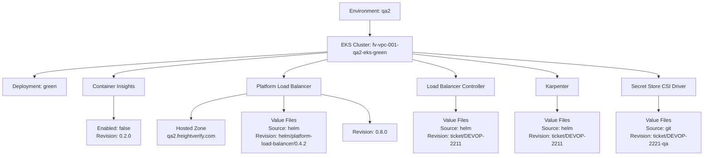
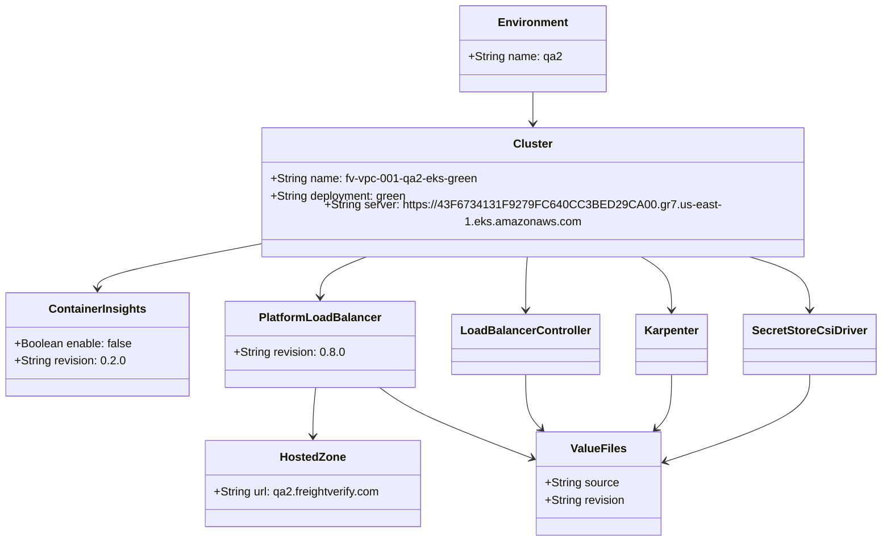
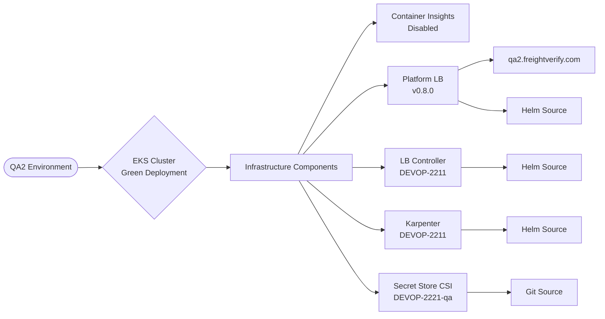

# Diagram: devops/k8s/argocd/app-manager/helm/values.qa2.yaml

> Auto-generated by Obscura crawlers

## Diagram 1

### SVG

<svg id="container" width="2154.53125" xmlns="http://www.w3.org/2000/svg" class="flowchart" height="478" viewBox="0 0 2154.53125 478" role="graphics-document document" aria-roledescription="flowchart-v2"><g><marker id="container_flowchart-v2-pointEnd" class="marker flowchart-v2" viewBox="0 0 10 10" refX="5" refY="5" markerUnits="userSpaceOnUse" markerWidth="8" markerHeight="8" orient="auto"><path d="M 0 0 L 10 5 L 0 10 z" class="arrowMarkerPath" style="stroke-width: 1; stroke-dasharray: 1, 0;"></path></marker><marker id="container_flowchart-v2-pointStart" class="marker flowchart-v2" viewBox="0 0 10 10" refX="4.5" refY="5" markerUnits="userSpaceOnUse" markerWidth="8" markerHeight="8" orient="auto"><path d="M 0 5 L 10 10 L 10 0 z" class="arrowMarkerPath" style="stroke-width: 1; stroke-dasharray: 1, 0;"></path></marker><marker id="container_flowchart-v2-circleEnd" class="marker flowchart-v2" viewBox="0 0 10 10" refX="11" refY="5" markerUnits="userSpaceOnUse" markerWidth="11" markerHeight="11" orient="auto"><circle cx="5" cy="5" r="5" class="arrowMarkerPath" style="stroke-width: 1; stroke-dasharray: 1, 0;"></circle></marker><marker id="container_flowchart-v2-circleStart" class="marker flowchart-v2" viewBox="0 0 10 10" refX="-1" refY="5" markerUnits="userSpaceOnUse" markerWidth="11" markerHeight="11" orient="auto"><circle cx="5" cy="5" r="5" class="arrowMarkerPath" style="stroke-width: 1; stroke-dasharray: 1, 0;"></circle></marker><marker id="container_flowchart-v2-crossEnd" class="marker cross flowchart-v2" viewBox="0 0 11 11" refX="12" refY="5.2" markerUnits="userSpaceOnUse" markerWidth="11" markerHeight="11" orient="auto"><path d="M 1,1 l 9,9 M 10,1 l -9,9" class="arrowMarkerPath" style="stroke-width: 2; stroke-dasharray: 1, 0;"></path></marker><marker id="container_flowchart-v2-crossStart" class="marker cross flowchart-v2" viewBox="0 0 11 11" refX="-1" refY="5.2" markerUnits="userSpaceOnUse" markerWidth="11" markerHeight="11" orient="auto"><path d="M 1,1 l 9,9 M 10,1 l -9,9" class="arrowMarkerPath" style="stroke-width: 2; stroke-dasharray: 1, 0;"></path></marker><g class="root"><g class="clusters"></g><g class="edgePaths"><path d="M1134.914,62L1134.914,66.167C1134.914,70.333,1134.914,78.667,1134.914,86.333C1134.914,94,1134.914,101,1134.914,104.5L1134.914,108" id="L_ENV_CLUSTER_0" class="edge-thickness-normal edge-pattern-solid edge-thickness-normal edge-pattern-solid flowchart-link" style=";" data-edge="true" data-et="edge" data-id="L_ENV_CLUSTER_0" data-points="W3sieCI6MTEzNC45MTQwNjI1LCJ5Ijo2Mn0seyJ4IjoxMTM0LjkxNDA2MjUsInkiOjg3fSx7IngiOjExMzQuOTE0MDYyNSwieSI6MTEyfV0=" marker-end="url(#container_flowchart-v2-pointEnd)"></path><path d="M1004.914,159.09L855.167,168.408C705.419,177.726,405.924,196.363,256.177,209.182C106.43,222,106.43,229,106.43,232.5L106.43,236" id="L_CLUSTER_GREEN_0" class="edge-thickness-normal edge-pattern-solid edge-thickness-normal edge-pattern-solid flowchart-link" style=";" data-edge="true" data-et="edge" data-id="L_CLUSTER_GREEN_0" data-points="W3sieCI6MTAwNC45MTQwNjI1LCJ5IjoxNTkuMDg5NTczNTUzMzE3MjJ9LHsieCI6MTA2LjQyOTY4NzUsInkiOjIxNX0seyJ4IjoxMDYuNDI5Njg3NSwieSI6MjQwfV0=" marker-end="url(#container_flowchart-v2-pointEnd)"></path><path d="M1004.914,161.61L895.887,170.508C786.859,179.407,568.805,197.203,459.777,209.602C350.75,222,350.75,229,350.75,232.5L350.75,236" id="L_CLUSTER_CI_0" class="edge-thickness-normal edge-pattern-solid edge-thickness-normal edge-pattern-solid flowchart-link" style=";" data-edge="true" data-et="edge" data-id="L_CLUSTER_CI_0" data-points="W3sieCI6MTAwNC45MTQwNjI1LCJ5IjoxNjEuNjEwMDI0NjA4MjExMzh9LHsieCI6MzUwLjc1LCJ5IjoyMTV9LHsieCI6MzUwLjc1LCJ5IjoyNDB9XQ==" marker-end="url(#container_flowchart-v2-pointEnd)"></path><path d="M350.75,294L350.75,298.167C350.75,302.333,350.75,310.667,350.75,322.333C350.75,334,350.75,349,350.75,356.5L350.75,364" id="L_CI_CI_STATUS_0" class="edge-thickness-normal edge-pattern-solid edge-thickness-normal edge-pattern-solid flowchart-link" style=";" data-edge="true" data-et="edge" data-id="L_CI_CI_STATUS_0" data-points="W3sieCI6MzUwLjc1LCJ5IjoyOTR9LHsieCI6MzUwLjc1LCJ5IjozMTl9LHsieCI6MzUwLjc1LCJ5IjozNjh9XQ==" marker-end="url(#container_flowchart-v2-pointEnd)"></path><path d="M1004.914,182.802L982.978,188.168C961.042,193.535,917.169,204.267,895.233,213.134C873.297,222,873.297,229,873.297,232.5L873.297,236" id="L_CLUSTER_PLB_0" class="edge-thickness-normal edge-pattern-solid edge-thickness-normal edge-pattern-solid flowchart-link" style=";" data-edge="true" data-et="edge" data-id="L_CLUSTER_PLB_0" data-points="W3sieCI6MTAwNC45MTQwNjI1LCJ5IjoxODIuODAyMTkxODk1MzYyMzd9LHsieCI6ODczLjI5Njg3NSwieSI6MjE1fSx7IngiOjg3My4yOTY4NzUsInkiOjI0MH1d" marker-end="url(#container_flowchart-v2-pointEnd)"></path><path d="M758.617,287.874L730.116,293.061C701.615,298.249,644.612,308.625,616.111,321.312C587.609,334,587.609,349,587.609,356.5L587.609,364" id="L_PLB_HZ_0" class="edge-thickness-normal edge-pattern-solid edge-thickness-normal edge-pattern-solid flowchart-link" style=";" data-edge="true" data-et="edge" data-id="L_PLB_HZ_0" data-points="W3sieCI6NzU4LjYxNzE4NzUsInkiOjI4Ny44NzM2NjAwMzA2Mjc5fSx7IngiOjU4Ny42MDkzNzUsInkiOjMxOX0seyJ4Ijo1ODcuNjA5Mzc1LCJ5IjozNjh9XQ==" marker-end="url(#container_flowchart-v2-pointEnd)"></path><path d="M873.297,294L873.297,298.167C873.297,302.333,873.297,310.667,873.297,318.333C873.297,326,873.297,333,873.297,336.5L873.297,340" id="L_PLB_PLB_VF_0" class="edge-thickness-normal edge-pattern-solid edge-thickness-normal edge-pattern-solid flowchart-link" style=";" data-edge="true" data-et="edge" data-id="L_PLB_PLB_VF_0" data-points="W3sieCI6ODczLjI5Njg3NSwieSI6Mjk0fSx7IngiOjg3My4yOTY4NzUsInkiOjMxOX0seyJ4Ijo4NzMuMjk2ODc1LCJ5IjozNDR9XQ==" marker-end="url(#container_flowchart-v2-pointEnd)"></path><path d="M987.977,289.794L1012.466,294.662C1036.956,299.529,1085.935,309.265,1110.424,323.632C1134.914,338,1134.914,357,1134.914,366.5L1134.914,376" id="L_PLB_PLB_REV_0" class="edge-thickness-normal edge-pattern-solid edge-thickness-normal edge-pattern-solid flowchart-link" style=";" data-edge="true" data-et="edge" data-id="L_PLB_PLB_REV_0" data-points="W3sieCI6OTg3Ljk3NjU2MjUsInkiOjI4OS43OTQxNTg5MjczNDQ5NH0seyJ4IjoxMTM0LjkxNDA2MjUsInkiOjMxOX0seyJ4IjoxMTM0LjkxNDA2MjUsInkiOjM4MH1d" marker-end="url(#container_flowchart-v2-pointEnd)"></path><path d="M1264.914,182.802L1286.85,188.168C1308.786,193.535,1352.659,204.267,1374.595,213.134C1396.531,222,1396.531,229,1396.531,232.5L1396.531,236" id="L_CLUSTER_LBC_0" class="edge-thickness-normal edge-pattern-solid edge-thickness-normal edge-pattern-solid flowchart-link" style=";" data-edge="true" data-et="edge" data-id="L_CLUSTER_LBC_0" data-points="W3sieCI6MTI2NC45MTQwNjI1LCJ5IjoxODIuODAyMTkxODk1MzYyMzd9LHsieCI6MTM5Ni41MzEyNSwieSI6MjE1fSx7IngiOjEzOTYuNTMxMjUsInkiOjI0MH1d" marker-end="url(#container_flowchart-v2-pointEnd)"></path><path d="M1396.531,294L1396.531,298.167C1396.531,302.333,1396.531,310.667,1396.531,318.333C1396.531,326,1396.531,333,1396.531,336.5L1396.531,340" id="L_LBC_LBC_VF_0" class="edge-thickness-normal edge-pattern-solid edge-thickness-normal edge-pattern-solid flowchart-link" style=";" data-edge="true" data-et="edge" data-id="L_LBC_LBC_VF_0" data-points="W3sieCI6MTM5Ni41MzEyNSwieSI6Mjk0fSx7IngiOjEzOTYuNTMxMjUsInkiOjMxOX0seyJ4IjoxMzk2LjUzMTI1LCJ5IjozNDR9XQ==" marker-end="url(#container_flowchart-v2-pointEnd)"></path><path d="M1264.914,165.555L1338.517,173.796C1412.12,182.037,1559.326,198.518,1632.928,210.259C1706.531,222,1706.531,229,1706.531,232.5L1706.531,236" id="L_CLUSTER_KARP_0" class="edge-thickness-normal edge-pattern-solid edge-thickness-normal edge-pattern-solid flowchart-link" style=";" data-edge="true" data-et="edge" data-id="L_CLUSTER_KARP_0" data-points="W3sieCI6MTI2NC45MTQwNjI1LCJ5IjoxNjUuNTU1MTk1NjQ4MzExMzh9LHsieCI6MTcwNi41MzEyNSwieSI6MjE1fSx7IngiOjE3MDYuNTMxMjUsInkiOjI0MH1d" marker-end="url(#container_flowchart-v2-pointEnd)"></path><path d="M1706.531,294L1706.531,298.167C1706.531,302.333,1706.531,310.667,1706.531,318.333C1706.531,326,1706.531,333,1706.531,336.5L1706.531,340" id="L_KARP_KARP_VF_0" class="edge-thickness-normal edge-pattern-solid edge-thickness-normal edge-pattern-solid flowchart-link" style=";" data-edge="true" data-et="edge" data-id="L_KARP_KARP_VF_0" data-points="W3sieCI6MTcwNi41MzEyNSwieSI6Mjk0fSx7IngiOjE3MDYuNTMxMjUsInkiOjMxOX0seyJ4IjoxNzA2LjUzMTI1LCJ5IjozNDR9XQ==" marker-end="url(#container_flowchart-v2-pointEnd)"></path><path d="M1264.914,160.437L1390.184,169.531C1515.453,178.625,1765.992,196.812,1891.262,209.406C2016.531,222,2016.531,229,2016.531,232.5L2016.531,236" id="L_CLUSTER_SCSI_0" class="edge-thickness-normal edge-pattern-solid edge-thickness-normal edge-pattern-solid flowchart-link" style=";" data-edge="true" data-et="edge" data-id="L_CLUSTER_SCSI_0" data-points="W3sieCI6MTI2NC45MTQwNjI1LCJ5IjoxNjAuNDM3MjAyNTg0MDI5N30seyJ4IjoyMDE2LjUzMTI1LCJ5IjoyMTV9LHsieCI6MjAxNi41MzEyNSwieSI6MjQwfV0=" marker-end="url(#container_flowchart-v2-pointEnd)"></path><path d="M2016.531,294L2016.531,298.167C2016.531,302.333,2016.531,310.667,2016.531,318.333C2016.531,326,2016.531,333,2016.531,336.5L2016.531,340" id="L_SCSI_SCSI_VF_0" class="edge-thickness-normal edge-pattern-solid edge-thickness-normal edge-pattern-solid flowchart-link" style=";" data-edge="true" data-et="edge" data-id="L_SCSI_SCSI_VF_0" data-points="W3sieCI6MjAxNi41MzEyNSwieSI6Mjk0fSx7IngiOjIwMTYuNTMxMjUsInkiOjMxOX0seyJ4IjoyMDE2LjUzMTI1LCJ5IjozNDR9XQ==" marker-end="url(#container_flowchart-v2-pointEnd)"></path></g><g class="edgeLabels"><g class="edgeLabel"><g class="label" data-id="L_ENV_CLUSTER_0" transform="translate(0, 0)"><foreignObject width="0" height="0">

</foreignObject></g></g><g class="edgeLabel"><g class="label" data-id="L_CLUSTER_GREEN_0" transform="translate(0, 0)"><foreignObject width="0" height="0">

</foreignObject></g></g><g class="edgeLabel"><g class="label" data-id="L_CLUSTER_CI_0" transform="translate(0, 0)"><foreignObject width="0" height="0">

</foreignObject></g></g><g class="edgeLabel"><g class="label" data-id="L_CI_CI_STATUS_0" transform="translate(0, 0)"><foreignObject width="0" height="0">

</foreignObject></g></g><g class="edgeLabel"><g class="label" data-id="L_CLUSTER_PLB_0" transform="translate(0, 0)"><foreignObject width="0" height="0">

</foreignObject></g></g><g class="edgeLabel"><g class="label" data-id="L_PLB_HZ_0" transform="translate(0, 0)"><foreignObject width="0" height="0">

</foreignObject></g></g><g class="edgeLabel"><g class="label" data-id="L_PLB_PLB_VF_0" transform="translate(0, 0)"><foreignObject width="0" height="0">

</foreignObject></g></g><g class="edgeLabel"><g class="label" data-id="L_PLB_PLB_REV_0" transform="translate(0, 0)"><foreignObject width="0" height="0">

</foreignObject></g></g><g class="edgeLabel"><g class="label" data-id="L_CLUSTER_LBC_0" transform="translate(0, 0)"><foreignObject width="0" height="0">

</foreignObject></g></g><g class="edgeLabel"><g class="label" data-id="L_LBC_LBC_VF_0" transform="translate(0, 0)"><foreignObject width="0" height="0">

</foreignObject></g></g><g class="edgeLabel"><g class="label" data-id="L_CLUSTER_KARP_0" transform="translate(0, 0)"><foreignObject width="0" height="0">

</foreignObject></g></g><g class="edgeLabel"><g class="label" data-id="L_KARP_KARP_VF_0" transform="translate(0, 0)"><foreignObject width="0" height="0">

</foreignObject></g></g><g class="edgeLabel"><g class="label" data-id="L_CLUSTER_SCSI_0" transform="translate(0, 0)"><foreignObject width="0" height="0">

</foreignObject></g></g><g class="edgeLabel"><g class="label" data-id="L_SCSI_SCSI_VF_0" transform="translate(0, 0)"><foreignObject width="0" height="0">

</foreignObject></g></g></g><g class="nodes"><g class="node default" id="flowchart-ENV-0" transform="translate(1134.9140625, 35)"><rect class="basic label-container" style="" x="-93.1953125" y="-27" width="186.390625" height="54"></rect><g class="label" style="" transform="translate(-63.1953125, -12)"><rect></rect><foreignObject width="126.390625" height="24">

Environment: qa2

</foreignObject></g></g><g class="node default" id="flowchart-CLUSTER-1" transform="translate(1134.9140625, 151)"><rect class="basic label-container" style="" x="-130" y="-39" width="260" height="78"></rect><g class="label" style="" transform="translate(-100, -24)"><rect></rect><foreignObject width="200" height="48">

EKS Cluster: fv-vpc-001-qa2-eks-green

</foreignObject></g></g><g class="node default" id="flowchart-GREEN-2" transform="translate(106.4296875, 267)"><rect class="basic label-container" style="" x="-98.4296875" y="-27" width="196.859375" height="54"></rect><g class="label" style="" transform="translate(-68.4296875, -12)"><rect></rect><foreignObject width="136.859375" height="24">

Deployment: green

</foreignObject></g></g><g class="node default" id="flowchart-CI-8" transform="translate(350.75, 267)"><rect class="basic label-container" style="" x="-95.890625" y="-27" width="191.78125" height="54"></rect><g class="label" style="" transform="translate(-65.890625, -12)"><rect></rect><foreignObject width="131.78125" height="24">

Container Insights

</foreignObject></g></g><g class="node default" id="flowchart-CI_STATUS-10" transform="translate(350.75, 407)"><rect class="basic label-container" style="" x="-81.171875" y="-39" width="162.34375" height="78"></rect><g class="label" style="" transform="translate(-51.171875, -24)"><rect></rect><foreignObject width="102.34375" height="48">

Enabled: false Revision: 0.2.0

</foreignObject></g></g><g class="node default" id="flowchart-PLB-12" transform="translate(873.296875, 267)"><rect class="basic label-container" style="" x="-114.6796875" y="-27" width="229.359375" height="54"></rect><g class="label" style="" transform="translate(-84.6796875, -12)"><rect></rect><foreignObject width="169.359375" height="24">

Platform Load Balancer

</foreignObject></g></g><g class="node default" id="flowchart-HZ-14" transform="translate(587.609375, 407)"><rect class="basic label-container" style="" x="-105.6875" y="-39" width="211.375" height="78"></rect><g class="label" style="" transform="translate(-75.6875, -24)"><rect></rect><foreignObject width="151.375" height="48">

Hosted Zone qa2.freightverify.com

</foreignObject></g></g><g class="node default" id="flowchart-PLB_VF-16" transform="translate(873.296875, 407)"><rect class="basic label-container" style="" x="-130" y="-63" width="260" height="126"></rect><g class="label" style="" transform="translate(-100, -48)"><rect></rect><foreignObject width="200" height="96">

Value Files Source: helm Revision: helm/platform-load-balancer/0.4.2

</foreignObject></g></g><g class="node default" id="flowchart-PLB_REV-18" transform="translate(1134.9140625, 407)"><rect class="basic label-container" style="" x="-81.6171875" y="-27" width="163.234375" height="54"></rect><g class="label" style="" transform="translate(-51.6171875, -12)"><rect></rect><foreignObject width="103.234375" height="24">

Revision: 0.8.0

</foreignObject></g></g><g class="node default" id="flowchart-LBC-20" transform="translate(1396.53125, 267)"><rect class="basic label-container" style="" x="-119.53125" y="-27" width="239.0625" height="54"></rect><g class="label" style="" transform="translate(-89.53125, -12)"><rect></rect><foreignObject width="179.0625" height="24">

Load Balancer Controller

</foreignObject></g></g><g class="node default" id="flowchart-LBC_VF-22" transform="translate(1396.53125, 407)"><rect class="basic label-container" style="" x="-130" y="-63" width="260" height="126"></rect><g class="label" style="" transform="translate(-100, -48)"><rect></rect><foreignObject width="200" height="96">

Value Files Source: helm Revision: ticket/DEVOP-2211

</foreignObject></g></g><g class="node default" id="flowchart-KARP-24" transform="translate(1706.53125, 267)"><rect class="basic label-container" style="" x="-66.1171875" y="-27" width="132.234375" height="54"></rect><g class="label" style="" transform="translate(-36.1171875, -12)"><rect></rect><foreignObject width="72.234375" height="24">

Karpenter

</foreignObject></g></g><g class="node default" id="flowchart-KARP_VF-26" transform="translate(1706.53125, 407)"><rect class="basic label-container" style="" x="-130" y="-63" width="260" height="126"></rect><g class="label" style="" transform="translate(-100, -48)"><rect></rect><foreignObject width="200" height="96">

Value Files Source: helm Revision: ticket/DEVOP-2211

</foreignObject></g></g><g class="node default" id="flowchart-SCSI-28" transform="translate(2016.53125, 267)"><rect class="basic label-container" style="" x="-110.9765625" y="-27" width="221.953125" height="54"></rect><g class="label" style="" transform="translate(-80.9765625, -12)"><rect></rect><foreignObject width="161.953125" height="24">

Secret Store CSI Driver

</foreignObject></g></g><g class="node default" id="flowchart-SCSI_VF-30" transform="translate(2016.53125, 407)"><rect class="basic label-container" style="" x="-130" y="-63" width="260" height="126"></rect><g class="label" style="" transform="translate(-100, -48)"><rect></rect><foreignObject width="200" height="96">

Value Files Source: git Revision: ticket/DEVOP-2221-qa

</foreignObject></g></g></g></g></g></svg>

## Diagram 2

### SVG

<svg id="container" width="1203.1015625" xmlns="http://www.w3.org/2000/svg" class="classDiagram" height="742" viewBox="0 0 1203.1015625 742" role="graphics-document document" aria-roledescription="class"><g><defs><marker id="container_class-aggregationStart" class="marker aggregation class" refX="18" refY="7" markerWidth="190" markerHeight="240" orient="auto"><path d="M 18,7 L9,13 L1,7 L9,1 Z"></path></marker></defs><defs><marker id="container_class-aggregationEnd" class="marker aggregation class" refX="1" refY="7" markerWidth="20" markerHeight="28" orient="auto"><path d="M 18,7 L9,13 L1,7 L9,1 Z"></path></marker></defs><defs><marker id="container_class-extensionStart" class="marker extension class" refX="18" refY="7" markerWidth="190" markerHeight="240" orient="auto"><path d="M 1,7 L18,13 V 1 Z"></path></marker></defs><defs><marker id="container_class-extensionEnd" class="marker extension class" refX="1" refY="7" markerWidth="20" markerHeight="28" orient="auto"><path d="M 1,1 V 13 L18,7 Z"></path></marker></defs><defs><marker id="container_class-compositionStart" class="marker composition class" refX="18" refY="7" markerWidth="190" markerHeight="240" orient="auto"><path d="M 18,7 L9,13 L1,7 L9,1 Z"></path></marker></defs><defs><marker id="container_class-compositionEnd" class="marker composition class" refX="1" refY="7" markerWidth="20" markerHeight="28" orient="auto"><path d="M 18,7 L9,13 L1,7 L9,1 Z"></path></marker></defs><defs><marker id="container_class-dependencyStart" class="marker dependency class" refX="6" refY="7" markerWidth="190" markerHeight="240" orient="auto"><path d="M 5,7 L9,13 L1,7 L9,1 Z"></path></marker></defs><defs><marker id="container_class-dependencyEnd" class="marker dependency class" refX="13" refY="7" markerWidth="20" markerHeight="28" orient="auto"><path d="M 18,7 L9,13 L14,7 L9,1 Z"></path></marker></defs><defs><marker id="container_class-lollipopStart" class="marker lollipop class" refX="13" refY="7" markerWidth="190" markerHeight="240" orient="auto"><circle stroke="black" fill="transparent" cx="7" cy="7" r="6"></circle></marker></defs><defs><marker id="container_class-lollipopEnd" class="marker lollipop class" refX="1" refY="7" markerWidth="190" markerHeight="240" orient="auto"><circle stroke="black" fill="transparent" cx="7" cy="7" r="6"></circle></marker></defs><g class="root"><g class="clusters"></g><g class="edgePaths"><path d="M733.094,128L733.094,132.167C733.094,136.333,733.094,144.667,733.094,152C733.094,159.333,733.094,165.667,733.094,168.833L733.094,172" id="id_Environment_Cluster_1" class="edge-thickness-normal edge-pattern-solid relation" style=";;;" data-edge="true" data-et="edge" data-id="id_Environment_Cluster_1" data-points="W3sieCI6NzMzLjA5Mzc1LCJ5IjoxMjh9LHsieCI6NzMzLjA5Mzc1LCJ5IjoxNTN9LHsieCI6NzMzLjA5Mzc1LCJ5IjoxNzh9XQ==" marker-end="url(#container_class-dependencyEnd)"></path><path d="M373.969,327.378L334.033,334.648C294.096,341.919,214.224,356.459,174.288,366.896C134.352,377.333,134.352,383.667,134.352,386.833L134.352,390" id="id_Cluster_ContainerInsights_2" class="edge-thickness-normal edge-pattern-solid relation" style=";;;" data-edge="true" data-et="edge" data-id="id_Cluster_ContainerInsights_2" data-points="W3sieCI6MzczLjk2ODc1LCJ5IjozMjcuMzc4MDk3MzEzMzc4M30seyJ4IjoxMzQuMzUxNTYyNSwieSI6MzcxfSx7IngiOjEzNC4zNTE1NjI1LCJ5IjozOTZ9XQ==" marker-end="url(#container_class-dependencyEnd)"></path><path d="M507.551,346L496.364,350.167C485.176,354.333,462.801,362.667,451.613,372C440.426,381.333,440.426,391.667,440.426,396.833L440.426,402" id="id_Cluster_PlatformLoadBalancer_3" class="edge-thickness-normal edge-pattern-solid relation" style=";;;" data-edge="true" data-et="edge" data-id="id_Cluster_PlatformLoadBalancer_3" data-points="W3sieCI6NTA3LjU1MTQ2MjE1NTk2MzMsInkiOjM0Nn0seyJ4Ijo0NDAuNDI1NzgxMjUsInkiOjM3MX0seyJ4Ijo0NDAuNDI1NzgxMjUsInkiOjQwOH1d" marker-end="url(#container_class-dependencyEnd)"></path><path d="M725.387,346L725.005,350.167C724.623,354.333,723.858,362.667,723.476,375C723.094,387.333,723.094,403.667,723.094,411.833L723.094,420" id="id_Cluster_LoadBalancerController_4" class="edge-thickness-normal edge-pattern-solid relation" style=";;;" data-edge="true" data-et="edge" data-id="id_Cluster_LoadBalancerController_4" data-points="W3sieCI6NzI1LjM4NzMyNzk4MTY1MTQsInkiOjM0Nn0seyJ4Ijo3MjMuMDkzNzUsInkiOjM3MX0seyJ4Ijo3MjMuMDkzNzUsInkiOjQyNn1d" marker-end="url(#container_class-dependencyEnd)"></path><path d="M877.445,346L884.605,350.167C891.765,354.333,906.086,362.667,913.246,375C920.406,387.333,920.406,403.667,920.406,411.833L920.406,420" id="id_Cluster_Karpenter_5" class="edge-thickness-normal edge-pattern-solid relation" style=";;;" data-edge="true" data-et="edge" data-id="id_Cluster_Karpenter_5" data-points="W3sieCI6ODc3LjQ0NDY2NzQzMTE5MjcsInkiOjM0Nn0seyJ4Ijo5MjAuNDA2MjUsInkiOjM3MX0seyJ4Ijo5MjAuNDA2MjUsInkiOjQyNn1d" marker-end="url(#container_class-dependencyEnd)"></path><path d="M1021.422,346L1035.724,350.167C1050.026,354.333,1078.63,362.667,1092.932,375C1107.234,387.333,1107.234,403.667,1107.234,411.833L1107.234,420" id="id_Cluster_SecretStoreCsiDriver_6" class="edge-thickness-normal edge-pattern-solid relation" style=";;;" data-edge="true" data-et="edge" data-id="id_Cluster_SecretStoreCsiDriver_6" data-points="W3sieCI6MTAyMS40MjIzMDUwNDU4NzE2LCJ5IjozNDZ9LHsieCI6MTEwNy4yMzQzNzUsInkiOjM3MX0seyJ4IjoxMTA3LjIzNDM3NSwieSI6NDI2fV0=" marker-end="url(#container_class-dependencyEnd)"></path><path d="M434.24,528L433.604,534.167C432.969,540.333,431.697,552.667,431.062,564C430.426,575.333,430.426,585.667,430.426,590.833L430.426,596" id="id_PlatformLoadBalancer_HostedZone_7" class="edge-thickness-normal edge-pattern-solid relation" style=";;;" data-edge="true" data-et="edge" data-id="id_PlatformLoadBalancer_HostedZone_7" data-points="W3sieCI6NDM0LjI0MDIxNDIzOTY5MDcsInkiOjUyOH0seyJ4Ijo0MzAuNDI1NzgxMjUsInkiOjU2NX0seyJ4Ijo0MzAuNDI1NzgxMjUsInkiOjYwMn1d" marker-end="url(#container_class-dependencyEnd)"></path><path d="M523.084,528L531.579,534.167C540.075,540.333,557.066,552.667,591.549,569.011C626.032,585.354,678.008,605.709,703.996,615.886L729.983,626.063" id="id_PlatformLoadBalancer_ValueFiles_8" class="edge-thickness-normal edge-pattern-solid relation" style=";;;" data-edge="true" data-et="edge" data-id="id_PlatformLoadBalancer_ValueFiles_8" data-points="W3sieCI6NTIzLjA4NDA0NDc4MDkyNzgsInkiOjUyOH0seyJ4Ijo1NzQuMDU2NjQwNjI1LCJ5Ijo1NjV9LHsieCI6NzM1LjU3MDMxMjUsInkiOjYyOC4yNTA4OTMwMDQ5OTEzfV0=" marker-end="url(#container_class-dependencyEnd)"></path><path d="M723.094,510L723.094,519.167C723.094,528.333,723.094,546.667,726.618,559.299C730.143,571.931,737.193,578.862,740.717,582.328L744.242,585.793" id="id_LoadBalancerController_ValueFiles_9" class="edge-thickness-normal edge-pattern-solid relation" style=";;;" data-edge="true" data-et="edge" data-id="id_LoadBalancerController_ValueFiles_9" data-points="W3sieCI6NzIzLjA5Mzc1LCJ5Ijo1MTB9LHsieCI6NzIzLjA5Mzc1LCJ5Ijo1NjV9LHsieCI6NzQ4LjUyMDYxODU1NjcwMSwieSI6NTkwfV0=" marker-end="url(#container_class-dependencyEnd)"></path><path d="M920.406,510L920.406,519.167C920.406,528.333,920.406,546.667,916.882,559.299C913.357,571.931,906.307,578.862,902.783,582.328L899.258,585.793" id="id_Karpenter_ValueFiles_10" class="edge-thickness-normal edge-pattern-solid relation" style=";;;" data-edge="true" data-et="edge" data-id="id_Karpenter_ValueFiles_10" data-points="W3sieCI6OTIwLjQwNjI1LCJ5Ijo1MTB9LHsieCI6OTIwLjQwNjI1LCJ5Ijo1NjV9LHsieCI6ODk0Ljk3OTM4MTQ0MzI5OSwieSI6NTkwfV0=" marker-end="url(#container_class-dependencyEnd)"></path><path d="M1107.234,510L1107.234,519.167C1107.234,528.333,1107.234,546.667,1074.964,566.798C1042.693,586.929,978.152,608.859,945.881,619.823L913.611,630.788" id="id_SecretStoreCsiDriver_ValueFiles_11" class="edge-thickness-normal edge-pattern-solid relation" style=";;;" data-edge="true" data-et="edge" data-id="id_SecretStoreCsiDriver_ValueFiles_11" data-points="W3sieCI6MTEwNy4yMzQzNzUsInkiOjUxMH0seyJ4IjoxMTA3LjIzNDM3NSwieSI6NTY1fSx7IngiOjkwNy45Mjk2ODc1LCJ5Ijo2MzIuNzE4NDMzNTgzMjc0MX1d" marker-end="url(#container_class-dependencyEnd)"></path></g><g class="edgeLabels"><g class="edgeLabel"><g class="label" data-id="id_Environment_Cluster_1" transform="translate(0, 0)"><foreignObject width="0" height="0">

</foreignObject></g></g><g class="edgeLabel"><g class="label" data-id="id_Cluster_ContainerInsights_2" transform="translate(0, 0)"><foreignObject width="0" height="0">

</foreignObject></g></g><g class="edgeLabel"><g class="label" data-id="id_Cluster_PlatformLoadBalancer_3" transform="translate(0, 0)"><foreignObject width="0" height="0">

</foreignObject></g></g><g class="edgeLabel"><g class="label" data-id="id_Cluster_LoadBalancerController_4" transform="translate(0, 0)"><foreignObject width="0" height="0">

</foreignObject></g></g><g class="edgeLabel"><g class="label" data-id="id_Cluster_Karpenter_5" transform="translate(0, 0)"><foreignObject width="0" height="0">

</foreignObject></g></g><g class="edgeLabel"><g class="label" data-id="id_Cluster_SecretStoreCsiDriver_6" transform="translate(0, 0)"><foreignObject width="0" height="0">

</foreignObject></g></g><g class="edgeLabel"><g class="label" data-id="id_PlatformLoadBalancer_HostedZone_7" transform="translate(0, 0)"><foreignObject width="0" height="0">

</foreignObject></g></g><g class="edgeLabel"><g class="label" data-id="id_PlatformLoadBalancer_ValueFiles_8" transform="translate(0, 0)"><foreignObject width="0" height="0">

</foreignObject></g></g><g class="edgeLabel"><g class="label" data-id="id_LoadBalancerController_ValueFiles_9" transform="translate(0, 0)"><foreignObject width="0" height="0">

</foreignObject></g></g><g class="edgeLabel"><g class="label" data-id="id_Karpenter_ValueFiles_10" transform="translate(0, 0)"><foreignObject width="0" height="0">

</foreignObject></g></g><g class="edgeLabel"><g class="label" data-id="id_SecretStoreCsiDriver_ValueFiles_11" transform="translate(0, 0)"><foreignObject width="0" height="0">

</foreignObject></g></g></g><g class="nodes"><g class="node default" id="classId-Environment-0" transform="translate(733.09375, 68)"><g class="basic label-container"><path d="M-99.72265625 -60 L99.72265625 -60 L99.72265625 60 L-99.72265625 60" stroke="none" stroke-width="0" fill="#ECECFF" style=""></path><path d="M-99.72265625 -60 C-25.954232283417255 -60, 47.81419168316549 -60, 99.72265625 -60 M-99.72265625 -60 C-54.0013399679397 -60, -8.2800236858794 -60, 99.72265625 -60 M99.72265625 -60 C99.72265625 -33.85863769916628, 99.72265625 -7.7172753983325535, 99.72265625 60 M99.72265625 -60 C99.72265625 -21.565626706098072, 99.72265625 16.868746587803855, 99.72265625 60 M99.72265625 60 C29.288726405626903 60, -41.145203438746194 60, -99.72265625 60 M99.72265625 60 C24.577540569395026 60, -50.56757511120995 60, -99.72265625 60 M-99.72265625 60 C-99.72265625 18.0693760401985, -99.72265625 -23.861247919603002, -99.72265625 -60 M-99.72265625 60 C-99.72265625 34.340468113102496, -99.72265625 8.680936226204992, -99.72265625 -60" stroke="#9370DB" stroke-width="1.3" fill="none" stroke-dasharray="0 0" style=""></path></g><g class="annotation-group text" transform="translate(0, -36)"></g><g class="label-group text" transform="translate(-46.1953125, -36)"><g class="label" style="font-weight: bolder" transform="translate(0,-12)"><foreignObject width="92.390625" height="24">

Environment

</foreignObject></g></g><g class="members-group text" transform="translate(-87.72265625, 12)"><g class="label" style="" transform="translate(0,-12)"><foreignObject width="129.25" height="24">

+String name: qa2

</foreignObject></g></g><g class="methods-group text" transform="translate(-87.72265625, 60)"></g><g class="divider" style=""><path d="M-99.72265625 -12 C-24.592681926233823 -12, 50.537292397532354 -12, 99.72265625 -12 M-99.72265625 -12 C-43.42196692487788 -12, 12.878722400244243 -12, 99.72265625 -12" stroke="#9370DB" stroke-width="1.3" fill="none" stroke-dasharray="0 0" style=""></path></g><g class="divider" style=""><path d="M-99.72265625 36 C-48.797163822734476 36, 2.128328604531049 36, 99.72265625 36 M-99.72265625 36 C-54.310838031742726 36, -8.899019813485452 36, 99.72265625 36" stroke="#9370DB" stroke-width="1.3" fill="none" stroke-dasharray="0 0" style=""></path></g></g><g class="node default" id="classId-Cluster-1" transform="translate(733.09375, 262)"><g class="basic label-container"><path d="M-359.125 -84 L359.125 -84 L359.125 84 L-359.125 84" stroke="none" stroke-width="0" fill="#ECECFF" style=""></path><path d="M-359.125 -84 C-93.49144356917083 -84, 172.14211286165835 -84, 359.125 -84 M-359.125 -84 C-195.83144333928635 -84, -32.537886678572704 -84, 359.125 -84 M359.125 -84 C359.125 -22.862488196892308, 359.125 38.275023606215385, 359.125 84 M359.125 -84 C359.125 -40.5001463104141, 359.125 2.999707379171795, 359.125 84 M359.125 84 C111.03045687104245 84, -137.0640862579151 84, -359.125 84 M359.125 84 C213.78318566256712 84, 68.44137132513424 84, -359.125 84 M-359.125 84 C-359.125 21.063981744169666, -359.125 -41.87203651166067, -359.125 -84 M-359.125 84 C-359.125 41.113359447683145, -359.125 -1.7732811046337105, -359.125 -84" stroke="#9370DB" stroke-width="1.3" fill="none" stroke-dasharray="0 0" style=""></path></g><g class="annotation-group text" transform="translate(0, -60)"></g><g class="label-group text" transform="translate(-25.90625, -60)"><g class="label" style="font-weight: bolder" transform="translate(0,-12)"><foreignObject width="51.8125" height="24">

Cluster

</foreignObject></g></g><g class="members-group text" transform="translate(-347.125, -12)"><g class="label" style="" transform="translate(0,-12)"><foreignObject width="287.6875" height="24">

+String name: fv-vpc-001-qa2-eks-green

</foreignObject></g><g class="label" style="" transform="translate(0,12)"><foreignObject width="190.578125" height="24">

+String deployment: green

</foreignObject></g><g class="label" style="" transform="translate(0,36)"><foreignObject width="668.34375" height="24">

+String server: https://43F6734131F9279FC640CC3BED29CA00.gr7.us-east-1.eks.amazonaws.com

</foreignObject></g></g><g class="methods-group text" transform="translate(-347.125, 84)"></g><g class="divider" style=""><path d="M-359.125 -36 C-108.38483498620957 -36, 142.35533002758086 -36, 359.125 -36 M-359.125 -36 C-146.06874649383383 -36, 66.98750701233234 -36, 359.125 -36" stroke="#9370DB" stroke-width="1.3" fill="none" stroke-dasharray="0 0" style=""></path></g><g class="divider" style=""><path d="M-359.125 60 C-125.53716674221391 60, 108.05066651557217 60, 359.125 60 M-359.125 60 C-142.48834564496255 60, 74.1483087100749 60, 359.125 60" stroke="#9370DB" stroke-width="1.3" fill="none" stroke-dasharray="0 0" style=""></path></g></g><g class="node default" id="classId-ContainerInsights-2" transform="translate(134.3515625, 468)"><g class="basic label-container"><path d="M-126.3515625 -72 L126.3515625 -72 L126.3515625 72 L-126.3515625 72" stroke="none" stroke-width="0" fill="#ECECFF" style=""></path><path d="M-126.3515625 -72 C-75.3122256439525 -72, -24.272888787905018 -72, 126.3515625 -72 M-126.3515625 -72 C-62.89316975900296 -72, 0.5652229819940828 -72, 126.3515625 -72 M126.3515625 -72 C126.3515625 -39.17854069756991, 126.3515625 -6.357081395139815, 126.3515625 72 M126.3515625 -72 C126.3515625 -27.57882356535412, 126.3515625 16.84235286929176, 126.3515625 72 M126.3515625 72 C27.203435758591752 72, -71.9446909828165 72, -126.3515625 72 M126.3515625 72 C51.11373628791871 72, -24.124089924162575 72, -126.3515625 72 M-126.3515625 72 C-126.3515625 17.903665273974433, -126.3515625 -36.192669452051135, -126.3515625 -72 M-126.3515625 72 C-126.3515625 25.561770882932763, -126.3515625 -20.876458234134475, -126.3515625 -72" stroke="#9370DB" stroke-width="1.3" fill="none" stroke-dasharray="0 0" style=""></path></g><g class="annotation-group text" transform="translate(0, -48)"></g><g class="label-group text" transform="translate(-64.65625, -48)"><g class="label" style="font-weight: bolder" transform="translate(0,-12)"><foreignObject width="129.3125" height="24">

ContainerInsights

</foreignObject></g></g><g class="members-group text" transform="translate(-114.3515625, 0)"><g class="label" style="" transform="translate(0,-12)"><foreignObject width="164.046875" height="24">

+Boolean enable: false

</foreignObject></g><g class="label" style="" transform="translate(0,12)"><foreignObject width="153.0625" height="24">

+String revision: 0.2.0

</foreignObject></g></g><g class="methods-group text" transform="translate(-114.3515625, 72)"></g><g class="divider" style=""><path d="M-126.3515625 -24 C-70.98678549332311 -24, -15.622008486646209 -24, 126.3515625 -24 M-126.3515625 -24 C-34.49203336660605 -24, 57.3674957667879 -24, 126.3515625 -24" stroke="#9370DB" stroke-width="1.3" fill="none" stroke-dasharray="0 0" style=""></path></g><g class="divider" style=""><path d="M-126.3515625 48 C-32.75780592152016 48, 60.83595065695968 48, 126.3515625 48 M-126.3515625 48 C-40.66001931525962 48, 45.031523869480765 48, 126.3515625 48" stroke="#9370DB" stroke-width="1.3" fill="none" stroke-dasharray="0 0" style=""></path></g></g><g class="node default" id="classId-PlatformLoadBalancer-3" transform="translate(440.42578125, 468)"><g class="basic label-container"><path d="M-129.72265625 -60 L129.72265625 -60 L129.72265625 60 L-129.72265625 60" stroke="none" stroke-width="0" fill="#ECECFF" style=""></path><path d="M-129.72265625 -60 C-62.63586950178289 -60, 4.450917246434216 -60, 129.72265625 -60 M-129.72265625 -60 C-66.69385794307479 -60, -3.6650596361495644 -60, 129.72265625 -60 M129.72265625 -60 C129.72265625 -25.1835471177912, 129.72265625 9.6329057644176, 129.72265625 60 M129.72265625 -60 C129.72265625 -20.062830579906247, 129.72265625 19.874338840187505, 129.72265625 60 M129.72265625 60 C37.584647354327984 60, -54.55336154134403 60, -129.72265625 60 M129.72265625 60 C43.52556589553484 60, -42.67152445893032 60, -129.72265625 60 M-129.72265625 60 C-129.72265625 25.371816625413565, -129.72265625 -9.25636674917287, -129.72265625 -60 M-129.72265625 60 C-129.72265625 30.179267964115056, -129.72265625 0.35853592823011127, -129.72265625 -60" stroke="#9370DB" stroke-width="1.3" fill="none" stroke-dasharray="0 0" style=""></path></g><g class="annotation-group text" transform="translate(0, -36)"></g><g class="label-group text" transform="translate(-81.4921875, -36)"><g class="label" style="font-weight: bolder" transform="translate(0,-12)"><foreignObject width="162.984375" height="24">

PlatformLoadBalancer

</foreignObject></g></g><g class="members-group text" transform="translate(-117.72265625, 12)"><g class="label" style="" transform="translate(0,-12)"><foreignObject width="153.953125" height="24">

+String revision: 0.8.0

</foreignObject></g></g><g class="methods-group text" transform="translate(-117.72265625, 60)"></g><g class="divider" style=""><path d="M-129.72265625 -12 C-62.8191375668852 -12, 4.0843811162295935 -12, 129.72265625 -12 M-129.72265625 -12 C-36.76710207396138 -12, 56.188452102077235 -12, 129.72265625 -12" stroke="#9370DB" stroke-width="1.3" fill="none" stroke-dasharray="0 0" style=""></path></g><g class="divider" style=""><path d="M-129.72265625 36 C-77.02168479796563 36, -24.32071334593128 36, 129.72265625 36 M-129.72265625 36 C-54.568289769732075 36, 20.58607671053585 36, 129.72265625 36" stroke="#9370DB" stroke-width="1.3" fill="none" stroke-dasharray="0 0" style=""></path></g></g><g class="node default" id="classId-HostedZone-4" transform="translate(430.42578125, 662)"><g class="basic label-container"><path d="M-151.08203125 -60 L151.08203125 -60 L151.08203125 60 L-151.08203125 60" stroke="none" stroke-width="0" fill="#ECECFF" style=""></path><path d="M-151.08203125 -60 C-45.42807480419178 -60, 60.22588164161644 -60, 151.08203125 -60 M-151.08203125 -60 C-78.99691043516846 -60, -6.9117896203369185 -60, 151.08203125 -60 M151.08203125 -60 C151.08203125 -34.2268756965568, 151.08203125 -8.453751393113613, 151.08203125 60 M151.08203125 -60 C151.08203125 -32.577547025457406, 151.08203125 -5.155094050914812, 151.08203125 60 M151.08203125 60 C58.599342190233 60, -33.883346869533995 60, -151.08203125 60 M151.08203125 60 C31.02246573384386 60, -89.03709978231228 60, -151.08203125 60 M-151.08203125 60 C-151.08203125 21.604886315516573, -151.08203125 -16.790227368966853, -151.08203125 -60 M-151.08203125 60 C-151.08203125 12.805632295308975, -151.08203125 -34.38873540938205, -151.08203125 -60" stroke="#9370DB" stroke-width="1.3" fill="none" stroke-dasharray="0 0" style=""></path></g><g class="annotation-group text" transform="translate(0, -36)"></g><g class="label-group text" transform="translate(-43.9140625, -36)"><g class="label" style="font-weight: bolder" transform="translate(0,-12)"><foreignObject width="87.828125" height="24">

HostedZone

</foreignObject></g></g><g class="members-group text" transform="translate(-139.08203125, 12)"><g class="label" style="" transform="translate(0,-12)"><foreignObject width="234.25" height="24">

+String url: qa2.freightverify.com

</foreignObject></g></g><g class="methods-group text" transform="translate(-139.08203125, 60)"></g><g class="divider" style=""><path d="M-151.08203125 -12 C-87.55010842782738 -12, -24.018185605654764 -12, 151.08203125 -12 M-151.08203125 -12 C-33.573172504912165 -12, 83.93568624017567 -12, 151.08203125 -12" stroke="#9370DB" stroke-width="1.3" fill="none" stroke-dasharray="0 0" style=""></path></g><g class="divider" style=""><path d="M-151.08203125 36 C-82.20815598237004 36, -13.334280714740089 36, 151.08203125 36 M-151.08203125 36 C-47.88679506569191 36, 55.30844111861617 36, 151.08203125 36" stroke="#9370DB" stroke-width="1.3" fill="none" stroke-dasharray="0 0" style=""></path></g></g><g class="node default" id="classId-ValueFiles-5" transform="translate(821.75, 662)"><g class="basic label-container"><path d="M-86.1796875 -72 L86.1796875 -72 L86.1796875 72 L-86.1796875 72" stroke="none" stroke-width="0" fill="#ECECFF" style=""></path><path d="M-86.1796875 -72 C-35.10010966291316 -72, 15.979468174173675 -72, 86.1796875 -72 M-86.1796875 -72 C-30.35584563327862 -72, 25.46799623344276 -72, 86.1796875 -72 M86.1796875 -72 C86.1796875 -15.954704380568465, 86.1796875 40.09059123886307, 86.1796875 72 M86.1796875 -72 C86.1796875 -36.009512750170835, 86.1796875 -0.0190255003416695, 86.1796875 72 M86.1796875 72 C20.596075378065606 72, -44.98753674386879 72, -86.1796875 72 M86.1796875 72 C27.394760281752376 72, -31.39016693649525 72, -86.1796875 72 M-86.1796875 72 C-86.1796875 27.077727287490767, -86.1796875 -17.844545425018467, -86.1796875 -72 M-86.1796875 72 C-86.1796875 32.151492538684494, -86.1796875 -7.697014922631013, -86.1796875 -72" stroke="#9370DB" stroke-width="1.3" fill="none" stroke-dasharray="0 0" style=""></path></g><g class="annotation-group text" transform="translate(0, -48)"></g><g class="label-group text" transform="translate(-36.453125, -48)"><g class="label" style="font-weight: bolder" transform="translate(0,-12)"><foreignObject width="72.90625" height="24">

ValueFiles

</foreignObject></g></g><g class="members-group text" transform="translate(-74.1796875, 0)"><g class="label" style="" transform="translate(0,-12)"><foreignObject width="102.34375" height="24">

+String source

</foreignObject></g><g class="label" style="" transform="translate(0,12)"><foreignObject width="111.90625" height="24">

+String revision

</foreignObject></g></g><g class="methods-group text" transform="translate(-74.1796875, 72)"></g><g class="divider" style=""><path d="M-86.1796875 -24 C-45.28475083392736 -24, -4.389814167854723 -24, 86.1796875 -24 M-86.1796875 -24 C-26.12706747547037 -24, 33.92555254905926 -24, 86.1796875 -24" stroke="#9370DB" stroke-width="1.3" fill="none" stroke-dasharray="0 0" style=""></path></g><g class="divider" style=""><path d="M-86.1796875 48 C-32.1646733969949 48, 21.8503407060102 48, 86.1796875 48 M-86.1796875 48 C-30.82410287137806 48, 24.53148175724388 48, 86.1796875 48" stroke="#9370DB" stroke-width="1.3" fill="none" stroke-dasharray="0 0" style=""></path></g></g><g class="node default" id="classId-LoadBalancerController-6" transform="translate(723.09375, 468)"><g class="basic label-container"><path d="M-98.3515625 -42 L98.3515625 -42 L98.3515625 42 L-98.3515625 42" stroke="none" stroke-width="0" fill="#ECECFF" style=""></path><path d="M-98.3515625 -42 C-57.194300087422896 -42, -16.03703767484579 -42, 98.3515625 -42 M-98.3515625 -42 C-39.731562085059544 -42, 18.888438329880913 -42, 98.3515625 -42 M98.3515625 -42 C98.3515625 -23.229652765189773, 98.3515625 -4.459305530379545, 98.3515625 42 M98.3515625 -42 C98.3515625 -21.547614683423152, 98.3515625 -1.0952293668463042, 98.3515625 42 M98.3515625 42 C34.7623810970302 42, -28.8268003059396 42, -98.3515625 42 M98.3515625 42 C56.13033495929455 42, 13.909107418589102 42, -98.3515625 42 M-98.3515625 42 C-98.3515625 24.597382547402866, -98.3515625 7.194765094805732, -98.3515625 -42 M-98.3515625 42 C-98.3515625 22.205221984443618, -98.3515625 2.410443968887236, -98.3515625 -42" stroke="#9370DB" stroke-width="1.3" fill="none" stroke-dasharray="0 0" style=""></path></g><g class="annotation-group text" transform="translate(0, -18)"></g><g class="label-group text" transform="translate(-86.3515625, -18)"><g class="label" style="font-weight: bolder" transform="translate(0,-12)"><foreignObject width="172.703125" height="24">

LoadBalancerController

</foreignObject></g></g><g class="members-group text" transform="translate(-86.3515625, 30)"></g><g class="methods-group text" transform="translate(-86.3515625, 60)"></g><g class="divider" style=""><path d="M-98.3515625 6 C-25.941083867144854 6, 46.46939476571029 6, 98.3515625 6 M-98.3515625 6 C-25.487361367895943 6, 47.376839764208114 6, 98.3515625 6" stroke="#9370DB" stroke-width="1.3" fill="none" stroke-dasharray="0 0" style=""></path></g><g class="divider" style=""><path d="M-98.3515625 24 C-44.515512712220314 24, 9.320537075559372 24, 98.3515625 24 M-98.3515625 24 C-33.5280829986221 24, 31.295396502755807 24, 98.3515625 24" stroke="#9370DB" stroke-width="1.3" fill="none" stroke-dasharray="0 0" style=""></path></g></g><g class="node default" id="classId-Karpenter-7" transform="translate(920.40625, 468)"><g class="basic label-container"><path d="M-48.9609375 -42 L48.9609375 -42 L48.9609375 42 L-48.9609375 42" stroke="none" stroke-width="0" fill="#ECECFF" style=""></path><path d="M-48.9609375 -42 C-28.754730920995364 -42, -8.548524341990728 -42, 48.9609375 -42 M-48.9609375 -42 C-21.05480899061454 -42, 6.8513195187709215 -42, 48.9609375 -42 M48.9609375 -42 C48.9609375 -12.060517446616863, 48.9609375 17.878965106766273, 48.9609375 42 M48.9609375 -42 C48.9609375 -10.092968474472428, 48.9609375 21.814063051055143, 48.9609375 42 M48.9609375 42 C22.035092476447165 42, -4.89075254710567 42, -48.9609375 42 M48.9609375 42 C18.603881076421704 42, -11.753175347156592 42, -48.9609375 42 M-48.9609375 42 C-48.9609375 24.66326392191171, -48.9609375 7.3265278438234205, -48.9609375 -42 M-48.9609375 42 C-48.9609375 15.183499102069089, -48.9609375 -11.633001795861823, -48.9609375 -42" stroke="#9370DB" stroke-width="1.3" fill="none" stroke-dasharray="0 0" style=""></path></g><g class="annotation-group text" transform="translate(0, -18)"></g><g class="label-group text" transform="translate(-36.9609375, -18)"><g class="label" style="font-weight: bolder" transform="translate(0,-12)"><foreignObject width="73.921875" height="24">

Karpenter

</foreignObject></g></g><g class="members-group text" transform="translate(-36.9609375, 30)"></g><g class="methods-group text" transform="translate(-36.9609375, 60)"></g><g class="divider" style=""><path d="M-48.9609375 6 C-14.519634579183865 6, 19.92166834163227 6, 48.9609375 6 M-48.9609375 6 C-10.531782516224965 6, 27.89737246755007 6, 48.9609375 6" stroke="#9370DB" stroke-width="1.3" fill="none" stroke-dasharray="0 0" style=""></path></g><g class="divider" style=""><path d="M-48.9609375 24 C-24.244489454931866 24, 0.47195859013626773 24, 48.9609375 24 M-48.9609375 24 C-13.994603940326883 24, 20.971729619346235 24, 48.9609375 24" stroke="#9370DB" stroke-width="1.3" fill="none" stroke-dasharray="0 0" style=""></path></g></g><g class="node default" id="classId-SecretStoreCsiDriver-8" transform="translate(1107.234375, 468)"><g class="basic label-container"><path d="M-87.8671875 -42 L87.8671875 -42 L87.8671875 42 L-87.8671875 42" stroke="none" stroke-width="0" fill="#ECECFF" style=""></path><path d="M-87.8671875 -42 C-48.38229800324817 -42, -8.897408506496333 -42, 87.8671875 -42 M-87.8671875 -42 C-52.45116898106753 -42, -17.035150462135064 -42, 87.8671875 -42 M87.8671875 -42 C87.8671875 -13.713066992273205, 87.8671875 14.57386601545359, 87.8671875 42 M87.8671875 -42 C87.8671875 -14.776038226713066, 87.8671875 12.447923546573868, 87.8671875 42 M87.8671875 42 C38.09340078276439 42, -11.680385934471218 42, -87.8671875 42 M87.8671875 42 C38.70355765465187 42, -10.460072190696266 42, -87.8671875 42 M-87.8671875 42 C-87.8671875 21.960908314662323, -87.8671875 1.9218166293246455, -87.8671875 -42 M-87.8671875 42 C-87.8671875 15.682501198108014, -87.8671875 -10.634997603783972, -87.8671875 -42" stroke="#9370DB" stroke-width="1.3" fill="none" stroke-dasharray="0 0" style=""></path></g><g class="annotation-group text" transform="translate(0, -18)"></g><g class="label-group text" transform="translate(-75.8671875, -18)"><g class="label" style="font-weight: bolder" transform="translate(0,-12)"><foreignObject width="151.734375" height="24">

SecretStoreCsiDriver

</foreignObject></g></g><g class="members-group text" transform="translate(-75.8671875, 30)"></g><g class="methods-group text" transform="translate(-75.8671875, 60)"></g><g class="divider" style=""><path d="M-87.8671875 6 C-37.221221925767004 6, 13.424743648465991 6, 87.8671875 6 M-87.8671875 6 C-36.486510704193385 6, 14.89416609161323 6, 87.8671875 6" stroke="#9370DB" stroke-width="1.3" fill="none" stroke-dasharray="0 0" style=""></path></g><g class="divider" style=""><path d="M-87.8671875 24 C-44.57879138598751 24, -1.2903952719750151 24, 87.8671875 24 M-87.8671875 24 C-23.638410405343436 24, 40.59036668931313 24, 87.8671875 24" stroke="#9370DB" stroke-width="1.3" fill="none" stroke-dasharray="0 0" style=""></path></g></g></g></g></g></svg>

## Diagram 3

### SVG

<svg id="container" width="1236.07373046875" xmlns="http://www.w3.org/2000/svg" class="flowchart" height="646" viewBox="0 0 1236.07373046875 646" role="graphics-document document" aria-roledescription="flowchart-v2"><g><marker id="container_flowchart-v2-pointEnd" class="marker flowchart-v2" viewBox="0 0 10 10" refX="5" refY="5" markerUnits="userSpaceOnUse" markerWidth="8" markerHeight="8" orient="auto"><path d="M 0 0 L 10 5 L 0 10 z" class="arrowMarkerPath" style="stroke-width: 1; stroke-dasharray: 1, 0;"></path></marker><marker id="container_flowchart-v2-pointStart" class="marker flowchart-v2" viewBox="0 0 10 10" refX="4.5" refY="5" markerUnits="userSpaceOnUse" markerWidth="8" markerHeight="8" orient="auto"><path d="M 0 5 L 10 10 L 10 0 z" class="arrowMarkerPath" style="stroke-width: 1; stroke-dasharray: 1, 0;"></path></marker><marker id="container_flowchart-v2-circleEnd" class="marker flowchart-v2" viewBox="0 0 10 10" refX="11" refY="5" markerUnits="userSpaceOnUse" markerWidth="11" markerHeight="11" orient="auto"><circle cx="5" cy="5" r="5" class="arrowMarkerPath" style="stroke-width: 1; stroke-dasharray: 1, 0;"></circle></marker><marker id="container_flowchart-v2-circleStart" class="marker flowchart-v2" viewBox="0 0 10 10" refX="-1" refY="5" markerUnits="userSpaceOnUse" markerWidth="11" markerHeight="11" orient="auto"><circle cx="5" cy="5" r="5" class="arrowMarkerPath" style="stroke-width: 1; stroke-dasharray: 1, 0;"></circle></marker><marker id="container_flowchart-v2-crossEnd" class="marker cross flowchart-v2" viewBox="0 0 11 11" refX="12" refY="5.2" markerUnits="userSpaceOnUse" markerWidth="11" markerHeight="11" orient="auto"><path d="M 1,1 l 9,9 M 10,1 l -9,9" class="arrowMarkerPath" style="stroke-width: 2; stroke-dasharray: 1, 0;"></path></marker><marker id="container_flowchart-v2-crossStart" class="marker cross flowchart-v2" viewBox="0 0 11 11" refX="-1" refY="5.2" markerUnits="userSpaceOnUse" markerWidth="11" markerHeight="11" orient="auto"><path d="M 1,1 l 9,9 M 10,1 l -9,9" class="arrowMarkerPath" style="stroke-width: 2; stroke-dasharray: 1, 0;"></path></marker><g class="root"><g class="clusters"></g><g class="edgePaths"><path d="M157.667,343.5L161.751,343.417C165.834,343.333,174.001,343.167,181.584,343.083C189.167,343,196.167,343,199.667,343L203.167,343" id="L_START_CLUSTER_0" class="edge-thickness-normal edge-pattern-solid edge-thickness-normal edge-pattern-solid flowchart-link" style=";" data-edge="true" data-et="edge" data-id="L_START_CLUSTER_0" data-points="W3sieCI6MTU3LjY2NzQ2MjQzMTgyNjc1LCJ5IjozNDMuNX0seyJ4IjoxODIuMTY3NDY1MjA5OTYwOTQsInkiOjM0M30seyJ4IjoyMDcuMTY3NDY1MjA5OTYwOTQsInkiOjM0M31d" marker-end="url(#container_flowchart-v2-pointEnd)"></path><path d="M419.902,343L424.069,343C428.235,343,436.569,343,444.235,343C451.902,343,458.902,343,462.402,343L465.902,343" id="L_CLUSTER_INFRA_0" class="edge-thickness-normal edge-pattern-solid edge-thickness-normal edge-pattern-solid flowchart-link" style=";" data-edge="true" data-et="edge" data-id="L_CLUSTER_INFRA_0" data-points="W3sieCI6NDE5LjkwMTg0MDIwOTk2MSwieSI6MzQzfSx7IngiOjQ0NC45MDE4NDAyMDk5NjA5NCwieSI6MzQzfSx7IngiOjQ2OS45MDE4NDAyMDk5NjA5NCwieSI6MzQzfV0=" marker-end="url(#container_flowchart-v2-pointEnd)"></path><path d="M611.321,316L634.42,271.167C657.52,226.333,703.719,136.667,730.318,91.833C756.917,47,763.917,47,767.417,47L770.917,47" id="L_INFRA_CI_0" class="edge-thickness-normal edge-pattern-solid edge-thickness-normal edge-pattern-solid flowchart-link" style=";" data-edge="true" data-et="edge" data-id="L_INFRA_CI_0" data-points="W3sieCI6NjExLjMyMDgzODMwOTYyMzEsInkiOjMxNn0seyJ4Ijo3NDkuOTE3NDY1MjA5OTYwOSwieSI6NDd9LHsieCI6Nzc0LjkxNzQ2NTIwOTk2MDksInkiOjQ3fV0=" marker-end="url(#container_flowchart-v2-pointEnd)"></path><path d="M621.92,316L643.253,292.5C664.586,269,707.252,222,736.017,198.5C764.782,175,779.647,175,787.079,175L794.511,175" id="L_INFRA_PLB_0" class="edge-thickness-normal edge-pattern-solid edge-thickness-normal edge-pattern-solid flowchart-link" style=";" data-edge="true" data-et="edge" data-id="L_INFRA_PLB_0" data-points="W3sieCI6NjIxLjkxOTgzNjg2MTc0NjYsInkiOjMxNn0seyJ4Ijo3NDkuOTE3NDY1MjA5OTYwOSwieSI6MTc1fSx7IngiOjc5OC41MTEyMTUyMDk5NjA5LCJ5IjoxNzV9XQ==" marker-end="url(#container_flowchart-v2-pointEnd)"></path><path d="M724.917,343L729.084,343C733.251,343,741.584,343,752.373,343C763.162,343,776.407,343,783.029,343L789.652,343" id="L_INFRA_LBC_0" class="edge-thickness-normal edge-pattern-solid edge-thickness-normal edge-pattern-solid flowchart-link" style=";" data-edge="true" data-et="edge" data-id="L_INFRA_LBC_0" data-points="W3sieCI6NzI0LjkxNzQ2NTIwOTk2MDksInkiOjM0M30seyJ4Ijo3NDkuOTE3NDY1MjA5OTYwOSwieSI6MzQzfSx7IngiOjc5My42NTE4NDAyMDk5NjA5LCJ5IjozNDN9XQ==" marker-end="url(#container_flowchart-v2-pointEnd)"></path><path d="M629.579,370L649.636,386.833C669.692,403.667,709.805,437.333,737.48,454.167C765.154,471,780.391,471,788.01,471L795.628,471" id="L_INFRA_KARP_0" class="edge-thickness-normal edge-pattern-solid edge-thickness-normal edge-pattern-solid flowchart-link" style=";" data-edge="true" data-et="edge" data-id="L_INFRA_KARP_0" data-points="W3sieCI6NjI5LjU3OTI2OTQwOTE3OTcsInkiOjM3MH0seyJ4Ijo3NDkuOTE3NDY1MjA5OTYwOSwieSI6NDcxfSx7IngiOjc5OS42Mjg0MDI3MDk5NjA5LCJ5Ijo0NzF9XQ==" marker-end="url(#container_flowchart-v2-pointEnd)"></path><path d="M613.494,370L636.232,408.167C658.969,446.333,704.443,522.667,732.159,560.833C759.876,599,769.834,599,774.813,599L779.792,599" id="L_INFRA_SCSI_0" class="edge-thickness-normal edge-pattern-solid edge-thickness-normal edge-pattern-solid flowchart-link" style=";" data-edge="true" data-et="edge" data-id="L_INFRA_SCSI_0" data-points="W3sieCI6NjEzLjQ5NDQ2MTA1OTU3MDMsInkiOjM3MH0seyJ4Ijo3NDkuOTE3NDY1MjA5OTYwOSwieSI6NTk5fSx7IngiOjc4My43OTI0NjUyMDk5NjA5LCJ5Ijo1OTl9XQ==" marker-end="url(#container_flowchart-v2-pointEnd)"></path><path d="M943.105,143.902L951.204,140.418C959.303,136.935,975.501,129.967,987.1,126.484C998.699,123,1005.699,123,1009.199,123L1012.699,123" id="L_PLB_DNS_0" class="edge-thickness-normal edge-pattern-solid edge-thickness-normal edge-pattern-solid flowchart-link" style=";" data-edge="true" data-et="edge" data-id="L_PLB_DNS_0" data-points="W3sieCI6OTQzLjEwNDk2NTIwOTk2MDksInkiOjE0My45MDIxNTg0NTkzNTExN30seyJ4Ijo5OTEuNjk4NzE1MjA5OTYwOSwieSI6MTIzfSx7IngiOjEwMTYuNjk4NzE1MjA5OTYwOSwieSI6MTIzfV0=" marker-end="url(#container_flowchart-v2-pointEnd)"></path><path d="M943.105,206.098L951.204,209.582C959.303,213.065,975.501,220.033,992.1,223.516C1008.699,227,1025.699,227,1034.199,227L1042.699,227" id="L_PLB_HELM1_0" class="edge-thickness-normal edge-pattern-solid edge-thickness-normal edge-pattern-solid flowchart-link" style=";" data-edge="true" data-et="edge" data-id="L_PLB_HELM1_0" data-points="W3sieCI6OTQzLjEwNDk2NTIwOTk2MDksInkiOjIwNi4wOTc4NDE1NDA2NDg4M30seyJ4Ijo5OTEuNjk4NzE1MjA5OTYwOSwieSI6MjI3fSx7IngiOjEwNDYuNjk4NzE1MjA5OTYxLCJ5IjoyMjd9XQ==" marker-end="url(#container_flowchart-v2-pointEnd)"></path><path d="M947.964,343L955.253,343C962.542,343,977.121,343,992.91,343C1008.699,343,1025.699,343,1034.199,343L1042.699,343" id="L_LBC_HELM2_0" class="edge-thickness-normal edge-pattern-solid edge-thickness-normal edge-pattern-solid flowchart-link" style=";" data-edge="true" data-et="edge" data-id="L_LBC_HELM2_0" data-points="W3sieCI6OTQ3Ljk2NDM0MDIwOTk2MDksInkiOjM0M30seyJ4Ijo5OTEuNjk4NzE1MjA5OTYwOSwieSI6MzQzfSx7IngiOjEwNDYuNjk4NzE1MjA5OTYxLCJ5IjozNDN9XQ==" marker-end="url(#container_flowchart-v2-pointEnd)"></path><path d="M941.988,471L950.273,471C958.558,471,975.128,471,991.914,471C1008.699,471,1025.699,471,1034.199,471L1042.699,471" id="L_KARP_HELM3_0" class="edge-thickness-normal edge-pattern-solid edge-thickness-normal edge-pattern-solid flowchart-link" style=";" data-edge="true" data-et="edge" data-id="L_KARP_HELM3_0" data-points="W3sieCI6OTQxLjk4Nzc3NzcwOTk2MDksInkiOjQ3MX0seyJ4Ijo5OTEuNjk4NzE1MjA5OTYwOSwieSI6NDcxfSx7IngiOjEwNDYuNjk4NzE1MjA5OTYxLCJ5Ijo0NzF9XQ==" marker-end="url(#container_flowchart-v2-pointEnd)"></path><path d="M957.824,599L963.47,599C969.115,599,980.407,599,996.022,599C1011.636,599,1031.574,599,1041.542,599L1051.511,599" id="L_SCSI_GIT_0" class="edge-thickness-normal edge-pattern-solid edge-thickness-normal edge-pattern-solid flowchart-link" style=";" data-edge="true" data-et="edge" data-id="L_SCSI_GIT_0" data-points="W3sieCI6OTU3LjgyMzcxNTIwOTk2MDksInkiOjU5OX0seyJ4Ijo5OTEuNjk4NzE1MjA5OTYwOSwieSI6NTk5fSx7IngiOjEwNTUuNTExMjE1MjA5OTYxLCJ5Ijo1OTl9XQ==" marker-end="url(#container_flowchart-v2-pointEnd)"></path></g><g class="edgeLabels"><g class="edgeLabel"><g class="label" data-id="L_START_CLUSTER_0" transform="translate(0, 0)"><foreignObject width="0" height="0">

</foreignObject></g></g><g class="edgeLabel"><g class="label" data-id="L_CLUSTER_INFRA_0" transform="translate(0, 0)"><foreignObject width="0" height="0">

</foreignObject></g></g><g class="edgeLabel"><g class="label" data-id="L_INFRA_CI_0" transform="translate(0, 0)"><foreignObject width="0" height="0">

</foreignObject></g></g><g class="edgeLabel"><g class="label" data-id="L_INFRA_PLB_0" transform="translate(0, 0)"><foreignObject width="0" height="0">

</foreignObject></g></g><g class="edgeLabel"><g class="label" data-id="L_INFRA_LBC_0" transform="translate(0, 0)"><foreignObject width="0" height="0">

</foreignObject></g></g><g class="edgeLabel"><g class="label" data-id="L_INFRA_KARP_0" transform="translate(0, 0)"><foreignObject width="0" height="0">

</foreignObject></g></g><g class="edgeLabel"><g class="label" data-id="L_INFRA_SCSI_0" transform="translate(0, 0)"><foreignObject width="0" height="0">

</foreignObject></g></g><g class="edgeLabel"><g class="label" data-id="L_PLB_DNS_0" transform="translate(0, 0)"><foreignObject width="0" height="0">

</foreignObject></g></g><g class="edgeLabel"><g class="label" data-id="L_PLB_HELM1_0" transform="translate(0, 0)"><foreignObject width="0" height="0">

</foreignObject></g></g><g class="edgeLabel"><g class="label" data-id="L_LBC_HELM2_0" transform="translate(0, 0)"><foreignObject width="0" height="0">

</foreignObject></g></g><g class="edgeLabel"><g class="label" data-id="L_KARP_HELM3_0" transform="translate(0, 0)"><foreignObject width="0" height="0">

</foreignObject></g></g><g class="edgeLabel"><g class="label" data-id="L_SCSI_GIT_0" transform="translate(0, 0)"><foreignObject width="0" height="0">

</foreignObject></g></g></g><g class="nodes"><g class="node default" id="flowchart-START-0" transform="translate(82.58373260498047, 343)"><g class="basic label-container outer-path"><path d="M-55.09375 -19.5 C-26.126571741170082 -19.5, 2.840606517659836 -19.5, 55.09375 -19.5 C55.09375 -19.5, 55.09375 -19.5, 55.09375 -19.5 C55.561448543356406 -19.48500181803455, 56.02914708671282 -19.470003636069098, 56.3431192896239 -19.45993515863156 C56.73606209092942 -19.422028439172475, 57.12900489223495 -19.384121719713388, 57.587354652847864 -19.3399052695533 C57.995775862331215 -19.273874895757817, 58.404197071814565 -19.207844521962333, 58.82134325967676 -19.140403561325776 C59.254721475667935 -19.041487811582947, 59.68809969165911 -18.942572061840114, 60.04001438623539 -18.862249829261074 C60.35990731665826 -18.767307286663826, 60.67980024708113 -18.672364744066574, 61.238360251460605 -18.50658706670804 C61.66258154598723 -18.35046970886358, 62.086802840513855 -18.194352351019127, 62.4114565951478 -18.074876768247425 C62.81825521069482 -17.894799088396937, 63.22505382624184 -17.714721408546453, 63.55448291279238 -17.568892924097174 C63.8727298780073 -17.402863686191463, 64.19097684322222 -17.236834448285748, 64.66274226407678 -16.990714730406097 C64.97931018504298 -16.79880939635679, 65.29587810600917 -16.606904062307486, 65.7316805736057 -16.342718045390892 C66.1381363887276 -16.05919206395051, 66.5445922038495 -15.775666082510122, 66.75690534457871 -15.627565626425154 C67.05694088446329 -15.388295267648237, 67.35697642434786 -15.14902490887132, 67.73420370850187 -14.848196188198123 C68.01446239736333 -14.593672662212708, 68.2947210862248 -14.339149136227292, 68.65955973676799 -14.007812326905688 C68.83501852183794 -13.826636725886804, 69.01047730690789 -13.64546112486792, 69.52917094296865 -13.10986736009568 C69.75782421815835 -12.841278212317913, 69.98647749334806 -12.572689064540146, 70.33946390812658 -12.158051136245305 C70.52071620726288 -11.9151895678268, 70.70196850639918 -11.672327999408296, 71.08710896464063 -11.156274872382312 C71.30108593564279 -10.827548784061019, 71.51506290664493 -10.498822695739726, 71.76903387860425 -10.108655082055241 C71.9234285379848 -9.834511730170492, 72.07782319736536 -9.560368378285743, 72.3824364742735 -9.019496659696287 C72.53643151592698 -8.699722660736793, 72.69042655758045 -8.379948661777297, 72.92479614880834 -7.893275190886684 C73.09701087542979 -7.467901486586472, 73.26922560205124 -7.04252778228626, 73.39388422997033 -6.734618561215508 C73.54895767997597 -6.267562037397414, 73.70403112998162 -5.80050551357932, 73.78777313421489 -5.548287939305138 C73.87369806062084 -5.220618954820572, 73.95962298702679 -4.892949970336006, 74.10484428754556 -4.339158212148133 C74.17117479876221 -3.99856505600914, 74.23750530997886 -3.6579718998701467, 74.34379477658177 -3.1121979531509023 C74.39704055210123 -2.699234232789658, 74.45028632762069 -2.2862705124284135, 74.50364270250937 -1.872449005199798 C74.53086933858809 -1.4483721713286943, 74.5580959746668 -1.0242953374575905, 74.58373121591342 -0.6250057626472757 C74.58373121591342 -0.317104688061199, 74.58373121591342 -0.00920361347512233, 74.58373121591342 0.625005762647271 C74.55664480758013 1.0468984361936176, 74.52955839924682 1.4687911097399642, 74.50364270250937 1.8724490051997846 C74.46089647122251 2.2039803338625448, 74.41815023993564 2.5355116625253054, 74.34379477658177 3.1121979531508885 C74.2636369944747 3.5237912229175237, 74.1834792123676 3.9353844926841584, 74.10484428754556 4.339158212148129 C74.02326920380663 4.650239361309614, 73.9416941200677 4.9613205104711, 73.78777313421489 5.548287939305125 C73.63220452296208 6.016835809906412, 73.4766359117093 6.485383680507698, 73.39388422997033 6.734618561215495 C73.2725300824965 7.034365651698686, 73.15117593502266 7.334112742181878, 72.92479614880834 7.893275190886679 C72.7539885930482 8.247960735118836, 72.58318103728806 8.602646279350994, 72.3824364742735 9.019496659696284 C72.25397522527352 9.247592615407756, 72.12551397627355 9.475688571119228, 71.76903387860425 10.108655082055236 C71.62317815359341 10.332728643418056, 71.47732242858257 10.556802204780876, 71.08710896464065 11.156274872382301 C70.92630427730673 11.371738503801366, 70.76549958997282 11.58720213522043, 70.33946390812659 12.158051136245302 C70.02510071637965 12.527320029043597, 69.71073752463272 12.896588921841895, 69.52917094296866 13.10986736009567 C69.298727891333 13.347818730635883, 69.06828483969736 13.585770101176093, 68.65955973676799 14.007812326905684 C68.45690875482252 14.191854586857394, 68.25425777287707 14.375896846809104, 67.7342037085019 14.848196188198111 C67.39762840265075 15.116606037969348, 67.06105309679961 15.385015887740586, 66.75690534457871 15.627565626425152 C66.3676859260731 15.899068243737606, 65.97846650756746 16.17057086105006, 65.7316805736057 16.34271804539089 C65.47621931054809 16.497580164313433, 65.22075804749048 16.652442283235978, 64.66274226407678 16.990714730406093 C64.37375653155645 17.14147840195775, 64.08477079903612 17.292242073509414, 63.55448291279239 17.56889292409717 C63.31224483413018 17.676124535783636, 63.07000675546797 17.7833561474701, 62.411456595147804 18.07487676824742 C62.060364319057555 18.204081971310057, 61.70927204296731 18.333287174372693, 61.23836025146062 18.506587066708033 C60.79747904437751 18.63743829473762, 60.3565978372944 18.768289522767205, 60.04001438623541 18.86224982926107 C59.60394978291142 18.961778729382303, 59.16788517958742 19.06130762950353, 58.821343259676766 19.140403561325773 C58.43920094054475 19.20218536792509, 58.05705862141274 19.26396717452441, 57.58735465284788 19.3399052695533 C57.151467830601085 19.381954747064846, 56.71558100835429 19.424004224576393, 56.3431192896239 19.45993515863156 C56.08312437936657 19.46827268935412, 55.82312946910925 19.47661022007668, 55.09375000000001 19.5 C55.09375000000001 19.5, 55.09375 19.5, 55.09375 19.5 C11.613976263141701 19.5, -31.865797473716597 19.5, -55.09374999999999 19.5 C-55.3631560673004 19.491360671788776, -55.63256213460082 19.48272134357755, -56.34311928962389 19.45993515863156 C-56.695038492259 19.425985936398114, -57.046957694894104 19.392036714164668, -57.58735465284787 19.3399052695533 C-57.99964092695518 19.273250022083435, -58.4119272010625 19.206594774613574, -58.82134325967676 19.140403561325773 C-59.14998026930392 19.06539430843528, -59.478617278931075 18.990385055544788, -60.040014386235384 18.862249829261074 C-60.32030443864921 18.779061212977158, -60.600594491063035 18.695872596693246, -61.23836025146059 18.506587066708043 C-61.6984478442938 18.337270579542334, -62.158535437127014 18.16795409237663, -62.4114565951478 18.074876768247425 C-62.79877504746728 17.90342237879926, -63.186093499786764 17.73196798935109, -63.55448291279238 17.568892924097174 C-63.8991709147471 17.3890694142606, -64.24385891670183 17.209245904424026, -64.66274226407678 16.990714730406097 C-65.0673296630436 16.745451471532952, -65.47191706201039 16.500188212659804, -65.73168057360569 16.3427180453909 C-66.12207224473593 16.07039771539351, -66.51246391586616 15.798077385396127, -66.75690534457871 15.627565626425156 C-67.10220780659483 15.352196101851717, -67.44751026861097 15.076826577278277, -67.73420370850187 14.848196188198125 C-67.97624382850348 14.628381755243307, -68.21828394850509 14.408567322288487, -68.65955973676797 14.007812326905697 C-68.84793140519264 13.813303113655635, -69.03630307361729 13.618793900405574, -69.52917094296865 13.109867360095677 C-69.72463095344365 12.880268909802073, -69.92009096391865 12.650670459508468, -70.33946390812658 12.158051136245307 C-70.53161985175734 11.900579677546684, -70.7237757953881 11.64310821884806, -71.08710896464063 11.156274872382316 C-71.2787497143263 10.861863218118396, -71.47039046401194 10.567451563854476, -71.76903387860425 10.108655082055249 C-71.99018513236125 9.715978637016939, -72.21133638611823 9.32330219197863, -72.3824364742735 9.019496659696289 C-72.58520191738101 8.598449878598073, -72.78796736048852 8.177403097499859, -72.92479614880834 7.893275190886686 C-73.02864498500077 7.636766557710738, -73.1324938211932 7.3802579245347895, -73.39388422997033 6.73461856121551 C-73.52624631333552 6.335965055153564, -73.65860839670073 5.9373115490916195, -73.78777313421489 5.5482879393051325 C-73.86899931555567 5.238537306203034, -73.95022549689646 4.9287866731009355, -74.10484428754556 4.339158212148136 C-74.18764574564022 3.91399022492642, -74.27044720373488 3.488822237704704, -74.34379477658177 3.112197953150904 C-74.40758442902747 2.6174580054737735, -74.47137408147316 2.122718057796643, -74.50364270250937 1.872449005199809 C-74.52437996099668 1.549449465446182, -74.54511721948398 1.2264499256925547, -74.58373121591342 0.6250057626472781 C-74.58373121591342 0.14758717289213835, -74.58373121591342 -0.32983141686300144, -74.58373121591342 -0.6250057626472687 C-74.56415082921801 -0.9299860904318739, -74.54457044252261 -1.234966418216479, -74.50364270250937 -1.8724490051997822 C-74.44449350892253 -2.3311984703298942, -74.38534431533569 -2.7899479354600065, -74.34379477658177 -3.112197953150895 C-74.2653045759095 -3.5152285446932767, -74.18681437523722 -3.9182591362356582, -74.10484428754556 -4.339158212148126 C-73.99727234560943 -4.749376648725168, -73.88970040367329 -5.159595085302209, -73.78777313421489 -5.548287939305123 C-73.64657722722278 -5.973547514652658, -73.50538132023067 -6.398807090000193, -73.39388422997033 -6.734618561215485 C-73.26938498318745 -7.042134107798376, -73.14488573640458 -7.349649654381268, -72.92479614880834 -7.893275190886676 C-72.78277508607289 -8.188184966420776, -72.64075402333745 -8.483094741954876, -72.3824364742735 -9.019496659696282 C-72.25456543967256 -9.246544629976581, -72.12669440507162 -9.473592600256882, -71.76903387860425 -10.108655082055243 C-71.55726286023936 -10.433992234744467, -71.34549184187449 -10.759329387433691, -71.08710896464063 -11.156274872382308 C-70.87020901681916 -11.446901042471334, -70.6533090689977 -11.737527212560357, -70.33946390812659 -12.158051136245302 C-70.15116419892775 -12.379238689227249, -69.9628644897289 -12.600426242209194, -69.52917094296866 -13.10986736009567 C-69.26210924589216 -13.385630488500253, -68.99504754881566 -13.661393616904837, -68.65955973676799 -14.007812326905677 C-68.33108227670007 -14.30612686510203, -68.00260481663214 -14.604441403298383, -67.7342037085019 -14.848196188198107 C-67.46190223827256 -15.065349364459554, -67.18960076804322 -15.282502540721, -66.75690534457871 -15.627565626425149 C-66.36627776162261 -15.900050518299805, -65.97565017866651 -16.17253541017446, -65.73168057360571 -16.342718045390885 C-65.33702638059833 -16.581959736437433, -64.94237218759093 -16.821201427483977, -64.66274226407678 -16.99071473040609 C-64.39394853124307 -17.130944248654835, -64.12515479840937 -17.27117376690358, -63.55448291279239 -17.56889292409717 C-63.14498220470279 -17.75016674016153, -62.73548149661319 -17.931440556225887, -62.411456595147804 -18.07487676824742 C-62.00162014978918 -18.225700368625965, -61.591783704430554 -18.37652396900451, -61.23836025146062 -18.506587066708033 C-60.80576625644536 -18.634978693696347, -60.37317226143009 -18.763370320684658, -60.04001438623541 -18.862249829261067 C-59.774226395804156 -18.922914203648276, -59.50843840537289 -18.98357857803548, -58.821343259676766 -19.140403561325773 C-58.422353481844056 -19.204909134393827, -58.023363704011345 -19.26941470746188, -57.58735465284788 -19.3399052695533 C-57.09824255562944 -19.387089325328603, -56.609130458410995 -19.434273381103907, -56.3431192896239 -19.45993515863156 C-55.923280392194314 -19.473398574905286, -55.50344149476473 -19.486861991179016, -55.09375000000001 -19.5 C-55.09375000000001 -19.5, -55.09375000000001 -19.5, -55.09375 -19.5" stroke="none" stroke-width="0" fill="#ECECFF" style=""></path><path d="M-55.09375 -19.5 C-31.387498604251316 -19.5, -7.681247208502633 -19.5, 55.09375 -19.5 M-55.09375 -19.5 C-27.98189372939342 -19.5, -0.8700374587868396 -19.5, 55.09375 -19.5 M55.09375 -19.5 C55.09375 -19.5, 55.09375 -19.5, 55.09375 -19.5 M55.09375 -19.5 C55.09375 -19.5, 55.09375 -19.5, 55.09375 -19.5 M55.09375 -19.5 C55.57078969604916 -19.484702265449144, 56.04782939209833 -19.469404530898288, 56.3431192896239 -19.45993515863156 M55.09375 -19.5 C55.389470271667335 -19.49051682647222, 55.68519054333467 -19.481033652944436, 56.3431192896239 -19.45993515863156 M56.3431192896239 -19.45993515863156 C56.82826452436003 -19.413133781309075, 57.31340975909617 -19.366332403986586, 57.587354652847864 -19.3399052695533 M56.3431192896239 -19.45993515863156 C56.66275688477134 -19.429100104248135, 56.98239447991878 -19.398265049864712, 57.587354652847864 -19.3399052695533 M57.587354652847864 -19.3399052695533 C57.83748365971841 -19.299466351501888, 58.08761266658895 -19.259027433450477, 58.82134325967676 -19.140403561325776 M57.587354652847864 -19.3399052695533 C57.87869753243406 -19.292803212179578, 58.17004041202026 -19.245701154805857, 58.82134325967676 -19.140403561325776 M58.82134325967676 -19.140403561325776 C59.066111305980144 -19.084536852017802, 59.31087935228353 -19.028670142709828, 60.04001438623539 -18.862249829261074 M58.82134325967676 -19.140403561325776 C59.252925995592925 -19.041897618193463, 59.6845087315091 -18.94339167506115, 60.04001438623539 -18.862249829261074 M60.04001438623539 -18.862249829261074 C60.45953322126655 -18.73773884112313, 60.87905205629771 -18.613227852985183, 61.238360251460605 -18.50658706670804 M60.04001438623539 -18.862249829261074 C60.281366468866494 -18.7906177980191, 60.52271855149759 -18.718985766777124, 61.238360251460605 -18.50658706670804 M61.238360251460605 -18.50658706670804 C61.62987156251506 -18.362507285149114, 62.021382873569515 -18.21842750359019, 62.4114565951478 -18.074876768247425 M61.238360251460605 -18.50658706670804 C61.676359194475516 -18.345399406860707, 62.11435813749043 -18.18421174701337, 62.4114565951478 -18.074876768247425 M62.4114565951478 -18.074876768247425 C62.8358480263745 -17.88701127076788, 63.26023945760121 -17.69914577328833, 63.55448291279238 -17.568892924097174 M62.4114565951478 -18.074876768247425 C62.76006867619905 -17.920556541175998, 63.1086807572503 -17.76623631410457, 63.55448291279238 -17.568892924097174 M63.55448291279238 -17.568892924097174 C63.79967101413472 -17.440978448677352, 64.04485911547705 -17.313063973257528, 64.66274226407678 -16.990714730406097 M63.55448291279238 -17.568892924097174 C63.978438337666994 -17.3477156504965, 64.4023937625416 -17.126538376895827, 64.66274226407678 -16.990714730406097 M64.66274226407678 -16.990714730406097 C65.03625762064581 -16.764287526234074, 65.40977297721483 -16.537860322062052, 65.7316805736057 -16.342718045390892 M64.66274226407678 -16.990714730406097 C65.01807615239262 -16.77530923913532, 65.37341004070846 -16.559903747864546, 65.7316805736057 -16.342718045390892 M65.7316805736057 -16.342718045390892 C66.02288183458812 -16.139588651628973, 66.31408309557054 -15.936459257867053, 66.75690534457871 -15.627565626425154 M65.7316805736057 -16.342718045390892 C65.99456066775721 -16.159344271606656, 66.25744076190874 -15.975970497822422, 66.75690534457871 -15.627565626425154 M66.75690534457871 -15.627565626425154 C67.1419409619345 -15.320509967812006, 67.52697657929028 -15.013454309198858, 67.73420370850187 -14.848196188198123 M66.75690534457871 -15.627565626425154 C67.0077386252359 -15.427532760054975, 67.25857190589308 -15.227499893684797, 67.73420370850187 -14.848196188198123 M67.73420370850187 -14.848196188198123 C67.98857555521981 -14.617182407319149, 68.24294740193774 -14.386168626440172, 68.65955973676799 -14.007812326905688 M67.73420370850187 -14.848196188198123 C68.06900467390979 -14.544138809762774, 68.40380563931771 -14.240081431327425, 68.65955973676799 -14.007812326905688 M68.65955973676799 -14.007812326905688 C68.84359317171733 -13.817782695894483, 69.02762660666667 -13.627753064883278, 69.52917094296865 -13.10986736009568 M68.65955973676799 -14.007812326905688 C69.00522840998084 -13.65088104188755, 69.3508970831937 -13.293949756869411, 69.52917094296865 -13.10986736009568 M69.52917094296865 -13.10986736009568 C69.80154761304878 -12.78991822474797, 70.07392428312892 -12.469969089400257, 70.33946390812658 -12.158051136245305 M69.52917094296865 -13.10986736009568 C69.75309175613437 -12.846837231496002, 69.9770125693001 -12.583807102896325, 70.33946390812658 -12.158051136245305 M70.33946390812658 -12.158051136245305 C70.50137323090485 -11.941107393965163, 70.66328255368313 -11.724163651685021, 71.08710896464063 -11.156274872382312 M70.33946390812658 -12.158051136245305 C70.60484670679575 -11.802462362898927, 70.87022950546493 -11.446873589552549, 71.08710896464063 -11.156274872382312 M71.08710896464063 -11.156274872382312 C71.34808220643369 -10.755349891860469, 71.60905544822675 -10.354424911338628, 71.76903387860425 -10.108655082055241 M71.08710896464063 -11.156274872382312 C71.2827387104888 -10.855735048817321, 71.47836845633697 -10.55519522525233, 71.76903387860425 -10.108655082055241 M71.76903387860425 -10.108655082055241 C71.93467183512386 -9.814548117592803, 72.10030979164348 -9.520441153130363, 72.3824364742735 -9.019496659696287 M71.76903387860425 -10.108655082055241 C71.97566034470118 -9.741768868301616, 72.1822868107981 -9.37488265454799, 72.3824364742735 -9.019496659696287 M72.3824364742735 -9.019496659696287 C72.52576035969368 -8.721881544981409, 72.66908424511385 -8.42426643026653, 72.92479614880834 -7.893275190886684 M72.3824364742735 -9.019496659696287 C72.52984272768067 -8.713404420507738, 72.67724898108784 -8.407312181319188, 72.92479614880834 -7.893275190886684 M72.92479614880834 -7.893275190886684 C73.06707903521291 -7.541833710614939, 73.20936192161747 -7.190392230343193, 73.39388422997033 -6.734618561215508 M72.92479614880834 -7.893275190886684 C73.06381503717759 -7.549895848867264, 73.20283392554686 -7.2065165068478425, 73.39388422997033 -6.734618561215508 M73.39388422997033 -6.734618561215508 C73.47942713633917 -6.476976956643774, 73.56497004270801 -6.219335352072039, 73.78777313421489 -5.548287939305138 M73.39388422997033 -6.734618561215508 C73.48616123510647 -6.456694924089602, 73.5784382402426 -6.178771286963697, 73.78777313421489 -5.548287939305138 M73.78777313421489 -5.548287939305138 C73.85841365819756 -5.278905005562427, 73.92905418218024 -5.009522071819716, 74.10484428754556 -4.339158212148133 M73.78777313421489 -5.548287939305138 C73.90146366604698 -5.114736667641165, 74.01515419787908 -4.6811853959771925, 74.10484428754556 -4.339158212148133 M74.10484428754556 -4.339158212148133 C74.18023486590477 -3.952043526077966, 74.25562544426398 -3.5649288400077985, 74.34379477658177 -3.1121979531509023 M74.10484428754556 -4.339158212148133 C74.18741999072863 -3.9151494286841584, 74.26999569391168 -3.4911406452201836, 74.34379477658177 -3.1121979531509023 M74.34379477658177 -3.1121979531509023 C74.40464609102276 -2.6402471747978327, 74.46549740546374 -2.1682963964447635, 74.50364270250937 -1.872449005199798 M74.34379477658177 -3.1121979531509023 C74.38323383037898 -2.806316440021812, 74.4226728841762 -2.500434926892722, 74.50364270250937 -1.872449005199798 M74.50364270250937 -1.872449005199798 C74.52333136703804 -1.5657821627617245, 74.54302003156671 -1.2591153203236511, 74.58373121591342 -0.6250057626472757 M74.50364270250937 -1.872449005199798 C74.53339495501608 -1.4090336568218083, 74.56314720752279 -0.9456183084438184, 74.58373121591342 -0.6250057626472757 M74.58373121591342 -0.6250057626472757 C74.58373121591342 -0.30590284114615673, 74.58373121591342 0.01320008035496223, 74.58373121591342 0.625005762647271 M74.58373121591342 -0.6250057626472757 C74.58373121591342 -0.23105699368283755, 74.58373121591342 0.1628917752816006, 74.58373121591342 0.625005762647271 M74.58373121591342 0.625005762647271 C74.55703457140251 1.040827550048316, 74.53033792689159 1.4566493374493605, 74.50364270250937 1.8724490051997846 M74.58373121591342 0.625005762647271 C74.55796066206888 1.0264029403924892, 74.53219010822436 1.4278001181377074, 74.50364270250937 1.8724490051997846 M74.50364270250937 1.8724490051997846 C74.44587642444021 2.320472850662251, 74.38811014637106 2.768496696124717, 74.34379477658177 3.1121979531508885 M74.50364270250937 1.8724490051997846 C74.45540095169314 2.2466024981193113, 74.40715920087689 2.620755991038838, 74.34379477658177 3.1121979531508885 M74.34379477658177 3.1121979531508885 C74.248743902581 3.6002641021355823, 74.15369302858021 4.088330251120276, 74.10484428754556 4.339158212148129 M74.34379477658177 3.1121979531508885 C74.27750243371206 3.4525951228952683, 74.21121009084234 3.7929922926396475, 74.10484428754556 4.339158212148129 M74.10484428754556 4.339158212148129 C74.02051128593574 4.660756497440462, 73.93617828432593 4.982354782732796, 73.78777313421489 5.548287939305125 M74.10484428754556 4.339158212148129 C73.98895520564521 4.781093508079982, 73.87306612374486 5.223028804011835, 73.78777313421489 5.548287939305125 M73.78777313421489 5.548287939305125 C73.64952764955558 5.964661312672222, 73.51128216489627 6.381034686039318, 73.39388422997033 6.734618561215495 M73.78777313421489 5.548287939305125 C73.7043034475572 5.799685336429565, 73.62083376089952 6.051082733554004, 73.39388422997033 6.734618561215495 M73.39388422997033 6.734618561215495 C73.2589115241401 7.068003754135875, 73.1239388183099 7.401388947056255, 72.92479614880834 7.893275190886679 M73.39388422997033 6.734618561215495 C73.21733158317227 7.170707012219928, 73.0407789363742 7.606795463224362, 72.92479614880834 7.893275190886679 M72.92479614880834 7.893275190886679 C72.71769826067208 8.323318386786578, 72.51060037253582 8.753361582686477, 72.3824364742735 9.019496659696284 M72.92479614880834 7.893275190886679 C72.74900052099551 8.258318573463896, 72.57320489318268 8.623361956041112, 72.3824364742735 9.019496659696284 M72.3824364742735 9.019496659696284 C72.16315255802112 9.40885745790672, 71.94386864176874 9.798218256117154, 71.76903387860425 10.108655082055236 M72.3824364742735 9.019496659696284 C72.14738462730483 9.43685501556961, 71.91233278033617 9.854213371442935, 71.76903387860425 10.108655082055236 M71.76903387860425 10.108655082055236 C71.55935508413363 10.430778017002105, 71.349676289663 10.752900951948975, 71.08710896464065 11.156274872382301 M71.76903387860425 10.108655082055236 C71.49848930028864 10.524284205739447, 71.22794472197303 10.939913329423657, 71.08710896464065 11.156274872382301 M71.08710896464065 11.156274872382301 C70.88074721868976 11.432780812014677, 70.67438547273888 11.709286751647054, 70.33946390812659 12.158051136245302 M71.08710896464065 11.156274872382301 C70.83811289524742 11.489906921360648, 70.5891168258542 11.823538970338996, 70.33946390812659 12.158051136245302 M70.33946390812659 12.158051136245302 C70.13516897289468 12.398027591879844, 69.93087403766275 12.638004047514386, 69.52917094296866 13.10986736009567 M70.33946390812659 12.158051136245302 C70.1544349177511 12.37539671678815, 69.96940592737563 12.592742297330998, 69.52917094296866 13.10986736009567 M69.52917094296866 13.10986736009567 C69.25391848508168 13.394088121511041, 68.9786660271947 13.678308882926414, 68.65955973676799 14.007812326905684 M69.52917094296866 13.10986736009567 C69.26284179578258 13.384874070594945, 68.99651264859648 13.65988078109422, 68.65955973676799 14.007812326905684 M68.65955973676799 14.007812326905684 C68.35069000055948 14.288319649084858, 68.04182026435097 14.56882697126403, 67.7342037085019 14.848196188198111 M68.65955973676799 14.007812326905684 C68.37525414821127 14.266011140119241, 68.09094855965454 14.5242099533328, 67.7342037085019 14.848196188198111 M67.7342037085019 14.848196188198111 C67.44598730210944 15.0780411025354, 67.15777089571701 15.307886016872688, 66.75690534457871 15.627565626425152 M67.7342037085019 14.848196188198111 C67.3463714624614 15.157482083765895, 66.9585392164209 15.466767979333682, 66.75690534457871 15.627565626425152 M66.75690534457871 15.627565626425152 C66.46488101624863 15.831269156338788, 66.17285668791855 16.034972686252424, 65.7316805736057 16.34271804539089 M66.75690534457871 15.627565626425152 C66.44780589201463 15.843180023834211, 66.13870643945054 16.05879442124327, 65.7316805736057 16.34271804539089 M65.7316805736057 16.34271804539089 C65.34055944623822 16.57981797128393, 64.94943831887073 16.81691789717697, 64.66274226407678 16.990714730406093 M65.7316805736057 16.34271804539089 C65.34036253708538 16.579937338769547, 64.94904450056505 16.817156632148205, 64.66274226407678 16.990714730406093 M64.66274226407678 16.990714730406093 C64.23129635704946 17.215799783747958, 63.799850450022134 17.44088483708982, 63.55448291279239 17.56889292409717 M64.66274226407678 16.990714730406093 C64.40805497431 17.12358492634243, 64.15336768454321 17.25645512227877, 63.55448291279239 17.56889292409717 M63.55448291279239 17.56889292409717 C63.273192456810364 17.693411864775506, 62.99190200082835 17.817930805453837, 62.411456595147804 18.07487676824742 M63.55448291279239 17.56889292409717 C63.22238137083252 17.715904425280584, 62.89027982887266 17.862915926463995, 62.411456595147804 18.07487676824742 M62.411456595147804 18.07487676824742 C61.97950652049667 18.23383838862176, 61.54755644584554 18.392800008996094, 61.23836025146062 18.506587066708033 M62.411456595147804 18.07487676824742 C62.1497547772447 18.171185456380847, 61.8880529593416 18.267494144514277, 61.23836025146062 18.506587066708033 M61.23836025146062 18.506587066708033 C60.87097073249976 18.61562634746868, 60.503581213538894 18.724665628229328, 60.04001438623541 18.86224982926107 M61.23836025146062 18.506587066708033 C60.85811515262622 18.61944181609483, 60.477870053791825 18.732296565481626, 60.04001438623541 18.86224982926107 M60.04001438623541 18.86224982926107 C59.59145050020252 18.964631609095164, 59.142886614169626 19.067013388929258, 58.821343259676766 19.140403561325773 M60.04001438623541 18.86224982926107 C59.66321575291391 18.94825165847583, 59.28641711959241 19.034253487690588, 58.821343259676766 19.140403561325773 M58.821343259676766 19.140403561325773 C58.34079266334594 19.218095255015008, 57.86024206701511 19.295786948704244, 57.58735465284788 19.3399052695533 M58.821343259676766 19.140403561325773 C58.55751837440443 19.183056722784062, 58.293693489132096 19.225709884242352, 57.58735465284788 19.3399052695533 M57.58735465284788 19.3399052695533 C57.23506795127341 19.37388994396744, 56.88278124969894 19.407874618381584, 56.3431192896239 19.45993515863156 M57.58735465284788 19.3399052695533 C57.33521727001714 19.364228659635412, 57.08307988718639 19.388552049717525, 56.3431192896239 19.45993515863156 M56.3431192896239 19.45993515863156 C56.092158004494145 19.467982998579163, 55.84119671936439 19.476030838526764, 55.09375000000001 19.5 M56.3431192896239 19.45993515863156 C56.03571486292973 19.469793020269222, 55.72831043623556 19.479650881906885, 55.09375000000001 19.5 M55.09375000000001 19.5 C55.09375000000001 19.5, 55.09375 19.5, 55.09375 19.5 M55.09375000000001 19.5 C55.09375000000001 19.5, 55.09375 19.5, 55.09375 19.5 M55.09375 19.5 C22.49649794395264 19.5, -10.10075411209472 19.5, -55.09374999999999 19.5 M55.09375 19.5 C19.000125629488608 19.5, -17.093498741022785 19.5, -55.09374999999999 19.5 M-55.09374999999999 19.5 C-55.4747379871296 19.487782456800883, -55.85572597425921 19.47556491360177, -56.34311928962389 19.45993515863156 M-55.09374999999999 19.5 C-55.589818605297154 19.484092045367085, -56.08588721059431 19.46818409073417, -56.34311928962389 19.45993515863156 M-56.34311928962389 19.45993515863156 C-56.73502948916745 19.422128053022565, -57.12693968871102 19.384320947413574, -57.58735465284787 19.3399052695533 M-56.34311928962389 19.45993515863156 C-56.64669978907297 19.430649112958676, -56.950280288522045 19.40136306728579, -57.58735465284787 19.3399052695533 M-57.58735465284787 19.3399052695533 C-58.065146110837894 19.262659651953566, -58.54293756882792 19.185414034353837, -58.82134325967676 19.140403561325773 M-57.58735465284787 19.3399052695533 C-58.01156152224842 19.27132279268202, -58.43576839164896 19.202740315810747, -58.82134325967676 19.140403561325773 M-58.82134325967676 19.140403561325773 C-59.229963429931985 19.047138673960823, -59.63858360018721 18.953873786595878, -60.040014386235384 18.862249829261074 M-58.82134325967676 19.140403561325773 C-59.28258511092093 19.03512811866366, -59.743826962165095 18.929852676001545, -60.040014386235384 18.862249829261074 M-60.040014386235384 18.862249829261074 C-60.46245442419885 18.736871843426528, -60.88489446216232 18.611493857591977, -61.23836025146059 18.506587066708043 M-60.040014386235384 18.862249829261074 C-60.39585153498628 18.75663923133912, -60.75168868373717 18.651028633417166, -61.23836025146059 18.506587066708043 M-61.23836025146059 18.506587066708043 C-61.536866387145174 18.396734049415645, -61.83537252282976 18.28688103212325, -62.4114565951478 18.074876768247425 M-61.23836025146059 18.506587066708043 C-61.5287002125532 18.399739277152786, -61.8190401736458 18.29289148759753, -62.4114565951478 18.074876768247425 M-62.4114565951478 18.074876768247425 C-62.7710518956922 17.915694595712008, -63.1306471962366 17.75651242317659, -63.55448291279238 17.568892924097174 M-62.4114565951478 18.074876768247425 C-62.773706355676055 17.914519545018912, -63.13595611620432 17.7541623217904, -63.55448291279238 17.568892924097174 M-63.55448291279238 17.568892924097174 C-63.79027281638425 17.44588148242394, -64.02606271997612 17.3228700407507, -64.66274226407678 16.990714730406097 M-63.55448291279238 17.568892924097174 C-63.95045516366142 17.36231445445113, -64.34642741453045 17.155735984805084, -64.66274226407678 16.990714730406097 M-64.66274226407678 16.990714730406097 C-65.08256584896195 16.736215206091476, -65.5023894338471 16.481715681776855, -65.73168057360569 16.3427180453909 M-64.66274226407678 16.990714730406097 C-64.99878609111516 16.787002987642705, -65.33482991815353 16.583291244879312, -65.73168057360569 16.3427180453909 M-65.73168057360569 16.3427180453909 C-65.98902284061815 16.163207220090197, -66.24636510763061 15.983696394789497, -66.75690534457871 15.627565626425156 M-65.73168057360569 16.3427180453909 C-66.02222641796513 16.140045841892647, -66.31277226232456 15.93737363839439, -66.75690534457871 15.627565626425156 M-66.75690534457871 15.627565626425156 C-67.04030115347867 15.401565010306633, -67.32369696237863 15.175564394188113, -67.73420370850187 14.848196188198125 M-66.75690534457871 15.627565626425156 C-67.021558046141 15.416512139633397, -67.28621074770328 15.205458652841639, -67.73420370850187 14.848196188198125 M-67.73420370850187 14.848196188198125 C-68.05046231083014 14.56097849330767, -68.3667209131584 14.273760798417214, -68.65955973676797 14.007812326905697 M-67.73420370850187 14.848196188198125 C-67.97613370931016 14.62848176258108, -68.21806371011846 14.408767336964035, -68.65955973676797 14.007812326905697 M-68.65955973676797 14.007812326905697 C-68.98339132342976 13.673429626609689, -69.30722291009154 13.33904692631368, -69.52917094296865 13.109867360095677 M-68.65955973676797 14.007812326905697 C-68.9809126343064 13.675989076633716, -69.30226553184482 13.344165826361733, -69.52917094296865 13.109867360095677 M-69.52917094296865 13.109867360095677 C-69.74343789711403 12.858177203621425, -69.95770485125942 12.606487047147175, -70.33946390812658 12.158051136245307 M-69.52917094296865 13.109867360095677 C-69.76109679686475 12.837434055154372, -69.99302265076086 12.565000750213068, -70.33946390812658 12.158051136245307 M-70.33946390812658 12.158051136245307 C-70.57971589886974 11.836135356056102, -70.81996788961288 11.514219575866898, -71.08710896464063 11.156274872382316 M-70.33946390812658 12.158051136245307 C-70.57104422959918 11.847754602873314, -70.80262455107179 11.53745806950132, -71.08710896464063 11.156274872382316 M-71.08710896464063 11.156274872382316 C-71.24814273531705 10.908883757001245, -71.40917650599346 10.661492641620175, -71.76903387860425 10.108655082055249 M-71.08710896464063 11.156274872382316 C-71.31236796909022 10.810216551035598, -71.5376269735398 10.46415822968888, -71.76903387860425 10.108655082055249 M-71.76903387860425 10.108655082055249 C-71.9838839959654 9.727166942747012, -72.19873411332655 9.345678803438776, -72.3824364742735 9.019496659696289 M-71.76903387860425 10.108655082055249 C-71.9671410188444 9.756895794035618, -72.16524815908456 9.405136506015987, -72.3824364742735 9.019496659696289 M-72.3824364742735 9.019496659696289 C-72.58054241407213 8.608125436916362, -72.77864835387076 8.196754214136435, -72.92479614880834 7.893275190886686 M-72.3824364742735 9.019496659696289 C-72.50661922303165 8.761628524814839, -72.6308019717898 8.50376038993339, -72.92479614880834 7.893275190886686 M-72.92479614880834 7.893275190886686 C-73.03081114396029 7.6314161032008645, -73.13682613911224 7.369557015515043, -73.39388422997033 6.73461856121551 M-72.92479614880834 7.893275190886686 C-73.1025930088734 7.454113509057544, -73.28038986893847 7.014951827228402, -73.39388422997033 6.73461856121551 M-73.39388422997033 6.73461856121551 C-73.4816113783242 6.470398367796555, -73.56933852667808 6.206178174377601, -73.78777313421489 5.5482879393051325 M-73.39388422997033 6.73461856121551 C-73.54144440183343 6.290190834084441, -73.68900457369654 5.845763106953372, -73.78777313421489 5.5482879393051325 M-73.78777313421489 5.5482879393051325 C-73.91180606546413 5.075296616239283, -74.0358389967134 4.602305293173434, -74.10484428754556 4.339158212148136 M-73.78777313421489 5.5482879393051325 C-73.89974952995601 5.121273411467303, -74.01172592569715 4.694258883629474, -74.10484428754556 4.339158212148136 M-74.10484428754556 4.339158212148136 C-74.16718847372415 4.019033992569478, -74.22953265990274 3.698909772990819, -74.34379477658177 3.112197953150904 M-74.10484428754556 4.339158212148136 C-74.16920951199606 4.008656388189816, -74.23357473644656 3.6781545642314946, -74.34379477658177 3.112197953150904 M-74.34379477658177 3.112197953150904 C-74.40245729445576 2.6572230487447657, -74.46111981232973 2.202248144338627, -74.50364270250937 1.872449005199809 M-74.34379477658177 3.112197953150904 C-74.40352740857114 2.648923454983802, -74.4632600405605 2.1856489568167006, -74.50364270250937 1.872449005199809 M-74.50364270250937 1.872449005199809 C-74.52153518209258 1.5937591931417368, -74.53942766167579 1.3150693810836644, -74.58373121591342 0.6250057626472781 M-74.50364270250937 1.872449005199809 C-74.5247509844437 1.5436704757741138, -74.54585926637803 1.2148919463484185, -74.58373121591342 0.6250057626472781 M-74.58373121591342 0.6250057626472781 C-74.58373121591342 0.31955801399003, -74.58373121591342 0.014110265332781813, -74.58373121591342 -0.6250057626472687 M-74.58373121591342 0.6250057626472781 C-74.58373121591342 0.14377605470533056, -74.58373121591342 -0.337453653236617, -74.58373121591342 -0.6250057626472687 M-74.58373121591342 -0.6250057626472687 C-74.5566579579887 -1.0466936079650724, -74.52958470006399 -1.468381453282876, -74.50364270250937 -1.8724490051997822 M-74.58373121591342 -0.6250057626472687 C-74.55319474786123 -1.1006359011534417, -74.52265827980904 -1.5762660396596144, -74.50364270250937 -1.8724490051997822 M-74.50364270250937 -1.8724490051997822 C-74.46346059693491 -2.184093481181092, -74.42327849136043 -2.495737957162402, -74.34379477658177 -3.112197953150895 M-74.50364270250937 -1.8724490051997822 C-74.44703023317949 -2.311524137925753, -74.39041776384961 -2.7505992706517235, -74.34379477658177 -3.112197953150895 M-74.34379477658177 -3.112197953150895 C-74.28073457214425 -3.4359987751586, -74.21767436770675 -3.759799597166305, -74.10484428754556 -4.339158212148126 M-74.34379477658177 -3.112197953150895 C-74.2701526119694 -3.4903349041584417, -74.19651044735703 -3.8684718551659882, -74.10484428754556 -4.339158212148126 M-74.10484428754556 -4.339158212148126 C-74.03193157277347 -4.6172059941445545, -73.9590188580014 -4.895253776140983, -73.78777313421489 -5.548287939305123 M-74.10484428754556 -4.339158212148126 C-74.0288281124589 -4.62904083337225, -73.95281193737225 -4.918923454596375, -73.78777313421489 -5.548287939305123 M-73.78777313421489 -5.548287939305123 C-73.63674216324613 -6.003169160345703, -73.48571119227735 -6.458050381386282, -73.39388422997033 -6.734618561215485 M-73.78777313421489 -5.548287939305123 C-73.67046157587558 -5.901611661964605, -73.55315001753625 -6.254935384624086, -73.39388422997033 -6.734618561215485 M-73.39388422997033 -6.734618561215485 C-73.27239354655978 -7.034702898102082, -73.15090286314926 -7.33478723498868, -72.92479614880834 -7.893275190886676 M-73.39388422997033 -6.734618561215485 C-73.28700728292466 -6.99860668674349, -73.18013033587899 -7.262594812271495, -72.92479614880834 -7.893275190886676 M-72.92479614880834 -7.893275190886676 C-72.72161860597005 -8.315177705893388, -72.51844106313176 -8.737080220900099, -72.3824364742735 -9.019496659696282 M-72.92479614880834 -7.893275190886676 C-72.7795048967723 -8.194975584474301, -72.63421364473626 -8.496675978061926, -72.3824364742735 -9.019496659696282 M-72.3824364742735 -9.019496659696282 C-72.20471982853734 -9.335050559962612, -72.02700318280118 -9.650604460228942, -71.76903387860425 -10.108655082055243 M-72.3824364742735 -9.019496659696282 C-72.14044102816263 -9.449184078962269, -71.89844558205174 -9.878871498228255, -71.76903387860425 -10.108655082055243 M-71.76903387860425 -10.108655082055243 C-71.5601371224924 -10.429576596076304, -71.35124036638058 -10.750498110097363, -71.08710896464063 -11.156274872382308 M-71.76903387860425 -10.108655082055243 C-71.55037896697657 -10.444567743380302, -71.33172405534887 -10.78048040470536, -71.08710896464063 -11.156274872382308 M-71.08710896464063 -11.156274872382308 C-70.79296008635863 -11.550407571766108, -70.49881120807663 -11.944540271149906, -70.33946390812659 -12.158051136245302 M-71.08710896464063 -11.156274872382308 C-70.84744893728208 -11.477397475565121, -70.60778890992353 -11.798520078747934, -70.33946390812659 -12.158051136245302 M-70.33946390812659 -12.158051136245302 C-70.16122464711428 -12.367421114331625, -69.98298538610197 -12.576791092417947, -69.52917094296866 -13.10986736009567 M-70.33946390812659 -12.158051136245302 C-70.11369712832261 -12.423249642296742, -69.88793034851865 -12.688448148348181, -69.52917094296866 -13.10986736009567 M-69.52917094296866 -13.10986736009567 C-69.285063711977 -13.361928117670939, -69.04095648098536 -13.613988875246207, -68.65955973676799 -14.007812326905677 M-69.52917094296866 -13.10986736009567 C-69.3276647421599 -13.31793905639748, -69.12615854135113 -13.52601075269929, -68.65955973676799 -14.007812326905677 M-68.65955973676799 -14.007812326905677 C-68.3157826076945 -14.320021619685823, -67.97200547862101 -14.63223091246597, -67.7342037085019 -14.848196188198107 M-68.65955973676799 -14.007812326905677 C-68.45714526281026 -14.191639796560587, -68.25473078885253 -14.375467266215496, -67.7342037085019 -14.848196188198107 M-67.7342037085019 -14.848196188198107 C-67.454046543689 -15.071614071841125, -67.17388937887613 -15.295031955484143, -66.75690534457871 -15.627565626425149 M-67.7342037085019 -14.848196188198107 C-67.53005438855477 -15.010999838214373, -67.32590506860765 -15.173803488230638, -66.75690534457871 -15.627565626425149 M-66.75690534457871 -15.627565626425149 C-66.36421039682105 -15.901492622490597, -65.97151544906338 -16.175419618556045, -65.73168057360571 -16.342718045390885 M-66.75690534457871 -15.627565626425149 C-66.41824014836337 -15.86380380672492, -66.07957495214802 -16.100041987024692, -65.73168057360571 -16.342718045390885 M-65.73168057360571 -16.342718045390885 C-65.44676140332932 -16.515437720783336, -65.16184223305291 -16.688157396175786, -64.66274226407678 -16.99071473040609 M-65.73168057360571 -16.342718045390885 C-65.50382168483567 -16.48084744281075, -65.27596279606563 -16.618976840230612, -64.66274226407678 -16.99071473040609 M-64.66274226407678 -16.99071473040609 C-64.41978112470073 -17.11746740119454, -64.17681998532468 -17.244220071982987, -63.55448291279239 -17.56889292409717 M-64.66274226407678 -16.99071473040609 C-64.42832816121987 -17.11300841771715, -64.19391405836294 -17.235302105028207, -63.55448291279239 -17.56889292409717 M-63.55448291279239 -17.56889292409717 C-63.309217733406946 -17.67746454347806, -63.063952554021505 -17.78603616285895, -62.411456595147804 -18.07487676824742 M-63.55448291279239 -17.56889292409717 C-63.24211708004852 -17.707168012249674, -62.92975124730465 -17.84544310040218, -62.411456595147804 -18.07487676824742 M-62.411456595147804 -18.07487676824742 C-62.15362400008879 -18.16976154660752, -61.89579140502977 -18.26464632496762, -61.23836025146062 -18.506587066708033 M-62.411456595147804 -18.07487676824742 C-62.023970064951634 -18.217475393245834, -61.636483534755456 -18.360074018244244, -61.23836025146062 -18.506587066708033 M-61.23836025146062 -18.506587066708033 C-60.76498870586022 -18.647081256664283, -60.291617160259825 -18.787575446620533, -60.04001438623541 -18.862249829261067 M-61.23836025146062 -18.506587066708033 C-60.98613736260583 -18.581445496175174, -60.73391447375104 -18.656303925642316, -60.04001438623541 -18.862249829261067 M-60.04001438623541 -18.862249829261067 C-59.610718084387635 -18.960233908737646, -59.181421782539864 -19.058217988214224, -58.821343259676766 -19.140403561325773 M-60.04001438623541 -18.862249829261067 C-59.61158827772028 -18.960035292788014, -59.18316216920514 -19.05782075631496, -58.821343259676766 -19.140403561325773 M-58.821343259676766 -19.140403561325773 C-58.54639607156556 -19.184854890452304, -58.27144888345436 -19.229306219578834, -57.58735465284788 -19.3399052695533 M-58.821343259676766 -19.140403561325773 C-58.55080353858933 -19.184142325364316, -58.2802638175019 -19.227881089402864, -57.58735465284788 -19.3399052695533 M-57.58735465284788 -19.3399052695533 C-57.27991945194506 -19.36956317363947, -56.97248425104225 -19.399221077725638, -56.3431192896239 -19.45993515863156 M-57.58735465284788 -19.3399052695533 C-57.11782481078746 -19.385200248724615, -56.648294968727036 -19.430495227895932, -56.3431192896239 -19.45993515863156 M-56.3431192896239 -19.45993515863156 C-56.06217964042674 -19.468944346365458, -55.78123999122959 -19.477953534099356, -55.09375000000001 -19.5 M-56.3431192896239 -19.45993515863156 C-55.870996775989596 -19.475075208713086, -55.39887426235529 -19.490215258794613, -55.09375000000001 -19.5 M-55.09375000000001 -19.5 C-55.09375000000001 -19.5, -55.09375000000001 -19.5, -55.09375 -19.5 M-55.09375000000001 -19.5 C-55.09375000000001 -19.5, -55.09375 -19.5, -55.09375 -19.5" stroke="#9370DB" stroke-width="1.3" fill="none" stroke-dasharray="0 0" style=""></path></g><g class="label" style="" transform="translate(-62.21875, -12)"><rect></rect><foreignObject width="124.4375" height="24">

QA2 Environment

</foreignObject></g></g><g class="node default" id="flowchart-CLUSTER-2" transform="translate(313.53465270996094, 343)"><polygon points="106.3671875,0 212.734375,-106.3671875 106.3671875,-212.734375 0,-106.3671875" class="label-container" transform="translate(-105.8671875, 106.3671875)"></polygon><g class="label" style="" transform="translate(-67.3671875, -24)"><rect></rect><foreignObject width="134.734375" height="48">

EKS Cluster Green Deployment

</foreignObject></g></g><g class="node default" id="flowchart-INFRA-4" transform="translate(597.4096527099609, 343)"><rect class="basic label-container" style="" x="-127.5078125" y="-27" width="255.015625" height="54"></rect><g class="label" style="" transform="translate(-97.5078125, -12)"><rect></rect><foreignObject width="195.015625" height="24">

Infrastructure Components

</foreignObject></g></g><g class="node default" id="flowchart-CI-6" transform="translate(870.8080902099609, 47)"><rect class="basic label-container" style="" x="-95.890625" y="-39" width="191.78125" height="78"></rect><g class="label" style="" transform="translate(-65.890625, -24)"><rect></rect><foreignObject width="131.78125" height="48">

Container Insights Disabled

</foreignObject></g></g><g class="node default" id="flowchart-PLB-8" transform="translate(870.8080902099609, 175)"><rect class="basic label-container" style="" x="-72.296875" y="-39" width="144.59375" height="78"></rect><g class="label" style="" transform="translate(-42.296875, -24)"><rect></rect><foreignObject width="84.59375" height="48">

Platform LB v0.8.0

</foreignObject></g></g><g class="node default" id="flowchart-LBC-10" transform="translate(870.8080902099609, 343)"><rect class="basic label-container" style="" x="-77.15625" y="-39" width="154.3125" height="78"></rect><g class="label" style="" transform="translate(-47.15625, -24)"><rect></rect><foreignObject width="94.3125" height="48">

LB Controller DEVOP-2211

</foreignObject></g></g><g class="node default" id="flowchart-KARP-12" transform="translate(870.8080902099609, 471)"><rect class="basic label-container" style="" x="-71.1796875" y="-39" width="142.359375" height="78"></rect><g class="label" style="" transform="translate(-41.1796875, -24)"><rect></rect><foreignObject width="82.359375" height="48">

Karpenter DEVOP-2211

</foreignObject></g></g><g class="node default" id="flowchart-SCSI-14" transform="translate(870.8080902099609, 599)"><rect class="basic label-container" style="" x="-87.015625" y="-39" width="174.03125" height="78"></rect><g class="label" style="" transform="translate(-57.015625, -24)"><rect></rect><foreignObject width="114.03125" height="48">

Secret Store CSI DEVOP-2221-qa

</foreignObject></g></g><g class="node default" id="flowchart-DNS-16" transform="translate(1122.386215209961, 123)"><rect class="basic label-container" style="" x="-105.6875" y="-27" width="211.375" height="54"></rect><g class="label" style="" transform="translate(-75.6875, -12)"><rect></rect><foreignObject width="151.375" height="24">

qa2.freightverify.com

</foreignObject></g></g><g class="node default" id="flowchart-HELM1-18" transform="translate(1122.386215209961, 227)"><rect class="basic label-container" style="" x="-75.6875" y="-27" width="151.375" height="54"></rect><g class="label" style="" transform="translate(-45.6875, -12)"><rect></rect><foreignObject width="91.375" height="24">

Helm Source

</foreignObject></g></g><g class="node default" id="flowchart-HELM2-20" transform="translate(1122.386215209961, 343)"><rect class="basic label-container" style="" x="-75.6875" y="-27" width="151.375" height="54"></rect><g class="label" style="" transform="translate(-45.6875, -12)"><rect></rect><foreignObject width="91.375" height="24">

Helm Source

</foreignObject></g></g><g class="node default" id="flowchart-HELM3-22" transform="translate(1122.386215209961, 471)"><rect class="basic label-container" style="" x="-75.6875" y="-27" width="151.375" height="54"></rect><g class="label" style="" transform="translate(-45.6875, -12)"><rect></rect><foreignObject width="91.375" height="24">

Helm Source

</foreignObject></g></g><g class="node default" id="flowchart-GIT-24" transform="translate(1122.386215209961, 599)"><rect class="basic label-container" style="" x="-66.875" y="-27" width="133.75" height="54"></rect><g class="label" style="" transform="translate(-36.875, -12)"><rect></rect><foreignObject width="73.75" height="24">

Git Source

</foreignObject></g></g></g></g></g></svg>
