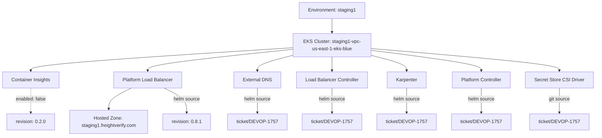
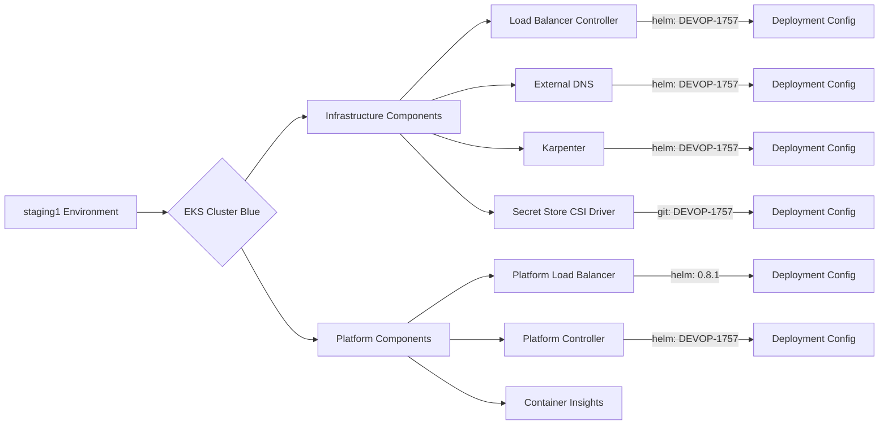

# Diagram: devops/k8s/argocd/app-manager/helm/values.staging1.yaml

> Auto-generated by Obscura crawlers

## Diagram 1

### SVG

<svg id="container" width="1961.078125" xmlns="http://www.w3.org/2000/svg" class="flowchart" height="454" viewBox="0 0 1961.078125 454" role="graphics-document document" aria-roledescription="flowchart-v2"><g><marker id="container_flowchart-v2-pointEnd" class="marker flowchart-v2" viewBox="0 0 10 10" refX="5" refY="5" markerUnits="userSpaceOnUse" markerWidth="8" markerHeight="8" orient="auto"><path d="M 0 0 L 10 5 L 0 10 z" class="arrowMarkerPath" style="stroke-width: 1; stroke-dasharray: 1, 0;"></path></marker><marker id="container_flowchart-v2-pointStart" class="marker flowchart-v2" viewBox="0 0 10 10" refX="4.5" refY="5" markerUnits="userSpaceOnUse" markerWidth="8" markerHeight="8" orient="auto"><path d="M 0 5 L 10 10 L 10 0 z" class="arrowMarkerPath" style="stroke-width: 1; stroke-dasharray: 1, 0;"></path></marker><marker id="container_flowchart-v2-circleEnd" class="marker flowchart-v2" viewBox="0 0 10 10" refX="11" refY="5" markerUnits="userSpaceOnUse" markerWidth="11" markerHeight="11" orient="auto"><circle cx="5" cy="5" r="5" class="arrowMarkerPath" style="stroke-width: 1; stroke-dasharray: 1, 0;"></circle></marker><marker id="container_flowchart-v2-circleStart" class="marker flowchart-v2" viewBox="0 0 10 10" refX="-1" refY="5" markerUnits="userSpaceOnUse" markerWidth="11" markerHeight="11" orient="auto"><circle cx="5" cy="5" r="5" class="arrowMarkerPath" style="stroke-width: 1; stroke-dasharray: 1, 0;"></circle></marker><marker id="container_flowchart-v2-crossEnd" class="marker cross flowchart-v2" viewBox="0 0 11 11" refX="12" refY="5.2" markerUnits="userSpaceOnUse" markerWidth="11" markerHeight="11" orient="auto"><path d="M 1,1 l 9,9 M 10,1 l -9,9" class="arrowMarkerPath" style="stroke-width: 2; stroke-dasharray: 1, 0;"></path></marker><marker id="container_flowchart-v2-crossStart" class="marker cross flowchart-v2" viewBox="0 0 11 11" refX="-1" refY="5.2" markerUnits="userSpaceOnUse" markerWidth="11" markerHeight="11" orient="auto"><path d="M 1,1 l 9,9 M 10,1 l -9,9" class="arrowMarkerPath" style="stroke-width: 2; stroke-dasharray: 1, 0;"></path></marker><g class="root"><g class="clusters"></g><g class="edgePaths"><path d="M1100.555,62L1100.555,66.167C1100.555,70.333,1100.555,78.667,1100.555,86.333C1100.555,94,1100.555,101,1100.555,104.5L1100.555,108" id="L_env_cluster_0" class="edge-thickness-normal edge-pattern-solid edge-thickness-normal edge-pattern-solid flowchart-link" style=";" data-edge="true" data-et="edge" data-id="L_env_cluster_0" data-points="W3sieCI6MTEwMC41NTQ2ODc1LCJ5Ijo2Mn0seyJ4IjoxMTAwLjU1NDY4NzUsInkiOjg3fSx7IngiOjExMDAuNTU0Njg3NSwieSI6MTEyfV0=" marker-end="url(#container_flowchart-v2-pointEnd)"></path><path d="M970.555,159.348L826.111,168.623C681.667,177.899,392.779,196.449,248.335,209.225C103.891,222,103.891,229,103.891,232.5L103.891,236" id="L_cluster_ci_0" class="edge-thickness-normal edge-pattern-solid edge-thickness-normal edge-pattern-solid flowchart-link" style=";" data-edge="true" data-et="edge" data-id="L_cluster_ci_0" data-points="W3sieCI6OTcwLjU1NDY4NzUsInkiOjE1OS4zNDc4NDc4OTg4NTAwNn0seyJ4IjoxMDMuODkwNjI1LCJ5IjoyMTV9LHsieCI6MTAzLjg5MDYyNSwieSI6MjQwfV0=" marker-end="url(#container_flowchart-v2-pointEnd)"></path><path d="M970.555,164.691L890.937,173.076C811.319,181.461,652.083,198.23,572.465,210.115C492.848,222,492.848,229,492.848,232.5L492.848,236" id="L_cluster_plb_0" class="edge-thickness-normal edge-pattern-solid edge-thickness-normal edge-pattern-solid flowchart-link" style=";" data-edge="true" data-et="edge" data-id="L_cluster_plb_0" data-points="W3sieCI6OTcwLjU1NDY4NzUsInkiOjE2NC42OTA4MDc1MzA4Njk3Nn0seyJ4Ijo0OTIuODQ3NjU2MjUsInkiOjIxNX0seyJ4Ijo0OTIuODQ3NjU2MjUsInkiOjI0MH1d" marker-end="url(#container_flowchart-v2-pointEnd)"></path><path d="M970.555,184.778L951.169,189.815C931.784,194.852,893.013,204.926,873.628,213.463C854.242,222,854.242,229,854.242,232.5L854.242,236" id="L_cluster_dns_0" class="edge-thickness-normal edge-pattern-solid edge-thickness-normal edge-pattern-solid flowchart-link" style=";" data-edge="true" data-et="edge" data-id="L_cluster_dns_0" data-points="W3sieCI6OTcwLjU1NDY4NzUsInkiOjE4NC43NzgyMjg4NzU5MTk4fSx7IngiOjg1NC4yNDIxODc1LCJ5IjoyMTV9LHsieCI6ODU0LjI0MjE4NzUsInkiOjI0MH1d" marker-end="url(#container_flowchart-v2-pointEnd)"></path><path d="M1100.555,190L1100.555,194.167C1100.555,198.333,1100.555,206.667,1100.555,214.333C1100.555,222,1100.555,229,1100.555,232.5L1100.555,236" id="L_cluster_lbc_0" class="edge-thickness-normal edge-pattern-solid edge-thickness-normal edge-pattern-solid flowchart-link" style=";" data-edge="true" data-et="edge" data-id="L_cluster_lbc_0" data-points="W3sieCI6MTEwMC41NTQ2ODc1LCJ5IjoxOTB9LHsieCI6MTEwMC41NTQ2ODc1LCJ5IjoyMTV9LHsieCI6MTEwMC41NTQ2ODc1LCJ5IjoyNDB9XQ==" marker-end="url(#container_flowchart-v2-pointEnd)"></path><path d="M1230.555,185.599L1248.966,190.499C1267.378,195.399,1304.201,205.2,1322.612,213.6C1341.023,222,1341.023,229,1341.023,232.5L1341.023,236" id="L_cluster_karp_0" class="edge-thickness-normal edge-pattern-solid edge-thickness-normal edge-pattern-solid flowchart-link" style=";" data-edge="true" data-et="edge" data-id="L_cluster_karp_0" data-points="W3sieCI6MTIzMC41NTQ2ODc1LCJ5IjoxODUuNTk5MDkwMzE4Mzg4NTZ9LHsieCI6MTM0MS4wMjM0Mzc1LCJ5IjoyMTV9LHsieCI6MTM0MS4wMjM0Mzc1LCJ5IjoyNDB9XQ==" marker-end="url(#container_flowchart-v2-pointEnd)"></path><path d="M1230.555,168.3L1289.044,176.083C1347.534,183.866,1464.513,199.433,1523.003,210.717C1581.492,222,1581.492,229,1581.492,232.5L1581.492,236" id="L_cluster_pc_0" class="edge-thickness-normal edge-pattern-solid edge-thickness-normal edge-pattern-solid flowchart-link" style=";" data-edge="true" data-et="edge" data-id="L_cluster_pc_0" data-points="W3sieCI6MTIzMC41NTQ2ODc1LCJ5IjoxNjguMjk5NTQ1MTU5MTk0Mjh9LHsieCI6MTU4MS40OTIxODc1LCJ5IjoyMTV9LHsieCI6MTU4MS40OTIxODc1LCJ5IjoyNDB9XQ==" marker-end="url(#container_flowchart-v2-pointEnd)"></path><path d="M1230.555,162.22L1332.479,171.016C1434.404,179.813,1638.253,197.407,1740.177,209.703C1842.102,222,1842.102,229,1842.102,232.5L1842.102,236" id="L_cluster_ssd_0" class="edge-thickness-normal edge-pattern-solid edge-thickness-normal edge-pattern-solid flowchart-link" style=";" data-edge="true" data-et="edge" data-id="L_cluster_ssd_0" data-points="W3sieCI6MTIzMC41NTQ2ODc1LCJ5IjoxNjIuMjE5Nzg5NzEzMjI2MTZ9LHsieCI6MTg0Mi4xMDE1NjI1LCJ5IjoyMTV9LHsieCI6MTg0Mi4xMDE1NjI1LCJ5IjoyNDB9XQ==" marker-end="url(#container_flowchart-v2-pointEnd)"></path><path d="M438.416,294L425.984,300.167C413.552,306.333,388.688,318.667,376.256,330.333C363.824,342,363.824,353,363.824,358.5L363.824,364" id="L_plb_hz_0" class="edge-thickness-normal edge-pattern-solid edge-thickness-normal edge-pattern-solid flowchart-link" style=";" data-edge="true" data-et="edge" data-id="L_plb_hz_0" data-points="W3sieCI6NDM4LjQxNTg5MzU1NDY4NzUsInkiOjI5NH0seyJ4IjozNjMuODI0MjE4NzUsInkiOjMzMX0seyJ4IjozNjMuODI0MjE4NzUsInkiOjM2OH1d" marker-end="url(#container_flowchart-v2-pointEnd)"></path><path d="M103.891,294L103.891,300.167C103.891,306.333,103.891,318.667,103.891,332.333C103.891,346,103.891,361,103.891,368.5L103.891,376" id="L_ci_cirev_0" class="edge-thickness-normal edge-pattern-dotted edge-thickness-normal edge-pattern-solid flowchart-link" style=";" data-edge="true" data-et="edge" data-id="L_ci_cirev_0" data-points="W3sieCI6MTAzLjg5MDYyNSwieSI6Mjk0fSx7IngiOjEwMy44OTA2MjUsInkiOjMzMX0seyJ4IjoxMDMuODkwNjI1LCJ5IjozODB9XQ==" marker-end="url(#container_flowchart-v2-pointEnd)"></path><path d="M547.279,294L559.711,300.167C572.143,306.333,597.007,318.667,609.439,332.333C621.871,346,621.871,361,621.871,368.5L621.871,376" id="L_plb_plbrev_0" class="edge-thickness-normal edge-pattern-solid edge-thickness-normal edge-pattern-solid flowchart-link" style=";" data-edge="true" data-et="edge" data-id="L_plb_plbrev_0" data-points="W3sieCI6NTQ3LjI3OTQxODk0NTMxMjUsInkiOjI5NH0seyJ4Ijo2MjEuODcxMDkzNzUsInkiOjMzMX0seyJ4Ijo2MjEuODcxMDkzNzUsInkiOjM4MH1d" marker-end="url(#container_flowchart-v2-pointEnd)"></path><path d="M854.242,294L854.242,300.167C854.242,306.333,854.242,318.667,854.242,332.333C854.242,346,854.242,361,854.242,368.5L854.242,376" id="L_dns_dnsrev_0" class="edge-thickness-normal edge-pattern-solid edge-thickness-normal edge-pattern-solid flowchart-link" style=";" data-edge="true" data-et="edge" data-id="L_dns_dnsrev_0" data-points="W3sieCI6ODU0LjI0MjE4NzUsInkiOjI5NH0seyJ4Ijo4NTQuMjQyMTg3NSwieSI6MzMxfSx7IngiOjg1NC4yNDIxODc1LCJ5IjozODB9XQ==" marker-end="url(#container_flowchart-v2-pointEnd)"></path><path d="M1100.555,294L1100.555,300.167C1100.555,306.333,1100.555,318.667,1100.555,332.333C1100.555,346,1100.555,361,1100.555,368.5L1100.555,376" id="L_lbc_lbcrev_0" class="edge-thickness-normal edge-pattern-solid edge-thickness-normal edge-pattern-solid flowchart-link" style=";" data-edge="true" data-et="edge" data-id="L_lbc_lbcrev_0" data-points="W3sieCI6MTEwMC41NTQ2ODc1LCJ5IjoyOTR9LHsieCI6MTEwMC41NTQ2ODc1LCJ5IjozMzF9LHsieCI6MTEwMC41NTQ2ODc1LCJ5IjozODB9XQ==" marker-end="url(#container_flowchart-v2-pointEnd)"></path><path d="M1341.023,294L1341.023,300.167C1341.023,306.333,1341.023,318.667,1341.023,332.333C1341.023,346,1341.023,361,1341.023,368.5L1341.023,376" id="L_karp_karprev_0" class="edge-thickness-normal edge-pattern-solid edge-thickness-normal edge-pattern-solid flowchart-link" style=";" data-edge="true" data-et="edge" data-id="L_karp_karprev_0" data-points="W3sieCI6MTM0MS4wMjM0Mzc1LCJ5IjoyOTR9LHsieCI6MTM0MS4wMjM0Mzc1LCJ5IjozMzF9LHsieCI6MTM0MS4wMjM0Mzc1LCJ5IjozODB9XQ==" marker-end="url(#container_flowchart-v2-pointEnd)"></path><path d="M1581.492,294L1581.492,300.167C1581.492,306.333,1581.492,318.667,1581.492,332.333C1581.492,346,1581.492,361,1581.492,368.5L1581.492,376" id="L_pc_pcrev_0" class="edge-thickness-normal edge-pattern-solid edge-thickness-normal edge-pattern-solid flowchart-link" style=";" data-edge="true" data-et="edge" data-id="L_pc_pcrev_0" data-points="W3sieCI6MTU4MS40OTIxODc1LCJ5IjoyOTR9LHsieCI6MTU4MS40OTIxODc1LCJ5IjozMzF9LHsieCI6MTU4MS40OTIxODc1LCJ5IjozODB9XQ==" marker-end="url(#container_flowchart-v2-pointEnd)"></path><path d="M1842.102,294L1842.102,300.167C1842.102,306.333,1842.102,318.667,1842.102,332.333C1842.102,346,1842.102,361,1842.102,368.5L1842.102,376" id="L_ssd_ssdrev_0" class="edge-thickness-normal edge-pattern-solid edge-thickness-normal edge-pattern-solid flowchart-link" style=";" data-edge="true" data-et="edge" data-id="L_ssd_ssdrev_0" data-points="W3sieCI6MTg0Mi4xMDE1NjI1LCJ5IjoyOTR9LHsieCI6MTg0Mi4xMDE1NjI1LCJ5IjozMzF9LHsieCI6MTg0Mi4xMDE1NjI1LCJ5IjozODB9XQ==" marker-end="url(#container_flowchart-v2-pointEnd)"></path></g><g class="edgeLabels"><g class="edgeLabel"><g class="label" data-id="L_env_cluster_0" transform="translate(0, 0)"><foreignObject width="0" height="0">

</foreignObject></g></g><g class="edgeLabel"><g class="label" data-id="L_cluster_ci_0" transform="translate(0, 0)"><foreignObject width="0" height="0">

</foreignObject></g></g><g class="edgeLabel"><g class="label" data-id="L_cluster_plb_0" transform="translate(0, 0)"><foreignObject width="0" height="0">

</foreignObject></g></g><g class="edgeLabel"><g class="label" data-id="L_cluster_dns_0" transform="translate(0, 0)"><foreignObject width="0" height="0">

</foreignObject></g></g><g class="edgeLabel"><g class="label" data-id="L_cluster_lbc_0" transform="translate(0, 0)"><foreignObject width="0" height="0">

</foreignObject></g></g><g class="edgeLabel"><g class="label" data-id="L_cluster_karp_0" transform="translate(0, 0)"><foreignObject width="0" height="0">

</foreignObject></g></g><g class="edgeLabel"><g class="label" data-id="L_cluster_pc_0" transform="translate(0, 0)"><foreignObject width="0" height="0">

</foreignObject></g></g><g class="edgeLabel"><g class="label" data-id="L_cluster_ssd_0" transform="translate(0, 0)"><foreignObject width="0" height="0">

</foreignObject></g></g><g class="edgeLabel"><g class="label" data-id="L_plb_hz_0" transform="translate(0, 0)"><foreignObject width="0" height="0">

</foreignObject></g></g><g class="edgeLabel" transform="translate(103.890625, 331)"><g class="label" data-id="L_ci_cirev_0" transform="translate(-50.859375, -12)"><foreignObject width="101.71875" height="24">

enabled: false

</foreignObject></g></g><g class="edgeLabel" transform="translate(621.87109375, 331)"><g class="label" data-id="L_plb_plbrev_0" transform="translate(-44.3046875, -12)"><foreignObject width="88.609375" height="24">

helm source

</foreignObject></g></g><g class="edgeLabel" transform="translate(854.2421875, 331)"><g class="label" data-id="L_dns_dnsrev_0" transform="translate(-44.3046875, -12)"><foreignObject width="88.609375" height="24">

helm source

</foreignObject></g></g><g class="edgeLabel" transform="translate(1100.5546875, 331)"><g class="label" data-id="L_lbc_lbcrev_0" transform="translate(-44.3046875, -12)"><foreignObject width="88.609375" height="24">

helm source

</foreignObject></g></g><g class="edgeLabel" transform="translate(1341.0234375, 331)"><g class="label" data-id="L_karp_karprev_0" transform="translate(-44.3046875, -12)"><foreignObject width="88.609375" height="24">

helm source

</foreignObject></g></g><g class="edgeLabel" transform="translate(1581.4921875, 331)"><g class="label" data-id="L_pc_pcrev_0" transform="translate(-44.3046875, -12)"><foreignObject width="88.609375" height="24">

helm source

</foreignObject></g></g><g class="edgeLabel" transform="translate(1842.1015625, 331)"><g class="label" data-id="L_ssd_ssdrev_0" transform="translate(-35.3671875, -12)"><foreignObject width="70.734375" height="24">

git source

</foreignObject></g></g></g><g class="nodes"><g class="node default" id="flowchart-env-0" transform="translate(1100.5546875, 35)"><rect class="basic label-container" style="" x="-109.671875" y="-27" width="219.34375" height="54"></rect><g class="label" style="" transform="translate(-79.671875, -12)"><rect></rect><foreignObject width="159.34375" height="24">

Environment: staging1

</foreignObject></g></g><g class="node default" id="flowchart-cluster-1" transform="translate(1100.5546875, 151)"><rect class="basic label-container" style="" x="-130" y="-39" width="260" height="78"></rect><g class="label" style="" transform="translate(-100, -24)"><rect></rect><foreignObject width="200" height="48">

EKS Cluster: staging1-vpc-us-east-1-eks-blue

</foreignObject></g></g><g class="node default" id="flowchart-ci-2" transform="translate(103.890625, 267)"><rect class="basic label-container" style="" x="-95.890625" y="-27" width="191.78125" height="54"></rect><g class="label" style="" transform="translate(-65.890625, -12)"><rect></rect><foreignObject width="131.78125" height="24">

Container Insights

</foreignObject></g></g><g class="node default" id="flowchart-plb-3" transform="translate(492.84765625, 267)"><rect class="basic label-container" style="" x="-114.6796875" y="-27" width="229.359375" height="54"></rect><g class="label" style="" transform="translate(-84.6796875, -12)"><rect></rect><foreignObject width="169.359375" height="24">

Platform Load Balancer

</foreignObject></g></g><g class="node default" id="flowchart-dns-4" transform="translate(854.2421875, 267)"><rect class="basic label-container" style="" x="-76.78125" y="-27" width="153.5625" height="54"></rect><g class="label" style="" transform="translate(-46.78125, -12)"><rect></rect><foreignObject width="93.5625" height="24">

External DNS

</foreignObject></g></g><g class="node default" id="flowchart-lbc-5" transform="translate(1100.5546875, 267)"><rect class="basic label-container" style="" x="-119.53125" y="-27" width="239.0625" height="54"></rect><g class="label" style="" transform="translate(-89.53125, -12)"><rect></rect><foreignObject width="179.0625" height="24">

Load Balancer Controller

</foreignObject></g></g><g class="node default" id="flowchart-karp-6" transform="translate(1341.0234375, 267)"><rect class="basic label-container" style="" x="-66.1171875" y="-27" width="132.234375" height="54"></rect><g class="label" style="" transform="translate(-36.1171875, -12)"><rect></rect><foreignObject width="72.234375" height="24">

Karpenter

</foreignObject></g></g><g class="node default" id="flowchart-pc-7" transform="translate(1581.4921875, 267)"><rect class="basic label-container" style="" x="-99.6328125" y="-27" width="199.265625" height="54"></rect><g class="label" style="" transform="translate(-69.6328125, -12)"><rect></rect><foreignObject width="139.265625" height="24">

Platform Controller

</foreignObject></g></g><g class="node default" id="flowchart-ssd-8" transform="translate(1842.1015625, 267)"><rect class="basic label-container" style="" x="-110.9765625" y="-27" width="221.953125" height="54"></rect><g class="label" style="" transform="translate(-80.9765625, -12)"><rect></rect><foreignObject width="161.953125" height="24">

Secret Store CSI Driver

</foreignObject></g></g><g class="node default" id="flowchart-hz-26" transform="translate(363.82421875, 407)"><rect class="basic label-container" style="" x="-130" y="-39" width="260" height="78"></rect><g class="label" style="" transform="translate(-100, -24)"><rect></rect><foreignObject width="200" height="48">

Hosted Zone: staging1.freightverify.com

</foreignObject></g></g><g class="node default" id="flowchart-cirev-28" transform="translate(103.890625, 407)"><rect class="basic label-container" style="" x="-79.296875" y="-27" width="158.59375" height="54"></rect><g class="label" style="" transform="translate(-49.296875, -12)"><rect></rect><foreignObject width="98.59375" height="24">

revision: 0.2.0

</foreignObject></g></g><g class="node default" id="flowchart-plbrev-30" transform="translate(621.87109375, 407)"><rect class="basic label-container" style="" x="-78.046875" y="-27" width="156.09375" height="54"></rect><g class="label" style="" transform="translate(-48.046875, -12)"><rect></rect><foreignObject width="96.09375" height="24">

revision: 0.8.1

</foreignObject></g></g><g class="node default" id="flowchart-dnsrev-32" transform="translate(854.2421875, 407)"><rect class="basic label-container" style="" x="-95.234375" y="-27" width="190.46875" height="54"></rect><g class="label" style="" transform="translate(-65.234375, -12)"><rect></rect><foreignObject width="130.46875" height="24">

ticket/DEVOP-1757

</foreignObject></g></g><g class="node default" id="flowchart-lbcrev-34" transform="translate(1100.5546875, 407)"><rect class="basic label-container" style="" x="-95.234375" y="-27" width="190.46875" height="54"></rect><g class="label" style="" transform="translate(-65.234375, -12)"><rect></rect><foreignObject width="130.46875" height="24">

ticket/DEVOP-1757

</foreignObject></g></g><g class="node default" id="flowchart-karprev-36" transform="translate(1341.0234375, 407)"><rect class="basic label-container" style="" x="-95.234375" y="-27" width="190.46875" height="54"></rect><g class="label" style="" transform="translate(-65.234375, -12)"><rect></rect><foreignObject width="130.46875" height="24">

ticket/DEVOP-1757

</foreignObject></g></g><g class="node default" id="flowchart-pcrev-38" transform="translate(1581.4921875, 407)"><rect class="basic label-container" style="" x="-95.234375" y="-27" width="190.46875" height="54"></rect><g class="label" style="" transform="translate(-65.234375, -12)"><rect></rect><foreignObject width="130.46875" height="24">

ticket/DEVOP-1757

</foreignObject></g></g><g class="node default" id="flowchart-ssdrev-40" transform="translate(1842.1015625, 407)"><rect class="basic label-container" style="" x="-95.234375" y="-27" width="190.46875" height="54"></rect><g class="label" style="" transform="translate(-65.234375, -12)"><rect></rect><foreignObject width="130.46875" height="24">

ticket/DEVOP-1757

</foreignObject></g></g></g></g></g></svg>

## Diagram 2

### SVG

<svg id="container" width="1420.953125" xmlns="http://www.w3.org/2000/svg" class="flowchart" height="694" viewBox="0 0 1420.953125 694" role="graphics-document document" aria-roledescription="flowchart-v2"><g><marker id="container_flowchart-v2-pointEnd" class="marker flowchart-v2" viewBox="0 0 10 10" refX="5" refY="5" markerUnits="userSpaceOnUse" markerWidth="8" markerHeight="8" orient="auto"><path d="M 0 0 L 10 5 L 0 10 z" class="arrowMarkerPath" style="stroke-width: 1; stroke-dasharray: 1, 0;"></path></marker><marker id="container_flowchart-v2-pointStart" class="marker flowchart-v2" viewBox="0 0 10 10" refX="4.5" refY="5" markerUnits="userSpaceOnUse" markerWidth="8" markerHeight="8" orient="auto"><path d="M 0 5 L 10 10 L 10 0 z" class="arrowMarkerPath" style="stroke-width: 1; stroke-dasharray: 1, 0;"></path></marker><marker id="container_flowchart-v2-circleEnd" class="marker flowchart-v2" viewBox="0 0 10 10" refX="11" refY="5" markerUnits="userSpaceOnUse" markerWidth="11" markerHeight="11" orient="auto"><circle cx="5" cy="5" r="5" class="arrowMarkerPath" style="stroke-width: 1; stroke-dasharray: 1, 0;"></circle></marker><marker id="container_flowchart-v2-circleStart" class="marker flowchart-v2" viewBox="0 0 10 10" refX="-1" refY="5" markerUnits="userSpaceOnUse" markerWidth="11" markerHeight="11" orient="auto"><circle cx="5" cy="5" r="5" class="arrowMarkerPath" style="stroke-width: 1; stroke-dasharray: 1, 0;"></circle></marker><marker id="container_flowchart-v2-crossEnd" class="marker cross flowchart-v2" viewBox="0 0 11 11" refX="12" refY="5.2" markerUnits="userSpaceOnUse" markerWidth="11" markerHeight="11" orient="auto"><path d="M 1,1 l 9,9 M 10,1 l -9,9" class="arrowMarkerPath" style="stroke-width: 2; stroke-dasharray: 1, 0;"></path></marker><marker id="container_flowchart-v2-crossStart" class="marker cross flowchart-v2" viewBox="0 0 11 11" refX="-1" refY="5.2" markerUnits="userSpaceOnUse" markerWidth="11" markerHeight="11" orient="auto"><path d="M 1,1 l 9,9 M 10,1 l -9,9" class="arrowMarkerPath" style="stroke-width: 2; stroke-dasharray: 1, 0;"></path></marker><g class="root"><g class="clusters"></g><g class="edgePaths"><path d="M223.438,347L227.604,347C231.771,347,240.104,347,247.771,347C255.438,347,262.438,347,265.938,347L269.438,347" id="L_A_B_0" class="edge-thickness-normal edge-pattern-solid edge-thickness-normal edge-pattern-solid flowchart-link" style=";" data-edge="true" data-et="edge" data-id="L_A_B_0" data-points="W3sieCI6MjIzLjQzNzUsInkiOjM0N30seyJ4IjoyNDguNDM3NSwieSI6MzQ3fSx7IngiOjI3My40Mzc1LCJ5IjozNDd9XQ==" marker-end="url(#container_flowchart-v2-pointEnd)"></path><path d="M395.341,296.716L407.888,279.096C420.435,261.477,445.53,226.239,461.578,208.619C477.625,191,484.625,191,488.125,191L491.625,191" id="L_B_C_0" class="edge-thickness-normal edge-pattern-solid edge-thickness-normal edge-pattern-solid flowchart-link" style=";" data-edge="true" data-et="edge" data-id="L_B_C_0" data-points="W3sieCI6Mzk1LjM0MDY4OTcxNTY4OTczLCJ5IjoyOTYuNzE1Njg5NzE1Njg5NzN9LHsieCI6NDcwLjYyNSwieSI6MTkxfSx7IngiOjQ5NS42MjUsInkiOjE5MX1d" marker-end="url(#container_flowchart-v2-pointEnd)"></path><path d="M389.505,403.12L403.025,428.433C416.545,453.747,443.585,504.373,463.675,529.687C483.766,555,496.906,555,503.477,555L510.047,555" id="L_B_D_0" class="edge-thickness-normal edge-pattern-solid edge-thickness-normal edge-pattern-solid flowchart-link" style=";" data-edge="true" data-et="edge" data-id="L_B_D_0" data-points="W3sieCI6Mzg5LjUwNTEyOTI3MjM1MzQsInkiOjQwMy4xMTk4NzA3Mjc2NDY2fSx7IngiOjQ3MC42MjUsInkiOjU1NX0seyJ4Ijo1MTQuMDQ2ODc1LCJ5Ijo1NTV9XQ==" marker-end="url(#container_flowchart-v2-pointEnd)"></path><path d="M649.528,164L670.547,142.5C691.566,121,733.603,78,758.122,56.5C782.641,35,789.641,35,793.141,35L796.641,35" id="L_C_C1_0" class="edge-thickness-normal edge-pattern-solid edge-thickness-normal edge-pattern-solid flowchart-link" style=";" data-edge="true" data-et="edge" data-id="L_C_C1_0" data-points="W3sieCI6NjQ5LjUyODM5NTQzMjY5MjMsInkiOjE2NH0seyJ4Ijo3NzUuNjQwNjI1LCJ5IjozNX0seyJ4Ijo4MDAuNjQwNjI1LCJ5IjozNX1d" marker-end="url(#container_flowchart-v2-pointEnd)"></path><path d="M702.32,164L714.54,159.833C726.76,155.667,751.2,147.333,774.045,143.167C796.891,139,818.141,139,828.766,139L839.391,139" id="L_C_C2_0" class="edge-thickness-normal edge-pattern-solid edge-thickness-normal edge-pattern-solid flowchart-link" style=";" data-edge="true" data-et="edge" data-id="L_C_C2_0" data-points="W3sieCI6NzAyLjMxOTU2MTI5ODA3NjksInkiOjE2NH0seyJ4Ijo3NzUuNjQwNjI1LCJ5IjoxMzl9LHsieCI6ODQzLjM5MDYyNSwieSI6MTM5fV0=" marker-end="url(#container_flowchart-v2-pointEnd)"></path><path d="M702.32,218L714.54,222.167C726.76,226.333,751.2,234.667,775.823,238.833C800.445,243,825.25,243,837.652,243L850.055,243" id="L_C_C3_0" class="edge-thickness-normal edge-pattern-solid edge-thickness-normal edge-pattern-solid flowchart-link" style=";" data-edge="true" data-et="edge" data-id="L_C_C3_0" data-points="W3sieCI6NzAyLjMxOTU2MTI5ODA3NjksInkiOjIxOH0seyJ4Ijo3NzUuNjQwNjI1LCJ5IjoyNDN9LHsieCI6ODU0LjA1NDY4NzUsInkiOjI0M31d" marker-end="url(#container_flowchart-v2-pointEnd)"></path><path d="M649.528,218L670.547,239.5C691.566,261,733.603,304,759.548,325.5C785.492,347,795.344,347,800.27,347L805.195,347" id="L_C_C4_0" class="edge-thickness-normal edge-pattern-solid edge-thickness-normal edge-pattern-solid flowchart-link" style=";" data-edge="true" data-et="edge" data-id="L_C_C4_0" data-points="W3sieCI6NjQ5LjUyODM5NTQzMjY5MjMsInkiOjIxOH0seyJ4Ijo3NzUuNjQwNjI1LCJ5IjozNDd9LHsieCI6ODA5LjE5NTMxMjUsInkiOjM0N31d" marker-end="url(#container_flowchart-v2-pointEnd)"></path><path d="M662.726,528L681.545,515.167C700.364,502.333,738.002,476.667,761.13,463.833C784.258,451,792.875,451,797.184,451L801.492,451" id="L_D_D1_0" class="edge-thickness-normal edge-pattern-solid edge-thickness-normal edge-pattern-solid flowchart-link" style=";" data-edge="true" data-et="edge" data-id="L_D_D1_0" data-points="W3sieCI6NjYyLjcyNjE4Njg5OTAzODUsInkiOjUyOH0seyJ4Ijo3NzUuNjQwNjI1LCJ5Ijo0NTF9LHsieCI6ODA1LjQ5MjE4NzUsInkiOjQ1MX1d" marker-end="url(#container_flowchart-v2-pointEnd)"></path><path d="M732.219,555L739.456,555C746.693,555,761.167,555,775.22,555C789.273,555,802.906,555,809.723,555L816.539,555" id="L_D_D2_0" class="edge-thickness-normal edge-pattern-solid edge-thickness-normal edge-pattern-solid flowchart-link" style=";" data-edge="true" data-et="edge" data-id="L_D_D2_0" data-points="W3sieCI6NzMyLjIxODc1LCJ5Ijo1NTV9LHsieCI6Nzc1LjY0MDYyNSwieSI6NTU1fSx7IngiOjgyMC41MzkwNjI1LCJ5Ijo1NTV9XQ==" marker-end="url(#container_flowchart-v2-pointEnd)"></path><path d="M662.726,582L681.545,594.833C700.364,607.667,738.002,633.333,764.262,646.167C790.521,659,805.401,659,812.841,659L820.281,659" id="L_D_D3_0" class="edge-thickness-normal edge-pattern-solid edge-thickness-normal edge-pattern-solid flowchart-link" style=";" data-edge="true" data-et="edge" data-id="L_D_D3_0" data-points="W3sieCI6NjYyLjcyNjE4Njg5OTAzODUsInkiOjU4Mn0seyJ4Ijo3NzUuNjQwNjI1LCJ5Ijo2NTl9LHsieCI6ODI0LjI4MTI1LCJ5Ijo2NTl9XQ==" marker-end="url(#container_flowchart-v2-pointEnd)"></path><path d="M1039.703,35L1054.391,35C1069.078,35,1098.453,35,1127.161,35C1155.87,35,1183.911,35,1197.932,35L1211.953,35" id="L_C1_E1_0" class="edge-thickness-normal edge-pattern-solid edge-thickness-normal edge-pattern-solid flowchart-link" style=";" data-edge="true" data-et="edge" data-id="L_C1_E1_0" data-points="W3sieCI6MTAzOS43MDMxMjUsInkiOjM1fSx7IngiOjExMjcuODI4MTI1LCJ5IjozNX0seyJ4IjoxMjE1Ljk1MzEyNSwieSI6MzV9XQ==" marker-end="url(#container_flowchart-v2-pointEnd)"></path><path d="M996.953,139L1018.766,139C1040.578,139,1084.203,139,1120.036,139C1155.87,139,1183.911,139,1197.932,139L1211.953,139" id="L_C2_E2_0" class="edge-thickness-normal edge-pattern-solid edge-thickness-normal edge-pattern-solid flowchart-link" style=";" data-edge="true" data-et="edge" data-id="L_C2_E2_0" data-points="W3sieCI6OTk2Ljk1MzEyNSwieSI6MTM5fSx7IngiOjExMjcuODI4MTI1LCJ5IjoxMzl9LHsieCI6MTIxNS45NTMxMjUsInkiOjEzOX1d" marker-end="url(#container_flowchart-v2-pointEnd)"></path><path d="M986.289,243L1009.879,243C1033.469,243,1080.648,243,1118.259,243C1155.87,243,1183.911,243,1197.932,243L1211.953,243" id="L_C3_E3_0" class="edge-thickness-normal edge-pattern-solid edge-thickness-normal edge-pattern-solid flowchart-link" style=";" data-edge="true" data-et="edge" data-id="L_C3_E3_0" data-points="W3sieCI6OTg2LjI4OTA2MjUsInkiOjI0M30seyJ4IjoxMTI3LjgyODEyNSwieSI6MjQzfSx7IngiOjEyMTUuOTUzMTI1LCJ5IjoyNDN9XQ==" marker-end="url(#container_flowchart-v2-pointEnd)"></path><path d="M1031.148,347L1047.262,347C1063.375,347,1095.602,347,1125.736,347C1155.87,347,1183.911,347,1197.932,347L1211.953,347" id="L_C4_E4_0" class="edge-thickness-normal edge-pattern-solid edge-thickness-normal edge-pattern-solid flowchart-link" style=";" data-edge="true" data-et="edge" data-id="L_C4_E4_0" data-points="W3sieCI6MTAzMS4xNDg0Mzc1LCJ5IjozNDd9LHsieCI6MTEyNy44MjgxMjUsInkiOjM0N30seyJ4IjoxMjE1Ljk1MzEyNSwieSI6MzQ3fV0=" marker-end="url(#container_flowchart-v2-pointEnd)"></path><path d="M1034.852,451L1050.348,451C1065.844,451,1096.836,451,1126.353,451C1155.87,451,1183.911,451,1197.932,451L1211.953,451" id="L_D1_E5_0" class="edge-thickness-normal edge-pattern-solid edge-thickness-normal edge-pattern-solid flowchart-link" style=";" data-edge="true" data-et="edge" data-id="L_D1_E5_0" data-points="W3sieCI6MTAzNC44NTE1NjI1LCJ5Ijo0NTF9LHsieCI6MTEyNy44MjgxMjUsInkiOjQ1MX0seyJ4IjoxMjE1Ljk1MzEyNSwieSI6NDUxfV0=" marker-end="url(#container_flowchart-v2-pointEnd)"></path><path d="M1019.805,555L1037.809,555C1055.813,555,1091.82,555,1123.845,555C1155.87,555,1183.911,555,1197.932,555L1211.953,555" id="L_D2_E6_0" class="edge-thickness-normal edge-pattern-solid edge-thickness-normal edge-pattern-solid flowchart-link" style=";" data-edge="true" data-et="edge" data-id="L_D2_E6_0" data-points="W3sieCI6MTAxOS44MDQ2ODc1LCJ5Ijo1NTV9LHsieCI6MTEyNy44MjgxMjUsInkiOjU1NX0seyJ4IjoxMjE1Ljk1MzEyNSwieSI6NTU1fV0=" marker-end="url(#container_flowchart-v2-pointEnd)"></path></g><g class="edgeLabels"><g class="edgeLabel"><g class="label" data-id="L_A_B_0" transform="translate(0, 0)"><foreignObject width="0" height="0">

</foreignObject></g></g><g class="edgeLabel"><g class="label" data-id="L_B_C_0" transform="translate(0, 0)"><foreignObject width="0" height="0">

</foreignObject></g></g><g class="edgeLabel"><g class="label" data-id="L_B_D_0" transform="translate(0, 0)"><foreignObject width="0" height="0">

</foreignObject></g></g><g class="edgeLabel"><g class="label" data-id="L_C_C1_0" transform="translate(0, 0)"><foreignObject width="0" height="0">

</foreignObject></g></g><g class="edgeLabel"><g class="label" data-id="L_C_C2_0" transform="translate(0, 0)"><foreignObject width="0" height="0">

</foreignObject></g></g><g class="edgeLabel"><g class="label" data-id="L_C_C3_0" transform="translate(0, 0)"><foreignObject width="0" height="0">

</foreignObject></g></g><g class="edgeLabel"><g class="label" data-id="L_C_C4_0" transform="translate(0, 0)"><foreignObject width="0" height="0">

</foreignObject></g></g><g class="edgeLabel"><g class="label" data-id="L_D_D1_0" transform="translate(0, 0)"><foreignObject width="0" height="0">

</foreignObject></g></g><g class="edgeLabel"><g class="label" data-id="L_D_D2_0" transform="translate(0, 0)"><foreignObject width="0" height="0">

</foreignObject></g></g><g class="edgeLabel"><g class="label" data-id="L_D_D3_0" transform="translate(0, 0)"><foreignObject width="0" height="0">

</foreignObject></g></g><g class="edgeLabel" transform="translate(1127.828125, 35)"><g class="label" data-id="L_C1_E1_0" transform="translate(-63.125, -12)"><foreignObject width="126.25" height="24">

helm: DEVOP-1757

</foreignObject></g></g><g class="edgeLabel" transform="translate(1127.828125, 139)"><g class="label" data-id="L_C2_E2_0" transform="translate(-63.125, -12)"><foreignObject width="126.25" height="24">

helm: DEVOP-1757

</foreignObject></g></g><g class="edgeLabel" transform="translate(1127.828125, 243)"><g class="label" data-id="L_C3_E3_0" transform="translate(-63.125, -12)"><foreignObject width="126.25" height="24">

helm: DEVOP-1757

</foreignObject></g></g><g class="edgeLabel" transform="translate(1127.828125, 347)"><g class="label" data-id="L_C4_E4_0" transform="translate(-54.2109375, -12)"><foreignObject width="108.421875" height="24">

git: DEVOP-1757

</foreignObject></g></g><g class="edgeLabel" transform="translate(1127.828125, 451)"><g class="label" data-id="L_D1_E5_0" transform="translate(-37.5703125, -12)"><foreignObject width="75.140625" height="24">

helm: 0.8.1

</foreignObject></g></g><g class="edgeLabel" transform="translate(1127.828125, 555)"><g class="label" data-id="L_D2_E6_0" transform="translate(-63.125, -12)"><foreignObject width="126.25" height="24">

helm: DEVOP-1757

</foreignObject></g></g></g><g class="nodes"><g class="node default" id="flowchart-A-0" transform="translate(115.71875, 347)"><rect class="basic label-container" style="" x="-107.71875" y="-27" width="215.4375" height="54"></rect><g class="label" style="" transform="translate(-77.71875, -12)"><rect></rect><foreignObject width="155.4375" height="24">

staging1 Environment

</foreignObject></g></g><g class="node default" id="flowchart-B-1" transform="translate(359.53125, 347)"><polygon points="86.09375,0 172.1875,-86.09375 86.09375,-172.1875 0,-86.09375" class="label-container" transform="translate(-85.59375, 86.09375)"></polygon><g class="label" style="" transform="translate(-59.09375, -12)"><rect></rect><foreignObject width="118.1875" height="24">

EKS Cluster Blue

</foreignObject></g></g><g class="node default" id="flowchart-C-3" transform="translate(623.1328125, 191)"><rect class="basic label-container" style="" x="-127.5078125" y="-27" width="255.015625" height="54"></rect><g class="label" style="" transform="translate(-97.5078125, -12)"><rect></rect><foreignObject width="195.015625" height="24">

Infrastructure Components

</foreignObject></g></g><g class="node default" id="flowchart-D-5" transform="translate(623.1328125, 555)"><rect class="basic label-container" style="" x="-109.0859375" y="-27" width="218.171875" height="54"></rect><g class="label" style="" transform="translate(-79.0859375, -12)"><rect></rect><foreignObject width="158.171875" height="24">

Platform Components

</foreignObject></g></g><g class="node default" id="flowchart-C1-7" transform="translate(920.171875, 35)"><rect class="basic label-container" style="" x="-119.53125" y="-27" width="239.0625" height="54"></rect><g class="label" style="" transform="translate(-89.53125, -12)"><rect></rect><foreignObject width="179.0625" height="24">

Load Balancer Controller

</foreignObject></g></g><g class="node default" id="flowchart-C2-9" transform="translate(920.171875, 139)"><rect class="basic label-container" style="" x="-76.78125" y="-27" width="153.5625" height="54"></rect><g class="label" style="" transform="translate(-46.78125, -12)"><rect></rect><foreignObject width="93.5625" height="24">

External DNS

</foreignObject></g></g><g class="node default" id="flowchart-C3-11" transform="translate(920.171875, 243)"><rect class="basic label-container" style="" x="-66.1171875" y="-27" width="132.234375" height="54"></rect><g class="label" style="" transform="translate(-36.1171875, -12)"><rect></rect><foreignObject width="72.234375" height="24">

Karpenter

</foreignObject></g></g><g class="node default" id="flowchart-C4-13" transform="translate(920.171875, 347)"><rect class="basic label-container" style="" x="-110.9765625" y="-27" width="221.953125" height="54"></rect><g class="label" style="" transform="translate(-80.9765625, -12)"><rect></rect><foreignObject width="161.953125" height="24">

Secret Store CSI Driver

</foreignObject></g></g><g class="node default" id="flowchart-D1-15" transform="translate(920.171875, 451)"><rect class="basic label-container" style="" x="-114.6796875" y="-27" width="229.359375" height="54"></rect><g class="label" style="" transform="translate(-84.6796875, -12)"><rect></rect><foreignObject width="169.359375" height="24">

Platform Load Balancer

</foreignObject></g></g><g class="node default" id="flowchart-D2-17" transform="translate(920.171875, 555)"><rect class="basic label-container" style="" x="-99.6328125" y="-27" width="199.265625" height="54"></rect><g class="label" style="" transform="translate(-69.6328125, -12)"><rect></rect><foreignObject width="139.265625" height="24">

Platform Controller

</foreignObject></g></g><g class="node default" id="flowchart-D3-19" transform="translate(920.171875, 659)"><rect class="basic label-container" style="" x="-95.890625" y="-27" width="191.78125" height="54"></rect><g class="label" style="" transform="translate(-65.890625, -12)"><rect></rect><foreignObject width="131.78125" height="24">

Container Insights

</foreignObject></g></g><g class="node default" id="flowchart-E1-21" transform="translate(1314.453125, 35)"><rect class="basic label-container" style="" x="-98.5" y="-27" width="197" height="54"></rect><g class="label" style="" transform="translate(-68.5, -12)"><rect></rect><foreignObject width="137" height="24">

Deployment Config

</foreignObject></g></g><g class="node default" id="flowchart-E2-23" transform="translate(1314.453125, 139)"><rect class="basic label-container" style="" x="-98.5" y="-27" width="197" height="54"></rect><g class="label" style="" transform="translate(-68.5, -12)"><rect></rect><foreignObject width="137" height="24">

Deployment Config

</foreignObject></g></g><g class="node default" id="flowchart-E3-25" transform="translate(1314.453125, 243)"><rect class="basic label-container" style="" x="-98.5" y="-27" width="197" height="54"></rect><g class="label" style="" transform="translate(-68.5, -12)"><rect></rect><foreignObject width="137" height="24">

Deployment Config

</foreignObject></g></g><g class="node default" id="flowchart-E4-27" transform="translate(1314.453125, 347)"><rect class="basic label-container" style="" x="-98.5" y="-27" width="197" height="54"></rect><g class="label" style="" transform="translate(-68.5, -12)"><rect></rect><foreignObject width="137" height="24">

Deployment Config

</foreignObject></g></g><g class="node default" id="flowchart-E5-29" transform="translate(1314.453125, 451)"><rect class="basic label-container" style="" x="-98.5" y="-27" width="197" height="54"></rect><g class="label" style="" transform="translate(-68.5, -12)"><rect></rect><foreignObject width="137" height="24">

Deployment Config

</foreignObject></g></g><g class="node default" id="flowchart-E6-31" transform="translate(1314.453125, 555)"><rect class="basic label-container" style="" x="-98.5" y="-27" width="197" height="54"></rect><g class="label" style="" transform="translate(-68.5, -12)"><rect></rect><foreignObject width="137" height="24">

Deployment Config

</foreignObject></g></g></g></g></g></svg>
