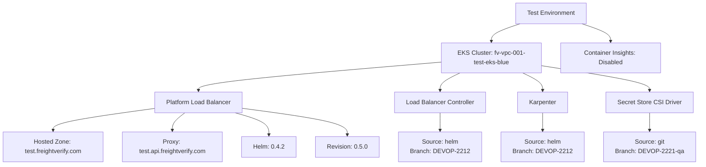
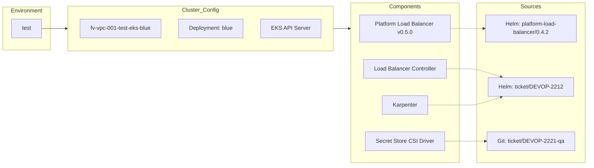
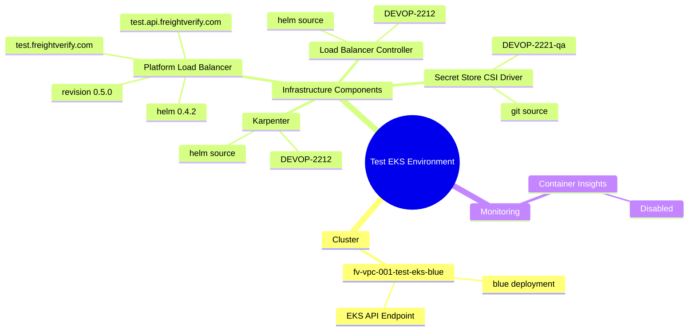
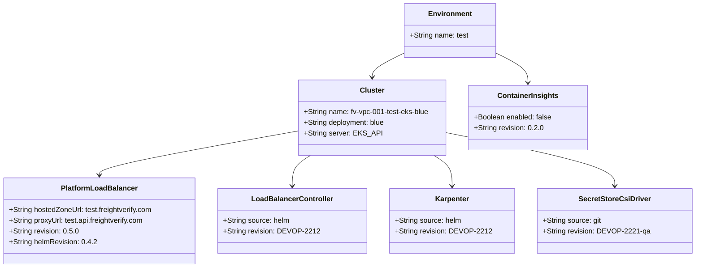

# Diagram: devops/k8s/argocd/app-manager/helm/values.test.yaml


> Auto-generated by Obscura crawlers

## Diagram 1

```mermaid
graph TD
      Test[Test Environment]
      Test --> Cluster[EKS Cluster: fv-vpc-001-test-eks-blue]
      Test --> CI[Container Insights: Disabled]...
  └ 237 lines...
```

> SVG rendering failed for this diagram.

## Diagram 2



### SVG

<svg id="container" width="1768.046875" xmlns="http://www.w3.org/2000/svg" class="flowchart" height="430" viewBox="0 0 1768.046875 430" role="graphics-document document" aria-roledescription="flowchart-v2"><style>#container{font-family:"trebuchet ms",verdana,arial,sans-serif;font-size:16px;fill:#333;}@keyframes edge-animation-frame{from{stroke-dashoffset:0;}}@keyframes dash{to{stroke-dashoffset:0;}}#container .edge-animation-slow{stroke-dasharray:9,5!important;stroke-dashoffset:900;animation:dash 50s linear infinite;stroke-linecap:round;}#container .edge-animation-fast{stroke-dasharray:9,5!important;stroke-dashoffset:900;animation:dash 20s linear infinite;stroke-linecap:round;}#container .error-icon{fill:#552222;}#container .error-text{fill:#552222;stroke:#552222;}#container .edge-thickness-normal{stroke-width:1px;}#container .edge-thickness-thick{stroke-width:3.5px;}#container .edge-pattern-solid{stroke-dasharray:0;}#container .edge-thickness-invisible{stroke-width:0;fill:none;}#container .edge-pattern-dashed{stroke-dasharray:3;}#container .edge-pattern-dotted{stroke-dasharray:2;}#container .marker{fill:#333333;stroke:#333333;}#container .marker.cross{stroke:#333333;}#container svg{font-family:"trebuchet ms",verdana,arial,sans-serif;font-size:16px;}#container p{margin:0;}#container .label{font-family:"trebuchet ms",verdana,arial,sans-serif;color:#333;}#container .cluster-label text{fill:#333;}#container .cluster-label span{color:#333;}#container .cluster-label span p{background-color:transparent;}#container .label text,#container span{fill:#333;color:#333;}#container .node rect,#container .node circle,#container .node ellipse,#container .node polygon,#container .node path{fill:#ECECFF;stroke:#9370DB;stroke-width:1px;}#container .rough-node .label text,#container .node .label text,#container .image-shape .label,#container .icon-shape .label{text-anchor:middle;}#container .node .katex path{fill:#000;stroke:#000;stroke-width:1px;}#container .rough-node .label,#container .node .label,#container .image-shape .label,#container .icon-shape .label{text-align:center;}#container .node.clickable{cursor:pointer;}#container .root .anchor path{fill:#333333!important;stroke-width:0;stroke:#333333;}#container .arrowheadPath{fill:#333333;}#container .edgePath .path{stroke:#333333;stroke-width:2.0px;}#container .flowchart-link{stroke:#333333;fill:none;}#container .edgeLabel{background-color:rgba(232,232,232, 0.8);text-align:center;}#container .edgeLabel p{background-color:rgba(232,232,232, 0.8);}#container .edgeLabel rect{opacity:0.5;background-color:rgba(232,232,232, 0.8);fill:rgba(232,232,232, 0.8);}#container .labelBkg{background-color:rgba(232, 232, 232, 0.5);}#container .cluster rect{fill:#ffffde;stroke:#aaaa33;stroke-width:1px;}#container .cluster text{fill:#333;}#container .cluster span{color:#333;}#container div.mermaidTooltip{position:absolute;text-align:center;max-width:200px;padding:2px;font-family:"trebuchet ms",verdana,arial,sans-serif;font-size:12px;background:hsl(80, 100%, 96.2745098039%);border:1px solid #aaaa33;border-radius:2px;pointer-events:none;z-index:100;}#container .flowchartTitleText{text-anchor:middle;font-size:18px;fill:#333;}#container rect.text{fill:none;stroke-width:0;}#container .icon-shape,#container .image-shape{background-color:rgba(232,232,232, 0.8);text-align:center;}#container .icon-shape p,#container .image-shape p{background-color:rgba(232,232,232, 0.8);padding:2px;}#container .icon-shape rect,#container .image-shape rect{opacity:0.5;background-color:rgba(232,232,232, 0.8);fill:rgba(232,232,232, 0.8);}#container .label-icon{display:inline-block;height:1em;overflow:visible;vertical-align:-0.125em;}#container .node .label-icon path{fill:currentColor;stroke:revert;stroke-width:revert;}#container :root{--mermaid-font-family:"trebuchet ms",verdana,arial,sans-serif;}</style><g><marker id="container_flowchart-v2-pointEnd" class="marker flowchart-v2" viewBox="0 0 10 10" refX="5" refY="5" markerUnits="userSpaceOnUse" markerWidth="8" markerHeight="8" orient="auto"><path d="M 0 0 L 10 5 L 0 10 z" class="arrowMarkerPath" style="stroke-width: 1; stroke-dasharray: 1, 0;"></path></marker><marker id="container_flowchart-v2-pointStart" class="marker flowchart-v2" viewBox="0 0 10 10" refX="4.5" refY="5" markerUnits="userSpaceOnUse" markerWidth="8" markerHeight="8" orient="auto"><path d="M 0 5 L 10 10 L 10 0 z" class="arrowMarkerPath" style="stroke-width: 1; stroke-dasharray: 1, 0;"></path></marker><marker id="container_flowchart-v2-circleEnd" class="marker flowchart-v2" viewBox="0 0 10 10" refX="11" refY="5" markerUnits="userSpaceOnUse" markerWidth="11" markerHeight="11" orient="auto"><circle cx="5" cy="5" r="5" class="arrowMarkerPath" style="stroke-width: 1; stroke-dasharray: 1, 0;"></circle></marker><marker id="container_flowchart-v2-circleStart" class="marker flowchart-v2" viewBox="0 0 10 10" refX="-1" refY="5" markerUnits="userSpaceOnUse" markerWidth="11" markerHeight="11" orient="auto"><circle cx="5" cy="5" r="5" class="arrowMarkerPath" style="stroke-width: 1; stroke-dasharray: 1, 0;"></circle></marker><marker id="container_flowchart-v2-crossEnd" class="marker cross flowchart-v2" viewBox="0 0 11 11" refX="12" refY="5.2" markerUnits="userSpaceOnUse" markerWidth="11" markerHeight="11" orient="auto"><path d="M 1,1 l 9,9 M 10,1 l -9,9" class="arrowMarkerPath" style="stroke-width: 2; stroke-dasharray: 1, 0;"></path></marker><marker id="container_flowchart-v2-crossStart" class="marker cross flowchart-v2" viewBox="0 0 11 11" refX="-1" refY="5.2" markerUnits="userSpaceOnUse" markerWidth="11" markerHeight="11" orient="auto"><path d="M 1,1 l 9,9 M 10,1 l -9,9" class="arrowMarkerPath" style="stroke-width: 2; stroke-dasharray: 1, 0;"></path></marker><g class="root"><g class="clusters"></g><g class="edgePaths"><path d="M1330.629,62L1318.209,66.167C1305.789,70.333,1280.949,78.667,1268.529,86.333C1256.109,94,1256.109,101,1256.109,104.5L1256.109,108" id="L_Test_Cluster_0" class="edge-thickness-normal edge-pattern-solid edge-thickness-normal edge-pattern-solid flowchart-link" style=";" data-edge="true" data-et="edge" data-id="L_Test_Cluster_0" data-points="W3sieCI6MTMzMC42Mjg2MDU3NjkyMzA3LCJ5Ijo2Mn0seyJ4IjoxMjU2LjEwOTM3NSwieSI6ODd9LHsieCI6MTI1Ni4xMDkzNzUsInkiOjExMn1d" marker-end="url(#container_flowchart-v2-pointEnd)"></path><path d="M1491.59,62L1504.01,66.167C1516.43,70.333,1541.27,78.667,1553.69,86.333C1566.109,94,1566.109,101,1566.109,104.5L1566.109,108" id="L_Test_CI_0" class="edge-thickness-normal edge-pattern-solid edge-thickness-normal edge-pattern-solid flowchart-link" style=";" data-edge="true" data-et="edge" data-id="L_Test_CI_0" data-points="W3sieCI6MTQ5MS41OTAxNDQyMzA3NjkzLCJ5Ijo2Mn0seyJ4IjoxNTY2LjEwOTM3NSwieSI6ODd9LHsieCI6MTU2Ni4xMDkzNzUsInkiOjExMn1d" marker-end="url(#container_flowchart-v2-pointEnd)"></path><path d="M1126.109,162.222L1024.206,171.018C922.302,179.814,718.495,197.407,616.591,209.704C514.688,222,514.688,229,514.688,232.5L514.688,236" id="L_Cluster_PLB_0" class="edge-thickness-normal edge-pattern-solid edge-thickness-normal edge-pattern-solid flowchart-link" style=";" data-edge="true" data-et="edge" data-id="L_Cluster_PLB_0" data-points="W3sieCI6MTEyNi4xMDkzNzUsInkiOjE2Mi4yMjE2ODEzMTMzNTQ4Mn0seyJ4Ijo1MTQuNjg3NSwieSI6MjE1fSx7IngiOjUxNC42ODc1LCJ5IjoyNDB9XQ==" marker-end="url(#container_flowchart-v2-pointEnd)"></path><path d="M1179.295,190L1171.088,194.167C1162.881,198.333,1146.468,206.667,1138.261,214.333C1130.055,222,1130.055,229,1130.055,232.5L1130.055,236" id="L_Cluster_LBC_0" class="edge-thickness-normal edge-pattern-solid edge-thickness-normal edge-pattern-solid flowchart-link" style=";" data-edge="true" data-et="edge" data-id="L_Cluster_LBC_0" data-points="W3sieCI6MTE3OS4yOTQ3OTk4MDQ2ODc1LCJ5IjoxOTB9LHsieCI6MTEzMC4wNTQ2ODc1LCJ5IjoyMTV9LHsieCI6MTEzMC4wNTQ2ODc1LCJ5IjoyNDB9XQ==" marker-end="url(#container_flowchart-v2-pointEnd)"></path><path d="M1332.924,190L1341.131,194.167C1349.337,198.333,1365.751,206.667,1373.957,214.333C1382.164,222,1382.164,229,1382.164,232.5L1382.164,236" id="L_Cluster_Karp_0" class="edge-thickness-normal edge-pattern-solid edge-thickness-normal edge-pattern-solid flowchart-link" style=";" data-edge="true" data-et="edge" data-id="L_Cluster_Karp_0" data-points="W3sieCI6MTMzMi45MjM5NTAxOTUzMTI1LCJ5IjoxOTB9LHsieCI6MTM4Mi4xNjQwNjI1LCJ5IjoyMTV9LHsieCI6MTM4Mi4xNjQwNjI1LCJ5IjoyNDB9XQ==" marker-end="url(#container_flowchart-v2-pointEnd)"></path><path d="M1386.109,172.305L1429.53,179.421C1472.951,186.536,1559.792,200.768,1603.212,211.384C1646.633,222,1646.633,229,1646.633,232.5L1646.633,236" id="L_Cluster_SCSD_0" class="edge-thickness-normal edge-pattern-solid edge-thickness-normal edge-pattern-solid flowchart-link" style=";" data-edge="true" data-et="edge" data-id="L_Cluster_SCSD_0" data-points="W3sieCI6MTM4Ni4xMDkzNzUsInkiOjE3Mi4zMDQ3MzkyMzIyMDAzOH0seyJ4IjoxNjQ2LjYzMjgxMjUsInkiOjIxNX0seyJ4IjoxNjQ2LjYzMjgxMjUsInkiOjI0MH1d" marker-end="url(#container_flowchart-v2-pointEnd)"></path><path d="M400.008,282.831L356.34,288.859C312.672,294.887,225.336,306.944,181.668,316.472C138,326,138,333,138,336.5L138,340" id="L_PLB_HZ_0" class="edge-thickness-normal edge-pattern-solid edge-thickness-normal edge-pattern-solid flowchart-link" style=";" data-edge="true" data-et="edge" data-id="L_PLB_HZ_0" data-points="W3sieCI6NDAwLjAwNzgxMjUsInkiOjI4Mi44MzEwMTA0NTI5NjE2Nn0seyJ4IjoxMzgsInkiOjMxOX0seyJ4IjoxMzgsInkiOjM0NH1d" marker-end="url(#container_flowchart-v2-pointEnd)"></path><path d="M480.061,294L474.718,298.167C469.374,302.333,458.687,310.667,453.344,318.333C448,326,448,333,448,336.5L448,340" id="L_PLB_Proxy_0" class="edge-thickness-normal edge-pattern-solid edge-thickness-normal edge-pattern-solid flowchart-link" style=";" data-edge="true" data-et="edge" data-id="L_PLB_Proxy_0" data-points="W3sieCI6NDgwLjA2MTI5ODA3NjkyMzEsInkiOjI5NH0seyJ4Ijo0NDgsInkiOjMxOX0seyJ4Ijo0NDgsInkiOjM0NH1d" marker-end="url(#container_flowchart-v2-pointEnd)"></path><path d="M609.455,294L624.08,298.167C638.705,302.333,667.954,310.667,682.578,320.333C697.203,330,697.203,341,697.203,346.5L697.203,352" id="L_PLB_PLBHelm_0" class="edge-thickness-normal edge-pattern-solid edge-thickness-normal edge-pattern-solid flowchart-link" style=";" data-edge="true" data-et="edge" data-id="L_PLB_PLBHelm_0" data-points="W3sieCI6NjA5LjQ1NTIyODM2NTM4NDYsInkiOjI5NH0seyJ4Ijo2OTcuMjAzMTI1LCJ5IjozMTl9LHsieCI6Njk3LjIwMzEyNSwieSI6MzU2fV0=" marker-end="url(#container_flowchart-v2-pointEnd)"></path><path d="M629.367,282.569L674.09,288.641C718.813,294.713,808.258,306.856,852.98,318.428C897.703,330,897.703,341,897.703,346.5L897.703,352" id="L_PLB_PLBRev_0" class="edge-thickness-normal edge-pattern-solid edge-thickness-normal edge-pattern-solid flowchart-link" style=";" data-edge="true" data-et="edge" data-id="L_PLB_PLBRev_0" data-points="W3sieCI6NjI5LjM2NzE4NzUsInkiOjI4Mi41Njk0NTI5NDMzMzYyfSx7IngiOjg5Ny43MDMxMjUsInkiOjMxOX0seyJ4Ijo4OTcuNzAzMTI1LCJ5IjozNTZ9XQ==" marker-end="url(#container_flowchart-v2-pointEnd)"></path><path d="M1130.055,294L1130.055,298.167C1130.055,302.333,1130.055,310.667,1130.055,318.333C1130.055,326,1130.055,333,1130.055,336.5L1130.055,340" id="L_LBC_LBCHelm_0" class="edge-thickness-normal edge-pattern-solid edge-thickness-normal edge-pattern-solid flowchart-link" style=";" data-edge="true" data-et="edge" data-id="L_LBC_LBCHelm_0" data-points="W3sieCI6MTEzMC4wNTQ2ODc1LCJ5IjoyOTR9LHsieCI6MTEzMC4wNTQ2ODc1LCJ5IjozMTl9LHsieCI6MTEzMC4wNTQ2ODc1LCJ5IjozNDR9XQ==" marker-end="url(#container_flowchart-v2-pointEnd)"></path><path d="M1382.164,294L1382.164,298.167C1382.164,302.333,1382.164,310.667,1382.164,318.333C1382.164,326,1382.164,333,1382.164,336.5L1382.164,340" id="L_Karp_KarpHelm_0" class="edge-thickness-normal edge-pattern-solid edge-thickness-normal edge-pattern-solid flowchart-link" style=";" data-edge="true" data-et="edge" data-id="L_Karp_KarpHelm_0" data-points="W3sieCI6MTM4Mi4xNjQwNjI1LCJ5IjoyOTR9LHsieCI6MTM4Mi4xNjQwNjI1LCJ5IjozMTl9LHsieCI6MTM4Mi4xNjQwNjI1LCJ5IjozNDR9XQ==" marker-end="url(#container_flowchart-v2-pointEnd)"></path><path d="M1646.633,294L1646.633,298.167C1646.633,302.333,1646.633,310.667,1646.633,318.333C1646.633,326,1646.633,333,1646.633,336.5L1646.633,340" id="L_SCSD_SCSDGit_0" class="edge-thickness-normal edge-pattern-solid edge-thickness-normal edge-pattern-solid flowchart-link" style=";" data-edge="true" data-et="edge" data-id="L_SCSD_SCSDGit_0" data-points="W3sieCI6MTY0Ni42MzI4MTI1LCJ5IjoyOTR9LHsieCI6MTY0Ni42MzI4MTI1LCJ5IjozMTl9LHsieCI6MTY0Ni42MzI4MTI1LCJ5IjozNDR9XQ==" marker-end="url(#container_flowchart-v2-pointEnd)"></path></g><g class="edgeLabels"><g class="edgeLabel"><g class="label" data-id="L_Test_Cluster_0" transform="translate(0, 0)"><foreignObject width="0" height="0"><div xmlns="http://www.w3.org/1999/xhtml" class="labelBkg" style="display: table-cell; white-space: nowrap; line-height: 1.5; max-width: 200px; text-align: center;"><span class="edgeLabel"></span></div></foreignObject></g></g><g class="edgeLabel"><g class="label" data-id="L_Test_CI_0" transform="translate(0, 0)"><foreignObject width="0" height="0"><div xmlns="http://www.w3.org/1999/xhtml" class="labelBkg" style="display: table-cell; white-space: nowrap; line-height: 1.5; max-width: 200px; text-align: center;"><span class="edgeLabel"></span></div></foreignObject></g></g><g class="edgeLabel"><g class="label" data-id="L_Cluster_PLB_0" transform="translate(0, 0)"><foreignObject width="0" height="0"><div xmlns="http://www.w3.org/1999/xhtml" class="labelBkg" style="display: table-cell; white-space: nowrap; line-height: 1.5; max-width: 200px; text-align: center;"><span class="edgeLabel"></span></div></foreignObject></g></g><g class="edgeLabel"><g class="label" data-id="L_Cluster_LBC_0" transform="translate(0, 0)"><foreignObject width="0" height="0"><div xmlns="http://www.w3.org/1999/xhtml" class="labelBkg" style="display: table-cell; white-space: nowrap; line-height: 1.5; max-width: 200px; text-align: center;"><span class="edgeLabel"></span></div></foreignObject></g></g><g class="edgeLabel"><g class="label" data-id="L_Cluster_Karp_0" transform="translate(0, 0)"><foreignObject width="0" height="0"><div xmlns="http://www.w3.org/1999/xhtml" class="labelBkg" style="display: table-cell; white-space: nowrap; line-height: 1.5; max-width: 200px; text-align: center;"><span class="edgeLabel"></span></div></foreignObject></g></g><g class="edgeLabel"><g class="label" data-id="L_Cluster_SCSD_0" transform="translate(0, 0)"><foreignObject width="0" height="0"><div xmlns="http://www.w3.org/1999/xhtml" class="labelBkg" style="display: table-cell; white-space: nowrap; line-height: 1.5; max-width: 200px; text-align: center;"><span class="edgeLabel"></span></div></foreignObject></g></g><g class="edgeLabel"><g class="label" data-id="L_PLB_HZ_0" transform="translate(0, 0)"><foreignObject width="0" height="0"><div xmlns="http://www.w3.org/1999/xhtml" class="labelBkg" style="display: table-cell; white-space: nowrap; line-height: 1.5; max-width: 200px; text-align: center;"><span class="edgeLabel"></span></div></foreignObject></g></g><g class="edgeLabel"><g class="label" data-id="L_PLB_Proxy_0" transform="translate(0, 0)"><foreignObject width="0" height="0"><div xmlns="http://www.w3.org/1999/xhtml" class="labelBkg" style="display: table-cell; white-space: nowrap; line-height: 1.5; max-width: 200px; text-align: center;"><span class="edgeLabel"></span></div></foreignObject></g></g><g class="edgeLabel"><g class="label" data-id="L_PLB_PLBHelm_0" transform="translate(0, 0)"><foreignObject width="0" height="0"><div xmlns="http://www.w3.org/1999/xhtml" class="labelBkg" style="display: table-cell; white-space: nowrap; line-height: 1.5; max-width: 200px; text-align: center;"><span class="edgeLabel"></span></div></foreignObject></g></g><g class="edgeLabel"><g class="label" data-id="L_PLB_PLBRev_0" transform="translate(0, 0)"><foreignObject width="0" height="0"><div xmlns="http://www.w3.org/1999/xhtml" class="labelBkg" style="display: table-cell; white-space: nowrap; line-height: 1.5; max-width: 200px; text-align: center;"><span class="edgeLabel"></span></div></foreignObject></g></g><g class="edgeLabel"><g class="label" data-id="L_LBC_LBCHelm_0" transform="translate(0, 0)"><foreignObject width="0" height="0"><div xmlns="http://www.w3.org/1999/xhtml" class="labelBkg" style="display: table-cell; white-space: nowrap; line-height: 1.5; max-width: 200px; text-align: center;"><span class="edgeLabel"></span></div></foreignObject></g></g><g class="edgeLabel"><g class="label" data-id="L_Karp_KarpHelm_0" transform="translate(0, 0)"><foreignObject width="0" height="0"><div xmlns="http://www.w3.org/1999/xhtml" class="labelBkg" style="display: table-cell; white-space: nowrap; line-height: 1.5; max-width: 200px; text-align: center;"><span class="edgeLabel"></span></div></foreignObject></g></g><g class="edgeLabel"><g class="label" data-id="L_SCSD_SCSDGit_0" transform="translate(0, 0)"><foreignObject width="0" height="0"><div xmlns="http://www.w3.org/1999/xhtml" class="labelBkg" style="display: table-cell; white-space: nowrap; line-height: 1.5; max-width: 200px; text-align: center;"><span class="edgeLabel"></span></div></foreignObject></g></g></g><g class="nodes"><g class="node default" id="flowchart-Test-0" transform="translate(1411.109375, 35)"><rect class="basic label-container" style="" x="-92.828125" y="-27" width="185.65625" height="54"></rect><g class="label" style="" transform="translate(-62.828125, -12)"><rect></rect><foreignObject width="125.65625" height="24"><div xmlns="http://www.w3.org/1999/xhtml" style="display: table-cell; white-space: nowrap; line-height: 1.5; max-width: 200px; text-align: center;"><span class="nodeLabel"><p>Test Environment</p></span></div></foreignObject></g></g><g class="node default" id="flowchart-Cluster-2" transform="translate(1256.109375, 151)"><rect class="basic label-container" style="" x="-130" y="-39" width="260" height="78"></rect><g class="label" style="" transform="translate(-100, -24)"><rect></rect><foreignObject width="200" height="48"><div xmlns="http://www.w3.org/1999/xhtml" style="display: table; white-space: break-spaces; line-height: 1.5; max-width: 200px; text-align: center; width: 200px;"><span class="nodeLabel"><p>EKS Cluster: fv-vpc-001-test-eks-blue</p></span></div></foreignObject></g></g><g class="node default" id="flowchart-CI-4" transform="translate(1566.109375, 151)"><rect class="basic label-container" style="" x="-130" y="-39" width="260" height="78"></rect><g class="label" style="" transform="translate(-100, -24)"><rect></rect><foreignObject width="200" height="48"><div xmlns="http://www.w3.org/1999/xhtml" style="display: table; white-space: break-spaces; line-height: 1.5; max-width: 200px; text-align: center; width: 200px;"><span class="nodeLabel"><p>Container Insights: Disabled</p></span></div></foreignObject></g></g><g class="node default" id="flowchart-PLB-6" transform="translate(514.6875, 267)"><rect class="basic label-container" style="" x="-114.6796875" y="-27" width="229.359375" height="54"></rect><g class="label" style="" transform="translate(-84.6796875, -12)"><rect></rect><foreignObject width="169.359375" height="24"><div xmlns="http://www.w3.org/1999/xhtml" style="display: table-cell; white-space: nowrap; line-height: 1.5; max-width: 200px; text-align: center;"><span class="nodeLabel"><p>Platform Load Balancer</p></span></div></foreignObject></g></g><g class="node default" id="flowchart-LBC-8" transform="translate(1130.0546875, 267)"><rect class="basic label-container" style="" x="-119.53125" y="-27" width="239.0625" height="54"></rect><g class="label" style="" transform="translate(-89.53125, -12)"><rect></rect><foreignObject width="179.0625" height="24"><div xmlns="http://www.w3.org/1999/xhtml" style="display: table-cell; white-space: nowrap; line-height: 1.5; max-width: 200px; text-align: center;"><span class="nodeLabel"><p>Load Balancer Controller</p></span></div></foreignObject></g></g><g class="node default" id="flowchart-Karp-10" transform="translate(1382.1640625, 267)"><rect class="basic label-container" style="" x="-66.1171875" y="-27" width="132.234375" height="54"></rect><g class="label" style="" transform="translate(-36.1171875, -12)"><rect></rect><foreignObject width="72.234375" height="24"><div xmlns="http://www.w3.org/1999/xhtml" style="display: table-cell; white-space: nowrap; line-height: 1.5; max-width: 200px; text-align: center;"><span class="nodeLabel"><p>Karpenter</p></span></div></foreignObject></g></g><g class="node default" id="flowchart-SCSD-12" transform="translate(1646.6328125, 267)"><rect class="basic label-container" style="" x="-110.9765625" y="-27" width="221.953125" height="54"></rect><g class="label" style="" transform="translate(-80.9765625, -12)"><rect></rect><foreignObject width="161.953125" height="24"><div xmlns="http://www.w3.org/1999/xhtml" style="display: table-cell; white-space: nowrap; line-height: 1.5; max-width: 200px; text-align: center;"><span class="nodeLabel"><p>Secret Store CSI Driver</p></span></div></foreignObject></g></g><g class="node default" id="flowchart-HZ-14" transform="translate(138, 383)"><rect class="basic label-container" style="" x="-130" y="-39" width="260" height="78"></rect><g class="label" style="" transform="translate(-100, -24)"><rect></rect><foreignObject width="200" height="48"><div xmlns="http://www.w3.org/1999/xhtml" style="display: table; white-space: break-spaces; line-height: 1.5; max-width: 200px; text-align: center; width: 200px;"><span class="nodeLabel"><p>Hosted Zone: test.freightverify.com</p></span></div></foreignObject></g></g><g class="node default" id="flowchart-Proxy-16" transform="translate(448, 383)"><rect class="basic label-container" style="" x="-130" y="-39" width="260" height="78"></rect><g class="label" style="" transform="translate(-100, -24)"><rect></rect><foreignObject width="200" height="48"><div xmlns="http://www.w3.org/1999/xhtml" style="display: table; white-space: break-spaces; line-height: 1.5; max-width: 200px; text-align: center; width: 200px;"><span class="nodeLabel"><p>Proxy: test.api.freightverify.com</p></span></div></foreignObject></g></g><g class="node default" id="flowchart-PLBHelm-18" transform="translate(697.203125, 383)"><rect class="basic label-container" style="" x="-69.203125" y="-27" width="138.40625" height="54"></rect><g class="label" style="" transform="translate(-39.203125, -12)"><rect></rect><foreignObject width="78.40625" height="24"><div xmlns="http://www.w3.org/1999/xhtml" style="display: table-cell; white-space: nowrap; line-height: 1.5; max-width: 200px; text-align: center;"><span class="nodeLabel"><p>Helm: 0.4.2</p></span></div></foreignObject></g></g><g class="node default" id="flowchart-PLBRev-20" transform="translate(897.703125, 383)"><rect class="basic label-container" style="" x="-81.296875" y="-27" width="162.59375" height="54"></rect><g class="label" style="" transform="translate(-51.296875, -12)"><rect></rect><foreignObject width="102.59375" height="24"><div xmlns="http://www.w3.org/1999/xhtml" style="display: table-cell; white-space: nowrap; line-height: 1.5; max-width: 200px; text-align: center;"><span class="nodeLabel"><p>Revision: 0.5.0</p></span></div></foreignObject></g></g><g class="node default" id="flowchart-LBCHelm-22" transform="translate(1130.0546875, 383)"><rect class="basic label-container" style="" x="-101.0546875" y="-39" width="202.109375" height="78"></rect><g class="label" style="" transform="translate(-71.0546875, -24)"><rect></rect><foreignObject width="142.109375" height="48"><div xmlns="http://www.w3.org/1999/xhtml" style="display: table-cell; white-space: nowrap; line-height: 1.5; max-width: 200px; text-align: center;"><span class="nodeLabel"><p>Source: helm<br/>Branch: DEVOP-2212</p></span></div></foreignObject></g></g><g class="node default" id="flowchart-KarpHelm-24" transform="translate(1382.1640625, 383)"><rect class="basic label-container" style="" x="-101.0546875" y="-39" width="202.109375" height="78"></rect><g class="label" style="" transform="translate(-71.0546875, -24)"><rect></rect><foreignObject width="142.109375" height="48"><div xmlns="http://www.w3.org/1999/xhtml" style="display: table-cell; white-space: nowrap; line-height: 1.5; max-width: 200px; text-align: center;"><span class="nodeLabel"><p>Source: helm<br/>Branch: DEVOP-2212</p></span></div></foreignObject></g></g><g class="node default" id="flowchart-SCSDGit-26" transform="translate(1646.6328125, 383)"><rect class="basic label-container" style="" x="-113.4140625" y="-39" width="226.828125" height="78"></rect><g class="label" style="" transform="translate(-83.4140625, -24)"><rect></rect><foreignObject width="166.828125" height="48"><div xmlns="http://www.w3.org/1999/xhtml" style="display: table-cell; white-space: nowrap; line-height: 1.5; max-width: 200px; text-align: center;"><span class="nodeLabel"><p>Source: git<br/>Branch: DEVOP-2221-qa</p></span></div></foreignObject></g></g></g></g></g></svg>

## Diagram 3



### SVG

<svg id="container" width="1683.328125" xmlns="http://www.w3.org/2000/svg" class="flowchart" height="476" viewBox="0 0 1683.328125 476" role="graphics-document document" aria-roledescription="flowchart-v2"><style>#container{font-family:"trebuchet ms",verdana,arial,sans-serif;font-size:16px;fill:#333;}@keyframes edge-animation-frame{from{stroke-dashoffset:0;}}@keyframes dash{to{stroke-dashoffset:0;}}#container .edge-animation-slow{stroke-dasharray:9,5!important;stroke-dashoffset:900;animation:dash 50s linear infinite;stroke-linecap:round;}#container .edge-animation-fast{stroke-dasharray:9,5!important;stroke-dashoffset:900;animation:dash 20s linear infinite;stroke-linecap:round;}#container .error-icon{fill:#552222;}#container .error-text{fill:#552222;stroke:#552222;}#container .edge-thickness-normal{stroke-width:1px;}#container .edge-thickness-thick{stroke-width:3.5px;}#container .edge-pattern-solid{stroke-dasharray:0;}#container .edge-thickness-invisible{stroke-width:0;fill:none;}#container .edge-pattern-dashed{stroke-dasharray:3;}#container .edge-pattern-dotted{stroke-dasharray:2;}#container .marker{fill:#333333;stroke:#333333;}#container .marker.cross{stroke:#333333;}#container svg{font-family:"trebuchet ms",verdana,arial,sans-serif;font-size:16px;}#container p{margin:0;}#container .label{font-family:"trebuchet ms",verdana,arial,sans-serif;color:#333;}#container .cluster-label text{fill:#333;}#container .cluster-label span{color:#333;}#container .cluster-label span p{background-color:transparent;}#container .label text,#container span{fill:#333;color:#333;}#container .node rect,#container .node circle,#container .node ellipse,#container .node polygon,#container .node path{fill:#ECECFF;stroke:#9370DB;stroke-width:1px;}#container .rough-node .label text,#container .node .label text,#container .image-shape .label,#container .icon-shape .label{text-anchor:middle;}#container .node .katex path{fill:#000;stroke:#000;stroke-width:1px;}#container .rough-node .label,#container .node .label,#container .image-shape .label,#container .icon-shape .label{text-align:center;}#container .node.clickable{cursor:pointer;}#container .root .anchor path{fill:#333333!important;stroke-width:0;stroke:#333333;}#container .arrowheadPath{fill:#333333;}#container .edgePath .path{stroke:#333333;stroke-width:2.0px;}#container .flowchart-link{stroke:#333333;fill:none;}#container .edgeLabel{background-color:rgba(232,232,232, 0.8);text-align:center;}#container .edgeLabel p{background-color:rgba(232,232,232, 0.8);}#container .edgeLabel rect{opacity:0.5;background-color:rgba(232,232,232, 0.8);fill:rgba(232,232,232, 0.8);}#container .labelBkg{background-color:rgba(232, 232, 232, 0.5);}#container .cluster rect{fill:#ffffde;stroke:#aaaa33;stroke-width:1px;}#container .cluster text{fill:#333;}#container .cluster span{color:#333;}#container div.mermaidTooltip{position:absolute;text-align:center;max-width:200px;padding:2px;font-family:"trebuchet ms",verdana,arial,sans-serif;font-size:12px;background:hsl(80, 100%, 96.2745098039%);border:1px solid #aaaa33;border-radius:2px;pointer-events:none;z-index:100;}#container .flowchartTitleText{text-anchor:middle;font-size:18px;fill:#333;}#container rect.text{fill:none;stroke-width:0;}#container .icon-shape,#container .image-shape{background-color:rgba(232,232,232, 0.8);text-align:center;}#container .icon-shape p,#container .image-shape p{background-color:rgba(232,232,232, 0.8);padding:2px;}#container .icon-shape rect,#container .image-shape rect{opacity:0.5;background-color:rgba(232,232,232, 0.8);fill:rgba(232,232,232, 0.8);}#container .label-icon{display:inline-block;height:1em;overflow:visible;vertical-align:-0.125em;}#container .node .label-icon path{fill:currentColor;stroke:revert;stroke-width:revert;}#container :root{--mermaid-font-family:"trebuchet ms",verdana,arial,sans-serif;}</style><g><marker id="container_flowchart-v2-pointEnd" class="marker flowchart-v2" viewBox="0 0 10 10" refX="5" refY="5" markerUnits="userSpaceOnUse" markerWidth="8" markerHeight="8" orient="auto"><path d="M 0 0 L 10 5 L 0 10 z" class="arrowMarkerPath" style="stroke-width: 1; stroke-dasharray: 1, 0;"></path></marker><marker id="container_flowchart-v2-pointStart" class="marker flowchart-v2" viewBox="0 0 10 10" refX="4.5" refY="5" markerUnits="userSpaceOnUse" markerWidth="8" markerHeight="8" orient="auto"><path d="M 0 5 L 10 10 L 10 0 z" class="arrowMarkerPath" style="stroke-width: 1; stroke-dasharray: 1, 0;"></path></marker><marker id="container_flowchart-v2-circleEnd" class="marker flowchart-v2" viewBox="0 0 10 10" refX="11" refY="5" markerUnits="userSpaceOnUse" markerWidth="11" markerHeight="11" orient="auto"><circle cx="5" cy="5" r="5" class="arrowMarkerPath" style="stroke-width: 1; stroke-dasharray: 1, 0;"></circle></marker><marker id="container_flowchart-v2-circleStart" class="marker flowchart-v2" viewBox="0 0 10 10" refX="-1" refY="5" markerUnits="userSpaceOnUse" markerWidth="11" markerHeight="11" orient="auto"><circle cx="5" cy="5" r="5" class="arrowMarkerPath" style="stroke-width: 1; stroke-dasharray: 1, 0;"></circle></marker><marker id="container_flowchart-v2-crossEnd" class="marker cross flowchart-v2" viewBox="0 0 11 11" refX="12" refY="5.2" markerUnits="userSpaceOnUse" markerWidth="11" markerHeight="11" orient="auto"><path d="M 1,1 l 9,9 M 10,1 l -9,9" class="arrowMarkerPath" style="stroke-width: 2; stroke-dasharray: 1, 0;"></path></marker><marker id="container_flowchart-v2-crossStart" class="marker cross flowchart-v2" viewBox="0 0 11 11" refX="-1" refY="5.2" markerUnits="userSpaceOnUse" markerWidth="11" markerHeight="11" orient="auto"><path d="M 1,1 l 9,9 M 10,1 l -9,9" class="arrowMarkerPath" style="stroke-width: 2; stroke-dasharray: 1, 0;"></path></marker><g class="root"><g class="clusters"><g class="cluster" id="Sources" data-look="classic"><rect style="" x="1365.328125" y="8" width="310" height="460"></rect><g class="cluster-label" transform="translate(1492.03125, 8)"><foreignObject width="56.59375" height="24"><div xmlns="http://www.w3.org/1999/xhtml" style="display: table-cell; white-space: nowrap; line-height: 1.5; max-width: 200px; text-align: center;"><span class="nodeLabel"><p>Sources</p></span></div></foreignObject></g></g><g class="cluster" id="Components" data-look="classic"><rect style="" x="1005.328125" y="8" width="310" height="460"></rect><g class="cluster-label" transform="translate(1114.6953125, 8)"><foreignObject width="91.265625" height="24"><div xmlns="http://www.w3.org/1999/xhtml" style="display: table-cell; white-space: nowrap; line-height: 1.5; max-width: 200px; text-align: center;"><span class="nodeLabel"><p>Components</p></span></div></foreignObject></g></g><g class="cluster" id="Environment" data-look="classic"><rect style="" x="8" y="20" width="137.515625" height="124"></rect><g class="cluster-label" transform="translate(30.7265625, 20)"><foreignObject width="92.0625" height="24"><div xmlns="http://www.w3.org/1999/xhtml" style="display: table-cell; white-space: nowrap; line-height: 1.5; max-width: 200px; text-align: center;"><span class="nodeLabel"><p>Environment</p></span></div></foreignObject></g></g></g><g class="edgePaths"><path d="M1290.328,82L1294.495,82C1298.661,82,1306.995,82,1315.328,82C1323.661,82,1331.995,82,1340.328,82C1348.661,82,1356.995,82,1364.661,82C1372.328,82,1379.328,82,1382.828,82L1386.328,82" id="L_plb_helm1_0" class="edge-thickness-normal edge-pattern-dotted edge-thickness-normal edge-pattern-solid flowchart-link" style=";" data-edge="true" data-et="edge" data-id="L_plb_helm1_0" data-points="W3sieCI6MTI5MC4zMjgxMjUsInkiOjgyfSx7IngiOjEzMTUuMzI4MTI1LCJ5Ijo4Mn0seyJ4IjoxMzQwLjMyODEyNSwieSI6ODJ9LHsieCI6MTM2NS4zMjgxMjUsInkiOjgyfSx7IngiOjEzOTAuMzI4MTI1LCJ5Ijo4Mn1d" marker-end="url(#container_flowchart-v2-pointEnd)"></path><path d="M1279.859,198L1285.771,198C1291.682,198,1303.505,198,1313.583,198C1323.661,198,1331.995,198,1340.328,198C1348.661,198,1356.995,198,1372.949,201.955C1388.904,205.909,1412.479,213.819,1424.267,217.773L1436.055,221.728" id="L_lbc_helm2_0" class="edge-thickness-normal edge-pattern-dotted edge-thickness-normal edge-pattern-solid flowchart-link" style=";" data-edge="true" data-et="edge" data-id="L_lbc_helm2_0" data-points="W3sieCI6MTI3OS44NTkzNzUsInkiOjE5OH0seyJ4IjoxMzE1LjMyODEyNSwieSI6MTk4fSx7IngiOjEzNDAuMzI4MTI1LCJ5IjoxOTh9LHsieCI6MTM2NS4zMjgxMjUsInkiOjE5OH0seyJ4IjoxNDM5Ljg0NzM1NTc2OTIzMDcsInkiOjIyM31d" marker-end="url(#container_flowchart-v2-pointEnd)"></path><path d="M1226.445,302L1241.259,302C1256.073,302,1285.701,302,1304.681,302C1323.661,302,1331.995,302,1340.328,302C1348.661,302,1356.995,302,1372.949,298.045C1388.904,294.091,1412.479,286.181,1424.267,282.227L1436.055,278.272" id="L_karpenter_helm2_0" class="edge-thickness-normal edge-pattern-dotted edge-thickness-normal edge-pattern-solid flowchart-link" style=";" data-edge="true" data-et="edge" data-id="L_karpenter_helm2_0" data-points="W3sieCI6MTIyNi40NDUzMTI1LCJ5IjozMDJ9LHsieCI6MTMxNS4zMjgxMjUsInkiOjMwMn0seyJ4IjoxMzQwLjMyODEyNSwieSI6MzAyfSx7IngiOjEzNjUuMzI4MTI1LCJ5IjozMDJ9LHsieCI6MTQzOS44NDczNTU3NjkyMzA3LCJ5IjoyNzd9XQ==" marker-end="url(#container_flowchart-v2-pointEnd)"></path><path d="M1271.305,406L1278.642,406C1285.979,406,1300.654,406,1312.158,406C1323.661,406,1331.995,406,1340.328,406C1348.661,406,1356.995,406,1365.859,406C1374.724,406,1384.12,406,1388.818,406L1393.516,406" id="L_csi_git1_0" class="edge-thickness-normal edge-pattern-dotted edge-thickness-normal edge-pattern-solid flowchart-link" style=";" data-edge="true" data-et="edge" data-id="L_csi_git1_0" data-points="W3sieCI6MTI3MS4zMDQ2ODc1LCJ5Ijo0MDZ9LHsieCI6MTMxNS4zMjgxMjUsInkiOjQwNn0seyJ4IjoxMzQwLjMyODEyNSwieSI6NDA2fSx7IngiOjEzNjUuMzI4MTI1LCJ5Ijo0MDZ9LHsieCI6MTM5Ny41MTU2MjUsInkiOjQwNn1d" marker-end="url(#container_flowchart-v2-pointEnd)"></path><path d="M120.516,82L124.682,82C128.849,82,137.182,82,145.516,82C153.849,82,162.182,82,169.849,82C177.516,82,184.516,82,188.016,82L191.516,82" id="L_env_Cluster_Config_0" class="edge-thickness-normal edge-pattern-solid edge-thickness-normal edge-pattern-solid flowchart-link" style=";" data-edge="true" data-et="edge" data-id="L_env_Cluster_Config_0" data-points="W3sieCI6MTIwLjUxNTYyNSwieSI6ODJ9LHsieCI6MTQ1LjUxNTYyNSwieSI6ODJ9LHsieCI6MTcwLjUxNTYyNSwieSI6ODJ9LHsieCI6MTk1LjUxNTYyNSwieSI6ODJ9XQ==" marker-end="url(#container_flowchart-v2-pointEnd)"></path><path d="M955.328,82L959.495,82C963.661,82,971.995,82,979.661,82C987.328,82,994.328,82,997.828,82L1001.328,82" id="L_Cluster_Config_Components_0" class="edge-thickness-normal edge-pattern-solid edge-thickness-normal edge-pattern-solid flowchart-link" style=";" data-edge="true" data-et="edge" data-id="L_Cluster_Config_Components_0" data-points="W3sieCI6OTU1LjMyODEyNSwieSI6ODJ9LHsieCI6OTgwLjMyODEyNSwieSI6ODJ9LHsieCI6MTAwNS4zMjgxMjUsInkiOjgyfSx7IngiOjEwMzAuMzI4MTI1LCJ5Ijo4Mn1d" marker-end="url(#container_flowchart-v2-pointEnd)"></path></g><g class="edgeLabels"><g class="edgeLabel"><g class="label" data-id="L_plb_helm1_0" transform="translate(0, 0)"><foreignObject width="0" height="0"><div xmlns="http://www.w3.org/1999/xhtml" class="labelBkg" style="display: table-cell; white-space: nowrap; line-height: 1.5; max-width: 200px; text-align: center;"><span class="edgeLabel"></span></div></foreignObject></g></g><g class="edgeLabel"><g class="label" data-id="L_lbc_helm2_0" transform="translate(0, 0)"><foreignObject width="0" height="0"><div xmlns="http://www.w3.org/1999/xhtml" class="labelBkg" style="display: table-cell; white-space: nowrap; line-height: 1.5; max-width: 200px; text-align: center;"><span class="edgeLabel"></span></div></foreignObject></g></g><g class="edgeLabel"><g class="label" data-id="L_karpenter_helm2_0" transform="translate(0, 0)"><foreignObject width="0" height="0"><div xmlns="http://www.w3.org/1999/xhtml" class="labelBkg" style="display: table-cell; white-space: nowrap; line-height: 1.5; max-width: 200px; text-align: center;"><span class="edgeLabel"></span></div></foreignObject></g></g><g class="edgeLabel"><g class="label" data-id="L_csi_git1_0" transform="translate(0, 0)"><foreignObject width="0" height="0"><div xmlns="http://www.w3.org/1999/xhtml" class="labelBkg" style="display: table-cell; white-space: nowrap; line-height: 1.5; max-width: 200px; text-align: center;"><span class="edgeLabel"></span></div></foreignObject></g></g><g class="edgeLabel"><g class="label" data-id="L_env_Cluster_Config_0" transform="translate(0, 0)"><foreignObject width="0" height="0"><div xmlns="http://www.w3.org/1999/xhtml" class="labelBkg" style="display: table-cell; white-space: nowrap; line-height: 1.5; max-width: 200px; text-align: center;"><span class="edgeLabel"></span></div></foreignObject></g></g><g class="edgeLabel"><g class="label" data-id="L_Cluster_Config_Components_0" transform="translate(0, 0)"><foreignObject width="0" height="0"><div xmlns="http://www.w3.org/1999/xhtml" class="labelBkg" style="display: table-cell; white-space: nowrap; line-height: 1.5; max-width: 200px; text-align: center;"><span class="edgeLabel"></span></div></foreignObject></g></g></g><g class="nodes"><g class="root" transform="translate(187.515625, 9.5)"><g class="clusters"><g class="cluster" id="Cluster_Config" data-look="classic"><rect style="" x="8" y="8" width="759.8125" height="129"></rect><g class="cluster-label" transform="translate(336.9140625, 8)"><foreignObject width="101.984375" height="24"><div xmlns="http://www.w3.org/1999/xhtml" style="display: table-cell; white-space: nowrap; line-height: 1.5; max-width: 200px; text-align: center;"><span class="nodeLabel"><p>Cluster_Config</p></span></div></foreignObject></g></g></g><g class="edgePaths"></g><g class="edgeLabels"></g><g class="nodes"><g class="node default" id="flowchart-cluster-1" transform="translate(161.515625, 72.5)"><rect class="basic label-container" style="" x="-118.515625" y="-27" width="237.03125" height="54"></rect><g class="label" style="" transform="translate(-88.515625, -12)"><rect></rect><foreignObject width="177.03125" height="24"><div xmlns="http://www.w3.org/1999/xhtml" style="display: table-cell; white-space: nowrap; line-height: 1.5; max-width: 200px; text-align: center;"><span class="nodeLabel"><p>fv-vpc-001-test-eks-blue</p></span></div></foreignObject></g></g><g class="node default" id="flowchart-deployment-2" transform="translate(424.15625, 72.5)"><rect class="basic label-container" style="" x="-94.125" y="-27" width="188.25" height="54"></rect><g class="label" style="" transform="translate(-64.125, -12)"><rect></rect><foreignObject width="128.25" height="24"><div xmlns="http://www.w3.org/1999/xhtml" style="display: table-cell; white-space: nowrap; line-height: 1.5; max-width: 200px; text-align: center;"><span class="nodeLabel"><p>Deployment: blue</p></span></div></foreignObject></g></g><g class="node default" id="flowchart-server-3" transform="translate(650.546875, 72.5)"><rect class="basic label-container" style="" x="-82.265625" y="-27" width="164.53125" height="54"></rect><g class="label" style="" transform="translate(-52.265625, -12)"><rect></rect><foreignObject width="104.53125" height="24"><div xmlns="http://www.w3.org/1999/xhtml" style="display: table-cell; white-space: nowrap; line-height: 1.5; max-width: 200px; text-align: center;"><span class="nodeLabel"><p>EKS API Server</p></span></div></foreignObject></g></g></g></g><g class="node default" id="flowchart-env-0" transform="translate(76.7578125, 82)"><rect class="basic label-container" style="" x="-43.7578125" y="-27" width="87.515625" height="54"></rect><g class="label" style="" transform="translate(-13.7578125, -12)"><rect></rect><foreignObject width="27.515625" height="24"><div xmlns="http://www.w3.org/1999/xhtml" style="display: table-cell; white-space: nowrap; line-height: 1.5; max-width: 200px; text-align: center;"><span class="nodeLabel"><p>test</p></span></div></foreignObject></g></g><g class="node default" id="flowchart-plb-4" transform="translate(1160.328125, 82)"><rect class="basic label-container" style="" x="-130" y="-39" width="260" height="78"></rect><g class="label" style="" transform="translate(-100, -24)"><rect></rect><foreignObject width="200" height="48"><div xmlns="http://www.w3.org/1999/xhtml" style="display: table; white-space: break-spaces; line-height: 1.5; max-width: 200px; text-align: center; width: 200px;"><span class="nodeLabel"><p>Platform Load Balancer v0.5.0</p></span></div></foreignObject></g></g><g class="node default" id="flowchart-lbc-5" transform="translate(1160.328125, 198)"><rect class="basic label-container" style="" x="-119.53125" y="-27" width="239.0625" height="54"></rect><g class="label" style="" transform="translate(-89.53125, -12)"><rect></rect><foreignObject width="179.0625" height="24"><div xmlns="http://www.w3.org/1999/xhtml" style="display: table-cell; white-space: nowrap; line-height: 1.5; max-width: 200px; text-align: center;"><span class="nodeLabel"><p>Load Balancer Controller</p></span></div></foreignObject></g></g><g class="node default" id="flowchart-karpenter-6" transform="translate(1160.328125, 302)"><rect class="basic label-container" style="" x="-66.1171875" y="-27" width="132.234375" height="54"></rect><g class="label" style="" transform="translate(-36.1171875, -12)"><rect></rect><foreignObject width="72.234375" height="24"><div xmlns="http://www.w3.org/1999/xhtml" style="display: table-cell; white-space: nowrap; line-height: 1.5; max-width: 200px; text-align: center;"><span class="nodeLabel"><p>Karpenter</p></span></div></foreignObject></g></g><g class="node default" id="flowchart-csi-7" transform="translate(1160.328125, 406)"><rect class="basic label-container" style="" x="-110.9765625" y="-27" width="221.953125" height="54"></rect><g class="label" style="" transform="translate(-80.9765625, -12)"><rect></rect><foreignObject width="161.953125" height="24"><div xmlns="http://www.w3.org/1999/xhtml" style="display: table-cell; white-space: nowrap; line-height: 1.5; max-width: 200px; text-align: center;"><span class="nodeLabel"><p>Secret Store CSI Driver</p></span></div></foreignObject></g></g><g class="node default" id="flowchart-helm1-8" transform="translate(1520.328125, 82)"><rect class="basic label-container" style="" x="-130" y="-39" width="260" height="78"></rect><g class="label" style="" transform="translate(-100, -24)"><rect></rect><foreignObject width="200" height="48"><div xmlns="http://www.w3.org/1999/xhtml" style="display: table; white-space: break-spaces; line-height: 1.5; max-width: 200px; text-align: center; width: 200px;"><span class="nodeLabel"><p>Helm: platform-load-balancer/0.4.2</p></span></div></foreignObject></g></g><g class="node default" id="flowchart-helm2-9" transform="translate(1520.328125, 250)"><rect class="basic label-container" style="" x="-119.2265625" y="-27" width="238.453125" height="54"></rect><g class="label" style="" transform="translate(-89.2265625, -12)"><rect></rect><foreignObject width="178.453125" height="24"><div xmlns="http://www.w3.org/1999/xhtml" style="display: table-cell; white-space: nowrap; line-height: 1.5; max-width: 200px; text-align: center;"><span class="nodeLabel"><p>Helm: ticket/DEVOP-2212</p></span></div></foreignObject></g></g><g class="node default" id="flowchart-git1-10" transform="translate(1520.328125, 406)"><rect class="basic label-container" style="" x="-122.8125" y="-27" width="245.625" height="54"></rect><g class="label" style="" transform="translate(-92.8125, -12)"><rect></rect><foreignObject width="185.625" height="24"><div xmlns="http://www.w3.org/1999/xhtml" style="display: table-cell; white-space: nowrap; line-height: 1.5; max-width: 200px; text-align: center;"><span class="nodeLabel"><p>Git: ticket/DEVOP-2221-qa</p></span></div></foreignObject></g></g></g></g></g></svg>

## Diagram 4



### SVG

<svg id="container" width="100%" xmlns="http://www.w3.org/2000/svg" class="mindmapDiagram" style="max-width: 1144.1448974609375px;" viewBox="5 5 1144.1448974609375 665.1030883789062" role="graphics-document document" aria-roledescription="mindmap"><style>#container{font-family:"trebuchet ms",verdana,arial,sans-serif;font-size:16px;fill:#333;}@keyframes edge-animation-frame{from{stroke-dashoffset:0;}}@keyframes dash{to{stroke-dashoffset:0;}}#container .edge-animation-slow{stroke-dasharray:9,5!important;stroke-dashoffset:900;animation:dash 50s linear infinite;stroke-linecap:round;}#container .edge-animation-fast{stroke-dasharray:9,5!important;stroke-dashoffset:900;animation:dash 20s linear infinite;stroke-linecap:round;}#container .error-icon{fill:#552222;}#container .error-text{fill:#552222;stroke:#552222;}#container .edge-thickness-normal{stroke-width:1px;}#container .edge-thickness-thick{stroke-width:3.5px;}#container .edge-pattern-solid{stroke-dasharray:0;}#container .edge-thickness-invisible{stroke-width:0;fill:none;}#container .edge-pattern-dashed{stroke-dasharray:3;}#container .edge-pattern-dotted{stroke-dasharray:2;}#container .marker{fill:#333333;stroke:#333333;}#container .marker.cross{stroke:#333333;}#container svg{font-family:"trebuchet ms",verdana,arial,sans-serif;font-size:16px;}#container p{margin:0;}#container .edge{stroke-width:3;}#container .section--1 rect,#container .section--1 path,#container .section--1 circle,#container .section--1 polygon,#container .section--1 path{fill:hsl(240, 100%, 76.2745098039%);}#container .section--1 text{fill:#ffffff;}#container .node-icon--1{font-size:40px;color:#ffffff;}#container .section-edge--1{stroke:hsl(240, 100%, 76.2745098039%);}#container .edge-depth--1{stroke-width:17;}#container .section--1 line{stroke:hsl(60, 100%, 86.2745098039%);stroke-width:3;}#container .disabled,#container .disabled circle,#container .disabled text{fill:lightgray;}#container .disabled text{fill:#efefef;}#container .section-0 rect,#container .section-0 path,#container .section-0 circle,#container .section-0 polygon,#container .section-0 path{fill:hsl(60, 100%, 73.5294117647%);}#container .section-0 text{fill:black;}#container .node-icon-0{font-size:40px;color:black;}#container .section-edge-0{stroke:hsl(60, 100%, 73.5294117647%);}#container .edge-depth-0{stroke-width:14;}#container .section-0 line{stroke:hsl(240, 100%, 83.5294117647%);stroke-width:3;}#container .disabled,#container .disabled circle,#container .disabled text{fill:lightgray;}#container .disabled text{fill:#efefef;}#container .section-1 rect,#container .section-1 path,#container .section-1 circle,#container .section-1 polygon,#container .section-1 path{fill:hsl(80, 100%, 76.2745098039%);}#container .section-1 text{fill:black;}#container .node-icon-1{font-size:40px;color:black;}#container .section-edge-1{stroke:hsl(80, 100%, 76.2745098039%);}#container .edge-depth-1{stroke-width:11;}#container .section-1 line{stroke:hsl(260, 100%, 86.2745098039%);stroke-width:3;}#container .disabled,#container .disabled circle,#container .disabled text{fill:lightgray;}#container .disabled text{fill:#efefef;}#container .section-2 rect,#container .section-2 path,#container .section-2 circle,#container .section-2 polygon,#container .section-2 path{fill:hsl(270, 100%, 76.2745098039%);}#container .section-2 text{fill:#ffffff;}#container .node-icon-2{font-size:40px;color:#ffffff;}#container .section-edge-2{stroke:hsl(270, 100%, 76.2745098039%);}#container .edge-depth-2{stroke-width:8;}#container .section-2 line{stroke:hsl(90, 100%, 86.2745098039%);stroke-width:3;}#container .disabled,#container .disabled circle,#container .disabled text{fill:lightgray;}#container .disabled text{fill:#efefef;}#container .section-3 rect,#container .section-3 path,#container .section-3 circle,#container .section-3 polygon,#container .section-3 path{fill:hsl(300, 100%, 76.2745098039%);}#container .section-3 text{fill:black;}#container .node-icon-3{font-size:40px;color:black;}#container .section-edge-3{stroke:hsl(300, 100%, 76.2745098039%);}#container .edge-depth-3{stroke-width:5;}#container .section-3 line{stroke:hsl(120, 100%, 86.2745098039%);stroke-width:3;}#container .disabled,#container .disabled circle,#container .disabled text{fill:lightgray;}#container .disabled text{fill:#efefef;}#container .section-4 rect,#container .section-4 path,#container .section-4 circle,#container .section-4 polygon,#container .section-4 path{fill:hsl(330, 100%, 76.2745098039%);}#container .section-4 text{fill:black;}#container .node-icon-4{font-size:40px;color:black;}#container .section-edge-4{stroke:hsl(330, 100%, 76.2745098039%);}#container .edge-depth-4{stroke-width:2;}#container .section-4 line{stroke:hsl(150, 100%, 86.2745098039%);stroke-width:3;}#container .disabled,#container .disabled circle,#container .disabled text{fill:lightgray;}#container .disabled text{fill:#efefef;}#container .section-5 rect,#container .section-5 path,#container .section-5 circle,#container .section-5 polygon,#container .section-5 path{fill:hsl(0, 100%, 76.2745098039%);}#container .section-5 text{fill:black;}#container .node-icon-5{font-size:40px;color:black;}#container .section-edge-5{stroke:hsl(0, 100%, 76.2745098039%);}#container .edge-depth-5{stroke-width:-1;}#container .section-5 line{stroke:hsl(180, 100%, 86.2745098039%);stroke-width:3;}#container .disabled,#container .disabled circle,#container .disabled text{fill:lightgray;}#container .disabled text{fill:#efefef;}#container .section-6 rect,#container .section-6 path,#container .section-6 circle,#container .section-6 polygon,#container .section-6 path{fill:hsl(30, 100%, 76.2745098039%);}#container .section-6 text{fill:black;}#container .node-icon-6{font-size:40px;color:black;}#container .section-edge-6{stroke:hsl(30, 100%, 76.2745098039%);}#container .edge-depth-6{stroke-width:-4;}#container .section-6 line{stroke:hsl(210, 100%, 86.2745098039%);stroke-width:3;}#container .disabled,#container .disabled circle,#container .disabled text{fill:lightgray;}#container .disabled text{fill:#efefef;}#container .section-7 rect,#container .section-7 path,#container .section-7 circle,#container .section-7 polygon,#container .section-7 path{fill:hsl(90, 100%, 76.2745098039%);}#container .section-7 text{fill:black;}#container .node-icon-7{font-size:40px;color:black;}#container .section-edge-7{stroke:hsl(90, 100%, 76.2745098039%);}#container .edge-depth-7{stroke-width:-7;}#container .section-7 line{stroke:hsl(270, 100%, 86.2745098039%);stroke-width:3;}#container .disabled,#container .disabled circle,#container .disabled text{fill:lightgray;}#container .disabled text{fill:#efefef;}#container .section-8 rect,#container .section-8 path,#container .section-8 circle,#container .section-8 polygon,#container .section-8 path{fill:hsl(150, 100%, 76.2745098039%);}#container .section-8 text{fill:black;}#container .node-icon-8{font-size:40px;color:black;}#container .section-edge-8{stroke:hsl(150, 100%, 76.2745098039%);}#container .edge-depth-8{stroke-width:-10;}#container .section-8 line{stroke:hsl(330, 100%, 86.2745098039%);stroke-width:3;}#container .disabled,#container .disabled circle,#container .disabled text{fill:lightgray;}#container .disabled text{fill:#efefef;}#container .section-9 rect,#container .section-9 path,#container .section-9 circle,#container .section-9 polygon,#container .section-9 path{fill:hsl(180, 100%, 76.2745098039%);}#container .section-9 text{fill:black;}#container .node-icon-9{font-size:40px;color:black;}#container .section-edge-9{stroke:hsl(180, 100%, 76.2745098039%);}#container .edge-depth-9{stroke-width:-13;}#container .section-9 line{stroke:hsl(0, 100%, 86.2745098039%);stroke-width:3;}#container .disabled,#container .disabled circle,#container .disabled text{fill:lightgray;}#container .disabled text{fill:#efefef;}#container .section-10 rect,#container .section-10 path,#container .section-10 circle,#container .section-10 polygon,#container .section-10 path{fill:hsl(210, 100%, 76.2745098039%);}#container .section-10 text{fill:black;}#container .node-icon-10{font-size:40px;color:black;}#container .section-edge-10{stroke:hsl(210, 100%, 76.2745098039%);}#container .edge-depth-10{stroke-width:-16;}#container .section-10 line{stroke:hsl(30, 100%, 86.2745098039%);stroke-width:3;}#container .disabled,#container .disabled circle,#container .disabled text{fill:lightgray;}#container .disabled text{fill:#efefef;}#container .section-root rect,#container .section-root path,#container .section-root circle,#container .section-root polygon{fill:hsl(240, 100%, 46.2745098039%);}#container .section-root text{fill:#ffffff;}#container .section-root span{color:#ffffff;}#container .section-2 span{color:#ffffff;}#container .icon-container{height:100%;display:flex;justify-content:center;align-items:center;}#container .edge{fill:none;}#container .mindmap-node-label{dy:1em;alignment-baseline:middle;text-anchor:middle;dominant-baseline:middle;text-align:center;}#container :root{--mermaid-font-family:"trebuchet ms",verdana,arial,sans-serif;}</style><g><marker id="container_mindmap-pointEnd" class="marker mindmap" viewBox="0 0 10 10" refX="5" refY="5" markerUnits="userSpaceOnUse" markerWidth="8" markerHeight="8" orient="auto"><path d="M 0 0 L 10 5 L 0 10 z" class="arrowMarkerPath" style="stroke-width: 1; stroke-dasharray: 1, 0;"></path></marker><marker id="container_mindmap-pointStart" class="marker mindmap" viewBox="0 0 10 10" refX="4.5" refY="5" markerUnits="userSpaceOnUse" markerWidth="8" markerHeight="8" orient="auto"><path d="M 0 5 L 10 10 L 10 0 z" class="arrowMarkerPath" style="stroke-width: 1; stroke-dasharray: 1, 0;"></path></marker><g class="subgraphs"></g><g class="edgePaths"><path d="M525.66,348.3L529.971,358.975C534.282,369.65,542.905,391.001,551.527,412.352C560.149,433.702,568.771,455.053,573.082,465.728L577.393,476.404" id="edge_0_1" class="edge-thickness-normal edge-pattern-solid edge section-edge-0 edge-depth-1" style="undefined;;;undefined" data-edge="true" data-et="edge" data-id="edge_0_1" data-points="W3sieCI6NTI1LjY2MDQzODk2ODM1MzYsInkiOjM0OC4yOTk1OTIxODYxMzM3NH0seyJ4Ijo1NTEuNTI2NTY2NDE0MzAyMSwieSI6NDEyLjM1MTU3Mzg2ODkyMTV9LHsieCI6NTc3LjM5MjY5Mzg2MDI1MDgsInkiOjQ3Ni40MDM1NTU1NTE3MDkyNX1d"></path><path d="M595.082,499.215L600.555,503.252C606.029,507.288,616.976,515.361,627.924,523.435C638.871,531.508,649.818,539.581,655.292,543.618L660.766,547.654" id="edge_1_2" class="edge-thickness-normal edge-pattern-solid edge section-edge-0 edge-depth-3" style="undefined;;;undefined" data-edge="true" data-et="edge" data-id="edge_1_2" data-points="W3sieCI6NTk1LjA4MTc0OTk4OTY4MDIsInkiOjQ5OS4yMTUwNDM2MjgzMjg1NH0seyJ4Ijo2MjcuOTIzNzg1MDkxNzQ1LCJ5Ijo1MjMuNDM0NTgwODQ4Nzg5Mn0seyJ4Ijo2NjAuNzY1ODIwMTkzODA5OCwieSI6NTQ3LjY1NDExODA2OTI0OTl9XQ=="></path><path d="M687.785,557.815L705.657,559.319C723.528,560.823,759.271,563.83,795.013,566.838C830.756,569.846,866.498,572.854,884.37,574.358L902.241,575.862" id="edge_2_3" class="edge-thickness-normal edge-pattern-solid edge section-edge-0 edge-depth-5" style="undefined;;;undefined" data-edge="true" data-et="edge" data-id="edge_2_3" data-points="W3sieCI6Njg3Ljc4NTI4ODczNDMyNzIsInkiOjU1Ny44MTQ3NDU3NTQyODY0fSx7IngiOjc5NS4wMTMxNDAzMTk3NDc1LCJ5Ijo1NjYuODM4MjU1MDg0OTgzNn0seyJ4Ijo5MDIuMjQwOTkxOTA1MTY3OSwieSI6NTc1Ljg2MTc2NDQxNTY4MDl9XQ=="></path><path d="M669.692,571.223L668.669,575.991C667.646,580.759,665.601,590.294,663.555,599.83C661.509,609.366,659.464,618.901,658.441,623.669L657.418,628.437" id="edge_2_4" class="edge-thickness-normal edge-pattern-solid edge section-edge-0 edge-depth-5" style="undefined;;;undefined" data-edge="true" data-et="edge" data-id="edge_2_4" data-points="W3sieCI6NjY5LjY5MTg3MTMxMzg5NjksInkiOjU3MS4yMjMyMjc2MTI4NDU3fSx7IngiOjY2My41NTUwOTE1NjE0NDcxLCJ5Ijo1OTkuODI5OTg5Nzg5NDUxOH0seyJ4Ijo2NTcuNDE4MzExODA4OTk3MywieSI6NjI4LjQzNjc1MTk2NjA1OH1d"></path><path d="M521.612,319.473L522.755,308.594C523.898,297.716,526.185,275.959,528.472,254.201C530.759,232.444,533.045,210.687,534.189,199.808L535.332,188.929" id="edge_0_5" class="edge-thickness-normal edge-pattern-solid edge section-edge-1 edge-depth-1" style="undefined;;;undefined" data-edge="true" data-et="edge" data-id="edge_0_5" data-points="W3sieCI6NTIxLjYxMTU4NzYxMjg2NDIsInkiOjMxOS40NzMwNTY5NzMwNzY5NX0seyJ4Ijo1MjguNDcxODMxNTA1MDg1MiwieSI6MjU0LjIwMTIzNjQwNzU3MjA4fSx7IngiOjUzNS4zMzIwNzUzOTczMDYyLCJ5IjoxODguOTI5NDE1ODQyMDY3MjF9XQ=="></path><path d="M550.525,167.738L559.147,163.768C567.769,159.797,585.014,151.857,602.258,143.916C619.502,135.976,636.747,128.035,645.369,124.065L653.991,120.095" id="edge_5_6" class="edge-thickness-normal edge-pattern-solid edge section-edge-1 edge-depth-3" style="undefined;;;undefined" data-edge="true" data-et="edge" data-id="edge_5_6" data-points="W3sieCI6NTUwLjUyNDkxNTk0NjkwMzEsInkiOjE2Ny43Mzc3NDE4NjMwMDY2fSx7IngiOjYwMi4yNTc4ODg1NTI1MjI0LCJ5IjoxNDMuOTE2Mzc4ODcyNjkwNjR9LHsieCI6NjUzLjk5MDg2MTE1ODE0MTcsInkiOjEyMC4wOTUwMTU4ODIzNzQ3fV0="></path><path d="M675.627,101.139L678.598,96.435C681.57,91.73,687.514,82.32,693.458,72.911C699.402,63.501,705.345,54.091,708.317,49.387L711.289,44.682" id="edge_6_7" class="edge-thickness-normal edge-pattern-solid edge section-edge-1 edge-depth-5" style="undefined;;;undefined" data-edge="true" data-et="edge" data-id="edge_6_7" data-points="W3sieCI6Njc1LjYyNjUyMzczNjE1NjIsInkiOjEwMS4xMzkzNjQyNTQ5MDc3OX0seyJ4Ijo2OTMuNDU3ODE0MTQxMjQ2OCwieSI6NzIuOTEwNTg2MzY1NDY3MzR9LHsieCI6NzExLjI4OTEwNDU0NjMzNzQsInkiOjQ0LjY4MTgwODQ3NjAyNjg5fV0="></path><path d="M682.469,115.913L702.595,118.747C722.722,121.581,762.974,127.249,803.226,132.917C843.479,138.585,883.731,144.254,903.858,147.088L923.984,149.922" id="edge_6_8" class="edge-thickness-normal edge-pattern-solid edge section-edge-1 edge-depth-5" style="undefined;;;undefined" data-edge="true" data-et="edge" data-id="edge_6_8" data-points="W3sieCI6NjgyLjQ2OTI1NTkzMzI1OTksInkiOjExNS45MTI3Njg4OTc1OTQ1OX0seyJ4Ijo4MDMuMjI2NDg2MjU5NzI5NSwieSI6MTMyLjkxNzI1MDUzMzk4MTUzfSx7IngiOjkyMy45ODM3MTY1ODYxOTkyLCJ5IjoxNDkuOTIxNzMyMTcwMzY4NDd9XQ=="></path><path d="M682.374,111.141L697.136,108.459C711.898,105.778,741.422,100.415,770.946,95.053C800.47,89.69,829.994,84.328,844.756,81.646L859.518,78.965" id="edge_6_9" class="edge-thickness-normal edge-pattern-solid edge section-edge-1 edge-depth-5" style="undefined;;;undefined" data-edge="true" data-et="edge" data-id="edge_6_9" data-points="W3sieCI6NjgyLjM3NDMyMzE1ODIxOTMsInkiOjExMS4xNDA1MTU2NTkyMTQwOX0seyJ4Ijo3NzAuOTQ2Mjc4NTg0NjE4MSwieSI6OTUuMDUyNzk0ODkxODQyNjF9LHsieCI6ODU5LjUxODIzNDAxMTAxNjYsInkiOjc4Ljk2NTA3NDEyNDQ3MTEzfV0="></path><path d="M653.47,108.833L643.458,105.302C633.447,101.771,613.424,94.71,593.401,87.649C573.378,80.588,553.355,73.527,543.344,69.996L533.332,66.466" id="edge_6_10" class="edge-thickness-normal edge-pattern-solid edge section-edge-1 edge-depth-5" style="undefined;;;undefined" data-edge="true" data-et="edge" data-id="edge_6_10" data-points="W3sieCI6NjUzLjQ2OTY2MDgxNjczNTMsInkiOjEwOC44MzI1MDQwNjMwMDA3fSx7IngiOjU5My40MDA5NDAyNDQ0MTkyLCJ5Ijo4Ny42NDkxMjczMTc4OTM3MX0seyJ4Ijo1MzMuMzMyMjE5NjcyMTAzMSwieSI6NjYuNDY1NzUwNTcyNzg2NzN9XQ=="></path><path d="M522.186,176.925L505.309,180.267C488.432,183.608,454.677,190.291,420.923,196.975C387.169,203.658,353.415,210.341,336.538,213.683L319.661,217.024" id="edge_5_11" class="edge-thickness-normal edge-pattern-solid edge section-edge-1 edge-depth-3" style="undefined;;;undefined" data-edge="true" data-et="edge" data-id="edge_5_11" data-points="W3sieCI6NTIyLjE4NTYyODczNDg2NTgsInkiOjE3Ni45MjQ5ODE3MjY4NjYxfSx7IngiOjQyMC45MjMzOTAyNTUxMDI2LCJ5IjoxOTYuOTc0NTk3MDAzODI0MTZ9LHsieCI6MzE5LjY2MTE1MTc3NTMzOTYsInkiOjIxNy4wMjQyMTIyODA3ODIyMn1d"></path><path d="M298.463,233.464L296.233,238.117C294.003,242.77,289.542,252.077,285.082,261.383C280.621,270.69,276.16,279.996,273.93,284.649L271.7,289.302" id="edge_11_12" class="edge-thickness-normal edge-pattern-solid edge section-edge-1 edge-depth-5" style="undefined;;;undefined" data-edge="true" data-et="edge" data-id="edge_11_12" data-points="W3sieCI6Mjk4LjQ2MzQ0NTc2MzY5MzIsInkiOjIzMy40NjQxMDU0MDc5MTE3fSx7IngiOjI4NS4wODE2MTY3NjM1NzgxNSwieSI6MjYxLjM4MzE3NzU4NjkzNzczfSx7IngiOjI3MS42OTk3ODc3NjM0NjMxLCJ5IjoyODkuMzAyMjQ5NzY1OTYzOH1d"></path><path d="M290.018,218.48L273.493,216.866C256.968,215.253,223.918,212.026,190.868,208.799C157.818,205.571,124.768,202.344,108.243,200.731L91.718,199.117" id="edge_11_13" class="edge-thickness-normal edge-pattern-solid edge section-edge-1 edge-depth-5" style="undefined;;;undefined" data-edge="true" data-et="edge" data-id="edge_11_13" data-points="W3sieCI6MjkwLjAxNzgwMDU2ODI2MTYsInkiOjIxOC40Nzk4ODkyMDYwMDk3Mn0seyJ4IjoxOTAuODY3OTMxNzM1NDUwODQsInkiOjIwOC43OTg1NDk0MTExODIxNH0seyJ4Ijo5MS43MTgwNjI5MDI2NDAxMywieSI6MTk5LjExNzIwOTYxNjM1NDU2fV0="></path><path d="M522.646,169.339L511.737,165.763C500.829,162.187,479.011,155.034,457.193,147.882C435.375,140.73,413.558,133.577,402.649,130.001L391.74,126.425" id="edge_5_14" class="edge-thickness-normal edge-pattern-solid edge section-edge-1 edge-depth-3" style="undefined;;;undefined" data-edge="true" data-et="edge" data-id="edge_5_14" data-points="W3sieCI6NTIyLjY0NjMzODk0NzUxMDcsInkiOjE2OS4zMzg5MjczMjUyOTQ0M30seyJ4Ijo0NTcuMTkzMTc5MTU1NzA0NywieSI6MTQ3Ljg4MTkzODI1NTY2NzY1fSx7IngiOjM5MS43NDAwMTkzNjM4OTg2LCJ5IjoxMjYuNDI0OTQ5MTg2MDQwODh9XQ=="></path><path d="M370.49,108.484L368.027,103.813C365.564,99.142,360.638,89.8,355.712,80.458C350.787,71.117,345.861,61.775,343.398,57.104L340.935,52.433" id="edge_14_15" class="edge-thickness-normal edge-pattern-solid edge section-edge-1 edge-depth-5" style="undefined;;;undefined" data-edge="true" data-et="edge" data-id="edge_14_15" data-points="W3sieCI6MzcwLjQ5MDAzNjUxMjk5NzUsInkiOjEwOC40ODM4NjI5OTE4NDY0Nn0seyJ4IjozNTUuNzEyNDcyNzk5OTE4MTUsInkiOjgwLjQ1ODQ5NzY4NzUwNjExfSx7IngiOjM0MC45MzQ5MDkwODY4Mzg4LCJ5Ijo1Mi40MzMxMzIzODMxNjU3NTZ9XQ=="></path><path d="M362.599,119.916L350.62,118.439C338.641,116.961,314.683,114.007,290.725,111.052C266.766,108.097,242.808,105.142,230.829,103.665L218.85,102.188" id="edge_14_16" class="edge-thickness-normal edge-pattern-solid edge section-edge-1 edge-depth-5" style="undefined;;;undefined" data-edge="true" data-et="edge" data-id="edge_14_16" data-points="W3sieCI6MzYyLjU5OTE3MjQ1NjA0NjYzLCJ5IjoxMTkuOTE2MjM5MTgxOTc3NH0seyJ4IjoyOTAuNzI0NTAyODUwMzc5NzQsInkiOjExMS4wNTE4NzI2NDM5Mzc2fSx7IngiOjIxOC44NDk4MzMyNDQ3MTI4NCwieSI6MTAyLjE4NzUwNjEwNTg5Nzh9XQ=="></path><path d="M551.631,176.838L568.635,180.099C585.638,183.361,619.644,189.884,653.65,196.408C687.657,202.931,721.663,209.455,738.666,212.717L755.67,215.978" id="edge_5_17" class="edge-thickness-normal edge-pattern-solid edge section-edge-1 edge-depth-3" style="undefined;;;undefined" data-edge="true" data-et="edge" data-id="edge_5_17" data-points="W3sieCI6NTUxLjYzMTM3NzU2MDM3OTQsInkiOjE3Ni44Mzc1MjA2NzI3MTAxOH0seyJ4Ijo2NTMuNjUwNDQ3NjcxNTMsInkiOjE5Ni40MDc5MTkwNTgzNTc3OH0seyJ4Ijo3NTUuNjY5NTE3NzgyNjgwNiwieSI6MjE1Ljk3ODMxNzQ0NDAwNTM3fV0="></path><path d="M768.871,233.726L768.391,238.414C767.91,243.102,766.949,252.478,765.988,261.854C765.027,271.23,764.066,280.606,763.585,285.294L763.105,289.983" id="edge_17_18" class="edge-thickness-normal edge-pattern-solid edge section-edge-1 edge-depth-5" style="undefined;;;undefined" data-edge="true" data-et="edge" data-id="edge_17_18" data-points="W3sieCI6NzY4Ljg3MTM1NzI0MDU1NjgsInkiOjIzMy43MjYwNjQzMzk1NzMzM30seyJ4Ijo3NjUuOTg4MDc1OTY4NDU1NiwieSI6MjYxLjg1NDI5NjgzODQ2N30seyJ4Ijo3NjMuMTA0Nzk0Njk2MzU0MiwieSI6Mjg5Ljk4MjUyOTMzNzM2MDd9XQ=="></path><path d="M785.006,222.225L799.317,225.576C813.628,228.928,842.251,235.631,870.874,242.334C899.497,249.037,928.119,255.74,942.431,259.091L956.742,262.443" id="edge_17_19" class="edge-thickness-normal edge-pattern-solid edge section-edge-1 edge-depth-5" style="undefined;;;undefined" data-edge="true" data-et="edge" data-id="edge_17_19" data-points="W3sieCI6Nzg1LjAwNTc3NDU2NTM0NjcsInkiOjIyMi4yMjQ1MDE3MTIyMzg3Mn0seyJ4Ijo4NzAuODczOTQ4OTI2MTg4NiwieSI6MjQyLjMzMzU5NzUxMzMzNTk3fSx7IngiOjk1Ni43NDIxMjMyODcwMzA2LCJ5IjoyNjIuNDQyNjkzMzE0NDMzMn1d"></path><path d="M533.908,340.116L546.53,345.327C559.151,350.539,584.394,360.962,609.637,371.385C634.88,381.808,660.123,392.231,672.744,397.442L685.366,402.654" id="edge_0_20" class="edge-thickness-normal edge-pattern-solid edge section-edge-2 edge-depth-1" style="undefined;;;undefined" data-edge="true" data-et="edge" data-id="edge_0_20" data-points="W3sieCI6NTMzLjkwODI2NDk5NTYzNTUsInkiOjM0MC4xMTU2OTE2NTI2MjQ4M30seyJ4Ijo2MDkuNjM2OTc3NzU5MzM0MywieSI6MzcxLjM4NDcyMjQzODQ4OX0seyJ4Ijo2ODUuMzY1NjkwNTIzMDMzLCJ5Ijo0MDIuNjUzNzUzMjI0MzUzMn1d"></path><path d="M714.051,410.691L728.112,412.886C742.174,415.08,770.297,419.468,798.42,423.857C826.543,428.245,854.665,432.634,868.727,434.828L882.788,437.022" id="edge_20_21" class="edge-thickness-normal edge-pattern-solid edge section-edge-2 edge-depth-3" style="undefined;;;undefined" data-edge="true" data-et="edge" data-id="edge_20_21" data-points="W3sieCI6NzE0LjA1MDkxMTg4MzI5MDIsInkiOjQxMC42OTEyNjg2NTk0MDg1NH0seyJ4Ijo3OTguNDE5NjU5MDQzMTk1OSwieSI6NDIzLjg1NjczMTIxNTQ1MTR9LHsieCI6ODgyLjc4ODQwNjIwMzEwMTksInkiOjQzNy4wMjIxOTM3NzE0OTQzfV0="></path><path d="M912.363,436.631L925.731,434.18C939.098,431.73,965.833,426.83,992.568,421.93C1019.303,417.029,1046.038,412.129,1059.406,409.679L1072.773,407.229" id="edge_21_22" class="edge-thickness-normal edge-pattern-solid edge section-edge-2 edge-depth-5" style="undefined;;;undefined" data-edge="true" data-et="edge" data-id="edge_21_22" data-points="W3sieCI6OTEyLjM2MzI1MDkyMDA4NTksInkiOjQzNi42MzA1Njg0MDkxMTE3M30seyJ4Ijo5OTIuNTY4MzU4MDQ1NjY2NSwieSI6NDIxLjkyOTU2Mzc2OTM4NDd9LHsieCI6MTA3Mi43NzM0NjUxNzEyNDcyLCJ5Ijo0MDcuMjI4NTU5MTI5NjU3NjR9XQ=="></path></g><g class="edgeLabels"><g class="edgeLabel"><g class="label" data-id="edge_0_1" transform="translate(0, 0)"><foreignObject width="0" height="0"><div xmlns="http://www.w3.org/1999/xhtml" class="labelBkg" style="display: table-cell; white-space: nowrap; line-height: 1.5; max-width: 200px; text-align: center;"><span class="edgeLabel"></span></div></foreignObject></g></g><g class="edgeLabel"><g class="label" data-id="edge_1_2" transform="translate(0, 0)"><foreignObject width="0" height="0"><div xmlns="http://www.w3.org/1999/xhtml" class="labelBkg" style="display: table-cell; white-space: nowrap; line-height: 1.5; max-width: 200px; text-align: center;"><span class="edgeLabel"></span></div></foreignObject></g></g><g class="edgeLabel"><g class="label" data-id="edge_2_3" transform="translate(0, 0)"><foreignObject width="0" height="0"><div xmlns="http://www.w3.org/1999/xhtml" class="labelBkg" style="display: table-cell; white-space: nowrap; line-height: 1.5; max-width: 200px; text-align: center;"><span class="edgeLabel"></span></div></foreignObject></g></g><g class="edgeLabel"><g class="label" data-id="edge_2_4" transform="translate(0, 0)"><foreignObject width="0" height="0"><div xmlns="http://www.w3.org/1999/xhtml" class="labelBkg" style="display: table-cell; white-space: nowrap; line-height: 1.5; max-width: 200px; text-align: center;"><span class="edgeLabel"></span></div></foreignObject></g></g><g class="edgeLabel"><g class="label" data-id="edge_0_5" transform="translate(0, 0)"><foreignObject width="0" height="0"><div xmlns="http://www.w3.org/1999/xhtml" class="labelBkg" style="display: table-cell; white-space: nowrap; line-height: 1.5; max-width: 200px; text-align: center;"><span class="edgeLabel"></span></div></foreignObject></g></g><g class="edgeLabel"><g class="label" data-id="edge_5_6" transform="translate(0, 0)"><foreignObject width="0" height="0"><div xmlns="http://www.w3.org/1999/xhtml" class="labelBkg" style="display: table-cell; white-space: nowrap; line-height: 1.5; max-width: 200px; text-align: center;"><span class="edgeLabel"></span></div></foreignObject></g></g><g class="edgeLabel"><g class="label" data-id="edge_6_7" transform="translate(0, 0)"><foreignObject width="0" height="0"><div xmlns="http://www.w3.org/1999/xhtml" class="labelBkg" style="display: table-cell; white-space: nowrap; line-height: 1.5; max-width: 200px; text-align: center;"><span class="edgeLabel"></span></div></foreignObject></g></g><g class="edgeLabel"><g class="label" data-id="edge_6_8" transform="translate(0, 0)"><foreignObject width="0" height="0"><div xmlns="http://www.w3.org/1999/xhtml" class="labelBkg" style="display: table-cell; white-space: nowrap; line-height: 1.5; max-width: 200px; text-align: center;"><span class="edgeLabel"></span></div></foreignObject></g></g><g class="edgeLabel"><g class="label" data-id="edge_6_9" transform="translate(0, 0)"><foreignObject width="0" height="0"><div xmlns="http://www.w3.org/1999/xhtml" class="labelBkg" style="display: table-cell; white-space: nowrap; line-height: 1.5; max-width: 200px; text-align: center;"><span class="edgeLabel"></span></div></foreignObject></g></g><g class="edgeLabel"><g class="label" data-id="edge_6_10" transform="translate(0, 0)"><foreignObject width="0" height="0"><div xmlns="http://www.w3.org/1999/xhtml" class="labelBkg" style="display: table-cell; white-space: nowrap; line-height: 1.5; max-width: 200px; text-align: center;"><span class="edgeLabel"></span></div></foreignObject></g></g><g class="edgeLabel"><g class="label" data-id="edge_5_11" transform="translate(0, 0)"><foreignObject width="0" height="0"><div xmlns="http://www.w3.org/1999/xhtml" class="labelBkg" style="display: table-cell; white-space: nowrap; line-height: 1.5; max-width: 200px; text-align: center;"><span class="edgeLabel"></span></div></foreignObject></g></g><g class="edgeLabel"><g class="label" data-id="edge_11_12" transform="translate(0, 0)"><foreignObject width="0" height="0"><div xmlns="http://www.w3.org/1999/xhtml" class="labelBkg" style="display: table-cell; white-space: nowrap; line-height: 1.5; max-width: 200px; text-align: center;"><span class="edgeLabel"></span></div></foreignObject></g></g><g class="edgeLabel"><g class="label" data-id="edge_11_13" transform="translate(0, 0)"><foreignObject width="0" height="0"><div xmlns="http://www.w3.org/1999/xhtml" class="labelBkg" style="display: table-cell; white-space: nowrap; line-height: 1.5; max-width: 200px; text-align: center;"><span class="edgeLabel"></span></div></foreignObject></g></g><g class="edgeLabel"><g class="label" data-id="edge_5_14" transform="translate(0, 0)"><foreignObject width="0" height="0"><div xmlns="http://www.w3.org/1999/xhtml" class="labelBkg" style="display: table-cell; white-space: nowrap; line-height: 1.5; max-width: 200px; text-align: center;"><span class="edgeLabel"></span></div></foreignObject></g></g><g class="edgeLabel"><g class="label" data-id="edge_14_15" transform="translate(0, 0)"><foreignObject width="0" height="0"><div xmlns="http://www.w3.org/1999/xhtml" class="labelBkg" style="display: table-cell; white-space: nowrap; line-height: 1.5; max-width: 200px; text-align: center;"><span class="edgeLabel"></span></div></foreignObject></g></g><g class="edgeLabel"><g class="label" data-id="edge_14_16" transform="translate(0, 0)"><foreignObject width="0" height="0"><div xmlns="http://www.w3.org/1999/xhtml" class="labelBkg" style="display: table-cell; white-space: nowrap; line-height: 1.5; max-width: 200px; text-align: center;"><span class="edgeLabel"></span></div></foreignObject></g></g><g class="edgeLabel"><g class="label" data-id="edge_5_17" transform="translate(0, 0)"><foreignObject width="0" height="0"><div xmlns="http://www.w3.org/1999/xhtml" class="labelBkg" style="display: table-cell; white-space: nowrap; line-height: 1.5; max-width: 200px; text-align: center;"><span class="edgeLabel"></span></div></foreignObject></g></g><g class="edgeLabel"><g class="label" data-id="edge_17_18" transform="translate(0, 0)"><foreignObject width="0" height="0"><div xmlns="http://www.w3.org/1999/xhtml" class="labelBkg" style="display: table-cell; white-space: nowrap; line-height: 1.5; max-width: 200px; text-align: center;"><span class="edgeLabel"></span></div></foreignObject></g></g><g class="edgeLabel"><g class="label" data-id="edge_17_19" transform="translate(0, 0)"><foreignObject width="0" height="0"><div xmlns="http://www.w3.org/1999/xhtml" class="labelBkg" style="display: table-cell; white-space: nowrap; line-height: 1.5; max-width: 200px; text-align: center;"><span class="edgeLabel"></span></div></foreignObject></g></g><g class="edgeLabel"><g class="label" data-id="edge_0_20" transform="translate(0, 0)"><foreignObject width="0" height="0"><div xmlns="http://www.w3.org/1999/xhtml" class="labelBkg" style="display: table-cell; white-space: nowrap; line-height: 1.5; max-width: 200px; text-align: center;"><span class="edgeLabel"></span></div></foreignObject></g></g><g class="edgeLabel"><g class="label" data-id="edge_20_21" transform="translate(0, 0)"><foreignObject width="0" height="0"><div xmlns="http://www.w3.org/1999/xhtml" class="labelBkg" style="display: table-cell; white-space: nowrap; line-height: 1.5; max-width: 200px; text-align: center;"><span class="edgeLabel"></span></div></foreignObject></g></g><g class="edgeLabel"><g class="label" data-id="edge_21_22" transform="translate(0, 0)"><foreignObject width="0" height="0"><div xmlns="http://www.w3.org/1999/xhtml" class="labelBkg" style="display: table-cell; white-space: nowrap; line-height: 1.5; max-width: 200px; text-align: center;"><span class="edgeLabel"></span></div></foreignObject></g></g></g><g class="nodes"><g class="node mindmap-node section-root section--1" id="node_0" transform="translate(520.0436834708668, 334.39088780069756)"><circle class="basic label-container" style="" r="88.21875" cx="0" cy="0"></circle><g class="label" style="" transform="translate(-78.21875, -12)"><rect></rect><foreignObject width="156.4375" height="24"><div xmlns="http://www.w3.org/1999/xhtml" style="display: table-cell; white-space: nowrap; line-height: 1.5; max-width: 200px; text-align: center;"><span class="nodeLabel"><p>Test EKS Environment</p></span></div></foreignObject></g></g><g class="node mindmap-node section-0" id="node_1" transform="translate(583.0094493577376, 490.3122599371454)"><path id="node-1" class="node-bkg node-0" style="" d="M-45.359375 12
    v-24
    q0,-5 5,-5
    h80.71875
    q5,0 5,5
    v24
    q0,5 -5,5
    h-80.71875
    q-5,0 -5,-5
    Z"></path><line class="node-line-" x1="-45.359375" y1="17" x2="45.359375" y2="17"></line><g class="label" style="" transform="translate(-25.359375, -12)"><rect></rect><foreignObject width="50.71875" height="24"><div xmlns="http://www.w3.org/1999/xhtml" style="display: table-cell; white-space: nowrap; line-height: 1.5; max-width: 200px; text-align: center;"><span class="nodeLabel"><p>Cluster</p></span></div></foreignObject></g></g><g class="node mindmap-node section-0" id="node_2" transform="translate(672.8381208257524, 556.556901760433)"><path id="node-2" class="node-bkg node-0" style="" d="M-108.515625 12
    v-24
    q0,-5 5,-5
    h207.03125
    q5,0 5,5
    v24
    q0,5 -5,5
    h-207.03125
    q-5,0 -5,-5
    Z"></path><line class="node-line-" x1="-108.515625" y1="17" x2="108.515625" y2="17"></line><g class="label" style="" transform="translate(-88.515625, -12)"><rect></rect><foreignObject width="177.03125" height="24"><div xmlns="http://www.w3.org/1999/xhtml" style="display: table-cell; white-space: nowrap; line-height: 1.5; max-width: 200px; text-align: center;"><span class="nodeLabel"><p>fv-vpc-001-test-eks-blue</p></span></div></foreignObject></g></g><g class="node mindmap-node section-0" id="node_3" transform="translate(917.1881598137427, 577.1196084095343)"><path id="node-3" class="node-bkg node-0" style="" d="M-81.8046875 12
    v-24
    q0,-5 5,-5
    h153.609375
    q5,0 5,5
    v24
    q0,5 -5,5
    h-153.609375
    q-5,0 -5,-5
    Z"></path><line class="node-line-" x1="-81.8046875" y1="17" x2="81.8046875" y2="17"></line><g class="label" style="" transform="translate(-61.8046875, -12)"><rect></rect><foreignObject width="123.609375" height="24"><div xmlns="http://www.w3.org/1999/xhtml" style="display: table-cell; white-space: nowrap; line-height: 1.5; max-width: 200px; text-align: center;"><span class="nodeLabel"><p>blue deployment</p></span></div></foreignObject></g></g><g class="node mindmap-node section-0" id="node_4" transform="translate(654.2720622971417, 643.1030778184706)"><path id="node-4" class="node-bkg node-0" style="" d="M-82.0390625 12
    v-24
    q0,-5 5,-5
    h154.078125
    q5,0 5,5
    v24
    q0,5 -5,5
    h-154.078125
    q-5,0 -5,-5
    Z"></path><line class="node-line-" x1="-82.0390625" y1="17" x2="82.0390625" y2="17"></line><g class="label" style="" transform="translate(-62.0390625, -12)"><rect></rect><foreignObject width="124.078125" height="24"><div xmlns="http://www.w3.org/1999/xhtml" style="display: table-cell; white-space: nowrap; line-height: 1.5; max-width: 200px; text-align: center;"><span class="nodeLabel"><p>EKS API Endpoint</p></span></div></foreignObject></g></g><g class="node mindmap-node section-1" id="node_5" transform="translate(536.8999795393037, 174.0115850144466)"><path id="node-5" class="node-bkg node-0" style="" d="M-117.5078125 12
    v-24
    q0,-5 5,-5
    h225.015625
    q5,0 5,5
    v24
    q0,5 -5,5
    h-225.015625
    q-5,0 -5,-5
    Z"></path><line class="node-line-" x1="-117.5078125" y1="17" x2="117.5078125" y2="17"></line><g class="label" style="" transform="translate(-97.5078125, -12)"><rect></rect><foreignObject width="195.015625" height="24"><div xmlns="http://www.w3.org/1999/xhtml" style="display: table-cell; white-space: nowrap; line-height: 1.5; max-width: 200px; text-align: center;"><span class="nodeLabel"><p>Infrastructure Components</p></span></div></foreignObject></g></g><g class="node mindmap-node section-1" id="node_6" transform="translate(667.6157975657411, 113.82117273093468)"><path id="node-6" class="node-bkg node-0" style="" d="M-104.6796875 12
    v-24
    q0,-5 5,-5
    h199.359375
    q5,0 5,5
    v24
    q0,5 -5,5
    h-199.359375
    q-5,0 -5,-5
    Z"></path><line class="node-line-" x1="-104.6796875" y1="17" x2="104.6796875" y2="17"></line><g class="label" style="" transform="translate(-84.6796875, -12)"><rect></rect><foreignObject width="169.359375" height="24"><div xmlns="http://www.w3.org/1999/xhtml" style="display: table-cell; white-space: nowrap; line-height: 1.5; max-width: 200px; text-align: center;"><span class="nodeLabel"><p>Platform Load Balancer</p></span></div></foreignObject></g></g><g class="node mindmap-node section-1" id="node_7" transform="translate(719.2998307167525, 32)"><path id="node-7" class="node-bkg node-0" style="" d="M-96.375 12
    v-24
    q0,-5 5,-5
    h182.75
    q5,0 5,5
    v24
    q0,5 -5,5
    h-182.75
    q-5,0 -5,-5
    Z"></path><line class="node-line-" x1="-96.375" y1="17" x2="96.375" y2="17"></line><g class="label" style="" transform="translate(-76.375, -12)"><rect></rect><foreignObject width="152.75" height="24"><div xmlns="http://www.w3.org/1999/xhtml" style="display: table-cell; white-space: nowrap; line-height: 1.5; max-width: 200px; text-align: center;"><span class="nodeLabel"><p>test.freightverify.com</p></span></div></foreignObject></g></g><g class="node mindmap-node section-1" id="node_8" transform="translate(938.837174953718, 152.01332833702838)"><path id="node-8" class="node-bkg node-0" style="" d="M-109.6484375 12
    v-24
    q0,-5 5,-5
    h209.296875
    q5,0 5,5
    v24
    q0,5 -5,5
    h-209.296875
    q-5,0 -5,-5
    Z"></path><line class="node-line-" x1="-109.6484375" y1="17" x2="109.6484375" y2="17"></line><g class="label" style="" transform="translate(-89.6484375, -12)"><rect></rect><foreignObject width="179.296875" height="24"><div xmlns="http://www.w3.org/1999/xhtml" style="display: table-cell; white-space: nowrap; line-height: 1.5; max-width: 200px; text-align: center;"><span class="nodeLabel"><p>test.api.freightverify.com</p></span></div></foreignObject></g></g><g class="node mindmap-node section-1" id="node_9" transform="translate(874.2767596034948, 76.28441705275054)"><path id="node-9" class="node-bkg node-0" style="" d="M-56.53125 12
    v-24
    q0,-5 5,-5
    h103.0625
    q5,0 5,5
    v24
    q0,5 -5,5
    h-103.0625
    q-5,0 -5,-5
    Z"></path><line class="node-line-" x1="-56.53125" y1="17" x2="56.53125" y2="17"></line><g class="label" style="" transform="translate(-36.53125, -12)"><rect></rect><foreignObject width="73.0625" height="24"><div xmlns="http://www.w3.org/1999/xhtml" style="display: table-cell; white-space: nowrap; line-height: 1.5; max-width: 200px; text-align: center;"><span class="nodeLabel"><p>helm 0.4.2</p></span></div></foreignObject></g></g><g class="node mindmap-node section-1" id="node_10" transform="translate(519.1860829230973, 61.47708190485275)"><path id="node-10" class="node-bkg node-0" style="" d="M-67.5078125 12
    v-24
    q0,-5 5,-5
    h125.015625
    q5,0 5,5
    v24
    q0,5 -5,5
    h-125.015625
    q-5,0 -5,-5
    Z"></path><line class="node-line-" x1="-67.5078125" y1="17" x2="67.5078125" y2="17"></line><g class="label" style="" transform="translate(-47.5078125, -12)"><rect></rect><foreignObject width="95.015625" height="24"><div xmlns="http://www.w3.org/1999/xhtml" style="display: table-cell; white-space: nowrap; line-height: 1.5; max-width: 200px; text-align: center;"><span class="nodeLabel"><p>revision 0.5.0</p></span></div></foreignObject></g></g><g class="node mindmap-node section-1" id="node_11" transform="translate(304.9468009709017, 219.9376089932017)"><path id="node-11" class="node-bkg node-0" style="" d="M-109.53125 12
    v-24
    q0,-5 5,-5
    h209.0625
    q5,0 5,5
    v24
    q0,5 -5,5
    h-209.0625
    q-5,0 -5,-5
    Z"></path><line class="node-line-" x1="-109.53125" y1="17" x2="109.53125" y2="17"></line><g class="label" style="" transform="translate(-89.53125, -12)"><rect></rect><foreignObject width="179.0625" height="24"><div xmlns="http://www.w3.org/1999/xhtml" style="display: table-cell; white-space: nowrap; line-height: 1.5; max-width: 200px; text-align: center;"><span class="nodeLabel"><p>Load Balancer Controller</p></span></div></foreignObject></g></g><g class="node mindmap-node section-1" id="node_12" transform="translate(265.21643255625463, 302.82874618067376)"><path id="node-12" class="node-bkg node-0" style="" d="M-64.3046875 12
    v-24
    q0,-5 5,-5
    h118.609375
    q5,0 5,5
    v24
    q0,5 -5,5
    h-118.609375
    q-5,0 -5,-5
    Z"></path><line class="node-line-" x1="-64.3046875" y1="17" x2="64.3046875" y2="17"></line><g class="label" style="" transform="translate(-44.3046875, -12)"><rect></rect><foreignObject width="88.609375" height="24"><div xmlns="http://www.w3.org/1999/xhtml" style="display: table-cell; white-space: nowrap; line-height: 1.5; max-width: 200px; text-align: center;"><span class="nodeLabel"><p>helm source</p></span></div></foreignObject></g></g><g class="node mindmap-node section-1" id="node_13" transform="translate(76.7890625, 197.65948982916257)"><path id="node-13" class="node-bkg node-0" style="" d="M-61.7890625 12
    v-24
    q0,-5 5,-5
    h113.578125
    q5,0 5,5
    v24
    q0,5 -5,5
    h-113.578125
    q-5,0 -5,-5
    Z"></path><line class="node-line-" x1="-61.7890625" y1="17" x2="61.7890625" y2="17"></line><g class="label" style="" transform="translate(-41.7890625, -12)"><rect></rect><foreignObject width="83.578125" height="24"><div xmlns="http://www.w3.org/1999/xhtml" style="display: table-cell; white-space: nowrap; line-height: 1.5; max-width: 200px; text-align: center;"><span class="nodeLabel"><p>DEVOP-2212</p></span></div></foreignObject></g></g><g class="node mindmap-node section-1" id="node_14" transform="translate(377.4863787721057, 121.75229149688869)"><path id="node-14" class="node-bkg node-0" style="" d="M-56.1171875 12
    v-24
    q0,-5 5,-5
    h102.234375
    q5,0 5,5
    v24
    q0,5 -5,5
    h-102.234375
    q-5,0 -5,-5
    Z"></path><line class="node-line-" x1="-56.1171875" y1="17" x2="56.1171875" y2="17"></line><g class="label" style="" transform="translate(-36.1171875, -12)"><rect></rect><foreignObject width="72.234375" height="24"><div xmlns="http://www.w3.org/1999/xhtml" style="display: table-cell; white-space: nowrap; line-height: 1.5; max-width: 200px; text-align: center;"><span class="nodeLabel"><p>Karpenter</p></span></div></foreignObject></g></g><g class="node mindmap-node section-1" id="node_15" transform="translate(333.9385668277306, 39.16470387812353)"><path id="node-15" class="node-bkg node-0" style="" d="M-64.3046875 12
    v-24
    q0,-5 5,-5
    h118.609375
    q5,0 5,5
    v24
    q0,5 -5,5
    h-118.609375
    q-5,0 -5,-5
    Z"></path><line class="node-line-" x1="-64.3046875" y1="17" x2="64.3046875" y2="17"></line><g class="label" style="" transform="translate(-44.3046875, -12)"><rect></rect><foreignObject width="88.609375" height="24"><div xmlns="http://www.w3.org/1999/xhtml" style="display: table-cell; white-space: nowrap; line-height: 1.5; max-width: 200px; text-align: center;"><span class="nodeLabel"><p>helm source</p></span></div></foreignObject></g></g><g class="node mindmap-node section-1" id="node_16" transform="translate(203.96262692865378, 100.35145379098651)"><path id="node-16" class="node-bkg node-0" style="" d="M-61.7890625 12
    v-24
    q0,-5 5,-5
    h113.578125
    q5,0 5,5
    v24
    q0,5 -5,5
    h-113.578125
    q-5,0 -5,-5
    Z"></path><line class="node-line-" x1="-61.7890625" y1="17" x2="61.7890625" y2="17"></line><g class="label" style="" transform="translate(-41.7890625, -12)"><rect></rect><foreignObject width="83.578125" height="24"><div xmlns="http://www.w3.org/1999/xhtml" style="display: table-cell; white-space: nowrap; line-height: 1.5; max-width: 200px; text-align: center;"><span class="nodeLabel"><p>DEVOP-2212</p></span></div></foreignObject></g></g><g class="node mindmap-node section-1" id="node_17" transform="translate(770.4009158037563, 218.80425310226894)"><path id="node-17" class="node-bkg node-0" style="" d="M-100.9765625 12
    v-24
    q0,-5 5,-5
    h191.953125
    q5,0 5,5
    v24
    q0,5 -5,5
    h-191.953125
    q-5,0 -5,-5
    Z"></path><line class="node-line-" x1="-100.9765625" y1="17" x2="100.9765625" y2="17"></line><g class="label" style="" transform="translate(-80.9765625, -12)"><rect></rect><foreignObject width="161.953125" height="24"><div xmlns="http://www.w3.org/1999/xhtml" style="display: table-cell; white-space: nowrap; line-height: 1.5; max-width: 200px; text-align: center;"><span class="nodeLabel"><p>Secret Store CSI Driver</p></span></div></foreignObject></g></g><g class="node mindmap-node section-1" id="node_18" transform="translate(761.5752361331547, 304.90434057466507)"><path id="node-18" class="node-bkg node-0" style="" d="M-55.3671875 12
    v-24
    q0,-5 5,-5
    h100.734375
    q5,0 5,5
    v24
    q0,5 -5,5
    h-100.734375
    q-5,0 -5,-5
    Z"></path><line class="node-line-" x1="-55.3671875" y1="17" x2="55.3671875" y2="17"></line><g class="label" style="" transform="translate(-35.3671875, -12)"><rect></rect><foreignObject width="70.734375" height="24"><div xmlns="http://www.w3.org/1999/xhtml" style="display: table-cell; white-space: nowrap; line-height: 1.5; max-width: 200px; text-align: center;"><span class="nodeLabel"><p>git source</p></span></div></foreignObject></g></g><g class="node mindmap-node section-1" id="node_19" transform="translate(971.3469820486209, 265.862941924403)"><path id="node-19" class="node-bkg node-0" style="" d="M-74.1484375 12
    v-24
    q0,-5 5,-5
    h138.296875
    q5,0 5,5
    v24
    q0,5 -5,5
    h-138.296875
    q-5,0 -5,-5
    Z"></path><line class="node-line-" x1="-74.1484375" y1="17" x2="74.1484375" y2="17"></line><g class="label" style="" transform="translate(-54.1484375, -12)"><rect></rect><foreignObject width="108.296875" height="24"><div xmlns="http://www.w3.org/1999/xhtml" style="display: table-cell; white-space: nowrap; line-height: 1.5; max-width: 200px; text-align: center;"><span class="nodeLabel"><p>DEVOP-2221-qa</p></span></div></foreignObject></g></g><g class="node mindmap-node section-2" id="node_20" transform="translate(699.2302720478017, 408.37855707628046)"><path id="node-20" class="node-bkg node-0" style="" d="M-59.4765625 12
    v-24
    q0,-5 5,-5
    h108.953125
    q5,0 5,5
    v24
    q0,5 -5,5
    h-108.953125
    q-5,0 -5,-5
    Z"></path><line class="node-line-" x1="-59.4765625" y1="17" x2="59.4765625" y2="17"></line><g class="label" style="" transform="translate(-39.4765625, -12)"><rect></rect><foreignObject width="78.953125" height="24"><div xmlns="http://www.w3.org/1999/xhtml" style="display: table-cell; white-space: nowrap; line-height: 1.5; max-width: 200px; text-align: center;"><span class="nodeLabel"><p>Monitoring</p></span></div></foreignObject></g></g><g class="node mindmap-node section-2" id="node_21" transform="translate(897.6090460385903, 439.3349053546224)"><path id="node-21" class="node-bkg node-0" style="" d="M-85.890625 12
    v-24
    q0,-5 5,-5
    h161.78125
    q5,0 5,5
    v24
    q0,5 -5,5
    h-161.78125
    q-5,0 -5,-5
    Z"></path><line class="node-line-" x1="-85.890625" y1="17" x2="85.890625" y2="17"></line><g class="label" style="" transform="translate(-65.890625, -12)"><rect></rect><foreignObject width="131.78125" height="24"><div xmlns="http://www.w3.org/1999/xhtml" style="display: table-cell; white-space: nowrap; line-height: 1.5; max-width: 200px; text-align: center;"><span class="nodeLabel"><p>Container Insights</p></span></div></foreignObject></g></g><g class="node mindmap-node section-2" id="node_22" transform="translate(1087.5276700527427, 404.524222184147)"><path id="node-22" class="node-bkg node-0" style="" d="M-51.6171875 12
    v-24
    q0,-5 5,-5
    h93.234375
    q5,0 5,5
    v24
    q0,5 -5,5
    h-93.234375
    q-5,0 -5,-5
    Z"></path><line class="node-line-" x1="-51.6171875" y1="17" x2="51.6171875" y2="17"></line><g class="label" style="" transform="translate(-31.6171875, -12)"><rect></rect><foreignObject width="63.234375" height="24"><div xmlns="http://www.w3.org/1999/xhtml" style="display: table-cell; white-space: nowrap; line-height: 1.5; max-width: 200px; text-align: center;"><span class="nodeLabel"><p>Disabled</p></span></div></foreignObject></g></g></g></g></svg>

## Diagram 5



### SVG

<svg id="container" width="1500.4375" xmlns="http://www.w3.org/2000/svg" class="classDiagram" height="596" viewBox="0 0 1500.4375 596" role="graphics-document document" aria-roledescription="class"><style>#container{font-family:"trebuchet ms",verdana,arial,sans-serif;font-size:16px;fill:#333;}@keyframes edge-animation-frame{from{stroke-dashoffset:0;}}@keyframes dash{to{stroke-dashoffset:0;}}#container .edge-animation-slow{stroke-dasharray:9,5!important;stroke-dashoffset:900;animation:dash 50s linear infinite;stroke-linecap:round;}#container .edge-animation-fast{stroke-dasharray:9,5!important;stroke-dashoffset:900;animation:dash 20s linear infinite;stroke-linecap:round;}#container .error-icon{fill:#552222;}#container .error-text{fill:#552222;stroke:#552222;}#container .edge-thickness-normal{stroke-width:1px;}#container .edge-thickness-thick{stroke-width:3.5px;}#container .edge-pattern-solid{stroke-dasharray:0;}#container .edge-thickness-invisible{stroke-width:0;fill:none;}#container .edge-pattern-dashed{stroke-dasharray:3;}#container .edge-pattern-dotted{stroke-dasharray:2;}#container .marker{fill:#333333;stroke:#333333;}#container .marker.cross{stroke:#333333;}#container svg{font-family:"trebuchet ms",verdana,arial,sans-serif;font-size:16px;}#container p{margin:0;}#container g.classGroup text{fill:#9370DB;stroke:none;font-family:"trebuchet ms",verdana,arial,sans-serif;font-size:10px;}#container g.classGroup text .title{font-weight:bolder;}#container .nodeLabel,#container .edgeLabel{color:#131300;}#container .edgeLabel .label rect{fill:#ECECFF;}#container .label text{fill:#131300;}#container .labelBkg{background:#ECECFF;}#container .edgeLabel .label span{background:#ECECFF;}#container .classTitle{font-weight:bolder;}#container .node rect,#container .node circle,#container .node ellipse,#container .node polygon,#container .node path{fill:#ECECFF;stroke:#9370DB;stroke-width:1px;}#container .divider{stroke:#9370DB;stroke-width:1;}#container g.clickable{cursor:pointer;}#container g.classGroup rect{fill:#ECECFF;stroke:#9370DB;}#container g.classGroup line{stroke:#9370DB;stroke-width:1;}#container .classLabel .box{stroke:none;stroke-width:0;fill:#ECECFF;opacity:0.5;}#container .classLabel .label{fill:#9370DB;font-size:10px;}#container .relation{stroke:#333333;stroke-width:1;fill:none;}#container .dashed-line{stroke-dasharray:3;}#container .dotted-line{stroke-dasharray:1 2;}#container #compositionStart,#container .composition{fill:#333333!important;stroke:#333333!important;stroke-width:1;}#container #compositionEnd,#container .composition{fill:#333333!important;stroke:#333333!important;stroke-width:1;}#container #dependencyStart,#container .dependency{fill:#333333!important;stroke:#333333!important;stroke-width:1;}#container #dependencyStart,#container .dependency{fill:#333333!important;stroke:#333333!important;stroke-width:1;}#container #extensionStart,#container .extension{fill:transparent!important;stroke:#333333!important;stroke-width:1;}#container #extensionEnd,#container .extension{fill:transparent!important;stroke:#333333!important;stroke-width:1;}#container #aggregationStart,#container .aggregation{fill:transparent!important;stroke:#333333!important;stroke-width:1;}#container #aggregationEnd,#container .aggregation{fill:transparent!important;stroke:#333333!important;stroke-width:1;}#container #lollipopStart,#container .lollipop{fill:#ECECFF!important;stroke:#333333!important;stroke-width:1;}#container #lollipopEnd,#container .lollipop{fill:#ECECFF!important;stroke:#333333!important;stroke-width:1;}#container .edgeTerminals{font-size:11px;line-height:initial;}#container .classTitleText{text-anchor:middle;font-size:18px;fill:#333;}#container .label-icon{display:inline-block;height:1em;overflow:visible;vertical-align:-0.125em;}#container .node .label-icon path{fill:currentColor;stroke:revert;stroke-width:revert;}#container :root{--mermaid-font-family:"trebuchet ms",verdana,arial,sans-serif;}</style><g><defs><marker id="container_class-aggregationStart" class="marker aggregation class" refX="18" refY="7" markerWidth="190" markerHeight="240" orient="auto"><path d="M 18,7 L9,13 L1,7 L9,1 Z"></path></marker></defs><defs><marker id="container_class-aggregationEnd" class="marker aggregation class" refX="1" refY="7" markerWidth="20" markerHeight="28" orient="auto"><path d="M 18,7 L9,13 L1,7 L9,1 Z"></path></marker></defs><defs><marker id="container_class-extensionStart" class="marker extension class" refX="18" refY="7" markerWidth="190" markerHeight="240" orient="auto"><path d="M 1,7 L18,13 V 1 Z"></path></marker></defs><defs><marker id="container_class-extensionEnd" class="marker extension class" refX="1" refY="7" markerWidth="20" markerHeight="28" orient="auto"><path d="M 1,1 V 13 L18,7 Z"></path></marker></defs><defs><marker id="container_class-compositionStart" class="marker composition class" refX="18" refY="7" markerWidth="190" markerHeight="240" orient="auto"><path d="M 18,7 L9,13 L1,7 L9,1 Z"></path></marker></defs><defs><marker id="container_class-compositionEnd" class="marker composition class" refX="1" refY="7" markerWidth="20" markerHeight="28" orient="auto"><path d="M 18,7 L9,13 L1,7 L9,1 Z"></path></marker></defs><defs><marker id="container_class-dependencyStart" class="marker dependency class" refX="6" refY="7" markerWidth="190" markerHeight="240" orient="auto"><path d="M 5,7 L9,13 L1,7 L9,1 Z"></path></marker></defs><defs><marker id="container_class-dependencyEnd" class="marker dependency class" refX="13" refY="7" markerWidth="20" markerHeight="28" orient="auto"><path d="M 18,7 L9,13 L14,7 L9,1 Z"></path></marker></defs><defs><marker id="container_class-lollipopStart" class="marker lollipop class" refX="13" refY="7" markerWidth="190" markerHeight="240" orient="auto"><circle stroke="black" fill="transparent" cx="7" cy="7" r="6"></circle></marker></defs><defs><marker id="container_class-lollipopEnd" class="marker lollipop class" refX="1" refY="7" markerWidth="190" markerHeight="240" orient="auto"><circle stroke="black" fill="transparent" cx="7" cy="7" r="6"></circle></marker></defs><g class="root"><g class="clusters"></g><g class="edgePaths"><path d="M885.105,117.3L872.991,123.25C860.876,129.2,836.647,141.1,824.533,150.217C812.418,159.333,812.418,165.667,812.418,168.833L812.418,172" id="id_Environment_Cluster_1" class="edge-thickness-normal edge-pattern-solid relation" style=";;;" data-edge="true" data-et="edge" data-id="id_Environment_Cluster_1" data-points="W3sieCI6ODg1LjEwNTQ2ODc1LCJ5IjoxMTcuMzAwMTkxODUxOTM1NDR9LHsieCI6ODEyLjQxNzk2ODc1LCJ5IjoxNTN9LHsieCI6ODEyLjQxNzk2ODc1LCJ5IjoxNzh9XQ==" marker-end="url(#container_class-dependencyEnd)"></path><path d="M1085.863,117.3L1097.978,123.25C1110.092,129.2,1134.322,141.1,1146.436,152.217C1158.551,163.333,1158.551,173.667,1158.551,178.833L1158.551,184" id="id_Environment_ContainerInsights_2" class="edge-thickness-normal edge-pattern-solid relation" style=";;;" data-edge="true" data-et="edge" data-id="id_Environment_ContainerInsights_2" data-points="W3sieCI6MTA4NS44NjMyODEyNSwieSI6MTE3LjMwMDE5MTg1MTkzNTQ0fSx7IngiOjExNTguNTUwNzgxMjUsInkiOjE1M30seyJ4IjoxMTU4LjU1MDc4MTI1LCJ5IjoxOTB9XQ==" marker-end="url(#container_class-dependencyEnd)"></path><path d="M647.418,292.458L576.503,305.548C505.587,318.638,363.757,344.819,292.841,361.076C221.926,377.333,221.926,383.667,221.926,386.833L221.926,390" id="id_Cluster_PlatformLoadBalancer_3" class="edge-thickness-normal edge-pattern-solid relation" style=";;;" data-edge="true" data-et="edge" data-id="id_Cluster_PlatformLoadBalancer_3" data-points="W3sieCI6NjQ3LjQxNzk2ODc1LCJ5IjoyOTIuNDU3NjQyNTkxNTg4MDd9LHsieCI6MjIxLjkyNTc4MTI1LCJ5IjozNzF9LHsieCI6MjIxLjkyNTc4MTI1LCJ5IjozOTZ9XQ==" marker-end="url(#container_class-dependencyEnd)"></path><path d="M681.71,346L675.226,350.167C668.743,354.333,655.776,362.667,649.292,374C642.809,385.333,642.809,399.667,642.809,406.833L642.809,414" id="id_Cluster_LoadBalancerController_4" class="edge-thickness-normal edge-pattern-solid relation" style=";;;" data-edge="true" data-et="edge" data-id="id_Cluster_LoadBalancerController_4" data-points="W3sieCI6NjgxLjcwOTgyNjU0ODE2NTEsInkiOjM0Nn0seyJ4Ijo2NDIuODA4NTkzNzUsInkiOjM3MX0seyJ4Ijo2NDIuODA4NTkzNzUsInkiOjQyMH1d" marker-end="url(#container_class-dependencyEnd)"></path><path d="M943.126,346L949.61,350.167C956.093,354.333,969.06,362.667,975.544,374C982.027,385.333,982.027,399.667,982.027,406.833L982.027,414" id="id_Cluster_Karpenter_5" class="edge-thickness-normal edge-pattern-solid relation" style=";;;" data-edge="true" data-et="edge" data-id="id_Cluster_Karpenter_5" data-points="W3sieCI6OTQzLjEyNjExMDk1MTgzNDksInkiOjM0Nn0seyJ4Ijo5ODIuMDI3MzQzNzUsInkiOjM3MX0seyJ4Ijo5ODIuMDI3MzQzNzUsInkiOjQyMH1d" marker-end="url(#container_class-dependencyEnd)"></path><path d="M977.418,296.858L1035.909,309.215C1094.4,321.572,1211.382,346.286,1269.872,365.81C1328.363,385.333,1328.363,399.667,1328.363,406.833L1328.363,414" id="id_Cluster_SecretStoreCsiDriver_6" class="edge-thickness-normal edge-pattern-solid relation" style=";;;" data-edge="true" data-et="edge" data-id="id_Cluster_SecretStoreCsiDriver_6" data-points="W3sieCI6OTc3LjQxNzk2ODc1LCJ5IjoyOTYuODU4MzQ1NTczMjA0NTN9LHsieCI6MTMyOC4zNjMyODEyNSwieSI6MzcxfSx7IngiOjEzMjguMzYzMjgxMjUsInkiOjQyMH1d" marker-end="url(#container_class-dependencyEnd)"></path></g><g class="edgeLabels"><g class="edgeLabel"><g class="label" data-id="id_Environment_Cluster_1" transform="translate(0, 0)"><foreignObject width="0" height="0"><div xmlns="http://www.w3.org/1999/xhtml" class="labelBkg" style="display: table-cell; white-space: nowrap; line-height: 1.5; max-width: 200px; text-align: center;"><span class="edgeLabel"></span></div></foreignObject></g></g><g class="edgeLabel"><g class="label" data-id="id_Environment_ContainerInsights_2" transform="translate(0, 0)"><foreignObject width="0" height="0"><div xmlns="http://www.w3.org/1999/xhtml" class="labelBkg" style="display: table-cell; white-space: nowrap; line-height: 1.5; max-width: 200px; text-align: center;"><span class="edgeLabel"></span></div></foreignObject></g></g><g class="edgeLabel"><g class="label" data-id="id_Cluster_PlatformLoadBalancer_3" transform="translate(0, 0)"><foreignObject width="0" height="0"><div xmlns="http://www.w3.org/1999/xhtml" class="labelBkg" style="display: table-cell; white-space: nowrap; line-height: 1.5; max-width: 200px; text-align: center;"><span class="edgeLabel"></span></div></foreignObject></g></g><g class="edgeLabel"><g class="label" data-id="id_Cluster_LoadBalancerController_4" transform="translate(0, 0)"><foreignObject width="0" height="0"><div xmlns="http://www.w3.org/1999/xhtml" class="labelBkg" style="display: table-cell; white-space: nowrap; line-height: 1.5; max-width: 200px; text-align: center;"><span class="edgeLabel"></span></div></foreignObject></g></g><g class="edgeLabel"><g class="label" data-id="id_Cluster_Karpenter_5" transform="translate(0, 0)"><foreignObject width="0" height="0"><div xmlns="http://www.w3.org/1999/xhtml" class="labelBkg" style="display: table-cell; white-space: nowrap; line-height: 1.5; max-width: 200px; text-align: center;"><span class="edgeLabel"></span></div></foreignObject></g></g><g class="edgeLabel"><g class="label" data-id="id_Cluster_SecretStoreCsiDriver_6" transform="translate(0, 0)"><foreignObject width="0" height="0"><div xmlns="http://www.w3.org/1999/xhtml" class="labelBkg" style="display: table-cell; white-space: nowrap; line-height: 1.5; max-width: 200px; text-align: center;"><span class="edgeLabel"></span></div></foreignObject></g></g></g><g class="nodes"><g class="node default" id="classId-Environment-0" transform="translate(985.484375, 68)"><g class="basic label-container"><path d="M-100.37890625 -60 L100.37890625 -60 L100.37890625 60 L-100.37890625 60" stroke="none" stroke-width="0" fill="#ECECFF" style=""></path><path d="M-100.37890625 -60 C-42.08473489437852 -60, 16.20943646124296 -60, 100.37890625 -60 M-100.37890625 -60 C-52.16013730890517 -60, -3.941368367810341 -60, 100.37890625 -60 M100.37890625 -60 C100.37890625 -21.3866459854098, 100.37890625 17.2267080291804, 100.37890625 60 M100.37890625 -60 C100.37890625 -32.87690806118937, 100.37890625 -5.75381612237873, 100.37890625 60 M100.37890625 60 C44.06734124351654 60, -12.244223762966925 60, -100.37890625 60 M100.37890625 60 C59.152075655640836 60, 17.92524506128167 60, -100.37890625 60 M-100.37890625 60 C-100.37890625 35.31708188100636, -100.37890625 10.634163762012719, -100.37890625 -60 M-100.37890625 60 C-100.37890625 28.205942716629444, -100.37890625 -3.588114566741112, -100.37890625 -60" stroke="#9370DB" stroke-width="1.3" fill="none" stroke-dasharray="0 0" style=""></path></g><g class="annotation-group text" transform="translate(0, -36)"></g><g class="label-group text" transform="translate(-46.1953125, -36)"><g class="label" style="font-weight: bolder" transform="translate(0,-12)"><foreignObject width="92.390625" height="24"><div xmlns="http://www.w3.org/1999/xhtml" style="display: table-cell; white-space: nowrap; line-height: 1.5; max-width: 142px; text-align: center;"><span class="nodeLabel markdown-node-label" style=""><p>Environment</p></span></div></foreignObject></g></g><g class="members-group text" transform="translate(-88.37890625, 12)"><g class="label" style="" transform="translate(0,-12)"><foreignObject width="130.5625" height="24"><div xmlns="http://www.w3.org/1999/xhtml" style="display: table-cell; white-space: nowrap; line-height: 1.5; max-width: 188px; text-align: center;"><span class="nodeLabel markdown-node-label" style=""><p>+String name: test</p></span></div></foreignObject></g></g><g class="methods-group text" transform="translate(-88.37890625, 60)"></g><g class="divider" style=""><path d="M-100.37890625 -12 C-38.52471395869613 -12, 23.329478332607735 -12, 100.37890625 -12 M-100.37890625 -12 C-56.6914303273867 -12, -13.003954404773395 -12, 100.37890625 -12" stroke="#9370DB" stroke-width="1.3" fill="none" stroke-dasharray="0 0" style=""></path></g><g class="divider" style=""><path d="M-100.37890625 36 C-21.83098022854307 36, 56.71694579291386 36, 100.37890625 36 M-100.37890625 36 C-56.192837592305814 36, -12.006768934611628 36, 100.37890625 36" stroke="#9370DB" stroke-width="1.3" fill="none" stroke-dasharray="0 0" style=""></path></g></g><g class="node default" id="classId-Cluster-1" transform="translate(812.41796875, 262)"><g class="basic label-container"><path d="M-165 -84 L165 -84 L165 84 L-165 84" stroke="none" stroke-width="0" fill="#ECECFF" style=""></path><path d="M-165 -84 C-80.32948852554124 -84, 4.3410229489175265 -84, 165 -84 M-165 -84 C-88.28008963578995 -84, -11.560179271579898 -84, 165 -84 M165 -84 C165 -33.89048149095087, 165 16.219037018098263, 165 84 M165 -84 C165 -22.92444034019657, 165 38.15111931960686, 165 84 M165 84 C87.38494616223868 84, 9.769892324477354 84, -165 84 M165 84 C86.47248005403671 84, 7.944960108073417 84, -165 84 M-165 84 C-165 32.57904721739515, -165 -18.8419055652097, -165 -84 M-165 84 C-165 16.936144607850594, -165 -50.12771078429881, -165 -84" stroke="#9370DB" stroke-width="1.3" fill="none" stroke-dasharray="0 0" style=""></path></g><g class="annotation-group text" transform="translate(0, -60)"></g><g class="label-group text" transform="translate(-25.90625, -60)"><g class="label" style="font-weight: bolder" transform="translate(0,-12)"><foreignObject width="51.8125" height="24"><div xmlns="http://www.w3.org/1999/xhtml" style="display: table-cell; white-space: nowrap; line-height: 1.5; max-width: 102px; text-align: center;"><span class="nodeLabel markdown-node-label" style=""><p>Cluster</p></span></div></foreignObject></g></g><g class="members-group text" transform="translate(-153, -12)"><g class="label" style="" transform="translate(0,-12)"><foreignObject width="280.09375" height="24"><div xmlns="http://www.w3.org/1999/xhtml" style="display: table-cell; white-space: nowrap; line-height: 1.5; max-width: 337px; text-align: center;"><span class="nodeLabel markdown-node-label" style=""><p>+String name: fv-vpc-001-test-eks-blue</p></span></div></foreignObject></g><g class="label" style="" transform="translate(0,12)"><foreignObject width="181.96875" height="24"><div xmlns="http://www.w3.org/1999/xhtml" style="display: table-cell; white-space: nowrap; line-height: 1.5; max-width: 239px; text-align: center;"><span class="nodeLabel markdown-node-label" style=""><p>+String deployment: blue</p></span></div></foreignObject></g><g class="label" style="" transform="translate(0,36)"><foreignObject width="165.359375" height="24"><div xmlns="http://www.w3.org/1999/xhtml" style="display: table-cell; white-space: nowrap; line-height: 1.5; max-width: 223px; text-align: center;"><span class="nodeLabel markdown-node-label" style=""><p>+String server: EKS_API</p></span></div></foreignObject></g></g><g class="methods-group text" transform="translate(-153, 84)"></g><g class="divider" style=""><path d="M-165 -36 C-36.47492563264473 -36, 92.05014873471055 -36, 165 -36 M-165 -36 C-36.038557896805344 -36, 92.92288420638931 -36, 165 -36" stroke="#9370DB" stroke-width="1.3" fill="none" stroke-dasharray="0 0" style=""></path></g><g class="divider" style=""><path d="M-165 60 C-94.3610088345793 60, -23.72201766915859 60, 165 60 M-165 60 C-94.18789982712333 60, -23.375799654246663 60, 165 60" stroke="#9370DB" stroke-width="1.3" fill="none" stroke-dasharray="0 0" style=""></path></g></g><g class="node default" id="classId-PlatformLoadBalancer-2" transform="translate(221.92578125, 492)"><g class="basic label-container"><path d="M-213.92578125 -96 L213.92578125 -96 L213.92578125 96 L-213.92578125 96" stroke="none" stroke-width="0" fill="#ECECFF" style=""></path><path d="M-213.92578125 -96 C-85.13526589774841 -96, 43.65524945450318 -96, 213.92578125 -96 M-213.92578125 -96 C-74.34384528593912 -96, 65.23809067812175 -96, 213.92578125 -96 M213.92578125 -96 C213.92578125 -41.272928862880846, 213.92578125 13.454142274238308, 213.92578125 96 M213.92578125 -96 C213.92578125 -51.84869037192074, 213.92578125 -7.697380743841478, 213.92578125 96 M213.92578125 96 C99.78900756402055 96, -14.347766121958898 96, -213.92578125 96 M213.92578125 96 C106.58760214061581 96, -0.750576968768371 96, -213.92578125 96 M-213.92578125 96 C-213.92578125 55.609345495847165, -213.92578125 15.21869099169433, -213.92578125 -96 M-213.92578125 96 C-213.92578125 32.48456772279329, -213.92578125 -31.030864554413427, -213.92578125 -96" stroke="#9370DB" stroke-width="1.3" fill="none" stroke-dasharray="0 0" style=""></path></g><g class="annotation-group text" transform="translate(0, -72)"></g><g class="label-group text" transform="translate(-81.4921875, -72)"><g class="label" style="font-weight: bolder" transform="translate(0,-12)"><foreignObject width="162.984375" height="24"><div xmlns="http://www.w3.org/1999/xhtml" style="display: table-cell; white-space: nowrap; line-height: 1.5; max-width: 212px; text-align: center;"><span class="nodeLabel markdown-node-label" style=""><p>PlatformLoadBalancer</p></span></div></foreignObject></g></g><g class="members-group text" transform="translate(-201.92578125, -24)"><g class="label" style="" transform="translate(0,-12)"><foreignObject width="322.359375" height="24"><div xmlns="http://www.w3.org/1999/xhtml" style="display: table-cell; white-space: nowrap; line-height: 1.5; max-width: 380px; text-align: center;"><span class="nodeLabel markdown-node-label" style=""><p>+String hostedZoneUrl: test.freightverify.com</p></span></div></foreignObject></g><g class="label" style="" transform="translate(0,12)"><foreignObject width="303.5" height="24"><div xmlns="http://www.w3.org/1999/xhtml" style="display: table-cell; white-space: nowrap; line-height: 1.5; max-width: 361px; text-align: center;"><span class="nodeLabel markdown-node-label" style=""><p>+String proxyUrl: test.api.freightverify.com</p></span></div></foreignObject></g><g class="label" style="" transform="translate(0,36)"><foreignObject width="153.3125" height="24"><div xmlns="http://www.w3.org/1999/xhtml" style="display: table-cell; white-space: nowrap; line-height: 1.5; max-width: 211px; text-align: center;"><span class="nodeLabel markdown-node-label" style=""><p>+String revision: 0.5.0</p></span></div></foreignObject></g><g class="label" style="" transform="translate(0,60)"><foreignObject width="192.546875" height="24"><div xmlns="http://www.w3.org/1999/xhtml" style="display: table-cell; white-space: nowrap; line-height: 1.5; max-width: 250px; text-align: center;"><span class="nodeLabel markdown-node-label" style=""><p>+String helmRevision: 0.4.2</p></span></div></foreignObject></g></g><g class="methods-group text" transform="translate(-201.92578125, 96)"></g><g class="divider" style=""><path d="M-213.92578125 -48 C-76.53013028926688 -48, 60.86552067146624 -48, 213.92578125 -48 M-213.92578125 -48 C-57.19218294134012 -48, 99.54141536731976 -48, 213.92578125 -48" stroke="#9370DB" stroke-width="1.3" fill="none" stroke-dasharray="0 0" style=""></path></g><g class="divider" style=""><path d="M-213.92578125 72 C-84.15680457611941 72, 45.612172097761174 72, 213.92578125 72 M-213.92578125 72 C-75.96857351160855 72, 61.98863422678289 72, 213.92578125 72" stroke="#9370DB" stroke-width="1.3" fill="none" stroke-dasharray="0 0" style=""></path></g></g><g class="node default" id="classId-LoadBalancerController-3" transform="translate(642.80859375, 492)"><g class="basic label-container"><path d="M-156.95703125 -72 L156.95703125 -72 L156.95703125 72 L-156.95703125 72" stroke="none" stroke-width="0" fill="#ECECFF" style=""></path><path d="M-156.95703125 -72 C-88.1066552223892 -72, -19.256279194778386 -72, 156.95703125 -72 M-156.95703125 -72 C-69.55045187960634 -72, 17.856127490787316 -72, 156.95703125 -72 M156.95703125 -72 C156.95703125 -24.59095945711541, 156.95703125 22.81808108576918, 156.95703125 72 M156.95703125 -72 C156.95703125 -30.212487199079163, 156.95703125 11.575025601841674, 156.95703125 72 M156.95703125 72 C39.05330168214738 72, -78.85042788570524 72, -156.95703125 72 M156.95703125 72 C52.586115186319034 72, -51.78480087736193 72, -156.95703125 72 M-156.95703125 72 C-156.95703125 20.439798604373784, -156.95703125 -31.12040279125243, -156.95703125 -72 M-156.95703125 72 C-156.95703125 41.54915616061588, -156.95703125 11.098312321231752, -156.95703125 -72" stroke="#9370DB" stroke-width="1.3" fill="none" stroke-dasharray="0 0" style=""></path></g><g class="annotation-group text" transform="translate(0, -48)"></g><g class="label-group text" transform="translate(-86.3515625, -48)"><g class="label" style="font-weight: bolder" transform="translate(0,-12)"><foreignObject width="172.703125" height="24"><div xmlns="http://www.w3.org/1999/xhtml" style="display: table-cell; white-space: nowrap; line-height: 1.5; max-width: 221px; text-align: center;"><span class="nodeLabel markdown-node-label" style=""><p>LoadBalancerController</p></span></div></foreignObject></g></g><g class="members-group text" transform="translate(-144.95703125, 0)"><g class="label" style="" transform="translate(0,-12)"><foreignObject width="146.921875" height="24"><div xmlns="http://www.w3.org/1999/xhtml" style="display: table-cell; white-space: nowrap; line-height: 1.5; max-width: 204px; text-align: center;"><span class="nodeLabel markdown-node-label" style=""><p>+String source: helm</p></span></div></foreignObject></g><g class="label" style="" transform="translate(0,12)"><foreignObject width="203.5625" height="24"><div xmlns="http://www.w3.org/1999/xhtml" style="display: table-cell; white-space: nowrap; line-height: 1.5; max-width: 261px; text-align: center;"><span class="nodeLabel markdown-node-label" style=""><p>+String revision: DEVOP-2212</p></span></div></foreignObject></g></g><g class="methods-group text" transform="translate(-144.95703125, 72)"></g><g class="divider" style=""><path d="M-156.95703125 -24 C-72.41414814947332 -24, 12.12873495105336 -24, 156.95703125 -24 M-156.95703125 -24 C-37.811958400640606 -24, 81.33311444871879 -24, 156.95703125 -24" stroke="#9370DB" stroke-width="1.3" fill="none" stroke-dasharray="0 0" style=""></path></g><g class="divider" style=""><path d="M-156.95703125 48 C-43.57734929164509 48, 69.80233266670982 48, 156.95703125 48 M-156.95703125 48 C-70.93326530796617 48, 15.090500634067666 48, 156.95703125 48" stroke="#9370DB" stroke-width="1.3" fill="none" stroke-dasharray="0 0" style=""></path></g></g><g class="node default" id="classId-Karpenter-4" transform="translate(982.02734375, 492)"><g class="basic label-container"><path d="M-132.26171875 -72 L132.26171875 -72 L132.26171875 72 L-132.26171875 72" stroke="none" stroke-width="0" fill="#ECECFF" style=""></path><path d="M-132.26171875 -72 C-73.24552205927723 -72, -14.22932536855447 -72, 132.26171875 -72 M-132.26171875 -72 C-56.260794188750054 -72, 19.74013037249989 -72, 132.26171875 -72 M132.26171875 -72 C132.26171875 -35.07238896092804, 132.26171875 1.8552220781439246, 132.26171875 72 M132.26171875 -72 C132.26171875 -27.821165163793033, 132.26171875 16.357669672413934, 132.26171875 72 M132.26171875 72 C55.41991182043354 72, -21.42189510913292 72, -132.26171875 72 M132.26171875 72 C26.51339651743004 72, -79.23492571513992 72, -132.26171875 72 M-132.26171875 72 C-132.26171875 20.608976826960372, -132.26171875 -30.782046346079255, -132.26171875 -72 M-132.26171875 72 C-132.26171875 15.444306699684006, -132.26171875 -41.11138660063199, -132.26171875 -72" stroke="#9370DB" stroke-width="1.3" fill="none" stroke-dasharray="0 0" style=""></path></g><g class="annotation-group text" transform="translate(0, -48)"></g><g class="label-group text" transform="translate(-36.9609375, -48)"><g class="label" style="font-weight: bolder" transform="translate(0,-12)"><foreignObject width="73.921875" height="24"><div xmlns="http://www.w3.org/1999/xhtml" style="display: table-cell; white-space: nowrap; line-height: 1.5; max-width: 123px; text-align: center;"><span class="nodeLabel markdown-node-label" style=""><p>Karpenter</p></span></div></foreignObject></g></g><g class="members-group text" transform="translate(-120.26171875, 0)"><g class="label" style="" transform="translate(0,-12)"><foreignObject width="146.921875" height="24"><div xmlns="http://www.w3.org/1999/xhtml" style="display: table-cell; white-space: nowrap; line-height: 1.5; max-width: 204px; text-align: center;"><span class="nodeLabel markdown-node-label" style=""><p>+String source: helm</p></span></div></foreignObject></g><g class="label" style="" transform="translate(0,12)"><foreignObject width="203.5625" height="24"><div xmlns="http://www.w3.org/1999/xhtml" style="display: table-cell; white-space: nowrap; line-height: 1.5; max-width: 261px; text-align: center;"><span class="nodeLabel markdown-node-label" style=""><p>+String revision: DEVOP-2212</p></span></div></foreignObject></g></g><g class="methods-group text" transform="translate(-120.26171875, 72)"></g><g class="divider" style=""><path d="M-132.26171875 -24 C-38.648656907859134 -24, 54.96440493428173 -24, 132.26171875 -24 M-132.26171875 -24 C-77.96166106843148 -24, -23.66160338686298 -24, 132.26171875 -24" stroke="#9370DB" stroke-width="1.3" fill="none" stroke-dasharray="0 0" style=""></path></g><g class="divider" style=""><path d="M-132.26171875 48 C-27.833961483258364 48, 76.59379578348327 48, 132.26171875 48 M-132.26171875 48 C-56.10651830547448 48, 20.04868213905104 48, 132.26171875 48" stroke="#9370DB" stroke-width="1.3" fill="none" stroke-dasharray="0 0" style=""></path></g></g><g class="node default" id="classId-SecretStoreCsiDriver-5" transform="translate(1328.36328125, 492)"><g class="basic label-container"><path d="M-164.07421875 -72 L164.07421875 -72 L164.07421875 72 L-164.07421875 72" stroke="none" stroke-width="0" fill="#ECECFF" style=""></path><path d="M-164.07421875 -72 C-96.33432561780937 -72, -28.59443248561874 -72, 164.07421875 -72 M-164.07421875 -72 C-61.739665022420866 -72, 40.59488870515827 -72, 164.07421875 -72 M164.07421875 -72 C164.07421875 -40.082587149138035, 164.07421875 -8.165174298276064, 164.07421875 72 M164.07421875 -72 C164.07421875 -21.417570067787153, 164.07421875 29.164859864425694, 164.07421875 72 M164.07421875 72 C78.77879230722777 72, -6.51663413554445 72, -164.07421875 72 M164.07421875 72 C94.81159359275125 72, 25.548968435502502 72, -164.07421875 72 M-164.07421875 72 C-164.07421875 26.060281884086265, -164.07421875 -19.87943623182747, -164.07421875 -72 M-164.07421875 72 C-164.07421875 20.881462404337483, -164.07421875 -30.237075191325033, -164.07421875 -72" stroke="#9370DB" stroke-width="1.3" fill="none" stroke-dasharray="0 0" style=""></path></g><g class="annotation-group text" transform="translate(0, -48)"></g><g class="label-group text" transform="translate(-75.8671875, -48)"><g class="label" style="font-weight: bolder" transform="translate(0,-12)"><foreignObject width="151.734375" height="24"><div xmlns="http://www.w3.org/1999/xhtml" style="display: table-cell; white-space: nowrap; line-height: 1.5; max-width: 199px; text-align: center;"><span class="nodeLabel markdown-node-label" style=""><p>SecretStoreCsiDriver</p></span></div></foreignObject></g></g><g class="members-group text" transform="translate(-152.07421875, 0)"><g class="label" style="" transform="translate(0,-12)"><foreignObject width="129.03125" height="24"><div xmlns="http://www.w3.org/1999/xhtml" style="display: table-cell; white-space: nowrap; line-height: 1.5; max-width: 187px; text-align: center;"><span class="nodeLabel markdown-node-label" style=""><p>+String source: git</p></span></div></foreignObject></g><g class="label" style="" transform="translate(0,12)"><foreignObject width="228.28125" height="24"><div xmlns="http://www.w3.org/1999/xhtml" style="display: table-cell; white-space: nowrap; line-height: 1.5; max-width: 286px; text-align: center;"><span class="nodeLabel markdown-node-label" style=""><p>+String revision: DEVOP-2221-qa</p></span></div></foreignObject></g></g><g class="methods-group text" transform="translate(-152.07421875, 72)"></g><g class="divider" style=""><path d="M-164.07421875 -24 C-97.17022471312858 -24, -30.266230676257152 -24, 164.07421875 -24 M-164.07421875 -24 C-76.10192902915507 -24, 11.870360691689854 -24, 164.07421875 -24" stroke="#9370DB" stroke-width="1.3" fill="none" stroke-dasharray="0 0" style=""></path></g><g class="divider" style=""><path d="M-164.07421875 48 C-68.31032589373886 48, 27.453566962522274 48, 164.07421875 48 M-164.07421875 48 C-95.1176891580818 48, -26.161159566163604 48, 164.07421875 48" stroke="#9370DB" stroke-width="1.3" fill="none" stroke-dasharray="0 0" style=""></path></g></g><g class="node default" id="classId-ContainerInsights-6" transform="translate(1158.55078125, 262)"><g class="basic label-container"><path d="M-131.1328125 -72 L131.1328125 -72 L131.1328125 72 L-131.1328125 72" stroke="none" stroke-width="0" fill="#ECECFF" style=""></path><path d="M-131.1328125 -72 C-39.272414836055134 -72, 52.58798282788973 -72, 131.1328125 -72 M-131.1328125 -72 C-44.29839202445031 -72, 42.536028451099384 -72, 131.1328125 -72 M131.1328125 -72 C131.1328125 -28.74429809960109, 131.1328125 14.511403800797822, 131.1328125 72 M131.1328125 -72 C131.1328125 -39.965522002572825, 131.1328125 -7.931044005145651, 131.1328125 72 M131.1328125 72 C27.97740492332261 72, -75.17800265335478 72, -131.1328125 72 M131.1328125 72 C32.413725337405836 72, -66.30536182518833 72, -131.1328125 72 M-131.1328125 72 C-131.1328125 32.5942337965644, -131.1328125 -6.811532406871194, -131.1328125 -72 M-131.1328125 72 C-131.1328125 39.84061825737218, -131.1328125 7.681236514744356, -131.1328125 -72" stroke="#9370DB" stroke-width="1.3" fill="none" stroke-dasharray="0 0" style=""></path></g><g class="annotation-group text" transform="translate(0, -48)"></g><g class="label-group text" transform="translate(-64.65625, -48)"><g class="label" style="font-weight: bolder" transform="translate(0,-12)"><foreignObject width="129.3125" height="24"><div xmlns="http://www.w3.org/1999/xhtml" style="display: table-cell; white-space: nowrap; line-height: 1.5; max-width: 178px; text-align: center;"><span class="nodeLabel markdown-node-label" style=""><p>ContainerInsights</p></span></div></foreignObject></g></g><g class="members-group text" transform="translate(-119.1328125, 0)"><g class="label" style="" transform="translate(0,-12)"><foreignObject width="173.609375" height="24"><div xmlns="http://www.w3.org/1999/xhtml" style="display: table-cell; white-space: nowrap; line-height: 1.5; max-width: 231px; text-align: center;"><span class="nodeLabel markdown-node-label" style=""><p>+Boolean enabled: false</p></span></div></foreignObject></g><g class="label" style="" transform="translate(0,12)"><foreignObject width="153.0625" height="24"><div xmlns="http://www.w3.org/1999/xhtml" style="display: table-cell; white-space: nowrap; line-height: 1.5; max-width: 210px; text-align: center;"><span class="nodeLabel markdown-node-label" style=""><p>+String revision: 0.2.0</p></span></div></foreignObject></g></g><g class="methods-group text" transform="translate(-119.1328125, 72)"></g><g class="divider" style=""><path d="M-131.1328125 -24 C-77.84774144158239 -24, -24.56267038316477 -24, 131.1328125 -24 M-131.1328125 -24 C-69.44681580932277 -24, -7.760819118645543 -24, 131.1328125 -24" stroke="#9370DB" stroke-width="1.3" fill="none" stroke-dasharray="0 0" style=""></path></g><g class="divider" style=""><path d="M-131.1328125 48 C-61.40562300141541 48, 8.321566497169187 48, 131.1328125 48 M-131.1328125 48 C-40.14860422074776 48, 50.83560405850449 48, 131.1328125 48" stroke="#9370DB" stroke-width="1.3" fill="none" stroke-dasharray="0 0" style=""></path></g></g></g></g></g></svg>
