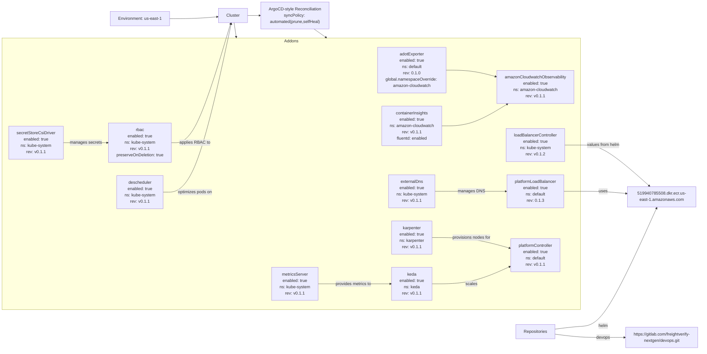

# Diagram: devops/k8s/argocd/app-manager/helm/values.yaml

> Auto-generated by Obscura crawlers

## Mermaid

### SVG

<svg id="container" width="2949.0625" xmlns="http://www.w3.org/2000/svg" class="flowchart" height="1139" viewBox="0 0 2949.0625 1139" role="graphics-document document" aria-roledescription="flowchart-v2"><g><marker id="container_flowchart-v2-pointEnd" class="marker flowchart-v2" viewBox="0 0 10 10" refX="5" refY="5" markerUnits="userSpaceOnUse" markerWidth="8" markerHeight="8" orient="auto"><path d="M 0 0 L 10 5 L 0 10 z" class="arrowMarkerPath" style="stroke-width: 1; stroke-dasharray: 1, 0;"></path></marker><marker id="container_flowchart-v2-pointStart" class="marker flowchart-v2" viewBox="0 0 10 10" refX="4.5" refY="5" markerUnits="userSpaceOnUse" markerWidth="8" markerHeight="8" orient="auto"><path d="M 0 5 L 10 10 L 10 0 z" class="arrowMarkerPath" style="stroke-width: 1; stroke-dasharray: 1, 0;"></path></marker><marker id="container_flowchart-v2-circleEnd" class="marker flowchart-v2" viewBox="0 0 10 10" refX="11" refY="5" markerUnits="userSpaceOnUse" markerWidth="11" markerHeight="11" orient="auto"><circle cx="5" cy="5" r="5" class="arrowMarkerPath" style="stroke-width: 1; stroke-dasharray: 1, 0;"></circle></marker><marker id="container_flowchart-v2-circleStart" class="marker flowchart-v2" viewBox="0 0 10 10" refX="-1" refY="5" markerUnits="userSpaceOnUse" markerWidth="11" markerHeight="11" orient="auto"><circle cx="5" cy="5" r="5" class="arrowMarkerPath" style="stroke-width: 1; stroke-dasharray: 1, 0;"></circle></marker><marker id="container_flowchart-v2-crossEnd" class="marker cross flowchart-v2" viewBox="0 0 11 11" refX="12" refY="5.2" markerUnits="userSpaceOnUse" markerWidth="11" markerHeight="11" orient="auto"><path d="M 1,1 l 9,9 M 10,1 l -9,9" class="arrowMarkerPath" style="stroke-width: 2; stroke-dasharray: 1, 0;"></path></marker><marker id="container_flowchart-v2-crossStart" class="marker cross flowchart-v2" viewBox="0 0 11 11" refX="-1" refY="5.2" markerUnits="userSpaceOnUse" markerWidth="11" markerHeight="11" orient="auto"><path d="M 1,1 l 9,9 M 10,1 l -9,9" class="arrowMarkerPath" style="stroke-width: 2; stroke-dasharray: 1, 0;"></path></marker><g class="root"><g class="clusters"><g class="cluster" id="Addons" data-look="classic"><rect style="" x="8" y="145" width="2464.1875" height="841"></rect><g class="cluster-label" transform="translate(1212.84375, 145)"><foreignObject width="54.5" height="24">

Addons

</foreignObject></g></g></g><g class="edgePaths"><path d="M2331.766,1062.315L2355.169,1059.929C2378.573,1057.543,2425.38,1052.772,2463.405,1050.386C2501.43,1048,2530.672,1048,2580.404,985.248C2630.135,922.497,2700.356,796.994,2735.467,734.242L2770.577,671.491" id="L_Repos_HelmRepo_0" class="edge-thickness-normal edge-pattern-solid edge-thickness-normal edge-pattern-solid flowchart-link" style=";" data-edge="true" data-et="edge" data-id="L_Repos_HelmRepo_0" data-points="W3sieCI6MjMzMS43NjU2MjUsInkiOjEwNjIuMzE1MTcyMTM5MTU5NH0seyJ4IjoyNDcyLjE4NzUsInkiOjEwNDh9LHsieCI6MjU1OS45MTQwNjI1LCJ5IjoxMDQ4fSx7IngiOjI3NzIuNTMwNDEwOTQ4Njg3NCwieSI6NjY4fV0=" marker-end="url(#container_flowchart-v2-pointEnd)"></path><path d="M2331.766,1077.685L2355.169,1080.071C2378.573,1082.457,2425.38,1087.228,2463.405,1089.614C2501.43,1092,2530.672,1092,2559.247,1092C2587.823,1092,2615.732,1092,2629.686,1092L2643.641,1092" id="L_Repos_DevopsRepo_0" class="edge-thickness-normal edge-pattern-solid edge-thickness-normal edge-pattern-solid flowchart-link" style=";" data-edge="true" data-et="edge" data-id="L_Repos_DevopsRepo_0" data-points="W3sieCI6MjMzMS43NjU2MjUsInkiOjEwNzcuNjg0ODI3ODYwODQwNn0seyJ4IjoyNDcyLjE4NzUsInkiOjEwOTJ9LHsieCI6MjU1OS45MTQwNjI1LCJ5IjoxMDkyfSx7IngiOjI2NDcuNjQwNjI1LCJ5IjoxMDkyfV0=" marker-end="url(#container_flowchart-v2-pointEnd)"></path><path d="M739.305,71L757.941,71C776.578,71,813.852,71,847.118,69.807C880.385,68.613,909.644,66.227,924.274,65.034L938.904,63.84" id="L_Env_Cluster_0" class="edge-thickness-normal edge-pattern-solid edge-thickness-normal edge-pattern-solid flowchart-link" style=";" data-edge="true" data-et="edge" data-id="L_Env_Cluster_0" data-points="W3sieCI6NzM5LjMwNDY4NzUsInkiOjcxfSx7IngiOjg1MS4xMjUsInkiOjcxfSx7IngiOjk0Mi44OTA2MjUsInkiOjYzLjUxNTI5MzExODA5Njg2fV0=" marker-end="url(#container_flowchart-v2-pointEnd)"></path><path d="M1053.609,59L1057.776,59C1061.943,59,1070.276,59,1077.943,59C1085.609,59,1092.609,59,1096.109,59L1099.609,59" id="L_Cluster_Reconciliation_0" class="edge-thickness-normal edge-pattern-solid edge-thickness-normal edge-pattern-solid flowchart-link" style=";" data-edge="true" data-et="edge" data-id="L_Cluster_Reconciliation_0" data-points="W3sieCI6MTA1My42MDkzNzUsInkiOjU5fSx7IngiOjEwNzguNjA5Mzc1LCJ5Ijo1OX0seyJ4IjoxMTAzLjYwOTM3NSwieSI6NTl9XQ==" marker-end="url(#container_flowchart-v2-pointEnd)"></path><path d="M2409.094,608L2419.609,608C2430.125,608,2451.156,608,2476.293,608C2501.43,608,2530.672,608,2562.035,609.5C2593.399,610.999,2626.883,613.999,2643.625,615.499L2660.368,616.998" id="L_platformLB_HelmRepo_0" class="edge-thickness-normal edge-pattern-solid edge-thickness-normal edge-pattern-solid flowchart-link" style=";" data-edge="true" data-et="edge" data-id="L_platformLB_HelmRepo_0" data-points="W3sieCI6MjQwOS4wOTM3NSwieSI6NjA4fSx7IngiOjI0NzIuMTg3NSwieSI6NjA4fSx7IngiOjI1NTkuOTE0MDYyNSwieSI6NjA4fSx7IngiOjI2NjQuMzUxNTYyNSwieSI6NjE3LjM1NTEwNTMwNTI1Mn1d" marker-end="url(#container_flowchart-v2-pointEnd)"></path><path d="M2412.281,480L2422.266,480C2432.25,480,2452.219,480,2476.824,480C2501.43,480,2530.672,480,2573.576,497.976C2616.48,515.951,2673.047,551.903,2701.33,569.879L2729.613,587.854" id="L_lbController_HelmRepo_0" class="edge-thickness-normal edge-pattern-solid edge-thickness-normal edge-pattern-solid flowchart-link" style=";" data-edge="true" data-et="edge" data-id="L_lbController_HelmRepo_0" data-points="W3sieCI6MjQxMi4yODEyNSwieSI6NDgwfSx7IngiOjI0NzIuMTg3NSwieSI6NDgwfSx7IngiOjI1NTkuOTE0MDYyNSwieSI6NDgwfSx7IngiOjI3MzIuOTg4NzI2OTI5NTMsInkiOjU5MH1d" marker-end="url(#container_flowchart-v2-pointEnd)"></path><path d="M1847.281,419L1867.103,419C1886.924,419,1926.568,419,1979.634,404.106C2032.701,389.212,2099.191,359.424,2132.436,344.53L2165.681,329.635" id="L_containerInsights_amazonCW_0" class="edge-thickness-normal edge-pattern-solid edge-thickness-normal edge-pattern-solid flowchart-link" style=";" data-edge="true" data-et="edge" data-id="L_containerInsights_amazonCW_0" data-points="W3sieCI6MTg0Ny4yODEyNSwieSI6NDE5fSx7IngiOjE5NjYuMjEwOTM3NSwieSI6NDE5fSx7IngiOjIxNjkuMzMxMjUsInkiOjMyOH1d" marker-end="url(#container_flowchart-v2-pointEnd)"></path><path d="M1866.844,243L1883.405,243C1899.966,243,1933.089,243,1965.552,245.521C1998.016,248.042,2029.822,253.084,2045.725,255.605L2061.627,258.126" id="L_adotExporter_amazonCW_0" class="edge-thickness-normal edge-pattern-solid edge-thickness-normal edge-pattern-solid flowchart-link" style=";" data-edge="true" data-et="edge" data-id="L_adotExporter_amazonCW_0" data-points="W3sieCI6MTg2Ni44NDM3NSwieSI6MjQzfSx7IngiOjE5NjYuMjEwOTM3NSwieSI6MjQzfSx7IngiOjIwNjUuNTc4MTI1LCJ5IjoyNTguNzUyMzU1ODIzNTk1OX1d" marker-end="url(#container_flowchart-v2-pointEnd)"></path><path d="M323.672,477L337.867,477C352.063,477,380.453,477,408.177,477C435.901,477,462.958,477,476.487,477L490.016,477" id="L_secretStore_rbac_0" class="edge-thickness-normal edge-pattern-solid edge-thickness-normal edge-pattern-solid flowchart-link" style=";" data-edge="true" data-et="edge" data-id="L_secretStore_rbac_0" data-points="W3sieCI6MzIzLjY3MTg3NSwieSI6NDc3fSx7IngiOjQwOC44NDM3NSwieSI6NDc3fSx7IngiOjQ5NC4wMTU2MjUsInkiOjQ3N31d" marker-end="url(#container_flowchart-v2-pointEnd)"></path><path d="M1842,608L1862.702,608C1883.404,608,1924.807,608,1967.753,608C2010.698,608,2055.185,608,2077.428,608L2099.672,608" id="L_externalDns_platformLB_0" class="edge-thickness-normal edge-pattern-solid edge-thickness-normal edge-pattern-solid flowchart-link" style=";" data-edge="true" data-et="edge" data-id="L_externalDns_platformLB_0" data-points="W3sieCI6MTg0MiwieSI6NjA4fSx7IngiOjE5NjYuMjEwOTM3NSwieSI6NjA4fSx7IngiOjIxMDMuNjcxODc1LCJ5Ijo2MDh9XQ==" marker-end="url(#container_flowchart-v2-pointEnd)"></path><path d="M1842,900L1862.702,900C1883.404,900,1924.807,900,1972.508,891.533C2020.21,883.066,2074.208,866.131,2101.207,857.664L2128.207,849.197" id="L_keda_platformController_0" class="edge-thickness-normal edge-pattern-solid edge-thickness-normal edge-pattern-solid flowchart-link" style=";" data-edge="true" data-et="edge" data-id="L_keda_platformController_0" data-points="W3sieCI6MTg0MiwieSI6OTAwfSx7IngiOjE5NjYuMjEwOTM3NSwieSI6OTAwfSx7IngiOjIxMzIuMDIzNDM3NSwieSI6ODQ4fV0=" marker-end="url(#container_flowchart-v2-pointEnd)"></path><path d="M1842,760L1862.702,760C1883.404,760,1924.807,760,1969.916,764.121C2015.024,768.243,2063.837,776.486,2088.243,780.607L2112.65,784.728" id="L_karpenter_platformController_0" class="edge-thickness-normal edge-pattern-solid edge-thickness-normal edge-pattern-solid flowchart-link" style=";" data-edge="true" data-et="edge" data-id="L_karpenter_platformController_0" data-points="W3sieCI6MTg0MiwieSI6NzYwfSx7IngiOjE5NjYuMjEwOTM3NSwieSI6NzYwfSx7IngiOjIxMTYuNTkzNzUsInkiOjc4NS4zOTQ0NTkxMDI5MDI0fV0=" marker-end="url(#container_flowchart-v2-pointEnd)"></path><path d="M756.688,641L772.427,641C788.167,641,819.646,641,858.605,549.146C897.565,457.293,944.005,273.585,967.224,181.732L990.444,89.878" id="L_descheduler_Cluster_0" class="edge-thickness-normal edge-pattern-solid edge-thickness-normal edge-pattern-solid flowchart-link" style=";" data-edge="true" data-et="edge" data-id="L_descheduler_Cluster_0" data-points="W3sieCI6NzU2LjY4NzUsInkiOjY0MX0seyJ4Ijo4NTEuMTI1LCJ5Ijo2NDF9LHsieCI6OTkxLjQyNDYxMzQwMjA2MTgsInkiOjg2fV0=" marker-end="url(#container_flowchart-v2-pointEnd)"></path><path d="M1365.375,900L1381.504,900C1397.633,900,1429.891,900,1465.328,900C1500.766,900,1539.383,900,1558.691,900L1578,900" id="L_metricsServer_keda_0" class="edge-thickness-normal edge-pattern-solid edge-thickness-normal edge-pattern-solid flowchart-link" style=";" data-edge="true" data-et="edge" data-id="L_metricsServer_keda_0" data-points="W3sieCI6MTM2NS4zNzUsInkiOjkwMH0seyJ4IjoxNDYyLjE0ODQzNzUsInkiOjkwMH0seyJ4IjoxNTgyLCJ5Ijo5MDB9XQ==" marker-end="url(#container_flowchart-v2-pointEnd)"></path><path d="M759.359,477L774.654,477C789.948,477,820.536,477,858.546,412.462C896.556,347.924,941.987,218.849,964.703,154.311L987.419,89.773" id="L_rbac_Cluster_0" class="edge-thickness-normal edge-pattern-solid edge-thickness-normal edge-pattern-solid flowchart-link" style=";" data-edge="true" data-et="edge" data-id="L_rbac_Cluster_0" data-points="W3sieCI6NzU5LjM1OTM3NSwieSI6NDc3fSx7IngiOjg1MS4xMjUsInkiOjQ3N30seyJ4Ijo5ODguNzQ2NzEwNTI2MzE1OCwieSI6ODZ9XQ==" marker-end="url(#container_flowchart-v2-pointEnd)"></path><path d="M1002.998,86L1012.68,141.06" id="L_Cluster_Addons_0" class="edge-thickness-normal edge-pattern-solid edge-thickness-normal edge-pattern-solid flowchart-link" style=";" data-edge="true" data-et="edge" data-id="L_Cluster_Addons_0" data-points="W3sieCI6MTAwMi45OTc3MDkyNDUwNzY2LCJ5Ijo4Nn0seyJ4IjoxMDc4LjYwOTM3NSwieSI6NTE2fSx7IngiOjEyMzUuMzc1LCJ5Ijo1MTZ9LHsieCI6MTQ2Mi4xNDg0Mzc1LCJ5Ijo1MTZ9LHsieCI6MTY1NC4zNDE5NDcxMTUzODQ1LCJ5IjozMDZ9XQ==" marker-end="url(#container_flowchart-v2-pointEnd)"></path><path d="M1315.137,110L1366.505,142.845" id="L_Reconciliation_Addons_0" class="edge-thickness-normal edge-pattern-solid edge-thickness-normal edge-pattern-solid flowchart-link" style=";" data-edge="true" data-et="edge" data-id="L_Reconciliation_Addons_0" data-points="W3sieCI6MTMxNS4xMzY2OTE4MTAzNDUsInkiOjExMH0seyJ4IjoxNDYyLjE0ODQzNzUsInkiOjIwNH0seyJ4IjoxNTU3LjE1NjI1LCJ5IjoyMTguODMwMDI0MDc2Nzk1Nn1d" marker-end="url(#container_flowchart-v2-pointEnd)"></path></g><g class="edgeLabels"><g class="edgeLabel" transform="translate(2559.9140625, 1048)"><g class="label" data-id="L_Repos_HelmRepo_0" transform="translate(-18.25, -12)"><foreignObject width="36.5" height="24">

helm

</foreignObject></g></g><g class="edgeLabel" transform="translate(2559.9140625, 1092)"><g class="label" data-id="L_Repos_DevopsRepo_0" transform="translate(-26.1796875, -12)"><foreignObject width="52.359375" height="24">

devops

</foreignObject></g></g><g class="edgeLabel"><g class="label" data-id="L_Env_Cluster_0" transform="translate(0, 0)"><foreignObject width="0" height="0">

</foreignObject></g></g><g class="edgeLabel"><g class="label" data-id="L_Cluster_Reconciliation_0" transform="translate(0, 0)"><foreignObject width="0" height="0">

</foreignObject></g></g><g class="edgeLabel" transform="translate(2559.9140625, 608)"><g class="label" data-id="L_platformLB_HelmRepo_0" transform="translate(-16.4921875, -12)"><foreignObject width="32.984375" height="24">

uses

</foreignObject></g></g><g class="edgeLabel" transform="translate(2559.9140625, 480)"><g class="label" data-id="L_lbController_HelmRepo_0" transform="translate(-62.7265625, -12)"><foreignObject width="125.453125" height="24">

values from helm

</foreignObject></g></g><g class="edgeLabel"><g class="label" data-id="L_containerInsights_amazonCW_0" transform="translate(0, 0)"><foreignObject width="0" height="0">

</foreignObject></g></g><g class="edgeLabel"><g class="label" data-id="L_adotExporter_amazonCW_0" transform="translate(0, 0)"><foreignObject width="0" height="0">

</foreignObject></g></g><g class="edgeLabel" transform="translate(408.84375, 477)"><g class="label" data-id="L_secretStore_rbac_0" transform="translate(-60.171875, -12)"><foreignObject width="120.34375" height="24">

manages secrets

</foreignObject></g></g><g class="edgeLabel" transform="translate(1966.2109375, 608)"><g class="label" data-id="L_externalDns_platformLB_0" transform="translate(-49.3984375, -12)"><foreignObject width="98.796875" height="24">

manages DNS

</foreignObject></g></g><g class="edgeLabel" transform="translate(1966.2109375, 900)"><g class="label" data-id="L_keda_platformController_0" transform="translate(-22.15625, -12)"><foreignObject width="44.3125" height="24">

scales

</foreignObject></g></g><g class="edgeLabel" transform="translate(1966.2109375, 760)"><g class="label" data-id="L_karpenter_platformController_0" transform="translate(-74.3671875, -12)"><foreignObject width="148.734375" height="24">

provisions nodes for

</foreignObject></g></g><g class="edgeLabel" transform="translate(851.125, 641)"><g class="label" data-id="L_descheduler_Cluster_0" transform="translate(-66.765625, -12)"><foreignObject width="133.53125" height="24">

optimizes pods on

</foreignObject></g></g><g class="edgeLabel" transform="translate(1462.1484375, 900)"><g class="label" data-id="L_metricsServer_keda_0" transform="translate(-70.0078125, -12)"><foreignObject width="140.015625" height="24">

provides metrics to

</foreignObject></g></g><g class="edgeLabel" transform="translate(851.125, 477)"><g class="label" data-id="L_rbac_Cluster_0" transform="translate(-56.8828125, -12)"><foreignObject width="113.765625" height="24">

applies RBAC to

</foreignObject></g></g><g class="edgeLabel"><g class="label" data-id="L_Cluster_Addons_0" transform="translate(0, 0)"><foreignObject width="0" height="0">

</foreignObject></g></g><g class="edgeLabel"><g class="label" data-id="L_Reconciliation_Addons_0" transform="translate(0, 0)"><foreignObject width="0" height="0">

</foreignObject></g></g></g><g class="nodes"><g class="node default" id="flowchart-Env-0" transform="translate(626.6875, 71)"><rect class="basic label-container" style="" x="-112.6171875" y="-27" width="225.234375" height="54"></rect><g class="label" style="" transform="translate(-82.6171875, -12)"><rect></rect><foreignObject width="165.234375" height="24">

Environment: us-east-1

</foreignObject></g></g><g class="node default" id="flowchart-Repos-1" transform="translate(2256.3828125, 1070)"><rect class="basic label-container" style="" x="-75.3828125" y="-27" width="150.765625" height="54"></rect><g class="label" style="" transform="translate(-45.3828125, -12)"><rect></rect><foreignObject width="90.765625" height="24">

Repositories

</foreignObject></g></g><g class="node default" id="flowchart-HelmRepo-3" transform="translate(2794.3515625, 629)"><rect class="basic label-container" style="" x="-130" y="-39" width="260" height="78"></rect><g class="label" style="" transform="translate(-100, -24)"><rect></rect><foreignObject width="200" height="48">

519940785508.dkr.ecr.us-east-1.amazonaws.com

</foreignObject></g></g><g class="node default" id="flowchart-DevopsRepo-5" transform="translate(2794.3515625, 1092)"><rect class="basic label-container" style="" x="-146.7109375" y="-39" width="293.421875" height="78"></rect><g class="label" style="" transform="translate(-116.7109375, -24)"><rect></rect><foreignObject width="233.421875" height="48">

https://gitlab.com/freightverify-nextgen/devops.git

</foreignObject></g></g><g class="node default" id="flowchart-Cluster-6" transform="translate(998.25, 59)"><rect class="basic label-container" style="" x="-55.359375" y="-27" width="110.71875" height="54"></rect><g class="label" style="" transform="translate(-25.359375, -12)"><rect></rect><foreignObject width="50.71875" height="24">

Cluster

</foreignObject></g></g><g class="node default" id="flowchart-Reconciliation-10" transform="translate(1235.375, 59)"><rect class="basic label-container" style="" x="-131.765625" y="-51" width="263.53125" height="102"></rect><g class="label" style="" transform="translate(-101.765625, -36)"><rect></rect><foreignObject width="203.53125" height="72">

ArgoCD-style Reconciliation\nsyncPolicy: automated(prune,selfHeal)

</foreignObject></g></g><g class="node default" id="flowchart-adotExporter-11" transform="translate(1712, 243)"><rect class="basic label-container" style="" x="-154.84375" y="-63" width="309.6875" height="126"></rect><g class="label" style="" transform="translate(-124.84375, -48)"><rect></rect><foreignObject width="249.6875" height="96">

adotExporter\nenabled: true\nns: default\nrev: 0.1.0\nglobal.namespaceOverride: amazon-cloudwatch

</foreignObject></g></g><g class="node default" id="flowchart-amazonCW-12" transform="translate(2256.3828125, 289)"><rect class="basic label-container" style="" x="-190.8046875" y="-39" width="381.609375" height="78"></rect><g class="label" style="" transform="translate(-160.8046875, -24)"><rect></rect><foreignObject width="321.609375" height="48">

amazonCloudwatchObservability\nenabled: true\nns: amazon-cloudwatch\nrev: v0.1.1

</foreignObject></g></g><g class="node default" id="flowchart-platformLB-13" transform="translate(2256.3828125, 608)"><rect class="basic label-container" style="" x="-152.7109375" y="-39" width="305.421875" height="78"></rect><g class="label" style="" transform="translate(-122.7109375, -24)"><rect></rect><foreignObject width="245.421875" height="48">

platformLoadBalancer\nenabled: true\nns: default\nrev: 0.1.3

</foreignObject></g></g><g class="node default" id="flowchart-lbController-14" transform="translate(2256.3828125, 480)"><rect class="basic label-container" style="" x="-155.8984375" y="-39" width="311.796875" height="78"></rect><g class="label" style="" transform="translate(-125.8984375, -24)"><rect></rect><foreignObject width="251.796875" height="48">

loadBalancerController\nenabled: true\nns: kube-system\nrev: v0.1.2

</foreignObject></g></g><g class="node default" id="flowchart-containerInsights-15" transform="translate(1712, 419)"><rect class="basic label-container" style="" x="-135.28125" y="-63" width="270.5625" height="126"></rect><g class="label" style="" transform="translate(-105.28125, -48)"><rect></rect><foreignObject width="210.5625" height="96">

containerInsights\nenabled: true\nns: amazon-cloudwatch\nrev: v0.1.1\nfluentd: enabled

</foreignObject></g></g><g class="node default" id="flowchart-descheduler-16" transform="translate(626.6875, 641)"><rect class="basic label-container" style="" x="-130" y="-51" width="260" height="102"></rect><g class="label" style="" transform="translate(-100, -36)"><rect></rect><foreignObject width="200" height="72">

descheduler\nenabled: true\nns: kube-system\nrev: v0.1.1

</foreignObject></g></g><g class="node default" id="flowchart-externalDns-17" transform="translate(1712, 608)"><rect class="basic label-container" style="" x="-130" y="-51" width="260" height="102"></rect><g class="label" style="" transform="translate(-100, -36)"><rect></rect><foreignObject width="200" height="72">

externalDns\nenabled: true\nns: kube-system\nrev: v0.1.1

</foreignObject></g></g><g class="node default" id="flowchart-karpenter-18" transform="translate(1712, 760)"><rect class="basic label-container" style="" x="-130" y="-51" width="260" height="102"></rect><g class="label" style="" transform="translate(-100, -36)"><rect></rect><foreignObject width="200" height="72">

karpenter\nenabled: true\nns: karpenter\nrev: v0.1.1

</foreignObject></g></g><g class="node default" id="flowchart-keda-19" transform="translate(1712, 900)"><rect class="basic label-container" style="" x="-130" y="-39" width="260" height="78"></rect><g class="label" style="" transform="translate(-100, -24)"><rect></rect><foreignObject width="200" height="48">

keda\nenabled: true\nns: keda\nrev: v0.1.1

</foreignObject></g></g><g class="node default" id="flowchart-metricsServer-20" transform="translate(1235.375, 900)"><rect class="basic label-container" style="" x="-130" y="-51" width="260" height="102"></rect><g class="label" style="" transform="translate(-100, -36)"><rect></rect><foreignObject width="200" height="72">

metricsServer\nenabled: true\nns: kube-system\nrev: v0.1.1

</foreignObject></g></g><g class="node default" id="flowchart-platformController-21" transform="translate(2256.3828125, 809)"><rect class="basic label-container" style="" x="-139.7890625" y="-39" width="279.578125" height="78"></rect><g class="label" style="" transform="translate(-109.7890625, -24)"><rect></rect><foreignObject width="219.578125" height="48">

platformController\nenabled: true\nns: default\nrev: v0.1.1

</foreignObject></g></g><g class="node default" id="flowchart-rbac-22" transform="translate(626.6875, 477)"><rect class="basic label-container" style="" x="-132.671875" y="-63" width="265.34375" height="126"></rect><g class="label" style="" transform="translate(-102.671875, -48)"><rect></rect><foreignObject width="205.34375" height="96">

rbac\nenabled: true\nns: kube-system\nrev: v0.1.1\npreserveOnDeletion: true

</foreignObject></g></g><g class="node default" id="flowchart-secretStore-23" transform="translate(178.3359375, 477)"><rect class="basic label-container" style="" x="-145.3359375" y="-51" width="290.671875" height="102"></rect><g class="label" style="" transform="translate(-115.3359375, -36)"><rect></rect><foreignObject width="230.671875" height="72">

secretStoreCsiDriver\nenabled: true\nns: kube-system\nrev: v0.1.1

</foreignObject></g></g></g></g></g></svg>
