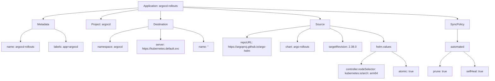

# Diagram: devops/k8s/argocd/argo-rollouts/argocd/Application.yaml

> Auto-generated by Obscura crawlers

## Mermaid

### SVG

<svg id="container" width="2804.3359375" xmlns="http://www.w3.org/2000/svg" class="flowchart" height="478" viewBox="0 0 2804.3359375 478" role="graphics-document document" aria-roledescription="flowchart-v2"><g><marker id="container_flowchart-v2-pointEnd" class="marker flowchart-v2" viewBox="0 0 10 10" refX="5" refY="5" markerUnits="userSpaceOnUse" markerWidth="8" markerHeight="8" orient="auto"><path d="M 0 0 L 10 5 L 0 10 z" class="arrowMarkerPath" style="stroke-width: 1; stroke-dasharray: 1, 0;"></path></marker><marker id="container_flowchart-v2-pointStart" class="marker flowchart-v2" viewBox="0 0 10 10" refX="4.5" refY="5" markerUnits="userSpaceOnUse" markerWidth="8" markerHeight="8" orient="auto"><path d="M 0 5 L 10 10 L 10 0 z" class="arrowMarkerPath" style="stroke-width: 1; stroke-dasharray: 1, 0;"></path></marker><marker id="container_flowchart-v2-circleEnd" class="marker flowchart-v2" viewBox="0 0 10 10" refX="11" refY="5" markerUnits="userSpaceOnUse" markerWidth="11" markerHeight="11" orient="auto"><circle cx="5" cy="5" r="5" class="arrowMarkerPath" style="stroke-width: 1; stroke-dasharray: 1, 0;"></circle></marker><marker id="container_flowchart-v2-circleStart" class="marker flowchart-v2" viewBox="0 0 10 10" refX="-1" refY="5" markerUnits="userSpaceOnUse" markerWidth="11" markerHeight="11" orient="auto"><circle cx="5" cy="5" r="5" class="arrowMarkerPath" style="stroke-width: 1; stroke-dasharray: 1, 0;"></circle></marker><marker id="container_flowchart-v2-crossEnd" class="marker cross flowchart-v2" viewBox="0 0 11 11" refX="12" refY="5.2" markerUnits="userSpaceOnUse" markerWidth="11" markerHeight="11" orient="auto"><path d="M 1,1 l 9,9 M 10,1 l -9,9" class="arrowMarkerPath" style="stroke-width: 2; stroke-dasharray: 1, 0;"></path></marker><marker id="container_flowchart-v2-crossStart" class="marker cross flowchart-v2" viewBox="0 0 11 11" refX="-1" refY="5.2" markerUnits="userSpaceOnUse" markerWidth="11" markerHeight="11" orient="auto"><path d="M 1,1 l 9,9 M 10,1 l -9,9" class="arrowMarkerPath" style="stroke-width: 2; stroke-dasharray: 1, 0;"></path></marker><g class="root"><g class="clusters"></g><g class="edgePaths"><path d="M183.191,188.803L172.346,193.169C161.5,197.535,139.809,206.268,128.963,218.134C118.117,230,118.117,245,118.117,252.5L118.117,260" id="L_M_M1_0" class="edge-thickness-normal edge-pattern-solid edge-thickness-normal edge-pattern-solid flowchart-link" style=";" data-edge="true" data-et="edge" data-id="L_M_M1_0" data-points="W3sieCI6MTgzLjE5MTQwNjI1LCJ5IjoxODguODAyNjQzMTE4NTE2OTV9LHsieCI6MTE4LjExNzE4NzUsInkiOjIxNX0seyJ4IjoxMTguMTE3MTg3NSwieSI6MjY0fV0=" marker-end="url(#container_flowchart-v2-pointEnd)"></path><path d="M311.379,188.803L322.225,193.169C333.07,197.535,354.762,206.268,365.607,218.134C376.453,230,376.453,245,376.453,252.5L376.453,260" id="L_M_M2_0" class="edge-thickness-normal edge-pattern-solid edge-thickness-normal edge-pattern-solid flowchart-link" style=";" data-edge="true" data-et="edge" data-id="L_M_M2_0" data-points="W3sieCI6MzExLjM3ODkwNjI1LCJ5IjoxODguODAyNjQzMTE4NTE2OTV9LHsieCI6Mzc2LjQ1MzEyNSwieSI6MjE1fSx7IngiOjM3Ni40NTMxMjUsInkiOjI2NH1d" marker-end="url(#container_flowchart-v2-pointEnd)"></path><path d="M783.867,59.482L694.437,68.068C605.007,76.654,426.146,93.827,336.715,105.914C247.285,118,247.285,125,247.285,128.5L247.285,132" id="L_A_M_0" class="edge-thickness-normal edge-pattern-solid edge-thickness-normal edge-pattern-solid flowchart-link" style=";" data-edge="true" data-et="edge" data-id="L_A_M_0" data-points="W3sieCI6NzgzLjg2NzE4NzUsInkiOjU5LjQ4MTU4NDU3NjE2Njg5NX0seyJ4IjoyNDcuMjg1MTU2MjUsInkiOjExMX0seyJ4IjoyNDcuMjg1MTU2MjUsInkiOjEzNn1d" marker-end="url(#container_flowchart-v2-pointEnd)"></path><path d="M783.867,71.51L748.958,78.092C714.049,84.673,644.232,97.837,609.323,107.918C574.414,118,574.414,125,574.414,128.5L574.414,132" id="L_A_B_0" class="edge-thickness-normal edge-pattern-solid edge-thickness-normal edge-pattern-solid flowchart-link" style=";" data-edge="true" data-et="edge" data-id="L_A_B_0" data-points="W3sieCI6NzgzLjg2NzE4NzUsInkiOjcxLjUxMDAxMTUwNzQ3OTg2fSx7IngiOjU3NC40MTQwNjI1LCJ5IjoxMTF9LHsieCI6NTc0LjQxNDA2MjUsInkiOjEzNn1d" marker-end="url(#container_flowchart-v2-pointEnd)"></path><path d="M913.867,86L913.867,90.167C913.867,94.333,913.867,102.667,913.867,110.333C913.867,118,913.867,125,913.867,128.5L913.867,132" id="L_A_C_0" class="edge-thickness-normal edge-pattern-solid edge-thickness-normal edge-pattern-solid flowchart-link" style=";" data-edge="true" data-et="edge" data-id="L_A_C_0" data-points="W3sieCI6OTEzLjg2NzE4NzUsInkiOjg2fSx7IngiOjkxMy44NjcxODc1LCJ5IjoxMTF9LHsieCI6OTEzLjg2NzE4NzUsInkiOjEzNn1d" marker-end="url(#container_flowchart-v2-pointEnd)"></path><path d="M841.93,175.915L805.646,182.429C769.362,188.943,696.794,201.972,660.51,215.986C624.227,230,624.227,245,624.227,252.5L624.227,260" id="L_C_C1_0" class="edge-thickness-normal edge-pattern-solid edge-thickness-normal edge-pattern-solid flowchart-link" style=";" data-edge="true" data-et="edge" data-id="L_C_C1_0" data-points="W3sieCI6ODQxLjkyOTY4NzUsInkiOjE3NS45MTUxNDI2ODc1OTc3OH0seyJ4Ijo2MjQuMjI2NTYyNSwieSI6MjE1fSx7IngiOjYyNC4yMjY1NjI1LCJ5IjoyNjR9XQ==" marker-end="url(#container_flowchart-v2-pointEnd)"></path><path d="M913.867,190L913.867,194.167C913.867,198.333,913.867,206.667,913.867,216.333C913.867,226,913.867,237,913.867,242.5L913.867,248" id="L_C_C2_0" class="edge-thickness-normal edge-pattern-solid edge-thickness-normal edge-pattern-solid flowchart-link" style=";" data-edge="true" data-et="edge" data-id="L_C_C2_0" data-points="W3sieCI6OTEzLjg2NzE4NzUsInkiOjE5MH0seyJ4Ijo5MTMuODY3MTg3NSwieSI6MjE1fSx7IngiOjkxMy44NjcxODc1LCJ5IjoyNTJ9XQ==" marker-end="url(#container_flowchart-v2-pointEnd)"></path><path d="M985.805,178.09L1015.13,184.242C1044.456,190.394,1103.107,202.697,1132.432,216.348C1161.758,230,1161.758,245,1161.758,252.5L1161.758,260" id="L_C_C3_0" class="edge-thickness-normal edge-pattern-solid edge-thickness-normal edge-pattern-solid flowchart-link" style=";" data-edge="true" data-et="edge" data-id="L_C_C3_0" data-points="W3sieCI6OTg1LjgwNDY4NzUsInkiOjE3OC4wOTAzMjQ2MTM5MzAwMn0seyJ4IjoxMTYxLjc1NzgxMjUsInkiOjIxNX0seyJ4IjoxMTYxLjc1NzgxMjUsInkiOjI2NH1d" marker-end="url(#container_flowchart-v2-pointEnd)"></path><path d="M1043.867,55.992L1176.407,65.16C1308.947,74.328,1574.026,92.664,1706.566,105.332C1839.105,118,1839.105,125,1839.105,128.5L1839.105,132" id="L_A_D_0" class="edge-thickness-normal edge-pattern-solid edge-thickness-normal edge-pattern-solid flowchart-link" style=";" data-edge="true" data-et="edge" data-id="L_A_D_0" data-points="W3sieCI6MTA0My44NjcxODc1LCJ5Ijo1NS45OTIyNzgxNzE1ODU4NjZ9LHsieCI6MTgzOS4xMDU0Njg3NSwieSI6MTExfSx7IngiOjE4MzkuMTA1NDY4NzUsInkiOjEzNn1d" marker-end="url(#container_flowchart-v2-pointEnd)"></path><path d="M1784.543,169.689L1722.943,177.241C1661.344,184.793,1538.145,199.896,1476.545,210.948C1414.945,222,1414.945,229,1414.945,232.5L1414.945,236" id="L_D_D1_0" class="edge-thickness-normal edge-pattern-solid edge-thickness-normal edge-pattern-solid flowchart-link" style=";" data-edge="true" data-et="edge" data-id="L_D_D1_0" data-points="W3sieCI6MTc4NC41NDI5Njg3NSwieSI6MTY5LjY4OTEwMDcwNDUxNzJ9LHsieCI6MTQxNC45NDUzMTI1LCJ5IjoyMTV9LHsieCI6MTQxNC45NDUzMTI1LCJ5IjoyNDB9XQ==" marker-end="url(#container_flowchart-v2-pointEnd)"></path><path d="M1784.543,185.08L1772.221,190.067C1759.898,195.054,1735.254,205.027,1722.932,217.513C1710.609,230,1710.609,245,1710.609,252.5L1710.609,260" id="L_D_D2_0" class="edge-thickness-normal edge-pattern-solid edge-thickness-normal edge-pattern-solid flowchart-link" style=";" data-edge="true" data-et="edge" data-id="L_D_D2_0" data-points="W3sieCI6MTc4NC41NDI5Njg3NSwieSI6MTg1LjA4MDQzNzc1NjQ5Nzk2fSx7IngiOjE3MTAuNjA5Mzc1LCJ5IjoyMTV9LHsieCI6MTcxMC42MDkzNzUsInkiOjI2NH1d" marker-end="url(#container_flowchart-v2-pointEnd)"></path><path d="M1893.668,185.08L1905.99,190.067C1918.313,195.054,1942.957,205.027,1955.279,217.513C1967.602,230,1967.602,245,1967.602,252.5L1967.602,260" id="L_D_D3_0" class="edge-thickness-normal edge-pattern-solid edge-thickness-normal edge-pattern-solid flowchart-link" style=";" data-edge="true" data-et="edge" data-id="L_D_D3_0" data-points="W3sieCI6MTg5My42Njc5Njg3NSwieSI6MTg1LjA4MDQzNzc1NjQ5Nzk2fSx7IngiOjE5NjcuNjAxNTYyNSwieSI6MjE1fSx7IngiOjE5NjcuNjAxNTYyNSwieSI6MjY0fV0=" marker-end="url(#container_flowchart-v2-pointEnd)"></path><path d="M1893.668,170.92L1944.281,178.267C1994.893,185.613,2096.118,200.307,2146.731,215.153C2197.344,230,2197.344,245,2197.344,252.5L2197.344,260" id="L_D_D4_0" class="edge-thickness-normal edge-pattern-solid edge-thickness-normal edge-pattern-solid flowchart-link" style=";" data-edge="true" data-et="edge" data-id="L_D_D4_0" data-points="W3sieCI6MTg5My42Njc5Njg3NSwieSI6MTcwLjkyMDAwNzg1MDkxOTc1fSx7IngiOjIxOTcuMzQzNzUsInkiOjIxNX0seyJ4IjoyMTk3LjM0Mzc1LCJ5IjoyNjR9XQ==" marker-end="url(#container_flowchart-v2-pointEnd)"></path><path d="M2152.261,318L2138.625,326.167C2124.989,334.333,2097.717,350.667,2084.081,362.333C2070.445,374,2070.445,381,2070.445,384.5L2070.445,388" id="L_D4_V1_0" class="edge-thickness-normal edge-pattern-solid edge-thickness-normal edge-pattern-solid flowchart-link" style=";" data-edge="true" data-et="edge" data-id="L_D4_V1_0" data-points="W3sieCI6MjE1Mi4yNjE0MTAzNjE4NDIsInkiOjMxOH0seyJ4IjoyMDcwLjQ0NTMxMjUsInkiOjM2N30seyJ4IjoyMDcwLjQ0NTMxMjUsInkiOjM5Mn1d" marker-end="url(#container_flowchart-v2-pointEnd)"></path><path d="M2242.426,318L2256.062,326.167C2269.698,334.333,2296.97,350.667,2310.606,364.333C2324.242,378,2324.242,389,2324.242,394.5L2324.242,400" id="L_D4_V2_0" class="edge-thickness-normal edge-pattern-solid edge-thickness-normal edge-pattern-solid flowchart-link" style=";" data-edge="true" data-et="edge" data-id="L_D4_V2_0" data-points="W3sieCI6MjI0Mi40MjYwODk2MzgxNTgsInkiOjMxOH0seyJ4IjoyMzI0LjI0MjE4NzUsInkiOjM2N30seyJ4IjoyMzI0LjI0MjE4NzUsInkiOjQwNH1d" marker-end="url(#container_flowchart-v2-pointEnd)"></path><path d="M1043.867,51.882L1306.255,61.735C1568.642,71.588,2093.417,91.294,2355.804,104.647C2618.191,118,2618.191,125,2618.191,128.5L2618.191,132" id="L_A_E_0" class="edge-thickness-normal edge-pattern-solid edge-thickness-normal edge-pattern-solid flowchart-link" style=";" data-edge="true" data-et="edge" data-id="L_A_E_0" data-points="W3sieCI6MTA0My44NjcxODc1LCJ5Ijo1MS44ODE3MDAyNzA2ODA5NjZ9LHsieCI6MjYxOC4xOTE0MDYyNSwieSI6MTExfSx7IngiOjI2MTguMTkxNDA2MjUsInkiOjEzNn1d" marker-end="url(#container_flowchart-v2-pointEnd)"></path><path d="M2618.191,190L2618.191,194.167C2618.191,198.333,2618.191,206.667,2618.191,218.333C2618.191,230,2618.191,245,2618.191,252.5L2618.191,260" id="L_E_E1_0" class="edge-thickness-normal edge-pattern-solid edge-thickness-normal edge-pattern-solid flowchart-link" style=";" data-edge="true" data-et="edge" data-id="L_E_E1_0" data-points="W3sieCI6MjYxOC4xOTE0MDYyNSwieSI6MTkwfSx7IngiOjI2MTguMTkxNDA2MjUsInkiOjIxNX0seyJ4IjoyNjE4LjE5MTQwNjI1LCJ5IjoyNjR9XQ==" marker-end="url(#container_flowchart-v2-pointEnd)"></path><path d="M2582.816,318L2572.116,326.167C2561.417,334.333,2540.017,350.667,2529.317,364.333C2518.617,378,2518.617,389,2518.617,394.5L2518.617,400" id="L_E1_E2_0" class="edge-thickness-normal edge-pattern-solid edge-thickness-normal edge-pattern-solid flowchart-link" style=";" data-edge="true" data-et="edge" data-id="L_E1_E2_0" data-points="W3sieCI6MjU4Mi44MTYzNTQ4NTE5NzM4LCJ5IjozMTh9LHsieCI6MjUxOC42MTcxODc1LCJ5IjozNjd9LHsieCI6MjUxOC42MTcxODc1LCJ5Ijo0MDR9XQ==" marker-end="url(#container_flowchart-v2-pointEnd)"></path><path d="M2653.566,318L2664.266,326.167C2674.966,334.333,2696.366,350.667,2707.066,364.333C2717.766,378,2717.766,389,2717.766,394.5L2717.766,400" id="L_E1_E3_0" class="edge-thickness-normal edge-pattern-solid edge-thickness-normal edge-pattern-solid flowchart-link" style=";" data-edge="true" data-et="edge" data-id="L_E1_E3_0" data-points="W3sieCI6MjY1My41NjY0NTc2NDgwMjYyLCJ5IjozMTh9LHsieCI6MjcxNy43NjU2MjUsInkiOjM2N30seyJ4IjoyNzE3Ljc2NTYyNSwieSI6NDA0fV0=" marker-end="url(#container_flowchart-v2-pointEnd)"></path></g><g class="edgeLabels"><g class="edgeLabel"><g class="label" data-id="L_M_M1_0" transform="translate(0, 0)"><foreignObject width="0" height="0">

</foreignObject></g></g><g class="edgeLabel"><g class="label" data-id="L_M_M2_0" transform="translate(0, 0)"><foreignObject width="0" height="0">

</foreignObject></g></g><g class="edgeLabel"><g class="label" data-id="L_A_M_0" transform="translate(0, 0)"><foreignObject width="0" height="0">

</foreignObject></g></g><g class="edgeLabel"><g class="label" data-id="L_A_B_0" transform="translate(0, 0)"><foreignObject width="0" height="0">

</foreignObject></g></g><g class="edgeLabel"><g class="label" data-id="L_A_C_0" transform="translate(0, 0)"><foreignObject width="0" height="0">

</foreignObject></g></g><g class="edgeLabel"><g class="label" data-id="L_C_C1_0" transform="translate(0, 0)"><foreignObject width="0" height="0">

</foreignObject></g></g><g class="edgeLabel"><g class="label" data-id="L_C_C2_0" transform="translate(0, 0)"><foreignObject width="0" height="0">

</foreignObject></g></g><g class="edgeLabel"><g class="label" data-id="L_C_C3_0" transform="translate(0, 0)"><foreignObject width="0" height="0">

</foreignObject></g></g><g class="edgeLabel"><g class="label" data-id="L_A_D_0" transform="translate(0, 0)"><foreignObject width="0" height="0">

</foreignObject></g></g><g class="edgeLabel"><g class="label" data-id="L_D_D1_0" transform="translate(0, 0)"><foreignObject width="0" height="0">

</foreignObject></g></g><g class="edgeLabel"><g class="label" data-id="L_D_D2_0" transform="translate(0, 0)"><foreignObject width="0" height="0">

</foreignObject></g></g><g class="edgeLabel"><g class="label" data-id="L_D_D3_0" transform="translate(0, 0)"><foreignObject width="0" height="0">

</foreignObject></g></g><g class="edgeLabel"><g class="label" data-id="L_D_D4_0" transform="translate(0, 0)"><foreignObject width="0" height="0">

</foreignObject></g></g><g class="edgeLabel"><g class="label" data-id="L_D4_V1_0" transform="translate(0, 0)"><foreignObject width="0" height="0">

</foreignObject></g></g><g class="edgeLabel"><g class="label" data-id="L_D4_V2_0" transform="translate(0, 0)"><foreignObject width="0" height="0">

</foreignObject></g></g><g class="edgeLabel"><g class="label" data-id="L_A_E_0" transform="translate(0, 0)"><foreignObject width="0" height="0">

</foreignObject></g></g><g class="edgeLabel"><g class="label" data-id="L_E_E1_0" transform="translate(0, 0)"><foreignObject width="0" height="0">

</foreignObject></g></g><g class="edgeLabel"><g class="label" data-id="L_E1_E2_0" transform="translate(0, 0)"><foreignObject width="0" height="0">

</foreignObject></g></g><g class="edgeLabel"><g class="label" data-id="L_E1_E3_0" transform="translate(0, 0)"><foreignObject width="0" height="0">

</foreignObject></g></g></g><g class="nodes"><g class="node default" id="flowchart-A-0" transform="translate(913.8671875, 47)"><rect class="basic label-container" style="" x="-130" y="-39" width="260" height="78"></rect><g class="label" style="" transform="translate(-100, -24)"><rect></rect><foreignObject width="200" height="48">

Application: argocd-rollouts

</foreignObject></g></g><g class="node default" id="flowchart-M-1" transform="translate(247.28515625, 163)"><rect class="basic label-container" style="" x="-64.09375" y="-27" width="128.1875" height="54"></rect><g class="label" style="" transform="translate(-34.09375, -12)"><rect></rect><foreignObject width="68.1875" height="24">

Metadata

</foreignObject></g></g><g class="node default" id="flowchart-M1-3" transform="translate(118.1171875, 291)"><rect class="basic label-container" style="" x="-110.1171875" y="-27" width="220.234375" height="54"></rect><g class="label" style="" transform="translate(-80.1171875, -12)"><rect></rect><foreignObject width="160.234375" height="24">

name: argocd-rollouts

</foreignObject></g></g><g class="node default" id="flowchart-M2-5" transform="translate(376.453125, 291)"><rect class="basic label-container" style="" x="-98.21875" y="-27" width="196.4375" height="54"></rect><g class="label" style="" transform="translate(-68.21875, -12)"><rect></rect><foreignObject width="136.4375" height="24">

labels: app=argocd

</foreignObject></g></g><g class="node default" id="flowchart-B-9" transform="translate(574.4140625, 163)"><rect class="basic label-container" style="" x="-83.8671875" y="-27" width="167.734375" height="54"></rect><g class="label" style="" transform="translate(-53.8671875, -12)"><rect></rect><foreignObject width="107.734375" height="24">

Project: argocd

</foreignObject></g></g><g class="node default" id="flowchart-C-11" transform="translate(913.8671875, 163)"><rect class="basic label-container" style="" x="-71.9375" y="-27" width="143.875" height="54"></rect><g class="label" style="" transform="translate(-41.9375, -12)"><rect></rect><foreignObject width="83.875" height="24">

Destination

</foreignObject></g></g><g class="node default" id="flowchart-C1-13" transform="translate(624.2265625, 291)"><rect class="basic label-container" style="" x="-99.5546875" y="-27" width="199.109375" height="54"></rect><g class="label" style="" transform="translate(-69.5546875, -12)"><rect></rect><foreignObject width="139.109375" height="24">

namespace: argocd

</foreignObject></g></g><g class="node default" id="flowchart-C2-15" transform="translate(913.8671875, 291)"><rect class="basic label-container" style="" x="-140.0859375" y="-39" width="280.171875" height="78"></rect><g class="label" style="" transform="translate(-110.0859375, -24)"><rect></rect><foreignObject width="220.171875" height="48">

server: https://kubernetes.default.svc

</foreignObject></g></g><g class="node default" id="flowchart-C3-17" transform="translate(1161.7578125, 291)"><rect class="basic label-container" style="" x="-57.8046875" y="-27" width="115.609375" height="54"></rect><g class="label" style="" transform="translate(-27.8046875, -12)"><rect></rect><foreignObject width="55.609375" height="24">

name: ''

</foreignObject></g></g><g class="node default" id="flowchart-D-19" transform="translate(1839.10546875, 163)"><rect class="basic label-container" style="" x="-54.5625" y="-27" width="109.125" height="54"></rect><g class="label" style="" transform="translate(-24.5625, -12)"><rect></rect><foreignObject width="49.125" height="24">

Source

</foreignObject></g></g><g class="node default" id="flowchart-D1-21" transform="translate(1414.9453125, 291)"><rect class="basic label-container" style="" x="-145.3828125" y="-51" width="290.765625" height="102"></rect><g class="label" style="" transform="translate(-115.3828125, -36)"><rect></rect><foreignObject width="230.765625" height="72">

repoURL: https://argoproj.github.io/argo-helm

</foreignObject></g></g><g class="node default" id="flowchart-D2-23" transform="translate(1710.609375, 291)"><rect class="basic label-container" style="" x="-100.28125" y="-27" width="200.5625" height="54"></rect><g class="label" style="" transform="translate(-70.28125, -12)"><rect></rect><foreignObject width="140.5625" height="24">

chart: argo-rollouts

</foreignObject></g></g><g class="node default" id="flowchart-D3-25" transform="translate(1967.6015625, 291)"><rect class="basic label-container" style="" x="-106.7109375" y="-27" width="213.421875" height="54"></rect><g class="label" style="" transform="translate(-76.7109375, -12)"><rect></rect><foreignObject width="153.421875" height="24">

targetRevision: 2.38.0

</foreignObject></g></g><g class="node default" id="flowchart-D4-27" transform="translate(2197.34375, 291)"><rect class="basic label-container" style="" x="-73.03125" y="-27" width="146.0625" height="54"></rect><g class="label" style="" transform="translate(-43.03125, -12)"><rect></rect><foreignObject width="86.0625" height="24">

helm.values

</foreignObject></g></g><g class="node default" id="flowchart-V1-29" transform="translate(2070.4453125, 431)"><rect class="basic label-container" style="" x="-130" y="-39" width="260" height="78"></rect><g class="label" style="" transform="translate(-100, -24)"><rect></rect><foreignObject width="200" height="48">

controller.nodeSelector: kubernetes.io/arch: arm64

</foreignObject></g></g><g class="node default" id="flowchart-V2-31" transform="translate(2324.2421875, 431)"><rect class="basic label-container" style="" x="-73.796875" y="-27" width="147.59375" height="54"></rect><g class="label" style="" transform="translate(-43.796875, -12)"><rect></rect><foreignObject width="87.59375" height="24">

atomic: true

</foreignObject></g></g><g class="node default" id="flowchart-E-33" transform="translate(2618.19140625, 163)"><rect class="basic label-container" style="" x="-68.171875" y="-27" width="136.34375" height="54"></rect><g class="label" style="" transform="translate(-38.171875, -12)"><rect></rect><foreignObject width="76.34375" height="24">

SyncPolicy

</foreignObject></g></g><g class="node default" id="flowchart-E1-35" transform="translate(2618.19140625, 291)"><rect class="basic label-container" style="" x="-69.5703125" y="-27" width="139.140625" height="54"></rect><g class="label" style="" transform="translate(-39.5703125, -12)"><rect></rect><foreignObject width="79.140625" height="24">

automated

</foreignObject></g></g><g class="node default" id="flowchart-E2-37" transform="translate(2518.6171875, 431)"><rect class="basic label-container" style="" x="-70.578125" y="-27" width="141.15625" height="54"></rect><g class="label" style="" transform="translate(-40.578125, -12)"><rect></rect><foreignObject width="81.15625" height="24">

prune: true

</foreignObject></g></g><g class="node default" id="flowchart-E3-39" transform="translate(2717.765625, 431)"><rect class="basic label-container" style="" x="-78.5703125" y="-27" width="157.140625" height="54"></rect><g class="label" style="" transform="translate(-48.5703125, -12)"><rect></rect><foreignObject width="97.140625" height="24">

selfHeal: true

</foreignObject></g></g></g></g></g></svg>
