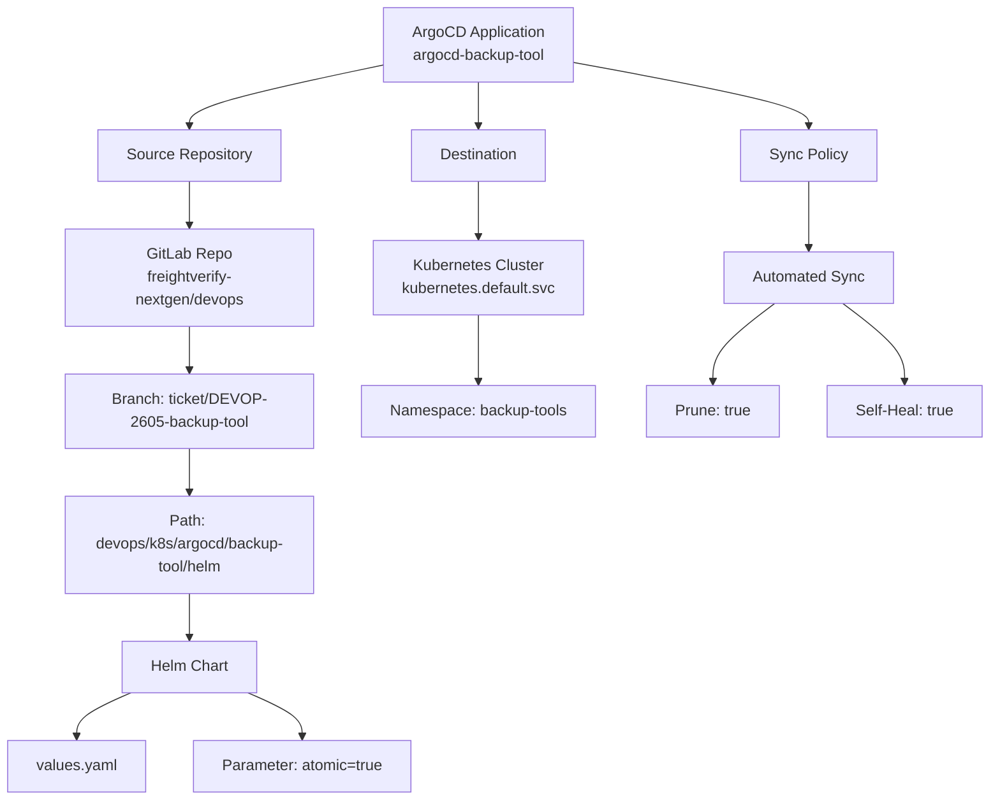
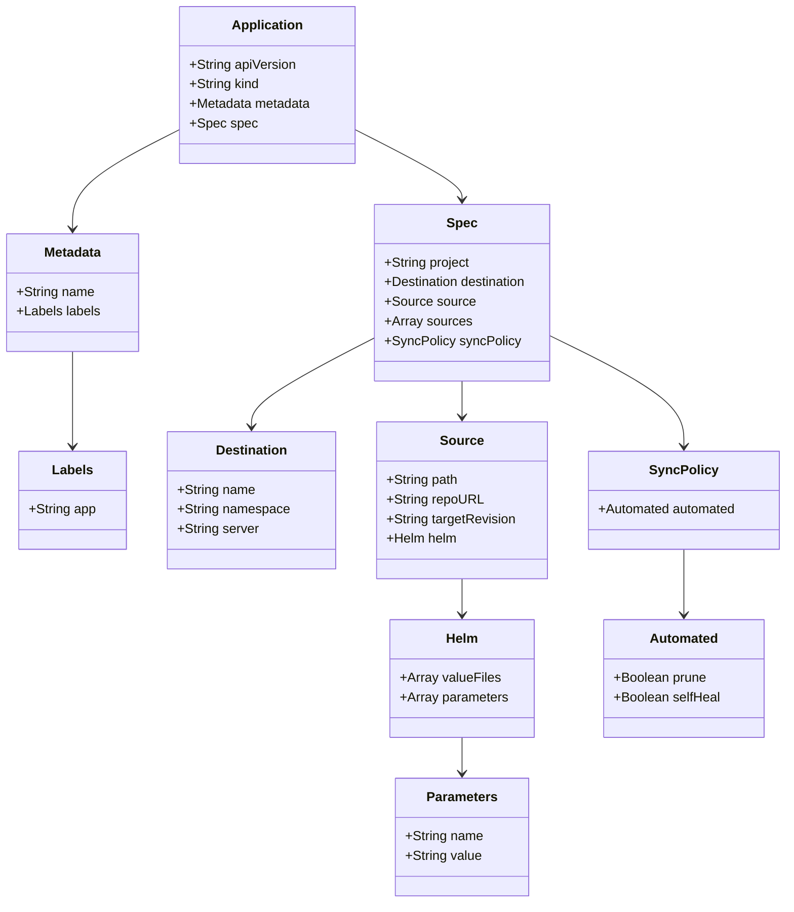
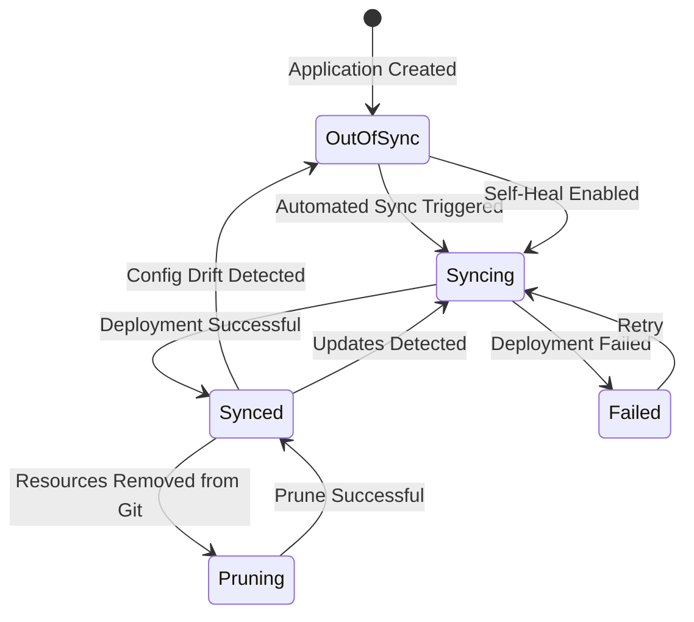
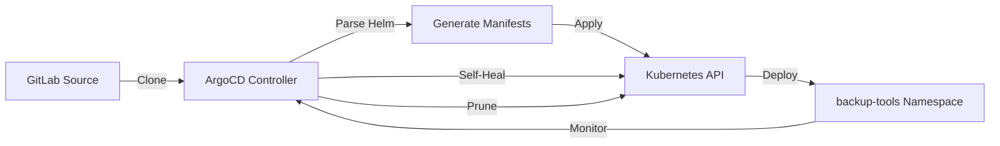

# Diagram: devops/k8s/argocd/backup-tool/argocd/Application.yaml

> Auto-generated by Obscura crawlers

## Diagram 1

### SVG

<svg id="container" width="1042.16015625" xmlns="http://www.w3.org/2000/svg" class="flowchart" height="838" viewBox="0 0 1042.16015625 838" role="graphics-document document" aria-roledescription="flowchart-v2"><g><marker id="container_flowchart-v2-pointEnd" class="marker flowchart-v2" viewBox="0 0 10 10" refX="5" refY="5" markerUnits="userSpaceOnUse" markerWidth="8" markerHeight="8" orient="auto"><path d="M 0 0 L 10 5 L 0 10 z" class="arrowMarkerPath" style="stroke-width: 1; stroke-dasharray: 1, 0;"></path></marker><marker id="container_flowchart-v2-pointStart" class="marker flowchart-v2" viewBox="0 0 10 10" refX="4.5" refY="5" markerUnits="userSpaceOnUse" markerWidth="8" markerHeight="8" orient="auto"><path d="M 0 5 L 10 10 L 10 0 z" class="arrowMarkerPath" style="stroke-width: 1; stroke-dasharray: 1, 0;"></path></marker><marker id="container_flowchart-v2-circleEnd" class="marker flowchart-v2" viewBox="0 0 10 10" refX="11" refY="5" markerUnits="userSpaceOnUse" markerWidth="11" markerHeight="11" orient="auto"><circle cx="5" cy="5" r="5" class="arrowMarkerPath" style="stroke-width: 1; stroke-dasharray: 1, 0;"></circle></marker><marker id="container_flowchart-v2-circleStart" class="marker flowchart-v2" viewBox="0 0 10 10" refX="-1" refY="5" markerUnits="userSpaceOnUse" markerWidth="11" markerHeight="11" orient="auto"><circle cx="5" cy="5" r="5" class="arrowMarkerPath" style="stroke-width: 1; stroke-dasharray: 1, 0;"></circle></marker><marker id="container_flowchart-v2-crossEnd" class="marker cross flowchart-v2" viewBox="0 0 11 11" refX="12" refY="5.2" markerUnits="userSpaceOnUse" markerWidth="11" markerHeight="11" orient="auto"><path d="M 1,1 l 9,9 M 10,1 l -9,9" class="arrowMarkerPath" style="stroke-width: 2; stroke-dasharray: 1, 0;"></path></marker><marker id="container_flowchart-v2-crossStart" class="marker cross flowchart-v2" viewBox="0 0 11 11" refX="-1" refY="5.2" markerUnits="userSpaceOnUse" markerWidth="11" markerHeight="11" orient="auto"><path d="M 1,1 l 9,9 M 10,1 l -9,9" class="arrowMarkerPath" style="stroke-width: 2; stroke-dasharray: 1, 0;"></path></marker><g class="root"><g class="clusters"></g><g class="edgePaths"><path d="M400.527,68.429L366.878,75.525C333.228,82.62,265.928,96.81,232.279,107.405C198.629,118,198.629,125,198.629,128.5L198.629,132" id="L_A_B_0" class="edge-thickness-normal edge-pattern-solid edge-thickness-normal edge-pattern-solid flowchart-link" style=";" data-edge="true" data-et="edge" data-id="L_A_B_0" data-points="W3sieCI6NDAwLjUyNzM0Mzc1LCJ5Ijo2OC40Mjk0MjQ0ODI2NTIxMX0seyJ4IjoxOTguNjI4OTA2MjUsInkiOjExMX0seyJ4IjoxOTguNjI4OTA2MjUsInkiOjEzNn1d" marker-end="url(#container_flowchart-v2-pointEnd)"></path><path d="M198.629,190L198.629,194.167C198.629,198.333,198.629,206.667,198.629,214.333C198.629,222,198.629,229,198.629,232.5L198.629,236" id="L_B_C_0" class="edge-thickness-normal edge-pattern-solid edge-thickness-normal edge-pattern-solid flowchart-link" style=";" data-edge="true" data-et="edge" data-id="L_B_C_0" data-points="W3sieCI6MTk4LjYyODkwNjI1LCJ5IjoxOTB9LHsieCI6MTk4LjYyODkwNjI1LCJ5IjoyMTV9LHsieCI6MTk4LjYyODkwNjI1LCJ5IjoyNDB9XQ==" marker-end="url(#container_flowchart-v2-pointEnd)"></path><path d="M198.629,342L198.629,346.167C198.629,350.333,198.629,358.667,198.629,366.333C198.629,374,198.629,381,198.629,384.5L198.629,388" id="L_C_D_0" class="edge-thickness-normal edge-pattern-solid edge-thickness-normal edge-pattern-solid flowchart-link" style=";" data-edge="true" data-et="edge" data-id="L_C_D_0" data-points="W3sieCI6MTk4LjYyODkwNjI1LCJ5IjozNDJ9LHsieCI6MTk4LjYyODkwNjI1LCJ5IjozNjd9LHsieCI6MTk4LjYyODkwNjI1LCJ5IjozOTJ9XQ==" marker-end="url(#container_flowchart-v2-pointEnd)"></path><path d="M198.629,470L198.629,474.167C198.629,478.333,198.629,486.667,198.629,494.333C198.629,502,198.629,509,198.629,512.5L198.629,516" id="L_D_E_0" class="edge-thickness-normal edge-pattern-solid edge-thickness-normal edge-pattern-solid flowchart-link" style=";" data-edge="true" data-et="edge" data-id="L_D_E_0" data-points="W3sieCI6MTk4LjYyODkwNjI1LCJ5Ijo0NzB9LHsieCI6MTk4LjYyODkwNjI1LCJ5Ijo0OTV9LHsieCI6MTk4LjYyODkwNjI1LCJ5Ijo1MjB9XQ==" marker-end="url(#container_flowchart-v2-pointEnd)"></path><path d="M198.629,622L198.629,626.167C198.629,630.333,198.629,638.667,198.629,646.333C198.629,654,198.629,661,198.629,664.5L198.629,668" id="L_E_F_0" class="edge-thickness-normal edge-pattern-solid edge-thickness-normal edge-pattern-solid flowchart-link" style=";" data-edge="true" data-et="edge" data-id="L_E_F_0" data-points="W3sieCI6MTk4LjYyODkwNjI1LCJ5Ijo2MjJ9LHsieCI6MTk4LjYyODkwNjI1LCJ5Ijo2NDd9LHsieCI6MTk4LjYyODkwNjI1LCJ5Ijo2NzJ9XQ==" marker-end="url(#container_flowchart-v2-pointEnd)"></path><path d="M137.106,726L127.612,730.167C118.118,734.333,99.129,742.667,89.635,750.333C80.141,758,80.141,765,80.141,768.5L80.141,772" id="L_F_G_0" class="edge-thickness-normal edge-pattern-solid edge-thickness-normal edge-pattern-solid flowchart-link" style=";" data-edge="true" data-et="edge" data-id="L_F_G_0" data-points="W3sieCI6MTM3LjEwNjE0NDgzMTczMDc3LCJ5Ijo3MjZ9LHsieCI6ODAuMTQwNjI1LCJ5Ijo3NTF9LHsieCI6ODAuMTQwNjI1LCJ5Ijo3NzZ9XQ==" marker-end="url(#container_flowchart-v2-pointEnd)"></path><path d="M260.152,726L269.646,730.167C279.14,734.333,298.129,742.667,307.623,750.333C317.117,758,317.117,765,317.117,768.5L317.117,772" id="L_F_H_0" class="edge-thickness-normal edge-pattern-solid edge-thickness-normal edge-pattern-solid flowchart-link" style=";" data-edge="true" data-et="edge" data-id="L_F_H_0" data-points="W3sieCI6MjYwLjE1MTY2NzY2ODI2OTIsInkiOjcyNn0seyJ4IjozMTcuMTE3MTg3NSwieSI6NzUxfSx7IngiOjMxNy4xMTcxODc1LCJ5Ijo3NzZ9XQ==" marker-end="url(#container_flowchart-v2-pointEnd)"></path><path d="M502.16,86L502.16,90.167C502.16,94.333,502.16,102.667,502.16,110.333C502.16,118,502.16,125,502.16,128.5L502.16,132" id="L_A_I_0" class="edge-thickness-normal edge-pattern-solid edge-thickness-normal edge-pattern-solid flowchart-link" style=";" data-edge="true" data-et="edge" data-id="L_A_I_0" data-points="W3sieCI6NTAyLjE2MDE1NjI1LCJ5Ijo4Nn0seyJ4Ijo1MDIuMTYwMTU2MjUsInkiOjExMX0seyJ4Ijo1MDIuMTYwMTU2MjUsInkiOjEzNn1d" marker-end="url(#container_flowchart-v2-pointEnd)"></path><path d="M502.16,190L502.16,194.167C502.16,198.333,502.16,206.667,502.16,216.333C502.16,226,502.16,237,502.16,242.5L502.16,248" id="L_I_J_0" class="edge-thickness-normal edge-pattern-solid edge-thickness-normal edge-pattern-solid flowchart-link" style=";" data-edge="true" data-et="edge" data-id="L_I_J_0" data-points="W3sieCI6NTAyLjE2MDE1NjI1LCJ5IjoxOTB9LHsieCI6NTAyLjE2MDE1NjI1LCJ5IjoyMTV9LHsieCI6NTAyLjE2MDE1NjI1LCJ5IjoyNTJ9XQ==" marker-end="url(#container_flowchart-v2-pointEnd)"></path><path d="M502.16,330L502.16,336.167C502.16,342.333,502.16,354.667,502.16,366.333C502.16,378,502.16,389,502.16,394.5L502.16,400" id="L_J_K_0" class="edge-thickness-normal edge-pattern-solid edge-thickness-normal edge-pattern-solid flowchart-link" style=";" data-edge="true" data-et="edge" data-id="L_J_K_0" data-points="W3sieCI6NTAyLjE2MDE1NjI1LCJ5IjozMzB9LHsieCI6NTAyLjE2MDE1NjI1LCJ5IjozNjd9LHsieCI6NTAyLjE2MDE1NjI1LCJ5Ijo0MDR9XQ==" marker-end="url(#container_flowchart-v2-pointEnd)"></path><path d="M603.793,65.667L644.93,73.222C686.068,80.778,768.342,95.889,809.48,106.944C850.617,118,850.617,125,850.617,128.5L850.617,132" id="L_A_L_0" class="edge-thickness-normal edge-pattern-solid edge-thickness-normal edge-pattern-solid flowchart-link" style=";" data-edge="true" data-et="edge" data-id="L_A_L_0" data-points="W3sieCI6NjAzLjc5Mjk2ODc1LCJ5Ijo2NS42NjY1NzY5ODU1OTQ5OX0seyJ4Ijo4NTAuNjE3MTg3NSwieSI6MTExfSx7IngiOjg1MC42MTcxODc1LCJ5IjoxMzZ9XQ==" marker-end="url(#container_flowchart-v2-pointEnd)"></path><path d="M850.617,190L850.617,194.167C850.617,198.333,850.617,206.667,850.617,218.333C850.617,230,850.617,245,850.617,252.5L850.617,260" id="L_L_M_0" class="edge-thickness-normal edge-pattern-solid edge-thickness-normal edge-pattern-solid flowchart-link" style=";" data-edge="true" data-et="edge" data-id="L_L_M_0" data-points="W3sieCI6ODUwLjYxNzE4NzUsInkiOjE5MH0seyJ4Ijo4NTAuNjE3MTg3NSwieSI6MjE1fSx7IngiOjg1MC42MTcxODc1LCJ5IjoyNjR9XQ==" marker-end="url(#container_flowchart-v2-pointEnd)"></path><path d="M814.634,318L803.751,326.167C792.867,334.333,771.099,350.667,760.216,364.333C749.332,378,749.332,389,749.332,394.5L749.332,400" id="L_M_N_0" class="edge-thickness-normal edge-pattern-solid edge-thickness-normal edge-pattern-solid flowchart-link" style=";" data-edge="true" data-et="edge" data-id="L_M_N_0" data-points="W3sieCI6ODE0LjYzNDMwMzA0Mjc2MzEsInkiOjMxOH0seyJ4Ijo3NDkuMzMyMDMxMjUsInkiOjM2N30seyJ4Ijo3NDkuMzMyMDMxMjUsInkiOjQwNH1d" marker-end="url(#container_flowchart-v2-pointEnd)"></path><path d="M886.6,318L897.484,326.167C908.367,334.333,930.135,350.667,941.019,364.333C951.902,378,951.902,389,951.902,394.5L951.902,400" id="L_M_O_0" class="edge-thickness-normal edge-pattern-solid edge-thickness-normal edge-pattern-solid flowchart-link" style=";" data-edge="true" data-et="edge" data-id="L_M_O_0" data-points="W3sieCI6ODg2LjYwMDA3MTk1NzIzNjksInkiOjMxOH0seyJ4Ijo5NTEuOTAyMzQzNzUsInkiOjM2N30seyJ4Ijo5NTEuOTAyMzQzNzUsInkiOjQwNH1d" marker-end="url(#container_flowchart-v2-pointEnd)"></path></g><g class="edgeLabels"><g class="edgeLabel"><g class="label" data-id="L_A_B_0" transform="translate(0, 0)"><foreignObject width="0" height="0">

</foreignObject></g></g><g class="edgeLabel"><g class="label" data-id="L_B_C_0" transform="translate(0, 0)"><foreignObject width="0" height="0">

</foreignObject></g></g><g class="edgeLabel"><g class="label" data-id="L_C_D_0" transform="translate(0, 0)"><foreignObject width="0" height="0">

</foreignObject></g></g><g class="edgeLabel"><g class="label" data-id="L_D_E_0" transform="translate(0, 0)"><foreignObject width="0" height="0">

</foreignObject></g></g><g class="edgeLabel"><g class="label" data-id="L_E_F_0" transform="translate(0, 0)"><foreignObject width="0" height="0">

</foreignObject></g></g><g class="edgeLabel"><g class="label" data-id="L_F_G_0" transform="translate(0, 0)"><foreignObject width="0" height="0">

</foreignObject></g></g><g class="edgeLabel"><g class="label" data-id="L_F_H_0" transform="translate(0, 0)"><foreignObject width="0" height="0">

</foreignObject></g></g><g class="edgeLabel"><g class="label" data-id="L_A_I_0" transform="translate(0, 0)"><foreignObject width="0" height="0">

</foreignObject></g></g><g class="edgeLabel"><g class="label" data-id="L_I_J_0" transform="translate(0, 0)"><foreignObject width="0" height="0">

</foreignObject></g></g><g class="edgeLabel"><g class="label" data-id="L_J_K_0" transform="translate(0, 0)"><foreignObject width="0" height="0">

</foreignObject></g></g><g class="edgeLabel"><g class="label" data-id="L_A_L_0" transform="translate(0, 0)"><foreignObject width="0" height="0">

</foreignObject></g></g><g class="edgeLabel"><g class="label" data-id="L_L_M_0" transform="translate(0, 0)"><foreignObject width="0" height="0">

</foreignObject></g></g><g class="edgeLabel"><g class="label" data-id="L_M_N_0" transform="translate(0, 0)"><foreignObject width="0" height="0">

</foreignObject></g></g><g class="edgeLabel"><g class="label" data-id="L_M_O_0" transform="translate(0, 0)"><foreignObject width="0" height="0">

</foreignObject></g></g></g><g class="nodes"><g class="node default" id="flowchart-A-0" transform="translate(502.16015625, 47)"><rect class="basic label-container" style="" x="-101.6328125" y="-39" width="203.265625" height="78"></rect><g class="label" style="" transform="translate(-71.6328125, -24)"><rect></rect><foreignObject width="143.265625" height="48">

ArgoCD Application argocd-backup-tool

</foreignObject></g></g><g class="node default" id="flowchart-B-1" transform="translate(198.62890625, 163)"><rect class="basic label-container" style="" x="-95.640625" y="-27" width="191.28125" height="54"></rect><g class="label" style="" transform="translate(-65.640625, -12)"><rect></rect><foreignObject width="131.28125" height="24">

Source Repository

</foreignObject></g></g><g class="node default" id="flowchart-C-3" transform="translate(198.62890625, 291)"><rect class="basic label-container" style="" x="-130" y="-51" width="260" height="102"></rect><g class="label" style="" transform="translate(-100, -36)"><rect></rect><foreignObject width="200" height="72">

GitLab Repo freightverify-nextgen/devops

</foreignObject></g></g><g class="node default" id="flowchart-D-5" transform="translate(198.62890625, 431)"><rect class="basic label-container" style="" x="-130" y="-39" width="260" height="78"></rect><g class="label" style="" transform="translate(-100, -24)"><rect></rect><foreignObject width="200" height="48">

Branch: ticket/DEVOP-2605-backup-tool

</foreignObject></g></g><g class="node default" id="flowchart-E-7" transform="translate(198.62890625, 571)"><rect class="basic label-container" style="" x="-134.4453125" y="-51" width="268.890625" height="102"></rect><g class="label" style="" transform="translate(-104.4453125, -36)"><rect></rect><foreignObject width="208.890625" height="72">

Path: devops/k8s/argocd/backup-tool/helm

</foreignObject></g></g><g class="node default" id="flowchart-F-9" transform="translate(198.62890625, 699)"><rect class="basic label-container" style="" x="-70.5390625" y="-27" width="141.078125" height="54"></rect><g class="label" style="" transform="translate(-40.5390625, -12)"><rect></rect><foreignObject width="81.078125" height="24">

Helm Chart

</foreignObject></g></g><g class="node default" id="flowchart-G-11" transform="translate(80.140625, 803)"><rect class="basic label-container" style="" x="-72.140625" y="-27" width="144.28125" height="54"></rect><g class="label" style="" transform="translate(-42.140625, -12)"><rect></rect><foreignObject width="84.28125" height="24">

values.yaml

</foreignObject></g></g><g class="node default" id="flowchart-H-13" transform="translate(317.1171875, 803)"><rect class="basic label-container" style="" x="-114.8359375" y="-27" width="229.671875" height="54"></rect><g class="label" style="" transform="translate(-84.8359375, -12)"><rect></rect><foreignObject width="169.671875" height="24">

Parameter: atomic=true

</foreignObject></g></g><g class="node default" id="flowchart-I-15" transform="translate(502.16015625, 163)"><rect class="basic label-container" style="" x="-71.9375" y="-27" width="143.875" height="54"></rect><g class="label" style="" transform="translate(-41.9375, -12)"><rect></rect><foreignObject width="83.875" height="24">

Destination

</foreignObject></g></g><g class="node default" id="flowchart-J-17" transform="translate(502.16015625, 291)"><rect class="basic label-container" style="" x="-111.8515625" y="-39" width="223.703125" height="78"></rect><g class="label" style="" transform="translate(-81.8515625, -24)"><rect></rect><foreignObject width="163.703125" height="48">

Kubernetes Cluster kubernetes.default.svc

</foreignObject></g></g><g class="node default" id="flowchart-K-19" transform="translate(502.16015625, 431)"><rect class="basic label-container" style="" x="-123.53125" y="-27" width="247.0625" height="54"></rect><g class="label" style="" transform="translate(-93.53125, -12)"><rect></rect><foreignObject width="187.0625" height="24">

Namespace: backup-tools

</foreignObject></g></g><g class="node default" id="flowchart-L-21" transform="translate(850.6171875, 163)"><rect class="basic label-container" style="" x="-70.2890625" y="-27" width="140.578125" height="54"></rect><g class="label" style="" transform="translate(-40.2890625, -12)"><rect></rect><foreignObject width="80.578125" height="24">

Sync Policy

</foreignObject></g></g><g class="node default" id="flowchart-M-23" transform="translate(850.6171875, 291)"><rect class="basic label-container" style="" x="-88.6484375" y="-27" width="177.296875" height="54"></rect><g class="label" style="" transform="translate(-58.6484375, -12)"><rect></rect><foreignObject width="117.296875" height="24">

Automated Sync

</foreignObject></g></g><g class="node default" id="flowchart-N-25" transform="translate(749.33203125, 431)"><rect class="basic label-container" style="" x="-70.3125" y="-27" width="140.625" height="54"></rect><g class="label" style="" transform="translate(-40.3125, -12)"><rect></rect><foreignObject width="80.625" height="24">

Prune: true

</foreignObject></g></g><g class="node default" id="flowchart-O-27" transform="translate(951.90234375, 431)"><rect class="basic label-container" style="" x="-82.2578125" y="-27" width="164.515625" height="54"></rect><g class="label" style="" transform="translate(-52.2578125, -12)"><rect></rect><foreignObject width="104.515625" height="24">

Self-Heal: true

</foreignObject></g></g></g></g></g></svg>

## Diagram 2

### SVG

<svg id="container" width="955.90625" xmlns="http://www.w3.org/2000/svg" class="classDiagram" height="1104" viewBox="0 0 955.90625 1104" role="graphics-document document" aria-roledescription="class"><g><defs><marker id="container_class-aggregationStart" class="marker aggregation class" refX="18" refY="7" markerWidth="190" markerHeight="240" orient="auto"><path d="M 18,7 L9,13 L1,7 L9,1 Z"></path></marker></defs><defs><marker id="container_class-aggregationEnd" class="marker aggregation class" refX="1" refY="7" markerWidth="20" markerHeight="28" orient="auto"><path d="M 18,7 L9,13 L1,7 L9,1 Z"></path></marker></defs><defs><marker id="container_class-extensionStart" class="marker extension class" refX="18" refY="7" markerWidth="190" markerHeight="240" orient="auto"><path d="M 1,7 L18,13 V 1 Z"></path></marker></defs><defs><marker id="container_class-extensionEnd" class="marker extension class" refX="1" refY="7" markerWidth="20" markerHeight="28" orient="auto"><path d="M 1,1 V 13 L18,7 Z"></path></marker></defs><defs><marker id="container_class-compositionStart" class="marker composition class" refX="18" refY="7" markerWidth="190" markerHeight="240" orient="auto"><path d="M 18,7 L9,13 L1,7 L9,1 Z"></path></marker></defs><defs><marker id="container_class-compositionEnd" class="marker composition class" refX="1" refY="7" markerWidth="20" markerHeight="28" orient="auto"><path d="M 18,7 L9,13 L1,7 L9,1 Z"></path></marker></defs><defs><marker id="container_class-dependencyStart" class="marker dependency class" refX="6" refY="7" markerWidth="190" markerHeight="240" orient="auto"><path d="M 5,7 L9,13 L1,7 L9,1 Z"></path></marker></defs><defs><marker id="container_class-dependencyEnd" class="marker dependency class" refX="13" refY="7" markerWidth="20" markerHeight="28" orient="auto"><path d="M 18,7 L9,13 L14,7 L9,1 Z"></path></marker></defs><defs><marker id="container_class-lollipopStart" class="marker lollipop class" refX="13" refY="7" markerWidth="190" markerHeight="240" orient="auto"><circle stroke="black" fill="transparent" cx="7" cy="7" r="6"></circle></marker></defs><defs><marker id="container_class-lollipopEnd" class="marker lollipop class" refX="1" refY="7" markerWidth="190" markerHeight="240" orient="auto"><circle stroke="black" fill="transparent" cx="7" cy="7" r="6"></circle></marker></defs><g class="root"><g class="clusters"></g><g class="edgePaths"><path d="M216.838,159.282L195.487,170.235C174.137,181.188,131.436,203.094,110.085,223.214C88.734,243.333,88.734,261.667,88.734,270.833L88.734,280" id="id_Application_Metadata_1" class="edge-thickness-normal edge-pattern-solid relation" style=";;;" data-edge="true" data-et="edge" data-id="id_Application_Metadata_1" data-points="W3sieCI6MjE2LjgzNzg5MDYyNSwieSI6MTU5LjI4MjI4MDE2ODU5NDd9LHsieCI6ODguNzM0Mzc1LCJ5IjoyMjV9LHsieCI6ODguNzM0Mzc1LCJ5IjoyODZ9XQ==" marker-end="url(#container_class-dependencyEnd)"></path><path d="M432.361,159.282L453.712,170.235C475.063,181.188,517.764,203.094,539.114,217.214C560.465,231.333,560.465,237.667,560.465,240.833L560.465,244" id="id_Application_Spec_2" class="edge-thickness-normal edge-pattern-solid relation" style=";;;" data-edge="true" data-et="edge" data-id="id_Application_Spec_2" data-points="W3sieCI6NDMyLjM2MTMyODEyNSwieSI6MTU5LjI4MjI4MDE2ODU5NDd9LHsieCI6NTYwLjQ2NDg0Mzc1LCJ5IjoyMjV9LHsieCI6NTYwLjQ2NDg0Mzc1LCJ5IjoyNTB9XQ==" marker-end="url(#container_class-dependencyEnd)"></path><path d="M88.734,430L88.734,440.167C88.734,450.333,88.734,470.667,88.734,490C88.734,509.333,88.734,527.667,88.734,536.833L88.734,546" id="id_Metadata_Labels_3" class="edge-thickness-normal edge-pattern-solid relation" style=";;;" data-edge="true" data-et="edge" data-id="id_Metadata_Labels_3" data-points="W3sieCI6ODguNzM0Mzc1LCJ5Ijo0MzB9LHsieCI6ODguNzM0Mzc1LCJ5Ijo0OTF9LHsieCI6ODguNzM0Mzc1LCJ5Ijo1NTJ9XQ==" marker-end="url(#container_class-dependencyEnd)"></path><path d="M450.047,415.544L425.915,428.12C401.784,440.696,353.521,465.848,329.389,483.591C305.258,501.333,305.258,511.667,305.258,516.833L305.258,522" id="id_Spec_Destination_4" class="edge-thickness-normal edge-pattern-solid relation" style=";;;" data-edge="true" data-et="edge" data-id="id_Spec_Destination_4" data-points="W3sieCI6NDUwLjA0Njg3NSwieSI6NDE1LjU0MzgyOTMwNTI1MTU2fSx7IngiOjMwNS4yNTc4MTI1LCJ5Ijo0OTF9LHsieCI6MzA1LjI1NzgxMjUsInkiOjUyOH1d" marker-end="url(#container_class-dependencyEnd)"></path><path d="M560.465,466L560.465,470.167C560.465,474.333,560.465,482.667,560.465,490C560.465,497.333,560.465,503.667,560.465,506.833L560.465,510" id="id_Spec_Source_5" class="edge-thickness-normal edge-pattern-solid relation" style=";;;" data-edge="true" data-et="edge" data-id="id_Spec_Source_5" data-points="W3sieCI6NTYwLjQ2NDg0Mzc1LCJ5Ijo0NjZ9LHsieCI6NTYwLjQ2NDg0Mzc1LCJ5Ijo0OTF9LHsieCI6NTYwLjQ2NDg0Mzc1LCJ5Ijo1MTZ9XQ==" marker-end="url(#container_class-dependencyEnd)"></path><path d="M670.883,412.276L697.575,425.397C724.267,438.518,777.651,464.759,804.343,487.046C831.035,509.333,831.035,527.667,831.035,536.833L831.035,546" id="id_Spec_SyncPolicy_6" class="edge-thickness-normal edge-pattern-solid relation" style=";;;" data-edge="true" data-et="edge" data-id="id_Spec_SyncPolicy_6" data-points="W3sieCI6NjcwLjg4MjgxMjUsInkiOjQxMi4yNzY0MjcxMDcwOTQ0fSx7IngiOjgzMS4wMzUxNTYyNSwieSI6NDkxfSx7IngiOjgzMS4wMzUxNTYyNSwieSI6NTUyfV0=" marker-end="url(#container_class-dependencyEnd)"></path><path d="M560.465,708L560.465,712.167C560.465,716.333,560.465,724.667,560.465,732C560.465,739.333,560.465,745.667,560.465,748.833L560.465,752" id="id_Source_Helm_7" class="edge-thickness-normal edge-pattern-solid relation" style=";;;" data-edge="true" data-et="edge" data-id="id_Source_Helm_7" data-points="W3sieCI6NTYwLjQ2NDg0Mzc1LCJ5Ijo3MDh9LHsieCI6NTYwLjQ2NDg0Mzc1LCJ5Ijo3MzN9LHsieCI6NTYwLjQ2NDg0Mzc1LCJ5Ijo3NTh9XQ==" marker-end="url(#container_class-dependencyEnd)"></path><path d="M560.465,902L560.465,906.167C560.465,910.333,560.465,918.667,560.465,926C560.465,933.333,560.465,939.667,560.465,942.833L560.465,946" id="id_Helm_Parameters_8" class="edge-thickness-normal edge-pattern-solid relation" style=";;;" data-edge="true" data-et="edge" data-id="id_Helm_Parameters_8" data-points="W3sieCI6NTYwLjQ2NDg0Mzc1LCJ5Ijo5MDJ9LHsieCI6NTYwLjQ2NDg0Mzc1LCJ5Ijo5Mjd9LHsieCI6NTYwLjQ2NDg0Mzc1LCJ5Ijo5NTJ9XQ==" marker-end="url(#container_class-dependencyEnd)"></path><path d="M831.035,672L831.035,682.167C831.035,692.333,831.035,712.667,831.035,726C831.035,739.333,831.035,745.667,831.035,748.833L831.035,752" id="id_SyncPolicy_Automated_9" class="edge-thickness-normal edge-pattern-solid relation" style=";;;" data-edge="true" data-et="edge" data-id="id_SyncPolicy_Automated_9" data-points="W3sieCI6ODMxLjAzNTE1NjI1LCJ5Ijo2NzJ9LHsieCI6ODMxLjAzNTE1NjI1LCJ5Ijo3MzN9LHsieCI6ODMxLjAzNTE1NjI1LCJ5Ijo3NTh9XQ==" marker-end="url(#container_class-dependencyEnd)"></path></g><g class="edgeLabels"><g class="edgeLabel"><g class="label" data-id="id_Application_Metadata_1" transform="translate(0, 0)"><foreignObject width="0" height="0">

</foreignObject></g></g><g class="edgeLabel"><g class="label" data-id="id_Application_Spec_2" transform="translate(0, 0)"><foreignObject width="0" height="0">

</foreignObject></g></g><g class="edgeLabel"><g class="label" data-id="id_Metadata_Labels_3" transform="translate(0, 0)"><foreignObject width="0" height="0">

</foreignObject></g></g><g class="edgeLabel"><g class="label" data-id="id_Spec_Destination_4" transform="translate(0, 0)"><foreignObject width="0" height="0">

</foreignObject></g></g><g class="edgeLabel"><g class="label" data-id="id_Spec_Source_5" transform="translate(0, 0)"><foreignObject width="0" height="0">

</foreignObject></g></g><g class="edgeLabel"><g class="label" data-id="id_Spec_SyncPolicy_6" transform="translate(0, 0)"><foreignObject width="0" height="0">

</foreignObject></g></g><g class="edgeLabel"><g class="label" data-id="id_Source_Helm_7" transform="translate(0, 0)"><foreignObject width="0" height="0">

</foreignObject></g></g><g class="edgeLabel"><g class="label" data-id="id_Helm_Parameters_8" transform="translate(0, 0)"><foreignObject width="0" height="0">

</foreignObject></g></g><g class="edgeLabel"><g class="label" data-id="id_SyncPolicy_Automated_9" transform="translate(0, 0)"><foreignObject width="0" height="0">

</foreignObject></g></g></g><g class="nodes"><g class="node default" id="classId-Application-0" transform="translate(324.599609375, 104)"><g class="basic label-container"><path d="M-107.76171875 -96 L107.76171875 -96 L107.76171875 96 L-107.76171875 96" stroke="none" stroke-width="0" fill="#ECECFF" style=""></path><path d="M-107.76171875 -96 C-52.10112961289096 -96, 3.5594595242180844 -96, 107.76171875 -96 M-107.76171875 -96 C-44.80223934946505 -96, 18.157240051069905 -96, 107.76171875 -96 M107.76171875 -96 C107.76171875 -51.39974423842371, 107.76171875 -6.799488476847415, 107.76171875 96 M107.76171875 -96 C107.76171875 -43.2591573473444, 107.76171875 9.481685305311203, 107.76171875 96 M107.76171875 96 C33.14118122286085 96, -41.4793563042783 96, -107.76171875 96 M107.76171875 96 C60.93513227839049 96, 14.108545806780981 96, -107.76171875 96 M-107.76171875 96 C-107.76171875 35.988503642497015, -107.76171875 -24.02299271500597, -107.76171875 -96 M-107.76171875 96 C-107.76171875 40.21498736076539, -107.76171875 -15.570025278469217, -107.76171875 -96" stroke="#9370DB" stroke-width="1.3" fill="none" stroke-dasharray="0 0" style=""></path></g><g class="annotation-group text" transform="translate(0, -72)"></g><g class="label-group text" transform="translate(-41.6796875, -72)"><g class="label" style="font-weight: bolder" transform="translate(0,-12)"><foreignObject width="83.359375" height="24">

Application

</foreignObject></g></g><g class="members-group text" transform="translate(-95.76171875, -24)"><g class="label" style="" transform="translate(0,-12)"><foreignObject width="131.046875" height="24">

+String apiVersion

</foreignObject></g><g class="label" style="" transform="translate(0,12)"><foreignObject width="86.125" height="24">

+String kind

</foreignObject></g><g class="label" style="" transform="translate(0,36)"><foreignObject width="149.84375" height="24">

+Metadata metadata

</foreignObject></g><g class="label" style="" transform="translate(0,60)"><foreignObject width="79.53125" height="24">

+Spec spec

</foreignObject></g></g><g class="methods-group text" transform="translate(-95.76171875, 96)"></g><g class="divider" style=""><path d="M-107.76171875 -48 C-63.435899648157466 -48, -19.110080546314933 -48, 107.76171875 -48 M-107.76171875 -48 C-49.60630363905241 -48, 8.549111471895174 -48, 107.76171875 -48" stroke="#9370DB" stroke-width="1.3" fill="none" stroke-dasharray="0 0" style=""></path></g><g class="divider" style=""><path d="M-107.76171875 72 C-29.2036517330326 72, 49.3544152839348 72, 107.76171875 72 M-107.76171875 72 C-53.154149059946896 72, 1.4534206301062085 72, 107.76171875 72" stroke="#9370DB" stroke-width="1.3" fill="none" stroke-dasharray="0 0" style=""></path></g></g><g class="node default" id="classId-Metadata-1" transform="translate(88.734375, 358)"><g class="basic label-container"><path d="M-80.734375 -72 L80.734375 -72 L80.734375 72 L-80.734375 72" stroke="none" stroke-width="0" fill="#ECECFF" style=""></path><path d="M-80.734375 -72 C-28.04561805142297 -72, 24.64313889715406 -72, 80.734375 -72 M-80.734375 -72 C-27.09853542290464 -72, 26.53730415419072 -72, 80.734375 -72 M80.734375 -72 C80.734375 -40.68337599284746, 80.734375 -9.366751985694911, 80.734375 72 M80.734375 -72 C80.734375 -24.577694957179006, 80.734375 22.84461008564199, 80.734375 72 M80.734375 72 C31.18630182566681 72, -18.36177134866638 72, -80.734375 72 M80.734375 72 C34.08785234874434 72, -12.558670302511317 72, -80.734375 72 M-80.734375 72 C-80.734375 28.484531008626114, -80.734375 -15.030937982747773, -80.734375 -72 M-80.734375 72 C-80.734375 37.941473634843284, -80.734375 3.882947269686568, -80.734375 -72" stroke="#9370DB" stroke-width="1.3" fill="none" stroke-dasharray="0 0" style=""></path></g><g class="annotation-group text" transform="translate(0, -48)"></g><g class="label-group text" transform="translate(-34.640625, -48)"><g class="label" style="font-weight: bolder" transform="translate(0,-12)"><foreignObject width="69.28125" height="24">

Metadata

</foreignObject></g></g><g class="members-group text" transform="translate(-68.734375, 0)"><g class="label" style="" transform="translate(0,-12)"><foreignObject width="94.984375" height="24">

+String name

</foreignObject></g><g class="label" style="" transform="translate(0,12)"><foreignObject width="102.828125" height="24">

+Labels labels

</foreignObject></g></g><g class="methods-group text" transform="translate(-68.734375, 72)"></g><g class="divider" style=""><path d="M-80.734375 -24 C-25.506559973695126 -24, 29.72125505260975 -24, 80.734375 -24 M-80.734375 -24 C-29.589590479289136 -24, 21.55519404142173 -24, 80.734375 -24" stroke="#9370DB" stroke-width="1.3" fill="none" stroke-dasharray="0 0" style=""></path></g><g class="divider" style=""><path d="M-80.734375 48 C-43.6587966799746 48, -6.5832183599492 48, 80.734375 48 M-80.734375 48 C-41.90235572981004 48, -3.07033645962008 48, 80.734375 48" stroke="#9370DB" stroke-width="1.3" fill="none" stroke-dasharray="0 0" style=""></path></g></g><g class="node default" id="classId-Labels-2" transform="translate(88.734375, 612)"><g class="basic label-container"><path d="M-65.015625 -60 L65.015625 -60 L65.015625 60 L-65.015625 60" stroke="none" stroke-width="0" fill="#ECECFF" style=""></path><path d="M-65.015625 -60 C-26.310879457572426 -60, 12.393866084855148 -60, 65.015625 -60 M-65.015625 -60 C-13.53933732332564 -60, 37.93695035334872 -60, 65.015625 -60 M65.015625 -60 C65.015625 -26.864662860685776, 65.015625 6.270674278628448, 65.015625 60 M65.015625 -60 C65.015625 -24.297256820185126, 65.015625 11.405486359629748, 65.015625 60 M65.015625 60 C22.920030162687567 60, -19.175564674624866 60, -65.015625 60 M65.015625 60 C22.912037895724595 60, -19.19154920855081 60, -65.015625 60 M-65.015625 60 C-65.015625 33.930324972613015, -65.015625 7.8606499452260294, -65.015625 -60 M-65.015625 60 C-65.015625 15.094744649907241, -65.015625 -29.810510700185517, -65.015625 -60" stroke="#9370DB" stroke-width="1.3" fill="none" stroke-dasharray="0 0" style=""></path></g><g class="annotation-group text" transform="translate(0, -36)"></g><g class="label-group text" transform="translate(-23.84375, -36)"><g class="label" style="font-weight: bolder" transform="translate(0,-12)"><foreignObject width="47.6875" height="24">

Labels

</foreignObject></g></g><g class="members-group text" transform="translate(-53.015625, 12)"><g class="label" style="" transform="translate(0,-12)"><foreignObject width="82.1875" height="24">

+String app

</foreignObject></g></g><g class="methods-group text" transform="translate(-53.015625, 60)"></g><g class="divider" style=""><path d="M-65.015625 -12 C-22.63976942412075 -12, 19.7360861517585 -12, 65.015625 -12 M-65.015625 -12 C-16.655143273603883 -12, 31.705338452792233 -12, 65.015625 -12" stroke="#9370DB" stroke-width="1.3" fill="none" stroke-dasharray="0 0" style=""></path></g><g class="divider" style=""><path d="M-65.015625 36 C-24.377200197951872 36, 16.261224604096256 36, 65.015625 36 M-65.015625 36 C-30.406682895200667 36, 4.202259209598665 36, 65.015625 36" stroke="#9370DB" stroke-width="1.3" fill="none" stroke-dasharray="0 0" style=""></path></g></g><g class="node default" id="classId-Spec-3" transform="translate(560.46484375, 358)"><g class="basic label-container"><path d="M-110.41796875 -108 L110.41796875 -108 L110.41796875 108 L-110.41796875 108" stroke="none" stroke-width="0" fill="#ECECFF" style=""></path><path d="M-110.41796875 -108 C-23.109948898328327 -108, 64.19807095334335 -108, 110.41796875 -108 M-110.41796875 -108 C-64.91206237567525 -108, -19.406156001350496 -108, 110.41796875 -108 M110.41796875 -108 C110.41796875 -26.94908522562892, 110.41796875 54.10182954874216, 110.41796875 108 M110.41796875 -108 C110.41796875 -44.73174394621314, 110.41796875 18.536512107573714, 110.41796875 108 M110.41796875 108 C23.519387839129507 108, -63.379193071740985 108, -110.41796875 108 M110.41796875 108 C25.665316710983817 108, -59.08733532803237 108, -110.41796875 108 M-110.41796875 108 C-110.41796875 29.871082404576185, -110.41796875 -48.25783519084763, -110.41796875 -108 M-110.41796875 108 C-110.41796875 44.82794494757601, -110.41796875 -18.344110104847985, -110.41796875 -108" stroke="#9370DB" stroke-width="1.3" fill="none" stroke-dasharray="0 0" style=""></path></g><g class="annotation-group text" transform="translate(0, -84)"></g><g class="label-group text" transform="translate(-17.6015625, -84)"><g class="label" style="font-weight: bolder" transform="translate(0,-12)"><foreignObject width="35.203125" height="24">

Spec

</foreignObject></g></g><g class="members-group text" transform="translate(-98.41796875, -36)"><g class="label" style="" transform="translate(0,-12)"><foreignObject width="105.640625" height="24">

+String project

</foreignObject></g><g class="label" style="" transform="translate(0,12)"><foreignObject width="179.234375" height="24">

+Destination destination

</foreignObject></g><g class="label" style="" transform="translate(0,36)"><foreignObject width="108.578125" height="24">

+Source source

</foreignObject></g><g class="label" style="" transform="translate(0,60)"><foreignObject width="104.71875" height="24">

+Array sources

</foreignObject></g><g class="label" style="" transform="translate(0,84)"><foreignObject width="162.90625" height="24">

+SyncPolicy syncPolicy

</foreignObject></g></g><g class="methods-group text" transform="translate(-98.41796875, 108)"></g><g class="divider" style=""><path d="M-110.41796875 -60 C-53.174792578188864 -60, 4.068383593622272 -60, 110.41796875 -60 M-110.41796875 -60 C-58.803552708763014 -60, -7.189136667526029 -60, 110.41796875 -60" stroke="#9370DB" stroke-width="1.3" fill="none" stroke-dasharray="0 0" style=""></path></g><g class="divider" style=""><path d="M-110.41796875 84 C-45.23929829800504 84, 19.939372153989922 84, 110.41796875 84 M-110.41796875 84 C-51.35998385922104 84, 7.698001031557922 84, 110.41796875 84" stroke="#9370DB" stroke-width="1.3" fill="none" stroke-dasharray="0 0" style=""></path></g></g><g class="node default" id="classId-Destination-4" transform="translate(305.2578125, 612)"><g class="basic label-container"><path d="M-101.5078125 -84 L101.5078125 -84 L101.5078125 84 L-101.5078125 84" stroke="none" stroke-width="0" fill="#ECECFF" style=""></path><path d="M-101.5078125 -84 C-21.618678239529302 -84, 58.270456020941396 -84, 101.5078125 -84 M-101.5078125 -84 C-42.19690819684197 -84, 17.113996106316065 -84, 101.5078125 -84 M101.5078125 -84 C101.5078125 -30.446356498203592, 101.5078125 23.107287003592816, 101.5078125 84 M101.5078125 -84 C101.5078125 -42.34849961496462, 101.5078125 -0.6969992299292329, 101.5078125 84 M101.5078125 84 C30.78362661245596 84, -39.94055927508808 84, -101.5078125 84 M101.5078125 84 C33.74889693400533 84, -34.01001863198934 84, -101.5078125 84 M-101.5078125 84 C-101.5078125 24.585921270689404, -101.5078125 -34.82815745862119, -101.5078125 -84 M-101.5078125 84 C-101.5078125 25.633670136769965, -101.5078125 -32.73265972646007, -101.5078125 -84" stroke="#9370DB" stroke-width="1.3" fill="none" stroke-dasharray="0 0" style=""></path></g><g class="annotation-group text" transform="translate(0, -60)"></g><g class="label-group text" transform="translate(-42.46875, -60)"><g class="label" style="font-weight: bolder" transform="translate(0,-12)"><foreignObject width="84.9375" height="24">

Destination

</foreignObject></g></g><g class="members-group text" transform="translate(-89.5078125, -12)"><g class="label" style="" transform="translate(0,-12)"><foreignObject width="94.984375" height="24">

+String name

</foreignObject></g><g class="label" style="" transform="translate(0,12)"><foreignObject width="136.546875" height="24">

+String namespace

</foreignObject></g><g class="label" style="" transform="translate(0,36)"><foreignObject width="99.546875" height="24">

+String server

</foreignObject></g></g><g class="methods-group text" transform="translate(-89.5078125, 84)"></g><g class="divider" style=""><path d="M-101.5078125 -36 C-21.408887651257416 -36, 58.69003719748517 -36, 101.5078125 -36 M-101.5078125 -36 C-32.4259323597915 -36, 36.655947780416994 -36, 101.5078125 -36" stroke="#9370DB" stroke-width="1.3" fill="none" stroke-dasharray="0 0" style=""></path></g><g class="divider" style=""><path d="M-101.5078125 60 C-30.749531691221478 60, 40.008749117557045 60, 101.5078125 60 M-101.5078125 60 C-34.54274508436414 60, 32.422322331271715 60, 101.5078125 60" stroke="#9370DB" stroke-width="1.3" fill="none" stroke-dasharray="0 0" style=""></path></g></g><g class="node default" id="classId-Source-5" transform="translate(560.46484375, 612)"><g class="basic label-container"><path d="M-103.69921875 -96 L103.69921875 -96 L103.69921875 96 L-103.69921875 96" stroke="none" stroke-width="0" fill="#ECECFF" style=""></path><path d="M-103.69921875 -96 C-31.96392214258543 -96, 39.77137446482914 -96, 103.69921875 -96 M-103.69921875 -96 C-48.917872193979555 -96, 5.86347436204089 -96, 103.69921875 -96 M103.69921875 -96 C103.69921875 -24.212036541505, 103.69921875 47.57592691699, 103.69921875 96 M103.69921875 -96 C103.69921875 -45.79539186280387, 103.69921875 4.409216274392264, 103.69921875 96 M103.69921875 96 C33.48972141112722 96, -36.71977592774556 96, -103.69921875 96 M103.69921875 96 C48.524127696321266 96, -6.650963357357469 96, -103.69921875 96 M-103.69921875 96 C-103.69921875 19.478777054161228, -103.69921875 -57.042445891677545, -103.69921875 -96 M-103.69921875 96 C-103.69921875 57.426280490921144, -103.69921875 18.852560981842288, -103.69921875 -96" stroke="#9370DB" stroke-width="1.3" fill="none" stroke-dasharray="0 0" style=""></path></g><g class="annotation-group text" transform="translate(0, -72)"></g><g class="label-group text" transform="translate(-24.8828125, -72)"><g class="label" style="font-weight: bolder" transform="translate(0,-12)"><foreignObject width="49.765625" height="24">

Source

</foreignObject></g></g><g class="members-group text" transform="translate(-91.69921875, -24)"><g class="label" style="" transform="translate(0,-12)"><foreignObject width="87.671875" height="24">

+String path

</foreignObject></g><g class="label" style="" transform="translate(0,12)"><foreignObject width="115.96875" height="24">

+String repoURL

</foreignObject></g><g class="label" style="" transform="translate(0,36)"><foreignObject width="158.515625" height="24">

+String targetRevision

</foreignObject></g><g class="label" style="" transform="translate(0,60)"><foreignObject width="86.734375" height="24">

+Helm helm

</foreignObject></g></g><g class="methods-group text" transform="translate(-91.69921875, 96)"></g><g class="divider" style=""><path d="M-103.69921875 -48 C-42.787148860372675 -48, 18.12492102925465 -48, 103.69921875 -48 M-103.69921875 -48 C-21.999288384661554 -48, 59.70064198067689 -48, 103.69921875 -48" stroke="#9370DB" stroke-width="1.3" fill="none" stroke-dasharray="0 0" style=""></path></g><g class="divider" style=""><path d="M-103.69921875 72 C-54.58180682165295 72, -5.464394893305894 72, 103.69921875 72 M-103.69921875 72 C-24.904374326113214 72, 53.89047009777357 72, 103.69921875 72" stroke="#9370DB" stroke-width="1.3" fill="none" stroke-dasharray="0 0" style=""></path></g></g><g class="node default" id="classId-Helm-6" transform="translate(560.46484375, 830)"><g class="basic label-container"><path d="M-87.35546875 -72 L87.35546875 -72 L87.35546875 72 L-87.35546875 72" stroke="none" stroke-width="0" fill="#ECECFF" style=""></path><path d="M-87.35546875 -72 C-36.04292993090877 -72, 15.26960888818246 -72, 87.35546875 -72 M-87.35546875 -72 C-39.00622437377113 -72, 9.343020002457735 -72, 87.35546875 -72 M87.35546875 -72 C87.35546875 -30.234691506172247, 87.35546875 11.530616987655506, 87.35546875 72 M87.35546875 -72 C87.35546875 -22.82959111132999, 87.35546875 26.34081777734002, 87.35546875 72 M87.35546875 72 C22.66877289158994 72, -42.01792296682012 72, -87.35546875 72 M87.35546875 72 C20.345094352842423 72, -46.66528004431515 72, -87.35546875 72 M-87.35546875 72 C-87.35546875 19.37679781178189, -87.35546875 -33.24640437643622, -87.35546875 -72 M-87.35546875 72 C-87.35546875 25.11300285886233, -87.35546875 -21.77399428227534, -87.35546875 -72" stroke="#9370DB" stroke-width="1.3" fill="none" stroke-dasharray="0 0" style=""></path></g><g class="annotation-group text" transform="translate(0, -48)"></g><g class="label-group text" transform="translate(-18.8828125, -48)"><g class="label" style="font-weight: bolder" transform="translate(0,-12)"><foreignObject width="37.765625" height="24">

Helm

</foreignObject></g></g><g class="members-group text" transform="translate(-75.35546875, 0)"><g class="label" style="" transform="translate(0,-12)"><foreignObject width="120.859375" height="24">

+Array valueFiles

</foreignObject></g><g class="label" style="" transform="translate(0,12)"><foreignObject width="131.828125" height="24">

+Array parameters

</foreignObject></g></g><g class="methods-group text" transform="translate(-75.35546875, 72)"></g><g class="divider" style=""><path d="M-87.35546875 -24 C-34.12174339571713 -24, 19.111981958565735 -24, 87.35546875 -24 M-87.35546875 -24 C-19.944766570025422 -24, 47.465935609949156 -24, 87.35546875 -24" stroke="#9370DB" stroke-width="1.3" fill="none" stroke-dasharray="0 0" style=""></path></g><g class="divider" style=""><path d="M-87.35546875 48 C-39.33442805112362 48, 8.686612647752753 48, 87.35546875 48 M-87.35546875 48 C-37.171917179058255 48, 13.01163439188349 48, 87.35546875 48" stroke="#9370DB" stroke-width="1.3" fill="none" stroke-dasharray="0 0" style=""></path></g></g><g class="node default" id="classId-Parameters-7" transform="translate(560.46484375, 1024)"><g class="basic label-container"><path d="M-80.2890625 -72 L80.2890625 -72 L80.2890625 72 L-80.2890625 72" stroke="none" stroke-width="0" fill="#ECECFF" style=""></path><path d="M-80.2890625 -72 C-16.500831634206186 -72, 47.28739923158763 -72, 80.2890625 -72 M-80.2890625 -72 C-37.90360226278349 -72, 4.4818579744330265 -72, 80.2890625 -72 M80.2890625 -72 C80.2890625 -18.811974865382858, 80.2890625 34.376050269234284, 80.2890625 72 M80.2890625 -72 C80.2890625 -29.551942597770292, 80.2890625 12.896114804459415, 80.2890625 72 M80.2890625 72 C47.68529255030256 72, 15.081522600605126 72, -80.2890625 72 M80.2890625 72 C46.58936318169303 72, 12.889663863386062 72, -80.2890625 72 M-80.2890625 72 C-80.2890625 29.347961092592683, -80.2890625 -13.304077814814633, -80.2890625 -72 M-80.2890625 72 C-80.2890625 25.26166677068356, -80.2890625 -21.476666458632877, -80.2890625 -72" stroke="#9370DB" stroke-width="1.3" fill="none" stroke-dasharray="0 0" style=""></path></g><g class="annotation-group text" transform="translate(0, -48)"></g><g class="label-group text" transform="translate(-41.59375, -48)"><g class="label" style="font-weight: bolder" transform="translate(0,-12)"><foreignObject width="83.1875" height="24">

Parameters

</foreignObject></g></g><g class="members-group text" transform="translate(-68.2890625, 0)"><g class="label" style="" transform="translate(0,-12)"><foreignObject width="94.984375" height="24">

+String name

</foreignObject></g><g class="label" style="" transform="translate(0,12)"><foreignObject width="93.359375" height="24">

+String value

</foreignObject></g></g><g class="methods-group text" transform="translate(-68.2890625, 72)"></g><g class="divider" style=""><path d="M-80.2890625 -24 C-31.942143056633007 -24, 16.404776386733985 -24, 80.2890625 -24 M-80.2890625 -24 C-19.265201860058028 -24, 41.758658779883945 -24, 80.2890625 -24" stroke="#9370DB" stroke-width="1.3" fill="none" stroke-dasharray="0 0" style=""></path></g><g class="divider" style=""><path d="M-80.2890625 48 C-17.688312826918448 48, 44.912436846163104 48, 80.2890625 48 M-80.2890625 48 C-37.245958400514205 48, 5.79714569897159 48, 80.2890625 48" stroke="#9370DB" stroke-width="1.3" fill="none" stroke-dasharray="0 0" style=""></path></g></g><g class="node default" id="classId-SyncPolicy-8" transform="translate(831.03515625, 612)"><g class="basic label-container"><path d="M-116.87109375 -60 L116.87109375 -60 L116.87109375 60 L-116.87109375 60" stroke="none" stroke-width="0" fill="#ECECFF" style=""></path><path d="M-116.87109375 -60 C-30.24716141456878 -60, 56.37677092086244 -60, 116.87109375 -60 M-116.87109375 -60 C-63.55935045337122 -60, -10.247607156742447 -60, 116.87109375 -60 M116.87109375 -60 C116.87109375 -22.5706245784622, 116.87109375 14.858750843075597, 116.87109375 60 M116.87109375 -60 C116.87109375 -28.88845800620772, 116.87109375 2.223083987584559, 116.87109375 60 M116.87109375 60 C32.77640390093488 60, -51.31828594813024 60, -116.87109375 60 M116.87109375 60 C64.81149607948556 60, 12.75189840897113 60, -116.87109375 60 M-116.87109375 60 C-116.87109375 21.050887284804347, -116.87109375 -17.898225430391307, -116.87109375 -60 M-116.87109375 60 C-116.87109375 22.22015337204347, -116.87109375 -15.55969325591306, -116.87109375 -60" stroke="#9370DB" stroke-width="1.3" fill="none" stroke-dasharray="0 0" style=""></path></g><g class="annotation-group text" transform="translate(0, -36)"></g><g class="label-group text" transform="translate(-38.9296875, -36)"><g class="label" style="font-weight: bolder" transform="translate(0,-12)"><foreignObject width="77.859375" height="24">

SyncPolicy

</foreignObject></g></g><g class="members-group text" transform="translate(-104.87109375, 12)"><g class="label" style="" transform="translate(0,-12)"><foreignObject width="170.8125" height="24">

+Automated automated

</foreignObject></g></g><g class="methods-group text" transform="translate(-104.87109375, 60)"></g><g class="divider" style=""><path d="M-116.87109375 -12 C-51.71152684703674 -12, 13.448040055926526 -12, 116.87109375 -12 M-116.87109375 -12 C-42.384877312638864 -12, 32.10133912472227 -12, 116.87109375 -12" stroke="#9370DB" stroke-width="1.3" fill="none" stroke-dasharray="0 0" style=""></path></g><g class="divider" style=""><path d="M-116.87109375 36 C-64.0297001785467 36, -11.188306607093395 36, 116.87109375 36 M-116.87109375 36 C-30.345357870741836 36, 56.18037800851633 36, 116.87109375 36" stroke="#9370DB" stroke-width="1.3" fill="none" stroke-dasharray="0 0" style=""></path></g></g><g class="node default" id="classId-Automated-9" transform="translate(831.03515625, 830)"><g class="basic label-container"><path d="M-97.515625 -72 L97.515625 -72 L97.515625 72 L-97.515625 72" stroke="none" stroke-width="0" fill="#ECECFF" style=""></path><path d="M-97.515625 -72 C-19.838212602669415 -72, 57.83919979466117 -72, 97.515625 -72 M-97.515625 -72 C-23.606612031661655 -72, 50.30240093667669 -72, 97.515625 -72 M97.515625 -72 C97.515625 -26.909719012274095, 97.515625 18.18056197545181, 97.515625 72 M97.515625 -72 C97.515625 -17.90911670591943, 97.515625 36.18176658816114, 97.515625 72 M97.515625 72 C31.340707374676526 72, -34.83421025064695 72, -97.515625 72 M97.515625 72 C51.43651248420462 72, 5.35739996840924 72, -97.515625 72 M-97.515625 72 C-97.515625 28.40696910874299, -97.515625 -15.186061782514017, -97.515625 -72 M-97.515625 72 C-97.515625 34.179688376124794, -97.515625 -3.640623247750412, -97.515625 -72" stroke="#9370DB" stroke-width="1.3" fill="none" stroke-dasharray="0 0" style=""></path></g><g class="annotation-group text" transform="translate(0, -48)"></g><g class="label-group text" transform="translate(-40.21875, -48)"><g class="label" style="font-weight: bolder" transform="translate(0,-12)"><foreignObject width="80.4375" height="24">

Automated

</foreignObject></g></g><g class="members-group text" transform="translate(-85.515625, 0)"><g class="label" style="" transform="translate(0,-12)"><foreignObject width="114.984375" height="24">

+Boolean prune

</foreignObject></g><g class="label" style="" transform="translate(0,12)"><foreignObject width="130.8125" height="24">

+Boolean selfHeal

</foreignObject></g></g><g class="methods-group text" transform="translate(-85.515625, 72)"></g><g class="divider" style=""><path d="M-97.515625 -24 C-33.65958833646855 -24, 30.196448327062896 -24, 97.515625 -24 M-97.515625 -24 C-52.44626696152271 -24, -7.37690892304542 -24, 97.515625 -24" stroke="#9370DB" stroke-width="1.3" fill="none" stroke-dasharray="0 0" style=""></path></g><g class="divider" style=""><path d="M-97.515625 48 C-56.11933027741729 48, -14.723035554834581 48, 97.515625 48 M-97.515625 48 C-33.54991155350664 48, 30.41580189298672 48, 97.515625 48" stroke="#9370DB" stroke-width="1.3" fill="none" stroke-dasharray="0 0" style=""></path></g></g></g></g></g></svg>

## Diagram 3

### SVG

<svg id="container" width="570.3963623046875" xmlns="http://www.w3.org/2000/svg" class="statediagram" height="510" viewBox="16.01953125 0 570.3963623046875 510" role="graphics-document document" aria-roledescription="stateDiagram"><g><defs><marker id="container_stateDiagram-barbEnd" refX="19" refY="7" markerWidth="20" markerHeight="14" markerUnits="userSpaceOnUse" orient="auto"><path d="M 19,7 L9,13 L14,7 L9,1 Z"></path></marker></defs><g class="root"><g class="clusters"></g><g class="edgePaths"><path d="M325.93,22L325.93,28.167C325.93,34.333,325.93,46.667,326.013,59.083C326.096,71.5,326.263,84,326.346,90.25L326.43,96.5" id="edge0" class="edge-thickness-normal edge-pattern-solid transition" style="fill:none;;;fill:none" data-edge="true" data-et="edge" data-id="edge0" data-points="W3sieCI6MzI1LjkyOTY4NzUsInkiOjIyfSx7IngiOjMyNS45Mjk2ODc1LCJ5Ijo1OX0seyJ4IjozMjYuNDI5Njg3NSwieSI6OTYuNX1d" marker-end="url(#container_stateDiagram-barbEnd)"></path><path d="M331.194,136.5L332.58,142.583C333.965,148.667,336.737,160.833,346.434,173.167C356.131,185.5,372.754,198,381.065,204.25L389.377,210.5" id="edge1" class="edge-thickness-normal edge-pattern-solid transition" style="fill:none;;;fill:none" data-edge="true" data-et="edge" data-id="edge1" data-points="W3sieCI6MzMxLjE5Mzk0MTg4NTk2NDkzLCJ5IjoxMzYuNX0seyJ4IjozMzkuNTA3ODEyNSwieSI6MTczfSx7IngiOjM4OS4zNzY2NDQ3MzY4NDIxLCJ5IjoyMTAuNX1d" marker-end="url(#container_stateDiagram-barbEnd)"></path><path d="M380.227,236.81L332.161,245.175C284.096,253.54,187.966,270.27,156.434,285.799C124.902,301.329,157.969,315.657,174.502,322.821L191.035,329.986" id="edge2" class="edge-thickness-normal edge-pattern-solid transition" style="fill:none;;;fill:none" data-edge="true" data-et="edge" data-id="edge2" data-points="W3sieCI6MzgwLjIyNjU2MjUsInkiOjIzNi44MDk3OTU1OTMzMTAzM30seyJ4Ijo5MS44MzU5Mzc1LCJ5IjoyODd9LHsieCI6MTkxLjAzNTE1NjI1LCJ5IjozMjkuOTg1NTg5NTQ1NDE0M31d" marker-end="url(#container_stateDiagram-barbEnd)"></path><path d="M214.725,324.5L211.55,318.25C208.374,312,202.023,299.5,198.847,283.75C195.672,268,195.672,249,195.672,230C195.672,211,195.672,192,210.166,176.277C224.659,160.555,253.647,148.11,268.14,141.887L282.634,135.665" id="edge3" class="edge-thickness-normal edge-pattern-solid transition" style="fill:none;;;fill:none" data-edge="true" data-et="edge" data-id="edge3" data-points="W3sieCI6MjE0LjcyNTEyMzM1NTI2MzE1LCJ5IjozMjQuNX0seyJ4IjoxOTUuNjcxODc1LCJ5IjoyODd9LHsieCI6MTk1LjY3MTg3NSwieSI6MjMwfSx7IngiOjE5NS42NzE4NzUsInkiOjE3M30seyJ4IjoyODIuNjM0MDc2NjA2OTAxOSwieSI6MTM1LjY2NDY4NDA0NDYyNTd9XQ==" marker-end="url(#container_stateDiagram-barbEnd)"></path><path d="M372.461,130.106L396.846,137.255C421.232,144.404,470.003,158.702,482.947,172.299C495.891,185.896,473.009,198.792,461.568,205.24L450.127,211.687" id="edge4" class="edge-thickness-normal edge-pattern-solid transition" style="fill:none;;;fill:none" data-edge="true" data-et="edge" data-id="edge4" data-points="W3sieCI6MzcyLjQ2MDkzNzUsInkiOjEzMC4xMDU3MzY1MDk0Nzk4fSx7IngiOjUxOC43NzM0Mzc1LCJ5IjoxNzN9LHsieCI6NDUwLjEyNjcxOTAwMjIyMjg0LCJ5IjoyMTEuNjg3NDU0MjU0NzcxMjR9XQ==" marker-end="url(#container_stateDiagram-barbEnd)"></path><path d="M258.223,327.948L271.77,321.123C285.318,314.298,312.413,300.649,334.272,287.741C356.131,274.833,372.754,262.667,381.065,256.583L389.377,250.5" id="edge5" class="edge-thickness-normal edge-pattern-solid transition" style="fill:none;;;fill:none" data-edge="true" data-et="edge" data-id="edge5" data-points="W3sieCI6MjU4LjIyMjg5OTE0Mzc3MzkzLCJ5IjozMjcuOTQ3NTY2NzA3MTM2MDV9LHsieCI6MzM5LjUwNzgxMjUsInkiOjI4N30seyJ4IjozODkuMzc2NjQ0NzM2ODQyMSwieSI6MjUwLjV9XQ==" marker-end="url(#container_stateDiagram-barbEnd)"></path><path d="M442.748,250.5L450.893,256.583C459.038,262.667,475.328,274.833,489.32,287.167C503.312,299.5,515.006,312,520.853,318.25L526.701,324.5" id="edge6" class="edge-thickness-normal edge-pattern-solid transition" style="fill:none;;;fill:none" data-edge="true" data-et="edge" data-id="edge6" data-points="W3sieCI6NDQyLjc0ODM1NTI2MzE1NzksInkiOjI1MC41fSx7IngiOjQ5MS42MTcxODc1LCJ5IjoyODd9LHsieCI6NTI2LjcwMDcyNjQyNTQzODYsInkiOjMyNC41fV0=" marker-end="url(#container_stateDiagram-barbEnd)"></path><path d="M564.088,324.5L569.769,318.25C575.45,312,586.811,299.5,568.112,285.698C549.414,271.895,500.656,256.791,476.277,249.238L451.898,241.686" id="edge7" class="edge-thickness-normal edge-pattern-solid transition" style="fill:none;;;fill:none" data-edge="true" data-et="edge" data-id="edge7" data-points="W3sieCI6NTY0LjA4ODMzNjA3NDU2MTQsInkiOjMyNC41fSx7IngiOjU5OC4xNzE4NzUsInkiOjI4N30seyJ4Ijo0NTEuODk4NDM3NSwieSI6MjQxLjY4NTg5MDMwNTQ2NzZ9XQ==" marker-end="url(#container_stateDiagram-barbEnd)"></path><path d="M195.719,364.487L183.769,372.572C171.819,380.658,147.919,396.829,147.916,413.164C147.913,429.5,171.807,446,183.754,454.25L195.7,462.5" id="edge8" class="edge-thickness-normal edge-pattern-solid transition" style="fill:none;;;fill:none" data-edge="true" data-et="edge" data-id="edge8" data-points="W3sieCI6MTk1LjcxOTQzMzc2MzM5NDMzLCJ5IjozNjQuNDg2OTQxNjIxMzMyOX0seyJ4IjoxMjQuMDE5NTMxMjUsInkiOjQxM30seyJ4IjoxOTUuNzAwNDY0MjIxMDE0NSwieSI6NDYyLjV9XQ==" marker-end="url(#container_stateDiagram-barbEnd)"></path><path d="M248.216,462.5L257.713,454.25C267.211,446,286.205,429.5,286.205,413.167C286.205,396.833,267.211,380.667,257.713,372.583L248.216,364.5" id="edge9" class="edge-thickness-normal edge-pattern-solid transition" style="fill:none;;;fill:none" data-edge="true" data-et="edge" data-id="edge9" data-points="W3sieCI6MjQ4LjIxNjMxNTY3MDI4OTg0LCJ5Ijo0NjIuNX0seyJ4IjozMDUuMTk5MjE4NzUsInkiOjQxM30seyJ4IjoyNDguMjE2MzE1NjcwMjg5ODQsInkiOjM2NC41fV0=" marker-end="url(#container_stateDiagram-barbEnd)"></path></g><g class="edgeLabels"><g class="edgeLabel" transform="translate(325.9296875, 59)"><g class="label" data-id="edge0" transform="translate(-71.1640625, -12)"><foreignObject width="142.328125" height="24">

Application Created

</foreignObject></g></g><g class="edgeLabel" transform="translate(339.5078125, 173)"><g class="label" data-id="edge1" transform="translate(-94.5546875, -12)"><foreignObject width="189.109375" height="24">

Automated Sync Triggered

</foreignObject></g></g><g class="edgeLabel" transform="translate(182.77565, 271.17326)"><g class="label" data-id="edge2" transform="translate(-83.8359375, -12)"><foreignObject width="167.671875" height="24">

Deployment Successful

</foreignObject></g></g><g class="edgeLabel" transform="translate(195.671875, 230)"><g class="label" data-id="edge3" transform="translate(-75.125, -12)"><foreignObject width="150.25" height="24">

Config Drift Detected

</foreignObject></g></g><g class="edgeLabel" transform="translate(483.42482, 162.63689)"><g class="label" data-id="edge4" transform="translate(-64.7109375, -12)"><foreignObject width="129.421875" height="24">

Self-Heal Enabled

</foreignObject></g></g><g class="edgeLabel" transform="translate(326.46127, 293.57224)"><g class="label" data-id="edge5" transform="translate(-64.546875, -12)"><foreignObject width="129.09375" height="24">

Updates Detected

</foreignObject></g></g><g class="edgeLabel" transform="translate(491.6171875, 287)"><g class="label" data-id="edge6" transform="translate(-67.5625, -12)"><foreignObject width="135.125" height="24">

Deployment Failed

</foreignObject></g></g><g class="edgeLabel" transform="translate(549.2378, 271.84069)"><g class="label" data-id="edge7" transform="translate(-18.9921875, -12)"><foreignObject width="37.984375" height="24">

Retry

</foreignObject></g></g><g class="edgeLabel" transform="translate(124.01953125, 413)"><g class="label" data-id="edge8" transform="translate(-100, -24)"><foreignObject width="200" height="48">

Resources Removed from Git

</foreignObject></g></g><g class="edgeLabel" transform="translate(305.19921875, 413)"><g class="label" data-id="edge9" transform="translate(-61.1796875, -12)"><foreignObject width="122.359375" height="24">

Prune Successful

</foreignObject></g></g></g><g class="nodes"><g class="node default" id="state-root_start-0" transform="translate(325.9296875, 15)"><circle class="state-start" r="7" width="14" height="14"></circle></g><g class="node  statediagram-state" id="state-OutOfSync-4" transform="translate(325.9296875, 116)"><g class="basic label-container outer-path"><path d="M-41.03125 -20 C-20.807822354374665 -20, -0.5843947087493291 -20, 41.03125 -20 C41.03125 -20, 41.03125 -20, 41.03125 -20 C41.13719899998515 -19.99561791694623, 41.243147999970304 -19.99123583389246, 41.44414672736166 -19.982922465033347 C41.54327677351242 -19.97056591766688, 41.64240681966318 -19.958209370300416, 41.85422295140367 -19.931806517013612 C41.94730010559036 -19.91229029009036, 42.040377259777046 -19.89277406316711, 42.258677435703994 -19.847001329696653 C42.397324498284235 -19.80572431076309, 42.53597156086448 -19.764447291829526, 42.65474734602342 -19.729086208503173 C42.77606075004971 -19.68174957136119, 42.897374154076005 -19.63441293421921, 43.039727123264846 -19.578866633275286 C43.15306878741919 -19.52345727000893, 43.266410451573535 -19.468047906742573, 43.410986965185366 -19.397368756032446 C43.542681815333786 -19.318895658399693, 43.67437666548221 -19.240422560766937, 43.765990790612136 -19.185832391312644 C43.842234296187755 -19.131395574647794, 43.91847780176337 -19.076958757982947, 44.10231356344834 -18.94570254698197 C44.19069601329119 -18.87084643039645, 44.27907846313404 -18.795990313810933, 44.417657858128706 -18.678619553365657 C44.531315504082656 -18.564961907411707, 44.644973150036606 -18.451304261457757, 44.70986955336566 -18.386407858128706 C44.79286880659174 -18.2884108250223, 44.875868059817826 -18.19041379191589, 44.97695254698197 -18.07106356344834 C45.05194226825653 -17.96603392390656, 45.126931989531094 -17.86100428436478, 45.217082391312644 -17.734740790612136 C45.262973167141894 -17.657726131724697, 45.308863942971136 -17.580711472837258, 45.42861875603245 -17.37973696518537 C45.4960701097625 -17.24176301582817, 45.56352146349254 -17.10378906647097, 45.61011663327529 -17.008477123264846 C45.659318486991175 -16.882383578833814, 45.70852034070707 -16.75629003440278, 45.760336208503176 -16.623497346023417 C45.790904231242195 -16.520821167579598, 45.82147225398122 -16.41814498913578, 45.87825132969665 -16.227427435703994 C45.90143495580862 -16.116859652765434, 45.924618581920576 -16.006291869826875, 45.96305651701361 -15.82297295140367 C45.97446155894096 -15.731476330294333, 45.9858666008683 -15.639979709184997, 46.01417246503335 -15.412896727361662 C46.0189973245556 -15.29624237937711, 46.02382218407786 -15.17958803139256, 46.03125 -15 C46.03125 -15, 46.03125 -15, 46.03125 -15 C46.03125 -6.399451653724201, 46.03125 2.201096692551598, 46.03125 15 C46.03125 15, 46.03125 15, 46.03125 15 C46.02693752985038 15.104265915139404, 46.02262505970076 15.208531830278808, 46.01417246503335 15.412896727361662 C45.99688396577472 15.55159321583515, 45.979595466516095 15.690289704308636, 45.96305651701361 15.822972951403669 C45.932461336553025 15.968888057858347, 45.90186615609243 16.114803164313024, 45.87825132969665 16.227427435703994 C45.85049969425431 16.32064353597693, 45.82274805881197 16.413859636249867, 45.760336208503176 16.623497346023417 C45.70152762992575 16.77421081626374, 45.64271905134833 16.92492428650406, 45.61011663327529 17.008477123264846 C45.54758390240631 17.136389868746786, 45.48505117153733 17.26430261422873, 45.42861875603245 17.379736965185366 C45.35072551471383 17.51045869087838, 45.27283227339521 17.641180416571398, 45.217082391312644 17.734740790612133 C45.12431748002076 17.864666132772555, 45.03155256872887 17.994591474932978, 44.97695254698197 18.07106356344834 C44.895249379003914 18.167530311594067, 44.81354621102586 18.263997059739793, 44.70986955336566 18.386407858128706 C44.62630623296671 18.46997117852765, 44.54274291256777 18.553534498926595, 44.417657858128706 18.678619553365657 C44.337489648169026 18.746518563654064, 44.25732143820934 18.814417573942475, 44.10231356344834 18.94570254698197 C44.01331287465768 19.0092478173911, 43.92431218586702 19.07279308780023, 43.765990790612136 19.185832391312644 C43.67808392319458 19.23821351465705, 43.59017705577702 19.29059463800146, 43.410986965185366 19.397368756032446 C43.31548783780504 19.444055434581927, 43.2199887104247 19.490742113131404, 43.039727123264846 19.578866633275286 C42.96121786737127 19.60950103998698, 42.88270861147769 19.64013544669867, 42.65474734602342 19.729086208503173 C42.51991320289289 19.769228072133846, 42.38507905976236 19.809369935764522, 42.258677435703994 19.847001329696653 C42.12566295799125 19.87489153276316, 41.99264848027852 19.90278173582967, 41.85422295140367 19.931806517013612 C41.73480069218107 19.946692486101632, 41.615378432958465 19.961578455189656, 41.44414672736166 19.982922465033347 C41.30079336792367 19.9888516038377, 41.15744000848567 19.99478074264205, 41.03125 20 C41.03125 20, 41.03125 20, 41.03125 20 C18.996052512523963 20, -3.039144974952073 20, -41.03125 20 C-41.03125 20, -41.03125 20, -41.03125 20 C-41.115548671391394 19.99651338116064, -41.199847342782796 19.993026762321282, -41.44414672736166 19.982922465033347 C-41.600229976255456 19.963466708348488, -41.75631322514925 19.944010951663632, -41.85422295140367 19.931806517013612 C-41.96453178488885 19.908677186892305, -42.074840618374026 19.885547856770994, -42.258677435703994 19.847001329696653 C-42.363572215170905 19.815772800815402, -42.46846699463781 19.784544271934156, -42.65474734602342 19.729086208503173 C-42.74836502081491 19.692556478443663, -42.84198269560639 19.656026748384154, -43.039727123264846 19.578866633275286 C-43.13587488154769 19.531862858399656, -43.23202263983054 19.484859083524025, -43.410986965185366 19.397368756032446 C-43.49923074500239 19.344786876473293, -43.58747452481942 19.292204996914144, -43.765990790612136 19.185832391312644 C-43.86034517509516 19.118464655649795, -43.95469955957819 19.05109691998695, -44.10231356344834 18.94570254698197 C-44.16785965439281 18.890187839772697, -44.23340574533727 18.834673132563427, -44.417657858128706 18.67861955336566 C-44.51344405649201 18.58283335500235, -44.609230254855326 18.48704715663904, -44.70986955336566 18.386407858128706 C-44.80573217407293 18.27322307573641, -44.901594794780195 18.160038293344115, -44.97695254698197 18.07106356344834 C-45.064986425050265 17.94776444559824, -45.153020303118566 17.824465327748136, -45.217082391312644 17.734740790612133 C-45.25995843562285 17.66278550401424, -45.30283447993305 17.59083021741635, -45.42861875603244 17.37973696518537 C-45.47667787399225 17.281430468119698, -45.52473699195206 17.183123971054027, -45.61011663327528 17.00847712326485 C-45.64765464616637 16.9122754410342, -45.685192659057456 16.81607375880355, -45.760336208503176 16.623497346023417 C-45.78517115081552 16.540078245276376, -45.81000609312787 16.456659144529333, -45.87825132969665 16.227427435703994 C-45.90710620555168 16.089812222499216, -45.9359610814067 15.952197009294435, -45.96305651701361 15.82297295140367 C-45.97446083669218 15.7314821245144, -45.98586515637074 15.63999129762513, -46.01417246503335 15.412896727361664 C-46.02024147427324 15.266161612582273, -46.02631048351314 15.119426497802884, -46.03125 15 C-46.03125 15, -46.03125 15, -46.03125 15 C-46.03125 6.361815564586902, -46.03125 -2.2763688708261967, -46.03125 -15 C-46.03125 -15, -46.03125 -15, -46.03125 -15 C-46.02725926822696 -15.096486998391951, -46.02326853645392 -15.192973996783904, -46.01417246503335 -15.41289672736166 C-46.0028250517613 -15.503931024239996, -45.99147763848925 -15.594965321118332, -45.96305651701361 -15.822972951403669 C-45.94410164329218 -15.913372889408949, -45.92514676957075 -16.00377282741423, -45.87825132969665 -16.227427435703994 C-45.83454833096742 -16.37422322077531, -45.79084533223819 -16.52101900584663, -45.760336208503176 -16.623497346023417 C-45.71916202127485 -16.72901774443495, -45.677987834046526 -16.834538142846487, -45.61011663327529 -17.008477123264846 C-45.572293758981054 -17.08584504924158, -45.53447088468681 -17.163212975218315, -45.42861875603245 -17.379736965185366 C-45.38347625225079 -17.455495861548457, -45.338333748469125 -17.531254757911547, -45.217082391312644 -17.734740790612133 C-45.12735211266583 -17.860415865303406, -45.03762183401902 -17.98609093999468, -44.97695254698197 -18.07106356344834 C-44.91993894736627 -18.13837939331294, -44.86292534775056 -18.205695223177532, -44.70986955336566 -18.386407858128706 C-44.59985537086662 -18.49642204062774, -44.48984118836759 -18.606436223126774, -44.417657858128706 -18.678619553365657 C-44.304215446549016 -18.774700374864167, -44.19077303496932 -18.870781196362678, -44.10231356344834 -18.945702546981966 C-44.01000190078374 -19.01161180729944, -43.91769023811915 -19.07752106761691, -43.765990790612136 -19.185832391312644 C-43.68871716324722 -19.231877478860184, -43.6114435358823 -19.277922566407725, -43.410986965185366 -19.397368756032446 C-43.3003036507689 -19.451478531301625, -43.18962033635244 -19.5055883065708, -43.039727123264846 -19.578866633275286 C-42.88592816046345 -19.638879174786076, -42.732129197662054 -19.698891716296863, -42.65474734602342 -19.729086208503173 C-42.550480810887215 -19.76012770094347, -42.44621427575101 -19.791169193383766, -42.258677435703994 -19.847001329696653 C-42.17263714942703 -19.86504208057903, -42.08659686315006 -19.883082831461408, -41.85422295140367 -19.931806517013612 C-41.71546573024134 -19.94910258659401, -41.57670850907901 -19.966398656174402, -41.44414672736166 -19.982922465033347 C-41.28953735962702 -19.989317155784548, -41.13492799189237 -19.995711846535748, -41.03125 -20 C-41.03125 -20, -41.03125 -20, -41.03125 -20" stroke="none" stroke-width="0" fill="#ECECFF" style=""></path><path d="M-41.03125 -20 C-15.058542613107658 -20, 10.914164773784684 -20, 41.03125 -20 M-41.03125 -20 C-23.232979462781543 -20, -5.434708925563086 -20, 41.03125 -20 M41.03125 -20 C41.03125 -20, 41.03125 -20, 41.03125 -20 M41.03125 -20 C41.03125 -20, 41.03125 -20, 41.03125 -20 M41.03125 -20 C41.18561902609748 -19.993615249852443, 41.339988052194954 -19.98723049970489, 41.44414672736166 -19.982922465033347 M41.03125 -20 C41.134333141611734 -19.995736449725346, 41.23741628322347 -19.99147289945069, 41.44414672736166 -19.982922465033347 M41.44414672736166 -19.982922465033347 C41.55208110888731 -19.969468458406908, 41.66001549041295 -19.956014451780465, 41.85422295140367 -19.931806517013612 M41.44414672736166 -19.982922465033347 C41.58733921263412 -19.96507354035818, 41.73053169790658 -19.94722461568301, 41.85422295140367 -19.931806517013612 M41.85422295140367 -19.931806517013612 C42.00711780986159 -19.89974783645836, 42.16001266831952 -19.867689155903104, 42.258677435703994 -19.847001329696653 M41.85422295140367 -19.931806517013612 C41.95725642368689 -19.910202669717886, 42.06028989597011 -19.888598822422164, 42.258677435703994 -19.847001329696653 M42.258677435703994 -19.847001329696653 C42.340169030100014 -19.82274023088784, 42.421660624496035 -19.79847913207903, 42.65474734602342 -19.729086208503173 M42.258677435703994 -19.847001329696653 C42.37047499615706 -19.813717753877103, 42.48227255661012 -19.780434178057554, 42.65474734602342 -19.729086208503173 M42.65474734602342 -19.729086208503173 C42.734119674145546 -19.69811502996286, 42.81349200226767 -19.667143851422544, 43.039727123264846 -19.578866633275286 M42.65474734602342 -19.729086208503173 C42.73345035310978 -19.698376199841455, 42.81215336019614 -19.667666191179737, 43.039727123264846 -19.578866633275286 M43.039727123264846 -19.578866633275286 C43.12359360594966 -19.537866808192195, 43.20746008863447 -19.496866983109108, 43.410986965185366 -19.397368756032446 M43.039727123264846 -19.578866633275286 C43.16120473266838 -19.519479848738552, 43.282682342071915 -19.460093064201814, 43.410986965185366 -19.397368756032446 M43.410986965185366 -19.397368756032446 C43.5149532653958 -19.335418287827082, 43.61891956560625 -19.273467819621715, 43.765990790612136 -19.185832391312644 M43.410986965185366 -19.397368756032446 C43.50504392458348 -19.34132297330389, 43.59910088398159 -19.285277190575332, 43.765990790612136 -19.185832391312644 M43.765990790612136 -19.185832391312644 C43.848406983965354 -19.126988360284532, 43.930823177318565 -19.06814432925642, 44.10231356344834 -18.94570254698197 M43.765990790612136 -19.185832391312644 C43.85233046352521 -19.124187049722064, 43.93867013643829 -19.062541708131487, 44.10231356344834 -18.94570254698197 M44.10231356344834 -18.94570254698197 C44.2010214241962 -18.86210125345382, 44.299729284944064 -18.778499959925668, 44.417657858128706 -18.678619553365657 M44.10231356344834 -18.94570254698197 C44.20973182387214 -18.854723921248073, 44.31715008429594 -18.763745295514177, 44.417657858128706 -18.678619553365657 M44.417657858128706 -18.678619553365657 C44.5075518195078 -18.588725591986556, 44.59744578088691 -18.49883163060746, 44.70986955336566 -18.386407858128706 M44.417657858128706 -18.678619553365657 C44.48037270305204 -18.61590470844232, 44.54308754797538 -18.553189863518984, 44.70986955336566 -18.386407858128706 M44.70986955336566 -18.386407858128706 C44.77362779151727 -18.31112864859256, 44.837386029668885 -18.235849439056416, 44.97695254698197 -18.07106356344834 M44.70986955336566 -18.386407858128706 C44.80059586212511 -18.279287507793697, 44.891322170884564 -18.172167157458688, 44.97695254698197 -18.07106356344834 M44.97695254698197 -18.07106356344834 C45.06076214908497 -17.953680912207513, 45.14457175118798 -17.836298260966686, 45.217082391312644 -17.734740790612136 M44.97695254698197 -18.07106356344834 C45.06612379976625 -17.946171453193237, 45.15529505255053 -17.821279342938137, 45.217082391312644 -17.734740790612136 M45.217082391312644 -17.734740790612136 C45.25980166461397 -17.66304859971385, 45.30252093791529 -17.591356408815567, 45.42861875603245 -17.37973696518537 M45.217082391312644 -17.734740790612136 C45.29496800750196 -17.604031861537223, 45.37285362369126 -17.47332293246231, 45.42861875603245 -17.37973696518537 M45.42861875603245 -17.37973696518537 C45.49801574849178 -17.237783148195323, 45.56741274095111 -17.09582933120528, 45.61011663327529 -17.008477123264846 M45.42861875603245 -17.37973696518537 C45.48566533527043 -17.263046322232757, 45.54271191450842 -17.146355679280145, 45.61011663327529 -17.008477123264846 M45.61011663327529 -17.008477123264846 C45.66436154896605 -16.869459318644978, 45.718606464656816 -16.73044151402511, 45.760336208503176 -16.623497346023417 M45.61011663327529 -17.008477123264846 C45.647680427654855 -16.912209368741852, 45.68524422203441 -16.815941614218858, 45.760336208503176 -16.623497346023417 M45.760336208503176 -16.623497346023417 C45.80366984731079 -16.477942219058946, 45.84700348611841 -16.332387092094475, 45.87825132969665 -16.227427435703994 M45.760336208503176 -16.623497346023417 C45.799921905789816 -16.49053133271182, 45.83950760307645 -16.357565319400226, 45.87825132969665 -16.227427435703994 M45.87825132969665 -16.227427435703994 C45.90386331957354 -16.10527825491338, 45.929475309450424 -15.983129074122765, 45.96305651701361 -15.82297295140367 M45.87825132969665 -16.227427435703994 C45.89736862962547 -16.136252851594833, 45.916485929554284 -16.045078267485675, 45.96305651701361 -15.82297295140367 M45.96305651701361 -15.82297295140367 C45.975809446735845 -15.720662939194797, 45.988562376458084 -15.618352926985924, 46.01417246503335 -15.412896727361662 M45.96305651701361 -15.82297295140367 C45.97633879471082 -15.716416260277754, 45.98962107240802 -15.609859569151837, 46.01417246503335 -15.412896727361662 M46.01417246503335 -15.412896727361662 C46.02079409969221 -15.252800361828376, 46.027415734351074 -15.09270399629509, 46.03125 -15 M46.01417246503335 -15.412896727361662 C46.017992381238884 -15.320539668621032, 46.02181229744441 -15.228182609880403, 46.03125 -15 M46.03125 -15 C46.03125 -15, 46.03125 -15, 46.03125 -15 M46.03125 -15 C46.03125 -15, 46.03125 -15, 46.03125 -15 M46.03125 -15 C46.03125 -4.053164672602838, 46.03125 6.893670654794324, 46.03125 15 M46.03125 -15 C46.03125 -7.719902076743997, 46.03125 -0.4398041534879944, 46.03125 15 M46.03125 15 C46.03125 15, 46.03125 15, 46.03125 15 M46.03125 15 C46.03125 15, 46.03125 15, 46.03125 15 M46.03125 15 C46.02722864294898 15.097227449345663, 46.02320728589796 15.194454898691328, 46.01417246503335 15.412896727361662 M46.03125 15 C46.0263952849576 15.117376187909713, 46.0215405699152 15.234752375819424, 46.01417246503335 15.412896727361662 M46.01417246503335 15.412896727361662 C46.00101005116458 15.51849181436854, 45.98784763729581 15.624086901375415, 45.96305651701361 15.822972951403669 M46.01417246503335 15.412896727361662 C45.99420278886004 15.573102880582734, 45.97423311268674 15.733309033803804, 45.96305651701361 15.822972951403669 M45.96305651701361 15.822972951403669 C45.93626909042672 15.950728046919702, 45.909481663839834 16.078483142435736, 45.87825132969665 16.227427435703994 M45.96305651701361 15.822972951403669 C45.931983399288335 15.971167445193396, 45.90091028156306 16.119361938983122, 45.87825132969665 16.227427435703994 M45.87825132969665 16.227427435703994 C45.836228362687514 16.368580093702423, 45.794205395678375 16.509732751700856, 45.760336208503176 16.623497346023417 M45.87825132969665 16.227427435703994 C45.85463917006023 16.306739281843733, 45.83102701042381 16.38605112798347, 45.760336208503176 16.623497346023417 M45.760336208503176 16.623497346023417 C45.703573078003295 16.76896878210104, 45.64680994750341 16.91444021817866, 45.61011663327529 17.008477123264846 M45.760336208503176 16.623497346023417 C45.722352694862956 16.72084074882479, 45.68436918122273 16.818184151626166, 45.61011663327529 17.008477123264846 M45.61011663327529 17.008477123264846 C45.55354275179384 17.12420084750175, 45.49696887031239 17.23992457173865, 45.42861875603245 17.379736965185366 M45.61011663327529 17.008477123264846 C45.56278472083182 17.105296097671065, 45.51545280838835 17.202115072077284, 45.42861875603245 17.379736965185366 M45.42861875603245 17.379736965185366 C45.355031016070406 17.50323312730217, 45.281443276108355 17.626729289418975, 45.217082391312644 17.734740790612133 M45.42861875603245 17.379736965185366 C45.36838623697167 17.48082017473181, 45.308153717910905 17.581903384278256, 45.217082391312644 17.734740790612133 M45.217082391312644 17.734740790612133 C45.13509193803439 17.849575565396172, 45.05310148475614 17.964410340180212, 44.97695254698197 18.07106356344834 M45.217082391312644 17.734740790612133 C45.14887223785088 17.830275054634114, 45.08066208438911 17.9258093186561, 44.97695254698197 18.07106356344834 M44.97695254698197 18.07106356344834 C44.88300174054853 18.181991070992932, 44.78905093411508 18.292918578537524, 44.70986955336566 18.386407858128706 M44.97695254698197 18.07106356344834 C44.91389900748421 18.145510736856114, 44.85084546798646 18.219957910263886, 44.70986955336566 18.386407858128706 M44.70986955336566 18.386407858128706 C44.61862819546901 18.477649216025355, 44.52738683757236 18.568890573922, 44.417657858128706 18.678619553365657 M44.70986955336566 18.386407858128706 C44.60432658181094 18.491950829683425, 44.49878361025622 18.597493801238144, 44.417657858128706 18.678619553365657 M44.417657858128706 18.678619553365657 C44.328627547571664 18.754024379986244, 44.23959723701463 18.829429206606832, 44.10231356344834 18.94570254698197 M44.417657858128706 18.678619553365657 C44.349776684154634 18.736111975017245, 44.281895510180554 18.79360439666883, 44.10231356344834 18.94570254698197 M44.10231356344834 18.94570254698197 C43.97441988453252 19.03701687859843, 43.846526205616705 19.12833121021489, 43.765990790612136 19.185832391312644 M44.10231356344834 18.94570254698197 C43.97850075472967 19.034103193280867, 43.854687946011005 19.12250383957976, 43.765990790612136 19.185832391312644 M43.765990790612136 19.185832391312644 C43.62653084025358 19.26893248435358, 43.48707088989502 19.352032577394517, 43.410986965185366 19.397368756032446 M43.765990790612136 19.185832391312644 C43.645993929323915 19.257335000570958, 43.52599706803569 19.32883760982927, 43.410986965185366 19.397368756032446 M43.410986965185366 19.397368756032446 C43.275101981664235 19.463798876593515, 43.13921699814311 19.53022899715458, 43.039727123264846 19.578866633275286 M43.410986965185366 19.397368756032446 C43.308924639558604 19.44726398669327, 43.20686231393184 19.497159217354092, 43.039727123264846 19.578866633275286 M43.039727123264846 19.578866633275286 C42.88700510646808 19.638458949151058, 42.734283089671315 19.698051265026834, 42.65474734602342 19.729086208503173 M43.039727123264846 19.578866633275286 C42.91021079939233 19.629404059673675, 42.78069447551981 19.679941486072064, 42.65474734602342 19.729086208503173 M42.65474734602342 19.729086208503173 C42.53828939786385 19.76375724185712, 42.42183144970428 19.798428275211066, 42.258677435703994 19.847001329696653 M42.65474734602342 19.729086208503173 C42.569165487055606 19.75456503183518, 42.48358362808779 19.78004385516719, 42.258677435703994 19.847001329696653 M42.258677435703994 19.847001329696653 C42.160212011219215 19.86764735809246, 42.06174658673444 19.888293386488265, 41.85422295140367 19.931806517013612 M42.258677435703994 19.847001329696653 C42.14310066254421 19.871235230612008, 42.027523889384426 19.895469131527364, 41.85422295140367 19.931806517013612 M41.85422295140367 19.931806517013612 C41.69798102106216 19.951282053320302, 41.54173909072065 19.970757589626988, 41.44414672736166 19.982922465033347 M41.85422295140367 19.931806517013612 C41.742079908753276 19.945785132702156, 41.629936866102874 19.9597637483907, 41.44414672736166 19.982922465033347 M41.44414672736166 19.982922465033347 C41.304789725611606 19.988686313261066, 41.16543272386154 19.994450161488786, 41.03125 20 M41.44414672736166 19.982922465033347 C41.282948445495606 19.989589675288858, 41.12175016362955 19.996256885544366, 41.03125 20 M41.03125 20 C41.03125 20, 41.03125 20, 41.03125 20 M41.03125 20 C41.03125 20, 41.03125 20, 41.03125 20 M41.03125 20 C19.941972898996458 20, -1.147304202007085 20, -41.03125 20 M41.03125 20 C11.629975340973406 20, -17.771299318053188 20, -41.03125 20 M-41.03125 20 C-41.03125 20, -41.03125 20, -41.03125 20 M-41.03125 20 C-41.03125 20, -41.03125 20, -41.03125 20 M-41.03125 20 C-41.123865795820905 19.996169382349667, -41.21648159164181 19.992338764699337, -41.44414672736166 19.982922465033347 M-41.03125 20 C-41.120242433069535 19.996319245741606, -41.20923486613907 19.992638491483216, -41.44414672736166 19.982922465033347 M-41.44414672736166 19.982922465033347 C-41.60690883925888 19.96263418894332, -41.7696709511561 19.94234591285329, -41.85422295140367 19.931806517013612 M-41.44414672736166 19.982922465033347 C-41.60394821451949 19.963003230432225, -41.76374970167732 19.9430839958311, -41.85422295140367 19.931806517013612 M-41.85422295140367 19.931806517013612 C-41.9701398517959 19.907501298917268, -42.086056752188135 19.88319608082092, -42.258677435703994 19.847001329696653 M-41.85422295140367 19.931806517013612 C-41.98942434046526 19.903457766857667, -42.12462572952685 19.875109016701725, -42.258677435703994 19.847001329696653 M-42.258677435703994 19.847001329696653 C-42.38946755393933 19.80806342444101, -42.52025767217467 19.769125519185362, -42.65474734602342 19.729086208503173 M-42.258677435703994 19.847001329696653 C-42.367623458836015 19.814566693319453, -42.47656948196804 19.782132056942256, -42.65474734602342 19.729086208503173 M-42.65474734602342 19.729086208503173 C-42.78347530599889 19.67885640265199, -42.91220326597436 19.628626596800814, -43.039727123264846 19.578866633275286 M-42.65474734602342 19.729086208503173 C-42.77959652409104 19.680369908049016, -42.904445702158654 19.631653607594856, -43.039727123264846 19.578866633275286 M-43.039727123264846 19.578866633275286 C-43.16682414624834 19.516732684836214, -43.29392116923183 19.454598736397138, -43.410986965185366 19.397368756032446 M-43.039727123264846 19.578866633275286 C-43.12803709397205 19.535694519265267, -43.21634706467925 19.492522405255247, -43.410986965185366 19.397368756032446 M-43.410986965185366 19.397368756032446 C-43.50066374686096 19.343932992706172, -43.59034052853655 19.290497229379902, -43.765990790612136 19.185832391312644 M-43.410986965185366 19.397368756032446 C-43.50558045138121 19.341003272725366, -43.60017393757706 19.284637789418284, -43.765990790612136 19.185832391312644 M-43.765990790612136 19.185832391312644 C-43.84024226751574 19.132817855782307, -43.91449374441935 19.079803320251973, -44.10231356344834 18.94570254698197 M-43.765990790612136 19.185832391312644 C-43.839815315656665 19.133122693550483, -43.913639840701194 19.080412995788322, -44.10231356344834 18.94570254698197 M-44.10231356344834 18.94570254698197 C-44.228259132379044 18.839032091387345, -44.35420470130974 18.732361635792717, -44.417657858128706 18.67861955336566 M-44.10231356344834 18.94570254698197 C-44.17203706854613 18.886649750463754, -44.24176057364392 18.827596953945537, -44.417657858128706 18.67861955336566 M-44.417657858128706 18.67861955336566 C-44.51895703162555 18.57732037986882, -44.62025620512239 18.47602120637198, -44.70986955336566 18.386407858128706 M-44.417657858128706 18.67861955336566 C-44.530639403912595 18.56563800758177, -44.64362094969648 18.45265646179788, -44.70986955336566 18.386407858128706 M-44.70986955336566 18.386407858128706 C-44.814053202537536 18.26339845599309, -44.918236851709416 18.140389053857476, -44.97695254698197 18.07106356344834 M-44.70986955336566 18.386407858128706 C-44.79555884762161 18.285234699580016, -44.88124814187756 18.184061541031323, -44.97695254698197 18.07106356344834 M-44.97695254698197 18.07106356344834 C-45.03497106899341 17.98980356741105, -45.092989591004844 17.908543571373762, -45.217082391312644 17.734740790612133 M-44.97695254698197 18.07106356344834 C-45.064299864726145 17.948726033161716, -45.15164718247032 17.826388502875094, -45.217082391312644 17.734740790612133 M-45.217082391312644 17.734740790612133 C-45.26900202817229 17.647608397444852, -45.32092166503194 17.56047600427757, -45.42861875603244 17.37973696518537 M-45.217082391312644 17.734740790612133 C-45.281934296361854 17.6259052511096, -45.34678620141107 17.51706971160707, -45.42861875603244 17.37973696518537 M-45.42861875603244 17.37973696518537 C-45.47041178436 17.29424795933044, -45.512204812687564 17.208758953475517, -45.61011663327528 17.00847712326485 M-45.42861875603244 17.37973696518537 C-45.49592642003699 17.242056937859576, -45.56323408404154 17.10437691053378, -45.61011663327528 17.00847712326485 M-45.61011663327528 17.00847712326485 C-45.669528207396816 16.85621830788628, -45.72893978151835 16.703959492507714, -45.760336208503176 16.623497346023417 M-45.61011663327528 17.00847712326485 C-45.6412223582364 16.92875998221784, -45.67232808319751 16.849042841170835, -45.760336208503176 16.623497346023417 M-45.760336208503176 16.623497346023417 C-45.80473386917398 16.474368232621373, -45.84913152984478 16.32523911921933, -45.87825132969665 16.227427435703994 M-45.760336208503176 16.623497346023417 C-45.80489571825331 16.473824591146997, -45.84945522800345 16.324151836270573, -45.87825132969665 16.227427435703994 M-45.87825132969665 16.227427435703994 C-45.89992317589336 16.124069661791356, -45.92159502209007 16.020711887878722, -45.96305651701361 15.82297295140367 M-45.87825132969665 16.227427435703994 C-45.90536984906415 16.098093286310814, -45.93248836843164 15.968759136917631, -45.96305651701361 15.82297295140367 M-45.96305651701361 15.82297295140367 C-45.9784805375712 15.69923418972874, -45.99390455812879 15.57549542805381, -46.01417246503335 15.412896727361664 M-45.96305651701361 15.82297295140367 C-45.98013250983546 15.685981289712384, -45.997208502657294 15.548989628021095, -46.01417246503335 15.412896727361664 M-46.01417246503335 15.412896727361664 C-46.0205458179645 15.258803260550783, -46.02691917089566 15.104709793739902, -46.03125 15 M-46.01417246503335 15.412896727361664 C-46.018336989564084 15.312207807496192, -46.02250151409481 15.211518887630719, -46.03125 15 M-46.03125 15 C-46.03125 15, -46.03125 15, -46.03125 15 M-46.03125 15 C-46.03125 15, -46.03125 15, -46.03125 15 M-46.03125 15 C-46.03125 6.05981957259109, -46.03125 -2.8803608548178197, -46.03125 -15 M-46.03125 15 C-46.03125 5.89136309561035, -46.03125 -3.2172738087793, -46.03125 -15 M-46.03125 -15 C-46.03125 -15, -46.03125 -15, -46.03125 -15 M-46.03125 -15 C-46.03125 -15, -46.03125 -15, -46.03125 -15 M-46.03125 -15 C-46.0264587447137 -15.11584187246749, -46.02166748942741 -15.231683744934982, -46.01417246503335 -15.41289672736166 M-46.03125 -15 C-46.025752560316754 -15.13291583700531, -46.02025512063351 -15.265831674010618, -46.01417246503335 -15.41289672736166 M-46.01417246503335 -15.41289672736166 C-46.00098978147059 -15.518654427406073, -45.987807097907826 -15.624412127450487, -45.96305651701361 -15.822972951403669 M-46.01417246503335 -15.41289672736166 C-46.00305054824319 -15.502121985194227, -45.991928631453035 -15.591347243026794, -45.96305651701361 -15.822972951403669 M-45.96305651701361 -15.822972951403669 C-45.93257321705313 -15.96835447528627, -45.902089917092646 -16.11373599916887, -45.87825132969665 -16.227427435703994 M-45.96305651701361 -15.822972951403669 C-45.94433993901797 -15.912236404979936, -45.92562336102233 -16.001499858556205, -45.87825132969665 -16.227427435703994 M-45.87825132969665 -16.227427435703994 C-45.85164692626843 -16.31679005156925, -45.82504252284021 -16.406152667434508, -45.760336208503176 -16.623497346023417 M-45.87825132969665 -16.227427435703994 C-45.844708415403396 -16.340096098734772, -45.811165501110146 -16.452764761765547, -45.760336208503176 -16.623497346023417 M-45.760336208503176 -16.623497346023417 C-45.715862551830895 -16.737473559927857, -45.67138889515861 -16.851449773832293, -45.61011663327529 -17.008477123264846 M-45.760336208503176 -16.623497346023417 C-45.72047745297447 -16.72564658190884, -45.680618697445766 -16.827795817794264, -45.61011663327529 -17.008477123264846 M-45.61011663327529 -17.008477123264846 C-45.55935583555701 -17.112309994607113, -45.50859503783872 -17.21614286594938, -45.42861875603245 -17.379736965185366 M-45.61011663327529 -17.008477123264846 C-45.55740867421762 -17.11629297678869, -45.504700715159956 -17.224108830312534, -45.42861875603245 -17.379736965185366 M-45.42861875603245 -17.379736965185366 C-45.35438746839006 -17.504313139661598, -45.280156180747674 -17.62888931413783, -45.217082391312644 -17.734740790612133 M-45.42861875603245 -17.379736965185366 C-45.383457685757236 -17.455527020144967, -45.33829661548202 -17.531317075104567, -45.217082391312644 -17.734740790612133 M-45.217082391312644 -17.734740790612133 C-45.13042010808449 -17.85611887036249, -45.043757824856336 -17.977496950112847, -44.97695254698197 -18.07106356344834 M-45.217082391312644 -17.734740790612133 C-45.14306545781054 -17.838407956106067, -45.069048524308435 -17.942075121600002, -44.97695254698197 -18.07106356344834 M-44.97695254698197 -18.07106356344834 C-44.89503091382586 -18.16778825294238, -44.81310928066976 -18.26451294243642, -44.70986955336566 -18.386407858128706 M-44.97695254698197 -18.07106356344834 C-44.89334088558209 -18.16978366551922, -44.80972922418221 -18.268503767590094, -44.70986955336566 -18.386407858128706 M-44.70986955336566 -18.386407858128706 C-44.59511787804886 -18.501159533445506, -44.48036620273206 -18.615911208762302, -44.417657858128706 -18.678619553365657 M-44.70986955336566 -18.386407858128706 C-44.63568663676886 -18.460590774725507, -44.561503720172055 -18.534773691322304, -44.417657858128706 -18.678619553365657 M-44.417657858128706 -18.678619553365657 C-44.328175910798535 -18.754406896820793, -44.238693963468364 -18.83019424027593, -44.10231356344834 -18.945702546981966 M-44.417657858128706 -18.678619553365657 C-44.30712519381103 -18.77223594464451, -44.19659252949336 -18.86585233592336, -44.10231356344834 -18.945702546981966 M-44.10231356344834 -18.945702546981966 C-43.99172759238266 -19.024659412713124, -43.88114162131698 -19.103616278444285, -43.765990790612136 -19.185832391312644 M-44.10231356344834 -18.945702546981966 C-43.99799503825006 -19.02018454237414, -43.89367651305179 -19.094666537766308, -43.765990790612136 -19.185832391312644 M-43.765990790612136 -19.185832391312644 C-43.674606826271706 -19.240285414704772, -43.583222861931276 -19.2947384380969, -43.410986965185366 -19.397368756032446 M-43.765990790612136 -19.185832391312644 C-43.63246215796007 -19.2653981861411, -43.49893352530801 -19.344963980969556, -43.410986965185366 -19.397368756032446 M-43.410986965185366 -19.397368756032446 C-43.28305669709043 -19.459910053184938, -43.155126428995494 -19.52245135033743, -43.039727123264846 -19.578866633275286 M-43.410986965185366 -19.397368756032446 C-43.31009011260356 -19.446694221639905, -43.20919326002176 -19.49601968724736, -43.039727123264846 -19.578866633275286 M-43.039727123264846 -19.578866633275286 C-42.914405489248296 -19.627767286612787, -42.789083855231745 -19.67666793995029, -42.65474734602342 -19.729086208503173 M-43.039727123264846 -19.578866633275286 C-42.96241616736566 -19.60903346187822, -42.88510521146648 -19.63920029048115, -42.65474734602342 -19.729086208503173 M-42.65474734602342 -19.729086208503173 C-42.54087044050564 -19.76298883216988, -42.42699353498787 -19.79689145583659, -42.258677435703994 -19.847001329696653 M-42.65474734602342 -19.729086208503173 C-42.559095937916375 -19.757562866500678, -42.46344452980934 -19.786039524498182, -42.258677435703994 -19.847001329696653 M-42.258677435703994 -19.847001329696653 C-42.15802420077891 -19.86810609370155, -42.05737096585382 -19.88921085770644, -41.85422295140367 -19.931806517013612 M-42.258677435703994 -19.847001329696653 C-42.133736180955765 -19.873198755918466, -42.00879492620754 -19.89939618214028, -41.85422295140367 -19.931806517013612 M-41.85422295140367 -19.931806517013612 C-41.726901799244516 -19.947677082079373, -41.59958064708536 -19.963547647145134, -41.44414672736166 -19.982922465033347 M-41.85422295140367 -19.931806517013612 C-41.76495746205283 -19.942933448657293, -41.675691972701976 -19.954060380300973, -41.44414672736166 -19.982922465033347 M-41.44414672736166 -19.982922465033347 C-41.35229046969046 -19.986721667953432, -41.26043421201926 -19.990520870873517, -41.03125 -20 M-41.44414672736166 -19.982922465033347 C-41.31394847073845 -19.988307504760563, -41.18375021411525 -19.99369254448778, -41.03125 -20 M-41.03125 -20 C-41.03125 -20, -41.03125 -20, -41.03125 -20 M-41.03125 -20 C-41.03125 -20, -41.03125 -20, -41.03125 -20" stroke="#9370DB" stroke-width="1.3" fill="none" stroke-dasharray="0 0" style=""></path></g><g class="label" style="" transform="translate(-38.03125, -12)"><rect></rect><foreignObject width="76.0625" height="24">

OutOfSync

</foreignObject></g></g><g class="node  statediagram-state" id="state-Syncing-7" transform="translate(415.5625, 230)"><g class="basic label-container outer-path"><path d="M-30.8359375 -20 C-7.325523585264023 -20, 16.184890329471955 -20, 30.8359375 -20 C30.8359375 -20, 30.8359375 -20, 30.8359375 -20 C30.9405501073058 -19.99567319055631, 31.045162714611603 -19.991346381112617, 31.248834227361662 -19.982922465033347 C31.34972778529265 -19.97034609615272, 31.450621343223638 -19.957769727272094, 31.65891045140367 -19.931806517013612 C31.74878432855906 -19.912961946652995, 31.83865820571445 -19.894117376292378, 32.063364935703994 -19.847001329696653 C32.169778065763815 -19.815320768258744, 32.27619119582363 -19.783640206820838, 32.45943484602342 -19.729086208503173 C32.58899791960697 -19.678530540310934, 32.71856099319051 -19.627974872118696, 32.844414623264846 -19.578866633275286 C32.918976224673884 -19.542415687464494, 32.99353782608293 -19.505964741653706, 33.215674465185366 -19.397368756032446 C33.34093006199189 -19.32273262055585, 33.466185658798416 -19.24809648507926, 33.570678290612136 -19.185832391312644 C33.64905810359873 -19.129870280473646, 33.72743791658533 -19.073908169634645, 33.90700106344834 -18.94570254698197 C34.01774815652627 -18.851904543807255, 34.1284952496042 -18.758106540632536, 34.222345358128706 -18.678619553365657 C34.304277994885375 -18.596686916608988, 34.386210631642044 -18.51475427985232, 34.51455705336566 -18.386407858128706 C34.601938597038064 -18.283236664469545, 34.68932014071047 -18.180065470810383, 34.78164004698197 -18.07106356344834 C34.84743910832643 -17.978906244048623, 34.91323816967088 -17.886748924648902, 35.021769891312644 -17.734740790612136 C35.07710387188952 -17.641878389355966, 35.1324378524664 -17.549015988099793, 35.23330625603245 -17.37973696518537 C35.27347013938823 -17.297580428634635, 35.31363402274401 -17.2154238920839, 35.41480413327529 -17.008477123264846 C35.46188461662015 -16.88782018515923, 35.50896509996501 -16.767163247053613, 35.565023708503176 -16.623497346023417 C35.60656638613992 -16.48395795158887, 35.648109063776666 -16.34441855715432, 35.68293882969665 -16.227427435703994 C35.7093863490224 -16.101293432250426, 35.735833868348145 -15.97515942879686, 35.76774401701361 -15.82297295140367 C35.77969734344458 -15.727077733620352, 35.79165066987555 -15.631182515837034, 35.81885996503335 -15.412896727361662 C35.82246152896324 -15.325818939909329, 35.82606309289313 -15.238741152456996, 35.8359375 -15 C35.8359375 -15, 35.8359375 -15, 35.8359375 -15 C35.8359375 -6.19227384701675, 35.8359375 2.6154523059664996, 35.8359375 15 C35.8359375 15, 35.8359375 15, 35.8359375 15 C35.832264798566264 15.088797733720165, 35.82859209713253 15.177595467440332, 35.81885996503335 15.412896727361662 C35.79896863916351 15.572474317524755, 35.779077313293676 15.732051907687849, 35.76774401701361 15.822972951403669 C35.74654843105699 15.924059336078315, 35.725352845100375 16.02514572075296, 35.68293882969665 16.227427435703994 C35.64487320503778 16.355287615062625, 35.606807580378906 16.483147794421257, 35.565023708503176 16.623497346023417 C35.50947623560756 16.765853318667048, 35.453928762711946 16.908209291310676, 35.41480413327529 17.008477123264846 C35.368063056783086 17.104087523415547, 35.32132198029088 17.19969792356625, 35.23330625603245 17.379736965185366 C35.16862619148458 17.48828411911684, 35.1039461269367 17.59683127304832, 35.021769891312644 17.734740790612133 C34.95573521384898 17.827228110919304, 34.88970053638533 17.919715431226475, 34.78164004698197 18.07106356344834 C34.72207657672985 18.141390019884405, 34.66251310647772 18.21171647632047, 34.51455705336566 18.386407858128706 C34.432148319927016 18.468816591567347, 34.349739586488376 18.551225325005984, 34.222345358128706 18.678619553365657 C34.153204185939494 18.73717913906913, 34.08406301375028 18.7957387247726, 33.90700106344834 18.94570254698197 C33.79612849923034 19.024864036290865, 33.68525593501234 19.10402552559976, 33.570678290612136 19.185832391312644 C33.46620302488987 19.24808613713483, 33.361727759167614 19.31033988295702, 33.215674465185366 19.397368756032446 C33.13039161810442 19.43906099947668, 33.04510877102347 19.480753242920912, 32.844414623264846 19.578866633275286 C32.73264218112782 19.622480375535513, 32.62086973899079 19.666094117795744, 32.45943484602342 19.729086208503173 C32.36152429075027 19.758235443752685, 32.263613735477115 19.787384679002198, 32.063364935703994 19.847001329696653 C31.959799158417553 19.868716789614464, 31.856233381131116 19.890432249532278, 31.65891045140367 19.931806517013612 C31.509621932110846 19.95041531153698, 31.36033341281802 19.969024106060342, 31.248834227361662 19.982922465033347 C31.149625333373606 19.987025775240987, 31.050416439385547 19.991129085448627, 30.8359375 20 C30.8359375 20, 30.8359375 20, 30.8359375 20 C17.749661272448567 20, 4.663385044897133 20, -30.8359375 20 C-30.8359375 20, -30.8359375 20, -30.8359375 20 C-30.946392983585184 19.995431527405806, -31.05684846717037 19.99086305481161, -31.248834227361662 19.982922465033347 C-31.37732736217832 19.966905812481677, -31.50582049699498 19.95088915993001, -31.65891045140367 19.931806517013612 C-31.782954110955693 19.90579729671287, -31.906997770507715 19.879788076412126, -32.063364935703994 19.847001329696653 C-32.14882462562674 19.821558877665215, -32.23428431554948 19.79611642563378, -32.45943484602342 19.729086208503173 C-32.59948101314202 19.674440024520226, -32.73952718026061 19.61979384053728, -32.844414623264846 19.578866633275286 C-32.97607233028366 19.514503102269718, -33.10773003730246 19.45013957126415, -33.215674465185366 19.397368756032446 C-33.346325269013846 19.31951777497225, -33.47697607284233 19.241666793912053, -33.570678290612136 19.185832391312644 C-33.65455556235946 19.125945170362023, -33.738432834106796 19.0660579494114, -33.90700106344834 18.94570254698197 C-34.003055842677824 18.86434829887747, -34.099110621907315 18.78299405077297, -34.222345358128706 18.67861955336566 C-34.29374508387009 18.607219827624274, -34.36514480961147 18.53582010188289, -34.51455705336566 18.386407858128706 C-34.60192628463988 18.28325120169061, -34.68929551591411 18.180094545252512, -34.78164004698197 18.07106356344834 C-34.83223493339297 18.000201015994026, -34.88282981980396 17.929338468539715, -35.021769891312644 17.734740790612133 C-35.095794667933845 17.610511186346706, -35.169819444555046 17.486281582081276, -35.23330625603244 17.37973696518537 C-35.274702704707344 17.295059175976014, -35.31609915338225 17.210381386766656, -35.41480413327528 17.00847712326485 C-35.458127087568315 16.8974499068194, -35.50145004186134 16.78642269037395, -35.565023708503176 16.623497346023417 C-35.604687057643716 16.490270504732347, -35.64435040678425 16.357043663441274, -35.68293882969665 16.227427435703994 C-35.70956695458651 16.100432084818667, -35.736195079476374 15.973436733933342, -35.76774401701361 15.82297295140367 C-35.77869497538755 15.735119202552267, -35.7896459337615 15.647265453700864, -35.81885996503335 15.412896727361664 C-35.82258553865158 15.322820662079488, -35.82631111226982 15.232744596797312, -35.8359375 15 C-35.8359375 15, -35.8359375 15, -35.8359375 15 C-35.8359375 8.39511142140133, -35.8359375 1.7902228428026596, -35.8359375 -15 C-35.8359375 -15, -35.8359375 -15, -35.8359375 -15 C-35.83204209790499 -15.094182139279905, -35.828146695809984 -15.188364278559812, -35.81885996503335 -15.41289672736166 C-35.803977066927075 -15.532294349721443, -35.7890941688208 -15.651691972081228, -35.76774401701361 -15.822972951403669 C-35.73923980906249 -15.958915752687405, -35.710735601111374 -16.094858553971143, -35.68293882969665 -16.227427435703994 C-35.65305542369904 -16.32780402704967, -35.62317201770143 -16.428180618395345, -35.565023708503176 -16.623497346023417 C-35.50988640342252 -16.76480214864612, -35.45474909834187 -16.906106951268818, -35.41480413327529 -17.008477123264846 C-35.34492872666807 -17.151409552036004, -35.27505332006085 -17.294341980807157, -35.23330625603245 -17.379736965185366 C-35.17206512093715 -17.482512850840326, -35.11082398584185 -17.58528873649529, -35.021769891312644 -17.734740790612133 C-34.932322536377896 -17.86001960598958, -34.842875181443155 -17.98529842136703, -34.78164004698197 -18.07106356344834 C-34.7204272248348 -18.143337405987058, -34.659214402687624 -18.21561124852577, -34.51455705336566 -18.386407858128706 C-34.424016029065825 -18.476948882428534, -34.333475004766 -18.567489906728365, -34.222345358128706 -18.678619553365657 C-34.11326658836995 -18.77100455876644, -34.0041878186112 -18.863389564167225, -33.90700106344834 -18.945702546981966 C-33.804043138919226 -19.019213092168354, -33.701085214390105 -19.092723637354737, -33.570678290612136 -19.185832391312644 C-33.446166394584864 -19.26002537731305, -33.3216544985576 -19.334218363313454, -33.215674465185366 -19.397368756032446 C-33.10210171807822 -19.45289108887069, -32.98852897097107 -19.508413421708937, -32.844414623264846 -19.578866633275286 C-32.70898136424033 -19.631712854934438, -32.573548105215814 -19.68455907659359, -32.45943484602342 -19.729086208503173 C-32.311256610001365 -19.773200780712624, -32.16307837397931 -19.817315352922073, -32.063364935703994 -19.847001329696653 C-31.937847411090843 -19.873319587002648, -31.812329886477688 -19.899637844308643, -31.658910451403674 -19.931806517013612 C-31.495064234758672 -19.952229926619527, -31.33121801811367 -19.972653336225438, -31.248834227361662 -19.982922465033347 C-31.09182753416997 -19.989416309898896, -30.934820840978276 -19.995910154764445, -30.8359375 -20 C-30.8359375 -20, -30.8359375 -20, -30.8359375 -20" stroke="none" stroke-width="0" fill="#ECECFF" style=""></path><path d="M-30.8359375 -20 C-16.579151700483706 -20, -2.3223659009674087 -20, 30.8359375 -20 M-30.8359375 -20 C-12.777778706187192 -20, 5.280380087625616 -20, 30.8359375 -20 M30.8359375 -20 C30.8359375 -20, 30.8359375 -20, 30.8359375 -20 M30.8359375 -20 C30.8359375 -20, 30.8359375 -20, 30.8359375 -20 M30.8359375 -20 C30.92321261444521 -19.99639027456531, 31.010487728890418 -19.992780549130625, 31.248834227361662 -19.982922465033347 M30.8359375 -20 C30.94300524947244 -19.995571645125164, 31.050072998944877 -19.991143290250324, 31.248834227361662 -19.982922465033347 M31.248834227361662 -19.982922465033347 C31.338473636508315 -19.971748924335728, 31.428113045654968 -19.960575383638105, 31.65891045140367 -19.931806517013612 M31.248834227361662 -19.982922465033347 C31.396824045643136 -19.964475553422226, 31.54481386392461 -19.946028641811104, 31.65891045140367 -19.931806517013612 M31.65891045140367 -19.931806517013612 C31.81121879104368 -19.899870816521997, 31.963527130683687 -19.86793511603038, 32.063364935703994 -19.847001329696653 M31.65891045140367 -19.931806517013612 C31.80434241264834 -19.901312641450424, 31.949774373893003 -19.87081876588724, 32.063364935703994 -19.847001329696653 M32.063364935703994 -19.847001329696653 C32.18052439337656 -19.81212144791194, 32.29768385104912 -19.77724156612723, 32.45943484602342 -19.729086208503173 M32.063364935703994 -19.847001329696653 C32.203886951217115 -19.80516611309002, 32.34440896673024 -19.763330896483392, 32.45943484602342 -19.729086208503173 M32.45943484602342 -19.729086208503173 C32.548299837603565 -19.69441098118746, 32.63716482918372 -19.659735753871743, 32.844414623264846 -19.578866633275286 M32.45943484602342 -19.729086208503173 C32.56671730548608 -19.687224462919126, 32.67399976494873 -19.645362717335082, 32.844414623264846 -19.578866633275286 M32.844414623264846 -19.578866633275286 C32.93976767100949 -19.53225136870812, 33.035120718754136 -19.48563610414096, 33.215674465185366 -19.397368756032446 M32.844414623264846 -19.578866633275286 C32.9261909927357 -19.53888860228005, 33.00796736220654 -19.498910571284814, 33.215674465185366 -19.397368756032446 M33.215674465185366 -19.397368756032446 C33.3323832383419 -19.327825422028194, 33.449092011498436 -19.25828208802394, 33.570678290612136 -19.185832391312644 M33.215674465185366 -19.397368756032446 C33.349487704810116 -19.317633372258562, 33.48330094443487 -19.23789798848468, 33.570678290612136 -19.185832391312644 M33.570678290612136 -19.185832391312644 C33.66377904840626 -19.119359727901713, 33.756879806200395 -19.052887064490783, 33.90700106344834 -18.94570254698197 M33.570678290612136 -19.185832391312644 C33.664841702543036 -19.11860100743123, 33.759005114473936 -19.051369623549817, 33.90700106344834 -18.94570254698197 M33.90700106344834 -18.94570254698197 C34.01257271856174 -18.856287916166163, 34.11814437367514 -18.766873285350353, 34.222345358128706 -18.678619553365657 M33.90700106344834 -18.94570254698197 C34.01913437340289 -18.850730478002177, 34.13126768335745 -18.755758409022384, 34.222345358128706 -18.678619553365657 M34.222345358128706 -18.678619553365657 C34.30174682503023 -18.599218086464134, 34.38114829193175 -18.519816619562615, 34.51455705336566 -18.386407858128706 M34.222345358128706 -18.678619553365657 C34.329013749936394 -18.57195116155797, 34.43568214174408 -18.465282769750285, 34.51455705336566 -18.386407858128706 M34.51455705336566 -18.386407858128706 C34.58650078944198 -18.301464049455326, 34.6584445255183 -18.216520240781946, 34.78164004698197 -18.07106356344834 M34.51455705336566 -18.386407858128706 C34.59744343851449 -18.28854408810929, 34.68032982366332 -18.19068031808988, 34.78164004698197 -18.07106356344834 M34.78164004698197 -18.07106356344834 C34.84156857686929 -17.98712843493534, 34.90149710675662 -17.903193306422335, 35.021769891312644 -17.734740790612136 M34.78164004698197 -18.07106356344834 C34.84353085156432 -17.984380098224687, 34.905421656146665 -17.897696633001036, 35.021769891312644 -17.734740790612136 M35.021769891312644 -17.734740790612136 C35.08241330602375 -17.632968009190364, 35.14305672073486 -17.531195227768592, 35.23330625603245 -17.37973696518537 M35.021769891312644 -17.734740790612136 C35.093326564316776 -17.614653198651638, 35.16488323732091 -17.494565606691143, 35.23330625603245 -17.37973696518537 M35.23330625603245 -17.37973696518537 C35.291314557369844 -17.26107908823519, 35.34932285870724 -17.142421211285008, 35.41480413327529 -17.008477123264846 M35.23330625603245 -17.37973696518537 C35.283942087129226 -17.276159717153146, 35.334577918226 -17.172582469120922, 35.41480413327529 -17.008477123264846 M35.41480413327529 -17.008477123264846 C35.46647223584554 -16.876063124704352, 35.5181403384158 -16.74364912614386, 35.565023708503176 -16.623497346023417 M35.41480413327529 -17.008477123264846 C35.47176513703427 -16.862498581484832, 35.528726140793246 -16.716520039704818, 35.565023708503176 -16.623497346023417 M35.565023708503176 -16.623497346023417 C35.60300868585265 -16.49590805620193, 35.64099366320212 -16.36831876638044, 35.68293882969665 -16.227427435703994 M35.565023708503176 -16.623497346023417 C35.59971176797545 -16.506982208140506, 35.63439982744772 -16.390467070257596, 35.68293882969665 -16.227427435703994 M35.68293882969665 -16.227427435703994 C35.71655772481571 -16.067091572789092, 35.75017661993476 -15.906755709874192, 35.76774401701361 -15.82297295140367 M35.68293882969665 -16.227427435703994 C35.710034154156396 -16.098203907898366, 35.73712947861613 -15.968980380092734, 35.76774401701361 -15.82297295140367 M35.76774401701361 -15.82297295140367 C35.785664620075785 -15.679205428331365, 35.80358522313795 -15.535437905259059, 35.81885996503335 -15.412896727361662 M35.76774401701361 -15.82297295140367 C35.78746892849086 -15.664730415922781, 35.80719383996811 -15.506487880441892, 35.81885996503335 -15.412896727361662 M35.81885996503335 -15.412896727361662 C35.8253060474296 -15.257044824208668, 35.831752129825844 -15.101192921055674, 35.8359375 -15 M35.81885996503335 -15.412896727361662 C35.82233959585009 -15.32876701077997, 35.82581922666682 -15.244637294198277, 35.8359375 -15 M35.8359375 -15 C35.8359375 -15, 35.8359375 -15, 35.8359375 -15 M35.8359375 -15 C35.8359375 -15, 35.8359375 -15, 35.8359375 -15 M35.8359375 -15 C35.8359375 -8.499651028740573, 35.8359375 -1.9993020574811453, 35.8359375 15 M35.8359375 -15 C35.8359375 -5.8006150948516435, 35.8359375 3.398769810296713, 35.8359375 15 M35.8359375 15 C35.8359375 15, 35.8359375 15, 35.8359375 15 M35.8359375 15 C35.8359375 15, 35.8359375 15, 35.8359375 15 M35.8359375 15 C35.829765247550135 15.14923130545337, 35.82359299510027 15.298462610906741, 35.81885996503335 15.412896727361662 M35.8359375 15 C35.830912468450826 15.121494061384952, 35.82588743690166 15.242988122769905, 35.81885996503335 15.412896727361662 M35.81885996503335 15.412896727361662 C35.80264492220758 15.542981442451055, 35.78642987938181 15.673066157540447, 35.76774401701361 15.822972951403669 M35.81885996503335 15.412896727361662 C35.802452552821364 15.544524720323722, 35.78604514060938 15.67615271328578, 35.76774401701361 15.822972951403669 M35.76774401701361 15.822972951403669 C35.744021299752035 15.936111777928186, 35.720298582490464 16.049250604452705, 35.68293882969665 16.227427435703994 M35.76774401701361 15.822972951403669 C35.73898042923941 15.960152791787255, 35.71021684146522 16.09733263217084, 35.68293882969665 16.227427435703994 M35.68293882969665 16.227427435703994 C35.63857301816069 16.3764495697479, 35.59420720662472 16.52547170379181, 35.565023708503176 16.623497346023417 M35.68293882969665 16.227427435703994 C35.64587575197653 16.35192011925628, 35.60881267425641 16.476412802808568, 35.565023708503176 16.623497346023417 M35.565023708503176 16.623497346023417 C35.526273687812484 16.72280513804035, 35.48752366712179 16.822112930057283, 35.41480413327529 17.008477123264846 M35.565023708503176 16.623497346023417 C35.52278630970242 16.731742522172432, 35.48054891090166 16.83998769832145, 35.41480413327529 17.008477123264846 M35.41480413327529 17.008477123264846 C35.37798949755297 17.08378266427866, 35.341174861830645 17.15908820529248, 35.23330625603245 17.379736965185366 M35.41480413327529 17.008477123264846 C35.346641731923384 17.147905543780052, 35.27847933057148 17.287333964295254, 35.23330625603245 17.379736965185366 M35.23330625603245 17.379736965185366 C35.17648526184602 17.475094897271678, 35.11966426765958 17.570452829357986, 35.021769891312644 17.734740790612133 M35.23330625603245 17.379736965185366 C35.17594222218923 17.476006235403887, 35.11857818834601 17.572275505622407, 35.021769891312644 17.734740790612133 M35.021769891312644 17.734740790612133 C34.92618009568972 17.868622629449607, 34.8305903000668 18.002504468287082, 34.78164004698197 18.07106356344834 M35.021769891312644 17.734740790612133 C34.936324741745125 17.854414168605, 34.8508795921776 17.97408754659787, 34.78164004698197 18.07106356344834 M34.78164004698197 18.07106356344834 C34.70015693512589 18.16727049182181, 34.618673823269816 18.26347742019528, 34.51455705336566 18.386407858128706 M34.78164004698197 18.07106356344834 C34.72703019090931 18.135541298674603, 34.672420334836644 18.200019033900865, 34.51455705336566 18.386407858128706 M34.51455705336566 18.386407858128706 C34.417253715801294 18.48371119569307, 34.31995037823693 18.58101453325743, 34.222345358128706 18.678619553365657 M34.51455705336566 18.386407858128706 C34.40178280977242 18.499182101721942, 34.289008566179184 18.611956345315182, 34.222345358128706 18.678619553365657 M34.222345358128706 18.678619553365657 C34.10135547834261 18.781092754357932, 33.98036559855652 18.883565955350207, 33.90700106344834 18.94570254698197 M34.222345358128706 18.678619553365657 C34.09881222041751 18.783246783942843, 33.97527908270631 18.88787401452003, 33.90700106344834 18.94570254698197 M33.90700106344834 18.94570254698197 C33.78265634899711 19.03448296667439, 33.658311634545875 19.12326338636681, 33.570678290612136 19.185832391312644 M33.90700106344834 18.94570254698197 C33.78967647197531 19.02947069520754, 33.67235188050229 19.11323884343311, 33.570678290612136 19.185832391312644 M33.570678290612136 19.185832391312644 C33.49346780960671 19.2318398517971, 33.4162573286013 19.277847312281562, 33.215674465185366 19.397368756032446 M33.570678290612136 19.185832391312644 C33.43607389317874 19.26603920281427, 33.301469495745344 19.34624601431589, 33.215674465185366 19.397368756032446 M33.215674465185366 19.397368756032446 C33.09022198590515 19.458698736044354, 32.96476950662494 19.520028716056263, 32.844414623264846 19.578866633275286 M33.215674465185366 19.397368756032446 C33.135301197151385 19.436660852532235, 33.0549279291174 19.475952949032024, 32.844414623264846 19.578866633275286 M32.844414623264846 19.578866633275286 C32.72156476437321 19.626802796966125, 32.59871490548157 19.674738960656963, 32.45943484602342 19.729086208503173 M32.844414623264846 19.578866633275286 C32.73165134478469 19.622867001076347, 32.61888806630453 19.66686736887741, 32.45943484602342 19.729086208503173 M32.45943484602342 19.729086208503173 C32.3235169587544 19.76955071674305, 32.187599071485366 19.810015224982934, 32.063364935703994 19.847001329696653 M32.45943484602342 19.729086208503173 C32.30413455553598 19.77532110819409, 32.14883426504854 19.821556007885004, 32.063364935703994 19.847001329696653 M32.063364935703994 19.847001329696653 C31.90883931049333 19.87940194608228, 31.75431368528267 19.9118025624679, 31.65891045140367 19.931806517013612 M32.063364935703994 19.847001329696653 C31.971377721020897 19.86628902033868, 31.8793905063378 19.885576710980708, 31.65891045140367 19.931806517013612 M31.65891045140367 19.931806517013612 C31.5411246434727 19.94648850266086, 31.423338835541728 19.961170488308106, 31.248834227361662 19.982922465033347 M31.65891045140367 19.931806517013612 C31.569835635535203 19.9429096812325, 31.480760819666738 19.954012845451388, 31.248834227361662 19.982922465033347 M31.248834227361662 19.982922465033347 C31.159186196139295 19.986630335031915, 31.069538164916928 19.990338205030486, 30.8359375 20 M31.248834227361662 19.982922465033347 C31.156882908297156 19.98672559972174, 31.064931589232653 19.990528734410137, 30.8359375 20 M30.8359375 20 C30.8359375 20, 30.8359375 20, 30.8359375 20 M30.8359375 20 C30.8359375 20, 30.8359375 20, 30.8359375 20 M30.8359375 20 C12.002378728776058 20, -6.831180042447883 20, -30.8359375 20 M30.8359375 20 C18.132165031489965 20, 5.42839256297993 20, -30.8359375 20 M-30.8359375 20 C-30.8359375 20, -30.8359375 20, -30.8359375 20 M-30.8359375 20 C-30.8359375 20, -30.8359375 20, -30.8359375 20 M-30.8359375 20 C-30.95424228236332 19.9951068780069, -31.072547064726642 19.9902137560138, -31.248834227361662 19.982922465033347 M-30.8359375 20 C-30.95037778132449 19.995266714952184, -31.064818062648982 19.99053342990437, -31.248834227361662 19.982922465033347 M-31.248834227361662 19.982922465033347 C-31.34521285184019 19.97090888202066, -31.44159147631872 19.958895299007974, -31.65891045140367 19.931806517013612 M-31.248834227361662 19.982922465033347 C-31.409600238437793 19.96288300265119, -31.570366249513924 19.942843540269028, -31.65891045140367 19.931806517013612 M-31.65891045140367 19.931806517013612 C-31.759630355074687 19.91068777404271, -31.860350258745704 19.88956903107181, -32.063364935703994 19.847001329696653 M-31.65891045140367 19.931806517013612 C-31.77493586506351 19.90747854607772, -31.89096127872335 19.883150575141823, -32.063364935703994 19.847001329696653 M-32.063364935703994 19.847001329696653 C-32.216494452612594 19.801412697300886, -32.36962396952119 19.75582406490512, -32.45943484602342 19.729086208503173 M-32.063364935703994 19.847001329696653 C-32.19077897928143 19.809068525414528, -32.31819302285888 19.771135721132403, -32.45943484602342 19.729086208503173 M-32.45943484602342 19.729086208503173 C-32.560397466027425 19.689690471928195, -32.66136008603143 19.65029473535322, -32.844414623264846 19.578866633275286 M-32.45943484602342 19.729086208503173 C-32.53718210892195 19.6987491323808, -32.614929371820466 19.66841205625843, -32.844414623264846 19.578866633275286 M-32.844414623264846 19.578866633275286 C-32.94924944068518 19.52761601396644, -33.05408425810551 19.476365394657595, -33.215674465185366 19.397368756032446 M-32.844414623264846 19.578866633275286 C-32.950541117071424 19.526984551858998, -33.056667610877994 19.47510247044271, -33.215674465185366 19.397368756032446 M-33.215674465185366 19.397368756032446 C-33.29867677218019 19.34791011635741, -33.381679079175 19.29845147668238, -33.570678290612136 19.185832391312644 M-33.215674465185366 19.397368756032446 C-33.30566154840155 19.34374809312154, -33.39564863161774 19.29012743021064, -33.570678290612136 19.185832391312644 M-33.570678290612136 19.185832391312644 C-33.66336289334683 19.11965685690311, -33.75604749608152 19.053481322493575, -33.90700106344834 18.94570254698197 M-33.570678290612136 19.185832391312644 C-33.647843764249984 19.13073730210385, -33.72500923788783 19.07564221289506, -33.90700106344834 18.94570254698197 M-33.90700106344834 18.94570254698197 C-34.014345935142096 18.854786078331767, -34.12169080683586 18.763869609681567, -34.222345358128706 18.67861955336566 M-33.90700106344834 18.94570254698197 C-34.010489666004176 18.858052171687255, -34.11397826856001 18.77040179639254, -34.222345358128706 18.67861955336566 M-34.222345358128706 18.67861955336566 C-34.29829925320489 18.602665658289474, -34.37425314828108 18.52671176321329, -34.51455705336566 18.386407858128706 M-34.222345358128706 18.67861955336566 C-34.310668158342764 18.590296753151602, -34.39899095855682 18.50197395293754, -34.51455705336566 18.386407858128706 M-34.51455705336566 18.386407858128706 C-34.57568546825708 18.314233675048534, -34.6368138831485 18.242059491968362, -34.78164004698197 18.07106356344834 M-34.51455705336566 18.386407858128706 C-34.583082598756654 18.30549989957124, -34.65160814414766 18.224591941013774, -34.78164004698197 18.07106356344834 M-34.78164004698197 18.07106356344834 C-34.83339516932906 17.998576004458048, -34.88515029167615 17.926088445467755, -35.021769891312644 17.734740790612133 M-34.78164004698197 18.07106356344834 C-34.87490777738918 17.940433979299286, -34.968175507796396 17.80980439515023, -35.021769891312644 17.734740790612133 M-35.021769891312644 17.734740790612133 C-35.09387404499109 17.61373440753037, -35.165978198669535 17.492728024448606, -35.23330625603244 17.37973696518537 M-35.021769891312644 17.734740790612133 C-35.09713657256659 17.608259179801102, -35.17250325382053 17.481777568990076, -35.23330625603244 17.37973696518537 M-35.23330625603244 17.37973696518537 C-35.27845591910375 17.28738185321792, -35.32360558217505 17.195026741250473, -35.41480413327528 17.00847712326485 M-35.23330625603244 17.37973696518537 C-35.27696614648092 17.29042923182559, -35.3206260369294 17.201121498465813, -35.41480413327528 17.00847712326485 M-35.41480413327528 17.00847712326485 C-35.45147890274742 16.9144877443151, -35.48815367221956 16.82049836536535, -35.565023708503176 16.623497346023417 M-35.41480413327528 17.00847712326485 C-35.44780705781254 16.92389787640309, -35.4808099823498 16.83931862954133, -35.565023708503176 16.623497346023417 M-35.565023708503176 16.623497346023417 C-35.60752673629808 16.48073219227009, -35.65002976409297 16.337967038516762, -35.68293882969665 16.227427435703994 M-35.565023708503176 16.623497346023417 C-35.59249575380522 16.5312203724772, -35.61996779910725 16.438943398930984, -35.68293882969665 16.227427435703994 M-35.68293882969665 16.227427435703994 C-35.70129045769151 16.13990450849212, -35.71964208568637 16.052381581280248, -35.76774401701361 15.82297295140367 M-35.68293882969665 16.227427435703994 C-35.70611154485257 16.116911689500935, -35.729284260008484 16.006395943297875, -35.76774401701361 15.82297295140367 M-35.76774401701361 15.82297295140367 C-35.78638414354499 15.673433071976953, -35.80502427007637 15.523893192550236, -35.81885996503335 15.412896727361664 M-35.76774401701361 15.82297295140367 C-35.78368264641153 15.695105755095833, -35.799621275809436 15.567238558787995, -35.81885996503335 15.412896727361664 M-35.81885996503335 15.412896727361664 C-35.82529889098877 15.257217850995227, -35.83173781694419 15.101538974628792, -35.8359375 15 M-35.81885996503335 15.412896727361664 C-35.822565007820444 15.323317051810438, -35.82627005060754 15.233737376259212, -35.8359375 15 M-35.8359375 15 C-35.8359375 15, -35.8359375 15, -35.8359375 15 M-35.8359375 15 C-35.8359375 15, -35.8359375 15, -35.8359375 15 M-35.8359375 15 C-35.8359375 4.674135364665036, -35.8359375 -5.651729270669929, -35.8359375 -15 M-35.8359375 15 C-35.8359375 7.998858836101227, -35.8359375 0.9977176722024534, -35.8359375 -15 M-35.8359375 -15 C-35.8359375 -15, -35.8359375 -15, -35.8359375 -15 M-35.8359375 -15 C-35.8359375 -15, -35.8359375 -15, -35.8359375 -15 M-35.8359375 -15 C-35.83175856967505 -15.101037219857057, -35.82757963935011 -15.202074439714114, -35.81885996503335 -15.41289672736166 M-35.8359375 -15 C-35.83238618622786 -15.085862850652358, -35.828834872455715 -15.171725701304716, -35.81885996503335 -15.41289672736166 M-35.81885996503335 -15.41289672736166 C-35.79973894439899 -15.566294565909786, -35.78061792376464 -15.719692404457911, -35.76774401701361 -15.822972951403669 M-35.81885996503335 -15.41289672736166 C-35.80286984594164 -15.541176998258235, -35.786879726849946 -15.669457269154812, -35.76774401701361 -15.822972951403669 M-35.76774401701361 -15.822972951403669 C-35.742661214752 -15.942598320729397, -35.71757841249038 -16.062223690055127, -35.68293882969665 -16.227427435703994 M-35.76774401701361 -15.822972951403669 C-35.749316032932846 -15.910860037487506, -35.73088804885208 -15.998747123571343, -35.68293882969665 -16.227427435703994 M-35.68293882969665 -16.227427435703994 C-35.653594698467494 -16.325992635032968, -35.62425056723833 -16.42455783436194, -35.565023708503176 -16.623497346023417 M-35.68293882969665 -16.227427435703994 C-35.63973972509624 -16.372530670232237, -35.59654062049584 -16.517633904760483, -35.565023708503176 -16.623497346023417 M-35.565023708503176 -16.623497346023417 C-35.5259832776465 -16.723549395510375, -35.48694284678984 -16.82360144499733, -35.41480413327529 -17.008477123264846 M-35.565023708503176 -16.623497346023417 C-35.52981842523189 -16.713720754596782, -35.49461314196059 -16.803944163170147, -35.41480413327529 -17.008477123264846 M-35.41480413327529 -17.008477123264846 C-35.37808809180028 -17.08358098652227, -35.34137205032527 -17.1586848497797, -35.23330625603245 -17.379736965185366 M-35.41480413327529 -17.008477123264846 C-35.34531142872594 -17.150626722464295, -35.275818724176595 -17.29277632166374, -35.23330625603245 -17.379736965185366 M-35.23330625603245 -17.379736965185366 C-35.17635472650604 -17.47531396383787, -35.11940319697963 -17.570890962490374, -35.021769891312644 -17.734740790612133 M-35.23330625603245 -17.379736965185366 C-35.18825499787442 -17.455342731633962, -35.143203739716384 -17.53094849808256, -35.021769891312644 -17.734740790612133 M-35.021769891312644 -17.734740790612133 C-34.952546190091404 -17.83169461659576, -34.88332248887017 -17.928648442579387, -34.78164004698197 -18.07106356344834 M-35.021769891312644 -17.734740790612133 C-34.96567400917699 -17.813307961957044, -34.90957812704134 -17.891875133301955, -34.78164004698197 -18.07106356344834 M-34.78164004698197 -18.07106356344834 C-34.693445339963084 -18.175194857256457, -34.605250632944205 -18.27932615106457, -34.51455705336566 -18.386407858128706 M-34.78164004698197 -18.07106356344834 C-34.72579377059587 -18.137001137380132, -34.66994749420977 -18.20293871131192, -34.51455705336566 -18.386407858128706 M-34.51455705336566 -18.386407858128706 C-34.449922380657725 -18.451042530836638, -34.38528770794979 -18.51567720354457, -34.222345358128706 -18.678619553365657 M-34.51455705336566 -18.386407858128706 C-34.39912476344322 -18.501840148051144, -34.28369247352078 -18.617272437973586, -34.222345358128706 -18.678619553365657 M-34.222345358128706 -18.678619553365657 C-34.10293655800492 -18.77975364819213, -33.98352775788114 -18.880887743018604, -33.90700106344834 -18.945702546981966 M-34.222345358128706 -18.678619553365657 C-34.140817146263615 -18.7476704265111, -34.05928893439853 -18.816721299656542, -33.90700106344834 -18.945702546981966 M-33.90700106344834 -18.945702546981966 C-33.830806772105966 -19.000104225359664, -33.75461248076359 -19.05450590373736, -33.570678290612136 -19.185832391312644 M-33.90700106344834 -18.945702546981966 C-33.821361427090004 -19.006848072079308, -33.73572179073166 -19.067993597176653, -33.570678290612136 -19.185832391312644 M-33.570678290612136 -19.185832391312644 C-33.454094593648186 -19.255301196083135, -33.337510896684236 -19.324770000853622, -33.215674465185366 -19.397368756032446 M-33.570678290612136 -19.185832391312644 C-33.45856308385212 -19.252638553864024, -33.34644787709211 -19.319444716415404, -33.215674465185366 -19.397368756032446 M-33.215674465185366 -19.397368756032446 C-33.13339742213311 -19.43759155142705, -33.05112037908085 -19.477814346821656, -32.844414623264846 -19.578866633275286 M-33.215674465185366 -19.397368756032446 C-33.101508887403966 -19.45318090612748, -32.98734330962257 -19.50899305622251, -32.844414623264846 -19.578866633275286 M-32.844414623264846 -19.578866633275286 C-32.72064172264942 -19.627162968964402, -32.596868822034 -19.675459304653515, -32.45943484602342 -19.729086208503173 M-32.844414623264846 -19.578866633275286 C-32.71186914351002 -19.630586039966772, -32.57932366375519 -19.682305446658255, -32.45943484602342 -19.729086208503173 M-32.45943484602342 -19.729086208503173 C-32.3233543131835 -19.769599138427466, -32.18727378034358 -19.81011206835176, -32.063364935703994 -19.847001329696653 M-32.45943484602342 -19.729086208503173 C-32.378666752884186 -19.753131911655423, -32.29789865974496 -19.77717761480767, -32.063364935703994 -19.847001329696653 M-32.063364935703994 -19.847001329696653 C-31.959640522836 -19.868750051998074, -31.855916109968007 -19.890498774299495, -31.658910451403674 -19.931806517013612 M-32.063364935703994 -19.847001329696653 C-31.92748152722416 -19.87549308428638, -31.79159811874433 -19.903984838876106, -31.658910451403674 -19.931806517013612 M-31.658910451403674 -19.931806517013612 C-31.54397450531243 -19.946133267752998, -31.429038559221187 -19.960460018492387, -31.248834227361662 -19.982922465033347 M-31.658910451403674 -19.931806517013612 C-31.498161946921808 -19.95184379720107, -31.33741344243994 -19.97188107738853, -31.248834227361662 -19.982922465033347 M-31.248834227361662 -19.982922465033347 C-31.093085869032958 -19.989364264783983, -30.937337510704257 -19.995806064534623, -30.8359375 -20 M-31.248834227361662 -19.982922465033347 C-31.121667143785615 -19.988182134515966, -30.99450006020957 -19.993441803998586, -30.8359375 -20 M-30.8359375 -20 C-30.8359375 -20, -30.8359375 -20, -30.8359375 -20 M-30.8359375 -20 C-30.8359375 -20, -30.8359375 -20, -30.8359375 -20" stroke="#9370DB" stroke-width="1.3" fill="none" stroke-dasharray="0 0" style=""></path></g><g class="label" style="" transform="translate(-27.8359375, -12)"><rect></rect><foreignObject width="55.671875" height="24">

Syncing

</foreignObject></g></g><g class="node  statediagram-state" id="state-Synced-9" transform="translate(224.25390625, 344)"><g class="basic label-container outer-path"><path d="M-28.71875 -20 C-11.876710999533838 -20, 4.965328000932324 -20, 28.71875 -20 C28.71875 -20, 28.71875 -20, 28.71875 -20 C28.858912916973313 -19.994202818872083, 28.999075833946627 -19.988405637744165, 29.131646727361662 -19.982922465033347 C29.287722434532736 -19.963467648423247, 29.443798141703805 -19.944012831813147, 29.54172295140367 -19.931806517013612 C29.68870252607525 -19.900988141038987, 29.83568210074683 -19.870169765064364, 29.946177435703998 -19.847001329696653 C30.067527099493507 -19.81087396950161, 30.188876763283012 -19.77474660930657, 30.342247346023417 -19.729086208503173 C30.47364689829387 -19.677813944103622, 30.605046450564323 -19.626541679704076, 30.727227123264846 -19.578866633275286 C30.8502393822916 -19.51872960425349, 30.973251641318353 -19.45859257523169, 31.09848696518537 -19.397368756032446 C31.179865930236616 -19.348877418197127, 31.261244895287863 -19.300386080361804, 31.453490790612136 -19.185832391312644 C31.569002015995064 -19.10335896158995, 31.68451324137799 -19.02088553186726, 31.78981356344834 -18.94570254698197 C31.862151506853657 -18.884435434170168, 31.934489450258976 -18.82316832135837, 32.105157858128706 -18.678619553365657 C32.18174845411703 -18.602028957377335, 32.25833905010535 -18.52543836138901, 32.39736955336566 -18.386407858128706 C32.46731078378918 -18.30382840341184, 32.537252014212704 -18.221248948694974, 32.66445254698197 -18.07106356344834 C32.742153326056254 -17.9622368512059, 32.81985410513053 -17.853410138963465, 32.904582391312644 -17.734740790612136 C32.979916268000714 -17.60831423296604, 33.055250144688785 -17.481887675319946, 33.11611875603245 -17.37973696518537 C33.16379474835944 -17.282214164127808, 33.21147074068644 -17.184691363070247, 33.29761663327529 -17.008477123264846 C33.35581138871699 -16.85933674690193, 33.414006144158684 -16.710196370539013, 33.447836208503176 -16.623497346023417 C33.473860926928474 -16.536081857759765, 33.49988564535377 -16.448666369496113, 33.56575132969665 -16.227427435703994 C33.595101332974345 -16.087450851541472, 33.62445133625203 -15.94747426737895, 33.65055651701361 -15.82297295140367 C33.660965992833155 -15.73946323078405, 33.6713754686527 -15.655953510164428, 33.70167246503335 -15.412896727361662 C33.705960426149844 -15.309223386009242, 33.71024838726634 -15.205550044656821, 33.71875 -15 C33.71875 -15, 33.71875 -15, 33.71875 -15 C33.71875 -3.7465206420533548, 33.71875 7.5069587158932904, 33.71875 15 C33.71875 15, 33.71875 15, 33.71875 15 C33.71360402986553 15.124418086789035, 33.70845805973106 15.248836173578072, 33.70167246503335 15.412896727361662 C33.68201418863509 15.570604684836301, 33.662355912236826 15.728312642310941, 33.65055651701361 15.822972951403669 C33.620322253286616 15.96716676702722, 33.59008798955962 16.11136058265077, 33.56575132969665 16.227427435703994 C33.52146862367522 16.376170423245284, 33.477185917653784 16.524913410786574, 33.447836208503176 16.623497346023417 C33.40843603810301 16.72447132894754, 33.36903586770285 16.825445311871665, 33.29761663327529 17.008477123264846 C33.234043060738514 17.138518944408276, 33.17046948820174 17.268560765551708, 33.11611875603245 17.379736965185366 C33.03577635768456 17.51456890670634, 32.95543395933668 17.64940084822732, 32.904582391312644 17.734740790612133 C32.835527134192915 17.831458695952723, 32.76647187707318 17.928176601293316, 32.66445254698197 18.07106356344834 C32.59062759888594 18.15822851495627, 32.5168026507899 18.2453934664642, 32.39736955336566 18.386407858128706 C32.28639945005984 18.49737796143452, 32.17542934675403 18.608348064740337, 32.105157858128706 18.678619553365657 C32.00702069100826 18.761737494047356, 31.908883523887805 18.844855434729052, 31.78981356344834 18.94570254698197 C31.662775269771025 19.03640614527689, 31.535736976093713 19.127109743571804, 31.453490790612136 19.185832391312644 C31.32802807110965 19.26059194512734, 31.202565351607163 19.335351498942043, 31.09848696518537 19.397368756032446 C30.999368309603987 19.44582491409717, 30.900249654022605 19.494281072161893, 30.727227123264846 19.578866633275286 C30.636978833744994 19.614081625122022, 30.546730544225138 19.649296616968762, 30.342247346023417 19.729086208503173 C30.228798148936278 19.762861497853088, 30.115348951849136 19.796636787203003, 29.946177435703998 19.847001329696653 C29.8307134645469 19.87121157851928, 29.715249493389802 19.895421827341906, 29.54172295140367 19.931806517013612 C29.45584310575465 19.942511428609972, 29.369963260105628 19.95321634020633, 29.131646727361662 19.982922465033347 C28.99291558136092 19.9886604276758, 28.854184435360178 19.99439839031825, 28.71875 20 C28.71875 20, 28.71875 20, 28.71875 20 C11.388736192802774 20, -5.941277614394451 20, -28.71875 20 C-28.71875 20, -28.71875 20, -28.71875 20 C-28.87500309340413 19.993537324252223, -29.03125618680826 19.987074648504446, -29.131646727361662 19.982922465033347 C-29.259631655756852 19.96696916034605, -29.38761658415204 19.951015855658756, -29.54172295140367 19.931806517013612 C-29.679963888249553 19.902820440707973, -29.818204825095435 19.873834364402335, -29.946177435703994 19.847001329696653 C-30.069870592818074 19.81017628131025, -30.193563749932153 19.773351232923847, -30.342247346023417 19.729086208503173 C-30.47967901707264 19.675460204052225, -30.61711068812187 19.62183419960128, -30.727227123264846 19.578866633275286 C-30.81120799844499 19.537810885108872, -30.89518887362513 19.496755136942458, -31.09848696518537 19.397368756032446 C-31.18486991525886 19.345895690325754, -31.271252865332354 19.294422624619063, -31.453490790612133 19.185832391312644 C-31.56275951899754 19.107816018778223, -31.672028247382947 19.029799646243806, -31.78981356344834 18.94570254698197 C-31.894556782876986 18.85698956539983, -31.999300002305628 18.76827658381769, -32.105157858128706 18.67861955336566 C-32.217813529987325 18.565963881507038, -32.33046920184594 18.45330820964842, -32.39736955336566 18.386407858128706 C-32.46509615739465 18.30644320785487, -32.53282276142363 18.226478557581036, -32.66445254698197 18.07106356344834 C-32.75834806122081 17.939554713335564, -32.85224357545964 17.80804586322279, -32.904582391312644 17.734740790612133 C-32.95099038410154 17.656858129669857, -32.99739837689042 17.57897546872758, -33.11611875603244 17.37973696518537 C-33.16364374136847 17.282523053864956, -33.21116872670449 17.185309142544547, -33.29761663327528 17.00847712326485 C-33.35504854968351 16.861291735795565, -33.41248046609174 16.714106348326283, -33.447836208503176 16.623497346023417 C-33.47201893591315 16.54226899651571, -33.49620166332312 16.461040647008005, -33.56575132969665 16.227427435703994 C-33.5921840421443 16.1013640494902, -33.61861675459194 15.975300663276405, -33.65055651701361 15.82297295140367 C-33.666073300738546 15.698489999884474, -33.68159008446349 15.574007048365278, -33.70167246503335 15.412896727361664 C-33.7062763558436 15.301584910264273, -33.71088024665384 15.19027309316688, -33.71875 15 C-33.71875 15, -33.71875 15, -33.71875 15 C-33.71875 8.65771741050434, -33.71875 2.3154348210086813, -33.71875 -15 C-33.71875 -15, -33.71875 -15, -33.71875 -15 C-33.71424678126151 -15.108877790813915, -33.709743562523016 -15.21775558162783, -33.70167246503335 -15.41289672736166 C-33.6875622764829 -15.526095309515604, -33.67345208793245 -15.639293891669547, -33.65055651701361 -15.822972951403669 C-33.620710212629 -15.96531650408083, -33.590863908244394 -16.10766005675799, -33.56575132969665 -16.227427435703994 C-33.52168757901096 -16.375434965236913, -33.47762382832526 -16.52344249476983, -33.447836208503176 -16.623497346023417 C-33.39491347267987 -16.759126694045175, -33.34199073685656 -16.894756042066938, -33.29761663327529 -17.008477123264846 C-33.24368320192781 -17.118799720423972, -33.18974977058032 -17.229122317583094, -33.11611875603245 -17.379736965185366 C-33.07288115366252 -17.452299024498128, -33.0296435512926 -17.524861083810894, -32.904582391312644 -17.734740790612133 C-32.845039991672806 -17.818135110064638, -32.78549759203296 -17.901529429517147, -32.66445254698197 -18.07106356344834 C-32.58364865522979 -18.166468538160533, -32.502844763477604 -18.261873512872725, -32.39736955336566 -18.386407858128706 C-32.28367539959308 -18.500102011901284, -32.1699812458205 -18.61379616567386, -32.105157858128706 -18.678619553365657 C-31.994036202920032 -18.772734794482716, -31.88291454771136 -18.86685003559978, -31.78981356344834 -18.945702546981966 C-31.72247818560202 -18.99377908269743, -31.655142807755702 -19.041855618412896, -31.453490790612136 -19.185832391312644 C-31.325616369650447 -19.262029007274084, -31.197741948688755 -19.338225623235523, -31.098486965185366 -19.397368756032446 C-30.98364303140406 -19.453512534168265, -30.868799097622755 -19.50965631230408, -30.72722712326485 -19.578866633275286 C-30.626110365958375 -19.61832251441232, -30.524993608651904 -19.657778395549354, -30.34224734602342 -19.729086208503173 C-30.201895805473686 -19.770870672514253, -30.061544264923953 -19.812655136525333, -29.946177435703994 -19.847001329696653 C-29.838531166218466 -19.869572378855583, -29.730884896732938 -19.892143428014514, -29.541722951403674 -19.931806517013612 C-29.409771004284323 -19.94825431006919, -29.277819057164976 -19.964702103124765, -29.131646727361662 -19.982922465033347 C-29.021438147213658 -19.987480725625844, -28.91122956706565 -19.992038986218336, -28.71875 -20 C-28.71875 -20, -28.71875 -20, -28.71875 -20" stroke="none" stroke-width="0" fill="#ECECFF" style=""></path><path d="M-28.71875 -20 C-11.482297704611874 -20, 5.754154590776253 -20, 28.71875 -20 M-28.71875 -20 C-12.502453789295785 -20, 3.7138424214084296 -20, 28.71875 -20 M28.71875 -20 C28.71875 -20, 28.71875 -20, 28.71875 -20 M28.71875 -20 C28.71875 -20, 28.71875 -20, 28.71875 -20 M28.71875 -20 C28.86707844354271 -19.993865090194983, 29.015406887085415 -19.98773018038997, 29.131646727361662 -19.982922465033347 M28.71875 -20 C28.874760301520055 -19.99354736619883, 29.030770603040107 -19.987094732397658, 29.131646727361662 -19.982922465033347 M29.131646727361662 -19.982922465033347 C29.264181347495068 -19.96640204186231, 29.396715967628477 -19.949881618691276, 29.54172295140367 -19.931806517013612 M29.131646727361662 -19.982922465033347 C29.2623601729883 -19.96662905102784, 29.393073618614935 -19.950335637022334, 29.54172295140367 -19.931806517013612 M29.54172295140367 -19.931806517013612 C29.65640593024288 -19.907760025059517, 29.77108890908209 -19.88371353310542, 29.946177435703998 -19.847001329696653 M29.54172295140367 -19.931806517013612 C29.68065889220914 -19.902674713702176, 29.819594833014612 -19.87354291039074, 29.946177435703998 -19.847001329696653 M29.946177435703998 -19.847001329696653 C30.08177013265586 -19.80663363480881, 30.21736282960772 -19.766265939920967, 30.342247346023417 -19.729086208503173 M29.946177435703998 -19.847001329696653 C30.097833506333696 -19.801851361264045, 30.2494895769634 -19.756701392831435, 30.342247346023417 -19.729086208503173 M30.342247346023417 -19.729086208503173 C30.45724975830202 -19.68421212798273, 30.572252170580622 -19.639338047462285, 30.727227123264846 -19.578866633275286 M30.342247346023417 -19.729086208503173 C30.48823417813125 -19.67212196984824, 30.634221010239084 -19.615157731193307, 30.727227123264846 -19.578866633275286 M30.727227123264846 -19.578866633275286 C30.80529963173208 -19.540699309590277, 30.883372140199313 -19.502531985905264, 31.09848696518537 -19.397368756032446 M30.727227123264846 -19.578866633275286 C30.805411414031695 -19.54064466255388, 30.88359570479854 -19.502422691832475, 31.09848696518537 -19.397368756032446 M31.09848696518537 -19.397368756032446 C31.180207498725004 -19.34867388755559, 31.261928032264642 -19.299979019078734, 31.453490790612136 -19.185832391312644 M31.09848696518537 -19.397368756032446 C31.170473326710468 -19.354474195084773, 31.24245968823557 -19.311579634137104, 31.453490790612136 -19.185832391312644 M31.453490790612136 -19.185832391312644 C31.56581597498359 -19.105633751148993, 31.678141159355047 -19.025435110985345, 31.78981356344834 -18.94570254698197 M31.453490790612136 -19.185832391312644 C31.565576865658084 -19.105804471926024, 31.677662940704035 -19.025776552539405, 31.78981356344834 -18.94570254698197 M31.78981356344834 -18.94570254698197 C31.888316754074086 -18.862274600204785, 31.986819944699832 -18.7788466534276, 32.105157858128706 -18.678619553365657 M31.78981356344834 -18.94570254698197 C31.85426044653437 -18.891118821339163, 31.9187073296204 -18.83653509569636, 32.105157858128706 -18.678619553365657 M32.105157858128706 -18.678619553365657 C32.17270595975094 -18.61107145174342, 32.24025406137318 -18.54352335012118, 32.39736955336566 -18.386407858128706 M32.105157858128706 -18.678619553365657 C32.16594233430198 -18.617835077192378, 32.22672681047526 -18.5570506010191, 32.39736955336566 -18.386407858128706 M32.39736955336566 -18.386407858128706 C32.46233896673337 -18.30969861671714, 32.527308380101076 -18.232989375305575, 32.66445254698197 -18.07106356344834 M32.39736955336566 -18.386407858128706 C32.500406743863856 -18.264752077191268, 32.603443934362055 -18.14309629625383, 32.66445254698197 -18.07106356344834 M32.66445254698197 -18.07106356344834 C32.73617469554227 -17.970610444241913, 32.807896844102565 -17.87015732503549, 32.904582391312644 -17.734740790612136 M32.66445254698197 -18.07106356344834 C32.7233301331015 -17.988600373265477, 32.78220771922103 -17.906137183082613, 32.904582391312644 -17.734740790612136 M32.904582391312644 -17.734740790612136 C32.950478935461604 -17.657716451235164, 32.99637547961056 -17.580692111858188, 33.11611875603245 -17.37973696518537 M32.904582391312644 -17.734740790612136 C32.980619820527245 -17.607133519481444, 33.056657249741846 -17.479526248350755, 33.11611875603245 -17.37973696518537 M33.11611875603245 -17.37973696518537 C33.16532428558515 -17.279085445724846, 33.21452981513785 -17.178433926264322, 33.29761663327529 -17.008477123264846 M33.11611875603245 -17.37973696518537 C33.1657073832711 -17.278301806882975, 33.215296010509746 -17.17686664858058, 33.29761663327529 -17.008477123264846 M33.29761663327529 -17.008477123264846 C33.34709480497154 -16.881675436540334, 33.39657297666779 -16.754873749815825, 33.447836208503176 -16.623497346023417 M33.29761663327529 -17.008477123264846 C33.34368820947994 -16.89040579256429, 33.389759785684596 -16.772334461863732, 33.447836208503176 -16.623497346023417 M33.447836208503176 -16.623497346023417 C33.4773688605203 -16.524298916530004, 33.50690151253743 -16.425100487036595, 33.56575132969665 -16.227427435703994 M33.447836208503176 -16.623497346023417 C33.48638440720171 -16.49401622903883, 33.52493260590025 -16.364535112054245, 33.56575132969665 -16.227427435703994 M33.56575132969665 -16.227427435703994 C33.58381372646137 -16.14128391548041, 33.6018761232261 -16.055140395256828, 33.65055651701361 -15.82297295140367 M33.56575132969665 -16.227427435703994 C33.58710045887023 -16.125608769849396, 33.60844958804382 -16.0237901039948, 33.65055651701361 -15.82297295140367 M33.65055651701361 -15.82297295140367 C33.670667191194276 -15.661635645720489, 33.69077786537494 -15.500298340037306, 33.70167246503335 -15.412896727361662 M33.65055651701361 -15.82297295140367 C33.66677281820575 -15.692878141106268, 33.68298911939789 -15.562783330808866, 33.70167246503335 -15.412896727361662 M33.70167246503335 -15.412896727361662 C33.707117451247335 -15.281249098317186, 33.712562437461315 -15.14960146927271, 33.71875 -15 M33.70167246503335 -15.412896727361662 C33.708107179165715 -15.257319683487871, 33.71454189329808 -15.10174263961408, 33.71875 -15 M33.71875 -15 C33.71875 -15, 33.71875 -15, 33.71875 -15 M33.71875 -15 C33.71875 -15, 33.71875 -15, 33.71875 -15 M33.71875 -15 C33.71875 -3.5835108107763283, 33.71875 7.8329783784473435, 33.71875 15 M33.71875 -15 C33.71875 -6.324484867352215, 33.71875 2.35103026529557, 33.71875 15 M33.71875 15 C33.71875 15, 33.71875 15, 33.71875 15 M33.71875 15 C33.71875 15, 33.71875 15, 33.71875 15 M33.71875 15 C33.712809031343106 15.143639378902147, 33.70686806268621 15.287278757804296, 33.70167246503335 15.412896727361662 M33.71875 15 C33.715264269851296 15.084277184832299, 33.7117785397026 15.1685543696646, 33.70167246503335 15.412896727361662 M33.70167246503335 15.412896727361662 C33.681742687483805 15.572782795020187, 33.66181290993426 15.732668862678711, 33.65055651701361 15.822972951403669 M33.70167246503335 15.412896727361662 C33.68166383903137 15.573415354463945, 33.66165521302939 15.733933981566228, 33.65055651701361 15.822972951403669 M33.65055651701361 15.822972951403669 C33.62110251243497 15.963445540514405, 33.59164850785633 16.10391812962514, 33.56575132969665 16.227427435703994 M33.65055651701361 15.822972951403669 C33.61847019944178 15.975999616837571, 33.58638388186995 16.129026282271475, 33.56575132969665 16.227427435703994 M33.56575132969665 16.227427435703994 C33.52007184353679 16.38086212502672, 33.474392357376935 16.534296814349446, 33.447836208503176 16.623497346023417 M33.56575132969665 16.227427435703994 C33.530097035790334 16.34718809784001, 33.49444274188401 16.466948759976024, 33.447836208503176 16.623497346023417 M33.447836208503176 16.623497346023417 C33.39574780041519 16.756988495310416, 33.3436593923272 16.890479644597413, 33.29761663327529 17.008477123264846 M33.447836208503176 16.623497346023417 C33.41486027014525 16.708007433234776, 33.38188433178732 16.792517520446133, 33.29761663327529 17.008477123264846 M33.29761663327529 17.008477123264846 C33.25728067270824 17.09098564937724, 33.21694471214119 17.17349417548964, 33.11611875603245 17.379736965185366 M33.29761663327529 17.008477123264846 C33.23453111549056 17.137520612456157, 33.171445597705834 17.266564101647468, 33.11611875603245 17.379736965185366 M33.11611875603245 17.379736965185366 C33.04133929189438 17.50523309852178, 32.96655982775632 17.630729231858194, 32.904582391312644 17.734740790612133 M33.11611875603245 17.379736965185366 C33.06792955305326 17.460608882524685, 33.019740350074066 17.541480799864, 32.904582391312644 17.734740790612133 M32.904582391312644 17.734740790612133 C32.83522118095139 17.831887210129434, 32.76585997059014 17.929033629646735, 32.66445254698197 18.07106356344834 M32.904582391312644 17.734740790612133 C32.84233537879635 17.821923156088626, 32.780088366280054 17.90910552156512, 32.66445254698197 18.07106356344834 M32.66445254698197 18.07106356344834 C32.57158933735448 18.180706947870654, 32.47872612772699 18.290350332292963, 32.39736955336566 18.386407858128706 M32.66445254698197 18.07106356344834 C32.574886425920056 18.176814082757332, 32.48532030485814 18.282564602066326, 32.39736955336566 18.386407858128706 M32.39736955336566 18.386407858128706 C32.28298913342457 18.50078827806979, 32.168608713483486 18.615168698010873, 32.105157858128706 18.678619553365657 M32.39736955336566 18.386407858128706 C32.28192127006078 18.501856141433585, 32.1664729867559 18.617304424738464, 32.105157858128706 18.678619553365657 M32.105157858128706 18.678619553365657 C32.03794464150394 18.73554624400047, 31.970731424879183 18.79247293463529, 31.78981356344834 18.94570254698197 M32.105157858128706 18.678619553365657 C31.997898624042936 18.76946349066174, 31.890639389957165 18.86030742795782, 31.78981356344834 18.94570254698197 M31.78981356344834 18.94570254698197 C31.67213154027323 19.02972589653767, 31.55444951709812 19.113749246093366, 31.453490790612136 19.185832391312644 M31.78981356344834 18.94570254698197 C31.661814739706546 19.037091950561237, 31.533815915964755 19.128481354140504, 31.453490790612136 19.185832391312644 M31.453490790612136 19.185832391312644 C31.356107210232466 19.24386040989005, 31.258723629852796 19.301888428467453, 31.09848696518537 19.397368756032446 M31.453490790612136 19.185832391312644 C31.35481519735912 19.244630282457113, 31.256139604106107 19.303428173601578, 31.09848696518537 19.397368756032446 M31.09848696518537 19.397368756032446 C30.99344041446278 19.448722885445434, 30.888393863740184 19.500077014858427, 30.727227123264846 19.578866633275286 M31.09848696518537 19.397368756032446 C31.00997841810117 19.440637948117782, 30.92146987101697 19.483907140203115, 30.727227123264846 19.578866633275286 M30.727227123264846 19.578866633275286 C30.611969000861283 19.623840492196113, 30.496710878457716 19.66881435111694, 30.342247346023417 19.729086208503173 M30.727227123264846 19.578866633275286 C30.62282277182163 19.61960533762522, 30.518418420378417 19.660344041975158, 30.342247346023417 19.729086208503173 M30.342247346023417 19.729086208503173 C30.235117368582696 19.760980184652965, 30.127987391141975 19.792874160802754, 29.946177435703998 19.847001329696653 M30.342247346023417 19.729086208503173 C30.25003813450502 19.75653808017547, 30.157828922986617 19.78398995184777, 29.946177435703998 19.847001329696653 M29.946177435703998 19.847001329696653 C29.824900859490445 19.87243035363427, 29.703624283276888 19.89785937757189, 29.54172295140367 19.931806517013612 M29.946177435703998 19.847001329696653 C29.86333854223777 19.864370819095903, 29.780499648771542 19.88174030849515, 29.54172295140367 19.931806517013612 M29.54172295140367 19.931806517013612 C29.397757462781122 19.949751796455885, 29.25379197415857 19.96769707589816, 29.131646727361662 19.982922465033347 M29.54172295140367 19.931806517013612 C29.384137681074467 19.951449500475142, 29.22655241074526 19.97109248393667, 29.131646727361662 19.982922465033347 M29.131646727361662 19.982922465033347 C29.028226574553106 19.98719995419421, 28.924806421744552 19.99147744335507, 28.71875 20 M29.131646727361662 19.982922465033347 C29.042166347373747 19.986623400925566, 28.952685967385833 19.99032433681779, 28.71875 20 M28.71875 20 C28.71875 20, 28.71875 20, 28.71875 20 M28.71875 20 C28.71875 20, 28.71875 20, 28.71875 20 M28.71875 20 C17.002473264092348 20, 5.286196528184696 20, -28.71875 20 M28.71875 20 C11.105994953418396 20, -6.506760093163209 20, -28.71875 20 M-28.71875 20 C-28.71875 20, -28.71875 20, -28.71875 20 M-28.71875 20 C-28.71875 20, -28.71875 20, -28.71875 20 M-28.71875 20 C-28.867238919508196 19.993858452859957, -29.015727839016392 19.98771690571991, -29.131646727361662 19.982922465033347 M-28.71875 20 C-28.850929317188648 19.994533023001704, -28.983108634377295 19.989066046003412, -29.131646727361662 19.982922465033347 M-29.131646727361662 19.982922465033347 C-29.2927301076689 19.962843442617785, -29.453813487976134 19.942764420202227, -29.54172295140367 19.931806517013612 M-29.131646727361662 19.982922465033347 C-29.272585011601464 19.96535452622387, -29.413523295841266 19.947786587414388, -29.54172295140367 19.931806517013612 M-29.54172295140367 19.931806517013612 C-29.649014420428284 19.909309861688143, -29.756305889452896 19.886813206362678, -29.946177435703994 19.847001329696653 M-29.54172295140367 19.931806517013612 C-29.679283356063674 19.90296313330192, -29.81684376072368 19.874119749590232, -29.946177435703994 19.847001329696653 M-29.946177435703994 19.847001329696653 C-30.096519867444336 19.802242448505986, -30.246862299184674 19.757483567315322, -30.342247346023417 19.729086208503173 M-29.946177435703994 19.847001329696653 C-30.073343340469282 19.80914239953964, -30.20050924523457 19.771283469382627, -30.342247346023417 19.729086208503173 M-30.342247346023417 19.729086208503173 C-30.43787303735743 19.691772947957386, -30.53349872869144 19.6544596874116, -30.727227123264846 19.578866633275286 M-30.342247346023417 19.729086208503173 C-30.48269824407792 19.67428209801897, -30.62314914213242 19.619477987534772, -30.727227123264846 19.578866633275286 M-30.727227123264846 19.578866633275286 C-30.847787989581946 19.519928017124617, -30.968348855899045 19.46098940097395, -31.09848696518537 19.397368756032446 M-30.727227123264846 19.578866633275286 C-30.831237963686934 19.5280188317754, -30.935248804109023 19.477171030275517, -31.09848696518537 19.397368756032446 M-31.09848696518537 19.397368756032446 C-31.222548452531157 19.323444155351563, -31.34660993987694 19.24951955467068, -31.453490790612133 19.185832391312644 M-31.09848696518537 19.397368756032446 C-31.20962784162663 19.331143168333796, -31.32076871806789 19.264917580635142, -31.453490790612133 19.185832391312644 M-31.453490790612133 19.185832391312644 C-31.540958022822014 19.123381987858036, -31.6284252550319 19.060931584403427, -31.78981356344834 18.94570254698197 M-31.453490790612133 19.185832391312644 C-31.521078667147236 19.137575574998515, -31.58866654368234 19.089318758684385, -31.78981356344834 18.94570254698197 M-31.78981356344834 18.94570254698197 C-31.865270117939005 18.8817941053158, -31.94072667242967 18.817885663649633, -32.105157858128706 18.67861955336566 M-31.78981356344834 18.94570254698197 C-31.866434313684273 18.88080808181689, -31.94305506392021 18.815913616651816, -32.105157858128706 18.67861955336566 M-32.105157858128706 18.67861955336566 C-32.20546919209462 18.578308219399748, -32.30578052606053 18.477996885433832, -32.39736955336566 18.386407858128706 M-32.105157858128706 18.67861955336566 C-32.20495403714776 18.57882337434661, -32.3047502161668 18.47902719532756, -32.39736955336566 18.386407858128706 M-32.39736955336566 18.386407858128706 C-32.469841872615014 18.30083995248223, -32.54231419186437 18.215272046835757, -32.66445254698197 18.07106356344834 M-32.39736955336566 18.386407858128706 C-32.462994865127555 18.308924198946478, -32.52862017688946 18.23144053976425, -32.66445254698197 18.07106356344834 M-32.66445254698197 18.07106356344834 C-32.72045986453011 17.9926204345261, -32.77646718207825 17.91417730560386, -32.904582391312644 17.734740790612133 M-32.66445254698197 18.07106356344834 C-32.73403509528213 17.97360714085935, -32.803617643582285 17.87615071827036, -32.904582391312644 17.734740790612133 M-32.904582391312644 17.734740790612133 C-32.96897840045705 17.626670343156157, -33.03337440960144 17.518599895700184, -33.11611875603244 17.37973696518537 M-32.904582391312644 17.734740790612133 C-32.98686002853028 17.596661099217098, -33.069137665747924 17.458581407822063, -33.11611875603244 17.37973696518537 M-33.11611875603244 17.37973696518537 C-33.167298891028175 17.275046325731978, -33.21847902602391 17.170355686278587, -33.29761663327528 17.00847712326485 M-33.11611875603244 17.37973696518537 C-33.160613279465856 17.28872196276683, -33.20510780289926 17.19770696034829, -33.29761663327528 17.00847712326485 M-33.29761663327528 17.00847712326485 C-33.33967724115054 16.900685023427727, -33.3817378490258 16.792892923590607, -33.447836208503176 16.623497346023417 M-33.29761663327528 17.00847712326485 C-33.333578463244805 16.91631485167103, -33.36954029321433 16.82415258007721, -33.447836208503176 16.623497346023417 M-33.447836208503176 16.623497346023417 C-33.48726804339825 16.49104814737485, -33.526699878293336 16.35859894872629, -33.56575132969665 16.227427435703994 M-33.447836208503176 16.623497346023417 C-33.47647527508164 16.527300417109153, -33.50511434166011 16.431103488194893, -33.56575132969665 16.227427435703994 M-33.56575132969665 16.227427435703994 C-33.589187352065544 16.115655919819787, -33.612623374434435 16.00388440393558, -33.65055651701361 15.82297295140367 M-33.56575132969665 16.227427435703994 C-33.5852721793598 16.134328234659804, -33.60479302902294 16.041229033615615, -33.65055651701361 15.82297295140367 M-33.65055651701361 15.82297295140367 C-33.662094023915174 15.730413633845377, -33.67363153081674 15.637854316287084, -33.70167246503335 15.412896727361664 M-33.65055651701361 15.82297295140367 C-33.66250137123196 15.727145701702652, -33.6744462254503 15.631318452001631, -33.70167246503335 15.412896727361664 M-33.70167246503335 15.412896727361664 C-33.70691163944769 15.286225168850214, -33.71215081386204 15.159553610338762, -33.71875 15 M-33.70167246503335 15.412896727361664 C-33.70697702365174 15.284644324546607, -33.71228158227013 15.156391921731549, -33.71875 15 M-33.71875 15 C-33.71875 15, -33.71875 15, -33.71875 15 M-33.71875 15 C-33.71875 15, -33.71875 15, -33.71875 15 M-33.71875 15 C-33.71875 3.800174370957679, -33.71875 -7.399651258084642, -33.71875 -15 M-33.71875 15 C-33.71875 8.935104741714392, -33.71875 2.870209483428784, -33.71875 -15 M-33.71875 -15 C-33.71875 -15, -33.71875 -15, -33.71875 -15 M-33.71875 -15 C-33.71875 -15, -33.71875 -15, -33.71875 -15 M-33.71875 -15 C-33.71289544617191 -15.141550060971985, -33.70704089234382 -15.28310012194397, -33.70167246503335 -15.41289672736166 M-33.71875 -15 C-33.712430939340955 -15.152780800696036, -33.70611187868191 -15.305561601392073, -33.70167246503335 -15.41289672736166 M-33.70167246503335 -15.41289672736166 C-33.68898886373502 -15.514650554282062, -33.67630526243669 -15.61640438120246, -33.65055651701361 -15.822972951403669 M-33.70167246503335 -15.41289672736166 C-33.685939566192026 -15.539113456191428, -33.670206667350705 -15.665330185021196, -33.65055651701361 -15.822972951403669 M-33.65055651701361 -15.822972951403669 C-33.62694888652331 -15.935562903947751, -33.603341256033005 -16.048152856491836, -33.56575132969665 -16.227427435703994 M-33.65055651701361 -15.822972951403669 C-33.6166460673708 -15.984699301602202, -33.58273561772799 -16.146425651800733, -33.56575132969665 -16.227427435703994 M-33.56575132969665 -16.227427435703994 C-33.5414409942382 -16.309084413090858, -33.51713065877974 -16.390741390477718, -33.447836208503176 -16.623497346023417 M-33.56575132969665 -16.227427435703994 C-33.53855340005779 -16.318783670968006, -33.51135547041894 -16.41013990623202, -33.447836208503176 -16.623497346023417 M-33.447836208503176 -16.623497346023417 C-33.391575937046134 -16.76768006482166, -33.33531566558909 -16.911862783619906, -33.29761663327529 -17.008477123264846 M-33.447836208503176 -16.623497346023417 C-33.38845103402064 -16.77568850492563, -33.329065859538105 -16.927879663827838, -33.29761663327529 -17.008477123264846 M-33.29761663327529 -17.008477123264846 C-33.23258176090928 -17.141508080985762, -33.16754688854326 -17.274539038706678, -33.11611875603245 -17.379736965185366 M-33.29761663327529 -17.008477123264846 C-33.22787658265604 -17.151132676937184, -33.15813653203679 -17.293788230609525, -33.11611875603245 -17.379736965185366 M-33.11611875603245 -17.379736965185366 C-33.03906040577545 -17.509057562892266, -32.962002055518454 -17.638378160599167, -32.904582391312644 -17.734740790612133 M-33.11611875603245 -17.379736965185366 C-33.066468536161764 -17.463060785232663, -33.01681831629108 -17.54638460527996, -32.904582391312644 -17.734740790612133 M-32.904582391312644 -17.734740790612133 C-32.853307837481736 -17.806555271516906, -32.80203328365082 -17.87836975242168, -32.66445254698197 -18.07106356344834 M-32.904582391312644 -17.734740790612133 C-32.84176561939348 -17.8227211537834, -32.77894884747432 -17.91070151695467, -32.66445254698197 -18.07106356344834 M-32.66445254698197 -18.07106356344834 C-32.6030166539278 -18.14360078530926, -32.54158076087363 -18.216138007170183, -32.39736955336566 -18.386407858128706 M-32.66445254698197 -18.07106356344834 C-32.602272847508225 -18.14447899588937, -32.54009314803448 -18.217894428330393, -32.39736955336566 -18.386407858128706 M-32.39736955336566 -18.386407858128706 C-32.30940787598698 -18.474369535507385, -32.2214461986083 -18.56233121288606, -32.105157858128706 -18.678619553365657 M-32.39736955336566 -18.386407858128706 C-32.286682111042346 -18.497095300452017, -32.175994668719035 -18.607782742775328, -32.105157858128706 -18.678619553365657 M-32.105157858128706 -18.678619553365657 C-32.035208623514926 -18.73786353303161, -31.965259388901142 -18.79710751269757, -31.78981356344834 -18.945702546981966 M-32.105157858128706 -18.678619553365657 C-31.9835938387566 -18.78157902578244, -31.862029819384492 -18.884538498199223, -31.78981356344834 -18.945702546981966 M-31.78981356344834 -18.945702546981966 C-31.721041344845617 -18.994804967279237, -31.652269126242896 -19.04390738757651, -31.453490790612136 -19.185832391312644 M-31.78981356344834 -18.945702546981966 C-31.662337076216758 -19.03671900946115, -31.534860588985172 -19.127735471940337, -31.453490790612136 -19.185832391312644 M-31.453490790612136 -19.185832391312644 C-31.346540392122293 -19.249560996137333, -31.239589993632453 -19.313289600962023, -31.098486965185366 -19.397368756032446 M-31.453490790612136 -19.185832391312644 C-31.330294210622803 -19.25924161907386, -31.20709763063347 -19.33265084683507, -31.098486965185366 -19.397368756032446 M-31.098486965185366 -19.397368756032446 C-31.018635573439145 -19.43640572276134, -30.938784181692924 -19.475442689490233, -30.72722712326485 -19.578866633275286 M-31.098486965185366 -19.397368756032446 C-30.99911325529487 -19.445949602551075, -30.899739545404373 -19.494530449069703, -30.72722712326485 -19.578866633275286 M-30.72722712326485 -19.578866633275286 C-30.600498717571515 -19.62831621062444, -30.47377031187818 -19.67776578797359, -30.34224734602342 -19.729086208503173 M-30.72722712326485 -19.578866633275286 C-30.633829621224372 -19.615310451660758, -30.540432119183894 -19.651754270046233, -30.34224734602342 -19.729086208503173 M-30.34224734602342 -19.729086208503173 C-30.21887576575072 -19.76581551931589, -30.09550418547802 -19.802544830128603, -29.946177435703994 -19.847001329696653 M-30.34224734602342 -19.729086208503173 C-30.197228668517823 -19.772260139387242, -30.052209991012223 -19.815434070271312, -29.946177435703994 -19.847001329696653 M-29.946177435703994 -19.847001329696653 C-29.82057015278347 -19.873338407340572, -29.694962869862948 -19.899675484984492, -29.541722951403674 -19.931806517013612 M-29.946177435703994 -19.847001329696653 C-29.844333458802037 -19.868355766038768, -29.74248948190008 -19.889710202380886, -29.541722951403674 -19.931806517013612 M-29.541722951403674 -19.931806517013612 C-29.39520054385307 -19.950070516067886, -29.248678136302466 -19.96833451512216, -29.131646727361662 -19.982922465033347 M-29.541722951403674 -19.931806517013612 C-29.44109694615787 -19.94434953548681, -29.340470940912066 -19.956892553960007, -29.131646727361662 -19.982922465033347 M-29.131646727361662 -19.982922465033347 C-29.045878782878916 -19.98646985345728, -28.96011083839617 -19.990017241881212, -28.71875 -20 M-29.131646727361662 -19.982922465033347 C-28.987868706937665 -19.988869167946, -28.844090686513667 -19.994815870858655, -28.71875 -20 M-28.71875 -20 C-28.71875 -20, -28.71875 -20, -28.71875 -20 M-28.71875 -20 C-28.71875 -20, -28.71875 -20, -28.71875 -20" stroke="#9370DB" stroke-width="1.3" fill="none" stroke-dasharray="0 0" style=""></path></g><g class="label" style="" transform="translate(-25.71875, -12)"><rect></rect><foreignObject width="51.4375" height="24">

Synced

</foreignObject></g></g><g class="node  statediagram-state" id="state-Failed-7" transform="translate(544.89453125, 344)"><g class="basic label-container outer-path"><path d="M-24.5078125 -20 C-6.832888330364728 -20, 10.842035839270544 -20, 24.5078125 -20 C24.5078125 -20, 24.5078125 -20, 24.5078125 -20 C24.668155062462912 -19.993368182560808, 24.828497624925827 -19.98673636512161, 24.920709227361662 -19.982922465033347 C25.059211076007923 -19.965658227603882, 25.197712924654187 -19.948393990174417, 25.33078545140367 -19.931806517013612 C25.43348062839585 -19.91027360278116, 25.53617580538803 -19.888740688548705, 25.735239935703998 -19.847001329696653 C25.873453603757195 -19.805853337904132, 26.011667271810392 -19.76470534611161, 26.131309846023417 -19.729086208503173 C26.280722382764097 -19.670785255752527, 26.43013491950478 -19.612484303001885, 26.516289623264846 -19.578866633275286 C26.59580665847969 -19.539993123494423, 26.675323693694537 -19.501119613713563, 26.88754946518537 -19.397368756032446 C27.00258998922315 -19.32881948273614, 27.117630513260934 -19.260270209439835, 27.242553290612136 -19.185832391312644 C27.32767600881452 -19.125055938684806, 27.412798727016906 -19.06427948605697, 27.57887606344834 -18.94570254698197 C27.68562217480327 -18.85529320247021, 27.7923682861582 -18.764883857958452, 27.894220358128706 -18.678619553365657 C27.996188458856665 -18.576651452637698, 28.098156559584627 -18.474683351909736, 28.186432053365657 -18.386407858128706 C28.27010463684937 -18.287615825489365, 28.353777220333086 -18.188823792850023, 28.45351504698197 -18.07106356344834 C28.514629915440846 -17.98546686438371, 28.575744783899726 -17.899870165319076, 28.693644891312644 -17.734740790612136 C28.764935018577365 -17.615100520119352, 28.836225145842086 -17.495460249626568, 28.905181256032446 -17.37973696518537 C28.946984920769847 -17.294226202206364, 28.988788585507244 -17.208715439227355, 29.086679133275286 -17.008477123264846 C29.14570908142715 -16.85719633142661, 29.204739029579017 -16.70591553958838, 29.236898708503173 -16.623497346023417 C29.26838480635642 -16.51773740763026, 29.299870904209666 -16.411977469237105, 29.354813829696653 -16.227427435703994 C29.37865780920319 -16.1137102830145, 29.402501788709728 -15.999993130325002, 29.439619017013612 -15.82297295140367 C29.45145302566098 -15.72803495711037, 29.463287034308355 -15.633096962817072, 29.490734965033347 -15.412896727361662 C29.495175740031932 -15.305528686983115, 29.49961651503052 -15.198160646604565, 29.5078125 -15 C29.5078125 -15, 29.5078125 -15, 29.5078125 -15 C29.5078125 -7.232011251688641, 29.5078125 0.5359774966227189, 29.5078125 15 C29.5078125 15, 29.5078125 15, 29.5078125 15 C29.504382550035324 15.082928544324178, 29.500952600070644 15.165857088648353, 29.490734965033347 15.412896727361662 C29.470619510813567 15.574272380771294, 29.450504056593786 15.735648034180924, 29.439619017013612 15.822972951403669 C29.414952565845613 15.940612651312414, 29.390286114677615 16.058252351221157, 29.354813829696653 16.227427435703994 C29.326725030500967 16.321776049060897, 29.298636231305277 16.416124662417804, 29.236898708503173 16.623497346023417 C29.196788042923487 16.726292172040253, 29.156677377343797 16.829086998057086, 29.086679133275286 17.008477123264846 C29.01726895071619 17.150457921035198, 28.947858768157097 17.29243871880555, 28.905181256032446 17.379736965185366 C28.82641672403702 17.511920905300638, 28.747652192041595 17.64410484541591, 28.693644891312644 17.734740790612133 C28.598167084827733 17.868465778902653, 28.502689278342825 18.002190767193174, 28.45351504698197 18.07106356344834 C28.373858210939474 18.16511421204327, 28.29420137489698 18.259164860638204, 28.186432053365657 18.386407858128706 C28.106266971243368 18.466572940250995, 28.02610188912108 18.546738022373283, 27.894220358128706 18.678619553365657 C27.827128290733317 18.735443635837264, 27.760036223337924 18.792267718308874, 27.57887606344834 18.94570254698197 C27.49479652007746 19.005734187095964, 27.410716976706585 19.065765827209955, 27.242553290612136 19.185832391312644 C27.1492958379178 19.241401771451784, 27.056038385223466 19.29697115159092, 26.88754946518537 19.397368756032446 C26.793578326846188 19.443308446257024, 26.699607188507002 19.489248136481603, 26.516289623264846 19.578866633275286 C26.380611285566854 19.63180848492958, 26.244932947868865 19.684750336583868, 26.131309846023417 19.729086208503173 C25.997683713683653 19.76886843173935, 25.864057581343886 19.808650654975526, 25.735239935703998 19.847001329696653 C25.626652907631268 19.86976963518801, 25.518065879558538 19.89253794067937, 25.33078545140367 19.931806517013612 C25.211419529204907 19.946685463698934, 25.092053607006143 19.96156441038426, 24.920709227361662 19.982922465033347 C24.831326908417413 19.9866193450908, 24.741944589473164 19.990316225148252, 24.5078125 20 C24.5078125 20, 24.5078125 20, 24.5078125 20 C12.351754553457598 20, 0.1956966069151953 20, -24.5078125 20 C-24.5078125 20, -24.5078125 20, -24.5078125 20 C-24.62894185554484 19.994990052795956, -24.750071211089686 19.989980105591908, -24.920709227361662 19.982922465033347 C-25.06525815809513 19.96490445960779, -25.209807088828597 19.946886454182238, -25.33078545140367 19.931806517013612 C-25.471345200983443 19.902334236806464, -25.611904950563215 19.872861956599312, -25.735239935703994 19.847001329696653 C-25.881780643280575 19.80337427082784, -26.028321350857155 19.759747211959027, -26.131309846023417 19.729086208503173 C-26.276792383781146 19.672318746114268, -26.422274921538875 19.615551283725367, -26.516289623264846 19.578866633275286 C-26.63667353243505 19.520014526202353, -26.75705744160525 19.46116241912942, -26.88754946518537 19.397368756032446 C-26.970600147579862 19.34788129087595, -27.053650829974355 19.298393825719454, -27.242553290612133 19.185832391312644 C-27.335274479552417 19.119630734854404, -27.427995668492702 19.053429078396164, -27.57887606344834 18.94570254698197 C-27.68278961497003 18.85769225827246, -27.78670316649172 18.769681969562953, -27.894220358128706 18.67861955336566 C-27.995658164110825 18.57718174738354, -28.09709597009294 18.475743941401422, -28.186432053365657 18.386407858128706 C-28.270939933216166 18.286629592932698, -28.355447813066675 18.18685132773669, -28.453515046981966 18.07106356344834 C-28.54210487326005 17.946985791682938, -28.630694699538136 17.822908019917538, -28.693644891312644 17.734740790612133 C-28.76107313519023 17.62158159668319, -28.828501379067813 17.50842240275425, -28.905181256032446 17.37973696518537 C-28.97283753306552 17.241343838511924, -29.040493810098592 17.10295071183848, -29.086679133275286 17.00847712326485 C-29.11838480195497 16.927222458238145, -29.150090470634655 16.84596779321144, -29.236898708503173 16.623497346023417 C-29.275613568703715 16.493456422921643, -29.314328428904258 16.363415499819872, -29.354813829696653 16.227427435703994 C-29.383913013972975 16.088647062210427, -29.413012198249294 15.949866688716856, -29.439619017013612 15.82297295140367 C-29.45526445626578 15.697457864614504, -29.47090989551795 15.571942777825338, -29.490734965033347 15.412896727361664 C-29.49419810155406 15.329165806089943, -29.497661238074766 15.24543488481822, -29.5078125 15 C-29.5078125 15, -29.5078125 15, -29.5078125 15 C-29.5078125 4.209441705937783, -29.5078125 -6.581116588124434, -29.5078125 -15 C-29.5078125 -15, -29.5078125 -15, -29.5078125 -15 C-29.50310240316644 -15.113879641993414, -29.498392306332885 -15.227759283986826, -29.490734965033347 -15.41289672736166 C-29.473638186917256 -15.550055138478738, -29.45654140880117 -15.687213549595818, -29.439619017013612 -15.822972951403669 C-29.416066240397672 -15.93530129382496, -29.39251346378173 -16.047629636246253, -29.354813829696653 -16.227427435703994 C-29.327446763043607 -16.319351792184044, -29.30007969639056 -16.41127614866409, -29.236898708503173 -16.623497346023417 C-29.196745077280426 -16.726402283546488, -29.15659144605768 -16.829307221069563, -29.08667913327529 -17.008477123264846 C-29.019685477347082 -17.14551483680408, -28.952691821418878 -17.28255255034331, -28.905181256032446 -17.379736965185366 C-28.847629561033795 -17.47632117145826, -28.790077866035144 -17.572905377731153, -28.693644891312644 -17.734740790612133 C-28.60112609977183 -17.864321420613344, -28.508607308231017 -17.993902050614558, -28.45351504698197 -18.07106356344834 C-28.396722562585744 -18.138118323066625, -28.339930078189518 -18.20517308268491, -28.18643205336566 -18.386407858128706 C-28.121469147824886 -18.45137076366948, -28.056506242284108 -18.516333669210255, -27.894220358128706 -18.678619553365657 C-27.81180701741566 -18.748420092404654, -27.729393676702614 -18.818220631443648, -27.57887606344834 -18.945702546981966 C-27.456605591784538 -19.033001985789717, -27.334335120120734 -19.12030142459747, -27.242553290612136 -19.185832391312644 C-27.128256174108994 -19.253938689868622, -27.013959057605856 -19.3220449884246, -26.887549465185366 -19.397368756032446 C-26.7874220300478 -19.44631807637162, -26.68729459491023 -19.495267396710794, -26.51628962326485 -19.578866633275286 C-26.425609975224617 -19.614249941738983, -26.334930327184384 -19.649633250202676, -26.13130984602342 -19.729086208503173 C-26.026266764686014 -19.76035888876421, -25.92122368334861 -19.791631569025245, -25.735239935703994 -19.847001329696653 C-25.62477373137023 -19.870163657014952, -25.514307527036465 -19.893325984333256, -25.330785451403674 -19.931806517013612 C-25.244838383446627 -19.942519807861927, -25.158891315489576 -19.953233098710243, -24.920709227361662 -19.982922465033347 C-24.808662214663435 -19.987556763758576, -24.696615201965212 -19.992191062483805, -24.5078125 -20 C-24.5078125 -20, -24.5078125 -20, -24.5078125 -20" stroke="none" stroke-width="0" fill="#ECECFF" style=""></path><path d="M-24.5078125 -20 C-12.906380152812329 -20, -1.304947805624657 -20, 24.5078125 -20 M-24.5078125 -20 C-5.91471050273277 -20, 12.67839149453446 -20, 24.5078125 -20 M24.5078125 -20 C24.5078125 -20, 24.5078125 -20, 24.5078125 -20 M24.5078125 -20 C24.5078125 -20, 24.5078125 -20, 24.5078125 -20 M24.5078125 -20 C24.617647571105667 -19.99545718785577, 24.727482642211335 -19.990914375711537, 24.920709227361662 -19.982922465033347 M24.5078125 -20 C24.646812582438933 -19.994250914064185, 24.785812664877866 -19.98850182812837, 24.920709227361662 -19.982922465033347 M24.920709227361662 -19.982922465033347 C25.003285548569526 -19.972629337329142, 25.08586186977739 -19.96233620962494, 25.33078545140367 -19.931806517013612 M24.920709227361662 -19.982922465033347 C25.045119099388693 -19.96741479065761, 25.169528971415723 -19.951907116281873, 25.33078545140367 -19.931806517013612 M25.33078545140367 -19.931806517013612 C25.457892967268293 -19.905154873600782, 25.585000483132916 -19.87850323018795, 25.735239935703998 -19.847001329696653 M25.33078545140367 -19.931806517013612 C25.426785258231952 -19.911677474274605, 25.522785065060233 -19.891548431535597, 25.735239935703998 -19.847001329696653 M25.735239935703998 -19.847001329696653 C25.890248690558735 -19.800853223924097, 26.045257445413473 -19.754705118151545, 26.131309846023417 -19.729086208503173 M25.735239935703998 -19.847001329696653 C25.86369446223075 -19.808758760219366, 25.9921489887575 -19.77051619074208, 26.131309846023417 -19.729086208503173 M26.131309846023417 -19.729086208503173 C26.224923968393323 -19.692557864602865, 26.318538090763226 -19.656029520702557, 26.516289623264846 -19.578866633275286 M26.131309846023417 -19.729086208503173 C26.229787751363617 -19.690660010598602, 26.328265656703817 -19.65223381269403, 26.516289623264846 -19.578866633275286 M26.516289623264846 -19.578866633275286 C26.623935298493695 -19.526241869316596, 26.73158097372254 -19.473617105357906, 26.88754946518537 -19.397368756032446 M26.516289623264846 -19.578866633275286 C26.620809764895036 -19.527769849586353, 26.72532990652523 -19.47667306589742, 26.88754946518537 -19.397368756032446 M26.88754946518537 -19.397368756032446 C27.022453676135047 -19.316983294452186, 27.157357887084725 -19.23659783287193, 27.242553290612136 -19.185832391312644 M26.88754946518537 -19.397368756032446 C27.02123778800417 -19.31770780651851, 27.154926110822974 -19.23804685700457, 27.242553290612136 -19.185832391312644 M27.242553290612136 -19.185832391312644 C27.317121153925413 -19.132591960227685, 27.391689017238694 -19.079351529142727, 27.57887606344834 -18.94570254698197 M27.242553290612136 -19.185832391312644 C27.319562617747312 -19.130848788563906, 27.39657194488249 -19.075865185815168, 27.57887606344834 -18.94570254698197 M27.57887606344834 -18.94570254698197 C27.694352081962315 -18.847899348269063, 27.809828100476285 -18.75009614955616, 27.894220358128706 -18.678619553365657 M27.57887606344834 -18.94570254698197 C27.698929445051146 -18.844022519490938, 27.818982826653954 -18.74234249199991, 27.894220358128706 -18.678619553365657 M27.894220358128706 -18.678619553365657 C28.004382728372562 -18.5684571831218, 28.11454509861642 -18.45829481287794, 28.186432053365657 -18.386407858128706 M27.894220358128706 -18.678619553365657 C27.9541005339402 -18.618739377554164, 28.013980709751696 -18.558859201742667, 28.186432053365657 -18.386407858128706 M28.186432053365657 -18.386407858128706 C28.28313392828285 -18.272232170163193, 28.37983580320004 -18.158056482197683, 28.45351504698197 -18.07106356344834 M28.186432053365657 -18.386407858128706 C28.290910295020844 -18.26305063130531, 28.395388536676034 -18.139693404481907, 28.45351504698197 -18.07106356344834 M28.45351504698197 -18.07106356344834 C28.515279661189368 -17.984556838841527, 28.57704427539677 -17.89805011423471, 28.693644891312644 -17.734740790612136 M28.45351504698197 -18.07106356344834 C28.516941067911997 -17.982229893945025, 28.580367088842024 -17.89339622444171, 28.693644891312644 -17.734740790612136 M28.693644891312644 -17.734740790612136 C28.753295059817795 -17.634634891398402, 28.812945228322945 -17.534528992184672, 28.905181256032446 -17.37973696518537 M28.693644891312644 -17.734740790612136 C28.767334261429056 -17.61107407108963, 28.841023631545468 -17.487407351567118, 28.905181256032446 -17.37973696518537 M28.905181256032446 -17.37973696518537 C28.96025098363173 -17.26709003689231, 29.015320711231016 -17.15444310859925, 29.086679133275286 -17.008477123264846 M28.905181256032446 -17.37973696518537 C28.963361854568355 -17.260726648682425, 29.021542453104264 -17.14171633217948, 29.086679133275286 -17.008477123264846 M29.086679133275286 -17.008477123264846 C29.119532208824097 -16.924281906447796, 29.152385284372908 -16.84008668963075, 29.236898708503173 -16.623497346023417 M29.086679133275286 -17.008477123264846 C29.139549627319433 -16.872981659448747, 29.19242012136358 -16.737486195632652, 29.236898708503173 -16.623497346023417 M29.236898708503173 -16.623497346023417 C29.271031539701745 -16.508847187036736, 29.305164370900314 -16.39419702805006, 29.354813829696653 -16.227427435703994 M29.236898708503173 -16.623497346023417 C29.277003733715627 -16.488786940958484, 29.31710875892808 -16.354076535893547, 29.354813829696653 -16.227427435703994 M29.354813829696653 -16.227427435703994 C29.373169378829417 -16.139885807727936, 29.39152492796218 -16.052344179751877, 29.439619017013612 -15.82297295140367 M29.354813829696653 -16.227427435703994 C29.376119777206824 -16.125814712645575, 29.397425724716992 -16.02420198958715, 29.439619017013612 -15.82297295140367 M29.439619017013612 -15.82297295140367 C29.459860007204664 -15.660590189272112, 29.480100997395716 -15.498207427140551, 29.490734965033347 -15.412896727361662 M29.439619017013612 -15.82297295140367 C29.45865777172197 -15.67023508888274, 29.47769652643033 -15.517497226361806, 29.490734965033347 -15.412896727361662 M29.490734965033347 -15.412896727361662 C29.496507950018103 -15.273318819193555, 29.502280935002855 -15.133740911025447, 29.5078125 -15 M29.490734965033347 -15.412896727361662 C29.49684950384142 -15.265060809115266, 29.5029640426495 -15.117224890868869, 29.5078125 -15 M29.5078125 -15 C29.5078125 -15, 29.5078125 -15, 29.5078125 -15 M29.5078125 -15 C29.5078125 -15, 29.5078125 -15, 29.5078125 -15 M29.5078125 -15 C29.5078125 -6.469573649071668, 29.5078125 2.060852701856664, 29.5078125 15 M29.5078125 -15 C29.5078125 -4.04917809477138, 29.5078125 6.901643810457241, 29.5078125 15 M29.5078125 15 C29.5078125 15, 29.5078125 15, 29.5078125 15 M29.5078125 15 C29.5078125 15, 29.5078125 15, 29.5078125 15 M29.5078125 15 C29.501289568343157 15.15770994696682, 29.49476663668631 15.31541989393364, 29.490734965033347 15.412896727361662 M29.5078125 15 C29.501263044942743 15.15835122366457, 29.494713589885485 15.316702447329137, 29.490734965033347 15.412896727361662 M29.490734965033347 15.412896727361662 C29.471957155575197 15.563541164111715, 29.45317934611705 15.71418560086177, 29.439619017013612 15.822972951403669 M29.490734965033347 15.412896727361662 C29.47961538538283 15.502103235558648, 29.46849580573231 15.591309743755634, 29.439619017013612 15.822972951403669 M29.439619017013612 15.822972951403669 C29.420202612405433 15.915574031139705, 29.400786207797257 16.00817511087574, 29.354813829696653 16.227427435703994 M29.439619017013612 15.822972951403669 C29.40945936620334 15.96681092171032, 29.379299715393067 16.11064889201697, 29.354813829696653 16.227427435703994 M29.354813829696653 16.227427435703994 C29.309983959538894 16.37800831518153, 29.265154089381138 16.528589194659066, 29.236898708503173 16.623497346023417 M29.354813829696653 16.227427435703994 C29.307919496150603 16.384942725465653, 29.261025162604557 16.542458015227314, 29.236898708503173 16.623497346023417 M29.236898708503173 16.623497346023417 C29.1897847165053 16.7442401594469, 29.142670724507425 16.864982972870383, 29.086679133275286 17.008477123264846 M29.236898708503173 16.623497346023417 C29.201024314786903 16.715435537704554, 29.165149921070633 16.807373729385695, 29.086679133275286 17.008477123264846 M29.086679133275286 17.008477123264846 C29.039571216223564 17.10483790777379, 28.992463299171842 17.201198692282727, 28.905181256032446 17.379736965185366 M29.086679133275286 17.008477123264846 C29.015351648229256 17.15437982595787, 28.944024163183226 17.300282528650897, 28.905181256032446 17.379736965185366 M28.905181256032446 17.379736965185366 C28.831042657995937 17.504157586432214, 28.756904059959428 17.628578207679066, 28.693644891312644 17.734740790612133 M28.905181256032446 17.379736965185366 C28.824501005460757 17.515135895895355, 28.743820754889068 17.650534826605345, 28.693644891312644 17.734740790612133 M28.693644891312644 17.734740790612133 C28.63078812679591 17.82277716690141, 28.567931362279175 17.910813543190688, 28.45351504698197 18.07106356344834 M28.693644891312644 17.734740790612133 C28.64363232949829 17.804787741722812, 28.593619767683936 17.874834692833492, 28.45351504698197 18.07106356344834 M28.45351504698197 18.07106356344834 C28.389387605675523 18.14677869032568, 28.325260164369077 18.222493817203016, 28.186432053365657 18.386407858128706 M28.45351504698197 18.07106356344834 C28.39050910237828 18.145454541670876, 28.32750315777459 18.21984551989341, 28.186432053365657 18.386407858128706 M28.186432053365657 18.386407858128706 C28.105324892388364 18.467515019106, 28.024217731411074 18.54862218008329, 27.894220358128706 18.678619553365657 M28.186432053365657 18.386407858128706 C28.123779079960695 18.449060831533668, 28.06112610655573 18.511713804938633, 27.894220358128706 18.678619553365657 M27.894220358128706 18.678619553365657 C27.779015327179213 18.77619323731906, 27.663810296229723 18.87376692127246, 27.57887606344834 18.94570254698197 M27.894220358128706 18.678619553365657 C27.80973485360057 18.7501751256313, 27.72524934907243 18.821730697896946, 27.57887606344834 18.94570254698197 M27.57887606344834 18.94570254698197 C27.469303834571587 19.023935614702168, 27.359731605694833 19.102168682422366, 27.242553290612136 19.185832391312644 M27.57887606344834 18.94570254698197 C27.509677643711868 18.995109269039833, 27.44047922397539 19.044515991097697, 27.242553290612136 19.185832391312644 M27.242553290612136 19.185832391312644 C27.141623098909662 19.245973731529325, 27.040692907207188 19.306115071746003, 26.88754946518537 19.397368756032446 M27.242553290612136 19.185832391312644 C27.110173042647922 19.264713897396113, 26.977792794683708 19.34359540347958, 26.88754946518537 19.397368756032446 M26.88754946518537 19.397368756032446 C26.776205506429907 19.451801500639004, 26.664861547674448 19.50623424524556, 26.516289623264846 19.578866633275286 M26.88754946518537 19.397368756032446 C26.74844259891841 19.465373959091178, 26.609335732651445 19.533379162149906, 26.516289623264846 19.578866633275286 M26.516289623264846 19.578866633275286 C26.37807491496336 19.632798179810198, 26.239860206661874 19.686729726345106, 26.131309846023417 19.729086208503173 M26.516289623264846 19.578866633275286 C26.397011562960397 19.625409076832533, 26.277733502655952 19.67195152038978, 26.131309846023417 19.729086208503173 M26.131309846023417 19.729086208503173 C25.990214662582527 19.771092064595173, 25.849119479141642 19.81309792068717, 25.735239935703998 19.847001329696653 M26.131309846023417 19.729086208503173 C26.024959454326822 19.76074809192109, 25.918609062630228 19.792409975339005, 25.735239935703998 19.847001329696653 M25.735239935703998 19.847001329696653 C25.59631604568293 19.876130606224315, 25.457392155661864 19.905259882751977, 25.33078545140367 19.931806517013612 M25.735239935703998 19.847001329696653 C25.58941931509383 19.877576698559018, 25.443598694483665 19.908152067421383, 25.33078545140367 19.931806517013612 M25.33078545140367 19.931806517013612 C25.179463246206705 19.950668810220563, 25.028141041009743 19.969531103427514, 24.920709227361662 19.982922465033347 M25.33078545140367 19.931806517013612 C25.241640735092794 19.942918394313562, 25.152496018781918 19.954030271613508, 24.920709227361662 19.982922465033347 M24.920709227361662 19.982922465033347 C24.825713359863922 19.9868515231764, 24.730717492366185 19.990780581319452, 24.5078125 20 M24.920709227361662 19.982922465033347 C24.809303055398406 19.987530258389715, 24.69789688343515 19.992138051746085, 24.5078125 20 M24.5078125 20 C24.5078125 20, 24.5078125 20, 24.5078125 20 M24.5078125 20 C24.5078125 20, 24.5078125 20, 24.5078125 20 M24.5078125 20 C12.998746030566593 20, 1.4896795611331868 20, -24.5078125 20 M24.5078125 20 C8.091109125575542 20, -8.325594248848915 20, -24.5078125 20 M-24.5078125 20 C-24.5078125 20, -24.5078125 20, -24.5078125 20 M-24.5078125 20 C-24.5078125 20, -24.5078125 20, -24.5078125 20 M-24.5078125 20 C-24.5957690092456 19.9963620918679, -24.683725518491197 19.9927241837358, -24.920709227361662 19.982922465033347 M-24.5078125 20 C-24.59371528951514 19.996447034344275, -24.679618079030277 19.992894068688546, -24.920709227361662 19.982922465033347 M-24.920709227361662 19.982922465033347 C-25.07326051362173 19.963906967031654, -25.225811799881793 19.944891469029958, -25.33078545140367 19.931806517013612 M-24.920709227361662 19.982922465033347 C-25.052046068144023 19.966551344902715, -25.183382908926383 19.950180224772083, -25.33078545140367 19.931806517013612 M-25.33078545140367 19.931806517013612 C-25.426190980755386 19.911802081157887, -25.521596510107102 19.891797645302162, -25.735239935703994 19.847001329696653 M-25.33078545140367 19.931806517013612 C-25.419825785678018 19.913136722215903, -25.508866119952366 19.894466927418193, -25.735239935703994 19.847001329696653 M-25.735239935703994 19.847001329696653 C-25.83200908495111 19.818191905744044, -25.928778234198226 19.789382481791435, -26.131309846023417 19.729086208503173 M-25.735239935703994 19.847001329696653 C-25.86034066568359 19.809757228711955, -25.985441395663187 19.772513127727258, -26.131309846023417 19.729086208503173 M-26.131309846023417 19.729086208503173 C-26.24763826964769 19.683694716750065, -26.363966693271966 19.638303224996953, -26.516289623264846 19.578866633275286 M-26.131309846023417 19.729086208503173 C-26.216615735408144 19.69579974717361, -26.30192162479287 19.662513285844046, -26.516289623264846 19.578866633275286 M-26.516289623264846 19.578866633275286 C-26.645981455996505 19.51546415964721, -26.775673288728168 19.45206168601913, -26.88754946518537 19.397368756032446 M-26.516289623264846 19.578866633275286 C-26.593021752763757 19.54135458093929, -26.66975388226267 19.5038425286033, -26.88754946518537 19.397368756032446 M-26.88754946518537 19.397368756032446 C-27.014113189575173 19.3219531457059, -27.140676913964974 19.246537535379353, -27.242553290612133 19.185832391312644 M-26.88754946518537 19.397368756032446 C-26.992447482361055 19.334863105021547, -27.09734549953674 19.272357454010645, -27.242553290612133 19.185832391312644 M-27.242553290612133 19.185832391312644 C-27.351567760709106 19.10799755570689, -27.460582230806075 19.030162720101142, -27.57887606344834 18.94570254698197 M-27.242553290612133 19.185832391312644 C-27.3428182996514 19.114244550830197, -27.443083308690667 19.04265671034775, -27.57887606344834 18.94570254698197 M-27.57887606344834 18.94570254698197 C-27.648816842591255 18.886465728734535, -27.718757621734166 18.8272289104871, -27.894220358128706 18.67861955336566 M-27.57887606344834 18.94570254698197 C-27.656238731553405 18.88017970943519, -27.733601399658472 18.81465687188841, -27.894220358128706 18.67861955336566 M-27.894220358128706 18.67861955336566 C-27.97864764402967 18.594192267464692, -28.06307492993064 18.509764981563723, -28.186432053365657 18.386407858128706 M-27.894220358128706 18.67861955336566 C-27.99331095798407 18.579528953510295, -28.092401557839434 18.48043835365493, -28.186432053365657 18.386407858128706 M-28.186432053365657 18.386407858128706 C-28.261779328590297 18.297445498376458, -28.337126603814934 18.208483138624214, -28.453515046981966 18.07106356344834 M-28.186432053365657 18.386407858128706 C-28.26342274704026 18.295505117879177, -28.340413440714862 18.20460237762965, -28.453515046981966 18.07106356344834 M-28.453515046981966 18.07106356344834 C-28.504925323958187 17.99905899045112, -28.556335600934407 17.927054417453895, -28.693644891312644 17.734740790612133 M-28.453515046981966 18.07106356344834 C-28.506084984229112 17.99743478518437, -28.558654921476254 17.9238060069204, -28.693644891312644 17.734740790612133 M-28.693644891312644 17.734740790612133 C-28.750743361107958 17.638917194370418, -28.80784183090327 17.5430935981287, -28.905181256032446 17.37973696518537 M-28.693644891312644 17.734740790612133 C-28.741172309066698 17.654979492181507, -28.788699726820756 17.57521819375088, -28.905181256032446 17.37973696518537 M-28.905181256032446 17.37973696518537 C-28.969730101198877 17.24770019199172, -29.034278946365312 17.11566341879807, -29.086679133275286 17.00847712326485 M-28.905181256032446 17.37973696518537 C-28.949215919563954 17.28966262123115, -28.993250583095467 17.199588277276938, -29.086679133275286 17.00847712326485 M-29.086679133275286 17.00847712326485 C-29.127984580119616 16.902620335287224, -29.169290026963942 16.796763547309595, -29.236898708503173 16.623497346023417 M-29.086679133275286 17.00847712326485 C-29.13057376307571 16.895984828056136, -29.174468392876136 16.783492532847426, -29.236898708503173 16.623497346023417 M-29.236898708503173 16.623497346023417 C-29.266708239613095 16.523368896051352, -29.296517770723018 16.42324044607929, -29.354813829696653 16.227427435703994 M-29.236898708503173 16.623497346023417 C-29.267533055657246 16.520598387796518, -29.298167402811316 16.41769942956962, -29.354813829696653 16.227427435703994 M-29.354813829696653 16.227427435703994 C-29.382540852944437 16.095191198232428, -29.410267876192222 15.962954960760863, -29.439619017013612 15.82297295140367 M-29.354813829696653 16.227427435703994 C-29.388473150140474 16.066898775574714, -29.42213247058429 15.906370115445432, -29.439619017013612 15.82297295140367 M-29.439619017013612 15.82297295140367 C-29.458047785034918 15.675128689550117, -29.47647655305622 15.527284427696564, -29.490734965033347 15.412896727361664 M-29.439619017013612 15.82297295140367 C-29.455033164098232 15.699313399381884, -29.470447311182852 15.575653847360096, -29.490734965033347 15.412896727361664 M-29.490734965033347 15.412896727361664 C-29.494459803317877 15.322838440809392, -29.498184641602403 15.232780154257119, -29.5078125 15 M-29.490734965033347 15.412896727361664 C-29.49581478204985 15.290078075500816, -29.500894599066356 15.167259423639965, -29.5078125 15 M-29.5078125 15 C-29.5078125 15, -29.5078125 15, -29.5078125 15 M-29.5078125 15 C-29.5078125 15, -29.5078125 15, -29.5078125 15 M-29.5078125 15 C-29.5078125 5.851710951946417, -29.5078125 -3.296578096107165, -29.5078125 -15 M-29.5078125 15 C-29.5078125 5.275711349057886, -29.5078125 -4.448577301884228, -29.5078125 -15 M-29.5078125 -15 C-29.5078125 -15, -29.5078125 -15, -29.5078125 -15 M-29.5078125 -15 C-29.5078125 -15, -29.5078125 -15, -29.5078125 -15 M-29.5078125 -15 C-29.504301671678007 -15.08488400271525, -29.500790843356015 -15.169768005430504, -29.490734965033347 -15.41289672736166 M-29.5078125 -15 C-29.501072843226076 -15.162949877188263, -29.494333186452153 -15.325899754376524, -29.490734965033347 -15.41289672736166 M-29.490734965033347 -15.41289672736166 C-29.47923193912697 -15.505179422126975, -29.46772891322059 -15.59746211689229, -29.439619017013612 -15.822972951403669 M-29.490734965033347 -15.41289672736166 C-29.476665259750053 -15.52577053366826, -29.462595554466755 -15.638644339974858, -29.439619017013612 -15.822972951403669 M-29.439619017013612 -15.822972951403669 C-29.417101099978655 -15.930365822170549, -29.3945831829437 -16.03775869293743, -29.354813829696653 -16.227427435703994 M-29.439619017013612 -15.822972951403669 C-29.419078230942922 -15.920936452224602, -29.398537444872233 -16.018899953045537, -29.354813829696653 -16.227427435703994 M-29.354813829696653 -16.227427435703994 C-29.310127173784245 -16.377527267011132, -29.265440517871838 -16.52762709831827, -29.236898708503173 -16.623497346023417 M-29.354813829696653 -16.227427435703994 C-29.33069451844495 -16.308442774090945, -29.306575207193248 -16.389458112477893, -29.236898708503173 -16.623497346023417 M-29.236898708503173 -16.623497346023417 C-29.177164165777953 -16.77658385899676, -29.117429623052736 -16.9296703719701, -29.08667913327529 -17.008477123264846 M-29.236898708503173 -16.623497346023417 C-29.183858559401628 -16.75942759848877, -29.130818410300087 -16.895357850954124, -29.08667913327529 -17.008477123264846 M-29.08667913327529 -17.008477123264846 C-29.04129598977052 -17.10130982709252, -28.99591284626575 -17.1941425309202, -28.905181256032446 -17.379736965185366 M-29.08667913327529 -17.008477123264846 C-29.01723762909108 -17.150521990443416, -28.947796124906873 -17.292566857621985, -28.905181256032446 -17.379736965185366 M-28.905181256032446 -17.379736965185366 C-28.836889315498187 -17.4943456291264, -28.768597374963925 -17.608954293067434, -28.693644891312644 -17.734740790612133 M-28.905181256032446 -17.379736965185366 C-28.84728060520082 -17.476906794907805, -28.789379954369192 -17.574076624630244, -28.693644891312644 -17.734740790612133 M-28.693644891312644 -17.734740790612133 C-28.615089023049762 -17.844765129779013, -28.53653315478688 -17.954789468945894, -28.45351504698197 -18.07106356344834 M-28.693644891312644 -17.734740790612133 C-28.611915833190878 -17.84920945870052, -28.530186775069108 -17.96367812678891, -28.45351504698197 -18.07106356344834 M-28.45351504698197 -18.07106356344834 C-28.360111699174695 -18.18134468781444, -28.266708351367416 -18.29162581218054, -28.18643205336566 -18.386407858128706 M-28.45351504698197 -18.07106356344834 C-28.359974399032698 -18.18150679778577, -28.266433751083426 -18.291950032123193, -28.18643205336566 -18.386407858128706 M-28.18643205336566 -18.386407858128706 C-28.107863427069606 -18.46497648442476, -28.029294800773553 -18.54354511072081, -27.894220358128706 -18.678619553365657 M-28.18643205336566 -18.386407858128706 C-28.07851741660204 -18.494322494892327, -27.97060277983842 -18.602237131655947, -27.894220358128706 -18.678619553365657 M-27.894220358128706 -18.678619553365657 C-27.799945634131294 -18.75846617159321, -27.705670910133886 -18.838312789820762, -27.57887606344834 -18.945702546981966 M-27.894220358128706 -18.678619553365657 C-27.7695069212536 -18.784246446341616, -27.644793484378493 -18.889873339317575, -27.57887606344834 -18.945702546981966 M-27.57887606344834 -18.945702546981966 C-27.472901179393492 -19.02136715986694, -27.366926295338644 -19.097031772751915, -27.242553290612136 -19.185832391312644 M-27.57887606344834 -18.945702546981966 C-27.50837864516995 -18.99603673617215, -27.437881226891562 -19.046370925362332, -27.242553290612136 -19.185832391312644 M-27.242553290612136 -19.185832391312644 C-27.167611081601486 -19.230488255060386, -27.092668872590835 -19.275144118808125, -26.887549465185366 -19.397368756032446 M-27.242553290612136 -19.185832391312644 C-27.160699109901373 -19.23460689621793, -27.07884492919061 -19.28338140112321, -26.887549465185366 -19.397368756032446 M-26.887549465185366 -19.397368756032446 C-26.81134793656182 -19.43462141340656, -26.735146407938277 -19.471874070780675, -26.51628962326485 -19.578866633275286 M-26.887549465185366 -19.397368756032446 C-26.761662819942888 -19.458910986849922, -26.63577617470041 -19.5204532176674, -26.51628962326485 -19.578866633275286 M-26.51628962326485 -19.578866633275286 C-26.3650161501924 -19.63789372563588, -26.213742677119946 -19.696920817996475, -26.13130984602342 -19.729086208503173 M-26.51628962326485 -19.578866633275286 C-26.428287584890835 -19.61320513520507, -26.34028554651682 -19.647543637134856, -26.13130984602342 -19.729086208503173 M-26.13130984602342 -19.729086208503173 C-26.040163109420533 -19.7562217676883, -25.949016372817646 -19.78335732687342, -25.735239935703994 -19.847001329696653 M-26.13130984602342 -19.729086208503173 C-26.03674358847096 -19.75723980318326, -25.942177330918497 -19.785393397863352, -25.735239935703994 -19.847001329696653 M-25.735239935703994 -19.847001329696653 C-25.598758107038392 -19.875618559804437, -25.462276278372794 -19.90423578991222, -25.330785451403674 -19.931806517013612 M-25.735239935703994 -19.847001329696653 C-25.606929489616615 -19.873905201053123, -25.478619043529235 -19.90080907240959, -25.330785451403674 -19.931806517013612 M-25.330785451403674 -19.931806517013612 C-25.208087447969042 -19.947100807191838, -25.085389444534407 -19.962395097370067, -24.920709227361662 -19.982922465033347 M-25.330785451403674 -19.931806517013612 C-25.21072749881058 -19.946771725197628, -25.09066954621749 -19.961736933381648, -24.920709227361662 -19.982922465033347 M-24.920709227361662 -19.982922465033347 C-24.75836510255761 -19.989637067703335, -24.59602097775356 -19.996351670373322, -24.5078125 -20 M-24.920709227361662 -19.982922465033347 C-24.817744495760838 -19.987181117833725, -24.71477976416001 -19.991439770634102, -24.5078125 -20 M-24.5078125 -20 C-24.5078125 -20, -24.5078125 -20, -24.5078125 -20 M-24.5078125 -20 C-24.5078125 -20, -24.5078125 -20, -24.5078125 -20" stroke="#9370DB" stroke-width="1.3" fill="none" stroke-dasharray="0 0" style=""></path></g><g class="label" style="" transform="translate(-21.5078125, -12)"><rect></rect><foreignObject width="43.015625" height="24">

Failed

</foreignObject></g></g><g class="node  statediagram-state" id="state-Pruning-9" transform="translate(224.25390625, 482)"><g class="basic label-container outer-path"><path d="M-31.03125 -20 C-11.950852579990183 -20, 7.1295448400196335 -20, 31.03125 -20 C31.03125 -20, 31.03125 -20, 31.03125 -20 C31.14466742100205 -19.995309020768058, 31.258084842004102 -19.990618041536116, 31.444146727361662 -19.982922465033347 C31.582282499518673 -19.96570385899068, 31.720418271675683 -19.948485252948014, 31.85422295140367 -19.931806517013612 C31.964267692434355 -19.90873256125689, 32.07431243346504 -19.88565860550017, 32.258677435703994 -19.847001329696653 C32.35755585800917 -19.817563947947225, 32.45643428031435 -19.788126566197796, 32.65474734602342 -19.729086208503173 C32.77853320646194 -19.680784815875395, 32.90231906690045 -19.632483423247617, 33.039727123264846 -19.578866633275286 C33.178823952285896 -19.51086633712708, 33.317920781306945 -19.442866040978878, 33.410986965185366 -19.397368756032446 C33.508624726780646 -19.339189278325648, 33.606262488375926 -19.281009800618854, 33.765990790612136 -19.185832391312644 C33.86963415796427 -19.111832449357195, 33.973277525316405 -19.037832507401745, 34.10231356344834 -18.94570254698197 C34.22564809357225 -18.841243528450676, 34.34898262369615 -18.736784509919385, 34.417657858128706 -18.678619553365657 C34.479446652369184 -18.61683075912518, 34.54123544660966 -18.5550419648847, 34.70986955336566 -18.386407858128706 C34.78376904710399 -18.29915489074724, 34.85766854084231 -18.21190192336577, 34.97695254698197 -18.07106356344834 C35.03334259080021 -17.99208439303257, 35.08973263461844 -17.913105222616803, 35.217082391312644 -17.734740790612136 C35.264774649243044 -17.654702854671623, 35.31246690717345 -17.574664918731106, 35.42861875603245 -17.37973696518537 C35.47206179146984 -17.290872815840785, 35.515504826907225 -17.202008666496198, 35.61011663327529 -17.008477123264846 C35.664199754305635 -16.86987396282322, 35.71828287533598 -16.73127080238159, 35.760336208503176 -16.623497346023417 C35.79657021905588 -16.501789449997307, 35.83280422960858 -16.3800815539712, 35.87825132969665 -16.227427435703994 C35.904552303928206 -16.101992337852487, 35.93085327815975 -15.97655724000098, 35.96305651701361 -15.82297295140367 C35.97863889890671 -15.697963740465552, 35.9942212807998 -15.572954529527433, 36.01417246503335 -15.412896727361662 C36.02009485192785 -15.26970661405285, 36.026017238822355 -15.126516500744039, 36.03125 -15 C36.03125 -15, 36.03125 -15, 36.03125 -15 C36.03125 -7.902137512637067, 36.03125 -0.8042750252741335, 36.03125 15 C36.03125 15, 36.03125 15, 36.03125 15 C36.02644837812914 15.116092513373701, 36.021646756258285 15.232185026747402, 36.01417246503335 15.412896727361662 C35.99914555537525 15.533449678257398, 35.98411864571715 15.654002629153135, 35.96305651701361 15.822972951403669 C35.934251764637814 15.960349114774548, 35.905447012262016 16.097725278145425, 35.87825132969665 16.227427435703994 C35.84251704241924 16.347456790837093, 35.806782755141825 16.46748614597019, 35.760336208503176 16.623497346023417 C35.70936690725773 16.75412047027241, 35.65839760601228 16.884743594521407, 35.61011663327529 17.008477123264846 C35.55280495428348 17.125710036431258, 35.49549327529168 17.242942949597666, 35.42861875603245 17.379736965185366 C35.367839279872264 17.48173808718101, 35.307059803712086 17.583739209176652, 35.217082391312644 17.734740790612133 C35.14173815610744 17.840266957807508, 35.066393920902236 17.94579312500288, 34.97695254698197 18.07106356344834 C34.870652673916815 18.196571586413288, 34.76435280085166 18.322079609378235, 34.70986955336566 18.386407858128706 C34.61110211509015 18.485175296404215, 34.51233467681464 18.583942734679724, 34.417657858128706 18.678619553365657 C34.29687496326935 18.780917447067452, 34.17609206841001 18.883215340769247, 34.10231356344834 18.94570254698197 C33.997121506106474 19.020808232336876, 33.89192944876461 19.09591391769178, 33.765990790612136 19.185832391312644 C33.65462266454842 19.252193390394428, 33.5432545384847 19.318554389476212, 33.410986965185366 19.397368756032446 C33.327950782957615 19.437962671955926, 33.244914600729864 19.478556587879407, 33.039727123264846 19.578866633275286 C32.89038142677333 19.637141504879775, 32.74103573028181 19.695416376484264, 32.65474734602342 19.729086208503173 C32.51054212632083 19.772017962506524, 32.36633690661824 19.81494971650988, 32.258677435703994 19.847001329696653 C32.12926192470749 19.874136908798377, 31.999846413710987 19.9012724879001, 31.85422295140367 19.931806517013612 C31.704097711668375 19.950519608631364, 31.55397247193308 19.969232700249115, 31.444146727361662 19.982922465033347 C31.306358039886334 19.988621447302847, 31.168569352411005 19.994320429572348, 31.03125 20 C31.03125 20, 31.03125 20, 31.03125 20 C15.139228152053645 20, -0.7527936958927093 20, -31.03125 20 C-31.03125 20, -31.03125 20, -31.03125 20 C-31.16483585036723 19.99447484835912, -31.298421700734455 19.98894969671824, -31.444146727361662 19.982922465033347 C-31.56533228922609 19.96781670050024, -31.686517851090525 19.952710935967133, -31.85422295140367 19.931806517013612 C-31.976421756198757 19.906184122077175, -32.098620560993844 19.880561727140737, -32.258677435703994 19.847001329696653 C-32.39967816283747 19.80502359446576, -32.54067888997094 19.763045859234868, -32.65474734602342 19.729086208503173 C-32.747857954102685 19.692754336488747, -32.84096856218195 19.65642246447432, -33.039727123264846 19.578866633275286 C-33.16805996499366 19.51612852986547, -33.29639280672248 19.453390426455655, -33.410986965185366 19.397368756032446 C-33.52745261944725 19.327970289445062, -33.64391827370914 19.25857182285768, -33.765990790612136 19.185832391312644 C-33.849273896671555 19.126369396509247, -33.932557002730974 19.066906401705854, -34.10231356344834 18.94570254698197 C-34.18016512560644 18.879765637294202, -34.258016687764545 18.813828727606435, -34.417657858128706 18.67861955336566 C-34.508661271999486 18.58761613949488, -34.599664685870266 18.4966127256241, -34.70986955336566 18.386407858128706 C-34.78677577715526 18.295604851283933, -34.86368200094487 18.204801844439164, -34.97695254698197 18.07106356344834 C-35.04606793651909 17.97426143741703, -35.1151833260562 17.877459311385717, -35.217082391312644 17.734740790612133 C-35.29142525969615 17.609977359490955, -35.36576812807966 17.485213928369774, -35.42861875603244 17.37973696518537 C-35.499376841349466 17.234998988254386, -35.57013492666649 17.090261011323406, -35.61011663327528 17.00847712326485 C-35.643858535476085 16.922004038959695, -35.67760043767688 16.83553095465454, -35.760336208503176 16.623497346023417 C-35.791058015915155 16.52030461396875, -35.82177982332713 16.417111881914085, -35.87825132969665 16.227427435703994 C-35.90899329270438 16.080812291182244, -35.93973525571211 15.934197146660491, -35.96305651701361 15.82297295140367 C-35.981978161608914 15.671174601399262, -36.00089980620422 15.519376251394855, -36.01417246503335 15.412896727361664 C-36.01764125983411 15.32902900149137, -36.02111005463487 15.245161275621076, -36.03125 15 C-36.03125 15, -36.03125 15, -36.03125 15 C-36.03125 7.695728605412146, -36.03125 0.3914572108242922, -36.03125 -15 C-36.03125 -15, -36.03125 -15, -36.03125 -15 C-36.02645051757381 -15.116040786370808, -36.02165103514761 -15.232081572741619, -36.01417246503335 -15.41289672736166 C-35.99897572002952 -15.534812177437853, -35.9837789750257 -15.656727627514048, -35.96305651701361 -15.822972951403669 C-35.9366271198253 -15.949020526420675, -35.910197722636994 -16.075068101437683, -35.87825132969665 -16.227427435703994 C-35.834534586515076 -16.374269387576938, -35.7908178433335 -16.521111339449877, -35.760336208503176 -16.623497346023417 C-35.70521690698402 -16.764756009472286, -35.650097605464865 -16.906014672921152, -35.61011663327529 -17.008477123264846 C-35.53943574342959 -17.15305719433535, -35.468754853583896 -17.297637265405854, -35.42861875603245 -17.379736965185366 C-35.36343191684458 -17.48913459669815, -35.29824507765672 -17.598532228210935, -35.217082391312644 -17.734740790612133 C-35.14006193687664 -17.842614648912523, -35.06304148244063 -17.950488507212913, -34.97695254698197 -18.07106356344834 C-34.90071333582509 -18.161079029965805, -34.824474124668214 -18.25109449648327, -34.70986955336566 -18.386407858128706 C-34.61938697970594 -18.476890431788416, -34.52890440604624 -18.567373005448125, -34.417657858128706 -18.678619553365657 C-34.317768406593274 -18.763221603242016, -34.21787895505785 -18.84782365311838, -34.10231356344834 -18.945702546981966 C-34.00502604924538 -19.015164497012492, -33.90773853504241 -19.084626447043018, -33.765990790612136 -19.185832391312644 C-33.68926827975169 -19.23154908470344, -33.61254576889124 -19.277265778094232, -33.410986965185366 -19.397368756032446 C-33.266375393572396 -19.468065045554983, -33.12176382195943 -19.53876133507752, -33.039727123264846 -19.578866633275286 C-32.94272772904263 -19.61671591435138, -32.845728334820414 -19.65456519542748, -32.65474734602342 -19.729086208503173 C-32.552229444301425 -19.7596071102205, -32.44971154257943 -19.79012801193783, -32.258677435703994 -19.847001329696653 C-32.09829245130554 -19.8806305245077, -31.93790746690709 -19.914259719318753, -31.854222951403674 -19.931806517013612 C-31.6930659540187 -19.95189471578834, -31.531908956633725 -19.971982914563075, -31.444146727361662 -19.982922465033347 C-31.33926382358967 -19.987260454021577, -31.23438091981767 -19.991598443009803, -31.03125 -20 C-31.03125 -20, -31.03125 -20, -31.03125 -20" stroke="none" stroke-width="0" fill="#ECECFF" style=""></path><path d="M-31.03125 -20 C-14.147363233473804 -20, 2.7365235330523916 -20, 31.03125 -20 M-31.03125 -20 C-12.328128461162109 -20, 6.374993077675782 -20, 31.03125 -20 M31.03125 -20 C31.03125 -20, 31.03125 -20, 31.03125 -20 M31.03125 -20 C31.03125 -20, 31.03125 -20, 31.03125 -20 M31.03125 -20 C31.174421199034878 -19.99407839540565, 31.317592398069753 -19.988156790811306, 31.444146727361662 -19.982922465033347 M31.03125 -20 C31.13305058923034 -19.995789496484228, 31.23485117846068 -19.991578992968456, 31.444146727361662 -19.982922465033347 M31.444146727361662 -19.982922465033347 C31.56622758358427 -19.967705102174875, 31.688308439806875 -19.952487739316403, 31.85422295140367 -19.931806517013612 M31.444146727361662 -19.982922465033347 C31.529395209266657 -19.97229625284561, 31.61464369117165 -19.96167004065787, 31.85422295140367 -19.931806517013612 M31.85422295140367 -19.931806517013612 C32.01160936446522 -19.898806056494752, 32.16899577752677 -19.86580559597589, 32.258677435703994 -19.847001329696653 M31.85422295140367 -19.931806517013612 C32.003891188673855 -19.90042438777587, 32.15355942594404 -19.86904225853813, 32.258677435703994 -19.847001329696653 M32.258677435703994 -19.847001329696653 C32.38666625759075 -19.808897406497803, 32.51465507947751 -19.77079348329895, 32.65474734602342 -19.729086208503173 M32.258677435703994 -19.847001329696653 C32.34850427626021 -19.820258720589916, 32.43833111681642 -19.793516111483175, 32.65474734602342 -19.729086208503173 M32.65474734602342 -19.729086208503173 C32.748471441976335 -19.692514952777614, 32.84219553792925 -19.655943697052056, 33.039727123264846 -19.578866633275286 M32.65474734602342 -19.729086208503173 C32.74510933145927 -19.693826852372347, 32.83547131689511 -19.658567496241524, 33.039727123264846 -19.578866633275286 M33.039727123264846 -19.578866633275286 C33.127143171427925 -19.536131531368, 33.214559219590996 -19.493396429460716, 33.410986965185366 -19.397368756032446 M33.039727123264846 -19.578866633275286 C33.18637544565022 -19.507174636972955, 33.333023768035595 -19.435482640670628, 33.410986965185366 -19.397368756032446 M33.410986965185366 -19.397368756032446 C33.54434022686808 -19.317907459619715, 33.6776934885508 -19.238446163206984, 33.765990790612136 -19.185832391312644 M33.410986965185366 -19.397368756032446 C33.51303717596728 -19.33656002930466, 33.61508738674918 -19.275751302576875, 33.765990790612136 -19.185832391312644 M33.765990790612136 -19.185832391312644 C33.89196991644146 -19.09588502432586, 34.01794904227079 -19.005937657339075, 34.10231356344834 -18.94570254698197 M33.765990790612136 -19.185832391312644 C33.895765158077495 -19.09317527388115, 34.02553952554286 -19.00051815644966, 34.10231356344834 -18.94570254698197 M34.10231356344834 -18.94570254698197 C34.16653567711275 -18.891309191328453, 34.23075779077715 -18.836915835674937, 34.417657858128706 -18.678619553365657 M34.10231356344834 -18.94570254698197 C34.18014591170098 -18.879781910642016, 34.257978259953624 -18.813861274302067, 34.417657858128706 -18.678619553365657 M34.417657858128706 -18.678619553365657 C34.48226336689279 -18.614014044601575, 34.54686887565687 -18.54940853583749, 34.70986955336566 -18.386407858128706 M34.417657858128706 -18.678619553365657 C34.5006002366865 -18.595677174807857, 34.583542615244305 -18.51273479625006, 34.70986955336566 -18.386407858128706 M34.70986955336566 -18.386407858128706 C34.790273399511136 -18.29147521637182, 34.870677245656616 -18.19654257461493, 34.97695254698197 -18.07106356344834 M34.70986955336566 -18.386407858128706 C34.81360454972159 -18.2639281793719, 34.91733954607752 -18.141448500615095, 34.97695254698197 -18.07106356344834 M34.97695254698197 -18.07106356344834 C35.04846338544719 -17.970906402444456, 35.11997422391241 -17.870749241440574, 35.217082391312644 -17.734740790612136 M34.97695254698197 -18.07106356344834 C35.05983758960577 -17.954975838327854, 35.14272263222958 -17.838888113207368, 35.217082391312644 -17.734740790612136 M35.217082391312644 -17.734740790612136 C35.27678397964614 -17.634548597792147, 35.33648556797964 -17.534356404972158, 35.42861875603245 -17.37973696518537 M35.217082391312644 -17.734740790612136 C35.26266867098227 -17.658237142215185, 35.30825495065191 -17.58173349381823, 35.42861875603245 -17.37973696518537 M35.42861875603245 -17.37973696518537 C35.49100370166468 -17.252126519236985, 35.55338864729692 -17.124516073288603, 35.61011663327529 -17.008477123264846 M35.42861875603245 -17.37973696518537 C35.500025856999194 -17.233671405523502, 35.57143295796594 -17.08760584586163, 35.61011663327529 -17.008477123264846 M35.61011663327529 -17.008477123264846 C35.6469169811078 -16.914165914559355, 35.68371732894031 -16.819854705853864, 35.760336208503176 -16.623497346023417 M35.61011663327529 -17.008477123264846 C35.64204333591832 -16.92665599673774, 35.673970038561365 -16.84483487021063, 35.760336208503176 -16.623497346023417 M35.760336208503176 -16.623497346023417 C35.80174086169905 -16.48442156751329, 35.843145514894935 -16.345345789003165, 35.87825132969665 -16.227427435703994 M35.760336208503176 -16.623497346023417 C35.79687923514775 -16.500751483241583, 35.83342226179233 -16.378005620459753, 35.87825132969665 -16.227427435703994 M35.87825132969665 -16.227427435703994 C35.911874783874474 -16.06706982964084, 35.94549823805229 -15.906712223577681, 35.96305651701361 -15.82297295140367 M35.87825132969665 -16.227427435703994 C35.901757577918346 -16.11532099737014, 35.92526382614003 -16.00321455903629, 35.96305651701361 -15.82297295140367 M35.96305651701361 -15.82297295140367 C35.97667456712201 -15.713722535758246, 35.9902926172304 -15.60447212011282, 36.01417246503335 -15.412896727361662 M35.96305651701361 -15.82297295140367 C35.97551479441246 -15.723026778991592, 35.98797307181131 -15.623080606579512, 36.01417246503335 -15.412896727361662 M36.01417246503335 -15.412896727361662 C36.01815404253202 -15.31663105891783, 36.02213562003069 -15.220365390473997, 36.03125 -15 M36.01417246503335 -15.412896727361662 C36.0196160912974 -15.281281978875072, 36.02505971756145 -15.149667230388483, 36.03125 -15 M36.03125 -15 C36.03125 -15, 36.03125 -15, 36.03125 -15 M36.03125 -15 C36.03125 -15, 36.03125 -15, 36.03125 -15 M36.03125 -15 C36.03125 -4.558013363567698, 36.03125 5.883973272864605, 36.03125 15 M36.03125 -15 C36.03125 -7.5763694638461185, 36.03125 -0.15273892769223707, 36.03125 15 M36.03125 15 C36.03125 15, 36.03125 15, 36.03125 15 M36.03125 15 C36.03125 15, 36.03125 15, 36.03125 15 M36.03125 15 C36.02496050125219 15.152066059579827, 36.018671002504384 15.304132119159654, 36.01417246503335 15.412896727361662 M36.03125 15 C36.02724513973882 15.09682859374106, 36.023240279477626 15.193657187482119, 36.01417246503335 15.412896727361662 M36.01417246503335 15.412896727361662 C36.00071575865576 15.520852767563307, 35.98725905227817 15.628808807764951, 35.96305651701361 15.822972951403669 M36.01417246503335 15.412896727361662 C35.99524322777135 15.564755989316472, 35.97631399050934 15.716615251271284, 35.96305651701361 15.822972951403669 M35.96305651701361 15.822972951403669 C35.93572415516647 15.953326962347344, 35.90839179331933 16.08368097329102, 35.87825132969665 16.227427435703994 M35.96305651701361 15.822972951403669 C35.935800004494055 15.952965220316647, 35.908543491974505 16.082957489229624, 35.87825132969665 16.227427435703994 M35.87825132969665 16.227427435703994 C35.831279087892376 16.385204414692094, 35.7843068460881 16.542981393680193, 35.760336208503176 16.623497346023417 M35.87825132969665 16.227427435703994 C35.84466549178365 16.340240276631988, 35.81107965387065 16.453053117559985, 35.760336208503176 16.623497346023417 M35.760336208503176 16.623497346023417 C35.70952523515001 16.753714710659455, 35.65871426179685 16.883932075295494, 35.61011663327529 17.008477123264846 M35.760336208503176 16.623497346023417 C35.712750568148444 16.745448890593185, 35.66516492779371 16.867400435162956, 35.61011663327529 17.008477123264846 M35.61011663327529 17.008477123264846 C35.55962059759922 17.11176841519344, 35.50912456192315 17.21505970712203, 35.42861875603245 17.379736965185366 M35.61011663327529 17.008477123264846 C35.53910126529023 17.153741380305078, 35.46808589730517 17.299005637345314, 35.42861875603245 17.379736965185366 M35.42861875603245 17.379736965185366 C35.37998952820381 17.461347339503668, 35.331360300375174 17.542957713821973, 35.217082391312644 17.734740790612133 M35.42861875603245 17.379736965185366 C35.35334737620783 17.50605863956171, 35.27807599638321 17.63238031393806, 35.217082391312644 17.734740790612133 M35.217082391312644 17.734740790612133 C35.14456693054418 17.836305012698418, 35.072051469775715 17.9378692347847, 34.97695254698197 18.07106356344834 M35.217082391312644 17.734740790612133 C35.16493792213089 17.807773663773574, 35.11279345294914 17.880806536935015, 34.97695254698197 18.07106356344834 M34.97695254698197 18.07106356344834 C34.88028935134538 18.185193582873538, 34.783626155708795 18.299323602298738, 34.70986955336566 18.386407858128706 M34.97695254698197 18.07106356344834 C34.90485262860796 18.156191776212147, 34.83275271023395 18.241319988975956, 34.70986955336566 18.386407858128706 M34.70986955336566 18.386407858128706 C34.607490503788526 18.48878690770584, 34.50511145421139 18.591165957282975, 34.417657858128706 18.678619553365657 M34.70986955336566 18.386407858128706 C34.59804007926741 18.49823733222695, 34.48621060516917 18.610066806325193, 34.417657858128706 18.678619553365657 M34.417657858128706 18.678619553365657 C34.35283075368628 18.733525310070437, 34.28800364924385 18.78843106677522, 34.10231356344834 18.94570254698197 M34.417657858128706 18.678619553365657 C34.32662745064033 18.75571837567589, 34.23559704315196 18.832817197986124, 34.10231356344834 18.94570254698197 M34.10231356344834 18.94570254698197 C34.02136152611403 19.003501190705705, 33.94040948877972 19.061299834429445, 33.765990790612136 19.185832391312644 M34.10231356344834 18.94570254698197 C33.98415107180782 19.030068944428333, 33.86598858016731 19.114435341874692, 33.765990790612136 19.185832391312644 M33.765990790612136 19.185832391312644 C33.66994331148114 19.24306426635356, 33.573895832350146 19.300296141394472, 33.410986965185366 19.397368756032446 M33.765990790612136 19.185832391312644 C33.640140676332635 19.260822782309848, 33.51429056205314 19.335813173307052, 33.410986965185366 19.397368756032446 M33.410986965185366 19.397368756032446 C33.325816342397715 19.439006136362742, 33.24064571961006 19.480643516693036, 33.039727123264846 19.578866633275286 M33.410986965185366 19.397368756032446 C33.28162465288947 19.46061013693557, 33.15226234059357 19.5238515178387, 33.039727123264846 19.578866633275286 M33.039727123264846 19.578866633275286 C32.896715548084586 19.634669923074526, 32.75370397290432 19.690473212873766, 32.65474734602342 19.729086208503173 M33.039727123264846 19.578866633275286 C32.94130703375742 19.617270271371904, 32.84288694425 19.655673909468522, 32.65474734602342 19.729086208503173 M32.65474734602342 19.729086208503173 C32.55916127740907 19.757543414090893, 32.46357520879472 19.78600061967861, 32.258677435703994 19.847001329696653 M32.65474734602342 19.729086208503173 C32.50071681508459 19.774943084397886, 32.346686284145754 19.8207999602926, 32.258677435703994 19.847001329696653 M32.258677435703994 19.847001329696653 C32.16451229552742 19.86674568329238, 32.07034715535085 19.8864900368881, 31.85422295140367 19.931806517013612 M32.258677435703994 19.847001329696653 C32.15994783337617 19.867702750361143, 32.06121823104834 19.88840417102563, 31.85422295140367 19.931806517013612 M31.85422295140367 19.931806517013612 C31.752389379800235 19.944500058476315, 31.650555808196803 19.957193599939014, 31.444146727361662 19.982922465033347 M31.85422295140367 19.931806517013612 C31.708552669035765 19.94996429877463, 31.56288238666786 19.968122080535654, 31.444146727361662 19.982922465033347 M31.444146727361662 19.982922465033347 C31.30813737485617 19.98854785346412, 31.17212802235068 19.99417324189489, 31.03125 20 M31.444146727361662 19.982922465033347 C31.355803748183558 19.986576357680093, 31.26746076900545 19.99023025032684, 31.03125 20 M31.03125 20 C31.03125 20, 31.03125 20, 31.03125 20 M31.03125 20 C31.03125 20, 31.03125 20, 31.03125 20 M31.03125 20 C12.230865442072513 20, -6.569519115854973 20, -31.03125 20 M31.03125 20 C11.753089139171603 20, -7.5250717216567935 20, -31.03125 20 M-31.03125 20 C-31.03125 20, -31.03125 20, -31.03125 20 M-31.03125 20 C-31.03125 20, -31.03125 20, -31.03125 20 M-31.03125 20 C-31.161507145136568 19.994612524625854, -31.29176429027314 19.989225049251708, -31.444146727361662 19.982922465033347 M-31.03125 20 C-31.12376119457661 19.996173708689135, -31.216272389153218 19.99234741737827, -31.444146727361662 19.982922465033347 M-31.444146727361662 19.982922465033347 C-31.570973179950016 19.96711356420478, -31.697799632538366 19.951304663376213, -31.85422295140367 19.931806517013612 M-31.444146727361662 19.982922465033347 C-31.55049134527096 19.969666622235025, -31.656835963180256 19.956410779436705, -31.85422295140367 19.931806517013612 M-31.85422295140367 19.931806517013612 C-31.994209931297323 19.902454333980327, -32.134196911190976 19.873102150947037, -32.258677435703994 19.847001329696653 M-31.85422295140367 19.931806517013612 C-31.952550422399856 19.91118941442255, -32.05087789339604 19.89057231183149, -32.258677435703994 19.847001329696653 M-32.258677435703994 19.847001329696653 C-32.38764926477552 19.80860475257912, -32.51662109384705 19.770208175461587, -32.65474734602342 19.729086208503173 M-32.258677435703994 19.847001329696653 C-32.386236999180134 19.80902520226363, -32.513796562656275 19.771049074830607, -32.65474734602342 19.729086208503173 M-32.65474734602342 19.729086208503173 C-32.75778607780981 19.688880370596873, -32.8608248095962 19.648674532690574, -33.039727123264846 19.578866633275286 M-32.65474734602342 19.729086208503173 C-32.737755500633924 19.696696326064696, -32.820763655244434 19.66430644362622, -33.039727123264846 19.578866633275286 M-33.039727123264846 19.578866633275286 C-33.16735818621062 19.516471608607187, -33.294989249156394 19.454076583939088, -33.410986965185366 19.397368756032446 M-33.039727123264846 19.578866633275286 C-33.16186848994842 19.519155357577027, -33.284009856632 19.459444081878768, -33.410986965185366 19.397368756032446 M-33.410986965185366 19.397368756032446 C-33.521857781481074 19.331304089251695, -33.63272859777678 19.265239422470945, -33.765990790612136 19.185832391312644 M-33.410986965185366 19.397368756032446 C-33.53240700593553 19.325018115884994, -33.6538270466857 19.252667475737546, -33.765990790612136 19.185832391312644 M-33.765990790612136 19.185832391312644 C-33.89239264156681 19.09558320438757, -34.01879449252148 19.00533401746249, -34.10231356344834 18.94570254698197 M-33.765990790612136 19.185832391312644 C-33.84214629325956 19.13145840753083, -33.918301795906984 19.077084423749014, -34.10231356344834 18.94570254698197 M-34.10231356344834 18.94570254698197 C-34.20572588017801 18.858116782486203, -34.309138196907675 18.77053101799044, -34.417657858128706 18.67861955336566 M-34.10231356344834 18.94570254698197 C-34.1937763768993 18.868237495502875, -34.28523919035027 18.790772444023784, -34.417657858128706 18.67861955336566 M-34.417657858128706 18.67861955336566 C-34.50421460613224 18.592062805362133, -34.59077135413576 18.505506057358602, -34.70986955336566 18.386407858128706 M-34.417657858128706 18.67861955336566 C-34.503887296396904 18.592390115097462, -34.590116734665095 18.506160676829268, -34.70986955336566 18.386407858128706 M-34.70986955336566 18.386407858128706 C-34.812060271707175 18.265751504978116, -34.9142509900487 18.145095151827526, -34.97695254698197 18.07106356344834 M-34.70986955336566 18.386407858128706 C-34.800652919680815 18.279220140064975, -34.89143628599597 18.172032422001248, -34.97695254698197 18.07106356344834 M-34.97695254698197 18.07106356344834 C-35.026812435930346 18.00123044399097, -35.07667232487872 17.9313973245336, -35.217082391312644 17.734740790612133 M-34.97695254698197 18.07106356344834 C-35.06108727562033 17.95322554416195, -35.1452220042587 17.835387524875557, -35.217082391312644 17.734740790612133 M-35.217082391312644 17.734740790612133 C-35.261507128653264 17.660186461760023, -35.305931865993884 17.58563213290791, -35.42861875603244 17.37973696518537 M-35.217082391312644 17.734740790612133 C-35.28182408875356 17.626090203340333, -35.346565786194475 17.517439616068533, -35.42861875603244 17.37973696518537 M-35.42861875603244 17.37973696518537 C-35.46793019848824 17.299324124365857, -35.507241640944045 17.218911283546344, -35.61011663327528 17.00847712326485 M-35.42861875603244 17.37973696518537 C-35.48675980719346 17.260807544130756, -35.544900858354474 17.141878123076147, -35.61011663327528 17.00847712326485 M-35.61011663327528 17.00847712326485 C-35.66333714283162 16.87208464656804, -35.71655765238796 16.735692169871232, -35.760336208503176 16.623497346023417 M-35.61011663327528 17.00847712326485 C-35.654124821210665 16.895693803498038, -35.69813300914605 16.782910483731225, -35.760336208503176 16.623497346023417 M-35.760336208503176 16.623497346023417 C-35.80636896820064 16.46887603180525, -35.852401727898105 16.314254717587083, -35.87825132969665 16.227427435703994 M-35.760336208503176 16.623497346023417 C-35.786835734618826 16.53448700684129, -35.813335260734476 16.44547666765916, -35.87825132969665 16.227427435703994 M-35.87825132969665 16.227427435703994 C-35.911166851405795 16.07044611440119, -35.944082373114945 15.913464793098381, -35.96305651701361 15.82297295140367 M-35.87825132969665 16.227427435703994 C-35.912156612137764 16.065725729020368, -35.946061894578875 15.904024022336744, -35.96305651701361 15.82297295140367 M-35.96305651701361 15.82297295140367 C-35.97899416027858 15.695113666319015, -35.99493180354355 15.56725438123436, -36.01417246503335 15.412896727361664 M-35.96305651701361 15.82297295140367 C-35.977157445405474 15.709848658605862, -35.991258373797336 15.596724365808054, -36.01417246503335 15.412896727361664 M-36.01417246503335 15.412896727361664 C-36.019373533950095 15.287146474839737, -36.02457460286685 15.161396222317808, -36.03125 15 M-36.01417246503335 15.412896727361664 C-36.020816686102336 15.252254272779721, -36.027460907171324 15.091611818197778, -36.03125 15 M-36.03125 15 C-36.03125 15, -36.03125 15, -36.03125 15 M-36.03125 15 C-36.03125 15, -36.03125 15, -36.03125 15 M-36.03125 15 C-36.03125 3.4498203534689136, -36.03125 -8.100359293062173, -36.03125 -15 M-36.03125 15 C-36.03125 5.928665050620017, -36.03125 -3.1426698987599657, -36.03125 -15 M-36.03125 -15 C-36.03125 -15, -36.03125 -15, -36.03125 -15 M-36.03125 -15 C-36.03125 -15, -36.03125 -15, -36.03125 -15 M-36.03125 -15 C-36.02759966666262 -15.088256923011867, -36.023949333325234 -15.176513846023736, -36.01417246503335 -15.41289672736166 M-36.03125 -15 C-36.02723078689265 -15.09717561356677, -36.023211573785304 -15.194351227133541, -36.01417246503335 -15.41289672736166 M-36.01417246503335 -15.41289672736166 C-36.001867399421776 -15.511613762613239, -35.989562333810206 -15.610330797864817, -35.96305651701361 -15.822972951403669 M-36.01417246503335 -15.41289672736166 C-36.00350602499667 -15.498467936028742, -35.99283958495999 -15.584039144695822, -35.96305651701361 -15.822972951403669 M-35.96305651701361 -15.822972951403669 C-35.936181941353205 -15.95114367990987, -35.9093073656928 -16.079314408416074, -35.87825132969665 -16.227427435703994 M-35.96305651701361 -15.822972951403669 C-35.94015999610819 -15.932171466825395, -35.91726347520277 -16.04136998224712, -35.87825132969665 -16.227427435703994 M-35.87825132969665 -16.227427435703994 C-35.84123962723618 -16.351747552801086, -35.804227924775695 -16.476067669898175, -35.760336208503176 -16.623497346023417 M-35.87825132969665 -16.227427435703994 C-35.83429396726337 -16.375077613396314, -35.79033660483009 -16.522727791088634, -35.760336208503176 -16.623497346023417 M-35.760336208503176 -16.623497346023417 C-35.717526918495714 -16.733208153725638, -35.67471762848825 -16.842918961427863, -35.61011663327529 -17.008477123264846 M-35.760336208503176 -16.623497346023417 C-35.72687170643443 -16.709259514717985, -35.69340720436569 -16.795021683412553, -35.61011663327529 -17.008477123264846 M-35.61011663327529 -17.008477123264846 C-35.55429638412669 -17.12265926792512, -35.498476134978084 -17.23684141258539, -35.42861875603245 -17.379736965185366 M-35.61011663327529 -17.008477123264846 C-35.56579568613565 -17.09913706969945, -35.52147473899601 -17.189797016134047, -35.42861875603245 -17.379736965185366 M-35.42861875603245 -17.379736965185366 C-35.35137535736332 -17.50936811419763, -35.27413195869419 -17.638999263209897, -35.217082391312644 -17.734740790612133 M-35.42861875603245 -17.379736965185366 C-35.34763568448376 -17.51564409506667, -35.266652612935076 -17.651551224947973, -35.217082391312644 -17.734740790612133 M-35.217082391312644 -17.734740790612133 C-35.140706274623575 -17.841712197747835, -35.064330157934506 -17.94868360488354, -34.97695254698197 -18.07106356344834 M-35.217082391312644 -17.734740790612133 C-35.150633378394325 -17.827808423830366, -35.084184365476005 -17.920876057048595, -34.97695254698197 -18.07106356344834 M-34.97695254698197 -18.07106356344834 C-34.92124906117521 -18.13683254486168, -34.86554557536845 -18.202601526275018, -34.70986955336566 -18.386407858128706 M-34.97695254698197 -18.07106356344834 C-34.89045880327733 -18.1731865336663, -34.803965059572704 -18.275309503884255, -34.70986955336566 -18.386407858128706 M-34.70986955336566 -18.386407858128706 C-34.63858957640434 -18.457687835090017, -34.567309599443035 -18.52896781205133, -34.417657858128706 -18.678619553365657 M-34.70986955336566 -18.386407858128706 C-34.63963122659695 -18.456646184897416, -34.56939289982824 -18.526884511666125, -34.417657858128706 -18.678619553365657 M-34.417657858128706 -18.678619553365657 C-34.292276325214104 -18.784812294822977, -34.1668947922995 -18.8910050362803, -34.10231356344834 -18.945702546981966 M-34.417657858128706 -18.678619553365657 C-34.29649168652159 -18.78124206591391, -34.17532551491447 -18.883864578462166, -34.10231356344834 -18.945702546981966 M-34.10231356344834 -18.945702546981966 C-34.021075246423756 -19.003705590475843, -33.93983692939917 -19.06170863396972, -33.765990790612136 -19.185832391312644 M-34.10231356344834 -18.945702546981966 C-34.02538407553926 -19.000629145618934, -33.94845458763018 -19.0555557442559, -33.765990790612136 -19.185832391312644 M-33.765990790612136 -19.185832391312644 C-33.670817287523676 -19.242543489669906, -33.57564378443521 -19.29925458802717, -33.410986965185366 -19.397368756032446 M-33.765990790612136 -19.185832391312644 C-33.687248545264204 -19.232752585230983, -33.60850629991628 -19.27967277914932, -33.410986965185366 -19.397368756032446 M-33.410986965185366 -19.397368756032446 C-33.31665613853049 -19.4434842871598, -33.22232531187561 -19.489599818287157, -33.039727123264846 -19.578866633275286 M-33.410986965185366 -19.397368756032446 C-33.283074762108726 -19.45990122173563, -33.155162559032085 -19.522433687438816, -33.039727123264846 -19.578866633275286 M-33.039727123264846 -19.578866633275286 C-32.91495853860518 -19.627551486084077, -32.79018995394551 -19.67623633889287, -32.65474734602342 -19.729086208503173 M-33.039727123264846 -19.578866633275286 C-32.95382396456307 -19.612386149815556, -32.8679208058613 -19.64590566635583, -32.65474734602342 -19.729086208503173 M-32.65474734602342 -19.729086208503173 C-32.54848448794956 -19.760722032032508, -32.442221629875704 -19.792357855561843, -32.258677435703994 -19.847001329696653 M-32.65474734602342 -19.729086208503173 C-32.51096738318794 -19.771891358051814, -32.36718742035245 -19.814696507600456, -32.258677435703994 -19.847001329696653 M-32.258677435703994 -19.847001329696653 C-32.10949227222494 -19.878282169011957, -31.960307108745884 -19.90956300832726, -31.854222951403674 -19.931806517013612 M-32.258677435703994 -19.847001329696653 C-32.11986196598788 -19.876107872876986, -31.981046496271773 -19.90521441605732, -31.854222951403674 -19.931806517013612 M-31.854222951403674 -19.931806517013612 C-31.694837352364704 -19.951673911214783, -31.53545175332573 -19.971541305415954, -31.444146727361662 -19.982922465033347 M-31.854222951403674 -19.931806517013612 C-31.72594077732812 -19.947796873336326, -31.597658603252565 -19.96378722965904, -31.444146727361662 -19.982922465033347 M-31.444146727361662 -19.982922465033347 C-31.2943957243046 -19.989116212335098, -31.144644721247534 -19.99530995963685, -31.03125 -20 M-31.444146727361662 -19.982922465033347 C-31.343202657408277 -19.987097542649778, -31.242258587454888 -19.99127262026621, -31.03125 -20 M-31.03125 -20 C-31.03125 -20, -31.03125 -20, -31.03125 -20 M-31.03125 -20 C-31.03125 -20, -31.03125 -20, -31.03125 -20" stroke="#9370DB" stroke-width="1.3" fill="none" stroke-dasharray="0 0" style=""></path></g><g class="label" style="" transform="translate(-28.03125, -12)"><rect></rect><foreignObject width="56.0625" height="24">

Pruning

</foreignObject></g></g></g></g></g></svg>

## Diagram 4

### SVG

<svg id="container" width="1406.453125" xmlns="http://www.w3.org/2000/svg" class="flowchart" height="205" viewBox="0 0 1406.453125 205" role="graphics-document document" aria-roledescription="flowchart-v2"><g><marker id="container_flowchart-v2-pointEnd" class="marker flowchart-v2" viewBox="0 0 10 10" refX="5" refY="5" markerUnits="userSpaceOnUse" markerWidth="8" markerHeight="8" orient="auto"><path d="M 0 0 L 10 5 L 0 10 z" class="arrowMarkerPath" style="stroke-width: 1; stroke-dasharray: 1, 0;"></path></marker><marker id="container_flowchart-v2-pointStart" class="marker flowchart-v2" viewBox="0 0 10 10" refX="4.5" refY="5" markerUnits="userSpaceOnUse" markerWidth="8" markerHeight="8" orient="auto"><path d="M 0 5 L 10 10 L 10 0 z" class="arrowMarkerPath" style="stroke-width: 1; stroke-dasharray: 1, 0;"></path></marker><marker id="container_flowchart-v2-circleEnd" class="marker flowchart-v2" viewBox="0 0 10 10" refX="11" refY="5" markerUnits="userSpaceOnUse" markerWidth="11" markerHeight="11" orient="auto"><circle cx="5" cy="5" r="5" class="arrowMarkerPath" style="stroke-width: 1; stroke-dasharray: 1, 0;"></circle></marker><marker id="container_flowchart-v2-circleStart" class="marker flowchart-v2" viewBox="0 0 10 10" refX="-1" refY="5" markerUnits="userSpaceOnUse" markerWidth="11" markerHeight="11" orient="auto"><circle cx="5" cy="5" r="5" class="arrowMarkerPath" style="stroke-width: 1; stroke-dasharray: 1, 0;"></circle></marker><marker id="container_flowchart-v2-crossEnd" class="marker cross flowchart-v2" viewBox="0 0 11 11" refX="12" refY="5.2" markerUnits="userSpaceOnUse" markerWidth="11" markerHeight="11" orient="auto"><path d="M 1,1 l 9,9 M 10,1 l -9,9" class="arrowMarkerPath" style="stroke-width: 2; stroke-dasharray: 1, 0;"></path></marker><marker id="container_flowchart-v2-crossStart" class="marker cross flowchart-v2" viewBox="0 0 11 11" refX="-1" refY="5.2" markerUnits="userSpaceOnUse" markerWidth="11" markerHeight="11" orient="auto"><path d="M 1,1 l 9,9 M 10,1 l -9,9" class="arrowMarkerPath" style="stroke-width: 2; stroke-dasharray: 1, 0;"></path></marker><g class="root"><g class="clusters"></g><g class="edgePaths"><path d="M167.766,116L175.337,116C182.909,116,198.052,116,212.529,116C227.005,116,240.815,116,247.72,116L254.625,116" id="L_A_B_0" class="edge-thickness-normal edge-pattern-solid edge-thickness-normal edge-pattern-solid flowchart-link" style=";" data-edge="true" data-et="edge" data-id="L_A_B_0" data-points="W3sieCI6MTY3Ljc2NTYyNSwieSI6MTE2fSx7IngiOjIxMy4xOTUzMTI1LCJ5IjoxMTZ9LHsieCI6MjU4LjYyNSwieSI6MTE2fV0=" marker-end="url(#container_flowchart-v2-pointEnd)"></path><path d="M406.135,89L423.907,80C441.679,71,477.222,53,505.286,44C533.349,35,553.932,35,564.224,35L574.516,35" id="L_B_C_0" class="edge-thickness-normal edge-pattern-solid edge-thickness-normal edge-pattern-solid flowchart-link" style=";" data-edge="true" data-et="edge" data-id="L_B_C_0" data-points="W3sieCI6NDA2LjEzNTQxNjY2NjY2NjcsInkiOjg5fSx7IngiOjUxMi43NjU2MjUsInkiOjM1fSx7IngiOjU3OC41MTU2MjUsInkiOjM1fV0=" marker-end="url(#container_flowchart-v2-pointEnd)"></path><path d="M777.938,35L786.833,35C795.729,35,813.521,35,836.49,42.519C859.459,50.038,887.605,65.077,901.678,72.596L915.751,80.115" id="L_C_D_0" class="edge-thickness-normal edge-pattern-solid edge-thickness-normal edge-pattern-solid flowchart-link" style=";" data-edge="true" data-et="edge" data-id="L_C_D_0" data-points="W3sieCI6Nzc3LjkzNzUsInkiOjM1fSx7IngiOjgzMS4zMTI1LCJ5IjozNX0seyJ4Ijo5MTkuMjc4NzE2MjE2MjE2MywieSI6ODJ9XQ==" marker-end="url(#container_flowchart-v2-pointEnd)"></path><path d="M1054.938,109L1063.296,109C1071.654,109,1088.37,109,1104.435,110.705C1120.5,112.41,1135.915,115.821,1143.622,117.526L1151.329,119.231" id="L_D_E_0" class="edge-thickness-normal edge-pattern-solid edge-thickness-normal edge-pattern-solid flowchart-link" style=";" data-edge="true" data-et="edge" data-id="L_D_E_0" data-points="W3sieCI6MTA1NC45Mzc1LCJ5IjoxMDl9LHsieCI6MTEwNS4wODU5Mzc1LCJ5IjoxMDl9LHsieCI6MTE1NS4yMzQzNzUsInkiOjEyMC4wOTQ5MjgzNjAyNDU2Mn1d" marker-end="url(#container_flowchart-v2-pointEnd)"></path><path d="M1155.234,173.905L1146.876,175.754C1138.518,177.603,1121.802,181.302,1090.898,183.151C1059.995,185,1014.904,185,969.275,185C923.646,185,877.479,185,828.882,185C780.284,185,729.255,185,676.164,185C623.073,185,567.919,185,524.728,178.264C481.537,171.528,450.309,158.056,434.695,151.32L419.08,144.584" id="L_E_B_0" class="edge-thickness-normal edge-pattern-solid edge-thickness-normal edge-pattern-solid flowchart-link" style=";" data-edge="true" data-et="edge" data-id="L_E_B_0" data-points="W3sieCI6MTE1NS4yMzQzNzUsInkiOjE3My45MDUwNzE2Mzk3NTQzN30seyJ4IjoxMTA1LjA4NTkzNzUsInkiOjE4NX0seyJ4Ijo5NjkuODEyNSwieSI6MTg1fSx7IngiOjgzMS4zMTI1LCJ5IjoxODV9LHsieCI6Njc4LjIyNjU2MjUsInkiOjE4NX0seyJ4Ijo1MTIuNzY1NjI1LCJ5IjoxODV9LHsieCI6NDE1LjQwNzYwODY5NTY1MjIsInkiOjE0M31d" marker-end="url(#container_flowchart-v2-pointEnd)"></path><path d="M447.016,111.878L457.974,111.398C468.932,110.918,490.849,109.959,529.384,109.48C567.919,109,623.073,109,676.164,109C729.255,109,780.284,109,814.027,109C847.771,109,864.229,109,872.458,109L880.688,109" id="L_B_D_0" class="edge-thickness-normal edge-pattern-solid edge-thickness-normal edge-pattern-solid flowchart-link" style=";" data-edge="true" data-et="edge" data-id="L_B_D_0" data-points="W3sieCI6NDQ3LjAxNTYyNSwieSI6MTExLjg3NzU0NjAzNjI0Mjg2fSx7IngiOjUxMi43NjU2MjUsInkiOjEwOX0seyJ4Ijo2NzguMjI2NTYyNSwieSI6MTA5fSx7IngiOjgzMS4zMTI1LCJ5IjoxMDl9LHsieCI6ODg0LjY4NzUsInkiOjEwOX1d" marker-end="url(#container_flowchart-v2-pointEnd)"></path><path d="M447.016,137.79L457.974,140.325C468.932,142.86,490.849,147.93,529.384,150.465C567.919,153,623.073,153,676.164,153C729.255,153,780.284,153,814.081,150.369C847.879,147.737,864.445,142.474,872.728,139.843L881.012,137.211" id="L_B_D_2" class="edge-thickness-normal edge-pattern-solid edge-thickness-normal edge-pattern-solid flowchart-link" style=";" data-edge="true" data-et="edge" data-id="L_B_D_2" data-points="W3sieCI6NDQ3LjAxNTYyNSwieSI6MTM3Ljc5MDExMzgwODQzMDYyfSx7IngiOjUxMi43NjU2MjUsInkiOjE1M30seyJ4Ijo2NzguMjI2NTYyNSwieSI6MTUzfSx7IngiOjgzMS4zMTI1LCJ5IjoxNTN9LHsieCI6ODg0LjgyMzg2MzYzNjM2MzYsInkiOjEzNn1d" marker-end="url(#container_flowchart-v2-pointEnd)"></path></g><g class="edgeLabels"><g class="edgeLabel" transform="translate(213.1953125, 116)"><g class="label" data-id="L_A_B_0" transform="translate(-20.4296875, -12)"><foreignObject width="40.859375" height="24">

Clone

</foreignObject></g></g><g class="edgeLabel" transform="translate(512.765625, 35)"><g class="label" data-id="L_B_C_0" transform="translate(-40.75, -12)"><foreignObject width="81.5" height="24">

Parse Helm

</foreignObject></g></g><g class="edgeLabel" transform="translate(831.3125, 35)"><g class="label" data-id="L_C_D_0" transform="translate(-20.2890625, -12)"><foreignObject width="40.578125" height="24">

Apply

</foreignObject></g></g><g class="edgeLabel" transform="translate(1105.0859375, 109)"><g class="label" data-id="L_D_E_0" transform="translate(-25.1484375, -12)"><foreignObject width="50.296875" height="24">

Deploy

</foreignObject></g></g><g class="edgeLabel" transform="translate(831.3125, 185)"><g class="label" data-id="L_E_B_0" transform="translate(-28.375, -12)"><foreignObject width="56.75" height="24">

Monitor

</foreignObject></g></g><g class="edgeLabel" transform="translate(678.2265625, 109)"><g class="label" data-id="L_B_D_0" transform="translate(-33.1484375, -12)"><foreignObject width="66.296875" height="24">

Self-Heal

</foreignObject></g></g><g class="edgeLabel" transform="translate(678.2265625, 153)"><g class="label" data-id="L_B_D_2" transform="translate(-21.28125, -12)"><foreignObject width="42.5625" height="24">

Prune

</foreignObject></g></g></g><g class="nodes"><g class="node default" id="flowchart-A-0" transform="translate(87.8828125, 116)"><rect class="basic label-container" style="" x="-79.8828125" y="-27" width="159.765625" height="54"></rect><g class="label" style="" transform="translate(-49.8828125, -12)"><rect></rect><foreignObject width="99.765625" height="24">

GitLab Source

</foreignObject></g></g><g class="node default" id="flowchart-B-1" transform="translate(352.8203125, 116)"><rect class="basic label-container" style="" x="-94.1953125" y="-27" width="188.390625" height="54"></rect><g class="label" style="" transform="translate(-64.1953125, -12)"><rect></rect><foreignObject width="128.390625" height="24">

ArgoCD Controller

</foreignObject></g></g><g class="node default" id="flowchart-C-3" transform="translate(678.2265625, 35)"><rect class="basic label-container" style="" x="-99.7109375" y="-27" width="199.421875" height="54"></rect><g class="label" style="" transform="translate(-69.7109375, -12)"><rect></rect><foreignObject width="139.421875" height="24">

Generate Manifests

</foreignObject></g></g><g class="node default" id="flowchart-D-5" transform="translate(969.8125, 109)"><rect class="basic label-container" style="" x="-85.125" y="-27" width="170.25" height="54"></rect><g class="label" style="" transform="translate(-55.125, -12)"><rect></rect><foreignObject width="110.25" height="24">

Kubernetes API

</foreignObject></g></g><g class="node default" id="flowchart-E-7" transform="translate(1276.84375, 147)"><rect class="basic label-container" style="" x="-121.609375" y="-27" width="243.21875" height="54"></rect><g class="label" style="" transform="translate(-91.609375, -12)"><rect></rect><foreignObject width="183.21875" height="24">

backup-tools Namespace

</foreignObject></g></g></g></g></g></svg>
