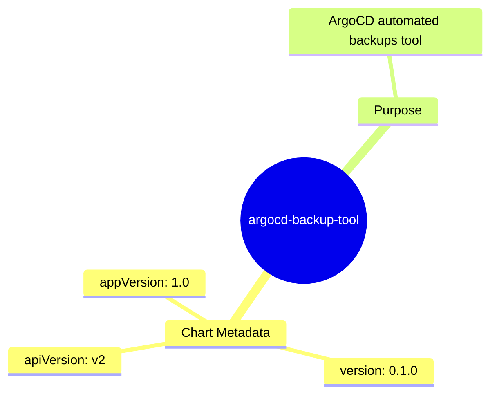
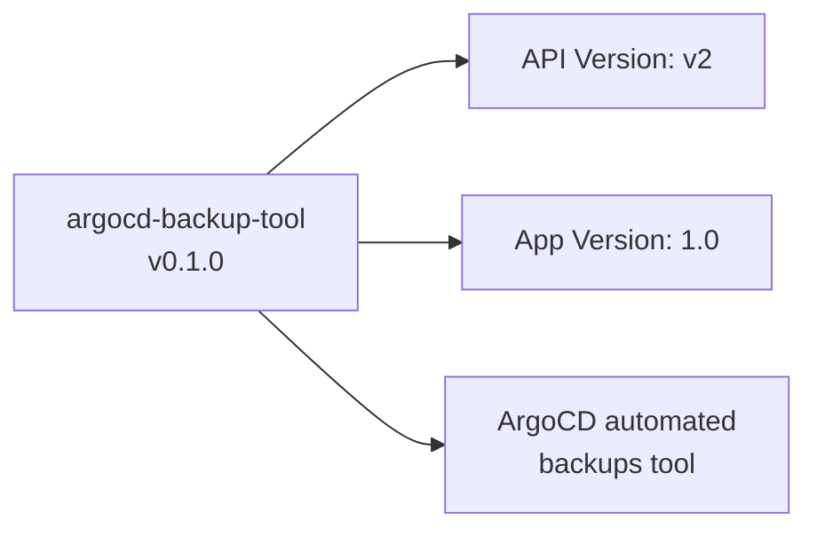

# Diagram: devops/k8s/argocd/backup-tool/helm/Chart.yaml

> Auto-generated by Obscura crawlers

## Diagram 1

### SVG

<svg id="container" width="100%" xmlns="http://www.w3.org/2000/svg" class="mindmapDiagram" style="max-width: 651.20751953125px;" viewBox="5 5 651.20751953125 517.3004150390625" role="graphics-document document" aria-roledescription="mindmap"><g><marker id="container_mindmap-pointEnd" class="marker mindmap" viewBox="0 0 10 10" refX="5" refY="5" markerUnits="userSpaceOnUse" markerWidth="8" markerHeight="8" orient="auto"><path d="M 0 0 L 10 5 L 0 10 z" class="arrowMarkerPath" style="stroke-width: 1; stroke-dasharray: 1, 0;"></path></marker><marker id="container_mindmap-pointStart" class="marker mindmap" viewBox="0 0 10 10" refX="4.5" refY="5" markerUnits="userSpaceOnUse" markerWidth="8" markerHeight="8" orient="auto"><path d="M 0 5 L 10 10 L 10 0 z" class="arrowMarkerPath" style="stroke-width: 1; stroke-dasharray: 1, 0;"></path></marker><g class="subgraphs"></g><g class="edgePaths"><path d="M373.346,293.069L367.32,302.994C361.293,312.919,349.24,332.768,337.187,352.618C325.135,372.468,313.082,392.317,307.055,402.242L301.029,412.167" id="edge_0_1" class="edge-thickness-normal edge-pattern-solid edge section-edge-0 edge-depth-1" style="undefined;;;undefined" data-edge="true" data-et="edge" data-id="edge_0_1" data-points="W3sieCI6MzczLjM0NjM2MTI4MjExNzIsInkiOjI5My4wNjkxMzIwNDQ1OTQ3fSx7IngiOjMzNy4xODc0ODYwNDMzNDg5NCwieSI6MzUyLjYxODE0NTE1Mzc4MDA2fSx7IngiOjMwMS4wMjg2MTA4MDQ1ODA3LCJ5Ijo0MTIuMTY3MTU4MjYyOTY1NH1d"></path><path d="M282.113,435.044L277.482,439.227C272.851,443.411,263.589,451.778,254.327,460.144C245.065,468.511,235.803,476.878,231.172,481.062L226.541,485.245" id="edge_1_2" class="edge-thickness-normal edge-pattern-solid edge section-edge-0 edge-depth-3" style="undefined;;;undefined" data-edge="true" data-et="edge" data-id="edge_1_2" data-points="W3sieCI6MjgyLjExMjU2MTEzMDA4LCJ5Ijo0MzUuMDQzNzY3OTU3MDM3NjN9LHsieCI6MjU0LjMyNjk4NjYwMDQ3MzksInkiOjQ2MC4xNDQ0NzkxNTM0MzYzfSx7IngiOjIyNi41NDE0MTIwNzA4Njc4LCJ5Ijo0ODUuMjQ1MTkwMzQ5ODM0OTZ9XQ=="></path><path d="M307.352,430.081L317.065,433.586C326.778,437.092,346.203,444.103,365.629,451.114C385.054,458.124,404.48,465.135,414.193,468.641L423.905,472.146" id="edge_1_3" class="edge-thickness-normal edge-pattern-solid edge section-edge-0 edge-depth-3" style="undefined;;;undefined" data-edge="true" data-et="edge" data-id="edge_1_3" data-points="W3sieCI6MzA3LjM1MjQ4OTY1MzExODIsInkiOjQzMC4wODA3NzkxNjU3NjU4fSx7IngiOjM2NS42Mjg4NTk3NDIyODI1NCwieSI6NDUxLjExMzUxMjg2MzIxOTJ9LHsieCI6NDIzLjkwNTIyOTgzMTQ0NjksInkiOjQ3Mi4xNDYyNDY1NjA2NzI2NH1d"></path><path d="M278.348,423.217L263.859,421.495C249.369,419.772,220.39,416.326,191.411,412.88C162.432,409.434,133.452,405.989,118.963,404.266L104.473,402.543" id="edge_1_4" class="edge-thickness-normal edge-pattern-solid edge section-edge-0 edge-depth-3" style="undefined;;;undefined" data-edge="true" data-et="edge" data-id="edge_1_4" data-points="W3sieCI6Mjc4LjM0ODIxODI4NTMwODksInkiOjQyMy4yMTc0NzQ1NDA2NTA4fSx7IngiOjE5MS40MTA3MDgwMzk3NDU3LCJ5Ijo0MTIuODgwMTQzMzYxNTR9LHsieCI6MTA0LjQ3MzE5Nzc5NDE4MjU0LCJ5Ijo0MDIuNTQyODEyMTgyNDI5MTV9XQ=="></path><path d="M388.98,267.465L395.067,257.551C401.153,247.637,413.327,227.809,425.5,207.981C437.673,188.153,449.847,168.325,455.933,158.411L462.02,148.497" id="edge_0_5" class="edge-thickness-normal edge-pattern-solid edge section-edge-1 edge-depth-1" style="undefined;;;undefined" data-edge="true" data-et="edge" data-id="edge_0_5" data-points="W3sieCI6Mzg4Ljk3OTg1MDk5ODA2NjMsInkiOjI2Ny40NjQ2NjgwNDg4MDR9LHsieCI6NDI1LjUwMDAxNzI0ODg1MTI0LCJ5IjoyMDcuOTgwODc1OTczMTc4NDZ9LHsieCI6NDYyLjAyMDE4MzQ5OTYzNjIsInkiOjE0OC40OTcwODM4OTc1NTI5fV0="></path><path d="M477.72,122.933L481.106,117.42C484.492,111.908,491.265,100.882,498.038,89.857C504.811,78.832,511.583,67.806,514.97,62.294L518.356,56.781" id="edge_5_6" class="edge-thickness-normal edge-pattern-solid edge section-edge-1 edge-depth-3" style="undefined;;;undefined" data-edge="true" data-et="edge" data-id="edge_5_6" data-points="W3sieCI6NDc3LjcxOTY4MTgwODM1MjQsInkiOjEyMi45MzI5MzQ0MDgxMzAyfSx7IngiOjQ5OC4wMzc5NDU5MjI0MzkxLCJ5Ijo4OS44NTcwMTk2NzcxNTQzMX0seyJ4Ijo1MTguMzU2MjEwMDM2NTI1OSwieSI6NTYuNzgxMTA0OTQ2MTc4NDN9XQ=="></path></g><g class="edgeLabels"><g class="edgeLabel"><g class="label" data-id="edge_0_1" transform="translate(0, 0)"><foreignObject width="0" height="0">

</foreignObject></g></g><g class="edgeLabel"><g class="label" data-id="edge_1_2" transform="translate(0, 0)"><foreignObject width="0" height="0">

</foreignObject></g></g><g class="edgeLabel"><g class="label" data-id="edge_1_3" transform="translate(0, 0)"><foreignObject width="0" height="0">

</foreignObject></g></g><g class="edgeLabel"><g class="label" data-id="edge_1_4" transform="translate(0, 0)"><foreignObject width="0" height="0">

</foreignObject></g></g><g class="edgeLabel"><g class="label" data-id="edge_0_5" transform="translate(0, 0)"><foreignObject width="0" height="0">

</foreignObject></g></g><g class="edgeLabel"><g class="label" data-id="edge_5_6" transform="translate(0, 0)"><foreignObject width="0" height="0">

</foreignObject></g></g></g><g class="nodes"><g class="node mindmap-node section-root section--1" id="node_0" transform="translate(381.13168100720645, 280.2477125920483)"><circle class="basic label-container" style="" r="81.6328125" cx="0" cy="0"></circle><g class="label" style="" transform="translate(-71.6328125, -12)"><rect></rect><foreignObject width="143.265625" height="24">

argocd-backup-tool

</foreignObject></g></g><g class="node mindmap-node section-0" id="node_1" transform="translate(293.2432910794914, 424.98857771551184)"><path id="node-1" class="node-bkg node-0" style="" d="M-75.625 12
    v-24
    q0,-5 5,-5
    h141.25
    q5,0 5,5
    v24
    q0,5 -5,5
    h-141.25
    q-5,0 -5,-5
    Z"></path><line class="node-line-" x1="-75.625" y1="17" x2="75.625" y2="17"></line><g class="label" style="" transform="translate(-55.625, -12)"><rect></rect><foreignObject width="111.25" height="24">

Chart Metadata

</foreignObject></g></g><g class="node mindmap-node section-0" id="node_2" transform="translate(215.41068212145638, 495.30038059136075)"><path id="node-2" class="node-bkg node-0" style="" d="M-70.1484375 12
    v-24
    q0,-5 5,-5
    h130.296875
    q5,0 5,5
    v24
    q0,5 -5,5
    h-130.296875
    q-5,0 -5,-5
    Z"></path><line class="node-line-" x1="-70.1484375" y1="17" x2="70.1484375" y2="17"></line><g class="label" style="" transform="translate(-50.1484375, -12)"><rect></rect><foreignObject width="100.296875" height="24">

apiVersion: v2

</foreignObject></g></g><g class="node mindmap-node section-0" id="node_3" transform="translate(438.01442840507366, 477.2384480109266)"><path id="node-3" class="node-bkg node-0" style="" d="M-65.8671875 12
    v-24
    q0,-5 5,-5
    h121.734375
    q5,0 5,5
    v24
    q0,5 -5,5
    h-121.734375
    q-5,0 -5,-5
    Z"></path><line class="node-line-" x1="-65.8671875" y1="17" x2="65.8671875" y2="17"></line><g class="label" style="" transform="translate(-45.8671875, -12)"><rect></rect><foreignObject width="91.734375" height="24">

version: 0.1.0

</foreignObject></g></g><g class="node mindmap-node section-0" id="node_4" transform="translate(89.578125, 400.7717090075681)"><path id="node-4" class="node-bkg node-0" style="" d="M-74.578125 12
    v-24
    q0,-5 5,-5
    h139.15625
    q5,0 5,5
    v24
    q0,5 -5,5
    h-139.15625
    q-5,0 -5,-5
    Z"></path><line class="node-line-" x1="-74.578125" y1="17" x2="74.578125" y2="17"></line><g class="label" style="" transform="translate(-54.578125, -12)"><rect></rect><foreignObject width="109.15625" height="24">

appVersion: 1.0

</foreignObject></g></g><g class="node mindmap-node section-1" id="node_5" transform="translate(469.868353490496, 135.71403935430862)"><path id="node-5" class="node-bkg node-0" style="" d="M-49.703125 12
    v-24
    q0,-5 5,-5
    h89.40625
    q5,0 5,5
    v24
    q0,5 -5,5
    h-89.40625
    q-5,0 -5,-5
    Z"></path><line class="node-line-" x1="-49.703125" y1="17" x2="49.703125" y2="17"></line><g class="label" style="" transform="translate(-29.703125, -12)"><rect></rect><foreignObject width="59.40625" height="24">

Purpose

</foreignObject></g></g><g class="node mindmap-node section-1" id="node_6" transform="translate(526.2075383543822, 44)"><path id="node-6" class="node-bkg node-0" style="" d="M-120 24
    v-48
    q0,-5 5,-5
    h230
    q5,0 5,5
    v48
    q0,5 -5,5
    h-230
    q-5,0 -5,-5
    Z"></path><line class="node-line-" x1="-120" y1="29" x2="120" y2="29"></line><g class="label" style="" transform="translate(-100, -24)"><rect></rect><foreignObject width="200" height="48">

ArgoCD automated backups tool

</foreignObject></g></g></g></g></svg>

## Diagram 2

### SVG

<svg id="container" width="464.421875" xmlns="http://www.w3.org/2000/svg" class="flowchart" height="302" viewBox="0 0 464.421875 302" role="graphics-document document" aria-roledescription="flowchart-v2"><g><marker id="container_flowchart-v2-pointEnd" class="marker flowchart-v2" viewBox="0 0 10 10" refX="5" refY="5" markerUnits="userSpaceOnUse" markerWidth="8" markerHeight="8" orient="auto"><path d="M 0 0 L 10 5 L 0 10 z" class="arrowMarkerPath" style="stroke-width: 1; stroke-dasharray: 1, 0;"></path></marker><marker id="container_flowchart-v2-pointStart" class="marker flowchart-v2" viewBox="0 0 10 10" refX="4.5" refY="5" markerUnits="userSpaceOnUse" markerWidth="8" markerHeight="8" orient="auto"><path d="M 0 5 L 10 10 L 10 0 z" class="arrowMarkerPath" style="stroke-width: 1; stroke-dasharray: 1, 0;"></path></marker><marker id="container_flowchart-v2-circleEnd" class="marker flowchart-v2" viewBox="0 0 10 10" refX="11" refY="5" markerUnits="userSpaceOnUse" markerWidth="11" markerHeight="11" orient="auto"><circle cx="5" cy="5" r="5" class="arrowMarkerPath" style="stroke-width: 1; stroke-dasharray: 1, 0;"></circle></marker><marker id="container_flowchart-v2-circleStart" class="marker flowchart-v2" viewBox="0 0 10 10" refX="-1" refY="5" markerUnits="userSpaceOnUse" markerWidth="11" markerHeight="11" orient="auto"><circle cx="5" cy="5" r="5" class="arrowMarkerPath" style="stroke-width: 1; stroke-dasharray: 1, 0;"></circle></marker><marker id="container_flowchart-v2-crossEnd" class="marker cross flowchart-v2" viewBox="0 0 11 11" refX="12" refY="5.2" markerUnits="userSpaceOnUse" markerWidth="11" markerHeight="11" orient="auto"><path d="M 1,1 l 9,9 M 10,1 l -9,9" class="arrowMarkerPath" style="stroke-width: 2; stroke-dasharray: 1, 0;"></path></marker><marker id="container_flowchart-v2-crossStart" class="marker cross flowchart-v2" viewBox="0 0 11 11" refX="-1" refY="5.2" markerUnits="userSpaceOnUse" markerWidth="11" markerHeight="11" orient="auto"><path d="M 1,1 l 9,9 M 10,1 l -9,9" class="arrowMarkerPath" style="stroke-width: 2; stroke-dasharray: 1, 0;"></path></marker><g class="root"><g class="clusters"></g><g class="edgePaths"><path d="M157.12,100L170.311,89.167C183.502,78.333,209.884,56.667,229.088,45.833C248.292,35,260.318,35,266.331,35L272.344,35" id="L_A_B_0" class="edge-thickness-normal edge-pattern-solid edge-thickness-normal edge-pattern-solid flowchart-link" style=";" data-edge="true" data-et="edge" data-id="L_A_B_0" data-points="W3sieCI6MTU3LjEyMDExNzE4NzUsInkiOjEwMH0seyJ4IjoyMzYuMjY1NjI1LCJ5IjozNX0seyJ4IjoyNzYuMzQzNzUsInkiOjM1fV0=" marker-end="url(#container_flowchart-v2-pointEnd)"></path><path d="M211.266,139L215.432,139C219.599,139,227.932,139,237.374,139C246.815,139,257.365,139,262.639,139L267.914,139" id="L_A_C_0" class="edge-thickness-normal edge-pattern-solid edge-thickness-normal edge-pattern-solid flowchart-link" style=";" data-edge="true" data-et="edge" data-id="L_A_C_0" data-points="W3sieCI6MjExLjI2NTYyNSwieSI6MTM5fSx7IngiOjIzNi4yNjU2MjUsInkiOjEzOX0seyJ4IjoyNzEuOTE0MDYyNSwieSI6MTM5fV0=" marker-end="url(#container_flowchart-v2-pointEnd)"></path><path d="M152.208,178L166.217,190.833C180.227,203.667,208.246,229.333,225.756,242.167C243.266,255,250.266,255,253.766,255L257.266,255" id="L_A_D_0" class="edge-thickness-normal edge-pattern-solid edge-thickness-normal edge-pattern-solid flowchart-link" style=";" data-edge="true" data-et="edge" data-id="L_A_D_0" data-points="W3sieCI6MTUyLjIwNzYzNzM5MjI0MTQsInkiOjE3OH0seyJ4IjoyMzYuMjY1NjI1LCJ5IjoyNTV9LHsieCI6MjYxLjI2NTYyNSwieSI6MjU1fV0=" marker-end="url(#container_flowchart-v2-pointEnd)"></path></g><g class="edgeLabels"><g class="edgeLabel"><g class="label" data-id="L_A_B_0" transform="translate(0, 0)"><foreignObject width="0" height="0">

</foreignObject></g></g><g class="edgeLabel"><g class="label" data-id="L_A_C_0" transform="translate(0, 0)"><foreignObject width="0" height="0">

</foreignObject></g></g><g class="edgeLabel"><g class="label" data-id="L_A_D_0" transform="translate(0, 0)"><foreignObject width="0" height="0">

</foreignObject></g></g></g><g class="nodes"><g class="node default" id="flowchart-A-0" transform="translate(109.6328125, 139)"><rect class="basic label-container" style="" x="-101.6328125" y="-39" width="203.265625" height="78"></rect><g class="label" style="" transform="translate(-71.6328125, -24)"><rect></rect><foreignObject width="143.265625" height="48">

argocd-backup-tool v0.1.0

</foreignObject></g></g><g class="node default" id="flowchart-B-1" transform="translate(358.84375, 35)"><rect class="basic label-container" style="" x="-82.5" y="-27" width="165" height="54"></rect><g class="label" style="" transform="translate(-52.5, -12)"><rect></rect><foreignObject width="105" height="24">

API Version: v2

</foreignObject></g></g><g class="node default" id="flowchart-C-3" transform="translate(358.84375, 139)"><rect class="basic label-container" style="" x="-86.9296875" y="-27" width="173.859375" height="54"></rect><g class="label" style="" transform="translate(-56.9296875, -12)"><rect></rect><foreignObject width="113.859375" height="24">

App Version: 1.0

</foreignObject></g></g><g class="node default" id="flowchart-D-5" transform="translate(358.84375, 255)"><rect class="basic label-container" style="" x="-97.578125" y="-39" width="195.15625" height="78"></rect><g class="label" style="" transform="translate(-67.578125, -24)"><rect></rect><foreignObject width="135.15625" height="48">

ArgoCD automated backups tool

</foreignObject></g></g></g></g></g></svg>
