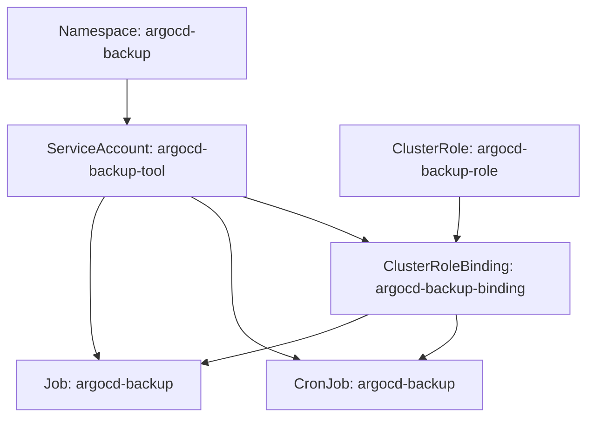
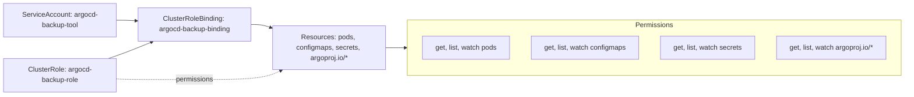
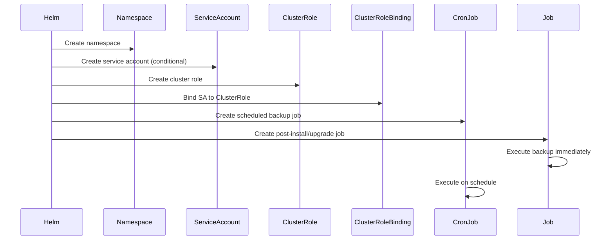
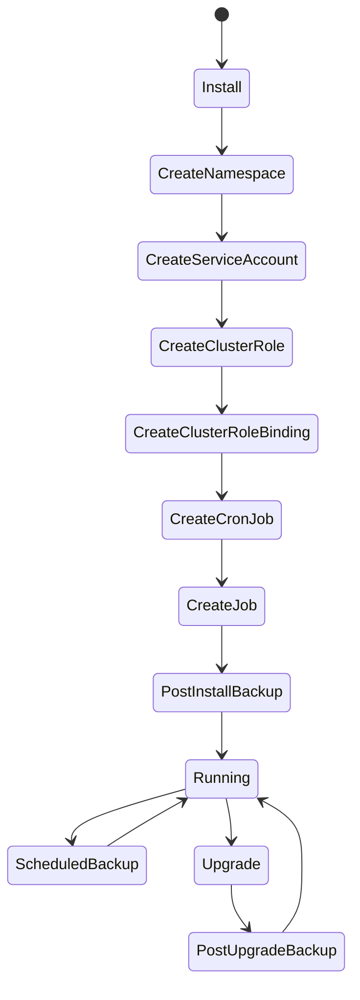

# Diagram: devops/k8s/argocd/backup-tool/helm/templates/backup.yaml


> Auto-generated by Obscura crawlers

## Diagram 1

```mermaid
graph TD
      Namespace[Namespace: argocd-backup]
      ServiceAccount[ServiceAccount: argocd-backup-tool]
      ClusterRole[ClusterRole: argocd-backup-role]...
  └ 137 lines...
```

> SVG rendering failed for this diagram.

## Diagram 2



### SVG

<svg id="container" width="636.68359375" xmlns="http://www.w3.org/2000/svg" class="flowchart" height="430" viewBox="0 0 636.68359375 430" role="graphics-document document" aria-roledescription="flowchart-v2"><style>#container{font-family:"trebuchet ms",verdana,arial,sans-serif;font-size:16px;fill:#333;}@keyframes edge-animation-frame{from{stroke-dashoffset:0;}}@keyframes dash{to{stroke-dashoffset:0;}}#container .edge-animation-slow{stroke-dasharray:9,5!important;stroke-dashoffset:900;animation:dash 50s linear infinite;stroke-linecap:round;}#container .edge-animation-fast{stroke-dasharray:9,5!important;stroke-dashoffset:900;animation:dash 20s linear infinite;stroke-linecap:round;}#container .error-icon{fill:#552222;}#container .error-text{fill:#552222;stroke:#552222;}#container .edge-thickness-normal{stroke-width:1px;}#container .edge-thickness-thick{stroke-width:3.5px;}#container .edge-pattern-solid{stroke-dasharray:0;}#container .edge-thickness-invisible{stroke-width:0;fill:none;}#container .edge-pattern-dashed{stroke-dasharray:3;}#container .edge-pattern-dotted{stroke-dasharray:2;}#container .marker{fill:#333333;stroke:#333333;}#container .marker.cross{stroke:#333333;}#container svg{font-family:"trebuchet ms",verdana,arial,sans-serif;font-size:16px;}#container p{margin:0;}#container .label{font-family:"trebuchet ms",verdana,arial,sans-serif;color:#333;}#container .cluster-label text{fill:#333;}#container .cluster-label span{color:#333;}#container .cluster-label span p{background-color:transparent;}#container .label text,#container span{fill:#333;color:#333;}#container .node rect,#container .node circle,#container .node ellipse,#container .node polygon,#container .node path{fill:#ECECFF;stroke:#9370DB;stroke-width:1px;}#container .rough-node .label text,#container .node .label text,#container .image-shape .label,#container .icon-shape .label{text-anchor:middle;}#container .node .katex path{fill:#000;stroke:#000;stroke-width:1px;}#container .rough-node .label,#container .node .label,#container .image-shape .label,#container .icon-shape .label{text-align:center;}#container .node.clickable{cursor:pointer;}#container .root .anchor path{fill:#333333!important;stroke-width:0;stroke:#333333;}#container .arrowheadPath{fill:#333333;}#container .edgePath .path{stroke:#333333;stroke-width:2.0px;}#container .flowchart-link{stroke:#333333;fill:none;}#container .edgeLabel{background-color:rgba(232,232,232, 0.8);text-align:center;}#container .edgeLabel p{background-color:rgba(232,232,232, 0.8);}#container .edgeLabel rect{opacity:0.5;background-color:rgba(232,232,232, 0.8);fill:rgba(232,232,232, 0.8);}#container .labelBkg{background-color:rgba(232, 232, 232, 0.5);}#container .cluster rect{fill:#ffffde;stroke:#aaaa33;stroke-width:1px;}#container .cluster text{fill:#333;}#container .cluster span{color:#333;}#container div.mermaidTooltip{position:absolute;text-align:center;max-width:200px;padding:2px;font-family:"trebuchet ms",verdana,arial,sans-serif;font-size:12px;background:hsl(80, 100%, 96.2745098039%);border:1px solid #aaaa33;border-radius:2px;pointer-events:none;z-index:100;}#container .flowchartTitleText{text-anchor:middle;font-size:18px;fill:#333;}#container rect.text{fill:none;stroke-width:0;}#container .icon-shape,#container .image-shape{background-color:rgba(232,232,232, 0.8);text-align:center;}#container .icon-shape p,#container .image-shape p{background-color:rgba(232,232,232, 0.8);padding:2px;}#container .icon-shape rect,#container .image-shape rect{opacity:0.5;background-color:rgba(232,232,232, 0.8);fill:rgba(232,232,232, 0.8);}#container .label-icon{display:inline-block;height:1em;overflow:visible;vertical-align:-0.125em;}#container .node .label-icon path{fill:currentColor;stroke:revert;stroke-width:revert;}#container :root{--mermaid-font-family:"trebuchet ms",verdana,arial,sans-serif;}</style><g><marker id="container_flowchart-v2-pointEnd" class="marker flowchart-v2" viewBox="0 0 10 10" refX="5" refY="5" markerUnits="userSpaceOnUse" markerWidth="8" markerHeight="8" orient="auto"><path d="M 0 0 L 10 5 L 0 10 z" class="arrowMarkerPath" style="stroke-width: 1; stroke-dasharray: 1, 0;"></path></marker><marker id="container_flowchart-v2-pointStart" class="marker flowchart-v2" viewBox="0 0 10 10" refX="4.5" refY="5" markerUnits="userSpaceOnUse" markerWidth="8" markerHeight="8" orient="auto"><path d="M 0 5 L 10 10 L 10 0 z" class="arrowMarkerPath" style="stroke-width: 1; stroke-dasharray: 1, 0;"></path></marker><marker id="container_flowchart-v2-circleEnd" class="marker flowchart-v2" viewBox="0 0 10 10" refX="11" refY="5" markerUnits="userSpaceOnUse" markerWidth="11" markerHeight="11" orient="auto"><circle cx="5" cy="5" r="5" class="arrowMarkerPath" style="stroke-width: 1; stroke-dasharray: 1, 0;"></circle></marker><marker id="container_flowchart-v2-circleStart" class="marker flowchart-v2" viewBox="0 0 10 10" refX="-1" refY="5" markerUnits="userSpaceOnUse" markerWidth="11" markerHeight="11" orient="auto"><circle cx="5" cy="5" r="5" class="arrowMarkerPath" style="stroke-width: 1; stroke-dasharray: 1, 0;"></circle></marker><marker id="container_flowchart-v2-crossEnd" class="marker cross flowchart-v2" viewBox="0 0 11 11" refX="12" refY="5.2" markerUnits="userSpaceOnUse" markerWidth="11" markerHeight="11" orient="auto"><path d="M 1,1 l 9,9 M 10,1 l -9,9" class="arrowMarkerPath" style="stroke-width: 2; stroke-dasharray: 1, 0;"></path></marker><marker id="container_flowchart-v2-crossStart" class="marker cross flowchart-v2" viewBox="0 0 11 11" refX="-1" refY="5.2" markerUnits="userSpaceOnUse" markerWidth="11" markerHeight="11" orient="auto"><path d="M 1,1 l 9,9 M 10,1 l -9,9" class="arrowMarkerPath" style="stroke-width: 2; stroke-dasharray: 1, 0;"></path></marker><g class="root"><g class="clusters"></g><g class="edgePaths"><path d="M138,62L138,66.167C138,70.333,138,78.667,138,86.333C138,94,138,101,138,104.5L138,108" id="L_Namespace_ServiceAccount_0" class="edge-thickness-normal edge-pattern-solid edge-thickness-normal edge-pattern-solid flowchart-link" style=";" data-edge="true" data-et="edge" data-id="L_Namespace_ServiceAccount_0" data-points="W3sieCI6MTM4LCJ5Ijo2Mn0seyJ4IjoxMzgsInkiOjg3fSx7IngiOjEzOCwieSI6MTEyfV0=" marker-end="url(#container_flowchart-v2-pointEnd)"></path><path d="M263.338,190L276.729,194.167C290.12,198.333,316.902,206.667,339.123,214.731C361.344,222.795,379.004,230.59,387.835,234.487L396.665,238.385" id="L_ServiceAccount_ClusterRoleBinding_0" class="edge-thickness-normal edge-pattern-solid edge-thickness-normal edge-pattern-solid flowchart-link" style=";" data-edge="true" data-et="edge" data-id="L_ServiceAccount_ClusterRoleBinding_0" data-points="W3sieCI6MjYzLjMzODQzOTk0MTQwNjI1LCJ5IjoxOTB9LHsieCI6MzQzLjY4MzU5Mzc1LCJ5IjoyMTV9LHsieCI6NDAwLjMyNDIxODc1LCJ5IjoyNDB9XQ==" marker-end="url(#container_flowchart-v2-pointEnd)"></path><path d="M498.684,190L498.684,194.167C498.684,198.333,498.684,206.667,498.135,214.341C497.587,222.016,496.491,229.032,495.943,232.54L495.395,236.048" id="L_ClusterRole_ClusterRoleBinding_0" class="edge-thickness-normal edge-pattern-solid edge-thickness-normal edge-pattern-solid flowchart-link" style=";" data-edge="true" data-et="edge" data-id="L_ClusterRole_ClusterRoleBinding_0" data-points="W3sieCI6NDk4LjY4MzU5Mzc1LCJ5IjoxOTB9LHsieCI6NDk4LjY4MzU5Mzc1LCJ5IjoyMTV9LHsieCI6NDk0Ljc3NzM0Mzc1LCJ5IjoyNDB9XQ==" marker-end="url(#container_flowchart-v2-pointEnd)"></path><path d="M494.777,318L495.428,322.167C496.079,326.333,497.382,334.667,491.202,342.673C485.022,350.68,471.361,358.36,464.53,362.2L457.699,366.04" id="L_ClusterRoleBinding_CronJob_0" class="edge-thickness-normal edge-pattern-solid edge-thickness-normal edge-pattern-solid flowchart-link" style=";" data-edge="true" data-et="edge" data-id="L_ClusterRoleBinding_CronJob_0" data-points="W3sieCI6NDk0Ljc3NzM0Mzc1LCJ5IjozMTh9LHsieCI6NDk4LjY4MzU5Mzc1LCJ5IjozNDN9LHsieCI6NDU0LjIxMjQzOTkwMzg0NjEzLCJ5IjozNjh9XQ==" marker-end="url(#container_flowchart-v2-pointEnd)"></path><path d="M400.324,318L390.884,322.167C381.444,326.333,362.564,334.667,332.809,343.514C303.054,352.361,262.425,361.723,242.111,366.403L221.796,371.084" id="L_ClusterRoleBinding_Job_0" class="edge-thickness-normal edge-pattern-solid edge-thickness-normal edge-pattern-solid flowchart-link" style=";" data-edge="true" data-et="edge" data-id="L_ClusterRoleBinding_Job_0" data-points="W3sieCI6NDAwLjMyNDIxODc1LCJ5IjozMTh9LHsieCI6MzQzLjY4MzU5Mzc1LCJ5IjozNDN9LHsieCI6MjE3Ljg5ODQzNzUsInkiOjM3MS45ODIyOTMzNzk0ODk0fV0=" marker-end="url(#container_flowchart-v2-pointEnd)"></path><path d="M206.971,190L214.34,194.167C221.709,198.333,236.446,206.667,243.815,221.5C251.184,236.333,251.184,257.667,251.184,279C251.184,300.333,251.184,321.667,262.971,336.288C274.759,350.909,298.335,358.819,310.123,362.773L321.911,366.728" id="L_ServiceAccount_CronJob_0" class="edge-thickness-normal edge-pattern-solid edge-thickness-normal edge-pattern-solid flowchart-link" style=";" data-edge="true" data-et="edge" data-id="L_ServiceAccount_CronJob_0" data-points="W3sieCI6MjA2Ljk3MTI1MjQ0MTQwNjI1LCJ5IjoxOTB9LHsieCI6MjUxLjE4MzU5Mzc1LCJ5IjoyMTV9LHsieCI6MjUxLjE4MzU5Mzc1LCJ5IjoyNzl9LHsieCI6MjUxLjE4MzU5Mzc1LCJ5IjozNDN9LHsieCI6MzI1LjcwMjgyNDUxOTIzMDgsInkiOjM2OH1d" marker-end="url(#container_flowchart-v2-pointEnd)"></path><path d="M113.625,190L111.021,194.167C108.417,198.333,103.208,206.667,100.604,221.5C98,236.333,98,257.667,98,279C98,300.333,98,321.667,99.363,335.878C100.726,350.089,103.453,357.178,104.816,360.722L106.179,364.267" id="L_ServiceAccount_Job_0" class="edge-thickness-normal edge-pattern-solid edge-thickness-normal edge-pattern-solid flowchart-link" style=";" data-edge="true" data-et="edge" data-id="L_ServiceAccount_Job_0" data-points="W3sieCI6MTEzLjYyNSwieSI6MTkwfSx7IngiOjk4LCJ5IjoyMTV9LHsieCI6OTgsInkiOjI3OX0seyJ4Ijo5OCwieSI6MzQzfSx7IngiOjEwNy42MTUzODQ2MTUzODQ2MSwieSI6MzY4fV0=" marker-end="url(#container_flowchart-v2-pointEnd)"></path></g><g class="edgeLabels"><g class="edgeLabel"><g class="label" data-id="L_Namespace_ServiceAccount_0" transform="translate(0, 0)"><foreignObject width="0" height="0"><div xmlns="http://www.w3.org/1999/xhtml" class="labelBkg" style="display: table-cell; white-space: nowrap; line-height: 1.5; max-width: 200px; text-align: center;"><span class="edgeLabel"></span></div></foreignObject></g></g><g class="edgeLabel"><g class="label" data-id="L_ServiceAccount_ClusterRoleBinding_0" transform="translate(0, 0)"><foreignObject width="0" height="0"><div xmlns="http://www.w3.org/1999/xhtml" class="labelBkg" style="display: table-cell; white-space: nowrap; line-height: 1.5; max-width: 200px; text-align: center;"><span class="edgeLabel"></span></div></foreignObject></g></g><g class="edgeLabel"><g class="label" data-id="L_ClusterRole_ClusterRoleBinding_0" transform="translate(0, 0)"><foreignObject width="0" height="0"><div xmlns="http://www.w3.org/1999/xhtml" class="labelBkg" style="display: table-cell; white-space: nowrap; line-height: 1.5; max-width: 200px; text-align: center;"><span class="edgeLabel"></span></div></foreignObject></g></g><g class="edgeLabel"><g class="label" data-id="L_ClusterRoleBinding_CronJob_0" transform="translate(0, 0)"><foreignObject width="0" height="0"><div xmlns="http://www.w3.org/1999/xhtml" class="labelBkg" style="display: table-cell; white-space: nowrap; line-height: 1.5; max-width: 200px; text-align: center;"><span class="edgeLabel"></span></div></foreignObject></g></g><g class="edgeLabel"><g class="label" data-id="L_ClusterRoleBinding_Job_0" transform="translate(0, 0)"><foreignObject width="0" height="0"><div xmlns="http://www.w3.org/1999/xhtml" class="labelBkg" style="display: table-cell; white-space: nowrap; line-height: 1.5; max-width: 200px; text-align: center;"><span class="edgeLabel"></span></div></foreignObject></g></g><g class="edgeLabel"><g class="label" data-id="L_ServiceAccount_CronJob_0" transform="translate(0, 0)"><foreignObject width="0" height="0"><div xmlns="http://www.w3.org/1999/xhtml" class="labelBkg" style="display: table-cell; white-space: nowrap; line-height: 1.5; max-width: 200px; text-align: center;"><span class="edgeLabel"></span></div></foreignObject></g></g><g class="edgeLabel"><g class="label" data-id="L_ServiceAccount_Job_0" transform="translate(0, 0)"><foreignObject width="0" height="0"><div xmlns="http://www.w3.org/1999/xhtml" class="labelBkg" style="display: table-cell; white-space: nowrap; line-height: 1.5; max-width: 200px; text-align: center;"><span class="edgeLabel"></span></div></foreignObject></g></g></g><g class="nodes"><g class="node default" id="flowchart-Namespace-0" transform="translate(138, 35)"><rect class="basic label-container" style="" x="-129.8515625" y="-27" width="259.703125" height="54"></rect><g class="label" style="" transform="translate(-99.8515625, -12)"><rect></rect><foreignObject width="199.703125" height="24"><div xmlns="http://www.w3.org/1999/xhtml" style="display: table-cell; white-space: nowrap; line-height: 1.5; max-width: 200px; text-align: center;"><span class="nodeLabel"><p>Namespace: argocd-backup</p></span></div></foreignObject></g></g><g class="node default" id="flowchart-ServiceAccount-1" transform="translate(138, 151)"><rect class="basic label-container" style="" x="-130" y="-39" width="260" height="78"></rect><g class="label" style="" transform="translate(-100, -24)"><rect></rect><foreignObject width="200" height="48"><div xmlns="http://www.w3.org/1999/xhtml" style="display: table; white-space: break-spaces; line-height: 1.5; max-width: 200px; text-align: center; width: 200px;"><span class="nodeLabel"><p>ServiceAccount: argocd-backup-tool</p></span></div></foreignObject></g></g><g class="node default" id="flowchart-ClusterRole-2" transform="translate(498.68359375, 151)"><rect class="basic label-container" style="" x="-130" y="-39" width="260" height="78"></rect><g class="label" style="" transform="translate(-100, -24)"><rect></rect><foreignObject width="200" height="48"><div xmlns="http://www.w3.org/1999/xhtml" style="display: table; white-space: break-spaces; line-height: 1.5; max-width: 200px; text-align: center; width: 200px;"><span class="nodeLabel"><p>ClusterRole: argocd-backup-role</p></span></div></foreignObject></g></g><g class="node default" id="flowchart-ClusterRoleBinding-3" transform="translate(488.68359375, 279)"><rect class="basic label-container" style="" x="-130" y="-39" width="260" height="78"></rect><g class="label" style="" transform="translate(-100, -24)"><rect></rect><foreignObject width="200" height="48"><div xmlns="http://www.w3.org/1999/xhtml" style="display: table; white-space: break-spaces; line-height: 1.5; max-width: 200px; text-align: center; width: 200px;"><span class="nodeLabel"><p>ClusterRoleBinding: argocd-backup-binding</p></span></div></foreignObject></g></g><g class="node default" id="flowchart-CronJob-4" transform="translate(406.18359375, 395)"><rect class="basic label-container" style="" x="-116.46875" y="-27" width="232.9375" height="54"></rect><g class="label" style="" transform="translate(-86.46875, -12)"><rect></rect><foreignObject width="172.9375" height="24"><div xmlns="http://www.w3.org/1999/xhtml" style="display: table-cell; white-space: nowrap; line-height: 1.5; max-width: 200px; text-align: center;"><span class="nodeLabel"><p>CronJob: argocd-backup</p></span></div></foreignObject></g></g><g class="node default" id="flowchart-Job-5" transform="translate(118, 395)"><rect class="basic label-container" style="" x="-99.8984375" y="-27" width="199.796875" height="54"></rect><g class="label" style="" transform="translate(-69.8984375, -12)"><rect></rect><foreignObject width="139.796875" height="24"><div xmlns="http://www.w3.org/1999/xhtml" style="display: table-cell; white-space: nowrap; line-height: 1.5; max-width: 200px; text-align: center;"><span class="nodeLabel"><p>Job: argocd-backup</p></span></div></foreignObject></g></g></g></g></g></svg>

## Diagram 3



### SVG

<svg id="container" width="2100.609375" xmlns="http://www.w3.org/2000/svg" class="flowchart" height="222" viewBox="0 0 2100.609375 222" role="graphics-document document" aria-roledescription="flowchart-v2"><style>#container{font-family:"trebuchet ms",verdana,arial,sans-serif;font-size:16px;fill:#333;}@keyframes edge-animation-frame{from{stroke-dashoffset:0;}}@keyframes dash{to{stroke-dashoffset:0;}}#container .edge-animation-slow{stroke-dasharray:9,5!important;stroke-dashoffset:900;animation:dash 50s linear infinite;stroke-linecap:round;}#container .edge-animation-fast{stroke-dasharray:9,5!important;stroke-dashoffset:900;animation:dash 20s linear infinite;stroke-linecap:round;}#container .error-icon{fill:#552222;}#container .error-text{fill:#552222;stroke:#552222;}#container .edge-thickness-normal{stroke-width:1px;}#container .edge-thickness-thick{stroke-width:3.5px;}#container .edge-pattern-solid{stroke-dasharray:0;}#container .edge-thickness-invisible{stroke-width:0;fill:none;}#container .edge-pattern-dashed{stroke-dasharray:3;}#container .edge-pattern-dotted{stroke-dasharray:2;}#container .marker{fill:#333333;stroke:#333333;}#container .marker.cross{stroke:#333333;}#container svg{font-family:"trebuchet ms",verdana,arial,sans-serif;font-size:16px;}#container p{margin:0;}#container .label{font-family:"trebuchet ms",verdana,arial,sans-serif;color:#333;}#container .cluster-label text{fill:#333;}#container .cluster-label span{color:#333;}#container .cluster-label span p{background-color:transparent;}#container .label text,#container span{fill:#333;color:#333;}#container .node rect,#container .node circle,#container .node ellipse,#container .node polygon,#container .node path{fill:#ECECFF;stroke:#9370DB;stroke-width:1px;}#container .rough-node .label text,#container .node .label text,#container .image-shape .label,#container .icon-shape .label{text-anchor:middle;}#container .node .katex path{fill:#000;stroke:#000;stroke-width:1px;}#container .rough-node .label,#container .node .label,#container .image-shape .label,#container .icon-shape .label{text-align:center;}#container .node.clickable{cursor:pointer;}#container .root .anchor path{fill:#333333!important;stroke-width:0;stroke:#333333;}#container .arrowheadPath{fill:#333333;}#container .edgePath .path{stroke:#333333;stroke-width:2.0px;}#container .flowchart-link{stroke:#333333;fill:none;}#container .edgeLabel{background-color:rgba(232,232,232, 0.8);text-align:center;}#container .edgeLabel p{background-color:rgba(232,232,232, 0.8);}#container .edgeLabel rect{opacity:0.5;background-color:rgba(232,232,232, 0.8);fill:rgba(232,232,232, 0.8);}#container .labelBkg{background-color:rgba(232, 232, 232, 0.5);}#container .cluster rect{fill:#ffffde;stroke:#aaaa33;stroke-width:1px;}#container .cluster text{fill:#333;}#container .cluster span{color:#333;}#container div.mermaidTooltip{position:absolute;text-align:center;max-width:200px;padding:2px;font-family:"trebuchet ms",verdana,arial,sans-serif;font-size:12px;background:hsl(80, 100%, 96.2745098039%);border:1px solid #aaaa33;border-radius:2px;pointer-events:none;z-index:100;}#container .flowchartTitleText{text-anchor:middle;font-size:18px;fill:#333;}#container rect.text{fill:none;stroke-width:0;}#container .icon-shape,#container .image-shape{background-color:rgba(232,232,232, 0.8);text-align:center;}#container .icon-shape p,#container .image-shape p{background-color:rgba(232,232,232, 0.8);padding:2px;}#container .icon-shape rect,#container .image-shape rect{opacity:0.5;background-color:rgba(232,232,232, 0.8);fill:rgba(232,232,232, 0.8);}#container .label-icon{display:inline-block;height:1em;overflow:visible;vertical-align:-0.125em;}#container .node .label-icon path{fill:currentColor;stroke:revert;stroke-width:revert;}#container :root{--mermaid-font-family:"trebuchet ms",verdana,arial,sans-serif;}</style><g><marker id="container_flowchart-v2-pointEnd" class="marker flowchart-v2" viewBox="0 0 10 10" refX="5" refY="5" markerUnits="userSpaceOnUse" markerWidth="8" markerHeight="8" orient="auto"><path d="M 0 0 L 10 5 L 0 10 z" class="arrowMarkerPath" style="stroke-width: 1; stroke-dasharray: 1, 0;"></path></marker><marker id="container_flowchart-v2-pointStart" class="marker flowchart-v2" viewBox="0 0 10 10" refX="4.5" refY="5" markerUnits="userSpaceOnUse" markerWidth="8" markerHeight="8" orient="auto"><path d="M 0 5 L 10 10 L 10 0 z" class="arrowMarkerPath" style="stroke-width: 1; stroke-dasharray: 1, 0;"></path></marker><marker id="container_flowchart-v2-circleEnd" class="marker flowchart-v2" viewBox="0 0 10 10" refX="11" refY="5" markerUnits="userSpaceOnUse" markerWidth="11" markerHeight="11" orient="auto"><circle cx="5" cy="5" r="5" class="arrowMarkerPath" style="stroke-width: 1; stroke-dasharray: 1, 0;"></circle></marker><marker id="container_flowchart-v2-circleStart" class="marker flowchart-v2" viewBox="0 0 10 10" refX="-1" refY="5" markerUnits="userSpaceOnUse" markerWidth="11" markerHeight="11" orient="auto"><circle cx="5" cy="5" r="5" class="arrowMarkerPath" style="stroke-width: 1; stroke-dasharray: 1, 0;"></circle></marker><marker id="container_flowchart-v2-crossEnd" class="marker cross flowchart-v2" viewBox="0 0 11 11" refX="12" refY="5.2" markerUnits="userSpaceOnUse" markerWidth="11" markerHeight="11" orient="auto"><path d="M 1,1 l 9,9 M 10,1 l -9,9" class="arrowMarkerPath" style="stroke-width: 2; stroke-dasharray: 1, 0;"></path></marker><marker id="container_flowchart-v2-crossStart" class="marker cross flowchart-v2" viewBox="0 0 11 11" refX="-1" refY="5.2" markerUnits="userSpaceOnUse" markerWidth="11" markerHeight="11" orient="auto"><path d="M 1,1 l 9,9 M 10,1 l -9,9" class="arrowMarkerPath" style="stroke-width: 2; stroke-dasharray: 1, 0;"></path></marker><g class="root"><g class="clusters"></g><g class="edgePaths"><path d="M268,47L272.167,47C276.333,47,284.667,47,292.335,47.226C300.003,47.452,307.006,47.904,310.507,48.129L314.008,48.355" id="L_SA_CRB_0" class="edge-thickness-normal edge-pattern-solid edge-thickness-normal edge-pattern-solid flowchart-link" style=";" data-edge="true" data-et="edge" data-id="L_SA_CRB_0" data-points="W3sieCI6MjY4LCJ5Ijo0N30seyJ4IjoyOTMsInkiOjQ3fSx7IngiOjMxOCwieSI6NDguNjEyOTAzMjI1ODA2NDV9XQ==" marker-end="url(#container_flowchart-v2-pointEnd)"></path><path d="M249.944,136L257.12,133.5C264.296,131,278.648,126,295.299,119.588C311.95,113.176,330.9,105.351,340.375,101.439L349.85,97.527" id="L_CR_CRB_0" class="edge-thickness-normal edge-pattern-solid edge-thickness-normal edge-pattern-solid flowchart-link" style=";" data-edge="true" data-et="edge" data-id="L_CR_CRB_0" data-points="W3sieCI6MjQ5Ljk0NDQ0NDQ0NDQ0NDQ2LCJ5IjoxMzZ9LHsieCI6MjkzLCJ5IjoxMjF9LHsieCI6MzUzLjU0Njg3NSwieSI6OTZ9XQ==" marker-end="url(#container_flowchart-v2-pointEnd)"></path><path d="M578,57L582.167,57C586.333,57,594.667,57,602.37,58.232C610.074,59.465,617.148,61.929,620.686,63.161L624.223,64.394" id="L_CRB_Resources_0" class="edge-thickness-normal edge-pattern-solid edge-thickness-normal edge-pattern-solid flowchart-link" style=";" data-edge="true" data-et="edge" data-id="L_CRB_Resources_0" data-points="W3sieCI6NTc4LCJ5Ijo1N30seyJ4Ijo2MDMsInkiOjU3fSx7IngiOjYyOCwieSI6NjUuNzA5Njc3NDE5MzU0ODV9XQ==" marker-end="url(#container_flowchart-v2-pointEnd)"></path><path d="M268,183.387L272.167,183.656C276.333,183.925,284.667,184.462,314.667,184.731C344.667,185,396.333,185,448,185C499.667,185,551.333,185,584.594,181.454C617.855,177.908,632.711,170.816,640.138,167.269L647.566,163.723" id="L_CR_Resources_0" class="edge-thickness-normal edge-pattern-dotted edge-thickness-normal edge-pattern-solid flowchart-link" style=";" data-edge="true" data-et="edge" data-id="L_CR_Resources_0" data-points="W3sieCI6MjY4LCJ5IjoxODMuMzg3MDk2Nzc0MTkzNTR9LHsieCI6MjkzLCJ5IjoxODV9LHsieCI6NDQ4LCJ5IjoxODV9LHsieCI6NjAzLCJ5IjoxODV9LHsieCI6NjUxLjE3NTY3NTY3NTY3NTYsInkiOjE2Mn1d" marker-end="url(#container_flowchart-v2-pointEnd)"></path><path d="M888,111L892.167,111C896.333,111,904.667,111,912.333,111C920,111,927,111,930.5,111L934,111" id="L_Resources_Permissions_0" class="edge-thickness-normal edge-pattern-solid edge-thickness-normal edge-pattern-solid flowchart-link" style=";" data-edge="true" data-et="edge" data-id="L_Resources_Permissions_0" data-points="W3sieCI6ODg4LCJ5IjoxMTF9LHsieCI6OTEzLCJ5IjoxMTF9LHsieCI6OTM4LCJ5IjoxMTF9XQ==" marker-end="url(#container_flowchart-v2-pointEnd)"></path></g><g class="edgeLabels"><g class="edgeLabel"><g class="label" data-id="L_SA_CRB_0" transform="translate(0, 0)"><foreignObject width="0" height="0"><div xmlns="http://www.w3.org/1999/xhtml" class="labelBkg" style="display: table-cell; white-space: nowrap; line-height: 1.5; max-width: 200px; text-align: center;"><span class="edgeLabel"></span></div></foreignObject></g></g><g class="edgeLabel"><g class="label" data-id="L_CR_CRB_0" transform="translate(0, 0)"><foreignObject width="0" height="0"><div xmlns="http://www.w3.org/1999/xhtml" class="labelBkg" style="display: table-cell; white-space: nowrap; line-height: 1.5; max-width: 200px; text-align: center;"><span class="edgeLabel"></span></div></foreignObject></g></g><g class="edgeLabel"><g class="label" data-id="L_CRB_Resources_0" transform="translate(0, 0)"><foreignObject width="0" height="0"><div xmlns="http://www.w3.org/1999/xhtml" class="labelBkg" style="display: table-cell; white-space: nowrap; line-height: 1.5; max-width: 200px; text-align: center;"><span class="edgeLabel"></span></div></foreignObject></g></g><g class="edgeLabel" transform="translate(448, 185)"><g class="label" data-id="L_CR_Resources_0" transform="translate(-44.0625, -12)"><foreignObject width="88.125" height="24"><div xmlns="http://www.w3.org/1999/xhtml" class="labelBkg" style="display: table-cell; white-space: nowrap; line-height: 1.5; max-width: 200px; text-align: center;"><span class="edgeLabel"><p>permissions</p></span></div></foreignObject></g></g><g class="edgeLabel"><g class="label" data-id="L_Resources_Permissions_0" transform="translate(0, 0)"><foreignObject width="0" height="0"><div xmlns="http://www.w3.org/1999/xhtml" class="labelBkg" style="display: table-cell; white-space: nowrap; line-height: 1.5; max-width: 200px; text-align: center;"><span class="edgeLabel"></span></div></foreignObject></g></g></g><g class="nodes"><g class="root" transform="translate(930, 26.5)"><g class="clusters"><g class="cluster" id="Permissions" data-look="classic"><rect style="" x="8" y="8" width="1154.609375" height="153"></rect><g class="cluster-label" transform="translate(541.5859375, 8)"><foreignObject width="87.4375" height="24"><div xmlns="http://www.w3.org/1999/xhtml" style="display: table-cell; white-space: nowrap; line-height: 1.5; max-width: 200px; text-align: center;"><span class="nodeLabel"><p>Permissions</p></span></div></foreignObject></g></g></g><g class="edgePaths"></g><g class="edgeLabels"></g><g class="nodes"><g class="node default" id="flowchart-P1-12" transform="translate(144.984375, 84.5)"><rect class="basic label-container" style="" x="-101.984375" y="-27" width="203.96875" height="54"></rect><g class="label" style="" transform="translate(-71.984375, -12)"><rect></rect><foreignObject width="143.96875" height="24"><div xmlns="http://www.w3.org/1999/xhtml" style="display: table-cell; white-space: nowrap; line-height: 1.5; max-width: 200px; text-align: center;"><span class="nodeLabel"><p>get, list, watch pods</p></span></div></foreignObject></g></g><g class="node default" id="flowchart-P2-13" transform="translate(422.4921875, 84.5)"><rect class="basic label-container" style="" x="-125.5234375" y="-27" width="251.046875" height="54"></rect><g class="label" style="" transform="translate(-95.5234375, -12)"><rect></rect><foreignObject width="191.046875" height="24"><div xmlns="http://www.w3.org/1999/xhtml" style="display: table-cell; white-space: nowrap; line-height: 1.5; max-width: 200px; text-align: center;"><span class="nodeLabel"><p>get, list, watch configmaps</p></span></div></foreignObject></g></g><g class="node default" id="flowchart-P3-14" transform="translate(707.8125, 84.5)"><rect class="basic label-container" style="" x="-109.796875" y="-27" width="219.59375" height="54"></rect><g class="label" style="" transform="translate(-79.796875, -12)"><rect></rect><foreignObject width="159.59375" height="24"><div xmlns="http://www.w3.org/1999/xhtml" style="display: table-cell; white-space: nowrap; line-height: 1.5; max-width: 200px; text-align: center;"><span class="nodeLabel"><p>get, list, watch secrets</p></span></div></foreignObject></g></g><g class="node default" id="flowchart-P4-15" transform="translate(997.609375, 84.5)"><rect class="basic label-container" style="" x="-130" y="-39" width="260" height="78"></rect><g class="label" style="" transform="translate(-100, -24)"><rect></rect><foreignObject width="200" height="48"><div xmlns="http://www.w3.org/1999/xhtml" style="display: table; white-space: break-spaces; line-height: 1.5; max-width: 200px; text-align: center; width: 200px;"><span class="nodeLabel"><p>get, list, watch argoproj.io/*</p></span></div></foreignObject></g></g></g></g><g class="node default" id="flowchart-SA-0" transform="translate(138, 47)"><rect class="basic label-container" style="" x="-130" y="-39" width="260" height="78"></rect><g class="label" style="" transform="translate(-100, -24)"><rect></rect><foreignObject width="200" height="48"><div xmlns="http://www.w3.org/1999/xhtml" style="display: table; white-space: break-spaces; line-height: 1.5; max-width: 200px; text-align: center; width: 200px;"><span class="nodeLabel"><p>ServiceAccount: argocd-backup-tool</p></span></div></foreignObject></g></g><g class="node default" id="flowchart-CRB-1" transform="translate(448, 57)"><rect class="basic label-container" style="" x="-130" y="-39" width="260" height="78"></rect><g class="label" style="" transform="translate(-100, -24)"><rect></rect><foreignObject width="200" height="48"><div xmlns="http://www.w3.org/1999/xhtml" style="display: table; white-space: break-spaces; line-height: 1.5; max-width: 200px; text-align: center; width: 200px;"><span class="nodeLabel"><p>ClusterRoleBinding: argocd-backup-binding</p></span></div></foreignObject></g></g><g class="node default" id="flowchart-CR-2" transform="translate(138, 175)"><rect class="basic label-container" style="" x="-130" y="-39" width="260" height="78"></rect><g class="label" style="" transform="translate(-100, -24)"><rect></rect><foreignObject width="200" height="48"><div xmlns="http://www.w3.org/1999/xhtml" style="display: table; white-space: break-spaces; line-height: 1.5; max-width: 200px; text-align: center; width: 200px;"><span class="nodeLabel"><p>ClusterRole: argocd-backup-role</p></span></div></foreignObject></g></g><g class="node default" id="flowchart-Resources-3" transform="translate(758, 111)"><rect class="basic label-container" style="" x="-130" y="-51" width="260" height="102"></rect><g class="label" style="" transform="translate(-100, -36)"><rect></rect><foreignObject width="200" height="72"><div xmlns="http://www.w3.org/1999/xhtml" style="display: table; white-space: break-spaces; line-height: 1.5; max-width: 200px; text-align: center; width: 200px;"><span class="nodeLabel"><p>Resources: pods, configmaps, secrets, argoproj.io/*</p></span></div></foreignObject></g></g></g></g></g></svg>

## Diagram 4



### SVG

<svg id="container" width="1490.5" xmlns="http://www.w3.org/2000/svg" height="615" viewBox="-50 -10 1490.5 615" role="graphics-document document" aria-roledescription="sequence"><g><rect x="1211" y="529" fill="#eaeaea" stroke="#666" width="150" height="65" name="Job" rx="3" ry="3" class="actor actor-bottom"></rect><text x="1286" y="561.5" dominant-baseline="central" alignment-baseline="central" class="actor actor-box" style="text-anchor: middle; font-size: 16px; font-weight: 400;"><tspan x="1286" dy="0">Job</tspan></text></g><g><rect x="1011" y="529" fill="#eaeaea" stroke="#666" width="150" height="65" name="CronJob" rx="3" ry="3" class="actor actor-bottom"></rect><text x="1086" y="561.5" dominant-baseline="central" alignment-baseline="central" class="actor actor-box" style="text-anchor: middle; font-size: 16px; font-weight: 400;"><tspan x="1086" dy="0">CronJob</tspan></text></g><g><rect x="802" y="529" fill="#eaeaea" stroke="#666" width="159" height="65" name="ClusterRoleBinding" rx="3" ry="3" class="actor actor-bottom"></rect><text x="881.5" y="561.5" dominant-baseline="central" alignment-baseline="central" class="actor actor-box" style="text-anchor: middle; font-size: 16px; font-weight: 400;"><tspan x="881.5" dy="0">ClusterRoleBinding</tspan></text></g><g><rect x="602" y="529" fill="#eaeaea" stroke="#666" width="150" height="65" name="ClusterRole" rx="3" ry="3" class="actor actor-bottom"></rect><text x="677" y="561.5" dominant-baseline="central" alignment-baseline="central" class="actor actor-box" style="text-anchor: middle; font-size: 16px; font-weight: 400;"><tspan x="677" dy="0">ClusterRole</tspan></text></g><g><rect x="402" y="529" fill="#eaeaea" stroke="#666" width="150" height="65" name="ServiceAccount" rx="3" ry="3" class="actor actor-bottom"></rect><text x="477" y="561.5" dominant-baseline="central" alignment-baseline="central" class="actor actor-box" style="text-anchor: middle; font-size: 16px; font-weight: 400;"><tspan x="477" dy="0">ServiceAccount</tspan></text></g><g><rect x="202" y="529" fill="#eaeaea" stroke="#666" width="150" height="65" name="Namespace" rx="3" ry="3" class="actor actor-bottom"></rect><text x="277" y="561.5" dominant-baseline="central" alignment-baseline="central" class="actor actor-box" style="text-anchor: middle; font-size: 16px; font-weight: 400;"><tspan x="277" dy="0">Namespace</tspan></text></g><g><rect x="0" y="529" fill="#eaeaea" stroke="#666" width="150" height="65" name="Helm" rx="3" ry="3" class="actor actor-bottom"></rect><text x="75" y="561.5" dominant-baseline="central" alignment-baseline="central" class="actor actor-box" style="text-anchor: middle; font-size: 16px; font-weight: 400;"><tspan x="75" dy="0">Helm</tspan></text></g><g><line id="actor6" x1="1286" y1="65" x2="1286" y2="529" class="actor-line 200" stroke-width="0.5px" stroke="#999" name="Job"></line><g id="root-6"><rect x="1211" y="0" fill="#eaeaea" stroke="#666" width="150" height="65" name="Job" rx="3" ry="3" class="actor actor-top"></rect><text x="1286" y="32.5" dominant-baseline="central" alignment-baseline="central" class="actor actor-box" style="text-anchor: middle; font-size: 16px; font-weight: 400;"><tspan x="1286" dy="0">Job</tspan></text></g></g><g><line id="actor5" x1="1086" y1="65" x2="1086" y2="529" class="actor-line 200" stroke-width="0.5px" stroke="#999" name="CronJob"></line><g id="root-5"><rect x="1011" y="0" fill="#eaeaea" stroke="#666" width="150" height="65" name="CronJob" rx="3" ry="3" class="actor actor-top"></rect><text x="1086" y="32.5" dominant-baseline="central" alignment-baseline="central" class="actor actor-box" style="text-anchor: middle; font-size: 16px; font-weight: 400;"><tspan x="1086" dy="0">CronJob</tspan></text></g></g><g><line id="actor4" x1="881.5" y1="65" x2="881.5" y2="529" class="actor-line 200" stroke-width="0.5px" stroke="#999" name="ClusterRoleBinding"></line><g id="root-4"><rect x="802" y="0" fill="#eaeaea" stroke="#666" width="159" height="65" name="ClusterRoleBinding" rx="3" ry="3" class="actor actor-top"></rect><text x="881.5" y="32.5" dominant-baseline="central" alignment-baseline="central" class="actor actor-box" style="text-anchor: middle; font-size: 16px; font-weight: 400;"><tspan x="881.5" dy="0">ClusterRoleBinding</tspan></text></g></g><g><line id="actor3" x1="677" y1="65" x2="677" y2="529" class="actor-line 200" stroke-width="0.5px" stroke="#999" name="ClusterRole"></line><g id="root-3"><rect x="602" y="0" fill="#eaeaea" stroke="#666" width="150" height="65" name="ClusterRole" rx="3" ry="3" class="actor actor-top"></rect><text x="677" y="32.5" dominant-baseline="central" alignment-baseline="central" class="actor actor-box" style="text-anchor: middle; font-size: 16px; font-weight: 400;"><tspan x="677" dy="0">ClusterRole</tspan></text></g></g><g><line id="actor2" x1="477" y1="65" x2="477" y2="529" class="actor-line 200" stroke-width="0.5px" stroke="#999" name="ServiceAccount"></line><g id="root-2"><rect x="402" y="0" fill="#eaeaea" stroke="#666" width="150" height="65" name="ServiceAccount" rx="3" ry="3" class="actor actor-top"></rect><text x="477" y="32.5" dominant-baseline="central" alignment-baseline="central" class="actor actor-box" style="text-anchor: middle; font-size: 16px; font-weight: 400;"><tspan x="477" dy="0">ServiceAccount</tspan></text></g></g><g><line id="actor1" x1="277" y1="65" x2="277" y2="529" class="actor-line 200" stroke-width="0.5px" stroke="#999" name="Namespace"></line><g id="root-1"><rect x="202" y="0" fill="#eaeaea" stroke="#666" width="150" height="65" name="Namespace" rx="3" ry="3" class="actor actor-top"></rect><text x="277" y="32.5" dominant-baseline="central" alignment-baseline="central" class="actor actor-box" style="text-anchor: middle; font-size: 16px; font-weight: 400;"><tspan x="277" dy="0">Namespace</tspan></text></g></g><g><line id="actor0" x1="75" y1="65" x2="75" y2="529" class="actor-line 200" stroke-width="0.5px" stroke="#999" name="Helm"></line><g id="root-0"><rect x="0" y="0" fill="#eaeaea" stroke="#666" width="150" height="65" name="Helm" rx="3" ry="3" class="actor actor-top"></rect><text x="75" y="32.5" dominant-baseline="central" alignment-baseline="central" class="actor actor-box" style="text-anchor: middle; font-size: 16px; font-weight: 400;"><tspan x="75" dy="0">Helm</tspan></text></g></g><style>#container{font-family:"trebuchet ms",verdana,arial,sans-serif;font-size:16px;fill:#333;}@keyframes edge-animation-frame{from{stroke-dashoffset:0;}}@keyframes dash{to{stroke-dashoffset:0;}}#container .edge-animation-slow{stroke-dasharray:9,5!important;stroke-dashoffset:900;animation:dash 50s linear infinite;stroke-linecap:round;}#container .edge-animation-fast{stroke-dasharray:9,5!important;stroke-dashoffset:900;animation:dash 20s linear infinite;stroke-linecap:round;}#container .error-icon{fill:#552222;}#container .error-text{fill:#552222;stroke:#552222;}#container .edge-thickness-normal{stroke-width:1px;}#container .edge-thickness-thick{stroke-width:3.5px;}#container .edge-pattern-solid{stroke-dasharray:0;}#container .edge-thickness-invisible{stroke-width:0;fill:none;}#container .edge-pattern-dashed{stroke-dasharray:3;}#container .edge-pattern-dotted{stroke-dasharray:2;}#container .marker{fill:#333333;stroke:#333333;}#container .marker.cross{stroke:#333333;}#container svg{font-family:"trebuchet ms",verdana,arial,sans-serif;font-size:16px;}#container p{margin:0;}#container .actor{stroke:hsl(259.6261682243, 59.7765363128%, 87.9019607843%);fill:#ECECFF;}#container text.actor&gt;tspan{fill:black;stroke:none;}#container .actor-line{stroke:hsl(259.6261682243, 59.7765363128%, 87.9019607843%);}#container .innerArc{stroke-width:1.5;stroke-dasharray:none;}#container .messageLine0{stroke-width:1.5;stroke-dasharray:none;stroke:#333;}#container .messageLine1{stroke-width:1.5;stroke-dasharray:2,2;stroke:#333;}#container #arrowhead path{fill:#333;stroke:#333;}#container .sequenceNumber{fill:white;}#container #sequencenumber{fill:#333;}#container #crosshead path{fill:#333;stroke:#333;}#container .messageText{fill:#333;stroke:none;}#container .labelBox{stroke:hsl(259.6261682243, 59.7765363128%, 87.9019607843%);fill:#ECECFF;}#container .labelText,#container .labelText&gt;tspan{fill:black;stroke:none;}#container .loopText,#container .loopText&gt;tspan{fill:black;stroke:none;}#container .loopLine{stroke-width:2px;stroke-dasharray:2,2;stroke:hsl(259.6261682243, 59.7765363128%, 87.9019607843%);fill:hsl(259.6261682243, 59.7765363128%, 87.9019607843%);}#container .note{stroke:#aaaa33;fill:#fff5ad;}#container .noteText,#container .noteText&gt;tspan{fill:black;stroke:none;}#container .activation0{fill:#f4f4f4;stroke:#666;}#container .activation1{fill:#f4f4f4;stroke:#666;}#container .activation2{fill:#f4f4f4;stroke:#666;}#container .actorPopupMenu{position:absolute;}#container .actorPopupMenuPanel{position:absolute;fill:#ECECFF;box-shadow:0px 8px 16px 0px rgba(0,0,0,0.2);filter:drop-shadow(3px 5px 2px rgb(0 0 0 / 0.4));}#container .actor-man line{stroke:hsl(259.6261682243, 59.7765363128%, 87.9019607843%);fill:#ECECFF;}#container .actor-man circle,#container line{stroke:hsl(259.6261682243, 59.7765363128%, 87.9019607843%);fill:#ECECFF;stroke-width:2px;}#container :root{--mermaid-font-family:"trebuchet ms",verdana,arial,sans-serif;}</style><g></g><defs><symbol id="computer" width="24" height="24"><path transform="scale(.5)" d="M2 2v13h20v-13h-20zm18 11h-16v-9h16v9zm-10.228 6l.466-1h3.524l.467 1h-4.457zm14.228 3h-24l2-6h2.104l-1.33 4h18.45l-1.297-4h2.073l2 6zm-5-10h-14v-7h14v7z"></path></symbol></defs><defs><symbol id="database" fill-rule="evenodd" clip-rule="evenodd"><path transform="scale(.5)" d="M12.258.001l.256.004.255.005.253.008.251.01.249.012.247.015.246.016.242.019.241.02.239.023.236.024.233.027.231.028.229.031.225.032.223.034.22.036.217.038.214.04.211.041.208.043.205.045.201.046.198.048.194.05.191.051.187.053.183.054.18.056.175.057.172.059.168.06.163.061.16.063.155.064.15.066.074.033.073.033.071.034.07.034.069.035.068.035.067.035.066.035.064.036.064.036.062.036.06.036.06.037.058.037.058.037.055.038.055.038.053.038.052.038.051.039.05.039.048.039.047.039.045.04.044.04.043.04.041.04.04.041.039.041.037.041.036.041.034.041.033.042.032.042.03.042.029.042.027.042.026.043.024.043.023.043.021.043.02.043.018.044.017.043.015.044.013.044.012.044.011.045.009.044.007.045.006.045.004.045.002.045.001.045v17l-.001.045-.002.045-.004.045-.006.045-.007.045-.009.044-.011.045-.012.044-.013.044-.015.044-.017.043-.018.044-.02.043-.021.043-.023.043-.024.043-.026.043-.027.042-.029.042-.03.042-.032.042-.033.042-.034.041-.036.041-.037.041-.039.041-.04.041-.041.04-.043.04-.044.04-.045.04-.047.039-.048.039-.05.039-.051.039-.052.038-.053.038-.055.038-.055.038-.058.037-.058.037-.06.037-.06.036-.062.036-.064.036-.064.036-.066.035-.067.035-.068.035-.069.035-.07.034-.071.034-.073.033-.074.033-.15.066-.155.064-.16.063-.163.061-.168.06-.172.059-.175.057-.18.056-.183.054-.187.053-.191.051-.194.05-.198.048-.201.046-.205.045-.208.043-.211.041-.214.04-.217.038-.22.036-.223.034-.225.032-.229.031-.231.028-.233.027-.236.024-.239.023-.241.02-.242.019-.246.016-.247.015-.249.012-.251.01-.253.008-.255.005-.256.004-.258.001-.258-.001-.256-.004-.255-.005-.253-.008-.251-.01-.249-.012-.247-.015-.245-.016-.243-.019-.241-.02-.238-.023-.236-.024-.234-.027-.231-.028-.228-.031-.226-.032-.223-.034-.22-.036-.217-.038-.214-.04-.211-.041-.208-.043-.204-.045-.201-.046-.198-.048-.195-.05-.19-.051-.187-.053-.184-.054-.179-.056-.176-.057-.172-.059-.167-.06-.164-.061-.159-.063-.155-.064-.151-.066-.074-.033-.072-.033-.072-.034-.07-.034-.069-.035-.068-.035-.067-.035-.066-.035-.064-.036-.063-.036-.062-.036-.061-.036-.06-.037-.058-.037-.057-.037-.056-.038-.055-.038-.053-.038-.052-.038-.051-.039-.049-.039-.049-.039-.046-.039-.046-.04-.044-.04-.043-.04-.041-.04-.04-.041-.039-.041-.037-.041-.036-.041-.034-.041-.033-.042-.032-.042-.03-.042-.029-.042-.027-.042-.026-.043-.024-.043-.023-.043-.021-.043-.02-.043-.018-.044-.017-.043-.015-.044-.013-.044-.012-.044-.011-.045-.009-.044-.007-.045-.006-.045-.004-.045-.002-.045-.001-.045v-17l.001-.045.002-.045.004-.045.006-.045.007-.045.009-.044.011-.045.012-.044.013-.044.015-.044.017-.043.018-.044.02-.043.021-.043.023-.043.024-.043.026-.043.027-.042.029-.042.03-.042.032-.042.033-.042.034-.041.036-.041.037-.041.039-.041.04-.041.041-.04.043-.04.044-.04.046-.04.046-.039.049-.039.049-.039.051-.039.052-.038.053-.038.055-.038.056-.038.057-.037.058-.037.06-.037.061-.036.062-.036.063-.036.064-.036.066-.035.067-.035.068-.035.069-.035.07-.034.072-.034.072-.033.074-.033.151-.066.155-.064.159-.063.164-.061.167-.06.172-.059.176-.057.179-.056.184-.054.187-.053.19-.051.195-.05.198-.048.201-.046.204-.045.208-.043.211-.041.214-.04.217-.038.22-.036.223-.034.226-.032.228-.031.231-.028.234-.027.236-.024.238-.023.241-.02.243-.019.245-.016.247-.015.249-.012.251-.01.253-.008.255-.005.256-.004.258-.001.258.001zm-9.258 20.499v.01l.001.021.003.021.004.022.005.021.006.022.007.022.009.023.01.022.011.023.012.023.013.023.015.023.016.024.017.023.018.024.019.024.021.024.022.025.023.024.024.025.052.049.056.05.061.051.066.051.07.051.075.051.079.052.084.052.088.052.092.052.097.052.102.051.105.052.11.052.114.051.119.051.123.051.127.05.131.05.135.05.139.048.144.049.147.047.152.047.155.047.16.045.163.045.167.043.171.043.176.041.178.041.183.039.187.039.19.037.194.035.197.035.202.033.204.031.209.03.212.029.216.027.219.025.222.024.226.021.23.02.233.018.236.016.24.015.243.012.246.01.249.008.253.005.256.004.259.001.26-.001.257-.004.254-.005.25-.008.247-.011.244-.012.241-.014.237-.016.233-.018.231-.021.226-.021.224-.024.22-.026.216-.027.212-.028.21-.031.205-.031.202-.034.198-.034.194-.036.191-.037.187-.039.183-.04.179-.04.175-.042.172-.043.168-.044.163-.045.16-.046.155-.046.152-.047.148-.048.143-.049.139-.049.136-.05.131-.05.126-.05.123-.051.118-.052.114-.051.11-.052.106-.052.101-.052.096-.052.092-.052.088-.053.083-.051.079-.052.074-.052.07-.051.065-.051.06-.051.056-.05.051-.05.023-.024.023-.025.021-.024.02-.024.019-.024.018-.024.017-.024.015-.023.014-.024.013-.023.012-.023.01-.023.01-.022.008-.022.006-.022.006-.022.004-.022.004-.021.001-.021.001-.021v-4.127l-.077.055-.08.053-.083.054-.085.053-.087.052-.09.052-.093.051-.095.05-.097.05-.1.049-.102.049-.105.048-.106.047-.109.047-.111.046-.114.045-.115.045-.118.044-.12.043-.122.042-.124.042-.126.041-.128.04-.13.04-.132.038-.134.038-.135.037-.138.037-.139.035-.142.035-.143.034-.144.033-.147.032-.148.031-.15.03-.151.03-.153.029-.154.027-.156.027-.158.026-.159.025-.161.024-.162.023-.163.022-.165.021-.166.02-.167.019-.169.018-.169.017-.171.016-.173.015-.173.014-.175.013-.175.012-.177.011-.178.01-.179.008-.179.008-.181.006-.182.005-.182.004-.184.003-.184.002h-.37l-.184-.002-.184-.003-.182-.004-.182-.005-.181-.006-.179-.008-.179-.008-.178-.01-.176-.011-.176-.012-.175-.013-.173-.014-.172-.015-.171-.016-.17-.017-.169-.018-.167-.019-.166-.02-.165-.021-.163-.022-.162-.023-.161-.024-.159-.025-.157-.026-.156-.027-.155-.027-.153-.029-.151-.03-.15-.03-.148-.031-.146-.032-.145-.033-.143-.034-.141-.035-.14-.035-.137-.037-.136-.037-.134-.038-.132-.038-.13-.04-.128-.04-.126-.041-.124-.042-.122-.042-.12-.044-.117-.043-.116-.045-.113-.045-.112-.046-.109-.047-.106-.047-.105-.048-.102-.049-.1-.049-.097-.05-.095-.05-.093-.052-.09-.051-.087-.052-.085-.053-.083-.054-.08-.054-.077-.054v4.127zm0-5.654v.011l.001.021.003.021.004.021.005.022.006.022.007.022.009.022.01.022.011.023.012.023.013.023.015.024.016.023.017.024.018.024.019.024.021.024.022.024.023.025.024.024.052.05.056.05.061.05.066.051.07.051.075.052.079.051.084.052.088.052.092.052.097.052.102.052.105.052.11.051.114.051.119.052.123.05.127.051.131.05.135.049.139.049.144.048.147.048.152.047.155.046.16.045.163.045.167.044.171.042.176.042.178.04.183.04.187.038.19.037.194.036.197.034.202.033.204.032.209.03.212.028.216.027.219.025.222.024.226.022.23.02.233.018.236.016.24.014.243.012.246.01.249.008.253.006.256.003.259.001.26-.001.257-.003.254-.006.25-.008.247-.01.244-.012.241-.015.237-.016.233-.018.231-.02.226-.022.224-.024.22-.025.216-.027.212-.029.21-.03.205-.032.202-.033.198-.035.194-.036.191-.037.187-.039.183-.039.179-.041.175-.042.172-.043.168-.044.163-.045.16-.045.155-.047.152-.047.148-.048.143-.048.139-.05.136-.049.131-.05.126-.051.123-.051.118-.051.114-.052.11-.052.106-.052.101-.052.096-.052.092-.052.088-.052.083-.052.079-.052.074-.051.07-.052.065-.051.06-.05.056-.051.051-.049.023-.025.023-.024.021-.025.02-.024.019-.024.018-.024.017-.024.015-.023.014-.023.013-.024.012-.022.01-.023.01-.023.008-.022.006-.022.006-.022.004-.021.004-.022.001-.021.001-.021v-4.139l-.077.054-.08.054-.083.054-.085.052-.087.053-.09.051-.093.051-.095.051-.097.05-.1.049-.102.049-.105.048-.106.047-.109.047-.111.046-.114.045-.115.044-.118.044-.12.044-.122.042-.124.042-.126.041-.128.04-.13.039-.132.039-.134.038-.135.037-.138.036-.139.036-.142.035-.143.033-.144.033-.147.033-.148.031-.15.03-.151.03-.153.028-.154.028-.156.027-.158.026-.159.025-.161.024-.162.023-.163.022-.165.021-.166.02-.167.019-.169.018-.169.017-.171.016-.173.015-.173.014-.175.013-.175.012-.177.011-.178.009-.179.009-.179.007-.181.007-.182.005-.182.004-.184.003-.184.002h-.37l-.184-.002-.184-.003-.182-.004-.182-.005-.181-.007-.179-.007-.179-.009-.178-.009-.176-.011-.176-.012-.175-.013-.173-.014-.172-.015-.171-.016-.17-.017-.169-.018-.167-.019-.166-.02-.165-.021-.163-.022-.162-.023-.161-.024-.159-.025-.157-.026-.156-.027-.155-.028-.153-.028-.151-.03-.15-.03-.148-.031-.146-.033-.145-.033-.143-.033-.141-.035-.14-.036-.137-.036-.136-.037-.134-.038-.132-.039-.13-.039-.128-.04-.126-.041-.124-.042-.122-.043-.12-.043-.117-.044-.116-.044-.113-.046-.112-.046-.109-.046-.106-.047-.105-.048-.102-.049-.1-.049-.097-.05-.095-.051-.093-.051-.09-.051-.087-.053-.085-.052-.083-.054-.08-.054-.077-.054v4.139zm0-5.666v.011l.001.02.003.022.004.021.005.022.006.021.007.022.009.023.01.022.011.023.012.023.013.023.015.023.016.024.017.024.018.023.019.024.021.025.022.024.023.024.024.025.052.05.056.05.061.05.066.051.07.051.075.052.079.051.084.052.088.052.092.052.097.052.102.052.105.051.11.052.114.051.119.051.123.051.127.05.131.05.135.05.139.049.144.048.147.048.152.047.155.046.16.045.163.045.167.043.171.043.176.042.178.04.183.04.187.038.19.037.194.036.197.034.202.033.204.032.209.03.212.028.216.027.219.025.222.024.226.021.23.02.233.018.236.017.24.014.243.012.246.01.249.008.253.006.256.003.259.001.26-.001.257-.003.254-.006.25-.008.247-.01.244-.013.241-.014.237-.016.233-.018.231-.02.226-.022.224-.024.22-.025.216-.027.212-.029.21-.03.205-.032.202-.033.198-.035.194-.036.191-.037.187-.039.183-.039.179-.041.175-.042.172-.043.168-.044.163-.045.16-.045.155-.047.152-.047.148-.048.143-.049.139-.049.136-.049.131-.051.126-.05.123-.051.118-.052.114-.051.11-.052.106-.052.101-.052.096-.052.092-.052.088-.052.083-.052.079-.052.074-.052.07-.051.065-.051.06-.051.056-.05.051-.049.023-.025.023-.025.021-.024.02-.024.019-.024.018-.024.017-.024.015-.023.014-.024.013-.023.012-.023.01-.022.01-.023.008-.022.006-.022.006-.022.004-.022.004-.021.001-.021.001-.021v-4.153l-.077.054-.08.054-.083.053-.085.053-.087.053-.09.051-.093.051-.095.051-.097.05-.1.049-.102.048-.105.048-.106.048-.109.046-.111.046-.114.046-.115.044-.118.044-.12.043-.122.043-.124.042-.126.041-.128.04-.13.039-.132.039-.134.038-.135.037-.138.036-.139.036-.142.034-.143.034-.144.033-.147.032-.148.032-.15.03-.151.03-.153.028-.154.028-.156.027-.158.026-.159.024-.161.024-.162.023-.163.023-.165.021-.166.02-.167.019-.169.018-.169.017-.171.016-.173.015-.173.014-.175.013-.175.012-.177.01-.178.01-.179.009-.179.007-.181.006-.182.006-.182.004-.184.003-.184.001-.185.001-.185-.001-.184-.001-.184-.003-.182-.004-.182-.006-.181-.006-.179-.007-.179-.009-.178-.01-.176-.01-.176-.012-.175-.013-.173-.014-.172-.015-.171-.016-.17-.017-.169-.018-.167-.019-.166-.02-.165-.021-.163-.023-.162-.023-.161-.024-.159-.024-.157-.026-.156-.027-.155-.028-.153-.028-.151-.03-.15-.03-.148-.032-.146-.032-.145-.033-.143-.034-.141-.034-.14-.036-.137-.036-.136-.037-.134-.038-.132-.039-.13-.039-.128-.041-.126-.041-.124-.041-.122-.043-.12-.043-.117-.044-.116-.044-.113-.046-.112-.046-.109-.046-.106-.048-.105-.048-.102-.048-.1-.05-.097-.049-.095-.051-.093-.051-.09-.052-.087-.052-.085-.053-.083-.053-.08-.054-.077-.054v4.153zm8.74-8.179l-.257.004-.254.005-.25.008-.247.011-.244.012-.241.014-.237.016-.233.018-.231.021-.226.022-.224.023-.22.026-.216.027-.212.028-.21.031-.205.032-.202.033-.198.034-.194.036-.191.038-.187.038-.183.04-.179.041-.175.042-.172.043-.168.043-.163.045-.16.046-.155.046-.152.048-.148.048-.143.048-.139.049-.136.05-.131.05-.126.051-.123.051-.118.051-.114.052-.11.052-.106.052-.101.052-.096.052-.092.052-.088.052-.083.052-.079.052-.074.051-.07.052-.065.051-.06.05-.056.05-.051.05-.023.025-.023.024-.021.024-.02.025-.019.024-.018.024-.017.023-.015.024-.014.023-.013.023-.012.023-.01.023-.01.022-.008.022-.006.023-.006.021-.004.022-.004.021-.001.021-.001.021.001.021.001.021.004.021.004.022.006.021.006.023.008.022.01.022.01.023.012.023.013.023.014.023.015.024.017.023.018.024.019.024.02.025.021.024.023.024.023.025.051.05.056.05.06.05.065.051.07.052.074.051.079.052.083.052.088.052.092.052.096.052.101.052.106.052.11.052.114.052.118.051.123.051.126.051.131.05.136.05.139.049.143.048.148.048.152.048.155.046.16.046.163.045.168.043.172.043.175.042.179.041.183.04.187.038.191.038.194.036.198.034.202.033.205.032.21.031.212.028.216.027.22.026.224.023.226.022.231.021.233.018.237.016.241.014.244.012.247.011.25.008.254.005.257.004.26.001.26-.001.257-.004.254-.005.25-.008.247-.011.244-.012.241-.014.237-.016.233-.018.231-.021.226-.022.224-.023.22-.026.216-.027.212-.028.21-.031.205-.032.202-.033.198-.034.194-.036.191-.038.187-.038.183-.04.179-.041.175-.042.172-.043.168-.043.163-.045.16-.046.155-.046.152-.048.148-.048.143-.048.139-.049.136-.05.131-.05.126-.051.123-.051.118-.051.114-.052.11-.052.106-.052.101-.052.096-.052.092-.052.088-.052.083-.052.079-.052.074-.051.07-.052.065-.051.06-.05.056-.05.051-.05.023-.025.023-.024.021-.024.02-.025.019-.024.018-.024.017-.023.015-.024.014-.023.013-.023.012-.023.01-.023.01-.022.008-.022.006-.023.006-.021.004-.022.004-.021.001-.021.001-.021-.001-.021-.001-.021-.004-.021-.004-.022-.006-.021-.006-.023-.008-.022-.01-.022-.01-.023-.012-.023-.013-.023-.014-.023-.015-.024-.017-.023-.018-.024-.019-.024-.02-.025-.021-.024-.023-.024-.023-.025-.051-.05-.056-.05-.06-.05-.065-.051-.07-.052-.074-.051-.079-.052-.083-.052-.088-.052-.092-.052-.096-.052-.101-.052-.106-.052-.11-.052-.114-.052-.118-.051-.123-.051-.126-.051-.131-.05-.136-.05-.139-.049-.143-.048-.148-.048-.152-.048-.155-.046-.16-.046-.163-.045-.168-.043-.172-.043-.175-.042-.179-.041-.183-.04-.187-.038-.191-.038-.194-.036-.198-.034-.202-.033-.205-.032-.21-.031-.212-.028-.216-.027-.22-.026-.224-.023-.226-.022-.231-.021-.233-.018-.237-.016-.241-.014-.244-.012-.247-.011-.25-.008-.254-.005-.257-.004-.26-.001-.26.001z"></path></symbol></defs><defs><symbol id="clock" width="24" height="24"><path transform="scale(.5)" d="M12 2c5.514 0 10 4.486 10 10s-4.486 10-10 10-10-4.486-10-10 4.486-10 10-10zm0-2c-6.627 0-12 5.373-12 12s5.373 12 12 12 12-5.373 12-12-5.373-12-12-12zm5.848 12.459c.202.038.202.333.001.372-1.907.361-6.045 1.111-6.547 1.111-.719 0-1.301-.582-1.301-1.301 0-.512.77-5.447 1.125-7.445.034-.192.312-.181.343.014l.985 6.238 5.394 1.011z"></path></symbol></defs><defs><marker id="arrowhead" refX="7.9" refY="5" markerUnits="userSpaceOnUse" markerWidth="12" markerHeight="12" orient="auto-start-reverse"><path d="M -1 0 L 10 5 L 0 10 z"></path></marker></defs><defs><marker id="crosshead" markerWidth="15" markerHeight="8" orient="auto" refX="4" refY="4.5"><path fill="none" stroke="#000000" stroke-width="1pt" d="M 1,2 L 6,7 M 6,2 L 1,7" style="stroke-dasharray: 0, 0;"></path></marker></defs><defs><marker id="filled-head" refX="15.5" refY="7" markerWidth="20" markerHeight="28" orient="auto"><path d="M 18,7 L9,13 L14,7 L9,1 Z"></path></marker></defs><defs><marker id="sequencenumber" refX="15" refY="15" markerWidth="60" markerHeight="40" orient="auto"><circle cx="15" cy="15" r="6"></circle></marker></defs><text x="175" y="80" text-anchor="middle" dominant-baseline="middle" alignment-baseline="middle" class="messageText" dy="1em" style="font-size: 16px; font-weight: 400;">Create namespace</text><line x1="76" y1="113" x2="273" y2="113" class="messageLine0" stroke-width="2" stroke="none" marker-end="url(#arrowhead)" style="fill: none;"></line><text x="275" y="128" text-anchor="middle" dominant-baseline="middle" alignment-baseline="middle" class="messageText" dy="1em" style="font-size: 16px; font-weight: 400;">Create service account (conditional)</text><line x1="76" y1="161" x2="473" y2="161" class="messageLine0" stroke-width="2" stroke="none" marker-end="url(#arrowhead)" style="fill: none;"></line><text x="375" y="176" text-anchor="middle" dominant-baseline="middle" alignment-baseline="middle" class="messageText" dy="1em" style="font-size: 16px; font-weight: 400;">Create cluster role</text><line x1="76" y1="209" x2="673" y2="209" class="messageLine0" stroke-width="2" stroke="none" marker-end="url(#arrowhead)" style="fill: none;"></line><text x="477" y="224" text-anchor="middle" dominant-baseline="middle" alignment-baseline="middle" class="messageText" dy="1em" style="font-size: 16px; font-weight: 400;">Bind SA to ClusterRole</text><line x1="76" y1="257" x2="877.5" y2="257" class="messageLine0" stroke-width="2" stroke="none" marker-end="url(#arrowhead)" style="fill: none;"></line><text x="579" y="272" text-anchor="middle" dominant-baseline="middle" alignment-baseline="middle" class="messageText" dy="1em" style="font-size: 16px; font-weight: 400;">Create scheduled backup job</text><line x1="76" y1="305" x2="1082" y2="305" class="messageLine0" stroke-width="2" stroke="none" marker-end="url(#arrowhead)" style="fill: none;"></line><text x="679" y="320" text-anchor="middle" dominant-baseline="middle" alignment-baseline="middle" class="messageText" dy="1em" style="font-size: 16px; font-weight: 400;">Create post-install/upgrade job</text><line x1="76" y1="353" x2="1282" y2="353" class="messageLine0" stroke-width="2" stroke="none" marker-end="url(#arrowhead)" style="fill: none;"></line><text x="1287" y="368" text-anchor="middle" dominant-baseline="middle" alignment-baseline="middle" class="messageText" dy="1em" style="font-size: 16px; font-weight: 400;">Execute backup immediately</text><path d="M 1287,401 C 1347,391 1347,431 1287,421" class="messageLine0" stroke-width="2" stroke="none" marker-end="url(#arrowhead)" style="fill: none;"></path><text x="1087" y="446" text-anchor="middle" dominant-baseline="middle" alignment-baseline="middle" class="messageText" dy="1em" style="font-size: 16px; font-weight: 400;">Execute on schedule</text><path d="M 1087,479 C 1147,469 1147,509 1087,499" class="messageLine0" stroke-width="2" stroke="none" marker-end="url(#arrowhead)" style="fill: none;"></path></svg>

## Diagram 5



### SVG

<svg id="container" width="367.203125" xmlns="http://www.w3.org/2000/svg" class="statediagram" height="1020" viewBox="0 0 367.203125 1020" role="graphics-document document" aria-roledescription="stateDiagram"><style>#container{font-family:"trebuchet ms",verdana,arial,sans-serif;font-size:16px;fill:#333;}@keyframes edge-animation-frame{from{stroke-dashoffset:0;}}@keyframes dash{to{stroke-dashoffset:0;}}#container .edge-animation-slow{stroke-dasharray:9,5!important;stroke-dashoffset:900;animation:dash 50s linear infinite;stroke-linecap:round;}#container .edge-animation-fast{stroke-dasharray:9,5!important;stroke-dashoffset:900;animation:dash 20s linear infinite;stroke-linecap:round;}#container .error-icon{fill:#552222;}#container .error-text{fill:#552222;stroke:#552222;}#container .edge-thickness-normal{stroke-width:1px;}#container .edge-thickness-thick{stroke-width:3.5px;}#container .edge-pattern-solid{stroke-dasharray:0;}#container .edge-thickness-invisible{stroke-width:0;fill:none;}#container .edge-pattern-dashed{stroke-dasharray:3;}#container .edge-pattern-dotted{stroke-dasharray:2;}#container .marker{fill:#333333;stroke:#333333;}#container .marker.cross{stroke:#333333;}#container svg{font-family:"trebuchet ms",verdana,arial,sans-serif;font-size:16px;}#container p{margin:0;}#container defs #statediagram-barbEnd{fill:#333333;stroke:#333333;}#container g.stateGroup text{fill:#9370DB;stroke:none;font-size:10px;}#container g.stateGroup text{fill:#333;stroke:none;font-size:10px;}#container g.stateGroup .state-title{font-weight:bolder;fill:#131300;}#container g.stateGroup rect{fill:#ECECFF;stroke:#9370DB;}#container g.stateGroup line{stroke:#333333;stroke-width:1;}#container .transition{stroke:#333333;stroke-width:1;fill:none;}#container .stateGroup .composit{fill:white;border-bottom:1px;}#container .stateGroup .alt-composit{fill:#e0e0e0;border-bottom:1px;}#container .state-note{stroke:#aaaa33;fill:#fff5ad;}#container .state-note text{fill:black;stroke:none;font-size:10px;}#container .stateLabel .box{stroke:none;stroke-width:0;fill:#ECECFF;opacity:0.5;}#container .edgeLabel .label rect{fill:#ECECFF;opacity:0.5;}#container .edgeLabel{background-color:rgba(232,232,232, 0.8);text-align:center;}#container .edgeLabel p{background-color:rgba(232,232,232, 0.8);}#container .edgeLabel rect{opacity:0.5;background-color:rgba(232,232,232, 0.8);fill:rgba(232,232,232, 0.8);}#container .edgeLabel .label text{fill:#333;}#container .label div .edgeLabel{color:#333;}#container .stateLabel text{fill:#131300;font-size:10px;font-weight:bold;}#container .node circle.state-start{fill:#333333;stroke:#333333;}#container .node .fork-join{fill:#333333;stroke:#333333;}#container .node circle.state-end{fill:#9370DB;stroke:white;stroke-width:1.5;}#container .end-state-inner{fill:white;stroke-width:1.5;}#container .node rect{fill:#ECECFF;stroke:#9370DB;stroke-width:1px;}#container .node polygon{fill:#ECECFF;stroke:#9370DB;stroke-width:1px;}#container #statediagram-barbEnd{fill:#333333;}#container .statediagram-cluster rect{fill:#ECECFF;stroke:#9370DB;stroke-width:1px;}#container .cluster-label,#container .nodeLabel{color:#131300;}#container .statediagram-cluster rect.outer{rx:5px;ry:5px;}#container .statediagram-state .divider{stroke:#9370DB;}#container .statediagram-state .title-state{rx:5px;ry:5px;}#container .statediagram-cluster.statediagram-cluster .inner{fill:white;}#container .statediagram-cluster.statediagram-cluster-alt .inner{fill:#f0f0f0;}#container .statediagram-cluster .inner{rx:0;ry:0;}#container .statediagram-state rect.basic{rx:5px;ry:5px;}#container .statediagram-state rect.divider{stroke-dasharray:10,10;fill:#f0f0f0;}#container .note-edge{stroke-dasharray:5;}#container .statediagram-note rect{fill:#fff5ad;stroke:#aaaa33;stroke-width:1px;rx:0;ry:0;}#container .statediagram-note rect{fill:#fff5ad;stroke:#aaaa33;stroke-width:1px;rx:0;ry:0;}#container .statediagram-note text{fill:black;}#container .statediagram-note .nodeLabel{color:black;}#container .statediagram .edgeLabel{color:red;}#container #dependencyStart,#container #dependencyEnd{fill:#333333;stroke:#333333;stroke-width:1;}#container .statediagramTitleText{text-anchor:middle;font-size:18px;fill:#333;}#container :root{--mermaid-font-family:"trebuchet ms",verdana,arial,sans-serif;}</style><g><defs><marker id="container_stateDiagram-barbEnd" refX="19" refY="7" markerWidth="20" markerHeight="14" markerUnits="userSpaceOnUse" orient="auto"><path d="M 19,7 L9,13 L14,7 L9,1 Z"></path></marker></defs><g class="root"><g class="clusters"></g><g class="edgePaths"><path d="M231.734,22L231.734,26.167C231.734,30.333,231.734,38.667,231.818,47.083C231.901,55.5,232.068,64,232.151,68.25L232.234,72.5" id="edge0" class="edge-thickness-normal edge-pattern-solid transition" style="fill:none;;;fill:none" data-edge="true" data-et="edge" data-id="edge0" data-points="W3sieCI6MjMxLjczNDM3NSwieSI6MjJ9LHsieCI6MjMxLjczNDM3NSwieSI6NDd9LHsieCI6MjMyLjIzNDM3NSwieSI6NzIuNX1d" marker-end="url(#container_stateDiagram-barbEnd)"></path><path d="M232.234,112.5L232.151,116.583C232.068,120.667,231.901,128.833,231.901,137.167C231.901,145.5,232.068,154,232.151,158.25L232.234,162.5" id="edge1" class="edge-thickness-normal edge-pattern-solid transition" style="fill:none;;;fill:none" data-edge="true" data-et="edge" data-id="edge1" data-points="W3sieCI6MjMyLjIzNDM3NSwieSI6MTEyLjV9LHsieCI6MjMxLjczNDM3NSwieSI6MTM3fSx7IngiOjIzMi4yMzQzNzUsInkiOjE2Mi41fV0=" marker-end="url(#container_stateDiagram-barbEnd)"></path><path d="M232.234,202.5L232.151,206.583C232.068,210.667,231.901,218.833,231.901,227.167C231.901,235.5,232.068,244,232.151,248.25L232.234,252.5" id="edge2" class="edge-thickness-normal edge-pattern-solid transition" style="fill:none;;;fill:none" data-edge="true" data-et="edge" data-id="edge2" data-points="W3sieCI6MjMyLjIzNDM3NSwieSI6MjAyLjV9LHsieCI6MjMxLjczNDM3NSwieSI6MjI3fSx7IngiOjIzMi4yMzQzNzUsInkiOjI1Mi41fV0=" marker-end="url(#container_stateDiagram-barbEnd)"></path><path d="M232.234,292.5L232.151,296.583C232.068,300.667,231.901,308.833,231.901,317.167C231.901,325.5,232.068,334,232.151,338.25L232.234,342.5" id="edge3" class="edge-thickness-normal edge-pattern-solid transition" style="fill:none;;;fill:none" data-edge="true" data-et="edge" data-id="edge3" data-points="W3sieCI6MjMyLjIzNDM3NSwieSI6MjkyLjV9LHsieCI6MjMxLjczNDM3NSwieSI6MzE3fSx7IngiOjIzMi4yMzQzNzUsInkiOjM0Mi41fV0=" marker-end="url(#container_stateDiagram-barbEnd)"></path><path d="M232.234,382.5L232.151,386.583C232.068,390.667,231.901,398.833,231.901,407.167C231.901,415.5,232.068,424,232.151,428.25L232.234,432.5" id="edge4" class="edge-thickness-normal edge-pattern-solid transition" style="fill:none;;;fill:none" data-edge="true" data-et="edge" data-id="edge4" data-points="W3sieCI6MjMyLjIzNDM3NSwieSI6MzgyLjV9LHsieCI6MjMxLjczNDM3NSwieSI6NDA3fSx7IngiOjIzMi4yMzQzNzUsInkiOjQzMi41fV0=" marker-end="url(#container_stateDiagram-barbEnd)"></path><path d="M232.234,472.5L232.151,476.583C232.068,480.667,231.901,488.833,231.901,497.167C231.901,505.5,232.068,514,232.151,518.25L232.234,522.5" id="edge5" class="edge-thickness-normal edge-pattern-solid transition" style="fill:none;;;fill:none" data-edge="true" data-et="edge" data-id="edge5" data-points="W3sieCI6MjMyLjIzNDM3NSwieSI6NDcyLjV9LHsieCI6MjMxLjczNDM3NSwieSI6NDk3fSx7IngiOjIzMi4yMzQzNzUsInkiOjUyMi41fV0=" marker-end="url(#container_stateDiagram-barbEnd)"></path><path d="M232.234,562.5L232.151,566.583C232.068,570.667,231.901,578.833,231.901,587.167C231.901,595.5,232.068,604,232.151,608.25L232.234,612.5" id="edge6" class="edge-thickness-normal edge-pattern-solid transition" style="fill:none;;;fill:none" data-edge="true" data-et="edge" data-id="edge6" data-points="W3sieCI6MjMyLjIzNDM3NSwieSI6NTYyLjV9LHsieCI6MjMxLjczNDM3NSwieSI6NTg3fSx7IngiOjIzMi4yMzQzNzUsInkiOjYxMi41fV0=" marker-end="url(#container_stateDiagram-barbEnd)"></path><path d="M232.234,652.5L232.151,656.583C232.068,660.667,231.901,668.833,231.901,677.167C231.901,685.5,232.068,694,232.151,698.25L232.234,702.5" id="edge7" class="edge-thickness-normal edge-pattern-solid transition" style="fill:none;;;fill:none" data-edge="true" data-et="edge" data-id="edge7" data-points="W3sieCI6MjMyLjIzNDM3NSwieSI6NjUyLjV9LHsieCI6MjMxLjczNDM3NSwieSI6Njc3fSx7IngiOjIzMi4yMzQzNzUsInkiOjcwMi41fV0=" marker-end="url(#container_stateDiagram-barbEnd)"></path><path d="M232.234,742.5L232.151,746.583C232.068,750.667,231.901,758.833,231.901,767.167C231.901,775.5,232.068,784,232.151,788.25L232.234,792.5" id="edge8" class="edge-thickness-normal edge-pattern-solid transition" style="fill:none;;;fill:none" data-edge="true" data-et="edge" data-id="edge8" data-points="W3sieCI6MjMyLjIzNDM3NSwieSI6NzQyLjV9LHsieCI6MjMxLjczNDM3NSwieSI6NzY3fSx7IngiOjIzMi4yMzQzNzUsInkiOjc5Mi41fV0=" marker-end="url(#container_stateDiagram-barbEnd)"></path><path d="M194.258,823.106L173.65,828.755C153.042,834.404,111.826,845.702,92.227,855.601C72.628,865.5,74.646,874,75.656,878.25L76.665,882.5" id="edge9" class="edge-thickness-normal edge-pattern-solid transition" style="fill:none;;;fill:none" data-edge="true" data-et="edge" data-id="edge9" data-points="W3sieCI6MTk0LjI1NzgxMjUsInkiOjgyMy4xMDYzMzI0MjgyMzg5fSx7IngiOjcwLjYwOTM3NSwieSI6ODU3fSx7IngiOjc2LjY2NDkzMDU1NTU1NTU2LCJ5Ijo4ODIuNX1d" marker-end="url(#container_stateDiagram-barbEnd)"></path><path d="M112.47,882.5L118.921,878.25C125.371,874,138.271,865.5,152.395,857.094C166.519,848.687,181.867,840.374,189.54,836.218L197.214,832.062" id="edge10" class="edge-thickness-normal edge-pattern-solid transition" style="fill:none;;;fill:none" data-edge="true" data-et="edge" data-id="edge10" data-points="W3sieCI6MTEyLjQ3MDQ4NjExMTExMTExLCJ5Ijo4ODIuNX0seyJ4IjoxNTEuMTcxODc1LCJ5Ijo4NTd9LHsieCI6MTk3LjIxMzgzNTI5ODg2ODg3LCJ5Ijo4MzIuMDYxNTExNzAyNzI2NX1d" marker-end="url(#container_stateDiagram-barbEnd)"></path><path d="M236.679,832.5L237.521,836.583C238.364,840.667,240.049,848.833,240.975,857.167C241.901,865.5,242.068,874,242.151,878.25L242.234,882.5" id="edge11" class="edge-thickness-normal edge-pattern-solid transition" style="fill:none;;;fill:none" data-edge="true" data-et="edge" data-id="edge11" data-points="W3sieCI6MjM2LjY3ODgxOTQ0NDQ0NDQ2LCJ5Ijo4MzIuNX0seyJ4IjoyNDEuNzM0Mzc1LCJ5Ijo4NTd9LHsieCI6MjQyLjIzNDM3NSwieSI6ODgyLjV9XQ==" marker-end="url(#container_stateDiagram-barbEnd)"></path><path d="M242.234,922.5L242.151,926.583C242.068,930.667,241.901,938.833,245.305,947.167C248.708,955.5,255.682,964,259.169,968.25L262.655,972.5" id="edge12" class="edge-thickness-normal edge-pattern-solid transition" style="fill:none;;;fill:none" data-edge="true" data-et="edge" data-id="edge12" data-points="W3sieCI6MjQyLjIzNDM3NSwieSI6OTIyLjV9LHsieCI6MjQxLjczNDM3NSwieSI6OTQ3fSx7IngiOjI2Mi42NTUzODE5NDQ0NDQ0NiwieSI6OTcyLjV9XQ==" marker-end="url(#container_stateDiagram-barbEnd)"></path><path d="M295.329,972.5L298.649,968.25C301.969,964,308.61,955.5,311.93,943.75C315.25,932,315.25,917,315.25,902C315.25,887,315.25,872,307.358,860.286C299.465,848.572,283.681,840.144,275.788,835.929L267.896,831.715" id="edge13" class="edge-thickness-normal edge-pattern-solid transition" style="fill:none;;;fill:none" data-edge="true" data-et="edge" data-id="edge13" data-points="W3sieCI6Mjk1LjMyODk5MzA1NTU1NTU0LCJ5Ijo5NzIuNX0seyJ4IjozMTUuMjUsInkiOjk0N30seyJ4IjozMTUuMjUsInkiOjkwMn0seyJ4IjozMTUuMjUsInkiOjg1N30seyJ4IjoyNjcuODk2MTY3NTExNDM3MTcsInkiOjgzMS43MTUzMzQ0MTIxNDk0fV0=" marker-end="url(#container_stateDiagram-barbEnd)"></path></g><g class="edgeLabels"><g class="edgeLabel"><g class="label" data-id="edge0" transform="translate(0, 0)"><foreignObject width="0" height="0"><div xmlns="http://www.w3.org/1999/xhtml" class="labelBkg" style="display: table-cell; white-space: nowrap; line-height: 1.5; max-width: 200px; text-align: center;"><span class="edgeLabel"></span></div></foreignObject></g></g><g class="edgeLabel"><g class="label" data-id="edge1" transform="translate(0, 0)"><foreignObject width="0" height="0"><div xmlns="http://www.w3.org/1999/xhtml" class="labelBkg" style="display: table-cell; white-space: nowrap; line-height: 1.5; max-width: 200px; text-align: center;"><span class="edgeLabel"></span></div></foreignObject></g></g><g class="edgeLabel"><g class="label" data-id="edge2" transform="translate(0, 0)"><foreignObject width="0" height="0"><div xmlns="http://www.w3.org/1999/xhtml" class="labelBkg" style="display: table-cell; white-space: nowrap; line-height: 1.5; max-width: 200px; text-align: center;"><span class="edgeLabel"></span></div></foreignObject></g></g><g class="edgeLabel"><g class="label" data-id="edge3" transform="translate(0, 0)"><foreignObject width="0" height="0"><div xmlns="http://www.w3.org/1999/xhtml" class="labelBkg" style="display: table-cell; white-space: nowrap; line-height: 1.5; max-width: 200px; text-align: center;"><span class="edgeLabel"></span></div></foreignObject></g></g><g class="edgeLabel"><g class="label" data-id="edge4" transform="translate(0, 0)"><foreignObject width="0" height="0"><div xmlns="http://www.w3.org/1999/xhtml" class="labelBkg" style="display: table-cell; white-space: nowrap; line-height: 1.5; max-width: 200px; text-align: center;"><span class="edgeLabel"></span></div></foreignObject></g></g><g class="edgeLabel"><g class="label" data-id="edge5" transform="translate(0, 0)"><foreignObject width="0" height="0"><div xmlns="http://www.w3.org/1999/xhtml" class="labelBkg" style="display: table-cell; white-space: nowrap; line-height: 1.5; max-width: 200px; text-align: center;"><span class="edgeLabel"></span></div></foreignObject></g></g><g class="edgeLabel"><g class="label" data-id="edge6" transform="translate(0, 0)"><foreignObject width="0" height="0"><div xmlns="http://www.w3.org/1999/xhtml" class="labelBkg" style="display: table-cell; white-space: nowrap; line-height: 1.5; max-width: 200px; text-align: center;"><span class="edgeLabel"></span></div></foreignObject></g></g><g class="edgeLabel"><g class="label" data-id="edge7" transform="translate(0, 0)"><foreignObject width="0" height="0"><div xmlns="http://www.w3.org/1999/xhtml" class="labelBkg" style="display: table-cell; white-space: nowrap; line-height: 1.5; max-width: 200px; text-align: center;"><span class="edgeLabel"></span></div></foreignObject></g></g><g class="edgeLabel"><g class="label" data-id="edge8" transform="translate(0, 0)"><foreignObject width="0" height="0"><div xmlns="http://www.w3.org/1999/xhtml" class="labelBkg" style="display: table-cell; white-space: nowrap; line-height: 1.5; max-width: 200px; text-align: center;"><span class="edgeLabel"></span></div></foreignObject></g></g><g class="edgeLabel"><g class="label" data-id="edge9" transform="translate(0, 0)"><foreignObject width="0" height="0"><div xmlns="http://www.w3.org/1999/xhtml" class="labelBkg" style="display: table-cell; white-space: nowrap; line-height: 1.5; max-width: 200px; text-align: center;"><span class="edgeLabel"></span></div></foreignObject></g></g><g class="edgeLabel"><g class="label" data-id="edge10" transform="translate(0, 0)"><foreignObject width="0" height="0"><div xmlns="http://www.w3.org/1999/xhtml" class="labelBkg" style="display: table-cell; white-space: nowrap; line-height: 1.5; max-width: 200px; text-align: center;"><span class="edgeLabel"></span></div></foreignObject></g></g><g class="edgeLabel"><g class="label" data-id="edge11" transform="translate(0, 0)"><foreignObject width="0" height="0"><div xmlns="http://www.w3.org/1999/xhtml" class="labelBkg" style="display: table-cell; white-space: nowrap; line-height: 1.5; max-width: 200px; text-align: center;"><span class="edgeLabel"></span></div></foreignObject></g></g><g class="edgeLabel"><g class="label" data-id="edge12" transform="translate(0, 0)"><foreignObject width="0" height="0"><div xmlns="http://www.w3.org/1999/xhtml" class="labelBkg" style="display: table-cell; white-space: nowrap; line-height: 1.5; max-width: 200px; text-align: center;"><span class="edgeLabel"></span></div></foreignObject></g></g><g class="edgeLabel"><g class="label" data-id="edge13" transform="translate(0, 0)"><foreignObject width="0" height="0"><div xmlns="http://www.w3.org/1999/xhtml" class="labelBkg" style="display: table-cell; white-space: nowrap; line-height: 1.5; max-width: 200px; text-align: center;"><span class="edgeLabel"></span></div></foreignObject></g></g></g><g class="nodes"><g class="node default" id="state-root_start-0" transform="translate(231.734375, 15)"><circle class="state-start" r="7" width="14" height="14"></circle></g><g class="node  statediagram-state" id="state-Install-1" transform="translate(231.734375, 92)"><g class="basic label-container outer-path"><path d="M-25.578125 -20 C-15.122672147570011 -20, -4.667219295140022 -20, 25.578125 -20 C25.578125 -20, 25.578125 -20, 25.578125 -20 C25.72678980637376 -19.993851178125386, 25.87545461274752 -19.987702356250768, 25.991021727361662 -19.982922465033347 C26.1045115102949 -19.968775978343615, 26.218001293228138 -19.95462949165388, 26.40109795140367 -19.931806517013612 C26.48305155988023 -19.91462265235656, 26.565005168356787 -19.897438787699503, 26.805552435703998 -19.847001329696653 C26.932597530779052 -19.809178366142742, 27.059642625854107 -19.77135540258883, 27.201622346023417 -19.729086208503173 C27.303105237442423 -19.689487461392098, 27.40458812886143 -19.649888714281023, 27.586602123264846 -19.578866633275286 C27.704770873069027 -19.521097451628943, 27.822939622873207 -19.4633282699826, 27.95786196518537 -19.397368756032446 C28.085479689276 -19.32132509820568, 28.213097413366626 -19.24528144037891, 28.312865790612136 -19.185832391312644 C28.396019660964065 -19.12646166903085, 28.479173531315997 -19.06709094674905, 28.64918856344834 -18.94570254698197 C28.759832223617085 -18.85199214701267, 28.87047588378583 -18.758281747043366, 28.964532858128706 -18.678619553365657 C29.03168691226033 -18.611465499234033, 29.09884096639195 -18.544311445102412, 29.256744553365657 -18.386407858128706 C29.34574324722199 -18.28132729885537, 29.43474194107832 -18.176246739582034, 29.52382754698197 -18.07106356344834 C29.601008625585372 -17.962964737004096, 29.67818970418877 -17.85486591055985, 29.763957391312644 -17.734740790612136 C29.83785648367756 -17.610722111744035, 29.91175557604247 -17.486703432875935, 29.975493756032446 -17.37973696518537 C30.025629462090624 -17.277182739271044, 30.075765168148802 -17.174628513356716, 30.156991633275286 -17.008477123264846 C30.211780330825512 -16.86806572517484, 30.26656902837574 -16.72765432708483, 30.307211208503173 -16.623497346023417 C30.339399117614022 -16.515380065170305, 30.371587026724875 -16.407262784317194, 30.425126329696653 -16.227427435703994 C30.448449295296477 -16.11619511227577, 30.4717722608963 -16.004962788847543, 30.509931517013612 -15.82297295140367 C30.52818982445543 -15.676496204650423, 30.54644813189725 -15.530019457897176, 30.561047465033347 -15.412896727361662 C30.566150384194895 -15.289519517131502, 30.57125330335644 -15.16614230690134, 30.578125 -15 C30.578125 -15, 30.578125 -15, 30.578125 -15 C30.578125 -4.694829399972948, 30.578125 5.610341200054105, 30.578125 15 C30.578125 15, 30.578125 15, 30.578125 15 C30.57258648124195 15.133909037463303, 30.567047962483898 15.267818074926605, 30.561047465033347 15.412896727361662 C30.5452906465846 15.539305350554617, 30.529533828135854 15.66571397374757, 30.509931517013612 15.822972951403669 C30.486622142924748 15.934140453943812, 30.46331276883588 16.045307956483956, 30.425126329696653 16.227427435703994 C30.38510372494377 16.361860995325348, 30.34508112019089 16.496294554946704, 30.307211208503173 16.623497346023417 C30.255546883828483 16.755901662667352, 30.203882559153797 16.888305979311287, 30.156991633275286 17.008477123264846 C30.113741512114135 17.09694666015011, 30.07049139095298 17.185416197035376, 29.975493756032446 17.379736965185366 C29.918358601084492 17.4756221270569, 29.86122344613654 17.571507288928437, 29.763957391312644 17.734740790612133 C29.689740542406586 17.838687955050712, 29.61552369350053 17.942635119489292, 29.52382754698197 18.07106356344834 C29.442775487383418 18.16676154938306, 29.361723427784863 18.26245953531778, 29.256744553365657 18.386407858128706 C29.196953938346894 18.44619847314747, 29.13716332332813 18.50598908816623, 28.964532858128706 18.678619553365657 C28.845586160041982 18.77936226773117, 28.726639461955262 18.88010498209668, 28.64918856344834 18.94570254698197 C28.572561651227712 19.000413110729735, 28.495934739007083 19.055123674477496, 28.312865790612136 19.185832391312644 C28.172058033515672 19.269735602847696, 28.031250276419204 19.35363881438275, 27.95786196518537 19.397368756032446 C27.873333871202366 19.43869202317046, 27.78880577721936 19.480015290308472, 27.586602123264846 19.578866633275286 C27.50067384417015 19.61239595182329, 27.414745565075457 19.6459252703713, 27.201622346023417 19.729086208503173 C27.116698577337377 19.754369109869614, 27.031774808651335 19.779652011236056, 26.805552435703998 19.847001329696653 C26.655767769242445 19.878407871568612, 26.505983102780892 19.90981441344057, 26.40109795140367 19.931806517013612 C26.30115971427162 19.944263805280837, 26.20122147713957 19.956721093548058, 25.991021727361662 19.982922465033347 C25.89992440311649 19.98669027823474, 25.808827078871317 19.990458091436135, 25.578125 20 C25.578125 20, 25.578125 20, 25.578125 20 C7.546573183340723 20, -10.484978633318555 20, -25.578125 20 C-25.578125 20, -25.578125 20, -25.578125 20 C-25.67030997698819 19.996187201148395, -25.76249495397638 19.99237440229679, -25.991021727361662 19.982922465033347 C-26.098606990010513 19.969511976029516, -26.206192252659363 19.956101487025684, -26.40109795140367 19.931806517013612 C-26.549866888675755 19.900612951156308, -26.698635825947843 19.869419385299004, -26.805552435703994 19.847001329696653 C-26.96366916167376 19.79992794083355, -27.121785887643522 19.752854551970444, -27.201622346023417 19.729086208503173 C-27.32990725776348 19.679029280609907, -27.458192169503548 19.62897235271664, -27.586602123264846 19.578866633275286 C-27.71575982196885 19.515725281861997, -27.844917520672848 19.452583930448704, -27.95786196518537 19.397368756032446 C-28.078071475277643 19.325739435590336, -28.198280985369916 19.25411011514823, -28.312865790612133 19.185832391312644 C-28.42451276270356 19.10611798540959, -28.536159734794992 19.026403579506535, -28.64918856344834 18.94570254698197 C-28.769880891403535 18.84348135953519, -28.89057321935873 18.74126017208841, -28.964532858128706 18.67861955336566 C-29.05636826677722 18.586784144717143, -29.148203675425737 18.494948736068626, -29.256744553365657 18.386407858128706 C-29.355844797643233 18.26940042081033, -29.45494504192081 18.15239298349196, -29.523827546981966 18.07106356344834 C-29.60191823797388 17.961690745586814, -29.68000892896579 17.85231792772529, -29.763957391312644 17.734740790612133 C-29.815822418559822 17.64770004419957, -29.867687445807 17.560659297787005, -29.975493756032446 17.37973696518537 C-30.044083209934264 17.23943499471696, -30.112672663836083 17.09913302424855, -30.156991633275286 17.00847712326485 C-30.195591225990203 16.90955484510998, -30.234190818705123 16.810632566955114, -30.307211208503173 16.623497346023417 C-30.340053897071563 16.513180699742, -30.372896585639953 16.40286405346059, -30.425126329696653 16.227427435703994 C-30.455620752407025 16.081992864994735, -30.4861151751174 15.936558294285476, -30.509931517013612 15.82297295140367 C-30.529912471956628 15.662676314576721, -30.54989342689964 15.502379677749772, -30.561047465033347 15.412896727361664 C-30.56530504490402 15.309957936809404, -30.56956262477469 15.207019146257146, -30.578125 15 C-30.578125 15, -30.578125 15, -30.578125 15 C-30.578125 6.605780752140708, -30.578125 -1.7884384957185837, -30.578125 -15 C-30.578125 -15, -30.578125 -15, -30.578125 -15 C-30.571662677937752 -15.156244542076449, -30.565200355875504 -15.312489084152896, -30.561047465033347 -15.41289672736166 C-30.54954020967106 -15.505213352815463, -30.538032954308772 -15.597529978269268, -30.509931517013612 -15.822972951403669 C-30.480967425664367 -15.96110903718464, -30.45200333431512 -16.09924512296561, -30.425126329696653 -16.227427435703994 C-30.38433481651959 -16.364443713195012, -30.343543303342525 -16.501459990686033, -30.307211208503173 -16.623497346023417 C-30.25791463578848 -16.749833634444403, -30.20861806307379 -16.876169922865394, -30.15699163327529 -17.008477123264846 C-30.107484498071607 -17.109745586945355, -30.057977362867927 -17.211014050625867, -29.975493756032446 -17.379736965185366 C-29.932554029561672 -17.45179912423823, -29.889614303090898 -17.523861283291097, -29.763957391312644 -17.734740790612133 C-29.71339022107372 -17.805564519152163, -29.662823050834795 -17.876388247692194, -29.52382754698197 -18.07106356344834 C-29.417612156238548 -18.19647183832451, -29.31139676549512 -18.321880113200677, -29.25674455336566 -18.386407858128706 C-29.172359720300292 -18.470792691194074, -29.087974887234925 -18.55517752425944, -28.964532858128706 -18.678619553365657 C-28.90092629715093 -18.732491562487628, -28.837319736173157 -18.7863635716096, -28.64918856344834 -18.945702546981966 C-28.564065304112596 -19.006479385971595, -28.478942044776854 -19.067256224961227, -28.312865790612136 -19.185832391312644 C-28.23771852763574 -19.230610440702844, -28.16257126465934 -19.275388490093047, -27.957861965185366 -19.397368756032446 C-27.84481590870634 -19.452633605512208, -27.731769852227316 -19.507898454991967, -27.58660212326485 -19.578866633275286 C-27.476216859637503 -19.621939096801388, -27.36583159601016 -19.66501156032749, -27.20162234602342 -19.729086208503173 C-27.060310022022207 -19.77115671014087, -26.918997698020995 -19.813227211778564, -26.805552435703994 -19.847001329696653 C-26.664518292102123 -19.87657307987006, -26.523484148500252 -19.90614483004347, -26.401097951403674 -19.931806517013612 C-26.31734519131232 -19.942246287671715, -26.23359243122097 -19.952686058329817, -25.991021727361662 -19.982922465033347 C-25.89394036074518 -19.986937780057996, -25.796858994128694 -19.990953095082645, -25.578125 -20 C-25.578125 -20, -25.578125 -20, -25.578125 -20" stroke="none" stroke-width="0" fill="#ECECFF" style=""></path><path d="M-25.578125 -20 C-5.360068542650147 -20, 14.857987914699706 -20, 25.578125 -20 M-25.578125 -20 C-6.15093146999434 -20, 13.27626206001132 -20, 25.578125 -20 M25.578125 -20 C25.578125 -20, 25.578125 -20, 25.578125 -20 M25.578125 -20 C25.578125 -20, 25.578125 -20, 25.578125 -20 M25.578125 -20 C25.698687841593372 -19.99501348398631, 25.819250683186745 -19.990026967972618, 25.991021727361662 -19.982922465033347 M25.578125 -20 C25.710812082333486 -19.994512021679967, 25.843499164666973 -19.989024043359933, 25.991021727361662 -19.982922465033347 M25.991021727361662 -19.982922465033347 C26.08348235534846 -19.97139725977404, 26.175942983335254 -19.959872054514737, 26.40109795140367 -19.931806517013612 M25.991021727361662 -19.982922465033347 C26.096470957924215 -19.969778232151402, 26.201920188486767 -19.95663399926946, 26.40109795140367 -19.931806517013612 M26.40109795140367 -19.931806517013612 C26.54373097073504 -19.901899517854226, 26.68636399006641 -19.87199251869484, 26.805552435703998 -19.847001329696653 M26.40109795140367 -19.931806517013612 C26.556711432040583 -19.89917780133183, 26.71232491267749 -19.866549085650046, 26.805552435703998 -19.847001329696653 M26.805552435703998 -19.847001329696653 C26.909848647776666 -19.81595100204957, 27.01414485984933 -19.784900674402483, 27.201622346023417 -19.729086208503173 M26.805552435703998 -19.847001329696653 C26.902760766908955 -19.818061155610202, 26.99996909811391 -19.789120981523755, 27.201622346023417 -19.729086208503173 M27.201622346023417 -19.729086208503173 C27.336504472432168 -19.676455039458027, 27.471386598840915 -19.62382387041288, 27.586602123264846 -19.578866633275286 M27.201622346023417 -19.729086208503173 C27.34991956019227 -19.67122045597053, 27.498216774361122 -19.61335470343789, 27.586602123264846 -19.578866633275286 M27.586602123264846 -19.578866633275286 C27.673287047366912 -19.536488956141948, 27.75997197146898 -19.49411127900861, 27.95786196518537 -19.397368756032446 M27.586602123264846 -19.578866633275286 C27.687949246843186 -19.52932104359076, 27.78929637042153 -19.47977545390623, 27.95786196518537 -19.397368756032446 M27.95786196518537 -19.397368756032446 C28.062940296314867 -19.334755661226392, 28.16801862744437 -19.27214256642034, 28.312865790612136 -19.185832391312644 M27.95786196518537 -19.397368756032446 C28.058943463243782 -19.33713725679718, 28.1600249613022 -19.276905757561916, 28.312865790612136 -19.185832391312644 M28.312865790612136 -19.185832391312644 C28.43935009429627 -19.09552433427026, 28.565834397980407 -19.005216277227873, 28.64918856344834 -18.94570254698197 M28.312865790612136 -19.185832391312644 C28.386217245130613 -19.13346045941397, 28.459568699649093 -19.0810885275153, 28.64918856344834 -18.94570254698197 M28.64918856344834 -18.94570254698197 C28.75823184799416 -18.853347596023454, 28.86727513253998 -18.760992645064935, 28.964532858128706 -18.678619553365657 M28.64918856344834 -18.94570254698197 C28.77490668764454 -18.839224727251054, 28.90062481184074 -18.73274690752014, 28.964532858128706 -18.678619553365657 M28.964532858128706 -18.678619553365657 C29.043099257467816 -18.600053154026547, 29.121665656806922 -18.52148675468744, 29.256744553365657 -18.386407858128706 M28.964532858128706 -18.678619553365657 C29.06332497092516 -18.579827440569204, 29.162117083721615 -18.481035327772748, 29.256744553365657 -18.386407858128706 M29.256744553365657 -18.386407858128706 C29.31347360918887 -18.319427988485067, 29.37020266501208 -18.25244811884143, 29.52382754698197 -18.07106356344834 M29.256744553365657 -18.386407858128706 C29.363125224686385 -18.260804436843667, 29.469505896007114 -18.135201015558632, 29.52382754698197 -18.07106356344834 M29.52382754698197 -18.07106356344834 C29.582518584655247 -17.98886165062101, 29.64120962232852 -17.90665973779368, 29.763957391312644 -17.734740790612136 M29.52382754698197 -18.07106356344834 C29.60975449892411 -17.950715379243682, 29.695681450866253 -17.830367195039024, 29.763957391312644 -17.734740790612136 M29.763957391312644 -17.734740790612136 C29.812116718517366 -17.65391901129158, 29.86027604572209 -17.573097231971026, 29.975493756032446 -17.37973696518537 M29.763957391312644 -17.734740790612136 C29.8334380051478 -17.618137275480578, 29.902918618982955 -17.50153376034902, 29.975493756032446 -17.37973696518537 M29.975493756032446 -17.37973696518537 C30.018080316265962 -17.292624763872514, 30.06066687649948 -17.20551256255966, 30.156991633275286 -17.008477123264846 M29.975493756032446 -17.37973696518537 C30.014300241038864 -17.300357031338002, 30.053106726045282 -17.220977097490636, 30.156991633275286 -17.008477123264846 M30.156991633275286 -17.008477123264846 C30.191324402739564 -16.92048977594085, 30.225657172203842 -16.83250242861686, 30.307211208503173 -16.623497346023417 M30.156991633275286 -17.008477123264846 C30.189697825863224 -16.924658335215298, 30.22240401845116 -16.84083954716575, 30.307211208503173 -16.623497346023417 M30.307211208503173 -16.623497346023417 C30.331048988117796 -16.543427655735886, 30.35488676773242 -16.46335796544836, 30.425126329696653 -16.227427435703994 M30.307211208503173 -16.623497346023417 C30.334624180542065 -16.531418796070376, 30.362037152580957 -16.439340246117336, 30.425126329696653 -16.227427435703994 M30.425126329696653 -16.227427435703994 C30.448801720329687 -16.114514320220817, 30.47247711096272 -16.00160120473764, 30.509931517013612 -15.82297295140367 M30.425126329696653 -16.227427435703994 C30.457692925468727 -16.072110218501443, 30.4902595212408 -15.916793001298892, 30.509931517013612 -15.82297295140367 M30.509931517013612 -15.82297295140367 C30.524084107075936 -15.709434204339212, 30.538236697138263 -15.595895457274755, 30.561047465033347 -15.412896727361662 M30.509931517013612 -15.82297295140367 C30.521008130897826 -15.734111134832146, 30.532084744782036 -15.645249318260621, 30.561047465033347 -15.412896727361662 M30.561047465033347 -15.412896727361662 C30.565999195684597 -15.293174918290852, 30.570950926335847 -15.17345310922004, 30.578125 -15 M30.561047465033347 -15.412896727361662 C30.565494373874223 -15.305380384349672, 30.569941282715103 -15.197864041337683, 30.578125 -15 M30.578125 -15 C30.578125 -15, 30.578125 -15, 30.578125 -15 M30.578125 -15 C30.578125 -15, 30.578125 -15, 30.578125 -15 M30.578125 -15 C30.578125 -5.113972394878431, 30.578125 4.772055210243138, 30.578125 15 M30.578125 -15 C30.578125 -6.537746914789212, 30.578125 1.9245061704215765, 30.578125 15 M30.578125 15 C30.578125 15, 30.578125 15, 30.578125 15 M30.578125 15 C30.578125 15, 30.578125 15, 30.578125 15 M30.578125 15 C30.57274132251546 15.130165320631965, 30.567357645030917 15.26033064126393, 30.561047465033347 15.412896727361662 M30.578125 15 C30.571838941711896 15.151982876933454, 30.565552883423788 15.30396575386691, 30.561047465033347 15.412896727361662 M30.561047465033347 15.412896727361662 C30.549484998201198 15.505656285245793, 30.53792253136905 15.598415843129924, 30.509931517013612 15.822972951403669 M30.561047465033347 15.412896727361662 C30.54331748213348 15.555135005659839, 30.525587499233616 15.697373283958013, 30.509931517013612 15.822972951403669 M30.509931517013612 15.822972951403669 C30.47791784378079 15.9756531600983, 30.445904170547966 16.12833336879293, 30.425126329696653 16.227427435703994 M30.509931517013612 15.822972951403669 C30.48161420753355 15.95802439300624, 30.453296898053487 16.093075834608815, 30.425126329696653 16.227427435703994 M30.425126329696653 16.227427435703994 C30.393371839324274 16.33408888867736, 30.361617348951892 16.44075034165073, 30.307211208503173 16.623497346023417 M30.425126329696653 16.227427435703994 C30.382099467489844 16.37195211823062, 30.33907260528304 16.516476800757246, 30.307211208503173 16.623497346023417 M30.307211208503173 16.623497346023417 C30.251104167036324 16.76728737001207, 30.194997125569476 16.911077394000728, 30.156991633275286 17.008477123264846 M30.307211208503173 16.623497346023417 C30.24738442562993 16.776820250236614, 30.187557642756687 16.93014315444981, 30.156991633275286 17.008477123264846 M30.156991633275286 17.008477123264846 C30.106067036761864 17.11264505039792, 30.055142440248442 17.21681297753099, 29.975493756032446 17.379736965185366 M30.156991633275286 17.008477123264846 C30.094238465920395 17.136840778785825, 30.031485298565503 17.265204434306806, 29.975493756032446 17.379736965185366 M29.975493756032446 17.379736965185366 C29.92582892665763 17.463085303144094, 29.876164097282814 17.546433641102826, 29.763957391312644 17.734740790612133 M29.975493756032446 17.379736965185366 C29.913027375874222 17.48456907736667, 29.850560995716 17.589401189547978, 29.763957391312644 17.734740790612133 M29.763957391312644 17.734740790612133 C29.683595009797802 17.847295309014996, 29.603232628282957 17.959849827417855, 29.52382754698197 18.07106356344834 M29.763957391312644 17.734740790612133 C29.675703170614323 17.858348517517097, 29.587448949916002 17.981956244422065, 29.52382754698197 18.07106356344834 M29.52382754698197 18.07106356344834 C29.436521510667486 18.174145605738463, 29.349215474353002 18.277227648028585, 29.256744553365657 18.386407858128706 M29.52382754698197 18.07106356344834 C29.42612437773201 18.18642147739859, 29.328421208482045 18.30177939134884, 29.256744553365657 18.386407858128706 M29.256744553365657 18.386407858128706 C29.142481623406297 18.500670788088065, 29.028218693446938 18.614933718047425, 28.964532858128706 18.678619553365657 M29.256744553365657 18.386407858128706 C29.15412528686754 18.489027124626823, 29.051506020369423 18.59164639112494, 28.964532858128706 18.678619553365657 M28.964532858128706 18.678619553365657 C28.87702271981507 18.752736859772845, 28.78951258150143 18.826854166180038, 28.64918856344834 18.94570254698197 M28.964532858128706 18.678619553365657 C28.896282189173412 18.736424921302856, 28.828031520218122 18.79423028924006, 28.64918856344834 18.94570254698197 M28.64918856344834 18.94570254698197 C28.526673890646 19.03317634205138, 28.404159217843652 19.120650137120794, 28.312865790612136 19.185832391312644 M28.64918856344834 18.94570254698197 C28.524999938503402 19.034371520908966, 28.400811313558464 19.123040494835962, 28.312865790612136 19.185832391312644 M28.312865790612136 19.185832391312644 C28.21445168034088 19.244474472419487, 28.11603757006962 19.303116553526326, 27.95786196518537 19.397368756032446 M28.312865790612136 19.185832391312644 C28.219387915671884 19.241533114601534, 28.125910040731632 19.29723383789042, 27.95786196518537 19.397368756032446 M27.95786196518537 19.397368756032446 C27.852428197199515 19.44891218443062, 27.74699442921366 19.500455612828787, 27.586602123264846 19.578866633275286 M27.95786196518537 19.397368756032446 C27.813576428993056 19.467905656550105, 27.669290892800745 19.538442557067764, 27.586602123264846 19.578866633275286 M27.586602123264846 19.578866633275286 C27.446844876823285 19.63340008006022, 27.307087630381723 19.68793352684515, 27.201622346023417 19.729086208503173 M27.586602123264846 19.578866633275286 C27.466212388540324 19.625842853537304, 27.3458226538158 19.67281907379932, 27.201622346023417 19.729086208503173 M27.201622346023417 19.729086208503173 C27.050271037097374 19.77414544544549, 26.898919728171336 19.819204682387813, 26.805552435703998 19.847001329696653 M27.201622346023417 19.729086208503173 C27.04488829692706 19.775747956625967, 26.888154247830702 19.822409704748758, 26.805552435703998 19.847001329696653 M26.805552435703998 19.847001329696653 C26.644270674607622 19.880818558807732, 26.48298891351125 19.914635787918808, 26.40109795140367 19.931806517013612 M26.805552435703998 19.847001329696653 C26.6966548679475 19.869834748512435, 26.587757300191004 19.89266816732822, 26.40109795140367 19.931806517013612 M26.40109795140367 19.931806517013612 C26.311888095772588 19.942926513921357, 26.222678240141505 19.9540465108291, 25.991021727361662 19.982922465033347 M26.40109795140367 19.931806517013612 C26.264052149139683 19.9488892584508, 26.127006346875696 19.96597199988799, 25.991021727361662 19.982922465033347 M25.991021727361662 19.982922465033347 C25.898796636967457 19.986736922987696, 25.806571546573252 19.990551380942048, 25.578125 20 M25.991021727361662 19.982922465033347 C25.851232108573104 19.988704206434136, 25.71144248978455 19.99448594783492, 25.578125 20 M25.578125 20 C25.578125 20, 25.578125 20, 25.578125 20 M25.578125 20 C25.578125 20, 25.578125 20, 25.578125 20 M25.578125 20 C10.48692936837115 20, -4.604266263257699 20, -25.578125 20 M25.578125 20 C8.190715709862832 20, -9.196693580274335 20, -25.578125 20 M-25.578125 20 C-25.578125 20, -25.578125 20, -25.578125 20 M-25.578125 20 C-25.578125 20, -25.578125 20, -25.578125 20 M-25.578125 20 C-25.714158374385057 19.99437361801694, -25.85019174877011 19.988747236033877, -25.991021727361662 19.982922465033347 M-25.578125 20 C-25.70716358030451 19.99466292484012, -25.836202160609023 19.98932584968024, -25.991021727361662 19.982922465033347 M-25.991021727361662 19.982922465033347 C-26.138469285793768 19.964543146041958, -26.285916844225873 19.94616382705057, -26.40109795140367 19.931806517013612 M-25.991021727361662 19.982922465033347 C-26.142281212117485 19.964067989921233, -26.293540696873304 19.945213514809115, -26.40109795140367 19.931806517013612 M-26.40109795140367 19.931806517013612 C-26.532637385896095 19.904225597986358, -26.664176820388516 19.876644678959106, -26.805552435703994 19.847001329696653 M-26.40109795140367 19.931806517013612 C-26.497890269876155 19.911511302057345, -26.594682588348636 19.891216087101075, -26.805552435703994 19.847001329696653 M-26.805552435703994 19.847001329696653 C-26.937956819082824 19.80758283688544, -27.070361202461655 19.768164344074233, -27.201622346023417 19.729086208503173 M-26.805552435703994 19.847001329696653 C-26.917811244564497 19.813580434276584, -27.030070053425 19.780159538856513, -27.201622346023417 19.729086208503173 M-27.201622346023417 19.729086208503173 C-27.31904679141777 19.683267047728272, -27.436471236812125 19.637447886953375, -27.586602123264846 19.578866633275286 M-27.201622346023417 19.729086208503173 C-27.3432727475971 19.67381405029338, -27.484923149170786 19.61854189208359, -27.586602123264846 19.578866633275286 M-27.586602123264846 19.578866633275286 C-27.698065616988814 19.52437545158346, -27.809529110712777 19.46988426989163, -27.95786196518537 19.397368756032446 M-27.586602123264846 19.578866633275286 C-27.709628904346435 19.51872250485348, -27.832655685428023 19.45857837643167, -27.95786196518537 19.397368756032446 M-27.95786196518537 19.397368756032446 C-28.062625323910183 19.334943344041907, -28.167388682634993 19.272517932051368, -28.312865790612133 19.185832391312644 M-27.95786196518537 19.397368756032446 C-28.060820743839997 19.33601864036423, -28.16377952249463 19.274668524696015, -28.312865790612133 19.185832391312644 M-28.312865790612133 19.185832391312644 C-28.382155367167726 19.136360584536906, -28.45144494372332 19.086888777761168, -28.64918856344834 18.94570254698197 M-28.312865790612133 19.185832391312644 C-28.406377056200782 19.119066630969968, -28.499888321789435 19.05230087062729, -28.64918856344834 18.94570254698197 M-28.64918856344834 18.94570254698197 C-28.746457913147108 18.86331961016369, -28.84372726284587 18.78093667334541, -28.964532858128706 18.67861955336566 M-28.64918856344834 18.94570254698197 C-28.762858448871896 18.849429064965374, -28.876528334295447 18.753155582948782, -28.964532858128706 18.67861955336566 M-28.964532858128706 18.67861955336566 C-29.045029275233517 18.59812313626085, -29.125525692338325 18.517626719156038, -29.256744553365657 18.386407858128706 M-28.964532858128706 18.67861955336566 C-29.06026549927493 18.582886912219433, -29.155998140421158 18.48715427107321, -29.256744553365657 18.386407858128706 M-29.256744553365657 18.386407858128706 C-29.33815814991742 18.29028300631995, -29.41957174646918 18.194158154511193, -29.523827546981966 18.07106356344834 M-29.256744553365657 18.386407858128706 C-29.329106246283523 18.300970568745004, -29.401467939201392 18.215533279361303, -29.523827546981966 18.07106356344834 M-29.523827546981966 18.07106356344834 C-29.57504734583581 17.999325771660516, -29.626267144689653 17.92758797987269, -29.763957391312644 17.734740790612133 M-29.523827546981966 18.07106356344834 C-29.573699190292412 18.001213980982573, -29.62357083360286 17.931364398516806, -29.763957391312644 17.734740790612133 M-29.763957391312644 17.734740790612133 C-29.832154810778757 17.62029075349075, -29.90035223024487 17.505840716369367, -29.975493756032446 17.37973696518537 M-29.763957391312644 17.734740790612133 C-29.819887868589284 17.640877338730217, -29.875818345865927 17.5470138868483, -29.975493756032446 17.37973696518537 M-29.975493756032446 17.37973696518537 C-30.02809165314465 17.272146246969417, -30.080689550256853 17.16455552875346, -30.156991633275286 17.00847712326485 M-29.975493756032446 17.37973696518537 C-30.016963997277706 17.29490823086072, -30.058434238522963 17.21007949653607, -30.156991633275286 17.00847712326485 M-30.156991633275286 17.00847712326485 C-30.206592039297444 16.881362176810452, -30.256192445319606 16.75424723035605, -30.307211208503173 16.623497346023417 M-30.156991633275286 17.00847712326485 C-30.21420039267411 16.861863638196702, -30.27140915207293 16.71525015312855, -30.307211208503173 16.623497346023417 M-30.307211208503173 16.623497346023417 C-30.335905249575312 16.527115761039955, -30.364599290647455 16.430734176056493, -30.425126329696653 16.227427435703994 M-30.307211208503173 16.623497346023417 C-30.340758330892097 16.510814548248444, -30.374305453281025 16.398131750473468, -30.425126329696653 16.227427435703994 M-30.425126329696653 16.227427435703994 C-30.44731616606327 16.12159925339216, -30.46950600242989 16.015771071080323, -30.509931517013612 15.82297295140367 M-30.425126329696653 16.227427435703994 C-30.448555827596763 16.11568703643824, -30.47198532549687 16.003946637172483, -30.509931517013612 15.82297295140367 M-30.509931517013612 15.82297295140367 C-30.520228327592314 15.740367084440981, -30.530525138171015 15.657761217478292, -30.561047465033347 15.412896727361664 M-30.509931517013612 15.82297295140367 C-30.528599094246715 15.673212849511236, -30.54726667147982 15.523452747618801, -30.561047465033347 15.412896727361664 M-30.561047465033347 15.412896727361664 C-30.567296963583225 15.261797783401963, -30.573546462133102 15.110698839442263, -30.578125 15 M-30.561047465033347 15.412896727361664 C-30.565485726550566 15.305589457359682, -30.569923988067785 15.1982821873577, -30.578125 15 M-30.578125 15 C-30.578125 15, -30.578125 15, -30.578125 15 M-30.578125 15 C-30.578125 15, -30.578125 15, -30.578125 15 M-30.578125 15 C-30.578125 4.28622667398264, -30.578125 -6.427546652034721, -30.578125 -15 M-30.578125 15 C-30.578125 4.8574008260551285, -30.578125 -5.285198347889743, -30.578125 -15 M-30.578125 -15 C-30.578125 -15, -30.578125 -15, -30.578125 -15 M-30.578125 -15 C-30.578125 -15, -30.578125 -15, -30.578125 -15 M-30.578125 -15 C-30.572933353389296 -15.12552244216536, -30.567741706778587 -15.25104488433072, -30.561047465033347 -15.41289672736166 M-30.578125 -15 C-30.571636674841404 -15.156873238981746, -30.565148349682808 -15.313746477963493, -30.561047465033347 -15.41289672736166 M-30.561047465033347 -15.41289672736166 C-30.54322405700386 -15.555884506077394, -30.52540064897438 -15.698872284793126, -30.509931517013612 -15.822972951403669 M-30.561047465033347 -15.41289672736166 C-30.544086371668932 -15.54896661145767, -30.527125278304517 -15.68503649555368, -30.509931517013612 -15.822972951403669 M-30.509931517013612 -15.822972951403669 C-30.483902795844955 -15.947109614859416, -30.457874074676294 -16.07124627831516, -30.425126329696653 -16.227427435703994 M-30.509931517013612 -15.822972951403669 C-30.478290021895067 -15.973878161279949, -30.44664852677652 -16.124783371156227, -30.425126329696653 -16.227427435703994 M-30.425126329696653 -16.227427435703994 C-30.385886651397808 -16.35923119172342, -30.346646973098963 -16.491034947742847, -30.307211208503173 -16.623497346023417 M-30.425126329696653 -16.227427435703994 C-30.392690787590123 -16.33637650112721, -30.360255245483593 -16.445325566550427, -30.307211208503173 -16.623497346023417 M-30.307211208503173 -16.623497346023417 C-30.249813940586435 -16.77059393701918, -30.192416672669694 -16.917690528014937, -30.15699163327529 -17.008477123264846 M-30.307211208503173 -16.623497346023417 C-30.27231582174711 -16.712926557893596, -30.237420434991044 -16.80235576976378, -30.15699163327529 -17.008477123264846 M-30.15699163327529 -17.008477123264846 C-30.097075472824137 -17.13103758840911, -30.037159312372985 -17.25359805355337, -29.975493756032446 -17.379736965185366 M-30.15699163327529 -17.008477123264846 C-30.115761531378705 -17.092814644700493, -30.07453142948212 -17.177152166136135, -29.975493756032446 -17.379736965185366 M-29.975493756032446 -17.379736965185366 C-29.910620576162895 -17.48860820844321, -29.84574739629334 -17.597479451701055, -29.763957391312644 -17.734740790612133 M-29.975493756032446 -17.379736965185366 C-29.930448738587394 -17.455332258366234, -29.885403721142342 -17.5309275515471, -29.763957391312644 -17.734740790612133 M-29.763957391312644 -17.734740790612133 C-29.708072707569222 -17.813012160204075, -29.6521880238258 -17.89128352979602, -29.52382754698197 -18.07106356344834 M-29.763957391312644 -17.734740790612133 C-29.676688923782578 -17.85696788430258, -29.589420456252515 -17.97919497799303, -29.52382754698197 -18.07106356344834 M-29.52382754698197 -18.07106356344834 C-29.469003206882174 -18.13579453948691, -29.41417886678238 -18.200525515525477, -29.25674455336566 -18.386407858128706 M-29.52382754698197 -18.07106356344834 C-29.447166345394493 -18.161577273125722, -29.370505143807016 -18.2520909828031, -29.25674455336566 -18.386407858128706 M-29.25674455336566 -18.386407858128706 C-29.19473882026415 -18.448413591230214, -29.13273308716264 -18.510419324331725, -28.964532858128706 -18.678619553365657 M-29.25674455336566 -18.386407858128706 C-29.18436974204864 -18.458782669445725, -29.111994930731623 -18.531157480762744, -28.964532858128706 -18.678619553365657 M-28.964532858128706 -18.678619553365657 C-28.851993625266257 -18.773935421511148, -28.739454392403808 -18.869251289656635, -28.64918856344834 -18.945702546981966 M-28.964532858128706 -18.678619553365657 C-28.877351285244387 -18.75245857904939, -28.79016971236007 -18.826297604733124, -28.64918856344834 -18.945702546981966 M-28.64918856344834 -18.945702546981966 C-28.549473519171592 -19.016897720171336, -28.44975847489484 -19.088092893360706, -28.312865790612136 -19.185832391312644 M-28.64918856344834 -18.945702546981966 C-28.575004613701687 -18.998668869048934, -28.500820663955036 -19.051635191115906, -28.312865790612136 -19.185832391312644 M-28.312865790612136 -19.185832391312644 C-28.188001602128306 -19.260235298052606, -28.063137413644476 -19.33463820479257, -27.957861965185366 -19.397368756032446 M-28.312865790612136 -19.185832391312644 C-28.23283182638661 -19.233522282614604, -28.152797862161083 -19.28121217391656, -27.957861965185366 -19.397368756032446 M-27.957861965185366 -19.397368756032446 C-27.81783826565086 -19.465822171564103, -27.677814566116353 -19.53427558709576, -27.58660212326485 -19.578866633275286 M-27.957861965185366 -19.397368756032446 C-27.85766671358708 -19.44635122981908, -27.757471461988793 -19.495333703605713, -27.58660212326485 -19.578866633275286 M-27.58660212326485 -19.578866633275286 C-27.46682410057095 -19.625604162762272, -27.347046077877046 -19.672341692249255, -27.20162234602342 -19.729086208503173 M-27.58660212326485 -19.578866633275286 C-27.499922685460263 -19.612689054861423, -27.41324324765568 -19.64651147644756, -27.20162234602342 -19.729086208503173 M-27.20162234602342 -19.729086208503173 C-27.099111152396425 -19.759605113134093, -26.996599958769426 -19.790124017765013, -26.805552435703994 -19.847001329696653 M-27.20162234602342 -19.729086208503173 C-27.07267412744015 -19.7674757564738, -26.94372590885688 -19.805865304444428, -26.805552435703994 -19.847001329696653 M-26.805552435703994 -19.847001329696653 C-26.70239386979397 -19.86863140636766, -26.599235303883944 -19.890261483038667, -26.401097951403674 -19.931806517013612 M-26.805552435703994 -19.847001329696653 C-26.693920455067722 -19.87040809460074, -26.582288474431447 -19.893814859504833, -26.401097951403674 -19.931806517013612 M-26.401097951403674 -19.931806517013612 C-26.27491763856231 -19.94753487660671, -26.148737325720948 -19.96326323619981, -25.991021727361662 -19.982922465033347 M-26.401097951403674 -19.931806517013612 C-26.291076519764143 -19.945520674165447, -26.181055088124612 -19.959234831317282, -25.991021727361662 -19.982922465033347 M-25.991021727361662 -19.982922465033347 C-25.899905541767378 -19.98669105834591, -25.808789356173094 -19.990459651658472, -25.578125 -20 M-25.991021727361662 -19.982922465033347 C-25.858485217024676 -19.98840421564954, -25.72594870668769 -19.99388596626573, -25.578125 -20 M-25.578125 -20 C-25.578125 -20, -25.578125 -20, -25.578125 -20 M-25.578125 -20 C-25.578125 -20, -25.578125 -20, -25.578125 -20" stroke="#9370DB" stroke-width="1.3" fill="none" stroke-dasharray="0 0" style=""></path></g><g class="label" style="" transform="translate(-22.578125, -12)"><rect></rect><foreignObject width="45.15625" height="24"><div xmlns="http://www.w3.org/1999/xhtml" style="display: table-cell; white-space: nowrap; line-height: 1.5; max-width: 200px; text-align: center;"><span class="nodeLabel"><p>Install</p></span></div></foreignObject></g></g><g class="node  statediagram-state" id="state-CreateNamespace-2" transform="translate(231.734375, 182)"><g class="basic label-container outer-path"><path d="M-67.7890625 -20 C-30.647934565792127 -20, 6.493193368415746 -20, 67.7890625 -20 C67.7890625 -20, 67.7890625 -20, 67.7890625 -20 C67.90195000326813 -19.99533093832766, 68.01483750653625 -19.990661876655317, 68.20195922736166 -19.982922465033347 C68.34162014260707 -19.965513750102968, 68.48128105785248 -19.948105035172592, 68.61203545140367 -19.931806517013612 C68.702043474976 -19.912933819107234, 68.79205149854832 -19.894061121200853, 69.016489935704 -19.847001329696653 C69.11962288479931 -19.816297320442814, 69.22275583389462 -19.785593311188975, 69.41255984602341 -19.729086208503173 C69.56022293677484 -19.671467891695837, 69.70788602752626 -19.613849574888498, 69.79753962326485 -19.578866633275286 C69.91751484744516 -19.520214320119578, 70.03749007162548 -19.46156200696387, 70.16879946518537 -19.397368756032446 C70.29962668095567 -19.31941265627157, 70.43045389672595 -19.2414565565107, 70.52380329061214 -19.185832391312644 C70.59274337364853 -19.13661011811339, 70.66168345668494 -19.087387844914133, 70.86012606344833 -18.94570254698197 C70.97289727173676 -18.85019020567283, 71.08566848002519 -18.754677864363693, 71.1754703581287 -18.678619553365657 C71.24867253956319 -18.60541737193118, 71.32187472099767 -18.532215190496704, 71.46768205336566 -18.386407858128706 C71.55614595540438 -18.281958726361275, 71.64460985744307 -18.177509594593847, 71.73476504698196 -18.07106356344834 C71.79597123702999 -17.985338960539995, 71.857177427078 -17.899614357631652, 71.97489489131264 -17.734740790612136 C72.05135586148658 -17.606422726039437, 72.12781683166052 -17.478104661466737, 72.18643125603245 -17.37973696518537 C72.22549304279109 -17.29983480325682, 72.26455482954972 -17.219932641328278, 72.36792913327528 -17.008477123264846 C72.41117336017385 -16.897651667839792, 72.45441758707243 -16.786826212414738, 72.51814870850318 -16.623497346023417 C72.55760245922875 -16.490974533397875, 72.59705620995432 -16.35845172077233, 72.63606382969665 -16.227427435703994 C72.66812378871083 -16.074526479995917, 72.70018374772499 -15.92162552428784, 72.72086901701361 -15.82297295140367 C72.73432998571022 -15.714982716870235, 72.74779095440682 -15.606992482336802, 72.77198496503335 -15.412896727361662 C72.77793179795695 -15.269115563562899, 72.78387863088054 -15.125334399764133, 72.7890625 -15 C72.7890625 -15, 72.7890625 -15, 72.7890625 -15 C72.7890625 -4.608550579718177, 72.7890625 5.782898840563647, 72.7890625 15 C72.7890625 15, 72.7890625 15, 72.7890625 15 C72.78288106498572 15.149453319391997, 72.77669962997143 15.298906638783992, 72.77198496503335 15.412896727361662 C72.75773129689958 15.527246370349603, 72.7434776287658 15.641596013337544, 72.72086901701361 15.822972951403669 C72.69216095898403 15.959887958291388, 72.66345290095447 16.096802965179105, 72.63606382969665 16.227427435703994 C72.59767525334473 16.35637239067756, 72.55928667699281 16.485317345651122, 72.51814870850318 16.623497346023417 C72.46485610931767 16.7600745726061, 72.41156351013215 16.896651799188785, 72.36792913327528 17.008477123264846 C72.30098015361042 17.145423450046728, 72.23403117394557 17.282369776828606, 72.18643125603245 17.379736965185366 C72.12526839828836 17.482381484495075, 72.06410554054426 17.58502600380478, 71.97489489131264 17.734740790612133 C71.91898868430381 17.813042305412903, 71.86308247729498 17.891343820213674, 71.73476504698196 18.07106356344834 C71.63712980585989 18.186341274809553, 71.53949456473781 18.30161898617077, 71.46768205336566 18.386407858128706 C71.35563344775878 18.498456463735593, 71.24358484215189 18.61050506934248, 71.1754703581287 18.678619553365657 C71.05882419027247 18.777413818016896, 70.94217802241626 18.87620808266814, 70.86012606344833 18.94570254698197 C70.78908688257994 18.996423547226616, 70.71804770171155 19.047144547471266, 70.52380329061214 19.185832391312644 C70.38315447360189 19.26964089511319, 70.24250565659165 19.35344939891374, 70.16879946518537 19.397368756032446 C70.06734865685961 19.44696503410132, 69.96589784853384 19.496561312170197, 69.79753962326485 19.578866633275286 C69.71556325640526 19.61085391088403, 69.63358688954567 19.64284118849277, 69.41255984602341 19.729086208503173 C69.30317680779147 19.761650949912656, 69.19379376955955 19.794215691322144, 69.016489935704 19.847001329696653 C68.87338266440894 19.87700776903578, 68.73027539311389 19.90701420837491, 68.61203545140367 19.931806517013612 C68.52007817211059 19.94326897992368, 68.4281208928175 19.954731442833744, 68.20195922736166 19.982922465033347 C68.03989972419777 19.98962529566522, 67.87784022103388 19.996328126297094, 67.7890625 20 C67.7890625 20, 67.7890625 20, 67.7890625 20 C33.43775838335769 20, -0.9135457332846215 20, -67.7890625 20 C-67.7890625 20, -67.7890625 20, -67.7890625 20 C-67.92869011900984 19.994224958959624, -68.06831773801967 19.988449917919247, -68.20195922736166 19.982922465033347 C-68.29736337490542 19.971030350443904, -68.39276752244919 19.959138235854457, -68.61203545140367 19.931806517013612 C-68.74932773923652 19.90301935148872, -68.88662002706938 19.874232185963827, -69.016489935704 19.847001329696653 C-69.17301600079443 19.8004015010952, -69.32954206588487 19.753801672493747, -69.41255984602341 19.729086208503173 C-69.53581689301956 19.680991159520914, -69.65907394001572 19.63289611053866, -69.79753962326485 19.578866633275286 C-69.9459881921248 19.50629455009914, -70.09443676098476 19.433722466922994, -70.16879946518537 19.397368756032446 C-70.24794095884087 19.350210661760496, -70.32708245249636 19.303052567488546, -70.52380329061214 19.185832391312644 C-70.63709998677223 19.1049401050643, -70.7503966829323 19.024047818815962, -70.86012606344833 18.94570254698197 C-70.93593825450866 18.88149289650605, -71.01175044556898 18.817283246030133, -71.1754703581287 18.67861955336566 C-71.2757180166657 18.578371894828667, -71.37596567520269 18.478124236291677, -71.46768205336566 18.386407858128706 C-71.53770650346733 18.303730146123527, -71.60773095356899 18.22105243411835, -71.73476504698196 18.07106356344834 C-71.82589409924087 17.943429384418746, -71.91702315149978 17.815795205389154, -71.97489489131264 17.734740790612133 C-72.02668756082578 17.647821476145424, -72.0784802303389 17.560902161678715, -72.18643125603245 17.37973696518537 C-72.2522631366638 17.24507570099975, -72.31809501729515 17.11041443681413, -72.36792913327528 17.00847712326485 C-72.39809859811228 16.931159411276766, -72.42826806294929 16.853841699288687, -72.51814870850318 16.623497346023417 C-72.5430931972646 16.53971028524021, -72.568037686026 16.455923224457006, -72.63606382969665 16.227427435703994 C-72.66201923972379 16.103640409114515, -72.68797464975093 15.97985338252504, -72.72086901701361 15.82297295140367 C-72.73253186169705 15.729408115092175, -72.7441947063805 15.635843278780678, -72.77198496503335 15.412896727361664 C-72.77710289502156 15.289156588804076, -72.78222082500976 15.165416450246488, -72.7890625 15 C-72.7890625 15, -72.7890625 15, -72.7890625 15 C-72.7890625 6.694623624038508, -72.7890625 -1.610752751922984, -72.7890625 -15 C-72.7890625 -15, -72.7890625 -15, -72.7890625 -15 C-72.78517096773673 -15.09408857537497, -72.78127943547345 -15.188177150749938, -72.77198496503335 -15.41289672736166 C-72.75733467995525 -15.530428218387652, -72.74268439487714 -15.647959709413641, -72.72086901701361 -15.822972951403669 C-72.69450525435933 -15.948707500974338, -72.66814149170504 -16.074442050545006, -72.63606382969665 -16.227427435703994 C-72.60062182898069 -16.3464750175835, -72.56517982826473 -16.465522599463004, -72.51814870850318 -16.623497346023417 C-72.46573320621646 -16.75782676589915, -72.41331770392972 -16.89215618577488, -72.36792913327528 -17.008477123264846 C-72.31843455816038 -17.10971989487312, -72.26893998304547 -17.210962666481393, -72.18643125603245 -17.379736965185366 C-72.13510207954653 -17.465878437989087, -72.0837729030606 -17.552019910792808, -71.97489489131264 -17.734740790612133 C-71.91813897573952 -17.814232396304114, -71.86138306016639 -17.893724001996098, -71.73476504698196 -18.07106356344834 C-71.67703737297552 -18.139222499352933, -71.61930969896908 -18.207381435257524, -71.46768205336566 -18.386407858128706 C-71.35111506712022 -18.50297484437415, -71.23454808087476 -18.6195418306196, -71.1754703581287 -18.678619553365657 C-71.05945339349273 -18.776880910073125, -70.94343642885677 -18.87514226678059, -70.86012606344833 -18.945702546981966 C-70.75371965926298 -19.021675259318215, -70.64731325507765 -19.097647971654464, -70.52380329061214 -19.185832391312644 C-70.40923586213698 -19.25409976084252, -70.29466843366184 -19.322367130372402, -70.16879946518537 -19.397368756032446 C-70.07167941394928 -19.444847855969247, -69.9745593627132 -19.492326955906048, -69.79753962326485 -19.578866633275286 C-69.71387053323534 -19.611514413514545, -69.63020144320582 -19.644162193753807, -69.41255984602341 -19.729086208503173 C-69.32401639664377 -19.75544673550223, -69.23547294726413 -19.78180726250129, -69.016489935704 -19.847001329696653 C-68.89875464072907 -19.8716878250422, -68.78101934575413 -19.89637432038775, -68.61203545140367 -19.931806517013612 C-68.48028866436591 -19.94822873689169, -68.34854187732816 -19.964650956769766, -68.20195922736167 -19.982922465033347 C-68.0404561092856 -19.989602283407766, -67.87895299120953 -19.99628210178218, -67.7890625 -20 C-67.7890625 -20, -67.7890625 -20, -67.7890625 -20" stroke="none" stroke-width="0" fill="#ECECFF" style=""></path><path d="M-67.7890625 -20 C-22.036301641995564 -20, 23.71645921600887 -20, 67.7890625 -20 M-67.7890625 -20 C-35.28034514456851 -20, -2.771627789137014 -20, 67.7890625 -20 M67.7890625 -20 C67.7890625 -20, 67.7890625 -20, 67.7890625 -20 M67.7890625 -20 C67.7890625 -20, 67.7890625 -20, 67.7890625 -20 M67.7890625 -20 C67.91905003521691 -19.994623675774616, 68.04903757043382 -19.989247351549235, 68.20195922736166 -19.982922465033347 M67.7890625 -20 C67.89503525380385 -19.99561693448102, 68.00100800760772 -19.991233868962045, 68.20195922736166 -19.982922465033347 M68.20195922736166 -19.982922465033347 C68.29183112437039 -19.97171994475394, 68.38170302137912 -19.96051742447453, 68.61203545140367 -19.931806517013612 M68.20195922736166 -19.982922465033347 C68.3051915725549 -19.970054566624505, 68.40842391774817 -19.957186668215666, 68.61203545140367 -19.931806517013612 M68.61203545140367 -19.931806517013612 C68.70843076391404 -19.911594545453795, 68.80482607642442 -19.891382573893978, 69.016489935704 -19.847001329696653 M68.61203545140367 -19.931806517013612 C68.69293873063862 -19.91484288323923, 68.77384200987358 -19.897879249464854, 69.016489935704 -19.847001329696653 M69.016489935704 -19.847001329696653 C69.11696148183664 -19.81708965443414, 69.21743302796926 -19.787177979171634, 69.41255984602341 -19.729086208503173 M69.016489935704 -19.847001329696653 C69.1684169966153 -19.801770683961717, 69.3203440575266 -19.75654003822678, 69.41255984602341 -19.729086208503173 M69.41255984602341 -19.729086208503173 C69.52298677366029 -19.685997487630104, 69.63341370129717 -19.64290876675703, 69.79753962326485 -19.578866633275286 M69.41255984602341 -19.729086208503173 C69.5104499489349 -19.69088937181802, 69.6083400518464 -19.652692535132864, 69.79753962326485 -19.578866633275286 M69.79753962326485 -19.578866633275286 C69.91210863019442 -19.522857258687477, 70.026677637124 -19.466847884099668, 70.16879946518537 -19.397368756032446 M69.79753962326485 -19.578866633275286 C69.90944566362876 -19.52415910371423, 70.02135170399266 -19.469451574153172, 70.16879946518537 -19.397368756032446 M70.16879946518537 -19.397368756032446 C70.26258787914128 -19.341482991654505, 70.35637629309718 -19.285597227276565, 70.52380329061214 -19.185832391312644 M70.16879946518537 -19.397368756032446 C70.27133718213832 -19.336269538679453, 70.37387489909126 -19.275170321326456, 70.52380329061214 -19.185832391312644 M70.52380329061214 -19.185832391312644 C70.6061974354553 -19.12700410261813, 70.68859158029846 -19.068175813923617, 70.86012606344833 -18.94570254698197 M70.52380329061214 -19.185832391312644 C70.61392746631891 -19.121484966663413, 70.70405164202568 -19.057137542014182, 70.86012606344833 -18.94570254698197 M70.86012606344833 -18.94570254698197 C70.985828176182 -18.83923828826808, 71.11153028891565 -18.732774029554193, 71.1754703581287 -18.678619553365657 M70.86012606344833 -18.94570254698197 C70.97152653894523 -18.851351157126796, 71.08292701444213 -18.756999767271626, 71.1754703581287 -18.678619553365657 M71.1754703581287 -18.678619553365657 C71.25701701662827 -18.5970728948661, 71.33856367512783 -18.51552623636654, 71.46768205336566 -18.386407858128706 M71.1754703581287 -18.678619553365657 C71.25049557474121 -18.603594336753154, 71.32552079135371 -18.528569120140652, 71.46768205336566 -18.386407858128706 M71.46768205336566 -18.386407858128706 C71.52602219286621 -18.317525785581687, 71.58436233236675 -18.248643713034664, 71.73476504698196 -18.07106356344834 M71.46768205336566 -18.386407858128706 C71.54349449476169 -18.296896277715714, 71.61930693615773 -18.20738469730272, 71.73476504698196 -18.07106356344834 M71.73476504698196 -18.07106356344834 C71.79074054634444 -17.99266499866788, 71.84671604570693 -17.91426643388742, 71.97489489131264 -17.734740790612136 M71.73476504698196 -18.07106356344834 C71.80327226210223 -17.975113238686525, 71.87177947722249 -17.87916291392471, 71.97489489131264 -17.734740790612136 M71.97489489131264 -17.734740790612136 C72.03243532989697 -17.63817547503991, 72.0899757684813 -17.54161015946768, 72.18643125603245 -17.37973696518537 M71.97489489131264 -17.734740790612136 C72.04345560125488 -17.619681073406024, 72.11201631119712 -17.504621356199912, 72.18643125603245 -17.37973696518537 M72.18643125603245 -17.37973696518537 C72.24608625252186 -17.25771071946351, 72.30574124901128 -17.135684473741655, 72.36792913327528 -17.008477123264846 M72.18643125603245 -17.37973696518537 C72.25616014037813 -17.237104252490703, 72.32588902472379 -17.094471539796036, 72.36792913327528 -17.008477123264846 M72.36792913327528 -17.008477123264846 C72.4010817546029 -16.923514236408632, 72.43423437593052 -16.83855134955242, 72.51814870850318 -16.623497346023417 M72.36792913327528 -17.008477123264846 C72.40231984487536 -16.920341282973133, 72.43671055647545 -16.832205442681424, 72.51814870850318 -16.623497346023417 M72.51814870850318 -16.623497346023417 C72.5473014686399 -16.525574950862843, 72.57645422877661 -16.42765255570227, 72.63606382969665 -16.227427435703994 M72.51814870850318 -16.623497346023417 C72.55707289386835 -16.492753312087807, 72.59599707923353 -16.362009278152197, 72.63606382969665 -16.227427435703994 M72.63606382969665 -16.227427435703994 C72.66612258359388 -16.084070664840734, 72.69618133749111 -15.940713893977474, 72.72086901701361 -15.82297295140367 M72.63606382969665 -16.227427435703994 C72.66104392612671 -16.108291892949605, 72.68602402255678 -15.989156350195218, 72.72086901701361 -15.82297295140367 M72.72086901701361 -15.82297295140367 C72.73139638721263 -15.738517426512715, 72.74192375741166 -15.65406190162176, 72.77198496503335 -15.412896727361662 M72.72086901701361 -15.82297295140367 C72.74075338132664 -15.663451210130052, 72.76063774563966 -15.503929468856434, 72.77198496503335 -15.412896727361662 M72.77198496503335 -15.412896727361662 C72.77748760816827 -15.279855082494066, 72.78299025130319 -15.146813437626468, 72.7890625 -15 M72.77198496503335 -15.412896727361662 C72.77702038049742 -15.291151606061664, 72.78205579596148 -15.169406484761666, 72.7890625 -15 M72.7890625 -15 C72.7890625 -15, 72.7890625 -15, 72.7890625 -15 M72.7890625 -15 C72.7890625 -15, 72.7890625 -15, 72.7890625 -15 M72.7890625 -15 C72.7890625 -4.177182258953787, 72.7890625 6.645635482092427, 72.7890625 15 M72.7890625 -15 C72.7890625 -4.333524127237794, 72.7890625 6.3329517455244115, 72.7890625 15 M72.7890625 15 C72.7890625 15, 72.7890625 15, 72.7890625 15 M72.7890625 15 C72.7890625 15, 72.7890625 15, 72.7890625 15 M72.7890625 15 C72.78370323744035 15.129575022172233, 72.77834397488071 15.259150044344466, 72.77198496503335 15.412896727361662 M72.7890625 15 C72.78459599565893 15.107990118525537, 72.78012949131787 15.215980237051072, 72.77198496503335 15.412896727361662 M72.77198496503335 15.412896727361662 C72.7530447174739 15.564844319111407, 72.73410446991443 15.716791910861149, 72.72086901701361 15.822972951403669 M72.77198496503335 15.412896727361662 C72.75300374510536 15.565173018760545, 72.73402252517735 15.717449310159427, 72.72086901701361 15.822972951403669 M72.72086901701361 15.822972951403669 C72.6931411679057 15.955213127582812, 72.66541331879777 16.087453303761958, 72.63606382969665 16.227427435703994 M72.72086901701361 15.822972951403669 C72.69491329490245 15.946761466390129, 72.66895757279127 16.07054998137659, 72.63606382969665 16.227427435703994 M72.63606382969665 16.227427435703994 C72.59879689914999 16.3526048488305, 72.56152996860332 16.477782261957003, 72.51814870850318 16.623497346023417 M72.63606382969665 16.227427435703994 C72.60676126173554 16.32585302647654, 72.57745869377443 16.42427861724909, 72.51814870850318 16.623497346023417 M72.51814870850318 16.623497346023417 C72.4814432690859 16.71756532530624, 72.44473782966863 16.811633304589062, 72.36792913327528 17.008477123264846 M72.51814870850318 16.623497346023417 C72.46070610719052 16.770710116555932, 72.40326350587786 16.917922887088444, 72.36792913327528 17.008477123264846 M72.36792913327528 17.008477123264846 C72.32597093259831 17.094303994560768, 72.28401273192132 17.18013086585669, 72.18643125603245 17.379736965185366 M72.36792913327528 17.008477123264846 C72.31084706373674 17.125240362787583, 72.2537649941982 17.24200360231032, 72.18643125603245 17.379736965185366 M72.18643125603245 17.379736965185366 C72.11716761245098 17.49597635724917, 72.04790396886952 17.612215749312973, 71.97489489131264 17.734740790612133 M72.18643125603245 17.379736965185366 C72.1204548713906 17.490459624935653, 72.05447848674875 17.60118228468594, 71.97489489131264 17.734740790612133 M71.97489489131264 17.734740790612133 C71.9241515910972 17.805811204532937, 71.87340829088174 17.87688161845374, 71.73476504698196 18.07106356344834 M71.97489489131264 17.734740790612133 C71.90803698906322 17.828381108970795, 71.84117908681378 17.922021427329454, 71.73476504698196 18.07106356344834 M71.73476504698196 18.07106356344834 C71.66585757404283 18.152422463009785, 71.59695010110369 18.23378136257123, 71.46768205336566 18.386407858128706 M71.73476504698196 18.07106356344834 C71.64517813690854 18.17683862829684, 71.55559122683513 18.28261369314534, 71.46768205336566 18.386407858128706 M71.46768205336566 18.386407858128706 C71.35781041419573 18.496279497298637, 71.2479387750258 18.60615113646857, 71.1754703581287 18.678619553365657 M71.46768205336566 18.386407858128706 C71.40046718554152 18.453622725952858, 71.33325231771735 18.52083759377701, 71.1754703581287 18.678619553365657 M71.1754703581287 18.678619553365657 C71.07229780101613 18.76600225182419, 70.96912524390358 18.853384950282727, 70.86012606344833 18.94570254698197 M71.1754703581287 18.678619553365657 C71.05801030281417 18.7781031455313, 70.94055024749963 18.87758673769694, 70.86012606344833 18.94570254698197 M70.86012606344833 18.94570254698197 C70.73194420188538 19.037222637053656, 70.60376234032243 19.128742727125342, 70.52380329061214 19.185832391312644 M70.86012606344833 18.94570254698197 C70.79022596547394 18.995610257672332, 70.72032586749954 19.0455179683627, 70.52380329061214 19.185832391312644 M70.52380329061214 19.185832391312644 C70.4206155253267 19.247318953396316, 70.31742776004124 19.308805515479985, 70.16879946518537 19.397368756032446 M70.52380329061214 19.185832391312644 C70.43090661574482 19.241186794528907, 70.33800994087751 19.29654119774517, 70.16879946518537 19.397368756032446 M70.16879946518537 19.397368756032446 C70.06234780103864 19.44940980354153, 69.9558961368919 19.501450851050613, 69.79753962326485 19.578866633275286 M70.16879946518537 19.397368756032446 C70.05949281638262 19.450805520492622, 69.95018616757986 19.504242284952802, 69.79753962326485 19.578866633275286 M69.79753962326485 19.578866633275286 C69.65824090702307 19.63322116102106, 69.51894219078127 19.68757568876683, 69.41255984602341 19.729086208503173 M69.79753962326485 19.578866633275286 C69.66287988704545 19.63141102539927, 69.52822015082604 19.683955417523254, 69.41255984602341 19.729086208503173 M69.41255984602341 19.729086208503173 C69.32660352002279 19.75467651550109, 69.24064719402215 19.780266822499005, 69.016489935704 19.847001329696653 M69.41255984602341 19.729086208503173 C69.28811244428385 19.766135805243557, 69.1636650425443 19.80318540198394, 69.016489935704 19.847001329696653 M69.016489935704 19.847001329696653 C68.92820981279085 19.86551172493424, 68.8399296898777 19.884022120171828, 68.61203545140367 19.931806517013612 M69.016489935704 19.847001329696653 C68.9113786525036 19.869040848126907, 68.80626736930319 19.891080366557162, 68.61203545140367 19.931806517013612 M68.61203545140367 19.931806517013612 C68.51398006594353 19.94402910806469, 68.41592468048339 19.956251699115768, 68.20195922736166 19.982922465033347 M68.61203545140367 19.931806517013612 C68.47939151234141 19.94834056677492, 68.34674757327913 19.96487461653623, 68.20195922736166 19.982922465033347 M68.20195922736166 19.982922465033347 C68.07025989159088 19.988369589853352, 67.9385605558201 19.993816714673358, 67.7890625 20 M68.20195922736166 19.982922465033347 C68.07127590135839 19.988327567378526, 67.94059257535514 19.993732669723705, 67.7890625 20 M67.7890625 20 C67.7890625 20, 67.7890625 20, 67.7890625 20 M67.7890625 20 C67.7890625 20, 67.7890625 20, 67.7890625 20 M67.7890625 20 C31.34255022497556 20, -5.103962050048878 20, -67.7890625 20 M67.7890625 20 C13.802380532291536 20, -40.18430143541693 20, -67.7890625 20 M-67.7890625 20 C-67.7890625 20, -67.7890625 20, -67.7890625 20 M-67.7890625 20 C-67.7890625 20, -67.7890625 20, -67.7890625 20 M-67.7890625 20 C-67.93772799857442 19.993851149495754, -68.08639349714883 19.987702298991508, -68.20195922736166 19.982922465033347 M-67.7890625 20 C-67.94852252960817 19.993404684389684, -68.10798255921635 19.986809368779365, -68.20195922736166 19.982922465033347 M-68.20195922736166 19.982922465033347 C-68.35502649291428 19.96384265027991, -68.5080937584669 19.944762835526472, -68.61203545140367 19.931806517013612 M-68.20195922736166 19.982922465033347 C-68.31882208344037 19.96835552521451, -68.43568493951908 19.953788585395667, -68.61203545140367 19.931806517013612 M-68.61203545140367 19.931806517013612 C-68.69354039601585 19.91471672727608, -68.77504534062804 19.897626937538547, -69.016489935704 19.847001329696653 M-68.61203545140367 19.931806517013612 C-68.77129044760372 19.898414255812035, -68.93054544380375 19.865021994610455, -69.016489935704 19.847001329696653 M-69.016489935704 19.847001329696653 C-69.12299584173311 19.81529314765597, -69.22950174776223 19.78358496561529, -69.41255984602341 19.729086208503173 M-69.016489935704 19.847001329696653 C-69.14298566728444 19.80934191874131, -69.26948139886485 19.771682507785968, -69.41255984602341 19.729086208503173 M-69.41255984602341 19.729086208503173 C-69.50142017039799 19.69441280233672, -69.59028049477259 19.65973939617027, -69.79753962326485 19.578866633275286 M-69.41255984602341 19.729086208503173 C-69.52939174075178 19.683498261715627, -69.64622363548013 19.637910314928085, -69.79753962326485 19.578866633275286 M-69.79753962326485 19.578866633275286 C-69.9270632804019 19.515546375685627, -70.05658693753895 19.452226118095968, -70.16879946518537 19.397368756032446 M-69.79753962326485 19.578866633275286 C-69.90477966330478 19.52644017227698, -70.01201970334469 19.47401371127868, -70.16879946518537 19.397368756032446 M-70.16879946518537 19.397368756032446 C-70.25278490848471 19.347324294276103, -70.33677035178407 19.297279832519763, -70.52380329061214 19.185832391312644 M-70.16879946518537 19.397368756032446 C-70.24327282841833 19.352992263728964, -70.31774619165128 19.308615771425487, -70.52380329061214 19.185832391312644 M-70.52380329061214 19.185832391312644 C-70.61815359512548 19.118467568692157, -70.71250389963882 19.051102746071674, -70.86012606344833 18.94570254698197 M-70.52380329061214 19.185832391312644 C-70.64178146009789 19.101597597355262, -70.75975962958364 19.01736280339788, -70.86012606344833 18.94570254698197 M-70.86012606344833 18.94570254698197 C-70.97389020727454 18.84934923217062, -71.08765435110075 18.752995917359275, -71.1754703581287 18.67861955336566 M-70.86012606344833 18.94570254698197 C-70.96905444694046 18.85344491225181, -71.07798283043259 18.761187277521646, -71.1754703581287 18.67861955336566 M-71.1754703581287 18.67861955336566 C-71.25230811418231 18.601781797312057, -71.32914587023592 18.524944041258454, -71.46768205336566 18.386407858128706 M-71.1754703581287 18.67861955336566 C-71.28555553529115 18.568534376203214, -71.3956407124536 18.458449199040764, -71.46768205336566 18.386407858128706 M-71.46768205336566 18.386407858128706 C-71.54526820798866 18.294802058465933, -71.62285436261165 18.203196258803164, -71.73476504698196 18.07106356344834 M-71.46768205336566 18.386407858128706 C-71.53474650319039 18.307225011846523, -71.60181095301512 18.228042165564343, -71.73476504698196 18.07106356344834 M-71.73476504698196 18.07106356344834 C-71.79113465898206 17.99211300957439, -71.84750427098216 17.91316245570044, -71.97489489131264 17.734740790612133 M-71.73476504698196 18.07106356344834 C-71.82264598913957 17.947978645668584, -71.9105269312972 17.824893727888828, -71.97489489131264 17.734740790612133 M-71.97489489131264 17.734740790612133 C-72.03256741395285 17.63795380939306, -72.09023993659306 17.541166828173992, -72.18643125603245 17.37973696518537 M-71.97489489131264 17.734740790612133 C-72.05016222009479 17.608425914762254, -72.12542954887694 17.482111038912375, -72.18643125603245 17.37973696518537 M-72.18643125603245 17.37973696518537 C-72.23795776524548 17.274337805945866, -72.28948427445853 17.168938646706362, -72.36792913327528 17.00847712326485 M-72.18643125603245 17.37973696518537 C-72.22917460681526 17.29230404367769, -72.27191795759809 17.204871122170008, -72.36792913327528 17.00847712326485 M-72.36792913327528 17.00847712326485 C-72.41267231340252 16.893810179943216, -72.45741549352975 16.779143236621582, -72.51814870850318 16.623497346023417 M-72.36792913327528 17.00847712326485 C-72.41666164789255 16.883586391858433, -72.46539416250982 16.758695660452016, -72.51814870850318 16.623497346023417 M-72.51814870850318 16.623497346023417 C-72.5543390686338 16.501936069180545, -72.59052942876441 16.380374792337673, -72.63606382969665 16.227427435703994 M-72.51814870850318 16.623497346023417 C-72.54272245442603 16.5409555884832, -72.56729620034889 16.458413830942984, -72.63606382969665 16.227427435703994 M-72.63606382969665 16.227427435703994 C-72.66201500877796 16.103660587420475, -72.68796618785926 15.979893739136957, -72.72086901701361 15.82297295140367 M-72.63606382969665 16.227427435703994 C-72.6662794200158 16.08332267764613, -72.69649501033496 15.939217919588264, -72.72086901701361 15.82297295140367 M-72.72086901701361 15.82297295140367 C-72.73573328636778 15.70372477767234, -72.75059755572194 15.58447660394101, -72.77198496503335 15.412896727361664 M-72.72086901701361 15.82297295140367 C-72.73982162331048 15.670926212038292, -72.75877422960734 15.518879472672916, -72.77198496503335 15.412896727361664 M-72.77198496503335 15.412896727361664 C-72.77714225411216 15.288204973729888, -72.78229954319097 15.16351322009811, -72.7890625 15 M-72.77198496503335 15.412896727361664 C-72.7772173997212 15.286388120413292, -72.78244983440904 15.15987951346492, -72.7890625 15 M-72.7890625 15 C-72.7890625 15, -72.7890625 15, -72.7890625 15 M-72.7890625 15 C-72.7890625 15, -72.7890625 15, -72.7890625 15 M-72.7890625 15 C-72.7890625 4.112280086589456, -72.7890625 -6.7754398268210885, -72.7890625 -15 M-72.7890625 15 C-72.7890625 8.368533821935586, -72.7890625 1.737067643871173, -72.7890625 -15 M-72.7890625 -15 C-72.7890625 -15, -72.7890625 -15, -72.7890625 -15 M-72.7890625 -15 C-72.7890625 -15, -72.7890625 -15, -72.7890625 -15 M-72.7890625 -15 C-72.78454883224701 -15.109130424692275, -72.78003516449402 -15.218260849384551, -72.77198496503335 -15.41289672736166 M-72.7890625 -15 C-72.78416770493443 -15.118345233526279, -72.77927290986885 -15.236690467052556, -72.77198496503335 -15.41289672736166 M-72.77198496503335 -15.41289672736166 C-72.75906924746484 -15.516512700389153, -72.74615352989633 -15.620128673416644, -72.72086901701361 -15.822972951403669 M-72.77198496503335 -15.41289672736166 C-72.75638143074939 -15.538075632747692, -72.74077789646542 -15.663254538133721, -72.72086901701361 -15.822972951403669 M-72.72086901701361 -15.822972951403669 C-72.69122045265748 -15.964373438641429, -72.66157188830134 -16.105773925879188, -72.63606382969665 -16.227427435703994 M-72.72086901701361 -15.822972951403669 C-72.69751783915078 -15.93433982528389, -72.67416666128796 -16.045706699164114, -72.63606382969665 -16.227427435703994 M-72.63606382969665 -16.227427435703994 C-72.61004806987212 -16.314812832558108, -72.58403231004759 -16.40219822941222, -72.51814870850318 -16.623497346023417 M-72.63606382969665 -16.227427435703994 C-72.6075355164451 -16.32325235075088, -72.57900720319354 -16.41907726579777, -72.51814870850318 -16.623497346023417 M-72.51814870850318 -16.623497346023417 C-72.47931070758372 -16.72303061204277, -72.44047270666428 -16.82256387806212, -72.36792913327528 -17.008477123264846 M-72.51814870850318 -16.623497346023417 C-72.4597879914772 -16.773063045475197, -72.40142727445124 -16.92262874492698, -72.36792913327528 -17.008477123264846 M-72.36792913327528 -17.008477123264846 C-72.31673744257803 -17.113191400283505, -72.2655457518808 -17.21790567730216, -72.18643125603245 -17.379736965185366 M-72.36792913327528 -17.008477123264846 C-72.30747645577698 -17.132135051570327, -72.24702377827869 -17.255792979875803, -72.18643125603245 -17.379736965185366 M-72.18643125603245 -17.379736965185366 C-72.13298305559636 -17.46943461902432, -72.07953485516028 -17.559132272863277, -71.97489489131264 -17.734740790612133 M-72.18643125603245 -17.379736965185366 C-72.13704834573916 -17.462612181879404, -72.08766543544589 -17.54548739857344, -71.97489489131264 -17.734740790612133 M-71.97489489131264 -17.734740790612133 C-71.90525534275208 -17.83227704703304, -71.83561579419153 -17.929813303453948, -71.73476504698196 -18.07106356344834 M-71.97489489131264 -17.734740790612133 C-71.90613221009389 -17.831048917907207, -71.83736952887513 -17.927357045202278, -71.73476504698196 -18.07106356344834 M-71.73476504698196 -18.07106356344834 C-71.63483342874854 -18.18905260214154, -71.5349018105151 -18.307041640834736, -71.46768205336566 -18.386407858128706 M-71.73476504698196 -18.07106356344834 C-71.67103182812788 -18.146313232755723, -71.60729860927378 -18.221562902063102, -71.46768205336566 -18.386407858128706 M-71.46768205336566 -18.386407858128706 C-71.35780049848155 -18.496289413012818, -71.24791894359744 -18.60617096789693, -71.1754703581287 -18.678619553365657 M-71.46768205336566 -18.386407858128706 C-71.36908877670629 -18.485001134788078, -71.27049550004692 -18.583594411447454, -71.1754703581287 -18.678619553365657 M-71.1754703581287 -18.678619553365657 C-71.07527721403792 -18.763478817715814, -70.97508406994714 -18.84833808206597, -70.86012606344833 -18.945702546981966 M-71.1754703581287 -18.678619553365657 C-71.08970303776778 -18.75126076826274, -71.00393571740685 -18.82390198315982, -70.86012606344833 -18.945702546981966 M-70.86012606344833 -18.945702546981966 C-70.76726836244374 -19.012001671180727, -70.67441066143914 -19.078300795379487, -70.52380329061214 -19.185832391312644 M-70.86012606344833 -18.945702546981966 C-70.7791588022026 -19.003512060369538, -70.69819154095687 -19.061321573757105, -70.52380329061214 -19.185832391312644 M-70.52380329061214 -19.185832391312644 C-70.41582978916645 -19.250170633173646, -70.30785628772078 -19.314508875034644, -70.16879946518537 -19.397368756032446 M-70.52380329061214 -19.185832391312644 C-70.43084113360155 -19.241225813417014, -70.33787897659097 -19.29661923552138, -70.16879946518537 -19.397368756032446 M-70.16879946518537 -19.397368756032446 C-70.0530948523475 -19.45393329452022, -69.93739023950963 -19.510497833007996, -69.79753962326485 -19.578866633275286 M-70.16879946518537 -19.397368756032446 C-70.05403186252548 -19.45347521815684, -69.93926425986558 -19.50958168028123, -69.79753962326485 -19.578866633275286 M-69.79753962326485 -19.578866633275286 C-69.64748348483839 -19.63741872018302, -69.49742734641191 -19.695970807090756, -69.41255984602341 -19.729086208503173 M-69.79753962326485 -19.578866633275286 C-69.68192655245193 -19.623978993495232, -69.566313481639 -19.669091353715174, -69.41255984602341 -19.729086208503173 M-69.41255984602341 -19.729086208503173 C-69.28245509295256 -19.76782007170885, -69.1523503398817 -19.80655393491453, -69.016489935704 -19.847001329696653 M-69.41255984602341 -19.729086208503173 C-69.27233741927311 -19.770832233670728, -69.13211499252282 -19.812578258838283, -69.016489935704 -19.847001329696653 M-69.016489935704 -19.847001329696653 C-68.93494884142189 -19.864098699222886, -68.85340774713978 -19.881196068749116, -68.61203545140367 -19.931806517013612 M-69.016489935704 -19.847001329696653 C-68.88203355030491 -19.87519386901157, -68.7475771649058 -19.903386408326487, -68.61203545140367 -19.931806517013612 M-68.61203545140367 -19.931806517013612 C-68.47562472736104 -19.948810096033068, -68.33921400331842 -19.96581367505252, -68.20195922736167 -19.982922465033347 M-68.61203545140367 -19.931806517013612 C-68.45473770212557 -19.951413661013497, -68.29743995284748 -19.97102080501338, -68.20195922736167 -19.982922465033347 M-68.20195922736167 -19.982922465033347 C-68.1023437234878 -19.987042592750264, -68.00272821961393 -19.99116272046718, -67.7890625 -20 M-68.20195922736167 -19.982922465033347 C-68.05593704510478 -19.988961987165997, -67.90991486284791 -19.995001509298643, -67.7890625 -20 M-67.7890625 -20 C-67.7890625 -20, -67.7890625 -20, -67.7890625 -20 M-67.7890625 -20 C-67.7890625 -20, -67.7890625 -20, -67.7890625 -20" stroke="#9370DB" stroke-width="1.3" fill="none" stroke-dasharray="0 0" style=""></path></g><g class="label" style="" transform="translate(-64.7890625, -12)"><rect></rect><foreignObject width="129.578125" height="24"><div xmlns="http://www.w3.org/1999/xhtml" style="display: table-cell; white-space: nowrap; line-height: 1.5; max-width: 200px; text-align: center;"><span class="nodeLabel"><p>CreateNamespace</p></span></div></foreignObject></g></g><g class="node  statediagram-state" id="state-CreateServiceAccount-3" transform="translate(231.734375, 272)"><g class="basic label-container outer-path"><path d="M-80.8125 -20 C-36.34798658337985 -20, 8.1165268332403 -20, 80.8125 -20 C80.8125 -20, 80.8125 -20, 80.8125 -20 C80.92950218346475 -19.995160753895867, 81.0465043669295 -19.990321507791734, 81.22539672736166 -19.982922465033347 C81.33306257063136 -19.9695019316656, 81.44072841390107 -19.956081398297854, 81.63547295140367 -19.931806517013612 C81.77238055602216 -19.903100011076678, 81.90928816064066 -19.874393505139743, 82.039927435704 -19.847001329696653 C82.13765959506334 -19.817905205211805, 82.23539175442268 -19.788809080726953, 82.43599734602341 -19.729086208503173 C82.53254848191162 -19.691411838371778, 82.62909961779982 -19.653737468240383, 82.82097712326485 -19.578866633275286 C82.94270935016773 -19.51935537382793, 83.06444157707061 -19.459844114380576, 83.19223696518537 -19.397368756032446 C83.30401300301098 -19.330764694298782, 83.41578904083657 -19.26416063256512, 83.54724079061214 -19.185832391312644 C83.64555090527486 -19.115640318587353, 83.74386101993757 -19.045448245862065, 83.88356356344833 -18.94570254698197 C84.00945700455897 -18.839076241398832, 84.13535044566962 -18.73244993581569, 84.1989078581287 -18.678619553365657 C84.31274685893426 -18.564780552560105, 84.42658585973982 -18.450941551754557, 84.49111955336566 -18.386407858128706 C84.5474694063138 -18.31987571247364, 84.60381925926193 -18.25334356681857, 84.75820254698196 -18.07106356344834 C84.81812130568754 -17.98714212032688, 84.87804006439312 -17.90322067720542, 84.99833239131264 -17.734740790612136 C85.05629638895486 -17.637464651224608, 85.11426038659708 -17.54018851183708, 85.20986875603245 -17.37973696518537 C85.25128115851489 -17.295026541941077, 85.29269356099734 -17.210316118696788, 85.39136663327528 -17.008477123264846 C85.44752096298835 -16.86456590988748, 85.50367529270142 -16.72065469651012, 85.54158620850318 -16.623497346023417 C85.58075125364037 -16.49194427837492, 85.61991629877757 -16.360391210726426, 85.65950132969665 -16.227427435703994 C85.68406480238177 -16.110278862700415, 85.70862827506689 -15.993130289696838, 85.74430651701361 -15.82297295140367 C85.76467441527691 -15.659572072909471, 85.78504231354023 -15.496171194415274, 85.79542246503335 -15.412896727361662 C85.80054703854134 -15.28899596330495, 85.80567161204934 -15.16509519924824, 85.8125 -15 C85.8125 -15, 85.8125 -15, 85.8125 -15 C85.8125 -8.654431057557524, 85.8125 -2.3088621151150495, 85.8125 15 C85.8125 15, 85.8125 15, 85.8125 15 C85.80741277081779 15.12299786150496, 85.80232554163558 15.245995723009921, 85.79542246503335 15.412896727361662 C85.78011160912152 15.535727628918107, 85.76480075320968 15.658558530474552, 85.74430651701361 15.822972951403669 C85.71647524044705 15.95570639575154, 85.6886439638805 16.088439840099408, 85.65950132969665 16.227427435703994 C85.61747935807813 16.36857675024426, 85.57545738645962 16.509726064784527, 85.54158620850318 16.623497346023417 C85.49841353362024 16.73413942934801, 85.4552408587373 16.844781512672597, 85.39136663327528 17.008477123264846 C85.3209460557107 17.152524717053478, 85.25052547814614 17.29657231084211, 85.20986875603245 17.379736965185366 C85.15693237653174 17.468575672666645, 85.10399599703102 17.557414380147925, 84.99833239131264 17.734740790612133 C84.93310138892979 17.82610249393326, 84.86787038654693 17.917464197254386, 84.75820254698196 18.07106356344834 C84.68261980500651 18.16030393826793, 84.60703706303107 18.249544313087515, 84.49111955336566 18.386407858128706 C84.38687198626366 18.490655425230706, 84.28262441916166 18.594902992332702, 84.1989078581287 18.678619553365657 C84.12188404889352 18.743855392089536, 84.04486023965835 18.80909123081341, 83.88356356344833 18.94570254698197 C83.76482637990634 19.03047926655929, 83.64608919636436 19.11525598613661, 83.54724079061214 19.185832391312644 C83.45517980325393 19.240688832859043, 83.36311881589572 19.295545274405445, 83.19223696518537 19.397368756032446 C83.1144658973308 19.435388714381553, 83.03669482947622 19.47340867273066, 82.82097712326485 19.578866633275286 C82.73024497553274 19.61427042718232, 82.63951282780063 19.649674221089356, 82.43599734602341 19.729086208503173 C82.30629272321384 19.7677009477688, 82.17658810040427 19.806315687034427, 82.039927435704 19.847001329696653 C81.93424802561009 19.86915997180953, 81.82856861551619 19.891318613922408, 81.63547295140367 19.931806517013612 C81.5299242013484 19.944963154987388, 81.4243754512931 19.958119792961163, 81.22539672736166 19.982922465033347 C81.06547309984389 19.98953695519504, 80.90554947232611 19.99615144535673, 80.8125 20 C80.8125 20, 80.8125 20, 80.8125 20 C30.166303259943895 20, -20.47989348011221 20, -80.8125 20 C-80.8125 20, -80.8125 20, -80.8125 20 C-80.97533276505347 19.9932651870198, -81.13816553010695 19.9865303740396, -81.22539672736166 19.982922465033347 C-81.30748107664861 19.97269066156513, -81.38956542593557 19.962458858096916, -81.63547295140367 19.931806517013612 C-81.74605048905414 19.90862084555365, -81.85662802670461 19.885435174093686, -82.039927435704 19.847001329696653 C-82.1760628651921 19.806472056332087, -82.31219829468019 19.76594278296752, -82.43599734602341 19.729086208503173 C-82.57489683565254 19.67488745946506, -82.71379632528166 19.620688710426947, -82.82097712326485 19.578866633275286 C-82.90501230261722 19.53778433741674, -82.98904748196959 19.496702041558194, -83.19223696518537 19.397368756032446 C-83.26731430835221 19.352632369805505, -83.34239165151905 19.30789598357856, -83.54724079061214 19.185832391312644 C-83.6280236952119 19.12815450604031, -83.70880659981165 19.070476620767973, -83.88356356344833 18.94570254698197 C-83.95764867703929 18.882955656506812, -84.03173379063023 18.82020876603166, -84.1989078581287 18.67861955336566 C-84.25918115469074 18.618346256803626, -84.31945445125278 18.55807296024159, -84.49111955336566 18.386407858128706 C-84.55857278530921 18.30676597766624, -84.62602601725274 18.227124097203774, -84.75820254698196 18.07106356344834 C-84.81678764146731 17.98901003328801, -84.87537273595265 17.906956503127677, -84.99833239131264 17.734740790612133 C-85.07684435429174 17.602980715996768, -85.15535631727084 17.471220641381404, -85.20986875603245 17.37973696518537 C-85.26746401207663 17.261923985886842, -85.32505926812082 17.144111006588318, -85.39136663327528 17.00847712326485 C-85.43476131263584 16.897266091224942, -85.4781559919964 16.786055059185035, -85.54158620850318 16.623497346023417 C-85.56857096349404 16.53285715177991, -85.5955557184849 16.442216957536406, -85.65950132969665 16.227427435703994 C-85.68394909243706 16.110830708731232, -85.70839685517747 15.994233981758471, -85.74430651701361 15.82297295140367 C-85.75535125044739 15.734366894829643, -85.76639598388115 15.645760838255615, -85.79542246503335 15.412896727361664 C-85.80065305888881 15.286432627636968, -85.80588365274426 15.15996852791227, -85.8125 15 C-85.8125 15, -85.8125 15, -85.8125 15 C-85.8125 7.96206310451624, -85.8125 0.9241262090324796, -85.8125 -15 C-85.8125 -15, -85.8125 -15, -85.8125 -15 C-85.80577275278655 -15.162649841678721, -85.79904550557309 -15.325299683357441, -85.79542246503335 -15.41289672736166 C-85.78131828777673 -15.52604708408364, -85.7672141105201 -15.639197440805619, -85.74430651701361 -15.822972951403669 C-85.72201460263854 -15.929287966061226, -85.69972268826345 -16.03560298071878, -85.65950132969665 -16.227427435703994 C-85.61953706696798 -16.361665027920495, -85.5795728042393 -16.49590262013699, -85.54158620850318 -16.623497346023417 C-85.48247847738138 -16.774977478529415, -85.42337074625958 -16.926457611035417, -85.39136663327528 -17.008477123264846 C-85.3481202263922 -17.096939062472895, -85.30487381950911 -17.18540100168094, -85.20986875603245 -17.379736965185366 C-85.13925860408035 -17.49823608986383, -85.06864845212824 -17.616735214542295, -84.99833239131264 -17.734740790612133 C-84.93373866616238 -17.825209931634188, -84.86914494101212 -17.91567907265624, -84.75820254698196 -18.07106356344834 C-84.66508601003498 -18.18100605087159, -84.571969473088 -18.290948538294842, -84.49111955336566 -18.386407858128706 C-84.39047671217742 -18.487050699316953, -84.28983387098917 -18.5876935405052, -84.1989078581287 -18.678619553365657 C-84.1201768345841 -18.745301328851983, -84.04144581103948 -18.811983104338314, -83.88356356344833 -18.945702546981966 C-83.7754820632575 -19.022871254878208, -83.66740056306666 -19.10003996277445, -83.54724079061214 -19.185832391312644 C-83.43782334612722 -19.25103103646934, -83.32840590164231 -19.316229681626037, -83.19223696518537 -19.397368756032446 C-83.09592748252682 -19.444451593137746, -82.99961799986828 -19.491534430243043, -82.82097712326485 -19.578866633275286 C-82.67194820042775 -19.637017899416257, -82.52291927759065 -19.69516916555723, -82.43599734602341 -19.729086208503173 C-82.34914336648104 -19.754943758539266, -82.26228938693866 -19.78080130857536, -82.039927435704 -19.847001329696653 C-81.95785026862691 -19.864211101867827, -81.87577310154981 -19.881420874039, -81.63547295140367 -19.931806517013612 C-81.52611130098296 -19.945438432522288, -81.41674965056227 -19.959070348030963, -81.22539672736167 -19.982922465033347 C-81.11094335138567 -19.987656291679954, -80.99648997540969 -19.99239011832656, -80.8125 -20 C-80.8125 -20, -80.8125 -20, -80.8125 -20" stroke="none" stroke-width="0" fill="#ECECFF" style=""></path><path d="M-80.8125 -20 C-47.34984604679938 -20, -13.887192093598756 -20, 80.8125 -20 M-80.8125 -20 C-31.165126776753937 -20, 18.482246446492127 -20, 80.8125 -20 M80.8125 -20 C80.8125 -20, 80.8125 -20, 80.8125 -20 M80.8125 -20 C80.8125 -20, 80.8125 -20, 80.8125 -20 M80.8125 -20 C80.92816812894038 -19.99521593079914, 81.04383625788078 -19.99043186159828, 81.22539672736166 -19.982922465033347 M80.8125 -20 C80.96865712007656 -19.993541293738414, 81.12481424015311 -19.987082587476827, 81.22539672736166 -19.982922465033347 M81.22539672736166 -19.982922465033347 C81.3814789488688 -19.963466836412103, 81.53756117037594 -19.944011207790858, 81.63547295140367 -19.931806517013612 M81.22539672736166 -19.982922465033347 C81.34809990631743 -19.967627529727082, 81.4708030852732 -19.95233259442082, 81.63547295140367 -19.931806517013612 M81.63547295140367 -19.931806517013612 C81.73647535538642 -19.910628539956345, 81.83747775936918 -19.889450562899082, 82.039927435704 -19.847001329696653 M81.63547295140367 -19.931806517013612 C81.76598732982191 -19.904440529643086, 81.89650170824015 -19.87707454227256, 82.039927435704 -19.847001329696653 M82.039927435704 -19.847001329696653 C82.12247658847868 -19.82242538211711, 82.20502574125334 -19.797849434537564, 82.43599734602341 -19.729086208503173 M82.039927435704 -19.847001329696653 C82.16414913244746 -19.81001892824497, 82.28837082919092 -19.773036526793284, 82.43599734602341 -19.729086208503173 M82.43599734602341 -19.729086208503173 C82.52761772399292 -19.693335826082006, 82.61923810196241 -19.65758544366084, 82.82097712326485 -19.578866633275286 M82.43599734602341 -19.729086208503173 C82.54260913027575 -19.687486161198276, 82.64922091452807 -19.64588611389338, 82.82097712326485 -19.578866633275286 M82.82097712326485 -19.578866633275286 C82.93927376570802 -19.52103492872754, 83.05757040815118 -19.4632032241798, 83.19223696518537 -19.397368756032446 M82.82097712326485 -19.578866633275286 C82.95775996086813 -19.51199757859966, 83.09454279847141 -19.44512852392404, 83.19223696518537 -19.397368756032446 M83.19223696518537 -19.397368756032446 C83.29855314609341 -19.334018062858522, 83.40486932700145 -19.2706673696846, 83.54724079061214 -19.185832391312644 M83.19223696518537 -19.397368756032446 C83.30761639524472 -19.32861753858047, 83.42299582530408 -19.259866321128495, 83.54724079061214 -19.185832391312644 M83.54724079061214 -19.185832391312644 C83.62376619024161 -19.131194306161866, 83.7002915898711 -19.07655622101109, 83.88356356344833 -18.94570254698197 M83.54724079061214 -19.185832391312644 C83.67659606497313 -19.093474500606316, 83.8059513393341 -19.00111660989999, 83.88356356344833 -18.94570254698197 M83.88356356344833 -18.94570254698197 C83.94978188474943 -18.889618489703338, 84.01600020605052 -18.83353443242471, 84.1989078581287 -18.678619553365657 M83.88356356344833 -18.94570254698197 C84.00909560077778 -18.839382334787594, 84.13462763810722 -18.733062122593218, 84.1989078581287 -18.678619553365657 M84.1989078581287 -18.678619553365657 C84.2709487551651 -18.606578656329273, 84.34298965220148 -18.534537759292885, 84.49111955336566 -18.386407858128706 M84.1989078581287 -18.678619553365657 C84.27370863743045 -18.60381877406392, 84.34850941673218 -18.52901799476218, 84.49111955336566 -18.386407858128706 M84.49111955336566 -18.386407858128706 C84.56916906089144 -18.294254978727395, 84.6472185684172 -18.202102099326087, 84.75820254698196 -18.07106356344834 M84.49111955336566 -18.386407858128706 C84.55469281498826 -18.31134704996768, 84.61826607661085 -18.23628624180665, 84.75820254698196 -18.07106356344834 M84.75820254698196 -18.07106356344834 C84.8404883142131 -17.955815175738465, 84.92277408144426 -17.84056678802859, 84.99833239131264 -17.734740790612136 M84.75820254698196 -18.07106356344834 C84.83335143837357 -17.96581099228693, 84.90850032976519 -17.860558421125518, 84.99833239131264 -17.734740790612136 M84.99833239131264 -17.734740790612136 C85.06422277862906 -17.62416245299552, 85.13011316594547 -17.5135841153789, 85.20986875603245 -17.37973696518537 M84.99833239131264 -17.734740790612136 C85.07197342968207 -17.61115518222666, 85.14561446805152 -17.487569573841185, 85.20986875603245 -17.37973696518537 M85.20986875603245 -17.37973696518537 C85.2765097422908 -17.243420648986266, 85.34315072854913 -17.10710433278716, 85.39136663327528 -17.008477123264846 M85.20986875603245 -17.37973696518537 C85.26150838030755 -17.274106425388165, 85.31314800458264 -17.168475885590958, 85.39136663327528 -17.008477123264846 M85.39136663327528 -17.008477123264846 C85.43911253676235 -16.886114859486916, 85.48685844024943 -16.763752595708983, 85.54158620850318 -16.623497346023417 M85.39136663327528 -17.008477123264846 C85.44225660277195 -16.87805730886364, 85.49314657226861 -16.747637494462428, 85.54158620850318 -16.623497346023417 M85.54158620850318 -16.623497346023417 C85.58460239261207 -16.47900853059543, 85.62761857672096 -16.334519715167442, 85.65950132969665 -16.227427435703994 M85.54158620850318 -16.623497346023417 C85.57229207891503 -16.520358145408533, 85.60299794932688 -16.417218944793653, 85.65950132969665 -16.227427435703994 M85.65950132969665 -16.227427435703994 C85.68226738793622 -16.11885112526651, 85.70503344617579 -16.010274814829025, 85.74430651701361 -15.82297295140367 M85.65950132969665 -16.227427435703994 C85.69126252217251 -16.07595136295419, 85.72302371464836 -15.924475290204382, 85.74430651701361 -15.82297295140367 M85.74430651701361 -15.82297295140367 C85.76200661268082 -15.680974442570564, 85.77970670834804 -15.538975933737456, 85.79542246503335 -15.412896727361662 M85.74430651701361 -15.82297295140367 C85.75773046400792 -15.715279722412976, 85.77115441100223 -15.607586493422284, 85.79542246503335 -15.412896727361662 M85.79542246503335 -15.412896727361662 C85.80215221614692 -15.250186346959705, 85.80888196726049 -15.087475966557747, 85.8125 -15 M85.79542246503335 -15.412896727361662 C85.80086909338107 -15.281209395184133, 85.80631572172878 -15.149522063006605, 85.8125 -15 M85.8125 -15 C85.8125 -15, 85.8125 -15, 85.8125 -15 M85.8125 -15 C85.8125 -15, 85.8125 -15, 85.8125 -15 M85.8125 -15 C85.8125 -8.969306900808114, 85.8125 -2.9386138016162295, 85.8125 15 M85.8125 -15 C85.8125 -4.199753292737876, 85.8125 6.600493414524248, 85.8125 15 M85.8125 15 C85.8125 15, 85.8125 15, 85.8125 15 M85.8125 15 C85.8125 15, 85.8125 15, 85.8125 15 M85.8125 15 C85.80703974988438 15.132016676160568, 85.80157949976878 15.264033352321135, 85.79542246503335 15.412896727361662 M85.8125 15 C85.80645225024307 15.146221107871465, 85.80040450048615 15.292442215742932, 85.79542246503335 15.412896727361662 M85.79542246503335 15.412896727361662 C85.77893862706377 15.545137843767842, 85.76245478909416 15.67737896017402, 85.74430651701361 15.822972951403669 M85.79542246503335 15.412896727361662 C85.77709878486145 15.559897924963359, 85.75877510468955 15.706899122565057, 85.74430651701361 15.822972951403669 M85.74430651701361 15.822972951403669 C85.72264953599723 15.926259830020484, 85.70099255498084 16.029546708637298, 85.65950132969665 16.227427435703994 M85.74430651701361 15.822972951403669 C85.71652821762949 15.955453735982951, 85.68874991824538 16.087934520562236, 85.65950132969665 16.227427435703994 M85.65950132969665 16.227427435703994 C85.61733268058298 16.369069431265718, 85.5751640314693 16.510711426827438, 85.54158620850318 16.623497346023417 M85.65950132969665 16.227427435703994 C85.61550573024483 16.37520604927754, 85.57151013079303 16.522984662851087, 85.54158620850318 16.623497346023417 M85.54158620850318 16.623497346023417 C85.5002658052135 16.729392464085436, 85.45894540192383 16.83528758214746, 85.39136663327528 17.008477123264846 M85.54158620850318 16.623497346023417 C85.51128054280576 16.701164110901725, 85.48097487710834 16.778830875780038, 85.39136663327528 17.008477123264846 M85.39136663327528 17.008477123264846 C85.33944812645886 17.114678126418312, 85.28752961964244 17.22087912957178, 85.20986875603245 17.379736965185366 M85.39136663327528 17.008477123264846 C85.35157525457734 17.089871689359043, 85.3117838758794 17.17126625545324, 85.20986875603245 17.379736965185366 M85.20986875603245 17.379736965185366 C85.1427695016297 17.492344043537162, 85.07567024722697 17.60495112188896, 84.99833239131264 17.734740790612133 M85.20986875603245 17.379736965185366 C85.14724502113737 17.484833152688232, 85.08462128624228 17.589929340191098, 84.99833239131264 17.734740790612133 M84.99833239131264 17.734740790612133 C84.92322447492865 17.839935972704666, 84.84811655854465 17.945131154797195, 84.75820254698196 18.07106356344834 M84.99833239131264 17.734740790612133 C84.9166319223789 17.849169417051325, 84.83493145344515 17.96359804349052, 84.75820254698196 18.07106356344834 M84.75820254698196 18.07106356344834 C84.67369390250614 18.17084273143575, 84.58918525803033 18.27062189942316, 84.49111955336566 18.386407858128706 M84.75820254698196 18.07106356344834 C84.68700946122183 18.155121080968158, 84.6158163754617 18.239178598487978, 84.49111955336566 18.386407858128706 M84.49111955336566 18.386407858128706 C84.38958359280888 18.487943818685494, 84.28804763225209 18.589479779242282, 84.1989078581287 18.678619553365657 M84.49111955336566 18.386407858128706 C84.40030154983083 18.477225861663545, 84.30948354629598 18.568043865198383, 84.1989078581287 18.678619553365657 M84.1989078581287 18.678619553365657 C84.08308802364336 18.77671394935226, 83.96726818915802 18.87480834533886, 83.88356356344833 18.94570254698197 M84.1989078581287 18.678619553365657 C84.09762482975019 18.764401902620705, 83.99634180137168 18.850184251875753, 83.88356356344833 18.94570254698197 M83.88356356344833 18.94570254698197 C83.78249441529702 19.017864531754935, 83.68142526714573 19.0900265165279, 83.54724079061214 19.185832391312644 M83.88356356344833 18.94570254698197 C83.7970618907472 19.00746355419804, 83.71056021804608 19.069224561414106, 83.54724079061214 19.185832391312644 M83.54724079061214 19.185832391312644 C83.4703883840423 19.23162648574588, 83.39353597747244 19.27742058017912, 83.19223696518537 19.397368756032446 M83.54724079061214 19.185832391312644 C83.47520221504374 19.2287580650769, 83.40316363947534 19.271683738841155, 83.19223696518537 19.397368756032446 M83.19223696518537 19.397368756032446 C83.08709100175412 19.448771485357295, 82.98194503832285 19.500174214682144, 82.82097712326485 19.578866633275286 M83.19223696518537 19.397368756032446 C83.05516043694644 19.464381387311082, 82.9180839087075 19.53139401858972, 82.82097712326485 19.578866633275286 M82.82097712326485 19.578866633275286 C82.72819653393466 19.61506973157422, 82.63541594460447 19.651272829873157, 82.43599734602341 19.729086208503173 M82.82097712326485 19.578866633275286 C82.6844443025823 19.63214190522479, 82.54791148189977 19.68541717717429, 82.43599734602341 19.729086208503173 M82.43599734602341 19.729086208503173 C82.3365787220042 19.758684415270913, 82.237160097985 19.788282622038654, 82.039927435704 19.847001329696653 M82.43599734602341 19.729086208503173 C82.34827999268967 19.755200796053582, 82.26056263935592 19.781315383603992, 82.039927435704 19.847001329696653 M82.039927435704 19.847001329696653 C81.89807869851333 19.876743882184204, 81.75622996132266 19.90648643467176, 81.63547295140367 19.931806517013612 M82.039927435704 19.847001329696653 C81.95342138003677 19.865139742150163, 81.86691532436953 19.883278154603673, 81.63547295140367 19.931806517013612 M81.63547295140367 19.931806517013612 C81.4918112815897 19.94971392548089, 81.34814961177574 19.967621333948166, 81.22539672736166 19.982922465033347 M81.63547295140367 19.931806517013612 C81.51370307043635 19.946985116846935, 81.39193318946904 19.962163716680262, 81.22539672736166 19.982922465033347 M81.22539672736166 19.982922465033347 C81.1095967087838 19.987711989229965, 80.99379669020595 19.99250151342658, 80.8125 20 M81.22539672736166 19.982922465033347 C81.08046854099469 19.98891673916129, 80.9355403546277 19.99491101328923, 80.8125 20 M80.8125 20 C80.8125 20, 80.8125 20, 80.8125 20 M80.8125 20 C80.8125 20, 80.8125 20, 80.8125 20 M80.8125 20 C26.195690242439248 20, -28.421119515121504 20, -80.8125 20 M80.8125 20 C37.91416314956614 20, -4.984173700867714 20, -80.8125 20 M-80.8125 20 C-80.8125 20, -80.8125 20, -80.8125 20 M-80.8125 20 C-80.8125 20, -80.8125 20, -80.8125 20 M-80.8125 20 C-80.9261818576139 19.99529808358889, -81.0398637152278 19.99059616717778, -81.22539672736166 19.982922465033347 M-80.8125 20 C-80.91129546343262 19.995913789406618, -81.01009092686525 19.99182757881324, -81.22539672736166 19.982922465033347 M-81.22539672736166 19.982922465033347 C-81.31040689803635 19.972325958309487, -81.39541706871104 19.961729451585626, -81.63547295140367 19.931806517013612 M-81.22539672736166 19.982922465033347 C-81.34184741383822 19.968406902101837, -81.45829810031479 19.953891339170323, -81.63547295140367 19.931806517013612 M-81.63547295140367 19.931806517013612 C-81.74232005192064 19.909403035966072, -81.84916715243762 19.88699955491853, -82.039927435704 19.847001329696653 M-81.63547295140367 19.931806517013612 C-81.77974280593348 19.901556309604597, -81.9240126604633 19.871306102195582, -82.039927435704 19.847001329696653 M-82.039927435704 19.847001329696653 C-82.13474936948366 19.818771616905767, -82.22957130326333 19.790541904114882, -82.43599734602341 19.729086208503173 M-82.039927435704 19.847001329696653 C-82.11917056866007 19.823409626861338, -82.19841370161613 19.799817924026023, -82.43599734602341 19.729086208503173 M-82.43599734602341 19.729086208503173 C-82.58290221426086 19.671763751038878, -82.7298070824983 19.61444129357458, -82.82097712326485 19.578866633275286 M-82.43599734602341 19.729086208503173 C-82.51656954629814 19.69764683839606, -82.59714174657289 19.66620746828895, -82.82097712326485 19.578866633275286 M-82.82097712326485 19.578866633275286 C-82.96555586742316 19.508186392117434, -83.11013461158147 19.43750615095958, -83.19223696518537 19.397368756032446 M-82.82097712326485 19.578866633275286 C-82.94020504613329 19.520579653469568, -83.05943296900173 19.462292673663853, -83.19223696518537 19.397368756032446 M-83.19223696518537 19.397368756032446 C-83.3240282685289 19.3188381847704, -83.45581957187244 19.24030761350835, -83.54724079061214 19.185832391312644 M-83.19223696518537 19.397368756032446 C-83.33121031819475 19.31455861207643, -83.47018367120414 19.231748468120415, -83.54724079061214 19.185832391312644 M-83.54724079061214 19.185832391312644 C-83.68109035076859 19.090265642225003, -83.81493991092503 18.994698893137357, -83.88356356344833 18.94570254698197 M-83.54724079061214 19.185832391312644 C-83.65783043821357 19.106872900585415, -83.768420085815 19.027913409858186, -83.88356356344833 18.94570254698197 M-83.88356356344833 18.94570254698197 C-83.94792474229958 18.89119140912331, -84.01228592115082 18.836680271264648, -84.1989078581287 18.67861955336566 M-83.88356356344833 18.94570254698197 C-83.99906856863879 18.847874797806412, -84.11457357382925 18.750047048630854, -84.1989078581287 18.67861955336566 M-84.1989078581287 18.67861955336566 C-84.29005677049174 18.587470641002614, -84.3812056828548 18.496321728639572, -84.49111955336566 18.386407858128706 M-84.1989078581287 18.67861955336566 C-84.30261427172181 18.57491313977256, -84.40632068531491 18.47120672617946, -84.49111955336566 18.386407858128706 M-84.49111955336566 18.386407858128706 C-84.55492801462559 18.31106935028063, -84.61873647588551 18.235730842432552, -84.75820254698196 18.07106356344834 M-84.49111955336566 18.386407858128706 C-84.55677867969612 18.30888427416082, -84.62243780602658 18.231360690192936, -84.75820254698196 18.07106356344834 M-84.75820254698196 18.07106356344834 C-84.82805332654985 17.97323145959419, -84.89790410611772 17.875399355740036, -84.99833239131264 17.734740790612133 M-84.75820254698196 18.07106356344834 C-84.8202093790933 17.984217591559254, -84.88221621120464 17.897371619670167, -84.99833239131264 17.734740790612133 M-84.99833239131264 17.734740790612133 C-85.05033730619313 17.647465282460054, -85.10234222107361 17.560189774307972, -85.20986875603245 17.37973696518537 M-84.99833239131264 17.734740790612133 C-85.05109030562008 17.646201586369468, -85.10384821992751 17.5576623821268, -85.20986875603245 17.37973696518537 M-85.20986875603245 17.37973696518537 C-85.25533558267975 17.28673308475365, -85.30080240932705 17.19372920432193, -85.39136663327528 17.00847712326485 M-85.20986875603245 17.37973696518537 C-85.28092065500654 17.234397982812705, -85.35197255398062 17.08905900044004, -85.39136663327528 17.00847712326485 M-85.39136663327528 17.00847712326485 C-85.44592584954714 16.868653835288306, -85.50048506581898 16.728830547311766, -85.54158620850318 16.623497346023417 M-85.39136663327528 17.00847712326485 C-85.43464608039945 16.89756140613735, -85.4779255275236 16.78664568900985, -85.54158620850318 16.623497346023417 M-85.54158620850318 16.623497346023417 C-85.57337957956707 16.516705295109354, -85.60517295063097 16.40991324419529, -85.65950132969665 16.227427435703994 M-85.54158620850318 16.623497346023417 C-85.5801178096264 16.494071979311574, -85.61864941074961 16.36464661259973, -85.65950132969665 16.227427435703994 M-85.65950132969665 16.227427435703994 C-85.68264283759915 16.11706052371722, -85.70578434550163 16.006693611730444, -85.74430651701361 15.82297295140367 M-85.65950132969665 16.227427435703994 C-85.6770630762383 16.143671625881073, -85.69462482277996 16.05991581605815, -85.74430651701361 15.82297295140367 M-85.74430651701361 15.82297295140367 C-85.75771905914686 15.71537121758305, -85.77113160128012 15.607769483762427, -85.79542246503335 15.412896727361664 M-85.74430651701361 15.82297295140367 C-85.75677825041728 15.722918828579594, -85.76924998382096 15.62286470575552, -85.79542246503335 15.412896727361664 M-85.79542246503335 15.412896727361664 C-85.80185877051223 15.25728120827667, -85.8082950759911 15.101665689191673, -85.8125 15 M-85.79542246503335 15.412896727361664 C-85.80221682354541 15.248624284082933, -85.80901118205746 15.084351840804201, -85.8125 15 M-85.8125 15 C-85.8125 15, -85.8125 15, -85.8125 15 M-85.8125 15 C-85.8125 15, -85.8125 15, -85.8125 15 M-85.8125 15 C-85.8125 4.962096734363525, -85.8125 -5.075806531272949, -85.8125 -15 M-85.8125 15 C-85.8125 8.010162809154695, -85.8125 1.0203256183093892, -85.8125 -15 M-85.8125 -15 C-85.8125 -15, -85.8125 -15, -85.8125 -15 M-85.8125 -15 C-85.8125 -15, -85.8125 -15, -85.8125 -15 M-85.8125 -15 C-85.80669033707163 -15.140464699084621, -85.80088067414327 -15.280929398169244, -85.79542246503335 -15.41289672736166 M-85.8125 -15 C-85.80610687179029 -15.154571588964558, -85.79971374358058 -15.309143177929114, -85.79542246503335 -15.41289672736166 M-85.79542246503335 -15.41289672736166 C-85.77895692548896 -15.544991045177568, -85.76249138594456 -15.677085362993473, -85.74430651701361 -15.822972951403669 M-85.79542246503335 -15.41289672736166 C-85.78119877156112 -15.52700589948877, -85.76697507808889 -15.64111507161588, -85.74430651701361 -15.822972951403669 M-85.74430651701361 -15.822972951403669 C-85.71555712070865 -15.960085109566958, -85.68680772440368 -16.097197267730245, -85.65950132969665 -16.227427435703994 M-85.74430651701361 -15.822972951403669 C-85.72235378354661 -15.927670338135362, -85.70040105007962 -16.032367724867054, -85.65950132969665 -16.227427435703994 M-85.65950132969665 -16.227427435703994 C-85.6153852132046 -16.375610858879845, -85.57126909671257 -16.523794282055697, -85.54158620850318 -16.623497346023417 M-85.65950132969665 -16.227427435703994 C-85.62677690829153 -16.33734682958661, -85.59405248688641 -16.44726622346923, -85.54158620850318 -16.623497346023417 M-85.54158620850318 -16.623497346023417 C-85.5055970633854 -16.71572962034276, -85.4696079182676 -16.807961894662107, -85.39136663327528 -17.008477123264846 M-85.54158620850318 -16.623497346023417 C-85.48636861995567 -16.76500789753829, -85.43115103140816 -16.90651844905316, -85.39136663327528 -17.008477123264846 M-85.39136663327528 -17.008477123264846 C-85.34800675475857 -17.0971711724094, -85.30464687624186 -17.185865221553954, -85.20986875603245 -17.379736965185366 M-85.39136663327528 -17.008477123264846 C-85.3330437397149 -17.12777850889265, -85.27472084615452 -17.24707989452045, -85.20986875603245 -17.379736965185366 M-85.20986875603245 -17.379736965185366 C-85.15761153247814 -17.467435901926265, -85.10535430892382 -17.55513483866717, -84.99833239131264 -17.734740790612133 M-85.20986875603245 -17.379736965185366 C-85.13687596546592 -17.502234673388003, -85.06388317489939 -17.62473238159064, -84.99833239131264 -17.734740790612133 M-84.99833239131264 -17.734740790612133 C-84.93268878764052 -17.82668037799456, -84.8670451839684 -17.918619965376987, -84.75820254698196 -18.07106356344834 M-84.99833239131264 -17.734740790612133 C-84.92313119641148 -17.84006661739661, -84.8479300015103 -17.945392444181085, -84.75820254698196 -18.07106356344834 M-84.75820254698196 -18.07106356344834 C-84.68667196082771 -18.1555195669305, -84.61514137467347 -18.239975570412664, -84.49111955336566 -18.386407858128706 M-84.75820254698196 -18.07106356344834 C-84.6539400514683 -18.194166059283795, -84.54967755595463 -18.317268555119252, -84.49111955336566 -18.386407858128706 M-84.49111955336566 -18.386407858128706 C-84.37628421013314 -18.501243201361234, -84.2614488669006 -18.616078544593766, -84.1989078581287 -18.678619553365657 M-84.49111955336566 -18.386407858128706 C-84.41767195841481 -18.45985545307955, -84.34422436346398 -18.53330304803039, -84.1989078581287 -18.678619553365657 M-84.1989078581287 -18.678619553365657 C-84.09207757820417 -18.769100185019493, -83.98524729827963 -18.859580816673326, -83.88356356344833 -18.945702546981966 M-84.1989078581287 -18.678619553365657 C-84.10567022933324 -18.7575877967633, -84.01243260053778 -18.836556040160943, -83.88356356344833 -18.945702546981966 M-83.88356356344833 -18.945702546981966 C-83.79669787518627 -19.00772345631303, -83.70983218692422 -19.069744365644095, -83.54724079061214 -19.185832391312644 M-83.88356356344833 -18.945702546981966 C-83.75664817998775 -19.03631838906888, -83.62973279652716 -19.1269342311558, -83.54724079061214 -19.185832391312644 M-83.54724079061214 -19.185832391312644 C-83.41340693356918 -19.265580060401177, -83.27957307652622 -19.34532772948971, -83.19223696518537 -19.397368756032446 M-83.54724079061214 -19.185832391312644 C-83.43222193613425 -19.254368752353933, -83.31720308165637 -19.322905113395223, -83.19223696518537 -19.397368756032446 M-83.19223696518537 -19.397368756032446 C-83.04536542530943 -19.469169876716478, -82.8984938854335 -19.540970997400514, -82.82097712326485 -19.578866633275286 M-83.19223696518537 -19.397368756032446 C-83.09431206688853 -19.445241321721632, -82.9963871685917 -19.493113887410818, -82.82097712326485 -19.578866633275286 M-82.82097712326485 -19.578866633275286 C-82.7289136844583 -19.614789898571544, -82.63685024565176 -19.650713163867803, -82.43599734602341 -19.729086208503173 M-82.82097712326485 -19.578866633275286 C-82.7307004763716 -19.614092690203464, -82.64042382947832 -19.64931874713164, -82.43599734602341 -19.729086208503173 M-82.43599734602341 -19.729086208503173 C-82.27768695801154 -19.776217253054252, -82.11937656999967 -19.823348297605335, -82.039927435704 -19.847001329696653 M-82.43599734602341 -19.729086208503173 C-82.2986727837603 -19.769969502033447, -82.16134822149716 -19.810852795563722, -82.039927435704 -19.847001329696653 M-82.039927435704 -19.847001329696653 C-81.89996642560473 -19.87634806743668, -81.76000541550545 -19.905694805176708, -81.63547295140367 -19.931806517013612 M-82.039927435704 -19.847001329696653 C-81.88977095499352 -19.878485832818274, -81.73961447428304 -19.909970335939896, -81.63547295140367 -19.931806517013612 M-81.63547295140367 -19.931806517013612 C-81.5226149154518 -19.94587425652424, -81.40975687949992 -19.95994199603487, -81.22539672736167 -19.982922465033347 M-81.63547295140367 -19.931806517013612 C-81.50406100028434 -19.948186999637983, -81.372649049165 -19.964567482262357, -81.22539672736167 -19.982922465033347 M-81.22539672736167 -19.982922465033347 C-81.08211565570058 -19.98884861399313, -80.93883458403947 -19.99477476295291, -80.8125 -20 M-81.22539672736167 -19.982922465033347 C-81.09128562526398 -19.988469341246496, -80.95717452316629 -19.994016217459645, -80.8125 -20 M-80.8125 -20 C-80.8125 -20, -80.8125 -20, -80.8125 -20 M-80.8125 -20 C-80.8125 -20, -80.8125 -20, -80.8125 -20" stroke="#9370DB" stroke-width="1.3" fill="none" stroke-dasharray="0 0" style=""></path></g><g class="label" style="" transform="translate(-77.8125, -12)"><rect></rect><foreignObject width="155.625" height="24"><div xmlns="http://www.w3.org/1999/xhtml" style="display: table-cell; white-space: nowrap; line-height: 1.5; max-width: 200px; text-align: center;"><span class="nodeLabel"><p>CreateServiceAccount</p></span></div></foreignObject></g></g><g class="node  statediagram-state" id="state-CreateClusterRole-4" transform="translate(231.734375, 362)"><g class="basic label-container outer-path"><path d="M-67.3828125 -20 C-15.045905602185229 -20, 37.29100129562954 -20, 67.3828125 -20 C67.3828125 -20, 67.3828125 -20, 67.3828125 -20 C67.52677146496933 -19.99404581316559, 67.67073042993866 -19.988091626331183, 67.79570922736166 -19.982922465033347 C67.8885659443314 -19.971347887333806, 67.98142266130117 -19.95977330963426, 68.20578545140367 -19.931806517013612 C68.28916878204342 -19.914322871143675, 68.37255211268317 -19.896839225273734, 68.610239935704 -19.847001329696653 C68.69097200957627 -19.82296634994479, 68.77170408344854 -19.79893137019293, 69.00630984602341 -19.729086208503173 C69.1246390407334 -19.682914013449814, 69.24296823544337 -19.63674181839645, 69.39128962326485 -19.578866633275286 C69.5385068531342 -19.506896515051253, 69.68572408300352 -19.43492639682722, 69.76254946518537 -19.397368756032446 C69.88377284863445 -19.325135298201317, 70.00499623208354 -19.25290184037019, 70.11755329061214 -19.185832391312644 C70.23683241753837 -19.100668731596258, 70.35611154446458 -19.015505071879872, 70.45387606344833 -18.94570254698197 C70.57886022855367 -18.839846358891425, 70.70384439365898 -18.733990170800876, 70.7692203581287 -18.678619553365657 C70.83796816789145 -18.609871743602913, 70.9067159776542 -18.541123933840172, 71.06143205336566 -18.386407858128706 C71.12351451170414 -18.313107238079127, 71.18559697004264 -18.239806618029544, 71.32851504698196 -18.07106356344834 C71.37757152725855 -18.002355687847977, 71.42662800753514 -17.933647812247617, 71.56864489131264 -17.734740790612136 C71.64424182797156 -17.607872761372775, 71.71983876463048 -17.481004732133417, 71.78018125603245 -17.37973696518537 C71.84341262355888 -17.250395135578877, 71.90664399108532 -17.121053305972385, 71.96167913327528 -17.008477123264846 C72.0079603965899 -16.889868410556918, 72.0542416599045 -16.771259697848986, 72.11189870850318 -16.623497346023417 C72.14707318227464 -16.50534837131017, 72.1822476560461 -16.387199396596927, 72.22981382969665 -16.227427435703994 C72.26215685300464 -16.07317648447556, 72.29449987631263 -15.918925533247123, 72.31461901701361 -15.82297295140367 C72.33247926736566 -15.679689606213987, 72.3503395177177 -15.536406261024304, 72.36573496503335 -15.412896727361662 C72.37238864652761 -15.252025540785171, 72.37904232802187 -15.091154354208678, 72.3828125 -15 C72.3828125 -15, 72.3828125 -15, 72.3828125 -15 C72.3828125 -4.088289078756539, 72.3828125 6.823421842486923, 72.3828125 15 C72.3828125 15, 72.3828125 15, 72.3828125 15 C72.37611524692791 15.161924650201701, 72.3694179938558 15.3238493004034, 72.36573496503335 15.412896727361662 C72.3511215302261 15.530132588148854, 72.33650809541882 15.647368448936046, 72.31461901701361 15.822972951403669 C72.28873636504635 15.94641297889421, 72.26285371307908 16.06985300638475, 72.22981382969665 16.227427435703994 C72.1881868168643 16.367250107067065, 72.14655980403197 16.507072778430135, 72.11189870850318 16.623497346023417 C72.07753773192951 16.711556981973377, 72.04317675535586 16.799616617923334, 71.96167913327528 17.008477123264846 C71.88971923088604 17.155673456310105, 71.8177593284968 17.302869789355363, 71.78018125603245 17.379736965185366 C71.70488553177097 17.50609949479823, 71.62958980750949 17.632462024411097, 71.56864489131264 17.734740790612133 C71.47881324535498 17.86055783905579, 71.38898159939733 17.986374887499444, 71.32851504698196 18.07106356344834 C71.22571380122464 18.192440764956636, 71.12291255546732 18.31381796646493, 71.06143205336566 18.386407858128706 C70.99410261175258 18.453737299741793, 70.92677317013948 18.52106674135488, 70.7692203581287 18.678619553365657 C70.68342215554776 18.751286924168877, 70.59762395296681 18.823954294972093, 70.45387606344833 18.94570254698197 C70.32589648259727 19.037078211401333, 70.19791690174621 19.128453875820693, 70.11755329061214 19.185832391312644 C70.03406620326092 19.235579897379914, 69.95057911590969 19.285327403447184, 69.76254946518537 19.397368756032446 C69.64228852999324 19.45616074479078, 69.52202759480109 19.514952733549116, 69.39128962326485 19.578866633275286 C69.30078838157375 19.614180327365528, 69.21028713988264 19.649494021455773, 69.00630984602341 19.729086208503173 C68.86580730534466 19.77091562720041, 68.7253047646659 19.812745045897643, 68.610239935704 19.847001329696653 C68.46762190089035 19.876905186933076, 68.32500386607671 19.9068090441695, 68.20578545140367 19.931806517013612 C68.09862791517253 19.94516368997508, 67.9914703789414 19.958520862936542, 67.79570922736166 19.982922465033347 C67.63746936599867 19.989467314111742, 67.4792295046357 19.996012163190134, 67.3828125 20 C67.3828125 20, 67.3828125 20, 67.3828125 20 C18.86774554844687 20, -29.64732140310626 20, -67.3828125 20 C-67.3828125 20, -67.3828125 20, -67.3828125 20 C-67.53243717046914 19.993811477852734, -67.68206184093827 19.987622955705472, -67.79570922736166 19.982922465033347 C-67.90767739662803 19.968965647289387, -68.01964556589441 19.95500882954543, -68.20578545140367 19.931806517013612 C-68.30910472961246 19.91014274251719, -68.41242400782123 19.88847896802077, -68.610239935704 19.847001329696653 C-68.69654382135545 19.821307549707527, -68.78284770700691 19.795613769718404, -69.00630984602341 19.729086208503173 C-69.11813162714503 19.685453214111416, -69.22995340826665 19.64182021971966, -69.39128962326485 19.578866633275286 C-69.50848614782842 19.521572743587427, -69.62568267239199 19.464278853899568, -69.76254946518537 19.397368756032446 C-69.83491868155507 19.354246063114807, -69.90728789792476 19.311123370197166, -70.11755329061214 19.185832391312644 C-70.21634940622059 19.115293320581664, -70.31514552182904 19.04475424985068, -70.45387606344833 18.94570254698197 C-70.57897244144273 18.83975131942237, -70.70406881943714 18.733800091862765, -70.7692203581287 18.67861955336566 C-70.86018174395156 18.587658167542806, -70.95114312977442 18.49669678171995, -71.06143205336566 18.386407858128706 C-71.11744702562991 18.320271105349953, -71.17346199789417 18.2541343525712, -71.32851504698196 18.07106356344834 C-71.42340070244141 17.938167934271338, -71.51828635790085 17.80527230509433, -71.56864489131264 17.734740790612133 C-71.6116510913819 17.662567074467017, -71.65465729145117 17.590393358321897, -71.78018125603245 17.37973696518537 C-71.84965953527038 17.237616873432067, -71.91913781450829 17.095496781678765, -71.96167913327528 17.00847712326485 C-72.01182217893846 16.879971510595315, -72.06196522460164 16.751465897925783, -72.11189870850318 16.623497346023417 C-72.15196256092169 16.48892523793546, -72.19202641334022 16.35435312984751, -72.22981382969665 16.227427435703994 C-72.25039632374805 16.129265020402006, -72.27097881779943 16.031102605100017, -72.31461901701361 15.82297295140367 C-72.32616443083258 15.730350200827809, -72.33770984465153 15.637727450251948, -72.36573496503335 15.412896727361664 C-72.37000110920467 15.309750871110792, -72.37426725337599 15.206605014859921, -72.3828125 15 C-72.3828125 15, -72.3828125 15, -72.3828125 15 C-72.3828125 7.029033950708047, -72.3828125 -0.9419320985839068, -72.3828125 -15 C-72.3828125 -15, -72.3828125 -15, -72.3828125 -15 C-72.37925522613426 -15.086006952429507, -72.37569795226854 -15.172013904859014, -72.36573496503335 -15.41289672736166 C-72.35099878313896 -15.531117323127841, -72.33626260124458 -15.649337918894023, -72.31461901701361 -15.822972951403669 C-72.29534901490044 -15.914875805624401, -72.27607901278725 -16.006778659845132, -72.22981382969665 -16.227427435703994 C-72.19023676161359 -16.36036446403172, -72.15065969353053 -16.493301492359446, -72.11189870850318 -16.623497346023417 C-72.08116563532631 -16.702259462396224, -72.05043256214945 -16.781021578769032, -71.96167913327528 -17.008477123264846 C-71.92221603127116 -17.089200188648917, -71.88275292926704 -17.16992325403299, -71.78018125603245 -17.379736965185366 C-71.6992647334781 -17.515532411443857, -71.61834821092376 -17.651327857702345, -71.56864489131264 -17.734740790612133 C-71.51997597382643 -17.802905850750832, -71.47130705634024 -17.871070910889532, -71.32851504698196 -18.07106356344834 C-71.25405718609709 -18.15897579367398, -71.17959932521221 -18.246888023899622, -71.06143205336566 -18.386407858128706 C-70.94701601023148 -18.500823901262894, -70.83259996709728 -18.615239944397082, -70.7692203581287 -18.678619553365657 C-70.66433667026166 -18.767451505646385, -70.55945298239463 -18.856283457927116, -70.45387606344833 -18.945702546981966 C-70.35520686217112 -19.016151002622138, -70.2565376608939 -19.086599458262313, -70.11755329061214 -19.185832391312644 C-70.00797218526603 -19.251128557175157, -69.89839107991992 -19.316424723037674, -69.76254946518537 -19.397368756032446 C-69.63665226665796 -19.458916146036557, -69.51075506813054 -19.520463536040666, -69.39128962326485 -19.578866633275286 C-69.24962714752616 -19.634143502838885, -69.10796467178744 -19.689420372402484, -69.00630984602341 -19.729086208503173 C-68.91087947834083 -19.757497059915124, -68.81544911065825 -19.785907911327076, -68.610239935704 -19.847001329696653 C-68.44994510163805 -19.88061162197075, -68.28965026757211 -19.914221914244848, -68.20578545140367 -19.931806517013612 C-68.1118302178125 -19.943518024667217, -68.01787498422132 -19.955229532320818, -67.79570922736167 -19.982922465033347 C-67.63552372383849 -19.98954778646674, -67.47533822031531 -19.996173107900137, -67.3828125 -20 C-67.3828125 -20, -67.3828125 -20, -67.3828125 -20" stroke="none" stroke-width="0" fill="#ECECFF" style=""></path><path d="M-67.3828125 -20 C-27.03998182585206 -20, 13.30284884829588 -20, 67.3828125 -20 M-67.3828125 -20 C-28.85584871233275 -20, 9.671115075334498 -20, 67.3828125 -20 M67.3828125 -20 C67.3828125 -20, 67.3828125 -20, 67.3828125 -20 M67.3828125 -20 C67.3828125 -20, 67.3828125 -20, 67.3828125 -20 M67.3828125 -20 C67.47286057936631 -19.996275583887805, 67.56290865873262 -19.992551167775613, 67.79570922736166 -19.982922465033347 M67.3828125 -20 C67.54529497226444 -19.993279675236725, 67.7077774445289 -19.986559350473446, 67.79570922736166 -19.982922465033347 M67.79570922736166 -19.982922465033347 C67.87839584914711 -19.972615588376485, 67.96108247093257 -19.962308711719622, 68.20578545140367 -19.931806517013612 M67.79570922736166 -19.982922465033347 C67.95624949007043 -19.962911142155836, 68.1167897527792 -19.94289981927832, 68.20578545140367 -19.931806517013612 M68.20578545140367 -19.931806517013612 C68.33425415260434 -19.90486946304934, 68.46272285380502 -19.87793240908507, 68.610239935704 -19.847001329696653 M68.20578545140367 -19.931806517013612 C68.32045838156635 -19.907762132045413, 68.43513131172905 -19.883717747077217, 68.610239935704 -19.847001329696653 M68.610239935704 -19.847001329696653 C68.7177280528073 -19.81500073074968, 68.8252161699106 -19.78300013180271, 69.00630984602341 -19.729086208503173 M68.610239935704 -19.847001329696653 C68.76096123719947 -19.80212965409286, 68.91168253869493 -19.75725797848906, 69.00630984602341 -19.729086208503173 M69.00630984602341 -19.729086208503173 C69.14396928093096 -19.675371330318928, 69.2816287158385 -19.621656452134683, 69.39128962326485 -19.578866633275286 M69.00630984602341 -19.729086208503173 C69.1494884803413 -19.67321773202615, 69.29266711465921 -19.617349255549122, 69.39128962326485 -19.578866633275286 M69.39128962326485 -19.578866633275286 C69.48739586957132 -19.53188315236831, 69.58350211587778 -19.48489967146133, 69.76254946518537 -19.397368756032446 M69.39128962326485 -19.578866633275286 C69.50098161905066 -19.525241484154208, 69.61067361483649 -19.47161633503313, 69.76254946518537 -19.397368756032446 M69.76254946518537 -19.397368756032446 C69.86119365155982 -19.33858957932553, 69.95983783793424 -19.27981040261861, 70.11755329061214 -19.185832391312644 M69.76254946518537 -19.397368756032446 C69.87301119369756 -19.33154785266036, 69.98347292220977 -19.265726949288272, 70.11755329061214 -19.185832391312644 M70.11755329061214 -19.185832391312644 C70.23820184960286 -19.099690975895403, 70.35885040859357 -19.01354956047816, 70.45387606344833 -18.94570254698197 M70.11755329061214 -19.185832391312644 C70.23778613720934 -19.099987788839403, 70.35801898380655 -19.014143186366166, 70.45387606344833 -18.94570254698197 M70.45387606344833 -18.94570254698197 C70.57412667821212 -18.843855471524755, 70.6943772929759 -18.742008396067543, 70.7692203581287 -18.678619553365657 M70.45387606344833 -18.94570254698197 C70.5771084164478 -18.841330068060675, 70.70034076944725 -18.73695758913938, 70.7692203581287 -18.678619553365657 M70.7692203581287 -18.678619553365657 C70.83420893535217 -18.6136309761422, 70.89919751257563 -18.548642398918744, 71.06143205336566 -18.386407858128706 M70.7692203581287 -18.678619553365657 C70.87730083103995 -18.570539080454413, 70.9853813039512 -18.462458607543173, 71.06143205336566 -18.386407858128706 M71.06143205336566 -18.386407858128706 C71.12633728730538 -18.309774393224586, 71.19124252124509 -18.233140928320466, 71.32851504698196 -18.07106356344834 M71.06143205336566 -18.386407858128706 C71.1212979230497 -18.31572435935806, 71.18116379273373 -18.245040860587416, 71.32851504698196 -18.07106356344834 M71.32851504698196 -18.07106356344834 C71.38838296186643 -17.987213331529073, 71.44825087675089 -17.903363099609802, 71.56864489131264 -17.734740790612136 M71.32851504698196 -18.07106356344834 C71.41793672044929 -17.94582071720399, 71.50735839391663 -17.82057787095964, 71.56864489131264 -17.734740790612136 M71.56864489131264 -17.734740790612136 C71.63230765017097 -17.62790089591194, 71.69597040902929 -17.52106100121174, 71.78018125603245 -17.37973696518537 M71.56864489131264 -17.734740790612136 C71.64772465868855 -17.602027817268333, 71.72680442606445 -17.46931484392453, 71.78018125603245 -17.37973696518537 M71.78018125603245 -17.37973696518537 C71.82041764490208 -17.297432116235516, 71.86065403377171 -17.215127267285663, 71.96167913327528 -17.008477123264846 M71.78018125603245 -17.37973696518537 C71.82667838851602 -17.28462556048001, 71.87317552099958 -17.189514155774646, 71.96167913327528 -17.008477123264846 M71.96167913327528 -17.008477123264846 C72.02128078512229 -16.855731180424385, 72.08088243696928 -16.702985237583924, 72.11189870850318 -16.623497346023417 M71.96167913327528 -17.008477123264846 C72.01746017524485 -16.86552256438556, 72.0732412172144 -16.722568005506275, 72.11189870850318 -16.623497346023417 M72.11189870850318 -16.623497346023417 C72.15203895667503 -16.488668629123406, 72.19217920484688 -16.3538399122234, 72.22981382969665 -16.227427435703994 M72.11189870850318 -16.623497346023417 C72.1488313033123 -16.49944294684324, 72.18576389812144 -16.375388547663064, 72.22981382969665 -16.227427435703994 M72.22981382969665 -16.227427435703994 C72.26000656045107 -16.0834316999095, 72.29019929120548 -15.939435964115006, 72.31461901701361 -15.82297295140367 M72.22981382969665 -16.227427435703994 C72.25083362412141 -16.127179439288533, 72.27185341854616 -16.026931442873074, 72.31461901701361 -15.82297295140367 M72.31461901701361 -15.82297295140367 C72.33364190786047 -15.670362356255723, 72.35266479870734 -15.517751761107775, 72.36573496503335 -15.412896727361662 M72.31461901701361 -15.82297295140367 C72.32678704866781 -15.72535526713706, 72.33895508032202 -15.627737582870449, 72.36573496503335 -15.412896727361662 M72.36573496503335 -15.412896727361662 C72.36983467827935 -15.313774799888115, 72.37393439152534 -15.214652872414568, 72.3828125 -15 M72.36573496503335 -15.412896727361662 C72.36925080497282 -15.327891554907374, 72.37276664491229 -15.242886382453088, 72.3828125 -15 M72.3828125 -15 C72.3828125 -15, 72.3828125 -15, 72.3828125 -15 M72.3828125 -15 C72.3828125 -15, 72.3828125 -15, 72.3828125 -15 M72.3828125 -15 C72.3828125 -6.554627991799073, 72.3828125 1.8907440164018539, 72.3828125 15 M72.3828125 -15 C72.3828125 -4.586067835185938, 72.3828125 5.827864329628124, 72.3828125 15 M72.3828125 15 C72.3828125 15, 72.3828125 15, 72.3828125 15 M72.3828125 15 C72.3828125 15, 72.3828125 15, 72.3828125 15 M72.3828125 15 C72.37622682448612 15.159226953565264, 72.36964114897226 15.318453907130529, 72.36573496503335 15.412896727361662 M72.3828125 15 C72.37741832150546 15.130419211645476, 72.37202414301093 15.260838423290952, 72.36573496503335 15.412896727361662 M72.36573496503335 15.412896727361662 C72.34847597169197 15.551356505461962, 72.3312169783506 15.68981628356226, 72.31461901701361 15.822972951403669 M72.36573496503335 15.412896727361662 C72.34853751758575 15.550862755297809, 72.33134007013814 15.688828783233957, 72.31461901701361 15.822972951403669 M72.31461901701361 15.822972951403669 C72.28418436303708 15.968122471950458, 72.25374970906054 16.11327199249725, 72.22981382969665 16.227427435703994 M72.31461901701361 15.822972951403669 C72.28547420936195 15.961970912751552, 72.2563294017103 16.100968874099433, 72.22981382969665 16.227427435703994 M72.22981382969665 16.227427435703994 C72.20332526497003 16.316400956229383, 72.17683670024341 16.405374476754776, 72.11189870850318 16.623497346023417 M72.22981382969665 16.227427435703994 C72.2008250629317 16.324798986838886, 72.17183629616673 16.422170537973777, 72.11189870850318 16.623497346023417 M72.11189870850318 16.623497346023417 C72.0740170989802 16.72057959095439, 72.03613548945722 16.817661835885364, 71.96167913327528 17.008477123264846 M72.11189870850318 16.623497346023417 C72.07130830449485 16.72752163626362, 72.03071790048652 16.831545926503825, 71.96167913327528 17.008477123264846 M71.96167913327528 17.008477123264846 C71.90516026002301 17.124088326370483, 71.84864138677075 17.239699529476116, 71.78018125603245 17.379736965185366 M71.96167913327528 17.008477123264846 C71.91737778518429 17.099096979204663, 71.87307643709329 17.18971683514448, 71.78018125603245 17.379736965185366 M71.78018125603245 17.379736965185366 C71.69813685978109 17.517425227733707, 71.61609246352972 17.655113490282044, 71.56864489131264 17.734740790612133 M71.78018125603245 17.379736965185366 C71.69971031828692 17.514784623649106, 71.61923938054139 17.649832282112847, 71.56864489131264 17.734740790612133 M71.56864489131264 17.734740790612133 C71.50324237962553 17.82634270765985, 71.43783986793844 17.91794462470757, 71.32851504698196 18.07106356344834 M71.56864489131264 17.734740790612133 C71.50209157357031 17.82795451182592, 71.43553825582798 17.921168233039705, 71.32851504698196 18.07106356344834 M71.32851504698196 18.07106356344834 C71.2437972463259 18.171089681671127, 71.15907944566983 18.271115799893913, 71.06143205336566 18.386407858128706 M71.32851504698196 18.07106356344834 C71.2520317887994 18.16136717574454, 71.17554853061685 18.251670788040737, 71.06143205336566 18.386407858128706 M71.06143205336566 18.386407858128706 C70.97198388813047 18.4758560233639, 70.88253572289527 18.565304188599093, 70.7692203581287 18.678619553365657 M71.06143205336566 18.386407858128706 C70.97956466417412 18.46827524732025, 70.89769727498258 18.550142636511794, 70.7692203581287 18.678619553365657 M70.7692203581287 18.678619553365657 C70.69110835735745 18.7447770433069, 70.61299635658621 18.810934533248144, 70.45387606344833 18.94570254698197 M70.7692203581287 18.678619553365657 C70.66115139447665 18.770149296621227, 70.5530824308246 18.861679039876798, 70.45387606344833 18.94570254698197 M70.45387606344833 18.94570254698197 C70.36527466339797 19.008962730710103, 70.2766732633476 19.072222914438235, 70.11755329061214 19.185832391312644 M70.45387606344833 18.94570254698197 C70.33786707258969 19.028531374423324, 70.22185808173103 19.111360201864674, 70.11755329061214 19.185832391312644 M70.11755329061214 19.185832391312644 C69.98645215354637 19.263951712737388, 69.85535101648058 19.342071034162128, 69.76254946518537 19.397368756032446 M70.11755329061214 19.185832391312644 C70.03695639472774 19.23385771707524, 69.95635949884333 19.28188304283783, 69.76254946518537 19.397368756032446 M69.76254946518537 19.397368756032446 C69.6737889622226 19.44076112184129, 69.58502845925985 19.484153487650136, 69.39128962326485 19.578866633275286 M69.76254946518537 19.397368756032446 C69.63098304446957 19.4616876598838, 69.49941662375379 19.526006563735155, 69.39128962326485 19.578866633275286 M69.39128962326485 19.578866633275286 C69.3092255259896 19.61088814339844, 69.22716142871437 19.6429096535216, 69.00630984602341 19.729086208503173 M69.39128962326485 19.578866633275286 C69.28038663391425 19.622141114005487, 69.16948364456363 19.665415594735688, 69.00630984602341 19.729086208503173 M69.00630984602341 19.729086208503173 C68.9157464329738 19.75604810474222, 68.8251830199242 19.783010000981264, 68.610239935704 19.847001329696653 M69.00630984602341 19.729086208503173 C68.90898070057605 19.758062350547966, 68.81165155512869 19.787038492592757, 68.610239935704 19.847001329696653 M68.610239935704 19.847001329696653 C68.52186517431474 19.865531568535946, 68.43349041292547 19.88406180737524, 68.20578545140367 19.931806517013612 M68.610239935704 19.847001329696653 C68.46035154095372 19.878429621103596, 68.31046314620345 19.90985791251054, 68.20578545140367 19.931806517013612 M68.20578545140367 19.931806517013612 C68.11104505166155 19.943615895525863, 68.01630465191943 19.955425274038117, 67.79570922736166 19.982922465033347 M68.20578545140367 19.931806517013612 C68.09555259257358 19.945547028537266, 67.98531973374351 19.959287540060917, 67.79570922736166 19.982922465033347 M67.79570922736166 19.982922465033347 C67.67846563009306 19.987771696086266, 67.56122203282446 19.992620927139185, 67.3828125 20 M67.79570922736166 19.982922465033347 C67.70065729293434 19.98685384212176, 67.605605358507 19.990785219210174, 67.3828125 20 M67.3828125 20 C67.3828125 20, 67.3828125 20, 67.3828125 20 M67.3828125 20 C67.3828125 20, 67.3828125 20, 67.3828125 20 M67.3828125 20 C15.227765578766572 20, -36.927281342466856 20, -67.3828125 20 M67.3828125 20 C14.890673267488992 20, -37.601465965022015 20, -67.3828125 20 M-67.3828125 20 C-67.3828125 20, -67.3828125 20, -67.3828125 20 M-67.3828125 20 C-67.3828125 20, -67.3828125 20, -67.3828125 20 M-67.3828125 20 C-67.48049872908629 19.995959667678548, -67.57818495817259 19.991919335357093, -67.79570922736166 19.982922465033347 M-67.3828125 20 C-67.53397976052806 19.993747675855953, -67.6851470210561 19.987495351711907, -67.79570922736166 19.982922465033347 M-67.79570922736166 19.982922465033347 C-67.9020751893323 19.969663961700554, -68.00844115130295 19.956405458367758, -68.20578545140367 19.931806517013612 M-67.79570922736166 19.982922465033347 C-67.93197574872764 19.965936860858793, -68.06824227009362 19.94895125668424, -68.20578545140367 19.931806517013612 M-68.20578545140367 19.931806517013612 C-68.34241819719946 19.90315764291128, -68.47905094299526 19.874508768808955, -68.610239935704 19.847001329696653 M-68.20578545140367 19.931806517013612 C-68.3661800240913 19.89817531174974, -68.52657459677894 19.864544106485866, -68.610239935704 19.847001329696653 M-68.610239935704 19.847001329696653 C-68.74914323916046 19.805648024548994, -68.88804654261693 19.764294719401338, -69.00630984602341 19.729086208503173 M-68.610239935704 19.847001329696653 C-68.76055000641846 19.802252082800816, -68.9108600771329 19.75750283590498, -69.00630984602341 19.729086208503173 M-69.00630984602341 19.729086208503173 C-69.09812231407881 19.6932608722979, -69.18993478213422 19.657435536092624, -69.39128962326485 19.578866633275286 M-69.00630984602341 19.729086208503173 C-69.11034640557844 19.688491016993346, -69.21438296513347 19.64789582548352, -69.39128962326485 19.578866633275286 M-69.39128962326485 19.578866633275286 C-69.50460688809048 19.523469198113908, -69.6179241529161 19.46807176295253, -69.76254946518537 19.397368756032446 M-69.39128962326485 19.578866633275286 C-69.48435700505027 19.533368762707806, -69.5774243868357 19.48787089214032, -69.76254946518537 19.397368756032446 M-69.76254946518537 19.397368756032446 C-69.86527601639743 19.336157017884336, -69.96800256760947 19.27494527973623, -70.11755329061214 19.185832391312644 M-69.76254946518537 19.397368756032446 C-69.8782587608158 19.328420981364037, -69.99396805644622 19.259473206695624, -70.11755329061214 19.185832391312644 M-70.11755329061214 19.185832391312644 C-70.18558902151908 19.13725581312308, -70.25362475242602 19.08867923493352, -70.45387606344833 18.94570254698197 M-70.11755329061214 19.185832391312644 C-70.19955873624016 19.12728162852348, -70.28156418186819 19.06873086573432, -70.45387606344833 18.94570254698197 M-70.45387606344833 18.94570254698197 C-70.55092709984693 18.86350451209703, -70.64797813624553 18.781306477212095, -70.7692203581287 18.67861955336566 M-70.45387606344833 18.94570254698197 C-70.51907361656134 18.89048303625789, -70.58427116967435 18.83526352553381, -70.7692203581287 18.67861955336566 M-70.7692203581287 18.67861955336566 C-70.8317860809979 18.616053830496465, -70.8943518038671 18.553488107627267, -71.06143205336566 18.386407858128706 M-70.7692203581287 18.67861955336566 C-70.85086768797188 18.59697222352249, -70.93251501781505 18.515324893679313, -71.06143205336566 18.386407858128706 M-71.06143205336566 18.386407858128706 C-71.12422667192916 18.312266392090336, -71.18702129049267 18.238124926051967, -71.32851504698196 18.07106356344834 M-71.06143205336566 18.386407858128706 C-71.16140969862073 18.26836447543375, -71.26138734387581 18.15032109273879, -71.32851504698196 18.07106356344834 M-71.32851504698196 18.07106356344834 C-71.38808980178965 17.98762392776371, -71.44766455659733 17.904184292079083, -71.56864489131264 17.734740790612133 M-71.32851504698196 18.07106356344834 C-71.40241448748397 17.967560957139856, -71.47631392798596 17.864058350831375, -71.56864489131264 17.734740790612133 M-71.56864489131264 17.734740790612133 C-71.63589961540409 17.621872800457787, -71.70315433949551 17.509004810303438, -71.78018125603245 17.37973696518537 M-71.56864489131264 17.734740790612133 C-71.62777758751214 17.63550332197913, -71.68691028371164 17.536265853346126, -71.78018125603245 17.37973696518537 M-71.78018125603245 17.37973696518537 C-71.84265710047632 17.25194058274588, -71.90513294492018 17.12414420030639, -71.96167913327528 17.00847712326485 M-71.78018125603245 17.37973696518537 C-71.83263893742111 17.272433062816223, -71.88509661880978 17.165129160447076, -71.96167913327528 17.00847712326485 M-71.96167913327528 17.00847712326485 C-72.0002748356699 16.909564815146464, -72.0388705380645 16.810652507028077, -72.11189870850318 16.623497346023417 M-71.96167913327528 17.00847712326485 C-71.99282220504769 16.928664270543326, -72.02396527682009 16.848851417821805, -72.11189870850318 16.623497346023417 M-72.11189870850318 16.623497346023417 C-72.13693706208531 16.539394998865173, -72.16197541566743 16.455292651706934, -72.22981382969665 16.227427435703994 M-72.11189870850318 16.623497346023417 C-72.15764027483442 16.46985413308076, -72.20338184116568 16.3162109201381, -72.22981382969665 16.227427435703994 M-72.22981382969665 16.227427435703994 C-72.25936310541483 16.086500477694024, -72.28891238113302 15.945573519684052, -72.31461901701361 15.82297295140367 M-72.22981382969665 16.227427435703994 C-72.26219663913366 16.072986735725493, -72.29457944857066 15.918546035746996, -72.31461901701361 15.82297295140367 M-72.31461901701361 15.82297295140367 C-72.32986630138335 15.700652050716894, -72.34511358575307 15.578331150030115, -72.36573496503335 15.412896727361664 M-72.31461901701361 15.82297295140367 C-72.32783079779553 15.71698181975475, -72.34104257857744 15.610990688105831, -72.36573496503335 15.412896727361664 M-72.36573496503335 15.412896727361664 C-72.37078617211189 15.290769800025354, -72.37583737919043 15.168642872689043, -72.3828125 15 M-72.36573496503335 15.412896727361664 C-72.3699474953611 15.311047134335876, -72.37416002568884 15.20919754131009, -72.3828125 15 M-72.3828125 15 C-72.3828125 15, -72.3828125 15, -72.3828125 15 M-72.3828125 15 C-72.3828125 15, -72.3828125 15, -72.3828125 15 M-72.3828125 15 C-72.3828125 4.822370394387237, -72.3828125 -5.355259211225526, -72.3828125 -15 M-72.3828125 15 C-72.3828125 7.234618646653887, -72.3828125 -0.5307627066922258, -72.3828125 -15 M-72.3828125 -15 C-72.3828125 -15, -72.3828125 -15, -72.3828125 -15 M-72.3828125 -15 C-72.3828125 -15, -72.3828125 -15, -72.3828125 -15 M-72.3828125 -15 C-72.37650888325695 -15.15240740123404, -72.37020526651389 -15.30481480246808, -72.36573496503335 -15.41289672736166 M-72.3828125 -15 C-72.3781559323935 -15.112585424607191, -72.373499364787 -15.225170849214383, -72.36573496503335 -15.41289672736166 M-72.36573496503335 -15.41289672736166 C-72.3532510348581 -15.513048698435249, -72.34076710468284 -15.613200669508837, -72.31461901701361 -15.822972951403669 M-72.36573496503335 -15.41289672736166 C-72.35501647674513 -15.498885491630999, -72.3442979884569 -15.584874255900337, -72.31461901701361 -15.822972951403669 M-72.31461901701361 -15.822972951403669 C-72.29166523374407 -15.93244456356258, -72.26871145047451 -16.04191617572149, -72.22981382969665 -16.227427435703994 M-72.31461901701361 -15.822972951403669 C-72.28108959187293 -15.982882112425584, -72.24756016673224 -16.1427912734475, -72.22981382969665 -16.227427435703994 M-72.22981382969665 -16.227427435703994 C-72.19296082372584 -16.35121450068872, -72.15610781775504 -16.47500156567344, -72.11189870850318 -16.623497346023417 M-72.22981382969665 -16.227427435703994 C-72.19096564750606 -16.357916179476323, -72.15211746531548 -16.488404923248652, -72.11189870850318 -16.623497346023417 M-72.11189870850318 -16.623497346023417 C-72.0663821323988 -16.740146333366585, -72.02086555629442 -16.85679532070975, -71.96167913327528 -17.008477123264846 M-72.11189870850318 -16.623497346023417 C-72.07337262878495 -16.722231226514058, -72.03484654906674 -16.820965107004703, -71.96167913327528 -17.008477123264846 M-71.96167913327528 -17.008477123264846 C-71.92255522009447 -17.08850636682118, -71.88343130691364 -17.16853561037751, -71.78018125603245 -17.379736965185366 M-71.96167913327528 -17.008477123264846 C-71.92398273216237 -17.085586344214178, -71.88628633104946 -17.162695565163506, -71.78018125603245 -17.379736965185366 M-71.78018125603245 -17.379736965185366 C-71.71451202701665 -17.48994415128462, -71.64884279800084 -17.600151337383878, -71.56864489131264 -17.734740790612133 M-71.78018125603245 -17.379736965185366 C-71.73425173491775 -17.456816647051575, -71.68832221380306 -17.53389632891778, -71.56864489131264 -17.734740790612133 M-71.56864489131264 -17.734740790612133 C-71.47425601824035 -17.866940632764372, -71.37986714516806 -17.999140474916608, -71.32851504698196 -18.07106356344834 M-71.56864489131264 -17.734740790612133 C-71.5154515257668 -17.80924273453639, -71.46225816022097 -17.883744678460648, -71.32851504698196 -18.07106356344834 M-71.32851504698196 -18.07106356344834 C-71.26476038421448 -18.146338551536417, -71.201005721447 -18.221613539624496, -71.06143205336566 -18.386407858128706 M-71.32851504698196 -18.07106356344834 C-71.22563358074788 -18.192535481094577, -71.12275211451379 -18.314007398740813, -71.06143205336566 -18.386407858128706 M-71.06143205336566 -18.386407858128706 C-70.98069824848984 -18.46714166300453, -70.89996444361401 -18.54787546788035, -70.7692203581287 -18.678619553365657 M-71.06143205336566 -18.386407858128706 C-70.97614745899145 -18.471692452502914, -70.89086286461725 -18.55697704687712, -70.7692203581287 -18.678619553365657 M-70.7692203581287 -18.678619553365657 C-70.66539786060477 -18.766552723272913, -70.56157536308085 -18.854485893180172, -70.45387606344833 -18.945702546981966 M-70.7692203581287 -18.678619553365657 C-70.69837227641186 -18.738624817694564, -70.62752419469501 -18.798630082023468, -70.45387606344833 -18.945702546981966 M-70.45387606344833 -18.945702546981966 C-70.32319635131469 -19.03900606808225, -70.19251663918105 -19.13230958918254, -70.11755329061214 -19.185832391312644 M-70.45387606344833 -18.945702546981966 C-70.36048112414024 -19.01238525195672, -70.26708618483214 -19.079067956931468, -70.11755329061214 -19.185832391312644 M-70.11755329061214 -19.185832391312644 C-70.0409840370508 -19.23145776317505, -69.96441478348947 -19.277083135037458, -69.76254946518537 -19.397368756032446 M-70.11755329061214 -19.185832391312644 C-70.00887703949822 -19.25058938108418, -69.90020078838428 -19.31534637085571, -69.76254946518537 -19.397368756032446 M-69.76254946518537 -19.397368756032446 C-69.63944460949347 -19.457551052805467, -69.51633975380157 -19.517733349578492, -69.39128962326485 -19.578866633275286 M-69.76254946518537 -19.397368756032446 C-69.64422065055385 -19.455216188604698, -69.52589183592234 -19.51306362117695, -69.39128962326485 -19.578866633275286 M-69.39128962326485 -19.578866633275286 C-69.30599111130486 -19.612150215924785, -69.22069259934487 -19.64543379857428, -69.00630984602341 -19.729086208503173 M-69.39128962326485 -19.578866633275286 C-69.25245766067164 -19.633039033182225, -69.11362569807841 -19.687211433089164, -69.00630984602341 -19.729086208503173 M-69.00630984602341 -19.729086208503173 C-68.90974529321412 -19.75783472145716, -68.81318074040482 -19.78658323441115, -68.610239935704 -19.847001329696653 M-69.00630984602341 -19.729086208503173 C-68.85938917620263 -19.772826387033206, -68.71246850638182 -19.816566565563242, -68.610239935704 -19.847001329696653 M-68.610239935704 -19.847001329696653 C-68.50870906510166 -19.868290114551595, -68.4071781944993 -19.889578899406537, -68.20578545140367 -19.931806517013612 M-68.610239935704 -19.847001329696653 C-68.45730665824811 -19.87906806586866, -68.30437338079221 -19.911134802040664, -68.20578545140367 -19.931806517013612 M-68.20578545140367 -19.931806517013612 C-68.10423032517626 -19.94446535029639, -68.00267519894884 -19.957124183579165, -67.79570922736167 -19.982922465033347 M-68.20578545140367 -19.931806517013612 C-68.05053240840333 -19.951158788641774, -67.89527936540298 -19.97051106026993, -67.79570922736167 -19.982922465033347 M-67.79570922736167 -19.982922465033347 C-67.70210878582563 -19.986793807931704, -67.60850834428959 -19.990665150830058, -67.3828125 -20 M-67.79570922736167 -19.982922465033347 C-67.68593679114298 -19.98746268657949, -67.57616435492427 -19.992002908125635, -67.3828125 -20 M-67.3828125 -20 C-67.3828125 -20, -67.3828125 -20, -67.3828125 -20 M-67.3828125 -20 C-67.3828125 -20, -67.3828125 -20, -67.3828125 -20" stroke="#9370DB" stroke-width="1.3" fill="none" stroke-dasharray="0 0" style=""></path></g><g class="label" style="" transform="translate(-64.3828125, -12)"><rect></rect><foreignObject width="128.765625" height="24"><div xmlns="http://www.w3.org/1999/xhtml" style="display: table-cell; white-space: nowrap; line-height: 1.5; max-width: 200px; text-align: center;"><span class="nodeLabel"><p>CreateClusterRole</p></span></div></foreignObject></g></g><g class="node  statediagram-state" id="state-CreateClusterRoleBinding-5" transform="translate(231.734375, 452)"><g class="basic label-container outer-path"><path d="M-95.078125 -20 C-19.565037550299124 -20, 55.94804989940175 -20, 95.078125 -20 C95.078125 -20, 95.078125 -20, 95.078125 -20 C95.16325043706634 -19.99647918587938, 95.24837587413269 -19.992958371758764, 95.49102172736166 -19.982922465033347 C95.60697458746017 -19.968468956095144, 95.72292744755867 -19.954015447156944, 95.90109795140367 -19.931806517013612 C95.98299108851099 -19.914635331869324, 96.0648842256183 -19.897464146725035, 96.305552435704 -19.847001329696653 C96.42790924102513 -19.810574130476564, 96.55026604634627 -19.774146931256475, 96.70162234602341 -19.729086208503173 C96.79600020045379 -19.692259855428112, 96.89037805488418 -19.655433502353052, 97.08660212326485 -19.578866633275286 C97.19144896395382 -19.527610136148564, 97.2962958046428 -19.47635363902184, 97.45786196518537 -19.397368756032446 C97.58144884716957 -19.323726958762894, 97.70503572915378 -19.250085161493345, 97.81286579061214 -19.185832391312644 C97.90696105087807 -19.118649666784744, 98.00105631114401 -19.051466942256845, 98.14918856344833 -18.94570254698197 C98.23065101689141 -18.876707368378977, 98.3121134703345 -18.80771218977598, 98.4645328581287 -18.678619553365657 C98.54638866028631 -18.596763751208048, 98.62824446244393 -18.514907949050436, 98.75674455336566 -18.386407858128706 C98.85590897054658 -18.26932465200653, 98.9550733877275 -18.152241445884357, 99.02382754698196 -18.07106356344834 C99.07341627409255 -18.001610229774887, 99.12300500120315 -17.932156896101432, 99.26395739131264 -17.734740790612136 C99.3307380622087 -17.62266836436966, 99.39751873310473 -17.510595938127185, 99.47549375603245 -17.37973696518537 C99.529366383819 -17.269538743698085, 99.58323901160556 -17.1593405222108, 99.65699163327528 -17.008477123264846 C99.71362958720756 -16.863326487236332, 99.77026754113986 -16.718175851207814, 99.80721120850318 -16.623497346023417 C99.84857795864869 -16.48454888161523, 99.8899447087942 -16.34560041720704, 99.92512632969665 -16.227427435703994 C99.94990293147504 -16.109262403445594, 99.97467953325341 -15.991097371187193, 100.00993151701361 -15.82297295140367 C100.02750683510459 -15.681975467090094, 100.04508215319558 -15.540977982776518, 100.06104746503335 -15.412896727361662 C100.06700102223627 -15.268952985478162, 100.07295457943918 -15.12500924359466, 100.078125 -15 C100.078125 -15, 100.078125 -15, 100.078125 -15 C100.078125 -3.562300183600959, 100.078125 7.875399632798082, 100.078125 15 C100.078125 15, 100.078125 15, 100.078125 15 C100.07304670349635 15.122781889249524, 100.0679684069927 15.245563778499047, 100.06104746503335 15.412896727361662 C100.0456326494041 15.53656164276352, 100.03021783377486 15.660226558165377, 100.00993151701361 15.822972951403669 C99.97873399172194 15.971760772084151, 99.94753646643026 16.120548592764635, 99.92512632969665 16.227427435703994 C99.88973375869548 16.346308986098244, 99.85434118769432 16.465190536492493, 99.80721120850318 16.623497346023417 C99.760120380539 16.74418079511625, 99.71302955257482 16.864864244209084, 99.65699163327528 17.008477123264846 C99.608533270654 17.10760028833876, 99.5600749080327 17.20672345341267, 99.47549375603245 17.379736965185366 C99.39107184528031 17.52141521188561, 99.30664993452818 17.663093458585852, 99.26395739131264 17.734740790612133 C99.16872256965524 17.868125457477085, 99.07348774799783 18.001510124342033, 99.02382754698196 18.07106356344834 C98.95284492052224 18.154872592141714, 98.88186229406251 18.238681620835088, 98.75674455336566 18.386407858128706 C98.66135665521402 18.481795756280338, 98.5659687570624 18.577183654431973, 98.4645328581287 18.678619553365657 C98.36494516585569 18.762966026183808, 98.26535747358268 18.84731249900196, 98.14918856344833 18.94570254698197 C98.04207109610171 19.022182948657207, 97.93495362875508 19.098663350332444, 97.81286579061214 19.185832391312644 C97.68580931895222 19.261541615281576, 97.55875284729231 19.33725083925051, 97.45786196518537 19.397368756032446 C97.31236009914213 19.468500283980934, 97.16685823309889 19.53963181192942, 97.08660212326485 19.578866633275286 C96.96623457103915 19.6258341978994, 96.84586701881346 19.672801762523516, 96.70162234602341 19.729086208503173 C96.60834931107017 19.756854794134245, 96.51507627611691 19.784623379765318, 96.305552435704 19.847001329696653 C96.17155119522603 19.87509843515735, 96.03754995474806 19.90319554061805, 95.90109795140367 19.931806517013612 C95.73898342807665 19.952014071272547, 95.57686890474962 19.972221625531482, 95.49102172736166 19.982922465033347 C95.3945922803878 19.986910816462125, 95.29816283341395 19.990899167890905, 95.078125 20 C95.078125 20, 95.078125 20, 95.078125 20 C22.678170631210207 20, -49.721783737579585 20, -95.078125 20 C-95.078125 20, -95.078125 20, -95.078125 20 C-95.22455963641887 19.993943418637024, -95.37099427283775 19.987886837274047, -95.49102172736166 19.982922465033347 C-95.61667025054724 19.96726039295171, -95.74231877373282 19.951598320870076, -95.90109795140367 19.931806517013612 C-96.0080281194507 19.909385618536618, -96.11495828749773 19.886964720059627, -96.305552435704 19.847001329696653 C-96.41985746352226 19.812971248498755, -96.53416249134051 19.778941167300857, -96.70162234602341 19.729086208503173 C-96.80874533378514 19.687286688969927, -96.91586832154685 19.64548716943668, -97.08660212326485 19.578866633275286 C-97.1991927837718 19.523824413320465, -97.31178344427876 19.468782193365644, -97.45786196518537 19.397368756032446 C-97.59731354482976 19.314273650854503, -97.73676512447416 19.231178545676563, -97.81286579061214 19.185832391312644 C-97.9045581146747 19.120365330257627, -97.99625043873725 19.05489826920261, -98.14918856344833 18.94570254698197 C-98.25225079935908 18.85841328581512, -98.35531303526982 18.771124024648273, -98.4645328581287 18.67861955336566 C-98.53205032881272 18.611102082681647, -98.59956779949674 18.543584611997634, -98.75674455336566 18.386407858128706 C-98.86333298142225 18.260559138929164, -98.96992140947883 18.13471041972962, -99.02382754698196 18.07106356344834 C-99.11505650486974 17.943289457879338, -99.20628546275752 17.81551535231034, -99.26395739131264 17.734740790612133 C-99.33641774104665 17.613136633419572, -99.40887809078063 17.49153247622701, -99.47549375603245 17.37973696518537 C-99.5211164453829 17.28641426249846, -99.56673913473335 17.193091559811553, -99.65699163327528 17.00847712326485 C-99.70881868111677 16.87565578288476, -99.76064572895825 16.74283444250467, -99.80721120850318 16.623497346023417 C-99.84182153264804 16.507243316502574, -99.87643185679289 16.39098928698173, -99.92512632969665 16.227427435703994 C-99.94691963098377 16.123490415904286, -99.96871293227088 16.01955339610458, -100.00993151701361 15.82297295140367 C-100.02666137359674 15.688758157740349, -100.04339123017988 15.554543364077025, -100.06104746503335 15.412896727361664 C-100.06568723723593 15.300717378182089, -100.07032700943851 15.188538029002514, -100.078125 15 C-100.078125 15, -100.078125 15, -100.078125 15 C-100.078125 5.0330605596425695, -100.078125 -4.933878880714861, -100.078125 -15 C-100.078125 -15, -100.078125 -15, -100.078125 -15 C-100.07386983906842 -15.102880305997287, -100.06961467813683 -15.205760611994576, -100.06104746503335 -15.41289672736166 C-100.0507038130356 -15.495878378262653, -100.04036016103782 -15.578860029163645, -100.00993151701361 -15.822972951403669 C-99.9830634821949 -15.95111248520544, -99.95619544737617 -16.07925201900721, -99.92512632969665 -16.227427435703994 C-99.89543070117097 -16.327173293639795, -99.86573507264528 -16.426919151575593, -99.80721120850318 -16.623497346023417 C-99.75389987766569 -16.76012257771592, -99.7005885468282 -16.89674780940842, -99.65699163327528 -17.008477123264846 C-99.60243187760594 -17.120080887301835, -99.54787212193659 -17.231684651338824, -99.47549375603245 -17.379736965185366 C-99.41135129259885 -17.487381908036618, -99.34720882916524 -17.595026850887873, -99.26395739131264 -17.734740790612133 C-99.20245113201278 -17.820885666656885, -99.14094487271292 -17.907030542701637, -99.02382754698196 -18.07106356344834 C-98.94944107297555 -18.15889150734586, -98.87505459896911 -18.246719451243383, -98.75674455336566 -18.386407858128706 C-98.6696466382342 -18.473505773260175, -98.58254872310272 -18.56060368839164, -98.4645328581287 -18.678619553365657 C-98.34357862838941 -18.781062560308502, -98.2226243986501 -18.883505567251348, -98.14918856344833 -18.945702546981966 C-98.06338328362524 -19.00696633923996, -97.97757800380215 -19.068230131497952, -97.81286579061214 -19.185832391312644 C-97.67519146098034 -19.267868485347787, -97.53751713134855 -19.34990457938293, -97.45786196518537 -19.397368756032446 C-97.31807131423506 -19.46570824105358, -97.17828066328475 -19.534047726074718, -97.08660212326485 -19.578866633275286 C-96.97067089813528 -19.624103137694814, -96.85473967300572 -19.669339642114345, -96.70162234602341 -19.729086208503173 C-96.57966829825104 -19.765393501605846, -96.45771425047865 -19.801700794708516, -96.305552435704 -19.847001329696653 C-96.16368962119859 -19.87674683388671, -96.02182680669318 -19.906492338076763, -95.90109795140367 -19.931806517013612 C-95.7464193033128 -19.951087190390975, -95.59174065522194 -19.970367863768335, -95.49102172736167 -19.982922465033347 C-95.36280153922904 -19.988225691242615, -95.2345813510964 -19.993528917451886, -95.078125 -20 C-95.078125 -20, -95.078125 -20, -95.078125 -20" stroke="none" stroke-width="0" fill="#ECECFF" style=""></path><path d="M-95.078125 -20 C-50.38274778589227 -20, -5.687370571784541 -20, 95.078125 -20 M-95.078125 -20 C-22.379921264394696 -20, 50.31828247121061 -20, 95.078125 -20 M95.078125 -20 C95.078125 -20, 95.078125 -20, 95.078125 -20 M95.078125 -20 C95.078125 -20, 95.078125 -20, 95.078125 -20 M95.078125 -20 C95.22109093445864 -19.994086885211324, 95.3640568689173 -19.988173770422648, 95.49102172736166 -19.982922465033347 M95.078125 -20 C95.21617990243764 -19.99429000699821, 95.35423480487529 -19.988580013996422, 95.49102172736166 -19.982922465033347 M95.49102172736166 -19.982922465033347 C95.6403076723466 -19.964313991397127, 95.78959361733152 -19.945705517760906, 95.90109795140367 -19.931806517013612 M95.49102172736166 -19.982922465033347 C95.64138855946184 -19.96417925895872, 95.79175539156203 -19.945436052884087, 95.90109795140367 -19.931806517013612 M95.90109795140367 -19.931806517013612 C96.04870534472931 -19.90085650131035, 96.19631273805496 -19.869906485607093, 96.305552435704 -19.847001329696653 M95.90109795140367 -19.931806517013612 C96.03798077803471 -19.9031052064743, 96.17486360466576 -19.874403895934993, 96.305552435704 -19.847001329696653 M96.305552435704 -19.847001329696653 C96.39105788352774 -19.82154525494786, 96.47656333135147 -19.79608918019907, 96.70162234602341 -19.729086208503173 M96.305552435704 -19.847001329696653 C96.38688675653941 -19.8227870532555, 96.46822107737484 -19.798572776814343, 96.70162234602341 -19.729086208503173 M96.70162234602341 -19.729086208503173 C96.79429342203764 -19.692925842432732, 96.88696449805185 -19.65676547636229, 97.08660212326485 -19.578866633275286 M96.70162234602341 -19.729086208503173 C96.83162564819514 -19.67835876258278, 96.96162895036689 -19.627631316662384, 97.08660212326485 -19.578866633275286 M97.08660212326485 -19.578866633275286 C97.2213411643081 -19.512996729855136, 97.35608020535135 -19.447126826434985, 97.45786196518537 -19.397368756032446 M97.08660212326485 -19.578866633275286 C97.22301046837481 -19.512180656823876, 97.35941881348477 -19.44549468037247, 97.45786196518537 -19.397368756032446 M97.45786196518537 -19.397368756032446 C97.5367764799246 -19.350345911837756, 97.61569099466381 -19.303323067643063, 97.81286579061214 -19.185832391312644 M97.45786196518537 -19.397368756032446 C97.54167664311399 -19.347426048350727, 97.62549132104262 -19.297483340669007, 97.81286579061214 -19.185832391312644 M97.81286579061214 -19.185832391312644 C97.94427112927785 -19.092010782826478, 98.07567646794358 -18.998189174340315, 98.14918856344833 -18.94570254698197 M97.81286579061214 -19.185832391312644 C97.89851812684088 -19.12467779868211, 97.98417046306965 -19.063523206051578, 98.14918856344833 -18.94570254698197 M98.14918856344833 -18.94570254698197 C98.21580483738528 -18.88928144101372, 98.28242111132224 -18.832860335045467, 98.4645328581287 -18.678619553365657 M98.14918856344833 -18.94570254698197 C98.22944834083674 -18.877725983037465, 98.30970811822516 -18.809749419092956, 98.4645328581287 -18.678619553365657 M98.4645328581287 -18.678619553365657 C98.54464620080509 -18.598506210689273, 98.62475954348147 -18.51839286801289, 98.75674455336566 -18.386407858128706 M98.4645328581287 -18.678619553365657 C98.52458466074127 -18.618567750753098, 98.58463646335383 -18.55851594814054, 98.75674455336566 -18.386407858128706 M98.75674455336566 -18.386407858128706 C98.82307637591983 -18.30809002323033, 98.88940819847399 -18.229772188331957, 99.02382754698196 -18.07106356344834 M98.75674455336566 -18.386407858128706 C98.82636347404247 -18.304208953810697, 98.89598239471927 -18.222010049492688, 99.02382754698196 -18.07106356344834 M99.02382754698196 -18.07106356344834 C99.08236405235799 -17.989078086569858, 99.14090055773401 -17.90709260969138, 99.26395739131264 -17.734740790612136 M99.02382754698196 -18.07106356344834 C99.10233356092115 -17.961109049606304, 99.18083957486033 -17.85115453576427, 99.26395739131264 -17.734740790612136 M99.26395739131264 -17.734740790612136 C99.31135640507999 -17.655194981875418, 99.35875541884732 -17.5756491731387, 99.47549375603245 -17.37973696518537 M99.26395739131264 -17.734740790612136 C99.32853243115026 -17.626369890886192, 99.39310747098789 -17.51799899116025, 99.47549375603245 -17.37973696518537 M99.47549375603245 -17.37973696518537 C99.53528002728353 -17.25744219264652, 99.59506629853462 -17.13514742010767, 99.65699163327528 -17.008477123264846 M99.47549375603245 -17.37973696518537 C99.5218711161353 -17.284870558800673, 99.56824847623817 -17.190004152415977, 99.65699163327528 -17.008477123264846 M99.65699163327528 -17.008477123264846 C99.6952711728089 -16.9103750711175, 99.73355071234253 -16.812273018970153, 99.80721120850318 -16.623497346023417 M99.65699163327528 -17.008477123264846 C99.68773362652252 -16.929692146710877, 99.71847561976975 -16.850907170156905, 99.80721120850318 -16.623497346023417 M99.80721120850318 -16.623497346023417 C99.84876916592172 -16.48390662770653, 99.89032712334026 -16.344315909389643, 99.92512632969665 -16.227427435703994 M99.80721120850318 -16.623497346023417 C99.84208994883299 -16.50634172243024, 99.87696868916282 -16.38918609883706, 99.92512632969665 -16.227427435703994 M99.92512632969665 -16.227427435703994 C99.94788663783577 -16.118878548753067, 99.97064694597488 -16.01032966180214, 100.00993151701361 -15.82297295140367 M99.92512632969665 -16.227427435703994 C99.94925191352104 -16.112367250438847, 99.97337749734542 -15.997307065173699, 100.00993151701361 -15.82297295140367 M100.00993151701361 -15.82297295140367 C100.02501995421929 -15.701926397525677, 100.04010839142495 -15.580879843647681, 100.06104746503335 -15.412896727361662 M100.00993151701361 -15.82297295140367 C100.02536826323036 -15.69913209849384, 100.04080500944711 -15.575291245584006, 100.06104746503335 -15.412896727361662 M100.06104746503335 -15.412896727361662 C100.06545843019335 -15.306249422430282, 100.06986939535332 -15.1996021174989, 100.078125 -15 M100.06104746503335 -15.412896727361662 C100.06670346758428 -15.276147193673994, 100.0723594701352 -15.139397659986328, 100.078125 -15 M100.078125 -15 C100.078125 -15, 100.078125 -15, 100.078125 -15 M100.078125 -15 C100.078125 -15, 100.078125 -15, 100.078125 -15 M100.078125 -15 C100.078125 -4.844389428612043, 100.078125 5.3112211427759135, 100.078125 15 M100.078125 -15 C100.078125 -7.104695231617709, 100.078125 0.7906095367645811, 100.078125 15 M100.078125 15 C100.078125 15, 100.078125 15, 100.078125 15 M100.078125 15 C100.078125 15, 100.078125 15, 100.078125 15 M100.078125 15 C100.07425534033061 15.093559744811948, 100.0703856806612 15.187119489623896, 100.06104746503335 15.412896727361662 M100.078125 15 C100.0724612197998 15.136937579909645, 100.06679743959961 15.273875159819292, 100.06104746503335 15.412896727361662 M100.06104746503335 15.412896727361662 C100.04682025108468 15.52703414240987, 100.032593037136 15.641171557458074, 100.00993151701361 15.822972951403669 M100.06104746503335 15.412896727361662 C100.05010730276743 15.50066386474677, 100.0391671405015 15.588431002131877, 100.00993151701361 15.822972951403669 M100.00993151701361 15.822972951403669 C99.9799619285372 15.965904472875572, 99.94999234006077 16.108835994347476, 99.92512632969665 16.227427435703994 M100.00993151701361 15.822972951403669 C99.98231744016898 15.954670522778423, 99.95470336332436 16.08636809415318, 99.92512632969665 16.227427435703994 M99.92512632969665 16.227427435703994 C99.8941640996028 16.331427733311628, 99.86320186950894 16.435428030919265, 99.80721120850318 16.623497346023417 M99.92512632969665 16.227427435703994 C99.88415780646932 16.36503827947311, 99.84318928324197 16.502649123242225, 99.80721120850318 16.623497346023417 M99.80721120850318 16.623497346023417 C99.75630887064324 16.75394885782313, 99.70540653278329 16.88440036962284, 99.65699163327528 17.008477123264846 M99.80721120850318 16.623497346023417 C99.7515673226624 16.766100403869448, 99.69592343682163 16.90870346171548, 99.65699163327528 17.008477123264846 M99.65699163327528 17.008477123264846 C99.5860068429896 17.153678832621285, 99.51502205270391 17.298880541977724, 99.47549375603245 17.379736965185366 M99.65699163327528 17.008477123264846 C99.60454859147659 17.115751079874073, 99.55210554967789 17.2230250364833, 99.47549375603245 17.379736965185366 M99.47549375603245 17.379736965185366 C99.40330091045665 17.500892192475945, 99.33110806488087 17.62204741976652, 99.26395739131264 17.734740790612133 M99.47549375603245 17.379736965185366 C99.43307821245925 17.45091943183116, 99.39066266888605 17.522101898476958, 99.26395739131264 17.734740790612133 M99.26395739131264 17.734740790612133 C99.19218861719659 17.835259212972517, 99.12041984308055 17.935777635332897, 99.02382754698196 18.07106356344834 M99.26395739131264 17.734740790612133 C99.17761310948106 17.85567348169471, 99.09126882764947 17.976606172777284, 99.02382754698196 18.07106356344834 M99.02382754698196 18.07106356344834 C98.92574137022613 18.186873693506257, 98.8276551934703 18.302683823564173, 98.75674455336566 18.386407858128706 M99.02382754698196 18.07106356344834 C98.9429012448233 18.16661306785435, 98.86197494266466 18.262162572260358, 98.75674455336566 18.386407858128706 M98.75674455336566 18.386407858128706 C98.68010154366215 18.463050867832216, 98.60345853395864 18.539693877535722, 98.4645328581287 18.678619553365657 M98.75674455336566 18.386407858128706 C98.68587941533568 18.457272996158693, 98.61501427730569 18.528138134188676, 98.4645328581287 18.678619553365657 M98.4645328581287 18.678619553365657 C98.37725508338487 18.75254005786814, 98.28997730864104 18.826460562370624, 98.14918856344833 18.94570254698197 M98.4645328581287 18.678619553365657 C98.34904402913571 18.77643360200084, 98.2335552001427 18.87424765063602, 98.14918856344833 18.94570254698197 M98.14918856344833 18.94570254698197 C98.07072375685019 19.001725342093216, 97.99225895025204 19.057748137204467, 97.81286579061214 19.185832391312644 M98.14918856344833 18.94570254698197 C98.04777395721086 19.018111184087612, 97.94635935097341 19.09051982119325, 97.81286579061214 19.185832391312644 M97.81286579061214 19.185832391312644 C97.72877243669674 19.23594115383928, 97.64467908278135 19.28604991636592, 97.45786196518537 19.397368756032446 M97.81286579061214 19.185832391312644 C97.71903760248922 19.241741855949837, 97.62520941436632 19.29765132058703, 97.45786196518537 19.397368756032446 M97.45786196518537 19.397368756032446 C97.36933565942472 19.44064662980568, 97.28080935366408 19.48392450357892, 97.08660212326485 19.578866633275286 M97.45786196518537 19.397368756032446 C97.36363741662025 19.443432330967646, 97.26941286805511 19.489495905902842, 97.08660212326485 19.578866633275286 M97.08660212326485 19.578866633275286 C96.99133212219603 19.61604110304891, 96.8960621211272 19.653215572822536, 96.70162234602341 19.729086208503173 M97.08660212326485 19.578866633275286 C96.99736459680568 19.61368722415187, 96.90812707034652 19.64850781502846, 96.70162234602341 19.729086208503173 M96.70162234602341 19.729086208503173 C96.57431137540462 19.766988326635975, 96.44700040478583 19.804890444768777, 96.305552435704 19.847001329696653 M96.70162234602341 19.729086208503173 C96.59859120044239 19.75975990953765, 96.49556005486136 19.790433610572126, 96.305552435704 19.847001329696653 M96.305552435704 19.847001329696653 C96.17019467289688 19.875382867979063, 96.03483691008978 19.90376440626147, 95.90109795140367 19.931806517013612 M96.305552435704 19.847001329696653 C96.19445473026543 19.870296068872314, 96.08335702482687 19.89359080804797, 95.90109795140367 19.931806517013612 M95.90109795140367 19.931806517013612 C95.79135966252939 19.945485380456564, 95.6816213736551 19.95916424389952, 95.49102172736166 19.982922465033347 M95.90109795140367 19.931806517013612 C95.76174492093456 19.949176854146646, 95.62239189046545 19.96654719127968, 95.49102172736166 19.982922465033347 M95.49102172736166 19.982922465033347 C95.39246585652015 19.986998766003857, 95.29390998567862 19.991075066974368, 95.078125 20 M95.49102172736166 19.982922465033347 C95.3673728439081 19.98803662068253, 95.24372396045453 19.993150776331714, 95.078125 20 M95.078125 20 C95.078125 20, 95.078125 20, 95.078125 20 M95.078125 20 C95.078125 20, 95.078125 20, 95.078125 20 M95.078125 20 C34.728290054043335 20, -25.62154489191333 20, -95.078125 20 M95.078125 20 C40.277541978268545 20, -14.52304104346291 20, -95.078125 20 M-95.078125 20 C-95.078125 20, -95.078125 20, -95.078125 20 M-95.078125 20 C-95.078125 20, -95.078125 20, -95.078125 20 M-95.078125 20 C-95.17851390157448 19.99584788431757, -95.27890280314895 19.991695768635143, -95.49102172736166 19.982922465033347 M-95.078125 20 C-95.23367914812879 19.99356623284265, -95.38923329625756 19.9871324656853, -95.49102172736166 19.982922465033347 M-95.49102172736166 19.982922465033347 C-95.62173973775867 19.966628482029805, -95.75245774815568 19.950334499026265, -95.90109795140367 19.931806517013612 M-95.49102172736166 19.982922465033347 C-95.62979429601099 19.96562448239069, -95.76856686466031 19.94832649974804, -95.90109795140367 19.931806517013612 M-95.90109795140367 19.931806517013612 C-96.01325141395522 19.908290408850334, -96.12540487650678 19.884774300687052, -96.305552435704 19.847001329696653 M-95.90109795140367 19.931806517013612 C-96.0575847341834 19.898994689128404, -96.21407151696313 19.866182861243196, -96.305552435704 19.847001329696653 M-96.305552435704 19.847001329696653 C-96.4368006257911 19.807927050542087, -96.56804881587819 19.768852771387525, -96.70162234602341 19.729086208503173 M-96.305552435704 19.847001329696653 C-96.43097993767995 19.80965994447362, -96.5564074396559 19.772318559250586, -96.70162234602341 19.729086208503173 M-96.70162234602341 19.729086208503173 C-96.82181825061062 19.682185620995433, -96.94201415519784 19.635285033487694, -97.08660212326485 19.578866633275286 M-96.70162234602341 19.729086208503173 C-96.81954834153886 19.683071342263727, -96.93747433705431 19.637056476024284, -97.08660212326485 19.578866633275286 M-97.08660212326485 19.578866633275286 C-97.17652307633882 19.534906957975764, -97.2664440294128 19.490947282676238, -97.45786196518537 19.397368756032446 M-97.08660212326485 19.578866633275286 C-97.21677660463537 19.515228207105306, -97.34695108600589 19.45158978093533, -97.45786196518537 19.397368756032446 M-97.45786196518537 19.397368756032446 C-97.54399279406466 19.346045921948825, -97.63012362294396 19.294723087865208, -97.81286579061214 19.185832391312644 M-97.45786196518537 19.397368756032446 C-97.54738660202514 19.34402365135032, -97.63691123886493 19.290678546668193, -97.81286579061214 19.185832391312644 M-97.81286579061214 19.185832391312644 C-97.88272285745556 19.13595540425926, -97.95257992429899 19.086078417205872, -98.14918856344833 18.94570254698197 M-97.81286579061214 19.185832391312644 C-97.9129138541762 19.114399446922278, -98.01296191774024 19.042966502531915, -98.14918856344833 18.94570254698197 M-98.14918856344833 18.94570254698197 C-98.23889957540716 18.86972119568276, -98.32861058736597 18.793739844383552, -98.4645328581287 18.67861955336566 M-98.14918856344833 18.94570254698197 C-98.232251738775 18.87535162610037, -98.31531491410166 18.80500070521877, -98.4645328581287 18.67861955336566 M-98.4645328581287 18.67861955336566 C-98.53164021569732 18.61151219579705, -98.59874757326592 18.54440483822844, -98.75674455336566 18.386407858128706 M-98.4645328581287 18.67861955336566 C-98.57300458305787 18.5701478284365, -98.68147630798703 18.46167610350734, -98.75674455336566 18.386407858128706 M-98.75674455336566 18.386407858128706 C-98.82628729040627 18.304298903659973, -98.89583002744688 18.222189949191243, -99.02382754698196 18.07106356344834 M-98.75674455336566 18.386407858128706 C-98.85283864334167 18.272949780487238, -98.94893273331766 18.159491702845774, -99.02382754698196 18.07106356344834 M-99.02382754698196 18.07106356344834 C-99.09170439140868 17.975996127775794, -99.1595812358354 17.880928692103243, -99.26395739131264 17.734740790612133 M-99.02382754698196 18.07106356344834 C-99.1085908698184 17.9523451432094, -99.19335419265484 17.833626722970454, -99.26395739131264 17.734740790612133 M-99.26395739131264 17.734740790612133 C-99.30646642113005 17.663401433805316, -99.34897545094748 17.592062076998502, -99.47549375603245 17.37973696518537 M-99.26395739131264 17.734740790612133 C-99.33246971637907 17.619762273704744, -99.4009820414455 17.504783756797355, -99.47549375603245 17.37973696518537 M-99.47549375603245 17.37973696518537 C-99.5140449570106 17.300879223164266, -99.55259615798875 17.222021481143166, -99.65699163327528 17.00847712326485 M-99.47549375603245 17.37973696518537 C-99.52989499520429 17.268457451826674, -99.58429623437614 17.15717793846798, -99.65699163327528 17.00847712326485 M-99.65699163327528 17.00847712326485 C-99.7160566460964 16.857106468380863, -99.77512165891754 16.705735813496876, -99.80721120850318 16.623497346023417 M-99.65699163327528 17.00847712326485 C-99.69048603883131 16.92263831850036, -99.72398044438732 16.83679951373587, -99.80721120850318 16.623497346023417 M-99.80721120850318 16.623497346023417 C-99.85283248058138 16.47025819435409, -99.89845375265959 16.31701904268477, -99.92512632969665 16.227427435703994 M-99.80721120850318 16.623497346023417 C-99.84526975702303 16.495660934996764, -99.88332830554289 16.367824523970114, -99.92512632969665 16.227427435703994 M-99.92512632969665 16.227427435703994 C-99.95871749764922 16.067223809709713, -99.99230866560178 15.907020183715428, -100.00993151701361 15.82297295140367 M-99.92512632969665 16.227427435703994 C-99.95468746780632 16.086443903354848, -99.984248605916 15.9454603710057, -100.00993151701361 15.82297295140367 M-100.00993151701361 15.82297295140367 C-100.02643136632398 15.690603384476281, -100.04293121563434 15.558233817548894, -100.06104746503335 15.412896727361664 M-100.00993151701361 15.82297295140367 C-100.02997269593332 15.662193169454353, -100.05001387485304 15.501413387505036, -100.06104746503335 15.412896727361664 M-100.06104746503335 15.412896727361664 C-100.06527600255116 15.310660116162314, -100.06950454006896 15.208423504962962, -100.078125 15 M-100.06104746503335 15.412896727361664 C-100.06490714610584 15.319578242779347, -100.06876682717832 15.226259758197028, -100.078125 15 M-100.078125 15 C-100.078125 15, -100.078125 15, -100.078125 15 M-100.078125 15 C-100.078125 15, -100.078125 15, -100.078125 15 M-100.078125 15 C-100.078125 7.245099736900577, -100.078125 -0.5098005261988465, -100.078125 -15 M-100.078125 15 C-100.078125 7.285745980601529, -100.078125 -0.42850803879694155, -100.078125 -15 M-100.078125 -15 C-100.078125 -15, -100.078125 -15, -100.078125 -15 M-100.078125 -15 C-100.078125 -15, -100.078125 -15, -100.078125 -15 M-100.078125 -15 C-100.07272596004364 -15.130536750955642, -100.06732692008727 -15.261073501911284, -100.06104746503335 -15.41289672736166 M-100.078125 -15 C-100.07323476169229 -15.118235061278659, -100.0683445233846 -15.23647012255732, -100.06104746503335 -15.41289672736166 M-100.06104746503335 -15.41289672736166 C-100.04726452415261 -15.523469974489704, -100.03348158327186 -15.634043221617747, -100.00993151701361 -15.822972951403669 M-100.06104746503335 -15.41289672736166 C-100.04262262512395 -15.56070947605037, -100.02419778521454 -15.708522224739081, -100.00993151701361 -15.822972951403669 M-100.00993151701361 -15.822972951403669 C-99.98137528341232 -15.959163874390525, -99.95281904981103 -16.095354797377382, -99.92512632969665 -16.227427435703994 M-100.00993151701361 -15.822972951403669 C-99.99013860387237 -15.9173696826723, -99.97034569073111 -16.01176641394093, -99.92512632969665 -16.227427435703994 M-99.92512632969665 -16.227427435703994 C-99.87994563326211 -16.379186719872784, -99.83476493682757 -16.530946004041574, -99.80721120850318 -16.623497346023417 M-99.92512632969665 -16.227427435703994 C-99.88394874636093 -16.365740499998676, -99.84277116302522 -16.50405356429336, -99.80721120850318 -16.623497346023417 M-99.80721120850318 -16.623497346023417 C-99.75561634983018 -16.755723636562458, -99.70402149115718 -16.887949927101502, -99.65699163327528 -17.008477123264846 M-99.80721120850318 -16.623497346023417 C-99.74834652540366 -16.774354599831113, -99.68948184230415 -16.925211853638814, -99.65699163327528 -17.008477123264846 M-99.65699163327528 -17.008477123264846 C-99.60870890468232 -17.107241023191513, -99.56042617608936 -17.20600492311818, -99.47549375603245 -17.379736965185366 M-99.65699163327528 -17.008477123264846 C-99.5956048928848 -17.134045707755224, -99.53421815249429 -17.259614292245605, -99.47549375603245 -17.379736965185366 M-99.47549375603245 -17.379736965185366 C-99.42235140857176 -17.468921331503154, -99.36920906111106 -17.55810569782094, -99.26395739131264 -17.734740790612133 M-99.47549375603245 -17.379736965185366 C-99.39917663841993 -17.507813614010622, -99.3228595208074 -17.635890262835883, -99.26395739131264 -17.734740790612133 M-99.26395739131264 -17.734740790612133 C-99.1959841988935 -17.82994317004422, -99.12801100647434 -17.925145549476305, -99.02382754698196 -18.07106356344834 M-99.26395739131264 -17.734740790612133 C-99.17421569867366 -17.8604318515941, -99.08447400603468 -17.986122912576064, -99.02382754698196 -18.07106356344834 M-99.02382754698196 -18.07106356344834 C-98.94928355914082 -18.159077483579082, -98.87473957129968 -18.247091403709828, -98.75674455336566 -18.386407858128706 M-99.02382754698196 -18.07106356344834 C-98.92277428428794 -18.190376925253695, -98.8217210215939 -18.30969028705905, -98.75674455336566 -18.386407858128706 M-98.75674455336566 -18.386407858128706 C-98.69344692629197 -18.449705485202404, -98.63014929921826 -18.5130031122761, -98.4645328581287 -18.678619553365657 M-98.75674455336566 -18.386407858128706 C-98.66403288596514 -18.47911952552922, -98.57132121856462 -18.57183119292974, -98.4645328581287 -18.678619553365657 M-98.4645328581287 -18.678619553365657 C-98.33939458115078 -18.784606267554114, -98.21425630417286 -18.89059298174257, -98.14918856344833 -18.945702546981966 M-98.4645328581287 -18.678619553365657 C-98.38250821443835 -18.74809088281951, -98.30048357074797 -18.81756221227337, -98.14918856344833 -18.945702546981966 M-98.14918856344833 -18.945702546981966 C-98.0692492974695 -19.002778085856512, -97.98931003149065 -19.05985362473106, -97.81286579061214 -19.185832391312644 M-98.14918856344833 -18.945702546981966 C-98.04523121911399 -19.0199266641939, -97.94127387477965 -19.094150781405833, -97.81286579061214 -19.185832391312644 M-97.81286579061214 -19.185832391312644 C-97.67973199073326 -19.26516291687489, -97.54659819085437 -19.34449344243713, -97.45786196518537 -19.397368756032446 M-97.81286579061214 -19.185832391312644 C-97.72784472376135 -19.23649395076089, -97.64282365691058 -19.28715551020914, -97.45786196518537 -19.397368756032446 M-97.45786196518537 -19.397368756032446 C-97.33167572767424 -19.459057448585504, -97.2054894901631 -19.520746141138567, -97.08660212326485 -19.578866633275286 M-97.45786196518537 -19.397368756032446 C-97.36108431111498 -19.444680468194623, -97.26430665704457 -19.4919921803568, -97.08660212326485 -19.578866633275286 M-97.08660212326485 -19.578866633275286 C-96.95719819609448 -19.6293602023444, -96.82779426892411 -19.679853771413516, -96.70162234602341 -19.729086208503173 M-97.08660212326485 -19.578866633275286 C-96.9388971387418 -19.636501297083043, -96.79119215421873 -19.6941359608908, -96.70162234602341 -19.729086208503173 M-96.70162234602341 -19.729086208503173 C-96.595300216594 -19.760739677879595, -96.4889780871646 -19.792393147256018, -96.305552435704 -19.847001329696653 M-96.70162234602341 -19.729086208503173 C-96.55258382299583 -19.77345689925098, -96.40354529996824 -19.81782758999879, -96.305552435704 -19.847001329696653 M-96.305552435704 -19.847001329696653 C-96.20322816734489 -19.86845647256712, -96.10090389898579 -19.889911615437587, -95.90109795140367 -19.931806517013612 M-96.305552435704 -19.847001329696653 C-96.17531292038294 -19.87430968433631, -96.04507340506187 -19.90161803897597, -95.90109795140367 -19.931806517013612 M-95.90109795140367 -19.931806517013612 C-95.78354500651004 -19.946459476313525, -95.66599206161641 -19.96111243561344, -95.49102172736167 -19.982922465033347 M-95.90109795140367 -19.931806517013612 C-95.78301216022705 -19.946525895533433, -95.66492636905042 -19.961245274053258, -95.49102172736167 -19.982922465033347 M-95.49102172736167 -19.982922465033347 C-95.37080908085748 -19.98789449687101, -95.25059643435328 -19.992866528708674, -95.078125 -20 M-95.49102172736167 -19.982922465033347 C-95.32985886738598 -19.989588210228636, -95.16869600741028 -19.99625395542392, -95.078125 -20 M-95.078125 -20 C-95.078125 -20, -95.078125 -20, -95.078125 -20 M-95.078125 -20 C-95.078125 -20, -95.078125 -20, -95.078125 -20" stroke="#9370DB" stroke-width="1.3" fill="none" stroke-dasharray="0 0" style=""></path></g><g class="label" style="" transform="translate(-92.078125, -12)"><rect></rect><foreignObject width="184.15625" height="24"><div xmlns="http://www.w3.org/1999/xhtml" style="display: table-cell; white-space: nowrap; line-height: 1.5; max-width: 200px; text-align: center;"><span class="nodeLabel"><p>CreateClusterRoleBinding</p></span></div></foreignObject></g></g><g class="node  statediagram-state" id="state-CreateCronJob-6" transform="translate(231.734375, 542)"><g class="basic label-container outer-path"><path d="M-54.40625 -20 C-26.723137769971938 -20, 0.9599744600561237 -20, 54.40625 -20 C54.40625 -20, 54.40625 -20, 54.40625 -20 C54.55587932525722 -19.993811285329276, 54.70550865051445 -19.98762257065855, 54.81914672736166 -19.982922465033347 C54.96210699168625 -19.965102486669142, 55.105067256010834 -19.94728250830494, 55.22922295140367 -19.931806517013612 C55.38595609484989 -19.898943032728784, 55.542689238296106 -19.866079548443956, 55.633677435703994 -19.847001329696653 C55.79058319328217 -19.800288461743964, 55.94748895086034 -19.753575593791275, 56.02974734602342 -19.729086208503173 C56.17967546357521 -19.67058407549575, 56.32960358112699 -19.612081942488327, 56.414727123264846 -19.578866633275286 C56.49028999814453 -19.541926194691666, 56.56585287302421 -19.50498575610805, 56.785986965185366 -19.397368756032446 C56.90267212650012 -19.327839491632, 57.01935728781487 -19.25831022723156, 57.140990790612136 -19.185832391312644 C57.27514958319934 -19.090044854513152, 57.40930837578653 -18.99425731771366, 57.47731356344834 -18.94570254698197 C57.583705379305925 -18.855593275449657, 57.69009719516351 -18.765484003917344, 57.792657858128706 -18.678619553365657 C57.87426355822789 -18.59701385326647, 57.95586925832708 -18.51540815316729, 58.08486955336566 -18.386407858128706 C58.140841203439585 -18.320322255763415, 58.196812853513514 -18.254236653398127, 58.35195254698197 -18.07106356344834 C58.412877341214866 -17.985733079901006, 58.47380213544776 -17.900402596353672, 58.592082391312644 -17.734740790612136 C58.65278996203703 -17.632860341507936, 58.71349753276142 -17.530979892403735, 58.80361875603245 -17.37973696518537 C58.853185706532564 -17.278346147360352, 58.902752657032686 -17.17695532953534, 58.98511663327529 -17.008477123264846 C59.02824425137036 -16.897950510591333, 59.07137186946542 -16.78742389791782, 59.135336208503176 -16.623497346023417 C59.1599081613481 -16.540961611325795, 59.18448011419303 -16.458425876628173, 59.25325132969665 -16.227427435703994 C59.2703488584796 -16.145885581891765, 59.287446387262555 -16.06434372807954, 59.33805651701361 -15.82297295140367 C59.356339030937 -15.676302008847673, 59.37462154486039 -15.529631066291675, 59.38917246503335 -15.412896727361662 C59.39414348230592 -15.292708610779703, 59.399114499578495 -15.172520494197743, 59.40625 -15 C59.40625 -15, 59.40625 -15, 59.40625 -15 C59.40625 -8.406738739189429, 59.40625 -1.8134774783788554, 59.40625 15 C59.40625 15, 59.40625 15, 59.40625 15 C59.4008064116905 15.131613830829972, 59.395362823381014 15.263227661659945, 59.38917246503335 15.412896727361662 C59.37569426515803 15.521025198531168, 59.36221606528271 15.629153669700676, 59.33805651701361 15.822972951403669 C59.32074743895824 15.905523729959631, 59.30343836090287 15.988074508515593, 59.25325132969665 16.227427435703994 C59.220615327485405 16.3370498347497, 59.187979325274156 16.4466722337954, 59.135336208503176 16.623497346023417 C59.09093653835705 16.73728394871163, 59.04653686821093 16.851070551399843, 58.98511663327529 17.008477123264846 C58.93697649921794 17.106949341406832, 58.88883636516059 17.205421559548817, 58.80361875603245 17.379736965185366 C58.7514264579672 17.467326942896857, 58.69923415990195 17.554916920608346, 58.592082391312644 17.734740790612133 C58.53474704239845 17.815043943192357, 58.477411693484264 17.895347095772586, 58.35195254698197 18.07106356344834 C58.24592113158743 18.196254619040545, 58.13988971619289 18.321445674632752, 58.08486955336566 18.386407858128706 C57.97499276780134 18.496284643693023, 57.86511598223702 18.60616142925734, 57.792657858128706 18.678619553365657 C57.706574061008936 18.751528810404576, 57.62049026388917 18.824438067443495, 57.47731356344834 18.94570254698197 C57.37188676784807 19.020975832231986, 57.266459972247794 19.096249117482, 57.140990790612136 19.185832391312644 C57.05400043970294 19.23766738935783, 56.96701008879374 19.289502387403022, 56.785986965185366 19.397368756032446 C56.64987060826776 19.46391198815466, 56.513754251350164 19.530455220276874, 56.414727123264846 19.578866633275286 C56.29583523025098 19.625258393888164, 56.17694333723711 19.671650154501037, 56.02974734602342 19.729086208503173 C55.92629854999133 19.75988424946419, 55.82284975395925 19.790682290425202, 55.633677435703994 19.847001329696653 C55.476357691660674 19.87998781119241, 55.31903794761736 19.912974292688173, 55.22922295140367 19.931806517013612 C55.11530183590804 19.946006769251177, 55.00138072041241 19.960207021488742, 54.81914672736166 19.982922465033347 C54.710877007792966 19.9874005337591, 54.60260728822428 19.991878602484853, 54.40625 20 C54.40625 20, 54.40625 20, 54.40625 20 C21.885513478419703 20, -10.635223043160593 20, -54.40625 20 C-54.40625 20, -54.40625 20, -54.40625 20 C-54.521995833615925 19.995212716909986, -54.63774166723186 19.990425433819972, -54.81914672736166 19.982922465033347 C-54.969344028690685 19.964200390947305, -55.119541330019715 19.945478316861262, -55.22922295140367 19.931806517013612 C-55.35888582803639 19.904619070792275, -55.48854870466912 19.877431624570935, -55.633677435703994 19.847001329696653 C-55.72073386431749 19.821083507960704, -55.80779029293099 19.795165686224756, -56.02974734602342 19.729086208503173 C-56.136125115675554 19.687577473978624, -56.24250288532769 19.64606873945408, -56.414727123264846 19.578866633275286 C-56.511344418077464 19.53163331597729, -56.60796171289008 19.484399998679294, -56.785986965185366 19.397368756032446 C-56.91778216199304 19.318835864769344, -57.049577358800704 19.240302973506243, -57.140990790612136 19.185832391312644 C-57.25969601407004 19.101078490796766, -57.378401237527946 19.016324590280885, -57.47731356344834 18.94570254698197 C-57.60071358272028 18.841188061971653, -57.724113601992215 18.736673576961337, -57.792657858128706 18.67861955336566 C-57.87415517612921 18.597122235365156, -57.955652494129716 18.51562491736465, -58.08486955336566 18.386407858128706 C-58.17634624762111 18.27840152931273, -58.26782294187657 18.170395200496756, -58.35195254698197 18.07106356344834 C-58.441397073108554 17.945788710063233, -58.53084159923514 17.820513856678126, -58.592082391312644 17.734740790612133 C-58.66162816120361 17.61802792951024, -58.73117393109457 17.50131506840835, -58.80361875603244 17.37973696518537 C-58.870789637831066 17.242336730333847, -58.93796051962969 17.10493649548232, -58.98511663327528 17.00847712326485 C-59.02415071816646 16.908441337093635, -59.06318480305764 16.808405550922416, -59.135336208503176 16.623497346023417 C-59.169152922181404 16.5099090070702, -59.20296963585964 16.396320668116985, -59.25325132969665 16.227427435703994 C-59.27425539936104 16.127254434109563, -59.295259469025424 16.027081432515136, -59.33805651701361 15.82297295140367 C-59.354721509037624 15.689278531801824, -59.371386501061636 15.555584112199979, -59.38917246503335 15.412896727361664 C-59.393908339660534 15.298393835780411, -59.39864421428773 15.18389094419916, -59.40625 15 C-59.40625 15, -59.40625 15, -59.40625 15 C-59.40625 8.807169734949, -59.40625 2.614339469897997, -59.40625 -15 C-59.40625 -15, -59.40625 -15, -59.40625 -15 C-59.40209132315286 -15.100547535911522, -59.39793264630571 -15.201095071823042, -59.38917246503335 -15.41289672736166 C-59.37329005923065 -15.540312871492613, -59.357407653427956 -15.667729015623566, -59.33805651701361 -15.822972951403669 C-59.310621185959945 -15.953818045011516, -59.283185854906286 -16.084663138619366, -59.25325132969665 -16.227427435703994 C-59.22504392343352 -16.32217444317771, -59.19683651717039 -16.416921450651422, -59.135336208503176 -16.623497346023417 C-59.08953355949903 -16.740879475375948, -59.043730910494894 -16.858261604728476, -58.98511663327529 -17.008477123264846 C-58.93011056367149 -17.120993837046854, -58.8751044940677 -17.23351055082886, -58.80361875603245 -17.379736965185366 C-58.758130465382855 -17.45607616678846, -58.712642174733254 -17.532415368391558, -58.592082391312644 -17.734740790612133 C-58.53935820817388 -17.80858560368891, -58.48663402503511 -17.882430416765686, -58.35195254698197 -18.07106356344834 C-58.29527950148744 -18.137977301821866, -58.238606455992915 -18.204891040195392, -58.08486955336566 -18.386407858128706 C-58.01263218439827 -18.458645227096092, -57.940394815430885 -18.530882596063478, -57.792657858128706 -18.678619553365657 C-57.718077228086116 -18.741786124867307, -57.643496598043534 -18.804952696368957, -57.47731356344834 -18.945702546981966 C-57.38507844792219 -19.011557153693072, -57.29284333239604 -19.077411760404175, -57.140990790612136 -19.185832391312644 C-56.99938717244521 -19.27020983311117, -56.857783554278285 -19.3545872749097, -56.785986965185366 -19.397368756032446 C-56.667057257518785 -19.45550994730952, -56.5481275498522 -19.51365113858659, -56.414727123264846 -19.578866633275286 C-56.29497461443599 -19.625594207221237, -56.17522210560714 -19.672321781167184, -56.02974734602342 -19.729086208503173 C-55.873002848391245 -19.775751067289853, -55.71625835075908 -19.82241592607653, -55.633677435703994 -19.847001329696653 C-55.51561698378627 -19.87175600328354, -55.39755653186856 -19.896510676870424, -55.22922295140367 -19.931806517013612 C-55.07625404557262 -19.95087407124054, -54.92328513974157 -19.969941625467474, -54.81914672736166 -19.982922465033347 C-54.73641778952081 -19.986344159212805, -54.65368885167995 -19.989765853392267, -54.40625 -20 C-54.40625 -20, -54.40625 -20, -54.40625 -20" stroke="none" stroke-width="0" fill="#ECECFF" style=""></path><path d="M-54.40625 -20 C-20.42452628407856 -20, 13.55719743184288 -20, 54.40625 -20 M-54.40625 -20 C-18.52495464950637 -20, 17.35634070098726 -20, 54.40625 -20 M54.40625 -20 C54.40625 -20, 54.40625 -20, 54.40625 -20 M54.40625 -20 C54.40625 -20, 54.40625 -20, 54.40625 -20 M54.40625 -20 C54.55509172183619 -19.993843860847733, 54.70393344367238 -19.987687721695465, 54.81914672736166 -19.982922465033347 M54.40625 -20 C54.53113880738426 -19.994834560717695, 54.65602761476852 -19.989669121435394, 54.81914672736166 -19.982922465033347 M54.81914672736166 -19.982922465033347 C54.923659524647164 -19.969894958437656, 55.02817232193267 -19.95686745184197, 55.22922295140367 -19.931806517013612 M54.81914672736166 -19.982922465033347 C54.955066432767524 -19.965980091423138, 55.09098613817339 -19.949037717812928, 55.22922295140367 -19.931806517013612 M55.22922295140367 -19.931806517013612 C55.34338658119291 -19.90786892110388, 55.45755021098215 -19.883931325194148, 55.633677435703994 -19.847001329696653 M55.22922295140367 -19.931806517013612 C55.36254270094152 -19.903852305176486, 55.495862450479365 -19.87589809333936, 55.633677435703994 -19.847001329696653 M55.633677435703994 -19.847001329696653 C55.78805425211507 -19.80104136015013, 55.94243106852614 -19.755081390603603, 56.02974734602342 -19.729086208503173 M55.633677435703994 -19.847001329696653 C55.7228180937333 -19.820463005979217, 55.81195875176261 -19.793924682261782, 56.02974734602342 -19.729086208503173 M56.02974734602342 -19.729086208503173 C56.13312054032182 -19.688749862919707, 56.236493734620225 -19.64841351733624, 56.414727123264846 -19.578866633275286 M56.02974734602342 -19.729086208503173 C56.160483054147406 -19.678072976893382, 56.29121876227139 -19.627059745283596, 56.414727123264846 -19.578866633275286 M56.414727123264846 -19.578866633275286 C56.50331602177282 -19.53555815977246, 56.59190492028078 -19.492249686269638, 56.785986965185366 -19.397368756032446 M56.414727123264846 -19.578866633275286 C56.49494232361933 -19.539651811355323, 56.57515752397381 -19.500436989435357, 56.785986965185366 -19.397368756032446 M56.785986965185366 -19.397368756032446 C56.88090559551142 -19.340809528877024, 56.97582422583748 -19.284250301721602, 57.140990790612136 -19.185832391312644 M56.785986965185366 -19.397368756032446 C56.86987001052494 -19.34738531021625, 56.953753055864524 -19.297401864400058, 57.140990790612136 -19.185832391312644 M57.140990790612136 -19.185832391312644 C57.2510544630441 -19.10724843963828, 57.361118135476055 -19.028664487963916, 57.47731356344834 -18.94570254698197 M57.140990790612136 -19.185832391312644 C57.27490624496081 -19.090218594676042, 57.40882169930949 -18.99460479803944, 57.47731356344834 -18.94570254698197 M57.47731356344834 -18.94570254698197 C57.56760354833444 -18.869230830627014, 57.65789353322054 -18.79275911427206, 57.792657858128706 -18.678619553365657 M57.47731356344834 -18.94570254698197 C57.60079539588039 -18.841118769759657, 57.72427722831244 -18.73653499253734, 57.792657858128706 -18.678619553365657 M57.792657858128706 -18.678619553365657 C57.88364901375121 -18.587628397743153, 57.974640169373714 -18.496637242120645, 58.08486955336566 -18.386407858128706 M57.792657858128706 -18.678619553365657 C57.8676627178966 -18.60361469359776, 57.9426675776645 -18.52860983382986, 58.08486955336566 -18.386407858128706 M58.08486955336566 -18.386407858128706 C58.14514980786532 -18.315235096130767, 58.205430062365 -18.244062334132828, 58.35195254698197 -18.07106356344834 M58.08486955336566 -18.386407858128706 C58.17516076946297 -18.27980122072916, 58.26545198556028 -18.17319458332961, 58.35195254698197 -18.07106356344834 M58.35195254698197 -18.07106356344834 C58.400727218457234 -18.002750385632147, 58.4495018899325 -17.934437207815954, 58.592082391312644 -17.734740790612136 M58.35195254698197 -18.07106356344834 C58.41608352187661 -17.98124254448515, 58.48021449677125 -17.89142152552196, 58.592082391312644 -17.734740790612136 M58.592082391312644 -17.734740790612136 C58.642503244167074 -17.65012368154764, 58.6929240970215 -17.56550657248314, 58.80361875603245 -17.37973696518537 M58.592082391312644 -17.734740790612136 C58.64235065896698 -17.65037975255372, 58.692618926621314 -17.566018714495307, 58.80361875603245 -17.37973696518537 M58.80361875603245 -17.37973696518537 C58.85071771361349 -17.28339450756663, 58.89781667119453 -17.187052049947894, 58.98511663327529 -17.008477123264846 M58.80361875603245 -17.37973696518537 C58.8399246367026 -17.30547209926437, 58.87623051737275 -17.231207233343373, 58.98511663327529 -17.008477123264846 M58.98511663327529 -17.008477123264846 C59.02816792797422 -16.89814611069204, 59.07121922267315 -16.787815098119232, 59.135336208503176 -16.623497346023417 M58.98511663327529 -17.008477123264846 C59.04391789246611 -16.857782411004763, 59.102719151656935 -16.707087698744676, 59.135336208503176 -16.623497346023417 M59.135336208503176 -16.623497346023417 C59.17158653152886 -16.501734657366438, 59.207836854554536 -16.37997196870946, 59.25325132969665 -16.227427435703994 M59.135336208503176 -16.623497346023417 C59.17287323030156 -16.49741271237452, 59.21041025209995 -16.371328078725618, 59.25325132969665 -16.227427435703994 M59.25325132969665 -16.227427435703994 C59.28247611125269 -16.088048061316687, 59.31170089280872 -15.948668686929379, 59.33805651701361 -15.82297295140367 M59.25325132969665 -16.227427435703994 C59.279888688213646 -16.100388047631565, 59.306526046730646 -15.973348659559132, 59.33805651701361 -15.82297295140367 M59.33805651701361 -15.82297295140367 C59.35204678462187 -15.710736431562234, 59.366037052230126 -15.598499911720799, 59.38917246503335 -15.412896727361662 M59.33805651701361 -15.82297295140367 C59.35388904455845 -15.695956954162993, 59.369721572103295 -15.568940956922315, 59.38917246503335 -15.412896727361662 M59.38917246503335 -15.412896727361662 C59.394177372900735 -15.291889211743824, 59.39918228076812 -15.170881696125985, 59.40625 -15 M59.38917246503335 -15.412896727361662 C59.393521159298466 -15.307754993857918, 59.39786985356359 -15.202613260354173, 59.40625 -15 M59.40625 -15 C59.40625 -15, 59.40625 -15, 59.40625 -15 M59.40625 -15 C59.40625 -15, 59.40625 -15, 59.40625 -15 M59.40625 -15 C59.40625 -3.135603989283954, 59.40625 8.728792021432092, 59.40625 15 M59.40625 -15 C59.40625 -5.9224721723821165, 59.40625 3.155055655235767, 59.40625 15 M59.40625 15 C59.40625 15, 59.40625 15, 59.40625 15 M59.40625 15 C59.40625 15, 59.40625 15, 59.40625 15 M59.40625 15 C59.39959423435 15.160921576816547, 59.39293846869999 15.321843153633091, 59.38917246503335 15.412896727361662 M59.40625 15 C59.402634903955075 15.087404963828961, 59.39901980791015 15.174809927657924, 59.38917246503335 15.412896727361662 M59.38917246503335 15.412896727361662 C59.37839003664788 15.499398449223687, 59.36760760826241 15.585900171085713, 59.33805651701361 15.822972951403669 M59.38917246503335 15.412896727361662 C59.37486030478426 15.527715621663774, 59.36054814453517 15.642534515965886, 59.33805651701361 15.822972951403669 M59.33805651701361 15.822972951403669 C59.31317730199811 15.94162736863035, 59.2882980869826 16.060281785857033, 59.25325132969665 16.227427435703994 M59.33805651701361 15.822972951403669 C59.3191522620104 15.913131477672007, 59.300248007007184 16.003290003940347, 59.25325132969665 16.227427435703994 M59.25325132969665 16.227427435703994 C59.218864204818495 16.342931752103656, 59.18447707994033 16.458436068503318, 59.135336208503176 16.623497346023417 M59.25325132969665 16.227427435703994 C59.22776692400437 16.313028045489425, 59.202282518312096 16.39862865527486, 59.135336208503176 16.623497346023417 M59.135336208503176 16.623497346023417 C59.09383688414231 16.729850999492875, 59.05233755978144 16.836204652962333, 58.98511663327529 17.008477123264846 M59.135336208503176 16.623497346023417 C59.08774263534239 16.74546922063275, 59.040149062181605 16.867441095242082, 58.98511663327529 17.008477123264846 M58.98511663327529 17.008477123264846 C58.93206200562578 17.117002098727536, 58.879007377976265 17.225527074190225, 58.80361875603245 17.379736965185366 M58.98511663327529 17.008477123264846 C58.92916458983414 17.122928857459506, 58.873212546392985 17.237380591654166, 58.80361875603245 17.379736965185366 M58.80361875603245 17.379736965185366 C58.754893334308534 17.461508773689467, 58.706167912584625 17.543280582193567, 58.592082391312644 17.734740790612133 M58.80361875603245 17.379736965185366 C58.75247667192951 17.465564456458033, 58.70133458782657 17.551391947730703, 58.592082391312644 17.734740790612133 M58.592082391312644 17.734740790612133 C58.50388543639564 17.858268311799996, 58.41568848147865 17.98179583298786, 58.35195254698197 18.07106356344834 M58.592082391312644 17.734740790612133 C58.51713871622507 17.839705938456397, 58.442195041137495 17.94467108630066, 58.35195254698197 18.07106356344834 M58.35195254698197 18.07106356344834 C58.25597749957442 18.184381087794826, 58.16000245216687 18.29769861214131, 58.08486955336566 18.386407858128706 M58.35195254698197 18.07106356344834 C58.27451778748372 18.162490611225106, 58.197083027985464 18.253917659001875, 58.08486955336566 18.386407858128706 M58.08486955336566 18.386407858128706 C57.97882890197487 18.49244850951949, 57.87278825058409 18.598489160910276, 57.792657858128706 18.678619553365657 M58.08486955336566 18.386407858128706 C57.981056309662485 18.490221101831878, 57.87724306595931 18.594034345535047, 57.792657858128706 18.678619553365657 M57.792657858128706 18.678619553365657 C57.68516265961876 18.769663342334525, 57.57766746110882 18.860707131303393, 57.47731356344834 18.94570254698197 M57.792657858128706 18.678619553365657 C57.67196484625722 18.78084132005999, 57.55127183438573 18.883063086754326, 57.47731356344834 18.94570254698197 M57.47731356344834 18.94570254698197 C57.34378627699136 19.041039197070866, 57.21025899053438 19.13637584715976, 57.140990790612136 19.185832391312644 M57.47731356344834 18.94570254698197 C57.35305748344534 19.03441968289471, 57.22880140344234 19.123136818807456, 57.140990790612136 19.185832391312644 M57.140990790612136 19.185832391312644 C57.053502257261236 19.23796424165952, 56.96601372391033 19.290096092006397, 56.785986965185366 19.397368756032446 M57.140990790612136 19.185832391312644 C57.0020698137733 19.268611325845203, 56.863148836934464 19.351390260377762, 56.785986965185366 19.397368756032446 M56.785986965185366 19.397368756032446 C56.63819327642471 19.469620687836294, 56.490399587664044 19.54187261964014, 56.414727123264846 19.578866633275286 M56.785986965185366 19.397368756032446 C56.640268289813505 19.468606275603157, 56.49454961444164 19.539843795173866, 56.414727123264846 19.578866633275286 M56.414727123264846 19.578866633275286 C56.33524158083721 19.609881988174692, 56.25575603840959 19.640897343074098, 56.02974734602342 19.729086208503173 M56.414727123264846 19.578866633275286 C56.28429818715884 19.62976016207221, 56.15386925105283 19.680653690869132, 56.02974734602342 19.729086208503173 M56.02974734602342 19.729086208503173 C55.91459864949141 19.763367460759607, 55.79944995295939 19.79764871301604, 55.633677435703994 19.847001329696653 M56.02974734602342 19.729086208503173 C55.87748013458077 19.774418121438877, 55.72521292313812 19.819750034374586, 55.633677435703994 19.847001329696653 M55.633677435703994 19.847001329696653 C55.52025030549841 19.870784497883182, 55.406823175292814 19.894567666069708, 55.22922295140367 19.931806517013612 M55.633677435703994 19.847001329696653 C55.49569597659049 19.87593299924318, 55.357714517476985 19.904864668789706, 55.22922295140367 19.931806517013612 M55.22922295140367 19.931806517013612 C55.06955876750849 19.951708636780896, 54.9098945836133 19.97161075654818, 54.81914672736166 19.982922465033347 M55.22922295140367 19.931806517013612 C55.10690777567922 19.94705308776753, 54.98459259995476 19.96229965852145, 54.81914672736166 19.982922465033347 M54.81914672736166 19.982922465033347 C54.67823057772532 19.988750800094653, 54.53731442808898 19.99457913515596, 54.40625 20 M54.81914672736166 19.982922465033347 C54.6653428553588 19.989283840234645, 54.51153898335593 19.995645215435943, 54.40625 20 M54.40625 20 C54.40625 20, 54.40625 20, 54.40625 20 M54.40625 20 C54.40625 20, 54.40625 20, 54.40625 20 M54.40625 20 C13.027506958497455 20, -28.35123608300509 20, -54.40625 20 M54.40625 20 C19.635960778860458 20, -15.134328442279084 20, -54.40625 20 M-54.40625 20 C-54.40625 20, -54.40625 20, -54.40625 20 M-54.40625 20 C-54.40625 20, -54.40625 20, -54.40625 20 M-54.40625 20 C-54.506654998001856 19.99584721856441, -54.60705999600371 19.99169443712882, -54.81914672736166 19.982922465033347 M-54.40625 20 C-54.551039579184625 19.994011458707526, -54.69582915836925 19.988022917415055, -54.81914672736166 19.982922465033347 M-54.81914672736166 19.982922465033347 C-54.90580147603645 19.972120961875557, -54.99245622471125 19.96131945871777, -55.22922295140367 19.931806517013612 M-54.81914672736166 19.982922465033347 C-54.92727038637572 19.96944486499258, -55.035394045389765 19.955967264951816, -55.22922295140367 19.931806517013612 M-55.22922295140367 19.931806517013612 C-55.31490043451842 19.913841837954703, -55.40057791763317 19.895877158895793, -55.633677435703994 19.847001329696653 M-55.22922295140367 19.931806517013612 C-55.33247650121971 19.910156524311866, -55.435730051035755 19.88850653161012, -55.633677435703994 19.847001329696653 M-55.633677435703994 19.847001329696653 C-55.7297426183841 19.818401485671483, -55.825807801064215 19.78980164164631, -56.02974734602342 19.729086208503173 M-55.633677435703994 19.847001329696653 C-55.721633605748124 19.820815643331073, -55.80958977579225 19.794629956965494, -56.02974734602342 19.729086208503173 M-56.02974734602342 19.729086208503173 C-56.125144487486196 19.69186212839388, -56.22054162894897 19.654638048284585, -56.414727123264846 19.578866633275286 M-56.02974734602342 19.729086208503173 C-56.1698915427253 19.67440177325813, -56.31003573942719 19.619717338013082, -56.414727123264846 19.578866633275286 M-56.414727123264846 19.578866633275286 C-56.561662706583725 19.507034203659792, -56.708598289902596 19.4352017740443, -56.785986965185366 19.397368756032446 M-56.414727123264846 19.578866633275286 C-56.5574266551797 19.509105083003345, -56.70012618709454 19.439343532731403, -56.785986965185366 19.397368756032446 M-56.785986965185366 19.397368756032446 C-56.859902263660025 19.353324798146325, -56.93381756213468 19.309280840260207, -57.140990790612136 19.185832391312644 M-56.785986965185366 19.397368756032446 C-56.91130045734362 19.32269812241425, -57.03661394950188 19.24802748879605, -57.140990790612136 19.185832391312644 M-57.140990790612136 19.185832391312644 C-57.244128337191206 19.112193598447607, -57.34726588377028 19.03855480558257, -57.47731356344834 18.94570254698197 M-57.140990790612136 19.185832391312644 C-57.24693516231022 19.110189563831668, -57.35287953400831 19.03454673635069, -57.47731356344834 18.94570254698197 M-57.47731356344834 18.94570254698197 C-57.56060889949659 18.875154995999345, -57.64390423554484 18.80460744501672, -57.792657858128706 18.67861955336566 M-57.47731356344834 18.94570254698197 C-57.57798369802623 18.860439292296885, -57.67865383260413 18.775176037611804, -57.792657858128706 18.67861955336566 M-57.792657858128706 18.67861955336566 C-57.89491986668429 18.576357544810072, -57.997181875239875 18.474095536254488, -58.08486955336566 18.386407858128706 M-57.792657858128706 18.67861955336566 C-57.90691244659645 18.564364964897916, -58.02116703506419 18.45011037643017, -58.08486955336566 18.386407858128706 M-58.08486955336566 18.386407858128706 C-58.16499385609016 18.291805272665275, -58.24511815881468 18.19720268720184, -58.35195254698197 18.07106356344834 M-58.08486955336566 18.386407858128706 C-58.14823932643826 18.311587308444658, -58.21160909951085 18.23676675876061, -58.35195254698197 18.07106356344834 M-58.35195254698197 18.07106356344834 C-58.42572352483194 17.967740880278757, -58.499494502681905 17.864418197109174, -58.592082391312644 17.734740790612133 M-58.35195254698197 18.07106356344834 C-58.41957929754572 17.976346406025034, -58.48720604810947 17.881629248601726, -58.592082391312644 17.734740790612133 M-58.592082391312644 17.734740790612133 C-58.64298482475628 17.649315485038976, -58.69388725819992 17.56389017946582, -58.80361875603244 17.37973696518537 M-58.592082391312644 17.734740790612133 C-58.6416658973212 17.651528930871496, -58.691249403329756 17.56831707113086, -58.80361875603244 17.37973696518537 M-58.80361875603244 17.37973696518537 C-58.86768414518571 17.2486891170731, -58.931749534338984 17.117641268960828, -58.98511663327528 17.00847712326485 M-58.80361875603244 17.37973696518537 C-58.86929555363828 17.245392928398836, -58.93497235124412 17.111048891612302, -58.98511663327528 17.00847712326485 M-58.98511663327528 17.00847712326485 C-59.042443683509994 16.861560484765594, -59.099770733744705 16.714643846266338, -59.135336208503176 16.623497346023417 M-58.98511663327528 17.00847712326485 C-59.022039261717644 16.913852536213902, -59.058961890160006 16.819227949162958, -59.135336208503176 16.623497346023417 M-59.135336208503176 16.623497346023417 C-59.15903562458191 16.54389241066042, -59.182735040660646 16.46428747529742, -59.25325132969665 16.227427435703994 M-59.135336208503176 16.623497346023417 C-59.16493038019308 16.52409227559174, -59.19452455188298 16.424687205160065, -59.25325132969665 16.227427435703994 M-59.25325132969665 16.227427435703994 C-59.27555659778929 16.1210487342471, -59.29786186588192 16.014670032790207, -59.33805651701361 15.82297295140367 M-59.25325132969665 16.227427435703994 C-59.27716553075005 16.113375381100848, -59.30107973180343 15.999323326497706, -59.33805651701361 15.82297295140367 M-59.33805651701361 15.82297295140367 C-59.35362773267937 15.698053321203485, -59.36919894834512 15.5731336910033, -59.38917246503335 15.412896727361664 M-59.33805651701361 15.82297295140367 C-59.35574760792832 15.681046682938725, -59.37343869884304 15.539120414473777, -59.38917246503335 15.412896727361664 M-59.38917246503335 15.412896727361664 C-59.39388791703989 15.298887609222813, -59.39860336904644 15.184878491083962, -59.40625 15 M-59.38917246503335 15.412896727361664 C-59.39490199388872 15.274369491532303, -59.4006315227441 15.135842255702942, -59.40625 15 M-59.40625 15 C-59.40625 15, -59.40625 15, -59.40625 15 M-59.40625 15 C-59.40625 15, -59.40625 15, -59.40625 15 M-59.40625 15 C-59.40625 7.636418928194639, -59.40625 0.2728378563892786, -59.40625 -15 M-59.40625 15 C-59.40625 6.818061431734224, -59.40625 -1.3638771365315527, -59.40625 -15 M-59.40625 -15 C-59.40625 -15, -59.40625 -15, -59.40625 -15 M-59.40625 -15 C-59.40625 -15, -59.40625 -15, -59.40625 -15 M-59.40625 -15 C-59.39996721513313 -15.151903732904884, -59.39368443026626 -15.303807465809767, -59.38917246503335 -15.41289672736166 M-59.40625 -15 C-59.40248507450884 -15.091027505848793, -59.398720149017684 -15.182055011697585, -59.38917246503335 -15.41289672736166 M-59.38917246503335 -15.41289672736166 C-59.377100607565026 -15.509742856985824, -59.36502875009671 -15.606588986609985, -59.33805651701361 -15.822972951403669 M-59.38917246503335 -15.41289672736166 C-59.376373219794935 -15.515578304468058, -59.36357397455652 -15.618259881574454, -59.33805651701361 -15.822972951403669 M-59.33805651701361 -15.822972951403669 C-59.30441874744455 -15.9833988306983, -59.27078097787548 -16.143824709992934, -59.25325132969665 -16.227427435703994 M-59.33805651701361 -15.822972951403669 C-59.31002268515707 -15.956672426226154, -59.281988853300525 -16.09037190104864, -59.25325132969665 -16.227427435703994 M-59.25325132969665 -16.227427435703994 C-59.20957189833521 -16.37414405938233, -59.16589246697377 -16.52086068306067, -59.135336208503176 -16.623497346023417 M-59.25325132969665 -16.227427435703994 C-59.20957138501209 -16.374145783604302, -59.16589144032753 -16.52086413150461, -59.135336208503176 -16.623497346023417 M-59.135336208503176 -16.623497346023417 C-59.0939190094783 -16.729640530294652, -59.05250181045343 -16.835783714565885, -58.98511663327529 -17.008477123264846 M-59.135336208503176 -16.623497346023417 C-59.07828946975275 -16.76969560775577, -59.021242731002324 -16.915893869488123, -58.98511663327529 -17.008477123264846 M-58.98511663327529 -17.008477123264846 C-58.93726661399518 -17.106355902144774, -58.889416594715065 -17.204234681024698, -58.80361875603245 -17.379736965185366 M-58.98511663327529 -17.008477123264846 C-58.93678692515386 -17.10733712135298, -58.888457217032425 -17.206197119441114, -58.80361875603245 -17.379736965185366 M-58.80361875603245 -17.379736965185366 C-58.735068706066144 -17.494778792643586, -58.66651865609983 -17.60982062010181, -58.592082391312644 -17.734740790612133 M-58.80361875603245 -17.379736965185366 C-58.7334933671126 -17.497422552526626, -58.66336797819275 -17.61510813986789, -58.592082391312644 -17.734740790612133 M-58.592082391312644 -17.734740790612133 C-58.53918195366922 -17.80883246348219, -58.48628151602579 -17.882924136352248, -58.35195254698197 -18.07106356344834 M-58.592082391312644 -17.734740790612133 C-58.52059530090384 -17.834864690393506, -58.44910821049504 -17.93498859017488, -58.35195254698197 -18.07106356344834 M-58.35195254698197 -18.07106356344834 C-58.255659666747555 -18.184756352304397, -58.15936678651314 -18.29844914116045, -58.08486955336566 -18.386407858128706 M-58.35195254698197 -18.07106356344834 C-58.28901177952416 -18.14537758716015, -58.22607101206635 -18.219691610871966, -58.08486955336566 -18.386407858128706 M-58.08486955336566 -18.386407858128706 C-57.98873998837138 -18.482537423122988, -57.89261042337709 -18.57866698811727, -57.792657858128706 -18.678619553365657 M-58.08486955336566 -18.386407858128706 C-58.004675974854315 -18.46660143664005, -57.92448239634297 -18.546795015151396, -57.792657858128706 -18.678619553365657 M-57.792657858128706 -18.678619553365657 C-57.721387686899796 -18.738982309275535, -57.650117515670885 -18.799345065185417, -57.47731356344834 -18.945702546981966 M-57.792657858128706 -18.678619553365657 C-57.677049530353685 -18.776534812306444, -57.56144120257867 -18.87445007124723, -57.47731356344834 -18.945702546981966 M-57.47731356344834 -18.945702546981966 C-57.404271125881976 -18.997853845017577, -57.33122868831561 -19.05000514305319, -57.140990790612136 -19.185832391312644 M-57.47731356344834 -18.945702546981966 C-57.35733469963359 -19.031365809234025, -57.23735583581884 -19.117029071486083, -57.140990790612136 -19.185832391312644 M-57.140990790612136 -19.185832391312644 C-57.031044164249735 -19.25134636042537, -56.92109753788733 -19.3168603295381, -56.785986965185366 -19.397368756032446 M-57.140990790612136 -19.185832391312644 C-57.01671890971256 -19.259882359339855, -56.892447028812974 -19.333932327367062, -56.785986965185366 -19.397368756032446 M-56.785986965185366 -19.397368756032446 C-56.645257248021146 -19.466167322551687, -56.504527530856926 -19.534965889070925, -56.414727123264846 -19.578866633275286 M-56.785986965185366 -19.397368756032446 C-56.66434584497221 -19.456835476133175, -56.54270472475906 -19.516302196233905, -56.414727123264846 -19.578866633275286 M-56.414727123264846 -19.578866633275286 C-56.27454182295111 -19.633567107199447, -56.13435652263737 -19.688267581123604, -56.02974734602342 -19.729086208503173 M-56.414727123264846 -19.578866633275286 C-56.29443817305941 -19.625803527295922, -56.17414922285397 -19.67274042131656, -56.02974734602342 -19.729086208503173 M-56.02974734602342 -19.729086208503173 C-55.92634402186037 -19.759870711902234, -55.822940697697334 -19.790655215301292, -55.633677435703994 -19.847001329696653 M-56.02974734602342 -19.729086208503173 C-55.875437777487406 -19.775026157489865, -55.72112820895139 -19.820966106476554, -55.633677435703994 -19.847001329696653 M-55.633677435703994 -19.847001329696653 C-55.528247970365896 -19.86910756390541, -55.42281850502779 -19.891213798114165, -55.22922295140367 -19.931806517013612 M-55.633677435703994 -19.847001329696653 C-55.53527700059225 -19.867633731253918, -55.43687656548052 -19.888266132811186, -55.22922295140367 -19.931806517013612 M-55.22922295140367 -19.931806517013612 C-55.09398512837396 -19.948663894074276, -54.95874730534425 -19.96552127113494, -54.81914672736166 -19.982922465033347 M-55.22922295140367 -19.931806517013612 C-55.10727246457777 -19.947007629343734, -54.985321977751866 -19.962208741673855, -54.81914672736166 -19.982922465033347 M-54.81914672736166 -19.982922465033347 C-54.68504427624596 -19.988468983439233, -54.55094182513026 -19.994015501845123, -54.40625 -20 M-54.81914672736166 -19.982922465033347 C-54.698550308915884 -19.987910369795927, -54.577953890470106 -19.992898274558506, -54.40625 -20 M-54.40625 -20 C-54.40625 -20, -54.40625 -20, -54.40625 -20 M-54.40625 -20 C-54.40625 -20, -54.40625 -20, -54.40625 -20" stroke="#9370DB" stroke-width="1.3" fill="none" stroke-dasharray="0 0" style=""></path></g><g class="label" style="" transform="translate(-51.40625, -12)"><rect></rect><foreignObject width="102.8125" height="24"><div xmlns="http://www.w3.org/1999/xhtml" style="display: table-cell; white-space: nowrap; line-height: 1.5; max-width: 200px; text-align: center;"><span class="nodeLabel"><p>CreateCronJob</p></span></div></foreignObject></g></g><g class="node  statediagram-state" id="state-CreateJob-7" transform="translate(231.734375, 632)"><g class="basic label-container outer-path"><path d="M-37.8359375 -20 C-19.52524030867821 -20, -1.2145431173564205 -20, 37.8359375 -20 C37.8359375 -20, 37.8359375 -20, 37.8359375 -20 C37.954919541719974 -19.995078866352706, 38.07390158343994 -19.990157732705413, 38.24883422736166 -19.982922465033347 C38.35275748297795 -19.96996844473009, 38.456680738594244 -19.95701442442683, 38.65891045140367 -19.931806517013612 C38.79628378353983 -19.903002358285306, 38.93365711567598 -19.874198199557, 39.063364935703994 -19.847001329696653 C39.215782318254725 -19.80162470888502, 39.368199700805455 -19.756248088073384, 39.45943484602342 -19.729086208503173 C39.54953158830891 -19.69393035057078, 39.639628330594405 -19.658774492638393, 39.844414623264846 -19.578866633275286 C39.93618336810746 -19.534003627624006, 40.02795211295007 -19.489140621972727, 40.215674465185366 -19.397368756032446 C40.3449935584947 -19.320311302201823, 40.474312651804034 -19.243253848371204, 40.570678290612136 -19.185832391312644 C40.681329880914895 -19.10682867434673, 40.79198147121765 -19.02782495738082, 40.90700106344834 -18.94570254698197 C41.01408806628331 -18.855004482114325, 41.12117506911827 -18.76430641724668, 41.222345358128706 -18.678619553365657 C41.32652742420974 -18.574437487284623, 41.43070949029077 -18.47025542120359, 41.51455705336566 -18.386407858128706 C41.597416861745245 -18.28857546724144, 41.68027667012483 -18.190743076354178, 41.78164004698197 -18.07106356344834 C41.83324191696498 -17.99879064774895, 41.88484378694799 -17.92651773204956, 42.021769891312644 -17.734740790612136 C42.083627971872296 -17.630929536876536, 42.14548605243195 -17.52711828314094, 42.23330625603245 -17.37973696518537 C42.29819571429791 -17.247003456761405, 42.36308517256337 -17.11426994833744, 42.41480413327529 -17.008477123264846 C42.456275508392345 -16.90219509756853, 42.4977468835094 -16.795913071872214, 42.565023708503176 -16.623497346023417 C42.595647698481685 -16.520633176935977, 42.6262716884602 -16.417769007848538, 42.68293882969665 -16.227427435703994 C42.70314523635763 -16.131058663413175, 42.72335164301861 -16.034689891122355, 42.76774401701361 -15.82297295140367 C42.77963710638366 -15.72756098371053, 42.79153019575371 -15.63214901601739, 42.81885996503335 -15.412896727361662 C42.82560419820891 -15.249836202983328, 42.83234843138446 -15.086775678604992, 42.8359375 -15 C42.8359375 -15, 42.8359375 -15, 42.8359375 -15 C42.8359375 -5.409609780687401, 42.8359375 4.180780438625199, 42.8359375 15 C42.8359375 15, 42.8359375 15, 42.8359375 15 C42.82917439016734 15.163516919868439, 42.822411280334684 15.327033839736877, 42.81885996503335 15.412896727361662 C42.80351927140983 15.535967001102604, 42.78817857778632 15.659037274843547, 42.76774401701361 15.822972951403669 C42.737987766837406 15.964887015867054, 42.7082315166612 16.106801080330442, 42.68293882969665 16.227427435703994 C42.65355664295568 16.326120461243878, 42.6241744562147 16.424813486783762, 42.565023708503176 16.623497346023417 C42.52818997643965 16.717894111180524, 42.49135624437612 16.81229087633763, 42.41480413327529 17.008477123264846 C42.34687700354509 17.147424287985718, 42.27894987381488 17.286371452706593, 42.23330625603245 17.379736965185366 C42.171513728591655 17.483438206592847, 42.10972120115087 17.58713944800033, 42.021769891312644 17.734740790612133 C41.95366269376425 17.830130855905455, 41.88555549621586 17.925520921198782, 41.78164004698197 18.07106356344834 C41.697991613684124 18.169827082017104, 41.614343180386285 18.26859060058587, 41.51455705336566 18.386407858128706 C41.412956049004684 18.488008862489675, 41.31135504464372 18.589609866850648, 41.222345358128706 18.678619553365657 C41.14545733323478 18.743740388618853, 41.068569308340855 18.808861223872047, 40.90700106344834 18.94570254698197 C40.81825073199371 19.009069065688916, 40.729500400539074 19.07243558439586, 40.570678290612136 19.185832391312644 C40.471356823332144 19.24501513984159, 40.37203535605215 19.304197888370535, 40.215674465185366 19.397368756032446 C40.08005571750344 19.463668721822636, 39.94443696982152 19.529968687612826, 39.844414623264846 19.578866633275286 C39.74926779972487 19.61599303902801, 39.654120976184885 19.653119444780735, 39.45943484602342 19.729086208503173 C39.30675739420938 19.774540255289118, 39.154079942395335 19.819994302075063, 39.063364935703994 19.847001329696653 C38.92140607154181 19.876766973381883, 38.779447207379626 19.906532617067114, 38.65891045140367 19.931806517013612 C38.568361524160196 19.943093429023772, 38.47781259691672 19.95438034103393, 38.24883422736166 19.982922465033347 C38.12620467881103 19.987994460679086, 38.00357513026039 19.993066456324826, 37.8359375 20 C37.8359375 20, 37.8359375 20, 37.8359375 20 C12.127893148918297 20, -13.580151202163407 20, -37.8359375 20 C-37.8359375 20, -37.8359375 20, -37.8359375 20 C-37.966670853291745 19.994592828510864, -38.0974042065835 19.98918565702173, -38.24883422736166 19.982922465033347 C-38.38794507347766 19.965582316148446, -38.52705591959366 19.948242167263544, -38.65891045140367 19.931806517013612 C-38.8093057101869 19.900271947395087, -38.95970096897012 19.868737377776558, -39.063364935703994 19.847001329696653 C-39.206768639431665 19.80430819733776, -39.350172343159336 19.761615064978866, -39.45943484602342 19.729086208503173 C-39.589733258700036 19.678243610106442, -39.72003167137665 19.627401011709708, -39.844414623264846 19.578866633275286 C-39.925777525864184 19.53909073391675, -40.00714042846353 19.499314834558216, -40.215674465185366 19.397368756032446 C-40.339352647441565 19.323672555609313, -40.46303082969777 19.24997635518618, -40.570678290612136 19.185832391312644 C-40.69866649413989 19.094450570420452, -40.82665469766766 19.00306874952826, -40.90700106344834 18.94570254698197 C-41.00500510949195 18.862697354101066, -41.10300915553555 18.779692161220158, -41.222345358128706 18.67861955336566 C-41.324141552876824 18.57682335861754, -41.42593774762495 18.475027163869417, -41.51455705336566 18.386407858128706 C-41.593833256612804 18.292806621826024, -41.673109459859944 18.199205385523342, -41.78164004698197 18.07106356344834 C-41.87575004033764 17.939254316641893, -41.96986003369331 17.807445069835442, -42.021769891312644 17.734740790612133 C-42.07178631834293 17.650802395653656, -42.121802745373216 17.566864000695183, -42.23330625603244 17.37973696518537 C-42.30350047956227 17.236152385975398, -42.37369470309209 17.092567806765427, -42.41480413327528 17.00847712326485 C-42.44778567496782 16.923952675937606, -42.480767216660354 16.83942822861036, -42.565023708503176 16.623497346023417 C-42.60187344586683 16.49972126009658, -42.63872318323048 16.375945174169747, -42.68293882969665 16.227427435703994 C-42.703096197806616 16.131292538987175, -42.72325356591658 16.03515764227036, -42.76774401701361 15.82297295140367 C-42.7803849287734 15.721561600079374, -42.7930258405332 15.620150248755078, -42.81885996503335 15.412896727361664 C-42.82563645757422 15.249056243440444, -42.8324129501151 15.085215759519224, -42.8359375 15 C-42.8359375 15, -42.8359375 15, -42.8359375 15 C-42.8359375 4.607581692766807, -42.8359375 -5.784836614466386, -42.8359375 -15 C-42.8359375 -15, -42.8359375 -15, -42.8359375 -15 C-42.831738241350216 -15.101528713437034, -42.82753898270044 -15.203057426874068, -42.81885996503335 -15.41289672736166 C-42.79877375820086 -15.57403774444723, -42.77868755136837 -15.735178761532799, -42.76774401701361 -15.822972951403669 C-42.7345687674289 -15.981192971744765, -42.70139351784419 -16.139412992085862, -42.68293882969665 -16.227427435703994 C-42.63795382493068 -16.378529403144984, -42.59296882016471 -16.529631370585975, -42.565023708503176 -16.623497346023417 C-42.524883244620604 -16.72636853854568, -42.48474278073803 -16.829239731067947, -42.41480413327529 -17.008477123264846 C-42.343068012116895 -17.155215704485954, -42.2713318909585 -17.301954285707065, -42.23330625603245 -17.379736965185366 C-42.15708338579044 -17.507655446514867, -42.08086051554844 -17.635573927844366, -42.021769891312644 -17.734740790612133 C-41.9417776637328 -17.84677687617237, -41.86178543615296 -17.958812961732605, -41.78164004698197 -18.07106356344834 C-41.7109585697772 -18.154517025888282, -41.64027709257242 -18.237970488328223, -41.51455705336566 -18.386407858128706 C-41.40049547015097 -18.50046944134339, -41.28643388693629 -18.614531024558076, -41.222345358128706 -18.678619553365657 C-41.154821198643354 -18.735809599169567, -41.08729703915801 -18.79299964497348, -40.90700106344834 -18.945702546981966 C-40.81525857410594 -19.01120542535835, -40.723516084763546 -19.07670830373474, -40.570678290612136 -19.185832391312644 C-40.495351174347846 -19.23071761000069, -40.42002405808356 -19.275602828688733, -40.215674465185366 -19.397368756032446 C-40.09343706416026 -19.45712698005951, -39.97119966313515 -19.51688520408657, -39.844414623264846 -19.578866633275286 C-39.74894963162476 -19.616117188605923, -39.65348463998467 -19.65336774393656, -39.45943484602342 -19.729086208503173 C-39.334888086752365 -19.76616538526229, -39.2103413274813 -19.80324456202141, -39.063364935703994 -19.847001329696653 C-38.933931059427806 -19.87414075959258, -38.80449718315162 -19.90128018948851, -38.65891045140367 -19.931806517013612 C-38.54755655974321 -19.945686765133846, -38.43620266808274 -19.95956701325408, -38.24883422736166 -19.982922465033347 C-38.139274590336555 -19.98745388513974, -38.02971495331145 -19.991985305246132, -37.8359375 -20 C-37.8359375 -20, -37.8359375 -20, -37.8359375 -20" stroke="none" stroke-width="0" fill="#ECECFF" style=""></path><path d="M-37.8359375 -20 C-17.18399885853247 -20, 3.467939782935062 -20, 37.8359375 -20 M-37.8359375 -20 C-16.0167893039972 -20, 5.8023588920056 -20, 37.8359375 -20 M37.8359375 -20 C37.8359375 -20, 37.8359375 -20, 37.8359375 -20 M37.8359375 -20 C37.8359375 -20, 37.8359375 -20, 37.8359375 -20 M37.8359375 -20 C37.93526498533072 -19.995891784818145, 38.034592470661444 -19.99178356963629, 38.24883422736166 -19.982922465033347 M37.8359375 -20 C37.94067459518648 -19.995668041699478, 38.04541169037295 -19.991336083398956, 38.24883422736166 -19.982922465033347 M38.24883422736166 -19.982922465033347 C38.39635962575068 -19.96453344330145, 38.54388502413968 -19.94614442156955, 38.65891045140367 -19.931806517013612 M38.24883422736166 -19.982922465033347 C38.410150594937136 -19.96281440078509, 38.57146696251261 -19.94270633653683, 38.65891045140367 -19.931806517013612 M38.65891045140367 -19.931806517013612 C38.74942571936685 -19.912827461142985, 38.839940987330024 -19.893848405272355, 39.063364935703994 -19.847001329696653 M38.65891045140367 -19.931806517013612 C38.77151690809002 -19.908195425968582, 38.88412336477638 -19.884584334923552, 39.063364935703994 -19.847001329696653 M39.063364935703994 -19.847001329696653 C39.154038966556264 -19.8200065011109, 39.24471299740854 -19.79301167252515, 39.45943484602342 -19.729086208503173 M39.063364935703994 -19.847001329696653 C39.20141053574648 -19.805903373918824, 39.33945613578898 -19.76480541814099, 39.45943484602342 -19.729086208503173 M39.45943484602342 -19.729086208503173 C39.550170365934314 -19.693681098767893, 39.64090588584521 -19.658275989032614, 39.844414623264846 -19.578866633275286 M39.45943484602342 -19.729086208503173 C39.553100312139705 -19.69253783021086, 39.64676577825598 -19.655989451918547, 39.844414623264846 -19.578866633275286 M39.844414623264846 -19.578866633275286 C39.98905234331175 -19.508157560562335, 40.13369006335864 -19.437448487849387, 40.215674465185366 -19.397368756032446 M39.844414623264846 -19.578866633275286 C39.95498523519877 -19.524811954892524, 40.06555584713269 -19.47075727650976, 40.215674465185366 -19.397368756032446 M40.215674465185366 -19.397368756032446 C40.309837654469874 -19.341259674031086, 40.40400084375438 -19.285150592029723, 40.570678290612136 -19.185832391312644 M40.215674465185366 -19.397368756032446 C40.28943229728971 -19.353418627736758, 40.36319012939405 -19.30946849944107, 40.570678290612136 -19.185832391312644 M40.570678290612136 -19.185832391312644 C40.64801261874034 -19.130616742314988, 40.72534694686854 -19.07540109331733, 40.90700106344834 -18.94570254698197 M40.570678290612136 -19.185832391312644 C40.6894863539659 -19.10100506452243, 40.80829441731966 -19.016177737732214, 40.90700106344834 -18.94570254698197 M40.90700106344834 -18.94570254698197 C40.970974476686266 -18.891519829844952, 41.03494788992419 -18.83733711270793, 41.222345358128706 -18.678619553365657 M40.90700106344834 -18.94570254698197 C40.97094425258396 -18.891545428353815, 41.03488744171959 -18.83738830972566, 41.222345358128706 -18.678619553365657 M41.222345358128706 -18.678619553365657 C41.297321351446634 -18.60364356004773, 41.37229734476456 -18.5286675667298, 41.51455705336566 -18.386407858128706 M41.222345358128706 -18.678619553365657 C41.29418009100156 -18.60678482049281, 41.3660148238744 -18.534950087619958, 41.51455705336566 -18.386407858128706 M41.51455705336566 -18.386407858128706 C41.59954972431958 -18.286057201158503, 41.68454239527351 -18.1857065441883, 41.78164004698197 -18.07106356344834 M41.51455705336566 -18.386407858128706 C41.6005409537911 -18.284886858732982, 41.68652485421656 -18.183365859337254, 41.78164004698197 -18.07106356344834 M41.78164004698197 -18.07106356344834 C41.85063567845117 -17.974429169027335, 41.91963130992036 -17.87779477460633, 42.021769891312644 -17.734740790612136 M41.78164004698197 -18.07106356344834 C41.86972208976645 -17.947696986715965, 41.95780413255093 -17.824330409983585, 42.021769891312644 -17.734740790612136 M42.021769891312644 -17.734740790612136 C42.07036167131595 -17.653193261853577, 42.11895345131926 -17.57164573309502, 42.23330625603245 -17.37973696518537 M42.021769891312644 -17.734740790612136 C42.06461032612238 -17.6628452644668, 42.10745076093212 -17.590949738321466, 42.23330625603245 -17.37973696518537 M42.23330625603245 -17.37973696518537 C42.26977587483253 -17.30513716756622, 42.30624549363262 -17.23053736994707, 42.41480413327529 -17.008477123264846 M42.23330625603245 -17.37973696518537 C42.279842296608024 -17.28454597270572, 42.326378337183606 -17.18935498022607, 42.41480413327529 -17.008477123264846 M42.41480413327529 -17.008477123264846 C42.45498971250086 -16.905490310027556, 42.49517529172644 -16.802503496790266, 42.565023708503176 -16.623497346023417 M42.41480413327529 -17.008477123264846 C42.446515714584486 -16.92720730546735, 42.47822729589368 -16.845937487669847, 42.565023708503176 -16.623497346023417 M42.565023708503176 -16.623497346023417 C42.601033409930764 -16.502542891067193, 42.63704311135835 -16.38158843611097, 42.68293882969665 -16.227427435703994 M42.565023708503176 -16.623497346023417 C42.608677142908725 -16.476868044580634, 42.652330577314274 -16.330238743137855, 42.68293882969665 -16.227427435703994 M42.68293882969665 -16.227427435703994 C42.711412731423295 -16.091629171432434, 42.73988663314994 -15.955830907160871, 42.76774401701361 -15.82297295140367 M42.68293882969665 -16.227427435703994 C42.71323848058659 -16.082921774400898, 42.743538131476534 -15.9384161130978, 42.76774401701361 -15.82297295140367 M42.76774401701361 -15.82297295140367 C42.77804930214902 -15.74029909755334, 42.78835458728443 -15.65762524370301, 42.81885996503335 -15.412896727361662 M42.76774401701361 -15.82297295140367 C42.780438880073156 -15.721128777327529, 42.79313374313271 -15.619284603251389, 42.81885996503335 -15.412896727361662 M42.81885996503335 -15.412896727361662 C42.82454858646593 -15.2753585418273, 42.83023720789851 -15.137820356292938, 42.8359375 -15 M42.81885996503335 -15.412896727361662 C42.823266620256916 -15.306353627085457, 42.827673275480485 -15.199810526809252, 42.8359375 -15 M42.8359375 -15 C42.8359375 -15, 42.8359375 -15, 42.8359375 -15 M42.8359375 -15 C42.8359375 -15, 42.8359375 -15, 42.8359375 -15 M42.8359375 -15 C42.8359375 -6.594165009764616, 42.8359375 1.8116699804707679, 42.8359375 15 M42.8359375 -15 C42.8359375 -6.862991005583412, 42.8359375 1.274017988833176, 42.8359375 15 M42.8359375 15 C42.8359375 15, 42.8359375 15, 42.8359375 15 M42.8359375 15 C42.8359375 15, 42.8359375 15, 42.8359375 15 M42.8359375 15 C42.829859190176826 15.146959982150868, 42.823780880353645 15.293919964301736, 42.81885996503335 15.412896727361662 M42.8359375 15 C42.8304944186395 15.131601573933267, 42.82505133727901 15.263203147866534, 42.81885996503335 15.412896727361662 M42.81885996503335 15.412896727361662 C42.80135355491489 15.553341399445925, 42.78384714479643 15.693786071530187, 42.76774401701361 15.822972951403669 M42.81885996503335 15.412896727361662 C42.8063195050705 15.513502207031696, 42.793779045107655 15.61410768670173, 42.76774401701361 15.822972951403669 M42.76774401701361 15.822972951403669 C42.74696968239097 15.922050296343436, 42.726195347768325 16.021127641283204, 42.68293882969665 16.227427435703994 M42.76774401701361 15.822972951403669 C42.73662204985577 15.97140041882017, 42.70550008269792 16.119827886236674, 42.68293882969665 16.227427435703994 M42.68293882969665 16.227427435703994 C42.64277034860447 16.3623509853117, 42.60260186751229 16.497274534919406, 42.565023708503176 16.623497346023417 M42.68293882969665 16.227427435703994 C42.65334682823939 16.32682521645273, 42.62375482678213 16.426222997201464, 42.565023708503176 16.623497346023417 M42.565023708503176 16.623497346023417 C42.51151582588478 16.760626296759977, 42.45800794326638 16.897755247496537, 42.41480413327529 17.008477123264846 M42.565023708503176 16.623497346023417 C42.53022101418982 16.71268900752181, 42.495418319876464 16.8018806690202, 42.41480413327529 17.008477123264846 M42.41480413327529 17.008477123264846 C42.3547759284289 17.131266778882836, 42.2947477235825 17.25405643450082, 42.23330625603245 17.379736965185366 M42.41480413327529 17.008477123264846 C42.359001844914324 17.12262252854679, 42.30319955655335 17.236767933828734, 42.23330625603245 17.379736965185366 M42.23330625603245 17.379736965185366 C42.17683373937808 17.47451007651463, 42.12036122272371 17.569283187843897, 42.021769891312644 17.734740790612133 M42.23330625603245 17.379736965185366 C42.18726143844645 17.45701013949636, 42.14121662086045 17.53428331380736, 42.021769891312644 17.734740790612133 M42.021769891312644 17.734740790612133 C41.93710945058301 17.85331511549495, 41.85244900985337 17.97188944037777, 41.78164004698197 18.07106356344834 M42.021769891312644 17.734740790612133 C41.96753817946304 17.81069702902037, 41.91330646761343 17.88665326742861, 41.78164004698197 18.07106356344834 M41.78164004698197 18.07106356344834 C41.67558613768889 18.196281177536363, 41.569532228395815 18.321498791624386, 41.51455705336566 18.386407858128706 M41.78164004698197 18.07106356344834 C41.709046686112266 18.156774382665905, 41.63645332524257 18.242485201883465, 41.51455705336566 18.386407858128706 M41.51455705336566 18.386407858128706 C41.44794845785586 18.453016453638508, 41.38133986234605 18.51962504914831, 41.222345358128706 18.678619553365657 M41.51455705336566 18.386407858128706 C41.434402892286165 18.466562019208197, 41.354248731206674 18.546716180287692, 41.222345358128706 18.678619553365657 M41.222345358128706 18.678619553365657 C41.143519783874986 18.745381409217682, 41.064694209621265 18.812143265069707, 40.90700106344834 18.94570254698197 M41.222345358128706 18.678619553365657 C41.13631706403986 18.751481801735313, 41.05028876995101 18.824344050104965, 40.90700106344834 18.94570254698197 M40.90700106344834 18.94570254698197 C40.829847149711426 19.000789382580137, 40.752693235974505 19.055876218178305, 40.570678290612136 19.185832391312644 M40.90700106344834 18.94570254698197 C40.82188737321116 19.006472553766546, 40.736773682973975 19.067242560551122, 40.570678290612136 19.185832391312644 M40.570678290612136 19.185832391312644 C40.47930121289458 19.240281311168232, 40.38792413517704 19.29473023102382, 40.215674465185366 19.397368756032446 M40.570678290612136 19.185832391312644 C40.455192048995414 19.25464725463809, 40.339705807378685 19.32346211796354, 40.215674465185366 19.397368756032446 M40.215674465185366 19.397368756032446 C40.11999762436372 19.44414231338947, 40.02432078354207 19.4909158707465, 39.844414623264846 19.578866633275286 M40.215674465185366 19.397368756032446 C40.13021076013672 19.4391494155495, 40.044747055088074 19.48093007506656, 39.844414623264846 19.578866633275286 M39.844414623264846 19.578866633275286 C39.72544569372962 19.625288453632074, 39.60647676419439 19.671710273988865, 39.45943484602342 19.729086208503173 M39.844414623264846 19.578866633275286 C39.717665744429716 19.62832419926916, 39.59091686559459 19.677781765263028, 39.45943484602342 19.729086208503173 M39.45943484602342 19.729086208503173 C39.302146488834 19.77591298129527, 39.144858131644575 19.82273975408737, 39.063364935703994 19.847001329696653 M39.45943484602342 19.729086208503173 C39.34721987958235 19.762494051469456, 39.235004913141275 19.79590189443574, 39.063364935703994 19.847001329696653 M39.063364935703994 19.847001329696653 C38.95695081030769 19.8693140254083, 38.85053668491138 19.89162672111995, 38.65891045140367 19.931806517013612 M39.063364935703994 19.847001329696653 C38.93918128467223 19.87303990312395, 38.814997633640466 19.899078476551242, 38.65891045140367 19.931806517013612 M38.65891045140367 19.931806517013612 C38.52399228775105 19.948624048574473, 38.38907412409843 19.965441580135334, 38.24883422736166 19.982922465033347 M38.65891045140367 19.931806517013612 C38.53290171970827 19.94751348903917, 38.40689298801287 19.96322046106473, 38.24883422736166 19.982922465033347 M38.24883422736166 19.982922465033347 C38.12305717590902 19.98812464236207, 37.99728012445637 19.993326819690793, 37.8359375 20 M38.24883422736166 19.982922465033347 C38.09544742103113 19.989266590270837, 37.9420606147006 19.99561071550833, 37.8359375 20 M37.8359375 20 C37.8359375 20, 37.8359375 20, 37.8359375 20 M37.8359375 20 C37.8359375 20, 37.8359375 20, 37.8359375 20 M37.8359375 20 C9.853762207419834 20, -18.128413085160332 20, -37.8359375 20 M37.8359375 20 C14.961828260143886 20, -7.912280979712229 20, -37.8359375 20 M-37.8359375 20 C-37.8359375 20, -37.8359375 20, -37.8359375 20 M-37.8359375 20 C-37.8359375 20, -37.8359375 20, -37.8359375 20 M-37.8359375 20 C-37.95932043395699 19.994896844103362, -38.08270336791397 19.98979368820672, -38.24883422736166 19.982922465033347 M-37.8359375 20 C-37.99583429240939 19.9933866197466, -38.15573108481879 19.9867732394932, -38.24883422736166 19.982922465033347 M-38.24883422736166 19.982922465033347 C-38.388884981225665 19.965465156769838, -38.52893573508967 19.94800784850633, -38.65891045140367 19.931806517013612 M-38.24883422736166 19.982922465033347 C-38.34776648089653 19.970590572490742, -38.44669873443139 19.958258679948138, -38.65891045140367 19.931806517013612 M-38.65891045140367 19.931806517013612 C-38.775518731987866 19.907356331735635, -38.89212701257206 19.88290614645766, -39.063364935703994 19.847001329696653 M-38.65891045140367 19.931806517013612 C-38.7567440165939 19.91129297557966, -38.85457758178413 19.890779434145703, -39.063364935703994 19.847001329696653 M-39.063364935703994 19.847001329696653 C-39.19848487362726 19.806774381269726, -39.33360481155053 19.766547432842795, -39.45943484602342 19.729086208503173 M-39.063364935703994 19.847001329696653 C-39.16011001051517 19.81819907301416, -39.25685508532634 19.789396816331667, -39.45943484602342 19.729086208503173 M-39.45943484602342 19.729086208503173 C-39.54566967179414 19.695437275071004, -39.63190449756486 19.661788341638832, -39.844414623264846 19.578866633275286 M-39.45943484602342 19.729086208503173 C-39.612752090707836 19.669261633984913, -39.76606933539226 19.60943705946665, -39.844414623264846 19.578866633275286 M-39.844414623264846 19.578866633275286 C-39.922268926909275 19.540805983428033, -40.00012323055371 19.502745333580776, -40.215674465185366 19.397368756032446 M-39.844414623264846 19.578866633275286 C-39.93722526331082 19.533494276096132, -40.0300359033568 19.488121918916978, -40.215674465185366 19.397368756032446 M-40.215674465185366 19.397368756032446 C-40.30245393564336 19.345659415461466, -40.38923340610136 19.293950074890482, -40.570678290612136 19.185832391312644 M-40.215674465185366 19.397368756032446 C-40.28863387340902 19.353894385103665, -40.36159328163267 19.31042001417488, -40.570678290612136 19.185832391312644 M-40.570678290612136 19.185832391312644 C-40.66975167695812 19.11509535308015, -40.7688250633041 19.044358314847653, -40.90700106344834 18.94570254698197 M-40.570678290612136 19.185832391312644 C-40.64266423355228 19.13443541594151, -40.71465017649243 19.083038440570377, -40.90700106344834 18.94570254698197 M-40.90700106344834 18.94570254698197 C-41.01707319839803 18.852476204181315, -41.12714533334773 18.759249861380663, -41.222345358128706 18.67861955336566 M-40.90700106344834 18.94570254698197 C-41.02274475800603 18.847672638224584, -41.138488452563706 18.7496427294672, -41.222345358128706 18.67861955336566 M-41.222345358128706 18.67861955336566 C-41.315875143709924 18.585089767784442, -41.40940492929114 18.491559982203224, -41.51455705336566 18.386407858128706 M-41.222345358128706 18.67861955336566 C-41.32532692362557 18.5756379878688, -41.42830848912243 18.472656422371937, -41.51455705336566 18.386407858128706 M-41.51455705336566 18.386407858128706 C-41.56879700089465 18.322366873094666, -41.62303694842364 18.25832588806062, -41.78164004698197 18.07106356344834 M-41.51455705336566 18.386407858128706 C-41.598313294777554 18.287517050760208, -41.682069536189445 18.18862624339171, -41.78164004698197 18.07106356344834 M-41.78164004698197 18.07106356344834 C-41.840264481056806 17.988954934764728, -41.898888915131636 17.906846306081114, -42.021769891312644 17.734740790612133 M-41.78164004698197 18.07106356344834 C-41.86073875820907 17.960278925404626, -41.939837469436156 17.849494287360912, -42.021769891312644 17.734740790612133 M-42.021769891312644 17.734740790612133 C-42.078121804925054 17.640170077302287, -42.13447371853746 17.54559936399244, -42.23330625603244 17.37973696518537 M-42.021769891312644 17.734740790612133 C-42.0975244806637 17.607608186017735, -42.17327907001475 17.48047558142334, -42.23330625603244 17.37973696518537 M-42.23330625603244 17.37973696518537 C-42.30441965966178 17.234272173029517, -42.375533063291115 17.088807380873668, -42.41480413327528 17.00847712326485 M-42.23330625603244 17.37973696518537 C-42.286993263107185 17.2699184369329, -42.340680270181934 17.160099908680433, -42.41480413327528 17.00847712326485 M-42.41480413327528 17.00847712326485 C-42.450400107665324 16.91725245916511, -42.485996082055365 16.826027795065368, -42.565023708503176 16.623497346023417 M-42.41480413327528 17.00847712326485 C-42.46615483959617 16.876876541578902, -42.51750554591706 16.745275959892957, -42.565023708503176 16.623497346023417 M-42.565023708503176 16.623497346023417 C-42.606426940667525 16.484426340674066, -42.647830172831874 16.345355335324715, -42.68293882969665 16.227427435703994 M-42.565023708503176 16.623497346023417 C-42.61185297954219 16.46620059737052, -42.6586822505812 16.308903848717627, -42.68293882969665 16.227427435703994 M-42.68293882969665 16.227427435703994 C-42.715312286880796 16.073031338664624, -42.74768574406494 15.918635241625257, -42.76774401701361 15.82297295140367 M-42.68293882969665 16.227427435703994 C-42.71580444276215 16.070684139637233, -42.748670055827645 15.913940843570469, -42.76774401701361 15.82297295140367 M-42.76774401701361 15.82297295140367 C-42.78118050011092 15.71517915188693, -42.79461698320822 15.60738535237019, -42.81885996503335 15.412896727361664 M-42.76774401701361 15.82297295140367 C-42.78671163190165 15.670805806046838, -42.805679246789694 15.518638660690003, -42.81885996503335 15.412896727361664 M-42.81885996503335 15.412896727361664 C-42.82368536807 15.296229238410499, -42.82851077110665 15.179561749459332, -42.8359375 15 M-42.81885996503335 15.412896727361664 C-42.82488529193409 15.267217754169275, -42.83091061883482 15.121538780976886, -42.8359375 15 M-42.8359375 15 C-42.8359375 15, -42.8359375 15, -42.8359375 15 M-42.8359375 15 C-42.8359375 15, -42.8359375 15, -42.8359375 15 M-42.8359375 15 C-42.8359375 6.3232702456422025, -42.8359375 -2.353459508715595, -42.8359375 -15 M-42.8359375 15 C-42.8359375 7.03517850137869, -42.8359375 -0.9296429972426203, -42.8359375 -15 M-42.8359375 -15 C-42.8359375 -15, -42.8359375 -15, -42.8359375 -15 M-42.8359375 -15 C-42.8359375 -15, -42.8359375 -15, -42.8359375 -15 M-42.8359375 -15 C-42.83039708149787 -15.133954969040241, -42.82485666299575 -15.26790993808048, -42.81885996503335 -15.41289672736166 M-42.8359375 -15 C-42.829713657601424 -15.150478635412261, -42.82348981520285 -15.30095727082452, -42.81885996503335 -15.41289672736166 M-42.81885996503335 -15.41289672736166 C-42.80773991019937 -15.502107047704238, -42.79661985536541 -15.591317368046814, -42.76774401701361 -15.822972951403669 M-42.81885996503335 -15.41289672736166 C-42.80281186318815 -15.541642163231908, -42.78676376134295 -15.670387599102153, -42.76774401701361 -15.822972951403669 M-42.76774401701361 -15.822972951403669 C-42.73727862594759 -15.968269063852128, -42.70681323488156 -16.113565176300586, -42.68293882969665 -16.227427435703994 M-42.76774401701361 -15.822972951403669 C-42.737884805379544 -15.965378061576182, -42.708025593745475 -16.107783171748693, -42.68293882969665 -16.227427435703994 M-42.68293882969665 -16.227427435703994 C-42.64828747521598 -16.343819283693417, -42.613636120735315 -16.46021113168284, -42.565023708503176 -16.623497346023417 M-42.68293882969665 -16.227427435703994 C-42.63615745896851 -16.38456329004885, -42.58937608824037 -16.541699144393707, -42.565023708503176 -16.623497346023417 M-42.565023708503176 -16.623497346023417 C-42.516040304829154 -16.749031050977283, -42.467056901155125 -16.87456475593115, -42.41480413327529 -17.008477123264846 M-42.565023708503176 -16.623497346023417 C-42.52554927712008 -16.7246616435362, -42.48607484573697 -16.825825941048986, -42.41480413327529 -17.008477123264846 M-42.41480413327529 -17.008477123264846 C-42.35504246741403 -17.130721564674335, -42.29528080155277 -17.25296600608382, -42.23330625603245 -17.379736965185366 M-42.41480413327529 -17.008477123264846 C-42.34400016022742 -17.153308965049565, -42.27319618717955 -17.298140806834283, -42.23330625603245 -17.379736965185366 M-42.23330625603245 -17.379736965185366 C-42.16894054969563 -17.48775655796855, -42.104574843358805 -17.595776150751732, -42.021769891312644 -17.734740790612133 M-42.23330625603245 -17.379736965185366 C-42.17838262683087 -17.471910707977575, -42.123458997629285 -17.564084450769784, -42.021769891312644 -17.734740790612133 M-42.021769891312644 -17.734740790612133 C-41.92667179722954 -17.867933958594307, -41.83157370314643 -18.00112712657648, -41.78164004698197 -18.07106356344834 M-42.021769891312644 -17.734740790612133 C-41.96188152540339 -17.818619665973802, -41.90199315949414 -17.90249854133547, -41.78164004698197 -18.07106356344834 M-41.78164004698197 -18.07106356344834 C-41.696600063895055 -18.17147008174841, -41.61156008080814 -18.27187660004848, -41.51455705336566 -18.386407858128706 M-41.78164004698197 -18.07106356344834 C-41.69492689185623 -18.17344559224168, -41.608213736730484 -18.27582762103502, -41.51455705336566 -18.386407858128706 M-41.51455705336566 -18.386407858128706 C-41.40861777791288 -18.492347133581482, -41.302678502460104 -18.59828640903426, -41.222345358128706 -18.678619553365657 M-41.51455705336566 -18.386407858128706 C-41.39832290055043 -18.50264201094393, -41.28208874773521 -18.618876163759154, -41.222345358128706 -18.678619553365657 M-41.222345358128706 -18.678619553365657 C-41.131227296012206 -18.755792615358928, -41.040109233895706 -18.832965677352195, -40.90700106344834 -18.945702546981966 M-41.222345358128706 -18.678619553365657 C-41.11658917387931 -18.768190472387342, -41.010832989629925 -18.857761391409028, -40.90700106344834 -18.945702546981966 M-40.90700106344834 -18.945702546981966 C-40.78001602080894 -19.0363681247666, -40.65303097816953 -19.127033702551234, -40.570678290612136 -19.185832391312644 M-40.90700106344834 -18.945702546981966 C-40.77286301009153 -19.04147527625558, -40.63872495673471 -19.13724800552919, -40.570678290612136 -19.185832391312644 M-40.570678290612136 -19.185832391312644 C-40.46568641530666 -19.24839396962954, -40.36069454000119 -19.310955547946435, -40.215674465185366 -19.397368756032446 M-40.570678290612136 -19.185832391312644 C-40.45606568392665 -19.25412668121265, -40.34145307724118 -19.322420971112656, -40.215674465185366 -19.397368756032446 M-40.215674465185366 -19.397368756032446 C-40.07004891470467 -19.468560749617964, -39.92442336422398 -19.53975274320348, -39.844414623264846 -19.578866633275286 M-40.215674465185366 -19.397368756032446 C-40.07141808954675 -19.467891400824065, -39.92716171390815 -19.538414045615685, -39.844414623264846 -19.578866633275286 M-39.844414623264846 -19.578866633275286 C-39.73051452950344 -19.623310587775592, -39.61661443574203 -19.667754542275897, -39.45943484602342 -19.729086208503173 M-39.844414623264846 -19.578866633275286 C-39.74464981298725 -19.617794983044664, -39.64488500270964 -19.656723332814046, -39.45943484602342 -19.729086208503173 M-39.45943484602342 -19.729086208503173 C-39.33956750826117 -19.76477226111943, -39.21970017049892 -19.80045831373569, -39.063364935703994 -19.847001329696653 M-39.45943484602342 -19.729086208503173 C-39.373211014853446 -19.75475615524054, -39.28698718368347 -19.78042610197791, -39.063364935703994 -19.847001329696653 M-39.063364935703994 -19.847001329696653 C-38.93550711428797 -19.87381029563971, -38.80764929287195 -19.90061926158277, -38.65891045140367 -19.931806517013612 M-39.063364935703994 -19.847001329696653 C-38.948757908548764 -19.87103189625732, -38.83415088139353 -19.895062462817986, -38.65891045140367 -19.931806517013612 M-38.65891045140367 -19.931806517013612 C-38.55600842152185 -19.944633241661823, -38.453106391640034 -19.95745996631003, -38.24883422736166 -19.982922465033347 M-38.65891045140367 -19.931806517013612 C-38.53199734338221 -19.947626219430653, -38.40508423536075 -19.963445921847693, -38.24883422736166 -19.982922465033347 M-38.24883422736166 -19.982922465033347 C-38.100335473379495 -19.989064418930244, -37.95183671939733 -19.99520637282714, -37.8359375 -20 M-38.24883422736166 -19.982922465033347 C-38.150167622378284 -19.987003346001842, -38.05150101739491 -19.99108422697034, -37.8359375 -20 M-37.8359375 -20 C-37.8359375 -20, -37.8359375 -20, -37.8359375 -20 M-37.8359375 -20 C-37.8359375 -20, -37.8359375 -20, -37.8359375 -20" stroke="#9370DB" stroke-width="1.3" fill="none" stroke-dasharray="0 0" style=""></path></g><g class="label" style="" transform="translate(-34.8359375, -12)"><rect></rect><foreignObject width="69.671875" height="24"><div xmlns="http://www.w3.org/1999/xhtml" style="display: table-cell; white-space: nowrap; line-height: 1.5; max-width: 200px; text-align: center;"><span class="nodeLabel"><p>CreateJob</p></span></div></foreignObject></g></g><g class="node  statediagram-state" id="state-PostInstallBackup-8" transform="translate(231.734375, 722)"><g class="basic label-container outer-path"><path d="M-67.7734375 -20 C-37.56791695006824 -20, -7.362396400136468 -20, 67.7734375 -20 C67.7734375 -20, 67.7734375 -20, 67.7734375 -20 C67.88923199409766 -19.995210704297573, 68.0050264881953 -19.99042140859515, 68.18633422736166 -19.982922465033347 C68.27207780249694 -19.97223453953881, 68.35782137763222 -19.961546614044277, 68.59641045140367 -19.931806517013612 C68.72445217981422 -19.90495898982887, 68.85249390822479 -19.878111462644124, 69.000864935704 -19.847001329696653 C69.08523284302007 -19.821883915430085, 69.16960075033614 -19.79676650116352, 69.39693484602341 -19.729086208503173 C69.51097845211443 -19.684586255318088, 69.62502205820543 -19.640086302133003, 69.78191462326485 -19.578866633275286 C69.92129442263526 -19.5107280013527, 70.06067422200566 -19.44258936943011, 70.15317446518537 -19.397368756032446 C70.26046792118103 -19.33343573330442, 70.36776137717669 -19.269502710576393, 70.50817829061214 -19.185832391312644 C70.62305666065281 -19.103810811619425, 70.73793503069349 -19.021789231926203, 70.84450106344833 -18.94570254698197 C70.93963249009579 -18.865130338622382, 71.03476391674326 -18.784558130262795, 71.1598453581287 -18.678619553365657 C71.21955582208791 -18.618909089406458, 71.2792662860471 -18.559198625447262, 71.45205705336566 -18.386407858128706 C71.54685234414524 -18.27448326980075, 71.6416476349248 -18.16255868147279, 71.71914004698196 -18.07106356344834 C71.7977551862457 -17.96095621007966, 71.87637032550943 -17.850848856710986, 71.95926989131264 -17.734740790612136 C72.0089182954786 -17.651420017710556, 72.05856669964453 -17.568099244808973, 72.17080625603245 -17.37973696518537 C72.22219926391476 -17.274610887282655, 72.27359227179707 -17.16948480937994, 72.35230413327528 -17.008477123264846 C72.39724718337325 -16.893297957107464, 72.44219023347121 -16.77811879095008, 72.50252370850318 -16.623497346023417 C72.53811485488406 -16.503948792686383, 72.57370600126494 -16.38440023934935, 72.62043882969665 -16.227427435703994 C72.64611866099774 -16.10495470432516, 72.67179849229883 -15.982481972946328, 72.70524401701361 -15.82297295140367 C72.72551511726765 -15.660348632157161, 72.74578621752168 -15.497724312910654, 72.75635996503335 -15.412896727361662 C72.76008620860951 -15.322804463990598, 72.76381245218565 -15.232712200619535, 72.7734375 -15 C72.7734375 -15, 72.7734375 -15, 72.7734375 -15 C72.7734375 -4.35664001185531, 72.7734375 6.28671997628938, 72.7734375 15 C72.7734375 15, 72.7734375 15, 72.7734375 15 C72.76694258457206 15.157032577004003, 72.76044766914411 15.314065154008004, 72.75635996503335 15.412896727361662 C72.74358526195917 15.515381415660816, 72.73081055888498 15.617866103959969, 72.70524401701361 15.822972951403669 C72.67653011037827 15.959915851571362, 72.6478162037429 16.096858751739056, 72.62043882969665 16.227427435703994 C72.58852643975615 16.334619263977437, 72.55661404981565 16.44181109225088, 72.50252370850318 16.623497346023417 C72.46954781079883 16.708007329048556, 72.4365719130945 16.7925173120737, 72.35230413327528 17.008477123264846 C72.30219263085101 17.11098183985468, 72.25208112842675 17.213486556444515, 72.17080625603245 17.379736965185366 C72.11767678292973 17.468899725542702, 72.064547309827 17.558062485900038, 71.95926989131264 17.734740790612133 C71.90583713420692 17.809578023277528, 71.8524043771012 17.88441525594292, 71.71914004698196 18.07106356344834 C71.64403624532497 18.159738454502474, 71.56893244366799 18.248413345556603, 71.45205705336566 18.386407858128706 C71.35149551879385 18.486969392700516, 71.25093398422203 18.58753092727233, 71.1598453581287 18.678619553365657 C71.0577105221155 18.765123346886217, 70.95557568610229 18.85162714040678, 70.84450106344833 18.94570254698197 C70.76666206130271 19.001278526302244, 70.6888230591571 19.056854505622518, 70.50817829061214 19.185832391312644 C70.37933592424177 19.262605777546217, 70.25049355787141 19.339379163779785, 70.15317446518537 19.397368756032446 C70.04632952315737 19.44960206538231, 69.93948458112938 19.501835374732174, 69.78191462326485 19.578866633275286 C69.63758701625568 19.635183440287665, 69.49325940924652 19.69150024730004, 69.39693484602341 19.729086208503173 C69.31753585789099 19.75272431143486, 69.23813686975855 19.776362414366552, 69.000864935704 19.847001329696653 C68.88516525315153 19.871261002001557, 68.76946557059905 19.895520674306464, 68.59641045140367 19.931806517013612 C68.44028078593642 19.951268059518316, 68.28415112046919 19.97072960202302, 68.18633422736166 19.982922465033347 C68.02567607569875 19.989567335338403, 67.86501792403587 19.996212205643463, 67.7734375 20 C67.7734375 20, 67.7734375 20, 67.7734375 20 C33.34321515843728 20, -1.0870071831254364 20, -67.7734375 20 C-67.7734375 20, -67.7734375 20, -67.7734375 20 C-67.8647440869518 19.996223531629038, -67.9560506739036 19.992447063258076, -68.18633422736166 19.982922465033347 C-68.29438523309535 19.969453921214534, -68.40243623882907 19.955985377395717, -68.59641045140367 19.931806517013612 C-68.737200465841 19.902285955343068, -68.87799048027834 19.872765393672527, -69.000864935704 19.847001329696653 C-69.10324336663602 19.816521950232527, -69.20562179756804 19.7860425707684, -69.39693484602341 19.729086208503173 C-69.49642543315447 19.690264860937614, -69.59591602028553 19.651443513372058, -69.78191462326485 19.578866633275286 C-69.91847944117067 19.51210416193515, -70.05504425907651 19.44534169059501, -70.15317446518537 19.397368756032446 C-70.29200517878802 19.314643606714252, -70.43083589239066 19.231918457396056, -70.50817829061214 19.185832391312644 C-70.6318689594246 19.097518951230615, -70.75555962823704 19.009205511148586, -70.84450106344833 18.94570254698197 C-70.92181614264776 18.880220015182264, -70.99913122184718 18.81473748338256, -71.1598453581287 18.67861955336566 C-71.23222982129539 18.60623509019898, -71.30461428446208 18.533850627032297, -71.45205705336566 18.386407858128706 C-71.53204524317002 18.291965980886417, -71.61203343297437 18.19752410364413, -71.71914004698196 18.07106356344834 C-71.77472012904916 17.993218815048127, -71.83030021111635 17.915374066647917, -71.95926989131264 17.734740790612133 C-72.02851406470742 17.618534073737614, -72.09775823810219 17.502327356863095, -72.17080625603245 17.37973696518537 C-72.21475707656771 17.289834124821212, -72.25870789710297 17.199931284457055, -72.35230413327528 17.00847712326485 C-72.39398914348658 16.901647597744567, -72.43567415369789 16.794818072224285, -72.50252370850318 16.623497346023417 C-72.54044582195031 16.496119212327688, -72.57836793539745 16.36874107863196, -72.62043882969665 16.227427435703994 C-72.6379719483964 16.143808158319743, -72.65550506709613 16.06018888093549, -72.70524401701361 15.82297295140367 C-72.720226010041 15.70278034288702, -72.73520800306838 15.58258773437037, -72.75635996503335 15.412896727361664 C-72.76250160424058 15.264405581873978, -72.76864324344783 15.115914436386294, -72.7734375 15 C-72.7734375 15, -72.7734375 15, -72.7734375 15 C-72.7734375 7.052215482874313, -72.7734375 -0.8955690342513734, -72.7734375 -15 C-72.7734375 -15, -72.7734375 -15, -72.7734375 -15 C-72.76773277570803 -15.137927516779186, -72.76202805141604 -15.275855033558372, -72.75635996503335 -15.41289672736166 C-72.74212985110479 -15.527057407415187, -72.72789973717622 -15.641218087468712, -72.70524401701361 -15.822972951403669 C-72.68448285419416 -15.921987477133507, -72.66372169137469 -16.021002002863348, -72.62043882969665 -16.227427435703994 C-72.5751012719381 -16.37971360777236, -72.52976371417955 -16.53199977984072, -72.50252370850318 -16.623497346023417 C-72.45184582360143 -16.753373634189863, -72.4011679386997 -16.88324992235631, -72.35230413327528 -17.008477123264846 C-72.2809729880548 -17.154387312964396, -72.20964184283432 -17.30029750266395, -72.17080625603245 -17.379736965185366 C-72.10646998342591 -17.48770716179565, -72.04213371081936 -17.595677358405936, -71.95926989131264 -17.734740790612133 C-71.9040220392811 -17.812120221895583, -71.84877418724957 -17.889499653179033, -71.71914004698196 -18.07106356344834 C-71.62626536159135 -18.18072049727858, -71.53339067620074 -18.290377431108816, -71.45205705336566 -18.386407858128706 C-71.36718602946489 -18.47127888202948, -71.28231500556412 -18.556149905930255, -71.1598453581287 -18.678619553365657 C-71.06460487851665 -18.759284124874785, -70.9693643989046 -18.839948696383914, -70.84450106344833 -18.945702546981966 C-70.74237801086325 -19.018617005057557, -70.64025495827815 -19.091531463133148, -70.50817829061214 -19.185832391312644 C-70.41374605160426 -19.242101792150965, -70.3193138125964 -19.298371192989286, -70.15317446518537 -19.397368756032446 C-70.02538870428097 -19.459839407924214, -69.89760294337657 -19.522310059815982, -69.78191462326485 -19.578866633275286 C-69.67075151189566 -19.622242613932105, -69.55958840052645 -19.665618594588924, -69.39693484602341 -19.729086208503173 C-69.28190379653891 -19.763332435716038, -69.16687274705441 -19.797578662928903, -69.000864935704 -19.847001329696653 C-68.87911776405491 -19.872529027120684, -68.75737059240582 -19.898056724544713, -68.59641045140367 -19.931806517013612 C-68.43550392159989 -19.951863495036907, -68.27459739179612 -19.9719204730602, -68.18633422736167 -19.982922465033347 C-68.0369217637399 -19.989102210240482, -67.88750930011813 -19.995281955447616, -67.7734375 -20 C-67.7734375 -20, -67.7734375 -20, -67.7734375 -20" stroke="none" stroke-width="0" fill="#ECECFF" style=""></path><path d="M-67.7734375 -20 C-17.059990226357343 -20, 33.653457047285315 -20, 67.7734375 -20 M-67.7734375 -20 C-33.01591730934399 -20, 1.7416028813120192 -20, 67.7734375 -20 M67.7734375 -20 C67.7734375 -20, 67.7734375 -20, 67.7734375 -20 M67.7734375 -20 C67.7734375 -20, 67.7734375 -20, 67.7734375 -20 M67.7734375 -20 C67.86525011874046 -19.996202601999443, 67.95706273748092 -19.992405203998885, 68.18633422736166 -19.982922465033347 M67.7734375 -20 C67.92681433648477 -19.99365628711838, 68.08019117296953 -19.987312574236757, 68.18633422736166 -19.982922465033347 M68.18633422736166 -19.982922465033347 C68.34501734558383 -19.963142634974673, 68.503700463806 -19.943362804916, 68.59641045140367 -19.931806517013612 M68.18633422736166 -19.982922465033347 C68.30154920596918 -19.968560932927076, 68.41676418457672 -19.95419940082081, 68.59641045140367 -19.931806517013612 M68.59641045140367 -19.931806517013612 C68.70625600739676 -19.908774325967336, 68.81610156338984 -19.885742134921056, 69.000864935704 -19.847001329696653 M68.59641045140367 -19.931806517013612 C68.67774643260994 -19.914752155176732, 68.75908241381622 -19.89769779333985, 69.000864935704 -19.847001329696653 M69.000864935704 -19.847001329696653 C69.13209730973388 -19.807931759186328, 69.26332968376377 -19.768862188676007, 69.39693484602341 -19.729086208503173 M69.000864935704 -19.847001329696653 C69.09670443552952 -19.81846867436837, 69.19254393535502 -19.789936019040088, 69.39693484602341 -19.729086208503173 M69.39693484602341 -19.729086208503173 C69.51127545770649 -19.684470363376438, 69.62561606938957 -19.639854518249702, 69.78191462326485 -19.578866633275286 M69.39693484602341 -19.729086208503173 C69.50014929695881 -19.68881180477217, 69.6033637478942 -19.64853740104116, 69.78191462326485 -19.578866633275286 M69.78191462326485 -19.578866633275286 C69.86047740398787 -19.54045963008916, 69.93904018471089 -19.502052626903033, 70.15317446518537 -19.397368756032446 M69.78191462326485 -19.578866633275286 C69.92636947460326 -19.508246959626433, 70.07082432594167 -19.43762728597758, 70.15317446518537 -19.397368756032446 M70.15317446518537 -19.397368756032446 C70.26943797002654 -19.328090744354345, 70.38570147486772 -19.258812732676247, 70.50817829061214 -19.185832391312644 M70.15317446518537 -19.397368756032446 C70.27341043437279 -19.325723669391778, 70.39364640356021 -19.254078582751113, 70.50817829061214 -19.185832391312644 M70.50817829061214 -19.185832391312644 C70.59115136200985 -19.126590757002987, 70.67412443340757 -19.067349122693333, 70.84450106344833 -18.94570254698197 M70.50817829061214 -19.185832391312644 C70.62553288483979 -19.102042821532013, 70.74288747906742 -19.018253251751386, 70.84450106344833 -18.94570254698197 M70.84450106344833 -18.94570254698197 C70.91133854922171 -18.889094084145384, 70.9781760349951 -18.832485621308802, 71.1598453581287 -18.678619553365657 M70.84450106344833 -18.94570254698197 C70.91575969600183 -18.885349563831653, 70.98701832855532 -18.824996580681336, 71.1598453581287 -18.678619553365657 M71.1598453581287 -18.678619553365657 C71.25624236859373 -18.582222542900627, 71.35263937905877 -18.485825532435598, 71.45205705336566 -18.386407858128706 M71.1598453581287 -18.678619553365657 C71.2635114488926 -18.57495346260176, 71.36717753965651 -18.471287371837864, 71.45205705336566 -18.386407858128706 M71.45205705336566 -18.386407858128706 C71.55616949739114 -18.263482527750575, 71.66028194141663 -18.140557197372445, 71.71914004698196 -18.07106356344834 M71.45205705336566 -18.386407858128706 C71.54563370717192 -18.275922111756266, 71.63921036097817 -18.165436365383826, 71.71914004698196 -18.07106356344834 M71.71914004698196 -18.07106356344834 C71.76892445982888 -18.001336154848342, 71.81870887267581 -17.931608746248344, 71.95926989131264 -17.734740790612136 M71.71914004698196 -18.07106356344834 C71.79012296374553 -17.97164580279277, 71.86110588050911 -17.872228042137206, 71.95926989131264 -17.734740790612136 M71.95926989131264 -17.734740790612136 C72.01639508549583 -17.63887234506075, 72.07352027967902 -17.54300389950937, 72.17080625603245 -17.37973696518537 M71.95926989131264 -17.734740790612136 C72.0057581374455 -17.65672344718089, 72.05224638357834 -17.578706103749642, 72.17080625603245 -17.37973696518537 M72.17080625603245 -17.37973696518537 C72.2234821269019 -17.27198674909962, 72.27615799777136 -17.164236533013874, 72.35230413327528 -17.008477123264846 M72.17080625603245 -17.37973696518537 C72.23713284579173 -17.244063757304197, 72.303459435551 -17.108390549423028, 72.35230413327528 -17.008477123264846 M72.35230413327528 -17.008477123264846 C72.3835881868967 -16.92830296502939, 72.41487224051814 -16.848128806793927, 72.50252370850318 -16.623497346023417 M72.35230413327528 -17.008477123264846 C72.39947355687246 -16.887592250827264, 72.44664298046966 -16.766707378389686, 72.50252370850318 -16.623497346023417 M72.50252370850318 -16.623497346023417 C72.53416969774082 -16.51720034193725, 72.56581568697847 -16.410903337851085, 72.62043882969665 -16.227427435703994 M72.50252370850318 -16.623497346023417 C72.54024851243292 -16.496781963313893, 72.57797331636266 -16.37006658060437, 72.62043882969665 -16.227427435703994 M72.62043882969665 -16.227427435703994 C72.64897226540226 -16.09134524086732, 72.67750570110786 -15.955263046030643, 72.70524401701361 -15.82297295140367 M72.62043882969665 -16.227427435703994 C72.64589329607011 -16.10602951894993, 72.67134776244357 -15.984631602195872, 72.70524401701361 -15.82297295140367 M72.70524401701361 -15.82297295140367 C72.72155352653321 -15.692130379977803, 72.73786303605281 -15.561287808551937, 72.75635996503335 -15.412896727361662 M72.70524401701361 -15.82297295140367 C72.72417286035666 -15.671116849652377, 72.74310170369971 -15.519260747901084, 72.75635996503335 -15.412896727361662 M72.75635996503335 -15.412896727361662 C72.76144786169823 -15.289882727613673, 72.76653575836312 -15.166868727865683, 72.7734375 -15 M72.75635996503335 -15.412896727361662 C72.76115747944813 -15.296903523119804, 72.76595499386292 -15.180910318877944, 72.7734375 -15 M72.7734375 -15 C72.7734375 -15, 72.7734375 -15, 72.7734375 -15 M72.7734375 -15 C72.7734375 -15, 72.7734375 -15, 72.7734375 -15 M72.7734375 -15 C72.7734375 -7.964667813659131, 72.7734375 -0.9293356273182614, 72.7734375 15 M72.7734375 -15 C72.7734375 -4.3190466362235735, 72.7734375 6.361906727552853, 72.7734375 15 M72.7734375 15 C72.7734375 15, 72.7734375 15, 72.7734375 15 M72.7734375 15 C72.7734375 15, 72.7734375 15, 72.7734375 15 M72.7734375 15 C72.76900497924225 15.107168471234973, 72.76457245848451 15.214336942469945, 72.75635996503335 15.412896727361662 M72.7734375 15 C72.76663144828882 15.1645551587679, 72.75982539657764 15.329110317535802, 72.75635996503335 15.412896727361662 M72.75635996503335 15.412896727361662 C72.73617516309615 15.574828720841422, 72.71599036115894 15.73676071432118, 72.70524401701361 15.822972951403669 M72.75635996503335 15.412896727361662 C72.73688547275087 15.569130282048933, 72.7174109804684 15.725363836736204, 72.70524401701361 15.822972951403669 M72.70524401701361 15.822972951403669 C72.68030125029853 15.9419304605837, 72.65535848358346 16.060887969763733, 72.62043882969665 16.227427435703994 M72.70524401701361 15.822972951403669 C72.67862043552118 15.949946633833035, 72.65199685402877 16.0769203162624, 72.62043882969665 16.227427435703994 M72.62043882969665 16.227427435703994 C72.57580678405192 16.3773438343555, 72.53117473840719 16.527260233007006, 72.50252370850318 16.623497346023417 M72.62043882969665 16.227427435703994 C72.59117961744948 16.3257073972005, 72.56192040520233 16.423987358697, 72.50252370850318 16.623497346023417 M72.50252370850318 16.623497346023417 C72.46779054163858 16.712510823941578, 72.43305737477397 16.801524301859743, 72.35230413327528 17.008477123264846 M72.50252370850318 16.623497346023417 C72.44632718251157 16.76751669919473, 72.39013065651997 16.911536052366042, 72.35230413327528 17.008477123264846 M72.35230413327528 17.008477123264846 C72.30419920475899 17.10687732732157, 72.25609427624269 17.20527753137829, 72.17080625603245 17.379736965185366 M72.35230413327528 17.008477123264846 C72.28763031684717 17.14076952926017, 72.22295650041906 17.27306193525549, 72.17080625603245 17.379736965185366 M72.17080625603245 17.379736965185366 C72.10457817465392 17.49088202656144, 72.03835009327538 17.60202708793751, 71.95926989131264 17.734740790612133 M72.17080625603245 17.379736965185366 C72.1194025459435 17.466003521514242, 72.06799883585454 17.552270077843122, 71.95926989131264 17.734740790612133 M71.95926989131264 17.734740790612133 C71.87855856149048 17.84778404152812, 71.7978472316683 17.960827292444105, 71.71914004698196 18.07106356344834 M71.95926989131264 17.734740790612133 C71.88206066157825 17.842879045168523, 71.80485143184387 17.951017299724914, 71.71914004698196 18.07106356344834 M71.71914004698196 18.07106356344834 C71.64297678113462 18.160989361508285, 71.56681351528727 18.250915159568233, 71.45205705336566 18.386407858128706 M71.71914004698196 18.07106356344834 C71.66242695556834 18.13802458394921, 71.6057138641547 18.204985604450084, 71.45205705336566 18.386407858128706 M71.45205705336566 18.386407858128706 C71.35203494352024 18.486429967974125, 71.25201283367483 18.58645207781954, 71.1598453581287 18.678619553365657 M71.45205705336566 18.386407858128706 C71.36950838780626 18.468956523688107, 71.28695972224686 18.551505189247504, 71.1598453581287 18.678619553365657 M71.1598453581287 18.678619553365657 C71.05838123205972 18.764555284540485, 70.95691710599073 18.850491015715317, 70.84450106344833 18.94570254698197 M71.1598453581287 18.678619553365657 C71.0621777430267 18.761339803774028, 70.96451012792468 18.8440600541824, 70.84450106344833 18.94570254698197 M70.84450106344833 18.94570254698197 C70.75164956911016 19.011997239706083, 70.65879807477197 19.0782919324302, 70.50817829061214 19.185832391312644 M70.84450106344833 18.94570254698197 C70.74687874712511 19.01540354113176, 70.64925643080187 19.085104535281552, 70.50817829061214 19.185832391312644 M70.50817829061214 19.185832391312644 C70.36853884503108 19.269039440290765, 70.22889939945003 19.352246489268882, 70.15317446518537 19.397368756032446 M70.50817829061214 19.185832391312644 C70.437046282385 19.228217868194474, 70.36591427415787 19.2706033450763, 70.15317446518537 19.397368756032446 M70.15317446518537 19.397368756032446 C70.01973972102502 19.462601027560293, 69.88630497686468 19.527833299088137, 69.78191462326485 19.578866633275286 M70.15317446518537 19.397368756032446 C70.0597109943712 19.443060262726974, 69.96624752355703 19.488751769421498, 69.78191462326485 19.578866633275286 M69.78191462326485 19.578866633275286 C69.68003423636404 19.618620483604666, 69.5781538494632 19.658374333934045, 69.39693484602341 19.729086208503173 M69.78191462326485 19.578866633275286 C69.67649995762113 19.619999563449586, 69.57108529197741 19.66113249362388, 69.39693484602341 19.729086208503173 M69.39693484602341 19.729086208503173 C69.26836910588167 19.767361887708184, 69.13980336573994 19.80563756691319, 69.000864935704 19.847001329696653 M69.39693484602341 19.729086208503173 C69.30670437243565 19.75594898436985, 69.2164738988479 19.78281176023653, 69.000864935704 19.847001329696653 M69.000864935704 19.847001329696653 C68.89801248278489 19.86856722122312, 68.79516002986578 19.890133112749584, 68.59641045140367 19.931806517013612 M69.000864935704 19.847001329696653 C68.90102455867552 19.867935655323784, 68.80118418164703 19.888869980950915, 68.59641045140367 19.931806517013612 M68.59641045140367 19.931806517013612 C68.50322242121844 19.943422392862395, 68.41003439103321 19.955038268711178, 68.18633422736166 19.982922465033347 M68.59641045140367 19.931806517013612 C68.43875687256264 19.95145801512226, 68.28110329372161 19.97110951323091, 68.18633422736166 19.982922465033347 M68.18633422736166 19.982922465033347 C68.03858313232446 19.98903349552754, 67.89083203728727 19.99514452602173, 67.7734375 20 M68.18633422736166 19.982922465033347 C68.10019198082601 19.986485334704703, 68.01404973429037 19.990048204376055, 67.7734375 20 M67.7734375 20 C67.7734375 20, 67.7734375 20, 67.7734375 20 M67.7734375 20 C67.7734375 20, 67.7734375 20, 67.7734375 20 M67.7734375 20 C19.273526548979696 20, -29.22638440204061 20, -67.7734375 20 M67.7734375 20 C40.28087480846838 20, 12.788312116936758 20, -67.7734375 20 M-67.7734375 20 C-67.7734375 20, -67.7734375 20, -67.7734375 20 M-67.7734375 20 C-67.7734375 20, -67.7734375 20, -67.7734375 20 M-67.7734375 20 C-67.89702692050493 19.994888303756564, -68.02061634100986 19.98977660751313, -68.18633422736166 19.982922465033347 M-67.7734375 20 C-67.92488747465575 19.993735982713137, -68.0763374493115 19.987471965426277, -68.18633422736166 19.982922465033347 M-68.18633422736166 19.982922465033347 C-68.3176488418376 19.966554115408922, -68.44896345631354 19.950185765784497, -68.59641045140367 19.931806517013612 M-68.18633422736166 19.982922465033347 C-68.34271475052068 19.963429653149973, -68.49909527367973 19.943936841266595, -68.59641045140367 19.931806517013612 M-68.59641045140367 19.931806517013612 C-68.73773717732541 19.902173418779036, -68.87906390324716 19.872540320544463, -69.000864935704 19.847001329696653 M-68.59641045140367 19.931806517013612 C-68.71907548044531 19.90608636513271, -68.84174050948695 19.880366213251804, -69.000864935704 19.847001329696653 M-69.000864935704 19.847001329696653 C-69.13244851905336 19.807827199641686, -69.26403210240271 19.76865306958672, -69.39693484602341 19.729086208503173 M-69.000864935704 19.847001329696653 C-69.08540730618783 19.82183197549465, -69.16994967667165 19.796662621292647, -69.39693484602341 19.729086208503173 M-69.39693484602341 19.729086208503173 C-69.47590318519764 19.698272666939495, -69.55487152437186 19.66745912537582, -69.78191462326485 19.578866633275286 M-69.39693484602341 19.729086208503173 C-69.50376711090006 19.687400129391705, -69.61059937577669 19.64571405028024, -69.78191462326485 19.578866633275286 M-69.78191462326485 19.578866633275286 C-69.87179382390475 19.534927369497016, -69.96167302454465 19.490988105718742, -70.15317446518537 19.397368756032446 M-69.78191462326485 19.578866633275286 C-69.8702202393213 19.5356966481243, -69.95852585537774 19.49252666297331, -70.15317446518537 19.397368756032446 M-70.15317446518537 19.397368756032446 C-70.2681546350036 19.32885544604494, -70.38313480482184 19.260342136057435, -70.50817829061214 19.185832391312644 M-70.15317446518537 19.397368756032446 C-70.29253864051256 19.31432573252292, -70.43190281583973 19.2312827090134, -70.50817829061214 19.185832391312644 M-70.50817829061214 19.185832391312644 C-70.58534903624397 19.1307335379725, -70.66251978187579 19.075634684632355, -70.84450106344833 18.94570254698197 M-70.50817829061214 19.185832391312644 C-70.5774936491579 19.136342176549736, -70.64680900770368 19.086851961786827, -70.84450106344833 18.94570254698197 M-70.84450106344833 18.94570254698197 C-70.91772223086421 18.883687381591596, -70.9909433982801 18.821672216201218, -71.1598453581287 18.67861955336566 M-70.84450106344833 18.94570254698197 C-70.9328557874667 18.870869912971934, -71.02121051148508 18.796037278961897, -71.1598453581287 18.67861955336566 M-71.1598453581287 18.67861955336566 C-71.23675789979904 18.60170701169533, -71.31367044146937 18.524794470024997, -71.45205705336566 18.386407858128706 M-71.1598453581287 18.67861955336566 C-71.27125650606774 18.56720840542663, -71.38266765400677 18.455797257487596, -71.45205705336566 18.386407858128706 M-71.45205705336566 18.386407858128706 C-71.51965341534233 18.30659698435546, -71.587249777319 18.22678611058221, -71.71914004698196 18.07106356344834 M-71.45205705336566 18.386407858128706 C-71.55174805923669 18.26870290991497, -71.65143906510772 18.150997961701236, -71.71914004698196 18.07106356344834 M-71.71914004698196 18.07106356344834 C-71.7829175244298 17.98173764846454, -71.84669500187763 17.892411733480746, -71.95926989131264 17.734740790612133 M-71.71914004698196 18.07106356344834 C-71.7892733126845 17.972835813145664, -71.85940657838704 17.874608062842984, -71.95926989131264 17.734740790612133 M-71.95926989131264 17.734740790612133 C-72.03109545198504 17.61420194692018, -72.10292101265745 17.49366310322823, -72.17080625603245 17.37973696518537 M-71.95926989131264 17.734740790612133 C-72.01200982133932 17.64623176788685, -72.064749751366 17.55772274516157, -72.17080625603245 17.37973696518537 M-72.17080625603245 17.37973696518537 C-72.2251329835983 17.268609867752872, -72.27945971116414 17.157482770320378, -72.35230413327528 17.00847712326485 M-72.17080625603245 17.37973696518537 C-72.2096566834001 17.300267145801417, -72.24850711076775 17.220797326417465, -72.35230413327528 17.00847712326485 M-72.35230413327528 17.00847712326485 C-72.39591195976232 16.896719841955203, -72.43951978624933 16.784962560645557, -72.50252370850318 16.623497346023417 M-72.35230413327528 17.00847712326485 C-72.38554100199619 16.923298328843664, -72.41877787071708 16.83811953442248, -72.50252370850318 16.623497346023417 M-72.50252370850318 16.623497346023417 C-72.54785172896504 16.47124320916993, -72.59317974942691 16.318989072316445, -72.62043882969665 16.227427435703994 M-72.50252370850318 16.623497346023417 C-72.53575472594005 16.511876326065742, -72.56898574337694 16.400255306108065, -72.62043882969665 16.227427435703994 M-72.62043882969665 16.227427435703994 C-72.65196685931974 16.077063367589226, -72.68349488894283 15.926699299474459, -72.70524401701361 15.82297295140367 M-72.62043882969665 16.227427435703994 C-72.64273689329087 16.121083094075598, -72.66503495688508 16.0147387524472, -72.70524401701361 15.82297295140367 M-72.70524401701361 15.82297295140367 C-72.71658352579581 15.73200206806796, -72.72792303457803 15.641031184732247, -72.75635996503335 15.412896727361664 M-72.70524401701361 15.82297295140367 C-72.71725973311278 15.72657721430015, -72.72927544921195 15.630181477196627, -72.75635996503335 15.412896727361664 M-72.75635996503335 15.412896727361664 C-72.76040536072597 15.315088077247573, -72.76445075641858 15.217279427133482, -72.7734375 15 M-72.75635996503335 15.412896727361664 C-72.76113278495613 15.297500580888935, -72.76590560487892 15.182104434416203, -72.7734375 15 M-72.7734375 15 C-72.7734375 15, -72.7734375 15, -72.7734375 15 M-72.7734375 15 C-72.7734375 15, -72.7734375 15, -72.7734375 15 M-72.7734375 15 C-72.7734375 3.935403126179322, -72.7734375 -7.129193747641356, -72.7734375 -15 M-72.7734375 15 C-72.7734375 4.1965545042077945, -72.7734375 -6.606890991584411, -72.7734375 -15 M-72.7734375 -15 C-72.7734375 -15, -72.7734375 -15, -72.7734375 -15 M-72.7734375 -15 C-72.7734375 -15, -72.7734375 -15, -72.7734375 -15 M-72.7734375 -15 C-72.7699925358743 -15.083291553269147, -72.7665475717486 -15.166583106538294, -72.75635996503335 -15.41289672736166 M-72.7734375 -15 C-72.76803128820855 -15.130710149941054, -72.7626250764171 -15.261420299882108, -72.75635996503335 -15.41289672736166 M-72.75635996503335 -15.41289672736166 C-72.7365278819909 -15.571999043644654, -72.71669579894842 -15.731101359927647, -72.70524401701361 -15.822972951403669 M-72.75635996503335 -15.41289672736166 C-72.74493593772479 -15.504545658146263, -72.73351191041621 -15.596194588930864, -72.70524401701361 -15.822972951403669 M-72.70524401701361 -15.822972951403669 C-72.67750282225356 -15.955276775916408, -72.6497616274935 -16.08758060042915, -72.62043882969665 -16.227427435703994 M-72.70524401701361 -15.822972951403669 C-72.68313784655315 -15.928402112712192, -72.6610316760927 -16.033831274020713, -72.62043882969665 -16.227427435703994 M-72.62043882969665 -16.227427435703994 C-72.59394687847144 -16.31641233127764, -72.56745492724623 -16.405397226851285, -72.50252370850318 -16.623497346023417 M-72.62043882969665 -16.227427435703994 C-72.58653589276153 -16.3413053934718, -72.55263295582643 -16.455183351239604, -72.50252370850318 -16.623497346023417 M-72.50252370850318 -16.623497346023417 C-72.45959945365185 -16.733502783369698, -72.41667519880053 -16.84350822071598, -72.35230413327528 -17.008477123264846 M-72.50252370850318 -16.623497346023417 C-72.45716223949482 -16.739748827947032, -72.41180077048648 -16.856000309870648, -72.35230413327528 -17.008477123264846 M-72.35230413327528 -17.008477123264846 C-72.29707058278044 -17.121459156646935, -72.24183703228557 -17.234441190029024, -72.17080625603245 -17.379736965185366 M-72.35230413327528 -17.008477123264846 C-72.28119753048173 -17.15392800408875, -72.21009092768819 -17.29937888491266, -72.17080625603245 -17.379736965185366 M-72.17080625603245 -17.379736965185366 C-72.10934226689349 -17.48288684818171, -72.04787827775453 -17.58603673117806, -71.95926989131264 -17.734740790612133 M-72.17080625603245 -17.379736965185366 C-72.1014995655773 -17.496048599224437, -72.03219287512216 -17.61236023326351, -71.95926989131264 -17.734740790612133 M-71.95926989131264 -17.734740790612133 C-71.90966651177258 -17.80421464628992, -71.86006313223253 -17.87368850196771, -71.71914004698196 -18.07106356344834 M-71.95926989131264 -17.734740790612133 C-71.88545717042004 -17.838121938550575, -71.81164444952744 -17.941503086489018, -71.71914004698196 -18.07106356344834 M-71.71914004698196 -18.07106356344834 C-71.65470123099664 -18.147146329714325, -71.59026241501132 -18.22322909598031, -71.45205705336566 -18.386407858128706 M-71.71914004698196 -18.07106356344834 C-71.66213659854584 -18.13836740783785, -71.60513315010972 -18.205671252227365, -71.45205705336566 -18.386407858128706 M-71.45205705336566 -18.386407858128706 C-71.37101447605836 -18.467450435436003, -71.28997189875106 -18.548493012743304, -71.1598453581287 -18.678619553365657 M-71.45205705336566 -18.386407858128706 C-71.38119180503507 -18.457273106459297, -71.31032655670448 -18.528138354789885, -71.1598453581287 -18.678619553365657 M-71.1598453581287 -18.678619553365657 C-71.08866145861228 -18.738909240862306, -71.01747755909585 -18.799198928358955, -70.84450106344833 -18.945702546981966 M-71.1598453581287 -18.678619553365657 C-71.09570995706886 -18.732939467189397, -71.03157455600902 -18.787259381013136, -70.84450106344833 -18.945702546981966 M-70.84450106344833 -18.945702546981966 C-70.76214883760848 -19.004500906083386, -70.67979661176864 -19.063299265184806, -70.50817829061214 -19.185832391312644 M-70.84450106344833 -18.945702546981966 C-70.76344664869558 -19.00357428677751, -70.68239223394283 -19.06144602657305, -70.50817829061214 -19.185832391312644 M-70.50817829061214 -19.185832391312644 C-70.4267420254243 -19.234357872618325, -70.34530576023647 -19.282883353924003, -70.15317446518537 -19.397368756032446 M-70.50817829061214 -19.185832391312644 C-70.41206287607177 -19.24310474707096, -70.31594746153141 -19.300377102829277, -70.15317446518537 -19.397368756032446 M-70.15317446518537 -19.397368756032446 C-70.03883233684671 -19.453267216435652, -69.92449020850805 -19.50916567683886, -69.78191462326485 -19.578866633275286 M-70.15317446518537 -19.397368756032446 C-70.07122945752157 -19.437429229216654, -69.98928444985775 -19.47748970240086, -69.78191462326485 -19.578866633275286 M-69.78191462326485 -19.578866633275286 C-69.62962033863568 -19.638292047541352, -69.47732605400648 -19.697717461807418, -69.39693484602341 -19.729086208503173 M-69.78191462326485 -19.578866633275286 C-69.66949334147174 -19.62273355355496, -69.55707205967862 -19.66660047383463, -69.39693484602341 -19.729086208503173 M-69.39693484602341 -19.729086208503173 C-69.25937908207919 -19.770038333756172, -69.12182331813497 -19.81099045900917, -69.000864935704 -19.847001329696653 M-69.39693484602341 -19.729086208503173 C-69.27683420002454 -19.76484171999091, -69.15673355402566 -19.800597231478648, -69.000864935704 -19.847001329696653 M-69.000864935704 -19.847001329696653 C-68.87334911427241 -19.873738585783922, -68.74583329284083 -19.900475841871188, -68.59641045140367 -19.931806517013612 M-69.000864935704 -19.847001329696653 C-68.90570782732192 -19.866953677152615, -68.81055071893984 -19.88690602460858, -68.59641045140367 -19.931806517013612 M-68.59641045140367 -19.931806517013612 C-68.48875977429843 -19.94522515992093, -68.3811090971932 -19.958643802828245, -68.18633422736167 -19.982922465033347 M-68.59641045140367 -19.931806517013612 C-68.48693838966693 -19.945452195278477, -68.37746632793021 -19.959097873543342, -68.18633422736167 -19.982922465033347 M-68.18633422736167 -19.982922465033347 C-68.02795419671074 -19.989473111556375, -67.86957416605982 -19.9960237580794, -67.7734375 -20 M-68.18633422736167 -19.982922465033347 C-68.04199325412453 -19.988892451846585, -67.89765228088739 -19.994862438659823, -67.7734375 -20 M-67.7734375 -20 C-67.7734375 -20, -67.7734375 -20, -67.7734375 -20 M-67.7734375 -20 C-67.7734375 -20, -67.7734375 -20, -67.7734375 -20" stroke="#9370DB" stroke-width="1.3" fill="none" stroke-dasharray="0 0" style=""></path></g><g class="label" style="" transform="translate(-64.7734375, -12)"><rect></rect><foreignObject width="129.546875" height="24"><div xmlns="http://www.w3.org/1999/xhtml" style="display: table-cell; white-space: nowrap; line-height: 1.5; max-width: 200px; text-align: center;"><span class="nodeLabel"><p>PostInstallBackup</p></span></div></foreignObject></g></g><g class="node  statediagram-state" id="state-Running-13" transform="translate(231.734375, 812)"><g class="basic label-container outer-path"><path d="M-32.9765625 -20 C-9.266828891697749 -20, 14.442904716604502 -20, 32.9765625 -20 C32.9765625 -20, 32.9765625 -20, 32.9765625 -20 C33.106999661215234 -19.994605079105767, 33.23743682243047 -19.989210158211534, 33.38945922736166 -19.982922465033347 C33.52898182872842 -19.965530990909965, 33.668504430095176 -19.94813951678658, 33.79953545140367 -19.931806517013612 C33.902289517074834 -19.910261255123643, 34.005043582746 -19.888715993233678, 34.203989935703994 -19.847001329696653 C34.345247761228684 -19.804947052958394, 34.486505586753374 -19.76289277622013, 34.60005984602342 -19.729086208503173 C34.71201927151013 -19.68539950511349, 34.823978696996846 -19.64171280172381, 34.985039623264846 -19.578866633275286 C35.10533361126674 -19.520058485982876, 35.22562759926863 -19.461250338690466, 35.356299465185366 -19.397368756032446 C35.48552967697886 -19.32036426408957, 35.614759888772355 -19.243359772146697, 35.711303290612136 -19.185832391312644 C35.81109934232628 -19.11457937992467, 35.910895394040416 -19.0433263685367, 36.04762606344834 -18.94570254698197 C36.15699551214111 -18.85307134908242, 36.26636496083388 -18.76044015118287, 36.362970358128706 -18.678619553365657 C36.46894614234109 -18.572643769153274, 36.57492192655347 -18.466667984940894, 36.65518205336566 -18.386407858128706 C36.75287743186254 -18.27105914270324, 36.85057281035942 -18.155710427277775, 36.92226504698197 -18.07106356344834 C36.98279672390664 -17.98628367494895, 37.04332840083131 -17.901503786449563, 37.162394891312644 -17.734740790612136 C37.23255973564119 -17.616988988551523, 37.30272457996974 -17.49923718649091, 37.37393125603245 -17.37973696518537 C37.42496321278285 -17.275349429177442, 37.475995169533256 -17.170961893169515, 37.55542913327529 -17.008477123264846 C37.586539512268835 -16.92874805495492, 37.61764989126238 -16.849018986644992, 37.705648708503176 -16.623497346023417 C37.75145380545555 -16.469640737486085, 37.79725890240791 -16.31578412894875, 37.82356382969665 -16.227427435703994 C37.857366668173775 -16.06621430668803, 37.8911695066509 -15.90500117767206, 37.90836901701361 -15.82297295140367 C37.92769316712096 -15.667945512495912, 37.94701731722831 -15.512918073588152, 37.95948496503335 -15.412896727361662 C37.96448367893437 -15.29203896804338, 37.96948239283539 -15.171181208725098, 37.9765625 -15 C37.9765625 -15, 37.9765625 -15, 37.9765625 -15 C37.9765625 -6.123059637305149, 37.9765625 2.7538807253897026, 37.9765625 15 C37.9765625 15, 37.9765625 15, 37.9765625 15 C37.97229060043667 15.103285008800134, 37.968018700873344 15.206570017600269, 37.95948496503335 15.412896727361662 C37.948249116804966 15.503035996883254, 37.93701326857659 15.593175266404847, 37.90836901701361 15.822972951403669 C37.87446539721976 15.98466672855893, 37.8405617774259 16.14636050571419, 37.82356382969665 16.227427435703994 C37.79471215245497 16.324338511247287, 37.765860475213294 16.42124958679058, 37.705648708503176 16.623497346023417 C37.67495598994575 16.702156042370053, 37.644263271388326 16.780814738716693, 37.55542913327529 17.008477123264846 C37.506928509105 17.107686735718964, 37.458427884934714 17.206896348173082, 37.37393125603245 17.379736965185366 C37.30586808707204 17.493961700887986, 37.237804918111635 17.608186436590604, 37.162394891312644 17.734740790612133 C37.07409932037708 17.85840643212778, 36.985803749441516 17.982072073643426, 36.92226504698197 18.07106356344834 C36.83975993112845 18.168477169661422, 36.757254815274926 18.265890775874507, 36.65518205336566 18.386407858128706 C36.58790559317916 18.4536843183152, 36.52062913299267 18.520960778501696, 36.362970358128706 18.678619553365657 C36.24940412927041 18.774805242749803, 36.13583790041211 18.870990932133953, 36.04762606344834 18.94570254698197 C35.93286048197395 19.0276435971867, 35.81809490049956 19.109584647391426, 35.711303290612136 19.185832391312644 C35.588172670203136 19.259202315695013, 35.465042049794135 19.33257224007738, 35.356299465185366 19.397368756032446 C35.23541552329203 19.456465314208224, 35.11453158139871 19.515561872384, 34.985039623264846 19.578866633275286 C34.905240299880006 19.61000442588413, 34.825440976495166 19.641142218492977, 34.60005984602342 19.729086208503173 C34.47417385159707 19.766564092842764, 34.34828785717073 19.804041977182358, 34.203989935703994 19.847001329696653 C34.11321307810806 19.866035235145336, 34.02243622051213 19.88506914059402, 33.79953545140367 19.931806517013612 C33.69619904217726 19.94468738699066, 33.592862632950855 19.957568256967704, 33.38945922736166 19.982922465033347 C33.25872024751649 19.988329869238456, 33.12798126767132 19.99373727344356, 32.9765625 20 C32.9765625 20, 32.9765625 20, 32.9765625 20 C9.039474877772253 20, -14.897612744455493 20, -32.9765625 20 C-32.9765625 20, -32.9765625 20, -32.9765625 20 C-33.12630380100978 19.99380665397789, -33.276045102019566 19.987613307955783, -33.38945922736166 19.982922465033347 C-33.471788961791255 19.972660074339, -33.55411869622084 19.962397683644653, -33.79953545140367 19.931806517013612 C-33.886932741692036 19.913481232311376, -33.97433003198041 19.89515594760914, -34.203989935703994 19.847001329696653 C-34.29658086945211 19.819435814392747, -34.38917180320023 19.791870299088842, -34.60005984602342 19.729086208503173 C-34.73591129284837 19.676076809457935, -34.871762739673315 19.6230674104127, -34.985039623264846 19.578866633275286 C-35.07893939982566 19.532961829698355, -35.17283917638646 19.487057026121423, -35.356299465185366 19.397368756032446 C-35.48583695982628 19.32018116325564, -35.615374454467194 19.242993570478834, -35.711303290612136 19.185832391312644 C-35.77964467971421 19.137037577366414, -35.84798606881628 19.088242763420183, -36.04762606344834 18.94570254698197 C-36.129052416996224 18.876737943430566, -36.2104787705441 18.807773339879166, -36.362970358128706 18.67861955336566 C-36.44304965226542 18.598540259228944, -36.52312894640214 18.518460965092224, -36.65518205336566 18.386407858128706 C-36.71800334810402 18.312234895590194, -36.78082464284238 18.23806193305168, -36.92226504698197 18.07106356344834 C-36.99405905070704 17.97050980482192, -37.065853054432104 17.869956046195494, -37.162394891312644 17.734740790612133 C-37.20912740266654 17.656313517247536, -37.255859914020434 17.577886243882936, -37.37393125603244 17.37973696518537 C-37.42576033797683 17.273718883531366, -37.47758941992122 17.167700801877366, -37.55542913327528 17.00847712326485 C-37.59968533999379 16.895058185831473, -37.64394154671229 16.781639248398097, -37.705648708503176 16.623497346023417 C-37.74360788133685 16.4959947320426, -37.78156705417052 16.368492118061784, -37.82356382969665 16.227427435703994 C-37.8477390715173 16.11213042059497, -37.87191431333795 15.996833405485942, -37.90836901701361 15.82297295140367 C-37.92307312231481 15.70500968918455, -37.937777227616 15.587046426965431, -37.95948496503335 15.412896727361664 C-37.965087720675285 15.277434585238709, -37.970690476317216 15.141972443115753, -37.9765625 15 C-37.9765625 15, -37.9765625 15, -37.9765625 15 C-37.9765625 3.516374992346634, -37.9765625 -7.967250015306732, -37.9765625 -15 C-37.9765625 -15, -37.9765625 -15, -37.9765625 -15 C-37.9728696311353 -15.089285337244936, -37.9691767622706 -15.178570674489874, -37.95948496503335 -15.41289672736166 C-37.943701328511985 -15.539520497771484, -37.92791769199062 -15.666144268181306, -37.90836901701361 -15.822972951403669 C-37.88585457073121 -15.930349269392577, -37.86334012444882 -16.037725587381487, -37.82356382969665 -16.227427435703994 C-37.780341242326706 -16.372609547464705, -37.73711865495675 -16.517791659225416, -37.705648708503176 -16.623497346023417 C-37.65220441002614 -16.76046334457122, -37.5987601115491 -16.897429343119025, -37.55542913327529 -17.008477123264846 C-37.50366681416808 -17.114358639352606, -37.45190449506087 -17.22024015544037, -37.37393125603245 -17.379736965185366 C-37.29350860075245 -17.51470359521701, -37.21308594547246 -17.649670225248656, -37.162394891312644 -17.734740790612133 C-37.09689718481421 -17.82647603628876, -37.031399478315784 -17.918211281965384, -36.92226504698197 -18.07106356344834 C-36.838830248964925 -18.169574843317704, -36.75539545094788 -18.268086123187068, -36.65518205336566 -18.386407858128706 C-36.5496556508299 -18.49193426066447, -36.44412924829413 -18.59746066320023, -36.362970358128706 -18.678619553365657 C-36.2969177471099 -18.73456326119445, -36.230865136091104 -18.790506969023244, -36.04762606344834 -18.945702546981966 C-35.942028596791594 -19.021097689024124, -35.83643113013485 -19.096492831066282, -35.711303290612136 -19.185832391312644 C-35.5744837784812 -19.267359124677057, -35.43766426635027 -19.348885858041466, -35.356299465185366 -19.397368756032446 C-35.259439136702234 -19.44472088525222, -35.1625788082191 -19.49207301447199, -34.985039623264846 -19.578866633275286 C-34.86218746636774 -19.62680369365064, -34.73933530947064 -19.674740754025994, -34.60005984602342 -19.729086208503173 C-34.46297085993806 -19.769899367966637, -34.325881873852694 -19.810712527430102, -34.203989935703994 -19.847001329696653 C-34.047801570910906 -19.87975058591005, -33.89161320611781 -19.91249984212344, -33.79953545140367 -19.931806517013612 C-33.70195271685353 -19.9439701921902, -33.60436998230339 -19.956133867366788, -33.38945922736166 -19.982922465033347 C-33.288783110871265 -19.98708646001257, -33.18810699438087 -19.991250454991793, -32.9765625 -20 C-32.9765625 -20, -32.9765625 -20, -32.9765625 -20" stroke="none" stroke-width="0" fill="#ECECFF" style=""></path><path d="M-32.9765625 -20 C-16.407261688803974 -20, 0.1620391223920521 -20, 32.9765625 -20 M-32.9765625 -20 C-12.363253246136452 -20, 8.250056007727096 -20, 32.9765625 -20 M32.9765625 -20 C32.9765625 -20, 32.9765625 -20, 32.9765625 -20 M32.9765625 -20 C32.9765625 -20, 32.9765625 -20, 32.9765625 -20 M32.9765625 -20 C33.07502802733993 -19.995927435664356, 33.17349355467986 -19.99185487132871, 33.38945922736166 -19.982922465033347 M32.9765625 -20 C33.075622823438444 -19.995902834715746, 33.17468314687689 -19.991805669431493, 33.38945922736166 -19.982922465033347 M33.38945922736166 -19.982922465033347 C33.48066087926463 -19.971554190979234, 33.5718625311676 -19.960185916925116, 33.79953545140367 -19.931806517013612 M33.38945922736166 -19.982922465033347 C33.546013137679985 -19.963408040463104, 33.70256704799831 -19.94389361589286, 33.79953545140367 -19.931806517013612 M33.79953545140367 -19.931806517013612 C33.89524145960365 -19.911739077368832, 33.99094746780363 -19.891671637724052, 34.203989935703994 -19.847001329696653 M33.79953545140367 -19.931806517013612 C33.94069821409501 -19.902207798253137, 34.081860976786345 -19.872609079492662, 34.203989935703994 -19.847001329696653 M34.203989935703994 -19.847001329696653 C34.354071455065494 -19.802320125486666, 34.504152974427 -19.75763892127668, 34.60005984602342 -19.729086208503173 M34.203989935703994 -19.847001329696653 C34.340361256242346 -19.806401828523676, 34.4767325767807 -19.7658023273507, 34.60005984602342 -19.729086208503173 M34.60005984602342 -19.729086208503173 C34.70209544878489 -19.689271792757026, 34.804131051546356 -19.64945737701088, 34.985039623264846 -19.578866633275286 M34.60005984602342 -19.729086208503173 C34.68157095054252 -19.697280476823046, 34.76308205506162 -19.665474745142923, 34.985039623264846 -19.578866633275286 M34.985039623264846 -19.578866633275286 C35.10941567696264 -19.518062885664943, 35.233791730660435 -19.4572591380546, 35.356299465185366 -19.397368756032446 M34.985039623264846 -19.578866633275286 C35.11029449629946 -19.51763325707035, 35.23554936933407 -19.456399880865415, 35.356299465185366 -19.397368756032446 M35.356299465185366 -19.397368756032446 C35.46375941213944 -19.333336526226695, 35.57121935909352 -19.269304296420945, 35.711303290612136 -19.185832391312644 M35.356299465185366 -19.397368756032446 C35.489785040808115 -19.317828617624578, 35.62327061643087 -19.238288479216713, 35.711303290612136 -19.185832391312644 M35.711303290612136 -19.185832391312644 C35.83592457153997 -19.09685450695135, 35.96054585246781 -19.00787662259005, 36.04762606344834 -18.94570254698197 M35.711303290612136 -19.185832391312644 C35.79307222811301 -19.127450492080584, 35.87484116561389 -19.069068592848527, 36.04762606344834 -18.94570254698197 M36.04762606344834 -18.94570254698197 C36.12774805822488 -18.877842678957023, 36.20787005300142 -18.80998281093208, 36.362970358128706 -18.678619553365657 M36.04762606344834 -18.94570254698197 C36.115903771648895 -18.887874277972223, 36.18418147984945 -18.830046008962476, 36.362970358128706 -18.678619553365657 M36.362970358128706 -18.678619553365657 C36.45642532305148 -18.585164588442886, 36.54988028797425 -18.491709623520116, 36.65518205336566 -18.386407858128706 M36.362970358128706 -18.678619553365657 C36.46463007400785 -18.576959837486513, 36.566289789886994 -18.475300121607365, 36.65518205336566 -18.386407858128706 M36.65518205336566 -18.386407858128706 C36.732358370416435 -18.295285952773067, 36.80953468746721 -18.20416404741743, 36.92226504698197 -18.07106356344834 M36.65518205336566 -18.386407858128706 C36.73078966930187 -18.297138114679143, 36.806397285238084 -18.207868371229583, 36.92226504698197 -18.07106356344834 M36.92226504698197 -18.07106356344834 C37.017854124222325 -17.937182730768257, 37.11344320146267 -17.803301898088172, 37.162394891312644 -17.734740790612136 M36.92226504698197 -18.07106356344834 C36.987537580245544 -17.979643692509605, 37.052810113509125 -17.888223821570865, 37.162394891312644 -17.734740790612136 M37.162394891312644 -17.734740790612136 C37.22757771504759 -17.62534989789885, 37.292760538782524 -17.51595900518556, 37.37393125603245 -17.37973696518537 M37.162394891312644 -17.734740790612136 C37.211941787874395 -17.65159036945053, 37.26148868443615 -17.568439948288926, 37.37393125603245 -17.37973696518537 M37.37393125603245 -17.37973696518537 C37.42777433498327 -17.26959918680767, 37.48161741393408 -17.159461408429973, 37.55542913327529 -17.008477123264846 M37.37393125603245 -17.37973696518537 C37.41584651767558 -17.29399792708705, 37.457761779318716 -17.208258888988734, 37.55542913327529 -17.008477123264846 M37.55542913327529 -17.008477123264846 C37.5890502933472 -16.922313474516358, 37.62267145341911 -16.83614982576787, 37.705648708503176 -16.623497346023417 M37.55542913327529 -17.008477123264846 C37.595984276240024 -16.90454319933467, 37.63653941920476 -16.800609275404494, 37.705648708503176 -16.623497346023417 M37.705648708503176 -16.623497346023417 C37.72954713099616 -16.543223959898143, 37.75344555348915 -16.46295057377287, 37.82356382969665 -16.227427435703994 M37.705648708503176 -16.623497346023417 C37.74982339495778 -16.47511718981126, 37.79399808141238 -16.32673703359911, 37.82356382969665 -16.227427435703994 M37.82356382969665 -16.227427435703994 C37.84310668211124 -16.134223298726422, 37.86264953452582 -16.04101916174885, 37.90836901701361 -15.82297295140367 M37.82356382969665 -16.227427435703994 C37.85376812505335 -16.083376545792152, 37.88397242041005 -15.939325655880308, 37.90836901701361 -15.82297295140367 M37.90836901701361 -15.82297295140367 C37.92207696331896 -15.713001346101636, 37.935784909624296 -15.6030297407996, 37.95948496503335 -15.412896727361662 M37.90836901701361 -15.82297295140367 C37.927618881172116 -15.668541469385735, 37.94686874533061 -15.5141099873678, 37.95948496503335 -15.412896727361662 M37.95948496503335 -15.412896727361662 C37.96505919381524 -15.278124301124283, 37.97063342259714 -15.143351874886903, 37.9765625 -15 M37.95948496503335 -15.412896727361662 C37.96621725838855 -15.250124881224005, 37.97294955174375 -15.087353035086348, 37.9765625 -15 M37.9765625 -15 C37.9765625 -15, 37.9765625 -15, 37.9765625 -15 M37.9765625 -15 C37.9765625 -15, 37.9765625 -15, 37.9765625 -15 M37.9765625 -15 C37.9765625 -7.903888851546355, 37.9765625 -0.8077777030927091, 37.9765625 15 M37.9765625 -15 C37.9765625 -4.211592219890493, 37.9765625 6.576815560219014, 37.9765625 15 M37.9765625 15 C37.9765625 15, 37.9765625 15, 37.9765625 15 M37.9765625 15 C37.9765625 15, 37.9765625 15, 37.9765625 15 M37.9765625 15 C37.972112945516635 15.107580308749858, 37.96766339103327 15.215160617499716, 37.95948496503335 15.412896727361662 M37.9765625 15 C37.97034802820135 15.150252075194391, 37.9641335564027 15.30050415038878, 37.95948496503335 15.412896727361662 M37.95948496503335 15.412896727361662 C37.941620423038174 15.556214502135022, 37.92375588104301 15.699532276908384, 37.90836901701361 15.822972951403669 M37.95948496503335 15.412896727361662 C37.94636940734039 15.518115912044589, 37.93325384964744 15.623335096727516, 37.90836901701361 15.822972951403669 M37.90836901701361 15.822972951403669 C37.87918037611136 15.962179963109524, 37.8499917352091 16.101386974815377, 37.82356382969665 16.227427435703994 M37.90836901701361 15.822972951403669 C37.87844281784223 15.965697539791083, 37.84851661867084 16.1084221281785, 37.82356382969665 16.227427435703994 M37.82356382969665 16.227427435703994 C37.799844606517766 16.30709890194363, 37.77612538333888 16.386770368183264, 37.705648708503176 16.623497346023417 M37.82356382969665 16.227427435703994 C37.78121388866215 16.369678380093433, 37.73886394762766 16.51192932448287, 37.705648708503176 16.623497346023417 M37.705648708503176 16.623497346023417 C37.65174649403985 16.761636882667894, 37.59784427957653 16.89977641931237, 37.55542913327529 17.008477123264846 M37.705648708503176 16.623497346023417 C37.65339430848158 16.757413896177958, 37.60113990845998 16.891330446332503, 37.55542913327529 17.008477123264846 M37.55542913327529 17.008477123264846 C37.50731187396715 17.106902550359443, 37.459194614659005 17.205327977454036, 37.37393125603245 17.379736965185366 M37.55542913327529 17.008477123264846 C37.49137333684393 17.13950534915083, 37.42731754041256 17.270533575036815, 37.37393125603245 17.379736965185366 M37.37393125603245 17.379736965185366 C37.330098958543964 17.45329705168051, 37.28626666105547 17.526857138175657, 37.162394891312644 17.734740790612133 M37.37393125603245 17.379736965185366 C37.32971167393162 17.453946999121428, 37.28549209183079 17.52815703305749, 37.162394891312644 17.734740790612133 M37.162394891312644 17.734740790612133 C37.089338096721804 17.837063197890593, 37.01628130213096 17.939385605169054, 36.92226504698197 18.07106356344834 M37.162394891312644 17.734740790612133 C37.08703677094504 17.840286405187456, 37.01167865057743 17.94583201976278, 36.92226504698197 18.07106356344834 M36.92226504698197 18.07106356344834 C36.85112653877467 18.15505664137329, 36.779988030567374 18.239049719298237, 36.65518205336566 18.386407858128706 M36.92226504698197 18.07106356344834 C36.86243921399992 18.141699790974275, 36.80261338101787 18.21233601850021, 36.65518205336566 18.386407858128706 M36.65518205336566 18.386407858128706 C36.54693962681332 18.494650284681043, 36.43869720026098 18.602892711233377, 36.362970358128706 18.678619553365657 M36.65518205336566 18.386407858128706 C36.54601637476092 18.495573536733446, 36.43685069615618 18.604739215338185, 36.362970358128706 18.678619553365657 M36.362970358128706 18.678619553365657 C36.29793904203043 18.733698268520286, 36.23290772593215 18.788776983674914, 36.04762606344834 18.94570254698197 M36.362970358128706 18.678619553365657 C36.26044800665099 18.765451555742636, 36.15792565517327 18.852283558119613, 36.04762606344834 18.94570254698197 M36.04762606344834 18.94570254698197 C35.943909850203084 19.01975449990542, 35.84019363695782 19.093806452828872, 35.711303290612136 19.185832391312644 M36.04762606344834 18.94570254698197 C35.93278289167249 19.02769899559714, 35.817939719896636 19.109695444212313, 35.711303290612136 19.185832391312644 M35.711303290612136 19.185832391312644 C35.62295482413214 19.238476650583035, 35.53460635765214 19.29112090985343, 35.356299465185366 19.397368756032446 M35.711303290612136 19.185832391312644 C35.60669083176169 19.24816788649504, 35.50207837291124 19.31050338167744, 35.356299465185366 19.397368756032446 M35.356299465185366 19.397368756032446 C35.2634249522329 19.44277233877287, 35.17055043928043 19.488175921513296, 34.985039623264846 19.578866633275286 M35.356299465185366 19.397368756032446 C35.23588544521134 19.456235583380398, 35.1154714252373 19.515102410728353, 34.985039623264846 19.578866633275286 M34.985039623264846 19.578866633275286 C34.88937586219378 19.616194748678566, 34.793712101122715 19.65352286408185, 34.60005984602342 19.729086208503173 M34.985039623264846 19.578866633275286 C34.87385573647855 19.622250720525013, 34.76267184969226 19.665634807774737, 34.60005984602342 19.729086208503173 M34.60005984602342 19.729086208503173 C34.448021206501835 19.774350072629638, 34.29598256698024 19.819613936756102, 34.203989935703994 19.847001329696653 M34.60005984602342 19.729086208503173 C34.46168208245705 19.770283053646626, 34.32330431889069 19.81147989879008, 34.203989935703994 19.847001329696653 M34.203989935703994 19.847001329696653 C34.06448172815399 19.87625312472619, 33.92497352060399 19.90550491975573, 33.79953545140367 19.931806517013612 M34.203989935703994 19.847001329696653 C34.10957515192536 19.8667980280512, 34.01516036814673 19.886594726405747, 33.79953545140367 19.931806517013612 M33.79953545140367 19.931806517013612 C33.677794271692456 19.946981539239093, 33.55605309198124 19.962156561464578, 33.38945922736166 19.982922465033347 M33.79953545140367 19.931806517013612 C33.65761750033018 19.94949657116656, 33.5156995492567 19.96718662531951, 33.38945922736166 19.982922465033347 M33.38945922736166 19.982922465033347 C33.300026282675994 19.986621438986955, 33.210593337990325 19.990320412940562, 32.9765625 20 M33.38945922736166 19.982922465033347 C33.22871295212021 19.989570980156575, 33.06796667687876 19.996219495279803, 32.9765625 20 M32.9765625 20 C32.9765625 20, 32.9765625 20, 32.9765625 20 M32.9765625 20 C32.9765625 20, 32.9765625 20, 32.9765625 20 M32.9765625 20 C17.093412286294175 20, 1.2102620725883497 20, -32.9765625 20 M32.9765625 20 C10.078055963459793 20, -12.820450573080414 20, -32.9765625 20 M-32.9765625 20 C-32.9765625 20, -32.9765625 20, -32.9765625 20 M-32.9765625 20 C-32.9765625 20, -32.9765625 20, -32.9765625 20 M-32.9765625 20 C-33.09796920789197 19.994978581418025, -33.21937591578395 19.989957162836046, -33.38945922736166 19.982922465033347 M-32.9765625 20 C-33.10474230422885 19.994698444081347, -33.2329221084577 19.989396888162695, -33.38945922736166 19.982922465033347 M-33.38945922736166 19.982922465033347 C-33.50853432404159 19.968079769711142, -33.62760942072151 19.953237074388937, -33.79953545140367 19.931806517013612 M-33.38945922736166 19.982922465033347 C-33.498686880365575 19.969307252285258, -33.60791453336948 19.955692039537166, -33.79953545140367 19.931806517013612 M-33.79953545140367 19.931806517013612 C-33.91759708733846 19.907051595164454, -34.03565872327324 19.882296673315295, -34.203989935703994 19.847001329696653 M-33.79953545140367 19.931806517013612 C-33.890827741906875 19.91266453664934, -33.98212003241007 19.89352255628507, -34.203989935703994 19.847001329696653 M-34.203989935703994 19.847001329696653 C-34.33237356009836 19.808779868698743, -34.46075718449273 19.770558407700833, -34.60005984602342 19.729086208503173 M-34.203989935703994 19.847001329696653 C-34.30339161432552 19.817408167792383, -34.402793292947045 19.787815005888113, -34.60005984602342 19.729086208503173 M-34.60005984602342 19.729086208503173 C-34.67890864047822 19.698319313433764, -34.75775743493302 19.66755241836436, -34.985039623264846 19.578866633275286 M-34.60005984602342 19.729086208503173 C-34.69269878926303 19.692938380680292, -34.785337732502626 19.656790552857412, -34.985039623264846 19.578866633275286 M-34.985039623264846 19.578866633275286 C-35.087218130870745 19.528914604705815, -35.18939663847664 19.47896257613634, -35.356299465185366 19.397368756032446 M-34.985039623264846 19.578866633275286 C-35.132708801420904 19.506675570996975, -35.28037797957696 19.43448450871867, -35.356299465185366 19.397368756032446 M-35.356299465185366 19.397368756032446 C-35.440258273345364 19.347340165374238, -35.52421708150536 19.297311574716034, -35.711303290612136 19.185832391312644 M-35.356299465185366 19.397368756032446 C-35.480424406299456 19.32340634511259, -35.60454934741355 19.24944393419274, -35.711303290612136 19.185832391312644 M-35.711303290612136 19.185832391312644 C-35.83863923855949 19.094916271953732, -35.96597518650684 19.004000152594823, -36.04762606344834 18.94570254698197 M-35.711303290612136 19.185832391312644 C-35.823160819933015 19.10596765043731, -35.935018349253895 19.02610290956198, -36.04762606344834 18.94570254698197 M-36.04762606344834 18.94570254698197 C-36.14313739921998 18.864808572007608, -36.238648734991614 18.783914597033245, -36.362970358128706 18.67861955336566 M-36.04762606344834 18.94570254698197 C-36.126657790362216 18.87876608873331, -36.20568951727609 18.811829630484656, -36.362970358128706 18.67861955336566 M-36.362970358128706 18.67861955336566 C-36.42482829582117 18.61676161567319, -36.486686233513645 18.55490367798072, -36.65518205336566 18.386407858128706 M-36.362970358128706 18.67861955336566 C-36.4777722450873 18.56381766640706, -36.592574132045904 18.449015779448462, -36.65518205336566 18.386407858128706 M-36.65518205336566 18.386407858128706 C-36.75641890396356 18.266877734494855, -36.85765575456146 18.147347610861004, -36.92226504698197 18.07106356344834 M-36.65518205336566 18.386407858128706 C-36.711109859495394 18.3203740222105, -36.76703766562513 18.254340186292296, -36.92226504698197 18.07106356344834 M-36.92226504698197 18.07106356344834 C-37.00258604526212 17.958567005871963, -37.08290704354227 17.84607044829558, -37.162394891312644 17.734740790612133 M-36.92226504698197 18.07106356344834 C-36.974663460189724 17.99767501954881, -37.02706187339748 17.924286475649282, -37.162394891312644 17.734740790612133 M-37.162394891312644 17.734740790612133 C-37.2329185515872 17.616386817697233, -37.30344221186175 17.498032844782333, -37.37393125603244 17.37973696518537 M-37.162394891312644 17.734740790612133 C-37.22267543967131 17.6335769775037, -37.28295598802998 17.53241316439527, -37.37393125603244 17.37973696518537 M-37.37393125603244 17.37973696518537 C-37.4145554863153 17.296638773944398, -37.45517971659815 17.213540582703423, -37.55542913327528 17.00847712326485 M-37.37393125603244 17.37973696518537 C-37.43922607759457 17.246174272884844, -37.504520899156695 17.112611580584318, -37.55542913327528 17.00847712326485 M-37.55542913327528 17.00847712326485 C-37.60843860289467 16.87262549557386, -37.66144807251406 16.736773867882867, -37.705648708503176 16.623497346023417 M-37.55542913327528 17.00847712326485 C-37.58655420680417 16.928710396088334, -37.617679280333064 16.84894366891182, -37.705648708503176 16.623497346023417 M-37.705648708503176 16.623497346023417 C-37.73074600776334 16.53919700382286, -37.75584330702349 16.454896661622303, -37.82356382969665 16.227427435703994 M-37.705648708503176 16.623497346023417 C-37.741237170127654 16.50395781062418, -37.77682563175213 16.38441827522494, -37.82356382969665 16.227427435703994 M-37.82356382969665 16.227427435703994 C-37.843747636295 16.13116644805427, -37.86393144289334 16.03490546040455, -37.90836901701361 15.82297295140367 M-37.82356382969665 16.227427435703994 C-37.84174229565369 16.140730356119178, -37.859920761610724 16.05403327653436, -37.90836901701361 15.82297295140367 M-37.90836901701361 15.82297295140367 C-37.924278383977146 15.695340512134708, -37.94018775094068 15.567708072865747, -37.95948496503335 15.412896727361664 M-37.90836901701361 15.82297295140367 C-37.92194701519202 15.714043851215578, -37.93552501337043 15.605114751027486, -37.95948496503335 15.412896727361664 M-37.95948496503335 15.412896727361664 C-37.96316587582991 15.323900509548066, -37.966846786626476 15.234904291734468, -37.9765625 15 M-37.95948496503335 15.412896727361664 C-37.96421174396565 15.298613749407274, -37.96893852289795 15.184330771452883, -37.9765625 15 M-37.9765625 15 C-37.9765625 15, -37.9765625 15, -37.9765625 15 M-37.9765625 15 C-37.9765625 15, -37.9765625 15, -37.9765625 15 M-37.9765625 15 C-37.9765625 8.027776066410475, -37.9765625 1.0555521328209512, -37.9765625 -15 M-37.9765625 15 C-37.9765625 7.832765381305114, -37.9765625 0.6655307626102278, -37.9765625 -15 M-37.9765625 -15 C-37.9765625 -15, -37.9765625 -15, -37.9765625 -15 M-37.9765625 -15 C-37.9765625 -15, -37.9765625 -15, -37.9765625 -15 M-37.9765625 -15 C-37.971646078378356 -15.118868115443597, -37.966729656756705 -15.237736230887194, -37.95948496503335 -15.41289672736166 M-37.9765625 -15 C-37.972609013400024 -15.095586493131815, -37.96865552680005 -15.19117298626363, -37.95948496503335 -15.41289672736166 M-37.95948496503335 -15.41289672736166 C-37.94486010739868 -15.530224227453406, -37.93023524976402 -15.647551727545151, -37.90836901701361 -15.822972951403669 M-37.95948496503335 -15.41289672736166 C-37.94492915267492 -15.529670313708971, -37.93037334031649 -15.646443900056283, -37.90836901701361 -15.822972951403669 M-37.90836901701361 -15.822972951403669 C-37.888277360073104 -15.918794457183038, -37.868185703132596 -16.014615962962406, -37.82356382969665 -16.227427435703994 M-37.90836901701361 -15.822972951403669 C-37.8828329065677 -15.944760246593962, -37.85729679612178 -16.066547541784256, -37.82356382969665 -16.227427435703994 M-37.82356382969665 -16.227427435703994 C-37.79737562494839 -16.31539206484645, -37.77118742020012 -16.403356693988908, -37.705648708503176 -16.623497346023417 M-37.82356382969665 -16.227427435703994 C-37.78927903057575 -16.34258804594375, -37.754994231454845 -16.457748656183504, -37.705648708503176 -16.623497346023417 M-37.705648708503176 -16.623497346023417 C-37.669338207931276 -16.716553183789493, -37.633027707359375 -16.80960902155557, -37.55542913327529 -17.008477123264846 M-37.705648708503176 -16.623497346023417 C-37.660689320251194 -16.73871838328105, -37.61572993199922 -16.853939420538687, -37.55542913327529 -17.008477123264846 M-37.55542913327529 -17.008477123264846 C-37.48439279819665 -17.153784269180502, -37.41335646311802 -17.299091415096154, -37.37393125603245 -17.379736965185366 M-37.55542913327529 -17.008477123264846 C-37.50422560566446 -17.11321561307724, -37.45302207805363 -17.21795410288963, -37.37393125603245 -17.379736965185366 M-37.37393125603245 -17.379736965185366 C-37.32692895802767 -17.4586169989689, -37.279926660022895 -17.537497032752437, -37.162394891312644 -17.734740790612133 M-37.37393125603245 -17.379736965185366 C-37.3010425519854 -17.502059993669747, -37.228153847938344 -17.62438302215413, -37.162394891312644 -17.734740790612133 M-37.162394891312644 -17.734740790612133 C-37.09802513948667 -17.82489623747561, -37.0336553876607 -17.915051684339083, -36.92226504698197 -18.07106356344834 M-37.162394891312644 -17.734740790612133 C-37.07738573925508 -17.853803516097784, -36.99237658719751 -17.972866241583436, -36.92226504698197 -18.07106356344834 M-36.92226504698197 -18.07106356344834 C-36.85316591950809 -18.152648749091355, -36.78406679203422 -18.234233934734366, -36.65518205336566 -18.386407858128706 M-36.92226504698197 -18.07106356344834 C-36.84031868018535 -18.167817455896557, -36.75837231338872 -18.264571348344774, -36.65518205336566 -18.386407858128706 M-36.65518205336566 -18.386407858128706 C-36.540415385701486 -18.501174525792873, -36.42564871803732 -18.61594119345704, -36.362970358128706 -18.678619553365657 M-36.65518205336566 -18.386407858128706 C-36.54002347777251 -18.50156643372185, -36.424864902179365 -18.616725009314997, -36.362970358128706 -18.678619553365657 M-36.362970358128706 -18.678619553365657 C-36.25345977442918 -18.771370286518398, -36.14394919072966 -18.864121019671142, -36.04762606344834 -18.945702546981966 M-36.362970358128706 -18.678619553365657 C-36.25278771410531 -18.77193949257736, -36.14260507008191 -18.865259431789063, -36.04762606344834 -18.945702546981966 M-36.04762606344834 -18.945702546981966 C-35.95500502623529 -19.01183269648138, -35.862383989022234 -19.077962845980796, -35.711303290612136 -19.185832391312644 M-36.04762606344834 -18.945702546981966 C-35.941305358448986 -19.021614071275497, -35.83498465344963 -19.097525595569028, -35.711303290612136 -19.185832391312644 M-35.711303290612136 -19.185832391312644 C-35.62443221006396 -19.237596319648773, -35.53756112951577 -19.289360247984902, -35.356299465185366 -19.397368756032446 M-35.711303290612136 -19.185832391312644 C-35.6207990893781 -19.239761189679538, -35.53029488814408 -19.29368998804643, -35.356299465185366 -19.397368756032446 M-35.356299465185366 -19.397368756032446 C-35.227619912116296 -19.460276356288315, -35.09894035904723 -19.523183956544184, -34.985039623264846 -19.578866633275286 M-35.356299465185366 -19.397368756032446 C-35.27603263288222 -19.43660881927405, -35.19576580057907 -19.47584888251565, -34.985039623264846 -19.578866633275286 M-34.985039623264846 -19.578866633275286 C-34.83454555515413 -19.637589600876076, -34.68405148704342 -19.69631256847687, -34.60005984602342 -19.729086208503173 M-34.985039623264846 -19.578866633275286 C-34.87633362616186 -19.621283844970264, -34.767627629058865 -19.663701056665243, -34.60005984602342 -19.729086208503173 M-34.60005984602342 -19.729086208503173 C-34.47245056701194 -19.767077136892343, -34.34484128800047 -19.805068065281517, -34.203989935703994 -19.847001329696653 M-34.60005984602342 -19.729086208503173 C-34.50238627360531 -19.75816489089991, -34.404712701187194 -19.787243573296642, -34.203989935703994 -19.847001329696653 M-34.203989935703994 -19.847001329696653 C-34.062230448928936 -19.876725168339984, -33.92047096215388 -19.906449006983316, -33.79953545140367 -19.931806517013612 M-34.203989935703994 -19.847001329696653 C-34.05735440862787 -19.877747566476604, -33.91071888155175 -19.908493803256558, -33.79953545140367 -19.931806517013612 M-33.79953545140367 -19.931806517013612 C-33.70741733563992 -19.943289028168838, -33.61529921987617 -19.954771539324067, -33.38945922736166 -19.982922465033347 M-33.79953545140367 -19.931806517013612 C-33.69034424530194 -19.945417186660084, -33.5811530392002 -19.959027856306555, -33.38945922736166 -19.982922465033347 M-33.38945922736166 -19.982922465033347 C-33.296280883420756 -19.98677634984603, -33.20310253947985 -19.990630234658713, -32.9765625 -20 M-33.38945922736166 -19.982922465033347 C-33.236659038939024 -19.989242327574697, -33.083858850516386 -19.995562190116047, -32.9765625 -20 M-32.9765625 -20 C-32.9765625 -20, -32.9765625 -20, -32.9765625 -20 M-32.9765625 -20 C-32.9765625 -20, -32.9765625 -20, -32.9765625 -20" stroke="#9370DB" stroke-width="1.3" fill="none" stroke-dasharray="0 0" style=""></path></g><g class="label" style="" transform="translate(-29.9765625, -12)"><rect></rect><foreignObject width="59.953125" height="24"><div xmlns="http://www.w3.org/1999/xhtml" style="display: table-cell; white-space: nowrap; line-height: 1.5; max-width: 200px; text-align: center;"><span class="nodeLabel"><p>Running</p></span></div></foreignObject></g></g><g class="node  statediagram-state" id="state-ScheduledBackup-10" transform="translate(80.609375, 902)"><g class="basic label-container outer-path"><path d="M-67.609375 -20 C-39.44805999521893 -20, -11.28674499043786 -20, 67.609375 -20 C67.609375 -20, 67.609375 -20, 67.609375 -20 C67.70034029033778 -19.99623764776141, 67.79130558067554 -19.992475295522823, 68.02227172736166 -19.982922465033347 C68.15841066640797 -19.965952763978354, 68.29454960545429 -19.94898306292336, 68.43234795140367 -19.931806517013612 C68.556851495228 -19.90570086912121, 68.68135503905235 -19.879595221228804, 68.836802435704 -19.847001329696653 C68.93687248230924 -19.817209186022378, 69.03694252891447 -19.787417042348103, 69.23287234602341 -19.729086208503173 C69.33904904190769 -19.687655933206315, 69.44522573779196 -19.646225657909454, 69.61785212326485 -19.578866633275286 C69.72790741102962 -19.525063881527814, 69.83796269879439 -19.47126112978034, 69.98911196518537 -19.397368756032446 C70.10104085136945 -19.330673616446127, 70.21296973755352 -19.263978476859805, 70.34411579061214 -19.185832391312644 C70.47035502325119 -19.09569931163325, 70.59659425589024 -19.005566231953857, 70.68043856344833 -18.94570254698197 C70.80422567367332 -18.840860212658107, 70.92801278389831 -18.736017878334245, 70.9957828581287 -18.678619553365657 C71.09893594727019 -18.575466464224174, 71.20208903641168 -18.472313375082695, 71.28799455336566 -18.386407858128706 C71.38402624890003 -18.273023449465278, 71.48005794443438 -18.15963904080185, 71.55507754698196 -18.07106356344834 C71.6098078407021 -17.994409017682056, 71.66453813442224 -17.91775447191577, 71.79520739131264 -17.734740790612136 C71.86853111922818 -17.611687697877723, 71.94185484714372 -17.48863460514331, 72.00674375603245 -17.37973696518537 C72.04903603480524 -17.293226726221885, 72.09132831357802 -17.2067164872584, 72.18824163327528 -17.008477123264846 C72.22496755888996 -16.91435664235766, 72.26169348450463 -16.820236161450474, 72.33846120850318 -16.623497346023417 C72.37083730156002 -16.51474796643814, 72.40321339461684 -16.405998586852867, 72.45637632969665 -16.227427435703994 C72.47575496929875 -16.13500646554074, 72.49513360890086 -16.04258549537749, 72.54118151701361 -15.82297295140367 C72.55172923818796 -15.738354161398028, 72.5622769593623 -15.653735371392386, 72.59229746503335 -15.412896727361662 C72.59762404061912 -15.284112003354075, 72.6029506162049 -15.155327279346487, 72.609375 -15 C72.609375 -15, 72.609375 -15, 72.609375 -15 C72.609375 -4.899730953484893, 72.609375 5.2005380930302145, 72.609375 15 C72.609375 15, 72.609375 15, 72.609375 15 C72.60575736741114 15.087466291807026, 72.60213973482227 15.174932583614051, 72.59229746503335 15.412896727361662 C72.57484202475793 15.552932495344946, 72.5573865844825 15.692968263328227, 72.54118151701361 15.822972951403669 C72.50953962756154 15.973880041942756, 72.47789773810948 16.124787132481845, 72.45637632969665 16.227427435703994 C72.41753779156709 16.357883785646393, 72.37869925343752 16.488340135588793, 72.33846120850318 16.623497346023417 C72.28333378907135 16.764776813899427, 72.22820636963954 16.906056281775438, 72.18824163327528 17.008477123264846 C72.14881680236242 17.089121903880482, 72.10939197144955 17.16976668449612, 72.00674375603245 17.379736965185366 C71.93323496552738 17.50310063301789, 71.85972617502232 17.626464300850415, 71.79520739131264 17.734740790612133 C71.70223471488761 17.864957125946987, 71.60926203846259 17.995173461281837, 71.55507754698196 18.07106356344834 C71.46710659672046 18.17493066815225, 71.37913564645895 18.27879777285616, 71.28799455336566 18.386407858128706 C71.19205966604453 18.482342745449838, 71.0961247787234 18.578277632770966, 70.9957828581287 18.678619553365657 C70.8735571555769 18.782139442848607, 70.75133145302512 18.885659332331553, 70.68043856344833 18.94570254698197 C70.60232529334475 19.001474349860356, 70.52421202324118 19.057246152738742, 70.34411579061214 19.185832391312644 C70.25238092701181 19.240494505279308, 70.16064606341149 19.295156619245976, 69.98911196518537 19.397368756032446 C69.84400052324813 19.46830941726587, 69.69888908131088 19.539250078499293, 69.61785212326485 19.578866633275286 C69.46934568366082 19.636814025826073, 69.32083924405678 19.694761418376856, 69.23287234602341 19.729086208503173 C69.13823564051638 19.757260776448042, 69.04359893500936 19.785435344392912, 68.836802435704 19.847001329696653 C68.67686780907786 19.880536094413035, 68.51693318245172 19.914070859129417, 68.43234795140367 19.931806517013612 C68.27583826193083 19.951315429461214, 68.11932857245797 19.970824341908816, 68.02227172736166 19.982922465033347 C67.93153079384643 19.986675537805116, 67.84078986033123 19.99042861057688, 67.609375 20 C67.609375 20, 67.609375 20, 67.609375 20 C30.30332360169659 20, -7.00272779660682 20, -67.609375 20 C-67.609375 20, -67.609375 20, -67.609375 20 C-67.7162481908314 19.99557969213008, -67.8231213816628 19.99115938426016, -68.02227172736166 19.982922465033347 C-68.14151499345907 19.96805880741511, -68.26075825955648 19.95319514979688, -68.43234795140367 19.931806517013612 C-68.57525817424397 19.901841394390615, -68.71816839708428 19.87187627176762, -68.836802435704 19.847001329696653 C-68.9558399635822 19.81156232218656, -69.07487749146043 19.776123314676468, -69.23287234602341 19.729086208503173 C-69.35535867490313 19.681291894663165, -69.47784500378285 19.633497580823153, -69.61785212326485 19.578866633275286 C-69.7258828484583 19.526053629859174, -69.83391357365174 19.473240626443058, -69.98911196518537 19.397368756032446 C-70.12749366351319 19.31491116174363, -70.265875361841 19.232453567454815, -70.34411579061214 19.185832391312644 C-70.47426376796301 19.092908521550072, -70.6044117453139 18.999984651787496, -70.68043856344833 18.94570254698197 C-70.74513815000405 18.890904792418016, -70.80983773655977 18.836107037854063, -70.9957828581287 18.67861955336566 C-71.0659049990807 18.608497412413673, -71.13602714003268 18.538375271461682, -71.28799455336566 18.386407858128706 C-71.38427321581524 18.27273185617948, -71.48055187826482 18.159055854230253, -71.55507754698196 18.07106356344834 C-71.62503335244878 17.973084361670352, -71.69498915791561 17.875105159892364, -71.79520739131264 17.734740790612133 C-71.85629322568543 17.63222553319788, -71.91737906005822 17.529710275783625, -72.00674375603245 17.37973696518537 C-72.05278635901072 17.28555531544381, -72.09882896198899 17.191373665702244, -72.18824163327528 17.00847712326485 C-72.22858812143703 16.90507793576601, -72.26893460959879 16.801678748267168, -72.33846120850318 16.623497346023417 C-72.38518516144647 16.46655435461813, -72.43190911438977 16.30961136321284, -72.45637632969665 16.227427435703994 C-72.48710600914951 16.08087087414171, -72.51783568860236 15.934314312579426, -72.54118151701361 15.82297295140367 C-72.55539744750422 15.708926057573558, -72.56961337799483 15.594879163743446, -72.59229746503335 15.412896727361664 C-72.5978565139822 15.278491315649763, -72.60341556293102 15.144085903937864, -72.609375 15 C-72.609375 15, -72.609375 15, -72.609375 15 C-72.609375 4.463539573760869, -72.609375 -6.072920852478262, -72.609375 -15 C-72.609375 -15, -72.609375 -15, -72.609375 -15 C-72.60590080953855 -15.083998180917956, -72.60242661907711 -15.167996361835911, -72.59229746503335 -15.41289672736166 C-72.57276585250555 -15.569588527575576, -72.55323423997774 -15.726280327789492, -72.54118151701361 -15.822972951403669 C-72.52065250278619 -15.920880309729698, -72.50012348855876 -16.01878766805573, -72.45637632969665 -16.227427435703994 C-72.42917070854874 -16.318809506291494, -72.40196508740084 -16.41019157687899, -72.33846120850318 -16.623497346023417 C-72.29912222894394 -16.72431451026213, -72.2597832493847 -16.82513167450084, -72.18824163327528 -17.008477123264846 C-72.1174979157504 -17.15318571040724, -72.04675419822554 -17.297894297549636, -72.00674375603245 -17.379736965185366 C-71.93209159581686 -17.505019454973876, -71.85743943560126 -17.63030194476239, -71.79520739131264 -17.734740790612133 C-71.7194211983943 -17.840885958098678, -71.64363500547594 -17.947031125585223, -71.55507754698196 -18.07106356344834 C-71.45077684785537 -18.194211166204347, -71.34647614872877 -18.317358768960354, -71.28799455336566 -18.386407858128706 C-71.19700215671786 -18.4774002547765, -71.10600976007007 -18.5683926514243, -70.9957828581287 -18.678619553365657 C-70.87197395774461 -18.78348034301287, -70.74816505736052 -18.88834113266008, -70.68043856344833 -18.945702546981966 C-70.6030677241077 -19.000944264484243, -70.52569688476707 -19.056185981986523, -70.34411579061214 -19.185832391312644 C-70.21032202837884 -19.26555616908037, -70.07652826614556 -19.3452799468481, -69.98911196518537 -19.397368756032446 C-69.8577655412475 -19.461580110012562, -69.72641911730965 -19.52579146399268, -69.61785212326485 -19.578866633275286 C-69.53353030367705 -19.61176910937854, -69.44920848408924 -19.644671585481795, -69.23287234602341 -19.729086208503173 C-69.10706694310005 -19.766540099712785, -68.98126154017667 -19.803993990922393, -68.836802435704 -19.847001329696653 C-68.71534291297732 -19.87246871348418, -68.59388339025065 -19.897936097271714, -68.43234795140367 -19.931806517013612 C-68.30261020746617 -19.947978309930402, -68.17287246352866 -19.964150102847196, -68.02227172736167 -19.982922465033347 C-67.88307280089566 -19.988679775218955, -67.74387387442967 -19.994437085404563, -67.609375 -20 C-67.609375 -20, -67.609375 -20, -67.609375 -20" stroke="none" stroke-width="0" fill="#ECECFF" style=""></path><path d="M-67.609375 -20 C-39.56800953738661 -20, -11.526644074773216 -20, 67.609375 -20 M-67.609375 -20 C-15.643783272292367 -20, 36.321808455415265 -20, 67.609375 -20 M67.609375 -20 C67.609375 -20, 67.609375 -20, 67.609375 -20 M67.609375 -20 C67.609375 -20, 67.609375 -20, 67.609375 -20 M67.609375 -20 C67.73789168981534 -19.99468451039042, 67.86640837963068 -19.989369020780842, 68.02227172736166 -19.982922465033347 M67.609375 -20 C67.72891354935534 -19.99505584902665, 67.84845209871068 -19.990111698053298, 68.02227172736166 -19.982922465033347 M68.02227172736166 -19.982922465033347 C68.1143103467559 -19.971449863090246, 68.20634896615013 -19.959977261147145, 68.43234795140367 -19.931806517013612 M68.02227172736166 -19.982922465033347 C68.18307237146934 -19.96287868564831, 68.343873015577 -19.942834906263272, 68.43234795140367 -19.931806517013612 M68.43234795140367 -19.931806517013612 C68.56072259530603 -19.904889184790875, 68.6890972392084 -19.877971852568137, 68.836802435704 -19.847001329696653 M68.43234795140367 -19.931806517013612 C68.52747990502237 -19.911859443956878, 68.6226118586411 -19.89191237090014, 68.836802435704 -19.847001329696653 M68.836802435704 -19.847001329696653 C68.9327728765843 -19.818429691527356, 69.0287433174646 -19.78985805335806, 69.23287234602341 -19.729086208503173 M68.836802435704 -19.847001329696653 C68.9537071700675 -19.812197282326714, 69.070611904431 -19.77739323495678, 69.23287234602341 -19.729086208503173 M69.23287234602341 -19.729086208503173 C69.32354462318794 -19.6937057761641, 69.41421690035249 -19.65832534382503, 69.61785212326485 -19.578866633275286 M69.23287234602341 -19.729086208503173 C69.32860289976101 -19.691732030520537, 69.4243334534986 -19.654377852537902, 69.61785212326485 -19.578866633275286 M69.61785212326485 -19.578866633275286 C69.76621931036007 -19.506334335219634, 69.91458649745529 -19.433802037163982, 69.98911196518537 -19.397368756032446 M69.61785212326485 -19.578866633275286 C69.75516230786556 -19.51173977436178, 69.89247249246625 -19.44461291544827, 69.98911196518537 -19.397368756032446 M69.98911196518537 -19.397368756032446 C70.0765681577287 -19.345256176624012, 70.16402435027203 -19.29314359721558, 70.34411579061214 -19.185832391312644 M69.98911196518537 -19.397368756032446 C70.09614742938878 -19.333589463044646, 70.20318289359217 -19.269810170056843, 70.34411579061214 -19.185832391312644 M70.34411579061214 -19.185832391312644 C70.44749578945961 -19.112020490855222, 70.55087578830708 -19.0382085903978, 70.68043856344833 -18.94570254698197 M70.34411579061214 -19.185832391312644 C70.42632296011277 -19.127137600446762, 70.50853012961342 -19.068442809580883, 70.68043856344833 -18.94570254698197 M70.68043856344833 -18.94570254698197 C70.80486152520497 -18.840321673881814, 70.9292844869616 -18.734940800781658, 70.9957828581287 -18.678619553365657 M70.68043856344833 -18.94570254698197 C70.74671022858728 -18.88957330977732, 70.81298189372623 -18.833444072572668, 70.9957828581287 -18.678619553365657 M70.9957828581287 -18.678619553365657 C71.11173021519966 -18.562672196294706, 71.22767757227062 -18.446724839223755, 71.28799455336566 -18.386407858128706 M70.9957828581287 -18.678619553365657 C71.07946955343722 -18.594932858057145, 71.16315624874574 -18.51124616274863, 71.28799455336566 -18.386407858128706 M71.28799455336566 -18.386407858128706 C71.39419224816513 -18.261020476814085, 71.50038994296459 -18.135633095499465, 71.55507754698196 -18.07106356344834 M71.28799455336566 -18.386407858128706 C71.34683714854906 -18.316932537277967, 71.40567974373245 -18.24745721642723, 71.55507754698196 -18.07106356344834 M71.55507754698196 -18.07106356344834 C71.63071149197769 -17.96513163244489, 71.70634543697344 -17.859199701441444, 71.79520739131264 -17.734740790612136 M71.55507754698196 -18.07106356344834 C71.6370784588883 -17.956214140444278, 71.71907937079462 -17.841364717440214, 71.79520739131264 -17.734740790612136 M71.79520739131264 -17.734740790612136 C71.87964188452352 -17.593041427821557, 71.9640763777344 -17.451342065030975, 72.00674375603245 -17.37973696518537 M71.79520739131264 -17.734740790612136 C71.85707212888512 -17.630918364967535, 71.9189368664576 -17.527095939322933, 72.00674375603245 -17.37973696518537 M72.00674375603245 -17.37973696518537 C72.07395539094114 -17.242253368514792, 72.14116702584982 -17.104769771844218, 72.18824163327528 -17.008477123264846 M72.00674375603245 -17.37973696518537 C72.0485379185751 -17.294245639256406, 72.09033208111774 -17.208754313327443, 72.18824163327528 -17.008477123264846 M72.18824163327528 -17.008477123264846 C72.2460518128641 -16.860322330345035, 72.30386199245292 -16.712167537425227, 72.33846120850318 -16.623497346023417 M72.18824163327528 -17.008477123264846 C72.21910469862227 -16.929381865511342, 72.24996776396927 -16.850286607757834, 72.33846120850318 -16.623497346023417 M72.33846120850318 -16.623497346023417 C72.38117271306247 -16.48003193116241, 72.42388421762176 -16.33656651630141, 72.45637632969665 -16.227427435703994 M72.33846120850318 -16.623497346023417 C72.38120346548818 -16.47992863558532, 72.42394572247318 -16.336359925147224, 72.45637632969665 -16.227427435703994 M72.45637632969665 -16.227427435703994 C72.48761733824952 -16.07843223384154, 72.51885834680239 -15.929437031979086, 72.54118151701361 -15.82297295140367 M72.45637632969665 -16.227427435703994 C72.47349556026161 -16.14578208134739, 72.49061479082658 -16.064136726990785, 72.54118151701361 -15.82297295140367 M72.54118151701361 -15.82297295140367 C72.55346084598645 -15.724462387596772, 72.56574017495927 -15.625951823789872, 72.59229746503335 -15.412896727361662 M72.54118151701361 -15.82297295140367 C72.55330530515181 -15.72571020947272, 72.56542909329002 -15.628447467541767, 72.59229746503335 -15.412896727361662 M72.59229746503335 -15.412896727361662 C72.59695672476873 -15.300246213079493, 72.60161598450411 -15.187595698797324, 72.609375 -15 M72.59229746503335 -15.412896727361662 C72.59644310544023 -15.3126643835158, 72.6005887458471 -15.212432039669938, 72.609375 -15 M72.609375 -15 C72.609375 -15, 72.609375 -15, 72.609375 -15 M72.609375 -15 C72.609375 -15, 72.609375 -15, 72.609375 -15 M72.609375 -15 C72.609375 -8.15812773578654, 72.609375 -1.3162554715730792, 72.609375 15 M72.609375 -15 C72.609375 -5.881535322824634, 72.609375 3.236929354350732, 72.609375 15 M72.609375 15 C72.609375 15, 72.609375 15, 72.609375 15 M72.609375 15 C72.609375 15, 72.609375 15, 72.609375 15 M72.609375 15 C72.60342349566106 15.143894108208503, 72.59747199132212 15.287788216417008, 72.59229746503335 15.412896727361662 M72.609375 15 C72.60570584597517 15.088711965280611, 72.60203669195033 15.177423930561222, 72.59229746503335 15.412896727361662 M72.59229746503335 15.412896727361662 C72.58036543946871 15.508621059557077, 72.56843341390405 15.604345391752494, 72.54118151701361 15.822972951403669 M72.59229746503335 15.412896727361662 C72.57621182406601 15.541943319760566, 72.56012618309865 15.67098991215947, 72.54118151701361 15.822972951403669 M72.54118151701361 15.822972951403669 C72.51719042112359 15.937391734298764, 72.49319932523358 16.05181051719386, 72.45637632969665 16.227427435703994 M72.54118151701361 15.822972951403669 C72.52313444168466 15.909043400349454, 72.5050873663557 15.995113849295238, 72.45637632969665 16.227427435703994 M72.45637632969665 16.227427435703994 C72.42504033228259 16.332683195609416, 72.39370433486852 16.437938955514834, 72.33846120850318 16.623497346023417 M72.45637632969665 16.227427435703994 C72.41376681089062 16.370550286458354, 72.3711572920846 16.513673137212713, 72.33846120850318 16.623497346023417 M72.33846120850318 16.623497346023417 C72.27965585643506 16.77420254742907, 72.22085050436692 16.92490774883472, 72.18824163327528 17.008477123264846 M72.33846120850318 16.623497346023417 C72.30365238722727 16.712704709581075, 72.26884356595139 16.801912073138734, 72.18824163327528 17.008477123264846 M72.18824163327528 17.008477123264846 C72.12769063827577 17.132336163233525, 72.06713964327625 17.256195203202203, 72.00674375603245 17.379736965185366 M72.18824163327528 17.008477123264846 C72.1348619257769 17.117667060186793, 72.08148221827852 17.226856997108737, 72.00674375603245 17.379736965185366 M72.00674375603245 17.379736965185366 C71.95501566312358 17.46654790612692, 71.9032875702147 17.55335884706847, 71.79520739131264 17.734740790612133 M72.00674375603245 17.379736965185366 C71.92858145219829 17.51091023604142, 71.85041914836414 17.642083506897468, 71.79520739131264 17.734740790612133 M71.79520739131264 17.734740790612133 C71.71446116857521 17.84783291209665, 71.63371494583778 17.960925033581166, 71.55507754698196 18.07106356344834 M71.79520739131264 17.734740790612133 C71.7128714010882 17.85005952000075, 71.63053541086374 17.96537824938937, 71.55507754698196 18.07106356344834 M71.55507754698196 18.07106356344834 C71.48744763140591 18.150914053881518, 71.41981771582986 18.23076454431469, 71.28799455336566 18.386407858128706 M71.55507754698196 18.07106356344834 C71.46964945859752 18.171928316807318, 71.38422137021307 18.272793070166298, 71.28799455336566 18.386407858128706 M71.28799455336566 18.386407858128706 C71.22444702870555 18.44995538278882, 71.16089950404545 18.513502907448927, 70.9957828581287 18.678619553365657 M71.28799455336566 18.386407858128706 C71.17295836599246 18.501444045501913, 71.05792217861925 18.61648023287512, 70.9957828581287 18.678619553365657 M70.9957828581287 18.678619553365657 C70.90675369613069 18.754023407206365, 70.8177245341327 18.829427261047073, 70.68043856344833 18.94570254698197 M70.9957828581287 18.678619553365657 C70.88670162285007 18.771006646955264, 70.77762038757143 18.863393740544872, 70.68043856344833 18.94570254698197 M70.68043856344833 18.94570254698197 C70.6020657461315 19.00165966300876, 70.52369292881467 19.057616779035552, 70.34411579061214 19.185832391312644 M70.68043856344833 18.94570254698197 C70.5757733373081 19.020432082088792, 70.4711081111679 19.095161617195615, 70.34411579061214 19.185832391312644 M70.34411579061214 19.185832391312644 C70.26926835253886 19.230431783839123, 70.1944209144656 19.275031176365605, 69.98911196518537 19.397368756032446 M70.34411579061214 19.185832391312644 C70.20777830034166 19.26707190199163, 70.07144081007118 19.34831141267062, 69.98911196518537 19.397368756032446 M69.98911196518537 19.397368756032446 C69.87861038786714 19.45138968544807, 69.76810881054891 19.505410614863695, 69.61785212326485 19.578866633275286 M69.98911196518537 19.397368756032446 C69.90943340236849 19.436321231846193, 69.82975483955161 19.47527370765994, 69.61785212326485 19.578866633275286 M69.61785212326485 19.578866633275286 C69.51358708608672 19.6195509770303, 69.40932204890859 19.66023532078531, 69.23287234602341 19.729086208503173 M69.61785212326485 19.578866633275286 C69.50497357914679 19.622911977867822, 69.39209503502873 19.66695732246036, 69.23287234602341 19.729086208503173 M69.23287234602341 19.729086208503173 C69.1177357494935 19.763363858432903, 69.0025991529636 19.797641508362638, 68.836802435704 19.847001329696653 M69.23287234602341 19.729086208503173 C69.11713634974058 19.76354230747099, 69.00140035345773 19.797998406438804, 68.836802435704 19.847001329696653 M68.836802435704 19.847001329696653 C68.72749411331931 19.869920874701013, 68.6181857909346 19.892840419705372, 68.43234795140367 19.931806517013612 M68.836802435704 19.847001329696653 C68.68772941238329 19.87825865569339, 68.53865638906258 19.90951598169013, 68.43234795140367 19.931806517013612 M68.43234795140367 19.931806517013612 C68.3046075555739 19.947729340748417, 68.17686715974412 19.96365216448322, 68.02227172736166 19.982922465033347 M68.43234795140367 19.931806517013612 C68.27331978961456 19.951629356708054, 68.11429162782545 19.971452196402492, 68.02227172736166 19.982922465033347 M68.02227172736166 19.982922465033347 C67.91753581517946 19.98725437440445, 67.81279990299727 19.991586283775554, 67.609375 20 M68.02227172736166 19.982922465033347 C67.88302678016376 19.988681678650508, 67.74378183296588 19.994440892267665, 67.609375 20 M67.609375 20 C67.609375 20, 67.609375 20, 67.609375 20 M67.609375 20 C67.609375 20, 67.609375 20, 67.609375 20 M67.609375 20 C23.5587382409145 20, -20.491898518171 20, -67.609375 20 M67.609375 20 C14.907330896149055 20, -37.79471320770189 20, -67.609375 20 M-67.609375 20 C-67.609375 20, -67.609375 20, -67.609375 20 M-67.609375 20 C-67.609375 20, -67.609375 20, -67.609375 20 M-67.609375 20 C-67.72891619999638 19.995055739395323, -67.84845739999277 19.99011147879065, -68.02227172736166 19.982922465033347 M-67.609375 20 C-67.73164302396776 19.994942957121616, -67.85391104793553 19.989885914243228, -68.02227172736166 19.982922465033347 M-68.02227172736166 19.982922465033347 C-68.18053678848202 19.96319474573807, -68.33880184960238 19.94346702644279, -68.43234795140367 19.931806517013612 M-68.02227172736166 19.982922465033347 C-68.10566232822552 19.972527837475873, -68.18905292908937 19.962133209918402, -68.43234795140367 19.931806517013612 M-68.43234795140367 19.931806517013612 C-68.56539875609887 19.903908696979872, -68.69844956079409 19.876010876946133, -68.836802435704 19.847001329696653 M-68.43234795140367 19.931806517013612 C-68.56374751236271 19.904254926382162, -68.69514707332173 19.87670333575071, -68.836802435704 19.847001329696653 M-68.836802435704 19.847001329696653 C-68.97663936106606 19.805370073264942, -69.11647628642814 19.763738816833232, -69.23287234602341 19.729086208503173 M-68.836802435704 19.847001329696653 C-68.93225020845448 19.81858529657148, -69.02769798120495 19.790169263446312, -69.23287234602341 19.729086208503173 M-69.23287234602341 19.729086208503173 C-69.36278276987574 19.678395003815474, -69.49269319372806 19.627703799127776, -69.61785212326485 19.578866633275286 M-69.23287234602341 19.729086208503173 C-69.36717128104162 19.676682601444767, -69.50147021605983 19.624278994386362, -69.61785212326485 19.578866633275286 M-69.61785212326485 19.578866633275286 C-69.72562509987296 19.526179635464466, -69.83339807648105 19.473492637653642, -69.98911196518537 19.397368756032446 M-69.61785212326485 19.578866633275286 C-69.7068770727724 19.53534498742831, -69.79590202227993 19.49182334158133, -69.98911196518537 19.397368756032446 M-69.98911196518537 19.397368756032446 C-70.10034882529578 19.33108597448125, -70.21158568540618 19.26480319293006, -70.34411579061214 19.185832391312644 M-69.98911196518537 19.397368756032446 C-70.11329694785474 19.323370568111265, -70.23748193052408 19.249372380190085, -70.34411579061214 19.185832391312644 M-70.34411579061214 19.185832391312644 C-70.43083905199748 19.123913172816984, -70.51756231338283 19.061993954321327, -70.68043856344833 18.94570254698197 M-70.34411579061214 19.185832391312644 C-70.45200254303369 19.10880273065108, -70.55988929545522 19.031773069989523, -70.68043856344833 18.94570254698197 M-70.68043856344833 18.94570254698197 C-70.79046427985035 18.852515518685752, -70.90048999625238 18.75932849038953, -70.9957828581287 18.67861955336566 M-70.68043856344833 18.94570254698197 C-70.75192260171387 18.88515865493187, -70.82340663997941 18.824614762881776, -70.9957828581287 18.67861955336566 M-70.9957828581287 18.67861955336566 C-71.06119345413681 18.61320895735755, -71.12660405014493 18.54779836134944, -71.28799455336566 18.386407858128706 M-70.9957828581287 18.67861955336566 C-71.08585107118721 18.588551340307156, -71.17591928424572 18.498483127248655, -71.28799455336566 18.386407858128706 M-71.28799455336566 18.386407858128706 C-71.3886328351253 18.267584463386722, -71.48927111688496 18.148761068644742, -71.55507754698196 18.07106356344834 M-71.28799455336566 18.386407858128706 C-71.37223214649757 18.28694871985833, -71.45646973962945 18.187489581587954, -71.55507754698196 18.07106356344834 M-71.55507754698196 18.07106356344834 C-71.62844824951064 17.96830150074778, -71.70181895203932 17.86553943804722, -71.79520739131264 17.734740790612133 M-71.55507754698196 18.07106356344834 C-71.60848972803332 17.996255149340154, -71.66190190908469 17.921446735231967, -71.79520739131264 17.734740790612133 M-71.79520739131264 17.734740790612133 C-71.84653885093212 17.64859548621592, -71.89787031055161 17.562450181819713, -72.00674375603245 17.37973696518537 M-71.79520739131264 17.734740790612133 C-71.87872502828868 17.594580111116816, -71.96224266526472 17.4544194316215, -72.00674375603245 17.37973696518537 M-72.00674375603245 17.37973696518537 C-72.06622183226553 17.258072615632205, -72.1256999084986 17.136408266079037, -72.18824163327528 17.00847712326485 M-72.00674375603245 17.37973696518537 C-72.05048295879284 17.290266995898474, -72.09422216155323 17.20079702661158, -72.18824163327528 17.00847712326485 M-72.18824163327528 17.00847712326485 C-72.23174605099018 16.896984855925584, -72.27525046870508 16.78549258858632, -72.33846120850318 16.623497346023417 M-72.18824163327528 17.00847712326485 C-72.2344326855612 16.89009960160962, -72.28062373784712 16.771722079954387, -72.33846120850318 16.623497346023417 M-72.33846120850318 16.623497346023417 C-72.38391566255153 16.470818526239047, -72.42937011659988 16.318139706454676, -72.45637632969665 16.227427435703994 M-72.33846120850318 16.623497346023417 C-72.37645824212531 16.495867559895892, -72.41445527574746 16.36823777376837, -72.45637632969665 16.227427435703994 M-72.45637632969665 16.227427435703994 C-72.4831891233242 16.099551359223614, -72.51000191695172 15.971675282743233, -72.54118151701361 15.82297295140367 M-72.45637632969665 16.227427435703994 C-72.47952201240162 16.117040613171216, -72.50266769510658 16.00665379063844, -72.54118151701361 15.82297295140367 M-72.54118151701361 15.82297295140367 C-72.55864237978855 15.682893681573882, -72.57610324256349 15.542814411744091, -72.59229746503335 15.412896727361664 M-72.54118151701361 15.82297295140367 C-72.55482866333118 15.713489112256314, -72.56847580964876 15.604005273108958, -72.59229746503335 15.412896727361664 M-72.59229746503335 15.412896727361664 C-72.59793013119143 15.27671141563301, -72.6035627973495 15.140526103904357, -72.609375 15 M-72.59229746503335 15.412896727361664 C-72.59599183239271 15.323575159856311, -72.59968619975206 15.234253592350957, -72.609375 15 M-72.609375 15 C-72.609375 15, -72.609375 15, -72.609375 15 M-72.609375 15 C-72.609375 15, -72.609375 15, -72.609375 15 M-72.609375 15 C-72.609375 5.1522303983212865, -72.609375 -4.695539203357427, -72.609375 -15 M-72.609375 15 C-72.609375 7.4333405099510514, -72.609375 -0.1333189800978971, -72.609375 -15 M-72.609375 -15 C-72.609375 -15, -72.609375 -15, -72.609375 -15 M-72.609375 -15 C-72.609375 -15, -72.609375 -15, -72.609375 -15 M-72.609375 -15 C-72.6035647034685 -15.140480018195886, -72.59775440693701 -15.280960036391773, -72.59229746503335 -15.41289672736166 M-72.609375 -15 C-72.60291987939398 -15.156070426917957, -72.59646475878796 -15.312140853835913, -72.59229746503335 -15.41289672736166 M-72.59229746503335 -15.41289672736166 C-72.57748942047392 -15.531693839292958, -72.5626813759145 -15.650490951224254, -72.54118151701361 -15.822972951403669 M-72.59229746503335 -15.41289672736166 C-72.57925958690528 -15.517492729967593, -72.56622170877722 -15.622088732573527, -72.54118151701361 -15.822972951403669 M-72.54118151701361 -15.822972951403669 C-72.52151644987983 -15.916759957104174, -72.50185138274604 -16.01054696280468, -72.45637632969665 -16.227427435703994 M-72.54118151701361 -15.822972951403669 C-72.50736350451247 -15.984258448658569, -72.47354549201133 -16.145543945913467, -72.45637632969665 -16.227427435703994 M-72.45637632969665 -16.227427435703994 C-72.42992061301227 -16.31629062160046, -72.40346489632789 -16.405153807496923, -72.33846120850318 -16.623497346023417 M-72.45637632969665 -16.227427435703994 C-72.41248899785593 -16.37484238478245, -72.3686016660152 -16.522257333860903, -72.33846120850318 -16.623497346023417 M-72.33846120850318 -16.623497346023417 C-72.2889791709287 -16.750308940144727, -72.23949713335422 -16.877120534266037, -72.18824163327528 -17.008477123264846 M-72.33846120850318 -16.623497346023417 C-72.29977800514456 -16.72263389989393, -72.26109480178594 -16.82177045376444, -72.18824163327528 -17.008477123264846 M-72.18824163327528 -17.008477123264846 C-72.12272287223556 -17.14249789108844, -72.05720411119583 -17.276518658912035, -72.00674375603245 -17.379736965185366 M-72.18824163327528 -17.008477123264846 C-72.13235883732851 -17.12278720944572, -72.07647604138175 -17.237097295626594, -72.00674375603245 -17.379736965185366 M-72.00674375603245 -17.379736965185366 C-71.94169774031586 -17.488898264419863, -71.87665172459928 -17.59805956365436, -71.79520739131264 -17.734740790612133 M-72.00674375603245 -17.379736965185366 C-71.95554676238164 -17.465656606569294, -71.90434976873084 -17.551576247953218, -71.79520739131264 -17.734740790612133 M-71.79520739131264 -17.734740790612133 C-71.70013506814425 -17.867897864182467, -71.60506274497585 -18.001054937752805, -71.55507754698196 -18.07106356344834 M-71.79520739131264 -17.734740790612133 C-71.7169007859981 -17.84441601529811, -71.63859418068357 -17.954091239984088, -71.55507754698196 -18.07106356344834 M-71.55507754698196 -18.07106356344834 C-71.45039145412935 -18.194666199716824, -71.34570536127673 -18.318268835985304, -71.28799455336566 -18.386407858128706 M-71.55507754698196 -18.07106356344834 C-71.49609913355893 -18.14069924459161, -71.4371207201359 -18.210334925734877, -71.28799455336566 -18.386407858128706 M-71.28799455336566 -18.386407858128706 C-71.17486803079342 -18.499534380700954, -71.06174150822116 -18.6126609032732, -70.9957828581287 -18.678619553365657 M-71.28799455336566 -18.386407858128706 C-71.22679075478356 -18.4476116567108, -71.16558695620148 -18.508815455292893, -70.9957828581287 -18.678619553365657 M-70.9957828581287 -18.678619553365657 C-70.9295143552863 -18.734746112241762, -70.86324585244388 -18.790872671117864, -70.68043856344833 -18.945702546981966 M-70.9957828581287 -18.678619553365657 C-70.9073842953347 -18.75348931692467, -70.81898573254068 -18.82835908048369, -70.68043856344833 -18.945702546981966 M-70.68043856344833 -18.945702546981966 C-70.54753697558476 -19.04059245686185, -70.41463538772119 -19.135482366741734, -70.34411579061214 -19.185832391312644 M-70.68043856344833 -18.945702546981966 C-70.55767626625368 -19.033353142469252, -70.43491396905904 -19.12100373795654, -70.34411579061214 -19.185832391312644 M-70.34411579061214 -19.185832391312644 C-70.22675179325581 -19.255766154195044, -70.1093877958995 -19.325699917077444, -69.98911196518537 -19.397368756032446 M-70.34411579061214 -19.185832391312644 C-70.23158019369674 -19.2528890520245, -70.11904459678136 -19.31994571273636, -69.98911196518537 -19.397368756032446 M-69.98911196518537 -19.397368756032446 C-69.88952625926915 -19.446053241092894, -69.78994055335293 -19.494737726153343, -69.61785212326485 -19.578866633275286 M-69.98911196518537 -19.397368756032446 C-69.89006844166683 -19.445788184269762, -69.79102491814827 -19.49420761250708, -69.61785212326485 -19.578866633275286 M-69.61785212326485 -19.578866633275286 C-69.53396633821721 -19.611598968173, -69.45008055316958 -19.64433130307071, -69.23287234602341 -19.729086208503173 M-69.61785212326485 -19.578866633275286 C-69.49447223595735 -19.627009614695776, -69.37109234864982 -19.675152596116266, -69.23287234602341 -19.729086208503173 M-69.23287234602341 -19.729086208503173 C-69.14220851406029 -19.75607800074807, -69.05154468209717 -19.78306979299297, -68.836802435704 -19.847001329696653 M-69.23287234602341 -19.729086208503173 C-69.15350086868524 -19.75271612111655, -69.07412939134709 -19.776346033729926, -68.836802435704 -19.847001329696653 M-68.836802435704 -19.847001329696653 C-68.72552816964857 -19.870333089740587, -68.61425390359314 -19.89366484978452, -68.43234795140367 -19.931806517013612 M-68.836802435704 -19.847001329696653 C-68.68800651891047 -19.878200552564717, -68.53921060211695 -19.90939977543278, -68.43234795140367 -19.931806517013612 M-68.43234795140367 -19.931806517013612 C-68.28036208119617 -19.950751535977854, -68.12837621098866 -19.9696965549421, -68.02227172736167 -19.982922465033347 M-68.43234795140367 -19.931806517013612 C-68.29678596853437 -19.94870430055614, -68.16122398566506 -19.965602084098673, -68.02227172736167 -19.982922465033347 M-68.02227172736167 -19.982922465033347 C-67.90295470013193 -19.98785745378381, -67.7836376729022 -19.992792442534274, -67.609375 -20 M-68.02227172736167 -19.982922465033347 C-67.89246582772964 -19.98829127675537, -67.7626599280976 -19.99366008847739, -67.609375 -20 M-67.609375 -20 C-67.609375 -20, -67.609375 -20, -67.609375 -20 M-67.609375 -20 C-67.609375 -20, -67.609375 -20, -67.609375 -20" stroke="#9370DB" stroke-width="1.3" fill="none" stroke-dasharray="0 0" style=""></path></g><g class="label" style="" transform="translate(-64.609375, -12)"><rect></rect><foreignObject width="129.21875" height="24"><div xmlns="http://www.w3.org/1999/xhtml" style="display: table-cell; white-space: nowrap; line-height: 1.5; max-width: 200px; text-align: center;"><span class="nodeLabel"><p>ScheduledBackup</p></span></div></foreignObject></g></g><g class="node  statediagram-state" id="state-Upgrade-12" transform="translate(241.734375, 902)"><g class="basic label-container outer-path"><path d="M-33.515625 -20 C-12.282639147091576 -20, 8.950346705816848 -20, 33.515625 -20 C33.515625 -20, 33.515625 -20, 33.515625 -20 C33.65328530482335 -19.994306327676263, 33.79094560964669 -19.988612655352526, 33.92852172736166 -19.982922465033347 C34.03387347765117 -19.969790383054768, 34.13922522794068 -19.956658301076185, 34.33859795140367 -19.931806517013612 C34.49214930360354 -19.899610184196064, 34.64570065580342 -19.86741385137852, 34.743052435703994 -19.847001329696653 C34.85123089973187 -19.814795205565478, 34.95940936375973 -19.782589081434303, 35.13912234602342 -19.729086208503173 C35.252430772303 -19.684873123370693, 35.36573919858258 -19.64066003823821, 35.524102123264846 -19.578866633275286 C35.64261245782549 -19.520930461016988, 35.76112279238613 -19.46299428875869, 35.895361965185366 -19.397368756032446 C35.96656078558401 -19.354943467737705, 36.03775960598265 -19.312518179442964, 36.250365790612136 -19.185832391312644 C36.33510089679525 -19.125332688347235, 36.41983600297835 -19.064832985381827, 36.58668856344834 -18.94570254698197 C36.667981574436965 -18.87685087881739, 36.74927458542559 -18.807999210652813, 36.902032858128706 -18.678619553365657 C36.9726825597021 -18.607969851792262, 37.043332261275495 -18.537320150218868, 37.19424455336566 -18.386407858128706 C37.26435103479475 -18.303633291918253, 37.33445751622384 -18.220858725707803, 37.46132754698197 -18.07106356344834 C37.55592882272889 -17.938566232840685, 37.650530098475805 -17.806068902233033, 37.701457391312644 -17.734740790612136 C37.747110508484475 -17.658124974413706, 37.792763625656306 -17.581509158215276, 37.91299375603245 -17.37973696518537 C37.95004580525745 -17.30394578708965, 37.987097854482464 -17.22815460899393, 38.09449163327529 -17.008477123264846 C38.124962365646546 -16.93038732875654, 38.15543309801781 -16.85229753424824, 38.244711208503176 -16.623497346023417 C38.27654368072218 -16.516573956644553, 38.30837615294118 -16.40965056726569, 38.36262632969665 -16.227427435703994 C38.393105684971005 -16.082064724892202, 38.42358504024536 -15.936702014080412, 38.44743151701361 -15.82297295140367 C38.467026806545114 -15.66577030425752, 38.48662209607661 -15.50856765711137, 38.49854746503335 -15.412896727361662 C38.50289431401515 -15.307799608695172, 38.50724116299695 -15.202702490028681, 38.515625 -15 C38.515625 -15, 38.515625 -15, 38.515625 -15 C38.515625 -8.396587361245189, 38.515625 -1.7931747224903756, 38.515625 15 C38.515625 15, 38.515625 15, 38.515625 15 C38.51042086281923 15.125824436306345, 38.50521672563846 15.251648872612689, 38.49854746503335 15.412896727361662 C38.48112362292045 15.552678999994148, 38.463699780807545 15.692461272626632, 38.44743151701361 15.822972951403669 C38.41953091948976 15.956037002556648, 38.3916303219659 16.08910105370963, 38.36262632969665 16.227427435703994 C38.32844160854016 16.342251889986926, 38.29425688738367 16.45707634426986, 38.244711208503176 16.623497346023417 C38.2118714412255 16.707658456664564, 38.179031673947826 16.791819567305712, 38.09449163327529 17.008477123264846 C38.02534027320248 17.14992849117738, 37.956188913129665 17.291379859089915, 37.91299375603245 17.379736965185366 C37.84177683766873 17.499254375289837, 37.77055991930501 17.618771785394312, 37.701457391312644 17.734740790612133 C37.62281017078069 17.844893076592644, 37.54416295024873 17.955045362573156, 37.46132754698197 18.07106356344834 C37.37504473796827 18.17293748354733, 37.288761928954564 18.274811403646314, 37.19424455336566 18.386407858128706 C37.11190548017736 18.468746931317, 37.02956640698907 18.551086004505294, 36.902032858128706 18.678619553365657 C36.7853925150717 18.777408884663615, 36.66875217201469 18.876198215961573, 36.58668856344834 18.94570254698197 C36.478508836382886 19.022941387518685, 36.37032910931744 19.100180228055404, 36.250365790612136 19.185832391312644 C36.14333544156838 19.249608636326876, 36.03630509252463 19.313384881341108, 35.895361965185366 19.397368756032446 C35.74971745366002 19.46857001910786, 35.60407294213467 19.53977128218328, 35.524102123264846 19.578866633275286 C35.382808368605666 19.633999627427198, 35.241514613946485 19.689132621579105, 35.13912234602342 19.729086208503173 C35.02211106424428 19.763921976413098, 34.905099782465136 19.79875774432302, 34.743052435703994 19.847001329696653 C34.64863076511242 19.86679947206402, 34.55420909452086 19.88659761443139, 34.33859795140367 19.931806517013612 C34.20944519270388 19.947905391596567, 34.080292434004086 19.964004266179522, 33.92852172736166 19.982922465033347 C33.80001277385861 19.98823763466668, 33.671503820355554 19.99355280430002, 33.515625 20 C33.515625 20, 33.515625 20, 33.515625 20 C12.786555346186134 20, -7.942514307627732 20, -33.515625 20 C-33.515625 20, -33.515625 20, -33.515625 20 C-33.60473040138095 19.996314573337685, -33.69383580276189 19.992629146675373, -33.92852172736166 19.982922465033347 C-34.081134151606065 19.96389934618985, -34.23374657585046 19.94487622734636, -34.33859795140367 19.931806517013612 C-34.43580807247823 19.91142369806405, -34.5330181935528 19.891040879114485, -34.743052435703994 19.847001329696653 C-34.86028400271629 19.812099980031366, -34.97751556972859 19.777198630366083, -35.13912234602342 19.729086208503173 C-35.270159448643746 19.67795537239597, -35.40119655126407 19.62682453628877, -35.524102123264846 19.578866633275286 C-35.63977008914762 19.522320010392182, -35.755438055030396 19.465773387509074, -35.895361965185366 19.397368756032446 C-36.016831497281174 19.324988625444067, -36.13830102937699 19.25260849485569, -36.250365790612136 19.185832391312644 C-36.384677037311434 19.089936004369296, -36.518988284010724 18.994039617425948, -36.58668856344834 18.94570254698197 C-36.6897236847756 18.85843625069588, -36.79275880610286 18.771169954409796, -36.902032858128706 18.67861955336566 C-37.012035870843555 18.568616540650808, -37.12203888355841 18.458613527935952, -37.19424455336566 18.386407858128706 C-37.28720805308574 18.276646061417818, -37.38017155280583 18.166884264706933, -37.46132754698197 18.07106356344834 C-37.53005953562928 17.97479842377425, -37.59879152427659 17.878533284100158, -37.701457391312644 17.734740790612133 C-37.75807316023684 17.639727270954694, -37.814688929161036 17.54471375129725, -37.91299375603244 17.37973696518537 C-37.94979310519465 17.304462693330052, -37.98659245435687 17.22918842147474, -38.09449163327528 17.00847712326485 C-38.124648470791755 16.93119177232583, -38.154805308308234 16.85390642138681, -38.244711208503176 16.623497346023417 C-38.28847330939873 16.47650304027486, -38.33223541029429 16.3295087345263, -38.36262632969665 16.227427435703994 C-38.394307622273644 16.076332423045105, -38.42598891485064 15.925237410386213, -38.44743151701361 15.82297295140367 C-38.463942377674705 15.690515046231477, -38.4804532383358 15.558057141059283, -38.49854746503335 15.412896727361664 C-38.50499597210028 15.256986201076357, -38.51144447916722 15.10107567479105, -38.515625 15 C-38.515625 15, -38.515625 15, -38.515625 15 C-38.515625 7.506696102901, -38.515625 0.013392205802000845, -38.515625 -15 C-38.515625 -15, -38.515625 -15, -38.515625 -15 C-38.51183558163863 -15.091619688852541, -38.508046163277264 -15.183239377705084, -38.49854746503335 -15.41289672736166 C-38.487272057234414 -15.503353362401198, -38.47599664943548 -15.593809997440735, -38.44743151701361 -15.822972951403669 C-38.42111306436671 -15.948491407640349, -38.394794611719796 -16.07400986387703, -38.36262632969665 -16.227427435703994 C-38.31885201499447 -16.374462766905825, -38.27507770029229 -16.52149809810766, -38.244711208503176 -16.623497346023417 C-38.1931454397142 -16.755649085578973, -38.14157967092523 -16.887800825134526, -38.09449163327529 -17.008477123264846 C-38.02512888158478 -17.15036089964278, -37.95576612989426 -17.29224467602072, -37.91299375603245 -17.379736965185366 C-37.84169975420347 -17.499383738035963, -37.77040575237449 -17.619030510886557, -37.701457391312644 -17.734740790612133 C-37.636303599975975 -17.825994353134607, -37.5711498086393 -17.917247915657082, -37.46132754698197 -18.07106356344834 C-37.37778125579073 -18.169706483059723, -37.2942349645995 -18.268349402671106, -37.19424455336566 -18.386407858128706 C-37.090581864509936 -18.490070546984423, -36.98691917565422 -18.593733235840144, -36.902032858128706 -18.678619553365657 C-36.7967696352086 -18.767772955439092, -36.6915064122885 -18.856926357512528, -36.58668856344834 -18.945702546981966 C-36.51652404518843 -18.995799050127456, -36.446359526928525 -19.045895553272945, -36.250365790612136 -19.185832391312644 C-36.112332331312444 -19.26808248018099, -35.97429887201276 -19.35033256904934, -35.895361965185366 -19.397368756032446 C-35.762660092220464 -19.462242748664362, -35.62995821925556 -19.527116741296282, -35.524102123264846 -19.578866633275286 C-35.425599247568634 -19.61730257464301, -35.32709637187242 -19.655738516010732, -35.13912234602342 -19.729086208503173 C-35.0257238441934 -19.762846405221126, -34.91232534236339 -19.796606601939075, -34.743052435703994 -19.847001329696653 C-34.65983633138002 -19.86444991189544, -34.57662022705604 -19.881898494094226, -34.33859795140367 -19.931806517013612 C-34.20010781472508 -19.94906929454783, -34.06161767804648 -19.966332072082047, -33.92852172736166 -19.982922465033347 C-33.818692687212966 -19.987465027735354, -33.70886364706428 -19.992007590437357, -33.515625 -20 C-33.515625 -20, -33.515625 -20, -33.515625 -20" stroke="none" stroke-width="0" fill="#ECECFF" style=""></path><path d="M-33.515625 -20 C-13.388279253155794 -20, 6.739066493688412 -20, 33.515625 -20 M-33.515625 -20 C-12.627074210503952 -20, 8.261476578992095 -20, 33.515625 -20 M33.515625 -20 C33.515625 -20, 33.515625 -20, 33.515625 -20 M33.515625 -20 C33.515625 -20, 33.515625 -20, 33.515625 -20 M33.515625 -20 C33.6361633574408 -19.99501449665835, 33.75670171488161 -19.9900289933167, 33.92852172736166 -19.982922465033347 M33.515625 -20 C33.61020688977363 -19.99608806410227, 33.70478877954726 -19.99217612820454, 33.92852172736166 -19.982922465033347 M33.92852172736166 -19.982922465033347 C34.057165284529255 -19.966887062355188, 34.18580884169685 -19.95085165967703, 34.33859795140367 -19.931806517013612 M33.92852172736166 -19.982922465033347 C34.0729744167189 -19.96491645608283, 34.21742710607613 -19.94691044713231, 34.33859795140367 -19.931806517013612 M34.33859795140367 -19.931806517013612 C34.47461545894993 -19.90328664480648, 34.61063296649618 -19.87476677259935, 34.743052435703994 -19.847001329696653 M34.33859795140367 -19.931806517013612 C34.43046253006231 -19.912544540441846, 34.52232710872094 -19.893282563870077, 34.743052435703994 -19.847001329696653 M34.743052435703994 -19.847001329696653 C34.83530386995723 -19.819536887771566, 34.927555304210465 -19.792072445846475, 35.13912234602342 -19.729086208503173 M34.743052435703994 -19.847001329696653 C34.89606215172318 -19.801448363570973, 35.04907186774236 -19.75589539744529, 35.13912234602342 -19.729086208503173 M35.13912234602342 -19.729086208503173 C35.22195587036124 -19.696764467008546, 35.30478939469907 -19.664442725513915, 35.524102123264846 -19.578866633275286 M35.13912234602342 -19.729086208503173 C35.24354292857858 -19.688341170753702, 35.347963511133734 -19.647596133004235, 35.524102123264846 -19.578866633275286 M35.524102123264846 -19.578866633275286 C35.602052592532274 -19.54075897091963, 35.6800030617997 -19.502651308563973, 35.895361965185366 -19.397368756032446 M35.524102123264846 -19.578866633275286 C35.64864426444993 -19.517981690439992, 35.773186405635016 -19.457096747604698, 35.895361965185366 -19.397368756032446 M35.895361965185366 -19.397368756032446 C36.03149254130989 -19.316252539422738, 36.16762311743441 -19.235136322813027, 36.250365790612136 -19.185832391312644 M35.895361965185366 -19.397368756032446 C36.00778017877688 -19.330382040599574, 36.12019839236841 -19.263395325166698, 36.250365790612136 -19.185832391312644 M36.250365790612136 -19.185832391312644 C36.37125218947896 -19.099521161487825, 36.49213858834579 -19.013209931663003, 36.58668856344834 -18.94570254698197 M36.250365790612136 -19.185832391312644 C36.356687260221015 -19.10992032109841, 36.46300872982989 -19.034008250884177, 36.58668856344834 -18.94570254698197 M36.58668856344834 -18.94570254698197 C36.69605854354204 -18.85307089900879, 36.80542852363573 -18.760439251035617, 36.902032858128706 -18.678619553365657 M36.58668856344834 -18.94570254698197 C36.6621318939944 -18.881805305425566, 36.73757522454045 -18.817908063869158, 36.902032858128706 -18.678619553365657 M36.902032858128706 -18.678619553365657 C36.99690260763004 -18.583749803864322, 37.091772357131376 -18.488880054362987, 37.19424455336566 -18.386407858128706 M36.902032858128706 -18.678619553365657 C37.000157041746675 -18.580495369747688, 37.098281225364644 -18.48237118612972, 37.19424455336566 -18.386407858128706 M37.19424455336566 -18.386407858128706 C37.266711978642 -18.30084573078525, 37.339179403918344 -18.215283603441797, 37.46132754698197 -18.07106356344834 M37.19424455336566 -18.386407858128706 C37.28421477972319 -18.28018021259876, 37.37418500608073 -18.173952567068813, 37.46132754698197 -18.07106356344834 M37.46132754698197 -18.07106356344834 C37.51718097996979 -17.99283596326294, 37.5730344129576 -17.914608363077537, 37.701457391312644 -17.734740790612136 M37.46132754698197 -18.07106356344834 C37.52571238599674 -17.9808869856622, 37.590097225011505 -17.890710407876053, 37.701457391312644 -17.734740790612136 M37.701457391312644 -17.734740790612136 C37.76191445535607 -17.633280745962534, 37.82237151939949 -17.531820701312927, 37.91299375603245 -17.37973696518537 M37.701457391312644 -17.734740790612136 C37.76317028918788 -17.63117318485839, 37.82488318706312 -17.52760557910464, 37.91299375603245 -17.37973696518537 M37.91299375603245 -17.37973696518537 C37.967880737571626 -17.267463849933083, 38.02276771911081 -17.1551907346808, 38.09449163327529 -17.008477123264846 M37.91299375603245 -17.37973696518537 C37.95230533822922 -17.29932383852112, 37.991616920426004 -17.218910711856868, 38.09449163327529 -17.008477123264846 M38.09449163327529 -17.008477123264846 C38.126546613563825 -16.92632724930709, 38.15860159385236 -16.844177375349336, 38.244711208503176 -16.623497346023417 M38.09449163327529 -17.008477123264846 C38.133395141672416 -16.908775975968187, 38.17229865006955 -16.809074828671527, 38.244711208503176 -16.623497346023417 M38.244711208503176 -16.623497346023417 C38.28241101182194 -16.496865938885872, 38.32011081514071 -16.370234531748327, 38.36262632969665 -16.227427435703994 M38.244711208503176 -16.623497346023417 C38.274657495211905 -16.52290954209228, 38.30460378192063 -16.42232173816114, 38.36262632969665 -16.227427435703994 M38.36262632969665 -16.227427435703994 C38.38116913478335 -16.138992743132757, 38.399711939870045 -16.050558050561524, 38.44743151701361 -15.82297295140367 M38.36262632969665 -16.227427435703994 C38.384076408098366 -16.125127320903935, 38.40552648650007 -16.022827206103877, 38.44743151701361 -15.82297295140367 M38.44743151701361 -15.82297295140367 C38.46307054398623 -15.697509306942937, 38.47870957095884 -15.572045662482202, 38.49854746503335 -15.412896727361662 M38.44743151701361 -15.82297295140367 C38.46784979920656 -15.659167869281799, 38.48826808139952 -15.495362787159925, 38.49854746503335 -15.412896727361662 M38.49854746503335 -15.412896727361662 C38.504096227047455 -15.278740030800533, 38.50964498906156 -15.144583334239401, 38.515625 -15 M38.49854746503335 -15.412896727361662 C38.50501179049897 -15.256603747457508, 38.51147611596459 -15.100310767553353, 38.515625 -15 M38.515625 -15 C38.515625 -15, 38.515625 -15, 38.515625 -15 M38.515625 -15 C38.515625 -15, 38.515625 -15, 38.515625 -15 M38.515625 -15 C38.515625 -5.531622710343168, 38.515625 3.9367545793136642, 38.515625 15 M38.515625 -15 C38.515625 -7.430649887232414, 38.515625 0.1387002255351728, 38.515625 15 M38.515625 15 C38.515625 15, 38.515625 15, 38.515625 15 M38.515625 15 C38.515625 15, 38.515625 15, 38.515625 15 M38.515625 15 C38.5094993402882 15.14810479690843, 38.5033736805764 15.296209593816862, 38.49854746503335 15.412896727361662 M38.515625 15 C38.50899239347657 15.160361640760847, 38.502359786953136 15.320723281521692, 38.49854746503335 15.412896727361662 M38.49854746503335 15.412896727361662 C38.48043901956963 15.558171210702247, 38.46233057410591 15.703445694042829, 38.44743151701361 15.822972951403669 M38.49854746503335 15.412896727361662 C38.484032929599856 15.529339170764908, 38.46951839416636 15.645781614168152, 38.44743151701361 15.822972951403669 M38.44743151701361 15.822972951403669 C38.41977663736282 15.954865120284133, 38.39212175771203 16.086757289164595, 38.36262632969665 16.227427435703994 M38.44743151701361 15.822972951403669 C38.41566845735541 15.974457929154434, 38.383905397697205 16.1259429069052, 38.36262632969665 16.227427435703994 M38.36262632969665 16.227427435703994 C38.317875720435346 16.3777420825234, 38.27312511117404 16.528056729342808, 38.244711208503176 16.623497346023417 M38.36262632969665 16.227427435703994 C38.3338435999808 16.32410692059042, 38.305060870264946 16.420786405476846, 38.244711208503176 16.623497346023417 M38.244711208503176 16.623497346023417 C38.20864062344834 16.715938333014055, 38.172570038393495 16.808379320004693, 38.09449163327529 17.008477123264846 M38.244711208503176 16.623497346023417 C38.18972631897854 16.76441154105243, 38.13474142945391 16.905325736081444, 38.09449163327529 17.008477123264846 M38.09449163327529 17.008477123264846 C38.04030813673318 17.119311236955387, 37.98612464019107 17.230145350645927, 37.91299375603245 17.379736965185366 M38.09449163327529 17.008477123264846 C38.03838976896515 17.12323532094536, 37.98228790465502 17.237993518625874, 37.91299375603245 17.379736965185366 M37.91299375603245 17.379736965185366 C37.845752436683405 17.492582459279355, 37.77851111733437 17.605427953373344, 37.701457391312644 17.734740790612133 M37.91299375603245 17.379736965185366 C37.867161520186684 17.456653381304463, 37.82132928434091 17.533569797423556, 37.701457391312644 17.734740790612133 M37.701457391312644 17.734740790612133 C37.61695593529097 17.853092443556903, 37.5324544792693 17.971444096501678, 37.46132754698197 18.07106356344834 M37.701457391312644 17.734740790612133 C37.62908855226813 17.836099656196836, 37.556719713223615 17.93745852178154, 37.46132754698197 18.07106356344834 M37.46132754698197 18.07106356344834 C37.37835936355958 18.169023912506844, 37.295391180137194 18.266984261565348, 37.19424455336566 18.386407858128706 M37.46132754698197 18.07106356344834 C37.364136621056886 18.18581667284776, 37.2669456951318 18.30056978224718, 37.19424455336566 18.386407858128706 M37.19424455336566 18.386407858128706 C37.121119896691354 18.459532514803012, 37.047995240017045 18.532657171477315, 36.902032858128706 18.678619553365657 M37.19424455336566 18.386407858128706 C37.126754216673575 18.45389819482079, 37.059263879981486 18.521388531512873, 36.902032858128706 18.678619553365657 M36.902032858128706 18.678619553365657 C36.79864150120321 18.766187565812828, 36.695250144277715 18.85375557826, 36.58668856344834 18.94570254698197 M36.902032858128706 18.678619553365657 C36.81935546857414 18.748643730365586, 36.73667807901957 18.818667907365516, 36.58668856344834 18.94570254698197 M36.58668856344834 18.94570254698197 C36.51902944480736 18.994010229182017, 36.451370326166376 19.04231791138206, 36.250365790612136 19.185832391312644 M36.58668856344834 18.94570254698197 C36.45269047745171 19.041375341481228, 36.31869239145508 19.137048135980486, 36.250365790612136 19.185832391312644 M36.250365790612136 19.185832391312644 C36.17421027374999 19.23121122961392, 36.098054756887855 19.27659006791519, 35.895361965185366 19.397368756032446 M36.250365790612136 19.185832391312644 C36.11194167605989 19.26831526018522, 35.97351756150765 19.350798129057797, 35.895361965185366 19.397368756032446 M35.895361965185366 19.397368756032446 C35.78498719466284 19.4513276933831, 35.67461242414032 19.505286630733757, 35.524102123264846 19.578866633275286 M35.895361965185366 19.397368756032446 C35.79952728066083 19.4442194784738, 35.7036925961363 19.491070200915157, 35.524102123264846 19.578866633275286 M35.524102123264846 19.578866633275286 C35.44316833072798 19.61044709712091, 35.36223453819112 19.642027560966536, 35.13912234602342 19.729086208503173 M35.524102123264846 19.578866633275286 C35.40054612903649 19.627078331829527, 35.27699013480814 19.67529003038377, 35.13912234602342 19.729086208503173 M35.13912234602342 19.729086208503173 C35.04665888120742 19.75661377466177, 34.95419541639142 19.784141340820366, 34.743052435703994 19.847001329696653 M35.13912234602342 19.729086208503173 C35.04642442712399 19.75668357466662, 34.953726508224555 19.784280940830072, 34.743052435703994 19.847001329696653 M34.743052435703994 19.847001329696653 C34.62623701397797 19.8714949479047, 34.50942159225195 19.89598856611275, 34.33859795140367 19.931806517013612 M34.743052435703994 19.847001329696653 C34.64482798294882 19.86759683163408, 34.54660353019364 19.888192333571507, 34.33859795140367 19.931806517013612 M34.33859795140367 19.931806517013612 C34.185983229359756 19.950829922277517, 34.03336850731584 19.969853327541422, 33.92852172736166 19.982922465033347 M34.33859795140367 19.931806517013612 C34.18657388047102 19.950756297693278, 34.03454980953837 19.969706078372944, 33.92852172736166 19.982922465033347 M33.92852172736166 19.982922465033347 C33.80324380558494 19.98810399820597, 33.67796588380822 19.993285531378593, 33.515625 20 M33.92852172736166 19.982922465033347 C33.79629406712238 19.988391441515006, 33.664066406883094 19.993860417996665, 33.515625 20 M33.515625 20 C33.515625 20, 33.515625 20, 33.515625 20 M33.515625 20 C33.515625 20, 33.515625 20, 33.515625 20 M33.515625 20 C16.938935067447165 20, 0.3622451348943301 20, -33.515625 20 M33.515625 20 C10.437294141336164 20, -12.641036717327673 20, -33.515625 20 M-33.515625 20 C-33.515625 20, -33.515625 20, -33.515625 20 M-33.515625 20 C-33.515625 20, -33.515625 20, -33.515625 20 M-33.515625 20 C-33.627177199949166 19.995386166881456, -33.73872939989833 19.990772333762916, -33.92852172736166 19.982922465033347 M-33.515625 20 C-33.61693546550536 19.995809768151442, -33.718245931010706 19.99161953630289, -33.92852172736166 19.982922465033347 M-33.92852172736166 19.982922465033347 C-34.048756699845995 19.9679351913429, -34.16899167233033 19.95294791765245, -34.33859795140367 19.931806517013612 M-33.92852172736166 19.982922465033347 C-34.070792656375104 19.96518841222607, -34.21306358538855 19.94745435941879, -34.33859795140367 19.931806517013612 M-34.33859795140367 19.931806517013612 C-34.482535824649354 19.90162591875984, -34.62647369789504 19.871445320506066, -34.743052435703994 19.847001329696653 M-34.33859795140367 19.931806517013612 C-34.474210563137675 19.90337154253054, -34.60982317487167 19.874936568047467, -34.743052435703994 19.847001329696653 M-34.743052435703994 19.847001329696653 C-34.886124300784296 19.804406989983455, -35.02919616586459 19.76181265027026, -35.13912234602342 19.729086208503173 M-34.743052435703994 19.847001329696653 C-34.87706951384534 19.80710271685255, -35.01108659198668 19.76720410400845, -35.13912234602342 19.729086208503173 M-35.13912234602342 19.729086208503173 C-35.237807836431486 19.690579010653767, -35.33649332683955 19.652071812804362, -35.524102123264846 19.578866633275286 M-35.13912234602342 19.729086208503173 C-35.23702859722501 19.690883070735666, -35.334934848426606 19.65267993296816, -35.524102123264846 19.578866633275286 M-35.524102123264846 19.578866633275286 C-35.64754705460072 19.51851808365045, -35.7709919859366 19.458169534025615, -35.895361965185366 19.397368756032446 M-35.524102123264846 19.578866633275286 C-35.66517894942267 19.509898375509117, -35.80625577558048 19.44093011774295, -35.895361965185366 19.397368756032446 M-35.895361965185366 19.397368756032446 C-36.030718738992995 19.316713625522105, -36.166075512800624 19.236058495011765, -36.250365790612136 19.185832391312644 M-35.895361965185366 19.397368756032446 C-35.9765669719275 19.34898107485006, -36.057771978669635 19.300593393667672, -36.250365790612136 19.185832391312644 M-36.250365790612136 19.185832391312644 C-36.36980052906279 19.100557627103328, -36.48923526751344 19.015282862894015, -36.58668856344834 18.94570254698197 M-36.250365790612136 19.185832391312644 C-36.36963345604031 19.10067691494858, -36.48890112146849 19.015521438584514, -36.58668856344834 18.94570254698197 M-36.58668856344834 18.94570254698197 C-36.703082224624 18.847122144579995, -36.81947588579966 18.74854174217802, -36.902032858128706 18.67861955336566 M-36.58668856344834 18.94570254698197 C-36.70324951590993 18.846980456088378, -36.81981046837152 18.74825836519479, -36.902032858128706 18.67861955336566 M-36.902032858128706 18.67861955336566 C-36.96821343494424 18.612438976550127, -37.03439401175977 18.54625839973459, -37.19424455336566 18.386407858128706 M-36.902032858128706 18.67861955336566 C-36.98048809963095 18.600164311863413, -37.0589433411332 18.52170907036116, -37.19424455336566 18.386407858128706 M-37.19424455336566 18.386407858128706 C-37.293431694418125 18.269297821982093, -37.39261883547059 18.152187785835476, -37.46132754698197 18.07106356344834 M-37.19424455336566 18.386407858128706 C-37.29865740461695 18.263127837609304, -37.40307025586823 18.139847817089898, -37.46132754698197 18.07106356344834 M-37.46132754698197 18.07106356344834 C-37.53710876709405 17.964925360810323, -37.612889987206124 17.85878715817231, -37.701457391312644 17.734740790612133 M-37.46132754698197 18.07106356344834 C-37.550731328749386 17.945845776088877, -37.640135110516795 17.820627988729413, -37.701457391312644 17.734740790612133 M-37.701457391312644 17.734740790612133 C-37.775213776332414 17.610961605570584, -37.848970161352185 17.487182420529038, -37.91299375603244 17.37973696518537 M-37.701457391312644 17.734740790612133 C-37.761556506921806 17.633881460944252, -37.821655622530976 17.533022131276375, -37.91299375603244 17.37973696518537 M-37.91299375603244 17.37973696518537 C-37.95313163136007 17.29763362890654, -37.99326950668771 17.215530292627708, -38.09449163327528 17.00847712326485 M-37.91299375603244 17.37973696518537 C-37.98050839233594 17.24163356925517, -38.04802302863944 17.103530173324973, -38.09449163327528 17.00847712326485 M-38.09449163327528 17.00847712326485 C-38.128763680594766 16.92064539346102, -38.16303572791425 16.832813663657188, -38.244711208503176 16.623497346023417 M-38.09449163327528 17.00847712326485 C-38.12851118544691 16.921292483067212, -38.16253073761853 16.83410784286957, -38.244711208503176 16.623497346023417 M-38.244711208503176 16.623497346023417 C-38.27606898665964 16.51816842589393, -38.3074267648161 16.412839505764445, -38.36262632969665 16.227427435703994 M-38.244711208503176 16.623497346023417 C-38.29185868892724 16.46513175088735, -38.33900616935131 16.306766155751284, -38.36262632969665 16.227427435703994 M-38.36262632969665 16.227427435703994 C-38.39103401102703 16.091944990983915, -38.41944169235741 15.956462546263834, -38.44743151701361 15.82297295140367 M-38.36262632969665 16.227427435703994 C-38.38173905827022 16.13627465338772, -38.40085178684379 16.045121871071448, -38.44743151701361 15.82297295140367 M-38.44743151701361 15.82297295140367 C-38.46045033071899 15.718529892580852, -38.47346914442438 15.614086833758034, -38.49854746503335 15.412896727361664 M-38.44743151701361 15.82297295140367 C-38.462234791767415 15.704214105100885, -38.477038066521224 15.5854552587981, -38.49854746503335 15.412896727361664 M-38.49854746503335 15.412896727361664 C-38.50497729151888 15.257437855893281, -38.5114071180044 15.101978984424898, -38.515625 15 M-38.49854746503335 15.412896727361664 C-38.503660678854025 15.289270615221817, -38.50877389267471 15.165644503081971, -38.515625 15 M-38.515625 15 C-38.515625 15, -38.515625 15, -38.515625 15 M-38.515625 15 C-38.515625 15, -38.515625 15, -38.515625 15 M-38.515625 15 C-38.515625 5.318101552740265, -38.515625 -4.363796894519471, -38.515625 -15 M-38.515625 15 C-38.515625 3.766939300918523, -38.515625 -7.466121398162954, -38.515625 -15 M-38.515625 -15 C-38.515625 -15, -38.515625 -15, -38.515625 -15 M-38.515625 -15 C-38.515625 -15, -38.515625 -15, -38.515625 -15 M-38.515625 -15 C-38.51151044798121 -15.099480695922201, -38.50739589596242 -15.198961391844401, -38.49854746503335 -15.41289672736166 M-38.515625 -15 C-38.51036612406461 -15.127147897372915, -38.50510724812923 -15.254295794745827, -38.49854746503335 -15.41289672736166 M-38.49854746503335 -15.41289672736166 C-38.48264449700082 -15.540477831390517, -38.46674152896829 -15.66805893541937, -38.44743151701361 -15.822972951403669 M-38.49854746503335 -15.41289672736166 C-38.484964291389524 -15.521867347572305, -38.4713811177457 -15.63083796778295, -38.44743151701361 -15.822972951403669 M-38.44743151701361 -15.822972951403669 C-38.4259912971348 -15.92522604875207, -38.40455107725599 -16.02747914610047, -38.36262632969665 -16.227427435703994 M-38.44743151701361 -15.822972951403669 C-38.419376090131685 -15.956775417624817, -38.39132066324976 -16.090577883845967, -38.36262632969665 -16.227427435703994 M-38.36262632969665 -16.227427435703994 C-38.331558467067715 -16.33178254674247, -38.30049060443877 -16.436137657780947, -38.244711208503176 -16.623497346023417 M-38.36262632969665 -16.227427435703994 C-38.31556645460413 -16.385498769718534, -38.26850657951161 -16.543570103733074, -38.244711208503176 -16.623497346023417 M-38.244711208503176 -16.623497346023417 C-38.19236394617178 -16.75765188188179, -38.140016683840386 -16.891806417740163, -38.09449163327529 -17.008477123264846 M-38.244711208503176 -16.623497346023417 C-38.19369177648544 -16.754248944431136, -38.14267234446769 -16.885000542838856, -38.09449163327529 -17.008477123264846 M-38.09449163327529 -17.008477123264846 C-38.03143208761986 -17.137467485616522, -37.968372541964435 -17.266457847968194, -37.91299375603245 -17.379736965185366 M-38.09449163327529 -17.008477123264846 C-38.05256231512034 -17.09424491441765, -38.01063299696539 -17.180012705570455, -37.91299375603245 -17.379736965185366 M-37.91299375603245 -17.379736965185366 C-37.84284354824997 -17.49746420395233, -37.772693340467484 -17.615191442719293, -37.701457391312644 -17.734740790612133 M-37.91299375603245 -17.379736965185366 C-37.84426396079615 -17.495080444128117, -37.77553416555985 -17.61042392307087, -37.701457391312644 -17.734740790612133 M-37.701457391312644 -17.734740790612133 C-37.614411203935994 -17.85665656157736, -37.52736501655935 -17.97857233254259, -37.46132754698197 -18.07106356344834 M-37.701457391312644 -17.734740790612133 C-37.63981018742248 -17.82108307183806, -37.57816298353232 -17.90742535306399, -37.46132754698197 -18.07106356344834 M-37.46132754698197 -18.07106356344834 C-37.39506667124875 -18.149297631593516, -37.32880579551553 -18.22753169973869, -37.19424455336566 -18.386407858128706 M-37.46132754698197 -18.07106356344834 C-37.38324016978947 -18.163261155480665, -37.30515279259697 -18.25545874751299, -37.19424455336566 -18.386407858128706 M-37.19424455336566 -18.386407858128706 C-37.11035272986876 -18.470299681625608, -37.02646090637185 -18.55419150512251, -36.902032858128706 -18.678619553365657 M-37.19424455336566 -18.386407858128706 C-37.09151003267145 -18.48914237882291, -36.98877551197725 -18.59187689951711, -36.902032858128706 -18.678619553365657 M-36.902032858128706 -18.678619553365657 C-36.825065344718986 -18.743807711957547, -36.748097831309266 -18.808995870549435, -36.58668856344834 -18.945702546981966 M-36.902032858128706 -18.678619553365657 C-36.808078110729966 -18.758195165238245, -36.714123363331225 -18.83777077711083, -36.58668856344834 -18.945702546981966 M-36.58668856344834 -18.945702546981966 C-36.48049240948251 -19.021525143546818, -36.37429625551668 -19.097347740111665, -36.250365790612136 -19.185832391312644 M-36.58668856344834 -18.945702546981966 C-36.50689322165364 -19.00267532596416, -36.42709787985894 -19.059648104946348, -36.250365790612136 -19.185832391312644 M-36.250365790612136 -19.185832391312644 C-36.17090931026743 -19.233178176911835, -36.09145282992273 -19.280523962511026, -35.895361965185366 -19.397368756032446 M-36.250365790612136 -19.185832391312644 C-36.1698009973052 -19.233838588091125, -36.089236203998276 -19.2818447848696, -35.895361965185366 -19.397368756032446 M-35.895361965185366 -19.397368756032446 C-35.76310717759016 -19.46202418194536, -35.630852389994956 -19.526679607858277, -35.524102123264846 -19.578866633275286 M-35.895361965185366 -19.397368756032446 C-35.7827808799745 -19.452406294910247, -35.67019979476365 -19.507443833788045, -35.524102123264846 -19.578866633275286 M-35.524102123264846 -19.578866633275286 C-35.435275349242765 -19.61352694805357, -35.34644857522068 -19.64818726283185, -35.13912234602342 -19.729086208503173 M-35.524102123264846 -19.578866633275286 C-35.41987593006038 -19.61953582006474, -35.31564973685592 -19.660205006854195, -35.13912234602342 -19.729086208503173 M-35.13912234602342 -19.729086208503173 C-34.98504005911767 -19.774958492816836, -34.83095777221193 -19.820830777130496, -34.743052435703994 -19.847001329696653 M-35.13912234602342 -19.729086208503173 C-35.024545166479804 -19.763197312780186, -34.90996798693619 -19.797308417057195, -34.743052435703994 -19.847001329696653 M-34.743052435703994 -19.847001329696653 C-34.61926262947406 -19.872957322553106, -34.49547282324412 -19.898913315409562, -34.33859795140367 -19.931806517013612 M-34.743052435703994 -19.847001329696653 C-34.65301669397662 -19.865879839488972, -34.562980952249234 -19.884758349281295, -34.33859795140367 -19.931806517013612 M-34.33859795140367 -19.931806517013612 C-34.18734730741666 -19.950659890125046, -34.03609666342965 -19.96951326323648, -33.92852172736166 -19.982922465033347 M-34.33859795140367 -19.931806517013612 C-34.22195811586247 -19.946345657351443, -34.10531828032127 -19.960884797689275, -33.92852172736166 -19.982922465033347 M-33.92852172736166 -19.982922465033347 C-33.76692366078963 -19.989606210506608, -33.60532559421759 -19.99628995597987, -33.515625 -20 M-33.92852172736166 -19.982922465033347 C-33.84356148470813 -19.986436446662513, -33.758601242054596 -19.989950428291674, -33.515625 -20 M-33.515625 -20 C-33.515625 -20, -33.515625 -20, -33.515625 -20 M-33.515625 -20 C-33.515625 -20, -33.515625 -20, -33.515625 -20" stroke="#9370DB" stroke-width="1.3" fill="none" stroke-dasharray="0 0" style=""></path></g><g class="label" style="" transform="translate(-30.515625, -12)"><rect></rect><foreignObject width="61.03125" height="24"><div xmlns="http://www.w3.org/1999/xhtml" style="display: table-cell; white-space: nowrap; line-height: 1.5; max-width: 200px; text-align: center;"><span class="nodeLabel"><p>Upgrade</p></span></div></foreignObject></g></g><g class="node  statediagram-state" id="state-PostUpgradeBackup-13" transform="translate(278.4921875, 992)"><g class="basic label-container outer-path"><path d="M-75.7109375 -20 C-28.19460167028359 -20, 19.321734159432822 -20, 75.7109375 -20 C75.7109375 -20, 75.7109375 -20, 75.7109375 -20 C75.85838180252459 -19.99390165853799, 76.00582610504918 -19.987803317075983, 76.12383422736166 -19.982922465033347 C76.20955248590533 -19.972237695248666, 76.29527074444901 -19.96155292546398, 76.53391045140367 -19.931806517013612 C76.63136274383075 -19.911372920071194, 76.72881503625784 -19.89093932312878, 76.938364935704 -19.847001329696653 C77.02845238731156 -19.820181133318318, 77.1185398389191 -19.793360936939983, 77.33443484602341 -19.729086208503173 C77.44120965851707 -19.68742254738111, 77.54798447101074 -19.645758886259046, 77.71941462326485 -19.578866633275286 C77.83277471679176 -19.52344826043768, 77.94613481031865 -19.46802988760007, 78.09067446518537 -19.397368756032446 C78.19770490813906 -19.333592455060035, 78.30473535109276 -19.26981615408763, 78.44567829061214 -19.185832391312644 C78.51892589105344 -19.13353460979985, 78.59217349149473 -19.08123682828705, 78.78200106344833 -18.94570254698197 C78.86870346338168 -18.872269360085756, 78.95540586331504 -18.798836173189546, 79.0973453581287 -18.678619553365657 C79.20538025674077 -18.5705846547536, 79.31341515535283 -18.462549756141545, 79.38955705336566 -18.386407858128706 C79.47131802747107 -18.289872858417375, 79.55307900157649 -18.19333785870604, 79.65664004698196 -18.07106356344834 C79.73034860968149 -17.96782829813605, 79.80405717238102 -17.86459303282376, 79.89676989131264 -17.734740790612136 C79.96662461714239 -17.617509434544626, 80.03647934297211 -17.500278078477116, 80.10830625603245 -17.37973696518537 C80.17322434211204 -17.246944897631646, 80.23814242819161 -17.114152830077924, 80.28980413327528 -17.008477123264846 C80.34693753719817 -16.862056757730524, 80.40407094112106 -16.7156363921962, 80.44002370850318 -16.623497346023417 C80.46735052445983 -16.531708189249272, 80.4946773404165 -16.439919032475128, 80.55793882969665 -16.227427435703994 C80.5874547428027 -16.0866595912873, 80.61697065590876 -15.945891746870608, 80.64274401701361 -15.82297295140367 C80.6599218767811 -15.685164065068356, 80.67709973654858 -15.547355178733044, 80.69385996503335 -15.412896727361662 C80.69733723644217 -15.328824056004253, 80.70081450785098 -15.244751384646841, 80.7109375 -15 C80.7109375 -15, 80.7109375 -15, 80.7109375 -15 C80.7109375 -8.265895444301167, 80.7109375 -1.531790888602334, 80.7109375 15 C80.7109375 15, 80.7109375 15, 80.7109375 15 C80.70533863975382 15.135367960136975, 80.69973977950764 15.27073592027395, 80.69385996503335 15.412896727361662 C80.68132911886923 15.51342508060775, 80.66879827270509 15.613953433853837, 80.64274401701361 15.822972951403669 C80.62423578361975 15.911242764011337, 80.60572755022588 15.999512576619004, 80.55793882969665 16.227427435703994 C80.51969862660606 16.355874013677976, 80.48145842351546 16.484320591651954, 80.44002370850318 16.623497346023417 C80.38470125765377 16.765276636586197, 80.32937880680437 16.907055927148978, 80.28980413327528 17.008477123264846 C80.23013945713078 17.130523169037673, 80.17047478098627 17.2525692148105, 80.10830625603245 17.379736965185366 C80.0499222112025 17.47771803470962, 79.99153816637255 17.575699104233873, 79.89676989131264 17.734740790612133 C79.83431868614313 17.822209145693588, 79.77186748097364 17.909677500775047, 79.65664004698196 18.07106356344834 C79.58802234190702 18.152080334739022, 79.51940463683208 18.2330971060297, 79.38955705336566 18.386407858128706 C79.30269446931985 18.473270442174517, 79.21583188527404 18.560133026220328, 79.0973453581287 18.678619553365657 C79.00284726008802 18.758655359757324, 78.90834916204733 18.838691166148987, 78.78200106344833 18.94570254698197 C78.68135126876479 19.017565119133888, 78.58070147408124 19.089427691285806, 78.44567829061214 19.185832391312644 C78.3201851801401 19.26061005421451, 78.19469206966806 19.335387717116376, 78.09067446518537 19.397368756032446 C77.97376673431016 19.454521463088955, 77.85685900343493 19.51167417014546, 77.71941462326485 19.578866633275286 C77.62534992976117 19.615570790577564, 77.53128523625747 19.65227494787984, 77.33443484602341 19.729086208503173 C77.20603989723864 19.76731104091818, 77.07764494845387 19.80553587333319, 76.938364935704 19.847001329696653 C76.84641756398683 19.866280666147244, 76.75447019226968 19.885560002597835, 76.53391045140367 19.931806517013612 C76.42633304358849 19.945216026913446, 76.31875563577331 19.958625536813283, 76.12383422736166 19.982922465033347 C76.00204534027117 19.9879596906639, 75.88025645318068 19.99299691629445, 75.7109375 20 C75.7109375 20, 75.7109375 20, 75.7109375 20 C32.81499338090287 20, -10.080950738194261 20, -75.7109375 20 C-75.7109375 20, -75.7109375 20, -75.7109375 20 C-75.81741994713971 19.995595853408712, -75.92390239427942 19.99119170681743, -76.12383422736166 19.982922465033347 C-76.24939453896779 19.967271388513623, -76.37495485057393 19.9516203119939, -76.53391045140367 19.931806517013612 C-76.62094289576433 19.91355773245773, -76.70797534012497 19.895308947901842, -76.938364935704 19.847001329696653 C-77.07997900997174 19.804840993112347, -77.22159308423949 19.762680656528037, -77.33443484602341 19.729086208503173 C-77.45674658750593 19.681360018876944, -77.57905832898845 19.63363382925072, -77.71941462326485 19.578866633275286 C-77.85789241454962 19.51116896623581, -77.9963702058344 19.44347129919634, -78.09067446518537 19.397368756032446 C-78.18409305329683 19.341703360025516, -78.27751164140831 19.286037964018583, -78.44567829061214 19.185832391312644 C-78.5230388949721 19.130597981446105, -78.60039949933207 19.07536357157956, -78.78200106344833 18.94570254698197 C-78.84992415081778 18.888174626495307, -78.91784723818724 18.83064670600864, -79.0973453581287 18.67861955336566 C-79.18014666568159 18.595818245812772, -79.26294797323449 18.513016938259884, -79.38955705336566 18.386407858128706 C-79.48049474031681 18.279037934034346, -79.57143242726798 18.171668009939985, -79.65664004698196 18.07106356344834 C-79.74608810351037 17.945783765427826, -79.83553616003879 17.82050396740731, -79.89676989131264 17.734740790612133 C-79.97720860420765 17.599747212425434, -80.05764731710266 17.464753634238736, -80.10830625603245 17.37973696518537 C-80.14792219110485 17.29870127476329, -80.18753812617726 17.217665584341212, -80.28980413327528 17.00847712326485 C-80.34185778116594 16.875075056728907, -80.39391142905662 16.741672990192964, -80.44002370850318 16.623497346023417 C-80.47566108951469 16.50379349329965, -80.5112984705262 16.384089640575887, -80.55793882969665 16.227427435703994 C-80.58903935961862 16.079102207153497, -80.62013988954058 15.930776978603001, -80.64274401701361 15.82297295140367 C-80.65473154138016 15.726803381664906, -80.66671906574672 15.63063381192614, -80.69385996503335 15.412896727361664 C-80.69796737106286 15.313588805531085, -80.70207477709236 15.214280883700507, -80.7109375 15 C-80.7109375 15, -80.7109375 15, -80.7109375 15 C-80.7109375 6.916943821109777, -80.7109375 -1.1661123577804453, -80.7109375 -15 C-80.7109375 -15, -80.7109375 -15, -80.7109375 -15 C-80.70653575124813 -15.106424472727868, -80.70213400249625 -15.212848945455736, -80.69385996503335 -15.41289672736166 C-80.681304748862 -15.513620588290328, -80.66874953269065 -15.614344449218994, -80.64274401701361 -15.822972951403669 C-80.61781159161744 -15.941881140572265, -80.59287916622128 -16.060789329740864, -80.55793882969665 -16.227427435703994 C-80.51172534562231 -16.38265579240341, -80.46551186154795 -16.53788414910282, -80.44002370850318 -16.623497346023417 C-80.38362790584452 -16.768027401523483, -80.32723210318585 -16.912557457023546, -80.28980413327528 -17.008477123264846 C-80.24642742084575 -17.09720560672844, -80.20305070841623 -17.18593409019204, -80.10830625603245 -17.379736965185366 C-80.0308828737005 -17.509670165756933, -79.95345949136856 -17.6396033663285, -79.89676989131264 -17.734740790612133 C-79.8027277200843 -17.866455046618963, -79.70868554885597 -17.998169302625794, -79.65664004698196 -18.07106356344834 C-79.60063598107405 -18.137187439116502, -79.54463191516614 -18.203311314784663, -79.38955705336566 -18.386407858128706 C-79.32441684553937 -18.451548065954988, -79.2592766377131 -18.51668827378127, -79.0973453581287 -18.678619553365657 C-78.99263535948349 -18.767304398379483, -78.88792536083828 -18.85598924339331, -78.78200106344833 -18.945702546981966 C-78.67580847553475 -19.021522597434455, -78.56961588762115 -19.097342647886943, -78.44567829061214 -19.185832391312644 C-78.33323205431176 -19.25283580465561, -78.22078581801141 -19.319839217998577, -78.09067446518537 -19.397368756032446 C-77.94887963881871 -19.466688022712184, -77.80708481245206 -19.53600728939192, -77.71941462326485 -19.578866633275286 C-77.6355660229166 -19.61158445865827, -77.55171742256837 -19.644302284041256, -77.33443484602341 -19.729086208503173 C-77.17708700800999 -19.775930689503816, -77.01973916999657 -19.82277517050446, -76.938364935704 -19.847001329696653 C-76.85515923085778 -19.864447731354257, -76.77195352601156 -19.881894133011865, -76.53391045140367 -19.931806517013612 C-76.3743565792846 -19.951694886432346, -76.2148027071655 -19.97158325585108, -76.12383422736167 -19.982922465033347 C-75.97647362925525 -19.98901734445501, -75.82911303114884 -19.995112223876674, -75.7109375 -20 C-75.7109375 -20, -75.7109375 -20, -75.7109375 -20" stroke="none" stroke-width="0" fill="#ECECFF" style=""></path><path d="M-75.7109375 -20 C-43.15103822016141 -20, -10.591138940322821 -20, 75.7109375 -20 M-75.7109375 -20 C-16.304243530995656 -20, 43.10245043800869 -20, 75.7109375 -20 M75.7109375 -20 C75.7109375 -20, 75.7109375 -20, 75.7109375 -20 M75.7109375 -20 C75.7109375 -20, 75.7109375 -20, 75.7109375 -20 M75.7109375 -20 C75.83710746687439 -19.994781571569224, 75.96327743374877 -19.989563143138447, 76.12383422736166 -19.982922465033347 M75.7109375 -20 C75.82446567073742 -19.99530444012512, 75.93799384147485 -19.990608880250242, 76.12383422736166 -19.982922465033347 M76.12383422736166 -19.982922465033347 C76.24094644633239 -19.96832444216243, 76.35805866530313 -19.953726419291517, 76.53391045140367 -19.931806517013612 M76.12383422736166 -19.982922465033347 C76.20964247997281 -19.972226477499852, 76.29545073258397 -19.961530489966357, 76.53391045140367 -19.931806517013612 M76.53391045140367 -19.931806517013612 C76.63298442346941 -19.911032889608283, 76.73205839553515 -19.89025926220295, 76.938364935704 -19.847001329696653 M76.53391045140367 -19.931806517013612 C76.6411480605542 -19.909321154916153, 76.74838566970473 -19.886835792818697, 76.938364935704 -19.847001329696653 M76.938364935704 -19.847001329696653 C77.03634070043616 -19.817832680750058, 77.13431646516831 -19.788664031803464, 77.33443484602341 -19.729086208503173 M76.938364935704 -19.847001329696653 C77.0211774273394 -19.822346982741472, 77.1039899189748 -19.79769263578629, 77.33443484602341 -19.729086208503173 M77.33443484602341 -19.729086208503173 C77.48124261056726 -19.67180164101769, 77.62805037511113 -19.614517073532205, 77.71941462326485 -19.578866633275286 M77.33443484602341 -19.729086208503173 C77.47832351007307 -19.672940677565084, 77.62221217412274 -19.616795146626995, 77.71941462326485 -19.578866633275286 M77.71941462326485 -19.578866633275286 C77.8675353586977 -19.50645481809582, 78.01565609413052 -19.434043002916347, 78.09067446518537 -19.397368756032446 M77.71941462326485 -19.578866633275286 C77.80641326347796 -19.536335589680558, 77.89341190369107 -19.49380454608583, 78.09067446518537 -19.397368756032446 M78.09067446518537 -19.397368756032446 C78.23185361640937 -19.3132442416325, 78.37303276763335 -19.229119727232554, 78.44567829061214 -19.185832391312644 M78.09067446518537 -19.397368756032446 C78.18729891021229 -19.33979308394077, 78.28392335523921 -19.282217411849093, 78.44567829061214 -19.185832391312644 M78.44567829061214 -19.185832391312644 C78.55536360304511 -19.107518583485188, 78.66504891547808 -19.029204775657735, 78.78200106344833 -18.94570254698197 M78.44567829061214 -19.185832391312644 C78.53096087346962 -19.12494179751494, 78.61624345632711 -19.064051203717234, 78.78200106344833 -18.94570254698197 M78.78200106344833 -18.94570254698197 C78.86381641638893 -18.876408477751074, 78.94563176932952 -18.807114408520178, 79.0973453581287 -18.678619553365657 M78.78200106344833 -18.94570254698197 C78.87357052439087 -18.868147169685052, 78.96513998533342 -18.79059179238814, 79.0973453581287 -18.678619553365657 M79.0973453581287 -18.678619553365657 C79.20450075701038 -18.57146415448399, 79.31165615589204 -18.464308755602328, 79.38955705336566 -18.386407858128706 M79.0973453581287 -18.678619553365657 C79.15996195784685 -18.616002953647524, 79.22257855756497 -18.55338635392939, 79.38955705336566 -18.386407858128706 M79.38955705336566 -18.386407858128706 C79.49227072395423 -18.265134056426756, 79.59498439454282 -18.14386025472481, 79.65664004698196 -18.07106356344834 M79.38955705336566 -18.386407858128706 C79.46362919466075 -18.298951046162152, 79.53770133595584 -18.2114942341956, 79.65664004698196 -18.07106356344834 M79.65664004698196 -18.07106356344834 C79.74860344723227 -17.94226080734845, 79.84056684748258 -17.813458051248563, 79.89676989131264 -17.734740790612136 M79.65664004698196 -18.07106356344834 C79.71095543305853 -17.994990131993557, 79.76527081913508 -17.918916700538773, 79.89676989131264 -17.734740790612136 M79.89676989131264 -17.734740790612136 C79.94786478315626 -17.64899249816948, 79.99895967499988 -17.563244205726825, 80.10830625603245 -17.37973696518537 M79.89676989131264 -17.734740790612136 C79.9444692495667 -17.654690938791056, 79.99216860782074 -17.57464108696998, 80.10830625603245 -17.37973696518537 M80.10830625603245 -17.37973696518537 C80.18001745138552 -17.233049370513967, 80.25172864673861 -17.08636177584257, 80.28980413327528 -17.008477123264846 M80.10830625603245 -17.37973696518537 C80.15646613271655 -17.281224362854886, 80.20462600940064 -17.1827117605244, 80.28980413327528 -17.008477123264846 M80.28980413327528 -17.008477123264846 C80.34981845438918 -16.854673599731544, 80.40983277550309 -16.700870076198246, 80.44002370850318 -16.623497346023417 M80.28980413327528 -17.008477123264846 C80.34341424319744 -16.871086186401847, 80.3970243531196 -16.73369524953885, 80.44002370850318 -16.623497346023417 M80.44002370850318 -16.623497346023417 C80.4827149270258 -16.480100070758482, 80.5254061455484 -16.33670279549355, 80.55793882969665 -16.227427435703994 M80.44002370850318 -16.623497346023417 C80.4667628303493 -16.533682218969147, 80.49350195219542 -16.443867091914882, 80.55793882969665 -16.227427435703994 M80.55793882969665 -16.227427435703994 C80.57918725729395 -16.12608903768903, 80.60043568489125 -16.02475063967407, 80.64274401701361 -15.82297295140367 M80.55793882969665 -16.227427435703994 C80.59015678944039 -16.07377293996358, 80.62237474918412 -15.920118444223162, 80.64274401701361 -15.82297295140367 M80.64274401701361 -15.82297295140367 C80.66235085523459 -15.665677655228075, 80.68195769345557 -15.508382359052481, 80.69385996503335 -15.412896727361662 M80.64274401701361 -15.82297295140367 C80.65538245893634 -15.721581414276187, 80.66802090085909 -15.620189877148702, 80.69385996503335 -15.412896727361662 M80.69385996503335 -15.412896727361662 C80.69996166500354 -15.265371223595707, 80.70606336497374 -15.117845719829754, 80.7109375 -15 M80.69385996503335 -15.412896727361662 C80.69805218935345 -15.311538088335936, 80.70224441367354 -15.210179449310212, 80.7109375 -15 M80.7109375 -15 C80.7109375 -15, 80.7109375 -15, 80.7109375 -15 M80.7109375 -15 C80.7109375 -15, 80.7109375 -15, 80.7109375 -15 M80.7109375 -15 C80.7109375 -8.70141998788733, 80.7109375 -2.4028399757746595, 80.7109375 15 M80.7109375 -15 C80.7109375 -4.866852892585227, 80.7109375 5.266294214829546, 80.7109375 15 M80.7109375 15 C80.7109375 15, 80.7109375 15, 80.7109375 15 M80.7109375 15 C80.7109375 15, 80.7109375 15, 80.7109375 15 M80.7109375 15 C80.70721024914688 15.090116617082876, 80.70348299829377 15.180233234165751, 80.69385996503335 15.412896727361662 M80.7109375 15 C80.70487210842603 15.14664764768165, 80.69880671685206 15.293295295363302, 80.69385996503335 15.412896727361662 M80.69385996503335 15.412896727361662 C80.67677748975449 15.549940394378108, 80.65969501447563 15.686984061394554, 80.64274401701361 15.822972951403669 M80.69385996503335 15.412896727361662 C80.68344508135547 15.496449832369413, 80.67303019767758 15.580002937377163, 80.64274401701361 15.822972951403669 M80.64274401701361 15.822972951403669 C80.61925568419574 15.934993947258826, 80.59576735137786 16.047014943113982, 80.55793882969665 16.227427435703994 M80.64274401701361 15.822972951403669 C80.61852199203425 15.938493085627595, 80.59429996705488 16.054013219851523, 80.55793882969665 16.227427435703994 M80.55793882969665 16.227427435703994 C80.52537874038583 16.33679484781195, 80.49281865107503 16.446162259919905, 80.44002370850318 16.623497346023417 M80.55793882969665 16.227427435703994 C80.51582408619636 16.3688883655021, 80.47370934269607 16.51034929530021, 80.44002370850318 16.623497346023417 M80.44002370850318 16.623497346023417 C80.38371537127426 16.767803246837836, 80.32740703404536 16.912109147652256, 80.28980413327528 17.008477123264846 M80.44002370850318 16.623497346023417 C80.39720251233649 16.73323866659666, 80.3543813161698 16.8429799871699, 80.28980413327528 17.008477123264846 M80.28980413327528 17.008477123264846 C80.24778121460639 17.094436377329167, 80.2057582959375 17.180395631393488, 80.10830625603245 17.379736965185366 M80.28980413327528 17.008477123264846 C80.25206995951866 17.085663609391847, 80.21433578576205 17.16285009551885, 80.10830625603245 17.379736965185366 M80.10830625603245 17.379736965185366 C80.05909724224622 17.46232034588554, 80.00988822846001 17.544903726585716, 79.89676989131264 17.734740790612133 M80.10830625603245 17.379736965185366 C80.03232428042176 17.507251173160935, 79.95634230481107 17.634765381136503, 79.89676989131264 17.734740790612133 M79.89676989131264 17.734740790612133 C79.82881555131758 17.829916765581423, 79.7608612113225 17.925092740550713, 79.65664004698196 18.07106356344834 M79.89676989131264 17.734740790612133 C79.8287169932516 17.830054804741554, 79.76066409519055 17.92536881887098, 79.65664004698196 18.07106356344834 M79.65664004698196 18.07106356344834 C79.58886716887392 18.151082849424082, 79.52109429076587 18.23110213539982, 79.38955705336566 18.386407858128706 M79.65664004698196 18.07106356344834 C79.56360382291054 18.18091122563861, 79.47056759883911 18.290758887828883, 79.38955705336566 18.386407858128706 M79.38955705336566 18.386407858128706 C79.29356728223833 18.482397629256035, 79.197577511111 18.57838740038336, 79.0973453581287 18.678619553365657 M79.38955705336566 18.386407858128706 C79.33085782550394 18.44510708599043, 79.27215859764222 18.503806313852156, 79.0973453581287 18.678619553365657 M79.0973453581287 18.678619553365657 C78.98961862894565 18.769859438811714, 78.88189189976259 18.86109932425777, 78.78200106344833 18.94570254698197 M79.0973453581287 18.678619553365657 C79.02864872266292 18.736802635669925, 78.95995208719715 18.79498571797419, 78.78200106344833 18.94570254698197 M78.78200106344833 18.94570254698197 C78.68260950811339 19.016666753506247, 78.58321795277843 19.087630960030523, 78.44567829061214 19.185832391312644 M78.78200106344833 18.94570254698197 C78.69826402986337 19.00548963980921, 78.61452699627839 19.06527673263645, 78.44567829061214 19.185832391312644 M78.44567829061214 19.185832391312644 C78.37325720598756 19.228985991001696, 78.30083612136298 19.272139590690745, 78.09067446518537 19.397368756032446 M78.44567829061214 19.185832391312644 C78.33819421660566 19.2498789977211, 78.23071014259918 19.313925604129558, 78.09067446518537 19.397368756032446 M78.09067446518537 19.397368756032446 C77.9461851553569 19.468005275410604, 77.80169584552843 19.538641794788767, 77.71941462326485 19.578866633275286 M78.09067446518537 19.397368756032446 C77.98820058549676 19.447465183214312, 77.88572670580814 19.49756161039618, 77.71941462326485 19.578866633275286 M77.71941462326485 19.578866633275286 C77.59526188798328 19.62731118091105, 77.4711091527017 19.67575572854681, 77.33443484602341 19.729086208503173 M77.71941462326485 19.578866633275286 C77.62131428442174 19.617145504275523, 77.52321394557862 19.655424375275757, 77.33443484602341 19.729086208503173 M77.33443484602341 19.729086208503173 C77.20203701190232 19.768502751515875, 77.06963917778124 19.807919294528578, 76.938364935704 19.847001329696653 M77.33443484602341 19.729086208503173 C77.24777039182966 19.7548873343983, 77.16110593763591 19.78068846029343, 76.938364935704 19.847001329696653 M76.938364935704 19.847001329696653 C76.81683274493528 19.872483950370302, 76.69530055416656 19.89796657104395, 76.53391045140367 19.931806517013612 M76.938364935704 19.847001329696653 C76.85372453149189 19.864748556176803, 76.76908412727978 19.882495782656957, 76.53391045140367 19.931806517013612 M76.53391045140367 19.931806517013612 C76.41541048172749 19.946577522829564, 76.29691051205131 19.961348528645516, 76.12383422736166 19.982922465033347 M76.53391045140367 19.931806517013612 C76.39102974256231 19.949616578797173, 76.24814903372095 19.967426640580737, 76.12383422736166 19.982922465033347 M76.12383422736166 19.982922465033347 C76.02621727426107 19.986959932078836, 75.92860032116049 19.99099739912433, 75.7109375 20 M76.12383422736166 19.982922465033347 C75.99643550907925 19.988191714998287, 75.86903679079686 19.99346096496323, 75.7109375 20 M75.7109375 20 C75.7109375 20, 75.7109375 20, 75.7109375 20 M75.7109375 20 C75.7109375 20, 75.7109375 20, 75.7109375 20 M75.7109375 20 C36.52277685427761 20, -2.665383791444782 20, -75.7109375 20 M75.7109375 20 C23.925463877775066 20, -27.86000974444987 20, -75.7109375 20 M-75.7109375 20 C-75.7109375 20, -75.7109375 20, -75.7109375 20 M-75.7109375 20 C-75.7109375 20, -75.7109375 20, -75.7109375 20 M-75.7109375 20 C-75.8312014510997 19.99502584618857, -75.9514654021994 19.99005169237714, -76.12383422736166 19.982922465033347 M-75.7109375 20 C-75.82319308278275 19.995357074752267, -75.9354486655655 19.99071414950453, -76.12383422736166 19.982922465033347 M-76.12383422736166 19.982922465033347 C-76.2435306233459 19.968002324833623, -76.36322701933015 19.9530821846339, -76.53391045140367 19.931806517013612 M-76.12383422736166 19.982922465033347 C-76.20785662302727 19.972449084335967, -76.29187901869288 19.961975703638583, -76.53391045140367 19.931806517013612 M-76.53391045140367 19.931806517013612 C-76.63586214576821 19.910429494694714, -76.73781384013276 19.889052472375816, -76.938364935704 19.847001329696653 M-76.53391045140367 19.931806517013612 C-76.66265263525374 19.904812119767932, -76.7913948191038 19.877817722522256, -76.938364935704 19.847001329696653 M-76.938364935704 19.847001329696653 C-77.05475331715749 19.81235100724844, -77.17114169861098 19.77770068480023, -77.33443484602341 19.729086208503173 M-76.938364935704 19.847001329696653 C-77.03049780646728 19.819572185651868, -77.12263067723056 19.792143041607087, -77.33443484602341 19.729086208503173 M-77.33443484602341 19.729086208503173 C-77.44519994684022 19.685865532045824, -77.55596504765701 19.64264485558848, -77.71941462326485 19.578866633275286 M-77.33443484602341 19.729086208503173 C-77.42594881250083 19.693377347975066, -77.51746277897826 19.657668487446955, -77.71941462326485 19.578866633275286 M-77.71941462326485 19.578866633275286 C-77.85258320476656 19.513764480742516, -77.98575178626828 19.44866232820975, -78.09067446518537 19.397368756032446 M-77.71941462326485 19.578866633275286 C-77.79475530799284 19.542034816838, -77.87009599272083 19.505203000400712, -78.09067446518537 19.397368756032446 M-78.09067446518537 19.397368756032446 C-78.19948125587865 19.332533981555258, -78.30828804657192 19.267699207078067, -78.44567829061214 19.185832391312644 M-78.09067446518537 19.397368756032446 C-78.16949893477248 19.350399567102215, -78.2483234043596 19.30343037817199, -78.44567829061214 19.185832391312644 M-78.44567829061214 19.185832391312644 C-78.5291088168322 19.12626414053764, -78.61253934305228 19.066695889762634, -78.78200106344833 18.94570254698197 M-78.44567829061214 19.185832391312644 C-78.54315864000974 19.11623275959949, -78.64063898940734 19.046633127886338, -78.78200106344833 18.94570254698197 M-78.78200106344833 18.94570254698197 C-78.8730493111009 18.86858861482343, -78.96409755875345 18.791474682664887, -79.0973453581287 18.67861955336566 M-78.78200106344833 18.94570254698197 C-78.87544035907115 18.866563500494273, -78.96887965469395 18.78742445400658, -79.0973453581287 18.67861955336566 M-79.0973453581287 18.67861955336566 C-79.16355643303949 18.61240847845488, -79.22976750795027 18.546197403544102, -79.38955705336566 18.386407858128706 M-79.0973453581287 18.67861955336566 C-79.17556677249334 18.60039813900103, -79.25378818685797 18.5221767246364, -79.38955705336566 18.386407858128706 M-79.38955705336566 18.386407858128706 C-79.48653645020724 18.271904500646244, -79.58351584704882 18.157401143163785, -79.65664004698196 18.07106356344834 M-79.38955705336566 18.386407858128706 C-79.45648347651047 18.30738797963955, -79.52340989965528 18.228368101150394, -79.65664004698196 18.07106356344834 M-79.65664004698196 18.07106356344834 C-79.73895208019835 17.955778387937233, -79.82126411341471 17.840493212426125, -79.89676989131264 17.734740790612133 M-79.65664004698196 18.07106356344834 C-79.7250118915289 17.9753028369712, -79.79338373607582 17.879542110494057, -79.89676989131264 17.734740790612133 M-79.89676989131264 17.734740790612133 C-79.95612827943202 17.63512456206694, -80.0154866675514 17.535508333521754, -80.10830625603245 17.37973696518537 M-79.89676989131264 17.734740790612133 C-79.96629813294042 17.618057345731387, -80.0358263745682 17.501373900850638, -80.10830625603245 17.37973696518537 M-80.10830625603245 17.37973696518537 C-80.167791150143 17.258058669440935, -80.22727604425354 17.1363803736965, -80.28980413327528 17.00847712326485 M-80.10830625603245 17.37973696518537 C-80.14507386504681 17.30452761884022, -80.18184147406116 17.229318272495068, -80.28980413327528 17.00847712326485 M-80.28980413327528 17.00847712326485 C-80.3476365170011 16.860265426018774, -80.40546890072694 16.712053728772695, -80.44002370850318 16.623497346023417 M-80.28980413327528 17.00847712326485 C-80.34125185199636 16.876627920104927, -80.39269957071744 16.744778716945003, -80.44002370850318 16.623497346023417 M-80.44002370850318 16.623497346023417 C-80.47132751666408 16.518349707913448, -80.50263132482497 16.413202069803482, -80.55793882969665 16.227427435703994 M-80.44002370850318 16.623497346023417 C-80.48481641473306 16.473041297979105, -80.52960912096296 16.322585249934793, -80.55793882969665 16.227427435703994 M-80.55793882969665 16.227427435703994 C-80.59120281533816 16.068784213702425, -80.62446680097966 15.91014099170086, -80.64274401701361 15.82297295140367 M-80.55793882969665 16.227427435703994 C-80.57925075287957 16.12578621335538, -80.60056267606251 16.02414499100676, -80.64274401701361 15.82297295140367 M-80.64274401701361 15.82297295140367 C-80.65991739864117 15.685199990817258, -80.67709078026873 15.547427030230848, -80.69385996503335 15.412896727361664 M-80.64274401701361 15.82297295140367 C-80.65947520966745 15.688747439151536, -80.67620640232128 15.5545219268994, -80.69385996503335 15.412896727361664 M-80.69385996503335 15.412896727361664 C-80.69996719467166 15.26523752854702, -80.70607442430997 15.117578329732376, -80.7109375 15 M-80.69385996503335 15.412896727361664 C-80.69740920239167 15.327084079766891, -80.70095843975 15.241271432172118, -80.7109375 15 M-80.7109375 15 C-80.7109375 15, -80.7109375 15, -80.7109375 15 M-80.7109375 15 C-80.7109375 15, -80.7109375 15, -80.7109375 15 M-80.7109375 15 C-80.7109375 4.61024359609948, -80.7109375 -5.779512807801041, -80.7109375 -15 M-80.7109375 15 C-80.7109375 4.149347436056523, -80.7109375 -6.701305127886954, -80.7109375 -15 M-80.7109375 -15 C-80.7109375 -15, -80.7109375 -15, -80.7109375 -15 M-80.7109375 -15 C-80.7109375 -15, -80.7109375 -15, -80.7109375 -15 M-80.7109375 -15 C-80.70669075734429 -15.102676770851971, -80.7024440146886 -15.205353541703944, -80.69385996503335 -15.41289672736166 M-80.7109375 -15 C-80.70523729081752 -15.13781835149613, -80.69953708163506 -15.275636702992257, -80.69385996503335 -15.41289672736166 M-80.69385996503335 -15.41289672736166 C-80.68204751422654 -15.507661774498581, -80.67023506341972 -15.602426821635504, -80.64274401701361 -15.822972951403669 M-80.69385996503335 -15.41289672736166 C-80.67559638379 -15.55941578303616, -80.65733280254665 -15.705934838710661, -80.64274401701361 -15.822972951403669 M-80.64274401701361 -15.822972951403669 C-80.61797390562593 -15.941107029569457, -80.59320379423825 -16.059241107735247, -80.55793882969665 -16.227427435703994 M-80.64274401701361 -15.822972951403669 C-80.62340010501346 -15.91522829803869, -80.6040561930133 -16.007483644673712, -80.55793882969665 -16.227427435703994 M-80.55793882969665 -16.227427435703994 C-80.51683497450654 -16.365492851523047, -80.47573111931642 -16.503558267342097, -80.44002370850318 -16.623497346023417 M-80.55793882969665 -16.227427435703994 C-80.52439180604864 -16.34010990181408, -80.49084478240063 -16.452792367924165, -80.44002370850318 -16.623497346023417 M-80.44002370850318 -16.623497346023417 C-80.38811716265381 -16.756522422336843, -80.33621061680444 -16.889547498650273, -80.28980413327528 -17.008477123264846 M-80.44002370850318 -16.623497346023417 C-80.38383113457529 -16.76750657092345, -80.3276385606474 -16.91151579582349, -80.28980413327528 -17.008477123264846 M-80.28980413327528 -17.008477123264846 C-80.22631588542426 -17.13834440997392, -80.16282763757323 -17.268211696682993, -80.10830625603245 -17.379736965185366 M-80.28980413327528 -17.008477123264846 C-80.21996668014927 -17.151331916949307, -80.15012922702327 -17.294186710633767, -80.10830625603245 -17.379736965185366 M-80.10830625603245 -17.379736965185366 C-80.05198839295927 -17.47425053431718, -79.9956705298861 -17.568764103448988, -79.89676989131264 -17.734740790612133 M-80.10830625603245 -17.379736965185366 C-80.05118097993463 -17.475605548207234, -79.99405570383682 -17.571474131229103, -79.89676989131264 -17.734740790612133 M-79.89676989131264 -17.734740790612133 C-79.8040211355062 -17.864643505607326, -79.71127237969978 -17.994546220602523, -79.65664004698196 -18.07106356344834 M-79.89676989131264 -17.734740790612133 C-79.84238330604211 -17.81091394274265, -79.78799672077157 -17.887087094873173, -79.65664004698196 -18.07106356344834 M-79.65664004698196 -18.07106356344834 C-79.56568869423843 -18.17844962271327, -79.4747373414949 -18.2858356819782, -79.38955705336566 -18.386407858128706 M-79.65664004698196 -18.07106356344834 C-79.55355979990286 -18.192770181194792, -79.45047955282377 -18.314476798941243, -79.38955705336566 -18.386407858128706 M-79.38955705336566 -18.386407858128706 C-79.30261886678487 -18.473346044709505, -79.21568068020406 -18.5602842312903, -79.0973453581287 -18.678619553365657 M-79.38955705336566 -18.386407858128706 C-79.29513727597329 -18.48082763552108, -79.20071749858091 -18.575247412913455, -79.0973453581287 -18.678619553365657 M-79.0973453581287 -18.678619553365657 C-79.00137206209085 -18.759904788727205, -78.90539876605298 -18.841190024088757, -78.78200106344833 -18.945702546981966 M-79.0973453581287 -18.678619553365657 C-78.98109649254378 -18.777077320157954, -78.86484762695886 -18.87553508695025, -78.78200106344833 -18.945702546981966 M-78.78200106344833 -18.945702546981966 C-78.71158107273416 -18.995981453953867, -78.64116108201998 -19.046260360925768, -78.44567829061214 -19.185832391312644 M-78.78200106344833 -18.945702546981966 C-78.71238645852635 -18.995406419550825, -78.64277185360437 -19.045110292119688, -78.44567829061214 -19.185832391312644 M-78.44567829061214 -19.185832391312644 C-78.34877807443691 -19.243572387341217, -78.2518778582617 -19.30131238336979, -78.09067446518537 -19.397368756032446 M-78.44567829061214 -19.185832391312644 C-78.36826557734445 -19.23196035606924, -78.29085286407677 -19.278088320825837, -78.09067446518537 -19.397368756032446 M-78.09067446518537 -19.397368756032446 C-77.99970342541903 -19.4418417874348, -77.9087323856527 -19.486314818837155, -77.71941462326485 -19.578866633275286 M-78.09067446518537 -19.397368756032446 C-77.94802138837484 -19.467107595787738, -77.80536831156432 -19.536846435543033, -77.71941462326485 -19.578866633275286 M-77.71941462326485 -19.578866633275286 C-77.64036537675904 -19.609711744977716, -77.56131613025322 -19.640556856680146, -77.33443484602341 -19.729086208503173 M-77.71941462326485 -19.578866633275286 C-77.59635554037727 -19.626884436422674, -77.47329645748971 -19.67490223957006, -77.33443484602341 -19.729086208503173 M-77.33443484602341 -19.729086208503173 C-77.18299943279499 -19.77417048438117, -77.03156401956657 -19.819254760259167, -76.938364935704 -19.847001329696653 M-77.33443484602341 -19.729086208503173 C-77.24029627926046 -19.757112474118458, -77.1461577124975 -19.785138739733746, -76.938364935704 -19.847001329696653 M-76.938364935704 -19.847001329696653 C-76.82952191266116 -19.869823311688666, -76.72067888961833 -19.892645293680683, -76.53391045140367 -19.931806517013612 M-76.938364935704 -19.847001329696653 C-76.84241342432544 -19.867120245944747, -76.74646191294688 -19.88723916219284, -76.53391045140367 -19.931806517013612 M-76.53391045140367 -19.931806517013612 C-76.42923350153329 -19.944854485207667, -76.32455655166292 -19.957902453401726, -76.12383422736167 -19.982922465033347 M-76.53391045140367 -19.931806517013612 C-76.37400946918912 -19.951738153660624, -76.21410848697457 -19.971669790307633, -76.12383422736167 -19.982922465033347 M-76.12383422736167 -19.982922465033347 C-75.96849439850531 -19.989347367880022, -75.81315456964896 -19.995772270726697, -75.7109375 -20 M-76.12383422736167 -19.982922465033347 C-76.02985889376322 -19.9868093135821, -75.93588356016477 -19.990696162130853, -75.7109375 -20 M-75.7109375 -20 C-75.7109375 -20, -75.7109375 -20, -75.7109375 -20 M-75.7109375 -20 C-75.7109375 -20, -75.7109375 -20, -75.7109375 -20" stroke="#9370DB" stroke-width="1.3" fill="none" stroke-dasharray="0 0" style=""></path></g><g class="label" style="" transform="translate(-72.7109375, -12)"><rect></rect><foreignObject width="145.421875" height="24"><div xmlns="http://www.w3.org/1999/xhtml" style="display: table-cell; white-space: nowrap; line-height: 1.5; max-width: 200px; text-align: center;"><span class="nodeLabel"><p>PostUpgradeBackup</p></span></div></foreignObject></g></g></g></g></g></svg>
