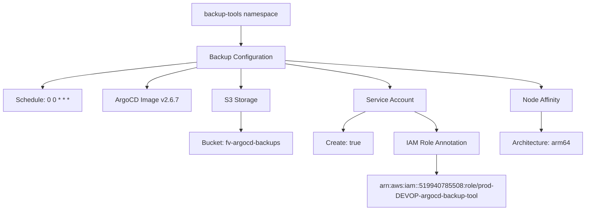
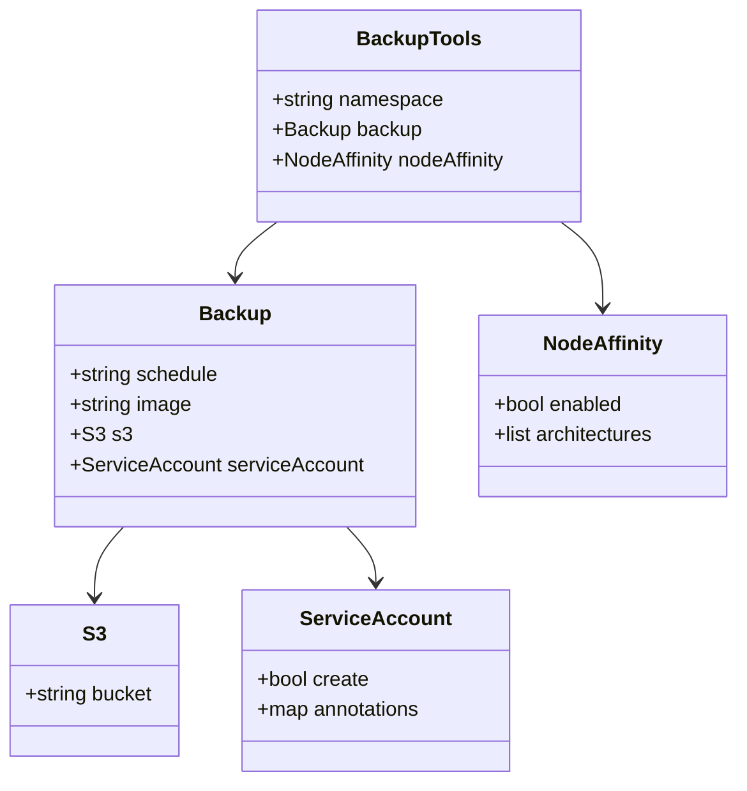
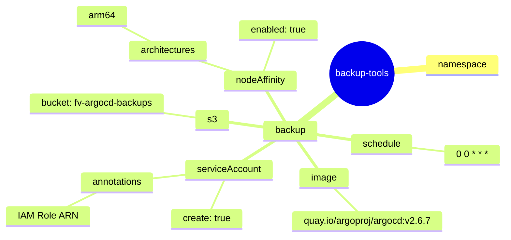

# Diagram: devops/k8s/argocd/backup-tool/helm/values.yaml


> Auto-generated by Obscura crawlers

## Diagram 1

```mermaid
graph TD
      A[backup-tools namespace] --> B[Backup Configuration]
      B --> C[Schedule: 0 0 * * *]
      B --> D[ArgoCD Image v2.6.7]...
  └ 117 lines...
```

> SVG rendering failed for this diagram.

## Diagram 2



### SVG

<svg id="container" width="1406.3125" xmlns="http://www.w3.org/2000/svg" class="flowchart" height="510" viewBox="0 0 1406.3125 510" role="graphics-document document" aria-roledescription="flowchart-v2"><style>#container{font-family:"trebuchet ms",verdana,arial,sans-serif;font-size:16px;fill:#333;}@keyframes edge-animation-frame{from{stroke-dashoffset:0;}}@keyframes dash{to{stroke-dashoffset:0;}}#container .edge-animation-slow{stroke-dasharray:9,5!important;stroke-dashoffset:900;animation:dash 50s linear infinite;stroke-linecap:round;}#container .edge-animation-fast{stroke-dasharray:9,5!important;stroke-dashoffset:900;animation:dash 20s linear infinite;stroke-linecap:round;}#container .error-icon{fill:#552222;}#container .error-text{fill:#552222;stroke:#552222;}#container .edge-thickness-normal{stroke-width:1px;}#container .edge-thickness-thick{stroke-width:3.5px;}#container .edge-pattern-solid{stroke-dasharray:0;}#container .edge-thickness-invisible{stroke-width:0;fill:none;}#container .edge-pattern-dashed{stroke-dasharray:3;}#container .edge-pattern-dotted{stroke-dasharray:2;}#container .marker{fill:#333333;stroke:#333333;}#container .marker.cross{stroke:#333333;}#container svg{font-family:"trebuchet ms",verdana,arial,sans-serif;font-size:16px;}#container p{margin:0;}#container .label{font-family:"trebuchet ms",verdana,arial,sans-serif;color:#333;}#container .cluster-label text{fill:#333;}#container .cluster-label span{color:#333;}#container .cluster-label span p{background-color:transparent;}#container .label text,#container span{fill:#333;color:#333;}#container .node rect,#container .node circle,#container .node ellipse,#container .node polygon,#container .node path{fill:#ECECFF;stroke:#9370DB;stroke-width:1px;}#container .rough-node .label text,#container .node .label text,#container .image-shape .label,#container .icon-shape .label{text-anchor:middle;}#container .node .katex path{fill:#000;stroke:#000;stroke-width:1px;}#container .rough-node .label,#container .node .label,#container .image-shape .label,#container .icon-shape .label{text-align:center;}#container .node.clickable{cursor:pointer;}#container .root .anchor path{fill:#333333!important;stroke-width:0;stroke:#333333;}#container .arrowheadPath{fill:#333333;}#container .edgePath .path{stroke:#333333;stroke-width:2.0px;}#container .flowchart-link{stroke:#333333;fill:none;}#container .edgeLabel{background-color:rgba(232,232,232, 0.8);text-align:center;}#container .edgeLabel p{background-color:rgba(232,232,232, 0.8);}#container .edgeLabel rect{opacity:0.5;background-color:rgba(232,232,232, 0.8);fill:rgba(232,232,232, 0.8);}#container .labelBkg{background-color:rgba(232, 232, 232, 0.5);}#container .cluster rect{fill:#ffffde;stroke:#aaaa33;stroke-width:1px;}#container .cluster text{fill:#333;}#container .cluster span{color:#333;}#container div.mermaidTooltip{position:absolute;text-align:center;max-width:200px;padding:2px;font-family:"trebuchet ms",verdana,arial,sans-serif;font-size:12px;background:hsl(80, 100%, 96.2745098039%);border:1px solid #aaaa33;border-radius:2px;pointer-events:none;z-index:100;}#container .flowchartTitleText{text-anchor:middle;font-size:18px;fill:#333;}#container rect.text{fill:none;stroke-width:0;}#container .icon-shape,#container .image-shape{background-color:rgba(232,232,232, 0.8);text-align:center;}#container .icon-shape p,#container .image-shape p{background-color:rgba(232,232,232, 0.8);padding:2px;}#container .icon-shape rect,#container .image-shape rect{opacity:0.5;background-color:rgba(232,232,232, 0.8);fill:rgba(232,232,232, 0.8);}#container .label-icon{display:inline-block;height:1em;overflow:visible;vertical-align:-0.125em;}#container .node .label-icon path{fill:currentColor;stroke:revert;stroke-width:revert;}#container :root{--mermaid-font-family:"trebuchet ms",verdana,arial,sans-serif;}</style><g><marker id="container_flowchart-v2-pointEnd" class="marker flowchart-v2" viewBox="0 0 10 10" refX="5" refY="5" markerUnits="userSpaceOnUse" markerWidth="8" markerHeight="8" orient="auto"><path d="M 0 0 L 10 5 L 0 10 z" class="arrowMarkerPath" style="stroke-width: 1; stroke-dasharray: 1, 0;"></path></marker><marker id="container_flowchart-v2-pointStart" class="marker flowchart-v2" viewBox="0 0 10 10" refX="4.5" refY="5" markerUnits="userSpaceOnUse" markerWidth="8" markerHeight="8" orient="auto"><path d="M 0 5 L 10 10 L 10 0 z" class="arrowMarkerPath" style="stroke-width: 1; stroke-dasharray: 1, 0;"></path></marker><marker id="container_flowchart-v2-circleEnd" class="marker flowchart-v2" viewBox="0 0 10 10" refX="11" refY="5" markerUnits="userSpaceOnUse" markerWidth="11" markerHeight="11" orient="auto"><circle cx="5" cy="5" r="5" class="arrowMarkerPath" style="stroke-width: 1; stroke-dasharray: 1, 0;"></circle></marker><marker id="container_flowchart-v2-circleStart" class="marker flowchart-v2" viewBox="0 0 10 10" refX="-1" refY="5" markerUnits="userSpaceOnUse" markerWidth="11" markerHeight="11" orient="auto"><circle cx="5" cy="5" r="5" class="arrowMarkerPath" style="stroke-width: 1; stroke-dasharray: 1, 0;"></circle></marker><marker id="container_flowchart-v2-crossEnd" class="marker cross flowchart-v2" viewBox="0 0 11 11" refX="12" refY="5.2" markerUnits="userSpaceOnUse" markerWidth="11" markerHeight="11" orient="auto"><path d="M 1,1 l 9,9 M 10,1 l -9,9" class="arrowMarkerPath" style="stroke-width: 2; stroke-dasharray: 1, 0;"></path></marker><marker id="container_flowchart-v2-crossStart" class="marker cross flowchart-v2" viewBox="0 0 11 11" refX="-1" refY="5.2" markerUnits="userSpaceOnUse" markerWidth="11" markerHeight="11" orient="auto"><path d="M 1,1 l 9,9 M 10,1 l -9,9" class="arrowMarkerPath" style="stroke-width: 2; stroke-dasharray: 1, 0;"></path></marker><g class="root"><g class="clusters"></g><g class="edgePaths"><path d="M569.125,62L569.125,66.167C569.125,70.333,569.125,78.667,569.125,86.333C569.125,94,569.125,101,569.125,104.5L569.125,108" id="L_A_B_0" class="edge-thickness-normal edge-pattern-solid edge-thickness-normal edge-pattern-solid flowchart-link" style=";" data-edge="true" data-et="edge" data-id="L_A_B_0" data-points="W3sieCI6NTY5LjEyNSwieSI6NjJ9LHsieCI6NTY5LjEyNSwieSI6ODd9LHsieCI6NTY5LjEyNSwieSI6MTEyfV0=" marker-end="url(#container_flowchart-v2-pointEnd)"></path><path d="M461.836,150.977L402.083,157.648C342.331,164.318,222.826,177.659,163.073,187.83C103.32,198,103.32,205,103.32,208.5L103.32,212" id="L_B_C_0" class="edge-thickness-normal edge-pattern-solid edge-thickness-normal edge-pattern-solid flowchart-link" style=";" data-edge="true" data-et="edge" data-id="L_B_C_0" data-points="W3sieCI6NDYxLjgzNTkzNzUsInkiOjE1MC45NzcxOTAwMTA1NjY0fSx7IngiOjEwMy4zMjAzMTI1LCJ5IjoxOTF9LHsieCI6MTAzLjMyMDMxMjUsInkiOjIxNn1d" marker-end="url(#container_flowchart-v2-pointEnd)"></path><path d="M461.836,164.461L443.198,168.885C424.56,173.308,387.284,182.154,368.646,190.077C350.008,198,350.008,205,350.008,208.5L350.008,212" id="L_B_D_0" class="edge-thickness-normal edge-pattern-solid edge-thickness-normal edge-pattern-solid flowchart-link" style=";" data-edge="true" data-et="edge" data-id="L_B_D_0" data-points="W3sieCI6NDYxLjgzNTkzNzUsInkiOjE2NC40NjE0MDQwNzE3MzY3Mn0seyJ4IjozNTAuMDA3ODEyNSwieSI6MTkxfSx7IngiOjM1MC4wMDc4MTI1LCJ5IjoyMTZ9XQ==" marker-end="url(#container_flowchart-v2-pointEnd)"></path><path d="M569.125,166L569.125,170.167C569.125,174.333,569.125,182.667,569.125,190.333C569.125,198,569.125,205,569.125,208.5L569.125,212" id="L_B_E_0" class="edge-thickness-normal edge-pattern-solid edge-thickness-normal edge-pattern-solid flowchart-link" style=";" data-edge="true" data-et="edge" data-id="L_B_E_0" data-points="W3sieCI6NTY5LjEyNSwieSI6MTY2fSx7IngiOjU2OS4xMjUsInkiOjE5MX0seyJ4Ijo1NjkuMTI1LCJ5IjoyMTZ9XQ==" marker-end="url(#container_flowchart-v2-pointEnd)"></path><path d="M676.414,154.456L718.694,160.546C760.974,166.637,845.534,178.819,887.814,188.409C930.094,198,930.094,205,930.094,208.5L930.094,212" id="L_B_F_0" class="edge-thickness-normal edge-pattern-solid edge-thickness-normal edge-pattern-solid flowchart-link" style=";" data-edge="true" data-et="edge" data-id="L_B_F_0" data-points="W3sieCI6Njc2LjQxNDA2MjUsInkiOjE1NC40NTU3MTgxMTk2NDMzfSx7IngiOjkzMC4wOTM3NSwieSI6MTkxfSx7IngiOjkzMC4wOTM3NSwieSI6MjE2fV0=" marker-end="url(#container_flowchart-v2-pointEnd)"></path><path d="M676.414,146.659L779.936,154.049C883.458,161.439,1090.503,176.22,1194.025,187.11C1297.547,198,1297.547,205,1297.547,208.5L1297.547,212" id="L_B_G_0" class="edge-thickness-normal edge-pattern-solid edge-thickness-normal edge-pattern-solid flowchart-link" style=";" data-edge="true" data-et="edge" data-id="L_B_G_0" data-points="W3sieCI6Njc2LjQxNDA2MjUsInkiOjE0Ni42NTkwNjYwNDYwMzI3M30seyJ4IjoxMjk3LjU0Njg3NSwieSI6MTkxfSx7IngiOjEyOTcuNTQ2ODc1LCJ5IjoyMTZ9XQ==" marker-end="url(#container_flowchart-v2-pointEnd)"></path><path d="M569.125,270L569.125,274.167C569.125,278.333,569.125,286.667,569.125,294.333C569.125,302,569.125,309,569.125,312.5L569.125,316" id="L_E_H_0" class="edge-thickness-normal edge-pattern-solid edge-thickness-normal edge-pattern-solid flowchart-link" style=";" data-edge="true" data-et="edge" data-id="L_E_H_0" data-points="W3sieCI6NTY5LjEyNSwieSI6MjcwfSx7IngiOjU2OS4xMjUsInkiOjI5NX0seyJ4Ijo1NjkuMTI1LCJ5IjozMjB9XQ==" marker-end="url(#container_flowchart-v2-pointEnd)"></path><path d="M871.473,270L862.427,274.167C853.381,278.333,835.288,286.667,826.242,294.333C817.195,302,817.195,309,817.195,312.5L817.195,316" id="L_F_I_0" class="edge-thickness-normal edge-pattern-solid edge-thickness-normal edge-pattern-solid flowchart-link" style=";" data-edge="true" data-et="edge" data-id="L_F_I_0" data-points="W3sieCI6ODcxLjQ3MzQwNzQ1MTkyMzEsInkiOjI3MH0seyJ4Ijo4MTcuMTk1MzEyNSwieSI6Mjk1fSx7IngiOjgxNy4xOTUzMTI1LCJ5IjozMjB9XQ==" marker-end="url(#container_flowchart-v2-pointEnd)"></path><path d="M988.714,270L997.76,274.167C1006.807,278.333,1024.899,286.667,1033.946,294.333C1042.992,302,1042.992,309,1042.992,312.5L1042.992,316" id="L_F_J_0" class="edge-thickness-normal edge-pattern-solid edge-thickness-normal edge-pattern-solid flowchart-link" style=";" data-edge="true" data-et="edge" data-id="L_F_J_0" data-points="W3sieCI6OTg4LjcxNDA5MjU0ODA3NjksInkiOjI3MH0seyJ4IjoxMDQyLjk5MjE4NzUsInkiOjI5NX0seyJ4IjoxMDQyLjk5MjE4NzUsInkiOjMyMH1d" marker-end="url(#container_flowchart-v2-pointEnd)"></path><path d="M1042.992,374L1042.992,378.167C1042.992,382.333,1042.992,390.667,1042.992,398.333C1042.992,406,1042.992,413,1042.992,416.5L1042.992,420" id="L_J_K_0" class="edge-thickness-normal edge-pattern-solid edge-thickness-normal edge-pattern-solid flowchart-link" style=";" data-edge="true" data-et="edge" data-id="L_J_K_0" data-points="W3sieCI6MTA0Mi45OTIxODc1LCJ5IjozNzR9LHsieCI6MTA0Mi45OTIxODc1LCJ5IjozOTl9LHsieCI6MTA0Mi45OTIxODc1LCJ5Ijo0MjR9XQ==" marker-end="url(#container_flowchart-v2-pointEnd)"></path><path d="M1297.547,270L1297.547,274.167C1297.547,278.333,1297.547,286.667,1297.547,294.333C1297.547,302,1297.547,309,1297.547,312.5L1297.547,316" id="L_G_L_0" class="edge-thickness-normal edge-pattern-solid edge-thickness-normal edge-pattern-solid flowchart-link" style=";" data-edge="true" data-et="edge" data-id="L_G_L_0" data-points="W3sieCI6MTI5Ny41NDY4NzUsInkiOjI3MH0seyJ4IjoxMjk3LjU0Njg3NSwieSI6Mjk1fSx7IngiOjEyOTcuNTQ2ODc1LCJ5IjozMjB9XQ==" marker-end="url(#container_flowchart-v2-pointEnd)"></path></g><g class="edgeLabels"><g class="edgeLabel"><g class="label" data-id="L_A_B_0" transform="translate(0, 0)"><foreignObject width="0" height="0"><div xmlns="http://www.w3.org/1999/xhtml" class="labelBkg" style="display: table-cell; white-space: nowrap; line-height: 1.5; max-width: 200px; text-align: center;"><span class="edgeLabel"></span></div></foreignObject></g></g><g class="edgeLabel"><g class="label" data-id="L_B_C_0" transform="translate(0, 0)"><foreignObject width="0" height="0"><div xmlns="http://www.w3.org/1999/xhtml" class="labelBkg" style="display: table-cell; white-space: nowrap; line-height: 1.5; max-width: 200px; text-align: center;"><span class="edgeLabel"></span></div></foreignObject></g></g><g class="edgeLabel"><g class="label" data-id="L_B_D_0" transform="translate(0, 0)"><foreignObject width="0" height="0"><div xmlns="http://www.w3.org/1999/xhtml" class="labelBkg" style="display: table-cell; white-space: nowrap; line-height: 1.5; max-width: 200px; text-align: center;"><span class="edgeLabel"></span></div></foreignObject></g></g><g class="edgeLabel"><g class="label" data-id="L_B_E_0" transform="translate(0, 0)"><foreignObject width="0" height="0"><div xmlns="http://www.w3.org/1999/xhtml" class="labelBkg" style="display: table-cell; white-space: nowrap; line-height: 1.5; max-width: 200px; text-align: center;"><span class="edgeLabel"></span></div></foreignObject></g></g><g class="edgeLabel"><g class="label" data-id="L_B_F_0" transform="translate(0, 0)"><foreignObject width="0" height="0"><div xmlns="http://www.w3.org/1999/xhtml" class="labelBkg" style="display: table-cell; white-space: nowrap; line-height: 1.5; max-width: 200px; text-align: center;"><span class="edgeLabel"></span></div></foreignObject></g></g><g class="edgeLabel"><g class="label" data-id="L_B_G_0" transform="translate(0, 0)"><foreignObject width="0" height="0"><div xmlns="http://www.w3.org/1999/xhtml" class="labelBkg" style="display: table-cell; white-space: nowrap; line-height: 1.5; max-width: 200px; text-align: center;"><span class="edgeLabel"></span></div></foreignObject></g></g><g class="edgeLabel"><g class="label" data-id="L_E_H_0" transform="translate(0, 0)"><foreignObject width="0" height="0"><div xmlns="http://www.w3.org/1999/xhtml" class="labelBkg" style="display: table-cell; white-space: nowrap; line-height: 1.5; max-width: 200px; text-align: center;"><span class="edgeLabel"></span></div></foreignObject></g></g><g class="edgeLabel"><g class="label" data-id="L_F_I_0" transform="translate(0, 0)"><foreignObject width="0" height="0"><div xmlns="http://www.w3.org/1999/xhtml" class="labelBkg" style="display: table-cell; white-space: nowrap; line-height: 1.5; max-width: 200px; text-align: center;"><span class="edgeLabel"></span></div></foreignObject></g></g><g class="edgeLabel"><g class="label" data-id="L_F_J_0" transform="translate(0, 0)"><foreignObject width="0" height="0"><div xmlns="http://www.w3.org/1999/xhtml" class="labelBkg" style="display: table-cell; white-space: nowrap; line-height: 1.5; max-width: 200px; text-align: center;"><span class="edgeLabel"></span></div></foreignObject></g></g><g class="edgeLabel"><g class="label" data-id="L_J_K_0" transform="translate(0, 0)"><foreignObject width="0" height="0"><div xmlns="http://www.w3.org/1999/xhtml" class="labelBkg" style="display: table-cell; white-space: nowrap; line-height: 1.5; max-width: 200px; text-align: center;"><span class="edgeLabel"></span></div></foreignObject></g></g><g class="edgeLabel"><g class="label" data-id="L_G_L_0" transform="translate(0, 0)"><foreignObject width="0" height="0"><div xmlns="http://www.w3.org/1999/xhtml" class="labelBkg" style="display: table-cell; white-space: nowrap; line-height: 1.5; max-width: 200px; text-align: center;"><span class="edgeLabel"></span></div></foreignObject></g></g></g><g class="nodes"><g class="node default" id="flowchart-A-0" transform="translate(569.125, 35)"><rect class="basic label-container" style="" x="-120.8359375" y="-27" width="241.671875" height="54"></rect><g class="label" style="" transform="translate(-90.8359375, -12)"><rect></rect><foreignObject width="181.671875" height="24"><div xmlns="http://www.w3.org/1999/xhtml" style="display: table-cell; white-space: nowrap; line-height: 1.5; max-width: 200px; text-align: center;"><span class="nodeLabel"><p>backup-tools namespace</p></span></div></foreignObject></g></g><g class="node default" id="flowchart-B-1" transform="translate(569.125, 139)"><rect class="basic label-container" style="" x="-107.2890625" y="-27" width="214.578125" height="54"></rect><g class="label" style="" transform="translate(-77.2890625, -12)"><rect></rect><foreignObject width="154.578125" height="24"><div xmlns="http://www.w3.org/1999/xhtml" style="display: table-cell; white-space: nowrap; line-height: 1.5; max-width: 200px; text-align: center;"><span class="nodeLabel"><p>Backup Configuration</p></span></div></foreignObject></g></g><g class="node default" id="flowchart-C-3" transform="translate(103.3203125, 243)"><rect class="basic label-container" style="" x="-95.3203125" y="-27" width="190.640625" height="54"></rect><g class="label" style="" transform="translate(-65.3203125, -12)"><rect></rect><foreignObject width="130.640625" height="24"><div xmlns="http://www.w3.org/1999/xhtml" style="display: table-cell; white-space: nowrap; line-height: 1.5; max-width: 200px; text-align: center;"><span class="nodeLabel"><p>Schedule: 0 0 * * *</p></span></div></foreignObject></g></g><g class="node default" id="flowchart-D-5" transform="translate(350.0078125, 243)"><rect class="basic label-container" style="" x="-101.3671875" y="-27" width="202.734375" height="54"></rect><g class="label" style="" transform="translate(-71.3671875, -12)"><rect></rect><foreignObject width="142.734375" height="24"><div xmlns="http://www.w3.org/1999/xhtml" style="display: table-cell; white-space: nowrap; line-height: 1.5; max-width: 200px; text-align: center;"><span class="nodeLabel"><p>ArgoCD Image v2.6.7</p></span></div></foreignObject></g></g><g class="node default" id="flowchart-E-7" transform="translate(569.125, 243)"><rect class="basic label-container" style="" x="-67.75" y="-27" width="135.5" height="54"></rect><g class="label" style="" transform="translate(-37.75, -12)"><rect></rect><foreignObject width="75.5" height="24"><div xmlns="http://www.w3.org/1999/xhtml" style="display: table-cell; white-space: nowrap; line-height: 1.5; max-width: 200px; text-align: center;"><span class="nodeLabel"><p>S3 Storage</p></span></div></foreignObject></g></g><g class="node default" id="flowchart-F-9" transform="translate(930.09375, 243)"><rect class="basic label-container" style="" x="-86.9609375" y="-27" width="173.921875" height="54"></rect><g class="label" style="" transform="translate(-56.9609375, -12)"><rect></rect><foreignObject width="113.921875" height="24"><div xmlns="http://www.w3.org/1999/xhtml" style="display: table-cell; white-space: nowrap; line-height: 1.5; max-width: 200px; text-align: center;"><span class="nodeLabel"><p>Service Account</p></span></div></foreignObject></g></g><g class="node default" id="flowchart-G-11" transform="translate(1297.546875, 243)"><rect class="basic label-container" style="" x="-76.9921875" y="-27" width="153.984375" height="54"></rect><g class="label" style="" transform="translate(-46.9921875, -12)"><rect></rect><foreignObject width="93.984375" height="24"><div xmlns="http://www.w3.org/1999/xhtml" style="display: table-cell; white-space: nowrap; line-height: 1.5; max-width: 200px; text-align: center;"><span class="nodeLabel"><p>Node Affinity</p></span></div></foreignObject></g></g><g class="node default" id="flowchart-H-13" transform="translate(569.125, 347)"><rect class="basic label-container" style="" x="-126.0625" y="-27" width="252.125" height="54"></rect><g class="label" style="" transform="translate(-96.0625, -12)"><rect></rect><foreignObject width="192.125" height="24"><div xmlns="http://www.w3.org/1999/xhtml" style="display: table-cell; white-space: nowrap; line-height: 1.5; max-width: 200px; text-align: center;"><span class="nodeLabel"><p>Bucket: fv-argocd-backups</p></span></div></foreignObject></g></g><g class="node default" id="flowchart-I-15" transform="translate(817.1953125, 347)"><rect class="basic label-container" style="" x="-72.0078125" y="-27" width="144.015625" height="54"></rect><g class="label" style="" transform="translate(-42.0078125, -12)"><rect></rect><foreignObject width="84.015625" height="24"><div xmlns="http://www.w3.org/1999/xhtml" style="display: table-cell; white-space: nowrap; line-height: 1.5; max-width: 200px; text-align: center;"><span class="nodeLabel"><p>Create: true</p></span></div></foreignObject></g></g><g class="node default" id="flowchart-J-17" transform="translate(1042.9921875, 347)"><rect class="basic label-container" style="" x="-103.7890625" y="-27" width="207.578125" height="54"></rect><g class="label" style="" transform="translate(-73.7890625, -12)"><rect></rect><foreignObject width="147.578125" height="24"><div xmlns="http://www.w3.org/1999/xhtml" style="display: table-cell; white-space: nowrap; line-height: 1.5; max-width: 200px; text-align: center;"><span class="nodeLabel"><p>IAM Role Annotation</p></span></div></foreignObject></g></g><g class="node default" id="flowchart-K-19" transform="translate(1042.9921875, 463)"><rect class="basic label-container" style="" x="-165.984375" y="-39" width="331.96875" height="78"></rect><g class="label" style="" transform="translate(-135.984375, -24)"><rect></rect><foreignObject width="271.96875" height="48"><div xmlns="http://www.w3.org/1999/xhtml" style="display: table; white-space: break-spaces; line-height: 1.5; max-width: 200px; text-align: center; width: 200px;"><span class="nodeLabel"><p>arn:aws:iam::519940785508:role/prod-DEVOP-argocd-backup-tool</p></span></div></foreignObject></g></g><g class="node default" id="flowchart-L-21" transform="translate(1297.546875, 347)"><rect class="basic label-container" style="" x="-100.765625" y="-27" width="201.53125" height="54"></rect><g class="label" style="" transform="translate(-70.765625, -12)"><rect></rect><foreignObject width="141.53125" height="24"><div xmlns="http://www.w3.org/1999/xhtml" style="display: table-cell; white-space: nowrap; line-height: 1.5; max-width: 200px; text-align: center;"><span class="nodeLabel"><p>Architecture: arm64</p></span></div></foreignObject></g></g></g></g></g></svg>

## Diagram 3



### SVG

<svg id="container" width="584.974609375" xmlns="http://www.w3.org/2000/svg" class="classDiagram" height="620" viewBox="0 0 584.974609375 620" role="graphics-document document" aria-roledescription="class"><style>#container{font-family:"trebuchet ms",verdana,arial,sans-serif;font-size:16px;fill:#333;}@keyframes edge-animation-frame{from{stroke-dashoffset:0;}}@keyframes dash{to{stroke-dashoffset:0;}}#container .edge-animation-slow{stroke-dasharray:9,5!important;stroke-dashoffset:900;animation:dash 50s linear infinite;stroke-linecap:round;}#container .edge-animation-fast{stroke-dasharray:9,5!important;stroke-dashoffset:900;animation:dash 20s linear infinite;stroke-linecap:round;}#container .error-icon{fill:#552222;}#container .error-text{fill:#552222;stroke:#552222;}#container .edge-thickness-normal{stroke-width:1px;}#container .edge-thickness-thick{stroke-width:3.5px;}#container .edge-pattern-solid{stroke-dasharray:0;}#container .edge-thickness-invisible{stroke-width:0;fill:none;}#container .edge-pattern-dashed{stroke-dasharray:3;}#container .edge-pattern-dotted{stroke-dasharray:2;}#container .marker{fill:#333333;stroke:#333333;}#container .marker.cross{stroke:#333333;}#container svg{font-family:"trebuchet ms",verdana,arial,sans-serif;font-size:16px;}#container p{margin:0;}#container g.classGroup text{fill:#9370DB;stroke:none;font-family:"trebuchet ms",verdana,arial,sans-serif;font-size:10px;}#container g.classGroup text .title{font-weight:bolder;}#container .nodeLabel,#container .edgeLabel{color:#131300;}#container .edgeLabel .label rect{fill:#ECECFF;}#container .label text{fill:#131300;}#container .labelBkg{background:#ECECFF;}#container .edgeLabel .label span{background:#ECECFF;}#container .classTitle{font-weight:bolder;}#container .node rect,#container .node circle,#container .node ellipse,#container .node polygon,#container .node path{fill:#ECECFF;stroke:#9370DB;stroke-width:1px;}#container .divider{stroke:#9370DB;stroke-width:1;}#container g.clickable{cursor:pointer;}#container g.classGroup rect{fill:#ECECFF;stroke:#9370DB;}#container g.classGroup line{stroke:#9370DB;stroke-width:1;}#container .classLabel .box{stroke:none;stroke-width:0;fill:#ECECFF;opacity:0.5;}#container .classLabel .label{fill:#9370DB;font-size:10px;}#container .relation{stroke:#333333;stroke-width:1;fill:none;}#container .dashed-line{stroke-dasharray:3;}#container .dotted-line{stroke-dasharray:1 2;}#container #compositionStart,#container .composition{fill:#333333!important;stroke:#333333!important;stroke-width:1;}#container #compositionEnd,#container .composition{fill:#333333!important;stroke:#333333!important;stroke-width:1;}#container #dependencyStart,#container .dependency{fill:#333333!important;stroke:#333333!important;stroke-width:1;}#container #dependencyStart,#container .dependency{fill:#333333!important;stroke:#333333!important;stroke-width:1;}#container #extensionStart,#container .extension{fill:transparent!important;stroke:#333333!important;stroke-width:1;}#container #extensionEnd,#container .extension{fill:transparent!important;stroke:#333333!important;stroke-width:1;}#container #aggregationStart,#container .aggregation{fill:transparent!important;stroke:#333333!important;stroke-width:1;}#container #aggregationEnd,#container .aggregation{fill:transparent!important;stroke:#333333!important;stroke-width:1;}#container #lollipopStart,#container .lollipop{fill:#ECECFF!important;stroke:#333333!important;stroke-width:1;}#container #lollipopEnd,#container .lollipop{fill:#ECECFF!important;stroke:#333333!important;stroke-width:1;}#container .edgeTerminals{font-size:11px;line-height:initial;}#container .classTitleText{text-anchor:middle;font-size:18px;fill:#333;}#container .label-icon{display:inline-block;height:1em;overflow:visible;vertical-align:-0.125em;}#container .node .label-icon path{fill:currentColor;stroke:revert;stroke-width:revert;}#container :root{--mermaid-font-family:"trebuchet ms",verdana,arial,sans-serif;}</style><g><defs><marker id="container_class-aggregationStart" class="marker aggregation class" refX="18" refY="7" markerWidth="190" markerHeight="240" orient="auto"><path d="M 18,7 L9,13 L1,7 L9,1 Z"></path></marker></defs><defs><marker id="container_class-aggregationEnd" class="marker aggregation class" refX="1" refY="7" markerWidth="20" markerHeight="28" orient="auto"><path d="M 18,7 L9,13 L1,7 L9,1 Z"></path></marker></defs><defs><marker id="container_class-extensionStart" class="marker extension class" refX="18" refY="7" markerWidth="190" markerHeight="240" orient="auto"><path d="M 1,7 L18,13 V 1 Z"></path></marker></defs><defs><marker id="container_class-extensionEnd" class="marker extension class" refX="1" refY="7" markerWidth="20" markerHeight="28" orient="auto"><path d="M 1,1 V 13 L18,7 Z"></path></marker></defs><defs><marker id="container_class-compositionStart" class="marker composition class" refX="18" refY="7" markerWidth="190" markerHeight="240" orient="auto"><path d="M 18,7 L9,13 L1,7 L9,1 Z"></path></marker></defs><defs><marker id="container_class-compositionEnd" class="marker composition class" refX="1" refY="7" markerWidth="20" markerHeight="28" orient="auto"><path d="M 18,7 L9,13 L1,7 L9,1 Z"></path></marker></defs><defs><marker id="container_class-dependencyStart" class="marker dependency class" refX="6" refY="7" markerWidth="190" markerHeight="240" orient="auto"><path d="M 5,7 L9,13 L1,7 L9,1 Z"></path></marker></defs><defs><marker id="container_class-dependencyEnd" class="marker dependency class" refX="13" refY="7" markerWidth="20" markerHeight="28" orient="auto"><path d="M 18,7 L9,13 L14,7 L9,1 Z"></path></marker></defs><defs><marker id="container_class-lollipopStart" class="marker lollipop class" refX="13" refY="7" markerWidth="190" markerHeight="240" orient="auto"><circle stroke="black" fill="transparent" cx="7" cy="7" r="6"></circle></marker></defs><defs><marker id="container_class-lollipopEnd" class="marker lollipop class" refX="1" refY="7" markerWidth="190" markerHeight="240" orient="auto"><circle stroke="black" fill="transparent" cx="7" cy="7" r="6"></circle></marker></defs><g class="root"><g class="clusters"></g><g class="edgePaths"><path d="M220.818,176L215.278,180.167C209.739,184.333,198.659,192.667,193.12,200C187.58,207.333,187.58,213.667,187.58,216.833L187.58,220" id="id_BackupTools_Backup_1" class="edge-thickness-normal edge-pattern-solid relation" style=";;;" data-edge="true" data-et="edge" data-id="id_BackupTools_Backup_1" data-points="W3sieCI6MjIwLjgxODE0NDM1MjA2NDIyLCJ5IjoxNzZ9LHsieCI6MTg3LjU4MDA3ODEyNSwieSI6MjAxfSx7IngiOjE4Ny41ODAwNzgxMjUsInkiOjIyNn1d" marker-end="url(#container_class-dependencyEnd)"></path><path d="M444.178,176L449.718,180.167C455.257,184.333,466.337,192.667,471.876,204C477.416,215.333,477.416,229.667,477.416,236.833L477.416,244" id="id_BackupTools_NodeAffinity_2" class="edge-thickness-normal edge-pattern-solid relation" style=";;;" data-edge="true" data-et="edge" data-id="id_BackupTools_NodeAffinity_2" data-points="W3sieCI6NDQ0LjE3Nzk0OTM5NzkzNTgsInkiOjE3Nn0seyJ4Ijo0NzcuNDE2MDE1NjI1LCJ5IjoyMDF9LHsieCI6NDc3LjQxNjAxNTYyNSwieSI6MjUwfV0=" marker-end="url(#container_class-dependencyEnd)"></path><path d="M98.902,418L95.053,422.167C91.204,426.333,83.506,434.667,79.657,444C75.809,453.333,75.809,463.667,75.809,468.833L75.809,474" id="id_Backup_S3_3" class="edge-thickness-normal edge-pattern-solid relation" style=";;;" data-edge="true" data-et="edge" data-id="id_Backup_S3_3" data-points="W3sieCI6OTguOTAxODc1NjQ1NjYxMTYsInkiOjQxOH0seyJ4Ijo3NS44MDg1OTM3NSwieSI6NDQzfSx7IngiOjc1LjgwODU5Mzc1LCJ5Ijo0ODB9XQ==" marker-end="url(#container_class-dependencyEnd)"></path><path d="M276.258,418L280.107,422.167C283.956,426.333,291.654,434.667,295.503,442C299.352,449.333,299.352,455.667,299.352,458.833L299.352,462" id="id_Backup_ServiceAccount_4" class="edge-thickness-normal edge-pattern-solid relation" style=";;;" data-edge="true" data-et="edge" data-id="id_Backup_ServiceAccount_4" data-points="W3sieCI6Mjc2LjI1ODI4MDYwNDMzODg0LCJ5Ijo0MTh9LHsieCI6Mjk5LjM1MTU2MjUsInkiOjQ0M30seyJ4IjoyOTkuMzUxNTYyNSwieSI6NDY4fV0=" marker-end="url(#container_class-dependencyEnd)"></path></g><g class="edgeLabels"><g class="edgeLabel"><g class="label" data-id="id_BackupTools_Backup_1" transform="translate(0, 0)"><foreignObject width="0" height="0"><div xmlns="http://www.w3.org/1999/xhtml" class="labelBkg" style="display: table-cell; white-space: nowrap; line-height: 1.5; max-width: 200px; text-align: center;"><span class="edgeLabel"></span></div></foreignObject></g></g><g class="edgeLabel"><g class="label" data-id="id_BackupTools_NodeAffinity_2" transform="translate(0, 0)"><foreignObject width="0" height="0"><div xmlns="http://www.w3.org/1999/xhtml" class="labelBkg" style="display: table-cell; white-space: nowrap; line-height: 1.5; max-width: 200px; text-align: center;"><span class="edgeLabel"></span></div></foreignObject></g></g><g class="edgeLabel"><g class="label" data-id="id_Backup_S3_3" transform="translate(0, 0)"><foreignObject width="0" height="0"><div xmlns="http://www.w3.org/1999/xhtml" class="labelBkg" style="display: table-cell; white-space: nowrap; line-height: 1.5; max-width: 200px; text-align: center;"><span class="edgeLabel"></span></div></foreignObject></g></g><g class="edgeLabel"><g class="label" data-id="id_Backup_ServiceAccount_4" transform="translate(0, 0)"><foreignObject width="0" height="0"><div xmlns="http://www.w3.org/1999/xhtml" class="labelBkg" style="display: table-cell; white-space: nowrap; line-height: 1.5; max-width: 200px; text-align: center;"><span class="edgeLabel"></span></div></foreignObject></g></g></g><g class="nodes"><g class="node default" id="classId-BackupTools-0" transform="translate(332.498046875, 92)"><g class="basic label-container"><path d="M-130.2421875 -84 L130.2421875 -84 L130.2421875 84 L-130.2421875 84" stroke="none" stroke-width="0" fill="#ECECFF" style=""></path><path d="M-130.2421875 -84 C-28.359713133848373 -84, 73.52276123230325 -84, 130.2421875 -84 M-130.2421875 -84 C-77.43949593525738 -84, -24.636804370514753 -84, 130.2421875 -84 M130.2421875 -84 C130.2421875 -22.41867852114857, 130.2421875 39.16264295770286, 130.2421875 84 M130.2421875 -84 C130.2421875 -41.29964159987472, 130.2421875 1.4007168002505637, 130.2421875 84 M130.2421875 84 C47.13526431987778 84, -35.971658860244446 84, -130.2421875 84 M130.2421875 84 C32.22840496080258 84, -65.78537757839484 84, -130.2421875 84 M-130.2421875 84 C-130.2421875 29.81483153084441, -130.2421875 -24.370336938311183, -130.2421875 -84 M-130.2421875 84 C-130.2421875 32.10221902224925, -130.2421875 -19.795561955501498, -130.2421875 -84" stroke="#9370DB" stroke-width="1.3" fill="none" stroke-dasharray="0 0" style=""></path></g><g class="annotation-group text" transform="translate(0, -60)"></g><g class="label-group text" transform="translate(-46.3125, -60)"><g class="label" style="font-weight: bolder" transform="translate(0,-12)"><foreignObject width="92.625" height="24"><div xmlns="http://www.w3.org/1999/xhtml" style="display: table-cell; white-space: nowrap; line-height: 1.5; max-width: 141px; text-align: center;"><span class="nodeLabel markdown-node-label" style=""><p>BackupTools</p></span></div></foreignObject></g></g><g class="members-group text" transform="translate(-118.2421875, -12)"><g class="label" style="" transform="translate(0,-12)"><foreignObject width="135.9375" height="24"><div xmlns="http://www.w3.org/1999/xhtml" style="display: table-cell; white-space: nowrap; line-height: 1.5; max-width: 193px; text-align: center;"><span class="nodeLabel markdown-node-label" style=""><p>+string namespace</p></span></div></foreignObject></g><g class="label" style="" transform="translate(0,12)"><foreignObject width="117.796875" height="24"><div xmlns="http://www.w3.org/1999/xhtml" style="display: table-cell; white-space: nowrap; line-height: 1.5; max-width: 175px; text-align: center;"><span class="nodeLabel markdown-node-label" style=""><p>+Backup backup</p></span></div></foreignObject></g><g class="label" style="" transform="translate(0,36)"><foreignObject width="190.171875" height="24"><div xmlns="http://www.w3.org/1999/xhtml" style="display: table-cell; white-space: nowrap; line-height: 1.5; max-width: 248px; text-align: center;"><span class="nodeLabel markdown-node-label" style=""><p>+NodeAffinity nodeAffinity</p></span></div></foreignObject></g></g><g class="methods-group text" transform="translate(-118.2421875, 84)"></g><g class="divider" style=""><path d="M-130.2421875 -36 C-65.55217575563697 -36, -0.8621640112739328 -36, 130.2421875 -36 M-130.2421875 -36 C-75.32547408030547 -36, -20.408760660610938 -36, 130.2421875 -36" stroke="#9370DB" stroke-width="1.3" fill="none" stroke-dasharray="0 0" style=""></path></g><g class="divider" style=""><path d="M-130.2421875 60 C-36.89046455937404 60, 56.46125838125192 60, 130.2421875 60 M-130.2421875 60 C-64.75207556915127 60, 0.7380363616974535 60, 130.2421875 60" stroke="#9370DB" stroke-width="1.3" fill="none" stroke-dasharray="0 0" style=""></path></g></g><g class="node default" id="classId-Backup-1" transform="translate(187.580078125, 322)"><g class="basic label-container"><path d="M-140.27734375 -96 L140.27734375 -96 L140.27734375 96 L-140.27734375 96" stroke="none" stroke-width="0" fill="#ECECFF" style=""></path><path d="M-140.27734375 -96 C-35.884510273284675 -96, 68.50832320343065 -96, 140.27734375 -96 M-140.27734375 -96 C-54.441484583655836 -96, 31.39437458268833 -96, 140.27734375 -96 M140.27734375 -96 C140.27734375 -31.543114501659076, 140.27734375 32.91377099668185, 140.27734375 96 M140.27734375 -96 C140.27734375 -35.90037360835544, 140.27734375 24.199252783289126, 140.27734375 96 M140.27734375 96 C35.56900642344051 96, -69.13933090311897 96, -140.27734375 96 M140.27734375 96 C60.924326113082955 96, -18.42869152383409 96, -140.27734375 96 M-140.27734375 96 C-140.27734375 32.20009277247171, -140.27734375 -31.599814455056574, -140.27734375 -96 M-140.27734375 96 C-140.27734375 36.945173978713754, -140.27734375 -22.109652042572492, -140.27734375 -96" stroke="#9370DB" stroke-width="1.3" fill="none" stroke-dasharray="0 0" style=""></path></g><g class="annotation-group text" transform="translate(0, -72)"></g><g class="label-group text" transform="translate(-26.8515625, -72)"><g class="label" style="font-weight: bolder" transform="translate(0,-12)"><foreignObject width="53.703125" height="24"><div xmlns="http://www.w3.org/1999/xhtml" style="display: table-cell; white-space: nowrap; line-height: 1.5; max-width: 103px; text-align: center;"><span class="nodeLabel markdown-node-label" style=""><p>Backup</p></span></div></foreignObject></g></g><g class="members-group text" transform="translate(-128.27734375, -24)"><g class="label" style="" transform="translate(0,-12)"><foreignObject width="119.28125" height="24"><div xmlns="http://www.w3.org/1999/xhtml" style="display: table-cell; white-space: nowrap; line-height: 1.5; max-width: 177px; text-align: center;"><span class="nodeLabel markdown-node-label" style=""><p>+string schedule</p></span></div></foreignObject></g><g class="label" style="" transform="translate(0,12)"><foreignObject width="97.421875" height="24"><div xmlns="http://www.w3.org/1999/xhtml" style="display: table-cell; white-space: nowrap; line-height: 1.5; max-width: 155px; text-align: center;"><span class="nodeLabel markdown-node-label" style=""><p>+string image</p></span></div></foreignObject></g><g class="label" style="" transform="translate(0,36)"><foreignObject width="43.75" height="24"><div xmlns="http://www.w3.org/1999/xhtml" style="display: table-cell; white-space: nowrap; line-height: 1.5; max-width: 101px; text-align: center;"><span class="nodeLabel markdown-node-label" style=""><p>+S3 s3</p></span></div></foreignObject></g><g class="label" style="" transform="translate(0,60)"><foreignObject width="229.703125" height="24"><div xmlns="http://www.w3.org/1999/xhtml" style="display: table-cell; white-space: nowrap; line-height: 1.5; max-width: 287px; text-align: center;"><span class="nodeLabel markdown-node-label" style=""><p>+ServiceAccount serviceAccount</p></span></div></foreignObject></g></g><g class="methods-group text" transform="translate(-128.27734375, 96)"></g><g class="divider" style=""><path d="M-140.27734375 -48 C-57.185339749959596 -48, 25.90666425008081 -48, 140.27734375 -48 M-140.27734375 -48 C-64.89930480012892 -48, 10.478734149742166 -48, 140.27734375 -48" stroke="#9370DB" stroke-width="1.3" fill="none" stroke-dasharray="0 0" style=""></path></g><g class="divider" style=""><path d="M-140.27734375 72 C-29.05059562670283 72, 82.17615249659434 72, 140.27734375 72 M-140.27734375 72 C-71.75276480470104 72, -3.228185859402089 72, 140.27734375 72" stroke="#9370DB" stroke-width="1.3" fill="none" stroke-dasharray="0 0" style=""></path></g></g><g class="node default" id="classId-S3-2" transform="translate(75.80859375, 540)"><g class="basic label-container"><path d="M-67.80859375 -60 L67.80859375 -60 L67.80859375 60 L-67.80859375 60" stroke="none" stroke-width="0" fill="#ECECFF" style=""></path><path d="M-67.80859375 -60 C-30.224166030256896 -60, 7.360261689486208 -60, 67.80859375 -60 M-67.80859375 -60 C-19.51463365428007 -60, 28.779326441439864 -60, 67.80859375 -60 M67.80859375 -60 C67.80859375 -20.61910494360682, 67.80859375 18.761790112786358, 67.80859375 60 M67.80859375 -60 C67.80859375 -32.62205994607232, 67.80859375 -5.244119892144639, 67.80859375 60 M67.80859375 60 C14.513887324507607 60, -38.780819100984786 60, -67.80859375 60 M67.80859375 60 C36.68298990171766 60, 5.55738605343533 60, -67.80859375 60 M-67.80859375 60 C-67.80859375 25.073409998232812, -67.80859375 -9.853180003534376, -67.80859375 -60 M-67.80859375 60 C-67.80859375 14.21473208808635, -67.80859375 -31.5705358238273, -67.80859375 -60" stroke="#9370DB" stroke-width="1.3" fill="none" stroke-dasharray="0 0" style=""></path></g><g class="annotation-group text" transform="translate(0, -36)"></g><g class="label-group text" transform="translate(-8.7421875, -36)"><g class="label" style="font-weight: bolder" transform="translate(0,-12)"><foreignObject width="17.484375" height="24"><div xmlns="http://www.w3.org/1999/xhtml" style="display: table-cell; white-space: nowrap; line-height: 1.5; max-width: 67px; text-align: center;"><span class="nodeLabel markdown-node-label" style=""><p>S3</p></span></div></foreignObject></g></g><g class="members-group text" transform="translate(-55.80859375, 12)"><g class="label" style="" transform="translate(0,-12)"><foreignObject width="102.875" height="24"><div xmlns="http://www.w3.org/1999/xhtml" style="display: table-cell; white-space: nowrap; line-height: 1.5; max-width: 160px; text-align: center;"><span class="nodeLabel markdown-node-label" style=""><p>+string bucket</p></span></div></foreignObject></g></g><g class="methods-group text" transform="translate(-55.80859375, 60)"></g><g class="divider" style=""><path d="M-67.80859375 -12 C-35.411319281958356 -12, -3.014044813916712 -12, 67.80859375 -12 M-67.80859375 -12 C-29.59036134714922 -12, 8.627871055701561 -12, 67.80859375 -12" stroke="#9370DB" stroke-width="1.3" fill="none" stroke-dasharray="0 0" style=""></path></g><g class="divider" style=""><path d="M-67.80859375 36 C-36.74149370437122 36, -5.674393658742439 36, 67.80859375 36 M-67.80859375 36 C-37.367357234647216 36, -6.926120719294424 36, 67.80859375 36" stroke="#9370DB" stroke-width="1.3" fill="none" stroke-dasharray="0 0" style=""></path></g></g><g class="node default" id="classId-ServiceAccount-3" transform="translate(299.3515625, 540)"><g class="basic label-container"><path d="M-105.734375 -72 L105.734375 -72 L105.734375 72 L-105.734375 72" stroke="none" stroke-width="0" fill="#ECECFF" style=""></path><path d="M-105.734375 -72 C-53.51608909371896 -72, -1.2978031874379212 -72, 105.734375 -72 M-105.734375 -72 C-49.614302802116036 -72, 6.505769395767928 -72, 105.734375 -72 M105.734375 -72 C105.734375 -36.277608650567416, 105.734375 -0.5552173011348316, 105.734375 72 M105.734375 -72 C105.734375 -17.749194121693357, 105.734375 36.501611756613286, 105.734375 72 M105.734375 72 C40.22496053259255 72, -25.284453934814906 72, -105.734375 72 M105.734375 72 C32.858518494869045 72, -40.01733801026191 72, -105.734375 72 M-105.734375 72 C-105.734375 27.76499346246478, -105.734375 -16.47001307507044, -105.734375 -72 M-105.734375 72 C-105.734375 22.444094947028283, -105.734375 -27.111810105943434, -105.734375 -72" stroke="#9370DB" stroke-width="1.3" fill="none" stroke-dasharray="0 0" style=""></path></g><g class="annotation-group text" transform="translate(0, -48)"></g><g class="label-group text" transform="translate(-55.671875, -48)"><g class="label" style="font-weight: bolder" transform="translate(0,-12)"><foreignObject width="111.34375" height="24"><div xmlns="http://www.w3.org/1999/xhtml" style="display: table-cell; white-space: nowrap; line-height: 1.5; max-width: 160px; text-align: center;"><span class="nodeLabel markdown-node-label" style=""><p>ServiceAccount</p></span></div></foreignObject></g></g><g class="members-group text" transform="translate(-93.734375, 0)"><g class="label" style="" transform="translate(0,-12)"><foreignObject width="89.96875" height="24"><div xmlns="http://www.w3.org/1999/xhtml" style="display: table-cell; white-space: nowrap; line-height: 1.5; max-width: 147px; text-align: center;"><span class="nodeLabel markdown-node-label" style=""><p>+bool create</p></span></div></foreignObject></g><g class="label" style="" transform="translate(0,12)"><foreignObject width="131.796875" height="24"><div xmlns="http://www.w3.org/1999/xhtml" style="display: table-cell; white-space: nowrap; line-height: 1.5; max-width: 189px; text-align: center;"><span class="nodeLabel markdown-node-label" style=""><p>+map annotations</p></span></div></foreignObject></g></g><g class="methods-group text" transform="translate(-93.734375, 72)"></g><g class="divider" style=""><path d="M-105.734375 -24 C-34.603528630867984 -24, 36.52731773826403 -24, 105.734375 -24 M-105.734375 -24 C-30.1159610556616 -24, 45.5024528886768 -24, 105.734375 -24" stroke="#9370DB" stroke-width="1.3" fill="none" stroke-dasharray="0 0" style=""></path></g><g class="divider" style=""><path d="M-105.734375 48 C-43.26602582328549 48, 19.202323353429023 48, 105.734375 48 M-105.734375 48 C-44.779356851890924 48, 16.175661296218152 48, 105.734375 48" stroke="#9370DB" stroke-width="1.3" fill="none" stroke-dasharray="0 0" style=""></path></g></g><g class="node default" id="classId-NodeAffinity-4" transform="translate(477.416015625, 322)"><g class="basic label-container"><path d="M-99.55859375 -72 L99.55859375 -72 L99.55859375 72 L-99.55859375 72" stroke="none" stroke-width="0" fill="#ECECFF" style=""></path><path d="M-99.55859375 -72 C-44.414342907036186 -72, 10.729907935927628 -72, 99.55859375 -72 M-99.55859375 -72 C-32.73217518718046 -72, 34.09424337563908 -72, 99.55859375 -72 M99.55859375 -72 C99.55859375 -21.440423910265814, 99.55859375 29.119152179468372, 99.55859375 72 M99.55859375 -72 C99.55859375 -23.16634633070413, 99.55859375 25.66730733859174, 99.55859375 72 M99.55859375 72 C43.7667409195463 72, -12.025111910907398 72, -99.55859375 72 M99.55859375 72 C45.729761638057525 72, -8.09907047388495 72, -99.55859375 72 M-99.55859375 72 C-99.55859375 25.84426665091459, -99.55859375 -20.31146669817082, -99.55859375 -72 M-99.55859375 72 C-99.55859375 18.627547448425403, -99.55859375 -34.74490510314919, -99.55859375 -72" stroke="#9370DB" stroke-width="1.3" fill="none" stroke-dasharray="0 0" style=""></path></g><g class="annotation-group text" transform="translate(0, -48)"></g><g class="label-group text" transform="translate(-45.6171875, -48)"><g class="label" style="font-weight: bolder" transform="translate(0,-12)"><foreignObject width="91.234375" height="24"><div xmlns="http://www.w3.org/1999/xhtml" style="display: table-cell; white-space: nowrap; line-height: 1.5; max-width: 140px; text-align: center;"><span class="nodeLabel markdown-node-label" style=""><p>NodeAffinity</p></span></div></foreignObject></g></g><g class="members-group text" transform="translate(-87.55859375, 0)"><g class="label" style="" transform="translate(0,-12)"><foreignObject width="104.3125" height="24"><div xmlns="http://www.w3.org/1999/xhtml" style="display: table-cell; white-space: nowrap; line-height: 1.5; max-width: 162px; text-align: center;"><span class="nodeLabel markdown-node-label" style=""><p>+bool enabled</p></span></div></foreignObject></g><g class="label" style="" transform="translate(0,12)"><foreignObject width="129.5" height="24"><div xmlns="http://www.w3.org/1999/xhtml" style="display: table-cell; white-space: nowrap; line-height: 1.5; max-width: 187px; text-align: center;"><span class="nodeLabel markdown-node-label" style=""><p>+list architectures</p></span></div></foreignObject></g></g><g class="methods-group text" transform="translate(-87.55859375, 72)"></g><g class="divider" style=""><path d="M-99.55859375 -24 C-30.6344820419486 -24, 38.2896296661028 -24, 99.55859375 -24 M-99.55859375 -24 C-41.56744624112292 -24, 16.423701267754154 -24, 99.55859375 -24" stroke="#9370DB" stroke-width="1.3" fill="none" stroke-dasharray="0 0" style=""></path></g><g class="divider" style=""><path d="M-99.55859375 48 C-57.727158781187846 48, -15.895723812375692 48, 99.55859375 48 M-99.55859375 48 C-45.52454183686305 48, 8.509510076273898 48, 99.55859375 48" stroke="#9370DB" stroke-width="1.3" fill="none" stroke-dasharray="0 0" style=""></path></g></g></g></g></g></svg>

## Diagram 4



### SVG

<svg id="container" width="100%" xmlns="http://www.w3.org/2000/svg" class="mindmapDiagram" style="max-width: 993.5565185546875px;" viewBox="5 5 993.5565185546875 447.9008483886719" role="graphics-document document" aria-roledescription="mindmap"><style>#container{font-family:"trebuchet ms",verdana,arial,sans-serif;font-size:16px;fill:#333;}@keyframes edge-animation-frame{from{stroke-dashoffset:0;}}@keyframes dash{to{stroke-dashoffset:0;}}#container .edge-animation-slow{stroke-dasharray:9,5!important;stroke-dashoffset:900;animation:dash 50s linear infinite;stroke-linecap:round;}#container .edge-animation-fast{stroke-dasharray:9,5!important;stroke-dashoffset:900;animation:dash 20s linear infinite;stroke-linecap:round;}#container .error-icon{fill:#552222;}#container .error-text{fill:#552222;stroke:#552222;}#container .edge-thickness-normal{stroke-width:1px;}#container .edge-thickness-thick{stroke-width:3.5px;}#container .edge-pattern-solid{stroke-dasharray:0;}#container .edge-thickness-invisible{stroke-width:0;fill:none;}#container .edge-pattern-dashed{stroke-dasharray:3;}#container .edge-pattern-dotted{stroke-dasharray:2;}#container .marker{fill:#333333;stroke:#333333;}#container .marker.cross{stroke:#333333;}#container svg{font-family:"trebuchet ms",verdana,arial,sans-serif;font-size:16px;}#container p{margin:0;}#container .edge{stroke-width:3;}#container .section--1 rect,#container .section--1 path,#container .section--1 circle,#container .section--1 polygon,#container .section--1 path{fill:hsl(240, 100%, 76.2745098039%);}#container .section--1 text{fill:#ffffff;}#container .node-icon--1{font-size:40px;color:#ffffff;}#container .section-edge--1{stroke:hsl(240, 100%, 76.2745098039%);}#container .edge-depth--1{stroke-width:17;}#container .section--1 line{stroke:hsl(60, 100%, 86.2745098039%);stroke-width:3;}#container .disabled,#container .disabled circle,#container .disabled text{fill:lightgray;}#container .disabled text{fill:#efefef;}#container .section-0 rect,#container .section-0 path,#container .section-0 circle,#container .section-0 polygon,#container .section-0 path{fill:hsl(60, 100%, 73.5294117647%);}#container .section-0 text{fill:black;}#container .node-icon-0{font-size:40px;color:black;}#container .section-edge-0{stroke:hsl(60, 100%, 73.5294117647%);}#container .edge-depth-0{stroke-width:14;}#container .section-0 line{stroke:hsl(240, 100%, 83.5294117647%);stroke-width:3;}#container .disabled,#container .disabled circle,#container .disabled text{fill:lightgray;}#container .disabled text{fill:#efefef;}#container .section-1 rect,#container .section-1 path,#container .section-1 circle,#container .section-1 polygon,#container .section-1 path{fill:hsl(80, 100%, 76.2745098039%);}#container .section-1 text{fill:black;}#container .node-icon-1{font-size:40px;color:black;}#container .section-edge-1{stroke:hsl(80, 100%, 76.2745098039%);}#container .edge-depth-1{stroke-width:11;}#container .section-1 line{stroke:hsl(260, 100%, 86.2745098039%);stroke-width:3;}#container .disabled,#container .disabled circle,#container .disabled text{fill:lightgray;}#container .disabled text{fill:#efefef;}#container .section-2 rect,#container .section-2 path,#container .section-2 circle,#container .section-2 polygon,#container .section-2 path{fill:hsl(270, 100%, 76.2745098039%);}#container .section-2 text{fill:#ffffff;}#container .node-icon-2{font-size:40px;color:#ffffff;}#container .section-edge-2{stroke:hsl(270, 100%, 76.2745098039%);}#container .edge-depth-2{stroke-width:8;}#container .section-2 line{stroke:hsl(90, 100%, 86.2745098039%);stroke-width:3;}#container .disabled,#container .disabled circle,#container .disabled text{fill:lightgray;}#container .disabled text{fill:#efefef;}#container .section-3 rect,#container .section-3 path,#container .section-3 circle,#container .section-3 polygon,#container .section-3 path{fill:hsl(300, 100%, 76.2745098039%);}#container .section-3 text{fill:black;}#container .node-icon-3{font-size:40px;color:black;}#container .section-edge-3{stroke:hsl(300, 100%, 76.2745098039%);}#container .edge-depth-3{stroke-width:5;}#container .section-3 line{stroke:hsl(120, 100%, 86.2745098039%);stroke-width:3;}#container .disabled,#container .disabled circle,#container .disabled text{fill:lightgray;}#container .disabled text{fill:#efefef;}#container .section-4 rect,#container .section-4 path,#container .section-4 circle,#container .section-4 polygon,#container .section-4 path{fill:hsl(330, 100%, 76.2745098039%);}#container .section-4 text{fill:black;}#container .node-icon-4{font-size:40px;color:black;}#container .section-edge-4{stroke:hsl(330, 100%, 76.2745098039%);}#container .edge-depth-4{stroke-width:2;}#container .section-4 line{stroke:hsl(150, 100%, 86.2745098039%);stroke-width:3;}#container .disabled,#container .disabled circle,#container .disabled text{fill:lightgray;}#container .disabled text{fill:#efefef;}#container .section-5 rect,#container .section-5 path,#container .section-5 circle,#container .section-5 polygon,#container .section-5 path{fill:hsl(0, 100%, 76.2745098039%);}#container .section-5 text{fill:black;}#container .node-icon-5{font-size:40px;color:black;}#container .section-edge-5{stroke:hsl(0, 100%, 76.2745098039%);}#container .edge-depth-5{stroke-width:-1;}#container .section-5 line{stroke:hsl(180, 100%, 86.2745098039%);stroke-width:3;}#container .disabled,#container .disabled circle,#container .disabled text{fill:lightgray;}#container .disabled text{fill:#efefef;}#container .section-6 rect,#container .section-6 path,#container .section-6 circle,#container .section-6 polygon,#container .section-6 path{fill:hsl(30, 100%, 76.2745098039%);}#container .section-6 text{fill:black;}#container .node-icon-6{font-size:40px;color:black;}#container .section-edge-6{stroke:hsl(30, 100%, 76.2745098039%);}#container .edge-depth-6{stroke-width:-4;}#container .section-6 line{stroke:hsl(210, 100%, 86.2745098039%);stroke-width:3;}#container .disabled,#container .disabled circle,#container .disabled text{fill:lightgray;}#container .disabled text{fill:#efefef;}#container .section-7 rect,#container .section-7 path,#container .section-7 circle,#container .section-7 polygon,#container .section-7 path{fill:hsl(90, 100%, 76.2745098039%);}#container .section-7 text{fill:black;}#container .node-icon-7{font-size:40px;color:black;}#container .section-edge-7{stroke:hsl(90, 100%, 76.2745098039%);}#container .edge-depth-7{stroke-width:-7;}#container .section-7 line{stroke:hsl(270, 100%, 86.2745098039%);stroke-width:3;}#container .disabled,#container .disabled circle,#container .disabled text{fill:lightgray;}#container .disabled text{fill:#efefef;}#container .section-8 rect,#container .section-8 path,#container .section-8 circle,#container .section-8 polygon,#container .section-8 path{fill:hsl(150, 100%, 76.2745098039%);}#container .section-8 text{fill:black;}#container .node-icon-8{font-size:40px;color:black;}#container .section-edge-8{stroke:hsl(150, 100%, 76.2745098039%);}#container .edge-depth-8{stroke-width:-10;}#container .section-8 line{stroke:hsl(330, 100%, 86.2745098039%);stroke-width:3;}#container .disabled,#container .disabled circle,#container .disabled text{fill:lightgray;}#container .disabled text{fill:#efefef;}#container .section-9 rect,#container .section-9 path,#container .section-9 circle,#container .section-9 polygon,#container .section-9 path{fill:hsl(180, 100%, 76.2745098039%);}#container .section-9 text{fill:black;}#container .node-icon-9{font-size:40px;color:black;}#container .section-edge-9{stroke:hsl(180, 100%, 76.2745098039%);}#container .edge-depth-9{stroke-width:-13;}#container .section-9 line{stroke:hsl(0, 100%, 86.2745098039%);stroke-width:3;}#container .disabled,#container .disabled circle,#container .disabled text{fill:lightgray;}#container .disabled text{fill:#efefef;}#container .section-10 rect,#container .section-10 path,#container .section-10 circle,#container .section-10 polygon,#container .section-10 path{fill:hsl(210, 100%, 76.2745098039%);}#container .section-10 text{fill:black;}#container .node-icon-10{font-size:40px;color:black;}#container .section-edge-10{stroke:hsl(210, 100%, 76.2745098039%);}#container .edge-depth-10{stroke-width:-16;}#container .section-10 line{stroke:hsl(30, 100%, 86.2745098039%);stroke-width:3;}#container .disabled,#container .disabled circle,#container .disabled text{fill:lightgray;}#container .disabled text{fill:#efefef;}#container .section-root rect,#container .section-root path,#container .section-root circle,#container .section-root polygon{fill:hsl(240, 100%, 46.2745098039%);}#container .section-root text{fill:#ffffff;}#container .section-root span{color:#ffffff;}#container .section-2 span{color:#ffffff;}#container .icon-container{height:100%;display:flex;justify-content:center;align-items:center;}#container .edge{fill:none;}#container .mindmap-node-label{dy:1em;alignment-baseline:middle;text-anchor:middle;dominant-baseline:middle;text-align:center;}#container :root{--mermaid-font-family:"trebuchet ms",verdana,arial,sans-serif;}</style><g><marker id="container_mindmap-pointEnd" class="marker mindmap" viewBox="0 0 10 10" refX="5" refY="5" markerUnits="userSpaceOnUse" markerWidth="8" markerHeight="8" orient="auto"><path d="M 0 0 L 10 5 L 0 10 z" class="arrowMarkerPath" style="stroke-width: 1; stroke-dasharray: 1, 0;"></path></marker><marker id="container_mindmap-pointStart" class="marker mindmap" viewBox="0 0 10 10" refX="4.5" refY="5" markerUnits="userSpaceOnUse" markerWidth="8" markerHeight="8" orient="auto"><path d="M 0 5 L 10 10 L 10 0 z" class="arrowMarkerPath" style="stroke-width: 1; stroke-dasharray: 1, 0;"></path></marker><g class="subgraphs"></g><g class="edgePaths"><path d="M583.961,120.596L592.002,114.005C600.043,107.415,616.126,94.233,632.209,81.052C648.291,67.871,664.374,54.69,672.415,48.099L680.457,41.508" id="edge_0_1" class="edge-thickness-normal edge-pattern-solid edge section-edge-0 edge-depth-1" style="undefined;;;undefined" data-edge="true" data-et="edge" data-id="edge_0_1" data-points="W3sieCI6NTgzLjk2MDY4NTYyNTUwMDIsInkiOjEyMC41OTU5ODUwODkxMzE2Mn0seyJ4Ijo2MzIuMjA4NjYzNzU5MDg5MywieSI6ODEuMDUyMTg0NTEyMTM2N30seyJ4Ijo2ODAuNDU2NjQxODkyNjc4NCwieSI6NDEuNTA4MzgzOTM1MTQxNzk0fV0="></path><path d="M571.077,145.049L570.349,153.537C569.62,162.025,568.164,179,566.707,195.975C565.251,212.951,563.794,229.926,563.066,238.413L562.338,246.901" id="edge_0_2" class="edge-thickness-normal edge-pattern-solid edge section-edge-1 edge-depth-1" style="undefined;;;undefined" data-edge="true" data-et="edge" data-id="edge_0_2" data-points="W3sieCI6NTcxLjA3NzAxNTUxMjM4MzIsInkiOjE0NS4wNDk0NTQ0Nzc1MDA0M30seyJ4Ijo1NjYuNzA3MzcwMTg3MTY5MSwieSI6MTk1Ljk3NTI4Mzc4ODEwOTA0fSx7IngiOjU2Mi4zMzc3MjQ4NjE5NTQ5LCJ5IjoyNDYuOTAxMTEzMDk4NzE3NjR9XQ=="></path><path d="M575.585,265.573L586.06,268.261C596.535,270.948,617.486,276.322,638.436,281.697C659.386,287.071,680.336,292.446,690.812,295.133L701.287,297.82" id="edge_2_3" class="edge-thickness-normal edge-pattern-solid edge section-edge-1 edge-depth-3" style="undefined;;;undefined" data-edge="true" data-et="edge" data-id="edge_2_3" data-points="W3sieCI6NTc1LjU4NDkwNTQ3NTg3ODcsInkiOjI2NS41NzM0OTYyODI2NzUxfSx7IngiOjYzOC40MzU4NTcwNTAyMDcsInkiOjI4MS42OTY4MTIzMDUxMjEzNH0seyJ4Ijo3MDEuMjg2ODA4NjI0NTM1MywieSI6Mjk3LjgyMDEyODMyNzU2NzZ9XQ=="></path><path d="M730.006,306.411L739.98,309.829C749.954,313.247,769.902,320.084,789.85,326.921C809.797,333.758,829.745,340.594,839.719,344.013L849.693,347.431" id="edge_3_4" class="edge-thickness-normal edge-pattern-solid edge section-edge-1 edge-depth-5" style="undefined;;;undefined" data-edge="true" data-et="edge" data-id="edge_3_4" data-points="W3sieCI6NzMwLjAwNjA3MjkwODQ1NjQsInkiOjMwNi40MTA3MDE3Mzc1NzYzNX0seyJ4Ijo3ODkuODQ5NTMxMzYwODc3OCwieSI6MzI2LjkyMDk2OTAyMDM4OTA3fSx7IngiOjg0OS42OTI5ODk4MTMyOTkyLCJ5IjozNDcuNDMxMjM2MzAzMjAxOH1d"></path><path d="M575.125,256.646L584.534,253.168C593.943,249.69,612.762,242.735,631.58,235.779C650.398,228.823,669.216,221.868,678.625,218.39L688.034,214.912" id="edge_2_5" class="edge-thickness-normal edge-pattern-solid edge section-edge-1 edge-depth-3" style="undefined;;;undefined" data-edge="true" data-et="edge" data-id="edge_2_5" data-points="W3sieCI6NTc1LjEyNTA0MzYzMzI1OTUsInkiOjI1Ni42NDU3NzI3Mzg2NDY5fSx7IngiOjYzMS41Nzk3NDgwMDg1MzYsInkiOjIzNS43NzkwMDUxODM1MzA0fSx7IngiOjY4OC4wMzQ0NTIzODM4MTI0LCJ5IjoyMTQuOTEyMjM3NjI4NDEzOX1d"></path><path d="M716.576,205.768L727.205,202.872C737.833,199.975,759.089,194.183,780.346,188.39C801.602,182.597,822.859,176.805,833.487,173.908L844.116,171.012" id="edge_5_6" class="edge-thickness-normal edge-pattern-solid edge section-edge-1 edge-depth-5" style="undefined;;;undefined" data-edge="true" data-et="edge" data-id="edge_5_6" data-points="W3sieCI6NzE2LjU3NjM3MjQ2MjgyNywieSI6MjA1Ljc2Nzk2NDIxNjA3MTMzfSx7IngiOjc4MC4zNDU5NDAwMDkxNjY3LCJ5IjoxODguMzkwMDU2Mjc0MzEyNn0seyJ4Ijo4NDQuMTE1NTA3NTU1NTA2NSwieSI6MTcxLjAxMjE0ODMzMjU1Mzg2fV0="></path><path d="M566.863,275.676L568.922,280.579C570.981,285.482,575.098,295.289,579.216,305.095C583.334,314.901,587.452,324.707,589.511,329.61L591.569,334.513" id="edge_2_7" class="edge-thickness-normal edge-pattern-solid edge section-edge-1 edge-depth-3" style="undefined;;;undefined" data-edge="true" data-et="edge" data-id="edge_2_7" data-points="W3sieCI6NTY2Ljg2MjkwMjczNDkzNTIsInkiOjI3NS42NzYzMzMxNjA2ODYzfSx7IngiOjU3OS4yMTYxODczNTE2MzM1LCJ5IjozMDUuMDk0NjMzMTk4NDk4NDZ9LHsieCI6NTkxLjU2OTQ3MTk2ODMzMTgsInkiOjMzNC41MTI5MzMyMzYzMTA2M31d"></path><path d="M606.586,360.184L610.078,364.673C613.57,369.163,620.553,378.142,627.537,387.122C634.521,396.101,641.505,405.081,644.996,409.571L648.488,414.06" id="edge_7_8" class="edge-thickness-normal edge-pattern-solid edge section-edge-1 edge-depth-5" style="undefined;;;undefined" data-edge="true" data-et="edge" data-id="edge_7_8" data-points="W3sieCI6NjA2LjU4NTg2NTQ1MTY5MTUsInkiOjM2MC4xODM1NDAzNDE5OTg2fSx7IngiOjYyNy41MzcwODI0Nzg3NDQ0LCJ5IjozODcuMTIxOTYxNjI1MjA1OX0seyJ4Ijo2NDguNDg4Mjk5NTA1Nzk3NCwieSI6NDE0LjA2MDM4MjkwODQxMzI2fV0="></path><path d="M546.061,262.267L531.866,262.665C517.671,263.063,489.281,263.86,460.891,264.656C432.501,265.452,404.111,266.249,389.916,266.647L375.721,267.045" id="edge_2_9" class="edge-thickness-normal edge-pattern-solid edge section-edge-1 edge-depth-3" style="undefined;;;undefined" data-edge="true" data-et="edge" data-id="edge_2_9" data-points="W3sieCI6NTQ2LjA2MTI3MzMwNzUwNDcsInkiOjI2Mi4yNjY4MDUzNDgyMzIyNX0seyJ4Ijo0NjAuODkxMzMxMDY0OTgxODQsInkiOjI2NC42NTU5NDg1NTQ5NDc2fSx7IngiOjM3NS43MjEzODg4MjI0NTg5LCJ5IjoyNjcuMDQ1MDkxNzYxNjYyOTV9XQ=="></path><path d="M346.997,273.505L338.541,277.225C330.086,280.944,313.175,288.383,296.264,295.821C279.353,303.26,262.442,310.699,253.986,314.418L245.531,318.137" id="edge_9_10" class="edge-thickness-normal edge-pattern-solid edge section-edge-1 edge-depth-5" style="undefined;;;undefined" data-edge="true" data-et="edge" data-id="edge_9_10" data-points="W3sieCI6MzQ2Ljk5NjkxMTU1NTA0NzgsInkiOjI3My41MDUzMDA0MTI1ODMwNH0seyJ4IjoyOTYuMjYzODEwNDQ1NDY4OTUsInkiOjI5NS44MjEzNDk0NjE5Mjc2fSx7IngiOjI0NS41MzA3MDkzMzU4OTAxLCJ5IjozMTguMTM3Mzk4NTExMjcyMX1d"></path><path d="M347.033,261.344L338.684,257.611C330.334,253.879,313.635,246.413,296.936,238.948C280.237,231.483,263.537,224.017,255.188,220.285L246.838,216.552" id="edge_9_11" class="edge-thickness-normal edge-pattern-solid edge section-edge-1 edge-depth-5" style="undefined;;;undefined" data-edge="true" data-et="edge" data-id="edge_9_11" data-points="W3sieCI6MzQ3LjAzMzM3MDc2NzY1NjEsInkiOjI2MS4zNDM4ODAzMTE1MjYxfSx7IngiOjI5Ni45MzU4MDM3Njk4MTEzNCwieSI6MjM4Ljk0NzkzNDkyMzEyNTl9LHsieCI6MjQ2LjgzODIzNjc3MTk2NjYsInkiOjIxNi41NTE5ODk1MzQ3MjU3fV0="></path><path d="M218.954,205.568L208.837,202.102C198.72,198.635,178.486,191.702,158.252,184.769C138.018,177.836,117.784,170.903,107.667,167.437L97.55,163.97" id="edge_11_12" class="edge-thickness-normal edge-pattern-solid edge section-edge-1 edge-depth-7" style="undefined;;;undefined" data-edge="true" data-et="edge" data-id="edge_11_12" data-points="W3sieCI6MjE4Ljk1NDE3ODc3Mzk2NTM3LCJ5IjoyMDUuNTY4MDg1NzAzNDMxOH0seyJ4IjoxNTguMjUxODQ3Nzc3NDkxOSwieSI6MTg0Ljc2OTE0NDIyMjc1MzQ4fSx7IngiOjk3LjU0OTUxNjc4MTAxODQxLCJ5IjoxNjMuOTcwMjAyNzQyMDc1MTd9XQ=="></path><path d="M547.454,268.171L540.161,271.563C532.868,274.954,518.281,281.737,503.695,288.52C489.109,295.303,474.522,302.086,467.229,305.477L459.936,308.869" id="edge_2_13" class="edge-thickness-normal edge-pattern-solid edge section-edge-1 edge-depth-3" style="undefined;;;undefined" data-edge="true" data-et="edge" data-id="edge_2_13" data-points="W3sieCI6NTQ3LjQ1NDA1MDc3NTE3MjMsInkiOjI2OC4xNzEwNjgxNDU2OTExNX0seyJ4Ijo1MDMuNjk0OTM5MjcwMDE5NSwieSI6Mjg4LjUxOTg3MTQxNDg1NDJ9LHsieCI6NDU5LjkzNTgyNzc2NDg2Njc2LCJ5IjozMDguODY4Njc0Njg0MDE3MjZ9XQ=="></path><path d="M438.79,328.158L436.093,332.792C433.397,337.426,428.003,346.695,422.61,355.963C417.216,365.231,411.823,374.5,409.126,379.134L406.43,383.768" id="edge_13_14" class="edge-thickness-normal edge-pattern-solid edge section-edge-1 edge-depth-5" style="undefined;;;undefined" data-edge="true" data-et="edge" data-id="edge_13_14" data-points="W3sieCI6NDM4Ljc5MDExMTY3NjAyMzM0LCJ5IjozMjguMTU4MTk0NDMwOTY2OH0seyJ4Ijo0MjIuNjA5ODk5NzM0MTEzMSwieSI6MzU1Ljk2MzA1ODYzMzg0Nzh9LHsieCI6NDA2LjQyOTY4Nzc5MjIwMjgsInkiOjM4My43Njc5MjI4MzY3Mjg4N31d"></path><path d="M445.067,300.247L444.594,294.658C444.12,289.069,443.172,277.891,442.225,266.714C441.277,255.536,440.33,244.358,439.856,238.769L439.382,233.18" id="edge_13_15" class="edge-thickness-normal edge-pattern-solid edge section-edge-1 edge-depth-5" style="undefined;;;undefined" data-edge="true" data-et="edge" data-id="edge_13_15" data-points="W3sieCI6NDQ1LjA2NzQ2Mjk5Mzk0MDY0LCJ5IjozMDAuMjQ3MTUzMTIwNjA0NTR9LHsieCI6NDQyLjIyNDc0NjUzODYwMTQsInkiOjI2Ni43MTM2MTE0Mzk5NzA3fSx7IngiOjQzOS4zODIwMzAwODMyNjIxLCJ5IjoyMzMuMTgwMDY5NzU5MzM2ODV9XQ=="></path><path d="M430.76,205.161L428.142,200.508C425.524,195.855,420.288,186.549,415.052,177.243C409.816,167.937,404.58,158.631,401.962,153.978L399.344,149.325" id="edge_15_16" class="edge-thickness-normal edge-pattern-solid edge section-edge-1 edge-depth-7" style="undefined;;;undefined" data-edge="true" data-et="edge" data-id="edge_15_16" data-points="W3sieCI6NDMwLjc1OTYzMzk0MzY2NTIsInkiOjIwNS4xNjA4NTQwNDI5ODc2NH0seyJ4Ijo0MTUuMDUxODA5NzU3NTIzNjQsInkiOjE3Ny4yNDMwMTYwNjQzMDZ9LHsieCI6Mzk5LjM0Mzk4NTU3MTM4MjA2LCJ5IjoxNDkuMzI1MTc4MDg1NjI0Mzd9XQ=="></path></g><g class="edgeLabels"><g class="edgeLabel"><g class="label" data-id="edge_0_1" transform="translate(0, 0)"><foreignObject width="0" height="0"><div xmlns="http://www.w3.org/1999/xhtml" class="labelBkg" style="display: table-cell; white-space: nowrap; line-height: 1.5; max-width: 200px; text-align: center;"><span class="edgeLabel"></span></div></foreignObject></g></g><g class="edgeLabel"><g class="label" data-id="edge_0_2" transform="translate(0, 0)"><foreignObject width="0" height="0"><div xmlns="http://www.w3.org/1999/xhtml" class="labelBkg" style="display: table-cell; white-space: nowrap; line-height: 1.5; max-width: 200px; text-align: center;"><span class="edgeLabel"></span></div></foreignObject></g></g><g class="edgeLabel"><g class="label" data-id="edge_2_3" transform="translate(0, 0)"><foreignObject width="0" height="0"><div xmlns="http://www.w3.org/1999/xhtml" class="labelBkg" style="display: table-cell; white-space: nowrap; line-height: 1.5; max-width: 200px; text-align: center;"><span class="edgeLabel"></span></div></foreignObject></g></g><g class="edgeLabel"><g class="label" data-id="edge_3_4" transform="translate(0, 0)"><foreignObject width="0" height="0"><div xmlns="http://www.w3.org/1999/xhtml" class="labelBkg" style="display: table-cell; white-space: nowrap; line-height: 1.5; max-width: 200px; text-align: center;"><span class="edgeLabel"></span></div></foreignObject></g></g><g class="edgeLabel"><g class="label" data-id="edge_2_5" transform="translate(0, 0)"><foreignObject width="0" height="0"><div xmlns="http://www.w3.org/1999/xhtml" class="labelBkg" style="display: table-cell; white-space: nowrap; line-height: 1.5; max-width: 200px; text-align: center;"><span class="edgeLabel"></span></div></foreignObject></g></g><g class="edgeLabel"><g class="label" data-id="edge_5_6" transform="translate(0, 0)"><foreignObject width="0" height="0"><div xmlns="http://www.w3.org/1999/xhtml" class="labelBkg" style="display: table-cell; white-space: nowrap; line-height: 1.5; max-width: 200px; text-align: center;"><span class="edgeLabel"></span></div></foreignObject></g></g><g class="edgeLabel"><g class="label" data-id="edge_2_7" transform="translate(0, 0)"><foreignObject width="0" height="0"><div xmlns="http://www.w3.org/1999/xhtml" class="labelBkg" style="display: table-cell; white-space: nowrap; line-height: 1.5; max-width: 200px; text-align: center;"><span class="edgeLabel"></span></div></foreignObject></g></g><g class="edgeLabel"><g class="label" data-id="edge_7_8" transform="translate(0, 0)"><foreignObject width="0" height="0"><div xmlns="http://www.w3.org/1999/xhtml" class="labelBkg" style="display: table-cell; white-space: nowrap; line-height: 1.5; max-width: 200px; text-align: center;"><span class="edgeLabel"></span></div></foreignObject></g></g><g class="edgeLabel"><g class="label" data-id="edge_2_9" transform="translate(0, 0)"><foreignObject width="0" height="0"><div xmlns="http://www.w3.org/1999/xhtml" class="labelBkg" style="display: table-cell; white-space: nowrap; line-height: 1.5; max-width: 200px; text-align: center;"><span class="edgeLabel"></span></div></foreignObject></g></g><g class="edgeLabel"><g class="label" data-id="edge_9_10" transform="translate(0, 0)"><foreignObject width="0" height="0"><div xmlns="http://www.w3.org/1999/xhtml" class="labelBkg" style="display: table-cell; white-space: nowrap; line-height: 1.5; max-width: 200px; text-align: center;"><span class="edgeLabel"></span></div></foreignObject></g></g><g class="edgeLabel"><g class="label" data-id="edge_9_11" transform="translate(0, 0)"><foreignObject width="0" height="0"><div xmlns="http://www.w3.org/1999/xhtml" class="labelBkg" style="display: table-cell; white-space: nowrap; line-height: 1.5; max-width: 200px; text-align: center;"><span class="edgeLabel"></span></div></foreignObject></g></g><g class="edgeLabel"><g class="label" data-id="edge_11_12" transform="translate(0, 0)"><foreignObject width="0" height="0"><div xmlns="http://www.w3.org/1999/xhtml" class="labelBkg" style="display: table-cell; white-space: nowrap; line-height: 1.5; max-width: 200px; text-align: center;"><span class="edgeLabel"></span></div></foreignObject></g></g><g class="edgeLabel"><g class="label" data-id="edge_2_13" transform="translate(0, 0)"><foreignObject width="0" height="0"><div xmlns="http://www.w3.org/1999/xhtml" class="labelBkg" style="display: table-cell; white-space: nowrap; line-height: 1.5; max-width: 200px; text-align: center;"><span class="edgeLabel"></span></div></foreignObject></g></g><g class="edgeLabel"><g class="label" data-id="edge_13_14" transform="translate(0, 0)"><foreignObject width="0" height="0"><div xmlns="http://www.w3.org/1999/xhtml" class="labelBkg" style="display: table-cell; white-space: nowrap; line-height: 1.5; max-width: 200px; text-align: center;"><span class="edgeLabel"></span></div></foreignObject></g></g><g class="edgeLabel"><g class="label" data-id="edge_13_15" transform="translate(0, 0)"><foreignObject width="0" height="0"><div xmlns="http://www.w3.org/1999/xhtml" class="labelBkg" style="display: table-cell; white-space: nowrap; line-height: 1.5; max-width: 200px; text-align: center;"><span class="edgeLabel"></span></div></foreignObject></g></g><g class="edgeLabel"><g class="label" data-id="edge_15_16" transform="translate(0, 0)"><foreignObject width="0" height="0"><div xmlns="http://www.w3.org/1999/xhtml" class="labelBkg" style="display: table-cell; white-space: nowrap; line-height: 1.5; max-width: 200px; text-align: center;"><span class="edgeLabel"></span></div></foreignObject></g></g></g><g class="nodes"><g class="node mindmap-node section-root section--1" id="node_0" transform="translate(572.3593652290135, 130.1043690242734)"><circle class="basic label-container" style="" r="57.6796875" cx="0" cy="0"></circle><g class="label" style="" transform="translate(-47.6796875, -12)"><rect></rect><foreignObject width="95.359375" height="24"><div xmlns="http://www.w3.org/1999/xhtml" style="display: table-cell; white-space: nowrap; line-height: 1.5; max-width: 200px; text-align: center;"><span class="nodeLabel"><p>backup-tools</p></span></div></foreignObject></g></g><g class="node mindmap-node section-0" id="node_1" transform="translate(692.0579622891651, 32)"><path id="node-1" class="node-bkg node-0" style="" d="M-61.046875 12
    v-24
    q0,-5 5,-5
    h112.09375
    q5,0 5,5
    v24
    q0,5 -5,5
    h-112.09375
    q-5,0 -5,-5
    Z"></path><line class="node-line-" x1="-61.046875" y1="17" x2="61.046875" y2="17"></line><g class="label" style="" transform="translate(-41.046875, -12)"><rect></rect><foreignObject width="82.09375" height="24"><div xmlns="http://www.w3.org/1999/xhtml" style="display: table-cell; white-space: nowrap; line-height: 1.5; max-width: 200px; text-align: center;"><span class="nodeLabel"><p>namespace</p></span></div></foreignObject></g></g><g class="node mindmap-node section-1" id="node_2" transform="translate(561.0553751453247, 261.84619855194467)"><path id="node-2" class="node-bkg node-0" style="" d="M-46.296875 12
    v-24
    q0,-5 5,-5
    h82.59375
    q5,0 5,5
    v24
    q0,5 -5,5
    h-82.59375
    q-5,0 -5,-5
    Z"></path><line class="node-line-" x1="-46.296875" y1="17" x2="46.296875" y2="17"></line><g class="label" style="" transform="translate(-26.296875, -12)"><rect></rect><foreignObject width="52.59375" height="24"><div xmlns="http://www.w3.org/1999/xhtml" style="display: table-cell; white-space: nowrap; line-height: 1.5; max-width: 200px; text-align: center;"><span class="nodeLabel"><p>backup</p></span></div></foreignObject></g></g><g class="node mindmap-node section-1" id="node_3" transform="translate(715.8163389550893, 301.547426058298)"><path id="node-3" class="node-bkg node-0" style="" d="M-52.71875 12
    v-24
    q0,-5 5,-5
    h95.4375
    q5,0 5,5
    v24
    q0,5 -5,5
    h-95.4375
    q-5,0 -5,-5
    Z"></path><line class="node-line-" x1="-52.71875" y1="17" x2="52.71875" y2="17"></line><g class="label" style="" transform="translate(-32.71875, -12)"><rect></rect><foreignObject width="65.4375" height="24"><div xmlns="http://www.w3.org/1999/xhtml" style="display: table-cell; white-space: nowrap; line-height: 1.5; max-width: 200px; text-align: center;"><span class="nodeLabel"><p>schedule</p></span></div></foreignObject></g></g><g class="node mindmap-node section-1" id="node_4" transform="translate(863.8827237666662, 352.2945119824801)"><path id="node-4" class="node-bkg node-0" style="" d="M-47.9453125 12
    v-24
    q0,-5 5,-5
    h85.890625
    q5,0 5,5
    v24
    q0,5 -5,5
    h-85.890625
    q-5,0 -5,-5
    Z"></path><line class="node-line-" x1="-47.9453125" y1="17" x2="47.9453125" y2="17"></line><g class="label" style="" transform="translate(-27.9453125, -12)"><rect></rect><foreignObject width="55.890625" height="24"><div xmlns="http://www.w3.org/1999/xhtml" style="display: table-cell; white-space: nowrap; line-height: 1.5; max-width: 200px; text-align: center;"><span class="nodeLabel"><p>0 0 * * *</p></span></div></foreignObject></g></g><g class="node mindmap-node section-1" id="node_5" transform="translate(702.1041208717472, 209.7118118151161)"><path id="node-5" class="node-bkg node-0" style="" d="M-41.78125 12
    v-24
    q0,-5 5,-5
    h73.5625
    q5,0 5,5
    v24
    q0,5 -5,5
    h-73.5625
    q-5,0 -5,-5
    Z"></path><line class="node-line-" x1="-41.78125" y1="17" x2="41.78125" y2="17"></line><g class="label" style="" transform="translate(-21.78125, -12)"><rect></rect><foreignObject width="43.5625" height="24"><div xmlns="http://www.w3.org/1999/xhtml" style="display: table-cell; white-space: nowrap; line-height: 1.5; max-width: 200px; text-align: center;"><span class="nodeLabel"><p>image</p></span></div></foreignObject></g></g><g class="node mindmap-node section-1" id="node_6" transform="translate(858.5877591465862, 167.0683007335091)"><path id="node-6" class="node-bkg node-0" style="" d="M-129.96875 12
    v-24
    q0,-5 5,-5
    h249.9375
    q5,0 5,5
    v24
    q0,5 -5,5
    h-249.9375
    q-5,0 -5,-5
    Z"></path><line class="node-line-" x1="-129.96875" y1="17" x2="129.96875" y2="17"></line><g class="label" style="" transform="translate(-109.96875, -12)"><rect></rect><foreignObject width="219.9375" height="24"><div xmlns="http://www.w3.org/1999/xhtml" style="display: table; white-space: break-spaces; line-height: 1.5; max-width: 200px; text-align: center; width: 200px;"><span class="nodeLabel"><p>quay.io/argoproj/argocd:v2.6.7</p></span></div></foreignObject></g></g><g class="node mindmap-node section-1" id="node_7" transform="translate(597.3769995579423, 348.34306784505225)"><path id="node-7" class="node-bkg node-0" style="" d="M-27.734375 12
    v-24
    q0,-5 5,-5
    h45.46875
    q5,0 5,5
    v24
    q0,5 -5,5
    h-45.46875
    q-5,0 -5,-5
    Z"></path><line class="node-line-" x1="-27.734375" y1="17" x2="27.734375" y2="17"></line><g class="label" style="" transform="translate(-7.734375, -12)"><rect></rect><foreignObject width="15.46875" height="24"><div xmlns="http://www.w3.org/1999/xhtml" style="display: table-cell; white-space: nowrap; line-height: 1.5; max-width: 200px; text-align: center;"><span class="nodeLabel"><p>s3</p></span></div></foreignObject></g></g><g class="node mindmap-node section-1" id="node_8" transform="translate(657.6971653995465, 425.9008554053596)"><path id="node-8" class="node-bkg node-0" style="" d="M-115.9453125 12
    v-24
    q0,-5 5,-5
    h221.890625
    q5,0 5,5
    v24
    q0,5 -5,5
    h-221.890625
    q-5,0 -5,-5
    Z"></path><line class="node-line-" x1="-115.9453125" y1="17" x2="115.9453125" y2="17"></line><g class="label" style="" transform="translate(-95.9453125, -12)"><rect></rect><foreignObject width="191.890625" height="24"><div xmlns="http://www.w3.org/1999/xhtml" style="display: table-cell; white-space: nowrap; line-height: 1.5; max-width: 200px; text-align: center;"><span class="nodeLabel"><p>bucket: fv-argocd-backups</p></span></div></foreignObject></g></g><g class="node mindmap-node section-1" id="node_9" transform="translate(360.7272869846389, 267.46569855795053)"><path id="node-9" class="node-bkg node-0" style="" d="M-74.21875 12
    v-24
    q0,-5 5,-5
    h138.4375
    q5,0 5,5
    v24
    q0,5 -5,5
    h-138.4375
    q-5,0 -5,-5
    Z"></path><line class="node-line-" x1="-74.21875" y1="17" x2="74.21875" y2="17"></line><g class="label" style="" transform="translate(-54.21875, -12)"><rect></rect><foreignObject width="108.4375" height="24"><div xmlns="http://www.w3.org/1999/xhtml" style="display: table-cell; white-space: nowrap; line-height: 1.5; max-width: 200px; text-align: center;"><span class="nodeLabel"><p>serviceAccount</p></span></div></foreignObject></g></g><g class="node mindmap-node section-1" id="node_10" transform="translate(231.800333906299, 324.17700036590463)"><path id="node-10" class="node-bkg node-0" style="" d="M-61.46875 12
    v-24
    q0,-5 5,-5
    h112.9375
    q5,0 5,5
    v24
    q0,5 -5,5
    h-112.9375
    q-5,0 -5,-5
    Z"></path><line class="node-line-" x1="-61.46875" y1="17" x2="61.46875" y2="17"></line><g class="label" style="" transform="translate(-41.46875, -12)"><rect></rect><foreignObject width="82.9375" height="24"><div xmlns="http://www.w3.org/1999/xhtml" style="display: table-cell; white-space: nowrap; line-height: 1.5; max-width: 200px; text-align: center;"><span class="nodeLabel"><p>create: true</p></span></div></foreignObject></g></g><g class="node mindmap-node section-1" id="node_11" transform="translate(233.14432055498378, 210.43017128830127)"><path id="node-11" class="node-bkg node-0" style="" d="M-63.828125 12
    v-24
    q0,-5 5,-5
    h117.65625
    q5,0 5,5
    v24
    q0,5 -5,5
    h-117.65625
    q-5,0 -5,-5
    Z"></path><line class="node-line-" x1="-63.828125" y1="17" x2="63.828125" y2="17"></line><g class="label" style="" transform="translate(-43.828125, -12)"><rect></rect><foreignObject width="87.65625" height="24"><div xmlns="http://www.w3.org/1999/xhtml" style="display: table-cell; white-space: nowrap; line-height: 1.5; max-width: 200px; text-align: center;"><span class="nodeLabel"><p>annotations</p></span></div></foreignObject></g></g><g class="node mindmap-node section-1" id="node_12" transform="translate(83.359375, 159.1081171572057)"><path id="node-12" class="node-bkg node-0" style="" d="M-68.359375 12
    v-24
    q0,-5 5,-5
    h126.71875
    q5,0 5,5
    v24
    q0,5 -5,5
    h-126.71875
    q-5,0 -5,-5
    Z"></path><line class="node-line-" x1="-68.359375" y1="17" x2="68.359375" y2="17"></line><g class="label" style="" transform="translate(-48.359375, -12)"><rect></rect><foreignObject width="96.71875" height="24"><div xmlns="http://www.w3.org/1999/xhtml" style="display: table-cell; white-space: nowrap; line-height: 1.5; max-width: 200px; text-align: center;"><span class="nodeLabel"><p>IAM Role ARN</p></span></div></foreignObject></g></g><g class="node mindmap-node section-1" id="node_13" transform="translate(446.3345033947144, 315.19354427776375)"><path id="node-13" class="node-bkg node-0" style="" d="M-64.1015625 12
    v-24
    q0,-5 5,-5
    h118.203125
    q5,0 5,5
    v24
    q0,5 -5,5
    h-118.203125
    q-5,0 -5,-5
    Z"></path><line class="node-line-" x1="-64.1015625" y1="17" x2="64.1015625" y2="17"></line><g class="label" style="" transform="translate(-44.1015625, -12)"><rect></rect><foreignObject width="88.203125" height="24"><div xmlns="http://www.w3.org/1999/xhtml" style="display: table-cell; white-space: nowrap; line-height: 1.5; max-width: 200px; text-align: center;"><span class="nodeLabel"><p>nodeAffinity</p></span></div></foreignObject></g></g><g class="node mindmap-node section-1" id="node_14" transform="translate(398.88529607351177, 396.7325729899319)"><path id="node-14" class="node-bkg node-0" style="" d="M-68.6328125 12
    v-24
    q0,-5 5,-5
    h127.265625
    q5,0 5,5
    v24
    q0,5 -5,5
    h-127.265625
    q-5,0 -5,-5
    Z"></path><line class="node-line-" x1="-68.6328125" y1="17" x2="68.6328125" y2="17"></line><g class="label" style="" transform="translate(-48.6328125, -12)"><rect></rect><foreignObject width="97.265625" height="24"><div xmlns="http://www.w3.org/1999/xhtml" style="display: table-cell; white-space: nowrap; line-height: 1.5; max-width: 200px; text-align: center;"><span class="nodeLabel"><p>enabled: true</p></span></div></foreignObject></g></g><g class="node mindmap-node section-1" id="node_15" transform="translate(438.1149896824884, 218.23367860217763)"><path id="node-15" class="node-bkg node-0" style="" d="M-67.4140625 12
    v-24
    q0,-5 5,-5
    h124.828125
    q5,0 5,5
    v24
    q0,5 -5,5
    h-124.828125
    q-5,0 -5,-5
    Z"></path><line class="node-line-" x1="-67.4140625" y1="17" x2="67.4140625" y2="17"></line><g class="label" style="" transform="translate(-47.4140625, -12)"><rect></rect><foreignObject width="94.828125" height="24"><div xmlns="http://www.w3.org/1999/xhtml" style="display: table-cell; white-space: nowrap; line-height: 1.5; max-width: 200px; text-align: center;"><span class="nodeLabel"><p>architectures</p></span></div></foreignObject></g></g><g class="node mindmap-node section-1" id="node_16" transform="translate(391.9886298325589, 136.25235352643438)"><path id="node-16" class="node-bkg node-0" style="" d="M-42.8203125 12
    v-24
    q0,-5 5,-5
    h75.640625
    q5,0 5,5
    v24
    q0,5 -5,5
    h-75.640625
    q-5,0 -5,-5
    Z"></path><line class="node-line-" x1="-42.8203125" y1="17" x2="42.8203125" y2="17"></line><g class="label" style="" transform="translate(-22.8203125, -12)"><rect></rect><foreignObject width="45.640625" height="24"><div xmlns="http://www.w3.org/1999/xhtml" style="display: table-cell; white-space: nowrap; line-height: 1.5; max-width: 200px; text-align: center;"><span class="nodeLabel"><p>arm64</p></span></div></foreignObject></g></g></g></g></svg>
