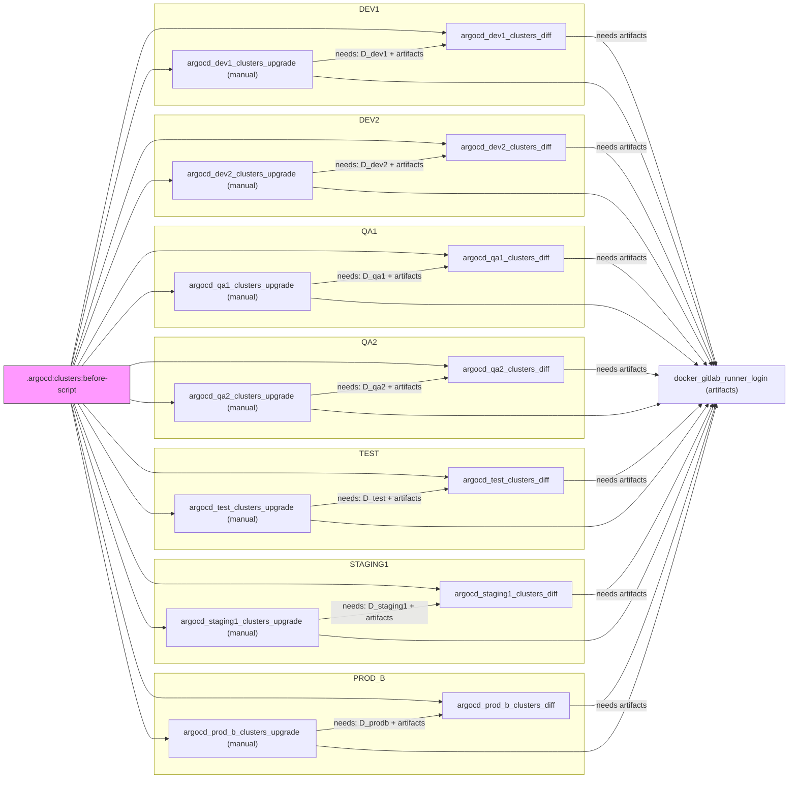

# Diagram: devops/k8s/argocd/clusters/.gitlab-ci.yml

> Auto-generated by Obscura crawlers

## Mermaid

### SVG

<svg id="container" width="1632.78125" xmlns="http://www.w3.org/2000/svg" class="flowchart" height="1605" viewBox="0 0 1632.78125 1605" role="graphics-document document" aria-roledescription="flowchart-v2"><g><marker id="container_flowchart-v2-pointEnd" class="marker flowchart-v2" viewBox="0 0 10 10" refX="5" refY="5" markerUnits="userSpaceOnUse" markerWidth="8" markerHeight="8" orient="auto"><path d="M 0 0 L 10 5 L 0 10 z" class="arrowMarkerPath" style="stroke-width: 1; stroke-dasharray: 1, 0;"></path></marker><marker id="container_flowchart-v2-pointStart" class="marker flowchart-v2" viewBox="0 0 10 10" refX="4.5" refY="5" markerUnits="userSpaceOnUse" markerWidth="8" markerHeight="8" orient="auto"><path d="M 0 5 L 10 10 L 10 0 z" class="arrowMarkerPath" style="stroke-width: 1; stroke-dasharray: 1, 0;"></path></marker><marker id="container_flowchart-v2-circleEnd" class="marker flowchart-v2" viewBox="0 0 10 10" refX="11" refY="5" markerUnits="userSpaceOnUse" markerWidth="11" markerHeight="11" orient="auto"><circle cx="5" cy="5" r="5" class="arrowMarkerPath" style="stroke-width: 1; stroke-dasharray: 1, 0;"></circle></marker><marker id="container_flowchart-v2-circleStart" class="marker flowchart-v2" viewBox="0 0 10 10" refX="-1" refY="5" markerUnits="userSpaceOnUse" markerWidth="11" markerHeight="11" orient="auto"><circle cx="5" cy="5" r="5" class="arrowMarkerPath" style="stroke-width: 1; stroke-dasharray: 1, 0;"></circle></marker><marker id="container_flowchart-v2-crossEnd" class="marker cross flowchart-v2" viewBox="0 0 11 11" refX="12" refY="5.2" markerUnits="userSpaceOnUse" markerWidth="11" markerHeight="11" orient="auto"><path d="M 1,1 l 9,9 M 10,1 l -9,9" class="arrowMarkerPath" style="stroke-width: 2; stroke-dasharray: 1, 0;"></path></marker><marker id="container_flowchart-v2-crossStart" class="marker cross flowchart-v2" viewBox="0 0 11 11" refX="-1" refY="5.2" markerUnits="userSpaceOnUse" markerWidth="11" markerHeight="11" orient="auto"><path d="M 1,1 l 9,9 M 10,1 l -9,9" class="arrowMarkerPath" style="stroke-width: 2; stroke-dasharray: 1, 0;"></path></marker><g class="root"><g class="clusters"><g class="cluster" id="PROD_B" data-look="classic"><rect style="" x="318" y="1388" width="886.53125" height="209"></rect><g class="cluster-label" transform="translate(732.453125, 1388)"><foreignObject width="57.625" height="24">

PROD_B

</foreignObject></g></g><g class="cluster" id="STAGING1" data-look="classic"><rect style="" x="318" y="1153" width="886.53125" height="215"></rect><g class="cluster-label" transform="translate(727.6875, 1153)"><foreignObject width="67.15625" height="24">

STAGING1

</foreignObject></g></g><g class="cluster" id="TEST" data-look="classic"><rect style="" x="318" y="924" width="886.53125" height="209"></rect><g class="cluster-label" transform="translate(744.609375, 924)"><foreignObject width="33.3125" height="24">

TEST

</foreignObject></g></g><g class="cluster" id="QA2" data-look="classic"><rect style="" x="318" y="695" width="886.53125" height="209"></rect><g class="cluster-label" transform="translate(747.1875, 695)"><foreignObject width="28.15625" height="24">

QA2

</foreignObject></g></g><g class="cluster" id="QA1" data-look="classic"><rect style="" x="318" y="466" width="886.53125" height="209"></rect><g class="cluster-label" transform="translate(748.1640625, 466)"><foreignObject width="26.203125" height="24">

QA1

</foreignObject></g></g><g class="cluster" id="DEV2" data-look="classic"><rect style="" x="318" y="237" width="886.53125" height="209"></rect><g class="cluster-label" transform="translate(743.421875, 237)"><foreignObject width="35.6875" height="24">

DEV2

</foreignObject></g></g><g class="cluster" id="DEV1" data-look="classic"><rect style="" x="318" y="8" width="886.53125" height="209"></rect><g class="cluster-label" transform="translate(744.078125, 8)"><foreignObject width="34.375" height="24">

DEV1

</foreignObject></g></g></g><g class="edgePaths"><path d="M146.236,754L170.696,638.167C195.157,522.333,244.079,290.667,272.706,174.833C301.333,59,309.667,59,344.072,59C378.477,59,438.953,59,516.096,59C593.24,59,687.049,59,756.325,60.367C825.601,61.734,870.344,64.468,892.715,65.835L915.086,67.202" id="L_BS_D_dev1_0" class="edge-thickness-normal edge-pattern-solid edge-thickness-normal edge-pattern-solid flowchart-link" style=";" data-edge="true" data-et="edge" data-id="L_BS_D_dev1_0" data-points="W3sieCI6MTQ2LjIzNTY5NDgyMjg4ODMsInkiOjc1NH0seyJ4IjoyOTMsInkiOjU5fSx7IngiOjMxOCwieSI6NTl9LHsieCI6NDk5LjQyOTY4NzUsInkiOjU5fSx7IngiOjc4MC44NTkzNzUsInkiOjU5fSx7IngiOjkxOS4wNzgxMjUsInkiOjY3LjQ0NjEyODU5OTEzNDcxfV0=" marker-end="url(#container_flowchart-v2-pointEnd)"></path><path d="M147.3,754L171.583,652.167C195.867,550.333,244.433,346.667,272.883,244.833C301.333,143,309.667,143,319.536,143C329.406,143,340.813,143,346.516,143L352.219,143" id="L_BS_U_dev1_0" class="edge-thickness-normal edge-pattern-solid edge-thickness-normal edge-pattern-solid flowchart-link" style=";" data-edge="true" data-et="edge" data-id="L_BS_U_dev1_0" data-points="W3sieCI6MTQ3LjMsInkiOjc1NH0seyJ4IjoyOTMsInkiOjE0M30seyJ4IjozMTgsInkiOjE0M30seyJ4IjozNTYuMjE4NzUsInkiOjE0M31d" marker-end="url(#container_flowchart-v2-pointEnd)"></path><path d="M149.97,754L173.809,676.333C197.647,598.667,245.323,443.333,273.328,365.667C301.333,288,309.667,288,344.072,288C378.477,288,438.953,288,516.096,288C593.24,288,687.049,288,756.255,289.363C825.461,290.725,870.062,293.451,892.363,294.814L914.664,296.176" id="L_BS_D_dev2_0" class="edge-thickness-normal edge-pattern-solid edge-thickness-normal edge-pattern-solid flowchart-link" style=";" data-edge="true" data-et="edge" data-id="L_BS_D_dev2_0" data-points="W3sieCI6MTQ5Ljk3MDI5NzAyOTcwMjk4LCJ5Ijo3NTR9LHsieCI6MjkzLCJ5IjoyODh9LHsieCI6MzE4LCJ5IjoyODh9LHsieCI6NDk5LjQyOTY4NzUsInkiOjI4OH0seyJ4Ijo3ODAuODU5Mzc1LCJ5IjoyODh9LHsieCI6OTE4LjY1NjI1LCJ5IjoyOTYuNDIwMzQ5MDk3NDE5MX1d" marker-end="url(#container_flowchart-v2-pointEnd)"></path><path d="M152.359,754L175.799,690.333C199.239,626.667,246.12,499.333,273.726,435.667C301.333,372,309.667,372,319.467,372C329.268,372,340.536,372,346.171,372L351.805,372" id="L_BS_U_dev2_0" class="edge-thickness-normal edge-pattern-solid edge-thickness-normal edge-pattern-solid flowchart-link" style=";" data-edge="true" data-et="edge" data-id="L_BS_U_dev2_0" data-points="W3sieCI6MTUyLjM1ODY2OTgzMzcyOTIsInkiOjc1NH0seyJ4IjoyOTMsInkiOjM3Mn0seyJ4IjozMTgsInkiOjM3Mn0seyJ4IjozNTUuODA0Njg3NSwieSI6MzcyfV0=" marker-end="url(#container_flowchart-v2-pointEnd)"></path><path d="M159.902,754L182.085,714.5C204.268,675,248.634,596,274.984,556.5C301.333,517,309.667,517,344.072,517C378.477,517,438.953,517,516.096,517C593.24,517,687.049,517,757.044,518.411C827.039,519.822,873.219,522.644,896.308,524.055L919.398,525.466" id="L_BS_D_qa1_0" class="edge-thickness-normal edge-pattern-solid edge-thickness-normal edge-pattern-solid flowchart-link" style=";" data-edge="true" data-et="edge" data-id="L_BS_D_qa1_0" data-points="W3sieCI6MTU5LjkwMjE3MzkxMzA0MzQ3LCJ5Ijo3NTR9LHsieCI6MjkzLCJ5Ijo1MTd9LHsieCI6MzE4LCJ5Ijo1MTd9LHsieCI6NDk5LjQyOTY4NzUsInkiOjUxN30seyJ4Ijo3ODAuODU5Mzc1LCJ5Ijo1MTd9LHsieCI6OTIzLjM5MDYyNSwieSI6NTI1LjcwOTY1MjM5NDQ1MDJ9XQ==" marker-end="url(#container_flowchart-v2-pointEnd)"></path><path d="M169.484,754L190.07,728.5C210.656,703,251.828,652,276.581,626.5C301.333,601,309.667,601,320.255,601C330.844,601,343.688,601,350.109,601L356.531,601" id="L_BS_U_qa1_0" class="edge-thickness-normal edge-pattern-solid edge-thickness-normal edge-pattern-solid flowchart-link" style=";" data-edge="true" data-et="edge" data-id="L_BS_U_qa1_0" data-points="W3sieCI6MTY5LjQ4NDM3NSwieSI6NzU0fSx7IngiOjI5MywieSI6NjAxfSx7IngiOjMxOCwieSI6NjAxfSx7IngiOjM2MC41MzEyNSwieSI6NjAxfV0=" marker-end="url(#container_flowchart-v2-pointEnd)"></path><path d="M266.617,754L271.014,752.667C275.411,751.333,284.206,748.667,292.77,747.333C301.333,746,309.667,746,344.072,746C378.477,746,438.953,746,516.096,746C593.24,746,687.049,746,756.894,747.402C826.739,748.804,872.62,751.607,895.56,753.009L918.5,754.411" id="L_BS_D_qa2_0" class="edge-thickness-normal edge-pattern-solid edge-thickness-normal edge-pattern-solid flowchart-link" style=";" data-edge="true" data-et="edge" data-id="L_BS_D_qa2_0" data-points="W3sieCI6MjY2LjYxNzAyMTI3NjU5NTgsInkiOjc1NH0seyJ4IjoyOTMsInkiOjc0Nn0seyJ4IjozMTgsInkiOjc0Nn0seyJ4Ijo0OTkuNDI5Njg3NSwieSI6NzQ2fSx7IngiOjc4MC44NTkzNzUsInkiOjc0Nn0seyJ4Ijo5MjIuNDkyMTg3NSwieSI6NzU0LjY1NDc1MTYwMzc1OTZ9XQ==" marker-end="url(#container_flowchart-v2-pointEnd)"></path><path d="M268,824.032L272.167,825.027C276.333,826.022,284.667,828.011,293,829.005C301.333,830,309.667,830,320.105,830C330.544,830,343.089,830,349.361,830L355.633,830" id="L_BS_U_qa2_0" class="edge-thickness-normal edge-pattern-solid edge-thickness-normal edge-pattern-solid flowchart-link" style=";" data-edge="true" data-et="edge" data-id="L_BS_U_qa2_0" data-points="W3sieCI6MjY4LCJ5Ijo4MjQuMDMyMjU4MDY0NTE2MX0seyJ4IjoyOTMsInkiOjgzMH0seyJ4IjozMTgsInkiOjgzMH0seyJ4IjozNTkuNjMyODEyNSwieSI6ODMwfV0=" marker-end="url(#container_flowchart-v2-pointEnd)"></path><path d="M171.214,832L191.512,855.833C211.81,879.667,252.405,927.333,276.869,951.167C301.333,975,309.667,975,344.072,975C378.477,975,438.953,975,516.096,975C593.24,975,687.049,975,756.785,976.395C826.521,977.79,872.182,980.58,895.013,981.976L917.843,983.371" id="L_BS_D_test_0" class="edge-thickness-normal edge-pattern-solid edge-thickness-normal edge-pattern-solid flowchart-link" style=";" data-edge="true" data-et="edge" data-id="L_BS_D_test_0" data-points="W3sieCI6MTcxLjIxNDI4NTcxNDI4NTcyLCJ5Ijo4MzJ9LHsieCI6MjkzLCJ5Ijo5NzV9LHsieCI6MzE4LCJ5Ijo5NzV9LHsieCI6NDk5LjQyOTY4NzUsInkiOjk3NX0seyJ4Ijo3ODAuODU5Mzc1LCJ5Ijo5NzV9LHsieCI6OTIxLjgzNTkzNzUsInkiOjk4My42MTQ2NTAxNTY2NDYyfV0=" marker-end="url(#container_flowchart-v2-pointEnd)"></path><path d="M160.726,832L182.771,869.833C204.817,907.667,248.909,983.333,275.121,1021.167C301.333,1059,309.667,1059,319.996,1059C330.326,1059,342.651,1059,348.814,1059L354.977,1059" id="L_BS_U_test_0" class="edge-thickness-normal edge-pattern-solid edge-thickness-normal edge-pattern-solid flowchart-link" style=";" data-edge="true" data-et="edge" data-id="L_BS_U_test_0" data-points="W3sieCI6MTYwLjcyNTU2MzkwOTc3NDQ1LCJ5Ijo4MzJ9LHsieCI6MjkzLCJ5IjoxMDU5fSx7IngiOjMxOCwieSI6MTA1OX0seyJ4IjozNTguOTc2NTYyNSwieSI6MTA1OX1d" marker-end="url(#container_flowchart-v2-pointEnd)"></path><path d="M152.708,832L176.09,894C199.472,956,246.236,1080,273.785,1142C301.333,1204,309.667,1204,344.072,1204C378.477,1204,438.953,1204,516.096,1204C593.24,1204,687.049,1204,754.123,1205.695C821.197,1207.389,861.535,1210.779,881.704,1212.473L901.873,1214.168" id="L_BS_D_staging1_0" class="edge-thickness-normal edge-pattern-solid edge-thickness-normal edge-pattern-solid flowchart-link" style=";" data-edge="true" data-et="edge" data-id="L_BS_D_staging1_0" data-points="W3sieCI6MTUyLjcwODAyOTE5NzA4MDMsInkiOjgzMn0seyJ4IjoyOTMsInkiOjEyMDR9LHsieCI6MzE4LCJ5IjoxMjA0fSx7IngiOjQ5OS40Mjk2ODc1LCJ5IjoxMjA0fSx7IngiOjc4MC44NTkzNzUsInkiOjEyMDR9LHsieCI6OTA1Ljg1OTM3NSwieSI6MTIxNC41MDI3NTk5NTgyMjc3fV0=" marker-end="url(#container_flowchart-v2-pointEnd)"></path><path d="M150.066,832L173.888,909C197.711,986,245.355,1140,273.344,1217C301.333,1294,309.667,1294,317.333,1294C325,1294,332,1294,335.5,1294L339,1294" id="L_BS_U_staging1_0" class="edge-thickness-normal edge-pattern-solid edge-thickness-normal edge-pattern-solid flowchart-link" style=";" data-edge="true" data-et="edge" data-id="L_BS_U_staging1_0" data-points="W3sieCI6MTUwLjA2NTg2ODI2MzQ3MzA1LCJ5Ijo4MzJ9LHsieCI6MjkzLCJ5IjoxMjk0fSx7IngiOjMxOCwieSI6MTI5NH0seyJ4IjozNDMsInkiOjEyOTR9XQ==" marker-end="url(#container_flowchart-v2-pointEnd)"></path><path d="M147.358,832L171.631,933.167C195.905,1034.333,244.453,1236.667,272.893,1337.833C301.333,1439,309.667,1439,344.072,1439C378.477,1439,438.953,1439,516.096,1439C593.24,1439,687.049,1439,754.749,1440.271C822.448,1441.541,864.036,1444.083,884.83,1445.353L905.625,1446.624" id="L_BS_D_prodb_0" class="edge-thickness-normal edge-pattern-solid edge-thickness-normal edge-pattern-solid flowchart-link" style=";" data-edge="true" data-et="edge" data-id="L_BS_D_prodb_0" data-points="W3sieCI6MTQ3LjM1NzU4NTEzOTMxODg3LCJ5Ijo4MzJ9LHsieCI6MjkzLCJ5IjoxNDM5fSx7IngiOjMxOCwieSI6MTQzOX0seyJ4Ijo0OTkuNDI5Njg3NSwieSI6MTQzOX0seyJ4Ijo3ODAuODU5Mzc1LCJ5IjoxNDM5fSx7IngiOjkwOS42MTcxODc1LCJ5IjoxNDQ2Ljg2Nzk5OTQwMzI1MjN9XQ==" marker-end="url(#container_flowchart-v2-pointEnd)"></path><path d="M146.281,832L170.734,947.167C195.187,1062.333,244.094,1292.667,272.713,1407.833C301.333,1523,309.667,1523,317.96,1523C326.253,1523,334.505,1523,338.632,1523L342.758,1523" id="L_BS_U_prodb_0" class="edge-thickness-normal edge-pattern-solid edge-thickness-normal edge-pattern-solid flowchart-link" style=";" data-edge="true" data-et="edge" data-id="L_BS_U_prodb_0" data-points="W3sieCI6MTQ2LjI4MDgyMTkxNzgwODIzLCJ5Ijo4MzJ9LHsieCI6MjkzLCJ5IjoxNTIzfSx7IngiOjMxOCwieSI6MTUyM30seyJ4IjozNDYuNzU3ODEyNSwieSI6MTUyM31d" marker-end="url(#container_flowchart-v2-pointEnd)"></path><path d="M1166.313,75L1172.682,75C1179.052,75,1191.792,75,1211.318,75C1230.844,75,1257.156,75,1303.244,187.527C1349.331,300.054,1415.194,525.107,1448.125,637.634L1481.057,750.161" id="L_D_dev1_Docker_0" class="edge-thickness-normal edge-pattern-solid edge-thickness-normal edge-pattern-solid flowchart-link" style=";" data-edge="true" data-et="edge" data-id="L_D_dev1_Docker_0" data-points="W3sieCI6MTE2Ni4zMTI1LCJ5Ijo3NX0seyJ4IjoxMjA0LjUzMTI1LCJ5Ijo3NX0seyJ4IjoxMjgzLjQ2ODc1LCJ5Ijo3NX0seyJ4IjoxNDgyLjE4MDI3NTA2OTYzOCwieSI6NzU0fV0=" marker-end="url(#container_flowchart-v2-pointEnd)"></path><path d="M642.641,127.225L665.677,124.688C688.714,122.15,734.786,117.075,780.199,111.376C825.612,105.676,870.365,99.352,892.741,96.19L915.117,93.028" id="L_U_dev1_D_dev1_0" class="edge-thickness-normal edge-pattern-solid edge-thickness-normal edge-pattern-solid flowchart-link" style=";" data-edge="true" data-et="edge" data-id="L_U_dev1_D_dev1_0" data-points="W3sieCI6NjQyLjY0MDYyNSwieSI6MTI3LjIyNTA1MDY2MjA3NzAxfSx7IngiOjc4MC44NTkzNzUsInkiOjExMn0seyJ4Ijo5MTkuMDc4MTI1LCJ5Ijo5Mi40NjgzMjc2MTQ1MDA5Nn1d" marker-end="url(#container_flowchart-v2-pointEnd)"></path><path d="M642.641,156.739L665.677,158.95C688.714,161.16,734.786,165.58,801.462,167.79C868.138,170,955.417,170,1026.029,170C1096.641,170,1150.586,170,1190.715,170C1230.844,170,1257.156,170,1302.928,266.702C1348.7,363.403,1413.931,556.807,1446.546,653.508L1479.161,750.21" id="L_U_dev1_Docker_0" class="edge-thickness-normal edge-pattern-solid edge-thickness-normal edge-pattern-solid flowchart-link" style=";" data-edge="true" data-et="edge" data-id="L_U_dev1_Docker_0" data-points="W3sieCI6NjQyLjY0MDYyNSwieSI6MTU2LjczOTQ3MjAwMzk5NzQzfSx7IngiOjc4MC44NTkzNzUsInkiOjE3MH0seyJ4IjoxMDQyLjY5NTMxMjUsInkiOjE3MH0seyJ4IjoxMjA0LjUzMTI1LCJ5IjoxNzB9LHsieCI6MTI4My40Njg3NSwieSI6MTcwfSx7IngiOjE0ODAuNDM5ODU3NTQ0MTQxMiwieSI6NzU0fV0=" marker-end="url(#container_flowchart-v2-pointEnd)"></path><path d="M1166.734,304L1173.034,304C1179.333,304,1191.932,304,1211.388,304C1230.844,304,1257.156,304,1302.277,378.387C1347.398,452.775,1411.327,601.55,1443.292,675.937L1475.256,750.325" id="L_D_dev2_Docker_0" class="edge-thickness-normal edge-pattern-solid edge-thickness-normal edge-pattern-solid flowchart-link" style=";" data-edge="true" data-et="edge" data-id="L_D_dev2_Docker_0" data-points="W3sieCI6MTE2Ni43MzQzNzUsInkiOjMwNH0seyJ4IjoxMjA0LjUzMTI1LCJ5IjozMDR9LHsieCI6MTI4My40Njg3NSwieSI6MzA0fSx7IngiOjE0NzYuODM1MzE0NDE3MTc3OSwieSI6NzU0fV0=" marker-end="url(#container_flowchart-v2-pointEnd)"></path><path d="M643.055,356.179L666.022,353.65C688.99,351.12,734.924,346.06,780.198,340.378C825.471,334.696,870.084,328.392,892.39,325.24L914.696,322.088" id="L_U_dev2_D_dev2_0" class="edge-thickness-normal edge-pattern-solid edge-thickness-normal edge-pattern-solid flowchart-link" style=";" data-edge="true" data-et="edge" data-id="L_U_dev2_D_dev2_0" data-points="W3sieCI6NjQzLjA1NDY4NzUsInkiOjM1Ni4xNzk0NDA5MTI3NTAyfSx7IngiOjc4MC44NTkzNzUsInkiOjM0MX0seyJ4Ijo5MTguNjU2MjUsInkiOjMyMS41Mjc5NDI3MTIyMTg0fV0=" marker-end="url(#container_flowchart-v2-pointEnd)"></path><path d="M643.055,385.779L666.022,387.983C688.99,390.186,734.924,394.593,801.531,396.797C868.138,399,955.417,399,1026.029,399C1096.641,399,1150.586,399,1190.715,399C1230.844,399,1257.156,399,1301.553,457.578C1345.95,516.157,1408.431,633.314,1439.672,691.892L1470.912,750.471" id="L_U_dev2_Docker_0" class="edge-thickness-normal edge-pattern-solid edge-thickness-normal edge-pattern-solid flowchart-link" style=";" data-edge="true" data-et="edge" data-id="L_U_dev2_Docker_0" data-points="W3sieCI6NjQzLjA1NDY4NzUsInkiOjM4NS43NzkxOTY2MjQzNzg4N30seyJ4Ijo3ODAuODU5Mzc1LCJ5IjozOTl9LHsieCI6MTA0Mi42OTUzMTI1LCJ5IjozOTl9LHsieCI6MTIwNC41MzEyNSwieSI6Mzk5fSx7IngiOjEyODMuNDY4NzUsInkiOjM5OX0seyJ4IjoxNDcyLjc5NDU3NDg3MzA5NjUsInkiOjc1NH1d" marker-end="url(#container_flowchart-v2-pointEnd)"></path><path d="M1162,533L1169.089,533C1176.177,533,1190.354,533,1210.599,533C1230.844,533,1257.156,533,1299.661,569.315C1342.166,605.63,1400.863,678.259,1430.212,714.574L1459.561,750.889" id="L_D_qa1_Docker_0" class="edge-thickness-normal edge-pattern-solid edge-thickness-normal edge-pattern-solid flowchart-link" style=";" data-edge="true" data-et="edge" data-id="L_D_qa1_Docker_0" data-points="W3sieCI6MTE2MiwieSI6NTMzfSx7IngiOjEyMDQuNTMxMjUsInkiOjUzM30seyJ4IjoxMjgzLjQ2ODc1LCJ5Ijo1MzN9LHsieCI6MTQ2Mi4wNzUsInkiOjc1NH1d" marker-end="url(#container_flowchart-v2-pointEnd)"></path><path d="M638.328,585.7L662.083,583.083C685.839,580.467,733.349,575.233,780.199,569.353C827.05,563.473,873.24,556.946,896.335,553.682L919.43,550.419" id="L_U_qa1_D_qa1_0" class="edge-thickness-normal edge-pattern-solid edge-thickness-normal edge-pattern-solid flowchart-link" style=";" data-edge="true" data-et="edge" data-id="L_U_qa1_D_qa1_0" data-points="W3sieCI6NjM4LjMyODEyNSwieSI6NTg1LjcwMDA4MDUwNDEyMjR9LHsieCI6NzgwLjg1OTM3NSwieSI6NTcwfSx7IngiOjkyMy4zOTA2MjUsInkiOjU0OS44NTg5Mjg4Mzc4MzM4fV0=" marker-end="url(#container_flowchart-v2-pointEnd)"></path><path d="M638.328,614.326L662.083,616.605C685.839,618.884,733.349,623.442,800.743,625.721C868.138,628,955.417,628,1026.029,628C1096.641,628,1150.586,628,1190.715,628C1230.844,628,1257.156,628,1296.531,648.588C1335.906,669.177,1388.344,710.353,1414.563,730.941L1440.782,751.53" id="L_U_qa1_Docker_0" class="edge-thickness-normal edge-pattern-solid edge-thickness-normal edge-pattern-solid flowchart-link" style=";" data-edge="true" data-et="edge" data-id="L_U_qa1_Docker_0" data-points="W3sieCI6NjM4LjMyODEyNSwieSI6NjE0LjMyNTczNjMzNTExOTJ9LHsieCI6NzgwLjg1OTM3NSwieSI6NjI4fSx7IngiOjEwNDIuNjk1MzEyNSwieSI6NjI4fSx7IngiOjEyMDQuNTMxMjUsInkiOjYyOH0seyJ4IjoxMjgzLjQ2ODc1LCJ5Ijo2Mjh9LHsieCI6MTQ0My45Mjc4NDA5MDkwOTEsInkiOjc1NH1d" marker-end="url(#container_flowchart-v2-pointEnd)"></path><path d="M1162.898,762L1169.837,762C1176.776,762,1190.654,762,1210.749,762C1230.844,762,1257.156,762,1282.809,763.844C1308.462,765.687,1333.456,769.375,1345.952,771.218L1358.449,773.062" id="L_D_qa2_Docker_0" class="edge-thickness-normal edge-pattern-solid edge-thickness-normal edge-pattern-solid flowchart-link" style=";" data-edge="true" data-et="edge" data-id="L_D_qa2_Docker_0" data-points="W3sieCI6MTE2Mi44OTg0Mzc1LCJ5Ijo3NjJ9LHsieCI6MTIwNC41MzEyNSwieSI6NzYyfSx7IngiOjEyODMuNDY4NzUsInkiOjc2Mn0seyJ4IjoxMzYyLjQwNjI1LCJ5Ijo3NzMuNjQ1NzQ2NTc5NDE3fV0=" marker-end="url(#container_flowchart-v2-pointEnd)"></path><path d="M639.227,814.601L662.832,812.001C686.438,809.401,733.648,804.2,780.199,798.358C826.75,792.515,872.641,786.03,895.586,782.788L918.532,779.546" id="L_U_qa2_D_qa2_0" class="edge-thickness-normal edge-pattern-solid edge-thickness-normal edge-pattern-solid flowchart-link" style=";" data-edge="true" data-et="edge" data-id="L_U_qa2_D_qa2_0" data-points="W3sieCI6NjM5LjIyNjU2MjUsInkiOjgxNC42MDExMTU5NTM2OTYyfSx7IngiOjc4MC44NTkzNzUsInkiOjc5OX0seyJ4Ijo5MjIuNDkyMTg3NSwieSI6Nzc4Ljk4NTg4NjkxNjMwNjJ9XQ==" marker-end="url(#container_flowchart-v2-pointEnd)"></path><path d="M639.227,843.412L662.832,845.677C686.438,847.941,733.648,852.471,800.893,854.735C868.138,857,955.417,857,1026.029,857C1096.641,857,1150.586,857,1190.715,857C1230.844,857,1257.156,857,1283.355,853.028C1309.553,849.055,1335.638,841.11,1348.68,837.138L1361.722,833.165" id="L_U_qa2_Docker_0" class="edge-thickness-normal edge-pattern-solid edge-thickness-normal edge-pattern-solid flowchart-link" style=";" data-edge="true" data-et="edge" data-id="L_U_qa2_Docker_0" data-points="W3sieCI6NjM5LjIyNjU2MjUsInkiOjg0My40MTE5MzEyNjYxMzU1fSx7IngiOjc4MC44NTkzNzUsInkiOjg1N30seyJ4IjoxMDQyLjY5NTMxMjUsInkiOjg1N30seyJ4IjoxMjA0LjUzMTI1LCJ5Ijo4NTd9LHsieCI6MTI4My40Njg3NSwieSI6ODU3fSx7IngiOjEzNjUuNTQ4ODI4MTI1LCJ5Ijo4MzJ9XQ==" marker-end="url(#container_flowchart-v2-pointEnd)"></path><path d="M1163.555,991L1170.384,991C1177.214,991,1190.872,991,1210.858,991C1230.844,991,1257.156,991,1297.95,964.957C1338.744,938.914,1394.019,886.829,1421.657,860.786L1449.294,834.743" id="L_D_test_Docker_0" class="edge-thickness-normal edge-pattern-solid edge-thickness-normal edge-pattern-solid flowchart-link" style=";" data-edge="true" data-et="edge" data-id="L_D_test_Docker_0" data-points="W3sieCI6MTE2My41NTQ2ODc1LCJ5Ijo5OTF9LHsieCI6MTIwNC41MzEyNSwieSI6OTkxfSx7IngiOjEyODMuNDY4NzUsInkiOjk5MX0seyJ4IjoxNDUyLjIwNTQ5MjQyNDI0MjUsInkiOjgzMn1d" marker-end="url(#container_flowchart-v2-pointEnd)"></path><path d="M639.883,1043.529L663.379,1040.941C686.875,1038.353,733.867,1033.176,780.199,1027.361C826.531,1021.546,872.203,1015.092,895.039,1011.865L917.875,1008.638" id="L_U_test_D_test_0" class="edge-thickness-normal edge-pattern-solid edge-thickness-normal edge-pattern-solid flowchart-link" style=";" data-edge="true" data-et="edge" data-id="L_U_test_D_test_0" data-points="W3sieCI6NjM5Ljg4MjgxMjUsInkiOjEwNDMuNTI4ODI4ODAzODE5OH0seyJ4Ijo3ODAuODU5Mzc1LCJ5IjoxMDI4fSx7IngiOjkyMS44MzU5Mzc1LCJ5IjoxMDA4LjA3ODYyMTUxMjc1NTV9XQ==" marker-end="url(#container_flowchart-v2-pointEnd)"></path><path d="M639.883,1072.475L663.379,1074.729C686.875,1076.983,733.867,1081.492,801.003,1083.746C868.138,1086,955.417,1086,1026.029,1086C1096.641,1086,1150.586,1086,1190.715,1086C1230.844,1086,1257.156,1086,1300.283,1044.208C1343.41,1002.417,1403.352,918.834,1433.323,877.042L1463.294,835.251" id="L_U_test_Docker_0" class="edge-thickness-normal edge-pattern-solid edge-thickness-normal edge-pattern-solid flowchart-link" style=";" data-edge="true" data-et="edge" data-id="L_U_test_Docker_0" data-points="W3sieCI6NjM5Ljg4MjgxMjUsInkiOjEwNzIuNDc0ODkxMDQxODM0M30seyJ4Ijo3ODAuODU5Mzc1LCJ5IjoxMDg2fSx7IngiOjEwNDIuNjk1MzEyNSwieSI6MTA4Nn0seyJ4IjoxMjA0LjUzMTI1LCJ5IjoxMDg2fSx7IngiOjEyODMuNDY4NzUsInkiOjEwODZ9LHsieCI6MTQ2NS42MjQ4OTMzNDQ3MDk4LCJ5Ijo4MzJ9XQ==" marker-end="url(#container_flowchart-v2-pointEnd)"></path><path d="M1179.531,1226L1183.698,1226C1187.865,1226,1196.198,1226,1213.521,1226C1230.844,1226,1257.156,1226,1301.888,1160.933C1346.62,1095.866,1409.771,965.732,1441.346,900.666L1472.922,835.599" id="L_D_staging1_Docker_0" class="edge-thickness-normal edge-pattern-solid edge-thickness-normal edge-pattern-solid flowchart-link" style=";" data-edge="true" data-et="edge" data-id="L_D_staging1_Docker_0" data-points="W3sieCI6MTE3OS41MzEyNSwieSI6MTIyNn0seyJ4IjoxMjA0LjUzMTI1LCJ5IjoxMjI2fSx7IngiOjEyODMuNDY4NzUsInkiOjEyMjZ9LHsieCI6MTQ3NC42Njc5NDE2ODU5MTIyLCJ5Ijo4MzJ9XQ==" marker-end="url(#container_flowchart-v2-pointEnd)"></path><path d="M655.859,1276.769L676.693,1274.474C697.526,1272.179,739.193,1267.59,780.199,1262.444C821.206,1257.299,861.552,1251.597,881.725,1248.747L901.899,1245.896" id="L_U_staging1_D_staging1_0" class="edge-thickness-normal edge-pattern-solid edge-thickness-normal edge-pattern-solid flowchart-link" style=";" data-edge="true" data-et="edge" data-id="L_U_staging1_D_staging1_0" data-points="W3sieCI6NjU1Ljg1OTM3NSwieSI6MTI3Ni43Njg5ODA5Mjg4NTF9LHsieCI6NzgwLjg1OTM3NSwieSI6MTI2M30seyJ4Ijo5MDUuODU5Mzc1LCJ5IjoxMjQ1LjMzNjI2NzM0Mjk4MDh9XQ==" marker-end="url(#container_flowchart-v2-pointEnd)"></path><path d="M655.859,1309.008L676.693,1311.006C697.526,1313.005,739.193,1317.003,803.665,1319.001C868.138,1321,955.417,1321,1026.029,1321C1096.641,1321,1150.586,1321,1190.715,1321C1230.844,1321,1257.156,1321,1302.5,1240.119C1347.844,1159.239,1412.219,997.478,1444.407,916.597L1476.594,835.717" id="L_U_staging1_Docker_0" class="edge-thickness-normal edge-pattern-solid edge-thickness-normal edge-pattern-solid flowchart-link" style=";" data-edge="true" data-et="edge" data-id="L_U_staging1_Docker_0" data-points="W3sieCI6NjU1Ljg1OTM3NSwieSI6MTMwOS4wMDc2NjE3NzE2NDU5fSx7IngiOjc4MC44NTkzNzUsInkiOjEzMjF9LHsieCI6MTA0Mi42OTUzMTI1LCJ5IjoxMzIxfSx7IngiOjEyMDQuNTMxMjUsInkiOjEzMjF9LHsieCI6MTI4My40Njg3NSwieSI6MTMyMX0seyJ4IjoxNDc4LjA3MzE1MzQwOTA5MSwieSI6ODMyfV0=" marker-end="url(#container_flowchart-v2-pointEnd)"></path><path d="M1175.773,1455L1180.566,1455C1185.359,1455,1194.945,1455,1212.895,1455C1230.844,1455,1257.156,1455,1303.068,1351.802C1348.981,1248.604,1414.493,1042.208,1447.249,939.01L1480.005,835.813" id="L_D_prodb_Docker_0" class="edge-thickness-normal edge-pattern-solid edge-thickness-normal edge-pattern-solid flowchart-link" style=";" data-edge="true" data-et="edge" data-id="L_D_prodb_Docker_0" data-points="W3sieCI6MTE3NS43NzM0Mzc1LCJ5IjoxNDU1fSx7IngiOjEyMDQuNTMxMjUsInkiOjE0NTV9LHsieCI6MTI4My40Njg3NSwieSI6MTQ1NX0seyJ4IjoxNDgxLjIxNDc4NDc0MzIwMjUsInkiOjgzMn1d" marker-end="url(#container_flowchart-v2-pointEnd)"></path><path d="M652.102,1506.183L673.561,1503.819C695.021,1501.455,737.94,1496.728,780.199,1491.425C822.458,1486.122,864.057,1480.243,884.857,1477.304L905.657,1474.365" id="L_U_prodb_D_prodb_0" class="edge-thickness-normal edge-pattern-solid edge-thickness-normal edge-pattern-solid flowchart-link" style=";" data-edge="true" data-et="edge" data-id="L_U_prodb_D_prodb_0" data-points="W3sieCI6NjUyLjEwMTU2MjUsInkiOjE1MDYuMTgyOTEwOTE4MDI0Nn0seyJ4Ijo3ODAuODU5Mzc1LCJ5IjoxNDkyfSx7IngiOjkwOS42MTcxODc1LCJ5IjoxNDczLjgwNTI1MTM3OTk3OTJ9XQ==" marker-end="url(#container_flowchart-v2-pointEnd)"></path><path d="M652.102,1537.647L673.561,1539.706C695.021,1541.765,737.94,1545.882,803.039,1547.941C868.138,1550,955.417,1550,1026.029,1550C1096.641,1550,1150.586,1550,1190.715,1550C1230.844,1550,1257.156,1550,1303.351,1430.976C1349.545,1311.951,1415.622,1073.903,1448.66,954.879L1481.698,835.854" id="L_U_prodb_Docker_0" class="edge-thickness-normal edge-pattern-solid edge-thickness-normal edge-pattern-solid flowchart-link" style=";" data-edge="true" data-et="edge" data-id="L_U_prodb_Docker_0" data-points="W3sieCI6NjUyLjEwMTU2MjUsInkiOjE1MzcuNjQ3MTQyMTAzNjU2fSx7IngiOjc4MC44NTkzNzUsInkiOjE1NTB9LHsieCI6MTA0Mi42OTUzMTI1LCJ5IjoxNTUwfSx7IngiOjEyMDQuNTMxMjUsInkiOjE1NTB9LHsieCI6MTI4My40Njg3NSwieSI6MTU1MH0seyJ4IjoxNDgyLjc2ODI4NzY0ODYxMjgsInkiOjgzMn1d" marker-end="url(#container_flowchart-v2-pointEnd)"></path></g><g class="edgeLabels"><g class="edgeLabel"><g class="label" data-id="L_BS_D_dev1_0" transform="translate(0, 0)"><foreignObject width="0" height="0">

</foreignObject></g></g><g class="edgeLabel"><g class="label" data-id="L_BS_U_dev1_0" transform="translate(0, 0)"><foreignObject width="0" height="0">

</foreignObject></g></g><g class="edgeLabel"><g class="label" data-id="L_BS_D_dev2_0" transform="translate(0, 0)"><foreignObject width="0" height="0">

</foreignObject></g></g><g class="edgeLabel"><g class="label" data-id="L_BS_U_dev2_0" transform="translate(0, 0)"><foreignObject width="0" height="0">

</foreignObject></g></g><g class="edgeLabel"><g class="label" data-id="L_BS_D_qa1_0" transform="translate(0, 0)"><foreignObject width="0" height="0">

</foreignObject></g></g><g class="edgeLabel"><g class="label" data-id="L_BS_U_qa1_0" transform="translate(0, 0)"><foreignObject width="0" height="0">

</foreignObject></g></g><g class="edgeLabel"><g class="label" data-id="L_BS_D_qa2_0" transform="translate(0, 0)"><foreignObject width="0" height="0">

</foreignObject></g></g><g class="edgeLabel"><g class="label" data-id="L_BS_U_qa2_0" transform="translate(0, 0)"><foreignObject width="0" height="0">

</foreignObject></g></g><g class="edgeLabel"><g class="label" data-id="L_BS_D_test_0" transform="translate(0, 0)"><foreignObject width="0" height="0">

</foreignObject></g></g><g class="edgeLabel"><g class="label" data-id="L_BS_U_test_0" transform="translate(0, 0)"><foreignObject width="0" height="0">

</foreignObject></g></g><g class="edgeLabel"><g class="label" data-id="L_BS_D_staging1_0" transform="translate(0, 0)"><foreignObject width="0" height="0">

</foreignObject></g></g><g class="edgeLabel"><g class="label" data-id="L_BS_U_staging1_0" transform="translate(0, 0)"><foreignObject width="0" height="0">

</foreignObject></g></g><g class="edgeLabel"><g class="label" data-id="L_BS_D_prodb_0" transform="translate(0, 0)"><foreignObject width="0" height="0">

</foreignObject></g></g><g class="edgeLabel"><g class="label" data-id="L_BS_U_prodb_0" transform="translate(0, 0)"><foreignObject width="0" height="0">

</foreignObject></g></g><g class="edgeLabel" transform="translate(1283.46875, 75)"><g class="label" data-id="L_D_dev1_Docker_0" transform="translate(-53.9375, -12)"><foreignObject width="107.875" height="24">

needs artifacts

</foreignObject></g></g><g class="edgeLabel" transform="translate(781.12532, 111.96242)"><g class="label" data-id="L_U_dev1_D_dev1_0" transform="translate(-89.4375, -12)"><foreignObject width="178.875" height="24">

needs: D_dev1 + artifacts

</foreignObject></g></g><g class="edgeLabel"><g class="label" data-id="L_U_dev1_Docker_0" transform="translate(0, 0)"><foreignObject width="0" height="0">

</foreignObject></g></g><g class="edgeLabel" transform="translate(1283.46875, 304)"><g class="label" data-id="L_D_dev2_Docker_0" transform="translate(-53.9375, -12)"><foreignObject width="107.875" height="24">

needs artifacts

</foreignObject></g></g><g class="edgeLabel" transform="translate(781.12062, 340.96308)"><g class="label" data-id="L_U_dev2_D_dev2_0" transform="translate(-89.8515625, -12)"><foreignObject width="179.703125" height="24">

needs: D_dev2 + artifacts

</foreignObject></g></g><g class="edgeLabel"><g class="label" data-id="L_U_dev2_Docker_0" transform="translate(0, 0)"><foreignObject width="0" height="0">

</foreignObject></g></g><g class="edgeLabel" transform="translate(1283.46875, 533)"><g class="label" data-id="L_D_qa1_Docker_0" transform="translate(-53.9375, -12)"><foreignObject width="107.875" height="24">

needs artifacts

</foreignObject></g></g><g class="edgeLabel" transform="translate(781.13362, 569.96125)"><g class="label" data-id="L_U_qa1_D_qa1_0" transform="translate(-85.125, -12)"><foreignObject width="170.25" height="24">

needs: D_qa1 + artifacts

</foreignObject></g></g><g class="edgeLabel"><g class="label" data-id="L_U_qa1_Docker_0" transform="translate(0, 0)"><foreignObject width="0" height="0">

</foreignObject></g></g><g class="edgeLabel" transform="translate(1283.46875, 762)"><g class="label" data-id="L_D_qa2_Docker_0" transform="translate(-53.9375, -12)"><foreignObject width="107.875" height="24">

needs artifacts

</foreignObject></g></g><g class="edgeLabel" transform="translate(781.13189, 798.96149)"><g class="label" data-id="L_U_qa2_D_qa2_0" transform="translate(-86.0234375, -12)"><foreignObject width="172.046875" height="24">

needs: D_qa2 + artifacts

</foreignObject></g></g><g class="edgeLabel"><g class="label" data-id="L_U_qa2_Docker_0" transform="translate(0, 0)"><foreignObject width="0" height="0">

</foreignObject></g></g><g class="edgeLabel" transform="translate(1283.46875, 991)"><g class="label" data-id="L_D_test_Docker_0" transform="translate(-53.9375, -12)"><foreignObject width="107.875" height="24">

needs artifacts

</foreignObject></g></g><g class="edgeLabel" transform="translate(781.13063, 1027.96167)"><g class="label" data-id="L_U_test_D_test_0" transform="translate(-86.6796875, -12)"><foreignObject width="173.359375" height="24">

needs: D_test + artifacts

</foreignObject></g></g><g class="edgeLabel"><g class="label" data-id="L_U_test_Docker_0" transform="translate(0, 0)"><foreignObject width="0" height="0">

</foreignObject></g></g><g class="edgeLabel" transform="translate(1283.46875, 1226)"><g class="label" data-id="L_D_staging1_Docker_0" transform="translate(-53.9375, -12)"><foreignObject width="107.875" height="24">

needs artifacts

</foreignObject></g></g><g class="edgeLabel" transform="translate(781.09989, 1262.96601)"><g class="label" data-id="L_U_staging1_D_staging1_0" transform="translate(-100, -24)"><foreignObject width="200" height="48">

needs: D_staging1 + artifacts

</foreignObject></g></g><g class="edgeLabel"><g class="label" data-id="L_U_staging1_Docker_0" transform="translate(0, 0)"><foreignObject width="0" height="0">

</foreignObject></g></g><g class="edgeLabel" transform="translate(1283.46875, 1455)"><g class="label" data-id="L_D_prodb_Docker_0" transform="translate(-53.9375, -12)"><foreignObject width="107.875" height="24">

needs artifacts

</foreignObject></g></g><g class="edgeLabel" transform="translate(781.10712, 1491.96499)"><g class="label" data-id="L_U_prodb_D_prodb_0" transform="translate(-94.890625, -12)"><foreignObject width="189.78125" height="24">

needs: D_prodb + artifacts

</foreignObject></g></g><g class="edgeLabel"><g class="label" data-id="L_U_prodb_Docker_0" transform="translate(0, 0)"><foreignObject width="0" height="0">

</foreignObject></g></g></g><g class="nodes"><g class="node default shared" id="flowchart-BS-0" transform="translate(138, 793)"><rect class="basic label-container" style="fill:#f9f !important;stroke:#333 !important;stroke-width:1px !important" x="-130" y="-39" width="260" height="78"></rect><g class="label" style="" transform="translate(-100, -24)"><rect></rect><foreignObject width="200" height="48">

.argocd:clusters:before-script

</foreignObject></g></g><g class="node default" id="flowchart-Docker-1" transform="translate(1493.59375, 793)"><rect class="basic label-container" style="" x="-131.1875" y="-39" width="262.375" height="78"></rect><g class="label" style="" transform="translate(-101.1875, -24)"><rect></rect><foreignObject width="202.375" height="48">

docker_gitlab_runner_login (artifacts)

</foreignObject></g></g><g class="node default" id="flowchart-D_dev1-2" transform="translate(1042.6953125, 75)"><rect class="basic label-container" style="" x="-123.6171875" y="-27" width="247.234375" height="54"></rect><g class="label" style="" transform="translate(-93.6171875, -12)"><rect></rect><foreignObject width="187.234375" height="24">

argocd_dev1_clusters_diff

</foreignObject></g></g><g class="node default" id="flowchart-U_dev1-3" transform="translate(499.4296875, 143)"><rect class="basic label-container" style="" x="-143.2109375" y="-39" width="286.421875" height="78"></rect><g class="label" style="" transform="translate(-113.2109375, -24)"><rect></rect><foreignObject width="226.421875" height="48">

argocd_dev1_clusters_upgrade (manual)

</foreignObject></g></g><g class="node default" id="flowchart-D_dev2-4" transform="translate(1042.6953125, 304)"><rect class="basic label-container" style="" x="-124.0390625" y="-27" width="248.078125" height="54"></rect><g class="label" style="" transform="translate(-94.0390625, -12)"><rect></rect><foreignObject width="188.078125" height="24">

argocd_dev2_clusters_diff

</foreignObject></g></g><g class="node default" id="flowchart-U_dev2-5" transform="translate(499.4296875, 372)"><rect class="basic label-container" style="" x="-143.625" y="-39" width="287.25" height="78"></rect><g class="label" style="" transform="translate(-113.625, -24)"><rect></rect><foreignObject width="227.25" height="48">

argocd_dev2_clusters_upgrade (manual)

</foreignObject></g></g><g class="node default" id="flowchart-D_qa1-6" transform="translate(1042.6953125, 533)"><rect class="basic label-container" style="" x="-119.3046875" y="-27" width="238.609375" height="54"></rect><g class="label" style="" transform="translate(-89.3046875, -12)"><rect></rect><foreignObject width="178.609375" height="24">

argocd_qa1_clusters_diff

</foreignObject></g></g><g class="node default" id="flowchart-U_qa1-7" transform="translate(499.4296875, 601)"><rect class="basic label-container" style="" x="-138.8984375" y="-39" width="277.796875" height="78"></rect><g class="label" style="" transform="translate(-108.8984375, -24)"><rect></rect><foreignObject width="217.796875" height="48">

argocd_qa1_clusters_upgrade (manual)

</foreignObject></g></g><g class="node default" id="flowchart-D_qa2-8" transform="translate(1042.6953125, 762)"><rect class="basic label-container" style="" x="-120.203125" y="-27" width="240.40625" height="54"></rect><g class="label" style="" transform="translate(-90.203125, -12)"><rect></rect><foreignObject width="180.40625" height="24">

argocd_qa2_clusters_diff

</foreignObject></g></g><g class="node default" id="flowchart-U_qa2-9" transform="translate(499.4296875, 830)"><rect class="basic label-container" style="" x="-139.796875" y="-39" width="279.59375" height="78"></rect><g class="label" style="" transform="translate(-109.796875, -24)"><rect></rect><foreignObject width="219.59375" height="48">

argocd_qa2_clusters_upgrade (manual)

</foreignObject></g></g><g class="node default" id="flowchart-D_test-10" transform="translate(1042.6953125, 991)"><rect class="basic label-container" style="" x="-120.859375" y="-27" width="241.71875" height="54"></rect><g class="label" style="" transform="translate(-90.859375, -12)"><rect></rect><foreignObject width="181.71875" height="24">

argocd_test_clusters_diff

</foreignObject></g></g><g class="node default" id="flowchart-U_test-11" transform="translate(499.4296875, 1059)"><rect class="basic label-container" style="" x="-140.453125" y="-39" width="280.90625" height="78"></rect><g class="label" style="" transform="translate(-110.453125, -24)"><rect></rect><foreignObject width="220.90625" height="48">

argocd_test_clusters_upgrade (manual)

</foreignObject></g></g><g class="node default" id="flowchart-D_staging1-12" transform="translate(1042.6953125, 1226)"><rect class="basic label-container" style="" x="-136.8359375" y="-27" width="273.671875" height="54"></rect><g class="label" style="" transform="translate(-106.8359375, -12)"><rect></rect><foreignObject width="213.671875" height="24">

argocd_staging1_clusters_diff

</foreignObject></g></g><g class="node default" id="flowchart-U_staging1-13" transform="translate(499.4296875, 1294)"><rect class="basic label-container" style="" x="-156.4296875" y="-39" width="312.859375" height="78"></rect><g class="label" style="" transform="translate(-126.4296875, -24)"><rect></rect><foreignObject width="252.859375" height="48">

argocd_staging1_clusters_upgrade (manual)

</foreignObject></g></g><g class="node default" id="flowchart-D_prodb-14" transform="translate(1042.6953125, 1455)"><rect class="basic label-container" style="" x="-133.078125" y="-27" width="266.15625" height="54"></rect><g class="label" style="" transform="translate(-103.078125, -12)"><rect></rect><foreignObject width="206.15625" height="24">

argocd_prod_b_clusters_diff

</foreignObject></g></g><g class="node default" id="flowchart-U_prodb-15" transform="translate(499.4296875, 1523)"><rect class="basic label-container" style="" x="-152.671875" y="-39" width="305.34375" height="78"></rect><g class="label" style="" transform="translate(-122.671875, -24)"><rect></rect><foreignObject width="245.34375" height="48">

argocd_prod_b_clusters_upgrade (manual)

</foreignObject></g></g></g></g></g></svg>
