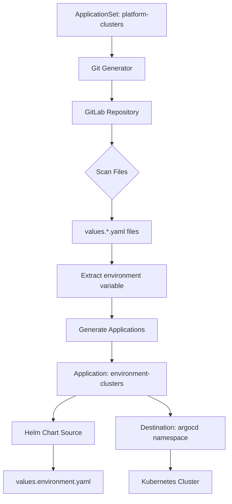
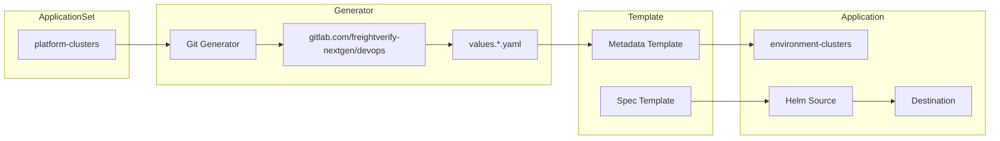
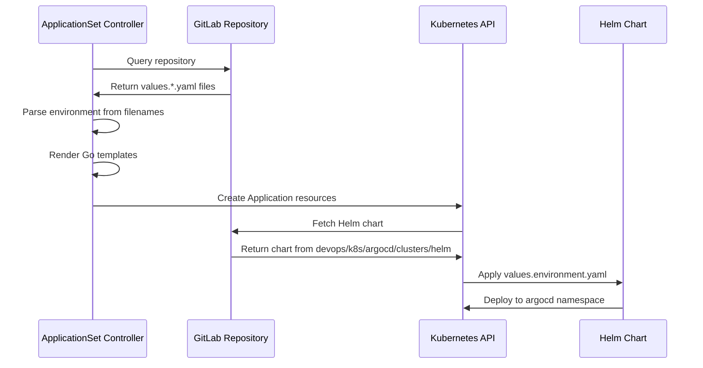
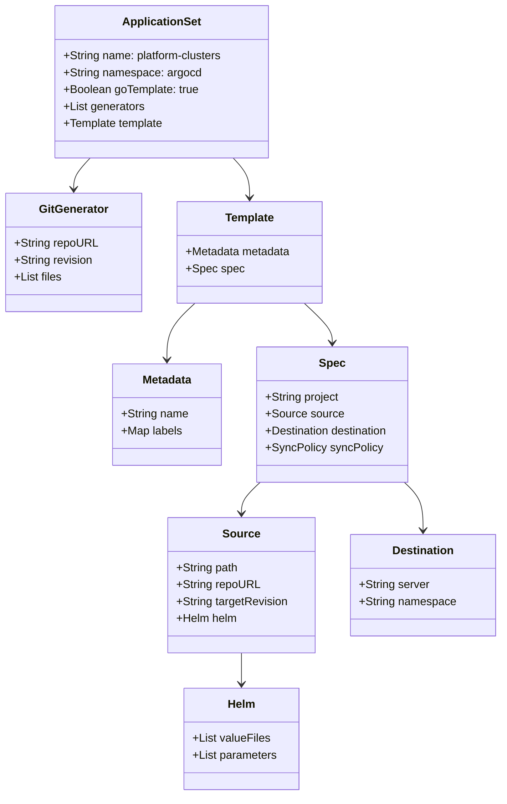

# Diagram: devops/k8s/argocd/clusters/argocd/ApplicationSet.yaml

> Auto-generated by Obscura crawlers

## Diagram 1

### SVG

<svg id="container" width="543.4140625" xmlns="http://www.w3.org/2000/svg" class="flowchart" height="1173.140625" viewBox="0 0 543.4140625 1173.140625" role="graphics-document document" aria-roledescription="flowchart-v2"><g><marker id="container_flowchart-v2-pointEnd" class="marker flowchart-v2" viewBox="0 0 10 10" refX="5" refY="5" markerUnits="userSpaceOnUse" markerWidth="8" markerHeight="8" orient="auto"><path d="M 0 0 L 10 5 L 0 10 z" class="arrowMarkerPath" style="stroke-width: 1; stroke-dasharray: 1, 0;"></path></marker><marker id="container_flowchart-v2-pointStart" class="marker flowchart-v2" viewBox="0 0 10 10" refX="4.5" refY="5" markerUnits="userSpaceOnUse" markerWidth="8" markerHeight="8" orient="auto"><path d="M 0 5 L 10 10 L 10 0 z" class="arrowMarkerPath" style="stroke-width: 1; stroke-dasharray: 1, 0;"></path></marker><marker id="container_flowchart-v2-circleEnd" class="marker flowchart-v2" viewBox="0 0 10 10" refX="11" refY="5" markerUnits="userSpaceOnUse" markerWidth="11" markerHeight="11" orient="auto"><circle cx="5" cy="5" r="5" class="arrowMarkerPath" style="stroke-width: 1; stroke-dasharray: 1, 0;"></circle></marker><marker id="container_flowchart-v2-circleStart" class="marker flowchart-v2" viewBox="0 0 10 10" refX="-1" refY="5" markerUnits="userSpaceOnUse" markerWidth="11" markerHeight="11" orient="auto"><circle cx="5" cy="5" r="5" class="arrowMarkerPath" style="stroke-width: 1; stroke-dasharray: 1, 0;"></circle></marker><marker id="container_flowchart-v2-crossEnd" class="marker cross flowchart-v2" viewBox="0 0 11 11" refX="12" refY="5.2" markerUnits="userSpaceOnUse" markerWidth="11" markerHeight="11" orient="auto"><path d="M 1,1 l 9,9 M 10,1 l -9,9" class="arrowMarkerPath" style="stroke-width: 2; stroke-dasharray: 1, 0;"></path></marker><marker id="container_flowchart-v2-crossStart" class="marker cross flowchart-v2" viewBox="0 0 11 11" refX="-1" refY="5.2" markerUnits="userSpaceOnUse" markerWidth="11" markerHeight="11" orient="auto"><path d="M 1,1 l 9,9 M 10,1 l -9,9" class="arrowMarkerPath" style="stroke-width: 2; stroke-dasharray: 1, 0;"></path></marker><g class="root"><g class="clusters"></g><g class="edgePaths"><path d="M266.805,86L266.805,90.167C266.805,94.333,266.805,102.667,266.805,110.333C266.805,118,266.805,125,266.805,128.5L266.805,132" id="L_A_B_0" class="edge-thickness-normal edge-pattern-solid edge-thickness-normal edge-pattern-solid flowchart-link" style=";" data-edge="true" data-et="edge" data-id="L_A_B_0" data-points="W3sieCI6MjY2LjgwNDY4NzUsInkiOjg2fSx7IngiOjI2Ni44MDQ2ODc1LCJ5IjoxMTF9LHsieCI6MjY2LjgwNDY4NzUsInkiOjEzNn1d" marker-end="url(#container_flowchart-v2-pointEnd)"></path><path d="M266.805,190L266.805,194.167C266.805,198.333,266.805,206.667,266.805,214.333C266.805,222,266.805,229,266.805,232.5L266.805,236" id="L_B_C_0" class="edge-thickness-normal edge-pattern-solid edge-thickness-normal edge-pattern-solid flowchart-link" style=";" data-edge="true" data-et="edge" data-id="L_B_C_0" data-points="W3sieCI6MjY2LjgwNDY4NzUsInkiOjE5MH0seyJ4IjoyNjYuODA0Njg3NSwieSI6MjE1fSx7IngiOjI2Ni44MDQ2ODc1LCJ5IjoyNDB9XQ==" marker-end="url(#container_flowchart-v2-pointEnd)"></path><path d="M266.805,294L266.805,298.167C266.805,302.333,266.805,310.667,266.805,318.333C266.805,326,266.805,333,266.805,336.5L266.805,340" id="L_C_D_0" class="edge-thickness-normal edge-pattern-solid edge-thickness-normal edge-pattern-solid flowchart-link" style=";" data-edge="true" data-et="edge" data-id="L_C_D_0" data-points="W3sieCI6MjY2LjgwNDY4NzUsInkiOjI5NH0seyJ4IjoyNjYuODA0Njg3NSwieSI6MzE5fSx7IngiOjI2Ni44MDQ2ODc1LCJ5IjozNDR9XQ==" marker-end="url(#container_flowchart-v2-pointEnd)"></path><path d="M266.805,469.141L266.805,473.307C266.805,477.474,266.805,485.807,266.805,493.474C266.805,501.141,266.805,508.141,266.805,511.641L266.805,515.141" id="L_D_E_0" class="edge-thickness-normal edge-pattern-solid edge-thickness-normal edge-pattern-solid flowchart-link" style=";" data-edge="true" data-et="edge" data-id="L_D_E_0" data-points="W3sieCI6MjY2LjgwNDY4NzUsInkiOjQ2OS4xNDA2MjV9LHsieCI6MjY2LjgwNDY4NzUsInkiOjQ5NC4xNDA2MjV9LHsieCI6MjY2LjgwNDY4NzUsInkiOjUxOS4xNDA2MjV9XQ==" marker-end="url(#container_flowchart-v2-pointEnd)"></path><path d="M266.805,573.141L266.805,577.307C266.805,581.474,266.805,589.807,266.805,597.474C266.805,605.141,266.805,612.141,266.805,615.641L266.805,619.141" id="L_E_F_0" class="edge-thickness-normal edge-pattern-solid edge-thickness-normal edge-pattern-solid flowchart-link" style=";" data-edge="true" data-et="edge" data-id="L_E_F_0" data-points="W3sieCI6MjY2LjgwNDY4NzUsInkiOjU3My4xNDA2MjV9LHsieCI6MjY2LjgwNDY4NzUsInkiOjU5OC4xNDA2MjV9LHsieCI6MjY2LjgwNDY4NzUsInkiOjYyMy4xNDA2MjV9XQ==" marker-end="url(#container_flowchart-v2-pointEnd)"></path><path d="M266.805,701.141L266.805,705.307C266.805,709.474,266.805,717.807,266.805,725.474C266.805,733.141,266.805,740.141,266.805,743.641L266.805,747.141" id="L_F_G_0" class="edge-thickness-normal edge-pattern-solid edge-thickness-normal edge-pattern-solid flowchart-link" style=";" data-edge="true" data-et="edge" data-id="L_F_G_0" data-points="W3sieCI6MjY2LjgwNDY4NzUsInkiOjcwMS4xNDA2MjV9LHsieCI6MjY2LjgwNDY4NzUsInkiOjcyNi4xNDA2MjV9LHsieCI6MjY2LjgwNDY4NzUsInkiOjc1MS4xNDA2MjV9XQ==" marker-end="url(#container_flowchart-v2-pointEnd)"></path><path d="M266.805,805.141L266.805,809.307C266.805,813.474,266.805,821.807,266.805,829.474C266.805,837.141,266.805,844.141,266.805,847.641L266.805,851.141" id="L_G_H_0" class="edge-thickness-normal edge-pattern-solid edge-thickness-normal edge-pattern-solid flowchart-link" style=";" data-edge="true" data-et="edge" data-id="L_G_H_0" data-points="W3sieCI6MjY2LjgwNDY4NzUsInkiOjgwNS4xNDA2MjV9LHsieCI6MjY2LjgwNDY4NzUsInkiOjgzMC4xNDA2MjV9LHsieCI6MjY2LjgwNDY4NzUsInkiOjg1NS4xNDA2MjV9XQ==" marker-end="url(#container_flowchart-v2-pointEnd)"></path><path d="M182.34,933.141L173.316,937.307C164.292,941.474,146.243,949.807,137.219,959.474C128.195,969.141,128.195,980.141,128.195,985.641L128.195,991.141" id="L_H_I_0" class="edge-thickness-normal edge-pattern-solid edge-thickness-normal edge-pattern-solid flowchart-link" style=";" data-edge="true" data-et="edge" data-id="L_H_I_0" data-points="W3sieCI6MTgyLjMzOTU5OTYwOTM3NSwieSI6OTMzLjE0MDYyNX0seyJ4IjoxMjguMTk1MzEyNSwieSI6OTU4LjE0MDYyNX0seyJ4IjoxMjguMTk1MzEyNSwieSI6OTk1LjE0MDYyNX1d" marker-end="url(#container_flowchart-v2-pointEnd)"></path><path d="M128.195,1049.141L128.195,1055.307C128.195,1061.474,128.195,1073.807,128.195,1083.474C128.195,1093.141,128.195,1100.141,128.195,1103.641L128.195,1107.141" id="L_I_J_0" class="edge-thickness-normal edge-pattern-solid edge-thickness-normal edge-pattern-solid flowchart-link" style=";" data-edge="true" data-et="edge" data-id="L_I_J_0" data-points="W3sieCI6MTI4LjE5NTMxMjUsInkiOjEwNDkuMTQwNjI1fSx7IngiOjEyOC4xOTUzMTI1LCJ5IjoxMDg2LjE0MDYyNX0seyJ4IjoxMjguMTk1MzEyNSwieSI6MTExMS4xNDA2MjV9XQ==" marker-end="url(#container_flowchart-v2-pointEnd)"></path><path d="M351.27,933.141L360.294,937.307C369.318,941.474,387.366,949.807,396.39,957.474C405.414,965.141,405.414,972.141,405.414,975.641L405.414,979.141" id="L_H_K_0" class="edge-thickness-normal edge-pattern-solid edge-thickness-normal edge-pattern-solid flowchart-link" style=";" data-edge="true" data-et="edge" data-id="L_H_K_0" data-points="W3sieCI6MzUxLjI2OTc3NTM5MDYyNSwieSI6OTMzLjE0MDYyNX0seyJ4Ijo0MDUuNDE0MDYyNSwieSI6OTU4LjE0MDYyNX0seyJ4Ijo0MDUuNDE0MDYyNSwieSI6OTgzLjE0MDYyNX1d" marker-end="url(#container_flowchart-v2-pointEnd)"></path><path d="M405.414,1061.141L405.414,1065.307C405.414,1069.474,405.414,1077.807,405.414,1085.474C405.414,1093.141,405.414,1100.141,405.414,1103.641L405.414,1107.141" id="L_K_L_0" class="edge-thickness-normal edge-pattern-solid edge-thickness-normal edge-pattern-solid flowchart-link" style=";" data-edge="true" data-et="edge" data-id="L_K_L_0" data-points="W3sieCI6NDA1LjQxNDA2MjUsInkiOjEwNjEuMTQwNjI1fSx7IngiOjQwNS40MTQwNjI1LCJ5IjoxMDg2LjE0MDYyNX0seyJ4Ijo0MDUuNDE0MDYyNSwieSI6MTExMS4xNDA2MjV9XQ==" marker-end="url(#container_flowchart-v2-pointEnd)"></path></g><g class="edgeLabels"><g class="edgeLabel"><g class="label" data-id="L_A_B_0" transform="translate(0, 0)"><foreignObject width="0" height="0">

</foreignObject></g></g><g class="edgeLabel"><g class="label" data-id="L_B_C_0" transform="translate(0, 0)"><foreignObject width="0" height="0">

</foreignObject></g></g><g class="edgeLabel"><g class="label" data-id="L_C_D_0" transform="translate(0, 0)"><foreignObject width="0" height="0">

</foreignObject></g></g><g class="edgeLabel"><g class="label" data-id="L_D_E_0" transform="translate(0, 0)"><foreignObject width="0" height="0">

</foreignObject></g></g><g class="edgeLabel"><g class="label" data-id="L_E_F_0" transform="translate(0, 0)"><foreignObject width="0" height="0">

</foreignObject></g></g><g class="edgeLabel"><g class="label" data-id="L_F_G_0" transform="translate(0, 0)"><foreignObject width="0" height="0">

</foreignObject></g></g><g class="edgeLabel"><g class="label" data-id="L_G_H_0" transform="translate(0, 0)"><foreignObject width="0" height="0">

</foreignObject></g></g><g class="edgeLabel"><g class="label" data-id="L_H_I_0" transform="translate(0, 0)"><foreignObject width="0" height="0">

</foreignObject></g></g><g class="edgeLabel"><g class="label" data-id="L_I_J_0" transform="translate(0, 0)"><foreignObject width="0" height="0">

</foreignObject></g></g><g class="edgeLabel"><g class="label" data-id="L_H_K_0" transform="translate(0, 0)"><foreignObject width="0" height="0">

</foreignObject></g></g><g class="edgeLabel"><g class="label" data-id="L_K_L_0" transform="translate(0, 0)"><foreignObject width="0" height="0">

</foreignObject></g></g></g><g class="nodes"><g class="node default" id="flowchart-A-0" transform="translate(266.8046875, 47)"><rect class="basic label-container" style="" x="-130" y="-39" width="260" height="78"></rect><g class="label" style="" transform="translate(-100, -24)"><rect></rect><foreignObject width="200" height="48">

ApplicationSet: platform-clusters

</foreignObject></g></g><g class="node default" id="flowchart-B-1" transform="translate(266.8046875, 163)"><rect class="basic label-container" style="" x="-78.4609375" y="-27" width="156.921875" height="54"></rect><g class="label" style="" transform="translate(-48.4609375, -12)"><rect></rect><foreignObject width="96.921875" height="24">

Git Generator

</foreignObject></g></g><g class="node default" id="flowchart-C-3" transform="translate(266.8046875, 267)"><rect class="basic label-container" style="" x="-94.28125" y="-27" width="188.5625" height="54"></rect><g class="label" style="" transform="translate(-64.28125, -12)"><rect></rect><foreignObject width="128.5625" height="24">

GitLab Repository

</foreignObject></g></g><g class="node default" id="flowchart-D-5" transform="translate(266.8046875, 406.5703125)"><polygon points="62.5703125,0 125.140625,-62.5703125 62.5703125,-125.140625 0,-62.5703125" class="label-container" transform="translate(-62.0703125, 62.5703125)"></polygon><g class="label" style="" transform="translate(-35.5703125, -12)"><rect></rect><foreignObject width="71.140625" height="24">

Scan Files

</foreignObject></g></g><g class="node default" id="flowchart-E-7" transform="translate(266.8046875, 546.140625)"><rect class="basic label-container" style="" x="-93.09375" y="-27" width="186.1875" height="54"></rect><g class="label" style="" transform="translate(-63.09375, -12)"><rect></rect><foreignObject width="126.1875" height="24">

values.*.yaml files

</foreignObject></g></g><g class="node default" id="flowchart-F-9" transform="translate(266.8046875, 662.140625)"><rect class="basic label-container" style="" x="-130" y="-39" width="260" height="78"></rect><g class="label" style="" transform="translate(-100, -24)"><rect></rect><foreignObject width="200" height="48">

Extract environment variable

</foreignObject></g></g><g class="node default" id="flowchart-G-11" transform="translate(266.8046875, 778.140625)"><rect class="basic label-container" style="" x="-109.890625" y="-27" width="219.78125" height="54"></rect><g class="label" style="" transform="translate(-79.890625, -12)"><rect></rect><foreignObject width="159.78125" height="24">

Generate Applications

</foreignObject></g></g><g class="node default" id="flowchart-H-13" transform="translate(266.8046875, 894.140625)"><rect class="basic label-container" style="" x="-130" y="-39" width="260" height="78"></rect><g class="label" style="" transform="translate(-100, -24)"><rect></rect><foreignObject width="200" height="48">

Application: environment-clusters

</foreignObject></g></g><g class="node default" id="flowchart-I-15" transform="translate(128.1953125, 1022.140625)"><rect class="basic label-container" style="" x="-97.21875" y="-27" width="194.4375" height="54"></rect><g class="label" style="" transform="translate(-67.21875, -12)"><rect></rect><foreignObject width="134.4375" height="24">

Helm Chart Source

</foreignObject></g></g><g class="node default" id="flowchart-J-17" transform="translate(128.1953125, 1138.140625)"><rect class="basic label-container" style="" x="-120.1953125" y="-27" width="240.390625" height="54"></rect><g class="label" style="" transform="translate(-90.1953125, -12)"><rect></rect><foreignObject width="180.390625" height="24">

values.environment.yaml

</foreignObject></g></g><g class="node default" id="flowchart-K-19" transform="translate(405.4140625, 1022.140625)"><rect class="basic label-container" style="" x="-130" y="-39" width="260" height="78"></rect><g class="label" style="" transform="translate(-100, -24)"><rect></rect><foreignObject width="200" height="48">

Destination: argocd namespace

</foreignObject></g></g><g class="node default" id="flowchart-L-21" transform="translate(405.4140625, 1138.140625)"><rect class="basic label-container" style="" x="-98.8828125" y="-27" width="197.765625" height="54"></rect><g class="label" style="" transform="translate(-68.8828125, -12)"><rect></rect><foreignObject width="137.765625" height="24">

Kubernetes Cluster

</foreignObject></g></g></g></g></g></svg>

## Diagram 2

### SVG

<svg id="container" width="1829.28125" xmlns="http://www.w3.org/2000/svg" class="flowchart" height="256" viewBox="0 0 1829.28125 256" role="graphics-document document" aria-roledescription="flowchart-v2"><g><marker id="container_flowchart-v2-pointEnd" class="marker flowchart-v2" viewBox="0 0 10 10" refX="5" refY="5" markerUnits="userSpaceOnUse" markerWidth="8" markerHeight="8" orient="auto"><path d="M 0 0 L 10 5 L 0 10 z" class="arrowMarkerPath" style="stroke-width: 1; stroke-dasharray: 1, 0;"></path></marker><marker id="container_flowchart-v2-pointStart" class="marker flowchart-v2" viewBox="0 0 10 10" refX="4.5" refY="5" markerUnits="userSpaceOnUse" markerWidth="8" markerHeight="8" orient="auto"><path d="M 0 5 L 10 10 L 10 0 z" class="arrowMarkerPath" style="stroke-width: 1; stroke-dasharray: 1, 0;"></path></marker><marker id="container_flowchart-v2-circleEnd" class="marker flowchart-v2" viewBox="0 0 10 10" refX="11" refY="5" markerUnits="userSpaceOnUse" markerWidth="11" markerHeight="11" orient="auto"><circle cx="5" cy="5" r="5" class="arrowMarkerPath" style="stroke-width: 1; stroke-dasharray: 1, 0;"></circle></marker><marker id="container_flowchart-v2-circleStart" class="marker flowchart-v2" viewBox="0 0 10 10" refX="-1" refY="5" markerUnits="userSpaceOnUse" markerWidth="11" markerHeight="11" orient="auto"><circle cx="5" cy="5" r="5" class="arrowMarkerPath" style="stroke-width: 1; stroke-dasharray: 1, 0;"></circle></marker><marker id="container_flowchart-v2-crossEnd" class="marker cross flowchart-v2" viewBox="0 0 11 11" refX="12" refY="5.2" markerUnits="userSpaceOnUse" markerWidth="11" markerHeight="11" orient="auto"><path d="M 1,1 l 9,9 M 10,1 l -9,9" class="arrowMarkerPath" style="stroke-width: 2; stroke-dasharray: 1, 0;"></path></marker><marker id="container_flowchart-v2-crossStart" class="marker cross flowchart-v2" viewBox="0 0 11 11" refX="-1" refY="5.2" markerUnits="userSpaceOnUse" markerWidth="11" markerHeight="11" orient="auto"><path d="M 1,1 l 9,9 M 10,1 l -9,9" class="arrowMarkerPath" style="stroke-width: 2; stroke-dasharray: 1, 0;"></path></marker><g class="root"><g class="clusters"><g class="cluster" id="Application" data-look="classic"><rect style="" x="1362.4375" y="20" width="458.84375" height="228"></rect><g class="cluster-label" transform="translate(1550.5703125, 20)"><foreignObject width="82.578125" height="24">

Application

</foreignObject></g></g><g class="cluster" id="Template" data-look="classic"><rect style="" x="1063.125" y="20" width="249.3125" height="228"></rect><g class="cluster-label" transform="translate(1154.328125, 20)"><foreignObject width="66.90625" height="24">

Template

</foreignObject></g></g><g class="cluster" id="Generator" data-look="classic"><rect style="" x="294.265625" y="8" width="718.859375" height="148"></rect><g class="cluster-label" transform="translate(617.546875, 8)"><foreignObject width="72.296875" height="24">

Generator

</foreignObject></g></g><g class="cluster" id="ApplicationSet" data-look="classic"><rect style="" x="8" y="20" width="236.265625" height="124"></rect><g class="cluster-label" transform="translate(73.234375, 20)"><foreignObject width="105.796875" height="24">

ApplicationSet

</foreignObject></g></g></g><g class="edgePaths"><path d="M219.266,82L223.432,82C227.599,82,235.932,82,244.266,82C252.599,82,260.932,82,269.266,82C277.599,82,285.932,82,293.599,82C301.266,82,308.266,82,311.766,82L315.266,82" id="L_AS_GIT_0" class="edge-thickness-normal edge-pattern-solid edge-thickness-normal edge-pattern-solid flowchart-link" style=";" data-edge="true" data-et="edge" data-id="L_AS_GIT_0" data-points="W3sieCI6MjE5LjI2NTYyNSwieSI6ODJ9LHsieCI6MjQ0LjI2NTYyNSwieSI6ODJ9LHsieCI6MjY5LjI2NTYyNSwieSI6ODJ9LHsieCI6Mjk0LjI2NTYyNSwieSI6ODJ9LHsieCI6MzE5LjI2NTYyNSwieSI6ODJ9XQ==" marker-end="url(#container_flowchart-v2-pointEnd)"></path><path d="M476.188,82L480.354,82C484.521,82,492.854,82,500.521,82C508.188,82,515.188,82,518.688,82L522.188,82" id="L_GIT_REPO_0" class="edge-thickness-normal edge-pattern-solid edge-thickness-normal edge-pattern-solid flowchart-link" style=";" data-edge="true" data-et="edge" data-id="L_GIT_REPO_0" data-points="W3sieCI6NDc2LjE4NzUsInkiOjgyfSx7IngiOjUwMS4xODc1LCJ5Ijo4Mn0seyJ4Ijo1MjYuMTg3NSwieSI6ODJ9XQ==" marker-end="url(#container_flowchart-v2-pointEnd)"></path><path d="M786.188,82L790.354,82C794.521,82,802.854,82,810.521,82C818.188,82,825.188,82,828.688,82L832.188,82" id="L_REPO_FILES_0" class="edge-thickness-normal edge-pattern-solid edge-thickness-normal edge-pattern-solid flowchart-link" style=";" data-edge="true" data-et="edge" data-id="L_REPO_FILES_0" data-points="W3sieCI6Nzg2LjE4NzUsInkiOjgyfSx7IngiOjgxMS4xODc1LCJ5Ijo4Mn0seyJ4Ijo4MzYuMTg3NSwieSI6ODJ9XQ==" marker-end="url(#container_flowchart-v2-pointEnd)"></path><path d="M988.125,82L992.292,82C996.458,82,1004.792,82,1013.125,82C1021.458,82,1029.792,82,1038.125,82C1046.458,82,1054.792,82,1062.458,82C1070.125,82,1077.125,82,1080.625,82L1084.125,82" id="L_FILES_META_0" class="edge-thickness-normal edge-pattern-solid edge-thickness-normal edge-pattern-solid flowchart-link" style=";" data-edge="true" data-et="edge" data-id="L_FILES_META_0" data-points="W3sieCI6OTg4LjEyNSwieSI6ODJ9LHsieCI6MTAxMy4xMjUsInkiOjgyfSx7IngiOjEwMzguMTI1LCJ5Ijo4Mn0seyJ4IjoxMDYzLjEyNSwieSI6ODJ9LHsieCI6MTA4OC4xMjUsInkiOjgyfV0=" marker-end="url(#container_flowchart-v2-pointEnd)"></path><path d="M1287.438,82L1291.604,82C1295.771,82,1304.104,82,1312.438,82C1320.771,82,1329.104,82,1337.438,82C1345.771,82,1354.104,82,1361.771,82C1369.438,82,1376.438,82,1379.938,82L1383.438,82" id="L_META_APP_0" class="edge-thickness-normal edge-pattern-solid edge-thickness-normal edge-pattern-solid flowchart-link" style=";" data-edge="true" data-et="edge" data-id="L_META_APP_0" data-points="W3sieCI6MTI4Ny40Mzc1LCJ5Ijo4Mn0seyJ4IjoxMzEyLjQzNzUsInkiOjgyfSx7IngiOjEzMzcuNDM3NSwieSI6ODJ9LHsieCI6MTM2Mi40Mzc1LCJ5Ijo4Mn0seyJ4IjoxMzg3LjQzNzUsInkiOjgyfV0=" marker-end="url(#container_flowchart-v2-pointEnd)"></path><path d="M1270.648,186L1277.613,186C1284.578,186,1298.508,186,1309.639,186C1320.771,186,1329.104,186,1337.438,186C1345.771,186,1354.104,186,1367.07,186C1380.036,186,1397.635,186,1406.435,186L1415.234,186" id="L_SPEC_HELM_0" class="edge-thickness-normal edge-pattern-solid edge-thickness-normal edge-pattern-solid flowchart-link" style=";" data-edge="true" data-et="edge" data-id="L_SPEC_HELM_0" data-points="W3sieCI6MTI3MC42NDg0Mzc1LCJ5IjoxODZ9LHsieCI6MTMxMi40Mzc1LCJ5IjoxODZ9LHsieCI6MTMzNy40Mzc1LCJ5IjoxODZ9LHsieCI6MTM2Mi40Mzc1LCJ5IjoxODZ9LHsieCI6MTQxOS4yMzQzNzUsInkiOjE4Nn1d" marker-end="url(#container_flowchart-v2-pointEnd)"></path><path d="M1570.609,186L1580.076,186C1589.542,186,1608.474,186,1621.44,186C1634.406,186,1641.406,186,1644.906,186L1648.406,186" id="L_HELM_DEST_0" class="edge-thickness-normal edge-pattern-solid edge-thickness-normal edge-pattern-solid flowchart-link" style=";" data-edge="true" data-et="edge" data-id="L_HELM_DEST_0" data-points="W3sieCI6MTU3MC42MDkzNzUsInkiOjE4Nn0seyJ4IjoxNjI3LjQwNjI1LCJ5IjoxODZ9LHsieCI6MTY1Mi40MDYyNSwieSI6MTg2fV0=" marker-end="url(#container_flowchart-v2-pointEnd)"></path></g><g class="edgeLabels"><g class="edgeLabel"><g class="label" data-id="L_AS_GIT_0" transform="translate(0, 0)"><foreignObject width="0" height="0">

</foreignObject></g></g><g class="edgeLabel"><g class="label" data-id="L_GIT_REPO_0" transform="translate(0, 0)"><foreignObject width="0" height="0">

</foreignObject></g></g><g class="edgeLabel"><g class="label" data-id="L_REPO_FILES_0" transform="translate(0, 0)"><foreignObject width="0" height="0">

</foreignObject></g></g><g class="edgeLabel"><g class="label" data-id="L_FILES_META_0" transform="translate(0, 0)"><foreignObject width="0" height="0">

</foreignObject></g></g><g class="edgeLabel"><g class="label" data-id="L_META_APP_0" transform="translate(0, 0)"><foreignObject width="0" height="0">

</foreignObject></g></g><g class="edgeLabel"><g class="label" data-id="L_SPEC_HELM_0" transform="translate(0, 0)"><foreignObject width="0" height="0">

</foreignObject></g></g><g class="edgeLabel"><g class="label" data-id="L_HELM_DEST_0" transform="translate(0, 0)"><foreignObject width="0" height="0">

</foreignObject></g></g></g><g class="nodes"><g class="node default" id="flowchart-AS-0" transform="translate(126.1328125, 82)"><rect class="basic label-container" style="" x="-93.1328125" y="-27" width="186.265625" height="54"></rect><g class="label" style="" transform="translate(-63.1328125, -12)"><rect></rect><foreignObject width="126.265625" height="24">

platform-clusters

</foreignObject></g></g><g class="node default" id="flowchart-GIT-1" transform="translate(397.7265625, 82)"><rect class="basic label-container" style="" x="-78.4609375" y="-27" width="156.921875" height="54"></rect><g class="label" style="" transform="translate(-48.4609375, -12)"><rect></rect><foreignObject width="96.921875" height="24">

Git Generator

</foreignObject></g></g><g class="node default" id="flowchart-REPO-2" transform="translate(656.1875, 82)"><rect class="basic label-container" style="" x="-130" y="-39" width="260" height="78"></rect><g class="label" style="" transform="translate(-100, -24)"><rect></rect><foreignObject width="200" height="48">

gitlab.com/freightverify-nextgen/devops

</foreignObject></g></g><g class="node default" id="flowchart-FILES-3" transform="translate(912.15625, 82)"><rect class="basic label-container" style="" x="-75.96875" y="-27" width="151.9375" height="54"></rect><g class="label" style="" transform="translate(-45.96875, -12)"><rect></rect><foreignObject width="91.9375" height="24">

values.*.yaml

</foreignObject></g></g><g class="node default" id="flowchart-META-4" transform="translate(1187.78125, 82)"><rect class="basic label-container" style="" x="-99.65625" y="-27" width="199.3125" height="54"></rect><g class="label" style="" transform="translate(-69.65625, -12)"><rect></rect><foreignObject width="139.3125" height="24">

Metadata Template

</foreignObject></g></g><g class="node default" id="flowchart-SPEC-5" transform="translate(1187.78125, 186)"><rect class="basic label-container" style="" x="-82.8671875" y="-27" width="165.734375" height="54"></rect><g class="label" style="" transform="translate(-52.8671875, -12)"><rect></rect><foreignObject width="105.734375" height="24">

Spec Template

</foreignObject></g></g><g class="node default" id="flowchart-APP-6" transform="translate(1494.921875, 82)"><rect class="basic label-container" style="" x="-107.484375" y="-27" width="214.96875" height="54"></rect><g class="label" style="" transform="translate(-77.484375, -12)"><rect></rect><foreignObject width="154.96875" height="24">

environment-clusters

</foreignObject></g></g><g class="node default" id="flowchart-HELM-7" transform="translate(1494.921875, 186)"><rect class="basic label-container" style="" x="-75.6875" y="-27" width="151.375" height="54"></rect><g class="label" style="" transform="translate(-45.6875, -12)"><rect></rect><foreignObject width="91.375" height="24">

Helm Source

</foreignObject></g></g><g class="node default" id="flowchart-DEST-8" transform="translate(1724.34375, 186)"><rect class="basic label-container" style="" x="-71.9375" y="-27" width="143.875" height="54"></rect><g class="label" style="" transform="translate(-41.9375, -12)"><rect></rect><foreignObject width="83.875" height="24">

Destination

</foreignObject></g></g></g></g></g></svg>

## Diagram 3

### SVG

<svg id="container" width="1297.5" xmlns="http://www.w3.org/2000/svg" height="663" viewBox="-72 -10 1297.5 663" role="graphics-document document" aria-roledescription="sequence"><g><rect x="1025.5" y="577" fill="#eaeaea" stroke="#666" width="150" height="65" name="Helm" rx="3" ry="3" class="actor actor-bottom"></rect><text x="1100.5" y="609.5" dominant-baseline="central" alignment-baseline="central" class="actor actor-box" style="text-anchor: middle; font-size: 16px; font-weight: 400;"><tspan x="1100.5" dy="0">Helm Chart</tspan></text></g><g><rect x="729.5" y="577" fill="#eaeaea" stroke="#666" width="150" height="65" name="K8s" rx="3" ry="3" class="actor actor-bottom"></rect><text x="804.5" y="609.5" dominant-baseline="central" alignment-baseline="central" class="actor actor-box" style="text-anchor: middle; font-size: 16px; font-weight: 400;"><tspan x="804.5" dy="0">Kubernetes API</tspan></text></g><g><rect x="275.5" y="577" fill="#eaeaea" stroke="#666" width="150" height="65" name="GL" rx="3" ry="3" class="actor actor-bottom"></rect><text x="350.5" y="609.5" dominant-baseline="central" alignment-baseline="central" class="actor actor-box" style="text-anchor: middle; font-size: 16px; font-weight: 400;"><tspan x="350.5" dy="0">GitLab Repository</tspan></text></g><g><rect x="0" y="577" fill="#eaeaea" stroke="#666" width="203" height="65" name="AS" rx="3" ry="3" class="actor actor-bottom"></rect><text x="101.5" y="609.5" dominant-baseline="central" alignment-baseline="central" class="actor actor-box" style="text-anchor: middle; font-size: 16px; font-weight: 400;"><tspan x="101.5" dy="0">ApplicationSet Controller</tspan></text></g><g><line id="actor3" x1="1100.5" y1="65" x2="1100.5" y2="577" class="actor-line 200" stroke-width="0.5px" stroke="#999" name="Helm"></line><g id="root-3"><rect x="1025.5" y="0" fill="#eaeaea" stroke="#666" width="150" height="65" name="Helm" rx="3" ry="3" class="actor actor-top"></rect><text x="1100.5" y="32.5" dominant-baseline="central" alignment-baseline="central" class="actor actor-box" style="text-anchor: middle; font-size: 16px; font-weight: 400;"><tspan x="1100.5" dy="0">Helm Chart</tspan></text></g></g><g><line id="actor2" x1="804.5" y1="65" x2="804.5" y2="577" class="actor-line 200" stroke-width="0.5px" stroke="#999" name="K8s"></line><g id="root-2"><rect x="729.5" y="0" fill="#eaeaea" stroke="#666" width="150" height="65" name="K8s" rx="3" ry="3" class="actor actor-top"></rect><text x="804.5" y="32.5" dominant-baseline="central" alignment-baseline="central" class="actor actor-box" style="text-anchor: middle; font-size: 16px; font-weight: 400;"><tspan x="804.5" dy="0">Kubernetes API</tspan></text></g></g><g><line id="actor1" x1="350.5" y1="65" x2="350.5" y2="577" class="actor-line 200" stroke-width="0.5px" stroke="#999" name="GL"></line><g id="root-1"><rect x="275.5" y="0" fill="#eaeaea" stroke="#666" width="150" height="65" name="GL" rx="3" ry="3" class="actor actor-top"></rect><text x="350.5" y="32.5" dominant-baseline="central" alignment-baseline="central" class="actor actor-box" style="text-anchor: middle; font-size: 16px; font-weight: 400;"><tspan x="350.5" dy="0">GitLab Repository</tspan></text></g></g><g><line id="actor0" x1="101.5" y1="65" x2="101.5" y2="577" class="actor-line 200" stroke-width="0.5px" stroke="#999" name="AS"></line><g id="root-0"><rect x="0" y="0" fill="#eaeaea" stroke="#666" width="203" height="65" name="AS" rx="3" ry="3" class="actor actor-top"></rect><text x="101.5" y="32.5" dominant-baseline="central" alignment-baseline="central" class="actor actor-box" style="text-anchor: middle; font-size: 16px; font-weight: 400;"><tspan x="101.5" dy="0">ApplicationSet Controller</tspan></text></g></g><g></g><defs><symbol id="computer" width="24" height="24"><path transform="scale(.5)" d="M2 2v13h20v-13h-20zm18 11h-16v-9h16v9zm-10.228 6l.466-1h3.524l.467 1h-4.457zm14.228 3h-24l2-6h2.104l-1.33 4h18.45l-1.297-4h2.073l2 6zm-5-10h-14v-7h14v7z"></path></symbol></defs><defs><symbol id="database" fill-rule="evenodd" clip-rule="evenodd"><path transform="scale(.5)" d="M12.258.001l.256.004.255.005.253.008.251.01.249.012.247.015.246.016.242.019.241.02.239.023.236.024.233.027.231.028.229.031.225.032.223.034.22.036.217.038.214.04.211.041.208.043.205.045.201.046.198.048.194.05.191.051.187.053.183.054.18.056.175.057.172.059.168.06.163.061.16.063.155.064.15.066.074.033.073.033.071.034.07.034.069.035.068.035.067.035.066.035.064.036.064.036.062.036.06.036.06.037.058.037.058.037.055.038.055.038.053.038.052.038.051.039.05.039.048.039.047.039.045.04.044.04.043.04.041.04.04.041.039.041.037.041.036.041.034.041.033.042.032.042.03.042.029.042.027.042.026.043.024.043.023.043.021.043.02.043.018.044.017.043.015.044.013.044.012.044.011.045.009.044.007.045.006.045.004.045.002.045.001.045v17l-.001.045-.002.045-.004.045-.006.045-.007.045-.009.044-.011.045-.012.044-.013.044-.015.044-.017.043-.018.044-.02.043-.021.043-.023.043-.024.043-.026.043-.027.042-.029.042-.03.042-.032.042-.033.042-.034.041-.036.041-.037.041-.039.041-.04.041-.041.04-.043.04-.044.04-.045.04-.047.039-.048.039-.05.039-.051.039-.052.038-.053.038-.055.038-.055.038-.058.037-.058.037-.06.037-.06.036-.062.036-.064.036-.064.036-.066.035-.067.035-.068.035-.069.035-.07.034-.071.034-.073.033-.074.033-.15.066-.155.064-.16.063-.163.061-.168.06-.172.059-.175.057-.18.056-.183.054-.187.053-.191.051-.194.05-.198.048-.201.046-.205.045-.208.043-.211.041-.214.04-.217.038-.22.036-.223.034-.225.032-.229.031-.231.028-.233.027-.236.024-.239.023-.241.02-.242.019-.246.016-.247.015-.249.012-.251.01-.253.008-.255.005-.256.004-.258.001-.258-.001-.256-.004-.255-.005-.253-.008-.251-.01-.249-.012-.247-.015-.245-.016-.243-.019-.241-.02-.238-.023-.236-.024-.234-.027-.231-.028-.228-.031-.226-.032-.223-.034-.22-.036-.217-.038-.214-.04-.211-.041-.208-.043-.204-.045-.201-.046-.198-.048-.195-.05-.19-.051-.187-.053-.184-.054-.179-.056-.176-.057-.172-.059-.167-.06-.164-.061-.159-.063-.155-.064-.151-.066-.074-.033-.072-.033-.072-.034-.07-.034-.069-.035-.068-.035-.067-.035-.066-.035-.064-.036-.063-.036-.062-.036-.061-.036-.06-.037-.058-.037-.057-.037-.056-.038-.055-.038-.053-.038-.052-.038-.051-.039-.049-.039-.049-.039-.046-.039-.046-.04-.044-.04-.043-.04-.041-.04-.04-.041-.039-.041-.037-.041-.036-.041-.034-.041-.033-.042-.032-.042-.03-.042-.029-.042-.027-.042-.026-.043-.024-.043-.023-.043-.021-.043-.02-.043-.018-.044-.017-.043-.015-.044-.013-.044-.012-.044-.011-.045-.009-.044-.007-.045-.006-.045-.004-.045-.002-.045-.001-.045v-17l.001-.045.002-.045.004-.045.006-.045.007-.045.009-.044.011-.045.012-.044.013-.044.015-.044.017-.043.018-.044.02-.043.021-.043.023-.043.024-.043.026-.043.027-.042.029-.042.03-.042.032-.042.033-.042.034-.041.036-.041.037-.041.039-.041.04-.041.041-.04.043-.04.044-.04.046-.04.046-.039.049-.039.049-.039.051-.039.052-.038.053-.038.055-.038.056-.038.057-.037.058-.037.06-.037.061-.036.062-.036.063-.036.064-.036.066-.035.067-.035.068-.035.069-.035.07-.034.072-.034.072-.033.074-.033.151-.066.155-.064.159-.063.164-.061.167-.06.172-.059.176-.057.179-.056.184-.054.187-.053.19-.051.195-.05.198-.048.201-.046.204-.045.208-.043.211-.041.214-.04.217-.038.22-.036.223-.034.226-.032.228-.031.231-.028.234-.027.236-.024.238-.023.241-.02.243-.019.245-.016.247-.015.249-.012.251-.01.253-.008.255-.005.256-.004.258-.001.258.001zm-9.258 20.499v.01l.001.021.003.021.004.022.005.021.006.022.007.022.009.023.01.022.011.023.012.023.013.023.015.023.016.024.017.023.018.024.019.024.021.024.022.025.023.024.024.025.052.049.056.05.061.051.066.051.07.051.075.051.079.052.084.052.088.052.092.052.097.052.102.051.105.052.11.052.114.051.119.051.123.051.127.05.131.05.135.05.139.048.144.049.147.047.152.047.155.047.16.045.163.045.167.043.171.043.176.041.178.041.183.039.187.039.19.037.194.035.197.035.202.033.204.031.209.03.212.029.216.027.219.025.222.024.226.021.23.02.233.018.236.016.24.015.243.012.246.01.249.008.253.005.256.004.259.001.26-.001.257-.004.254-.005.25-.008.247-.011.244-.012.241-.014.237-.016.233-.018.231-.021.226-.021.224-.024.22-.026.216-.027.212-.028.21-.031.205-.031.202-.034.198-.034.194-.036.191-.037.187-.039.183-.04.179-.04.175-.042.172-.043.168-.044.163-.045.16-.046.155-.046.152-.047.148-.048.143-.049.139-.049.136-.05.131-.05.126-.05.123-.051.118-.052.114-.051.11-.052.106-.052.101-.052.096-.052.092-.052.088-.053.083-.051.079-.052.074-.052.07-.051.065-.051.06-.051.056-.05.051-.05.023-.024.023-.025.021-.024.02-.024.019-.024.018-.024.017-.024.015-.023.014-.024.013-.023.012-.023.01-.023.01-.022.008-.022.006-.022.006-.022.004-.022.004-.021.001-.021.001-.021v-4.127l-.077.055-.08.053-.083.054-.085.053-.087.052-.09.052-.093.051-.095.05-.097.05-.1.049-.102.049-.105.048-.106.047-.109.047-.111.046-.114.045-.115.045-.118.044-.12.043-.122.042-.124.042-.126.041-.128.04-.13.04-.132.038-.134.038-.135.037-.138.037-.139.035-.142.035-.143.034-.144.033-.147.032-.148.031-.15.03-.151.03-.153.029-.154.027-.156.027-.158.026-.159.025-.161.024-.162.023-.163.022-.165.021-.166.02-.167.019-.169.018-.169.017-.171.016-.173.015-.173.014-.175.013-.175.012-.177.011-.178.01-.179.008-.179.008-.181.006-.182.005-.182.004-.184.003-.184.002h-.37l-.184-.002-.184-.003-.182-.004-.182-.005-.181-.006-.179-.008-.179-.008-.178-.01-.176-.011-.176-.012-.175-.013-.173-.014-.172-.015-.171-.016-.17-.017-.169-.018-.167-.019-.166-.02-.165-.021-.163-.022-.162-.023-.161-.024-.159-.025-.157-.026-.156-.027-.155-.027-.153-.029-.151-.03-.15-.03-.148-.031-.146-.032-.145-.033-.143-.034-.141-.035-.14-.035-.137-.037-.136-.037-.134-.038-.132-.038-.13-.04-.128-.04-.126-.041-.124-.042-.122-.042-.12-.044-.117-.043-.116-.045-.113-.045-.112-.046-.109-.047-.106-.047-.105-.048-.102-.049-.1-.049-.097-.05-.095-.05-.093-.052-.09-.051-.087-.052-.085-.053-.083-.054-.08-.054-.077-.054v4.127zm0-5.654v.011l.001.021.003.021.004.021.005.022.006.022.007.022.009.022.01.022.011.023.012.023.013.023.015.024.016.023.017.024.018.024.019.024.021.024.022.024.023.025.024.024.052.05.056.05.061.05.066.051.07.051.075.052.079.051.084.052.088.052.092.052.097.052.102.052.105.052.11.051.114.051.119.052.123.05.127.051.131.05.135.049.139.049.144.048.147.048.152.047.155.046.16.045.163.045.167.044.171.042.176.042.178.04.183.04.187.038.19.037.194.036.197.034.202.033.204.032.209.03.212.028.216.027.219.025.222.024.226.022.23.02.233.018.236.016.24.014.243.012.246.01.249.008.253.006.256.003.259.001.26-.001.257-.003.254-.006.25-.008.247-.01.244-.012.241-.015.237-.016.233-.018.231-.02.226-.022.224-.024.22-.025.216-.027.212-.029.21-.03.205-.032.202-.033.198-.035.194-.036.191-.037.187-.039.183-.039.179-.041.175-.042.172-.043.168-.044.163-.045.16-.045.155-.047.152-.047.148-.048.143-.048.139-.05.136-.049.131-.05.126-.051.123-.051.118-.051.114-.052.11-.052.106-.052.101-.052.096-.052.092-.052.088-.052.083-.052.079-.052.074-.051.07-.052.065-.051.06-.05.056-.051.051-.049.023-.025.023-.024.021-.025.02-.024.019-.024.018-.024.017-.024.015-.023.014-.023.013-.024.012-.022.01-.023.01-.023.008-.022.006-.022.006-.022.004-.021.004-.022.001-.021.001-.021v-4.139l-.077.054-.08.054-.083.054-.085.052-.087.053-.09.051-.093.051-.095.051-.097.05-.1.049-.102.049-.105.048-.106.047-.109.047-.111.046-.114.045-.115.044-.118.044-.12.044-.122.042-.124.042-.126.041-.128.04-.13.039-.132.039-.134.038-.135.037-.138.036-.139.036-.142.035-.143.033-.144.033-.147.033-.148.031-.15.03-.151.03-.153.028-.154.028-.156.027-.158.026-.159.025-.161.024-.162.023-.163.022-.165.021-.166.02-.167.019-.169.018-.169.017-.171.016-.173.015-.173.014-.175.013-.175.012-.177.011-.178.009-.179.009-.179.007-.181.007-.182.005-.182.004-.184.003-.184.002h-.37l-.184-.002-.184-.003-.182-.004-.182-.005-.181-.007-.179-.007-.179-.009-.178-.009-.176-.011-.176-.012-.175-.013-.173-.014-.172-.015-.171-.016-.17-.017-.169-.018-.167-.019-.166-.02-.165-.021-.163-.022-.162-.023-.161-.024-.159-.025-.157-.026-.156-.027-.155-.028-.153-.028-.151-.03-.15-.03-.148-.031-.146-.033-.145-.033-.143-.033-.141-.035-.14-.036-.137-.036-.136-.037-.134-.038-.132-.039-.13-.039-.128-.04-.126-.041-.124-.042-.122-.043-.12-.043-.117-.044-.116-.044-.113-.046-.112-.046-.109-.046-.106-.047-.105-.048-.102-.049-.1-.049-.097-.05-.095-.051-.093-.051-.09-.051-.087-.053-.085-.052-.083-.054-.08-.054-.077-.054v4.139zm0-5.666v.011l.001.02.003.022.004.021.005.022.006.021.007.022.009.023.01.022.011.023.012.023.013.023.015.023.016.024.017.024.018.023.019.024.021.025.022.024.023.024.024.025.052.05.056.05.061.05.066.051.07.051.075.052.079.051.084.052.088.052.092.052.097.052.102.052.105.051.11.052.114.051.119.051.123.051.127.05.131.05.135.05.139.049.144.048.147.048.152.047.155.046.16.045.163.045.167.043.171.043.176.042.178.04.183.04.187.038.19.037.194.036.197.034.202.033.204.032.209.03.212.028.216.027.219.025.222.024.226.021.23.02.233.018.236.017.24.014.243.012.246.01.249.008.253.006.256.003.259.001.26-.001.257-.003.254-.006.25-.008.247-.01.244-.013.241-.014.237-.016.233-.018.231-.02.226-.022.224-.024.22-.025.216-.027.212-.029.21-.03.205-.032.202-.033.198-.035.194-.036.191-.037.187-.039.183-.039.179-.041.175-.042.172-.043.168-.044.163-.045.16-.045.155-.047.152-.047.148-.048.143-.049.139-.049.136-.049.131-.051.126-.05.123-.051.118-.052.114-.051.11-.052.106-.052.101-.052.096-.052.092-.052.088-.052.083-.052.079-.052.074-.052.07-.051.065-.051.06-.051.056-.05.051-.049.023-.025.023-.025.021-.024.02-.024.019-.024.018-.024.017-.024.015-.023.014-.024.013-.023.012-.023.01-.022.01-.023.008-.022.006-.022.006-.022.004-.022.004-.021.001-.021.001-.021v-4.153l-.077.054-.08.054-.083.053-.085.053-.087.053-.09.051-.093.051-.095.051-.097.05-.1.049-.102.048-.105.048-.106.048-.109.046-.111.046-.114.046-.115.044-.118.044-.12.043-.122.043-.124.042-.126.041-.128.04-.13.039-.132.039-.134.038-.135.037-.138.036-.139.036-.142.034-.143.034-.144.033-.147.032-.148.032-.15.03-.151.03-.153.028-.154.028-.156.027-.158.026-.159.024-.161.024-.162.023-.163.023-.165.021-.166.02-.167.019-.169.018-.169.017-.171.016-.173.015-.173.014-.175.013-.175.012-.177.01-.178.01-.179.009-.179.007-.181.006-.182.006-.182.004-.184.003-.184.001-.185.001-.185-.001-.184-.001-.184-.003-.182-.004-.182-.006-.181-.006-.179-.007-.179-.009-.178-.01-.176-.01-.176-.012-.175-.013-.173-.014-.172-.015-.171-.016-.17-.017-.169-.018-.167-.019-.166-.02-.165-.021-.163-.023-.162-.023-.161-.024-.159-.024-.157-.026-.156-.027-.155-.028-.153-.028-.151-.03-.15-.03-.148-.032-.146-.032-.145-.033-.143-.034-.141-.034-.14-.036-.137-.036-.136-.037-.134-.038-.132-.039-.13-.039-.128-.041-.126-.041-.124-.041-.122-.043-.12-.043-.117-.044-.116-.044-.113-.046-.112-.046-.109-.046-.106-.048-.105-.048-.102-.048-.1-.05-.097-.049-.095-.051-.093-.051-.09-.052-.087-.052-.085-.053-.083-.053-.08-.054-.077-.054v4.153zm8.74-8.179l-.257.004-.254.005-.25.008-.247.011-.244.012-.241.014-.237.016-.233.018-.231.021-.226.022-.224.023-.22.026-.216.027-.212.028-.21.031-.205.032-.202.033-.198.034-.194.036-.191.038-.187.038-.183.04-.179.041-.175.042-.172.043-.168.043-.163.045-.16.046-.155.046-.152.048-.148.048-.143.048-.139.049-.136.05-.131.05-.126.051-.123.051-.118.051-.114.052-.11.052-.106.052-.101.052-.096.052-.092.052-.088.052-.083.052-.079.052-.074.051-.07.052-.065.051-.06.05-.056.05-.051.05-.023.025-.023.024-.021.024-.02.025-.019.024-.018.024-.017.023-.015.024-.014.023-.013.023-.012.023-.01.023-.01.022-.008.022-.006.023-.006.021-.004.022-.004.021-.001.021-.001.021.001.021.001.021.004.021.004.022.006.021.006.023.008.022.01.022.01.023.012.023.013.023.014.023.015.024.017.023.018.024.019.024.02.025.021.024.023.024.023.025.051.05.056.05.06.05.065.051.07.052.074.051.079.052.083.052.088.052.092.052.096.052.101.052.106.052.11.052.114.052.118.051.123.051.126.051.131.05.136.05.139.049.143.048.148.048.152.048.155.046.16.046.163.045.168.043.172.043.175.042.179.041.183.04.187.038.191.038.194.036.198.034.202.033.205.032.21.031.212.028.216.027.22.026.224.023.226.022.231.021.233.018.237.016.241.014.244.012.247.011.25.008.254.005.257.004.26.001.26-.001.257-.004.254-.005.25-.008.247-.011.244-.012.241-.014.237-.016.233-.018.231-.021.226-.022.224-.023.22-.026.216-.027.212-.028.21-.031.205-.032.202-.033.198-.034.194-.036.191-.038.187-.038.183-.04.179-.041.175-.042.172-.043.168-.043.163-.045.16-.046.155-.046.152-.048.148-.048.143-.048.139-.049.136-.05.131-.05.126-.051.123-.051.118-.051.114-.052.11-.052.106-.052.101-.052.096-.052.092-.052.088-.052.083-.052.079-.052.074-.051.07-.052.065-.051.06-.05.056-.05.051-.05.023-.025.023-.024.021-.024.02-.025.019-.024.018-.024.017-.023.015-.024.014-.023.013-.023.012-.023.01-.023.01-.022.008-.022.006-.023.006-.021.004-.022.004-.021.001-.021.001-.021-.001-.021-.001-.021-.004-.021-.004-.022-.006-.021-.006-.023-.008-.022-.01-.022-.01-.023-.012-.023-.013-.023-.014-.023-.015-.024-.017-.023-.018-.024-.019-.024-.02-.025-.021-.024-.023-.024-.023-.025-.051-.05-.056-.05-.06-.05-.065-.051-.07-.052-.074-.051-.079-.052-.083-.052-.088-.052-.092-.052-.096-.052-.101-.052-.106-.052-.11-.052-.114-.052-.118-.051-.123-.051-.126-.051-.131-.05-.136-.05-.139-.049-.143-.048-.148-.048-.152-.048-.155-.046-.16-.046-.163-.045-.168-.043-.172-.043-.175-.042-.179-.041-.183-.04-.187-.038-.191-.038-.194-.036-.198-.034-.202-.033-.205-.032-.21-.031-.212-.028-.216-.027-.22-.026-.224-.023-.226-.022-.231-.021-.233-.018-.237-.016-.241-.014-.244-.012-.247-.011-.25-.008-.254-.005-.257-.004-.26-.001-.26.001z"></path></symbol></defs><defs><symbol id="clock" width="24" height="24"><path transform="scale(.5)" d="M12 2c5.514 0 10 4.486 10 10s-4.486 10-10 10-10-4.486-10-10 4.486-10 10-10zm0-2c-6.627 0-12 5.373-12 12s5.373 12 12 12 12-5.373 12-12-5.373-12-12-12zm5.848 12.459c.202.038.202.333.001.372-1.907.361-6.045 1.111-6.547 1.111-.719 0-1.301-.582-1.301-1.301 0-.512.77-5.447 1.125-7.445.034-.192.312-.181.343.014l.985 6.238 5.394 1.011z"></path></symbol></defs><defs><marker id="arrowhead" refX="7.9" refY="5" markerUnits="userSpaceOnUse" markerWidth="12" markerHeight="12" orient="auto-start-reverse"><path d="M -1 0 L 10 5 L 0 10 z"></path></marker></defs><defs><marker id="crosshead" markerWidth="15" markerHeight="8" orient="auto" refX="4" refY="4.5"><path fill="none" stroke="#000000" stroke-width="1pt" d="M 1,2 L 6,7 M 6,2 L 1,7" style="stroke-dasharray: 0, 0;"></path></marker></defs><defs><marker id="filled-head" refX="15.5" refY="7" markerWidth="20" markerHeight="28" orient="auto"><path d="M 18,7 L9,13 L14,7 L9,1 Z"></path></marker></defs><defs><marker id="sequencenumber" refX="15" refY="15" markerWidth="60" markerHeight="40" orient="auto"><circle cx="15" cy="15" r="6"></circle></marker></defs><text x="225" y="80" text-anchor="middle" dominant-baseline="middle" alignment-baseline="middle" class="messageText" dy="1em" style="font-size: 16px; font-weight: 400;">Query repository</text><line x1="102.5" y1="113" x2="346.5" y2="113" class="messageLine0" stroke-width="2" stroke="none" marker-end="url(#arrowhead)" style="fill: none;"></line><text x="228" y="128" text-anchor="middle" dominant-baseline="middle" alignment-baseline="middle" class="messageText" dy="1em" style="font-size: 16px; font-weight: 400;">Return values.*.yaml files</text><line x1="349.5" y1="161" x2="105.5" y2="161" class="messageLine0" stroke-width="2" stroke="none" marker-end="url(#arrowhead)" style="fill: none;"></line><text x="103" y="176" text-anchor="middle" dominant-baseline="middle" alignment-baseline="middle" class="messageText" dy="1em" style="font-size: 16px; font-weight: 400;">Parse environment from filenames</text><path d="M 102.5,209 C 162.5,199 162.5,239 102.5,229" class="messageLine0" stroke-width="2" stroke="none" marker-end="url(#arrowhead)" style="fill: none;"></path><text x="103" y="254" text-anchor="middle" dominant-baseline="middle" alignment-baseline="middle" class="messageText" dy="1em" style="font-size: 16px; font-weight: 400;">Render Go templates</text><path d="M 102.5,287 C 162.5,277 162.5,317 102.5,307" class="messageLine0" stroke-width="2" stroke="none" marker-end="url(#arrowhead)" style="fill: none;"></path><text x="452" y="332" text-anchor="middle" dominant-baseline="middle" alignment-baseline="middle" class="messageText" dy="1em" style="font-size: 16px; font-weight: 400;">Create Application resources</text><line x1="102.5" y1="365" x2="800.5" y2="365" class="messageLine0" stroke-width="2" stroke="none" marker-end="url(#arrowhead)" style="fill: none;"></line><text x="579" y="380" text-anchor="middle" dominant-baseline="middle" alignment-baseline="middle" class="messageText" dy="1em" style="font-size: 16px; font-weight: 400;">Fetch Helm chart</text><line x1="803.5" y1="413" x2="354.5" y2="413" class="messageLine0" stroke-width="2" stroke="none" marker-end="url(#arrowhead)" style="fill: none;"></line><text x="576" y="428" text-anchor="middle" dominant-baseline="middle" alignment-baseline="middle" class="messageText" dy="1em" style="font-size: 16px; font-weight: 400;">Return chart from devops/k8s/argocd/clusters/helm</text><line x1="351.5" y1="461" x2="800.5" y2="461" class="messageLine0" stroke-width="2" stroke="none" marker-end="url(#arrowhead)" style="fill: none;"></line><text x="951" y="476" text-anchor="middle" dominant-baseline="middle" alignment-baseline="middle" class="messageText" dy="1em" style="font-size: 16px; font-weight: 400;">Apply values.environment.yaml</text><line x1="805.5" y1="509" x2="1096.5" y2="509" class="messageLine0" stroke-width="2" stroke="none" marker-end="url(#arrowhead)" style="fill: none;"></line><text x="954" y="524" text-anchor="middle" dominant-baseline="middle" alignment-baseline="middle" class="messageText" dy="1em" style="font-size: 16px; font-weight: 400;">Deploy to argocd namespace</text><line x1="1099.5" y1="557" x2="808.5" y2="557" class="messageLine0" stroke-width="2" stroke="none" marker-end="url(#arrowhead)" style="fill: none;"></line></svg>

## Diagram 4

### SVG

<svg id="container" width="704.82421875" xmlns="http://www.w3.org/2000/svg" class="classDiagram" height="1128" viewBox="0 0 704.82421875 1128" role="graphics-document document" aria-roledescription="class"><g><defs><marker id="container_class-aggregationStart" class="marker aggregation class" refX="18" refY="7" markerWidth="190" markerHeight="240" orient="auto"><path d="M 18,7 L9,13 L1,7 L9,1 Z"></path></marker></defs><defs><marker id="container_class-aggregationEnd" class="marker aggregation class" refX="1" refY="7" markerWidth="20" markerHeight="28" orient="auto"><path d="M 18,7 L9,13 L1,7 L9,1 Z"></path></marker></defs><defs><marker id="container_class-extensionStart" class="marker extension class" refX="18" refY="7" markerWidth="190" markerHeight="240" orient="auto"><path d="M 1,7 L18,13 V 1 Z"></path></marker></defs><defs><marker id="container_class-extensionEnd" class="marker extension class" refX="1" refY="7" markerWidth="20" markerHeight="28" orient="auto"><path d="M 1,1 V 13 L18,7 Z"></path></marker></defs><defs><marker id="container_class-compositionStart" class="marker composition class" refX="18" refY="7" markerWidth="190" markerHeight="240" orient="auto"><path d="M 18,7 L9,13 L1,7 L9,1 Z"></path></marker></defs><defs><marker id="container_class-compositionEnd" class="marker composition class" refX="1" refY="7" markerWidth="20" markerHeight="28" orient="auto"><path d="M 18,7 L9,13 L1,7 L9,1 Z"></path></marker></defs><defs><marker id="container_class-dependencyStart" class="marker dependency class" refX="6" refY="7" markerWidth="190" markerHeight="240" orient="auto"><path d="M 5,7 L9,13 L1,7 L9,1 Z"></path></marker></defs><defs><marker id="container_class-dependencyEnd" class="marker dependency class" refX="13" refY="7" markerWidth="20" markerHeight="28" orient="auto"><path d="M 18,7 L9,13 L14,7 L9,1 Z"></path></marker></defs><defs><marker id="container_class-lollipopStart" class="marker lollipop class" refX="13" refY="7" markerWidth="190" markerHeight="240" orient="auto"><circle stroke="black" fill="transparent" cx="7" cy="7" r="6"></circle></marker></defs><defs><marker id="container_class-lollipopEnd" class="marker lollipop class" refX="1" refY="7" markerWidth="190" markerHeight="240" orient="auto"><circle stroke="black" fill="transparent" cx="7" cy="7" r="6"></circle></marker></defs><g class="root"><g class="clusters"></g><g class="edgePaths"><path d="M124.87,224L120.993,228.167C117.116,232.333,109.363,240.667,105.486,248C101.609,255.333,101.609,261.667,101.609,264.833L101.609,268" id="id_ApplicationSet_GitGenerator_1" class="edge-thickness-normal edge-pattern-solid relation" style=";;;" data-edge="true" data-et="edge" data-id="id_ApplicationSet_GitGenerator_1" data-points="W3sieCI6MTI0Ljg2OTU1MTgwOTIxMDUyLCJ5IjoyMjR9LHsieCI6MTAxLjYwOTM3NSwieSI6MjQ5fSx7IngiOjEwMS42MDkzNzUsInkiOjI3NH1d" marker-end="url(#container_class-dependencyEnd)"></path><path d="M325.837,224L329.714,228.167C333.591,232.333,341.344,240.667,345.221,250C349.098,259.333,349.098,269.667,349.098,274.833L349.098,280" id="id_ApplicationSet_Template_2" class="edge-thickness-normal edge-pattern-solid relation" style=";;;" data-edge="true" data-et="edge" data-id="id_ApplicationSet_Template_2" data-points="W3sieCI6MzI1LjgzNzQ3OTQ0MDc4OTUsInkiOjIyNH0seyJ4IjozNDkuMDk3NjU2MjUsInkiOjI0OX0seyJ4IjozNDkuMDk3NjU2MjUsInkiOjI4Nn1d" marker-end="url(#container_class-dependencyEnd)"></path><path d="M270.746,430L264.036,436.167C257.325,442.333,243.904,454.667,237.193,468C230.482,481.333,230.482,495.667,230.482,502.833L230.482,510" id="id_Template_Metadata_3" class="edge-thickness-normal edge-pattern-solid relation" style=";;;" data-edge="true" data-et="edge" data-id="id_Template_Metadata_3" data-points="W3sieCI6MjcwLjc0NjMwODc3MjkzNTgsInkiOjQzMH0seyJ4IjoyMzAuNDgyNDIxODc1LCJ5Ijo0Njd9LHsieCI6MjMwLjQ4MjQyMTg3NSwieSI6NTE2fV0=" marker-end="url(#container_class-dependencyEnd)"></path><path d="M427.449,430L434.16,436.167C440.87,442.333,454.292,454.667,461.002,464C467.713,473.333,467.713,479.667,467.713,482.833L467.713,486" id="id_Template_Spec_4" class="edge-thickness-normal edge-pattern-solid relation" style=";;;" data-edge="true" data-et="edge" data-id="id_Template_Spec_4" data-points="W3sieCI6NDI3LjQ0OTAwMzcyNzA2NDIsInkiOjQzMH0seyJ4Ijo0NjcuNzEyODkwNjI1LCJ5Ijo0Njd9LHsieCI6NDY3LjcxMjg5MDYyNSwieSI6NDkyfV0=" marker-end="url(#container_class-dependencyEnd)"></path><path d="M366.474,684L362.08,688.167C357.686,692.333,348.897,700.667,344.503,708C340.109,715.333,340.109,721.667,340.109,724.833L340.109,728" id="id_Spec_Source_5" class="edge-thickness-normal edge-pattern-solid relation" style=";;;" data-edge="true" data-et="edge" data-id="id_Spec_Source_5" data-points="W3sieCI6MzY2LjQ3MzczNzczMjQzOCwieSI6Njg0fSx7IngiOjM0MC4xMDkzNzUsInkiOjcwOX0seyJ4IjozNDAuMTA5Mzc1LCJ5Ijo3MzR9XQ==" marker-end="url(#container_class-dependencyEnd)"></path><path d="M568.952,684L573.346,688.167C577.74,692.333,586.528,700.667,590.922,712C595.316,723.333,595.316,737.667,595.316,744.833L595.316,752" id="id_Spec_Destination_6" class="edge-thickness-normal edge-pattern-solid relation" style=";;;" data-edge="true" data-et="edge" data-id="id_Spec_Destination_6" data-points="W3sieCI6NTY4Ljk1MjA0MzUxNzU2MiwieSI6Njg0fSx7IngiOjU5NS4zMTY0MDYyNSwieSI6NzA5fSx7IngiOjU5NS4zMTY0MDYyNSwieSI6NzU4fV0=" marker-end="url(#container_class-dependencyEnd)"></path><path d="M340.109,926L340.109,930.167C340.109,934.333,340.109,942.667,340.109,950C340.109,957.333,340.109,963.667,340.109,966.833L340.109,970" id="id_Source_Helm_7" class="edge-thickness-normal edge-pattern-solid relation" style=";;;" data-edge="true" data-et="edge" data-id="id_Source_Helm_7" data-points="W3sieCI6MzQwLjEwOTM3NSwieSI6OTI2fSx7IngiOjM0MC4xMDkzNzUsInkiOjk1MX0seyJ4IjozNDAuMTA5Mzc1LCJ5Ijo5NzZ9XQ==" marker-end="url(#container_class-dependencyEnd)"></path></g><g class="edgeLabels"><g class="edgeLabel"><g class="label" data-id="id_ApplicationSet_GitGenerator_1" transform="translate(0, 0)"><foreignObject width="0" height="0">

</foreignObject></g></g><g class="edgeLabel"><g class="label" data-id="id_ApplicationSet_Template_2" transform="translate(0, 0)"><foreignObject width="0" height="0">

</foreignObject></g></g><g class="edgeLabel"><g class="label" data-id="id_Template_Metadata_3" transform="translate(0, 0)"><foreignObject width="0" height="0">

</foreignObject></g></g><g class="edgeLabel"><g class="label" data-id="id_Template_Spec_4" transform="translate(0, 0)"><foreignObject width="0" height="0">

</foreignObject></g></g><g class="edgeLabel"><g class="label" data-id="id_Spec_Source_5" transform="translate(0, 0)"><foreignObject width="0" height="0">

</foreignObject></g></g><g class="edgeLabel"><g class="label" data-id="id_Spec_Destination_6" transform="translate(0, 0)"><foreignObject width="0" height="0">

</foreignObject></g></g><g class="edgeLabel"><g class="label" data-id="id_Source_Helm_7" transform="translate(0, 0)"><foreignObject width="0" height="0">

</foreignObject></g></g></g><g class="nodes"><g class="node default" id="classId-ApplicationSet-0" transform="translate(225.353515625, 116)"><g class="basic label-container"><path d="M-153.53515625 -108 L153.53515625 -108 L153.53515625 108 L-153.53515625 108" stroke="none" stroke-width="0" fill="#ECECFF" style=""></path><path d="M-153.53515625 -108 C-76.31095315691806 -108, 0.9132499361638793 -108, 153.53515625 -108 M-153.53515625 -108 C-37.00536079995213 -108, 79.52443465009574 -108, 153.53515625 -108 M153.53515625 -108 C153.53515625 -59.601362453328505, 153.53515625 -11.20272490665701, 153.53515625 108 M153.53515625 -108 C153.53515625 -59.594228103107056, 153.53515625 -11.188456206214113, 153.53515625 108 M153.53515625 108 C75.94961258761116 108, -1.6359310747776874 108, -153.53515625 108 M153.53515625 108 C74.96145551772551 108, -3.6122452145489774 108, -153.53515625 108 M-153.53515625 108 C-153.53515625 57.55960009016277, -153.53515625 7.119200180325535, -153.53515625 -108 M-153.53515625 108 C-153.53515625 58.587509051868814, -153.53515625 9.175018103737628, -153.53515625 -108" stroke="#9370DB" stroke-width="1.3" fill="none" stroke-dasharray="0 0" style=""></path></g><g class="annotation-group text" transform="translate(0, -84)"></g><g class="label-group text" transform="translate(-53.7578125, -84)"><g class="label" style="font-weight: bolder" transform="translate(0,-12)"><foreignObject width="107.515625" height="24">

ApplicationSet

</foreignObject></g></g><g class="members-group text" transform="translate(-141.53515625, -36)"><g class="label" style="" transform="translate(0,-12)"><foreignObject width="229.3125" height="24">

+String name: platform-clusters

</foreignObject></g><g class="label" style="" transform="translate(0,12)"><foreignObject width="193.578125" height="24">

+String namespace: argocd

</foreignObject></g><g class="label" style="" transform="translate(0,36)"><foreignObject width="194.265625" height="24">

+Boolean goTemplate: true

</foreignObject></g><g class="label" style="" transform="translate(0,60)"><foreignObject width="115.453125" height="24">

+List generators

</foreignObject></g><g class="label" style="" transform="translate(0,84)"><foreignObject width="143.375" height="24">

+Template template

</foreignObject></g></g><g class="methods-group text" transform="translate(-141.53515625, 108)"></g><g class="divider" style=""><path d="M-153.53515625 -60 C-69.64002622427856 -60, 14.255103801442885 -60, 153.53515625 -60 M-153.53515625 -60 C-44.31922991685346 -60, 64.89669641629308 -60, 153.53515625 -60" stroke="#9370DB" stroke-width="1.3" fill="none" stroke-dasharray="0 0" style=""></path></g><g class="divider" style=""><path d="M-153.53515625 84 C-83.5594641163806 84, -13.583771982761192 84, 153.53515625 84 M-153.53515625 84 C-59.890706263331 84, 33.753743723338005 84, 153.53515625 84" stroke="#9370DB" stroke-width="1.3" fill="none" stroke-dasharray="0 0" style=""></path></g></g><g class="node default" id="classId-GitGenerator-1" transform="translate(101.609375, 358)"><g class="basic label-container"><path d="M-93.609375 -84 L93.609375 -84 L93.609375 84 L-93.609375 84" stroke="none" stroke-width="0" fill="#ECECFF" style=""></path><path d="M-93.609375 -84 C-19.247913584814512 -84, 55.113547830370976 -84, 93.609375 -84 M-93.609375 -84 C-49.87061097998794 -84, -6.131846959975874 -84, 93.609375 -84 M93.609375 -84 C93.609375 -38.10784162298901, 93.609375 7.784316754021987, 93.609375 84 M93.609375 -84 C93.609375 -17.399759163164333, 93.609375 49.200481673671334, 93.609375 84 M93.609375 84 C39.23750927590135 84, -15.134356448197295 84, -93.609375 84 M93.609375 84 C31.772026035906855 84, -30.06532292818629 84, -93.609375 84 M-93.609375 84 C-93.609375 20.240136386911267, -93.609375 -43.519727226177466, -93.609375 -84 M-93.609375 84 C-93.609375 36.064607288031056, -93.609375 -11.870785423937889, -93.609375 -84" stroke="#9370DB" stroke-width="1.3" fill="none" stroke-dasharray="0 0" style=""></path></g><g class="annotation-group text" transform="translate(0, -60)"></g><g class="label-group text" transform="translate(-47.25, -60)"><g class="label" style="font-weight: bolder" transform="translate(0,-12)"><foreignObject width="94.5" height="24">

GitGenerator

</foreignObject></g></g><g class="members-group text" transform="translate(-81.609375, -12)"><g class="label" style="" transform="translate(0,-12)"><foreignObject width="115.96875" height="24">

+String repoURL

</foreignObject></g><g class="label" style="" transform="translate(0,12)"><foreignObject width="111.90625" height="24">

+String revision

</foreignObject></g><g class="label" style="" transform="translate(0,36)"><foreignObject width="67.953125" height="24">

+List files

</foreignObject></g></g><g class="methods-group text" transform="translate(-81.609375, 84)"></g><g class="divider" style=""><path d="M-93.609375 -36 C-55.71017420187378 -36, -17.810973403747553 -36, 93.609375 -36 M-93.609375 -36 C-24.260362233419258 -36, 45.088650533161484 -36, 93.609375 -36" stroke="#9370DB" stroke-width="1.3" fill="none" stroke-dasharray="0 0" style=""></path></g><g class="divider" style=""><path d="M-93.609375 60 C-53.61054360615033 60, -13.61171221230066 60, 93.609375 60 M-93.609375 60 C-38.65765577387982 60, 16.294063452240366 60, 93.609375 60" stroke="#9370DB" stroke-width="1.3" fill="none" stroke-dasharray="0 0" style=""></path></g></g><g class="node default" id="classId-Template-2" transform="translate(349.09765625, 358)"><g class="basic label-container"><path d="M-103.87890625 -72 L103.87890625 -72 L103.87890625 72 L-103.87890625 72" stroke="none" stroke-width="0" fill="#ECECFF" style=""></path><path d="M-103.87890625 -72 C-44.333244612296184 -72, 15.212417025407632 -72, 103.87890625 -72 M-103.87890625 -72 C-46.45488132405675 -72, 10.9691436018865 -72, 103.87890625 -72 M103.87890625 -72 C103.87890625 -21.69929802596812, 103.87890625 28.601403948063762, 103.87890625 72 M103.87890625 -72 C103.87890625 -35.21015215667669, 103.87890625 1.579695686646616, 103.87890625 72 M103.87890625 72 C56.35817158288186 72, 8.837436915763718 72, -103.87890625 72 M103.87890625 72 C61.505688164873305 72, 19.13247007974661 72, -103.87890625 72 M-103.87890625 72 C-103.87890625 17.367928867372278, -103.87890625 -37.264142265255444, -103.87890625 -72 M-103.87890625 72 C-103.87890625 14.633986472940698, -103.87890625 -42.7320270541186, -103.87890625 -72" stroke="#9370DB" stroke-width="1.3" fill="none" stroke-dasharray="0 0" style=""></path></g><g class="annotation-group text" transform="translate(0, -48)"></g><g class="label-group text" transform="translate(-33.9140625, -48)"><g class="label" style="font-weight: bolder" transform="translate(0,-12)"><foreignObject width="67.828125" height="24">

Template

</foreignObject></g></g><g class="members-group text" transform="translate(-91.87890625, 0)"><g class="label" style="" transform="translate(0,-12)"><foreignObject width="149.84375" height="24">

+Metadata metadata

</foreignObject></g><g class="label" style="" transform="translate(0,12)"><foreignObject width="79.53125" height="24">

+Spec spec

</foreignObject></g></g><g class="methods-group text" transform="translate(-91.87890625, 72)"></g><g class="divider" style=""><path d="M-103.87890625 -24 C-53.323053162771366 -24, -2.767200075542732 -24, 103.87890625 -24 M-103.87890625 -24 C-24.06069290922025 -24, 55.7575204315595 -24, 103.87890625 -24" stroke="#9370DB" stroke-width="1.3" fill="none" stroke-dasharray="0 0" style=""></path></g><g class="divider" style=""><path d="M-103.87890625 48 C-35.37659886968612 48, 33.12570851062776 48, 103.87890625 48 M-103.87890625 48 C-56.723213298039845 48, -9.56752034607969 48, 103.87890625 48" stroke="#9370DB" stroke-width="1.3" fill="none" stroke-dasharray="0 0" style=""></path></g></g><g class="node default" id="classId-Metadata-3" transform="translate(230.482421875, 588)"><g class="basic label-container"><path d="M-76.8125 -72 L76.8125 -72 L76.8125 72 L-76.8125 72" stroke="none" stroke-width="0" fill="#ECECFF" style=""></path><path d="M-76.8125 -72 C-19.90599342361464 -72, 37.00051315277072 -72, 76.8125 -72 M-76.8125 -72 C-43.4013217873627 -72, -9.990143574725394 -72, 76.8125 -72 M76.8125 -72 C76.8125 -25.15307978631428, 76.8125 21.69384042737144, 76.8125 72 M76.8125 -72 C76.8125 -20.581246585546886, 76.8125 30.83750682890623, 76.8125 72 M76.8125 72 C42.50580369996571 72, 8.199107399931421 72, -76.8125 72 M76.8125 72 C38.89489932674136 72, 0.9772986534827197 72, -76.8125 72 M-76.8125 72 C-76.8125 39.78881130720749, -76.8125 7.577622614414977, -76.8125 -72 M-76.8125 72 C-76.8125 28.205565307568634, -76.8125 -15.588869384862733, -76.8125 -72" stroke="#9370DB" stroke-width="1.3" fill="none" stroke-dasharray="0 0" style=""></path></g><g class="annotation-group text" transform="translate(0, -48)"></g><g class="label-group text" transform="translate(-34.640625, -48)"><g class="label" style="font-weight: bolder" transform="translate(0,-12)"><foreignObject width="69.28125" height="24">

Metadata

</foreignObject></g></g><g class="members-group text" transform="translate(-64.8125, 0)"><g class="label" style="" transform="translate(0,-12)"><foreignObject width="94.984375" height="24">

+String name

</foreignObject></g><g class="label" style="" transform="translate(0,12)"><foreignObject width="86.578125" height="24">

+Map labels

</foreignObject></g></g><g class="methods-group text" transform="translate(-64.8125, 72)"></g><g class="divider" style=""><path d="M-76.8125 -24 C-35.23045387753448 -24, 6.351592244931041 -24, 76.8125 -24 M-76.8125 -24 C-16.667501720324694 -24, 43.47749655935061 -24, 76.8125 -24" stroke="#9370DB" stroke-width="1.3" fill="none" stroke-dasharray="0 0" style=""></path></g><g class="divider" style=""><path d="M-76.8125 48 C-20.31499970104077 48, 36.18250059791846 48, 76.8125 48 M-76.8125 48 C-43.453961516958294 48, -10.095423033916589 48, 76.8125 48" stroke="#9370DB" stroke-width="1.3" fill="none" stroke-dasharray="0 0" style=""></path></g></g><g class="node default" id="classId-Spec-4" transform="translate(467.712890625, 588)"><g class="basic label-container"><path d="M-110.41796875 -96 L110.41796875 -96 L110.41796875 96 L-110.41796875 96" stroke="none" stroke-width="0" fill="#ECECFF" style=""></path><path d="M-110.41796875 -96 C-55.04032589750391 -96, 0.3373169549921755 -96, 110.41796875 -96 M-110.41796875 -96 C-63.63277223641948 -96, -16.847575722838954 -96, 110.41796875 -96 M110.41796875 -96 C110.41796875 -45.58524830354223, 110.41796875 4.829503392915541, 110.41796875 96 M110.41796875 -96 C110.41796875 -56.7078275029404, 110.41796875 -17.415655005880794, 110.41796875 96 M110.41796875 96 C52.61376356109521 96, -5.190441627809577 96, -110.41796875 96 M110.41796875 96 C45.099974529481756 96, -20.21801969103649 96, -110.41796875 96 M-110.41796875 96 C-110.41796875 47.40469294357364, -110.41796875 -1.190614112852714, -110.41796875 -96 M-110.41796875 96 C-110.41796875 40.97037984254342, -110.41796875 -14.059240314913154, -110.41796875 -96" stroke="#9370DB" stroke-width="1.3" fill="none" stroke-dasharray="0 0" style=""></path></g><g class="annotation-group text" transform="translate(0, -72)"></g><g class="label-group text" transform="translate(-17.6015625, -72)"><g class="label" style="font-weight: bolder" transform="translate(0,-12)"><foreignObject width="35.203125" height="24">

Spec

</foreignObject></g></g><g class="members-group text" transform="translate(-98.41796875, -24)"><g class="label" style="" transform="translate(0,-12)"><foreignObject width="105.640625" height="24">

+String project

</foreignObject></g><g class="label" style="" transform="translate(0,12)"><foreignObject width="108.578125" height="24">

+Source source

</foreignObject></g><g class="label" style="" transform="translate(0,36)"><foreignObject width="179.234375" height="24">

+Destination destination

</foreignObject></g><g class="label" style="" transform="translate(0,60)"><foreignObject width="162.90625" height="24">

+SyncPolicy syncPolicy

</foreignObject></g></g><g class="methods-group text" transform="translate(-98.41796875, 96)"></g><g class="divider" style=""><path d="M-110.41796875 -48 C-22.968247938946675 -48, 64.48147287210665 -48, 110.41796875 -48 M-110.41796875 -48 C-29.963634109415622 -48, 50.490700531168756 -48, 110.41796875 -48" stroke="#9370DB" stroke-width="1.3" fill="none" stroke-dasharray="0 0" style=""></path></g><g class="divider" style=""><path d="M-110.41796875 72 C-55.66610561764292 72, -0.9142424852858397 72, 110.41796875 72 M-110.41796875 72 C-49.50250569240879 72, 11.412957365182422 72, 110.41796875 72" stroke="#9370DB" stroke-width="1.3" fill="none" stroke-dasharray="0 0" style=""></path></g></g><g class="node default" id="classId-Source-5" transform="translate(340.109375, 830)"><g class="basic label-container"><path d="M-103.69921875 -96 L103.69921875 -96 L103.69921875 96 L-103.69921875 96" stroke="none" stroke-width="0" fill="#ECECFF" style=""></path><path d="M-103.69921875 -96 C-57.68241069760954 -96, -11.665602645219082 -96, 103.69921875 -96 M-103.69921875 -96 C-59.98731536322032 -96, -16.275411976440637 -96, 103.69921875 -96 M103.69921875 -96 C103.69921875 -23.337542098788504, 103.69921875 49.32491580242299, 103.69921875 96 M103.69921875 -96 C103.69921875 -38.306921305974925, 103.69921875 19.38615738805015, 103.69921875 96 M103.69921875 96 C51.78754351933644 96, -0.12413171132712364 96, -103.69921875 96 M103.69921875 96 C44.63044128435891 96, -14.438336181282182 96, -103.69921875 96 M-103.69921875 96 C-103.69921875 54.94687612373493, -103.69921875 13.893752247469862, -103.69921875 -96 M-103.69921875 96 C-103.69921875 37.23609556001102, -103.69921875 -21.527808879977954, -103.69921875 -96" stroke="#9370DB" stroke-width="1.3" fill="none" stroke-dasharray="0 0" style=""></path></g><g class="annotation-group text" transform="translate(0, -72)"></g><g class="label-group text" transform="translate(-24.8828125, -72)"><g class="label" style="font-weight: bolder" transform="translate(0,-12)"><foreignObject width="49.765625" height="24">

Source

</foreignObject></g></g><g class="members-group text" transform="translate(-91.69921875, -24)"><g class="label" style="" transform="translate(0,-12)"><foreignObject width="87.671875" height="24">

+String path

</foreignObject></g><g class="label" style="" transform="translate(0,12)"><foreignObject width="115.96875" height="24">

+String repoURL

</foreignObject></g><g class="label" style="" transform="translate(0,36)"><foreignObject width="158.515625" height="24">

+String targetRevision

</foreignObject></g><g class="label" style="" transform="translate(0,60)"><foreignObject width="86.734375" height="24">

+Helm helm

</foreignObject></g></g><g class="methods-group text" transform="translate(-91.69921875, 96)"></g><g class="divider" style=""><path d="M-103.69921875 -48 C-22.87996071864214 -48, 57.93929731271572 -48, 103.69921875 -48 M-103.69921875 -48 C-31.930403820971748 -48, 39.838411108056505 -48, 103.69921875 -48" stroke="#9370DB" stroke-width="1.3" fill="none" stroke-dasharray="0 0" style=""></path></g><g class="divider" style=""><path d="M-103.69921875 72 C-28.704083889685933 72, 46.291050970628135 72, 103.69921875 72 M-103.69921875 72 C-35.45831405669736 72, 32.78259063660528 72, 103.69921875 72" stroke="#9370DB" stroke-width="1.3" fill="none" stroke-dasharray="0 0" style=""></path></g></g><g class="node default" id="classId-Helm-6" transform="translate(340.109375, 1048)"><g class="basic label-container"><path d="M-81.65234375 -72 L81.65234375 -72 L81.65234375 72 L-81.65234375 72" stroke="none" stroke-width="0" fill="#ECECFF" style=""></path><path d="M-81.65234375 -72 C-35.17701712609536 -72, 11.298309497809285 -72, 81.65234375 -72 M-81.65234375 -72 C-27.40206733096391 -72, 26.84820908807218 -72, 81.65234375 -72 M81.65234375 -72 C81.65234375 -32.1844595458417, 81.65234375 7.631080908316605, 81.65234375 72 M81.65234375 -72 C81.65234375 -40.73876375909465, 81.65234375 -9.477527518189298, 81.65234375 72 M81.65234375 72 C38.83213275599545 72, -3.988078238009095 72, -81.65234375 72 M81.65234375 72 C22.99840549044888 72, -35.65553276910224 72, -81.65234375 72 M-81.65234375 72 C-81.65234375 39.83328125947473, -81.65234375 7.666562518949462, -81.65234375 -72 M-81.65234375 72 C-81.65234375 18.48254329669747, -81.65234375 -35.03491340660506, -81.65234375 -72" stroke="#9370DB" stroke-width="1.3" fill="none" stroke-dasharray="0 0" style=""></path></g><g class="annotation-group text" transform="translate(0, -48)"></g><g class="label-group text" transform="translate(-18.8828125, -48)"><g class="label" style="font-weight: bolder" transform="translate(0,-12)"><foreignObject width="37.765625" height="24">

Helm

</foreignObject></g></g><g class="members-group text" transform="translate(-69.65234375, 0)"><g class="label" style="" transform="translate(0,-12)"><foreignObject width="109.453125" height="24">

+List valueFiles

</foreignObject></g><g class="label" style="" transform="translate(0,12)"><foreignObject width="120.421875" height="24">

+List parameters

</foreignObject></g></g><g class="methods-group text" transform="translate(-69.65234375, 72)"></g><g class="divider" style=""><path d="M-81.65234375 -24 C-42.49590442495925 -24, -3.339465099918499 -24, 81.65234375 -24 M-81.65234375 -24 C-16.896482156758125 -24, 47.85937943648375 -24, 81.65234375 -24" stroke="#9370DB" stroke-width="1.3" fill="none" stroke-dasharray="0 0" style=""></path></g><g class="divider" style=""><path d="M-81.65234375 48 C-35.57889930081236 48, 10.49454514837528 48, 81.65234375 48 M-81.65234375 48 C-30.393239805550834 48, 20.86586413889833 48, 81.65234375 48" stroke="#9370DB" stroke-width="1.3" fill="none" stroke-dasharray="0 0" style=""></path></g></g><g class="node default" id="classId-Destination-7" transform="translate(595.31640625, 830)"><g class="basic label-container"><path d="M-101.5078125 -72 L101.5078125 -72 L101.5078125 72 L-101.5078125 72" stroke="none" stroke-width="0" fill="#ECECFF" style=""></path><path d="M-101.5078125 -72 C-57.50229088495606 -72, -13.496769269912122 -72, 101.5078125 -72 M-101.5078125 -72 C-50.88478307933008 -72, -0.26175365866015454 -72, 101.5078125 -72 M101.5078125 -72 C101.5078125 -29.842437718295493, 101.5078125 12.315124563409015, 101.5078125 72 M101.5078125 -72 C101.5078125 -31.121916948248867, 101.5078125 9.756166103502267, 101.5078125 72 M101.5078125 72 C58.32012988108639 72, 15.132447262172775 72, -101.5078125 72 M101.5078125 72 C39.399668657463884 72, -22.70847518507223 72, -101.5078125 72 M-101.5078125 72 C-101.5078125 17.77342261167759, -101.5078125 -36.45315477664482, -101.5078125 -72 M-101.5078125 72 C-101.5078125 30.138020356606972, -101.5078125 -11.723959286786055, -101.5078125 -72" stroke="#9370DB" stroke-width="1.3" fill="none" stroke-dasharray="0 0" style=""></path></g><g class="annotation-group text" transform="translate(0, -48)"></g><g class="label-group text" transform="translate(-42.46875, -48)"><g class="label" style="font-weight: bolder" transform="translate(0,-12)"><foreignObject width="84.9375" height="24">

Destination

</foreignObject></g></g><g class="members-group text" transform="translate(-89.5078125, 0)"><g class="label" style="" transform="translate(0,-12)"><foreignObject width="99.546875" height="24">

+String server

</foreignObject></g><g class="label" style="" transform="translate(0,12)"><foreignObject width="136.546875" height="24">

+String namespace

</foreignObject></g></g><g class="methods-group text" transform="translate(-89.5078125, 72)"></g><g class="divider" style=""><path d="M-101.5078125 -24 C-34.3705298468999 -24, 32.7667528062002 -24, 101.5078125 -24 M-101.5078125 -24 C-42.753864885968866 -24, 16.000082728062267 -24, 101.5078125 -24" stroke="#9370DB" stroke-width="1.3" fill="none" stroke-dasharray="0 0" style=""></path></g><g class="divider" style=""><path d="M-101.5078125 48 C-38.41551052191016 48, 24.676791456179686 48, 101.5078125 48 M-101.5078125 48 C-54.19402524549562 48, -6.880237990991233 48, 101.5078125 48" stroke="#9370DB" stroke-width="1.3" fill="none" stroke-dasharray="0 0" style=""></path></g></g></g></g></g></svg>
