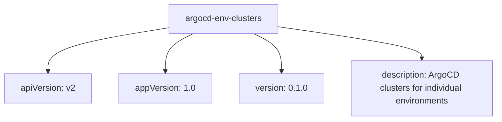
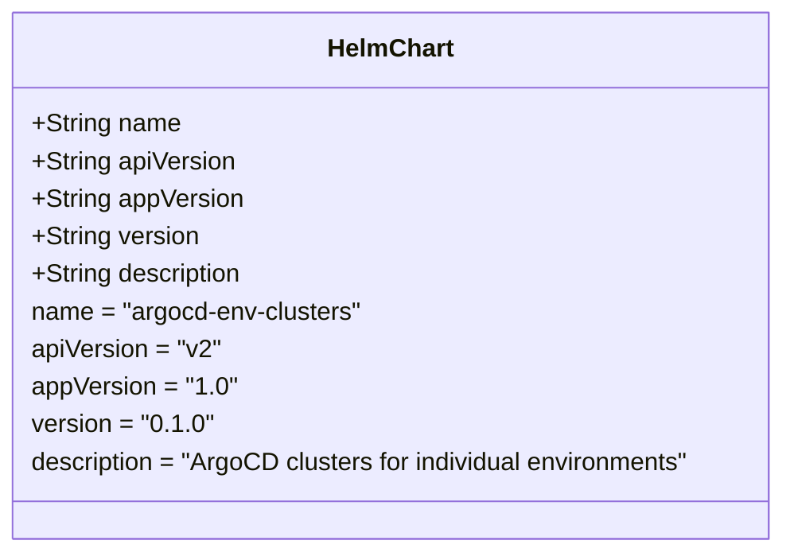
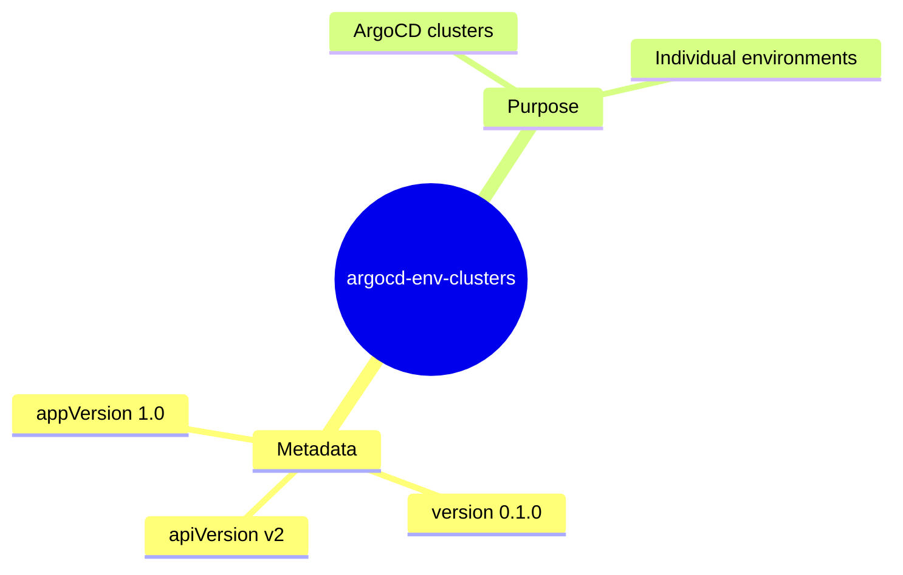

# Diagram: devops/k8s/argocd/clusters/helm/Chart.yaml

> Auto-generated by Obscura crawlers

## Diagram 1

### SVG

<svg id="container" width="907.1875" xmlns="http://www.w3.org/2000/svg" class="flowchart" height="222" viewBox="0 0 907.1875 222" role="graphics-document document" aria-roledescription="flowchart-v2"><g><marker id="container_flowchart-v2-pointEnd" class="marker flowchart-v2" viewBox="0 0 10 10" refX="5" refY="5" markerUnits="userSpaceOnUse" markerWidth="8" markerHeight="8" orient="auto"><path d="M 0 0 L 10 5 L 0 10 z" class="arrowMarkerPath" style="stroke-width: 1; stroke-dasharray: 1, 0;"></path></marker><marker id="container_flowchart-v2-pointStart" class="marker flowchart-v2" viewBox="0 0 10 10" refX="4.5" refY="5" markerUnits="userSpaceOnUse" markerWidth="8" markerHeight="8" orient="auto"><path d="M 0 5 L 10 10 L 10 0 z" class="arrowMarkerPath" style="stroke-width: 1; stroke-dasharray: 1, 0;"></path></marker><marker id="container_flowchart-v2-circleEnd" class="marker flowchart-v2" viewBox="0 0 10 10" refX="11" refY="5" markerUnits="userSpaceOnUse" markerWidth="11" markerHeight="11" orient="auto"><circle cx="5" cy="5" r="5" class="arrowMarkerPath" style="stroke-width: 1; stroke-dasharray: 1, 0;"></circle></marker><marker id="container_flowchart-v2-circleStart" class="marker flowchart-v2" viewBox="0 0 10 10" refX="-1" refY="5" markerUnits="userSpaceOnUse" markerWidth="11" markerHeight="11" orient="auto"><circle cx="5" cy="5" r="5" class="arrowMarkerPath" style="stroke-width: 1; stroke-dasharray: 1, 0;"></circle></marker><marker id="container_flowchart-v2-crossEnd" class="marker cross flowchart-v2" viewBox="0 0 11 11" refX="12" refY="5.2" markerUnits="userSpaceOnUse" markerWidth="11" markerHeight="11" orient="auto"><path d="M 1,1 l 9,9 M 10,1 l -9,9" class="arrowMarkerPath" style="stroke-width: 2; stroke-dasharray: 1, 0;"></path></marker><marker id="container_flowchart-v2-crossStart" class="marker cross flowchart-v2" viewBox="0 0 11 11" refX="-1" refY="5.2" markerUnits="userSpaceOnUse" markerWidth="11" markerHeight="11" orient="auto"><path d="M 1,1 l 9,9 M 10,1 l -9,9" class="arrowMarkerPath" style="stroke-width: 2; stroke-dasharray: 1, 0;"></path></marker><g class="root"><g class="clusters"></g><g class="edgePaths"><path d="M305.934,51.604L269.636,57.504C233.339,63.403,160.743,75.201,124.446,88.601C88.148,102,88.148,117,88.148,124.5L88.148,132" id="L_A_B_0" class="edge-thickness-normal edge-pattern-solid edge-thickness-normal edge-pattern-solid flowchart-link" style=";" data-edge="true" data-et="edge" data-id="L_A_B_0" data-points="W3sieCI6MzA1LjkzMzU5Mzc1LCJ5Ijo1MS42MDQyOTUxMTUxOTE2Mn0seyJ4Ijo4OC4xNDg0Mzc1LCJ5Ijo4N30seyJ4Ijo4OC4xNDg0Mzc1LCJ5IjoxMzZ9XQ==" marker-end="url(#container_flowchart-v2-pointEnd)"></path><path d="M353.463,62L345.032,66.167C336.6,70.333,319.738,78.667,311.306,90.333C302.875,102,302.875,117,302.875,124.5L302.875,132" id="L_A_C_0" class="edge-thickness-normal edge-pattern-solid edge-thickness-normal edge-pattern-solid flowchart-link" style=";" data-edge="true" data-et="edge" data-id="L_A_C_0" data-points="W3sieCI6MzUzLjQ2MjgxNTUwNDgwNzcsInkiOjYyfSx7IngiOjMwMi44NzUsInkiOjg3fSx7IngiOjMwMi44NzUsInkiOjEzNn1d" marker-end="url(#container_flowchart-v2-pointEnd)"></path><path d="M462.732,62L471.164,66.167C479.595,70.333,496.458,78.667,504.889,90.333C513.32,102,513.32,117,513.32,124.5L513.32,132" id="L_A_D_0" class="edge-thickness-normal edge-pattern-solid edge-thickness-normal edge-pattern-solid flowchart-link" style=";" data-edge="true" data-et="edge" data-id="L_A_D_0" data-points="W3sieCI6NDYyLjczMjQ5Njk5NTE5MjMsInkiOjYyfSx7IngiOjUxMy4zMjAzMTI1LCJ5Ijo4N30seyJ4Ijo1MTMuMzIwMzEyNSwieSI6MTM2fV0=" marker-end="url(#container_flowchart-v2-pointEnd)"></path><path d="M510.262,49.712L553.416,55.927C596.57,62.142,682.879,74.571,726.033,84.285C769.188,94,769.188,101,769.188,104.5L769.188,108" id="L_A_E_0" class="edge-thickness-normal edge-pattern-solid edge-thickness-normal edge-pattern-solid flowchart-link" style=";" data-edge="true" data-et="edge" data-id="L_A_E_0" data-points="W3sieCI6NTEwLjI2MTcxODc1LCJ5Ijo0OS43MTI0OTE0ODA4Njg0NjV9LHsieCI6NzY5LjE4NzUsInkiOjg3fSx7IngiOjc2OS4xODc1LCJ5IjoxMTJ9XQ==" marker-end="url(#container_flowchart-v2-pointEnd)"></path></g><g class="edgeLabels"><g class="edgeLabel"><g class="label" data-id="L_A_B_0" transform="translate(0, 0)"><foreignObject width="0" height="0">

</foreignObject></g></g><g class="edgeLabel"><g class="label" data-id="L_A_C_0" transform="translate(0, 0)"><foreignObject width="0" height="0">

</foreignObject></g></g><g class="edgeLabel"><g class="label" data-id="L_A_D_0" transform="translate(0, 0)"><foreignObject width="0" height="0">

</foreignObject></g></g><g class="edgeLabel"><g class="label" data-id="L_A_E_0" transform="translate(0, 0)"><foreignObject width="0" height="0">

</foreignObject></g></g></g><g class="nodes"><g class="node default" id="flowchart-A-0" transform="translate(408.09765625, 35)"><rect class="basic label-container" style="" x="-102.1640625" y="-27" width="204.328125" height="54"></rect><g class="label" style="" transform="translate(-72.1640625, -12)"><rect></rect><foreignObject width="144.328125" height="24">

argocd-env-clusters

</foreignObject></g></g><g class="node default" id="flowchart-B-1" transform="translate(88.1484375, 163)"><rect class="basic label-container" style="" x="-80.1484375" y="-27" width="160.296875" height="54"></rect><g class="label" style="" transform="translate(-50.1484375, -12)"><rect></rect><foreignObject width="100.296875" height="24">

apiVersion: v2

</foreignObject></g></g><g class="node default" id="flowchart-C-3" transform="translate(302.875, 163)"><rect class="basic label-container" style="" x="-84.578125" y="-27" width="169.15625" height="54"></rect><g class="label" style="" transform="translate(-54.578125, -12)"><rect></rect><foreignObject width="109.15625" height="24">

appVersion: 1.0

</foreignObject></g></g><g class="node default" id="flowchart-D-5" transform="translate(513.3203125, 163)"><rect class="basic label-container" style="" x="-75.8671875" y="-27" width="151.734375" height="54"></rect><g class="label" style="" transform="translate(-45.8671875, -12)"><rect></rect><foreignObject width="91.734375" height="24">

version: 0.1.0

</foreignObject></g></g><g class="node default" id="flowchart-E-7" transform="translate(769.1875, 163)"><rect class="basic label-container" style="" x="-130" y="-51" width="260" height="102"></rect><g class="label" style="" transform="translate(-100, -36)"><rect></rect><foreignObject width="200" height="72">

description: ArgoCD clusters for individual environments

</foreignObject></g></g></g></g></g></svg>

## Diagram 2

### SVG

<svg id="container" width="508.390625" xmlns="http://www.w3.org/2000/svg" class="classDiagram" height="352" viewBox="0 0 508.390625 352" role="graphics-document document" aria-roledescription="class"><g><defs><marker id="container_class-aggregationStart" class="marker aggregation class" refX="18" refY="7" markerWidth="190" markerHeight="240" orient="auto"><path d="M 18,7 L9,13 L1,7 L9,1 Z"></path></marker></defs><defs><marker id="container_class-aggregationEnd" class="marker aggregation class" refX="1" refY="7" markerWidth="20" markerHeight="28" orient="auto"><path d="M 18,7 L9,13 L1,7 L9,1 Z"></path></marker></defs><defs><marker id="container_class-extensionStart" class="marker extension class" refX="18" refY="7" markerWidth="190" markerHeight="240" orient="auto"><path d="M 1,7 L18,13 V 1 Z"></path></marker></defs><defs><marker id="container_class-extensionEnd" class="marker extension class" refX="1" refY="7" markerWidth="20" markerHeight="28" orient="auto"><path d="M 1,1 V 13 L18,7 Z"></path></marker></defs><defs><marker id="container_class-compositionStart" class="marker composition class" refX="18" refY="7" markerWidth="190" markerHeight="240" orient="auto"><path d="M 18,7 L9,13 L1,7 L9,1 Z"></path></marker></defs><defs><marker id="container_class-compositionEnd" class="marker composition class" refX="1" refY="7" markerWidth="20" markerHeight="28" orient="auto"><path d="M 18,7 L9,13 L1,7 L9,1 Z"></path></marker></defs><defs><marker id="container_class-dependencyStart" class="marker dependency class" refX="6" refY="7" markerWidth="190" markerHeight="240" orient="auto"><path d="M 5,7 L9,13 L1,7 L9,1 Z"></path></marker></defs><defs><marker id="container_class-dependencyEnd" class="marker dependency class" refX="13" refY="7" markerWidth="20" markerHeight="28" orient="auto"><path d="M 18,7 L9,13 L14,7 L9,1 Z"></path></marker></defs><defs><marker id="container_class-lollipopStart" class="marker lollipop class" refX="13" refY="7" markerWidth="190" markerHeight="240" orient="auto"><circle stroke="black" fill="transparent" cx="7" cy="7" r="6"></circle></marker></defs><defs><marker id="container_class-lollipopEnd" class="marker lollipop class" refX="1" refY="7" markerWidth="190" markerHeight="240" orient="auto"><circle stroke="black" fill="transparent" cx="7" cy="7" r="6"></circle></marker></defs><g class="root"><g class="clusters"></g><g class="edgePaths"></g><g class="edgeLabels"></g><g class="nodes"><g class="node default" id="classId-HelmChart-0" transform="translate(254.1953125, 176)"><g class="basic label-container"><path d="M-246.1953125 -168 L246.1953125 -168 L246.1953125 168 L-246.1953125 168" stroke="none" stroke-width="0" fill="#ECECFF" style=""></path><path d="M-246.1953125 -168 C-67.00116469660401 -168, 112.19298310679198 -168, 246.1953125 -168 M-246.1953125 -168 C-111.29783209743636 -168, 23.59964830512729 -168, 246.1953125 -168 M246.1953125 -168 C246.1953125 -56.155253055725936, 246.1953125 55.68949388854813, 246.1953125 168 M246.1953125 -168 C246.1953125 -69.33898959186575, 246.1953125 29.32202081626849, 246.1953125 168 M246.1953125 168 C145.13222068720876 168, 44.06912887441749 168, -246.1953125 168 M246.1953125 168 C88.59922034167425 168, -68.99687181665149 168, -246.1953125 168 M-246.1953125 168 C-246.1953125 57.455902413988056, -246.1953125 -53.08819517202389, -246.1953125 -168 M-246.1953125 168 C-246.1953125 83.55842807405396, -246.1953125 -0.883143851892072, -246.1953125 -168" stroke="#9370DB" stroke-width="1.3" fill="none" stroke-dasharray="0 0" style=""></path></g><g class="annotation-group text" transform="translate(0, -144)"></g><g class="label-group text" transform="translate(-38.703125, -144)"><g class="label" style="font-weight: bolder" transform="translate(0,-12)"><foreignObject width="77.40625" height="24">

HelmChart

</foreignObject></g></g><g class="members-group text" transform="translate(-234.1953125, -96)"><g class="label" style="" transform="translate(0,-12)"><foreignObject width="94.984375" height="24">

+String name

</foreignObject></g><g class="label" style="" transform="translate(0,12)"><foreignObject width="131.046875" height="24">

+String apiVersion

</foreignObject></g><g class="label" style="" transform="translate(0,36)"><foreignObject width="136.046875" height="24">

+String appVersion

</foreignObject></g><g class="label" style="" transform="translate(0,60)"><foreignObject width="107.640625" height="24">

+String version

</foreignObject></g><g class="label" style="" transform="translate(0,84)"><foreignObject width="137.078125" height="24">

+String description

</foreignObject></g><g class="label" style="" transform="translate(0,108)"><foreignObject width="213.609375" height="24">

name = "argocd-env-clusters"

</foreignObject></g><g class="label" style="" transform="translate(0,132)"><foreignObject width="121.46875" height="24">

apiVersion = "v2"

</foreignObject></g><g class="label" style="" transform="translate(0,156)"><foreignObject width="130.171875" height="24">

appVersion = "1.0"

</foreignObject></g><g class="label" style="" transform="translate(0,180)"><foreignObject width="112.578125" height="24">

version = "0.1.0"

</foreignObject></g><g class="label" style="" transform="translate(0,204)"><foreignObject width="429.6875" height="24">

description = "ArgoCD clusters for individual environments"

</foreignObject></g></g><g class="methods-group text" transform="translate(-234.1953125, 168)"></g><g class="divider" style=""><path d="M-246.1953125 -120 C-59.9518326819543 -120, 126.2916471360914 -120, 246.1953125 -120 M-246.1953125 -120 C-126.74090079281744 -120, -7.286489085634884 -120, 246.1953125 -120" stroke="#9370DB" stroke-width="1.3" fill="none" stroke-dasharray="0 0" style=""></path></g><g class="divider" style=""><path d="M-246.1953125 144 C-137.71699303786062 144, -29.238673575721208 144, 246.1953125 144 M-246.1953125 144 C-126.47754511656133 144, -6.759777733122661 144, 246.1953125 144" stroke="#9370DB" stroke-width="1.3" fill="none" stroke-dasharray="0 0" style=""></path></g></g></g></g></g></svg>

## Diagram 3

### SVG

<svg id="container" width="100%" xmlns="http://www.w3.org/2000/svg" class="mindmapDiagram" style="max-width: 749.69091796875px;" viewBox="5 5 749.69091796875 480.0986328125" role="graphics-document document" aria-roledescription="mindmap"><g><marker id="container_mindmap-pointEnd" class="marker mindmap" viewBox="0 0 10 10" refX="5" refY="5" markerUnits="userSpaceOnUse" markerWidth="8" markerHeight="8" orient="auto"><path d="M 0 0 L 10 5 L 0 10 z" class="arrowMarkerPath" style="stroke-width: 1; stroke-dasharray: 1, 0;"></path></marker><marker id="container_mindmap-pointStart" class="marker mindmap" viewBox="0 0 10 10" refX="4.5" refY="5" markerUnits="userSpaceOnUse" markerWidth="8" markerHeight="8" orient="auto"><path d="M 0 5 L 10 10 L 10 0 z" class="arrowMarkerPath" style="stroke-width: 1; stroke-dasharray: 1, 0;"></path></marker><g class="subgraphs"></g><g class="edgePaths"><path d="M349.185,257.453L342.823,267.415C336.461,277.378,323.738,297.303,311.014,317.228C298.29,337.154,285.566,357.079,279.204,367.042L272.842,377.004" id="edge_0_1" class="edge-thickness-normal edge-pattern-solid edge section-edge-0 edge-depth-1" style="undefined;;;undefined" data-edge="true" data-et="edge" data-id="edge_0_1" data-points="W3sieCI6MzQ5LjE4NTI1OTYyOTAxNjMsInkiOjI1Ny40NTI2ODQ0NDcxOTI3fSx7IngiOjMxMS4wMTM3NDQyMDk0OTc3LCJ5IjozMTcuMjI4NDYzODYyNTUwM30seyJ4IjoyNzIuODQyMjI4Nzg5OTc5MSwieSI6Mzc3LjAwNDI0MzI3NzkwNzl9XQ=="></path><path d="M253.164,399.15L248.132,403.271C243.101,407.391,233.038,415.632,222.975,423.873C212.912,432.113,202.849,440.354,197.817,444.475L192.785,448.595" id="edge_1_2" class="edge-thickness-normal edge-pattern-solid edge section-edge-0 edge-depth-3" style="undefined;;;undefined" data-edge="true" data-et="edge" data-id="edge_1_2" data-points="W3sieCI6MjUzLjE2Mzk4OTQ5NzUxNzEsInkiOjM5OS4xNTAxMzA1MDQzODl9LHsieCI6MjIyLjk3NDc0MjI4NTA0MDUyLCJ5Ijo0MjMuODcyNTU1MzQwMDU0OX0seyJ4IjoxOTIuNzg1NDk1MDcyNTYzOTUsInkiOjQ0OC41OTQ5ODAxNzU3MjA3Nn1d"></path><path d="M278.663,395.3L287.489,398.891C296.315,402.482,313.966,409.664,331.618,416.847C349.27,424.029,366.921,431.211,375.747,434.803L384.573,438.394" id="edge_1_3" class="edge-thickness-normal edge-pattern-solid edge section-edge-0 edge-depth-3" style="undefined;;;undefined" data-edge="true" data-et="edge" data-id="edge_1_3" data-points="W3sieCI6Mjc4LjY2MzA2MDcwMDE4NDIsInkiOjM5NS4yOTk3ODg2MTQzNzc3NX0seyJ4IjozMzEuNjE4MDE0NzU3NjcxMSwieSI6NDE2Ljg0Njc3NjM0MTE2MDJ9LHsieCI6Mzg0LjU3Mjk2ODgxNTE1ODA1LCJ5Ijo0MzguMzkzNzY0MDY3OTQyNjR9XQ=="></path><path d="M250.192,386.111L237.862,383.12C225.532,380.13,200.872,374.149,176.213,368.168C151.553,362.187,126.893,356.206,114.563,353.215L102.234,350.225" id="edge_1_4" class="edge-thickness-normal edge-pattern-solid edge section-edge-0 edge-depth-3" style="undefined;;;undefined" data-edge="true" data-et="edge" data-id="edge_1_4" data-points="W3sieCI6MjUwLjE5MTgxNzgzODkzMDc3LCJ5IjozODYuMTEwODU0Njk2Mjc2N30seyJ4IjoxNzYuMjEyNzE0MTE3Mjc2OSwieSI6MzY4LjE2Nzg1ODAyMzI1NjI2fSx7IngiOjEwMi4yMzM2MTAzOTU2MjMwMywieSI6MzUwLjIyNDg2MTM1MDIzNTh9XQ=="></path><path d="M365.006,231.966L371.035,221.97C377.064,211.974,389.123,191.982,401.181,171.99C413.24,151.998,425.298,132.006,431.327,122.01L437.357,112.013" id="edge_0_5" class="edge-thickness-normal edge-pattern-solid edge section-edge-1 edge-depth-1" style="undefined;;;undefined" data-edge="true" data-et="edge" data-id="edge_0_5" data-points="W3sieCI6MzY1LjAwNTYwMDMyNjY3ODgsInkiOjIzMS45NjYwMjQ5NjE0MTc1Nn0seyJ4Ijo0MDEuMTgxMDg3NzU4NTM3NSwieSI6MTcxLjk4OTc0MDcwODAyNjJ9LHsieCI6NDM3LjM1NjU3NTE5MDM5NjIsInkiOjExMi4wMTM0NTY0NTQ2MzQ4NX1d"></path><path d="M433.25,89.977L428.007,85.912C422.765,81.846,412.279,73.715,401.794,65.585C391.308,57.454,380.823,49.323,375.58,45.257L370.338,41.192" id="edge_5_6" class="edge-thickness-normal edge-pattern-solid edge section-edge-1 edge-depth-3" style="undefined;;;undefined" data-edge="true" data-et="edge" data-id="edge_5_6" data-points="W3sieCI6NDMzLjI1MDE5NDg0Mjg0NTY0LCJ5Ijo4OS45NzcxNTA4NTIxNTQzN30seyJ4Ijo0MDEuNzkzODg4NjA1ODY2ODcsInkiOjY1LjU4NDUxMTAxOTYwODA0fSx7IngiOjM3MC4zMzc1ODIzNjg4ODgxLCJ5Ijo0MS4xOTE4NzExODcwNjE3Mn1d"></path><path d="M459.832,96.327L473.311,93.726C486.79,91.125,513.748,85.922,540.706,80.72C567.664,75.518,594.622,70.316,608.101,67.715L621.58,65.114" id="edge_5_7" class="edge-thickness-normal edge-pattern-solid edge section-edge-1 edge-depth-3" style="undefined;;;undefined" data-edge="true" data-et="edge" data-id="edge_5_7" data-points="W3sieCI6NDU5LjgzMjEzOTgwNTQ4MzYsInkiOjk2LjMyNjg1MTkwODQyMDE3fSx7IngiOjU0MC43MDU5OTM0NDg1NzE5LCJ5Ijo4MC43MjAzMjIzMzA4NzQ1OH0seyJ4Ijo2MjEuNTc5ODQ3MDkxNjYwMiwieSI6NjUuMTEzNzkyNzUzMzI5fV0="></path></g><g class="edgeLabels"><g class="edgeLabel"><g class="label" data-id="edge_0_1" transform="translate(0, 0)"><foreignObject width="0" height="0">

</foreignObject></g></g><g class="edgeLabel"><g class="label" data-id="edge_1_2" transform="translate(0, 0)"><foreignObject width="0" height="0">

</foreignObject></g></g><g class="edgeLabel"><g class="label" data-id="edge_1_3" transform="translate(0, 0)"><foreignObject width="0" height="0">

</foreignObject></g></g><g class="edgeLabel"><g class="label" data-id="edge_1_4" transform="translate(0, 0)"><foreignObject width="0" height="0">

</foreignObject></g></g><g class="edgeLabel"><g class="label" data-id="edge_0_5" transform="translate(0, 0)"><foreignObject width="0" height="0">

</foreignObject></g></g><g class="edgeLabel"><g class="label" data-id="edge_5_6" transform="translate(0, 0)"><foreignObject width="0" height="0">

</foreignObject></g></g><g class="edgeLabel"><g class="label" data-id="edge_5_7" transform="translate(0, 0)"><foreignObject width="0" height="0">

</foreignObject></g></g></g><g class="nodes"><g class="node mindmap-node section-root section--1" id="node_0" transform="translate(357.2583101844416, 244.81045937683632)"><circle class="basic label-container" style="" r="82.1640625" cx="0" cy="0"></circle><g class="label" style="" transform="translate(-72.1640625, -12)"><rect></rect><foreignObject width="144.328125" height="24">

argocd-env-clusters

</foreignObject></g></g><g class="node mindmap-node section-0" id="node_1" transform="translate(264.7691782345538, 389.6464683482643)"><path id="node-1" class="node-bkg node-0" style="" d="M-54.09375 12
    v-24
    q0,-5 5,-5
    h98.1875
    q5,0 5,5
    v24
    q0,5 -5,5
    h-98.1875
    q-5,0 -5,-5
    Z"></path><line class="node-line-" x1="-54.09375" y1="17" x2="54.09375" y2="17"></line><g class="label" style="" transform="translate(-34.09375, -12)"><rect></rect><foreignObject width="68.1875" height="24">

Metadata

</foreignObject></g></g><g class="node mindmap-node section-0" id="node_2" transform="translate(181.18030633552723, 458.09864233184544)"><path id="node-2" class="node-bkg node-0" style="" d="M-68.2265625 12
    v-24
    q0,-5 5,-5
    h126.453125
    q5,0 5,5
    v24
    q0,5 -5,5
    h-126.453125
    q-5,0 -5,-5
    Z"></path><line class="node-line-" x1="-68.2265625" y1="17" x2="68.2265625" y2="17"></line><g class="label" style="" transform="translate(-48.2265625, -12)"><rect></rect><foreignObject width="96.453125" height="24">

apiVersion v2

</foreignObject></g></g><g class="node mindmap-node section-0" id="node_3" transform="translate(398.46685128078843, 444.0470843340561)"><path id="node-3" class="node-bkg node-0" style="" d="M-63.9453125 12
    v-24
    q0,-5 5,-5
    h117.890625
    q5,0 5,5
    v24
    q0,5 -5,5
    h-117.890625
    q-5,0 -5,-5
    Z"></path><line class="node-line-" x1="-63.9453125" y1="17" x2="63.9453125" y2="17"></line><g class="label" style="" transform="translate(-43.9453125, -12)"><rect></rect><foreignObject width="87.890625" height="24">

version 0.1.0

</foreignObject></g></g><g class="node mindmap-node section-0" id="node_4" transform="translate(87.65625, 346.6892476982482)"><path id="node-4" class="node-bkg node-0" style="" d="M-72.65625 12
    v-24
    q0,-5 5,-5
    h135.3125
    q5,0 5,5
    v24
    q0,5 -5,5
    h-135.3125
    q-5,0 -5,-5
    Z"></path><line class="node-line-" x1="-72.65625" y1="17" x2="72.65625" y2="17"></line><g class="label" style="" transform="translate(-52.65625, -12)"><rect></rect><foreignObject width="105.3125" height="24">

appVersion 1.0

</foreignObject></g></g><g class="node mindmap-node section-1" id="node_5" transform="translate(445.1038653326334, 99.16902203921609)"><path id="node-5" class="node-bkg node-0" style="" d="M-49.703125 12
    v-24
    q0,-5 5,-5
    h89.40625
    q5,0 5,5
    v24
    q0,5 -5,5
    h-89.40625
    q-5,0 -5,-5
    Z"></path><line class="node-line-" x1="-49.703125" y1="17" x2="49.703125" y2="17"></line><g class="label" style="" transform="translate(-29.703125, -12)"><rect></rect><foreignObject width="59.40625" height="24">

Purpose

</foreignObject></g></g><g class="node mindmap-node section-1" id="node_6" transform="translate(358.48391187910033, 32)"><path id="node-6" class="node-bkg node-0" style="" d="M-76.40625 12
    v-24
    q0,-5 5,-5
    h142.8125
    q5,0 5,5
    v24
    q0,5 -5,5
    h-142.8125
    q-5,0 -5,-5
    Z"></path><line class="node-line-" x1="-76.40625" y1="17" x2="76.40625" y2="17"></line><g class="label" style="" transform="translate(-56.40625, -12)"><rect></rect><foreignObject width="112.8125" height="24">

ArgoCD clusters

</foreignObject></g></g><g class="node mindmap-node section-1" id="node_7" transform="translate(636.3081215645104, 62.27162262253307)"><path id="node-7" class="node-bkg node-0" style="" d="M-108.3828125 12
    v-24
    q0,-5 5,-5
    h206.765625
    q5,0 5,5
    v24
    q0,5 -5,5
    h-206.765625
    q-5,0 -5,-5
    Z"></path><line class="node-line-" x1="-108.3828125" y1="17" x2="108.3828125" y2="17"></line><g class="label" style="" transform="translate(-88.3828125, -12)"><rect></rect><foreignObject width="176.765625" height="24">

Individual environments

</foreignObject></g></g></g></g></svg>
