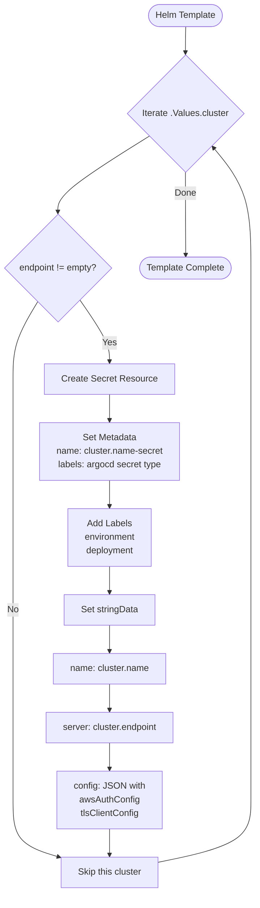
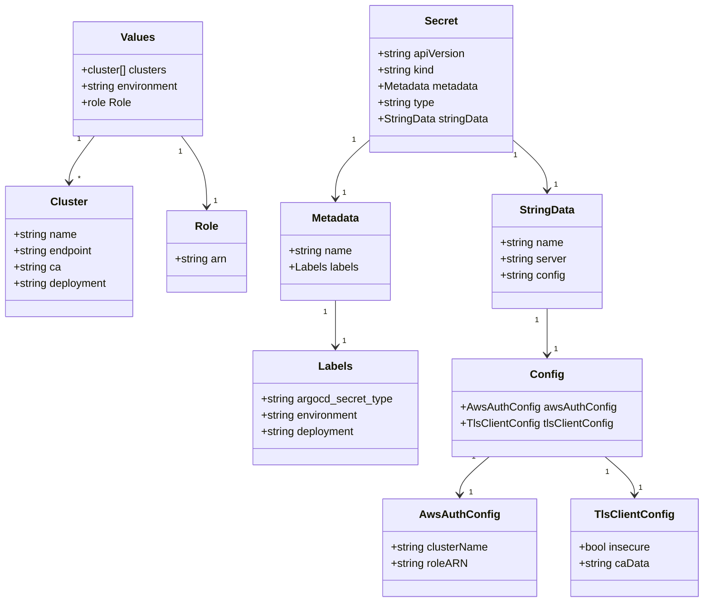
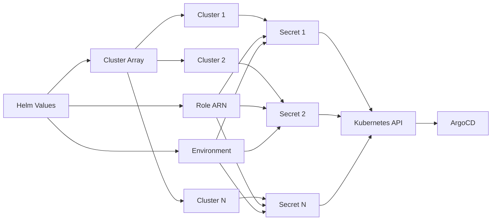

# Diagram: devops/k8s/argocd/clusters/helm/templates/main.yaml

> Auto-generated by Obscura crawlers

## Diagram 1

### SVG

<svg id="container" width="458.0419921875" xmlns="http://www.w3.org/2000/svg" class="flowchart" height="1580.953125" viewBox="0.5 0 458.0419921875 1580.953125" role="graphics-document document" aria-roledescription="flowchart-v2"><g><marker id="container_flowchart-v2-pointEnd" class="marker flowchart-v2" viewBox="0 0 10 10" refX="5" refY="5" markerUnits="userSpaceOnUse" markerWidth="8" markerHeight="8" orient="auto"><path d="M 0 0 L 10 5 L 0 10 z" class="arrowMarkerPath" style="stroke-width: 1; stroke-dasharray: 1, 0;"></path></marker><marker id="container_flowchart-v2-pointStart" class="marker flowchart-v2" viewBox="0 0 10 10" refX="4.5" refY="5" markerUnits="userSpaceOnUse" markerWidth="8" markerHeight="8" orient="auto"><path d="M 0 5 L 10 10 L 10 0 z" class="arrowMarkerPath" style="stroke-width: 1; stroke-dasharray: 1, 0;"></path></marker><marker id="container_flowchart-v2-circleEnd" class="marker flowchart-v2" viewBox="0 0 10 10" refX="11" refY="5" markerUnits="userSpaceOnUse" markerWidth="11" markerHeight="11" orient="auto"><circle cx="5" cy="5" r="5" class="arrowMarkerPath" style="stroke-width: 1; stroke-dasharray: 1, 0;"></circle></marker><marker id="container_flowchart-v2-circleStart" class="marker flowchart-v2" viewBox="0 0 10 10" refX="-1" refY="5" markerUnits="userSpaceOnUse" markerWidth="11" markerHeight="11" orient="auto"><circle cx="5" cy="5" r="5" class="arrowMarkerPath" style="stroke-width: 1; stroke-dasharray: 1, 0;"></circle></marker><marker id="container_flowchart-v2-crossEnd" class="marker cross flowchart-v2" viewBox="0 0 11 11" refX="12" refY="5.2" markerUnits="userSpaceOnUse" markerWidth="11" markerHeight="11" orient="auto"><path d="M 1,1 l 9,9 M 10,1 l -9,9" class="arrowMarkerPath" style="stroke-width: 2; stroke-dasharray: 1, 0;"></path></marker><marker id="container_flowchart-v2-crossStart" class="marker cross flowchart-v2" viewBox="0 0 11 11" refX="-1" refY="5.2" markerUnits="userSpaceOnUse" markerWidth="11" markerHeight="11" orient="auto"><path d="M 1,1 l 9,9 M 10,1 l -9,9" class="arrowMarkerPath" style="stroke-width: 2; stroke-dasharray: 1, 0;"></path></marker><g class="root"><g class="clusters"></g><g class="edgePaths"><path d="M333.717,47.5L333.633,51.583C333.55,55.667,333.383,63.833,333.3,71.417C333.217,79,333.217,86,333.217,89.5L333.217,93" id="L_Start_Loop_0" class="edge-thickness-normal edge-pattern-solid edge-thickness-normal edge-pattern-solid flowchart-link" style=";" data-edge="true" data-et="edge" data-id="L_Start_Loop_0" data-points="W3sieCI6MzMzLjcxNjU0NTEwNDk4MDQ3LCJ5Ijo0Ny40OTk5OTk5OTk5OTk5OH0seyJ4IjozMzMuMjE2NTQ1MTA0OTgwNDcsInkiOjcyfSx7IngiOjMzMy4yMTY1NDUxMDQ5ODA0NywieSI6OTd9XQ==" marker-end="url(#container_flowchart-v2-pointEnd)"></path><path d="M268.638,241.484L241.272,258.413C213.907,275.343,159.176,309.203,131.811,331.633C104.445,354.063,104.445,365.063,104.445,370.563L104.445,376.063" id="L_Loop_CheckEndpoint_0" class="edge-thickness-normal edge-pattern-solid edge-thickness-normal edge-pattern-solid flowchart-link" style=";" data-edge="true" data-et="edge" data-id="L_Loop_CheckEndpoint_0" data-points="W3sieCI6MjY4LjYzNzYwMjEyODM4MzQsInkiOjI0MS40ODM1NTcwMjM0MDI5fSx7IngiOjEwNC40NDUzMTI1LCJ5IjozNDMuMDYyNX0seyJ4IjoxMDQuNDQ1MzEyNSwieSI6MzgwLjA2MjV9XQ==" marker-end="url(#container_flowchart-v2-pointEnd)"></path><path d="M143.96,533.438L152.811,546.191C161.663,558.943,179.365,584.448,188.217,602.701C197.068,620.953,197.068,631.953,197.068,637.453L197.068,642.953" id="L_CheckEndpoint_CreateSecret_0" class="edge-thickness-normal edge-pattern-solid edge-thickness-normal edge-pattern-solid flowchart-link" style=";" data-edge="true" data-et="edge" data-id="L_CheckEndpoint_CreateSecret_0" data-points="W3sieCI6MTQzLjk2MDEwNTI0NjE0MTksInkiOjUzMy40MzgzMzIyNTM4NTgxfSx7IngiOjE5Ny4wNjgxMDc2MDQ5ODA0NywieSI6NjA5Ljk1MzEyNX0seyJ4IjoxOTcuMDY4MTA3NjA0OTgwNDcsInkiOjY0Ni45NTMxMjV9XQ==" marker-end="url(#container_flowchart-v2-pointEnd)"></path><path d="M68.177,536.685L60.818,548.896C53.458,561.108,38.739,585.53,31.379,608.408C24.02,631.286,24.02,652.62,24.02,671.953C24.02,691.286,24.02,708.62,24.02,729.953C24.02,751.286,24.02,776.62,24.02,801.953C24.02,827.286,24.02,852.62,24.02,877.953C24.02,903.286,24.02,928.62,24.02,953.953C24.02,979.286,24.02,1004.62,24.02,1025.953C24.02,1047.286,24.02,1064.62,24.02,1081.953C24.02,1099.286,24.02,1116.62,24.02,1133.953C24.02,1151.286,24.02,1168.62,24.02,1185.953C24.02,1203.286,24.02,1220.62,24.02,1237.953C24.02,1255.286,24.02,1272.62,24.02,1289.953C24.02,1307.286,24.02,1324.62,24.02,1345.953C24.02,1367.286,24.02,1392.62,24.02,1417.953C24.02,1443.286,24.02,1468.62,37.547,1485.351C51.074,1502.083,78.128,1510.212,91.655,1514.277L105.183,1518.342" id="L_CheckEndpoint_Skip_0" class="edge-thickness-normal edge-pattern-solid edge-thickness-normal edge-pattern-solid flowchart-link" style=";" data-edge="true" data-et="edge" data-id="L_CheckEndpoint_Skip_0" data-points="W3sieCI6NjguMTc3MjUyNzU1NjU3NDMsInkiOjUzNi42ODUwNjUyNTU2NTc0fSx7IngiOjI0LjAxOTUzMTI1LCJ5Ijo2MDkuOTUzMTI1fSx7IngiOjI0LjAxOTUzMTI1LCJ5Ijo2NzMuOTUzMTI1fSx7IngiOjI0LjAxOTUzMTI1LCJ5Ijo3MjUuOTUzMTI1fSx7IngiOjI0LjAxOTUzMTI1LCJ5Ijo4MDEuOTUzMTI1fSx7IngiOjI0LjAxOTUzMTI1LCJ5Ijo4NzcuOTUzMTI1fSx7IngiOjI0LjAxOTUzMTI1LCJ5Ijo5NTMuOTUzMTI1fSx7IngiOjI0LjAxOTUzMTI1LCJ5IjoxMDI5Ljk1MzEyNX0seyJ4IjoyNC4wMTk1MzEyNSwieSI6MTA4MS45NTMxMjV9LHsieCI6MjQuMDE5NTMxMjUsInkiOjExMzMuOTUzMTI1fSx7IngiOjI0LjAxOTUzMTI1LCJ5IjoxMTg1Ljk1MzEyNX0seyJ4IjoyNC4wMTk1MzEyNSwieSI6MTIzNy45NTMxMjV9LHsieCI6MjQuMDE5NTMxMjUsInkiOjEyODkuOTUzMTI1fSx7IngiOjI0LjAxOTUzMTI1LCJ5IjoxMzQxLjk1MzEyNX0seyJ4IjoyNC4wMTk1MzEyNSwieSI6MTQxNy45NTMxMjV9LHsieCI6MjQuMDE5NTMxMjUsInkiOjE0OTMuOTUzMTI1fSx7IngiOjEwOS4wMTM0MjAxMDQ5ODA0NywieSI6MTUxOS40OTMyNDk3MDY5MDc0fV0=" marker-end="url(#container_flowchart-v2-pointEnd)"></path><path d="M197.068,700.953L197.068,705.12C197.068,709.286,197.068,717.62,197.068,725.286C197.068,732.953,197.068,739.953,197.068,743.453L197.068,746.953" id="L_CreateSecret_SetMetadata_0" class="edge-thickness-normal edge-pattern-solid edge-thickness-normal edge-pattern-solid flowchart-link" style=";" data-edge="true" data-et="edge" data-id="L_CreateSecret_SetMetadata_0" data-points="W3sieCI6MTk3LjA2ODEwNzYwNDk4MDQ3LCJ5Ijo3MDAuOTUzMTI1fSx7IngiOjE5Ny4wNjgxMDc2MDQ5ODA0NywieSI6NzI1Ljk1MzEyNX0seyJ4IjoxOTcuMDY4MTA3NjA0OTgwNDcsInkiOjc1MC45NTMxMjV9XQ==" marker-end="url(#container_flowchart-v2-pointEnd)"></path><path d="M197.068,852.953L197.068,857.12C197.068,861.286,197.068,869.62,197.068,877.286C197.068,884.953,197.068,891.953,197.068,895.453L197.068,898.953" id="L_SetMetadata_AddLabels_0" class="edge-thickness-normal edge-pattern-solid edge-thickness-normal edge-pattern-solid flowchart-link" style=";" data-edge="true" data-et="edge" data-id="L_SetMetadata_AddLabels_0" data-points="W3sieCI6MTk3LjA2ODEwNzYwNDk4MDQ3LCJ5Ijo4NTIuOTUzMTI1fSx7IngiOjE5Ny4wNjgxMDc2MDQ5ODA0NywieSI6ODc3Ljk1MzEyNX0seyJ4IjoxOTcuMDY4MTA3NjA0OTgwNDcsInkiOjkwMi45NTMxMjV9XQ==" marker-end="url(#container_flowchart-v2-pointEnd)"></path><path d="M197.068,1004.953L197.068,1009.12C197.068,1013.286,197.068,1021.62,197.068,1029.286C197.068,1036.953,197.068,1043.953,197.068,1047.453L197.068,1050.953" id="L_AddLabels_SetStringData_0" class="edge-thickness-normal edge-pattern-solid edge-thickness-normal edge-pattern-solid flowchart-link" style=";" data-edge="true" data-et="edge" data-id="L_AddLabels_SetStringData_0" data-points="W3sieCI6MTk3LjA2ODEwNzYwNDk4MDQ3LCJ5IjoxMDA0Ljk1MzEyNX0seyJ4IjoxOTcuMDY4MTA3NjA0OTgwNDcsInkiOjEwMjkuOTUzMTI1fSx7IngiOjE5Ny4wNjgxMDc2MDQ5ODA0NywieSI6MTA1NC45NTMxMjV9XQ==" marker-end="url(#container_flowchart-v2-pointEnd)"></path><path d="M197.068,1108.953L197.068,1113.12C197.068,1117.286,197.068,1125.62,197.068,1133.286C197.068,1140.953,197.068,1147.953,197.068,1151.453L197.068,1154.953" id="L_SetStringData_AddName_0" class="edge-thickness-normal edge-pattern-solid edge-thickness-normal edge-pattern-solid flowchart-link" style=";" data-edge="true" data-et="edge" data-id="L_SetStringData_AddName_0" data-points="W3sieCI6MTk3LjA2ODEwNzYwNDk4MDQ3LCJ5IjoxMTA4Ljk1MzEyNX0seyJ4IjoxOTcuMDY4MTA3NjA0OTgwNDcsInkiOjExMzMuOTUzMTI1fSx7IngiOjE5Ny4wNjgxMDc2MDQ5ODA0NywieSI6MTE1OC45NTMxMjV9XQ==" marker-end="url(#container_flowchart-v2-pointEnd)"></path><path d="M197.068,1212.953L197.068,1217.12C197.068,1221.286,197.068,1229.62,197.068,1237.286C197.068,1244.953,197.068,1251.953,197.068,1255.453L197.068,1258.953" id="L_AddName_AddServer_0" class="edge-thickness-normal edge-pattern-solid edge-thickness-normal edge-pattern-solid flowchart-link" style=";" data-edge="true" data-et="edge" data-id="L_AddName_AddServer_0" data-points="W3sieCI6MTk3LjA2ODEwNzYwNDk4MDQ3LCJ5IjoxMjEyLjk1MzEyNX0seyJ4IjoxOTcuMDY4MTA3NjA0OTgwNDcsInkiOjEyMzcuOTUzMTI1fSx7IngiOjE5Ny4wNjgxMDc2MDQ5ODA0NywieSI6MTI2Mi45NTMxMjV9XQ==" marker-end="url(#container_flowchart-v2-pointEnd)"></path><path d="M197.068,1316.953L197.068,1321.12C197.068,1325.286,197.068,1333.62,197.068,1341.286C197.068,1348.953,197.068,1355.953,197.068,1359.453L197.068,1362.953" id="L_AddServer_AddConfig_0" class="edge-thickness-normal edge-pattern-solid edge-thickness-normal edge-pattern-solid flowchart-link" style=";" data-edge="true" data-et="edge" data-id="L_AddServer_AddConfig_0" data-points="W3sieCI6MTk3LjA2ODEwNzYwNDk4MDQ3LCJ5IjoxMzE2Ljk1MzEyNX0seyJ4IjoxOTcuMDY4MTA3NjA0OTgwNDcsInkiOjEzNDEuOTUzMTI1fSx7IngiOjE5Ny4wNjgxMDc2MDQ5ODA0NywieSI6MTM2Ni45NTMxMjV9XQ==" marker-end="url(#container_flowchart-v2-pointEnd)"></path><path d="M197.068,1468.953L197.068,1473.12C197.068,1477.286,197.068,1485.62,197.068,1493.286C197.068,1500.953,197.068,1507.953,197.068,1511.453L197.068,1514.953" id="L_AddConfig_Skip_0" class="edge-thickness-normal edge-pattern-solid edge-thickness-normal edge-pattern-solid flowchart-link" style=";" data-edge="true" data-et="edge" data-id="L_AddConfig_Skip_0" data-points="W3sieCI6MTk3LjA2ODEwNzYwNDk4MDQ3LCJ5IjoxNDY4Ljk1MzEyNX0seyJ4IjoxOTcuMDY4MTA3NjA0OTgwNDcsInkiOjE0OTMuOTUzMTI1fSx7IngiOjE5Ny4wNjgxMDc2MDQ5ODA0NywieSI6MTUxOC45NTMxMjV9XQ==" marker-end="url(#container_flowchart-v2-pointEnd)"></path><path d="M285.123,1527.889L312.693,1522.233C340.263,1516.577,395.403,1505.265,422.973,1486.942C450.542,1468.62,450.542,1443.286,450.542,1417.953C450.542,1392.62,450.542,1367.286,450.542,1345.953C450.542,1324.62,450.542,1307.286,450.542,1289.953C450.542,1272.62,450.542,1255.286,450.542,1237.953C450.542,1220.62,450.542,1203.286,450.542,1185.953C450.542,1168.62,450.542,1151.286,450.542,1133.953C450.542,1116.62,450.542,1099.286,450.542,1081.953C450.542,1064.62,450.542,1047.286,450.542,1025.953C450.542,1004.62,450.542,979.286,450.542,953.953C450.542,928.62,450.542,903.286,450.542,877.953C450.542,852.62,450.542,827.286,450.542,801.953C450.542,776.62,450.542,751.286,450.542,729.953C450.542,708.62,450.542,691.286,450.542,671.953C450.542,652.62,450.542,631.286,450.542,598.379C450.542,565.471,450.542,520.99,450.542,476.508C450.542,432.026,450.542,387.544,439.31,351.754C428.078,315.963,405.613,288.863,394.38,275.313L383.148,261.764" id="L_Skip_Loop_0" class="edge-thickness-normal edge-pattern-solid edge-thickness-normal edge-pattern-solid flowchart-link" style=";" data-edge="true" data-et="edge" data-id="L_Skip_Loop_0" data-points="W3sieCI6Mjg1LjEyMjc5NTEwNDk4MDQ3LCJ5IjoxNTI3Ljg4ODc5NzczMTI5OTV9LHsieCI6NDUwLjU0MjQ2NTIwOTk2MDk0LCJ5IjoxNDkzLjk1MzEyNX0seyJ4Ijo0NTAuNTQyNDY1MjA5OTYwOTQsInkiOjE0MTcuOTUzMTI1fSx7IngiOjQ1MC41NDI0NjUyMDk5NjA5NCwieSI6MTM0MS45NTMxMjV9LHsieCI6NDUwLjU0MjQ2NTIwOTk2MDk0LCJ5IjoxMjg5Ljk1MzEyNX0seyJ4Ijo0NTAuNTQyNDY1MjA5OTYwOTQsInkiOjEyMzcuOTUzMTI1fSx7IngiOjQ1MC41NDI0NjUyMDk5NjA5NCwieSI6MTE4NS45NTMxMjV9LHsieCI6NDUwLjU0MjQ2NTIwOTk2MDk0LCJ5IjoxMTMzLjk1MzEyNX0seyJ4Ijo0NTAuNTQyNDY1MjA5OTYwOTQsInkiOjEwODEuOTUzMTI1fSx7IngiOjQ1MC41NDI0NjUyMDk5NjA5NCwieSI6MTAyOS45NTMxMjV9LHsieCI6NDUwLjU0MjQ2NTIwOTk2MDk0LCJ5Ijo5NTMuOTUzMTI1fSx7IngiOjQ1MC41NDI0NjUyMDk5NjA5NCwieSI6ODc3Ljk1MzEyNX0seyJ4Ijo0NTAuNTQyNDY1MjA5OTYwOTQsInkiOjgwMS45NTMxMjV9LHsieCI6NDUwLjU0MjQ2NTIwOTk2MDk0LCJ5Ijo3MjUuOTUzMTI1fSx7IngiOjQ1MC41NDI0NjUyMDk5NjA5NCwieSI6NjczLjk1MzEyNX0seyJ4Ijo0NTAuNTQyNDY1MjA5OTYwOTQsInkiOjYwOS45NTMxMjV9LHsieCI6NDUwLjU0MjQ2NTIwOTk2MDk0LCJ5Ijo0NzYuNTA3ODEyNX0seyJ4Ijo0NTAuNTQyNDY1MjA5OTYwOTQsInkiOjM0My4wNjI1fSx7IngiOjM4MC41OTQ4OTMwOTg5NzI1LCJ5IjoyNTguNjg0MTUyMDA2MDA4MDV9XQ==" marker-end="url(#container_flowchart-v2-pointEnd)"></path><path d="M333.217,306.063L333.217,312.229C333.217,318.396,333.217,330.729,333.297,355.303C333.377,379.878,333.538,416.693,333.619,435.1L333.699,453.508" id="L_Loop_End_0" class="edge-thickness-normal edge-pattern-solid edge-thickness-normal edge-pattern-solid flowchart-link" style=";" data-edge="true" data-et="edge" data-id="L_Loop_End_0" data-points="W3sieCI6MzMzLjIxNjU0NTEwNDk4MDQ3LCJ5IjozMDYuMDYyNX0seyJ4IjozMzMuMjE2NTQ1MTA0OTgwNDcsInkiOjM0My4wNjI1fSx7IngiOjMzMy43MTY1NDUxMDQ5ODA0NywieSI6NDU3LjUwNzgxMjV9XQ==" marker-end="url(#container_flowchart-v2-pointEnd)"></path></g><g class="edgeLabels"><g class="edgeLabel"><g class="label" data-id="L_Start_Loop_0" transform="translate(0, 0)"><foreignObject width="0" height="0">

</foreignObject></g></g><g class="edgeLabel"><g class="label" data-id="L_Loop_CheckEndpoint_0" transform="translate(0, 0)"><foreignObject width="0" height="0">

</foreignObject></g></g><g class="edgeLabel" transform="translate(197.06810760498047, 609.953125)"><g class="label" data-id="L_CheckEndpoint_CreateSecret_0" transform="translate(-12.03125, -12)"><foreignObject width="24.0625" height="24">

Yes

</foreignObject></g></g><g class="edgeLabel" transform="translate(24.01953125, 1081.953125)"><g class="label" data-id="L_CheckEndpoint_Skip_0" transform="translate(-10.140625, -12)"><foreignObject width="20.28125" height="24">

No

</foreignObject></g></g><g class="edgeLabel"><g class="label" data-id="L_CreateSecret_SetMetadata_0" transform="translate(0, 0)"><foreignObject width="0" height="0">

</foreignObject></g></g><g class="edgeLabel"><g class="label" data-id="L_SetMetadata_AddLabels_0" transform="translate(0, 0)"><foreignObject width="0" height="0">

</foreignObject></g></g><g class="edgeLabel"><g class="label" data-id="L_AddLabels_SetStringData_0" transform="translate(0, 0)"><foreignObject width="0" height="0">

</foreignObject></g></g><g class="edgeLabel"><g class="label" data-id="L_SetStringData_AddName_0" transform="translate(0, 0)"><foreignObject width="0" height="0">

</foreignObject></g></g><g class="edgeLabel"><g class="label" data-id="L_AddName_AddServer_0" transform="translate(0, 0)"><foreignObject width="0" height="0">

</foreignObject></g></g><g class="edgeLabel"><g class="label" data-id="L_AddServer_AddConfig_0" transform="translate(0, 0)"><foreignObject width="0" height="0">

</foreignObject></g></g><g class="edgeLabel"><g class="label" data-id="L_AddConfig_Skip_0" transform="translate(0, 0)"><foreignObject width="0" height="0">

</foreignObject></g></g><g class="edgeLabel"><g class="label" data-id="L_Skip_Loop_0" transform="translate(0, 0)"><foreignObject width="0" height="0">

</foreignObject></g></g><g class="edgeLabel" transform="translate(333.21654510498047, 343.0625)"><g class="label" data-id="L_Loop_End_0" transform="translate(-18.875, -12)"><foreignObject width="37.75" height="24">

Done

</foreignObject></g></g></g><g class="nodes"><g class="node default" id="flowchart-Start-0" transform="translate(333.21654510498047, 27.5)"><g class="basic label-container outer-path"><path d="M-47.4453125 -19.5 C-12.828320191040646 -19.5, 21.788672117918708 -19.5, 47.4453125 -19.5 C47.4453125 -19.5, 47.4453125 -19.5, 47.4453125 -19.5 C47.82848955444216 -19.487712257672932, 48.21166660888432 -19.475424515345864, 48.6946817896239 -19.45993515863156 C49.168430504056424 -19.41423318991644, 49.64217921848895 -19.368531221201323, 49.938917152847864 -19.3399052695533 C50.38459875470362 -19.267850924477706, 50.83028035655936 -19.19579657940211, 51.17290575967676 -19.140403561325776 C51.52209547510608 -19.06070328745488, 51.87128519053539 -18.981003013583987, 52.39157688623539 -18.862249829261074 C52.842959677078284 -18.728281786295522, 53.294342467921176 -18.594313743329973, 53.589922751460605 -18.50658706670804 C53.885036588763576 -18.39798244657814, 54.18015042606655 -18.289377826448238, 54.7630190951478 -18.074876768247425 C55.11415056257121 -17.91944128356398, 55.46528202999463 -17.764005798880536, 55.90604541279238 -17.568892924097174 C56.28136077094131 -17.37309114215184, 56.65667612909024 -17.1772893602065, 57.01430476407678 -16.990714730406097 C57.359294923243986 -16.781579668531727, 57.70428508241118 -16.57244460665736, 58.0832430736057 -16.342718045390892 C58.35893603516127 -16.15040656996568, 58.63462899671685 -15.958095094540464, 59.10846784457871 -15.627565626425154 C59.474838953282095 -15.335394416778863, 59.84121006198548 -15.043223207132572, 60.085766208501866 -14.848196188198123 C60.41350133665807 -14.550555816202971, 60.74123646481428 -14.252915444207819, 61.01112223676799 -14.007812326905688 C61.315913959916 -13.693089848889514, 61.62070568306401 -13.37836737087334, 61.88073344296865 -13.10986736009568 C62.085635076800685 -12.869178241763318, 62.290536710632715 -12.628489123430954, 62.69102640812658 -12.158051136245305 C62.97261511634749 -11.780747920488341, 63.2542038245684 -11.403444704731378, 63.438671464640635 -11.156274872382312 C63.57524742364975 -10.94645752356423, 63.71182338265886 -10.736640174746148, 64.12059637860425 -10.108655082055241 C64.24590588468631 -9.886155365043116, 64.37121539076836 -9.663655648030993, 64.7339989742735 -9.019496659696287 C64.91870253838157 -8.635955756802735, 65.10340610248961 -8.252414853909183, 65.27635864880834 -7.893275190886684 C65.44855669160846 -7.467942695947718, 65.62075473440858 -7.042610201008751, 65.74544672997033 -6.734618561215508 C65.84874733051225 -6.423493611098779, 65.95204793105418 -6.112368660982051, 66.13933563421489 -5.548287939305138 C66.26448871679663 -5.071024993731819, 66.38964179937838 -4.5937620481585, 66.45640678754556 -4.339158212148133 C66.54583068264422 -3.8799854105634544, 66.63525457774287 -3.4208126089787756, 66.69535727658177 -3.1121979531509023 C66.74182847110116 -2.751776545233885, 66.78829966562054 -2.391355137316868, 66.85520520250937 -1.872449005199798 C66.87655899714971 -1.5398464172036488, 66.89791279179005 -1.2072438292074996, 66.93529371591342 -0.6250057626472757 C66.93529371591342 -0.32987744647681766, 66.93529371591342 -0.03474913030635962, 66.93529371591342 0.625005762647271 C66.91796945008736 0.8948451867839698, 66.90064518426128 1.1646846109206686, 66.85520520250937 1.8724490051997846 C66.80681109453351 2.247784150162931, 66.75841698655766 2.6231192951260773, 66.69535727658177 3.1121979531508885 C66.64296854124706 3.38120303673154, 66.59057980591234 3.6502081203121914, 66.45640678754556 4.339158212148129 C66.3477078558698 4.753674349042825, 66.23900892419402 5.168190485937522, 66.13933563421489 5.548287939305125 C66.05215100697711 5.810874145561362, 65.96496637973935 6.073460351817598, 65.74544672997033 6.734618561215495 C65.61568383096049 7.05513543056475, 65.48592093195067 7.375652299914006, 65.27635864880834 7.893275190886679 C65.13130029807664 8.194491959932563, 64.98624194734492 8.495708728978446, 64.7339989742735 9.019496659696284 C64.49478128308259 9.444251893823674, 64.25556359189169 9.869007127951065, 64.12059637860425 10.108655082055236 C63.968629235864384 10.342117422195278, 63.81666209312452 10.575579762335318, 63.43867146464064 11.156274872382301 C63.19702242798323 11.480062566823115, 62.955373391325814 11.803850261263927, 62.69102640812658 12.158051136245302 C62.46502752821496 12.42352228029006, 62.23902864830334 12.68899342433482, 61.88073344296866 13.10986736009567 C61.5566777777743 13.444481439873755, 61.23262211257994 13.779095519651838, 61.01112223676799 14.007812326905684 C60.824334689465076 14.177447835238508, 60.63754714216216 14.347083343571335, 60.08576620850189 14.848196188198111 C59.82522693677369 15.055969324160152, 59.56468766504548 15.263742460122195, 59.10846784457871 15.627565626425152 C58.846945189109064 15.80999250974749, 58.58542253363942 15.992419393069827, 58.08324307360571 16.34271804539089 C57.794708136476864 16.517629619897896, 57.50617319934801 16.692541194404903, 57.01430476407678 16.990714730406093 C56.64500263985285 17.183379412064422, 56.27570051562891 17.376044093722747, 55.90604541279239 17.56889292409717 C55.58707500950382 17.71009165971219, 55.268104606215246 17.851290395327208, 54.763019095147804 18.07487676824742 C54.50413537829247 18.17014836914503, 54.24525166143713 18.26541997004264, 53.58992275146062 18.506587066708033 C53.343806343083855 18.579633124822866, 53.09768993470709 18.6526791829377, 52.39157688623541 18.86224982926107 C52.12446407032745 18.92321658641804, 51.857351254419484 18.98418334357501, 51.172905759676766 19.140403561325773 C50.684581465687074 19.219352046166566, 50.19625717169738 19.298300531007364, 49.93891715284788 19.3399052695533 C49.52012132424518 19.380305999462927, 49.10132549564249 19.420706729372554, 48.6946817896239 19.45993515863156 C48.279581215418766 19.473246626102064, 47.86448064121363 19.486558093572572, 47.44531250000001 19.5 C47.44531250000001 19.5, 47.4453125 19.5, 47.4453125 19.5 C23.115116539932306 19.5, -1.215079420135389 19.5, -47.44531249999999 19.5 C-47.75232071723341 19.490154844028567, -48.059328934466826 19.480309688057137, -48.69468178962389 19.45993515863156 C-48.961602770806344 19.434185612596334, -49.228523751988796 19.40843606656111, -49.93891715284787 19.3399052695533 C-50.32045824686469 19.278220664368035, -50.70199934088151 19.21653605918277, -51.17290575967676 19.140403561325773 C-51.44577455897234 19.07812303852188, -51.718643358267926 19.01584251571799, -52.391576886235384 18.862249829261074 C-52.79371796526601 18.742896467886386, -53.19585904429664 18.623543106511693, -53.58992275146059 18.506587066708043 C-53.85325689808009 18.4096776665179, -54.11659104469959 18.31276826632776, -54.7630190951478 18.074876768247425 C-55.026995247589056 17.95802235613602, -55.290971400030315 17.841167944024615, -55.90604541279238 17.568892924097174 C-56.27102829302687 17.378481589261533, -56.636011173261366 17.18807025442589, -57.01430476407678 16.990714730406097 C-57.41900297202659 16.745384298476267, -57.823701179976396 16.50005386654644, -58.083243073605686 16.3427180453909 C-58.41910483721551 16.108435418318106, -58.75496660082533 15.874152791245312, -59.10846784457871 15.627565626425156 C-59.43901699981914 15.363961471403355, -59.769566155059564 15.100357316381555, -60.085766208501866 14.848196188198125 C-60.310284611872476 14.644294514688369, -60.53480301524308 14.44039284117861, -61.011122236767974 14.007812326905697 C-61.34448113609233 13.66359189407867, -61.67784003541668 13.319371461251642, -61.880733442968655 13.109867360095677 C-62.092605358031435 12.860990552809438, -62.304477273094214 12.612113745523201, -62.691026408126575 12.158051136245307 C-62.9098839538864 11.864801963259728, -63.12874149964623 11.57155279027415, -63.438671464640635 11.156274872382316 C-63.70101073062233 10.753251311877877, -63.96334999660402 10.350227751373438, -64.12059637860425 10.108655082055249 C-64.26580441249966 9.850823513966066, -64.41101244639508 9.592991945876882, -64.7339989742735 9.019496659696289 C-64.92918446009544 8.614189822086654, -65.1243699459174 8.208882984477018, -65.27635864880834 7.893275190886686 C-65.44308741684972 7.481451910343029, -65.60981618489112 7.0696286297993725, -65.74544672997033 6.73461856121551 C-65.89865573834248 6.273177438539044, -66.05186474671464 5.811736315862578, -66.13933563421489 5.5482879393051325 C-66.25348577514725 5.112983978946005, -66.3676359160796 4.6776800185868765, -66.45640678754556 4.339158212148136 C-66.54752344457225 3.8712934358283513, -66.63864010159894 3.4034286595085668, -66.69535727658177 3.112197953150904 C-66.73828867910898 2.779230472914229, -66.78122008163619 2.4462629926775548, -66.85520520250937 1.872449005199809 C-66.88618409372876 1.389927768746858, -66.91716298494815 0.9074065322939071, -66.93529371591342 0.6250057626472781 C-66.93529371591342 0.24401927855716304, -66.93529371591342 -0.13696720553295205, -66.93529371591342 -0.6250057626472687 C-66.90629753250613 -1.0766447245136974, -66.87730134909884 -1.5282836863801261, -66.85520520250937 -1.8724490051997822 C-66.82285707822719 -2.1233346692727344, -66.79050895394501 -2.374220333345687, -66.69535727658177 -3.112197953150895 C-66.60813587587403 -3.560061411535586, -66.5209144751663 -4.007924869920277, -66.45640678754556 -4.339158212148126 C-66.34435035193694 -4.766477966690183, -66.23229391632833 -5.193797721232241, -66.13933563421489 -5.548287939305123 C-66.0333287381258 -5.86756382042026, -65.9273218420367 -6.186839701535398, -65.74544672997033 -6.734618561215485 C-65.56141191725197 -7.189188106700853, -65.37737710453364 -7.643757652186221, -65.27635864880834 -7.893275190886676 C-65.09049145831534 -8.279232388866182, -64.90462426782234 -8.665189586845688, -64.7339989742735 -9.019496659696282 C-64.58804827168677 -9.278646911250245, -64.44209756910006 -9.537797162804209, -64.12059637860425 -10.108655082055243 C-63.92687290502492 -10.406266359509512, -63.7331494314456 -10.703877636963783, -63.43867146464064 -11.156274872382308 C-63.22911171040265 -11.437065851774864, -63.019551956164655 -11.71785683116742, -62.69102640812659 -12.158051136245302 C-62.37716702025745 -12.526728232341481, -62.06330763238832 -12.895405328437661, -61.88073344296866 -13.10986736009567 C-61.60534382161874 -13.394229754047862, -61.32995420026882 -13.678592148000053, -61.011122236767996 -14.007812326905677 C-60.723930804052635 -14.268631987428853, -60.436739371337275 -14.529451647952028, -60.08576620850189 -14.848196188198107 C-59.81804914308745 -15.061693423615814, -59.550332077673005 -15.275190659033523, -59.10846784457872 -15.627565626425149 C-58.7608641615825 -15.8700389081624, -58.41326047858628 -16.11251218989965, -58.083243073605715 -16.342718045390885 C-57.80355135053372 -16.51226881156813, -57.52385962746174 -16.681819577745376, -57.01430476407679 -16.99071473040609 C-56.65485281428764 -17.178240582371128, -56.2954008644985 -17.365766434336162, -55.90604541279239 -17.56889292409717 C-55.58381453860383 -17.71153497346118, -55.26158366441528 -17.85417702282519, -54.763019095147804 -18.07487676824742 C-54.44161239787594 -18.193157403894407, -54.12020570060409 -18.31143803954139, -53.58992275146062 -18.506587066708033 C-53.1934792121099 -18.624249428212725, -52.79703567275917 -18.741911789717417, -52.39157688623541 -18.862249829261067 C-52.06452025207721 -18.936898371763686, -51.737463617919005 -19.0115469142663, -51.172905759676766 -19.140403561325773 C-50.82290552582842 -19.19698888484202, -50.47290529198006 -19.253574208358273, -49.93891715284788 -19.3399052695533 C-49.662841917041625 -19.36653791552248, -49.386766681235365 -19.39317056149166, -48.6946817896239 -19.45993515863156 C-48.20491655881721 -19.47564097631334, -47.71515132801052 -19.49134679399512, -47.44531250000001 -19.5 C-47.44531250000001 -19.5, -47.44531250000001 -19.5, -47.4453125 -19.5" stroke="none" stroke-width="0" fill="#ECECFF" style=""></path><path d="M-47.4453125 -19.5 C-11.66430457650717 -19.5, 24.11670334698566 -19.5, 47.4453125 -19.5 M-47.4453125 -19.5 C-21.930929547809672 -19.5, 3.5834534043806556 -19.5, 47.4453125 -19.5 M47.4453125 -19.5 C47.4453125 -19.5, 47.4453125 -19.5, 47.4453125 -19.5 M47.4453125 -19.5 C47.4453125 -19.5, 47.4453125 -19.5, 47.4453125 -19.5 M47.4453125 -19.5 C47.838604641605606 -19.48738788651542, 48.23189678321122 -19.474775773030846, 48.6946817896239 -19.45993515863156 M47.4453125 -19.5 C47.80658953532867 -19.4884145486601, 48.16786657065734 -19.4768290973202, 48.6946817896239 -19.45993515863156 M48.6946817896239 -19.45993515863156 C49.06958796018858 -19.42376841124782, 49.44449413075325 -19.387601663864086, 49.938917152847864 -19.3399052695533 M48.6946817896239 -19.45993515863156 C48.986398613629696 -19.43179358746053, 49.278115437635485 -19.403652016289502, 49.938917152847864 -19.3399052695533 M49.938917152847864 -19.3399052695533 C50.25572808744994 -19.288685734552327, 50.57253902205201 -19.237466199551356, 51.17290575967676 -19.140403561325776 M49.938917152847864 -19.3399052695533 C50.26005058936249 -19.28798690596461, 50.58118402587712 -19.236068542375918, 51.17290575967676 -19.140403561325776 M51.17290575967676 -19.140403561325776 C51.59644718063016 -19.04373299585923, 52.019988601583556 -18.947062430392684, 52.39157688623539 -18.862249829261074 M51.17290575967676 -19.140403561325776 C51.520895042594624 -19.060977278342065, 51.8688843255125 -18.981550995358354, 52.39157688623539 -18.862249829261074 M52.39157688623539 -18.862249829261074 C52.82410829017734 -18.733876778974775, 53.25663969411929 -18.605503728688472, 53.589922751460605 -18.50658706670804 M52.39157688623539 -18.862249829261074 C52.730533060669515 -18.761649415906295, 53.06948923510364 -18.661049002551515, 53.589922751460605 -18.50658706670804 M53.589922751460605 -18.50658706670804 C53.97219389265415 -18.365907753073124, 54.35446503384768 -18.225228439438208, 54.7630190951478 -18.074876768247425 M53.589922751460605 -18.50658706670804 C54.022236738588 -18.34749152317847, 54.45455072571539 -18.1883959796489, 54.7630190951478 -18.074876768247425 M54.7630190951478 -18.074876768247425 C55.13660837442538 -17.90949987644346, 55.51019765370296 -17.744122984639493, 55.90604541279238 -17.568892924097174 M54.7630190951478 -18.074876768247425 C55.21006710741632 -17.87698187442426, 55.657115119684846 -17.679086980601095, 55.90604541279238 -17.568892924097174 M55.90604541279238 -17.568892924097174 C56.194222445355976 -17.418551150794947, 56.48239947791957 -17.268209377492717, 57.01430476407678 -16.990714730406097 M55.90604541279238 -17.568892924097174 C56.29257567369264 -17.36724033456996, 56.6791059345929 -17.165587745042743, 57.01430476407678 -16.990714730406097 M57.01430476407678 -16.990714730406097 C57.30281269125822 -16.81581952948794, 57.59132061843965 -16.640924328569778, 58.0832430736057 -16.342718045390892 M57.01430476407678 -16.990714730406097 C57.40208743212206 -16.755638598173146, 57.78987010016733 -16.520562465940195, 58.0832430736057 -16.342718045390892 M58.0832430736057 -16.342718045390892 C58.34193344512722 -16.16226684074318, 58.60062381664873 -15.981815636095464, 59.10846784457871 -15.627565626425154 M58.0832430736057 -16.342718045390892 C58.30409690099939 -16.188659976009152, 58.52495072839308 -16.034601906627415, 59.10846784457871 -15.627565626425154 M59.10846784457871 -15.627565626425154 C59.49070647000651 -15.322740494443494, 59.87294509543431 -15.017915362461833, 60.085766208501866 -14.848196188198123 M59.10846784457871 -15.627565626425154 C59.44994296431857 -15.355248305467178, 59.79141808405844 -15.082930984509204, 60.085766208501866 -14.848196188198123 M60.085766208501866 -14.848196188198123 C60.32878688411557 -14.62749124058048, 60.57180755972929 -14.406786292962837, 61.01112223676799 -14.007812326905688 M60.085766208501866 -14.848196188198123 C60.301229795467535 -14.652517859370022, 60.516693382433196 -14.456839530541918, 61.01112223676799 -14.007812326905688 M61.01112223676799 -14.007812326905688 C61.23816144536861 -13.773375703759857, 61.465200653969234 -13.538939080614025, 61.88073344296865 -13.10986736009568 M61.01112223676799 -14.007812326905688 C61.354130499146265 -13.653628134498039, 61.69713876152455 -13.29944394209039, 61.88073344296865 -13.10986736009568 M61.88073344296865 -13.10986736009568 C62.18985146883757 -12.746759737596095, 62.498969494706486 -12.383652115096508, 62.69102640812658 -12.158051136245305 M61.88073344296865 -13.10986736009568 C62.05662296549925 -12.903257518533877, 62.232512488029855 -12.696647676972072, 62.69102640812658 -12.158051136245305 M62.69102640812658 -12.158051136245305 C62.930258683884055 -11.83750168123897, 63.16949095964152 -11.516952226232636, 63.438671464640635 -11.156274872382312 M62.69102640812658 -12.158051136245305 C62.92701845286274 -11.841843295616412, 63.1630104975989 -11.52563545498752, 63.438671464640635 -11.156274872382312 M63.438671464640635 -11.156274872382312 C63.615009992615924 -10.885371539887393, 63.79134852059121 -10.614468207392473, 64.12059637860425 -10.108655082055241 M63.438671464640635 -11.156274872382312 C63.586763930729056 -10.928765076075248, 63.734856396817484 -10.701255279768182, 64.12059637860425 -10.108655082055241 M64.12059637860425 -10.108655082055241 C64.31969146988648 -9.755141586919509, 64.51878656116871 -9.401628091783776, 64.7339989742735 -9.019496659696287 M64.12059637860425 -10.108655082055241 C64.33816550712402 -9.722339063105148, 64.55573463564379 -9.336023044155052, 64.7339989742735 -9.019496659696287 M64.7339989742735 -9.019496659696287 C64.90449019780785 -8.665467986099419, 65.0749814213422 -8.31143931250255, 65.27635864880834 -7.893275190886684 M64.7339989742735 -9.019496659696287 C64.94779819629876 -8.575538000590303, 65.16159741832404 -8.131579341484318, 65.27635864880834 -7.893275190886684 M65.27635864880834 -7.893275190886684 C65.42502596095824 -7.526064055589491, 65.57369327310813 -7.158852920292299, 65.74544672997033 -6.734618561215508 M65.27635864880834 -7.893275190886684 C65.41534012842006 -7.549988249221627, 65.55432160803178 -7.20670130755657, 65.74544672997033 -6.734618561215508 M65.74544672997033 -6.734618561215508 C65.90213342822184 -6.262703190717051, 66.05882012647336 -5.790787820218593, 66.13933563421489 -5.548287939305138 M65.74544672997033 -6.734618561215508 C65.87942066815799 -6.331110405242498, 66.01339460634566 -5.927602249269489, 66.13933563421489 -5.548287939305138 M66.13933563421489 -5.548287939305138 C66.23798213372281 -5.1721060830181, 66.33662863323073 -4.7959242267310636, 66.45640678754556 -4.339158212148133 M66.13933563421489 -5.548287939305138 C66.2263483609463 -5.216470700723918, 66.31336108767772 -4.8846534621426985, 66.45640678754556 -4.339158212148133 M66.45640678754556 -4.339158212148133 C66.51674157281279 -4.02935184156228, 66.57707635808002 -3.7195454709764277, 66.69535727658177 -3.1121979531509023 M66.45640678754556 -4.339158212148133 C66.51684831502841 -4.0288037428450405, 66.57728984251126 -3.7184492735419488, 66.69535727658177 -3.1121979531509023 M66.69535727658177 -3.1121979531509023 C66.73156382780994 -2.831387091617518, 66.7677703790381 -2.550576230084133, 66.85520520250937 -1.872449005199798 M66.69535727658177 -3.1121979531509023 C66.733511644758 -2.816280208008276, 66.77166601293423 -2.5203624628656494, 66.85520520250937 -1.872449005199798 M66.85520520250937 -1.872449005199798 C66.87440590207402 -1.5733826109546039, 66.89360660163867 -1.2743162167094095, 66.93529371591342 -0.6250057626472757 M66.85520520250937 -1.872449005199798 C66.8854962919127 -1.4006408372156849, 66.91578738131602 -0.928832669231572, 66.93529371591342 -0.6250057626472757 M66.93529371591342 -0.6250057626472757 C66.93529371591342 -0.30787690278312096, 66.93529371591342 0.009251957081033768, 66.93529371591342 0.625005762647271 M66.93529371591342 -0.6250057626472757 C66.93529371591342 -0.28194760495385757, 66.93529371591342 0.061110552739560564, 66.93529371591342 0.625005762647271 M66.93529371591342 0.625005762647271 C66.91485894184797 0.94329386336931, 66.89442416778253 1.261581964091349, 66.85520520250937 1.8724490051997846 M66.93529371591342 0.625005762647271 C66.9146131348408 0.9471225059178429, 66.89393255376818 1.2692392491884146, 66.85520520250937 1.8724490051997846 M66.85520520250937 1.8724490051997846 C66.82017849296147 2.1441092476471426, 66.78515178341357 2.4157694900945, 66.69535727658177 3.1121979531508885 M66.85520520250937 1.8724490051997846 C66.79922533812481 2.3066177788917814, 66.74324547374026 2.7407865525837787, 66.69535727658177 3.1121979531508885 M66.69535727658177 3.1121979531508885 C66.60166133194984 3.593306826190979, 66.5079653873179 4.07441569923107, 66.45640678754556 4.339158212148129 M66.69535727658177 3.1121979531508885 C66.6134305822294 3.5328742134373456, 66.53150388787702 3.953550473723803, 66.45640678754556 4.339158212148129 M66.45640678754556 4.339158212148129 C66.38578696700382 4.6084621946976005, 66.31516714646209 4.8777661772470715, 66.13933563421489 5.548287939305125 M66.45640678754556 4.339158212148129 C66.38327382902062 4.6180458790284575, 66.31014087049567 4.896933545908786, 66.13933563421489 5.548287939305125 M66.13933563421489 5.548287939305125 C65.99902465079633 5.970882265842542, 65.85871366737777 6.393476592379958, 65.74544672997033 6.734618561215495 M66.13933563421489 5.548287939305125 C66.03256849258923 5.869853558847704, 65.92580135096358 6.191419178390282, 65.74544672997033 6.734618561215495 M65.74544672997033 6.734618561215495 C65.63854986912399 6.998655874216161, 65.53165300827764 7.262693187216827, 65.27635864880834 7.893275190886679 M65.74544672997033 6.734618561215495 C65.5747374833002 7.156273700929478, 65.40402823663007 7.57792884064346, 65.27635864880834 7.893275190886679 M65.27635864880834 7.893275190886679 C65.16104178109497 8.132733134079205, 65.04572491338159 8.37219107727173, 64.7339989742735 9.019496659696284 M65.27635864880834 7.893275190886679 C65.10864792281131 8.241530101854195, 64.94093719681428 8.58978501282171, 64.7339989742735 9.019496659696284 M64.7339989742735 9.019496659696284 C64.5615670498864 9.325667002071285, 64.38913512549931 9.631837344446286, 64.12059637860425 10.108655082055236 M64.7339989742735 9.019496659696284 C64.60242154849604 9.253125702823308, 64.47084412271856 9.486754745950334, 64.12059637860425 10.108655082055236 M64.12059637860425 10.108655082055236 C63.94120639530494 10.384246269358346, 63.76181641200562 10.659837456661457, 63.43867146464064 11.156274872382301 M64.12059637860425 10.108655082055236 C63.90656237164988 10.437468792915434, 63.69252836469551 10.766282503775631, 63.43867146464064 11.156274872382301 M63.43867146464064 11.156274872382301 C63.14431522295268 11.550685419838887, 62.84995898126472 11.945095967295474, 62.69102640812658 12.158051136245302 M63.43867146464064 11.156274872382301 C63.28869431578922 11.35723058864387, 63.138717166937795 11.558186304905435, 62.69102640812658 12.158051136245302 M62.69102640812658 12.158051136245302 C62.38990511490128 12.51176534155472, 62.08878382167598 12.865479546864137, 61.88073344296866 13.10986736009567 M62.69102640812658 12.158051136245302 C62.37977190549596 12.523668385918162, 62.06851740286533 12.88928563559102, 61.88073344296866 13.10986736009567 M61.88073344296866 13.10986736009567 C61.70671787609327 13.289552719838252, 61.53270230921788 13.469238079580833, 61.01112223676799 14.007812326905684 M61.88073344296866 13.10986736009567 C61.69363983421151 13.303056871808378, 61.50654622545436 13.496246383521084, 61.01112223676799 14.007812326905684 M61.01112223676799 14.007812326905684 C60.65154864788483 14.33436754653355, 60.29197505900167 14.660922766161415, 60.08576620850189 14.848196188198111 M61.01112223676799 14.007812326905684 C60.79025278179235 14.208400122029017, 60.569383326816705 14.40898791715235, 60.08576620850189 14.848196188198111 M60.08576620850189 14.848196188198111 C59.800195503299484 15.07593122624141, 59.514624798097074 15.30366626428471, 59.10846784457871 15.627565626425152 M60.08576620850189 14.848196188198111 C59.75496547182194 15.112000972723065, 59.424164735141986 15.375805757248019, 59.10846784457871 15.627565626425152 M59.10846784457871 15.627565626425152 C58.89397905106152 15.777183723712522, 58.67949025754433 15.926801820999893, 58.08324307360571 16.34271804539089 M59.10846784457871 15.627565626425152 C58.76586220237838 15.866552491264889, 58.423256560178054 16.105539356104625, 58.08324307360571 16.34271804539089 M58.08324307360571 16.34271804539089 C57.7952777817792 16.51728429756801, 57.507312489952696 16.691850549745133, 57.01430476407678 16.990714730406093 M58.08324307360571 16.34271804539089 C57.657515702036314 16.60079647988799, 57.23178833046692 16.85887491438509, 57.01430476407678 16.990714730406093 M57.01430476407678 16.990714730406093 C56.67952563681218 17.16536878666377, 56.34474650954758 17.34002284292145, 55.90604541279239 17.56889292409717 M57.01430476407678 16.990714730406093 C56.73687227695724 17.135451081232368, 56.4594397898377 17.280187432058643, 55.90604541279239 17.56889292409717 M55.90604541279239 17.56889292409717 C55.62032571166494 17.695372560212494, 55.3346060105375 17.821852196327818, 54.763019095147804 18.07487676824742 M55.90604541279239 17.56889292409717 C55.521607482333025 17.73907219196551, 55.137169551873654 17.909251459833843, 54.763019095147804 18.07487676824742 M54.763019095147804 18.07487676824742 C54.48460449469826 18.17733591484921, 54.20618989424871 18.279795061450997, 53.58992275146062 18.506587066708033 M54.763019095147804 18.07487676824742 C54.39276284820962 18.2111344897319, 54.02250660127144 18.347392211216377, 53.58992275146062 18.506587066708033 M53.58992275146062 18.506587066708033 C53.233743314277646 18.61229925403992, 52.87756387709467 18.718011441371814, 52.39157688623541 18.86224982926107 M53.58992275146062 18.506587066708033 C53.31319004615842 18.588719881042113, 53.03645734085622 18.670852695376198, 52.39157688623541 18.86224982926107 M52.39157688623541 18.86224982926107 C52.10777309308502 18.927026193054818, 51.823969299934625 18.99180255684857, 51.172905759676766 19.140403561325773 M52.39157688623541 18.86224982926107 C52.08333235911961 18.93260463109173, 51.775087832003805 19.00295943292239, 51.172905759676766 19.140403561325773 M51.172905759676766 19.140403561325773 C50.7396646096929 19.210446630619867, 50.30642345970903 19.28048969991396, 49.93891715284788 19.3399052695533 M51.172905759676766 19.140403561325773 C50.91802186628149 19.181611212555808, 50.66313797288621 19.22281886378584, 49.93891715284788 19.3399052695533 M49.93891715284788 19.3399052695533 C49.526320155720136 19.379708005645725, 49.11372315859239 19.419510741738147, 48.6946817896239 19.45993515863156 M49.93891715284788 19.3399052695533 C49.523567326169186 19.37997356780174, 49.108217499490486 19.420041866050184, 48.6946817896239 19.45993515863156 M48.6946817896239 19.45993515863156 C48.235779034818314 19.47465127677815, 47.77687628001273 19.489367394924738, 47.44531250000001 19.5 M48.6946817896239 19.45993515863156 C48.37721524980633 19.470115692652374, 48.05974870998877 19.48029622667319, 47.44531250000001 19.5 M47.44531250000001 19.5 C47.44531250000001 19.5, 47.44531250000001 19.5, 47.4453125 19.5 M47.44531250000001 19.5 C47.44531250000001 19.5, 47.4453125 19.5, 47.4453125 19.5 M47.4453125 19.5 C14.621894480774124 19.5, -18.201523538451752 19.5, -47.44531249999999 19.5 M47.4453125 19.5 C11.912991078044584 19.5, -23.619330343910832 19.5, -47.44531249999999 19.5 M-47.44531249999999 19.5 C-47.81805647062354 19.48804682636423, -48.190800441247085 19.47609365272846, -48.69468178962389 19.45993515863156 M-47.44531249999999 19.5 C-47.72352028906567 19.491078417703275, -48.00172807813134 19.48215683540655, -48.69468178962389 19.45993515863156 M-48.69468178962389 19.45993515863156 C-48.967369041143826 19.433629347431832, -49.24005629266376 19.407323536232106, -49.93891715284787 19.3399052695533 M-48.69468178962389 19.45993515863156 C-49.166090095568315 19.414458966308537, -49.637498401512744 19.368982773985515, -49.93891715284787 19.3399052695533 M-49.93891715284787 19.3399052695533 C-50.30113274939221 19.281345060927915, -50.66334834593655 19.222784852302528, -51.17290575967676 19.140403561325773 M-49.93891715284787 19.3399052695533 C-50.23754197563971 19.291625924074403, -50.53616679843154 19.243346578595506, -51.17290575967676 19.140403561325773 M-51.17290575967676 19.140403561325773 C-51.46793678378546 19.07306465533032, -51.76296780789416 19.005725749334864, -52.391576886235384 18.862249829261074 M-51.17290575967676 19.140403561325773 C-51.464556054005975 19.073836284841164, -51.75620634833518 19.007269008356552, -52.391576886235384 18.862249829261074 M-52.391576886235384 18.862249829261074 C-52.70026973772283 18.770631411301444, -53.00896258921028 18.679012993341814, -53.58992275146059 18.506587066708043 M-52.391576886235384 18.862249829261074 C-52.67721899951043 18.77747274940709, -52.962861112785475 18.692695669553107, -53.58992275146059 18.506587066708043 M-53.58992275146059 18.506587066708043 C-53.98982466377143 18.3594194663249, -54.38972657608226 18.21225186594176, -54.7630190951478 18.074876768247425 M-53.58992275146059 18.506587066708043 C-53.9571412811443 18.37144725325356, -54.32435981082802 18.236307439799077, -54.7630190951478 18.074876768247425 M-54.7630190951478 18.074876768247425 C-55.09995923545928 17.92572336310567, -55.43689937577076 17.776569957963922, -55.90604541279238 17.568892924097174 M-54.7630190951478 18.074876768247425 C-55.082944145350496 17.933255438762117, -55.402869195553194 17.791634109276806, -55.90604541279238 17.568892924097174 M-55.90604541279238 17.568892924097174 C-56.269549400481246 17.379253126555312, -56.633053388170104 17.189613329013447, -57.01430476407678 16.990714730406097 M-55.90604541279238 17.568892924097174 C-56.287505062401344 17.369885669232744, -56.668964712010315 17.170878414368314, -57.01430476407678 16.990714730406097 M-57.01430476407678 16.990714730406097 C-57.39884752694313 16.757602647732405, -57.783390289809475 16.524490565058713, -58.083243073605686 16.3427180453909 M-57.01430476407678 16.990714730406097 C-57.41841193029887 16.74574259144496, -57.82251909652096 16.50077045248382, -58.083243073605686 16.3427180453909 M-58.083243073605686 16.3427180453909 C-58.37848345698165 16.136771134698034, -58.67372384035762 15.93082422400517, -59.10846784457871 15.627565626425156 M-58.083243073605686 16.3427180453909 C-58.48573275797842 16.0619586650701, -58.88822244235115 15.781199284749304, -59.10846784457871 15.627565626425156 M-59.10846784457871 15.627565626425156 C-59.36870500591683 15.42003341545971, -59.62894216725495 15.212501204494261, -60.085766208501866 14.848196188198125 M-59.10846784457871 15.627565626425156 C-59.47299016320671 15.336868777665613, -59.83751248183471 15.046171928906071, -60.085766208501866 14.848196188198125 M-60.085766208501866 14.848196188198125 C-60.29206327613551 14.660842649694553, -60.49836034376916 14.47348911119098, -61.011122236767974 14.007812326905697 M-60.085766208501866 14.848196188198125 C-60.328562376540305 14.627695132420193, -60.57135854457875 14.407194076642261, -61.011122236767974 14.007812326905697 M-61.011122236767974 14.007812326905697 C-61.35097933152951 13.656881973778015, -61.69083642629104 13.305951620650333, -61.880733442968655 13.109867360095677 M-61.011122236767974 14.007812326905697 C-61.21171008143881 13.800688908714738, -61.412297926109645 13.59356549052378, -61.880733442968655 13.109867360095677 M-61.880733442968655 13.109867360095677 C-62.118791247750316 12.830231116726306, -62.35684905253198 12.550594873356935, -62.691026408126575 12.158051136245307 M-61.880733442968655 13.109867360095677 C-62.15348868136246 12.789473536865579, -62.42624391975627 12.46907971363548, -62.691026408126575 12.158051136245307 M-62.691026408126575 12.158051136245307 C-62.93829615980362 11.826732195735861, -63.18556591148067 11.495413255226415, -63.438671464640635 11.156274872382316 M-62.691026408126575 12.158051136245307 C-62.88367857522151 11.89991478331158, -63.076330742316436 11.641778430377853, -63.438671464640635 11.156274872382316 M-63.438671464640635 11.156274872382316 C-63.68208302239138 10.782329354521934, -63.92549458014212 10.408383836661553, -64.12059637860425 10.108655082055249 M-63.438671464640635 11.156274872382316 C-63.69844326707191 10.757195625351814, -63.95821506950319 10.358116378321313, -64.12059637860425 10.108655082055249 M-64.12059637860425 10.108655082055249 C-64.28189144712381 9.82225935500199, -64.44318651564339 9.53586362794873, -64.7339989742735 9.019496659696289 M-64.12059637860425 10.108655082055249 C-64.26882385674767 9.84546218495185, -64.41705133489108 9.582269287848451, -64.7339989742735 9.019496659696289 M-64.7339989742735 9.019496659696289 C-64.87376900689557 8.72926119635695, -65.01353903951764 8.43902573301761, -65.27635864880834 7.893275190886686 M-64.7339989742735 9.019496659696289 C-64.87570557023058 8.725239881155979, -65.01741216618767 8.430983102615668, -65.27635864880834 7.893275190886686 M-65.27635864880834 7.893275190886686 C-65.37742198438788 7.64364679807854, -65.47848531996743 7.394018405270393, -65.74544672997033 6.73461856121551 M-65.27635864880834 7.893275190886686 C-65.4421767841341 7.483701190756511, -65.60799491945986 7.074127190626336, -65.74544672997033 6.73461856121551 M-65.74544672997033 6.73461856121551 C-65.84262046152884 6.441946764292832, -65.93979419308735 6.149274967370156, -66.13933563421489 5.5482879393051325 M-65.74544672997033 6.73461856121551 C-65.84649945096825 6.430263866134358, -65.94755217196618 6.125909171053206, -66.13933563421489 5.5482879393051325 M-66.13933563421489 5.5482879393051325 C-66.23444440937159 5.185596959228745, -66.32955318452828 4.822905979152356, -66.45640678754556 4.339158212148136 M-66.13933563421489 5.5482879393051325 C-66.21311470682437 5.266936359392826, -66.28689377943385 4.98558477948052, -66.45640678754556 4.339158212148136 M-66.45640678754556 4.339158212148136 C-66.54743114050598 3.871767397700222, -66.63845549346638 3.404376583252308, -66.69535727658177 3.112197953150904 M-66.45640678754556 4.339158212148136 C-66.5280182787606 3.971448339852908, -66.59962976997565 3.603738467557681, -66.69535727658177 3.112197953150904 M-66.69535727658177 3.112197953150904 C-66.75475760583271 2.6515007294023882, -66.81415793508366 2.190803505653872, -66.85520520250937 1.872449005199809 M-66.69535727658177 3.112197953150904 C-66.73497528655517 2.8049284912582593, -66.77459329652855 2.4976590293656145, -66.85520520250937 1.872449005199809 M-66.85520520250937 1.872449005199809 C-66.88229042976589 1.4505747278775634, -66.90937565702241 1.0287004505553177, -66.93529371591342 0.6250057626472781 M-66.85520520250937 1.872449005199809 C-66.87856588156009 1.5085875725840152, -66.90192656061082 1.1447261399682216, -66.93529371591342 0.6250057626472781 M-66.93529371591342 0.6250057626472781 C-66.93529371591342 0.28561626879946106, -66.93529371591342 -0.05377322504835602, -66.93529371591342 -0.6250057626472687 M-66.93529371591342 0.6250057626472781 C-66.93529371591342 0.15117218633116408, -66.93529371591342 -0.32266138998495, -66.93529371591342 -0.6250057626472687 M-66.93529371591342 -0.6250057626472687 C-66.91646575069399 -0.9182665185998388, -66.89763778547456 -1.2115272745524088, -66.85520520250937 -1.8724490051997822 M-66.93529371591342 -0.6250057626472687 C-66.91129515992593 -0.9988026434381669, -66.88729660393844 -1.3725995242290652, -66.85520520250937 -1.8724490051997822 M-66.85520520250937 -1.8724490051997822 C-66.7983819257822 -2.313159118470549, -66.74155864905502 -2.753869231741316, -66.69535727658177 -3.112197953150895 M-66.85520520250937 -1.8724490051997822 C-66.81491943184864 -2.1848974871192075, -66.77463366118789 -2.497345969038633, -66.69535727658177 -3.112197953150895 M-66.69535727658177 -3.112197953150895 C-66.62247315475103 -3.4864425146871785, -66.54958903292028 -3.860687076223462, -66.45640678754556 -4.339158212148126 M-66.69535727658177 -3.112197953150895 C-66.61080128929576 -3.546375076950348, -66.52624530200974 -3.980552200749801, -66.45640678754556 -4.339158212148126 M-66.45640678754556 -4.339158212148126 C-66.35584858728757 -4.722630211931528, -66.25529038702958 -5.10610221171493, -66.13933563421489 -5.548287939305123 M-66.45640678754556 -4.339158212148126 C-66.33429977787762 -4.804805161524743, -66.21219276820968 -5.27045211090136, -66.13933563421489 -5.548287939305123 M-66.13933563421489 -5.548287939305123 C-66.01987986700898 -5.908069677437501, -65.90042409980306 -6.267851415569879, -65.74544672997033 -6.734618561215485 M-66.13933563421489 -5.548287939305123 C-66.0448427774817 -5.832885368393311, -65.95034992074852 -6.1174827974814985, -65.74544672997033 -6.734618561215485 M-65.74544672997033 -6.734618561215485 C-65.57764322841022 -7.149096454328932, -65.40983972685012 -7.563574347442378, -65.27635864880834 -7.893275190886676 M-65.74544672997033 -6.734618561215485 C-65.56226890446074 -7.1870713317264885, -65.37909107895116 -7.639524102237493, -65.27635864880834 -7.893275190886676 M-65.27635864880834 -7.893275190886676 C-65.14251297479495 -8.171208596814129, -65.00866730078157 -8.44914200274158, -64.7339989742735 -9.019496659696282 M-65.27635864880834 -7.893275190886676 C-65.15239323592252 -8.150692023179026, -65.02842782303668 -8.408108855471376, -64.7339989742735 -9.019496659696282 M-64.7339989742735 -9.019496659696282 C-64.49989148906415 -9.435178205638941, -64.2657840038548 -9.850859751581599, -64.12059637860425 -10.108655082055243 M-64.7339989742735 -9.019496659696282 C-64.57993450616101 -9.293053723549098, -64.42587003804852 -9.566610787401917, -64.12059637860425 -10.108655082055243 M-64.12059637860425 -10.108655082055243 C-63.89259113433554 -10.458932365232796, -63.664585890066824 -10.809209648410349, -63.43867146464064 -11.156274872382308 M-64.12059637860425 -10.108655082055243 C-63.92046208922607 -10.416115094121633, -63.720327799847894 -10.72357510618802, -63.43867146464064 -11.156274872382308 M-63.43867146464064 -11.156274872382308 C-63.20700161668209 -11.466691363089437, -62.97533176872354 -11.777107853796565, -62.69102640812659 -12.158051136245302 M-63.43867146464064 -11.156274872382308 C-63.16636413916329 -11.521141880814262, -62.89405681368595 -11.886008889246217, -62.69102640812659 -12.158051136245302 M-62.69102640812659 -12.158051136245302 C-62.40630145720483 -12.492505264906663, -62.12157650628308 -12.826959393568025, -61.88073344296866 -13.10986736009567 M-62.69102640812659 -12.158051136245302 C-62.42596977620526 -12.46940173824971, -62.160913144283924 -12.78075234025412, -61.88073344296866 -13.10986736009567 M-61.88073344296866 -13.10986736009567 C-61.55077900544041 -13.45057240660671, -61.22082456791216 -13.791277453117752, -61.011122236767996 -14.007812326905677 M-61.88073344296866 -13.10986736009567 C-61.64681987946154 -13.351402319077499, -61.41290631595441 -13.592937278059328, -61.011122236767996 -14.007812326905677 M-61.011122236767996 -14.007812326905677 C-60.80384123614337 -14.196059447318222, -60.59656023551874 -14.384306567730764, -60.08576620850189 -14.848196188198107 M-61.011122236767996 -14.007812326905677 C-60.66012128764766 -14.326582101920565, -60.30912033852732 -14.64535187693545, -60.08576620850189 -14.848196188198107 M-60.08576620850189 -14.848196188198107 C-59.86069376556724 -15.027685472009242, -59.635621322632595 -15.207174755820377, -59.10846784457872 -15.627565626425149 M-60.08576620850189 -14.848196188198107 C-59.860007466559175 -15.02823277720499, -59.63424872461647 -15.208269366211871, -59.10846784457872 -15.627565626425149 M-59.10846784457872 -15.627565626425149 C-58.710062897510774 -15.905475670827556, -58.31165795044283 -16.183385715229964, -58.083243073605715 -16.342718045390885 M-59.10846784457872 -15.627565626425149 C-58.73747525691764 -15.88635399556724, -58.36648266925656 -16.145142364709333, -58.083243073605715 -16.342718045390885 M-58.083243073605715 -16.342718045390885 C-57.79231803990679 -16.51907851048444, -57.50139300620787 -16.695438975577993, -57.01430476407679 -16.99071473040609 M-58.083243073605715 -16.342718045390885 C-57.73837214734927 -16.551780827574067, -57.39350122109281 -16.76084360975725, -57.01430476407679 -16.99071473040609 M-57.01430476407679 -16.99071473040609 C-56.683981669218916 -17.163044077411403, -56.35365857436104 -17.33537342441672, -55.90604541279239 -17.56889292409717 M-57.01430476407679 -16.99071473040609 C-56.62972879484599 -17.191347767221135, -56.24515282561519 -17.391980804036177, -55.90604541279239 -17.56889292409717 M-55.90604541279239 -17.56889292409717 C-55.47706782082844 -17.758788578891473, -55.04809022886448 -17.948684233685775, -54.763019095147804 -18.07487676824742 M-55.90604541279239 -17.56889292409717 C-55.49992671103506 -17.748669626281885, -55.09380800927773 -17.928446328466602, -54.763019095147804 -18.07487676824742 M-54.763019095147804 -18.07487676824742 C-54.452785291942135 -18.189045675596947, -54.14255148873646 -18.303214582946474, -53.58992275146062 -18.506587066708033 M-54.763019095147804 -18.07487676824742 C-54.43164636717579 -18.19682499531704, -54.10027363920378 -18.31877322238666, -53.58992275146062 -18.506587066708033 M-53.58992275146062 -18.506587066708033 C-53.247789046913496 -18.608130554321157, -52.90565534236637 -18.70967404193428, -52.39157688623541 -18.862249829261067 M-53.58992275146062 -18.506587066708033 C-53.31264096624963 -18.588882845076864, -53.035359181038636 -18.671178623445694, -52.39157688623541 -18.862249829261067 M-52.39157688623541 -18.862249829261067 C-51.92536401673438 -18.968659874401386, -51.45915114723334 -19.075069919541704, -51.172905759676766 -19.140403561325773 M-52.39157688623541 -18.862249829261067 C-52.097535769101526 -18.92936279544927, -51.80349465196764 -18.996475761637466, -51.172905759676766 -19.140403561325773 M-51.172905759676766 -19.140403561325773 C-50.70624440015686 -19.215849750920057, -50.239583040636965 -19.291295940514342, -49.93891715284788 -19.3399052695533 M-51.172905759676766 -19.140403561325773 C-50.73294121831687 -19.211533616396867, -50.29297667695697 -19.282663671467958, -49.93891715284788 -19.3399052695533 M-49.93891715284788 -19.3399052695533 C-49.6394100405245 -19.368798360469132, -49.339902928201134 -19.397691451384965, -48.6946817896239 -19.45993515863156 M-49.93891715284788 -19.3399052695533 C-49.569933686415425 -19.375500660792493, -49.20095021998297 -19.411096052031688, -48.6946817896239 -19.45993515863156 M-48.6946817896239 -19.45993515863156 C-48.387383112315334 -19.469789629092254, -48.08008443500677 -19.479644099552953, -47.44531250000001 -19.5 M-48.6946817896239 -19.45993515863156 C-48.22673549642294 -19.47494128545231, -47.75878920322199 -19.489947412273057, -47.44531250000001 -19.5 M-47.44531250000001 -19.5 C-47.44531250000001 -19.5, -47.4453125 -19.5, -47.4453125 -19.5 M-47.44531250000001 -19.5 C-47.44531250000001 -19.5, -47.4453125 -19.5, -47.4453125 -19.5" stroke="#9370DB" stroke-width="1.3" fill="none" stroke-dasharray="0 0" style=""></path></g><g class="label" style="" transform="translate(-54.5703125, -12)"><rect></rect><foreignObject width="109.140625" height="24">

Helm Template

</foreignObject></g></g><g class="node default" id="flowchart-Loop-1" transform="translate(333.21654510498047, 201.53125)"><polygon points="104.53125,0 209.0625,-104.53125 104.53125,-209.0625 0,-104.53125" class="label-container" transform="translate(-104.03125, 104.53125)"></polygon><g class="label" style="" transform="translate(-77.53125, -12)"><rect></rect><foreignObject width="155.0625" height="24">

Iterate .Values.cluster

</foreignObject></g></g><g class="node default" id="flowchart-CheckEndpoint-3" transform="translate(104.4453125, 476.5078125)"><polygon points="96.4453125,0 192.890625,-96.4453125 96.4453125,-192.890625 0,-96.4453125" class="label-container" transform="translate(-95.9453125, 96.4453125)"></polygon><g class="label" style="" transform="translate(-69.4453125, -12)"><rect></rect><foreignObject width="138.890625" height="24">

endpoint != empty?

</foreignObject></g></g><g class="node default" id="flowchart-CreateSecret-5" transform="translate(197.06810760498047, 673.953125)"><rect class="basic label-container" style="" x="-112.8671875" y="-27" width="225.734375" height="54"></rect><g class="label" style="" transform="translate(-82.8671875, -12)"><rect></rect><foreignObject width="165.734375" height="24">

Create Secret Resource

</foreignObject></g></g><g class="node default" id="flowchart-Skip-7" transform="translate(197.06810760498047, 1545.953125)"><rect class="basic label-container" style="" x="-88.0546875" y="-27" width="176.109375" height="54"></rect><g class="label" style="" transform="translate(-58.0546875, -12)"><rect></rect><foreignObject width="116.109375" height="24">

Skip this cluster

</foreignObject></g></g><g class="node default" id="flowchart-SetMetadata-9" transform="translate(197.06810760498047, 801.953125)"><rect class="basic label-container" style="" x="-125.8515625" y="-51" width="251.703125" height="102"></rect><g class="label" style="" transform="translate(-95.8515625, -36)"><rect></rect><foreignObject width="191.703125" height="72">

Set Metadata name: cluster.name-secret labels: argocd secret type

</foreignObject></g></g><g class="node default" id="flowchart-AddLabels-11" transform="translate(197.06810760498047, 953.953125)"><rect class="basic label-container" style="" x="-76.1875" y="-51" width="152.375" height="102"></rect><g class="label" style="" transform="translate(-46.1875, -36)"><rect></rect><foreignObject width="92.375" height="72">

Add Labels environment deployment

</foreignObject></g></g><g class="node default" id="flowchart-SetStringData-13" transform="translate(197.06810760498047, 1081.953125)"><rect class="basic label-container" style="" x="-81.15625" y="-27" width="162.3125" height="54"></rect><g class="label" style="" transform="translate(-51.15625, -12)"><rect></rect><foreignObject width="102.3125" height="24">

Set stringData

</foreignObject></g></g><g class="node default" id="flowchart-AddName-15" transform="translate(197.06810760498047, 1185.953125)"><rect class="basic label-container" style="" x="-100.609375" y="-27" width="201.21875" height="54"></rect><g class="label" style="" transform="translate(-70.609375, -12)"><rect></rect><foreignObject width="141.21875" height="24">

name: cluster.name

</foreignObject></g></g><g class="node default" id="flowchart-AddServer-17" transform="translate(197.06810760498047, 1289.953125)"><rect class="basic label-container" style="" x="-115.7265625" y="-27" width="231.453125" height="54"></rect><g class="label" style="" transform="translate(-85.7265625, -12)"><rect></rect><foreignObject width="171.453125" height="24">

server: cluster.endpoint

</foreignObject></g></g><g class="node default" id="flowchart-AddConfig-19" transform="translate(197.06810760498047, 1417.953125)"><rect class="basic label-container" style="" x="-91.3125" y="-51" width="182.625" height="102"></rect><g class="label" style="" transform="translate(-61.3125, -36)"><rect></rect><foreignObject width="122.625" height="72">

config: JSON with awsAuthConfig tlsClientConfig

</foreignObject></g></g><g class="node default" id="flowchart-End-25" transform="translate(333.21654510498047, 476.5078125)"><g class="basic label-container outer-path"><path d="M-62.8359375 -19.5 C-14.260139016798242 -19.5, 34.31565946640352 -19.5, 62.8359375 -19.5 C62.8359375 -19.5, 62.8359375 -19.5, 62.8359375 -19.5 C63.11340018122621 -19.49110231186142, 63.39086286245243 -19.482204623722843, 64.0853067896239 -19.45993515863156 C64.48432207457256 -19.42144263397865, 64.88333735952122 -19.382950109325744, 65.32954215284786 -19.3399052695533 C65.58364055884303 -19.29882460983457, 65.8377389648382 -19.25774395011584, 66.56353075967675 -19.140403561325776 C66.97292655848896 -19.046961641804145, 67.38232235730119 -18.95351972228251, 67.78220188623538 -18.862249829261074 C68.156596289583 -18.75113153558383, 68.53099069293062 -18.640013241906583, 68.9805477514606 -18.50658706670804 C69.31389965301233 -18.383910485465808, 69.64725155456405 -18.261233904223573, 70.1536440951478 -18.074876768247425 C70.38533403951496 -17.97231450271409, 70.61702398388212 -17.869752237180755, 71.29667041279238 -17.568892924097174 C71.58614791657648 -17.4178726957922, 71.87562542036058 -17.266852467487226, 72.40492976407678 -16.990714730406097 C72.71020995535483 -16.805652084427813, 73.01549014663286 -16.620589438449528, 73.4738680736057 -16.342718045390892 C73.88220447159297 -16.057880250752746, 74.29054086958024 -15.773042456114597, 74.49909284457871 -15.627565626425154 C74.84120489195112 -15.354740372629578, 75.18331693932353 -15.081915118834004, 75.47639120850187 -14.848196188198123 C75.70220033563875 -14.64312231351452, 75.92800946277562 -14.438048438830915, 76.40174723676799 -14.007812326905688 C76.62348439216188 -13.778850509002462, 76.84522154755578 -13.549888691099234, 77.27135844296865 -13.10986736009568 C77.51224199967876 -12.826911827721302, 77.7531255563889 -12.543956295346925, 78.08165140812658 -12.158051136245305 C78.33356727490678 -11.820506824767419, 78.58548314168699 -11.482962513289532, 78.82929646464063 -11.156274872382312 C79.09499876437293 -10.74808478893593, 79.36070106410524 -10.339894705489547, 79.51122137860425 -10.108655082055241 C79.64804382277103 -9.86571297766229, 79.78486626693781 -9.622770873269337, 80.1246239742735 -9.019496659696287 C80.23564914964389 -8.78895050748148, 80.34667432501428 -8.558404355266674, 80.66698364880834 -7.893275190886684 C80.80641835607071 -7.548868768161959, 80.94585306333308 -7.204462345437232, 81.13607172997033 -6.734618561215508 C81.23221189571542 -6.445059699846481, 81.32835206146052 -6.155500838477453, 81.52996063421489 -5.548287939305138 C81.63452776822406 -5.149528137645616, 81.73909490223322 -4.750768335986094, 81.84703178754556 -4.339158212148133 C81.92102344305948 -3.9592266992260385, 81.99501509857342 -3.579295186303944, 82.08598227658177 -3.1121979531509023 C82.13209707620204 -2.7545406736933065, 82.17821187582231 -2.3968833942357106, 82.24583020250937 -1.872449005199798 C82.27521448650671 -1.4147650633740902, 82.30459877050404 -0.9570811215483825, 82.32591871591342 -0.6250057626472757 C82.32591871591342 -0.3333318448845828, 82.32591871591342 -0.04165792712188987, 82.32591871591342 0.625005762647271 C82.29863968014926 1.04989876391535, 82.2713606443851 1.4747917651834292, 82.24583020250937 1.8724490051997846 C82.21362872638615 2.1221972951107935, 82.18142725026293 2.3719455850218023, 82.08598227658177 3.1121979531508885 C82.03504205241454 3.37376523802944, 81.9841018282473 3.6353325229079907, 81.84703178754556 4.339158212148129 C81.72797864968148 4.793159424780252, 81.60892551181738 5.247160637412375, 81.52996063421489 5.548287939305125 C81.40781393738187 5.916174328732924, 81.28566724054886 6.284060718160723, 81.13607172997033 6.734618561215495 C80.99692837979669 7.078305326298041, 80.85778502962306 7.421992091380589, 80.66698364880834 7.893275190886679 C80.55052996075769 8.135093765833615, 80.43407627270705 8.37691234078055, 80.1246239742735 9.019496659696284 C79.89487134700367 9.42744571439015, 79.66511871973384 9.835394769084015, 79.51122137860425 10.108655082055236 C79.25294537781905 10.505436376078388, 78.99466937703384 10.902217670101539, 78.82929646464065 11.156274872382301 C78.54345066440675 11.539282203607609, 78.25760486417285 11.922289534832919, 78.08165140812659 12.158051136245302 C77.78300258591997 12.50886103640858, 77.48435376371336 12.859670936571861, 77.27135844296866 13.10986736009567 C77.01481745872165 13.374766988737218, 76.75827647447466 13.639666617378765, 76.40174723676799 14.007812326905684 C76.12542995644284 14.258756369942379, 75.84911267611768 14.509700412979074, 75.4763912085019 14.848196188198111 C75.22907257328892 15.045426218355178, 74.98175393807593 15.242656248512246, 74.49909284457871 15.627565626425152 C74.18192537061034 15.84880792630683, 73.86475789664196 16.070050226188506, 73.4738680736057 16.34271804539089 C73.06926061261187 16.587993465982716, 72.66465315161803 16.833268886574547, 72.40492976407678 16.990714730406093 C72.18182983454436 17.107105820740838, 71.95872990501192 17.22349691107558, 71.29667041279238 17.56889292409717 C70.8629103688455 17.760905628517914, 70.42915032489864 17.952918332938655, 70.1536440951478 18.07487676824742 C69.87547989314811 18.177243765905, 69.59731569114844 18.27961076356258, 68.98054775146062 18.506587066708033 C68.6298326814658 18.610677458541527, 68.27911761147098 18.71476785037502, 67.78220188623541 18.86224982926107 C67.37957452206899 18.954146897742962, 66.97694715790257 19.046043966224854, 66.56353075967677 19.140403561325773 C66.0717699049437 19.21990764265663, 65.58000905021062 19.29941172398749, 65.32954215284788 19.3399052695533 C64.92118906660721 19.3792986006665, 64.51283598036655 19.418691931779694, 64.0853067896239 19.45993515863156 C63.792089422450836 19.46933806888382, 63.498872055277765 19.478740979136074, 62.83593750000001 19.5 C62.83593750000001 19.5, 62.8359375 19.5, 62.8359375 19.5 C18.26897751774355 19.5, -26.2979824645129 19.5, -62.83593749999999 19.5 C-63.20839151340537 19.488056124727848, -63.58084552681074 19.476112249455696, -64.0853067896239 19.45993515863156 C-64.35619701936817 19.433802703961298, -64.62708724911242 19.407670249291034, -65.32954215284786 19.3399052695533 C-65.76352214030295 19.269742750746627, -66.19750212775806 19.199580231939954, -66.56353075967675 19.140403561325773 C-66.93224208967878 19.056247606319097, -67.30095341968081 18.97209165131242, -67.78220188623538 18.862249829261074 C-68.2484877305822 18.723858638243282, -68.71477357492903 18.58546744722549, -68.98054775146059 18.506587066708043 C-69.39515983112685 18.35400598875881, -69.8097719107931 18.20142491080958, -70.1536440951478 18.074876768247425 C-70.4563967762758 17.940857137151255, -70.7591494574038 17.806837506055082, -71.29667041279238 17.568892924097174 C-71.52539640016384 17.44956672299147, -71.7541223875353 17.330240521885763, -72.40492976407678 16.990714730406097 C-72.76733519594633 16.771022427876062, -73.12974062781588 16.551330125346027, -73.47386807360569 16.3427180453909 C-73.78257624551124 16.127376588430966, -74.09128441741679 15.91203513147103, -74.49909284457871 15.627565626425156 C-74.77257862059086 15.409467997817616, -75.046064396603 15.191370369210075, -75.47639120850187 14.848196188198125 C-75.77883877971442 14.573521306347104, -76.08128635092697 14.298846424496082, -76.40174723676797 14.007812326905697 C-76.72149399410672 13.677647548256438, -77.04124075144549 13.347482769607181, -77.27135844296865 13.109867360095677 C-77.44753092029825 12.90292514372639, -77.62370339762785 12.695982927357104, -78.08165140812658 12.158051136245307 C-78.25722888619534 11.922793311070476, -78.4328063642641 11.687535485895648, -78.82929646464063 11.156274872382316 C-78.9925202345682 10.905519330054332, -79.15574400449576 10.654763787726349, -79.51122137860425 10.108655082055249 C-79.7429703229584 9.697161364229146, -79.97471926731255 9.285667646403041, -80.1246239742735 9.019496659696289 C-80.2986823309751 8.658060757753201, -80.47274068767669 8.296624855810114, -80.66698364880834 7.893275190886686 C-80.7706957052052 7.637104406450261, -80.87440776160204 7.380933622013836, -81.13607172997033 6.73461856121551 C-81.23376569162362 6.440379914134752, -81.33145965327691 6.146141267053994, -81.52996063421489 5.5482879393051325 C-81.60759044170428 5.252251838376706, -81.68522024919366 4.9562157374482805, -81.84703178754556 4.339158212148136 C-81.92021164474745 3.9633951119847226, -81.99339150194935 3.5876320118213094, -82.08598227658177 3.112197953150904 C-82.141559003557 2.6811558335970846, -82.19713573053224 2.2501137140432648, -82.24583020250937 1.872449005199809 C-82.27102109693367 1.4800804908173375, -82.29621199135796 1.087711976434866, -82.32591871591342 0.6250057626472781 C-82.32591871591342 0.2765542830616713, -82.32591871591342 -0.07189719652393556, -82.32591871591342 -0.6250057626472687 C-82.29521499099809 -1.1032410618041948, -82.26451126608276 -1.581476360961121, -82.24583020250937 -1.8724490051997822 C-82.1989674778546 -2.2359070435304664, -82.15210475319984 -2.599365081861151, -82.08598227658177 -3.112197953150895 C-82.00433814949378 -3.531423290255397, -81.92269402240578 -3.950648627359899, -81.84703178754556 -4.339158212148126 C-81.76479706415655 -4.652754853184988, -81.68256234076755 -4.9663514942218505, -81.52996063421489 -5.548287939305123 C-81.43281302873709 -5.8408810486353335, -81.33566542325929 -6.133474157965544, -81.13607172997033 -6.734618561215485 C-81.02590005197747 -7.006744735882306, -80.91572837398463 -7.278870910549126, -80.66698364880834 -7.893275190886676 C-80.4977432138799 -8.244706575180805, -80.32850277895145 -8.596137959474934, -80.1246239742735 -9.019496659696282 C-79.97110544037139 -9.292084362076743, -79.81758690646926 -9.564672064457204, -79.51122137860425 -10.108655082055243 C-79.363600705134 -10.335440078206723, -79.21598003166376 -10.562225074358203, -78.82929646464063 -11.156274872382308 C-78.6511647670384 -11.394955119037824, -78.47303306943614 -11.63363536569334, -78.08165140812659 -12.158051136245302 C-77.91911574067238 -12.348974779778493, -77.75658007321817 -12.539898423311683, -77.27135844296866 -13.10986736009567 C-76.98032081395787 -13.41038760668303, -76.68928318494709 -13.710907853270388, -76.40174723676799 -14.007812326905677 C-76.16046617394528 -14.226937404214173, -75.91918511112257 -14.44606248152267, -75.4763912085019 -14.848196188198107 C-75.24715946620947 -15.031002402563466, -75.01792772391704 -15.213808616928825, -74.49909284457871 -15.627565626425149 C-74.12615997872786 -15.887707449639146, -73.75322711287698 -16.147849272853144, -73.47386807360571 -16.342718045390885 C-73.17036690969427 -16.526702234524816, -72.86686574578282 -16.710686423658746, -72.40492976407678 -16.99071473040609 C-72.07297012255636 -17.163897862756997, -71.74101048103594 -17.337080995107907, -71.2966704127924 -17.56889292409717 C-71.04719889142844 -17.679326566295245, -70.7977273700645 -17.78976020849332, -70.15364409514781 -18.07487676824742 C-69.9176881407974 -18.161710740601304, -69.68173218644698 -18.248544712955187, -68.98054775146062 -18.506587066708033 C-68.508172084984 -18.646785684967824, -68.03579641850736 -18.786984303227616, -67.78220188623541 -18.862249829261067 C-67.47944997819828 -18.931350976629712, -67.17669807016112 -19.000452123998357, -66.56353075967677 -19.140403561325773 C-66.26120617611261 -19.189281055434265, -65.95888159254847 -19.238158549542757, -65.32954215284788 -19.3399052695533 C-65.07357401806276 -19.364598207669296, -64.81760588327764 -19.389291145785297, -64.0853067896239 -19.45993515863156 C-63.622807974222866 -19.474766595442137, -63.160309158821825 -19.489598032252715, -62.83593750000001 -19.5 C-62.83593750000001 -19.5, -62.83593750000001 -19.5, -62.8359375 -19.5" stroke="none" stroke-width="0" fill="#ECECFF" style=""></path><path d="M-62.8359375 -19.5 C-30.587666244069055 -19.5, 1.6606050118618896 -19.5, 62.8359375 -19.5 M-62.8359375 -19.5 C-17.824889637824697 -19.5, 27.186158224350606 -19.5, 62.8359375 -19.5 M62.8359375 -19.5 C62.8359375 -19.5, 62.8359375 -19.5, 62.8359375 -19.5 M62.8359375 -19.5 C62.8359375 -19.5, 62.8359375 -19.5, 62.8359375 -19.5 M62.8359375 -19.5 C63.199739288064336 -19.488333584754, 63.563541076128665 -19.476667169508, 64.0853067896239 -19.45993515863156 M62.8359375 -19.5 C63.26639502815664 -19.486196064906768, 63.696852556313274 -19.472392129813535, 64.0853067896239 -19.45993515863156 M64.0853067896239 -19.45993515863156 C64.50119348614245 -19.419815069195344, 64.91708018266101 -19.37969497975913, 65.32954215284786 -19.3399052695533 M64.0853067896239 -19.45993515863156 C64.50223689752693 -19.41971441255397, 64.91916700542995 -19.37949366647638, 65.32954215284786 -19.3399052695533 M65.32954215284786 -19.3399052695533 C65.77357877336242 -19.268116872303928, 66.21761539387697 -19.196328475054557, 66.56353075967675 -19.140403561325776 M65.32954215284786 -19.3399052695533 C65.80452396560717 -19.263113893605347, 66.27950577836647 -19.186322517657395, 66.56353075967675 -19.140403561325776 M66.56353075967675 -19.140403561325776 C66.99365313852608 -19.04223093516425, 67.42377551737542 -18.944058309002717, 67.78220188623538 -18.862249829261074 M66.56353075967675 -19.140403561325776 C66.94988250768806 -19.052221296022967, 67.33623425569937 -18.96403903072016, 67.78220188623538 -18.862249829261074 M67.78220188623538 -18.862249829261074 C68.03440583629977 -18.787397020727518, 68.28660978636414 -18.712544212193958, 68.9805477514606 -18.50658706670804 M67.78220188623538 -18.862249829261074 C68.16438316122053 -18.748820432955934, 68.54656443620566 -18.635391036650798, 68.9805477514606 -18.50658706670804 M68.9805477514606 -18.50658706670804 C69.35677106056376 -18.368133411187934, 69.73299436966691 -18.229679755667828, 70.1536440951478 -18.074876768247425 M68.9805477514606 -18.50658706670804 C69.36637647698355 -18.364598529153955, 69.75220520250649 -18.22260999159987, 70.1536440951478 -18.074876768247425 M70.1536440951478 -18.074876768247425 C70.40504072666322 -17.963590936891656, 70.65643735817865 -17.85230510553589, 71.29667041279238 -17.568892924097174 M70.1536440951478 -18.074876768247425 C70.48421034430162 -17.928544895646407, 70.81477659345543 -17.78221302304539, 71.29667041279238 -17.568892924097174 M71.29667041279238 -17.568892924097174 C71.66961104683185 -17.374330034198664, 72.0425516808713 -17.179767144300154, 72.40492976407678 -16.990714730406097 M71.29667041279238 -17.568892924097174 C71.55513374072422 -17.434052771468796, 71.81359706865605 -17.29921261884042, 72.40492976407678 -16.990714730406097 M72.40492976407678 -16.990714730406097 C72.81832572653128 -16.740111668581843, 73.2317216889858 -16.489508606757585, 73.4738680736057 -16.342718045390892 M72.40492976407678 -16.990714730406097 C72.82252768378035 -16.737564417404023, 73.2401256034839 -16.48441410440195, 73.4738680736057 -16.342718045390892 M73.4738680736057 -16.342718045390892 C73.8263827078678 -16.096819096642225, 74.17889734212989 -15.850920147893557, 74.49909284457871 -15.627565626425154 M73.4738680736057 -16.342718045390892 C73.88070129584821 -16.05892880108086, 74.28753451809072 -15.77513955677083, 74.49909284457871 -15.627565626425154 M74.49909284457871 -15.627565626425154 C74.74855103397236 -15.428629358744931, 74.99800922336601 -15.229693091064709, 75.47639120850187 -14.848196188198123 M74.49909284457871 -15.627565626425154 C74.87467064545267 -15.328052324773203, 75.25024844632661 -15.028539023121253, 75.47639120850187 -14.848196188198123 M75.47639120850187 -14.848196188198123 C75.79376404621097 -14.559966574215855, 76.11113688392007 -14.271736960233588, 76.40174723676799 -14.007812326905688 M75.47639120850187 -14.848196188198123 C75.66736029287036 -14.674763118539756, 75.85832937723883 -14.501330048881387, 76.40174723676799 -14.007812326905688 M76.40174723676799 -14.007812326905688 C76.73429817831575 -13.664426176817559, 77.0668491198635 -13.32104002672943, 77.27135844296865 -13.10986736009568 M76.40174723676799 -14.007812326905688 C76.6591084903204 -13.742065702860945, 76.91646974387281 -13.4763190788162, 77.27135844296865 -13.10986736009568 M77.27135844296865 -13.10986736009568 C77.4491191069509 -12.901059569313798, 77.62687977093316 -12.692251778531915, 78.08165140812658 -12.158051136245305 M77.27135844296865 -13.10986736009568 C77.5168385813691 -12.821512421314933, 77.76231871976955 -12.533157482534188, 78.08165140812658 -12.158051136245305 M78.08165140812658 -12.158051136245305 C78.32878094886573 -11.826920065619161, 78.57591048960488 -11.495788994993017, 78.82929646464063 -11.156274872382312 M78.08165140812658 -12.158051136245305 C78.31408456273945 -11.84661188416005, 78.54651771735233 -11.535172632074794, 78.82929646464063 -11.156274872382312 M78.82929646464063 -11.156274872382312 C79.00298676383501 -10.889439930443869, 79.17667706302939 -10.622604988505426, 79.51122137860425 -10.108655082055241 M78.82929646464063 -11.156274872382312 C78.96877134651982 -10.942003999566026, 79.10824622839898 -10.72773312674974, 79.51122137860425 -10.108655082055241 M79.51122137860425 -10.108655082055241 C79.72693359356576 -9.725636201160711, 79.94264580852727 -9.34261732026618, 80.1246239742735 -9.019496659696287 M79.51122137860425 -10.108655082055241 C79.64982644529424 -9.862547750862237, 79.78843151198421 -9.616440419669233, 80.1246239742735 -9.019496659696287 M80.1246239742735 -9.019496659696287 C80.33429876229226 -8.584102476053548, 80.54397355031104 -8.148708292410811, 80.66698364880834 -7.893275190886684 M80.1246239742735 -9.019496659696287 C80.27112785115305 -8.715278224675087, 80.41763172803262 -8.411059789653887, 80.66698364880834 -7.893275190886684 M80.66698364880834 -7.893275190886684 C80.84809234998292 -7.4459331974869265, 81.02920105115751 -6.99859120408717, 81.13607172997033 -6.734618561215508 M80.66698364880834 -7.893275190886684 C80.8042615927524 -7.554196015256365, 80.94153953669647 -7.215116839626045, 81.13607172997033 -6.734618561215508 M81.13607172997033 -6.734618561215508 C81.28896626800073 -6.274124573104332, 81.44186080603116 -5.813630584993155, 81.52996063421489 -5.548287939305138 M81.13607172997033 -6.734618561215508 C81.27916561663011 -6.303642573510921, 81.4222595032899 -5.872666585806335, 81.52996063421489 -5.548287939305138 M81.52996063421489 -5.548287939305138 C81.61828822199246 -5.21145656569057, 81.70661580977003 -4.874625192076002, 81.84703178754556 -4.339158212148133 M81.52996063421489 -5.548287939305138 C81.63882444741596 -5.133143037694382, 81.74768826061701 -4.717998136083627, 81.84703178754556 -4.339158212148133 M81.84703178754556 -4.339158212148133 C81.90900131786233 -4.020957771236388, 81.97097084817909 -3.7027573303246424, 82.08598227658177 -3.1121979531509023 M81.84703178754556 -4.339158212148133 C81.94047279066005 -3.8593584099182103, 82.03391379377454 -3.379558607688287, 82.08598227658177 -3.1121979531509023 M82.08598227658177 -3.1121979531509023 C82.12873538043335 -2.7806133222332967, 82.17148848428494 -2.4490286913156916, 82.24583020250937 -1.872449005199798 M82.08598227658177 -3.1121979531509023 C82.14600992087212 -2.6466353978341077, 82.20603756516246 -2.181072842517313, 82.24583020250937 -1.872449005199798 M82.24583020250937 -1.872449005199798 C82.26963540068611 -1.5016638283869794, 82.29344059886284 -1.130878651574161, 82.32591871591342 -0.6250057626472757 M82.24583020250937 -1.872449005199798 C82.27347872590066 -1.4418009358941353, 82.30112724929194 -1.0111528665884724, 82.32591871591342 -0.6250057626472757 M82.32591871591342 -0.6250057626472757 C82.32591871591342 -0.29383728039106183, 82.32591871591342 0.03733120186515204, 82.32591871591342 0.625005762647271 M82.32591871591342 -0.6250057626472757 C82.32591871591342 -0.34964745531169145, 82.32591871591342 -0.0742891479761072, 82.32591871591342 0.625005762647271 M82.32591871591342 0.625005762647271 C82.3073844102771 0.9136925335551567, 82.28885010464079 1.2023793044630422, 82.24583020250937 1.8724490051997846 M82.32591871591342 0.625005762647271 C82.30619747775584 0.9321799656484402, 82.28647623959826 1.2393541686496095, 82.24583020250937 1.8724490051997846 M82.24583020250937 1.8724490051997846 C82.19912021606872 2.234722436103266, 82.15241022962809 2.5969958670067474, 82.08598227658177 3.1121979531508885 M82.24583020250937 1.8724490051997846 C82.20359079142482 2.200049536456369, 82.16135138034026 2.527650067712953, 82.08598227658177 3.1121979531508885 M82.08598227658177 3.1121979531508885 C82.0366654890431 3.3654292340552208, 81.98734870150443 3.6186605149595534, 81.84703178754556 4.339158212148129 M82.08598227658177 3.1121979531508885 C82.01113518583188 3.496521945213374, 81.93628809508199 3.8808459372758595, 81.84703178754556 4.339158212148129 M81.84703178754556 4.339158212148129 C81.78139359565554 4.589465085597067, 81.71575540376554 4.839771959046005, 81.52996063421489 5.548287939305125 M81.84703178754556 4.339158212148129 C81.73232699839326 4.776577286555915, 81.61762220924098 5.2139963609637014, 81.52996063421489 5.548287939305125 M81.52996063421489 5.548287939305125 C81.38947908269107 5.971395989799244, 81.24899753116726 6.394504040293362, 81.13607172997033 6.734618561215495 M81.52996063421489 5.548287939305125 C81.44151156415985 5.814682445865367, 81.35306249410482 6.081076952425609, 81.13607172997033 6.734618561215495 M81.13607172997033 6.734618561215495 C81.00042298033743 7.069673595398896, 80.86477423070454 7.404728629582299, 80.66698364880834 7.893275190886679 M81.13607172997033 6.734618561215495 C81.02595353549653 7.006612630556247, 80.91583534102271 7.278606699896998, 80.66698364880834 7.893275190886679 M80.66698364880834 7.893275190886679 C80.45647177373651 8.33040760370589, 80.2459598986647 8.7675400165251, 80.1246239742735 9.019496659696284 M80.66698364880834 7.893275190886679 C80.45340648733266 8.336772736510122, 80.23982932585697 8.780270282133564, 80.1246239742735 9.019496659696284 M80.1246239742735 9.019496659696284 C79.98940465850748 9.259592247279329, 79.85418534274146 9.499687834862373, 79.51122137860425 10.108655082055236 M80.1246239742735 9.019496659696284 C79.9654926297946 9.30205047561454, 79.80636128531567 9.584604291532795, 79.51122137860425 10.108655082055236 M79.51122137860425 10.108655082055236 C79.26028501244373 10.494160726327014, 79.00934864628321 10.879666370598791, 78.82929646464065 11.156274872382301 M79.51122137860425 10.108655082055236 C79.34540276494957 10.363397001161172, 79.17958415129489 10.618138920267105, 78.82929646464065 11.156274872382301 M78.82929646464065 11.156274872382301 C78.5696901080068 11.504123739646031, 78.31008375137296 11.851972606909762, 78.08165140812659 12.158051136245302 M78.82929646464065 11.156274872382301 C78.63674453366647 11.414276918045909, 78.44419260269231 11.672278963709518, 78.08165140812659 12.158051136245302 M78.08165140812659 12.158051136245302 C77.84121443906275 12.440482081358796, 77.60077746999892 12.722913026472291, 77.27135844296866 13.10986736009567 M78.08165140812659 12.158051136245302 C77.8666031309576 12.41065907920161, 77.65155485378862 12.663267022157918, 77.27135844296866 13.10986736009567 M77.27135844296866 13.10986736009567 C77.06987315177062 13.31791746550769, 76.8683878605726 13.525967570919711, 76.40174723676799 14.007812326905684 M77.27135844296866 13.10986736009567 C76.94781351190967 13.443954064946928, 76.62426858085068 13.778040769798185, 76.40174723676799 14.007812326905684 M76.40174723676799 14.007812326905684 C76.06273574630862 14.315693592788381, 75.72372425584923 14.62357485867108, 75.4763912085019 14.848196188198111 M76.40174723676799 14.007812326905684 C76.07259859313827 14.306736416254312, 75.74344994950856 14.60566050560294, 75.4763912085019 14.848196188198111 M75.4763912085019 14.848196188198111 C75.26611857661317 15.015883016539636, 75.05584594472444 15.183569844881161, 74.49909284457871 15.627565626425152 M75.4763912085019 14.848196188198111 C75.26534884691414 15.016496855491242, 75.05430648532638 15.184797522784372, 74.49909284457871 15.627565626425152 M74.49909284457871 15.627565626425152 C74.28568269709547 15.776431306933073, 74.07227254961224 15.925296987440992, 73.4738680736057 16.34271804539089 M74.49909284457871 15.627565626425152 C74.28895883063858 15.774146017994937, 74.07882481669844 15.92072640956472, 73.4738680736057 16.34271804539089 M73.4738680736057 16.34271804539089 C73.06634915591938 16.589758408139318, 72.65883023823308 16.836798770887746, 72.40492976407678 16.990714730406093 M73.4738680736057 16.34271804539089 C73.17162889918492 16.525937209079302, 72.86938972476416 16.709156372767712, 72.40492976407678 16.990714730406093 M72.40492976407678 16.990714730406093 C71.98312034107732 17.210772436203083, 71.56131091807787 17.43083014200007, 71.29667041279238 17.56889292409717 M72.40492976407678 16.990714730406093 C72.1718168195224 17.112329604264144, 71.93870387496803 17.233944478122194, 71.29667041279238 17.56889292409717 M71.29667041279238 17.56889292409717 C70.93451617574222 17.729207861915533, 70.57236193869205 17.889522799733893, 70.1536440951478 18.07487676824742 M71.29667041279238 17.56889292409717 C71.05959264594456 17.673840218818615, 70.82251487909674 17.778787513540063, 70.1536440951478 18.07487676824742 M70.1536440951478 18.07487676824742 C69.81144743973272 18.20080830067138, 69.46925078431764 18.32673983309534, 68.98054775146062 18.506587066708033 M70.1536440951478 18.07487676824742 C69.7558351988855 18.22127411937707, 69.35802630262322 18.367671470506718, 68.98054775146062 18.506587066708033 M68.98054775146062 18.506587066708033 C68.5197602262912 18.643346385455242, 68.05897270112177 18.78010570420245, 67.78220188623541 18.86224982926107 M68.98054775146062 18.506587066708033 C68.62995191195981 18.610642071556757, 68.279356072459 18.714697076405486, 67.78220188623541 18.86224982926107 M67.78220188623541 18.86224982926107 C67.53160060861761 18.91944793555117, 67.28099933099982 18.976646041841263, 66.56353075967677 19.140403561325773 M67.78220188623541 18.86224982926107 C67.40345041939882 18.94869737998222, 67.02469895256222 19.03514493070337, 66.56353075967677 19.140403561325773 M66.56353075967677 19.140403561325773 C66.16208781997778 19.20530574257981, 65.7606448802788 19.270207923833848, 65.32954215284788 19.3399052695533 M66.56353075967677 19.140403561325773 C66.21937025893031 19.196044762081915, 65.87520975818387 19.251685962838057, 65.32954215284788 19.3399052695533 M65.32954215284788 19.3399052695533 C64.96939410513652 19.374648318574618, 64.60924605742514 19.409391367595934, 64.0853067896239 19.45993515863156 M65.32954215284788 19.3399052695533 C64.89903598207621 19.38143568208822, 64.46852981130455 19.422966094623142, 64.0853067896239 19.45993515863156 M64.0853067896239 19.45993515863156 C63.6660978763089 19.47337837254092, 63.24688896299391 19.486821586450283, 62.83593750000001 19.5 M64.0853067896239 19.45993515863156 C63.62555591669381 19.47467847427564, 63.165805043763726 19.48942178991972, 62.83593750000001 19.5 M62.83593750000001 19.5 C62.83593750000001 19.5, 62.8359375 19.5, 62.8359375 19.5 M62.83593750000001 19.5 C62.83593750000001 19.5, 62.8359375 19.5, 62.8359375 19.5 M62.8359375 19.5 C14.476850631345172 19.5, -33.882236237309655 19.5, -62.83593749999999 19.5 M62.8359375 19.5 C34.77243933997441 19.5, 6.708941179948816 19.5, -62.83593749999999 19.5 M-62.83593749999999 19.5 C-63.21886852296175 19.487720147423637, -63.60179954592351 19.475440294847274, -64.0853067896239 19.45993515863156 M-62.83593749999999 19.5 C-63.194747802711326 19.488493651973933, -63.55355810542265 19.47698730394787, -64.0853067896239 19.45993515863156 M-64.0853067896239 19.45993515863156 C-64.46806482630814 19.423010951166518, -64.85082286299237 19.386086743701476, -65.32954215284786 19.3399052695533 M-64.0853067896239 19.45993515863156 C-64.39094225729689 19.430450872645576, -64.69657772496986 19.400966586659592, -65.32954215284786 19.3399052695533 M-65.32954215284786 19.3399052695533 C-65.61946705135885 19.29303246036321, -65.90939194986984 19.24615965117312, -66.56353075967675 19.140403561325773 M-65.32954215284786 19.3399052695533 C-65.60566166829646 19.29526440763439, -65.88178118374506 19.250623545715484, -66.56353075967675 19.140403561325773 M-66.56353075967675 19.140403561325773 C-66.87634929195438 19.0690047726651, -67.18916782423203 18.997605984004423, -67.78220188623538 18.862249829261074 M-66.56353075967675 19.140403561325773 C-66.84011712733555 19.077274527802377, -67.11670349499435 19.01414549427898, -67.78220188623538 18.862249829261074 M-67.78220188623538 18.862249829261074 C-68.25949477428935 18.72059180544815, -68.73678766234332 18.578933781635232, -68.98054775146059 18.506587066708043 M-67.78220188623538 18.862249829261074 C-68.13885484160656 18.756397104216475, -68.49550779697775 18.650544379171876, -68.98054775146059 18.506587066708043 M-68.98054775146059 18.506587066708043 C-69.22915949280964 18.415095647749848, -69.4777712341587 18.323604228791652, -70.1536440951478 18.074876768247425 M-68.98054775146059 18.506587066708043 C-69.37584261700556 18.361114902121813, -69.77113748255053 18.215642737535582, -70.1536440951478 18.074876768247425 M-70.1536440951478 18.074876768247425 C-70.57314755847081 17.889175029162427, -70.99265102179382 17.70347329007743, -71.29667041279238 17.568892924097174 M-70.1536440951478 18.074876768247425 C-70.46399204708469 17.937494936069864, -70.77433999902158 17.8001131038923, -71.29667041279238 17.568892924097174 M-71.29667041279238 17.568892924097174 C-71.67219266464076 17.372983205841358, -72.04771491648914 17.17707348758554, -72.40492976407678 16.990714730406097 M-71.29667041279238 17.568892924097174 C-71.62526187498148 17.397466968746, -71.95385333717057 17.226041013394827, -72.40492976407678 16.990714730406097 M-72.40492976407678 16.990714730406097 C-72.66358266706288 16.833917820602743, -72.922235570049 16.67712091079939, -73.47386807360569 16.3427180453909 M-72.40492976407678 16.990714730406097 C-72.6919266884376 16.81673550827743, -72.97892361279844 16.64275628614876, -73.47386807360569 16.3427180453909 M-73.47386807360569 16.3427180453909 C-73.81362021937983 16.105721656132207, -74.15337236515397 15.868725266873515, -74.49909284457871 15.627565626425156 M-73.47386807360569 16.3427180453909 C-73.72358548626194 16.168525988414462, -73.9733028989182 15.994333931438021, -74.49909284457871 15.627565626425156 M-74.49909284457871 15.627565626425156 C-74.73031402132963 15.44317289102022, -74.96153519808055 15.258780155615286, -75.47639120850187 14.848196188198125 M-74.49909284457871 15.627565626425156 C-74.72198265956985 15.4498169303168, -74.944872474561 15.272068234208444, -75.47639120850187 14.848196188198125 M-75.47639120850187 14.848196188198125 C-75.79159728409687 14.561934370238495, -76.10680335969187 14.275672552278865, -76.40174723676797 14.007812326905697 M-75.47639120850187 14.848196188198125 C-75.80290492659324 14.551665068507113, -76.12941864468462 14.255133948816102, -76.40174723676797 14.007812326905697 M-76.40174723676797 14.007812326905697 C-76.59402676700678 13.809267925491104, -76.78630629724559 13.610723524076512, -77.27135844296865 13.109867360095677 M-76.40174723676797 14.007812326905697 C-76.66537694741248 13.735593006263473, -76.92900665805698 13.463373685621248, -77.27135844296865 13.109867360095677 M-77.27135844296865 13.109867360095677 C-77.5933164663443 12.731677145908122, -77.91527448971996 12.353486931720568, -78.08165140812658 12.158051136245307 M-77.27135844296865 13.109867360095677 C-77.4877858177147 12.855639450652484, -77.70421319246073 12.601411541209291, -78.08165140812658 12.158051136245307 M-78.08165140812658 12.158051136245307 C-78.31380308803888 11.846989034615941, -78.54595476795119 11.535926932986575, -78.82929646464063 11.156274872382316 M-78.08165140812658 12.158051136245307 C-78.36988581009254 11.771843296305136, -78.65812021205849 11.385635456364966, -78.82929646464063 11.156274872382316 M-78.82929646464063 11.156274872382316 C-78.96805002556006 10.943112142261999, -79.10680358647949 10.729949412141684, -79.51122137860425 10.108655082055249 M-78.82929646464063 11.156274872382316 C-79.0946389468 10.748637565352514, -79.35998142895936 10.34100025832271, -79.51122137860425 10.108655082055249 M-79.51122137860425 10.108655082055249 C-79.7427831575478 9.697493695368212, -79.97434493649136 9.286332308681176, -80.1246239742735 9.019496659696289 M-79.51122137860425 10.108655082055249 C-79.71923404387432 9.739307531301808, -79.92724670914441 9.369959980548368, -80.1246239742735 9.019496659696289 M-80.1246239742735 9.019496659696289 C-80.34092682045062 8.570339171470012, -80.55722966662773 8.121181683243735, -80.66698364880834 7.893275190886686 M-80.1246239742735 9.019496659696289 C-80.25516426604591 8.748426950716084, -80.38570455781833 8.477357241735879, -80.66698364880834 7.893275190886686 M-80.66698364880834 7.893275190886686 C-80.84758251791264 7.447192492557472, -81.02818138701694 7.001109794228258, -81.13607172997033 6.73461856121551 M-80.66698364880834 7.893275190886686 C-80.78935513609703 7.591015251391873, -80.91172662338572 7.288755311897061, -81.13607172997033 6.73461856121551 M-81.13607172997033 6.73461856121551 C-81.22628206093941 6.46291941740096, -81.3164923919085 6.191220273586411, -81.52996063421489 5.5482879393051325 M-81.13607172997033 6.73461856121551 C-81.27340342434707 6.320997378586782, -81.41073511872382 5.907376195958054, -81.52996063421489 5.5482879393051325 M-81.52996063421489 5.5482879393051325 C-81.63795842730326 5.136445547719544, -81.74595622039163 4.724603156133954, -81.84703178754556 4.339158212148136 M-81.52996063421489 5.5482879393051325 C-81.63396044542931 5.15169158534121, -81.73796025664375 4.755095231377287, -81.84703178754556 4.339158212148136 M-81.84703178754556 4.339158212148136 C-81.92354244814383 3.9462921405098386, -82.00005310874211 3.5534260688715413, -82.08598227658177 3.112197953150904 M-81.84703178754556 4.339158212148136 C-81.933486965436 3.8952291459890205, -82.01994214332645 3.451300079829905, -82.08598227658177 3.112197953150904 M-82.08598227658177 3.112197953150904 C-82.14436693485945 2.6593780729040915, -82.20275159313712 2.206558192657279, -82.24583020250937 1.872449005199809 M-82.08598227658177 3.112197953150904 C-82.12435939543586 2.814552597737929, -82.16273651428995 2.516907242324954, -82.24583020250937 1.872449005199809 M-82.24583020250937 1.872449005199809 C-82.26708954787779 1.5413175408518547, -82.28834889324622 1.2101860765039003, -82.32591871591342 0.6250057626472781 M-82.24583020250937 1.872449005199809 C-82.26769052084059 1.531956901859779, -82.2895508391718 1.1914647985197486, -82.32591871591342 0.6250057626472781 M-82.32591871591342 0.6250057626472781 C-82.32591871591342 0.16920311872405547, -82.32591871591342 -0.2865995251991672, -82.32591871591342 -0.6250057626472687 M-82.32591871591342 0.6250057626472781 C-82.32591871591342 0.17596072100420246, -82.32591871591342 -0.2730843206388732, -82.32591871591342 -0.6250057626472687 M-82.32591871591342 -0.6250057626472687 C-82.30894188524105 -0.8894336038203612, -82.29196505456869 -1.1538614449934537, -82.24583020250937 -1.8724490051997822 M-82.32591871591342 -0.6250057626472687 C-82.30828639581368 -0.8996433807533188, -82.29065407571395 -1.174280998859369, -82.24583020250937 -1.8724490051997822 M-82.24583020250937 -1.8724490051997822 C-82.2071679314991 -2.172305944426412, -82.16850566048885 -2.4721628836530414, -82.08598227658177 -3.112197953150895 M-82.24583020250937 -1.8724490051997822 C-82.20703716297187 -2.173320159300475, -82.16824412343438 -2.474191313401168, -82.08598227658177 -3.112197953150895 M-82.08598227658177 -3.112197953150895 C-81.99392618747227 -3.5848865146669224, -81.90187009836275 -4.05757507618295, -81.84703178754556 -4.339158212148126 M-82.08598227658177 -3.112197953150895 C-82.0257671034621 -3.4213901406390783, -81.96555193034243 -3.7305823281272614, -81.84703178754556 -4.339158212148126 M-81.84703178754556 -4.339158212148126 C-81.7226580051686 -4.813449348289746, -81.59828422279163 -5.287740484431366, -81.52996063421489 -5.548287939305123 M-81.84703178754556 -4.339158212148126 C-81.75511717070617 -4.689668482203636, -81.6632025538668 -5.040178752259146, -81.52996063421489 -5.548287939305123 M-81.52996063421489 -5.548287939305123 C-81.44275276113208 -5.810944158342863, -81.3555448880493 -6.073600377380604, -81.13607172997033 -6.734618561215485 M-81.52996063421489 -5.548287939305123 C-81.39803841437963 -5.945616646497599, -81.26611619454438 -6.342945353690075, -81.13607172997033 -6.734618561215485 M-81.13607172997033 -6.734618561215485 C-80.9967860636123 -7.07865685002497, -80.85750039725428 -7.422695138834454, -80.66698364880834 -7.893275190886676 M-81.13607172997033 -6.734618561215485 C-80.9694050515244 -7.146288479257925, -80.80273837307848 -7.557958397300366, -80.66698364880834 -7.893275190886676 M-80.66698364880834 -7.893275190886676 C-80.5501248852295 -8.135934913835143, -80.43326612165065 -8.37859463678361, -80.1246239742735 -9.019496659696282 M-80.66698364880834 -7.893275190886676 C-80.5330394973389 -8.1714130873587, -80.39909534586945 -8.449550983830722, -80.1246239742735 -9.019496659696282 M-80.1246239742735 -9.019496659696282 C-79.96901218534471 -9.29580114834167, -79.8134003964159 -9.572105636987057, -79.51122137860425 -10.108655082055243 M-80.1246239742735 -9.019496659696282 C-79.95752819858224 -9.316192129718187, -79.79043242289097 -9.612887599740091, -79.51122137860425 -10.108655082055243 M-79.51122137860425 -10.108655082055243 C-79.315298633488 -10.409645031177325, -79.11937588837175 -10.710634980299407, -78.82929646464063 -11.156274872382308 M-79.51122137860425 -10.108655082055243 C-79.25220742095206 -10.506570075995239, -78.99319346329989 -10.904485069935234, -78.82929646464063 -11.156274872382308 M-78.82929646464063 -11.156274872382308 C-78.53070766285369 -11.556356664777393, -78.23211886106672 -11.956438457172478, -78.08165140812659 -12.158051136245302 M-78.82929646464063 -11.156274872382308 C-78.62022772253968 -11.436407940243368, -78.41115898043871 -11.716541008104427, -78.08165140812659 -12.158051136245302 M-78.08165140812659 -12.158051136245302 C-77.75846055915056 -12.53768949753281, -77.43526971017455 -12.917327858820316, -77.27135844296866 -13.10986736009567 M-78.08165140812659 -12.158051136245302 C-77.77517437541474 -12.518056497905828, -77.46869734270288 -12.878061859566355, -77.27135844296866 -13.10986736009567 M-77.27135844296866 -13.10986736009567 C-76.96555406953263 -13.425635482674354, -76.6597496960966 -13.741403605253037, -76.40174723676799 -14.007812326905677 M-77.27135844296866 -13.10986736009567 C-76.95364317491688 -13.437934459267758, -76.63592790686509 -13.766001558439847, -76.40174723676799 -14.007812326905677 M-76.40174723676799 -14.007812326905677 C-76.15263083243859 -14.234053254058775, -75.90351442810919 -14.460294181211873, -75.4763912085019 -14.848196188198107 M-76.40174723676799 -14.007812326905677 C-76.13789725543445 -14.24743389886485, -75.8740472741009 -14.487055470824021, -75.4763912085019 -14.848196188198107 M-75.4763912085019 -14.848196188198107 C-75.20703523728208 -15.063000407382477, -74.93767926606228 -15.277804626566846, -74.49909284457871 -15.627565626425149 M-75.4763912085019 -14.848196188198107 C-75.23685320376497 -15.039221372601789, -74.99731519902805 -15.230246557005472, -74.49909284457871 -15.627565626425149 M-74.49909284457871 -15.627565626425149 C-74.28581437211244 -15.77633945614135, -74.07253589964617 -15.925113285857554, -73.47386807360571 -16.342718045390885 M-74.49909284457871 -15.627565626425149 C-74.17823096225261 -15.851384985648814, -73.85736907992653 -16.07520434487248, -73.47386807360571 -16.342718045390885 M-73.47386807360571 -16.342718045390885 C-73.11017628215033 -16.563190146661338, -72.74648449069495 -16.78366224793179, -72.40492976407678 -16.99071473040609 M-73.47386807360571 -16.342718045390885 C-73.13602221938889 -16.547522187619737, -72.79817636517207 -16.752326329848593, -72.40492976407678 -16.99071473040609 M-72.40492976407678 -16.99071473040609 C-72.15099664758563 -17.123191474627603, -71.89706353109447 -17.25566821884912, -71.2966704127924 -17.56889292409717 M-72.40492976407678 -16.99071473040609 C-72.15483345014549 -17.121189817189713, -71.9047371362142 -17.251664903973335, -71.2966704127924 -17.56889292409717 M-71.2966704127924 -17.56889292409717 C-70.94550806113021 -17.724342080316973, -70.59434570946802 -17.87979123653677, -70.15364409514781 -18.07487676824742 M-71.2966704127924 -17.56889292409717 C-71.04357527263876 -17.680930634842607, -70.79048013248511 -17.79296834558804, -70.15364409514781 -18.07487676824742 M-70.15364409514781 -18.07487676824742 C-69.86114582925293 -18.182518833921065, -69.56864756335806 -18.29016089959471, -68.98054775146062 -18.506587066708033 M-70.15364409514781 -18.07487676824742 C-69.83711273761425 -18.191363233803568, -69.52058138008069 -18.30784969935971, -68.98054775146062 -18.506587066708033 M-68.98054775146062 -18.506587066708033 C-68.68399082387955 -18.594603606155015, -68.38743389629849 -18.682620145601994, -67.78220188623541 -18.862249829261067 M-68.98054775146062 -18.506587066708033 C-68.63733590769267 -18.608450540382627, -68.29412406392473 -18.71031401405722, -67.78220188623541 -18.862249829261067 M-67.78220188623541 -18.862249829261067 C-67.32056922251175 -18.967614472321337, -66.85893655878809 -19.072979115381607, -66.56353075967677 -19.140403561325773 M-67.78220188623541 -18.862249829261067 C-67.45319178931344 -18.937344236891978, -67.12418169239147 -19.012438644522888, -66.56353075967677 -19.140403561325773 M-66.56353075967677 -19.140403561325773 C-66.15954251272494 -19.205717248117296, -65.75555426577313 -19.271030934908822, -65.32954215284788 -19.3399052695533 M-66.56353075967677 -19.140403561325773 C-66.29952988875532 -19.18308517477902, -66.03552901783388 -19.225766788232267, -65.32954215284788 -19.3399052695533 M-65.32954215284788 -19.3399052695533 C-65.06210494719184 -19.36570461514264, -64.7946677415358 -19.39150396073198, -64.0853067896239 -19.45993515863156 M-65.32954215284788 -19.3399052695533 C-65.00878945962583 -19.370847896106877, -64.68803676640378 -19.401790522660455, -64.0853067896239 -19.45993515863156 M-64.0853067896239 -19.45993515863156 C-63.644921619128965 -19.474057453891596, -63.20453644863402 -19.488179749151637, -62.83593750000001 -19.5 M-64.0853067896239 -19.45993515863156 C-63.64860602317252 -19.47393930222518, -63.211905256721145 -19.487943445818797, -62.83593750000001 -19.5 M-62.83593750000001 -19.5 C-62.83593750000001 -19.5, -62.8359375 -19.5, -62.8359375 -19.5 M-62.83593750000001 -19.5 C-62.83593750000001 -19.5, -62.83593750000001 -19.5, -62.8359375 -19.5" stroke="#9370DB" stroke-width="1.3" fill="none" stroke-dasharray="0 0" style=""></path></g><g class="label" style="" transform="translate(-69.9609375, -12)"><rect></rect><foreignObject width="139.921875" height="24">

Template Complete

</foreignObject></g></g></g></g></g></svg>

## Diagram 2

### SVG

<svg id="container" width="1033.080078125" xmlns="http://www.w3.org/2000/svg" class="classDiagram" height="886" viewBox="0 0 1033.080078125 886" role="graphics-document document" aria-roledescription="class"><g><defs><marker id="container_class-aggregationStart" class="marker aggregation class" refX="18" refY="7" markerWidth="190" markerHeight="240" orient="auto"><path d="M 18,7 L9,13 L1,7 L9,1 Z"></path></marker></defs><defs><marker id="container_class-aggregationEnd" class="marker aggregation class" refX="1" refY="7" markerWidth="20" markerHeight="28" orient="auto"><path d="M 18,7 L9,13 L1,7 L9,1 Z"></path></marker></defs><defs><marker id="container_class-extensionStart" class="marker extension class" refX="18" refY="7" markerWidth="190" markerHeight="240" orient="auto"><path d="M 1,7 L18,13 V 1 Z"></path></marker></defs><defs><marker id="container_class-extensionEnd" class="marker extension class" refX="1" refY="7" markerWidth="20" markerHeight="28" orient="auto"><path d="M 1,1 V 13 L18,7 Z"></path></marker></defs><defs><marker id="container_class-compositionStart" class="marker composition class" refX="18" refY="7" markerWidth="190" markerHeight="240" orient="auto"><path d="M 18,7 L9,13 L1,7 L9,1 Z"></path></marker></defs><defs><marker id="container_class-compositionEnd" class="marker composition class" refX="1" refY="7" markerWidth="20" markerHeight="28" orient="auto"><path d="M 18,7 L9,13 L1,7 L9,1 Z"></path></marker></defs><defs><marker id="container_class-dependencyStart" class="marker dependency class" refX="6" refY="7" markerWidth="190" markerHeight="240" orient="auto"><path d="M 5,7 L9,13 L1,7 L9,1 Z"></path></marker></defs><defs><marker id="container_class-dependencyEnd" class="marker dependency class" refX="13" refY="7" markerWidth="20" markerHeight="28" orient="auto"><path d="M 18,7 L9,13 L14,7 L9,1 Z"></path></marker></defs><defs><marker id="container_class-lollipopStart" class="marker lollipop class" refX="13" refY="7" markerWidth="190" markerHeight="240" orient="auto"><circle stroke="black" fill="transparent" cx="7" cy="7" r="6"></circle></marker></defs><defs><marker id="container_class-lollipopEnd" class="marker lollipop class" refX="1" refY="7" markerWidth="190" markerHeight="240" orient="auto"><circle stroke="black" fill="transparent" cx="7" cy="7" r="6"></circle></marker></defs><g class="root"><g class="clusters"></g><g class="edgePaths"><path d="M141.149,200L134.867,208.167C128.584,216.333,116.019,232.667,109.736,244C103.453,255.333,103.453,261.667,103.453,264.833L103.453,268" id="id_Values_Cluster_1" class="edge-thickness-normal edge-pattern-solid relation" style=";;;" data-edge="true" data-et="edge" data-id="id_Values_Cluster_1" data-points="W3sieCI6MTQxLjE0OTM2MjY2NDQ3MzcsInkiOjIwMH0seyJ4IjoxMDMuNDUzMTI1LCJ5IjoyNDl9LHsieCI6MTAzLjQ1MzEyNSwieSI6Mjc0fV0=" marker-end="url(#container_class-dependencyEnd)"></path><path d="M270.394,200L276.676,208.167C282.959,216.333,295.524,232.667,301.807,250C308.09,267.333,308.09,285.667,308.09,294.833L308.09,304" id="id_Values_Role_2" class="edge-thickness-normal edge-pattern-solid relation" style=";;;" data-edge="true" data-et="edge" data-id="id_Values_Role_2" data-points="W3sieCI6MjcwLjM5MzYwNjA4NTUyNjMsInkiOjIwMH0seyJ4IjozMDguMDg5ODQzNzUsInkiOjI0OX0seyJ4IjozMDguMDg5ODQzNzUsInkiOjMxMH1d" marker-end="url(#container_class-dependencyEnd)"></path><path d="M546.721,206.828L538.602,213.856C530.483,220.885,514.245,234.943,506.127,249.138C498.008,263.333,498.008,277.667,498.008,284.833L498.008,292" id="id_Secret_Metadata_3" class="edge-thickness-normal edge-pattern-solid relation" style=";;;" data-edge="true" data-et="edge" data-id="id_Secret_Metadata_3" data-points="W3sieCI6NTQ2LjcyMDcwMzEyNSwieSI6MjA2LjgyNzYxODY0ODA1NDIzfSx7IngiOjQ5OC4wMDc4MTI1LCJ5IjoyNDl9LHsieCI6NDk4LjAwNzgxMjUsInkiOjI5OH1d" marker-end="url(#container_class-dependencyEnd)"></path><path d="M756.549,206.828L764.668,213.856C772.786,220.885,789.024,234.943,797.143,247.138C805.262,259.333,805.262,269.667,805.262,274.833L805.262,280" id="id_Secret_StringData_4" class="edge-thickness-normal edge-pattern-solid relation" style=";;;" data-edge="true" data-et="edge" data-id="id_Secret_StringData_4" data-points="W3sieCI6NzU2LjU0ODgyODEyNSwieSI6MjA2LjgyNzYxODY0ODA1NDIzfSx7IngiOjgwNS4yNjE3MTg3NSwieSI6MjQ5fSx7IngiOjgwNS4yNjE3MTg3NSwieSI6Mjg2fV0=" marker-end="url(#container_class-dependencyEnd)"></path><path d="M498.008,442L498.008,450.167C498.008,458.333,498.008,474.667,498.008,486C498.008,497.333,498.008,503.667,498.008,506.833L498.008,510" id="id_Metadata_Labels_5" class="edge-thickness-normal edge-pattern-solid relation" style=";;;" data-edge="true" data-et="edge" data-id="id_Metadata_Labels_5" data-points="W3sieCI6NDk4LjAwNzgxMjUsInkiOjQ0Mn0seyJ4Ijo0OTguMDA3ODEyNSwieSI6NDkxfSx7IngiOjQ5OC4wMDc4MTI1LCJ5Ijo1MTZ9XQ==" marker-end="url(#container_class-dependencyEnd)"></path><path d="M805.262,454L805.262,460.167C805.262,466.333,805.262,478.667,805.262,490C805.262,501.333,805.262,511.667,805.262,516.833L805.262,522" id="id_StringData_Config_6" class="edge-thickness-normal edge-pattern-solid relation" style=";;;" data-edge="true" data-et="edge" data-id="id_StringData_Config_6" data-points="W3sieCI6ODA1LjI2MTcxODc1LCJ5Ijo0NTR9LHsieCI6ODA1LjI2MTcxODc1LCJ5Ijo0OTF9LHsieCI6ODA1LjI2MTcxODc1LCJ5Ijo1Mjh9XQ==" marker-end="url(#container_class-dependencyEnd)"></path><path d="M721.192,672L713.992,678.167C706.792,684.333,692.391,696.667,685.191,706C677.99,715.333,677.99,721.667,677.99,724.833L677.99,728" id="id_Config_AwsAuthConfig_7" class="edge-thickness-normal edge-pattern-solid relation" style=";;;" data-edge="true" data-et="edge" data-id="id_Config_AwsAuthConfig_7" data-points="W3sieCI6NzIxLjE5MjQ4MTM2NDY3ODksInkiOjY3Mn0seyJ4Ijo2NzcuOTkwMjM0Mzc1LCJ5Ijo3MDl9LHsieCI6Njc3Ljk5MDIzNDM3NSwieSI6NzM0fV0=" marker-end="url(#container_class-dependencyEnd)"></path><path d="M889.331,672L896.531,678.167C903.732,684.333,918.132,696.667,925.333,706C932.533,715.333,932.533,721.667,932.533,724.833L932.533,728" id="id_Config_TlsClientConfig_8" class="edge-thickness-normal edge-pattern-solid relation" style=";;;" data-edge="true" data-et="edge" data-id="id_Config_TlsClientConfig_8" data-points="W3sieCI6ODg5LjMzMDk1NjEzNTMyMTEsInkiOjY3Mn0seyJ4Ijo5MzIuNTMzMjAzMTI1LCJ5Ijo3MDl9LHsieCI6OTMyLjUzMzIwMzEyNSwieSI6NzM0fV0=" marker-end="url(#container_class-dependencyEnd)"></path></g><g class="edgeLabels"><g class="edgeLabel"><g class="label" data-id="id_Values_Cluster_1" transform="translate(0, 0)"><foreignObject width="0" height="0">

</foreignObject></g></g><g class="edgeLabel"><g class="label" data-id="id_Values_Role_2" transform="translate(0, 0)"><foreignObject width="0" height="0">

</foreignObject></g></g><g class="edgeLabel"><g class="label" data-id="id_Secret_Metadata_3" transform="translate(0, 0)"><foreignObject width="0" height="0">

</foreignObject></g></g><g class="edgeLabel"><g class="label" data-id="id_Secret_StringData_4" transform="translate(0, 0)"><foreignObject width="0" height="0">

</foreignObject></g></g><g class="edgeLabel"><g class="label" data-id="id_Metadata_Labels_5" transform="translate(0, 0)"><foreignObject width="0" height="0">

</foreignObject></g></g><g class="edgeLabel"><g class="label" data-id="id_StringData_Config_6" transform="translate(0, 0)"><foreignObject width="0" height="0">

</foreignObject></g></g><g class="edgeLabel"><g class="label" data-id="id_Config_AwsAuthConfig_7" transform="translate(0, 0)"><foreignObject width="0" height="0">

</foreignObject></g></g><g class="edgeLabel"><g class="label" data-id="id_Config_TlsClientConfig_8" transform="translate(0, 0)"><foreignObject width="0" height="0">

</foreignObject></g></g><g class="edgeTerminals" transform="translate(118.58982765749265, 204.72411910815651)"><g class="inner" transform="translate(0, 0)"><foreignObject style="width: 9px; height: 12px;">
1
</foreignObject></g></g><g class="edgeTerminals" transform="translate(269.17534462692123, 223.01664122838142)"><g class="inner" transform="translate(0, 0)"><foreignObject style="width: 9px; height: 12px;">
1
</foreignObject></g></g><g class="edgeTerminals" transform="translate(523.6721235617752, 206.9412768380281)"><g class="inner" transform="translate(0, 0)"><foreignObject style="width: 9px; height: 12px;">
1
</foreignObject></g></g><g class="edgeTerminals" transform="translate(759.9615807966782, 229.62242158052277)"><g class="inner" transform="translate(0, 0)"><foreignObject style="width: 9px; height: 12px;">
1
</foreignObject></g></g><g class="edgeTerminals" transform="translate(483.0078112500001, 459.4999989285714)"><g class="inner" transform="translate(0, 0)"><foreignObject style="width: 9px; height: 12px;">
1
</foreignObject></g></g><g class="edgeTerminals" transform="translate(790.261719375, 471.50000053571426)"><g class="inner" transform="translate(0, 0)"><foreignObject style="width: 9px; height: 12px;">
1
</foreignObject></g></g><g class="edgeTerminals" transform="translate(698.1436217074711, 671.9906183495187)"><g class="inner" transform="translate(0, 0)"><foreignObject style="width: 9px; height: 12px;">
1
</foreignObject></g></g><g class="edgeTerminals" transform="translate(892.865349622137, 694.7762621038319)"><g class="inner" transform="translate(0, 0)"><foreignObject style="width: 9px; height: 12px;">
1
</foreignObject></g></g><g class="edgeTerminals" transform="translate(116.25109870774382, 255.2684217842252)"><g class="inner" transform="translate(0, 0)"></g><foreignObject style="width: 9px; height: 12px;">
*
</foreignObject></g><g class="edgeTerminals" transform="translate(318.0898418749999, 287.49999839285715)"><g class="inner" transform="translate(0, 0)"></g><foreignObject style="width: 9px; height: 12px;">
1
</foreignObject></g><g class="edgeTerminals" transform="translate(508.00781125000003, 275.4999989285714)"><g class="inner" transform="translate(0, 0)"></g><foreignObject style="width: 9px; height: 12px;">
1
</foreignObject></g><g class="edgeTerminals" transform="translate(815.261719375, 263.50000053571426)"><g class="inner" transform="translate(0, 0)"></g><foreignObject style="width: 9px; height: 12px;">
1
</foreignObject></g><g class="edgeTerminals" transform="translate(508.00781125000003, 493.4999989285714)"><g class="inner" transform="translate(0, 0)"></g><foreignObject style="width: 9px; height: 12px;">
1
</foreignObject></g><g class="edgeTerminals" transform="translate(815.261719375, 505.50000053571426)"><g class="inner" transform="translate(0, 0)"></g><foreignObject style="width: 9px; height: 12px;">
1
</foreignObject></g><g class="edgeTerminals" transform="translate(691.3700667112212, 716.7630882491512)"><g class="inner" transform="translate(0, 0)"></g><foreignObject style="width: 9px; height: 12px;">
1
</foreignObject></g><g class="edgeTerminals" transform="translate(938.3178213498633, 709.7320928444319)"><g class="inner" transform="translate(0, 0)"></g><foreignObject style="width: 9px; height: 12px;">
1
</foreignObject></g></g><g class="nodes"><g class="node default" id="classId-Values-0" transform="translate(205.771484375, 116)"><g class="basic label-container"><path d="M-97.0078125 -84 L97.0078125 -84 L97.0078125 84 L-97.0078125 84" stroke="none" stroke-width="0" fill="#ECECFF" style=""></path><path d="M-97.0078125 -84 C-20.844246158063527 -84, 55.31932018387295 -84, 97.0078125 -84 M-97.0078125 -84 C-44.53654828277098 -84, 7.9347159344580405 -84, 97.0078125 -84 M97.0078125 -84 C97.0078125 -50.3976034245675, 97.0078125 -16.795206849135, 97.0078125 84 M97.0078125 -84 C97.0078125 -28.877298765979354, 97.0078125 26.24540246804129, 97.0078125 84 M97.0078125 84 C56.11516077705057 84, 15.222509054101138 84, -97.0078125 84 M97.0078125 84 C31.539324307423115 84, -33.92916388515377 84, -97.0078125 84 M-97.0078125 84 C-97.0078125 36.836053683825845, -97.0078125 -10.32789263234831, -97.0078125 -84 M-97.0078125 84 C-97.0078125 25.940904817637687, -97.0078125 -32.118190364724626, -97.0078125 -84" stroke="#9370DB" stroke-width="1.3" fill="none" stroke-dasharray="0 0" style=""></path></g><g class="annotation-group text" transform="translate(0, -60)"></g><g class="label-group text" transform="translate(-23.78125, -60)"><g class="label" style="font-weight: bolder" transform="translate(0,-12)"><foreignObject width="47.5625" height="24">

Values

</foreignObject></g></g><g class="members-group text" transform="translate(-85.0078125, -12)"><g class="label" style="" transform="translate(0,-12)"><foreignObject width="128.875" height="24">

+cluster[] clusters

</foreignObject></g><g class="label" style="" transform="translate(0,12)"><foreignObject width="146.234375" height="24">

+string environment

</foreignObject></g><g class="label" style="" transform="translate(0,36)"><foreignObject width="72.71875" height="24">

+role Role

</foreignObject></g></g><g class="methods-group text" transform="translate(-85.0078125, 84)"></g><g class="divider" style=""><path d="M-97.0078125 -36 C-52.38795144396943 -36, -7.768090387938855 -36, 97.0078125 -36 M-97.0078125 -36 C-56.55087079661477 -36, -16.093929093229534 -36, 97.0078125 -36" stroke="#9370DB" stroke-width="1.3" fill="none" stroke-dasharray="0 0" style=""></path></g><g class="divider" style=""><path d="M-97.0078125 60 C-23.81263882186323 60, 49.38253485627354 60, 97.0078125 60 M-97.0078125 60 C-57.23247078224173 60, -17.457129064483453 60, 97.0078125 60" stroke="#9370DB" stroke-width="1.3" fill="none" stroke-dasharray="0 0" style=""></path></g></g><g class="node default" id="classId-Cluster-1" transform="translate(103.453125, 370)"><g class="basic label-container"><path d="M-95.453125 -96 L95.453125 -96 L95.453125 96 L-95.453125 96" stroke="none" stroke-width="0" fill="#ECECFF" style=""></path><path d="M-95.453125 -96 C-22.98187057217227 -96, 49.48938385565546 -96, 95.453125 -96 M-95.453125 -96 C-45.95975740210628 -96, 3.533610195787446 -96, 95.453125 -96 M95.453125 -96 C95.453125 -36.84564219723122, 95.453125 22.308715605537557, 95.453125 96 M95.453125 -96 C95.453125 -51.419357457930666, 95.453125 -6.838714915861331, 95.453125 96 M95.453125 96 C52.2313515141364 96, 9.009578028272799 96, -95.453125 96 M95.453125 96 C31.97272907329061 96, -31.507666853418783 96, -95.453125 96 M-95.453125 96 C-95.453125 31.374963376882533, -95.453125 -33.25007324623493, -95.453125 -96 M-95.453125 96 C-95.453125 32.13234213111218, -95.453125 -31.735315737775636, -95.453125 -96" stroke="#9370DB" stroke-width="1.3" fill="none" stroke-dasharray="0 0" style=""></path></g><g class="annotation-group text" transform="translate(0, -72)"></g><g class="label-group text" transform="translate(-25.90625, -72)"><g class="label" style="font-weight: bolder" transform="translate(0,-12)"><foreignObject width="51.8125" height="24">

Cluster

</foreignObject></g></g><g class="members-group text" transform="translate(-83.453125, -24)"><g class="label" style="" transform="translate(0,-12)"><foreignObject width="94.375" height="24">

+string name

</foreignObject></g><g class="label" style="" transform="translate(0,12)"><foreignObject width="120.046875" height="24">

+string endpoint

</foreignObject></g><g class="label" style="" transform="translate(0,36)"><foreignObject width="70.0625" height="24">

+string ca

</foreignObject></g><g class="label" style="" transform="translate(0,60)"><foreignObject width="141" height="24">

+string deployment

</foreignObject></g></g><g class="methods-group text" transform="translate(-83.453125, 96)"></g><g class="divider" style=""><path d="M-95.453125 -48 C-24.84755314638626 -48, 45.75801870722748 -48, 95.453125 -48 M-95.453125 -48 C-48.079593697659064 -48, -0.7060623953181278 -48, 95.453125 -48" stroke="#9370DB" stroke-width="1.3" fill="none" stroke-dasharray="0 0" style=""></path></g><g class="divider" style=""><path d="M-95.453125 72 C-36.31138047376005 72, 22.830364052479894 72, 95.453125 72 M-95.453125 72 C-28.89877845954649 72, 37.65556808090702 72, 95.453125 72" stroke="#9370DB" stroke-width="1.3" fill="none" stroke-dasharray="0 0" style=""></path></g></g><g class="node default" id="classId-Role-2" transform="translate(308.08984375, 370)"><g class="basic label-container"><path d="M-59.18359375 -60 L59.18359375 -60 L59.18359375 60 L-59.18359375 60" stroke="none" stroke-width="0" fill="#ECECFF" style=""></path><path d="M-59.18359375 -60 C-32.91964411601181 -60, -6.655694482023627 -60, 59.18359375 -60 M-59.18359375 -60 C-15.266248161558003 -60, 28.651097426883993 -60, 59.18359375 -60 M59.18359375 -60 C59.18359375 -26.30770572909453, 59.18359375 7.384588541810942, 59.18359375 60 M59.18359375 -60 C59.18359375 -25.714671943048558, 59.18359375 8.570656113902885, 59.18359375 60 M59.18359375 60 C31.846405416537902 60, 4.509217083075804 60, -59.18359375 60 M59.18359375 60 C19.729844791690454 60, -19.723904166619093 60, -59.18359375 60 M-59.18359375 60 C-59.18359375 34.44037352459432, -59.18359375 8.880747049188649, -59.18359375 -60 M-59.18359375 60 C-59.18359375 21.841443270697347, -59.18359375 -16.317113458605306, -59.18359375 -60" stroke="#9370DB" stroke-width="1.3" fill="none" stroke-dasharray="0 0" style=""></path></g><g class="annotation-group text" transform="translate(0, -36)"></g><g class="label-group text" transform="translate(-16.2421875, -36)"><g class="label" style="font-weight: bolder" transform="translate(0,-12)"><foreignObject width="32.484375" height="24">

Role

</foreignObject></g></g><g class="members-group text" transform="translate(-47.18359375, 12)"><g class="label" style="" transform="translate(0,-12)"><foreignObject width="78.125" height="24">

+string arn

</foreignObject></g></g><g class="methods-group text" transform="translate(-47.18359375, 60)"></g><g class="divider" style=""><path d="M-59.18359375 -12 C-14.536964997911547 -12, 30.109663754176907 -12, 59.18359375 -12 M-59.18359375 -12 C-29.99452827089073 -12, -0.8054627917814585 -12, 59.18359375 -12" stroke="#9370DB" stroke-width="1.3" fill="none" stroke-dasharray="0 0" style=""></path></g><g class="divider" style=""><path d="M-59.18359375 36 C-13.419749831724722 36, 32.344094086550555 36, 59.18359375 36 M-59.18359375 36 C-30.029085027989623 36, -0.8745763059792466 36, 59.18359375 36" stroke="#9370DB" stroke-width="1.3" fill="none" stroke-dasharray="0 0" style=""></path></g></g><g class="node default" id="classId-Secret-3" transform="translate(651.634765625, 116)"><g class="basic label-container"><path d="M-104.9140625 -108 L104.9140625 -108 L104.9140625 108 L-104.9140625 108" stroke="none" stroke-width="0" fill="#ECECFF" style=""></path><path d="M-104.9140625 -108 C-21.94768213586437 -108, 61.01869822827126 -108, 104.9140625 -108 M-104.9140625 -108 C-50.72008598713067 -108, 3.4738905257386534 -108, 104.9140625 -108 M104.9140625 -108 C104.9140625 -25.02860288684252, 104.9140625 57.94279422631496, 104.9140625 108 M104.9140625 -108 C104.9140625 -46.47433070242898, 104.9140625 15.051338595142042, 104.9140625 108 M104.9140625 108 C37.18649950722707 108, -30.541063485545862 108, -104.9140625 108 M104.9140625 108 C35.49190938988151 108, -33.93024372023697 108, -104.9140625 108 M-104.9140625 108 C-104.9140625 42.952299249234656, -104.9140625 -22.095401501530688, -104.9140625 -108 M-104.9140625 108 C-104.9140625 26.377068375989836, -104.9140625 -55.24586324802033, -104.9140625 -108" stroke="#9370DB" stroke-width="1.3" fill="none" stroke-dasharray="0 0" style=""></path></g><g class="annotation-group text" transform="translate(0, -84)"></g><g class="label-group text" transform="translate(-23.296875, -84)"><g class="label" style="font-weight: bolder" transform="translate(0,-12)"><foreignObject width="46.59375" height="24">

Secret

</foreignObject></g></g><g class="members-group text" transform="translate(-92.9140625, -36)"><g class="label" style="" transform="translate(0,-12)"><foreignObject width="130.4375" height="24">

+string apiVersion

</foreignObject></g><g class="label" style="" transform="translate(0,12)"><foreignObject width="85.515625" height="24">

+string kind

</foreignObject></g><g class="label" style="" transform="translate(0,36)"><foreignObject width="149.84375" height="24">

+Metadata metadata

</foreignObject></g><g class="label" style="" transform="translate(0,60)"><foreignObject width="85.65625" height="24">

+string type

</foreignObject></g><g class="label" style="" transform="translate(0,84)"><foreignObject width="162.53125" height="24">

+StringData stringData

</foreignObject></g></g><g class="methods-group text" transform="translate(-92.9140625, 108)"></g><g class="divider" style=""><path d="M-104.9140625 -60 C-42.20968218682217 -60, 20.494698126355658 -60, 104.9140625 -60 M-104.9140625 -60 C-21.000506140736775 -60, 62.91305021852645 -60, 104.9140625 -60" stroke="#9370DB" stroke-width="1.3" fill="none" stroke-dasharray="0 0" style=""></path></g><g class="divider" style=""><path d="M-104.9140625 84 C-23.037438934584202 84, 58.839184630831596 84, 104.9140625 84 M-104.9140625 84 C-42.519225713822685 84, 19.87561107235463 84, 104.9140625 84" stroke="#9370DB" stroke-width="1.3" fill="none" stroke-dasharray="0 0" style=""></path></g></g><g class="node default" id="classId-Metadata-4" transform="translate(498.0078125, 370)"><g class="basic label-container"><path d="M-80.734375 -72 L80.734375 -72 L80.734375 72 L-80.734375 72" stroke="none" stroke-width="0" fill="#ECECFF" style=""></path><path d="M-80.734375 -72 C-33.889200297245345 -72, 12.95597440550931 -72, 80.734375 -72 M-80.734375 -72 C-20.456908606090572 -72, 39.820557787818856 -72, 80.734375 -72 M80.734375 -72 C80.734375 -23.99029709878714, 80.734375 24.019405802425723, 80.734375 72 M80.734375 -72 C80.734375 -14.592050298325738, 80.734375 42.815899403348524, 80.734375 72 M80.734375 72 C36.78262592472591 72, -7.169123150548174 72, -80.734375 72 M80.734375 72 C19.389279874738065 72, -41.95581525052387 72, -80.734375 72 M-80.734375 72 C-80.734375 37.697780396915114, -80.734375 3.395560793830228, -80.734375 -72 M-80.734375 72 C-80.734375 32.50624406232401, -80.734375 -6.987511875351984, -80.734375 -72" stroke="#9370DB" stroke-width="1.3" fill="none" stroke-dasharray="0 0" style=""></path></g><g class="annotation-group text" transform="translate(0, -48)"></g><g class="label-group text" transform="translate(-34.640625, -48)"><g class="label" style="font-weight: bolder" transform="translate(0,-12)"><foreignObject width="69.28125" height="24">

Metadata

</foreignObject></g></g><g class="members-group text" transform="translate(-68.734375, 0)"><g class="label" style="" transform="translate(0,-12)"><foreignObject width="94.375" height="24">

+string name

</foreignObject></g><g class="label" style="" transform="translate(0,12)"><foreignObject width="102.828125" height="24">

+Labels labels

</foreignObject></g></g><g class="methods-group text" transform="translate(-68.734375, 72)"></g><g class="divider" style=""><path d="M-80.734375 -24 C-26.920381116097005 -24, 26.89361276780599 -24, 80.734375 -24 M-80.734375 -24 C-19.52423014916569 -24, 41.68591470166862 -24, 80.734375 -24" stroke="#9370DB" stroke-width="1.3" fill="none" stroke-dasharray="0 0" style=""></path></g><g class="divider" style=""><path d="M-80.734375 48 C-25.816470387570128 48, 29.101434224859744 48, 80.734375 48 M-80.734375 48 C-17.201402291057207 48, 46.33157041788559 48, 80.734375 48" stroke="#9370DB" stroke-width="1.3" fill="none" stroke-dasharray="0 0" style=""></path></g></g><g class="node default" id="classId-Labels-5" transform="translate(498.0078125, 600)"><g class="basic label-container"><path d="M-121.3984375 -84 L121.3984375 -84 L121.3984375 84 L-121.3984375 84" stroke="none" stroke-width="0" fill="#ECECFF" style=""></path><path d="M-121.3984375 -84 C-44.32574102746331 -84, 32.74695544507338 -84, 121.3984375 -84 M-121.3984375 -84 C-63.19964188118395 -84, -5.000846262367901 -84, 121.3984375 -84 M121.3984375 -84 C121.3984375 -42.01498145702668, 121.3984375 -0.029962914053356826, 121.3984375 84 M121.3984375 -84 C121.3984375 -47.576239814034516, 121.3984375 -11.152479628069031, 121.3984375 84 M121.3984375 84 C63.815014092352534 84, 6.231590684705068 84, -121.3984375 84 M121.3984375 84 C32.95875995450771 84, -55.480917590984575 84, -121.3984375 84 M-121.3984375 84 C-121.3984375 33.82725330788415, -121.3984375 -16.345493384231702, -121.3984375 -84 M-121.3984375 84 C-121.3984375 49.4951126396539, -121.3984375 14.990225279307793, -121.3984375 -84" stroke="#9370DB" stroke-width="1.3" fill="none" stroke-dasharray="0 0" style=""></path></g><g class="annotation-group text" transform="translate(0, -60)"></g><g class="label-group text" transform="translate(-23.84375, -60)"><g class="label" style="font-weight: bolder" transform="translate(0,-12)"><foreignObject width="47.6875" height="24">

Labels

</foreignObject></g></g><g class="members-group text" transform="translate(-109.3984375, -12)"><g class="label" style="" transform="translate(0,-12)"><foreignObject width="194.953125" height="24">

+string argocd_secret_type

</foreignObject></g><g class="label" style="" transform="translate(0,12)"><foreignObject width="146.234375" height="24">

+string environment

</foreignObject></g><g class="label" style="" transform="translate(0,36)"><foreignObject width="141" height="24">

+string deployment

</foreignObject></g></g><g class="methods-group text" transform="translate(-109.3984375, 84)"></g><g class="divider" style=""><path d="M-121.3984375 -36 C-70.7200674138272 -36, -20.041697327654376 -36, 121.3984375 -36 M-121.3984375 -36 C-66.51363308927107 -36, -11.628828678542135 -36, 121.3984375 -36" stroke="#9370DB" stroke-width="1.3" fill="none" stroke-dasharray="0 0" style=""></path></g><g class="divider" style=""><path d="M-121.3984375 60 C-55.36176151459823 60, 10.674914470803543 60, 121.3984375 60 M-121.3984375 60 C-68.0401854793866 60, -14.681933458773187 60, 121.3984375 60" stroke="#9370DB" stroke-width="1.3" fill="none" stroke-dasharray="0 0" style=""></path></g></g><g class="node default" id="classId-StringData-6" transform="translate(805.26171875, 370)"><g class="basic label-container"><path d="M-80.9921875 -84 L80.9921875 -84 L80.9921875 84 L-80.9921875 84" stroke="none" stroke-width="0" fill="#ECECFF" style=""></path><path d="M-80.9921875 -84 C-33.11817699100987 -84, 14.755833517980264 -84, 80.9921875 -84 M-80.9921875 -84 C-26.205009595398245 -84, 28.58216830920351 -84, 80.9921875 -84 M80.9921875 -84 C80.9921875 -36.58886178973741, 80.9921875 10.822276420525185, 80.9921875 84 M80.9921875 -84 C80.9921875 -43.0495006546822, 80.9921875 -2.0990013093643967, 80.9921875 84 M80.9921875 84 C24.87720267608065 84, -31.2377821478387 84, -80.9921875 84 M80.9921875 84 C21.91028738810715 84, -37.1716127237857 84, -80.9921875 84 M-80.9921875 84 C-80.9921875 25.50856271443722, -80.9921875 -32.98287457112556, -80.9921875 -84 M-80.9921875 84 C-80.9921875 44.766236177784734, -80.9921875 5.5324723555694675, -80.9921875 -84" stroke="#9370DB" stroke-width="1.3" fill="none" stroke-dasharray="0 0" style=""></path></g><g class="annotation-group text" transform="translate(0, -60)"></g><g class="label-group text" transform="translate(-39.046875, -60)"><g class="label" style="font-weight: bolder" transform="translate(0,-12)"><foreignObject width="78.09375" height="24">

StringData

</foreignObject></g></g><g class="members-group text" transform="translate(-68.9921875, -12)"><g class="label" style="" transform="translate(0,-12)"><foreignObject width="94.375" height="24">

+string name

</foreignObject></g><g class="label" style="" transform="translate(0,12)"><foreignObject width="98.9375" height="24">

+string server

</foreignObject></g><g class="label" style="" transform="translate(0,36)"><foreignObject width="97.4375" height="24">

+string config

</foreignObject></g></g><g class="methods-group text" transform="translate(-68.9921875, 84)"></g><g class="divider" style=""><path d="M-80.9921875 -36 C-32.883564873854255 -36, 15.225057752291491 -36, 80.9921875 -36 M-80.9921875 -36 C-27.820694237075138 -36, 25.350799025849724 -36, 80.9921875 -36" stroke="#9370DB" stroke-width="1.3" fill="none" stroke-dasharray="0 0" style=""></path></g><g class="divider" style=""><path d="M-80.9921875 60 C-21.650932133470818 60, 37.690323233058365 60, 80.9921875 60 M-80.9921875 60 C-17.85664599877545 60, 45.2788955024491 60, 80.9921875 60" stroke="#9370DB" stroke-width="1.3" fill="none" stroke-dasharray="0 0" style=""></path></g></g><g class="node default" id="classId-Config-7" transform="translate(805.26171875, 600)"><g class="basic label-container"><path d="M-135.85546875 -72 L135.85546875 -72 L135.85546875 72 L-135.85546875 72" stroke="none" stroke-width="0" fill="#ECECFF" style=""></path><path d="M-135.85546875 -72 C-34.13258197437399 -72, 67.59030480125202 -72, 135.85546875 -72 M-135.85546875 -72 C-55.42346696239788 -72, 25.008534825204237 -72, 135.85546875 -72 M135.85546875 -72 C135.85546875 -40.8273296264683, 135.85546875 -9.654659252936597, 135.85546875 72 M135.85546875 -72 C135.85546875 -23.752068960020992, 135.85546875 24.495862079958016, 135.85546875 72 M135.85546875 72 C63.964709779078476 72, -7.926049191843049 72, -135.85546875 72 M135.85546875 72 C70.37317480355424 72, 4.8908808571084705 72, -135.85546875 72 M-135.85546875 72 C-135.85546875 26.582714912850513, -135.85546875 -18.834570174298975, -135.85546875 -72 M-135.85546875 72 C-135.85546875 40.11090343426118, -135.85546875 8.221806868522364, -135.85546875 -72" stroke="#9370DB" stroke-width="1.3" fill="none" stroke-dasharray="0 0" style=""></path></g><g class="annotation-group text" transform="translate(0, -48)"></g><g class="label-group text" transform="translate(-22.9296875, -48)"><g class="label" style="font-weight: bolder" transform="translate(0,-12)"><foreignObject width="45.859375" height="24">

Config

</foreignObject></g></g><g class="members-group text" transform="translate(-123.85546875, 0)"><g class="label" style="" transform="translate(0,-12)"><foreignObject width="224.78125" height="24">

+AwsAuthConfig awsAuthConfig

</foreignObject></g><g class="label" style="" transform="translate(0,12)"><foreignObject width="222.984375" height="24">

+TlsClientConfig tlsClientConfig

</foreignObject></g></g><g class="methods-group text" transform="translate(-123.85546875, 72)"></g><g class="divider" style=""><path d="M-135.85546875 -24 C-52.717583417055664 -24, 30.420301915888672 -24, 135.85546875 -24 M-135.85546875 -24 C-52.34283594071779 -24, 31.16979686856442 -24, 135.85546875 -24" stroke="#9370DB" stroke-width="1.3" fill="none" stroke-dasharray="0 0" style=""></path></g><g class="divider" style=""><path d="M-135.85546875 48 C-53.67415253895355 48, 28.5071636720929 48, 135.85546875 48 M-135.85546875 48 C-68.9755907620371 48, -2.095712774074201 48, 135.85546875 48" stroke="#9370DB" stroke-width="1.3" fill="none" stroke-dasharray="0 0" style=""></path></g></g><g class="node default" id="classId-AwsAuthConfig-8" transform="translate(677.990234375, 806)"><g class="basic label-container"><path d="M-111.99609375 -72 L111.99609375 -72 L111.99609375 72 L-111.99609375 72" stroke="none" stroke-width="0" fill="#ECECFF" style=""></path><path d="M-111.99609375 -72 C-27.243558679096324 -72, 57.50897639180735 -72, 111.99609375 -72 M-111.99609375 -72 C-36.532887684214174 -72, 38.93031838157165 -72, 111.99609375 -72 M111.99609375 -72 C111.99609375 -26.108201970850615, 111.99609375 19.78359605829877, 111.99609375 72 M111.99609375 -72 C111.99609375 -23.206390173300008, 111.99609375 25.587219653399984, 111.99609375 72 M111.99609375 72 C32.34579191786794 72, -47.304509914264116 72, -111.99609375 72 M111.99609375 72 C23.205507172789254 72, -65.58507940442149 72, -111.99609375 72 M-111.99609375 72 C-111.99609375 32.378311639076124, -111.99609375 -7.243376721847753, -111.99609375 -72 M-111.99609375 72 C-111.99609375 15.959483698939259, -111.99609375 -40.08103260212148, -111.99609375 -72" stroke="#9370DB" stroke-width="1.3" fill="none" stroke-dasharray="0 0" style=""></path></g><g class="annotation-group text" transform="translate(0, -48)"></g><g class="label-group text" transform="translate(-54.5078125, -48)"><g class="label" style="font-weight: bolder" transform="translate(0,-12)"><foreignObject width="109.015625" height="24">

AwsAuthConfig

</foreignObject></g></g><g class="members-group text" transform="translate(-99.99609375, 0)"><g class="label" style="" transform="translate(0,-12)"><foreignObject width="145.484375" height="24">

+string clusterName

</foreignObject></g><g class="label" style="" transform="translate(0,12)"><foreignObject width="112.015625" height="24">

+string roleARN

</foreignObject></g></g><g class="methods-group text" transform="translate(-99.99609375, 72)"></g><g class="divider" style=""><path d="M-111.99609375 -24 C-28.206560099154544 -24, 55.58297355169091 -24, 111.99609375 -24 M-111.99609375 -24 C-43.75529370843181 -24, 24.485506333136385 -24, 111.99609375 -24" stroke="#9370DB" stroke-width="1.3" fill="none" stroke-dasharray="0 0" style=""></path></g><g class="divider" style=""><path d="M-111.99609375 48 C-26.706778690111975 48, 58.58253636977605 48, 111.99609375 48 M-111.99609375 48 C-63.471464573897855 48, -14.94683539779571 48, 111.99609375 48" stroke="#9370DB" stroke-width="1.3" fill="none" stroke-dasharray="0 0" style=""></path></g></g><g class="node default" id="classId-TlsClientConfig-9" transform="translate(932.533203125, 806)"><g class="basic label-container"><path d="M-92.546875 -72 L92.546875 -72 L92.546875 72 L-92.546875 72" stroke="none" stroke-width="0" fill="#ECECFF" style=""></path><path d="M-92.546875 -72 C-53.670387612429934 -72, -14.793900224859868 -72, 92.546875 -72 M-92.546875 -72 C-40.818069240585636 -72, 10.910736518828728 -72, 92.546875 -72 M92.546875 -72 C92.546875 -17.17287560999698, 92.546875 37.65424878000604, 92.546875 72 M92.546875 -72 C92.546875 -37.765667693628586, 92.546875 -3.5313353872571724, 92.546875 72 M92.546875 72 C37.38547308620048 72, -17.775928827599046 72, -92.546875 72 M92.546875 72 C50.08135828503072 72, 7.615841570061434 72, -92.546875 72 M-92.546875 72 C-92.546875 21.121213309414884, -92.546875 -29.757573381170232, -92.546875 -72 M-92.546875 72 C-92.546875 43.05606242479441, -92.546875 14.112124849588824, -92.546875 -72" stroke="#9370DB" stroke-width="1.3" fill="none" stroke-dasharray="0 0" style=""></path></g><g class="annotation-group text" transform="translate(0, -48)"></g><g class="label-group text" transform="translate(-54.6875, -48)"><g class="label" style="font-weight: bolder" transform="translate(0,-12)"><foreignObject width="109.375" height="24">

TlsClientConfig

</foreignObject></g></g><g class="members-group text" transform="translate(-80.546875, 0)"><g class="label" style="" transform="translate(0,-12)"><foreignObject width="106.40625" height="24">

+bool insecure

</foreignObject></g><g class="label" style="" transform="translate(0,12)"><foreignObject width="103.265625" height="24">

+string caData

</foreignObject></g></g><g class="methods-group text" transform="translate(-80.546875, 72)"></g><g class="divider" style=""><path d="M-92.546875 -24 C-20.950068127439096 -24, 50.64673874512181 -24, 92.546875 -24 M-92.546875 -24 C-32.41167560799812 -24, 27.72352378400376 -24, 92.546875 -24" stroke="#9370DB" stroke-width="1.3" fill="none" stroke-dasharray="0 0" style=""></path></g><g class="divider" style=""><path d="M-92.546875 48 C-20.97130818080437 48, 50.60425863839126 48, 92.546875 48 M-92.546875 48 C-25.616760756878804 48, 41.31335348624239 48, 92.546875 48" stroke="#9370DB" stroke-width="1.3" fill="none" stroke-dasharray="0 0" style=""></path></g></g></g></g></g></svg>

## Diagram 3

### SVG

<svg id="container" width="1122.03125" xmlns="http://www.w3.org/2000/svg" class="flowchart" height="506" viewBox="0 0 1122.03125 506" role="graphics-document document" aria-roledescription="flowchart-v2"><g><marker id="container_flowchart-v2-pointEnd" class="marker flowchart-v2" viewBox="0 0 10 10" refX="5" refY="5" markerUnits="userSpaceOnUse" markerWidth="8" markerHeight="8" orient="auto"><path d="M 0 0 L 10 5 L 0 10 z" class="arrowMarkerPath" style="stroke-width: 1; stroke-dasharray: 1, 0;"></path></marker><marker id="container_flowchart-v2-pointStart" class="marker flowchart-v2" viewBox="0 0 10 10" refX="4.5" refY="5" markerUnits="userSpaceOnUse" markerWidth="8" markerHeight="8" orient="auto"><path d="M 0 5 L 10 10 L 10 0 z" class="arrowMarkerPath" style="stroke-width: 1; stroke-dasharray: 1, 0;"></path></marker><marker id="container_flowchart-v2-circleEnd" class="marker flowchart-v2" viewBox="0 0 10 10" refX="11" refY="5" markerUnits="userSpaceOnUse" markerWidth="11" markerHeight="11" orient="auto"><circle cx="5" cy="5" r="5" class="arrowMarkerPath" style="stroke-width: 1; stroke-dasharray: 1, 0;"></circle></marker><marker id="container_flowchart-v2-circleStart" class="marker flowchart-v2" viewBox="0 0 10 10" refX="-1" refY="5" markerUnits="userSpaceOnUse" markerWidth="11" markerHeight="11" orient="auto"><circle cx="5" cy="5" r="5" class="arrowMarkerPath" style="stroke-width: 1; stroke-dasharray: 1, 0;"></circle></marker><marker id="container_flowchart-v2-crossEnd" class="marker cross flowchart-v2" viewBox="0 0 11 11" refX="12" refY="5.2" markerUnits="userSpaceOnUse" markerWidth="11" markerHeight="11" orient="auto"><path d="M 1,1 l 9,9 M 10,1 l -9,9" class="arrowMarkerPath" style="stroke-width: 2; stroke-dasharray: 1, 0;"></path></marker><marker id="container_flowchart-v2-crossStart" class="marker cross flowchart-v2" viewBox="0 0 11 11" refX="-1" refY="5.2" markerUnits="userSpaceOnUse" markerWidth="11" markerHeight="11" orient="auto"><path d="M 1,1 l 9,9 M 10,1 l -9,9" class="arrowMarkerPath" style="stroke-width: 2; stroke-dasharray: 1, 0;"></path></marker><g class="root"><g class="clusters"></g><g class="edgePaths"><path d="M108.479,216L120.772,203.167C133.064,190.333,157.649,164.667,173.442,151.833C189.234,139,196.234,139,199.734,139L203.234,139" id="L_A_B_0" class="edge-thickness-normal edge-pattern-solid edge-thickness-normal edge-pattern-solid flowchart-link" style=";" data-edge="true" data-et="edge" data-id="L_A_B_0" data-points="W3sieCI6MTA4LjQ3OTM0MTk0NzExNTM5LCJ5IjoyMTZ9LHsieCI6MTgyLjIzNDM3NSwieSI6MTM5fSx7IngiOjIwNy4yMzQzNzUsInkiOjEzOX1d" marker-end="url(#container_flowchart-v2-pointEnd)"></path><path d="M309.613,112L322.092,99.167C334.57,86.333,359.527,60.667,378.021,47.833C396.516,35,408.547,35,414.563,35L420.578,35" id="L_B_C1_0" class="edge-thickness-normal edge-pattern-solid edge-thickness-normal edge-pattern-solid flowchart-link" style=";" data-edge="true" data-et="edge" data-id="L_B_C1_0" data-points="W3sieCI6MzA5LjYxMjk4MDc2OTIzMDgsInkiOjExMn0seyJ4IjozODQuNDg0Mzc1LCJ5IjozNX0seyJ4Ijo0MjQuNTc4MTI1LCJ5IjozNX1d" marker-end="url(#container_flowchart-v2-pointEnd)"></path><path d="M359.484,139L363.651,139C367.818,139,376.151,139,386.25,139C396.349,139,408.214,139,414.146,139L420.078,139" id="L_B_C2_0" class="edge-thickness-normal edge-pattern-solid edge-thickness-normal edge-pattern-solid flowchart-link" style=";" data-edge="true" data-et="edge" data-id="L_B_C2_0" data-points="W3sieCI6MzU5LjQ4NDM3NSwieSI6MTM5fSx7IngiOjM4NC40ODQzNzUsInkiOjEzOX0seyJ4Ijo0MjQuMDc4MTI1LCJ5IjoxMzl9XQ==" marker-end="url(#container_flowchart-v2-pointEnd)"></path><path d="M291.839,166L307.28,215.167C322.721,264.333,353.603,362.667,374.726,411.833C395.849,461,407.214,461,412.896,461L418.578,461" id="L_B_C3_0" class="edge-thickness-normal edge-pattern-solid edge-thickness-normal edge-pattern-solid flowchart-link" style=";" data-edge="true" data-et="edge" data-id="L_B_C3_0" data-points="W3sieCI6MjkxLjgzODgwMDQ2NTgzODUsInkiOjE2Nn0seyJ4IjozODQuNDg0Mzc1LCJ5Ijo0NjF9LHsieCI6NDIyLjU3ODEyNSwieSI6NDYxfV0=" marker-end="url(#container_flowchart-v2-pointEnd)"></path><path d="M546.453,35L553.135,35C559.818,35,573.182,35,583.878,36.883C594.573,38.767,602.599,42.534,606.612,44.417L610.624,46.301" id="L_C1_S1_0" class="edge-thickness-normal edge-pattern-solid edge-thickness-normal edge-pattern-solid flowchart-link" style=";" data-edge="true" data-et="edge" data-id="L_C1_S1_0" data-points="W3sieCI6NTQ2LjQ1MzEyNSwieSI6MzV9LHsieCI6NTg2LjU0Njg3NSwieSI6MzV9LHsieCI6NjE0LjI0NTUwNzgxMjUsInkiOjQ4fV0=" marker-end="url(#container_flowchart-v2-pointEnd)"></path><path d="M546.953,145.081L553.552,145.734C560.151,146.387,573.349,147.694,590.389,162.313C607.429,176.932,628.311,204.864,638.752,218.83L649.193,232.796" id="L_C2_S2_0" class="edge-thickness-normal edge-pattern-solid edge-thickness-normal edge-pattern-solid flowchart-link" style=";" data-edge="true" data-et="edge" data-id="L_C2_S2_0" data-points="W3sieCI6NTQ2Ljk1MzEyNSwieSI6MTQ1LjA4MTAzOTI4MjQwMDI0fSx7IngiOjU4Ni41NDY4NzUsInkiOjE0OX0seyJ4Ijo2NTEuNTg4MTk5MDEzMTU3OSwieSI6MjM2fV0=" marker-end="url(#container_flowchart-v2-pointEnd)"></path><path d="M548.453,454.77L554.802,454.142C561.151,453.514,573.849,452.257,583.716,452.454C593.582,452.651,600.617,454.302,604.135,455.127L607.653,455.953" id="L_C3_S3_0" class="edge-thickness-normal edge-pattern-solid edge-thickness-normal edge-pattern-solid flowchart-link" style=";" data-edge="true" data-et="edge" data-id="L_C3_S3_0" data-points="W3sieCI6NTQ4LjQ1MzEyNSwieSI6NDU0Ljc3MDQ5MTgwMzI3ODd9LHsieCI6NTg2LjU0Njg3NSwieSI6NDUxfSx7IngiOjYxMS41NDY4NzUsInkiOjQ1Ni44NjY3MTU1NTU5NjI5N31d" marker-end="url(#container_flowchart-v2-pointEnd)"></path><path d="M157.234,243L161.401,243C165.568,243,173.901,243,194.922,243C215.943,243,249.651,243,283.359,243C317.068,243,350.776,243,373.29,243C395.805,243,407.125,243,412.785,243L418.445,243" id="L_A_R_0" class="edge-thickness-normal edge-pattern-solid edge-thickness-normal edge-pattern-solid flowchart-link" style=";" data-edge="true" data-et="edge" data-id="L_A_R_0" data-points="W3sieCI6MTU3LjIzNDM3NSwieSI6MjQzfSx7IngiOjE4Mi4yMzQzNzUsInkiOjI0M30seyJ4IjoyODMuMzU5Mzc1LCJ5IjoyNDN9LHsieCI6Mzg0LjQ4NDM3NSwieSI6MjQzfSx7IngiOjQyMi40NDUzMTI1LCJ5IjoyNDN9XQ==" marker-end="url(#container_flowchart-v2-pointEnd)"></path><path d="M503.002,216L516.926,194.5C530.85,173,558.699,130,576.463,107.959C594.227,85.919,601.906,84.837,605.746,84.297L609.586,83.756" id="L_R_S1_0" class="edge-thickness-normal edge-pattern-solid edge-thickness-normal edge-pattern-solid flowchart-link" style=";" data-edge="true" data-et="edge" data-id="L_R_S1_0" data-points="W3sieCI6NTAzLjAwMTgwMjg4NDYxNTM2LCJ5IjoyMTZ9LHsieCI6NTg2LjU0Njg3NSwieSI6ODd9LHsieCI6NjEzLjU0Njg3NSwieSI6ODMuMTk4MzY4MzE5NzM2fV0=" marker-end="url(#container_flowchart-v2-pointEnd)"></path><path d="M548.586,243L554.913,243C561.24,243,573.893,243,583.988,243.884C594.082,244.768,601.617,246.537,605.385,247.421L609.153,248.305" id="L_R_S2_0" class="edge-thickness-normal edge-pattern-solid edge-thickness-normal edge-pattern-solid flowchart-link" style=";" data-edge="true" data-et="edge" data-id="L_R_S2_0" data-points="W3sieCI6NTQ4LjU4NTkzNzUsInkiOjI0M30seyJ4Ijo1ODYuNTQ2ODc1LCJ5IjoyNDN9LHsieCI6NjEzLjA0Njg3NSwieSI6MjQ5LjIxODcxODQ4OTMyMDc0fV0=" marker-end="url(#container_flowchart-v2-pointEnd)"></path><path d="M497.48,270L512.324,303.5C527.169,337,556.858,404,575.202,437.5C593.547,471,600.547,471,604.047,471L607.547,471" id="L_R_S3_0" class="edge-thickness-normal edge-pattern-solid edge-thickness-normal edge-pattern-solid flowchart-link" style=";" data-edge="true" data-et="edge" data-id="L_R_S3_0" data-points="W3sieCI6NDk3LjQ3OTg1MTk3MzY4NDIsInkiOjI3MH0seyJ4Ijo1ODYuNTQ2ODc1LCJ5Ijo0NzF9LHsieCI6NjExLjU0Njg3NSwieSI6NDcxfV0=" marker-end="url(#container_flowchart-v2-pointEnd)"></path><path d="M108.479,270L120.772,282.833C133.064,295.667,157.649,321.333,186.796,334.167C215.943,347,249.651,347,283.359,347C317.068,347,350.776,347,371.13,347C391.484,347,398.484,347,401.984,347L405.484,347" id="L_A_E_0" class="edge-thickness-normal edge-pattern-solid edge-thickness-normal edge-pattern-solid flowchart-link" style=";" data-edge="true" data-et="edge" data-id="L_A_E_0" data-points="W3sieCI6MTA4LjQ3OTM0MTk0NzExNTM5LCJ5IjoyNzB9LHsieCI6MTgyLjIzNDM3NSwieSI6MzQ3fSx7IngiOjI4My4zNTkzNzUsInkiOjM0N30seyJ4IjozODQuNDg0Mzc1LCJ5IjozNDd9LHsieCI6NDA5LjQ4NDM3NSwieSI6MzQ3fV0=" marker-end="url(#container_flowchart-v2-pointEnd)"></path><path d="M496.882,320L511.826,284.5C526.77,249,556.658,178,575.479,141.045C594.299,104.089,602.05,101.179,605.926,99.724L609.802,98.268" id="L_E_S1_0" class="edge-thickness-normal edge-pattern-solid edge-thickness-normal edge-pattern-solid flowchart-link" style=";" data-edge="true" data-et="edge" data-id="L_E_S1_0" data-points="W3sieCI6NDk2Ljg4MTY0MDYyNSwieSI6MzIwfSx7IngiOjU4Ni41NDY4NzUsInkiOjEwN30seyJ4Ijo2MTMuNTQ2ODc1LCJ5Ijo5Ni44NjIzMTU1MTkyOTU5OX1d" marker-end="url(#container_flowchart-v2-pointEnd)"></path><path d="M561.547,347L565.714,347C569.88,347,578.214,347,591.544,337.968C604.875,328.936,623.203,310.872,632.366,301.84L641.53,292.808" id="L_E_S2_0" class="edge-thickness-normal edge-pattern-solid edge-thickness-normal edge-pattern-solid flowchart-link" style=";" data-edge="true" data-et="edge" data-id="L_E_S2_0" data-points="W3sieCI6NTYxLjU0Njg3NSwieSI6MzQ3fSx7IngiOjU4Ni41NDY4NzUsInkiOjM0N30seyJ4Ijo2NDQuMzc5MTg1MjY3ODU3MSwieSI6MjkwfV0=" marker-end="url(#container_flowchart-v2-pointEnd)"></path><path d="M504.459,374L518.14,393.5C531.822,413,559.184,452,576.383,470.675C593.582,489.349,600.617,487.698,604.135,486.873L607.653,486.047" id="L_E_S3_0" class="edge-thickness-normal edge-pattern-solid edge-thickness-normal edge-pattern-solid flowchart-link" style=";" data-edge="true" data-et="edge" data-id="L_E_S3_0" data-points="W3sieCI6NTA0LjQ1ODk4NDM3NSwieSI6Mzc0fSx7IngiOjU4Ni41NDY4NzUsInkiOjQ5MX0seyJ4Ijo2MTEuNTQ2ODc1LCJ5Ijo0ODUuMTMzMjg0NDQ0MDM3MDN9XQ==" marker-end="url(#container_flowchart-v2-pointEnd)"></path><path d="M730,75L734.5,75C739,75,748,75,768.16,104.577C788.319,134.155,819.639,193.31,835.299,222.887L850.958,252.465" id="L_S1_K_0" class="edge-thickness-normal edge-pattern-solid edge-thickness-normal edge-pattern-solid flowchart-link" style=";" data-edge="true" data-et="edge" data-id="L_S1_K_0" data-points="W3sieCI6NzMwLCJ5Ijo3NX0seyJ4Ijo3NTcsInkiOjc1fSx7IngiOjg1Mi44Mjk5Mjc4ODQ2MTU0LCJ5IjoyNTZ9XQ==" marker-end="url(#container_flowchart-v2-pointEnd)"></path><path d="M730.5,263L734.917,263C739.333,263,748.167,263,756.094,263.638C764.021,264.275,771.043,265.55,774.554,266.188L778.064,266.826" id="L_S2_K_0" class="edge-thickness-normal edge-pattern-solid edge-thickness-normal edge-pattern-solid flowchart-link" style=";" data-edge="true" data-et="edge" data-id="L_S2_K_0" data-points="W3sieCI6NzMwLjUsInkiOjI2M30seyJ4Ijo3NTcsInkiOjI2M30seyJ4Ijo3ODIsInkiOjI2Ny41NDAyOTUxMTkxODI3Nn1d" marker-end="url(#container_flowchart-v2-pointEnd)"></path><path d="M732,471L736.167,471C740.333,471,748.667,471,768.215,444.742C787.762,418.484,818.525,365.968,833.906,339.71L849.287,313.451" id="L_S3_K_0" class="edge-thickness-normal edge-pattern-solid edge-thickness-normal edge-pattern-solid flowchart-link" style=";" data-edge="true" data-et="edge" data-id="L_S3_K_0" data-points="W3sieCI6NzMyLCJ5Ijo0NzF9LHsieCI6NzU3LCJ5Ijo0NzF9LHsieCI6ODUxLjMwOTE3NTUzMTkxNDksInkiOjMxMH1d" marker-end="url(#container_flowchart-v2-pointEnd)"></path><path d="M952.25,283L956.417,283C960.583,283,968.917,283,976.583,283C984.25,283,991.25,283,994.75,283L998.25,283" id="L_K_AC_0" class="edge-thickness-normal edge-pattern-solid edge-thickness-normal edge-pattern-solid flowchart-link" style=";" data-edge="true" data-et="edge" data-id="L_K_AC_0" data-points="W3sieCI6OTUyLjI1LCJ5IjoyODN9LHsieCI6OTc3LjI1LCJ5IjoyODN9LHsieCI6MTAwMi4yNSwieSI6MjgzfV0=" marker-end="url(#container_flowchart-v2-pointEnd)"></path></g><g class="edgeLabels"><g class="edgeLabel"><g class="label" data-id="L_A_B_0" transform="translate(0, 0)"><foreignObject width="0" height="0">

</foreignObject></g></g><g class="edgeLabel"><g class="label" data-id="L_B_C1_0" transform="translate(0, 0)"><foreignObject width="0" height="0">

</foreignObject></g></g><g class="edgeLabel"><g class="label" data-id="L_B_C2_0" transform="translate(0, 0)"><foreignObject width="0" height="0">

</foreignObject></g></g><g class="edgeLabel"><g class="label" data-id="L_B_C3_0" transform="translate(0, 0)"><foreignObject width="0" height="0">

</foreignObject></g></g><g class="edgeLabel"><g class="label" data-id="L_C1_S1_0" transform="translate(0, 0)"><foreignObject width="0" height="0">

</foreignObject></g></g><g class="edgeLabel"><g class="label" data-id="L_C2_S2_0" transform="translate(0, 0)"><foreignObject width="0" height="0">

</foreignObject></g></g><g class="edgeLabel"><g class="label" data-id="L_C3_S3_0" transform="translate(0, 0)"><foreignObject width="0" height="0">

</foreignObject></g></g><g class="edgeLabel"><g class="label" data-id="L_A_R_0" transform="translate(0, 0)"><foreignObject width="0" height="0">

</foreignObject></g></g><g class="edgeLabel"><g class="label" data-id="L_R_S1_0" transform="translate(0, 0)"><foreignObject width="0" height="0">

</foreignObject></g></g><g class="edgeLabel"><g class="label" data-id="L_R_S2_0" transform="translate(0, 0)"><foreignObject width="0" height="0">

</foreignObject></g></g><g class="edgeLabel"><g class="label" data-id="L_R_S3_0" transform="translate(0, 0)"><foreignObject width="0" height="0">

</foreignObject></g></g><g class="edgeLabel"><g class="label" data-id="L_A_E_0" transform="translate(0, 0)"><foreignObject width="0" height="0">

</foreignObject></g></g><g class="edgeLabel"><g class="label" data-id="L_E_S1_0" transform="translate(0, 0)"><foreignObject width="0" height="0">

</foreignObject></g></g><g class="edgeLabel"><g class="label" data-id="L_E_S2_0" transform="translate(0, 0)"><foreignObject width="0" height="0">

</foreignObject></g></g><g class="edgeLabel"><g class="label" data-id="L_E_S3_0" transform="translate(0, 0)"><foreignObject width="0" height="0">

</foreignObject></g></g><g class="edgeLabel"><g class="label" data-id="L_S1_K_0" transform="translate(0, 0)"><foreignObject width="0" height="0">

</foreignObject></g></g><g class="edgeLabel"><g class="label" data-id="L_S2_K_0" transform="translate(0, 0)"><foreignObject width="0" height="0">

</foreignObject></g></g><g class="edgeLabel"><g class="label" data-id="L_S3_K_0" transform="translate(0, 0)"><foreignObject width="0" height="0">

</foreignObject></g></g><g class="edgeLabel"><g class="label" data-id="L_K_AC_0" transform="translate(0, 0)"><foreignObject width="0" height="0">

</foreignObject></g></g></g><g class="nodes"><g class="node default" id="flowchart-A-0" transform="translate(82.6171875, 243)"><rect class="basic label-container" style="" x="-74.6171875" y="-27" width="149.234375" height="54"></rect><g class="label" style="" transform="translate(-44.6171875, -12)"><rect></rect><foreignObject width="89.234375" height="24">

Helm Values

</foreignObject></g></g><g class="node default" id="flowchart-B-1" transform="translate(283.359375, 139)"><rect class="basic label-container" style="" x="-76.125" y="-27" width="152.25" height="54"></rect><g class="label" style="" transform="translate(-46.125, -12)"><rect></rect><foreignObject width="92.25" height="24">

Cluster Array

</foreignObject></g></g><g class="node default" id="flowchart-C1-3" transform="translate(485.515625, 35)"><rect class="basic label-container" style="" x="-60.9375" y="-27" width="121.875" height="54"></rect><g class="label" style="" transform="translate(-30.9375, -12)"><rect></rect><foreignObject width="61.875" height="24">

Cluster 1

</foreignObject></g></g><g class="node default" id="flowchart-C2-5" transform="translate(485.515625, 139)"><rect class="basic label-container" style="" x="-61.4375" y="-27" width="122.875" height="54"></rect><g class="label" style="" transform="translate(-31.4375, -12)"><rect></rect><foreignObject width="62.875" height="24">

Cluster 2

</foreignObject></g></g><g class="node default" id="flowchart-C3-7" transform="translate(485.515625, 461)"><rect class="basic label-container" style="" x="-62.9375" y="-27" width="125.875" height="54"></rect><g class="label" style="" transform="translate(-32.9375, -12)"><rect></rect><foreignObject width="65.875" height="24">

Cluster N

</foreignObject></g></g><g class="node default" id="flowchart-S1-9" transform="translate(671.7734375, 75)"><rect class="basic label-container" style="" x="-58.2265625" y="-27" width="116.453125" height="54"></rect><g class="label" style="" transform="translate(-28.2265625, -12)"><rect></rect><foreignObject width="56.453125" height="24">

Secret 1

</foreignObject></g></g><g class="node default" id="flowchart-S2-11" transform="translate(671.7734375, 263)"><rect class="basic label-container" style="" x="-58.7265625" y="-27" width="117.453125" height="54"></rect><g class="label" style="" transform="translate(-28.7265625, -12)"><rect></rect><foreignObject width="57.453125" height="24">

Secret 2

</foreignObject></g></g><g class="node default" id="flowchart-S3-13" transform="translate(671.7734375, 471)"><rect class="basic label-container" style="" x="-60.2265625" y="-27" width="120.453125" height="54"></rect><g class="label" style="" transform="translate(-30.2265625, -12)"><rect></rect><foreignObject width="60.453125" height="24">

Secret N

</foreignObject></g></g><g class="node default" id="flowchart-R-15" transform="translate(485.515625, 243)"><rect class="basic label-container" style="" x="-63.0703125" y="-27" width="126.140625" height="54"></rect><g class="label" style="" transform="translate(-33.0703125, -12)"><rect></rect><foreignObject width="66.140625" height="24">

Role ARN

</foreignObject></g></g><g class="node default" id="flowchart-E-23" transform="translate(485.515625, 347)"><rect class="basic label-container" style="" x="-76.03125" y="-27" width="152.0625" height="54"></rect><g class="label" style="" transform="translate(-46.03125, -12)"><rect></rect><foreignObject width="92.0625" height="24">

Environment

</foreignObject></g></g><g class="node default" id="flowchart-K-31" transform="translate(867.125, 283)"><rect class="basic label-container" style="" x="-85.125" y="-27" width="170.25" height="54"></rect><g class="label" style="" transform="translate(-55.125, -12)"><rect></rect><foreignObject width="110.25" height="24">

Kubernetes API

</foreignObject></g></g><g class="node default" id="flowchart-AC-37" transform="translate(1058.140625, 283)"><rect class="basic label-container" style="" x="-55.890625" y="-27" width="111.78125" height="54"></rect><g class="label" style="" transform="translate(-25.890625, -12)"><rect></rect><foreignObject width="51.78125" height="24">

ArgoCD

</foreignObject></g></g></g></g></g></svg>
