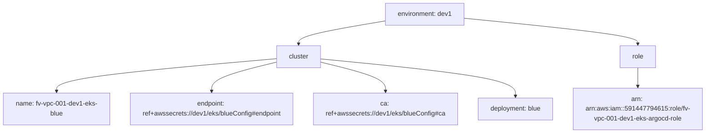
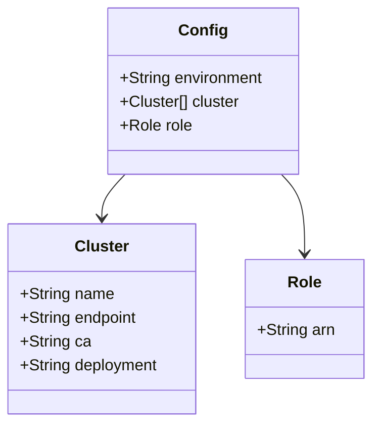
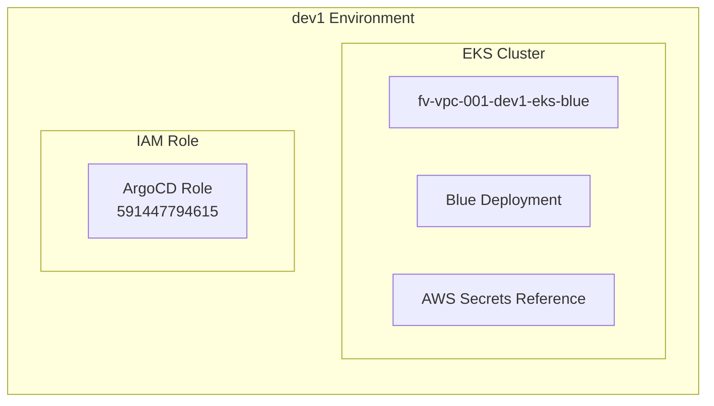

# Diagram: devops/k8s/argocd/clusters/helm/values.dev1.yaml

> Auto-generated by Obscura crawlers

## Diagram 1

### SVG

<svg id="container" width="1736.65625" xmlns="http://www.w3.org/2000/svg" class="flowchart" height="326" viewBox="0 0 1736.65625 326" role="graphics-document document" aria-roledescription="flowchart-v2"><g><marker id="container_flowchart-v2-pointEnd" class="marker flowchart-v2" viewBox="0 0 10 10" refX="5" refY="5" markerUnits="userSpaceOnUse" markerWidth="8" markerHeight="8" orient="auto"><path d="M 0 0 L 10 5 L 0 10 z" class="arrowMarkerPath" style="stroke-width: 1; stroke-dasharray: 1, 0;"></path></marker><marker id="container_flowchart-v2-pointStart" class="marker flowchart-v2" viewBox="0 0 10 10" refX="4.5" refY="5" markerUnits="userSpaceOnUse" markerWidth="8" markerHeight="8" orient="auto"><path d="M 0 5 L 10 10 L 10 0 z" class="arrowMarkerPath" style="stroke-width: 1; stroke-dasharray: 1, 0;"></path></marker><marker id="container_flowchart-v2-circleEnd" class="marker flowchart-v2" viewBox="0 0 10 10" refX="11" refY="5" markerUnits="userSpaceOnUse" markerWidth="11" markerHeight="11" orient="auto"><circle cx="5" cy="5" r="5" class="arrowMarkerPath" style="stroke-width: 1; stroke-dasharray: 1, 0;"></circle></marker><marker id="container_flowchart-v2-circleStart" class="marker flowchart-v2" viewBox="0 0 10 10" refX="-1" refY="5" markerUnits="userSpaceOnUse" markerWidth="11" markerHeight="11" orient="auto"><circle cx="5" cy="5" r="5" class="arrowMarkerPath" style="stroke-width: 1; stroke-dasharray: 1, 0;"></circle></marker><marker id="container_flowchart-v2-crossEnd" class="marker cross flowchart-v2" viewBox="0 0 11 11" refX="12" refY="5.2" markerUnits="userSpaceOnUse" markerWidth="11" markerHeight="11" orient="auto"><path d="M 1,1 l 9,9 M 10,1 l -9,9" class="arrowMarkerPath" style="stroke-width: 2; stroke-dasharray: 1, 0;"></path></marker><marker id="container_flowchart-v2-crossStart" class="marker cross flowchart-v2" viewBox="0 0 11 11" refX="-1" refY="5.2" markerUnits="userSpaceOnUse" markerWidth="11" markerHeight="11" orient="auto"><path d="M 1,1 l 9,9 M 10,1 l -9,9" class="arrowMarkerPath" style="stroke-width: 2; stroke-dasharray: 1, 0;"></path></marker><g class="root"><g class="clusters"></g><g class="edgePaths"><path d="M952.055,51.236L916.525,57.196C880.996,63.157,809.938,75.079,774.408,84.539C738.879,94,738.879,101,738.879,104.5L738.879,108" id="L_A_B_0" class="edge-thickness-normal edge-pattern-solid edge-thickness-normal edge-pattern-solid flowchart-link" style=";" data-edge="true" data-et="edge" data-id="L_A_B_0" data-points="W3sieCI6OTUyLjA1NDY4NzUsInkiOjUxLjIzNTYyMzI3NDk4MjA0fSx7IngiOjczOC44Nzg5MDYyNSwieSI6ODd9LHsieCI6NzM4Ljg3ODkwNjI1LCJ5IjoxMTJ9XQ==" marker-end="url(#container_flowchart-v2-pointEnd)"></path><path d="M1145.602,44.555L1217.246,51.629C1288.891,58.704,1432.18,72.852,1503.824,83.426C1575.469,94,1575.469,101,1575.469,104.5L1575.469,108" id="L_A_C_0" class="edge-thickness-normal edge-pattern-solid edge-thickness-normal edge-pattern-solid flowchart-link" style=";" data-edge="true" data-et="edge" data-id="L_A_C_0" data-points="W3sieCI6MTE0NS42MDE1NjI1LCJ5Ijo0NC41NTUzMTgyMDIwNDcxNzV9LHsieCI6MTU3NS40Njg3NSwieSI6ODd9LHsieCI6MTU3NS40Njg3NSwieSI6MTEyfV0=" marker-end="url(#container_flowchart-v2-pointEnd)"></path><path d="M684.098,143.741L593.081,151.617C502.065,159.494,320.033,175.247,229.016,188.623C138,202,138,213,138,218.5L138,224" id="L_B_D_0" class="edge-thickness-normal edge-pattern-solid edge-thickness-normal edge-pattern-solid flowchart-link" style=";" data-edge="true" data-et="edge" data-id="L_B_D_0" data-points="W3sieCI6Njg0LjA5NzY1NjI1LCJ5IjoxNDMuNzQwNzYzODU1MDMwMDV9LHsieCI6MTM4LCJ5IjoxOTF9LHsieCI6MTM4LCJ5IjoyMjh9XQ==" marker-end="url(#container_flowchart-v2-pointEnd)"></path><path d="M684.098,152.146L657.113,158.622C630.128,165.097,576.158,178.049,549.173,190.024C522.188,202,522.188,213,522.188,218.5L522.188,224" id="L_B_E_0" class="edge-thickness-normal edge-pattern-solid edge-thickness-normal edge-pattern-solid flowchart-link" style=";" data-edge="true" data-et="edge" data-id="L_B_E_0" data-points="W3sieCI6Njg0LjA5NzY1NjI1LCJ5IjoxNTIuMTQ1OTk4OTU0NDQ2M30seyJ4Ijo1MjIuMTg3NSwieSI6MTkxfSx7IngiOjUyMi4xODc1LCJ5IjoyMjh9XQ==" marker-end="url(#container_flowchart-v2-pointEnd)"></path><path d="M793.66,152.146L820.645,158.622C847.63,165.097,901.6,178.049,928.585,190.024C955.57,202,955.57,213,955.57,218.5L955.57,224" id="L_B_F_0" class="edge-thickness-normal edge-pattern-solid edge-thickness-normal edge-pattern-solid flowchart-link" style=";" data-edge="true" data-et="edge" data-id="L_B_F_0" data-points="W3sieCI6NzkzLjY2MDE1NjI1LCJ5IjoxNTIuMTQ1OTk4OTU0NDQ2M30seyJ4Ijo5NTUuNTcwMzEyNSwieSI6MTkxfSx7IngiOjk1NS41NzAzMTI1LCJ5IjoyMjh9XQ==" marker-end="url(#container_flowchart-v2-pointEnd)"></path><path d="M793.66,144.279L874.471,152.066C955.281,159.852,1116.902,175.426,1197.713,190.713C1278.523,206,1278.523,221,1278.523,228.5L1278.523,236" id="L_B_G_0" class="edge-thickness-normal edge-pattern-solid edge-thickness-normal edge-pattern-solid flowchart-link" style=";" data-edge="true" data-et="edge" data-id="L_B_G_0" data-points="W3sieCI6NzkzLjY2MDE1NjI1LCJ5IjoxNDQuMjc4NzA2MzI0MzMwOTh9LHsieCI6MTI3OC41MjM0Mzc1LCJ5IjoxOTF9LHsieCI6MTI3OC41MjM0Mzc1LCJ5IjoyNDB9XQ==" marker-end="url(#container_flowchart-v2-pointEnd)"></path><path d="M1575.469,166L1575.469,170.167C1575.469,174.333,1575.469,182.667,1575.469,190.333C1575.469,198,1575.469,205,1575.469,208.5L1575.469,212" id="L_C_H_0" class="edge-thickness-normal edge-pattern-solid edge-thickness-normal edge-pattern-solid flowchart-link" style=";" data-edge="true" data-et="edge" data-id="L_C_H_0" data-points="W3sieCI6MTU3NS40Njg3NSwieSI6MTY2fSx7IngiOjE1NzUuNDY4NzUsInkiOjE5MX0seyJ4IjoxNTc1LjQ2ODc1LCJ5IjoyMTZ9XQ==" marker-end="url(#container_flowchart-v2-pointEnd)"></path></g><g class="edgeLabels"><g class="edgeLabel"><g class="label" data-id="L_A_B_0" transform="translate(0, 0)"><foreignObject width="0" height="0">

</foreignObject></g></g><g class="edgeLabel"><g class="label" data-id="L_A_C_0" transform="translate(0, 0)"><foreignObject width="0" height="0">

</foreignObject></g></g><g class="edgeLabel"><g class="label" data-id="L_B_D_0" transform="translate(0, 0)"><foreignObject width="0" height="0">

</foreignObject></g></g><g class="edgeLabel"><g class="label" data-id="L_B_E_0" transform="translate(0, 0)"><foreignObject width="0" height="0">

</foreignObject></g></g><g class="edgeLabel"><g class="label" data-id="L_B_F_0" transform="translate(0, 0)"><foreignObject width="0" height="0">

</foreignObject></g></g><g class="edgeLabel"><g class="label" data-id="L_B_G_0" transform="translate(0, 0)"><foreignObject width="0" height="0">

</foreignObject></g></g><g class="edgeLabel"><g class="label" data-id="L_C_H_0" transform="translate(0, 0)"><foreignObject width="0" height="0">

</foreignObject></g></g></g><g class="nodes"><g class="node default" id="flowchart-A-0" transform="translate(1048.828125, 35)"><rect class="basic label-container" style="" x="-96.7734375" y="-27" width="193.546875" height="54"></rect><g class="label" style="" transform="translate(-66.7734375, -12)"><rect></rect><foreignObject width="133.546875" height="24">

environment: dev1

</foreignObject></g></g><g class="node default" id="flowchart-B-1" transform="translate(738.87890625, 139)"><rect class="basic label-container" style="" x="-54.78125" y="-27" width="109.5625" height="54"></rect><g class="label" style="" transform="translate(-24.78125, -12)"><rect></rect><foreignObject width="49.5625" height="24">

cluster

</foreignObject></g></g><g class="node default" id="flowchart-C-3" transform="translate(1575.46875, 139)"><rect class="basic label-container" style="" x="-44.1875" y="-27" width="88.375" height="54"></rect><g class="label" style="" transform="translate(-14.1875, -12)"><rect></rect><foreignObject width="28.375" height="24">

role

</foreignObject></g></g><g class="node default" id="flowchart-D-5" transform="translate(138, 267)"><rect class="basic label-container" style="" x="-130" y="-39" width="260" height="78"></rect><g class="label" style="" transform="translate(-100, -24)"><rect></rect><foreignObject width="200" height="48">

name: fv-vpc-001-dev1-eks-blue

</foreignObject></g></g><g class="node default" id="flowchart-E-7" transform="translate(522.1875, 267)"><rect class="basic label-container" style="" x="-204.1875" y="-39" width="408.375" height="78"></rect><g class="label" style="" transform="translate(-174.1875, -24)"><rect></rect><foreignObject width="348.375" height="48">

endpoint: ref+awssecrets://dev1/eks/blueConfig#endpoint

</foreignObject></g></g><g class="node default" id="flowchart-F-9" transform="translate(955.5703125, 267)"><rect class="basic label-container" style="" x="-179.1953125" y="-39" width="358.390625" height="78"></rect><g class="label" style="" transform="translate(-149.1953125, -24)"><rect></rect><foreignObject width="298.390625" height="48">

ca: ref+awssecrets://dev1/eks/blueConfig#ca

</foreignObject></g></g><g class="node default" id="flowchart-G-11" transform="translate(1278.5234375, 267)"><rect class="basic label-container" style="" x="-93.7578125" y="-27" width="187.515625" height="54"></rect><g class="label" style="" transform="translate(-63.7578125, -12)"><rect></rect><foreignObject width="127.515625" height="24">

deployment: blue

</foreignObject></g></g><g class="node default" id="flowchart-H-13" transform="translate(1575.46875, 267)"><rect class="basic label-container" style="" x="-153.1875" y="-51" width="306.375" height="102"></rect><g class="label" style="" transform="translate(-123.1875, -36)"><rect></rect><foreignObject width="246.375" height="72">

arn: arn:aws:iam::591447794615:role/fv-vpc-001-dev1-eks-argocd-role

</foreignObject></g></g></g></g></g></svg>

## Diagram 2

### SVG

<svg id="container" width="376.4921875" xmlns="http://www.w3.org/2000/svg" class="classDiagram" height="426" viewBox="0 0 376.4921875 426" role="graphics-document document" aria-roledescription="class"><g><defs><marker id="container_class-aggregationStart" class="marker aggregation class" refX="18" refY="7" markerWidth="190" markerHeight="240" orient="auto"><path d="M 18,7 L9,13 L1,7 L9,1 Z"></path></marker></defs><defs><marker id="container_class-aggregationEnd" class="marker aggregation class" refX="1" refY="7" markerWidth="20" markerHeight="28" orient="auto"><path d="M 18,7 L9,13 L1,7 L9,1 Z"></path></marker></defs><defs><marker id="container_class-extensionStart" class="marker extension class" refX="18" refY="7" markerWidth="190" markerHeight="240" orient="auto"><path d="M 1,7 L18,13 V 1 Z"></path></marker></defs><defs><marker id="container_class-extensionEnd" class="marker extension class" refX="1" refY="7" markerWidth="20" markerHeight="28" orient="auto"><path d="M 1,1 V 13 L18,7 Z"></path></marker></defs><defs><marker id="container_class-compositionStart" class="marker composition class" refX="18" refY="7" markerWidth="190" markerHeight="240" orient="auto"><path d="M 18,7 L9,13 L1,7 L9,1 Z"></path></marker></defs><defs><marker id="container_class-compositionEnd" class="marker composition class" refX="1" refY="7" markerWidth="20" markerHeight="28" orient="auto"><path d="M 18,7 L9,13 L1,7 L9,1 Z"></path></marker></defs><defs><marker id="container_class-dependencyStart" class="marker dependency class" refX="6" refY="7" markerWidth="190" markerHeight="240" orient="auto"><path d="M 5,7 L9,13 L1,7 L9,1 Z"></path></marker></defs><defs><marker id="container_class-dependencyEnd" class="marker dependency class" refX="13" refY="7" markerWidth="20" markerHeight="28" orient="auto"><path d="M 18,7 L9,13 L14,7 L9,1 Z"></path></marker></defs><defs><marker id="container_class-lollipopStart" class="marker lollipop class" refX="13" refY="7" markerWidth="190" markerHeight="240" orient="auto"><circle stroke="black" fill="transparent" cx="7" cy="7" r="6"></circle></marker></defs><defs><marker id="container_class-lollipopEnd" class="marker lollipop class" refX="1" refY="7" markerWidth="190" markerHeight="240" orient="auto"><circle stroke="black" fill="transparent" cx="7" cy="7" r="6"></circle></marker></defs><g class="root"><g class="clusters"></g><g class="edgePaths"><path d="M127.295,176L123.372,180.167C119.449,184.333,111.604,192.667,107.681,200C103.758,207.333,103.758,213.667,103.758,216.833L103.758,220" id="id_Config_Cluster_1" class="edge-thickness-normal edge-pattern-solid relation" style=";;;" data-edge="true" data-et="edge" data-id="id_Config_Cluster_1" data-points="W3sieCI6MTI3LjI5NTIwODU3MjI0NzcsInkiOjE3Nn0seyJ4IjoxMDMuNzU3ODEyNSwieSI6MjAxfSx7IngiOjEwMy43NTc4MTI1LCJ5IjoyMjZ9XQ==" marker-end="url(#container_class-dependencyEnd)"></path><path d="M285.467,176L289.389,180.167C293.312,184.333,301.158,192.667,305.081,206C309.004,219.333,309.004,237.667,309.004,246.833L309.004,256" id="id_Config_Role_2" class="edge-thickness-normal edge-pattern-solid relation" style=";;;" data-edge="true" data-et="edge" data-id="id_Config_Role_2" data-points="W3sieCI6Mjg1LjQ2NjUxMDE3Nzc1MjMsInkiOjE3Nn0seyJ4IjozMDkuMDAzOTA2MjUsInkiOjIwMX0seyJ4IjozMDkuMDAzOTA2MjUsInkiOjI2Mn1d" marker-end="url(#container_class-dependencyEnd)"></path></g><g class="edgeLabels"><g class="edgeLabel"><g class="label" data-id="id_Config_Cluster_1" transform="translate(0, 0)"><foreignObject width="0" height="0">

</foreignObject></g></g><g class="edgeLabel"><g class="label" data-id="id_Config_Role_2" transform="translate(0, 0)"><foreignObject width="0" height="0">

</foreignObject></g></g></g><g class="nodes"><g class="node default" id="classId-Config-0" transform="translate(206.380859375, 92)"><g class="basic label-container"><path d="M-96.88671875 -84 L96.88671875 -84 L96.88671875 84 L-96.88671875 84" stroke="none" stroke-width="0" fill="#ECECFF" style=""></path><path d="M-96.88671875 -84 C-52.524561949764006 -84, -8.162405149528013 -84, 96.88671875 -84 M-96.88671875 -84 C-52.47744132885252 -84, -8.068163907705042 -84, 96.88671875 -84 M96.88671875 -84 C96.88671875 -20.413460391259143, 96.88671875 43.173079217481714, 96.88671875 84 M96.88671875 -84 C96.88671875 -32.761641545898904, 96.88671875 18.476716908202192, 96.88671875 84 M96.88671875 84 C20.974654726798875 84, -54.93740929640225 84, -96.88671875 84 M96.88671875 84 C20.133128779795683 84, -56.62046119040863 84, -96.88671875 84 M-96.88671875 84 C-96.88671875 43.10543215686713, -96.88671875 2.2108643137342625, -96.88671875 -84 M-96.88671875 84 C-96.88671875 41.743499932780026, -96.88671875 -0.5130001344399489, -96.88671875 -84" stroke="#9370DB" stroke-width="1.3" fill="none" stroke-dasharray="0 0" style=""></path></g><g class="annotation-group text" transform="translate(0, -60)"></g><g class="label-group text" transform="translate(-22.9296875, -60)"><g class="label" style="font-weight: bolder" transform="translate(0,-12)"><foreignObject width="45.859375" height="24">

Config

</foreignObject></g></g><g class="members-group text" transform="translate(-84.88671875, -12)"><g class="label" style="" transform="translate(0,-12)"><foreignObject width="146.84375" height="24">

+String environment

</foreignObject></g><g class="label" style="" transform="translate(0,12)"><foreignObject width="122.796875" height="24">

+Cluster[] cluster

</foreignObject></g><g class="label" style="" transform="translate(0,36)"><foreignObject width="72.71875" height="24">

+Role role

</foreignObject></g></g><g class="methods-group text" transform="translate(-84.88671875, 84)"></g><g class="divider" style=""><path d="M-96.88671875 -36 C-51.199376639568065 -36, -5.51203452913613 -36, 96.88671875 -36 M-96.88671875 -36 C-39.579655411308636 -36, 17.72740792738273 -36, 96.88671875 -36" stroke="#9370DB" stroke-width="1.3" fill="none" stroke-dasharray="0 0" style=""></path></g><g class="divider" style=""><path d="M-96.88671875 60 C-51.54334342601624 60, -6.199968102032486 60, 96.88671875 60 M-96.88671875 60 C-41.29582978761004 60, 14.295059174779922 60, 96.88671875 60" stroke="#9370DB" stroke-width="1.3" fill="none" stroke-dasharray="0 0" style=""></path></g></g><g class="node default" id="classId-Cluster-1" transform="translate(103.7578125, 322)"><g class="basic label-container"><path d="M-95.7578125 -96 L95.7578125 -96 L95.7578125 96 L-95.7578125 96" stroke="none" stroke-width="0" fill="#ECECFF" style=""></path><path d="M-95.7578125 -96 C-54.630421738799186 -96, -13.503030977598371 -96, 95.7578125 -96 M-95.7578125 -96 C-38.558575014260974 -96, 18.640662471478052 -96, 95.7578125 -96 M95.7578125 -96 C95.7578125 -19.40487748825167, 95.7578125 57.19024502349666, 95.7578125 96 M95.7578125 -96 C95.7578125 -51.47088807324246, 95.7578125 -6.941776146484926, 95.7578125 96 M95.7578125 96 C47.25149733644502 96, -1.2548178271099601 96, -95.7578125 96 M95.7578125 96 C47.22743292635137 96, -1.3029466472972615 96, -95.7578125 96 M-95.7578125 96 C-95.7578125 52.54501065725124, -95.7578125 9.09002131450248, -95.7578125 -96 M-95.7578125 96 C-95.7578125 31.75181004992021, -95.7578125 -32.49637990015958, -95.7578125 -96" stroke="#9370DB" stroke-width="1.3" fill="none" stroke-dasharray="0 0" style=""></path></g><g class="annotation-group text" transform="translate(0, -72)"></g><g class="label-group text" transform="translate(-25.90625, -72)"><g class="label" style="font-weight: bolder" transform="translate(0,-12)"><foreignObject width="51.8125" height="24">

Cluster

</foreignObject></g></g><g class="members-group text" transform="translate(-83.7578125, -24)"><g class="label" style="" transform="translate(0,-12)"><foreignObject width="94.984375" height="24">

+String name

</foreignObject></g><g class="label" style="" transform="translate(0,12)"><foreignObject width="120.640625" height="24">

+String endpoint

</foreignObject></g><g class="label" style="" transform="translate(0,36)"><foreignObject width="70.65625" height="24">

+String ca

</foreignObject></g><g class="label" style="" transform="translate(0,60)"><foreignObject width="141.609375" height="24">

+String deployment

</foreignObject></g></g><g class="methods-group text" transform="translate(-83.7578125, 96)"></g><g class="divider" style=""><path d="M-95.7578125 -48 C-45.50389921659401 -48, 4.7500140668119855 -48, 95.7578125 -48 M-95.7578125 -48 C-20.08943311013222 -48, 55.57894627973556 -48, 95.7578125 -48" stroke="#9370DB" stroke-width="1.3" fill="none" stroke-dasharray="0 0" style=""></path></g><g class="divider" style=""><path d="M-95.7578125 72 C-43.89283447823424 72, 7.972143543531516 72, 95.7578125 72 M-95.7578125 72 C-35.27407153740443 72, 25.209669425191137 72, 95.7578125 72" stroke="#9370DB" stroke-width="1.3" fill="none" stroke-dasharray="0 0" style=""></path></g></g><g class="node default" id="classId-Role-2" transform="translate(309.00390625, 322)"><g class="basic label-container"><path d="M-59.48828125 -60 L59.48828125 -60 L59.48828125 60 L-59.48828125 60" stroke="none" stroke-width="0" fill="#ECECFF" style=""></path><path d="M-59.48828125 -60 C-13.486172431468084 -60, 32.51593638706383 -60, 59.48828125 -60 M-59.48828125 -60 C-22.043783270850227 -60, 15.400714708299546 -60, 59.48828125 -60 M59.48828125 -60 C59.48828125 -16.270213079482524, 59.48828125 27.459573841034953, 59.48828125 60 M59.48828125 -60 C59.48828125 -33.36411837924081, 59.48828125 -6.728236758481614, 59.48828125 60 M59.48828125 60 C17.71103723477401 60, -24.066206780451978 60, -59.48828125 60 M59.48828125 60 C35.235571984893895 60, 10.982862719787796 60, -59.48828125 60 M-59.48828125 60 C-59.48828125 30.48712645285646, -59.48828125 0.9742529057129232, -59.48828125 -60 M-59.48828125 60 C-59.48828125 31.776757892191544, -59.48828125 3.5535157843830874, -59.48828125 -60" stroke="#9370DB" stroke-width="1.3" fill="none" stroke-dasharray="0 0" style=""></path></g><g class="annotation-group text" transform="translate(0, -36)"></g><g class="label-group text" transform="translate(-16.2421875, -36)"><g class="label" style="font-weight: bolder" transform="translate(0,-12)"><foreignObject width="32.484375" height="24">

Role

</foreignObject></g></g><g class="members-group text" transform="translate(-47.48828125, 12)"><g class="label" style="" transform="translate(0,-12)"><foreignObject width="78.734375" height="24">

+String arn

</foreignObject></g></g><g class="methods-group text" transform="translate(-47.48828125, 60)"></g><g class="divider" style=""><path d="M-59.48828125 -12 C-24.497446232643995 -12, 10.49338878471201 -12, 59.48828125 -12 M-59.48828125 -12 C-16.50555716706026 -12, 26.47716691587948 -12, 59.48828125 -12" stroke="#9370DB" stroke-width="1.3" fill="none" stroke-dasharray="0 0" style=""></path></g><g class="divider" style=""><path d="M-59.48828125 36 C-12.327481842322321 36, 34.83331756535536 36, 59.48828125 36 M-59.48828125 36 C-21.887815693511136 36, 15.712649862977727 36, 59.48828125 36" stroke="#9370DB" stroke-width="1.3" fill="none" stroke-dasharray="0 0" style=""></path></g></g></g></g></g></svg>

## Diagram 3

### SVG

<svg id="container" width="732.0625" xmlns="http://www.w3.org/2000/svg" class="flowchart" height="423" viewBox="0 0 732.0625 423" role="graphics-document document" aria-roledescription="flowchart-v2"><g><marker id="container_flowchart-v2-pointEnd" class="marker flowchart-v2" viewBox="0 0 10 10" refX="5" refY="5" markerUnits="userSpaceOnUse" markerWidth="8" markerHeight="8" orient="auto"><path d="M 0 0 L 10 5 L 0 10 z" class="arrowMarkerPath" style="stroke-width: 1; stroke-dasharray: 1, 0;"></path></marker><marker id="container_flowchart-v2-pointStart" class="marker flowchart-v2" viewBox="0 0 10 10" refX="4.5" refY="5" markerUnits="userSpaceOnUse" markerWidth="8" markerHeight="8" orient="auto"><path d="M 0 5 L 10 10 L 10 0 z" class="arrowMarkerPath" style="stroke-width: 1; stroke-dasharray: 1, 0;"></path></marker><marker id="container_flowchart-v2-circleEnd" class="marker flowchart-v2" viewBox="0 0 10 10" refX="11" refY="5" markerUnits="userSpaceOnUse" markerWidth="11" markerHeight="11" orient="auto"><circle cx="5" cy="5" r="5" class="arrowMarkerPath" style="stroke-width: 1; stroke-dasharray: 1, 0;"></circle></marker><marker id="container_flowchart-v2-circleStart" class="marker flowchart-v2" viewBox="0 0 10 10" refX="-1" refY="5" markerUnits="userSpaceOnUse" markerWidth="11" markerHeight="11" orient="auto"><circle cx="5" cy="5" r="5" class="arrowMarkerPath" style="stroke-width: 1; stroke-dasharray: 1, 0;"></circle></marker><marker id="container_flowchart-v2-crossEnd" class="marker cross flowchart-v2" viewBox="0 0 11 11" refX="12" refY="5.2" markerUnits="userSpaceOnUse" markerWidth="11" markerHeight="11" orient="auto"><path d="M 1,1 l 9,9 M 10,1 l -9,9" class="arrowMarkerPath" style="stroke-width: 2; stroke-dasharray: 1, 0;"></path></marker><marker id="container_flowchart-v2-crossStart" class="marker cross flowchart-v2" viewBox="0 0 11 11" refX="-1" refY="5.2" markerUnits="userSpaceOnUse" markerWidth="11" markerHeight="11" orient="auto"><path d="M 1,1 l 9,9 M 10,1 l -9,9" class="arrowMarkerPath" style="stroke-width: 2; stroke-dasharray: 1, 0;"></path></marker><g class="root"><g class="clusters"></g><g class="edgePaths"></g><g class="edgeLabels"></g><g class="nodes"><g class="root" transform="translate(0, 0)"><g class="clusters"><g class="cluster" id="Environment" data-look="classic"><rect style="" x="8" y="8" width="716.0625" height="407"></rect><g class="cluster-label" transform="translate(301.375, 8)"><foreignObject width="129.3125" height="24">

dev1 Environment

</foreignObject></g></g></g><g class="edgePaths"></g><g class="edgeLabels"></g><g class="nodes"><g class="root" transform="translate(35, 129.5)"><g class="clusters"><g class="cluster" id="IAM" data-look="classic"><rect style="" x="8" y="8" width="252.796875" height="148"></rect><g class="cluster-label" transform="translate(103.046875, 8)"><foreignObject width="62.703125" height="24">

IAM Role

</foreignObject></g></g></g><g class="edgePaths"></g><g class="edgeLabels"></g><g class="nodes"><g class="node default" id="flowchart-D-3" transform="translate(134.3984375, 82)"><rect class="basic label-container" style="" x="-76.3984375" y="-39" width="152.796875" height="78"></rect><g class="label" style="" transform="translate(-46.3984375, -24)"><rect></rect><foreignObject width="92.796875" height="48">

ArgoCD Role 591447794615

</foreignObject></g></g></g></g><g class="root" transform="translate(337.796875, 37.5)"><g class="clusters"><g class="cluster" id="EKS" data-look="classic"><rect style="" x="8" y="8" width="343.265625" height="332"></rect><g class="cluster-label" transform="translate(138.8828125, 8)"><foreignObject width="81.5" height="24">

EKS Cluster

</foreignObject></g></g></g><g class="edgePaths"></g><g class="edgeLabels"></g><g class="nodes"><g class="node default" id="flowchart-A-0" transform="translate(179.6328125, 70)"><rect class="basic label-container" style="" x="-121.6328125" y="-27" width="243.265625" height="54"></rect><g class="label" style="" transform="translate(-91.6328125, -12)"><rect></rect><foreignObject width="183.265625" height="24">

fv-vpc-001-dev1-eks-blue

</foreignObject></g></g><g class="node default" id="flowchart-B-1" transform="translate(179.6328125, 174)"><rect class="basic label-container" style="" x="-92.28125" y="-27" width="184.5625" height="54"></rect><g class="label" style="" transform="translate(-62.28125, -12)"><rect></rect><foreignObject width="124.5625" height="24">

Blue Deployment

</foreignObject></g></g><g class="node default" id="flowchart-C-2" transform="translate(179.6328125, 278)"><rect class="basic label-container" style="" x="-112.0546875" y="-27" width="224.109375" height="54"></rect><g class="label" style="" transform="translate(-82.0546875, -12)"><rect></rect><foreignObject width="164.109375" height="24">

AWS Secrets Reference

</foreignObject></g></g></g></g></g></g></g></g></g></svg>
