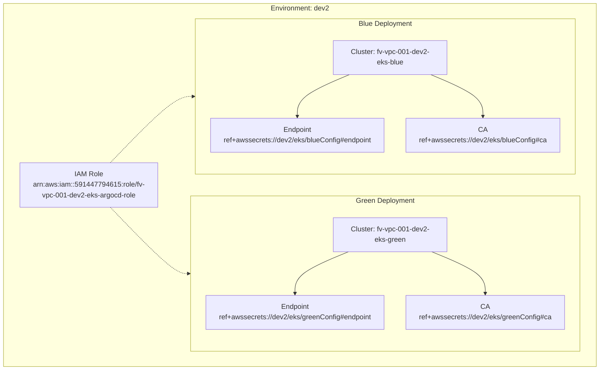
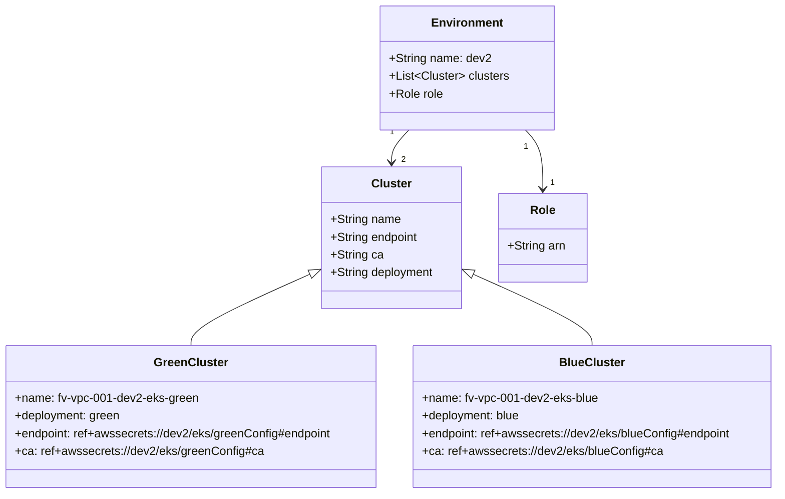
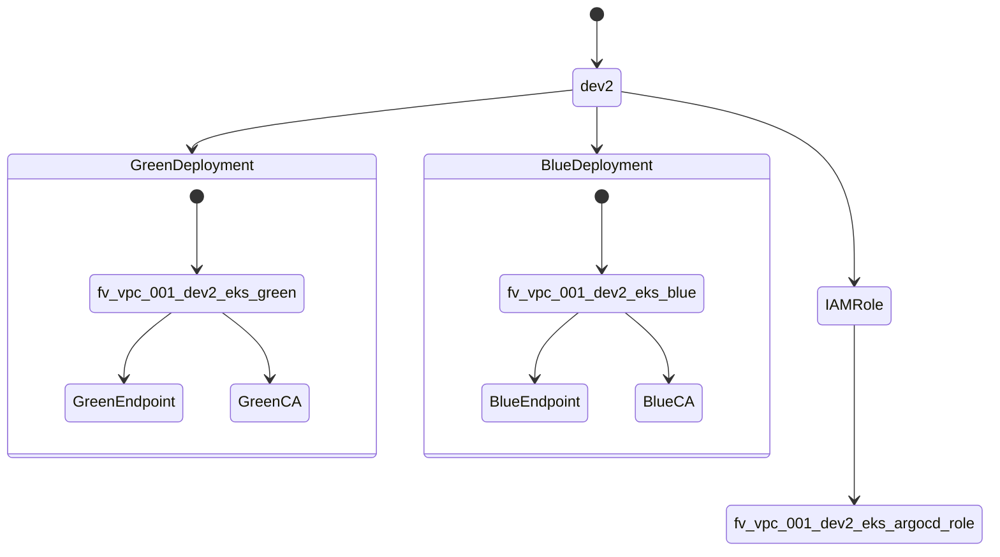

# Diagram: devops/k8s/argocd/clusters/helm/values.dev2.yaml

> Auto-generated by Obscura crawlers

## Diagram 1

### SVG

<svg id="container" width="1377.078125" xmlns="http://www.w3.org/2000/svg" class="flowchart" height="848" viewBox="0 0 1377.078125 848" role="graphics-document document" aria-roledescription="flowchart-v2"><g><marker id="container_flowchart-v2-pointEnd" class="marker flowchart-v2" viewBox="0 0 10 10" refX="5" refY="5" markerUnits="userSpaceOnUse" markerWidth="8" markerHeight="8" orient="auto"><path d="M 0 0 L 10 5 L 0 10 z" class="arrowMarkerPath" style="stroke-width: 1; stroke-dasharray: 1, 0;"></path></marker><marker id="container_flowchart-v2-pointStart" class="marker flowchart-v2" viewBox="0 0 10 10" refX="4.5" refY="5" markerUnits="userSpaceOnUse" markerWidth="8" markerHeight="8" orient="auto"><path d="M 0 5 L 10 10 L 10 0 z" class="arrowMarkerPath" style="stroke-width: 1; stroke-dasharray: 1, 0;"></path></marker><marker id="container_flowchart-v2-circleEnd" class="marker flowchart-v2" viewBox="0 0 10 10" refX="11" refY="5" markerUnits="userSpaceOnUse" markerWidth="11" markerHeight="11" orient="auto"><circle cx="5" cy="5" r="5" class="arrowMarkerPath" style="stroke-width: 1; stroke-dasharray: 1, 0;"></circle></marker><marker id="container_flowchart-v2-circleStart" class="marker flowchart-v2" viewBox="0 0 10 10" refX="-1" refY="5" markerUnits="userSpaceOnUse" markerWidth="11" markerHeight="11" orient="auto"><circle cx="5" cy="5" r="5" class="arrowMarkerPath" style="stroke-width: 1; stroke-dasharray: 1, 0;"></circle></marker><marker id="container_flowchart-v2-crossEnd" class="marker cross flowchart-v2" viewBox="0 0 11 11" refX="12" refY="5.2" markerUnits="userSpaceOnUse" markerWidth="11" markerHeight="11" orient="auto"><path d="M 1,1 l 9,9 M 10,1 l -9,9" class="arrowMarkerPath" style="stroke-width: 2; stroke-dasharray: 1, 0;"></path></marker><marker id="container_flowchart-v2-crossStart" class="marker cross flowchart-v2" viewBox="0 0 11 11" refX="-1" refY="5.2" markerUnits="userSpaceOnUse" markerWidth="11" markerHeight="11" orient="auto"><path d="M 1,1 l 9,9 M 10,1 l -9,9" class="arrowMarkerPath" style="stroke-width: 2; stroke-dasharray: 1, 0;"></path></marker><g class="root"><g class="clusters"></g><g class="edgePaths"></g><g class="edgeLabels"></g><g class="nodes"><g class="root" transform="translate(0, 0)"><g class="clusters"><g class="cluster" id="Environment" data-look="classic"><rect style="" x="8" y="8" width="1361.078125" height="832"></rect><g class="cluster-label" transform="translate(621.5078125, 8)"><foreignObject width="134.0625" height="24">

Environment: dev2

</foreignObject></g></g></g><g class="edgePaths"><path d="M246.594,475L270.391,500.333C294.188,525.667,341.781,576.333,371.162,601.667C400.542,627,411.708,627,417.292,627L422.875,627" id="L_Role_GreenCluster_0" class="edge-thickness-normal edge-pattern-dotted edge-thickness-normal edge-pattern-solid flowchart-link" style=";" data-edge="true" data-et="edge" data-id="L_Role_GreenCluster_0" data-points="W3sieCI6MjQ2LjU5NDIxMTgyMjY2MDEsInkiOjQ3NX0seyJ4IjozODkuMzc1LCJ5Ijo2Mjd9LHsieCI6NDI2Ljg3NSwieSI6NjI3fV0=" marker-end="url(#container_flowchart-v2-pointEnd)"></path><path d="M246.594,373L270.391,347.667C294.188,322.333,341.781,271.667,372.518,246.333C403.255,221,417.135,221,424.076,221L431.016,221" id="L_Role_BlueCluster_0" class="edge-thickness-normal edge-pattern-dotted edge-thickness-normal edge-pattern-solid flowchart-link" style=";" data-edge="true" data-et="edge" data-id="L_Role_BlueCluster_0" data-points="W3sieCI6MjQ2LjU5NDIxMTgyMjY2MDEsInkiOjM3M30seyJ4IjozODkuMzc1LCJ5IjoyMjF9LHsieCI6NDM1LjAxNTYyNSwieSI6MjIxfV0=" marker-end="url(#container_flowchart-v2-pointEnd)"></path></g><g class="edgeLabels"><g class="edgeLabel"><g class="label" data-id="L_Role_GreenCluster_0" transform="translate(0, 0)"><foreignObject width="0" height="0">

</foreignObject></g></g><g class="edgeLabel"><g class="label" data-id="L_Role_BlueCluster_0" transform="translate(0, 0)"><foreignObject width="0" height="0">

</foreignObject></g></g></g><g class="nodes"><g class="root" transform="translate(427.015625, 35)"><g class="clusters"><g class="cluster" id="BlueCluster" data-look="classic"><rect style="" x="8" y="8" width="888.421875" height="356"></rect><g class="cluster-label" transform="translate(389.9296875, 8)"><foreignObject width="124.5625" height="24">

Blue Deployment

</foreignObject></g></g></g><g class="edgePaths"><path d="M369.571,136L349.243,144.333C328.914,152.667,288.258,169.333,267.93,185.333C247.602,201.333,247.602,216.667,247.602,224.333L247.602,232" id="L_BlueName_BlueEndpoint_0" class="edge-thickness-normal edge-pattern-solid edge-thickness-normal edge-pattern-solid flowchart-link" style=";" data-edge="true" data-et="edge" data-id="L_BlueName_BlueEndpoint_0" data-points="W3sieCI6MzY5LjU3MDkyNjk2NjI5MjEsInkiOjEzNn0seyJ4IjoyNDcuNjAxNTYyNSwieSI6MTg2fSx7IngiOjI0Ny42MDE1NjI1LCJ5IjoyMzZ9XQ==" marker-end="url(#container_flowchart-v2-pointEnd)"></path><path d="M559.843,136L580.171,144.333C600.5,152.667,641.156,169.333,661.484,185.333C681.813,201.333,681.813,216.667,681.813,224.333L681.813,232" id="L_BlueName_BlueCA_0" class="edge-thickness-normal edge-pattern-solid edge-thickness-normal edge-pattern-solid flowchart-link" style=";" data-edge="true" data-et="edge" data-id="L_BlueName_BlueCA_0" data-points="W3sieCI6NTU5Ljg0MzEzNTUzMzcwNzgsInkiOjEzNn0seyJ4Ijo2ODEuODEyNSwieSI6MTg2fSx7IngiOjY4MS44MTI1LCJ5IjoyMzZ9XQ==" marker-end="url(#container_flowchart-v2-pointEnd)"></path></g><g class="edgeLabels"><g class="edgeLabel"><g class="label" data-id="L_BlueName_BlueEndpoint_0" transform="translate(0, 0)"><foreignObject width="0" height="0">

</foreignObject></g></g><g class="edgeLabel"><g class="label" data-id="L_BlueName_BlueCA_0" transform="translate(0, 0)"><foreignObject width="0" height="0">

</foreignObject></g></g></g><g class="nodes"><g class="node default" id="flowchart-BlueName-8" transform="translate(464.70703125, 97)"><rect class="basic label-container" style="" x="-130" y="-39" width="260" height="78"></rect><g class="label" style="" transform="translate(-100, -24)"><rect></rect><foreignObject width="200" height="48">

Cluster: fv-vpc-001-dev2-eks-blue

</foreignObject></g></g><g class="node default" id="flowchart-BlueEndpoint-9" transform="translate(247.6015625, 275)"><rect class="basic label-container" style="" x="-204.6015625" y="-39" width="409.203125" height="78"></rect><g class="label" style="" transform="translate(-174.6015625, -24)"><rect></rect><foreignObject width="349.203125" height="48">

Endpoint ref+awssecrets://dev2/eks/blueConfig#endpoint

</foreignObject></g></g><g class="node default" id="flowchart-BlueCA-10" transform="translate(681.8125, 275)"><rect class="basic label-container" style="" x="-179.609375" y="-39" width="359.21875" height="78"></rect><g class="label" style="" transform="translate(-149.609375, -24)"><rect></rect><foreignObject width="299.21875" height="48">

CA ref+awssecrets://dev2/eks/blueConfig#ca

</foreignObject></g></g></g></g><g class="node default" id="flowchart-Role-0" transform="translate(198.6875, 424)"><rect class="basic label-container" style="" x="-153.1875" y="-51" width="306.375" height="102"></rect><g class="label" style="" transform="translate(-123.1875, -36)"><rect></rect><foreignObject width="246.375" height="72">

IAM Role arn:aws:iam::591447794615:role/fv-vpc-001-dev2-eks-argocd-role

</foreignObject></g></g><g class="root" transform="translate(418.875, 441)"><g class="clusters"><g class="cluster" id="GreenCluster" data-look="classic"><rect style="" x="8" y="8" width="904.703125" height="356"></rect><g class="cluster-label" transform="translate(392.984375, 8)"><foreignObject width="134.734375" height="24">

Green Deployment

</foreignObject></g></g></g><g class="edgePaths"><path d="M375.928,136L355.219,144.333C334.509,152.667,293.091,169.333,272.381,185.333C251.672,201.333,251.672,216.667,251.672,224.333L251.672,232" id="L_GreenName_GreenEndpoint_0" class="edge-thickness-normal edge-pattern-solid edge-thickness-normal edge-pattern-solid flowchart-link" style=";" data-edge="true" data-et="edge" data-id="L_GreenName_GreenEndpoint_0" data-points="W3sieCI6Mzc1LjkyNzkzMTg4MjAyMjQ1LCJ5IjoxMzZ9LHsieCI6MjUxLjY3MTg3NSwieSI6MTg2fSx7IngiOjI1MS42NzE4NzUsInkiOjIzNn1d" marker-end="url(#container_flowchart-v2-pointEnd)"></path><path d="M569.767,136L590.477,144.333C611.186,152.667,652.605,169.333,673.314,185.333C694.023,201.333,694.023,216.667,694.023,224.333L694.023,232" id="L_GreenName_GreenCA_0" class="edge-thickness-normal edge-pattern-solid edge-thickness-normal edge-pattern-solid flowchart-link" style=";" data-edge="true" data-et="edge" data-id="L_GreenName_GreenCA_0" data-points="W3sieCI6NTY5Ljc2NzM4MDYxNzk3NzYsInkiOjEzNn0seyJ4Ijo2OTQuMDIzNDM3NSwieSI6MTg2fSx7IngiOjY5NC4wMjM0Mzc1LCJ5IjoyMzZ9XQ==" marker-end="url(#container_flowchart-v2-pointEnd)"></path></g><g class="edgeLabels"><g class="edgeLabel"><g class="label" data-id="L_GreenName_GreenEndpoint_0" transform="translate(0, 0)"><foreignObject width="0" height="0">

</foreignObject></g></g><g class="edgeLabel"><g class="label" data-id="L_GreenName_GreenCA_0" transform="translate(0, 0)"><foreignObject width="0" height="0">

</foreignObject></g></g></g><g class="nodes"><g class="node default" id="flowchart-GreenName-1" transform="translate(472.84765625, 97)"><rect class="basic label-container" style="" x="-130" y="-39" width="260" height="78"></rect><g class="label" style="" transform="translate(-100, -24)"><rect></rect><foreignObject width="200" height="48">

Cluster: fv-vpc-001-dev2-eks-green

</foreignObject></g></g><g class="node default" id="flowchart-GreenEndpoint-2" transform="translate(251.671875, 275)"><rect class="basic label-container" style="" x="-208.671875" y="-39" width="417.34375" height="78"></rect><g class="label" style="" transform="translate(-178.671875, -24)"><rect></rect><foreignObject width="357.34375" height="48">

Endpoint ref+awssecrets://dev2/eks/greenConfig#endpoint

</foreignObject></g></g><g class="node default" id="flowchart-GreenCA-3" transform="translate(694.0234375, 275)"><rect class="basic label-container" style="" x="-183.6796875" y="-39" width="367.359375" height="78"></rect><g class="label" style="" transform="translate(-153.6796875, -24)"><rect></rect><foreignObject width="307.359375" height="48">

CA ref+awssecrets://dev2/eks/greenConfig#ca

</foreignObject></g></g></g></g></g></g></g></g></g></svg>

## Diagram 2

### SVG

<svg id="container" width="1074.8515625" xmlns="http://www.w3.org/2000/svg" class="classDiagram" height="668" viewBox="0 0 1074.8515625 668" role="graphics-document document" aria-roledescription="class"><g><defs><marker id="container_class-aggregationStart" class="marker aggregation class" refX="18" refY="7" markerWidth="190" markerHeight="240" orient="auto"><path d="M 18,7 L9,13 L1,7 L9,1 Z"></path></marker></defs><defs><marker id="container_class-aggregationEnd" class="marker aggregation class" refX="1" refY="7" markerWidth="20" markerHeight="28" orient="auto"><path d="M 18,7 L9,13 L1,7 L9,1 Z"></path></marker></defs><defs><marker id="container_class-extensionStart" class="marker extension class" refX="18" refY="7" markerWidth="190" markerHeight="240" orient="auto"><path d="M 1,7 L18,13 V 1 Z"></path></marker></defs><defs><marker id="container_class-extensionEnd" class="marker extension class" refX="1" refY="7" markerWidth="20" markerHeight="28" orient="auto"><path d="M 1,1 V 13 L18,7 Z"></path></marker></defs><defs><marker id="container_class-compositionStart" class="marker composition class" refX="18" refY="7" markerWidth="190" markerHeight="240" orient="auto"><path d="M 18,7 L9,13 L1,7 L9,1 Z"></path></marker></defs><defs><marker id="container_class-compositionEnd" class="marker composition class" refX="1" refY="7" markerWidth="20" markerHeight="28" orient="auto"><path d="M 18,7 L9,13 L1,7 L9,1 Z"></path></marker></defs><defs><marker id="container_class-dependencyStart" class="marker dependency class" refX="6" refY="7" markerWidth="190" markerHeight="240" orient="auto"><path d="M 5,7 L9,13 L1,7 L9,1 Z"></path></marker></defs><defs><marker id="container_class-dependencyEnd" class="marker dependency class" refX="13" refY="7" markerWidth="20" markerHeight="28" orient="auto"><path d="M 18,7 L9,13 L14,7 L9,1 Z"></path></marker></defs><defs><marker id="container_class-lollipopStart" class="marker lollipop class" refX="13" refY="7" markerWidth="190" markerHeight="240" orient="auto"><circle stroke="black" fill="transparent" cx="7" cy="7" r="6"></circle></marker></defs><defs><marker id="container_class-lollipopEnd" class="marker lollipop class" refX="1" refY="7" markerWidth="190" markerHeight="240" orient="auto"><circle stroke="black" fill="transparent" cx="7" cy="7" r="6"></circle></marker></defs><g class="root"><g class="clusters"></g><g class="edgePaths"><path d="M564.313,176L560.39,180.167C556.467,184.333,548.621,192.667,544.698,200C540.775,207.333,540.775,213.667,540.775,216.833L540.775,220" id="id_Environment_Cluster_1" class="edge-thickness-normal edge-pattern-solid relation" style=";;;" data-edge="true" data-et="edge" data-id="id_Environment_Cluster_1" data-points="W3sieCI6NTY0LjMxMjc4NjY5NzI0NzcsInkiOjE3Nn0seyJ4Ijo1NDAuNzc1MzkwNjI1LCJ5IjoyMDF9LHsieCI6NTQwLjc3NTM5MDYyNSwieSI6MjI2fV0=" marker-end="url(#container_class-dependencyEnd)"></path><path d="M722.484,176L726.407,180.167C730.33,184.333,738.176,192.667,742.099,206C746.021,219.333,746.021,237.667,746.021,246.833L746.021,256" id="id_Environment_Role_2" class="edge-thickness-normal edge-pattern-solid relation" style=";;;" data-edge="true" data-et="edge" data-id="id_Environment_Role_2" data-points="W3sieCI6NzIyLjQ4NDA4ODMwMjc1MjMsInkiOjE3Nn0seyJ4Ijo3NDYuMDIxNDg0Mzc1LCJ5IjoyMDF9LHsieCI6NzQ2LjAyMTQ4NDM3NSwieSI6MjYyfV0=" marker-end="url(#container_class-dependencyEnd)"></path><path d="M429.208,370.698L401.6,382.748C373.993,394.799,318.778,418.899,291.17,435.116C263.563,451.333,263.563,459.667,263.563,463.833L263.563,468" id="id_Cluster_GreenCluster_3" class="edge-thickness-normal edge-pattern-solid relation" style=";;;" data-edge="true" data-et="edge" data-id="id_Cluster_GreenCluster_3" data-points="W3sieCI6NDQ1LjAxNzU3ODEyNSwieSI6MzYzLjc5NzEwMTQ0OTI3NTR9LHsieCI6MjYzLjU2MjUsInkiOjQ0M30seyJ4IjoyNjMuNTYyNSwieSI6NDY4fV0=" marker-start="url(#container_class-extensionStart)"></path><path d="M652.343,370.698L679.95,382.748C707.558,394.799,762.773,418.899,790.381,435.116C817.988,451.333,817.988,459.667,817.988,463.833L817.988,468" id="id_Cluster_BlueCluster_4" class="edge-thickness-normal edge-pattern-solid relation" style=";;;" data-edge="true" data-et="edge" data-id="id_Cluster_BlueCluster_4" data-points="W3sieCI6NjM2LjUzMzIwMzEyNSwieSI6MzYzLjc5NzEwMTQ0OTI3NTR9LHsieCI6ODE3Ljk4ODI4MTI1LCJ5Ijo0NDN9LHsieCI6ODE3Ljk4ODI4MTI1LCJ5Ijo0Njh9XQ==" marker-start="url(#container_class-extensionStart)"></path></g><g class="edgeLabels"><g class="edgeLabel"><g class="label" data-id="id_Environment_Cluster_1" transform="translate(0, 0)"><foreignObject width="0" height="0">

</foreignObject></g></g><g class="edgeLabel"><g class="label" data-id="id_Environment_Role_2" transform="translate(0, 0)"><foreignObject width="0" height="0">

</foreignObject></g></g><g class="edgeLabel"><g class="label" data-id="id_Cluster_GreenCluster_3" transform="translate(0, 0)"><foreignObject width="0" height="0">

</foreignObject></g></g><g class="edgeLabel"><g class="label" data-id="id_Cluster_BlueCluster_4" transform="translate(0, 0)"><foreignObject width="0" height="0">

</foreignObject></g></g><g class="edgeTerminals" transform="translate(541.4895026950422, 178.69280706662607)"><g class="inner" transform="translate(0, 0)"><foreignObject style="width: 9px; height: 12px;">
1
</foreignObject></g></g><g class="edgeTerminals" transform="translate(723.1981974249213, 198.9704917635986)"><g class="inner" transform="translate(0, 0)"><foreignObject style="width: 9px; height: 12px;">
1
</foreignObject></g></g><g class="edgeTerminals" transform="translate(553.8756564432362, 207.97537417439398)"><g class="inner" transform="translate(0, 0)"></g><foreignObject style="width: 9px; height: 12px;">
2
</foreignObject></g><g class="edgeTerminals" transform="translate(756.0214821874998, 239.499998125)"><g class="inner" transform="translate(0, 0)"></g><foreignObject style="width: 9px; height: 12px;">
1
</foreignObject></g></g><g class="nodes"><g class="node default" id="classId-Environment-0" transform="translate(643.3984375, 92)"><g class="basic label-container"><path d="M-115.82421875 -84 L115.82421875 -84 L115.82421875 84 L-115.82421875 84" stroke="none" stroke-width="0" fill="#ECECFF" style=""></path><path d="M-115.82421875 -84 C-56.79408873974695 -84, 2.2360412705061066 -84, 115.82421875 -84 M-115.82421875 -84 C-45.04100552437859 -84, 25.74220770124282 -84, 115.82421875 -84 M115.82421875 -84 C115.82421875 -34.43396719315331, 115.82421875 15.132065613693385, 115.82421875 84 M115.82421875 -84 C115.82421875 -49.451531825005816, 115.82421875 -14.903063650011632, 115.82421875 84 M115.82421875 84 C39.51852477325005 84, -36.7871692034999 84, -115.82421875 84 M115.82421875 84 C49.04554119198369 84, -17.733136366032625 84, -115.82421875 84 M-115.82421875 84 C-115.82421875 25.01109900226639, -115.82421875 -33.97780199546722, -115.82421875 -84 M-115.82421875 84 C-115.82421875 23.277520227691376, -115.82421875 -37.44495954461725, -115.82421875 -84" stroke="#9370DB" stroke-width="1.3" fill="none" stroke-dasharray="0 0" style=""></path></g><g class="annotation-group text" transform="translate(0, -60)"></g><g class="label-group text" transform="translate(-46.1953125, -60)"><g class="label" style="font-weight: bolder" transform="translate(0,-12)"><foreignObject width="92.390625" height="24">

Environment

</foreignObject></g></g><g class="members-group text" transform="translate(-103.82421875, -12)"><g class="label" style="" transform="translate(0,-12)"><foreignObject width="136.921875" height="24">

+String name: dev2

</foreignObject></g><g class="label" style="" transform="translate(0,12)"><foreignObject width="161.453125" height="24">

+List&lt;Cluster&gt; clusters

</foreignObject></g><g class="label" style="" transform="translate(0,36)"><foreignObject width="72.71875" height="24">

+Role role

</foreignObject></g></g><g class="methods-group text" transform="translate(-103.82421875, 84)"></g><g class="divider" style=""><path d="M-115.82421875 -36 C-35.439816223000136 -36, 44.94458630399973 -36, 115.82421875 -36 M-115.82421875 -36 C-58.11803517353413 -36, -0.4118515970682637 -36, 115.82421875 -36" stroke="#9370DB" stroke-width="1.3" fill="none" stroke-dasharray="0 0" style=""></path></g><g class="divider" style=""><path d="M-115.82421875 60 C-50.95785213844644 60, 13.908514473107118 60, 115.82421875 60 M-115.82421875 60 C-23.387491381475854 60, 69.04923598704829 60, 115.82421875 60" stroke="#9370DB" stroke-width="1.3" fill="none" stroke-dasharray="0 0" style=""></path></g></g><g class="node default" id="classId-Cluster-1" transform="translate(540.775390625, 322)"><g class="basic label-container"><path d="M-95.7578125 -96 L95.7578125 -96 L95.7578125 96 L-95.7578125 96" stroke="none" stroke-width="0" fill="#ECECFF" style=""></path><path d="M-95.7578125 -96 C-32.06652951461045 -96, 31.624753470779098 -96, 95.7578125 -96 M-95.7578125 -96 C-43.191013155999045 -96, 9.37578618800191 -96, 95.7578125 -96 M95.7578125 -96 C95.7578125 -45.68796755344372, 95.7578125 4.6240648931125605, 95.7578125 96 M95.7578125 -96 C95.7578125 -32.9747487845752, 95.7578125 30.050502430849605, 95.7578125 96 M95.7578125 96 C21.36084318969941 96, -53.03612612060118 96, -95.7578125 96 M95.7578125 96 C53.49387482010883 96, 11.229937140217658 96, -95.7578125 96 M-95.7578125 96 C-95.7578125 55.51899687142646, -95.7578125 15.037993742852919, -95.7578125 -96 M-95.7578125 96 C-95.7578125 32.07530742004783, -95.7578125 -31.849385159904344, -95.7578125 -96" stroke="#9370DB" stroke-width="1.3" fill="none" stroke-dasharray="0 0" style=""></path></g><g class="annotation-group text" transform="translate(0, -72)"></g><g class="label-group text" transform="translate(-25.90625, -72)"><g class="label" style="font-weight: bolder" transform="translate(0,-12)"><foreignObject width="51.8125" height="24">

Cluster

</foreignObject></g></g><g class="members-group text" transform="translate(-83.7578125, -24)"><g class="label" style="" transform="translate(0,-12)"><foreignObject width="94.984375" height="24">

+String name

</foreignObject></g><g class="label" style="" transform="translate(0,12)"><foreignObject width="120.640625" height="24">

+String endpoint

</foreignObject></g><g class="label" style="" transform="translate(0,36)"><foreignObject width="70.65625" height="24">

+String ca

</foreignObject></g><g class="label" style="" transform="translate(0,60)"><foreignObject width="141.609375" height="24">

+String deployment

</foreignObject></g></g><g class="methods-group text" transform="translate(-83.7578125, 96)"></g><g class="divider" style=""><path d="M-95.7578125 -48 C-27.146919246639342 -48, 41.463974006721315 -48, 95.7578125 -48 M-95.7578125 -48 C-54.59261428815453 -48, -13.427416076309058 -48, 95.7578125 -48" stroke="#9370DB" stroke-width="1.3" fill="none" stroke-dasharray="0 0" style=""></path></g><g class="divider" style=""><path d="M-95.7578125 72 C-26.288988189998506 72, 43.17983612000299 72, 95.7578125 72 M-95.7578125 72 C-47.10658621606562 72, 1.5446400678687553 72, 95.7578125 72" stroke="#9370DB" stroke-width="1.3" fill="none" stroke-dasharray="0 0" style=""></path></g></g><g class="node default" id="classId-Role-2" transform="translate(746.021484375, 322)"><g class="basic label-container"><path d="M-59.48828125 -60 L59.48828125 -60 L59.48828125 60 L-59.48828125 60" stroke="none" stroke-width="0" fill="#ECECFF" style=""></path><path d="M-59.48828125 -60 C-15.346058612204793 -60, 28.796164025590414 -60, 59.48828125 -60 M-59.48828125 -60 C-25.479499977932058 -60, 8.529281294135885 -60, 59.48828125 -60 M59.48828125 -60 C59.48828125 -15.21847943801098, 59.48828125 29.56304112397804, 59.48828125 60 M59.48828125 -60 C59.48828125 -17.442993097121125, 59.48828125 25.11401380575775, 59.48828125 60 M59.48828125 60 C33.71559676073137 60, 7.9429122714627525 60, -59.48828125 60 M59.48828125 60 C22.075301866110657 60, -15.337677517778687 60, -59.48828125 60 M-59.48828125 60 C-59.48828125 13.65295588348446, -59.48828125 -32.69408823303108, -59.48828125 -60 M-59.48828125 60 C-59.48828125 35.24580464666309, -59.48828125 10.491609293326178, -59.48828125 -60" stroke="#9370DB" stroke-width="1.3" fill="none" stroke-dasharray="0 0" style=""></path></g><g class="annotation-group text" transform="translate(0, -36)"></g><g class="label-group text" transform="translate(-16.2421875, -36)"><g class="label" style="font-weight: bolder" transform="translate(0,-12)"><foreignObject width="32.484375" height="24">

Role

</foreignObject></g></g><g class="members-group text" transform="translate(-47.48828125, 12)"><g class="label" style="" transform="translate(0,-12)"><foreignObject width="78.734375" height="24">

+String arn

</foreignObject></g></g><g class="methods-group text" transform="translate(-47.48828125, 60)"></g><g class="divider" style=""><path d="M-59.48828125 -12 C-24.880378821344834 -12, 9.727523607310331 -12, 59.48828125 -12 M-59.48828125 -12 C-13.491565071086647 -12, 32.505151107826705 -12, 59.48828125 -12" stroke="#9370DB" stroke-width="1.3" fill="none" stroke-dasharray="0 0" style=""></path></g><g class="divider" style=""><path d="M-59.48828125 36 C-21.079771945999696 36, 17.32873735800061 36, 59.48828125 36 M-59.48828125 36 C-19.21475020258488 36, 21.05878084483024 36, 59.48828125 36" stroke="#9370DB" stroke-width="1.3" fill="none" stroke-dasharray="0 0" style=""></path></g></g><g class="node default" id="classId-GreenCluster-3" transform="translate(263.5625, 564)"><g class="basic label-container"><path d="M-255.5625 -96 L255.5625 -96 L255.5625 96 L-255.5625 96" stroke="none" stroke-width="0" fill="#ECECFF" style=""></path><path d="M-255.5625 -96 C-86.49069908588785 -96, 82.58110182822429 -96, 255.5625 -96 M-255.5625 -96 C-95.31764676178815 -96, 64.92720647642369 -96, 255.5625 -96 M255.5625 -96 C255.5625 -26.639505393168463, 255.5625 42.720989213663074, 255.5625 96 M255.5625 -96 C255.5625 -31.240726750464233, 255.5625 33.51854649907153, 255.5625 96 M255.5625 96 C87.79716494837362 96, -79.96817010325276 96, -255.5625 96 M255.5625 96 C85.68468130138493 96, -84.19313739723015 96, -255.5625 96 M-255.5625 96 C-255.5625 39.378160750670155, -255.5625 -17.24367849865969, -255.5625 -96 M-255.5625 96 C-255.5625 42.622534272500246, -255.5625 -10.754931454999507, -255.5625 -96" stroke="#9370DB" stroke-width="1.3" fill="none" stroke-dasharray="0 0" style=""></path></g><g class="annotation-group text" transform="translate(0, -72)"></g><g class="label-group text" transform="translate(-47.484375, -72)"><g class="label" style="font-weight: bolder" transform="translate(0,-12)"><foreignObject width="94.96875" height="24">

GreenCluster

</foreignObject></g></g><g class="members-group text" transform="translate(-243.5625, -24)"><g class="label" style="" transform="translate(0,-12)"><foreignObject width="248.875" height="24">

+name: fv-vpc-001-dev2-eks-green

</foreignObject></g><g class="label" style="" transform="translate(0,12)"><foreignObject width="144.109375" height="24">

+deployment: green

</foreignObject></g><g class="label" style="" transform="translate(0,36)"><foreignObject width="439.640625" height="24">

+endpoint: ref+awssecrets://dev2/eks/greenConfig#endpoint

</foreignObject></g><g class="label" style="" transform="translate(0,60)"><foreignObject width="339.609375" height="24">

+ca: ref+awssecrets://dev2/eks/greenConfig#ca

</foreignObject></g></g><g class="methods-group text" transform="translate(-243.5625, 96)"></g><g class="divider" style=""><path d="M-255.5625 -48 C-51.193629991668104 -48, 153.1752400166638 -48, 255.5625 -48 M-255.5625 -48 C-87.71782402022941 -48, 80.12685195954117 -48, 255.5625 -48" stroke="#9370DB" stroke-width="1.3" fill="none" stroke-dasharray="0 0" style=""></path></g><g class="divider" style=""><path d="M-255.5625 72 C-123.75880279867698 72, 8.044894402646037 72, 255.5625 72 M-255.5625 72 C-61.81474252784574 72, 131.93301494430852 72, 255.5625 72" stroke="#9370DB" stroke-width="1.3" fill="none" stroke-dasharray="0 0" style=""></path></g></g><g class="node default" id="classId-BlueCluster-4" transform="translate(817.98828125, 564)"><g class="basic label-container"><path d="M-248.86328125 -96 L248.86328125 -96 L248.86328125 96 L-248.86328125 96" stroke="none" stroke-width="0" fill="#ECECFF" style=""></path><path d="M-248.86328125 -96 C-102.55088883932686 -96, 43.76150357134628 -96, 248.86328125 -96 M-248.86328125 -96 C-129.5588508474882 -96, -10.254420444976432 -96, 248.86328125 -96 M248.86328125 -96 C248.86328125 -57.256222329404004, 248.86328125 -18.512444658808008, 248.86328125 96 M248.86328125 -96 C248.86328125 -47.4008190406382, 248.86328125 1.1983619187236059, 248.86328125 96 M248.86328125 96 C86.95942125803919 96, -74.94443873392163 96, -248.86328125 96 M248.86328125 96 C120.82760304742723 96, -7.208075155145536 96, -248.86328125 96 M-248.86328125 96 C-248.86328125 41.34661366366846, -248.86328125 -13.306772672663087, -248.86328125 -96 M-248.86328125 96 C-248.86328125 50.083884587202, -248.86328125 4.167769174404, -248.86328125 -96" stroke="#9370DB" stroke-width="1.3" fill="none" stroke-dasharray="0 0" style=""></path></g><g class="annotation-group text" transform="translate(0, -72)"></g><g class="label-group text" transform="translate(-42.2109375, -72)"><g class="label" style="font-weight: bolder" transform="translate(0,-12)"><foreignObject width="84.421875" height="24">

BlueCluster

</foreignObject></g></g><g class="members-group text" transform="translate(-236.86328125, -24)"><g class="label" style="" transform="translate(0,-12)"><foreignObject width="240.265625" height="24">

+name: fv-vpc-001-dev2-eks-blue

</foreignObject></g><g class="label" style="" transform="translate(0,12)"><foreignObject width="135.5" height="24">

+deployment: blue

</foreignObject></g><g class="label" style="" transform="translate(0,36)"><foreignObject width="431.515625" height="24">

+endpoint: ref+awssecrets://dev2/eks/blueConfig#endpoint

</foreignObject></g><g class="label" style="" transform="translate(0,60)"><foreignObject width="331.484375" height="24">

+ca: ref+awssecrets://dev2/eks/blueConfig#ca

</foreignObject></g></g><g class="methods-group text" transform="translate(-236.86328125, 96)"></g><g class="divider" style=""><path d="M-248.86328125 -48 C-73.79867403980981 -48, 101.26593317038038 -48, 248.86328125 -48 M-248.86328125 -48 C-129.6786114793134 -48, -10.493941708626778 -48, 248.86328125 -48" stroke="#9370DB" stroke-width="1.3" fill="none" stroke-dasharray="0 0" style=""></path></g><g class="divider" style=""><path d="M-248.86328125 72 C-80.2162190579688 72, 88.4308431340624 72, 248.86328125 72 M-248.86328125 72 C-140.96889222151444 72, -33.074503193028875 72, 248.86328125 72" stroke="#9370DB" stroke-width="1.3" fill="none" stroke-dasharray="0 0" style=""></path></g></g></g></g></g></svg>

## Diagram 3

### SVG

<svg id="container" width="1023.08203125" xmlns="http://www.w3.org/2000/svg" class="statediagram" height="579" viewBox="0 0 1023.08203125 579" role="graphics-document document" aria-roledescription="stateDiagram"><g><defs><marker id="container_stateDiagram-barbEnd" refX="19" refY="7" markerWidth="20" markerHeight="14" markerUnits="userSpaceOnUse" orient="auto"><path d="M 19,7 L9,13 L14,7 L9,1 Z"></path></marker></defs><g class="root"><g class="clusters"></g><g class="edgePaths"><path d="M617.299,22L617.299,26.167C617.299,30.333,617.299,38.667,617.382,47.083C617.465,55.5,617.632,64,617.715,68.25L617.799,72.5" id="edge0" class="edge-thickness-normal edge-pattern-solid transition" style="fill:none;;;fill:none" data-edge="true" data-et="edge" data-id="edge0" data-points="W3sieCI6NjE3LjI5ODgyODEyNSwieSI6MjJ9LHsieCI6NjE3LjI5ODgyODEyNSwieSI6NDd9LHsieCI6NjE3Ljc5ODgyODEyNSwieSI6NzIuNX1d" marker-end="url(#container_stateDiagram-barbEnd)"></path><path d="M642.729,96.7L683.01,103.416C723.292,110.133,803.855,123.567,844.22,157.783C884.585,192,884.751,247,884.835,274.5L884.918,302" id="edge9" class="edge-thickness-normal edge-pattern-solid transition" style="fill:none;;;fill:none" data-edge="true" data-et="edge" data-id="edge9" data-points="W3sieCI6NjQyLjcyODUxNTYyNSwieSI6OTYuNjk5NzU4NzEwMTk2MzJ9LHsieCI6ODg0LjQxNzk2ODc1LCJ5IjoxMzd9LHsieCI6ODg0LjkxNzk2ODc1LCJ5IjozMDJ9XQ==" marker-end="url(#container_stateDiagram-barbEnd)"></path><path d="M884.918,342L884.835,369.333C884.751,396.667,884.585,451.333,884.585,482.917C884.585,514.5,884.751,523,884.835,527.25L884.918,531.5" id="edge10" class="edge-thickness-normal edge-pattern-solid transition" style="fill:none;;;fill:none" data-edge="true" data-et="edge" data-id="edge10" data-points="W3sieCI6ODg0LjkxNzk2ODc1LCJ5IjozNDJ9LHsieCI6ODg0LjQxNzk2ODc1LCJ5Ijo1MDZ9LHsieCI6ODg0LjkxNzk2ODc1LCJ5Ijo1MzEuNX1d" marker-end="url(#container_stateDiagram-barbEnd)"></path><path d="M592.369,94.674L526.591,101.728C460.814,108.782,329.258,122.891,263.481,134.112C197.703,145.333,197.703,153.667,197.703,157.833L197.703,162" id="edge1" class="edge-thickness-normal edge-pattern-solid transition" style="fill:none;;;fill:none" data-edge="true" data-et="edge" data-id="edge1" data-points="W3sieCI6NTkyLjM2OTE0MDYyNSwieSI6OTQuNjczNjExNTk1OTgzODZ9LHsieCI6MTk3LjcwMzEyNSwieSI6MTM3fSx7IngiOjE5Ny43MDMxMjUsInkiOjE2Mn1d" marker-end="url(#container_stateDiagram-barbEnd)"></path><path d="M617.299,112L617.299,116.167C617.299,120.333,617.299,128.667,617.299,137C617.299,145.333,617.299,153.667,617.299,157.833L617.299,162" id="edge2" class="edge-thickness-normal edge-pattern-solid transition" style="fill:none;;;fill:none" data-edge="true" data-et="edge" data-id="edge2" data-points="W3sieCI6NjE3LjI5ODgyODEyNSwieSI6MTEyfSx7IngiOjYxNy4yOTg4MjgxMjUsInkiOjEzN30seyJ4Ijo2MTcuMjk4ODI4MTI1LCJ5IjoxNjJ9XQ==" marker-end="url(#container_stateDiagram-barbEnd)"></path></g><g class="edgeLabels"><g class="edgeLabel"><g class="label" data-id="edge0" transform="translate(0, 0)"><foreignObject width="0" height="0">

</foreignObject></g></g><g class="edgeLabel"><g class="label" data-id="edge9" transform="translate(0, 0)"><foreignObject width="0" height="0">

</foreignObject></g></g><g class="edgeLabel"><g class="label" data-id="edge10" transform="translate(0, 0)"><foreignObject width="0" height="0">

</foreignObject></g></g><g class="edgeLabel"><g class="label" data-id="edge1" transform="translate(0, 0)"><foreignObject width="0" height="0">

</foreignObject></g></g><g class="edgeLabel"><g class="label" data-id="edge2" transform="translate(0, 0)"><foreignObject width="0" height="0">

</foreignObject></g></g></g><g class="nodes"><g class="node default" id="state-root_start-0" transform="translate(617.298828125, 15)"><circle class="state-start" r="7" width="14" height="14"></circle></g><g class="node  statediagram-state" id="state-dev2-9" transform="translate(617.298828125, 92)"><g class="basic label-container outer-path"><path d="M-19.9296875 -20 C-10.835278428632156 -20, -1.7408693572643124 -20, 19.9296875 -20 C19.9296875 -20, 19.9296875 -20, 19.9296875 -20 C20.094484388642044 -19.993183950267266, 20.259281277284085 -19.986367900534532, 20.342584227361662 -19.982922465033347 C20.438241854117035 -19.970998754293127, 20.533899480872407 -19.959075043552907, 20.75266045140367 -19.931806517013612 C20.859595759549272 -19.909384540771285, 20.966531067694877 -19.886962564528957, 21.157114935703998 -19.847001329696653 C21.249047361267742 -19.819631860773306, 21.340979786831486 -19.792262391849963, 21.553184846023417 -19.729086208503173 C21.65942496416768 -19.68763118576367, 21.765665082311944 -19.64617616302417, 21.938164623264846 -19.578866633275286 C22.061439055831844 -19.51860143541956, 22.18471348839884 -19.458336237563834, 22.30942446518537 -19.397368756032446 C22.397685006689557 -19.344776888675657, 22.485945548193744 -19.29218502131887, 22.664428290612136 -19.185832391312644 C22.739471539658837 -19.132252541337905, 22.814514788705537 -19.078672691363167, 23.00075106344834 -18.94570254698197 C23.07006957849099 -18.886992759543467, 23.13938809353364 -18.82828297210497, 23.316095358128706 -18.678619553365657 C23.38827758054543 -18.606437330948932, 23.46045980296216 -18.534255108532204, 23.608307053365657 -18.386407858128706 C23.706953302317505 -18.26993645207852, 23.805599551269353 -18.153465046028337, 23.87539004698197 -18.07106356344834 C23.962774507793448 -17.94867401105917, 24.050158968604926 -17.82628445867, 24.115519891312644 -17.734740790612136 C24.16579223146023 -17.6503729180282, 24.21606457160782 -17.566005045444264, 24.327056256032446 -17.37973696518537 C24.36878915526353 -17.294370955363185, 24.410522054494617 -17.209004945541, 24.508554133275286 -17.008477123264846 C24.550103164537347 -16.90199608192519, 24.591652195799412 -16.795515040585535, 24.658773708503173 -16.623497346023417 C24.695263160972928 -16.500931435722674, 24.731752613442683 -16.378365525421934, 24.776688829696653 -16.227427435703994 C24.80469622377006 -16.093854048450954, 24.832703617843464 -15.960280661197912, 24.861494017013612 -15.82297295140367 C24.873307931473505 -15.72819616215194, 24.8851218459334 -15.63341937290021, 24.912609965033347 -15.412896727361662 C24.91809179469172 -15.280358305960977, 24.923573624350087 -15.147819884560292, 24.9296875 -15 C24.9296875 -15, 24.9296875 -15, 24.9296875 -15 C24.9296875 -3.9761094770793033, 24.9296875 7.047781045841393, 24.9296875 15 C24.9296875 15, 24.9296875 15, 24.9296875 15 C24.925839553691187 15.093034764155078, 24.921991607382374 15.186069528310156, 24.912609965033347 15.412896727361662 C24.90171894783454 15.50026959985812, 24.89082793063573 15.587642472354577, 24.861494017013612 15.822972951403669 C24.8344668968028 15.951871198230602, 24.807439776591995 16.080769445057534, 24.776688829696653 16.227427435703994 C24.741877964018254 16.344355072361903, 24.707067098339856 16.461282709019812, 24.658773708503173 16.623497346023417 C24.614395535664425 16.737228855834474, 24.570017362825674 16.850960365645534, 24.508554133275286 17.008477123264846 C24.457354998451418 17.113206627487884, 24.40615586362755 17.21793613171092, 24.327056256032446 17.379736965185366 C24.250336914240943 17.508488633279327, 24.173617572449437 17.63724030137329, 24.115519891312644 17.734740790612133 C24.025621978171607 17.860650652020894, 23.93572406503057 17.98656051342965, 23.87539004698197 18.07106356344834 C23.79806636233205 18.162359465399494, 23.720742677682132 18.25365536735065, 23.608307053365657 18.386407858128706 C23.52046731543037 18.474247596063993, 23.432627577495083 18.56208733399928, 23.316095358128706 18.678619553365657 C23.21828695179568 18.761459047864022, 23.120478545462653 18.844298542362388, 23.00075106344834 18.94570254698197 C22.924892274805487 18.99986468103643, 22.84903348616263 19.054026815090893, 22.664428290612136 19.185832391312644 C22.592260557208924 19.228835026441523, 22.520092823805715 19.271837661570398, 22.30942446518537 19.397368756032446 C22.226179996785806 19.438064496860683, 22.142935528386243 19.478760237688917, 21.938164623264846 19.578866633275286 C21.831275726388657 19.62057481026155, 21.724386829512465 19.662282987247817, 21.553184846023417 19.729086208503173 C21.438440919261637 19.7632469555779, 21.323696992499855 19.797407702652624, 21.157114935703998 19.847001329696653 C21.023035889689694 19.875114749262746, 20.888956843675388 19.903228168828836, 20.75266045140367 19.931806517013612 C20.656530838620125 19.94378906075089, 20.560401225836575 19.955771604488167, 20.342584227361662 19.982922465033347 C20.201435164388943 19.988760433461504, 20.060286101416224 19.99459840188966, 19.9296875 20 C19.9296875 20, 19.9296875 20, 19.9296875 20 C7.604415395566308 20, -4.720856708867384 20, -19.9296875 20 C-19.9296875 20, -19.9296875 20, -19.9296875 20 C-20.013059945121928 19.99655169016252, -20.096432390243855 19.99310338032504, -20.342584227361662 19.982922465033347 C-20.473730693592472 19.96657507506582, -20.604877159823285 19.95022768509829, -20.75266045140367 19.931806517013612 C-20.88216432711417 19.904652409779764, -21.011668202824673 19.877498302545916, -21.157114935703994 19.847001329696653 C-21.25071346962386 19.819135838824618, -21.344312003543727 19.791270347952587, -21.553184846023417 19.729086208503173 C-21.64059710628738 19.694977838706055, -21.72800936655134 19.660869468908942, -21.938164623264846 19.578866633275286 C-22.014378038549044 19.541608164866872, -22.090591453833245 19.504349696458455, -22.30942446518537 19.397368756032446 C-22.407967711464202 19.33864972656719, -22.506510957743036 19.279930697101936, -22.664428290612133 19.185832391312644 C-22.789045128895218 19.096857678938733, -22.913661967178303 19.00788296656482, -23.00075106344834 18.94570254698197 C-23.067694660025303 18.88900421287911, -23.134638256602265 18.832305878776253, -23.316095358128706 18.67861955336566 C-23.39414973492617 18.600565176568196, -23.472204111723634 18.522510799770732, -23.608307053365657 18.386407858128706 C-23.67112716568734 18.312236291666924, -23.73394727800903 18.238064725205145, -23.875390046981966 18.07106356344834 C-23.933279299170938 17.989984621062494, -23.991168551359912 17.908905678676643, -24.115519891312644 17.734740790612133 C-24.189190370850195 17.611105773571463, -24.262860850387742 17.48747075653079, -24.327056256032446 17.37973696518537 C-24.368754090450455 17.294442681584766, -24.410451924868468 17.20914839798416, -24.508554133275286 17.00847712326485 C-24.552884084597203 16.894869194610113, -24.59721403591912 16.781261265955372, -24.658773708503173 16.623497346023417 C-24.701500791675596 16.479979603523336, -24.74422787484802 16.336461861023253, -24.776688829696653 16.227427435703994 C-24.808828183734658 16.0741478277644, -24.840967537772666 15.920868219824808, -24.861494017013612 15.82297295140367 C-24.87751673340912 15.694431169574083, -24.893539449804624 15.565889387744495, -24.912609965033347 15.412896727361664 C-24.916372021925433 15.321938577843932, -24.920134078817522 15.230980428326202, -24.9296875 15 C-24.9296875 15, -24.9296875 15, -24.9296875 15 C-24.9296875 4.4782545008856705, -24.9296875 -6.043490998228659, -24.9296875 -15 C-24.9296875 -15, -24.9296875 -15, -24.9296875 -15 C-24.924998601497133 -15.11336711361121, -24.92030970299427 -15.226734227222417, -24.912609965033347 -15.41289672736166 C-24.894141293977597 -15.561061110162349, -24.875672622921847 -15.709225492963037, -24.861494017013612 -15.822972951403669 C-24.84203889096783 -15.915758702143602, -24.822583764922047 -16.008544452883534, -24.776688829696653 -16.227427435703994 C-24.750516583284366 -16.315338461740794, -24.72434433687208 -16.40324948777759, -24.658773708503173 -16.623497346023417 C-24.615867384663172 -16.73345683012603, -24.57296106082317 -16.843416314228644, -24.50855413327529 -17.008477123264846 C-24.446391105008196 -17.135633629987307, -24.384228076741103 -17.262790136709764, -24.327056256032446 -17.379736965185366 C-24.283638270890275 -17.45260174584948, -24.24022028574811 -17.525466526513593, -24.115519891312644 -17.734740790612133 C-24.054693037268247 -17.819934100390586, -23.993866183223847 -17.90512741016904, -23.87539004698197 -18.07106356344834 C-23.785608130317218 -18.17706887214415, -23.695826213652463 -18.28307418083996, -23.60830705336566 -18.386407858128706 C-23.496085341092176 -18.49862957040219, -23.38386362881869 -18.61085128267567, -23.316095358128706 -18.678619553365657 C-23.214869674584136 -18.764353334023856, -23.113643991039567 -18.850087114682054, -23.00075106344834 -18.945702546981966 C-22.891342847466962 -19.023818511745674, -22.781934631485587 -19.10193447650938, -22.664428290612136 -19.185832391312644 C-22.55500795017409 -19.25103276208285, -22.44558760973604 -19.31623313285306, -22.309424465185366 -19.397368756032446 C-22.22622274646612 -19.438043597815447, -22.143021027746876 -19.478718439598445, -21.93816462326485 -19.578866633275286 C-21.835444779785263 -19.618948040578147, -21.732724936305672 -19.65902944788101, -21.55318484602342 -19.729086208503173 C-21.43078771611967 -19.765525412871654, -21.308390586215918 -19.80196461724013, -21.157114935703994 -19.847001329696653 C-21.057620221396324 -19.867863177472938, -20.958125507088653 -19.888725025249226, -20.752660451403674 -19.931806517013612 C-20.635941031386206 -19.946355577546065, -20.519221611368742 -19.960904638078517, -20.342584227361662 -19.982922465033347 C-20.187818471269107 -19.989323624054876, -20.033052715176552 -19.995724783076405, -19.9296875 -20 C-19.9296875 -20, -19.9296875 -20, -19.9296875 -20" stroke="none" stroke-width="0" fill="#ECECFF" style=""></path><path d="M-19.9296875 -20 C-10.787487999182247 -20, -1.6452884983644935 -20, 19.9296875 -20 M-19.9296875 -20 C-4.054785756578118 -20, 11.820115986843764 -20, 19.9296875 -20 M19.9296875 -20 C19.9296875 -20, 19.9296875 -20, 19.9296875 -20 M19.9296875 -20 C19.9296875 -20, 19.9296875 -20, 19.9296875 -20 M19.9296875 -20 C20.06119657414486 -19.994560744459054, 20.192705648289714 -19.989121488918105, 20.342584227361662 -19.982922465033347 M19.9296875 -20 C20.053413147180642 -19.994882669379578, 20.177138794361284 -19.98976533875916, 20.342584227361662 -19.982922465033347 M20.342584227361662 -19.982922465033347 C20.490111380549024 -19.96453322456606, 20.637638533736382 -19.94614398409878, 20.75266045140367 -19.931806517013612 M20.342584227361662 -19.982922465033347 C20.46221088766715 -19.968011017376917, 20.58183754797264 -19.953099569720482, 20.75266045140367 -19.931806517013612 M20.75266045140367 -19.931806517013612 C20.838113839649314 -19.913888825707563, 20.92356722789496 -19.895971134401513, 21.157114935703998 -19.847001329696653 M20.75266045140367 -19.931806517013612 C20.83957095794391 -19.913583300129993, 20.926481464484148 -19.895360083246377, 21.157114935703998 -19.847001329696653 M21.157114935703998 -19.847001329696653 C21.24017413792178 -19.822273533818787, 21.323233340139563 -19.79754573794092, 21.553184846023417 -19.729086208503173 M21.157114935703998 -19.847001329696653 C21.281025631279643 -19.81011151730422, 21.404936326855292 -19.773221704911787, 21.553184846023417 -19.729086208503173 M21.553184846023417 -19.729086208503173 C21.633321871090764 -19.69781664428891, 21.71345889615811 -19.666547080074647, 21.938164623264846 -19.578866633275286 M21.553184846023417 -19.729086208503173 C21.662005413005797 -19.686624291502532, 21.770825979988178 -19.64416237450189, 21.938164623264846 -19.578866633275286 M21.938164623264846 -19.578866633275286 C22.083306438345986 -19.5079111235166, 22.228448253427125 -19.436955613757917, 22.30942446518537 -19.397368756032446 M21.938164623264846 -19.578866633275286 C22.03085566937858 -19.533552742007018, 22.123546715492317 -19.48823885073875, 22.30942446518537 -19.397368756032446 M22.30942446518537 -19.397368756032446 C22.43527545177713 -19.322377845249957, 22.561126438368888 -19.247386934467464, 22.664428290612136 -19.185832391312644 M22.30942446518537 -19.397368756032446 C22.38739270497618 -19.350909769318367, 22.465360944766985 -19.304450782604288, 22.664428290612136 -19.185832391312644 M22.664428290612136 -19.185832391312644 C22.736515042179168 -19.134363439965345, 22.8086017937462 -19.082894488618045, 23.00075106344834 -18.94570254698197 M22.664428290612136 -19.185832391312644 C22.793364761031967 -19.09377352087291, 22.922301231451794 -19.001714650433176, 23.00075106344834 -18.94570254698197 M23.00075106344834 -18.94570254698197 C23.087989532325206 -18.87181533285065, 23.175228001202075 -18.797928118719337, 23.316095358128706 -18.678619553365657 M23.00075106344834 -18.94570254698197 C23.095228350617653 -18.865684366499256, 23.18970563778696 -18.78566618601654, 23.316095358128706 -18.678619553365657 M23.316095358128706 -18.678619553365657 C23.42866868294723 -18.566046228547133, 23.541242007765756 -18.453472903728606, 23.608307053365657 -18.386407858128706 M23.316095358128706 -18.678619553365657 C23.412614827349316 -18.582100084145047, 23.509134296569925 -18.485580614924437, 23.608307053365657 -18.386407858128706 M23.608307053365657 -18.386407858128706 C23.708346174075924 -18.268291891500958, 23.808385294786195 -18.15017592487321, 23.87539004698197 -18.07106356344834 M23.608307053365657 -18.386407858128706 C23.68099082466435 -18.300590291519345, 23.75367459596304 -18.214772724909988, 23.87539004698197 -18.07106356344834 M23.87539004698197 -18.07106356344834 C23.935160739042917 -17.987349500565784, 23.994931431103865 -17.903635437683224, 24.115519891312644 -17.734740790612136 M23.87539004698197 -18.07106356344834 C23.967120914024985 -17.942586490369113, 24.058851781068 -17.81410941728988, 24.115519891312644 -17.734740790612136 M24.115519891312644 -17.734740790612136 C24.171960425930028 -17.640021352066224, 24.22840096054741 -17.54530191352031, 24.327056256032446 -17.37973696518537 M24.115519891312644 -17.734740790612136 C24.1900570095006 -17.609651366256845, 24.264594127688554 -17.484561941901553, 24.327056256032446 -17.37973696518537 M24.327056256032446 -17.37973696518537 C24.36821108230099 -17.295553422507986, 24.409365908569537 -17.211369879830606, 24.508554133275286 -17.008477123264846 M24.327056256032446 -17.37973696518537 C24.39676897277472 -17.23713732385206, 24.46648168951699 -17.09453768251875, 24.508554133275286 -17.008477123264846 M24.508554133275286 -17.008477123264846 C24.55304508477824 -16.894456586508017, 24.597536036281195 -16.780436049751188, 24.658773708503173 -16.623497346023417 M24.508554133275286 -17.008477123264846 C24.538921420202076 -16.930652436710066, 24.56928870712887 -16.852827750155285, 24.658773708503173 -16.623497346023417 M24.658773708503173 -16.623497346023417 C24.70207572872513 -16.478048424016038, 24.74537774894709 -16.332599502008662, 24.776688829696653 -16.227427435703994 M24.658773708503173 -16.623497346023417 C24.69042918926322 -16.517168460475496, 24.72208467002327 -16.410839574927575, 24.776688829696653 -16.227427435703994 M24.776688829696653 -16.227427435703994 C24.80898592081335 -16.073395545140723, 24.841283011930045 -15.91936365457745, 24.861494017013612 -15.82297295140367 M24.776688829696653 -16.227427435703994 C24.805912720979517 -16.08805230722413, 24.83513661226238 -15.948677178744271, 24.861494017013612 -15.82297295140367 M24.861494017013612 -15.82297295140367 C24.88139167101703 -15.663344593970752, 24.901289325020453 -15.503716236537834, 24.912609965033347 -15.412896727361662 M24.861494017013612 -15.82297295140367 C24.875663755632065 -15.709296630540475, 24.88983349425052 -15.595620309677281, 24.912609965033347 -15.412896727361662 M24.912609965033347 -15.412896727361662 C24.916559500910502 -15.317405753901005, 24.920509036787653 -15.221914780440345, 24.9296875 -15 M24.912609965033347 -15.412896727361662 C24.917497763531216 -15.294720655246177, 24.92238556202909 -15.176544583130692, 24.9296875 -15 M24.9296875 -15 C24.9296875 -15, 24.9296875 -15, 24.9296875 -15 M24.9296875 -15 C24.9296875 -15, 24.9296875 -15, 24.9296875 -15 M24.9296875 -15 C24.9296875 -6.134858435159318, 24.9296875 2.7302831296813643, 24.9296875 15 M24.9296875 -15 C24.9296875 -5.770841803661554, 24.9296875 3.458316392676892, 24.9296875 15 M24.9296875 15 C24.9296875 15, 24.9296875 15, 24.9296875 15 M24.9296875 15 C24.9296875 15, 24.9296875 15, 24.9296875 15 M24.9296875 15 C24.925209288845537 15.108273163177413, 24.920731077691073 15.216546326354827, 24.912609965033347 15.412896727361662 M24.9296875 15 C24.9251237555264 15.110341168168796, 24.920560011052803 15.22068233633759, 24.912609965033347 15.412896727361662 M24.912609965033347 15.412896727361662 C24.89660923793301 15.541262100702674, 24.880608510832673 15.669627474043685, 24.861494017013612 15.822972951403669 M24.912609965033347 15.412896727361662 C24.901864045940197 15.499105554475237, 24.891118126847047 15.58531438158881, 24.861494017013612 15.822972951403669 M24.861494017013612 15.822972951403669 C24.833498263395605 15.956490822779283, 24.805502509777593 16.0900086941549, 24.776688829696653 16.227427435703994 M24.861494017013612 15.822972951403669 C24.829779779847794 15.974225084011298, 24.798065542681975 16.12547721661893, 24.776688829696653 16.227427435703994 M24.776688829696653 16.227427435703994 C24.732092881084267 16.377222586561157, 24.687496932471877 16.527017737418316, 24.658773708503173 16.623497346023417 M24.776688829696653 16.227427435703994 C24.73410363899559 16.370468569794244, 24.69151844829453 16.513509703884495, 24.658773708503173 16.623497346023417 M24.658773708503173 16.623497346023417 C24.606780218962154 16.75674523992234, 24.55478672942113 16.88999313382126, 24.508554133275286 17.008477123264846 M24.658773708503173 16.623497346023417 C24.613241327380774 16.740186838156387, 24.567708946258378 16.856876330289357, 24.508554133275286 17.008477123264846 M24.508554133275286 17.008477123264846 C24.469036944786122 17.08931082432241, 24.42951975629696 17.17014452537998, 24.327056256032446 17.379736965185366 M24.508554133275286 17.008477123264846 C24.448914534254175 17.130471872961863, 24.389274935233068 17.25246662265888, 24.327056256032446 17.379736965185366 M24.327056256032446 17.379736965185366 C24.261236083596845 17.490197467027865, 24.195415911161245 17.600657968870365, 24.115519891312644 17.734740790612133 M24.327056256032446 17.379736965185366 C24.279767567709985 17.459097623936042, 24.23247887938753 17.538458282686722, 24.115519891312644 17.734740790612133 M24.115519891312644 17.734740790612133 C24.05541680269504 17.81892040383862, 23.995313714077433 17.903100017065114, 23.87539004698197 18.07106356344834 M24.115519891312644 17.734740790612133 C24.035730318959818 17.84649303986677, 23.955940746606988 17.958245289121404, 23.87539004698197 18.07106356344834 M23.87539004698197 18.07106356344834 C23.77639304971272 18.187949097254336, 23.67739605244347 18.304834631060327, 23.608307053365657 18.386407858128706 M23.87539004698197 18.07106356344834 C23.804983962978834 18.15419186974953, 23.734577878975703 18.237320176050716, 23.608307053365657 18.386407858128706 M23.608307053365657 18.386407858128706 C23.548553158100045 18.446161753394318, 23.48879926283443 18.505915648659933, 23.316095358128706 18.678619553365657 M23.608307053365657 18.386407858128706 C23.53270712920936 18.462007782285003, 23.457107205053067 18.537607706441296, 23.316095358128706 18.678619553365657 M23.316095358128706 18.678619553365657 C23.228002304268163 18.753230564057084, 23.13990925040762 18.82784157474851, 23.00075106344834 18.94570254698197 M23.316095358128706 18.678619553365657 C23.210859674142817 18.76774963115159, 23.10562399015693 18.856879708937523, 23.00075106344834 18.94570254698197 M23.00075106344834 18.94570254698197 C22.906198406554143 19.013211846425435, 22.811645749659945 19.0807211458689, 22.664428290612136 19.185832391312644 M23.00075106344834 18.94570254698197 C22.88276962616685 19.02993967410066, 22.76478818888536 19.11417680121935, 22.664428290612136 19.185832391312644 M22.664428290612136 19.185832391312644 C22.532254126913603 19.26459109782815, 22.400079963215067 19.343349804343653, 22.30942446518537 19.397368756032446 M22.664428290612136 19.185832391312644 C22.58522244409982 19.233028831564038, 22.5060165975875 19.28022527181543, 22.30942446518537 19.397368756032446 M22.30942446518537 19.397368756032446 C22.21480383894919 19.44362596154225, 22.12018321271301 19.489883167052053, 21.938164623264846 19.578866633275286 M22.30942446518537 19.397368756032446 C22.20524670717915 19.448298158566896, 22.10106894917293 19.49922756110135, 21.938164623264846 19.578866633275286 M21.938164623264846 19.578866633275286 C21.79419040991254 19.635045545654854, 21.650216196560237 19.691224458034423, 21.553184846023417 19.729086208503173 M21.938164623264846 19.578866633275286 C21.806409022492947 19.63027782823122, 21.674653421721047 19.681689023187147, 21.553184846023417 19.729086208503173 M21.553184846023417 19.729086208503173 C21.430477330188964 19.76561781876688, 21.307769814354508 19.80214942903059, 21.157114935703998 19.847001329696653 M21.553184846023417 19.729086208503173 C21.46022835224942 19.75676055574213, 21.367271858475423 19.784434902981086, 21.157114935703998 19.847001329696653 M21.157114935703998 19.847001329696653 C21.029933861150415 19.873668396744623, 20.902752786596835 19.90033546379259, 20.75266045140367 19.931806517013612 M21.157114935703998 19.847001329696653 C21.05215872419306 19.86900833301289, 20.94720251268212 19.891015336329122, 20.75266045140367 19.931806517013612 M20.75266045140367 19.931806517013612 C20.597278191384422 19.951174895526382, 20.441895931365178 19.97054327403915, 20.342584227361662 19.982922465033347 M20.75266045140367 19.931806517013612 C20.653178439439234 19.944206936872998, 20.553696427474794 19.956607356732384, 20.342584227361662 19.982922465033347 M20.342584227361662 19.982922465033347 C20.252201096274543 19.986660738987222, 20.161817965187428 19.990399012941094, 19.9296875 20 M20.342584227361662 19.982922465033347 C20.19781378991184 19.988910214617814, 20.05304335246202 19.994897964202277, 19.9296875 20 M19.9296875 20 C19.9296875 20, 19.9296875 20, 19.9296875 20 M19.9296875 20 C19.9296875 20, 19.9296875 20, 19.9296875 20 M19.9296875 20 C7.6628750161284405 20, -4.603937467743119 20, -19.9296875 20 M19.9296875 20 C9.180873843274485 20, -1.56793981345103 20, -19.9296875 20 M-19.9296875 20 C-19.9296875 20, -19.9296875 20, -19.9296875 20 M-19.9296875 20 C-19.9296875 20, -19.9296875 20, -19.9296875 20 M-19.9296875 20 C-20.034114444094186 19.995680869643543, -20.138541388188372 19.991361739287086, -20.342584227361662 19.982922465033347 M-19.9296875 20 C-20.08867318913363 19.99342430325683, -20.247658878267256 19.986848606513664, -20.342584227361662 19.982922465033347 M-20.342584227361662 19.982922465033347 C-20.477610720639735 19.966091430198755, -20.612637213917807 19.949260395364163, -20.75266045140367 19.931806517013612 M-20.342584227361662 19.982922465033347 C-20.49400861680621 19.964047434573217, -20.64543300625076 19.945172404113087, -20.75266045140367 19.931806517013612 M-20.75266045140367 19.931806517013612 C-20.90816142663227 19.89920139123526, -21.063662401860867 19.866596265456906, -21.157114935703994 19.847001329696653 M-20.75266045140367 19.931806517013612 C-20.883489656710818 19.904374517386273, -21.01431886201797 19.876942517758938, -21.157114935703994 19.847001329696653 M-21.157114935703994 19.847001329696653 C-21.312043059582592 19.800877228805753, -21.46697118346119 19.75475312791485, -21.553184846023417 19.729086208503173 M-21.157114935703994 19.847001329696653 C-21.24551979257465 19.82068206347522, -21.333924649445308 19.79436279725379, -21.553184846023417 19.729086208503173 M-21.553184846023417 19.729086208503173 C-21.632191803100362 19.698257598187094, -21.711198760177304 19.667428987871016, -21.938164623264846 19.578866633275286 M-21.553184846023417 19.729086208503173 C-21.64740352954928 19.692321964107784, -21.741622213075146 19.655557719712398, -21.938164623264846 19.578866633275286 M-21.938164623264846 19.578866633275286 C-22.07326611782802 19.512819537126383, -22.208367612391193 19.44677244097748, -22.30942446518537 19.397368756032446 M-21.938164623264846 19.578866633275286 C-22.013913748532076 19.541835142425416, -22.089662873799305 19.504803651575546, -22.30942446518537 19.397368756032446 M-22.30942446518537 19.397368756032446 C-22.438256951296104 19.32060125715573, -22.56708943740684 19.24383375827901, -22.664428290612133 19.185832391312644 M-22.30942446518537 19.397368756032446 C-22.394104171994293 19.34691060301856, -22.47878387880322 19.296452450004672, -22.664428290612133 19.185832391312644 M-22.664428290612133 19.185832391312644 C-22.79705343943504 19.091139855114132, -22.929678588257946 18.996447318915617, -23.00075106344834 18.94570254698197 M-22.664428290612133 19.185832391312644 C-22.734621521433922 19.135715387792004, -22.804814752255712 19.085598384271368, -23.00075106344834 18.94570254698197 M-23.00075106344834 18.94570254698197 C-23.074657528702886 18.88310696392951, -23.14856399395743 18.820511380877054, -23.316095358128706 18.67861955336566 M-23.00075106344834 18.94570254698197 C-23.0760663315181 18.881913768810243, -23.151381599587854 18.818124990638516, -23.316095358128706 18.67861955336566 M-23.316095358128706 18.67861955336566 C-23.415080058388302 18.579634853106064, -23.514064758647894 18.48065015284647, -23.608307053365657 18.386407858128706 M-23.316095358128706 18.67861955336566 C-23.385214803195378 18.609500108298988, -23.454334248262047 18.540380663232316, -23.608307053365657 18.386407858128706 M-23.608307053365657 18.386407858128706 C-23.694578506769055 18.28454734557347, -23.780849960172453 18.182686833018227, -23.875390046981966 18.07106356344834 M-23.608307053365657 18.386407858128706 C-23.66705395465459 18.31704552284565, -23.72580085594353 18.247683187562597, -23.875390046981966 18.07106356344834 M-23.875390046981966 18.07106356344834 C-23.93431637713688 17.98853210299617, -23.9932427072918 17.906000642543997, -24.115519891312644 17.734740790612133 M-23.875390046981966 18.07106356344834 C-23.931420833552835 17.99258756411459, -23.987451620123704 17.91411156478084, -24.115519891312644 17.734740790612133 M-24.115519891312644 17.734740790612133 C-24.167081569720608 17.648209129237987, -24.21864324812857 17.561677467863845, -24.327056256032446 17.37973696518537 M-24.115519891312644 17.734740790612133 C-24.18383829041318 17.62008772346763, -24.25215668951372 17.505434656323132, -24.327056256032446 17.37973696518537 M-24.327056256032446 17.37973696518537 C-24.39651192948111 17.237663114313094, -24.465967602929773 17.095589263440814, -24.508554133275286 17.00847712326485 M-24.327056256032446 17.37973696518537 C-24.397774386712562 17.235080716770486, -24.468492517392676 17.090424468355604, -24.508554133275286 17.00847712326485 M-24.508554133275286 17.00847712326485 C-24.55717198113243 16.88388025757935, -24.60578982898958 16.75928339189385, -24.658773708503173 16.623497346023417 M-24.508554133275286 17.00847712326485 C-24.538841420379782 16.930857458683537, -24.569128707484275 16.853237794102228, -24.658773708503173 16.623497346023417 M-24.658773708503173 16.623497346023417 C-24.68954016740752 16.520154632249696, -24.72030662631187 16.41681191847597, -24.776688829696653 16.227427435703994 M-24.658773708503173 16.623497346023417 C-24.691704610173506 16.51288439715568, -24.724635511843843 16.402271448287948, -24.776688829696653 16.227427435703994 M-24.776688829696653 16.227427435703994 C-24.80791494630094 16.078503256801053, -24.839141062905224 15.929579077898111, -24.861494017013612 15.82297295140367 M-24.776688829696653 16.227427435703994 C-24.79645067974604 16.13317885111361, -24.816212529795433 16.03893026652322, -24.861494017013612 15.82297295140367 M-24.861494017013612 15.82297295140367 C-24.871825700196045 15.7400873199797, -24.88215738337848 15.657201688555729, -24.912609965033347 15.412896727361664 M-24.861494017013612 15.82297295140367 C-24.873178723632474 15.729232728343497, -24.88486343025134 15.635492505283324, -24.912609965033347 15.412896727361664 M-24.912609965033347 15.412896727361664 C-24.916455000734068 15.319932335222125, -24.92030003643479 15.226967943082588, -24.9296875 15 M-24.912609965033347 15.412896727361664 C-24.91788106117696 15.285453372594375, -24.92315215732057 15.158010017827086, -24.9296875 15 M-24.9296875 15 C-24.9296875 15, -24.9296875 15, -24.9296875 15 M-24.9296875 15 C-24.9296875 15, -24.9296875 15, -24.9296875 15 M-24.9296875 15 C-24.9296875 5.162437194982472, -24.9296875 -4.675125610035057, -24.9296875 -15 M-24.9296875 15 C-24.9296875 6.949944056842561, -24.9296875 -1.1001118863148776, -24.9296875 -15 M-24.9296875 -15 C-24.9296875 -15, -24.9296875 -15, -24.9296875 -15 M-24.9296875 -15 C-24.9296875 -15, -24.9296875 -15, -24.9296875 -15 M-24.9296875 -15 C-24.924815172034137 -15.11780202913746, -24.919942844068274 -15.23560405827492, -24.912609965033347 -15.41289672736166 M-24.9296875 -15 C-24.923292032513935 -15.154628147452277, -24.916896565027866 -15.309256294904552, -24.912609965033347 -15.41289672736166 M-24.912609965033347 -15.41289672736166 C-24.899732374714723 -15.51620682562262, -24.8868547843961 -15.619516923883577, -24.861494017013612 -15.822972951403669 M-24.912609965033347 -15.41289672736166 C-24.89350055087191 -15.566201453314354, -24.87439113671047 -15.719506179267048, -24.861494017013612 -15.822972951403669 M-24.861494017013612 -15.822972951403669 C-24.830442947028406 -15.971062294699395, -24.799391877043202 -16.11915163799512, -24.776688829696653 -16.227427435703994 M-24.861494017013612 -15.822972951403669 C-24.84294319156531 -15.91144589483337, -24.824392366117007 -15.999918838263072, -24.776688829696653 -16.227427435703994 M-24.776688829696653 -16.227427435703994 C-24.734255650227684 -16.369957973066246, -24.69182247075872 -16.5124885104285, -24.658773708503173 -16.623497346023417 M-24.776688829696653 -16.227427435703994 C-24.75054569122239 -16.31524068990046, -24.724402552748124 -16.403053944096925, -24.658773708503173 -16.623497346023417 M-24.658773708503173 -16.623497346023417 C-24.62007002562542 -16.722686384403378, -24.581366342747668 -16.821875422783343, -24.50855413327529 -17.008477123264846 M-24.658773708503173 -16.623497346023417 C-24.615416211988318 -16.734613086596593, -24.572058715473467 -16.84572882716977, -24.50855413327529 -17.008477123264846 M-24.50855413327529 -17.008477123264846 C-24.470301124637185 -17.086724903105075, -24.43204811599908 -17.164972682945304, -24.327056256032446 -17.379736965185366 M-24.50855413327529 -17.008477123264846 C-24.451249557877105 -17.12569550579825, -24.39394498247892 -17.242913888331657, -24.327056256032446 -17.379736965185366 M-24.327056256032446 -17.379736965185366 C-24.271734257110147 -17.472579258630685, -24.216412258187848 -17.565421552076, -24.115519891312644 -17.734740790612133 M-24.327056256032446 -17.379736965185366 C-24.25786264317855 -17.495858830524067, -24.188669030324654 -17.611980695862773, -24.115519891312644 -17.734740790612133 M-24.115519891312644 -17.734740790612133 C-24.044127149517887 -17.83473254693763, -23.97273440772313 -17.934724303263124, -23.87539004698197 -18.07106356344834 M-24.115519891312644 -17.734740790612133 C-24.029038819106535 -17.855865068534683, -23.942557746900427 -17.97698934645723, -23.87539004698197 -18.07106356344834 M-23.87539004698197 -18.07106356344834 C-23.78259114053687 -18.180631025246672, -23.68979223409177 -18.290198487045007, -23.60830705336566 -18.386407858128706 M-23.87539004698197 -18.07106356344834 C-23.78736970715321 -18.174988982304104, -23.699349367324455 -18.278914401159863, -23.60830705336566 -18.386407858128706 M-23.60830705336566 -18.386407858128706 C-23.5132713859119 -18.481443525582467, -23.41823571845814 -18.576479193036228, -23.316095358128706 -18.678619553365657 M-23.60830705336566 -18.386407858128706 C-23.506668685833276 -18.488046225661087, -23.405030318300895 -18.58968459319347, -23.316095358128706 -18.678619553365657 M-23.316095358128706 -18.678619553365657 C-23.196339893763536 -18.780047257827473, -23.07658442939837 -18.881474962289293, -23.00075106344834 -18.945702546981966 M-23.316095358128706 -18.678619553365657 C-23.1923653774906 -18.783413501397632, -23.068635396852493 -18.888207449429604, -23.00075106344834 -18.945702546981966 M-23.00075106344834 -18.945702546981966 C-22.908934765620558 -19.01125812360402, -22.817118467792774 -19.07681370022607, -22.664428290612136 -19.185832391312644 M-23.00075106344834 -18.945702546981966 C-22.866640087852183 -19.04145594310607, -22.73252911225602 -19.137209339230168, -22.664428290612136 -19.185832391312644 M-22.664428290612136 -19.185832391312644 C-22.530968018657045 -19.265357452007294, -22.397507746701955 -19.34488251270194, -22.309424465185366 -19.397368756032446 M-22.664428290612136 -19.185832391312644 C-22.549185180050994 -19.25450237997488, -22.43394206948985 -19.323172368637113, -22.309424465185366 -19.397368756032446 M-22.309424465185366 -19.397368756032446 C-22.195279265756707 -19.453170943757875, -22.081134066328044 -19.50897313148331, -21.93816462326485 -19.578866633275286 M-22.309424465185366 -19.397368756032446 C-22.213220314863758 -19.44440009929596, -22.11701616454215 -19.49143144255948, -21.93816462326485 -19.578866633275286 M-21.93816462326485 -19.578866633275286 C-21.8540469398059 -19.611689455213885, -21.769929256346952 -19.644512277152483, -21.55318484602342 -19.729086208503173 M-21.93816462326485 -19.578866633275286 C-21.848600321209865 -19.613814732385034, -21.759036019154877 -19.648762831494782, -21.55318484602342 -19.729086208503173 M-21.55318484602342 -19.729086208503173 C-21.41331851643149 -19.770726218953396, -21.273452186839567 -19.812366229403615, -21.157114935703994 -19.847001329696653 M-21.55318484602342 -19.729086208503173 C-21.447393234964583 -19.760581735717537, -21.341601623905746 -19.7920772629319, -21.157114935703994 -19.847001329696653 M-21.157114935703994 -19.847001329696653 C-21.05895776769948 -19.867582723505468, -20.96080059969496 -19.88816411731428, -20.752660451403674 -19.931806517013612 M-21.157114935703994 -19.847001329696653 C-21.07072447140984 -19.865115505187966, -20.98433400711568 -19.883229680679282, -20.752660451403674 -19.931806517013612 M-20.752660451403674 -19.931806517013612 C-20.61874996857402 -19.948498441290884, -20.48483948574436 -19.965190365568155, -20.342584227361662 -19.982922465033347 M-20.752660451403674 -19.931806517013612 C-20.625350018215112 -19.94767574596108, -20.49803958502655 -19.96354497490855, -20.342584227361662 -19.982922465033347 M-20.342584227361662 -19.982922465033347 C-20.24168158306896 -19.987095829271777, -20.140778938776258 -19.99126919351021, -19.9296875 -20 M-20.342584227361662 -19.982922465033347 C-20.196140451483053 -19.988979424407173, -20.04969667560444 -19.995036383781002, -19.9296875 -20 M-19.9296875 -20 C-19.9296875 -20, -19.9296875 -20, -19.9296875 -20 M-19.9296875 -20 C-19.9296875 -20, -19.9296875 -20, -19.9296875 -20" stroke="#9370DB" stroke-width="1.3" fill="none" stroke-dasharray="0 0" style=""></path></g><g class="label" style="" transform="translate(-16.9296875, -12)"><rect></rect><foreignObject width="33.859375" height="24">

dev2

</foreignObject></g></g><g class="root" transform="translate(0, 154)"><g class="clusters"><g class="statediagram-state statediagram-cluster" id="GreenDeployment" data-id="GreenDeployment" data-look="classic"><g><rect class="outer" x="8" y="8" width="379.40625" height="319" data-look="classic"></rect></g><g class="cluster-label" transform="translate(131.9609375, 9)"><foreignObject width="131.484375" height="19">
GreenDeployment
</foreignObject></g><rect class="inner" x="8" y="29" width="379.40625" height="294"></rect></g></g><g class="edgePaths"><path d="M203.668,59.5L203.668,65.75C203.668,72,203.668,84.5,203.751,97.083C203.835,109.667,204.001,122.333,204.085,128.667L204.168,135" id="edge3" class="edge-thickness-normal edge-pattern-solid transition" style="fill:none;;;fill:none" data-edge="true" data-et="edge" data-id="edge3" data-points="W3sieCI6MjAzLjY2Nzk2ODc1LCJ5Ijo1OS41fSx7IngiOjIwMy42Njc5Njg3NSwieSI6OTd9LHsieCI6MjA0LjE2Nzk2ODc1LCJ5IjoxMzV9XQ==" marker-end="url(#container_stateDiagram-barbEnd)"></path><path d="M177.975,175L169.706,181.167C161.438,187.333,144.901,199.667,136.715,212.167C128.53,224.667,128.697,237.333,128.78,243.667L128.863,250" id="edge4" class="edge-thickness-normal edge-pattern-solid transition" style="fill:none;;;fill:none" data-edge="true" data-et="edge" data-id="edge4" data-points="W3sieCI6MTc3Ljk3NTAzMzk2NzM5MTMsInkiOjE3NX0seyJ4IjoxMjguMzYzMjgxMjUsInkiOjIxMn0seyJ4IjoxMjguODYzMjgxMjUsInkiOjI1MH1d" marker-end="url(#container_stateDiagram-barbEnd)"></path><path d="M230.361,175L238.463,181.167C246.565,187.333,262.769,199.667,270.954,212.167C279.139,224.667,279.306,237.333,279.389,243.667L279.473,250" id="edge5" class="edge-thickness-normal edge-pattern-solid transition" style="fill:none;;;fill:none" data-edge="true" data-et="edge" data-id="edge5" data-points="W3sieCI6MjMwLjM2MDkwMzUzMjYwODcsInkiOjE3NX0seyJ4IjoyNzguOTcyNjU2MjUsInkiOjIxMn0seyJ4IjoyNzkuNDcyNjU2MjUsInkiOjI1MH1d" marker-end="url(#container_stateDiagram-barbEnd)"></path></g><g class="edgeLabels"><g class="edgeLabel"><g class="label" data-id="edge3" transform="translate(0, 0)"><foreignObject width="0" height="0">

</foreignObject></g></g><g class="edgeLabel"><g class="label" data-id="edge4" transform="translate(0, 0)"><foreignObject width="0" height="0">

</foreignObject></g></g><g class="edgeLabel"><g class="label" data-id="edge5" transform="translate(0, 0)"><foreignObject width="0" height="0">

</foreignObject></g></g></g><g class="nodes"><g class="node default" id="state-GreenDeployment_start-3" transform="translate(203.66796875, 52.5)"><circle class="state-start" r="7" width="14" height="14"></circle></g><g class="node  statediagram-state" id="state-fv_vpc_001_dev2_eks_green-5" transform="translate(203.66796875, 154.5)"><g class="basic label-container outer-path"><path d="M-103.4921875 -20 C-39.65692695718958 -20, 24.178333585620834 -20, 103.4921875 -20 C103.4921875 -20, 103.4921875 -20, 103.4921875 -20 C103.62692998406187 -19.994427009635643, 103.76167246812376 -19.98885401927129, 103.90508422736166 -19.982922465033347 C104.01127387416132 -19.969685939363696, 104.11746352096098 -19.956449413694045, 104.31516045140367 -19.931806517013612 C104.4592489263057 -19.901594340913203, 104.60333740120774 -19.871382164812793, 104.719614935704 -19.847001329696653 C104.84918035420392 -19.808428033349596, 104.97874577270385 -19.769854737002543, 105.11568484602341 -19.729086208503173 C105.24139514690455 -19.6800338968845, 105.36710544778569 -19.630981585265825, 105.50066462326485 -19.578866633275286 C105.58888805351931 -19.535736826314658, 105.67711148377376 -19.49260701935403, 105.87192446518537 -19.397368756032446 C105.94449738418523 -19.354124682693577, 106.0170703031851 -19.310880609354705, 106.22692829061214 -19.185832391312644 C106.33276408875466 -19.11026708386035, 106.43859988689718 -19.034701776408056, 106.56325106344833 -18.94570254698197 C106.68914844440457 -18.839072904519824, 106.81504582536081 -18.73244326205768, 106.8785953581287 -18.678619553365657 C106.94831340128731 -18.60890151020705, 107.01803144444592 -18.539183467048442, 107.17080705336566 -18.386407858128706 C107.27698599682991 -18.26104261647374, 107.38316494029415 -18.13567737481878, 107.43789004698196 -18.07106356344834 C107.51932813939294 -17.9570024181938, 107.60076623180393 -17.84294127293926, 107.67801989131264 -17.734740790612136 C107.73670576315422 -17.636253190005693, 107.7953916349958 -17.537765589399246, 107.88955625603245 -17.37973696518537 C107.92891923630673 -17.299218702073144, 107.968282216581 -17.21870043896092, 108.07105413327528 -17.008477123264846 C108.11896286810747 -16.885697558513485, 108.16687160293966 -16.76291799376212, 108.22127370850318 -16.623497346023417 C108.25480119591931 -16.510880500959466, 108.28832868333544 -16.398263655895516, 108.33918882969665 -16.227427435703994 C108.35799788768928 -16.137722924797703, 108.37680694568192 -16.048018413891413, 108.42399401701361 -15.82297295140367 C108.44403350859265 -15.662206706096446, 108.46407300017168 -15.501440460789222, 108.47510996503335 -15.412896727361662 C108.4819294790813 -15.24801607929994, 108.48874899312926 -15.083135431238219, 108.4921875 -15 C108.4921875 -15, 108.4921875 -15, 108.4921875 -15 C108.4921875 -3.0214721769493043, 108.4921875 8.957055646101391, 108.4921875 15 C108.4921875 15, 108.4921875 15, 108.4921875 15 C108.4864186588706 15.139477718982791, 108.48064981774121 15.278955437965582, 108.47510996503335 15.412896727361662 C108.46460208568361 15.497195887474387, 108.45409420633388 15.581495047587111, 108.42399401701361 15.822972951403669 C108.4068433107812 15.904768420101748, 108.38969260454877 15.986563888799829, 108.33918882969665 16.227427435703994 C108.30847692946392 16.330586890130185, 108.27776502923119 16.433746344556376, 108.22127370850318 16.623497346023417 C108.16877910099586 16.758029495204937, 108.11628449348854 16.892561644386458, 108.07105413327528 17.008477123264846 C108.00516998609541 17.14324530038431, 107.93928583891552 17.27801347750378, 107.88955625603245 17.379736965185366 C107.81690123543711 17.501667822236687, 107.74424621484177 17.62359867928801, 107.67801989131264 17.734740790612133 C107.60817585707838 17.832563447038734, 107.53833182284413 17.930386103465334, 107.43789004698196 18.07106356344834 C107.3687541676316 18.15269214194993, 107.29961828828122 18.234320720451525, 107.17080705336566 18.386407858128706 C107.05562478187318 18.50159012962119, 106.94044251038069 18.61677240111367, 106.8785953581287 18.678619553365657 C106.78001428072291 18.762113466880557, 106.68143320331713 18.845607380395457, 106.56325106344833 18.94570254698197 C106.46588661078275 19.01521943001896, 106.36852215811714 19.084736313055952, 106.22692829061214 19.185832391312644 C106.10663140973905 19.257513773439815, 105.98633452886597 19.329195155566985, 105.87192446518537 19.397368756032446 C105.760394782509 19.4518922955314, 105.64886509983262 19.506415835030356, 105.50066462326485 19.578866633275286 C105.3759304469607 19.627538059902093, 105.25119627065654 19.6762094865289, 105.11568484602341 19.729086208503173 C105.00942115380697 19.760722280367514, 104.90315746159052 19.792358352231854, 104.719614935704 19.847001329696653 C104.61818089421222 19.86826981162215, 104.51674685272042 19.889538293547645, 104.31516045140367 19.931806517013612 C104.19024989584261 19.94737660152678, 104.06533934028157 19.96294668603995, 103.90508422736166 19.982922465033347 C103.76768643535347 19.988605279746736, 103.6302886433453 19.994288094460124, 103.4921875 20 C103.4921875 20, 103.4921875 20, 103.4921875 20 C34.75454028104349 20, -33.98310693791302 20, -103.4921875 20 C-103.4921875 20, -103.4921875 20, -103.4921875 20 C-103.61593398941426 19.99488180733842, -103.73968047882852 19.989763614676843, -103.90508422736166 19.982922465033347 C-104.02580084495386 19.967875154342813, -104.14651746254609 19.952827843652276, -104.31516045140367 19.931806517013612 C-104.44201104013256 19.905208745556017, -104.56886162886144 19.87861097409842, -104.719614935704 19.847001329696653 C-104.8404252247719 19.811034548313607, -104.96123551383981 19.775067766930558, -105.11568484602341 19.729086208503173 C-105.20881563805895 19.692746460684575, -105.30194643009447 19.656406712865973, -105.50066462326485 19.578866633275286 C-105.59486583294486 19.53281446802578, -105.68906704262487 19.486762302776274, -105.87192446518537 19.397368756032446 C-105.96361849126312 19.342730975947422, -106.05531251734087 19.2880931958624, -106.22692829061214 19.185832391312644 C-106.31825718049112 19.120624817277164, -106.40958607037011 19.055417243241685, -106.56325106344833 18.94570254698197 C-106.64101357517585 18.87984105916162, -106.71877608690336 18.813979571341275, -106.8785953581287 18.67861955336566 C-106.987837297633 18.569377613861356, -107.09707923713732 18.46013567435705, -107.17080705336566 18.386407858128706 C-107.23699185503516 18.308263610460852, -107.30317665670464 18.230119362792994, -107.43789004698196 18.07106356344834 C-107.52691474660892 17.94637671366127, -107.6159394462359 17.8216898638742, -107.67801989131264 17.734740790612133 C-107.74047210489533 17.629932453012163, -107.80292431847802 17.525124115412194, -107.88955625603245 17.37973696518537 C-107.95428384836337 17.247334558822665, -108.0190114406943 17.11493215245996, -108.07105413327528 17.00847712326485 C-108.1022394827459 16.928555922088623, -108.13342483221652 16.848634720912397, -108.22127370850318 16.623497346023417 C-108.2656044582531 16.474592982442825, -108.30993520800301 16.325688618862234, -108.33918882969665 16.227427435703994 C-108.36376765659665 16.11020563509184, -108.38834648349665 15.992983834479688, -108.42399401701361 15.82297295140367 C-108.43696287639372 15.718930649719804, -108.44993173577383 15.614888348035937, -108.47510996503335 15.412896727361664 C-108.48140189870708 15.260771796700874, -108.48769383238081 15.108646866040086, -108.4921875 15 C-108.4921875 15, -108.4921875 15, -108.4921875 15 C-108.4921875 7.0815509783047155, -108.4921875 -0.8368980433905691, -108.4921875 -15 C-108.4921875 -15, -108.4921875 -15, -108.4921875 -15 C-108.4860139044369 -15.149263778937273, -108.47984030887382 -15.298527557874547, -108.47510996503335 -15.41289672736166 C-108.45679393119411 -15.559836582479258, -108.43847789735489 -15.706776437596856, -108.42399401701361 -15.822972951403669 C-108.3963013367597 -15.955045399627, -108.3686086565058 -16.08711784785033, -108.33918882969665 -16.227427435703994 C-108.29721089133025 -16.36842884515759, -108.25523295296387 -16.509430254611186, -108.22127370850318 -16.623497346023417 C-108.17475186563072 -16.742722611297438, -108.12823002275827 -16.86194787657146, -108.07105413327528 -17.008477123264846 C-108.0123349702235 -17.12858909109321, -107.95361580717173 -17.248701058921576, -107.88955625603245 -17.379736965185366 C-107.84602014108292 -17.452799993245687, -107.8024840261334 -17.52586302130601, -107.67801989131264 -17.734740790612133 C-107.5834372226329 -17.867212060400714, -107.48885455395316 -17.9996833301893, -107.43789004698196 -18.07106356344834 C-107.35729454841677 -18.1662224887896, -107.27669904985157 -18.261381414130856, -107.17080705336566 -18.386407858128706 C-107.11040365092157 -18.446811260572794, -107.05000024847749 -18.50721466301688, -106.8785953581287 -18.678619553365657 C-106.80650563606763 -18.739676433422918, -106.73441591400655 -18.800733313480176, -106.56325106344833 -18.945702546981966 C-106.46895433128927 -19.01302911967669, -106.3746575991302 -19.080355692371416, -106.22692829061214 -19.185832391312644 C-106.11897702173974 -19.250157385435465, -106.01102575286735 -19.31448237955829, -105.87192446518537 -19.397368756032446 C-105.76746880534917 -19.44843401649315, -105.66301314551296 -19.499499276953856, -105.50066462326485 -19.578866633275286 C-105.36996439234122 -19.62986602163854, -105.23926416141758 -19.680865410001797, -105.11568484602341 -19.729086208503173 C-104.96770922942429 -19.773140458296837, -104.81973361282517 -19.8171947080905, -104.719614935704 -19.847001329696653 C-104.59368022632694 -19.8734070614489, -104.46774551694989 -19.89981279320115, -104.31516045140367 -19.931806517013612 C-104.17540271207535 -19.949227301053337, -104.03564497274702 -19.966648085093066, -103.90508422736167 -19.982922465033347 C-103.80858184752309 -19.986913832987725, -103.71207946768449 -19.9909052009421, -103.4921875 -20 C-103.4921875 -20, -103.4921875 -20, -103.4921875 -20" stroke="none" stroke-width="0" fill="#ECECFF" style=""></path><path d="M-103.4921875 -20 C-32.85093564153131 -20, 37.790316216937384 -20, 103.4921875 -20 M-103.4921875 -20 C-36.50552143858678 -20, 30.481144622826434 -20, 103.4921875 -20 M103.4921875 -20 C103.4921875 -20, 103.4921875 -20, 103.4921875 -20 M103.4921875 -20 C103.4921875 -20, 103.4921875 -20, 103.4921875 -20 M103.4921875 -20 C103.61564060915993 -19.994893941635496, 103.73909371831985 -19.989787883270996, 103.90508422736166 -19.982922465033347 M103.4921875 -20 C103.57503759976302 -19.99657329452637, 103.65788769952606 -19.993146589052742, 103.90508422736166 -19.982922465033347 M103.90508422736166 -19.982922465033347 C104.00991299498553 -19.969855572776055, 104.1147417626094 -19.95678868051876, 104.31516045140367 -19.931806517013612 M103.90508422736166 -19.982922465033347 C104.02943415461148 -19.967422262766295, 104.1537840818613 -19.951922060499243, 104.31516045140367 -19.931806517013612 M104.31516045140367 -19.931806517013612 C104.4519308908765 -19.903128771583294, 104.58870133034932 -19.874451026152975, 104.719614935704 -19.847001329696653 M104.31516045140367 -19.931806517013612 C104.4411236841331 -19.9053948045433, 104.56708691686255 -19.878983092072982, 104.719614935704 -19.847001329696653 M104.719614935704 -19.847001329696653 C104.85886971783584 -19.805543384813625, 104.99812449996769 -19.764085439930597, 105.11568484602341 -19.729086208503173 M104.719614935704 -19.847001329696653 C104.8679071941328 -19.802852811545943, 105.0161994525616 -19.758704293395233, 105.11568484602341 -19.729086208503173 M105.11568484602341 -19.729086208503173 C105.21992266415427 -19.68841248565337, 105.32416048228511 -19.647738762803563, 105.50066462326485 -19.578866633275286 M105.11568484602341 -19.729086208503173 C105.24764603543062 -19.677594792612812, 105.37960722483783 -19.62610337672245, 105.50066462326485 -19.578866633275286 M105.50066462326485 -19.578866633275286 C105.61670650574693 -19.522137213705392, 105.73274838822903 -19.465407794135498, 105.87192446518537 -19.397368756032446 M105.50066462326485 -19.578866633275286 C105.58829778400441 -19.536025391496935, 105.67593094474397 -19.49318414971858, 105.87192446518537 -19.397368756032446 M105.87192446518537 -19.397368756032446 C105.99140251484695 -19.326175291401913, 106.11088056450855 -19.254981826771385, 106.22692829061214 -19.185832391312644 M105.87192446518537 -19.397368756032446 C105.98774988429447 -19.328351786789835, 106.10357530340359 -19.259334817547227, 106.22692829061214 -19.185832391312644 M106.22692829061214 -19.185832391312644 C106.29472818379719 -19.13742419802003, 106.36252807698224 -19.089016004727416, 106.56325106344833 -18.94570254698197 M106.22692829061214 -19.185832391312644 C106.31699055925436 -19.121529167457922, 106.4070528278966 -19.0572259436032, 106.56325106344833 -18.94570254698197 M106.56325106344833 -18.94570254698197 C106.65311489221983 -18.86959176644464, 106.74297872099135 -18.79348098590731, 106.8785953581287 -18.678619553365657 M106.56325106344833 -18.94570254698197 C106.66021397228452 -18.863579152334975, 106.75717688112071 -18.78145575768798, 106.8785953581287 -18.678619553365657 M106.8785953581287 -18.678619553365657 C106.97316934884282 -18.584045562651546, 107.06774333955693 -18.489471571937436, 107.17080705336566 -18.386407858128706 M106.8785953581287 -18.678619553365657 C106.96135387789232 -18.595861033602045, 107.04411239765594 -18.51310251383843, 107.17080705336566 -18.386407858128706 M107.17080705336566 -18.386407858128706 C107.2425824059358 -18.301662859485383, 107.31435775850596 -18.216917860842056, 107.43789004698196 -18.07106356344834 M107.17080705336566 -18.386407858128706 C107.23875315033789 -18.306184053026488, 107.30669924731012 -18.225960247924274, 107.43789004698196 -18.07106356344834 M107.43789004698196 -18.07106356344834 C107.5273307738761 -17.945794031219364, 107.61677150077023 -17.820524498990387, 107.67801989131264 -17.734740790612136 M107.43789004698196 -18.07106356344834 C107.50533625214211 -17.976599275596197, 107.57278245730228 -17.882134987744056, 107.67801989131264 -17.734740790612136 M107.67801989131264 -17.734740790612136 C107.74635102209804 -17.620066356943553, 107.81468215288345 -17.50539192327497, 107.88955625603245 -17.37973696518537 M107.67801989131264 -17.734740790612136 C107.73474801603192 -17.6395387136014, 107.79147614075117 -17.544336636590664, 107.88955625603245 -17.37973696518537 M107.88955625603245 -17.37973696518537 C107.93624514792799 -17.284233310333295, 107.98293403982353 -17.18872965548122, 108.07105413327528 -17.008477123264846 M107.88955625603245 -17.37973696518537 C107.93479927633564 -17.287190887947812, 107.98004229663883 -17.19464481071025, 108.07105413327528 -17.008477123264846 M108.07105413327528 -17.008477123264846 C108.1291274287221 -16.859648022191458, 108.18720072416893 -16.71081892111807, 108.22127370850318 -16.623497346023417 M108.07105413327528 -17.008477123264846 C108.11118255666585 -16.90563678787903, 108.15131098005642 -16.80279645249321, 108.22127370850318 -16.623497346023417 M108.22127370850318 -16.623497346023417 C108.25389922263435 -16.513910175817724, 108.2865247367655 -16.404323005612028, 108.33918882969665 -16.227427435703994 M108.22127370850318 -16.623497346023417 C108.26793548619231 -16.46676319761547, 108.31459726388144 -16.310029049207525, 108.33918882969665 -16.227427435703994 M108.33918882969665 -16.227427435703994 C108.36047048518732 -16.12593056659897, 108.38175214067799 -16.02443369749395, 108.42399401701361 -15.82297295140367 M108.33918882969665 -16.227427435703994 C108.35859928713477 -16.13485471932257, 108.37800974457288 -16.042282002941143, 108.42399401701361 -15.82297295140367 M108.42399401701361 -15.82297295140367 C108.43670414368768 -15.721006325418683, 108.44941427036174 -15.619039699433694, 108.47510996503335 -15.412896727361662 M108.42399401701361 -15.82297295140367 C108.44020508667339 -15.692920110924344, 108.45641615633315 -15.56286727044502, 108.47510996503335 -15.412896727361662 M108.47510996503335 -15.412896727361662 C108.48178654637823 -15.251471873444133, 108.48846312772311 -15.090047019526603, 108.4921875 -15 M108.47510996503335 -15.412896727361662 C108.47915521609224 -15.315091574168793, 108.48320046715112 -15.217286420975924, 108.4921875 -15 M108.4921875 -15 C108.4921875 -15, 108.4921875 -15, 108.4921875 -15 M108.4921875 -15 C108.4921875 -15, 108.4921875 -15, 108.4921875 -15 M108.4921875 -15 C108.4921875 -6.03234737215271, 108.4921875 2.93530525569458, 108.4921875 15 M108.4921875 -15 C108.4921875 -8.744475565965587, 108.4921875 -2.488951131931172, 108.4921875 15 M108.4921875 15 C108.4921875 15, 108.4921875 15, 108.4921875 15 M108.4921875 15 C108.4921875 15, 108.4921875 15, 108.4921875 15 M108.4921875 15 C108.48537334504582 15.164751077120387, 108.47855919009164 15.329502154240775, 108.47510996503335 15.412896727361662 M108.4921875 15 C108.486946769989 15.126709169370848, 108.48170603997801 15.253418338741698, 108.47510996503335 15.412896727361662 M108.47510996503335 15.412896727361662 C108.46452184840884 15.49783958870545, 108.45393373178433 15.582782450049239, 108.42399401701361 15.822972951403669 M108.47510996503335 15.412896727361662 C108.45614608698354 15.565033894041209, 108.43718220893372 15.717171060720753, 108.42399401701361 15.822972951403669 M108.42399401701361 15.822972951403669 C108.39074568454512 15.981541519999958, 108.35749735207662 16.14011008859625, 108.33918882969665 16.227427435703994 M108.42399401701361 15.822972951403669 C108.39947122998248 15.93992748562587, 108.37494844295135 16.05688201984807, 108.33918882969665 16.227427435703994 M108.33918882969665 16.227427435703994 C108.31394127771642 16.312232467894788, 108.2886937257362 16.397037500085585, 108.22127370850318 16.623497346023417 M108.33918882969665 16.227427435703994 C108.30338098492875 16.34770386609231, 108.26757314016083 16.467980296480622, 108.22127370850318 16.623497346023417 M108.22127370850318 16.623497346023417 C108.1654857894564 16.766469529341133, 108.10969787040962 16.909441712658847, 108.07105413327528 17.008477123264846 M108.22127370850318 16.623497346023417 C108.17676797764265 16.737555759027547, 108.13226224678215 16.851614172031677, 108.07105413327528 17.008477123264846 M108.07105413327528 17.008477123264846 C108.02366107282282 17.10542117792269, 107.97626801237035 17.202365232580533, 107.88955625603245 17.379736965185366 M108.07105413327528 17.008477123264846 C108.02260109940498 17.107589388204406, 107.97414806553466 17.20670165314397, 107.88955625603245 17.379736965185366 M107.88955625603245 17.379736965185366 C107.81317192649533 17.507926410173962, 107.73678759695821 17.636115855162558, 107.67801989131264 17.734740790612133 M107.88955625603245 17.379736965185366 C107.80990462088289 17.513409656483834, 107.73025298573333 17.647082347782302, 107.67801989131264 17.734740790612133 M107.67801989131264 17.734740790612133 C107.60320676646639 17.839523091466774, 107.52839364162013 17.94430539232141, 107.43789004698196 18.07106356344834 M107.67801989131264 17.734740790612133 C107.59576124376466 17.84995119484243, 107.51350259621667 17.96516159907273, 107.43789004698196 18.07106356344834 M107.43789004698196 18.07106356344834 C107.3680126592492 18.153567639242667, 107.29813527151644 18.236071715036992, 107.17080705336566 18.386407858128706 M107.43789004698196 18.07106356344834 C107.34641802402983 18.179064376866915, 107.25494600107768 18.287065190285492, 107.17080705336566 18.386407858128706 M107.17080705336566 18.386407858128706 C107.09598874190903 18.461226169585338, 107.0211704304524 18.536044481041966, 106.8785953581287 18.678619553365657 M107.17080705336566 18.386407858128706 C107.09148108782092 18.46573382367345, 107.01215512227617 18.545059789218193, 106.8785953581287 18.678619553365657 M106.8785953581287 18.678619553365657 C106.80945877628612 18.73717525124386, 106.74032219444352 18.79573094912206, 106.56325106344833 18.94570254698197 M106.8785953581287 18.678619553365657 C106.77317529260166 18.767905794351016, 106.66775522707462 18.85719203533638, 106.56325106344833 18.94570254698197 M106.56325106344833 18.94570254698197 C106.43298381299893 19.038711576100066, 106.30271656254952 19.131720605218163, 106.22692829061214 19.185832391312644 M106.56325106344833 18.94570254698197 C106.44991507172296 19.026622889724656, 106.33657907999759 19.107543232467346, 106.22692829061214 19.185832391312644 M106.22692829061214 19.185832391312644 C106.12087156769576 19.249028481081133, 106.01481484477938 19.31222457084962, 105.87192446518537 19.397368756032446 M106.22692829061214 19.185832391312644 C106.11193688881609 19.254352394106217, 105.99694548702004 19.322872396899786, 105.87192446518537 19.397368756032446 M105.87192446518537 19.397368756032446 C105.7784260212414 19.443077360048317, 105.68492757729743 19.48878596406419, 105.50066462326485 19.578866633275286 M105.87192446518537 19.397368756032446 C105.78189999430131 19.441379038105627, 105.69187552341725 19.48538932017881, 105.50066462326485 19.578866633275286 M105.50066462326485 19.578866633275286 C105.36545550853252 19.631625393560224, 105.23024639380019 19.68438415384516, 105.11568484602341 19.729086208503173 M105.50066462326485 19.578866633275286 C105.41978078628506 19.610427604402055, 105.33889694930527 19.64198857552882, 105.11568484602341 19.729086208503173 M105.11568484602341 19.729086208503173 C104.96386130169793 19.774286036015255, 104.81203775737244 19.819485863527337, 104.719614935704 19.847001329696653 M105.11568484602341 19.729086208503173 C105.00951413991416 19.76069459720398, 104.9033434338049 19.792302985904787, 104.719614935704 19.847001329696653 M104.719614935704 19.847001329696653 C104.5722968204503 19.87789069016668, 104.42497870519661 19.908780050636704, 104.31516045140367 19.931806517013612 M104.719614935704 19.847001329696653 C104.57829381438334 19.87663325276996, 104.43697269306267 19.906265175843266, 104.31516045140367 19.931806517013612 M104.31516045140367 19.931806517013612 C104.16086041724395 19.951039996213673, 104.00656038308423 19.970273475413734, 103.90508422736166 19.982922465033347 M104.31516045140367 19.931806517013612 C104.19389889588935 19.9469217541453, 104.07263734037502 19.96203699127699, 103.90508422736166 19.982922465033347 M103.90508422736166 19.982922465033347 C103.75889539653672 19.988968879801757, 103.61270656571179 19.995015294570162, 103.4921875 20 M103.90508422736166 19.982922465033347 C103.79885895779675 19.987315974681458, 103.69263368823185 19.99170948432957, 103.4921875 20 M103.4921875 20 C103.4921875 20, 103.4921875 20, 103.4921875 20 M103.4921875 20 C103.4921875 20, 103.4921875 20, 103.4921875 20 M103.4921875 20 C57.965479450455064 20, 12.438771400910127 20, -103.4921875 20 M103.4921875 20 C57.64379188816026 20, 11.795396276320517 20, -103.4921875 20 M-103.4921875 20 C-103.4921875 20, -103.4921875 20, -103.4921875 20 M-103.4921875 20 C-103.4921875 20, -103.4921875 20, -103.4921875 20 M-103.4921875 20 C-103.58774227331031 19.996047825341545, -103.68329704662064 19.99209565068309, -103.90508422736166 19.982922465033347 M-103.4921875 20 C-103.64533585863578 19.993665737032114, -103.79848421727156 19.98733147406423, -103.90508422736166 19.982922465033347 M-103.90508422736166 19.982922465033347 C-103.9981997114903 19.971315632041087, -104.09131519561895 19.959708799048826, -104.31516045140367 19.931806517013612 M-103.90508422736166 19.982922465033347 C-104.01327131638052 19.969436958450725, -104.12145840539938 19.955951451868106, -104.31516045140367 19.931806517013612 M-104.31516045140367 19.931806517013612 C-104.44625952780716 19.90431793136791, -104.57735860421064 19.876829345722207, -104.719614935704 19.847001329696653 M-104.31516045140367 19.931806517013612 C-104.44559341003277 19.904457601577597, -104.57602636866189 19.877108686141582, -104.719614935704 19.847001329696653 M-104.719614935704 19.847001329696653 C-104.8355547684856 19.81248454597388, -104.95149460126719 19.777967762251105, -105.11568484602341 19.729086208503173 M-104.719614935704 19.847001329696653 C-104.81464720748795 19.81870899656875, -104.9096794792719 19.79041666344084, -105.11568484602341 19.729086208503173 M-105.11568484602341 19.729086208503173 C-105.21017071287096 19.692217708852148, -105.30465657971851 19.655349209201123, -105.50066462326485 19.578866633275286 M-105.11568484602341 19.729086208503173 C-105.22839798943978 19.68510540346471, -105.34111113285614 19.64112459842625, -105.50066462326485 19.578866633275286 M-105.50066462326485 19.578866633275286 C-105.58286803716857 19.53867983297806, -105.6650714510723 19.498493032680834, -105.87192446518537 19.397368756032446 M-105.50066462326485 19.578866633275286 C-105.57500519627932 19.542523741662382, -105.64934576929377 19.50618085004948, -105.87192446518537 19.397368756032446 M-105.87192446518537 19.397368756032446 C-105.96295156753548 19.343128376230986, -106.0539786698856 19.288887996429523, -106.22692829061214 19.185832391312644 M-105.87192446518537 19.397368756032446 C-105.9899080180345 19.327065818207963, -106.10789157088364 19.256762880383476, -106.22692829061214 19.185832391312644 M-106.22692829061214 19.185832391312644 C-106.34680128430176 19.100244718877036, -106.46667427799137 19.014657046441425, -106.56325106344833 18.94570254698197 M-106.22692829061214 19.185832391312644 C-106.2961932303044 19.136378174919226, -106.36545816999664 19.086923958525812, -106.56325106344833 18.94570254698197 M-106.56325106344833 18.94570254698197 C-106.62990616202202 18.889248558223766, -106.6965612605957 18.83279456946556, -106.8785953581287 18.67861955336566 M-106.56325106344833 18.94570254698197 C-106.64138370039876 18.879527579088524, -106.71951633734918 18.81335261119508, -106.8785953581287 18.67861955336566 M-106.8785953581287 18.67861955336566 C-106.95256035662963 18.604654554864734, -107.02652535513056 18.53068955636381, -107.17080705336566 18.386407858128706 M-106.8785953581287 18.67861955336566 C-106.98757330960773 18.569641601886648, -107.09655126108673 18.460663650407636, -107.17080705336566 18.386407858128706 M-107.17080705336566 18.386407858128706 C-107.25404944494643 18.28812375210937, -107.33729183652721 18.189839646090036, -107.43789004698196 18.07106356344834 M-107.17080705336566 18.386407858128706 C-107.23425238512793 18.311498096468345, -107.2976977168902 18.23658833480798, -107.43789004698196 18.07106356344834 M-107.43789004698196 18.07106356344834 C-107.48776384915841 18.00121095730261, -107.53763765133485 17.931358351156884, -107.67801989131264 17.734740790612133 M-107.43789004698196 18.07106356344834 C-107.52622668151932 17.947340408779947, -107.61456331605667 17.823617254111554, -107.67801989131264 17.734740790612133 M-107.67801989131264 17.734740790612133 C-107.7320773930218 17.644020597300766, -107.78613489473095 17.553300403989404, -107.88955625603245 17.37973696518537 M-107.67801989131264 17.734740790612133 C-107.74616427634535 17.620379756753923, -107.81430866137805 17.50601872289571, -107.88955625603245 17.37973696518537 M-107.88955625603245 17.37973696518537 C-107.9518111770061 17.252392488927214, -108.01406609797976 17.12504801266906, -108.07105413327528 17.00847712326485 M-107.88955625603245 17.37973696518537 C-107.94601779479575 17.264243041651444, -108.00247933355905 17.14874911811752, -108.07105413327528 17.00847712326485 M-108.07105413327528 17.00847712326485 C-108.1081024667659 16.913530381784945, -108.14515080025652 16.81858364030504, -108.22127370850318 16.623497346023417 M-108.07105413327528 17.00847712326485 C-108.10564875429496 16.919818707917177, -108.14024337531463 16.8311602925695, -108.22127370850318 16.623497346023417 M-108.22127370850318 16.623497346023417 C-108.25970368079503 16.49441334453867, -108.29813365308688 16.36532934305393, -108.33918882969665 16.227427435703994 M-108.22127370850318 16.623497346023417 C-108.26648451049495 16.471636939070432, -108.31169531248673 16.319776532117444, -108.33918882969665 16.227427435703994 M-108.33918882969665 16.227427435703994 C-108.3648624161107 16.104984487557157, -108.39053600252474 15.982541539410324, -108.42399401701361 15.82297295140367 M-108.33918882969665 16.227427435703994 C-108.37237850145392 16.06913863286802, -108.40556817321118 15.910849830032047, -108.42399401701361 15.82297295140367 M-108.42399401701361 15.82297295140367 C-108.43637880876001 15.723616315526591, -108.44876360050641 15.62425967964951, -108.47510996503335 15.412896727361664 M-108.42399401701361 15.82297295140367 C-108.44216138692626 15.67722574836494, -108.46032875683889 15.53147854532621, -108.47510996503335 15.412896727361664 M-108.47510996503335 15.412896727361664 C-108.47932080597442 15.311087979939757, -108.4835316469155 15.209279232517849, -108.4921875 15 M-108.47510996503335 15.412896727361664 C-108.47938928598474 15.309432285941515, -108.48366860693612 15.205967844521366, -108.4921875 15 M-108.4921875 15 C-108.4921875 15, -108.4921875 15, -108.4921875 15 M-108.4921875 15 C-108.4921875 15, -108.4921875 15, -108.4921875 15 M-108.4921875 15 C-108.4921875 8.719882323217615, -108.4921875 2.4397646464352274, -108.4921875 -15 M-108.4921875 15 C-108.4921875 8.060129886397537, -108.4921875 1.1202597727950714, -108.4921875 -15 M-108.4921875 -15 C-108.4921875 -15, -108.4921875 -15, -108.4921875 -15 M-108.4921875 -15 C-108.4921875 -15, -108.4921875 -15, -108.4921875 -15 M-108.4921875 -15 C-108.48697799953882 -15.125954108471197, -108.48176849907765 -15.251908216942393, -108.47510996503335 -15.41289672736166 M-108.4921875 -15 C-108.4872047304157 -15.12047226128211, -108.4822219608314 -15.240944522564222, -108.47510996503335 -15.41289672736166 M-108.47510996503335 -15.41289672736166 C-108.45722470401152 -15.556380719930928, -108.4393394429897 -15.699864712500197, -108.42399401701361 -15.822972951403669 M-108.47510996503335 -15.41289672736166 C-108.45852400547315 -15.545957111293802, -108.44193804591295 -15.679017495225944, -108.42399401701361 -15.822972951403669 M-108.42399401701361 -15.822972951403669 C-108.39034614393901 -15.983447016525743, -108.3566982708644 -16.143921081647818, -108.33918882969665 -16.227427435703994 M-108.42399401701361 -15.822972951403669 C-108.40188631882754 -15.928409398769737, -108.37977862064147 -16.033845846135804, -108.33918882969665 -16.227427435703994 M-108.33918882969665 -16.227427435703994 C-108.3112165110155 -16.321384797909424, -108.28324419233434 -16.415342160114854, -108.22127370850318 -16.623497346023417 M-108.33918882969665 -16.227427435703994 C-108.30937962603413 -16.327554785799613, -108.27957042237162 -16.427682135895232, -108.22127370850318 -16.623497346023417 M-108.22127370850318 -16.623497346023417 C-108.18704250253509 -16.71122440841397, -108.152811296567 -16.798951470804525, -108.07105413327528 -17.008477123264846 M-108.22127370850318 -16.623497346023417 C-108.16352680692034 -16.771489971312203, -108.10577990533751 -16.919482596600986, -108.07105413327528 -17.008477123264846 M-108.07105413327528 -17.008477123264846 C-108.03238820058073 -17.087569552762993, -107.99372226788616 -17.16666198226114, -107.88955625603245 -17.379736965185366 M-108.07105413327528 -17.008477123264846 C-108.02325418508724 -17.106253480088892, -107.9754542368992 -17.204029836912937, -107.88955625603245 -17.379736965185366 M-107.88955625603245 -17.379736965185366 C-107.82442849233577 -17.489035455231914, -107.75930072863909 -17.598333945278466, -107.67801989131264 -17.734740790612133 M-107.88955625603245 -17.379736965185366 C-107.83576742635047 -17.47000626865772, -107.7819785966685 -17.560275572130077, -107.67801989131264 -17.734740790612133 M-107.67801989131264 -17.734740790612133 C-107.62194917042676 -17.813272721434096, -107.56587844954088 -17.891804652256063, -107.43789004698196 -18.07106356344834 M-107.67801989131264 -17.734740790612133 C-107.59121507613878 -17.85631849877324, -107.50441026096492 -17.977896206934346, -107.43789004698196 -18.07106356344834 M-107.43789004698196 -18.07106356344834 C-107.35706325571368 -18.166495575568096, -107.27623646444542 -18.26192758768785, -107.17080705336566 -18.386407858128706 M-107.43789004698196 -18.07106356344834 C-107.35956633546805 -18.16354019488668, -107.28124262395414 -18.256016826325016, -107.17080705336566 -18.386407858128706 M-107.17080705336566 -18.386407858128706 C-107.0874346436386 -18.469780267855757, -107.00406223391155 -18.553152677582812, -106.8785953581287 -18.678619553365657 M-107.17080705336566 -18.386407858128706 C-107.05461898561938 -18.502595925874985, -106.9384309178731 -18.618783993621264, -106.8785953581287 -18.678619553365657 M-106.8785953581287 -18.678619553365657 C-106.79844916533169 -18.746499916068505, -106.71830297253467 -18.814380278771353, -106.56325106344833 -18.945702546981966 M-106.8785953581287 -18.678619553365657 C-106.79692203947903 -18.74779332568852, -106.71524872082936 -18.81696709801138, -106.56325106344833 -18.945702546981966 M-106.56325106344833 -18.945702546981966 C-106.44861222502765 -19.027553104385692, -106.33397338660696 -19.109403661789415, -106.22692829061214 -19.185832391312644 M-106.56325106344833 -18.945702546981966 C-106.45150205703834 -19.02548980398823, -106.33975305062835 -19.105277060994492, -106.22692829061214 -19.185832391312644 M-106.22692829061214 -19.185832391312644 C-106.14758905148064 -19.23310831631243, -106.06824981234914 -19.280384241312216, -105.87192446518537 -19.397368756032446 M-106.22692829061214 -19.185832391312644 C-106.10135279105303 -19.260659147454422, -105.97577729149391 -19.3354859035962, -105.87192446518537 -19.397368756032446 M-105.87192446518537 -19.397368756032446 C-105.79625456796316 -19.434361514651233, -105.72058467074095 -19.471354273270023, -105.50066462326485 -19.578866633275286 M-105.87192446518537 -19.397368756032446 C-105.77299444744644 -19.44573269467534, -105.67406442970749 -19.494096633318232, -105.50066462326485 -19.578866633275286 M-105.50066462326485 -19.578866633275286 C-105.41870618141449 -19.61084691652372, -105.33674773956413 -19.642827199772157, -105.11568484602341 -19.729086208503173 M-105.50066462326485 -19.578866633275286 C-105.36745743928118 -19.63084423775808, -105.23425025529751 -19.682821842240873, -105.11568484602341 -19.729086208503173 M-105.11568484602341 -19.729086208503173 C-104.96791389755305 -19.7730795259549, -104.8201429490827 -19.81707284340662, -104.719614935704 -19.847001329696653 M-105.11568484602341 -19.729086208503173 C-105.0350338224514 -19.753097058535186, -104.95438279887938 -19.7771079085672, -104.719614935704 -19.847001329696653 M-104.719614935704 -19.847001329696653 C-104.5769153748491 -19.876922281146314, -104.43421581399419 -19.906843232595975, -104.31516045140367 -19.931806517013612 M-104.719614935704 -19.847001329696653 C-104.58646736306811 -19.874919439833864, -104.4533197904322 -19.902837549971075, -104.31516045140367 -19.931806517013612 M-104.31516045140367 -19.931806517013612 C-104.20315561463617 -19.94576790535682, -104.09115077786866 -19.959729293700025, -103.90508422736167 -19.982922465033347 M-104.31516045140367 -19.931806517013612 C-104.20376426115878 -19.945692037646896, -104.09236807091389 -19.959577558280177, -103.90508422736167 -19.982922465033347 M-103.90508422736167 -19.982922465033347 C-103.75229436887595 -19.989241900325347, -103.59950451039022 -19.995561335617342, -103.4921875 -20 M-103.90508422736167 -19.982922465033347 C-103.75585937139724 -19.989094450730377, -103.6066345154328 -19.995266436427404, -103.4921875 -20 M-103.4921875 -20 C-103.4921875 -20, -103.4921875 -20, -103.4921875 -20 M-103.4921875 -20 C-103.4921875 -20, -103.4921875 -20, -103.4921875 -20" stroke="#9370DB" stroke-width="1.3" fill="none" stroke-dasharray="0 0" style=""></path></g><g class="label" style="" transform="translate(-100.4921875, -12)"><rect></rect><foreignObject width="200.984375" height="24">

fv_vpc_001_dev2_eks_green

</foreignObject></g></g><g class="node  statediagram-state" id="state-GreenEndpoint-4" transform="translate(128.36328125, 269.5)"><g class="basic label-container outer-path"><path d="M-57.234375 -20 C-19.44979396441461 -20, 18.33478707117078 -20, 57.234375 -20 C57.234375 -20, 57.234375 -20, 57.234375 -20 C57.31998680436261 -19.996459069579206, 57.405598608725214 -19.992918139158416, 57.64727172736166 -19.982922465033347 C57.76264607056238 -19.968541068151254, 57.878020413763096 -19.954159671269156, 58.05734795140367 -19.931806517013612 C58.174251636185645 -19.90729439198889, 58.29115532096761 -19.882782266964174, 58.461802435703994 -19.847001329696653 C58.60330481256124 -19.80487424687223, 58.74480718941848 -19.76274716404781, 58.85787234602342 -19.729086208503173 C59.01099642412336 -19.669337007820065, 59.16412050222331 -19.60958780713696, 59.242852123264846 -19.578866633275286 C59.33512029033597 -19.53375947497379, 59.4273884574071 -19.488652316672294, 59.614111965185366 -19.397368756032446 C59.75562918996513 -19.31304279351878, 59.897146414744896 -19.228716831005112, 59.969115790612136 -19.185832391312644 C60.09438420750164 -19.096392460755588, 60.219652624391145 -19.00695253019853, 60.30543856344834 -18.94570254698197 C60.420159308387625 -18.848539032356364, 60.5348800533269 -18.75137551773076, 60.620782858128706 -18.678619553365657 C60.69066114708222 -18.608741264412146, 60.76053943603573 -18.53886297545863, 60.91299455336566 -18.386407858128706 C60.99721325882594 -18.28697102049007, 61.08143196428622 -18.18753418285144, 61.18007754698197 -18.07106356344834 C61.23209970536177 -17.998201997223678, 61.28412186374156 -17.925340430999018, 61.420207391312644 -17.734740790612136 C61.50360193833395 -17.594786682714368, 61.586996485355264 -17.4548325748166, 61.63174375603245 -17.37973696518537 C61.67695009582776 -17.287265919125925, 61.72215643562308 -17.194794873066478, 61.81324163327529 -17.008477123264846 C61.848046427493934 -16.919280080170427, 61.88285122171258 -16.830083037076005, 61.963461208503176 -16.623497346023417 C62.00040688419943 -16.499399008917898, 62.03735255989569 -16.37530067181238, 62.08137632969665 -16.227427435703994 C62.101847254600926 -16.129797118063575, 62.12231817950521 -16.032166800423155, 62.16618151701361 -15.82297295140367 C62.179119588179596 -15.71917764728281, 62.192057659345586 -15.61538234316195, 62.21729746503335 -15.412896727361662 C62.222064505151145 -15.2976403236895, 62.22683154526895 -15.182383920017335, 62.234375 -15 C62.234375 -15, 62.234375 -15, 62.234375 -15 C62.234375 -7.297452372027495, 62.234375 0.4050952559450103, 62.234375 15 C62.234375 15, 62.234375 15, 62.234375 15 C62.22839151748397 15.144667269246849, 62.22240803496795 15.2893345384937, 62.21729746503335 15.412896727361662 C62.20071247363288 15.545949344260125, 62.18412748223242 15.679001961158587, 62.16618151701361 15.822972951403669 C62.134032013627476 15.97630096380406, 62.10188251024133 16.129628976204454, 62.08137632969665 16.227427435703994 C62.05276838784008 16.323519818520303, 62.02416044598351 16.41961220133661, 61.963461208503176 16.623497346023417 C61.913731656089496 16.7509432663137, 61.86400210367582 16.878389186603986, 61.81324163327529 17.008477123264846 C61.74384143454024 17.15043749879669, 61.6744412358052 17.292397874328536, 61.63174375603245 17.379736965185366 C61.574635347217736 17.475577241253802, 61.517526938403016 17.571417517322242, 61.420207391312644 17.734740790612133 C61.34708802804732 17.837150830771687, 61.273968664782 17.93956087093124, 61.18007754698197 18.07106356344834 C61.12464351489896 18.136514401451215, 61.06920948281596 18.20196523945409, 60.91299455336566 18.386407858128706 C60.84250265430201 18.456899757192353, 60.77201075523836 18.527391656256004, 60.620782858128706 18.678619553365657 C60.543336455530934 18.74421331041014, 60.46589005293316 18.80980706745462, 60.30543856344834 18.94570254698197 C60.22290342930252 19.004631500103738, 60.1403682951567 19.063560453225502, 59.969115790612136 19.185832391312644 C59.87954115084259 19.23920729127367, 59.78996651107305 19.292582191234693, 59.614111965185366 19.397368756032446 C59.479496317368046 19.463178336180206, 59.344880669550726 19.528987916327967, 59.242852123264846 19.578866633275286 C59.16534312163694 19.609110739561366, 59.087834120009035 19.63935484584745, 58.85787234602342 19.729086208503173 C58.70994216924063 19.77312693027739, 58.562011992457826 19.817167652051605, 58.461802435703994 19.847001329696653 C58.31114714274058 19.878590422749127, 58.16049184977716 19.910179515801605, 58.05734795140367 19.931806517013612 C57.90821450657097 19.95039598152568, 57.75908106173828 19.96898544603775, 57.64727172736166 19.982922465033347 C57.5101931503746 19.9885920769158, 57.37311457338753 19.994261688798254, 57.234375 20 C57.234375 20, 57.234375 20, 57.234375 20 C16.241158425646432 20, -24.752058148707135 20, -57.234375 20 C-57.234375 20, -57.234375 20, -57.234375 20 C-57.37319162794986 19.99425850179798, -57.51200825589972 19.988517003595963, -57.64727172736166 19.982922465033347 C-57.759271892559894 19.96896165900064, -57.87127205775813 19.955000852967938, -58.05734795140367 19.931806517013612 C-58.14274758290319 19.913900097311913, -58.22814721440271 19.895993677610214, -58.461802435703994 19.847001329696653 C-58.61336483895715 19.801879247250252, -58.76492724221031 19.756757164803854, -58.85787234602342 19.729086208503173 C-58.958739272878645 19.689727811510718, -59.05960619973388 19.650369414518263, -59.242852123264846 19.578866633275286 C-59.37817978754984 19.512708969486763, -59.513507451834826 19.446551305698243, -59.614111965185366 19.397368756032446 C-59.72903965392832 19.328886717978047, -59.84396734267127 19.26040467992365, -59.969115790612136 19.185832391312644 C-60.045661510627816 19.131179797684986, -60.12220723064349 19.076527204057328, -60.30543856344834 18.94570254698197 C-60.38925176483045 18.874716386435164, -60.473064966212554 18.803730225888362, -60.620782858128706 18.67861955336566 C-60.68594513486823 18.61345727662614, -60.75110741160774 18.548294999886622, -60.91299455336566 18.386407858128706 C-61.00153849729698 18.281864221077253, -61.09008244122829 18.177320584025804, -61.18007754698197 18.07106356344834 C-61.24703913953619 17.977278017781835, -61.31400073209042 17.883492472115332, -61.420207391312644 17.734740790612133 C-61.46634502253033 17.6573118549296, -61.51248265374801 17.579882919247062, -61.63174375603244 17.37973696518537 C-61.70277242397654 17.23444550264408, -61.773801091920646 17.089154040102787, -61.81324163327528 17.00847712326485 C-61.856815670552564 16.896806436278364, -61.90038970782984 16.78513574929188, -61.963461208503176 16.623497346023417 C-61.989880459488646 16.534756646250457, -62.01629971047412 16.446015946477495, -62.08137632969665 16.227427435703994 C-62.111402412287134 16.08422648144748, -62.14142849487761 15.941025527190964, -62.16618151701361 15.82297295140367 C-62.17675849870363 15.738119419751898, -62.18733548039364 15.653265888100128, -62.21729746503335 15.412896727361664 C-62.220907795385635 15.325606987357242, -62.22451812573793 15.238317247352821, -62.234375 15 C-62.234375 15, -62.234375 15, -62.234375 15 C-62.234375 8.148863059147399, -62.234375 1.297726118294797, -62.234375 -15 C-62.234375 -15, -62.234375 -15, -62.234375 -15 C-62.23015423951542 -15.102048579871942, -62.22593347903084 -15.204097159743885, -62.21729746503335 -15.41289672736166 C-62.20354604013637 -15.523217138415637, -62.189794615239386 -15.633537549469615, -62.16618151701361 -15.822972951403669 C-62.140575921933824 -15.945091634008445, -62.114970326854035 -16.06721031661322, -62.08137632969665 -16.227427435703994 C-62.03553000642676 -16.381422521000886, -61.98968368315686 -16.535417606297774, -61.963461208503176 -16.623497346023417 C-61.9224305690017 -16.72864986313971, -61.88139992950022 -16.833802380256003, -61.81324163327529 -17.008477123264846 C-61.74076737524917 -17.156725587582052, -61.66829311722305 -17.30497405189926, -61.63174375603245 -17.379736965185366 C-61.5758703047255 -17.473504715141917, -61.51999685341854 -17.56727246509847, -61.420207391312644 -17.734740790612133 C-61.34432885905791 -17.841015287386103, -61.26845032680317 -17.947289784160077, -61.18007754698197 -18.07106356344834 C-61.0945000546608 -18.17210471770207, -61.008922562339635 -18.273145871955794, -60.91299455336566 -18.386407858128706 C-60.840612677812985 -18.458789733681378, -60.76823080226031 -18.53117160923405, -60.620782858128706 -18.678619553365657 C-60.52127765202234 -18.762896163964346, -60.42177244591598 -18.847172774563038, -60.30543856344834 -18.945702546981966 C-60.19697070036546 -19.023147112680938, -60.088502837282576 -19.10059167837991, -59.969115790612136 -19.185832391312644 C-59.858192378559686 -19.25192839836182, -59.747268966507235 -19.318024405410995, -59.614111965185366 -19.397368756032446 C-59.52157378821306 -19.44260791413129, -59.429035611240764 -19.48784707223014, -59.242852123264846 -19.578866633275286 C-59.09433906041485 -19.636816610224667, -58.94582599756486 -19.694766587174048, -58.85787234602342 -19.729086208503173 C-58.71648508798723 -19.77117901896965, -58.57509782995104 -19.813271829436133, -58.461802435703994 -19.847001329696653 C-58.36192876877285 -19.867942635482343, -58.2620551018417 -19.888883941268038, -58.05734795140367 -19.931806517013612 C-57.91687078819376 -19.94931697714666, -57.77639362498386 -19.966827437279704, -57.64727172736166 -19.982922465033347 C-57.523476523991114 -19.98804267251906, -57.39968132062057 -19.99316288000478, -57.234375 -20 C-57.234375 -20, -57.234375 -20, -57.234375 -20" stroke="none" stroke-width="0" fill="#ECECFF" style=""></path><path d="M-57.234375 -20 C-25.84072403793989 -20, 5.5529269241202215 -20, 57.234375 -20 M-57.234375 -20 C-26.26043140393384 -20, 4.71351219213232 -20, 57.234375 -20 M57.234375 -20 C57.234375 -20, 57.234375 -20, 57.234375 -20 M57.234375 -20 C57.234375 -20, 57.234375 -20, 57.234375 -20 M57.234375 -20 C57.34594439760305 -19.995385455581232, 57.457513795206104 -19.990770911162464, 57.64727172736166 -19.982922465033347 M57.234375 -20 C57.33749142429008 -19.995735073143585, 57.44060784858016 -19.991470146287174, 57.64727172736166 -19.982922465033347 M57.64727172736166 -19.982922465033347 C57.76217551824704 -19.968599722436192, 57.87707930913241 -19.954276979839037, 58.05734795140367 -19.931806517013612 M57.64727172736166 -19.982922465033347 C57.74364443423491 -19.97090961964939, 57.84001714110816 -19.95889677426543, 58.05734795140367 -19.931806517013612 M58.05734795140367 -19.931806517013612 C58.16247107956455 -19.909764514956322, 58.26759420772543 -19.887722512899032, 58.461802435703994 -19.847001329696653 M58.05734795140367 -19.931806517013612 C58.19208171572588 -19.9035558174546, 58.32681548004808 -19.875305117895586, 58.461802435703994 -19.847001329696653 M58.461802435703994 -19.847001329696653 C58.583512279076196 -19.810766739393898, 58.7052221224484 -19.774532149091147, 58.85787234602342 -19.729086208503173 M58.461802435703994 -19.847001329696653 C58.567644012302445 -19.81549092709664, 58.673485588900895 -19.78398052449663, 58.85787234602342 -19.729086208503173 M58.85787234602342 -19.729086208503173 C58.99114951814458 -19.677081294564385, 59.124426690265736 -19.625076380625597, 59.242852123264846 -19.578866633275286 M58.85787234602342 -19.729086208503173 C58.99671175335668 -19.674910903649653, 59.135551160689936 -19.620735598796138, 59.242852123264846 -19.578866633275286 M59.242852123264846 -19.578866633275286 C59.32384424932309 -19.53927199552262, 59.404836375381336 -19.49967735776995, 59.614111965185366 -19.397368756032446 M59.242852123264846 -19.578866633275286 C59.36215663200655 -19.520542212917547, 59.48146114074826 -19.46221779255981, 59.614111965185366 -19.397368756032446 M59.614111965185366 -19.397368756032446 C59.72986167290939 -19.328396900983044, 59.84561138063341 -19.25942504593364, 59.969115790612136 -19.185832391312644 M59.614111965185366 -19.397368756032446 C59.713968423682395 -19.337867221932463, 59.813824882179425 -19.27836568783248, 59.969115790612136 -19.185832391312644 M59.969115790612136 -19.185832391312644 C60.07225539391876 -19.11219212997236, 60.17539499722539 -19.038551868632073, 60.30543856344834 -18.94570254698197 M59.969115790612136 -19.185832391312644 C60.09513372145883 -19.095857318075996, 60.22115165230552 -19.005882244839345, 60.30543856344834 -18.94570254698197 M60.30543856344834 -18.94570254698197 C60.417997058788906 -18.85037036434972, 60.53055555412948 -18.755038181717467, 60.620782858128706 -18.678619553365657 M60.30543856344834 -18.94570254698197 C60.41681842013563 -18.851368620367733, 60.528198276822906 -18.757034693753496, 60.620782858128706 -18.678619553365657 M60.620782858128706 -18.678619553365657 C60.73293983116456 -18.566462580329805, 60.84509680420041 -18.454305607293957, 60.91299455336566 -18.386407858128706 M60.620782858128706 -18.678619553365657 C60.73180721607753 -18.567595195416835, 60.84283157402635 -18.456570837468018, 60.91299455336566 -18.386407858128706 M60.91299455336566 -18.386407858128706 C60.99301722061442 -18.291925273444736, 61.073039887863175 -18.197442688760763, 61.18007754698197 -18.07106356344834 M60.91299455336566 -18.386407858128706 C60.99851570208825 -18.28543322863611, 61.08403685081085 -18.18445859914351, 61.18007754698197 -18.07106356344834 M61.18007754698197 -18.07106356344834 C61.27202930200192 -17.94227711750838, 61.36398105702186 -17.813490671568417, 61.420207391312644 -17.734740790612136 M61.18007754698197 -18.07106356344834 C61.24739294516761 -17.97678248216303, 61.31470834335326 -17.88250140087772, 61.420207391312644 -17.734740790612136 M61.420207391312644 -17.734740790612136 C61.487666853551204 -17.621529205513554, 61.555126315789764 -17.50831762041497, 61.63174375603245 -17.37973696518537 M61.420207391312644 -17.734740790612136 C61.488080963326794 -17.620834239640065, 61.555954535340945 -17.506927688667993, 61.63174375603245 -17.37973696518537 M61.63174375603245 -17.37973696518537 C61.701272747086335 -17.237513140754512, 61.77080173814022 -17.095289316323655, 61.81324163327529 -17.008477123264846 M61.63174375603245 -17.37973696518537 C61.66810086515019 -17.30536730979993, 61.704457974267925 -17.23099765441449, 61.81324163327529 -17.008477123264846 M61.81324163327529 -17.008477123264846 C61.87201281987151 -16.857859480459613, 61.93078400646773 -16.707241837654383, 61.963461208503176 -16.623497346023417 M61.81324163327529 -17.008477123264846 C61.85246037559317 -16.907968100666952, 61.891679117911046 -16.807459078069062, 61.963461208503176 -16.623497346023417 M61.963461208503176 -16.623497346023417 C61.99646505654313 -16.512639374619283, 62.02946890458309 -16.40178140321515, 62.08137632969665 -16.227427435703994 M61.963461208503176 -16.623497346023417 C62.000488856259615 -16.49912366962132, 62.037516504016054 -16.374749993219222, 62.08137632969665 -16.227427435703994 M62.08137632969665 -16.227427435703994 C62.105482201586575 -16.11246126096509, 62.12958807347649 -15.997495086226184, 62.16618151701361 -15.82297295140367 M62.08137632969665 -16.227427435703994 C62.108216885817825 -16.099418953820095, 62.135057441939004 -15.971410471936196, 62.16618151701361 -15.82297295140367 M62.16618151701361 -15.82297295140367 C62.18445526080708 -15.676372366962916, 62.20272900460055 -15.529771782522161, 62.21729746503335 -15.412896727361662 M62.16618151701361 -15.82297295140367 C62.181847559473084 -15.697292575976006, 62.197513601932556 -15.571612200548339, 62.21729746503335 -15.412896727361662 M62.21729746503335 -15.412896727361662 C62.22140331874646 -15.313626337081086, 62.225509172459574 -15.214355946800511, 62.234375 -15 M62.21729746503335 -15.412896727361662 C62.2234442235419 -15.26428180857994, 62.22959098205044 -15.115666889798215, 62.234375 -15 M62.234375 -15 C62.234375 -15, 62.234375 -15, 62.234375 -15 M62.234375 -15 C62.234375 -15, 62.234375 -15, 62.234375 -15 M62.234375 -15 C62.234375 -6.032168289490976, 62.234375 2.935663421018049, 62.234375 15 M62.234375 -15 C62.234375 -3.1233390145102256, 62.234375 8.753321970979549, 62.234375 15 M62.234375 15 C62.234375 15, 62.234375 15, 62.234375 15 M62.234375 15 C62.234375 15, 62.234375 15, 62.234375 15 M62.234375 15 C62.23095352989475 15.08272352022597, 62.227532059789496 15.165447040451943, 62.21729746503335 15.412896727361662 M62.234375 15 C62.22904172593802 15.128946678230468, 62.22370845187604 15.257893356460936, 62.21729746503335 15.412896727361662 M62.21729746503335 15.412896727361662 C62.204818482128836 15.513009009097908, 62.192339499224325 15.613121290834156, 62.16618151701361 15.822972951403669 M62.21729746503335 15.412896727361662 C62.19743347786927 15.572254993543488, 62.17756949070518 15.731613259725314, 62.16618151701361 15.822972951403669 M62.16618151701361 15.822972951403669 C62.14049426550713 15.945481071364746, 62.11480701400065 16.06798919132582, 62.08137632969665 16.227427435703994 M62.16618151701361 15.822972951403669 C62.144568166539734 15.926051746421757, 62.12295481606585 16.029130541439848, 62.08137632969665 16.227427435703994 M62.08137632969665 16.227427435703994 C62.0526252039996 16.32400076456257, 62.02387407830253 16.420574093421145, 61.963461208503176 16.623497346023417 M62.08137632969665 16.227427435703994 C62.036569335734924 16.37793147539357, 61.991762341773196 16.52843551508315, 61.963461208503176 16.623497346023417 M61.963461208503176 16.623497346023417 C61.92064256019218 16.73323213700216, 61.87782391188117 16.842966927980907, 61.81324163327529 17.008477123264846 M61.963461208503176 16.623497346023417 C61.911725428599084 16.756084786725957, 61.859989648695 16.888672227428493, 61.81324163327529 17.008477123264846 M61.81324163327529 17.008477123264846 C61.74866447312525 17.14057181568321, 61.684087312975215 17.272666508101572, 61.63174375603245 17.379736965185366 M61.81324163327529 17.008477123264846 C61.7584209006015 17.120614724296985, 61.70360016792772 17.23275232532912, 61.63174375603245 17.379736965185366 M61.63174375603245 17.379736965185366 C61.558148680204255 17.503245438474053, 61.48455360437606 17.626753911762744, 61.420207391312644 17.734740790612133 M61.63174375603245 17.379736965185366 C61.56698163829676 17.488421822133542, 61.50221952056106 17.59710667908172, 61.420207391312644 17.734740790612133 M61.420207391312644 17.734740790612133 C61.32739410913575 17.864733880412235, 61.23458082695886 17.994726970212337, 61.18007754698197 18.07106356344834 M61.420207391312644 17.734740790612133 C61.34956609699295 17.833680079264738, 61.27892480267326 17.93261936791734, 61.18007754698197 18.07106356344834 M61.18007754698197 18.07106356344834 C61.07684553421426 18.192949370604733, 60.97361352144654 18.314835177761122, 60.91299455336566 18.386407858128706 M61.18007754698197 18.07106356344834 C61.11609949778834 18.146602303391383, 61.052121448594704 18.22214104333442, 60.91299455336566 18.386407858128706 M60.91299455336566 18.386407858128706 C60.83282189379291 18.46658051770145, 60.75264923422017 18.54675317727419, 60.620782858128706 18.678619553365657 M60.91299455336566 18.386407858128706 C60.84929936219724 18.450103049297123, 60.78560417102882 18.513798240465537, 60.620782858128706 18.678619553365657 M60.620782858128706 18.678619553365657 C60.52570070455862 18.759150029557475, 60.43061855098855 18.839680505749296, 60.30543856344834 18.94570254698197 M60.620782858128706 18.678619553365657 C60.523893701170906 18.760680483357998, 60.427004544213105 18.842741413350343, 60.30543856344834 18.94570254698197 M60.30543856344834 18.94570254698197 C60.192317421189955 19.02646949015368, 60.07919627893157 19.10723643332539, 59.969115790612136 19.185832391312644 M60.30543856344834 18.94570254698197 C60.221038929903344 19.005962727087574, 60.13663929635834 19.066222907193183, 59.969115790612136 19.185832391312644 M59.969115790612136 19.185832391312644 C59.83567472390735 19.265346008162066, 59.70223365720256 19.344859625011487, 59.614111965185366 19.397368756032446 M59.969115790612136 19.185832391312644 C59.88434467345495 19.236345013071325, 59.799573556297766 19.286857634830007, 59.614111965185366 19.397368756032446 M59.614111965185366 19.397368756032446 C59.52893191147816 19.439010746858372, 59.44375185777095 19.4806527376843, 59.242852123264846 19.578866633275286 M59.614111965185366 19.397368756032446 C59.511883812761205 19.447345054474695, 59.409655660337044 19.49732135291695, 59.242852123264846 19.578866633275286 M59.242852123264846 19.578866633275286 C59.144328624983466 19.617310621600712, 59.04580512670208 19.65575460992614, 58.85787234602342 19.729086208503173 M59.242852123264846 19.578866633275286 C59.15447478084653 19.613351579297593, 59.0660974384282 19.647836525319896, 58.85787234602342 19.729086208503173 M58.85787234602342 19.729086208503173 C58.753673280634 19.760107614329563, 58.649474215244574 19.791129020155953, 58.461802435703994 19.847001329696653 M58.85787234602342 19.729086208503173 C58.76532472448405 19.75663882920385, 58.672777102944686 19.78419144990453, 58.461802435703994 19.847001329696653 M58.461802435703994 19.847001329696653 C58.304222144074814 19.88004244227621, 58.14664185244563 19.913083554855767, 58.05734795140367 19.931806517013612 M58.461802435703994 19.847001329696653 C58.34401701015466 19.8716983363183, 58.22623158460532 19.896395342939943, 58.05734795140367 19.931806517013612 M58.05734795140367 19.931806517013612 C57.95371656594378 19.944724155739816, 57.850085180483894 19.95764179446602, 57.64727172736166 19.982922465033347 M58.05734795140367 19.931806517013612 C57.921248302773215 19.948771320523377, 57.785148654142766 19.96573612403314, 57.64727172736166 19.982922465033347 M57.64727172736166 19.982922465033347 C57.54293124586504 19.987238019270315, 57.43859076436842 19.991553573507282, 57.234375 20 M57.64727172736166 19.982922465033347 C57.49418267748802 19.989254274972687, 57.34109362761438 19.995586084912023, 57.234375 20 M57.234375 20 C57.234375 20, 57.234375 20, 57.234375 20 M57.234375 20 C57.234375 20, 57.234375 20, 57.234375 20 M57.234375 20 C23.639218746697246 20, -9.955937506605508 20, -57.234375 20 M57.234375 20 C24.207684443654898 20, -8.819006112690204 20, -57.234375 20 M-57.234375 20 C-57.234375 20, -57.234375 20, -57.234375 20 M-57.234375 20 C-57.234375 20, -57.234375 20, -57.234375 20 M-57.234375 20 C-57.32476324687375 19.996261514455625, -57.415151493747494 19.99252302891125, -57.64727172736166 19.982922465033347 M-57.234375 20 C-57.39569730898477 19.993327659944914, -57.557019617969544 19.98665531988983, -57.64727172736166 19.982922465033347 M-57.64727172736166 19.982922465033347 C-57.771290124111296 19.967463588000047, -57.89530852086092 19.952004710966747, -58.05734795140367 19.931806517013612 M-57.64727172736166 19.982922465033347 C-57.74949228073075 19.970180686343863, -57.851712834099835 19.957438907654378, -58.05734795140367 19.931806517013612 M-58.05734795140367 19.931806517013612 C-58.15160859569419 19.912042138311016, -58.245869239984714 19.89227775960842, -58.461802435703994 19.847001329696653 M-58.05734795140367 19.931806517013612 C-58.2050673775019 19.90083301050821, -58.352786803600125 19.869859504002815, -58.461802435703994 19.847001329696653 M-58.461802435703994 19.847001329696653 C-58.568291598561146 19.815298132314236, -58.6747807614183 19.783594934931816, -58.85787234602342 19.729086208503173 M-58.461802435703994 19.847001329696653 C-58.58080658212497 19.811572260276964, -58.69981072854595 19.77614319085728, -58.85787234602342 19.729086208503173 M-58.85787234602342 19.729086208503173 C-59.003077323970004 19.672427050288658, -59.14828230191659 19.615767892074143, -59.242852123264846 19.578866633275286 M-58.85787234602342 19.729086208503173 C-58.94741312853562 19.694147286747498, -59.03695391104782 19.659208364991823, -59.242852123264846 19.578866633275286 M-59.242852123264846 19.578866633275286 C-59.38645999122468 19.508661024569403, -59.53006785918451 19.43845541586352, -59.614111965185366 19.397368756032446 M-59.242852123264846 19.578866633275286 C-59.38165910322219 19.511008035700005, -59.52046608317953 19.443149438124724, -59.614111965185366 19.397368756032446 M-59.614111965185366 19.397368756032446 C-59.75282019267783 19.314716592593896, -59.891528420170296 19.232064429155347, -59.969115790612136 19.185832391312644 M-59.614111965185366 19.397368756032446 C-59.73080686350986 19.327833689633554, -59.84750176183436 19.258298623234662, -59.969115790612136 19.185832391312644 M-59.969115790612136 19.185832391312644 C-60.06095664221444 19.120259283632542, -60.15279749381675 19.054686175952444, -60.30543856344834 18.94570254698197 M-59.969115790612136 19.185832391312644 C-60.064958708778825 19.11740186302733, -60.160801626945506 19.04897133474201, -60.30543856344834 18.94570254698197 M-60.30543856344834 18.94570254698197 C-60.381606078087486 18.88119195278601, -60.457773592726625 18.81668135859005, -60.620782858128706 18.67861955336566 M-60.30543856344834 18.94570254698197 C-60.404548591321976 18.861760635273317, -60.50365861919562 18.77781872356466, -60.620782858128706 18.67861955336566 M-60.620782858128706 18.67861955336566 C-60.69244868588729 18.606953725607074, -60.76411451364588 18.535287897848487, -60.91299455336566 18.386407858128706 M-60.620782858128706 18.67861955336566 C-60.7336959398786 18.565706471615766, -60.84660902162849 18.452793389865874, -60.91299455336566 18.386407858128706 M-60.91299455336566 18.386407858128706 C-60.98981325469948 18.295708188852217, -61.06663195603329 18.205008519575728, -61.18007754698197 18.07106356344834 M-60.91299455336566 18.386407858128706 C-61.00621321903924 18.276344787545824, -61.09943188471282 18.16628171696294, -61.18007754698197 18.07106356344834 M-61.18007754698197 18.07106356344834 C-61.25733750354398 17.96285426154933, -61.33459746010599 17.85464495965032, -61.420207391312644 17.734740790612133 M-61.18007754698197 18.07106356344834 C-61.24510960000956 17.97998050603648, -61.31014165303716 17.88889744862462, -61.420207391312644 17.734740790612133 M-61.420207391312644 17.734740790612133 C-61.484315769925914 17.627153049470017, -61.54842414853918 17.519565308327902, -61.63174375603244 17.37973696518537 M-61.420207391312644 17.734740790612133 C-61.49045368052673 17.61685230639777, -61.5606999697408 17.49896382218341, -61.63174375603244 17.37973696518537 M-61.63174375603244 17.37973696518537 C-61.68089984269789 17.27918658276725, -61.73005592936333 17.178636200349125, -61.81324163327528 17.00847712326485 M-61.63174375603244 17.37973696518537 C-61.67111165202818 17.299208646804175, -61.710479548023926 17.21868032842298, -61.81324163327528 17.00847712326485 M-61.81324163327528 17.00847712326485 C-61.85662312632103 16.897299884853556, -61.90000461936679 16.786122646442262, -61.963461208503176 16.623497346023417 M-61.81324163327528 17.00847712326485 C-61.86957705388091 16.86410181370447, -61.92591247448653 16.71972650414409, -61.963461208503176 16.623497346023417 M-61.963461208503176 16.623497346023417 C-61.987683636894936 16.542135643268594, -62.011906065286695 16.460773940513775, -62.08137632969665 16.227427435703994 M-61.963461208503176 16.623497346023417 C-61.997536096800765 16.50904181381032, -62.03161098509836 16.39458628159722, -62.08137632969665 16.227427435703994 M-62.08137632969665 16.227427435703994 C-62.10359871279133 16.121444030928405, -62.12582109588601 16.015460626152812, -62.16618151701361 15.82297295140367 M-62.08137632969665 16.227427435703994 C-62.09937521397122 16.141586820435464, -62.11737409824578 16.055746205166937, -62.16618151701361 15.82297295140367 M-62.16618151701361 15.82297295140367 C-62.179759264457736 15.714045862724172, -62.19333701190186 15.605118774044671, -62.21729746503335 15.412896727361664 M-62.16618151701361 15.82297295140367 C-62.18074158189734 15.70616524929437, -62.19530164678106 15.58935754718507, -62.21729746503335 15.412896727361664 M-62.21729746503335 15.412896727361664 C-62.22135706565296 15.314744633777595, -62.225416666272565 15.216592540193524, -62.234375 15 M-62.21729746503335 15.412896727361664 C-62.22310627715018 15.272452599003437, -62.22891508926701 15.132008470645207, -62.234375 15 M-62.234375 15 C-62.234375 15, -62.234375 15, -62.234375 15 M-62.234375 15 C-62.234375 15, -62.234375 15, -62.234375 15 M-62.234375 15 C-62.234375 8.300094948238062, -62.234375 1.6001898964761256, -62.234375 -15 M-62.234375 15 C-62.234375 3.77427242982713, -62.234375 -7.45145514034574, -62.234375 -15 M-62.234375 -15 C-62.234375 -15, -62.234375 -15, -62.234375 -15 M-62.234375 -15 C-62.234375 -15, -62.234375 -15, -62.234375 -15 M-62.234375 -15 C-62.228780506217845 -15.13526238877021, -62.2231860124357 -15.27052477754042, -62.21729746503335 -15.41289672736166 M-62.234375 -15 C-62.22860621775861 -15.13947629520201, -62.22283743551722 -15.278952590404023, -62.21729746503335 -15.41289672736166 M-62.21729746503335 -15.41289672736166 C-62.19733331852135 -15.573058519033824, -62.17736917200935 -15.733220310705985, -62.16618151701361 -15.822972951403669 M-62.21729746503335 -15.41289672736166 C-62.206452004395544 -15.499904123656615, -62.19560654375775 -15.586911519951567, -62.16618151701361 -15.822972951403669 M-62.16618151701361 -15.822972951403669 C-62.144252225160045 -15.927558539954477, -62.12232293330648 -16.032144128505283, -62.08137632969665 -16.227427435703994 M-62.16618151701361 -15.822972951403669 C-62.13354761134574 -15.978611184219234, -62.10091370567787 -16.1342494170348, -62.08137632969665 -16.227427435703994 M-62.08137632969665 -16.227427435703994 C-62.051886689255866 -16.3264813918592, -62.02239704881508 -16.425535348014407, -61.963461208503176 -16.623497346023417 M-62.08137632969665 -16.227427435703994 C-62.03540928781219 -16.38182800767945, -61.98944224592773 -16.536228579654903, -61.963461208503176 -16.623497346023417 M-61.963461208503176 -16.623497346023417 C-61.91390030006134 -16.750511068854646, -61.86433939161951 -16.877524791685875, -61.81324163327529 -17.008477123264846 M-61.963461208503176 -16.623497346023417 C-61.905586506184655 -16.771817496527753, -61.84771180386614 -16.920137647032085, -61.81324163327529 -17.008477123264846 M-61.81324163327529 -17.008477123264846 C-61.763356004122315 -17.11051980869339, -61.71347037496934 -17.212562494121933, -61.63174375603245 -17.379736965185366 M-61.81324163327529 -17.008477123264846 C-61.762160293730396 -17.11296567339346, -61.7110789541855 -17.217454223522076, -61.63174375603245 -17.379736965185366 M-61.63174375603245 -17.379736965185366 C-61.55155725654123 -17.514307274667, -61.47137075705001 -17.648877584148636, -61.420207391312644 -17.734740790612133 M-61.63174375603245 -17.379736965185366 C-61.54810577797343 -17.520099603076204, -61.464467799914416 -17.660462240967043, -61.420207391312644 -17.734740790612133 M-61.420207391312644 -17.734740790612133 C-61.368134365341874 -17.807673601330755, -61.3160613393711 -17.880606412049378, -61.18007754698197 -18.07106356344834 M-61.420207391312644 -17.734740790612133 C-61.32801786013719 -17.863860262778626, -61.23582832896174 -17.992979734945116, -61.18007754698197 -18.07106356344834 M-61.18007754698197 -18.07106356344834 C-61.0990378719655 -18.166746926934625, -61.01799819694904 -18.262430290420905, -60.91299455336566 -18.386407858128706 M-61.18007754698197 -18.07106356344834 C-61.123782967082605 -18.137530448338044, -61.06748838718324 -18.203997333227747, -60.91299455336566 -18.386407858128706 M-60.91299455336566 -18.386407858128706 C-60.853922479332994 -18.445479932161373, -60.79485040530032 -18.504552006194036, -60.620782858128706 -18.678619553365657 M-60.91299455336566 -18.386407858128706 C-60.81759928466128 -18.481803126833086, -60.7222040159569 -18.577198395537465, -60.620782858128706 -18.678619553365657 M-60.620782858128706 -18.678619553365657 C-60.508797917639676 -18.773465959818235, -60.39681297715064 -18.868312366270814, -60.30543856344834 -18.945702546981966 M-60.620782858128706 -18.678619553365657 C-60.50187807157691 -18.779326770471805, -60.38297328502512 -18.880033987577956, -60.30543856344834 -18.945702546981966 M-60.30543856344834 -18.945702546981966 C-60.195172132622986 -19.024431265366694, -60.08490570179763 -19.10315998375142, -59.969115790612136 -19.185832391312644 M-60.30543856344834 -18.945702546981966 C-60.17551246922247 -19.038467995238264, -60.045586374996596 -19.131233443494565, -59.969115790612136 -19.185832391312644 M-59.969115790612136 -19.185832391312644 C-59.88720287802398 -19.234641892820637, -59.80528996543581 -19.283451394328626, -59.614111965185366 -19.397368756032446 M-59.969115790612136 -19.185832391312644 C-59.87261825901796 -19.243332439413045, -59.77612072742379 -19.300832487513446, -59.614111965185366 -19.397368756032446 M-59.614111965185366 -19.397368756032446 C-59.482942204313424 -19.461493744702256, -59.35177244344148 -19.525618733372063, -59.242852123264846 -19.578866633275286 M-59.614111965185366 -19.397368756032446 C-59.48083900928125 -19.46252193410134, -59.34756605337712 -19.527675112170233, -59.242852123264846 -19.578866633275286 M-59.242852123264846 -19.578866633275286 C-59.108103721876525 -19.63144562265554, -58.9733553204882 -19.6840246120358, -58.85787234602342 -19.729086208503173 M-59.242852123264846 -19.578866633275286 C-59.14513963926819 -19.616994162844804, -59.047427155271535 -19.655121692414323, -58.85787234602342 -19.729086208503173 M-58.85787234602342 -19.729086208503173 C-58.70290916813534 -19.775220745424857, -58.547945990247264 -19.82135528234654, -58.461802435703994 -19.847001329696653 M-58.85787234602342 -19.729086208503173 C-58.747376893462466 -19.761982130007397, -58.63688144090152 -19.79487805151162, -58.461802435703994 -19.847001329696653 M-58.461802435703994 -19.847001329696653 C-58.378117968840684 -19.864548117192754, -58.294433501977366 -19.882094904688856, -58.05734795140367 -19.931806517013612 M-58.461802435703994 -19.847001329696653 C-58.37003482868963 -19.8662429734528, -58.27826722167527 -19.88548461720894, -58.05734795140367 -19.931806517013612 M-58.05734795140367 -19.931806517013612 C-57.95789917100201 -19.94420279456302, -57.858450390600346 -19.956599072112425, -57.64727172736166 -19.982922465033347 M-58.05734795140367 -19.931806517013612 C-57.93461404384838 -19.94710528263581, -57.81188013629309 -19.962404048258012, -57.64727172736166 -19.982922465033347 M-57.64727172736166 -19.982922465033347 C-57.50702817688326 -19.988722981187703, -57.36678462640485 -19.994523497342062, -57.234375 -20 M-57.64727172736166 -19.982922465033347 C-57.51587418767611 -19.988357107474933, -57.38447664799056 -19.99379174991652, -57.234375 -20 M-57.234375 -20 C-57.234375 -20, -57.234375 -20, -57.234375 -20 M-57.234375 -20 C-57.234375 -20, -57.234375 -20, -57.234375 -20" stroke="#9370DB" stroke-width="1.3" fill="none" stroke-dasharray="0 0" style=""></path></g><g class="label" style="" transform="translate(-54.234375, -12)"><rect></rect><foreignObject width="108.46875" height="24">

GreenEndpoint

</foreignObject></g></g><g class="node  statediagram-state" id="state-GreenCA-5" transform="translate(278.97265625, 269.5)"><g class="basic label-container outer-path"><path d="M-33.375 -20 C-14.105129554063925 -20, 5.16474089187215 -20, 33.375 -20 C33.375 -20, 33.375 -20, 33.375 -20 C33.49783799830938 -19.994919382808465, 33.620675996618765 -19.98983876561693, 33.78789672736166 -19.982922465033347 C33.87216571672948 -19.97241834646304, 33.95643470609729 -19.961914227892734, 34.19797295140367 -19.931806517013612 C34.35332672491488 -19.899232256189663, 34.50868049842609 -19.866657995365713, 34.602427435703994 -19.847001329696653 C34.68691673624127 -19.821847775102288, 34.771406036778544 -19.79669422050792, 34.99849734602342 -19.729086208503173 C35.1476831296381 -19.67087373509686, 35.29686891325277 -19.61266126169054, 35.383477123264846 -19.578866633275286 C35.46834163631163 -19.53737890087859, 35.55320614935841 -19.495891168481894, 35.754736965185366 -19.397368756032446 C35.82836974714715 -19.353493141448077, 35.902002529108934 -19.30961752686371, 36.109740790612136 -19.185832391312644 C36.20003214883269 -19.121365600642882, 36.29032350705324 -19.056898809973116, 36.44606356344834 -18.94570254698197 C36.54369765991988 -18.863010685405484, 36.641331756391416 -18.780318823829003, 36.761407858128706 -18.678619553365657 C36.87395767669392 -18.566069734800443, 36.98650749525913 -18.45351991623523, 37.05361955336566 -18.386407858128706 C37.14412371114343 -18.279549800962126, 37.23462786892121 -18.17269174379555, 37.32070254698197 -18.07106356344834 C37.37817275189232 -17.99057153329361, 37.435642956802674 -17.910079503138885, 37.560832391312644 -17.734740790612136 C37.60648284806206 -17.6581294391786, 37.65213330481148 -17.581518087745064, 37.77236875603245 -17.37973696518537 C37.843081912045065 -17.235090892615503, 37.91379506805768 -17.090444820045636, 37.95386663327529 -17.008477123264846 C38.0109844331815 -16.862096747398024, 38.06810223308771 -16.715716371531204, 38.104086208503176 -16.623497346023417 C38.130178855639215 -16.535853689242458, 38.15627150277525 -16.448210032461503, 38.22200132969665 -16.227427435703994 C38.25168170705815 -16.085875225286536, 38.28136208441964 -15.944323014869076, 38.30680651701361 -15.82297295140367 C38.31905055395889 -15.724745516873606, 38.33129459090417 -15.62651808234354, 38.35792246503335 -15.412896727361662 C38.36335468327609 -15.281557799400263, 38.36878690151884 -15.150218871438863, 38.375 -15 C38.375 -15, 38.375 -15, 38.375 -15 C38.375 -7.284350461096502, 38.375 0.4312990778069956, 38.375 15 C38.375 15, 38.375 15, 38.375 15 C38.36862777116323 15.154066288714228, 38.36225554232647 15.308132577428458, 38.35792246503335 15.412896727361662 C38.340445624773146 15.553104176107833, 38.322968784512945 15.693311624854005, 38.30680651701361 15.822972951403669 C38.27455228169233 15.976800453306511, 38.24229804637105 16.130627955209356, 38.22200132969665 16.227427435703994 C38.187983226185594 16.341692231181355, 38.15396512267454 16.455957026658712, 38.104086208503176 16.623497346023417 C38.06973375138862 16.71153514847091, 38.03538129427405 16.799572950918403, 37.95386663327529 17.008477123264846 C37.88574935743207 17.147813238076665, 37.817632081588854 17.287149352888488, 37.77236875603245 17.379736965185366 C37.70755228178947 17.488513044122964, 37.64273580754649 17.597289123060563, 37.560832391312644 17.734740790612133 C37.49843642803286 17.822131774613048, 37.43604046475307 17.909522758613964, 37.32070254698197 18.07106356344834 C37.25026373765211 18.15423050846978, 37.179824928322255 18.23739745349122, 37.05361955336566 18.386407858128706 C36.975085925582654 18.46494148591171, 36.89655229779965 18.543475113694715, 36.761407858128706 18.678619553365657 C36.65563048995894 18.768208414252683, 36.54985312178917 18.857797275139713, 36.44606356344834 18.94570254698197 C36.33184394864269 19.027253784477704, 36.21762433383705 19.10880502197344, 36.109740790612136 19.185832391312644 C35.97698185890985 19.26493954392607, 35.84422292720757 19.344046696539493, 35.754736965185366 19.397368756032446 C35.65774464734303 19.444785410918097, 35.560752329500694 19.49220206580375, 35.383477123264846 19.578866633275286 C35.28449836324183 19.617488265283548, 35.18551960321881 19.65610989729181, 34.99849734602342 19.729086208503173 C34.88012575211685 19.76432695888005, 34.76175415821027 19.799567709256927, 34.602427435703994 19.847001329696653 C34.46173288976565 19.876501873727996, 34.321038343827304 19.90600241775934, 34.19797295140367 19.931806517013612 C34.0958633301057 19.944534468034853, 33.99375370880774 19.957262419056093, 33.78789672736166 19.982922465033347 C33.643501905645955 19.988894679036132, 33.499107083930255 19.994866893038918, 33.375 20 C33.375 20, 33.375 20, 33.375 20 C11.909586803753825 20, -9.55582639249235 20, -33.375 20 C-33.375 20, -33.375 20, -33.375 20 C-33.46275122436367 19.99637058251342, -33.55050244872734 19.992741165026846, -33.78789672736166 19.982922465033347 C-33.935940656233164 19.96446880854421, -34.08398458510467 19.946015152055075, -34.19797295140367 19.931806517013612 C-34.28014868332995 19.914576077966874, -34.362324415256225 19.897345638920136, -34.602427435703994 19.847001329696653 C-34.69643549198155 19.81901391873632, -34.79044354825911 19.791026507775985, -34.99849734602342 19.729086208503173 C-35.146346752477804 19.67139519108294, -35.29419615893218 19.613704173662708, -35.383477123264846 19.578866633275286 C-35.48969444466603 19.52694014895366, -35.59591176606722 19.47501366463203, -35.754736965185366 19.397368756032446 C-35.877540924546736 19.32419347938501, -36.0003448839081 19.251018202737576, -36.109740790612136 19.185832391312644 C-36.22596405073069 19.102850578560215, -36.34218731084924 19.01986876580779, -36.44606356344834 18.94570254698197 C-36.56839450899743 18.84209352122718, -36.69072545454651 18.738484495472395, -36.761407858128706 18.67861955336566 C-36.86221633274558 18.57781107874878, -36.963024807362466 18.4770026041319, -37.05361955336566 18.386407858128706 C-37.10862513386136 18.32146289195905, -37.16363071435706 18.256517925789396, -37.32070254698197 18.07106356344834 C-37.40108525035831 17.958480582507526, -37.48146795373465 17.845897601566712, -37.560832391312644 17.734740790612133 C-37.630669784136366 17.617538523081947, -37.70050717696009 17.50033625555176, -37.77236875603244 17.37973696518537 C-37.817795116592606 17.286815859457917, -37.86322147715277 17.19389475373046, -37.95386663327528 17.00847712326485 C-38.01151358086827 16.860740658098255, -38.06916052846125 16.713004192931663, -38.104086208503176 16.623497346023417 C-38.13380874667467 16.52366110018068, -38.16353128484616 16.42382485433794, -38.22200132969665 16.227427435703994 C-38.24843504317144 16.101359275372857, -38.27486875664622 15.975291115041717, -38.30680651701361 15.82297295140367 C-38.31892149082332 15.725780922169779, -38.33103646463302 15.62858889293589, -38.35792246503335 15.412896727361664 C-38.36231539111907 15.306685567034513, -38.36670831720479 15.200474406707363, -38.375 15 C-38.375 15, -38.375 15, -38.375 15 C-38.375 4.257244579562002, -38.375 -6.485510840875996, -38.375 -15 C-38.375 -15, -38.375 -15, -38.375 -15 C-38.371462355622185 -15.085532355168501, -38.36792471124436 -15.171064710337003, -38.35792246503335 -15.41289672736166 C-38.341868786149334 -15.54168690486549, -38.32581510726533 -15.670477082369318, -38.30680651701361 -15.822972951403669 C-38.2833467856611 -15.934857540615655, -38.25988705430859 -16.046742129827642, -38.22200132969665 -16.227427435703994 C-38.17825882585131 -16.374355916121246, -38.13451632200596 -16.521284396538498, -38.104086208503176 -16.623497346023417 C-38.05292836858167 -16.75460365348873, -38.00177052866015 -16.885709960954042, -37.95386663327529 -17.008477123264846 C-37.9170479881536 -17.083790865636157, -37.88022934303191 -17.159104608007464, -37.77236875603245 -17.379736965185366 C-37.729221843306 -17.452146827638717, -37.68607493057956 -17.524556690092073, -37.560832391312644 -17.734740790612133 C-37.48886129189222 -17.835542587192716, -37.41689019247179 -17.9363443837733, -37.32070254698197 -18.07106356344834 C-37.24936731317798 -18.155288914846395, -37.178032079373985 -18.239514266244452, -37.05361955336566 -18.386407858128706 C-36.98475660173825 -18.455270809756115, -36.91589365011084 -18.524133761383524, -36.761407858128706 -18.678619553365657 C-36.687478513854764 -18.741234513959093, -36.613549169580814 -18.80384947455253, -36.44606356344834 -18.945702546981966 C-36.33258946072928 -19.026721499078803, -36.219115358010214 -19.10774045117564, -36.109740790612136 -19.185832391312644 C-36.012919806175915 -19.24352517547239, -35.9160988217397 -19.301217959632133, -35.754736965185366 -19.397368756032446 C-35.65291614493181 -19.44714592191052, -35.55109532467826 -19.49692308778859, -35.383477123264846 -19.578866633275286 C-35.28711914208402 -19.616465634205984, -35.1907611609032 -19.65406463513668, -34.99849734602342 -19.729086208503173 C-34.91917192238023 -19.75270241033751, -34.83984649873704 -19.776318612171846, -34.602427435703994 -19.847001329696653 C-34.45437102361087 -19.878045494734792, -34.30631461151774 -19.90908965977293, -34.19797295140367 -19.931806517013612 C-34.08195513238398 -19.946268123072894, -33.9659373133643 -19.960729729132176, -33.78789672736166 -19.982922465033347 C-33.66194698229494 -19.988131785022784, -33.53599723722822 -19.99334110501222, -33.375 -20 C-33.375 -20, -33.375 -20, -33.375 -20" stroke="none" stroke-width="0" fill="#ECECFF" style=""></path><path d="M-33.375 -20 C-15.407226838168611 -20, 2.560546323662777 -20, 33.375 -20 M-33.375 -20 C-8.61128663395418 -20, 16.15242673209164 -20, 33.375 -20 M33.375 -20 C33.375 -20, 33.375 -20, 33.375 -20 M33.375 -20 C33.375 -20, 33.375 -20, 33.375 -20 M33.375 -20 C33.52671286629091 -19.993725109434678, 33.678425732581815 -19.987450218869355, 33.78789672736166 -19.982922465033347 M33.375 -20 C33.519847249786935 -19.994009073433773, 33.66469449957387 -19.988018146867542, 33.78789672736166 -19.982922465033347 M33.78789672736166 -19.982922465033347 C33.88850187940607 -19.97038204590899, 33.98910703145049 -19.95784162678464, 34.19797295140367 -19.931806517013612 M33.78789672736166 -19.982922465033347 C33.95142257850983 -19.96253898894497, 34.114948429657986 -19.94215551285659, 34.19797295140367 -19.931806517013612 M34.19797295140367 -19.931806517013612 C34.28304650043501 -19.913968469615515, 34.368120049466356 -19.89613042221742, 34.602427435703994 -19.847001329696653 M34.19797295140367 -19.931806517013612 C34.31532850393477 -19.90719964528538, 34.43268405646588 -19.882592773557153, 34.602427435703994 -19.847001329696653 M34.602427435703994 -19.847001329696653 C34.716467088989305 -19.81305025392027, 34.83050674227461 -19.77909917814389, 34.99849734602342 -19.729086208503173 M34.602427435703994 -19.847001329696653 C34.68882424863992 -19.821279884056278, 34.775221061575834 -19.795558438415902, 34.99849734602342 -19.729086208503173 M34.99849734602342 -19.729086208503173 C35.11659653270045 -19.683003762862768, 35.234695719377484 -19.636921317222367, 35.383477123264846 -19.578866633275286 M34.99849734602342 -19.729086208503173 C35.13581227704029 -19.675505756154205, 35.27312720805716 -19.621925303805238, 35.383477123264846 -19.578866633275286 M35.383477123264846 -19.578866633275286 C35.52220678874574 -19.511045832444413, 35.66093645422664 -19.443225031613544, 35.754736965185366 -19.397368756032446 M35.383477123264846 -19.578866633275286 C35.46643617984342 -19.53831042178419, 35.549395236421994 -19.497754210293092, 35.754736965185366 -19.397368756032446 M35.754736965185366 -19.397368756032446 C35.882784699316 -19.32106886783817, 36.01083243344663 -19.2447689796439, 36.109740790612136 -19.185832391312644 M35.754736965185366 -19.397368756032446 C35.84845226869518 -19.341526556024466, 35.94216757220501 -19.285684356016482, 36.109740790612136 -19.185832391312644 M36.109740790612136 -19.185832391312644 C36.210772100365816 -19.11369742263632, 36.31180341011949 -19.041562453959994, 36.44606356344834 -18.94570254698197 M36.109740790612136 -19.185832391312644 C36.23206771409143 -19.098492646683344, 36.35439463757072 -19.01115290205404, 36.44606356344834 -18.94570254698197 M36.44606356344834 -18.94570254698197 C36.53809427407643 -18.867756511128995, 36.630124984704516 -18.789810475276024, 36.761407858128706 -18.678619553365657 M36.44606356344834 -18.94570254698197 C36.55603938684916 -18.85255777590222, 36.66601521024997 -18.759413004822466, 36.761407858128706 -18.678619553365657 M36.761407858128706 -18.678619553365657 C36.86457563467575 -18.575451776818614, 36.96774341122279 -18.47228400027157, 37.05361955336566 -18.386407858128706 M36.761407858128706 -18.678619553365657 C36.843448208407494 -18.59657920308687, 36.92548855868628 -18.514538852808077, 37.05361955336566 -18.386407858128706 M37.05361955336566 -18.386407858128706 C37.13783471698988 -18.28697520232801, 37.222049880614094 -18.187542546527308, 37.32070254698197 -18.07106356344834 M37.05361955336566 -18.386407858128706 C37.11277374133165 -18.316564640374732, 37.17192792929765 -18.246721422620762, 37.32070254698197 -18.07106356344834 M37.32070254698197 -18.07106356344834 C37.37936625907811 -17.98889992247305, 37.43802997117425 -17.906736281497757, 37.560832391312644 -17.734740790612136 M37.32070254698197 -18.07106356344834 C37.37838797444011 -17.990270095360106, 37.43607340189825 -17.90947662727187, 37.560832391312644 -17.734740790612136 M37.560832391312644 -17.734740790612136 C37.63626105574666 -17.60815515860331, 37.71168972018067 -17.48156952659448, 37.77236875603245 -17.37973696518537 M37.560832391312644 -17.734740790612136 C37.6198489523547 -17.63569822192087, 37.67886551339676 -17.536655653229605, 37.77236875603245 -17.37973696518537 M37.77236875603245 -17.37973696518537 C37.817088417318345 -17.28826143592875, 37.86180807860425 -17.19678590667213, 37.95386663327529 -17.008477123264846 M37.77236875603245 -17.37973696518537 C37.82667742333492 -17.26864681061208, 37.8809860906374 -17.15755665603879, 37.95386663327529 -17.008477123264846 M37.95386663327529 -17.008477123264846 C37.98972587328701 -16.916577767200128, 38.025585113298725 -16.82467841113541, 38.104086208503176 -16.623497346023417 M37.95386663327529 -17.008477123264846 C37.990066055863586 -16.915705953973696, 38.02626547845188 -16.82293478468255, 38.104086208503176 -16.623497346023417 M38.104086208503176 -16.623497346023417 C38.14817024664928 -16.475421672112216, 38.19225428479538 -16.327345998201015, 38.22200132969665 -16.227427435703994 M38.104086208503176 -16.623497346023417 C38.13473646550871 -16.52054494754749, 38.16538672251424 -16.417592549071557, 38.22200132969665 -16.227427435703994 M38.22200132969665 -16.227427435703994 C38.2422684576764 -16.13076907016486, 38.262535585656146 -16.03411070462573, 38.30680651701361 -15.82297295140367 M38.22200132969665 -16.227427435703994 C38.24346059647569 -16.12508349952304, 38.26491986325474 -16.02273956334209, 38.30680651701361 -15.82297295140367 M38.30680651701361 -15.82297295140367 C38.31985989008204 -15.718252641083968, 38.332913263150466 -15.613532330764263, 38.35792246503335 -15.412896727361662 M38.30680651701361 -15.82297295140367 C38.32367240733957 -15.687666830947776, 38.340538297665525 -15.552360710491882, 38.35792246503335 -15.412896727361662 M38.35792246503335 -15.412896727361662 C38.36231657449421 -15.306656955661493, 38.36671068395507 -15.200417183961324, 38.375 -15 M38.35792246503335 -15.412896727361662 C38.36217827608817 -15.310000702833603, 38.366434087143 -15.207104678305544, 38.375 -15 M38.375 -15 C38.375 -15, 38.375 -15, 38.375 -15 M38.375 -15 C38.375 -15, 38.375 -15, 38.375 -15 M38.375 -15 C38.375 -7.7543005787618755, 38.375 -0.508601157523751, 38.375 15 M38.375 -15 C38.375 -8.86800373610127, 38.375 -2.736007472202541, 38.375 15 M38.375 15 C38.375 15, 38.375 15, 38.375 15 M38.375 15 C38.375 15, 38.375 15, 38.375 15 M38.375 15 C38.36838510135279 15.159933503787025, 38.36177020270558 15.319867007574048, 38.35792246503335 15.412896727361662 M38.375 15 C38.370187022674685 15.116367062949593, 38.36537404534937 15.232734125899183, 38.35792246503335 15.412896727361662 M38.35792246503335 15.412896727361662 C38.33918852326996 15.563189236791139, 38.320454581506574 15.713481746220616, 38.30680651701361 15.822972951403669 M38.35792246503335 15.412896727361662 C38.33861318345246 15.567804883943191, 38.31930390187157 15.72271304052472, 38.30680651701361 15.822972951403669 M38.30680651701361 15.822972951403669 C38.274556871453626 15.976778563731157, 38.24230722589364 16.130584176058644, 38.22200132969665 16.227427435703994 M38.30680651701361 15.822972951403669 C38.272926293489085 15.984555146633978, 38.23904606996456 16.14613734186429, 38.22200132969665 16.227427435703994 M38.22200132969665 16.227427435703994 C38.17806819727034 16.37499622623757, 38.134135064844024 16.522565016771146, 38.104086208503176 16.623497346023417 M38.22200132969665 16.227427435703994 C38.190515952690824 16.333184952813358, 38.159030575684994 16.43894246992272, 38.104086208503176 16.623497346023417 M38.104086208503176 16.623497346023417 C38.05033154972771 16.761258729848898, 37.996576890952234 16.89902011367438, 37.95386663327529 17.008477123264846 M38.104086208503176 16.623497346023417 C38.070421664853484 16.709772177353038, 38.03675712120379 16.796047008682663, 37.95386663327529 17.008477123264846 M37.95386663327529 17.008477123264846 C37.895746401296066 17.12736395800242, 37.83762616931684 17.246250792739996, 37.77236875603245 17.379736965185366 M37.95386663327529 17.008477123264846 C37.90652545129521 17.10531505881127, 37.85918426931513 17.2021529943577, 37.77236875603245 17.379736965185366 M37.77236875603245 17.379736965185366 C37.713804716617915 17.478020104598023, 37.65524067720338 17.57630324401068, 37.560832391312644 17.734740790612133 M37.77236875603245 17.379736965185366 C37.68799963293943 17.521326622763137, 37.60363050984641 17.662916280340905, 37.560832391312644 17.734740790612133 M37.560832391312644 17.734740790612133 C37.498646500811766 17.821837549379623, 37.43646061031089 17.908934308147117, 37.32070254698197 18.07106356344834 M37.560832391312644 17.734740790612133 C37.46617482979031 17.86731695435322, 37.37151726826797 17.999893118094313, 37.32070254698197 18.07106356344834 M37.32070254698197 18.07106356344834 C37.25990570609665 18.142846257839274, 37.19910886521133 18.214628952230207, 37.05361955336566 18.386407858128706 M37.32070254698197 18.07106356344834 C37.26157422159377 18.140876245314413, 37.20244589620557 18.21068892718048, 37.05361955336566 18.386407858128706 M37.05361955336566 18.386407858128706 C36.94377231185043 18.496255099643932, 36.833925070335205 18.606102341159158, 36.761407858128706 18.678619553365657 M37.05361955336566 18.386407858128706 C36.99196220654915 18.44806520494522, 36.93030485973263 18.50972255176173, 36.761407858128706 18.678619553365657 M36.761407858128706 18.678619553365657 C36.636031743858034 18.784807705465678, 36.510655629587355 18.890995857565702, 36.44606356344834 18.94570254698197 M36.761407858128706 18.678619553365657 C36.67405932079674 18.752599990723102, 36.58671078346477 18.82658042808055, 36.44606356344834 18.94570254698197 M36.44606356344834 18.94570254698197 C36.32566790558032 19.031663394468254, 36.2052722477123 19.117624241954537, 36.109740790612136 19.185832391312644 M36.44606356344834 18.94570254698197 C36.37587912748448 18.995813271094747, 36.305694691520614 19.04592399520752, 36.109740790612136 19.185832391312644 M36.109740790612136 19.185832391312644 C36.026727531300935 19.2352975571517, 35.94371427198973 19.284762722990756, 35.754736965185366 19.397368756032446 M36.109740790612136 19.185832391312644 C36.003907532458676 19.24889532498476, 35.898074274305216 19.311958258656873, 35.754736965185366 19.397368756032446 M35.754736965185366 19.397368756032446 C35.65013170394082 19.448507152165206, 35.545526442696286 19.499645548297963, 35.383477123264846 19.578866633275286 M35.754736965185366 19.397368756032446 C35.643746310151684 19.451628780974, 35.532755655117995 19.50588880591556, 35.383477123264846 19.578866633275286 M35.383477123264846 19.578866633275286 C35.2701506126263 19.623086774946533, 35.15682410198776 19.66730691661778, 34.99849734602342 19.729086208503173 M35.383477123264846 19.578866633275286 C35.288478689546444 19.615935137139953, 35.19348025582804 19.653003641004624, 34.99849734602342 19.729086208503173 M34.99849734602342 19.729086208503173 C34.89499705523279 19.759899580118034, 34.791496764442165 19.790712951732896, 34.602427435703994 19.847001329696653 M34.99849734602342 19.729086208503173 C34.897380829523314 19.759189899763527, 34.79626431302321 19.789293591023885, 34.602427435703994 19.847001329696653 M34.602427435703994 19.847001329696653 C34.50897716314308 19.866595791315884, 34.415526890582164 19.88619025293512, 34.19797295140367 19.931806517013612 M34.602427435703994 19.847001329696653 C34.51516458124809 19.865298426169073, 34.42790172679218 19.883595522641492, 34.19797295140367 19.931806517013612 M34.19797295140367 19.931806517013612 C34.06670691691791 19.948168811148577, 33.93544088243214 19.96453110528354, 33.78789672736166 19.982922465033347 M34.19797295140367 19.931806517013612 C34.1043856878596 19.943472157248678, 34.01079842431552 19.955137797483744, 33.78789672736166 19.982922465033347 M33.78789672736166 19.982922465033347 C33.6589254922044 19.988256754777332, 33.52995425704714 19.993591044521317, 33.375 20 M33.78789672736166 19.982922465033347 C33.65049170700245 19.988605578713546, 33.51308668664324 19.99428869239374, 33.375 20 M33.375 20 C33.375 20, 33.375 20, 33.375 20 M33.375 20 C33.375 20, 33.375 20, 33.375 20 M33.375 20 C16.31051609200097 20, -0.7539678159980596 20, -33.375 20 M33.375 20 C7.13006398011273 20, -19.11487203977454 20, -33.375 20 M-33.375 20 C-33.375 20, -33.375 20, -33.375 20 M-33.375 20 C-33.375 20, -33.375 20, -33.375 20 M-33.375 20 C-33.53147327143125 19.99352821762166, -33.68794654286251 19.987056435243318, -33.78789672736166 19.982922465033347 M-33.375 20 C-33.526913739676935 19.993716801249978, -33.67882747935388 19.98743360249995, -33.78789672736166 19.982922465033347 M-33.78789672736166 19.982922465033347 C-33.93133184359789 19.965043296440083, -34.07476695983412 19.947164127846822, -34.19797295140367 19.931806517013612 M-33.78789672736166 19.982922465033347 C-33.93371160718502 19.964746659218303, -34.079526487008366 19.94657085340326, -34.19797295140367 19.931806517013612 M-34.19797295140367 19.931806517013612 C-34.315447917415746 19.907174606911436, -34.43292288342782 19.88254269680926, -34.602427435703994 19.847001329696653 M-34.19797295140367 19.931806517013612 C-34.34349624819394 19.901293490400423, -34.489019544984195 19.87078046378723, -34.602427435703994 19.847001329696653 M-34.602427435703994 19.847001329696653 C-34.68958231404828 19.82105419820595, -34.77673719239257 19.795107066715243, -34.99849734602342 19.729086208503173 M-34.602427435703994 19.847001329696653 C-34.75873357227219 19.800466976653123, -34.91503970884039 19.753932623609593, -34.99849734602342 19.729086208503173 M-34.99849734602342 19.729086208503173 C-35.130143888723765 19.677717568138817, -35.2617904314241 19.62634892777446, -35.383477123264846 19.578866633275286 M-34.99849734602342 19.729086208503173 C-35.11988239644321 19.681721614851696, -35.24126744686299 19.63435702120022, -35.383477123264846 19.578866633275286 M-35.383477123264846 19.578866633275286 C-35.48324201274018 19.530094550710494, -35.5830069022155 19.481322468145706, -35.754736965185366 19.397368756032446 M-35.383477123264846 19.578866633275286 C-35.50244946214144 19.520704600869582, -35.62142180101803 19.46254256846388, -35.754736965185366 19.397368756032446 M-35.754736965185366 19.397368756032446 C-35.833249115872164 19.35058566877232, -35.911761266558955 19.3038025815122, -36.109740790612136 19.185832391312644 M-35.754736965185366 19.397368756032446 C-35.8551022811105 19.33756400871956, -35.95546759703562 19.277759261406672, -36.109740790612136 19.185832391312644 M-36.109740790612136 19.185832391312644 C-36.19451010629043 19.125308263237145, -36.27927942196872 19.064784135161645, -36.44606356344834 18.94570254698197 M-36.109740790612136 19.185832391312644 C-36.22175063667048 19.105858898377058, -36.33376048272883 19.02588540544147, -36.44606356344834 18.94570254698197 M-36.44606356344834 18.94570254698197 C-36.52986790147322 18.874723893315807, -36.6136722394981 18.803745239649643, -36.761407858128706 18.67861955336566 M-36.44606356344834 18.94570254698197 C-36.55935436395819 18.849750133509485, -36.67264516446805 18.753797720036996, -36.761407858128706 18.67861955336566 M-36.761407858128706 18.67861955336566 C-36.863580258707714 18.576447152786653, -36.96575265928672 18.474274752207645, -37.05361955336566 18.386407858128706 M-36.761407858128706 18.67861955336566 C-36.86846720691054 18.57156020458383, -36.97552655569236 18.464500855802, -37.05361955336566 18.386407858128706 M-37.05361955336566 18.386407858128706 C-37.12286297399143 18.304652305883177, -37.192106394617205 18.22289675363765, -37.32070254698197 18.07106356344834 M-37.05361955336566 18.386407858128706 C-37.144748777449834 18.27881178656873, -37.235878001534005 18.171215715008756, -37.32070254698197 18.07106356344834 M-37.32070254698197 18.07106356344834 C-37.373502263889044 17.99711295874674, -37.426301980796126 17.92316235404514, -37.560832391312644 17.734740790612133 M-37.32070254698197 18.07106356344834 C-37.378005936899214 17.990805172228367, -37.43530932681646 17.910546781008396, -37.560832391312644 17.734740790612133 M-37.560832391312644 17.734740790612133 C-37.62558871379528 17.626065659353465, -37.69034503627792 17.5173905280948, -37.77236875603244 17.37973696518537 M-37.560832391312644 17.734740790612133 C-37.64305975316295 17.596745472169953, -37.72528711501326 17.458750153727774, -37.77236875603244 17.37973696518537 M-37.77236875603244 17.37973696518537 C-37.836221247991666 17.249124605244134, -37.900073739950884 17.118512245302902, -37.95386663327528 17.00847712326485 M-37.77236875603244 17.37973696518537 C-37.81727921711091 17.28787114871491, -37.862189678189374 17.196005332244454, -37.95386663327528 17.00847712326485 M-37.95386663327528 17.00847712326485 C-37.99399293704755 16.905642219995187, -38.03411924081982 16.802807316725524, -38.104086208503176 16.623497346023417 M-37.95386663327528 17.00847712326485 C-37.99814475612601 16.89500201959823, -38.04242287897673 16.781526915931614, -38.104086208503176 16.623497346023417 M-38.104086208503176 16.623497346023417 C-38.14294375172494 16.492977159101624, -38.18180129494671 16.36245697217983, -38.22200132969665 16.227427435703994 M-38.104086208503176 16.623497346023417 C-38.149032285304564 16.47252613531053, -38.19397836210595 16.321554924597642, -38.22200132969665 16.227427435703994 M-38.22200132969665 16.227427435703994 C-38.25523551103295 16.068926356951867, -38.28846969236924 15.910425278199742, -38.30680651701361 15.82297295140367 M-38.22200132969665 16.227427435703994 C-38.2406064544358 16.138695527081573, -38.25921157917495 16.04996361845915, -38.30680651701361 15.82297295140367 M-38.30680651701361 15.82297295140367 C-38.32448313444919 15.681162796009149, -38.342159751884765 15.539352640614629, -38.35792246503335 15.412896727361664 M-38.30680651701361 15.82297295140367 C-38.31986425806054 15.71821759910197, -38.33292199910747 15.613462246800273, -38.35792246503335 15.412896727361664 M-38.35792246503335 15.412896727361664 C-38.364138117886775 15.262616096895561, -38.370353770740195 15.112335466429458, -38.375 15 M-38.35792246503335 15.412896727361664 C-38.36240331746399 15.30455970401397, -38.36688416989463 15.196222680666276, -38.375 15 M-38.375 15 C-38.375 15, -38.375 15, -38.375 15 M-38.375 15 C-38.375 15, -38.375 15, -38.375 15 M-38.375 15 C-38.375 3.0759883761885334, -38.375 -8.848023247622933, -38.375 -15 M-38.375 15 C-38.375 4.641002405322753, -38.375 -5.717995189354493, -38.375 -15 M-38.375 -15 C-38.375 -15, -38.375 -15, -38.375 -15 M-38.375 -15 C-38.375 -15, -38.375 -15, -38.375 -15 M-38.375 -15 C-38.36987838117506 -15.123829326406952, -38.36475676235012 -15.247658652813904, -38.35792246503335 -15.41289672736166 M-38.375 -15 C-38.37103915090235 -15.095764501913669, -38.36707830180469 -15.191529003827338, -38.35792246503335 -15.41289672736166 M-38.35792246503335 -15.41289672736166 C-38.3464606255438 -15.50484900528156, -38.33499878605425 -15.596801283201462, -38.30680651701361 -15.822972951403669 M-38.35792246503335 -15.41289672736166 C-38.341681552330755 -15.54318898279444, -38.325440639628155 -15.673481238227222, -38.30680651701361 -15.822972951403669 M-38.30680651701361 -15.822972951403669 C-38.27507192940247 -15.974322139735447, -38.24333734179134 -16.125671328067224, -38.22200132969665 -16.227427435703994 M-38.30680651701361 -15.822972951403669 C-38.276744917628434 -15.966343293021236, -38.246683318243264 -16.1097136346388, -38.22200132969665 -16.227427435703994 M-38.22200132969665 -16.227427435703994 C-38.19221199044092 -16.32748806243341, -38.16242265118518 -16.427548689162826, -38.104086208503176 -16.623497346023417 M-38.22200132969665 -16.227427435703994 C-38.18241024697074 -16.36041153838724, -38.14281916424483 -16.49339564107049, -38.104086208503176 -16.623497346023417 M-38.104086208503176 -16.623497346023417 C-38.05422742640043 -16.751274453622912, -38.004368644297685 -16.879051561222408, -37.95386663327529 -17.008477123264846 M-38.104086208503176 -16.623497346023417 C-38.05535127606093 -16.748394273784193, -38.00661634361869 -16.87329120154497, -37.95386663327529 -17.008477123264846 M-37.95386663327529 -17.008477123264846 C-37.881888407222334 -17.15571093796332, -37.809910181169386 -17.302944752661794, -37.77236875603245 -17.379736965185366 M-37.95386663327529 -17.008477123264846 C-37.895503497228546 -17.127860826214206, -37.83714036118181 -17.247244529163567, -37.77236875603245 -17.379736965185366 M-37.77236875603245 -17.379736965185366 C-37.705873791248926 -17.491329914705112, -37.63937882646541 -17.60292286422486, -37.560832391312644 -17.734740790612133 M-37.77236875603245 -17.379736965185366 C-37.701766827125006 -17.4982222898143, -37.63116489821756 -17.616707614443236, -37.560832391312644 -17.734740790612133 M-37.560832391312644 -17.734740790612133 C-37.47854579532169 -17.84999033907234, -37.39625919933074 -17.965239887532544, -37.32070254698197 -18.07106356344834 M-37.560832391312644 -17.734740790612133 C-37.46845529141162 -17.864122969124253, -37.3760781915106 -17.993505147636373, -37.32070254698197 -18.07106356344834 M-37.32070254698197 -18.07106356344834 C-37.22931668224467 -18.178962650054878, -37.13793081750737 -18.28686173666141, -37.05361955336566 -18.386407858128706 M-37.32070254698197 -18.07106356344834 C-37.230743022130866 -18.177278573733513, -37.14078349727976 -18.28349358401869, -37.05361955336566 -18.386407858128706 M-37.05361955336566 -18.386407858128706 C-36.981797535446276 -18.458229876048087, -36.909975517526895 -18.53005189396747, -36.761407858128706 -18.678619553365657 M-37.05361955336566 -18.386407858128706 C-36.94777785694332 -18.49224955455104, -36.84193616052099 -18.59809125097338, -36.761407858128706 -18.678619553365657 M-36.761407858128706 -18.678619553365657 C-36.664331193774395 -18.760839294021864, -36.56725452942009 -18.843059034678074, -36.44606356344834 -18.945702546981966 M-36.761407858128706 -18.678619553365657 C-36.65659455238704 -18.767391895026954, -36.551781246645376 -18.856164236688247, -36.44606356344834 -18.945702546981966 M-36.44606356344834 -18.945702546981966 C-36.31927879286684 -19.03622513326566, -36.19249402228534 -19.126747719549357, -36.109740790612136 -19.185832391312644 M-36.44606356344834 -18.945702546981966 C-36.35772129683607 -19.00877771299148, -36.2693790302238 -19.071852879000993, -36.109740790612136 -19.185832391312644 M-36.109740790612136 -19.185832391312644 C-36.009424120065894 -19.245608152271377, -35.909107449519645 -19.305383913230113, -35.754736965185366 -19.397368756032446 M-36.109740790612136 -19.185832391312644 C-35.975527362451125 -19.265806235694832, -35.84131393429011 -19.345780080077024, -35.754736965185366 -19.397368756032446 M-35.754736965185366 -19.397368756032446 C-35.60647048620496 -19.46985182089076, -35.458204007224566 -19.542334885749078, -35.383477123264846 -19.578866633275286 M-35.754736965185366 -19.397368756032446 C-35.664032884794885 -19.441711278948404, -35.573328804404404 -19.486053801864365, -35.383477123264846 -19.578866633275286 M-35.383477123264846 -19.578866633275286 C-35.273846010156866 -19.621644826355578, -35.16421489704888 -19.66442301943587, -34.99849734602342 -19.729086208503173 M-35.383477123264846 -19.578866633275286 C-35.255846073503754 -19.628668423432632, -35.12821502374267 -19.678470213589982, -34.99849734602342 -19.729086208503173 M-34.99849734602342 -19.729086208503173 C-34.868860982457825 -19.767680626111396, -34.73922461889223 -19.806275043719616, -34.602427435703994 -19.847001329696653 M-34.99849734602342 -19.729086208503173 C-34.86200149167349 -19.769722784998212, -34.725505637323565 -19.810359361493255, -34.602427435703994 -19.847001329696653 M-34.602427435703994 -19.847001329696653 C-34.520783546862134 -19.86412025297549, -34.43913965802027 -19.88123917625433, -34.19797295140367 -19.931806517013612 M-34.602427435703994 -19.847001329696653 C-34.46959219265073 -19.874853951207115, -34.33675694959746 -19.902706572717577, -34.19797295140367 -19.931806517013612 M-34.19797295140367 -19.931806517013612 C-34.07397015769033 -19.947263449130464, -33.949967363977 -19.96272038124732, -33.78789672736166 -19.982922465033347 M-34.19797295140367 -19.931806517013612 C-34.06580777774082 -19.948280888730118, -33.933642604077974 -19.964755260446626, -33.78789672736166 -19.982922465033347 M-33.78789672736166 -19.982922465033347 C-33.626975668444125 -19.98957820926289, -33.46605460952659 -19.996233953492435, -33.375 -20 M-33.78789672736166 -19.982922465033347 C-33.649024093457264 -19.98866627965878, -33.510151459552866 -19.994410094284213, -33.375 -20 M-33.375 -20 C-33.375 -20, -33.375 -20, -33.375 -20 M-33.375 -20 C-33.375 -20, -33.375 -20, -33.375 -20" stroke="#9370DB" stroke-width="1.3" fill="none" stroke-dasharray="0 0" style=""></path></g><g class="label" style="" transform="translate(-30.375, -12)"><rect></rect><foreignObject width="60.75" height="24">

GreenCA

</foreignObject></g></g></g></g><g class="root" transform="translate(429.40625, 154)"><g class="clusters"><g class="statediagram-state statediagram-cluster" id="BlueDeployment" data-id="BlueDeployment" data-look="classic"><g><rect class="outer" x="8" y="8" width="359.78515625" height="319" data-look="classic"></rect></g><g class="cluster-label" transform="translate(127.228515625, 9)"><foreignObject width="121.328125" height="19">
BlueDeployment
</foreignObject></g><rect class="inner" x="8" y="29" width="359.78515625" height="294"></rect></g></g><g class="edgePaths"><path d="M193.859,59.5L193.859,65.75C193.859,72,193.859,84.5,193.943,97.083C194.026,109.667,194.193,122.333,194.276,128.667L194.359,135" id="edge6" class="edge-thickness-normal edge-pattern-solid transition" style="fill:none;;;fill:none" data-edge="true" data-et="edge" data-id="edge6" data-points="W3sieCI6MTkzLjg1OTM3NSwieSI6NTkuNX0seyJ4IjoxOTMuODU5Mzc1LCJ5Ijo5N30seyJ4IjoxOTQuMzU5Mzc1LCJ5IjoxMzV9XQ==" marker-end="url(#container_stateDiagram-barbEnd)"></path><path d="M169.934,175L162.218,181.167C154.502,187.333,139.069,199.667,131.436,212.167C123.803,224.667,123.97,237.333,124.053,243.667L124.137,250" id="edge7" class="edge-thickness-normal edge-pattern-solid transition" style="fill:none;;;fill:none" data-edge="true" data-et="edge" data-id="edge7" data-points="W3sieCI6MTY5LjkzNDEwMzI2MDg2OTU2LCJ5IjoxNzV9LHsieCI6MTIzLjYzNjcxODc1LCJ5IjoyMTJ9LHsieCI6MTI0LjEzNjcxODc1LCJ5IjoyNTB9XQ==" marker-end="url(#container_stateDiagram-barbEnd)"></path><path d="M218.785,175L226.334,181.167C233.884,187.333,248.983,199.667,256.616,212.167C264.249,224.667,264.415,237.333,264.499,243.667L264.582,250" id="edge8" class="edge-thickness-normal edge-pattern-solid transition" style="fill:none;;;fill:none" data-edge="true" data-et="edge" data-id="edge8" data-points="W3sieCI6MjE4Ljc4NDY0NjczOTEzMDQ0LCJ5IjoxNzV9LHsieCI6MjY0LjA4MjAzMTI1LCJ5IjoyMTJ9LHsieCI6MjY0LjU4MjAzMTI1LCJ5IjoyNTB9XQ==" marker-end="url(#container_stateDiagram-barbEnd)"></path></g><g class="edgeLabels"><g class="edgeLabel"><g class="label" data-id="edge6" transform="translate(0, 0)"><foreignObject width="0" height="0">

</foreignObject></g></g><g class="edgeLabel"><g class="label" data-id="edge7" transform="translate(0, 0)"><foreignObject width="0" height="0">

</foreignObject></g></g><g class="edgeLabel"><g class="label" data-id="edge8" transform="translate(0, 0)"><foreignObject width="0" height="0">

</foreignObject></g></g></g><g class="nodes"><g class="node default" id="state-BlueDeployment_start-6" transform="translate(193.859375, 52.5)"><circle class="state-start" r="7" width="14" height="14"></circle></g><g class="node  statediagram-state" id="state-fv_vpc_001_dev2_eks_blue-8" transform="translate(193.859375, 154.5)"><g class="basic label-container outer-path"><path d="M-99.1171875 -20 C-44.25611736376464 -20, 10.604952772470725 -20, 99.1171875 -20 C99.1171875 -20, 99.1171875 -20, 99.1171875 -20 C99.22415167485366 -19.995575929003085, 99.33111584970733 -19.991151858006166, 99.53008422736166 -19.982922465033347 C99.68575364603284 -19.963518292231942, 99.84142306470402 -19.94411411943054, 99.94016045140367 -19.931806517013612 C100.0744689351768 -19.903644989408498, 100.20877741894991 -19.87548346180338, 100.344614935704 -19.847001329696653 C100.43003182386231 -19.821571620302585, 100.51544871202063 -19.796141910908517, 100.74068484602341 -19.729086208503173 C100.8205674394015 -19.697915923842135, 100.90045003277959 -19.666745639181098, 101.12566462326485 -19.578866633275286 C101.26377291498011 -19.511349603568313, 101.40188120669536 -19.44383257386134, 101.49692446518537 -19.397368756032446 C101.60314633245913 -19.334074261586284, 101.70936819973289 -19.270779767140127, 101.85192829061214 -19.185832391312644 C101.92776215651207 -19.131688051754605, 102.00359602241201 -19.07754371219656, 102.18825106344833 -18.94570254698197 C102.27513243086221 -18.872117782361766, 102.36201379827611 -18.798533017741562, 102.5035953581287 -18.678619553365657 C102.61072683764277 -18.571488073851594, 102.71785831715684 -18.464356594337527, 102.79580705336566 -18.386407858128706 C102.85661937226233 -18.314606888884303, 102.917431691159 -18.2428059196399, 103.06289004698196 -18.07106356344834 C103.14257766782568 -17.959454106166667, 103.2222652886694 -17.847844648884994, 103.30301989131264 -17.734740790612136 C103.35863877522627 -17.64140025986482, 103.41425765913989 -17.548059729117504, 103.51455625603245 -17.37973696518537 C103.55239317234214 -17.30234031580694, 103.59023008865181 -17.224943666428512, 103.69605413327528 -17.008477123264846 C103.73392705369095 -16.911417146607448, 103.7717999741066 -16.81435716995005, 103.84627370850318 -16.623497346023417 C103.87576893780536 -16.52442461721367, 103.90526416710756 -16.42535188840392, 103.96418882969665 -16.227427435703994 C103.9906405492262 -16.10127340055999, 104.01709226875573 -15.975119365415985, 104.04899401701361 -15.82297295140367 C104.0674029068601 -15.675288161636393, 104.08581179670658 -15.527603371869116, 104.10010996503335 -15.412896727361662 C104.10592987063286 -15.272184383321083, 104.11174977623237 -15.131472039280503, 104.1171875 -15 C104.1171875 -15, 104.1171875 -15, 104.1171875 -15 C104.1171875 -6.950987478408043, 104.1171875 1.0980250431839131, 104.1171875 15 C104.1171875 15, 104.1171875 15, 104.1171875 15 C104.112636778876 15.110026292606324, 104.108086057752 15.22005258521265, 104.10010996503335 15.412896727361662 C104.08299092297824 15.55023375028973, 104.06587188092313 15.687570773217796, 104.04899401701361 15.822972951403669 C104.02471113132049 15.938783343681079, 104.00042824562736 16.054593735958488, 103.96418882969665 16.227427435703994 C103.92942098166074 16.344210578647896, 103.89465313362481 16.460993721591798, 103.84627370850318 16.623497346023417 C103.79307472942435 16.759834644835284, 103.73987575034553 16.89617194364715, 103.69605413327528 17.008477123264846 C103.65383623418039 17.094835216165382, 103.6116183350855 17.181193309065918, 103.51455625603245 17.379736965185366 C103.46124809471694 17.469199603056364, 103.40793993340142 17.558662240927365, 103.30301989131264 17.734740790612133 C103.23955885179474 17.82362350669942, 103.17609781227684 17.91250622278671, 103.06289004698196 18.07106356344834 C102.99514360097508 18.151051641101212, 102.9273971549682 18.23103971875408, 102.79580705336566 18.386407858128706 C102.73568637232688 18.44652853916749, 102.6755656912881 18.506649220206267, 102.5035953581287 18.678619553365657 C102.41627685153792 18.752574555982758, 102.32895834494713 18.826529558599855, 102.18825106344833 18.94570254698197 C102.06462413374544 19.033970478214485, 101.94099720404255 19.122238409447004, 101.85192829061214 19.185832391312644 C101.75066942087584 19.24616958112716, 101.64941055113952 19.306506770941674, 101.49692446518537 19.397368756032446 C101.40263029229104 19.443466368228155, 101.30833611939669 19.489563980423867, 101.12566462326485 19.578866633275286 C100.97458354688551 19.637818652213262, 100.82350247050618 19.696770671151242, 100.74068484602341 19.729086208503173 C100.63756329606196 19.759786824087826, 100.5344417461005 19.790487439672482, 100.344614935704 19.847001329696653 C100.1946026409642 19.87845560019946, 100.0445903462244 19.909909870702265, 99.94016045140367 19.931806517013612 C99.84666670612027 19.94346050020964, 99.75317296083688 19.95511448340567, 99.53008422736166 19.982922465033347 C99.38214498925684 19.989041277182377, 99.23420575115203 19.995160089331407, 99.1171875 20 C99.1171875 20, 99.1171875 20, 99.1171875 20 C30.720695382111828 20, -37.675796735776345 20, -99.1171875 20 C-99.1171875 20, -99.1171875 20, -99.1171875 20 C-99.211863310352 19.996084179518412, -99.30653912070402 19.992168359036828, -99.53008422736166 19.982922465033347 C-99.63324032665568 19.970064070665934, -99.7363964259497 19.95720567629852, -99.94016045140367 19.931806517013612 C-100.07873123717458 19.902751278661416, -100.2173020229455 19.87369604030922, -100.344614935704 19.847001329696653 C-100.46340947616056 19.81163466267627, -100.58220401661714 19.776267995655886, -100.74068484602341 19.729086208503173 C-100.89365144939634 19.669398454649226, -101.04661805276926 19.609710700795283, -101.12566462326485 19.578866633275286 C-101.20122404699808 19.541927881854363, -101.2767834707313 19.50498913043344, -101.49692446518537 19.397368756032446 C-101.59408417542336 19.339474135104723, -101.69124388566135 19.281579514177004, -101.85192829061214 19.185832391312644 C-101.97898092042715 19.095118557212146, -102.10603355024216 19.00440472311165, -102.18825106344833 18.94570254698197 C-102.28854901329538 18.86075451668423, -102.38884696314243 18.77580648638649, -102.5035953581287 18.67861955336566 C-102.57468900736997 18.607525904124397, -102.64578265661123 18.53643225488313, -102.79580705336566 18.386407858128706 C-102.86143049783534 18.308926403654233, -102.92705394230502 18.231444949179764, -103.06289004698196 18.07106356344834 C-103.1549780067201 17.94208635093114, -103.24706596645824 17.813109138413942, -103.30301989131264 17.734740790612133 C-103.37651135769225 17.611406196413434, -103.45000282407187 17.488071602214735, -103.51455625603245 17.37973696518537 C-103.58178365806471 17.242221116348027, -103.64901106009697 17.104705267510685, -103.69605413327528 17.00847712326485 C-103.75612335754255 16.854532895008354, -103.8161925818098 16.70058866675186, -103.84627370850318 16.623497346023417 C-103.88403805383624 16.496649146081406, -103.9218023991693 16.369800946139396, -103.96418882969665 16.227427435703994 C-103.99402674380546 16.085123898086973, -104.02386465791427 15.942820360469952, -104.04899401701361 15.82297295140367 C-104.06923546306675 15.660586532131628, -104.0894769091199 15.498200112859585, -104.10010996503335 15.412896727361664 C-104.10613447347441 15.26723754269976, -104.11215898191547 15.121578358037855, -104.1171875 15 C-104.1171875 15, -104.1171875 15, -104.1171875 15 C-104.1171875 6.351862633473878, -104.1171875 -2.2962747330522433, -104.1171875 -15 C-104.1171875 -15, -104.1171875 -15, -104.1171875 -15 C-104.11154607740177 -15.136397022932513, -104.10590465480352 -15.272794045865028, -104.10010996503335 -15.41289672736166 C-104.086731739793 -15.520223154895191, -104.07335351455264 -15.627549582428722, -104.04899401701361 -15.822972951403669 C-104.01767844151784 -15.972323779323775, -103.98636286602208 -16.12167460724388, -103.96418882969665 -16.227427435703994 C-103.93019986954647 -16.341594340357762, -103.89621090939629 -16.45576124501153, -103.84627370850318 -16.623497346023417 C-103.80313911093812 -16.73404184554556, -103.76000451337305 -16.844586345067697, -103.69605413327528 -17.008477123264846 C-103.64665726057089 -17.109520041398067, -103.5972603878665 -17.21056295953129, -103.51455625603245 -17.379736965185366 C-103.453756249014 -17.481772542406855, -103.39295624199556 -17.58380811962834, -103.30301989131264 -17.734740790612133 C-103.21365128206469 -17.85990931579302, -103.12428267281675 -17.9850778409739, -103.06289004698196 -18.07106356344834 C-102.97658034712795 -18.172969233502492, -102.89027064727394 -18.274874903556643, -102.79580705336566 -18.386407858128706 C-102.69451462050716 -18.48770029098721, -102.59322218764865 -18.588992723845713, -102.5035953581287 -18.678619553365657 C-102.38382881061403 -18.780056644776266, -102.26406226309938 -18.88149373618688, -102.18825106344833 -18.945702546981966 C-102.08438029293009 -19.019864851677283, -101.98050952241186 -19.0940271563726, -101.85192829061214 -19.185832391312644 C-101.7159390886075 -19.266864367231847, -101.57994988660288 -19.34789634315105, -101.49692446518537 -19.397368756032446 C-101.35495951011418 -19.466771193567862, -101.21299455504298 -19.536173631103278, -101.12566462326485 -19.578866633275286 C-100.9892764151211 -19.632085477237055, -100.85288820697733 -19.68530432119882, -100.74068484602341 -19.729086208503173 C-100.58981405617915 -19.77400238871665, -100.43894326633489 -19.818918568930126, -100.344614935704 -19.847001329696653 C-100.21127814416076 -19.87495911486654, -100.0779413526175 -19.902916900036434, -99.94016045140367 -19.931806517013612 C-99.83314560301064 -19.945145903954607, -99.72613075461761 -19.9584852908956, -99.53008422736167 -19.982922465033347 C-99.44628243870976 -19.986388532650583, -99.36248065005786 -19.98985460026782, -99.1171875 -20 C-99.1171875 -20, -99.1171875 -20, -99.1171875 -20" stroke="none" stroke-width="0" fill="#ECECFF" style=""></path><path d="M-99.1171875 -20 C-54.71115480958181 -20, -10.305122119163613 -20, 99.1171875 -20 M-99.1171875 -20 C-45.87548022691957 -20, 7.3662270461608585 -20, 99.1171875 -20 M99.1171875 -20 C99.1171875 -20, 99.1171875 -20, 99.1171875 -20 M99.1171875 -20 C99.1171875 -20, 99.1171875 -20, 99.1171875 -20 M99.1171875 -20 C99.2798559313238 -19.993271983913136, 99.44252436264757 -19.98654396782627, 99.53008422736166 -19.982922465033347 M99.1171875 -20 C99.24730645732076 -19.994618240116193, 99.37742541464154 -19.98923648023239, 99.53008422736166 -19.982922465033347 M99.53008422736166 -19.982922465033347 C99.61747609800646 -19.972029079717817, 99.70486796865127 -19.961135694402287, 99.94016045140367 -19.931806517013612 M99.53008422736166 -19.982922465033347 C99.6313619086776 -19.97029821522272, 99.73263958999355 -19.95767396541209, 99.94016045140367 -19.931806517013612 M99.94016045140367 -19.931806517013612 C100.02645057986771 -19.913713379733515, 100.11274070833174 -19.895620242453415, 100.344614935704 -19.847001329696653 M99.94016045140367 -19.931806517013612 C100.04590324386768 -19.909634585015276, 100.15164603633168 -19.887462653016943, 100.344614935704 -19.847001329696653 M100.344614935704 -19.847001329696653 C100.4952393481299 -19.802158499218635, 100.6458637605558 -19.75731566874062, 100.74068484602341 -19.729086208503173 M100.344614935704 -19.847001329696653 C100.45313294923076 -19.814694117299823, 100.56165096275751 -19.78238690490299, 100.74068484602341 -19.729086208503173 M100.74068484602341 -19.729086208503173 C100.87361006308645 -19.677218627854227, 101.00653528014948 -19.62535104720528, 101.12566462326485 -19.578866633275286 M100.74068484602341 -19.729086208503173 C100.8250341827294 -19.696172995187087, 100.90938351943538 -19.663259781871, 101.12566462326485 -19.578866633275286 M101.12566462326485 -19.578866633275286 C101.2708731798171 -19.507878495599538, 101.41608173636935 -19.436890357923794, 101.49692446518537 -19.397368756032446 M101.12566462326485 -19.578866633275286 C101.24546662538286 -19.520299003225727, 101.36526862750085 -19.461731373176164, 101.49692446518537 -19.397368756032446 M101.49692446518537 -19.397368756032446 C101.57085023685026 -19.35331855747952, 101.64477600851517 -19.309268358926587, 101.85192829061214 -19.185832391312644 M101.49692446518537 -19.397368756032446 C101.591505777726 -19.341010526649367, 101.68608709026662 -19.284652297266287, 101.85192829061214 -19.185832391312644 M101.85192829061214 -19.185832391312644 C101.9343015191392 -19.127019036580784, 102.01667474766626 -19.06820568184892, 102.18825106344833 -18.94570254698197 M101.85192829061214 -19.185832391312644 C101.96237287121433 -19.106976476432067, 102.07281745181652 -19.02812056155149, 102.18825106344833 -18.94570254698197 M102.18825106344833 -18.94570254698197 C102.26848969895828 -18.877743889295125, 102.34872833446822 -18.80978523160828, 102.5035953581287 -18.678619553365657 M102.18825106344833 -18.94570254698197 C102.30698169563018 -18.845142831103086, 102.42571232781204 -18.7445831152242, 102.5035953581287 -18.678619553365657 M102.5035953581287 -18.678619553365657 C102.58354584192232 -18.598669069572047, 102.66349632571593 -18.51871858577844, 102.79580705336566 -18.386407858128706 M102.5035953581287 -18.678619553365657 C102.57689492077627 -18.605319990718094, 102.65019448342383 -18.53202042807053, 102.79580705336566 -18.386407858128706 M102.79580705336566 -18.386407858128706 C102.85650747026311 -18.314739011325123, 102.91720788716056 -18.24307016452154, 103.06289004698196 -18.07106356344834 M102.79580705336566 -18.386407858128706 C102.89989212867276 -18.263514841935304, 103.00397720397986 -18.140621825741903, 103.06289004698196 -18.07106356344834 M103.06289004698196 -18.07106356344834 C103.12299031141009 -17.986887905745334, 103.18309057583821 -17.902712248042324, 103.30301989131264 -17.734740790612136 M103.06289004698196 -18.07106356344834 C103.13212906933306 -17.974088278887212, 103.20136809168415 -17.877112994326083, 103.30301989131264 -17.734740790612136 M103.30301989131264 -17.734740790612136 C103.38035082998915 -17.604962730511843, 103.45768176866567 -17.475184670411554, 103.51455625603245 -17.37973696518537 M103.30301989131264 -17.734740790612136 C103.35908100865036 -17.64065809641933, 103.4151421259881 -17.546575402226527, 103.51455625603245 -17.37973696518537 M103.51455625603245 -17.37973696518537 C103.57331875383748 -17.259536354702398, 103.63208125164252 -17.13933574421943, 103.69605413327528 -17.008477123264846 M103.51455625603245 -17.37973696518537 C103.58316381156304 -17.23939796724348, 103.65177136709363 -17.09905896930159, 103.69605413327528 -17.008477123264846 M103.69605413327528 -17.008477123264846 C103.72854745597559 -16.92520387398279, 103.76104077867589 -16.841930624700737, 103.84627370850318 -16.623497346023417 M103.69605413327528 -17.008477123264846 C103.75385706016394 -16.860340917422572, 103.8116599870526 -16.712204711580295, 103.84627370850318 -16.623497346023417 M103.84627370850318 -16.623497346023417 C103.88822842875997 -16.482573924825218, 103.93018314901677 -16.341650503627015, 103.96418882969665 -16.227427435703994 M103.84627370850318 -16.623497346023417 C103.88254842561345 -16.50165271908067, 103.91882314272372 -16.379808092137925, 103.96418882969665 -16.227427435703994 M103.96418882969665 -16.227427435703994 C103.99441747911999 -16.083260395922412, 104.02464612854331 -15.939093356140834, 104.04899401701361 -15.82297295140367 M103.96418882969665 -16.227427435703994 C103.98472820594534 -16.129470658632517, 104.00526758219402 -16.03151388156104, 104.04899401701361 -15.82297295140367 M104.04899401701361 -15.82297295140367 C104.06208678575813 -15.717936590404717, 104.07517955450264 -15.612900229405762, 104.10010996503335 -15.412896727361662 M104.04899401701361 -15.82297295140367 C104.06553196498221 -15.690297739085485, 104.0820699129508 -15.5576225267673, 104.10010996503335 -15.412896727361662 M104.10010996503335 -15.412896727361662 C104.10667315004005 -15.254213544125307, 104.11323633504676 -15.09553036088895, 104.1171875 -15 M104.10010996503335 -15.412896727361662 C104.1038955190005 -15.321370470947077, 104.10768107296765 -15.229844214532493, 104.1171875 -15 M104.1171875 -15 C104.1171875 -15, 104.1171875 -15, 104.1171875 -15 M104.1171875 -15 C104.1171875 -15, 104.1171875 -15, 104.1171875 -15 M104.1171875 -15 C104.1171875 -5.586608858373351, 104.1171875 3.826782283253298, 104.1171875 15 M104.1171875 -15 C104.1171875 -4.446978286043224, 104.1171875 6.106043427913551, 104.1171875 15 M104.1171875 15 C104.1171875 15, 104.1171875 15, 104.1171875 15 M104.1171875 15 C104.1171875 15, 104.1171875 15, 104.1171875 15 M104.1171875 15 C104.1116569591003 15.13371615063211, 104.1061264182006 15.267432301264218, 104.10010996503335 15.412896727361662 M104.1171875 15 C104.11372846363417 15.083631788666517, 104.11026942726835 15.167263577333035, 104.10010996503335 15.412896727361662 M104.10010996503335 15.412896727361662 C104.08548498823666 15.530225183427323, 104.07086001143998 15.647553639492983, 104.04899401701361 15.822972951403669 M104.10010996503335 15.412896727361662 C104.08303727062341 15.549861927638304, 104.06596457621346 15.686827127914947, 104.04899401701361 15.822972951403669 M104.04899401701361 15.822972951403669 C104.01746103759696 15.973360626166427, 103.98592805818029 16.123748300929186, 103.96418882969665 16.227427435703994 M104.04899401701361 15.822972951403669 C104.02026451856874 15.959990212320731, 103.99153502012386 16.09700747323779, 103.96418882969665 16.227427435703994 M103.96418882969665 16.227427435703994 C103.93491082023 16.32577053594779, 103.90563281076334 16.42411363619158, 103.84627370850318 16.623497346023417 M103.96418882969665 16.227427435703994 C103.93081541689735 16.339526753252787, 103.89744200409805 16.451626070801577, 103.84627370850318 16.623497346023417 M103.84627370850318 16.623497346023417 C103.78933179460171 16.769426964691505, 103.73238988070024 16.915356583359596, 103.69605413327528 17.008477123264846 M103.84627370850318 16.623497346023417 C103.7963227841906 16.751510593868705, 103.74637185987801 16.879523841713993, 103.69605413327528 17.008477123264846 M103.69605413327528 17.008477123264846 C103.63863873411074 17.125922199435692, 103.5812233349462 17.243367275606534, 103.51455625603245 17.379736965185366 M103.69605413327528 17.008477123264846 C103.65504748741759 17.09235755806711, 103.6140408415599 17.17623799286938, 103.51455625603245 17.379736965185366 M103.51455625603245 17.379736965185366 C103.4342022068426 17.514588459341994, 103.35384815765275 17.649439953498618, 103.30301989131264 17.734740790612133 M103.51455625603245 17.379736965185366 C103.46440767288162 17.463897146730794, 103.41425908973078 17.548057328276222, 103.30301989131264 17.734740790612133 M103.30301989131264 17.734740790612133 C103.2330556937182 17.83273174629618, 103.16309149612374 17.93072270198023, 103.06289004698196 18.07106356344834 M103.30301989131264 17.734740790612133 C103.2381707993649 17.825567595087723, 103.17332170741714 17.916394399563316, 103.06289004698196 18.07106356344834 M103.06289004698196 18.07106356344834 C103.00406900123323 18.140513440929663, 102.94524795548449 18.20996331841098, 102.79580705336566 18.386407858128706 M103.06289004698196 18.07106356344834 C102.98688575734243 18.160801658654407, 102.9108814677029 18.25053975386047, 102.79580705336566 18.386407858128706 M102.79580705336566 18.386407858128706 C102.69911488486358 18.483100026630797, 102.60242271636147 18.579792195132892, 102.5035953581287 18.678619553365657 M102.79580705336566 18.386407858128706 C102.71170935263306 18.4705055588613, 102.62761165190047 18.5546032595939, 102.5035953581287 18.678619553365657 M102.5035953581287 18.678619553365657 C102.40075056927087 18.765724646273174, 102.29790578041303 18.85282973918069, 102.18825106344833 18.94570254698197 M102.5035953581287 18.678619553365657 C102.41131741212628 18.75677498689926, 102.31903946612385 18.834930420432865, 102.18825106344833 18.94570254698197 M102.18825106344833 18.94570254698197 C102.08341502816953 19.020554037469672, 101.97857899289072 19.09540552795737, 101.85192829061214 19.185832391312644 M102.18825106344833 18.94570254698197 C102.06375905023216 19.034588135971124, 101.939267037016 19.123473724960277, 101.85192829061214 19.185832391312644 M101.85192829061214 19.185832391312644 C101.75189191699445 19.245441131554802, 101.65185554337677 19.30504987179696, 101.49692446518537 19.397368756032446 M101.85192829061214 19.185832391312644 C101.76591144035876 19.237087308876905, 101.67989459010539 19.288342226441166, 101.49692446518537 19.397368756032446 M101.49692446518537 19.397368756032446 C101.39871120464333 19.44538229343328, 101.3004979441013 19.49339583083411, 101.12566462326485 19.578866633275286 M101.49692446518537 19.397368756032446 C101.41059488918759 19.439572714063075, 101.32426531318981 19.481776672093705, 101.12566462326485 19.578866633275286 M101.12566462326485 19.578866633275286 C101.02107992369216 19.619675709683715, 100.91649522411946 19.660484786092148, 100.74068484602341 19.729086208503173 M101.12566462326485 19.578866633275286 C101.01208378644036 19.62318601333224, 100.89850294961585 19.667505393389195, 100.74068484602341 19.729086208503173 M100.74068484602341 19.729086208503173 C100.63698899971621 19.759957799517785, 100.533293153409 19.790829390532398, 100.344614935704 19.847001329696653 M100.74068484602341 19.729086208503173 C100.58783368800913 19.774591969865565, 100.43498252999483 19.820097731227957, 100.344614935704 19.847001329696653 M100.344614935704 19.847001329696653 C100.23294920344397 19.870415171572034, 100.12128347118393 19.89382901344742, 99.94016045140367 19.931806517013612 M100.344614935704 19.847001329696653 C100.22848160131144 19.871351929230592, 100.1123482669189 19.895702528764534, 99.94016045140367 19.931806517013612 M99.94016045140367 19.931806517013612 C99.7774893407709 19.952083449807855, 99.61481823013813 19.9723603826021, 99.53008422736166 19.982922465033347 M99.94016045140367 19.931806517013612 C99.78430401818808 19.951234001153665, 99.62844758497249 19.97066148529372, 99.53008422736166 19.982922465033347 M99.53008422736166 19.982922465033347 C99.42267036819386 19.987365135111073, 99.31525650902607 19.991807805188802, 99.1171875 20 M99.53008422736166 19.982922465033347 C99.39621813091046 19.988459207738, 99.26235203445927 19.993995950442653, 99.1171875 20 M99.1171875 20 C99.1171875 20, 99.1171875 20, 99.1171875 20 M99.1171875 20 C99.1171875 20, 99.1171875 20, 99.1171875 20 M99.1171875 20 C45.750910032147296 20, -7.615367435705409 20, -99.1171875 20 M99.1171875 20 C58.85136561140747 20, 18.585543722814947 20, -99.1171875 20 M-99.1171875 20 C-99.1171875 20, -99.1171875 20, -99.1171875 20 M-99.1171875 20 C-99.1171875 20, -99.1171875 20, -99.1171875 20 M-99.1171875 20 C-99.25075410412565 19.99447564438956, -99.38432070825131 19.98895128877912, -99.53008422736166 19.982922465033347 M-99.1171875 20 C-99.20732914250742 19.996271714087666, -99.29747078501484 19.992543428175328, -99.53008422736166 19.982922465033347 M-99.53008422736166 19.982922465033347 C-99.65501853861241 19.967349419376546, -99.77995284986316 19.951776373719746, -99.94016045140367 19.931806517013612 M-99.53008422736166 19.982922465033347 C-99.65931356430252 19.9668140449826, -99.78854290124339 19.950705624931846, -99.94016045140367 19.931806517013612 M-99.94016045140367 19.931806517013612 C-100.06557365366956 19.905510133803578, -100.19098685593544 19.879213750593543, -100.344614935704 19.847001329696653 M-99.94016045140367 19.931806517013612 C-100.04531921607285 19.9097570427663, -100.15047798074202 19.887707568518987, -100.344614935704 19.847001329696653 M-100.344614935704 19.847001329696653 C-100.4465158957948 19.816664099460837, -100.54841685588562 19.786326869225018, -100.74068484602341 19.729086208503173 M-100.344614935704 19.847001329696653 C-100.48614954721407 19.80486465020029, -100.62768415872415 19.762727970703928, -100.74068484602341 19.729086208503173 M-100.74068484602341 19.729086208503173 C-100.82536172992243 19.696045185875757, -100.91003861382144 19.663004163248342, -101.12566462326485 19.578866633275286 M-100.74068484602341 19.729086208503173 C-100.82217661900377 19.697288020012873, -100.90366839198413 19.665489831522578, -101.12566462326485 19.578866633275286 M-101.12566462326485 19.578866633275286 C-101.23397621045513 19.525916324795528, -101.34228779764541 19.47296601631577, -101.49692446518537 19.397368756032446 M-101.12566462326485 19.578866633275286 C-101.25683883709965 19.51473946768459, -101.38801305093445 19.450612302093887, -101.49692446518537 19.397368756032446 M-101.49692446518537 19.397368756032446 C-101.63093338759195 19.317516770629677, -101.76494230999852 19.237664785226908, -101.85192829061214 19.185832391312644 M-101.49692446518537 19.397368756032446 C-101.63875519011307 19.31285598797787, -101.78058591504076 19.228343219923296, -101.85192829061214 19.185832391312644 M-101.85192829061214 19.185832391312644 C-101.98382952067786 19.09165672317217, -102.11573075074357 18.9974810550317, -102.18825106344833 18.94570254698197 M-101.85192829061214 19.185832391312644 C-101.93866718385506 19.123902011885196, -102.02540607709798 19.061971632457745, -102.18825106344833 18.94570254698197 M-102.18825106344833 18.94570254698197 C-102.28062518444106 18.867465657386674, -102.37299930543381 18.78922876779138, -102.5035953581287 18.67861955336566 M-102.18825106344833 18.94570254698197 C-102.30193268679568 18.84941912345105, -102.41561431014301 18.75313569992013, -102.5035953581287 18.67861955336566 M-102.5035953581287 18.67861955336566 C-102.57490031345188 18.607314598042485, -102.64620526877506 18.53600964271931, -102.79580705336566 18.386407858128706 M-102.5035953581287 18.67861955336566 C-102.574087053266 18.608127858228368, -102.64457874840329 18.537636163091072, -102.79580705336566 18.386407858128706 M-102.79580705336566 18.386407858128706 C-102.86981592319206 18.29902575064408, -102.94382479301845 18.211643643159455, -103.06289004698196 18.07106356344834 M-102.79580705336566 18.386407858128706 C-102.87962391133448 18.28744548092669, -102.96344076930329 18.18848310372467, -103.06289004698196 18.07106356344834 M-103.06289004698196 18.07106356344834 C-103.11205193988339 18.002208048280835, -103.1612138327848 17.93335253311333, -103.30301989131264 17.734740790612133 M-103.06289004698196 18.07106356344834 C-103.12058680241104 17.990254229549652, -103.1782835578401 17.909444895650964, -103.30301989131264 17.734740790612133 M-103.30301989131264 17.734740790612133 C-103.3788124243425 17.6075445083085, -103.45460495737237 17.480348226004867, -103.51455625603245 17.37973696518537 M-103.30301989131264 17.734740790612133 C-103.37580972907597 17.61258368116005, -103.44859956683929 17.490426571707967, -103.51455625603245 17.37973696518537 M-103.51455625603245 17.37973696518537 C-103.57074888202504 17.264793111515957, -103.62694150801764 17.14984925784654, -103.69605413327528 17.00847712326485 M-103.51455625603245 17.37973696518537 C-103.57430672348642 17.25751543048413, -103.63405719094038 17.135293895782894, -103.69605413327528 17.00847712326485 M-103.69605413327528 17.00847712326485 C-103.7470994908634 16.8776590833145, -103.79814484845154 16.746841043364157, -103.84627370850318 16.623497346023417 M-103.69605413327528 17.00847712326485 C-103.72903288175789 16.92395983432114, -103.76201163024051 16.839442545377427, -103.84627370850318 16.623497346023417 M-103.84627370850318 16.623497346023417 C-103.88441638883587 16.495378341218903, -103.92255906916856 16.36725933641439, -103.96418882969665 16.227427435703994 M-103.84627370850318 16.623497346023417 C-103.88164223825545 16.504696548760723, -103.91701076800771 16.38589575149803, -103.96418882969665 16.227427435703994 M-103.96418882969665 16.227427435703994 C-103.99610882947445 16.075193976201767, -104.02802882925225 15.92296051669954, -104.04899401701361 15.82297295140367 M-103.96418882969665 16.227427435703994 C-103.99076975680916 16.100657181340527, -104.01735068392166 15.973886926977057, -104.04899401701361 15.82297295140367 M-104.04899401701361 15.82297295140367 C-104.06931431064947 15.659953979665124, -104.08963460428534 15.496935007926577, -104.10010996503335 15.412896727361664 M-104.04899401701361 15.82297295140367 C-104.06938627245061 15.659376668183455, -104.08977852788763 15.49578038496324, -104.10010996503335 15.412896727361664 M-104.10010996503335 15.412896727361664 C-104.10426437448668 15.31245236752016, -104.10841878394 15.212008007678657, -104.1171875 15 M-104.10010996503335 15.412896727361664 C-104.1061448578574 15.266986471467293, -104.11217975068145 15.121076215572922, -104.1171875 15 M-104.1171875 15 C-104.1171875 15, -104.1171875 15, -104.1171875 15 M-104.1171875 15 C-104.1171875 15, -104.1171875 15, -104.1171875 15 M-104.1171875 15 C-104.1171875 4.995272442831492, -104.1171875 -5.009455114337015, -104.1171875 -15 M-104.1171875 15 C-104.1171875 8.123695626714483, -104.1171875 1.247391253428967, -104.1171875 -15 M-104.1171875 -15 C-104.1171875 -15, -104.1171875 -15, -104.1171875 -15 M-104.1171875 -15 C-104.1171875 -15, -104.1171875 -15, -104.1171875 -15 M-104.1171875 -15 C-104.11290571997658 -15.103523896300192, -104.10862393995318 -15.207047792600386, -104.10010996503335 -15.41289672736166 M-104.1171875 -15 C-104.1135567004663 -15.087784639182411, -104.1099259009326 -15.175569278364822, -104.10010996503335 -15.41289672736166 M-104.10010996503335 -15.41289672736166 C-104.08860707971334 -15.50517829427694, -104.07710419439331 -15.597459861192217, -104.04899401701361 -15.822972951403669 M-104.10010996503335 -15.41289672736166 C-104.08827076751217 -15.507876349246041, -104.07643156999097 -15.602855971130422, -104.04899401701361 -15.822972951403669 M-104.04899401701361 -15.822972951403669 C-104.01642317416997 -15.978310423819343, -103.98385233132632 -16.133647896235015, -103.96418882969665 -16.227427435703994 M-104.04899401701361 -15.822972951403669 C-104.01843136156164 -15.96873293897936, -103.98786870610968 -16.11449292655505, -103.96418882969665 -16.227427435703994 M-103.96418882969665 -16.227427435703994 C-103.91749182157476 -16.3842799210496, -103.87079481345286 -16.541132406395207, -103.84627370850318 -16.623497346023417 M-103.96418882969665 -16.227427435703994 C-103.93545461301332 -16.323943968186672, -103.90672039632997 -16.42046050066935, -103.84627370850318 -16.623497346023417 M-103.84627370850318 -16.623497346023417 C-103.80100325225922 -16.739515582221827, -103.75573279601527 -16.855533818420238, -103.69605413327528 -17.008477123264846 M-103.84627370850318 -16.623497346023417 C-103.79558465485864 -16.753402257224533, -103.74489560121413 -16.88330716842565, -103.69605413327528 -17.008477123264846 M-103.69605413327528 -17.008477123264846 C-103.6288808599544 -17.145882250053326, -103.56170758663353 -17.283287376841805, -103.51455625603245 -17.379736965185366 M-103.69605413327528 -17.008477123264846 C-103.64735761380388 -17.108087445962138, -103.59866109433248 -17.207697768659433, -103.51455625603245 -17.379736965185366 M-103.51455625603245 -17.379736965185366 C-103.43116343162127 -17.51968818217032, -103.3477706072101 -17.659639399155274, -103.30301989131264 -17.734740790612133 M-103.51455625603245 -17.379736965185366 C-103.44280294423253 -17.500154559624747, -103.37104963243262 -17.62057215406413, -103.30301989131264 -17.734740790612133 M-103.30301989131264 -17.734740790612133 C-103.2532336040519 -17.804470824492032, -103.20344731679116 -17.87420085837193, -103.06289004698196 -18.07106356344834 M-103.30301989131264 -17.734740790612133 C-103.23261027959708 -17.83335558758792, -103.16220066788152 -17.93197038456371, -103.06289004698196 -18.07106356344834 M-103.06289004698196 -18.07106356344834 C-102.97328002108705 -18.176865921095704, -102.88366999519214 -18.282668278743063, -102.79580705336566 -18.386407858128706 M-103.06289004698196 -18.07106356344834 C-103.00107180331165 -18.144052225828695, -102.93925355964133 -18.21704088820905, -102.79580705336566 -18.386407858128706 M-102.79580705336566 -18.386407858128706 C-102.70481206920607 -18.4774028422883, -102.61381708504648 -18.56839782644789, -102.5035953581287 -18.678619553365657 M-102.79580705336566 -18.386407858128706 C-102.68794724623619 -18.49426766525818, -102.5800874391067 -18.602127472387657, -102.5035953581287 -18.678619553365657 M-102.5035953581287 -18.678619553365657 C-102.4286948524364 -18.74205704572287, -102.3537943467441 -18.80549453808008, -102.18825106344833 -18.945702546981966 M-102.5035953581287 -18.678619553365657 C-102.3910379219909 -18.77395083889892, -102.27848048585311 -18.869282124432182, -102.18825106344833 -18.945702546981966 M-102.18825106344833 -18.945702546981966 C-102.06987214994365 -19.03022346666932, -101.95149323643895 -19.114744386356673, -101.85192829061214 -19.185832391312644 M-102.18825106344833 -18.945702546981966 C-102.07771382038274 -19.024624621589773, -101.96717657731715 -19.103546696197583, -101.85192829061214 -19.185832391312644 M-101.85192829061214 -19.185832391312644 C-101.71947196080815 -19.2647592323324, -101.58701563100415 -19.343686073352156, -101.49692446518537 -19.397368756032446 M-101.85192829061214 -19.185832391312644 C-101.73699917548579 -19.254315279307058, -101.62207006035946 -19.32279816730147, -101.49692446518537 -19.397368756032446 M-101.49692446518537 -19.397368756032446 C-101.40572933424266 -19.441951338935468, -101.31453420329996 -19.486533921838493, -101.12566462326485 -19.578866633275286 M-101.49692446518537 -19.397368756032446 C-101.36208536388483 -19.46328757593169, -101.22724626258429 -19.529206395830936, -101.12566462326485 -19.578866633275286 M-101.12566462326485 -19.578866633275286 C-100.99066416985663 -19.6315439736589, -100.85566371644842 -19.68422131404251, -100.74068484602341 -19.729086208503173 M-101.12566462326485 -19.578866633275286 C-101.01140314989485 -19.623451598536434, -100.89714167652484 -19.668036563797585, -100.74068484602341 -19.729086208503173 M-100.74068484602341 -19.729086208503173 C-100.6418670567999 -19.75850553900209, -100.54304926757638 -19.787924869501005, -100.344614935704 -19.847001329696653 M-100.74068484602341 -19.729086208503173 C-100.59801963124463 -19.771559483176244, -100.45535441646584 -19.814032757849315, -100.344614935704 -19.847001329696653 M-100.344614935704 -19.847001329696653 C-100.1941716371652 -19.87854597219267, -100.0437283386264 -19.910090614688684, -99.94016045140367 -19.931806517013612 M-100.344614935704 -19.847001329696653 C-100.23197769008313 -19.870618876502366, -100.11934044446227 -19.89423642330808, -99.94016045140367 -19.931806517013612 M-99.94016045140367 -19.931806517013612 C-99.83470307523709 -19.944951765244042, -99.72924569907049 -19.958097013474468, -99.53008422736167 -19.982922465033347 M-99.94016045140367 -19.931806517013612 C-99.8012010461792 -19.949127788811072, -99.66224164095475 -19.96644906060853, -99.53008422736167 -19.982922465033347 M-99.53008422736167 -19.982922465033347 C-99.43776828180341 -19.98674068078508, -99.34545233624515 -19.99055889653681, -99.1171875 -20 M-99.53008422736167 -19.982922465033347 C-99.40451946296011 -19.98811586210469, -99.27895469855855 -19.993309259176034, -99.1171875 -20 M-99.1171875 -20 C-99.1171875 -20, -99.1171875 -20, -99.1171875 -20 M-99.1171875 -20 C-99.1171875 -20, -99.1171875 -20, -99.1171875 -20" stroke="#9370DB" stroke-width="1.3" fill="none" stroke-dasharray="0 0" style=""></path></g><g class="label" style="" transform="translate(-96.1171875, -12)"><rect></rect><foreignObject width="192.234375" height="24">

fv_vpc_001_dev2_eks_blue

</foreignObject></g></g><g class="node  statediagram-state" id="state-BlueEndpoint-7" transform="translate(123.63671875, 269.5)"><g class="basic label-container outer-path"><path d="M-52.15625 -20 C-15.578932185108236 -20, 20.998385629783527 -20, 52.15625 -20 C52.15625 -20, 52.15625 -20, 52.15625 -20 C52.26309462574163 -19.99558087359093, 52.36993925148326 -19.991161747181863, 52.56914672736166 -19.982922465033347 C52.66958914338753 -19.970402330932547, 52.770031559413404 -19.95788219683175, 52.97922295140367 -19.931806517013612 C53.131389237958174 -19.89990060192182, 53.28355552451267 -19.867994686830027, 53.383677435703994 -19.847001329696653 C53.52479717278999 -19.80498816366779, 53.665916909875975 -19.762974997638928, 53.77974734602342 -19.729086208503173 C53.863822830091465 -19.696279852818, 53.94789831415951 -19.663473497132827, 54.164727123264846 -19.578866633275286 C54.25937946291709 -19.532593924021082, 54.354031802569324 -19.48632121476688, 54.535986965185366 -19.397368756032446 C54.618477563727225 -19.34821502841239, 54.70096816226908 -19.299061300792335, 54.890990790612136 -19.185832391312644 C55.00571839456242 -19.103918456538945, 55.120445998512714 -19.02200452176525, 55.22731356344834 -18.94570254698197 C55.307698383967505 -18.877620076908016, 55.38808320448666 -18.809537606834063, 55.542657858128706 -18.678619553365657 C55.62762449240546 -18.5936529190889, 55.71259112668222 -18.508686284812143, 55.83486955336566 -18.386407858128706 C55.89433472254417 -18.316197465550935, 55.95379989172269 -18.245987072973165, 56.10195254698197 -18.07106356344834 C56.15922808417135 -17.990844182400934, 56.21650362136074 -17.910624801353524, 56.342082391312644 -17.734740790612136 C56.416029287995336 -17.610641885747405, 56.489976184678035 -17.48654298088267, 56.55361875603245 -17.37973696518537 C56.626001182355274 -17.231676345619665, 56.6983836086781 -17.083615726053957, 56.73511663327529 -17.008477123264846 C56.76933316438765 -16.920787669306343, 56.80354969550002 -16.83309821534784, 56.885336208503176 -16.623497346023417 C56.92211606734287 -16.499955977921037, 56.95889592618257 -16.37641460981866, 57.00325132969665 -16.227427435703994 C57.02536317747613 -16.121971198019505, 57.0474750252556 -16.016514960335016, 57.08805651701361 -15.82297295140367 C57.10518910425641 -15.68552726259664, 57.12232169149921 -15.548081573789611, 57.13917246503335 -15.412896727361662 C57.14570983184021 -15.254837770645375, 57.15224719864707 -15.09677881392909, 57.15625 -15 C57.15625 -15, 57.15625 -15, 57.15625 -15 C57.15625 -4.337547369246071, 57.15625 6.324905261507858, 57.15625 15 C57.15625 15, 57.15625 15, 57.15625 15 C57.150072450117754 15.149359385559679, 57.14389490023551 15.29871877111936, 57.13917246503335 15.412896727361662 C57.1241983095645 15.533026459290205, 57.10922415409565 15.653156191218747, 57.08805651701361 15.822972951403669 C57.05815932633426 15.965559191948737, 57.02826213565491 16.108145432493806, 57.00325132969665 16.227427435703994 C56.96095488634696 16.369498684537756, 56.91865844299728 16.511569933371522, 56.885336208503176 16.623497346023417 C56.83736569440976 16.746435237452165, 56.789395180316355 16.86937312888091, 56.73511663327529 17.008477123264846 C56.69450247131008 17.091554719432896, 56.653888309344865 17.174632315600945, 56.55361875603245 17.379736965185366 C56.48336810595561 17.497632767871718, 56.413117455878776 17.615528570558073, 56.342082391312644 17.734740790612133 C56.277070167804624 17.825796075053805, 56.2120579442966 17.916851359495478, 56.10195254698197 18.07106356344834 C56.01538757887313 18.173270628161436, 55.92882261076429 18.27547769287453, 55.83486955336566 18.386407858128706 C55.76661665949247 18.454660752001892, 55.698363765619284 18.522913645875075, 55.542657858128706 18.678619553365657 C55.46704316744025 18.74266192955932, 55.39142847675179 18.806704305752977, 55.22731356344834 18.94570254698197 C55.14696076740408 19.003073340648207, 55.066607971359815 19.060444134314448, 54.890990790612136 19.185832391312644 C54.76897389474795 19.25853867991242, 54.64695699888377 19.3312449685122, 54.535986965185366 19.397368756032446 C54.408975885693174 19.459460689258798, 54.28196480620098 19.521552622485146, 54.164727123264846 19.578866633275286 C54.0661237086881 19.617341805035927, 53.96752029411136 19.65581697679657, 53.77974734602342 19.729086208503173 C53.64639725406718 19.768786250956538, 53.51304716211095 19.8084862934099, 53.383677435703994 19.847001329696653 C53.249170012906475 19.875204570428668, 53.114662590108956 19.903407811160683, 52.97922295140367 19.931806517013612 C52.87489144252083 19.94481142603348, 52.77055993363799 19.95781633505334, 52.56914672736166 19.982922465033347 C52.4373533471405 19.988373479560593, 52.30555996691935 19.993824494087836, 52.15625 20 C52.15625 20, 52.15625 20, 52.15625 20 C26.958349631461765 20, 1.7604492629235295 20, -52.15625 20 C-52.15625 20, -52.15625 20, -52.15625 20 C-52.26385756998276 19.995549317983702, -52.37146513996552 19.991098635967404, -52.56914672736166 19.982922465033347 C-52.66997768281651 19.970353899543234, -52.77080863827135 19.957785334053124, -52.97922295140367 19.931806517013612 C-53.1288207672568 19.900439153594267, -53.27841858310992 19.86907179017492, -53.383677435703994 19.847001329696653 C-53.46852789338427 19.821740253962265, -53.55337835106454 19.796479178227877, -53.77974734602342 19.729086208503173 C-53.90846958019177 19.678858636868863, -54.03719181436012 19.628631065234554, -54.164727123264846 19.578866633275286 C-54.25096281571386 19.53670857211495, -54.33719850816287 19.494550510954614, -54.535986965185366 19.397368756032446 C-54.66980585940836 19.31763000284936, -54.803624753631354 19.237891249666276, -54.890990790612136 19.185832391312644 C-54.99369744732517 19.112501247898706, -55.09640410403821 19.039170104484768, -55.22731356344834 18.94570254698197 C-55.32512268432898 18.862862447292645, -55.42293180520963 18.780022347603317, -55.542657858128706 18.67861955336566 C-55.60763122270208 18.61364618879228, -55.672604587275465 18.5486728242189, -55.83486955336566 18.386407858128706 C-55.94168093440629 18.26029589883832, -56.04849231544693 18.13418393954793, -56.10195254698197 18.07106356344834 C-56.1575018054898 17.993261986129102, -56.21305106399764 17.91546040880986, -56.342082391312644 17.734740790612133 C-56.42546818968492 17.594801364841846, -56.5088539880572 17.45486193907156, -56.55361875603244 17.37973696518537 C-56.61034533787355 17.2637008873703, -56.66707191971465 17.147664809555234, -56.73511663327528 17.00847712326485 C-56.77855518628654 16.89715365269457, -56.82199373929779 16.78583018212429, -56.885336208503176 16.623497346023417 C-56.92674217219081 16.484417165649084, -56.968148135878444 16.34533698527475, -57.00325132969665 16.227427435703994 C-57.021472537427485 16.14052651125277, -57.03969374515832 16.053625586801545, -57.08805651701361 15.82297295140367 C-57.102539894456825 15.706780472082064, -57.11702327190004 15.590587992760458, -57.13917246503335 15.412896727361664 C-57.14362007992942 15.305363313509018, -57.148067694825485 15.197829899656371, -57.15625 15 C-57.15625 15, -57.15625 15, -57.15625 15 C-57.15625 4.823827322815891, -57.15625 -5.352345354368218, -57.15625 -15 C-57.15625 -15, -57.15625 -15, -57.15625 -15 C-57.15079766632466 -15.131825274281605, -57.14534533264931 -15.263650548563211, -57.13917246503335 -15.41289672736166 C-57.12554004239639 -15.52226244620446, -57.11190761975943 -15.63162816504726, -57.08805651701361 -15.822972951403669 C-57.070019840032415 -15.908993808354985, -57.05198316305122 -15.995014665306304, -57.00325132969665 -16.227427435703994 C-56.96838172053023 -16.344552388259967, -56.93351211136381 -16.461677340815942, -56.885336208503176 -16.623497346023417 C-56.82601513748632 -16.775524221822693, -56.766694066469476 -16.927551097621972, -56.73511663327529 -17.008477123264846 C-56.662997794306655 -17.155998566279646, -56.59087895533802 -17.30352000929445, -56.55361875603245 -17.379736965185366 C-56.46965372651232 -17.520648466246655, -56.3856886969922 -17.661559967307948, -56.342082391312644 -17.734740790612133 C-56.27836458410156 -17.82398313222947, -56.214646776890476 -17.9132254738468, -56.10195254698197 -18.07106356344834 C-56.01569643063299 -18.17290596757764, -55.929440314284015 -18.27474837170694, -55.83486955336566 -18.386407858128706 C-55.73728973766276 -18.483987673831596, -55.63970992195988 -18.58156748953449, -55.542657858128706 -18.678619553365657 C-55.43045891604689 -18.773647209921705, -55.31825997396506 -18.868674866477757, -55.22731356344834 -18.945702546981966 C-55.14493926435204 -19.00451666608557, -55.062564965255746 -19.063330785189173, -54.890990790612136 -19.185832391312644 C-54.800255531518246 -19.239898870279617, -54.70952027242435 -19.29396534924659, -54.535986965185366 -19.397368756032446 C-54.42228607968969 -19.452953731911723, -54.308585194194016 -19.508538707791, -54.164727123264846 -19.578866633275286 C-54.08353774310056 -19.610546827722608, -54.002348362936274 -19.642227022169926, -53.77974734602342 -19.729086208503173 C-53.62937407384442 -19.773854271290237, -53.479000801665414 -19.818622334077304, -53.383677435703994 -19.847001329696653 C-53.26302375678185 -19.87229974580687, -53.1423700778597 -19.897598161917088, -52.97922295140367 -19.931806517013612 C-52.82586286709922 -19.9509228315864, -52.672502782794766 -19.97003914615919, -52.56914672736166 -19.982922465033347 C-52.470756483306225 -19.986991915629314, -52.37236623925079 -19.991061366225278, -52.15625 -20 C-52.15625 -20, -52.15625 -20, -52.15625 -20" stroke="none" stroke-width="0" fill="#ECECFF" style=""></path><path d="M-52.15625 -20 C-13.272258019374988 -20, 25.611733961250025 -20, 52.15625 -20 M-52.15625 -20 C-22.14935147182522 -20, 7.85754705634956 -20, 52.15625 -20 M52.15625 -20 C52.15625 -20, 52.15625 -20, 52.15625 -20 M52.15625 -20 C52.15625 -20, 52.15625 -20, 52.15625 -20 M52.15625 -20 C52.24856975324059 -19.996181626761363, 52.34088950648118 -19.992363253522726, 52.56914672736166 -19.982922465033347 M52.15625 -20 C52.28615686674427 -19.994627012247324, 52.41606373348854 -19.989254024494652, 52.56914672736166 -19.982922465033347 M52.56914672736166 -19.982922465033347 C52.72117418307707 -19.96397226244095, 52.87320163879247 -19.945022059848554, 52.97922295140367 -19.931806517013612 M52.56914672736166 -19.982922465033347 C52.65692155889071 -19.97198134369338, 52.744696390419755 -19.96104022235341, 52.97922295140367 -19.931806517013612 M52.97922295140367 -19.931806517013612 C53.12180238385341 -19.901910753841737, 53.26438181630314 -19.87201499066986, 53.383677435703994 -19.847001329696653 M52.97922295140367 -19.931806517013612 C53.078120703866 -19.911069838973553, 53.17701845632833 -19.890333160933494, 53.383677435703994 -19.847001329696653 M53.383677435703994 -19.847001329696653 C53.52057522262273 -19.806245092691363, 53.65747300954148 -19.765488855686073, 53.77974734602342 -19.729086208503173 M53.383677435703994 -19.847001329696653 C53.467040483294284 -19.8221830751321, 53.55040353088458 -19.797364820567548, 53.77974734602342 -19.729086208503173 M53.77974734602342 -19.729086208503173 C53.88983189216769 -19.68613108530309, 53.999916438311956 -19.643175962103, 54.164727123264846 -19.578866633275286 M53.77974734602342 -19.729086208503173 C53.91003327382848 -19.678248481718438, 54.040319201633544 -19.627410754933706, 54.164727123264846 -19.578866633275286 M54.164727123264846 -19.578866633275286 C54.29384993280891 -19.51574233813297, 54.42297274235298 -19.452618042990657, 54.535986965185366 -19.397368756032446 M54.164727123264846 -19.578866633275286 C54.25638929930305 -19.534055725937897, 54.34805147534126 -19.489244818600508, 54.535986965185366 -19.397368756032446 M54.535986965185366 -19.397368756032446 C54.62096276814741 -19.34673416800758, 54.70593857110945 -19.296099579982712, 54.890990790612136 -19.185832391312644 M54.535986965185366 -19.397368756032446 C54.6376210757935 -19.33680797119096, 54.73925518640163 -19.276247186349476, 54.890990790612136 -19.185832391312644 M54.890990790612136 -19.185832391312644 C54.9804279964278 -19.121975453738138, 55.06986520224346 -19.058118516163635, 55.22731356344834 -18.94570254698197 M54.890990790612136 -19.185832391312644 C55.01992796327038 -19.093773019484317, 55.14886513592863 -19.00171364765599, 55.22731356344834 -18.94570254698197 M55.22731356344834 -18.94570254698197 C55.33768660074093 -18.852221352896912, 55.44805963803353 -18.758740158811857, 55.542657858128706 -18.678619553365657 M55.22731356344834 -18.94570254698197 C55.3175740717392 -18.869255796029687, 55.40783458003006 -18.7928090450774, 55.542657858128706 -18.678619553365657 M55.542657858128706 -18.678619553365657 C55.657227257481885 -18.56405015401248, 55.77179665683506 -18.4494807546593, 55.83486955336566 -18.386407858128706 M55.542657858128706 -18.678619553365657 C55.611302756583335 -18.609974654911028, 55.679947655037964 -18.541329756456395, 55.83486955336566 -18.386407858128706 M55.83486955336566 -18.386407858128706 C55.92356668007966 -18.2816833585075, 56.01226380679366 -18.17695885888629, 56.10195254698197 -18.07106356344834 M55.83486955336566 -18.386407858128706 C55.924450589576686 -18.28063972853643, 56.014031625787716 -18.17487159894415, 56.10195254698197 -18.07106356344834 M56.10195254698197 -18.07106356344834 C56.191209499116 -17.946051423785736, 56.28046645125003 -17.821039284123135, 56.342082391312644 -17.734740790612136 M56.10195254698197 -18.07106356344834 C56.19374182190087 -17.942504685049038, 56.28553109681978 -17.813945806649734, 56.342082391312644 -17.734740790612136 M56.342082391312644 -17.734740790612136 C56.40502490784467 -17.629109618494503, 56.46796742437669 -17.523478446376874, 56.55361875603245 -17.37973696518537 M56.342082391312644 -17.734740790612136 C56.418937062863336 -17.60576200987837, 56.495791734414034 -17.4767832291446, 56.55361875603245 -17.37973696518537 M56.55361875603245 -17.37973696518537 C56.61227895481587 -17.259745610695752, 56.670939153599285 -17.13975425620614, 56.73511663327529 -17.008477123264846 M56.55361875603245 -17.37973696518537 C56.608422946949105 -17.267633200858278, 56.66322713786575 -17.155529436531186, 56.73511663327529 -17.008477123264846 M56.73511663327529 -17.008477123264846 C56.77722667634345 -16.900558331886188, 56.819336719411616 -16.792639540507526, 56.885336208503176 -16.623497346023417 M56.73511663327529 -17.008477123264846 C56.79484390727798 -16.85540923843085, 56.854571181280676 -16.70234135359685, 56.885336208503176 -16.623497346023417 M56.885336208503176 -16.623497346023417 C56.92498181994413 -16.490330084615003, 56.96462743138508 -16.35716282320659, 57.00325132969665 -16.227427435703994 M56.885336208503176 -16.623497346023417 C56.931027348077095 -16.470023513572865, 56.97671848765101 -16.31654968112231, 57.00325132969665 -16.227427435703994 M57.00325132969665 -16.227427435703994 C57.03321825688821 -16.084508606481574, 57.06318518407977 -15.94158977725915, 57.08805651701361 -15.82297295140367 M57.00325132969665 -16.227427435703994 C57.03546648382252 -16.073786320568743, 57.06768163794838 -15.92014520543349, 57.08805651701361 -15.82297295140367 M57.08805651701361 -15.82297295140367 C57.10765299128856 -15.665760799687234, 57.127249465563516 -15.508548647970798, 57.13917246503335 -15.412896727361662 M57.08805651701361 -15.82297295140367 C57.101190685765566 -15.71760446003474, 57.11432485451752 -15.612235968665809, 57.13917246503335 -15.412896727361662 M57.13917246503335 -15.412896727361662 C57.14383085433148 -15.300267258311711, 57.14848924362961 -15.18763778926176, 57.15625 -15 M57.13917246503335 -15.412896727361662 C57.142923758091605 -15.322198823351936, 57.146675051149856 -15.23150091934221, 57.15625 -15 M57.15625 -15 C57.15625 -15, 57.15625 -15, 57.15625 -15 M57.15625 -15 C57.15625 -15, 57.15625 -15, 57.15625 -15 M57.15625 -15 C57.15625 -4.216759925840247, 57.15625 6.566480148319506, 57.15625 15 M57.15625 -15 C57.15625 -8.276831790000998, 57.15625 -1.5536635800019933, 57.15625 15 M57.15625 15 C57.15625 15, 57.15625 15, 57.15625 15 M57.15625 15 C57.15625 15, 57.15625 15, 57.15625 15 M57.15625 15 C57.15159787035479 15.112478124595887, 57.146945740709576 15.224956249191775, 57.13917246503335 15.412896727361662 M57.15625 15 C57.14963433140058 15.159952119515262, 57.14301866280115 15.319904239030524, 57.13917246503335 15.412896727361662 M57.13917246503335 15.412896727361662 C57.12717656091193 15.50913352344306, 57.11518065679051 15.605370319524456, 57.08805651701361 15.822972951403669 M57.13917246503335 15.412896727361662 C57.1247975690596 15.528218917211976, 57.11042267308586 15.64354110706229, 57.08805651701361 15.822972951403669 M57.08805651701361 15.822972951403669 C57.05816913114652 15.965512430654847, 57.028281745279436 16.108051909906024, 57.00325132969665 16.227427435703994 M57.08805651701361 15.822972951403669 C57.07068179541878 15.905836798354867, 57.053307073823945 15.988700645306064, 57.00325132969665 16.227427435703994 M57.00325132969665 16.227427435703994 C56.96671794601758 16.350140908335653, 56.93018456233851 16.472854380967313, 56.885336208503176 16.623497346023417 M57.00325132969665 16.227427435703994 C56.97240186725792 16.331048953435065, 56.94155240481919 16.434670471166132, 56.885336208503176 16.623497346023417 M56.885336208503176 16.623497346023417 C56.83261785107737 16.758602917101822, 56.77989949365158 16.893708488180224, 56.73511663327529 17.008477123264846 M56.885336208503176 16.623497346023417 C56.83215036872646 16.75980097168989, 56.77896452894974 16.89610459735637, 56.73511663327529 17.008477123264846 M56.73511663327529 17.008477123264846 C56.68152676798596 17.118096944819236, 56.62793690269662 17.227716766373625, 56.55361875603245 17.379736965185366 M56.73511663327529 17.008477123264846 C56.68042058628926 17.120359675646117, 56.62572453930323 17.23224222802739, 56.55361875603245 17.379736965185366 M56.55361875603245 17.379736965185366 C56.47369915787543 17.513859356434228, 56.39377955971841 17.64798174768309, 56.342082391312644 17.734740790612133 M56.55361875603245 17.379736965185366 C56.472440824838934 17.515971111745, 56.39126289364541 17.652205258304633, 56.342082391312644 17.734740790612133 M56.342082391312644 17.734740790612133 C56.257444869104205 17.853283016108808, 56.172807346895766 17.97182524160548, 56.10195254698197 18.07106356344834 M56.342082391312644 17.734740790612133 C56.27675519360843 17.826237223863654, 56.21142799590422 17.917733657115175, 56.10195254698197 18.07106356344834 M56.10195254698197 18.07106356344834 C56.03277120786325 18.152745816196997, 55.963589868744535 18.234428068945654, 55.83486955336566 18.386407858128706 M56.10195254698197 18.07106356344834 C56.02771178731939 18.158719462745182, 55.95347102765681 18.246375362042023, 55.83486955336566 18.386407858128706 M55.83486955336566 18.386407858128706 C55.72425611913509 18.497021292359275, 55.61364268490452 18.607634726589843, 55.542657858128706 18.678619553365657 M55.83486955336566 18.386407858128706 C55.74582431254892 18.475453098945447, 55.656779071732174 18.564498339762185, 55.542657858128706 18.678619553365657 M55.542657858128706 18.678619553365657 C55.42868772372205 18.775147333299135, 55.31471758931539 18.87167511323261, 55.22731356344834 18.94570254698197 M55.542657858128706 18.678619553365657 C55.45297086000837 18.754580565981154, 55.363283861888036 18.830541578596648, 55.22731356344834 18.94570254698197 M55.22731356344834 18.94570254698197 C55.12378761273022 19.019618655072087, 55.02026166201209 19.0935347631622, 54.890990790612136 19.185832391312644 M55.22731356344834 18.94570254698197 C55.11535891160775 19.025636632003533, 55.00340425976715 19.105570717025095, 54.890990790612136 19.185832391312644 M54.890990790612136 19.185832391312644 C54.798909561584374 19.24070089427609, 54.70682833255661 19.29556939723954, 54.535986965185366 19.397368756032446 M54.890990790612136 19.185832391312644 C54.774328583233185 19.25534797813615, 54.65766637585423 19.324863564959657, 54.535986965185366 19.397368756032446 M54.535986965185366 19.397368756032446 C54.41044688143384 19.458741563260727, 54.28490679768231 19.52011437048901, 54.164727123264846 19.578866633275286 M54.535986965185366 19.397368756032446 C54.410336619351376 19.458795467108242, 54.28468627351739 19.52022217818404, 54.164727123264846 19.578866633275286 M54.164727123264846 19.578866633275286 C54.03711438280191 19.628661279122326, 53.90950164233897 19.678455924969366, 53.77974734602342 19.729086208503173 M54.164727123264846 19.578866633275286 C54.033468339884905 19.63008396948331, 53.90220955650497 19.68130130569133, 53.77974734602342 19.729086208503173 M53.77974734602342 19.729086208503173 C53.69450138165244 19.754465031681015, 53.609255417281446 19.779843854858854, 53.383677435703994 19.847001329696653 M53.77974734602342 19.729086208503173 C53.63870289118567 19.77107696203567, 53.49765843634792 19.81306771556817, 53.383677435703994 19.847001329696653 M53.383677435703994 19.847001329696653 C53.29168749854992 19.866289591180813, 53.19969756139585 19.885577852664976, 52.97922295140367 19.931806517013612 M53.383677435703994 19.847001329696653 C53.30036562758005 19.86446997887207, 53.2170538194561 19.881938628047482, 52.97922295140367 19.931806517013612 M52.97922295140367 19.931806517013612 C52.8319919133737 19.95015884676502, 52.68476087534373 19.96851117651643, 52.56914672736166 19.982922465033347 M52.97922295140367 19.931806517013612 C52.87783245764763 19.944444828880233, 52.776441963891585 19.957083140746853, 52.56914672736166 19.982922465033347 M52.56914672736166 19.982922465033347 C52.456536663007576 19.987580051747322, 52.343926598653496 19.9922376384613, 52.15625 20 M52.56914672736166 19.982922465033347 C52.466877516123155 19.98715235089875, 52.36460830488465 19.99138223676415, 52.15625 20 M52.15625 20 C52.15625 20, 52.15625 20, 52.15625 20 M52.15625 20 C52.15625 20, 52.15625 20, 52.15625 20 M52.15625 20 C25.614290980540442 20, -0.9276680389191156 20, -52.15625 20 M52.15625 20 C14.743895779571695 20, -22.66845844085661 20, -52.15625 20 M-52.15625 20 C-52.15625 20, -52.15625 20, -52.15625 20 M-52.15625 20 C-52.15625 20, -52.15625 20, -52.15625 20 M-52.15625 20 C-52.297977678106705 19.994138099872877, -52.43970535621341 19.988276199745755, -52.56914672736166 19.982922465033347 M-52.15625 20 C-52.24075641356484 19.99650478888079, -52.32526282712968 19.99300957776158, -52.56914672736166 19.982922465033347 M-52.56914672736166 19.982922465033347 C-52.65264318512451 19.972514642427175, -52.73613964288735 19.962106819821006, -52.97922295140367 19.931806517013612 M-52.56914672736166 19.982922465033347 C-52.71111862973389 19.965225685858023, -52.853090532106116 19.947528906682702, -52.97922295140367 19.931806517013612 M-52.97922295140367 19.931806517013612 C-53.12646540882247 19.900933020323343, -53.27370786624126 19.870059523633074, -53.383677435703994 19.847001329696653 M-52.97922295140367 19.931806517013612 C-53.068718850882796 19.91304120023747, -53.158214750361914 19.89427588346133, -53.383677435703994 19.847001329696653 M-53.383677435703994 19.847001329696653 C-53.506660940105256 19.81038755407664, -53.62964444450652 19.77377377845663, -53.77974734602342 19.729086208503173 M-53.383677435703994 19.847001329696653 C-53.47354850125567 19.82024555423831, -53.56341956680735 19.793489778779964, -53.77974734602342 19.729086208503173 M-53.77974734602342 19.729086208503173 C-53.9187460777889 19.674848735063286, -54.057744809554386 19.6206112616234, -54.164727123264846 19.578866633275286 M-53.77974734602342 19.729086208503173 C-53.91531628994892 19.676187042431366, -54.05088523387442 19.62328787635956, -54.164727123264846 19.578866633275286 M-54.164727123264846 19.578866633275286 C-54.30868516143098 19.508489836786776, -54.45264319959712 19.438113040298262, -54.535986965185366 19.397368756032446 M-54.164727123264846 19.578866633275286 C-54.305117977164144 19.510233726911856, -54.44550883106345 19.441600820548427, -54.535986965185366 19.397368756032446 M-54.535986965185366 19.397368756032446 C-54.67010159575538 19.317453782236274, -54.8042162263254 19.237538808440107, -54.890990790612136 19.185832391312644 M-54.535986965185366 19.397368756032446 C-54.67375735348924 19.31527542345271, -54.81152774179313 19.233182090872976, -54.890990790612136 19.185832391312644 M-54.890990790612136 19.185832391312644 C-55.01475132981981 19.097469064727285, -55.13851186902748 19.00910573814193, -55.22731356344834 18.94570254698197 M-54.890990790612136 19.185832391312644 C-54.95995360595474 19.13659388755872, -55.028916421297346 19.087355383804802, -55.22731356344834 18.94570254698197 M-55.22731356344834 18.94570254698197 C-55.290447961874854 18.89223043914184, -55.35358236030137 18.838758331301708, -55.542657858128706 18.67861955336566 M-55.22731356344834 18.94570254698197 C-55.31813849460774 18.868777754245084, -55.408963425767126 18.7918529615082, -55.542657858128706 18.67861955336566 M-55.542657858128706 18.67861955336566 C-55.6144461043638 18.606831307130562, -55.6862343505989 18.535043060895465, -55.83486955336566 18.386407858128706 M-55.542657858128706 18.67861955336566 C-55.60514756340616 18.6161298480882, -55.66763726868363 18.55364014281074, -55.83486955336566 18.386407858128706 M-55.83486955336566 18.386407858128706 C-55.9241114705527 18.281040125611444, -56.01335338773975 18.175672393094185, -56.10195254698197 18.07106356344834 M-55.83486955336566 18.386407858128706 C-55.9347148415786 18.2685207490981, -56.03456012979153 18.150633640067497, -56.10195254698197 18.07106356344834 M-56.10195254698197 18.07106356344834 C-56.15255740071155 18.00018705589576, -56.203162254441125 17.929310548343185, -56.342082391312644 17.734740790612133 M-56.10195254698197 18.07106356344834 C-56.160914118666426 17.98848274416296, -56.21987569035089 17.90590192487758, -56.342082391312644 17.734740790612133 M-56.342082391312644 17.734740790612133 C-56.38793249616468 17.657794386431217, -56.433782601016716 17.5808479822503, -56.55361875603244 17.37973696518537 M-56.342082391312644 17.734740790612133 C-56.39319133217615 17.648968920871965, -56.44430027303966 17.563197051131798, -56.55361875603244 17.37973696518537 M-56.55361875603244 17.37973696518537 C-56.60110189523249 17.282608651504255, -56.648585034432536 17.185480337823137, -56.73511663327528 17.00847712326485 M-56.55361875603244 17.37973696518537 C-56.61297706342664 17.25831760670794, -56.672335370820846 17.136898248230512, -56.73511663327528 17.00847712326485 M-56.73511663327528 17.00847712326485 C-56.79254926303172 16.861289907640796, -56.84998189278815 16.714102692016745, -56.885336208503176 16.623497346023417 M-56.73511663327528 17.00847712326485 C-56.76674125374724 16.9274301669932, -56.79836587421921 16.84638321072155, -56.885336208503176 16.623497346023417 M-56.885336208503176 16.623497346023417 C-56.91384334166717 16.527743573636585, -56.94235047483116 16.431989801249753, -57.00325132969665 16.227427435703994 M-56.885336208503176 16.623497346023417 C-56.9161703546269 16.519927274887582, -56.94700450075062 16.416357203751748, -57.00325132969665 16.227427435703994 M-57.00325132969665 16.227427435703994 C-57.02373437523074 16.12973931212938, -57.04421742076482 16.03205118855477, -57.08805651701361 15.82297295140367 M-57.00325132969665 16.227427435703994 C-57.03532759065466 16.074448732460688, -57.06740385161267 15.921470029217383, -57.08805651701361 15.82297295140367 M-57.08805651701361 15.82297295140367 C-57.10806042803995 15.66249215005797, -57.128064339066285 15.502011348712267, -57.13917246503335 15.412896727361664 M-57.08805651701361 15.82297295140367 C-57.10141763166609 15.715783793069697, -57.11477874631856 15.608594634735722, -57.13917246503335 15.412896727361664 M-57.13917246503335 15.412896727361664 C-57.14490338084067 15.27433595812599, -57.15063429664799 15.135775188890316, -57.15625 15 M-57.13917246503335 15.412896727361664 C-57.14532411877227 15.264163452821444, -57.151475772511205 15.115430178281224, -57.15625 15 M-57.15625 15 C-57.15625 15, -57.15625 15, -57.15625 15 M-57.15625 15 C-57.15625 15, -57.15625 15, -57.15625 15 M-57.15625 15 C-57.15625 7.773255719635029, -57.15625 0.5465114392700574, -57.15625 -15 M-57.15625 15 C-57.15625 3.507778727864057, -57.15625 -7.984442544271886, -57.15625 -15 M-57.15625 -15 C-57.15625 -15, -57.15625 -15, -57.15625 -15 M-57.15625 -15 C-57.15625 -15, -57.15625 -15, -57.15625 -15 M-57.15625 -15 C-57.15045379309075 -15.140139362537623, -57.1446575861815 -15.280278725075245, -57.13917246503335 -15.41289672736166 M-57.15625 -15 C-57.15002052285394 -15.150614871045754, -57.143791045707886 -15.30122974209151, -57.13917246503335 -15.41289672736166 M-57.13917246503335 -15.41289672736166 C-57.12849141026183 -15.498585182319001, -57.117810355490306 -15.584273637276342, -57.08805651701361 -15.822972951403669 M-57.13917246503335 -15.41289672736166 C-57.125949616051344 -15.518976653327732, -57.11272676706933 -15.625056579293803, -57.08805651701361 -15.822972951403669 M-57.08805651701361 -15.822972951403669 C-57.056454066986234 -15.973691946701413, -57.02485161695886 -16.12441094199916, -57.00325132969665 -16.227427435703994 M-57.08805651701361 -15.822972951403669 C-57.067844802445016 -15.9193670382667, -57.04763308787642 -16.01576112512973, -57.00325132969665 -16.227427435703994 M-57.00325132969665 -16.227427435703994 C-56.97003775070832 -16.33898988094553, -56.936824171719984 -16.450552326187065, -56.885336208503176 -16.623497346023417 M-57.00325132969665 -16.227427435703994 C-56.97795010167446 -16.31241276254159, -56.95264887365226 -16.397398089379188, -56.885336208503176 -16.623497346023417 M-56.885336208503176 -16.623497346023417 C-56.84456947629455 -16.727973526712436, -56.80380274408593 -16.832449707401455, -56.73511663327529 -17.008477123264846 M-56.885336208503176 -16.623497346023417 C-56.83483017307478 -16.752933221734523, -56.78432413764639 -16.88236909744563, -56.73511663327529 -17.008477123264846 M-56.73511663327529 -17.008477123264846 C-56.68899759174777 -17.102815130558028, -56.64287855022025 -17.19715313785121, -56.55361875603245 -17.379736965185366 M-56.73511663327529 -17.008477123264846 C-56.69043265981077 -17.099879651916034, -56.645748686346245 -17.191282180567224, -56.55361875603245 -17.379736965185366 M-56.55361875603245 -17.379736965185366 C-56.478548189851026 -17.505721630784866, -56.4034776236696 -17.631706296384365, -56.342082391312644 -17.734740790612133 M-56.55361875603245 -17.379736965185366 C-56.479534171127284 -17.50406694070198, -56.405449586222126 -17.628396916218595, -56.342082391312644 -17.734740790612133 M-56.342082391312644 -17.734740790612133 C-56.284806124538775 -17.81496119350619, -56.22752985776491 -17.895181596400246, -56.10195254698197 -18.07106356344834 M-56.342082391312644 -17.734740790612133 C-56.253999085850744 -17.85810913583427, -56.16591578038885 -17.9814774810564, -56.10195254698197 -18.07106356344834 M-56.10195254698197 -18.07106356344834 C-56.019144531082226 -18.1688348030702, -55.93633651518249 -18.26660604269206, -55.83486955336566 -18.386407858128706 M-56.10195254698197 -18.07106356344834 C-56.03744500249507 -18.1472274773028, -55.97293745800817 -18.223391391157257, -55.83486955336566 -18.386407858128706 M-55.83486955336566 -18.386407858128706 C-55.72853683985426 -18.492740571640105, -55.62220412634286 -18.599073285151505, -55.542657858128706 -18.678619553365657 M-55.83486955336566 -18.386407858128706 C-55.73970316527578 -18.481574246218585, -55.6445367771859 -18.576740634308464, -55.542657858128706 -18.678619553365657 M-55.542657858128706 -18.678619553365657 C-55.45241685883084 -18.755049781043734, -55.36217585953297 -18.831480008721808, -55.22731356344834 -18.945702546981966 M-55.542657858128706 -18.678619553365657 C-55.421286293457065 -18.78141602496586, -55.299914728785424 -18.884212496566068, -55.22731356344834 -18.945702546981966 M-55.22731356344834 -18.945702546981966 C-55.12792720374805 -19.016663043894397, -55.02854084404776 -19.087623540806828, -54.890990790612136 -19.185832391312644 M-55.22731356344834 -18.945702546981966 C-55.12450159136582 -19.01910888412444, -55.0216896192833 -19.09251522126691, -54.890990790612136 -19.185832391312644 M-54.890990790612136 -19.185832391312644 C-54.78640604195697 -19.248151374802617, -54.6818212933018 -19.31047035829259, -54.535986965185366 -19.397368756032446 M-54.890990790612136 -19.185832391312644 C-54.76043725562335 -19.263625412724867, -54.629883720634574 -19.341418434137093, -54.535986965185366 -19.397368756032446 M-54.535986965185366 -19.397368756032446 C-54.430281298846104 -19.449045107436007, -54.32457563250684 -19.50072145883957, -54.164727123264846 -19.578866633275286 M-54.535986965185366 -19.397368756032446 C-54.45902697265247 -19.434992203817934, -54.38206698011957 -19.472615651603423, -54.164727123264846 -19.578866633275286 M-54.164727123264846 -19.578866633275286 C-54.04283436106766 -19.62642933667706, -53.92094159887047 -19.673992040078836, -53.77974734602342 -19.729086208503173 M-54.164727123264846 -19.578866633275286 C-54.06028374720727 -19.619620565076996, -53.9558403711497 -19.66037449687871, -53.77974734602342 -19.729086208503173 M-53.77974734602342 -19.729086208503173 C-53.67288301154106 -19.76090109931774, -53.56601867705871 -19.792715990132308, -53.383677435703994 -19.847001329696653 M-53.77974734602342 -19.729086208503173 C-53.623176763577185 -19.775699290495673, -53.466606181130956 -19.82231237248817, -53.383677435703994 -19.847001329696653 M-53.383677435703994 -19.847001329696653 C-53.26187500773132 -19.87254061315336, -53.14007257975865 -19.89807989661007, -52.97922295140367 -19.931806517013612 M-53.383677435703994 -19.847001329696653 C-53.23668146907433 -19.877823142703452, -53.08968550244466 -19.908644955710255, -52.97922295140367 -19.931806517013612 M-52.97922295140367 -19.931806517013612 C-52.81848519369311 -19.951842457617428, -52.65774743598254 -19.97187839822124, -52.56914672736166 -19.982922465033347 M-52.97922295140367 -19.931806517013612 C-52.82634278483813 -19.950863009902633, -52.67346261827259 -19.96991950279165, -52.56914672736166 -19.982922465033347 M-52.56914672736166 -19.982922465033347 C-52.42062174551812 -19.989065503722614, -52.272096763674575 -19.99520854241188, -52.15625 -20 M-52.56914672736166 -19.982922465033347 C-52.44407992923957 -19.98809526606702, -52.31901313111747 -19.993268067100697, -52.15625 -20 M-52.15625 -20 C-52.15625 -20, -52.15625 -20, -52.15625 -20 M-52.15625 -20 C-52.15625 -20, -52.15625 -20, -52.15625 -20" stroke="#9370DB" stroke-width="1.3" fill="none" stroke-dasharray="0 0" style=""></path></g><g class="label" style="" transform="translate(-49.15625, -12)"><rect></rect><foreignObject width="98.3125" height="24">

BlueEndpoint

</foreignObject></g></g><g class="node  statediagram-state" id="state-BlueCA-8" transform="translate(264.08203125, 269.5)"><g class="basic label-container outer-path"><path d="M-28.2890625 -20 C-7.001846527073457 -20, 14.285369445853085 -20, 28.2890625 -20 C28.2890625 -20, 28.2890625 -20, 28.2890625 -20 C28.42019019833057 -19.994576518279413, 28.551317896661136 -19.98915303655882, 28.701959227361662 -19.982922465033347 C28.835380738707133 -19.966291490988016, 28.9688022500526 -19.94966051694269, 29.11203545140367 -19.931806517013612 C29.200696662855076 -19.913216215912385, 29.289357874306482 -19.894625914811154, 29.516489935703998 -19.847001329696653 C29.627815597533605 -19.81385824418431, 29.739141259363212 -19.780715158671967, 29.912559846023417 -19.729086208503173 C30.002385461846252 -19.6940361444448, 30.092211077669088 -19.65898608038643, 30.297539623264846 -19.578866633275286 C30.38442916759522 -19.53638892340777, 30.47131871192559 -19.49391121354025, 30.66879946518537 -19.397368756032446 C30.784367946007638 -19.32850488877709, 30.899936426829903 -19.259641021521734, 31.023803290612136 -19.185832391312644 C31.101492300253053 -19.130363504582327, 31.17918130989397 -19.07489461785201, 31.36012606344834 -18.94570254698197 C31.450706208241513 -18.868985077721646, 31.541286353034685 -18.792267608461323, 31.675470358128706 -18.678619553365657 C31.763817855012977 -18.590272056481385, 31.85216535189725 -18.501924559597114, 31.967682053365657 -18.386407858128706 C32.072418336764784 -18.262745961993947, 32.17715462016391 -18.13908406585919, 32.23476504698197 -18.07106356344834 C32.32362844471465 -17.946602631020696, 32.41249184244733 -17.822141698593047, 32.474894891312644 -17.734740790612136 C32.532081415636746 -17.638769419804063, 32.58926793996084 -17.54279804899599, 32.68643125603245 -17.37973696518537 C32.75142425683754 -17.246791657111302, 32.816417257642634 -17.11384634903724, 32.86792913327529 -17.008477123264846 C32.92647792892674 -16.85842941960536, 32.985026724578184 -16.708381715945876, 33.018148708503176 -16.623497346023417 C33.05357060331173 -16.504517298696445, 33.08899249812027 -16.385537251369474, 33.13606382969665 -16.227427435703994 C33.15831487103077 -16.121307353517288, 33.180565912364884 -16.01518727133058, 33.22086901701361 -15.82297295140367 C33.238459443995204 -15.681854256449327, 33.2560498709768 -15.540735561494982, 33.27198496503335 -15.412896727361662 C33.27732381720632 -15.28381518284176, 33.28266266937929 -15.154733638321858, 33.2890625 -15 C33.2890625 -15, 33.2890625 -15, 33.2890625 -15 C33.2890625 -4.519459451794322, 33.2890625 5.961081096411355, 33.2890625 15 C33.2890625 15, 33.2890625 15, 33.2890625 15 C33.28454535070206 15.109214600688208, 33.28002820140413 15.218429201376418, 33.27198496503335 15.412896727361662 C33.25530344266793 15.54672376115241, 33.238621920302506 15.68055079494316, 33.22086901701361 15.822972951403669 C33.19433000537487 15.94954330170628, 33.16779099373613 16.076113652008893, 33.13606382969665 16.227427435703994 C33.10202053136094 16.341776859105575, 33.06797723302523 16.45612628250716, 33.018148708503176 16.623497346023417 C32.974254422410404 16.735988760384913, 32.930360136317624 16.84848017474641, 32.86792913327529 17.008477123264846 C32.82225782660804 17.101899274262788, 32.77658651994079 17.195321425260733, 32.68643125603245 17.379736965185366 C32.62569482543931 17.481665847398556, 32.56495839484617 17.583594729611743, 32.474894891312644 17.734740790612133 C32.41544319169568 17.818008076778646, 32.355991492078715 17.90127536294516, 32.23476504698197 18.07106356344834 C32.16722586525288 18.150806924630842, 32.099686683523785 18.23055028581334, 31.967682053365657 18.386407858128706 C31.88700721624071 18.46708269525365, 31.806332379115766 18.547757532378597, 31.675470358128706 18.678619553365657 C31.552835902447132 18.782485639089963, 31.430201446765555 18.886351724814272, 31.36012606344834 18.94570254698197 C31.290768517681233 18.995222882841965, 31.221410971914125 19.044743218701957, 31.023803290612136 19.185832391312644 C30.92402942260253 19.245284712164153, 30.824255554592927 19.304737033015662, 30.66879946518537 19.397368756032446 C30.587085701432972 19.437316180956895, 30.50537193768057 19.477263605881348, 30.297539623264846 19.578866633275286 C30.17750368492382 19.625704801760072, 30.057467746582798 19.67254297024486, 29.912559846023417 19.729086208503173 C29.798813634333452 19.76294992293153, 29.685067422643492 19.796813637359882, 29.516489935703998 19.847001329696653 C29.38694904570737 19.87416319801015, 29.257408155710745 19.90132506632365, 29.11203545140367 19.931806517013612 C28.97823209383811 19.94848508814064, 28.844428736272548 19.965163659267667, 28.701959227361662 19.982922465033347 C28.610954699392245 19.986686440152386, 28.519950171422828 19.99045041527142, 28.2890625 20 C28.2890625 20, 28.2890625 20, 28.2890625 20 C16.84054283689638 20, 5.392023173792758 20, -28.2890625 20 C-28.2890625 20, -28.2890625 20, -28.2890625 20 C-28.43689079472678 19.993885776503028, -28.584719089453557 19.98777155300606, -28.701959227361662 19.982922465033347 C-28.7893392068148 19.972030561953314, -28.876719186267938 19.961138658873278, -29.11203545140367 19.931806517013612 C-29.23328472351223 19.906383218144768, -29.354533995620795 19.880959919275924, -29.516489935703994 19.847001329696653 C-29.66103212867259 19.803969254405406, -29.805574321641185 19.760937179114155, -29.912559846023417 19.729086208503173 C-30.02025488661772 19.68706347326199, -30.127949927212022 19.645040738020807, -30.297539623264846 19.578866633275286 C-30.441646260310684 19.508417191221106, -30.58575289735652 19.437967749166926, -30.66879946518537 19.397368756032446 C-30.801933552450482 19.318038059225177, -30.935067639715598 19.23870736241791, -31.023803290612133 19.185832391312644 C-31.142649767018412 19.10097763813009, -31.261496243424688 19.016122884947535, -31.36012606344834 18.94570254698197 C-31.47527145049267 18.848179378839415, -31.590416837537003 18.75065621069686, -31.675470358128706 18.67861955336566 C-31.766532566442457 18.58755734505191, -31.857594774756205 18.496495136738158, -31.967682053365657 18.386407858128706 C-32.02964224219191 18.313251601419427, -32.09160243101817 18.24009534471015, -32.23476504698197 18.07106356344834 C-32.32828024188597 17.940087383706512, -32.42179543678997 17.809111203964687, -32.474894891312644 17.734740790612133 C-32.545465366640315 17.616308251900918, -32.616035841967985 17.4978757131897, -32.68643125603244 17.37973696518537 C-32.74628080477425 17.25731275647042, -32.80613035351605 17.13488854775547, -32.86792913327528 17.00847712326485 C-32.90467641565918 16.914301909648913, -32.94142369804308 16.820126696032975, -33.018148708503176 16.623497346023417 C-33.065049829917946 16.46595925621263, -33.11195095133271 16.308421166401846, -33.13606382969665 16.227427435703994 C-33.159466667264766 16.115814185391848, -33.18286950483289 16.0042009350797, -33.22086901701361 15.82297295140367 C-33.23178954366029 15.735363340209704, -33.24271007030697 15.647753729015736, -33.27198496503335 15.412896727361664 C-33.27837429495862 15.258416972448076, -33.28476362488388 15.10393721753449, -33.2890625 15 C-33.2890625 15, -33.2890625 15, -33.2890625 15 C-33.2890625 7.9786082249796, -33.2890625 0.9572164499591995, -33.2890625 -15 C-33.2890625 -15, -33.2890625 -15, -33.2890625 -15 C-33.282490470302214 -15.158897028150658, -33.27591844060443 -15.317794056301317, -33.27198496503335 -15.41289672736166 C-33.25354893271755 -15.56079926680906, -33.235112900401745 -15.70870180625646, -33.22086901701361 -15.822972951403669 C-33.20370228669115 -15.904844842491471, -33.18653555636868 -15.986716733579275, -33.13606382969665 -16.227427435703994 C-33.10084343851813 -16.345730644268762, -33.06562304733961 -16.46403385283353, -33.018148708503176 -16.623497346023417 C-32.964865665480154 -16.760050082260555, -32.91158262245713 -16.896602818497694, -32.86792913327529 -17.008477123264846 C-32.80076543551581 -17.145862662929424, -32.733601737756324 -17.283248202594, -32.68643125603245 -17.379736965185366 C-32.60965513707667 -17.50858391765533, -32.532879018120894 -17.63743087012529, -32.474894891312644 -17.734740790612133 C-32.4213757602904 -17.809698997474573, -32.36785662926816 -17.884657204337017, -32.23476504698197 -18.07106356344834 C-32.1383909119946 -18.184852289609925, -32.04201677700723 -18.29864101577151, -31.96768205336566 -18.386407858128706 C-31.85486827681763 -18.499221634676733, -31.7420545002696 -18.612035411224763, -31.675470358128706 -18.678619553365657 C-31.57015834395546 -18.76781427952255, -31.464846329782212 -18.857009005679444, -31.36012606344834 -18.945702546981966 C-31.28160841825839 -19.001763068122642, -31.203090773068435 -19.057823589263318, -31.023803290612136 -19.185832391312644 C-30.92976517057616 -19.241866948217996, -30.835727050540186 -19.29790150512335, -30.668799465185366 -19.397368756032446 C-30.569478432416776 -19.445923850275374, -30.47015739964819 -19.494478944518303, -30.29753962326485 -19.578866633275286 C-30.17339438273201 -19.62730825645102, -30.04924914219917 -19.675749879626753, -29.91255984602342 -19.729086208503173 C-29.821309953399467 -19.756252478566374, -29.730060060775514 -19.783418748629575, -29.516489935703994 -19.847001329696653 C-29.412091049176738 -19.868891474252578, -29.30769216264948 -19.890781618808504, -29.112035451403674 -19.931806517013612 C-28.974675144261877 -19.94892846144294, -28.837314837120076 -19.966050405872263, -28.701959227361662 -19.982922465033347 C-28.562285413627983 -19.988699416701635, -28.4226115998943 -19.994476368369924, -28.2890625 -20 C-28.2890625 -20, -28.2890625 -20, -28.2890625 -20" stroke="none" stroke-width="0" fill="#ECECFF" style=""></path><path d="M-28.2890625 -20 C-5.861119360111264 -20, 16.566823779777472 -20, 28.2890625 -20 M-28.2890625 -20 C-6.1488177005195155 -20, 15.991427098960969 -20, 28.2890625 -20 M28.2890625 -20 C28.2890625 -20, 28.2890625 -20, 28.2890625 -20 M28.2890625 -20 C28.2890625 -20, 28.2890625 -20, 28.2890625 -20 M28.2890625 -20 C28.411222346816942 -19.99494743136167, 28.533382193633884 -19.989894862723336, 28.701959227361662 -19.982922465033347 M28.2890625 -20 C28.3903534396428 -19.995810575747093, 28.491644379285606 -19.991621151494186, 28.701959227361662 -19.982922465033347 M28.701959227361662 -19.982922465033347 C28.85182927329776 -19.96424118328949, 29.001699319233854 -19.94555990154564, 29.11203545140367 -19.931806517013612 M28.701959227361662 -19.982922465033347 C28.839173247000907 -19.9658187553222, 28.976387266640153 -19.94871504561105, 29.11203545140367 -19.931806517013612 M29.11203545140367 -19.931806517013612 C29.200820643868727 -19.91319021982755, 29.28960583633378 -19.894573922641484, 29.516489935703998 -19.847001329696653 M29.11203545140367 -19.931806517013612 C29.239223565120852 -19.905137974008245, 29.366411678838034 -19.87846943100288, 29.516489935703998 -19.847001329696653 M29.516489935703998 -19.847001329696653 C29.6226500093467 -19.815396106418287, 29.728810082989405 -19.78379088313992, 29.912559846023417 -19.729086208503173 M29.516489935703998 -19.847001329696653 C29.658146935056582 -19.8048282137609, 29.799803934409166 -19.762655097825146, 29.912559846023417 -19.729086208503173 M29.912559846023417 -19.729086208503173 C30.01934594003757 -19.68741814531815, 30.12613203405173 -19.645750082133127, 30.297539623264846 -19.578866633275286 M29.912559846023417 -19.729086208503173 C29.99751174006738 -19.695937876584207, 30.082463634111342 -19.66278954466524, 30.297539623264846 -19.578866633275286 M30.297539623264846 -19.578866633275286 C30.41819012817803 -19.51988419548524, 30.53884063309121 -19.460901757695193, 30.66879946518537 -19.397368756032446 M30.297539623264846 -19.578866633275286 C30.439916512197925 -19.50926281354591, 30.582293401131004 -19.43965899381653, 30.66879946518537 -19.397368756032446 M30.66879946518537 -19.397368756032446 C30.76348658393552 -19.340947479833183, 30.85817370268567 -19.284526203633916, 31.023803290612136 -19.185832391312644 M30.66879946518537 -19.397368756032446 C30.78584968182508 -19.327621965873597, 30.902899898464792 -19.257875175714744, 31.023803290612136 -19.185832391312644 M31.023803290612136 -19.185832391312644 C31.139819776895887 -19.10299821224063, 31.255836263179642 -19.020164033168623, 31.36012606344834 -18.94570254698197 M31.023803290612136 -19.185832391312644 C31.108280185686855 -19.125517047535105, 31.192757080761574 -19.065201703757566, 31.36012606344834 -18.94570254698197 M31.36012606344834 -18.94570254698197 C31.426628759476234 -18.889377636595725, 31.493131455504123 -18.83305272620948, 31.675470358128706 -18.678619553365657 M31.36012606344834 -18.94570254698197 C31.4568605915149 -18.86377258098, 31.553595119581455 -18.78184261497803, 31.675470358128706 -18.678619553365657 M31.675470358128706 -18.678619553365657 C31.75462941832267 -18.599460493171694, 31.833788478516635 -18.52030143297773, 31.967682053365657 -18.386407858128706 M31.675470358128706 -18.678619553365657 C31.769609914685958 -18.584479996808405, 31.863749471243207 -18.490340440251156, 31.967682053365657 -18.386407858128706 M31.967682053365657 -18.386407858128706 C32.057038113126744 -18.28090535772894, 32.146394172887824 -18.17540285732917, 32.23476504698197 -18.07106356344834 M31.967682053365657 -18.386407858128706 C32.024410735885446 -18.319428429243583, 32.081139418405236 -18.25244900035846, 32.23476504698197 -18.07106356344834 M32.23476504698197 -18.07106356344834 C32.32299682119952 -17.947487274795776, 32.41122859541706 -17.82391098614321, 32.474894891312644 -17.734740790612136 M32.23476504698197 -18.07106356344834 C32.302778949557286 -17.975804165894903, 32.370792852132595 -17.880544768341462, 32.474894891312644 -17.734740790612136 M32.474894891312644 -17.734740790612136 C32.55527470523483 -17.599846057655633, 32.635654519157015 -17.464951324699125, 32.68643125603245 -17.37973696518537 M32.474894891312644 -17.734740790612136 C32.55940894226201 -17.59290791270919, 32.643922993211376 -17.451075034806244, 32.68643125603245 -17.37973696518537 M32.68643125603245 -17.37973696518537 C32.723075045431955 -17.30478089591065, 32.75971883483146 -17.229824826635927, 32.86792913327529 -17.008477123264846 M32.68643125603245 -17.37973696518537 C32.74741947115348 -17.25498357716336, 32.8084076862745 -17.13023018914135, 32.86792913327529 -17.008477123264846 M32.86792913327529 -17.008477123264846 C32.927380061557244 -16.856117451816825, 32.98683098983919 -16.703757780368804, 33.018148708503176 -16.623497346023417 M32.86792913327529 -17.008477123264846 C32.91662890130479 -16.88367031417046, 32.96532866933429 -16.75886350507607, 33.018148708503176 -16.623497346023417 M33.018148708503176 -16.623497346023417 C33.06484118391741 -16.466660085774482, 33.111533659331634 -16.309822825525547, 33.13606382969665 -16.227427435703994 M33.018148708503176 -16.623497346023417 C33.05215996258829 -16.509255557362234, 33.08617121667341 -16.395013768701055, 33.13606382969665 -16.227427435703994 M33.13606382969665 -16.227427435703994 C33.15927370650351 -16.116734457460737, 33.182483583310365 -16.006041479217483, 33.22086901701361 -15.82297295140367 M33.13606382969665 -16.227427435703994 C33.15454052765143 -16.13930802250182, 33.1730172256062 -16.051188609299647, 33.22086901701361 -15.82297295140367 M33.22086901701361 -15.82297295140367 C33.23720421082328 -15.691924328498821, 33.253539404632946 -15.56087570559397, 33.27198496503335 -15.412896727361662 M33.22086901701361 -15.82297295140367 C33.23687133413266 -15.694594822183234, 33.25287365125171 -15.566216692962799, 33.27198496503335 -15.412896727361662 M33.27198496503335 -15.412896727361662 C33.27869092388986 -15.250761590699234, 33.28539688274637 -15.088626454036808, 33.2890625 -15 M33.27198496503335 -15.412896727361662 C33.27631252540242 -15.30826596435413, 33.28064008577149 -15.203635201346597, 33.2890625 -15 M33.2890625 -15 C33.2890625 -15, 33.2890625 -15, 33.2890625 -15 M33.2890625 -15 C33.2890625 -15, 33.2890625 -15, 33.2890625 -15 M33.2890625 -15 C33.2890625 -3.3344168877719422, 33.2890625 8.331166224456116, 33.2890625 15 M33.2890625 -15 C33.2890625 -3.2386190966903285, 33.2890625 8.522761806619343, 33.2890625 15 M33.2890625 15 C33.2890625 15, 33.2890625 15, 33.2890625 15 M33.2890625 15 C33.2890625 15, 33.2890625 15, 33.2890625 15 M33.2890625 15 C33.28335100476673 15.138091223046189, 33.27763950953346 15.276182446092378, 33.27198496503335 15.412896727361662 M33.2890625 15 C33.28278387809012 15.151803081884546, 33.27650525618025 15.303606163769091, 33.27198496503335 15.412896727361662 M33.27198496503335 15.412896727361662 C33.26054605306177 15.50466506992748, 33.2491071410902 15.5964334124933, 33.22086901701361 15.822972951403669 M33.27198496503335 15.412896727361662 C33.261045365212546 15.500659352546917, 33.250105765391744 15.58842197773217, 33.22086901701361 15.822972951403669 M33.22086901701361 15.822972951403669 C33.19338098482837 15.95406938823316, 33.16589295264314 16.08516582506265, 33.13606382969665 16.227427435703994 M33.22086901701361 15.822972951403669 C33.19686721657291 15.937442786641931, 33.17286541613221 16.05191262188019, 33.13606382969665 16.227427435703994 M33.13606382969665 16.227427435703994 C33.095525109282164 16.363594597273423, 33.054986388867675 16.499761758842848, 33.018148708503176 16.623497346023417 M33.13606382969665 16.227427435703994 C33.11228323073026 16.307305059579775, 33.08850263176387 16.38718268345556, 33.018148708503176 16.623497346023417 M33.018148708503176 16.623497346023417 C32.97658238264023 16.730022709626567, 32.935016056777286 16.836548073229714, 32.86792913327529 17.008477123264846 M33.018148708503176 16.623497346023417 C32.98473768774172 16.709122453873988, 32.95132666698026 16.79474756172456, 32.86792913327529 17.008477123264846 M32.86792913327529 17.008477123264846 C32.79568166410698 17.156261683558615, 32.72343419493866 17.30404624385238, 32.68643125603245 17.379736965185366 M32.86792913327529 17.008477123264846 C32.81346966020651 17.119875755963673, 32.75901018713772 17.231274388662502, 32.68643125603245 17.379736965185366 M32.68643125603245 17.379736965185366 C32.64031830123885 17.45712448848493, 32.59420534644526 17.534512011784493, 32.474894891312644 17.734740790612133 M32.68643125603245 17.379736965185366 C32.6337159553882 17.46820465447377, 32.58100065474395 17.556672343762177, 32.474894891312644 17.734740790612133 M32.474894891312644 17.734740790612133 C32.406654342742 17.830317625632844, 32.33841379417136 17.925894460653556, 32.23476504698197 18.07106356344834 M32.474894891312644 17.734740790612133 C32.401028042412825 17.838197749541607, 32.327161193513014 17.941654708471077, 32.23476504698197 18.07106356344834 M32.23476504698197 18.07106356344834 C32.17196500506601 18.145211432826855, 32.10916496315006 18.21935930220537, 31.967682053365657 18.386407858128706 M32.23476504698197 18.07106356344834 C32.168758645182876 18.14899717478724, 32.10275224338379 18.226930786126136, 31.967682053365657 18.386407858128706 M31.967682053365657 18.386407858128706 C31.875316716706955 18.478773194787408, 31.782951380048253 18.57113853144611, 31.675470358128706 18.678619553365657 M31.967682053365657 18.386407858128706 C31.875926948670077 18.478162962824285, 31.7841718439745 18.56991806751986, 31.675470358128706 18.678619553365657 M31.675470358128706 18.678619553365657 C31.562779544723195 18.77406380368231, 31.450088731317685 18.869508053998963, 31.36012606344834 18.94570254698197 M31.675470358128706 18.678619553365657 C31.557301677586175 18.778703320484322, 31.439132997043643 18.878787087602987, 31.36012606344834 18.94570254698197 M31.36012606344834 18.94570254698197 C31.229421527217227 19.03902379214718, 31.09871699098611 19.13234503731239, 31.023803290612136 19.185832391312644 M31.36012606344834 18.94570254698197 C31.237387482613546 19.033336209313784, 31.11464890177875 19.120969871645595, 31.023803290612136 19.185832391312644 M31.023803290612136 19.185832391312644 C30.914854428380355 19.250751822051633, 30.805905566148574 19.315671252790622, 30.66879946518537 19.397368756032446 M31.023803290612136 19.185832391312644 C30.895454021602664 19.262311955295, 30.767104752593195 19.338791519277354, 30.66879946518537 19.397368756032446 M30.66879946518537 19.397368756032446 C30.592349922323788 19.43474266017943, 30.515900379462206 19.472116564326416, 30.297539623264846 19.578866633275286 M30.66879946518537 19.397368756032446 C30.543072295845924 19.45883302383156, 30.417345126506483 19.520297291630676, 30.297539623264846 19.578866633275286 M30.297539623264846 19.578866633275286 C30.161009047352042 19.632141029312923, 30.024478471439235 19.685415425350556, 29.912559846023417 19.729086208503173 M30.297539623264846 19.578866633275286 C30.188050953455253 19.62158924480807, 30.078562283645663 19.664311856340852, 29.912559846023417 19.729086208503173 M29.912559846023417 19.729086208503173 C29.830907384313285 19.753395199586418, 29.749254922603154 19.777704190669663, 29.516489935703998 19.847001329696653 M29.912559846023417 19.729086208503173 C29.819959409936306 19.756654552775966, 29.727358973849196 19.784222897048764, 29.516489935703998 19.847001329696653 M29.516489935703998 19.847001329696653 C29.379958618760806 19.875628936405054, 29.24342730181762 19.90425654311345, 29.11203545140367 19.931806517013612 M29.516489935703998 19.847001329696653 C29.42088496069845 19.8670475849083, 29.3252799856929 19.88709384011994, 29.11203545140367 19.931806517013612 M29.11203545140367 19.931806517013612 C28.981876646237087 19.948030795157873, 28.8517178410705 19.964255073302134, 28.701959227361662 19.982922465033347 M29.11203545140367 19.931806517013612 C29.015154793493203 19.94388267842833, 28.918274135582735 19.95595883984305, 28.701959227361662 19.982922465033347 M28.701959227361662 19.982922465033347 C28.587797638258838 19.98764422328561, 28.47363604915601 19.992365981537873, 28.2890625 20 M28.701959227361662 19.982922465033347 C28.600456522498444 19.98712064796056, 28.498953817635226 19.99131883088777, 28.2890625 20 M28.2890625 20 C28.2890625 20, 28.2890625 20, 28.2890625 20 M28.2890625 20 C28.2890625 20, 28.2890625 20, 28.2890625 20 M28.2890625 20 C6.789656338718764 20, -14.709749822562472 20, -28.2890625 20 M28.2890625 20 C12.516083489282785 20, -3.25689552143443 20, -28.2890625 20 M-28.2890625 20 C-28.2890625 20, -28.2890625 20, -28.2890625 20 M-28.2890625 20 C-28.2890625 20, -28.2890625 20, -28.2890625 20 M-28.2890625 20 C-28.374931695442765 19.996448423805386, -28.460800890885533 19.99289684761077, -28.701959227361662 19.982922465033347 M-28.2890625 20 C-28.404908691067405 19.99520856609509, -28.520754882134806 19.99041713219018, -28.701959227361662 19.982922465033347 M-28.701959227361662 19.982922465033347 C-28.865381418187777 19.962551910190637, -29.02880360901389 19.94218135534793, -29.11203545140367 19.931806517013612 M-28.701959227361662 19.982922465033347 C-28.83032235676707 19.96692201763929, -28.958685486172474 19.950921570245235, -29.11203545140367 19.931806517013612 M-29.11203545140367 19.931806517013612 C-29.21066319979053 19.911126452874708, -29.309290948177395 19.890446388735807, -29.516489935703994 19.847001329696653 M-29.11203545140367 19.931806517013612 C-29.257128326507704 19.90138374033742, -29.40222120161174 19.870960963661226, -29.516489935703994 19.847001329696653 M-29.516489935703994 19.847001329696653 C-29.665250774777864 19.802713309043703, -29.814011613851733 19.75842528839075, -29.912559846023417 19.729086208503173 M-29.516489935703994 19.847001329696653 C-29.617704969603594 19.816868308535696, -29.71892000350319 19.78673528737474, -29.912559846023417 19.729086208503173 M-29.912559846023417 19.729086208503173 C-30.063286787310417 19.67027237350702, -30.21401372859742 19.611458538510874, -30.297539623264846 19.578866633275286 M-29.912559846023417 19.729086208503173 C-30.03771712575861 19.680249686405265, -30.16287440549381 19.631413164307357, -30.297539623264846 19.578866633275286 M-30.297539623264846 19.578866633275286 C-30.373970379162788 19.54150191351518, -30.45040113506073 19.50413719375507, -30.66879946518537 19.397368756032446 M-30.297539623264846 19.578866633275286 C-30.414146771160468 19.521860872283426, -30.53075391905609 19.464855111291566, -30.66879946518537 19.397368756032446 M-30.66879946518537 19.397368756032446 C-30.78462509724588 19.328351659898342, -30.90045072930639 19.259334563764238, -31.023803290612133 19.185832391312644 M-30.66879946518537 19.397368756032446 C-30.769158065000603 19.33756801065241, -30.86951666481584 19.277767265272377, -31.023803290612133 19.185832391312644 M-31.023803290612133 19.185832391312644 C-31.10997094754581 19.124309866770723, -31.19613860447949 19.0627873422288, -31.36012606344834 18.94570254698197 M-31.023803290612133 19.185832391312644 C-31.152716875919136 19.09378986052941, -31.281630461226136 19.001747329746173, -31.36012606344834 18.94570254698197 M-31.36012606344834 18.94570254698197 C-31.461715182081157 18.859660952505696, -31.563304300713973 18.77361935802942, -31.675470358128706 18.67861955336566 M-31.36012606344834 18.94570254698197 C-31.47441985384322 18.848900644409543, -31.588713644238098 18.752098741837116, -31.675470358128706 18.67861955336566 M-31.675470358128706 18.67861955336566 C-31.73518674087557 18.618903170618797, -31.794903123622433 18.559186787871933, -31.967682053365657 18.386407858128706 M-31.675470358128706 18.67861955336566 C-31.746436258158823 18.607653653335543, -31.817402158188937 18.536687753305426, -31.967682053365657 18.386407858128706 M-31.967682053365657 18.386407858128706 C-32.05370304757504 18.284843062185043, -32.13972404178443 18.18327826624138, -32.23476504698197 18.07106356344834 M-31.967682053365657 18.386407858128706 C-32.05174072509934 18.287159971954015, -32.13579939683303 18.18791208577932, -32.23476504698197 18.07106356344834 M-32.23476504698197 18.07106356344834 C-32.29122003012266 17.99199343985241, -32.34767501326335 17.912923316256485, -32.474894891312644 17.734740790612133 M-32.23476504698197 18.07106356344834 C-32.28787644568759 17.996676421226717, -32.340987844393204 17.92228927900509, -32.474894891312644 17.734740790612133 M-32.474894891312644 17.734740790612133 C-32.518649022278815 17.66131188446737, -32.562403153244986 17.587882978322607, -32.68643125603244 17.37973696518537 M-32.474894891312644 17.734740790612133 C-32.52513642716911 17.650424614298966, -32.57537796302557 17.566108437985804, -32.68643125603244 17.37973696518537 M-32.68643125603244 17.37973696518537 C-32.72397087946329 17.302948438110505, -32.76151050289414 17.22615991103564, -32.86792913327528 17.00847712326485 M-32.68643125603244 17.37973696518537 C-32.75607051414976 17.237287585871115, -32.825709772267075 17.09483820655686, -32.86792913327528 17.00847712326485 M-32.86792913327528 17.00847712326485 C-32.918399449577166 16.879132787829686, -32.968869765879056 16.749788452394522, -33.018148708503176 16.623497346023417 M-32.86792913327528 17.00847712326485 C-32.91970571805933 16.875785108617315, -32.971482302843384 16.74309309396978, -33.018148708503176 16.623497346023417 M-33.018148708503176 16.623497346023417 C-33.049940585064725 16.516710315054272, -33.081732461626274 16.409923284085128, -33.13606382969665 16.227427435703994 M-33.018148708503176 16.623497346023417 C-33.06219680692412 16.475542391521028, -33.106244905345065 16.32758743701864, -33.13606382969665 16.227427435703994 M-33.13606382969665 16.227427435703994 C-33.162808264637796 16.099877376748335, -33.18955269957894 15.972327317792677, -33.22086901701361 15.82297295140367 M-33.13606382969665 16.227427435703994 C-33.16940522213619 16.068415043754563, -33.20274661457574 15.90940265180513, -33.22086901701361 15.82297295140367 M-33.22086901701361 15.82297295140367 C-33.238693343509674 15.679977804316222, -33.256517670005735 15.536982657228773, -33.27198496503335 15.412896727361664 M-33.22086901701361 15.82297295140367 C-33.2348728647639 15.710627485263053, -33.24887671251419 15.598282019122435, -33.27198496503335 15.412896727361664 M-33.27198496503335 15.412896727361664 C-33.27862021116782 15.25247126668993, -33.28525545730229 15.092045806018199, -33.2890625 15 M-33.27198496503335 15.412896727361664 C-33.27559019813696 15.325730227467819, -33.279195431240574 15.238563727573974, -33.2890625 15 M-33.2890625 15 C-33.2890625 15, -33.2890625 15, -33.2890625 15 M-33.2890625 15 C-33.2890625 15, -33.2890625 15, -33.2890625 15 M-33.2890625 15 C-33.2890625 5.776450208103244, -33.2890625 -3.447099583793513, -33.2890625 -15 M-33.2890625 15 C-33.2890625 6.745737465970048, -33.2890625 -1.5085250680599032, -33.2890625 -15 M-33.2890625 -15 C-33.2890625 -15, -33.2890625 -15, -33.2890625 -15 M-33.2890625 -15 C-33.2890625 -15, -33.2890625 -15, -33.2890625 -15 M-33.2890625 -15 C-33.28319735431973 -15.141806148347019, -33.277332208639464 -15.283612296694038, -33.27198496503335 -15.41289672736166 M-33.2890625 -15 C-33.28264926740799 -15.155057668113143, -33.27623603481598 -15.310115336226287, -33.27198496503335 -15.41289672736166 M-33.27198496503335 -15.41289672736166 C-33.25317439883222 -15.563803954140917, -33.23436383263109 -15.714711180920172, -33.22086901701361 -15.822972951403669 M-33.27198496503335 -15.41289672736166 C-33.255368071924224 -15.546205274801043, -33.23875117881511 -15.679513822240423, -33.22086901701361 -15.822972951403669 M-33.22086901701361 -15.822972951403669 C-33.19489425493164 -15.946852272174741, -33.16891949284966 -16.070731592945815, -33.13606382969665 -16.227427435703994 M-33.22086901701361 -15.822972951403669 C-33.20087681563105 -15.918320131877342, -33.180884614248484 -16.013667312351018, -33.13606382969665 -16.227427435703994 M-33.13606382969665 -16.227427435703994 C-33.099722348901196 -16.3494963179122, -33.06338086810573 -16.47156520012041, -33.018148708503176 -16.623497346023417 M-33.13606382969665 -16.227427435703994 C-33.10841808807124 -16.320287844915843, -33.080772346445826 -16.41314825412769, -33.018148708503176 -16.623497346023417 M-33.018148708503176 -16.623497346023417 C-32.985630612671436 -16.70683408340021, -32.95311251683969 -16.790170820777004, -32.86792913327529 -17.008477123264846 M-33.018148708503176 -16.623497346023417 C-32.95834179989675 -16.77676931685593, -32.89853489129032 -16.930041287688447, -32.86792913327529 -17.008477123264846 M-32.86792913327529 -17.008477123264846 C-32.80063680388443 -17.146125783136977, -32.73334447449358 -17.283774443009104, -32.68643125603245 -17.379736965185366 M-32.86792913327529 -17.008477123264846 C-32.820705302712106 -17.10507501265124, -32.773481472148916 -17.20167290203764, -32.68643125603245 -17.379736965185366 M-32.68643125603245 -17.379736965185366 C-32.628998887491825 -17.476120915823106, -32.57156651895121 -17.572504866460847, -32.474894891312644 -17.734740790612133 M-32.68643125603245 -17.379736965185366 C-32.63023876661468 -17.474040130175382, -32.57404627719692 -17.568343295165395, -32.474894891312644 -17.734740790612133 M-32.474894891312644 -17.734740790612133 C-32.394109063351614 -17.847888382663655, -32.313323235390584 -17.961035974715177, -32.23476504698197 -18.07106356344834 M-32.474894891312644 -17.734740790612133 C-32.410045885174476 -17.825567474903927, -32.34519687903631 -17.916394159195725, -32.23476504698197 -18.07106356344834 M-32.23476504698197 -18.07106356344834 C-32.17984452056731 -18.135908106454274, -32.124923994152645 -18.20075264946021, -31.96768205336566 -18.386407858128706 M-32.23476504698197 -18.07106356344834 C-32.16741607788959 -18.15058234099505, -32.10006710879722 -18.230101118541764, -31.96768205336566 -18.386407858128706 M-31.96768205336566 -18.386407858128706 C-31.870956316102145 -18.48313359539222, -31.77423057883863 -18.579859332655737, -31.675470358128706 -18.678619553365657 M-31.96768205336566 -18.386407858128706 C-31.858401498152396 -18.49568841334197, -31.749120942939133 -18.60496896855523, -31.675470358128706 -18.678619553365657 M-31.675470358128706 -18.678619553365657 C-31.60842438553252 -18.735404595533797, -31.541378412936332 -18.792189637701938, -31.36012606344834 -18.945702546981966 M-31.675470358128706 -18.678619553365657 C-31.592564336131417 -18.748837372166847, -31.509658314134132 -18.819055190968037, -31.36012606344834 -18.945702546981966 M-31.36012606344834 -18.945702546981966 C-31.239079745883547 -19.03212795656252, -31.11803342831875 -19.11855336614307, -31.023803290612136 -19.185832391312644 M-31.36012606344834 -18.945702546981966 C-31.29055729140296 -18.99537369550592, -31.220988519357576 -19.045044844029867, -31.023803290612136 -19.185832391312644 M-31.023803290612136 -19.185832391312644 C-30.916277956073152 -19.249903583661947, -30.808752621534165 -19.313974776011253, -30.668799465185366 -19.397368756032446 M-31.023803290612136 -19.185832391312644 C-30.938306921597214 -19.236777169376424, -30.85281055258229 -19.2877219474402, -30.668799465185366 -19.397368756032446 M-30.668799465185366 -19.397368756032446 C-30.586992363395332 -19.43736181114305, -30.505185261605295 -19.47735486625365, -30.29753962326485 -19.578866633275286 M-30.668799465185366 -19.397368756032446 C-30.5224500390766 -19.468914630848975, -30.376100612967832 -19.5404605056655, -30.29753962326485 -19.578866633275286 M-30.29753962326485 -19.578866633275286 C-30.143667109582648 -19.63890787442882, -29.98979459590045 -19.69894911558236, -29.91255984602342 -19.729086208503173 M-30.29753962326485 -19.578866633275286 C-30.15220561936447 -19.6355761375732, -30.006871615464092 -19.692285641871116, -29.91255984602342 -19.729086208503173 M-29.91255984602342 -19.729086208503173 C-29.780916779220256 -19.76827804754961, -29.64927371241709 -19.807469886596053, -29.516489935703994 -19.847001329696653 M-29.91255984602342 -19.729086208503173 C-29.765018361539884 -19.77301121156617, -29.617476877056347 -19.81693621462917, -29.516489935703994 -19.847001329696653 M-29.516489935703994 -19.847001329696653 C-29.36150673178641 -19.879497890247713, -29.206523527868825 -19.911994450798773, -29.112035451403674 -19.931806517013612 M-29.516489935703994 -19.847001329696653 C-29.375876107665214 -19.87648494896425, -29.23526227962643 -19.90596856823185, -29.112035451403674 -19.931806517013612 M-29.112035451403674 -19.931806517013612 C-28.991237923218478 -19.946863913199046, -28.87044039503328 -19.96192130938448, -28.701959227361662 -19.982922465033347 M-29.112035451403674 -19.931806517013612 C-28.981961366094907 -19.94802023483861, -28.85188728078614 -19.964233952663605, -28.701959227361662 -19.982922465033347 M-28.701959227361662 -19.982922465033347 C-28.574710622449334 -19.988185506263374, -28.44746201753701 -19.993448547493404, -28.2890625 -20 M-28.701959227361662 -19.982922465033347 C-28.59414052843032 -19.987381879407554, -28.486321829498976 -19.991841293781757, -28.2890625 -20 M-28.2890625 -20 C-28.2890625 -20, -28.2890625 -20, -28.2890625 -20 M-28.2890625 -20 C-28.2890625 -20, -28.2890625 -20, -28.2890625 -20" stroke="#9370DB" stroke-width="1.3" fill="none" stroke-dasharray="0 0" style=""></path></g><g class="label" style="" transform="translate(-25.2890625, -12)"><rect></rect><foreignObject width="50.578125" height="24">

BlueCA

</foreignObject></g></g></g></g><g class="node  statediagram-state" id="state-IAMRole-10" transform="translate(884.41796875, 321.5)"><g class="basic label-container outer-path"><path d="M-32.2265625 -20 C-14.65262214252014 -20, 2.9213182149597188 -20, 32.2265625 -20 C32.2265625 -20, 32.2265625 -20, 32.2265625 -20 C32.37398123204746 -19.99390271614075, 32.521399964094925 -19.987805432281498, 32.63945922736166 -19.982922465033347 C32.76270630095964 -19.967559733330635, 32.88595337455762 -19.952197001627923, 33.04953545140367 -19.931806517013612 C33.173842216220415 -19.90574212934021, 33.29814898103716 -19.87967774166681, 33.453989935703994 -19.847001329696653 C33.557977220249796 -19.81604297375916, 33.6619645047956 -19.78508461782167, 33.85005984602342 -19.729086208503173 C33.99194748396524 -19.673721480375278, 34.13383512190707 -19.618356752247383, 34.235039623264846 -19.578866633275286 C34.37174217103664 -19.512036829906517, 34.508444718808434 -19.445207026537748, 34.606299465185366 -19.397368756032446 C34.73712034924214 -19.319416429153904, 34.867941233298914 -19.24146410227536, 34.961303290612136 -19.185832391312644 C35.03556254807229 -19.13281230057171, 35.10982180553244 -19.079792209830774, 35.29762606344834 -18.94570254698197 C35.37413832618659 -18.88089996604039, 35.450650588924844 -18.816097385098807, 35.612970358128706 -18.678619553365657 C35.68266082071328 -18.60892909078108, 35.75235128329786 -18.539238628196504, 35.90518205336566 -18.386407858128706 C35.96037472544611 -18.321241993342355, 36.01556739752656 -18.256076128556007, 36.17226504698197 -18.07106356344834 C36.2339730187694 -17.98463617148674, 36.29568099055682 -17.89820877952514, 36.412394891312644 -17.734740790612136 C36.48481535896978 -17.613203564180484, 36.55723582662692 -17.491666337748832, 36.62393125603245 -17.37973696518537 C36.69058259082675 -17.24339948071763, 36.757233925621044 -17.107061996249893, 36.80542913327529 -17.008477123264846 C36.853361149097076 -16.885637894450557, 36.90129316491886 -16.762798665636264, 36.955648708503176 -16.623497346023417 C36.99614272739383 -16.487480334225765, 37.036636746284486 -16.351463322428113, 37.07356382969665 -16.227427435703994 C37.1025585237303 -16.089145399028624, 37.13155321776395 -15.95086336235325, 37.15836901701361 -15.82297295140367 C37.17733752238472 -15.670798662172038, 37.196306027755824 -15.518624372940407, 37.20948496503335 -15.412896727361662 C37.21407988078163 -15.30180190725597, 37.21867479652992 -15.190707087150278, 37.2265625 -15 C37.2265625 -15, 37.2265625 -15, 37.2265625 -15 C37.2265625 -4.713783542809386, 37.2265625 5.572432914381228, 37.2265625 15 C37.2265625 15, 37.2265625 15, 37.2265625 15 C37.22182649744266 15.114505984646987, 37.21709049488533 15.229011969293976, 37.20948496503335 15.412896727361662 C37.19251153990069 15.549065542714008, 37.17553811476804 15.685234358066353, 37.15836901701361 15.822972951403669 C37.14048069294246 15.908286280883774, 37.12259236887132 15.993599610363876, 37.07356382969665 16.227427435703994 C37.04936659181046 16.308704525042142, 37.02516935392428 16.389981614380286, 36.955648708503176 16.623497346023417 C36.92110048788063 16.71203684734459, 36.88655226725808 16.80057634866576, 36.80542913327529 17.008477123264846 C36.73967981964684 17.14296949394652, 36.67393050601839 17.277461864628194, 36.62393125603245 17.379736965185366 C36.569691231259554 17.47076347172066, 36.51545120648666 17.561789978255955, 36.412394891312644 17.734740790612133 C36.33336999652064 17.845422042305856, 36.25434510172863 17.95610329399958, 36.17226504698197 18.07106356344834 C36.113593490572036 18.140336939200857, 36.0549219341621 18.209610314953377, 35.90518205336566 18.386407858128706 C35.809525092254134 18.48206481924023, 35.71386813114261 18.57772178035175, 35.612970358128706 18.678619553365657 C35.49364515163079 18.77968284800256, 35.374319945132875 18.880746142639463, 35.29762606344834 18.94570254698197 C35.20334445808978 19.01301831934872, 35.10906285273123 19.08033409171547, 34.961303290612136 19.185832391312644 C34.8526385538735 19.250582520005743, 34.74397381713486 19.315332648698842, 34.606299465185366 19.397368756032446 C34.460187904544966 19.46879834550727, 34.314076343904574 19.54022793498209, 34.235039623264846 19.578866633275286 C34.14106448462356 19.61553584616182, 34.04708934598227 19.652205059048352, 33.85005984602342 19.729086208503173 C33.72152053871754 19.767354018311988, 33.59298123141167 19.805621828120803, 33.453989935703994 19.847001329696653 C33.31958995126432 19.875182042973996, 33.18518996682464 19.90336275625134, 33.04953545140367 19.931806517013612 C32.91317890026332 19.94880334338784, 32.77682234912296 19.965800169762066, 32.63945922736166 19.982922465033347 C32.50150766163094 19.988628183997324, 32.36355609590021 19.994333902961298, 32.2265625 20 C32.2265625 20, 32.2265625 20, 32.2265625 20 C11.16087793221427 20, -9.904806635571461 20, -32.2265625 20 C-32.2265625 20, -32.2265625 20, -32.2265625 20 C-32.36765240570653 19.994164478334472, -32.50874231141306 19.98832895666894, -32.63945922736166 19.982922465033347 C-32.782161525114816 19.96513464216874, -32.92486382286797 19.94734681930413, -33.04953545140367 19.931806517013612 C-33.13133113936131 19.9146557648073, -33.21312682731894 19.897505012600988, -33.453989935703994 19.847001329696653 C-33.578634034737895 19.809893173634556, -33.70327813377179 19.772785017572456, -33.85005984602342 19.729086208503173 C-33.9838004244712 19.676900472854626, -34.117541002918976 19.624714737206084, -34.235039623264846 19.578866633275286 C-34.35822866938823 19.51864317830826, -34.481417715511625 19.458419723341237, -34.606299465185366 19.397368756032446 C-34.681672149643454 19.35245638459456, -34.75704483410154 19.30754401315668, -34.961303290612136 19.185832391312644 C-35.04067634291671 19.129161121231178, -35.12004939522129 19.07248985114971, -35.29762606344834 18.94570254698197 C-35.36498704805468 18.888650703250853, -35.43234803266102 18.831598859519737, -35.612970358128706 18.67861955336566 C-35.6918991847046 18.59969072678976, -35.77082801128051 18.520761900213856, -35.90518205336566 18.386407858128706 C-35.96525053578959 18.315485134948105, -36.02531901821353 18.244562411767504, -36.17226504698197 18.07106356344834 C-36.253669035821105 17.95705018321808, -36.33507302466025 17.843036802987818, -36.412394891312644 17.734740790612133 C-36.46918047702485 17.639442281612823, -36.52596606273705 17.54414377261351, -36.62393125603244 17.37973696518537 C-36.66890510142507 17.287741494027962, -36.713878946817694 17.19574602287055, -36.80542913327528 17.00847712326485 C-36.85084564096309 16.892084589294424, -36.89626214865089 16.775692055324, -36.955648708503176 16.623497346023417 C-36.990056503991624 16.5079235982677, -37.02446429948008 16.39234985051198, -37.07356382969665 16.227427435703994 C-37.105954053197465 16.072951376433817, -37.13834427669828 15.918475317163642, -37.15836901701361 15.82297295140367 C-37.17333135590037 15.702938017665371, -37.188293694787134 15.58290308392707, -37.20948496503335 15.412896727361664 C-37.21369254732487 15.311166766821994, -37.21790012961638 15.209436806282326, -37.2265625 15 C-37.2265625 15, -37.2265625 15, -37.2265625 15 C-37.2265625 3.407430389146697, -37.2265625 -8.185139221706606, -37.2265625 -15 C-37.2265625 -15, -37.2265625 -15, -37.2265625 -15 C-37.221016872242835 -15.13408091721504, -37.21547124448566 -15.268161834430083, -37.20948496503335 -15.41289672736166 C-37.19372200536583 -15.539354618305731, -37.17795904569831 -15.6658125092498, -37.15836901701361 -15.822972951403669 C-37.135062783250575 -15.93412547704319, -37.11175654948753 -16.04527800268271, -37.07356382969665 -16.227427435703994 C-37.028219545285495 -16.37973620220017, -36.98287526087434 -16.532044968696344, -36.955648708503176 -16.623497346023417 C-36.92362173387942 -16.705575447613473, -36.89159475925567 -16.787653549203533, -36.80542913327529 -17.008477123264846 C-36.7541971802114 -17.11327375827084, -36.7029652271475 -17.218070393276836, -36.62393125603245 -17.379736965185366 C-36.540913840322624 -17.519058165079617, -36.457896424612805 -17.658379364973868, -36.412394891312644 -17.734740790612133 C-36.351586436946036 -17.81990833003842, -36.290777982579435 -17.90507586946471, -36.17226504698197 -18.07106356344834 C-36.099440205453554 -18.157047691363196, -36.02661536392514 -18.243031819278052, -35.90518205336566 -18.386407858128706 C-35.81440109502556 -18.477188816468807, -35.723620136685454 -18.567969774808905, -35.612970358128706 -18.678619553365657 C-35.51365962272669 -18.762731455679578, -35.41434888732467 -18.846843357993503, -35.29762606344834 -18.945702546981966 C-35.20749496917529 -19.01005491139257, -35.11736387490225 -19.07440727580317, -34.961303290612136 -19.185832391312644 C-34.862306348809724 -19.2448217646302, -34.76330940700732 -19.30381113794775, -34.606299465185366 -19.397368756032446 C-34.463691826284396 -19.467085382547307, -34.32108418738343 -19.536802009062168, -34.235039623264846 -19.578866633275286 C-34.108253381172574 -19.628338778457337, -33.981467139080294 -19.677810923639388, -33.85005984602342 -19.729086208503173 C-33.76685294598382 -19.75385797592774, -33.68364604594423 -19.77862974335231, -33.453989935703994 -19.847001329696653 C-33.36681503194014 -19.86527998484822, -33.27964012817629 -19.88355863999979, -33.04953545140367 -19.931806517013612 C-32.95749873918186 -19.94327888122792, -32.86546202696005 -19.954751245442225, -32.63945922736166 -19.982922465033347 C-32.51175082097041 -19.988204523793218, -32.384042414579156 -19.993486582553086, -32.2265625 -20 C-32.2265625 -20, -32.2265625 -20, -32.2265625 -20" stroke="none" stroke-width="0" fill="#ECECFF" style=""></path><path d="M-32.2265625 -20 C-9.732981213705433 -20, 12.760600072589135 -20, 32.2265625 -20 M-32.2265625 -20 C-12.369963856076655 -20, 7.48663478784669 -20, 32.2265625 -20 M32.2265625 -20 C32.2265625 -20, 32.2265625 -20, 32.2265625 -20 M32.2265625 -20 C32.2265625 -20, 32.2265625 -20, 32.2265625 -20 M32.2265625 -20 C32.37527863769079 -19.993849055046407, 32.52399477538159 -19.987698110092815, 32.63945922736166 -19.982922465033347 M32.2265625 -20 C32.31846142289671 -19.996199032433136, 32.41036034579342 -19.992398064866272, 32.63945922736166 -19.982922465033347 M32.63945922736166 -19.982922465033347 C32.74344966801596 -19.969960070123832, 32.84744010867026 -19.95699767521432, 33.04953545140367 -19.931806517013612 M32.63945922736166 -19.982922465033347 C32.798683737910075 -19.963075150491584, 32.95790824845848 -19.94322783594982, 33.04953545140367 -19.931806517013612 M33.04953545140367 -19.931806517013612 C33.19140704407235 -19.902059172236275, 33.33327863674103 -19.872311827458933, 33.453989935703994 -19.847001329696653 M33.04953545140367 -19.931806517013612 C33.1788855509967 -19.904684653240906, 33.30823565058972 -19.877562789468197, 33.453989935703994 -19.847001329696653 M33.453989935703994 -19.847001329696653 C33.5895994049606 -19.806628641477342, 33.725208874217216 -19.76625595325803, 33.85005984602342 -19.729086208503173 M33.453989935703994 -19.847001329696653 C33.590481693206456 -19.80636597288595, 33.72697345070892 -19.765730616075242, 33.85005984602342 -19.729086208503173 M33.85005984602342 -19.729086208503173 C33.960877874416326 -19.68584487964154, 34.07169590280923 -19.64260355077991, 34.235039623264846 -19.578866633275286 M33.85005984602342 -19.729086208503173 C33.92914282424404 -19.698227934644784, 34.00822580246465 -19.667369660786395, 34.235039623264846 -19.578866633275286 M34.235039623264846 -19.578866633275286 C34.33654080831804 -19.529245727525048, 34.43804199337123 -19.479624821774806, 34.606299465185366 -19.397368756032446 M34.235039623264846 -19.578866633275286 C34.31664254148885 -19.53897339742769, 34.39824545971285 -19.499080161580093, 34.606299465185366 -19.397368756032446 M34.606299465185366 -19.397368756032446 C34.73931727196986 -19.318107347352225, 34.872335078754354 -19.238845938672004, 34.961303290612136 -19.185832391312644 M34.606299465185366 -19.397368756032446 C34.71216718874409 -19.334285285436458, 34.818034912302814 -19.271201814840467, 34.961303290612136 -19.185832391312644 M34.961303290612136 -19.185832391312644 C35.06465684234524 -19.112039373731943, 35.16801039407834 -19.038246356151244, 35.29762606344834 -18.94570254698197 M34.961303290612136 -19.185832391312644 C35.03380368279255 -19.134068106243927, 35.10630407497296 -19.082303821175206, 35.29762606344834 -18.94570254698197 M35.29762606344834 -18.94570254698197 C35.410342638093006 -18.850236478008732, 35.523059212737664 -18.75477040903549, 35.612970358128706 -18.678619553365657 M35.29762606344834 -18.94570254698197 C35.4079798801102 -18.85223763194075, 35.51833369677205 -18.75877271689953, 35.612970358128706 -18.678619553365657 M35.612970358128706 -18.678619553365657 C35.696812458605606 -18.594777452888756, 35.78065455908251 -18.510935352411856, 35.90518205336566 -18.386407858128706 M35.612970358128706 -18.678619553365657 C35.702969003260606 -18.588620908233757, 35.792967648392505 -18.498622263101854, 35.90518205336566 -18.386407858128706 M35.90518205336566 -18.386407858128706 C35.96112257472355 -18.32035900936899, 36.01706309608144 -18.254310160609272, 36.17226504698197 -18.07106356344834 M35.90518205336566 -18.386407858128706 C35.99474369603996 -18.280662626441973, 36.084305338714266 -18.17491739475524, 36.17226504698197 -18.07106356344834 M36.17226504698197 -18.07106356344834 C36.23580655925619 -17.982068138253116, 36.29934807153041 -17.89307271305789, 36.412394891312644 -17.734740790612136 M36.17226504698197 -18.07106356344834 C36.23655717672578 -17.981016833075216, 36.300849306469594 -17.890970102702095, 36.412394891312644 -17.734740790612136 M36.412394891312644 -17.734740790612136 C36.49080397398527 -17.60315337142841, 36.5692130566579 -17.47156595224468, 36.62393125603245 -17.37973696518537 M36.412394891312644 -17.734740790612136 C36.47218178693855 -17.634405433683312, 36.531968682564454 -17.534070076754492, 36.62393125603245 -17.37973696518537 M36.62393125603245 -17.37973696518537 C36.664060805512854 -17.297650659699258, 36.70419035499326 -17.21556435421315, 36.80542913327529 -17.008477123264846 M36.62393125603245 -17.37973696518537 C36.69601211543111 -17.23229321062269, 36.76809297482976 -17.08484945606001, 36.80542913327529 -17.008477123264846 M36.80542913327529 -17.008477123264846 C36.8383351891235 -16.924146129576986, 36.8712412449717 -16.839815135889125, 36.955648708503176 -16.623497346023417 M36.80542913327529 -17.008477123264846 C36.84623888021874 -16.90389070525817, 36.887048627162194 -16.79930428725149, 36.955648708503176 -16.623497346023417 M36.955648708503176 -16.623497346023417 C36.99745956867514 -16.48305714233218, 37.03927042884711 -16.342616938640944, 37.07356382969665 -16.227427435703994 M36.955648708503176 -16.623497346023417 C36.99423384733091 -16.49389214933208, 37.032818986158645 -16.364286952640743, 37.07356382969665 -16.227427435703994 M37.07356382969665 -16.227427435703994 C37.09056153268583 -16.146361672933075, 37.10755923567502 -16.065295910162156, 37.15836901701361 -15.82297295140367 M37.07356382969665 -16.227427435703994 C37.09416852047246 -16.12915915936911, 37.114773211248256 -16.030890883034225, 37.15836901701361 -15.82297295140367 M37.15836901701361 -15.82297295140367 C37.17141494671133 -15.718312355311605, 37.18446087640904 -15.61365175921954, 37.20948496503335 -15.412896727361662 M37.15836901701361 -15.82297295140367 C37.17171704655668 -15.715888767983895, 37.18506507609974 -15.60880458456412, 37.20948496503335 -15.412896727361662 M37.20948496503335 -15.412896727361662 C37.213213551267366 -15.322747823745447, 37.216942137501384 -15.232598920129231, 37.2265625 -15 M37.20948496503335 -15.412896727361662 C37.21592455981504 -15.2572016802667, 37.22236415459675 -15.101506633171736, 37.2265625 -15 M37.2265625 -15 C37.2265625 -15, 37.2265625 -15, 37.2265625 -15 M37.2265625 -15 C37.2265625 -15, 37.2265625 -15, 37.2265625 -15 M37.2265625 -15 C37.2265625 -4.9028870243524825, 37.2265625 5.194225951295035, 37.2265625 15 M37.2265625 -15 C37.2265625 -8.89457063211516, 37.2265625 -2.78914126423032, 37.2265625 15 M37.2265625 15 C37.2265625 15, 37.2265625 15, 37.2265625 15 M37.2265625 15 C37.2265625 15, 37.2265625 15, 37.2265625 15 M37.2265625 15 C37.22106227789172 15.13298310984036, 37.21556205578343 15.26596621968072, 37.20948496503335 15.412896727361662 M37.2265625 15 C37.22170722462176 15.117389735581185, 37.21685194924353 15.23477947116237, 37.20948496503335 15.412896727361662 M37.20948496503335 15.412896727361662 C37.19635373531366 15.518241640428702, 37.18322250559397 15.623586553495741, 37.15836901701361 15.822972951403669 M37.20948496503335 15.412896727361662 C37.19362924582163 15.540098779083388, 37.17777352660991 15.667300830805114, 37.15836901701361 15.822972951403669 M37.15836901701361 15.822972951403669 C37.13188877243913 15.949263028725092, 37.10540852786466 16.075553106046517, 37.07356382969665 16.227427435703994 M37.15836901701361 15.822972951403669 C37.13838736735636 15.918269808391791, 37.1184057176991 16.013566665379912, 37.07356382969665 16.227427435703994 M37.07356382969665 16.227427435703994 C37.0416766251379 16.334534667771365, 37.009789420579146 16.44164189983874, 36.955648708503176 16.623497346023417 M37.07356382969665 16.227427435703994 C37.03603089518249 16.353498340407178, 36.99849796066834 16.479569245110362, 36.955648708503176 16.623497346023417 M36.955648708503176 16.623497346023417 C36.90073345020553 16.76423309151139, 36.84581819190788 16.904968836999362, 36.80542913327529 17.008477123264846 M36.955648708503176 16.623497346023417 C36.89824365927113 16.770613878821216, 36.84083861003909 16.917730411619015, 36.80542913327529 17.008477123264846 M36.80542913327529 17.008477123264846 C36.74844244410687 17.125045259122064, 36.69145575493846 17.24161339497928, 36.62393125603245 17.379736965185366 M36.80542913327529 17.008477123264846 C36.733920049229546 17.15475129264911, 36.6624109651838 17.301025462033373, 36.62393125603245 17.379736965185366 M36.62393125603245 17.379736965185366 C36.5663434735096 17.476381734138144, 36.50875569098675 17.573026503090922, 36.412394891312644 17.734740790612133 M36.62393125603245 17.379736965185366 C36.56331381943111 17.481466149713732, 36.50269638282976 17.583195334242102, 36.412394891312644 17.734740790612133 M36.412394891312644 17.734740790612133 C36.32964831086071 17.850634587394786, 36.24690173040877 17.966528384177437, 36.17226504698197 18.07106356344834 M36.412394891312644 17.734740790612133 C36.32067930751065 17.863196458180468, 36.22896372370866 17.991652125748807, 36.17226504698197 18.07106356344834 M36.17226504698197 18.07106356344834 C36.077925604724136 18.182449932443717, 35.983586162466295 18.293836301439093, 35.90518205336566 18.386407858128706 M36.17226504698197 18.07106356344834 C36.10596927332119 18.149338835498725, 36.03967349966041 18.227614107549105, 35.90518205336566 18.386407858128706 M35.90518205336566 18.386407858128706 C35.80308149924661 18.48850841224775, 35.70098094512757 18.590608966366798, 35.612970358128706 18.678619553365657 M35.90518205336566 18.386407858128706 C35.84153326401119 18.450056647483176, 35.777884474656716 18.513705436837647, 35.612970358128706 18.678619553365657 M35.612970358128706 18.678619553365657 C35.50972995796943 18.7660597119537, 35.406489557810154 18.853499870541743, 35.29762606344834 18.94570254698197 M35.612970358128706 18.678619553365657 C35.49335606815734 18.779927689215157, 35.373741778185966 18.881235825064653, 35.29762606344834 18.94570254698197 M35.29762606344834 18.94570254698197 C35.186379564011354 19.025131020905576, 35.075133064574366 19.104559494829186, 34.961303290612136 19.185832391312644 M35.29762606344834 18.94570254698197 C35.202261613998076 19.013791455169955, 35.10689716454781 19.08188036335794, 34.961303290612136 19.185832391312644 M34.961303290612136 19.185832391312644 C34.845545353003324 19.254809150308954, 34.729787415394505 19.323785909305265, 34.606299465185366 19.397368756032446 M34.961303290612136 19.185832391312644 C34.84196696468819 19.256941406925705, 34.72263063876425 19.328050422538766, 34.606299465185366 19.397368756032446 M34.606299465185366 19.397368756032446 C34.52234908850804 19.438409594389356, 34.43839871183071 19.479450432746265, 34.235039623264846 19.578866633275286 M34.606299465185366 19.397368756032446 C34.51733191079598 19.440862343115903, 34.42836435640659 19.48435593019936, 34.235039623264846 19.578866633275286 M34.235039623264846 19.578866633275286 C34.11448282346192 19.625908042533187, 33.993926023658986 19.672949451791087, 33.85005984602342 19.729086208503173 M34.235039623264846 19.578866633275286 C34.09532415072072 19.63338377983486, 33.9556086781766 19.687900926394427, 33.85005984602342 19.729086208503173 M33.85005984602342 19.729086208503173 C33.755342323151055 19.757284836820162, 33.66062480027868 19.785483465137155, 33.453989935703994 19.847001329696653 M33.85005984602342 19.729086208503173 C33.75186263199172 19.758320785762706, 33.65366541796002 19.78755536302224, 33.453989935703994 19.847001329696653 M33.453989935703994 19.847001329696653 C33.33356626127032 19.872251518937134, 33.213142586836646 19.897501708177614, 33.04953545140367 19.931806517013612 M33.453989935703994 19.847001329696653 C33.298216565791215 19.879663570634097, 33.14244319587844 19.91232581157154, 33.04953545140367 19.931806517013612 M33.04953545140367 19.931806517013612 C32.923137225410436 19.947562039452766, 32.796738999417194 19.96331756189192, 32.63945922736166 19.982922465033347 M33.04953545140367 19.931806517013612 C32.89863129638297 19.950616700320435, 32.74772714136227 19.969426883627257, 32.63945922736166 19.982922465033347 M32.63945922736166 19.982922465033347 C32.498493886876965 19.98875283464319, 32.35752854639226 19.994583204253036, 32.2265625 20 M32.63945922736166 19.982922465033347 C32.51864409480503 19.987919415878466, 32.397828962248404 19.992916366723584, 32.2265625 20 M32.2265625 20 C32.2265625 20, 32.2265625 20, 32.2265625 20 M32.2265625 20 C32.2265625 20, 32.2265625 20, 32.2265625 20 M32.2265625 20 C11.912241165425517 20, -8.402080169148967 20, -32.2265625 20 M32.2265625 20 C14.71853563336807 20, -2.7894912332638597 20, -32.2265625 20 M-32.2265625 20 C-32.2265625 20, -32.2265625 20, -32.2265625 20 M-32.2265625 20 C-32.2265625 20, -32.2265625 20, -32.2265625 20 M-32.2265625 20 C-32.3291319850129 19.995757694719423, -32.43170147002581 19.991515389438845, -32.63945922736166 19.982922465033347 M-32.2265625 20 C-32.342805941411726 19.995192135699313, -32.459049382823444 19.990384271398625, -32.63945922736166 19.982922465033347 M-32.63945922736166 19.982922465033347 C-32.78068983915506 19.965318087632312, -32.921920450948456 19.94771371023128, -33.04953545140367 19.931806517013612 M-32.63945922736166 19.982922465033347 C-32.74112341436435 19.97025003733911, -32.84278760136704 19.957577609644872, -33.04953545140367 19.931806517013612 M-33.04953545140367 19.931806517013612 C-33.16042442045679 19.908555545255435, -33.27131338950991 19.88530457349726, -33.453989935703994 19.847001329696653 M-33.04953545140367 19.931806517013612 C-33.14992756445629 19.910756504507752, -33.25031967750892 19.889706492001892, -33.453989935703994 19.847001329696653 M-33.453989935703994 19.847001329696653 C-33.552550281154446 19.81765864352974, -33.65111062660489 19.788315957362823, -33.85005984602342 19.729086208503173 M-33.453989935703994 19.847001329696653 C-33.58470126551082 19.808086880772464, -33.71541259531765 19.769172431848276, -33.85005984602342 19.729086208503173 M-33.85005984602342 19.729086208503173 C-33.98767233247998 19.675389649661344, -34.12528481893654 19.62169309081952, -34.235039623264846 19.578866633275286 M-33.85005984602342 19.729086208503173 C-33.98249947044638 19.677408106690358, -34.114939094869335 19.62573000487754, -34.235039623264846 19.578866633275286 M-34.235039623264846 19.578866633275286 C-34.36527095335312 19.515200415460665, -34.4955022834414 19.451534197646044, -34.606299465185366 19.397368756032446 M-34.235039623264846 19.578866633275286 C-34.38313370729743 19.50646784717148, -34.53122779133001 19.434069061067675, -34.606299465185366 19.397368756032446 M-34.606299465185366 19.397368756032446 C-34.69277129648187 19.345842728612496, -34.77924312777838 19.294316701192546, -34.961303290612136 19.185832391312644 M-34.606299465185366 19.397368756032446 C-34.68955174280056 19.347761166198193, -34.772804020415755 19.298153576363937, -34.961303290612136 19.185832391312644 M-34.961303290612136 19.185832391312644 C-35.034625995307046 19.133480986393455, -35.10794870000195 19.08112958147427, -35.29762606344834 18.94570254698197 M-34.961303290612136 19.185832391312644 C-35.092667372860085 19.09204023934259, -35.22403145510804 18.99824808737254, -35.29762606344834 18.94570254698197 M-35.29762606344834 18.94570254698197 C-35.37235637338952 18.882409203072907, -35.4470866833307 18.81911585916384, -35.612970358128706 18.67861955336566 M-35.29762606344834 18.94570254698197 C-35.370885959376615 18.883654580214802, -35.444145855304896 18.82160661344763, -35.612970358128706 18.67861955336566 M-35.612970358128706 18.67861955336566 C-35.688642498526406 18.60294741296796, -35.764314638924105 18.527275272570257, -35.90518205336566 18.386407858128706 M-35.612970358128706 18.67861955336566 C-35.70845921887728 18.583130692617086, -35.803948079625854 18.48764183186851, -35.90518205336566 18.386407858128706 M-35.90518205336566 18.386407858128706 C-35.980599078434004 18.297363144891616, -36.056016103502344 18.208318431654522, -36.17226504698197 18.07106356344834 M-35.90518205336566 18.386407858128706 C-35.97151024326174 18.308094312301627, -36.037838433157816 18.229780766474548, -36.17226504698197 18.07106356344834 M-36.17226504698197 18.07106356344834 C-36.23034699392887 17.98971473526184, -36.288428940875775 17.90836590707534, -36.412394891312644 17.734740790612133 M-36.17226504698197 18.07106356344834 C-36.247463640538314 17.965741380073975, -36.32266223409466 17.860419196699613, -36.412394891312644 17.734740790612133 M-36.412394891312644 17.734740790612133 C-36.47750784926661 17.625467147807843, -36.54262080722057 17.51619350500355, -36.62393125603244 17.37973696518537 M-36.412394891312644 17.734740790612133 C-36.47693079189534 17.62643557503103, -36.541466692478046 17.51813035944993, -36.62393125603244 17.37973696518537 M-36.62393125603244 17.37973696518537 C-36.690343436046945 17.2438886796388, -36.75675561606145 17.10804039409223, -36.80542913327528 17.00847712326485 M-36.62393125603244 17.37973696518537 C-36.670433138594134 17.2846158440399, -36.716935021155834 17.189494722894434, -36.80542913327528 17.00847712326485 M-36.80542913327528 17.00847712326485 C-36.83752042221559 16.926234198207403, -36.86961171115589 16.843991273149957, -36.955648708503176 16.623497346023417 M-36.80542913327528 17.00847712326485 C-36.840586294475614 16.918377040989885, -36.87574345567594 16.828276958714916, -36.955648708503176 16.623497346023417 M-36.955648708503176 16.623497346023417 C-36.99137247674344 16.503503323713268, -37.02709624498371 16.383509301403123, -37.07356382969665 16.227427435703994 M-36.955648708503176 16.623497346023417 C-36.9965155346603 16.486228096691665, -37.037382360817425 16.348958847359913, -37.07356382969665 16.227427435703994 M-37.07356382969665 16.227427435703994 C-37.094178742352284 16.129110408988794, -37.114793655007915 16.03079338227359, -37.15836901701361 15.82297295140367 M-37.07356382969665 16.227427435703994 C-37.099451374787655 16.103964071836298, -37.12533891987865 15.980500707968606, -37.15836901701361 15.82297295140367 M-37.15836901701361 15.82297295140367 C-37.1734225275226 15.702206595946123, -37.18847603803158 15.581440240488575, -37.20948496503335 15.412896727361664 M-37.15836901701361 15.82297295140367 C-37.17332490651429 15.702989757679909, -37.18828079601496 15.583006563956145, -37.20948496503335 15.412896727361664 M-37.20948496503335 15.412896727361664 C-37.214316192040286 15.29608842779136, -37.21914741904723 15.179280128221059, -37.2265625 15 M-37.20948496503335 15.412896727361664 C-37.21386993417864 15.306877948116943, -37.21825490332393 15.20085916887222, -37.2265625 15 M-37.2265625 15 C-37.2265625 15, -37.2265625 15, -37.2265625 15 M-37.2265625 15 C-37.2265625 15, -37.2265625 15, -37.2265625 15 M-37.2265625 15 C-37.2265625 8.85700732675629, -37.2265625 2.7140146535125815, -37.2265625 -15 M-37.2265625 15 C-37.2265625 8.915581420181507, -37.2265625 2.831162840363014, -37.2265625 -15 M-37.2265625 -15 C-37.2265625 -15, -37.2265625 -15, -37.2265625 -15 M-37.2265625 -15 C-37.2265625 -15, -37.2265625 -15, -37.2265625 -15 M-37.2265625 -15 C-37.219761125268484 -15.1644420798251, -37.212959750536974 -15.328884159650203, -37.20948496503335 -15.41289672736166 M-37.2265625 -15 C-37.22211644932981 -15.107495594357681, -37.21767039865963 -15.214991188715363, -37.20948496503335 -15.41289672736166 M-37.20948496503335 -15.41289672736166 C-37.19745908716012 -15.509373987005564, -37.18543320928689 -15.605851246649468, -37.15836901701361 -15.822972951403669 M-37.20948496503335 -15.41289672736166 C-37.191500767424365 -15.557174435858247, -37.173516569815376 -15.701452144354834, -37.15836901701361 -15.822972951403669 M-37.15836901701361 -15.822972951403669 C-37.14112030270723 -15.905235842039788, -37.12387158840085 -15.987498732675906, -37.07356382969665 -16.227427435703994 M-37.15836901701361 -15.822972951403669 C-37.128440889453266 -15.965706736699756, -37.09851276189293 -16.108440521995846, -37.07356382969665 -16.227427435703994 M-37.07356382969665 -16.227427435703994 C-37.046854253611535 -16.317143320296477, -37.02014467752642 -16.406859204888963, -36.955648708503176 -16.623497346023417 M-37.07356382969665 -16.227427435703994 C-37.03478020002581 -16.357699351384667, -36.99599657035496 -16.48797126706534, -36.955648708503176 -16.623497346023417 M-36.955648708503176 -16.623497346023417 C-36.919341566455714 -16.716544576629023, -36.88303442440825 -16.809591807234625, -36.80542913327529 -17.008477123264846 M-36.955648708503176 -16.623497346023417 C-36.91241050638964 -16.734307361247716, -36.8691723042761 -16.84511737647201, -36.80542913327529 -17.008477123264846 M-36.80542913327529 -17.008477123264846 C-36.74116965955292 -17.139921977708752, -36.67691018583055 -17.27136683215266, -36.62393125603245 -17.379736965185366 M-36.80542913327529 -17.008477123264846 C-36.73698821296621 -17.148475263413047, -36.66854729265713 -17.288473403561248, -36.62393125603245 -17.379736965185366 M-36.62393125603245 -17.379736965185366 C-36.57233338011722 -17.466329373814798, -36.52073550420199 -17.55292178244423, -36.412394891312644 -17.734740790612133 M-36.62393125603245 -17.379736965185366 C-36.56363756314512 -17.48092283765916, -36.503343870257794 -17.582108710132957, -36.412394891312644 -17.734740790612133 M-36.412394891312644 -17.734740790612133 C-36.34918456593433 -17.823272359698727, -36.285974240556016 -17.911803928785318, -36.17226504698197 -18.07106356344834 M-36.412394891312644 -17.734740790612133 C-36.35934832654322 -17.809037127256243, -36.30630176177379 -17.88333346390035, -36.17226504698197 -18.07106356344834 M-36.17226504698197 -18.07106356344834 C-36.09319743592383 -18.16441851541885, -36.01412982486569 -18.25777346738936, -35.90518205336566 -18.386407858128706 M-36.17226504698197 -18.07106356344834 C-36.077691516184416 -18.182726320260297, -35.983117985386855 -18.294389077072253, -35.90518205336566 -18.386407858128706 M-35.90518205336566 -18.386407858128706 C-35.83198096367502 -18.45960894781934, -35.75877987398439 -18.532810037509975, -35.612970358128706 -18.678619553365657 M-35.90518205336566 -18.386407858128706 C-35.7920429004984 -18.499547010995965, -35.67890374763114 -18.612686163863223, -35.612970358128706 -18.678619553365657 M-35.612970358128706 -18.678619553365657 C-35.49372115856274 -18.77961847341496, -35.37447195899678 -18.880617393464263, -35.29762606344834 -18.945702546981966 M-35.612970358128706 -18.678619553365657 C-35.506657085856176 -18.768662301874787, -35.400343813583646 -18.858705050383918, -35.29762606344834 -18.945702546981966 M-35.29762606344834 -18.945702546981966 C-35.176788026953076 -19.031979246737183, -35.05594999045782 -19.118255946492404, -34.961303290612136 -19.185832391312644 M-35.29762606344834 -18.945702546981966 C-35.20214632252919 -19.013873771696552, -35.106666581610035 -19.08204499641114, -34.961303290612136 -19.185832391312644 M-34.961303290612136 -19.185832391312644 C-34.824558516689166 -19.267314590371548, -34.687813742766195 -19.348796789430452, -34.606299465185366 -19.397368756032446 M-34.961303290612136 -19.185832391312644 C-34.88577123963173 -19.230839724585792, -34.81023918865133 -19.27584705785894, -34.606299465185366 -19.397368756032446 M-34.606299465185366 -19.397368756032446 C-34.52533623286564 -19.43694926849707, -34.44437300054591 -19.476529780961695, -34.235039623264846 -19.578866633275286 M-34.606299465185366 -19.397368756032446 C-34.52862186496895 -19.43534302083757, -34.45094426475252 -19.473317285642693, -34.235039623264846 -19.578866633275286 M-34.235039623264846 -19.578866633275286 C-34.09102276665214 -19.635062185106698, -33.94700591003944 -19.69125773693811, -33.85005984602342 -19.729086208503173 M-34.235039623264846 -19.578866633275286 C-34.08715045877415 -19.63657316432943, -33.93926129428345 -19.694279695383575, -33.85005984602342 -19.729086208503173 M-33.85005984602342 -19.729086208503173 C-33.714472309882915 -19.769452366950905, -33.57888477374241 -19.809818525398637, -33.453989935703994 -19.847001329696653 M-33.85005984602342 -19.729086208503173 C-33.72229841991599 -19.76712243304535, -33.59453699380855 -19.805158657587526, -33.453989935703994 -19.847001329696653 M-33.453989935703994 -19.847001329696653 C-33.34586946040522 -19.869671809358593, -33.23774898510644 -19.892342289020533, -33.04953545140367 -19.931806517013612 M-33.453989935703994 -19.847001329696653 C-33.31955206843267 -19.875189986168493, -33.18511420116135 -19.903378642640334, -33.04953545140367 -19.931806517013612 M-33.04953545140367 -19.931806517013612 C-32.89637474383573 -19.950897979302113, -32.74321403626778 -19.969989441590613, -32.63945922736166 -19.982922465033347 M-33.04953545140367 -19.931806517013612 C-32.92208025825592 -19.947693790271178, -32.794625065108164 -19.963581063528743, -32.63945922736166 -19.982922465033347 M-32.63945922736166 -19.982922465033347 C-32.531310883785814 -19.987395513610902, -32.42316254020997 -19.991868562188458, -32.2265625 -20 M-32.63945922736166 -19.982922465033347 C-32.5469624257986 -19.98674816104477, -32.45446562423554 -19.99057385705619, -32.2265625 -20 M-32.2265625 -20 C-32.2265625 -20, -32.2265625 -20, -32.2265625 -20 M-32.2265625 -20 C-32.2265625 -20, -32.2265625 -20, -32.2265625 -20" stroke="#9370DB" stroke-width="1.3" fill="none" stroke-dasharray="0 0" style=""></path></g><g class="label" style="" transform="translate(-29.2265625, -12)"><rect></rect><foreignObject width="58.453125" height="24">

IAMRole

</foreignObject></g></g><g class="node  statediagram-state" id="state-fv_vpc_001_dev2_eks_argocd_role-10" transform="translate(884.41796875, 551)"><g class="basic label-container outer-path"><path d="M-125.6640625 -20 C-67.37787663818894 -20, -9.091690776377874 -20, 125.6640625 -20 C125.6640625 -20, 125.6640625 -20, 125.6640625 -20 C125.81198392456102 -19.993881924624592, 125.95990534912204 -19.987763849249184, 126.07695922736166 -19.982922465033347 C126.23731494487316 -19.96293414569068, 126.39767066238468 -19.94294582634802, 126.48703545140367 -19.931806517013612 C126.61383225105985 -19.90522002393854, 126.74062905071601 -19.878633530863468, 126.891489935704 -19.847001329696653 C127.04122209842073 -19.80242413346615, 127.19095426113746 -19.757846937235648, 127.28755984602341 -19.729086208503173 C127.36834962042903 -19.69756194070675, 127.44913939483463 -19.66603767291032, 127.67253962326485 -19.578866633275286 C127.8038349015037 -19.514680282903836, 127.93513017974256 -19.45049393253239, 128.04379946518537 -19.397368756032446 C128.11846330042076 -19.352878767050655, 128.19312713565614 -19.308388778068867, 128.39880329061214 -19.185832391312644 C128.47984885977445 -19.127966967147294, 128.56089442893673 -19.07010154298194, 128.73512606344835 -18.94570254698197 C128.80547394468246 -18.886120930851515, 128.8758218259166 -18.82653931472106, 129.0504703581287 -18.678619553365657 C129.14291263227165 -18.586177279222728, 129.23535490641456 -18.4937350050798, 129.34268205336565 -18.386407858128706 C129.39948008928727 -18.31934654383678, 129.45627812520888 -18.25228522954485, 129.60976504698198 -18.07106356344834 C129.67616793664763 -17.97806052986481, 129.7425708263133 -17.885057496281274, 129.84989489131263 -17.734740790612136 C129.92513791310674 -17.608466707151546, 130.00038093490085 -17.482192623690953, 130.06143125603245 -17.37973696518537 C130.10700321436462 -17.28651803445499, 130.1525751726968 -17.19329910372461, 130.24292913327528 -17.008477123264846 C130.29340551087716 -16.879117254049095, 130.34388188847905 -16.749757384833345, 130.39314870850316 -16.623497346023417 C130.43641847201098 -16.478156772408923, 130.47968823551878 -16.332816198794433, 130.51106382969664 -16.227427435703994 C130.53568560952738 -16.11000078317181, 130.56030738935812 -15.992574130639625, 130.5958690170136 -15.82297295140367 C130.6079750002009 -15.725853049179618, 130.62008098338822 -15.628733146955566, 130.64698496503334 -15.412896727361662 C130.6532272913188 -15.261971192767483, 130.6594696176043 -15.111045658173303, 130.6640625 -15 C130.6640625 -15, 130.6640625 -15, 130.6640625 -15 C130.6640625 -8.5589208441298, 130.6640625 -2.117841688259599, 130.6640625 15 C130.6640625 15, 130.6640625 15, 130.6640625 15 C130.6584821214961 15.134921112806852, 130.6529017429922 15.269842225613704, 130.64698496503334 15.412896727361662 C130.632669677414 15.527740710901918, 130.6183543897946 15.642584694442176, 130.5958690170136 15.822972951403669 C130.5783946579339 15.906311991309869, 130.5609202988542 15.98965103121607, 130.51106382969664 16.227427435703994 C130.47346464081699 16.353720884897992, 130.4358654519373 16.48001433409199, 130.39314870850316 16.623497346023417 C130.33879156354453 16.76280276960689, 130.28443441858593 16.90210819319036, 130.24292913327528 17.008477123264846 C130.19372282782723 17.109130229844652, 130.1445165223792 17.20978333642446, 130.06143125603245 17.379736965185366 C129.9831404318779 17.51112592096841, 129.90484960772335 17.64251487675146, 129.84989489131263 17.734740790612133 C129.76692980189287 17.850940628245947, 129.6839647124731 17.967140465879762, 129.60976504698198 18.07106356344834 C129.5327288292305 18.16202005387386, 129.45569261147904 18.25297654429938, 129.34268205336565 18.386407858128706 C129.25399080602622 18.475099105468143, 129.1652995586868 18.563790352807576, 129.0504703581287 18.678619553365657 C128.92925270233414 18.78128567079639, 128.80803504653957 18.88395178822712, 128.73512606344835 18.94570254698197 C128.61567596533476 19.030988277779837, 128.49622586722117 19.116274008577705, 128.39880329061214 19.185832391312644 C128.29279501641633 19.248999611909888, 128.18678674222056 19.31216683250713, 128.04379946518537 19.397368756032446 C127.92169076966205 19.457064059773703, 127.79958207413871 19.51675936351496, 127.67253962326485 19.578866633275286 C127.52492219050707 19.63646713427822, 127.37730475774929 19.694067635281154, 127.28755984602341 19.729086208503173 C127.20778643221034 19.752835782789692, 127.12801301839727 19.77658535707621, 126.891489935704 19.847001329696653 C126.75639089149905 19.875328620392818, 126.6212918472941 19.903655911088983, 126.48703545140367 19.931806517013612 C126.36062917060161 19.947563043483637, 126.23422288979955 19.963319569953665, 126.07695922736166 19.982922465033347 C125.9847141488351 19.986737749702968, 125.89246907030852 19.990553034372585, 125.6640625 20 C125.6640625 20, 125.6640625 20, 125.6640625 20 C52.516016425771056 20, -20.632029648457888 20, -125.6640625 20 C-125.6640625 20, -125.6640625 20, -125.6640625 20 C-125.81862621210537 19.993607197579596, -125.97318992421073 19.98721439515919, -126.07695922736166 19.982922465033347 C-126.20357744509697 19.967139520652143, -126.33019566283227 19.95135657627094, -126.48703545140367 19.931806517013612 C-126.57177456752278 19.914038592823115, -126.6565136836419 19.896270668632617, -126.891489935704 19.847001329696653 C-127.02389055434678 19.807583957695925, -127.15629117298955 19.768166585695198, -127.28755984602341 19.729086208503173 C-127.4118211783901 19.680599286153306, -127.53608251075678 19.63211236380344, -127.67253962326485 19.578866633275286 C-127.81957582546157 19.506985014087753, -127.9666120276583 19.43510339490022, -128.04379946518537 19.397368756032446 C-128.15565554483692 19.330716999722906, -128.2675116244885 19.264065243413366, -128.39880329061214 19.185832391312644 C-128.52918118687847 19.092744362599685, -128.65955908314484 18.99965633388673, -128.73512606344835 18.94570254698197 C-128.8521651825634 18.84657546959137, -128.96920430167845 18.74744839220077, -129.0504703581287 18.67861955336566 C-129.15816372384654 18.570926187647828, -129.26585708956435 18.46323282193, -129.34268205336565 18.386407858128706 C-129.42840006857372 18.28520078881595, -129.51411808378177 18.183993719503192, -129.60976504698198 18.07106356344834 C-129.67911854904602 17.973927940073008, -129.74847205111007 17.876792316697674, -129.84989489131263 17.734740790612133 C-129.92239281592416 17.61307357463873, -129.99489074053568 17.491406358665326, -130.06143125603245 17.37973696518537 C-130.10704441428695 17.286433758666828, -130.15265757254147 17.193130552148286, -130.24292913327528 17.00847712326485 C-130.28106651957123 16.9107393786433, -130.31920390586714 16.813001634021752, -130.39314870850316 16.623497346023417 C-130.43426528399038 16.485389203479567, -130.4753818594776 16.347281060935714, -130.51106382969664 16.227427435703994 C-130.52988177995 16.13768051566175, -130.5486997302033 16.0479335956195, -130.5958690170136 15.82297295140367 C-130.61524802256704 15.667505436256015, -130.6346270281205 15.512037921108359, -130.64698496503334 15.412896727361664 C-130.65252499307596 15.278951198761842, -130.65806502111857 15.145005670162018, -130.6640625 15 C-130.6640625 15, -130.6640625 15, -130.6640625 15 C-130.6640625 4.714913960179169, -130.6640625 -5.570172079641662, -130.6640625 -15 C-130.6640625 -15, -130.6640625 -15, -130.6640625 -15 C-130.65972937929595 -15.104765199512423, -130.6553962585919 -15.209530399024844, -130.64698496503334 -15.41289672736166 C-130.62928106152944 -15.554925784455145, -130.61157715802557 -15.696954841548628, -130.59586901701363 -15.822972951403669 C-130.57484496204404 -15.923241267289157, -130.55382090707445 -16.023509583174647, -130.51106382969664 -16.227427435703994 C-130.46788121799332 -16.372475271567495, -130.42469860628998 -16.517523107430993, -130.39314870850316 -16.623497346023417 C-130.33960721856744 -16.760712424932844, -130.28606572863168 -16.897927503842272, -130.24292913327528 -17.008477123264846 C-130.17822732274536 -17.140826792110694, -130.11352551221543 -17.273176460956545, -130.06143125603245 -17.379736965185366 C-130.0082545200557 -17.468979042879493, -129.95507778407895 -17.558221120573624, -129.84989489131266 -17.734740790612133 C-129.77880062008825 -17.83431451289395, -129.70770634886387 -17.933888235175765, -129.60976504698198 -18.07106356344834 C-129.52184780511888 -18.174867254766063, -129.43393056325579 -18.278670946083786, -129.34268205336565 -18.386407858128706 C-129.2488524946535 -18.48023741684085, -129.15502293594136 -18.57406697555299, -129.0504703581287 -18.678619553365657 C-128.94855881176068 -18.76493423020366, -128.84664726539262 -18.85124890704166, -128.73512606344835 -18.945702546981966 C-128.62100433117098 -19.027183897695785, -128.5068825988936 -19.108665248409604, -128.39880329061214 -19.185832391312644 C-128.2889461788869 -19.251293021279206, -128.17908906716164 -19.316753651245772, -128.04379946518537 -19.397368756032446 C-127.9410982032541 -19.44757634361925, -127.83839694132281 -19.497783931206058, -127.67253962326485 -19.578866633275286 C-127.56027886107357 -19.62267091861196, -127.4480180988823 -19.666475203948632, -127.28755984602341 -19.729086208503173 C-127.16427000690821 -19.765791183918928, -127.040980167793 -19.802496159334684, -126.891489935704 -19.847001329696653 C-126.7437160216553 -19.87798626112383, -126.59594210760659 -19.90897119255101, -126.48703545140367 -19.931806517013612 C-126.3495372539839 -19.948945649448163, -126.21203905656414 -19.966084781882714, -126.07695922736167 -19.982922465033347 C-125.97306842887559 -19.987219420243424, -125.8691776303895 -19.991516375453497, -125.6640625 -20 C-125.6640625 -20, -125.6640625 -20, -125.6640625 -20" stroke="none" stroke-width="0" fill="#ECECFF" style=""></path><path d="M-125.6640625 -20 C-63.682731868670736 -20, -1.7014012373414715 -20, 125.6640625 -20 M-125.6640625 -20 C-73.7543168242606 -20, -21.844571148521183 -20, 125.6640625 -20 M125.6640625 -20 C125.6640625 -20, 125.6640625 -20, 125.6640625 -20 M125.6640625 -20 C125.6640625 -20, 125.6640625 -20, 125.6640625 -20 M125.6640625 -20 C125.81103621283488 -19.99392112227153, 125.95800992566976 -19.987842244543064, 126.07695922736166 -19.982922465033347 M125.6640625 -20 C125.82686749556913 -19.99326633557417, 125.98967249113826 -19.986532671148336, 126.07695922736166 -19.982922465033347 M126.07695922736166 -19.982922465033347 C126.16760291070916 -19.97162374168714, 126.25824659405666 -19.96032501834093, 126.48703545140367 -19.931806517013612 M126.07695922736166 -19.982922465033347 C126.20371570910119 -19.96712228606199, 126.33047219084072 -19.951322107090633, 126.48703545140367 -19.931806517013612 M126.48703545140367 -19.931806517013612 C126.59400984366609 -19.909376345693776, 126.70098423592852 -19.88694617437394, 126.891489935704 -19.847001329696653 M126.48703545140367 -19.931806517013612 C126.64374113745146 -19.898948789939812, 126.80044682349923 -19.866091062866012, 126.891489935704 -19.847001329696653 M126.891489935704 -19.847001329696653 C126.9879202867709 -19.81829277033244, 127.0843506378378 -19.78958421096823, 127.28755984602341 -19.729086208503173 M126.891489935704 -19.847001329696653 C127.00284195471933 -19.81385039731014, 127.11419397373464 -19.780699464923632, 127.28755984602341 -19.729086208503173 M127.28755984602341 -19.729086208503173 C127.40581599779308 -19.682942514893565, 127.52407214956274 -19.636798821283957, 127.67253962326485 -19.578866633275286 M127.28755984602341 -19.729086208503173 C127.39732880951975 -19.686254226034432, 127.50709777301608 -19.64342224356569, 127.67253962326485 -19.578866633275286 M127.67253962326485 -19.578866633275286 C127.8104319692208 -19.511455173017225, 127.94832431517673 -19.444043712759164, 128.04379946518537 -19.397368756032446 M127.67253962326485 -19.578866633275286 C127.79889256690898 -19.517096443059824, 127.9252455105531 -19.455326252844362, 128.04379946518537 -19.397368756032446 M128.04379946518537 -19.397368756032446 C128.14730330570342 -19.335693853990456, 128.2508071462215 -19.274018951948463, 128.39880329061214 -19.185832391312644 M128.04379946518537 -19.397368756032446 C128.1248177819562 -19.349092317926974, 128.20583609872705 -19.3008158798215, 128.39880329061214 -19.185832391312644 M128.39880329061214 -19.185832391312644 C128.5148927752584 -19.102946092411578, 128.63098225990467 -19.020059793510516, 128.73512606344835 -18.94570254698197 M128.39880329061214 -19.185832391312644 C128.4957498221386 -19.11661389823372, 128.59269635366508 -19.04739540515479, 128.73512606344835 -18.94570254698197 M128.73512606344835 -18.94570254698197 C128.8203388689766 -18.873530982191184, 128.90555167450484 -18.8013594174004, 129.0504703581287 -18.678619553365657 M128.73512606344835 -18.94570254698197 C128.81024875022578 -18.88207687684465, 128.88537143700322 -18.818451206707326, 129.0504703581287 -18.678619553365657 M129.0504703581287 -18.678619553365657 C129.14497986037978 -18.584110051114585, 129.23948936263085 -18.48960054886351, 129.34268205336565 -18.386407858128706 M129.0504703581287 -18.678619553365657 C129.15421351931928 -18.574876392175074, 129.25795668050986 -18.471133230984492, 129.34268205336565 -18.386407858128706 M129.34268205336565 -18.386407858128706 C129.40355308300724 -18.314537569238784, 129.4644241126488 -18.24266728034886, 129.60976504698198 -18.07106356344834 M129.34268205336565 -18.386407858128706 C129.41472618349147 -18.301345514425076, 129.48677031361728 -18.21628317072145, 129.60976504698198 -18.07106356344834 M129.60976504698198 -18.07106356344834 C129.66365290468167 -17.99558892274186, 129.71754076238133 -17.920114282035378, 129.84989489131263 -17.734740790612136 M129.60976504698198 -18.07106356344834 C129.70026713610872 -17.944307500921326, 129.7907692252355 -17.81755143839431, 129.84989489131263 -17.734740790612136 M129.84989489131263 -17.734740790612136 C129.89221645560593 -17.66371604154798, 129.93453801989924 -17.592691292483824, 130.06143125603245 -17.37973696518537 M129.84989489131263 -17.734740790612136 C129.91965867707214 -17.617662051674376, 129.9894224628316 -17.50058331273662, 130.06143125603245 -17.37973696518537 M130.06143125603245 -17.37973696518537 C130.1143537438723 -17.27148228602362, 130.16727623171215 -17.16322760686187, 130.24292913327528 -17.008477123264846 M130.06143125603245 -17.37973696518537 C130.11102871462137 -17.27828374206725, 130.1606261732103 -17.176830518949128, 130.24292913327528 -17.008477123264846 M130.24292913327528 -17.008477123264846 C130.29041441276638 -16.88678278154539, 130.3378996922575 -16.76508843982593, 130.39314870850316 -16.623497346023417 M130.24292913327528 -17.008477123264846 C130.27574949090712 -16.9243657552829, 130.30856984853892 -16.84025438730095, 130.39314870850316 -16.623497346023417 M130.39314870850316 -16.623497346023417 C130.42357299361416 -16.52130397376145, 130.45399727872513 -16.419110601499487, 130.51106382969664 -16.227427435703994 M130.39314870850316 -16.623497346023417 C130.42091546857554 -16.530230443013746, 130.4486822286479 -16.436963540004076, 130.51106382969664 -16.227427435703994 M130.51106382969664 -16.227427435703994 C130.5295537197254 -16.139245106615903, 130.54804360975422 -16.051062777527815, 130.5958690170136 -15.82297295140367 M130.51106382969664 -16.227427435703994 C130.54150899438918 -16.08222778725401, 130.5719541590817 -15.937028138804026, 130.5958690170136 -15.82297295140367 M130.5958690170136 -15.82297295140367 C130.6107230351868 -15.703807017477038, 130.62557705336 -15.584641083550405, 130.64698496503334 -15.412896727361662 M130.5958690170136 -15.82297295140367 C130.60729685894017 -15.731293417955765, 130.61872470086675 -15.639613884507861, 130.64698496503334 -15.412896727361662 M130.64698496503334 -15.412896727361662 C130.6521066453083 -15.289065915230365, 130.65722832558325 -15.165235103099068, 130.6640625 -15 M130.64698496503334 -15.412896727361662 C130.65217562888265 -15.28739804617654, 130.65736629273192 -15.161899364991417, 130.6640625 -15 M130.6640625 -15 C130.6640625 -15, 130.6640625 -15, 130.6640625 -15 M130.6640625 -15 C130.6640625 -15, 130.6640625 -15, 130.6640625 -15 M130.6640625 -15 C130.6640625 -5.515255340986016, 130.6640625 3.969489318027968, 130.6640625 15 M130.6640625 -15 C130.6640625 -3.126669800811994, 130.6640625 8.746660398376012, 130.6640625 15 M130.6640625 15 C130.6640625 15, 130.6640625 15, 130.6640625 15 M130.6640625 15 C130.6640625 15, 130.6640625 15, 130.6640625 15 M130.6640625 15 C130.6597669088324 15.103857818979264, 130.65547131766482 15.207715637958527, 130.64698496503334 15.412896727361662 M130.6640625 15 C130.6593798881592 15.113215116136208, 130.65469727631842 15.226430232272415, 130.64698496503334 15.412896727361662 M130.64698496503334 15.412896727361662 C130.6352610576614 15.506951437336753, 130.62353715028948 15.60100614731184, 130.5958690170136 15.822972951403669 M130.64698496503334 15.412896727361662 C130.6270186729145 15.573075732103028, 130.60705238079566 15.733254736844394, 130.5958690170136 15.822972951403669 M130.5958690170136 15.822972951403669 C130.5740699419321 15.926937507691433, 130.55227086685062 16.030902063979195, 130.51106382969664 16.227427435703994 M130.5958690170136 15.822972951403669 C130.56786414647354 15.95653430337427, 130.5398592759335 16.09009565534487, 130.51106382969664 16.227427435703994 M130.51106382969664 16.227427435703994 C130.47898694126255 16.33517180467739, 130.44691005282849 16.44291617365079, 130.39314870850316 16.623497346023417 M130.51106382969664 16.227427435703994 C130.4830328974477 16.32158167741301, 130.4550019651988 16.415735919122028, 130.39314870850316 16.623497346023417 M130.39314870850316 16.623497346023417 C130.36093777912183 16.706046883253556, 130.32872684974046 16.788596420483696, 130.24292913327528 17.008477123264846 M130.39314870850316 16.623497346023417 C130.3413839661296 16.756159011173953, 130.28961922375603 16.88882067632449, 130.24292913327528 17.008477123264846 M130.24292913327528 17.008477123264846 C130.18867314777117 17.119459515497194, 130.13441716226703 17.23044190772954, 130.06143125603245 17.379736965185366 M130.24292913327528 17.008477123264846 C130.20237323361295 17.091435541987515, 130.16181733395058 17.174393960710187, 130.06143125603245 17.379736965185366 M130.06143125603245 17.379736965185366 C130.0126736587933 17.461562771171245, 129.9639160615541 17.543388577157124, 129.84989489131263 17.734740790612133 M130.06143125603245 17.379736965185366 C129.9810341442774 17.514660727651023, 129.90063703252235 17.64958449011668, 129.84989489131263 17.734740790612133 M129.84989489131263 17.734740790612133 C129.76883100038708 17.84827783407695, 129.68776710946156 17.961814877541766, 129.60976504698198 18.07106356344834 M129.84989489131263 17.734740790612133 C129.7757316934194 17.838612812131892, 129.70156849552617 17.94248483365165, 129.60976504698198 18.07106356344834 M129.60976504698198 18.07106356344834 C129.53412888311308 18.16036701337831, 129.45849271924422 18.249670463308277, 129.34268205336565 18.386407858128706 M129.60976504698198 18.07106356344834 C129.5147766839196 18.183216111789843, 129.4197883208572 18.295368660131345, 129.34268205336565 18.386407858128706 M129.34268205336565 18.386407858128706 C129.25489752199823 18.474192389496114, 129.16711299063084 18.561976920863522, 129.0504703581287 18.678619553365657 M129.34268205336565 18.386407858128706 C129.23584703735975 18.49324287413462, 129.12901202135382 18.600077890140533, 129.0504703581287 18.678619553365657 M129.0504703581287 18.678619553365657 C128.9780199705045 18.739981901572875, 128.90556958288028 18.801344249780097, 128.73512606344835 18.94570254698197 M129.0504703581287 18.678619553365657 C128.92655255919874 18.78357257537644, 128.80263476026875 18.888525597387222, 128.73512606344835 18.94570254698197 M128.73512606344835 18.94570254698197 C128.6236709600525 19.02527996126946, 128.51221585665664 19.104857375556954, 128.39880329061214 19.185832391312644 M128.73512606344835 18.94570254698197 C128.60995475113566 19.03507314620377, 128.484783438823 19.124443745425573, 128.39880329061214 19.185832391312644 M128.39880329061214 19.185832391312644 C128.26000216504363 19.26853990998933, 128.12120103947512 19.35124742866601, 128.04379946518537 19.397368756032446 M128.39880329061214 19.185832391312644 C128.32533354901318 19.229610854927962, 128.25186380741425 19.27338931854328, 128.04379946518537 19.397368756032446 M128.04379946518537 19.397368756032446 C127.96404336656796 19.436359136789356, 127.88428726795054 19.475349517546267, 127.67253962326485 19.578866633275286 M128.04379946518537 19.397368756032446 C127.90211641687026 19.466633377752544, 127.76043336855514 19.535897999472642, 127.67253962326485 19.578866633275286 M127.67253962326485 19.578866633275286 C127.57766144438565 19.615888213556087, 127.48278326550647 19.652909793836884, 127.28755984602341 19.729086208503173 M127.67253962326485 19.578866633275286 C127.55692149480933 19.623980966993493, 127.44130336635382 19.6690953007117, 127.28755984602341 19.729086208503173 M127.28755984602341 19.729086208503173 C127.20017459993535 19.755101923442705, 127.11278935384728 19.781117638382238, 126.891489935704 19.847001329696653 M127.28755984602341 19.729086208503173 C127.16551440280689 19.76542071120847, 127.04346895959037 19.80175521391377, 126.891489935704 19.847001329696653 M126.891489935704 19.847001329696653 C126.75543346737173 19.875529371121544, 126.61937699903945 19.904057412546432, 126.48703545140367 19.931806517013612 M126.891489935704 19.847001329696653 C126.77388712961354 19.871660045044447, 126.6562843235231 19.896318760392244, 126.48703545140367 19.931806517013612 M126.48703545140367 19.931806517013612 C126.3786131254516 19.94532134584938, 126.27019079949952 19.958836174685143, 126.07695922736166 19.982922465033347 M126.48703545140367 19.931806517013612 C126.33213316724901 19.951115066597254, 126.17723088309435 19.970423616180895, 126.07695922736166 19.982922465033347 M126.07695922736166 19.982922465033347 C125.92572692690449 19.98917747924876, 125.77449462644731 19.995432493464172, 125.6640625 20 M126.07695922736166 19.982922465033347 C125.93595480320998 19.988754451155614, 125.7949503790583 19.99458643727788, 125.6640625 20 M125.6640625 20 C125.6640625 20, 125.6640625 20, 125.6640625 20 M125.6640625 20 C125.6640625 20, 125.6640625 20, 125.6640625 20 M125.6640625 20 C46.470594114959994 20, -32.72287427008001 20, -125.6640625 20 M125.6640625 20 C34.738979696170105 20, -56.18610310765979 20, -125.6640625 20 M-125.6640625 20 C-125.6640625 20, -125.6640625 20, -125.6640625 20 M-125.6640625 20 C-125.6640625 20, -125.6640625 20, -125.6640625 20 M-125.6640625 20 C-125.78136115818641 19.995148491610674, -125.89865981637283 19.99029698322135, -126.07695922736166 19.982922465033347 M-125.6640625 20 C-125.82127620264531 19.993497593160114, -125.97848990529062 19.986995186320232, -126.07695922736166 19.982922465033347 M-126.07695922736166 19.982922465033347 C-126.15956143961067 19.97262611001423, -126.2421636518597 19.96232975499511, -126.48703545140367 19.931806517013612 M-126.07695922736166 19.982922465033347 C-126.19865869338781 19.967752642413284, -126.32035815941398 19.95258281979322, -126.48703545140367 19.931806517013612 M-126.48703545140367 19.931806517013612 C-126.60558023512277 19.906950289727277, -126.72412501884187 19.882094062440938, -126.891489935704 19.847001329696653 M-126.48703545140367 19.931806517013612 C-126.57601247791612 19.913149996457665, -126.66498950442856 19.89449347590172, -126.891489935704 19.847001329696653 M-126.891489935704 19.847001329696653 C-127.01712192834687 19.809599064964363, -127.14275392098972 19.772196800232074, -127.28755984602341 19.729086208503173 M-126.891489935704 19.847001329696653 C-127.00335783350342 19.813696813541817, -127.11522573130281 19.78039229738698, -127.28755984602341 19.729086208503173 M-127.28755984602341 19.729086208503173 C-127.41280328018672 19.680216068843098, -127.53804671435003 19.631345929183023, -127.67253962326485 19.578866633275286 M-127.28755984602341 19.729086208503173 C-127.36589770287935 19.698518681903504, -127.44423555973529 19.667951155303836, -127.67253962326485 19.578866633275286 M-127.67253962326485 19.578866633275286 C-127.77672584198056 19.527933094551997, -127.88091206069629 19.476999555828712, -128.04379946518537 19.397368756032446 M-127.67253962326485 19.578866633275286 C-127.79294890974795 19.520002119990046, -127.91335819623104 19.461137606704803, -128.04379946518537 19.397368756032446 M-128.04379946518537 19.397368756032446 C-128.16990632560973 19.322225377539763, -128.29601318603406 19.247081999047083, -128.39880329061214 19.185832391312644 M-128.04379946518537 19.397368756032446 C-128.12016641969296 19.351863928241254, -128.19653337420056 19.306359100450067, -128.39880329061214 19.185832391312644 M-128.39880329061214 19.185832391312644 C-128.46795395494928 19.136459765954545, -128.5371046192864 19.08708714059645, -128.73512606344835 18.94570254698197 M-128.39880329061214 19.185832391312644 C-128.52933780609763 19.092632538626546, -128.65987232158315 18.99943268594045, -128.73512606344835 18.94570254698197 M-128.73512606344835 18.94570254698197 C-128.85266730464932 18.846150193878035, -128.97020854585028 18.7465978407741, -129.0504703581287 18.67861955336566 M-128.73512606344835 18.94570254698197 C-128.85634297182477 18.843037062582106, -128.97755988020123 18.740371578182238, -129.0504703581287 18.67861955336566 M-129.0504703581287 18.67861955336566 C-129.1341330030884 18.59495690840595, -129.2177956480481 18.511294263446242, -129.34268205336565 18.386407858128706 M-129.0504703581287 18.67861955336566 C-129.1299089194966 18.59918099199778, -129.20934748086447 18.5197424306299, -129.34268205336565 18.386407858128706 M-129.34268205336565 18.386407858128706 C-129.43655860418014 18.275568024027756, -129.53043515499462 18.16472818992681, -129.60976504698198 18.07106356344834 M-129.34268205336565 18.386407858128706 C-129.42280829666547 18.291802981432337, -129.5029345399653 18.197198104735964, -129.60976504698198 18.07106356344834 M-129.60976504698198 18.07106356344834 C-129.65869280876953 18.00253596930889, -129.70762057055708 17.934008375169437, -129.84989489131263 17.734740790612133 M-129.60976504698198 18.07106356344834 C-129.68214072577277 17.96969511820291, -129.7545164045636 17.86832667295748, -129.84989489131263 17.734740790612133 M-129.84989489131263 17.734740790612133 C-129.90590673252711 17.640740792424236, -129.9619185737416 17.546740794236335, -130.06143125603245 17.37973696518537 M-129.84989489131263 17.734740790612133 C-129.93338267841332 17.59463020567127, -130.016870465514 17.4545196207304, -130.06143125603245 17.37973696518537 M-130.06143125603245 17.37973696518537 C-130.1146478541034 17.27088067393004, -130.16786445217434 17.162024382674712, -130.24292913327528 17.00847712326485 M-130.06143125603245 17.37973696518537 C-130.11743164276493 17.26518634320772, -130.1734320294974 17.15063572123007, -130.24292913327528 17.00847712326485 M-130.24292913327528 17.00847712326485 C-130.29296616874697 16.880243191432132, -130.34300320421866 16.752009259599415, -130.39314870850316 16.623497346023417 M-130.24292913327528 17.00847712326485 C-130.29732425296973 16.869074378774172, -130.35171937266418 16.72967163428349, -130.39314870850316 16.623497346023417 M-130.39314870850316 16.623497346023417 C-130.42257666675965 16.52465057667308, -130.45200462501612 16.42580380732274, -130.51106382969664 16.227427435703994 M-130.39314870850316 16.623497346023417 C-130.4368946509989 16.476557315383037, -130.48064059349468 16.329617284742653, -130.51106382969664 16.227427435703994 M-130.51106382969664 16.227427435703994 C-130.54246029815442 16.077690811557638, -130.57385676661218 15.92795418741128, -130.5958690170136 15.82297295140367 M-130.51106382969664 16.227427435703994 C-130.536215523125 16.10747350933827, -130.56136721655338 15.987519582972544, -130.5958690170136 15.82297295140367 M-130.5958690170136 15.82297295140367 C-130.61242406930577 15.690160520141065, -130.62897912159795 15.55734808887846, -130.64698496503334 15.412896727361664 M-130.5958690170136 15.82297295140367 C-130.61180275654547 15.695144983905505, -130.62773649607738 15.56731701640734, -130.64698496503334 15.412896727361664 M-130.64698496503334 15.412896727361664 C-130.6533256236776 15.259593735527814, -130.65966628232187 15.106290743693961, -130.6640625 15 M-130.64698496503334 15.412896727361664 C-130.65265599693117 15.2757838175683, -130.658327028829 15.138670907774936, -130.6640625 15 M-130.6640625 15 C-130.6640625 15, -130.6640625 15, -130.6640625 15 M-130.6640625 15 C-130.6640625 15, -130.6640625 15, -130.6640625 15 M-130.6640625 15 C-130.6640625 4.279000777844814, -130.6640625 -6.4419984443103715, -130.6640625 -15 M-130.6640625 15 C-130.6640625 4.551277301050913, -130.6640625 -5.897445397898174, -130.6640625 -15 M-130.6640625 -15 C-130.6640625 -15, -130.6640625 -15, -130.6640625 -15 M-130.6640625 -15 C-130.6640625 -15, -130.6640625 -15, -130.6640625 -15 M-130.6640625 -15 C-130.65796094133813 -15.147522087245875, -130.65185938267624 -15.29504417449175, -130.64698496503334 -15.41289672736166 M-130.6640625 -15 C-130.65981362327443 -15.102728367903893, -130.6555647465489 -15.205456735807788, -130.64698496503334 -15.41289672736166 M-130.64698496503334 -15.41289672736166 C-130.62803857659884 -15.564893584105072, -130.6090921881643 -15.71689044084848, -130.59586901701363 -15.822972951403669 M-130.64698496503334 -15.41289672736166 C-130.62945083302068 -15.553563797545436, -130.61191670100806 -15.694230867729212, -130.59586901701363 -15.822972951403669 M-130.59586901701363 -15.822972951403669 C-130.57732643175132 -15.91140659558427, -130.558783846489 -15.99984023976487, -130.51106382969664 -16.227427435703994 M-130.59586901701363 -15.822972951403669 C-130.56200070483274 -15.984498338831209, -130.52813239265186 -16.146023726258747, -130.51106382969664 -16.227427435703994 M-130.51106382969664 -16.227427435703994 C-130.4822681542718 -16.324150404460386, -130.45347247884698 -16.42087337321678, -130.39314870850316 -16.623497346023417 M-130.51106382969664 -16.227427435703994 C-130.48310014368002 -16.321355801300367, -130.4551364576634 -16.41528416689674, -130.39314870850316 -16.623497346023417 M-130.39314870850316 -16.623497346023417 C-130.3608832720778 -16.70618657283545, -130.32861783565247 -16.78887579964748, -130.24292913327528 -17.008477123264846 M-130.39314870850316 -16.623497346023417 C-130.34243846686323 -16.753456557403037, -130.29172822522332 -16.88341576878266, -130.24292913327528 -17.008477123264846 M-130.24292913327528 -17.008477123264846 C-130.1867733429627 -17.123345628346417, -130.13061755265016 -17.23821413342799, -130.06143125603245 -17.379736965185366 M-130.24292913327528 -17.008477123264846 C-130.2032324955667 -17.089677893567742, -130.16353585785814 -17.17087866387064, -130.06143125603245 -17.379736965185366 M-130.06143125603245 -17.379736965185366 C-129.9773821207442 -17.52078961393757, -129.89333298545597 -17.661842262689774, -129.84989489131266 -17.734740790612133 M-130.06143125603245 -17.379736965185366 C-129.98216540365613 -17.512762229454133, -129.90289955127983 -17.6457874937229, -129.84989489131266 -17.734740790612133 M-129.84989489131266 -17.734740790612133 C-129.79338475338312 -17.81388816329626, -129.73687461545356 -17.893035535980385, -129.60976504698198 -18.07106356344834 M-129.84989489131266 -17.734740790612133 C-129.7696329808867 -17.84715459049953, -129.6893710704608 -17.95956839038693, -129.60976504698198 -18.07106356344834 M-129.60976504698198 -18.07106356344834 C-129.55095226632486 -18.14050368235443, -129.49213948566774 -18.209943801260522, -129.34268205336565 -18.386407858128706 M-129.60976504698198 -18.07106356344834 C-129.55492915346778 -18.135808180577527, -129.50009325995356 -18.20055279770671, -129.34268205336565 -18.386407858128706 M-129.34268205336565 -18.386407858128706 C-129.2469676489096 -18.482122262584763, -129.15125324445353 -18.57783666704082, -129.0504703581287 -18.678619553365657 M-129.34268205336565 -18.386407858128706 C-129.2303883721453 -18.498701539349057, -129.11809469092495 -18.610995220569407, -129.0504703581287 -18.678619553365657 M-129.0504703581287 -18.678619553365657 C-128.9437215588942 -18.7690311743953, -128.83697275965966 -18.859442795424947, -128.73512606344835 -18.945702546981966 M-129.0504703581287 -18.678619553365657 C-128.94039270719983 -18.77185056796237, -128.83031505627096 -18.865081582559085, -128.73512606344835 -18.945702546981966 M-128.73512606344835 -18.945702546981966 C-128.64594625299176 -19.00937570780242, -128.55676644253518 -19.07304886862287, -128.39880329061214 -19.185832391312644 M-128.73512606344835 -18.945702546981966 C-128.64631478705297 -19.00911257954023, -128.5575035106576 -19.07252261209849, -128.39880329061214 -19.185832391312644 M-128.39880329061214 -19.185832391312644 C-128.26911542240734 -19.263109587284625, -128.1394275542025 -19.3403867832566, -128.04379946518537 -19.397368756032446 M-128.39880329061214 -19.185832391312644 C-128.27643955729738 -19.258745350173946, -128.15407582398262 -19.331658309035248, -128.04379946518537 -19.397368756032446 M-128.04379946518537 -19.397368756032446 C-127.95639840169576 -19.44009653237925, -127.86899733820617 -19.482824308726055, -127.67253962326485 -19.578866633275286 M-128.04379946518537 -19.397368756032446 C-127.95044183734895 -19.44300851924811, -127.85708420951254 -19.488648282463775, -127.67253962326485 -19.578866633275286 M-127.67253962326485 -19.578866633275286 C-127.55952571251498 -19.622964798091463, -127.44651180176511 -19.66706296290764, -127.28755984602341 -19.729086208503173 M-127.67253962326485 -19.578866633275286 C-127.5498128597229 -19.626754765011626, -127.42708609618096 -19.674642896747965, -127.28755984602341 -19.729086208503173 M-127.28755984602341 -19.729086208503173 C-127.18228267597878 -19.760428579991853, -127.07700550593415 -19.791770951480533, -126.891489935704 -19.847001329696653 M-127.28755984602341 -19.729086208503173 C-127.14762793842814 -19.770745742370877, -127.00769603083288 -19.812405276238586, -126.891489935704 -19.847001329696653 M-126.891489935704 -19.847001329696653 C-126.77160515710568 -19.87213852436287, -126.65172037850736 -19.89727571902909, -126.48703545140367 -19.931806517013612 M-126.891489935704 -19.847001329696653 C-126.74386228597493 -19.877955592721065, -126.59623463624587 -19.90890985574548, -126.48703545140367 -19.931806517013612 M-126.48703545140367 -19.931806517013612 C-126.3601689150051 -19.94762041428391, -126.23330237860654 -19.963434311554213, -126.07695922736167 -19.982922465033347 M-126.48703545140367 -19.931806517013612 C-126.3367520795033 -19.950539319785186, -126.18646870760291 -19.96927212255676, -126.07695922736167 -19.982922465033347 M-126.07695922736167 -19.982922465033347 C-125.92646789594424 -19.98914683254258, -125.7759765645268 -19.995371200051817, -125.6640625 -20 M-126.07695922736167 -19.982922465033347 C-125.92805887942595 -19.989081028979026, -125.77915853149022 -19.995239592924708, -125.6640625 -20 M-125.6640625 -20 C-125.6640625 -20, -125.6640625 -20, -125.6640625 -20 M-125.6640625 -20 C-125.6640625 -20, -125.6640625 -20, -125.6640625 -20" stroke="#9370DB" stroke-width="1.3" fill="none" stroke-dasharray="0 0" style=""></path></g><g class="label" style="" transform="translate(-122.6640625, -12)"><rect></rect><foreignObject width="245.328125" height="24">

fv_vpc_001_dev2_eks_argocd_role

</foreignObject></g></g></g></g></g></svg>
