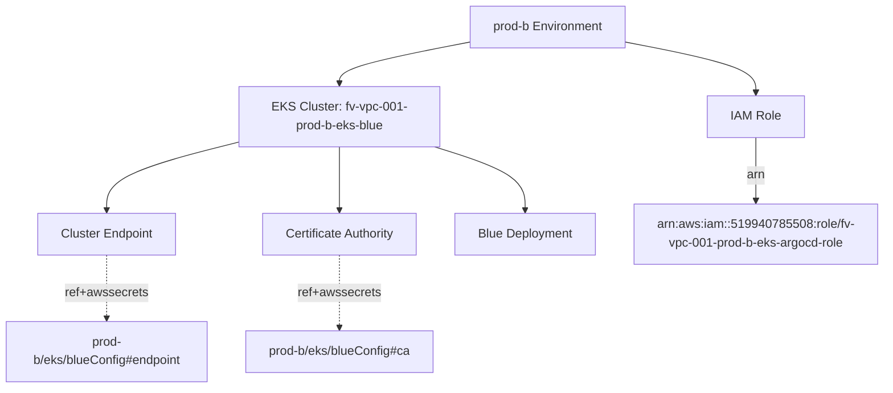
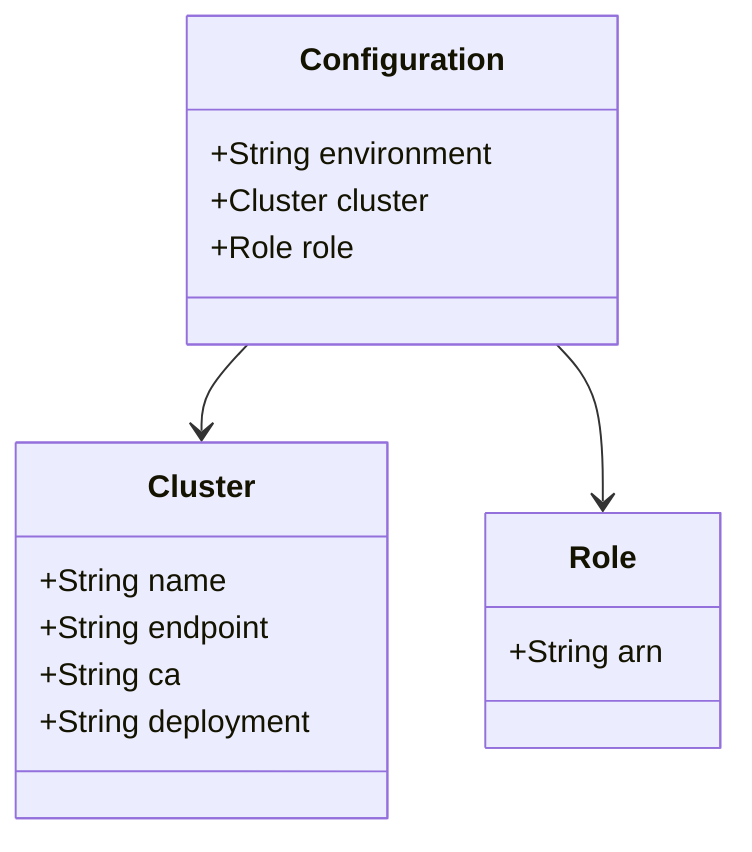
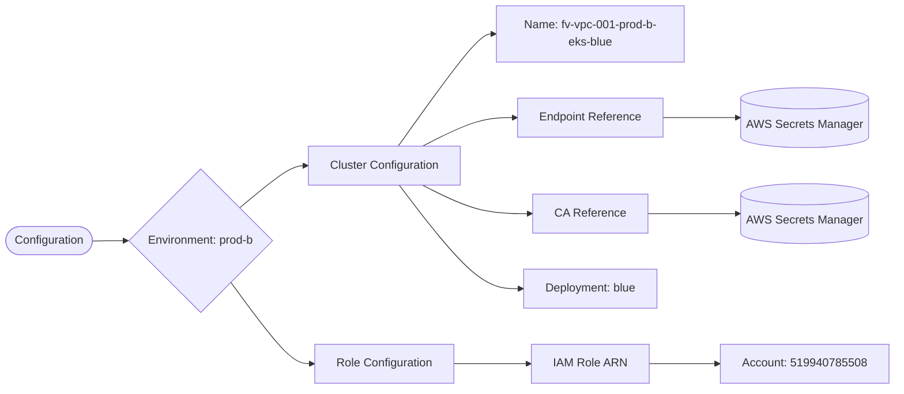

# Diagram: devops/k8s/argocd/clusters/helm/values.prod-b.yaml

> Auto-generated by Obscura crawlers

## Diagram 1

### SVG

<svg id="container" width="1150.5859375" xmlns="http://www.w3.org/2000/svg" class="flowchart" height="502" viewBox="0 0 1150.5859375 502" role="graphics-document document" aria-roledescription="flowchart-v2"><g><marker id="container_flowchart-v2-pointEnd" class="marker flowchart-v2" viewBox="0 0 10 10" refX="5" refY="5" markerUnits="userSpaceOnUse" markerWidth="8" markerHeight="8" orient="auto"><path d="M 0 0 L 10 5 L 0 10 z" class="arrowMarkerPath" style="stroke-width: 1; stroke-dasharray: 1, 0;"></path></marker><marker id="container_flowchart-v2-pointStart" class="marker flowchart-v2" viewBox="0 0 10 10" refX="4.5" refY="5" markerUnits="userSpaceOnUse" markerWidth="8" markerHeight="8" orient="auto"><path d="M 0 5 L 10 10 L 10 0 z" class="arrowMarkerPath" style="stroke-width: 1; stroke-dasharray: 1, 0;"></path></marker><marker id="container_flowchart-v2-circleEnd" class="marker flowchart-v2" viewBox="0 0 10 10" refX="11" refY="5" markerUnits="userSpaceOnUse" markerWidth="11" markerHeight="11" orient="auto"><circle cx="5" cy="5" r="5" class="arrowMarkerPath" style="stroke-width: 1; stroke-dasharray: 1, 0;"></circle></marker><marker id="container_flowchart-v2-circleStart" class="marker flowchart-v2" viewBox="0 0 10 10" refX="-1" refY="5" markerUnits="userSpaceOnUse" markerWidth="11" markerHeight="11" orient="auto"><circle cx="5" cy="5" r="5" class="arrowMarkerPath" style="stroke-width: 1; stroke-dasharray: 1, 0;"></circle></marker><marker id="container_flowchart-v2-crossEnd" class="marker cross flowchart-v2" viewBox="0 0 11 11" refX="12" refY="5.2" markerUnits="userSpaceOnUse" markerWidth="11" markerHeight="11" orient="auto"><path d="M 1,1 l 9,9 M 10,1 l -9,9" class="arrowMarkerPath" style="stroke-width: 2; stroke-dasharray: 1, 0;"></path></marker><marker id="container_flowchart-v2-crossStart" class="marker cross flowchart-v2" viewBox="0 0 11 11" refX="-1" refY="5.2" markerUnits="userSpaceOnUse" markerWidth="11" markerHeight="11" orient="auto"><path d="M 1,1 l 9,9 M 10,1 l -9,9" class="arrowMarkerPath" style="stroke-width: 2; stroke-dasharray: 1, 0;"></path></marker><g class="root"><g class="clusters"></g><g class="edgePaths"><path d="M612.801,54.783L584.795,60.152C556.789,65.522,500.777,76.261,472.771,85.13C444.766,94,444.766,101,444.766,104.5L444.766,108" id="L_Environment_Cluster_0" class="edge-thickness-normal edge-pattern-solid edge-thickness-normal edge-pattern-solid flowchart-link" style=";" data-edge="true" data-et="edge" data-id="L_Environment_Cluster_0" data-points="W3sieCI6NjEyLjgwMDc4MTI1LCJ5Ijo1NC43ODI2MzMxMTc3NzE1OTZ9LHsieCI6NDQ0Ljc2NTYyNSwieSI6ODd9LHsieCI6NDQ0Ljc2NTYyNSwieSI6MTEyfV0=" marker-end="url(#container_flowchart-v2-pointEnd)"></path><path d="M314.766,183.259L285.387,190.549C256.008,197.839,197.25,212.42,167.871,227.21C138.492,242,138.492,257,138.492,264.5L138.492,272" id="L_Cluster_Endpoint_0" class="edge-thickness-normal edge-pattern-solid edge-thickness-normal edge-pattern-solid flowchart-link" style=";" data-edge="true" data-et="edge" data-id="L_Cluster_Endpoint_0" data-points="W3sieCI6MzE0Ljc2NTYyNSwieSI6MTgzLjI1ODc1NTcwNzQ3MTM4fSx7IngiOjEzOC40OTIxODc1LCJ5IjoyMjd9LHsieCI6MTM4LjQ5MjE4NzUsInkiOjI3Nn1d" marker-end="url(#container_flowchart-v2-pointEnd)"></path><path d="M444.766,190L444.766,196.167C444.766,202.333,444.766,214.667,444.766,228.333C444.766,242,444.766,257,444.766,264.5L444.766,272" id="L_Cluster_CA_0" class="edge-thickness-normal edge-pattern-solid edge-thickness-normal edge-pattern-solid flowchart-link" style=";" data-edge="true" data-et="edge" data-id="L_Cluster_CA_0" data-points="W3sieCI6NDQ0Ljc2NTYyNSwieSI6MTkwfSx7IngiOjQ0NC43NjU2MjUsInkiOjIyN30seyJ4Ijo0NDQuNzY1NjI1LCJ5IjoyNzZ9XQ==" marker-end="url(#container_flowchart-v2-pointEnd)"></path><path d="M570.365,190L590.225,196.167C610.084,202.333,649.804,214.667,669.664,228.333C689.523,242,689.523,257,689.523,264.5L689.523,272" id="L_Cluster_Deployment_0" class="edge-thickness-normal edge-pattern-solid edge-thickness-normal edge-pattern-solid flowchart-link" style=";" data-edge="true" data-et="edge" data-id="L_Cluster_Deployment_0" data-points="W3sieCI6NTcwLjM2NTAyODc4Mjg5NDgsInkiOjE5MH0seyJ4Ijo2ODkuNTIzNDM3NSwieSI6MjI3fSx7IngiOjY4OS41MjM0Mzc1LCJ5IjoyNzZ9XQ==" marker-end="url(#container_flowchart-v2-pointEnd)"></path><path d="M819.16,54.783L847.166,60.152C875.172,65.522,931.184,76.261,959.189,87.13C987.195,98,987.195,109,987.195,114.5L987.195,120" id="L_Environment_Role_0" class="edge-thickness-normal edge-pattern-solid edge-thickness-normal edge-pattern-solid flowchart-link" style=";" data-edge="true" data-et="edge" data-id="L_Environment_Role_0" data-points="W3sieCI6ODE5LjE2MDE1NjI1LCJ5Ijo1NC43ODI2MzMxMTc3NzE1OTZ9LHsieCI6OTg3LjE5NTMxMjUsInkiOjg3fSx7IngiOjk4Ny4xOTUzMTI1LCJ5IjoxMjR9XQ==" marker-end="url(#container_flowchart-v2-pointEnd)"></path><path d="M138.492,330L138.492,338.167C138.492,346.333,138.492,362.667,138.492,376.333C138.492,390,138.492,401,138.492,406.5L138.492,412" id="L_Endpoint_SecretEndpoint_0" class="edge-thickness-normal edge-pattern-dotted edge-thickness-normal edge-pattern-solid flowchart-link" style=";" data-edge="true" data-et="edge" data-id="L_Endpoint_SecretEndpoint_0" data-points="W3sieCI6MTM4LjQ5MjE4NzUsInkiOjMzMH0seyJ4IjoxMzguNDkyMTg3NSwieSI6Mzc5fSx7IngiOjEzOC40OTIxODc1LCJ5Ijo0MTZ9XQ==" marker-end="url(#container_flowchart-v2-pointEnd)"></path><path d="M444.766,330L444.766,338.167C444.766,346.333,444.766,362.667,444.766,378.333C444.766,394,444.766,409,444.766,416.5L444.766,424" id="L_CA_SecretCA_0" class="edge-thickness-normal edge-pattern-dotted edge-thickness-normal edge-pattern-solid flowchart-link" style=";" data-edge="true" data-et="edge" data-id="L_CA_SecretCA_0" data-points="W3sieCI6NDQ0Ljc2NTYyNSwieSI6MzMwfSx7IngiOjQ0NC43NjU2MjUsInkiOjM3OX0seyJ4Ijo0NDQuNzY1NjI1LCJ5Ijo0Mjh9XQ==" marker-end="url(#container_flowchart-v2-pointEnd)"></path><path d="M987.195,178L987.195,186.167C987.195,194.333,987.195,210.667,987.195,224.333C987.195,238,987.195,249,987.195,254.5L987.195,260" id="L_Role_ARN_0" class="edge-thickness-normal edge-pattern-solid edge-thickness-normal edge-pattern-solid flowchart-link" style=";" data-edge="true" data-et="edge" data-id="L_Role_ARN_0" data-points="W3sieCI6OTg3LjE5NTMxMjUsInkiOjE3OH0seyJ4Ijo5ODcuMTk1MzEyNSwieSI6MjI3fSx7IngiOjk4Ny4xOTUzMTI1LCJ5IjoyNjR9XQ==" marker-end="url(#container_flowchart-v2-pointEnd)"></path></g><g class="edgeLabels"><g class="edgeLabel"><g class="label" data-id="L_Environment_Cluster_0" transform="translate(0, 0)"><foreignObject width="0" height="0">

</foreignObject></g></g><g class="edgeLabel"><g class="label" data-id="L_Cluster_Endpoint_0" transform="translate(0, 0)"><foreignObject width="0" height="0">

</foreignObject></g></g><g class="edgeLabel"><g class="label" data-id="L_Cluster_CA_0" transform="translate(0, 0)"><foreignObject width="0" height="0">

</foreignObject></g></g><g class="edgeLabel"><g class="label" data-id="L_Cluster_Deployment_0" transform="translate(0, 0)"><foreignObject width="0" height="0">

</foreignObject></g></g><g class="edgeLabel"><g class="label" data-id="L_Environment_Role_0" transform="translate(0, 0)"><foreignObject width="0" height="0">

</foreignObject></g></g><g class="edgeLabel" transform="translate(138.4921875, 379)"><g class="label" data-id="L_Endpoint_SecretEndpoint_0" transform="translate(-53.0625, -12)"><foreignObject width="106.125" height="24">

ref+awssecrets

</foreignObject></g></g><g class="edgeLabel" transform="translate(444.765625, 379)"><g class="label" data-id="L_CA_SecretCA_0" transform="translate(-53.0625, -12)"><foreignObject width="106.125" height="24">

ref+awssecrets

</foreignObject></g></g><g class="edgeLabel" transform="translate(987.1953125, 227)"><g class="label" data-id="L_Role_ARN_0" transform="translate(-12.1328125, -12)"><foreignObject width="24.265625" height="24">

arn

</foreignObject></g></g></g><g class="nodes"><g class="node default" id="flowchart-Environment-0" transform="translate(715.98046875, 35)"><rect class="basic label-container" style="" x="-103.1796875" y="-27" width="206.359375" height="54"></rect><g class="label" style="" transform="translate(-73.1796875, -12)"><rect></rect><foreignObject width="146.359375" height="24">

prod-b Environment

</foreignObject></g></g><g class="node default" id="flowchart-Cluster-1" transform="translate(444.765625, 151)"><rect class="basic label-container" style="" x="-130" y="-39" width="260" height="78"></rect><g class="label" style="" transform="translate(-100, -24)"><rect></rect><foreignObject width="200" height="48">

EKS Cluster: fv-vpc-001-prod-b-eks-blue

</foreignObject></g></g><g class="node default" id="flowchart-Role-2" transform="translate(987.1953125, 151)"><rect class="basic label-container" style="" x="-61.3515625" y="-27" width="122.703125" height="54"></rect><g class="label" style="" transform="translate(-31.3515625, -12)"><rect></rect><foreignObject width="62.703125" height="24">

IAM Role

</foreignObject></g></g><g class="node default" id="flowchart-Endpoint-3" transform="translate(138.4921875, 303)"><rect class="basic label-container" style="" x="-90.40625" y="-27" width="180.8125" height="54"></rect><g class="label" style="" transform="translate(-60.40625, -12)"><rect></rect><foreignObject width="120.8125" height="24">

Cluster Endpoint

</foreignObject></g></g><g class="node default" id="flowchart-CA-4" transform="translate(444.765625, 303)"><rect class="basic label-container" style="" x="-102.4765625" y="-27" width="204.953125" height="54"></rect><g class="label" style="" transform="translate(-72.4765625, -12)"><rect></rect><foreignObject width="144.953125" height="24">

Certificate Authority

</foreignObject></g></g><g class="node default" id="flowchart-Deployment-5" transform="translate(689.5234375, 303)"><rect class="basic label-container" style="" x="-92.28125" y="-27" width="184.5625" height="54"></rect><g class="label" style="" transform="translate(-62.28125, -12)"><rect></rect><foreignObject width="124.5625" height="24">

Blue Deployment

</foreignObject></g></g><g class="node default" id="flowchart-SecretEndpoint-17" transform="translate(138.4921875, 455)"><rect class="basic label-container" style="" x="-130.4921875" y="-39" width="260.984375" height="78"></rect><g class="label" style="" transform="translate(-100.4921875, -24)"><rect></rect><foreignObject width="200.984375" height="48">

prod-b/eks/blueConfig#endpoint

</foreignObject></g></g><g class="node default" id="flowchart-SecretCA-19" transform="translate(444.765625, 455)"><rect class="basic label-container" style="" x="-125.78125" y="-27" width="251.5625" height="54"></rect><g class="label" style="" transform="translate(-95.78125, -12)"><rect></rect><foreignObject width="191.5625" height="24">

prod-b/eks/blueConfig#ca

</foreignObject></g></g><g class="node default" id="flowchart-ARN-21" transform="translate(987.1953125, 303)"><rect class="basic label-container" style="" x="-155.390625" y="-39" width="310.78125" height="78"></rect><g class="label" style="" transform="translate(-125.390625, -24)"><rect></rect><foreignObject width="250.78125" height="48">

arn:aws:iam::519940785508:role/fv-vpc-001-prod-b-eks-argocd-role

</foreignObject></g></g></g></g></g></svg>

## Diagram 2

### SVG

<svg id="container" width="376.4921875" xmlns="http://www.w3.org/2000/svg" class="classDiagram" height="426" viewBox="0 0 376.4921875 426" role="graphics-document document" aria-roledescription="class"><g><defs><marker id="container_class-aggregationStart" class="marker aggregation class" refX="18" refY="7" markerWidth="190" markerHeight="240" orient="auto"><path d="M 18,7 L9,13 L1,7 L9,1 Z"></path></marker></defs><defs><marker id="container_class-aggregationEnd" class="marker aggregation class" refX="1" refY="7" markerWidth="20" markerHeight="28" orient="auto"><path d="M 18,7 L9,13 L1,7 L9,1 Z"></path></marker></defs><defs><marker id="container_class-extensionStart" class="marker extension class" refX="18" refY="7" markerWidth="190" markerHeight="240" orient="auto"><path d="M 1,7 L18,13 V 1 Z"></path></marker></defs><defs><marker id="container_class-extensionEnd" class="marker extension class" refX="1" refY="7" markerWidth="20" markerHeight="28" orient="auto"><path d="M 1,1 V 13 L18,7 Z"></path></marker></defs><defs><marker id="container_class-compositionStart" class="marker composition class" refX="18" refY="7" markerWidth="190" markerHeight="240" orient="auto"><path d="M 18,7 L9,13 L1,7 L9,1 Z"></path></marker></defs><defs><marker id="container_class-compositionEnd" class="marker composition class" refX="1" refY="7" markerWidth="20" markerHeight="28" orient="auto"><path d="M 18,7 L9,13 L1,7 L9,1 Z"></path></marker></defs><defs><marker id="container_class-dependencyStart" class="marker dependency class" refX="6" refY="7" markerWidth="190" markerHeight="240" orient="auto"><path d="M 5,7 L9,13 L1,7 L9,1 Z"></path></marker></defs><defs><marker id="container_class-dependencyEnd" class="marker dependency class" refX="13" refY="7" markerWidth="20" markerHeight="28" orient="auto"><path d="M 18,7 L9,13 L14,7 L9,1 Z"></path></marker></defs><defs><marker id="container_class-lollipopStart" class="marker lollipop class" refX="13" refY="7" markerWidth="190" markerHeight="240" orient="auto"><circle stroke="black" fill="transparent" cx="7" cy="7" r="6"></circle></marker></defs><defs><marker id="container_class-lollipopEnd" class="marker lollipop class" refX="1" refY="7" markerWidth="190" markerHeight="240" orient="auto"><circle stroke="black" fill="transparent" cx="7" cy="7" r="6"></circle></marker></defs><g class="root"><g class="clusters"></g><g class="edgePaths"><path d="M127.295,176L123.372,180.167C119.449,184.333,111.604,192.667,107.681,200C103.758,207.333,103.758,213.667,103.758,216.833L103.758,220" id="id_Configuration_Cluster_1" class="edge-thickness-normal edge-pattern-solid relation" style=";;;" data-edge="true" data-et="edge" data-id="id_Configuration_Cluster_1" data-points="W3sieCI6MTI3LjI5NTIwODU3MjI0NzcsInkiOjE3Nn0seyJ4IjoxMDMuNzU3ODEyNSwieSI6MjAxfSx7IngiOjEwMy43NTc4MTI1LCJ5IjoyMjZ9XQ==" marker-end="url(#container_class-dependencyEnd)"></path><path d="M285.467,176L289.389,180.167C293.312,184.333,301.158,192.667,305.081,206C309.004,219.333,309.004,237.667,309.004,246.833L309.004,256" id="id_Configuration_Role_2" class="edge-thickness-normal edge-pattern-solid relation" style=";;;" data-edge="true" data-et="edge" data-id="id_Configuration_Role_2" data-points="W3sieCI6Mjg1LjQ2NjUxMDE3Nzc1MjMsInkiOjE3Nn0seyJ4IjozMDkuMDAzOTA2MjUsInkiOjIwMX0seyJ4IjozMDkuMDAzOTA2MjUsInkiOjI2Mn1d" marker-end="url(#container_class-dependencyEnd)"></path></g><g class="edgeLabels"><g class="edgeLabel"><g class="label" data-id="id_Configuration_Cluster_1" transform="translate(0, 0)"><foreignObject width="0" height="0">

</foreignObject></g></g><g class="edgeLabel"><g class="label" data-id="id_Configuration_Role_2" transform="translate(0, 0)"><foreignObject width="0" height="0">

</foreignObject></g></g></g><g class="nodes"><g class="node default" id="classId-Configuration-0" transform="translate(206.380859375, 92)"><g class="basic label-container"><path d="M-110.109375 -84 L110.109375 -84 L110.109375 84 L-110.109375 84" stroke="none" stroke-width="0" fill="#ECECFF" style=""></path><path d="M-110.109375 -84 C-49.943381273355406 -84, 10.222612453289187 -84, 110.109375 -84 M-110.109375 -84 C-52.90417584930253 -84, 4.301023301394935 -84, 110.109375 -84 M110.109375 -84 C110.109375 -24.920682461116826, 110.109375 34.15863507776635, 110.109375 84 M110.109375 -84 C110.109375 -23.659951557407865, 110.109375 36.68009688518427, 110.109375 84 M110.109375 84 C28.587331401084924 84, -52.93471219783015 84, -110.109375 84 M110.109375 84 C42.28997718417544 84, -25.529420631649117 84, -110.109375 84 M-110.109375 84 C-110.109375 30.425486586802464, -110.109375 -23.149026826395072, -110.109375 -84 M-110.109375 84 C-110.109375 38.21461890981771, -110.109375 -7.570762180364582, -110.109375 -84" stroke="#9370DB" stroke-width="1.3" fill="none" stroke-dasharray="0 0" style=""></path></g><g class="annotation-group text" transform="translate(0, -60)"></g><g class="label-group text" transform="translate(-49.375, -60)"><g class="label" style="font-weight: bolder" transform="translate(0,-12)"><foreignObject width="98.75" height="24">

Configuration

</foreignObject></g></g><g class="members-group text" transform="translate(-98.109375, -12)"><g class="label" style="" transform="translate(0,-12)"><foreignObject width="146.84375" height="24">

+String environment

</foreignObject></g><g class="label" style="" transform="translate(0,12)"><foreignObject width="112.484375" height="24">

+Cluster cluster

</foreignObject></g><g class="label" style="" transform="translate(0,36)"><foreignObject width="72.71875" height="24">

+Role role

</foreignObject></g></g><g class="methods-group text" transform="translate(-98.109375, 84)"></g><g class="divider" style=""><path d="M-110.109375 -36 C-64.54873171965289 -36, -18.9880884393058 -36, 110.109375 -36 M-110.109375 -36 C-39.66510110865039 -36, 30.77917278269922 -36, 110.109375 -36" stroke="#9370DB" stroke-width="1.3" fill="none" stroke-dasharray="0 0" style=""></path></g><g class="divider" style=""><path d="M-110.109375 60 C-30.37969078461424 60, 49.34999343077152 60, 110.109375 60 M-110.109375 60 C-56.31976346331871 60, -2.5301519266374157 60, 110.109375 60" stroke="#9370DB" stroke-width="1.3" fill="none" stroke-dasharray="0 0" style=""></path></g></g><g class="node default" id="classId-Cluster-1" transform="translate(103.7578125, 322)"><g class="basic label-container"><path d="M-95.7578125 -96 L95.7578125 -96 L95.7578125 96 L-95.7578125 96" stroke="none" stroke-width="0" fill="#ECECFF" style=""></path><path d="M-95.7578125 -96 C-21.21582150551545 -96, 53.3261694889691 -96, 95.7578125 -96 M-95.7578125 -96 C-35.4797020981458 -96, 24.7984083037084 -96, 95.7578125 -96 M95.7578125 -96 C95.7578125 -26.182425782375944, 95.7578125 43.63514843524811, 95.7578125 96 M95.7578125 -96 C95.7578125 -38.920455274381, 95.7578125 18.159089451238003, 95.7578125 96 M95.7578125 96 C56.64306112191622 96, 17.528309743832438 96, -95.7578125 96 M95.7578125 96 C49.11801134225228 96, 2.4782101845045617 96, -95.7578125 96 M-95.7578125 96 C-95.7578125 26.928300824066184, -95.7578125 -42.14339835186763, -95.7578125 -96 M-95.7578125 96 C-95.7578125 34.82553620468245, -95.7578125 -26.3489275906351, -95.7578125 -96" stroke="#9370DB" stroke-width="1.3" fill="none" stroke-dasharray="0 0" style=""></path></g><g class="annotation-group text" transform="translate(0, -72)"></g><g class="label-group text" transform="translate(-25.90625, -72)"><g class="label" style="font-weight: bolder" transform="translate(0,-12)"><foreignObject width="51.8125" height="24">

Cluster

</foreignObject></g></g><g class="members-group text" transform="translate(-83.7578125, -24)"><g class="label" style="" transform="translate(0,-12)"><foreignObject width="94.984375" height="24">

+String name

</foreignObject></g><g class="label" style="" transform="translate(0,12)"><foreignObject width="120.640625" height="24">

+String endpoint

</foreignObject></g><g class="label" style="" transform="translate(0,36)"><foreignObject width="70.65625" height="24">

+String ca

</foreignObject></g><g class="label" style="" transform="translate(0,60)"><foreignObject width="141.609375" height="24">

+String deployment

</foreignObject></g></g><g class="methods-group text" transform="translate(-83.7578125, 96)"></g><g class="divider" style=""><path d="M-95.7578125 -48 C-32.42329997995262 -48, 30.911212540094766 -48, 95.7578125 -48 M-95.7578125 -48 C-35.34496179872961 -48, 25.067888902540787 -48, 95.7578125 -48" stroke="#9370DB" stroke-width="1.3" fill="none" stroke-dasharray="0 0" style=""></path></g><g class="divider" style=""><path d="M-95.7578125 72 C-25.81258007840782 72, 44.13265234318436 72, 95.7578125 72 M-95.7578125 72 C-33.57920158898572 72, 28.599409322028563 72, 95.7578125 72" stroke="#9370DB" stroke-width="1.3" fill="none" stroke-dasharray="0 0" style=""></path></g></g><g class="node default" id="classId-Role-2" transform="translate(309.00390625, 322)"><g class="basic label-container"><path d="M-59.48828125 -60 L59.48828125 -60 L59.48828125 60 L-59.48828125 60" stroke="none" stroke-width="0" fill="#ECECFF" style=""></path><path d="M-59.48828125 -60 C-18.48394867880355 -60, 22.5203838923929 -60, 59.48828125 -60 M-59.48828125 -60 C-24.884022942647555 -60, 9.720235364704891 -60, 59.48828125 -60 M59.48828125 -60 C59.48828125 -34.7354238994681, 59.48828125 -9.470847798936198, 59.48828125 60 M59.48828125 -60 C59.48828125 -33.14316155779936, 59.48828125 -6.286323115598719, 59.48828125 60 M59.48828125 60 C30.66194382557959 60, 1.8356064011591826 60, -59.48828125 60 M59.48828125 60 C17.872822790366925 60, -23.74263566926615 60, -59.48828125 60 M-59.48828125 60 C-59.48828125 30.1407571977411, -59.48828125 0.2815143954821977, -59.48828125 -60 M-59.48828125 60 C-59.48828125 12.776470264460578, -59.48828125 -34.447059471078845, -59.48828125 -60" stroke="#9370DB" stroke-width="1.3" fill="none" stroke-dasharray="0 0" style=""></path></g><g class="annotation-group text" transform="translate(0, -36)"></g><g class="label-group text" transform="translate(-16.2421875, -36)"><g class="label" style="font-weight: bolder" transform="translate(0,-12)"><foreignObject width="32.484375" height="24">

Role

</foreignObject></g></g><g class="members-group text" transform="translate(-47.48828125, 12)"><g class="label" style="" transform="translate(0,-12)"><foreignObject width="78.734375" height="24">

+String arn

</foreignObject></g></g><g class="methods-group text" transform="translate(-47.48828125, 60)"></g><g class="divider" style=""><path d="M-59.48828125 -12 C-27.502260610931582 -12, 4.483760028136835 -12, 59.48828125 -12 M-59.48828125 -12 C-19.03369401962331 -12, 21.420893210753377 -12, 59.48828125 -12" stroke="#9370DB" stroke-width="1.3" fill="none" stroke-dasharray="0 0" style=""></path></g><g class="divider" style=""><path d="M-59.48828125 36 C-34.6585742685412 36, -9.82886728708241 36, 59.48828125 36 M-59.48828125 36 C-21.797389108794164 36, 15.893503032411672 36, 59.48828125 36" stroke="#9370DB" stroke-width="1.3" fill="none" stroke-dasharray="0 0" style=""></path></g></g></g></g></g></svg>

## Diagram 3

### SVG

<svg id="container" width="1237.65185546875" xmlns="http://www.w3.org/2000/svg" class="flowchart" height="538.1260375976562" viewBox="0 0 1237.65185546875 538.1260375976562" role="graphics-document document" aria-roledescription="flowchart-v2"><g><marker id="container_flowchart-v2-pointEnd" class="marker flowchart-v2" viewBox="0 0 10 10" refX="5" refY="5" markerUnits="userSpaceOnUse" markerWidth="8" markerHeight="8" orient="auto"><path d="M 0 0 L 10 5 L 0 10 z" class="arrowMarkerPath" style="stroke-width: 1; stroke-dasharray: 1, 0;"></path></marker><marker id="container_flowchart-v2-pointStart" class="marker flowchart-v2" viewBox="0 0 10 10" refX="4.5" refY="5" markerUnits="userSpaceOnUse" markerWidth="8" markerHeight="8" orient="auto"><path d="M 0 5 L 10 10 L 10 0 z" class="arrowMarkerPath" style="stroke-width: 1; stroke-dasharray: 1, 0;"></path></marker><marker id="container_flowchart-v2-circleEnd" class="marker flowchart-v2" viewBox="0 0 10 10" refX="11" refY="5" markerUnits="userSpaceOnUse" markerWidth="11" markerHeight="11" orient="auto"><circle cx="5" cy="5" r="5" class="arrowMarkerPath" style="stroke-width: 1; stroke-dasharray: 1, 0;"></circle></marker><marker id="container_flowchart-v2-circleStart" class="marker flowchart-v2" viewBox="0 0 10 10" refX="-1" refY="5" markerUnits="userSpaceOnUse" markerWidth="11" markerHeight="11" orient="auto"><circle cx="5" cy="5" r="5" class="arrowMarkerPath" style="stroke-width: 1; stroke-dasharray: 1, 0;"></circle></marker><marker id="container_flowchart-v2-crossEnd" class="marker cross flowchart-v2" viewBox="0 0 11 11" refX="12" refY="5.2" markerUnits="userSpaceOnUse" markerWidth="11" markerHeight="11" orient="auto"><path d="M 1,1 l 9,9 M 10,1 l -9,9" class="arrowMarkerPath" style="stroke-width: 2; stroke-dasharray: 1, 0;"></path></marker><marker id="container_flowchart-v2-crossStart" class="marker cross flowchart-v2" viewBox="0 0 11 11" refX="-1" refY="5.2" markerUnits="userSpaceOnUse" markerWidth="11" markerHeight="11" orient="auto"><path d="M 1,1 l 9,9 M 10,1 l -9,9" class="arrowMarkerPath" style="stroke-width: 2; stroke-dasharray: 1, 0;"></path></marker><g class="root"><g class="clusters"></g><g class="edgePaths"><path d="M130.605,333.563L134.688,333.48C138.772,333.396,146.938,333.23,154.522,333.146C162.105,333.063,169.105,333.063,172.605,333.063L176.105,333.063" id="L_Start_Env_0" class="edge-thickness-normal edge-pattern-solid edge-thickness-normal edge-pattern-solid flowchart-link" style=";" data-edge="true" data-et="edge" data-id="L_Start_Env_0" data-points="W3sieCI6MTMwLjYwNDk2MjQzMTgyNjMsInkiOjMzMy41NjMwMTExNjk0MzM1NH0seyJ4IjoxNTUuMTA0OTY1MjA5OTYwOTQsInkiOjMzMy4wNjMwMTExNjk0MzM2fSx7IngiOjE4MC4xMDQ5NjUyMDk5NjA4NSwieSI6MzMzLjA2MzAxMTE2OTQzMzY1fV0=" marker-end="url(#container_flowchart-v2-pointEnd)"></path><path d="M338.415,287.108L350.241,277.433C362.067,267.759,385.719,248.411,401.045,238.737C416.371,229.063,423.371,229.063,426.871,229.063L430.371,229.063" id="L_Env_ClusterConfig_0" class="edge-thickness-normal edge-pattern-solid edge-thickness-normal edge-pattern-solid flowchart-link" style=";" data-edge="true" data-et="edge" data-id="L_Env_ClusterConfig_0" data-points="W3sieCI6MzM4LjQxNTEzOTgxMjgwMDI1LCJ5IjoyODcuMTA3NTYwNzcyMjcyOX0seyJ4Ijo0MDkuMzcwNTkwMjA5OTYwOTQsInkiOjIyOS4wNjMwMTExNjk0MzM2fSx7IngiOjQzNC4zNzA1OTAyMDk5NjA5NCwieSI6MjI5LjA2MzAxMTE2OTQzMzZ9XQ==" marker-end="url(#container_flowchart-v2-pointEnd)"></path><path d="M325.928,391.506L339.835,410.109C353.742,428.713,381.556,465.919,400.513,484.523C419.47,503.126,429.569,503.126,434.618,503.126L439.667,503.126" id="L_Env_RoleConfig_0" class="edge-thickness-normal edge-pattern-solid edge-thickness-normal edge-pattern-solid flowchart-link" style=";" data-edge="true" data-et="edge" data-id="L_Env_RoleConfig_0" data-points="W3sieCI6MzI1LjkyNzU5NjU2ODU5NTE2LCJ5IjozOTEuNTA2MDA0ODEwNzk5M30seyJ4Ijo0MDkuMzcwNTkwMjA5OTYwOTQsInkiOjUwMy4xMjYwMjIzMzg4NjcyfSx7IngiOjQ0My42Njc0NjUyMDk5NjA5NCwieSI6NTAzLjEyNjAyMjMzODg2NzJ9XQ==" marker-end="url(#container_flowchart-v2-pointEnd)"></path><path d="M559.977,202.063L578.595,176.219C597.213,150.375,634.448,98.688,656.565,72.844C678.683,47,685.683,47,689.183,47L692.683,47" id="L_ClusterConfig_Name_0" class="edge-thickness-normal edge-pattern-solid edge-thickness-normal edge-pattern-solid flowchart-link" style=";" data-edge="true" data-et="edge" data-id="L_ClusterConfig_Name_0" data-points="W3sieCI6NTU5Ljk3NzM1MjAyNTkxOTEsInkiOjIwMi4wNjMwMTExNjk0MzM2fSx7IngiOjY3MS42ODMwOTAyMDk5NjA5LCJ5Ijo0N30seyJ4Ijo2OTYuNjgzMDkwMjA5OTYwOSwieSI6NDd9XQ==" marker-end="url(#container_flowchart-v2-pointEnd)"></path><path d="M594.13,202.063L607.056,195.553C619.981,189.042,645.832,176.021,667.088,169.511C688.345,163,705.006,163,713.337,163L721.667,163" id="L_ClusterConfig_EndpointRef_0" class="edge-thickness-normal edge-pattern-solid edge-thickness-normal edge-pattern-solid flowchart-link" style=";" data-edge="true" data-et="edge" data-id="L_ClusterConfig_EndpointRef_0" data-points="W3sieCI6NTk0LjEzMDQ5MzU2MDIxMDgsInkiOjIwMi4wNjMwMTExNjk0MzM2fSx7IngiOjY3MS42ODMwOTAyMDk5NjA5LCJ5IjoxNjN9LHsieCI6NzI1LjY2NzQ2NTIwOTk2MDksInkiOjE2M31d" marker-end="url(#container_flowchart-v2-pointEnd)"></path><path d="M594.13,256.063L607.056,262.574C619.981,269.084,645.832,282.105,671.066,288.616C696.3,295.126,720.917,295.126,733.226,295.126L745.535,295.126" id="L_ClusterConfig_CARef_0" class="edge-thickness-normal edge-pattern-solid edge-thickness-normal edge-pattern-solid flowchart-link" style=";" data-edge="true" data-et="edge" data-id="L_ClusterConfig_CARef_0" data-points="W3sieCI6NTk0LjEzMDQ5MzU2MDIxMDgsInkiOjI1Ni4wNjMwMTExNjk0MzM2fSx7IngiOjY3MS42ODMwOTAyMDk5NjA5LCJ5IjoyOTUuMTI2MDIyMzM4ODY3Mn0seyJ4Ijo3NDkuNTM0NjUyNzA5OTYwOSwieSI6Mjk1LjEyNjAyMjMzODg2NzJ9XQ==" marker-end="url(#container_flowchart-v2-pointEnd)"></path><path d="M561.35,256.063L579.739,279.907C598.128,303.751,634.905,351.438,662.773,375.282C690.641,399.126,709.6,399.126,719.079,399.126L728.558,399.126" id="L_ClusterConfig_Deploy_0" class="edge-thickness-normal edge-pattern-solid edge-thickness-normal edge-pattern-solid flowchart-link" style=";" data-edge="true" data-et="edge" data-id="L_ClusterConfig_Deploy_0" data-points="W3sieCI6NTYxLjM0OTgyMDYxOTY4NjIsInkiOjI1Ni4wNjMwMTExNjk0MzM2fSx7IngiOjY3MS42ODMwOTAyMDk5NjA5LCJ5IjozOTkuMTI2MDIyMzM4ODY3Mn0seyJ4Ijo3MzIuNTU4MDkwMjA5OTYwOSwieSI6Mzk5LjEyNjAyMjMzODg2NzJ9XQ==" marker-end="url(#container_flowchart-v2-pointEnd)"></path><path d="M927.699,163L936.696,163C945.694,163,963.688,163,980.665,163C997.641,163,1013.6,163,1021.579,163L1029.558,163" id="L_EndpointRef_AWS1_0" class="edge-thickness-normal edge-pattern-solid edge-thickness-normal edge-pattern-solid flowchart-link" style=";" data-edge="true" data-et="edge" data-id="L_EndpointRef_AWS1_0" data-points="W3sieCI6OTI3LjY5ODcxNTIwOTk2MDksInkiOjE2M30seyJ4Ijo5ODEuNjgzMDkwMjA5OTYwOSwieSI6MTYzfSx7IngiOjEwMzMuNTU4MDkwMjA5OTYxLCJ5IjoxNjN9XQ==" marker-end="url(#container_flowchart-v2-pointEnd)"></path><path d="M903.832,295.126L916.807,295.126C929.782,295.126,955.733,295.126,976.687,295.126C997.641,295.126,1013.6,295.126,1021.579,295.126L1029.558,295.126" id="L_CARef_AWS2_0" class="edge-thickness-normal edge-pattern-solid edge-thickness-normal edge-pattern-solid flowchart-link" style=";" data-edge="true" data-et="edge" data-id="L_CARef_AWS2_0" data-points="W3sieCI6OTAzLjgzMTUyNzcwOTk2MDksInkiOjI5NS4xMjYwMjIzMzg4NjcyfSx7IngiOjk4MS42ODMwOTAyMDk5NjA5LCJ5IjoyOTUuMTI2MDIyMzM4ODY3Mn0seyJ4IjoxMDMzLjU1ODA5MDIwOTk2MSwieSI6Mjk1LjEyNjAyMjMzODg2NzJ9XQ==" marker-end="url(#container_flowchart-v2-pointEnd)"></path><path d="M637.386,503.126L643.102,503.126C648.819,503.126,660.251,503.126,678.074,503.126C695.897,503.126,720.11,503.126,732.217,503.126L744.324,503.126" id="L_RoleConfig_IAM_0" class="edge-thickness-normal edge-pattern-solid edge-thickness-normal edge-pattern-solid flowchart-link" style=";" data-edge="true" data-et="edge" data-id="L_RoleConfig_IAM_0" data-points="W3sieCI6NjM3LjM4NjIxNTIwOTk2MDksInkiOjUwMy4xMjYwMjIzMzg4NjcyfSx7IngiOjY3MS42ODMwOTAyMDk5NjA5LCJ5Ijo1MDMuMTI2MDIyMzM4ODY3Mn0seyJ4Ijo3NDguMzIzNzE1MjA5OTYwOSwieSI6NTAzLjEyNjAyMjMzODg2NzJ9XQ==" marker-end="url(#container_flowchart-v2-pointEnd)"></path><path d="M905.042,503.126L917.816,503.126C930.589,503.126,956.136,503.126,972.41,503.126C988.683,503.126,995.683,503.126,999.183,503.126L1002.683,503.126" id="L_IAM_Account_0" class="edge-thickness-normal edge-pattern-solid edge-thickness-normal edge-pattern-solid flowchart-link" style=";" data-edge="true" data-et="edge" data-id="L_IAM_Account_0" data-points="W3sieCI6OTA1LjA0MjQ2NTIwOTk2MDksInkiOjUwMy4xMjYwMjIzMzg4NjcyfSx7IngiOjk4MS42ODMwOTAyMDk5NjA5LCJ5Ijo1MDMuMTI2MDIyMzM4ODY3Mn0seyJ4IjoxMDA2LjY4MzA5MDIwOTk2MDksInkiOjUwMy4xMjYwMjIzMzg4NjcyfV0=" marker-end="url(#container_flowchart-v2-pointEnd)"></path></g><g class="edgeLabels"><g class="edgeLabel"><g class="label" data-id="L_Start_Env_0" transform="translate(0, 0)"><foreignObject width="0" height="0">

</foreignObject></g></g><g class="edgeLabel"><g class="label" data-id="L_Env_ClusterConfig_0" transform="translate(0, 0)"><foreignObject width="0" height="0">

</foreignObject></g></g><g class="edgeLabel"><g class="label" data-id="L_Env_RoleConfig_0" transform="translate(0, 0)"><foreignObject width="0" height="0">

</foreignObject></g></g><g class="edgeLabel"><g class="label" data-id="L_ClusterConfig_Name_0" transform="translate(0, 0)"><foreignObject width="0" height="0">

</foreignObject></g></g><g class="edgeLabel"><g class="label" data-id="L_ClusterConfig_EndpointRef_0" transform="translate(0, 0)"><foreignObject width="0" height="0">

</foreignObject></g></g><g class="edgeLabel"><g class="label" data-id="L_ClusterConfig_CARef_0" transform="translate(0, 0)"><foreignObject width="0" height="0">

</foreignObject></g></g><g class="edgeLabel"><g class="label" data-id="L_ClusterConfig_Deploy_0" transform="translate(0, 0)"><foreignObject width="0" height="0">

</foreignObject></g></g><g class="edgeLabel"><g class="label" data-id="L_EndpointRef_AWS1_0" transform="translate(0, 0)"><foreignObject width="0" height="0">

</foreignObject></g></g><g class="edgeLabel"><g class="label" data-id="L_CARef_AWS2_0" transform="translate(0, 0)"><foreignObject width="0" height="0">

</foreignObject></g></g><g class="edgeLabel"><g class="label" data-id="L_RoleConfig_IAM_0" transform="translate(0, 0)"><foreignObject width="0" height="0">

</foreignObject></g></g><g class="edgeLabel"><g class="label" data-id="L_IAM_Account_0" transform="translate(0, 0)"><foreignObject width="0" height="0">

</foreignObject></g></g></g><g class="nodes"><g class="node default" id="flowchart-Start-0" transform="translate(69.05248260498047, 333.0630111694336)"><g class="basic label-container outer-path"><path d="M-41.5625 -19.5 C-23.958431933453085 -19.5, -6.354363866906169 -19.5, 41.5625 -19.5 C41.5625 -19.5, 41.5625 -19.5, 41.5625 -19.5 C41.87736609232436 -19.489902857268827, 42.19223218464872 -19.479805714537655, 42.8118692896239 -19.45993515863156 C43.12218178286524 -19.429999685613943, 43.432494276106574 -19.400064212596323, 44.056104652847864 -19.3399052695533 C44.45388278977426 -19.275595585190562, 44.85166092670067 -19.21128590082783, 45.29009325967676 -19.140403561325776 C45.6982999022092 -19.047233058965034, 46.10650654474164 -18.954062556604292, 46.50876438623539 -18.862249829261074 C46.858252539147145 -18.758523579977616, 47.207740692058906 -18.65479733069416, 47.707110251460605 -18.50658706670804 C48.16506983357557 -18.33805370715776, 48.623029415690546 -18.16952034760748, 48.8802065951478 -18.074876768247425 C49.18174256157956 -17.94139574065472, 49.48327852801133 -17.80791471306201, 50.02323291279238 -17.568892924097174 C50.32147770339754 -17.413298807873367, 50.6197224940027 -17.25770469164956, 51.13149226407678 -16.990714730406097 C51.45543572673888 -16.79433829963724, 51.77937918940097 -16.597961868868385, 52.2004305736057 -16.342718045390892 C52.45599986559275 -16.164443970717063, 52.7115691575798 -15.986169896043235, 53.22565534457871 -15.627565626425154 C53.46092018066726 -15.439948180304755, 53.696185016755805 -15.252330734184357, 54.202953708501866 -14.848196188198123 C54.56880563251762 -14.515939150718484, 54.934657556533374 -14.183682113238845, 55.12830973676799 -14.007812326905688 C55.352167952118066 -13.776660340455445, 55.57602616746815 -13.545508354005202, 55.99792094296865 -13.10986736009568 C56.28237899534094 -12.775726745657472, 56.566837047713236 -12.441586131219264, 56.80821390812658 -12.158051136245305 C57.04011936317059 -11.847318953507914, 57.2720248182146 -11.536586770770523, 57.555858964640635 -11.156274872382312 C57.73149434638318 -10.886451761322082, 57.90712972812573 -10.616628650261852, 58.23778387860425 -10.108655082055241 C58.42597786362005 -9.774497604952273, 58.61417184863584 -9.440340127849304, 58.851186474273504 -9.019496659696287 C59.03416604525611 -8.639535665415277, 59.21714561623872 -8.259574671134267, 59.39354614880834 -7.893275190886684 C59.50665657224967 -7.613890258145333, 59.619766995691 -7.334505325403981, 59.862634229970325 -6.734618561215508 C59.953824921241825 -6.459966728369288, 60.045015612513325 -6.185314895523069, 60.25652313421488 -5.548287939305138 C60.37537837834938 -5.095041381231635, 60.49423362248388 -4.641794823158131, 60.57359428754556 -4.339158212148133 C60.639600543057455 -4.000230040521609, 60.70560679856934 -3.6613018688950856, 60.812544776581774 -3.1121979531509023 C60.85978430293615 -2.7458175152459887, 60.90702382929052 -2.3794370773410747, 60.97239270250937 -1.872449005199798 C60.999543260627796 -1.4495571469692352, 61.026693818746224 -1.0266652887386725, 61.05248121591342 -0.6250057626472757 C61.05248121591342 -0.3001760494337866, 61.05248121591342 0.02465366377970246, 61.05248121591342 0.625005762647271 C61.035222378054144 0.8938260933886366, 61.01796354019487 1.162646424130002, 60.97239270250937 1.8724490051997846 C60.94026100490887 2.1216561066678623, 60.90812930730837 2.3708632081359395, 60.812544776581774 3.1121979531508885 C60.75808314333401 3.3918469294078846, 60.70362151008625 3.671495905664881, 60.57359428754556 4.339158212148129 C60.50035286789372 4.618459488312675, 60.42711144824188 4.897760764477223, 60.25652313421489 5.548287939305125 C60.10466988176695 6.005645741148207, 59.95281662931902 6.46300354299129, 59.862634229970325 6.734618561215495 C59.73562797808604 7.048326458868507, 59.60862172620176 7.362034356521519, 59.39354614880834 7.893275190886679 C59.25834341562567 8.174026559215559, 59.123140682443 8.454777927544438, 58.851186474273504 9.019496659696284 C58.64297887878463 9.389190328792008, 58.43477128329577 9.75888399788773, 58.23778387860425 10.108655082055236 C58.08938616629186 10.336633818532398, 57.94098845397947 10.564612555009559, 57.55585896464064 11.156274872382301 C57.25776544108637 11.555693037066357, 56.959671917532106 11.955111201750412, 56.80821390812658 12.158051136245302 C56.6176832342038 12.381859307337471, 56.42715256028102 12.605667478429641, 55.99792094296866 13.10986736009567 C55.656036597913335 13.46289101559204, 55.31415225285801 13.81591467108841, 55.12830973676799 14.007812326905684 C54.8903499329515 14.223921124660425, 54.652390129135014 14.440029922415166, 54.20295370850189 14.848196188198111 C53.8468027386135 15.132217109108758, 53.49065176872511 15.416238030019406, 53.22565534457871 15.627565626425152 C52.8849075073148 15.865256566964321, 52.544159670050895 16.10294750750349, 52.20043057360571 16.34271804539089 C51.97679635409082 16.478286423481364, 51.75316213457593 16.613854801571836, 51.13149226407678 16.990714730406093 C50.691984712873236 17.220005538350964, 50.25247716166968 17.449296346295835, 50.02323291279239 17.56889292409717 C49.76019186934549 17.685333391195794, 49.497150825898586 17.801773858294418, 48.880206595147804 18.07487676824742 C48.47152022754764 18.22527712937965, 48.06283385994748 18.375677490511876, 47.70711025146062 18.506587066708033 C47.424962418481854 18.590327062511935, 47.14281458550308 18.674067058315835, 46.50876438623541 18.86224982926107 C46.1379129724697 18.946894244421454, 45.767061558703986 19.03153865958184, 45.290093259676766 19.140403561325773 C44.862008791071446 19.209612938365247, 44.433924322466126 19.278822315404717, 44.05610465284788 19.3399052695533 C43.60079516887258 19.383828427882626, 43.14548568489728 19.427751586211954, 42.8118692896239 19.45993515863156 C42.34016061421096 19.475061937726814, 41.86845193879801 19.49018871682207, 41.56250000000001 19.5 C41.56250000000001 19.5, 41.56250000000001 19.5, 41.5625 19.5 C10.53191853159095 19.5, -20.4986629368181 19.5, -41.56249999999999 19.5 C-41.845596790428914 19.49092163694542, -42.128693580857835 19.48184327389084, -42.81186928962389 19.45993515863156 C-43.064480343042405 19.435566074117517, -43.31709139646092 19.41119698960347, -44.05610465284787 19.3399052695533 C-44.31876444381468 19.297440471506885, -44.581424234781494 19.25497567346047, -45.29009325967676 19.140403561325773 C-45.688008897396585 19.049581913658425, -46.08592453511642 18.95876026599108, -46.508764386235384 18.862249829261074 C-46.951249446302725 18.730922586084564, -47.393734506370066 18.599595342908056, -47.70711025146059 18.506587066708043 C-48.00150409927599 18.39824740936508, -48.29589794709139 18.289907752022113, -48.8802065951478 18.074876768247425 C-49.18573940671149 17.93962645587701, -49.49127221827519 17.804376143506598, -50.02323291279238 17.568892924097174 C-50.45499533436898 17.34364274531769, -50.88675775594558 17.118392566538212, -51.13149226407678 16.990714730406097 C-51.402636075881944 16.826345758271902, -51.67377988768711 16.661976786137707, -52.200430573605686 16.3427180453909 C-52.5654706513144 16.08808188951158, -52.930510729023105 15.83344573363226, -53.22565534457871 15.627565626425156 C-53.47647818904329 15.427541082640861, -53.72730103350787 15.227516538856566, -54.202953708501866 14.848196188198125 C-54.42298028541287 14.648373872631765, -54.64300686232387 14.448551557065404, -55.128309736767974 14.007812326905697 C-55.43445074443845 13.691696601841759, -55.740591752108934 13.37558087677782, -55.997920942968655 13.109867360095677 C-56.31522297537724 12.737146337831437, -56.632525007785816 12.364425315567194, -56.808213908126575 12.158051136245307 C-56.99268197149375 11.910880736719582, -57.17715003486093 11.663710337193855, -57.555858964640635 11.156274872382316 C-57.79203317805282 10.793447858925033, -58.028207391465 10.430620845467752, -58.23778387860425 10.108655082055249 C-58.41102315666753 9.801051201474747, -58.584262434730825 9.493447320894246, -58.851186474273504 9.019496659696289 C-58.97413428896166 8.764192891834522, -59.09708210364982 8.508889123972754, -59.39354614880834 7.893275190886686 C-59.499563647074616 7.631409920460099, -59.60558114534089 7.369544650033511, -59.862634229970325 6.73461856121551 C-59.95318517185745 6.461893551584822, -60.043736113744565 6.1891685419541345, -60.25652313421488 5.5482879393051325 C-60.35686648659939 5.165635247578986, -60.4572098389839 4.782982555852838, -60.57359428754556 4.339158212148136 C-60.636359052198905 4.016874410990903, -60.69912381685226 3.694590609833671, -60.812544776581774 3.112197953150904 C-60.85852233075802 2.7556051222549565, -60.90449988493427 2.3990122913590084, -60.97239270250937 1.872449005199809 C-61.003570951212076 1.386822615025735, -61.034749199914785 0.9011962248516611, -61.05248121591342 0.6250057626472781 C-61.05248121591342 0.25858931405636265, -61.05248121591342 -0.10782713453455284, -61.05248121591342 -0.6250057626472687 C-61.02226001750306 -1.0957253220008527, -60.992038819092706 -1.5664448813544367, -60.97239270250937 -1.8724490051997822 C-60.93673366646854 -2.1490134470592697, -60.90107463042772 -2.425577888918757, -60.812544776581774 -3.112197953150895 C-60.740262933639436 -3.483349939886901, -60.6679810906971 -3.8545019266229064, -60.57359428754556 -4.339158212148126 C-60.47965491020975 -4.69738977151324, -60.385715532873945 -5.0556213308783535, -60.25652313421489 -5.548287939305123 C-60.136383741744154 -5.9101286478142665, -60.01624434927342 -6.271969356323409, -59.86263422997033 -6.734618561215485 C-59.73563135594161 -7.048318115499968, -59.60862848191288 -7.36201766978445, -59.39354614880834 -7.893275190886676 C-59.19721668168293 -8.30095753015023, -59.00088721455753 -8.708639869413782, -58.851186474273504 -9.019496659696282 C-58.69958468663202 -9.28868098499938, -58.54798289899053 -9.557865310302475, -58.23778387860425 -10.108655082055243 C-58.07161987856022 -10.363927607404454, -57.905455878516186 -10.619200132753667, -57.55585896464064 -11.156274872382308 C-57.39228933299626 -11.375443277285784, -57.22871970135188 -11.59461168218926, -56.80821390812659 -12.158051136245302 C-56.517545673880925 -12.49948658368133, -56.22687743963526 -12.840922031117358, -55.99792094296866 -13.10986736009567 C-55.733941093880354 -13.38244822742802, -55.46996124479205 -13.65502909476037, -55.128309736767996 -14.007812326905677 C-54.82109813112349 -14.286813778778349, -54.513886525478995 -14.565815230651022, -54.20295370850189 -14.848196188198107 C-53.982456664080104 -15.024036713451704, -53.76195961965832 -15.199877238705298, -53.22565534457872 -15.627565626425149 C-52.96204004411237 -15.81145224830804, -52.69842474364603 -15.995338870190931, -52.200430573605715 -16.342718045390885 C-51.849371848488815 -16.555531907606813, -51.498313123371915 -16.76834576982274, -51.13149226407679 -16.99071473040609 C-50.71390275015595 -17.208570912339745, -50.29631323623511 -17.426427094273397, -50.02323291279239 -17.56889292409717 C-49.7298076481276 -17.698783584613057, -49.4363823834628 -17.828674245128944, -48.880206595147804 -18.07487676824742 C-48.445468695012 -18.234864334170492, -48.01073079487621 -18.39485190009356, -47.70711025146062 -18.506587066708033 C-47.42167230501657 -18.59130355091827, -47.13623435857253 -18.676020035128506, -46.50876438623541 -18.862249829261067 C-46.233972331835496 -18.92496932249211, -45.95918027743558 -18.987688815723157, -45.290093259676766 -19.140403561325773 C-44.84976491070679 -19.211592433989892, -44.40943656173681 -19.282781306654012, -44.05610465284788 -19.3399052695533 C-43.56958948761936 -19.3868388024228, -43.08307432239084 -19.433772335292304, -42.8118692896239 -19.45993515863156 C-42.381384004465005 -19.473739983837827, -41.95089871930611 -19.4875448090441, -41.56250000000001 -19.5 C-41.56250000000001 -19.5, -41.5625 -19.5, -41.5625 -19.5" stroke="none" stroke-width="0" fill="#ECECFF" style=""></path><path d="M-41.5625 -19.5 C-10.542891924181767 -19.5, 20.476716151636467 -19.5, 41.5625 -19.5 M-41.5625 -19.5 C-13.13499362724416 -19.5, 15.29251274551168 -19.5, 41.5625 -19.5 M41.5625 -19.5 C41.5625 -19.5, 41.5625 -19.5, 41.5625 -19.5 M41.5625 -19.5 C41.5625 -19.5, 41.5625 -19.5, 41.5625 -19.5 M41.5625 -19.5 C41.98584165105066 -19.486424257235342, 42.40918330210133 -19.472848514470684, 42.8118692896239 -19.45993515863156 M41.5625 -19.5 C41.965492002786185 -19.487076830846995, 42.36848400557237 -19.47415366169399, 42.8118692896239 -19.45993515863156 M42.8118692896239 -19.45993515863156 C43.17337738054625 -19.42506090787737, 43.5348854714686 -19.39018665712318, 44.056104652847864 -19.3399052695533 M42.8118692896239 -19.45993515863156 C43.22534407929243 -19.420047742948423, 43.63881886896096 -19.38016032726529, 44.056104652847864 -19.3399052695533 M44.056104652847864 -19.3399052695533 C44.35516762572854 -19.291555087365946, 44.65423059860922 -19.24320490517859, 45.29009325967676 -19.140403561325776 M44.056104652847864 -19.3399052695533 C44.500404929874605 -19.268074246363724, 44.94470520690134 -19.19624322317415, 45.29009325967676 -19.140403561325776 M45.29009325967676 -19.140403561325776 C45.597927373630725 -19.070142433621108, 45.90576148758469 -18.999881305916443, 46.50876438623539 -18.862249829261074 M45.29009325967676 -19.140403561325776 C45.63220703811332 -19.062318323898673, 45.97432081654988 -18.98423308647157, 46.50876438623539 -18.862249829261074 M46.50876438623539 -18.862249829261074 C46.79341887220231 -18.777765872007983, 47.07807335816922 -18.693281914754888, 47.707110251460605 -18.50658706670804 M46.50876438623539 -18.862249829261074 C46.79253204923951 -18.778029076408313, 47.076299712243625 -18.693808323555547, 47.707110251460605 -18.50658706670804 M47.707110251460605 -18.50658706670804 C48.1067549606361 -18.359514119456264, 48.50639966981159 -18.212441172204485, 48.8802065951478 -18.074876768247425 M47.707110251460605 -18.50658706670804 C48.03854976691078 -18.38461426122908, 48.36998928236096 -18.262641455750117, 48.8802065951478 -18.074876768247425 M48.8802065951478 -18.074876768247425 C49.165042680997374 -17.948788282404095, 49.44987876684695 -17.82269979656077, 50.02323291279238 -17.568892924097174 M48.8802065951478 -18.074876768247425 C49.131762871023795 -17.963520267068912, 49.383319146899794 -17.852163765890403, 50.02323291279238 -17.568892924097174 M50.02323291279238 -17.568892924097174 C50.377766926953626 -17.38393275599913, 50.732300941114865 -17.198972587901082, 51.13149226407678 -16.990714730406097 M50.02323291279238 -17.568892924097174 C50.44862095657481 -17.34696825412993, 50.87400900035723 -17.125043584162682, 51.13149226407678 -16.990714730406097 M51.13149226407678 -16.990714730406097 C51.53661750764911 -16.745125426972358, 51.94174275122143 -16.499536123538622, 52.2004305736057 -16.342718045390892 M51.13149226407678 -16.990714730406097 C51.467497622762416 -16.787026307384203, 51.80350298144804 -16.58333788436231, 52.2004305736057 -16.342718045390892 M52.2004305736057 -16.342718045390892 C52.482063807954496 -16.14626289281539, 52.76369704230329 -15.949807740239889, 53.22565534457871 -15.627565626425154 M52.2004305736057 -16.342718045390892 C52.60598790631459 -16.059818806387145, 53.01154523902348 -15.776919567383402, 53.22565534457871 -15.627565626425154 M53.22565534457871 -15.627565626425154 C53.51793715081017 -15.394478663901081, 53.81021895704163 -15.161391701377008, 54.202953708501866 -14.848196188198123 M53.22565534457871 -15.627565626425154 C53.59401921361712 -15.333805243441258, 53.962383082655535 -15.04004486045736, 54.202953708501866 -14.848196188198123 M54.202953708501866 -14.848196188198123 C54.49991463569272 -14.57850413127897, 54.796875562883564 -14.30881207435982, 55.12830973676799 -14.007812326905688 M54.202953708501866 -14.848196188198123 C54.409676200329294 -14.660456290697867, 54.61639869215672 -14.47271639319761, 55.12830973676799 -14.007812326905688 M55.12830973676799 -14.007812326905688 C55.34058583664258 -13.78861982559325, 55.552861936517175 -13.56942732428081, 55.99792094296865 -13.10986736009568 M55.12830973676799 -14.007812326905688 C55.441434289151864 -13.68448551856548, 55.75455884153574 -13.361158710225274, 55.99792094296865 -13.10986736009568 M55.99792094296865 -13.10986736009568 C56.31831161592943 -12.7335182448902, 56.638702288890215 -12.35716912968472, 56.80821390812658 -12.158051136245305 M55.99792094296865 -13.10986736009568 C56.247681194419144 -12.816484756981025, 56.49744144586963 -12.523102153866368, 56.80821390812658 -12.158051136245305 M56.80821390812658 -12.158051136245305 C57.015816692516815 -11.879882318165132, 57.22341947690704 -11.601713500084958, 57.555858964640635 -11.156274872382312 M56.80821390812658 -12.158051136245305 C56.968438942780566 -11.943364186609912, 57.12866397743454 -11.728677236974518, 57.555858964640635 -11.156274872382312 M57.555858964640635 -11.156274872382312 C57.71087623665417 -10.918126714603517, 57.86589350866771 -10.679978556824722, 58.23778387860425 -10.108655082055241 M57.555858964640635 -11.156274872382312 C57.76331985796732 -10.837559229182382, 57.97078075129401 -10.518843585982454, 58.23778387860425 -10.108655082055241 M58.23778387860425 -10.108655082055241 C58.47650480173206 -9.684781909927098, 58.71522572485988 -9.260908737798955, 58.851186474273504 -9.019496659696287 M58.23778387860425 -10.108655082055241 C58.47908246973105 -9.680204999377715, 58.72038106085785 -9.251754916700188, 58.851186474273504 -9.019496659696287 M58.851186474273504 -9.019496659696287 C59.05373726629644 -8.598895606167995, 59.25628805831936 -8.178294552639702, 59.39354614880834 -7.893275190886684 M58.851186474273504 -9.019496659696287 C59.047368506729875 -8.61212047167758, 59.243550539186245 -8.204744283658872, 59.39354614880834 -7.893275190886684 M59.39354614880834 -7.893275190886684 C59.57175680457845 -7.453091425665873, 59.749967460348564 -7.012907660445062, 59.862634229970325 -6.734618561215508 M59.39354614880834 -7.893275190886684 C59.54384592863355 -7.522031828869847, 59.69414570845877 -7.15078846685301, 59.862634229970325 -6.734618561215508 M59.862634229970325 -6.734618561215508 C59.994801080299126 -6.3365530659530265, 60.126967930627934 -5.938487570690544, 60.25652313421488 -5.548287939305138 M59.862634229970325 -6.734618561215508 C60.007075522738255 -6.299584400993205, 60.15151681550618 -5.864550240770903, 60.25652313421488 -5.548287939305138 M60.25652313421488 -5.548287939305138 C60.32167085026927 -5.299851462791012, 60.386818566323655 -5.051414986276885, 60.57359428754556 -4.339158212148133 M60.25652313421488 -5.548287939305138 C60.33304022981307 -5.256495091070222, 60.409557325411264 -4.9647022428353065, 60.57359428754556 -4.339158212148133 M60.57359428754556 -4.339158212148133 C60.62327493734321 -4.084058575446234, 60.67295558714087 -3.8289589387443357, 60.812544776581774 -3.1121979531509023 M60.57359428754556 -4.339158212148133 C60.65917921778483 -3.8996976837508788, 60.7447641480241 -3.460237155353624, 60.812544776581774 -3.1121979531509023 M60.812544776581774 -3.1121979531509023 C60.84844778850485 -2.8337412825271495, 60.884350800427924 -2.5552846119033967, 60.97239270250937 -1.872449005199798 M60.812544776581774 -3.1121979531509023 C60.86325543763771 -2.718896079953758, 60.91396609869364 -2.325594206756613, 60.97239270250937 -1.872449005199798 M60.97239270250937 -1.872449005199798 C60.9901502712424 -1.5958605385313354, 61.00790783997543 -1.3192720718628728, 61.05248121591342 -0.6250057626472757 M60.97239270250937 -1.872449005199798 C60.99285039241834 -1.553803971717453, 61.01330808232731 -1.235158938235108, 61.05248121591342 -0.6250057626472757 M61.05248121591342 -0.6250057626472757 C61.05248121591342 -0.34681889239420677, 61.05248121591342 -0.06863202214113784, 61.05248121591342 0.625005762647271 M61.05248121591342 -0.6250057626472757 C61.05248121591342 -0.1449920933515647, 61.05248121591342 0.3350215759441463, 61.05248121591342 0.625005762647271 M61.05248121591342 0.625005762647271 C61.02501003213221 1.0528916243800372, 60.997538848351 1.4807774861128036, 60.97239270250937 1.8724490051997846 M61.05248121591342 0.625005762647271 C61.022398390999456 1.0935700431014006, 60.992315566085495 1.5621343235555303, 60.97239270250937 1.8724490051997846 M60.97239270250937 1.8724490051997846 C60.93803492845446 2.138921116059749, 60.90367715439955 2.405393226919714, 60.812544776581774 3.1121979531508885 M60.97239270250937 1.8724490051997846 C60.92334051895847 2.2528880543712813, 60.87428833540757 2.633327103542778, 60.812544776581774 3.1121979531508885 M60.812544776581774 3.1121979531508885 C60.75364520327086 3.4146348136732105, 60.69474562995995 3.7170716741955325, 60.57359428754556 4.339158212148129 M60.812544776581774 3.1121979531508885 C60.755166127907536 3.4068251871114, 60.697787479233305 3.701452421071912, 60.57359428754556 4.339158212148129 M60.57359428754556 4.339158212148129 C60.47076330191651 4.7312973275827845, 60.367932316287465 5.12343644301744, 60.25652313421489 5.548287939305125 M60.57359428754556 4.339158212148129 C60.46712896287138 4.745156637494391, 60.360663638197195 5.151155062840653, 60.25652313421489 5.548287939305125 M60.25652313421489 5.548287939305125 C60.15278584230609 5.860728134241551, 60.04904855039729 6.173168329177977, 59.862634229970325 6.734618561215495 M60.25652313421489 5.548287939305125 C60.10764689618316 5.9966794480494094, 59.95877065815144 6.4450709567936935, 59.862634229970325 6.734618561215495 M59.862634229970325 6.734618561215495 C59.76606580978766 6.973144426090068, 59.669497389605 7.2116702909646415, 59.39354614880834 7.893275190886679 M59.862634229970325 6.734618561215495 C59.7292345000392 7.064118473253709, 59.59583477010807 7.393618385291923, 59.39354614880834 7.893275190886679 M59.39354614880834 7.893275190886679 C59.25843306847045 8.173840393165104, 59.123319988132565 8.454405595443529, 58.851186474273504 9.019496659696284 M59.39354614880834 7.893275190886679 C59.250808514163296 8.189672943323236, 59.10807087951826 8.486070695759794, 58.851186474273504 9.019496659696284 M58.851186474273504 9.019496659696284 C58.661614403319454 9.356101067928948, 58.472042332365405 9.692705476161613, 58.23778387860425 10.108655082055236 M58.851186474273504 9.019496659696284 C58.682787437985695 9.318506200876799, 58.51438840169788 9.617515742057316, 58.23778387860425 10.108655082055236 M58.23778387860425 10.108655082055236 C57.98725921616608 10.493528238851558, 57.736734553727906 10.878401395647883, 57.55585896464064 11.156274872382301 M58.23778387860425 10.108655082055236 C57.96614579943217 10.525964116701072, 57.6945077202601 10.943273151346908, 57.55585896464064 11.156274872382301 M57.55585896464064 11.156274872382301 C57.29389396594968 11.50728410512585, 57.03192896725872 11.858293337869396, 56.80821390812658 12.158051136245302 M57.55585896464064 11.156274872382301 C57.35072768013372 11.431132105777106, 57.14559639562681 11.705989339171913, 56.80821390812658 12.158051136245302 M56.80821390812658 12.158051136245302 C56.59723473468892 12.405879278420239, 56.38625556125126 12.653707420595174, 55.99792094296866 13.10986736009567 M56.80821390812658 12.158051136245302 C56.616748991947645 12.382956721451446, 56.42528407576871 12.60786230665759, 55.99792094296866 13.10986736009567 M55.99792094296866 13.10986736009567 C55.807678713810134 13.306308080879344, 55.6174364846516 13.502748801663015, 55.12830973676799 14.007812326905684 M55.99792094296866 13.10986736009567 C55.713856526348486 13.403187192378336, 55.42979210972831 13.696507024661003, 55.12830973676799 14.007812326905684 M55.12830973676799 14.007812326905684 C54.92369454513241 14.193638430127812, 54.71907935349684 14.379464533349939, 54.20295370850189 14.848196188198111 M55.12830973676799 14.007812326905684 C54.89867498245675 14.216360534968501, 54.6690402281455 14.42490874303132, 54.20295370850189 14.848196188198111 M54.20295370850189 14.848196188198111 C53.878661336476775 15.106810725105689, 53.55436896445167 15.365425262013266, 53.22565534457871 15.627565626425152 M54.20295370850189 14.848196188198111 C53.92462162935805 15.07015861458763, 53.64628955021422 15.292121040977149, 53.22565534457871 15.627565626425152 M53.22565534457871 15.627565626425152 C52.84390058433739 15.893861221272282, 52.46214582409606 16.16015681611941, 52.20043057360571 16.34271804539089 M53.22565534457871 15.627565626425152 C52.84714444882085 15.89159844183325, 52.468633553062986 16.155631257241346, 52.20043057360571 16.34271804539089 M52.20043057360571 16.34271804539089 C51.95042791243575 16.49427112777083, 51.7004252512658 16.645824210150767, 51.13149226407678 16.990714730406093 M52.20043057360571 16.34271804539089 C51.93771301145181 16.501978975468344, 51.67499544929792 16.6612399055458, 51.13149226407678 16.990714730406093 M51.13149226407678 16.990714730406093 C50.71486590184868 17.208068436718573, 50.29823953962059 17.42542214303105, 50.02323291279239 17.56889292409717 M51.13149226407678 16.990714730406093 C50.812617715998826 17.157071377889466, 50.493743167920876 17.32342802537284, 50.02323291279239 17.56889292409717 M50.02323291279239 17.56889292409717 C49.792615728436445 17.670980310595834, 49.5619985440805 17.773067697094497, 48.880206595147804 18.07487676824742 M50.02323291279239 17.56889292409717 C49.6917955014425 17.71561043436028, 49.36035809009262 17.862327944623388, 48.880206595147804 18.07487676824742 M48.880206595147804 18.07487676824742 C48.61432800275639 18.172722548002227, 48.34844941036498 18.270568327757033, 47.70711025146062 18.506587066708033 M48.880206595147804 18.07487676824742 C48.481681515464025 18.221537681496503, 48.08315643578025 18.368198594745586, 47.70711025146062 18.506587066708033 M47.70711025146062 18.506587066708033 C47.395340735562016 18.599118622515153, 47.08357121966342 18.691650178322277, 46.50876438623541 18.86224982926107 M47.70711025146062 18.506587066708033 C47.28466438920424 18.63196678116215, 46.862218526947856 18.75734649561626, 46.50876438623541 18.86224982926107 M46.50876438623541 18.86224982926107 C46.04747813063606 18.96753540692749, 45.58619187503671 19.072820984593907, 45.290093259676766 19.140403561325773 M46.50876438623541 18.86224982926107 C46.09599570937043 18.95646158618816, 45.68322703250545 19.050673343115246, 45.290093259676766 19.140403561325773 M45.290093259676766 19.140403561325773 C44.98755099731519 19.189316248054105, 44.68500873495362 19.23822893478244, 44.05610465284788 19.3399052695533 M45.290093259676766 19.140403561325773 C44.798490839894505 19.219882028122466, 44.30688842011224 19.29936049491916, 44.05610465284788 19.3399052695533 M44.05610465284788 19.3399052695533 C43.70162509923436 19.374101485766356, 43.34714554562085 19.408297701979418, 42.8118692896239 19.45993515863156 M44.05610465284788 19.3399052695533 C43.77005363416574 19.367500267298883, 43.484002615483604 19.395095265044464, 42.8118692896239 19.45993515863156 M42.8118692896239 19.45993515863156 C42.34775524264541 19.47481839277497, 41.88364119566693 19.48970162691838, 41.56250000000001 19.5 M42.8118692896239 19.45993515863156 C42.49969728927268 19.469945907076884, 42.187525288921464 19.479956655522212, 41.56250000000001 19.5 M41.56250000000001 19.5 C41.56250000000001 19.5, 41.5625 19.5, 41.5625 19.5 M41.56250000000001 19.5 C41.56250000000001 19.5, 41.56250000000001 19.5, 41.5625 19.5 M41.5625 19.5 C23.48253543620955 19.5, 5.402570872419098 19.5, -41.56249999999999 19.5 M41.5625 19.5 C15.839700048628796 19.5, -9.883099902742408 19.5, -41.56249999999999 19.5 M-41.56249999999999 19.5 C-42.022721452461916 19.48524159378626, -42.482942904923846 19.470483187572523, -42.81186928962389 19.45993515863156 M-41.56249999999999 19.5 C-42.017294665872356 19.48541562026959, -42.472089331744726 19.470831240539177, -42.81186928962389 19.45993515863156 M-42.81186928962389 19.45993515863156 C-43.18516827976607 19.423923454010264, -43.55846726990824 19.38791174938897, -44.05610465284787 19.3399052695533 M-42.81186928962389 19.45993515863156 C-43.27419084782366 19.41533555393505, -43.73651240602343 19.37073594923854, -44.05610465284787 19.3399052695533 M-44.05610465284787 19.3399052695533 C-44.490708487449794 19.269641891977933, -44.92531232205172 19.199378514402568, -45.29009325967676 19.140403561325773 M-44.05610465284787 19.3399052695533 C-44.361867408279 19.290471918480776, -44.66763016371012 19.241038567408253, -45.29009325967676 19.140403561325773 M-45.29009325967676 19.140403561325773 C-45.70990075693106 19.04458523957742, -46.12970825418537 18.94876691782906, -46.508764386235384 18.862249829261074 M-45.29009325967676 19.140403561325773 C-45.722919460707814 19.041613805395354, -46.15574566173888 18.942824049464935, -46.508764386235384 18.862249829261074 M-46.508764386235384 18.862249829261074 C-46.82032617107943 18.769779926940544, -47.13188795592348 18.677310024620013, -47.70711025146059 18.506587066708043 M-46.508764386235384 18.862249829261074 C-46.95087245410517 18.731034475389926, -47.39298052197496 18.599819121518777, -47.70711025146059 18.506587066708043 M-47.70711025146059 18.506587066708043 C-47.97702241787629 18.40725689442635, -48.24693458429199 18.307926722144657, -48.8802065951478 18.074876768247425 M-47.70711025146059 18.506587066708043 C-48.104698002881975 18.360271098924088, -48.502285754303365 18.213955131140132, -48.8802065951478 18.074876768247425 M-48.8802065951478 18.074876768247425 C-49.24558829737455 17.91313312733474, -49.6109699996013 17.751389486422052, -50.02323291279238 17.568892924097174 M-48.8802065951478 18.074876768247425 C-49.30211693236328 17.888109577487604, -49.72402726957878 17.701342386727784, -50.02323291279238 17.568892924097174 M-50.02323291279238 17.568892924097174 C-50.32814897400916 17.40981841026844, -50.63306503522595 17.2507438964397, -51.13149226407678 16.990714730406097 M-50.02323291279238 17.568892924097174 C-50.28620391526386 17.43170112054877, -50.54917491773535 17.29450931700036, -51.13149226407678 16.990714730406097 M-51.13149226407678 16.990714730406097 C-51.536792385109564 16.745019415228136, -51.942092506142345 16.499324100050178, -52.200430573605686 16.3427180453909 M-51.13149226407678 16.990714730406097 C-51.50133026588838 16.766516760298565, -51.871168267699964 16.542318790191036, -52.200430573605686 16.3427180453909 M-52.200430573605686 16.3427180453909 C-52.59293061020529 16.06892701091175, -52.9854306468049 15.795135976432602, -53.22565534457871 15.627565626425156 M-52.200430573605686 16.3427180453909 C-52.57952985691144 16.07827479630028, -52.9586291402172 15.813831547209663, -53.22565534457871 15.627565626425156 M-53.22565534457871 15.627565626425156 C-53.480739942941284 15.424142447317248, -53.735824541303856 15.22071926820934, -54.202953708501866 14.848196188198125 M-53.22565534457871 15.627565626425156 C-53.54763566570336 15.370794888584435, -53.869615986828016 15.114024150743711, -54.202953708501866 14.848196188198125 M-54.202953708501866 14.848196188198125 C-54.39404531540572 14.674651846814902, -54.58513692230958 14.50110750543168, -55.128309736767974 14.007812326905697 M-54.202953708501866 14.848196188198125 C-54.44568261957438 14.627756213417127, -54.688411530646896 14.40731623863613, -55.128309736767974 14.007812326905697 M-55.128309736767974 14.007812326905697 C-55.36025533606267 13.768309452546069, -55.59220093535737 13.52880657818644, -55.997920942968655 13.109867360095677 M-55.128309736767974 14.007812326905697 C-55.362437887043605 13.766055789467485, -55.596566037319235 13.524299252029273, -55.997920942968655 13.109867360095677 M-55.997920942968655 13.109867360095677 C-56.1960439790413 12.87714076840463, -56.39416701511394 12.644414176713582, -56.808213908126575 12.158051136245307 M-55.997920942968655 13.109867360095677 C-56.278289136281806 12.780530926827904, -56.558657329594965 12.45119449356013, -56.808213908126575 12.158051136245307 M-56.808213908126575 12.158051136245307 C-57.029600684835046 11.861413024206225, -57.25098746154352 11.564774912167143, -57.555858964640635 11.156274872382316 M-56.808213908126575 12.158051136245307 C-56.98858438809116 11.916371125181525, -57.16895486805575 11.674691114117744, -57.555858964640635 11.156274872382316 M-57.555858964640635 11.156274872382316 C-57.7266309241687 10.893923283855246, -57.89740288369678 10.631571695328176, -58.23778387860425 10.108655082055249 M-57.555858964640635 11.156274872382316 C-57.778199215018105 10.814700541085568, -58.000539465395576 10.473126209788818, -58.23778387860425 10.108655082055249 M-58.23778387860425 10.108655082055249 C-58.44721084613966 9.73679629441607, -58.65663781367508 9.36493750677689, -58.851186474273504 9.019496659696289 M-58.23778387860425 10.108655082055249 C-58.44535760540023 9.740086911009906, -58.65293133219622 9.371518739964563, -58.851186474273504 9.019496659696289 M-58.851186474273504 9.019496659696289 C-58.99857703753814 8.713437001424415, -59.145967600802784 8.407377343152541, -59.39354614880834 7.893275190886686 M-58.851186474273504 9.019496659696289 C-58.989166607952185 8.732977959810599, -59.12714674163086 8.446459259924907, -59.39354614880834 7.893275190886686 M-59.39354614880834 7.893275190886686 C-59.571739326020825 7.453134598041135, -59.74993250323331 7.0129940051955835, -59.862634229970325 6.73461856121551 M-59.39354614880834 7.893275190886686 C-59.50853674366011 7.609246198410912, -59.62352733851188 7.325217205935138, -59.862634229970325 6.73461856121551 M-59.862634229970325 6.73461856121551 C-59.952913327300884 6.4627123040766286, -60.04319242463145 6.190806046937747, -60.25652313421488 5.5482879393051325 M-59.862634229970325 6.73461856121551 C-59.963867186723874 6.429721024755082, -60.06510014347742 6.124823488294654, -60.25652313421488 5.5482879393051325 M-60.25652313421488 5.5482879393051325 C-60.32124734200661 5.301466483346166, -60.38597154979834 5.0546450273872, -60.57359428754556 4.339158212148136 M-60.25652313421488 5.5482879393051325 C-60.33365534990055 5.2541493715819145, -60.41078756558623 4.960010803858697, -60.57359428754556 4.339158212148136 M-60.57359428754556 4.339158212148136 C-60.665221888674616 3.868669845850788, -60.75684948980367 3.3981814795534406, -60.812544776581774 3.112197953150904 M-60.57359428754556 4.339158212148136 C-60.627415197405526 4.062799215070536, -60.68123610726549 3.786440217992936, -60.812544776581774 3.112197953150904 M-60.812544776581774 3.112197953150904 C-60.876269341922026 2.6179628082106774, -60.93999390726228 2.1237276632704507, -60.97239270250937 1.872449005199809 M-60.812544776581774 3.112197953150904 C-60.856463971355005 2.7715693513157103, -60.900383166128236 2.4309407494805164, -60.97239270250937 1.872449005199809 M-60.97239270250937 1.872449005199809 C-60.996674333680566 1.4942429999284652, -61.020955964851765 1.1160369946571214, -61.05248121591342 0.6250057626472781 M-60.97239270250937 1.872449005199809 C-60.994625072202496 1.526161901583552, -61.01685744189562 1.1798747979672948, -61.05248121591342 0.6250057626472781 M-61.05248121591342 0.6250057626472781 C-61.05248121591342 0.3212118596825685, -61.05248121591342 0.01741795671785884, -61.05248121591342 -0.6250057626472687 M-61.05248121591342 0.6250057626472781 C-61.05248121591342 0.2985650133080893, -61.05248121591342 -0.027875736031099496, -61.05248121591342 -0.6250057626472687 M-61.05248121591342 -0.6250057626472687 C-61.026401209280785 -1.031222917352961, -61.00032120264815 -1.4374400720586533, -60.97239270250937 -1.8724490051997822 M-61.05248121591342 -0.6250057626472687 C-61.03006792939233 -0.9741107918923928, -61.00765464287125 -1.323215821137517, -60.97239270250937 -1.8724490051997822 M-60.97239270250937 -1.8724490051997822 C-60.925852110799504 -2.233408644022112, -60.87931151908965 -2.594368282844442, -60.812544776581774 -3.112197953150895 M-60.97239270250937 -1.8724490051997822 C-60.92376310657708 -2.2496105482507396, -60.87513351064479 -2.6267720913016968, -60.812544776581774 -3.112197953150895 M-60.812544776581774 -3.112197953150895 C-60.72984591975474 -3.5368391045481613, -60.6471470629277 -3.9614802559454274, -60.57359428754556 -4.339158212148126 M-60.812544776581774 -3.112197953150895 C-60.75328540434249 -3.4164823051268685, -60.6940260321032 -3.7207666571028417, -60.57359428754556 -4.339158212148126 M-60.57359428754556 -4.339158212148126 C-60.48308578485783 -4.684306359529661, -60.392577282170095 -5.029454506911196, -60.25652313421489 -5.548287939305123 M-60.57359428754556 -4.339158212148126 C-60.45140281733176 -4.8051272461915255, -60.32921134711797 -5.271096280234925, -60.25652313421489 -5.548287939305123 M-60.25652313421489 -5.548287939305123 C-60.17550387142263 -5.792305050168908, -60.094484608630374 -6.036322161032692, -59.86263422997033 -6.734618561215485 M-60.25652313421489 -5.548287939305123 C-60.10823866563469 -5.99489713274708, -59.959954197054486 -6.441506326189038, -59.86263422997033 -6.734618561215485 M-59.86263422997033 -6.734618561215485 C-59.750708585383066 -7.011077067281166, -59.63878294079579 -7.2875355733468465, -59.39354614880834 -7.893275190886676 M-59.86263422997033 -6.734618561215485 C-59.74385385709859 -7.028008378670964, -59.62507348422685 -7.3213981961264425, -59.39354614880834 -7.893275190886676 M-59.39354614880834 -7.893275190886676 C-59.197451245256026 -8.300470453871847, -59.00135634170371 -8.707665716857019, -58.851186474273504 -9.019496659696282 M-59.39354614880834 -7.893275190886676 C-59.270267677684835 -8.149265573911356, -59.14698920656134 -8.405255956936035, -58.851186474273504 -9.019496659696282 M-58.851186474273504 -9.019496659696282 C-58.65970483685822 -9.359491696545447, -58.46822319944293 -9.699486733394611, -58.23778387860425 -10.108655082055243 M-58.851186474273504 -9.019496659696282 C-58.62076185120459 -9.42863891097837, -58.39033722813568 -9.837781162260457, -58.23778387860425 -10.108655082055243 M-58.23778387860425 -10.108655082055243 C-58.03915750062384 -10.413798537283759, -57.840531122643426 -10.718941992512274, -57.55585896464064 -11.156274872382308 M-58.23778387860425 -10.108655082055243 C-57.967792456650955 -10.523434409023647, -57.69780103469767 -10.93821373599205, -57.55585896464064 -11.156274872382308 M-57.55585896464064 -11.156274872382308 C-57.37154534209127 -11.403238335282026, -57.18723171954189 -11.650201798181744, -56.80821390812659 -12.158051136245302 M-57.55585896464064 -11.156274872382308 C-57.31819122401179 -11.474727992848377, -57.08052348338294 -11.793181113314445, -56.80821390812659 -12.158051136245302 M-56.80821390812659 -12.158051136245302 C-56.64307558880613 -12.352032002755678, -56.477937269485665 -12.546012869266056, -55.99792094296866 -13.10986736009567 M-56.80821390812659 -12.158051136245302 C-56.53540309158113 -12.478510244734812, -56.26259227503568 -12.798969353224322, -55.99792094296866 -13.10986736009567 M-55.99792094296866 -13.10986736009567 C-55.67081168533963 -13.447634524767157, -55.34370242771059 -13.785401689438643, -55.128309736767996 -14.007812326905677 M-55.99792094296866 -13.10986736009567 C-55.67433697030407 -13.443994378610094, -55.35075299763947 -13.77812139712452, -55.128309736767996 -14.007812326905677 M-55.128309736767996 -14.007812326905677 C-54.76565848830965 -14.33716259552932, -54.40300723985129 -14.666512864152963, -54.20295370850189 -14.848196188198107 M-55.128309736767996 -14.007812326905677 C-54.76342244375948 -14.339193312027282, -54.398535150750966 -14.670574297148889, -54.20295370850189 -14.848196188198107 M-54.20295370850189 -14.848196188198107 C-53.82560770575415 -15.149119583790577, -53.44826170300641 -15.450042979383046, -53.22565534457872 -15.627565626425149 M-54.20295370850189 -14.848196188198107 C-53.98178684523252 -15.02457087615802, -53.76061998196316 -15.200945564117932, -53.22565534457872 -15.627565626425149 M-53.22565534457872 -15.627565626425149 C-52.9597624769274 -15.813040980581981, -52.69386960927609 -15.998516334738811, -52.200430573605715 -16.342718045390885 M-53.22565534457872 -15.627565626425149 C-52.981650448377 -15.797772879213753, -52.73764555217529 -15.967980132002356, -52.200430573605715 -16.342718045390885 M-52.200430573605715 -16.342718045390885 C-51.8607657769728 -16.54862484120167, -51.52110098033988 -16.754531637012448, -51.13149226407679 -16.99071473040609 M-52.200430573605715 -16.342718045390885 C-51.90613050045607 -16.5211244792334, -51.61183042730643 -16.699530913075915, -51.13149226407679 -16.99071473040609 M-51.13149226407679 -16.99071473040609 C-50.790624482193714 -17.168545233878255, -50.449756700310644 -17.34637573735042, -50.02323291279239 -17.56889292409717 M-51.13149226407679 -16.99071473040609 C-50.69443871385121 -17.218725287612617, -50.257385163625635 -17.44673584481914, -50.02323291279239 -17.56889292409717 M-50.02323291279239 -17.56889292409717 C-49.74262188264932 -17.69311110311105, -49.46201085250625 -17.81732928212493, -48.880206595147804 -18.07487676824742 M-50.02323291279239 -17.56889292409717 C-49.61780298152661 -17.748364728016927, -49.21237305026084 -17.92783653193668, -48.880206595147804 -18.07487676824742 M-48.880206595147804 -18.07487676824742 C-48.5487366337466 -18.1968607781178, -48.217266672345396 -18.318844787988176, -47.70711025146062 -18.506587066708033 M-48.880206595147804 -18.07487676824742 C-48.573296690260115 -18.18782245029015, -48.26638678537243 -18.30076813233288, -47.70711025146062 -18.506587066708033 M-47.70711025146062 -18.506587066708033 C-47.30538407973218 -18.625817285773326, -46.90365790800374 -18.745047504838624, -46.50876438623541 -18.862249829261067 M-47.70711025146062 -18.506587066708033 C-47.39291632300583 -18.59983817543583, -47.07872239455103 -18.693089284163626, -46.50876438623541 -18.862249829261067 M-46.50876438623541 -18.862249829261067 C-46.2361457449689 -18.924473255127257, -45.9635271037024 -18.986696680993447, -45.290093259676766 -19.140403561325773 M-46.50876438623541 -18.862249829261067 C-46.14677722489555 -18.944871036649907, -45.78479006355568 -19.027492244038744, -45.290093259676766 -19.140403561325773 M-45.290093259676766 -19.140403561325773 C-44.996894008404254 -19.18780574247736, -44.703694757131736 -19.23520792362895, -44.05610465284788 -19.3399052695533 M-45.290093259676766 -19.140403561325773 C-45.02670232059418 -19.182986565729404, -44.7633113815116 -19.22556957013304, -44.05610465284788 -19.3399052695533 M-44.05610465284788 -19.3399052695533 C-43.63532404338775 -19.380497468885196, -43.21454343392762 -19.421089668217093, -42.8118692896239 -19.45993515863156 M-44.05610465284788 -19.3399052695533 C-43.58536707298815 -19.3853167577376, -43.11462949312842 -19.430728245921895, -42.8118692896239 -19.45993515863156 M-42.8118692896239 -19.45993515863156 C-42.43992080521499 -19.47186282257275, -42.06797232080608 -19.483790486513936, -41.56250000000001 -19.5 M-42.8118692896239 -19.45993515863156 C-42.532129742128795 -19.46890586143973, -42.25239019463368 -19.4778765642479, -41.56250000000001 -19.5 M-41.56250000000001 -19.5 C-41.56250000000001 -19.5, -41.5625 -19.5, -41.5625 -19.5 M-41.56250000000001 -19.5 C-41.56250000000001 -19.5, -41.5625 -19.5, -41.5625 -19.5" stroke="#9370DB" stroke-width="1.3" fill="none" stroke-dasharray="0 0" style=""></path></g><g class="label" style="" transform="translate(-48.6875, -12)"><rect></rect><foreignObject width="97.375" height="24">

Configuration

</foreignObject></g></g><g class="node default" id="flowchart-Env-1" transform="translate(282.23777770996094, 333.0630111694336)"><polygon points="102.1328125,0 204.265625,-102.1328125 102.1328125,-204.265625 0,-102.1328125" class="label-container" transform="translate(-101.6328125, 102.1328125)"></polygon><g class="label" style="" transform="translate(-75.1328125, -12)"><rect></rect><foreignObject width="150.265625" height="24">

Environment: prod-b

</foreignObject></g></g><g class="node default" id="flowchart-ClusterConfig-3" transform="translate(540.5268402099609, 229.0630111694336)"><rect class="basic label-container" style="" x="-106.15625" y="-27" width="212.3125" height="54"></rect><g class="label" style="" transform="translate(-76.15625, -12)"><rect></rect><foreignObject width="152.3125" height="24">

Cluster Configuration

</foreignObject></g></g><g class="node default" id="flowchart-RoleConfig-5" transform="translate(540.5268402099609, 503.1260223388672)"><rect class="basic label-container" style="" x="-96.859375" y="-27" width="193.71875" height="54"></rect><g class="label" style="" transform="translate(-66.859375, -12)"><rect></rect><foreignObject width="133.71875" height="24">

Role Configuration

</foreignObject></g></g><g class="node default" id="flowchart-Name-7" transform="translate(826.6830902099609, 47)"><rect class="basic label-container" style="" x="-130" y="-39" width="260" height="78"></rect><g class="label" style="" transform="translate(-100, -24)"><rect></rect><foreignObject width="200" height="48">

Name: fv-vpc-001-prod-b-eks-blue

</foreignObject></g></g><g class="node default" id="flowchart-EndpointRef-9" transform="translate(826.6830902099609, 163)"><rect class="basic label-container" style="" x="-101.015625" y="-27" width="202.03125" height="54"></rect><g class="label" style="" transform="translate(-71.015625, -12)"><rect></rect><foreignObject width="142.03125" height="24">

Endpoint Reference

</foreignObject></g></g><g class="node default" id="flowchart-CARef-11" transform="translate(826.6830902099609, 295.1260223388672)"><rect class="basic label-container" style="" x="-77.1484375" y="-27" width="154.296875" height="54"></rect><g class="label" style="" transform="translate(-47.1484375, -12)"><rect></rect><foreignObject width="94.296875" height="24">

CA Reference

</foreignObject></g></g><g class="node default" id="flowchart-Deploy-13" transform="translate(826.6830902099609, 399.1260223388672)"><rect class="basic label-container" style="" x="-94.125" y="-27" width="188.25" height="54"></rect><g class="label" style="" transform="translate(-64.125, -12)"><rect></rect><foreignObject width="128.25" height="24">

Deployment: blue

</foreignObject></g></g><g class="node default" id="flowchart-AWS1-15" transform="translate(1118.167465209961, 163)"><path d="M0,14.378651088688262 a84.609375,14.378651088688262 0,0,0 169.21875,0 a84.609375,14.378651088688262 0,0,0 -169.21875,0 l0,53.37865108868826 a84.609375,14.378651088688262 0,0,0 169.21875,0 l0,-53.37865108868826" class="basic label-container" style="" transform="translate(-84.609375, -41.06797663303239)"></path><g class="label" style="" transform="translate(-77.109375, -2)"><rect></rect><foreignObject width="154.21875" height="24">

AWS Secrets Manager

</foreignObject></g></g><g class="node default" id="flowchart-AWS2-17" transform="translate(1118.167465209961, 295.1260223388672)"><path d="M0,14.378651088688262 a84.609375,14.378651088688262 0,0,0 169.21875,0 a84.609375,14.378651088688262 0,0,0 -169.21875,0 l0,53.37865108868826 a84.609375,14.378651088688262 0,0,0 169.21875,0 l0,-53.37865108868826" class="basic label-container" style="" transform="translate(-84.609375, -41.06797663303239)"></path><g class="label" style="" transform="translate(-77.109375, -2)"><rect></rect><foreignObject width="154.21875" height="24">

AWS Secrets Manager

</foreignObject></g></g><g class="node default" id="flowchart-IAM-19" transform="translate(826.6830902099609, 503.1260223388672)"><rect class="basic label-container" style="" x="-78.359375" y="-27" width="156.71875" height="54"></rect><g class="label" style="" transform="translate(-48.359375, -12)"><rect></rect><foreignObject width="96.71875" height="24">

IAM Role ARN

</foreignObject></g></g><g class="node default" id="flowchart-Account-21" transform="translate(1118.167465209961, 503.1260223388672)"><rect class="basic label-container" style="" x="-111.484375" y="-27" width="222.96875" height="54"></rect><g class="label" style="" transform="translate(-81.484375, -12)"><rect></rect><foreignObject width="162.96875" height="24">

Account: 519940785508

</foreignObject></g></g></g></g></g></svg>
