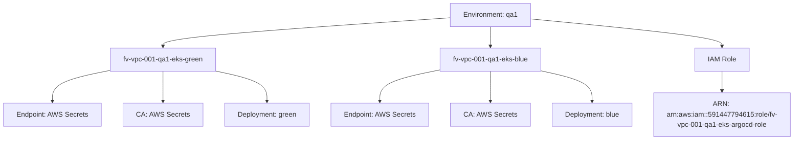
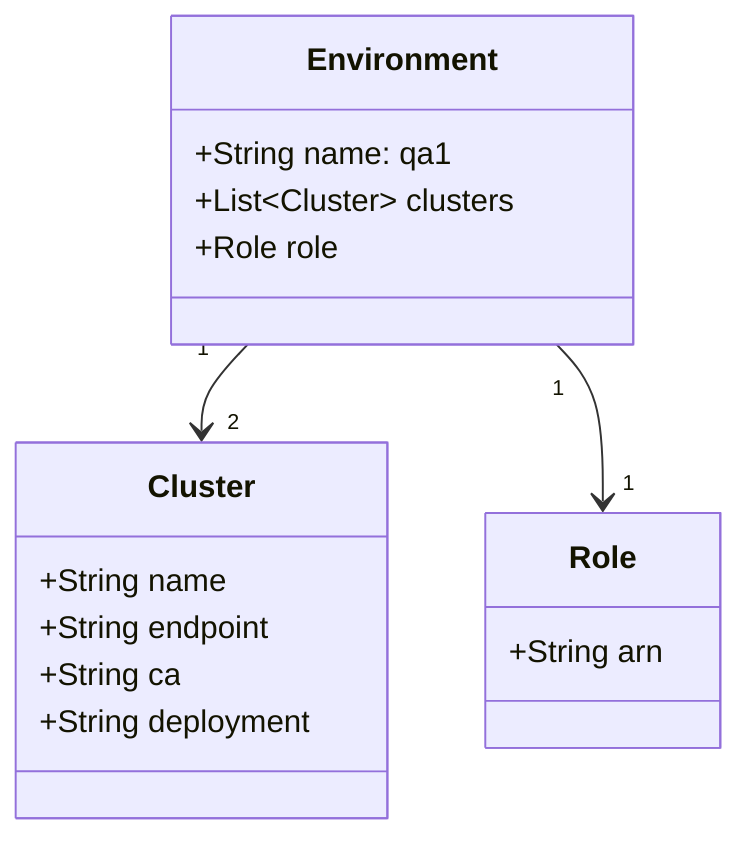
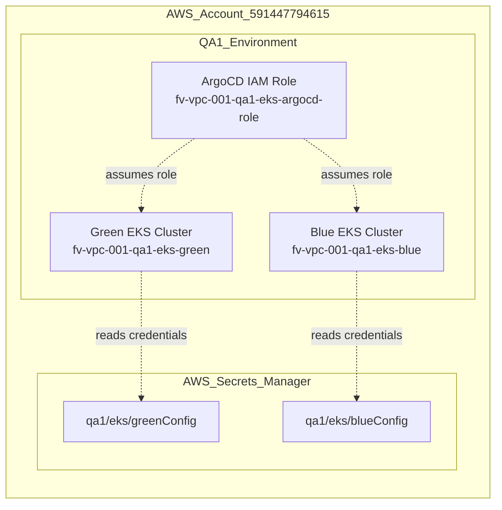

# Diagram: devops/k8s/argocd/clusters/helm/values.qa1.yaml

> Auto-generated by Obscura crawlers

## Diagram 1

### SVG

<svg id="container" width="1799.796875" xmlns="http://www.w3.org/2000/svg" class="flowchart" height="326" viewBox="0 0 1799.796875 326" role="graphics-document document" aria-roledescription="flowchart-v2"><g><marker id="container_flowchart-v2-pointEnd" class="marker flowchart-v2" viewBox="0 0 10 10" refX="5" refY="5" markerUnits="userSpaceOnUse" markerWidth="8" markerHeight="8" orient="auto"><path d="M 0 0 L 10 5 L 0 10 z" class="arrowMarkerPath" style="stroke-width: 1; stroke-dasharray: 1, 0;"></path></marker><marker id="container_flowchart-v2-pointStart" class="marker flowchart-v2" viewBox="0 0 10 10" refX="4.5" refY="5" markerUnits="userSpaceOnUse" markerWidth="8" markerHeight="8" orient="auto"><path d="M 0 5 L 10 10 L 10 0 z" class="arrowMarkerPath" style="stroke-width: 1; stroke-dasharray: 1, 0;"></path></marker><marker id="container_flowchart-v2-circleEnd" class="marker flowchart-v2" viewBox="0 0 10 10" refX="11" refY="5" markerUnits="userSpaceOnUse" markerWidth="11" markerHeight="11" orient="auto"><circle cx="5" cy="5" r="5" class="arrowMarkerPath" style="stroke-width: 1; stroke-dasharray: 1, 0;"></circle></marker><marker id="container_flowchart-v2-circleStart" class="marker flowchart-v2" viewBox="0 0 10 10" refX="-1" refY="5" markerUnits="userSpaceOnUse" markerWidth="11" markerHeight="11" orient="auto"><circle cx="5" cy="5" r="5" class="arrowMarkerPath" style="stroke-width: 1; stroke-dasharray: 1, 0;"></circle></marker><marker id="container_flowchart-v2-crossEnd" class="marker cross flowchart-v2" viewBox="0 0 11 11" refX="12" refY="5.2" markerUnits="userSpaceOnUse" markerWidth="11" markerHeight="11" orient="auto"><path d="M 1,1 l 9,9 M 10,1 l -9,9" class="arrowMarkerPath" style="stroke-width: 2; stroke-dasharray: 1, 0;"></path></marker><marker id="container_flowchart-v2-crossStart" class="marker cross flowchart-v2" viewBox="0 0 11 11" refX="-1" refY="5.2" markerUnits="userSpaceOnUse" markerWidth="11" markerHeight="11" orient="auto"><path d="M 1,1 l 9,9 M 10,1 l -9,9" class="arrowMarkerPath" style="stroke-width: 2; stroke-dasharray: 1, 0;"></path></marker><g class="root"><g class="clusters"></g><g class="edgePaths"><path d="M1017.766,41.459L909.313,49.05C800.859,56.64,583.953,71.82,475.5,82.91C367.047,94,367.047,101,367.047,104.5L367.047,108" id="L_QA1_Green_0" class="edge-thickness-normal edge-pattern-solid edge-thickness-normal edge-pattern-solid flowchart-link" style=";" data-edge="true" data-et="edge" data-id="L_QA1_Green_0" data-points="W3sieCI6MTAxNy43NjU2MjUsInkiOjQxLjQ1OTQwMzE5MjIyNzYyfSx7IngiOjM2Ny4wNDY4NzUsInkiOjg3fSx7IngiOjM2Ny4wNDY4NzUsInkiOjExMn1d" marker-end="url(#container_flowchart-v2-pointEnd)"></path><path d="M1110.063,62L1110.063,66.167C1110.063,70.333,1110.063,78.667,1110.063,86.333C1110.063,94,1110.063,101,1110.063,104.5L1110.063,108" id="L_QA1_Blue_0" class="edge-thickness-normal edge-pattern-solid edge-thickness-normal edge-pattern-solid flowchart-link" style=";" data-edge="true" data-et="edge" data-id="L_QA1_Blue_0" data-points="W3sieCI6MTExMC4wNjI1LCJ5Ijo2Mn0seyJ4IjoxMTEwLjA2MjUsInkiOjg3fSx7IngiOjExMTAuMDYyNSwieSI6MTEyfV0=" marker-end="url(#container_flowchart-v2-pointEnd)"></path><path d="M1202.359,44.08L1275.068,51.234C1347.776,58.387,1493.193,72.693,1565.901,83.347C1638.609,94,1638.609,101,1638.609,104.5L1638.609,108" id="L_QA1_Role_0" class="edge-thickness-normal edge-pattern-solid edge-thickness-normal edge-pattern-solid flowchart-link" style=";" data-edge="true" data-et="edge" data-id="L_QA1_Role_0" data-points="W3sieCI6MTIwMi4zNTkzNzUsInkiOjQ0LjA4MDQzODcwMjgxMTM2NH0seyJ4IjoxNjM4LjYwOTM3NSwieSI6ODd9LHsieCI6MTYzOC42MDkzNzUsInkiOjExMn1d" marker-end="url(#container_flowchart-v2-pointEnd)"></path><path d="M245.422,164.494L224.346,168.912C203.271,173.329,161.12,182.165,140.044,194.082C118.969,206,118.969,221,118.969,228.5L118.969,236" id="L_Green_GreenEndpoint_0" class="edge-thickness-normal edge-pattern-solid edge-thickness-normal edge-pattern-solid flowchart-link" style=";" data-edge="true" data-et="edge" data-id="L_Green_GreenEndpoint_0" data-points="W3sieCI6MjQ1LjQyMTg3NSwieSI6MTY0LjQ5Mzk4NTAwOTc2MjU1fSx7IngiOjExOC45Njg3NSwieSI6MTkxfSx7IngiOjExOC45Njg3NSwieSI6MjQwfV0=" marker-end="url(#container_flowchart-v2-pointEnd)"></path><path d="M367.047,166L367.047,170.167C367.047,174.333,367.047,182.667,367.047,194.333C367.047,206,367.047,221,367.047,228.5L367.047,236" id="L_Green_GreenCA_0" class="edge-thickness-normal edge-pattern-solid edge-thickness-normal edge-pattern-solid flowchart-link" style=";" data-edge="true" data-et="edge" data-id="L_Green_GreenCA_0" data-points="W3sieCI6MzY3LjA0Njg3NSwieSI6MTY2fSx7IngiOjM2Ny4wNDY4NzUsInkiOjE5MX0seyJ4IjozNjcuMDQ2ODc1LCJ5IjoyNDB9XQ==" marker-end="url(#container_flowchart-v2-pointEnd)"></path><path d="M488.672,165.851L507.658,170.043C526.643,174.234,564.615,182.617,583.6,194.309C602.586,206,602.586,221,602.586,228.5L602.586,236" id="L_Green_GreenDeploy_0" class="edge-thickness-normal edge-pattern-solid edge-thickness-normal edge-pattern-solid flowchart-link" style=";" data-edge="true" data-et="edge" data-id="L_Green_GreenDeploy_0" data-points="W3sieCI6NDg4LjY3MTg3NSwieSI6MTY1Ljg1MTE3MjUwOTg2NzY3fSx7IngiOjYwMi41ODU5Mzc1LCJ5IjoxOTF9LHsieCI6NjAyLjU4NTkzNzUsInkiOjI0MH1d" marker-end="url(#container_flowchart-v2-pointEnd)"></path><path d="M992.742,163.592L970.949,168.16C949.156,172.728,905.57,181.864,883.777,193.932C861.984,206,861.984,221,861.984,228.5L861.984,236" id="L_Blue_BlueEndpoint_0" class="edge-thickness-normal edge-pattern-solid edge-thickness-normal edge-pattern-solid flowchart-link" style=";" data-edge="true" data-et="edge" data-id="L_Blue_BlueEndpoint_0" data-points="W3sieCI6OTkyLjc0MjE4NzUsInkiOjE2My41OTE2NzM0ODk5NTQwMn0seyJ4Ijo4NjEuOTg0Mzc1LCJ5IjoxOTF9LHsieCI6ODYxLjk4NDM3NSwieSI6MjQwfV0=" marker-end="url(#container_flowchart-v2-pointEnd)"></path><path d="M1110.063,166L1110.063,170.167C1110.063,174.333,1110.063,182.667,1110.063,194.333C1110.063,206,1110.063,221,1110.063,228.5L1110.063,236" id="L_Blue_BlueCA_0" class="edge-thickness-normal edge-pattern-solid edge-thickness-normal edge-pattern-solid flowchart-link" style=";" data-edge="true" data-et="edge" data-id="L_Blue_BlueCA_0" data-points="W3sieCI6MTExMC4wNjI1LCJ5IjoxNjZ9LHsieCI6MTExMC4wNjI1LCJ5IjoxOTF9LHsieCI6MTExMC4wNjI1LCJ5IjoyNDB9XQ==" marker-end="url(#container_flowchart-v2-pointEnd)"></path><path d="M1227.383,165.383L1246.368,169.652C1265.354,173.922,1303.326,182.461,1322.311,194.23C1341.297,206,1341.297,221,1341.297,228.5L1341.297,236" id="L_Blue_BlueDeploy_0" class="edge-thickness-normal edge-pattern-solid edge-thickness-normal edge-pattern-solid flowchart-link" style=";" data-edge="true" data-et="edge" data-id="L_Blue_BlueDeploy_0" data-points="W3sieCI6MTIyNy4zODI4MTI1LCJ5IjoxNjUuMzgyOTk4ODUxMjczNzN9LHsieCI6MTM0MS4yOTY4NzUsInkiOjE5MX0seyJ4IjoxMzQxLjI5Njg3NSwieSI6MjQwfV0=" marker-end="url(#container_flowchart-v2-pointEnd)"></path><path d="M1638.609,166L1638.609,170.167C1638.609,174.333,1638.609,182.667,1638.609,190.333C1638.609,198,1638.609,205,1638.609,208.5L1638.609,212" id="L_Role_RoleARN_0" class="edge-thickness-normal edge-pattern-solid edge-thickness-normal edge-pattern-solid flowchart-link" style=";" data-edge="true" data-et="edge" data-id="L_Role_RoleARN_0" data-points="W3sieCI6MTYzOC42MDkzNzUsInkiOjE2Nn0seyJ4IjoxNjM4LjYwOTM3NSwieSI6MTkxfSx7IngiOjE2MzguNjA5Mzc1LCJ5IjoyMTZ9XQ==" marker-end="url(#container_flowchart-v2-pointEnd)"></path></g><g class="edgeLabels"><g class="edgeLabel"><g class="label" data-id="L_QA1_Green_0" transform="translate(0, 0)"><foreignObject width="0" height="0">

</foreignObject></g></g><g class="edgeLabel"><g class="label" data-id="L_QA1_Blue_0" transform="translate(0, 0)"><foreignObject width="0" height="0">

</foreignObject></g></g><g class="edgeLabel"><g class="label" data-id="L_QA1_Role_0" transform="translate(0, 0)"><foreignObject width="0" height="0">

</foreignObject></g></g><g class="edgeLabel"><g class="label" data-id="L_Green_GreenEndpoint_0" transform="translate(0, 0)"><foreignObject width="0" height="0">

</foreignObject></g></g><g class="edgeLabel"><g class="label" data-id="L_Green_GreenCA_0" transform="translate(0, 0)"><foreignObject width="0" height="0">

</foreignObject></g></g><g class="edgeLabel"><g class="label" data-id="L_Green_GreenDeploy_0" transform="translate(0, 0)"><foreignObject width="0" height="0">

</foreignObject></g></g><g class="edgeLabel"><g class="label" data-id="L_Blue_BlueEndpoint_0" transform="translate(0, 0)"><foreignObject width="0" height="0">

</foreignObject></g></g><g class="edgeLabel"><g class="label" data-id="L_Blue_BlueCA_0" transform="translate(0, 0)"><foreignObject width="0" height="0">

</foreignObject></g></g><g class="edgeLabel"><g class="label" data-id="L_Blue_BlueDeploy_0" transform="translate(0, 0)"><foreignObject width="0" height="0">

</foreignObject></g></g><g class="edgeLabel"><g class="label" data-id="L_Role_RoleARN_0" transform="translate(0, 0)"><foreignObject width="0" height="0">

</foreignObject></g></g></g><g class="nodes"><g class="node default" id="flowchart-QA1-0" transform="translate(1110.0625, 35)"><rect class="basic label-container" style="" x="-92.296875" y="-27" width="184.59375" height="54"></rect><g class="label" style="" transform="translate(-62.296875, -12)"><rect></rect><foreignObject width="124.59375" height="24">

Environment: qa1

</foreignObject></g></g><g class="node default" id="flowchart-Green-2" transform="translate(367.046875, 139)"><rect class="basic label-container" style="" x="-121.625" y="-27" width="243.25" height="54"></rect><g class="label" style="" transform="translate(-91.625, -12)"><rect></rect><foreignObject width="183.25" height="24">

fv-vpc-001-qa1-eks-green

</foreignObject></g></g><g class="node default" id="flowchart-Blue-4" transform="translate(1110.0625, 139)"><rect class="basic label-container" style="" x="-117.3203125" y="-27" width="234.640625" height="54"></rect><g class="label" style="" transform="translate(-87.3203125, -12)"><rect></rect><foreignObject width="174.640625" height="24">

fv-vpc-001-qa1-eks-blue

</foreignObject></g></g><g class="node default" id="flowchart-Role-6" transform="translate(1638.609375, 139)"><rect class="basic label-container" style="" x="-61.3515625" y="-27" width="122.703125" height="54"></rect><g class="label" style="" transform="translate(-31.3515625, -12)"><rect></rect><foreignObject width="62.703125" height="24">

IAM Role

</foreignObject></g></g><g class="node default" id="flowchart-GreenEndpoint-8" transform="translate(118.96875, 267)"><rect class="basic label-container" style="" x="-110.96875" y="-27" width="221.9375" height="54"></rect><g class="label" style="" transform="translate(-80.96875, -12)"><rect></rect><foreignObject width="161.9375" height="24">

Endpoint: AWS Secrets

</foreignObject></g></g><g class="node default" id="flowchart-GreenCA-10" transform="translate(367.046875, 267)"><rect class="basic label-container" style="" x="-87.109375" y="-27" width="174.21875" height="54"></rect><g class="label" style="" transform="translate(-57.109375, -12)"><rect></rect><foreignObject width="114.21875" height="24">

CA: AWS Secrets

</foreignObject></g></g><g class="node default" id="flowchart-GreenDeploy-12" transform="translate(602.5859375, 267)"><rect class="basic label-container" style="" x="-98.4296875" y="-27" width="196.859375" height="54"></rect><g class="label" style="" transform="translate(-68.4296875, -12)"><rect></rect><foreignObject width="136.859375" height="24">

Deployment: green

</foreignObject></g></g><g class="node default" id="flowchart-BlueEndpoint-14" transform="translate(861.984375, 267)"><rect class="basic label-container" style="" x="-110.96875" y="-27" width="221.9375" height="54"></rect><g class="label" style="" transform="translate(-80.96875, -12)"><rect></rect><foreignObject width="161.9375" height="24">

Endpoint: AWS Secrets

</foreignObject></g></g><g class="node default" id="flowchart-BlueCA-16" transform="translate(1110.0625, 267)"><rect class="basic label-container" style="" x="-87.109375" y="-27" width="174.21875" height="54"></rect><g class="label" style="" transform="translate(-57.109375, -12)"><rect></rect><foreignObject width="114.21875" height="24">

CA: AWS Secrets

</foreignObject></g></g><g class="node default" id="flowchart-BlueDeploy-18" transform="translate(1341.296875, 267)"><rect class="basic label-container" style="" x="-94.125" y="-27" width="188.25" height="54"></rect><g class="label" style="" transform="translate(-64.125, -12)"><rect></rect><foreignObject width="128.25" height="24">

Deployment: blue

</foreignObject></g></g><g class="node default" id="flowchart-RoleARN-20" transform="translate(1638.609375, 267)"><rect class="basic label-container" style="" x="-153.1875" y="-51" width="306.375" height="102"></rect><g class="label" style="" transform="translate(-123.1875, -36)"><rect></rect><foreignObject width="246.375" height="72">

ARN: arn:aws:iam::591447794615:role/fv-vpc-001-qa1-eks-argocd-role

</foreignObject></g></g></g></g></g></svg>

## Diagram 2

### SVG

<svg id="container" width="376.4921875" xmlns="http://www.w3.org/2000/svg" class="classDiagram" height="426" viewBox="0 0 376.4921875 426" role="graphics-document document" aria-roledescription="class"><g><defs><marker id="container_class-aggregationStart" class="marker aggregation class" refX="18" refY="7" markerWidth="190" markerHeight="240" orient="auto"><path d="M 18,7 L9,13 L1,7 L9,1 Z"></path></marker></defs><defs><marker id="container_class-aggregationEnd" class="marker aggregation class" refX="1" refY="7" markerWidth="20" markerHeight="28" orient="auto"><path d="M 18,7 L9,13 L1,7 L9,1 Z"></path></marker></defs><defs><marker id="container_class-extensionStart" class="marker extension class" refX="18" refY="7" markerWidth="190" markerHeight="240" orient="auto"><path d="M 1,7 L18,13 V 1 Z"></path></marker></defs><defs><marker id="container_class-extensionEnd" class="marker extension class" refX="1" refY="7" markerWidth="20" markerHeight="28" orient="auto"><path d="M 1,1 V 13 L18,7 Z"></path></marker></defs><defs><marker id="container_class-compositionStart" class="marker composition class" refX="18" refY="7" markerWidth="190" markerHeight="240" orient="auto"><path d="M 18,7 L9,13 L1,7 L9,1 Z"></path></marker></defs><defs><marker id="container_class-compositionEnd" class="marker composition class" refX="1" refY="7" markerWidth="20" markerHeight="28" orient="auto"><path d="M 18,7 L9,13 L1,7 L9,1 Z"></path></marker></defs><defs><marker id="container_class-dependencyStart" class="marker dependency class" refX="6" refY="7" markerWidth="190" markerHeight="240" orient="auto"><path d="M 5,7 L9,13 L1,7 L9,1 Z"></path></marker></defs><defs><marker id="container_class-dependencyEnd" class="marker dependency class" refX="13" refY="7" markerWidth="20" markerHeight="28" orient="auto"><path d="M 18,7 L9,13 L14,7 L9,1 Z"></path></marker></defs><defs><marker id="container_class-lollipopStart" class="marker lollipop class" refX="13" refY="7" markerWidth="190" markerHeight="240" orient="auto"><circle stroke="black" fill="transparent" cx="7" cy="7" r="6"></circle></marker></defs><defs><marker id="container_class-lollipopEnd" class="marker lollipop class" refX="1" refY="7" markerWidth="190" markerHeight="240" orient="auto"><circle stroke="black" fill="transparent" cx="7" cy="7" r="6"></circle></marker></defs><g class="root"><g class="clusters"></g><g class="edgePaths"><path d="M127.295,176L123.372,180.167C119.449,184.333,111.604,192.667,107.681,200C103.758,207.333,103.758,213.667,103.758,216.833L103.758,220" id="id_Environment_Cluster_1" class="edge-thickness-normal edge-pattern-solid relation" style=";;;" data-edge="true" data-et="edge" data-id="id_Environment_Cluster_1" data-points="W3sieCI6MTI3LjI5NTIwODU3MjI0NzcsInkiOjE3Nn0seyJ4IjoxMDMuNzU3ODEyNSwieSI6MjAxfSx7IngiOjEwMy43NTc4MTI1LCJ5IjoyMjZ9XQ==" marker-end="url(#container_class-dependencyEnd)"></path><path d="M285.467,176L289.389,180.167C293.312,184.333,301.158,192.667,305.081,206C309.004,219.333,309.004,237.667,309.004,246.833L309.004,256" id="id_Environment_Role_2" class="edge-thickness-normal edge-pattern-solid relation" style=";;;" data-edge="true" data-et="edge" data-id="id_Environment_Role_2" data-points="W3sieCI6Mjg1LjQ2NjUxMDE3Nzc1MjMsInkiOjE3Nn0seyJ4IjozMDkuMDAzOTA2MjUsInkiOjIwMX0seyJ4IjozMDkuMDAzOTA2MjUsInkiOjI2Mn1d" marker-end="url(#container_class-dependencyEnd)"></path></g><g class="edgeLabels"><g class="edgeLabel"><g class="label" data-id="id_Environment_Cluster_1" transform="translate(0, 0)"><foreignObject width="0" height="0">

</foreignObject></g></g><g class="edgeLabel"><g class="label" data-id="id_Environment_Role_2" transform="translate(0, 0)"><foreignObject width="0" height="0">

</foreignObject></g></g><g class="edgeTerminals" transform="translate(104.47192403486956, 178.6928066279604)"><g class="inner" transform="translate(0, 0)"><foreignObject style="width: 9px; height: 12px;">
1
</foreignObject></g></g><g class="edgeTerminals" transform="translate(286.18062510584014, 198.97049366448334)"><g class="inner" transform="translate(0, 0)"><foreignObject style="width: 9px; height: 12px;">
1
</foreignObject></g></g><g class="edgeTerminals" transform="translate(116.85807755390512, 207.97537335891033)"><g class="inner" transform="translate(0, 0)"></g><foreignObject style="width: 9px; height: 12px;">
2
</foreignObject></g><g class="edgeTerminals" transform="translate(319.0039081249999, 239.50000160714288)"><g class="inner" transform="translate(0, 0)"></g><foreignObject style="width: 9px; height: 12px;">
1
</foreignObject></g></g><g class="nodes"><g class="node default" id="classId-Environment-0" transform="translate(206.380859375, 92)"><g class="basic label-container"><path d="M-115.82421875 -84 L115.82421875 -84 L115.82421875 84 L-115.82421875 84" stroke="none" stroke-width="0" fill="#ECECFF" style=""></path><path d="M-115.82421875 -84 C-23.987336835190803 -84, 67.8495450796184 -84, 115.82421875 -84 M-115.82421875 -84 C-59.39450879555309 -84, -2.964798841106173 -84, 115.82421875 -84 M115.82421875 -84 C115.82421875 -38.72737147376915, 115.82421875 6.545257052461693, 115.82421875 84 M115.82421875 -84 C115.82421875 -40.54105005565457, 115.82421875 2.9178998886908545, 115.82421875 84 M115.82421875 84 C61.120673123375184 84, 6.417127496750368 84, -115.82421875 84 M115.82421875 84 C24.330209368630534 84, -67.16380001273893 84, -115.82421875 84 M-115.82421875 84 C-115.82421875 29.295956142428537, -115.82421875 -25.408087715142926, -115.82421875 -84 M-115.82421875 84 C-115.82421875 20.486843364438407, -115.82421875 -43.026313271123186, -115.82421875 -84" stroke="#9370DB" stroke-width="1.3" fill="none" stroke-dasharray="0 0" style=""></path></g><g class="annotation-group text" transform="translate(0, -60)"></g><g class="label-group text" transform="translate(-46.1953125, -60)"><g class="label" style="font-weight: bolder" transform="translate(0,-12)"><foreignObject width="92.390625" height="24">

Environment

</foreignObject></g></g><g class="members-group text" transform="translate(-103.82421875, -12)"><g class="label" style="" transform="translate(0,-12)"><foreignObject width="127.46875" height="24">

+String name: qa1

</foreignObject></g><g class="label" style="" transform="translate(0,12)"><foreignObject width="161.453125" height="24">

+List&lt;Cluster&gt; clusters

</foreignObject></g><g class="label" style="" transform="translate(0,36)"><foreignObject width="72.71875" height="24">

+Role role

</foreignObject></g></g><g class="methods-group text" transform="translate(-103.82421875, 84)"></g><g class="divider" style=""><path d="M-115.82421875 -36 C-56.481475281230246 -36, 2.8612681875395083 -36, 115.82421875 -36 M-115.82421875 -36 C-52.22013994575581 -36, 11.383938858488378 -36, 115.82421875 -36" stroke="#9370DB" stroke-width="1.3" fill="none" stroke-dasharray="0 0" style=""></path></g><g class="divider" style=""><path d="M-115.82421875 60 C-41.935273322259974 60, 31.953672105480052 60, 115.82421875 60 M-115.82421875 60 C-35.862968812354055 60, 44.09828112529189 60, 115.82421875 60" stroke="#9370DB" stroke-width="1.3" fill="none" stroke-dasharray="0 0" style=""></path></g></g><g class="node default" id="classId-Cluster-1" transform="translate(103.7578125, 322)"><g class="basic label-container"><path d="M-95.7578125 -96 L95.7578125 -96 L95.7578125 96 L-95.7578125 96" stroke="none" stroke-width="0" fill="#ECECFF" style=""></path><path d="M-95.7578125 -96 C-50.477573684538136 -96, -5.197334869076272 -96, 95.7578125 -96 M-95.7578125 -96 C-29.59223047766433 -96, 36.57335154467134 -96, 95.7578125 -96 M95.7578125 -96 C95.7578125 -43.15812495808992, 95.7578125 9.683750083820158, 95.7578125 96 M95.7578125 -96 C95.7578125 -25.463180125578305, 95.7578125 45.07363974884339, 95.7578125 96 M95.7578125 96 C31.684445573998687 96, -32.388921352002626 96, -95.7578125 96 M95.7578125 96 C28.17998336137586 96, -39.39784577724828 96, -95.7578125 96 M-95.7578125 96 C-95.7578125 54.113500200463506, -95.7578125 12.227000400927011, -95.7578125 -96 M-95.7578125 96 C-95.7578125 56.98910967948083, -95.7578125 17.978219358961667, -95.7578125 -96" stroke="#9370DB" stroke-width="1.3" fill="none" stroke-dasharray="0 0" style=""></path></g><g class="annotation-group text" transform="translate(0, -72)"></g><g class="label-group text" transform="translate(-25.90625, -72)"><g class="label" style="font-weight: bolder" transform="translate(0,-12)"><foreignObject width="51.8125" height="24">

Cluster

</foreignObject></g></g><g class="members-group text" transform="translate(-83.7578125, -24)"><g class="label" style="" transform="translate(0,-12)"><foreignObject width="94.984375" height="24">

+String name

</foreignObject></g><g class="label" style="" transform="translate(0,12)"><foreignObject width="120.640625" height="24">

+String endpoint

</foreignObject></g><g class="label" style="" transform="translate(0,36)"><foreignObject width="70.65625" height="24">

+String ca

</foreignObject></g><g class="label" style="" transform="translate(0,60)"><foreignObject width="141.609375" height="24">

+String deployment

</foreignObject></g></g><g class="methods-group text" transform="translate(-83.7578125, 96)"></g><g class="divider" style=""><path d="M-95.7578125 -48 C-20.871586429214844 -48, 54.01463964157031 -48, 95.7578125 -48 M-95.7578125 -48 C-49.41753434306578 -48, -3.0772561861315637 -48, 95.7578125 -48" stroke="#9370DB" stroke-width="1.3" fill="none" stroke-dasharray="0 0" style=""></path></g><g class="divider" style=""><path d="M-95.7578125 72 C-51.89745198497687 72, -8.037091469953737 72, 95.7578125 72 M-95.7578125 72 C-45.70141109047077 72, 4.354990319058459 72, 95.7578125 72" stroke="#9370DB" stroke-width="1.3" fill="none" stroke-dasharray="0 0" style=""></path></g></g><g class="node default" id="classId-Role-2" transform="translate(309.00390625, 322)"><g class="basic label-container"><path d="M-59.48828125 -60 L59.48828125 -60 L59.48828125 60 L-59.48828125 60" stroke="none" stroke-width="0" fill="#ECECFF" style=""></path><path d="M-59.48828125 -60 C-33.99267528077905 -60, -8.497069311558114 -60, 59.48828125 -60 M-59.48828125 -60 C-21.502467564564782 -60, 16.483346120870436 -60, 59.48828125 -60 M59.48828125 -60 C59.48828125 -21.801676097828462, 59.48828125 16.396647804343075, 59.48828125 60 M59.48828125 -60 C59.48828125 -27.916964443876253, 59.48828125 4.166071112247494, 59.48828125 60 M59.48828125 60 C28.992284986035717 60, -1.5037112779285664 60, -59.48828125 60 M59.48828125 60 C27.8305197488778 60, -3.8272417522443973 60, -59.48828125 60 M-59.48828125 60 C-59.48828125 30.603111328561816, -59.48828125 1.2062226571236323, -59.48828125 -60 M-59.48828125 60 C-59.48828125 16.63676011914442, -59.48828125 -26.72647976171116, -59.48828125 -60" stroke="#9370DB" stroke-width="1.3" fill="none" stroke-dasharray="0 0" style=""></path></g><g class="annotation-group text" transform="translate(0, -36)"></g><g class="label-group text" transform="translate(-16.2421875, -36)"><g class="label" style="font-weight: bolder" transform="translate(0,-12)"><foreignObject width="32.484375" height="24">

Role

</foreignObject></g></g><g class="members-group text" transform="translate(-47.48828125, 12)"><g class="label" style="" transform="translate(0,-12)"><foreignObject width="78.734375" height="24">

+String arn

</foreignObject></g></g><g class="methods-group text" transform="translate(-47.48828125, 60)"></g><g class="divider" style=""><path d="M-59.48828125 -12 C-28.904507539095754 -12, 1.679266171808493 -12, 59.48828125 -12 M-59.48828125 -12 C-22.498806673346223 -12, 14.490667903307553 -12, 59.48828125 -12" stroke="#9370DB" stroke-width="1.3" fill="none" stroke-dasharray="0 0" style=""></path></g><g class="divider" style=""><path d="M-59.48828125 36 C-12.141634143167813 36, 35.20501296366437 36, 59.48828125 36 M-59.48828125 36 C-13.43738391480477 36, 32.61351342039046 36, 59.48828125 36" stroke="#9370DB" stroke-width="1.3" fill="none" stroke-dasharray="0 0" style=""></path></g></g></g></g></g></svg>

## Diagram 3

### SVG

<svg id="container" width="664.41796875" xmlns="http://www.w3.org/2000/svg" class="flowchart" height="673" viewBox="0 0 664.41796875 673" role="graphics-document document" aria-roledescription="flowchart-v2"><g><marker id="container_flowchart-v2-pointEnd" class="marker flowchart-v2" viewBox="0 0 10 10" refX="5" refY="5" markerUnits="userSpaceOnUse" markerWidth="8" markerHeight="8" orient="auto"><path d="M 0 0 L 10 5 L 0 10 z" class="arrowMarkerPath" style="stroke-width: 1; stroke-dasharray: 1, 0;"></path></marker><marker id="container_flowchart-v2-pointStart" class="marker flowchart-v2" viewBox="0 0 10 10" refX="4.5" refY="5" markerUnits="userSpaceOnUse" markerWidth="8" markerHeight="8" orient="auto"><path d="M 0 5 L 10 10 L 10 0 z" class="arrowMarkerPath" style="stroke-width: 1; stroke-dasharray: 1, 0;"></path></marker><marker id="container_flowchart-v2-circleEnd" class="marker flowchart-v2" viewBox="0 0 10 10" refX="11" refY="5" markerUnits="userSpaceOnUse" markerWidth="11" markerHeight="11" orient="auto"><circle cx="5" cy="5" r="5" class="arrowMarkerPath" style="stroke-width: 1; stroke-dasharray: 1, 0;"></circle></marker><marker id="container_flowchart-v2-circleStart" class="marker flowchart-v2" viewBox="0 0 10 10" refX="-1" refY="5" markerUnits="userSpaceOnUse" markerWidth="11" markerHeight="11" orient="auto"><circle cx="5" cy="5" r="5" class="arrowMarkerPath" style="stroke-width: 1; stroke-dasharray: 1, 0;"></circle></marker><marker id="container_flowchart-v2-crossEnd" class="marker cross flowchart-v2" viewBox="0 0 11 11" refX="12" refY="5.2" markerUnits="userSpaceOnUse" markerWidth="11" markerHeight="11" orient="auto"><path d="M 1,1 l 9,9 M 10,1 l -9,9" class="arrowMarkerPath" style="stroke-width: 2; stroke-dasharray: 1, 0;"></path></marker><marker id="container_flowchart-v2-crossStart" class="marker cross flowchart-v2" viewBox="0 0 11 11" refX="-1" refY="5.2" markerUnits="userSpaceOnUse" markerWidth="11" markerHeight="11" orient="auto"><path d="M 1,1 l 9,9 M 10,1 l -9,9" class="arrowMarkerPath" style="stroke-width: 2; stroke-dasharray: 1, 0;"></path></marker><g class="root"><g class="clusters"></g><g class="edgePaths"></g><g class="edgeLabels"></g><g class="nodes"><g class="root" transform="translate(0, 0)"><g class="clusters"><g class="cluster" id="AWS_Account_591447794615" data-look="classic"><rect style="" x="8" y="8" width="648.41796875" height="657"></rect><g class="cluster-label" transform="translate(233.443359375, 8)"><foreignObject width="197.53125" height="24">

AWS_Account_591447794615

</foreignObject></g></g><g class="cluster" id="AWS_Secrets_Manager" data-look="classic"><rect style="" x="48.921875" y="498.5" width="564.6640625" height="129"></rect><g class="cluster-label" transform="translate(250.62890625, 498.5)"><foreignObject width="161.25" height="24">

AWS_Secrets_Manager

</foreignObject></g></g><g class="cluster" id="QA1_Environment" data-look="classic"><rect style="" x="28" y="45.5" width="608.41796875" height="354"></rect><g class="cluster-label" transform="translate(268.927734375, 45.5)"><foreignObject width="126.5625" height="24">

QA1_Environment

</foreignObject></g></g></g><g class="edgePaths"><path d="M188.813,362L188.813,368.25C188.813,374.5,188.813,387,188.813,401.5C188.813,416,188.813,432.5,188.813,449C188.813,465.5,188.813,482,188.813,495.833C188.813,509.667,188.813,520.833,188.813,526.417L188.813,532" id="L_GreenCluster_GreenSecrets_0" class="edge-thickness-normal edge-pattern-dotted edge-thickness-normal edge-pattern-solid flowchart-link" style=";" data-edge="true" data-et="edge" data-id="L_GreenCluster_GreenSecrets_0" data-points="W3sieCI6MTg4LjgxMjUsInkiOjM2Mn0seyJ4IjoxODguODEyNSwieSI6Mzk5LjV9LHsieCI6MTg4LjgxMjUsInkiOjQ0OX0seyJ4IjoxODguODEyNSwieSI6NDk4LjV9LHsieCI6MTg4LjgxMjUsInkiOjUzNn1d" marker-end="url(#container_flowchart-v2-pointEnd)"></path><path d="M477.758,362L477.758,368.25C477.758,374.5,477.758,387,477.758,401.5C477.758,416,477.758,432.5,477.758,449C477.758,465.5,477.758,482,477.758,495.833C477.758,509.667,477.758,520.833,477.758,526.417L477.758,532" id="L_BlueCluster_BlueSecrets_0" class="edge-thickness-normal edge-pattern-dotted edge-thickness-normal edge-pattern-solid flowchart-link" style=";" data-edge="true" data-et="edge" data-id="L_BlueCluster_BlueSecrets_0" data-points="W3sieCI6NDc3Ljc1NzgxMjUsInkiOjM2Mn0seyJ4Ijo0NzcuNzU3ODEyNSwieSI6Mzk5LjV9LHsieCI6NDc3Ljc1NzgxMjUsInkiOjQ0OX0seyJ4Ijo0NzcuNzU3ODEyNSwieSI6NDk4LjV9LHsieCI6NDc3Ljc1NzgxMjUsInkiOjUzNn1d" marker-end="url(#container_flowchart-v2-pointEnd)"></path><path d="M259.971,185L248.111,193.25C236.251,201.5,212.532,218,200.672,233.833C188.813,249.667,188.813,264.833,188.813,272.417L188.813,280" id="L_ArgoCDRole_GreenCluster_0" class="edge-thickness-normal edge-pattern-dotted edge-thickness-normal edge-pattern-solid flowchart-link" style=";" data-edge="true" data-et="edge" data-id="L_ArgoCDRole_GreenCluster_0" data-points="W3sieCI6MjU5Ljk3MDY3Mzk3Mzg4MDYsInkiOjE4NX0seyJ4IjoxODguODEyNSwieSI6MjM0LjV9LHsieCI6MTg4LjgxMjUsInkiOjI4NH1d" marker-end="url(#container_flowchart-v2-pointEnd)"></path><path d="M406.6,185L418.459,193.25C430.319,201.5,454.038,218,465.898,233.833C477.758,249.667,477.758,264.833,477.758,272.417L477.758,280" id="L_ArgoCDRole_BlueCluster_0" class="edge-thickness-normal edge-pattern-dotted edge-thickness-normal edge-pattern-solid flowchart-link" style=";" data-edge="true" data-et="edge" data-id="L_ArgoCDRole_BlueCluster_0" data-points="W3sieCI6NDA2LjU5OTYzODUyNjExOTQsInkiOjE4NX0seyJ4Ijo0NzcuNzU3ODEyNSwieSI6MjM0LjV9LHsieCI6NDc3Ljc1NzgxMjUsInkiOjI4NH1d" marker-end="url(#container_flowchart-v2-pointEnd)"></path></g><g class="edgeLabels"><g class="edgeLabel" transform="translate(188.8125, 449)"><g class="label" data-id="L_GreenCluster_GreenSecrets_0" transform="translate(-62.484375, -12)"><foreignObject width="124.96875" height="24">

reads credentials

</foreignObject></g></g><g class="edgeLabel" transform="translate(477.7578125, 449)"><g class="label" data-id="L_BlueCluster_BlueSecrets_0" transform="translate(-62.484375, -12)"><foreignObject width="124.96875" height="24">

reads credentials

</foreignObject></g></g><g class="edgeLabel" transform="translate(188.8125, 234.5)"><g class="label" data-id="L_ArgoCDRole_GreenCluster_0" transform="translate(-47.578125, -12)"><foreignObject width="95.15625" height="24">

assumes role

</foreignObject></g></g><g class="edgeLabel" transform="translate(477.7578125, 234.5)"><g class="label" data-id="L_ArgoCDRole_BlueCluster_0" transform="translate(-47.578125, -12)"><foreignObject width="95.15625" height="24">

assumes role

</foreignObject></g></g></g><g class="nodes"><g class="node default" id="flowchart-GreenSecrets-3" transform="translate(188.8125, 563)"><rect class="basic label-container" style="" x="-104.890625" y="-27" width="209.78125" height="54"></rect><g class="label" style="" transform="translate(-74.890625, -12)"><rect></rect><foreignObject width="149.78125" height="24">

qa1/eks/greenConfig

</foreignObject></g></g><g class="node default" id="flowchart-GreenCluster-0" transform="translate(188.8125, 323)"><rect class="basic label-container" style="" x="-121.625" y="-39" width="243.25" height="78"></rect><g class="label" style="" transform="translate(-91.625, -24)"><rect></rect><foreignObject width="183.25" height="48">

Green EKS Cluster fv-vpc-001-qa1-eks-green

</foreignObject></g></g><g class="node default" id="flowchart-BlueCluster-1" transform="translate(477.7578125, 323)"><rect class="basic label-container" style="" x="-117.3203125" y="-39" width="234.640625" height="78"></rect><g class="label" style="" transform="translate(-87.3203125, -24)"><rect></rect><foreignObject width="174.640625" height="48">

Blue EKS Cluster fv-vpc-001-qa1-eks-blue

</foreignObject></g></g><g class="node default" id="flowchart-BlueSecrets-4" transform="translate(477.7578125, 563)"><rect class="basic label-container" style="" x="-100.828125" y="-27" width="201.65625" height="54"></rect><g class="label" style="" transform="translate(-70.828125, -12)"><rect></rect><foreignObject width="141.65625" height="24">

qa1/eks/blueConfig

</foreignObject></g></g><g class="node default" id="flowchart-ArgoCDRole-2" transform="translate(333.28515625, 134)"><rect class="basic label-container" style="" x="-130" y="-51" width="260" height="102"></rect><g class="label" style="" transform="translate(-100, -36)"><rect></rect><foreignObject width="200" height="72">

ArgoCD IAM Role fv-vpc-001-qa1-eks-argocd-role

</foreignObject></g></g></g></g></g></g></g></svg>
