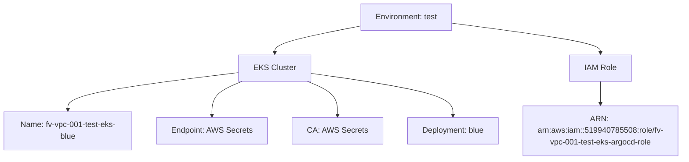
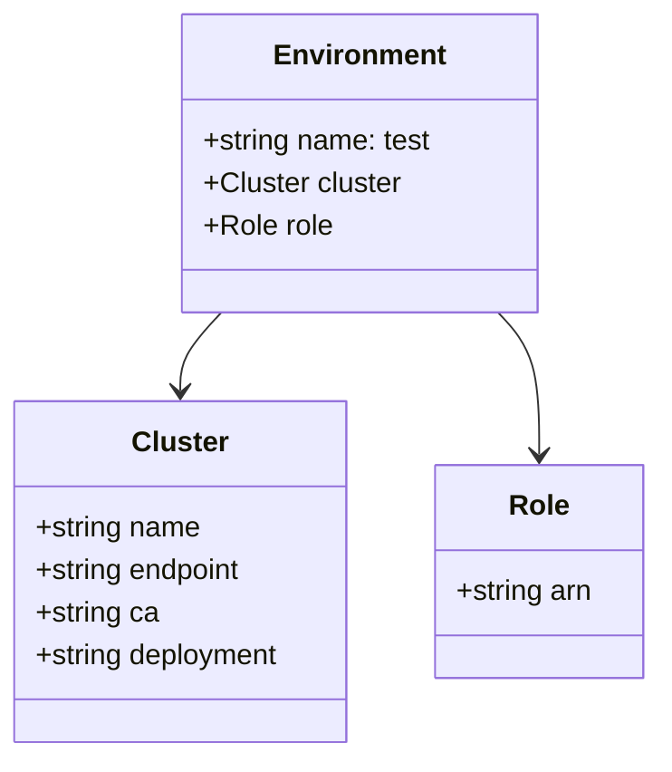
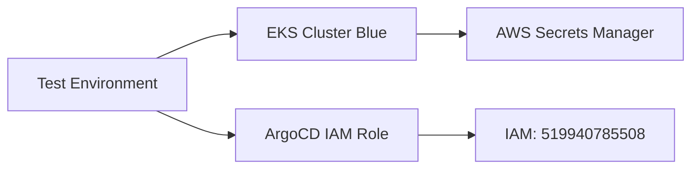

# Diagram: devops/k8s/argocd/clusters/helm/values.test.yaml


> Auto-generated by Obscura crawlers

## Diagram 1

```mermaid
graph TD
      Test[Environment: test]
      Test --> Cluster[EKS Cluster]
      Test --> Role[IAM Role]...
  └ 75 lines...
```

> SVG rendering failed for this diagram.

## Diagram 2



### SVG

<svg id="container" width="1371.171875" xmlns="http://www.w3.org/2000/svg" class="flowchart" height="326" viewBox="0 0 1371.171875 326" role="graphics-document document" aria-roledescription="flowchart-v2"><style>#container{font-family:"trebuchet ms",verdana,arial,sans-serif;font-size:16px;fill:#333;}@keyframes edge-animation-frame{from{stroke-dashoffset:0;}}@keyframes dash{to{stroke-dashoffset:0;}}#container .edge-animation-slow{stroke-dasharray:9,5!important;stroke-dashoffset:900;animation:dash 50s linear infinite;stroke-linecap:round;}#container .edge-animation-fast{stroke-dasharray:9,5!important;stroke-dashoffset:900;animation:dash 20s linear infinite;stroke-linecap:round;}#container .error-icon{fill:#552222;}#container .error-text{fill:#552222;stroke:#552222;}#container .edge-thickness-normal{stroke-width:1px;}#container .edge-thickness-thick{stroke-width:3.5px;}#container .edge-pattern-solid{stroke-dasharray:0;}#container .edge-thickness-invisible{stroke-width:0;fill:none;}#container .edge-pattern-dashed{stroke-dasharray:3;}#container .edge-pattern-dotted{stroke-dasharray:2;}#container .marker{fill:#333333;stroke:#333333;}#container .marker.cross{stroke:#333333;}#container svg{font-family:"trebuchet ms",verdana,arial,sans-serif;font-size:16px;}#container p{margin:0;}#container .label{font-family:"trebuchet ms",verdana,arial,sans-serif;color:#333;}#container .cluster-label text{fill:#333;}#container .cluster-label span{color:#333;}#container .cluster-label span p{background-color:transparent;}#container .label text,#container span{fill:#333;color:#333;}#container .node rect,#container .node circle,#container .node ellipse,#container .node polygon,#container .node path{fill:#ECECFF;stroke:#9370DB;stroke-width:1px;}#container .rough-node .label text,#container .node .label text,#container .image-shape .label,#container .icon-shape .label{text-anchor:middle;}#container .node .katex path{fill:#000;stroke:#000;stroke-width:1px;}#container .rough-node .label,#container .node .label,#container .image-shape .label,#container .icon-shape .label{text-align:center;}#container .node.clickable{cursor:pointer;}#container .root .anchor path{fill:#333333!important;stroke-width:0;stroke:#333333;}#container .arrowheadPath{fill:#333333;}#container .edgePath .path{stroke:#333333;stroke-width:2.0px;}#container .flowchart-link{stroke:#333333;fill:none;}#container .edgeLabel{background-color:rgba(232,232,232, 0.8);text-align:center;}#container .edgeLabel p{background-color:rgba(232,232,232, 0.8);}#container .edgeLabel rect{opacity:0.5;background-color:rgba(232,232,232, 0.8);fill:rgba(232,232,232, 0.8);}#container .labelBkg{background-color:rgba(232, 232, 232, 0.5);}#container .cluster rect{fill:#ffffde;stroke:#aaaa33;stroke-width:1px;}#container .cluster text{fill:#333;}#container .cluster span{color:#333;}#container div.mermaidTooltip{position:absolute;text-align:center;max-width:200px;padding:2px;font-family:"trebuchet ms",verdana,arial,sans-serif;font-size:12px;background:hsl(80, 100%, 96.2745098039%);border:1px solid #aaaa33;border-radius:2px;pointer-events:none;z-index:100;}#container .flowchartTitleText{text-anchor:middle;font-size:18px;fill:#333;}#container rect.text{fill:none;stroke-width:0;}#container .icon-shape,#container .image-shape{background-color:rgba(232,232,232, 0.8);text-align:center;}#container .icon-shape p,#container .image-shape p{background-color:rgba(232,232,232, 0.8);padding:2px;}#container .icon-shape rect,#container .image-shape rect{opacity:0.5;background-color:rgba(232,232,232, 0.8);fill:rgba(232,232,232, 0.8);}#container .label-icon{display:inline-block;height:1em;overflow:visible;vertical-align:-0.125em;}#container .node .label-icon path{fill:currentColor;stroke:revert;stroke-width:revert;}#container :root{--mermaid-font-family:"trebuchet ms",verdana,arial,sans-serif;}</style><g><marker id="container_flowchart-v2-pointEnd" class="marker flowchart-v2" viewBox="0 0 10 10" refX="5" refY="5" markerUnits="userSpaceOnUse" markerWidth="8" markerHeight="8" orient="auto"><path d="M 0 0 L 10 5 L 0 10 z" class="arrowMarkerPath" style="stroke-width: 1; stroke-dasharray: 1, 0;"></path></marker><marker id="container_flowchart-v2-pointStart" class="marker flowchart-v2" viewBox="0 0 10 10" refX="4.5" refY="5" markerUnits="userSpaceOnUse" markerWidth="8" markerHeight="8" orient="auto"><path d="M 0 5 L 10 10 L 10 0 z" class="arrowMarkerPath" style="stroke-width: 1; stroke-dasharray: 1, 0;"></path></marker><marker id="container_flowchart-v2-circleEnd" class="marker flowchart-v2" viewBox="0 0 10 10" refX="11" refY="5" markerUnits="userSpaceOnUse" markerWidth="11" markerHeight="11" orient="auto"><circle cx="5" cy="5" r="5" class="arrowMarkerPath" style="stroke-width: 1; stroke-dasharray: 1, 0;"></circle></marker><marker id="container_flowchart-v2-circleStart" class="marker flowchart-v2" viewBox="0 0 10 10" refX="-1" refY="5" markerUnits="userSpaceOnUse" markerWidth="11" markerHeight="11" orient="auto"><circle cx="5" cy="5" r="5" class="arrowMarkerPath" style="stroke-width: 1; stroke-dasharray: 1, 0;"></circle></marker><marker id="container_flowchart-v2-crossEnd" class="marker cross flowchart-v2" viewBox="0 0 11 11" refX="12" refY="5.2" markerUnits="userSpaceOnUse" markerWidth="11" markerHeight="11" orient="auto"><path d="M 1,1 l 9,9 M 10,1 l -9,9" class="arrowMarkerPath" style="stroke-width: 2; stroke-dasharray: 1, 0;"></path></marker><marker id="container_flowchart-v2-crossStart" class="marker cross flowchart-v2" viewBox="0 0 11 11" refX="-1" refY="5.2" markerUnits="userSpaceOnUse" markerWidth="11" markerHeight="11" orient="auto"><path d="M 1,1 l 9,9 M 10,1 l -9,9" class="arrowMarkerPath" style="stroke-width: 2; stroke-dasharray: 1, 0;"></path></marker><g class="root"><g class="clusters"></g><g class="edgePaths"><path d="M724.527,53.39L695.941,58.992C667.354,64.594,610.181,75.797,581.594,84.898C553.008,94,553.008,101,553.008,104.5L553.008,108" id="L_Test_Cluster_0" class="edge-thickness-normal edge-pattern-solid edge-thickness-normal edge-pattern-solid flowchart-link" style=";" data-edge="true" data-et="edge" data-id="L_Test_Cluster_0" data-points="W3sieCI6NzI0LjUyNzM0Mzc1LCJ5Ijo1My4zOTA0MDI1OTA3MTE3MX0seyJ4Ijo1NTMuMDA3ODEyNSwieSI6ODd9LHsieCI6NTUzLjAwNzgxMjUsInkiOjExMn1d" marker-end="url(#container_flowchart-v2-pointEnd)"></path><path d="M912.23,47.532L961.49,54.11C1010.75,60.688,1109.27,73.844,1158.529,83.922C1207.789,94,1207.789,101,1207.789,104.5L1207.789,108" id="L_Test_Role_0" class="edge-thickness-normal edge-pattern-solid edge-thickness-normal edge-pattern-solid flowchart-link" style=";" data-edge="true" data-et="edge" data-id="L_Test_Role_0" data-points="W3sieCI6OTEyLjIzMDQ2ODc1LCJ5Ijo0Ny41MzI0OTYwNjI3NTUxN30seyJ4IjoxMjA3Ljc4OTA2MjUsInkiOjg3fSx7IngiOjEyMDcuNzg5MDYyNSwieSI6MTEyfV0=" marker-end="url(#container_flowchart-v2-pointEnd)"></path><path d="M482.258,147.865L424.882,155.054C367.505,162.243,252.753,176.622,195.376,189.311C138,202,138,213,138,218.5L138,224" id="L_Cluster_Name_0" class="edge-thickness-normal edge-pattern-solid edge-thickness-normal edge-pattern-solid flowchart-link" style=";" data-edge="true" data-et="edge" data-id="L_Cluster_Name_0" data-points="W3sieCI6NDgyLjI1NzgxMjUsInkiOjE0Ny44NjQ4OTMzNTY2NzYyOH0seyJ4IjoxMzgsInkiOjE5MX0seyJ4IjoxMzgsInkiOjIyOH1d" marker-end="url(#container_flowchart-v2-pointEnd)"></path><path d="M488.603,166L478.664,170.167C468.725,174.333,448.847,182.667,438.908,194.333C428.969,206,428.969,221,428.969,228.5L428.969,236" id="L_Cluster_Endpoint_0" class="edge-thickness-normal edge-pattern-solid edge-thickness-normal edge-pattern-solid flowchart-link" style=";" data-edge="true" data-et="edge" data-id="L_Cluster_Endpoint_0" data-points="W3sieCI6NDg4LjYwMjkxNDY2MzQ2MTU1LCJ5IjoxNjZ9LHsieCI6NDI4Ljk2ODc1LCJ5IjoxOTF9LHsieCI6NDI4Ljk2ODc1LCJ5IjoyNDB9XQ==" marker-end="url(#container_flowchart-v2-pointEnd)"></path><path d="M617.413,166L627.352,170.167C637.291,174.333,657.169,182.667,667.108,194.333C677.047,206,677.047,221,677.047,228.5L677.047,236" id="L_Cluster_CA_0" class="edge-thickness-normal edge-pattern-solid edge-thickness-normal edge-pattern-solid flowchart-link" style=";" data-edge="true" data-et="edge" data-id="L_Cluster_CA_0" data-points="W3sieCI6NjE3LjQxMjcxMDMzNjUzODUsInkiOjE2Nn0seyJ4Ijo2NzcuMDQ2ODc1LCJ5IjoxOTF9LHsieCI6Njc3LjA0Njg3NSwieSI6MjQwfV0=" marker-end="url(#container_flowchart-v2-pointEnd)"></path><path d="M623.758,149.355L671.178,156.296C718.599,163.237,813.44,177.118,860.861,191.559C908.281,206,908.281,221,908.281,228.5L908.281,236" id="L_Cluster_Deploy_0" class="edge-thickness-normal edge-pattern-solid edge-thickness-normal edge-pattern-solid flowchart-link" style=";" data-edge="true" data-et="edge" data-id="L_Cluster_Deploy_0" data-points="W3sieCI6NjIzLjc1NzgxMjUsInkiOjE0OS4zNTU0MDQwNjgxNjkzMn0seyJ4Ijo5MDguMjgxMjUsInkiOjE5MX0seyJ4Ijo5MDguMjgxMjUsInkiOjI0MH1d" marker-end="url(#container_flowchart-v2-pointEnd)"></path><path d="M1207.789,166L1207.789,170.167C1207.789,174.333,1207.789,182.667,1207.789,190.333C1207.789,198,1207.789,205,1207.789,208.5L1207.789,212" id="L_Role_ARN_0" class="edge-thickness-normal edge-pattern-solid edge-thickness-normal edge-pattern-solid flowchart-link" style=";" data-edge="true" data-et="edge" data-id="L_Role_ARN_0" data-points="W3sieCI6MTIwNy43ODkwNjI1LCJ5IjoxNjZ9LHsieCI6MTIwNy43ODkwNjI1LCJ5IjoxOTF9LHsieCI6MTIwNy43ODkwNjI1LCJ5IjoyMTZ9XQ==" marker-end="url(#container_flowchart-v2-pointEnd)"></path></g><g class="edgeLabels"><g class="edgeLabel"><g class="label" data-id="L_Test_Cluster_0" transform="translate(0, 0)"><foreignObject width="0" height="0"><div xmlns="http://www.w3.org/1999/xhtml" class="labelBkg" style="display: table-cell; white-space: nowrap; line-height: 1.5; max-width: 200px; text-align: center;"><span class="edgeLabel"></span></div></foreignObject></g></g><g class="edgeLabel"><g class="label" data-id="L_Test_Role_0" transform="translate(0, 0)"><foreignObject width="0" height="0"><div xmlns="http://www.w3.org/1999/xhtml" class="labelBkg" style="display: table-cell; white-space: nowrap; line-height: 1.5; max-width: 200px; text-align: center;"><span class="edgeLabel"></span></div></foreignObject></g></g><g class="edgeLabel"><g class="label" data-id="L_Cluster_Name_0" transform="translate(0, 0)"><foreignObject width="0" height="0"><div xmlns="http://www.w3.org/1999/xhtml" class="labelBkg" style="display: table-cell; white-space: nowrap; line-height: 1.5; max-width: 200px; text-align: center;"><span class="edgeLabel"></span></div></foreignObject></g></g><g class="edgeLabel"><g class="label" data-id="L_Cluster_Endpoint_0" transform="translate(0, 0)"><foreignObject width="0" height="0"><div xmlns="http://www.w3.org/1999/xhtml" class="labelBkg" style="display: table-cell; white-space: nowrap; line-height: 1.5; max-width: 200px; text-align: center;"><span class="edgeLabel"></span></div></foreignObject></g></g><g class="edgeLabel"><g class="label" data-id="L_Cluster_CA_0" transform="translate(0, 0)"><foreignObject width="0" height="0"><div xmlns="http://www.w3.org/1999/xhtml" class="labelBkg" style="display: table-cell; white-space: nowrap; line-height: 1.5; max-width: 200px; text-align: center;"><span class="edgeLabel"></span></div></foreignObject></g></g><g class="edgeLabel"><g class="label" data-id="L_Cluster_Deploy_0" transform="translate(0, 0)"><foreignObject width="0" height="0"><div xmlns="http://www.w3.org/1999/xhtml" class="labelBkg" style="display: table-cell; white-space: nowrap; line-height: 1.5; max-width: 200px; text-align: center;"><span class="edgeLabel"></span></div></foreignObject></g></g><g class="edgeLabel"><g class="label" data-id="L_Role_ARN_0" transform="translate(0, 0)"><foreignObject width="0" height="0"><div xmlns="http://www.w3.org/1999/xhtml" class="labelBkg" style="display: table-cell; white-space: nowrap; line-height: 1.5; max-width: 200px; text-align: center;"><span class="edgeLabel"></span></div></foreignObject></g></g></g><g class="nodes"><g class="node default" id="flowchart-Test-0" transform="translate(818.37890625, 35)"><rect class="basic label-container" style="" x="-93.8515625" y="-27" width="187.703125" height="54"></rect><g class="label" style="" transform="translate(-63.8515625, -12)"><rect></rect><foreignObject width="127.703125" height="24"><div xmlns="http://www.w3.org/1999/xhtml" style="display: table-cell; white-space: nowrap; line-height: 1.5; max-width: 200px; text-align: center;"><span class="nodeLabel"><p>Environment: test</p></span></div></foreignObject></g></g><g class="node default" id="flowchart-Cluster-2" transform="translate(553.0078125, 139)"><rect class="basic label-container" style="" x="-70.75" y="-27" width="141.5" height="54"></rect><g class="label" style="" transform="translate(-40.75, -12)"><rect></rect><foreignObject width="81.5" height="24"><div xmlns="http://www.w3.org/1999/xhtml" style="display: table-cell; white-space: nowrap; line-height: 1.5; max-width: 200px; text-align: center;"><span class="nodeLabel"><p>EKS Cluster</p></span></div></foreignObject></g></g><g class="node default" id="flowchart-Role-4" transform="translate(1207.7890625, 139)"><rect class="basic label-container" style="" x="-61.3515625" y="-27" width="122.703125" height="54"></rect><g class="label" style="" transform="translate(-31.3515625, -12)"><rect></rect><foreignObject width="62.703125" height="24"><div xmlns="http://www.w3.org/1999/xhtml" style="display: table-cell; white-space: nowrap; line-height: 1.5; max-width: 200px; text-align: center;"><span class="nodeLabel"><p>IAM Role</p></span></div></foreignObject></g></g><g class="node default" id="flowchart-Name-6" transform="translate(138, 267)"><rect class="basic label-container" style="" x="-130" y="-39" width="260" height="78"></rect><g class="label" style="" transform="translate(-100, -24)"><rect></rect><foreignObject width="200" height="48"><div xmlns="http://www.w3.org/1999/xhtml" style="display: table; white-space: break-spaces; line-height: 1.5; max-width: 200px; text-align: center; width: 200px;"><span class="nodeLabel"><p>Name: fv-vpc-001-test-eks-blue</p></span></div></foreignObject></g></g><g class="node default" id="flowchart-Endpoint-8" transform="translate(428.96875, 267)"><rect class="basic label-container" style="" x="-110.96875" y="-27" width="221.9375" height="54"></rect><g class="label" style="" transform="translate(-80.96875, -12)"><rect></rect><foreignObject width="161.9375" height="24"><div xmlns="http://www.w3.org/1999/xhtml" style="display: table-cell; white-space: nowrap; line-height: 1.5; max-width: 200px; text-align: center;"><span class="nodeLabel"><p>Endpoint: AWS Secrets</p></span></div></foreignObject></g></g><g class="node default" id="flowchart-CA-10" transform="translate(677.046875, 267)"><rect class="basic label-container" style="" x="-87.109375" y="-27" width="174.21875" height="54"></rect><g class="label" style="" transform="translate(-57.109375, -12)"><rect></rect><foreignObject width="114.21875" height="24"><div xmlns="http://www.w3.org/1999/xhtml" style="display: table-cell; white-space: nowrap; line-height: 1.5; max-width: 200px; text-align: center;"><span class="nodeLabel"><p>CA: AWS Secrets</p></span></div></foreignObject></g></g><g class="node default" id="flowchart-Deploy-12" transform="translate(908.28125, 267)"><rect class="basic label-container" style="" x="-94.125" y="-27" width="188.25" height="54"></rect><g class="label" style="" transform="translate(-64.125, -12)"><rect></rect><foreignObject width="128.25" height="24"><div xmlns="http://www.w3.org/1999/xhtml" style="display: table-cell; white-space: nowrap; line-height: 1.5; max-width: 200px; text-align: center;"><span class="nodeLabel"><p>Deployment: blue</p></span></div></foreignObject></g></g><g class="node default" id="flowchart-ARN-14" transform="translate(1207.7890625, 267)"><rect class="basic label-container" style="" x="-155.3828125" y="-51" width="310.765625" height="102"></rect><g class="label" style="" transform="translate(-125.3828125, -36)"><rect></rect><foreignObject width="250.765625" height="72"><div xmlns="http://www.w3.org/1999/xhtml" style="display: table; white-space: break-spaces; line-height: 1.5; max-width: 200px; text-align: center; width: 200px;"><span class="nodeLabel"><p>ARN: arn:aws:iam::519940785508:role/fv-vpc-001-test-eks-argocd-role</p></span></div></foreignObject></g></g></g></g></g></svg>

## Diagram 3



### SVG

<svg id="container" width="375.2734375" xmlns="http://www.w3.org/2000/svg" class="classDiagram" height="426" viewBox="0 0 375.2734375 426" role="graphics-document document" aria-roledescription="class"><style>#container{font-family:"trebuchet ms",verdana,arial,sans-serif;font-size:16px;fill:#333;}@keyframes edge-animation-frame{from{stroke-dashoffset:0;}}@keyframes dash{to{stroke-dashoffset:0;}}#container .edge-animation-slow{stroke-dasharray:9,5!important;stroke-dashoffset:900;animation:dash 50s linear infinite;stroke-linecap:round;}#container .edge-animation-fast{stroke-dasharray:9,5!important;stroke-dashoffset:900;animation:dash 20s linear infinite;stroke-linecap:round;}#container .error-icon{fill:#552222;}#container .error-text{fill:#552222;stroke:#552222;}#container .edge-thickness-normal{stroke-width:1px;}#container .edge-thickness-thick{stroke-width:3.5px;}#container .edge-pattern-solid{stroke-dasharray:0;}#container .edge-thickness-invisible{stroke-width:0;fill:none;}#container .edge-pattern-dashed{stroke-dasharray:3;}#container .edge-pattern-dotted{stroke-dasharray:2;}#container .marker{fill:#333333;stroke:#333333;}#container .marker.cross{stroke:#333333;}#container svg{font-family:"trebuchet ms",verdana,arial,sans-serif;font-size:16px;}#container p{margin:0;}#container g.classGroup text{fill:#9370DB;stroke:none;font-family:"trebuchet ms",verdana,arial,sans-serif;font-size:10px;}#container g.classGroup text .title{font-weight:bolder;}#container .nodeLabel,#container .edgeLabel{color:#131300;}#container .edgeLabel .label rect{fill:#ECECFF;}#container .label text{fill:#131300;}#container .labelBkg{background:#ECECFF;}#container .edgeLabel .label span{background:#ECECFF;}#container .classTitle{font-weight:bolder;}#container .node rect,#container .node circle,#container .node ellipse,#container .node polygon,#container .node path{fill:#ECECFF;stroke:#9370DB;stroke-width:1px;}#container .divider{stroke:#9370DB;stroke-width:1;}#container g.clickable{cursor:pointer;}#container g.classGroup rect{fill:#ECECFF;stroke:#9370DB;}#container g.classGroup line{stroke:#9370DB;stroke-width:1;}#container .classLabel .box{stroke:none;stroke-width:0;fill:#ECECFF;opacity:0.5;}#container .classLabel .label{fill:#9370DB;font-size:10px;}#container .relation{stroke:#333333;stroke-width:1;fill:none;}#container .dashed-line{stroke-dasharray:3;}#container .dotted-line{stroke-dasharray:1 2;}#container #compositionStart,#container .composition{fill:#333333!important;stroke:#333333!important;stroke-width:1;}#container #compositionEnd,#container .composition{fill:#333333!important;stroke:#333333!important;stroke-width:1;}#container #dependencyStart,#container .dependency{fill:#333333!important;stroke:#333333!important;stroke-width:1;}#container #dependencyStart,#container .dependency{fill:#333333!important;stroke:#333333!important;stroke-width:1;}#container #extensionStart,#container .extension{fill:transparent!important;stroke:#333333!important;stroke-width:1;}#container #extensionEnd,#container .extension{fill:transparent!important;stroke:#333333!important;stroke-width:1;}#container #aggregationStart,#container .aggregation{fill:transparent!important;stroke:#333333!important;stroke-width:1;}#container #aggregationEnd,#container .aggregation{fill:transparent!important;stroke:#333333!important;stroke-width:1;}#container #lollipopStart,#container .lollipop{fill:#ECECFF!important;stroke:#333333!important;stroke-width:1;}#container #lollipopEnd,#container .lollipop{fill:#ECECFF!important;stroke:#333333!important;stroke-width:1;}#container .edgeTerminals{font-size:11px;line-height:initial;}#container .classTitleText{text-anchor:middle;font-size:18px;fill:#333;}#container .label-icon{display:inline-block;height:1em;overflow:visible;vertical-align:-0.125em;}#container .node .label-icon path{fill:currentColor;stroke:revert;stroke-width:revert;}#container :root{--mermaid-font-family:"trebuchet ms",verdana,arial,sans-serif;}</style><g><defs><marker id="container_class-aggregationStart" class="marker aggregation class" refX="18" refY="7" markerWidth="190" markerHeight="240" orient="auto"><path d="M 18,7 L9,13 L1,7 L9,1 Z"></path></marker></defs><defs><marker id="container_class-aggregationEnd" class="marker aggregation class" refX="1" refY="7" markerWidth="20" markerHeight="28" orient="auto"><path d="M 18,7 L9,13 L1,7 L9,1 Z"></path></marker></defs><defs><marker id="container_class-extensionStart" class="marker extension class" refX="18" refY="7" markerWidth="190" markerHeight="240" orient="auto"><path d="M 1,7 L18,13 V 1 Z"></path></marker></defs><defs><marker id="container_class-extensionEnd" class="marker extension class" refX="1" refY="7" markerWidth="20" markerHeight="28" orient="auto"><path d="M 1,1 V 13 L18,7 Z"></path></marker></defs><defs><marker id="container_class-compositionStart" class="marker composition class" refX="18" refY="7" markerWidth="190" markerHeight="240" orient="auto"><path d="M 18,7 L9,13 L1,7 L9,1 Z"></path></marker></defs><defs><marker id="container_class-compositionEnd" class="marker composition class" refX="1" refY="7" markerWidth="20" markerHeight="28" orient="auto"><path d="M 18,7 L9,13 L1,7 L9,1 Z"></path></marker></defs><defs><marker id="container_class-dependencyStart" class="marker dependency class" refX="6" refY="7" markerWidth="190" markerHeight="240" orient="auto"><path d="M 5,7 L9,13 L1,7 L9,1 Z"></path></marker></defs><defs><marker id="container_class-dependencyEnd" class="marker dependency class" refX="13" refY="7" markerWidth="20" markerHeight="28" orient="auto"><path d="M 18,7 L9,13 L14,7 L9,1 Z"></path></marker></defs><defs><marker id="container_class-lollipopStart" class="marker lollipop class" refX="13" refY="7" markerWidth="190" markerHeight="240" orient="auto"><circle stroke="black" fill="transparent" cx="7" cy="7" r="6"></circle></marker></defs><defs><marker id="container_class-lollipopEnd" class="marker lollipop class" refX="1" refY="7" markerWidth="190" markerHeight="240" orient="auto"><circle stroke="black" fill="transparent" cx="7" cy="7" r="6"></circle></marker></defs><g class="root"><g class="clusters"></g><g class="edgePaths"><path d="M126.921,176L123.009,180.167C119.098,184.333,111.276,192.667,107.364,200C103.453,207.333,103.453,213.667,103.453,216.833L103.453,220" id="id_Environment_Cluster_1" class="edge-thickness-normal edge-pattern-solid relation" style=";;;" data-edge="true" data-et="edge" data-id="id_Environment_Cluster_1" data-points="W3sieCI6MTI2LjkyMDYzODYxODExOTI3LCJ5IjoxNzZ9LHsieCI6MTAzLjQ1MzEyNSwieSI6MjAxfSx7IngiOjEwMy40NTMxMjUsInkiOjIyNn1d" marker-end="url(#container_class-dependencyEnd)"></path><path d="M284.622,176L288.534,180.167C292.445,184.333,300.267,192.667,304.179,206C308.09,219.333,308.09,237.667,308.09,246.833L308.09,256" id="id_Environment_Role_2" class="edge-thickness-normal edge-pattern-solid relation" style=";;;" data-edge="true" data-et="edge" data-id="id_Environment_Role_2" data-points="W3sieCI6Mjg0LjYyMjMzMDEzMTg4MDc0LCJ5IjoxNzZ9LHsieCI6MzA4LjA4OTg0Mzc1LCJ5IjoyMDF9LHsieCI6MzA4LjA4OTg0Mzc1LCJ5IjoyNjJ9XQ==" marker-end="url(#container_class-dependencyEnd)"></path></g><g class="edgeLabels"><g class="edgeLabel"><g class="label" data-id="id_Environment_Cluster_1" transform="translate(0, 0)"><foreignObject width="0" height="0"><div xmlns="http://www.w3.org/1999/xhtml" class="labelBkg" style="display: table-cell; white-space: nowrap; line-height: 1.5; max-width: 200px; text-align: center;"><span class="edgeLabel"></span></div></foreignObject></g></g><g class="edgeLabel"><g class="label" data-id="id_Environment_Role_2" transform="translate(0, 0)"><foreignObject width="0" height="0"><div xmlns="http://www.w3.org/1999/xhtml" class="labelBkg" style="display: table-cell; white-space: nowrap; line-height: 1.5; max-width: 200px; text-align: center;"><span class="edgeLabel"></span></div></foreignObject></g></g></g><g class="nodes"><g class="node default" id="classId-Environment-0" transform="translate(205.771484375, 92)"><g class="basic label-container"><path d="M-100.07421875 -84 L100.07421875 -84 L100.07421875 84 L-100.07421875 84" stroke="none" stroke-width="0" fill="#ECECFF" style=""></path><path d="M-100.07421875 -84 C-25.636252437855063 -84, 48.801713874289874 -84, 100.07421875 -84 M-100.07421875 -84 C-43.95613817051342 -84, 12.161942408973161 -84, 100.07421875 -84 M100.07421875 -84 C100.07421875 -40.92534635316709, 100.07421875 2.1493072936658137, 100.07421875 84 M100.07421875 -84 C100.07421875 -19.95444692132392, 100.07421875 44.09110615735216, 100.07421875 84 M100.07421875 84 C41.07164258312278 84, -17.930933583754438 84, -100.07421875 84 M100.07421875 84 C52.66636198844852 84, 5.258505226897043 84, -100.07421875 84 M-100.07421875 84 C-100.07421875 23.104088619586065, -100.07421875 -37.79182276082787, -100.07421875 -84 M-100.07421875 84 C-100.07421875 19.81502755725363, -100.07421875 -44.36994488549274, -100.07421875 -84" stroke="#9370DB" stroke-width="1.3" fill="none" stroke-dasharray="0 0" style=""></path></g><g class="annotation-group text" transform="translate(0, -60)"></g><g class="label-group text" transform="translate(-46.1953125, -60)"><g class="label" style="font-weight: bolder" transform="translate(0,-12)"><foreignObject width="92.390625" height="24"><div xmlns="http://www.w3.org/1999/xhtml" style="display: table-cell; white-space: nowrap; line-height: 1.5; max-width: 142px; text-align: center;"><span class="nodeLabel markdown-node-label" style=""><p>Environment</p></span></div></foreignObject></g></g><g class="members-group text" transform="translate(-88.07421875, -12)"><g class="label" style="" transform="translate(0,-12)"><foreignObject width="129.953125" height="24"><div xmlns="http://www.w3.org/1999/xhtml" style="display: table-cell; white-space: nowrap; line-height: 1.5; max-width: 188px; text-align: center;"><span class="nodeLabel markdown-node-label" style=""><p>+string name: test</p></span></div></foreignObject></g><g class="label" style="" transform="translate(0,12)"><foreignObject width="112.484375" height="24"><div xmlns="http://www.w3.org/1999/xhtml" style="display: table-cell; white-space: nowrap; line-height: 1.5; max-width: 171px; text-align: center;"><span class="nodeLabel markdown-node-label" style=""><p>+Cluster cluster</p></span></div></foreignObject></g><g class="label" style="" transform="translate(0,36)"><foreignObject width="72.71875" height="24"><div xmlns="http://www.w3.org/1999/xhtml" style="display: table-cell; white-space: nowrap; line-height: 1.5; max-width: 130px; text-align: center;"><span class="nodeLabel markdown-node-label" style=""><p>+Role role</p></span></div></foreignObject></g></g><g class="methods-group text" transform="translate(-88.07421875, 84)"></g><g class="divider" style=""><path d="M-100.07421875 -36 C-42.39434434081774 -36, 15.285530068364523 -36, 100.07421875 -36 M-100.07421875 -36 C-22.089834146555717 -36, 55.89455045688857 -36, 100.07421875 -36" stroke="#9370DB" stroke-width="1.3" fill="none" stroke-dasharray="0 0" style=""></path></g><g class="divider" style=""><path d="M-100.07421875 60 C-32.683554576761196 60, 34.70710959647761 60, 100.07421875 60 M-100.07421875 60 C-55.78773305257342 60, -11.501247355146845 60, 100.07421875 60" stroke="#9370DB" stroke-width="1.3" fill="none" stroke-dasharray="0 0" style=""></path></g></g><g class="node default" id="classId-Cluster-1" transform="translate(103.453125, 322)"><g class="basic label-container"><path d="M-95.453125 -96 L95.453125 -96 L95.453125 96 L-95.453125 96" stroke="none" stroke-width="0" fill="#ECECFF" style=""></path><path d="M-95.453125 -96 C-40.26777332000165 -96, 14.917578359996696 -96, 95.453125 -96 M-95.453125 -96 C-54.94465523474599 -96, -14.436185469491974 -96, 95.453125 -96 M95.453125 -96 C95.453125 -45.2490439954774, 95.453125 5.501912009045199, 95.453125 96 M95.453125 -96 C95.453125 -46.67654137278183, 95.453125 2.646917254436346, 95.453125 96 M95.453125 96 C30.31699556686941 96, -34.81913386626118 96, -95.453125 96 M95.453125 96 C31.960104221523125 96, -31.53291655695375 96, -95.453125 96 M-95.453125 96 C-95.453125 25.41888788042425, -95.453125 -45.1622242391515, -95.453125 -96 M-95.453125 96 C-95.453125 28.832474728570958, -95.453125 -38.335050542858085, -95.453125 -96" stroke="#9370DB" stroke-width="1.3" fill="none" stroke-dasharray="0 0" style=""></path></g><g class="annotation-group text" transform="translate(0, -72)"></g><g class="label-group text" transform="translate(-25.90625, -72)"><g class="label" style="font-weight: bolder" transform="translate(0,-12)"><foreignObject width="51.8125" height="24"><div xmlns="http://www.w3.org/1999/xhtml" style="display: table-cell; white-space: nowrap; line-height: 1.5; max-width: 102px; text-align: center;"><span class="nodeLabel markdown-node-label" style=""><p>Cluster</p></span></div></foreignObject></g></g><g class="members-group text" transform="translate(-83.453125, -24)"><g class="label" style="" transform="translate(0,-12)"><foreignObject width="94.375" height="24"><div xmlns="http://www.w3.org/1999/xhtml" style="display: table-cell; white-space: nowrap; line-height: 1.5; max-width: 152px; text-align: center;"><span class="nodeLabel markdown-node-label" style=""><p>+string name</p></span></div></foreignObject></g><g class="label" style="" transform="translate(0,12)"><foreignObject width="120.046875" height="24"><div xmlns="http://www.w3.org/1999/xhtml" style="display: table-cell; white-space: nowrap; line-height: 1.5; max-width: 178px; text-align: center;"><span class="nodeLabel markdown-node-label" style=""><p>+string endpoint</p></span></div></foreignObject></g><g class="label" style="" transform="translate(0,36)"><foreignObject width="70.0625" height="24"><div xmlns="http://www.w3.org/1999/xhtml" style="display: table-cell; white-space: nowrap; line-height: 1.5; max-width: 127px; text-align: center;"><span class="nodeLabel markdown-node-label" style=""><p>+string ca</p></span></div></foreignObject></g><g class="label" style="" transform="translate(0,60)"><foreignObject width="141" height="24"><div xmlns="http://www.w3.org/1999/xhtml" style="display: table-cell; white-space: nowrap; line-height: 1.5; max-width: 199px; text-align: center;"><span class="nodeLabel markdown-node-label" style=""><p>+string deployment</p></span></div></foreignObject></g></g><g class="methods-group text" transform="translate(-83.453125, 96)"></g><g class="divider" style=""><path d="M-95.453125 -48 C-25.924113058261952 -48, 43.604898883476096 -48, 95.453125 -48 M-95.453125 -48 C-54.56049220563975 -48, -13.667859411279494 -48, 95.453125 -48" stroke="#9370DB" stroke-width="1.3" fill="none" stroke-dasharray="0 0" style=""></path></g><g class="divider" style=""><path d="M-95.453125 72 C-40.24480894152081 72, 14.963507116958382 72, 95.453125 72 M-95.453125 72 C-42.1224616007737 72, 11.208201798452606 72, 95.453125 72" stroke="#9370DB" stroke-width="1.3" fill="none" stroke-dasharray="0 0" style=""></path></g></g><g class="node default" id="classId-Role-2" transform="translate(308.08984375, 322)"><g class="basic label-container"><path d="M-59.18359375 -60 L59.18359375 -60 L59.18359375 60 L-59.18359375 60" stroke="none" stroke-width="0" fill="#ECECFF" style=""></path><path d="M-59.18359375 -60 C-20.702293686007913 -60, 17.779006377984174 -60, 59.18359375 -60 M-59.18359375 -60 C-21.59576941584647 -60, 15.992054918307062 -60, 59.18359375 -60 M59.18359375 -60 C59.18359375 -27.92046523951837, 59.18359375 4.159069520963257, 59.18359375 60 M59.18359375 -60 C59.18359375 -27.182327013296252, 59.18359375 5.635345973407496, 59.18359375 60 M59.18359375 60 C22.683667087366572 60, -13.816259575266855 60, -59.18359375 60 M59.18359375 60 C18.01427711555651 60, -23.15503951888698 60, -59.18359375 60 M-59.18359375 60 C-59.18359375 23.647276244451717, -59.18359375 -12.705447511096565, -59.18359375 -60 M-59.18359375 60 C-59.18359375 13.807657725796886, -59.18359375 -32.38468454840623, -59.18359375 -60" stroke="#9370DB" stroke-width="1.3" fill="none" stroke-dasharray="0 0" style=""></path></g><g class="annotation-group text" transform="translate(0, -36)"></g><g class="label-group text" transform="translate(-16.2421875, -36)"><g class="label" style="font-weight: bolder" transform="translate(0,-12)"><foreignObject width="32.484375" height="24"><div xmlns="http://www.w3.org/1999/xhtml" style="display: table-cell; white-space: nowrap; line-height: 1.5; max-width: 82px; text-align: center;"><span class="nodeLabel markdown-node-label" style=""><p>Role</p></span></div></foreignObject></g></g><g class="members-group text" transform="translate(-47.18359375, 12)"><g class="label" style="" transform="translate(0,-12)"><foreignObject width="78.125" height="24"><div xmlns="http://www.w3.org/1999/xhtml" style="display: table-cell; white-space: nowrap; line-height: 1.5; max-width: 135px; text-align: center;"><span class="nodeLabel markdown-node-label" style=""><p>+string arn</p></span></div></foreignObject></g></g><g class="methods-group text" transform="translate(-47.18359375, 60)"></g><g class="divider" style=""><path d="M-59.18359375 -12 C-28.182945237743738 -12, 2.8177032745125246 -12, 59.18359375 -12 M-59.18359375 -12 C-26.911916980887796 -12, 5.359759788224409 -12, 59.18359375 -12" stroke="#9370DB" stroke-width="1.3" fill="none" stroke-dasharray="0 0" style=""></path></g><g class="divider" style=""><path d="M-59.18359375 36 C-12.588109431196834 36, 34.00737488760633 36, 59.18359375 36 M-59.18359375 36 C-29.31702361341485 36, 0.5495465231702994 36, 59.18359375 36" stroke="#9370DB" stroke-width="1.3" fill="none" stroke-dasharray="0 0" style=""></path></g></g></g></g></g></svg>

## Diagram 4



### SVG

<svg id="container" width="694.59375" xmlns="http://www.w3.org/2000/svg" class="flowchart" height="174" viewBox="0 0 694.59375 174" role="graphics-document document" aria-roledescription="flowchart-v2"><style>#container{font-family:"trebuchet ms",verdana,arial,sans-serif;font-size:16px;fill:#333;}@keyframes edge-animation-frame{from{stroke-dashoffset:0;}}@keyframes dash{to{stroke-dashoffset:0;}}#container .edge-animation-slow{stroke-dasharray:9,5!important;stroke-dashoffset:900;animation:dash 50s linear infinite;stroke-linecap:round;}#container .edge-animation-fast{stroke-dasharray:9,5!important;stroke-dashoffset:900;animation:dash 20s linear infinite;stroke-linecap:round;}#container .error-icon{fill:#552222;}#container .error-text{fill:#552222;stroke:#552222;}#container .edge-thickness-normal{stroke-width:1px;}#container .edge-thickness-thick{stroke-width:3.5px;}#container .edge-pattern-solid{stroke-dasharray:0;}#container .edge-thickness-invisible{stroke-width:0;fill:none;}#container .edge-pattern-dashed{stroke-dasharray:3;}#container .edge-pattern-dotted{stroke-dasharray:2;}#container .marker{fill:#333333;stroke:#333333;}#container .marker.cross{stroke:#333333;}#container svg{font-family:"trebuchet ms",verdana,arial,sans-serif;font-size:16px;}#container p{margin:0;}#container .label{font-family:"trebuchet ms",verdana,arial,sans-serif;color:#333;}#container .cluster-label text{fill:#333;}#container .cluster-label span{color:#333;}#container .cluster-label span p{background-color:transparent;}#container .label text,#container span{fill:#333;color:#333;}#container .node rect,#container .node circle,#container .node ellipse,#container .node polygon,#container .node path{fill:#ECECFF;stroke:#9370DB;stroke-width:1px;}#container .rough-node .label text,#container .node .label text,#container .image-shape .label,#container .icon-shape .label{text-anchor:middle;}#container .node .katex path{fill:#000;stroke:#000;stroke-width:1px;}#container .rough-node .label,#container .node .label,#container .image-shape .label,#container .icon-shape .label{text-align:center;}#container .node.clickable{cursor:pointer;}#container .root .anchor path{fill:#333333!important;stroke-width:0;stroke:#333333;}#container .arrowheadPath{fill:#333333;}#container .edgePath .path{stroke:#333333;stroke-width:2.0px;}#container .flowchart-link{stroke:#333333;fill:none;}#container .edgeLabel{background-color:rgba(232,232,232, 0.8);text-align:center;}#container .edgeLabel p{background-color:rgba(232,232,232, 0.8);}#container .edgeLabel rect{opacity:0.5;background-color:rgba(232,232,232, 0.8);fill:rgba(232,232,232, 0.8);}#container .labelBkg{background-color:rgba(232, 232, 232, 0.5);}#container .cluster rect{fill:#ffffde;stroke:#aaaa33;stroke-width:1px;}#container .cluster text{fill:#333;}#container .cluster span{color:#333;}#container div.mermaidTooltip{position:absolute;text-align:center;max-width:200px;padding:2px;font-family:"trebuchet ms",verdana,arial,sans-serif;font-size:12px;background:hsl(80, 100%, 96.2745098039%);border:1px solid #aaaa33;border-radius:2px;pointer-events:none;z-index:100;}#container .flowchartTitleText{text-anchor:middle;font-size:18px;fill:#333;}#container rect.text{fill:none;stroke-width:0;}#container .icon-shape,#container .image-shape{background-color:rgba(232,232,232, 0.8);text-align:center;}#container .icon-shape p,#container .image-shape p{background-color:rgba(232,232,232, 0.8);padding:2px;}#container .icon-shape rect,#container .image-shape rect{opacity:0.5;background-color:rgba(232,232,232, 0.8);fill:rgba(232,232,232, 0.8);}#container .label-icon{display:inline-block;height:1em;overflow:visible;vertical-align:-0.125em;}#container .node .label-icon path{fill:currentColor;stroke:revert;stroke-width:revert;}#container :root{--mermaid-font-family:"trebuchet ms",verdana,arial,sans-serif;}</style><g><marker id="container_flowchart-v2-pointEnd" class="marker flowchart-v2" viewBox="0 0 10 10" refX="5" refY="5" markerUnits="userSpaceOnUse" markerWidth="8" markerHeight="8" orient="auto"><path d="M 0 0 L 10 5 L 0 10 z" class="arrowMarkerPath" style="stroke-width: 1; stroke-dasharray: 1, 0;"></path></marker><marker id="container_flowchart-v2-pointStart" class="marker flowchart-v2" viewBox="0 0 10 10" refX="4.5" refY="5" markerUnits="userSpaceOnUse" markerWidth="8" markerHeight="8" orient="auto"><path d="M 0 5 L 10 10 L 10 0 z" class="arrowMarkerPath" style="stroke-width: 1; stroke-dasharray: 1, 0;"></path></marker><marker id="container_flowchart-v2-circleEnd" class="marker flowchart-v2" viewBox="0 0 10 10" refX="11" refY="5" markerUnits="userSpaceOnUse" markerWidth="11" markerHeight="11" orient="auto"><circle cx="5" cy="5" r="5" class="arrowMarkerPath" style="stroke-width: 1; stroke-dasharray: 1, 0;"></circle></marker><marker id="container_flowchart-v2-circleStart" class="marker flowchart-v2" viewBox="0 0 10 10" refX="-1" refY="5" markerUnits="userSpaceOnUse" markerWidth="11" markerHeight="11" orient="auto"><circle cx="5" cy="5" r="5" class="arrowMarkerPath" style="stroke-width: 1; stroke-dasharray: 1, 0;"></circle></marker><marker id="container_flowchart-v2-crossEnd" class="marker cross flowchart-v2" viewBox="0 0 11 11" refX="12" refY="5.2" markerUnits="userSpaceOnUse" markerWidth="11" markerHeight="11" orient="auto"><path d="M 1,1 l 9,9 M 10,1 l -9,9" class="arrowMarkerPath" style="stroke-width: 2; stroke-dasharray: 1, 0;"></path></marker><marker id="container_flowchart-v2-crossStart" class="marker cross flowchart-v2" viewBox="0 0 11 11" refX="-1" refY="5.2" markerUnits="userSpaceOnUse" markerWidth="11" markerHeight="11" orient="auto"><path d="M 1,1 l 9,9 M 10,1 l -9,9" class="arrowMarkerPath" style="stroke-width: 2; stroke-dasharray: 1, 0;"></path></marker><g class="root"><g class="clusters"></g><g class="edgePaths"><path d="M162.008,60L171.449,55.833C180.891,51.667,199.774,43.333,212.759,39.167C225.745,35,232.833,35,236.378,35L239.922,35" id="L_A_B_0" class="edge-thickness-normal edge-pattern-solid edge-thickness-normal edge-pattern-solid flowchart-link" style=";" data-edge="true" data-et="edge" data-id="L_A_B_0" data-points="W3sieCI6MTYyLjAwODExMjk4MDc2OTIzLCJ5Ijo2MH0seyJ4IjoyMTguNjU2MjUsInkiOjM1fSx7IngiOjI0My45MjE4NzUsInkiOjM1fV0=" marker-end="url(#container_flowchart-v2-pointEnd)"></path><path d="M162.008,114L171.449,118.167C180.891,122.333,199.774,130.667,212.715,134.833C225.656,139,232.656,139,236.156,139L239.656,139" id="L_A_C_0" class="edge-thickness-normal edge-pattern-solid edge-thickness-normal edge-pattern-solid flowchart-link" style=";" data-edge="true" data-et="edge" data-id="L_A_C_0" data-points="W3sieCI6MTYyLjAwODExMjk4MDc2OTIzLCJ5IjoxMTR9LHsieCI6MjE4LjY1NjI1LCJ5IjoxMzl9LHsieCI6MjQzLjY1NjI1LCJ5IjoxMzl9XQ==" marker-end="url(#container_flowchart-v2-pointEnd)"></path><path d="M422.109,35L426.32,35C430.531,35,438.953,35,446.664,35C454.375,35,461.375,35,464.875,35L468.375,35" id="L_B_D_0" class="edge-thickness-normal edge-pattern-solid edge-thickness-normal edge-pattern-solid flowchart-link" style=";" data-edge="true" data-et="edge" data-id="L_B_D_0" data-points="W3sieCI6NDIyLjEwOTM3NSwieSI6MzV9LHsieCI6NDQ3LjM3NSwieSI6MzV9LHsieCI6NDcyLjM3NSwieSI6MzV9XQ==" marker-end="url(#container_flowchart-v2-pointEnd)"></path><path d="M422.375,139L426.542,139C430.708,139,439.042,139,448.592,139C458.143,139,468.911,139,474.296,139L479.68,139" id="L_C_E_0" class="edge-thickness-normal edge-pattern-solid edge-thickness-normal edge-pattern-solid flowchart-link" style=";" data-edge="true" data-et="edge" data-id="L_C_E_0" data-points="W3sieCI6NDIyLjM3NSwieSI6MTM5fSx7IngiOjQ0Ny4zNzUsInkiOjEzOX0seyJ4Ijo0ODMuNjc5Njg3NSwieSI6MTM5fV0=" marker-end="url(#container_flowchart-v2-pointEnd)"></path></g><g class="edgeLabels"><g class="edgeLabel"><g class="label" data-id="L_A_B_0" transform="translate(0, 0)"><foreignObject width="0" height="0"><div xmlns="http://www.w3.org/1999/xhtml" class="labelBkg" style="display: table-cell; white-space: nowrap; line-height: 1.5; max-width: 200px; text-align: center;"><span class="edgeLabel"></span></div></foreignObject></g></g><g class="edgeLabel"><g class="label" data-id="L_A_C_0" transform="translate(0, 0)"><foreignObject width="0" height="0"><div xmlns="http://www.w3.org/1999/xhtml" class="labelBkg" style="display: table-cell; white-space: nowrap; line-height: 1.5; max-width: 200px; text-align: center;"><span class="edgeLabel"></span></div></foreignObject></g></g><g class="edgeLabel"><g class="label" data-id="L_B_D_0" transform="translate(0, 0)"><foreignObject width="0" height="0"><div xmlns="http://www.w3.org/1999/xhtml" class="labelBkg" style="display: table-cell; white-space: nowrap; line-height: 1.5; max-width: 200px; text-align: center;"><span class="edgeLabel"></span></div></foreignObject></g></g><g class="edgeLabel"><g class="label" data-id="L_C_E_0" transform="translate(0, 0)"><foreignObject width="0" height="0"><div xmlns="http://www.w3.org/1999/xhtml" class="labelBkg" style="display: table-cell; white-space: nowrap; line-height: 1.5; max-width: 200px; text-align: center;"><span class="edgeLabel"></span></div></foreignObject></g></g></g><g class="nodes"><g class="node default" id="flowchart-A-0" transform="translate(100.828125, 87)"><rect class="basic label-container" style="" x="-92.828125" y="-27" width="185.65625" height="54"></rect><g class="label" style="" transform="translate(-62.828125, -12)"><rect></rect><foreignObject width="125.65625" height="24"><div xmlns="http://www.w3.org/1999/xhtml" style="display: table-cell; white-space: nowrap; line-height: 1.5; max-width: 200px; text-align: center;"><span class="nodeLabel"><p>Test Environment</p></span></div></foreignObject></g></g><g class="node default" id="flowchart-B-1" transform="translate(333.015625, 35)"><rect class="basic label-container" style="" x="-89.09375" y="-27" width="178.1875" height="54"></rect><g class="label" style="" transform="translate(-59.09375, -12)"><rect></rect><foreignObject width="118.1875" height="24"><div xmlns="http://www.w3.org/1999/xhtml" style="display: table-cell; white-space: nowrap; line-height: 1.5; max-width: 200px; text-align: center;"><span class="nodeLabel"><p>EKS Cluster Blue</p></span></div></foreignObject></g></g><g class="node default" id="flowchart-C-3" transform="translate(333.015625, 139)"><rect class="basic label-container" style="" x="-89.359375" y="-27" width="178.71875" height="54"></rect><g class="label" style="" transform="translate(-59.359375, -12)"><rect></rect><foreignObject width="118.71875" height="24"><div xmlns="http://www.w3.org/1999/xhtml" style="display: table-cell; white-space: nowrap; line-height: 1.5; max-width: 200px; text-align: center;"><span class="nodeLabel"><p>ArgoCD IAM Role</p></span></div></foreignObject></g></g><g class="node default" id="flowchart-D-5" transform="translate(579.484375, 35)"><rect class="basic label-container" style="" x="-107.109375" y="-27" width="214.21875" height="54"></rect><g class="label" style="" transform="translate(-77.109375, -12)"><rect></rect><foreignObject width="154.21875" height="24"><div xmlns="http://www.w3.org/1999/xhtml" style="display: table-cell; white-space: nowrap; line-height: 1.5; max-width: 200px; text-align: center;"><span class="nodeLabel"><p>AWS Secrets Manager</p></span></div></foreignObject></g></g><g class="node default" id="flowchart-E-7" transform="translate(579.484375, 139)"><rect class="basic label-container" style="" x="-95.8046875" y="-27" width="191.609375" height="54"></rect><g class="label" style="" transform="translate(-65.8046875, -12)"><rect></rect><foreignObject width="131.609375" height="24"><div xmlns="http://www.w3.org/1999/xhtml" style="display: table-cell; white-space: nowrap; line-height: 1.5; max-width: 200px; text-align: center;"><span class="nodeLabel"><p>IAM: 519940785508</p></span></div></foreignObject></g></g></g></g></g></svg>
