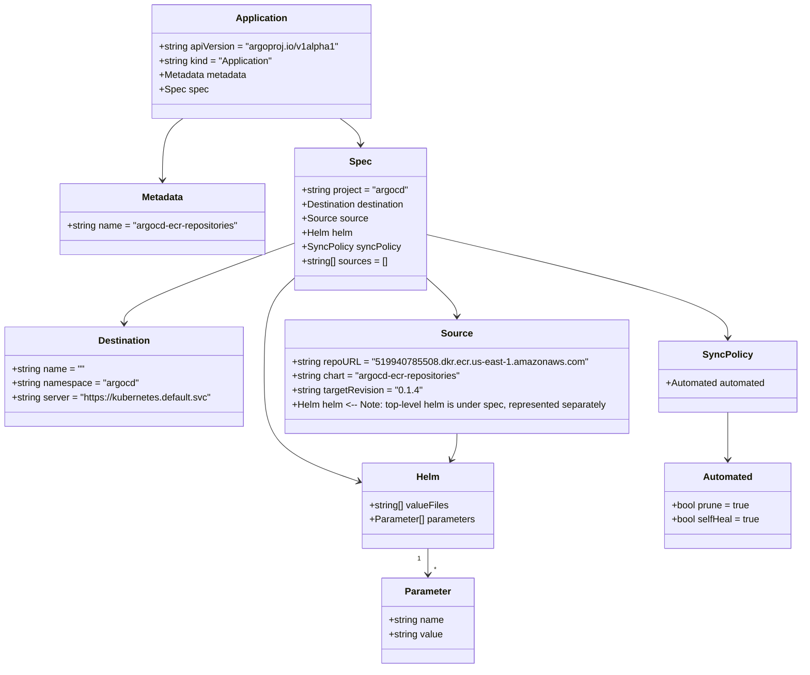

# Diagram: devops/k8s/argocd/ecr-repositories/argocd/Application.yaml

> Auto-generated by Obscura crawlers

## Mermaid

### SVG

<svg id="container" width="1374.828125" xmlns="http://www.w3.org/2000/svg" class="classDiagram" height="1128" viewBox="0 0 1374.828125 1128" role="graphics-document document" aria-roledescription="class"><g><defs><marker id="container_class-aggregationStart" class="marker aggregation class" refX="18" refY="7" markerWidth="190" markerHeight="240" orient="auto"><path d="M 18,7 L9,13 L1,7 L9,1 Z"></path></marker></defs><defs><marker id="container_class-aggregationEnd" class="marker aggregation class" refX="1" refY="7" markerWidth="20" markerHeight="28" orient="auto"><path d="M 18,7 L9,13 L1,7 L9,1 Z"></path></marker></defs><defs><marker id="container_class-extensionStart" class="marker extension class" refX="18" refY="7" markerWidth="190" markerHeight="240" orient="auto"><path d="M 1,7 L18,13 V 1 Z"></path></marker></defs><defs><marker id="container_class-extensionEnd" class="marker extension class" refX="1" refY="7" markerWidth="20" markerHeight="28" orient="auto"><path d="M 1,1 V 13 L18,7 Z"></path></marker></defs><defs><marker id="container_class-compositionStart" class="marker composition class" refX="18" refY="7" markerWidth="190" markerHeight="240" orient="auto"><path d="M 18,7 L9,13 L1,7 L9,1 Z"></path></marker></defs><defs><marker id="container_class-compositionEnd" class="marker composition class" refX="1" refY="7" markerWidth="20" markerHeight="28" orient="auto"><path d="M 18,7 L9,13 L1,7 L9,1 Z"></path></marker></defs><defs><marker id="container_class-dependencyStart" class="marker dependency class" refX="6" refY="7" markerWidth="190" markerHeight="240" orient="auto"><path d="M 5,7 L9,13 L1,7 L9,1 Z"></path></marker></defs><defs><marker id="container_class-dependencyEnd" class="marker dependency class" refX="13" refY="7" markerWidth="20" markerHeight="28" orient="auto"><path d="M 18,7 L9,13 L14,7 L9,1 Z"></path></marker></defs><defs><marker id="container_class-lollipopStart" class="marker lollipop class" refX="13" refY="7" markerWidth="190" markerHeight="240" orient="auto"><circle stroke="black" fill="transparent" cx="7" cy="7" r="6"></circle></marker></defs><defs><marker id="container_class-lollipopEnd" class="marker lollipop class" refX="1" refY="7" markerWidth="190" markerHeight="240" orient="auto"><circle stroke="black" fill="transparent" cx="7" cy="7" r="6"></circle></marker></defs><g class="root"><g class="clusters"></g><g class="edgePaths"><path d="M319.241,200L313.411,204.167C307.581,208.333,295.92,216.667,290.09,234C284.26,251.333,284.26,277.667,284.26,290.833L284.26,304" id="id_Application_Metadata_1" class="edge-thickness-normal edge-pattern-solid relation" style=";;;" data-edge="true" data-et="edge" data-id="id_Application_Metadata_1" data-points="W3sieCI6MzE5LjI0MTI4MzU3NDM4MDIsInkiOjIwMH0seyJ4IjoyODQuMjU5NzY1NjI1LCJ5IjoyMjV9LHsieCI6Mjg0LjI1OTc2NTYyNSwieSI6MzEwfV0=" marker-end="url(#container_class-dependencyEnd)"></path><path d="M587.899,200L593.73,204.167C599.56,208.333,611.22,216.667,617.051,224C622.881,231.333,622.881,237.667,622.881,240.833L622.881,244" id="id_Application_Spec_2" class="edge-thickness-normal edge-pattern-solid relation" style=";;;" data-edge="true" data-et="edge" data-id="id_Application_Spec_2" data-points="W3sieCI6NTg3Ljg5OTM0MTQyNTYxOTgsInkiOjIwMH0seyJ4Ijo2MjIuODgwODU5Mzc1LCJ5IjoyMjV9LHsieCI6NjIyLjg4MDg1OTM3NSwieSI6MjUwfV0=" marker-end="url(#container_class-dependencyEnd)"></path><path d="M510.588,409.959L461.391,427.466C412.194,444.973,313.8,479.986,264.603,502.66C215.406,525.333,215.406,535.667,215.406,540.833L215.406,546" id="id_Spec_Destination_3" class="edge-thickness-normal edge-pattern-solid relation" style=";;;" data-edge="true" data-et="edge" data-id="id_Spec_Destination_3" data-points="W3sieCI6NTEwLjU4Nzg5MDYyNSwieSI6NDA5Ljk1OTQ5NzA5Mjg5NzgzfSx7IngiOjIxNS40MDYyNSwieSI6NTE1fSx7IngiOjIxNS40MDYyNSwieSI6NTUyfV0=" marker-end="url(#container_class-dependencyEnd)"></path><path d="M735.174,468.641L743.97,476.367C752.766,484.094,770.357,499.547,779.153,510.44C787.949,521.333,787.949,527.667,787.949,530.833L787.949,534" id="id_Spec_Source_4" class="edge-thickness-normal edge-pattern-solid relation" style=";;;" data-edge="true" data-et="edge" data-id="id_Spec_Source_4" data-points="W3sieCI6NzM1LjE3MzgyODEyNSwieSI6NDY4LjY0MDgzMjk4ODIyN30seyJ4Ijo3ODcuOTQ5MjE4NzUsInkiOjUxNX0seyJ4Ijo3ODcuOTQ5MjE4NzUsInkiOjU0MH1d" marker-end="url(#container_class-dependencyEnd)"></path><path d="M510.588,468.641L501.792,476.367C492.996,484.094,475.404,499.547,466.608,527.44C457.813,555.333,457.813,595.667,457.813,636C457.813,676.333,457.813,716.667,485.357,746.307C512.901,775.947,567.99,794.894,595.534,804.367L623.078,813.841" id="id_Spec_Helm_5" class="edge-thickness-normal edge-pattern-solid relation" style=";;;" data-edge="true" data-et="edge" data-id="id_Spec_Helm_5" data-points="W3sieCI6NTEwLjU4Nzg5MDYyNSwieSI6NDY4LjY0MDgzMjk4ODIyN30seyJ4Ijo0NTcuODEyNSwieSI6NTE1fSx7IngiOjQ1Ny44MTI1LCJ5Ijo2MzZ9LHsieCI6NDU3LjgxMjUsInkiOjc1N30seyJ4Ijo2MjguNzUxOTUzMTI1LCJ5Ijo4MTUuNzkyMjE0NjI3NTI1MX1d" marker-end="url(#container_class-dependencyEnd)"></path><path d="M735.174,395.966L820.971,415.805C906.768,435.644,1078.363,475.322,1164.16,504.328C1249.957,533.333,1249.957,551.667,1249.957,560.833L1249.957,570" id="id_Spec_SyncPolicy_6" class="edge-thickness-normal edge-pattern-solid relation" style=";;;" data-edge="true" data-et="edge" data-id="id_Spec_SyncPolicy_6" data-points="W3sieCI6NzM1LjE3MzgyODEyNSwieSI6Mzk1Ljk2NTcxMzg5NDE1NzgzfSx7IngiOjEyNDkuOTU3MDMxMjUsInkiOjUxNX0seyJ4IjoxMjQ5Ljk1NzAzMTI1LCJ5Ijo1NzZ9XQ==" marker-end="url(#container_class-dependencyEnd)"></path><path d="M739.842,926L739.842,930.167C739.842,934.333,739.842,942.667,739.842,950C739.842,957.333,739.842,963.667,739.842,966.833L739.842,970" id="id_Helm_Parameter_7" class="edge-thickness-normal edge-pattern-solid relation" style=";;;" data-edge="true" data-et="edge" data-id="id_Helm_Parameter_7" data-points="W3sieCI6NzM5Ljg0MTc5Njg3NSwieSI6OTI2fSx7IngiOjczOS44NDE3OTY4NzUsInkiOjk1MX0seyJ4Ijo3MzkuODQxNzk2ODc1LCJ5Ijo5NzZ9XQ==" marker-end="url(#container_class-dependencyEnd)"></path><path d="M787.949,732L787.949,736.167C787.949,740.333,787.949,748.667,786.327,756.104C784.705,763.542,781.461,770.083,779.838,773.354L778.216,776.625" id="id_Source_Helm_8" class="edge-thickness-normal edge-pattern-solid relation" style=";;;" data-edge="true" data-et="edge" data-id="id_Source_Helm_8" data-points="W3sieCI6Nzg3Ljk0OTIxODc1LCJ5Ijo3MzJ9LHsieCI6Nzg3Ljk0OTIxODc1LCJ5Ijo3NTd9LHsieCI6Nzc1LjU1MDM5ODY3OTEyMzgsInkiOjc4Mn1d" marker-end="url(#container_class-dependencyEnd)"></path><path d="M1249.957,696L1249.957,706.167C1249.957,716.333,1249.957,736.667,1249.957,750C1249.957,763.333,1249.957,769.667,1249.957,772.833L1249.957,776" id="id_SyncPolicy_Automated_9" class="edge-thickness-normal edge-pattern-solid relation" style=";;;" data-edge="true" data-et="edge" data-id="id_SyncPolicy_Automated_9" data-points="W3sieCI6MTI0OS45NTcwMzEyNSwieSI6Njk2fSx7IngiOjEyNDkuOTU3MDMxMjUsInkiOjc1N30seyJ4IjoxMjQ5Ljk1NzAzMTI1LCJ5Ijo3ODJ9XQ==" marker-end="url(#container_class-dependencyEnd)"></path></g><g class="edgeLabels"><g class="edgeLabel"><g class="label" data-id="id_Application_Metadata_1" transform="translate(0, 0)"><foreignObject width="0" height="0">

</foreignObject></g></g><g class="edgeLabel"><g class="label" data-id="id_Application_Spec_2" transform="translate(0, 0)"><foreignObject width="0" height="0">

</foreignObject></g></g><g class="edgeLabel"><g class="label" data-id="id_Spec_Destination_3" transform="translate(0, 0)"><foreignObject width="0" height="0">

</foreignObject></g></g><g class="edgeLabel"><g class="label" data-id="id_Spec_Source_4" transform="translate(0, 0)"><foreignObject width="0" height="0">

</foreignObject></g></g><g class="edgeLabel"><g class="label" data-id="id_Spec_Helm_5" transform="translate(0, 0)"><foreignObject width="0" height="0">

</foreignObject></g></g><g class="edgeLabel"><g class="label" data-id="id_Spec_SyncPolicy_6" transform="translate(0, 0)"><foreignObject width="0" height="0">

</foreignObject></g></g><g class="edgeLabel"><g class="label" data-id="id_Helm_Parameter_7" transform="translate(0, 0)"><foreignObject width="0" height="0">

</foreignObject></g></g><g class="edgeLabel"><g class="label" data-id="id_Source_Helm_8" transform="translate(0, 0)"><foreignObject width="0" height="0">

</foreignObject></g></g><g class="edgeLabel"><g class="label" data-id="id_SyncPolicy_Automated_9" transform="translate(0, 0)"><foreignObject width="0" height="0">

</foreignObject></g></g><g class="edgeTerminals" transform="translate(724.8417984375002, 943.5000013392857)"><g class="inner" transform="translate(0, 0)"><foreignObject style="width: 9px; height: 12px;">
1
</foreignObject></g></g><g class="edgeTerminals" transform="translate(749.8417984375, 953.5000013392857)"><g class="inner" transform="translate(0, 0)"></g><foreignObject style="width: 9px; height: 12px;">
*
</foreignObject></g></g><g class="nodes"><g class="node default" id="classId-Application-0" transform="translate(453.5703125, 104)"><g class="basic label-container"><path d="M-186.81640625 -96 L186.81640625 -96 L186.81640625 96 L-186.81640625 96" stroke="none" stroke-width="0" fill="#ECECFF" style=""></path><path d="M-186.81640625 -96 C-54.02633994019726 -96, 78.76372636960548 -96, 186.81640625 -96 M-186.81640625 -96 C-111.80784014118056 -96, -36.799274032361126 -96, 186.81640625 -96 M186.81640625 -96 C186.81640625 -24.952096345503605, 186.81640625 46.09580730899279, 186.81640625 96 M186.81640625 -96 C186.81640625 -49.354418060414304, 186.81640625 -2.7088361208286074, 186.81640625 96 M186.81640625 96 C84.21623905968305 96, -18.383928130633905 96, -186.81640625 96 M186.81640625 96 C70.38043324035243 96, -46.05553976929514 96, -186.81640625 96 M-186.81640625 96 C-186.81640625 41.91303808575239, -186.81640625 -12.17392382849522, -186.81640625 -96 M-186.81640625 96 C-186.81640625 35.74165144227616, -186.81640625 -24.516697115447684, -186.81640625 -96" stroke="#9370DB" stroke-width="1.3" fill="none" stroke-dasharray="0 0" style=""></path></g><g class="annotation-group text" transform="translate(0, -72)"></g><g class="label-group text" transform="translate(-41.6796875, -72)"><g class="label" style="font-weight: bolder" transform="translate(0,-12)"><foreignObject width="83.359375" height="24">

Application

</foreignObject></g></g><g class="members-group text" transform="translate(-174.81640625, -24)"><g class="label" style="" transform="translate(0,-12)"><foreignObject width="307.953125" height="24">

+string apiVersion = "argoproj.io/v1alpha1"

</foreignObject></g><g class="label" style="" transform="translate(0,12)"><foreignObject width="196.703125" height="24">

+string kind = "Application"

</foreignObject></g><g class="label" style="" transform="translate(0,36)"><foreignObject width="149.84375" height="24">

+Metadata metadata

</foreignObject></g><g class="label" style="" transform="translate(0,60)"><foreignObject width="79.53125" height="24">

+Spec spec

</foreignObject></g></g><g class="methods-group text" transform="translate(-174.81640625, 96)"></g><g class="divider" style=""><path d="M-186.81640625 -48 C-75.09621089053911 -48, 36.623984468921776 -48, 186.81640625 -48 M-186.81640625 -48 C-67.25890417667118 -48, 52.29859789665764 -48, 186.81640625 -48" stroke="#9370DB" stroke-width="1.3" fill="none" stroke-dasharray="0 0" style=""></path></g><g class="divider" style=""><path d="M-186.81640625 72 C-50.58812895209215 72, 85.6401483458157 72, 186.81640625 72 M-186.81640625 72 C-110.94993510482597 72, -35.08346395965194 72, 186.81640625 72" stroke="#9370DB" stroke-width="1.3" fill="none" stroke-dasharray="0 0" style=""></path></g></g><g class="node default" id="classId-Metadata-1" transform="translate(284.259765625, 370)"><g class="basic label-container"><path d="M-176.328125 -60 L176.328125 -60 L176.328125 60 L-176.328125 60" stroke="none" stroke-width="0" fill="#ECECFF" style=""></path><path d="M-176.328125 -60 C-99.18128753068721 -60, -22.03445006137443 -60, 176.328125 -60 M-176.328125 -60 C-95.00685317857187 -60, -13.685581357143747 -60, 176.328125 -60 M176.328125 -60 C176.328125 -13.92006890243698, 176.328125 32.15986219512604, 176.328125 60 M176.328125 -60 C176.328125 -31.3341075604141, 176.328125 -2.668215120828201, 176.328125 60 M176.328125 60 C89.13354992889987 60, 1.9389748577997352 60, -176.328125 60 M176.328125 60 C83.94062633564144 60, -8.44687232871712 60, -176.328125 60 M-176.328125 60 C-176.328125 28.88212439198998, -176.328125 -2.2357512160200415, -176.328125 -60 M-176.328125 60 C-176.328125 29.212895560667192, -176.328125 -1.5742088786656154, -176.328125 -60" stroke="#9370DB" stroke-width="1.3" fill="none" stroke-dasharray="0 0" style=""></path></g><g class="annotation-group text" transform="translate(0, -36)"></g><g class="label-group text" transform="translate(-34.640625, -36)"><g class="label" style="font-weight: bolder" transform="translate(0,-12)"><foreignObject width="69.28125" height="24">

Metadata

</foreignObject></g></g><g class="members-group text" transform="translate(-164.328125, 12)"><g class="label" style="" transform="translate(0,-12)"><foreignObject width="294.015625" height="24">

+string name = "argocd-ecr-repositories"

</foreignObject></g></g><g class="methods-group text" transform="translate(-164.328125, 60)"></g><g class="divider" style=""><path d="M-176.328125 -12 C-88.12261117438906 -12, 0.08290265122187179 -12, 176.328125 -12 M-176.328125 -12 C-58.34623150524547 -12, 59.63566198950906 -12, 176.328125 -12" stroke="#9370DB" stroke-width="1.3" fill="none" stroke-dasharray="0 0" style=""></path></g><g class="divider" style=""><path d="M-176.328125 36 C-89.03785184164809 36, -1.747578683296183 36, 176.328125 36 M-176.328125 36 C-88.39178003759103 36, -0.4554350751820664 36, 176.328125 36" stroke="#9370DB" stroke-width="1.3" fill="none" stroke-dasharray="0 0" style=""></path></g></g><g class="node default" id="classId-Spec-2" transform="translate(622.880859375, 370)"><g class="basic label-container"><path d="M-112.29296875 -120 L112.29296875 -120 L112.29296875 120 L-112.29296875 120" stroke="none" stroke-width="0" fill="#ECECFF" style=""></path><path d="M-112.29296875 -120 C-35.04635393458652 -120, 42.20026088082696 -120, 112.29296875 -120 M-112.29296875 -120 C-34.3825295334654 -120, 43.5279096830692 -120, 112.29296875 -120 M112.29296875 -120 C112.29296875 -51.40743104190085, 112.29296875 17.1851379161983, 112.29296875 120 M112.29296875 -120 C112.29296875 -69.02739082342444, 112.29296875 -18.05478164684888, 112.29296875 120 M112.29296875 120 C26.308909616712413 120, -59.675149516575175 120, -112.29296875 120 M112.29296875 120 C55.5668624125663 120, -1.159243924867397 120, -112.29296875 120 M-112.29296875 120 C-112.29296875 59.73885370585797, -112.29296875 -0.5222925882840599, -112.29296875 -120 M-112.29296875 120 C-112.29296875 34.77445393776139, -112.29296875 -50.45109212447721, -112.29296875 -120" stroke="#9370DB" stroke-width="1.3" fill="none" stroke-dasharray="0 0" style=""></path></g><g class="annotation-group text" transform="translate(0, -96)"></g><g class="label-group text" transform="translate(-17.6015625, -96)"><g class="label" style="font-weight: bolder" transform="translate(0,-12)"><foreignObject width="35.203125" height="24">

Spec

</foreignObject></g></g><g class="members-group text" transform="translate(-100.29296875, -48)"><g class="label" style="" transform="translate(0,-12)"><foreignObject width="182.984375" height="24">

+string project = "argocd"

</foreignObject></g><g class="label" style="" transform="translate(0,12)"><foreignObject width="179.234375" height="24">

+Destination destination

</foreignObject></g><g class="label" style="" transform="translate(0,36)"><foreignObject width="108.578125" height="24">

+Source source

</foreignObject></g><g class="label" style="" transform="translate(0,60)"><foreignObject width="86.734375" height="24">

+Helm helm

</foreignObject></g><g class="label" style="" transform="translate(0,84)"><foreignObject width="162.90625" height="24">

+SyncPolicy syncPolicy

</foreignObject></g><g class="label" style="" transform="translate(0,108)"><foreignObject width="146.296875" height="24">

+string[] sources = []

</foreignObject></g></g><g class="methods-group text" transform="translate(-100.29296875, 120)"></g><g class="divider" style=""><path d="M-112.29296875 -72 C-45.21173185574375 -72, 21.8695050385125 -72, 112.29296875 -72 M-112.29296875 -72 C-26.563466433891946 -72, 59.16603588221611 -72, 112.29296875 -72" stroke="#9370DB" stroke-width="1.3" fill="none" stroke-dasharray="0 0" style=""></path></g><g class="divider" style=""><path d="M-112.29296875 96 C-57.51123448939186 96, -2.7295002287837207 96, 112.29296875 96 M-112.29296875 96 C-65.92431355350563 96, -19.555658357011254 96, 112.29296875 96" stroke="#9370DB" stroke-width="1.3" fill="none" stroke-dasharray="0 0" style=""></path></g></g><g class="node default" id="classId-Destination-3" transform="translate(215.40625, 636)"><g class="basic label-container"><path d="M-207.40625 -84 L207.40625 -84 L207.40625 84 L-207.40625 84" stroke="none" stroke-width="0" fill="#ECECFF" style=""></path><path d="M-207.40625 -84 C-52.61072713034355 -84, 102.1847957393129 -84, 207.40625 -84 M-207.40625 -84 C-43.776977653473864 -84, 119.85229469305227 -84, 207.40625 -84 M207.40625 -84 C207.40625 -27.253510669314963, 207.40625 29.492978661370074, 207.40625 84 M207.40625 -84 C207.40625 -32.0079557794132, 207.40625 19.984088441173597, 207.40625 84 M207.40625 84 C99.33432217333942 84, -8.737605653321168 84, -207.40625 84 M207.40625 84 C80.77401064486656 84, -45.85822871026687 84, -207.40625 84 M-207.40625 84 C-207.40625 18.505485412185607, -207.40625 -46.98902917562879, -207.40625 -84 M-207.40625 84 C-207.40625 20.964547330292504, -207.40625 -42.07090533941499, -207.40625 -84" stroke="#9370DB" stroke-width="1.3" fill="none" stroke-dasharray="0 0" style=""></path></g><g class="annotation-group text" transform="translate(0, -60)"></g><g class="label-group text" transform="translate(-42.46875, -60)"><g class="label" style="font-weight: bolder" transform="translate(0,-12)"><foreignObject width="84.9375" height="24">

Destination

</foreignObject></g></g><g class="members-group text" transform="translate(-195.40625, -12)"><g class="label" style="" transform="translate(0,-12)"><foreignObject width="123.625" height="24">

+string name = ""

</foreignObject></g><g class="label" style="" transform="translate(0,12)"><foreignObject width="213.890625" height="24">

+string namespace = "argocd"

</foreignObject></g><g class="label" style="" transform="translate(0,36)"><foreignObject width="348.34375" height="24">

+string server = "https://kubernetes.default.svc"

</foreignObject></g></g><g class="methods-group text" transform="translate(-195.40625, 84)"></g><g class="divider" style=""><path d="M-207.40625 -36 C-114.90389199246427 -36, -22.401533984928534 -36, 207.40625 -36 M-207.40625 -36 C-69.19131264642229 -36, 69.02362470715542 -36, 207.40625 -36" stroke="#9370DB" stroke-width="1.3" fill="none" stroke-dasharray="0 0" style=""></path></g><g class="divider" style=""><path d="M-207.40625 60 C-118.09646574121608 60, -28.786681482432158 60, 207.40625 60 M-207.40625 60 C-55.206563628358566 60, 96.99312274328287 60, 207.40625 60" stroke="#9370DB" stroke-width="1.3" fill="none" stroke-dasharray="0 0" style=""></path></g></g><g class="node default" id="classId-Source-4" transform="translate(787.94921875, 636)"><g class="basic label-container"><path d="M-295.13671875 -96 L295.13671875 -96 L295.13671875 96 L-295.13671875 96" stroke="none" stroke-width="0" fill="#ECECFF" style=""></path><path d="M-295.13671875 -96 C-158.60400429426062 -96, -22.07128983852124 -96, 295.13671875 -96 M-295.13671875 -96 C-128.31374507987474 -96, 38.50922859025053 -96, 295.13671875 -96 M295.13671875 -96 C295.13671875 -50.43507462719833, 295.13671875 -4.870149254396665, 295.13671875 96 M295.13671875 -96 C295.13671875 -51.36603013566467, 295.13671875 -6.732060271329345, 295.13671875 96 M295.13671875 96 C166.74277085609268 96, 38.34882296218535 96, -295.13671875 96 M295.13671875 96 C87.86972711460373 96, -119.39726452079253 96, -295.13671875 96 M-295.13671875 96 C-295.13671875 20.462843474331265, -295.13671875 -55.07431305133747, -295.13671875 -96 M-295.13671875 96 C-295.13671875 54.03427890908461, -295.13671875 12.068557818169225, -295.13671875 -96" stroke="#9370DB" stroke-width="1.3" fill="none" stroke-dasharray="0 0" style=""></path></g><g class="annotation-group text" transform="translate(0, -72)"></g><g class="label-group text" transform="translate(-24.8828125, -72)"><g class="label" style="font-weight: bolder" transform="translate(0,-12)"><foreignObject width="49.765625" height="24">

Source

</foreignObject></g></g><g class="members-group text" transform="translate(-283.13671875, -24)"><g class="label" style="" transform="translate(0,-12)"><foreignObject width="483.828125" height="24">

+string repoURL = "519940785508.dkr.ecr.us-east-1.amazonaws.com"

</foreignObject></g><g class="label" style="" transform="translate(0,12)"><foreignObject width="291.171875" height="24">

+string chart = "argocd-ecr-repositories"

</foreignObject></g><g class="label" style="" transform="translate(0,36)"><foreignObject width="215.921875" height="24">

+string targetRevision = "0.1.4"

</foreignObject></g><g class="label" style="" transform="translate(0,60)"><foreignObject width="541.390625" height="24">

+Helm helm    &lt;-- Note: top-level helm is under spec, represented separately

</foreignObject></g></g><g class="methods-group text" transform="translate(-283.13671875, 96)"></g><g class="divider" style=""><path d="M-295.13671875 -48 C-132.88413270278167 -48, 29.36845334443666 -48, 295.13671875 -48 M-295.13671875 -48 C-161.4248453464583 -48, -27.712971942916624 -48, 295.13671875 -48" stroke="#9370DB" stroke-width="1.3" fill="none" stroke-dasharray="0 0" style=""></path></g><g class="divider" style=""><path d="M-295.13671875 72 C-154.4885984708118 72, -13.840478191623617 72, 295.13671875 72 M-295.13671875 72 C-140.02892918017628 72, 15.078860389647446 72, 295.13671875 72" stroke="#9370DB" stroke-width="1.3" fill="none" stroke-dasharray="0 0" style=""></path></g></g><g class="node default" id="classId-Helm-5" transform="translate(739.841796875, 854)"><g class="basic label-container"><path d="M-111.08984375 -72 L111.08984375 -72 L111.08984375 72 L-111.08984375 72" stroke="none" stroke-width="0" fill="#ECECFF" style=""></path><path d="M-111.08984375 -72 C-37.46897666802141 -72, 36.151890413957176 -72, 111.08984375 -72 M-111.08984375 -72 C-65.3560488276439 -72, -19.622253905287806 -72, 111.08984375 -72 M111.08984375 -72 C111.08984375 -30.41671110273358, 111.08984375 11.166577794532841, 111.08984375 72 M111.08984375 -72 C111.08984375 -39.951993096903834, 111.08984375 -7.903986193807668, 111.08984375 72 M111.08984375 72 C53.5350302223585 72, -4.019783305282999 72, -111.08984375 72 M111.08984375 72 C44.650426096849145 72, -21.78899155630171 72, -111.08984375 72 M-111.08984375 72 C-111.08984375 32.85266923055397, -111.08984375 -6.294661538892058, -111.08984375 -72 M-111.08984375 72 C-111.08984375 35.70167519967583, -111.08984375 -0.5966496006483339, -111.08984375 -72" stroke="#9370DB" stroke-width="1.3" fill="none" stroke-dasharray="0 0" style=""></path></g><g class="annotation-group text" transform="translate(0, -48)"></g><g class="label-group text" transform="translate(-18.8828125, -48)"><g class="label" style="font-weight: bolder" transform="translate(0,-12)"><foreignObject width="37.765625" height="24">

Helm

</foreignObject></g></g><g class="members-group text" transform="translate(-99.08984375, 0)"><g class="label" style="" transform="translate(0,-12)"><foreignObject width="135.65625" height="24">

+string[] valueFiles

</foreignObject></g><g class="label" style="" transform="translate(0,12)"><foreignObject width="179.296875" height="24">

+Parameter[] parameters

</foreignObject></g></g><g class="methods-group text" transform="translate(-99.08984375, 72)"></g><g class="divider" style=""><path d="M-111.08984375 -24 C-52.239113787439635 -24, 6.61161617512073 -24, 111.08984375 -24 M-111.08984375 -24 C-55.86900569634727 -24, -0.6481676426945455 -24, 111.08984375 -24" stroke="#9370DB" stroke-width="1.3" fill="none" stroke-dasharray="0 0" style=""></path></g><g class="divider" style=""><path d="M-111.08984375 48 C-46.45612806698908 48, 18.17758761602184 48, 111.08984375 48 M-111.08984375 48 C-61.208324566712186 48, -11.326805383424372 48, 111.08984375 48" stroke="#9370DB" stroke-width="1.3" fill="none" stroke-dasharray="0 0" style=""></path></g></g><g class="node default" id="classId-Parameter-6" transform="translate(739.841796875, 1048)"><g class="basic label-container"><path d="M-78.1015625 -72 L78.1015625 -72 L78.1015625 72 L-78.1015625 72" stroke="none" stroke-width="0" fill="#ECECFF" style=""></path><path d="M-78.1015625 -72 C-43.157116640688265 -72, -8.21267078137653 -72, 78.1015625 -72 M-78.1015625 -72 C-44.68771719248836 -72, -11.273871884976714 -72, 78.1015625 -72 M78.1015625 -72 C78.1015625 -29.839023776136905, 78.1015625 12.32195244772619, 78.1015625 72 M78.1015625 -72 C78.1015625 -25.59383998082903, 78.1015625 20.812320038341937, 78.1015625 72 M78.1015625 72 C22.59704210011335 72, -32.9074782997733 72, -78.1015625 72 M78.1015625 72 C44.246427428713005 72, 10.39129235742601 72, -78.1015625 72 M-78.1015625 72 C-78.1015625 27.07605311887663, -78.1015625 -17.84789376224674, -78.1015625 -72 M-78.1015625 72 C-78.1015625 36.218440562904114, -78.1015625 0.43688112580822747, -78.1015625 -72" stroke="#9370DB" stroke-width="1.3" fill="none" stroke-dasharray="0 0" style=""></path></g><g class="annotation-group text" transform="translate(0, -48)"></g><g class="label-group text" transform="translate(-37.828125, -48)"><g class="label" style="font-weight: bolder" transform="translate(0,-12)"><foreignObject width="75.65625" height="24">

Parameter

</foreignObject></g></g><g class="members-group text" transform="translate(-66.1015625, 0)"><g class="label" style="" transform="translate(0,-12)"><foreignObject width="94.375" height="24">

+string name

</foreignObject></g><g class="label" style="" transform="translate(0,12)"><foreignObject width="92.75" height="24">

+string value

</foreignObject></g></g><g class="methods-group text" transform="translate(-66.1015625, 72)"></g><g class="divider" style=""><path d="M-78.1015625 -24 C-31.77313242614035 -24, 14.5552976477193 -24, 78.1015625 -24 M-78.1015625 -24 C-22.413733775816688 -24, 33.274094948366624 -24, 78.1015625 -24" stroke="#9370DB" stroke-width="1.3" fill="none" stroke-dasharray="0 0" style=""></path></g><g class="divider" style=""><path d="M-78.1015625 48 C-33.41167177935448 48, 11.278218941291044 48, 78.1015625 48 M-78.1015625 48 C-37.614138984558075 48, 2.8732845308838506 48, 78.1015625 48" stroke="#9370DB" stroke-width="1.3" fill="none" stroke-dasharray="0 0" style=""></path></g></g><g class="node default" id="classId-SyncPolicy-7" transform="translate(1249.95703125, 636)"><g class="basic label-container"><path d="M-116.87109375 -60 L116.87109375 -60 L116.87109375 60 L-116.87109375 60" stroke="none" stroke-width="0" fill="#ECECFF" style=""></path><path d="M-116.87109375 -60 C-52.019734024093694 -60, 12.831625701812612 -60, 116.87109375 -60 M-116.87109375 -60 C-26.02880928073637 -60, 64.81347518852726 -60, 116.87109375 -60 M116.87109375 -60 C116.87109375 -32.78592233537858, 116.87109375 -5.571844670757159, 116.87109375 60 M116.87109375 -60 C116.87109375 -31.331365948304505, 116.87109375 -2.66273189660901, 116.87109375 60 M116.87109375 60 C37.76469346734072 60, -41.34170681531856 60, -116.87109375 60 M116.87109375 60 C59.24898505487772 60, 1.6268763597554425 60, -116.87109375 60 M-116.87109375 60 C-116.87109375 28.603749386962637, -116.87109375 -2.7925012260747266, -116.87109375 -60 M-116.87109375 60 C-116.87109375 24.244822930343275, -116.87109375 -11.51035413931345, -116.87109375 -60" stroke="#9370DB" stroke-width="1.3" fill="none" stroke-dasharray="0 0" style=""></path></g><g class="annotation-group text" transform="translate(0, -36)"></g><g class="label-group text" transform="translate(-38.9296875, -36)"><g class="label" style="font-weight: bolder" transform="translate(0,-12)"><foreignObject width="77.859375" height="24">

SyncPolicy

</foreignObject></g></g><g class="members-group text" transform="translate(-104.87109375, 12)"><g class="label" style="" transform="translate(0,-12)"><foreignObject width="170.8125" height="24">

+Automated automated

</foreignObject></g></g><g class="methods-group text" transform="translate(-104.87109375, 60)"></g><g class="divider" style=""><path d="M-116.87109375 -12 C-46.54572082483655 -12, 23.7796521003269 -12, 116.87109375 -12 M-116.87109375 -12 C-25.84121297832131 -12, 65.18866779335738 -12, 116.87109375 -12" stroke="#9370DB" stroke-width="1.3" fill="none" stroke-dasharray="0 0" style=""></path></g><g class="divider" style=""><path d="M-116.87109375 36 C-34.72390632401651 36, 47.42328110196698 36, 116.87109375 36 M-116.87109375 36 C-59.57308289413181 36, -2.275072038263616 36, 116.87109375 36" stroke="#9370DB" stroke-width="1.3" fill="none" stroke-dasharray="0 0" style=""></path></g></g><g class="node default" id="classId-Automated-8" transform="translate(1249.95703125, 854)"><g class="basic label-container"><path d="M-107.3515625 -72 L107.3515625 -72 L107.3515625 72 L-107.3515625 72" stroke="none" stroke-width="0" fill="#ECECFF" style=""></path><path d="M-107.3515625 -72 C-38.37049915864581 -72, 30.610564182708373 -72, 107.3515625 -72 M-107.3515625 -72 C-24.074484693840304 -72, 59.20259311231939 -72, 107.3515625 -72 M107.3515625 -72 C107.3515625 -21.597772564049663, 107.3515625 28.804454871900674, 107.3515625 72 M107.3515625 -72 C107.3515625 -28.720090794257167, 107.3515625 14.559818411485665, 107.3515625 72 M107.3515625 72 C46.76762094467141 72, -13.816320610657186 72, -107.3515625 72 M107.3515625 72 C60.167080282775906 72, 12.982598065551812 72, -107.3515625 72 M-107.3515625 72 C-107.3515625 36.97345309526783, -107.3515625 1.9469061905356568, -107.3515625 -72 M-107.3515625 72 C-107.3515625 27.08424076830339, -107.3515625 -17.831518463393223, -107.3515625 -72" stroke="#9370DB" stroke-width="1.3" fill="none" stroke-dasharray="0 0" style=""></path></g><g class="annotation-group text" transform="translate(0, -48)"></g><g class="label-group text" transform="translate(-40.21875, -48)"><g class="label" style="font-weight: bolder" transform="translate(0,-12)"><foreignObject width="80.4375" height="24">

Automated

</foreignObject></g></g><g class="members-group text" transform="translate(-95.3515625, 0)"><g class="label" style="" transform="translate(0,-12)"><foreignObject width="134.65625" height="24">

+bool prune = true

</foreignObject></g><g class="label" style="" transform="translate(0,12)"><foreignObject width="150.484375" height="24">

+bool selfHeal = true

</foreignObject></g></g><g class="methods-group text" transform="translate(-95.3515625, 72)"></g><g class="divider" style=""><path d="M-107.3515625 -24 C-59.77726925173587 -24, -12.202976003471747 -24, 107.3515625 -24 M-107.3515625 -24 C-41.77019702964863 -24, 23.811168440702744 -24, 107.3515625 -24" stroke="#9370DB" stroke-width="1.3" fill="none" stroke-dasharray="0 0" style=""></path></g><g class="divider" style=""><path d="M-107.3515625 48 C-48.56129662836209 48, 10.228969243275813 48, 107.3515625 48 M-107.3515625 48 C-55.577164381821106 48, -3.802766263642212 48, 107.3515625 48" stroke="#9370DB" stroke-width="1.3" fill="none" stroke-dasharray="0 0" style=""></path></g></g></g></g></g></svg>
