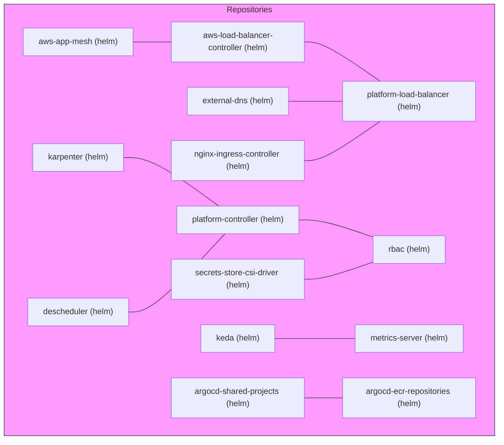

# Diagram: devops/k8s/argocd/ecr-repositories/helm/values.service.yaml

> Auto-generated by Obscura crawlers

## Mermaid

### SVG

<svg id="container" width="979.171875" xmlns="http://www.w3.org/2000/svg" class="flowchart" height="860" viewBox="0 0 979.171875 860" role="graphics-document document" aria-roledescription="flowchart-v2"><g><marker id="container_flowchart-v2-pointEnd" class="marker flowchart-v2" viewBox="0 0 10 10" refX="5" refY="5" markerUnits="userSpaceOnUse" markerWidth="8" markerHeight="8" orient="auto"><path d="M 0 0 L 10 5 L 0 10 z" class="arrowMarkerPath" style="stroke-width: 1; stroke-dasharray: 1, 0;"></path></marker><marker id="container_flowchart-v2-pointStart" class="marker flowchart-v2" viewBox="0 0 10 10" refX="4.5" refY="5" markerUnits="userSpaceOnUse" markerWidth="8" markerHeight="8" orient="auto"><path d="M 0 5 L 10 10 L 10 0 z" class="arrowMarkerPath" style="stroke-width: 1; stroke-dasharray: 1, 0;"></path></marker><marker id="container_flowchart-v2-circleEnd" class="marker flowchart-v2" viewBox="0 0 10 10" refX="11" refY="5" markerUnits="userSpaceOnUse" markerWidth="11" markerHeight="11" orient="auto"><circle cx="5" cy="5" r="5" class="arrowMarkerPath" style="stroke-width: 1; stroke-dasharray: 1, 0;"></circle></marker><marker id="container_flowchart-v2-circleStart" class="marker flowchart-v2" viewBox="0 0 10 10" refX="-1" refY="5" markerUnits="userSpaceOnUse" markerWidth="11" markerHeight="11" orient="auto"><circle cx="5" cy="5" r="5" class="arrowMarkerPath" style="stroke-width: 1; stroke-dasharray: 1, 0;"></circle></marker><marker id="container_flowchart-v2-crossEnd" class="marker cross flowchart-v2" viewBox="0 0 11 11" refX="12" refY="5.2" markerUnits="userSpaceOnUse" markerWidth="11" markerHeight="11" orient="auto"><path d="M 1,1 l 9,9 M 10,1 l -9,9" class="arrowMarkerPath" style="stroke-width: 2; stroke-dasharray: 1, 0;"></path></marker><marker id="container_flowchart-v2-crossStart" class="marker cross flowchart-v2" viewBox="0 0 11 11" refX="-1" refY="5.2" markerUnits="userSpaceOnUse" markerWidth="11" markerHeight="11" orient="auto"><path d="M 1,1 l 9,9 M 10,1 l -9,9" class="arrowMarkerPath" style="stroke-width: 2; stroke-dasharray: 1, 0;"></path></marker><g class="root"><g class="clusters"></g><g class="edgePaths"></g><g class="edgeLabels"></g><g class="nodes"><g class="root" transform="translate(0, 0)"><g class="clusters"><g class="cluster" id="Repositories" data-look="classic"><rect style="fill:#f9f !important;stroke:#333 !important;stroke-width:1px !important" x="8" y="8" width="963.171875" height="844"></rect><g class="cluster-label" transform="translate(444.203125, 8)"><foreignObject width="90.765625" height="24">

Repositories

</foreignObject></g></g></g><g class="edgePaths"><path d="M263.672,82L269.922,82C276.172,82,288.672,82,301.172,82C313.672,82,326.172,82,332.422,82L338.672,82" id="L_aws_app_mesh_aws_load_balancer_controller_0" class="edge-thickness-normal edge-pattern-solid edge-thickness-normal edge-pattern-solid flowchart-link" style=";" data-edge="true" data-et="edge" data-id="L_aws_app_mesh_aws_load_balancer_controller_0" data-points="W3sieCI6MjYzLjY3MTg3NSwieSI6ODJ9LHsieCI6MzAxLjE3MTg3NSwieSI6ODJ9LHsieCI6MzM4LjY3MTg3NSwieSI6ODJ9XQ=="></path><path d="M598.672,82L604.922,82C611.172,82,623.672,82,648.453,94.833C673.234,107.667,710.295,133.333,728.826,146.167L747.357,159" id="L_aws_load_balancer_controller_platform_load_balancer_0" class="edge-thickness-normal edge-pattern-solid edge-thickness-normal edge-pattern-solid flowchart-link" style=";" data-edge="true" data-et="edge" data-id="L_aws_load_balancer_controller_platform_load_balancer_0" data-points="W3sieCI6NTk4LjY3MTg3NSwieSI6ODJ9LHsieCI6NjM2LjE3MTg3NSwieSI6ODJ9LHsieCI6NzQ3LjM1NzIxOTgyNzU4NjIsInkiOjE1OX1d"></path><path d="M594.492,430L601.439,430C608.385,430,622.279,430,645.227,435.541C668.174,441.081,700.177,452.163,716.178,457.704L732.18,463.244" id="L_platform_controller_rbac_0" class="edge-thickness-normal edge-pattern-solid edge-thickness-normal edge-pattern-solid flowchart-link" style=";" data-edge="true" data-et="edge" data-id="L_platform_controller_rbac_0" data-points="W3sieCI6NTk0LjQ5MjE4NzUsInkiOjQzMH0seyJ4Ijo2MzYuMTcxODc1LCJ5Ijo0MzB9LHsieCI6NzMyLjE3OTY4NzUsInkiOjQ2My4yNDQ0OTYyNjg2NTY3fV0="></path><path d="M598.672,546L604.922,546C611.172,546,623.672,546,645.923,540.459C668.174,534.919,700.177,523.837,716.178,518.296L732.18,512.756" id="L_secrets_store_csi_driver_rbac_0" class="edge-thickness-normal edge-pattern-solid edge-thickness-normal edge-pattern-solid flowchart-link" style=";" data-edge="true" data-et="edge" data-id="L_secrets_store_csi_driver_rbac_0" data-points="W3sieCI6NTk4LjY3MTg3NSwieSI6NTQ2fSx7IngiOjYzNi4xNzE4NzUsInkiOjU0Nn0seyJ4Ijo3MzIuMTc5Njg3NSwieSI6NTEyLjc1NTUwMzczMTM0MzN9XQ=="></path><path d="M541.75,662L557.487,662C573.224,662,604.698,662,630.311,662C655.924,662,675.677,662,685.553,662L695.43,662" id="L_keda_metrics_server_0" class="edge-thickness-normal edge-pattern-solid edge-thickness-normal edge-pattern-solid flowchart-link" style=";" data-edge="true" data-et="edge" data-id="L_keda_metrics_server_0" data-points="W3sieCI6NTQxLjc1LCJ5Ijo2NjJ9LHsieCI6NjM2LjE3MTg3NSwieSI6NjYyfSx7IngiOjY5NS40Mjk2ODc1LCJ5Ijo2NjJ9XQ=="></path><path d="M570.266,198L581.25,198C592.234,198,614.203,198,631.438,198C648.672,198,661.172,198,667.422,198L673.672,198" id="L_external_dns_platform_load_balancer_0" class="edge-thickness-normal edge-pattern-solid edge-thickness-normal edge-pattern-solid flowchart-link" style=";" data-edge="true" data-et="edge" data-id="L_external_dns_platform_load_balancer_0" data-points="W3sieCI6NTcwLjI2NTYyNSwieSI6MTk4fSx7IngiOjYzNi4xNzE4NzUsInkiOjE5OH0seyJ4Ijo2NzMuNjcxODc1LCJ5IjoxOTh9XQ=="></path><path d="M245.57,308L254.837,308C264.104,308,282.638,308,313.643,323.833C344.649,339.667,388.125,371.333,409.864,387.167L431.602,403" id="L_karpenter_platform_controller_0" class="edge-thickness-normal edge-pattern-solid edge-thickness-normal edge-pattern-solid flowchart-link" style=";" data-edge="true" data-et="edge" data-id="L_karpenter_platform_controller_0" data-points="W3sieCI6MjQ1LjU3MDMxMjUsInkiOjMwOH0seyJ4IjozMDEuMTcxODc1LCJ5IjozMDh9LHsieCI6NDMxLjYwMjIwMjg2ODg1MjUsInkiOjQwM31d"></path><path d="M255.086,610L262.767,610C270.448,610,285.81,610,317.22,584.5C348.63,559,396.089,508,419.818,482.5L443.547,457" id="L_descheduler_platform_controller_0" class="edge-thickness-normal edge-pattern-solid edge-thickness-normal edge-pattern-solid flowchart-link" style=";" data-edge="true" data-et="edge" data-id="L_descheduler_platform_controller_0" data-points="W3sieCI6MjU1LjA4NTkzNzUsInkiOjYxMH0seyJ4IjozMDEuMTcxODc1LCJ5Ijo2MTB9LHsieCI6NDQzLjU0Njg3NSwieSI6NDU3fV0="></path><path d="M598.672,314L604.922,314C611.172,314,623.672,314,648.453,301.167C673.234,288.333,710.295,262.667,728.826,249.833L747.357,237" id="L_nginx_ingress_controller_platform_load_balancer_0" class="edge-thickness-normal edge-pattern-solid edge-thickness-normal edge-pattern-solid flowchart-link" style=";" data-edge="true" data-et="edge" data-id="L_nginx_ingress_controller_platform_load_balancer_0" data-points="W3sieCI6NTk4LjY3MTg3NSwieSI6MzE0fSx7IngiOjYzNi4xNzE4NzUsInkiOjMxNH0seyJ4Ijo3NDcuMzU3MjE5ODI3NTg2MiwieSI6MjM3fV0="></path><path d="M598.672,778L604.922,778C611.172,778,623.672,778,636.172,778C648.672,778,661.172,778,667.422,778L673.672,778" id="L_argocd_shared_projects_argocd_ecr_repositories_0" class="edge-thickness-normal edge-pattern-solid edge-thickness-normal edge-pattern-solid flowchart-link" style=";" data-edge="true" data-et="edge" data-id="L_argocd_shared_projects_argocd_ecr_repositories_0" data-points="W3sieCI6NTk4LjY3MTg3NSwieSI6Nzc4fSx7IngiOjYzNi4xNzE4NzUsInkiOjc3OH0seyJ4Ijo2NzMuNjcxODc1LCJ5Ijo3Nzh9XQ=="></path></g><g class="edgeLabels"><g class="edgeLabel"><g class="label" data-id="L_aws_app_mesh_aws_load_balancer_controller_0" transform="translate(0, 0)"><foreignObject width="0" height="0">

</foreignObject></g></g><g class="edgeLabel"><g class="label" data-id="L_aws_load_balancer_controller_platform_load_balancer_0" transform="translate(0, 0)"><foreignObject width="0" height="0">

</foreignObject></g></g><g class="edgeLabel"><g class="label" data-id="L_platform_controller_rbac_0" transform="translate(0, 0)"><foreignObject width="0" height="0">

</foreignObject></g></g><g class="edgeLabel"><g class="label" data-id="L_secrets_store_csi_driver_rbac_0" transform="translate(0, 0)"><foreignObject width="0" height="0">

</foreignObject></g></g><g class="edgeLabel"><g class="label" data-id="L_keda_metrics_server_0" transform="translate(0, 0)"><foreignObject width="0" height="0">

</foreignObject></g></g><g class="edgeLabel"><g class="label" data-id="L_external_dns_platform_load_balancer_0" transform="translate(0, 0)"><foreignObject width="0" height="0">

</foreignObject></g></g><g class="edgeLabel"><g class="label" data-id="L_karpenter_platform_controller_0" transform="translate(0, 0)"><foreignObject width="0" height="0">

</foreignObject></g></g><g class="edgeLabel"><g class="label" data-id="L_descheduler_platform_controller_0" transform="translate(0, 0)"><foreignObject width="0" height="0">

</foreignObject></g></g><g class="edgeLabel"><g class="label" data-id="L_nginx_ingress_controller_platform_load_balancer_0" transform="translate(0, 0)"><foreignObject width="0" height="0">

</foreignObject></g></g><g class="edgeLabel"><g class="label" data-id="L_argocd_shared_projects_argocd_ecr_repositories_0" transform="translate(0, 0)"><foreignObject width="0" height="0">

</foreignObject></g></g></g><g class="nodes"><g class="node default" id="flowchart-aws_app_mesh-0" transform="translate(154.5859375, 82)"><rect class="basic label-container" style="" x="-109.0859375" y="-27" width="218.171875" height="54"></rect><g class="label" style="" transform="translate(-79.0859375, -12)"><rect></rect><foreignObject width="158.171875" height="24">

aws-app-mesh (helm)

</foreignObject></g></g><g class="node default" id="flowchart-aws_load_balancer_controller-1" transform="translate(468.671875, 82)"><rect class="basic label-container" style="" x="-130" y="-39" width="260" height="78"></rect><g class="label" style="" transform="translate(-100, -24)"><rect></rect><foreignObject width="200" height="48">

aws-load-balancer-controller (helm)

</foreignObject></g></g><g class="node default" id="flowchart-platform_load_balancer-9" transform="translate(803.671875, 198)"><rect class="basic label-container" style="" x="-130" y="-39" width="260" height="78"></rect><g class="label" style="" transform="translate(-100, -24)"><rect></rect><foreignObject width="200" height="48">

platform-load-balancer (helm)

</foreignObject></g></g><g class="node default" id="flowchart-platform_controller-8" transform="translate(468.671875, 430)"><rect class="basic label-container" style="" x="-125.8203125" y="-27" width="251.640625" height="54"></rect><g class="label" style="" transform="translate(-95.8203125, -12)"><rect></rect><foreignObject width="191.640625" height="24">

platform-controller (helm)

</foreignObject></g></g><g class="node default" id="flowchart-rbac-10" transform="translate(803.671875, 488)"><rect class="basic label-container" style="" x="-71.4921875" y="-27" width="142.984375" height="54"></rect><g class="label" style="" transform="translate(-41.4921875, -12)"><rect></rect><foreignObject width="82.984375" height="24">

rbac (helm)

</foreignObject></g></g><g class="node default" id="flowchart-secrets_store_csi_driver-11" transform="translate(468.671875, 546)"><rect class="basic label-container" style="" x="-130" y="-39" width="260" height="78"></rect><g class="label" style="" transform="translate(-100, -24)"><rect></rect><foreignObject width="200" height="48">

secrets-store-csi-driver (helm)

</foreignObject></g></g><g class="node default" id="flowchart-keda-5" transform="translate(468.671875, 662)"><rect class="basic label-container" style="" x="-73.078125" y="-27" width="146.15625" height="54"></rect><g class="label" style="" transform="translate(-43.078125, -12)"><rect></rect><foreignObject width="86.15625" height="24">

keda (helm)

</foreignObject></g></g><g class="node default" id="flowchart-metrics_server-6" transform="translate(803.671875, 662)"><rect class="basic label-container" style="" x="-108.2421875" y="-27" width="216.484375" height="54"></rect><g class="label" style="" transform="translate(-78.2421875, -12)"><rect></rect><foreignObject width="156.484375" height="24">

metrics-server (helm)

</foreignObject></g></g><g class="node default" id="flowchart-external_dns-3" transform="translate(468.671875, 198)"><rect class="basic label-container" style="" x="-101.59375" y="-27" width="203.1875" height="54"></rect><g class="label" style="" transform="translate(-71.59375, -12)"><rect></rect><foreignObject width="143.1875" height="24">

external-dns (helm)

</foreignObject></g></g><g class="node default" id="flowchart-karpenter-4" transform="translate(154.5859375, 308)"><rect class="basic label-container" style="" x="-90.984375" y="-27" width="181.96875" height="54"></rect><g class="label" style="" transform="translate(-60.984375, -12)"><rect></rect><foreignObject width="121.96875" height="24">

karpenter (helm)

</foreignObject></g></g><g class="node default" id="flowchart-descheduler-2" transform="translate(154.5859375, 610)"><rect class="basic label-container" style="" x="-100.5" y="-27" width="201" height="54"></rect><g class="label" style="" transform="translate(-70.5, -12)"><rect></rect><foreignObject width="141" height="24">

descheduler (helm)

</foreignObject></g></g><g class="node default" id="flowchart-nginx_ingress_controller-7" transform="translate(468.671875, 314)"><rect class="basic label-container" style="" x="-130" y="-39" width="260" height="78"></rect><g class="label" style="" transform="translate(-100, -24)"><rect></rect><foreignObject width="200" height="48">

nginx-ingress-controller (helm)

</foreignObject></g></g><g class="node default" id="flowchart-argocd_shared_projects-12" transform="translate(468.671875, 778)"><rect class="basic label-container" style="" x="-130" y="-39" width="260" height="78"></rect><g class="label" style="" transform="translate(-100, -24)"><rect></rect><foreignObject width="200" height="48">

argocd-shared-projects (helm)

</foreignObject></g></g><g class="node default" id="flowchart-argocd_ecr_repositories-13" transform="translate(803.671875, 778)"><rect class="basic label-container" style="" x="-130" y="-39" width="260" height="78"></rect><g class="label" style="" transform="translate(-100, -24)"><rect></rect><foreignObject width="200" height="48">

argocd-ecr-repositories (helm)

</foreignObject></g></g></g></g></g></g></g></svg>
