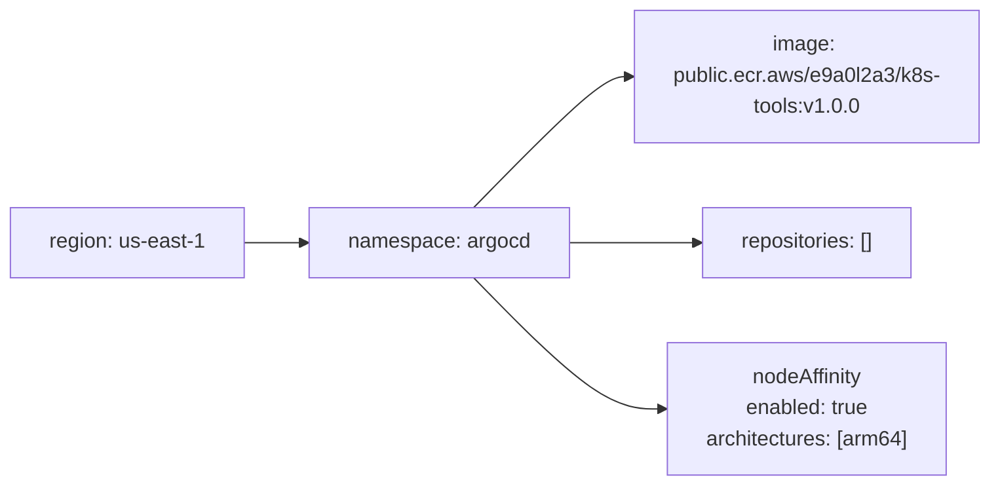

# Diagram: devops/k8s/argocd/ecr-repositories/helm/values.yaml

> Auto-generated by Obscura crawlers

## Mermaid

### SVG

<svg id="container" width="765.625" xmlns="http://www.w3.org/2000/svg" class="flowchart" height="374" viewBox="0 0 765.625 374" role="graphics-document document" aria-roledescription="flowchart-v2"><g><marker id="container_flowchart-v2-pointEnd" class="marker flowchart-v2" viewBox="0 0 10 10" refX="5" refY="5" markerUnits="userSpaceOnUse" markerWidth="8" markerHeight="8" orient="auto"><path d="M 0 0 L 10 5 L 0 10 z" class="arrowMarkerPath" style="stroke-width: 1; stroke-dasharray: 1, 0;"></path></marker><marker id="container_flowchart-v2-pointStart" class="marker flowchart-v2" viewBox="0 0 10 10" refX="4.5" refY="5" markerUnits="userSpaceOnUse" markerWidth="8" markerHeight="8" orient="auto"><path d="M 0 5 L 10 10 L 10 0 z" class="arrowMarkerPath" style="stroke-width: 1; stroke-dasharray: 1, 0;"></path></marker><marker id="container_flowchart-v2-circleEnd" class="marker flowchart-v2" viewBox="0 0 10 10" refX="11" refY="5" markerUnits="userSpaceOnUse" markerWidth="11" markerHeight="11" orient="auto"><circle cx="5" cy="5" r="5" class="arrowMarkerPath" style="stroke-width: 1; stroke-dasharray: 1, 0;"></circle></marker><marker id="container_flowchart-v2-circleStart" class="marker flowchart-v2" viewBox="0 0 10 10" refX="-1" refY="5" markerUnits="userSpaceOnUse" markerWidth="11" markerHeight="11" orient="auto"><circle cx="5" cy="5" r="5" class="arrowMarkerPath" style="stroke-width: 1; stroke-dasharray: 1, 0;"></circle></marker><marker id="container_flowchart-v2-crossEnd" class="marker cross flowchart-v2" viewBox="0 0 11 11" refX="12" refY="5.2" markerUnits="userSpaceOnUse" markerWidth="11" markerHeight="11" orient="auto"><path d="M 1,1 l 9,9 M 10,1 l -9,9" class="arrowMarkerPath" style="stroke-width: 2; stroke-dasharray: 1, 0;"></path></marker><marker id="container_flowchart-v2-crossStart" class="marker cross flowchart-v2" viewBox="0 0 11 11" refX="-1" refY="5.2" markerUnits="userSpaceOnUse" markerWidth="11" markerHeight="11" orient="auto"><path d="M 1,1 l 9,9 M 10,1 l -9,9" class="arrowMarkerPath" style="stroke-width: 2; stroke-dasharray: 1, 0;"></path></marker><g class="root"><g class="clusters"></g><g class="edgePaths"><path d="M187.094,187L191.26,187C195.427,187,203.76,187,211.427,187C219.094,187,226.094,187,229.594,187L233.094,187" id="L_region_namespace_0" class="edge-thickness-normal edge-pattern-solid edge-thickness-normal edge-pattern-solid flowchart-link" style=";" data-edge="true" data-et="edge" data-id="L_region_namespace_0" data-points="W3sieCI6MTg3LjA5Mzc1LCJ5IjoxODd9LHsieCI6MjEyLjA5Mzc1LCJ5IjoxODd9LHsieCI6MjM3LjA5Mzc1LCJ5IjoxODd9XQ==" marker-end="url(#container_flowchart-v2-pointEnd)"></path><path d="M362.922,160L379.302,143.167C395.682,126.333,428.443,92.667,448.323,75.833C468.203,59,475.203,59,478.703,59L482.203,59" id="L_namespace_image_0" class="edge-thickness-normal edge-pattern-solid edge-thickness-normal edge-pattern-solid flowchart-link" style=";" data-edge="true" data-et="edge" data-id="L_namespace_image_0" data-points="W3sieCI6MzYyLjkyMTY5MTg5NDUzMTI1LCJ5IjoxNjB9LHsieCI6NDYxLjIwMzEyNSwieSI6NTl9LHsieCI6NDg2LjIwMzEyNSwieSI6NTl9XQ==" marker-end="url(#container_flowchart-v2-pointEnd)"></path><path d="M436.203,187L440.37,187C444.536,187,452.87,187,469.371,187C485.872,187,510.542,187,522.876,187L535.211,187" id="L_namespace_repositories_0" class="edge-thickness-normal edge-pattern-solid edge-thickness-normal edge-pattern-solid flowchart-link" style=";" data-edge="true" data-et="edge" data-id="L_namespace_repositories_0" data-points="W3sieCI6NDM2LjIwMzEyNSwieSI6MTg3fSx7IngiOjQ2MS4yMDMxMjUsInkiOjE4N30seyJ4Ijo1MzkuMjEwOTM3NSwieSI6MTg3fV0=" marker-end="url(#container_flowchart-v2-pointEnd)"></path><path d="M362.922,214L379.302,230.833C395.682,247.667,428.443,281.333,449.275,298.167C470.107,315,479.01,315,483.462,315L487.914,315" id="L_namespace_nodeAffinity_0" class="edge-thickness-normal edge-pattern-solid edge-thickness-normal edge-pattern-solid flowchart-link" style=";" data-edge="true" data-et="edge" data-id="L_namespace_nodeAffinity_0" data-points="W3sieCI6MzYyLjkyMTY5MTg5NDUzMTI1LCJ5IjoyMTR9LHsieCI6NDYxLjIwMzEyNSwieSI6MzE1fSx7IngiOjQ5MS45MTQwNjI1LCJ5IjozMTV9XQ==" marker-end="url(#container_flowchart-v2-pointEnd)"></path></g><g class="edgeLabels"><g class="edgeLabel"><g class="label" data-id="L_region_namespace_0" transform="translate(0, 0)"><foreignObject width="0" height="0">

</foreignObject></g></g><g class="edgeLabel"><g class="label" data-id="L_namespace_image_0" transform="translate(0, 0)"><foreignObject width="0" height="0">

</foreignObject></g></g><g class="edgeLabel"><g class="label" data-id="L_namespace_repositories_0" transform="translate(0, 0)"><foreignObject width="0" height="0">

</foreignObject></g></g><g class="edgeLabel"><g class="label" data-id="L_namespace_nodeAffinity_0" transform="translate(0, 0)"><foreignObject width="0" height="0">

</foreignObject></g></g></g><g class="nodes"><g class="node default" id="flowchart-region-0" transform="translate(97.546875, 187)"><rect class="basic label-container" style="" x="-89.546875" y="-27" width="179.09375" height="54"></rect><g class="label" style="" transform="translate(-59.546875, -12)"><rect></rect><foreignObject width="119.09375" height="24">

region: us-east-1

</foreignObject></g></g><g class="node default" id="flowchart-namespace-1" transform="translate(336.6484375, 187)"><rect class="basic label-container" style="" x="-99.5546875" y="-27" width="199.109375" height="54"></rect><g class="label" style="" transform="translate(-69.5546875, -12)"><rect></rect><foreignObject width="139.109375" height="24">

namespace: argocd

</foreignObject></g></g><g class="node default" id="flowchart-image-2" transform="translate(621.9140625, 59)"><rect class="basic label-container" style="" x="-135.7109375" y="-51" width="271.421875" height="102"></rect><g class="label" style="" transform="translate(-105.7109375, -36)"><rect></rect><foreignObject width="211.421875" height="72">

image: public.ecr.aws/e9a0l2a3/k8s-tools:v1.0.0

</foreignObject></g></g><g class="node default" id="flowchart-repositories-3" transform="translate(621.9140625, 187)"><rect class="basic label-container" style="" x="-82.703125" y="-27" width="165.40625" height="54"></rect><g class="label" style="" transform="translate(-52.703125, -12)"><rect></rect><foreignObject width="105.40625" height="24">

repositories: []

</foreignObject></g></g><g class="node default" id="flowchart-nodeAffinity-4" transform="translate(621.9140625, 315)"><rect class="basic label-container" style="" x="-130" y="-51" width="260" height="102"></rect><g class="label" style="" transform="translate(-100, -36)"><rect></rect><foreignObject width="200" height="72">

nodeAffinity\nenabled: true\narchitectures: [arm64]

</foreignObject></g></g></g></g></g></svg>
