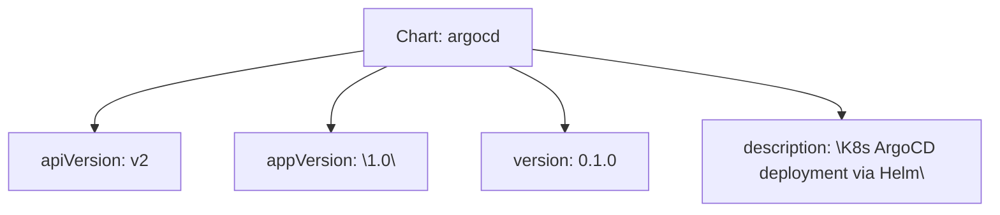

# Diagram: devops/k8s/argocd/helm/Chart.yaml

> Auto-generated by Obscura crawlers

## Mermaid

### SVG

<svg id="container" width="922.890625" xmlns="http://www.w3.org/2000/svg" class="flowchart" height="198" viewBox="0 0 922.890625 198" role="graphics-document document" aria-roledescription="flowchart-v2"><g><marker id="container_flowchart-v2-pointEnd" class="marker flowchart-v2" viewBox="0 0 10 10" refX="5" refY="5" markerUnits="userSpaceOnUse" markerWidth="8" markerHeight="8" orient="auto"><path d="M 0 0 L 10 5 L 0 10 z" class="arrowMarkerPath" style="stroke-width: 1; stroke-dasharray: 1, 0;"></path></marker><marker id="container_flowchart-v2-pointStart" class="marker flowchart-v2" viewBox="0 0 10 10" refX="4.5" refY="5" markerUnits="userSpaceOnUse" markerWidth="8" markerHeight="8" orient="auto"><path d="M 0 5 L 10 10 L 10 0 z" class="arrowMarkerPath" style="stroke-width: 1; stroke-dasharray: 1, 0;"></path></marker><marker id="container_flowchart-v2-circleEnd" class="marker flowchart-v2" viewBox="0 0 10 10" refX="11" refY="5" markerUnits="userSpaceOnUse" markerWidth="11" markerHeight="11" orient="auto"><circle cx="5" cy="5" r="5" class="arrowMarkerPath" style="stroke-width: 1; stroke-dasharray: 1, 0;"></circle></marker><marker id="container_flowchart-v2-circleStart" class="marker flowchart-v2" viewBox="0 0 10 10" refX="-1" refY="5" markerUnits="userSpaceOnUse" markerWidth="11" markerHeight="11" orient="auto"><circle cx="5" cy="5" r="5" class="arrowMarkerPath" style="stroke-width: 1; stroke-dasharray: 1, 0;"></circle></marker><marker id="container_flowchart-v2-crossEnd" class="marker cross flowchart-v2" viewBox="0 0 11 11" refX="12" refY="5.2" markerUnits="userSpaceOnUse" markerWidth="11" markerHeight="11" orient="auto"><path d="M 1,1 l 9,9 M 10,1 l -9,9" class="arrowMarkerPath" style="stroke-width: 2; stroke-dasharray: 1, 0;"></path></marker><marker id="container_flowchart-v2-crossStart" class="marker cross flowchart-v2" viewBox="0 0 11 11" refX="-1" refY="5.2" markerUnits="userSpaceOnUse" markerWidth="11" markerHeight="11" orient="auto"><path d="M 1,1 l 9,9 M 10,1 l -9,9" class="arrowMarkerPath" style="stroke-width: 2; stroke-dasharray: 1, 0;"></path></marker><g class="root"><g class="clusters"></g><g class="edgePaths"><path d="M341.914,47.221L299.62,53.851C257.326,60.481,172.737,73.74,130.443,85.87C88.148,98,88.148,109,88.148,114.5L88.148,120" id="L_Chart_APIV_0" class="edge-thickness-normal edge-pattern-solid edge-thickness-normal edge-pattern-solid flowchart-link" style=";" data-edge="true" data-et="edge" data-id="L_Chart_APIV_0" data-points="W3sieCI6MzQxLjkxNDA2MjUsInkiOjQ3LjIyMDgxNDM5NDM4NTQzNX0seyJ4Ijo4OC4xNDg0Mzc1LCJ5Ijo4N30seyJ4Ijo4OC4xNDg0Mzc1LCJ5IjoxMjR9XQ==" marker-end="url(#container_flowchart-v2-pointEnd)"></path><path d="M363.202,62L354.456,66.167C345.71,70.333,328.218,78.667,319.472,88.333C310.727,98,310.727,109,310.727,114.5L310.727,120" id="L_Chart_AppV_0" class="edge-thickness-normal edge-pattern-solid edge-thickness-normal edge-pattern-solid flowchart-link" style=";" data-edge="true" data-et="edge" data-id="L_Chart_AppV_0" data-points="W3sieCI6MzYzLjIwMTc3MjgzNjUzODQ1LCJ5Ijo2Mn0seyJ4IjozMTAuNzI2NTYyNSwieSI6ODd9LHsieCI6MzEwLjcyNjU2MjUsInkiOjEyNH1d" marker-end="url(#container_flowchart-v2-pointEnd)"></path><path d="M476.548,62L485.294,66.167C494.04,70.333,511.532,78.667,520.278,88.333C529.023,98,529.023,109,529.023,114.5L529.023,120" id="L_Chart_Version_0" class="edge-thickness-normal edge-pattern-solid edge-thickness-normal edge-pattern-solid flowchart-link" style=";" data-edge="true" data-et="edge" data-id="L_Chart_Version_0" data-points="W3sieCI6NDc2LjU0ODIyNzE2MzQ2MTU1LCJ5Ijo2Mn0seyJ4Ijo1MjkuMDIzNDM3NSwieSI6ODd9LHsieCI6NTI5LjAyMzQzNzUsInkiOjEyNH1d" marker-end="url(#container_flowchart-v2-pointEnd)"></path><path d="M497.836,46.106L545.678,52.922C593.521,59.738,689.206,73.369,737.048,83.684C784.891,94,784.891,101,784.891,104.5L784.891,108" id="L_Chart_Desc_0" class="edge-thickness-normal edge-pattern-solid edge-thickness-normal edge-pattern-solid flowchart-link" style=";" data-edge="true" data-et="edge" data-id="L_Chart_Desc_0" data-points="W3sieCI6NDk3LjgzNTkzNzUsInkiOjQ2LjEwNjI4ODI1ODIwODEyNH0seyJ4Ijo3ODQuODkwNjI1LCJ5Ijo4N30seyJ4Ijo3ODQuODkwNjI1LCJ5IjoxMTJ9XQ==" marker-end="url(#container_flowchart-v2-pointEnd)"></path></g><g class="edgeLabels"><g class="edgeLabel"><g class="label" data-id="L_Chart_APIV_0" transform="translate(0, 0)"><foreignObject width="0" height="0">

</foreignObject></g></g><g class="edgeLabel"><g class="label" data-id="L_Chart_AppV_0" transform="translate(0, 0)"><foreignObject width="0" height="0">

</foreignObject></g></g><g class="edgeLabel"><g class="label" data-id="L_Chart_Version_0" transform="translate(0, 0)"><foreignObject width="0" height="0">

</foreignObject></g></g><g class="edgeLabel"><g class="label" data-id="L_Chart_Desc_0" transform="translate(0, 0)"><foreignObject width="0" height="0">

</foreignObject></g></g></g><g class="nodes"><g class="node default" id="flowchart-Chart-0" transform="translate(419.875, 35)"><rect class="basic label-container" style="" x="-77.9609375" y="-27" width="155.921875" height="54"></rect><g class="label" style="" transform="translate(-47.9609375, -12)"><rect></rect><foreignObject width="95.921875" height="24">

Chart: argocd

</foreignObject></g></g><g class="node default" id="flowchart-APIV-1" transform="translate(88.1484375, 151)"><rect class="basic label-container" style="" x="-80.1484375" y="-27" width="160.296875" height="54"></rect><g class="label" style="" transform="translate(-50.1484375, -12)"><rect></rect><foreignObject width="100.296875" height="24">

apiVersion: v2

</foreignObject></g></g><g class="node default" id="flowchart-AppV-2" transform="translate(310.7265625, 151)"><rect class="basic label-container" style="" x="-92.4296875" y="-27" width="184.859375" height="54"></rect><g class="label" style="" transform="translate(-62.4296875, -12)"><rect></rect><foreignObject width="124.859375" height="24">

appVersion: \1.0\

</foreignObject></g></g><g class="node default" id="flowchart-Version-3" transform="translate(529.0234375, 151)"><rect class="basic label-container" style="" x="-75.8671875" y="-27" width="151.734375" height="54"></rect><g class="label" style="" transform="translate(-45.8671875, -12)"><rect></rect><foreignObject width="91.734375" height="24">

version: 0.1.0

</foreignObject></g></g><g class="node default" id="flowchart-Desc-4" transform="translate(784.890625, 151)"><rect class="basic label-container" style="" x="-130" y="-39" width="260" height="78"></rect><g class="label" style="" transform="translate(-100, -24)"><rect></rect><foreignObject width="200" height="48">

description: \K8s ArgoCD deployment via Helm\

</foreignObject></g></g></g></g></g></svg>
