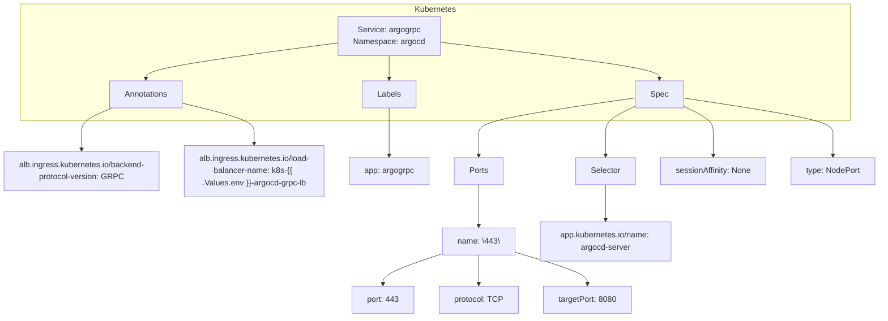

# Diagram: devops/k8s/argocd/helm/templates/grpc.yaml

> Auto-generated by Obscura crawlers

## Mermaid

### SVG

<svg id="container" width="1774.1328125" xmlns="http://www.w3.org/2000/svg" class="flowchart" height="632" viewBox="0 0 1774.1328125 632" role="graphics-document document" aria-roledescription="flowchart-v2"><g><marker id="container_flowchart-v2-pointEnd" class="marker flowchart-v2" viewBox="0 0 10 10" refX="5" refY="5" markerUnits="userSpaceOnUse" markerWidth="8" markerHeight="8" orient="auto"><path d="M 0 0 L 10 5 L 0 10 z" class="arrowMarkerPath" style="stroke-width: 1; stroke-dasharray: 1, 0;"></path></marker><marker id="container_flowchart-v2-pointStart" class="marker flowchart-v2" viewBox="0 0 10 10" refX="4.5" refY="5" markerUnits="userSpaceOnUse" markerWidth="8" markerHeight="8" orient="auto"><path d="M 0 5 L 10 10 L 10 0 z" class="arrowMarkerPath" style="stroke-width: 1; stroke-dasharray: 1, 0;"></path></marker><marker id="container_flowchart-v2-circleEnd" class="marker flowchart-v2" viewBox="0 0 10 10" refX="11" refY="5" markerUnits="userSpaceOnUse" markerWidth="11" markerHeight="11" orient="auto"><circle cx="5" cy="5" r="5" class="arrowMarkerPath" style="stroke-width: 1; stroke-dasharray: 1, 0;"></circle></marker><marker id="container_flowchart-v2-circleStart" class="marker flowchart-v2" viewBox="0 0 10 10" refX="-1" refY="5" markerUnits="userSpaceOnUse" markerWidth="11" markerHeight="11" orient="auto"><circle cx="5" cy="5" r="5" class="arrowMarkerPath" style="stroke-width: 1; stroke-dasharray: 1, 0;"></circle></marker><marker id="container_flowchart-v2-crossEnd" class="marker cross flowchart-v2" viewBox="0 0 11 11" refX="12" refY="5.2" markerUnits="userSpaceOnUse" markerWidth="11" markerHeight="11" orient="auto"><path d="M 1,1 l 9,9 M 10,1 l -9,9" class="arrowMarkerPath" style="stroke-width: 2; stroke-dasharray: 1, 0;"></path></marker><marker id="container_flowchart-v2-crossStart" class="marker cross flowchart-v2" viewBox="0 0 11 11" refX="-1" refY="5.2" markerUnits="userSpaceOnUse" markerWidth="11" markerHeight="11" orient="auto"><path d="M 1,1 l 9,9 M 10,1 l -9,9" class="arrowMarkerPath" style="stroke-width: 2; stroke-dasharray: 1, 0;"></path></marker><g class="root"><g class="clusters"><g class="cluster" id="Kubernetes" data-look="classic"><rect style="" x="44.37890625" y="8" width="1670.6171875" height="232"></rect><g class="cluster-label" transform="translate(838.2734375, 8)"><foreignObject width="82.828125" height="24">

Kubernetes

</foreignObject></g></g></g><g class="edgePaths"><path d="M692.383,84.988L626.701,93.49C561.018,101.992,429.654,118.996,363.971,130.998C298.289,143,298.289,150,298.289,153.5L298.289,157" id="L_ServiceArgogrpc_Annotations_0" class="edge-thickness-normal edge-pattern-solid edge-thickness-normal edge-pattern-solid flowchart-link" style=";" data-edge="true" data-et="edge" data-id="L_ServiceArgogrpc_Annotations_0" data-points="W3sieCI6NjkyLjM4MjgxMjUsInkiOjg0Ljk4NzY5MDk5NDk5MTA3fSx7IngiOjI5OC4yODkwNjI1LCJ5IjoxMzZ9LHsieCI6Mjk4LjI4OTA2MjUsInkiOjE2MX1d" marker-end="url(#container_flowchart-v2-pointEnd)"></path><path d="M792.719,111L792.719,115.167C792.719,119.333,792.719,127.667,792.719,135.333C792.719,143,792.719,150,792.719,153.5L792.719,157" id="L_ServiceArgogrpc_Labels_0" class="edge-thickness-normal edge-pattern-solid edge-thickness-normal edge-pattern-solid flowchart-link" style=";" data-edge="true" data-et="edge" data-id="L_ServiceArgogrpc_Labels_0" data-points="W3sieCI6NzkyLjcxODc1LCJ5IjoxMTF9LHsieCI6NzkyLjcxODc1LCJ5IjoxMzZ9LHsieCI6NzkyLjcxODc1LCJ5IjoxNjF9XQ==" marker-end="url(#container_flowchart-v2-pointEnd)"></path><path d="M893.055,83.868L966.51,92.557C1039.965,101.245,1186.875,118.623,1260.33,130.811C1333.785,143,1333.785,150,1333.785,153.5L1333.785,157" id="L_ServiceArgogrpc_Spec_0" class="edge-thickness-normal edge-pattern-solid edge-thickness-normal edge-pattern-solid flowchart-link" style=";" data-edge="true" data-et="edge" data-id="L_ServiceArgogrpc_Spec_0" data-points="W3sieCI6ODkzLjA1NDY4NzUsInkiOjgzLjg2ODIyODk3NDg5NzY2fSx7IngiOjEzMzMuNzg1MTU2MjUsInkiOjEzNn0seyJ4IjoxMzMzLjc4NTE1NjI1LCJ5IjoxNjF9XQ==" marker-end="url(#container_flowchart-v2-pointEnd)"></path><path d="M229.901,215L219.347,219.167C208.793,223.333,187.686,231.667,177.132,240C166.578,248.333,166.578,256.667,166.578,266.333C166.578,276,166.578,287,166.578,292.5L166.578,298" id="L_Annotations_A1_0" class="edge-thickness-normal edge-pattern-solid edge-thickness-normal edge-pattern-solid flowchart-link" style=";" data-edge="true" data-et="edge" data-id="L_Annotations_A1_0" data-points="W3sieCI6MjI5LjkwMDY5MTEwNTc2OTIzLCJ5IjoyMTV9LHsieCI6MTY2LjU3ODEyNSwieSI6MjQwfSx7IngiOjE2Ni41NzgxMjUsInkiOjI2NX0seyJ4IjoxNjYuNTc4MTI1LCJ5IjozMDJ9XQ==" marker-end="url(#container_flowchart-v2-pointEnd)"></path><path d="M372.352,205.444L396.803,211.204C421.255,216.963,470.159,228.481,494.611,238.407C519.063,248.333,519.063,256.667,519.063,264.333C519.063,272,519.063,279,519.063,282.5L519.063,286" id="L_Annotations_A2_0" class="edge-thickness-normal edge-pattern-solid edge-thickness-normal edge-pattern-solid flowchart-link" style=";" data-edge="true" data-et="edge" data-id="L_Annotations_A2_0" data-points="W3sieCI6MzcyLjM1MTU2MjUsInkiOjIwNS40NDQzNTQwMTExMTE1fSx7IngiOjUxOS4wNjI1LCJ5IjoyNDB9LHsieCI6NTE5LjA2MjUsInkiOjI2NX0seyJ4Ijo1MTkuMDYyNSwieSI6MjkwfV0=" marker-end="url(#container_flowchart-v2-pointEnd)"></path><path d="M792.719,215L792.719,219.167C792.719,223.333,792.719,231.667,792.719,240C792.719,248.333,792.719,256.667,792.719,268.333C792.719,280,792.719,295,792.719,302.5L792.719,310" id="L_Labels_L1_0" class="edge-thickness-normal edge-pattern-solid edge-thickness-normal edge-pattern-solid flowchart-link" style=";" data-edge="true" data-et="edge" data-id="L_Labels_L1_0" data-points="W3sieCI6NzkyLjcxODc1LCJ5IjoyMTV9LHsieCI6NzkyLjcxODc1LCJ5IjoyNDB9LHsieCI6NzkyLjcxODc1LCJ5IjoyNjV9LHsieCI6NzkyLjcxODc1LCJ5IjozMTR9XQ==" marker-end="url(#container_flowchart-v2-pointEnd)"></path><path d="M1286.488,194.784L1233.951,202.32C1181.414,209.856,1076.34,224.928,1023.803,236.631C971.266,248.333,971.266,256.667,971.266,268.333C971.266,280,971.266,295,971.266,302.5L971.266,310" id="L_Spec_Ports_0" class="edge-thickness-normal edge-pattern-solid edge-thickness-normal edge-pattern-solid flowchart-link" style=";" data-edge="true" data-et="edge" data-id="L_Spec_Ports_0" data-points="W3sieCI6MTI4Ni40ODgyODEyNSwieSI6MTk0Ljc4NDI4OTYzOTU2NjgyfSx7IngiOjk3MS4yNjU2MjUsInkiOjI0MH0seyJ4Ijo5NzEuMjY1NjI1LCJ5IjoyNjV9LHsieCI6OTcxLjI2NTYyNSwieSI6MzE0fV0=" marker-end="url(#container_flowchart-v2-pointEnd)"></path><path d="M1286.488,210.805L1276.396,215.671C1266.305,220.536,1246.121,230.268,1236.029,239.301C1225.938,248.333,1225.938,256.667,1225.938,268.333C1225.938,280,1225.938,295,1225.938,302.5L1225.938,310" id="L_Spec_Selector_0" class="edge-thickness-normal edge-pattern-solid edge-thickness-normal edge-pattern-solid flowchart-link" style=";" data-edge="true" data-et="edge" data-id="L_Spec_Selector_0" data-points="W3sieCI6MTI4Ni40ODgyODEyNSwieSI6MjEwLjgwNDczNzU4NTU2OTl9LHsieCI6MTIyNS45Mzc1LCJ5IjoyNDB9LHsieCI6MTIyNS45Mzc1LCJ5IjoyNjV9LHsieCI6MTIyNS45Mzc1LCJ5IjozMTR9XQ==" marker-end="url(#container_flowchart-v2-pointEnd)"></path><path d="M1381.082,210.805L1391.174,215.671C1401.266,220.536,1421.449,230.268,1431.541,239.301C1441.633,248.333,1441.633,256.667,1441.633,268.333C1441.633,280,1441.633,295,1441.633,302.5L1441.633,310" id="L_Spec_SessionAffinity_0" class="edge-thickness-normal edge-pattern-solid edge-thickness-normal edge-pattern-solid flowchart-link" style=";" data-edge="true" data-et="edge" data-id="L_Spec_SessionAffinity_0" data-points="W3sieCI6MTM4MS4wODIwMzEyNSwieSI6MjEwLjgwNDczNzU4NTU2OTl9LHsieCI6MTQ0MS42MzI4MTI1LCJ5IjoyNDB9LHsieCI6MTQ0MS42MzI4MTI1LCJ5IjoyNjV9LHsieCI6MTQ0MS42MzI4MTI1LCJ5IjozMTR9XQ==" marker-end="url(#container_flowchart-v2-pointEnd)"></path><path d="M1381.082,195.066L1431.212,202.555C1481.341,210.044,1581.6,225.022,1631.73,236.678C1681.859,248.333,1681.859,256.667,1681.859,268.333C1681.859,280,1681.859,295,1681.859,302.5L1681.859,310" id="L_Spec_Type_0" class="edge-thickness-normal edge-pattern-solid edge-thickness-normal edge-pattern-solid flowchart-link" style=";" data-edge="true" data-et="edge" data-id="L_Spec_Type_0" data-points="W3sieCI6MTM4MS4wODIwMzEyNSwieSI6MTk1LjA2NTg0MjE4OTcyNjk2fSx7IngiOjE2ODEuODU5Mzc1LCJ5IjoyNDB9LHsieCI6MTY4MS44NTkzNzUsInkiOjI2NX0seyJ4IjoxNjgxLjg1OTM3NSwieSI6MzE0fV0=" marker-end="url(#container_flowchart-v2-pointEnd)"></path><path d="M971.266,368L971.266,376.167C971.266,384.333,971.266,400.667,971.266,414.333C971.266,428,971.266,439,971.266,444.5L971.266,450" id="L_Ports_P1_0" class="edge-thickness-normal edge-pattern-solid edge-thickness-normal edge-pattern-solid flowchart-link" style=";" data-edge="true" data-et="edge" data-id="L_Ports_P1_0" data-points="W3sieCI6OTcxLjI2NTYyNSwieSI6MzY4fSx7IngiOjk3MS4yNjU2MjUsInkiOjQxN30seyJ4Ijo5NzEuMjY1NjI1LCJ5Ijo0NTR9XQ==" marker-end="url(#container_flowchart-v2-pointEnd)"></path><path d="M896.594,506.24L877.482,512.7C858.37,519.16,820.146,532.08,801.034,542.04C781.922,552,781.922,559,781.922,562.5L781.922,566" id="L_P1_P2_0" class="edge-thickness-normal edge-pattern-solid edge-thickness-normal edge-pattern-solid flowchart-link" style=";" data-edge="true" data-et="edge" data-id="L_P1_P2_0" data-points="W3sieCI6ODk2LjU5Mzc1LCJ5Ijo1MDYuMjM5ODA4NTQ5MjY1NTV9LHsieCI6NzgxLjkyMTg3NSwieSI6NTQ1fSx7IngiOjc4MS45MjE4NzUsInkiOjU3MH1d" marker-end="url(#container_flowchart-v2-pointEnd)"></path><path d="M971.266,508L971.266,514.167C971.266,520.333,971.266,532.667,971.266,542.333C971.266,552,971.266,559,971.266,562.5L971.266,566" id="L_P1_P3_0" class="edge-thickness-normal edge-pattern-solid edge-thickness-normal edge-pattern-solid flowchart-link" style=";" data-edge="true" data-et="edge" data-id="L_P1_P3_0" data-points="W3sieCI6OTcxLjI2NTYyNSwieSI6NTA4fSx7IngiOjk3MS4yNjU2MjUsInkiOjU0NX0seyJ4Ijo5NzEuMjY1NjI1LCJ5Ijo1NzB9XQ==" marker-end="url(#container_flowchart-v2-pointEnd)"></path><path d="M1045.938,503.145L1069.46,510.121C1092.982,517.097,1140.026,531.048,1163.548,541.524C1187.07,552,1187.07,559,1187.07,562.5L1187.07,566" id="L_P1_P4_0" class="edge-thickness-normal edge-pattern-solid edge-thickness-normal edge-pattern-solid flowchart-link" style=";" data-edge="true" data-et="edge" data-id="L_P1_P4_0" data-points="W3sieCI6MTA0NS45Mzc1LCJ5Ijo1MDMuMTQ1MDI0MDc0MTQxMTN9LHsieCI6MTE4Ny4wNzAzMTI1LCJ5Ijo1NDV9LHsieCI6MTE4Ny4wNzAzMTI1LCJ5Ijo1NzB9XQ==" marker-end="url(#container_flowchart-v2-pointEnd)"></path><path d="M1225.938,368L1225.938,376.167C1225.938,384.333,1225.938,400.667,1225.938,412.333C1225.938,424,1225.938,431,1225.938,434.5L1225.938,438" id="L_Selector_S1_0" class="edge-thickness-normal edge-pattern-solid edge-thickness-normal edge-pattern-solid flowchart-link" style=";" data-edge="true" data-et="edge" data-id="L_Selector_S1_0" data-points="W3sieCI6MTIyNS45Mzc1LCJ5IjozNjh9LHsieCI6MTIyNS45Mzc1LCJ5Ijo0MTd9LHsieCI6MTIyNS45Mzc1LCJ5Ijo0NDJ9XQ==" marker-end="url(#container_flowchart-v2-pointEnd)"></path></g><g class="edgeLabels"><g class="edgeLabel"><g class="label" data-id="L_ServiceArgogrpc_Annotations_0" transform="translate(0, 0)"><foreignObject width="0" height="0">

</foreignObject></g></g><g class="edgeLabel"><g class="label" data-id="L_ServiceArgogrpc_Labels_0" transform="translate(0, 0)"><foreignObject width="0" height="0">

</foreignObject></g></g><g class="edgeLabel"><g class="label" data-id="L_ServiceArgogrpc_Spec_0" transform="translate(0, 0)"><foreignObject width="0" height="0">

</foreignObject></g></g><g class="edgeLabel"><g class="label" data-id="L_Annotations_A1_0" transform="translate(0, 0)"><foreignObject width="0" height="0">

</foreignObject></g></g><g class="edgeLabel"><g class="label" data-id="L_Annotations_A2_0" transform="translate(0, 0)"><foreignObject width="0" height="0">

</foreignObject></g></g><g class="edgeLabel"><g class="label" data-id="L_Labels_L1_0" transform="translate(0, 0)"><foreignObject width="0" height="0">

</foreignObject></g></g><g class="edgeLabel"><g class="label" data-id="L_Spec_Ports_0" transform="translate(0, 0)"><foreignObject width="0" height="0">

</foreignObject></g></g><g class="edgeLabel"><g class="label" data-id="L_Spec_Selector_0" transform="translate(0, 0)"><foreignObject width="0" height="0">

</foreignObject></g></g><g class="edgeLabel"><g class="label" data-id="L_Spec_SessionAffinity_0" transform="translate(0, 0)"><foreignObject width="0" height="0">

</foreignObject></g></g><g class="edgeLabel"><g class="label" data-id="L_Spec_Type_0" transform="translate(0, 0)"><foreignObject width="0" height="0">

</foreignObject></g></g><g class="edgeLabel"><g class="label" data-id="L_Ports_P1_0" transform="translate(0, 0)"><foreignObject width="0" height="0">

</foreignObject></g></g><g class="edgeLabel"><g class="label" data-id="L_P1_P2_0" transform="translate(0, 0)"><foreignObject width="0" height="0">

</foreignObject></g></g><g class="edgeLabel"><g class="label" data-id="L_P1_P3_0" transform="translate(0, 0)"><foreignObject width="0" height="0">

</foreignObject></g></g><g class="edgeLabel"><g class="label" data-id="L_P1_P4_0" transform="translate(0, 0)"><foreignObject width="0" height="0">

</foreignObject></g></g><g class="edgeLabel"><g class="label" data-id="L_Selector_S1_0" transform="translate(0, 0)"><foreignObject width="0" height="0">

</foreignObject></g></g></g><g class="nodes"><g class="node default" id="flowchart-ServiceArgogrpc-0" transform="translate(792.71875, 72)"><rect class="basic label-container" style="" x="-100.3359375" y="-39" width="200.671875" height="78"></rect><g class="label" style="" transform="translate(-70.3359375, -24)"><rect></rect><foreignObject width="140.671875" height="48">

Service: argogrpc Namespace: argocd

</foreignObject></g></g><g class="node default" id="flowchart-Annotations-1" transform="translate(298.2890625, 188)"><rect class="basic label-container" style="" x="-74.0625" y="-27" width="148.125" height="54"></rect><g class="label" style="" transform="translate(-44.0625, -12)"><rect></rect><foreignObject width="88.125" height="24">

Annotations

</foreignObject></g></g><g class="node default" id="flowchart-Labels-2" transform="translate(792.71875, 188)"><rect class="basic label-container" style="" x="-53.453125" y="-27" width="106.90625" height="54"></rect><g class="label" style="" transform="translate(-23.453125, -12)"><rect></rect><foreignObject width="46.90625" height="24">

Labels

</foreignObject></g></g><g class="node default" id="flowchart-Spec-3" transform="translate(1333.78515625, 188)"><rect class="basic label-container" style="" x="-47.296875" y="-27" width="94.59375" height="54"></rect><g class="label" style="" transform="translate(-17.296875, -12)"><rect></rect><foreignObject width="34.59375" height="24">

Spec

</foreignObject></g></g><g class="node default" id="flowchart-A1-11" transform="translate(166.578125, 341)"><rect class="basic label-container" style="" x="-158.578125" y="-39" width="317.15625" height="78"></rect><g class="label" style="" transform="translate(-128.578125, -24)"><rect></rect><foreignObject width="257.15625" height="48">

alb.ingress.kubernetes.io/backend-protocol-version: GRPC

</foreignObject></g></g><g class="node default" id="flowchart-A2-13" transform="translate(519.0625, 341)"><rect class="basic label-container" style="" x="-143.90625" y="-51" width="287.8125" height="102"></rect><g class="label" style="" transform="translate(-113.90625, -36)"><rect></rect><foreignObject width="227.8125" height="72">

alb.ingress.kubernetes.io/load-balancer-name: k8s-{{ .Values.env }}-argocd-grpc-lb

</foreignObject></g></g><g class="node default" id="flowchart-L1-15" transform="translate(792.71875, 341)"><rect class="basic label-container" style="" x="-79.75" y="-27" width="159.5" height="54"></rect><g class="label" style="" transform="translate(-49.75, -12)"><rect></rect><foreignObject width="99.5" height="24">

app: argogrpc

</foreignObject></g></g><g class="node default" id="flowchart-Ports-17" transform="translate(971.265625, 341)"><rect class="basic label-container" style="" x="-48.796875" y="-27" width="97.59375" height="54"></rect><g class="label" style="" transform="translate(-18.796875, -12)"><rect></rect><foreignObject width="37.59375" height="24">

Ports

</foreignObject></g></g><g class="node default" id="flowchart-Selector-19" transform="translate(1225.9375, 341)"><rect class="basic label-container" style="" x="-59.7421875" y="-27" width="119.484375" height="54"></rect><g class="label" style="" transform="translate(-29.7421875, -12)"><rect></rect><foreignObject width="59.484375" height="24">

Selector

</foreignObject></g></g><g class="node default" id="flowchart-SessionAffinity-21" transform="translate(1441.6328125, 341)"><rect class="basic label-container" style="" x="-105.953125" y="-27" width="211.90625" height="54"></rect><g class="label" style="" transform="translate(-75.953125, -12)"><rect></rect><foreignObject width="151.90625" height="24">

sessionAffinity: None

</foreignObject></g></g><g class="node default" id="flowchart-Type-23" transform="translate(1681.859375, 341)"><rect class="basic label-container" style="" x="-84.2734375" y="-27" width="168.546875" height="54"></rect><g class="label" style="" transform="translate(-54.2734375, -12)"><rect></rect><foreignObject width="108.546875" height="24">

type: NodePort

</foreignObject></g></g><g class="node default" id="flowchart-P1-25" transform="translate(971.265625, 481)"><rect class="basic label-container" style="" x="-74.671875" y="-27" width="149.34375" height="54"></rect><g class="label" style="" transform="translate(-44.671875, -12)"><rect></rect><foreignObject width="89.34375" height="24">

name: \443\

</foreignObject></g></g><g class="node default" id="flowchart-P2-27" transform="translate(781.921875, 597)"><rect class="basic label-container" style="" x="-61.84375" y="-27" width="123.6875" height="54"></rect><g class="label" style="" transform="translate(-31.84375, -12)"><rect></rect><foreignObject width="63.6875" height="24">

port: 443

</foreignObject></g></g><g class="node default" id="flowchart-P3-29" transform="translate(971.265625, 597)"><rect class="basic label-container" style="" x="-77.5" y="-27" width="155" height="54"></rect><g class="label" style="" transform="translate(-47.5, -12)"><rect></rect><foreignObject width="95" height="24">

protocol: TCP

</foreignObject></g></g><g class="node default" id="flowchart-P4-31" transform="translate(1187.0703125, 597)"><rect class="basic label-container" style="" x="-88.3046875" y="-27" width="176.609375" height="54"></rect><g class="label" style="" transform="translate(-58.3046875, -12)"><rect></rect><foreignObject width="116.609375" height="24">

targetPort: 8080

</foreignObject></g></g><g class="node default" id="flowchart-S1-33" transform="translate(1225.9375, 481)"><rect class="basic label-container" style="" x="-130" y="-39" width="260" height="78"></rect><g class="label" style="" transform="translate(-100, -24)"><rect></rect><foreignObject width="200" height="48">

app.kubernetes.io/name: argocd-server

</foreignObject></g></g></g></g></g></svg>
