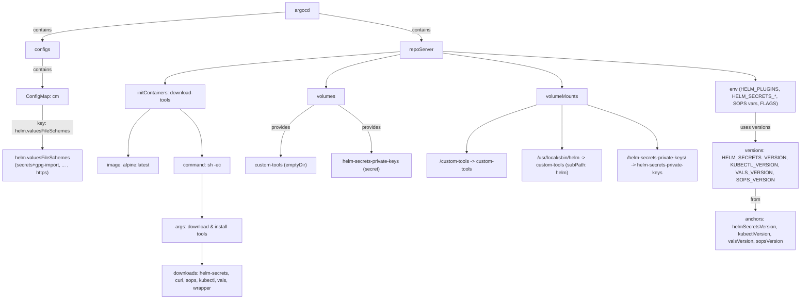
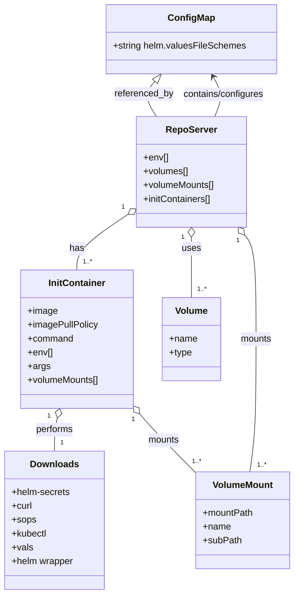

# Diagram: devops/k8s/argocd/helm/values.helm-secrets.yaml

> Auto-generated by Obscura crawlers

## Diagram 1

### SVG

<svg id="container" width="2687.671875" xmlns="http://www.w3.org/2000/svg" class="flowchart" height="974" viewBox="0 0 2687.671875 974" role="graphics-document document" aria-roledescription="flowchart-v2"><g><marker id="container_flowchart-v2-pointEnd" class="marker flowchart-v2" viewBox="0 0 10 10" refX="5" refY="5" markerUnits="userSpaceOnUse" markerWidth="8" markerHeight="8" orient="auto"><path d="M 0 0 L 10 5 L 0 10 z" class="arrowMarkerPath" style="stroke-width: 1; stroke-dasharray: 1, 0;"></path></marker><marker id="container_flowchart-v2-pointStart" class="marker flowchart-v2" viewBox="0 0 10 10" refX="4.5" refY="5" markerUnits="userSpaceOnUse" markerWidth="8" markerHeight="8" orient="auto"><path d="M 0 5 L 10 10 L 10 0 z" class="arrowMarkerPath" style="stroke-width: 1; stroke-dasharray: 1, 0;"></path></marker><marker id="container_flowchart-v2-circleEnd" class="marker flowchart-v2" viewBox="0 0 10 10" refX="11" refY="5" markerUnits="userSpaceOnUse" markerWidth="11" markerHeight="11" orient="auto"><circle cx="5" cy="5" r="5" class="arrowMarkerPath" style="stroke-width: 1; stroke-dasharray: 1, 0;"></circle></marker><marker id="container_flowchart-v2-circleStart" class="marker flowchart-v2" viewBox="0 0 10 10" refX="-1" refY="5" markerUnits="userSpaceOnUse" markerWidth="11" markerHeight="11" orient="auto"><circle cx="5" cy="5" r="5" class="arrowMarkerPath" style="stroke-width: 1; stroke-dasharray: 1, 0;"></circle></marker><marker id="container_flowchart-v2-crossEnd" class="marker cross flowchart-v2" viewBox="0 0 11 11" refX="12" refY="5.2" markerUnits="userSpaceOnUse" markerWidth="11" markerHeight="11" orient="auto"><path d="M 1,1 l 9,9 M 10,1 l -9,9" class="arrowMarkerPath" style="stroke-width: 2; stroke-dasharray: 1, 0;"></path></marker><marker id="container_flowchart-v2-crossStart" class="marker cross flowchart-v2" viewBox="0 0 11 11" refX="-1" refY="5.2" markerUnits="userSpaceOnUse" markerWidth="11" markerHeight="11" orient="auto"><path d="M 1,1 l 9,9 M 10,1 l -9,9" class="arrowMarkerPath" style="stroke-width: 2; stroke-dasharray: 1, 0;"></path></marker><g class="root"><g class="clusters"></g><g class="edgePaths"><path d="M1001.75,38.992L865.255,48.993C728.76,58.994,455.771,78.997,319.276,94.499C182.781,110,182.781,121,182.781,126.5L182.781,132" id="L_Argocd_Configs_0" class="edge-thickness-normal edge-pattern-solid edge-thickness-normal edge-pattern-solid flowchart-link" style=";" data-edge="true" data-et="edge" data-id="L_Argocd_Configs_0" data-points="W3sieCI6MTAwMS43NSwieSI6MzguOTkxNjYzNzU5NzE1OTN9LHsieCI6MTgyLjc4MTI1LCJ5Ijo5OX0seyJ4IjoxODIuNzgxMjUsInkiOjEzNn1d" marker-end="url(#container_flowchart-v2-pointEnd)"></path><path d="M182.781,190L182.781,196.167C182.781,202.333,182.781,214.667,182.781,230.333C182.781,246,182.781,265,182.781,274.5L182.781,284" id="L_Configs_CM_0" class="edge-thickness-normal edge-pattern-solid edge-thickness-normal edge-pattern-solid flowchart-link" style=";" data-edge="true" data-et="edge" data-id="L_Configs_CM_0" data-points="W3sieCI6MTgyLjc4MTI1LCJ5IjoxOTB9LHsieCI6MTgyLjc4MTI1LCJ5IjoyMjd9LHsieCI6MTgyLjc4MTI1LCJ5IjoyODh9XQ==" marker-end="url(#container_flowchart-v2-pointEnd)"></path><path d="M182.781,342L182.781,354.167C182.781,366.333,182.781,390.667,182.781,416.333C182.781,442,182.781,469,182.781,482.5L182.781,496" id="L_CM_ValuesSchemes_0" class="edge-thickness-normal edge-pattern-solid edge-thickness-normal edge-pattern-solid flowchart-link" style=";" data-edge="true" data-et="edge" data-id="L_CM_ValuesSchemes_0" data-points="W3sieCI6MTgyLjc4MTI1LCJ5IjozNDJ9LHsieCI6MTgyLjc4MTI1LCJ5Ijo0MTV9LHsieCI6MTgyLjc4MTI1LCJ5Ijo1MDB9XQ==" marker-end="url(#container_flowchart-v2-pointEnd)"></path><path d="M1110.703,43.416L1170.667,52.68C1230.632,61.944,1350.56,80.472,1410.524,95.236C1470.488,110,1470.488,121,1470.488,126.5L1470.488,132" id="L_Argocd_RepoServer_0" class="edge-thickness-normal edge-pattern-solid edge-thickness-normal edge-pattern-solid flowchart-link" style=";" data-edge="true" data-et="edge" data-id="L_Argocd_RepoServer_0" data-points="W3sieCI6MTExMC43MDMxMjUsInkiOjQzLjQxNjE3NzEyMjMyNzk0fSx7IngiOjE0NzAuNDg4MjgxMjUsInkiOjk5fSx7IngiOjE0NzAuNDg4MjgxMjUsInkiOjEzNn1d" marker-end="url(#container_flowchart-v2-pointEnd)"></path><path d="M1540.285,167.139L1708.516,177.116C1876.747,187.093,2213.21,207.046,2381.441,222.523C2549.672,238,2549.672,249,2549.672,254.5L2549.672,260" id="L_RepoServer_Env_0" class="edge-thickness-normal edge-pattern-solid edge-thickness-normal edge-pattern-solid flowchart-link" style=";" data-edge="true" data-et="edge" data-id="L_RepoServer_Env_0" data-points="W3sieCI6MTU0MC4yODUxNTYyNSwieSI6MTY3LjEzOTI0MDA5Mzk2NTd9LHsieCI6MjU0OS42NzE4NzUsInkiOjIyN30seyJ4IjoyNTQ5LjY3MTg3NSwieSI6MjY0fV0=" marker-end="url(#container_flowchart-v2-pointEnd)"></path><path d="M1400.691,177.41L1360.658,185.675C1320.624,193.94,1240.556,210.47,1200.522,228.235C1160.488,246,1160.488,265,1160.488,274.5L1160.488,284" id="L_RepoServer_Volumes_0" class="edge-thickness-normal edge-pattern-solid edge-thickness-normal edge-pattern-solid flowchart-link" style=";" data-edge="true" data-et="edge" data-id="L_RepoServer_Volumes_0" data-points="W3sieCI6MTQwMC42OTE0MDYyNSwieSI6MTc3LjQwOTY3NzQxOTM1NDg0fSx7IngiOjExNjAuNDg4MjgxMjUsInkiOjIyN30seyJ4IjoxMTYwLjQ4ODI4MTI1LCJ5IjoyODh9XQ==" marker-end="url(#container_flowchart-v2-pointEnd)"></path><path d="M1540.285,172.728L1605.183,181.773C1670.081,190.819,1799.876,208.909,1864.774,227.455C1929.672,246,1929.672,265,1929.672,274.5L1929.672,284" id="L_RepoServer_VolumeMounts_0" class="edge-thickness-normal edge-pattern-solid edge-thickness-normal edge-pattern-solid flowchart-link" style=";" data-edge="true" data-et="edge" data-id="L_RepoServer_VolumeMounts_0" data-points="W3sieCI6MTU0MC4yODUxNTYyNSwieSI6MTcyLjcyODEzNTAyMjI0NTY1fSx7IngiOjE5MjkuNjcxODc1LCJ5IjoyMjd9LHsieCI6MTkyOS42NzE4NzUsInkiOjI4OH1d" marker-end="url(#container_flowchart-v2-pointEnd)"></path><path d="M1400.691,168.313L1272.197,178.094C1143.703,187.875,886.715,207.438,758.221,224.719C629.727,242,629.727,257,629.727,264.5L629.727,272" id="L_RepoServer_Init_0" class="edge-thickness-normal edge-pattern-solid edge-thickness-normal edge-pattern-solid flowchart-link" style=";" data-edge="true" data-et="edge" data-id="L_RepoServer_Init_0" data-points="W3sieCI6MTQwMC42OTE0MDYyNSwieSI6MTY4LjMxMzAzOTIzNjE4Mzd9LHsieCI6NjI5LjcyNjU2MjUsInkiOjIyN30seyJ4Ijo2MjkuNzI2NTYyNSwieSI6Mjc2fV0=" marker-end="url(#container_flowchart-v2-pointEnd)"></path><path d="M582.403,354L570.066,364.167C557.729,374.333,533.056,394.667,520.719,420.333C508.383,446,508.383,477,508.383,492.5L508.383,508" id="L_Init_Image_0" class="edge-thickness-normal edge-pattern-solid edge-thickness-normal edge-pattern-solid flowchart-link" style=";" data-edge="true" data-et="edge" data-id="L_Init_Image_0" data-points="W3sieCI6NTgyLjQwMjUsInkiOjM1NH0seyJ4Ijo1MDguMzgyODEyNSwieSI6NDE1fSx7IngiOjUwOC4zODI4MTI1LCJ5Ijo1MTJ9XQ==" marker-end="url(#container_flowchart-v2-pointEnd)"></path><path d="M677.051,354L689.387,364.167C701.724,374.333,726.397,394.667,738.734,420.333C751.07,446,751.07,477,751.07,492.5L751.07,508" id="L_Init_Command_0" class="edge-thickness-normal edge-pattern-solid edge-thickness-normal edge-pattern-solid flowchart-link" style=";" data-edge="true" data-et="edge" data-id="L_Init_Command_0" data-points="W3sieCI6Njc3LjA1MDYyNSwieSI6MzU0fSx7IngiOjc1MS4wNzAzMTI1LCJ5Ijo0MTV9LHsieCI6NzUxLjA3MDMxMjUsInkiOjUxMn1d" marker-end="url(#container_flowchart-v2-pointEnd)"></path><path d="M751.07,566L751.07,580.167C751.07,594.333,751.07,622.667,751.07,646.333C751.07,670,751.07,689,751.07,698.5L751.07,708" id="L_Command_Args_0" class="edge-thickness-normal edge-pattern-solid edge-thickness-normal edge-pattern-solid flowchart-link" style=";" data-edge="true" data-et="edge" data-id="L_Command_Args_0" data-points="W3sieCI6NzUxLjA3MDMxMjUsInkiOjU2Nn0seyJ4Ijo3NTEuMDcwMzEyNSwieSI6NjUxfSx7IngiOjc1MS4wNzAzMTI1LCJ5Ijo3MTJ9XQ==" marker-end="url(#container_flowchart-v2-pointEnd)"></path><path d="M751.07,790L751.07,798.167C751.07,806.333,751.07,822.667,751.07,834.333C751.07,846,751.07,853,751.07,856.5L751.07,860" id="L_Args_Downloads_0" class="edge-thickness-normal edge-pattern-solid edge-thickness-normal edge-pattern-solid flowchart-link" style=";" data-edge="true" data-et="edge" data-id="L_Args_Downloads_0" data-points="W3sieCI6NzUxLjA3MDMxMjUsInkiOjc5MH0seyJ4Ijo3NTEuMDcwMzEyNSwieSI6ODM5fSx7IngiOjc1MS4wNzAzMTI1LCJ5Ijo4NjR9XQ==" marker-end="url(#container_flowchart-v2-pointEnd)"></path><path d="M1120.209,342L1102.058,354.167C1083.907,366.333,1047.606,390.667,1029.455,418.333C1011.305,446,1011.305,477,1011.305,492.5L1011.305,508" id="L_Volumes_CustomTools_0" class="edge-thickness-normal edge-pattern-solid edge-thickness-normal edge-pattern-solid flowchart-link" style=";" data-edge="true" data-et="edge" data-id="L_Volumes_CustomTools_0" data-points="W3sieCI6MTEyMC4yMDg3MTA5Mzc1LCJ5IjozNDJ9LHsieCI6MTAxMS4zMDQ2ODc1LCJ5Ijo0MTV9LHsieCI6MTAxMS4zMDQ2ODc1LCJ5Ijo1MTJ9XQ==" marker-end="url(#container_flowchart-v2-pointEnd)"></path><path d="M1200.768,342L1218.919,354.167C1237.069,366.333,1273.371,390.667,1291.521,416.333C1309.672,442,1309.672,469,1309.672,482.5L1309.672,496" id="L_Volumes_PrivateKeys_0" class="edge-thickness-normal edge-pattern-solid edge-thickness-normal edge-pattern-solid flowchart-link" style=";" data-edge="true" data-et="edge" data-id="L_Volumes_PrivateKeys_0" data-points="W3sieCI6MTIwMC43Njc4NTE1NjI1LCJ5IjozNDJ9LHsieCI6MTMwOS42NzE4NzUsInkiOjQxNX0seyJ4IjoxMzA5LjY3MTg3NSwieSI6NTAwfV0=" marker-end="url(#container_flowchart-v2-pointEnd)"></path><path d="M1846.016,341.986L1808.292,354.155C1770.568,366.324,1695.12,390.662,1657.396,416.331C1619.672,442,1619.672,469,1619.672,482.5L1619.672,496" id="L_VolumeMounts_CustomToolsMount_0" class="edge-thickness-normal edge-pattern-solid edge-thickness-normal edge-pattern-solid flowchart-link" style=";" data-edge="true" data-et="edge" data-id="L_VolumeMounts_CustomToolsMount_0" data-points="W3sieCI6MTg0Ni4wMTU2MjUsInkiOjM0MS45ODU4ODcwOTY3NzQyfSx7IngiOjE2MTkuNjcxODc1LCJ5Ijo0MTV9LHsieCI6MTYxOS42NzE4NzUsInkiOjUwMH1d" marker-end="url(#container_flowchart-v2-pointEnd)"></path><path d="M1929.672,342L1929.672,354.167C1929.672,366.333,1929.672,390.667,1929.672,414.333C1929.672,438,1929.672,461,1929.672,472.5L1929.672,484" id="L_VolumeMounts_HelmMount_0" class="edge-thickness-normal edge-pattern-solid edge-thickness-normal edge-pattern-solid flowchart-link" style=";" data-edge="true" data-et="edge" data-id="L_VolumeMounts_HelmMount_0" data-points="W3sieCI6MTkyOS42NzE4NzUsInkiOjM0Mn0seyJ4IjoxOTI5LjY3MTg3NSwieSI6NDE1fSx7IngiOjE5MjkuNjcxODc1LCJ5Ijo0ODh9XQ==" marker-end="url(#container_flowchart-v2-pointEnd)"></path><path d="M2013.328,341.986L2051.052,354.155C2088.776,366.324,2164.224,390.662,2201.948,414.331C2239.672,438,2239.672,461,2239.672,472.5L2239.672,484" id="L_VolumeMounts_KeysMount_0" class="edge-thickness-normal edge-pattern-solid edge-thickness-normal edge-pattern-solid flowchart-link" style=";" data-edge="true" data-et="edge" data-id="L_VolumeMounts_KeysMount_0" data-points="W3sieCI6MjAxMy4zMjgxMjUsInkiOjM0MS45ODU4ODcwOTY3NzQyfSx7IngiOjIyMzkuNjcxODc1LCJ5Ijo0MTV9LHsieCI6MjIzOS42NzE4NzUsInkiOjQ4OH1d" marker-end="url(#container_flowchart-v2-pointEnd)"></path><path d="M2549.672,366L2549.672,374.167C2549.672,382.333,2549.672,398.667,2549.672,414.333C2549.672,430,2549.672,445,2549.672,452.5L2549.672,460" id="L_Env_Versions_0" class="edge-thickness-normal edge-pattern-solid edge-thickness-normal edge-pattern-solid flowchart-link" style=";" data-edge="true" data-et="edge" data-id="L_Env_Versions_0" data-points="W3sieCI6MjU0OS42NzE4NzUsInkiOjM2Nn0seyJ4IjoyNTQ5LjY3MTg3NSwieSI6NDE1fSx7IngiOjI1NDkuNjcxODc1LCJ5Ijo0NjR9XQ==" marker-end="url(#container_flowchart-v2-pointEnd)"></path><path d="M2549.672,614L2549.672,620.167C2549.672,626.333,2549.672,638.667,2549.672,650.333C2549.672,662,2549.672,673,2549.672,678.5L2549.672,684" id="L_Versions_Anchors_0" class="edge-thickness-normal edge-pattern-solid edge-thickness-normal edge-pattern-solid flowchart-link" style=";" data-edge="true" data-et="edge" data-id="L_Versions_Anchors_0" data-points="W3sieCI6MjU0OS42NzE4NzUsInkiOjYxNH0seyJ4IjoyNTQ5LjY3MTg3NSwieSI6NjUxfSx7IngiOjI1NDkuNjcxODc1LCJ5Ijo2ODh9XQ==" marker-end="url(#container_flowchart-v2-pointEnd)"></path></g><g class="edgeLabels"><g class="edgeLabel" transform="translate(182.78125, 99)"><g class="label" data-id="L_Argocd_Configs_0" transform="translate(-30.890625, -12)"><foreignObject width="61.78125" height="24">

contains

</foreignObject></g></g><g class="edgeLabel" transform="translate(182.78125, 227)"><g class="label" data-id="L_Configs_CM_0" transform="translate(-30.890625, -12)"><foreignObject width="61.78125" height="24">

contains

</foreignObject></g></g><g class="edgeLabel" transform="translate(182.78125, 415)"><g class="label" data-id="L_CM_ValuesSchemes_0" transform="translate(-100, -24)"><foreignObject width="200" height="48">

key: helm.valuesFileSchemes

</foreignObject></g></g><g class="edgeLabel" transform="translate(1470.48828125, 99)"><g class="label" data-id="L_Argocd_RepoServer_0" transform="translate(-30.890625, -12)"><foreignObject width="61.78125" height="24">

contains

</foreignObject></g></g><g class="edgeLabel"><g class="label" data-id="L_RepoServer_Env_0" transform="translate(0, 0)"><foreignObject width="0" height="0">

</foreignObject></g></g><g class="edgeLabel"><g class="label" data-id="L_RepoServer_Volumes_0" transform="translate(0, 0)"><foreignObject width="0" height="0">

</foreignObject></g></g><g class="edgeLabel"><g class="label" data-id="L_RepoServer_VolumeMounts_0" transform="translate(0, 0)"><foreignObject width="0" height="0">

</foreignObject></g></g><g class="edgeLabel"><g class="label" data-id="L_RepoServer_Init_0" transform="translate(0, 0)"><foreignObject width="0" height="0">

</foreignObject></g></g><g class="edgeLabel"><g class="label" data-id="L_Init_Image_0" transform="translate(0, 0)"><foreignObject width="0" height="0">

</foreignObject></g></g><g class="edgeLabel"><g class="label" data-id="L_Init_Command_0" transform="translate(0, 0)"><foreignObject width="0" height="0">

</foreignObject></g></g><g class="edgeLabel"><g class="label" data-id="L_Command_Args_0" transform="translate(0, 0)"><foreignObject width="0" height="0">

</foreignObject></g></g><g class="edgeLabel"><g class="label" data-id="L_Args_Downloads_0" transform="translate(0, 0)"><foreignObject width="0" height="0">

</foreignObject></g></g><g class="edgeLabel" transform="translate(1011.3046875, 415)"><g class="label" data-id="L_Volumes_CustomTools_0" transform="translate(-31.3125, -12)"><foreignObject width="62.625" height="24">

provides

</foreignObject></g></g><g class="edgeLabel" transform="translate(1309.671875, 415)"><g class="label" data-id="L_Volumes_PrivateKeys_0" transform="translate(-31.3125, -12)"><foreignObject width="62.625" height="24">

provides

</foreignObject></g></g><g class="edgeLabel"><g class="label" data-id="L_VolumeMounts_CustomToolsMount_0" transform="translate(0, 0)"><foreignObject width="0" height="0">

</foreignObject></g></g><g class="edgeLabel"><g class="label" data-id="L_VolumeMounts_HelmMount_0" transform="translate(0, 0)"><foreignObject width="0" height="0">

</foreignObject></g></g><g class="edgeLabel"><g class="label" data-id="L_VolumeMounts_KeysMount_0" transform="translate(0, 0)"><foreignObject width="0" height="0">

</foreignObject></g></g><g class="edgeLabel" transform="translate(2549.671875, 415)"><g class="label" data-id="L_Env_Versions_0" transform="translate(-48.9296875, -12)"><foreignObject width="97.859375" height="24">

uses versions

</foreignObject></g></g><g class="edgeLabel" transform="translate(2549.671875, 651)"><g class="label" data-id="L_Versions_Anchors_0" transform="translate(-17.0625, -12)"><foreignObject width="34.125" height="24">

from

</foreignObject></g></g></g><g class="nodes"><g class="node default" id="flowchart-Argocd-0" transform="translate(1056.2265625, 35)"><rect class="basic label-container" style="" x="-54.4765625" y="-27" width="108.953125" height="54"></rect><g class="label" style="" transform="translate(-24.4765625, -12)"><rect></rect><foreignObject width="48.953125" height="24">

argocd

</foreignObject></g></g><g class="node default" id="flowchart-Configs-1" transform="translate(182.78125, 163)"><rect class="basic label-container" style="" x="-55.46875" y="-27" width="110.9375" height="54"></rect><g class="label" style="" transform="translate(-25.46875, -12)"><rect></rect><foreignObject width="50.9375" height="24">

configs

</foreignObject></g></g><g class="node default" id="flowchart-CM-3" transform="translate(182.78125, 315)"><rect class="basic label-container" style="" x="-82.4921875" y="-27" width="164.984375" height="54"></rect><g class="label" style="" transform="translate(-52.4921875, -12)"><rect></rect><foreignObject width="104.984375" height="24">

ConfigMap: cm

</foreignObject></g></g><g class="node default" id="flowchart-ValuesSchemes-5" transform="translate(182.78125, 539)"><rect class="basic label-container" style="" x="-174.78125" y="-39" width="349.5625" height="78"></rect><g class="label" style="" transform="translate(-144.78125, -24)"><rect></rect><foreignObject width="289.5625" height="48">

helm.valuesFileSchemes\n(secrets+gpg-import, ... , https)

</foreignObject></g></g><g class="node default" id="flowchart-RepoServer-7" transform="translate(1470.48828125, 163)"><rect class="basic label-container" style="" x="-69.796875" y="-27" width="139.59375" height="54"></rect><g class="label" style="" transform="translate(-39.796875, -12)"><rect></rect><foreignObject width="79.59375" height="24">

repoServer

</foreignObject></g></g><g class="node default" id="flowchart-Env-9" transform="translate(2549.671875, 315)"><rect class="basic label-container" style="" x="-130" y="-51" width="260" height="102"></rect><g class="label" style="" transform="translate(-100, -36)"><rect></rect><foreignObject width="200" height="72">

env (HELM_PLUGINS, HELM_SECRETS_*, SOPS vars, FLAGS)

</foreignObject></g></g><g class="node default" id="flowchart-Volumes-11" transform="translate(1160.48828125, 315)"><rect class="basic label-container" style="" x="-60.53125" y="-27" width="121.0625" height="54"></rect><g class="label" style="" transform="translate(-30.53125, -12)"><rect></rect><foreignObject width="61.0625" height="24">

volumes

</foreignObject></g></g><g class="node default" id="flowchart-VolumeMounts-13" transform="translate(1929.671875, 315)"><rect class="basic label-container" style="" x="-83.65625" y="-27" width="167.3125" height="54"></rect><g class="label" style="" transform="translate(-53.65625, -12)"><rect></rect><foreignObject width="107.3125" height="24">

volumeMounts

</foreignObject></g></g><g class="node default" id="flowchart-Init-15" transform="translate(629.7265625, 315)"><rect class="basic label-container" style="" x="-130" y="-39" width="260" height="78"></rect><g class="label" style="" transform="translate(-100, -24)"><rect></rect><foreignObject width="200" height="48">

initContainers: download-tools

</foreignObject></g></g><g class="node default" id="flowchart-Image-17" transform="translate(508.3828125, 539)"><rect class="basic label-container" style="" x="-100.8203125" y="-27" width="201.640625" height="54"></rect><g class="label" style="" transform="translate(-70.8203125, -12)"><rect></rect><foreignObject width="141.640625" height="24">

image: alpine:latest

</foreignObject></g></g><g class="node default" id="flowchart-Command-19" transform="translate(751.0703125, 539)"><rect class="basic label-container" style="" x="-91.8671875" y="-27" width="183.734375" height="54"></rect><g class="label" style="" transform="translate(-61.8671875, -12)"><rect></rect><foreignObject width="123.734375" height="24">

command: sh -ec

</foreignObject></g></g><g class="node default" id="flowchart-Args-21" transform="translate(751.0703125, 751)"><rect class="basic label-container" style="" x="-130" y="-39" width="260" height="78"></rect><g class="label" style="" transform="translate(-100, -24)"><rect></rect><foreignObject width="200" height="48">

args: download &amp; install tools

</foreignObject></g></g><g class="node default" id="flowchart-Downloads-23" transform="translate(751.0703125, 915)"><rect class="basic label-container" style="" x="-130" y="-51" width="260" height="102"></rect><g class="label" style="" transform="translate(-100, -36)"><rect></rect><foreignObject width="200" height="72">

downloads: helm-secrets, curl, sops, kubectl, vals, wrapper

</foreignObject></g></g><g class="node default" id="flowchart-CustomTools-25" transform="translate(1011.3046875, 539)"><rect class="basic label-container" style="" x="-118.3671875" y="-27" width="236.734375" height="54"></rect><g class="label" style="" transform="translate(-88.3671875, -12)"><rect></rect><foreignObject width="176.734375" height="24">

custom-tools (emptyDir)

</foreignObject></g></g><g class="node default" id="flowchart-PrivateKeys-27" transform="translate(1309.671875, 539)"><rect class="basic label-container" style="" x="-130" y="-39" width="260" height="78"></rect><g class="label" style="" transform="translate(-100, -24)"><rect></rect><foreignObject width="200" height="48">

helm-secrets-private-keys (secret)

</foreignObject></g></g><g class="node default" id="flowchart-CustomToolsMount-29" transform="translate(1619.671875, 539)"><rect class="basic label-container" style="" x="-130" y="-39" width="260" height="78"></rect><g class="label" style="" transform="translate(-100, -24)"><rect></rect><foreignObject width="200" height="48">

/custom-tools -&gt; custom-tools

</foreignObject></g></g><g class="node default" id="flowchart-HelmMount-31" transform="translate(1929.671875, 539)"><rect class="basic label-container" style="" x="-130" y="-51" width="260" height="102"></rect><g class="label" style="" transform="translate(-100, -36)"><rect></rect><foreignObject width="200" height="72">

/usr/local/sbin/helm -&gt; custom-tools (subPath: helm)

</foreignObject></g></g><g class="node default" id="flowchart-KeysMount-33" transform="translate(2239.671875, 539)"><rect class="basic label-container" style="" x="-130" y="-51" width="260" height="102"></rect><g class="label" style="" transform="translate(-100, -36)"><rect></rect><foreignObject width="200" height="72">

/helm-secrets-private-keys/ -&gt; helm-secrets-private-keys

</foreignObject></g></g><g class="node default" id="flowchart-Versions-35" transform="translate(2549.671875, 539)"><rect class="basic label-container" style="" x="-130" y="-75" width="260" height="150"></rect><g class="label" style="" transform="translate(-100, -60)"><rect></rect><foreignObject width="200" height="120">

versions: HELM_SECRETS_VERSION, KUBECTL_VERSION, VALS_VERSION, SOPS_VERSION

</foreignObject></g></g><g class="node default" id="flowchart-Anchors-37" transform="translate(2549.671875, 751)"><rect class="basic label-container" style="" x="-130" y="-63" width="260" height="126"></rect><g class="label" style="" transform="translate(-100, -48)"><rect></rect><foreignObject width="200" height="96">

anchors: helmSecretsVersion, kubectlVersion, valsVersion, sopsVersion

</foreignObject></g></g></g></g></g></svg>

## Diagram 2

### SVG

<svg id="container" width="510.9609375" xmlns="http://www.w3.org/2000/svg" class="classDiagram" height="1030" viewBox="0 0 510.9609375 1030" role="graphics-document document" aria-roledescription="class"><g><defs><marker id="container_class-aggregationStart" class="marker aggregation class" refX="18" refY="7" markerWidth="190" markerHeight="240" orient="auto"><path d="M 18,7 L9,13 L1,7 L9,1 Z"></path></marker></defs><defs><marker id="container_class-aggregationEnd" class="marker aggregation class" refX="1" refY="7" markerWidth="20" markerHeight="28" orient="auto"><path d="M 18,7 L9,13 L1,7 L9,1 Z"></path></marker></defs><defs><marker id="container_class-extensionStart" class="marker extension class" refX="18" refY="7" markerWidth="190" markerHeight="240" orient="auto"><path d="M 1,7 L18,13 V 1 Z"></path></marker></defs><defs><marker id="container_class-extensionEnd" class="marker extension class" refX="1" refY="7" markerWidth="20" markerHeight="28" orient="auto"><path d="M 1,1 V 13 L18,7 Z"></path></marker></defs><defs><marker id="container_class-compositionStart" class="marker composition class" refX="18" refY="7" markerWidth="190" markerHeight="240" orient="auto"><path d="M 18,7 L9,13 L1,7 L9,1 Z"></path></marker></defs><defs><marker id="container_class-compositionEnd" class="marker composition class" refX="1" refY="7" markerWidth="20" markerHeight="28" orient="auto"><path d="M 18,7 L9,13 L1,7 L9,1 Z"></path></marker></defs><defs><marker id="container_class-dependencyStart" class="marker dependency class" refX="6" refY="7" markerWidth="190" markerHeight="240" orient="auto"><path d="M 5,7 L9,13 L1,7 L9,1 Z"></path></marker></defs><defs><marker id="container_class-dependencyEnd" class="marker dependency class" refX="13" refY="7" markerWidth="20" markerHeight="28" orient="auto"><path d="M 18,7 L9,13 L14,7 L9,1 Z"></path></marker></defs><defs><marker id="container_class-lollipopStart" class="marker lollipop class" refX="13" refY="7" markerWidth="190" markerHeight="240" orient="auto"><circle stroke="black" fill="transparent" cx="7" cy="7" r="6"></circle></marker></defs><defs><marker id="container_class-lollipopEnd" class="marker lollipop class" refX="1" refY="7" markerWidth="190" markerHeight="240" orient="auto"><circle stroke="black" fill="transparent" cx="7" cy="7" r="6"></circle></marker></defs><g class="root"><g class="clusters"></g><g class="edgePaths"><path d="M267.619,140.81L263.983,144.842C260.347,148.873,253.075,156.937,253.495,167.135C253.915,177.333,262.028,189.667,266.084,195.833L270.14,202" id="id_ConfigMap_RepoServer_1" class="edge-thickness-normal edge-pattern-solid relation" style=";;;" data-edge="true" data-et="edge" data-id="id_ConfigMap_RepoServer_1" data-points="W3sieCI6Mjc5LjE3MjMxNzk3NjgwNDE1LCJ5IjoxMjh9LHsieCI6MjQ1LjgwMjczNDM3NSwieSI6MTY1fSx7IngiOjI3MC4xMzk5NDk0ODMwODI3LCJ5IjoyMDJ9XQ==" marker-start="url(#container_class-extensionStart)"></path><path d="M222.954,371.92L208.257,381.767C193.561,391.613,164.167,411.307,149.47,427.32C134.773,443.333,134.773,455.667,134.773,461.833L134.773,468" id="id_RepoServer_InitContainer_2" class="edge-thickness-normal edge-pattern-solid relation" style=";;;" data-edge="true" data-et="edge" data-id="id_RepoServer_InitContainer_2" data-points="W3sieCI6MjM3LjI4NTE1NjI1LCJ5IjozNjIuMzE4NjIwOTg4MjEzMDd9LHsieCI6MTM0Ljc3MzQzNzUsInkiOjQzMX0seyJ4IjoxMzQuNzczNDM3NSwieSI6NDY4fV0=" marker-start="url(#container_class-aggregationStart)"></path><path d="M333.285,411.25L333.285,414.542C333.285,417.833,333.285,424.417,333.285,441.875C333.285,459.333,333.285,487.667,333.285,501.833L333.285,516" id="id_RepoServer_Volume_3" class="edge-thickness-normal edge-pattern-solid relation" style=";;;" data-edge="true" data-et="edge" data-id="id_RepoServer_Volume_3" data-points="W3sieCI6MzMzLjI4NTE1NjI1LCJ5IjozOTR9LHsieCI6MzMzLjI4NTE1NjI1LCJ5Ijo0MzF9LHsieCI6MzMzLjI4NTE1NjI1LCJ5Ijo1MTZ9XQ==" marker-start="url(#container_class-aggregationStart)"></path><path d="M425.498,407.178L428.851,411.149C432.204,415.119,438.911,423.059,442.264,453.196C445.617,483.333,445.617,535.667,445.617,588C445.617,640.333,445.617,692.667,443.777,731C441.936,769.333,438.255,793.667,436.415,805.833L434.574,818" id="id_RepoServer_VolumeMount_4" class="edge-thickness-normal edge-pattern-solid relation" style=";;;" data-edge="true" data-et="edge" data-id="id_RepoServer_VolumeMount_4" data-points="W3sieCI6NDE0LjM2NjkyMzE2NzI5MzI0LCJ5IjozOTR9LHsieCI6NDQ1LjYxNzE4NzUsInkiOjQzMX0seyJ4Ijo0NDUuNjE3MTg3NSwieSI6NTg4fSx7IngiOjQ0NS42MTcxODc1LCJ5Ijo3NDV9LHsieCI6NDM0LjU3NDE5Mzg2OTQyNjgsInkiOjgxOH1d" marker-start="url(#container_class-aggregationStart)"></path><path d="M99.658,724.708L98.789,728.09C97.92,731.472,96.183,738.236,95.314,747.785C94.445,757.333,94.445,769.667,94.445,775.833L94.445,782" id="id_InitContainer_Downloads_5" class="edge-thickness-normal edge-pattern-solid relation" style=";;;" data-edge="true" data-et="edge" data-id="id_InitContainer_Downloads_5" data-points="W3sieCI6MTAzLjk0OTM5MjkxNDAxMjc1LCJ5Ijo3MDh9LHsieCI6OTQuNDQ1MzEyNSwieSI6NzQ1fSx7IngiOjk0LjQ0NTMxMjUsInkiOjc4Mn1d" marker-start="url(#container_class-aggregationStart)"></path><path d="M244.538,718.879L248.189,723.232C251.84,727.586,259.143,736.293,275.182,753.16C291.221,770.028,315.997,795.055,328.385,807.569L340.773,820.083" id="id_InitContainer_VolumeMount_6" class="edge-thickness-normal edge-pattern-solid relation" style=";;;" data-edge="true" data-et="edge" data-id="id_InitContainer_VolumeMount_6" data-points="W3sieCI6MjMzLjQ1MzEyNSwieSI6NzA1LjY2MTUwNDY4NzMxNDZ9LHsieCI6MjY2LjQ0NTMxMjUsInkiOjc0NX0seyJ4IjozNDAuNzczNDM3NSwieSI6ODIwLjA4MjgzOTA0Njk0ODh9XQ==" marker-start="url(#container_class-aggregationStart)"></path><path d="M373.826,202L376.43,195.833C379.034,189.667,384.243,177.333,383.777,165.865C383.312,154.397,377.173,143.795,374.103,138.494L371.034,133.192" id="id_RepoServer_ConfigMap_7" class="edge-thickness-normal edge-pattern-solid relation" style=";;;" data-edge="true" data-et="edge" data-id="id_RepoServer_ConfigMap_7" data-points="W3sieCI6MzczLjgyNjAzOTcwODY0NjYsInkiOjIwMn0seyJ4IjozODkuNDUxMTcxODc1LCJ5IjoxNjV9LHsieCI6MzY4LjAyNzAyMTU4NTA1MTU2LCJ5IjoxMjh9XQ==" marker-end="url(#container_class-dependencyEnd)"></path></g><g class="edgeLabels"><g class="edgeLabel" transform="translate(247.65737, 162.94359)"><g class="label" data-id="id_ConfigMap_RepoServer_1" transform="translate(-51.6953125, -12)"><foreignObject width="103.390625" height="24">

referenced_by

</foreignObject></g></g><g class="edgeLabel" transform="translate(134.7734375, 431)"><g class="label" data-id="id_RepoServer_InitContainer_2" transform="translate(-12.703125, -12)"><foreignObject width="25.40625" height="24">

has

</foreignObject></g></g><g class="edgeLabel" transform="translate(333.28515625, 431)"><g class="label" data-id="id_RepoServer_Volume_3" transform="translate(-16.4921875, -12)"><foreignObject width="32.984375" height="24">

uses

</foreignObject></g></g><g class="edgeLabel" transform="translate(445.6171875, 588)"><g class="label" data-id="id_RepoServer_VolumeMount_4" transform="translate(-27.5, -12)"><foreignObject width="55" height="24">

mounts

</foreignObject></g></g><g class="edgeLabel" transform="translate(94.4453125, 745)"><g class="label" data-id="id_InitContainer_Downloads_5" transform="translate(-33.15625, -12)"><foreignObject width="66.3125" height="24">

performs

</foreignObject></g></g><g class="edgeLabel" transform="translate(285.54916, 764.29782)"><g class="label" data-id="id_InitContainer_VolumeMount_6" transform="translate(-27.5, -12)"><foreignObject width="55" height="24">

mounts

</foreignObject></g></g><g class="edgeLabel" transform="translate(388.80199, 163.87885)"><g class="label" data-id="id_RepoServer_ConfigMap_7" transform="translate(-71.953125, -12)"><foreignObject width="143.90625" height="24">

contains/configures

</foreignObject></g></g><g class="edgeTerminals" transform="translate(214.39746877599205, 359.5976227926027)"><g class="inner" transform="translate(0, 0)"><foreignObject style="width: 9px; height: 12px;">
1
</foreignObject></g></g><g class="edgeTerminals" transform="translate(318.2851581250001, 411.50000160714285)"><g class="inner" transform="translate(0, 0)"><foreignObject style="width: 9px; height: 12px;">
1
</foreignObject></g></g><g class="edgeTerminals" transform="translate(414.1992577519974, 417.0482510052287)"><g class="inner" transform="translate(0, 0)"><foreignObject style="width: 9px; height: 12px;">
1
</foreignObject></g></g><g class="edgeTerminals" transform="translate(85.06720104639368, 721.217899726903)"><g class="inner" transform="translate(0, 0)"><foreignObject style="width: 9px; height: 12px;">
1
</foreignObject></g></g><g class="edgeTerminals" transform="translate(233.20549077763945, 728.7090345052864)"><g class="inner" transform="translate(0, 0)"><foreignObject style="width: 9px; height: 12px;">
1
</foreignObject></g></g><g class="edgeTerminals" transform="translate(144.77343874999997, 445.5000010714286)"><g class="inner" transform="translate(0, 0)"></g><foreignObject style="width: 36px; height: 12px;">
1..*
</foreignObject></g><g class="edgeTerminals" transform="translate(343.2851581249999, 493.50000160714285)"><g class="inner" transform="translate(0, 0)"></g><foreignObject style="width: 36px; height: 12px;">
1..*
</foreignObject></g><g class="edgeTerminals" transform="translate(447.02296910159, 797.9404425229693)"><g class="inner" transform="translate(0, 0)"></g><foreignObject style="width: 36px; height: 12px;">
1..*
</foreignObject></g><g class="edgeTerminals" transform="translate(104.44531124999996, 759.4999989285715)"><g class="inner" transform="translate(0, 0)"></g><foreignObject style="width: 9px; height: 12px;">
1
</foreignObject></g><g class="edgeTerminals" transform="translate(334.1217762082928, 792.0932341711873)"><g class="inner" transform="translate(0, 0)"></g><foreignObject style="width: 36px; height: 12px;">
1..*
</foreignObject></g></g><g class="nodes"><g class="node default" id="classId-ConfigMap-0" transform="translate(333.28515625, 68)"><g class="basic label-container"><path d="M-145.90234375 -60 L145.90234375 -60 L145.90234375 60 L-145.90234375 60" stroke="none" stroke-width="0" fill="#ECECFF" style=""></path><path d="M-145.90234375 -60 C-64.73030963247248 -60, 16.441724485055033 -60, 145.90234375 -60 M-145.90234375 -60 C-51.04945683770809 -60, 43.803430074583815 -60, 145.90234375 -60 M145.90234375 -60 C145.90234375 -29.800968715099117, 145.90234375 0.39806256980176613, 145.90234375 60 M145.90234375 -60 C145.90234375 -20.887328230372624, 145.90234375 18.22534353925475, 145.90234375 60 M145.90234375 60 C60.0892958876298 60, -25.723751974740395 60, -145.90234375 60 M145.90234375 60 C48.15920590670356 60, -49.583931936592876 60, -145.90234375 60 M-145.90234375 60 C-145.90234375 28.46749218543823, -145.90234375 -3.0650156291235433, -145.90234375 -60 M-145.90234375 60 C-145.90234375 28.771489223841666, -145.90234375 -2.457021552316668, -145.90234375 -60" stroke="#9370DB" stroke-width="1.3" fill="none" stroke-dasharray="0 0" style=""></path></g><g class="annotation-group text" transform="translate(0, -36)"></g><g class="label-group text" transform="translate(-38.3828125, -36)"><g class="label" style="font-weight: bolder" transform="translate(0,-12)"><foreignObject width="76.765625" height="24">

ConfigMap

</foreignObject></g></g><g class="members-group text" transform="translate(-133.90234375, 12)"><g class="label" style="" transform="translate(0,-12)"><foreignObject width="229.421875" height="24">

+string helm.valuesFileSchemes

</foreignObject></g></g><g class="methods-group text" transform="translate(-133.90234375, 60)"></g><g class="divider" style=""><path d="M-145.90234375 -12 C-37.62604344254707 -12, 70.65025686490586 -12, 145.90234375 -12 M-145.90234375 -12 C-87.2358879979959 -12, -28.569432245991806 -12, 145.90234375 -12" stroke="#9370DB" stroke-width="1.3" fill="none" stroke-dasharray="0 0" style=""></path></g><g class="divider" style=""><path d="M-145.90234375 36 C-70.05920752170638 36, 5.783928706587233 36, 145.90234375 36 M-145.90234375 36 C-37.364108402283875 36, 71.17412694543225 36, 145.90234375 36" stroke="#9370DB" stroke-width="1.3" fill="none" stroke-dasharray="0 0" style=""></path></g></g><g class="node default" id="classId-RepoServer-1" transform="translate(333.28515625, 298)"><g class="basic label-container"><path d="M-96 -96 L96 -96 L96 96 L-96 96" stroke="none" stroke-width="0" fill="#ECECFF" style=""></path><path d="M-96 -96 C-36.2856119126904 -96, 23.428776174619202 -96, 96 -96 M-96 -96 C-48.79772013400687 -96, -1.5954402680137463 -96, 96 -96 M96 -96 C96 -44.76077427672613, 96 6.478451446547737, 96 96 M96 -96 C96 -30.685660903793945, 96 34.62867819241211, 96 96 M96 96 C45.978109660612006 96, -4.043780678775988 96, -96 96 M96 96 C35.26662832224181 96, -25.466743355516385 96, -96 96 M-96 96 C-96 44.50652244051418, -96 -6.986955118971636, -96 -96 M-96 96 C-96 50.037589848404494, -96 4.075179696808988, -96 -96" stroke="#9370DB" stroke-width="1.3" fill="none" stroke-dasharray="0 0" style=""></path></g><g class="annotation-group text" transform="translate(0, -72)"></g><g class="label-group text" transform="translate(-42.546875, -72)"><g class="label" style="font-weight: bolder" transform="translate(0,-12)"><foreignObject width="85.09375" height="24">

RepoServer

</foreignObject></g></g><g class="members-group text" transform="translate(-84, -24)"><g class="label" style="" transform="translate(0,-12)"><foreignObject width="44.15625" height="24">

+env[]

</foreignObject></g><g class="label" style="" transform="translate(0,12)"><foreignObject width="79.1875" height="24">

+volumes[]

</foreignObject></g><g class="label" style="" transform="translate(0,36)"><foreignObject width="125.453125" height="24">

+volumeMounts[]

</foreignObject></g><g class="label" style="" transform="translate(0,60)"><foreignObject width="120.21875" height="24">

+initContainers[]

</foreignObject></g></g><g class="methods-group text" transform="translate(-84, 96)"></g><g class="divider" style=""><path d="M-96 -48 C-39.893657944374006 -48, 16.21268411125199 -48, 96 -48 M-96 -48 C-30.986409905102335 -48, 34.02718018979533 -48, 96 -48" stroke="#9370DB" stroke-width="1.3" fill="none" stroke-dasharray="0 0" style=""></path></g><g class="divider" style=""><path d="M-96 72 C-53.2915690127164 72, -10.583138025432802 72, 96 72 M-96 72 C-27.8183598299739 72, 40.3632803400522 72, 96 72" stroke="#9370DB" stroke-width="1.3" fill="none" stroke-dasharray="0 0" style=""></path></g></g><g class="node default" id="classId-InitContainer-2" transform="translate(134.7734375, 588)"><g class="basic label-container"><path d="M-98.6796875 -120 L98.6796875 -120 L98.6796875 120 L-98.6796875 120" stroke="none" stroke-width="0" fill="#ECECFF" style=""></path><path d="M-98.6796875 -120 C-42.26129782009332 -120, 14.157091859813363 -120, 98.6796875 -120 M-98.6796875 -120 C-20.689418946064862 -120, 57.300849607870276 -120, 98.6796875 -120 M98.6796875 -120 C98.6796875 -36.51490439258151, 98.6796875 46.97019121483697, 98.6796875 120 M98.6796875 -120 C98.6796875 -30.905138669598983, 98.6796875 58.18972266080203, 98.6796875 120 M98.6796875 120 C53.59574205231302 120, 8.511796604626042 120, -98.6796875 120 M98.6796875 120 C32.17521573385203 120, -34.329256032295945 120, -98.6796875 120 M-98.6796875 120 C-98.6796875 54.15038140846187, -98.6796875 -11.699237183076264, -98.6796875 -120 M-98.6796875 120 C-98.6796875 61.50253004390683, -98.6796875 3.0050600878136606, -98.6796875 -120" stroke="#9370DB" stroke-width="1.3" fill="none" stroke-dasharray="0 0" style=""></path></g><g class="annotation-group text" transform="translate(0, -96)"></g><g class="label-group text" transform="translate(-47.90625, -96)"><g class="label" style="font-weight: bolder" transform="translate(0,-12)"><foreignObject width="95.8125" height="24">

InitContainer

</foreignObject></g></g><g class="members-group text" transform="translate(-86.6796875, -48)"><g class="label" style="" transform="translate(0,-12)"><foreignObject width="51.546875" height="24">

+image

</foreignObject></g><g class="label" style="" transform="translate(0,12)"><foreignObject width="121.96875" height="24">

+imagePullPolicy

</foreignObject></g><g class="label" style="" transform="translate(0,36)"><foreignObject width="79.734375" height="24">

+command

</foreignObject></g><g class="label" style="" transform="translate(0,60)"><foreignObject width="44.15625" height="24">

+env[]

</foreignObject></g><g class="label" style="" transform="translate(0,84)"><foreignObject width="38.078125" height="24">

+args

</foreignObject></g><g class="label" style="" transform="translate(0,108)"><foreignObject width="125.453125" height="24">

+volumeMounts[]

</foreignObject></g></g><g class="methods-group text" transform="translate(-86.6796875, 120)"></g><g class="divider" style=""><path d="M-98.6796875 -72 C-20.86444504651122 -72, 56.95079740697756 -72, 98.6796875 -72 M-98.6796875 -72 C-22.47150146652389 -72, 53.73668456695222 -72, 98.6796875 -72" stroke="#9370DB" stroke-width="1.3" fill="none" stroke-dasharray="0 0" style=""></path></g><g class="divider" style=""><path d="M-98.6796875 96 C-24.60635067457183 96, 49.46698615085634 96, 98.6796875 96 M-98.6796875 96 C-40.45049321495556 96, 17.778701070088886 96, 98.6796875 96" stroke="#9370DB" stroke-width="1.3" fill="none" stroke-dasharray="0 0" style=""></path></g></g><g class="node default" id="classId-Volume-3" transform="translate(333.28515625, 588)"><g class="basic label-container"><path d="M-49.83203125 -72 L49.83203125 -72 L49.83203125 72 L-49.83203125 72" stroke="none" stroke-width="0" fill="#ECECFF" style=""></path><path d="M-49.83203125 -72 C-21.752971671751887 -72, 6.326087906496227 -72, 49.83203125 -72 M-49.83203125 -72 C-27.560909815568962 -72, -5.2897883811379245 -72, 49.83203125 -72 M49.83203125 -72 C49.83203125 -20.135701412191047, 49.83203125 31.728597175617907, 49.83203125 72 M49.83203125 -72 C49.83203125 -38.365420846266176, 49.83203125 -4.730841692532351, 49.83203125 72 M49.83203125 72 C12.229047829298736 72, -25.373935591402528 72, -49.83203125 72 M49.83203125 72 C20.890517576384923 72, -8.050996097230154 72, -49.83203125 72 M-49.83203125 72 C-49.83203125 16.28511514924149, -49.83203125 -39.42976970151702, -49.83203125 -72 M-49.83203125 72 C-49.83203125 15.329516114196046, -49.83203125 -41.34096777160791, -49.83203125 -72" stroke="#9370DB" stroke-width="1.3" fill="none" stroke-dasharray="0 0" style=""></path></g><g class="annotation-group text" transform="translate(0, -48)"></g><g class="label-group text" transform="translate(-27.1640625, -48)"><g class="label" style="font-weight: bolder" transform="translate(0,-12)"><foreignObject width="54.328125" height="24">

Volume

</foreignObject></g></g><g class="members-group text" transform="translate(-37.83203125, 0)"><g class="label" style="" transform="translate(0,-12)"><foreignObject width="48.5" height="24">

+name

</foreignObject></g><g class="label" style="" transform="translate(0,12)"><foreignObject width="39.703125" height="24">

+type

</foreignObject></g></g><g class="methods-group text" transform="translate(-37.83203125, 72)"></g><g class="divider" style=""><path d="M-49.83203125 -24 C-18.669561976667758 -24, 12.492907296664484 -24, 49.83203125 -24 M-49.83203125 -24 C-14.21653630662584 -24, 21.39895863674832 -24, 49.83203125 -24" stroke="#9370DB" stroke-width="1.3" fill="none" stroke-dasharray="0 0" style=""></path></g><g class="divider" style=""><path d="M-49.83203125 48 C-16.77204701973836 48, 16.287937210523282 48, 49.83203125 48 M-49.83203125 48 C-21.62637723545318 48, 6.5792767790936395 48, 49.83203125 48" stroke="#9370DB" stroke-width="1.3" fill="none" stroke-dasharray="0 0" style=""></path></g></g><g class="node default" id="classId-VolumeMount-4" transform="translate(421.8671875, 902)"><g class="basic label-container"><path d="M-81.09375 -84 L81.09375 -84 L81.09375 84 L-81.09375 84" stroke="none" stroke-width="0" fill="#ECECFF" style=""></path><path d="M-81.09375 -84 C-19.241027011630663 -84, 42.61169597673867 -84, 81.09375 -84 M-81.09375 -84 C-22.614456822161998 -84, 35.864836355676005 -84, 81.09375 -84 M81.09375 -84 C81.09375 -31.175338481347673, 81.09375 21.649323037304654, 81.09375 84 M81.09375 -84 C81.09375 -34.57625509568387, 81.09375 14.847489808632261, 81.09375 84 M81.09375 84 C17.841727298460263 84, -45.41029540307947 84, -81.09375 84 M81.09375 84 C19.05367419047949 84, -42.98640161904102 84, -81.09375 84 M-81.09375 84 C-81.09375 21.525832205469314, -81.09375 -40.94833558906137, -81.09375 -84 M-81.09375 84 C-81.09375 24.791676133830073, -81.09375 -34.416647732339854, -81.09375 -84" stroke="#9370DB" stroke-width="1.3" fill="none" stroke-dasharray="0 0" style=""></path></g><g class="annotation-group text" transform="translate(0, -60)"></g><g class="label-group text" transform="translate(-50.40625, -60)"><g class="label" style="font-weight: bolder" transform="translate(0,-12)"><foreignObject width="100.8125" height="24">

VolumeMount

</foreignObject></g></g><g class="members-group text" transform="translate(-69.09375, -12)"><g class="label" style="" transform="translate(0,-12)"><foreignObject width="87.78125" height="24">

+mountPath

</foreignObject></g><g class="label" style="" transform="translate(0,12)"><foreignObject width="48.5" height="24">

+name

</foreignObject></g><g class="label" style="" transform="translate(0,36)"><foreignObject width="66.546875" height="24">

+subPath

</foreignObject></g></g><g class="methods-group text" transform="translate(-69.09375, 84)"></g><g class="divider" style=""><path d="M-81.09375 -36 C-46.659884206385534 -36, -12.226018412771069 -36, 81.09375 -36 M-81.09375 -36 C-47.91582160620674 -36, -14.737893212413482 -36, 81.09375 -36" stroke="#9370DB" stroke-width="1.3" fill="none" stroke-dasharray="0 0" style=""></path></g><g class="divider" style=""><path d="M-81.09375 60 C-17.07954964580432 60, 46.93465070839136 60, 81.09375 60 M-81.09375 60 C-39.46885521388307 60, 2.1560395722338654 60, 81.09375 60" stroke="#9370DB" stroke-width="1.3" fill="none" stroke-dasharray="0 0" style=""></path></g></g><g class="node default" id="classId-Downloads-5" transform="translate(94.4453125, 902)"><g class="basic label-container"><path d="M-86.4453125 -120 L86.4453125 -120 L86.4453125 120 L-86.4453125 120" stroke="none" stroke-width="0" fill="#ECECFF" style=""></path><path d="M-86.4453125 -120 C-35.13100363787598 -120, 16.183305224248045 -120, 86.4453125 -120 M-86.4453125 -120 C-32.65553896146906 -120, 21.134234577061875 -120, 86.4453125 -120 M86.4453125 -120 C86.4453125 -47.72455661585613, 86.4453125 24.55088676828774, 86.4453125 120 M86.4453125 -120 C86.4453125 -34.22839253407683, 86.4453125 51.543214931846336, 86.4453125 120 M86.4453125 120 C20.672465978743745 120, -45.10038054251251 120, -86.4453125 120 M86.4453125 120 C25.937733624097916 120, -34.56984525180417 120, -86.4453125 120 M-86.4453125 120 C-86.4453125 51.64413508980657, -86.4453125 -16.711729820386864, -86.4453125 -120 M-86.4453125 120 C-86.4453125 62.68107115955139, -86.4453125 5.362142319102773, -86.4453125 -120" stroke="#9370DB" stroke-width="1.3" fill="none" stroke-dasharray="0 0" style=""></path></g><g class="annotation-group text" transform="translate(0, -96)"></g><g class="label-group text" transform="translate(-40.46875, -96)"><g class="label" style="font-weight: bolder" transform="translate(0,-12)"><foreignObject width="80.9375" height="24">

Downloads

</foreignObject></g></g><g class="members-group text" transform="translate(-74.4453125, -48)"><g class="label" style="" transform="translate(0,-12)"><foreignObject width="102.4375" height="24">

+helm-secrets

</foreignObject></g><g class="label" style="" transform="translate(0,12)"><foreignObject width="35.65625" height="24">

+curl

</foreignObject></g><g class="label" style="" transform="translate(0,36)"><foreignObject width="41.78125" height="24">

+sops

</foreignObject></g><g class="label" style="" transform="translate(0,60)"><foreignObject width="61.5625" height="24">

+kubectl

</foreignObject></g><g class="label" style="" transform="translate(0,84)"><foreignObject width="36.15625" height="24">

+vals

</foreignObject></g><g class="label" style="" transform="translate(0,108)"><foreignObject width="108.421875" height="24">

+helm wrapper

</foreignObject></g></g><g class="methods-group text" transform="translate(-74.4453125, 120)"></g><g class="divider" style=""><path d="M-86.4453125 -72 C-39.05279390064075 -72, 8.339724698718499 -72, 86.4453125 -72 M-86.4453125 -72 C-35.423505807577456 -72, 15.598300884845088 -72, 86.4453125 -72" stroke="#9370DB" stroke-width="1.3" fill="none" stroke-dasharray="0 0" style=""></path></g><g class="divider" style=""><path d="M-86.4453125 96 C-49.494792307838956 96, -12.544272115677913 96, 86.4453125 96 M-86.4453125 96 C-41.9019060973791 96, 2.641500305241806 96, 86.4453125 96" stroke="#9370DB" stroke-width="1.3" fill="none" stroke-dasharray="0 0" style=""></path></g></g></g></g></g></svg>
