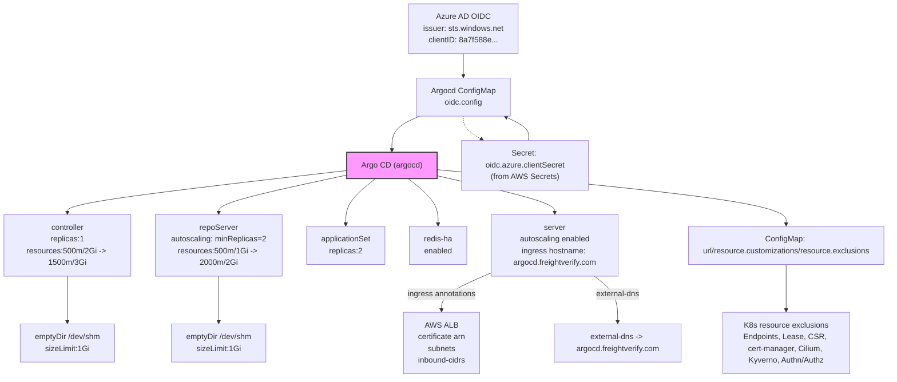
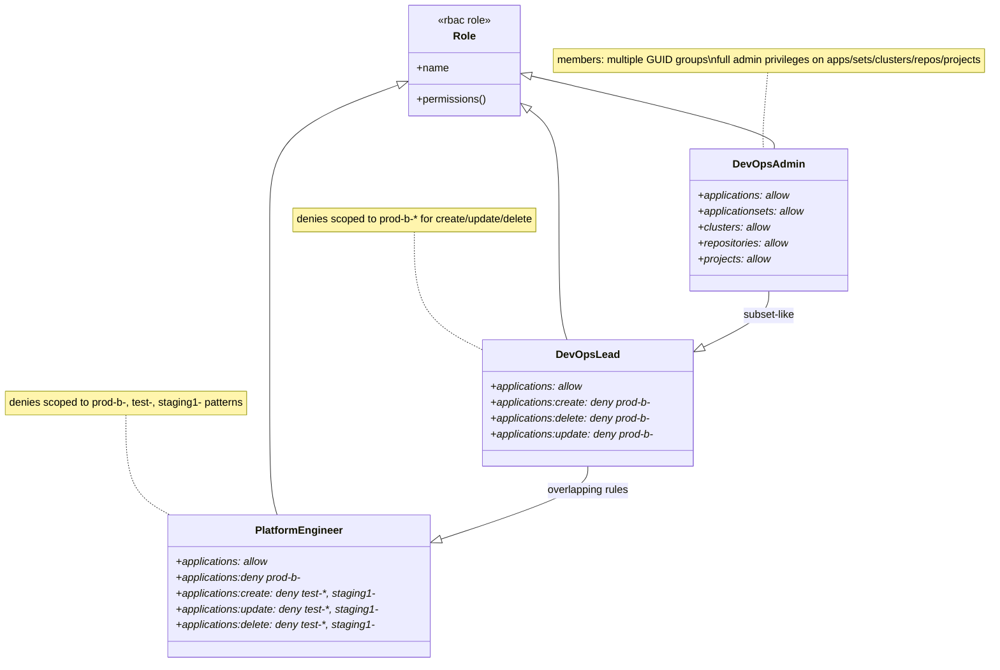

# Diagram: devops/k8s/argocd/helm/values.in-cluster.yaml

> Auto-generated by Obscura crawlers

## Diagram 1

### SVG

<svg id="container" width="2210.56640625" xmlns="http://www.w3.org/2000/svg" class="flowchart" height="798" viewBox="0 0 2210.56640625 798" role="graphics-document document" aria-roledescription="flowchart-v2"><g><marker id="container_flowchart-v2-pointEnd" class="marker flowchart-v2" viewBox="0 0 10 10" refX="5" refY="5" markerUnits="userSpaceOnUse" markerWidth="8" markerHeight="8" orient="auto"><path d="M 0 0 L 10 5 L 0 10 z" class="arrowMarkerPath" style="stroke-width: 1; stroke-dasharray: 1, 0;"></path></marker><marker id="container_flowchart-v2-pointStart" class="marker flowchart-v2" viewBox="0 0 10 10" refX="4.5" refY="5" markerUnits="userSpaceOnUse" markerWidth="8" markerHeight="8" orient="auto"><path d="M 0 5 L 10 10 L 10 0 z" class="arrowMarkerPath" style="stroke-width: 1; stroke-dasharray: 1, 0;"></path></marker><marker id="container_flowchart-v2-circleEnd" class="marker flowchart-v2" viewBox="0 0 10 10" refX="11" refY="5" markerUnits="userSpaceOnUse" markerWidth="11" markerHeight="11" orient="auto"><circle cx="5" cy="5" r="5" class="arrowMarkerPath" style="stroke-width: 1; stroke-dasharray: 1, 0;"></circle></marker><marker id="container_flowchart-v2-circleStart" class="marker flowchart-v2" viewBox="0 0 10 10" refX="-1" refY="5" markerUnits="userSpaceOnUse" markerWidth="11" markerHeight="11" orient="auto"><circle cx="5" cy="5" r="5" class="arrowMarkerPath" style="stroke-width: 1; stroke-dasharray: 1, 0;"></circle></marker><marker id="container_flowchart-v2-crossEnd" class="marker cross flowchart-v2" viewBox="0 0 11 11" refX="12" refY="5.2" markerUnits="userSpaceOnUse" markerWidth="11" markerHeight="11" orient="auto"><path d="M 1,1 l 9,9 M 10,1 l -9,9" class="arrowMarkerPath" style="stroke-width: 2; stroke-dasharray: 1, 0;"></path></marker><marker id="container_flowchart-v2-crossStart" class="marker cross flowchart-v2" viewBox="0 0 11 11" refX="-1" refY="5.2" markerUnits="userSpaceOnUse" markerWidth="11" markerHeight="11" orient="auto"><path d="M 1,1 l 9,9 M 10,1 l -9,9" class="arrowMarkerPath" style="stroke-width: 2; stroke-dasharray: 1, 0;"></path></marker><g class="root"><g class="clusters"></g><g class="edgePaths"><path d="M1228.832,110L1228.832,114.167C1228.832,118.333,1228.832,126.667,1228.832,134.333C1228.832,142,1228.832,149,1228.832,152.5L1228.832,156" id="L_AzureAD_OIDC_0" class="edge-thickness-normal edge-pattern-solid edge-thickness-normal edge-pattern-solid flowchart-link" style=";" data-edge="true" data-et="edge" data-id="L_AzureAD_OIDC_0" data-points="W3sieCI6MTIyOC44MzIwMzEyNSwieSI6MTEwfSx7IngiOjEyMjguODMyMDMxMjUsInkiOjEzNX0seyJ4IjoxMjI4LjgzMjAzMTI1LCJ5IjoxNjB9XQ==" marker-end="url(#container_flowchart-v2-pointEnd)"></path><path d="M1136.814,238L1126.983,242.167C1117.152,246.333,1097.49,254.667,1087.659,266.333C1077.828,278,1077.828,293,1077.828,300.5L1077.828,308" id="L_OIDC_ARGO_0" class="edge-thickness-normal edge-pattern-solid edge-thickness-normal edge-pattern-solid flowchart-link" style=";" data-edge="true" data-et="edge" data-id="L_OIDC_ARGO_0" data-points="W3sieCI6MTEzNi44MTQwMjU4Nzg5MDYyLCJ5IjoyMzh9LHsieCI6MTA3Ny44MjgxMjUsInkiOjI2M30seyJ4IjoxMDc3LjgyODEyNSwieSI6MzEyfV0=" marker-end="url(#container_flowchart-v2-pointEnd)"></path><path d="M988.039,346.756L856.361,358.13C724.682,369.504,461.326,392.252,329.647,411.126C197.969,430,197.969,445,197.969,452.5L197.969,460" id="L_ARGO_Controller_0" class="edge-thickness-normal edge-pattern-solid edge-thickness-normal edge-pattern-solid flowchart-link" style=";" data-edge="true" data-et="edge" data-id="L_ARGO_Controller_0" data-points="W3sieCI6OTg4LjAzOTA2MjUsInkiOjM0Ni43NTU3NDkzMjA3MzY2NH0seyJ4IjoxOTcuOTY4NzUsInkiOjQxNX0seyJ4IjoxOTcuOTY4NzUsInkiOjQ2NH1d" marker-end="url(#container_flowchart-v2-pointEnd)"></path><path d="M988.039,353.334L923.66,363.612C859.281,373.889,730.523,394.445,666.145,410.222C601.766,426,601.766,437,601.766,442.5L601.766,448" id="L_ARGO_RepoServer_0" class="edge-thickness-normal edge-pattern-solid edge-thickness-normal edge-pattern-solid flowchart-link" style=";" data-edge="true" data-et="edge" data-id="L_ARGO_RepoServer_0" data-points="W3sieCI6OTg4LjAzOTA2MjUsInkiOjM1My4zMzQxODY2ODc2NzIzfSx7IngiOjYwMS43NjU2MjUsInkiOjQxNX0seyJ4Ijo2MDEuNzY1NjI1LCJ5Ijo0NTJ9XQ==" marker-end="url(#container_flowchart-v2-pointEnd)"></path><path d="M1029.213,366L1014.508,374.167C999.803,382.333,970.394,398.667,955.689,416.333C940.984,434,940.984,453,940.984,462.5L940.984,472" id="L_ARGO_AppSet_0" class="edge-thickness-normal edge-pattern-solid edge-thickness-normal edge-pattern-solid flowchart-link" style=";" data-edge="true" data-et="edge" data-id="L_ARGO_AppSet_0" data-points="W3sieCI6MTAyOS4yMTI1ODIyMzY4NDIsInkiOjM2Nn0seyJ4Ijo5NDAuOTg0Mzc1LCJ5Ijo0MTV9LHsieCI6OTQwLjk4NDM3NSwieSI6NDc2fV0=" marker-end="url(#container_flowchart-v2-pointEnd)"></path><path d="M1126.444,366L1141.148,374.167C1155.853,382.333,1185.262,398.667,1199.967,416.333C1214.672,434,1214.672,453,1214.672,462.5L1214.672,472" id="L_ARGO_RedisHA_0" class="edge-thickness-normal edge-pattern-solid edge-thickness-normal edge-pattern-solid flowchart-link" style=";" data-edge="true" data-et="edge" data-id="L_ARGO_RedisHA_0" data-points="W3sieCI6MTEyNi40NDM2Njc3NjMxNTgsInkiOjM2Nn0seyJ4IjoxMjE0LjY3MTg3NSwieSI6NDE1fSx7IngiOjEyMTQuNjcxODc1LCJ5Ijo0NzZ9XQ==" marker-end="url(#container_flowchart-v2-pointEnd)"></path><path d="M1167.617,355.438L1221.842,365.365C1276.068,375.292,1384.518,395.146,1438.743,408.573C1492.969,422,1492.969,429,1492.969,432.5L1492.969,436" id="L_ARGO_Server_0" class="edge-thickness-normal edge-pattern-solid edge-thickness-normal edge-pattern-solid flowchart-link" style=";" data-edge="true" data-et="edge" data-id="L_ARGO_Server_0" data-points="W3sieCI6MTE2Ny42MTcxODc1LCJ5IjozNTUuNDM3NzI4MTc5NDU3M30seyJ4IjoxNDkyLjk2ODc1LCJ5Ijo0MTV9LHsieCI6MTQ5Mi45Njg3NSwieSI6NDQwfV0=" marker-end="url(#container_flowchart-v2-pointEnd)"></path><path d="M1362.969,547.735L1336.202,556.946C1309.435,566.157,1255.901,584.578,1229.134,603.289C1202.367,622,1202.367,641,1202.367,650.5L1202.367,660" id="L_Server_ALB_0" class="edge-thickness-normal edge-pattern-solid edge-thickness-normal edge-pattern-solid flowchart-link" style=";" data-edge="true" data-et="edge" data-id="L_Server_ALB_0" data-points="W3sieCI6MTM2Mi45Njg3NSwieSI6NTQ3LjczNDc5MDQ0MDA4OTJ9LHsieCI6MTIwMi4zNjcxODc1LCJ5Ijo2MDN9LHsieCI6MTIwMi4zNjcxODc1LCJ5Ijo2NjR9XQ==" marker-end="url(#container_flowchart-v2-pointEnd)"></path><path d="M1590.619,566L1600.177,572.167C1609.735,578.333,1628.852,590.667,1638.41,608.333C1647.969,626,1647.969,649,1647.969,660.5L1647.969,672" id="L_Server_DNS_0" class="edge-thickness-normal edge-pattern-solid edge-thickness-normal edge-pattern-solid flowchart-link" style=";" data-edge="true" data-et="edge" data-id="L_Server_DNS_0" data-points="W3sieCI6MTU5MC42MTg3NSwieSI6NTY2fSx7IngiOjE2NDcuOTY4NzUsInkiOjYwM30seyJ4IjoxNjQ3Ljk2ODc1LCJ5Ijo2NzZ9XQ==" marker-end="url(#container_flowchart-v2-pointEnd)"></path><path d="M197.969,542L197.969,552.167C197.969,562.333,197.969,582.667,197.969,604.333C197.969,626,197.969,649,197.969,660.5L197.969,672" id="L_Controller_DSHM1_0" class="edge-thickness-normal edge-pattern-solid edge-thickness-normal edge-pattern-solid flowchart-link" style=";" data-edge="true" data-et="edge" data-id="L_Controller_DSHM1_0" data-points="W3sieCI6MTk3Ljk2ODc1LCJ5Ijo1NDJ9LHsieCI6MTk3Ljk2ODc1LCJ5Ijo2MDN9LHsieCI6MTk3Ljk2ODc1LCJ5Ijo2NzZ9XQ==" marker-end="url(#container_flowchart-v2-pointEnd)"></path><path d="M601.766,554L601.766,562.167C601.766,570.333,601.766,586.667,601.766,606.333C601.766,626,601.766,649,601.766,660.5L601.766,672" id="L_RepoServer_DSHM2_0" class="edge-thickness-normal edge-pattern-solid edge-thickness-normal edge-pattern-solid flowchart-link" style=";" data-edge="true" data-et="edge" data-id="L_RepoServer_DSHM2_0" data-points="W3sieCI6NjAxLjc2NTYyNSwieSI6NTU0fSx7IngiOjYwMS43NjU2MjUsInkiOjYwM30seyJ4Ijo2MDEuNzY1NjI1LCJ5Ijo2NzZ9XQ==" marker-end="url(#container_flowchart-v2-pointEnd)"></path><path d="M1228.832,238L1228.832,242.167C1228.832,246.333,1228.832,254.667,1235.438,262.665C1242.043,270.664,1255.254,278.329,1261.86,282.161L1268.466,285.993" id="L_OIDC_Secrets_0" class="edge-thickness-normal edge-pattern-dotted edge-thickness-normal edge-pattern-solid flowchart-link" style=";" data-edge="true" data-et="edge" data-id="L_OIDC_Secrets_0" data-points="W3sieCI6MTIyOC44MzIwMzEyNSwieSI6MjM4fSx7IngiOjEyMjguODMyMDMxMjUsInkiOjI2M30seyJ4IjoxMjcxLjkyNTQyMTQ2MzgxNTgsInkiOjI4OH1d" marker-end="url(#container_flowchart-v2-pointEnd)"></path><path d="M1366.546,288L1367.095,283.833C1367.643,279.667,1368.739,271.333,1360.715,263.276C1352.69,255.218,1335.544,247.435,1326.972,243.544L1318.399,239.653" id="L_Secrets_OIDC_0" class="edge-thickness-normal edge-pattern-solid edge-thickness-normal edge-pattern-solid flowchart-link" style=";" data-edge="true" data-et="edge" data-id="L_Secrets_OIDC_0" data-points="W3sieCI6MTM2Ni41NDY0NjM4MTU3ODk0LCJ5IjoyODh9LHsieCI6MTM2OS44MzU5Mzc1LCJ5IjoyNjN9LHsieCI6MTMxNC43NTYyODY2MjEwOTM4LCJ5IjoyMzh9XQ==" marker-end="url(#container_flowchart-v2-pointEnd)"></path><path d="M1167.617,346.431L1305.709,357.859C1443.801,369.287,1719.984,392.144,1858.076,411.072C1996.168,430,1996.168,445,1996.168,452.5L1996.168,460" id="L_ARGO_CM_0" class="edge-thickness-normal edge-pattern-solid edge-thickness-normal edge-pattern-solid flowchart-link" style=";" data-edge="true" data-et="edge" data-id="L_ARGO_CM_0" data-points="W3sieCI6MTE2Ny42MTcxODc1LCJ5IjozNDYuNDMwNzY2Mjg1OTY5NX0seyJ4IjoxOTk2LjE2Nzk2ODc1LCJ5Ijo0MTV9LHsieCI6MTk5Ni4xNjc5Njg3NSwieSI6NDY0fV0=" marker-end="url(#container_flowchart-v2-pointEnd)"></path><path d="M1996.168,542L1996.168,552.167C1996.168,562.333,1996.168,582.667,1996.168,598.333C1996.168,614,1996.168,625,1996.168,630.5L1996.168,636" id="L_CM_Exclusions_0" class="edge-thickness-normal edge-pattern-solid edge-thickness-normal edge-pattern-solid flowchart-link" style=";" data-edge="true" data-et="edge" data-id="L_CM_Exclusions_0" data-points="W3sieCI6MTk5Ni4xNjc5Njg3NSwieSI6NTQyfSx7IngiOjE5OTYuMTY3OTY4NzUsInkiOjYwM30seyJ4IjoxOTk2LjE2Nzk2ODc1LCJ5Ijo2NDB9XQ==" marker-end="url(#container_flowchart-v2-pointEnd)"></path></g><g class="edgeLabels"><g class="edgeLabel"><g class="label" data-id="L_AzureAD_OIDC_0" transform="translate(0, 0)"><foreignObject width="0" height="0">

</foreignObject></g></g><g class="edgeLabel"><g class="label" data-id="L_OIDC_ARGO_0" transform="translate(0, 0)"><foreignObject width="0" height="0">

</foreignObject></g></g><g class="edgeLabel"><g class="label" data-id="L_ARGO_Controller_0" transform="translate(0, 0)"><foreignObject width="0" height="0">

</foreignObject></g></g><g class="edgeLabel"><g class="label" data-id="L_ARGO_RepoServer_0" transform="translate(0, 0)"><foreignObject width="0" height="0">

</foreignObject></g></g><g class="edgeLabel"><g class="label" data-id="L_ARGO_AppSet_0" transform="translate(0, 0)"><foreignObject width="0" height="0">

</foreignObject></g></g><g class="edgeLabel"><g class="label" data-id="L_ARGO_RedisHA_0" transform="translate(0, 0)"><foreignObject width="0" height="0">

</foreignObject></g></g><g class="edgeLabel"><g class="label" data-id="L_ARGO_Server_0" transform="translate(0, 0)"><foreignObject width="0" height="0">

</foreignObject></g></g><g class="edgeLabel" transform="translate(1202.3671875, 603)"><g class="label" data-id="L_Server_ALB_0" transform="translate(-71.6484375, -12)"><foreignObject width="143.296875" height="24">

ingress annotations

</foreignObject></g></g><g class="edgeLabel" transform="translate(1647.96875, 603)"><g class="label" data-id="L_Server_DNS_0" transform="translate(-46.046875, -12)"><foreignObject width="92.09375" height="24">

external-dns

</foreignObject></g></g><g class="edgeLabel"><g class="label" data-id="L_Controller_DSHM1_0" transform="translate(0, 0)"><foreignObject width="0" height="0">

</foreignObject></g></g><g class="edgeLabel"><g class="label" data-id="L_RepoServer_DSHM2_0" transform="translate(0, 0)"><foreignObject width="0" height="0">

</foreignObject></g></g><g class="edgeLabel"><g class="label" data-id="L_OIDC_Secrets_0" transform="translate(0, 0)"><foreignObject width="0" height="0">

</foreignObject></g></g><g class="edgeLabel"><g class="label" data-id="L_Secrets_OIDC_0" transform="translate(0, 0)"><foreignObject width="0" height="0">

</foreignObject></g></g><g class="edgeLabel"><g class="label" data-id="L_ARGO_CM_0" transform="translate(0, 0)"><foreignObject width="0" height="0">

</foreignObject></g></g><g class="edgeLabel"><g class="label" data-id="L_CM_Exclusions_0" transform="translate(0, 0)"><foreignObject width="0" height="0">

</foreignObject></g></g></g><g class="nodes"><g class="node default" id="flowchart-AzureAD-0" transform="translate(1228.83203125, 59)"><rect class="basic label-container" style="" x="-130" y="-51" width="260" height="102"></rect><g class="label" style="" transform="translate(-100, -36)"><rect></rect><foreignObject width="200" height="72">

Azure AD OIDC\nissuer: sts.windows.net\nclientID: 8a7f588e...

</foreignObject></g></g><g class="node default" id="flowchart-OIDC-1" transform="translate(1228.83203125, 199)"><rect class="basic label-container" style="" x="-130" y="-39" width="260" height="78"></rect><g class="label" style="" transform="translate(-100, -24)"><rect></rect><foreignObject width="200" height="48">

Argocd ConfigMap\noidc.config

</foreignObject></g></g><g class="node default" id="flowchart-ARGO-3" transform="translate(1077.828125, 339)"><rect class="basic label-container" style="fill:#f9f !important;stroke:#333 !important;stroke-width:2px !important" x="-89.7890625" y="-27" width="179.578125" height="54"></rect><g class="label" style="" transform="translate(-59.7890625, -12)"><rect></rect><foreignObject width="119.578125" height="24">

Argo CD (argocd)

</foreignObject></g></g><g class="node default" id="flowchart-Controller-5" transform="translate(197.96875, 503)"><rect class="basic label-container" style="" x="-189.96875" y="-39" width="379.9375" height="78"></rect><g class="label" style="" transform="translate(-159.96875, -24)"><rect></rect><foreignObject width="319.9375" height="48">

controller\nreplicas:1\nresources:500m/2Gi -&gt; 1500m/3Gi

</foreignObject></g></g><g class="node default" id="flowchart-RepoServer-7" transform="translate(601.765625, 503)"><rect class="basic label-container" style="" x="-163.828125" y="-51" width="327.65625" height="102"></rect><g class="label" style="" transform="translate(-133.828125, -36)"><rect></rect><foreignObject width="267.65625" height="72">

repoServer\nautoscaling: minReplicas=2\nresources:500m/1Gi -&gt; 2000m/2Gi

</foreignObject></g></g><g class="node default" id="flowchart-AppSet-9" transform="translate(940.984375, 503)"><rect class="basic label-container" style="" x="-125.390625" y="-27" width="250.78125" height="54"></rect><g class="label" style="" transform="translate(-95.390625, -12)"><rect></rect><foreignObject width="190.78125" height="24">

applicationSet\nreplicas:2

</foreignObject></g></g><g class="node default" id="flowchart-RedisHA-11" transform="translate(1214.671875, 503)"><rect class="basic label-container" style="" x="-98.296875" y="-27" width="196.59375" height="54"></rect><g class="label" style="" transform="translate(-68.296875, -12)"><rect></rect><foreignObject width="136.59375" height="24">

redis-ha\nenabled

</foreignObject></g></g><g class="node default" id="flowchart-Server-13" transform="translate(1492.96875, 503)"><rect class="basic label-container" style="" x="-130" y="-63" width="260" height="126"></rect><g class="label" style="" transform="translate(-100, -48)"><rect></rect><foreignObject width="200" height="96">

server\nautoscaling enabled\ningress hostname: argocd.freightverify.com

</foreignObject></g></g><g class="node default" id="flowchart-ALB-15" transform="translate(1202.3671875, 715)"><rect class="basic label-container" style="" x="-130" y="-51" width="260" height="102"></rect><g class="label" style="" transform="translate(-100, -36)"><rect></rect><foreignObject width="200" height="72">

AWS ALB\ncertificate arn\nsubnets\ninbound-cidrs

</foreignObject></g></g><g class="node default" id="flowchart-DNS-17" transform="translate(1647.96875, 715)"><rect class="basic label-container" style="" x="-130" y="-39" width="260" height="78"></rect><g class="label" style="" transform="translate(-100, -24)"><rect></rect><foreignObject width="200" height="48">

external-dns -&gt; argocd.freightverify.com

</foreignObject></g></g><g class="node default" id="flowchart-DSHM1-19" transform="translate(197.96875, 715)"><rect class="basic label-container" style="" x="-130" y="-39" width="260" height="78"></rect><g class="label" style="" transform="translate(-100, -24)"><rect></rect><foreignObject width="200" height="48">

emptyDir /dev/shm\nsizeLimit:1Gi

</foreignObject></g></g><g class="node default" id="flowchart-DSHM2-21" transform="translate(601.765625, 715)"><rect class="basic label-container" style="" x="-130" y="-39" width="260" height="78"></rect><g class="label" style="" transform="translate(-100, -24)"><rect></rect><foreignObject width="200" height="48">

emptyDir /dev/shm\nsizeLimit:1Gi

</foreignObject></g></g><g class="node default" id="flowchart-Secrets-23" transform="translate(1359.8359375, 339)"><rect class="basic label-container" style="" x="-142.21875" y="-51" width="284.4375" height="102"></rect><g class="label" style="" transform="translate(-112.21875, -36)"><rect></rect><foreignObject width="224.4375" height="72">

Secret: oidc.azure.clientSecret\n(from AWS Secrets)

</foreignObject></g></g><g class="node default" id="flowchart-CM-27" transform="translate(1996.16796875, 503)"><rect class="basic label-container" style="" x="-206.3984375" y="-39" width="412.796875" height="78"></rect><g class="label" style="" transform="translate(-176.3984375, -24)"><rect></rect><foreignObject width="352.796875" height="48">

ConfigMap: url/resource.customizations/resource.exclusions

</foreignObject></g></g><g class="node default" id="flowchart-Exclusions-29" transform="translate(1996.16796875, 715)"><rect class="basic label-container" style="" x="-130" y="-75" width="260" height="150"></rect><g class="label" style="" transform="translate(-100, -60)"><rect></rect><foreignObject width="200" height="120">

K8s resource exclusions\nEndpoints, Lease, CSR, cert-manager, Cilium, Kyverno, Authn/Authz

</foreignObject></g></g></g></g></g></svg>

## Diagram 2

### SVG

<svg id="container" width="1557.146484375" xmlns="http://www.w3.org/2000/svg" class="classDiagram" height="1006" viewBox="0 0 1557.146484375 1006" role="graphics-document document" aria-roledescription="class"><g><defs><marker id="container_class-aggregationStart" class="marker aggregation class" refX="18" refY="7" markerWidth="190" markerHeight="240" orient="auto"><path d="M 18,7 L9,13 L1,7 L9,1 Z"></path></marker></defs><defs><marker id="container_class-aggregationEnd" class="marker aggregation class" refX="1" refY="7" markerWidth="20" markerHeight="28" orient="auto"><path d="M 18,7 L9,13 L1,7 L9,1 Z"></path></marker></defs><defs><marker id="container_class-extensionStart" class="marker extension class" refX="18" refY="7" markerWidth="190" markerHeight="240" orient="auto"><path d="M 1,7 L18,13 V 1 Z"></path></marker></defs><defs><marker id="container_class-extensionEnd" class="marker extension class" refX="1" refY="7" markerWidth="20" markerHeight="28" orient="auto"><path d="M 1,1 V 13 L18,7 Z"></path></marker></defs><defs><marker id="container_class-compositionStart" class="marker composition class" refX="18" refY="7" markerWidth="190" markerHeight="240" orient="auto"><path d="M 18,7 L9,13 L1,7 L9,1 Z"></path></marker></defs><defs><marker id="container_class-compositionEnd" class="marker composition class" refX="1" refY="7" markerWidth="20" markerHeight="28" orient="auto"><path d="M 18,7 L9,13 L1,7 L9,1 Z"></path></marker></defs><defs><marker id="container_class-dependencyStart" class="marker dependency class" refX="6" refY="7" markerWidth="190" markerHeight="240" orient="auto"><path d="M 5,7 L9,13 L1,7 L9,1 Z"></path></marker></defs><defs><marker id="container_class-dependencyEnd" class="marker dependency class" refX="13" refY="7" markerWidth="20" markerHeight="28" orient="auto"><path d="M 18,7 L9,13 L14,7 L9,1 Z"></path></marker></defs><defs><marker id="container_class-lollipopStart" class="marker lollipop class" refX="13" refY="7" markerWidth="190" markerHeight="240" orient="auto"><circle stroke="black" fill="transparent" cx="7" cy="7" r="6"></circle></marker></defs><defs><marker id="container_class-lollipopEnd" class="marker lollipop class" refX="1" refY="7" markerWidth="190" markerHeight="240" orient="auto"><circle stroke="black" fill="transparent" cx="7" cy="7" r="6"></circle></marker></defs><g class="root"><g class="clusters"></g><g class="edgePaths"><path d="M1203.909,110L1202.518,125.167C1201.126,140.333,1198.343,170.667,1197.265,190C1196.187,209.333,1196.814,217.667,1197.127,221.833L1197.44,226" id="edgeNote1" class="edge-thickness-normal edge-pattern-dotted relation" style="fill: none;;;fill: none" data-edge="true" data-et="edge" data-id="edgeNote1" data-points="W3sieCI6MTIwMy45MDkxNzA3MjgyMTEsInkiOjExMH0seyJ4IjoxMTk1LjU2MDU0Njg3NSwieSI6MjAxfSx7IngiOjExOTcuNDQwMjQ2MTIzMTIwMiwieSI6MjI2fV0="></path><path d="M648.266,352L648.266,373.167C648.266,394.333,648.266,436.667,667.556,467.089C686.847,497.511,725.428,516.022,744.719,525.278L764.01,534.534" id="edgeNote2" class="edge-thickness-normal edge-pattern-dotted relation" style="fill: none;;;fill: none" data-edge="true" data-et="edge" data-id="edgeNote2" data-points="W3sieCI6NjQ4LjI2NTYyNSwieSI6MzUyfSx7IngiOjY0OC4yNjU2MjUsInkiOjQ3OX0seyJ4Ijo3NjQuMDA5NzY1NjI1LCJ5Ijo1MzQuNTMzNTcwMDc0NzU2OH1d"></path><path d="M195.609,630L195.609,649.167C195.609,668.333,195.609,706.667,207.921,732.361C220.232,758.055,244.855,771.11,257.167,777.638L269.479,784.165" id="edgeNote3" class="edge-thickness-normal edge-pattern-dotted relation" style="fill: none;;;fill: none" data-edge="true" data-et="edge" data-id="edgeNote3" data-points="W3sieCI6MTk1LjYwOTM3NSwieSI6NjMwfSx7IngiOjE5NS42MDkzNzUsInkiOjc0NX0seyJ4IjoyNjkuNDc4NTE1NjI1LCJ5Ijo3ODQuMTY1MzE1Njk4MTM1M31d"></path><path d="M828.812,114.867L893.27,129.223C957.728,143.578,1086.644,172.289,1150.789,190.811C1214.934,209.333,1214.307,217.667,1213.994,221.833L1213.681,226" id="id_Role_DevOpsAdmin_1" class="edge-thickness-normal edge-pattern-solid relation" style=";;;" data-edge="true" data-et="edge" data-id="id_Role_DevOpsAdmin_1" data-points="W3sieCI6ODExLjk3NDYwOTM3NSwieSI6MTExLjExNzM4ODg0MDU1Nzc0fSx7IngiOjEyMTUuNTYwNTQ2ODc1LCJ5IjoyMDF9LHsieCI6MTIxMy42ODA4NDc2MjY4Nzk4LCJ5IjoyMjZ9XQ==" marker-start="url(#container_class-extensionStart)"></path><path d="M825.998,163.529L834.717,169.774C843.436,176.019,860.874,188.51,869.593,216.922C878.313,245.333,878.313,289.667,878.313,336C878.313,382.333,878.313,430.667,880.499,461C882.685,491.333,887.058,503.667,889.244,509.833L891.431,516" id="id_Role_DevOpsLead_2" class="edge-thickness-normal edge-pattern-solid relation" style=";;;" data-edge="true" data-et="edge" data-id="id_Role_DevOpsLead_2" data-points="W3sieCI6ODExLjk3NDYwOTM3NSwieSI6MTUzLjQ4NDMwOTgyNDgwOTF9LHsieCI6ODc4LjMxMjUsInkiOjIwMX0seyJ4Ijo4NzguMzEyNSwieSI6MzM0fSx7IngiOjg3OC4zMTI1LCJ5Ijo0Nzl9LHsieCI6ODkxLjQzMDYxMjY2NDQ3MzYsInkiOjUxNn1d" marker-start="url(#container_class-extensionStart)"></path><path d="M624.034,128.143L589.731,140.286C555.429,152.429,486.824,176.714,452.521,211.024C418.219,245.333,418.219,289.667,418.219,336C418.219,382.333,418.219,430.667,418.219,477C418.219,523.333,418.219,567.667,418.219,612C418.219,656.333,418.219,700.667,420.382,729C422.546,757.333,426.873,769.667,429.037,775.833L431.2,782" id="id_Role_PlatformEngineer_3" class="edge-thickness-normal edge-pattern-solid relation" style=";;;" data-edge="true" data-et="edge" data-id="id_Role_PlatformEngineer_3" data-points="W3sieCI6NjQwLjI5NDkyMTg3NSwieSI6MTIyLjM4NjY3MTk5NDgyNDA3fSx7IngiOjQxOC4yMTg3NSwieSI6MjAxfSx7IngiOjQxOC4yMTg3NSwieSI6MzM0fSx7IngiOjQxOC4yMTg3NSwieSI6NDc5fSx7IngiOjQxOC4yMTg3NSwieSI6NjEyfSx7IngiOjQxOC4yMTg3NSwieSI6NzQ1fSx7IngiOjQzMS4yMDAxNDgxNjgxMDM0NSwieSI6NzgyfV0=" marker-start="url(#container_class-extensionStart)"></path><path d="M1205.561,442L1205.561,448.167C1205.561,454.333,1205.561,466.667,1188.385,480.989C1171.209,495.311,1136.858,511.623,1119.682,519.779L1102.506,527.934" id="id_DevOpsAdmin_DevOpsLead_4" class="edge-thickness-normal edge-pattern-solid relation" style=";;;" data-edge="true" data-et="edge" data-id="id_DevOpsAdmin_DevOpsLead_4" data-points="W3sieCI6MTIwNS41NjA1NDY4NzUsInkiOjQ0Mn0seyJ4IjoxMjA1LjU2MDU0Njg3NSwieSI6NDc5fSx7IngiOjEwODYuOTIzODI4MTI1LCJ5Ijo1MzUuMzMzNTc5NzE2NjEyOH1d" marker-end="url(#container_class-extensionEnd)"></path><path d="M925.467,708L925.467,714.167C925.467,720.333,925.467,732.667,885.413,751.559C845.36,770.452,765.252,795.903,725.199,808.629L685.145,821.355" id="id_DevOpsLead_PlatformEngineer_5" class="edge-thickness-normal edge-pattern-solid relation" style=";;;" data-edge="true" data-et="edge" data-id="id_DevOpsLead_PlatformEngineer_5" data-points="W3sieCI6OTI1LjQ2Njc5Njg3NSwieSI6NzA4fSx7IngiOjkyNS40NjY3OTY4NzUsInkiOjc0NX0seyJ4Ijo2NjguNzA1MDc4MTI1LCJ5Ijo4MjYuNTc4NjM0Mjc4Mjc5OX1d" marker-end="url(#container_class-extensionEnd)"></path></g><g class="edgeLabels"><g class="edgeLabel"><g class="label" data-id="edgeNote1" transform="translate(0, 0)"><foreignObject width="0" height="0">

</foreignObject></g></g><g class="edgeLabel"><g class="label" data-id="edgeNote2" transform="translate(0, 0)"><foreignObject width="0" height="0">

</foreignObject></g></g><g class="edgeLabel"><g class="label" data-id="edgeNote3" transform="translate(0, 0)"><foreignObject width="0" height="0">

</foreignObject></g></g><g class="edgeLabel"><g class="label" data-id="id_Role_DevOpsAdmin_1" transform="translate(0, 0)"><foreignObject width="0" height="0">

</foreignObject></g></g><g class="edgeLabel"><g class="label" data-id="id_Role_DevOpsLead_2" transform="translate(0, 0)"><foreignObject width="0" height="0">

</foreignObject></g></g><g class="edgeLabel"><g class="label" data-id="id_Role_PlatformEngineer_3" transform="translate(0, 0)"><foreignObject width="0" height="0">

</foreignObject></g></g><g class="edgeLabel" transform="translate(1205.560546875, 479)"><g class="label" data-id="id_DevOpsAdmin_DevOpsLead_4" transform="translate(-40.0234375, -12)"><foreignObject width="80.046875" height="24">

subset-like

</foreignObject></g></g><g class="edgeLabel" transform="translate(925.466796875, 745)"><g class="label" data-id="id_DevOpsLead_PlatformEngineer_5" transform="translate(-63.5234375, -12)"><foreignObject width="127.046875" height="24">

overlapping rules

</foreignObject></g></g></g><g class="nodes"><g class="node default" id="classId-Role-0" transform="translate(726.134765625, 92)"><g class="basic label-container"><path d="M-85.83984375 -84 L85.83984375 -84 L85.83984375 84 L-85.83984375 84" stroke="none" stroke-width="0" fill="#ECECFF" style=""></path><path d="M-85.83984375 -84 C-32.862674737851115 -84, 20.11449427429777 -84, 85.83984375 -84 M-85.83984375 -84 C-36.004498845550565 -84, 13.83084605889887 -84, 85.83984375 -84 M85.83984375 -84 C85.83984375 -38.68362366648384, 85.83984375 6.632752667032321, 85.83984375 84 M85.83984375 -84 C85.83984375 -46.464335837387274, 85.83984375 -8.928671674774549, 85.83984375 84 M85.83984375 84 C17.45252022514643 84, -50.93480329970714 84, -85.83984375 84 M85.83984375 84 C21.85180658527009 84, -42.13623057945982 84, -85.83984375 84 M-85.83984375 84 C-85.83984375 49.78931441554568, -85.83984375 15.578628831091365, -85.83984375 -84 M-85.83984375 84 C-85.83984375 22.443628828049775, -85.83984375 -39.11274234390045, -85.83984375 -84" stroke="#9370DB" stroke-width="1.3" fill="none" stroke-dasharray="0 0" style=""></path></g><g class="annotation-group text" transform="translate(-41.2109375, -60)"><g class="label" style="" transform="translate(0,-12)"><foreignObject width="82.421875" height="24">

«rbac role»

</foreignObject></g></g><g class="label-group text" transform="translate(-16.2421875, -36)"><g class="label" style="font-weight: bolder" transform="translate(0,-12)"><foreignObject width="32.484375" height="24">

Role

</foreignObject></g></g><g class="members-group text" transform="translate(-73.83984375, 12)"><g class="label" style="" transform="translate(0,-12)"><foreignObject width="48.5" height="24">

+name

</foreignObject></g></g><g class="methods-group text" transform="translate(-73.83984375, 60)"><g class="label" style="" transform="translate(0,-12)"><foreignObject width="106.46875" height="24">

+permissions()

</foreignObject></g></g><g class="divider" style=""><path d="M-85.83984375 -12 C-41.61237316823943 -12, 2.6150974135211413 -12, 85.83984375 -12 M-85.83984375 -12 C-29.731975738783838 -12, 26.375892272432324 -12, 85.83984375 -12" stroke="#9370DB" stroke-width="1.3" fill="none" stroke-dasharray="0 0" style=""></path></g><g class="divider" style=""><path d="M-85.83984375 36 C-42.176572122049144 36, 1.4866995059017114 36, 85.83984375 36 M-85.83984375 36 C-37.37317504078292 36, 11.093493668434164 36, 85.83984375 36" stroke="#9370DB" stroke-width="1.3" fill="none" stroke-dasharray="0 0" style=""></path></g></g><g class="node default" id="classId-DevOpsAdmin-1" transform="translate(1205.560546875, 334)"><g class="basic label-container"><path d="M-120.0703125 -108 L120.0703125 -108 L120.0703125 108 L-120.0703125 108" stroke="none" stroke-width="0" fill="#ECECFF" style=""></path><path d="M-120.0703125 -108 C-40.07254193603164 -108, 39.92522862793672 -108, 120.0703125 -108 M-120.0703125 -108 C-65.6942505479391 -108, -11.318188595878198 -108, 120.0703125 -108 M120.0703125 -108 C120.0703125 -27.410556346955744, 120.0703125 53.17888730608851, 120.0703125 108 M120.0703125 -108 C120.0703125 -55.3067561781442, 120.0703125 -2.613512356288396, 120.0703125 108 M120.0703125 108 C30.67166842572307 108, -58.72697564855386 108, -120.0703125 108 M120.0703125 108 C37.645440108314006 108, -44.77943228337199 108, -120.0703125 108 M-120.0703125 108 C-120.0703125 41.125790448479975, -120.0703125 -25.74841910304005, -120.0703125 -108 M-120.0703125 108 C-120.0703125 37.12505233770521, -120.0703125 -33.74989532458957, -120.0703125 -108" stroke="#9370DB" stroke-width="1.3" fill="none" stroke-dasharray="0 0" style=""></path></g><g class="annotation-group text" transform="translate(0, -84)"></g><g class="label-group text" transform="translate(-50.984375, -84)"><g class="label" style="font-weight: bolder" transform="translate(0,-12)"><foreignObject width="101.96875" height="24">

DevOpsAdmin

</foreignObject></g></g><g class="members-group text" transform="translate(-108.0703125, -36)"><g class="label" style="font-style:italic;" transform="translate(0,-12)"><foreignObject width="143.828125" height="24">

+applications: allow

</foreignObject></g><g class="label" style="font-style:italic;" transform="translate(0,12)"><foreignObject width="165.15625" height="24">

+applicationsets: allow

</foreignObject></g><g class="label" style="font-style:italic;" transform="translate(0,36)"><foreignObject width="110.359375" height="24">

+clusters: allow

</foreignObject></g><g class="label" style="font-style:italic;" transform="translate(0,60)"><foreignObject width="139.796875" height="24">

+repositories: allow

</foreignObject></g><g class="label" style="font-style:italic;" transform="translate(0,84)"><foreignObject width="112.140625" height="24">

+projects: allow

</foreignObject></g></g><g class="methods-group text" transform="translate(-108.0703125, 108)"></g><g class="divider" style=""><path d="M-120.0703125 -60 C-51.22437534018053 -60, 17.62156181963894 -60, 120.0703125 -60 M-120.0703125 -60 C-39.42933717588308 -60, 41.211638148233845 -60, 120.0703125 -60" stroke="#9370DB" stroke-width="1.3" fill="none" stroke-dasharray="0 0" style=""></path></g><g class="divider" style=""><path d="M-120.0703125 84 C-52.9060448271094 84, 14.258222845781205 84, 120.0703125 84 M-120.0703125 84 C-34.66203890956993 84, 50.74623468086014 84, 120.0703125 84" stroke="#9370DB" stroke-width="1.3" fill="none" stroke-dasharray="0 0" style=""></path></g></g><g class="node default" id="classId-DevOpsLead-2" transform="translate(925.466796875, 612)"><g class="basic label-container"><path d="M-161.45703125 -96 L161.45703125 -96 L161.45703125 96 L-161.45703125 96" stroke="none" stroke-width="0" fill="#ECECFF" style=""></path><path d="M-161.45703125 -96 C-44.614764314534696 -96, 72.22750262093061 -96, 161.45703125 -96 M-161.45703125 -96 C-77.56276344454173 -96, 6.33150436091654 -96, 161.45703125 -96 M161.45703125 -96 C161.45703125 -43.686750134021366, 161.45703125 8.626499731957267, 161.45703125 96 M161.45703125 -96 C161.45703125 -33.76610677711773, 161.45703125 28.467786445764546, 161.45703125 96 M161.45703125 96 C40.286623590785936 96, -80.88378406842813 96, -161.45703125 96 M161.45703125 96 C57.1960301522913 96, -47.0649709454174 96, -161.45703125 96 M-161.45703125 96 C-161.45703125 23.50185220255844, -161.45703125 -48.99629559488312, -161.45703125 -96 M-161.45703125 96 C-161.45703125 31.481697036008356, -161.45703125 -33.03660592798329, -161.45703125 -96" stroke="#9370DB" stroke-width="1.3" fill="none" stroke-dasharray="0 0" style=""></path></g><g class="annotation-group text" transform="translate(0, -72)"></g><g class="label-group text" transform="translate(-45.2578125, -72)"><g class="label" style="font-weight: bolder" transform="translate(0,-12)"><foreignObject width="90.515625" height="24">

DevOpsLead

</foreignObject></g></g><g class="members-group text" transform="translate(-149.45703125, -24)"><g class="label" style="font-style:italic;" transform="translate(0,-12)"><foreignObject width="143.828125" height="24">

+applications: allow

</foreignObject></g><g class="label" style="font-style:italic;" transform="translate(0,12)"><foreignObject width="247.140625" height="24">

+applications:create: deny prod-b-

</foreignObject></g><g class="label" style="font-style:italic;" transform="translate(0,36)"><foreignObject width="247.140625" height="24">

+applications:delete: deny prod-b-

</foreignObject></g><g class="label" style="font-style:italic;" transform="translate(0,60)"><foreignObject width="253.65625" height="24">

+applications:update: deny prod-b-

</foreignObject></g></g><g class="methods-group text" transform="translate(-149.45703125, 96)"></g><g class="divider" style=""><path d="M-161.45703125 -48 C-56.06608481875554 -48, 49.32486161248892 -48, 161.45703125 -48 M-161.45703125 -48 C-88.43902257758515 -48, -15.421013905170298 -48, 161.45703125 -48" stroke="#9370DB" stroke-width="1.3" fill="none" stroke-dasharray="0 0" style=""></path></g><g class="divider" style=""><path d="M-161.45703125 72 C-54.2535238770939 72, 52.949983495812205 72, 161.45703125 72 M-161.45703125 72 C-38.00806571581711 72, 85.44089981836578 72, 161.45703125 72" stroke="#9370DB" stroke-width="1.3" fill="none" stroke-dasharray="0 0" style=""></path></g></g><g class="node default" id="classId-PlatformEngineer-3" transform="translate(469.091796875, 890)"><g class="basic label-container"><path d="M-199.61328125 -108 L199.61328125 -108 L199.61328125 108 L-199.61328125 108" stroke="none" stroke-width="0" fill="#ECECFF" style=""></path><path d="M-199.61328125 -108 C-44.58170389037565 -108, 110.4498734692487 -108, 199.61328125 -108 M-199.61328125 -108 C-113.85209905588758 -108, -28.090916861775156 -108, 199.61328125 -108 M199.61328125 -108 C199.61328125 -61.94485160326491, 199.61328125 -15.889703206529816, 199.61328125 108 M199.61328125 -108 C199.61328125 -64.43149445979587, 199.61328125 -20.862988919591743, 199.61328125 108 M199.61328125 108 C100.95639216518214 108, 2.299503080364275 108, -199.61328125 108 M199.61328125 108 C78.28854607028313 108, -43.036189109433735 108, -199.61328125 108 M-199.61328125 108 C-199.61328125 50.10799556655212, -199.61328125 -7.7840088668957605, -199.61328125 -108 M-199.61328125 108 C-199.61328125 27.383621951803136, -199.61328125 -53.23275609639373, -199.61328125 -108" stroke="#9370DB" stroke-width="1.3" fill="none" stroke-dasharray="0 0" style=""></path></g><g class="annotation-group text" transform="translate(0, -84)"></g><g class="label-group text" transform="translate(-64.0078125, -84)"><g class="label" style="font-weight: bolder" transform="translate(0,-12)"><foreignObject width="128.015625" height="24">

PlatformEngineer

</foreignObject></g></g><g class="members-group text" transform="translate(-187.61328125, -36)"><g class="label" style="font-style:italic;" transform="translate(0,-12)"><foreignObject width="143.828125" height="24">

+applications: allow

</foreignObject></g><g class="label" style="font-style:italic;" transform="translate(0,12)"><foreignObject width="195.0625" height="24">

+applications:deny prod-b-

</foreignObject></g><g class="label" style="font-style:italic;" transform="translate(0,36)"><foreignObject width="304.71875" height="24">

+applications:create: deny test-*, staging1-

</foreignObject></g><g class="label" style="font-style:italic;" transform="translate(0,60)"><foreignObject width="311.21875" height="24">

+applications:update: deny test-*, staging1-

</foreignObject></g><g class="label" style="font-style:italic;" transform="translate(0,84)"><foreignObject width="304.71875" height="24">

+applications:delete: deny test-*, staging1-

</foreignObject></g></g><g class="methods-group text" transform="translate(-187.61328125, 108)"></g><g class="divider" style=""><path d="M-199.61328125 -60 C-45.08568382894097 -60, 109.44191359211806 -60, 199.61328125 -60 M-199.61328125 -60 C-49.74221589383694 -60, 100.12884946232612 -60, 199.61328125 -60" stroke="#9370DB" stroke-width="1.3" fill="none" stroke-dasharray="0 0" style=""></path></g><g class="divider" style=""><path d="M-199.61328125 84 C-43.22778218420518 84, 113.15771688158964 84, 199.61328125 84 M-199.61328125 84 C-77.16590878760901 84, 45.281463674781975 84, 199.61328125 84" stroke="#9370DB" stroke-width="1.3" fill="none" stroke-dasharray="0 0" style=""></path></g></g><g class="node undefined" id="note0" transform="translate(1205.560546875, 92)"><g class="basic label-container"><path d="M-343.5859375 -18 L343.5859375 -18 L343.5859375 18 L-343.5859375 18" stroke="none" stroke-width="0" fill="#fff5ad" style="fill:#fff5ad !important;stroke:#aaaa33 !important"></path><path d="M-343.5859375 -18 C-89.46351979933405 -18, 164.6588979013319 -18, 343.5859375 -18 M-343.5859375 -18 C-181.0617393334559 -18, -18.537541166911808 -18, 343.5859375 -18 M343.5859375 -18 C343.5859375 -3.655849381761648, 343.5859375 10.688301236476704, 343.5859375 18 M343.5859375 -18 C343.5859375 -8.956747000822265, 343.5859375 0.08650599835547013, 343.5859375 18 M343.5859375 18 C176.41567794483447 18, 9.245418389668941 18, -343.5859375 18 M343.5859375 18 C138.13240015687356 18, -67.32113718625288 18, -343.5859375 18 M-343.5859375 18 C-343.5859375 7.457967555173452, -343.5859375 -3.0840648896530958, -343.5859375 -18 M-343.5859375 18 C-343.5859375 6.063380844837246, -343.5859375 -5.873238310325508, -343.5859375 -18" stroke="#aaaa33" stroke-width="1.3" fill="none" stroke-dasharray="0 0" style="fill:#fff5ad !important;stroke:#aaaa33 !important"></path></g><g class="label" style="text-align:left !important;white-space:nowrap !important" transform="translate(-337.5859375, -12)"><rect></rect><foreignObject width="675.171875" height="24">

members: multiple GUID groups\nfull admin privileges on apps/sets/clusters/repos/projects

</foreignObject></g></g><g class="node undefined" id="note1" transform="translate(648.265625, 334)"><g class="basic label-container"><path d="M-195.046875 -18 L195.046875 -18 L195.046875 18 L-195.046875 18" stroke="none" stroke-width="0" fill="#fff5ad" style="fill:#fff5ad !important;stroke:#aaaa33 !important"></path><path d="M-195.046875 -18 C-73.47878985572824 -18, 48.089295288543525 -18, 195.046875 -18 M-195.046875 -18 C-77.51054405110266 -18, 40.02578689779469 -18, 195.046875 -18 M195.046875 -18 C195.046875 -6.160447399014462, 195.046875 5.679105201971076, 195.046875 18 M195.046875 -18 C195.046875 -4.134869248507648, 195.046875 9.730261502984703, 195.046875 18 M195.046875 18 C75.84656319343587 18, -43.35374861312826 18, -195.046875 18 M195.046875 18 C106.44458663538367 18, 17.842298270767344 18, -195.046875 18 M-195.046875 18 C-195.046875 6.421973388333996, -195.046875 -5.156053223332009, -195.046875 -18 M-195.046875 18 C-195.046875 6.919374613261169, -195.046875 -4.161250773477661, -195.046875 -18" stroke="#aaaa33" stroke-width="1.3" fill="none" stroke-dasharray="0 0" style="fill:#fff5ad !important;stroke:#aaaa33 !important"></path></g><g class="label" style="text-align:left !important;white-space:nowrap !important" transform="translate(-189.046875, -12)"><rect></rect><foreignObject width="378.09375" height="24">

denies scoped to prod-b-* for create/update/delete

</foreignObject></g></g><g class="node undefined" id="note2" transform="translate(195.609375, 612)"><g class="basic label-container"><path d="M-187.609375 -18 L187.609375 -18 L187.609375 18 L-187.609375 18" stroke="none" stroke-width="0" fill="#fff5ad" style="fill:#fff5ad !important;stroke:#aaaa33 !important"></path><path d="M-187.609375 -18 C-79.95259513180396 -18, 27.70418473639208 -18, 187.609375 -18 M-187.609375 -18 C-93.55805564975248 -18, 0.4932637004950493 -18, 187.609375 -18 M187.609375 -18 C187.609375 -5.561981774230844, 187.609375 6.876036451538312, 187.609375 18 M187.609375 -18 C187.609375 -9.836106828997412, 187.609375 -1.6722136579948241, 187.609375 18 M187.609375 18 C97.44499171855279 18, 7.28060843710557 18, -187.609375 18 M187.609375 18 C103.03109454553872 18, 18.452814091077443 18, -187.609375 18 M-187.609375 18 C-187.609375 5.196737669279923, -187.609375 -7.6065246614401545, -187.609375 -18 M-187.609375 18 C-187.609375 6.1972754476563665, -187.609375 -5.605449104687267, -187.609375 -18" stroke="#aaaa33" stroke-width="1.3" fill="none" stroke-dasharray="0 0" style="fill:#fff5ad !important;stroke:#aaaa33 !important"></path></g><g class="label" style="text-align:left !important;white-space:nowrap !important" transform="translate(-181.609375, -12)"><rect></rect><foreignObject width="363.21875" height="24">

denies scoped to prod-b-, test-, staging1- patterns

</foreignObject></g></g></g></g></g></svg>
