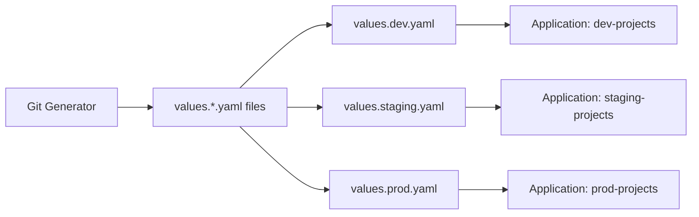
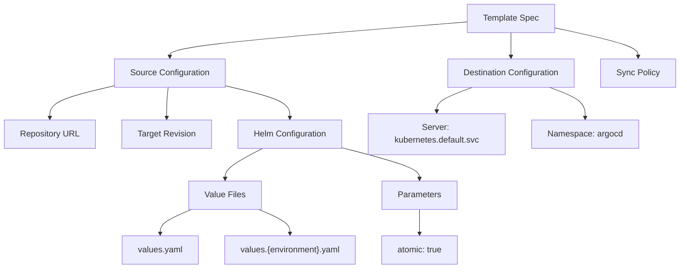
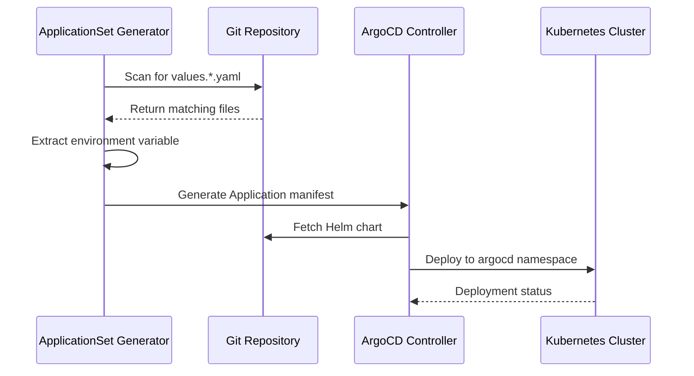
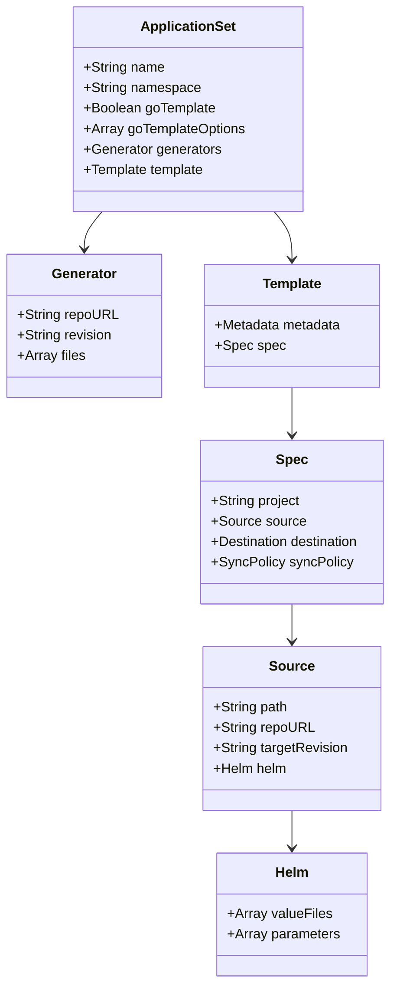
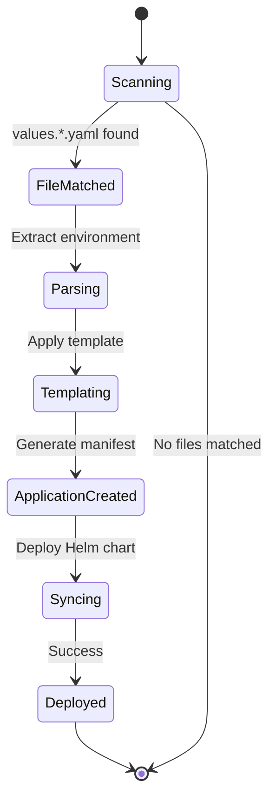

# Diagram: devops/k8s/argocd/projects/environments/argocd/ApplicationSet.yaml


> Auto-generated by Obscura crawlers

## Diagram 1

```mermaid
flowchart TD
      A[ApplicationSet: environment-projects] --> B[Git Generator]
      B --> C[Scan Repository]
      C --> D[Match: values.*.yaml]...
  └ 225 lines...
```

> SVG rendering failed for this diagram.

## Diagram 2

```mermaid
flowchart TD
    A[ApplicationSet: environment-projects] --> B[Git Generator]
    B --> C[Scan Repository]
    C --> D[Match: values.*.yaml]
    D --> E[Extract: environment]
    E --> F[Template Generation]
    F --> G[Application: {environment}-projects]
    G --> H[Helm Chart Deployment]
    H --> I[ArgoCD Namespace]
    
    B -->|repoURL| J[gitlab.com/freightverify-nextgen/devops]
    B -->|revision| K[ticket/DEVOP-2262]
    B -->|path| L[devops/k8s/argocd/projects/environments/helm]
```

> SVG rendering failed for this diagram.

## Diagram 3



### SVG

<svg id="container" width="969.5" xmlns="http://www.w3.org/2000/svg" class="flowchart" height="302" viewBox="0 0 969.5 302" role="graphics-document document" aria-roledescription="flowchart-v2"><style>#container{font-family:"trebuchet ms",verdana,arial,sans-serif;font-size:16px;fill:#333;}@keyframes edge-animation-frame{from{stroke-dashoffset:0;}}@keyframes dash{to{stroke-dashoffset:0;}}#container .edge-animation-slow{stroke-dasharray:9,5!important;stroke-dashoffset:900;animation:dash 50s linear infinite;stroke-linecap:round;}#container .edge-animation-fast{stroke-dasharray:9,5!important;stroke-dashoffset:900;animation:dash 20s linear infinite;stroke-linecap:round;}#container .error-icon{fill:#552222;}#container .error-text{fill:#552222;stroke:#552222;}#container .edge-thickness-normal{stroke-width:1px;}#container .edge-thickness-thick{stroke-width:3.5px;}#container .edge-pattern-solid{stroke-dasharray:0;}#container .edge-thickness-invisible{stroke-width:0;fill:none;}#container .edge-pattern-dashed{stroke-dasharray:3;}#container .edge-pattern-dotted{stroke-dasharray:2;}#container .marker{fill:#333333;stroke:#333333;}#container .marker.cross{stroke:#333333;}#container svg{font-family:"trebuchet ms",verdana,arial,sans-serif;font-size:16px;}#container p{margin:0;}#container .label{font-family:"trebuchet ms",verdana,arial,sans-serif;color:#333;}#container .cluster-label text{fill:#333;}#container .cluster-label span{color:#333;}#container .cluster-label span p{background-color:transparent;}#container .label text,#container span{fill:#333;color:#333;}#container .node rect,#container .node circle,#container .node ellipse,#container .node polygon,#container .node path{fill:#ECECFF;stroke:#9370DB;stroke-width:1px;}#container .rough-node .label text,#container .node .label text,#container .image-shape .label,#container .icon-shape .label{text-anchor:middle;}#container .node .katex path{fill:#000;stroke:#000;stroke-width:1px;}#container .rough-node .label,#container .node .label,#container .image-shape .label,#container .icon-shape .label{text-align:center;}#container .node.clickable{cursor:pointer;}#container .root .anchor path{fill:#333333!important;stroke-width:0;stroke:#333333;}#container .arrowheadPath{fill:#333333;}#container .edgePath .path{stroke:#333333;stroke-width:2.0px;}#container .flowchart-link{stroke:#333333;fill:none;}#container .edgeLabel{background-color:rgba(232,232,232, 0.8);text-align:center;}#container .edgeLabel p{background-color:rgba(232,232,232, 0.8);}#container .edgeLabel rect{opacity:0.5;background-color:rgba(232,232,232, 0.8);fill:rgba(232,232,232, 0.8);}#container .labelBkg{background-color:rgba(232, 232, 232, 0.5);}#container .cluster rect{fill:#ffffde;stroke:#aaaa33;stroke-width:1px;}#container .cluster text{fill:#333;}#container .cluster span{color:#333;}#container div.mermaidTooltip{position:absolute;text-align:center;max-width:200px;padding:2px;font-family:"trebuchet ms",verdana,arial,sans-serif;font-size:12px;background:hsl(80, 100%, 96.2745098039%);border:1px solid #aaaa33;border-radius:2px;pointer-events:none;z-index:100;}#container .flowchartTitleText{text-anchor:middle;font-size:18px;fill:#333;}#container rect.text{fill:none;stroke-width:0;}#container .icon-shape,#container .image-shape{background-color:rgba(232,232,232, 0.8);text-align:center;}#container .icon-shape p,#container .image-shape p{background-color:rgba(232,232,232, 0.8);padding:2px;}#container .icon-shape rect,#container .image-shape rect{opacity:0.5;background-color:rgba(232,232,232, 0.8);fill:rgba(232,232,232, 0.8);}#container .label-icon{display:inline-block;height:1em;overflow:visible;vertical-align:-0.125em;}#container .node .label-icon path{fill:currentColor;stroke:revert;stroke-width:revert;}#container :root{--mermaid-font-family:"trebuchet ms",verdana,arial,sans-serif;}</style><g><marker id="container_flowchart-v2-pointEnd" class="marker flowchart-v2" viewBox="0 0 10 10" refX="5" refY="5" markerUnits="userSpaceOnUse" markerWidth="8" markerHeight="8" orient="auto"><path d="M 0 0 L 10 5 L 0 10 z" class="arrowMarkerPath" style="stroke-width: 1; stroke-dasharray: 1, 0;"></path></marker><marker id="container_flowchart-v2-pointStart" class="marker flowchart-v2" viewBox="0 0 10 10" refX="4.5" refY="5" markerUnits="userSpaceOnUse" markerWidth="8" markerHeight="8" orient="auto"><path d="M 0 5 L 10 10 L 10 0 z" class="arrowMarkerPath" style="stroke-width: 1; stroke-dasharray: 1, 0;"></path></marker><marker id="container_flowchart-v2-circleEnd" class="marker flowchart-v2" viewBox="0 0 10 10" refX="11" refY="5" markerUnits="userSpaceOnUse" markerWidth="11" markerHeight="11" orient="auto"><circle cx="5" cy="5" r="5" class="arrowMarkerPath" style="stroke-width: 1; stroke-dasharray: 1, 0;"></circle></marker><marker id="container_flowchart-v2-circleStart" class="marker flowchart-v2" viewBox="0 0 10 10" refX="-1" refY="5" markerUnits="userSpaceOnUse" markerWidth="11" markerHeight="11" orient="auto"><circle cx="5" cy="5" r="5" class="arrowMarkerPath" style="stroke-width: 1; stroke-dasharray: 1, 0;"></circle></marker><marker id="container_flowchart-v2-crossEnd" class="marker cross flowchart-v2" viewBox="0 0 11 11" refX="12" refY="5.2" markerUnits="userSpaceOnUse" markerWidth="11" markerHeight="11" orient="auto"><path d="M 1,1 l 9,9 M 10,1 l -9,9" class="arrowMarkerPath" style="stroke-width: 2; stroke-dasharray: 1, 0;"></path></marker><marker id="container_flowchart-v2-crossStart" class="marker cross flowchart-v2" viewBox="0 0 11 11" refX="-1" refY="5.2" markerUnits="userSpaceOnUse" markerWidth="11" markerHeight="11" orient="auto"><path d="M 1,1 l 9,9 M 10,1 l -9,9" class="arrowMarkerPath" style="stroke-width: 2; stroke-dasharray: 1, 0;"></path></marker><g class="root"><g class="clusters"></g><g class="edgePaths"><path d="M164.922,151L169.089,151C173.255,151,181.589,151,189.255,151C196.922,151,203.922,151,207.422,151L210.922,151" id="L_A_B_0" class="edge-thickness-normal edge-pattern-solid edge-thickness-normal edge-pattern-solid flowchart-link" style=";" data-edge="true" data-et="edge" data-id="L_A_B_0" data-points="W3sieCI6MTY0LjkyMTg3NSwieSI6MTUxfSx7IngiOjE4OS45MjE4NzUsInkiOjE1MX0seyJ4IjoyMTQuOTIxODc1LCJ5IjoxNTF9XQ==" marker-end="url(#container_flowchart-v2-pointEnd)"></path><path d="M335.503,124L350.604,109.167C365.705,94.333,395.907,64.667,416.756,49.833C437.604,35,449.099,35,454.846,35L460.594,35" id="L_B_C_0" class="edge-thickness-normal edge-pattern-solid edge-thickness-normal edge-pattern-solid flowchart-link" style=";" data-edge="true" data-et="edge" data-id="L_B_C_0" data-points="W3sieCI6MzM1LjUwMjk2MzM2MjA2ODk1LCJ5IjoxMjR9LHsieCI6NDI2LjEwOTM3NSwieSI6MzV9LHsieCI6NDY0LjU5Mzc1LCJ5IjozNX1d" marker-end="url(#container_flowchart-v2-pointEnd)"></path><path d="M401.109,151L405.276,151C409.443,151,417.776,151,425.443,151C433.109,151,440.109,151,443.609,151L447.109,151" id="L_B_D_0" class="edge-thickness-normal edge-pattern-solid edge-thickness-normal edge-pattern-solid flowchart-link" style=";" data-edge="true" data-et="edge" data-id="L_B_D_0" data-points="W3sieCI6NDAxLjEwOTM3NSwieSI6MTUxfSx7IngiOjQyNi4xMDkzNzUsInkiOjE1MX0seyJ4Ijo0NTEuMTA5Mzc1LCJ5IjoxNTF9XQ==" marker-end="url(#container_flowchart-v2-pointEnd)"></path><path d="M335.503,178L350.604,192.833C365.705,207.667,395.907,237.333,416.021,252.167C436.135,267,446.161,267,451.174,267L456.188,267" id="L_B_E_0" class="edge-thickness-normal edge-pattern-solid edge-thickness-normal edge-pattern-solid flowchart-link" style=";" data-edge="true" data-et="edge" data-id="L_B_E_0" data-points="W3sieCI6MzM1LjUwMjk2MzM2MjA2ODk1LCJ5IjoxNzh9LHsieCI6NDI2LjEwOTM3NSwieSI6MjY3fSx7IngiOjQ2MC4xODc1LCJ5IjoyNjd9XQ==" marker-end="url(#container_flowchart-v2-pointEnd)"></path><path d="M638.016,35L644.43,35C650.844,35,663.672,35,675.112,35C686.552,35,696.604,35,701.63,35L706.656,35" id="L_C_F_0" class="edge-thickness-normal edge-pattern-solid edge-thickness-normal edge-pattern-solid flowchart-link" style=";" data-edge="true" data-et="edge" data-id="L_C_F_0" data-points="W3sieCI6NjM4LjAxNTYyNSwieSI6MzV9LHsieCI6Njc2LjUsInkiOjM1fSx7IngiOjcxMC42NTYyNSwieSI6MzV9XQ==" marker-end="url(#container_flowchart-v2-pointEnd)"></path><path d="M651.5,151L655.667,151C659.833,151,668.167,151,675.833,151C683.5,151,690.5,151,694,151L697.5,151" id="L_D_G_0" class="edge-thickness-normal edge-pattern-solid edge-thickness-normal edge-pattern-solid flowchart-link" style=";" data-edge="true" data-et="edge" data-id="L_D_G_0" data-points="W3sieCI6NjUxLjUsInkiOjE1MX0seyJ4Ijo2NzYuNSwieSI6MTUxfSx7IngiOjcwMS41LCJ5IjoxNTF9XQ==" marker-end="url(#container_flowchart-v2-pointEnd)"></path><path d="M642.422,267L648.102,267C653.781,267,665.141,267,675.165,267C685.19,267,693.88,267,698.225,267L702.57,267" id="L_E_H_0" class="edge-thickness-normal edge-pattern-solid edge-thickness-normal edge-pattern-solid flowchart-link" style=";" data-edge="true" data-et="edge" data-id="L_E_H_0" data-points="W3sieCI6NjQyLjQyMTg3NSwieSI6MjY3fSx7IngiOjY3Ni41LCJ5IjoyNjd9LHsieCI6NzA2LjU3MDMxMjUsInkiOjI2N31d" marker-end="url(#container_flowchart-v2-pointEnd)"></path></g><g class="edgeLabels"><g class="edgeLabel"><g class="label" data-id="L_A_B_0" transform="translate(0, 0)"><foreignObject width="0" height="0"><div xmlns="http://www.w3.org/1999/xhtml" class="labelBkg" style="display: table-cell; white-space: nowrap; line-height: 1.5; max-width: 200px; text-align: center;"><span class="edgeLabel"></span></div></foreignObject></g></g><g class="edgeLabel"><g class="label" data-id="L_B_C_0" transform="translate(0, 0)"><foreignObject width="0" height="0"><div xmlns="http://www.w3.org/1999/xhtml" class="labelBkg" style="display: table-cell; white-space: nowrap; line-height: 1.5; max-width: 200px; text-align: center;"><span class="edgeLabel"></span></div></foreignObject></g></g><g class="edgeLabel"><g class="label" data-id="L_B_D_0" transform="translate(0, 0)"><foreignObject width="0" height="0"><div xmlns="http://www.w3.org/1999/xhtml" class="labelBkg" style="display: table-cell; white-space: nowrap; line-height: 1.5; max-width: 200px; text-align: center;"><span class="edgeLabel"></span></div></foreignObject></g></g><g class="edgeLabel"><g class="label" data-id="L_B_E_0" transform="translate(0, 0)"><foreignObject width="0" height="0"><div xmlns="http://www.w3.org/1999/xhtml" class="labelBkg" style="display: table-cell; white-space: nowrap; line-height: 1.5; max-width: 200px; text-align: center;"><span class="edgeLabel"></span></div></foreignObject></g></g><g class="edgeLabel"><g class="label" data-id="L_C_F_0" transform="translate(0, 0)"><foreignObject width="0" height="0"><div xmlns="http://www.w3.org/1999/xhtml" class="labelBkg" style="display: table-cell; white-space: nowrap; line-height: 1.5; max-width: 200px; text-align: center;"><span class="edgeLabel"></span></div></foreignObject></g></g><g class="edgeLabel"><g class="label" data-id="L_D_G_0" transform="translate(0, 0)"><foreignObject width="0" height="0"><div xmlns="http://www.w3.org/1999/xhtml" class="labelBkg" style="display: table-cell; white-space: nowrap; line-height: 1.5; max-width: 200px; text-align: center;"><span class="edgeLabel"></span></div></foreignObject></g></g><g class="edgeLabel"><g class="label" data-id="L_E_H_0" transform="translate(0, 0)"><foreignObject width="0" height="0"><div xmlns="http://www.w3.org/1999/xhtml" class="labelBkg" style="display: table-cell; white-space: nowrap; line-height: 1.5; max-width: 200px; text-align: center;"><span class="edgeLabel"></span></div></foreignObject></g></g></g><g class="nodes"><g class="node default" id="flowchart-A-0" transform="translate(86.4609375, 151)"><rect class="basic label-container" style="" x="-78.4609375" y="-27" width="156.921875" height="54"></rect><g class="label" style="" transform="translate(-48.4609375, -12)"><rect></rect><foreignObject width="96.921875" height="24"><div xmlns="http://www.w3.org/1999/xhtml" style="display: table-cell; white-space: nowrap; line-height: 1.5; max-width: 200px; text-align: center;"><span class="nodeLabel"><p>Git Generator</p></span></div></foreignObject></g></g><g class="node default" id="flowchart-B-1" transform="translate(308.015625, 151)"><rect class="basic label-container" style="" x="-93.09375" y="-27" width="186.1875" height="54"></rect><g class="label" style="" transform="translate(-63.09375, -12)"><rect></rect><foreignObject width="126.1875" height="24"><div xmlns="http://www.w3.org/1999/xhtml" style="display: table-cell; white-space: nowrap; line-height: 1.5; max-width: 200px; text-align: center;"><span class="nodeLabel"><p>values.*.yaml files</p></span></div></foreignObject></g></g><g class="node default" id="flowchart-C-3" transform="translate(551.3046875, 35)"><rect class="basic label-container" style="" x="-86.7109375" y="-27" width="173.421875" height="54"></rect><g class="label" style="" transform="translate(-56.7109375, -12)"><rect></rect><foreignObject width="113.421875" height="24"><div xmlns="http://www.w3.org/1999/xhtml" style="display: table-cell; white-space: nowrap; line-height: 1.5; max-width: 200px; text-align: center;"><span class="nodeLabel"><p>values.dev.yaml</p></span></div></foreignObject></g></g><g class="node default" id="flowchart-D-5" transform="translate(551.3046875, 151)"><rect class="basic label-container" style="" x="-100.1953125" y="-27" width="200.390625" height="54"></rect><g class="label" style="" transform="translate(-70.1953125, -12)"><rect></rect><foreignObject width="140.390625" height="24"><div xmlns="http://www.w3.org/1999/xhtml" style="display: table-cell; white-space: nowrap; line-height: 1.5; max-width: 200px; text-align: center;"><span class="nodeLabel"><p>values.staging.yaml</p></span></div></foreignObject></g></g><g class="node default" id="flowchart-E-7" transform="translate(551.3046875, 267)"><rect class="basic label-container" style="" x="-91.1171875" y="-27" width="182.234375" height="54"></rect><g class="label" style="" transform="translate(-61.1171875, -12)"><rect></rect><foreignObject width="122.234375" height="24"><div xmlns="http://www.w3.org/1999/xhtml" style="display: table-cell; white-space: nowrap; line-height: 1.5; max-width: 200px; text-align: center;"><span class="nodeLabel"><p>values.prod.yaml</p></span></div></foreignObject></g></g><g class="node default" id="flowchart-F-9" transform="translate(831.5, 35)"><rect class="basic label-container" style="" x="-120.84375" y="-27" width="241.6875" height="54"></rect><g class="label" style="" transform="translate(-90.84375, -12)"><rect></rect><foreignObject width="181.6875" height="24"><div xmlns="http://www.w3.org/1999/xhtml" style="display: table-cell; white-space: nowrap; line-height: 1.5; max-width: 200px; text-align: center;"><span class="nodeLabel"><p>Application: dev-projects</p></span></div></foreignObject></g></g><g class="node default" id="flowchart-G-11" transform="translate(831.5, 151)"><rect class="basic label-container" style="" x="-130" y="-39" width="260" height="78"></rect><g class="label" style="" transform="translate(-100, -24)"><rect></rect><foreignObject width="200" height="48"><div xmlns="http://www.w3.org/1999/xhtml" style="display: table; white-space: break-spaces; line-height: 1.5; max-width: 200px; text-align: center; width: 200px;"><span class="nodeLabel"><p>Application: staging-projects</p></span></div></foreignObject></g></g><g class="node default" id="flowchart-H-13" transform="translate(831.5, 267)"><rect class="basic label-container" style="" x="-124.9296875" y="-27" width="249.859375" height="54"></rect><g class="label" style="" transform="translate(-94.9296875, -12)"><rect></rect><foreignObject width="189.859375" height="24"><div xmlns="http://www.w3.org/1999/xhtml" style="display: table-cell; white-space: nowrap; line-height: 1.5; max-width: 200px; text-align: center;"><span class="nodeLabel"><p>Application: prod-projects</p></span></div></foreignObject></g></g></g></g></g></svg>

## Diagram 4



### SVG

<svg id="container" width="1289.61328125" xmlns="http://www.w3.org/2000/svg" class="flowchart" height="510" viewBox="0 0 1289.61328125 510" role="graphics-document document" aria-roledescription="flowchart-v2"><style>#container{font-family:"trebuchet ms",verdana,arial,sans-serif;font-size:16px;fill:#333;}@keyframes edge-animation-frame{from{stroke-dashoffset:0;}}@keyframes dash{to{stroke-dashoffset:0;}}#container .edge-animation-slow{stroke-dasharray:9,5!important;stroke-dashoffset:900;animation:dash 50s linear infinite;stroke-linecap:round;}#container .edge-animation-fast{stroke-dasharray:9,5!important;stroke-dashoffset:900;animation:dash 20s linear infinite;stroke-linecap:round;}#container .error-icon{fill:#552222;}#container .error-text{fill:#552222;stroke:#552222;}#container .edge-thickness-normal{stroke-width:1px;}#container .edge-thickness-thick{stroke-width:3.5px;}#container .edge-pattern-solid{stroke-dasharray:0;}#container .edge-thickness-invisible{stroke-width:0;fill:none;}#container .edge-pattern-dashed{stroke-dasharray:3;}#container .edge-pattern-dotted{stroke-dasharray:2;}#container .marker{fill:#333333;stroke:#333333;}#container .marker.cross{stroke:#333333;}#container svg{font-family:"trebuchet ms",verdana,arial,sans-serif;font-size:16px;}#container p{margin:0;}#container .label{font-family:"trebuchet ms",verdana,arial,sans-serif;color:#333;}#container .cluster-label text{fill:#333;}#container .cluster-label span{color:#333;}#container .cluster-label span p{background-color:transparent;}#container .label text,#container span{fill:#333;color:#333;}#container .node rect,#container .node circle,#container .node ellipse,#container .node polygon,#container .node path{fill:#ECECFF;stroke:#9370DB;stroke-width:1px;}#container .rough-node .label text,#container .node .label text,#container .image-shape .label,#container .icon-shape .label{text-anchor:middle;}#container .node .katex path{fill:#000;stroke:#000;stroke-width:1px;}#container .rough-node .label,#container .node .label,#container .image-shape .label,#container .icon-shape .label{text-align:center;}#container .node.clickable{cursor:pointer;}#container .root .anchor path{fill:#333333!important;stroke-width:0;stroke:#333333;}#container .arrowheadPath{fill:#333333;}#container .edgePath .path{stroke:#333333;stroke-width:2.0px;}#container .flowchart-link{stroke:#333333;fill:none;}#container .edgeLabel{background-color:rgba(232,232,232, 0.8);text-align:center;}#container .edgeLabel p{background-color:rgba(232,232,232, 0.8);}#container .edgeLabel rect{opacity:0.5;background-color:rgba(232,232,232, 0.8);fill:rgba(232,232,232, 0.8);}#container .labelBkg{background-color:rgba(232, 232, 232, 0.5);}#container .cluster rect{fill:#ffffde;stroke:#aaaa33;stroke-width:1px;}#container .cluster text{fill:#333;}#container .cluster span{color:#333;}#container div.mermaidTooltip{position:absolute;text-align:center;max-width:200px;padding:2px;font-family:"trebuchet ms",verdana,arial,sans-serif;font-size:12px;background:hsl(80, 100%, 96.2745098039%);border:1px solid #aaaa33;border-radius:2px;pointer-events:none;z-index:100;}#container .flowchartTitleText{text-anchor:middle;font-size:18px;fill:#333;}#container rect.text{fill:none;stroke-width:0;}#container .icon-shape,#container .image-shape{background-color:rgba(232,232,232, 0.8);text-align:center;}#container .icon-shape p,#container .image-shape p{background-color:rgba(232,232,232, 0.8);padding:2px;}#container .icon-shape rect,#container .image-shape rect{opacity:0.5;background-color:rgba(232,232,232, 0.8);fill:rgba(232,232,232, 0.8);}#container .label-icon{display:inline-block;height:1em;overflow:visible;vertical-align:-0.125em;}#container .node .label-icon path{fill:currentColor;stroke:revert;stroke-width:revert;}#container :root{--mermaid-font-family:"trebuchet ms",verdana,arial,sans-serif;}</style><g><marker id="container_flowchart-v2-pointEnd" class="marker flowchart-v2" viewBox="0 0 10 10" refX="5" refY="5" markerUnits="userSpaceOnUse" markerWidth="8" markerHeight="8" orient="auto"><path d="M 0 0 L 10 5 L 0 10 z" class="arrowMarkerPath" style="stroke-width: 1; stroke-dasharray: 1, 0;"></path></marker><marker id="container_flowchart-v2-pointStart" class="marker flowchart-v2" viewBox="0 0 10 10" refX="4.5" refY="5" markerUnits="userSpaceOnUse" markerWidth="8" markerHeight="8" orient="auto"><path d="M 0 5 L 10 10 L 10 0 z" class="arrowMarkerPath" style="stroke-width: 1; stroke-dasharray: 1, 0;"></path></marker><marker id="container_flowchart-v2-circleEnd" class="marker flowchart-v2" viewBox="0 0 10 10" refX="11" refY="5" markerUnits="userSpaceOnUse" markerWidth="11" markerHeight="11" orient="auto"><circle cx="5" cy="5" r="5" class="arrowMarkerPath" style="stroke-width: 1; stroke-dasharray: 1, 0;"></circle></marker><marker id="container_flowchart-v2-circleStart" class="marker flowchart-v2" viewBox="0 0 10 10" refX="-1" refY="5" markerUnits="userSpaceOnUse" markerWidth="11" markerHeight="11" orient="auto"><circle cx="5" cy="5" r="5" class="arrowMarkerPath" style="stroke-width: 1; stroke-dasharray: 1, 0;"></circle></marker><marker id="container_flowchart-v2-crossEnd" class="marker cross flowchart-v2" viewBox="0 0 11 11" refX="12" refY="5.2" markerUnits="userSpaceOnUse" markerWidth="11" markerHeight="11" orient="auto"><path d="M 1,1 l 9,9 M 10,1 l -9,9" class="arrowMarkerPath" style="stroke-width: 2; stroke-dasharray: 1, 0;"></path></marker><marker id="container_flowchart-v2-crossStart" class="marker cross flowchart-v2" viewBox="0 0 11 11" refX="-1" refY="5.2" markerUnits="userSpaceOnUse" markerWidth="11" markerHeight="11" orient="auto"><path d="M 1,1 l 9,9 M 10,1 l -9,9" class="arrowMarkerPath" style="stroke-width: 2; stroke-dasharray: 1, 0;"></path></marker><g class="root"><g class="clusters"></g><g class="edgePaths"><path d="M885.426,41.655L791.315,49.212C697.204,56.77,508.983,71.885,414.872,82.942C320.762,94,320.762,101,320.762,104.5L320.762,108" id="L_A_B_0" class="edge-thickness-normal edge-pattern-solid edge-thickness-normal edge-pattern-solid flowchart-link" style=";" data-edge="true" data-et="edge" data-id="L_A_B_0" data-points="W3sieCI6ODg1LjQyNTc4MTI1LCJ5Ijo0MS42NTQ2NDk4NzIxMTA0Mn0seyJ4IjozMjAuNzYxNzE4NzUsInkiOjg3fSx7IngiOjMyMC43NjE3MTg3NSwieSI6MTEyfV0=" marker-end="url(#container_flowchart-v2-pointEnd)"></path><path d="M968.293,62L968.293,66.167C968.293,70.333,968.293,78.667,968.293,86.333C968.293,94,968.293,101,968.293,104.5L968.293,108" id="L_A_C_0" class="edge-thickness-normal edge-pattern-solid edge-thickness-normal edge-pattern-solid flowchart-link" style=";" data-edge="true" data-et="edge" data-id="L_A_C_0" data-points="W3sieCI6OTY4LjI5Mjk2ODc1LCJ5Ijo2Mn0seyJ4Ijo5NjguMjkyOTY4NzUsInkiOjg3fSx7IngiOjk2OC4yOTI5Njg3NSwieSI6MTEyfV0=" marker-end="url(#container_flowchart-v2-pointEnd)"></path><path d="M1051.16,52.731L1077.854,58.442C1104.548,64.154,1157.936,75.577,1184.63,84.788C1211.324,94,1211.324,101,1211.324,104.5L1211.324,108" id="L_A_D_0" class="edge-thickness-normal edge-pattern-solid edge-thickness-normal edge-pattern-solid flowchart-link" style=";" data-edge="true" data-et="edge" data-id="L_A_D_0" data-points="W3sieCI6MTA1MS4xNjAxNTYyNSwieSI6NTIuNzMwNjE1OTE4NzM0NzN9LHsieCI6MTIxMS4zMjQyMTg3NSwieSI6ODd9LHsieCI6MTIxMS4zMjQyMTg3NSwieSI6MTEyfV0=" marker-end="url(#container_flowchart-v2-pointEnd)"></path><path d="M215.395,163.078L195.029,167.731C174.664,172.385,133.934,181.693,113.568,191.846C93.203,202,93.203,213,93.203,218.5L93.203,224" id="L_B_E_0" class="edge-thickness-normal edge-pattern-solid edge-thickness-normal edge-pattern-solid flowchart-link" style=";" data-edge="true" data-et="edge" data-id="L_B_E_0" data-points="W3sieCI6MjE1LjM5NDUzMTI1LCJ5IjoxNjMuMDc3NzI3MjMzNzEzODZ9LHsieCI6OTMuMjAzMTI1LCJ5IjoxOTF9LHsieCI6OTMuMjAzMTI1LCJ5IjoyMjh9XQ==" marker-end="url(#container_flowchart-v2-pointEnd)"></path><path d="M316.971,166L316.386,170.167C315.801,174.333,314.631,182.667,314.046,192.333C313.461,202,313.461,213,313.461,218.5L313.461,224" id="L_B_F_0" class="edge-thickness-normal edge-pattern-solid edge-thickness-normal edge-pattern-solid flowchart-link" style=";" data-edge="true" data-et="edge" data-id="L_B_F_0" data-points="W3sieCI6MzE2Ljk3MDkyODQ4NTU3NjksInkiOjE2Nn0seyJ4IjozMTMuNDYwOTM3NSwieSI6MTkxfSx7IngiOjMxMy40NjA5Mzc1LCJ5IjoyMjh9XQ==" marker-end="url(#container_flowchart-v2-pointEnd)"></path><path d="M426.129,163.078L446.494,167.731C466.859,172.385,507.59,181.693,527.955,191.846C548.32,202,548.32,213,548.32,218.5L548.32,224" id="L_B_G_0" class="edge-thickness-normal edge-pattern-solid edge-thickness-normal edge-pattern-solid flowchart-link" style=";" data-edge="true" data-et="edge" data-id="L_B_G_0" data-points="W3sieCI6NDI2LjEyODkwNjI1LCJ5IjoxNjMuMDc3NzI3MjMzNzEzODZ9LHsieCI6NTQ4LjMyMDMxMjUsInkiOjE5MX0seyJ4Ijo1NDguMzIwMzEyNSwieSI6MjI4fV0=" marker-end="url(#container_flowchart-v2-pointEnd)"></path><path d="M495.756,282L483.75,288.167C471.745,294.333,447.734,306.667,435.728,316.333C423.723,326,423.723,333,423.723,336.5L423.723,340" id="L_G_H_0" class="edge-thickness-normal edge-pattern-solid edge-thickness-normal edge-pattern-solid flowchart-link" style=";" data-edge="true" data-et="edge" data-id="L_G_H_0" data-points="W3sieCI6NDk1Ljc1NTY3NjI2OTUzMTI1LCJ5IjoyODJ9LHsieCI6NDIzLjcyMjY1NjI1LCJ5IjozMTl9LHsieCI6NDIzLjcyMjY1NjI1LCJ5IjozNDR9XQ==" marker-end="url(#container_flowchart-v2-pointEnd)"></path><path d="M648.125,280.718L672.885,287.098C697.646,293.479,747.167,306.239,771.927,316.12C796.688,326,796.688,333,796.688,336.5L796.688,340" id="L_G_I_0" class="edge-thickness-normal edge-pattern-solid edge-thickness-normal edge-pattern-solid flowchart-link" style=";" data-edge="true" data-et="edge" data-id="L_G_I_0" data-points="W3sieCI6NjQ4LjEyNSwieSI6MjgwLjcxNzk3MDQ5NDc5NDE0fSx7IngiOjc5Ni42ODc1LCJ5IjozMTl9LHsieCI6Nzk2LjY4NzUsInkiOjM0NH1d" marker-end="url(#container_flowchart-v2-pointEnd)"></path><path d="M359.458,398L349.54,402.167C339.623,406.333,319.788,414.667,309.871,422.333C299.953,430,299.953,437,299.953,440.5L299.953,444" id="L_H_J_0" class="edge-thickness-normal edge-pattern-solid edge-thickness-normal edge-pattern-solid flowchart-link" style=";" data-edge="true" data-et="edge" data-id="L_H_J_0" data-points="W3sieCI6MzU5LjQ1NzcwNzMzMTczMDgsInkiOjM5OH0seyJ4IjoyOTkuOTUzMTI1LCJ5Ijo0MjN9LHsieCI6Mjk5Ljk1MzEyNSwieSI6NDQ4fV0=" marker-end="url(#container_flowchart-v2-pointEnd)"></path><path d="M487.988,398L497.905,402.167C507.822,406.333,527.657,414.667,537.575,422.333C547.492,430,547.492,437,547.492,440.5L547.492,444" id="L_H_K_0" class="edge-thickness-normal edge-pattern-solid edge-thickness-normal edge-pattern-solid flowchart-link" style=";" data-edge="true" data-et="edge" data-id="L_H_K_0" data-points="W3sieCI6NDg3Ljk4NzYwNTE2ODI2OTIsInkiOjM5OH0seyJ4Ijo1NDcuNDkyMTg3NSwieSI6NDIzfSx7IngiOjU0Ny40OTIxODc1LCJ5Ijo0NDh9XQ==" marker-end="url(#container_flowchart-v2-pointEnd)"></path><path d="M796.688,398L796.688,402.167C796.688,406.333,796.688,414.667,796.688,422.333C796.688,430,796.688,437,796.688,440.5L796.688,444" id="L_I_L_0" class="edge-thickness-normal edge-pattern-solid edge-thickness-normal edge-pattern-solid flowchart-link" style=";" data-edge="true" data-et="edge" data-id="L_I_L_0" data-points="W3sieCI6Nzk2LjY4NzUsInkiOjM5OH0seyJ4Ijo3OTYuNjg3NSwieSI6NDIzfSx7IngiOjc5Ni42ODc1LCJ5Ijo0NDh9XQ==" marker-end="url(#container_flowchart-v2-pointEnd)"></path><path d="M895.513,166L884.282,170.167C873.051,174.333,850.588,182.667,839.356,190.333C828.125,198,828.125,205,828.125,208.5L828.125,212" id="L_C_M_0" class="edge-thickness-normal edge-pattern-solid edge-thickness-normal edge-pattern-solid flowchart-link" style=";" data-edge="true" data-et="edge" data-id="L_C_M_0" data-points="W3sieCI6ODk1LjUxMzQ0NjUxNDQyMzEsInkiOjE2Nn0seyJ4Ijo4MjguMTI1LCJ5IjoxOTF9LHsieCI6ODI4LjEyNSwieSI6MjE2fV0=" marker-end="url(#container_flowchart-v2-pointEnd)"></path><path d="M1041.072,166L1052.304,170.167C1063.535,174.333,1085.998,182.667,1097.23,192.333C1108.461,202,1108.461,213,1108.461,218.5L1108.461,224" id="L_C_N_0" class="edge-thickness-normal edge-pattern-solid edge-thickness-normal edge-pattern-solid flowchart-link" style=";" data-edge="true" data-et="edge" data-id="L_C_N_0" data-points="W3sieCI6MTA0MS4wNzI0OTA5ODU1NzcsInkiOjE2Nn0seyJ4IjoxMTA4LjQ2MDkzNzUsInkiOjE5MX0seyJ4IjoxMTA4LjQ2MDkzNzUsInkiOjIyOH1d" marker-end="url(#container_flowchart-v2-pointEnd)"></path></g><g class="edgeLabels"><g class="edgeLabel"><g class="label" data-id="L_A_B_0" transform="translate(0, 0)"><foreignObject width="0" height="0"><div xmlns="http://www.w3.org/1999/xhtml" class="labelBkg" style="display: table-cell; white-space: nowrap; line-height: 1.5; max-width: 200px; text-align: center;"><span class="edgeLabel"></span></div></foreignObject></g></g><g class="edgeLabel"><g class="label" data-id="L_A_C_0" transform="translate(0, 0)"><foreignObject width="0" height="0"><div xmlns="http://www.w3.org/1999/xhtml" class="labelBkg" style="display: table-cell; white-space: nowrap; line-height: 1.5; max-width: 200px; text-align: center;"><span class="edgeLabel"></span></div></foreignObject></g></g><g class="edgeLabel"><g class="label" data-id="L_A_D_0" transform="translate(0, 0)"><foreignObject width="0" height="0"><div xmlns="http://www.w3.org/1999/xhtml" class="labelBkg" style="display: table-cell; white-space: nowrap; line-height: 1.5; max-width: 200px; text-align: center;"><span class="edgeLabel"></span></div></foreignObject></g></g><g class="edgeLabel"><g class="label" data-id="L_B_E_0" transform="translate(0, 0)"><foreignObject width="0" height="0"><div xmlns="http://www.w3.org/1999/xhtml" class="labelBkg" style="display: table-cell; white-space: nowrap; line-height: 1.5; max-width: 200px; text-align: center;"><span class="edgeLabel"></span></div></foreignObject></g></g><g class="edgeLabel"><g class="label" data-id="L_B_F_0" transform="translate(0, 0)"><foreignObject width="0" height="0"><div xmlns="http://www.w3.org/1999/xhtml" class="labelBkg" style="display: table-cell; white-space: nowrap; line-height: 1.5; max-width: 200px; text-align: center;"><span class="edgeLabel"></span></div></foreignObject></g></g><g class="edgeLabel"><g class="label" data-id="L_B_G_0" transform="translate(0, 0)"><foreignObject width="0" height="0"><div xmlns="http://www.w3.org/1999/xhtml" class="labelBkg" style="display: table-cell; white-space: nowrap; line-height: 1.5; max-width: 200px; text-align: center;"><span class="edgeLabel"></span></div></foreignObject></g></g><g class="edgeLabel"><g class="label" data-id="L_G_H_0" transform="translate(0, 0)"><foreignObject width="0" height="0"><div xmlns="http://www.w3.org/1999/xhtml" class="labelBkg" style="display: table-cell; white-space: nowrap; line-height: 1.5; max-width: 200px; text-align: center;"><span class="edgeLabel"></span></div></foreignObject></g></g><g class="edgeLabel"><g class="label" data-id="L_G_I_0" transform="translate(0, 0)"><foreignObject width="0" height="0"><div xmlns="http://www.w3.org/1999/xhtml" class="labelBkg" style="display: table-cell; white-space: nowrap; line-height: 1.5; max-width: 200px; text-align: center;"><span class="edgeLabel"></span></div></foreignObject></g></g><g class="edgeLabel"><g class="label" data-id="L_H_J_0" transform="translate(0, 0)"><foreignObject width="0" height="0"><div xmlns="http://www.w3.org/1999/xhtml" class="labelBkg" style="display: table-cell; white-space: nowrap; line-height: 1.5; max-width: 200px; text-align: center;"><span class="edgeLabel"></span></div></foreignObject></g></g><g class="edgeLabel"><g class="label" data-id="L_H_K_0" transform="translate(0, 0)"><foreignObject width="0" height="0"><div xmlns="http://www.w3.org/1999/xhtml" class="labelBkg" style="display: table-cell; white-space: nowrap; line-height: 1.5; max-width: 200px; text-align: center;"><span class="edgeLabel"></span></div></foreignObject></g></g><g class="edgeLabel"><g class="label" data-id="L_I_L_0" transform="translate(0, 0)"><foreignObject width="0" height="0"><div xmlns="http://www.w3.org/1999/xhtml" class="labelBkg" style="display: table-cell; white-space: nowrap; line-height: 1.5; max-width: 200px; text-align: center;"><span class="edgeLabel"></span></div></foreignObject></g></g><g class="edgeLabel"><g class="label" data-id="L_C_M_0" transform="translate(0, 0)"><foreignObject width="0" height="0"><div xmlns="http://www.w3.org/1999/xhtml" class="labelBkg" style="display: table-cell; white-space: nowrap; line-height: 1.5; max-width: 200px; text-align: center;"><span class="edgeLabel"></span></div></foreignObject></g></g><g class="edgeLabel"><g class="label" data-id="L_C_N_0" transform="translate(0, 0)"><foreignObject width="0" height="0"><div xmlns="http://www.w3.org/1999/xhtml" class="labelBkg" style="display: table-cell; white-space: nowrap; line-height: 1.5; max-width: 200px; text-align: center;"><span class="edgeLabel"></span></div></foreignObject></g></g></g><g class="nodes"><g class="node default" id="flowchart-A-0" transform="translate(968.29296875, 35)"><rect class="basic label-container" style="" x="-82.8671875" y="-27" width="165.734375" height="54"></rect><g class="label" style="" transform="translate(-52.8671875, -12)"><rect></rect><foreignObject width="105.734375" height="24"><div xmlns="http://www.w3.org/1999/xhtml" style="display: table-cell; white-space: nowrap; line-height: 1.5; max-width: 200px; text-align: center;"><span class="nodeLabel"><p>Template Spec</p></span></div></foreignObject></g></g><g class="node default" id="flowchart-B-1" transform="translate(320.76171875, 139)"><rect class="basic label-container" style="" x="-105.3671875" y="-27" width="210.734375" height="54"></rect><g class="label" style="" transform="translate(-75.3671875, -12)"><rect></rect><foreignObject width="150.734375" height="24"><div xmlns="http://www.w3.org/1999/xhtml" style="display: table-cell; white-space: nowrap; line-height: 1.5; max-width: 200px; text-align: center;"><span class="nodeLabel"><p>Source Configuration</p></span></div></foreignObject></g></g><g class="node default" id="flowchart-C-3" transform="translate(968.29296875, 139)"><rect class="basic label-container" style="" x="-122.7421875" y="-27" width="245.484375" height="54"></rect><g class="label" style="" transform="translate(-92.7421875, -12)"><rect></rect><foreignObject width="185.484375" height="24"><div xmlns="http://www.w3.org/1999/xhtml" style="display: table-cell; white-space: nowrap; line-height: 1.5; max-width: 200px; text-align: center;"><span class="nodeLabel"><p>Destination Configuration</p></span></div></foreignObject></g></g><g class="node default" id="flowchart-D-5" transform="translate(1211.32421875, 139)"><rect class="basic label-container" style="" x="-70.2890625" y="-27" width="140.578125" height="54"></rect><g class="label" style="" transform="translate(-40.2890625, -12)"><rect></rect><foreignObject width="80.578125" height="24"><div xmlns="http://www.w3.org/1999/xhtml" style="display: table-cell; white-space: nowrap; line-height: 1.5; max-width: 200px; text-align: center;"><span class="nodeLabel"><p>Sync Policy</p></span></div></foreignObject></g></g><g class="node default" id="flowchart-E-7" transform="translate(93.203125, 255)"><rect class="basic label-container" style="" x="-85.203125" y="-27" width="170.40625" height="54"></rect><g class="label" style="" transform="translate(-55.203125, -12)"><rect></rect><foreignObject width="110.40625" height="24"><div xmlns="http://www.w3.org/1999/xhtml" style="display: table-cell; white-space: nowrap; line-height: 1.5; max-width: 200px; text-align: center;"><span class="nodeLabel"><p>Repository URL</p></span></div></foreignObject></g></g><g class="node default" id="flowchart-F-9" transform="translate(313.4609375, 255)"><rect class="basic label-container" style="" x="-85.0546875" y="-27" width="170.109375" height="54"></rect><g class="label" style="" transform="translate(-55.0546875, -12)"><rect></rect><foreignObject width="110.109375" height="24"><div xmlns="http://www.w3.org/1999/xhtml" style="display: table-cell; white-space: nowrap; line-height: 1.5; max-width: 200px; text-align: center;"><span class="nodeLabel"><p>Target Revision</p></span></div></foreignObject></g></g><g class="node default" id="flowchart-G-11" transform="translate(548.3203125, 255)"><rect class="basic label-container" style="" x="-99.8046875" y="-27" width="199.609375" height="54"></rect><g class="label" style="" transform="translate(-69.8046875, -12)"><rect></rect><foreignObject width="139.609375" height="24"><div xmlns="http://www.w3.org/1999/xhtml" style="display: table-cell; white-space: nowrap; line-height: 1.5; max-width: 200px; text-align: center;"><span class="nodeLabel"><p>Helm Configuration</p></span></div></foreignObject></g></g><g class="node default" id="flowchart-H-13" transform="translate(423.72265625, 371)"><rect class="basic label-container" style="" x="-68.1875" y="-27" width="136.375" height="54"></rect><g class="label" style="" transform="translate(-38.1875, -12)"><rect></rect><foreignObject width="76.375" height="24"><div xmlns="http://www.w3.org/1999/xhtml" style="display: table-cell; white-space: nowrap; line-height: 1.5; max-width: 200px; text-align: center;"><span class="nodeLabel"><p>Value Files</p></span></div></foreignObject></g></g><g class="node default" id="flowchart-I-15" transform="translate(796.6875, 371)"><rect class="basic label-container" style="" x="-70.7734375" y="-27" width="141.546875" height="54"></rect><g class="label" style="" transform="translate(-40.7734375, -12)"><rect></rect><foreignObject width="81.546875" height="24"><div xmlns="http://www.w3.org/1999/xhtml" style="display: table-cell; white-space: nowrap; line-height: 1.5; max-width: 200px; text-align: center;"><span class="nodeLabel"><p>Parameters</p></span></div></foreignObject></g></g><g class="node default" id="flowchart-J-17" transform="translate(299.953125, 475)"><rect class="basic label-container" style="" x="-72.140625" y="-27" width="144.28125" height="54"></rect><g class="label" style="" transform="translate(-42.140625, -12)"><rect></rect><foreignObject width="84.28125" height="24"><div xmlns="http://www.w3.org/1999/xhtml" style="display: table-cell; white-space: nowrap; line-height: 1.5; max-width: 200px; text-align: center;"><span class="nodeLabel"><p>values.yaml</p></span></div></foreignObject></g></g><g class="node default" id="flowchart-K-19" transform="translate(547.4921875, 475)"><rect class="basic label-container" style="" x="-125.3984375" y="-27" width="250.796875" height="54"></rect><g class="label" style="" transform="translate(-95.3984375, -12)"><rect></rect><foreignObject width="190.796875" height="24"><div xmlns="http://www.w3.org/1999/xhtml" style="display: table-cell; white-space: nowrap; line-height: 1.5; max-width: 200px; text-align: center;"><span class="nodeLabel"><p>values.{environment}.yaml</p></span></div></foreignObject></g></g><g class="node default" id="flowchart-L-21" transform="translate(796.6875, 475)"><rect class="basic label-container" style="" x="-73.796875" y="-27" width="147.59375" height="54"></rect><g class="label" style="" transform="translate(-43.796875, -12)"><rect></rect><foreignObject width="87.59375" height="24"><div xmlns="http://www.w3.org/1999/xhtml" style="display: table-cell; white-space: nowrap; line-height: 1.5; max-width: 200px; text-align: center;"><span class="nodeLabel"><p>atomic: true</p></span></div></foreignObject></g></g><g class="node default" id="flowchart-M-23" transform="translate(828.125, 255)"><rect class="basic label-container" style="" x="-130" y="-39" width="260" height="78"></rect><g class="label" style="" transform="translate(-100, -24)"><rect></rect><foreignObject width="200" height="48"><div xmlns="http://www.w3.org/1999/xhtml" style="display: table; white-space: break-spaces; line-height: 1.5; max-width: 200px; text-align: center; width: 200px;"><span class="nodeLabel"><p>Server: kubernetes.default.svc</p></span></div></foreignObject></g></g><g class="node default" id="flowchart-N-25" transform="translate(1108.4609375, 255)"><rect class="basic label-container" style="" x="-100.3359375" y="-27" width="200.671875" height="54"></rect><g class="label" style="" transform="translate(-70.3359375, -12)"><rect></rect><foreignObject width="140.671875" height="24"><div xmlns="http://www.w3.org/1999/xhtml" style="display: table-cell; white-space: nowrap; line-height: 1.5; max-width: 200px; text-align: center;"><span class="nodeLabel"><p>Namespace: argocd</p></span></div></foreignObject></g></g></g></g></g></svg>

## Diagram 5



### SVG

<svg id="container" width="988.5" xmlns="http://www.w3.org/2000/svg" height="537" viewBox="-52 -10 988.5 537" role="graphics-document document" aria-roledescription="sequence"><g><rect x="727.5" y="451" fill="#eaeaea" stroke="#666" width="159" height="65" name="K8S" rx="3" ry="3" class="actor actor-bottom"></rect><text x="807" y="483.5" dominant-baseline="central" alignment-baseline="central" class="actor actor-box" style="text-anchor: middle; font-size: 16px; font-weight: 400;"><tspan x="807" dy="0">Kubernetes Cluster</tspan></text></g><g><rect x="453" y="451" fill="#eaeaea" stroke="#666" width="150" height="65" name="AC" rx="3" ry="3" class="actor actor-bottom"></rect><text x="528" y="483.5" dominant-baseline="central" alignment-baseline="central" class="actor actor-box" style="text-anchor: middle; font-size: 16px; font-weight: 400;"><tspan x="528" dy="0">ArgoCD Controller</tspan></text></g><g><rect x="253" y="451" fill="#eaeaea" stroke="#666" width="150" height="65" name="GR" rx="3" ry="3" class="actor actor-bottom"></rect><text x="328" y="483.5" dominant-baseline="central" alignment-baseline="central" class="actor actor-box" style="text-anchor: middle; font-size: 16px; font-weight: 400;"><tspan x="328" dy="0">Git Repository</tspan></text></g><g><rect x="0" y="451" fill="#eaeaea" stroke="#666" width="203" height="65" name="AG" rx="3" ry="3" class="actor actor-bottom"></rect><text x="101.5" y="483.5" dominant-baseline="central" alignment-baseline="central" class="actor actor-box" style="text-anchor: middle; font-size: 16px; font-weight: 400;"><tspan x="101.5" dy="0">ApplicationSet Generator</tspan></text></g><g><line id="actor3" x1="807" y1="65" x2="807" y2="451" class="actor-line 200" stroke-width="0.5px" stroke="#999" name="K8S"></line><g id="root-3"><rect x="727.5" y="0" fill="#eaeaea" stroke="#666" width="159" height="65" name="K8S" rx="3" ry="3" class="actor actor-top"></rect><text x="807" y="32.5" dominant-baseline="central" alignment-baseline="central" class="actor actor-box" style="text-anchor: middle; font-size: 16px; font-weight: 400;"><tspan x="807" dy="0">Kubernetes Cluster</tspan></text></g></g><g><line id="actor2" x1="528" y1="65" x2="528" y2="451" class="actor-line 200" stroke-width="0.5px" stroke="#999" name="AC"></line><g id="root-2"><rect x="453" y="0" fill="#eaeaea" stroke="#666" width="150" height="65" name="AC" rx="3" ry="3" class="actor actor-top"></rect><text x="528" y="32.5" dominant-baseline="central" alignment-baseline="central" class="actor actor-box" style="text-anchor: middle; font-size: 16px; font-weight: 400;"><tspan x="528" dy="0">ArgoCD Controller</tspan></text></g></g><g><line id="actor1" x1="328" y1="65" x2="328" y2="451" class="actor-line 200" stroke-width="0.5px" stroke="#999" name="GR"></line><g id="root-1"><rect x="253" y="0" fill="#eaeaea" stroke="#666" width="150" height="65" name="GR" rx="3" ry="3" class="actor actor-top"></rect><text x="328" y="32.5" dominant-baseline="central" alignment-baseline="central" class="actor actor-box" style="text-anchor: middle; font-size: 16px; font-weight: 400;"><tspan x="328" dy="0">Git Repository</tspan></text></g></g><g><line id="actor0" x1="101.5" y1="65" x2="101.5" y2="451" class="actor-line 200" stroke-width="0.5px" stroke="#999" name="AG"></line><g id="root-0"><rect x="0" y="0" fill="#eaeaea" stroke="#666" width="203" height="65" name="AG" rx="3" ry="3" class="actor actor-top"></rect><text x="101.5" y="32.5" dominant-baseline="central" alignment-baseline="central" class="actor actor-box" style="text-anchor: middle; font-size: 16px; font-weight: 400;"><tspan x="101.5" dy="0">ApplicationSet Generator</tspan></text></g></g><style>#container{font-family:"trebuchet ms",verdana,arial,sans-serif;font-size:16px;fill:#333;}@keyframes edge-animation-frame{from{stroke-dashoffset:0;}}@keyframes dash{to{stroke-dashoffset:0;}}#container .edge-animation-slow{stroke-dasharray:9,5!important;stroke-dashoffset:900;animation:dash 50s linear infinite;stroke-linecap:round;}#container .edge-animation-fast{stroke-dasharray:9,5!important;stroke-dashoffset:900;animation:dash 20s linear infinite;stroke-linecap:round;}#container .error-icon{fill:#552222;}#container .error-text{fill:#552222;stroke:#552222;}#container .edge-thickness-normal{stroke-width:1px;}#container .edge-thickness-thick{stroke-width:3.5px;}#container .edge-pattern-solid{stroke-dasharray:0;}#container .edge-thickness-invisible{stroke-width:0;fill:none;}#container .edge-pattern-dashed{stroke-dasharray:3;}#container .edge-pattern-dotted{stroke-dasharray:2;}#container .marker{fill:#333333;stroke:#333333;}#container .marker.cross{stroke:#333333;}#container svg{font-family:"trebuchet ms",verdana,arial,sans-serif;font-size:16px;}#container p{margin:0;}#container .actor{stroke:hsl(259.6261682243, 59.7765363128%, 87.9019607843%);fill:#ECECFF;}#container text.actor&gt;tspan{fill:black;stroke:none;}#container .actor-line{stroke:hsl(259.6261682243, 59.7765363128%, 87.9019607843%);}#container .innerArc{stroke-width:1.5;stroke-dasharray:none;}#container .messageLine0{stroke-width:1.5;stroke-dasharray:none;stroke:#333;}#container .messageLine1{stroke-width:1.5;stroke-dasharray:2,2;stroke:#333;}#container #arrowhead path{fill:#333;stroke:#333;}#container .sequenceNumber{fill:white;}#container #sequencenumber{fill:#333;}#container #crosshead path{fill:#333;stroke:#333;}#container .messageText{fill:#333;stroke:none;}#container .labelBox{stroke:hsl(259.6261682243, 59.7765363128%, 87.9019607843%);fill:#ECECFF;}#container .labelText,#container .labelText&gt;tspan{fill:black;stroke:none;}#container .loopText,#container .loopText&gt;tspan{fill:black;stroke:none;}#container .loopLine{stroke-width:2px;stroke-dasharray:2,2;stroke:hsl(259.6261682243, 59.7765363128%, 87.9019607843%);fill:hsl(259.6261682243, 59.7765363128%, 87.9019607843%);}#container .note{stroke:#aaaa33;fill:#fff5ad;}#container .noteText,#container .noteText&gt;tspan{fill:black;stroke:none;}#container .activation0{fill:#f4f4f4;stroke:#666;}#container .activation1{fill:#f4f4f4;stroke:#666;}#container .activation2{fill:#f4f4f4;stroke:#666;}#container .actorPopupMenu{position:absolute;}#container .actorPopupMenuPanel{position:absolute;fill:#ECECFF;box-shadow:0px 8px 16px 0px rgba(0,0,0,0.2);filter:drop-shadow(3px 5px 2px rgb(0 0 0 / 0.4));}#container .actor-man line{stroke:hsl(259.6261682243, 59.7765363128%, 87.9019607843%);fill:#ECECFF;}#container .actor-man circle,#container line{stroke:hsl(259.6261682243, 59.7765363128%, 87.9019607843%);fill:#ECECFF;stroke-width:2px;}#container :root{--mermaid-font-family:"trebuchet ms",verdana,arial,sans-serif;}</style><g></g><defs><symbol id="computer" width="24" height="24"><path transform="scale(.5)" d="M2 2v13h20v-13h-20zm18 11h-16v-9h16v9zm-10.228 6l.466-1h3.524l.467 1h-4.457zm14.228 3h-24l2-6h2.104l-1.33 4h18.45l-1.297-4h2.073l2 6zm-5-10h-14v-7h14v7z"></path></symbol></defs><defs><symbol id="database" fill-rule="evenodd" clip-rule="evenodd"><path transform="scale(.5)" d="M12.258.001l.256.004.255.005.253.008.251.01.249.012.247.015.246.016.242.019.241.02.239.023.236.024.233.027.231.028.229.031.225.032.223.034.22.036.217.038.214.04.211.041.208.043.205.045.201.046.198.048.194.05.191.051.187.053.183.054.18.056.175.057.172.059.168.06.163.061.16.063.155.064.15.066.074.033.073.033.071.034.07.034.069.035.068.035.067.035.066.035.064.036.064.036.062.036.06.036.06.037.058.037.058.037.055.038.055.038.053.038.052.038.051.039.05.039.048.039.047.039.045.04.044.04.043.04.041.04.04.041.039.041.037.041.036.041.034.041.033.042.032.042.03.042.029.042.027.042.026.043.024.043.023.043.021.043.02.043.018.044.017.043.015.044.013.044.012.044.011.045.009.044.007.045.006.045.004.045.002.045.001.045v17l-.001.045-.002.045-.004.045-.006.045-.007.045-.009.044-.011.045-.012.044-.013.044-.015.044-.017.043-.018.044-.02.043-.021.043-.023.043-.024.043-.026.043-.027.042-.029.042-.03.042-.032.042-.033.042-.034.041-.036.041-.037.041-.039.041-.04.041-.041.04-.043.04-.044.04-.045.04-.047.039-.048.039-.05.039-.051.039-.052.038-.053.038-.055.038-.055.038-.058.037-.058.037-.06.037-.06.036-.062.036-.064.036-.064.036-.066.035-.067.035-.068.035-.069.035-.07.034-.071.034-.073.033-.074.033-.15.066-.155.064-.16.063-.163.061-.168.06-.172.059-.175.057-.18.056-.183.054-.187.053-.191.051-.194.05-.198.048-.201.046-.205.045-.208.043-.211.041-.214.04-.217.038-.22.036-.223.034-.225.032-.229.031-.231.028-.233.027-.236.024-.239.023-.241.02-.242.019-.246.016-.247.015-.249.012-.251.01-.253.008-.255.005-.256.004-.258.001-.258-.001-.256-.004-.255-.005-.253-.008-.251-.01-.249-.012-.247-.015-.245-.016-.243-.019-.241-.02-.238-.023-.236-.024-.234-.027-.231-.028-.228-.031-.226-.032-.223-.034-.22-.036-.217-.038-.214-.04-.211-.041-.208-.043-.204-.045-.201-.046-.198-.048-.195-.05-.19-.051-.187-.053-.184-.054-.179-.056-.176-.057-.172-.059-.167-.06-.164-.061-.159-.063-.155-.064-.151-.066-.074-.033-.072-.033-.072-.034-.07-.034-.069-.035-.068-.035-.067-.035-.066-.035-.064-.036-.063-.036-.062-.036-.061-.036-.06-.037-.058-.037-.057-.037-.056-.038-.055-.038-.053-.038-.052-.038-.051-.039-.049-.039-.049-.039-.046-.039-.046-.04-.044-.04-.043-.04-.041-.04-.04-.041-.039-.041-.037-.041-.036-.041-.034-.041-.033-.042-.032-.042-.03-.042-.029-.042-.027-.042-.026-.043-.024-.043-.023-.043-.021-.043-.02-.043-.018-.044-.017-.043-.015-.044-.013-.044-.012-.044-.011-.045-.009-.044-.007-.045-.006-.045-.004-.045-.002-.045-.001-.045v-17l.001-.045.002-.045.004-.045.006-.045.007-.045.009-.044.011-.045.012-.044.013-.044.015-.044.017-.043.018-.044.02-.043.021-.043.023-.043.024-.043.026-.043.027-.042.029-.042.03-.042.032-.042.033-.042.034-.041.036-.041.037-.041.039-.041.04-.041.041-.04.043-.04.044-.04.046-.04.046-.039.049-.039.049-.039.051-.039.052-.038.053-.038.055-.038.056-.038.057-.037.058-.037.06-.037.061-.036.062-.036.063-.036.064-.036.066-.035.067-.035.068-.035.069-.035.07-.034.072-.034.072-.033.074-.033.151-.066.155-.064.159-.063.164-.061.167-.06.172-.059.176-.057.179-.056.184-.054.187-.053.19-.051.195-.05.198-.048.201-.046.204-.045.208-.043.211-.041.214-.04.217-.038.22-.036.223-.034.226-.032.228-.031.231-.028.234-.027.236-.024.238-.023.241-.02.243-.019.245-.016.247-.015.249-.012.251-.01.253-.008.255-.005.256-.004.258-.001.258.001zm-9.258 20.499v.01l.001.021.003.021.004.022.005.021.006.022.007.022.009.023.01.022.011.023.012.023.013.023.015.023.016.024.017.023.018.024.019.024.021.024.022.025.023.024.024.025.052.049.056.05.061.051.066.051.07.051.075.051.079.052.084.052.088.052.092.052.097.052.102.051.105.052.11.052.114.051.119.051.123.051.127.05.131.05.135.05.139.048.144.049.147.047.152.047.155.047.16.045.163.045.167.043.171.043.176.041.178.041.183.039.187.039.19.037.194.035.197.035.202.033.204.031.209.03.212.029.216.027.219.025.222.024.226.021.23.02.233.018.236.016.24.015.243.012.246.01.249.008.253.005.256.004.259.001.26-.001.257-.004.254-.005.25-.008.247-.011.244-.012.241-.014.237-.016.233-.018.231-.021.226-.021.224-.024.22-.026.216-.027.212-.028.21-.031.205-.031.202-.034.198-.034.194-.036.191-.037.187-.039.183-.04.179-.04.175-.042.172-.043.168-.044.163-.045.16-.046.155-.046.152-.047.148-.048.143-.049.139-.049.136-.05.131-.05.126-.05.123-.051.118-.052.114-.051.11-.052.106-.052.101-.052.096-.052.092-.052.088-.053.083-.051.079-.052.074-.052.07-.051.065-.051.06-.051.056-.05.051-.05.023-.024.023-.025.021-.024.02-.024.019-.024.018-.024.017-.024.015-.023.014-.024.013-.023.012-.023.01-.023.01-.022.008-.022.006-.022.006-.022.004-.022.004-.021.001-.021.001-.021v-4.127l-.077.055-.08.053-.083.054-.085.053-.087.052-.09.052-.093.051-.095.05-.097.05-.1.049-.102.049-.105.048-.106.047-.109.047-.111.046-.114.045-.115.045-.118.044-.12.043-.122.042-.124.042-.126.041-.128.04-.13.04-.132.038-.134.038-.135.037-.138.037-.139.035-.142.035-.143.034-.144.033-.147.032-.148.031-.15.03-.151.03-.153.029-.154.027-.156.027-.158.026-.159.025-.161.024-.162.023-.163.022-.165.021-.166.02-.167.019-.169.018-.169.017-.171.016-.173.015-.173.014-.175.013-.175.012-.177.011-.178.01-.179.008-.179.008-.181.006-.182.005-.182.004-.184.003-.184.002h-.37l-.184-.002-.184-.003-.182-.004-.182-.005-.181-.006-.179-.008-.179-.008-.178-.01-.176-.011-.176-.012-.175-.013-.173-.014-.172-.015-.171-.016-.17-.017-.169-.018-.167-.019-.166-.02-.165-.021-.163-.022-.162-.023-.161-.024-.159-.025-.157-.026-.156-.027-.155-.027-.153-.029-.151-.03-.15-.03-.148-.031-.146-.032-.145-.033-.143-.034-.141-.035-.14-.035-.137-.037-.136-.037-.134-.038-.132-.038-.13-.04-.128-.04-.126-.041-.124-.042-.122-.042-.12-.044-.117-.043-.116-.045-.113-.045-.112-.046-.109-.047-.106-.047-.105-.048-.102-.049-.1-.049-.097-.05-.095-.05-.093-.052-.09-.051-.087-.052-.085-.053-.083-.054-.08-.054-.077-.054v4.127zm0-5.654v.011l.001.021.003.021.004.021.005.022.006.022.007.022.009.022.01.022.011.023.012.023.013.023.015.024.016.023.017.024.018.024.019.024.021.024.022.024.023.025.024.024.052.05.056.05.061.05.066.051.07.051.075.052.079.051.084.052.088.052.092.052.097.052.102.052.105.052.11.051.114.051.119.052.123.05.127.051.131.05.135.049.139.049.144.048.147.048.152.047.155.046.16.045.163.045.167.044.171.042.176.042.178.04.183.04.187.038.19.037.194.036.197.034.202.033.204.032.209.03.212.028.216.027.219.025.222.024.226.022.23.02.233.018.236.016.24.014.243.012.246.01.249.008.253.006.256.003.259.001.26-.001.257-.003.254-.006.25-.008.247-.01.244-.012.241-.015.237-.016.233-.018.231-.02.226-.022.224-.024.22-.025.216-.027.212-.029.21-.03.205-.032.202-.033.198-.035.194-.036.191-.037.187-.039.183-.039.179-.041.175-.042.172-.043.168-.044.163-.045.16-.045.155-.047.152-.047.148-.048.143-.048.139-.05.136-.049.131-.05.126-.051.123-.051.118-.051.114-.052.11-.052.106-.052.101-.052.096-.052.092-.052.088-.052.083-.052.079-.052.074-.051.07-.052.065-.051.06-.05.056-.051.051-.049.023-.025.023-.024.021-.025.02-.024.019-.024.018-.024.017-.024.015-.023.014-.023.013-.024.012-.022.01-.023.01-.023.008-.022.006-.022.006-.022.004-.021.004-.022.001-.021.001-.021v-4.139l-.077.054-.08.054-.083.054-.085.052-.087.053-.09.051-.093.051-.095.051-.097.05-.1.049-.102.049-.105.048-.106.047-.109.047-.111.046-.114.045-.115.044-.118.044-.12.044-.122.042-.124.042-.126.041-.128.04-.13.039-.132.039-.134.038-.135.037-.138.036-.139.036-.142.035-.143.033-.144.033-.147.033-.148.031-.15.03-.151.03-.153.028-.154.028-.156.027-.158.026-.159.025-.161.024-.162.023-.163.022-.165.021-.166.02-.167.019-.169.018-.169.017-.171.016-.173.015-.173.014-.175.013-.175.012-.177.011-.178.009-.179.009-.179.007-.181.007-.182.005-.182.004-.184.003-.184.002h-.37l-.184-.002-.184-.003-.182-.004-.182-.005-.181-.007-.179-.007-.179-.009-.178-.009-.176-.011-.176-.012-.175-.013-.173-.014-.172-.015-.171-.016-.17-.017-.169-.018-.167-.019-.166-.02-.165-.021-.163-.022-.162-.023-.161-.024-.159-.025-.157-.026-.156-.027-.155-.028-.153-.028-.151-.03-.15-.03-.148-.031-.146-.033-.145-.033-.143-.033-.141-.035-.14-.036-.137-.036-.136-.037-.134-.038-.132-.039-.13-.039-.128-.04-.126-.041-.124-.042-.122-.043-.12-.043-.117-.044-.116-.044-.113-.046-.112-.046-.109-.046-.106-.047-.105-.048-.102-.049-.1-.049-.097-.05-.095-.051-.093-.051-.09-.051-.087-.053-.085-.052-.083-.054-.08-.054-.077-.054v4.139zm0-5.666v.011l.001.02.003.022.004.021.005.022.006.021.007.022.009.023.01.022.011.023.012.023.013.023.015.023.016.024.017.024.018.023.019.024.021.025.022.024.023.024.024.025.052.05.056.05.061.05.066.051.07.051.075.052.079.051.084.052.088.052.092.052.097.052.102.052.105.051.11.052.114.051.119.051.123.051.127.05.131.05.135.05.139.049.144.048.147.048.152.047.155.046.16.045.163.045.167.043.171.043.176.042.178.04.183.04.187.038.19.037.194.036.197.034.202.033.204.032.209.03.212.028.216.027.219.025.222.024.226.021.23.02.233.018.236.017.24.014.243.012.246.01.249.008.253.006.256.003.259.001.26-.001.257-.003.254-.006.25-.008.247-.01.244-.013.241-.014.237-.016.233-.018.231-.02.226-.022.224-.024.22-.025.216-.027.212-.029.21-.03.205-.032.202-.033.198-.035.194-.036.191-.037.187-.039.183-.039.179-.041.175-.042.172-.043.168-.044.163-.045.16-.045.155-.047.152-.047.148-.048.143-.049.139-.049.136-.049.131-.051.126-.05.123-.051.118-.052.114-.051.11-.052.106-.052.101-.052.096-.052.092-.052.088-.052.083-.052.079-.052.074-.052.07-.051.065-.051.06-.051.056-.05.051-.049.023-.025.023-.025.021-.024.02-.024.019-.024.018-.024.017-.024.015-.023.014-.024.013-.023.012-.023.01-.022.01-.023.008-.022.006-.022.006-.022.004-.022.004-.021.001-.021.001-.021v-4.153l-.077.054-.08.054-.083.053-.085.053-.087.053-.09.051-.093.051-.095.051-.097.05-.1.049-.102.048-.105.048-.106.048-.109.046-.111.046-.114.046-.115.044-.118.044-.12.043-.122.043-.124.042-.126.041-.128.04-.13.039-.132.039-.134.038-.135.037-.138.036-.139.036-.142.034-.143.034-.144.033-.147.032-.148.032-.15.03-.151.03-.153.028-.154.028-.156.027-.158.026-.159.024-.161.024-.162.023-.163.023-.165.021-.166.02-.167.019-.169.018-.169.017-.171.016-.173.015-.173.014-.175.013-.175.012-.177.01-.178.01-.179.009-.179.007-.181.006-.182.006-.182.004-.184.003-.184.001-.185.001-.185-.001-.184-.001-.184-.003-.182-.004-.182-.006-.181-.006-.179-.007-.179-.009-.178-.01-.176-.01-.176-.012-.175-.013-.173-.014-.172-.015-.171-.016-.17-.017-.169-.018-.167-.019-.166-.02-.165-.021-.163-.023-.162-.023-.161-.024-.159-.024-.157-.026-.156-.027-.155-.028-.153-.028-.151-.03-.15-.03-.148-.032-.146-.032-.145-.033-.143-.034-.141-.034-.14-.036-.137-.036-.136-.037-.134-.038-.132-.039-.13-.039-.128-.041-.126-.041-.124-.041-.122-.043-.12-.043-.117-.044-.116-.044-.113-.046-.112-.046-.109-.046-.106-.048-.105-.048-.102-.048-.1-.05-.097-.049-.095-.051-.093-.051-.09-.052-.087-.052-.085-.053-.083-.053-.08-.054-.077-.054v4.153zm8.74-8.179l-.257.004-.254.005-.25.008-.247.011-.244.012-.241.014-.237.016-.233.018-.231.021-.226.022-.224.023-.22.026-.216.027-.212.028-.21.031-.205.032-.202.033-.198.034-.194.036-.191.038-.187.038-.183.04-.179.041-.175.042-.172.043-.168.043-.163.045-.16.046-.155.046-.152.048-.148.048-.143.048-.139.049-.136.05-.131.05-.126.051-.123.051-.118.051-.114.052-.11.052-.106.052-.101.052-.096.052-.092.052-.088.052-.083.052-.079.052-.074.051-.07.052-.065.051-.06.05-.056.05-.051.05-.023.025-.023.024-.021.024-.02.025-.019.024-.018.024-.017.023-.015.024-.014.023-.013.023-.012.023-.01.023-.01.022-.008.022-.006.023-.006.021-.004.022-.004.021-.001.021-.001.021.001.021.001.021.004.021.004.022.006.021.006.023.008.022.01.022.01.023.012.023.013.023.014.023.015.024.017.023.018.024.019.024.02.025.021.024.023.024.023.025.051.05.056.05.06.05.065.051.07.052.074.051.079.052.083.052.088.052.092.052.096.052.101.052.106.052.11.052.114.052.118.051.123.051.126.051.131.05.136.05.139.049.143.048.148.048.152.048.155.046.16.046.163.045.168.043.172.043.175.042.179.041.183.04.187.038.191.038.194.036.198.034.202.033.205.032.21.031.212.028.216.027.22.026.224.023.226.022.231.021.233.018.237.016.241.014.244.012.247.011.25.008.254.005.257.004.26.001.26-.001.257-.004.254-.005.25-.008.247-.011.244-.012.241-.014.237-.016.233-.018.231-.021.226-.022.224-.023.22-.026.216-.027.212-.028.21-.031.205-.032.202-.033.198-.034.194-.036.191-.038.187-.038.183-.04.179-.041.175-.042.172-.043.168-.043.163-.045.16-.046.155-.046.152-.048.148-.048.143-.048.139-.049.136-.05.131-.05.126-.051.123-.051.118-.051.114-.052.11-.052.106-.052.101-.052.096-.052.092-.052.088-.052.083-.052.079-.052.074-.051.07-.052.065-.051.06-.05.056-.05.051-.05.023-.025.023-.024.021-.024.02-.025.019-.024.018-.024.017-.023.015-.024.014-.023.013-.023.012-.023.01-.023.01-.022.008-.022.006-.023.006-.021.004-.022.004-.021.001-.021.001-.021-.001-.021-.001-.021-.004-.021-.004-.022-.006-.021-.006-.023-.008-.022-.01-.022-.01-.023-.012-.023-.013-.023-.014-.023-.015-.024-.017-.023-.018-.024-.019-.024-.02-.025-.021-.024-.023-.024-.023-.025-.051-.05-.056-.05-.06-.05-.065-.051-.07-.052-.074-.051-.079-.052-.083-.052-.088-.052-.092-.052-.096-.052-.101-.052-.106-.052-.11-.052-.114-.052-.118-.051-.123-.051-.126-.051-.131-.05-.136-.05-.139-.049-.143-.048-.148-.048-.152-.048-.155-.046-.16-.046-.163-.045-.168-.043-.172-.043-.175-.042-.179-.041-.183-.04-.187-.038-.191-.038-.194-.036-.198-.034-.202-.033-.205-.032-.21-.031-.212-.028-.216-.027-.22-.026-.224-.023-.226-.022-.231-.021-.233-.018-.237-.016-.241-.014-.244-.012-.247-.011-.25-.008-.254-.005-.257-.004-.26-.001-.26.001z"></path></symbol></defs><defs><symbol id="clock" width="24" height="24"><path transform="scale(.5)" d="M12 2c5.514 0 10 4.486 10 10s-4.486 10-10 10-10-4.486-10-10 4.486-10 10-10zm0-2c-6.627 0-12 5.373-12 12s5.373 12 12 12 12-5.373 12-12-5.373-12-12-12zm5.848 12.459c.202.038.202.333.001.372-1.907.361-6.045 1.111-6.547 1.111-.719 0-1.301-.582-1.301-1.301 0-.512.77-5.447 1.125-7.445.034-.192.312-.181.343.014l.985 6.238 5.394 1.011z"></path></symbol></defs><defs><marker id="arrowhead" refX="7.9" refY="5" markerUnits="userSpaceOnUse" markerWidth="12" markerHeight="12" orient="auto-start-reverse"><path d="M -1 0 L 10 5 L 0 10 z"></path></marker></defs><defs><marker id="crosshead" markerWidth="15" markerHeight="8" orient="auto" refX="4" refY="4.5"><path fill="none" stroke="#000000" stroke-width="1pt" d="M 1,2 L 6,7 M 6,2 L 1,7" style="stroke-dasharray: 0, 0;"></path></marker></defs><defs><marker id="filled-head" refX="15.5" refY="7" markerWidth="20" markerHeight="28" orient="auto"><path d="M 18,7 L9,13 L14,7 L9,1 Z"></path></marker></defs><defs><marker id="sequencenumber" refX="15" refY="15" markerWidth="60" markerHeight="40" orient="auto"><circle cx="15" cy="15" r="6"></circle></marker></defs><text x="213" y="80" text-anchor="middle" dominant-baseline="middle" alignment-baseline="middle" class="messageText" dy="1em" style="font-size: 16px; font-weight: 400;">Scan for values.*.yaml</text><line x1="102.5" y1="113" x2="324" y2="113" class="messageLine0" stroke-width="2" stroke="none" marker-end="url(#arrowhead)" style="fill: none;"></line><text x="216" y="128" text-anchor="middle" dominant-baseline="middle" alignment-baseline="middle" class="messageText" dy="1em" style="font-size: 16px; font-weight: 400;">Return matching files</text><line x1="327" y1="161" x2="105.5" y2="161" class="messageLine1" stroke-width="2" stroke="none" marker-end="url(#arrowhead)" style="stroke-dasharray: 3, 3; fill: none;"></line><text x="103" y="176" text-anchor="middle" dominant-baseline="middle" alignment-baseline="middle" class="messageText" dy="1em" style="font-size: 16px; font-weight: 400;">Extract environment variable</text><path d="M 102.5,209 C 162.5,199 162.5,239 102.5,229" class="messageLine0" stroke-width="2" stroke="none" marker-end="url(#arrowhead)" style="fill: none;"></path><text x="313" y="254" text-anchor="middle" dominant-baseline="middle" alignment-baseline="middle" class="messageText" dy="1em" style="font-size: 16px; font-weight: 400;">Generate Application manifest</text><line x1="102.5" y1="287" x2="524" y2="287" class="messageLine0" stroke-width="2" stroke="none" marker-end="url(#arrowhead)" style="fill: none;"></line><text x="430" y="302" text-anchor="middle" dominant-baseline="middle" alignment-baseline="middle" class="messageText" dy="1em" style="font-size: 16px; font-weight: 400;">Fetch Helm chart</text><line x1="527" y1="335" x2="332" y2="335" class="messageLine0" stroke-width="2" stroke="none" marker-end="url(#arrowhead)" style="fill: none;"></line><text x="666" y="350" text-anchor="middle" dominant-baseline="middle" alignment-baseline="middle" class="messageText" dy="1em" style="font-size: 16px; font-weight: 400;">Deploy to argocd namespace</text><line x1="529" y1="383" x2="803" y2="383" class="messageLine0" stroke-width="2" stroke="none" marker-end="url(#arrowhead)" style="fill: none;"></line><text x="669" y="398" text-anchor="middle" dominant-baseline="middle" alignment-baseline="middle" class="messageText" dy="1em" style="font-size: 16px; font-weight: 400;">Deployment status</text><line x1="806" y1="431" x2="532" y2="431" class="messageLine1" stroke-width="2" stroke="none" marker-end="url(#arrowhead)" style="stroke-dasharray: 3, 3; fill: none;"></line></svg>

## Diagram 6



### SVG

<svg id="container" width="457.015625" xmlns="http://www.w3.org/2000/svg" class="classDiagram" height="1152" viewBox="0 0 457.015625 1152" role="graphics-document document" aria-roledescription="class"><style>#container{font-family:"trebuchet ms",verdana,arial,sans-serif;font-size:16px;fill:#333;}@keyframes edge-animation-frame{from{stroke-dashoffset:0;}}@keyframes dash{to{stroke-dashoffset:0;}}#container .edge-animation-slow{stroke-dasharray:9,5!important;stroke-dashoffset:900;animation:dash 50s linear infinite;stroke-linecap:round;}#container .edge-animation-fast{stroke-dasharray:9,5!important;stroke-dashoffset:900;animation:dash 20s linear infinite;stroke-linecap:round;}#container .error-icon{fill:#552222;}#container .error-text{fill:#552222;stroke:#552222;}#container .edge-thickness-normal{stroke-width:1px;}#container .edge-thickness-thick{stroke-width:3.5px;}#container .edge-pattern-solid{stroke-dasharray:0;}#container .edge-thickness-invisible{stroke-width:0;fill:none;}#container .edge-pattern-dashed{stroke-dasharray:3;}#container .edge-pattern-dotted{stroke-dasharray:2;}#container .marker{fill:#333333;stroke:#333333;}#container .marker.cross{stroke:#333333;}#container svg{font-family:"trebuchet ms",verdana,arial,sans-serif;font-size:16px;}#container p{margin:0;}#container g.classGroup text{fill:#9370DB;stroke:none;font-family:"trebuchet ms",verdana,arial,sans-serif;font-size:10px;}#container g.classGroup text .title{font-weight:bolder;}#container .nodeLabel,#container .edgeLabel{color:#131300;}#container .edgeLabel .label rect{fill:#ECECFF;}#container .label text{fill:#131300;}#container .labelBkg{background:#ECECFF;}#container .edgeLabel .label span{background:#ECECFF;}#container .classTitle{font-weight:bolder;}#container .node rect,#container .node circle,#container .node ellipse,#container .node polygon,#container .node path{fill:#ECECFF;stroke:#9370DB;stroke-width:1px;}#container .divider{stroke:#9370DB;stroke-width:1;}#container g.clickable{cursor:pointer;}#container g.classGroup rect{fill:#ECECFF;stroke:#9370DB;}#container g.classGroup line{stroke:#9370DB;stroke-width:1;}#container .classLabel .box{stroke:none;stroke-width:0;fill:#ECECFF;opacity:0.5;}#container .classLabel .label{fill:#9370DB;font-size:10px;}#container .relation{stroke:#333333;stroke-width:1;fill:none;}#container .dashed-line{stroke-dasharray:3;}#container .dotted-line{stroke-dasharray:1 2;}#container #compositionStart,#container .composition{fill:#333333!important;stroke:#333333!important;stroke-width:1;}#container #compositionEnd,#container .composition{fill:#333333!important;stroke:#333333!important;stroke-width:1;}#container #dependencyStart,#container .dependency{fill:#333333!important;stroke:#333333!important;stroke-width:1;}#container #dependencyStart,#container .dependency{fill:#333333!important;stroke:#333333!important;stroke-width:1;}#container #extensionStart,#container .extension{fill:transparent!important;stroke:#333333!important;stroke-width:1;}#container #extensionEnd,#container .extension{fill:transparent!important;stroke:#333333!important;stroke-width:1;}#container #aggregationStart,#container .aggregation{fill:transparent!important;stroke:#333333!important;stroke-width:1;}#container #aggregationEnd,#container .aggregation{fill:transparent!important;stroke:#333333!important;stroke-width:1;}#container #lollipopStart,#container .lollipop{fill:#ECECFF!important;stroke:#333333!important;stroke-width:1;}#container #lollipopEnd,#container .lollipop{fill:#ECECFF!important;stroke:#333333!important;stroke-width:1;}#container .edgeTerminals{font-size:11px;line-height:initial;}#container .classTitleText{text-anchor:middle;font-size:18px;fill:#333;}#container .label-icon{display:inline-block;height:1em;overflow:visible;vertical-align:-0.125em;}#container .node .label-icon path{fill:currentColor;stroke:revert;stroke-width:revert;}#container :root{--mermaid-font-family:"trebuchet ms",verdana,arial,sans-serif;}</style><g><defs><marker id="container_class-aggregationStart" class="marker aggregation class" refX="18" refY="7" markerWidth="190" markerHeight="240" orient="auto"><path d="M 18,7 L9,13 L1,7 L9,1 Z"></path></marker></defs><defs><marker id="container_class-aggregationEnd" class="marker aggregation class" refX="1" refY="7" markerWidth="20" markerHeight="28" orient="auto"><path d="M 18,7 L9,13 L1,7 L9,1 Z"></path></marker></defs><defs><marker id="container_class-extensionStart" class="marker extension class" refX="18" refY="7" markerWidth="190" markerHeight="240" orient="auto"><path d="M 1,7 L18,13 V 1 Z"></path></marker></defs><defs><marker id="container_class-extensionEnd" class="marker extension class" refX="1" refY="7" markerWidth="20" markerHeight="28" orient="auto"><path d="M 1,1 V 13 L18,7 Z"></path></marker></defs><defs><marker id="container_class-compositionStart" class="marker composition class" refX="18" refY="7" markerWidth="190" markerHeight="240" orient="auto"><path d="M 18,7 L9,13 L1,7 L9,1 Z"></path></marker></defs><defs><marker id="container_class-compositionEnd" class="marker composition class" refX="1" refY="7" markerWidth="20" markerHeight="28" orient="auto"><path d="M 18,7 L9,13 L1,7 L9,1 Z"></path></marker></defs><defs><marker id="container_class-dependencyStart" class="marker dependency class" refX="6" refY="7" markerWidth="190" markerHeight="240" orient="auto"><path d="M 5,7 L9,13 L1,7 L9,1 Z"></path></marker></defs><defs><marker id="container_class-dependencyEnd" class="marker dependency class" refX="13" refY="7" markerWidth="20" markerHeight="28" orient="auto"><path d="M 18,7 L9,13 L14,7 L9,1 Z"></path></marker></defs><defs><marker id="container_class-lollipopStart" class="marker lollipop class" refX="13" refY="7" markerWidth="190" markerHeight="240" orient="auto"><circle stroke="black" fill="transparent" cx="7" cy="7" r="6"></circle></marker></defs><defs><marker id="container_class-lollipopEnd" class="marker lollipop class" refX="1" refY="7" markerWidth="190" markerHeight="240" orient="auto"><circle stroke="black" fill="transparent" cx="7" cy="7" r="6"></circle></marker></defs><g class="root"><g class="clusters"></g><g class="edgePaths"><path d="M117.242,248L113.762,252.167C110.281,256.333,103.32,264.667,99.84,272C96.359,279.333,96.359,285.667,96.359,288.833L96.359,292" id="id_ApplicationSet_Generator_1" class="edge-thickness-normal edge-pattern-solid relation" style=";;;" data-edge="true" data-et="edge" data-id="id_ApplicationSet_Generator_1" data-points="W3sieCI6MTE3LjI0MTk4NTQ1MjU4NjIsInkiOjI0OH0seyJ4Ijo5Ni4zNTkzNzUsInkiOjI3M30seyJ4Ijo5Ni4zNTkzNzUsInkiOjI5OH1d" marker-end="url(#container_class-dependencyEnd)"></path><path d="M317.715,248L321.195,252.167C324.676,256.333,331.637,264.667,335.117,274C338.598,283.333,338.598,293.667,338.598,298.833L338.598,304" id="id_ApplicationSet_Template_2" class="edge-thickness-normal edge-pattern-solid relation" style=";;;" data-edge="true" data-et="edge" data-id="id_ApplicationSet_Template_2" data-points="W3sieCI6MzE3LjcxNTA0NTc5NzQxMzgsInkiOjI0OH0seyJ4IjozMzguNTk3NjU2MjUsInkiOjI3M30seyJ4IjozMzguNTk3NjU2MjUsInkiOjMxMH1d" marker-end="url(#container_class-dependencyEnd)"></path><path d="M338.598,454L338.598,460.167C338.598,466.333,338.598,478.667,338.598,488C338.598,497.333,338.598,503.667,338.598,506.833L338.598,510" id="id_Template_Spec_3" class="edge-thickness-normal edge-pattern-solid relation" style=";;;" data-edge="true" data-et="edge" data-id="id_Template_Spec_3" data-points="W3sieCI6MzM4LjU5NzY1NjI1LCJ5Ijo0NTR9LHsieCI6MzM4LjU5NzY1NjI1LCJ5Ijo0OTF9LHsieCI6MzM4LjU5NzY1NjI1LCJ5Ijo1MTZ9XQ==" marker-end="url(#container_class-dependencyEnd)"></path><path d="M338.598,708L338.598,712.167C338.598,716.333,338.598,724.667,338.598,732C338.598,739.333,338.598,745.667,338.598,748.833L338.598,752" id="id_Spec_Source_4" class="edge-thickness-normal edge-pattern-solid relation" style=";;;" data-edge="true" data-et="edge" data-id="id_Spec_Source_4" data-points="W3sieCI6MzM4LjU5NzY1NjI1LCJ5Ijo3MDh9LHsieCI6MzM4LjU5NzY1NjI1LCJ5Ijo3MzN9LHsieCI6MzM4LjU5NzY1NjI1LCJ5Ijo3NTh9XQ==" marker-end="url(#container_class-dependencyEnd)"></path><path d="M338.598,950L338.598,954.167C338.598,958.333,338.598,966.667,338.598,974C338.598,981.333,338.598,987.667,338.598,990.833L338.598,994" id="id_Source_Helm_5" class="edge-thickness-normal edge-pattern-solid relation" style=";;;" data-edge="true" data-et="edge" data-id="id_Source_Helm_5" data-points="W3sieCI6MzM4LjU5NzY1NjI1LCJ5Ijo5NTB9LHsieCI6MzM4LjU5NzY1NjI1LCJ5Ijo5NzV9LHsieCI6MzM4LjU5NzY1NjI1LCJ5IjoxMDAwfV0=" marker-end="url(#container_class-dependencyEnd)"></path></g><g class="edgeLabels"><g class="edgeLabel"><g class="label" data-id="id_ApplicationSet_Generator_1" transform="translate(0, 0)"><foreignObject width="0" height="0"><div xmlns="http://www.w3.org/1999/xhtml" class="labelBkg" style="display: table-cell; white-space: nowrap; line-height: 1.5; max-width: 200px; text-align: center;"><span class="edgeLabel"></span></div></foreignObject></g></g><g class="edgeLabel"><g class="label" data-id="id_ApplicationSet_Template_2" transform="translate(0, 0)"><foreignObject width="0" height="0"><div xmlns="http://www.w3.org/1999/xhtml" class="labelBkg" style="display: table-cell; white-space: nowrap; line-height: 1.5; max-width: 200px; text-align: center;"><span class="edgeLabel"></span></div></foreignObject></g></g><g class="edgeLabel"><g class="label" data-id="id_Template_Spec_3" transform="translate(0, 0)"><foreignObject width="0" height="0"><div xmlns="http://www.w3.org/1999/xhtml" class="labelBkg" style="display: table-cell; white-space: nowrap; line-height: 1.5; max-width: 200px; text-align: center;"><span class="edgeLabel"></span></div></foreignObject></g></g><g class="edgeLabel"><g class="label" data-id="id_Spec_Source_4" transform="translate(0, 0)"><foreignObject width="0" height="0"><div xmlns="http://www.w3.org/1999/xhtml" class="labelBkg" style="display: table-cell; white-space: nowrap; line-height: 1.5; max-width: 200px; text-align: center;"><span class="edgeLabel"></span></div></foreignObject></g></g><g class="edgeLabel"><g class="label" data-id="id_Source_Helm_5" transform="translate(0, 0)"><foreignObject width="0" height="0"><div xmlns="http://www.w3.org/1999/xhtml" class="labelBkg" style="display: table-cell; white-space: nowrap; line-height: 1.5; max-width: 200px; text-align: center;"><span class="edgeLabel"></span></div></foreignObject></g></g></g><g class="nodes"><g class="node default" id="classId-ApplicationSet-0" transform="translate(217.478515625, 128)"><g class="basic label-container"><path d="M-134.24609375 -120 L134.24609375 -120 L134.24609375 120 L-134.24609375 120" stroke="none" stroke-width="0" fill="#ECECFF" style=""></path><path d="M-134.24609375 -120 C-79.6438892544881 -120, -25.041684758976217 -120, 134.24609375 -120 M-134.24609375 -120 C-33.914021599385705 -120, 66.41805055122859 -120, 134.24609375 -120 M134.24609375 -120 C134.24609375 -48.51810922582938, 134.24609375 22.963781548341245, 134.24609375 120 M134.24609375 -120 C134.24609375 -60.30911665413595, 134.24609375 -0.6182333082718969, 134.24609375 120 M134.24609375 120 C45.825565920408096 120, -42.59496190918381 120, -134.24609375 120 M134.24609375 120 C51.41094171949197 120, -31.424210311016054 120, -134.24609375 120 M-134.24609375 120 C-134.24609375 52.20012667367675, -134.24609375 -15.599746652646502, -134.24609375 -120 M-134.24609375 120 C-134.24609375 52.89910148294709, -134.24609375 -14.201797034105823, -134.24609375 -120" stroke="#9370DB" stroke-width="1.3" fill="none" stroke-dasharray="0 0" style=""></path></g><g class="annotation-group text" transform="translate(0, -96)"></g><g class="label-group text" transform="translate(-53.7578125, -96)"><g class="label" style="font-weight: bolder" transform="translate(0,-12)"><foreignObject width="107.515625" height="24"><div xmlns="http://www.w3.org/1999/xhtml" style="display: table-cell; white-space: nowrap; line-height: 1.5; max-width: 156px; text-align: center;"><span class="nodeLabel markdown-node-label" style=""><p>ApplicationSet</p></span></div></foreignObject></g></g><g class="members-group text" transform="translate(-122.24609375, -48)"><g class="label" style="" transform="translate(0,-12)"><foreignObject width="94.984375" height="24"><div xmlns="http://www.w3.org/1999/xhtml" style="display: table-cell; white-space: nowrap; line-height: 1.5; max-width: 152px; text-align: center;"><span class="nodeLabel markdown-node-label" style=""><p>+String name</p></span></div></foreignObject></g><g class="label" style="" transform="translate(0,12)"><foreignObject width="136.546875" height="24"><div xmlns="http://www.w3.org/1999/xhtml" style="display: table-cell; white-space: nowrap; line-height: 1.5; max-width: 194px; text-align: center;"><span class="nodeLabel markdown-node-label" style=""><p>+String namespace</p></span></div></foreignObject></g><g class="label" style="" transform="translate(0,36)"><foreignObject width="156.203125" height="24"><div xmlns="http://www.w3.org/1999/xhtml" style="display: table-cell; white-space: nowrap; line-height: 1.5; max-width: 214px; text-align: center;"><span class="nodeLabel markdown-node-label" style=""><p>+Boolean goTemplate</p></span></div></foreignObject></g><g class="label" style="" transform="translate(0,60)"><foreignObject width="190.734375" height="24"><div xmlns="http://www.w3.org/1999/xhtml" style="display: table-cell; white-space: nowrap; line-height: 1.5; max-width: 248px; text-align: center;"><span class="nodeLabel markdown-node-label" style=""><p>+Array goTemplateOptions</p></span></div></foreignObject></g><g class="label" style="" transform="translate(0,84)"><foreignObject width="162.015625" height="24"><div xmlns="http://www.w3.org/1999/xhtml" style="display: table-cell; white-space: nowrap; line-height: 1.5; max-width: 219px; text-align: center;"><span class="nodeLabel markdown-node-label" style=""><p>+Generator generators</p></span></div></foreignObject></g><g class="label" style="" transform="translate(0,108)"><foreignObject width="143.375" height="24"><div xmlns="http://www.w3.org/1999/xhtml" style="display: table-cell; white-space: nowrap; line-height: 1.5; max-width: 201px; text-align: center;"><span class="nodeLabel markdown-node-label" style=""><p>+Template template</p></span></div></foreignObject></g></g><g class="methods-group text" transform="translate(-122.24609375, 120)"></g><g class="divider" style=""><path d="M-134.24609375 -72 C-73.09629485738964 -72, -11.94649596477926 -72, 134.24609375 -72 M-134.24609375 -72 C-55.39848819393923 -72, 23.44911736212154 -72, 134.24609375 -72" stroke="#9370DB" stroke-width="1.3" fill="none" stroke-dasharray="0 0" style=""></path></g><g class="divider" style=""><path d="M-134.24609375 96 C-60.92826917822441 96, 12.389555393551177 96, 134.24609375 96 M-134.24609375 96 C-63.00056885722191 96, 8.244956035556186 96, 134.24609375 96" stroke="#9370DB" stroke-width="1.3" fill="none" stroke-dasharray="0 0" style=""></path></g></g><g class="node default" id="classId-Generator-1" transform="translate(96.359375, 382)"><g class="basic label-container"><path d="M-88.359375 -84 L88.359375 -84 L88.359375 84 L-88.359375 84" stroke="none" stroke-width="0" fill="#ECECFF" style=""></path><path d="M-88.359375 -84 C-20.312127139371512 -84, 47.735120721256976 -84, 88.359375 -84 M-88.359375 -84 C-45.73717970187119 -84, -3.1149844037423833 -84, 88.359375 -84 M88.359375 -84 C88.359375 -47.97074986205301, 88.359375 -11.941499724106023, 88.359375 84 M88.359375 -84 C88.359375 -29.52300422058095, 88.359375 24.953991558838098, 88.359375 84 M88.359375 84 C47.00741562226566 84, 5.655456244531322 84, -88.359375 84 M88.359375 84 C50.82281472147105 84, 13.286254442942095 84, -88.359375 84 M-88.359375 84 C-88.359375 42.843220988087204, -88.359375 1.6864419761744074, -88.359375 -84 M-88.359375 84 C-88.359375 19.215984966806815, -88.359375 -45.56803006638637, -88.359375 -84" stroke="#9370DB" stroke-width="1.3" fill="none" stroke-dasharray="0 0" style=""></path></g><g class="annotation-group text" transform="translate(0, -60)"></g><g class="label-group text" transform="translate(-36.75, -60)"><g class="label" style="font-weight: bolder" transform="translate(0,-12)"><foreignObject width="73.5" height="24"><div xmlns="http://www.w3.org/1999/xhtml" style="display: table-cell; white-space: nowrap; line-height: 1.5; max-width: 123px; text-align: center;"><span class="nodeLabel markdown-node-label" style=""><p>Generator</p></span></div></foreignObject></g></g><g class="members-group text" transform="translate(-76.359375, -12)"><g class="label" style="" transform="translate(0,-12)"><foreignObject width="115.96875" height="24"><div xmlns="http://www.w3.org/1999/xhtml" style="display: table-cell; white-space: nowrap; line-height: 1.5; max-width: 173px; text-align: center;"><span class="nodeLabel markdown-node-label" style=""><p>+String repoURL</p></span></div></foreignObject></g><g class="label" style="" transform="translate(0,12)"><foreignObject width="111.90625" height="24"><div xmlns="http://www.w3.org/1999/xhtml" style="display: table-cell; white-space: nowrap; line-height: 1.5; max-width: 169px; text-align: center;"><span class="nodeLabel markdown-node-label" style=""><p>+String revision</p></span></div></foreignObject></g><g class="label" style="" transform="translate(0,36)"><foreignObject width="79.375" height="24"><div xmlns="http://www.w3.org/1999/xhtml" style="display: table-cell; white-space: nowrap; line-height: 1.5; max-width: 137px; text-align: center;"><span class="nodeLabel markdown-node-label" style=""><p>+Array files</p></span></div></foreignObject></g></g><g class="methods-group text" transform="translate(-76.359375, 84)"></g><g class="divider" style=""><path d="M-88.359375 -36 C-41.172555415735104 -36, 6.014264168529792 -36, 88.359375 -36 M-88.359375 -36 C-32.191468987713144 -36, 23.976437024573713 -36, 88.359375 -36" stroke="#9370DB" stroke-width="1.3" fill="none" stroke-dasharray="0 0" style=""></path></g><g class="divider" style=""><path d="M-88.359375 60 C-24.07634100948148 60, 40.20669298103704 60, 88.359375 60 M-88.359375 60 C-34.022032231303065 60, 20.31531053739387 60, 88.359375 60" stroke="#9370DB" stroke-width="1.3" fill="none" stroke-dasharray="0 0" style=""></path></g></g><g class="node default" id="classId-Template-2" transform="translate(338.59765625, 382)"><g class="basic label-container"><path d="M-103.87890625 -72 L103.87890625 -72 L103.87890625 72 L-103.87890625 72" stroke="none" stroke-width="0" fill="#ECECFF" style=""></path><path d="M-103.87890625 -72 C-33.30323270971316 -72, 37.272440830573686 -72, 103.87890625 -72 M-103.87890625 -72 C-47.495570286931105 -72, 8.88776567613779 -72, 103.87890625 -72 M103.87890625 -72 C103.87890625 -30.942095322319147, 103.87890625 10.115809355361705, 103.87890625 72 M103.87890625 -72 C103.87890625 -42.025669849021774, 103.87890625 -12.051339698043549, 103.87890625 72 M103.87890625 72 C34.9540970266727 72, -33.9707121966546 72, -103.87890625 72 M103.87890625 72 C20.84287240390333 72, -62.19316144219334 72, -103.87890625 72 M-103.87890625 72 C-103.87890625 16.119759263825514, -103.87890625 -39.76048147234897, -103.87890625 -72 M-103.87890625 72 C-103.87890625 33.43226381562836, -103.87890625 -5.1354723687432795, -103.87890625 -72" stroke="#9370DB" stroke-width="1.3" fill="none" stroke-dasharray="0 0" style=""></path></g><g class="annotation-group text" transform="translate(0, -48)"></g><g class="label-group text" transform="translate(-33.9140625, -48)"><g class="label" style="font-weight: bolder" transform="translate(0,-12)"><foreignObject width="67.828125" height="24"><div xmlns="http://www.w3.org/1999/xhtml" style="display: table-cell; white-space: nowrap; line-height: 1.5; max-width: 117px; text-align: center;"><span class="nodeLabel markdown-node-label" style=""><p>Template</p></span></div></foreignObject></g></g><g class="members-group text" transform="translate(-91.87890625, 0)"><g class="label" style="" transform="translate(0,-12)"><foreignObject width="149.84375" height="24"><div xmlns="http://www.w3.org/1999/xhtml" style="display: table-cell; white-space: nowrap; line-height: 1.5; max-width: 207px; text-align: center;"><span class="nodeLabel markdown-node-label" style=""><p>+Metadata metadata</p></span></div></foreignObject></g><g class="label" style="" transform="translate(0,12)"><foreignObject width="79.53125" height="24"><div xmlns="http://www.w3.org/1999/xhtml" style="display: table-cell; white-space: nowrap; line-height: 1.5; max-width: 137px; text-align: center;"><span class="nodeLabel markdown-node-label" style=""><p>+Spec spec</p></span></div></foreignObject></g></g><g class="methods-group text" transform="translate(-91.87890625, 72)"></g><g class="divider" style=""><path d="M-103.87890625 -24 C-28.204124644538567 -24, 47.47065696092287 -24, 103.87890625 -24 M-103.87890625 -24 C-26.064892998465183 -24, 51.749120253069634 -24, 103.87890625 -24" stroke="#9370DB" stroke-width="1.3" fill="none" stroke-dasharray="0 0" style=""></path></g><g class="divider" style=""><path d="M-103.87890625 48 C-61.92741544599246 48, -19.975924641984918 48, 103.87890625 48 M-103.87890625 48 C-44.065987659748764 48, 15.746930930502472 48, 103.87890625 48" stroke="#9370DB" stroke-width="1.3" fill="none" stroke-dasharray="0 0" style=""></path></g></g><g class="node default" id="classId-Spec-3" transform="translate(338.59765625, 612)"><g class="basic label-container"><path d="M-110.41796875 -96 L110.41796875 -96 L110.41796875 96 L-110.41796875 96" stroke="none" stroke-width="0" fill="#ECECFF" style=""></path><path d="M-110.41796875 -96 C-27.452888878090334 -96, 55.51219099381933 -96, 110.41796875 -96 M-110.41796875 -96 C-63.991670149200424 -96, -17.565371548400847 -96, 110.41796875 -96 M110.41796875 -96 C110.41796875 -30.87023871891651, 110.41796875 34.25952256216698, 110.41796875 96 M110.41796875 -96 C110.41796875 -37.61547497710026, 110.41796875 20.769050045799474, 110.41796875 96 M110.41796875 96 C28.683150427091363 96, -53.051667895817275 96, -110.41796875 96 M110.41796875 96 C46.762118334113104 96, -16.89373208177379 96, -110.41796875 96 M-110.41796875 96 C-110.41796875 21.837533666734657, -110.41796875 -52.324932666530685, -110.41796875 -96 M-110.41796875 96 C-110.41796875 38.4777085460435, -110.41796875 -19.044582907912996, -110.41796875 -96" stroke="#9370DB" stroke-width="1.3" fill="none" stroke-dasharray="0 0" style=""></path></g><g class="annotation-group text" transform="translate(0, -72)"></g><g class="label-group text" transform="translate(-17.6015625, -72)"><g class="label" style="font-weight: bolder" transform="translate(0,-12)"><foreignObject width="35.203125" height="24"><div xmlns="http://www.w3.org/1999/xhtml" style="display: table-cell; white-space: nowrap; line-height: 1.5; max-width: 85px; text-align: center;"><span class="nodeLabel markdown-node-label" style=""><p>Spec</p></span></div></foreignObject></g></g><g class="members-group text" transform="translate(-98.41796875, -24)"><g class="label" style="" transform="translate(0,-12)"><foreignObject width="105.640625" height="24"><div xmlns="http://www.w3.org/1999/xhtml" style="display: table-cell; white-space: nowrap; line-height: 1.5; max-width: 163px; text-align: center;"><span class="nodeLabel markdown-node-label" style=""><p>+String project</p></span></div></foreignObject></g><g class="label" style="" transform="translate(0,12)"><foreignObject width="108.578125" height="24"><div xmlns="http://www.w3.org/1999/xhtml" style="display: table-cell; white-space: nowrap; line-height: 1.5; max-width: 166px; text-align: center;"><span class="nodeLabel markdown-node-label" style=""><p>+Source source</p></span></div></foreignObject></g><g class="label" style="" transform="translate(0,36)"><foreignObject width="179.234375" height="24"><div xmlns="http://www.w3.org/1999/xhtml" style="display: table-cell; white-space: nowrap; line-height: 1.5; max-width: 237px; text-align: center;"><span class="nodeLabel markdown-node-label" style=""><p>+Destination destination</p></span></div></foreignObject></g><g class="label" style="" transform="translate(0,60)"><foreignObject width="162.90625" height="24"><div xmlns="http://www.w3.org/1999/xhtml" style="display: table-cell; white-space: nowrap; line-height: 1.5; max-width: 220px; text-align: center;"><span class="nodeLabel markdown-node-label" style=""><p>+SyncPolicy syncPolicy</p></span></div></foreignObject></g></g><g class="methods-group text" transform="translate(-98.41796875, 96)"></g><g class="divider" style=""><path d="M-110.41796875 -48 C-57.27827582896233 -48, -4.138582907924658 -48, 110.41796875 -48 M-110.41796875 -48 C-43.71413565964377 -48, 22.989697430712454 -48, 110.41796875 -48" stroke="#9370DB" stroke-width="1.3" fill="none" stroke-dasharray="0 0" style=""></path></g><g class="divider" style=""><path d="M-110.41796875 72 C-62.174263171120494 72, -13.930557592240987 72, 110.41796875 72 M-110.41796875 72 C-52.742074925611604 72, 4.933818898776792 72, 110.41796875 72" stroke="#9370DB" stroke-width="1.3" fill="none" stroke-dasharray="0 0" style=""></path></g></g><g class="node default" id="classId-Source-4" transform="translate(338.59765625, 854)"><g class="basic label-container"><path d="M-103.69921875 -96 L103.69921875 -96 L103.69921875 96 L-103.69921875 96" stroke="none" stroke-width="0" fill="#ECECFF" style=""></path><path d="M-103.69921875 -96 C-21.913572040973975 -96, 59.87207466805205 -96, 103.69921875 -96 M-103.69921875 -96 C-25.19142567835455 -96, 53.3163673932909 -96, 103.69921875 -96 M103.69921875 -96 C103.69921875 -54.53372686768997, 103.69921875 -13.067453735379942, 103.69921875 96 M103.69921875 -96 C103.69921875 -45.612966666060565, 103.69921875 4.77406666787887, 103.69921875 96 M103.69921875 96 C42.02745795154409 96, -19.644302846911813 96, -103.69921875 96 M103.69921875 96 C35.46407129037027 96, -32.77107616925946 96, -103.69921875 96 M-103.69921875 96 C-103.69921875 34.29114820181712, -103.69921875 -27.417703596365754, -103.69921875 -96 M-103.69921875 96 C-103.69921875 53.88518477079684, -103.69921875 11.77036954159368, -103.69921875 -96" stroke="#9370DB" stroke-width="1.3" fill="none" stroke-dasharray="0 0" style=""></path></g><g class="annotation-group text" transform="translate(0, -72)"></g><g class="label-group text" transform="translate(-24.8828125, -72)"><g class="label" style="font-weight: bolder" transform="translate(0,-12)"><foreignObject width="49.765625" height="24"><div xmlns="http://www.w3.org/1999/xhtml" style="display: table-cell; white-space: nowrap; line-height: 1.5; max-width: 99px; text-align: center;"><span class="nodeLabel markdown-node-label" style=""><p>Source</p></span></div></foreignObject></g></g><g class="members-group text" transform="translate(-91.69921875, -24)"><g class="label" style="" transform="translate(0,-12)"><foreignObject width="87.671875" height="24"><div xmlns="http://www.w3.org/1999/xhtml" style="display: table-cell; white-space: nowrap; line-height: 1.5; max-width: 145px; text-align: center;"><span class="nodeLabel markdown-node-label" style=""><p>+String path</p></span></div></foreignObject></g><g class="label" style="" transform="translate(0,12)"><foreignObject width="115.96875" height="24"><div xmlns="http://www.w3.org/1999/xhtml" style="display: table-cell; white-space: nowrap; line-height: 1.5; max-width: 173px; text-align: center;"><span class="nodeLabel markdown-node-label" style=""><p>+String repoURL</p></span></div></foreignObject></g><g class="label" style="" transform="translate(0,36)"><foreignObject width="158.515625" height="24"><div xmlns="http://www.w3.org/1999/xhtml" style="display: table-cell; white-space: nowrap; line-height: 1.5; max-width: 216px; text-align: center;"><span class="nodeLabel markdown-node-label" style=""><p>+String targetRevision</p></span></div></foreignObject></g><g class="label" style="" transform="translate(0,60)"><foreignObject width="86.734375" height="24"><div xmlns="http://www.w3.org/1999/xhtml" style="display: table-cell; white-space: nowrap; line-height: 1.5; max-width: 144px; text-align: center;"><span class="nodeLabel markdown-node-label" style=""><p>+Helm helm</p></span></div></foreignObject></g></g><g class="methods-group text" transform="translate(-91.69921875, 96)"></g><g class="divider" style=""><path d="M-103.69921875 -48 C-40.92258784384641 -48, 21.854043062307184 -48, 103.69921875 -48 M-103.69921875 -48 C-46.42024167749673 -48, 10.858735395006534 -48, 103.69921875 -48" stroke="#9370DB" stroke-width="1.3" fill="none" stroke-dasharray="0 0" style=""></path></g><g class="divider" style=""><path d="M-103.69921875 72 C-42.701707693382005 72, 18.29580336323599 72, 103.69921875 72 M-103.69921875 72 C-34.199243045689016 72, 35.30073265862197 72, 103.69921875 72" stroke="#9370DB" stroke-width="1.3" fill="none" stroke-dasharray="0 0" style=""></path></g></g><g class="node default" id="classId-Helm-5" transform="translate(338.59765625, 1072)"><g class="basic label-container"><path d="M-87.35546875 -72 L87.35546875 -72 L87.35546875 72 L-87.35546875 72" stroke="none" stroke-width="0" fill="#ECECFF" style=""></path><path d="M-87.35546875 -72 C-27.689701284740813 -72, 31.976066180518373 -72, 87.35546875 -72 M-87.35546875 -72 C-47.644650300137556 -72, -7.933831850275112 -72, 87.35546875 -72 M87.35546875 -72 C87.35546875 -21.17376271288427, 87.35546875 29.652474574231462, 87.35546875 72 M87.35546875 -72 C87.35546875 -20.54557404321349, 87.35546875 30.908851913573017, 87.35546875 72 M87.35546875 72 C28.76121886737549 72, -29.83303101524902 72, -87.35546875 72 M87.35546875 72 C50.92020822194986 72, 14.484947693899727 72, -87.35546875 72 M-87.35546875 72 C-87.35546875 16.453232553817998, -87.35546875 -39.093534892364005, -87.35546875 -72 M-87.35546875 72 C-87.35546875 22.956977796774822, -87.35546875 -26.086044406450355, -87.35546875 -72" stroke="#9370DB" stroke-width="1.3" fill="none" stroke-dasharray="0 0" style=""></path></g><g class="annotation-group text" transform="translate(0, -48)"></g><g class="label-group text" transform="translate(-18.8828125, -48)"><g class="label" style="font-weight: bolder" transform="translate(0,-12)"><foreignObject width="37.765625" height="24"><div xmlns="http://www.w3.org/1999/xhtml" style="display: table-cell; white-space: nowrap; line-height: 1.5; max-width: 88px; text-align: center;"><span class="nodeLabel markdown-node-label" style=""><p>Helm</p></span></div></foreignObject></g></g><g class="members-group text" transform="translate(-75.35546875, 0)"><g class="label" style="" transform="translate(0,-12)"><foreignObject width="120.859375" height="24"><div xmlns="http://www.w3.org/1999/xhtml" style="display: table-cell; white-space: nowrap; line-height: 1.5; max-width: 178px; text-align: center;"><span class="nodeLabel markdown-node-label" style=""><p>+Array valueFiles</p></span></div></foreignObject></g><g class="label" style="" transform="translate(0,12)"><foreignObject width="131.828125" height="24"><div xmlns="http://www.w3.org/1999/xhtml" style="display: table-cell; white-space: nowrap; line-height: 1.5; max-width: 189px; text-align: center;"><span class="nodeLabel markdown-node-label" style=""><p>+Array parameters</p></span></div></foreignObject></g></g><g class="methods-group text" transform="translate(-75.35546875, 72)"></g><g class="divider" style=""><path d="M-87.35546875 -24 C-41.36317768175689 -24, 4.629113386486225 -24, 87.35546875 -24 M-87.35546875 -24 C-38.537017078755376 -24, 10.281434592489248 -24, 87.35546875 -24" stroke="#9370DB" stroke-width="1.3" fill="none" stroke-dasharray="0 0" style=""></path></g><g class="divider" style=""><path d="M-87.35546875 48 C-36.65605518226551 48, 14.043358385468977 48, 87.35546875 48 M-87.35546875 48 C-45.61653725569925 48, -3.877605761398499 48, 87.35546875 48" stroke="#9370DB" stroke-width="1.3" fill="none" stroke-dasharray="0 0" style=""></path></g></g></g></g></g></svg>

## Diagram 7



### SVG

<svg id="container" width="301.6796875" xmlns="http://www.w3.org/2000/svg" class="statediagram" height="868" viewBox="0 0 301.6796875 868" role="graphics-document document" aria-roledescription="stateDiagram"><style>#container{font-family:"trebuchet ms",verdana,arial,sans-serif;font-size:16px;fill:#333;}@keyframes edge-animation-frame{from{stroke-dashoffset:0;}}@keyframes dash{to{stroke-dashoffset:0;}}#container .edge-animation-slow{stroke-dasharray:9,5!important;stroke-dashoffset:900;animation:dash 50s linear infinite;stroke-linecap:round;}#container .edge-animation-fast{stroke-dasharray:9,5!important;stroke-dashoffset:900;animation:dash 20s linear infinite;stroke-linecap:round;}#container .error-icon{fill:#552222;}#container .error-text{fill:#552222;stroke:#552222;}#container .edge-thickness-normal{stroke-width:1px;}#container .edge-thickness-thick{stroke-width:3.5px;}#container .edge-pattern-solid{stroke-dasharray:0;}#container .edge-thickness-invisible{stroke-width:0;fill:none;}#container .edge-pattern-dashed{stroke-dasharray:3;}#container .edge-pattern-dotted{stroke-dasharray:2;}#container .marker{fill:#333333;stroke:#333333;}#container .marker.cross{stroke:#333333;}#container svg{font-family:"trebuchet ms",verdana,arial,sans-serif;font-size:16px;}#container p{margin:0;}#container defs #statediagram-barbEnd{fill:#333333;stroke:#333333;}#container g.stateGroup text{fill:#9370DB;stroke:none;font-size:10px;}#container g.stateGroup text{fill:#333;stroke:none;font-size:10px;}#container g.stateGroup .state-title{font-weight:bolder;fill:#131300;}#container g.stateGroup rect{fill:#ECECFF;stroke:#9370DB;}#container g.stateGroup line{stroke:#333333;stroke-width:1;}#container .transition{stroke:#333333;stroke-width:1;fill:none;}#container .stateGroup .composit{fill:white;border-bottom:1px;}#container .stateGroup .alt-composit{fill:#e0e0e0;border-bottom:1px;}#container .state-note{stroke:#aaaa33;fill:#fff5ad;}#container .state-note text{fill:black;stroke:none;font-size:10px;}#container .stateLabel .box{stroke:none;stroke-width:0;fill:#ECECFF;opacity:0.5;}#container .edgeLabel .label rect{fill:#ECECFF;opacity:0.5;}#container .edgeLabel{background-color:rgba(232,232,232, 0.8);text-align:center;}#container .edgeLabel p{background-color:rgba(232,232,232, 0.8);}#container .edgeLabel rect{opacity:0.5;background-color:rgba(232,232,232, 0.8);fill:rgba(232,232,232, 0.8);}#container .edgeLabel .label text{fill:#333;}#container .label div .edgeLabel{color:#333;}#container .stateLabel text{fill:#131300;font-size:10px;font-weight:bold;}#container .node circle.state-start{fill:#333333;stroke:#333333;}#container .node .fork-join{fill:#333333;stroke:#333333;}#container .node circle.state-end{fill:#9370DB;stroke:white;stroke-width:1.5;}#container .end-state-inner{fill:white;stroke-width:1.5;}#container .node rect{fill:#ECECFF;stroke:#9370DB;stroke-width:1px;}#container .node polygon{fill:#ECECFF;stroke:#9370DB;stroke-width:1px;}#container #statediagram-barbEnd{fill:#333333;}#container .statediagram-cluster rect{fill:#ECECFF;stroke:#9370DB;stroke-width:1px;}#container .cluster-label,#container .nodeLabel{color:#131300;}#container .statediagram-cluster rect.outer{rx:5px;ry:5px;}#container .statediagram-state .divider{stroke:#9370DB;}#container .statediagram-state .title-state{rx:5px;ry:5px;}#container .statediagram-cluster.statediagram-cluster .inner{fill:white;}#container .statediagram-cluster.statediagram-cluster-alt .inner{fill:#f0f0f0;}#container .statediagram-cluster .inner{rx:0;ry:0;}#container .statediagram-state rect.basic{rx:5px;ry:5px;}#container .statediagram-state rect.divider{stroke-dasharray:10,10;fill:#f0f0f0;}#container .note-edge{stroke-dasharray:5;}#container .statediagram-note rect{fill:#fff5ad;stroke:#aaaa33;stroke-width:1px;rx:0;ry:0;}#container .statediagram-note rect{fill:#fff5ad;stroke:#aaaa33;stroke-width:1px;rx:0;ry:0;}#container .statediagram-note text{fill:black;}#container .statediagram-note .nodeLabel{color:black;}#container .statediagram .edgeLabel{color:red;}#container #dependencyStart,#container #dependencyEnd{fill:#333333;stroke:#333333;stroke-width:1;}#container .statediagramTitleText{text-anchor:middle;font-size:18px;fill:#333;}#container :root{--mermaid-font-family:"trebuchet ms",verdana,arial,sans-serif;}</style><g><defs><marker id="container_stateDiagram-barbEnd" refX="19" refY="7" markerWidth="20" markerHeight="14" markerUnits="userSpaceOnUse" orient="auto"><path d="M 19,7 L9,13 L14,7 L9,1 Z"></path></marker></defs><g class="root"><g class="clusters"></g><g class="edgePaths"><path d="M158.855,22L158.855,26.167C158.855,30.333,158.855,38.667,158.939,47.083C159.022,55.5,159.189,64,159.272,68.25L159.355,72.5" id="edge0" class="edge-thickness-normal edge-pattern-solid transition" style="fill:none;;;fill:none" data-edge="true" data-et="edge" data-id="edge0" data-points="W3sieCI6MTU4Ljg1NTQ2ODc1LCJ5IjoyMn0seyJ4IjoxNTguODU1NDY4NzUsInkiOjQ3fSx7IngiOjE1OS4zNTU0Njg3NSwieSI6NzIuNX1d" marker-end="url(#container_stateDiagram-barbEnd)"></path><path d="M133.458,112.5L125.389,118.583C117.321,124.667,101.184,136.833,93.199,149.167C85.214,161.5,85.38,174,85.464,180.25L85.547,186.5" id="edge1" class="edge-thickness-normal edge-pattern-solid transition" style="fill:none;;;fill:none" data-edge="true" data-et="edge" data-id="edge1" data-points="W3sieCI6MTMzLjQ1NzcxNjU1NzAxNzUzLCJ5IjoxMTIuNX0seyJ4Ijo4NS4wNDY4NzUsInkiOjE0OX0seyJ4Ijo4NS41NDY4NzUsInkiOjE4Ni41fV0=" marker-end="url(#container_stateDiagram-barbEnd)"></path><path d="M85.547,226.5L85.464,232.583C85.38,238.667,85.214,250.833,85.214,263.167C85.214,275.5,85.38,288,85.464,294.25L85.547,300.5" id="edge2" class="edge-thickness-normal edge-pattern-solid transition" style="fill:none;;;fill:none" data-edge="true" data-et="edge" data-id="edge2" data-points="W3sieCI6ODUuNTQ2ODc1LCJ5IjoyMjYuNX0seyJ4Ijo4NS4wNDY4NzUsInkiOjI2M30seyJ4Ijo4NS41NDY4NzUsInkiOjMwMC41fV0=" marker-end="url(#container_stateDiagram-barbEnd)"></path><path d="M85.547,340.5L85.464,346.583C85.38,352.667,85.214,364.833,85.214,377.167C85.214,389.5,85.38,402,85.464,408.25L85.547,414.5" id="edge3" class="edge-thickness-normal edge-pattern-solid transition" style="fill:none;;;fill:none" data-edge="true" data-et="edge" data-id="edge3" data-points="W3sieCI6ODUuNTQ2ODc1LCJ5IjozNDAuNX0seyJ4Ijo4NS4wNDY4NzUsInkiOjM3N30seyJ4Ijo4NS41NDY4NzUsInkiOjQxNC41fV0=" marker-end="url(#container_stateDiagram-barbEnd)"></path><path d="M85.547,454.5L85.464,460.583C85.38,466.667,85.214,478.833,85.214,491.167C85.214,503.5,85.38,516,85.464,522.25L85.547,528.5" id="edge4" class="edge-thickness-normal edge-pattern-solid transition" style="fill:none;;;fill:none" data-edge="true" data-et="edge" data-id="edge4" data-points="W3sieCI6ODUuNTQ2ODc1LCJ5Ijo0NTQuNX0seyJ4Ijo4NS4wNDY4NzUsInkiOjQ5MX0seyJ4Ijo4NS41NDY4NzUsInkiOjUyOC41fV0=" marker-end="url(#container_stateDiagram-barbEnd)"></path><path d="M85.547,568.5L85.464,574.583C85.38,580.667,85.214,592.833,85.214,605.167C85.214,617.5,85.38,630,85.464,636.25L85.547,642.5" id="edge5" class="edge-thickness-normal edge-pattern-solid transition" style="fill:none;;;fill:none" data-edge="true" data-et="edge" data-id="edge5" data-points="W3sieCI6ODUuNTQ2ODc1LCJ5Ijo1NjguNX0seyJ4Ijo4NS4wNDY4NzUsInkiOjYwNX0seyJ4Ijo4NS41NDY4NzUsInkiOjY0Mi41fV0=" marker-end="url(#container_stateDiagram-barbEnd)"></path><path d="M85.547,682.5L85.464,688.583C85.38,694.667,85.214,706.833,85.214,719.167C85.214,731.5,85.38,744,85.464,750.25L85.547,756.5" id="edge6" class="edge-thickness-normal edge-pattern-solid transition" style="fill:none;;;fill:none" data-edge="true" data-et="edge" data-id="edge6" data-points="W3sieCI6ODUuNTQ2ODc1LCJ5Ijo2ODIuNX0seyJ4Ijo4NS4wNDY4NzUsInkiOjcxOX0seyJ4Ijo4NS41NDY4NzUsInkiOjc1Ni41fV0=" marker-end="url(#container_stateDiagram-barbEnd)"></path><path d="M85.547,796.5L85.464,800.583C85.38,804.667,85.214,812.833,96.361,821.786C107.509,830.739,129.971,840.477,141.202,845.346L152.433,850.216" id="edge7" class="edge-thickness-normal edge-pattern-solid transition" style="fill:none;;;fill:none" data-edge="true" data-et="edge" data-id="edge7" data-points="W3sieCI6ODUuNTQ2ODc1LCJ5Ijo3OTYuNX0seyJ4Ijo4NS4wNDY4NzUsInkiOjgyMX0seyJ4IjoxNTIuNDMzMDk2MTY2NjA4OTgsInkiOjg1MC4yMTU1NTU2Mzg4OTE4fV0=" marker-end="url(#container_stateDiagram-barbEnd)"></path><path d="M185.253,112.5L193.155,118.583C201.057,124.667,216.86,136.833,224.762,152.417C232.664,168,232.664,187,232.664,206C232.664,225,232.664,244,232.664,263C232.664,282,232.664,301,232.664,320C232.664,339,232.664,358,232.664,377C232.664,396,232.664,415,232.664,434C232.664,453,232.664,472,232.664,491C232.664,510,232.664,529,232.664,548C232.664,567,232.664,586,232.664,605C232.664,624,232.664,643,232.664,662C232.664,681,232.664,700,232.664,719C232.664,738,232.664,757,232.664,774C232.664,791,232.664,806,221.433,818.369C210.202,830.739,187.74,840.477,176.509,845.346L165.278,850.216" id="edge8" class="edge-thickness-normal edge-pattern-solid transition" style="fill:none;;;fill:none" data-edge="true" data-et="edge" data-id="edge8" data-points="W3sieCI6MTg1LjI1MzIyMDk0Mjk4MjQ3LCJ5IjoxMTIuNX0seyJ4IjoyMzIuNjY0MDYyNSwieSI6MTQ5fSx7IngiOjIzMi42NjQwNjI1LCJ5IjoyMDZ9LHsieCI6MjMyLjY2NDA2MjUsInkiOjI2M30seyJ4IjoyMzIuNjY0MDYyNSwieSI6MzIwfSx7IngiOjIzMi42NjQwNjI1LCJ5IjozNzd9LHsieCI6MjMyLjY2NDA2MjUsInkiOjQzNH0seyJ4IjoyMzIuNjY0MDYyNSwieSI6NDkxfSx7IngiOjIzMi42NjQwNjI1LCJ5Ijo1NDh9LHsieCI6MjMyLjY2NDA2MjUsInkiOjYwNX0seyJ4IjoyMzIuNjY0MDYyNSwieSI6NjYyfSx7IngiOjIzMi42NjQwNjI1LCJ5Ijo3MTl9LHsieCI6MjMyLjY2NDA2MjUsInkiOjc3Nn0seyJ4IjoyMzIuNjY0MDYyNSwieSI6ODIxfSx7IngiOjE2NS4yNzc4NDEzMzMzOTEwMiwieSI6ODUwLjIxNTU1NTYzODg5MTh9XQ==" marker-end="url(#container_stateDiagram-barbEnd)"></path></g><g class="edgeLabels"><g class="edgeLabel"><g class="label" data-id="edge0" transform="translate(0, 0)"><foreignObject width="0" height="0"><div xmlns="http://www.w3.org/1999/xhtml" class="labelBkg" style="display: table-cell; white-space: nowrap; line-height: 1.5; max-width: 200px; text-align: center;"><span class="edgeLabel"></span></div></foreignObject></g></g><g class="edgeLabel" transform="translate(85.046875, 149)"><g class="label" data-id="edge1" transform="translate(-69.4921875, -12)"><foreignObject width="138.984375" height="24"><div xmlns="http://www.w3.org/1999/xhtml" class="labelBkg" style="display: table-cell; white-space: nowrap; line-height: 1.5; max-width: 200px; text-align: center;"><span class="edgeLabel"><p>values.*.yaml found</p></span></div></foreignObject></g></g><g class="edgeLabel" transform="translate(85.046875, 263)"><g class="label" data-id="edge2" transform="translate(-73.2265625, -12)"><foreignObject width="146.453125" height="24"><div xmlns="http://www.w3.org/1999/xhtml" class="labelBkg" style="display: table-cell; white-space: nowrap; line-height: 1.5; max-width: 200px; text-align: center;"><span class="edgeLabel"><p>Extract environment</p></span></div></foreignObject></g></g><g class="edgeLabel" transform="translate(85.046875, 377)"><g class="label" data-id="edge3" transform="translate(-54.9296875, -12)"><foreignObject width="109.859375" height="24"><div xmlns="http://www.w3.org/1999/xhtml" class="labelBkg" style="display: table-cell; white-space: nowrap; line-height: 1.5; max-width: 200px; text-align: center;"><span class="edgeLabel"><p>Apply template</p></span></div></foreignObject></g></g><g class="edgeLabel" transform="translate(85.046875, 491)"><g class="label" data-id="edge4" transform="translate(-66.6015625, -12)"><foreignObject width="133.203125" height="24"><div xmlns="http://www.w3.org/1999/xhtml" class="labelBkg" style="display: table-cell; white-space: nowrap; line-height: 1.5; max-width: 200px; text-align: center;"><span class="edgeLabel"><p>Generate manifest</p></span></div></foreignObject></g></g><g class="edgeLabel" transform="translate(85.046875, 605)"><g class="label" data-id="edge5" transform="translate(-67.2265625, -12)"><foreignObject width="134.453125" height="24"><div xmlns="http://www.w3.org/1999/xhtml" class="labelBkg" style="display: table-cell; white-space: nowrap; line-height: 1.5; max-width: 200px; text-align: center;"><span class="edgeLabel"><p>Deploy Helm chart</p></span></div></foreignObject></g></g><g class="edgeLabel" transform="translate(85.046875, 719)"><g class="label" data-id="edge6" transform="translate(-28.1015625, -12)"><foreignObject width="56.203125" height="24"><div xmlns="http://www.w3.org/1999/xhtml" class="labelBkg" style="display: table-cell; white-space: nowrap; line-height: 1.5; max-width: 200px; text-align: center;"><span class="edgeLabel"><p>Success</p></span></div></foreignObject></g></g><g class="edgeLabel"><g class="label" data-id="edge7" transform="translate(0, 0)"><foreignObject width="0" height="0"><div xmlns="http://www.w3.org/1999/xhtml" class="labelBkg" style="display: table-cell; white-space: nowrap; line-height: 1.5; max-width: 200px; text-align: center;"><span class="edgeLabel"></span></div></foreignObject></g></g><g class="edgeLabel" transform="translate(232.6640625, 491)"><g class="label" data-id="edge8" transform="translate(-61.015625, -12)"><foreignObject width="122.03125" height="24"><div xmlns="http://www.w3.org/1999/xhtml" class="labelBkg" style="display: table-cell; white-space: nowrap; line-height: 1.5; max-width: 200px; text-align: center;"><span class="edgeLabel"><p>No files matched</p></span></div></foreignObject></g></g></g><g class="nodes"><g class="node default" id="state-root_start-0" transform="translate(158.85546875, 15)"><circle class="state-start" r="7" width="14" height="14"></circle></g><g class="node  statediagram-state" id="state-Scanning-8" transform="translate(158.85546875, 92)"><g class="basic label-container outer-path"><path d="M-35.9375 -20 C-8.512484086305488 -20, 18.912531827389024 -20, 35.9375 -20 C35.9375 -20, 35.9375 -20, 35.9375 -20 C36.101776633323006 -19.99320546818643, 36.266053266646004 -19.98641093637286, 36.35039672736166 -19.982922465033347 C36.50648734869377 -19.96346578937501, 36.66257797002588 -19.944009113716678, 36.76047295140367 -19.931806517013612 C36.88322160457848 -19.906068830995856, 37.0059702577533 -19.880331144978104, 37.164927435703994 -19.847001329696653 C37.25096866544843 -19.821385745759038, 37.33700989519287 -19.79577016182142, 37.56099734602342 -19.729086208503173 C37.687454668781164 -19.679742408043722, 37.81391199153891 -19.630398607584276, 37.945977123264846 -19.578866633275286 C38.047048162453734 -19.529456013024475, 38.14811920164262 -19.480045392773665, 38.317236965185366 -19.397368756032446 C38.41506340710198 -19.339076849257538, 38.5128898490186 -19.280784942482626, 38.672240790612136 -19.185832391312644 C38.80601760533497 -19.090317581466294, 38.9397944200578 -18.994802771619945, 39.00856356344834 -18.94570254698197 C39.13364947276125 -18.83976018594331, 39.25873538207415 -18.733817824904644, 39.323907858128706 -18.678619553365657 C39.42348338343027 -18.57904402806409, 39.52305890873184 -18.479468502762522, 39.61611955336566 -18.386407858128706 C39.689671288617404 -18.29956548841647, 39.763223023869145 -18.212723118704236, 39.88320254698197 -18.07106356344834 C39.94151459660919 -17.98939245640601, 39.99982664623641 -17.907721349363676, 40.123332391312644 -17.734740790612136 C40.20512423655918 -17.5974763633365, 40.286916081805714 -17.460211936060865, 40.33486875603245 -17.37973696518537 C40.37164375993591 -17.304512492352792, 40.408418763839364 -17.229288019520215, 40.51636663327529 -17.008477123264846 C40.55200449572405 -16.917145109270855, 40.587642358172815 -16.82581309527686, 40.666586208503176 -16.623497346023417 C40.70391928134887 -16.49809776483078, 40.74125235419456 -16.372698183638146, 40.78450132969665 -16.227427435703994 C40.80159482435411 -16.145904821518467, 40.818688319011564 -16.06438220733294, 40.86930651701361 -15.82297295140367 C40.880076998683 -15.736567071728087, 40.89084748035239 -15.650161192052506, 40.92042246503335 -15.412896727361662 C40.92550488932914 -15.290015037299657, 40.930587313624926 -15.167133347237652, 40.9375 -15 C40.9375 -15, 40.9375 -15, 40.9375 -15 C40.9375 -3.3034231709389257, 40.9375 8.393153658122149, 40.9375 15 C40.9375 15, 40.9375 15, 40.9375 15 C40.93203453426202 15.132142778283036, 40.92656906852404 15.26428555656607, 40.92042246503335 15.412896727361662 C40.906426527671236 15.525178732640455, 40.892430590309125 15.637460737919248, 40.86930651701361 15.822972951403669 C40.845458302901314 15.936710299854116, 40.82161008878901 16.050447648304566, 40.78450132969665 16.227427435703994 C40.73822898729452 16.38285349404143, 40.691956644892386 16.538279552378867, 40.666586208503176 16.623497346023417 C40.61326869238342 16.760138429235838, 40.559951176263674 16.89677951244826, 40.51636663327529 17.008477123264846 C40.45232963094414 17.13946690520437, 40.388292628612994 17.270456687143895, 40.33486875603245 17.379736965185366 C40.289402845008475 17.45603860893066, 40.24393693398449 17.53234025267595, 40.123332391312644 17.734740790612133 C40.059382016375125 17.824308863597192, 39.99543164143761 17.91387693658225, 39.88320254698197 18.07106356344834 C39.82367885500726 18.141343053761013, 39.76415516303254 18.211622544073684, 39.61611955336566 18.386407858128706 C39.50157150307659 18.500955908417772, 39.387023452787524 18.615503958706835, 39.323907858128706 18.678619553365657 C39.23075325230219 18.75751747989549, 39.13759864647567 18.83641540642532, 39.00856356344834 18.94570254698197 C38.88110655919365 19.03670509888303, 38.753649554938946 19.127707650784085, 38.672240790612136 19.185832391312644 C38.57846898769441 19.24170825766026, 38.48469718477668 19.297584124007873, 38.317236965185366 19.397368756032446 C38.209797915469046 19.449892506933235, 38.10235886575273 19.502416257834025, 37.945977123264846 19.578866633275286 C37.82636079235435 19.625541070432604, 37.70674446144386 19.672215507589918, 37.56099734602342 19.729086208503173 C37.409237115308656 19.77426718673666, 37.25747688459389 19.81944816497015, 37.164927435703994 19.847001329696653 C37.00810751054755 19.879883010192618, 36.85128758539111 19.912764690688583, 36.76047295140367 19.931806517013612 C36.66559589887161 19.943632929278365, 36.57071884633954 19.955459341543122, 36.35039672736166 19.982922465033347 C36.22759195354163 19.988001708049836, 36.10478717972161 19.99308095106633, 35.9375 20 C35.9375 20, 35.9375 20, 35.9375 20 C19.737863443344338 20, 3.538226886688676 20, -35.9375 20 C-35.9375 20, -35.9375 20, -35.9375 20 C-36.099572464973015 19.993296633263736, -36.26164492994604 19.98659326652747, -36.35039672736166 19.982922465033347 C-36.49808665742694 19.96451293444939, -36.645776587492215 19.946103403865433, -36.76047295140367 19.931806517013612 C-36.845179868577034 19.914045344232065, -36.9298867857504 19.896284171450517, -37.164927435703994 19.847001329696653 C-37.307991553411895 19.804409296476152, -37.451055671119796 19.76181726325565, -37.56099734602342 19.729086208503173 C-37.66216986013999 19.689608570991325, -37.76334237425656 19.65013093347948, -37.945977123264846 19.578866633275286 C-38.086762057058195 19.510041072990916, -38.22754699085154 19.441215512706545, -38.317236965185366 19.397368756032446 C-38.39702391334068 19.34982605435994, -38.476810861496 19.302283352687436, -38.672240790612136 19.185832391312644 C-38.7710142432739 19.115309501614586, -38.86978769593567 19.044786611916525, -39.00856356344834 18.94570254698197 C-39.09185529618081 18.875158047852135, -39.17514702891328 18.804613548722298, -39.323907858128706 18.67861955336566 C-39.43543226323375 18.567095148260613, -39.5469566683388 18.455570743155565, -39.61611955336566 18.386407858128706 C-39.67291530214111 18.319349244265158, -39.729711050916556 18.252290630401607, -39.88320254698197 18.07106356344834 C-39.95234192645393 17.974227837422696, -40.021481305925896 17.87739211139705, -40.123332391312644 17.734740790612133 C-40.184731936677174 17.631699058223727, -40.24613148204171 17.528657325835322, -40.33486875603244 17.37973696518537 C-40.388085961108594 17.270879432281063, -40.441303166184746 17.16202189937676, -40.51636663327528 17.00847712326485 C-40.55628939110881 16.906163863529557, -40.59621214894235 16.80385060379426, -40.666586208503176 16.623497346023417 C-40.706219372398714 16.49037189518304, -40.745852536294244 16.35724644434266, -40.78450132969665 16.227427435703994 C-40.81007116120402 16.105479317397204, -40.83564099271138 15.983531199090415, -40.86930651701361 15.82297295140367 C-40.88467879782645 15.699649270344096, -40.900051078639294 15.576325589284522, -40.92042246503335 15.412896727361664 C-40.92571534528347 15.284926681458543, -40.9310082255336 15.156956635555424, -40.9375 15 C-40.9375 15, -40.9375 15, -40.9375 15 C-40.9375 7.3707471348793785, -40.9375 -0.258505730241243, -40.9375 -15 C-40.9375 -15, -40.9375 -15, -40.9375 -15 C-40.9321677181758 -15.128922688132828, -40.926835436351595 -15.257845376265657, -40.92042246503335 -15.41289672736166 C-40.90303834176017 -15.552360356743854, -40.885654218487 -15.691823986126046, -40.86930651701361 -15.822972951403669 C-40.840196203091736 -15.961806404610822, -40.81108588916986 -16.100639857817974, -40.78450132969665 -16.227427435703994 C-40.75851003323244 -16.314730661579283, -40.73251873676823 -16.40203388745457, -40.666586208503176 -16.623497346023417 C-40.623882200086314 -16.732938340132872, -40.58117819166945 -16.842379334242327, -40.51636663327529 -17.008477123264846 C-40.46805064134141 -17.107309064442898, -40.41973464940753 -17.206141005620946, -40.33486875603245 -17.379736965185366 C-40.27308368839999 -17.48342568741914, -40.211298620767536 -17.587114409652912, -40.123332391312644 -17.734740790612133 C-40.054287295317295 -17.831444464412552, -39.98524219932194 -17.928148138212972, -39.88320254698197 -18.07106356344834 C-39.80250322800294 -18.166345069320577, -39.72180390902392 -18.261626575192814, -39.61611955336566 -18.386407858128706 C-39.54980523523418 -18.452722176260185, -39.4834909171027 -18.51903649439166, -39.323907858128706 -18.678619553365657 C-39.2554475274053 -18.736602495762323, -39.186987196681905 -18.794585438158986, -39.00856356344834 -18.945702546981966 C-38.92450034278892 -19.00572253290398, -38.840437122129494 -19.065742518826, -38.672240790612136 -19.185832391312644 C-38.54287799732599 -19.262915884677412, -38.41351520403983 -19.33999937804218, -38.317236965185366 -19.397368756032446 C-38.17211647501926 -19.46831384067542, -38.02699598485315 -19.539258925318396, -37.945977123264846 -19.578866633275286 C-37.868269749939486 -19.60918814443791, -37.79056237661413 -19.63950965560053, -37.56099734602342 -19.729086208503173 C-37.46870518894189 -19.756562774139528, -37.37641303186036 -19.78403933977588, -37.164927435703994 -19.847001329696653 C-37.05359417887701 -19.87034545880466, -36.94226092205003 -19.893689587912668, -36.76047295140367 -19.931806517013612 C-36.639022264967124 -19.94694532929017, -36.517571578530585 -19.962084141566727, -36.35039672736166 -19.982922465033347 C-36.25077200816886 -19.987042973898674, -36.151147288976055 -19.991163482764, -35.9375 -20 C-35.9375 -20, -35.9375 -20, -35.9375 -20" stroke="none" stroke-width="0" fill="#ECECFF" style=""></path><path d="M-35.9375 -20 C-18.38586703607552 -20, -0.8342340721510411 -20, 35.9375 -20 M-35.9375 -20 C-16.817896683426223 -20, 2.3017066331475533 -20, 35.9375 -20 M35.9375 -20 C35.9375 -20, 35.9375 -20, 35.9375 -20 M35.9375 -20 C35.9375 -20, 35.9375 -20, 35.9375 -20 M35.9375 -20 C36.077177758922716 -19.994222885157487, 36.21685551784543 -19.98844577031497, 36.35039672736166 -19.982922465033347 M35.9375 -20 C36.04003427530827 -19.99575915100358, 36.142568550616545 -19.991518302007158, 36.35039672736166 -19.982922465033347 M36.35039672736166 -19.982922465033347 C36.432843519359345 -19.972645483128353, 36.51529031135703 -19.962368501223363, 36.76047295140367 -19.931806517013612 M36.35039672736166 -19.982922465033347 C36.48270995055891 -19.966429638961625, 36.61502317375616 -19.9499368128899, 36.76047295140367 -19.931806517013612 M36.76047295140367 -19.931806517013612 C36.89604489983045 -19.903380068729458, 37.03161684825723 -19.8749536204453, 37.164927435703994 -19.847001329696653 M36.76047295140367 -19.931806517013612 C36.91456891573897 -19.89949599103972, 37.06866488007427 -19.86718546506583, 37.164927435703994 -19.847001329696653 M37.164927435703994 -19.847001329696653 C37.27792870837644 -19.813359393222754, 37.3909299810489 -19.779717456748852, 37.56099734602342 -19.729086208503173 M37.164927435703994 -19.847001329696653 C37.27696037658433 -19.813647678087744, 37.38899331746466 -19.780294026478835, 37.56099734602342 -19.729086208503173 M37.56099734602342 -19.729086208503173 C37.66879840632724 -19.687022104242963, 37.77659946663107 -19.64495799998275, 37.945977123264846 -19.578866633275286 M37.56099734602342 -19.729086208503173 C37.71472846442436 -19.66910013995959, 37.8684595828253 -19.609114071416005, 37.945977123264846 -19.578866633275286 M37.945977123264846 -19.578866633275286 C38.054473882489404 -19.525825799704066, 38.162970641713954 -19.472784966132842, 38.317236965185366 -19.397368756032446 M37.945977123264846 -19.578866633275286 C38.06145428166709 -19.522413290485442, 38.17693144006933 -19.4659599476956, 38.317236965185366 -19.397368756032446 M38.317236965185366 -19.397368756032446 C38.446946524495495 -19.320078634967167, 38.576656083805624 -19.242788513901885, 38.672240790612136 -19.185832391312644 M38.317236965185366 -19.397368756032446 C38.426546506062756 -19.332234407469873, 38.53585604694015 -19.2671000589073, 38.672240790612136 -19.185832391312644 M38.672240790612136 -19.185832391312644 C38.74045460780808 -19.137128661956677, 38.80866842500403 -19.088424932600706, 39.00856356344834 -18.94570254698197 M38.672240790612136 -19.185832391312644 C38.7991422372227 -19.095226499945387, 38.926043683833264 -19.00462060857813, 39.00856356344834 -18.94570254698197 M39.00856356344834 -18.94570254698197 C39.127521527490565 -18.84495029083888, 39.24647949153279 -18.74419803469579, 39.323907858128706 -18.678619553365657 M39.00856356344834 -18.94570254698197 C39.13076212150783 -18.842205647711264, 39.25296067956732 -18.73870874844056, 39.323907858128706 -18.678619553365657 M39.323907858128706 -18.678619553365657 C39.39302920026404 -18.609498211230324, 39.46215054239937 -18.540376869094995, 39.61611955336566 -18.386407858128706 M39.323907858128706 -18.678619553365657 C39.383712981185 -18.618814430309364, 39.44351810424129 -18.559009307253074, 39.61611955336566 -18.386407858128706 M39.61611955336566 -18.386407858128706 C39.717059690204685 -18.267228063767963, 39.81799982704372 -18.148048269407223, 39.88320254698197 -18.07106356344834 M39.61611955336566 -18.386407858128706 C39.67630261742005 -18.315349848672668, 39.736485681474434 -18.24429183921663, 39.88320254698197 -18.07106356344834 M39.88320254698197 -18.07106356344834 C39.933159186828874 -18.001094935926332, 39.983115826675785 -17.93112630840432, 40.123332391312644 -17.734740790612136 M39.88320254698197 -18.07106356344834 C39.94491788589701 -17.98462585318251, 40.006633224812056 -17.89818814291668, 40.123332391312644 -17.734740790612136 M40.123332391312644 -17.734740790612136 C40.194419632636134 -17.615441006661037, 40.265506873959616 -17.49614122270994, 40.33486875603245 -17.37973696518537 M40.123332391312644 -17.734740790612136 C40.18536098911844 -17.630643372014227, 40.24738958692424 -17.52654595341632, 40.33486875603245 -17.37973696518537 M40.33486875603245 -17.37973696518537 C40.3983452190817 -17.249893784673635, 40.461821682130946 -17.120050604161904, 40.51636663327529 -17.008477123264846 M40.33486875603245 -17.37973696518537 C40.37992084939637 -17.28758143524438, 40.42497294276029 -17.195425905303395, 40.51636663327529 -17.008477123264846 M40.51636663327529 -17.008477123264846 C40.56829780358508 -16.875388939867822, 40.62022897389488 -16.742300756470797, 40.666586208503176 -16.623497346023417 M40.51636663327529 -17.008477123264846 C40.55586269787012 -16.907257384581904, 40.59535876246494 -16.806037645898964, 40.666586208503176 -16.623497346023417 M40.666586208503176 -16.623497346023417 C40.70974057874619 -16.478544371552925, 40.75289494898921 -16.333591397082433, 40.78450132969665 -16.227427435703994 M40.666586208503176 -16.623497346023417 C40.705587428047686 -16.492494558840615, 40.7445886475922 -16.361491771657818, 40.78450132969665 -16.227427435703994 M40.78450132969665 -16.227427435703994 C40.804330453006585 -16.132858010222147, 40.82415957631651 -16.0382885847403, 40.86930651701361 -15.82297295140367 M40.78450132969665 -16.227427435703994 C40.81467390211024 -16.083527839445303, 40.844846474523834 -15.939628243186608, 40.86930651701361 -15.82297295140367 M40.86930651701361 -15.82297295140367 C40.886750353461906 -15.683030274790095, 40.9041941899102 -15.543087598176522, 40.92042246503335 -15.412896727361662 M40.86930651701361 -15.82297295140367 C40.88339178443183 -15.709974298316881, 40.897477051850046 -15.596975645230092, 40.92042246503335 -15.412896727361662 M40.92042246503335 -15.412896727361662 C40.926405440178634 -15.268241725208327, 40.93238841532392 -15.123586723054991, 40.9375 -15 M40.92042246503335 -15.412896727361662 C40.92410664836498 -15.323821386944996, 40.92779083169662 -15.234746046528329, 40.9375 -15 M40.9375 -15 C40.9375 -15, 40.9375 -15, 40.9375 -15 M40.9375 -15 C40.9375 -15, 40.9375 -15, 40.9375 -15 M40.9375 -15 C40.9375 -5.201956195214715, 40.9375 4.596087609570571, 40.9375 15 M40.9375 -15 C40.9375 -3.29740607153936, 40.9375 8.40518785692128, 40.9375 15 M40.9375 15 C40.9375 15, 40.9375 15, 40.9375 15 M40.9375 15 C40.9375 15, 40.9375 15, 40.9375 15 M40.9375 15 C40.93377118215412 15.090154503474894, 40.93004236430823 15.180309006949788, 40.92042246503335 15.412896727361662 M40.9375 15 C40.93081988355413 15.161510324779314, 40.924139767108265 15.323020649558627, 40.92042246503335 15.412896727361662 M40.92042246503335 15.412896727361662 C40.903254416105824 15.550626906515296, 40.88608636717831 15.688357085668931, 40.86930651701361 15.822972951403669 M40.92042246503335 15.412896727361662 C40.9041904745763 15.543117404335899, 40.88795848411926 15.673338081310135, 40.86930651701361 15.822972951403669 M40.86930651701361 15.822972951403669 C40.84323834072991 15.947297784931454, 40.81717016444621 16.071622618459237, 40.78450132969665 16.227427435703994 M40.86930651701361 15.822972951403669 C40.84916334892232 15.919040125126068, 40.82902018083102 16.015107298848466, 40.78450132969665 16.227427435703994 M40.78450132969665 16.227427435703994 C40.75104393800496 16.339808833379934, 40.717586546313264 16.452190231055873, 40.666586208503176 16.623497346023417 M40.78450132969665 16.227427435703994 C40.74634563683486 16.35559014882327, 40.708189943973075 16.483752861942552, 40.666586208503176 16.623497346023417 M40.666586208503176 16.623497346023417 C40.6229714285404 16.735272447564153, 40.57935664857762 16.847047549104893, 40.51636663327529 17.008477123264846 M40.666586208503176 16.623497346023417 C40.61098077854583 16.766001849886635, 40.555375348588484 16.90850635374985, 40.51636663327529 17.008477123264846 M40.51636663327529 17.008477123264846 C40.47204089254949 17.09914687513668, 40.427715151823676 17.189816627008515, 40.33486875603245 17.379736965185366 M40.51636663327529 17.008477123264846 C40.45482599956406 17.13436050157428, 40.393285365852826 17.26024387988372, 40.33486875603245 17.379736965185366 M40.33486875603245 17.379736965185366 C40.27675238005837 17.47726882840929, 40.218636004084296 17.57480069163321, 40.123332391312644 17.734740790612133 M40.33486875603245 17.379736965185366 C40.25435584556074 17.514855062972288, 40.17384293508903 17.64997316075921, 40.123332391312644 17.734740790612133 M40.123332391312644 17.734740790612133 C40.04058830712289 17.850631091162068, 39.95784422293313 17.966521391712003, 39.88320254698197 18.07106356344834 M40.123332391312644 17.734740790612133 C40.05279634197826 17.833532674491355, 39.98226029264388 17.932324558370578, 39.88320254698197 18.07106356344834 M39.88320254698197 18.07106356344834 C39.81751895024835 18.14861603956664, 39.751835353514736 18.226168515684936, 39.61611955336566 18.386407858128706 M39.88320254698197 18.07106356344834 C39.78745514250785 18.184112310291212, 39.691707738033735 18.297161057134083, 39.61611955336566 18.386407858128706 M39.61611955336566 18.386407858128706 C39.51709136632841 18.485436045165955, 39.41806317929116 18.584464232203207, 39.323907858128706 18.678619553365657 M39.61611955336566 18.386407858128706 C39.516439213838005 18.486088197656354, 39.41675887431036 18.585768537184006, 39.323907858128706 18.678619553365657 M39.323907858128706 18.678619553365657 C39.250049426319194 18.74117445416539, 39.176190994509675 18.80372935496512, 39.00856356344834 18.94570254698197 M39.323907858128706 18.678619553365657 C39.234639210409156 18.75422624126589, 39.14537056268961 18.829832929166123, 39.00856356344834 18.94570254698197 M39.00856356344834 18.94570254698197 C38.916176958874075 19.01166531479449, 38.8237903542998 19.077628082607017, 38.672240790612136 19.185832391312644 M39.00856356344834 18.94570254698197 C38.9303209895622 19.001566670986623, 38.852078415676054 19.05743079499128, 38.672240790612136 19.185832391312644 M38.672240790612136 19.185832391312644 C38.58119175749378 19.240085839015514, 38.49014272437542 19.294339286718387, 38.317236965185366 19.397368756032446 M38.672240790612136 19.185832391312644 C38.564881372970774 19.24980471865021, 38.457521955329405 19.313777045987774, 38.317236965185366 19.397368756032446 M38.317236965185366 19.397368756032446 C38.177086276298475 19.465884252875593, 38.036935587411584 19.53439974971874, 37.945977123264846 19.578866633275286 M38.317236965185366 19.397368756032446 C38.23166643485784 19.43920163924612, 38.14609590453033 19.481034522459797, 37.945977123264846 19.578866633275286 M37.945977123264846 19.578866633275286 C37.79901536416432 19.636211289623247, 37.6520536050638 19.693555945971205, 37.56099734602342 19.729086208503173 M37.945977123264846 19.578866633275286 C37.862906087481925 19.61128105202338, 37.779835051699 19.643695470771473, 37.56099734602342 19.729086208503173 M37.56099734602342 19.729086208503173 C37.47513500254339 19.75464853569243, 37.38927265906336 19.78021086288168, 37.164927435703994 19.847001329696653 M37.56099734602342 19.729086208503173 C37.43536149732094 19.76648962123415, 37.30972564861846 19.803893033965128, 37.164927435703994 19.847001329696653 M37.164927435703994 19.847001329696653 C37.06526209399806 19.867898954276097, 36.96559675229212 19.88879657885554, 36.76047295140367 19.931806517013612 M37.164927435703994 19.847001329696653 C37.079552985975056 19.864902469336307, 36.99417853624612 19.882803608975962, 36.76047295140367 19.931806517013612 M36.76047295140367 19.931806517013612 C36.674991664750735 19.94246174828292, 36.5895103780978 19.953116979552224, 36.35039672736166 19.982922465033347 M36.76047295140367 19.931806517013612 C36.610990129505744 19.950439531331444, 36.46150730760782 19.96907254564928, 36.35039672736166 19.982922465033347 M36.35039672736166 19.982922465033347 C36.21179311276081 19.98865515293808, 36.07318949815996 19.994387840842816, 35.9375 20 M36.35039672736166 19.982922465033347 C36.26217440758082 19.98657136717051, 36.17395208779998 19.990220269307667, 35.9375 20 M35.9375 20 C35.9375 20, 35.9375 20, 35.9375 20 M35.9375 20 C35.9375 20, 35.9375 20, 35.9375 20 M35.9375 20 C16.818840466338756 20, -2.2998190673224883 20, -35.9375 20 M35.9375 20 C18.1217506490829 20, 0.30600129816580335 20, -35.9375 20 M-35.9375 20 C-35.9375 20, -35.9375 20, -35.9375 20 M-35.9375 20 C-35.9375 20, -35.9375 20, -35.9375 20 M-35.9375 20 C-36.0314784743284 19.996113021549696, -36.1254569486568 19.992226043099393, -36.35039672736166 19.982922465033347 M-35.9375 20 C-36.06299214592822 19.994809606450932, -36.18848429185643 19.989619212901864, -36.35039672736166 19.982922465033347 M-36.35039672736166 19.982922465033347 C-36.51189417376808 19.96279182933235, -36.673391620174485 19.942661193631352, -36.76047295140367 19.931806517013612 M-36.35039672736166 19.982922465033347 C-36.465765945370315 19.968541707005777, -36.58113516337897 19.954160948978206, -36.76047295140367 19.931806517013612 M-36.76047295140367 19.931806517013612 C-36.85544496933161 19.91189297894472, -36.950416987259544 19.89197944087583, -37.164927435703994 19.847001329696653 M-36.76047295140367 19.931806517013612 C-36.863400186252214 19.91022494536545, -36.966327421100765 19.88864337371729, -37.164927435703994 19.847001329696653 M-37.164927435703994 19.847001329696653 C-37.26406537994174 19.817486684920336, -37.36320332417948 19.787972040144016, -37.56099734602342 19.729086208503173 M-37.164927435703994 19.847001329696653 C-37.281903474397915 19.8121760541078, -37.398879513091835 19.777350778518944, -37.56099734602342 19.729086208503173 M-37.56099734602342 19.729086208503173 C-37.659275441099005 19.690737976805792, -37.75755353617459 19.65238974510841, -37.945977123264846 19.578866633275286 M-37.56099734602342 19.729086208503173 C-37.694836067360654 19.676862177380325, -37.82867478869788 19.62463814625748, -37.945977123264846 19.578866633275286 M-37.945977123264846 19.578866633275286 C-38.06667032794112 19.519863320843047, -38.1873635326174 19.460860008410812, -38.317236965185366 19.397368756032446 M-37.945977123264846 19.578866633275286 C-38.09439622999566 19.50630895325643, -38.24281533672647 19.43375127323757, -38.317236965185366 19.397368756032446 M-38.317236965185366 19.397368756032446 C-38.42803183009607 19.331349346453813, -38.53882669500677 19.26532993687518, -38.672240790612136 19.185832391312644 M-38.317236965185366 19.397368756032446 C-38.42675368521562 19.332110955490755, -38.53627040524589 19.266853154949064, -38.672240790612136 19.185832391312644 M-38.672240790612136 19.185832391312644 C-38.74955177114629 19.130633412176735, -38.82686275168044 19.075434433040822, -39.00856356344834 18.94570254698197 M-38.672240790612136 19.185832391312644 C-38.80568872967045 19.090552394177486, -38.939136668728764 18.995272397042328, -39.00856356344834 18.94570254698197 M-39.00856356344834 18.94570254698197 C-39.12750170069507 18.844967083278075, -39.2464398379418 18.744231619574183, -39.323907858128706 18.67861955336566 M-39.00856356344834 18.94570254698197 C-39.08096781753147 18.884379271890914, -39.153372071614605 18.82305599679986, -39.323907858128706 18.67861955336566 M-39.323907858128706 18.67861955336566 C-39.43611621362183 18.566411197872537, -39.548324569114946 18.454202842379413, -39.61611955336566 18.386407858128706 M-39.323907858128706 18.67861955336566 C-39.429905625728395 18.57262178576597, -39.53590339332808 18.466624018166282, -39.61611955336566 18.386407858128706 M-39.61611955336566 18.386407858128706 C-39.677011523599525 18.31451284472818, -39.73790349383339 18.242617831327657, -39.88320254698197 18.07106356344834 M-39.61611955336566 18.386407858128706 C-39.71236188482155 18.272774752102677, -39.80860421627744 18.159141646076648, -39.88320254698197 18.07106356344834 M-39.88320254698197 18.07106356344834 C-39.9516074892042 17.97525648079268, -40.02001243142642 17.879449398137016, -40.123332391312644 17.734740790612133 M-39.88320254698197 18.07106356344834 C-39.974439351514945 17.94327846796895, -40.06567615604793 17.81549337248956, -40.123332391312644 17.734740790612133 M-40.123332391312644 17.734740790612133 C-40.185347444518605 17.63066610278566, -40.247362497724566 17.52659141495919, -40.33486875603244 17.37973696518537 M-40.123332391312644 17.734740790612133 C-40.16912234268014 17.657895337003723, -40.214912294047636 17.581049883395316, -40.33486875603244 17.37973696518537 M-40.33486875603244 17.37973696518537 C-40.37896136085082 17.289544100434487, -40.423053965669205 17.1993512356836, -40.51636663327528 17.00847712326485 M-40.33486875603244 17.37973696518537 C-40.38434180060894 17.278538234997345, -40.43381484518544 17.17733950480932, -40.51636663327528 17.00847712326485 M-40.51636663327528 17.00847712326485 C-40.57108510732542 16.86824569258175, -40.62580358137557 16.728014261898647, -40.666586208503176 16.623497346023417 M-40.51636663327528 17.00847712326485 C-40.566478747549574 16.880050780951294, -40.616590861823866 16.751624438637737, -40.666586208503176 16.623497346023417 M-40.666586208503176 16.623497346023417 C-40.69675388052265 16.52216592194175, -40.726921552542116 16.42083449786008, -40.78450132969665 16.227427435703994 M-40.666586208503176 16.623497346023417 C-40.69984504532283 16.5117828824062, -40.73310388214248 16.40006841878899, -40.78450132969665 16.227427435703994 M-40.78450132969665 16.227427435703994 C-40.80463718199567 16.131395152594827, -40.824773034294694 16.035362869485656, -40.86930651701361 15.82297295140367 M-40.78450132969665 16.227427435703994 C-40.805739276893874 16.126139021008974, -40.826977224091095 16.024850606313954, -40.86930651701361 15.82297295140367 M-40.86930651701361 15.82297295140367 C-40.88584217790932 15.690316087061971, -40.90237783880503 15.557659222720273, -40.92042246503335 15.412896727361664 M-40.86930651701361 15.82297295140367 C-40.88050854570254 15.733104998165452, -40.89171057439146 15.643237044927233, -40.92042246503335 15.412896727361664 M-40.92042246503335 15.412896727361664 C-40.92612406951548 15.275044640630064, -40.93182567399762 15.137192553898464, -40.9375 15 M-40.92042246503335 15.412896727361664 C-40.92487671364605 15.30520292502834, -40.929330962258746 15.197509122695017, -40.9375 15 M-40.9375 15 C-40.9375 15, -40.9375 15, -40.9375 15 M-40.9375 15 C-40.9375 15, -40.9375 15, -40.9375 15 M-40.9375 15 C-40.9375 8.542617050941029, -40.9375 2.0852341018820564, -40.9375 -15 M-40.9375 15 C-40.9375 5.9238144102143995, -40.9375 -3.152371179571201, -40.9375 -15 M-40.9375 -15 C-40.9375 -15, -40.9375 -15, -40.9375 -15 M-40.9375 -15 C-40.9375 -15, -40.9375 -15, -40.9375 -15 M-40.9375 -15 C-40.93152169614564 -15.144542060751688, -40.92554339229128 -15.289084121503377, -40.92042246503335 -15.41289672736166 M-40.9375 -15 C-40.93378991076243 -15.089701687474482, -40.930079821524856 -15.179403374948965, -40.92042246503335 -15.41289672736166 M-40.92042246503335 -15.41289672736166 C-40.904656648227416 -15.539377539616513, -40.88889083142149 -15.665858351871368, -40.86930651701361 -15.822972951403669 M-40.92042246503335 -15.41289672736166 C-40.905266048154445 -15.534488646214605, -40.89010963127554 -15.65608056506755, -40.86930651701361 -15.822972951403669 M-40.86930651701361 -15.822972951403669 C-40.839642545185605 -15.964446920244217, -40.8099785733576 -16.105920889084764, -40.78450132969665 -16.227427435703994 M-40.86930651701361 -15.822972951403669 C-40.83652554676673 -15.979312567357999, -40.80374457651984 -16.135652183312327, -40.78450132969665 -16.227427435703994 M-40.78450132969665 -16.227427435703994 C-40.75316759791683 -16.332675585478132, -40.72183386613701 -16.437923735252266, -40.666586208503176 -16.623497346023417 M-40.78450132969665 -16.227427435703994 C-40.7606862582873 -16.307420850474575, -40.73687118687795 -16.387414265245155, -40.666586208503176 -16.623497346023417 M-40.666586208503176 -16.623497346023417 C-40.618172908427695 -16.747570000671168, -40.569759608352214 -16.871642655318922, -40.51636663327529 -17.008477123264846 M-40.666586208503176 -16.623497346023417 C-40.60747368444567 -16.774989761770914, -40.548361160388176 -16.926482177518412, -40.51636663327529 -17.008477123264846 M-40.51636663327529 -17.008477123264846 C-40.46863327461752 -17.10611726902759, -40.42089991595975 -17.203757414790335, -40.33486875603245 -17.379736965185366 M-40.51636663327529 -17.008477123264846 C-40.455199421045286 -17.133596655725523, -40.39403220881529 -17.258716188186195, -40.33486875603245 -17.379736965185366 M-40.33486875603245 -17.379736965185366 C-40.252571058931125 -17.517850321408925, -40.1702733618298 -17.65596367763248, -40.123332391312644 -17.734740790612133 M-40.33486875603245 -17.379736965185366 C-40.272228090079224 -17.484861566669988, -40.209587424126 -17.58998616815461, -40.123332391312644 -17.734740790612133 M-40.123332391312644 -17.734740790612133 C-40.02981575235555 -17.865718992876158, -39.93629911339846 -17.996697195140182, -39.88320254698197 -18.07106356344834 M-40.123332391312644 -17.734740790612133 C-40.04114696872024 -17.849848636911027, -39.95896154612784 -17.96495648320992, -39.88320254698197 -18.07106356344834 M-39.88320254698197 -18.07106356344834 C-39.82330988444305 -18.141778696482973, -39.76341722190413 -18.21249382951761, -39.61611955336566 -18.386407858128706 M-39.88320254698197 -18.07106356344834 C-39.7955528696092 -18.17455134196929, -39.70790319223643 -18.278039120490245, -39.61611955336566 -18.386407858128706 M-39.61611955336566 -18.386407858128706 C-39.550764472175565 -18.451762939318794, -39.48540939098548 -18.51711802050888, -39.323907858128706 -18.678619553365657 M-39.61611955336566 -18.386407858128706 C-39.52985261827248 -18.47267479322188, -39.44358568317931 -18.55894172831506, -39.323907858128706 -18.678619553365657 M-39.323907858128706 -18.678619553365657 C-39.2172624381532 -18.76894361662926, -39.1106170181777 -18.859267679892866, -39.00856356344834 -18.945702546981966 M-39.323907858128706 -18.678619553365657 C-39.21207090877722 -18.773340617718468, -39.100233959425736 -18.868061682071275, -39.00856356344834 -18.945702546981966 M-39.00856356344834 -18.945702546981966 C-38.89083650125803 -19.029758053776433, -38.773109439067724 -19.113813560570897, -38.672240790612136 -19.185832391312644 M-39.00856356344834 -18.945702546981966 C-38.93380627254377 -18.99907822676753, -38.8590489816392 -19.052453906553094, -38.672240790612136 -19.185832391312644 M-38.672240790612136 -19.185832391312644 C-38.59685724413459 -19.230751235109263, -38.521473697657036 -19.275670078905883, -38.317236965185366 -19.397368756032446 M-38.672240790612136 -19.185832391312644 C-38.58423513467745 -19.23827237983622, -38.49622947874276 -19.290712368359795, -38.317236965185366 -19.397368756032446 M-38.317236965185366 -19.397368756032446 C-38.21248690265226 -19.448577941201695, -38.10773684011915 -19.499787126370943, -37.945977123264846 -19.578866633275286 M-38.317236965185366 -19.397368756032446 C-38.209851532962176 -19.449866294938058, -38.10246610073899 -19.50236383384367, -37.945977123264846 -19.578866633275286 M-37.945977123264846 -19.578866633275286 C-37.85593602392446 -19.614000779263122, -37.765894924584074 -19.64913492525096, -37.56099734602342 -19.729086208503173 M-37.945977123264846 -19.578866633275286 C-37.806103466861614 -19.633445503368215, -37.66622981045838 -19.688024373461147, -37.56099734602342 -19.729086208503173 M-37.56099734602342 -19.729086208503173 C-37.43794072904937 -19.76572175067918, -37.314884112075326 -19.802357292855184, -37.164927435703994 -19.847001329696653 M-37.56099734602342 -19.729086208503173 C-37.41313374570803 -19.773107109604272, -37.26527014539265 -19.817128010705375, -37.164927435703994 -19.847001329696653 M-37.164927435703994 -19.847001329696653 C-37.0588500294806 -19.869243422822247, -36.95277262325721 -19.891485515947842, -36.76047295140367 -19.931806517013612 M-37.164927435703994 -19.847001329696653 C-37.066142992263565 -19.867714249333233, -36.967358548823135 -19.888427168969812, -36.76047295140367 -19.931806517013612 M-36.76047295140367 -19.931806517013612 C-36.64149834302672 -19.946636686481916, -36.522523734649766 -19.961466855950217, -36.35039672736166 -19.982922465033347 M-36.76047295140367 -19.931806517013612 C-36.625431292114314 -19.94863944228954, -36.49038963282495 -19.965472367565468, -36.35039672736166 -19.982922465033347 M-36.35039672736166 -19.982922465033347 C-36.26030706755786 -19.986648600925157, -36.170217407754066 -19.990374736816968, -35.9375 -20 M-36.35039672736166 -19.982922465033347 C-36.24554594515245 -19.98725912546391, -36.140695162943246 -19.991595785894475, -35.9375 -20 M-35.9375 -20 C-35.9375 -20, -35.9375 -20, -35.9375 -20 M-35.9375 -20 C-35.9375 -20, -35.9375 -20, -35.9375 -20" stroke="#9370DB" stroke-width="1.3" fill="none" stroke-dasharray="0 0" style=""></path></g><g class="label" style="" transform="translate(-32.9375, -12)"><rect></rect><foreignObject width="65.875" height="24"><div xmlns="http://www.w3.org/1999/xhtml" style="display: table-cell; white-space: nowrap; line-height: 1.5; max-width: 200px; text-align: center;"><span class="nodeLabel"><p>Scanning</p></span></div></foreignObject></g></g><g class="node  statediagram-state" id="state-FileMatched-2" transform="translate(85.046875, 206)"><g class="basic label-container outer-path"><path d="M-46.5703125 -20 C-11.751936020963747 -20, 23.066440458072506 -20, 46.5703125 -20 C46.5703125 -20, 46.5703125 -20, 46.5703125 -20 C46.69890387286762 -19.994681421476532, 46.82749524573523 -19.98936284295306, 46.98320922736166 -19.982922465033347 C47.12983759694442 -19.96464525782554, 47.27646596652717 -19.946368050617735, 47.39328545140367 -19.931806517013612 C47.53392930728104 -19.902316601570362, 47.67457316315841 -19.872826686127112, 47.797739935703994 -19.847001329696653 C47.88587151702839 -19.820763421130312, 47.97400309835278 -19.794525512563975, 48.19380984602342 -19.729086208503173 C48.28050334801334 -19.69525829905489, 48.36719685000326 -19.661430389606604, 48.578789623264846 -19.578866633275286 C48.70892308801206 -19.515248258910596, 48.839056552759274 -19.451629884545905, 48.950049465185366 -19.397368756032446 C49.05456758807184 -19.335089472883418, 49.15908571095831 -19.27281018973439, 49.305053290612136 -19.185832391312644 C49.41914563286474 -19.10437202467317, 49.53323797511735 -19.022911658033703, 49.64137606344834 -18.94570254698197 C49.726229141922744 -18.87383565546432, 49.81108222039715 -18.801968763946668, 49.956720358128706 -18.678619553365657 C50.059486571128936 -18.575853340365423, 50.16225278412917 -18.47308712736519, 50.24893205336566 -18.386407858128706 C50.34052879044122 -18.27825979502286, 50.43212552751678 -18.17011173191701, 50.51601504698197 -18.07106356344834 C50.58752108893664 -17.970913120375467, 50.65902713089131 -17.870762677302594, 50.756144891312644 -17.734740790612136 C50.83637427692019 -17.600098508940874, 50.91660366252774 -17.465456227269613, 50.96768125603245 -17.37973696518537 C51.01988241367662 -17.27295779052255, 51.072083571320796 -17.166178615859735, 51.14917913327529 -17.008477123264846 C51.18720128589842 -16.91103469723691, 51.225223438521546 -16.81359227120897, 51.299398708503176 -16.623497346023417 C51.34306522498971 -16.476824102645192, 51.38673174147625 -16.330150859266972, 51.41731382969665 -16.227427435703994 C51.449958182948 -16.07173937607806, 51.482602536199344 -15.916051316452126, 51.50211901701361 -15.82297295140367 C51.517683936120065 -15.698103835169546, 51.53324885522652 -15.573234718935423, 51.55323496503335 -15.412896727361662 C51.558105669773674 -15.29513394419931, 51.562976374514 -15.177371161036959, 51.5703125 -15 C51.5703125 -15, 51.5703125 -15, 51.5703125 -15 C51.5703125 -3.018119941526834, 51.5703125 8.963760116946332, 51.5703125 15 C51.5703125 15, 51.5703125 15, 51.5703125 15 C51.566045306520124 15.103171226192822, 51.56177811304025 15.206342452385645, 51.55323496503335 15.412896727361662 C51.54227315114208 15.500837564288824, 51.53131133725082 15.588778401215986, 51.50211901701361 15.822972951403669 C51.48350234916337 15.91175991164724, 51.464885681313135 16.00054687189081, 51.41731382969665 16.227427435703994 C51.37486389617756 16.37001424892862, 51.332413962658464 16.512601062153244, 51.299398708503176 16.623497346023417 C51.262508630375095 16.71803851376818, 51.22561855224702 16.812579681512943, 51.14917913327529 17.008477123264846 C51.10307083548216 17.102793153898073, 51.05696253768903 17.197109184531303, 50.96768125603245 17.379736965185366 C50.886341395619304 17.51624286403918, 50.80500153520616 17.652748762892994, 50.756144891312644 17.734740790612133 C50.69118775350783 17.825718922726086, 50.626230615703015 17.916697054840036, 50.51601504698197 18.07106356344834 C50.4325997725602 18.169551791852317, 50.349184498138435 18.26804002025629, 50.24893205336566 18.386407858128706 C50.149096072012235 18.486243839482125, 50.04926009065882 18.586079820835543, 49.956720358128706 18.678619553365657 C49.83620414895741 18.78069157581143, 49.71568793978611 18.882763598257203, 49.64137606344834 18.94570254698197 C49.5368813844153 19.020310313794738, 49.43238670538227 19.094918080607503, 49.305053290612136 19.185832391312644 C49.19520388022874 19.251288432275533, 49.08535446984534 19.316744473238423, 48.950049465185366 19.397368756032446 C48.86921590961198 19.436885873398726, 48.7883823540386 19.476402990765006, 48.578789623264846 19.578866633275286 C48.441806929740586 19.632317446152353, 48.30482423621633 19.68576825902942, 48.19380984602342 19.729086208503173 C48.08739522090233 19.760767215040104, 47.98098059578124 19.79244822157704, 47.797739935703994 19.847001329696653 C47.6936238152871 19.8688321844341, 47.5895076948702 19.89066303917155, 47.39328545140367 19.931806517013612 C47.296684171668744 19.943847853975065, 47.20008289193381 19.95588919093652, 46.98320922736166 19.982922465033347 C46.86701489293077 19.987728298254282, 46.75082055849987 19.99253413147522, 46.5703125 20 C46.5703125 20, 46.5703125 20, 46.5703125 20 C19.416390586447424 20, -7.7375313271051525 20, -46.5703125 20 C-46.5703125 20, -46.5703125 20, -46.5703125 20 C-46.7288139555175 19.993444331307344, -46.887315411035004 19.986888662614685, -46.98320922736166 19.982922465033347 C-47.10702716807174 19.96748857481932, -47.23084510878182 19.952054684605294, -47.39328545140367 19.931806517013612 C-47.489626990297076 19.911605820595586, -47.58596852919049 19.891405124177563, -47.797739935703994 19.847001329696653 C-47.93470589612434 19.806224796560567, -48.07167185654468 19.76544826342448, -48.19380984602342 19.729086208503173 C-48.33195052848546 19.67518354694045, -48.470091210947494 19.621280885377725, -48.578789623264846 19.578866633275286 C-48.68412163761539 19.527372949198277, -48.789453651965935 19.475879265121264, -48.950049465185366 19.397368756032446 C-49.027553033437805 19.351186653455876, -49.105056601690244 19.305004550879307, -49.305053290612136 19.185832391312644 C-49.39310401043375 19.122965385710657, -49.481154730255376 19.06009838010867, -49.64137606344834 18.94570254698197 C-49.74798217170787 18.855411779043393, -49.854588279967395 18.765121011104814, -49.956720358128706 18.67861955336566 C-50.047311601097725 18.58802831039664, -50.137902844066744 18.497437067427622, -50.24893205336566 18.386407858128706 C-50.3073688553577 18.317411656393634, -50.365805657349746 18.248415454658563, -50.51601504698197 18.07106356344834 C-50.59431529486068 17.96139724290525, -50.672615542739386 17.85173092236216, -50.756144891312644 17.734740790612133 C-50.83385457828316 17.604327108861522, -50.91156426525367 17.47391342711091, -50.96768125603244 17.37973696518537 C-51.01784502935757 17.277125326758846, -51.0680088026827 17.174513688332326, -51.14917913327528 17.00847712326485 C-51.18293816739974 16.92196013360219, -51.216697201524205 16.835443143939536, -51.299398708503176 16.623497346023417 C-51.32868156550151 16.52513796320773, -51.35796442249985 16.426778580392043, -51.41731382969665 16.227427435703994 C-51.44235951997851 16.107979061525725, -51.46740521026037 15.988530687347456, -51.50211901701361 15.82297295140367 C-51.51471037128197 15.721959173630257, -51.52730172555032 15.620945395856843, -51.55323496503335 15.412896727361664 C-51.55960437440198 15.258898607101987, -51.5659737837706 15.10490048684231, -51.5703125 15 C-51.5703125 15, -51.5703125 15, -51.5703125 15 C-51.5703125 7.135038647433078, -51.5703125 -0.7299227051338448, -51.5703125 -15 C-51.5703125 -15, -51.5703125 -15, -51.5703125 -15 C-51.56643083732602 -15.093849950706607, -51.56254917465203 -15.187699901413213, -51.55323496503335 -15.41289672736166 C-51.53450164425153 -15.56318425498436, -51.51576832346971 -15.71347178260706, -51.50211901701361 -15.822972951403669 C-51.482737323450856 -15.91540848657315, -51.4633556298881 -16.00784402174263, -51.41731382969665 -16.227427435703994 C-51.39228449332975 -16.311499494570203, -51.36725515696285 -16.395571553436408, -51.299398708503176 -16.623497346023417 C-51.25561920171845 -16.73569460622838, -51.21183969493373 -16.847891866433343, -51.14917913327529 -17.008477123264846 C-51.07945931822996 -17.151091284409148, -51.00973950318462 -17.29370544555345, -50.96768125603245 -17.379736965185366 C-50.893349485748715 -17.50448177129198, -50.81901771546497 -17.629226577398597, -50.756144891312644 -17.734740790612133 C-50.69572872842871 -17.819358891631126, -50.63531256554478 -17.90397699265012, -50.51601504698197 -18.07106356344834 C-50.44315864754861 -18.157084951711155, -50.37030224811525 -18.243106339973973, -50.24893205336566 -18.386407858128706 C-50.16335420201561 -18.471985709478748, -50.07777635066557 -18.55756356082879, -49.956720358128706 -18.678619553365657 C-49.874894438990154 -18.747922571709722, -49.79306851985161 -18.817225590053788, -49.64137606344834 -18.945702546981966 C-49.55067338577475 -19.01046301409652, -49.45997070810116 -19.075223481211076, -49.305053290612136 -19.185832391312644 C-49.208416438843 -19.243415456218028, -49.11177958707387 -19.300998521123407, -48.950049465185366 -19.397368756032446 C-48.82831033586996 -19.45688338986367, -48.70657120655455 -19.516398023694894, -48.578789623264846 -19.578866633275286 C-48.4591209931336 -19.625561477651864, -48.339452363002366 -19.672256322028442, -48.19380984602342 -19.729086208503173 C-48.07788497065765 -19.763598539210317, -47.961960095291886 -19.798110869917465, -47.797739935703994 -19.847001329696653 C-47.65022372068856 -19.877932227318706, -47.50270750567313 -19.908863124940755, -47.39328545140367 -19.931806517013612 C-47.24589805714207 -19.95017833654897, -47.09851066288047 -19.968550156084326, -46.98320922736166 -19.982922465033347 C-46.85582795101935 -19.98819099359431, -46.72844667467704 -19.99345952215527, -46.5703125 -20 C-46.5703125 -20, -46.5703125 -20, -46.5703125 -20" stroke="none" stroke-width="0" fill="#ECECFF" style=""></path><path d="M-46.5703125 -20 C-27.421303135786403 -20, -8.272293771572805 -20, 46.5703125 -20 M-46.5703125 -20 C-18.57230816699585 -20, 9.4256961660083 -20, 46.5703125 -20 M46.5703125 -20 C46.5703125 -20, 46.5703125 -20, 46.5703125 -20 M46.5703125 -20 C46.5703125 -20, 46.5703125 -20, 46.5703125 -20 M46.5703125 -20 C46.69817250631753 -19.9947116710208, 46.82603251263507 -19.989423342041597, 46.98320922736166 -19.982922465033347 M46.5703125 -20 C46.69607202264458 -19.99479854766814, 46.82183154528916 -19.989597095336283, 46.98320922736166 -19.982922465033347 M46.98320922736166 -19.982922465033347 C47.10627916325384 -19.967581813522635, 47.22934909914601 -19.952241162011926, 47.39328545140367 -19.931806517013612 M46.98320922736166 -19.982922465033347 C47.113900833418874 -19.96663177332733, 47.24459243947609 -19.95034108162131, 47.39328545140367 -19.931806517013612 M47.39328545140367 -19.931806517013612 C47.529714028332045 -19.903200452620947, 47.66614260526042 -19.874594388228285, 47.797739935703994 -19.847001329696653 M47.39328545140367 -19.931806517013612 C47.51826118643047 -19.905601861037656, 47.64323692145727 -19.8793972050617, 47.797739935703994 -19.847001329696653 M47.797739935703994 -19.847001329696653 C47.9429639125261 -19.80376627855791, 48.08818788934822 -19.760531227419165, 48.19380984602342 -19.729086208503173 M47.797739935703994 -19.847001329696653 C47.91440684988818 -19.81226808446173, 48.03107376407237 -19.77753483922681, 48.19380984602342 -19.729086208503173 M48.19380984602342 -19.729086208503173 C48.27547321880758 -19.69722106156165, 48.35713659159175 -19.665355914620122, 48.578789623264846 -19.578866633275286 M48.19380984602342 -19.729086208503173 C48.303252774894915 -19.68638144513982, 48.4126957037664 -19.643676681776466, 48.578789623264846 -19.578866633275286 M48.578789623264846 -19.578866633275286 C48.69514259914238 -19.52198512941153, 48.81149557501991 -19.465103625547773, 48.950049465185366 -19.397368756032446 M48.578789623264846 -19.578866633275286 C48.69131823064541 -19.523854749245455, 48.80384683802597 -19.468842865215624, 48.950049465185366 -19.397368756032446 M48.950049465185366 -19.397368756032446 C49.08824921848718 -19.31501957744685, 49.22644897178899 -19.232670398861256, 49.305053290612136 -19.185832391312644 M48.950049465185366 -19.397368756032446 C49.05587681690899 -19.33430934182859, 49.161704168632625 -19.271249927624734, 49.305053290612136 -19.185832391312644 M49.305053290612136 -19.185832391312644 C49.386078854492354 -19.127981250644158, 49.46710441837258 -19.070130109975672, 49.64137606344834 -18.94570254698197 M49.305053290612136 -19.185832391312644 C49.42725955207132 -19.09857879770981, 49.54946581353051 -19.011325204106978, 49.64137606344834 -18.94570254698197 M49.64137606344834 -18.94570254698197 C49.72336398294056 -18.87626232133733, 49.805351902432776 -18.806822095692688, 49.956720358128706 -18.678619553365657 M49.64137606344834 -18.94570254698197 C49.765055813879925 -18.840951141764798, 49.88873556431151 -18.736199736547626, 49.956720358128706 -18.678619553365657 M49.956720358128706 -18.678619553365657 C50.06148700344795 -18.573852908046412, 50.166253648767196 -18.469086262727163, 50.24893205336566 -18.386407858128706 M49.956720358128706 -18.678619553365657 C50.034550878569625 -18.60078903292474, 50.11238139901054 -18.522958512483825, 50.24893205336566 -18.386407858128706 M50.24893205336566 -18.386407858128706 C50.350725174164815 -18.266220947509314, 50.452518294963966 -18.146034036889926, 50.51601504698197 -18.07106356344834 M50.24893205336566 -18.386407858128706 C50.32163105629094 -18.300572307571816, 50.394330059216216 -18.21473675701493, 50.51601504698197 -18.07106356344834 M50.51601504698197 -18.07106356344834 C50.564312658647715 -18.00341854946823, 50.61261027031346 -17.93577353548812, 50.756144891312644 -17.734740790612136 M50.51601504698197 -18.07106356344834 C50.5748707690967 -17.98863099570951, 50.633726491211426 -17.90619842797068, 50.756144891312644 -17.734740790612136 M50.756144891312644 -17.734740790612136 C50.82009746718735 -17.62741452020237, 50.884050043062054 -17.52008824979261, 50.96768125603245 -17.37973696518537 M50.756144891312644 -17.734740790612136 C50.799208309140326 -17.662471050678633, 50.842271726968015 -17.59020131074513, 50.96768125603245 -17.37973696518537 M50.96768125603245 -17.37973696518537 C51.01917612800805 -17.27440252094942, 51.070670999983655 -17.16906807671347, 51.14917913327529 -17.008477123264846 M50.96768125603245 -17.37973696518537 C51.030302698824265 -17.251642756564852, 51.09292414161609 -17.123548547944335, 51.14917913327529 -17.008477123264846 M51.14917913327529 -17.008477123264846 C51.19368388678811 -16.894421214988203, 51.23818864030092 -16.780365306711555, 51.299398708503176 -16.623497346023417 M51.14917913327529 -17.008477123264846 C51.18898209909055 -16.90647086416138, 51.228785064905814 -16.804464605057916, 51.299398708503176 -16.623497346023417 M51.299398708503176 -16.623497346023417 C51.331220675206666 -16.516609244049143, 51.36304264191015 -16.409721142074865, 51.41731382969665 -16.227427435703994 M51.299398708503176 -16.623497346023417 C51.34655548100291 -16.465100539355372, 51.39371225350264 -16.306703732687325, 51.41731382969665 -16.227427435703994 M51.41731382969665 -16.227427435703994 C51.450712978215094 -16.068139592383655, 51.484112126733535 -15.908851749063318, 51.50211901701361 -15.82297295140367 M51.41731382969665 -16.227427435703994 C51.443721765752144 -16.101482213522722, 51.47012970180763 -15.97553699134145, 51.50211901701361 -15.82297295140367 M51.50211901701361 -15.82297295140367 C51.51749769228149 -15.699597971012338, 51.53287636754936 -15.576222990621005, 51.55323496503335 -15.412896727361662 M51.50211901701361 -15.82297295140367 C51.51630178585439 -15.709192095956382, 51.53048455469516 -15.595411240509092, 51.55323496503335 -15.412896727361662 M51.55323496503335 -15.412896727361662 C51.55873802530748 -15.279844996997861, 51.56424108558161 -15.14679326663406, 51.5703125 -15 M51.55323496503335 -15.412896727361662 C51.55884481564923 -15.27726304458434, 51.564454666265114 -15.141629361807016, 51.5703125 -15 M51.5703125 -15 C51.5703125 -15, 51.5703125 -15, 51.5703125 -15 M51.5703125 -15 C51.5703125 -15, 51.5703125 -15, 51.5703125 -15 M51.5703125 -15 C51.5703125 -7.984262069808249, 51.5703125 -0.9685241396164983, 51.5703125 15 M51.5703125 -15 C51.5703125 -7.4295659233065034, 51.5703125 0.1408681533869931, 51.5703125 15 M51.5703125 15 C51.5703125 15, 51.5703125 15, 51.5703125 15 M51.5703125 15 C51.5703125 15, 51.5703125 15, 51.5703125 15 M51.5703125 15 C51.5648253020842 15.132668213898658, 51.55933810416841 15.265336427797315, 51.55323496503335 15.412896727361662 M51.5703125 15 C51.565745480210474 15.110420358006762, 51.56117846042095 15.220840716013525, 51.55323496503335 15.412896727361662 M51.55323496503335 15.412896727361662 C51.537800818706295 15.536716722731114, 51.52236667237925 15.660536718100568, 51.50211901701361 15.822972951403669 M51.55323496503335 15.412896727361662 C51.54002373713114 15.518883423548989, 51.52681250922894 15.624870119736313, 51.50211901701361 15.822972951403669 M51.50211901701361 15.822972951403669 C51.47866664529347 15.934822440919413, 51.45521427357333 16.04667193043516, 51.41731382969665 16.227427435703994 M51.50211901701361 15.822972951403669 C51.47239383571597 15.964738841590755, 51.44266865441833 16.106504731777843, 51.41731382969665 16.227427435703994 M51.41731382969665 16.227427435703994 C51.387097057479174 16.32892378444355, 51.35688028526169 16.4304201331831, 51.299398708503176 16.623497346023417 M51.41731382969665 16.227427435703994 C51.38694008611715 16.329451041954293, 51.35656634253765 16.431474648204592, 51.299398708503176 16.623497346023417 M51.299398708503176 16.623497346023417 C51.24645394555862 16.75918314471892, 51.193509182614065 16.894868943414426, 51.14917913327529 17.008477123264846 M51.299398708503176 16.623497346023417 C51.262777445177406 16.717349600472055, 51.22615618185164 16.811201854920693, 51.14917913327529 17.008477123264846 M51.14917913327529 17.008477123264846 C51.08197850056425 17.14593821458042, 51.014777867853205 17.283399305895994, 50.96768125603245 17.379736965185366 M51.14917913327529 17.008477123264846 C51.101891844957976 17.105204817562047, 51.05460455664066 17.20193251185925, 50.96768125603245 17.379736965185366 M50.96768125603245 17.379736965185366 C50.902126888773175 17.48975138838537, 50.836572521513894 17.59976581158537, 50.756144891312644 17.734740790612133 M50.96768125603245 17.379736965185366 C50.886781405544184 17.515504432106848, 50.805881555055926 17.65127189902833, 50.756144891312644 17.734740790612133 M50.756144891312644 17.734740790612133 C50.697071906597415 17.81747765355607, 50.63799892188219 17.900214516500007, 50.51601504698197 18.07106356344834 M50.756144891312644 17.734740790612133 C50.69804456727408 17.81611535751696, 50.63994424323551 17.89748992442179, 50.51601504698197 18.07106356344834 M50.51601504698197 18.07106356344834 C50.429905250824106 18.172733207654442, 50.34379545466625 18.27440285186054, 50.24893205336566 18.386407858128706 M50.51601504698197 18.07106356344834 C50.44668408140658 18.152922479820557, 50.3773531158312 18.234781396192773, 50.24893205336566 18.386407858128706 M50.24893205336566 18.386407858128706 C50.18679959150452 18.448540319989846, 50.12466712964338 18.51067278185099, 49.956720358128706 18.678619553365657 M50.24893205336566 18.386407858128706 C50.16428779844538 18.471052113048984, 50.0796435435251 18.555696367969258, 49.956720358128706 18.678619553365657 M49.956720358128706 18.678619553365657 C49.85140542869501 18.767816748622206, 49.746090499261314 18.85701394387875, 49.64137606344834 18.94570254698197 M49.956720358128706 18.678619553365657 C49.84774627245176 18.77091589587187, 49.73877218677481 18.863212238378086, 49.64137606344834 18.94570254698197 M49.64137606344834 18.94570254698197 C49.548866831631756 19.01175286896265, 49.45635759981518 19.077803190943328, 49.305053290612136 19.185832391312644 M49.64137606344834 18.94570254698197 C49.559050151336116 19.00448211844298, 49.476724239223884 19.063261689903985, 49.305053290612136 19.185832391312644 M49.305053290612136 19.185832391312644 C49.17571080471814 19.26290378409819, 49.04636831882416 19.33997517688373, 48.950049465185366 19.397368756032446 M49.305053290612136 19.185832391312644 C49.17495127257372 19.263356367020428, 49.044849254535315 19.340880342728212, 48.950049465185366 19.397368756032446 M48.950049465185366 19.397368756032446 C48.81181360291243 19.464948151184863, 48.673577740639494 19.53252754633728, 48.578789623264846 19.578866633275286 M48.950049465185366 19.397368756032446 C48.84377263732727 19.449324331288217, 48.73749580946918 19.501279906543985, 48.578789623264846 19.578866633275286 M48.578789623264846 19.578866633275286 C48.45373375082751 19.627663586122782, 48.328677878390174 19.67646053897028, 48.19380984602342 19.729086208503173 M48.578789623264846 19.578866633275286 C48.486254677137076 19.614973881299207, 48.3937197310093 19.651081129323124, 48.19380984602342 19.729086208503173 M48.19380984602342 19.729086208503173 C48.10233176947854 19.756320411862973, 48.01085369293365 19.78355461522277, 47.797739935703994 19.847001329696653 M48.19380984602342 19.729086208503173 C48.11403338541191 19.752836689860885, 48.0342569248004 19.7765871712186, 47.797739935703994 19.847001329696653 M47.797739935703994 19.847001329696653 C47.70559453513747 19.866322188430505, 47.613449134570956 19.885643047164358, 47.39328545140367 19.931806517013612 M47.797739935703994 19.847001329696653 C47.64609126829656 19.878798711466576, 47.49444260088913 19.9105960932365, 47.39328545140367 19.931806517013612 M47.39328545140367 19.931806517013612 C47.2329726989951 19.951789480761782, 47.07265994658652 19.97177244450995, 46.98320922736166 19.982922465033347 M47.39328545140367 19.931806517013612 C47.2758470602285 19.94644519720741, 47.15840866905334 19.961083877401208, 46.98320922736166 19.982922465033347 M46.98320922736166 19.982922465033347 C46.86306800472758 19.98789154275789, 46.7429267820935 19.992860620482436, 46.5703125 20 M46.98320922736166 19.982922465033347 C46.865041025458865 19.987809938016813, 46.746872823556075 19.99269741100028, 46.5703125 20 M46.5703125 20 C46.5703125 20, 46.5703125 20, 46.5703125 20 M46.5703125 20 C46.5703125 20, 46.5703125 20, 46.5703125 20 M46.5703125 20 C21.118276048003388 20, -4.3337604039932245 20, -46.5703125 20 M46.5703125 20 C10.574579368258746 20, -25.421153763482508 20, -46.5703125 20 M-46.5703125 20 C-46.5703125 20, -46.5703125 20, -46.5703125 20 M-46.5703125 20 C-46.5703125 20, -46.5703125 20, -46.5703125 20 M-46.5703125 20 C-46.654237929427374 19.996528818562464, -46.73816335885475 19.993057637124927, -46.98320922736166 19.982922465033347 M-46.5703125 20 C-46.72461628992346 19.99361794804056, -46.87892007984692 19.98723589608112, -46.98320922736166 19.982922465033347 M-46.98320922736166 19.982922465033347 C-47.103160208761054 19.96797059079472, -47.22311119016044 19.95301871655609, -47.39328545140367 19.931806517013612 M-46.98320922736166 19.982922465033347 C-47.12256221783689 19.965552132885545, -47.26191520831211 19.948181800737743, -47.39328545140367 19.931806517013612 M-47.39328545140367 19.931806517013612 C-47.50540354656771 19.908297824611658, -47.61752164173176 19.884789132209704, -47.797739935703994 19.847001329696653 M-47.39328545140367 19.931806517013612 C-47.54310262732816 19.90039315862409, -47.69291980325266 19.868979800234573, -47.797739935703994 19.847001329696653 M-47.797739935703994 19.847001329696653 C-47.926844792794796 19.80856514842186, -48.0559496498856 19.770128967147063, -48.19380984602342 19.729086208503173 M-47.797739935703994 19.847001329696653 C-47.95223724153322 19.801005488896156, -48.10673454736245 19.75500964809566, -48.19380984602342 19.729086208503173 M-48.19380984602342 19.729086208503173 C-48.344001377853516 19.6704812909254, -48.49419290968361 19.611876373347627, -48.578789623264846 19.578866633275286 M-48.19380984602342 19.729086208503173 C-48.28555952704672 19.69328537187385, -48.377309208070024 19.65748453524452, -48.578789623264846 19.578866633275286 M-48.578789623264846 19.578866633275286 C-48.68245934638385 19.528185593863324, -48.78612906950286 19.47750455445136, -48.950049465185366 19.397368756032446 M-48.578789623264846 19.578866633275286 C-48.666318312132816 19.536076464682836, -48.75384700100079 19.493286296090382, -48.950049465185366 19.397368756032446 M-48.950049465185366 19.397368756032446 C-49.06782168656795 19.327191744428983, -49.18559390795054 19.25701473282552, -49.305053290612136 19.185832391312644 M-48.950049465185366 19.397368756032446 C-49.02272769736823 19.354061929657426, -49.0954059295511 19.310755103282407, -49.305053290612136 19.185832391312644 M-49.305053290612136 19.185832391312644 C-49.38011966550428 19.13223602980162, -49.45518604039643 19.078639668290595, -49.64137606344834 18.94570254698197 M-49.305053290612136 19.185832391312644 C-49.43409499243773 19.093698387093323, -49.56313669426332 19.001564382873998, -49.64137606344834 18.94570254698197 M-49.64137606344834 18.94570254698197 C-49.757045404868855 18.847735612119454, -49.87271474628937 18.749768677256938, -49.956720358128706 18.67861955336566 M-49.64137606344834 18.94570254698197 C-49.72787630291105 18.872440581270354, -49.81437654237375 18.799178615558738, -49.956720358128706 18.67861955336566 M-49.956720358128706 18.67861955336566 C-50.06907395824255 18.56626595325182, -50.18142755835638 18.453912353137977, -50.24893205336566 18.386407858128706 M-49.956720358128706 18.67861955336566 C-50.058131777321414 18.577208134172952, -50.159543196514115 18.47579671498025, -50.24893205336566 18.386407858128706 M-50.24893205336566 18.386407858128706 C-50.31018787507056 18.31408324610811, -50.37144369677547 18.24175863408751, -50.51601504698197 18.07106356344834 M-50.24893205336566 18.386407858128706 C-50.34585654226871 18.27196933032676, -50.44278103117176 18.157530802524807, -50.51601504698197 18.07106356344834 M-50.51601504698197 18.07106356344834 C-50.60464252427775 17.946933058151597, -50.69327000157353 17.822802552854853, -50.756144891312644 17.734740790612133 M-50.51601504698197 18.07106356344834 C-50.56575800505742 18.001394215868316, -50.61550096313287 17.931724868288295, -50.756144891312644 17.734740790612133 M-50.756144891312644 17.734740790612133 C-50.80877253691293 17.646420205468047, -50.861400182513215 17.558099620323958, -50.96768125603244 17.37973696518537 M-50.756144891312644 17.734740790612133 C-50.79897662868716 17.662859860646417, -50.84180836606166 17.590978930680702, -50.96768125603244 17.37973696518537 M-50.96768125603244 17.37973696518537 C-51.034435573169404 17.243188826968737, -51.101189890306365 17.106640688752105, -51.14917913327528 17.00847712326485 M-50.96768125603244 17.37973696518537 C-51.01542213070937 17.28208144515971, -51.06316300538629 17.184425925134057, -51.14917913327528 17.00847712326485 M-51.14917913327528 17.00847712326485 C-51.181839200894224 16.924776543379995, -51.21449926851317 16.84107596349514, -51.299398708503176 16.623497346023417 M-51.14917913327528 17.00847712326485 C-51.20130245068079 16.87489650906451, -51.253425768086295 16.74131589486417, -51.299398708503176 16.623497346023417 M-51.299398708503176 16.623497346023417 C-51.326218077443045 16.533412673732688, -51.353037446382906 16.44332800144196, -51.41731382969665 16.227427435703994 M-51.299398708503176 16.623497346023417 C-51.33715797192126 16.49666621593292, -51.37491723533934 16.36983508584242, -51.41731382969665 16.227427435703994 M-51.41731382969665 16.227427435703994 C-51.435845708285854 16.13904485398882, -51.454377586875054 16.05066227227365, -51.50211901701361 15.82297295140367 M-51.41731382969665 16.227427435703994 C-51.45028322123982 16.070189197381954, -51.483252612783 15.912950959059916, -51.50211901701361 15.82297295140367 M-51.50211901701361 15.82297295140367 C-51.51969055236428 15.682005814015545, -51.53726208771495 15.541038676627418, -51.55323496503335 15.412896727361664 M-51.50211901701361 15.82297295140367 C-51.51894772729235 15.687965106808129, -51.53577643757109 15.552957262212587, -51.55323496503335 15.412896727361664 M-51.55323496503335 15.412896727361664 C-51.5583130988335 15.290118771920058, -51.563391232633656 15.167340816478452, -51.5703125 15 M-51.55323496503335 15.412896727361664 C-51.55947973055574 15.261912217455928, -51.56572449607814 15.110927707550193, -51.5703125 15 M-51.5703125 15 C-51.5703125 15, -51.5703125 15, -51.5703125 15 M-51.5703125 15 C-51.5703125 15, -51.5703125 15, -51.5703125 15 M-51.5703125 15 C-51.5703125 7.639946188919702, -51.5703125 0.27989237783940446, -51.5703125 -15 M-51.5703125 15 C-51.5703125 4.7644433048479655, -51.5703125 -5.471113390304069, -51.5703125 -15 M-51.5703125 -15 C-51.5703125 -15, -51.5703125 -15, -51.5703125 -15 M-51.5703125 -15 C-51.5703125 -15, -51.5703125 -15, -51.5703125 -15 M-51.5703125 -15 C-51.56639866767117 -15.09462774125018, -51.562484835342346 -15.18925548250036, -51.55323496503335 -15.41289672736166 M-51.5703125 -15 C-51.565614509323794 -15.113586942094939, -51.56091651864759 -15.22717388418988, -51.55323496503335 -15.41289672736166 M-51.55323496503335 -15.41289672736166 C-51.53461417451552 -15.562281484175319, -51.515993383997696 -15.711666240988976, -51.50211901701361 -15.822972951403669 M-51.55323496503335 -15.41289672736166 C-51.53816000872908 -15.533835131095575, -51.52308505242481 -15.65477353482949, -51.50211901701361 -15.822972951403669 M-51.50211901701361 -15.822972951403669 C-51.48279526908275 -15.915132131182569, -51.46347152115189 -16.007291310961467, -51.41731382969665 -16.227427435703994 M-51.50211901701361 -15.822972951403669 C-51.473211169722 -15.96084079697383, -51.44430332243038 -16.09870864254399, -51.41731382969665 -16.227427435703994 M-51.41731382969665 -16.227427435703994 C-51.382374919844565 -16.344785165159813, -51.34743600999248 -16.46214289461563, -51.299398708503176 -16.623497346023417 M-51.41731382969665 -16.227427435703994 C-51.387166989546415 -16.32868888677037, -51.35702014939618 -16.429950337836743, -51.299398708503176 -16.623497346023417 M-51.299398708503176 -16.623497346023417 C-51.25603390906409 -16.73463180238741, -51.21266910962499 -16.845766258751397, -51.14917913327529 -17.008477123264846 M-51.299398708503176 -16.623497346023417 C-51.26333291466488 -16.715926054178396, -51.22726712082658 -16.808354762333373, -51.14917913327529 -17.008477123264846 M-51.14917913327529 -17.008477123264846 C-51.08615293110112 -17.13739928043546, -51.02312672892695 -17.266321437606074, -50.96768125603245 -17.379736965185366 M-51.14917913327529 -17.008477123264846 C-51.084271838771585 -17.14124711629728, -51.01936454426789 -17.274017109329712, -50.96768125603245 -17.379736965185366 M-50.96768125603245 -17.379736965185366 C-50.884226712831804 -17.519791759663445, -50.80077216963116 -17.659846554141524, -50.756144891312644 -17.734740790612133 M-50.96768125603245 -17.379736965185366 C-50.9135643380998 -17.470556871785558, -50.85944742016715 -17.56137677838575, -50.756144891312644 -17.734740790612133 M-50.756144891312644 -17.734740790612133 C-50.679002860411366 -17.842784927346788, -50.60186082951008 -17.950829064081447, -50.51601504698197 -18.07106356344834 M-50.756144891312644 -17.734740790612133 C-50.673101938518016 -17.851049682687773, -50.59005898572338 -17.967358574763413, -50.51601504698197 -18.07106356344834 M-50.51601504698197 -18.07106356344834 C-50.43371554488421 -18.168234401958735, -50.351416042786454 -18.265405240469125, -50.24893205336566 -18.386407858128706 M-50.51601504698197 -18.07106356344834 C-50.45490924969358 -18.14321104197508, -50.39380345240519 -18.215358520501812, -50.24893205336566 -18.386407858128706 M-50.24893205336566 -18.386407858128706 C-50.18577880185543 -18.449561109638935, -50.1226255503452 -18.512714361149165, -49.956720358128706 -18.678619553365657 M-50.24893205336566 -18.386407858128706 C-50.169444617620776 -18.465895293873587, -50.089957181875896 -18.545382729618467, -49.956720358128706 -18.678619553365657 M-49.956720358128706 -18.678619553365657 C-49.868857217834915 -18.753035837199118, -49.780994077541116 -18.827452121032575, -49.64137606344834 -18.945702546981966 M-49.956720358128706 -18.678619553365657 C-49.8429641177808 -18.774966174272343, -49.72920787743289 -18.87131279517903, -49.64137606344834 -18.945702546981966 M-49.64137606344834 -18.945702546981966 C-49.52685499230646 -19.027469020164784, -49.41233392116458 -19.1092354933476, -49.305053290612136 -19.185832391312644 M-49.64137606344834 -18.945702546981966 C-49.515588058979645 -19.035513455940084, -49.38980005451096 -19.1253243648982, -49.305053290612136 -19.185832391312644 M-49.305053290612136 -19.185832391312644 C-49.16535527570814 -19.269074340032038, -49.02565726080414 -19.352316288751435, -48.950049465185366 -19.397368756032446 M-49.305053290612136 -19.185832391312644 C-49.201417872263086 -19.247585696723984, -49.097782453914036 -19.309339002135328, -48.950049465185366 -19.397368756032446 M-48.950049465185366 -19.397368756032446 C-48.82097930715927 -19.46046731141606, -48.691909149133174 -19.52356586679968, -48.578789623264846 -19.578866633275286 M-48.950049465185366 -19.397368756032446 C-48.838002828693824 -19.452145018852082, -48.72595619220228 -19.50692128167172, -48.578789623264846 -19.578866633275286 M-48.578789623264846 -19.578866633275286 C-48.48393769257041 -19.61587797148261, -48.38908576187597 -19.65288930968994, -48.19380984602342 -19.729086208503173 M-48.578789623264846 -19.578866633275286 C-48.493051547990106 -19.61232173406244, -48.407313472715366 -19.645776834849592, -48.19380984602342 -19.729086208503173 M-48.19380984602342 -19.729086208503173 C-48.10922549770301 -19.754268060048595, -48.024641149382596 -19.77944991159402, -47.797739935703994 -19.847001329696653 M-48.19380984602342 -19.729086208503173 C-48.07049148957485 -19.76579967389691, -47.947173133126284 -19.802513139290653, -47.797739935703994 -19.847001329696653 M-47.797739935703994 -19.847001329696653 C-47.65317915524805 -19.87731253785759, -47.5086183747921 -19.90762374601853, -47.39328545140367 -19.931806517013612 M-47.797739935703994 -19.847001329696653 C-47.660778510392596 -19.875719120646167, -47.5238170850812 -19.904436911595685, -47.39328545140367 -19.931806517013612 M-47.39328545140367 -19.931806517013612 C-47.28789436149902 -19.944943502670107, -47.18250327159437 -19.9580804883266, -46.98320922736166 -19.982922465033347 M-47.39328545140367 -19.931806517013612 C-47.28814478126996 -19.94491228787821, -47.183004111136256 -19.958018058742812, -46.98320922736166 -19.982922465033347 M-46.98320922736166 -19.982922465033347 C-46.83578005229069 -19.989020180819246, -46.68835087721971 -19.995117896605144, -46.5703125 -20 M-46.98320922736166 -19.982922465033347 C-46.84963458271721 -19.988447153202106, -46.71605993807276 -19.993971841370865, -46.5703125 -20 M-46.5703125 -20 C-46.5703125 -20, -46.5703125 -20, -46.5703125 -20 M-46.5703125 -20 C-46.5703125 -20, -46.5703125 -20, -46.5703125 -20" stroke="#9370DB" stroke-width="1.3" fill="none" stroke-dasharray="0 0" style=""></path></g><g class="label" style="" transform="translate(-43.5703125, -12)"><rect></rect><foreignObject width="87.140625" height="24"><div xmlns="http://www.w3.org/1999/xhtml" style="display: table-cell; white-space: nowrap; line-height: 1.5; max-width: 200px; text-align: center;"><span class="nodeLabel"><p>FileMatched</p></span></div></foreignObject></g></g><g class="node  statediagram-state" id="state-Parsing-3" transform="translate(85.046875, 320)"><g class="basic label-container outer-path"><path d="M-29.375 -20 C-15.713296807360994 -20, -2.0515936147219875 -20, 29.375 -20 C29.375 -20, 29.375 -20, 29.375 -20 C29.52315523846406 -19.99387225401003, 29.671310476928117 -19.987744508020057, 29.787896727361662 -19.982922465033347 C29.87898376172165 -19.971568478041064, 29.970070796081636 -19.960214491048784, 30.19797295140367 -19.931806517013612 C30.284336757547635 -19.913697931148594, 30.3707005636916 -19.895589345283575, 30.602427435703998 -19.847001329696653 C30.73536065292669 -19.807425396228716, 30.868293870149383 -19.76784946276078, 30.998497346023417 -19.729086208503173 C31.103745340061174 -19.688018313791332, 31.208993334098928 -19.64695041907949, 31.383477123264846 -19.578866633275286 C31.4707650658675 -19.536194158360352, 31.55805300847015 -19.493521683445415, 31.75473696518537 -19.397368756032446 C31.86185394704666 -19.333540889063816, 31.968970928907954 -19.269713022095186, 32.109740790612136 -19.185832391312644 C32.18102198402616 -19.134938597431635, 32.25230317744019 -19.08404480355063, 32.44606356344834 -18.94570254698197 C32.54056890871699 -18.865660602501325, 32.63507425398564 -18.785618658020677, 32.761407858128706 -18.678619553365657 C32.876125666511776 -18.56390174498259, 32.99084347489484 -18.449183936599525, 33.05361955336566 -18.386407858128706 C33.13978391624775 -18.284673787113046, 33.225948279129845 -18.182939716097383, 33.32070254698197 -18.07106356344834 C33.386224659968995 -17.97929413435756, 33.45174677295602 -17.88752470526678, 33.560832391312644 -17.734740790612136 C33.607163159019706 -17.656987730079248, 33.65349392672677 -17.579234669546356, 33.77236875603245 -17.37973696518537 C33.822313924088995 -17.27757249098297, 33.87225909214554 -17.17540801678057, 33.95386663327529 -17.008477123264846 C34.0106798441238 -16.862877342253284, 34.06749305497231 -16.717277561241726, 34.104086208503176 -16.623497346023417 C34.13962795195502 -16.504114734199863, 34.175169695406865 -16.38473212237631, 34.22200132969665 -16.227427435703994 C34.25182398464081 -16.085196672380228, 34.28164663958497 -15.942965909056463, 34.30680651701361 -15.82297295140367 C34.32425890444789 -15.682961674750759, 34.34171129188217 -15.542950398097847, 34.35792246503335 -15.412896727361662 C34.362785357104215 -15.29532283713131, 34.36764824917508 -15.177748946900959, 34.375 -15 C34.375 -15, 34.375 -15, 34.375 -15 C34.375 -5.173980714141848, 34.375 4.652038571716304, 34.375 15 C34.375 15, 34.375 15, 34.375 15 C34.36820310376827 15.164333799683426, 34.36140620753655 15.328667599366852, 34.35792246503335 15.412896727361662 C34.344221177047736 15.522814916485009, 34.33051988906212 15.632733105608358, 34.30680651701361 15.822972951403669 C34.27800448779554 15.960336127439813, 34.24920245857747 16.097699303475956, 34.22200132969665 16.227427435703994 C34.179942736012826 16.368699761593227, 34.13788414232901 16.509972087482463, 34.104086208503176 16.623497346023417 C34.06960079253641 16.711875892806166, 34.03511537656965 16.80025443958891, 33.95386663327529 17.008477123264846 C33.91155312534399 17.09503078716615, 33.869239617412696 17.181584451067447, 33.77236875603245 17.379736965185366 C33.72568063268528 17.458089745863035, 33.67899250933811 17.536442526540704, 33.560832391312644 17.734740790612133 C33.50338813226562 17.815196481324246, 33.445943873218596 17.895652172036357, 33.32070254698197 18.07106356344834 C33.2450658099594 18.160367690099594, 33.16942907293683 18.249671816750848, 33.05361955336566 18.386407858128706 C32.994963993557725 18.445063417936638, 32.936308433749794 18.503718977744565, 32.761407858128706 18.678619553365657 C32.69033832607419 18.73881237656314, 32.61926879401968 18.79900519976062, 32.44606356344834 18.94570254698197 C32.32282918024135 19.033690205403463, 32.19959479703436 19.121677863824956, 32.109740790612136 19.185832391312644 C32.00756986728172 19.246713047106706, 31.905398943951305 19.307593702900764, 31.75473696518537 19.397368756032446 C31.620623125419016 19.462933017172464, 31.486509285652666 19.528497278312482, 31.383477123264846 19.578866633275286 C31.281131714621075 19.61880193565183, 31.178786305977308 19.658737238028376, 30.998497346023417 19.729086208503173 C30.903278720570288 19.75743402152216, 30.808060095117156 19.78578183454115, 30.602427435703998 19.847001329696653 C30.514363479616453 19.865466399517295, 30.426299523528904 19.883931469337934, 30.19797295140367 19.931806517013612 C30.107440830311518 19.943091334139194, 30.016908709219365 19.954376151264775, 29.787896727361662 19.982922465033347 C29.624505650294594 19.989680369969243, 29.461114573227523 19.996438274905135, 29.375 20 C29.375 20, 29.375 20, 29.375 20 C10.31365752094814 20, -8.747684958103719 20, -29.375 20 C-29.375 20, -29.375 20, -29.375 20 C-29.477629928969638 19.99575519473888, -29.580259857939275 19.99151038947776, -29.787896727361662 19.982922465033347 C-29.922116970821193 19.966191929133828, -30.056337214280727 19.949461393234312, -30.19797295140367 19.931806517013612 C-30.296406366732402 19.911167200232043, -30.394839782061133 19.89052788345047, -30.602427435703994 19.847001329696653 C-30.69245429775611 19.820199171610515, -30.782481159808224 19.793397013524377, -30.998497346023417 19.729086208503173 C-31.15071794557267 19.669689546244513, -31.302938545121922 19.610292883985853, -31.383477123264846 19.578866633275286 C-31.49747778844129 19.52313510404023, -31.611478453617732 19.46740357480517, -31.75473696518537 19.397368756032446 C-31.890748462896525 19.31632349475582, -32.026759960607684 19.235278233479196, -32.109740790612136 19.185832391312644 C-32.19868894566576 19.122324629270825, -32.28763710071937 19.058816867229005, -32.44606356344834 18.94570254698197 C-32.51177614899053 18.89004682604158, -32.577488734532714 18.834391105101187, -32.761407858128706 18.67861955336566 C-32.84181941862508 18.598207992869288, -32.922230979121444 18.51779643237292, -33.05361955336566 18.386407858128706 C-33.11869027725802 18.309578999606718, -33.18376100115037 18.232750141084733, -33.32070254698197 18.07106356344834 C-33.409867533017284 17.946180230321268, -33.499032519052605 17.8212968971942, -33.560832391312644 17.734740790612133 C-33.61871247661328 17.637605474303886, -33.67659256191392 17.540470157995642, -33.77236875603244 17.37973696518537 C-33.84042457392058 17.24052656463002, -33.908480391808716 17.101316164074674, -33.95386663327528 17.00847712326485 C-33.98927765655791 16.917726448230948, -34.02468867984054 16.826975773197045, -34.104086208503176 16.623497346023417 C-34.1398071971986 16.50351266003982, -34.175528185894024 16.383527974056225, -34.22200132969665 16.227427435703994 C-34.240274500768244 16.14027868671687, -34.258547671839835 16.053129937729743, -34.30680651701361 15.82297295140367 C-34.31915949567498 15.723871535087, -34.33151247433635 15.624770118770329, -34.35792246503335 15.412896727361664 C-34.361622736341296 15.323432415540049, -34.36532300764924 15.233968103718436, -34.375 15 C-34.375 15, -34.375 15, -34.375 15 C-34.375 8.898014254930118, -34.375 2.7960285098602373, -34.375 -15 C-34.375 -15, -34.375 -15, -34.375 -15 C-34.36896390126446 -15.145939412146157, -34.36292780252891 -15.291878824292313, -34.35792246503335 -15.41289672736166 C-34.344831433850956 -15.517919148818407, -34.33174040266857 -15.622941570275152, -34.30680651701361 -15.822972951403669 C-34.28653517454751 -15.91965141674991, -34.2662638320814 -16.016329882096148, -34.22200132969665 -16.227427435703994 C-34.19065836129379 -16.332706610748023, -34.15931539289093 -16.43798578579205, -34.104086208503176 -16.623497346023417 C-34.0691244638624 -16.713096618577342, -34.03416271922162 -16.80269589113127, -33.95386663327529 -17.008477123264846 C-33.906644437866206 -17.105071667890066, -33.85942224245712 -17.201666212515285, -33.77236875603245 -17.379736965185366 C-33.70770453346248 -17.488257532847538, -33.643040310892516 -17.59677810050971, -33.560832391312644 -17.734740790612133 C-33.469593730578055 -17.862528485863642, -33.37835506984346 -17.990316181115148, -33.32070254698197 -18.07106356344834 C-33.254932450433536 -18.148718169705, -33.18916235388511 -18.22637277596166, -33.05361955336566 -18.386407858128706 C-32.96560417553194 -18.474423235962426, -32.877588797698216 -18.562438613796143, -32.761407858128706 -18.678619553365657 C-32.65932129920079 -18.76508245828072, -32.55723474027287 -18.851545363195783, -32.44606356344834 -18.945702546981966 C-32.35609866923228 -19.0099362468327, -32.26613377501623 -19.074169946683437, -32.109740790612136 -19.185832391312644 C-32.021379519684565 -19.238484280377698, -31.933018248756998 -19.291136169442748, -31.754736965185366 -19.397368756032446 C-31.678657125227456 -19.43456192344292, -31.602577285269543 -19.471755090853392, -31.38347712326485 -19.578866633275286 C-31.24078477795882 -19.634545359191065, -31.09809243265279 -19.69022408510684, -30.99849734602342 -19.729086208503173 C-30.882699217754706 -19.76356080496462, -30.76690108948599 -19.798035401426066, -30.602427435703994 -19.847001329696653 C-30.512165480927255 -19.86592727137753, -30.421903526150512 -19.884853213058403, -30.197972951403674 -19.931806517013612 C-30.0496667304763 -19.950292868173417, -29.901360509548926 -19.96877921933322, -29.787896727361662 -19.982922465033347 C-29.66304195498926 -19.988086496617147, -29.538187182616863 -19.993250528200946, -29.375 -20 C-29.375 -20, -29.375 -20, -29.375 -20" stroke="none" stroke-width="0" fill="#ECECFF" style=""></path><path d="M-29.375 -20 C-11.593394052514416 -20, 6.188211894971168 -20, 29.375 -20 M-29.375 -20 C-16.202750044361576 -20, -3.0305000887231515 -20, 29.375 -20 M29.375 -20 C29.375 -20, 29.375 -20, 29.375 -20 M29.375 -20 C29.375 -20, 29.375 -20, 29.375 -20 M29.375 -20 C29.461245971622596 -19.996432840227314, 29.547491943245188 -19.99286568045463, 29.787896727361662 -19.982922465033347 M29.375 -20 C29.47061281655701 -19.996045424655104, 29.566225633114026 -19.99209084931021, 29.787896727361662 -19.982922465033347 M29.787896727361662 -19.982922465033347 C29.93249944290761 -19.96489775533791, 30.077102158453553 -19.94687304564247, 30.19797295140367 -19.931806517013612 M29.787896727361662 -19.982922465033347 C29.92202558686372 -19.966203320132248, 30.056154446365777 -19.949484175231152, 30.19797295140367 -19.931806517013612 M30.19797295140367 -19.931806517013612 C30.329178326084847 -19.904295642962907, 30.460383700766023 -19.876784768912202, 30.602427435703998 -19.847001329696653 M30.19797295140367 -19.931806517013612 C30.311479545922577 -19.908006686912735, 30.424986140441483 -19.884206856811858, 30.602427435703998 -19.847001329696653 M30.602427435703998 -19.847001329696653 C30.691839976148554 -19.820382063077197, 30.781252516593106 -19.79376279645774, 30.998497346023417 -19.729086208503173 M30.602427435703998 -19.847001329696653 C30.68181425007103 -19.82336685105195, 30.761201064438065 -19.79973237240725, 30.998497346023417 -19.729086208503173 M30.998497346023417 -19.729086208503173 C31.094177272089336 -19.691751785499324, 31.18985719815526 -19.65441736249548, 31.383477123264846 -19.578866633275286 M30.998497346023417 -19.729086208503173 C31.08125916169695 -19.69679244781618, 31.16402097737048 -19.664498687129186, 31.383477123264846 -19.578866633275286 M31.383477123264846 -19.578866633275286 C31.514978369210404 -19.51457959142761, 31.64647961515596 -19.450292549579927, 31.75473696518537 -19.397368756032446 M31.383477123264846 -19.578866633275286 C31.461675301742705 -19.54063787326567, 31.539873480220564 -19.50240911325605, 31.75473696518537 -19.397368756032446 M31.75473696518537 -19.397368756032446 C31.849438639175705 -19.340938806792565, 31.94414031316604 -19.284508857552687, 32.109740790612136 -19.185832391312644 M31.75473696518537 -19.397368756032446 C31.885361229189073 -19.319533589275228, 32.01598549319277 -19.24169842251801, 32.109740790612136 -19.185832391312644 M32.109740790612136 -19.185832391312644 C32.20094793861434 -19.12071173930648, 32.292155086616546 -19.055591087300318, 32.44606356344834 -18.94570254698197 M32.109740790612136 -19.185832391312644 C32.21614369528856 -19.109862177577742, 32.32254659996498 -19.033891963842844, 32.44606356344834 -18.94570254698197 M32.44606356344834 -18.94570254698197 C32.56595628267802 -18.8441585935798, 32.685849001907705 -18.742614640177628, 32.761407858128706 -18.678619553365657 M32.44606356344834 -18.94570254698197 C32.531572005115095 -18.873280591154387, 32.61708044678185 -18.8008586353268, 32.761407858128706 -18.678619553365657 M32.761407858128706 -18.678619553365657 C32.867738213582015 -18.572289197912347, 32.974068569035325 -18.465958842459035, 33.05361955336566 -18.386407858128706 M32.761407858128706 -18.678619553365657 C32.84011695197972 -18.599910459514646, 32.91882604583073 -18.521201365663636, 33.05361955336566 -18.386407858128706 M33.05361955336566 -18.386407858128706 C33.11000327154824 -18.319835727866884, 33.16638698973082 -18.25326359760506, 33.32070254698197 -18.07106356344834 M33.05361955336566 -18.386407858128706 C33.12683964701062 -18.29995705692168, 33.20005974065558 -18.213506255714652, 33.32070254698197 -18.07106356344834 M33.32070254698197 -18.07106356344834 C33.37992057509595 -17.9881235545848, 33.43913860320993 -17.90518354572126, 33.560832391312644 -17.734740790612136 M33.32070254698197 -18.07106356344834 C33.38743785648147 -17.977594946919165, 33.454173165980976 -17.884126330389986, 33.560832391312644 -17.734740790612136 M33.560832391312644 -17.734740790612136 C33.64364563298317 -17.59576223896703, 33.7264588746537 -17.456783687321924, 33.77236875603245 -17.37973696518537 M33.560832391312644 -17.734740790612136 C33.63670249227281 -17.607414332525128, 33.71257259323298 -17.48008787443812, 33.77236875603245 -17.37973696518537 M33.77236875603245 -17.37973696518537 C33.81644346079791 -17.289580715577966, 33.86051816556338 -17.199424465970562, 33.95386663327529 -17.008477123264846 M33.77236875603245 -17.37973696518537 C33.83043138221519 -17.260967964987902, 33.888494008397934 -17.142198964790435, 33.95386663327529 -17.008477123264846 M33.95386663327529 -17.008477123264846 C33.99805318156324 -16.89523670508926, 34.0422397298512 -16.781996286913678, 34.104086208503176 -16.623497346023417 M33.95386663327529 -17.008477123264846 C33.993169709510035 -16.90775197136103, 34.03247278574479 -16.80702681945721, 34.104086208503176 -16.623497346023417 M34.104086208503176 -16.623497346023417 C34.14043006624944 -16.501420479778186, 34.17677392399571 -16.379343613532953, 34.22200132969665 -16.227427435703994 M34.104086208503176 -16.623497346023417 C34.14059219481363 -16.500875899530747, 34.17709818112408 -16.37825445303808, 34.22200132969665 -16.227427435703994 M34.22200132969665 -16.227427435703994 C34.25043163883894 -16.09183707400045, 34.278861947981234 -15.956246712296899, 34.30680651701361 -15.82297295140367 M34.22200132969665 -16.227427435703994 C34.251787759079726 -16.085369440003173, 34.281574188462805 -15.943311444302351, 34.30680651701361 -15.82297295140367 M34.30680651701361 -15.82297295140367 C34.322246877252695 -15.699103105103495, 34.337687237491785 -15.575233258803317, 34.35792246503335 -15.412896727361662 M34.30680651701361 -15.82297295140367 C34.322199199427075 -15.699485599089396, 34.33759188184054 -15.575998246775121, 34.35792246503335 -15.412896727361662 M34.35792246503335 -15.412896727361662 C34.36472166934237 -15.248507123514143, 34.3715208736514 -15.084117519666624, 34.375 -15 M34.35792246503335 -15.412896727361662 C34.36466820153389 -15.249799855936372, 34.37141393803443 -15.086702984511083, 34.375 -15 M34.375 -15 C34.375 -15, 34.375 -15, 34.375 -15 M34.375 -15 C34.375 -15, 34.375 -15, 34.375 -15 M34.375 -15 C34.375 -5.346715968389189, 34.375 4.306568063221622, 34.375 15 M34.375 -15 C34.375 -3.4389904234412487, 34.375 8.122019153117503, 34.375 15 M34.375 15 C34.375 15, 34.375 15, 34.375 15 M34.375 15 C34.375 15, 34.375 15, 34.375 15 M34.375 15 C34.36853381428943 15.15633795648036, 34.362067628578856 15.31267591296072, 34.35792246503335 15.412896727361662 M34.375 15 C34.36942133542787 15.134879673757272, 34.36384267085574 15.269759347514544, 34.35792246503335 15.412896727361662 M34.35792246503335 15.412896727361662 C34.34242366730024 15.53723538677832, 34.32692486956712 15.66157404619498, 34.30680651701361 15.822972951403669 M34.35792246503335 15.412896727361662 C34.345934974961 15.509066021976178, 34.33394748488865 15.605235316590694, 34.30680651701361 15.822972951403669 M34.30680651701361 15.822972951403669 C34.28592584156963 15.922557458976005, 34.265045166125645 16.02214196654834, 34.22200132969665 16.227427435703994 M34.30680651701361 15.822972951403669 C34.28548333398243 15.924667874431027, 34.26416015095124 16.026362797458386, 34.22200132969665 16.227427435703994 M34.22200132969665 16.227427435703994 C34.176034735704505 16.381826503235683, 34.13006814171236 16.53622557076737, 34.104086208503176 16.623497346023417 M34.22200132969665 16.227427435703994 C34.175749690396664 16.382783953547154, 34.129498051096675 16.538140471390317, 34.104086208503176 16.623497346023417 M34.104086208503176 16.623497346023417 C34.0566519103826 16.7450610336877, 34.00921761226201 16.86662472135199, 33.95386663327529 17.008477123264846 M34.104086208503176 16.623497346023417 C34.06949296139168 16.712152240346192, 34.034899714280186 16.80080713466897, 33.95386663327529 17.008477123264846 M33.95386663327529 17.008477123264846 C33.91525384017823 17.08746085397891, 33.87664104708118 17.16644458469297, 33.77236875603245 17.379736965185366 M33.95386663327529 17.008477123264846 C33.891577702332405 17.13589116802699, 33.82928877138952 17.26330521278913, 33.77236875603245 17.379736965185366 M33.77236875603245 17.379736965185366 C33.70145519887152 17.498745269502663, 33.63054164171059 17.617753573819964, 33.560832391312644 17.734740790612133 M33.77236875603245 17.379736965185366 C33.715445981639746 17.47526570649697, 33.658523207247036 17.570794447808574, 33.560832391312644 17.734740790612133 M33.560832391312644 17.734740790612133 C33.48436742081186 17.84183664525421, 33.40790245031108 17.94893249989629, 33.32070254698197 18.07106356344834 M33.560832391312644 17.734740790612133 C33.49304495388948 17.82968300398493, 33.42525751646632 17.924625217357725, 33.32070254698197 18.07106356344834 M33.32070254698197 18.07106356344834 C33.22671977147981 18.182028816801044, 33.132736995977645 18.292994070153743, 33.05361955336566 18.386407858128706 M33.32070254698197 18.07106356344834 C33.23744691274571 18.169363305041454, 33.15419127850946 18.267663046634567, 33.05361955336566 18.386407858128706 M33.05361955336566 18.386407858128706 C32.95176988317246 18.488257528321903, 32.849920212979264 18.590107198515096, 32.761407858128706 18.678619553365657 M33.05361955336566 18.386407858128706 C32.95168689663164 18.488340514862724, 32.84975423989762 18.590273171596742, 32.761407858128706 18.678619553365657 M32.761407858128706 18.678619553365657 C32.666063772362776 18.759371874810974, 32.57071968659684 18.840124196256294, 32.44606356344834 18.94570254698197 M32.761407858128706 18.678619553365657 C32.64149610467584 18.78017962793252, 32.52158435122298 18.881739702499384, 32.44606356344834 18.94570254698197 M32.44606356344834 18.94570254698197 C32.35003171360462 19.014267969891915, 32.253999863760896 19.08283339280186, 32.109740790612136 19.185832391312644 M32.44606356344834 18.94570254698197 C32.31870994646231 19.03663128179202, 32.19135632947628 19.127560016602068, 32.109740790612136 19.185832391312644 M32.109740790612136 19.185832391312644 C31.986397387211763 19.259329106837093, 31.863053983811394 19.332825822361542, 31.75473696518537 19.397368756032446 M32.109740790612136 19.185832391312644 C32.00749960088187 19.24675491679295, 31.905258411151614 19.30767744227325, 31.75473696518537 19.397368756032446 M31.75473696518537 19.397368756032446 C31.675814839812688 19.435951432113264, 31.59689271444001 19.474534108194078, 31.383477123264846 19.578866633275286 M31.75473696518537 19.397368756032446 C31.67048515379349 19.43855695684185, 31.58623334240161 19.479745157651255, 31.383477123264846 19.578866633275286 M31.383477123264846 19.578866633275286 C31.24306462798332 19.633655758950972, 31.102652132701788 19.688444884626662, 30.998497346023417 19.729086208503173 M31.383477123264846 19.578866633275286 C31.26692116868618 19.624346907882302, 31.150365214107516 19.669827182489318, 30.998497346023417 19.729086208503173 M30.998497346023417 19.729086208503173 C30.877302174893767 19.76516757424058, 30.75610700376412 19.801248939977988, 30.602427435703998 19.847001329696653 M30.998497346023417 19.729086208503173 C30.847910429393075 19.773917875999196, 30.697323512762733 19.818749543495215, 30.602427435703998 19.847001329696653 M30.602427435703998 19.847001329696653 C30.464349545729814 19.875953218668407, 30.326271655755633 19.90490510764016, 30.19797295140367 19.931806517013612 M30.602427435703998 19.847001329696653 C30.508845755323822 19.8666233446381, 30.415264074943646 19.886245359579547, 30.19797295140367 19.931806517013612 M30.19797295140367 19.931806517013612 C30.04060152351199 19.9514228450431, 29.883230095620316 19.97103917307259, 29.787896727361662 19.982922465033347 M30.19797295140367 19.931806517013612 C30.068246659415138 19.947976882446454, 29.9385203674266 19.964147247879293, 29.787896727361662 19.982922465033347 M29.787896727361662 19.982922465033347 C29.638702756078942 19.98909317333049, 29.489508784796218 19.995263881627636, 29.375 20 M29.787896727361662 19.982922465033347 C29.654519991119088 19.988438967650055, 29.521143254876517 19.993955470266762, 29.375 20 M29.375 20 C29.375 20, 29.375 20, 29.375 20 M29.375 20 C29.375 20, 29.375 20, 29.375 20 M29.375 20 C10.18248064576947 20, -9.01003870846106 20, -29.375 20 M29.375 20 C16.401580484217718 20, 3.4281609684354315 20, -29.375 20 M-29.375 20 C-29.375 20, -29.375 20, -29.375 20 M-29.375 20 C-29.375 20, -29.375 20, -29.375 20 M-29.375 20 C-29.50937243701615 19.99444231489467, -29.643744874032297 19.98888462978934, -29.787896727361662 19.982922465033347 M-29.375 20 C-29.474882905909197 19.995868812453093, -29.574765811818395 19.991737624906186, -29.787896727361662 19.982922465033347 M-29.787896727361662 19.982922465033347 C-29.949372850508492 19.962794487273886, -30.110848973655322 19.942666509514424, -30.19797295140367 19.931806517013612 M-29.787896727361662 19.982922465033347 C-29.94121998002564 19.963810741519755, -30.094543232689617 19.944699018006165, -30.19797295140367 19.931806517013612 M-30.19797295140367 19.931806517013612 C-30.326250786241385 19.904909483517134, -30.4545286210791 19.87801245002066, -30.602427435703994 19.847001329696653 M-30.19797295140367 19.931806517013612 C-30.33919980072894 19.902194360699085, -30.48042665005421 19.872582204384553, -30.602427435703994 19.847001329696653 M-30.602427435703994 19.847001329696653 C-30.720566503550202 19.811829805327292, -30.83870557139641 19.776658280957932, -30.998497346023417 19.729086208503173 M-30.602427435703994 19.847001329696653 C-30.712371318201804 19.814269617714906, -30.822315200699613 19.781537905733163, -30.998497346023417 19.729086208503173 M-30.998497346023417 19.729086208503173 C-31.124893631316034 19.67976622493652, -31.251289916608652 19.63044624136987, -31.383477123264846 19.578866633275286 M-30.998497346023417 19.729086208503173 C-31.09768580463465 19.690382751851878, -31.19687426324589 19.651679295200584, -31.383477123264846 19.578866633275286 M-31.383477123264846 19.578866633275286 C-31.50226007046919 19.52079718881635, -31.62104301767354 19.462727744357412, -31.75473696518537 19.397368756032446 M-31.383477123264846 19.578866633275286 C-31.47159474391786 19.535788553476838, -31.559712364570867 19.49271047367839, -31.75473696518537 19.397368756032446 M-31.75473696518537 19.397368756032446 C-31.86410048858701 19.332202240867375, -31.97346401198865 19.2670357257023, -32.109740790612136 19.185832391312644 M-31.75473696518537 19.397368756032446 C-31.85287633218161 19.338890386382964, -31.951015699177844 19.280412016733482, -32.109740790612136 19.185832391312644 M-32.109740790612136 19.185832391312644 C-32.234960638861764 19.096427138097933, -32.3601804871114 19.007021884883223, -32.44606356344834 18.94570254698197 M-32.109740790612136 19.185832391312644 C-32.20372365359481 19.11872991690253, -32.29770651657748 19.051627442492418, -32.44606356344834 18.94570254698197 M-32.44606356344834 18.94570254698197 C-32.50931116084928 18.892134564501095, -32.57255875825022 18.83856658202022, -32.761407858128706 18.67861955336566 M-32.44606356344834 18.94570254698197 C-32.56118429820044 18.84820025826587, -32.67630503295254 18.75069796954977, -32.761407858128706 18.67861955336566 M-32.761407858128706 18.67861955336566 C-32.83182219283778 18.608205218656586, -32.902236527546854 18.537790883947512, -33.05361955336566 18.386407858128706 M-32.761407858128706 18.67861955336566 C-32.84390536397667 18.596122047517703, -32.92640286982462 18.513624541669742, -33.05361955336566 18.386407858128706 M-33.05361955336566 18.386407858128706 C-33.14185011866877 18.282234226524402, -33.23008068397189 18.178060594920094, -33.32070254698197 18.07106356344834 M-33.05361955336566 18.386407858128706 C-33.132675046903955 18.29306721328684, -33.211730540442254 18.199726568444976, -33.32070254698197 18.07106356344834 M-33.32070254698197 18.07106356344834 C-33.401940397702454 17.95728287413118, -33.48317824842293 17.843502184814025, -33.560832391312644 17.734740790612133 M-33.32070254698197 18.07106356344834 C-33.40937754053146 17.94686650749753, -33.49805253408095 17.822669451546712, -33.560832391312644 17.734740790612133 M-33.560832391312644 17.734740790612133 C-33.61590190985752 17.642322213911445, -33.670971428402396 17.549903637210754, -33.77236875603244 17.37973696518537 M-33.560832391312644 17.734740790612133 C-33.64272278082599 17.59731098471832, -33.72461317033933 17.459881178824503, -33.77236875603244 17.37973696518537 M-33.77236875603244 17.37973696518537 C-33.82299048772125 17.276188557953134, -33.87361221941005 17.172640150720895, -33.95386663327528 17.00847712326485 M-33.77236875603244 17.37973696518537 C-33.8358979662365 17.249785888643917, -33.89942717644057 17.119834812102464, -33.95386663327528 17.00847712326485 M-33.95386663327528 17.00847712326485 C-33.99646758099378 16.89930025108916, -34.039068528712285 16.79012337891347, -34.104086208503176 16.623497346023417 M-33.95386663327528 17.00847712326485 C-33.99226933594523 16.910059431050527, -34.03067203861517 16.811641738836204, -34.104086208503176 16.623497346023417 M-34.104086208503176 16.623497346023417 C-34.15123501064488 16.46512731131605, -34.19838381278659 16.306757276608682, -34.22200132969665 16.227427435703994 M-34.104086208503176 16.623497346023417 C-34.14532987884335 16.484962299393793, -34.18657354918352 16.346427252764165, -34.22200132969665 16.227427435703994 M-34.22200132969665 16.227427435703994 C-34.249345367801396 16.097017738134355, -34.27668940590613 15.966608040564717, -34.30680651701361 15.82297295140367 M-34.22200132969665 16.227427435703994 C-34.24195464765093 16.132265698803216, -34.261907965605204 16.037103961902442, -34.30680651701361 15.82297295140367 M-34.30680651701361 15.82297295140367 C-34.31925814258822 15.723080143060404, -34.331709768162824 15.623187334717137, -34.35792246503335 15.412896727361664 M-34.30680651701361 15.82297295140367 C-34.32310733367883 15.692200118152247, -34.33940815034405 15.561427284900821, -34.35792246503335 15.412896727361664 M-34.35792246503335 15.412896727361664 C-34.36179815505706 15.31919118202478, -34.36567384508078 15.225485636687896, -34.375 15 M-34.35792246503335 15.412896727361664 C-34.3626505612538 15.298581900316158, -34.367378657474255 15.18426707327065, -34.375 15 M-34.375 15 C-34.375 15, -34.375 15, -34.375 15 M-34.375 15 C-34.375 15, -34.375 15, -34.375 15 M-34.375 15 C-34.375 7.458355177335806, -34.375 -0.08328964532838867, -34.375 -15 M-34.375 15 C-34.375 7.801469484125657, -34.375 0.6029389682513138, -34.375 -15 M-34.375 -15 C-34.375 -15, -34.375 -15, -34.375 -15 M-34.375 -15 C-34.375 -15, -34.375 -15, -34.375 -15 M-34.375 -15 C-34.36889916900476 -15.147504493888457, -34.36279833800953 -15.295008987776912, -34.35792246503335 -15.41289672736166 M-34.375 -15 C-34.37123001740569 -15.091149775330024, -34.36746003481138 -15.18229955066005, -34.35792246503335 -15.41289672736166 M-34.35792246503335 -15.41289672736166 C-34.34751066842414 -15.496425066449653, -34.33709887181494 -15.579953405537646, -34.30680651701361 -15.822972951403669 M-34.35792246503335 -15.41289672736166 C-34.343515007284665 -15.52848014311563, -34.32910754953599 -15.644063558869599, -34.30680651701361 -15.822972951403669 M-34.30680651701361 -15.822972951403669 C-34.27961201812593 -15.952669463744533, -34.25241751923825 -16.0823659760854, -34.22200132969665 -16.227427435703994 M-34.30680651701361 -15.822972951403669 C-34.275550313463846 -15.972040621529311, -34.24429410991407 -16.121108291654956, -34.22200132969665 -16.227427435703994 M-34.22200132969665 -16.227427435703994 C-34.1963164337061 -16.313701480530266, -34.17063153771555 -16.399975525356535, -34.104086208503176 -16.623497346023417 M-34.22200132969665 -16.227427435703994 C-34.18252535185099 -16.360024907909853, -34.14304937400533 -16.492622380115712, -34.104086208503176 -16.623497346023417 M-34.104086208503176 -16.623497346023417 C-34.05395579590772 -16.751970582915103, -34.00382538331226 -16.88044381980679, -33.95386663327529 -17.008477123264846 M-34.104086208503176 -16.623497346023417 C-34.05020831230201 -16.761574560303224, -33.99633041610084 -16.89965177458303, -33.95386663327529 -17.008477123264846 M-33.95386663327529 -17.008477123264846 C-33.908640929276636 -17.100987779435325, -33.86341522527798 -17.1934984356058, -33.77236875603245 -17.379736965185366 M-33.95386663327529 -17.008477123264846 C-33.884998471172224 -17.149349200471185, -33.816130309069166 -17.290221277677524, -33.77236875603245 -17.379736965185366 M-33.77236875603245 -17.379736965185366 C-33.71343926065744 -17.47863341883441, -33.65450976528242 -17.57752987248345, -33.560832391312644 -17.734740790612133 M-33.77236875603245 -17.379736965185366 C-33.691891987578344 -17.514794408840665, -33.61141521912423 -17.649851852495967, -33.560832391312644 -17.734740790612133 M-33.560832391312644 -17.734740790612133 C-33.50737272721417 -17.80961570886566, -33.45391306311569 -17.884490627119188, -33.32070254698197 -18.07106356344834 M-33.560832391312644 -17.734740790612133 C-33.46696178913856 -17.866214749207288, -33.37309118696448 -17.997688707802446, -33.32070254698197 -18.07106356344834 M-33.32070254698197 -18.07106356344834 C-33.215660961388295 -18.195085929203053, -33.11061937579461 -18.31910829495776, -33.05361955336566 -18.386407858128706 M-33.32070254698197 -18.07106356344834 C-33.213982241506216 -18.197067990022468, -33.10726193603046 -18.323072416596595, -33.05361955336566 -18.386407858128706 M-33.05361955336566 -18.386407858128706 C-32.97437189082371 -18.465655520670648, -32.89512422828177 -18.54490318321259, -32.761407858128706 -18.678619553365657 M-33.05361955336566 -18.386407858128706 C-32.98664629094616 -18.453381120548197, -32.919673028526674 -18.52035438296769, -32.761407858128706 -18.678619553365657 M-32.761407858128706 -18.678619553365657 C-32.65786860467171 -18.766312827785352, -32.554329351214726 -18.85400610220505, -32.44606356344834 -18.945702546981966 M-32.761407858128706 -18.678619553365657 C-32.66174407286548 -18.763030473659033, -32.56208028760226 -18.847441393952412, -32.44606356344834 -18.945702546981966 M-32.44606356344834 -18.945702546981966 C-32.32202307313537 -19.034265754814644, -32.19798258282239 -19.122828962647322, -32.109740790612136 -19.185832391312644 M-32.44606356344834 -18.945702546981966 C-32.375210570375 -18.996290611696065, -32.304357577301666 -19.046878676410163, -32.109740790612136 -19.185832391312644 M-32.109740790612136 -19.185832391312644 C-31.977213561780747 -19.26480147898284, -31.84468633294936 -19.34377056665303, -31.754736965185366 -19.397368756032446 M-32.109740790612136 -19.185832391312644 C-32.02373286528814 -19.237081990773323, -31.93772493996414 -19.288331590234, -31.754736965185366 -19.397368756032446 M-31.754736965185366 -19.397368756032446 C-31.641860581510493 -19.452550657532647, -31.528984197835616 -19.50773255903285, -31.38347712326485 -19.578866633275286 M-31.754736965185366 -19.397368756032446 C-31.66908613050309 -19.439240897652972, -31.583435295820816 -19.4811130392735, -31.38347712326485 -19.578866633275286 M-31.38347712326485 -19.578866633275286 C-31.26991822453604 -19.623177453060737, -31.156359325807223 -19.667488272846192, -30.99849734602342 -19.729086208503173 M-31.38347712326485 -19.578866633275286 C-31.265501145277327 -19.624901002735857, -31.1475251672898 -19.67093537219643, -30.99849734602342 -19.729086208503173 M-30.99849734602342 -19.729086208503173 C-30.898502175228753 -19.75885606068282, -30.798507004434086 -19.78862591286247, -30.602427435703994 -19.847001329696653 M-30.99849734602342 -19.729086208503173 C-30.868620383477865 -19.767752255531207, -30.73874342093231 -19.80641830255924, -30.602427435703994 -19.847001329696653 M-30.602427435703994 -19.847001329696653 C-30.44366769502841 -19.880289746734917, -30.28490795435283 -19.91357816377318, -30.197972951403674 -19.931806517013612 M-30.602427435703994 -19.847001329696653 C-30.442765333188415 -19.88047895211609, -30.283103230672832 -19.913956574535522, -30.197972951403674 -19.931806517013612 M-30.197972951403674 -19.931806517013612 C-30.036193286665636 -19.95197233119296, -29.874413621927598 -19.97213814537231, -29.787896727361662 -19.982922465033347 M-30.197972951403674 -19.931806517013612 C-30.08287769971867 -19.946153125174554, -29.96778244803366 -19.960499733335496, -29.787896727361662 -19.982922465033347 M-29.787896727361662 -19.982922465033347 C-29.67148236494769 -19.98773739867898, -29.555068002533712 -19.992552332324614, -29.375 -20 M-29.787896727361662 -19.982922465033347 C-29.631233832810874 -19.989402090281924, -29.474570938260083 -19.995881715530505, -29.375 -20 M-29.375 -20 C-29.375 -20, -29.375 -20, -29.375 -20 M-29.375 -20 C-29.375 -20, -29.375 -20, -29.375 -20" stroke="#9370DB" stroke-width="1.3" fill="none" stroke-dasharray="0 0" style=""></path></g><g class="label" style="" transform="translate(-26.375, -12)"><rect></rect><foreignObject width="52.75" height="24"><div xmlns="http://www.w3.org/1999/xhtml" style="display: table-cell; white-space: nowrap; line-height: 1.5; max-width: 200px; text-align: center;"><span class="nodeLabel"><p>Parsing</p></span></div></foreignObject></g></g><g class="node  statediagram-state" id="state-Templating-4" transform="translate(85.046875, 434)"><g class="basic label-container outer-path"><path d="M-43.3125 -20 C-10.7637998300778 -20, 21.7849003398444 -20, 43.3125 -20 C43.3125 -20, 43.3125 -20, 43.3125 -20 C43.45514538217045 -19.994100143352036, 43.59779076434089 -19.98820028670407, 43.72539672736166 -19.982922465033347 C43.842788891708246 -19.968289547007725, 43.96018105605482 -19.9536566289821, 44.13547295140367 -19.931806517013612 C44.25742823934323 -19.90623518219234, 44.37938352728279 -19.88066384737107, 44.539927435703994 -19.847001329696653 C44.66307904614271 -19.810337506740897, 44.78623065658143 -19.77367368378514, 44.93599734602342 -19.729086208503173 C45.082768089618504 -19.671816086636724, 45.22953883321358 -19.61454596477028, 45.320977123264846 -19.578866633275286 C45.46555027210724 -19.508189127500707, 45.610123420949634 -19.437511621726124, 45.692236965185366 -19.397368756032446 C45.80636540977002 -19.329362964124318, 45.92049385435467 -19.26135717221619, 46.047240790612136 -19.185832391312644 C46.12509188506513 -19.130247778250848, 46.20294297951813 -19.074663165189055, 46.38356356344834 -18.94570254698197 C46.506444592118534 -18.841627624589123, 46.62932562078872 -18.737552702196275, 46.698907858128706 -18.678619553365657 C46.782751253582596 -18.59477615791177, 46.86659464903648 -18.510932762457884, 46.99111955336566 -18.386407858128706 C47.07884295392636 -18.28283303480424, 47.16656635448707 -18.179258211479773, 47.25820254698197 -18.07106356344834 C47.34160515315592 -17.954250945473373, 47.42500775932986 -17.837438327498404, 47.498332391312644 -17.734740790612136 C47.55644294091156 -17.637218705307358, 47.61455349051048 -17.539696620002577, 47.70986875603245 -17.37973696518537 C47.7593540907582 -17.278513095095214, 47.80883942548396 -17.17728922500506, 47.89136663327529 -17.008477123264846 C47.95062927052817 -16.856600000368303, 48.009891907781046 -16.704722877471763, 48.041586208503176 -16.623497346023417 C48.08729047336971 -16.469979426492117, 48.13299473823625 -16.316461506960817, 48.15950132969665 -16.227427435703994 C48.1894893373934 -16.084408068942277, 48.21947734509014 -15.941388702180559, 48.24430651701361 -15.82297295140367 C48.26293214302818 -15.673549401956347, 48.281557769042756 -15.524125852509023, 48.29542246503335 -15.412896727361662 C48.299273860780104 -15.319778563486386, 48.30312525652686 -15.22666039961111, 48.3125 -15 C48.3125 -15, 48.3125 -15, 48.3125 -15 C48.3125 -7.587133830852231, 48.3125 -0.17426766170446228, 48.3125 15 C48.3125 15, 48.3125 15, 48.3125 15 C48.30767331727371 15.116698428994017, 48.302846634547414 15.233396857988035, 48.29542246503335 15.412896727361662 C48.27848492042419 15.548777692245336, 48.261547375815034 15.684658657129011, 48.24430651701361 15.822972951403669 C48.22601038132062 15.910231223692373, 48.20771424562763 15.997489495981075, 48.15950132969665 16.227427435703994 C48.12128560773949 16.35579178300031, 48.08306988578232 16.484156130296626, 48.041586208503176 16.623497346023417 C47.99349774648282 16.746737512082966, 47.945409284462464 16.869977678142515, 47.89136663327529 17.008477123264846 C47.85001243313919 17.093068491706777, 47.808658233003094 17.17765986014871, 47.70986875603245 17.379736965185366 C47.657634840367244 17.467396786241334, 47.60540092470203 17.5550566072973, 47.498332391312644 17.734740790612133 C47.44819471337694 17.804962977753863, 47.39805703544125 17.875185164895594, 47.25820254698197 18.07106356344834 C47.179336156952225 18.164180934199567, 47.10046976692247 18.257298304950794, 46.99111955336566 18.386407858128706 C46.898579690096845 18.478947721397514, 46.80603982682804 18.571487584666325, 46.698907858128706 18.678619553365657 C46.58308476739146 18.776716707256934, 46.467261676654225 18.874813861148212, 46.38356356344834 18.94570254698197 C46.260696944763815 19.033427626581382, 46.13783032607929 19.121152706180794, 46.047240790612136 19.185832391312644 C45.93245993346411 19.254226936727267, 45.81767907631608 19.322621482141894, 45.692236965185366 19.397368756032446 C45.570175144148585 19.457041144233575, 45.4481133231118 19.516713532434707, 45.320977123264846 19.578866633275286 C45.22472361545734 19.61642486856921, 45.12847010764984 19.65398310386314, 44.93599734602342 19.729086208503173 C44.783240475147025 19.774563899368406, 44.63048360427063 19.820041590233636, 44.539927435703994 19.847001329696653 C44.38770227627691 19.878919589131705, 44.23547711684982 19.910837848566757, 44.13547295140367 19.931806517013612 C43.98985091416627 19.94995828502539, 43.84422887692886 19.96811005303716, 43.72539672736166 19.982922465033347 C43.576022993773385 19.98910060835445, 43.426649260185116 19.995278751675546, 43.3125 20 C43.3125 20, 43.3125 20, 43.3125 20 C11.388994241925882 20, -20.534511516148235 20, -43.3125 20 C-43.3125 20, -43.3125 20, -43.3125 20 C-43.40416461421136 19.996208723512048, -43.495829228422714 19.992417447024092, -43.72539672736166 19.982922465033347 C-43.86456055653347 19.965575711817426, -44.00372438570527 19.948228958601508, -44.13547295140367 19.931806517013612 C-44.27930473813516 19.901648162762704, -44.423136524866656 19.871489808511797, -44.539927435703994 19.847001329696653 C-44.67256775799803 19.807512594827017, -44.805208080292076 19.76802385995738, -44.93599734602342 19.729086208503173 C-45.07389535404505 19.675278238800935, -45.21179336206667 19.6214702690987, -45.320977123264846 19.578866633275286 C-45.44512994839029 19.518172015464202, -45.569282773515724 19.457477397653122, -45.692236965185366 19.397368756032446 C-45.818333492102205 19.32223153497373, -45.94443001901904 19.247094313915017, -46.047240790612136 19.185832391312644 C-46.15306101423976 19.110278203850253, -46.25888123786738 19.034724016387862, -46.38356356344834 18.94570254698197 C-46.48811524422094 18.85715179036636, -46.59266692499354 18.76860103375075, -46.698907858128706 18.67861955336566 C-46.80564619551933 18.571881215975036, -46.91238453290995 18.465142878584416, -46.99111955336566 18.386407858128706 C-47.09301274633383 18.266102792522627, -47.194905939302004 18.145797726916545, -47.25820254698197 18.07106356344834 C-47.35247332597061 17.93902912235144, -47.44674410495924 17.806994681254537, -47.498332391312644 17.734740790612133 C-47.56068449321171 17.630100462095147, -47.623036595110776 17.525460133578164, -47.70986875603244 17.37973696518537 C-47.77879620883399 17.238743606916785, -47.84772366163554 17.097750248648204, -47.89136663327528 17.00847712326485 C-47.938065379956896 16.888798492382907, -47.98476412663851 16.769119861500965, -48.041586208503176 16.623497346023417 C-48.06993869177027 16.528263033483423, -48.09829117503737 16.43302872094343, -48.15950132969665 16.227427435703994 C-48.17968709626929 16.131157100508222, -48.199872862841936 16.03488676531245, -48.24430651701361 15.82297295140367 C-48.257720850368 15.71535684756296, -48.271135183722386 15.607740743722252, -48.29542246503335 15.412896727361664 C-48.30030687898365 15.29480248606188, -48.30519129293394 15.176708244762095, -48.3125 15 C-48.3125 15, -48.3125 15, -48.3125 15 C-48.3125 4.933965738833216, -48.3125 -5.132068522333569, -48.3125 -15 C-48.3125 -15, -48.3125 -15, -48.3125 -15 C-48.308611360306806 -15.094018639478392, -48.304722720613604 -15.188037278956784, -48.29542246503335 -15.41289672736166 C-48.27530432240828 -15.57429394842543, -48.255186179783216 -15.735691169489197, -48.24430651701361 -15.822972951403669 C-48.22024297135348 -15.93773726309643, -48.196179425693344 -16.052501574789193, -48.15950132969665 -16.227427435703994 C-48.117147274122814 -16.36969220058745, -48.074793218548976 -16.511956965470908, -48.041586208503176 -16.623497346023417 C-47.99210240930206 -16.75031345480688, -47.94261861010094 -16.877129563590337, -47.89136663327529 -17.008477123264846 C-47.822475765242125 -17.14939564619357, -47.75358489720896 -17.2903141691223, -47.70986875603245 -17.379736965185366 C-47.64065226560097 -17.495897224053092, -47.57143577516949 -17.612057482920815, -47.498332391312644 -17.734740790612133 C-47.432580987972614 -17.82683136082355, -47.36682958463258 -17.918921931034973, -47.25820254698197 -18.07106356344834 C-47.18563587922787 -18.15674286616387, -47.113069211473764 -18.242422168879397, -46.99111955336566 -18.386407858128706 C-46.87632192157617 -18.501205489918192, -46.761524289786685 -18.61600312170768, -46.698907858128706 -18.678619553365657 C-46.586055366826216 -18.774200737875997, -46.47320287552373 -18.869781922386338, -46.38356356344834 -18.945702546981966 C-46.30485810742557 -19.00189716247988, -46.2261526514028 -19.058091777977797, -46.047240790612136 -19.185832391312644 C-45.9611341910888 -19.23714078783387, -45.87502759156548 -19.2884491843551, -45.692236965185366 -19.397368756032446 C-45.5689977780693 -19.457616723437138, -45.44575859095323 -19.517864690841833, -45.320977123264846 -19.578866633275286 C-45.177362036479934 -19.634905414033415, -45.03374694969502 -19.690944194791545, -44.93599734602342 -19.729086208503173 C-44.82007960940398 -19.763596413913454, -44.704161872784546 -19.798106619323733, -44.539927435703994 -19.847001329696653 C-44.44837166780211 -19.86619855546187, -44.35681589990021 -19.88539578122709, -44.13547295140367 -19.931806517013612 C-44.04261627741734 -19.943381089355277, -43.94975960343101 -19.954955661696943, -43.72539672736166 -19.982922465033347 C-43.63772451476897 -19.986548614568903, -43.55005230217628 -19.990174764104463, -43.3125 -20 C-43.3125 -20, -43.3125 -20, -43.3125 -20" stroke="none" stroke-width="0" fill="#ECECFF" style=""></path><path d="M-43.3125 -20 C-14.14081739754982 -20, 15.030865204900358 -20, 43.3125 -20 M-43.3125 -20 C-14.310977069576623 -20, 14.690545860846754 -20, 43.3125 -20 M43.3125 -20 C43.3125 -20, 43.3125 -20, 43.3125 -20 M43.3125 -20 C43.3125 -20, 43.3125 -20, 43.3125 -20 M43.3125 -20 C43.4707019630544 -19.993456718407245, 43.62890392610881 -19.98691343681449, 43.72539672736166 -19.982922465033347 M43.3125 -20 C43.44372827474407 -19.994572358408178, 43.574956549488135 -19.989144716816355, 43.72539672736166 -19.982922465033347 M43.72539672736166 -19.982922465033347 C43.88373446812076 -19.96318568623055, 44.04207220887985 -19.94344890742775, 44.13547295140367 -19.931806517013612 M43.72539672736166 -19.982922465033347 C43.82997395202457 -19.96988692757344, 43.93455117668747 -19.95685139011353, 44.13547295140367 -19.931806517013612 M44.13547295140367 -19.931806517013612 C44.27771156137457 -19.901982216800562, 44.419950171345484 -19.872157916587515, 44.539927435703994 -19.847001329696653 M44.13547295140367 -19.931806517013612 C44.28458535761526 -19.90054093329303, 44.433697763826856 -19.869275349572447, 44.539927435703994 -19.847001329696653 M44.539927435703994 -19.847001329696653 C44.64703160395487 -19.81511503727559, 44.75413577220576 -19.783228744854526, 44.93599734602342 -19.729086208503173 M44.539927435703994 -19.847001329696653 C44.662024037584395 -19.810651596397225, 44.7841206394648 -19.774301863097797, 44.93599734602342 -19.729086208503173 M44.93599734602342 -19.729086208503173 C45.0623829702281 -19.679770384905943, 45.18876859443279 -19.630454561308714, 45.320977123264846 -19.578866633275286 M44.93599734602342 -19.729086208503173 C45.080252489488025 -19.672797676853623, 45.22450763295263 -19.616509145204073, 45.320977123264846 -19.578866633275286 M45.320977123264846 -19.578866633275286 C45.45873421425839 -19.511521295139225, 45.59649130525194 -19.444175957003168, 45.692236965185366 -19.397368756032446 M45.320977123264846 -19.578866633275286 C45.4167669257493 -19.532037852326333, 45.512556728233754 -19.48520907137738, 45.692236965185366 -19.397368756032446 M45.692236965185366 -19.397368756032446 C45.80672170173884 -19.32915066019274, 45.9212064382923 -19.260932564353038, 46.047240790612136 -19.185832391312644 M45.692236965185366 -19.397368756032446 C45.824632117236504 -19.31847836904083, 45.957027269287636 -19.23958798204921, 46.047240790612136 -19.185832391312644 M46.047240790612136 -19.185832391312644 C46.12366273349268 -19.131268172860835, 46.20008467637322 -19.076703954409027, 46.38356356344834 -18.94570254698197 M46.047240790612136 -19.185832391312644 C46.16015107092143 -19.10521600067885, 46.27306135123072 -19.024599610045062, 46.38356356344834 -18.94570254698197 M46.38356356344834 -18.94570254698197 C46.47115653361269 -18.87151508557585, 46.558749503777044 -18.79732762416973, 46.698907858128706 -18.678619553365657 M46.38356356344834 -18.94570254698197 C46.46014401317221 -18.880842214609487, 46.53672446289608 -18.815981882237004, 46.698907858128706 -18.678619553365657 M46.698907858128706 -18.678619553365657 C46.78802033207124 -18.589507079423118, 46.87713280601378 -18.50039460548058, 46.99111955336566 -18.386407858128706 M46.698907858128706 -18.678619553365657 C46.777131429487746 -18.60039598200662, 46.85535500084678 -18.52217241064758, 46.99111955336566 -18.386407858128706 M46.99111955336566 -18.386407858128706 C47.07666821864274 -18.28540073990162, 47.16221688391982 -18.18439362167453, 47.25820254698197 -18.07106356344834 M46.99111955336566 -18.386407858128706 C47.05767384331866 -18.30782735646886, 47.12422813327167 -18.229246854809013, 47.25820254698197 -18.07106356344834 M47.25820254698197 -18.07106356344834 C47.30673759441465 -18.00308599998557, 47.35527264184732 -17.935108436522793, 47.498332391312644 -17.734740790612136 M47.25820254698197 -18.07106356344834 C47.33687138221406 -17.960881004196697, 47.415540217446164 -17.85069844494505, 47.498332391312644 -17.734740790612136 M47.498332391312644 -17.734740790612136 C47.5773253343078 -17.602173527379907, 47.65631827730296 -17.46960626414768, 47.70986875603245 -17.37973696518537 M47.498332391312644 -17.734740790612136 C47.545357001250736 -17.65582331257314, 47.59238161118883 -17.57690583453414, 47.70986875603245 -17.37973696518537 M47.70986875603245 -17.37973696518537 C47.77662238532634 -17.243190233974225, 47.84337601462023 -17.106643502763077, 47.89136663327529 -17.008477123264846 M47.70986875603245 -17.37973696518537 C47.77013552214387 -17.256459324700078, 47.830402288255286 -17.133181684214783, 47.89136663327529 -17.008477123264846 M47.89136663327529 -17.008477123264846 C47.94815833491272 -16.862932465637023, 48.00495003655015 -16.7173878080092, 48.041586208503176 -16.623497346023417 M47.89136663327529 -17.008477123264846 C47.924801044483246 -16.92279207083735, 47.9582354556912 -16.83710701840985, 48.041586208503176 -16.623497346023417 M48.041586208503176 -16.623497346023417 C48.07309302028821 -16.517667830759848, 48.10459983207325 -16.41183831549628, 48.15950132969665 -16.227427435703994 M48.041586208503176 -16.623497346023417 C48.07993235498285 -16.494694910478433, 48.118278501462534 -16.36589247493345, 48.15950132969665 -16.227427435703994 M48.15950132969665 -16.227427435703994 C48.18930633194535 -16.08528086194533, 48.219111334194054 -15.943134288186661, 48.24430651701361 -15.82297295140367 M48.15950132969665 -16.227427435703994 C48.18540930168117 -16.103866651513965, 48.21131727366569 -15.980305867323937, 48.24430651701361 -15.82297295140367 M48.24430651701361 -15.82297295140367 C48.2626866302004 -15.67551902156181, 48.281066743387186 -15.528065091719947, 48.29542246503335 -15.412896727361662 M48.24430651701361 -15.82297295140367 C48.25945362568634 -15.701455707367282, 48.27460073435906 -15.579938463330894, 48.29542246503335 -15.412896727361662 M48.29542246503335 -15.412896727361662 C48.29946317475782 -15.315201373511707, 48.30350388448229 -15.217506019661752, 48.3125 -15 M48.29542246503335 -15.412896727361662 C48.3004721138565 -15.290807475166996, 48.30552176267966 -15.16871822297233, 48.3125 -15 M48.3125 -15 C48.3125 -15, 48.3125 -15, 48.3125 -15 M48.3125 -15 C48.3125 -15, 48.3125 -15, 48.3125 -15 M48.3125 -15 C48.3125 -6.912936698310721, 48.3125 1.1741266033785571, 48.3125 15 M48.3125 -15 C48.3125 -6.190905174208282, 48.3125 2.6181896515834353, 48.3125 15 M48.3125 15 C48.3125 15, 48.3125 15, 48.3125 15 M48.3125 15 C48.3125 15, 48.3125 15, 48.3125 15 M48.3125 15 C48.30690803273915 15.135201303116938, 48.30131606547831 15.270402606233876, 48.29542246503335 15.412896727361662 M48.3125 15 C48.3079641427467 15.10966691734636, 48.303428285493396 15.219333834692721, 48.29542246503335 15.412896727361662 M48.29542246503335 15.412896727361662 C48.27700868875698 15.560620718372292, 48.25859491248061 15.70834470938292, 48.24430651701361 15.822972951403669 M48.29542246503335 15.412896727361662 C48.281877812394306 15.521558313918451, 48.268333159755265 15.63021990047524, 48.24430651701361 15.822972951403669 M48.24430651701361 15.822972951403669 C48.22269170651929 15.926058709578518, 48.20107689602497 16.02914446775337, 48.15950132969665 16.227427435703994 M48.24430651701361 15.822972951403669 C48.21706965604895 15.952871497753797, 48.18983279508428 16.082770044103928, 48.15950132969665 16.227427435703994 M48.15950132969665 16.227427435703994 C48.12971625484635 16.32747373854806, 48.09993117999604 16.427520041392132, 48.041586208503176 16.623497346023417 M48.15950132969665 16.227427435703994 C48.118162279578804 16.36628285735938, 48.076823229460956 16.50513827901477, 48.041586208503176 16.623497346023417 M48.041586208503176 16.623497346023417 C47.99417692163925 16.74499693533035, 47.94676763477532 16.866496524637277, 47.89136663327529 17.008477123264846 M48.041586208503176 16.623497346023417 C47.99153777840325 16.7517604797856, 47.94148934830333 16.88002361354778, 47.89136663327529 17.008477123264846 M47.89136663327529 17.008477123264846 C47.82483499798376 17.144569758486135, 47.758303362692224 17.280662393707424, 47.70986875603245 17.379736965185366 M47.89136663327529 17.008477123264846 C47.8385217796762 17.116572999048895, 47.785676926077116 17.224668874832943, 47.70986875603245 17.379736965185366 M47.70986875603245 17.379736965185366 C47.62645221026742 17.51972799173863, 47.5430356645024 17.659719018291895, 47.498332391312644 17.734740790612133 M47.70986875603245 17.379736965185366 C47.642448036231855 17.492883532083873, 47.57502731643126 17.606030098982384, 47.498332391312644 17.734740790612133 M47.498332391312644 17.734740790612133 C47.40388524240391 17.867022253151703, 47.30943809349517 17.999303715691273, 47.25820254698197 18.07106356344834 M47.498332391312644 17.734740790612133 C47.44233263861417 17.813173324303182, 47.3863328859157 17.891605857994236, 47.25820254698197 18.07106356344834 M47.25820254698197 18.07106356344834 C47.16371334496901 18.182626753452467, 47.06922414295605 18.29418994345659, 46.99111955336566 18.386407858128706 M47.25820254698197 18.07106356344834 C47.19442910442038 18.146360724797425, 47.13065566185878 18.22165788614651, 46.99111955336566 18.386407858128706 M46.99111955336566 18.386407858128706 C46.90048449302745 18.477042918466914, 46.80984943268924 18.567677978805122, 46.698907858128706 18.678619553365657 M46.99111955336566 18.386407858128706 C46.918653261870304 18.45887414962406, 46.84618697037495 18.531340441119408, 46.698907858128706 18.678619553365657 M46.698907858128706 18.678619553365657 C46.5869761836475 18.773420845810882, 46.4750445091663 18.868222138256105, 46.38356356344834 18.94570254698197 M46.698907858128706 18.678619553365657 C46.60350969674922 18.759417674519398, 46.508111535369736 18.840215795673135, 46.38356356344834 18.94570254698197 M46.38356356344834 18.94570254698197 C46.30782757216251 18.99977700540871, 46.23209158087667 19.053851463835446, 46.047240790612136 19.185832391312644 M46.38356356344834 18.94570254698197 C46.294323836759204 19.009418487170212, 46.20508411007006 19.07313442735845, 46.047240790612136 19.185832391312644 M46.047240790612136 19.185832391312644 C45.972834565320774 19.230168878086374, 45.89842834002941 19.274505364860104, 45.692236965185366 19.397368756032446 M46.047240790612136 19.185832391312644 C45.94084579212163 19.249230049571665, 45.83445079363112 19.312627707830682, 45.692236965185366 19.397368756032446 M45.692236965185366 19.397368756032446 C45.610441945127825 19.437355904743935, 45.528646925070284 19.47734305345542, 45.320977123264846 19.578866633275286 M45.692236965185366 19.397368756032446 C45.605815255608704 19.439617755425218, 45.51939354603205 19.481866754817993, 45.320977123264846 19.578866633275286 M45.320977123264846 19.578866633275286 C45.21289520941723 19.62104032692835, 45.10481329556962 19.663214020581417, 44.93599734602342 19.729086208503173 M45.320977123264846 19.578866633275286 C45.24122097108255 19.609987580428626, 45.16146481890025 19.64110852758197, 44.93599734602342 19.729086208503173 M44.93599734602342 19.729086208503173 C44.8326261796996 19.759861138098692, 44.729255013375784 19.790636067694212, 44.539927435703994 19.847001329696653 M44.93599734602342 19.729086208503173 C44.792311960081285 19.77186320129072, 44.64862657413916 19.81464019407827, 44.539927435703994 19.847001329696653 M44.539927435703994 19.847001329696653 C44.43226939881581 19.869574846220452, 44.32461136192763 19.89214836274425, 44.13547295140367 19.931806517013612 M44.539927435703994 19.847001329696653 C44.437158991247706 19.868549606500814, 44.334390546791425 19.890097883304975, 44.13547295140367 19.931806517013612 M44.13547295140367 19.931806517013612 C44.027975344893434 19.94520607969116, 43.92047773838319 19.95860564236871, 43.72539672736166 19.982922465033347 M44.13547295140367 19.931806517013612 C44.04427969647813 19.943173744385582, 43.95308644155259 19.954540971757552, 43.72539672736166 19.982922465033347 M43.72539672736166 19.982922465033347 C43.610328246024274 19.987681732625887, 43.49525976468688 19.99244100021843, 43.3125 20 M43.72539672736166 19.982922465033347 C43.57328064495124 19.989214032740733, 43.42116456254082 19.99550560044812, 43.3125 20 M43.3125 20 C43.3125 20, 43.3125 20, 43.3125 20 M43.3125 20 C43.3125 20, 43.3125 20, 43.3125 20 M43.3125 20 C16.872350587165258 20, -9.567798825669485 20, -43.3125 20 M43.3125 20 C22.160923058857243 20, 1.009346117714486 20, -43.3125 20 M-43.3125 20 C-43.3125 20, -43.3125 20, -43.3125 20 M-43.3125 20 C-43.3125 20, -43.3125 20, -43.3125 20 M-43.3125 20 C-43.40950422925839 19.995987875400083, -43.50650845851677 19.991975750800165, -43.72539672736166 19.982922465033347 M-43.3125 20 C-43.46418436601737 19.99372628821471, -43.61586873203475 19.987452576429423, -43.72539672736166 19.982922465033347 M-43.72539672736166 19.982922465033347 C-43.81165172558911 19.972170790716856, -43.89790672381656 19.961419116400364, -44.13547295140367 19.931806517013612 M-43.72539672736166 19.982922465033347 C-43.81913447448757 19.97123806703937, -43.912872221613476 19.959553669045388, -44.13547295140367 19.931806517013612 M-44.13547295140367 19.931806517013612 C-44.216668105667075 19.91478168348148, -44.29786325993048 19.897756849949346, -44.539927435703994 19.847001329696653 M-44.13547295140367 19.931806517013612 C-44.291209391150424 19.89915201951769, -44.44694583089717 19.866497522021767, -44.539927435703994 19.847001329696653 M-44.539927435703994 19.847001329696653 C-44.62465992444297 19.821775374837763, -44.70939241318195 19.796549419978874, -44.93599734602342 19.729086208503173 M-44.539927435703994 19.847001329696653 C-44.642580660265736 19.816440140624408, -44.74523388482748 19.78587895155216, -44.93599734602342 19.729086208503173 M-44.93599734602342 19.729086208503173 C-45.013773629172036 19.698737808644076, -45.09154991232065 19.66838940878498, -45.320977123264846 19.578866633275286 M-44.93599734602342 19.729086208503173 C-45.08683163437474 19.670230486552544, -45.237665922726066 19.611374764601916, -45.320977123264846 19.578866633275286 M-45.320977123264846 19.578866633275286 C-45.4095821597395 19.535550270401284, -45.498187196214154 19.492233907527282, -45.692236965185366 19.397368756032446 M-45.320977123264846 19.578866633275286 C-45.40733461565848 19.536649027750325, -45.493692108052116 19.494431422225368, -45.692236965185366 19.397368756032446 M-45.692236965185366 19.397368756032446 C-45.77150106318639 19.35013760542787, -45.850765161187425 19.302906454823297, -46.047240790612136 19.185832391312644 M-45.692236965185366 19.397368756032446 C-45.803546891283396 19.331042436602786, -45.91485681738143 19.264716117173126, -46.047240790612136 19.185832391312644 M-46.047240790612136 19.185832391312644 C-46.11667350155233 19.136258388550587, -46.18610621249251 19.086684385788534, -46.38356356344834 18.94570254698197 M-46.047240790612136 19.185832391312644 C-46.1597901205376 19.10547371429946, -46.272339450463065 19.025115037286273, -46.38356356344834 18.94570254698197 M-46.38356356344834 18.94570254698197 C-46.47566221259023 18.86769897014299, -46.56776086173212 18.78969539330401, -46.698907858128706 18.67861955336566 M-46.38356356344834 18.94570254698197 C-46.48247989366104 18.861924688823713, -46.58139622387374 18.778146830665456, -46.698907858128706 18.67861955336566 M-46.698907858128706 18.67861955336566 C-46.798141005032015 18.579386406462348, -46.897374151935324 18.480153259559035, -46.99111955336566 18.386407858128706 M-46.698907858128706 18.67861955336566 C-46.75982822283915 18.61769918865522, -46.82074858754959 18.556778823944775, -46.99111955336566 18.386407858128706 M-46.99111955336566 18.386407858128706 C-47.069666060799634 18.293668172044622, -47.14821256823361 18.200928485960542, -47.25820254698197 18.07106356344834 M-46.99111955336566 18.386407858128706 C-47.051388250431586 18.315248741967, -47.111656947497515 18.24408962580529, -47.25820254698197 18.07106356344834 M-47.25820254698197 18.07106356344834 C-47.324020181634054 17.978880230512736, -47.38983781628614 17.886696897577135, -47.498332391312644 17.734740790612133 M-47.25820254698197 18.07106356344834 C-47.34767439712554 17.945750440396328, -47.437146247269105 17.820437317344314, -47.498332391312644 17.734740790612133 M-47.498332391312644 17.734740790612133 C-47.547660355510175 17.651957785364623, -47.596988319707705 17.569174780117116, -47.70986875603244 17.37973696518537 M-47.498332391312644 17.734740790612133 C-47.55240418629521 17.643996610092962, -47.606475981277775 17.55325242957379, -47.70986875603244 17.37973696518537 M-47.70986875603244 17.37973696518537 C-47.7565366309597 17.284276301229063, -47.80320450588697 17.18881563727276, -47.89136663327528 17.00847712326485 M-47.70986875603244 17.37973696518537 C-47.74953332687385 17.298601788707668, -47.789197897715255 17.217466612229966, -47.89136663327528 17.00847712326485 M-47.89136663327528 17.00847712326485 C-47.94408172581566 16.87337991937071, -47.996796818356025 16.73828271547657, -48.041586208503176 16.623497346023417 M-47.89136663327528 17.00847712326485 C-47.92742141901968 16.916076626436727, -47.963476204764085 16.823676129608604, -48.041586208503176 16.623497346023417 M-48.041586208503176 16.623497346023417 C-48.086703243384925 16.47195189724106, -48.131820278266666 16.320406448458698, -48.15950132969665 16.227427435703994 M-48.041586208503176 16.623497346023417 C-48.07559306234389 16.509270337522644, -48.1095999161846 16.395043329021874, -48.15950132969665 16.227427435703994 M-48.15950132969665 16.227427435703994 C-48.18872346809454 16.088060667115958, -48.217945606492414 15.948693898527921, -48.24430651701361 15.82297295140367 M-48.15950132969665 16.227427435703994 C-48.18443805849305 16.108498722678604, -48.20937478728944 15.989570009653216, -48.24430651701361 15.82297295140367 M-48.24430651701361 15.82297295140367 C-48.254847222473515 15.73841044476551, -48.26538792793341 15.653847938127347, -48.29542246503335 15.412896727361664 M-48.24430651701361 15.82297295140367 C-48.25535846889169 15.734308985067628, -48.26641042076977 15.645645018731583, -48.29542246503335 15.412896727361664 M-48.29542246503335 15.412896727361664 C-48.30045574795966 15.29120316607089, -48.30548903088597 15.169509604780115, -48.3125 15 M-48.29542246503335 15.412896727361664 C-48.30132018853155 15.270302919997492, -48.30721791202974 15.12770911263332, -48.3125 15 M-48.3125 15 C-48.3125 15, -48.3125 15, -48.3125 15 M-48.3125 15 C-48.3125 15, -48.3125 15, -48.3125 15 M-48.3125 15 C-48.3125 7.426141898190376, -48.3125 -0.14771620361924853, -48.3125 -15 M-48.3125 15 C-48.3125 3.5201449187471354, -48.3125 -7.959710162505729, -48.3125 -15 M-48.3125 -15 C-48.3125 -15, -48.3125 -15, -48.3125 -15 M-48.3125 -15 C-48.3125 -15, -48.3125 -15, -48.3125 -15 M-48.3125 -15 C-48.306131875850944 -15.153967046515275, -48.299763751701896 -15.307934093030552, -48.29542246503335 -15.41289672736166 M-48.3125 -15 C-48.30866313176723 -15.092766920970742, -48.30482626353447 -15.185533841941485, -48.29542246503335 -15.41289672736166 M-48.29542246503335 -15.41289672736166 C-48.27593695708116 -15.569218654942656, -48.25645144912897 -15.725540582523651, -48.24430651701361 -15.822972951403669 M-48.29542246503335 -15.41289672736166 C-48.28117420478225 -15.527202985766179, -48.26692594453116 -15.641509244170697, -48.24430651701361 -15.822972951403669 M-48.24430651701361 -15.822972951403669 C-48.21450662120499 -15.96509517143289, -48.18470672539637 -16.10721739146211, -48.15950132969665 -16.227427435703994 M-48.24430651701361 -15.822972951403669 C-48.22542703484454 -15.913013330608395, -48.20654755267548 -16.00305370981312, -48.15950132969665 -16.227427435703994 M-48.15950132969665 -16.227427435703994 C-48.11550235351217 -16.37521739152265, -48.07150337732768 -16.523007347341306, -48.041586208503176 -16.623497346023417 M-48.15950132969665 -16.227427435703994 C-48.12631159168576 -16.33890980051393, -48.093121853674866 -16.45039216532387, -48.041586208503176 -16.623497346023417 M-48.041586208503176 -16.623497346023417 C-47.997114561276376 -16.737468410160435, -47.95264291404958 -16.851439474297454, -47.89136663327529 -17.008477123264846 M-48.041586208503176 -16.623497346023417 C-48.0100785937432 -16.70424444235425, -47.97857097898323 -16.784991538685084, -47.89136663327529 -17.008477123264846 M-47.89136663327529 -17.008477123264846 C-47.83861241376491 -17.116387604057184, -47.78585819425453 -17.224298084849522, -47.70986875603245 -17.379736965185366 M-47.89136663327529 -17.008477123264846 C-47.83132747122931 -17.13128919219284, -47.771288309183326 -17.25410126112083, -47.70986875603245 -17.379736965185366 M-47.70986875603245 -17.379736965185366 C-47.64169590958056 -17.494145763467916, -47.57352306312867 -17.608554561750466, -47.498332391312644 -17.734740790612133 M-47.70986875603245 -17.379736965185366 C-47.66724153671971 -17.45127466955772, -47.62461431740697 -17.522812373930076, -47.498332391312644 -17.734740790612133 M-47.498332391312644 -17.734740790612133 C-47.43107011541728 -17.828947469500623, -47.36380783952192 -17.923154148389113, -47.25820254698197 -18.07106356344834 M-47.498332391312644 -17.734740790612133 C-47.44030990657638 -17.816006336790863, -47.382287421840125 -17.897271882969594, -47.25820254698197 -18.07106356344834 M-47.25820254698197 -18.07106356344834 C-47.1909762610292 -18.150437489285835, -47.12374997507642 -18.229811415123333, -46.99111955336566 -18.386407858128706 M-47.25820254698197 -18.07106356344834 C-47.15444426975869 -18.19357072987328, -47.05068599253541 -18.316077896298218, -46.99111955336566 -18.386407858128706 M-46.99111955336566 -18.386407858128706 C-46.87753190263773 -18.499995508856635, -46.7639442519098 -18.61358315958456, -46.698907858128706 -18.678619553365657 M-46.99111955336566 -18.386407858128706 C-46.87763389554746 -18.4998935159469, -46.764148237729266 -18.613379173765097, -46.698907858128706 -18.678619553365657 M-46.698907858128706 -18.678619553365657 C-46.6061907644171 -18.757146926036217, -46.51347367070549 -18.83567429870678, -46.38356356344834 -18.945702546981966 M-46.698907858128706 -18.678619553365657 C-46.623795723106745 -18.742236286621964, -46.54868358808478 -18.805853019878267, -46.38356356344834 -18.945702546981966 M-46.38356356344834 -18.945702546981966 C-46.30383120512406 -19.00263035663062, -46.224098846799784 -19.05955816627927, -46.047240790612136 -19.185832391312644 M-46.38356356344834 -18.945702546981966 C-46.29737872144399 -19.007237341428517, -46.211193879439634 -19.068772135875065, -46.047240790612136 -19.185832391312644 M-46.047240790612136 -19.185832391312644 C-45.96214270674513 -19.23653984294139, -45.87704462287812 -19.28724729457014, -45.692236965185366 -19.397368756032446 M-46.047240790612136 -19.185832391312644 C-45.91051551032559 -19.267302974685492, -45.77379023003905 -19.34877355805834, -45.692236965185366 -19.397368756032446 M-45.692236965185366 -19.397368756032446 C-45.56980714617293 -19.45722104748157, -45.44737732716049 -19.517073338930693, -45.320977123264846 -19.578866633275286 M-45.692236965185366 -19.397368756032446 C-45.56023620271327 -19.461899996629835, -45.42823544024118 -19.52643123722722, -45.320977123264846 -19.578866633275286 M-45.320977123264846 -19.578866633275286 C-45.22998155300654 -19.614373214971003, -45.13898598274824 -19.64987979666672, -44.93599734602342 -19.729086208503173 M-45.320977123264846 -19.578866633275286 C-45.18242822819616 -19.632928579891406, -45.04387933312747 -19.686990526507522, -44.93599734602342 -19.729086208503173 M-44.93599734602342 -19.729086208503173 C-44.83327204862668 -19.759668854588064, -44.73054675122994 -19.79025150067295, -44.539927435703994 -19.847001329696653 M-44.93599734602342 -19.729086208503173 C-44.84426684098583 -19.756395563081316, -44.75253633594824 -19.78370491765946, -44.539927435703994 -19.847001329696653 M-44.539927435703994 -19.847001329696653 C-44.450754090813234 -19.8656990138878, -44.361580745922474 -19.884396698078948, -44.13547295140367 -19.931806517013612 M-44.539927435703994 -19.847001329696653 C-44.42003655361896 -19.872139804129457, -44.30014567153392 -19.897278278562265, -44.13547295140367 -19.931806517013612 M-44.13547295140367 -19.931806517013612 C-44.04385162242498 -19.943227103760663, -43.952230293446284 -19.95464769050771, -43.72539672736166 -19.982922465033347 M-44.13547295140367 -19.931806517013612 C-43.97148119391541 -19.95224806826672, -43.80748943642715 -19.972689619519826, -43.72539672736166 -19.982922465033347 M-43.72539672736166 -19.982922465033347 C-43.5839173771927 -19.98877409424099, -43.442438027023734 -19.994625723448635, -43.3125 -20 M-43.72539672736166 -19.982922465033347 C-43.60481996400491 -19.98790955685543, -43.484243200648166 -19.992896648677515, -43.3125 -20 M-43.3125 -20 C-43.3125 -20, -43.3125 -20, -43.3125 -20 M-43.3125 -20 C-43.3125 -20, -43.3125 -20, -43.3125 -20" stroke="#9370DB" stroke-width="1.3" fill="none" stroke-dasharray="0 0" style=""></path></g><g class="label" style="" transform="translate(-40.3125, -12)"><rect></rect><foreignObject width="80.625" height="24"><div xmlns="http://www.w3.org/1999/xhtml" style="display: table-cell; white-space: nowrap; line-height: 1.5; max-width: 200px; text-align: center;"><span class="nodeLabel"><p>Templating</p></span></div></foreignObject></g></g><g class="node  statediagram-state" id="state-ApplicationCreated-5" transform="translate(85.046875, 548)"><g class="basic label-container outer-path"><path d="M-72.046875 -20 C-21.05761677820523 -20, 29.93164144358954 -20, 72.046875 -20 C72.046875 -20, 72.046875 -20, 72.046875 -20 C72.13159025262085 -19.99649615123354, 72.2163055052417 -19.99299230246708, 72.45977172736166 -19.982922465033347 C72.57086720301582 -19.969074428434705, 72.68196267866999 -19.955226391836067, 72.86984795140367 -19.931806517013612 C73.0275338272314 -19.898743265755705, 73.18521970305912 -19.865680014497798, 73.274302435704 -19.847001329696653 C73.37416581826106 -19.81727071257527, 73.47402920081812 -19.78754009545389, 73.67037234602341 -19.729086208503173 C73.7634450516935 -19.692769126054706, 73.85651775736358 -19.656452043606237, 74.05535212326485 -19.578866633275286 C74.20271616403501 -19.506824743575198, 74.35008020480515 -19.434782853875113, 74.42661196518537 -19.397368756032446 C74.52379041248523 -19.33946297023925, 74.6209688597851 -19.281557184446054, 74.78161579061214 -19.185832391312644 C74.88768960594963 -19.110097142849526, 74.99376342128713 -19.034361894386407, 75.11793856344833 -18.94570254698197 C75.21670305334818 -18.862053291008667, 75.31546754324802 -18.77840403503537, 75.4332828581287 -18.678619553365657 C75.50203522669133 -18.609867184803033, 75.57078759525396 -18.54111481624041, 75.72549455336566 -18.386407858128706 C75.78402568936737 -18.3173002764389, 75.84255682536906 -18.248192694749097, 75.99257754698196 -18.07106356344834 C76.05881755747399 -17.978288656341427, 76.12505756796601 -17.885513749234512, 76.23270739131264 -17.734740790612136 C76.29088726652279 -17.63710236192017, 76.34906714173293 -17.539463933228205, 76.44424375603245 -17.37973696518537 C76.49171177400801 -17.282639582463315, 76.53917979198357 -17.18554219974126, 76.62574163327528 -17.008477123264846 C76.65999156365936 -16.920702074308732, 76.69424149404342 -16.83292702535262, 76.77596120850318 -16.623497346023417 C76.81796689398702 -16.482402735645206, 76.85997257947086 -16.341308125266995, 76.89387632969665 -16.227427435703994 C76.91920916511233 -16.10660960358692, 76.94454200052803 -15.985791771469847, 76.97868151701361 -15.82297295140367 C76.99511169240724 -15.691162341471028, 77.01154186780087 -15.559351731538385, 77.02979746503335 -15.412896727361662 C77.03590535657077 -15.265221525302147, 77.04201324810818 -15.117546323242633, 77.046875 -15 C77.046875 -15, 77.046875 -15, 77.046875 -15 C77.046875 -5.3025310921744975, 77.046875 4.394937815651005, 77.046875 15 C77.046875 15, 77.046875 15, 77.046875 15 C77.04287170468085 15.096790756931284, 77.03886840936168 15.19358151386257, 77.02979746503335 15.412896727361662 C77.010960215509 15.564018020334663, 76.99212296598465 15.715139313307663, 76.97868151701361 15.822972951403669 C76.9602494276488 15.910879616484879, 76.941817338284 15.998786281566087, 76.89387632969665 16.227427435703994 C76.85133493972654 16.37032144573244, 76.80879354975643 16.51321545576089, 76.77596120850318 16.623497346023417 C76.72269906241085 16.759996528016945, 76.66943691631853 16.896495710010473, 76.62574163327528 17.008477123264846 C76.58577655295328 17.09022700171018, 76.54581147263127 17.171976880155515, 76.44424375603245 17.379736965185366 C76.3707870923207 17.50301315297133, 76.29733042860894 17.626289340757296, 76.23270739131264 17.734740790612133 C76.14786875737225 17.853564690615066, 76.06303012343186 17.972388590618, 75.99257754698196 18.07106356344834 C75.93525629087647 18.138742642644033, 75.87793503477097 18.206421721839728, 75.72549455336566 18.386407858128706 C75.66559772208618 18.446304689408194, 75.60570089080669 18.506201520687682, 75.4332828581287 18.678619553365657 C75.35763008027853 18.74269418773979, 75.28197730242836 18.806768822113927, 75.11793856344833 18.94570254698197 C74.99658727075021 19.032345704622436, 74.87523597805209 19.118988862262903, 74.78161579061214 19.185832391312644 C74.68350013437377 19.24429663241712, 74.58538447813541 19.302760873521596, 74.42661196518537 19.397368756032446 C74.28107014221911 19.46851981773032, 74.13552831925284 19.539670879428197, 74.05535212326485 19.578866633275286 C73.96389491263857 19.61455334760156, 73.87243770201228 19.650240061927835, 73.67037234602341 19.729086208503173 C73.51901229628176 19.77414804769905, 73.3676522465401 19.819209886894924, 73.274302435704 19.847001329696653 C73.1774679889889 19.86730537801649, 73.08063354227379 19.88760942633633, 72.86984795140367 19.931806517013612 C72.71146174796525 19.95154933668309, 72.55307554452682 19.97129215635257, 72.45977172736166 19.982922465033347 C72.36032930556787 19.987035434022477, 72.26088688377409 19.991148403011607, 72.046875 20 C72.046875 20, 72.046875 20, 72.046875 20 C31.808019997532234 20, -8.430835004935531 20, -72.046875 20 C-72.046875 20, -72.046875 20, -72.046875 20 C-72.16713669096917 19.99502593966826, -72.28739838193835 19.99005187933652, -72.45977172736166 19.982922465033347 C-72.6013180408406 19.96527873545825, -72.74286435431954 19.94763500588315, -72.86984795140367 19.931806517013612 C-73.00367106523917 19.903746760782223, -73.1374941790747 19.875687004550837, -73.274302435704 19.847001329696653 C-73.37268628331636 19.817711189212776, -73.47107013092871 19.788421048728903, -73.67037234602341 19.729086208503173 C-73.82113962599016 19.670256633305343, -73.97190690595691 19.611427058107516, -74.05535212326485 19.578866633275286 C-74.19557842257159 19.510314172750242, -74.33580472187832 19.441761712225198, -74.42661196518537 19.397368756032446 C-74.52355933314767 19.339600663637256, -74.62050670110999 19.281832571242067, -74.78161579061214 19.185832391312644 C-74.8889317757295 19.109210250673424, -74.99624776084688 19.0325881100342, -75.11793856344833 18.94570254698197 C-75.23846660411483 18.843620503770932, -75.35899464478133 18.741538460559894, -75.4332828581287 18.67861955336566 C-75.54192168587298 18.56998072562139, -75.65056051361725 18.46134189787712, -75.72549455336566 18.386407858128706 C-75.78354358655419 18.317869494154813, -75.8415926197427 18.24933113018092, -75.99257754698196 18.07106356344834 C-76.08421468049224 17.942717772350015, -76.17585181400253 17.814371981251686, -76.23270739131264 17.734740790612133 C-76.27978893969525 17.65572775753396, -76.32687048807787 17.576714724455787, -76.44424375603245 17.37973696518537 C-76.5060547643921 17.253300526692755, -76.56786577275176 17.126864088200143, -76.62574163327528 17.00847712326485 C-76.65935762590138 16.92232671754501, -76.69297361852747 16.836176311825167, -76.77596120850318 16.623497346023417 C-76.80012852184554 16.542320771456172, -76.82429583518788 16.461144196888927, -76.89387632969665 16.227427435703994 C-76.91503903690823 16.126497856954668, -76.93620174411981 16.025568278205345, -76.97868151701361 15.82297295140367 C-76.98958818090863 15.735474553736559, -77.00049484480364 15.647976156069449, -77.02979746503335 15.412896727361664 C-77.03478441616582 15.292323365566359, -77.03977136729827 15.171750003771054, -77.046875 15 C-77.046875 15, -77.046875 15, -77.046875 15 C-77.046875 8.465154440726476, -77.046875 1.9303088814529499, -77.046875 -15 C-77.046875 -15, -77.046875 -15, -77.046875 -15 C-77.04114061634935 -15.13864461395706, -77.0354062326987 -15.27728922791412, -77.02979746503335 -15.41289672736166 C-77.0167191090967 -15.517817462023748, -77.00364075316004 -15.622738196685837, -76.97868151701361 -15.822972951403669 C-76.95736090017975 -15.924655635674785, -76.93604028334589 -16.026338319945904, -76.89387632969665 -16.227427435703994 C-76.85516060220348 -16.35747127199037, -76.8164448747103 -16.487515108276742, -76.77596120850318 -16.623497346023417 C-76.71850052432976 -16.770756458956356, -76.66103984015633 -16.9180155718893, -76.62574163327528 -17.008477123264846 C-76.5650744760683 -17.132573776826764, -76.50440731886134 -17.256670430388684, -76.44424375603245 -17.379736965185366 C-76.36326218863853 -17.51564157076926, -76.28228062124461 -17.651546176353158, -76.23270739131264 -17.734740790612133 C-76.16477250257176 -17.829889522404866, -76.09683761383089 -17.925038254197602, -75.99257754698196 -18.07106356344834 C-75.9100745201815 -18.16847470312114, -75.82757149338103 -18.265885842793946, -75.72549455336566 -18.386407858128706 C-75.6519103575191 -18.459992053975263, -75.57832616167255 -18.53357624982182, -75.4332828581287 -18.678619553365657 C-75.37017428497391 -18.732069788316377, -75.30706571181913 -18.785520023267093, -75.11793856344833 -18.945702546981966 C-75.01800649606584 -19.01705267169056, -74.91807442868334 -19.08840279639915, -74.78161579061214 -19.185832391312644 C-74.64798041771277 -19.265461789523, -74.5143450448134 -19.345091187733356, -74.42661196518537 -19.397368756032446 C-74.29164884925385 -19.463348202990503, -74.15668573332232 -19.52932764994856, -74.05535212326485 -19.578866633275286 C-73.95247219008422 -19.619010507773336, -73.84959225690359 -19.65915438227139, -73.67037234602341 -19.729086208503173 C-73.53877430975776 -19.768264641377748, -73.4071762734921 -19.807443074252326, -73.274302435704 -19.847001329696653 C-73.15475756682963 -19.872067252788618, -73.03521269795526 -19.897133175880583, -72.86984795140367 -19.931806517013612 C-72.73491006663686 -19.948626506808797, -72.59997218187003 -19.965446496603978, -72.45977172736167 -19.982922465033347 C-72.37536007032708 -19.986413756993475, -72.29094841329248 -19.989905048953606, -72.046875 -20 C-72.046875 -20, -72.046875 -20, -72.046875 -20" stroke="none" stroke-width="0" fill="#ECECFF" style=""></path><path d="M-72.046875 -20 C-20.238465917373915 -20, 31.56994316525217 -20, 72.046875 -20 M-72.046875 -20 C-21.713660426249994 -20, 28.61955414750001 -20, 72.046875 -20 M72.046875 -20 C72.046875 -20, 72.046875 -20, 72.046875 -20 M72.046875 -20 C72.046875 -20, 72.046875 -20, 72.046875 -20 M72.046875 -20 C72.18098583756031 -19.994453134728197, 72.31509667512064 -19.988906269456393, 72.45977172736166 -19.982922465033347 M72.046875 -20 C72.2085413973186 -19.993313428346156, 72.3702077946372 -19.986626856692315, 72.45977172736166 -19.982922465033347 M72.45977172736166 -19.982922465033347 C72.57835201277936 -19.968141447870657, 72.69693229819707 -19.953360430707964, 72.86984795140367 -19.931806517013612 M72.45977172736166 -19.982922465033347 C72.57320551973493 -19.968782957559636, 72.68663931210821 -19.95464345008592, 72.86984795140367 -19.931806517013612 M72.86984795140367 -19.931806517013612 C73.01850085882297 -19.900637280058028, 73.16715376624228 -19.869468043102447, 73.274302435704 -19.847001329696653 M72.86984795140367 -19.931806517013612 C72.98197507698758 -19.90829593113173, 73.09410220257149 -19.884785345249846, 73.274302435704 -19.847001329696653 M73.274302435704 -19.847001329696653 C73.35844825313806 -19.821950034452687, 73.44259407057213 -19.79689873920872, 73.67037234602341 -19.729086208503173 M73.274302435704 -19.847001329696653 C73.43191043381158 -19.80007939568018, 73.58951843191917 -19.753157461663708, 73.67037234602341 -19.729086208503173 M73.67037234602341 -19.729086208503173 C73.78951094192165 -19.682598184126103, 73.90864953781988 -19.63611015974903, 74.05535212326485 -19.578866633275286 M73.67037234602341 -19.729086208503173 C73.77399120193402 -19.68865400546117, 73.87761005784463 -19.648221802419165, 74.05535212326485 -19.578866633275286 M74.05535212326485 -19.578866633275286 C74.16079259849441 -19.52731992590547, 74.26623307372397 -19.475773218535657, 74.42661196518537 -19.397368756032446 M74.05535212326485 -19.578866633275286 C74.18361017430948 -19.516165092803025, 74.31186822535412 -19.453463552330767, 74.42661196518537 -19.397368756032446 M74.42661196518537 -19.397368756032446 C74.55833605441369 -19.318878235689777, 74.690060143642 -19.240387715347108, 74.78161579061214 -19.185832391312644 M74.42661196518537 -19.397368756032446 C74.51323792256643 -19.345750889400353, 74.59986387994749 -19.294133022768257, 74.78161579061214 -19.185832391312644 M74.78161579061214 -19.185832391312644 C74.85993989883362 -19.129910052911477, 74.93826400705511 -19.073987714510313, 75.11793856344833 -18.94570254698197 M74.78161579061214 -19.185832391312644 C74.8720083998817 -19.12129330878339, 74.96240100915125 -19.056754226254135, 75.11793856344833 -18.94570254698197 M75.11793856344833 -18.94570254698197 C75.18720947007054 -18.887033081818732, 75.25648037669275 -18.828363616655498, 75.4332828581287 -18.678619553365657 M75.11793856344833 -18.94570254698197 C75.21557783369272 -18.86300630344341, 75.3132171039371 -18.780310059904853, 75.4332828581287 -18.678619553365657 M75.4332828581287 -18.678619553365657 C75.50041714720155 -18.61148526429282, 75.56755143627439 -18.544350975219988, 75.72549455336566 -18.386407858128706 M75.4332828581287 -18.678619553365657 C75.53373069559669 -18.57817171589768, 75.63417853306467 -18.477723878429696, 75.72549455336566 -18.386407858128706 M75.72549455336566 -18.386407858128706 C75.80104512679745 -18.297205464636857, 75.87659570022923 -18.208003071145008, 75.99257754698196 -18.07106356344834 M75.72549455336566 -18.386407858128706 C75.78368675868656 -18.317700451137547, 75.84187896400745 -18.24899304414639, 75.99257754698196 -18.07106356344834 M75.99257754698196 -18.07106356344834 C76.08118186953796 -17.946965488382464, 76.16978619209395 -17.822867413316587, 76.23270739131264 -17.734740790612136 M75.99257754698196 -18.07106356344834 C76.06560034733417 -17.96878876806348, 76.13862314768637 -17.86651397267862, 76.23270739131264 -17.734740790612136 M76.23270739131264 -17.734740790612136 C76.28547714924902 -17.64618171019552, 76.33824690718541 -17.557622629778905, 76.44424375603245 -17.37973696518537 M76.23270739131264 -17.734740790612136 C76.2778647217766 -17.658957011865642, 76.32302205224055 -17.58317323311915, 76.44424375603245 -17.37973696518537 M76.44424375603245 -17.37973696518537 C76.49799773384333 -17.269781446102527, 76.55175171165422 -17.159825927019686, 76.62574163327528 -17.008477123264846 M76.44424375603245 -17.37973696518537 C76.4980114784324 -17.269753331096208, 76.55177920083237 -17.15976969700705, 76.62574163327528 -17.008477123264846 M76.62574163327528 -17.008477123264846 C76.6737496664306 -16.885443078721114, 76.7217576995859 -16.76240903417738, 76.77596120850318 -16.623497346023417 M76.62574163327528 -17.008477123264846 C76.68302017828879 -16.861684792993916, 76.74029872330229 -16.714892462722982, 76.77596120850318 -16.623497346023417 M76.77596120850318 -16.623497346023417 C76.81179614913624 -16.503129902228377, 76.84763108976931 -16.38276245843334, 76.89387632969665 -16.227427435703994 M76.77596120850318 -16.623497346023417 C76.81269903894545 -16.50009714881945, 76.84943686938774 -16.376696951615486, 76.89387632969665 -16.227427435703994 M76.89387632969665 -16.227427435703994 C76.91292568522232 -16.13657689331217, 76.93197504074799 -16.045726350920344, 76.97868151701361 -15.82297295140367 M76.89387632969665 -16.227427435703994 C76.91555303573693 -16.124046484134578, 76.9372297417772 -16.020665532565165, 76.97868151701361 -15.82297295140367 M76.97868151701361 -15.82297295140367 C76.99510091174379 -15.691248829033722, 77.01152030647398 -15.559524706663773, 77.02979746503335 -15.412896727361662 M76.97868151701361 -15.82297295140367 C76.99507253484813 -15.6914764818637, 77.01146355268266 -15.559980012323733, 77.02979746503335 -15.412896727361662 M77.02979746503335 -15.412896727361662 C77.03626180762191 -15.256603333462973, 77.04272615021047 -15.100309939564285, 77.046875 -15 M77.02979746503335 -15.412896727361662 C77.03632420117992 -15.255094796313958, 77.04285093732649 -15.097292865266255, 77.046875 -15 M77.046875 -15 C77.046875 -15, 77.046875 -15, 77.046875 -15 M77.046875 -15 C77.046875 -15, 77.046875 -15, 77.046875 -15 M77.046875 -15 C77.046875 -4.150923670117786, 77.046875 6.698152659764428, 77.046875 15 M77.046875 -15 C77.046875 -7.163698548721626, 77.046875 0.6726029025567488, 77.046875 15 M77.046875 15 C77.046875 15, 77.046875 15, 77.046875 15 M77.046875 15 C77.046875 15, 77.046875 15, 77.046875 15 M77.046875 15 C77.04225038383841 15.111812909893242, 77.03762576767681 15.223625819786484, 77.02979746503335 15.412896727361662 M77.046875 15 C77.04027247204885 15.159634407932263, 77.03366994409771 15.319268815864527, 77.02979746503335 15.412896727361662 M77.02979746503335 15.412896727361662 C77.01231266809235 15.553168008350898, 76.99482787115134 15.693439289340134, 76.97868151701361 15.822972951403669 M77.02979746503335 15.412896727361662 C77.00960591418873 15.574882863757294, 76.9894143633441 15.736869000152923, 76.97868151701361 15.822972951403669 M76.97868151701361 15.822972951403669 C76.95593558644269 15.93145326858764, 76.93318965587179 16.03993358577161, 76.89387632969665 16.227427435703994 M76.97868151701361 15.822972951403669 C76.95333843866172 15.94383963432356, 76.92799536030981 16.064706317243452, 76.89387632969665 16.227427435703994 M76.89387632969665 16.227427435703994 C76.85326898215031 16.3638251117459, 76.81266163460397 16.50022278778781, 76.77596120850318 16.623497346023417 M76.89387632969665 16.227427435703994 C76.85723299939511 16.350510212530576, 76.82058966909358 16.473592989357158, 76.77596120850318 16.623497346023417 M76.77596120850318 16.623497346023417 C76.74407965484446 16.705202765620204, 76.71219810118573 16.786908185216987, 76.62574163327528 17.008477123264846 M76.77596120850318 16.623497346023417 C76.73517055008881 16.72803484432262, 76.69437989167444 16.832572342621827, 76.62574163327528 17.008477123264846 M76.62574163327528 17.008477123264846 C76.56227105463758 17.138308267020374, 76.49880047599987 17.268139410775905, 76.44424375603245 17.379736965185366 M76.62574163327528 17.008477123264846 C76.5571264002382 17.14883182579728, 76.48851116720112 17.289186528329715, 76.44424375603245 17.379736965185366 M76.44424375603245 17.379736965185366 C76.37416356066242 17.497346707963953, 76.3040833652924 17.614956450742536, 76.23270739131264 17.734740790612133 M76.44424375603245 17.379736965185366 C76.37556181991359 17.495000126165806, 76.3068798837947 17.610263287146246, 76.23270739131264 17.734740790612133 M76.23270739131264 17.734740790612133 C76.169453729607 17.82333305600164, 76.10620006790136 17.91192532139115, 75.99257754698196 18.07106356344834 M76.23270739131264 17.734740790612133 C76.14883225166014 17.852215232902235, 76.06495711200763 17.96968967519234, 75.99257754698196 18.07106356344834 M75.99257754698196 18.07106356344834 C75.92402724934529 18.15200074692706, 75.8554769517086 18.23293793040578, 75.72549455336566 18.386407858128706 M75.99257754698196 18.07106356344834 C75.88950205018354 18.192764572548995, 75.78642655338511 18.314465581649646, 75.72549455336566 18.386407858128706 M75.72549455336566 18.386407858128706 C75.66185941726641 18.450042994227957, 75.59822428116716 18.513678130327207, 75.4332828581287 18.678619553365657 M75.72549455336566 18.386407858128706 C75.66437142850766 18.447530982986702, 75.60324830364966 18.508654107844702, 75.4332828581287 18.678619553365657 M75.4332828581287 18.678619553365657 C75.3655086427148 18.736021385737764, 75.2977344273009 18.793423218109872, 75.11793856344833 18.94570254698197 M75.4332828581287 18.678619553365657 C75.34513863545152 18.753273901834103, 75.25699441277435 18.82792825030255, 75.11793856344833 18.94570254698197 M75.11793856344833 18.94570254698197 C75.03303331638251 19.006323728202734, 74.9481280693167 19.066944909423494, 74.78161579061214 19.185832391312644 M75.11793856344833 18.94570254698197 C75.02238062104688 19.01392960648174, 74.92682267864541 19.082156665981508, 74.78161579061214 19.185832391312644 M74.78161579061214 19.185832391312644 C74.70203353505708 19.23325312266978, 74.62245127950203 19.280673854026915, 74.42661196518537 19.397368756032446 M74.78161579061214 19.185832391312644 C74.65024946348906 19.26410973171257, 74.518883136366 19.342387072112494, 74.42661196518537 19.397368756032446 M74.42661196518537 19.397368756032446 C74.29579405467712 19.46132173554073, 74.16497614416888 19.52527471504901, 74.05535212326485 19.578866633275286 M74.42661196518537 19.397368756032446 C74.29591876133266 19.46126077017173, 74.16522555747994 19.525152784311015, 74.05535212326485 19.578866633275286 M74.05535212326485 19.578866633275286 C73.91363258885589 19.63416576720111, 73.77191305444693 19.689464901126936, 73.67037234602341 19.729086208503173 M74.05535212326485 19.578866633275286 C73.9615536021481 19.615466929789886, 73.86775508103136 19.65206722630449, 73.67037234602341 19.729086208503173 M73.67037234602341 19.729086208503173 C73.58449446898464 19.754653160233232, 73.49861659194589 19.78022011196329, 73.274302435704 19.847001329696653 M73.67037234602341 19.729086208503173 C73.55825896718136 19.762463807530857, 73.4461455883393 19.795841406558537, 73.274302435704 19.847001329696653 M73.274302435704 19.847001329696653 C73.14766380330535 19.873554658585338, 73.02102517090671 19.900107987474026, 72.86984795140367 19.931806517013612 M73.274302435704 19.847001329696653 C73.14832569917033 19.873415873616963, 73.02234896263667 19.89983041753727, 72.86984795140367 19.931806517013612 M72.86984795140367 19.931806517013612 C72.74487018571104 19.947384979260946, 72.61989242001842 19.962963441508276, 72.45977172736166 19.982922465033347 M72.86984795140367 19.931806517013612 C72.7866791719237 19.94217349456442, 72.7035103924437 19.952540472115228, 72.45977172736166 19.982922465033347 M72.45977172736166 19.982922465033347 C72.32133802121733 19.988648125472338, 72.182904315073 19.99437378591133, 72.046875 20 M72.45977172736166 19.982922465033347 C72.34821048398594 19.987536672190778, 72.23664924061022 19.99215087934821, 72.046875 20 M72.046875 20 C72.046875 20, 72.046875 20, 72.046875 20 M72.046875 20 C72.046875 20, 72.046875 20, 72.046875 20 M72.046875 20 C31.846592806369195 20, -8.35368938726161 20, -72.046875 20 M72.046875 20 C35.091828198918336 20, -1.8632186021633288 20, -72.046875 20 M-72.046875 20 C-72.046875 20, -72.046875 20, -72.046875 20 M-72.046875 20 C-72.046875 20, -72.046875 20, -72.046875 20 M-72.046875 20 C-72.15204431512318 19.99565016495066, -72.25721363024635 19.99130032990132, -72.45977172736166 19.982922465033347 M-72.046875 20 C-72.16518562115238 19.995106636512798, -72.28349624230475 19.9902132730256, -72.45977172736166 19.982922465033347 M-72.45977172736166 19.982922465033347 C-72.61593906507278 19.96345622668834, -72.7721064027839 19.943989988343333, -72.86984795140367 19.931806517013612 M-72.45977172736166 19.982922465033347 C-72.59665476543385 19.965860012131508, -72.73353780350605 19.948797559229664, -72.86984795140367 19.931806517013612 M-72.86984795140367 19.931806517013612 C-73.02189279686598 19.899926065441132, -73.1739376423283 19.86804561386865, -73.274302435704 19.847001329696653 M-72.86984795140367 19.931806517013612 C-73.00794929046651 19.902849711285008, -73.14605062952936 19.873892905556406, -73.274302435704 19.847001329696653 M-73.274302435704 19.847001329696653 C-73.35461819304642 19.823090292745775, -73.43493395038884 19.7991792557949, -73.67037234602341 19.729086208503173 M-73.274302435704 19.847001329696653 C-73.38543295843479 19.81391633961112, -73.49656348116558 19.780831349525588, -73.67037234602341 19.729086208503173 M-73.67037234602341 19.729086208503173 C-73.77644360357742 19.68769707537045, -73.88251486113144 19.64630794223773, -74.05535212326485 19.578866633275286 M-73.67037234602341 19.729086208503173 C-73.7629942068033 19.69294504627676, -73.8556160675832 19.656803884050344, -74.05535212326485 19.578866633275286 M-74.05535212326485 19.578866633275286 C-74.17801885875583 19.518898520417313, -74.30068559424681 19.458930407559343, -74.42661196518537 19.397368756032446 M-74.05535212326485 19.578866633275286 C-74.16897259894381 19.52332096736007, -74.28259307462278 19.467775301444853, -74.42661196518537 19.397368756032446 M-74.42661196518537 19.397368756032446 C-74.55232981834162 19.322457175558405, -74.67804767149786 19.24754559508436, -74.78161579061214 19.185832391312644 M-74.42661196518537 19.397368756032446 C-74.52051865080276 19.341412517041203, -74.61442533642013 19.28545627804996, -74.78161579061214 19.185832391312644 M-74.78161579061214 19.185832391312644 C-74.86509157129423 19.126231829472797, -74.94856735197632 19.066631267632946, -75.11793856344833 18.94570254698197 M-74.78161579061214 19.185832391312644 C-74.89585059214497 19.104270310702113, -75.01008539367778 19.022708230091585, -75.11793856344833 18.94570254698197 M-75.11793856344833 18.94570254698197 C-75.2100127937608 18.86771965183654, -75.30208702407324 18.789736756691113, -75.4332828581287 18.67861955336566 M-75.11793856344833 18.94570254698197 C-75.22493359698792 18.855082376134117, -75.33192863052751 18.764462205286264, -75.4332828581287 18.67861955336566 M-75.4332828581287 18.67861955336566 C-75.51660315589832 18.59529925559604, -75.59992345366796 18.511978957826415, -75.72549455336566 18.386407858128706 M-75.4332828581287 18.67861955336566 C-75.51139274808459 18.600509663409785, -75.58950263804046 18.522399773453905, -75.72549455336566 18.386407858128706 M-75.72549455336566 18.386407858128706 C-75.81300612575238 18.283083139856657, -75.9005176981391 18.179758421584605, -75.99257754698196 18.07106356344834 M-75.72549455336566 18.386407858128706 C-75.82331093277115 18.27091627720041, -75.92112731217662 18.155424696272114, -75.99257754698196 18.07106356344834 M-75.99257754698196 18.07106356344834 C-76.07353184086071 17.95768002019828, -76.15448613473946 17.844296476948216, -76.23270739131264 17.734740790612133 M-75.99257754698196 18.07106356344834 C-76.0496412640662 17.99114085491702, -76.10670498115044 17.9112181463857, -76.23270739131264 17.734740790612133 M-76.23270739131264 17.734740790612133 C-76.28442657655364 17.64794479866612, -76.33614576179464 17.561148806720105, -76.44424375603245 17.37973696518537 M-76.23270739131264 17.734740790612133 C-76.27752796297425 17.65952216605669, -76.32234853463585 17.584303541501246, -76.44424375603245 17.37973696518537 M-76.44424375603245 17.37973696518537 C-76.50678688937614 17.251802941101285, -76.56933002271984 17.123868917017198, -76.62574163327528 17.00847712326485 M-76.44424375603245 17.37973696518537 C-76.48769539416287 17.290855218750924, -76.53114703229329 17.201973472316478, -76.62574163327528 17.00847712326485 M-76.62574163327528 17.00847712326485 C-76.6572977772617 16.927605657185556, -76.68885392124811 16.84673419110626, -76.77596120850318 16.623497346023417 M-76.62574163327528 17.00847712326485 C-76.66428328919469 16.9097033243917, -76.7028249451141 16.81092952551855, -76.77596120850318 16.623497346023417 M-76.77596120850318 16.623497346023417 C-76.80523958767002 16.52515300397857, -76.83451796683687 16.426808661933723, -76.89387632969665 16.227427435703994 M-76.77596120850318 16.623497346023417 C-76.80796226960241 16.516007676578, -76.83996333070166 16.40851800713258, -76.89387632969665 16.227427435703994 M-76.89387632969665 16.227427435703994 C-76.91152978333191 16.143234254696317, -76.92918323696716 16.05904107368864, -76.97868151701361 15.82297295140367 M-76.89387632969665 16.227427435703994 C-76.91216113655386 16.140223193110632, -76.93044594341107 16.053018950517274, -76.97868151701361 15.82297295140367 M-76.97868151701361 15.82297295140367 C-76.99055357184699 15.727729732676519, -77.00242562668036 15.632486513949367, -77.02979746503335 15.412896727361664 M-76.97868151701361 15.82297295140367 C-76.9967790216929 15.677786240191804, -77.01487652637218 15.532599528979938, -77.02979746503335 15.412896727361664 M-77.02979746503335 15.412896727361664 C-77.03535440488633 15.278542308886166, -77.0409113447393 15.144187890410668, -77.046875 15 M-77.02979746503335 15.412896727361664 C-77.0339363992772 15.312826523589049, -77.03807533352104 15.212756319816432, -77.046875 15 M-77.046875 15 C-77.046875 15, -77.046875 15, -77.046875 15 M-77.046875 15 C-77.046875 15, -77.046875 15, -77.046875 15 M-77.046875 15 C-77.046875 6.776173210826508, -77.046875 -1.4476535783469835, -77.046875 -15 M-77.046875 15 C-77.046875 6.4259193432607375, -77.046875 -2.148161313478525, -77.046875 -15 M-77.046875 -15 C-77.046875 -15, -77.046875 -15, -77.046875 -15 M-77.046875 -15 C-77.046875 -15, -77.046875 -15, -77.046875 -15 M-77.046875 -15 C-77.0415067485237 -15.129792354139447, -77.03613849704739 -15.259584708278894, -77.02979746503335 -15.41289672736166 M-77.046875 -15 C-77.04144553202312 -15.131272432663456, -77.03601606404625 -15.262544865326912, -77.02979746503335 -15.41289672736166 M-77.02979746503335 -15.41289672736166 C-77.01789375965183 -15.508393861701803, -77.0059900542703 -15.603890996041947, -76.97868151701361 -15.822972951403669 M-77.02979746503335 -15.41289672736166 C-77.01396019141603 -15.539950799832454, -76.9981229177987 -15.667004872303249, -76.97868151701361 -15.822972951403669 M-76.97868151701361 -15.822972951403669 C-76.94868842935645 -15.96601654560754, -76.91869534169929 -16.109060139811408, -76.89387632969665 -16.227427435703994 M-76.97868151701361 -15.822972951403669 C-76.95043488192266 -15.95768733138885, -76.92218824683171 -16.092401711374034, -76.89387632969665 -16.227427435703994 M-76.89387632969665 -16.227427435703994 C-76.85183937535449 -16.36862707632587, -76.80980242101232 -16.509826716947742, -76.77596120850318 -16.623497346023417 M-76.89387632969665 -16.227427435703994 C-76.86543605566555 -16.322956632222184, -76.83699578163446 -16.418485828740376, -76.77596120850318 -16.623497346023417 M-76.77596120850318 -16.623497346023417 C-76.72837957358857 -16.74543862552988, -76.68079793867398 -16.867379905036337, -76.62574163327528 -17.008477123264846 M-76.77596120850318 -16.623497346023417 C-76.72557642381045 -16.752622482730374, -76.67519163911773 -16.88174761943733, -76.62574163327528 -17.008477123264846 M-76.62574163327528 -17.008477123264846 C-76.5822482270335 -17.09744430773668, -76.53875482079171 -17.186411492208517, -76.44424375603245 -17.379736965185366 M-76.62574163327528 -17.008477123264846 C-76.55632432475579 -17.150472497420182, -76.4869070162363 -17.292467871575518, -76.44424375603245 -17.379736965185366 M-76.44424375603245 -17.379736965185366 C-76.37560085384483 -17.49493461877687, -76.30695795165722 -17.61013227236837, -76.23270739131264 -17.734740790612133 M-76.44424375603245 -17.379736965185366 C-76.38989509145597 -17.470945792835593, -76.3355464268795 -17.56215462048582, -76.23270739131264 -17.734740790612133 M-76.23270739131264 -17.734740790612133 C-76.17914609042717 -17.809758060042885, -76.12558478954168 -17.88477532947364, -75.99257754698196 -18.07106356344834 M-76.23270739131264 -17.734740790612133 C-76.16904219783677 -17.823909442108327, -76.1053770043609 -17.913078093604522, -75.99257754698196 -18.07106356344834 M-75.99257754698196 -18.07106356344834 C-75.89123320882534 -18.190720597402965, -75.78988887066872 -18.310377631357593, -75.72549455336566 -18.386407858128706 M-75.99257754698196 -18.07106356344834 C-75.9300932302604 -18.14483865679424, -75.86760891353885 -18.21861375014014, -75.72549455336566 -18.386407858128706 M-75.72549455336566 -18.386407858128706 C-75.65835527302625 -18.453547138468124, -75.59121599268683 -18.520686418807543, -75.4332828581287 -18.678619553365657 M-75.72549455336566 -18.386407858128706 C-75.64710331934646 -18.464799092147906, -75.56871208532726 -18.543190326167107, -75.4332828581287 -18.678619553365657 M-75.4332828581287 -18.678619553365657 C-75.31510137957429 -18.778714159847468, -75.19691990101987 -18.878808766329282, -75.11793856344833 -18.945702546981966 M-75.4332828581287 -18.678619553365657 C-75.33787845878665 -18.759422957804198, -75.24247405944458 -18.840226362242735, -75.11793856344833 -18.945702546981966 M-75.11793856344833 -18.945702546981966 C-75.03591917877783 -19.004263262056167, -74.95389979410733 -19.062823977130368, -74.78161579061214 -19.185832391312644 M-75.11793856344833 -18.945702546981966 C-74.9907992615792 -19.036478263739678, -74.86365995971006 -19.12725398049739, -74.78161579061214 -19.185832391312644 M-74.78161579061214 -19.185832391312644 C-74.67072587469255 -19.251908438998935, -74.55983595877295 -19.317984486685226, -74.42661196518537 -19.397368756032446 M-74.78161579061214 -19.185832391312644 C-74.6909847331623 -19.23983677957692, -74.60035367571247 -19.293841167841194, -74.42661196518537 -19.397368756032446 M-74.42661196518537 -19.397368756032446 C-74.30526265378792 -19.45669281949588, -74.18391334239047 -19.516016882959313, -74.05535212326485 -19.578866633275286 M-74.42661196518537 -19.397368756032446 C-74.34458288689368 -19.437470328842245, -74.26255380860198 -19.477571901652045, -74.05535212326485 -19.578866633275286 M-74.05535212326485 -19.578866633275286 C-73.94082633569322 -19.623554734257954, -73.82630054812158 -19.66824283524062, -73.67037234602341 -19.729086208503173 M-74.05535212326485 -19.578866633275286 C-73.94658416335345 -19.62130802293313, -73.83781620344206 -19.663749412590974, -73.67037234602341 -19.729086208503173 M-73.67037234602341 -19.729086208503173 C-73.59096379857102 -19.75272715736772, -73.51155525111864 -19.776368106232265, -73.274302435704 -19.847001329696653 M-73.67037234602341 -19.729086208503173 C-73.52265593175554 -19.773063290419383, -73.37493951748766 -19.817040372335594, -73.274302435704 -19.847001329696653 M-73.274302435704 -19.847001329696653 C-73.16673932786601 -19.86955494169177, -73.05917622002802 -19.892108553686885, -72.86984795140367 -19.931806517013612 M-73.274302435704 -19.847001329696653 C-73.18122257052201 -19.866518125055844, -73.08814270534 -19.886034920415035, -72.86984795140367 -19.931806517013612 M-72.86984795140367 -19.931806517013612 C-72.7685038182772 -19.944439050033786, -72.66715968515072 -19.957071583053956, -72.45977172736167 -19.982922465033347 M-72.86984795140367 -19.931806517013612 C-72.76934432627188 -19.944334280821508, -72.6688407011401 -19.9568620446294, -72.45977172736167 -19.982922465033347 M-72.45977172736167 -19.982922465033347 C-72.3084000967598 -19.989183241986172, -72.15702846615793 -19.995444018938997, -72.046875 -20 M-72.45977172736167 -19.982922465033347 C-72.30971423551374 -19.989128888805258, -72.1596567436658 -19.99533531257717, -72.046875 -20 M-72.046875 -20 C-72.046875 -20, -72.046875 -20, -72.046875 -20 M-72.046875 -20 C-72.046875 -20, -72.046875 -20, -72.046875 -20" stroke="#9370DB" stroke-width="1.3" fill="none" stroke-dasharray="0 0" style=""></path></g><g class="label" style="" transform="translate(-69.046875, -12)"><rect></rect><foreignObject width="138.09375" height="24"><div xmlns="http://www.w3.org/1999/xhtml" style="display: table-cell; white-space: nowrap; line-height: 1.5; max-width: 200px; text-align: center;"><span class="nodeLabel"><p>ApplicationCreated</p></span></div></foreignObject></g></g><g class="node  statediagram-state" id="state-Syncing-6" transform="translate(85.046875, 662)"><g class="basic label-container outer-path"><path d="M-30.8359375 -20 C-8.15185226176763 -20, 14.53223297646474 -20, 30.8359375 -20 C30.8359375 -20, 30.8359375 -20, 30.8359375 -20 C30.979825356025284 -19.994048754253274, 31.123713212050568 -19.988097508506545, 31.248834227361662 -19.982922465033347 C31.340410387530476 -19.97150750857258, 31.431986547699292 -19.96009255211181, 31.65891045140367 -19.931806517013612 C31.791164188463256 -19.90407582448808, 31.92341792552284 -19.876345131962545, 32.063364935703994 -19.847001329696653 C32.18402938092601 -19.81107796790776, 32.30469382614804 -19.775154606118868, 32.45943484602342 -19.729086208503173 C32.54603340771929 -19.695295344872584, 32.63263196941517 -19.66150448124199, 32.844414623264846 -19.578866633275286 C32.92424547140114 -19.539839709705312, 33.00407631953743 -19.500812786135338, 33.215674465185366 -19.397368756032446 C33.33075358978748 -19.328796481792292, 33.44583271438959 -19.26022420755214, 33.570678290612136 -19.185832391312644 C33.699068870776394 -19.094163279023945, 33.82745945094066 -19.002494166735243, 33.90700106344834 -18.94570254698197 C34.02849618897104 -18.842801424679177, 34.14999131449374 -18.739900302376384, 34.222345358128706 -18.678619553365657 C34.33103004633207 -18.569934865162292, 34.439714734535436 -18.461250176958927, 34.51455705336566 -18.386407858128706 C34.59669236088135 -18.28943088379503, 34.678827668397034 -18.19245390946136, 34.78164004698197 -18.07106356344834 C34.84816709310047 -17.977886637933135, 34.91469413921897 -17.88470971241793, 35.021769891312644 -17.734740790612136 C35.068409496524765 -17.65646943387104, 35.115049101736886 -17.57819807712995, 35.23330625603245 -17.37973696518537 C35.27152050325608 -17.301568473085737, 35.30973475047971 -17.223399980986105, 35.41480413327529 -17.008477123264846 C35.45723684483106 -16.89973140342301, 35.499669556386834 -16.79098568358118, 35.565023708503176 -16.623497346023417 C35.60367328692581 -16.493675700548273, 35.642322865348454 -16.36385405507313, 35.68293882969665 -16.227427435703994 C35.70374265399049 -16.12820944807324, 35.724546478284324 -16.028991460442484, 35.76774401701361 -15.82297295140367 C35.787132037040806 -15.667433117899416, 35.806520057068 -15.51189328439516, 35.81885996503335 -15.412896727361662 C35.824142114865026 -15.285186119057123, 35.8294242646967 -15.157475510752585, 35.8359375 -15 C35.8359375 -15, 35.8359375 -15, 35.8359375 -15 C35.8359375 -5.319065612374544, 35.8359375 4.361868775250912, 35.8359375 15 C35.8359375 15, 35.8359375 15, 35.8359375 15 C35.82913656066339 15.164431552946752, 35.82233562132679 15.328863105893502, 35.81885996503335 15.412896727361662 C35.80037193841806 15.561216389582487, 35.78188391180278 15.709536051803312, 35.76774401701361 15.822972951403669 C35.73846922319044 15.962590845230073, 35.70919442936728 16.102208739056476, 35.68293882969665 16.227427435703994 C35.6581634597766 16.31064643631262, 35.633388089856545 16.393865436921246, 35.565023708503176 16.623497346023417 C35.51398246748533 16.754304836108297, 35.462941226467485 16.885112326193177, 35.41480413327529 17.008477123264846 C35.3702036154831 17.099708940609723, 35.32560309769091 17.190940757954596, 35.23330625603245 17.379736965185366 C35.15570869476943 17.50996247571944, 35.07811113350641 17.64018798625352, 35.021769891312644 17.734740790612133 C34.972054203167446 17.804371944278426, 34.922338515022254 17.874003097944723, 34.78164004698197 18.07106356344834 C34.72727138076171 18.135256526353988, 34.67290271454144 18.19944948925964, 34.51455705336566 18.386407858128706 C34.406673849321834 18.49429106217253, 34.29879064527801 18.60217426621635, 34.222345358128706 18.678619553365657 C34.1330722049362 18.75423005720683, 34.0437990517437 18.829840561048005, 33.90700106344834 18.94570254698197 C33.80178744850812 19.02082362416626, 33.6965738335679 19.095944701350543, 33.570678290612136 19.185832391312644 C33.48621989365744 19.236158672277025, 33.40176149670275 19.28648495324141, 33.215674465185366 19.397368756032446 C33.131583241109034 19.438478450487022, 33.0474920170327 19.479588144941598, 32.844414623264846 19.578866633275286 C32.71710275491805 19.6285438784583, 32.58979088657126 19.67822112364131, 32.45943484602342 19.729086208503173 C32.347003030850786 19.76255861013397, 32.234571215678145 19.79603101176476, 32.063364935703994 19.847001329696653 C31.91421377755006 19.878275038845082, 31.765062619396126 19.909548747993508, 31.65891045140367 19.931806517013612 C31.56846911346061 19.94308001803146, 31.478027775517546 19.95435351904931, 31.248834227361662 19.982922465033347 C31.159306722044146 19.986625350043617, 31.069779216726634 19.990328235053887, 30.8359375 20 C30.8359375 20, 30.8359375 20, 30.8359375 20 C14.007058005727401 20, -2.821821488545197 20, -30.8359375 20 C-30.8359375 20, -30.8359375 20, -30.8359375 20 C-30.9882451749006 19.993700507968605, -31.140552849801207 19.987401015937206, -31.248834227361662 19.982922465033347 C-31.351847617168932 19.970081859384905, -31.454861006976206 19.957241253736466, -31.65891045140367 19.931806517013612 C-31.75772169681456 19.911087977594796, -31.85653294222545 19.890369438175984, -32.063364935703994 19.847001329696653 C-32.168888951710045 19.8155854689812, -32.2744129677161 19.78416960826575, -32.45943484602342 19.729086208503173 C-32.54073389401715 19.697363221536012, -32.62203294201088 19.665640234568855, -32.844414623264846 19.578866633275286 C-32.95350341637646 19.525536371972798, -33.06259220948808 19.472206110670307, -33.215674465185366 19.397368756032446 C-33.32660346960506 19.331269416655697, -33.43753247402475 19.265170077278945, -33.570678290612136 19.185832391312644 C-33.67073002847494 19.114396823523393, -33.77078176633775 19.042961255734145, -33.90700106344834 18.94570254698197 C-33.97777566281313 18.885759519030557, -34.048550262177926 18.825816491079145, -34.222345358128706 18.67861955336566 C-34.32552975036696 18.575435161127402, -34.42871414260522 18.472250768889143, -34.51455705336566 18.386407858128706 C-34.605165842386896 18.27942626308641, -34.695774631408135 18.172444668044115, -34.78164004698197 18.07106356344834 C-34.858425356057985 17.963519046716094, -34.93521066513401 17.85597452998385, -35.021769891312644 17.734740790612133 C-35.08655602738763 17.62601562568976, -35.151342163462616 17.517290460767384, -35.23330625603244 17.37973696518537 C-35.2772345660123 17.28988017089826, -35.32116287599215 17.200023376611153, -35.41480413327528 17.00847712326485 C-35.46990198865811 16.86727342155299, -35.52499984404094 16.726069719841128, -35.565023708503176 16.623497346023417 C-35.6109430984643 16.469256834036983, -35.65686248842542 16.315016322050546, -35.68293882969665 16.227427435703994 C-35.716415128059104 16.067771647905715, -35.74989142642156 15.908115860107436, -35.76774401701361 15.82297295140367 C-35.78652474999129 15.672305060802234, -35.80530548296896 15.521637170200798, -35.81885996503335 15.412896727361664 C-35.823369487662 15.303866522535897, -35.82787901029065 15.19483631771013, -35.8359375 15 C-35.8359375 15, -35.8359375 15, -35.8359375 15 C-35.8359375 8.300278035349624, -35.8359375 1.6005560706992465, -35.8359375 -15 C-35.8359375 -15, -35.8359375 -15, -35.8359375 -15 C-35.8300370545632 -15.142659617772011, -35.8241366091264 -15.285319235544025, -35.81885996503335 -15.41289672736166 C-35.80313329831555 -15.539063459159571, -35.78740663159775 -15.665230190957482, -35.76774401701361 -15.822972951403669 C-35.7349354006912 -15.979444417538087, -35.70212678436879 -16.135915883672503, -35.68293882969665 -16.227427435703994 C-35.65524285500894 -16.320456574797802, -35.627546880321226 -16.413485713891607, -35.565023708503176 -16.623497346023417 C-35.52506518157162 -16.72590227410066, -35.48510665464006 -16.82830720217791, -35.41480413327529 -17.008477123264846 C-35.34865495559802 -17.143787428931816, -35.282505777920754 -17.279097734598786, -35.23330625603245 -17.379736965185366 C-35.15542292738735 -17.510442055265752, -35.077539598742256 -17.641147145346142, -35.021769891312644 -17.734740790612133 C-34.95043475348299 -17.83465186756467, -34.87909961565333 -17.934562944517207, -34.78164004698197 -18.07106356344834 C-34.695148680324436 -18.17318372709209, -34.6086573136669 -18.27530389073584, -34.51455705336566 -18.386407858128706 C-34.40147605388882 -18.49948885760554, -34.288395054411986 -18.61256985708238, -34.222345358128706 -18.678619553365657 C-34.15500246687985 -18.73565607280468, -34.087659575631 -18.7926925922437, -33.90700106344834 -18.945702546981966 C-33.778817970674304 -19.03722351612147, -33.650634877900266 -19.128744485260974, -33.570678290612136 -19.185832391312644 C-33.43186996691914 -19.26854419914054, -33.29306164322613 -19.351256006968438, -33.215674465185366 -19.397368756032446 C-33.09008251633887 -19.45876691856065, -32.964490567492376 -19.520165081088848, -32.844414623264846 -19.578866633275286 C-32.697982833846226 -19.636004494811658, -32.55155104442761 -19.69314235634803, -32.45943484602342 -19.729086208503173 C-32.33340427816668 -19.76660713421784, -32.20737371030995 -19.804128059932506, -32.063364935703994 -19.847001329696653 C-31.919757047843447 -19.877112737291192, -31.7761491599829 -19.907224144885735, -31.658910451403674 -19.931806517013612 C-31.525714344255984 -19.94840939445499, -31.3925182371083 -19.965012271896367, -31.248834227361662 -19.982922465033347 C-31.11386376856515 -19.988504884502476, -30.97889330976864 -19.9940873039716, -30.8359375 -20 C-30.8359375 -20, -30.8359375 -20, -30.8359375 -20" stroke="none" stroke-width="0" fill="#ECECFF" style=""></path><path d="M-30.8359375 -20 C-13.178026361230518 -20, 4.479884777538963 -20, 30.8359375 -20 M-30.8359375 -20 C-12.231756718186606 -20, 6.372424063626788 -20, 30.8359375 -20 M30.8359375 -20 C30.8359375 -20, 30.8359375 -20, 30.8359375 -20 M30.8359375 -20 C30.8359375 -20, 30.8359375 -20, 30.8359375 -20 M30.8359375 -20 C30.953578086316565 -19.9951343493586, 31.071218672633126 -19.990268698717202, 31.248834227361662 -19.982922465033347 M30.8359375 -20 C30.953736033601665 -19.995127816610566, 31.071534567203333 -19.990255633221132, 31.248834227361662 -19.982922465033347 M31.248834227361662 -19.982922465033347 C31.33572851776709 -19.972091103029975, 31.42262280817252 -19.9612597410266, 31.65891045140367 -19.931806517013612 M31.248834227361662 -19.982922465033347 C31.36162398553348 -19.968863236339125, 31.4744137437053 -19.954804007644906, 31.65891045140367 -19.931806517013612 M31.65891045140367 -19.931806517013612 C31.7672631135549 -19.909087352888328, 31.875615775706127 -19.886368188763043, 32.063364935703994 -19.847001329696653 M31.65891045140367 -19.931806517013612 C31.816332402054357 -19.898798605045897, 31.97375435270504 -19.865790693078182, 32.063364935703994 -19.847001329696653 M32.063364935703994 -19.847001329696653 C32.195700882506706 -19.807603211336914, 32.328036829309426 -19.768205092977173, 32.45943484602342 -19.729086208503173 M32.063364935703994 -19.847001329696653 C32.16792737019521 -19.815871744201573, 32.27248980468642 -19.784742158706496, 32.45943484602342 -19.729086208503173 M32.45943484602342 -19.729086208503173 C32.57729571795579 -19.683096753564694, 32.69515658988817 -19.63710729862622, 32.844414623264846 -19.578866633275286 M32.45943484602342 -19.729086208503173 C32.543441453288914 -19.696306728629757, 32.6274480605544 -19.66352724875634, 32.844414623264846 -19.578866633275286 M32.844414623264846 -19.578866633275286 C32.991796469961756 -19.506816038788028, 33.13917831665867 -19.434765444300766, 33.215674465185366 -19.397368756032446 M32.844414623264846 -19.578866633275286 C32.953728117327856 -19.525426522371287, 33.063041611390865 -19.471986411467284, 33.215674465185366 -19.397368756032446 M33.215674465185366 -19.397368756032446 C33.32026366925276 -19.335047117693037, 33.424852873320155 -19.27272547935363, 33.570678290612136 -19.185832391312644 M33.215674465185366 -19.397368756032446 C33.30652667673874 -19.343232588525936, 33.39737888829211 -19.28909642101943, 33.570678290612136 -19.185832391312644 M33.570678290612136 -19.185832391312644 C33.65943926627499 -19.122458272787103, 33.748200241937845 -19.059084154261566, 33.90700106344834 -18.94570254698197 M33.570678290612136 -19.185832391312644 C33.69608176765493 -19.09629602965962, 33.82148524469772 -19.00675966800659, 33.90700106344834 -18.94570254698197 M33.90700106344834 -18.94570254698197 C33.983436965112226 -18.880964640571314, 34.059872866776104 -18.816226734160658, 34.222345358128706 -18.678619553365657 M33.90700106344834 -18.94570254698197 C33.99651760180692 -18.869885906420222, 34.086034140165495 -18.79406926585848, 34.222345358128706 -18.678619553365657 M34.222345358128706 -18.678619553365657 C34.31897940876567 -18.581985502728692, 34.415613459402635 -18.485351452091727, 34.51455705336566 -18.386407858128706 M34.222345358128706 -18.678619553365657 C34.284792511587426 -18.61617239990694, 34.34723966504614 -18.553725246448224, 34.51455705336566 -18.386407858128706 M34.51455705336566 -18.386407858128706 C34.593597294433984 -18.293085221844102, 34.67263753550231 -18.1997625855595, 34.78164004698197 -18.07106356344834 M34.51455705336566 -18.386407858128706 C34.60584021465252 -18.278630033256967, 34.69712337593938 -18.170852208385227, 34.78164004698197 -18.07106356344834 M34.78164004698197 -18.07106356344834 C34.87427362277078 -17.941322168105064, 34.96690719855959 -17.811580772761786, 35.021769891312644 -17.734740790612136 M34.78164004698197 -18.07106356344834 C34.853308506693956 -17.97068564015263, 34.92497696640594 -17.87030771685692, 35.021769891312644 -17.734740790612136 M35.021769891312644 -17.734740790612136 C35.099634531707004 -17.60406706346318, 35.17749917210136 -17.473393336314224, 35.23330625603245 -17.37973696518537 M35.021769891312644 -17.734740790612136 C35.0830705063226 -17.631865084780785, 35.144371121332554 -17.528989378949436, 35.23330625603245 -17.37973696518537 M35.23330625603245 -17.37973696518537 C35.301182002770545 -17.2408949060548, 35.36905774950865 -17.102052846924224, 35.41480413327529 -17.008477123264846 M35.23330625603245 -17.37973696518537 C35.30200047444328 -17.239220695488527, 35.37069469285411 -17.098704425791688, 35.41480413327529 -17.008477123264846 M35.41480413327529 -17.008477123264846 C35.46271222759243 -16.885699200012883, 35.510620321909556 -16.762921276760924, 35.565023708503176 -16.623497346023417 M35.41480413327529 -17.008477123264846 C35.45417224312243 -16.907585304496376, 35.493540352969575 -16.8066934857279, 35.565023708503176 -16.623497346023417 M35.565023708503176 -16.623497346023417 C35.58903843608792 -16.54283329798136, 35.61305316367267 -16.462169249939304, 35.68293882969665 -16.227427435703994 M35.565023708503176 -16.623497346023417 C35.59387242976159 -16.526596199452904, 35.622721151019995 -16.42969505288239, 35.68293882969665 -16.227427435703994 M35.68293882969665 -16.227427435703994 C35.70510027215079 -16.121734670170223, 35.72726171460492 -16.016041904636456, 35.76774401701361 -15.82297295140367 M35.68293882969665 -16.227427435703994 C35.70200790188157 -16.13648286025235, 35.7210769740665 -16.04553828480071, 35.76774401701361 -15.82297295140367 M35.76774401701361 -15.82297295140367 C35.77841040628386 -15.737402150008835, 35.78907679555411 -15.651831348614001, 35.81885996503335 -15.412896727361662 M35.76774401701361 -15.82297295140367 C35.778743795785125 -15.734727542315733, 35.78974357455664 -15.646482133227796, 35.81885996503335 -15.412896727361662 M35.81885996503335 -15.412896727361662 C35.823026449852435 -15.312160412093581, 35.827192934671515 -15.2114240968255, 35.8359375 -15 M35.81885996503335 -15.412896727361662 C35.82398989195421 -15.288866529715124, 35.82911981887508 -15.164836332068584, 35.8359375 -15 M35.8359375 -15 C35.8359375 -15, 35.8359375 -15, 35.8359375 -15 M35.8359375 -15 C35.8359375 -15, 35.8359375 -15, 35.8359375 -15 M35.8359375 -15 C35.8359375 -5.2782601915208005, 35.8359375 4.443479616958399, 35.8359375 15 M35.8359375 -15 C35.8359375 -4.774725949294519, 35.8359375 5.450548101410963, 35.8359375 15 M35.8359375 15 C35.8359375 15, 35.8359375 15, 35.8359375 15 M35.8359375 15 C35.8359375 15, 35.8359375 15, 35.8359375 15 M35.8359375 15 C35.83244930176459 15.084336857667127, 35.82896110352919 15.168673715334252, 35.81885996503335 15.412896727361662 M35.8359375 15 C35.82945545001711 15.156721519221424, 35.822973400034215 15.313443038442847, 35.81885996503335 15.412896727361662 M35.81885996503335 15.412896727361662 C35.806966706876835 15.508310049139347, 35.79507344872033 15.603723370917033, 35.76774401701361 15.822972951403669 M35.81885996503335 15.412896727361662 C35.80418885506241 15.530595285492021, 35.78951774509146 15.64829384362238, 35.76774401701361 15.822972951403669 M35.76774401701361 15.822972951403669 C35.748980965963746 15.912458045138704, 35.73021791491387 16.00194313887374, 35.68293882969665 16.227427435703994 M35.76774401701361 15.822972951403669 C35.73809396304851 15.964380542912318, 35.708443909083414 16.105788134420965, 35.68293882969665 16.227427435703994 M35.68293882969665 16.227427435703994 C35.65177155733691 16.332116458142174, 35.62060428497716 16.436805480580357, 35.565023708503176 16.623497346023417 M35.68293882969665 16.227427435703994 C35.6472586571416 16.34727502268883, 35.61157848458654 16.467122609673662, 35.565023708503176 16.623497346023417 M35.565023708503176 16.623497346023417 C35.528523544884216 16.717039248521715, 35.492023381265255 16.810581151020017, 35.41480413327529 17.008477123264846 M35.565023708503176 16.623497346023417 C35.521132339091764 16.73598128557119, 35.47724096968036 16.84846522511896, 35.41480413327529 17.008477123264846 M35.41480413327529 17.008477123264846 C35.34541021580189 17.150424650270626, 35.27601629832849 17.29237217727641, 35.23330625603245 17.379736965185366 M35.41480413327529 17.008477123264846 C35.371648797971446 17.096752772579993, 35.328493462667595 17.185028421895144, 35.23330625603245 17.379736965185366 M35.23330625603245 17.379736965185366 C35.17091290210635 17.484446523536292, 35.108519548180254 17.589156081887218, 35.021769891312644 17.734740790612133 M35.23330625603245 17.379736965185366 C35.150546332192604 17.518626037965305, 35.06778640835276 17.657515110745248, 35.021769891312644 17.734740790612133 M35.021769891312644 17.734740790612133 C34.944649131985386 17.842755134653682, 34.86752837265813 17.950769478695232, 34.78164004698197 18.07106356344834 M35.021769891312644 17.734740790612133 C34.971429215201354 17.805247294388828, 34.921088539090064 17.875753798165523, 34.78164004698197 18.07106356344834 M34.78164004698197 18.07106356344834 C34.72275478019461 18.140589266566675, 34.663869513407256 18.21011496968501, 34.51455705336566 18.386407858128706 M34.78164004698197 18.07106356344834 C34.68727212924551 18.1824835533778, 34.592904211509044 18.29390354330726, 34.51455705336566 18.386407858128706 M34.51455705336566 18.386407858128706 C34.44406358706387 18.456901324430486, 34.373570120762096 18.527394790732266, 34.222345358128706 18.678619553365657 M34.51455705336566 18.386407858128706 C34.40371715826618 18.497247753228184, 34.2928772631667 18.60808764832766, 34.222345358128706 18.678619553365657 M34.222345358128706 18.678619553365657 C34.10779191442853 18.77564137106974, 33.99323847072835 18.872663188773824, 33.90700106344834 18.94570254698197 M34.222345358128706 18.678619553365657 C34.13571710534939 18.75198994082582, 34.04908885257008 18.82536032828598, 33.90700106344834 18.94570254698197 M33.90700106344834 18.94570254698197 C33.80901954869037 19.015660003884758, 33.711038033932404 19.085617460787546, 33.570678290612136 19.185832391312644 M33.90700106344834 18.94570254698197 C33.825966263075834 19.003560282379194, 33.74493146270333 19.061418017776415, 33.570678290612136 19.185832391312644 M33.570678290612136 19.185832391312644 C33.46071354417874 19.251357157644083, 33.35074879774534 19.31688192397552, 33.215674465185366 19.397368756032446 M33.570678290612136 19.185832391312644 C33.44371136199186 19.261488259211205, 33.31674443337159 19.337144127109763, 33.215674465185366 19.397368756032446 M33.215674465185366 19.397368756032446 C33.069839246717386 19.468663250051144, 32.9240040282494 19.539957744069838, 32.844414623264846 19.578866633275286 M33.215674465185366 19.397368756032446 C33.13813161191905 19.435277147067644, 33.06058875865274 19.473185538102843, 32.844414623264846 19.578866633275286 M32.844414623264846 19.578866633275286 C32.71636797745157 19.628830589515417, 32.5883213316383 19.678794545755547, 32.45943484602342 19.729086208503173 M32.844414623264846 19.578866633275286 C32.70315044475423 19.633988086778217, 32.561886266243604 19.689109540281148, 32.45943484602342 19.729086208503173 M32.45943484602342 19.729086208503173 C32.31262773530743 19.772792579022912, 32.16582062459144 19.81649894954265, 32.063364935703994 19.847001329696653 M32.45943484602342 19.729086208503173 C32.30608840685889 19.7747394214526, 32.15274196769436 19.82039263440203, 32.063364935703994 19.847001329696653 M32.063364935703994 19.847001329696653 C31.970996809402703 19.866368889106084, 31.878628683101407 19.885736448515516, 31.65891045140367 19.931806517013612 M32.063364935703994 19.847001329696653 C31.91489401631451 19.878132407775137, 31.76642309692502 19.90926348585362, 31.65891045140367 19.931806517013612 M31.65891045140367 19.931806517013612 C31.51781568767857 19.949393960970593, 31.37672092395347 19.966981404927573, 31.248834227361662 19.982922465033347 M31.65891045140367 19.931806517013612 C31.542975789117325 19.946257757596893, 31.427041126830982 19.960708998180174, 31.248834227361662 19.982922465033347 M31.248834227361662 19.982922465033347 C31.16587863779431 19.98635353359756, 31.08292304822696 19.989784602161766, 30.8359375 20 M31.248834227361662 19.982922465033347 C31.137767197853208 19.98751623135403, 31.02670016834475 19.992109997674707, 30.8359375 20 M30.8359375 20 C30.8359375 20, 30.8359375 20, 30.8359375 20 M30.8359375 20 C30.8359375 20, 30.8359375 20, 30.8359375 20 M30.8359375 20 C7.092325389113999 20, -16.651286721772003 20, -30.8359375 20 M30.8359375 20 C12.47357323550569 20, -5.888791028988621 20, -30.8359375 20 M-30.8359375 20 C-30.8359375 20, -30.8359375 20, -30.8359375 20 M-30.8359375 20 C-30.8359375 20, -30.8359375 20, -30.8359375 20 M-30.8359375 20 C-30.97292684480237 19.994334078788008, -31.10991618960474 19.98866815757601, -31.248834227361662 19.982922465033347 M-30.8359375 20 C-30.924385848806995 19.996341749233167, -31.01283419761399 19.99268349846633, -31.248834227361662 19.982922465033347 M-31.248834227361662 19.982922465033347 C-31.34407161739874 19.971051136745434, -31.43930900743582 19.95917980845752, -31.65891045140367 19.931806517013612 M-31.248834227361662 19.982922465033347 C-31.381882352447832 19.9663380335367, -31.514930477533998 19.949753602040055, -31.65891045140367 19.931806517013612 M-31.65891045140367 19.931806517013612 C-31.817164954959686 19.89862403705907, -31.975419458515706 19.865441557104525, -32.063364935703994 19.847001329696653 M-31.65891045140367 19.931806517013612 C-31.797149742878325 19.90282078570604, -31.93538903435298 19.87383505439847, -32.063364935703994 19.847001329696653 M-32.063364935703994 19.847001329696653 C-32.17163162724827 19.814768939095803, -32.27989831879253 19.78253654849495, -32.45943484602342 19.729086208503173 M-32.063364935703994 19.847001329696653 C-32.16803886446313 19.815838550919853, -32.27271279322226 19.784675772143054, -32.45943484602342 19.729086208503173 M-32.45943484602342 19.729086208503173 C-32.56342518856174 19.688509050929227, -32.66741553110005 19.64793189335528, -32.844414623264846 19.578866633275286 M-32.45943484602342 19.729086208503173 C-32.56679853046617 19.687192768833544, -32.674162214908925 19.64529932916391, -32.844414623264846 19.578866633275286 M-32.844414623264846 19.578866633275286 C-32.9567276055131 19.523960161949375, -33.06904058776135 19.46905369062347, -33.215674465185366 19.397368756032446 M-32.844414623264846 19.578866633275286 C-32.94114778890414 19.531576670181806, -33.03788095454344 19.484286707088327, -33.215674465185366 19.397368756032446 M-33.215674465185366 19.397368756032446 C-33.302881551743894 19.34540461157226, -33.390088638302416 19.29344046711207, -33.570678290612136 19.185832391312644 M-33.215674465185366 19.397368756032446 C-33.32950063786832 19.3295430790827, -33.44332681055128 19.261717402132952, -33.570678290612136 19.185832391312644 M-33.570678290612136 19.185832391312644 C-33.64224407206438 19.134735405477848, -33.71380985351663 19.08363841964305, -33.90700106344834 18.94570254698197 M-33.570678290612136 19.185832391312644 C-33.65393063144646 19.126391362457763, -33.737182972280785 19.066950333602882, -33.90700106344834 18.94570254698197 M-33.90700106344834 18.94570254698197 C-33.986838149593815 18.87808398425849, -34.06667523573928 18.81046542153501, -34.222345358128706 18.67861955336566 M-33.90700106344834 18.94570254698197 C-33.987273810040605 18.877714998682116, -34.06754655663287 18.809727450382262, -34.222345358128706 18.67861955336566 M-34.222345358128706 18.67861955336566 C-34.33573649089389 18.56522842060047, -34.44912762365909 18.45183728783528, -34.51455705336566 18.386407858128706 M-34.222345358128706 18.67861955336566 C-34.33181656577403 18.569148345720336, -34.441287773419354 18.459677138075012, -34.51455705336566 18.386407858128706 M-34.51455705336566 18.386407858128706 C-34.57067789120317 18.320146110103806, -34.62679872904067 18.253884362078903, -34.78164004698197 18.07106356344834 M-34.51455705336566 18.386407858128706 C-34.61646784516021 18.266082013627585, -34.71837863695476 18.14575616912646, -34.78164004698197 18.07106356344834 M-34.78164004698197 18.07106356344834 C-34.848486360330796 17.977439476354878, -34.91533267367962 17.88381538926141, -35.021769891312644 17.734740790612133 M-34.78164004698197 18.07106356344834 C-34.87016814611853 17.947072245923785, -34.95869624525509 17.82308092839923, -35.021769891312644 17.734740790612133 M-35.021769891312644 17.734740790612133 C-35.06524615482791 17.661778206218546, -35.10872241834317 17.58881562182496, -35.23330625603244 17.37973696518537 M-35.021769891312644 17.734740790612133 C-35.091436460668326 17.617825201850895, -35.161103030024016 17.50090961308966, -35.23330625603244 17.37973696518537 M-35.23330625603244 17.37973696518537 C-35.28203448045716 17.280061788969483, -35.330762704881884 17.180386612753598, -35.41480413327528 17.00847712326485 M-35.23330625603244 17.37973696518537 C-35.27628168598326 17.291829318151805, -35.319257115934064 17.20392167111824, -35.41480413327528 17.00847712326485 M-35.41480413327528 17.00847712326485 C-35.447546125426555 16.92456658879745, -35.48028811757783 16.840656054330047, -35.565023708503176 16.623497346023417 M-35.41480413327528 17.00847712326485 C-35.47353709118187 16.857957452194643, -35.53227004908846 16.707437781124437, -35.565023708503176 16.623497346023417 M-35.565023708503176 16.623497346023417 C-35.594115417073645 16.525780019459, -35.62320712564412 16.42806269289458, -35.68293882969665 16.227427435703994 M-35.565023708503176 16.623497346023417 C-35.60366144878183 16.493715464172976, -35.64229918906049 16.363933582322534, -35.68293882969665 16.227427435703994 M-35.68293882969665 16.227427435703994 C-35.715985990501544 16.069818298765504, -35.74903315130644 15.912209161827013, -35.76774401701361 15.82297295140367 M-35.68293882969665 16.227427435703994 C-35.713083892999805 16.08365903640894, -35.74322895630296 15.939890637113882, -35.76774401701361 15.82297295140367 M-35.76774401701361 15.82297295140367 C-35.78493076330844 15.685092773158136, -35.802117509603264 15.547212594912601, -35.81885996503335 15.412896727361664 M-35.76774401701361 15.82297295140367 C-35.78083147880322 15.71797916529793, -35.793918940592825 15.612985379192187, -35.81885996503335 15.412896727361664 M-35.81885996503335 15.412896727361664 C-35.82258438188742 15.322848630058408, -35.82630879874149 15.23280053275515, -35.8359375 15 M-35.81885996503335 15.412896727361664 C-35.82312279376288 15.309831031102538, -35.827385622492415 15.206765334843412, -35.8359375 15 M-35.8359375 15 C-35.8359375 15, -35.8359375 15, -35.8359375 15 M-35.8359375 15 C-35.8359375 15, -35.8359375 15, -35.8359375 15 M-35.8359375 15 C-35.8359375 6.052968521995805, -35.8359375 -2.8940629560083906, -35.8359375 -15 M-35.8359375 15 C-35.8359375 4.5896503939389195, -35.8359375 -5.820699212122161, -35.8359375 -15 M-35.8359375 -15 C-35.8359375 -15, -35.8359375 -15, -35.8359375 -15 M-35.8359375 -15 C-35.8359375 -15, -35.8359375 -15, -35.8359375 -15 M-35.8359375 -15 C-35.83240432945172 -15.085424187943142, -35.82887115890343 -15.170848375886283, -35.81885996503335 -15.41289672736166 M-35.8359375 -15 C-35.831571241815844 -15.10556638991364, -35.82720498363169 -15.211132779827281, -35.81885996503335 -15.41289672736166 M-35.81885996503335 -15.41289672736166 C-35.79872511935573 -15.574427948184528, -35.77859027367811 -15.735959169007398, -35.76774401701361 -15.822972951403669 M-35.81885996503335 -15.41289672736166 C-35.80650799309293 -15.511990067288467, -35.7941560211525 -15.611083407215272, -35.76774401701361 -15.822972951403669 M-35.76774401701361 -15.822972951403669 C-35.74494367718115 -15.931712758254712, -35.722143337348676 -16.040452565105753, -35.68293882969665 -16.227427435703994 M-35.76774401701361 -15.822972951403669 C-35.74374443369076 -15.93743221272206, -35.71974485036791 -16.05189147404045, -35.68293882969665 -16.227427435703994 M-35.68293882969665 -16.227427435703994 C-35.65576881619696 -16.318689902309483, -35.62859880269726 -16.409952368914972, -35.565023708503176 -16.623497346023417 M-35.68293882969665 -16.227427435703994 C-35.63743259080221 -16.380280197720182, -35.591926351907766 -16.533132959736367, -35.565023708503176 -16.623497346023417 M-35.565023708503176 -16.623497346023417 C-35.51076879354774 -16.762540776562425, -35.4565138785923 -16.90158420710143, -35.41480413327529 -17.008477123264846 M-35.565023708503176 -16.623497346023417 C-35.521917389345084 -16.73396937419953, -35.478811070187 -16.844441402375644, -35.41480413327529 -17.008477123264846 M-35.41480413327529 -17.008477123264846 C-35.35107288738336 -17.138841470411325, -35.28734164149144 -17.2692058175578, -35.23330625603245 -17.379736965185366 M-35.41480413327529 -17.008477123264846 C-35.34938921250637 -17.142285482419474, -35.28397429173745 -17.276093841574102, -35.23330625603245 -17.379736965185366 M-35.23330625603245 -17.379736965185366 C-35.18449078598176 -17.46165989428058, -35.135675315931074 -17.543582823375797, -35.021769891312644 -17.734740790612133 M-35.23330625603245 -17.379736965185366 C-35.15507144642406 -17.511031916430746, -35.07683663681568 -17.64232686767613, -35.021769891312644 -17.734740790612133 M-35.021769891312644 -17.734740790612133 C-34.9713022030918 -17.80542518591659, -34.920834514870954 -17.87610958122105, -34.78164004698197 -18.07106356344834 M-35.021769891312644 -17.734740790612133 C-34.95428171772803 -17.829263858900028, -34.88679354414341 -17.923786927187923, -34.78164004698197 -18.07106356344834 M-34.78164004698197 -18.07106356344834 C-34.67529294758861 -18.19662734643364, -34.56894584819525 -18.322191129418936, -34.51455705336566 -18.386407858128706 M-34.78164004698197 -18.07106356344834 C-34.70139566775526 -18.16580792297002, -34.62115128852855 -18.2605522824917, -34.51455705336566 -18.386407858128706 M-34.51455705336566 -18.386407858128706 C-34.45011248184848 -18.450852429645884, -34.3856679103313 -18.515297001163063, -34.222345358128706 -18.678619553365657 M-34.51455705336566 -18.386407858128706 C-34.43417863733031 -18.466786274164047, -34.353800221294975 -18.547164690199388, -34.222345358128706 -18.678619553365657 M-34.222345358128706 -18.678619553365657 C-34.131453892055745 -18.755600698299794, -34.04056242598278 -18.832581843233932, -33.90700106344834 -18.945702546981966 M-34.222345358128706 -18.678619553365657 C-34.11093659039274 -18.772977966389064, -33.99952782265678 -18.86733637941247, -33.90700106344834 -18.945702546981966 M-33.90700106344834 -18.945702546981966 C-33.78784762419909 -19.030776467421852, -33.66869418494983 -19.115850387861734, -33.570678290612136 -19.185832391312644 M-33.90700106344834 -18.945702546981966 C-33.80674387870324 -19.017284801025756, -33.706486693958134 -19.08886705506955, -33.570678290612136 -19.185832391312644 M-33.570678290612136 -19.185832391312644 C-33.48382606499629 -19.237585084547746, -33.39697383938044 -19.28933777778285, -33.215674465185366 -19.397368756032446 M-33.570678290612136 -19.185832391312644 C-33.4988555211761 -19.228629472533793, -33.42703275174006 -19.271426553754942, -33.215674465185366 -19.397368756032446 M-33.215674465185366 -19.397368756032446 C-33.12204376949398 -19.443142013987977, -33.02841307380259 -19.488915271943508, -32.844414623264846 -19.578866633275286 M-33.215674465185366 -19.397368756032446 C-33.07737291194552 -19.464980265541715, -32.939071358705675 -19.53259177505099, -32.844414623264846 -19.578866633275286 M-32.844414623264846 -19.578866633275286 C-32.739486090201794 -19.61980987392798, -32.63455755713875 -19.660753114580675, -32.45943484602342 -19.729086208503173 M-32.844414623264846 -19.578866633275286 C-32.75594157743036 -19.61338892288646, -32.66746853159588 -19.647911212497633, -32.45943484602342 -19.729086208503173 M-32.45943484602342 -19.729086208503173 C-32.36342017081671 -19.757671015802018, -32.26740549561001 -19.786255823100863, -32.063364935703994 -19.847001329696653 M-32.45943484602342 -19.729086208503173 C-32.36160862352415 -19.758210336798097, -32.26378240102488 -19.787334465093018, -32.063364935703994 -19.847001329696653 M-32.063364935703994 -19.847001329696653 C-31.909688844002016 -19.879223817637342, -31.75601275230004 -19.91144630557803, -31.658910451403674 -19.931806517013612 M-32.063364935703994 -19.847001329696653 C-31.93471314896076 -19.873976772662246, -31.80606136221753 -19.900952215627836, -31.658910451403674 -19.931806517013612 M-31.658910451403674 -19.931806517013612 C-31.500913987842264 -19.951500755658085, -31.342917524280853 -19.971194994302554, -31.248834227361662 -19.982922465033347 M-31.658910451403674 -19.931806517013612 C-31.506226305928106 -19.950838575899247, -31.353542160452538 -19.969870634784883, -31.248834227361662 -19.982922465033347 M-31.248834227361662 -19.982922465033347 C-31.125948933411884 -19.988005038387037, -31.003063639462102 -19.99308761174073, -30.8359375 -20 M-31.248834227361662 -19.982922465033347 C-31.08729485694763 -19.989603782815554, -30.925755486533596 -19.996285100597763, -30.8359375 -20 M-30.8359375 -20 C-30.8359375 -20, -30.8359375 -20, -30.8359375 -20 M-30.8359375 -20 C-30.8359375 -20, -30.8359375 -20, -30.8359375 -20" stroke="#9370DB" stroke-width="1.3" fill="none" stroke-dasharray="0 0" style=""></path></g><g class="label" style="" transform="translate(-27.8359375, -12)"><rect></rect><foreignObject width="55.671875" height="24"><div xmlns="http://www.w3.org/1999/xhtml" style="display: table-cell; white-space: nowrap; line-height: 1.5; max-width: 200px; text-align: center;"><span class="nodeLabel"><p>Syncing</p></span></div></foreignObject></g></g><g class="node  statediagram-state" id="state-Deployed-7" transform="translate(85.046875, 776)"><g class="basic label-container outer-path"><path d="M-37.2578125 -20 C-19.448721572759883 -20, -1.639630645519766 -20, 37.2578125 -20 C37.2578125 -20, 37.2578125 -20, 37.2578125 -20 C37.364023502744764 -19.995607080431935, 37.47023450548952 -19.99121416086387, 37.67070922736166 -19.982922465033347 C37.75618621953765 -19.972267769070033, 37.84166321171365 -19.96161307310672, 38.08078545140367 -19.931806517013612 C38.22827738847111 -19.900880709941937, 38.37576932553855 -19.869954902870262, 38.485239935703994 -19.847001329696653 C38.5883958120556 -19.816290494702876, 38.69155168840721 -19.7855796597091, 38.88130984602342 -19.729086208503173 C38.999642440431174 -19.682912686883622, 39.11797503483893 -19.636739165264075, 39.266289623264846 -19.578866633275286 C39.394707585341415 -19.516086917063106, 39.52312554741798 -19.45330720085093, 39.637549465185366 -19.397368756032446 C39.717007131393856 -19.350022263811812, 39.79646479760235 -19.30267577159118, 39.992553290612136 -19.185832391312644 C40.12684910856277 -19.089947020284104, 40.26114492651342 -18.99406164925556, 40.32887606344834 -18.94570254698197 C40.41533495900191 -18.872475597775193, 40.50179385455547 -18.799248648568412, 40.644220358128706 -18.678619553365657 C40.73323133529009 -18.58960857620427, 40.82224231245148 -18.50059759904288, 40.93643205336566 -18.386407858128706 C40.99270784345087 -18.319963158330644, 41.04898363353609 -18.253518458532586, 41.20351504698197 -18.07106356344834 C41.25568651881684 -17.997992870718093, 41.307857990651705 -17.92492217798785, 41.443644891312644 -17.734740790612136 C41.508049899664314 -17.62665524053771, 41.572454908015985 -17.518569690463277, 41.65518125603245 -17.37973696518537 C41.69640486952431 -17.29541271599372, 41.73762848301617 -17.21108846680207, 41.83667913327529 -17.008477123264846 C41.87047130324224 -16.921875213715804, 41.90426347320919 -16.83527330416676, 41.986898708503176 -16.623497346023417 C42.02494771460716 -16.495692987406677, 42.06299672071114 -16.36788862878994, 42.10481382969665 -16.227427435703994 C42.1325168695349 -16.095305580357426, 42.16021990937315 -15.963183725010861, 42.18961901701361 -15.82297295140367 C42.20981643877301 -15.660939715763023, 42.2300138605324 -15.498906480122377, 42.24073496503335 -15.412896727361662 C42.24454802873813 -15.32070534681396, 42.24836109244292 -15.228513966266256, 42.2578125 -15 C42.2578125 -15, 42.2578125 -15, 42.2578125 -15 C42.2578125 -6.757839919320503, 42.2578125 1.484320161358994, 42.2578125 15 C42.2578125 15, 42.2578125 15, 42.2578125 15 C42.252883365878716 15.119175475347017, 42.247954231757426 15.238350950694036, 42.24073496503335 15.412896727361662 C42.22853197863146 15.51079483508706, 42.21632899222957 15.608692942812455, 42.18961901701361 15.822972951403669 C42.17009364350343 15.916093727663716, 42.15056826999324 16.009214503923765, 42.10481382969665 16.227427435703994 C42.074408047395785 16.329558658122323, 42.044002265094925 16.431689880540652, 41.986898708503176 16.623497346023417 C41.939553533563696 16.744832630549467, 41.89220835862422 16.86616791507552, 41.83667913327529 17.008477123264846 C41.78988165862364 17.104202887694612, 41.743084183971995 17.199928652124377, 41.65518125603245 17.379736965185366 C41.57887219141771 17.507800099336567, 41.502563126802976 17.635863233487772, 41.443644891312644 17.734740790612133 C41.361293185249416 17.850081531402505, 41.27894147918619 17.96542227219288, 41.20351504698197 18.07106356344834 C41.09764771159738 18.19606089013887, 40.991780376212795 18.321058216829396, 40.93643205336566 18.386407858128706 C40.86399938773879 18.458840523755576, 40.79156672211192 18.531273189382443, 40.644220358128706 18.678619553365657 C40.52033467229424 18.78354537697194, 40.39644898645977 18.888471200578223, 40.32887606344834 18.94570254698197 C40.23443956179464 19.01312891317776, 40.140003060140934 19.080555279373545, 39.992553290612136 19.185832391312644 C39.88606182679269 19.249287530431147, 39.77957036297324 19.31274266954965, 39.637549465185366 19.397368756032446 C39.503361771373726 19.462969122215167, 39.369174077562086 19.528569488397885, 39.266289623264846 19.578866633275286 C39.14776449046643 19.625115283608004, 39.02923935766801 19.671363933940725, 38.88130984602342 19.729086208503173 C38.77693534805208 19.7601598428721, 38.67256085008073 19.79123347724103, 38.485239935703994 19.847001329696653 C38.39526132612659 19.865867860136863, 38.30528271654918 19.884734390577073, 38.08078545140367 19.931806517013612 C37.94907794925914 19.948223840034856, 37.817370447114605 19.964641163056097, 37.67070922736166 19.982922465033347 C37.525432227378026 19.98893116619919, 37.38015522739439 19.994939867365034, 37.2578125 20 C37.2578125 20, 37.2578125 20, 37.2578125 20 C13.02366389964115 20, -11.2104847007177 20, -37.2578125 20 C-37.2578125 20, -37.2578125 20, -37.2578125 20 C-37.37593626199511 19.995114365064712, -37.494060023990215 19.990228730129424, -37.67070922736166 19.982922465033347 C-37.82968574112122 19.963106063259076, -37.98866225488077 19.94328966148481, -38.08078545140367 19.931806517013612 C-38.16920263288796 19.913267383615736, -38.25761981437225 19.894728250217863, -38.485239935703994 19.847001329696653 C-38.6410884195334 19.800603225776705, -38.796936903362806 19.75420512185676, -38.88130984602342 19.729086208503173 C-39.03444584124547 19.66933235774459, -39.187581836467515 19.60957850698601, -39.266289623264846 19.578866633275286 C-39.356017652059435 19.535001272908925, -39.445745680854024 19.491135912542564, -39.637549465185366 19.397368756032446 C-39.74578572858075 19.332873942034343, -39.85402199197614 19.268379128036237, -39.992553290612136 19.185832391312644 C-40.0915373504111 19.11515913100886, -40.190521410210074 19.04448587070507, -40.32887606344834 18.94570254698197 C-40.40750912623647 18.879103740024135, -40.4861421890246 18.8125049330663, -40.644220358128706 18.67861955336566 C-40.75663472801343 18.566205183480932, -40.869049097898156 18.453790813596203, -40.93643205336566 18.386407858128706 C-40.99477766479538 18.31751932488712, -41.0531232762251 18.24863079164553, -41.20351504698197 18.07106356344834 C-41.29163222843224 17.947647771952404, -41.37974940988251 17.824231980456467, -41.443644891312644 17.734740790612133 C-41.51595967013643 17.61338093292837, -41.58827444896022 17.492021075244608, -41.65518125603244 17.37973696518537 C-41.69710504737564 17.293980479306697, -41.73902883871884 17.208223993428025, -41.83667913327528 17.00847712326485 C-41.88750196802222 16.8782293604818, -41.93832480276915 16.74798159769875, -41.986898708503176 16.623497346023417 C-42.027711959137285 16.486408053701254, -42.068525209771394 16.34931876137909, -42.10481382969665 16.227427435703994 C-42.125413788057834 16.129181729289368, -42.146013746419015 16.030936022874744, -42.18961901701361 15.82297295140367 C-42.201071629343495 15.731094698107047, -42.21252424167337 15.639216444810424, -42.24073496503335 15.412896727361664 C-42.247523826596705 15.248757188048943, -42.25431268816007 15.084617648736224, -42.2578125 15 C-42.2578125 15, -42.2578125 15, -42.2578125 15 C-42.2578125 4.926288219525011, -42.2578125 -5.147423560949978, -42.2578125 -15 C-42.2578125 -15, -42.2578125 -15, -42.2578125 -15 C-42.25100083709673 -15.164690824884369, -42.244189174193465 -15.329381649768736, -42.24073496503335 -15.41289672736166 C-42.223111708684435 -15.554278794971886, -42.20548845233552 -15.695660862582113, -42.18961901701361 -15.822972951403669 C-42.15881624011861 -15.96987813065316, -42.12801346322362 -16.116783309902655, -42.10481382969665 -16.227427435703994 C-42.06926093305838 -16.346847510420364, -42.033708036420116 -16.466267585136734, -41.986898708503176 -16.623497346023417 C-41.92916205055478 -16.771463719127038, -41.87142539260639 -16.91943009223066, -41.83667913327529 -17.008477123264846 C-41.78539970273618 -17.113370874998658, -41.73412027219707 -17.21826462673247, -41.65518125603245 -17.379736965185366 C-41.608479219029626 -17.458113095990043, -41.561777182026795 -17.536489226794725, -41.443644891312644 -17.734740790612133 C-41.390072334924646 -17.80977382435501, -41.336499778536655 -17.884806858097882, -41.20351504698197 -18.07106356344834 C-41.10599966251033 -18.18619976032979, -41.00848427803869 -18.30133595721124, -40.93643205336566 -18.386407858128706 C-40.86924211100965 -18.45359780048472, -40.80205216865363 -18.52078774284073, -40.644220358128706 -18.678619553365657 C-40.56546334027748 -18.745323344906645, -40.48670632242626 -18.81202713644763, -40.32887606344834 -18.945702546981966 C-40.24794774980891 -19.00348425231313, -40.167019436169475 -19.06126595764429, -39.992553290612136 -19.185832391312644 C-39.89431913903282 -19.24436724031446, -39.7960849874535 -19.30290208931628, -39.637549465185366 -19.397368756032446 C-39.55425408385737 -19.438089386674744, -39.47095870252938 -19.478810017317045, -39.266289623264846 -19.578866633275286 C-39.18460029933117 -19.61074190638677, -39.1029109753975 -19.64261717949826, -38.88130984602342 -19.729086208503173 C-38.770351527360894 -19.76211993121633, -38.65939320869837 -19.795153653929486, -38.485239935703994 -19.847001329696653 C-38.33688493371547 -19.878108102452085, -38.18852993172694 -19.909214875207514, -38.08078545140367 -19.931806517013612 C-37.94170902142838 -19.94914237593105, -37.80263259145309 -19.966478234848484, -37.67070922736166 -19.982922465033347 C-37.51238076784847 -19.98947097855834, -37.35405230833528 -19.99601949208333, -37.2578125 -20 C-37.2578125 -20, -37.2578125 -20, -37.2578125 -20" stroke="none" stroke-width="0" fill="#ECECFF" style=""></path><path d="M-37.2578125 -20 C-21.63869497501654 -20, -6.019577450033079 -20, 37.2578125 -20 M-37.2578125 -20 C-7.59845512114946 -20, 22.06090225770108 -20, 37.2578125 -20 M37.2578125 -20 C37.2578125 -20, 37.2578125 -20, 37.2578125 -20 M37.2578125 -20 C37.2578125 -20, 37.2578125 -20, 37.2578125 -20 M37.2578125 -20 C37.409861670865865 -19.993711199774566, 37.56191084173173 -19.987422399549136, 37.67070922736166 -19.982922465033347 M37.2578125 -20 C37.41058890261266 -19.99368112124703, 37.56336530522532 -19.987362242494058, 37.67070922736166 -19.982922465033347 M37.67070922736166 -19.982922465033347 C37.784986088822 -19.968677869107527, 37.89926295028234 -19.954433273181703, 38.08078545140367 -19.931806517013612 M37.67070922736166 -19.982922465033347 C37.80299143831642 -19.96643350463362, 37.93527364927117 -19.94994454423389, 38.08078545140367 -19.931806517013612 M38.08078545140367 -19.931806517013612 C38.20534546149604 -19.90568902938986, 38.32990547158841 -19.879571541766104, 38.485239935703994 -19.847001329696653 M38.08078545140367 -19.931806517013612 C38.17081113117989 -19.912930116990587, 38.2608368109561 -19.894053716967566, 38.485239935703994 -19.847001329696653 M38.485239935703994 -19.847001329696653 C38.616777803658024 -19.807840809704558, 38.748315671612055 -19.76868028971246, 38.88130984602342 -19.729086208503173 M38.485239935703994 -19.847001329696653 C38.632209369971584 -19.8032466333618, 38.779178804239166 -19.759491937026944, 38.88130984602342 -19.729086208503173 M38.88130984602342 -19.729086208503173 C38.98442151939957 -19.68885190870023, 39.08753319277572 -19.648617608897286, 39.266289623264846 -19.578866633275286 M38.88130984602342 -19.729086208503173 C39.01709768525498 -19.676101629217893, 39.15288552448654 -19.623117049932613, 39.266289623264846 -19.578866633275286 M39.266289623264846 -19.578866633275286 C39.38756239182249 -19.519579989326093, 39.508835160380144 -19.4602933453769, 39.637549465185366 -19.397368756032446 M39.266289623264846 -19.578866633275286 C39.35406067870391 -19.535957978886096, 39.44183173414297 -19.4930493244969, 39.637549465185366 -19.397368756032446 M39.637549465185366 -19.397368756032446 C39.72717763048683 -19.343961961777246, 39.81680579578829 -19.290555167522044, 39.992553290612136 -19.185832391312644 M39.637549465185366 -19.397368756032446 C39.756951276639064 -19.32622071951337, 39.87635308809277 -19.255072682994296, 39.992553290612136 -19.185832391312644 M39.992553290612136 -19.185832391312644 C40.09250246709494 -19.114470050941232, 40.19245164357774 -19.04310771056982, 40.32887606344834 -18.94570254698197 M39.992553290612136 -19.185832391312644 C40.096936459320304 -19.11130424134154, 40.20131962802847 -19.036776091370434, 40.32887606344834 -18.94570254698197 M40.32887606344834 -18.94570254698197 C40.428575854542764 -18.86126113130515, 40.52827564563718 -18.776819715628324, 40.644220358128706 -18.678619553365657 M40.32887606344834 -18.94570254698197 C40.435976853012015 -18.854992805350747, 40.54307764257568 -18.764283063719525, 40.644220358128706 -18.678619553365657 M40.644220358128706 -18.678619553365657 C40.758105288473274 -18.564734623021085, 40.87199021881785 -18.450849692676517, 40.93643205336566 -18.386407858128706 M40.644220358128706 -18.678619553365657 C40.74718527244732 -18.575654639047045, 40.85015018676593 -18.472689724728433, 40.93643205336566 -18.386407858128706 M40.93643205336566 -18.386407858128706 C41.00533809808905 -18.30505064485841, 41.07424414281244 -18.223693431588117, 41.20351504698197 -18.07106356344834 M40.93643205336566 -18.386407858128706 C41.03228924294029 -18.273229488262597, 41.128146432514924 -18.160051118396485, 41.20351504698197 -18.07106356344834 M41.20351504698197 -18.07106356344834 C41.25226494856776 -18.002785078020892, 41.301014850153564 -17.934506592593447, 41.443644891312644 -17.734740790612136 M41.20351504698197 -18.07106356344834 C41.26144052689342 -17.989933880980132, 41.31936600680488 -17.90880419851192, 41.443644891312644 -17.734740790612136 M41.443644891312644 -17.734740790612136 C41.48988790616533 -17.65713499837062, 41.53613092101802 -17.579529206129102, 41.65518125603245 -17.37973696518537 M41.443644891312644 -17.734740790612136 C41.52731940353456 -17.594316840484954, 41.61099391575648 -17.453892890357768, 41.65518125603245 -17.37973696518537 M41.65518125603245 -17.37973696518537 C41.69161401807456 -17.30521255926968, 41.728046780116664 -17.23068815335399, 41.83667913327529 -17.008477123264846 M41.65518125603245 -17.37973696518537 C41.70478792681726 -17.278264898219362, 41.75439459760208 -17.17679283125335, 41.83667913327529 -17.008477123264846 M41.83667913327529 -17.008477123264846 C41.89522196331204 -16.858444708165546, 41.95376479334879 -16.708412293066246, 41.986898708503176 -16.623497346023417 M41.83667913327529 -17.008477123264846 C41.89103197572426 -16.869182726068605, 41.94538481817324 -16.729888328872363, 41.986898708503176 -16.623497346023417 M41.986898708503176 -16.623497346023417 C42.025667392276816 -16.493275632726505, 42.064436076050455 -16.363053919429596, 42.10481382969665 -16.227427435703994 M41.986898708503176 -16.623497346023417 C42.010523795519504 -16.544142077580005, 42.03414888253583 -16.464786809136594, 42.10481382969665 -16.227427435703994 M42.10481382969665 -16.227427435703994 C42.126361565879925 -16.124661569586966, 42.14790930206319 -16.021895703469937, 42.18961901701361 -15.82297295140367 M42.10481382969665 -16.227427435703994 C42.13646149684396 -16.0764927900728, 42.16810916399127 -15.925558144441602, 42.18961901701361 -15.82297295140367 M42.18961901701361 -15.82297295140367 C42.20321250327837 -15.713919598487893, 42.21680598954314 -15.604866245572117, 42.24073496503335 -15.412896727361662 M42.18961901701361 -15.82297295140367 C42.20429547251303 -15.705231508924728, 42.21897192801245 -15.587490066445785, 42.24073496503335 -15.412896727361662 M42.24073496503335 -15.412896727361662 C42.24577543946501 -15.291029291502397, 42.250815913896666 -15.169161855643134, 42.2578125 -15 M42.24073496503335 -15.412896727361662 C42.24662668256872 -15.270448130790552, 42.25251840010409 -15.127999534219443, 42.2578125 -15 M42.2578125 -15 C42.2578125 -15, 42.2578125 -15, 42.2578125 -15 M42.2578125 -15 C42.2578125 -15, 42.2578125 -15, 42.2578125 -15 M42.2578125 -15 C42.2578125 -6.0185020970329965, 42.2578125 2.962995805934007, 42.2578125 15 M42.2578125 -15 C42.2578125 -4.058195274008412, 42.2578125 6.883609451983176, 42.2578125 15 M42.2578125 15 C42.2578125 15, 42.2578125 15, 42.2578125 15 M42.2578125 15 C42.2578125 15, 42.2578125 15, 42.2578125 15 M42.2578125 15 C42.25109651056156 15.162377653773992, 42.24438052112311 15.324755307547985, 42.24073496503335 15.412896727361662 M42.2578125 15 C42.252755559965294 15.122265537436805, 42.24769861993059 15.24453107487361, 42.24073496503335 15.412896727361662 M42.24073496503335 15.412896727361662 C42.228309100711904 15.512582866791714, 42.21588323639047 15.612269006221764, 42.18961901701361 15.822972951403669 M42.24073496503335 15.412896727361662 C42.227269565324875 15.52092250956048, 42.21380416561641 15.628948291759297, 42.18961901701361 15.822972951403669 M42.18961901701361 15.822972951403669 C42.16578694296917 15.936633324340852, 42.14195486892472 16.050293697278036, 42.10481382969665 16.227427435703994 M42.18961901701361 15.822972951403669 C42.16676800051511 15.931954446357471, 42.14391698401661 16.04093594131127, 42.10481382969665 16.227427435703994 M42.10481382969665 16.227427435703994 C42.05981751632185 16.378567388092463, 42.01482120294705 16.52970734048093, 41.986898708503176 16.623497346023417 M42.10481382969665 16.227427435703994 C42.06710189687818 16.354099585112856, 42.02938996405971 16.48077173452172, 41.986898708503176 16.623497346023417 M41.986898708503176 16.623497346023417 C41.94419382491559 16.73294058300323, 41.90148894132799 16.842383819983045, 41.83667913327529 17.008477123264846 M41.986898708503176 16.623497346023417 C41.95156782187807 16.714042648405208, 41.916236935252975 16.804587950787003, 41.83667913327529 17.008477123264846 M41.83667913327529 17.008477123264846 C41.76657417890307 17.15187909949431, 41.69646922453085 17.29528107572377, 41.65518125603245 17.379736965185366 M41.83667913327529 17.008477123264846 C41.78871505467647 17.10658921421032, 41.740750976077656 17.204701305155794, 41.65518125603245 17.379736965185366 M41.65518125603245 17.379736965185366 C41.580652896735565 17.504811690224816, 41.50612453743868 17.62988641526427, 41.443644891312644 17.734740790612133 M41.65518125603245 17.379736965185366 C41.611965965449365 17.452261580488486, 41.56875067486628 17.524786195791606, 41.443644891312644 17.734740790612133 M41.443644891312644 17.734740790612133 C41.39448944182562 17.803587281216274, 41.3453339923386 17.872433771820415, 41.20351504698197 18.07106356344834 M41.443644891312644 17.734740790612133 C41.35572608950863 17.857878734125915, 41.26780728770461 17.981016677639698, 41.20351504698197 18.07106356344834 M41.20351504698197 18.07106356344834 C41.114821519558255 18.17578381339553, 41.02612799213455 18.28050406334272, 40.93643205336566 18.386407858128706 M41.20351504698197 18.07106356344834 C41.12081607183855 18.168706058892493, 41.038117096695125 18.266348554336645, 40.93643205336566 18.386407858128706 M40.93643205336566 18.386407858128706 C40.85398139697346 18.4688585145209, 40.77153074058127 18.551309170913097, 40.644220358128706 18.678619553365657 M40.93643205336566 18.386407858128706 C40.8589289140403 18.463910997454064, 40.78142577471494 18.54141413677942, 40.644220358128706 18.678619553365657 M40.644220358128706 18.678619553365657 C40.54314866264411 18.764222912789887, 40.44207696715951 18.849826272214113, 40.32887606344834 18.94570254698197 M40.644220358128706 18.678619553365657 C40.54591621340174 18.761878916866056, 40.44761206867477 18.845138280366456, 40.32887606344834 18.94570254698197 M40.32887606344834 18.94570254698197 C40.20814511081935 19.031902790326217, 40.08741415819036 19.11810303367047, 39.992553290612136 19.185832391312644 M40.32887606344834 18.94570254698197 C40.25415311926882 18.999053703677195, 40.17943017508931 19.05240486037242, 39.992553290612136 19.185832391312644 M39.992553290612136 19.185832391312644 C39.89403851320436 19.244534457012836, 39.79552373579658 19.303236522713032, 39.637549465185366 19.397368756032446 M39.992553290612136 19.185832391312644 C39.90286272716653 19.239276366791348, 39.81317216372092 19.29272034227005, 39.637549465185366 19.397368756032446 M39.637549465185366 19.397368756032446 C39.523031910058315 19.453352977366706, 39.408514354931256 19.509337198700962, 39.266289623264846 19.578866633275286 M39.637549465185366 19.397368756032446 C39.55009730370565 19.440121512664454, 39.46264514222593 19.482874269296467, 39.266289623264846 19.578866633275286 M39.266289623264846 19.578866633275286 C39.17549146224253 19.614296185648087, 39.08469330122023 19.64972573802089, 38.88130984602342 19.729086208503173 M39.266289623264846 19.578866633275286 C39.14018408293037 19.628073167807226, 39.01407854259589 19.677279702339167, 38.88130984602342 19.729086208503173 M38.88130984602342 19.729086208503173 C38.78168876071059 19.758744690609564, 38.682067675397754 19.788403172715956, 38.485239935703994 19.847001329696653 M38.88130984602342 19.729086208503173 C38.78419894609949 19.7579973760405, 38.68708804617555 19.786908543577823, 38.485239935703994 19.847001329696653 M38.485239935703994 19.847001329696653 C38.35831989444211 19.87361366381902, 38.23139985318022 19.90022599794139, 38.08078545140367 19.931806517013612 M38.485239935703994 19.847001329696653 C38.340044410725866 19.87744562978806, 38.19484888574774 19.907889929879467, 38.08078545140367 19.931806517013612 M38.08078545140367 19.931806517013612 C37.998418153786034 19.942073589954468, 37.91605085616839 19.95234066289532, 37.67070922736166 19.982922465033347 M38.08078545140367 19.931806517013612 C37.92645543761293 19.951043733170785, 37.77212542382218 19.970280949327954, 37.67070922736166 19.982922465033347 M37.67070922736166 19.982922465033347 C37.58570842963994 19.98643812403254, 37.50070763191823 19.98995378303173, 37.2578125 20 M37.67070922736166 19.982922465033347 C37.52193917904304 19.989075639747, 37.37316913072442 19.995228814460653, 37.2578125 20 M37.2578125 20 C37.2578125 20, 37.2578125 20, 37.2578125 20 M37.2578125 20 C37.2578125 20, 37.2578125 20, 37.2578125 20 M37.2578125 20 C13.910650467290925 20, -9.43651156541815 20, -37.2578125 20 M37.2578125 20 C18.13387376152552 20, -0.9900649769489576 20, -37.2578125 20 M-37.2578125 20 C-37.2578125 20, -37.2578125 20, -37.2578125 20 M-37.2578125 20 C-37.2578125 20, -37.2578125 20, -37.2578125 20 M-37.2578125 20 C-37.360621580046356 19.995747784995537, -37.46343066009271 19.991495569991073, -37.67070922736166 19.982922465033347 M-37.2578125 20 C-37.40418607865747 19.993945944004714, -37.550559657314935 19.987891888009433, -37.67070922736166 19.982922465033347 M-37.67070922736166 19.982922465033347 C-37.778206996479206 19.96952288208682, -37.88570476559675 19.95612329914029, -38.08078545140367 19.931806517013612 M-37.67070922736166 19.982922465033347 C-37.78091972446021 19.969184740896623, -37.89113022155877 19.955447016759898, -38.08078545140367 19.931806517013612 M-38.08078545140367 19.931806517013612 C-38.19013097804021 19.908879171097976, -38.299476504676754 19.885951825182342, -38.485239935703994 19.847001329696653 M-38.08078545140367 19.931806517013612 C-38.19570046745481 19.90771137197249, -38.310615483505956 19.88361622693137, -38.485239935703994 19.847001329696653 M-38.485239935703994 19.847001329696653 C-38.59458218768282 19.81444873088082, -38.70392443966164 19.781896132064986, -38.88130984602342 19.729086208503173 M-38.485239935703994 19.847001329696653 C-38.58642694225693 19.81687665263832, -38.68761394880987 19.78675197557999, -38.88130984602342 19.729086208503173 M-38.88130984602342 19.729086208503173 C-38.982097124753686 19.68975889030552, -39.08288440348395 19.650431572107866, -39.266289623264846 19.578866633275286 M-38.88130984602342 19.729086208503173 C-39.03401906382837 19.669498886809503, -39.18672828163332 19.609911565115834, -39.266289623264846 19.578866633275286 M-39.266289623264846 19.578866633275286 C-39.3649272936226 19.530645614558306, -39.46356496398036 19.48242459584133, -39.637549465185366 19.397368756032446 M-39.266289623264846 19.578866633275286 C-39.36087983949039 19.5326242943138, -39.455470055715935 19.486381955352307, -39.637549465185366 19.397368756032446 M-39.637549465185366 19.397368756032446 C-39.73279831927546 19.340612758223905, -39.82804717336555 19.283856760415368, -39.992553290612136 19.185832391312644 M-39.637549465185366 19.397368756032446 C-39.73100605864014 19.341680713756414, -39.82446265209491 19.285992671480383, -39.992553290612136 19.185832391312644 M-39.992553290612136 19.185832391312644 C-40.10947024998293 19.102355286813992, -40.226387209353724 19.01887818231534, -40.32887606344834 18.94570254698197 M-39.992553290612136 19.185832391312644 C-40.06869849755529 19.13146575852239, -40.14484370449844 19.077099125732136, -40.32887606344834 18.94570254698197 M-40.32887606344834 18.94570254698197 C-40.41203993938541 18.875266337033977, -40.49520381532248 18.80483012708598, -40.644220358128706 18.67861955336566 M-40.32887606344834 18.94570254698197 C-40.42355961000472 18.865509673709532, -40.51824315656111 18.785316800437098, -40.644220358128706 18.67861955336566 M-40.644220358128706 18.67861955336566 C-40.71740195769512 18.605437953799246, -40.79058355726153 18.532256354232835, -40.93643205336566 18.386407858128706 M-40.644220358128706 18.67861955336566 C-40.71709682382296 18.6057430876714, -40.78997328951723 18.53286662197714, -40.93643205336566 18.386407858128706 M-40.93643205336566 18.386407858128706 C-41.038696845797034 18.26566404586549, -41.140961638228404 18.144920233602274, -41.20351504698197 18.07106356344834 M-40.93643205336566 18.386407858128706 C-41.02886015457261 18.27727820524776, -41.12128825577956 18.168148552366812, -41.20351504698197 18.07106356344834 M-41.20351504698197 18.07106356344834 C-41.28388993848154 17.958491523721698, -41.36426482998112 17.845919483995054, -41.443644891312644 17.734740790612133 M-41.20351504698197 18.07106356344834 C-41.29885115194147 17.937537040492575, -41.39418725690098 17.80401051753681, -41.443644891312644 17.734740790612133 M-41.443644891312644 17.734740790612133 C-41.5189226412866 17.60840842574582, -41.59420039126056 17.482076060879514, -41.65518125603244 17.37973696518537 M-41.443644891312644 17.734740790612133 C-41.49898186895566 17.64187335963001, -41.55431884659867 17.549005928647887, -41.65518125603244 17.37973696518537 M-41.65518125603244 17.37973696518537 C-41.719990947097564 17.247166623177666, -41.784800638162686 17.114596281169966, -41.83667913327528 17.00847712326485 M-41.65518125603244 17.37973696518537 C-41.7118291237405 17.263861899702988, -41.76847699144855 17.14798683422061, -41.83667913327528 17.00847712326485 M-41.83667913327528 17.00847712326485 C-41.89123306307122 16.86866738336495, -41.94578699286716 16.728857643465048, -41.986898708503176 16.623497346023417 M-41.83667913327528 17.00847712326485 C-41.89515827622428 16.858607924183293, -41.95363741917328 16.708738725101735, -41.986898708503176 16.623497346023417 M-41.986898708503176 16.623497346023417 C-42.033505396584324 16.466948240346834, -42.080112084665465 16.310399134670256, -42.10481382969665 16.227427435703994 M-41.986898708503176 16.623497346023417 C-42.01317061521303 16.535251566948, -42.03944252192288 16.44700578787258, -42.10481382969665 16.227427435703994 M-42.10481382969665 16.227427435703994 C-42.12287651794722 16.141282525320683, -42.14093920619778 16.055137614937372, -42.18961901701361 15.82297295140367 M-42.10481382969665 16.227427435703994 C-42.137314988557264 16.072422301442547, -42.16981614741788 15.917417167181096, -42.18961901701361 15.82297295140367 M-42.18961901701361 15.82297295140367 C-42.20393488268401 15.708124330465601, -42.21825074835441 15.59327570952753, -42.24073496503335 15.412896727361664 M-42.18961901701361 15.82297295140367 C-42.20903300694206 15.667224775112933, -42.2284469968705 15.511476598822195, -42.24073496503335 15.412896727361664 M-42.24073496503335 15.412896727361664 C-42.24441771588269 15.323856021173548, -42.24810046673204 15.23481531498543, -42.2578125 15 M-42.24073496503335 15.412896727361664 C-42.24715194310392 15.25774850192598, -42.2535689211745 15.102600276490293, -42.2578125 15 M-42.2578125 15 C-42.2578125 15, -42.2578125 15, -42.2578125 15 M-42.2578125 15 C-42.2578125 15, -42.2578125 15, -42.2578125 15 M-42.2578125 15 C-42.2578125 8.989592709481496, -42.2578125 2.9791854189629934, -42.2578125 -15 M-42.2578125 15 C-42.2578125 7.944231146802998, -42.2578125 0.8884622936059952, -42.2578125 -15 M-42.2578125 -15 C-42.2578125 -15, -42.2578125 -15, -42.2578125 -15 M-42.2578125 -15 C-42.2578125 -15, -42.2578125 -15, -42.2578125 -15 M-42.2578125 -15 C-42.253167826418284 -15.112297853601145, -42.24852315283657 -15.22459570720229, -42.24073496503335 -15.41289672736166 M-42.2578125 -15 C-42.25114099387332 -15.161302146454856, -42.24446948774664 -15.322604292909713, -42.24073496503335 -15.41289672736166 M-42.24073496503335 -15.41289672736166 C-42.221735008888835 -15.565323329519138, -42.202735052744316 -15.717749931676616, -42.18961901701361 -15.822972951403669 M-42.24073496503335 -15.41289672736166 C-42.22304717800069 -15.554796490527773, -42.20535939096803 -15.696696253693885, -42.18961901701361 -15.822972951403669 M-42.18961901701361 -15.822972951403669 C-42.17052543695406 -15.914034410269053, -42.151431856894504 -16.005095869134436, -42.10481382969665 -16.227427435703994 M-42.18961901701361 -15.822972951403669 C-42.1625513217684 -15.952064709443006, -42.13548362652318 -16.081156467482344, -42.10481382969665 -16.227427435703994 M-42.10481382969665 -16.227427435703994 C-42.07181026533646 -16.338284454244604, -42.03880670097627 -16.449141472785218, -41.986898708503176 -16.623497346023417 M-42.10481382969665 -16.227427435703994 C-42.06894319695768 -16.347914767169424, -42.03307256421871 -16.468402098634854, -41.986898708503176 -16.623497346023417 M-41.986898708503176 -16.623497346023417 C-41.927046006578884 -16.776886675071612, -41.8671933046546 -16.930276004119808, -41.83667913327529 -17.008477123264846 M-41.986898708503176 -16.623497346023417 C-41.951876943990506 -16.713250436326295, -41.91685517947784 -16.803003526629173, -41.83667913327529 -17.008477123264846 M-41.83667913327529 -17.008477123264846 C-41.79463972053665 -17.094470116488104, -41.752600307798005 -17.18046310971136, -41.65518125603245 -17.379736965185366 M-41.83667913327529 -17.008477123264846 C-41.7979564180361 -17.08768570331452, -41.759233702796905 -17.166894283364197, -41.65518125603245 -17.379736965185366 M-41.65518125603245 -17.379736965185366 C-41.57562698338849 -17.513246261116862, -41.496072710744535 -17.646755557048355, -41.443644891312644 -17.734740790612133 M-41.65518125603245 -17.379736965185366 C-41.59736130862381 -17.476771357088758, -41.53954136121518 -17.57380574899215, -41.443644891312644 -17.734740790612133 M-41.443644891312644 -17.734740790612133 C-41.36119803599553 -17.85021479622425, -41.27875118067842 -17.965688801836368, -41.20351504698197 -18.07106356344834 M-41.443644891312644 -17.734740790612133 C-41.39135604156714 -17.807975881334997, -41.339067191821634 -17.88121097205786, -41.20351504698197 -18.07106356344834 M-41.20351504698197 -18.07106356344834 C-41.10013259461372 -18.193126994305445, -40.99675014224546 -18.31519042516255, -40.93643205336566 -18.386407858128706 M-41.20351504698197 -18.07106356344834 C-41.09809802619286 -18.19552920470068, -40.992681005403746 -18.319994845953016, -40.93643205336566 -18.386407858128706 M-40.93643205336566 -18.386407858128706 C-40.87130887873793 -18.451531032756435, -40.8061857041102 -18.51665420738416, -40.644220358128706 -18.678619553365657 M-40.93643205336566 -18.386407858128706 C-40.846323034174276 -18.476516877320083, -40.7562140149829 -18.566625896511464, -40.644220358128706 -18.678619553365657 M-40.644220358128706 -18.678619553365657 C-40.531492023187006 -18.7740955828024, -40.418763688245306 -18.869571612239138, -40.32887606344834 -18.945702546981966 M-40.644220358128706 -18.678619553365657 C-40.5725170170102 -18.739349185457574, -40.500813675891685 -18.800078817549487, -40.32887606344834 -18.945702546981966 M-40.32887606344834 -18.945702546981966 C-40.20352583931664 -19.035200886787283, -40.07817561518494 -19.1246992265926, -39.992553290612136 -19.185832391312644 M-40.32887606344834 -18.945702546981966 C-40.25030521619665 -19.001801053664614, -40.17173436894496 -19.05789956034726, -39.992553290612136 -19.185832391312644 M-39.992553290612136 -19.185832391312644 C-39.884930061976405 -19.24996191588225, -39.77730683334068 -19.314091440451854, -39.637549465185366 -19.397368756032446 M-39.992553290612136 -19.185832391312644 C-39.8842200517948 -19.25038499011969, -39.77588681297746 -19.31493758892674, -39.637549465185366 -19.397368756032446 M-39.637549465185366 -19.397368756032446 C-39.521046729965114 -19.454323472777673, -39.404543994744856 -19.5112781895229, -39.266289623264846 -19.578866633275286 M-39.637549465185366 -19.397368756032446 C-39.562922184100124 -19.433851810680398, -39.488294903014875 -19.47033486532835, -39.266289623264846 -19.578866633275286 M-39.266289623264846 -19.578866633275286 C-39.16219931194146 -19.619482798790216, -39.05810900061806 -19.660098964305146, -38.88130984602342 -19.729086208503173 M-39.266289623264846 -19.578866633275286 C-39.15535701270325 -19.62215267223788, -39.04442440214165 -19.66543871120048, -38.88130984602342 -19.729086208503173 M-38.88130984602342 -19.729086208503173 C-38.74729302288023 -19.768984745431034, -38.613276199737044 -19.808883282358895, -38.485239935703994 -19.847001329696653 M-38.88130984602342 -19.729086208503173 C-38.79239439140522 -19.75555748626023, -38.70347893678702 -19.782028764017287, -38.485239935703994 -19.847001329696653 M-38.485239935703994 -19.847001329696653 C-38.337191505199335 -19.87804382117168, -38.18914307469467 -19.90908631264671, -38.08078545140367 -19.931806517013612 M-38.485239935703994 -19.847001329696653 C-38.37120263799945 -19.87091243655379, -38.25716534029492 -19.894823543410926, -38.08078545140367 -19.931806517013612 M-38.08078545140367 -19.931806517013612 C-37.942039584377305 -19.949101171302434, -37.80329371735095 -19.96639582559126, -37.67070922736166 -19.982922465033347 M-38.08078545140367 -19.931806517013612 C-37.991988756736724 -19.942875013460885, -37.90319206206978 -19.953943509908157, -37.67070922736166 -19.982922465033347 M-37.67070922736166 -19.982922465033347 C-37.58106621803026 -19.98663012732497, -37.49142320869886 -19.990337789616593, -37.2578125 -20 M-37.67070922736166 -19.982922465033347 C-37.57465935469886 -19.986895117152493, -37.478609482036056 -19.990867769271638, -37.2578125 -20 M-37.2578125 -20 C-37.2578125 -20, -37.2578125 -20, -37.2578125 -20 M-37.2578125 -20 C-37.2578125 -20, -37.2578125 -20, -37.2578125 -20" stroke="#9370DB" stroke-width="1.3" fill="none" stroke-dasharray="0 0" style=""></path></g><g class="label" style="" transform="translate(-34.2578125, -12)"><rect></rect><foreignObject width="68.515625" height="24"><div xmlns="http://www.w3.org/1999/xhtml" style="display: table-cell; white-space: nowrap; line-height: 1.5; max-width: 200px; text-align: center;"><span class="nodeLabel"><p>Deployed</p></span></div></foreignObject></g></g><g class="node default" id="state-root_end-8" transform="translate(158.85546875, 853)"><g><path d="M7 0 C7 0.40517908122283747, 6.964012880168563 0.816513743121899, 6.893654271085456 1.2155372436685123 C6.823295662002349 1.6145607442151257, 6.716427752933756 2.013397210557766, 6.5778483455013586 2.394141003279681 C6.439268938068961 2.7748847960015954, 6.26476736710249 3.149104622578984, 6.062177826491071 3.4999999999999996 C5.859588285879653 3.8508953774210153, 5.622755194947063 4.189128084166967, 5.362311101832846 4.499513267805774 C5.10186700871863 4.809898451444582, 4.809898451444583 5.10186700871863, 4.499513267805775 5.362311101832846 C4.189128084166968 5.622755194947063, 3.8508953774210166 5.859588285879652, 3.500000000000001 6.06217782649107 C3.149104622578985 6.264767367102489, 2.7748847960015963 6.439268938068961, 2.3941410032796817 6.5778483455013586 C2.013397210557767 6.716427752933756, 1.6145607442151264 6.823295662002349, 1.2155372436685128 6.893654271085456 C0.8165137431218992 6.964012880168563, 0.4051790812228379 7, 4.286263797015736e-16 7 C-0.405179081222837 7, -0.8165137431218985 6.964012880168563, -1.2155372436685121 6.893654271085456 C-1.6145607442151257 6.823295662002349, -2.0133972105577667 6.716427752933756, -2.394141003279681 6.5778483455013586 C-2.774884796001595 6.439268938068961, -3.149104622578983 6.26476736710249, -3.4999999999999982 6.062177826491071 C-3.8508953774210135 5.859588285879653, -4.189128084166966 5.6227551949470636, -4.499513267805773 5.362311101832848 C-4.809898451444581 5.101867008718632, -5.101867008718628 4.809898451444586, -5.3623111018328435 4.499513267805779 C-5.622755194947059 4.189128084166971, -5.859588285879649 3.8508953774210206, -6.062177826491068 3.5000000000000053 C-6.264767367102486 3.14910462257899, -6.439268938068958 2.774884796001602, -6.577848345501356 2.394141003279688 C-6.716427752933754 2.0133972105577738, -6.823295662002347 1.614560744215134, -6.893654271085454 1.215537243668521 C-6.9640128801685615 0.816513743121908, -6.999999999999999 0.4051790812228472, -7 1.0183126166254463e-14 C-7.000000000000001 -0.40517908122282686, -6.964012880168565 -0.8165137431218878, -6.893654271085459 -1.215537243668501 C-6.823295662002352 -1.6145607442151142, -6.716427752933759 -2.0133972105577542, -6.577848345501363 -2.394141003279669 C-6.439268938068967 -2.7748847960015834, -6.264767367102496 -3.149104622578972, -6.062177826491078 -3.4999999999999876 C-5.859588285879661 -3.8508953774210033, -5.6227551949470715 -4.1891280841669545, -5.362311101832856 -4.499513267805763 C-5.10186700871864 -4.809898451444571, -4.809898451444594 -5.10186700871862, -4.499513267805787 -5.362311101832836 C-4.189128084166979 -5.622755194947053, -3.850895377421028 -5.859588285879643, -3.5000000000000133 -6.062177826491062 C-3.1491046225789985 -6.264767367102482, -2.774884796001611 -6.439268938068954, -2.3941410032796973 -6.577848345501353 C-2.0133972105577835 -6.716427752933752, -1.6145607442151435 -6.823295662002345, -1.2155372436685306 -6.893654271085453 C-0.8165137431219176 -6.9640128801685615, -0.40517908122285695 -6.999999999999999, -1.9937625952807352e-14 -7 C0.4051790812228171 -7.000000000000001, 0.8165137431218781 -6.964012880168565, 1.2155372436684913 -6.89365427108546 C1.6145607442151044 -6.823295662002354, 2.013397210557745 -6.716427752933763, 2.3941410032796595 -6.5778483455013665 C2.774884796001574 -6.43926893806897, 3.149104622578963 -6.2647673671025, 3.499999999999979 -6.062177826491083 C3.8508953774209953 -5.859588285879665, 4.189128084166947 -5.622755194947077, 4.499513267805756 -5.362311101832862 C4.809898451444564 -5.1018670087186475, 5.101867008718613 -4.809898451444602, 5.362311101832829 -4.499513267805796 C5.622755194947046 -4.189128084166989, 5.859588285879637 -3.8508953774210393, 6.062177826491056 -3.500000000000025 C6.2647673671024755 -3.1491046225790105, 6.439268938068949 -2.774884796001623, 6.577848345501348 -2.3941410032797092 C6.716427752933747 -2.0133972105577955, 6.823295662002342 -1.6145607442151562, 6.893654271085451 -1.2155372436685434 C6.96401288016856 -0.8165137431219307, 6.982275711847575 -0.2025895406114567, 7 -3.2800750208310675e-14 C7.017724288152425 0.2025895406113911, 7.017724288152424 -0.2025895406114242, 7 0" stroke="none" stroke-width="0" fill="#ECECFF" style=""></path><path d="M7 0 C7 0.40517908122283747, 6.964012880168563 0.816513743121899, 6.893654271085456 1.2155372436685123 C6.823295662002349 1.6145607442151257, 6.716427752933756 2.013397210557766, 6.5778483455013586 2.394141003279681 C6.439268938068961 2.7748847960015954, 6.26476736710249 3.149104622578984, 6.062177826491071 3.4999999999999996 C5.859588285879653 3.8508953774210153, 5.622755194947063 4.189128084166967, 5.362311101832846 4.499513267805774 C5.10186700871863 4.809898451444582, 4.809898451444583 5.10186700871863, 4.499513267805775 5.362311101832846 C4.189128084166968 5.622755194947063, 3.8508953774210166 5.859588285879652, 3.500000000000001 6.06217782649107 C3.149104622578985 6.264767367102489, 2.7748847960015963 6.439268938068961, 2.3941410032796817 6.5778483455013586 C2.013397210557767 6.716427752933756, 1.6145607442151264 6.823295662002349, 1.2155372436685128 6.893654271085456 C0.8165137431218992 6.964012880168563, 0.4051790812228379 7, 4.286263797015736e-16 7 C-0.405179081222837 7, -0.8165137431218985 6.964012880168563, -1.2155372436685121 6.893654271085456 C-1.6145607442151257 6.823295662002349, -2.0133972105577667 6.716427752933756, -2.394141003279681 6.5778483455013586 C-2.774884796001595 6.439268938068961, -3.149104622578983 6.26476736710249, -3.4999999999999982 6.062177826491071 C-3.8508953774210135 5.859588285879653, -4.189128084166966 5.6227551949470636, -4.499513267805773 5.362311101832848 C-4.809898451444581 5.101867008718632, -5.101867008718628 4.809898451444586, -5.3623111018328435 4.499513267805779 C-5.622755194947059 4.189128084166971, -5.859588285879649 3.8508953774210206, -6.062177826491068 3.5000000000000053 C-6.264767367102486 3.14910462257899, -6.439268938068958 2.774884796001602, -6.577848345501356 2.394141003279688 C-6.716427752933754 2.0133972105577738, -6.823295662002347 1.614560744215134, -6.893654271085454 1.215537243668521 C-6.9640128801685615 0.816513743121908, -6.999999999999999 0.4051790812228472, -7 1.0183126166254463e-14 C-7.000000000000001 -0.40517908122282686, -6.964012880168565 -0.8165137431218878, -6.893654271085459 -1.215537243668501 C-6.823295662002352 -1.6145607442151142, -6.716427752933759 -2.0133972105577542, -6.577848345501363 -2.394141003279669 C-6.439268938068967 -2.7748847960015834, -6.264767367102496 -3.149104622578972, -6.062177826491078 -3.4999999999999876 C-5.859588285879661 -3.8508953774210033, -5.6227551949470715 -4.1891280841669545, -5.362311101832856 -4.499513267805763 C-5.10186700871864 -4.809898451444571, -4.809898451444594 -5.10186700871862, -4.499513267805787 -5.362311101832836 C-4.189128084166979 -5.622755194947053, -3.850895377421028 -5.859588285879643, -3.5000000000000133 -6.062177826491062 C-3.1491046225789985 -6.264767367102482, -2.774884796001611 -6.439268938068954, -2.3941410032796973 -6.577848345501353 C-2.0133972105577835 -6.716427752933752, -1.6145607442151435 -6.823295662002345, -1.2155372436685306 -6.893654271085453 C-0.8165137431219176 -6.9640128801685615, -0.40517908122285695 -6.999999999999999, -1.9937625952807352e-14 -7 C0.4051790812228171 -7.000000000000001, 0.8165137431218781 -6.964012880168565, 1.2155372436684913 -6.89365427108546 C1.6145607442151044 -6.823295662002354, 2.013397210557745 -6.716427752933763, 2.3941410032796595 -6.5778483455013665 C2.774884796001574 -6.43926893806897, 3.149104622578963 -6.2647673671025, 3.499999999999979 -6.062177826491083 C3.8508953774209953 -5.859588285879665, 4.189128084166947 -5.622755194947077, 4.499513267805756 -5.362311101832862 C4.809898451444564 -5.1018670087186475, 5.101867008718613 -4.809898451444602, 5.362311101832829 -4.499513267805796 C5.622755194947046 -4.189128084166989, 5.859588285879637 -3.8508953774210393, 6.062177826491056 -3.500000000000025 C6.2647673671024755 -3.1491046225790105, 6.439268938068949 -2.774884796001623, 6.577848345501348 -2.3941410032797092 C6.716427752933747 -2.0133972105577955, 6.823295662002342 -1.6145607442151562, 6.893654271085451 -1.2155372436685434 C6.96401288016856 -0.8165137431219307, 6.982275711847575 -0.2025895406114567, 7 -3.2800750208310675e-14 C7.017724288152425 0.2025895406113911, 7.017724288152424 -0.2025895406114242, 7 0" stroke="#333333" stroke-width="2" fill="none" stroke-dasharray="0 0" style=""></path><g><path d="M2.5 0 C2.5 0.14470681472244193, 2.487147457203058 0.29161205111496386, 2.46201938253052 0.4341204441673258 C2.436891307857982 0.5766288372196877, 2.3987241974763416 0.7190704323420595, 2.3492315519647713 0.8550503583141718 C2.299738906453201 0.991030284286284, 2.2374169168223177 1.124680222349637, 2.165063509461097 1.2499999999999998 C2.092710102099876 1.3753197776503625, 2.0081268553382365 1.496117172916774, 1.915111107797445 1.6069690242163481 C1.8220953602566536 1.7178208755159223, 1.7178208755159226 1.8220953602566536, 1.6069690242163484 1.915111107797445 C1.4961171729167742 2.0081268553382365, 1.375319777650363 2.0927101020998755, 1.2500000000000002 2.1650635094610964 C1.1246802223496375 2.2374169168223172, 0.9910302842862845 2.2997389064532, 0.8550503583141721 2.349231551964771 C0.7190704323420597 2.3987241974763416, 0.576628837219688 2.436891307857982, 0.43412044416732604 2.46201938253052 C0.291612051114964 2.487147457203058, 0.14470681472244212 2.5, 1.5308084989341916e-16 2.5 C-0.1447068147224418 2.5, -0.2916120511149638 2.487147457203058, -0.43412044416732576 2.46201938253052 C-0.5766288372196877 2.436891307857982, -0.7190704323420595 2.3987241974763416, -0.8550503583141718 2.3492315519647713 C-0.991030284286284 2.299738906453201, -1.124680222349637 2.2374169168223177, -1.2499999999999996 2.165063509461097 C-1.375319777650362 2.092710102099876, -1.4961171729167733 2.008126855338237, -1.6069690242163475 1.9151111077974459 C-1.7178208755159217 1.8220953602566548, -1.822095360256653 1.7178208755159234, -1.9151111077974443 1.6069690242163495 C-2.0081268553382357 1.4961171729167755, -2.0927101020998746 1.3753197776503645, -2.1650635094610955 1.250000000000002 C-2.2374169168223164 1.1246802223496395, -2.2997389064531992 0.9910302842862865, -2.34923155196477 0.8550503583141743 C-2.3987241974763407 0.7190704323420621, -2.436891307857981 0.5766288372196907, -2.4620193825305194 0.434120444167329 C-2.487147457203058 0.29161205111496724, -2.5 0.14470681472244545, -2.5 3.636830773662308e-15 C-2.5 -0.14470681472243818, -2.4871474572030587 -0.2916120511149599, -2.4620193825305208 -0.4341204441673218 C-2.436891307857983 -0.5766288372196837, -2.398724197476343 -0.7190704323420553, -2.3492315519647726 -0.8550503583141675 C-2.2997389064532023 -0.9910302842862798, -2.23741691682232 -1.1246802223496328, -2.165063509461099 -1.2499999999999956 C-2.092710102099878 -1.3753197776503583, -2.00812685533824 -1.4961171729167695, -1.9151111077974488 -1.606969024216344 C-1.8220953602566576 -1.7178208755159183, -1.7178208755159263 -1.82209536025665, -1.6069690242163523 -1.9151111077974416 C-1.4961171729167784 -2.0081268553382334, -1.3753197776503672 -2.0927101020998724, -1.2500000000000047 -2.1650635094610937 C-1.1246802223496422 -2.237416916822315, -0.9910302842862897 -2.299738906453198, -0.8550503583141776 -2.3492315519647686 C-0.7190704323420656 -2.3987241974763394, -0.5766288372196942 -2.4368913078579806, -0.43412044416733236 -2.462019382530519 C-0.29161205111497057 -2.4871474572030574, -0.1447068147224489 -2.4999999999999996, -7.120580697431198e-15 -2.5 C0.14470681472243463 -2.5000000000000004, 0.29161205111495647 -2.487147457203059, 0.4341204441673183 -2.4620193825305217 C0.5766288372196802 -2.436891307857984, 0.7190704323420518 -2.3987241974763442, 0.8550503583141642 -2.349231551964774 C0.9910302842862766 -2.2997389064532037, 1.1246802223496295 -2.2374169168223212, 1.2499999999999925 -2.165063509461101 C1.3753197776503554 -2.0927101020998804, 1.4961171729167668 -2.008126855338242, 1.6069690242163412 -1.915111107797451 C1.7178208755159157 -1.82209536025666, 1.8220953602566472 -1.7178208755159294, 1.915111107797439 -1.6069690242163557 C2.0081268553382308 -1.496117172916782, 2.09271010209987 -1.3753197776503712, 2.1650635094610915 -1.2500000000000089 C2.237416916822313 -1.1246802223496466, 2.299738906453196 -0.9910302842862939, 2.3492315519647673 -0.855050358314182 C2.3987241974763385 -0.71907043234207, 2.4368913078579792 -0.5766288372196986, 2.462019382530518 -0.4341204441673369 C2.487147457203057 -0.29161205111497523, 2.4936698970884197 -0.07235340736123454, 2.5 -1.1714553645825241e-14 C2.5063301029115803 0.07235340736121111, 2.50633010291158 -0.07235340736122292, 2.5 0" stroke="none" stroke-width="0" fill="#9370DB" style=""></path><path d="M2.5 0 C2.5 0.14470681472244193, 2.487147457203058 0.29161205111496386, 2.46201938253052 0.4341204441673258 C2.436891307857982 0.5766288372196877, 2.3987241974763416 0.7190704323420595, 2.3492315519647713 0.8550503583141718 C2.299738906453201 0.991030284286284, 2.2374169168223177 1.124680222349637, 2.165063509461097 1.2499999999999998 C2.092710102099876 1.3753197776503625, 2.0081268553382365 1.496117172916774, 1.915111107797445 1.6069690242163481 C1.8220953602566536 1.7178208755159223, 1.7178208755159226 1.8220953602566536, 1.6069690242163484 1.915111107797445 C1.4961171729167742 2.0081268553382365, 1.375319777650363 2.0927101020998755, 1.2500000000000002 2.1650635094610964 C1.1246802223496375 2.2374169168223172, 0.9910302842862845 2.2997389064532, 0.8550503583141721 2.349231551964771 C0.7190704323420597 2.3987241974763416, 0.576628837219688 2.436891307857982, 0.43412044416732604 2.46201938253052 C0.291612051114964 2.487147457203058, 0.14470681472244212 2.5, 1.5308084989341916e-16 2.5 C-0.1447068147224418 2.5, -0.2916120511149638 2.487147457203058, -0.43412044416732576 2.46201938253052 C-0.5766288372196877 2.436891307857982, -0.7190704323420595 2.3987241974763416, -0.8550503583141718 2.3492315519647713 C-0.991030284286284 2.299738906453201, -1.124680222349637 2.2374169168223177, -1.2499999999999996 2.165063509461097 C-1.375319777650362 2.092710102099876, -1.4961171729167733 2.008126855338237, -1.6069690242163475 1.9151111077974459 C-1.7178208755159217 1.8220953602566548, -1.822095360256653 1.7178208755159234, -1.9151111077974443 1.6069690242163495 C-2.0081268553382357 1.4961171729167755, -2.0927101020998746 1.3753197776503645, -2.1650635094610955 1.250000000000002 C-2.2374169168223164 1.1246802223496395, -2.2997389064531992 0.9910302842862865, -2.34923155196477 0.8550503583141743 C-2.3987241974763407 0.7190704323420621, -2.436891307857981 0.5766288372196907, -2.4620193825305194 0.434120444167329 C-2.487147457203058 0.29161205111496724, -2.5 0.14470681472244545, -2.5 3.636830773662308e-15 C-2.5 -0.14470681472243818, -2.4871474572030587 -0.2916120511149599, -2.4620193825305208 -0.4341204441673218 C-2.436891307857983 -0.5766288372196837, -2.398724197476343 -0.7190704323420553, -2.3492315519647726 -0.8550503583141675 C-2.2997389064532023 -0.9910302842862798, -2.23741691682232 -1.1246802223496328, -2.165063509461099 -1.2499999999999956 C-2.092710102099878 -1.3753197776503583, -2.00812685533824 -1.4961171729167695, -1.9151111077974488 -1.606969024216344 C-1.8220953602566576 -1.7178208755159183, -1.7178208755159263 -1.82209536025665, -1.6069690242163523 -1.9151111077974416 C-1.4961171729167784 -2.0081268553382334, -1.3753197776503672 -2.0927101020998724, -1.2500000000000047 -2.1650635094610937 C-1.1246802223496422 -2.237416916822315, -0.9910302842862897 -2.299738906453198, -0.8550503583141776 -2.3492315519647686 C-0.7190704323420656 -2.3987241974763394, -0.5766288372196942 -2.4368913078579806, -0.43412044416733236 -2.462019382530519 C-0.29161205111497057 -2.4871474572030574, -0.1447068147224489 -2.4999999999999996, -7.120580697431198e-15 -2.5 C0.14470681472243463 -2.5000000000000004, 0.29161205111495647 -2.487147457203059, 0.4341204441673183 -2.4620193825305217 C0.5766288372196802 -2.436891307857984, 0.7190704323420518 -2.3987241974763442, 0.8550503583141642 -2.349231551964774 C0.9910302842862766 -2.2997389064532037, 1.1246802223496295 -2.2374169168223212, 1.2499999999999925 -2.165063509461101 C1.3753197776503554 -2.0927101020998804, 1.4961171729167668 -2.008126855338242, 1.6069690242163412 -1.915111107797451 C1.7178208755159157 -1.82209536025666, 1.8220953602566472 -1.7178208755159294, 1.915111107797439 -1.6069690242163557 C2.0081268553382308 -1.496117172916782, 2.09271010209987 -1.3753197776503712, 2.1650635094610915 -1.2500000000000089 C2.237416916822313 -1.1246802223496466, 2.299738906453196 -0.9910302842862939, 2.3492315519647673 -0.855050358314182 C2.3987241974763385 -0.71907043234207, 2.4368913078579792 -0.5766288372196986, 2.462019382530518 -0.4341204441673369 C2.487147457203057 -0.29161205111497523, 2.4936698970884197 -0.07235340736123454, 2.5 -1.1714553645825241e-14 C2.5063301029115803 0.07235340736121111, 2.50633010291158 -0.07235340736122292, 2.5 0" stroke="#9370DB" stroke-width="2" fill="none" stroke-dasharray="0 0" style=""></path></g></g></g></g></g></g></svg>
