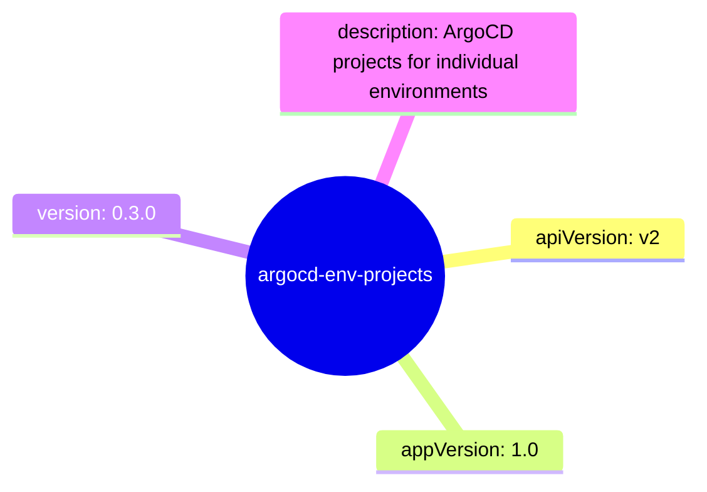

# Diagram: devops/k8s/argocd/projects/environments/helm/Chart.yaml

> Auto-generated by Obscura crawlers

## Mermaid

### SVG

<svg id="container" width="100%" xmlns="http://www.w3.org/2000/svg" class="mindmapDiagram" style="max-width: 527.03955078125px;" viewBox="5 5 527.03955078125 392.94476318359375" role="graphics-document document" aria-roledescription="mindmap"><g><marker id="container_mindmap-pointEnd" class="marker mindmap" viewBox="0 0 10 10" refX="5" refY="5" markerUnits="userSpaceOnUse" markerWidth="8" markerHeight="8" orient="auto"><path d="M 0 0 L 10 5 L 0 10 z" class="arrowMarkerPath" style="stroke-width: 1; stroke-dasharray: 1, 0;"></path></marker><marker id="container_mindmap-pointStart" class="marker mindmap" viewBox="0 0 10 10" refX="4.5" refY="5" markerUnits="userSpaceOnUse" markerWidth="8" markerHeight="8" orient="auto"><path d="M 0 5 L 10 10 L 10 0 z" class="arrowMarkerPath" style="stroke-width: 1; stroke-dasharray: 1, 0;"></path></marker><g class="subgraphs"></g><g class="edgePaths"><path d="M260.617,225.572L275.33,222.643C290.044,219.714,319.471,213.857,348.898,207.999C378.325,202.141,407.753,196.283,422.466,193.355L437.18,190.426" id="edge_0_1" class="edge-thickness-normal edge-pattern-solid edge section-edge-0 edge-depth-1" style="undefined;;;undefined" data-edge="true" data-et="edge" data-id="edge_0_1" data-points="W3sieCI6MjYwLjYxNjYxNzEwMTYxMjc1LCJ5IjoyMjUuNTcxOTg5NTA0MjY4MX0seyJ4IjozNDguODk4MTgzODA4MTQyMSwieSI6MjA3Ljk5ODg0MjEzODU2Njk0fSx7IngiOjQzNy4xNzk3NTA1MTQ2NzE0NywieSI6MTkwLjQyNTY5NDc3Mjg2NTh9XQ=="></path><path d="M255.221,240.257L263.074,250.168C270.928,260.079,286.635,279.901,302.341,299.723C318.048,319.544,333.755,339.366,341.609,349.277L349.462,359.188" id="edge_0_2" class="edge-thickness-normal edge-pattern-solid edge section-edge-1 edge-depth-1" style="undefined;;;undefined" data-edge="true" data-et="edge" data-id="edge_0_2" data-points="W3sieCI6MjU1LjIyMTA3MDg5NDI4NCwieSI6MjQwLjI1NjkxMDc2OTUwNTAzfSx7IngiOjMwMi4zNDE0OTMwMjY0MDE2LCJ5IjoyOTkuNzIyNTY3ODkwMTU2N30seyJ4IjozNDkuNDYxOTE1MTU4NTE5MiwieSI6MzU5LjE4ODIyNTAxMDgwODR9XQ=="></path><path d="M232.611,221.553L221.19,215.584C209.769,209.615,186.927,197.677,164.085,185.739C141.243,173.801,118.402,161.863,106.981,155.894L95.56,149.925" id="edge_0_3" class="edge-thickness-normal edge-pattern-solid edge section-edge-2 edge-depth-1" style="undefined;;;undefined" data-edge="true" data-et="edge" data-id="edge_0_3" data-points="W3sieCI6MjMyLjYxMTMzNzE2ODY0NjAzLCJ5IjoyMjEuNTUyNjAzNDE1ODMyMX0seyJ4IjoxNjQuMDg1NDM2NDE0ODczMDcsInkiOjE4NS43Mzg4ODg2MzUwODY0M30seyJ4Ijo5NS41NTk1MzU2NjExMDAxMSwieSI6MTQ5LjkyNTE3Mzg1NDM0MDc2fV0="></path><path d="M252.607,215.081L258.668,202.942C264.73,190.804,276.853,166.527,288.976,142.25C301.099,117.973,313.222,93.697,319.283,81.558L325.345,69.42" id="edge_0_4" class="edge-thickness-normal edge-pattern-solid edge section-edge-3 edge-depth-1" style="undefined;;;undefined" data-edge="true" data-et="edge" data-id="edge_0_4" data-points="W3sieCI6MjUyLjYwNjY0MDMyODYwMDU1LCJ5IjoyMTUuMDgwNTkzMDM3OTA0NzV9LHsieCI6Mjg4Ljk3NTYzMzg1MTY0MTIsInkiOjE0Mi4yNTAyMDIyMjk0NzI4fSx7IngiOjMyNS4zNDQ2MjczNzQ2ODE4NiwieSI6NjkuNDE5ODExNDIxMDQwODN9XQ=="></path></g><g class="edgeLabels"><g class="edgeLabel"><g class="label" data-id="edge_0_1" transform="translate(0, 0)"><foreignObject width="0" height="0">

</foreignObject></g></g><g class="edgeLabel"><g class="label" data-id="edge_0_2" transform="translate(0, 0)"><foreignObject width="0" height="0">

</foreignObject></g></g><g class="edgeLabel"><g class="label" data-id="edge_0_3" transform="translate(0, 0)"><foreignObject width="0" height="0">

</foreignObject></g></g><g class="edgeLabel"><g class="label" data-id="edge_0_4" transform="translate(0, 0)"><foreignObject width="0" height="0">

</foreignObject></g></g></g><g class="nodes"><g class="node mindmap-node section-root section--1" id="node_0" transform="translate(245.90524782974614, 228.50040445894558)"><circle class="basic label-container" style="" r="83.09375" cx="0" cy="0"></circle><g class="label" style="" transform="translate(-73.09375, -12)"><rect></rect><foreignObject width="146.1875" height="24">

argocd-env-projects

</foreignObject></g></g><g class="node mindmap-node section-0" id="node_1" transform="translate(451.89111978653807, 187.4972798181883)"><path id="node-1" class="node-bkg node-0" style="" d="M-70.1484375 12
    v-24
    q0,-5 5,-5
    h130.296875
    q5,0 5,5
    v24
    q0,5 -5,5
    h-130.296875
    q-5,0 -5,-5
    Z"></path><line class="node-line-" x1="-70.1484375" y1="17" x2="70.1484375" y2="17"></line><g class="label" style="" transform="translate(-50.1484375, -12)"><rect></rect><foreignObject width="100.296875" height="24">

apiVersion: v2

</foreignObject></g></g><g class="node mindmap-node section-1" id="node_2" transform="translate(358.7777382230571, 370.94473132136784)"><path id="node-2" class="node-bkg node-0" style="" d="M-74.578125 12
    v-24
    q0,-5 5,-5
    h139.15625
    q5,0 5,5
    v24
    q0,5 -5,5
    h-139.15625
    q-5,0 -5,-5
    Z"></path><line class="node-line-" x1="-74.578125" y1="17" x2="74.578125" y2="17"></line><g class="label" style="" transform="translate(-54.578125, -12)"><rect></rect><foreignObject width="109.15625" height="24">

appVersion: 1.0

</foreignObject></g></g><g class="node mindmap-node section-2" id="node_3" transform="translate(82.265625, 142.97737281122727)"><path id="node-3" class="node-bkg node-0" style="" d="M-67.265625 12
    v-24
    q0,-5 5,-5
    h124.53125
    q5,0 5,5
    v24
    q0,5 -5,5
    h-124.53125
    q-5,0 -5,-5
    Z"></path><line class="node-line-" x1="-67.265625" y1="17" x2="67.265625" y2="17"></line><g class="label" style="" transform="translate(-47.265625, -12)"><rect></rect><foreignObject width="94.53125" height="24">

version: 0.3.0

</foreignObject></g></g><g class="node mindmap-node section-3" id="node_4" transform="translate(332.04601987353624, 56)"><path id="node-4" class="node-bkg node-0" style="" d="M-120 36
    v-72
    q0,-5 5,-5
    h230
    q5,0 5,5
    v72
    q0,5 -5,5
    h-230
    q-5,0 -5,-5
    Z"></path><line class="node-line-" x1="-120" y1="41" x2="120" y2="41"></line><g class="label" style="" transform="translate(-100, -36)"><rect></rect><foreignObject width="200" height="72">

description: ArgoCD projects for individual environments

</foreignObject></g></g></g></g></svg>
