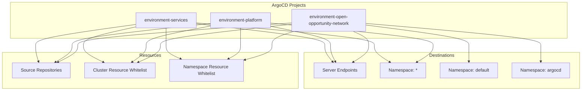
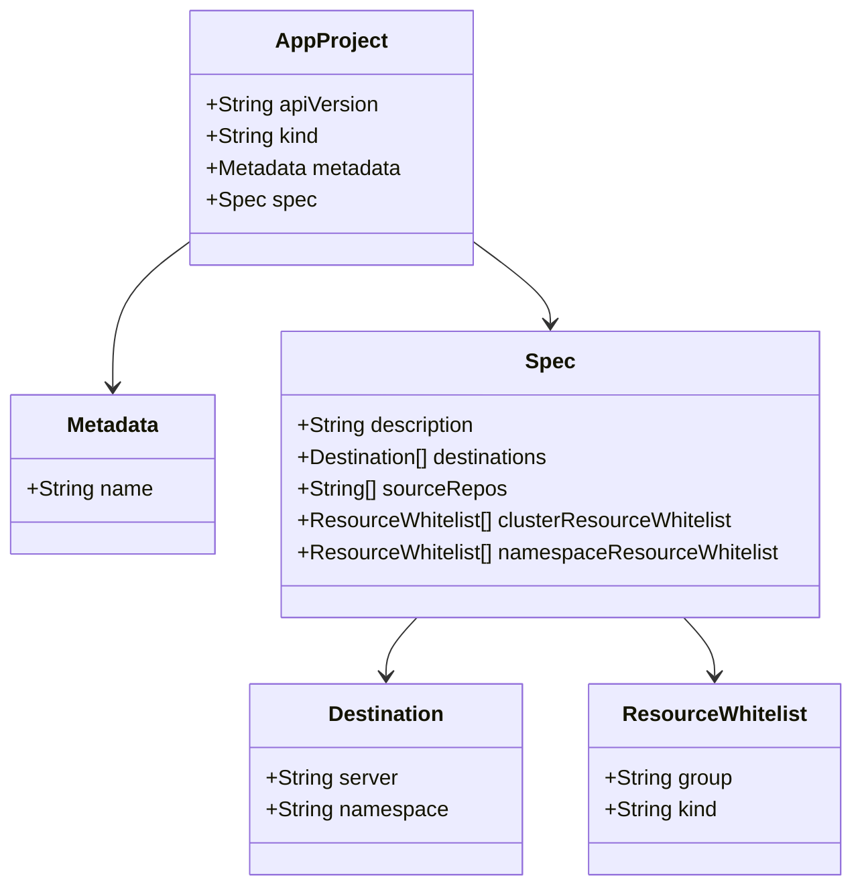
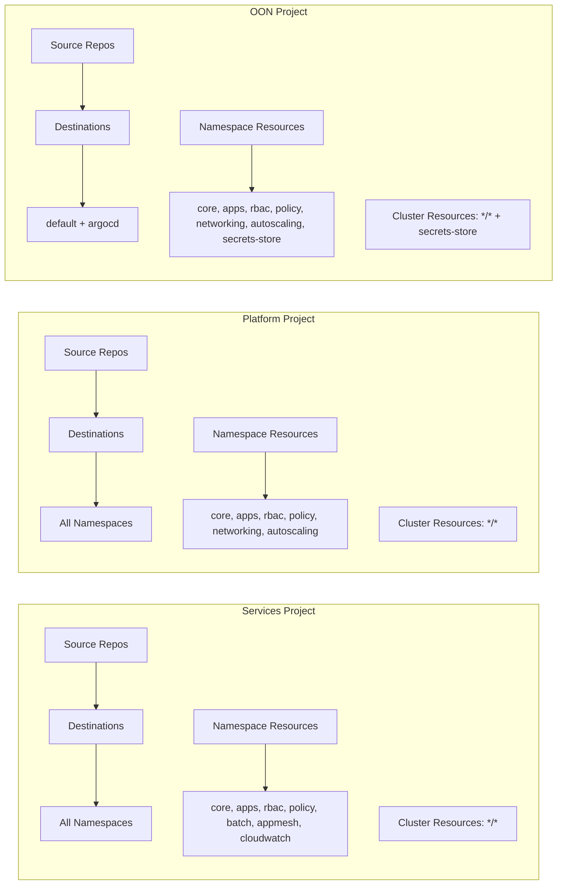

# Diagram: devops/k8s/argocd/projects/environments/helm/templates/projects.yaml

> Auto-generated by Obscura crawlers

## Diagram 1

### SVG

<svg id="container" width="2052.6328125" xmlns="http://www.w3.org/2000/svg" class="flowchart" height="322" viewBox="0 0 2052.6328125 322" role="graphics-document document" aria-roledescription="flowchart-v2"><g><marker id="container_flowchart-v2-pointEnd" class="marker flowchart-v2" viewBox="0 0 10 10" refX="5" refY="5" markerUnits="userSpaceOnUse" markerWidth="8" markerHeight="8" orient="auto"><path d="M 0 0 L 10 5 L 0 10 z" class="arrowMarkerPath" style="stroke-width: 1; stroke-dasharray: 1, 0;"></path></marker><marker id="container_flowchart-v2-pointStart" class="marker flowchart-v2" viewBox="0 0 10 10" refX="4.5" refY="5" markerUnits="userSpaceOnUse" markerWidth="8" markerHeight="8" orient="auto"><path d="M 0 5 L 10 10 L 10 0 z" class="arrowMarkerPath" style="stroke-width: 1; stroke-dasharray: 1, 0;"></path></marker><marker id="container_flowchart-v2-circleEnd" class="marker flowchart-v2" viewBox="0 0 10 10" refX="11" refY="5" markerUnits="userSpaceOnUse" markerWidth="11" markerHeight="11" orient="auto"><circle cx="5" cy="5" r="5" class="arrowMarkerPath" style="stroke-width: 1; stroke-dasharray: 1, 0;"></circle></marker><marker id="container_flowchart-v2-circleStart" class="marker flowchart-v2" viewBox="0 0 10 10" refX="-1" refY="5" markerUnits="userSpaceOnUse" markerWidth="11" markerHeight="11" orient="auto"><circle cx="5" cy="5" r="5" class="arrowMarkerPath" style="stroke-width: 1; stroke-dasharray: 1, 0;"></circle></marker><marker id="container_flowchart-v2-crossEnd" class="marker cross flowchart-v2" viewBox="0 0 11 11" refX="12" refY="5.2" markerUnits="userSpaceOnUse" markerWidth="11" markerHeight="11" orient="auto"><path d="M 1,1 l 9,9 M 10,1 l -9,9" class="arrowMarkerPath" style="stroke-width: 2; stroke-dasharray: 1, 0;"></path></marker><marker id="container_flowchart-v2-crossStart" class="marker cross flowchart-v2" viewBox="0 0 11 11" refX="-1" refY="5.2" markerUnits="userSpaceOnUse" markerWidth="11" markerHeight="11" orient="auto"><path d="M 1,1 l 9,9 M 10,1 l -9,9" class="arrowMarkerPath" style="stroke-width: 2; stroke-dasharray: 1, 0;"></path></marker><g class="root"><g class="clusters"><g class="cluster" id="Resources" data-look="classic"><rect style="" x="8" y="186" width="1049.8203125" height="128"></rect><g class="cluster-label" transform="translate(496.15234375, 186)"><foreignObject width="73.515625" height="24">

Resources

</foreignObject></g></g><g class="cluster" id="Destinations" data-look="classic"><rect style="" x="1077.8203125" y="186" width="966.8125" height="128"></rect><g class="cluster-label" transform="translate(1515.546875, 186)"><foreignObject width="91.359375" height="24">

Destinations

</foreignObject></g></g><g class="cluster" id="subGraph0" data-look="classic"><rect style="" x="36.53125" y="8" width="1965.265625" height="128"></rect><g class="cluster-label" transform="translate(962.09375, 8)"><foreignObject width="114.140625" height="24">

ArgoCD Projects

</foreignObject></g></g></g><g class="edgePaths"><path d="M692.125,84.208L768.653,92.84C845.181,101.472,998.237,118.736,1074.765,131.535C1151.293,144.333,1151.293,152.667,1151.293,161C1151.293,169.333,1151.293,177.667,1156.018,187.488C1160.743,197.31,1170.192,208.62,1174.917,214.275L1179.642,219.93" id="L_A_D_0" class="edge-thickness-normal edge-pattern-solid edge-thickness-normal edge-pattern-solid flowchart-link" style=";" data-edge="true" data-et="edge" data-id="L_A_D_0" data-points="W3sieCI6NjkyLjEyNSwieSI6ODQuMjA3NTU1MDkzNTI2NDd9LHsieCI6MTE1MS4yOTI5Njg3NSwieSI6MTM2fSx7IngiOjExNTEuMjkyOTY4NzUsInkiOjE2MX0seyJ4IjoxMTUxLjI5Mjk2ODc1LCJ5IjoxODZ9LHsieCI6MTE4Mi4yMDY4NDgxNDQ1MzEyLCJ5IjoyMjN9XQ==" marker-end="url(#container_flowchart-v2-pointEnd)"></path><path d="M692.125,81.341L797.675,90.451C903.225,99.561,1114.326,117.78,1219.876,131.057C1325.426,144.333,1325.426,152.667,1325.426,161C1325.426,169.333,1325.426,177.667,1334.562,187.642C1343.699,197.618,1361.972,209.236,1371.108,215.045L1380.244,220.854" id="L_A_E_0" class="edge-thickness-normal edge-pattern-solid edge-thickness-normal edge-pattern-solid flowchart-link" style=";" data-edge="true" data-et="edge" data-id="L_A_E_0" data-points="W3sieCI6NjkyLjEyNSwieSI6ODEuMzQwODU1ODEzODU1NDh9LHsieCI6MTMyNS40MjU3ODEyNSwieSI6MTM2fSx7IngiOjEzMjUuNDI1NzgxMjUsInkiOjE2MX0seyJ4IjoxMzI1LjQyNTc4MTI1LCJ5IjoxODZ9LHsieCI6MTM4My42MTk5MzQwODIwMzEyLCJ5IjoyMjN9XQ==" marker-end="url(#container_flowchart-v2-pointEnd)"></path><path d="M475.672,87.096L417.237,95.247C358.802,103.397,241.932,119.699,183.497,132.016C125.063,144.333,125.063,152.667,125.063,161C125.063,169.333,125.063,177.667,126.791,187.364C128.519,197.061,131.975,208.121,133.704,213.652L135.432,219.182" id="L_A_H_0" class="edge-thickness-normal edge-pattern-solid edge-thickness-normal edge-pattern-solid flowchart-link" style=";" data-edge="true" data-et="edge" data-id="L_A_H_0" data-points="W3sieCI6NDc1LjY3MTg3NSwieSI6ODcuMDk1ODA5NzA4NjcxNzR9LHsieCI6MTI1LjA2MjUsInkiOjEzNn0seyJ4IjoxMjUuMDYyNSwieSI6MTYxfSx7IngiOjEyNS4wNjI1LCJ5IjoxODZ9LHsieCI6MTM2LjYyNSwieSI6MjIzfV0=" marker-end="url(#container_flowchart-v2-pointEnd)"></path><path d="M475.672,95.84L445.285,102.533C414.898,109.226,354.125,122.613,323.738,133.473C293.352,144.333,293.352,152.667,293.352,161C293.352,169.333,293.352,177.667,305.116,187.702C316.881,197.738,340.41,209.476,352.175,215.345L363.939,221.214" id="L_A_I_0" class="edge-thickness-normal edge-pattern-solid edge-thickness-normal edge-pattern-solid flowchart-link" style=";" data-edge="true" data-et="edge" data-id="L_A_I_0" data-points="W3sieCI6NDc1LjY3MTg3NSwieSI6OTUuODM5NTI2NzU0NTAzOTF9LHsieCI6MjkzLjM1MTU2MjUsInkiOjEzNn0seyJ4IjoyOTMuMzUxNTYyNSwieSI6MTYxfSx7IngiOjI5My4zNTE1NjI1LCJ5IjoxODZ9LHsieCI6MzY3LjUxODY3Njc1NzgxMjUsInkiOjIyM31d" marker-end="url(#container_flowchart-v2-pointEnd)"></path><path d="M583.898,99L583.898,105.167C583.898,111.333,583.898,123.667,583.898,134C583.898,144.333,583.898,152.667,583.898,161C583.898,169.333,583.898,177.667,592.691,185.73C601.483,193.793,619.068,201.586,627.861,205.483L636.653,209.379" id="L_A_J_0" class="edge-thickness-normal edge-pattern-solid edge-thickness-normal edge-pattern-solid flowchart-link" style=";" data-edge="true" data-et="edge" data-id="L_A_J_0" data-points="W3sieCI6NTgzLjg5ODQzNzUsInkiOjk5fSx7IngiOjU4My44OTg0Mzc1LCJ5IjoxMzZ9LHsieCI6NTgzLjg5ODQzNzUsInkiOjE2MX0seyJ4Ijo1ODMuODk4NDM3NSwieSI6MTg2fSx7IngiOjY0MC4zMTAxODA2NjQwNjI1LCJ5IjoyMTF9XQ==" marker-end="url(#container_flowchart-v2-pointEnd)"></path><path d="M963.328,94.22L997.989,101.183C1032.65,108.147,1101.971,122.073,1136.632,133.203C1171.293,144.333,1171.293,152.667,1171.293,161C1171.293,169.333,1171.293,177.667,1174.209,187.409C1177.125,197.152,1182.958,208.304,1185.874,213.88L1188.791,219.456" id="L_B_D_0" class="edge-thickness-normal edge-pattern-solid edge-thickness-normal edge-pattern-solid flowchart-link" style=";" data-edge="true" data-et="edge" data-id="L_B_D_0" data-points="W3sieCI6OTYzLjMyODEyNSwieSI6OTQuMjE5ODU3MDI1NDkyNjN9LHsieCI6MTE3MS4yOTI5Njg3NSwieSI6MTM2fSx7IngiOjExNzEuMjkyOTY4NzUsInkiOjE2MX0seyJ4IjoxMTcxLjI5Mjk2ODc1LCJ5IjoxODZ9LHsieCI6MTE5MC42NDQzNDgxNDQ1MzEyLCJ5IjoyMjN9XQ==" marker-end="url(#container_flowchart-v2-pointEnd)"></path><path d="M963.328,82.426L1058.048,91.355C1152.768,100.284,1342.208,118.142,1436.928,131.238C1531.648,144.333,1531.648,152.667,1531.648,161C1531.648,169.333,1531.648,177.667,1522.047,187.654C1512.446,197.642,1493.243,209.284,1483.642,215.105L1474.041,220.926" id="L_B_E_0" class="edge-thickness-normal edge-pattern-solid edge-thickness-normal edge-pattern-solid flowchart-link" style=";" data-edge="true" data-et="edge" data-id="L_B_E_0" data-points="W3sieCI6OTYzLjMyODEyNSwieSI6ODIuNDI2MDg5MTU3OTAyfSx7IngiOjE1MzEuNjQ4NDM3NSwieSI6MTM2fSx7IngiOjE1MzEuNjQ4NDM3NSwieSI6MTYxfSx7IngiOjE1MzEuNjQ4NDM3NSwieSI6MTg2fSx7IngiOjE0NzAuNjIwMTE3MTg3NSwieSI6MjIzfV0=" marker-end="url(#container_flowchart-v2-pointEnd)"></path><path d="M742.125,83.81L660.663,92.508C579.201,101.207,416.276,118.603,334.814,131.468C253.352,144.333,253.352,152.667,253.352,161C253.352,169.333,253.352,177.667,243.491,187.661C233.631,197.655,213.911,209.31,204.051,215.137L194.191,220.965" id="L_B_H_0" class="edge-thickness-normal edge-pattern-solid edge-thickness-normal edge-pattern-solid flowchart-link" style=";" data-edge="true" data-et="edge" data-id="L_B_H_0" data-points="W3sieCI6NzQyLjEyNSwieSI6ODMuODA5ODAxODc2OTU1MTZ9LHsieCI6MjUzLjM1MTU2MjUsInkiOjEzNn0seyJ4IjoyNTMuMzUxNTYyNSwieSI6MTYxfSx7IngiOjI1My4zNTE1NjI1LCJ5IjoxODZ9LHsieCI6MTkwLjc0Njk0ODI0MjE4NzUsInkiOjIyM31d" marker-end="url(#container_flowchart-v2-pointEnd)"></path><path d="M742.125,92.793L703.821,99.994C665.517,107.195,588.909,121.598,550.605,132.966C512.301,144.333,512.301,152.667,512.301,161C512.301,169.333,512.301,177.667,504.11,187.616C495.919,197.564,479.537,209.129,471.347,214.911L463.156,220.693" id="L_B_I_0" class="edge-thickness-normal edge-pattern-solid edge-thickness-normal edge-pattern-solid flowchart-link" style=";" data-edge="true" data-et="edge" data-id="L_B_I_0" data-points="W3sieCI6NzQyLjEyNSwieSI6OTIuNzkzMDc4NTIwNjk0NDV9LHsieCI6NTEyLjMwMDc4MTI1LCJ5IjoxMzZ9LHsieCI6NTEyLjMwMDc4MTI1LCJ5IjoxNjF9LHsieCI6NTEyLjMwMDc4MTI1LCJ5IjoxODZ9LHsieCI6NDU5Ljg4Nzg3ODQxNzk2ODc1LCJ5IjoyMjN9XQ==" marker-end="url(#container_flowchart-v2-pointEnd)"></path><path d="M852.727,99L852.727,105.167C852.727,111.333,852.727,123.667,852.727,134C852.727,144.333,852.727,152.667,852.727,161C852.727,169.333,852.727,177.667,845.22,185.695C837.712,193.723,822.698,201.447,815.191,205.309L807.684,209.17" id="L_B_J_0" class="edge-thickness-normal edge-pattern-solid edge-thickness-normal edge-pattern-solid flowchart-link" style=";" data-edge="true" data-et="edge" data-id="L_B_J_0" data-points="W3sieCI6ODUyLjcyNjU2MjUsInkiOjk5fSx7IngiOjg1Mi43MjY1NjI1LCJ5IjoxMzZ9LHsieCI6ODUyLjcyNjU2MjUsInkiOjE2MX0seyJ4Ijo4NTIuNzI2NTYyNSwieSI6MTg2fSx7IngiOjgwNC4xMjczMTkzMzU5Mzc1LCJ5IjoyMTF9XQ==" marker-end="url(#container_flowchart-v2-pointEnd)"></path><path d="M1250.181,111L1259.389,115.167C1268.596,119.333,1287.011,127.667,1296.218,136C1305.426,144.333,1305.426,152.667,1305.426,161C1305.426,169.333,1305.426,177.667,1296.289,187.642C1287.153,197.618,1268.88,209.236,1259.744,215.045L1250.607,220.854" id="L_C_D_0" class="edge-thickness-normal edge-pattern-solid edge-thickness-normal edge-pattern-solid flowchart-link" style=";" data-edge="true" data-et="edge" data-id="L_C_D_0" data-points="W3sieCI6MTI1MC4xODEzMzU0NDkyMTg4LCJ5IjoxMTF9LHsieCI6MTMwNS40MjU3ODEyNSwieSI6MTM2fSx7IngiOjEzMDUuNDI1NzgxMjUsInkiOjE2MX0seyJ4IjoxMzA1LjQyNTc4MTI1LCJ5IjoxODZ9LHsieCI6MTI0Ny4yMzE2Mjg0MTc5Njg4LCJ5IjoyMjN9XQ==" marker-end="url(#container_flowchart-v2-pointEnd)"></path><path d="M1294,88.869L1354.535,96.724C1415.07,104.579,1536.141,120.29,1596.676,132.312C1657.211,144.333,1657.211,152.667,1657.211,161C1657.211,169.333,1657.211,177.667,1657.211,187.333C1657.211,197,1657.211,208,1657.211,213.5L1657.211,219" id="L_C_F_0" class="edge-thickness-normal edge-pattern-solid edge-thickness-normal edge-pattern-solid flowchart-link" style=";" data-edge="true" data-et="edge" data-id="L_C_F_0" data-points="W3sieCI6MTI5NCwieSI6ODguODY5MDUwMDcwNDg4MzZ9LHsieCI6MTY1Ny4yMTA5Mzc1LCJ5IjoxMzZ9LHsieCI6MTY1Ny4yMTA5Mzc1LCJ5IjoxNjF9LHsieCI6MTY1Ny4yMTA5Mzc1LCJ5IjoxODZ9LHsieCI6MTY1Ny4yMTA5Mzc1LCJ5IjoyMjN9XQ==" marker-end="url(#container_flowchart-v2-pointEnd)"></path><path d="M1294,83.163L1396.549,91.969C1499.099,100.776,1704.198,118.388,1806.747,131.361C1909.297,144.333,1909.297,152.667,1909.297,161C1909.297,169.333,1909.297,177.667,1909.297,187.333C1909.297,197,1909.297,208,1909.297,213.5L1909.297,219" id="L_C_G_0" class="edge-thickness-normal edge-pattern-solid edge-thickness-normal edge-pattern-solid flowchart-link" style=";" data-edge="true" data-et="edge" data-id="L_C_G_0" data-points="W3sieCI6MTI5NCwieSI6ODMuMTYzMzM2NzU3NTg0MDJ9LHsieCI6MTkwOS4yOTY4NzUsInkiOjEzNn0seyJ4IjoxOTA5LjI5Njg3NSwieSI6MTYxfSx7IngiOjE5MDkuMjk2ODc1LCJ5IjoxODZ9LHsieCI6MTkwOS4yOTY4NzUsInkiOjIyM31d" marker-end="url(#container_flowchart-v2-pointEnd)"></path><path d="M1034,81.342L907.225,90.451C780.451,99.561,526.901,117.781,400.126,131.057C273.352,144.333,273.352,152.667,273.352,161C273.352,169.333,273.352,177.667,261.587,187.702C249.822,197.738,226.293,209.476,214.528,215.345L202.764,221.214" id="L_C_H_0" class="edge-thickness-normal edge-pattern-solid edge-thickness-normal edge-pattern-solid flowchart-link" style=";" data-edge="true" data-et="edge" data-id="L_C_H_0" data-points="W3sieCI6MTAzNCwieSI6ODEuMzQxNTA4NTU2NzkyMzZ9LHsieCI6MjczLjM1MTU2MjUsInkiOjEzNn0seyJ4IjoyNzMuMzUxNTYyNSwieSI6MTYxfSx7IngiOjI3My4zNTE1NjI1LCJ5IjoxODZ9LHsieCI6MTk5LjE4NDQ0ODI0MjE4NzUsInkiOjIyM31d" marker-end="url(#container_flowchart-v2-pointEnd)"></path><path d="M1034,85.864L955.65,94.22C877.299,102.576,720.599,119.288,642.249,131.811C563.898,144.333,563.898,152.667,563.898,161C563.898,169.333,563.898,177.667,550.799,187.726C537.7,197.786,511.502,209.573,498.403,215.466L485.303,221.359" id="L_C_I_0" class="edge-thickness-normal edge-pattern-solid edge-thickness-normal edge-pattern-solid flowchart-link" style=";" data-edge="true" data-et="edge" data-id="L_C_I_0" data-points="W3sieCI6MTAzNCwieSI6ODUuODY0MzE5ODQxNjkzNDZ9LHsieCI6NTYzLjg5ODQzNzUsInkiOjEzNn0seyJ4Ijo1NjMuODk4NDM3NSwieSI6MTYxfSx7IngiOjU2My44OTg0Mzc1LCJ5IjoxODZ9LHsieCI6NDgxLjY1NTYzOTY0ODQzNzUsInkiOjIyM31d" marker-end="url(#container_flowchart-v2-pointEnd)"></path><path d="M1042.93,111L1029.995,115.167C1017.06,119.333,991.19,127.667,978.255,136C965.32,144.333,965.32,152.667,965.32,161C965.32,169.333,965.32,177.667,948.129,186.475C930.938,195.284,896.556,204.569,879.365,209.211L862.174,213.853" id="L_C_J_0" class="edge-thickness-normal edge-pattern-solid edge-thickness-normal edge-pattern-solid flowchart-link" style=";" data-edge="true" data-et="edge" data-id="L_C_J_0" data-points="W3sieCI6MTA0Mi45Mjk1NjU0Mjk2ODc1LCJ5IjoxMTF9LHsieCI6OTY1LjMyMDMxMjUsInkiOjEzNn0seyJ4Ijo5NjUuMzIwMzEyNSwieSI6MTYxfSx7IngiOjk2NS4zMjAzMTI1LCJ5IjoxODZ9LHsieCI6ODU4LjMxMjUsInkiOjIxNC44OTU2NzE5NTE3NDIxfV0=" marker-end="url(#container_flowchart-v2-pointEnd)"></path></g><g class="edgeLabels"><g class="edgeLabel"><g class="label" data-id="L_A_D_0" transform="translate(0, 0)"><foreignObject width="0" height="0">

</foreignObject></g></g><g class="edgeLabel"><g class="label" data-id="L_A_E_0" transform="translate(0, 0)"><foreignObject width="0" height="0">

</foreignObject></g></g><g class="edgeLabel"><g class="label" data-id="L_A_H_0" transform="translate(0, 0)"><foreignObject width="0" height="0">

</foreignObject></g></g><g class="edgeLabel"><g class="label" data-id="L_A_I_0" transform="translate(0, 0)"><foreignObject width="0" height="0">

</foreignObject></g></g><g class="edgeLabel"><g class="label" data-id="L_A_J_0" transform="translate(0, 0)"><foreignObject width="0" height="0">

</foreignObject></g></g><g class="edgeLabel"><g class="label" data-id="L_B_D_0" transform="translate(0, 0)"><foreignObject width="0" height="0">

</foreignObject></g></g><g class="edgeLabel"><g class="label" data-id="L_B_E_0" transform="translate(0, 0)"><foreignObject width="0" height="0">

</foreignObject></g></g><g class="edgeLabel"><g class="label" data-id="L_B_H_0" transform="translate(0, 0)"><foreignObject width="0" height="0">

</foreignObject></g></g><g class="edgeLabel"><g class="label" data-id="L_B_I_0" transform="translate(0, 0)"><foreignObject width="0" height="0">

</foreignObject></g></g><g class="edgeLabel"><g class="label" data-id="L_B_J_0" transform="translate(0, 0)"><foreignObject width="0" height="0">

</foreignObject></g></g><g class="edgeLabel"><g class="label" data-id="L_C_D_0" transform="translate(0, 0)"><foreignObject width="0" height="0">

</foreignObject></g></g><g class="edgeLabel"><g class="label" data-id="L_C_F_0" transform="translate(0, 0)"><foreignObject width="0" height="0">

</foreignObject></g></g><g class="edgeLabel"><g class="label" data-id="L_C_G_0" transform="translate(0, 0)"><foreignObject width="0" height="0">

</foreignObject></g></g><g class="edgeLabel"><g class="label" data-id="L_C_H_0" transform="translate(0, 0)"><foreignObject width="0" height="0">

</foreignObject></g></g><g class="edgeLabel"><g class="label" data-id="L_C_I_0" transform="translate(0, 0)"><foreignObject width="0" height="0">

</foreignObject></g></g><g class="edgeLabel"><g class="label" data-id="L_C_J_0" transform="translate(0, 0)"><foreignObject width="0" height="0">

</foreignObject></g></g></g><g class="nodes"><g class="node default" id="flowchart-A-0" transform="translate(583.8984375, 72)"><rect class="basic label-container" style="" x="-108.2265625" y="-27" width="216.453125" height="54"></rect><g class="label" style="" transform="translate(-78.2265625, -12)"><rect></rect><foreignObject width="156.453125" height="24">

environment-services

</foreignObject></g></g><g class="node default" id="flowchart-B-1" transform="translate(852.7265625, 72)"><rect class="basic label-container" style="" x="-110.6015625" y="-27" width="221.203125" height="54"></rect><g class="label" style="" transform="translate(-80.6015625, -12)"><rect></rect><foreignObject width="161.203125" height="24">

environment-platform

</foreignObject></g></g><g class="node default" id="flowchart-C-2" transform="translate(1164, 72)"><rect class="basic label-container" style="" x="-130" y="-39" width="260" height="78"></rect><g class="label" style="" transform="translate(-100, -24)"><rect></rect><foreignObject width="200" height="48">

environment-open-opportunity-network

</foreignObject></g></g><g class="node default" id="flowchart-D-3" transform="translate(1204.765625, 250)"><rect class="basic label-container" style="" x="-91.9453125" y="-27" width="183.890625" height="54"></rect><g class="label" style="" transform="translate(-61.9453125, -12)"><rect></rect><foreignObject width="123.890625" height="24">

Server Endpoints

</foreignObject></g></g><g class="node default" id="flowchart-E-4" transform="translate(1426.0859375, 250)"><rect class="basic label-container" style="" x="-79.375" y="-27" width="158.75" height="54"></rect><g class="label" style="" transform="translate(-49.375, -12)"><rect></rect><foreignObject width="98.75" height="24">

Namespace: *

</foreignObject></g></g><g class="node default" id="flowchart-F-5" transform="translate(1657.2109375, 250)"><rect class="basic label-container" style="" x="-101.75" y="-27" width="203.5" height="54"></rect><g class="label" style="" transform="translate(-71.75, -12)"><rect></rect><foreignObject width="143.5" height="24">

Namespace: default

</foreignObject></g></g><g class="node default" id="flowchart-G-6" transform="translate(1909.296875, 250)"><rect class="basic label-container" style="" x="-100.3359375" y="-27" width="200.671875" height="54"></rect><g class="label" style="" transform="translate(-70.3359375, -12)"><rect></rect><foreignObject width="140.671875" height="24">

Namespace: argocd

</foreignObject></g></g><g class="node default" id="flowchart-H-7" transform="translate(145.0625, 250)"><rect class="basic label-container" style="" x="-102.0625" y="-27" width="204.125" height="54"></rect><g class="label" style="" transform="translate(-72.0625, -12)"><rect></rect><foreignObject width="144.125" height="24">

Source Repositories

</foreignObject></g></g><g class="node default" id="flowchart-I-8" transform="translate(421.640625, 250)"><rect class="basic label-container" style="" x="-124.515625" y="-27" width="249.03125" height="54"></rect><g class="label" style="" transform="translate(-94.515625, -12)"><rect></rect><foreignObject width="189.03125" height="24">

Cluster Resource Whitelist

</foreignObject></g></g><g class="node default" id="flowchart-J-9" transform="translate(728.3125, 250)"><rect class="basic label-container" style="" x="-130" y="-39" width="260" height="78"></rect><g class="label" style="" transform="translate(-100, -24)"><rect></rect><foreignObject width="200" height="48">

Namespace Resource Whitelist

</foreignObject></g></g></g></g></g></svg>

## Diagram 2

### SVG

<svg id="container" width="638.302734375" xmlns="http://www.w3.org/2000/svg" class="classDiagram" height="668" viewBox="0 0 638.302734375 668" role="graphics-document document" aria-roledescription="class"><g><defs><marker id="container_class-aggregationStart" class="marker aggregation class" refX="18" refY="7" markerWidth="190" markerHeight="240" orient="auto"><path d="M 18,7 L9,13 L1,7 L9,1 Z"></path></marker></defs><defs><marker id="container_class-aggregationEnd" class="marker aggregation class" refX="1" refY="7" markerWidth="20" markerHeight="28" orient="auto"><path d="M 18,7 L9,13 L1,7 L9,1 Z"></path></marker></defs><defs><marker id="container_class-extensionStart" class="marker extension class" refX="18" refY="7" markerWidth="190" markerHeight="240" orient="auto"><path d="M 1,7 L18,13 V 1 Z"></path></marker></defs><defs><marker id="container_class-extensionEnd" class="marker extension class" refX="1" refY="7" markerWidth="20" markerHeight="28" orient="auto"><path d="M 1,1 V 13 L18,7 Z"></path></marker></defs><defs><marker id="container_class-compositionStart" class="marker composition class" refX="18" refY="7" markerWidth="190" markerHeight="240" orient="auto"><path d="M 18,7 L9,13 L1,7 L9,1 Z"></path></marker></defs><defs><marker id="container_class-compositionEnd" class="marker composition class" refX="1" refY="7" markerWidth="20" markerHeight="28" orient="auto"><path d="M 18,7 L9,13 L1,7 L9,1 Z"></path></marker></defs><defs><marker id="container_class-dependencyStart" class="marker dependency class" refX="6" refY="7" markerWidth="190" markerHeight="240" orient="auto"><path d="M 5,7 L9,13 L1,7 L9,1 Z"></path></marker></defs><defs><marker id="container_class-dependencyEnd" class="marker dependency class" refX="13" refY="7" markerWidth="20" markerHeight="28" orient="auto"><path d="M 18,7 L9,13 L14,7 L9,1 Z"></path></marker></defs><defs><marker id="container_class-lollipopStart" class="marker lollipop class" refX="13" refY="7" markerWidth="190" markerHeight="240" orient="auto"><circle stroke="black" fill="transparent" cx="7" cy="7" r="6"></circle></marker></defs><defs><marker id="container_class-lollipopEnd" class="marker lollipop class" refX="1" refY="7" markerWidth="190" markerHeight="240" orient="auto"><circle stroke="black" fill="transparent" cx="7" cy="7" r="6"></circle></marker></defs><g class="root"><g class="clusters"></g><g class="edgePaths"><path d="M142.701,182.518L133.053,189.598C123.405,196.678,104.109,210.839,94.461,229.086C84.813,247.333,84.813,269.667,84.813,280.833L84.813,292" id="id_AppProject_Metadata_1" class="edge-thickness-normal edge-pattern-solid relation" style=";;;" data-edge="true" data-et="edge" data-id="id_AppProject_Metadata_1" data-points="W3sieCI6MTQyLjcwMTE3MTg3NSwieSI6MTgyLjUxNzYzMjI4NjU3MDU3fSx7IngiOjg0LjgxMjUsInkiOjIyNX0seyJ4Ijo4NC44MTI1LCJ5IjoyOTh9XQ==" marker-end="url(#container_class-dependencyEnd)"></path><path d="M356.686,182.518L366.334,189.598C375.982,196.678,395.278,210.839,404.926,221.086C414.574,231.333,414.574,237.667,414.574,240.833L414.574,244" id="id_AppProject_Spec_2" class="edge-thickness-normal edge-pattern-solid relation" style=";;;" data-edge="true" data-et="edge" data-id="id_AppProject_Spec_2" data-points="W3sieCI6MzU2LjY4NTU0Njg3NSwieSI6MTgyLjUxNzYzMjI4NjU3MDU3fSx7IngiOjQxNC41NzQyMTg3NSwieSI6MjI1fSx7IngiOjQxNC41NzQyMTg3NSwieSI6MjUwfV0=" marker-end="url(#container_class-dependencyEnd)"></path><path d="M315.172,466L311.337,470.167C307.502,474.333,299.832,482.667,295.997,490C292.162,497.333,292.162,503.667,292.162,506.833L292.162,510" id="id_Spec_Destination_3" class="edge-thickness-normal edge-pattern-solid relation" style=";;;" data-edge="true" data-et="edge" data-id="id_Spec_Destination_3" data-points="W3sieCI6MzE1LjE3MTkwNDM3MDMwMDc1LCJ5Ijo0NjZ9LHsieCI6MjkyLjE2MjEwOTM3NSwieSI6NDkxfSx7IngiOjI5Mi4xNjIxMDkzNzUsInkiOjUxNn1d" marker-end="url(#container_class-dependencyEnd)"></path><path d="M513.977,466L517.811,470.167C521.646,474.333,529.316,482.667,533.151,490C536.986,497.333,536.986,503.667,536.986,506.833L536.986,510" id="id_Spec_ResourceWhitelist_4" class="edge-thickness-normal edge-pattern-solid relation" style=";;;" data-edge="true" data-et="edge" data-id="id_Spec_ResourceWhitelist_4" data-points="W3sieCI6NTEzLjk3NjUzMzEyOTY5OTIsInkiOjQ2Nn0seyJ4Ijo1MzYuOTg2MzI4MTI1LCJ5Ijo0OTF9LHsieCI6NTM2Ljk4NjMyODEyNSwieSI6NTE2fV0=" marker-end="url(#container_class-dependencyEnd)"></path></g><g class="edgeLabels"><g class="edgeLabel"><g class="label" data-id="id_AppProject_Metadata_1" transform="translate(0, 0)"><foreignObject width="0" height="0">

</foreignObject></g></g><g class="edgeLabel"><g class="label" data-id="id_AppProject_Spec_2" transform="translate(0, 0)"><foreignObject width="0" height="0">

</foreignObject></g></g><g class="edgeLabel"><g class="label" data-id="id_Spec_Destination_3" transform="translate(0, 0)"><foreignObject width="0" height="0">

</foreignObject></g></g><g class="edgeLabel"><g class="label" data-id="id_Spec_ResourceWhitelist_4" transform="translate(0, 0)"><foreignObject width="0" height="0">

</foreignObject></g></g></g><g class="nodes"><g class="node default" id="classId-AppProject-0" transform="translate(249.693359375, 104)"><g class="basic label-container"><path d="M-106.9921875 -96 L106.9921875 -96 L106.9921875 96 L-106.9921875 96" stroke="none" stroke-width="0" fill="#ECECFF" style=""></path><path d="M-106.9921875 -96 C-57.22777712584123 -96, -7.463366751682457 -96, 106.9921875 -96 M-106.9921875 -96 C-60.50467638452157 -96, -14.017165269043133 -96, 106.9921875 -96 M106.9921875 -96 C106.9921875 -33.68896088283677, 106.9921875 28.622078234326466, 106.9921875 96 M106.9921875 -96 C106.9921875 -28.742382919944262, 106.9921875 38.515234160111476, 106.9921875 96 M106.9921875 96 C60.346369144653586 96, 13.700550789307172 96, -106.9921875 96 M106.9921875 96 C51.60075279526842 96, -3.79068190946316 96, -106.9921875 96 M-106.9921875 96 C-106.9921875 36.748085316705215, -106.9921875 -22.50382936658957, -106.9921875 -96 M-106.9921875 96 C-106.9921875 54.67756761663367, -106.9921875 13.355135233267333, -106.9921875 -96" stroke="#9370DB" stroke-width="1.3" fill="none" stroke-dasharray="0 0" style=""></path></g><g class="annotation-group text" transform="translate(0, -72)"></g><g class="label-group text" transform="translate(-40.140625, -72)"><g class="label" style="font-weight: bolder" transform="translate(0,-12)"><foreignObject width="80.28125" height="24">

AppProject

</foreignObject></g></g><g class="members-group text" transform="translate(-94.9921875, -24)"><g class="label" style="" transform="translate(0,-12)"><foreignObject width="131.046875" height="24">

+String apiVersion

</foreignObject></g><g class="label" style="" transform="translate(0,12)"><foreignObject width="86.125" height="24">

+String kind

</foreignObject></g><g class="label" style="" transform="translate(0,36)"><foreignObject width="149.84375" height="24">

+Metadata metadata

</foreignObject></g><g class="label" style="" transform="translate(0,60)"><foreignObject width="79.53125" height="24">

+Spec spec

</foreignObject></g></g><g class="methods-group text" transform="translate(-94.9921875, 96)"></g><g class="divider" style=""><path d="M-106.9921875 -48 C-22.229323196174846 -48, 62.53354110765031 -48, 106.9921875 -48 M-106.9921875 -48 C-32.952116492060355 -48, 41.08795451587929 -48, 106.9921875 -48" stroke="#9370DB" stroke-width="1.3" fill="none" stroke-dasharray="0 0" style=""></path></g><g class="divider" style=""><path d="M-106.9921875 72 C-59.07615245390658 72, -11.16011740781316 72, 106.9921875 72 M-106.9921875 72 C-49.358816114894445 72, 8.27455527021111 72, 106.9921875 72" stroke="#9370DB" stroke-width="1.3" fill="none" stroke-dasharray="0 0" style=""></path></g></g><g class="node default" id="classId-Metadata-1" transform="translate(84.8125, 358)"><g class="basic label-container"><path d="M-76.8125 -60 L76.8125 -60 L76.8125 60 L-76.8125 60" stroke="none" stroke-width="0" fill="#ECECFF" style=""></path><path d="M-76.8125 -60 C-29.34366396013018 -60, 18.12517207973964 -60, 76.8125 -60 M-76.8125 -60 C-40.27119986247982 -60, -3.729899724959637 -60, 76.8125 -60 M76.8125 -60 C76.8125 -16.195486094673548, 76.8125 27.609027810652904, 76.8125 60 M76.8125 -60 C76.8125 -17.920030700424455, 76.8125 24.15993859915109, 76.8125 60 M76.8125 60 C16.74016221005801 60, -43.33217557988398 60, -76.8125 60 M76.8125 60 C23.689305785340053 60, -29.433888429319893 60, -76.8125 60 M-76.8125 60 C-76.8125 22.583838247171876, -76.8125 -14.832323505656248, -76.8125 -60 M-76.8125 60 C-76.8125 23.975697839867635, -76.8125 -12.04860432026473, -76.8125 -60" stroke="#9370DB" stroke-width="1.3" fill="none" stroke-dasharray="0 0" style=""></path></g><g class="annotation-group text" transform="translate(0, -36)"></g><g class="label-group text" transform="translate(-34.640625, -36)"><g class="label" style="font-weight: bolder" transform="translate(0,-12)"><foreignObject width="69.28125" height="24">

Metadata

</foreignObject></g></g><g class="members-group text" transform="translate(-64.8125, 12)"><g class="label" style="" transform="translate(0,-12)"><foreignObject width="94.984375" height="24">

+String name

</foreignObject></g></g><g class="methods-group text" transform="translate(-64.8125, 60)"></g><g class="divider" style=""><path d="M-76.8125 -12 C-20.567925514496984 -12, 35.67664897100603 -12, 76.8125 -12 M-76.8125 -12 C-45.30821928183867 -12, -13.803938563677335 -12, 76.8125 -12" stroke="#9370DB" stroke-width="1.3" fill="none" stroke-dasharray="0 0" style=""></path></g><g class="divider" style=""><path d="M-76.8125 36 C-15.471975430098858 36, 45.86854913980228 36, 76.8125 36 M-76.8125 36 C-28.55273836651464 36, 19.707023266970722 36, 76.8125 36" stroke="#9370DB" stroke-width="1.3" fill="none" stroke-dasharray="0 0" style=""></path></g></g><g class="node default" id="classId-Spec-2" transform="translate(414.57421875, 358)"><g class="basic label-container"><path d="M-202.94921875 -108 L202.94921875 -108 L202.94921875 108 L-202.94921875 108" stroke="none" stroke-width="0" fill="#ECECFF" style=""></path><path d="M-202.94921875 -108 C-109.03113798263955 -108, -15.113057215279099 -108, 202.94921875 -108 M-202.94921875 -108 C-98.12232210142754 -108, 6.704574547144915 -108, 202.94921875 -108 M202.94921875 -108 C202.94921875 -55.990412399335646, 202.94921875 -3.980824798671293, 202.94921875 108 M202.94921875 -108 C202.94921875 -43.10269804759531, 202.94921875 21.794603904809378, 202.94921875 108 M202.94921875 108 C116.83194669410898 108, 30.714674638217957 108, -202.94921875 108 M202.94921875 108 C111.45116388195933 108, 19.953109013918663 108, -202.94921875 108 M-202.94921875 108 C-202.94921875 36.03715870697597, -202.94921875 -35.925682586048055, -202.94921875 -108 M-202.94921875 108 C-202.94921875 53.149872407724786, -202.94921875 -1.7002551845504286, -202.94921875 -108" stroke="#9370DB" stroke-width="1.3" fill="none" stroke-dasharray="0 0" style=""></path></g><g class="annotation-group text" transform="translate(0, -84)"></g><g class="label-group text" transform="translate(-17.6015625, -84)"><g class="label" style="font-weight: bolder" transform="translate(0,-12)"><foreignObject width="35.203125" height="24">

Spec

</foreignObject></g></g><g class="members-group text" transform="translate(-190.94921875, -36)"><g class="label" style="" transform="translate(0,-12)"><foreignObject width="137.078125" height="24">

+String description

</foreignObject></g><g class="label" style="" transform="translate(0,12)"><foreignObject width="197.015625" height="24">

+Destination[] destinations

</foreignObject></g><g class="label" style="" transform="translate(0,36)"><foreignObject width="157.125" height="24">

+String[] sourceRepos

</foreignObject></g><g class="label" style="" transform="translate(0,60)"><foreignObject width="331.765625" height="24">

+ResourceWhitelist[] clusterResourceWhitelist

</foreignObject></g><g class="label" style="" transform="translate(0,84)"><foreignObject width="364.296875" height="24">

+ResourceWhitelist[] namespaceResourceWhitelist

</foreignObject></g></g><g class="methods-group text" transform="translate(-190.94921875, 108)"></g><g class="divider" style=""><path d="M-202.94921875 -60 C-102.99450115353815 -60, -3.039783557076305 -60, 202.94921875 -60 M-202.94921875 -60 C-58.63386452132508 -60, 85.68148970734984 -60, 202.94921875 -60" stroke="#9370DB" stroke-width="1.3" fill="none" stroke-dasharray="0 0" style=""></path></g><g class="divider" style=""><path d="M-202.94921875 84 C-79.67279842187787 84, 43.60362190624426 84, 202.94921875 84 M-202.94921875 84 C-45.57240586367027 84, 111.80440702265946 84, 202.94921875 84" stroke="#9370DB" stroke-width="1.3" fill="none" stroke-dasharray="0 0" style=""></path></g></g><g class="node default" id="classId-Destination-3" transform="translate(292.162109375, 588)"><g class="basic label-container"><path d="M-101.5078125 -72 L101.5078125 -72 L101.5078125 72 L-101.5078125 72" stroke="none" stroke-width="0" fill="#ECECFF" style=""></path><path d="M-101.5078125 -72 C-22.35563571081191 -72, 56.79654107837618 -72, 101.5078125 -72 M-101.5078125 -72 C-52.95361445730892 -72, -4.399416414617846 -72, 101.5078125 -72 M101.5078125 -72 C101.5078125 -23.450846833621647, 101.5078125 25.098306332756707, 101.5078125 72 M101.5078125 -72 C101.5078125 -31.61746821964816, 101.5078125 8.76506356070368, 101.5078125 72 M101.5078125 72 C27.024750849912692 72, -47.458310800174615 72, -101.5078125 72 M101.5078125 72 C58.25692615808408 72, 15.006039816168155 72, -101.5078125 72 M-101.5078125 72 C-101.5078125 30.60625869761722, -101.5078125 -10.787482604765557, -101.5078125 -72 M-101.5078125 72 C-101.5078125 31.35489338667098, -101.5078125 -9.29021322665804, -101.5078125 -72" stroke="#9370DB" stroke-width="1.3" fill="none" stroke-dasharray="0 0" style=""></path></g><g class="annotation-group text" transform="translate(0, -48)"></g><g class="label-group text" transform="translate(-42.46875, -48)"><g class="label" style="font-weight: bolder" transform="translate(0,-12)"><foreignObject width="84.9375" height="24">

Destination

</foreignObject></g></g><g class="members-group text" transform="translate(-89.5078125, 0)"><g class="label" style="" transform="translate(0,-12)"><foreignObject width="99.546875" height="24">

+String server

</foreignObject></g><g class="label" style="" transform="translate(0,12)"><foreignObject width="136.546875" height="24">

+String namespace

</foreignObject></g></g><g class="methods-group text" transform="translate(-89.5078125, 72)"></g><g class="divider" style=""><path d="M-101.5078125 -24 C-27.81166226694235 -24, 45.8844879661153 -24, 101.5078125 -24 M-101.5078125 -24 C-34.83459383778809 -24, 31.838624824423817 -24, 101.5078125 -24" stroke="#9370DB" stroke-width="1.3" fill="none" stroke-dasharray="0 0" style=""></path></g><g class="divider" style=""><path d="M-101.5078125 48 C-56.47934115486414 48, -11.450869809728275 48, 101.5078125 48 M-101.5078125 48 C-38.788679200492375 48, 23.93045409901525 48, 101.5078125 48" stroke="#9370DB" stroke-width="1.3" fill="none" stroke-dasharray="0 0" style=""></path></g></g><g class="node default" id="classId-ResourceWhitelist-4" transform="translate(536.986328125, 588)"><g class="basic label-container"><path d="M-93.31640625 -72 L93.31640625 -72 L93.31640625 72 L-93.31640625 72" stroke="none" stroke-width="0" fill="#ECECFF" style=""></path><path d="M-93.31640625 -72 C-42.655881284569986 -72, 8.004643680860028 -72, 93.31640625 -72 M-93.31640625 -72 C-34.894032474520486 -72, 23.528341300959028 -72, 93.31640625 -72 M93.31640625 -72 C93.31640625 -21.176656151423302, 93.31640625 29.646687697153396, 93.31640625 72 M93.31640625 -72 C93.31640625 -34.52254195425858, 93.31640625 2.9549160914828434, 93.31640625 72 M93.31640625 72 C34.76969788583941 72, -23.777010478321174 72, -93.31640625 72 M93.31640625 72 C40.50713061995248 72, -12.302145010095046 72, -93.31640625 72 M-93.31640625 72 C-93.31640625 42.207667498461554, -93.31640625 12.415334996923107, -93.31640625 -72 M-93.31640625 72 C-93.31640625 31.322650510560074, -93.31640625 -9.354698978879853, -93.31640625 -72" stroke="#9370DB" stroke-width="1.3" fill="none" stroke-dasharray="0 0" style=""></path></g><g class="annotation-group text" transform="translate(0, -48)"></g><g class="label-group text" transform="translate(-65.9921875, -48)"><g class="label" style="font-weight: bolder" transform="translate(0,-12)"><foreignObject width="131.984375" height="24">

ResourceWhitelist

</foreignObject></g></g><g class="members-group text" transform="translate(-81.31640625, 0)"><g class="label" style="" transform="translate(0,-12)"><foreignObject width="96.640625" height="24">

+String group

</foreignObject></g><g class="label" style="" transform="translate(0,12)"><foreignObject width="86.125" height="24">

+String kind

</foreignObject></g></g><g class="methods-group text" transform="translate(-81.31640625, 72)"></g><g class="divider" style=""><path d="M-93.31640625 -24 C-43.06345671096706 -24, 7.18949282806588 -24, 93.31640625 -24 M-93.31640625 -24 C-50.409295751199934 -24, -7.502185252399869 -24, 93.31640625 -24" stroke="#9370DB" stroke-width="1.3" fill="none" stroke-dasharray="0 0" style=""></path></g><g class="divider" style=""><path d="M-93.31640625 48 C-27.042842979519804 48, 39.23072029096039 48, 93.31640625 48 M-93.31640625 48 C-20.79684616647755 48, 51.7227139170449 48, 93.31640625 48" stroke="#9370DB" stroke-width="1.3" fill="none" stroke-dasharray="0 0" style=""></path></g></g></g></g></g></svg>

## Diagram 3

### SVG

<svg id="container" width="883.1875" xmlns="http://www.w3.org/2000/svg" class="flowchart" height="1397" viewBox="0 0 883.1875 1397" role="graphics-document document" aria-roledescription="flowchart-v2"><g><marker id="container_flowchart-v2-pointEnd" class="marker flowchart-v2" viewBox="0 0 10 10" refX="5" refY="5" markerUnits="userSpaceOnUse" markerWidth="8" markerHeight="8" orient="auto"><path d="M 0 0 L 10 5 L 0 10 z" class="arrowMarkerPath" style="stroke-width: 1; stroke-dasharray: 1, 0;"></path></marker><marker id="container_flowchart-v2-pointStart" class="marker flowchart-v2" viewBox="0 0 10 10" refX="4.5" refY="5" markerUnits="userSpaceOnUse" markerWidth="8" markerHeight="8" orient="auto"><path d="M 0 5 L 10 10 L 10 0 z" class="arrowMarkerPath" style="stroke-width: 1; stroke-dasharray: 1, 0;"></path></marker><marker id="container_flowchart-v2-circleEnd" class="marker flowchart-v2" viewBox="0 0 10 10" refX="11" refY="5" markerUnits="userSpaceOnUse" markerWidth="11" markerHeight="11" orient="auto"><circle cx="5" cy="5" r="5" class="arrowMarkerPath" style="stroke-width: 1; stroke-dasharray: 1, 0;"></circle></marker><marker id="container_flowchart-v2-circleStart" class="marker flowchart-v2" viewBox="0 0 10 10" refX="-1" refY="5" markerUnits="userSpaceOnUse" markerWidth="11" markerHeight="11" orient="auto"><circle cx="5" cy="5" r="5" class="arrowMarkerPath" style="stroke-width: 1; stroke-dasharray: 1, 0;"></circle></marker><marker id="container_flowchart-v2-crossEnd" class="marker cross flowchart-v2" viewBox="0 0 11 11" refX="12" refY="5.2" markerUnits="userSpaceOnUse" markerWidth="11" markerHeight="11" orient="auto"><path d="M 1,1 l 9,9 M 10,1 l -9,9" class="arrowMarkerPath" style="stroke-width: 2; stroke-dasharray: 1, 0;"></path></marker><marker id="container_flowchart-v2-crossStart" class="marker cross flowchart-v2" viewBox="0 0 11 11" refX="-1" refY="5.2" markerUnits="userSpaceOnUse" markerWidth="11" markerHeight="11" orient="auto"><path d="M 1,1 l 9,9 M 10,1 l -9,9" class="arrowMarkerPath" style="stroke-width: 2; stroke-dasharray: 1, 0;"></path></marker><g class="root"><g class="clusters"></g><g class="edgePaths"></g><g class="edgeLabels"></g><g class="nodes"><g class="root" transform="translate(0, 0)"><g class="clusters"><g class="cluster" id="subGraph2" data-look="classic"><rect style="" x="8" y="8" width="867.1875" height="435"></rect><g class="cluster-label" transform="translate(397.6171875, 8)"><foreignObject width="87.953125" height="24">

OON Project

</foreignObject></g></g></g><g class="edgePaths"><path d="M131.594,99.5L131.594,105.75C131.594,112,131.594,124.5,131.594,136.333C131.594,148.167,131.594,159.333,131.594,164.917L131.594,170.5" id="L_O1_O2_0" class="edge-thickness-normal edge-pattern-solid edge-thickness-normal edge-pattern-solid flowchart-link" style=";" data-edge="true" data-et="edge" data-id="L_O1_O2_0" data-points="W3sieCI6MTMxLjU5Mzc1LCJ5Ijo5OS41fSx7IngiOjEzMS41OTM3NSwieSI6MTM3fSx7IngiOjEzMS41OTM3NSwieSI6MTc0LjV9XQ==" marker-end="url(#container_flowchart-v2-pointEnd)"></path><path d="M131.594,228.5L131.594,234.75C131.594,241,131.594,253.5,131.594,269.333C131.594,285.167,131.594,304.333,131.594,313.917L131.594,323.5" id="L_O2_O3_0" class="edge-thickness-normal edge-pattern-solid edge-thickness-normal edge-pattern-solid flowchart-link" style=";" data-edge="true" data-et="edge" data-id="L_O2_O3_0" data-points="W3sieCI6MTMxLjU5Mzc1LCJ5IjoyMjguNX0seyJ4IjoxMzEuNTkzNzUsInkiOjI2Nn0seyJ4IjoxMzEuNTkzNzUsInkiOjMyNy41fV0=" marker-end="url(#container_flowchart-v2-pointEnd)"></path><path d="M400.188,228.5L400.188,234.75C400.188,241,400.188,253.5,400.188,265.333C400.188,277.167,400.188,288.333,400.188,293.917L400.188,299.5" id="L_O5_O6_0" class="edge-thickness-normal edge-pattern-solid edge-thickness-normal edge-pattern-solid flowchart-link" style=";" data-edge="true" data-et="edge" data-id="L_O5_O6_0" data-points="W3sieCI6NDAwLjE4NzUsInkiOjIyOC41fSx7IngiOjQwMC4xODc1LCJ5IjoyNjZ9LHsieCI6NDAwLjE4NzUsInkiOjMwMy41fV0=" marker-end="url(#container_flowchart-v2-pointEnd)"></path></g><g class="edgeLabels"><g class="edgeLabel"><g class="label" data-id="L_O1_O2_0" transform="translate(0, 0)"><foreignObject width="0" height="0">

</foreignObject></g></g><g class="edgeLabel"><g class="label" data-id="L_O2_O3_0" transform="translate(0, 0)"><foreignObject width="0" height="0">

</foreignObject></g></g><g class="edgeLabel"><g class="label" data-id="L_O5_O6_0" transform="translate(0, 0)"><foreignObject width="0" height="0">

</foreignObject></g></g></g><g class="nodes"><g class="node default" id="flowchart-O1-16" transform="translate(131.59375, 72.5)"><rect class="basic label-container" style="" x="-78.921875" y="-27" width="157.84375" height="54"></rect><g class="label" style="" transform="translate(-48.921875, -12)"><rect></rect><foreignObject width="97.84375" height="24">

Source Repos

</foreignObject></g></g><g class="node default" id="flowchart-O2-17" transform="translate(131.59375, 201.5)"><rect class="basic label-container" style="" x="-75.6796875" y="-27" width="151.359375" height="54"></rect><g class="label" style="" transform="translate(-45.6796875, -12)"><rect></rect><foreignObject width="91.359375" height="24">

Destinations

</foreignObject></g></g><g class="node default" id="flowchart-O3-19" transform="translate(131.59375, 354.5)"><rect class="basic label-container" style="" x="-88.59375" y="-27" width="177.1875" height="54"></rect><g class="label" style="" transform="translate(-58.59375, -12)"><rect></rect><foreignObject width="117.1875" height="24">

default + argocd

</foreignObject></g></g><g class="node default" id="flowchart-O5-21" transform="translate(400.1875, 201.5)"><rect class="basic label-container" style="" x="-110.6953125" y="-27" width="221.390625" height="54"></rect><g class="label" style="" transform="translate(-80.6953125, -12)"><rect></rect><foreignObject width="161.390625" height="24">

Namespace Resources

</foreignObject></g></g><g class="node default" id="flowchart-O6-23" transform="translate(400.1875, 354.5)"><rect class="basic label-container" style="" x="-130" y="-51" width="260" height="102"></rect><g class="label" style="" transform="translate(-100, -36)"><rect></rect><foreignObject width="200" height="72">

core, apps, rbac, policy, networking, autoscaling, secrets-store

</foreignObject></g></g><g class="node default" id="flowchart-O4-20" transform="translate(710.1875, 354.5)"><rect class="basic label-container" style="" x="-130" y="-39" width="260" height="78"></rect><g class="label" style="" transform="translate(-100, -24)"><rect></rect><foreignObject width="200" height="48">

Cluster Resources: <em>/</em> + secrets-store

</foreignObject></g></g></g></g><g class="root" transform="translate(29.265625, 485)"><g class="clusters"><g class="cluster" id="subGraph1" data-look="classic"><rect style="" x="8" y="8" width="808.65625" height="411"></rect><g class="cluster-label" transform="translate(353.5546875, 8)"><foreignObject width="117.546875" height="24">

Platform Project

</foreignObject></g></g></g><g class="edgePaths"><path d="M129.945,99.5L129.945,105.75C129.945,112,129.945,124.5,129.945,136.333C129.945,148.167,129.945,159.333,129.945,164.917L129.945,170.5" id="L_P1_P2_0" class="edge-thickness-normal edge-pattern-solid edge-thickness-normal edge-pattern-solid flowchart-link" style=";" data-edge="true" data-et="edge" data-id="L_P1_P2_0" data-points="W3sieCI6MTI5Ljk0NTMxMjUsInkiOjk5LjV9LHsieCI6MTI5Ljk0NTMxMjUsInkiOjEzN30seyJ4IjoxMjkuOTQ1MzEyNSwieSI6MTc0LjV9XQ==" marker-end="url(#container_flowchart-v2-pointEnd)"></path><path d="M129.945,228.5L129.945,234.75C129.945,241,129.945,253.5,129.945,267.333C129.945,281.167,129.945,296.333,129.945,303.917L129.945,311.5" id="L_P2_P3_0" class="edge-thickness-normal edge-pattern-solid edge-thickness-normal edge-pattern-solid flowchart-link" style=";" data-edge="true" data-et="edge" data-id="L_P2_P3_0" data-points="W3sieCI6MTI5Ljk0NTMxMjUsInkiOjIyOC41fSx7IngiOjEyOS45NDUzMTI1LCJ5IjoyNjZ9LHsieCI6MTI5Ljk0NTMxMjUsInkiOjMxNS41fV0=" marker-end="url(#container_flowchart-v2-pointEnd)"></path><path d="M396.891,228.5L396.891,234.75C396.891,241,396.891,253.5,396.891,265.333C396.891,277.167,396.891,288.333,396.891,293.917L396.891,299.5" id="L_P5_P6_0" class="edge-thickness-normal edge-pattern-solid edge-thickness-normal edge-pattern-solid flowchart-link" style=";" data-edge="true" data-et="edge" data-id="L_P5_P6_0" data-points="W3sieCI6Mzk2Ljg5MDYyNSwieSI6MjI4LjV9LHsieCI6Mzk2Ljg5MDYyNSwieSI6MjY2fSx7IngiOjM5Ni44OTA2MjUsInkiOjMwMy41fV0=" marker-end="url(#container_flowchart-v2-pointEnd)"></path></g><g class="edgeLabels"><g class="edgeLabel"><g class="label" data-id="L_P1_P2_0" transform="translate(0, 0)"><foreignObject width="0" height="0">

</foreignObject></g></g><g class="edgeLabel"><g class="label" data-id="L_P2_P3_0" transform="translate(0, 0)"><foreignObject width="0" height="0">

</foreignObject></g></g><g class="edgeLabel"><g class="label" data-id="L_P5_P6_0" transform="translate(0, 0)"><foreignObject width="0" height="0">

</foreignObject></g></g></g><g class="nodes"><g class="node default" id="flowchart-P1-8" transform="translate(129.9453125, 72.5)"><rect class="basic label-container" style="" x="-78.921875" y="-27" width="157.84375" height="54"></rect><g class="label" style="" transform="translate(-48.921875, -12)"><rect></rect><foreignObject width="97.84375" height="24">

Source Repos

</foreignObject></g></g><g class="node default" id="flowchart-P2-9" transform="translate(129.9453125, 201.5)"><rect class="basic label-container" style="" x="-75.6796875" y="-27" width="151.359375" height="54"></rect><g class="label" style="" transform="translate(-45.6796875, -12)"><rect></rect><foreignObject width="91.359375" height="24">

Destinations

</foreignObject></g></g><g class="node default" id="flowchart-P3-11" transform="translate(129.9453125, 342.5)"><rect class="basic label-container" style="" x="-86.9453125" y="-27" width="173.890625" height="54"></rect><g class="label" style="" transform="translate(-56.9453125, -12)"><rect></rect><foreignObject width="113.890625" height="24">

All Namespaces

</foreignObject></g></g><g class="node default" id="flowchart-P5-13" transform="translate(396.890625, 201.5)"><rect class="basic label-container" style="" x="-110.6953125" y="-27" width="221.390625" height="54"></rect><g class="label" style="" transform="translate(-80.6953125, -12)"><rect></rect><foreignObject width="161.390625" height="24">

Namespace Resources

</foreignObject></g></g><g class="node default" id="flowchart-P6-15" transform="translate(396.890625, 342.5)"><rect class="basic label-container" style="" x="-130" y="-39" width="260" height="78"></rect><g class="label" style="" transform="translate(-100, -24)"><rect></rect><foreignObject width="200" height="48">

core, apps, rbac, policy, networking, autoscaling

</foreignObject></g></g><g class="node default" id="flowchart-P4-12" transform="translate(679.2734375, 342.5)"><rect class="basic label-container" style="" x="-102.3828125" y="-27" width="204.765625" height="54"></rect><g class="label" style="" transform="translate(-72.3828125, -12)"><rect></rect><foreignObject width="144.765625" height="24">

Cluster Resources: <em>/</em>

</foreignObject></g></g></g></g><g class="root" transform="translate(29.265625, 946)"><g class="clusters"><g class="cluster" id="subGraph0" data-look="classic"><rect style="" x="8" y="8" width="808.65625" height="435"></rect><g class="cluster-label" transform="translate(355.125, 8)"><foreignObject width="114.40625" height="24">

Services Project

</foreignObject></g></g></g><g class="edgePaths"><path d="M129.945,99.5L129.945,105.75C129.945,112,129.945,124.5,129.945,136.333C129.945,148.167,129.945,159.333,129.945,164.917L129.945,170.5" id="L_S1_S2_0" class="edge-thickness-normal edge-pattern-solid edge-thickness-normal edge-pattern-solid flowchart-link" style=";" data-edge="true" data-et="edge" data-id="L_S1_S2_0" data-points="W3sieCI6MTI5Ljk0NTMxMjUsInkiOjk5LjV9LHsieCI6MTI5Ljk0NTMxMjUsInkiOjEzN30seyJ4IjoxMjkuOTQ1MzEyNSwieSI6MTc0LjV9XQ==" marker-end="url(#container_flowchart-v2-pointEnd)"></path><path d="M129.945,228.5L129.945,234.75C129.945,241,129.945,253.5,129.945,269.333C129.945,285.167,129.945,304.333,129.945,313.917L129.945,323.5" id="L_S2_S3_0" class="edge-thickness-normal edge-pattern-solid edge-thickness-normal edge-pattern-solid flowchart-link" style=";" data-edge="true" data-et="edge" data-id="L_S2_S3_0" data-points="W3sieCI6MTI5Ljk0NTMxMjUsInkiOjIyOC41fSx7IngiOjEyOS45NDUzMTI1LCJ5IjoyNjZ9LHsieCI6MTI5Ljk0NTMxMjUsInkiOjMyNy41fV0=" marker-end="url(#container_flowchart-v2-pointEnd)"></path><path d="M396.891,228.5L396.891,234.75C396.891,241,396.891,253.5,396.891,265.333C396.891,277.167,396.891,288.333,396.891,293.917L396.891,299.5" id="L_S5_S6_0" class="edge-thickness-normal edge-pattern-solid edge-thickness-normal edge-pattern-solid flowchart-link" style=";" data-edge="true" data-et="edge" data-id="L_S5_S6_0" data-points="W3sieCI6Mzk2Ljg5MDYyNSwieSI6MjI4LjV9LHsieCI6Mzk2Ljg5MDYyNSwieSI6MjY2fSx7IngiOjM5Ni44OTA2MjUsInkiOjMwMy41fV0=" marker-end="url(#container_flowchart-v2-pointEnd)"></path></g><g class="edgeLabels"><g class="edgeLabel"><g class="label" data-id="L_S1_S2_0" transform="translate(0, 0)"><foreignObject width="0" height="0">

</foreignObject></g></g><g class="edgeLabel"><g class="label" data-id="L_S2_S3_0" transform="translate(0, 0)"><foreignObject width="0" height="0">

</foreignObject></g></g><g class="edgeLabel"><g class="label" data-id="L_S5_S6_0" transform="translate(0, 0)"><foreignObject width="0" height="0">

</foreignObject></g></g></g><g class="nodes"><g class="node default" id="flowchart-S1-0" transform="translate(129.9453125, 72.5)"><rect class="basic label-container" style="" x="-78.921875" y="-27" width="157.84375" height="54"></rect><g class="label" style="" transform="translate(-48.921875, -12)"><rect></rect><foreignObject width="97.84375" height="24">

Source Repos

</foreignObject></g></g><g class="node default" id="flowchart-S2-1" transform="translate(129.9453125, 201.5)"><rect class="basic label-container" style="" x="-75.6796875" y="-27" width="151.359375" height="54"></rect><g class="label" style="" transform="translate(-45.6796875, -12)"><rect></rect><foreignObject width="91.359375" height="24">

Destinations

</foreignObject></g></g><g class="node default" id="flowchart-S3-3" transform="translate(129.9453125, 354.5)"><rect class="basic label-container" style="" x="-86.9453125" y="-27" width="173.890625" height="54"></rect><g class="label" style="" transform="translate(-56.9453125, -12)"><rect></rect><foreignObject width="113.890625" height="24">

All Namespaces

</foreignObject></g></g><g class="node default" id="flowchart-S5-5" transform="translate(396.890625, 201.5)"><rect class="basic label-container" style="" x="-110.6953125" y="-27" width="221.390625" height="54"></rect><g class="label" style="" transform="translate(-80.6953125, -12)"><rect></rect><foreignObject width="161.390625" height="24">

Namespace Resources

</foreignObject></g></g><g class="node default" id="flowchart-S6-7" transform="translate(396.890625, 354.5)"><rect class="basic label-container" style="" x="-130" y="-51" width="260" height="102"></rect><g class="label" style="" transform="translate(-100, -36)"><rect></rect><foreignObject width="200" height="72">

core, apps, rbac, policy, batch, appmesh, cloudwatch

</foreignObject></g></g><g class="node default" id="flowchart-S4-4" transform="translate(679.2734375, 354.5)"><rect class="basic label-container" style="" x="-102.3828125" y="-27" width="204.765625" height="54"></rect><g class="label" style="" transform="translate(-72.3828125, -12)"><rect></rect><foreignObject width="144.765625" height="24">

Cluster Resources: <em>/</em>

</foreignObject></g></g></g></g></g></g></g></svg>
