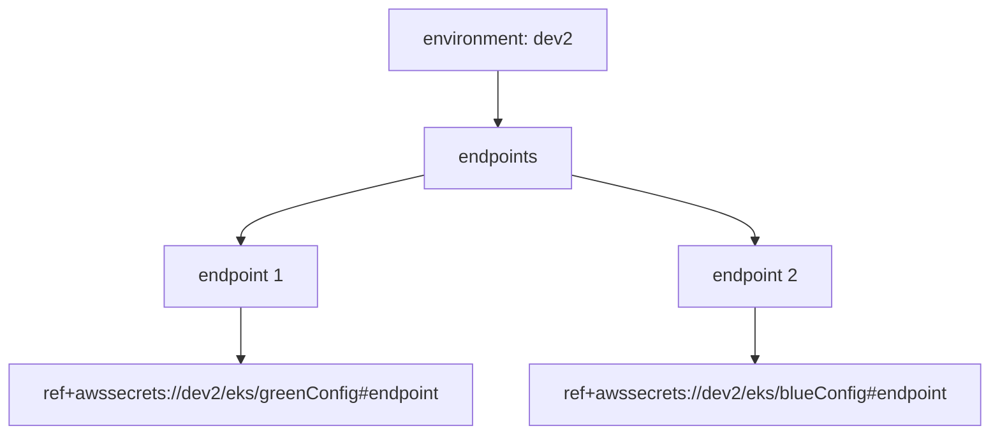
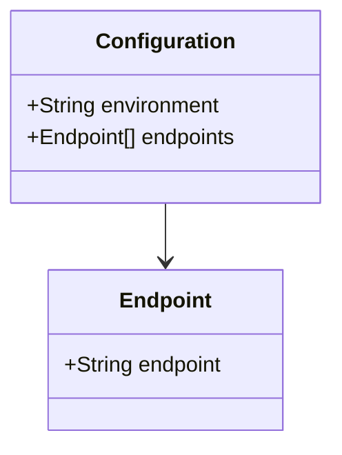
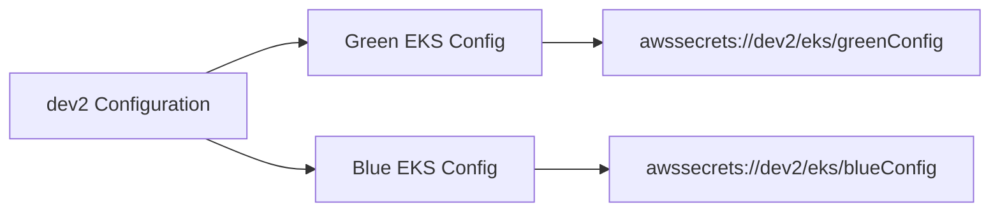

# Diagram: devops/k8s/argocd/projects/environments/helm/values.dev2.yaml

> Auto-generated by Obscura crawlers

## Diagram 1

### SVG

<svg id="container" width="892.546875" xmlns="http://www.w3.org/2000/svg" class="flowchart" height="382" viewBox="0 0 892.546875 382" role="graphics-document document" aria-roledescription="flowchart-v2"><g><marker id="container_flowchart-v2-pointEnd" class="marker flowchart-v2" viewBox="0 0 10 10" refX="5" refY="5" markerUnits="userSpaceOnUse" markerWidth="8" markerHeight="8" orient="auto"><path d="M 0 0 L 10 5 L 0 10 z" class="arrowMarkerPath" style="stroke-width: 1; stroke-dasharray: 1, 0;"></path></marker><marker id="container_flowchart-v2-pointStart" class="marker flowchart-v2" viewBox="0 0 10 10" refX="4.5" refY="5" markerUnits="userSpaceOnUse" markerWidth="8" markerHeight="8" orient="auto"><path d="M 0 5 L 10 10 L 10 0 z" class="arrowMarkerPath" style="stroke-width: 1; stroke-dasharray: 1, 0;"></path></marker><marker id="container_flowchart-v2-circleEnd" class="marker flowchart-v2" viewBox="0 0 10 10" refX="11" refY="5" markerUnits="userSpaceOnUse" markerWidth="11" markerHeight="11" orient="auto"><circle cx="5" cy="5" r="5" class="arrowMarkerPath" style="stroke-width: 1; stroke-dasharray: 1, 0;"></circle></marker><marker id="container_flowchart-v2-circleStart" class="marker flowchart-v2" viewBox="0 0 10 10" refX="-1" refY="5" markerUnits="userSpaceOnUse" markerWidth="11" markerHeight="11" orient="auto"><circle cx="5" cy="5" r="5" class="arrowMarkerPath" style="stroke-width: 1; stroke-dasharray: 1, 0;"></circle></marker><marker id="container_flowchart-v2-crossEnd" class="marker cross flowchart-v2" viewBox="0 0 11 11" refX="12" refY="5.2" markerUnits="userSpaceOnUse" markerWidth="11" markerHeight="11" orient="auto"><path d="M 1,1 l 9,9 M 10,1 l -9,9" class="arrowMarkerPath" style="stroke-width: 2; stroke-dasharray: 1, 0;"></path></marker><marker id="container_flowchart-v2-crossStart" class="marker cross flowchart-v2" viewBox="0 0 11 11" refX="-1" refY="5.2" markerUnits="userSpaceOnUse" markerWidth="11" markerHeight="11" orient="auto"><path d="M 1,1 l 9,9 M 10,1 l -9,9" class="arrowMarkerPath" style="stroke-width: 2; stroke-dasharray: 1, 0;"></path></marker><g class="root"><g class="clusters"></g><g class="edgePaths"><path d="M448.309,62L448.309,66.167C448.309,70.333,448.309,78.667,448.309,86.333C448.309,94,448.309,101,448.309,104.5L448.309,108" id="L_A_B_0" class="edge-thickness-normal edge-pattern-solid edge-thickness-normal edge-pattern-solid flowchart-link" style=";" data-edge="true" data-et="edge" data-id="L_A_B_0" data-points="W3sieCI6NDQ4LjMwODU5Mzc1LCJ5Ijo2Mn0seyJ4Ijo0NDguMzA4NTkzNzUsInkiOjg3fSx7IngiOjQ0OC4zMDg1OTM3NSwieSI6MTEyfV0=" marker-end="url(#container_flowchart-v2-pointEnd)"></path><path d="M381.48,154.002L354.012,160.169C326.544,166.335,271.608,178.667,244.14,188.334C216.672,198,216.672,205,216.672,208.5L216.672,212" id="L_B_C_0" class="edge-thickness-normal edge-pattern-solid edge-thickness-normal edge-pattern-solid flowchart-link" style=";" data-edge="true" data-et="edge" data-id="L_B_C_0" data-points="W3sieCI6MzgxLjQ4MDQ2ODc1LCJ5IjoxNTQuMDAyMjA5MTQzNDkzMTN9LHsieCI6MjE2LjY3MTg3NSwieSI6MTkxfSx7IngiOjIxNi42NzE4NzUsInkiOjIxNn1d" marker-end="url(#container_flowchart-v2-pointEnd)"></path><path d="M515.137,154.002L542.605,160.169C570.073,166.335,625.009,178.667,652.477,188.334C679.945,198,679.945,205,679.945,208.5L679.945,212" id="L_B_D_0" class="edge-thickness-normal edge-pattern-solid edge-thickness-normal edge-pattern-solid flowchart-link" style=";" data-edge="true" data-et="edge" data-id="L_B_D_0" data-points="W3sieCI6NTE1LjEzNjcxODc1LCJ5IjoxNTQuMDAyMjA5MTQzNDkzMTN9LHsieCI6Njc5Ljk0NTMxMjUsInkiOjE5MX0seyJ4Ijo2NzkuOTQ1MzEyNSwieSI6MjE2fV0=" marker-end="url(#container_flowchart-v2-pointEnd)"></path><path d="M216.672,270L216.672,274.167C216.672,278.333,216.672,286.667,216.672,294.333C216.672,302,216.672,309,216.672,312.5L216.672,316" id="L_C_E_0" class="edge-thickness-normal edge-pattern-solid edge-thickness-normal edge-pattern-solid flowchart-link" style=";" data-edge="true" data-et="edge" data-id="L_C_E_0" data-points="W3sieCI6MjE2LjY3MTg3NSwieSI6MjcwfSx7IngiOjIxNi42NzE4NzUsInkiOjI5NX0seyJ4IjoyMTYuNjcxODc1LCJ5IjozMjB9XQ==" marker-end="url(#container_flowchart-v2-pointEnd)"></path><path d="M679.945,270L679.945,274.167C679.945,278.333,679.945,286.667,679.945,294.333C679.945,302,679.945,309,679.945,312.5L679.945,316" id="L_D_F_0" class="edge-thickness-normal edge-pattern-solid edge-thickness-normal edge-pattern-solid flowchart-link" style=";" data-edge="true" data-et="edge" data-id="L_D_F_0" data-points="W3sieCI6Njc5Ljk0NTMxMjUsInkiOjI3MH0seyJ4Ijo2NzkuOTQ1MzEyNSwieSI6Mjk1fSx7IngiOjY3OS45NDUzMTI1LCJ5IjozMjB9XQ==" marker-end="url(#container_flowchart-v2-pointEnd)"></path></g><g class="edgeLabels"><g class="edgeLabel"><g class="label" data-id="L_A_B_0" transform="translate(0, 0)"><foreignObject width="0" height="0">

</foreignObject></g></g><g class="edgeLabel"><g class="label" data-id="L_B_C_0" transform="translate(0, 0)"><foreignObject width="0" height="0">

</foreignObject></g></g><g class="edgeLabel"><g class="label" data-id="L_B_D_0" transform="translate(0, 0)"><foreignObject width="0" height="0">

</foreignObject></g></g><g class="edgeLabel"><g class="label" data-id="L_C_E_0" transform="translate(0, 0)"><foreignObject width="0" height="0">

</foreignObject></g></g><g class="edgeLabel"><g class="label" data-id="L_D_F_0" transform="translate(0, 0)"><foreignObject width="0" height="0">

</foreignObject></g></g></g><g class="nodes"><g class="node default" id="flowchart-A-0" transform="translate(448.30859375, 35)"><rect class="basic label-container" style="" x="-97.1875" y="-27" width="194.375" height="54"></rect><g class="label" style="" transform="translate(-67.1875, -12)"><rect></rect><foreignObject width="134.375" height="24">

environment: dev2

</foreignObject></g></g><g class="node default" id="flowchart-B-1" transform="translate(448.30859375, 139)"><rect class="basic label-container" style="" x="-66.828125" y="-27" width="133.65625" height="54"></rect><g class="label" style="" transform="translate(-36.828125, -12)"><rect></rect><foreignObject width="73.65625" height="24">

endpoints

</foreignObject></g></g><g class="node default" id="flowchart-C-3" transform="translate(216.671875, 243)"><rect class="basic label-container" style="" x="-68.6796875" y="-27" width="137.359375" height="54"></rect><g class="label" style="" transform="translate(-38.6796875, -12)"><rect></rect><foreignObject width="77.359375" height="24">

endpoint 1

</foreignObject></g></g><g class="node default" id="flowchart-D-5" transform="translate(679.9453125, 243)"><rect class="basic label-container" style="" x="-69.171875" y="-27" width="138.34375" height="54"></rect><g class="label" style="" transform="translate(-39.171875, -12)"><rect></rect><foreignObject width="78.34375" height="24">

endpoint 2

</foreignObject></g></g><g class="node default" id="flowchart-E-7" transform="translate(216.671875, 347)"><rect class="basic label-container" style="" x="-208.671875" y="-27" width="417.34375" height="54"></rect><g class="label" style="" transform="translate(-178.671875, -12)"><rect></rect><foreignObject width="357.34375" height="24">

ref+awssecrets://dev2/eks/greenConfig#endpoint

</foreignObject></g></g><g class="node default" id="flowchart-F-9" transform="translate(679.9453125, 347)"><rect class="basic label-container" style="" x="-204.6015625" y="-27" width="409.203125" height="54"></rect><g class="label" style="" transform="translate(-174.6015625, -12)"><rect></rect><foreignObject width="349.203125" height="24">

ref+awssecrets://dev2/eks/blueConfig#endpoint

</foreignObject></g></g></g></g></g></svg>

## Diagram 2

### SVG

<svg id="container" width="251.421875" xmlns="http://www.w3.org/2000/svg" class="classDiagram" height="330" viewBox="0 0 251.421875 330" role="graphics-document document" aria-roledescription="class"><g><defs><marker id="container_class-aggregationStart" class="marker aggregation class" refX="18" refY="7" markerWidth="190" markerHeight="240" orient="auto"><path d="M 18,7 L9,13 L1,7 L9,1 Z"></path></marker></defs><defs><marker id="container_class-aggregationEnd" class="marker aggregation class" refX="1" refY="7" markerWidth="20" markerHeight="28" orient="auto"><path d="M 18,7 L9,13 L1,7 L9,1 Z"></path></marker></defs><defs><marker id="container_class-extensionStart" class="marker extension class" refX="18" refY="7" markerWidth="190" markerHeight="240" orient="auto"><path d="M 1,7 L18,13 V 1 Z"></path></marker></defs><defs><marker id="container_class-extensionEnd" class="marker extension class" refX="1" refY="7" markerWidth="20" markerHeight="28" orient="auto"><path d="M 1,1 V 13 L18,7 Z"></path></marker></defs><defs><marker id="container_class-compositionStart" class="marker composition class" refX="18" refY="7" markerWidth="190" markerHeight="240" orient="auto"><path d="M 18,7 L9,13 L1,7 L9,1 Z"></path></marker></defs><defs><marker id="container_class-compositionEnd" class="marker composition class" refX="1" refY="7" markerWidth="20" markerHeight="28" orient="auto"><path d="M 18,7 L9,13 L1,7 L9,1 Z"></path></marker></defs><defs><marker id="container_class-dependencyStart" class="marker dependency class" refX="6" refY="7" markerWidth="190" markerHeight="240" orient="auto"><path d="M 5,7 L9,13 L1,7 L9,1 Z"></path></marker></defs><defs><marker id="container_class-dependencyEnd" class="marker dependency class" refX="13" refY="7" markerWidth="20" markerHeight="28" orient="auto"><path d="M 18,7 L9,13 L14,7 L9,1 Z"></path></marker></defs><defs><marker id="container_class-lollipopStart" class="marker lollipop class" refX="13" refY="7" markerWidth="190" markerHeight="240" orient="auto"><circle stroke="black" fill="transparent" cx="7" cy="7" r="6"></circle></marker></defs><defs><marker id="container_class-lollipopEnd" class="marker lollipop class" refX="1" refY="7" markerWidth="190" markerHeight="240" orient="auto"><circle stroke="black" fill="transparent" cx="7" cy="7" r="6"></circle></marker></defs><g class="root"><g class="clusters"></g><g class="edgePaths"><path d="M125.711,152L125.711,156.167C125.711,160.333,125.711,168.667,125.711,176C125.711,183.333,125.711,189.667,125.711,192.833L125.711,196" id="id_Configuration_Endpoint_1" class="edge-thickness-normal edge-pattern-solid relation" style=";;;" data-edge="true" data-et="edge" data-id="id_Configuration_Endpoint_1" data-points="W3sieCI6MTI1LjcxMDkzNzUsInkiOjE1Mn0seyJ4IjoxMjUuNzEwOTM3NSwieSI6MTc3fSx7IngiOjEyNS43MTA5Mzc1LCJ5IjoyMDJ9XQ==" marker-end="url(#container_class-dependencyEnd)"></path></g><g class="edgeLabels"><g class="edgeLabel"><g class="label" data-id="id_Configuration_Endpoint_1" transform="translate(0, 0)"><foreignObject width="0" height="0">

</foreignObject></g></g></g><g class="nodes"><g class="node default" id="classId-Configuration-0" transform="translate(125.7109375, 80)"><g class="basic label-container"><path d="M-117.7109375 -72 L117.7109375 -72 L117.7109375 72 L-117.7109375 72" stroke="none" stroke-width="0" fill="#ECECFF" style=""></path><path d="M-117.7109375 -72 C-26.87519804529876 -72, 63.96054140940248 -72, 117.7109375 -72 M-117.7109375 -72 C-34.58640291965146 -72, 48.538131660697076 -72, 117.7109375 -72 M117.7109375 -72 C117.7109375 -28.6967075105471, 117.7109375 14.6065849789058, 117.7109375 72 M117.7109375 -72 C117.7109375 -36.849761294678, 117.7109375 -1.6995225893559933, 117.7109375 72 M117.7109375 72 C23.63752936609525 72, -70.4358787678095 72, -117.7109375 72 M117.7109375 72 C29.15942470636398 72, -59.39208808727204 72, -117.7109375 72 M-117.7109375 72 C-117.7109375 18.201697560824684, -117.7109375 -35.59660487835063, -117.7109375 -72 M-117.7109375 72 C-117.7109375 29.291232802589, -117.7109375 -13.417534394821999, -117.7109375 -72" stroke="#9370DB" stroke-width="1.3" fill="none" stroke-dasharray="0 0" style=""></path></g><g class="annotation-group text" transform="translate(0, -48)"></g><g class="label-group text" transform="translate(-49.375, -48)"><g class="label" style="font-weight: bolder" transform="translate(0,-12)"><foreignObject width="98.75" height="24">

Configuration

</foreignObject></g></g><g class="members-group text" transform="translate(-105.7109375, 0)"><g class="label" style="" transform="translate(0,-12)"><foreignObject width="146.84375" height="24">

+String environment

</foreignObject></g><g class="label" style="" transform="translate(0,12)"><foreignObject width="162.046875" height="24">

+Endpoint[] endpoints

</foreignObject></g></g><g class="methods-group text" transform="translate(-105.7109375, 72)"></g><g class="divider" style=""><path d="M-117.7109375 -24 C-48.51030524748599 -24, 20.690327005028024 -24, 117.7109375 -24 M-117.7109375 -24 C-55.350542678542666 -24, 7.009852142914667 -24, 117.7109375 -24" stroke="#9370DB" stroke-width="1.3" fill="none" stroke-dasharray="0 0" style=""></path></g><g class="divider" style=""><path d="M-117.7109375 48 C-41.56833694574338 48, 34.574263608513235 48, 117.7109375 48 M-117.7109375 48 C-57.41399472263917 48, 2.882948054721666 48, 117.7109375 48" stroke="#9370DB" stroke-width="1.3" fill="none" stroke-dasharray="0 0" style=""></path></g></g><g class="node default" id="classId-Endpoint-1" transform="translate(125.7109375, 262)"><g class="basic label-container"><path d="M-88.796875 -60 L88.796875 -60 L88.796875 60 L-88.796875 60" stroke="none" stroke-width="0" fill="#ECECFF" style=""></path><path d="M-88.796875 -60 C-44.79491643321505 -60, -0.7929578664301005 -60, 88.796875 -60 M-88.796875 -60 C-38.40676334738447 -60, 11.983348305231061 -60, 88.796875 -60 M88.796875 -60 C88.796875 -24.12240348520198, 88.796875 11.755193029596043, 88.796875 60 M88.796875 -60 C88.796875 -22.176921212154276, 88.796875 15.646157575691447, 88.796875 60 M88.796875 60 C31.111189528107076 60, -26.57449594378585 60, -88.796875 60 M88.796875 60 C30.630699072261045 60, -27.53547685547791 60, -88.796875 60 M-88.796875 60 C-88.796875 31.159959803392457, -88.796875 2.3199196067849144, -88.796875 -60 M-88.796875 60 C-88.796875 34.11439812659845, -88.796875 8.228796253196904, -88.796875 -60" stroke="#9370DB" stroke-width="1.3" fill="none" stroke-dasharray="0 0" style=""></path></g><g class="annotation-group text" transform="translate(0, -36)"></g><g class="label-group text" transform="translate(-32.953125, -36)"><g class="label" style="font-weight: bolder" transform="translate(0,-12)"><foreignObject width="65.90625" height="24">

Endpoint

</foreignObject></g></g><g class="members-group text" transform="translate(-76.796875, 12)"><g class="label" style="" transform="translate(0,-12)"><foreignObject width="120.640625" height="24">

+String endpoint

</foreignObject></g></g><g class="methods-group text" transform="translate(-76.796875, 60)"></g><g class="divider" style=""><path d="M-88.796875 -12 C-37.86074715178958 -12, 13.075380696420837 -12, 88.796875 -12 M-88.796875 -12 C-32.65491856911604 -12, 23.487037861767917 -12, 88.796875 -12" stroke="#9370DB" stroke-width="1.3" fill="none" stroke-dasharray="0 0" style=""></path></g><g class="divider" style=""><path d="M-88.796875 36 C-21.356683173669353 36, 46.083508652661294 36, 88.796875 36 M-88.796875 36 C-32.36126981142269 36, 24.074335377154625 36, 88.796875 36" stroke="#9370DB" stroke-width="1.3" fill="none" stroke-dasharray="0 0" style=""></path></g></g></g></g></g></svg>

## Diagram 3

### SVG

<svg id="container" width="809.890625" xmlns="http://www.w3.org/2000/svg" class="flowchart" height="174" viewBox="0 0 809.890625 174" role="graphics-document document" aria-roledescription="flowchart-v2"><g><marker id="container_flowchart-v2-pointEnd" class="marker flowchart-v2" viewBox="0 0 10 10" refX="5" refY="5" markerUnits="userSpaceOnUse" markerWidth="8" markerHeight="8" orient="auto"><path d="M 0 0 L 10 5 L 0 10 z" class="arrowMarkerPath" style="stroke-width: 1; stroke-dasharray: 1, 0;"></path></marker><marker id="container_flowchart-v2-pointStart" class="marker flowchart-v2" viewBox="0 0 10 10" refX="4.5" refY="5" markerUnits="userSpaceOnUse" markerWidth="8" markerHeight="8" orient="auto"><path d="M 0 5 L 10 10 L 10 0 z" class="arrowMarkerPath" style="stroke-width: 1; stroke-dasharray: 1, 0;"></path></marker><marker id="container_flowchart-v2-circleEnd" class="marker flowchart-v2" viewBox="0 0 10 10" refX="11" refY="5" markerUnits="userSpaceOnUse" markerWidth="11" markerHeight="11" orient="auto"><circle cx="5" cy="5" r="5" class="arrowMarkerPath" style="stroke-width: 1; stroke-dasharray: 1, 0;"></circle></marker><marker id="container_flowchart-v2-circleStart" class="marker flowchart-v2" viewBox="0 0 10 10" refX="-1" refY="5" markerUnits="userSpaceOnUse" markerWidth="11" markerHeight="11" orient="auto"><circle cx="5" cy="5" r="5" class="arrowMarkerPath" style="stroke-width: 1; stroke-dasharray: 1, 0;"></circle></marker><marker id="container_flowchart-v2-crossEnd" class="marker cross flowchart-v2" viewBox="0 0 11 11" refX="12" refY="5.2" markerUnits="userSpaceOnUse" markerWidth="11" markerHeight="11" orient="auto"><path d="M 1,1 l 9,9 M 10,1 l -9,9" class="arrowMarkerPath" style="stroke-width: 2; stroke-dasharray: 1, 0;"></path></marker><marker id="container_flowchart-v2-crossStart" class="marker cross flowchart-v2" viewBox="0 0 11 11" refX="-1" refY="5.2" markerUnits="userSpaceOnUse" markerWidth="11" markerHeight="11" orient="auto"><path d="M 1,1 l 9,9 M 10,1 l -9,9" class="arrowMarkerPath" style="stroke-width: 2; stroke-dasharray: 1, 0;"></path></marker><g class="root"><g class="clusters"></g><g class="edgePaths"><path d="M169.462,60L179.296,55.833C189.131,51.667,208.8,43.333,222.134,39.167C235.469,35,242.469,35,245.969,35L249.469,35" id="L_Config_Green_0" class="edge-thickness-normal edge-pattern-solid edge-thickness-normal edge-pattern-solid flowchart-link" style=";" data-edge="true" data-et="edge" data-id="L_Config_Green_0" data-points="W3sieCI6MTY5LjQ2MTgzODk0MjMwNzY4LCJ5Ijo2MH0seyJ4IjoyMjguNDY4NzUsInkiOjM1fSx7IngiOjI1My40Njg3NSwieSI6MzV9XQ==" marker-end="url(#container_flowchart-v2-pointEnd)"></path><path d="M169.462,114L179.296,118.167C189.131,122.333,208.8,130.667,222.981,134.833C237.161,139,245.854,139,250.201,139L254.547,139" id="L_Config_Blue_0" class="edge-thickness-normal edge-pattern-solid edge-thickness-normal edge-pattern-solid flowchart-link" style=";" data-edge="true" data-et="edge" data-id="L_Config_Blue_0" data-points="W3sieCI6MTY5LjQ2MTgzODk0MjMwNzY4LCJ5IjoxMTR9LHsieCI6MjI4LjQ2ODc1LCJ5IjoxMzl9LHsieCI6MjU4LjU0Njg3NSwieSI6MTM5fV0=" marker-end="url(#container_flowchart-v2-pointEnd)"></path><path d="M435.984,35L440.151,35C444.318,35,452.651,35,460.318,35C467.984,35,474.984,35,478.484,35L481.984,35" id="L_Green_GreenSecret_0" class="edge-thickness-normal edge-pattern-solid edge-thickness-normal edge-pattern-solid flowchart-link" style=";" data-edge="true" data-et="edge" data-id="L_Green_GreenSecret_0" data-points="W3sieCI6NDM1Ljk4NDM3NSwieSI6MzV9LHsieCI6NDYwLjk4NDM3NSwieSI6MzV9LHsieCI6NDg1Ljk4NDM3NSwieSI6MzV9XQ==" marker-end="url(#container_flowchart-v2-pointEnd)"></path><path d="M430.906,139L435.919,139C440.932,139,450.958,139,460.148,139C469.339,139,477.693,139,481.87,139L486.047,139" id="L_Blue_BlueSecret_0" class="edge-thickness-normal edge-pattern-solid edge-thickness-normal edge-pattern-solid flowchart-link" style=";" data-edge="true" data-et="edge" data-id="L_Blue_BlueSecret_0" data-points="W3sieCI6NDMwLjkwNjI1LCJ5IjoxMzl9LHsieCI6NDYwLjk4NDM3NSwieSI6MTM5fSx7IngiOjQ5MC4wNDY4NzUsInkiOjEzOX1d" marker-end="url(#container_flowchart-v2-pointEnd)"></path></g><g class="edgeLabels"><g class="edgeLabel"><g class="label" data-id="L_Config_Green_0" transform="translate(0, 0)"><foreignObject width="0" height="0">

</foreignObject></g></g><g class="edgeLabel"><g class="label" data-id="L_Config_Blue_0" transform="translate(0, 0)"><foreignObject width="0" height="0">

</foreignObject></g></g><g class="edgeLabel"><g class="label" data-id="L_Green_GreenSecret_0" transform="translate(0, 0)"><foreignObject width="0" height="0">

</foreignObject></g></g><g class="edgeLabel"><g class="label" data-id="L_Blue_BlueSecret_0" transform="translate(0, 0)"><foreignObject width="0" height="0">

</foreignObject></g></g></g><g class="nodes"><g class="node default" id="flowchart-Config-0" transform="translate(105.734375, 87)"><rect class="basic label-container" style="" x="-97.734375" y="-27" width="195.46875" height="54"></rect><g class="label" style="" transform="translate(-67.734375, -12)"><rect></rect><foreignObject width="135.46875" height="24">

dev2 Configuration

</foreignObject></g></g><g class="node default" id="flowchart-Green-1" transform="translate(344.7265625, 35)"><rect class="basic label-container" style="" x="-91.2578125" y="-27" width="182.515625" height="54"></rect><g class="label" style="" transform="translate(-61.2578125, -12)"><rect></rect><foreignObject width="122.515625" height="24">

Green EKS Config

</foreignObject></g></g><g class="node default" id="flowchart-Blue-3" transform="translate(344.7265625, 139)"><rect class="basic label-container" style="" x="-86.1796875" y="-27" width="172.359375" height="54"></rect><g class="label" style="" transform="translate(-56.1796875, -12)"><rect></rect><foreignObject width="112.359375" height="24">

Blue EKS Config

</foreignObject></g></g><g class="node default" id="flowchart-GreenSecret-5" transform="translate(643.9375, 35)"><rect class="basic label-container" style="" x="-157.953125" y="-27" width="315.90625" height="54"></rect><g class="label" style="" transform="translate(-127.953125, -12)"><rect></rect><foreignObject width="255.90625" height="24">

awssecrets://dev2/eks/greenConfig

</foreignObject></g></g><g class="node default" id="flowchart-BlueSecret-7" transform="translate(643.9375, 139)"><rect class="basic label-container" style="" x="-153.890625" y="-27" width="307.78125" height="54"></rect><g class="label" style="" transform="translate(-123.890625, -12)"><rect></rect><foreignObject width="247.78125" height="24">

awssecrets://dev2/eks/blueConfig

</foreignObject></g></g></g></g></g></svg>
