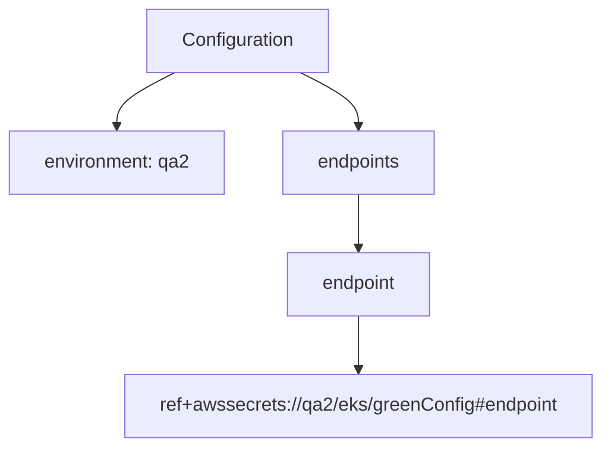
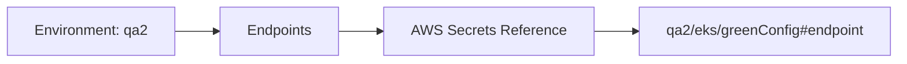

# Diagram: devops/k8s/argocd/projects/environments/helm/values.qa2.yaml

> Auto-generated by Obscura crawlers

## Diagram 1

### SVG

<svg id="container" width="524.3828125" xmlns="http://www.w3.org/2000/svg" class="flowchart" height="382" viewBox="0 0 524.3828125 382" role="graphics-document document" aria-roledescription="flowchart-v2"><g><marker id="container_flowchart-v2-pointEnd" class="marker flowchart-v2" viewBox="0 0 10 10" refX="5" refY="5" markerUnits="userSpaceOnUse" markerWidth="8" markerHeight="8" orient="auto"><path d="M 0 0 L 10 5 L 0 10 z" class="arrowMarkerPath" style="stroke-width: 1; stroke-dasharray: 1, 0;"></path></marker><marker id="container_flowchart-v2-pointStart" class="marker flowchart-v2" viewBox="0 0 10 10" refX="4.5" refY="5" markerUnits="userSpaceOnUse" markerWidth="8" markerHeight="8" orient="auto"><path d="M 0 5 L 10 10 L 10 0 z" class="arrowMarkerPath" style="stroke-width: 1; stroke-dasharray: 1, 0;"></path></marker><marker id="container_flowchart-v2-circleEnd" class="marker flowchart-v2" viewBox="0 0 10 10" refX="11" refY="5" markerUnits="userSpaceOnUse" markerWidth="11" markerHeight="11" orient="auto"><circle cx="5" cy="5" r="5" class="arrowMarkerPath" style="stroke-width: 1; stroke-dasharray: 1, 0;"></circle></marker><marker id="container_flowchart-v2-circleStart" class="marker flowchart-v2" viewBox="0 0 10 10" refX="-1" refY="5" markerUnits="userSpaceOnUse" markerWidth="11" markerHeight="11" orient="auto"><circle cx="5" cy="5" r="5" class="arrowMarkerPath" style="stroke-width: 1; stroke-dasharray: 1, 0;"></circle></marker><marker id="container_flowchart-v2-crossEnd" class="marker cross flowchart-v2" viewBox="0 0 11 11" refX="12" refY="5.2" markerUnits="userSpaceOnUse" markerWidth="11" markerHeight="11" orient="auto"><path d="M 1,1 l 9,9 M 10,1 l -9,9" class="arrowMarkerPath" style="stroke-width: 2; stroke-dasharray: 1, 0;"></path></marker><marker id="container_flowchart-v2-crossStart" class="marker cross flowchart-v2" viewBox="0 0 11 11" refX="-1" refY="5.2" markerUnits="userSpaceOnUse" markerWidth="11" markerHeight="11" orient="auto"><path d="M 1,1 l 9,9 M 10,1 l -9,9" class="arrowMarkerPath" style="stroke-width: 2; stroke-dasharray: 1, 0;"></path></marker><g class="root"><g class="clusters"></g><g class="edgePaths"><path d="M151.885,62L143.464,66.167C135.043,70.333,118.201,78.667,109.78,86.333C101.359,94,101.359,101,101.359,104.5L101.359,108" id="L_A_B_0" class="edge-thickness-normal edge-pattern-solid edge-thickness-normal edge-pattern-solid flowchart-link" style=";" data-edge="true" data-et="edge" data-id="L_A_B_0" data-points="W3sieCI6MTUxLjg4NTIxNjM0NjE1Mzg0LCJ5Ijo2Mn0seyJ4IjoxMDEuMzU5Mzc1LCJ5Ijo4N30seyJ4IjoxMDEuMzU5Mzc1LCJ5IjoxMTJ9XQ==" marker-end="url(#container_flowchart-v2-pointEnd)"></path><path d="M261.021,62L269.442,66.167C277.863,70.333,294.705,78.667,303.126,86.333C311.547,94,311.547,101,311.547,104.5L311.547,108" id="L_A_C_0" class="edge-thickness-normal edge-pattern-solid edge-thickness-normal edge-pattern-solid flowchart-link" style=";" data-edge="true" data-et="edge" data-id="L_A_C_0" data-points="W3sieCI6MjYxLjAyMTAzMzY1Mzg0NjEzLCJ5Ijo2Mn0seyJ4IjozMTEuNTQ2ODc1LCJ5Ijo4N30seyJ4IjozMTEuNTQ2ODc1LCJ5IjoxMTJ9XQ==" marker-end="url(#container_flowchart-v2-pointEnd)"></path><path d="M311.547,166L311.547,170.167C311.547,174.333,311.547,182.667,311.547,190.333C311.547,198,311.547,205,311.547,208.5L311.547,212" id="L_C_D_0" class="edge-thickness-normal edge-pattern-solid edge-thickness-normal edge-pattern-solid flowchart-link" style=";" data-edge="true" data-et="edge" data-id="L_C_D_0" data-points="W3sieCI6MzExLjU0Njg3NSwieSI6MTY2fSx7IngiOjMxMS41NDY4NzUsInkiOjE5MX0seyJ4IjozMTEuNTQ2ODc1LCJ5IjoyMTZ9XQ==" marker-end="url(#container_flowchart-v2-pointEnd)"></path><path d="M311.547,270L311.547,274.167C311.547,278.333,311.547,286.667,311.547,294.333C311.547,302,311.547,309,311.547,312.5L311.547,316" id="L_D_E_0" class="edge-thickness-normal edge-pattern-solid edge-thickness-normal edge-pattern-solid flowchart-link" style=";" data-edge="true" data-et="edge" data-id="L_D_E_0" data-points="W3sieCI6MzExLjU0Njg3NSwieSI6MjcwfSx7IngiOjMxMS41NDY4NzUsInkiOjI5NX0seyJ4IjozMTEuNTQ2ODc1LCJ5IjozMjB9XQ==" marker-end="url(#container_flowchart-v2-pointEnd)"></path></g><g class="edgeLabels"><g class="edgeLabel"><g class="label" data-id="L_A_B_0" transform="translate(0, 0)"><foreignObject width="0" height="0">

</foreignObject></g></g><g class="edgeLabel"><g class="label" data-id="L_A_C_0" transform="translate(0, 0)"><foreignObject width="0" height="0">

</foreignObject></g></g><g class="edgeLabel"><g class="label" data-id="L_C_D_0" transform="translate(0, 0)"><foreignObject width="0" height="0">

</foreignObject></g></g><g class="edgeLabel"><g class="label" data-id="L_D_E_0" transform="translate(0, 0)"><foreignObject width="0" height="0">

</foreignObject></g></g></g><g class="nodes"><g class="node default" id="flowchart-A-0" transform="translate(206.453125, 35)"><rect class="basic label-container" style="" x="-78.6875" y="-27" width="157.375" height="54"></rect><g class="label" style="" transform="translate(-48.6875, -12)"><rect></rect><foreignObject width="97.375" height="24">

Configuration

</foreignObject></g></g><g class="node default" id="flowchart-B-1" transform="translate(101.359375, 139)"><rect class="basic label-container" style="" x="-93.359375" y="-27" width="186.71875" height="54"></rect><g class="label" style="" transform="translate(-63.359375, -12)"><rect></rect><foreignObject width="126.71875" height="24">

environment: qa2

</foreignObject></g></g><g class="node default" id="flowchart-C-3" transform="translate(311.546875, 139)"><rect class="basic label-container" style="" x="-66.828125" y="-27" width="133.65625" height="54"></rect><g class="label" style="" transform="translate(-36.828125, -12)"><rect></rect><foreignObject width="73.65625" height="24">

endpoints

</foreignObject></g></g><g class="node default" id="flowchart-D-5" transform="translate(311.546875, 243)"><rect class="basic label-container" style="" x="-63.09375" y="-27" width="126.1875" height="54"></rect><g class="label" style="" transform="translate(-33.09375, -12)"><rect></rect><foreignObject width="66.1875" height="24">

endpoint

</foreignObject></g></g><g class="node default" id="flowchart-E-7" transform="translate(311.546875, 347)"><rect class="basic label-container" style="" x="-204.8359375" y="-27" width="409.671875" height="54"></rect><g class="label" style="" transform="translate(-174.8359375, -12)"><rect></rect><foreignObject width="349.671875" height="24">

ref+awssecrets://qa2/eks/greenConfig#endpoint

</foreignObject></g></g></g></g></g></svg>

## Diagram 2

### SVG

<svg id="container" width="995.640625" xmlns="http://www.w3.org/2000/svg" class="flowchart" height="70" viewBox="0 0 995.640625 70" role="graphics-document document" aria-roledescription="flowchart-v2"><g><marker id="container_flowchart-v2-pointEnd" class="marker flowchart-v2" viewBox="0 0 10 10" refX="5" refY="5" markerUnits="userSpaceOnUse" markerWidth="8" markerHeight="8" orient="auto"><path d="M 0 0 L 10 5 L 0 10 z" class="arrowMarkerPath" style="stroke-width: 1; stroke-dasharray: 1, 0;"></path></marker><marker id="container_flowchart-v2-pointStart" class="marker flowchart-v2" viewBox="0 0 10 10" refX="4.5" refY="5" markerUnits="userSpaceOnUse" markerWidth="8" markerHeight="8" orient="auto"><path d="M 0 5 L 10 10 L 10 0 z" class="arrowMarkerPath" style="stroke-width: 1; stroke-dasharray: 1, 0;"></path></marker><marker id="container_flowchart-v2-circleEnd" class="marker flowchart-v2" viewBox="0 0 10 10" refX="11" refY="5" markerUnits="userSpaceOnUse" markerWidth="11" markerHeight="11" orient="auto"><circle cx="5" cy="5" r="5" class="arrowMarkerPath" style="stroke-width: 1; stroke-dasharray: 1, 0;"></circle></marker><marker id="container_flowchart-v2-circleStart" class="marker flowchart-v2" viewBox="0 0 10 10" refX="-1" refY="5" markerUnits="userSpaceOnUse" markerWidth="11" markerHeight="11" orient="auto"><circle cx="5" cy="5" r="5" class="arrowMarkerPath" style="stroke-width: 1; stroke-dasharray: 1, 0;"></circle></marker><marker id="container_flowchart-v2-crossEnd" class="marker cross flowchart-v2" viewBox="0 0 11 11" refX="12" refY="5.2" markerUnits="userSpaceOnUse" markerWidth="11" markerHeight="11" orient="auto"><path d="M 1,1 l 9,9 M 10,1 l -9,9" class="arrowMarkerPath" style="stroke-width: 2; stroke-dasharray: 1, 0;"></path></marker><marker id="container_flowchart-v2-crossStart" class="marker cross flowchart-v2" viewBox="0 0 11 11" refX="-1" refY="5.2" markerUnits="userSpaceOnUse" markerWidth="11" markerHeight="11" orient="auto"><path d="M 1,1 l 9,9 M 10,1 l -9,9" class="arrowMarkerPath" style="stroke-width: 2; stroke-dasharray: 1, 0;"></path></marker><g class="root"><g class="clusters"></g><g class="edgePaths"><path d="M194.391,35L198.557,35C202.724,35,211.057,35,218.724,35C226.391,35,233.391,35,236.891,35L240.391,35" id="L_ENV_ENDPOINTS_0" class="edge-thickness-normal edge-pattern-solid edge-thickness-normal edge-pattern-solid flowchart-link" style=";" data-edge="true" data-et="edge" data-id="L_ENV_ENDPOINTS_0" data-points="W3sieCI6MTk0LjM5MDYyNSwieSI6MzV9LHsieCI6MjE5LjM5MDYyNSwieSI6MzV9LHsieCI6MjQ0LjM5MDYyNSwieSI6MzV9XQ==" marker-end="url(#container_flowchart-v2-pointEnd)"></path><path d="M377.734,35L381.901,35C386.068,35,394.401,35,402.068,35C409.734,35,416.734,35,420.234,35L423.734,35" id="L_ENDPOINTS_REF_0" class="edge-thickness-normal edge-pattern-solid edge-thickness-normal edge-pattern-solid flowchart-link" style=";" data-edge="true" data-et="edge" data-id="L_ENDPOINTS_REF_0" data-points="W3sieCI6Mzc3LjczNDM3NSwieSI6MzV9LHsieCI6NDAyLjczNDM3NSwieSI6MzV9LHsieCI6NDI3LjczNDM3NSwieSI6MzV9XQ==" marker-end="url(#container_flowchart-v2-pointEnd)"></path><path d="M651.844,35L656.01,35C660.177,35,668.51,35,676.177,35C683.844,35,690.844,35,694.344,35L697.844,35" id="L_REF_PATH_0" class="edge-thickness-normal edge-pattern-solid edge-thickness-normal edge-pattern-solid flowchart-link" style=";" data-edge="true" data-et="edge" data-id="L_REF_PATH_0" data-points="W3sieCI6NjUxLjg0Mzc1LCJ5IjozNX0seyJ4Ijo2NzYuODQzNzUsInkiOjM1fSx7IngiOjcwMS44NDM3NSwieSI6MzV9XQ==" marker-end="url(#container_flowchart-v2-pointEnd)"></path></g><g class="edgeLabels"><g class="edgeLabel"><g class="label" data-id="L_ENV_ENDPOINTS_0" transform="translate(0, 0)"><foreignObject width="0" height="0">

</foreignObject></g></g><g class="edgeLabel"><g class="label" data-id="L_ENDPOINTS_REF_0" transform="translate(0, 0)"><foreignObject width="0" height="0">

</foreignObject></g></g><g class="edgeLabel"><g class="label" data-id="L_REF_PATH_0" transform="translate(0, 0)"><foreignObject width="0" height="0">

</foreignObject></g></g></g><g class="nodes"><g class="node default" id="flowchart-ENV-0" transform="translate(101.1953125, 35)"><rect class="basic label-container" style="" x="-93.1953125" y="-27" width="186.390625" height="54"></rect><g class="label" style="" transform="translate(-63.1953125, -12)"><rect></rect><foreignObject width="126.390625" height="24">

Environment: qa2

</foreignObject></g></g><g class="node default" id="flowchart-ENDPOINTS-1" transform="translate(311.0625, 35)"><rect class="basic label-container" style="" x="-66.671875" y="-27" width="133.34375" height="54"></rect><g class="label" style="" transform="translate(-36.671875, -12)"><rect></rect><foreignObject width="73.34375" height="24">

Endpoints

</foreignObject></g></g><g class="node default" id="flowchart-REF-3" transform="translate(539.7890625, 35)"><rect class="basic label-container" style="" x="-112.0546875" y="-27" width="224.109375" height="54"></rect><g class="label" style="" transform="translate(-82.0546875, -12)"><rect></rect><foreignObject width="164.109375" height="24">

AWS Secrets Reference

</foreignObject></g></g><g class="node default" id="flowchart-PATH-5" transform="translate(844.7421875, 35)"><rect class="basic label-container" style="" x="-142.8984375" y="-27" width="285.796875" height="54"></rect><g class="label" style="" transform="translate(-112.8984375, -12)"><rect></rect><foreignObject width="225.796875" height="24">

qa2/eks/greenConfig#endpoint

</foreignObject></g></g></g></g></g></svg>
