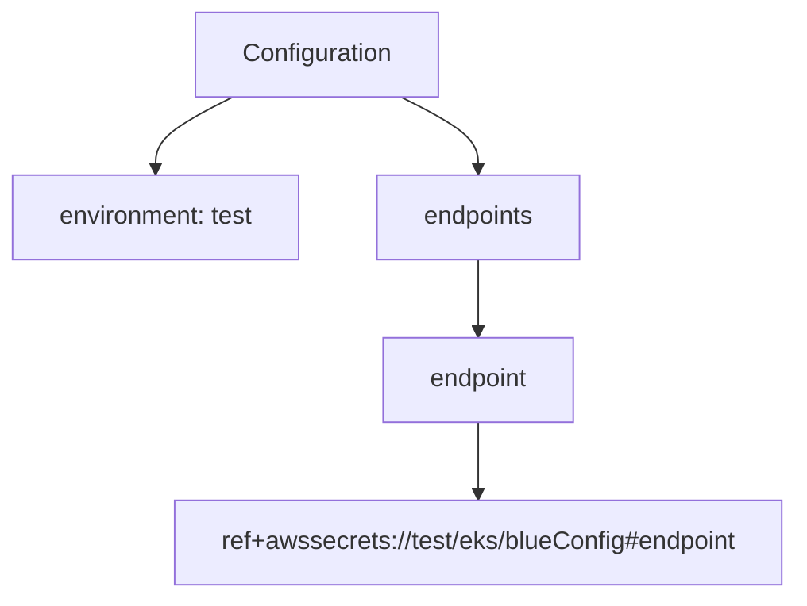
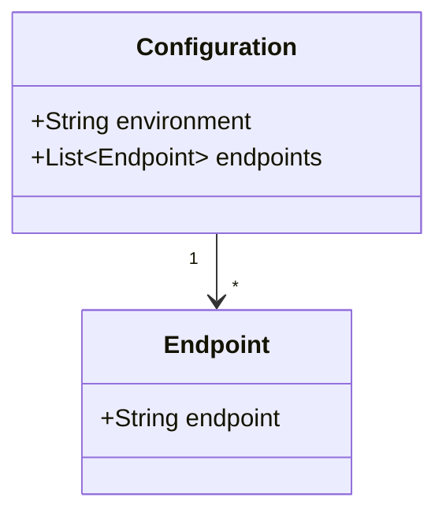
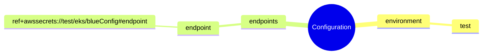

# Diagram: devops/k8s/argocd/projects/environments/helm/values.test.yaml

> Auto-generated by Obscura crawlers

## Diagram 1

### SVG

<svg id="container" width="522.4453125" xmlns="http://www.w3.org/2000/svg" class="flowchart" height="382" viewBox="0 0 522.4453125 382" role="graphics-document document" aria-roledescription="flowchart-v2"><g><marker id="container_flowchart-v2-pointEnd" class="marker flowchart-v2" viewBox="0 0 10 10" refX="5" refY="5" markerUnits="userSpaceOnUse" markerWidth="8" markerHeight="8" orient="auto"><path d="M 0 0 L 10 5 L 0 10 z" class="arrowMarkerPath" style="stroke-width: 1; stroke-dasharray: 1, 0;"></path></marker><marker id="container_flowchart-v2-pointStart" class="marker flowchart-v2" viewBox="0 0 10 10" refX="4.5" refY="5" markerUnits="userSpaceOnUse" markerWidth="8" markerHeight="8" orient="auto"><path d="M 0 5 L 10 10 L 10 0 z" class="arrowMarkerPath" style="stroke-width: 1; stroke-dasharray: 1, 0;"></path></marker><marker id="container_flowchart-v2-circleEnd" class="marker flowchart-v2" viewBox="0 0 10 10" refX="11" refY="5" markerUnits="userSpaceOnUse" markerWidth="11" markerHeight="11" orient="auto"><circle cx="5" cy="5" r="5" class="arrowMarkerPath" style="stroke-width: 1; stroke-dasharray: 1, 0;"></circle></marker><marker id="container_flowchart-v2-circleStart" class="marker flowchart-v2" viewBox="0 0 10 10" refX="-1" refY="5" markerUnits="userSpaceOnUse" markerWidth="11" markerHeight="11" orient="auto"><circle cx="5" cy="5" r="5" class="arrowMarkerPath" style="stroke-width: 1; stroke-dasharray: 1, 0;"></circle></marker><marker id="container_flowchart-v2-crossEnd" class="marker cross flowchart-v2" viewBox="0 0 11 11" refX="12" refY="5.2" markerUnits="userSpaceOnUse" markerWidth="11" markerHeight="11" orient="auto"><path d="M 1,1 l 9,9 M 10,1 l -9,9" class="arrowMarkerPath" style="stroke-width: 2; stroke-dasharray: 1, 0;"></path></marker><marker id="container_flowchart-v2-crossStart" class="marker cross flowchart-v2" viewBox="0 0 11 11" refX="-1" refY="5.2" markerUnits="userSpaceOnUse" markerWidth="11" markerHeight="11" orient="auto"><path d="M 1,1 l 9,9 M 10,1 l -9,9" class="arrowMarkerPath" style="stroke-width: 2; stroke-dasharray: 1, 0;"></path></marker><g class="root"><g class="clusters"></g><g class="edgePaths"><path d="M152.699,62L144.252,66.167C135.805,70.333,118.91,78.667,110.463,86.333C102.016,94,102.016,101,102.016,104.5L102.016,108" id="L_A_B_0" class="edge-thickness-normal edge-pattern-solid edge-thickness-normal edge-pattern-solid flowchart-link" style=";" data-edge="true" data-et="edge" data-id="L_A_B_0" data-points="W3sieCI6MTUyLjY5OTIxODc1LCJ5Ijo2Mn0seyJ4IjoxMDIuMDE1NjI1LCJ5Ijo4N30seyJ4IjoxMDIuMDE1NjI1LCJ5IjoxMTJ9XQ==" marker-end="url(#container_flowchart-v2-pointEnd)"></path><path d="M262.176,62L270.623,66.167C279.07,70.333,295.965,78.667,304.412,86.333C312.859,94,312.859,101,312.859,104.5L312.859,108" id="L_A_C_0" class="edge-thickness-normal edge-pattern-solid edge-thickness-normal edge-pattern-solid flowchart-link" style=";" data-edge="true" data-et="edge" data-id="L_A_C_0" data-points="W3sieCI6MjYyLjE3NTc4MTI1LCJ5Ijo2Mn0seyJ4IjozMTIuODU5Mzc1LCJ5Ijo4N30seyJ4IjozMTIuODU5Mzc1LCJ5IjoxMTJ9XQ==" marker-end="url(#container_flowchart-v2-pointEnd)"></path><path d="M312.859,166L312.859,170.167C312.859,174.333,312.859,182.667,312.859,190.333C312.859,198,312.859,205,312.859,208.5L312.859,212" id="L_C_D_0" class="edge-thickness-normal edge-pattern-solid edge-thickness-normal edge-pattern-solid flowchart-link" style=";" data-edge="true" data-et="edge" data-id="L_C_D_0" data-points="W3sieCI6MzEyLjg1OTM3NSwieSI6MTY2fSx7IngiOjMxMi44NTkzNzUsInkiOjE5MX0seyJ4IjozMTIuODU5Mzc1LCJ5IjoyMTZ9XQ==" marker-end="url(#container_flowchart-v2-pointEnd)"></path><path d="M312.859,270L312.859,274.167C312.859,278.333,312.859,286.667,312.859,294.333C312.859,302,312.859,309,312.859,312.5L312.859,316" id="L_D_E_0" class="edge-thickness-normal edge-pattern-solid edge-thickness-normal edge-pattern-solid flowchart-link" style=";" data-edge="true" data-et="edge" data-id="L_D_E_0" data-points="W3sieCI6MzEyLjg1OTM3NSwieSI6MjcwfSx7IngiOjMxMi44NTkzNzUsInkiOjI5NX0seyJ4IjozMTIuODU5Mzc1LCJ5IjozMjB9XQ==" marker-end="url(#container_flowchart-v2-pointEnd)"></path></g><g class="edgeLabels"><g class="edgeLabel"><g class="label" data-id="L_A_B_0" transform="translate(0, 0)"><foreignObject width="0" height="0">

</foreignObject></g></g><g class="edgeLabel"><g class="label" data-id="L_A_C_0" transform="translate(0, 0)"><foreignObject width="0" height="0">

</foreignObject></g></g><g class="edgeLabel"><g class="label" data-id="L_C_D_0" transform="translate(0, 0)"><foreignObject width="0" height="0">

</foreignObject></g></g><g class="edgeLabel"><g class="label" data-id="L_D_E_0" transform="translate(0, 0)"><foreignObject width="0" height="0">

</foreignObject></g></g></g><g class="nodes"><g class="node default" id="flowchart-A-0" transform="translate(207.4375, 35)"><rect class="basic label-container" style="" x="-78.6875" y="-27" width="157.375" height="54"></rect><g class="label" style="" transform="translate(-48.6875, -12)"><rect></rect><foreignObject width="97.375" height="24">

Configuration

</foreignObject></g></g><g class="node default" id="flowchart-B-1" transform="translate(102.015625, 139)"><rect class="basic label-container" style="" x="-94.015625" y="-27" width="188.03125" height="54"></rect><g class="label" style="" transform="translate(-64.015625, -12)"><rect></rect><foreignObject width="128.03125" height="24">

environment: test

</foreignObject></g></g><g class="node default" id="flowchart-C-3" transform="translate(312.859375, 139)"><rect class="basic label-container" style="" x="-66.828125" y="-27" width="133.65625" height="54"></rect><g class="label" style="" transform="translate(-36.828125, -12)"><rect></rect><foreignObject width="73.65625" height="24">

endpoints

</foreignObject></g></g><g class="node default" id="flowchart-D-5" transform="translate(312.859375, 243)"><rect class="basic label-container" style="" x="-63.09375" y="-27" width="126.1875" height="54"></rect><g class="label" style="" transform="translate(-33.09375, -12)"><rect></rect><foreignObject width="66.1875" height="24">

endpoint

</foreignObject></g></g><g class="node default" id="flowchart-E-7" transform="translate(312.859375, 347)"><rect class="basic label-container" style="" x="-201.5859375" y="-27" width="403.171875" height="54"></rect><g class="label" style="" transform="translate(-171.5859375, -12)"><rect></rect><foreignObject width="343.171875" height="24">

ref+awssecrets://test/eks/blueConfig#endpoint

</foreignObject></g></g></g></g></g></svg>

## Diagram 2

### SVG

<svg id="container" width="282.84375" xmlns="http://www.w3.org/2000/svg" class="classDiagram" height="330" viewBox="0 0 282.84375 330" role="graphics-document document" aria-roledescription="class"><g><defs><marker id="container_class-aggregationStart" class="marker aggregation class" refX="18" refY="7" markerWidth="190" markerHeight="240" orient="auto"><path d="M 18,7 L9,13 L1,7 L9,1 Z"></path></marker></defs><defs><marker id="container_class-aggregationEnd" class="marker aggregation class" refX="1" refY="7" markerWidth="20" markerHeight="28" orient="auto"><path d="M 18,7 L9,13 L1,7 L9,1 Z"></path></marker></defs><defs><marker id="container_class-extensionStart" class="marker extension class" refX="18" refY="7" markerWidth="190" markerHeight="240" orient="auto"><path d="M 1,7 L18,13 V 1 Z"></path></marker></defs><defs><marker id="container_class-extensionEnd" class="marker extension class" refX="1" refY="7" markerWidth="20" markerHeight="28" orient="auto"><path d="M 1,1 V 13 L18,7 Z"></path></marker></defs><defs><marker id="container_class-compositionStart" class="marker composition class" refX="18" refY="7" markerWidth="190" markerHeight="240" orient="auto"><path d="M 18,7 L9,13 L1,7 L9,1 Z"></path></marker></defs><defs><marker id="container_class-compositionEnd" class="marker composition class" refX="1" refY="7" markerWidth="20" markerHeight="28" orient="auto"><path d="M 18,7 L9,13 L1,7 L9,1 Z"></path></marker></defs><defs><marker id="container_class-dependencyStart" class="marker dependency class" refX="6" refY="7" markerWidth="190" markerHeight="240" orient="auto"><path d="M 5,7 L9,13 L1,7 L9,1 Z"></path></marker></defs><defs><marker id="container_class-dependencyEnd" class="marker dependency class" refX="13" refY="7" markerWidth="20" markerHeight="28" orient="auto"><path d="M 18,7 L9,13 L14,7 L9,1 Z"></path></marker></defs><defs><marker id="container_class-lollipopStart" class="marker lollipop class" refX="13" refY="7" markerWidth="190" markerHeight="240" orient="auto"><circle stroke="black" fill="transparent" cx="7" cy="7" r="6"></circle></marker></defs><defs><marker id="container_class-lollipopEnd" class="marker lollipop class" refX="1" refY="7" markerWidth="190" markerHeight="240" orient="auto"><circle stroke="black" fill="transparent" cx="7" cy="7" r="6"></circle></marker></defs><g class="root"><g class="clusters"></g><g class="edgePaths"><path d="M141.422,152L141.422,156.167C141.422,160.333,141.422,168.667,141.422,176C141.422,183.333,141.422,189.667,141.422,192.833L141.422,196" id="id_Configuration_Endpoint_1" class="edge-thickness-normal edge-pattern-solid relation" style=";;;" data-edge="true" data-et="edge" data-id="id_Configuration_Endpoint_1" data-points="W3sieCI6MTQxLjQyMTg3NSwieSI6MTUyfSx7IngiOjE0MS40MjE4NzUsInkiOjE3N30seyJ4IjoxNDEuNDIxODc1LCJ5IjoyMDJ9XQ==" marker-end="url(#container_class-dependencyEnd)"></path></g><g class="edgeLabels"><g class="edgeLabel"><g class="label" data-id="id_Configuration_Endpoint_1" transform="translate(0, 0)"><foreignObject width="0" height="0">

</foreignObject></g></g><g class="edgeTerminals" transform="translate(126.42187750000015, 169.50000214285714)"><g class="inner" transform="translate(0, 0)"><foreignObject style="width: 9px; height: 12px;">
1
</foreignObject></g></g><g class="edgeTerminals" transform="translate(151.42187749999985, 179.50000214285714)"><g class="inner" transform="translate(0, 0)"></g><foreignObject style="width: 9px; height: 12px;">
*
</foreignObject></g></g><g class="nodes"><g class="node default" id="classId-Configuration-0" transform="translate(141.421875, 80)"><g class="basic label-container"><path d="M-133.421875 -72 L133.421875 -72 L133.421875 72 L-133.421875 72" stroke="none" stroke-width="0" fill="#ECECFF" style=""></path><path d="M-133.421875 -72 C-31.857376453266056 -72, 69.70712209346789 -72, 133.421875 -72 M-133.421875 -72 C-72.012046761004 -72, -10.602218522008016 -72, 133.421875 -72 M133.421875 -72 C133.421875 -27.117291697274716, 133.421875 17.765416605450568, 133.421875 72 M133.421875 -72 C133.421875 -26.449710545353284, 133.421875 19.100578909293432, 133.421875 72 M133.421875 72 C52.38905586316916 72, -28.643763273661676 72, -133.421875 72 M133.421875 72 C70.68897373237259 72, 7.956072464745176 72, -133.421875 72 M-133.421875 72 C-133.421875 23.78730980537928, -133.421875 -24.42538038924144, -133.421875 -72 M-133.421875 72 C-133.421875 25.005055816908865, -133.421875 -21.98988836618227, -133.421875 -72" stroke="#9370DB" stroke-width="1.3" fill="none" stroke-dasharray="0 0" style=""></path></g><g class="annotation-group text" transform="translate(0, -48)"></g><g class="label-group text" transform="translate(-49.375, -48)"><g class="label" style="font-weight: bolder" transform="translate(0,-12)"><foreignObject width="98.75" height="24">

Configuration

</foreignObject></g></g><g class="members-group text" transform="translate(-121.421875, 0)"><g class="label" style="" transform="translate(0,-12)"><foreignObject width="146.84375" height="24">

+String environment

</foreignObject></g><g class="label" style="" transform="translate(0,12)"><foreignObject width="193.46875" height="24">

+List&lt;Endpoint&gt; endpoints

</foreignObject></g></g><g class="methods-group text" transform="translate(-121.421875, 72)"></g><g class="divider" style=""><path d="M-133.421875 -24 C-40.50480317063786 -24, 52.41226865872429 -24, 133.421875 -24 M-133.421875 -24 C-76.66515745362952 -24, -19.908439907259037 -24, 133.421875 -24" stroke="#9370DB" stroke-width="1.3" fill="none" stroke-dasharray="0 0" style=""></path></g><g class="divider" style=""><path d="M-133.421875 48 C-27.16989806990547 48, 79.08207886018906 48, 133.421875 48 M-133.421875 48 C-34.07827629833061 48, 65.26532240333879 48, 133.421875 48" stroke="#9370DB" stroke-width="1.3" fill="none" stroke-dasharray="0 0" style=""></path></g></g><g class="node default" id="classId-Endpoint-1" transform="translate(141.421875, 262)"><g class="basic label-container"><path d="M-88.796875 -60 L88.796875 -60 L88.796875 60 L-88.796875 60" stroke="none" stroke-width="0" fill="#ECECFF" style=""></path><path d="M-88.796875 -60 C-19.261021893108747 -60, 50.274831213782505 -60, 88.796875 -60 M-88.796875 -60 C-38.82599341145299 -60, 11.144888177094018 -60, 88.796875 -60 M88.796875 -60 C88.796875 -22.312007866112623, 88.796875 15.375984267774754, 88.796875 60 M88.796875 -60 C88.796875 -16.996499419054928, 88.796875 26.007001161890145, 88.796875 60 M88.796875 60 C52.70276472873388 60, 16.608654457467765 60, -88.796875 60 M88.796875 60 C20.29294787599477 60, -48.21097924801046 60, -88.796875 60 M-88.796875 60 C-88.796875 24.027290015215897, -88.796875 -11.945419969568206, -88.796875 -60 M-88.796875 60 C-88.796875 27.897639293215775, -88.796875 -4.20472141356845, -88.796875 -60" stroke="#9370DB" stroke-width="1.3" fill="none" stroke-dasharray="0 0" style=""></path></g><g class="annotation-group text" transform="translate(0, -36)"></g><g class="label-group text" transform="translate(-32.953125, -36)"><g class="label" style="font-weight: bolder" transform="translate(0,-12)"><foreignObject width="65.90625" height="24">

Endpoint

</foreignObject></g></g><g class="members-group text" transform="translate(-76.796875, 12)"><g class="label" style="" transform="translate(0,-12)"><foreignObject width="120.640625" height="24">

+String endpoint

</foreignObject></g></g><g class="methods-group text" transform="translate(-76.796875, 60)"></g><g class="divider" style=""><path d="M-88.796875 -12 C-41.22829453970623 -12, 6.340285920587533 -12, 88.796875 -12 M-88.796875 -12 C-24.070644087371775 -12, 40.65558682525645 -12, 88.796875 -12" stroke="#9370DB" stroke-width="1.3" fill="none" stroke-dasharray="0 0" style=""></path></g><g class="divider" style=""><path d="M-88.796875 36 C-32.42567201523774 36, 23.945530969524526 36, 88.796875 36 M-88.796875 36 C-19.535328883723494 36, 49.72621723255301 36, 88.796875 36" stroke="#9370DB" stroke-width="1.3" fill="none" stroke-dasharray="0 0" style=""></path></g></g></g></g></g></svg>

## Diagram 3

### SVG

<svg id="container" width="100%" xmlns="http://www.w3.org/2000/svg" class="mindmapDiagram" style="max-width: 1206.86865234375px;" viewBox="5 5 1206.86865234375 137.375" role="graphics-document document" aria-roledescription="mindmap"><g><marker id="container_mindmap-pointEnd" class="marker mindmap" viewBox="0 0 10 10" refX="5" refY="5" markerUnits="userSpaceOnUse" markerWidth="8" markerHeight="8" orient="auto"><path d="M 0 0 L 10 5 L 0 10 z" class="arrowMarkerPath" style="stroke-width: 1; stroke-dasharray: 1, 0;"></path></marker><marker id="container_mindmap-pointStart" class="marker mindmap" viewBox="0 0 10 10" refX="4.5" refY="5" markerUnits="userSpaceOnUse" markerWidth="8" markerHeight="8" orient="auto"><path d="M 0 5 L 10 10 L 10 0 z" class="arrowMarkerPath" style="stroke-width: 1; stroke-dasharray: 1, 0;"></path></marker><g class="subgraphs"></g><g class="edgePaths"><path d="M851.616,74.973L863.973,76.036C876.331,77.1,901.045,79.226,925.76,81.352C950.475,83.478,975.19,85.605,987.548,86.668L999.905,87.731" id="edge_0_1" class="edge-thickness-normal edge-pattern-solid edge section-edge-0 edge-depth-1" style="undefined;;;undefined" data-edge="true" data-et="edge" data-id="edge_0_1" data-points="W3sieCI6ODUxLjYxNTcwNzI5ODI1NzYsInkiOjc0Ljk3MzI1NDI5MTA0ODYyfSx7IngiOjkyNS43NjAzMjQ1MzM3ODM1LCJ5Ijo4MS4zNTIxODI0MDE3NTAyN30seyJ4Ijo5OTkuOTA0OTQxNzY5MzA5NSwieSI6ODcuNzMxMTEwNTEyNDUxOTJ9XQ=="></path><path d="M1029.8,87.8L1040.08,86.963C1050.36,86.127,1070.92,84.453,1091.48,82.78C1112.04,81.107,1132.6,79.433,1142.88,78.597L1153.16,77.76" id="edge_1_2" class="edge-thickness-normal edge-pattern-solid edge section-edge-0 edge-depth-3" style="undefined;;;undefined" data-edge="true" data-et="edge" data-id="edge_1_2" data-points="W3sieCI6MTAyOS44MDAzMDA4MjEzNzMyLCJ5Ijo4Ny44MDAwNzY4OTU3OTI1Nn0seyJ4IjoxMDkxLjQ4MDMxMzY5MDY4ODUsInkiOjgyLjc4MDEwMDE3ODg4OH0seyJ4IjoxMTUzLjE2MDMyNjU2MDAwMzgsInkiOjc3Ljc2MDEyMzQ2MTk4MzQ1fV0="></path><path d="M821.721,74.91L810.143,75.857C798.565,76.804,775.409,78.698,752.252,80.592C729.096,82.486,705.94,84.38,694.362,85.327L682.784,86.274" id="edge_0_3" class="edge-thickness-normal edge-pattern-solid edge section-edge-1 edge-depth-1" style="undefined;;;undefined" data-edge="true" data-et="edge" data-id="edge_0_3" data-points="W3sieCI6ODIxLjcyMDgzODkwNTY5MjksInkiOjc0LjkxMDMwMTYzODEwNzMxfSx7IngiOjc1Mi4yNTI0MjI4OTc0MDY0LCJ5Ijo4MC41OTIyODU4NjIxMzY2OX0seyJ4Ijo2ODIuNzg0MDA2ODg5MTIsInkiOjg2LjI3NDI3MDA4NjE2NjA3fV0="></path><path d="M652.907,86.021L641.797,84.923C630.687,83.824,608.468,81.627,586.249,79.43C564.029,77.234,541.81,75.037,530.7,73.938L519.59,72.84" id="edge_3_4" class="edge-thickness-normal edge-pattern-solid edge section-edge-1 edge-depth-3" style="undefined;;;undefined" data-edge="true" data-et="edge" data-id="edge_3_4" data-points="W3sieCI6NjUyLjkwNjcxNzg5NTUwMzMsInkiOjg2LjAyMTE2NjU3MjgwODQ4fSx7IngiOjU4Ni4yNDg1MzUzNDkyNTUsInkiOjc5LjQzMDQ0MTg2OTc0MTQ2fSx7IngiOjUxOS41OTAzNTI4MDMwMDY2LCJ5Ijo3Mi44Mzk3MTcxNjY2NzQ0M31d"></path><path d="M489.685,72.175L467.342,73.385C444.998,74.595,400.311,77.015,355.625,79.436C310.938,81.856,266.251,84.276,243.907,85.486L221.564,86.696" id="edge_4_5" class="edge-thickness-normal edge-pattern-solid edge section-edge-1 edge-depth-5" style="undefined;;;undefined" data-edge="true" data-et="edge" data-id="edge_4_5" data-points="W3sieCI6NDg5LjY4NTA5MDE0MzYwMzYsInkiOjcyLjE3NTAxMTQzMDYzMTk3fSx7IngiOjM1NS42MjQ1MzgzODI5MjQ4NywieSI6NzkuNDM1NjI1OTY5NDA3NH0seyJ4IjoyMjEuNTYzOTg2NjIyMjQ2MTUsInkiOjg2LjY5NjI0MDUwODE4MjgzfV0="></path></g><g class="edgeLabels"><g class="edgeLabel"><g class="label" data-id="edge_0_1" transform="translate(0, 0)"><foreignObject width="0" height="0">

</foreignObject></g></g><g class="edgeLabel"><g class="label" data-id="edge_1_2" transform="translate(0, 0)"><foreignObject width="0" height="0">

</foreignObject></g></g><g class="edgeLabel"><g class="label" data-id="edge_0_3" transform="translate(0, 0)"><foreignObject width="0" height="0">

</foreignObject></g></g><g class="edgeLabel"><g class="label" data-id="edge_3_4" transform="translate(0, 0)"><foreignObject width="0" height="0">

</foreignObject></g></g><g class="edgeLabel"><g class="label" data-id="edge_4_5" transform="translate(0, 0)"><foreignObject width="0" height="0">

</foreignObject></g></g></g><g class="nodes"><g class="node mindmap-node section-root section--1" id="node_0" transform="translate(836.6709143621526, 73.6875)"><circle class="basic label-container" style="" r="58.6875" cx="0" cy="0"></circle><g class="label" style="" transform="translate(-48.6875, -12)"><rect></rect><foreignObject width="97.375" height="24">

Configuration

</foreignObject></g></g><g class="node mindmap-node section-0" id="node_1" transform="translate(1014.8497347054144, 89.01686480350054)"><path id="node-1" class="node-bkg node-0" style="" d="M-66.1875 12
    v-24
    q0,-5 5,-5
    h122.375
    q5,0 5,5
    v24
    q0,5 -5,5
    h-122.375
    q-5,0 -5,-5
    Z"></path><line class="node-line-" x1="-66.1875" y1="17" x2="66.1875" y2="17"></line><g class="label" style="" transform="translate(-46.1875, -12)"><rect></rect><foreignObject width="92.375" height="24">

environment

</foreignObject></g></g><g class="node mindmap-node section-0" id="node_2" transform="translate(1168.1108926759625, 76.54333555427547)"><path id="node-2" class="node-bkg node-0" style="" d="M-33.7578125 12
    v-24
    q0,-5 5,-5
    h57.515625
    q5,0 5,5
    v24
    q0,5 -5,5
    h-57.515625
    q-5,0 -5,-5
    Z"></path><line class="node-line-" x1="-33.7578125" y1="17" x2="33.7578125" y2="17"></line><g class="label" style="" transform="translate(-13.7578125, -12)"><rect></rect><foreignObject width="27.515625" height="24">

test

</foreignObject></g></g><g class="node mindmap-node section-1" id="node_3" transform="translate(667.8339314326602, 87.49707172427338)"><path id="node-3" class="node-bkg node-0" style="" d="M-56.828125 12
    v-24
    q0,-5 5,-5
    h103.65625
    q5,0 5,5
    v24
    q0,5 -5,5
    h-103.65625
    q-5,0 -5,-5
    Z"></path><line class="node-line-" x1="-56.828125" y1="17" x2="56.828125" y2="17"></line><g class="label" style="" transform="translate(-36.828125, -12)"><rect></rect><foreignObject width="73.65625" height="24">

endpoints

</foreignObject></g></g><g class="node mindmap-node section-1" id="node_4" transform="translate(504.66313926584974, 71.36381201520953)"><path id="node-4" class="node-bkg node-0" style="" d="M-53.09375 12
    v-24
    q0,-5 5,-5
    h96.1875
    q5,0 5,5
    v24
    q0,5 -5,5
    h-96.1875
    q-5,0 -5,-5
    Z"></path><line class="node-line-" x1="-53.09375" y1="17" x2="53.09375" y2="17"></line><g class="label" style="" transform="translate(-33.09375, -12)"><rect></rect><foreignObject width="66.1875" height="24">

endpoint

</foreignObject></g></g><g class="node mindmap-node section-1" id="node_5" transform="translate(206.5859375, 87.50743992360526)"><path id="node-5" class="node-bkg node-0" style="" d="M-191.5859375 12
    v-24
    q0,-5 5,-5
    h373.171875
    q5,0 5,5
    v24
    q0,5 -5,5
    h-373.171875
    q-5,0 -5,-5
    Z"></path><line class="node-line-" x1="-191.5859375" y1="17" x2="191.5859375" y2="17"></line><g class="label" style="" transform="translate(-171.5859375, -12)"><rect></rect><foreignObject width="343.171875" height="24">

ref+awssecrets://test/eks/blueConfig#endpoint

</foreignObject></g></g></g></g></svg>
