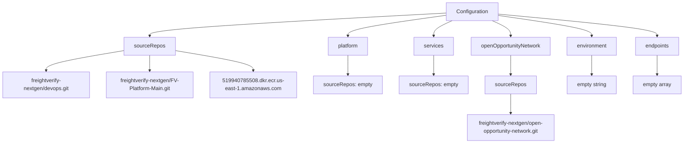
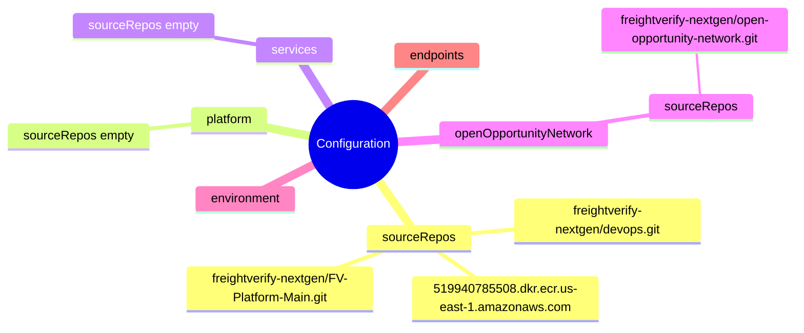
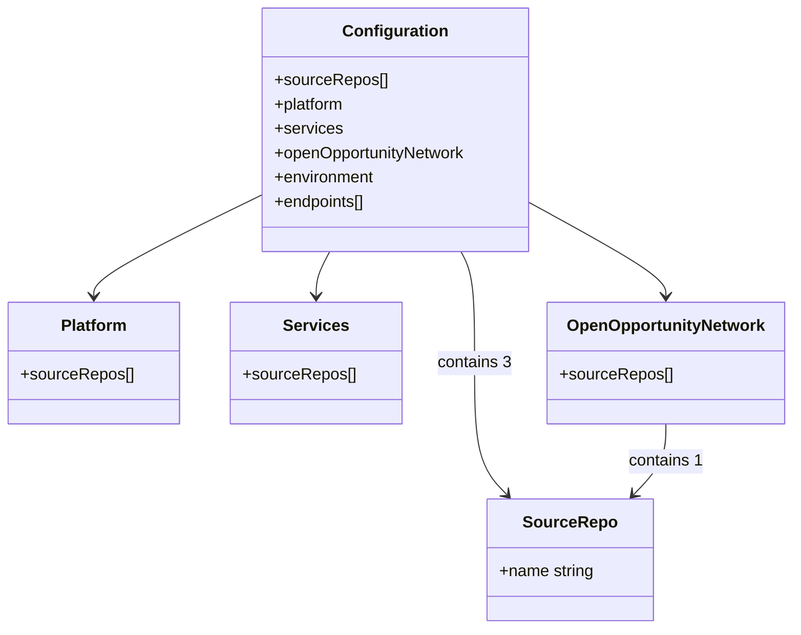

# Diagram: devops/k8s/argocd/projects/environments/helm/values.yaml

> Auto-generated by Obscura crawlers

## Diagram 1

### SVG

<svg id="container" width="2058.2109375" xmlns="http://www.w3.org/2000/svg" class="flowchart" height="454" viewBox="0 0 2058.2109375 454" role="graphics-document document" aria-roledescription="flowchart-v2"><g><marker id="container_flowchart-v2-pointEnd" class="marker flowchart-v2" viewBox="0 0 10 10" refX="5" refY="5" markerUnits="userSpaceOnUse" markerWidth="8" markerHeight="8" orient="auto"><path d="M 0 0 L 10 5 L 0 10 z" class="arrowMarkerPath" style="stroke-width: 1; stroke-dasharray: 1, 0;"></path></marker><marker id="container_flowchart-v2-pointStart" class="marker flowchart-v2" viewBox="0 0 10 10" refX="4.5" refY="5" markerUnits="userSpaceOnUse" markerWidth="8" markerHeight="8" orient="auto"><path d="M 0 5 L 10 10 L 10 0 z" class="arrowMarkerPath" style="stroke-width: 1; stroke-dasharray: 1, 0;"></path></marker><marker id="container_flowchart-v2-circleEnd" class="marker flowchart-v2" viewBox="0 0 10 10" refX="11" refY="5" markerUnits="userSpaceOnUse" markerWidth="11" markerHeight="11" orient="auto"><circle cx="5" cy="5" r="5" class="arrowMarkerPath" style="stroke-width: 1; stroke-dasharray: 1, 0;"></circle></marker><marker id="container_flowchart-v2-circleStart" class="marker flowchart-v2" viewBox="0 0 10 10" refX="-1" refY="5" markerUnits="userSpaceOnUse" markerWidth="11" markerHeight="11" orient="auto"><circle cx="5" cy="5" r="5" class="arrowMarkerPath" style="stroke-width: 1; stroke-dasharray: 1, 0;"></circle></marker><marker id="container_flowchart-v2-crossEnd" class="marker cross flowchart-v2" viewBox="0 0 11 11" refX="12" refY="5.2" markerUnits="userSpaceOnUse" markerWidth="11" markerHeight="11" orient="auto"><path d="M 1,1 l 9,9 M 10,1 l -9,9" class="arrowMarkerPath" style="stroke-width: 2; stroke-dasharray: 1, 0;"></path></marker><marker id="container_flowchart-v2-crossStart" class="marker cross flowchart-v2" viewBox="0 0 11 11" refX="-1" refY="5.2" markerUnits="userSpaceOnUse" markerWidth="11" markerHeight="11" orient="auto"><path d="M 1,1 l 9,9 M 10,1 l -9,9" class="arrowMarkerPath" style="stroke-width: 2; stroke-dasharray: 1, 0;"></path></marker><g class="root"><g class="clusters"></g><g class="edgePaths"><path d="M1334.215,39.241L1186.512,47.2C1038.81,55.16,743.405,71.08,595.702,82.54C448,94,448,101,448,104.5L448,108" id="L_Root_SR_0" class="edge-thickness-normal edge-pattern-solid edge-thickness-normal edge-pattern-solid flowchart-link" style=";" data-edge="true" data-et="edge" data-id="L_Root_SR_0" data-points="W3sieCI6MTMzNC4yMTQ4NDM3NSwieSI6MzkuMjQwNTg0NTc5ODgzODE2fSx7IngiOjQ0OCwieSI6ODd9LHsieCI6NDQ4LCJ5IjoxMTJ9XQ==" marker-end="url(#container_flowchart-v2-pointEnd)"></path><path d="M1334.215,46.001L1285.34,52.834C1236.466,59.668,1138.717,73.334,1089.843,83.667C1040.969,94,1040.969,101,1040.969,104.5L1040.969,108" id="L_Root_Platform_0" class="edge-thickness-normal edge-pattern-solid edge-thickness-normal edge-pattern-solid flowchart-link" style=";" data-edge="true" data-et="edge" data-id="L_Root_Platform_0" data-points="W3sieCI6MTMzNC4yMTQ4NDM3NSwieSI6NDYuMDAxMjkxODEzMjY0NzE0fSx7IngiOjEwNDAuOTY4NzUsInkiOjg3fSx7IngiOjEwNDAuOTY4NzUsInkiOjExMn1d" marker-end="url(#container_flowchart-v2-pointEnd)"></path><path d="M1352.674,62L1343.379,66.167C1334.084,70.333,1315.495,78.667,1306.201,86.333C1296.906,94,1296.906,101,1296.906,104.5L1296.906,108" id="L_Root_Services_0" class="edge-thickness-normal edge-pattern-solid edge-thickness-normal edge-pattern-solid flowchart-link" style=";" data-edge="true" data-et="edge" data-id="L_Root_Services_0" data-points="W3sieCI6MTM1Mi42NzM2MDI3NjQ0MjMsInkiOjYyfSx7IngiOjEyOTYuOTA2MjUsInkiOjg3fSx7IngiOjEyOTYuOTA2MjUsInkiOjExMn1d" marker-end="url(#container_flowchart-v2-pointEnd)"></path><path d="M1473.131,62L1482.426,66.167C1491.72,70.333,1510.309,78.667,1519.604,86.333C1528.898,94,1528.898,101,1528.898,104.5L1528.898,108" id="L_Root_OON_0" class="edge-thickness-normal edge-pattern-solid edge-thickness-normal edge-pattern-solid flowchart-link" style=";" data-edge="true" data-et="edge" data-id="L_Root_OON_0" data-points="W3sieCI6MTQ3My4xMzEwODQ3MzU1NzcsInkiOjYyfSx7IngiOjE1MjguODk4NDM3NSwieSI6ODd9LHsieCI6MTUyOC44OTg0Mzc1LCJ5IjoxMTJ9XQ==" marker-end="url(#container_flowchart-v2-pointEnd)"></path><path d="M1491.59,46.209L1539.314,53.008C1587.039,59.806,1682.488,73.403,1730.213,83.702C1777.938,94,1777.938,101,1777.938,104.5L1777.938,108" id="L_Root_Env_0" class="edge-thickness-normal edge-pattern-solid edge-thickness-normal edge-pattern-solid flowchart-link" style=";" data-edge="true" data-et="edge" data-id="L_Root_Env_0" data-points="W3sieCI6MTQ5MS41ODk4NDM3NSwieSI6NDYuMjA5MTk0MzE5ODk2NDF9LHsieCI6MTc3Ny45Mzc1LCJ5Ijo4N30seyJ4IjoxNzc3LjkzNzUsInkiOjExMn1d" marker-end="url(#container_flowchart-v2-pointEnd)"></path><path d="M1491.59,42.255L1572.479,49.712C1653.367,57.17,1815.145,72.085,1896.033,83.042C1976.922,94,1976.922,101,1976.922,104.5L1976.922,108" id="L_Root_EP_0" class="edge-thickness-normal edge-pattern-solid edge-thickness-normal edge-pattern-solid flowchart-link" style=";" data-edge="true" data-et="edge" data-id="L_Root_EP_0" data-points="W3sieCI6MTQ5MS41ODk4NDM3NSwieSI6NDIuMjU0NjI0NjU5NzczMjV9LHsieCI6MTk3Ni45MjE4NzUsInkiOjg3fSx7IngiOjE5NzYuOTIxODc1LCJ5IjoxMTJ9XQ==" marker-end="url(#container_flowchart-v2-pointEnd)"></path><path d="M371.82,151.779L332.85,158.315C293.88,164.852,215.94,177.926,176.97,187.963C138,198,138,205,138,208.5L138,212" id="L_SR_Repo1_0" class="edge-thickness-normal edge-pattern-solid edge-thickness-normal edge-pattern-solid flowchart-link" style=";" data-edge="true" data-et="edge" data-id="L_SR_Repo1_0" data-points="W3sieCI6MzcxLjgyMDMxMjUsInkiOjE1MS43Nzg1MjgyMjU4MDY0NH0seyJ4IjoxMzgsInkiOjE5MX0seyJ4IjoxMzgsInkiOjIxNn1d" marker-end="url(#container_flowchart-v2-pointEnd)"></path><path d="M448,166L448,170.167C448,174.333,448,182.667,448,190.333C448,198,448,205,448,208.5L448,212" id="L_SR_Repo2_0" class="edge-thickness-normal edge-pattern-solid edge-thickness-normal edge-pattern-solid flowchart-link" style=";" data-edge="true" data-et="edge" data-id="L_SR_Repo2_0" data-points="W3sieCI6NDQ4LCJ5IjoxNjZ9LHsieCI6NDQ4LCJ5IjoxOTF9LHsieCI6NDQ4LCJ5IjoyMTZ9XQ==" marker-end="url(#container_flowchart-v2-pointEnd)"></path><path d="M524.18,151.779L563.15,158.315C602.12,164.852,680.06,177.926,719.03,187.963C758,198,758,205,758,208.5L758,212" id="L_SR_Repo3_0" class="edge-thickness-normal edge-pattern-solid edge-thickness-normal edge-pattern-solid flowchart-link" style=";" data-edge="true" data-et="edge" data-id="L_SR_Repo3_0" data-points="W3sieCI6NTI0LjE3OTY4NzUsInkiOjE1MS43Nzg1MjgyMjU4MDY0NH0seyJ4Ijo3NTgsInkiOjE5MX0seyJ4Ijo3NTgsInkiOjIxNn1d" marker-end="url(#container_flowchart-v2-pointEnd)"></path><path d="M1040.969,166L1040.969,170.167C1040.969,174.333,1040.969,182.667,1040.969,192.333C1040.969,202,1040.969,213,1040.969,218.5L1040.969,224" id="L_Platform_PSR_0" class="edge-thickness-normal edge-pattern-solid edge-thickness-normal edge-pattern-solid flowchart-link" style=";" data-edge="true" data-et="edge" data-id="L_Platform_PSR_0" data-points="W3sieCI6MTA0MC45Njg3NSwieSI6MTY2fSx7IngiOjEwNDAuOTY4NzUsInkiOjE5MX0seyJ4IjoxMDQwLjk2ODc1LCJ5IjoyMjh9XQ==" marker-end="url(#container_flowchart-v2-pointEnd)"></path><path d="M1296.906,166L1296.906,170.167C1296.906,174.333,1296.906,182.667,1296.906,192.333C1296.906,202,1296.906,213,1296.906,218.5L1296.906,224" id="L_Services_SSR_0" class="edge-thickness-normal edge-pattern-solid edge-thickness-normal edge-pattern-solid flowchart-link" style=";" data-edge="true" data-et="edge" data-id="L_Services_SSR_0" data-points="W3sieCI6MTI5Ni45MDYyNSwieSI6MTY2fSx7IngiOjEyOTYuOTA2MjUsInkiOjE5MX0seyJ4IjoxMjk2LjkwNjI1LCJ5IjoyMjh9XQ==" marker-end="url(#container_flowchart-v2-pointEnd)"></path><path d="M1528.898,166L1528.898,170.167C1528.898,174.333,1528.898,182.667,1528.898,192.333C1528.898,202,1528.898,213,1528.898,218.5L1528.898,224" id="L_OON_OONSR_0" class="edge-thickness-normal edge-pattern-solid edge-thickness-normal edge-pattern-solid flowchart-link" style=";" data-edge="true" data-et="edge" data-id="L_OON_OONSR_0" data-points="W3sieCI6MTUyOC44OTg0Mzc1LCJ5IjoxNjZ9LHsieCI6MTUyOC44OTg0Mzc1LCJ5IjoxOTF9LHsieCI6MTUyOC44OTg0Mzc1LCJ5IjoyMjh9XQ==" marker-end="url(#container_flowchart-v2-pointEnd)"></path><path d="M1528.898,282L1528.898,288.167C1528.898,294.333,1528.898,306.667,1528.898,316.333C1528.898,326,1528.898,333,1528.898,336.5L1528.898,340" id="L_OONSR_OONRepo_0" class="edge-thickness-normal edge-pattern-solid edge-thickness-normal edge-pattern-solid flowchart-link" style=";" data-edge="true" data-et="edge" data-id="L_OONSR_OONRepo_0" data-points="W3sieCI6MTUyOC44OTg0Mzc1LCJ5IjoyODJ9LHsieCI6MTUyOC44OTg0Mzc1LCJ5IjozMTl9LHsieCI6MTUyOC44OTg0Mzc1LCJ5IjozNDR9XQ==" marker-end="url(#container_flowchart-v2-pointEnd)"></path><path d="M1777.938,166L1777.938,170.167C1777.938,174.333,1777.938,182.667,1777.938,192.333C1777.938,202,1777.938,213,1777.938,218.5L1777.938,224" id="L_Env_EnvEmpty_0" class="edge-thickness-normal edge-pattern-solid edge-thickness-normal edge-pattern-solid flowchart-link" style=";" data-edge="true" data-et="edge" data-id="L_Env_EnvEmpty_0" data-points="W3sieCI6MTc3Ny45Mzc1LCJ5IjoxNjZ9LHsieCI6MTc3Ny45Mzc1LCJ5IjoxOTF9LHsieCI6MTc3Ny45Mzc1LCJ5IjoyMjh9XQ==" marker-end="url(#container_flowchart-v2-pointEnd)"></path><path d="M1976.922,166L1976.922,170.167C1976.922,174.333,1976.922,182.667,1976.922,192.333C1976.922,202,1976.922,213,1976.922,218.5L1976.922,224" id="L_EP_EPEmpty_0" class="edge-thickness-normal edge-pattern-solid edge-thickness-normal edge-pattern-solid flowchart-link" style=";" data-edge="true" data-et="edge" data-id="L_EP_EPEmpty_0" data-points="W3sieCI6MTk3Ni45MjE4NzUsInkiOjE2Nn0seyJ4IjoxOTc2LjkyMTg3NSwieSI6MTkxfSx7IngiOjE5NzYuOTIxODc1LCJ5IjoyMjh9XQ==" marker-end="url(#container_flowchart-v2-pointEnd)"></path></g><g class="edgeLabels"><g class="edgeLabel"><g class="label" data-id="L_Root_SR_0" transform="translate(0, 0)"><foreignObject width="0" height="0">

</foreignObject></g></g><g class="edgeLabel"><g class="label" data-id="L_Root_Platform_0" transform="translate(0, 0)"><foreignObject width="0" height="0">

</foreignObject></g></g><g class="edgeLabel"><g class="label" data-id="L_Root_Services_0" transform="translate(0, 0)"><foreignObject width="0" height="0">

</foreignObject></g></g><g class="edgeLabel"><g class="label" data-id="L_Root_OON_0" transform="translate(0, 0)"><foreignObject width="0" height="0">

</foreignObject></g></g><g class="edgeLabel"><g class="label" data-id="L_Root_Env_0" transform="translate(0, 0)"><foreignObject width="0" height="0">

</foreignObject></g></g><g class="edgeLabel"><g class="label" data-id="L_Root_EP_0" transform="translate(0, 0)"><foreignObject width="0" height="0">

</foreignObject></g></g><g class="edgeLabel"><g class="label" data-id="L_SR_Repo1_0" transform="translate(0, 0)"><foreignObject width="0" height="0">

</foreignObject></g></g><g class="edgeLabel"><g class="label" data-id="L_SR_Repo2_0" transform="translate(0, 0)"><foreignObject width="0" height="0">

</foreignObject></g></g><g class="edgeLabel"><g class="label" data-id="L_SR_Repo3_0" transform="translate(0, 0)"><foreignObject width="0" height="0">

</foreignObject></g></g><g class="edgeLabel"><g class="label" data-id="L_Platform_PSR_0" transform="translate(0, 0)"><foreignObject width="0" height="0">

</foreignObject></g></g><g class="edgeLabel"><g class="label" data-id="L_Services_SSR_0" transform="translate(0, 0)"><foreignObject width="0" height="0">

</foreignObject></g></g><g class="edgeLabel"><g class="label" data-id="L_OON_OONSR_0" transform="translate(0, 0)"><foreignObject width="0" height="0">

</foreignObject></g></g><g class="edgeLabel"><g class="label" data-id="L_OONSR_OONRepo_0" transform="translate(0, 0)"><foreignObject width="0" height="0">

</foreignObject></g></g><g class="edgeLabel"><g class="label" data-id="L_Env_EnvEmpty_0" transform="translate(0, 0)"><foreignObject width="0" height="0">

</foreignObject></g></g><g class="edgeLabel"><g class="label" data-id="L_EP_EPEmpty_0" transform="translate(0, 0)"><foreignObject width="0" height="0">

</foreignObject></g></g></g><g class="nodes"><g class="node default" id="flowchart-Root-0" transform="translate(1412.90234375, 35)"><rect class="basic label-container" style="" x="-78.6875" y="-27" width="157.375" height="54"></rect><g class="label" style="" transform="translate(-48.6875, -12)"><rect></rect><foreignObject width="97.375" height="24">

Configuration

</foreignObject></g></g><g class="node default" id="flowchart-SR-2" transform="translate(448, 139)"><rect class="basic label-container" style="" x="-76.1796875" y="-27" width="152.359375" height="54"></rect><g class="label" style="" transform="translate(-46.1796875, -12)"><rect></rect><foreignObject width="92.359375" height="24">

sourceRepos

</foreignObject></g></g><g class="node default" id="flowchart-Platform-4" transform="translate(1040.96875, 139)"><rect class="basic label-container" style="" x="-61.515625" y="-27" width="123.03125" height="54"></rect><g class="label" style="" transform="translate(-31.515625, -12)"><rect></rect><foreignObject width="63.03125" height="24">

platform

</foreignObject></g></g><g class="node default" id="flowchart-Services-6" transform="translate(1296.90625, 139)"><rect class="basic label-container" style="" x="-59.140625" y="-27" width="118.28125" height="54"></rect><g class="label" style="" transform="translate(-29.140625, -12)"><rect></rect><foreignObject width="58.28125" height="24">

services

</foreignObject></g></g><g class="node default" id="flowchart-OON-8" transform="translate(1528.8984375, 139)"><rect class="basic label-container" style="" x="-122.8515625" y="-27" width="245.703125" height="54"></rect><g class="label" style="" transform="translate(-92.8515625, -12)"><rect></rect><foreignObject width="185.703125" height="24">

openOpportunityNetwork

</foreignObject></g></g><g class="node default" id="flowchart-Env-10" transform="translate(1777.9375, 139)"><rect class="basic label-container" style="" x="-76.1875" y="-27" width="152.375" height="54"></rect><g class="label" style="" transform="translate(-46.1875, -12)"><rect></rect><foreignObject width="92.375" height="24">

environment

</foreignObject></g></g><g class="node default" id="flowchart-EP-12" transform="translate(1976.921875, 139)"><rect class="basic label-container" style="" x="-66.828125" y="-27" width="133.65625" height="54"></rect><g class="label" style="" transform="translate(-36.828125, -12)"><rect></rect><foreignObject width="73.65625" height="24">

endpoints

</foreignObject></g></g><g class="node default" id="flowchart-Repo1-14" transform="translate(138, 255)"><rect class="basic label-container" style="" x="-130" y="-39" width="260" height="78"></rect><g class="label" style="" transform="translate(-100, -24)"><rect></rect><foreignObject width="200" height="48">

freightverify-nextgen/devops.git

</foreignObject></g></g><g class="node default" id="flowchart-Repo2-16" transform="translate(448, 255)"><rect class="basic label-container" style="" x="-130" y="-39" width="260" height="78"></rect><g class="label" style="" transform="translate(-100, -24)"><rect></rect><foreignObject width="200" height="48">

freightverify-nextgen/FV-Platform-Main.git

</foreignObject></g></g><g class="node default" id="flowchart-Repo3-18" transform="translate(758, 255)"><rect class="basic label-container" style="" x="-130" y="-39" width="260" height="78"></rect><g class="label" style="" transform="translate(-100, -24)"><rect></rect><foreignObject width="200" height="48">

519940785508.dkr.ecr.us-east-1.amazonaws.com

</foreignObject></g></g><g class="node default" id="flowchart-PSR-20" transform="translate(1040.96875, 255)"><rect class="basic label-container" style="" x="-102.96875" y="-27" width="205.9375" height="54"></rect><g class="label" style="" transform="translate(-72.96875, -12)"><rect></rect><foreignObject width="145.9375" height="24">

sourceRepos: empty

</foreignObject></g></g><g class="node default" id="flowchart-SSR-22" transform="translate(1296.90625, 255)"><rect class="basic label-container" style="" x="-102.96875" y="-27" width="205.9375" height="54"></rect><g class="label" style="" transform="translate(-72.96875, -12)"><rect></rect><foreignObject width="145.9375" height="24">

sourceRepos: empty

</foreignObject></g></g><g class="node default" id="flowchart-OONSR-24" transform="translate(1528.8984375, 255)"><rect class="basic label-container" style="" x="-76.1796875" y="-27" width="152.359375" height="54"></rect><g class="label" style="" transform="translate(-46.1796875, -12)"><rect></rect><foreignObject width="92.359375" height="24">

sourceRepos

</foreignObject></g></g><g class="node default" id="flowchart-OONRepo-26" transform="translate(1528.8984375, 395)"><rect class="basic label-container" style="" x="-130" y="-51" width="260" height="102"></rect><g class="label" style="" transform="translate(-100, -36)"><rect></rect><foreignObject width="200" height="72">

freightverify-nextgen/open-opportunity-network.git

</foreignObject></g></g><g class="node default" id="flowchart-EnvEmpty-28" transform="translate(1777.9375, 255)"><rect class="basic label-container" style="" x="-75.6953125" y="-27" width="151.390625" height="54"></rect><g class="label" style="" transform="translate(-45.6953125, -12)"><rect></rect><foreignObject width="91.390625" height="24">

empty string

</foreignObject></g></g><g class="node default" id="flowchart-EPEmpty-30" transform="translate(1976.921875, 255)"><rect class="basic label-container" style="" x="-73.2890625" y="-27" width="146.578125" height="54"></rect><g class="label" style="" transform="translate(-43.2890625, -12)"><rect></rect><foreignObject width="86.578125" height="24">

empty array

</foreignObject></g></g></g></g></g></svg>

## Diagram 2

### SVG

<svg id="container" width="100%" xmlns="http://www.w3.org/2000/svg" class="mindmapDiagram" style="max-width: 1200.2535400390625px;" viewBox="5 5 1200.2535400390625 430.34576416015625" role="graphics-document document" aria-roledescription="mindmap"><g><marker id="container_mindmap-pointEnd" class="marker mindmap" viewBox="0 0 10 10" refX="5" refY="5" markerUnits="userSpaceOnUse" markerWidth="8" markerHeight="8" orient="auto"><path d="M 0 0 L 10 5 L 0 10 z" class="arrowMarkerPath" style="stroke-width: 1; stroke-dasharray: 1, 0;"></path></marker><marker id="container_mindmap-pointStart" class="marker mindmap" viewBox="0 0 10 10" refX="4.5" refY="5" markerUnits="userSpaceOnUse" markerWidth="8" markerHeight="8" orient="auto"><path d="M 0 5 L 10 10 L 10 0 z" class="arrowMarkerPath" style="stroke-width: 1; stroke-dasharray: 1, 0;"></path></marker><g class="subgraphs"></g><g class="edgePaths"><path d="M450.944,213.817L456.479,221.911C462.014,230.004,473.084,246.19,484.154,262.377C495.224,278.563,506.294,294.75,511.83,302.843L517.365,310.936" id="edge_0_1" class="edge-thickness-normal edge-pattern-solid edge section-edge-0 edge-depth-1" style="undefined;;;undefined" data-edge="true" data-et="edge" data-id="edge_0_1" data-points="W3sieCI6NDUwLjk0MzU5NTMyODE5NzQsInkiOjIxMy44MTczNzIyMzEyOTg5OH0seyJ4Ijo0ODQuMTU0MTAzMzc1OTkyNiwieSI6MjYyLjM3Njc3Mzg3MzM5N30seyJ4Ijo1MTcuMzY0NjExNDIzNzg3OCwieSI6MzEwLjkzNjE3NTUxNTQ5NX1d"></path><path d="M539.63,329.202L550.621,333.89C561.613,338.578,583.595,347.954,605.578,357.33C627.561,366.706,649.543,376.082,660.535,380.77L671.526,385.458" id="edge_1_2" class="edge-thickness-normal edge-pattern-solid edge section-edge-0 edge-depth-3" style="undefined;;;undefined" data-edge="true" data-et="edge" data-id="edge_1_2" data-points="W3sieCI6NTM5LjYyOTc5NzAwODg4MTcsInkiOjMyOS4yMDIzMjA1NTY5NzIwNH0seyJ4Ijo2MDUuNTc3OTkzNDQ2NTc3NCwieSI6MzU3LjMzMDMzODg0MDgwMzM0fSx7IngiOjY3MS41MjYxODk4ODQyNzMsInkiOjM4NS40NTgzNTcxMjQ2MzQ2M31d"></path><path d="M540.538,320.358L558.081,316.827C575.624,313.296,610.711,306.235,645.798,299.173C680.885,292.112,715.972,285.05,733.515,281.52L751.059,277.989" id="edge_1_3" class="edge-thickness-normal edge-pattern-solid edge section-edge-0 edge-depth-3" style="undefined;;;undefined" data-edge="true" data-et="edge" data-id="edge_1_3" data-points="W3sieCI6NTQwLjUzNzUxOTA0OTQxNTQsInkiOjMyMC4zNTc5NTQ1MTQ5ODMxM30seyJ4Ijo2NDUuNzk4MDE4MTkxODQ1MiwieSI6Mjk5LjE3MzM4NTcyNTAyNjY2fSx7IngiOjc1MS4wNTg1MTczMzQyNzUsInkiOjI3Ny45ODg4MTY5MzUwNzAyfV0="></path><path d="M512.692,330.552L503.828,335.432C494.964,340.312,477.236,350.072,459.508,359.832C441.78,369.592,424.052,379.352,415.187,384.232L406.323,389.112" id="edge_1_4" class="edge-thickness-normal edge-pattern-solid edge section-edge-0 edge-depth-3" style="undefined;;;undefined" data-edge="true" data-et="edge" data-id="edge_1_4" data-points="W3sieCI6NTEyLjY5MjExOTA0MDE5OTMsInkiOjMzMC41NTE2ODM5OTQwNzkzfSx7IngiOjQ1OS41MDc3NTk0NTA1MDkzLCJ5IjozNTkuODMxNjI1OTY5NjA1ODV9LHsieCI6NDA2LjMyMzM5OTg2MDgxOTIsInkiOjM4OS4xMTE1Njc5NDUxMzI0fV0="></path><path d="M429.155,208.332L419.713,213.22C410.271,218.108,391.388,227.884,372.504,237.66C353.62,247.437,334.736,257.213,325.294,262.101L315.852,266.989" id="edge_0_5" class="edge-thickness-normal edge-pattern-solid edge section-edge-1 edge-depth-1" style="undefined;;;undefined" data-edge="true" data-et="edge" data-id="edge_0_5" data-points="W3sieCI6NDI5LjE1NTA0NDczNjA4NTEzLCJ5IjoyMDguMzMyMTk3NTYxNjk0NDR9LHsieCI6MzcyLjUwMzcyODAzOTc0MDYsInkiOjIzNy42NjA0NTI2NDA4MzIxNX0seyJ4IjozMTUuODUyNDExMzQzMzk2MSwieSI6MjY2Ljk4ODcwNzcxOTk2OTg1fV0="></path><path d="M287.543,273.301L273.668,272.761C259.793,272.221,232.043,271.141,204.293,270.06C176.543,268.98,148.793,267.899,134.918,267.359L121.043,266.819" id="edge_5_6" class="edge-thickness-normal edge-pattern-solid edge section-edge-1 edge-depth-3" style="undefined;;;undefined" data-edge="true" data-et="edge" data-id="edge_5_6" data-points="W3sieCI6Mjg3LjU0Mjk4Mjg0NjU3LCJ5IjoyNzMuMzAxMzA1NzkzMjYwNjd9LHsieCI6MjA0LjI5MzE1NzY5NzU2Mjc4LCJ5IjoyNzAuMDYwMjA4ODc3MDE4NDV9LHsieCI6MTIxLjA0MzMzMjU0ODU1NTU1LCJ5IjoyNjYuODE5MTExOTYwNzc2MjR9XQ=="></path><path d="M453.828,191.632L461.909,184.653C469.99,177.675,486.152,163.717,502.314,149.76C518.476,135.802,534.638,121.845,542.719,114.866L550.8,107.887" id="edge_0_7" class="edge-thickness-normal edge-pattern-solid edge section-edge-2 edge-depth-1" style="undefined;;;undefined" data-edge="true" data-et="edge" data-id="edge_0_7" data-points="W3sieCI6NDUzLjgyODM3NjAxMDM2LCJ5IjoxOTEuNjMxOTk1NTc0NDI0MzR9LHsieCI6NTAyLjMxNDE3MDkwMzY1ODI0LCJ5IjoxNDkuNzU5NjUwMTU3MTgzMzN9LHsieCI6NTUwLjc5OTk2NTc5Njk1NjUsInkiOjEwNy44ODczMDQ3Mzk5NDIzMn1d"></path><path d="M574.188,89.13L579.584,85.115C584.981,81.101,595.774,73.071,606.568,65.042C617.361,57.012,628.155,48.983,633.552,44.968L638.948,40.953" id="edge_7_8" class="edge-thickness-normal edge-pattern-solid edge section-edge-2 edge-depth-3" style="undefined;;;undefined" data-edge="true" data-et="edge" data-id="edge_7_8" data-points="W3sieCI6NTc0LjE4NzUyNzc3MDY4NjUsInkiOjg5LjEzMDExNzEyMDgwMzc2fSx7IngiOjYwNi41Njc4ODg2MzE5MzY3LCJ5Ijo2NS4wNDE2MjA3MDI5NDA1Mn0seyJ4Ijo2MzguOTQ4MjQ5NDkzMTg3LCJ5Ijo0MC45NTMxMjQyODUwNzcyOX1d"></path><path d="M457.353,199.522L473.649,197.426C489.944,195.33,522.536,191.137,555.127,186.945C587.718,182.752,620.309,178.56,636.605,176.464L652.901,174.367" id="edge_0_9" class="edge-thickness-normal edge-pattern-solid edge section-edge-3 edge-depth-1" style="undefined;;;undefined" data-edge="true" data-et="edge" data-id="edge_0_9" data-points="W3sieCI6NDU3LjM1MzIzODk4OTkwNzE0LCJ5IjoxOTkuNTIyMjU0MzkzMTY1NH0seyJ4Ijo1NTUuMTI2OTMwODQzMDU3NywieSI6MTg2Ljk0NDgxNDk4NTYxMzIyfSx7IngiOjY1Mi45MDA2MjI2OTYyMDgzLCJ5IjoxNzQuMzY3Mzc1NTc4MDYxMDN9XQ=="></path><path d="M682.704,170.97L699.604,169.29C716.504,167.61,750.303,164.25,784.102,160.89C817.901,157.53,851.7,154.171,868.6,152.491L885.499,150.811" id="edge_9_10" class="edge-thickness-normal edge-pattern-solid edge section-edge-3 edge-depth-3" style="undefined;;;undefined" data-edge="true" data-et="edge" data-id="edge_9_10" data-points="W3sieCI6NjgyLjcwNDQ2NjIxMTc2MDcsInkiOjE3MC45Njk3ODk4OTQ5NzcxfSx7IngiOjc4NC4xMDE4Mjc4OTUzNTEsInkiOjE2MC44OTAyNTUyNDMyNTYxfSx7IngiOjg4NS40OTkxODk1Nzg5NDEyLCJ5IjoxNTAuODEwNzIwNTkxNTM1MDd9XQ=="></path><path d="M914.061,143.075L926.357,137.438C938.654,131.8,963.247,120.525,987.84,109.249C1012.432,97.974,1037.025,86.698,1049.322,81.061L1061.618,75.423" id="edge_10_11" class="edge-thickness-normal edge-pattern-solid edge section-edge-3 edge-depth-5" style="undefined;;;undefined" data-edge="true" data-et="edge" data-id="edge_10_11" data-points="W3sieCI6OTE0LjA2MDgyMDc5MDk0NzgsInkiOjE0My4wNzU0MzA2NjEwMDgyM30seyJ4Ijo5ODcuODM5NTY3MTM2ODA5MSwieSI6MTA5LjI0OTExODYxODc2MDR9LHsieCI6MTA2MS42MTgzMTM0ODI2NzA2LCJ5Ijo3NS40MjI4MDY1NzY1MTI1OH1d"></path><path d="M436.07,187.873L432.205,179.689C428.339,171.505,420.609,155.138,412.878,138.77C405.148,122.403,397.417,106.035,393.552,97.851L389.687,89.667" id="edge_0_12" class="edge-thickness-normal edge-pattern-solid edge section-edge-4 edge-depth-1" style="undefined;;;undefined" data-edge="true" data-et="edge" data-id="edge_0_12" data-points="W3sieCI6NDM2LjA2OTc4ODE4OTczODgsInkiOjE4Ny44NzI3NzU2OTI4NTY0fSx7IngiOjQxMi44NzgyMjE3NDA0NTQ3LCJ5IjoxMzguNzcwMDg3NTY4ODI4MTZ9LHsieCI6Mzg5LjY4NjY1NTI5MTE3MDYsInkiOjg5LjY2NzM5OTQ0NDc5OTl9XQ=="></path><path d="M428.102,197.147L416.485,193.68C404.868,190.214,381.635,183.281,358.401,176.348C335.168,169.415,311.934,162.482,300.317,159.016L288.7,155.549" id="edge_0_13" class="edge-thickness-normal edge-pattern-solid edge section-edge-5 edge-depth-1" style="undefined;;;undefined" data-edge="true" data-et="edge" data-id="edge_0_13" data-points="W3sieCI6NDI4LjEwMjEyMjA0NDg4ODIzLCJ5IjoxOTcuMTQ2OTM2NDA4OTI1MTd9LHsieCI6MzU4LjQwMTE3NzczNDYwOSwieSI6MTc2LjM0ODEzMjk4NDA0MTQ2fSx7IngiOjI4OC43MDAyMzM0MjQzMjk4LCJ5IjoxNTUuNTQ5MzI5NTU5MTU3NzR9XQ=="></path></g><g class="edgeLabels"><g class="edgeLabel"><g class="label" data-id="edge_0_1" transform="translate(0, 0)"><foreignObject width="0" height="0">

</foreignObject></g></g><g class="edgeLabel"><g class="label" data-id="edge_1_2" transform="translate(0, 0)"><foreignObject width="0" height="0">

</foreignObject></g></g><g class="edgeLabel"><g class="label" data-id="edge_1_3" transform="translate(0, 0)"><foreignObject width="0" height="0">

</foreignObject></g></g><g class="edgeLabel"><g class="label" data-id="edge_1_4" transform="translate(0, 0)"><foreignObject width="0" height="0">

</foreignObject></g></g><g class="edgeLabel"><g class="label" data-id="edge_0_5" transform="translate(0, 0)"><foreignObject width="0" height="0">

</foreignObject></g></g><g class="edgeLabel"><g class="label" data-id="edge_5_6" transform="translate(0, 0)"><foreignObject width="0" height="0">

</foreignObject></g></g><g class="edgeLabel"><g class="label" data-id="edge_0_7" transform="translate(0, 0)"><foreignObject width="0" height="0">

</foreignObject></g></g><g class="edgeLabel"><g class="label" data-id="edge_7_8" transform="translate(0, 0)"><foreignObject width="0" height="0">

</foreignObject></g></g><g class="edgeLabel"><g class="label" data-id="edge_0_9" transform="translate(0, 0)"><foreignObject width="0" height="0">

</foreignObject></g></g><g class="edgeLabel"><g class="label" data-id="edge_9_10" transform="translate(0, 0)"><foreignObject width="0" height="0">

</foreignObject></g></g><g class="edgeLabel"><g class="label" data-id="edge_10_11" transform="translate(0, 0)"><foreignObject width="0" height="0">

</foreignObject></g></g><g class="edgeLabel"><g class="label" data-id="edge_0_12" transform="translate(0, 0)"><foreignObject width="0" height="0">

</foreignObject></g></g><g class="edgeLabel"><g class="label" data-id="edge_0_13" transform="translate(0, 0)"><foreignObject width="0" height="0">

</foreignObject></g></g></g><g class="nodes"><g class="node mindmap-node section-root section--1" id="node_0" transform="translate(442.4758281843557, 201.43605890848562)"><circle class="basic label-container" style="" r="58.6875" cx="0" cy="0"></circle><g class="label" style="" transform="translate(-48.6875, -12)"><rect></rect><foreignObject width="97.375" height="24">

Configuration

</foreignObject></g></g><g class="node mindmap-node section-0" id="node_1" transform="translate(525.8323785676295, 323.31748883830835)"><path id="node-1" class="node-bkg node-0" style="" d="M-66.1796875 12
    v-24
    q0,-5 5,-5
    h122.359375
    q5,0 5,5
    v24
    q0,5 -5,5
    h-122.359375
    q-5,0 -5,-5
    Z"></path><line class="node-line-" x1="-66.1796875" y1="17" x2="66.1796875" y2="17"></line><g class="label" style="" transform="translate(-46.1796875, -12)"><rect></rect><foreignObject width="92.359375" height="24">

sourceRepos

</foreignObject></g></g><g class="node mindmap-node section-0" id="node_2" transform="translate(685.3236083255252, 391.3431888432983)"><path id="node-2" class="node-bkg node-0" style="" d="M-120 24
    v-48
    q0,-5 5,-5
    h230
    q5,0 5,5
    v48
    q0,5 -5,5
    h-230
    q-5,0 -5,-5
    Z"></path><line class="node-line-" x1="-120" y1="29" x2="120" y2="29"></line><g class="label" style="" transform="translate(-100, -24)"><rect></rect><foreignObject width="200" height="48">

freightverify-nextgen/devops.git

</foreignObject></g></g><g class="node mindmap-node section-0" id="node_3" transform="translate(765.763657816061, 275.029282611745)"><path id="node-3" class="node-bkg node-0" style="" d="M-120 24
    v-48
    q0,-5 5,-5
    h230
    q5,0 5,5
    v48
    q0,5 -5,5
    h-230
    q-5,0 -5,-5
    Z"></path><line class="node-line-" x1="-120" y1="29" x2="120" y2="29"></line><g class="label" style="" transform="translate(-100, -24)"><rect></rect><foreignObject width="200" height="48">

freightverify-nextgen/FV-Platform-Main.git

</foreignObject></g></g><g class="node mindmap-node section-0" id="node_4" transform="translate(393.183140333389, 396.34576310090335)"><path id="node-4" class="node-bkg node-0" style="" d="M-120 24
    v-48
    q0,-5 5,-5
    h230
    q5,0 5,5
    v48
    q0,5 -5,5
    h-230
    q-5,0 -5,-5
    Z"></path><line class="node-line-" x1="-120" y1="29" x2="120" y2="29"></line><g class="label" style="" transform="translate(-100, -24)"><rect></rect><foreignObject width="200" height="48">

519940785508.dkr.ecr.us-east-1.amazonaws.com

</foreignObject></g></g><g class="node mindmap-node section-1" id="node_5" transform="translate(302.53162789512555, 273.8848463731787)"><path id="node-5" class="node-bkg node-0" style="" d="M-51.515625 12
    v-24
    q0,-5 5,-5
    h93.03125
    q5,0 5,5
    v24
    q0,5 -5,5
    h-93.03125
    q-5,0 -5,-5
    Z"></path><line class="node-line-" x1="-51.515625" y1="17" x2="51.515625" y2="17"></line><g class="label" style="" transform="translate(-31.515625, -12)"><rect></rect><foreignObject width="63.03125" height="24">

platform

</foreignObject></g></g><g class="node mindmap-node section-1" id="node_6" transform="translate(106.0546875, 266.23557138085823)"><path id="node-6" class="node-bkg node-0" style="" d="M-91.0546875 12
    v-24
    q0,-5 5,-5
    h172.109375
    q5,0 5,5
    v24
    q0,5 -5,5
    h-172.109375
    q-5,0 -5,-5
    Z"></path><line class="node-line-" x1="-91.0546875" y1="17" x2="91.0546875" y2="17"></line><g class="label" style="" transform="translate(-71.0546875, -12)"><rect></rect><foreignObject width="142.109375" height="24">

sourceRepos empty

</foreignObject></g></g><g class="node mindmap-node section-2" id="node_7" transform="translate(562.1525136229608, 98.08324140588104)"><path id="node-7" class="node-bkg node-0" style="" d="M-49.140625 12
    v-24
    q0,-5 5,-5
    h88.28125
    q5,0 5,5
    v24
    q0,5 -5,5
    h-88.28125
    q-5,0 -5,-5
    Z"></path><line class="node-line-" x1="-49.140625" y1="17" x2="49.140625" y2="17"></line><g class="label" style="" transform="translate(-29.140625, -12)"><rect></rect><foreignObject width="58.28125" height="24">

services

</foreignObject></g></g><g class="node mindmap-node section-2" id="node_8" transform="translate(650.9832636409127, 32)"><path id="node-8" class="node-bkg node-0" style="" d="M-91.0546875 12
    v-24
    q0,-5 5,-5
    h172.109375
    q5,0 5,5
    v24
    q0,5 -5,5
    h-172.109375
    q-5,0 -5,-5
    Z"></path><line class="node-line-" x1="-91.0546875" y1="17" x2="91.0546875" y2="17"></line><g class="label" style="" transform="translate(-71.0546875, -12)"><rect></rect><foreignObject width="142.109375" height="24">

sourceRepos empty

</foreignObject></g></g><g class="node mindmap-node section-3" id="node_9" transform="translate(667.7780335017598, 172.45357106274082)"><path id="node-9" class="node-bkg node-0" style="" d="M-112.8515625 12
    v-24
    q0,-5 5,-5
    h215.703125
    q5,0 5,5
    v24
    q0,5 -5,5
    h-215.703125
    q-5,0 -5,-5
    Z"></path><line class="node-line-" x1="-112.8515625" y1="17" x2="112.8515625" y2="17"></line><g class="label" style="" transform="translate(-92.8515625, -12)"><rect></rect><foreignObject width="185.703125" height="24">

openOpportunityNetwork

</foreignObject></g></g><g class="node mindmap-node section-3" id="node_10" transform="translate(900.4256222889422, 149.32693942377136)"><path id="node-10" class="node-bkg node-0" style="" d="M-66.1796875 12
    v-24
    q0,-5 5,-5
    h122.359375
    q5,0 5,5
    v24
    q0,5 -5,5
    h-122.359375
    q-5,0 -5,-5
    Z"></path><line class="node-line-" x1="-66.1796875" y1="17" x2="66.1796875" y2="17"></line><g class="label" style="" transform="translate(-46.1796875, -12)"><rect></rect><foreignObject width="92.359375" height="24">

sourceRepos

</foreignObject></g></g><g class="node mindmap-node section-3" id="node_11" transform="translate(1075.2535119846762, 69.17129781374945)"><path id="node-11" class="node-bkg node-0" style="" d="M-120 36
    v-72
    q0,-5 5,-5
    h230
    q5,0 5,5
    v72
    q0,5 -5,5
    h-230
    q-5,0 -5,-5
    Z"></path><line class="node-line-" x1="-120" y1="41" x2="120" y2="41"></line><g class="label" style="" transform="translate(-100, -36)"><rect></rect><foreignObject width="200" height="72">

freightverify-nextgen/open-opportunity-network.git

</foreignObject></g></g><g class="node mindmap-node section-4" id="node_12" transform="translate(383.2806152965537, 76.1041162291707)"><path id="node-12" class="node-bkg node-0" style="" d="M-66.1875 12
    v-24
    q0,-5 5,-5
    h122.375
    q5,0 5,5
    v24
    q0,5 -5,5
    h-122.375
    q-5,0 -5,-5
    Z"></path><line class="node-line-" x1="-66.1875" y1="17" x2="66.1875" y2="17"></line><g class="label" style="" transform="translate(-46.1875, -12)"><rect></rect><foreignObject width="92.375" height="24">

environment

</foreignObject></g></g><g class="node mindmap-node section-5" id="node_13" transform="translate(274.3265272848623, 151.2602070595973)"><path id="node-13" class="node-bkg node-0" style="" d="M-56.828125 12
    v-24
    q0,-5 5,-5
    h103.65625
    q5,0 5,5
    v24
    q0,5 -5,5
    h-103.65625
    q-5,0 -5,-5
    Z"></path><line class="node-line-" x1="-56.828125" y1="17" x2="56.828125" y2="17"></line><g class="label" style="" transform="translate(-36.828125, -12)"><rect></rect><foreignObject width="73.65625" height="24">

endpoints

</foreignObject></g></g></g></g></svg>

## Diagram 3

### SVG

<svg id="container" width="771.515625" xmlns="http://www.w3.org/2000/svg" class="classDiagram" height="620" viewBox="0 0 771.515625 620" role="graphics-document document" aria-roledescription="class"><g><defs><marker id="container_class-aggregationStart" class="marker aggregation class" refX="18" refY="7" markerWidth="190" markerHeight="240" orient="auto"><path d="M 18,7 L9,13 L1,7 L9,1 Z"></path></marker></defs><defs><marker id="container_class-aggregationEnd" class="marker aggregation class" refX="1" refY="7" markerWidth="20" markerHeight="28" orient="auto"><path d="M 18,7 L9,13 L1,7 L9,1 Z"></path></marker></defs><defs><marker id="container_class-extensionStart" class="marker extension class" refX="18" refY="7" markerWidth="190" markerHeight="240" orient="auto"><path d="M 1,7 L18,13 V 1 Z"></path></marker></defs><defs><marker id="container_class-extensionEnd" class="marker extension class" refX="1" refY="7" markerWidth="20" markerHeight="28" orient="auto"><path d="M 1,1 V 13 L18,7 Z"></path></marker></defs><defs><marker id="container_class-compositionStart" class="marker composition class" refX="18" refY="7" markerWidth="190" markerHeight="240" orient="auto"><path d="M 18,7 L9,13 L1,7 L9,1 Z"></path></marker></defs><defs><marker id="container_class-compositionEnd" class="marker composition class" refX="1" refY="7" markerWidth="20" markerHeight="28" orient="auto"><path d="M 18,7 L9,13 L1,7 L9,1 Z"></path></marker></defs><defs><marker id="container_class-dependencyStart" class="marker dependency class" refX="6" refY="7" markerWidth="190" markerHeight="240" orient="auto"><path d="M 5,7 L9,13 L1,7 L9,1 Z"></path></marker></defs><defs><marker id="container_class-dependencyEnd" class="marker dependency class" refX="13" refY="7" markerWidth="20" markerHeight="28" orient="auto"><path d="M 18,7 L9,13 L14,7 L9,1 Z"></path></marker></defs><defs><marker id="container_class-lollipopStart" class="marker lollipop class" refX="13" refY="7" markerWidth="190" markerHeight="240" orient="auto"><circle stroke="black" fill="transparent" cx="7" cy="7" r="6"></circle></marker></defs><defs><marker id="container_class-lollipopEnd" class="marker lollipop class" refX="1" refY="7" markerWidth="190" markerHeight="240" orient="auto"><circle stroke="black" fill="transparent" cx="7" cy="7" r="6"></circle></marker></defs><g class="root"><g class="clusters"></g><g class="edgePaths"><path d="M448.416,248L450.637,252.167C452.858,256.333,457.3,264.667,459.521,283C461.742,301.333,461.742,329.667,461.742,360C461.742,390.333,461.742,422.667,466.989,444.28C472.236,465.893,482.73,476.786,487.977,482.232L493.224,487.679" id="id_Configuration_SourceRepo_1" class="edge-thickness-normal edge-pattern-solid relation" style=";;;" data-edge="true" data-et="edge" data-id="id_Configuration_SourceRepo_1" data-points="W3sieCI6NDQ4LjQxNTgxMzU3NzU4NjIsInkiOjI0OH0seyJ4Ijo0NjEuNzQyMTg3NSwieSI6MjczfSx7IngiOjQ2MS43NDIxODc1LCJ5IjozNTh9LHsieCI6NDYxLjc0MjE4NzUsInkiOjQ1NX0seyJ4Ijo0OTcuMzg2Mjc1NzczMTk1ODUsInkiOjQ5Mn1d" marker-end="url(#container_class-dependencyEnd)"></path><path d="M250.918,194.046L224.313,207.205C197.708,220.364,144.499,246.682,117.894,263.008C91.289,279.333,91.289,285.667,91.289,288.833L91.289,292" id="id_Configuration_Platform_2" class="edge-thickness-normal edge-pattern-solid relation" style=";;;" data-edge="true" data-et="edge" data-id="id_Configuration_Platform_2" data-points="W3sieCI6MjUwLjkxNzk2ODc1LCJ5IjoxOTQuMDQ1OTE2NjY3Nzc3MDV9LHsieCI6OTEuMjg5MDYyNSwieSI6MjczfSx7IngiOjkxLjI4OTA2MjUsInkiOjI5OH1d" marker-end="url(#container_class-dependencyEnd)"></path><path d="M320.483,248L318.262,252.167C316.04,256.333,311.598,264.667,309.377,272C307.156,279.333,307.156,285.667,307.156,288.833L307.156,292" id="id_Configuration_Services_3" class="edge-thickness-normal edge-pattern-solid relation" style=";;;" data-edge="true" data-et="edge" data-id="id_Configuration_Services_3" data-points="W3sieCI6MzIwLjQ4MjYyMzkyMjQxMzgsInkiOjI0OH0seyJ4IjozMDcuMTU2MjUsInkiOjI3M30seyJ4IjozMDcuMTU2MjUsInkiOjI5OH1d" marker-end="url(#container_class-dependencyEnd)"></path><path d="M517.98,201.29L539.756,213.242C561.531,225.193,605.082,249.097,626.857,264.215C648.633,279.333,648.633,285.667,648.633,288.833L648.633,292" id="id_Configuration_OpenOpportunityNetwork_4" class="edge-thickness-normal edge-pattern-solid relation" style=";;;" data-edge="true" data-et="edge" data-id="id_Configuration_OpenOpportunityNetwork_4" data-points="W3sieCI6NTE3Ljk4MDQ2ODc1LCJ5IjoyMDEuMjkwMDU5MjkyMzM2Mzd9LHsieCI6NjQ4LjYzMjgxMjUsInkiOjI3M30seyJ4Ijo2NDguNjMyODEyNSwieSI6Mjk4fV0=" marker-end="url(#container_class-dependencyEnd)"></path><path d="M648.633,418L648.633,424.167C648.633,430.333,648.633,442.667,643.386,454.28C638.139,465.893,627.645,476.786,622.398,482.232L617.151,487.679" id="id_OpenOpportunityNetwork_SourceRepo_5" class="edge-thickness-normal edge-pattern-solid relation" style=";;;" data-edge="true" data-et="edge" data-id="id_OpenOpportunityNetwork_SourceRepo_5" data-points="W3sieCI6NjQ4LjYzMjgxMjUsInkiOjQxOH0seyJ4Ijo2NDguNjMyODEyNSwieSI6NDU1fSx7IngiOjYxMi45ODg3MjQyMjY4MDQyLCJ5Ijo0OTJ9XQ==" marker-end="url(#container_class-dependencyEnd)"></path></g><g class="edgeLabels"><g class="edgeLabel" transform="translate(461.7421875, 358)"><g class="label" data-id="id_Configuration_SourceRepo_1" transform="translate(-37.0078125, -12)"><foreignObject width="74.015625" height="24">

contains 3

</foreignObject></g></g><g class="edgeLabel"><g class="label" data-id="id_Configuration_Platform_2" transform="translate(0, 0)"><foreignObject width="0" height="0">

</foreignObject></g></g><g class="edgeLabel"><g class="label" data-id="id_Configuration_Services_3" transform="translate(0, 0)"><foreignObject width="0" height="0">

</foreignObject></g></g><g class="edgeLabel"><g class="label" data-id="id_Configuration_OpenOpportunityNetwork_4" transform="translate(0, 0)"><foreignObject width="0" height="0">

</foreignObject></g></g><g class="edgeLabel" transform="translate(648.6328125, 455)"><g class="label" data-id="id_OpenOpportunityNetwork_SourceRepo_5" transform="translate(-36.4765625, -12)"><foreignObject width="72.953125" height="24">

contains 1

</foreignObject></g></g></g><g class="nodes"><g class="node default" id="classId-Configuration-0" transform="translate(384.44921875, 128)"><g class="basic label-container"><path d="M-133.53125 -120 L133.53125 -120 L133.53125 120 L-133.53125 120" stroke="none" stroke-width="0" fill="#ECECFF" style=""></path><path d="M-133.53125 -120 C-33.024212648261965 -120, 67.48282470347607 -120, 133.53125 -120 M-133.53125 -120 C-68.67684905566914 -120, -3.822448111338275 -120, 133.53125 -120 M133.53125 -120 C133.53125 -60.80106906459753, 133.53125 -1.6021381291950547, 133.53125 120 M133.53125 -120 C133.53125 -53.340599768322406, 133.53125 13.318800463355188, 133.53125 120 M133.53125 120 C58.72717206692754 120, -16.076905866144926 120, -133.53125 120 M133.53125 120 C49.43572059306602 120, -34.659808813867954 120, -133.53125 120 M-133.53125 120 C-133.53125 46.43183344837597, -133.53125 -27.136333103248063, -133.53125 -120 M-133.53125 120 C-133.53125 37.18592993629042, -133.53125 -45.62814012741916, -133.53125 -120" stroke="#9370DB" stroke-width="1.3" fill="none" stroke-dasharray="0 0" style=""></path></g><g class="annotation-group text" transform="translate(0, -96)"></g><g class="label-group text" transform="translate(-49.375, -96)"><g class="label" style="font-weight: bolder" transform="translate(0,-12)"><foreignObject width="98.75" height="24">

Configuration

</foreignObject></g></g><g class="members-group text" transform="translate(-121.53125, -48)"><g class="label" style="" transform="translate(0,-12)"><foreignObject width="110.640625" height="24">

+sourceRepos[]

</foreignObject></g><g class="label" style="" transform="translate(0,12)"><foreignObject width="71.015625" height="24">

+platform

</foreignObject></g><g class="label" style="" transform="translate(0,36)"><foreignObject width="66.265625" height="24">

+services

</foreignObject></g><g class="label" style="" transform="translate(0,60)"><foreignObject width="193.6875" height="24">

+openOpportunityNetwork

</foreignObject></g><g class="label" style="" transform="translate(0,84)"><foreignObject width="100.359375" height="24">

+environment

</foreignObject></g><g class="label" style="" transform="translate(0,108)"><foreignObject width="91.9375" height="24">

+endpoints[]

</foreignObject></g></g><g class="methods-group text" transform="translate(-121.53125, 120)"></g><g class="divider" style=""><path d="M-133.53125 -72 C-33.55647917764877 -72, 66.41829164470246 -72, 133.53125 -72 M-133.53125 -72 C-77.38969896946922 -72, -21.248147938938445 -72, 133.53125 -72" stroke="#9370DB" stroke-width="1.3" fill="none" stroke-dasharray="0 0" style=""></path></g><g class="divider" style=""><path d="M-133.53125 96 C-58.43074122274437 96, 16.669767554511253 96, 133.53125 96 M-133.53125 96 C-69.43826863003704 96, -5.3452872600740875 96, 133.53125 96" stroke="#9370DB" stroke-width="1.3" fill="none" stroke-dasharray="0 0" style=""></path></g></g><g class="node default" id="classId-SourceRepo-1" transform="translate(555.1875, 552)"><g class="basic label-container"><path d="M-80.96875 -60 L80.96875 -60 L80.96875 60 L-80.96875 60" stroke="none" stroke-width="0" fill="#ECECFF" style=""></path><path d="M-80.96875 -60 C-17.538490284690234 -60, 45.89176943061953 -60, 80.96875 -60 M-80.96875 -60 C-25.549692310860372 -60, 29.869365378279255 -60, 80.96875 -60 M80.96875 -60 C80.96875 -27.675277255308046, 80.96875 4.649445489383908, 80.96875 60 M80.96875 -60 C80.96875 -33.955621855810485, 80.96875 -7.911243711620969, 80.96875 60 M80.96875 60 C45.490070607187185 60, 10.01139121437437 60, -80.96875 60 M80.96875 60 C45.67614074482135 60, 10.383531489642706 60, -80.96875 60 M-80.96875 60 C-80.96875 17.033082258389086, -80.96875 -25.933835483221827, -80.96875 -60 M-80.96875 60 C-80.96875 19.473728369043798, -80.96875 -21.052543261912405, -80.96875 -60" stroke="#9370DB" stroke-width="1.3" fill="none" stroke-dasharray="0 0" style=""></path></g><g class="annotation-group text" transform="translate(0, -36)"></g><g class="label-group text" transform="translate(-43.5625, -36)"><g class="label" style="font-weight: bolder" transform="translate(0,-12)"><foreignObject width="87.125" height="24">

SourceRepo

</foreignObject></g></g><g class="members-group text" transform="translate(-68.96875, 12)"><g class="label" style="" transform="translate(0,-12)"><foreignObject width="94.375" height="24">

+name string

</foreignObject></g></g><g class="methods-group text" transform="translate(-68.96875, 60)"></g><g class="divider" style=""><path d="M-80.96875 -12 C-48.03224492322868 -12, -15.095739846457363 -12, 80.96875 -12 M-80.96875 -12 C-16.36616131409363 -12, 48.23642737181274 -12, 80.96875 -12" stroke="#9370DB" stroke-width="1.3" fill="none" stroke-dasharray="0 0" style=""></path></g><g class="divider" style=""><path d="M-80.96875 36 C-41.39589459834167 36, -1.8230391966833395 36, 80.96875 36 M-80.96875 36 C-40.74204603680263 36, -0.5153420736052539 36, 80.96875 36" stroke="#9370DB" stroke-width="1.3" fill="none" stroke-dasharray="0 0" style=""></path></g></g><g class="node default" id="classId-Platform-2" transform="translate(91.2890625, 358)"><g class="basic label-container"><path d="M-83.2890625 -60 L83.2890625 -60 L83.2890625 60 L-83.2890625 60" stroke="none" stroke-width="0" fill="#ECECFF" style=""></path><path d="M-83.2890625 -60 C-22.1734351061666 -60, 38.9421922876668 -60, 83.2890625 -60 M-83.2890625 -60 C-39.778003451219085 -60, 3.7330555975618296 -60, 83.2890625 -60 M83.2890625 -60 C83.2890625 -35.093068127547056, 83.2890625 -10.186136255094105, 83.2890625 60 M83.2890625 -60 C83.2890625 -31.521022991588524, 83.2890625 -3.042045983177047, 83.2890625 60 M83.2890625 60 C44.60726856848877 60, 5.92547463697754 60, -83.2890625 60 M83.2890625 60 C38.87258913516109 60, -5.543884229677815 60, -83.2890625 60 M-83.2890625 60 C-83.2890625 18.937080679820276, -83.2890625 -22.125838640359447, -83.2890625 -60 M-83.2890625 60 C-83.2890625 14.115791138425841, -83.2890625 -31.768417723148318, -83.2890625 -60" stroke="#9370DB" stroke-width="1.3" fill="none" stroke-dasharray="0 0" style=""></path></g><g class="annotation-group text" transform="translate(0, -36)"></g><g class="label-group text" transform="translate(-31.9375, -36)"><g class="label" style="font-weight: bolder" transform="translate(0,-12)"><foreignObject width="63.875" height="24">

Platform

</foreignObject></g></g><g class="members-group text" transform="translate(-71.2890625, 12)"><g class="label" style="" transform="translate(0,-12)"><foreignObject width="110.640625" height="24">

+sourceRepos[]

</foreignObject></g></g><g class="methods-group text" transform="translate(-71.2890625, 60)"></g><g class="divider" style=""><path d="M-83.2890625 -12 C-47.641870415955914 -12, -11.994678331911828 -12, 83.2890625 -12 M-83.2890625 -12 C-18.33227086550977 -12, 46.62452076898046 -12, 83.2890625 -12" stroke="#9370DB" stroke-width="1.3" fill="none" stroke-dasharray="0 0" style=""></path></g><g class="divider" style=""><path d="M-83.2890625 36 C-49.5500877768054 36, -15.811113053610796 36, 83.2890625 36 M-83.2890625 36 C-31.20839805537325 36, 20.872266389253497 36, 83.2890625 36" stroke="#9370DB" stroke-width="1.3" fill="none" stroke-dasharray="0 0" style=""></path></g></g><g class="node default" id="classId-Services-3" transform="translate(307.15625, 358)"><g class="basic label-container"><path d="M-82.578125 -60 L82.578125 -60 L82.578125 60 L-82.578125 60" stroke="none" stroke-width="0" fill="#ECECFF" style=""></path><path d="M-82.578125 -60 C-43.26565217327116 -60, -3.9531793465423135 -60, 82.578125 -60 M-82.578125 -60 C-41.99421728083025 -60, -1.4103095616604975 -60, 82.578125 -60 M82.578125 -60 C82.578125 -21.24178233708242, 82.578125 17.51643532583516, 82.578125 60 M82.578125 -60 C82.578125 -24.270085921565666, 82.578125 11.459828156868667, 82.578125 60 M82.578125 60 C19.627102597738038 60, -43.323919804523925 60, -82.578125 60 M82.578125 60 C30.98679489944685 60, -20.6045352011063 60, -82.578125 60 M-82.578125 60 C-82.578125 25.325759270512577, -82.578125 -9.348481458974845, -82.578125 -60 M-82.578125 60 C-82.578125 34.69487257027964, -82.578125 9.389745140559278, -82.578125 -60" stroke="#9370DB" stroke-width="1.3" fill="none" stroke-dasharray="0 0" style=""></path></g><g class="annotation-group text" transform="translate(0, -36)"></g><g class="label-group text" transform="translate(-30.515625, -36)"><g class="label" style="font-weight: bolder" transform="translate(0,-12)"><foreignObject width="61.03125" height="24">

Services

</foreignObject></g></g><g class="members-group text" transform="translate(-70.578125, 12)"><g class="label" style="" transform="translate(0,-12)"><foreignObject width="110.640625" height="24">

+sourceRepos[]

</foreignObject></g></g><g class="methods-group text" transform="translate(-70.578125, 60)"></g><g class="divider" style=""><path d="M-82.578125 -12 C-25.487186297489487 -12, 31.603752405021027 -12, 82.578125 -12 M-82.578125 -12 C-32.645135748504394 -12, 17.28785350299121 -12, 82.578125 -12" stroke="#9370DB" stroke-width="1.3" fill="none" stroke-dasharray="0 0" style=""></path></g><g class="divider" style=""><path d="M-82.578125 36 C-40.60704780578829 36, 1.3640293884234183 36, 82.578125 36 M-82.578125 36 C-47.24530945483858 36, -11.912493909677167 36, 82.578125 36" stroke="#9370DB" stroke-width="1.3" fill="none" stroke-dasharray="0 0" style=""></path></g></g><g class="node default" id="classId-OpenOpportunityNetwork-4" transform="translate(648.6328125, 358)"><g class="basic label-container"><path d="M-114.8828125 -60 L114.8828125 -60 L114.8828125 60 L-114.8828125 60" stroke="none" stroke-width="0" fill="#ECECFF" style=""></path><path d="M-114.8828125 -60 C-57.219314281287566 -60, 0.4441839374248673 -60, 114.8828125 -60 M-114.8828125 -60 C-49.269664328232025 -60, 16.34348384353595 -60, 114.8828125 -60 M114.8828125 -60 C114.8828125 -20.136696719491844, 114.8828125 19.72660656101631, 114.8828125 60 M114.8828125 -60 C114.8828125 -17.556244215322458, 114.8828125 24.887511569355084, 114.8828125 60 M114.8828125 60 C34.13853994019165 60, -46.6057326196167 60, -114.8828125 60 M114.8828125 60 C62.63200924950859 60, 10.381205999017183 60, -114.8828125 60 M-114.8828125 60 C-114.8828125 22.2536368119274, -114.8828125 -15.4927263761452, -114.8828125 -60 M-114.8828125 60 C-114.8828125 26.421860001889847, -114.8828125 -7.156279996220306, -114.8828125 -60" stroke="#9370DB" stroke-width="1.3" fill="none" stroke-dasharray="0 0" style=""></path></g><g class="annotation-group text" transform="translate(0, -36)"></g><g class="label-group text" transform="translate(-95.125, -36)"><g class="label" style="font-weight: bolder" transform="translate(0,-12)"><foreignObject width="190.25" height="24">

OpenOpportunityNetwork

</foreignObject></g></g><g class="members-group text" transform="translate(-102.8828125, 12)"><g class="label" style="" transform="translate(0,-12)"><foreignObject width="110.640625" height="24">

+sourceRepos[]

</foreignObject></g></g><g class="methods-group text" transform="translate(-102.8828125, 60)"></g><g class="divider" style=""><path d="M-114.8828125 -12 C-35.16578051434672 -12, 44.55125147130656 -12, 114.8828125 -12 M-114.8828125 -12 C-51.3995477810132 -12, 12.083716937973605 -12, 114.8828125 -12" stroke="#9370DB" stroke-width="1.3" fill="none" stroke-dasharray="0 0" style=""></path></g><g class="divider" style=""><path d="M-114.8828125 36 C-25.880754520824624 36, 63.12130345835075 36, 114.8828125 36 M-114.8828125 36 C-26.901498745193933 36, 61.07981500961213 36, 114.8828125 36" stroke="#9370DB" stroke-width="1.3" fill="none" stroke-dasharray="0 0" style=""></path></g></g></g></g></g></svg>
