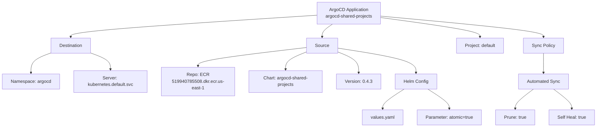
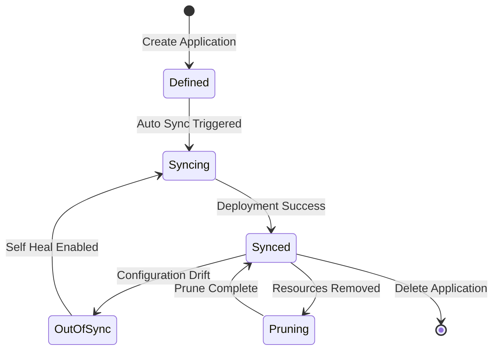
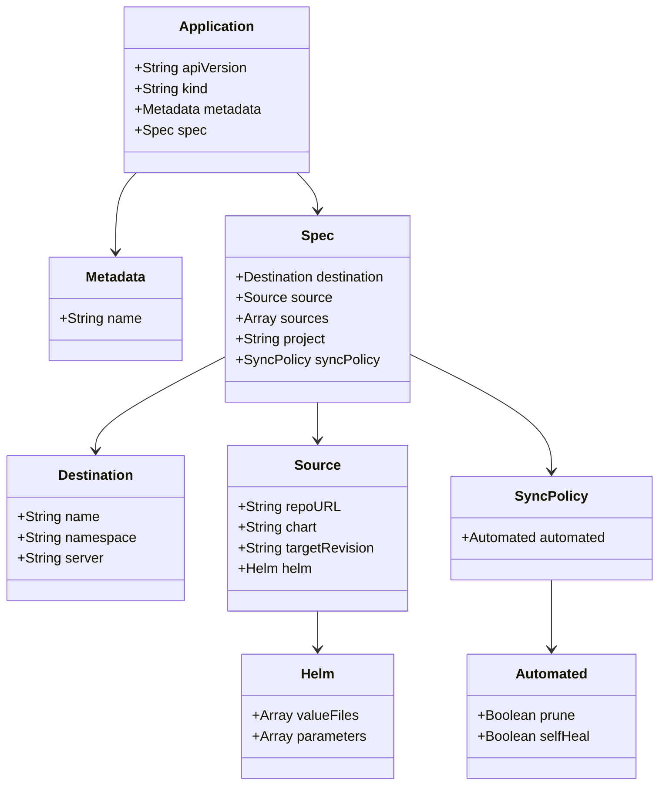

# Diagram: devops/k8s/argocd/projects/shared/argocd/Application.yaml

> Auto-generated by Obscura crawlers

## Diagram 1

### SVG

<svg id="container" width="2111.27734375" xmlns="http://www.w3.org/2000/svg" class="flowchart" height="454" viewBox="0 0 2111.27734375 454" role="graphics-document document" aria-roledescription="flowchart-v2"><g><marker id="container_flowchart-v2-pointEnd" class="marker flowchart-v2" viewBox="0 0 10 10" refX="5" refY="5" markerUnits="userSpaceOnUse" markerWidth="8" markerHeight="8" orient="auto"><path d="M 0 0 L 10 5 L 0 10 z" class="arrowMarkerPath" style="stroke-width: 1; stroke-dasharray: 1, 0;"></path></marker><marker id="container_flowchart-v2-pointStart" class="marker flowchart-v2" viewBox="0 0 10 10" refX="4.5" refY="5" markerUnits="userSpaceOnUse" markerWidth="8" markerHeight="8" orient="auto"><path d="M 0 5 L 10 10 L 10 0 z" class="arrowMarkerPath" style="stroke-width: 1; stroke-dasharray: 1, 0;"></path></marker><marker id="container_flowchart-v2-circleEnd" class="marker flowchart-v2" viewBox="0 0 10 10" refX="11" refY="5" markerUnits="userSpaceOnUse" markerWidth="11" markerHeight="11" orient="auto"><circle cx="5" cy="5" r="5" class="arrowMarkerPath" style="stroke-width: 1; stroke-dasharray: 1, 0;"></circle></marker><marker id="container_flowchart-v2-circleStart" class="marker flowchart-v2" viewBox="0 0 10 10" refX="-1" refY="5" markerUnits="userSpaceOnUse" markerWidth="11" markerHeight="11" orient="auto"><circle cx="5" cy="5" r="5" class="arrowMarkerPath" style="stroke-width: 1; stroke-dasharray: 1, 0;"></circle></marker><marker id="container_flowchart-v2-crossEnd" class="marker cross flowchart-v2" viewBox="0 0 11 11" refX="12" refY="5.2" markerUnits="userSpaceOnUse" markerWidth="11" markerHeight="11" orient="auto"><path d="M 1,1 l 9,9 M 10,1 l -9,9" class="arrowMarkerPath" style="stroke-width: 2; stroke-dasharray: 1, 0;"></path></marker><marker id="container_flowchart-v2-crossStart" class="marker cross flowchart-v2" viewBox="0 0 11 11" refX="-1" refY="5.2" markerUnits="userSpaceOnUse" markerWidth="11" markerHeight="11" orient="auto"><path d="M 1,1 l 9,9 M 10,1 l -9,9" class="arrowMarkerPath" style="stroke-width: 2; stroke-dasharray: 1, 0;"></path></marker><g class="root"><g class="clusters"></g><g class="edgePaths"><path d="M1117.195,54.483L972.413,63.902C827.632,73.322,538.068,92.161,393.286,105.08C248.504,118,248.504,125,248.504,128.5L248.504,132" id="L_A_B_0" class="edge-thickness-normal edge-pattern-solid edge-thickness-normal edge-pattern-solid flowchart-link" style=";" data-edge="true" data-et="edge" data-id="L_A_B_0" data-points="W3sieCI6MTExNy4xOTUzMTI1LCJ5Ijo1NC40ODI5MTg5NjQ4NTMxMzR9LHsieCI6MjQ4LjUwMzkwNjI1LCJ5IjoxMTF9LHsieCI6MjQ4LjUwMzkwNjI1LCJ5IjoxMzZ9XQ==" marker-end="url(#container_flowchart-v2-pointEnd)"></path><path d="M1174.368,86L1168.188,90.167C1162.008,94.333,1149.649,102.667,1143.469,110.333C1137.289,118,1137.289,125,1137.289,128.5L1137.289,132" id="L_A_C_0" class="edge-thickness-normal edge-pattern-solid edge-thickness-normal edge-pattern-solid flowchart-link" style=";" data-edge="true" data-et="edge" data-id="L_A_C_0" data-points="W3sieCI6MTE3NC4zNjc5MTk5MjE4NzUsInkiOjg2fSx7IngiOjExMzcuMjg5MDYyNSwieSI6MTExfSx7IngiOjExMzcuMjg5MDYyNSwieSI6MTM2fV0=" marker-end="url(#container_flowchart-v2-pointEnd)"></path><path d="M1347.227,62.909L1405.173,70.924C1463.118,78.939,1579.01,94.97,1636.956,106.485C1694.902,118,1694.902,125,1694.902,128.5L1694.902,132" id="L_A_D_0" class="edge-thickness-normal edge-pattern-solid edge-thickness-normal edge-pattern-solid flowchart-link" style=";" data-edge="true" data-et="edge" data-id="L_A_D_0" data-points="W3sieCI6MTM0Ny4yMjY1NjI1LCJ5Ijo2Mi45MDkwOTE2NzY1ODY1NX0seyJ4IjoxNjk0LjkwMjM0Mzc1LCJ5IjoxMTF9LHsieCI6MTY5NC45MDIzNDM3NSwieSI6MTM2fV0=" marker-end="url(#container_flowchart-v2-pointEnd)"></path><path d="M1347.227,57.685L1442.881,66.57C1538.535,75.456,1729.844,93.228,1825.498,105.614C1921.152,118,1921.152,125,1921.152,128.5L1921.152,132" id="L_A_E_0" class="edge-thickness-normal edge-pattern-solid edge-thickness-normal edge-pattern-solid flowchart-link" style=";" data-edge="true" data-et="edge" data-id="L_A_E_0" data-points="W3sieCI6MTM0Ny4yMjY1NjI1LCJ5Ijo1Ny42ODQ1MDgwNDg0NjY1N30seyJ4IjoxOTIxLjE1MjM0Mzc1LCJ5IjoxMTF9LHsieCI6MTkyMS4xNTIzNDM3NSwieSI6MTM2fV0=" marker-end="url(#container_flowchart-v2-pointEnd)"></path><path d="M176.566,189.688L165.195,193.906C153.823,198.125,131.079,206.563,119.708,218.281C108.336,230,108.336,245,108.336,252.5L108.336,260" id="L_B_B1_0" class="edge-thickness-normal edge-pattern-solid edge-thickness-normal edge-pattern-solid flowchart-link" style=";" data-edge="true" data-et="edge" data-id="L_B_B1_0" data-points="W3sieCI6MTc2LjU2NjQwNjI1LCJ5IjoxODkuNjg3NjIzNjY1ODAyNzN9LHsieCI6MTA4LjMzNTkzNzUsInkiOjIxNX0seyJ4IjoxMDguMzM1OTM3NSwieSI6MjY0fV0=" marker-end="url(#container_flowchart-v2-pointEnd)"></path><path d="M320.441,189.688L331.813,193.906C343.185,198.125,365.928,206.563,377.3,216.281C388.672,226,388.672,237,388.672,242.5L388.672,248" id="L_B_B2_0" class="edge-thickness-normal edge-pattern-solid edge-thickness-normal edge-pattern-solid flowchart-link" style=";" data-edge="true" data-et="edge" data-id="L_B_B2_0" data-points="W3sieCI6MzIwLjQ0MTQwNjI1LCJ5IjoxODkuNjg3NjIzNjY1ODAyNzN9LHsieCI6Mzg4LjY3MTg3NSwieSI6MjE1fSx7IngiOjM4OC42NzE4NzUsInkiOjI1Mn1d" marker-end="url(#container_flowchart-v2-pointEnd)"></path><path d="M1082.727,169.469L1018.717,177.057C954.708,184.646,826.69,199.823,762.681,210.911C698.672,222,698.672,229,698.672,232.5L698.672,236" id="L_C_C1_0" class="edge-thickness-normal edge-pattern-solid edge-thickness-normal edge-pattern-solid flowchart-link" style=";" data-edge="true" data-et="edge" data-id="L_C_C1_0" data-points="W3sieCI6MTA4Mi43MjY1NjI1LCJ5IjoxNjkuNDY4NjI0NzYxNzY5MDZ9LHsieCI6Njk4LjY3MTg3NSwieSI6MjE1fSx7IngiOjY5OC42NzE4NzUsInkiOjI0MH1d" marker-end="url(#container_flowchart-v2-pointEnd)"></path><path d="M1082.727,185.06L1070.384,190.05C1058.042,195.04,1033.357,205.02,1021.014,215.51C1008.672,226,1008.672,237,1008.672,242.5L1008.672,248" id="L_C_C2_0" class="edge-thickness-normal edge-pattern-solid edge-thickness-normal edge-pattern-solid flowchart-link" style=";" data-edge="true" data-et="edge" data-id="L_C_C2_0" data-points="W3sieCI6MTA4Mi43MjY1NjI1LCJ5IjoxODUuMDU5NjQ4OTA5Njc2MjR9LHsieCI6MTAwOC42NzE4NzUsInkiOjIxNX0seyJ4IjoxMDA4LjY3MTg3NSwieSI6MjUyfV0=" marker-end="url(#container_flowchart-v2-pointEnd)"></path><path d="M1191.852,185.06L1204.194,190.05C1216.536,195.04,1241.221,205.02,1253.564,217.51C1265.906,230,1265.906,245,1265.906,252.5L1265.906,260" id="L_C_C3_0" class="edge-thickness-normal edge-pattern-solid edge-thickness-normal edge-pattern-solid flowchart-link" style=";" data-edge="true" data-et="edge" data-id="L_C_C3_0" data-points="W3sieCI6MTE5MS44NTE1NjI1LCJ5IjoxODUuMDU5NjQ4OTA5Njc2MjR9LHsieCI6MTI2NS45MDYyNSwieSI6MjE1fSx7IngiOjEyNjUuOTA2MjUsInkiOjI2NH1d" marker-end="url(#container_flowchart-v2-pointEnd)"></path><path d="M1191.852,171.613L1237.66,178.844C1283.469,186.075,1375.086,200.538,1420.895,215.269C1466.703,230,1466.703,245,1466.703,252.5L1466.703,260" id="L_C_C4_0" class="edge-thickness-normal edge-pattern-solid edge-thickness-normal edge-pattern-solid flowchart-link" style=";" data-edge="true" data-et="edge" data-id="L_C_C4_0" data-points="W3sieCI6MTE5MS44NTE1NjI1LCJ5IjoxNzEuNjEzMDIwMjc3NDgxMzN9LHsieCI6MTQ2Ni43MDMxMjUsInkiOjIxNX0seyJ4IjoxNDY2LjcwMzEyNSwieSI6MjY0fV0=" marker-end="url(#container_flowchart-v2-pointEnd)"></path><path d="M1424.609,318L1411.876,326.167C1399.144,334.333,1373.679,350.667,1360.947,362.333C1348.215,374,1348.215,381,1348.215,384.5L1348.215,388" id="L_C4_C4a_0" class="edge-thickness-normal edge-pattern-solid edge-thickness-normal edge-pattern-solid flowchart-link" style=";" data-edge="true" data-et="edge" data-id="L_C4_C4a_0" data-points="W3sieCI6MTQyNC42MDg2MDQwMjk2MDUyLCJ5IjozMTh9LHsieCI6MTM0OC4yMTQ4NDM3NSwieSI6MzY3fSx7IngiOjEzNDguMjE0ODQzNzUsInkiOjM5Mn1d" marker-end="url(#container_flowchart-v2-pointEnd)"></path><path d="M1508.798,318L1521.53,326.167C1534.262,334.333,1559.727,350.667,1572.459,362.333C1585.191,374,1585.191,381,1585.191,384.5L1585.191,388" id="L_C4_C4b_0" class="edge-thickness-normal edge-pattern-solid edge-thickness-normal edge-pattern-solid flowchart-link" style=";" data-edge="true" data-et="edge" data-id="L_C4_C4b_0" data-points="W3sieCI6MTUwOC43OTc2NDU5NzAzOTQ4LCJ5IjozMTh9LHsieCI6MTU4NS4xOTE0MDYyNSwieSI6MzY3fSx7IngiOjE1ODUuMTkxNDA2MjUsInkiOjM5Mn1d" marker-end="url(#container_flowchart-v2-pointEnd)"></path><path d="M1921.152,190L1921.152,194.167C1921.152,198.333,1921.152,206.667,1921.152,218.333C1921.152,230,1921.152,245,1921.152,252.5L1921.152,260" id="L_E_E1_0" class="edge-thickness-normal edge-pattern-solid edge-thickness-normal edge-pattern-solid flowchart-link" style=";" data-edge="true" data-et="edge" data-id="L_E_E1_0" data-points="W3sieCI6MTkyMS4xNTIzNDM3NSwieSI6MTkwfSx7IngiOjE5MjEuMTUyMzQzNzUsInkiOjIxNX0seyJ4IjoxOTIxLjE1MjM0Mzc1LCJ5IjoyNjR9XQ==" marker-end="url(#container_flowchart-v2-pointEnd)"></path><path d="M1885.337,318L1874.504,326.167C1863.672,334.333,1842.006,350.667,1831.173,362.333C1820.34,374,1820.34,381,1820.34,384.5L1820.34,388" id="L_E1_E1a_0" class="edge-thickness-normal edge-pattern-solid edge-thickness-normal edge-pattern-solid flowchart-link" style=";" data-edge="true" data-et="edge" data-id="L_E1_E1a_0" data-points="W3sieCI6MTg4NS4zMzczNzY2NDQ3MzY5LCJ5IjozMTh9LHsieCI6MTgyMC4zMzk4NDM3NSwieSI6MzY3fSx7IngiOjE4MjAuMzM5ODQzNzUsInkiOjM5Mn1d" marker-end="url(#container_flowchart-v2-pointEnd)"></path><path d="M1956.967,318L1967.8,326.167C1978.633,334.333,2000.299,350.667,2011.132,362.333C2021.965,374,2021.965,381,2021.965,384.5L2021.965,388" id="L_E1_E1b_0" class="edge-thickness-normal edge-pattern-solid edge-thickness-normal edge-pattern-solid flowchart-link" style=";" data-edge="true" data-et="edge" data-id="L_E1_E1b_0" data-points="W3sieCI6MTk1Ni45NjczMTA4NTUyNjMxLCJ5IjozMTh9LHsieCI6MjAyMS45NjQ4NDM3NSwieSI6MzY3fSx7IngiOjIwMjEuOTY0ODQzNzUsInkiOjM5Mn1d" marker-end="url(#container_flowchart-v2-pointEnd)"></path></g><g class="edgeLabels"><g class="edgeLabel"><g class="label" data-id="L_A_B_0" transform="translate(0, 0)"><foreignObject width="0" height="0">

</foreignObject></g></g><g class="edgeLabel"><g class="label" data-id="L_A_C_0" transform="translate(0, 0)"><foreignObject width="0" height="0">

</foreignObject></g></g><g class="edgeLabel"><g class="label" data-id="L_A_D_0" transform="translate(0, 0)"><foreignObject width="0" height="0">

</foreignObject></g></g><g class="edgeLabel"><g class="label" data-id="L_A_E_0" transform="translate(0, 0)"><foreignObject width="0" height="0">

</foreignObject></g></g><g class="edgeLabel"><g class="label" data-id="L_B_B1_0" transform="translate(0, 0)"><foreignObject width="0" height="0">

</foreignObject></g></g><g class="edgeLabel"><g class="label" data-id="L_B_B2_0" transform="translate(0, 0)"><foreignObject width="0" height="0">

</foreignObject></g></g><g class="edgeLabel"><g class="label" data-id="L_C_C1_0" transform="translate(0, 0)"><foreignObject width="0" height="0">

</foreignObject></g></g><g class="edgeLabel"><g class="label" data-id="L_C_C2_0" transform="translate(0, 0)"><foreignObject width="0" height="0">

</foreignObject></g></g><g class="edgeLabel"><g class="label" data-id="L_C_C3_0" transform="translate(0, 0)"><foreignObject width="0" height="0">

</foreignObject></g></g><g class="edgeLabel"><g class="label" data-id="L_C_C4_0" transform="translate(0, 0)"><foreignObject width="0" height="0">

</foreignObject></g></g><g class="edgeLabel"><g class="label" data-id="L_C4_C4a_0" transform="translate(0, 0)"><foreignObject width="0" height="0">

</foreignObject></g></g><g class="edgeLabel"><g class="label" data-id="L_C4_C4b_0" transform="translate(0, 0)"><foreignObject width="0" height="0">

</foreignObject></g></g><g class="edgeLabel"><g class="label" data-id="L_E_E1_0" transform="translate(0, 0)"><foreignObject width="0" height="0">

</foreignObject></g></g><g class="edgeLabel"><g class="label" data-id="L_E1_E1a_0" transform="translate(0, 0)"><foreignObject width="0" height="0">

</foreignObject></g></g><g class="edgeLabel"><g class="label" data-id="L_E1_E1b_0" transform="translate(0, 0)"><foreignObject width="0" height="0">

</foreignObject></g></g></g><g class="nodes"><g class="node default" id="flowchart-A-0" transform="translate(1232.2109375, 47)"><rect class="basic label-container" style="" x="-115.015625" y="-39" width="230.03125" height="78"></rect><g class="label" style="" transform="translate(-85.015625, -24)"><rect></rect><foreignObject width="170.03125" height="48">

ArgoCD Application argocd-shared-projects

</foreignObject></g></g><g class="node default" id="flowchart-B-1" transform="translate(248.50390625, 163)"><rect class="basic label-container" style="" x="-71.9375" y="-27" width="143.875" height="54"></rect><g class="label" style="" transform="translate(-41.9375, -12)"><rect></rect><foreignObject width="83.875" height="24">

Destination

</foreignObject></g></g><g class="node default" id="flowchart-C-3" transform="translate(1137.2890625, 163)"><rect class="basic label-container" style="" x="-54.5625" y="-27" width="109.125" height="54"></rect><g class="label" style="" transform="translate(-24.5625, -12)"><rect></rect><foreignObject width="49.125" height="24">

Source

</foreignObject></g></g><g class="node default" id="flowchart-D-5" transform="translate(1694.90234375, 163)"><rect class="basic label-container" style="" x="-85.28125" y="-27" width="170.5625" height="54"></rect><g class="label" style="" transform="translate(-55.28125, -12)"><rect></rect><foreignObject width="110.5625" height="24">

Project: default

</foreignObject></g></g><g class="node default" id="flowchart-E-7" transform="translate(1921.15234375, 163)"><rect class="basic label-container" style="" x="-70.2890625" y="-27" width="140.578125" height="54"></rect><g class="label" style="" transform="translate(-40.2890625, -12)"><rect></rect><foreignObject width="80.578125" height="24">

Sync Policy

</foreignObject></g></g><g class="node default" id="flowchart-B1-9" transform="translate(108.3359375, 291)"><rect class="basic label-container" style="" x="-100.3359375" y="-27" width="200.671875" height="54"></rect><g class="label" style="" transform="translate(-70.3359375, -12)"><rect></rect><foreignObject width="140.671875" height="24">

Namespace: argocd

</foreignObject></g></g><g class="node default" id="flowchart-B2-11" transform="translate(388.671875, 291)"><rect class="basic label-container" style="" x="-130" y="-39" width="260" height="78"></rect><g class="label" style="" transform="translate(-100, -24)"><rect></rect><foreignObject width="200" height="48">

Server: kubernetes.default.svc

</foreignObject></g></g><g class="node default" id="flowchart-C1-13" transform="translate(698.671875, 291)"><rect class="basic label-container" style="" x="-130" y="-51" width="260" height="102"></rect><g class="label" style="" transform="translate(-100, -36)"><rect></rect><foreignObject width="200" height="72">

Repo: ECR 519940785508.dkr.ecr.us-east-1

</foreignObject></g></g><g class="node default" id="flowchart-C2-15" transform="translate(1008.671875, 291)"><rect class="basic label-container" style="" x="-130" y="-39" width="260" height="78"></rect><g class="label" style="" transform="translate(-100, -24)"><rect></rect><foreignObject width="200" height="48">

Chart: argocd-shared-projects

</foreignObject></g></g><g class="node default" id="flowchart-C3-17" transform="translate(1265.90625, 291)"><rect class="basic label-container" style="" x="-77.234375" y="-27" width="154.46875" height="54"></rect><g class="label" style="" transform="translate(-47.234375, -12)"><rect></rect><foreignObject width="94.46875" height="24">

Version: 0.4.3

</foreignObject></g></g><g class="node default" id="flowchart-C4-19" transform="translate(1466.703125, 291)"><rect class="basic label-container" style="" x="-73.5625" y="-27" width="147.125" height="54"></rect><g class="label" style="" transform="translate(-43.5625, -12)"><rect></rect><foreignObject width="87.125" height="24">

Helm Config

</foreignObject></g></g><g class="node default" id="flowchart-C4a-21" transform="translate(1348.21484375, 419)"><rect class="basic label-container" style="" x="-72.140625" y="-27" width="144.28125" height="54"></rect><g class="label" style="" transform="translate(-42.140625, -12)"><rect></rect><foreignObject width="84.28125" height="24">

values.yaml

</foreignObject></g></g><g class="node default" id="flowchart-C4b-23" transform="translate(1585.19140625, 419)"><rect class="basic label-container" style="" x="-114.8359375" y="-27" width="229.671875" height="54"></rect><g class="label" style="" transform="translate(-84.8359375, -12)"><rect></rect><foreignObject width="169.671875" height="24">

Parameter: atomic=true

</foreignObject></g></g><g class="node default" id="flowchart-E1-25" transform="translate(1921.15234375, 291)"><rect class="basic label-container" style="" x="-88.6484375" y="-27" width="177.296875" height="54"></rect><g class="label" style="" transform="translate(-58.6484375, -12)"><rect></rect><foreignObject width="117.296875" height="24">

Automated Sync

</foreignObject></g></g><g class="node default" id="flowchart-E1a-27" transform="translate(1820.33984375, 419)"><rect class="basic label-container" style="" x="-70.3125" y="-27" width="140.625" height="54"></rect><g class="label" style="" transform="translate(-40.3125, -12)"><rect></rect><foreignObject width="80.625" height="24">

Prune: true

</foreignObject></g></g><g class="node default" id="flowchart-E1b-29" transform="translate(2021.96484375, 419)"><rect class="basic label-container" style="" x="-81.3125" y="-27" width="162.625" height="54"></rect><g class="label" style="" transform="translate(-51.3125, -12)"><rect></rect><foreignObject width="102.625" height="24">

Self Heal: true

</foreignObject></g></g></g></g></g></svg>

## Diagram 2

### SVG

<svg id="container" width="687.53125" xmlns="http://www.w3.org/2000/svg" class="statediagram" height="486" viewBox="0 0 687.53125 486" role="graphics-document document" aria-roledescription="stateDiagram"><g><defs><marker id="container_stateDiagram-barbEnd" refX="19" refY="7" markerWidth="20" markerHeight="14" markerUnits="userSpaceOnUse" orient="auto"><path d="M 19,7 L9,13 L14,7 L9,1 Z"></path></marker></defs><g class="root"><g class="clusters"></g><g class="edgePaths"><path d="M262.68,22L262.68,28.167C262.68,34.333,262.68,46.667,262.763,59.083C262.846,71.5,263.013,84,263.096,90.25L263.18,96.5" id="edge0" class="edge-thickness-normal edge-pattern-solid transition" style="fill:none;;;fill:none" data-edge="true" data-et="edge" data-id="edge0" data-points="W3sieCI6MjYyLjY3OTY4NzUsInkiOjIyfSx7IngiOjI2Mi42Nzk2ODc1LCJ5Ijo1OX0seyJ4IjoyNjMuMTc5Njg3NSwieSI6OTYuNX1d" marker-end="url(#container_stateDiagram-barbEnd)"></path><path d="M263.18,136.5L263.096,142.583C263.013,148.667,262.846,160.833,262.846,173.167C262.846,185.5,263.013,198,263.096,204.25L263.18,210.5" id="edge1" class="edge-thickness-normal edge-pattern-solid transition" style="fill:none;;;fill:none" data-edge="true" data-et="edge" data-id="edge1" data-points="W3sieCI6MjYzLjE3OTY4NzUsInkiOjEzNi41fSx7IngiOjI2Mi42Nzk2ODc1LCJ5IjoxNzN9LHsieCI6MjYzLjE3OTY4NzUsInkiOjIxMC41fV0=" marker-end="url(#container_stateDiagram-barbEnd)"></path><path d="M298.426,247.854L311.762,254.378C325.099,260.903,351.772,273.951,365.192,286.726C378.612,299.5,378.779,312,378.862,318.25L378.945,324.5" id="edge2" class="edge-thickness-normal edge-pattern-solid transition" style="fill:none;;;fill:none" data-edge="true" data-et="edge" data-id="edge2" data-points="W3sieCI6Mjk4LjQyNTUxMTIwMjczMjQsInkiOjI0Ny44NTQxMzIxMTg3MTYxNH0seyJ4IjozNzguNDQ1MzEyNSwieSI6Mjg3fSx7IngiOjM3OC45NDUzMTI1LCJ5IjozMjQuNX1d" marker-end="url(#container_stateDiagram-barbEnd)"></path><path d="M345.227,353.244L314.128,361.203C283.029,369.162,220.831,385.081,185.116,399.291C149.402,413.5,140.17,426,135.555,432.25L130.939,438.5" id="edge3" class="edge-thickness-normal edge-pattern-solid transition" style="fill:none;;;fill:none" data-edge="true" data-et="edge" data-id="edge3" data-points="W3sieCI6MzQ1LjIyNjU2MjUsInkiOjM1My4yNDM2NzM1ODU0NDIxNH0seyJ4IjoxNTguNjMyODEyNSwieSI6NDAxfSx7IngiOjEzMC45MzkwNzYyMDYxNDAzNiwieSI6NDM4LjV9XQ==" marker-end="url(#container_stateDiagram-barbEnd)"></path><path d="M100.459,438.5L95.677,432.25C90.895,426,81.33,413.5,76.548,397.75C71.766,382,71.766,363,71.766,344C71.766,325,71.766,306,97.695,288.867C123.625,271.733,175.484,256.466,201.414,248.833L227.344,241.199" id="edge4" class="edge-thickness-normal edge-pattern-solid transition" style="fill:none;;;fill:none" data-edge="true" data-et="edge" data-id="edge4" data-points="W3sieCI6MTAwLjQ1OTM2MTI5Mzg1OTY0LCJ5Ijo0MzguNX0seyJ4Ijo3MS43NjU2MjUsInkiOjQwMX0seyJ4Ijo3MS43NjU2MjUsInkiOjM0NH0seyJ4Ijo3MS43NjU2MjUsInkiOjI4N30seyJ4IjoyMjcuMzQzNzUsInkiOjI0MS4xOTkzMDg0MjU3NDc4M31d" marker-end="url(#container_stateDiagram-barbEnd)"></path><path d="M405.313,364.5L413.36,370.583C421.407,376.667,437.5,388.833,439.968,401.167C442.435,413.5,431.277,426,425.698,432.25L420.119,438.5" id="edge5" class="edge-thickness-normal edge-pattern-solid transition" style="fill:none;;;fill:none" data-edge="true" data-et="edge" data-id="edge5" data-points="W3sieCI6NDA1LjMxMzE4NTMwNzAxNzUzLCJ5IjozNjQuNX0seyJ4Ijo0NTMuNTkzNzUsInkiOjQwMX0seyJ4Ijo0MjAuMTE4NzYzNzA2MTQwMywieSI6NDM4LjV9XQ==" marker-end="url(#container_stateDiagram-barbEnd)"></path><path d="M368.384,439.083L357.536,432.735C346.688,426.388,324.993,413.694,322.358,401.264C319.724,388.833,336.151,376.667,344.364,370.583L352.577,364.5" id="edge6" class="edge-thickness-normal edge-pattern-solid transition" style="fill:none;;;fill:none" data-edge="true" data-et="edge" data-id="edge6" data-points="W3sieCI6MzY4LjM4NDA4MzA4MTU5ODkzLCJ5Ijo0MzkuMDgyNTA3NDg5OTk4NX0seyJ4IjozMDMuMjk2ODc1LCJ5Ijo0MDF9LHsieCI6MzUyLjU3NzQzOTY5Mjk4MjQ3LCJ5IjozNjQuNX1d" marker-end="url(#container_stateDiagram-barbEnd)"></path><path d="M412.664,352.701L446.022,360.751C479.38,368.8,546.096,384.9,579.454,401.283C612.813,417.667,612.813,434.333,612.813,442.667L612.813,451" id="edge7" class="edge-thickness-normal edge-pattern-solid transition" style="fill:none;;;fill:none" data-edge="true" data-et="edge" data-id="edge7" data-points="W3sieCI6NDEyLjY2NDA2MjUsInkiOjM1Mi43MDA2NzMzNTU3Nzg1fSx7IngiOjYxMi44MTI1LCJ5Ijo0MDF9LHsieCI6NjEyLjgxMjUsInkiOjQ1MX1d" marker-end="url(#container_stateDiagram-barbEnd)"></path></g><g class="edgeLabels"><g class="edgeLabel" transform="translate(262.6796875, 59)"><g class="label" data-id="edge0" transform="translate(-66.3828125, -12)"><foreignObject width="132.765625" height="24">

Create Application

</foreignObject></g></g><g class="edgeLabel" transform="translate(262.6796875, 173)"><g class="label" data-id="edge1" transform="translate(-71.4375, -12)"><foreignObject width="142.875" height="24">

Auto Sync Triggered

</foreignObject></g></g><g class="edgeLabel" transform="translate(378.4453125, 287)"><g class="label" data-id="edge2" transform="translate(-74.15625, -12)"><foreignObject width="148.3125" height="24">

Deployment Success

</foreignObject></g></g><g class="edgeLabel" transform="translate(229.34877, 382.90114)"><g class="label" data-id="edge3" transform="translate(-66.8671875, -12)"><foreignObject width="133.734375" height="24">

Configuration Drift

</foreignObject></g></g><g class="edgeLabel" transform="translate(71.765625, 344)"><g class="label" data-id="edge4" transform="translate(-63.765625, -12)"><foreignObject width="127.53125" height="24">

Self Heal Enabled

</foreignObject></g></g><g class="edgeLabel" transform="translate(453.59375, 401)"><g class="label" data-id="edge5" transform="translate(-72.5, -12)"><foreignObject width="145" height="24">

Resources Removed

</foreignObject></g></g><g class="edgeLabel" transform="translate(303.296875, 401)"><g class="label" data-id="edge6" transform="translate(-57.796875, -12)"><foreignObject width="115.59375" height="24">

Prune Complete

</foreignObject></g></g><g class="edgeLabel" transform="translate(612.8125, 401)"><g class="label" data-id="edge7" transform="translate(-66.71875, -12)"><foreignObject width="133.4375" height="24">

Delete Application

</foreignObject></g></g></g><g class="nodes"><g class="node default" id="state-root_start-0" transform="translate(262.6796875, 15)"><circle class="state-start" r="7" width="14" height="14"></circle></g><g class="node  statediagram-state" id="state-Defined-1" transform="translate(262.6796875, 116)"><g class="basic label-container outer-path"><path d="M-30.9453125 -20 C-17.89864446353138 -20, -4.851976427062759 -20, 30.9453125 -20 C30.9453125 -20, 30.9453125 -20, 30.9453125 -20 C31.10736122556456 -19.99329761513293, 31.269409951129116 -19.986595230265866, 31.358209227361662 -19.982922465033347 C31.44417604132714 -19.972206712847647, 31.530142855292617 -19.961490960661948, 31.76828545140367 -19.931806517013612 C31.925470693180937 -19.898848237677328, 32.082655934958204 -19.865889958341043, 32.172739935703994 -19.847001329696653 C32.26545881827394 -19.81939772237808, 32.35817770084388 -19.79179411505951, 32.56880984602342 -19.729086208503173 C32.702326939299006 -19.67698767703942, 32.83584403257459 -19.62488914557567, 32.953789623264846 -19.578866633275286 C33.06666326899241 -19.523686070275964, 33.17953691471997 -19.468505507276646, 33.325049465185366 -19.397368756032446 C33.45300191636084 -19.321125644155806, 33.58095436753632 -19.244882532279167, 33.680053290612136 -19.185832391312644 C33.780768720906394 -19.11392295623542, 33.88148415120065 -19.042013521158193, 34.01637606344834 -18.94570254698197 C34.12048868414248 -18.85752365528388, 34.22460130483662 -18.76934476358579, 34.331720358128706 -18.678619553365657 C34.41959216422575 -18.590747747268612, 34.507463970322796 -18.50287594117157, 34.62393205336566 -18.386407858128706 C34.697236510012125 -18.299857449714025, 34.77054096665859 -18.213307041299345, 34.89101504698197 -18.07106356344834 C34.9480090432852 -17.991238504946573, 35.005003039588416 -17.911413446444804, 35.131144891312644 -17.734740790612136 C35.20091235307975 -17.6176558825376, 35.270679814846865 -17.500570974463066, 35.34268125603245 -17.37973696518537 C35.390372624860674 -17.282182710991805, 35.4380639936889 -17.184628456798237, 35.52417913327529 -17.008477123264846 C35.565792427391074 -16.90183139034573, 35.60740572150686 -16.795185657426615, 35.674398708503176 -16.623497346023417 C35.698049840625394 -16.54405459361145, 35.72170097274761 -16.464611841199485, 35.79231382969665 -16.227427435703994 C35.81603376619939 -16.114301871226488, 35.83975370270213 -16.001176306748985, 35.87711901701361 -15.82297295140367 C35.89017357540054 -15.718243131900397, 35.90322813378746 -15.613513312397126, 35.92823496503335 -15.412896727361662 C35.93482823953785 -15.253486047142191, 35.941421514042354 -15.094075366922722, 35.9453125 -15 C35.9453125 -15, 35.9453125 -15, 35.9453125 -15 C35.9453125 -6.381892535859118, 35.9453125 2.2362149282817647, 35.9453125 15 C35.9453125 15, 35.9453125 15, 35.9453125 15 C35.939626430573924 15.137476483705798, 35.93394036114785 15.274952967411595, 35.92823496503335 15.412896727361662 C35.910137359483706 15.55808424780309, 35.892039753934064 15.703271768244514, 35.87711901701361 15.822972951403669 C35.84770978170567 15.963232026071877, 35.81830054639773 16.103491100740086, 35.79231382969665 16.227427435703994 C35.76411837172813 16.322134309563577, 35.73592291375961 16.41684118342316, 35.674398708503176 16.623497346023417 C35.61969856180921 16.76368180771804, 35.56499841511525 16.903866269412664, 35.52417913327529 17.008477123264846 C35.45239619755205 17.15531146520893, 35.38061326182881 17.30214580715301, 35.34268125603245 17.379736965185366 C35.26183089592643 17.51542137652895, 35.18098053582041 17.65110578787253, 35.131144891312644 17.734740790612133 C35.03648398541965 17.867321638435765, 34.941823079526664 17.9999024862594, 34.89101504698197 18.07106356344834 C34.794918581369885 18.18452444599803, 34.69882211575779 18.297985328547718, 34.62393205336566 18.386407858128706 C34.54698549731266 18.4633544141817, 34.470038941259666 18.5403009702347, 34.331720358128706 18.678619553365657 C34.251016751828374 18.746972021223602, 34.170313145528034 18.815324489081547, 34.01637606344834 18.94570254698197 C33.90009366243332 19.028726585522865, 33.7838112614183 19.11175062406376, 33.680053290612136 19.185832391312644 C33.58735264670434 19.241069985431146, 33.49465200279654 19.29630757954965, 33.325049465185366 19.397368756032446 C33.190468126442475 19.463161563495753, 33.05588678769958 19.52895437095906, 32.953789623264846 19.578866633275286 C32.86873230238638 19.61205610287273, 32.7836749815079 19.64524557247018, 32.56880984602342 19.729086208503173 C32.440301509492144 19.767344797912898, 32.31179317296086 19.805603387322627, 32.172739935703994 19.847001329696653 C32.08913868805348 19.864530667958775, 32.005537440402975 19.8820600062209, 31.76828545140367 19.931806517013612 C31.630416525905108 19.948991860654992, 31.492547600406546 19.966177204296372, 31.358209227361662 19.982922465033347 C31.259193676031227 19.987017778529516, 31.160178124700792 19.991113092025685, 30.9453125 20 C30.9453125 20, 30.9453125 20, 30.9453125 20 C14.519021747647209 20, -1.907269004705583 20, -30.9453125 20 C-30.9453125 20, -30.9453125 20, -30.9453125 20 C-31.036846759903742 19.99621411500609, -31.128381019807488 19.99242823001218, -31.358209227361662 19.982922465033347 C-31.4832363717752 19.96733784773487, -31.608263516188735 19.9517532304364, -31.76828545140367 19.931806517013612 C-31.882896968060738 19.9077750091034, -31.99750848471781 19.88374350119319, -32.172739935703994 19.847001329696653 C-32.27867588118395 19.815462832263357, -32.38461182666391 19.78392433483006, -32.56880984602342 19.729086208503173 C-32.71915900288788 19.670419785446136, -32.86950815975234 19.611753362389095, -32.953789623264846 19.578866633275286 C-33.05071690176912 19.531481774184552, -33.147644180273396 19.484096915093822, -33.325049465185366 19.397368756032446 C-33.45118253170728 19.32220976209504, -33.577315598229205 19.247050768157628, -33.680053290612136 19.185832391312644 C-33.813859817460646 19.09029636741631, -33.947666344309155 18.994760343519978, -34.01637606344834 18.94570254698197 C-34.09680305669888 18.877584358426553, -34.177230049949415 18.809466169871133, -34.331720358128706 18.67861955336566 C-34.428880401861605 18.58145950963276, -34.5260404455945 18.484299465899863, -34.62393205336566 18.386407858128706 C-34.718762863091236 18.274441332660448, -34.81359367281681 18.16247480719219, -34.89101504698197 18.07106356344834 C-34.95930151198542 17.975422418462134, -35.02758797698888 17.879781273475928, -35.131144891312644 17.734740790612133 C-35.19370929525512 17.62974417329509, -35.256273699197585 17.524747555978053, -35.34268125603244 17.37973696518537 C-35.41367028903475 17.23452657721337, -35.484659322037054 17.08931618924137, -35.52417913327528 17.00847712326485 C-35.57822389174537 16.86997227763927, -35.63226865021545 16.73146743201369, -35.674398708503176 16.623497346023417 C-35.703517509698266 16.52568901693706, -35.732636310893355 16.42788068785071, -35.79231382969665 16.227427435703994 C-35.82327879044767 16.079748766177307, -35.85424375119867 15.93207009665062, -35.87711901701361 15.82297295140367 C-35.89392893590523 15.688115860171305, -35.91073885479685 15.55325876893894, -35.92823496503335 15.412896727361664 C-35.93454243884892 15.26039607071209, -35.9408499126645 15.107895414062515, -35.9453125 15 C-35.9453125 15, -35.9453125 15, -35.9453125 15 C-35.9453125 7.763298387664874, -35.9453125 0.5265967753297485, -35.9453125 -15 C-35.9453125 -15, -35.9453125 -15, -35.9453125 -15 C-35.94048426088307 -15.116736059050318, -35.935656021766135 -15.233472118100634, -35.92823496503335 -15.41289672736166 C-35.91257276533147 -15.538546274376962, -35.8969105656296 -15.664195821392266, -35.87711901701361 -15.822972951403669 C-35.845806549592986 -15.972308956233725, -35.81449408217237 -16.12164496106378, -35.79231382969665 -16.227427435703994 C-35.75345970512232 -16.35793613959149, -35.714605580547975 -16.488444843478987, -35.674398708503176 -16.623497346023417 C-35.635307826716655 -16.723678690162597, -35.59621694493013 -16.82386003430178, -35.52417913327529 -17.008477123264846 C-35.472870913407945 -17.11342976451082, -35.4215626935406 -17.21838240575679, -35.34268125603245 -17.379736965185366 C-35.29964099489366 -17.451967843180626, -35.25660073375487 -17.52419872117589, -35.131144891312644 -17.734740790612133 C-35.06204249044251 -17.831524724883455, -34.99294008957238 -17.928308659154773, -34.89101504698197 -18.07106356344834 C-34.80359528605351 -18.17427988013646, -34.716175525125045 -18.277496196824575, -34.62393205336566 -18.386407858128706 C-34.52945304573145 -18.480886865762912, -34.434974038097245 -18.575365873397118, -34.331720358128706 -18.678619553365657 C-34.257067859891414 -18.74184699412326, -34.18241536165413 -18.80507443488087, -34.01637606344834 -18.945702546981966 C-33.922202122858 -19.012941448181728, -33.82802818226767 -19.08018034938149, -33.680053290612136 -19.185832391312644 C-33.58913211600667 -19.240009651878708, -33.4982109414012 -19.294186912444772, -33.325049465185366 -19.397368756032446 C-33.23960535872265 -19.439139834384665, -33.15416125225993 -19.48091091273688, -32.953789623264846 -19.578866633275286 C-32.87538871150746 -19.609458763973848, -32.79698779975008 -19.64005089467241, -32.56880984602342 -19.729086208503173 C-32.41930069642971 -19.77359701085031, -32.269791546836 -19.81810781319745, -32.172739935703994 -19.847001329696653 C-32.01615023792624 -19.879834736587718, -31.859560540148493 -19.912668143478783, -31.768285451403674 -19.931806517013612 C-31.67480196869824 -19.943459220980632, -31.581318485992806 -19.95511192494765, -31.358209227361662 -19.982922465033347 C-31.26276719209322 -19.9868699768119, -31.167325156824777 -19.990817488590448, -30.9453125 -20 C-30.9453125 -20, -30.9453125 -20, -30.9453125 -20" stroke="none" stroke-width="0" fill="#ECECFF" style=""></path><path d="M-30.9453125 -20 C-10.335639606919852 -20, 10.274033286160297 -20, 30.9453125 -20 M-30.9453125 -20 C-15.768238968097892 -20, -0.5911654361957837 -20, 30.9453125 -20 M30.9453125 -20 C30.9453125 -20, 30.9453125 -20, 30.9453125 -20 M30.9453125 -20 C30.9453125 -20, 30.9453125 -20, 30.9453125 -20 M30.9453125 -20 C31.07865113076773 -19.99448507343739, 31.211989761535463 -19.98897014687478, 31.358209227361662 -19.982922465033347 M30.9453125 -20 C31.03826106701333 -19.99615561883134, 31.13120963402666 -19.99231123766268, 31.358209227361662 -19.982922465033347 M31.358209227361662 -19.982922465033347 C31.519204123265332 -19.96285447218719, 31.680199019169002 -19.94278647934103, 31.76828545140367 -19.931806517013612 M31.358209227361662 -19.982922465033347 C31.51825867212338 -19.96297232254913, 31.6783081168851 -19.943022180064915, 31.76828545140367 -19.931806517013612 M31.76828545140367 -19.931806517013612 C31.849566510764802 -19.914763671076656, 31.930847570125934 -19.8977208251397, 32.172739935703994 -19.847001329696653 M31.76828545140367 -19.931806517013612 C31.91001506638369 -19.90208894182704, 32.05174468136371 -19.87237136664047, 32.172739935703994 -19.847001329696653 M32.172739935703994 -19.847001329696653 C32.32263380091642 -19.80237599254739, 32.472527666128855 -19.757750655398127, 32.56880984602342 -19.729086208503173 M32.172739935703994 -19.847001329696653 C32.27161319194808 -19.817565485950247, 32.37048644819217 -19.78812964220384, 32.56880984602342 -19.729086208503173 M32.56880984602342 -19.729086208503173 C32.70501800099763 -19.675937621506176, 32.84122615597185 -19.622789034509175, 32.953789623264846 -19.578866633275286 M32.56880984602342 -19.729086208503173 C32.68052569925833 -19.685494547301072, 32.79224155249324 -19.64190288609897, 32.953789623264846 -19.578866633275286 M32.953789623264846 -19.578866633275286 C33.059588570341276 -19.527144679698065, 33.165387517417706 -19.475422726120843, 33.325049465185366 -19.397368756032446 M32.953789623264846 -19.578866633275286 C33.09857398995615 -19.50808586938635, 33.24335835664745 -19.437305105497412, 33.325049465185366 -19.397368756032446 M33.325049465185366 -19.397368756032446 C33.42766385562829 -19.336223851196166, 33.53027824607122 -19.275078946359887, 33.680053290612136 -19.185832391312644 M33.325049465185366 -19.397368756032446 C33.449968688698405 -19.322933055533156, 33.57488791221145 -19.248497355033866, 33.680053290612136 -19.185832391312644 M33.680053290612136 -19.185832391312644 C33.75003930388541 -19.135863338277925, 33.82002531715868 -19.08589428524321, 34.01637606344834 -18.94570254698197 M33.680053290612136 -19.185832391312644 C33.783829518065325 -19.11173758906833, 33.887605745518506 -19.037642786824016, 34.01637606344834 -18.94570254698197 M34.01637606344834 -18.94570254698197 C34.13736248387831 -18.843232275914875, 34.258348904308285 -18.74076200484778, 34.331720358128706 -18.678619553365657 M34.01637606344834 -18.94570254698197 C34.13720977782358 -18.843361611345802, 34.25804349219881 -18.741020675709635, 34.331720358128706 -18.678619553365657 M34.331720358128706 -18.678619553365657 C34.44191128993155 -18.568428621562813, 34.552102221734394 -18.458237689759972, 34.62393205336566 -18.386407858128706 M34.331720358128706 -18.678619553365657 C34.444100470166966 -18.566239441327397, 34.556480582205225 -18.453859329289134, 34.62393205336566 -18.386407858128706 M34.62393205336566 -18.386407858128706 C34.696025117346046 -18.30128773833215, 34.76811818132644 -18.216167618535593, 34.89101504698197 -18.07106356344834 M34.62393205336566 -18.386407858128706 C34.69760055541577 -18.299427622118156, 34.77126905746588 -18.212447386107605, 34.89101504698197 -18.07106356344834 M34.89101504698197 -18.07106356344834 C34.95125761914335 -17.986688591363652, 35.011500191304734 -17.902313619278964, 35.131144891312644 -17.734740790612136 M34.89101504698197 -18.07106356344834 C34.95121657817049 -17.986746072822623, 35.011418109359 -17.902428582196904, 35.131144891312644 -17.734740790612136 M35.131144891312644 -17.734740790612136 C35.17520616178222 -17.66079643787362, 35.219267432251804 -17.586852085135106, 35.34268125603245 -17.37973696518537 M35.131144891312644 -17.734740790612136 C35.208037692618426 -17.60569801989283, 35.28493049392421 -17.47665524917353, 35.34268125603245 -17.37973696518537 M35.34268125603245 -17.37973696518537 C35.41254078107897 -17.236837022665874, 35.48240030612548 -17.093937080146382, 35.52417913327529 -17.008477123264846 M35.34268125603245 -17.37973696518537 C35.399826438766574 -17.262844625557598, 35.45697162150069 -17.145952285929827, 35.52417913327529 -17.008477123264846 M35.52417913327529 -17.008477123264846 C35.5620146519777 -16.91151299898364, 35.59985017068011 -16.814548874702435, 35.674398708503176 -16.623497346023417 M35.52417913327529 -17.008477123264846 C35.56661378255334 -16.89972643746641, 35.60904843183139 -16.790975751667975, 35.674398708503176 -16.623497346023417 M35.674398708503176 -16.623497346023417 C35.71329305520433 -16.49285353839349, 35.75218740190549 -16.362209730763567, 35.79231382969665 -16.227427435703994 M35.674398708503176 -16.623497346023417 C35.69853126949988 -16.54243750252752, 35.722663830496586 -16.461377659031626, 35.79231382969665 -16.227427435703994 M35.79231382969665 -16.227427435703994 C35.820551357823 -16.092756488824612, 35.84878888594935 -15.958085541945232, 35.87711901701361 -15.82297295140367 M35.79231382969665 -16.227427435703994 C35.813492356214034 -16.12642241122579, 35.834670882731416 -16.025417386747584, 35.87711901701361 -15.82297295140367 M35.87711901701361 -15.82297295140367 C35.89559669229215 -15.674736332484427, 35.91407436757069 -15.526499713565181, 35.92823496503335 -15.412896727361662 M35.87711901701361 -15.82297295140367 C35.88843816135794 -15.732165441185593, 35.89975730570227 -15.641357930967514, 35.92823496503335 -15.412896727361662 M35.92823496503335 -15.412896727361662 C35.93445529018221 -15.262503131207215, 35.94067561533106 -15.112109535052769, 35.9453125 -15 M35.92823496503335 -15.412896727361662 C35.93337137086612 -15.288709884067638, 35.938507776698884 -15.164523040773613, 35.9453125 -15 M35.9453125 -15 C35.9453125 -15, 35.9453125 -15, 35.9453125 -15 M35.9453125 -15 C35.9453125 -15, 35.9453125 -15, 35.9453125 -15 M35.9453125 -15 C35.9453125 -3.953640999526998, 35.9453125 7.092718000946004, 35.9453125 15 M35.9453125 -15 C35.9453125 -5.630555823040634, 35.9453125 3.738888353918732, 35.9453125 15 M35.9453125 15 C35.9453125 15, 35.9453125 15, 35.9453125 15 M35.9453125 15 C35.9453125 15, 35.9453125 15, 35.9453125 15 M35.9453125 15 C35.93928719721024 15.145678390242677, 35.93326189442048 15.291356780485357, 35.92823496503335 15.412896727361662 M35.9453125 15 C35.94027443423939 15.121809199562446, 35.93523636847878 15.243618399124893, 35.92823496503335 15.412896727361662 M35.92823496503335 15.412896727361662 C35.91800583306495 15.494959644618087, 35.90777670109656 15.577022561874509, 35.87711901701361 15.822972951403669 M35.92823496503335 15.412896727361662 C35.90956431894548 15.56268144905327, 35.89089367285761 15.712466170744879, 35.87711901701361 15.822972951403669 M35.87711901701361 15.822972951403669 C35.85450478998925 15.930825145571982, 35.83189056296489 16.038677339740293, 35.79231382969665 16.227427435703994 M35.87711901701361 15.822972951403669 C35.8433996054065 15.983788199431979, 35.809680193799394 16.14460344746029, 35.79231382969665 16.227427435703994 M35.79231382969665 16.227427435703994 C35.749677167036246 16.370641461058025, 35.70704050437584 16.51385548641205, 35.674398708503176 16.623497346023417 M35.79231382969665 16.227427435703994 C35.746144894280455 16.38250615609841, 35.69997595886426 16.537584876492826, 35.674398708503176 16.623497346023417 M35.674398708503176 16.623497346023417 C35.618959708014586 16.765575327712597, 35.563520707526 16.907653309401777, 35.52417913327529 17.008477123264846 M35.674398708503176 16.623497346023417 C35.626626960403435 16.745925843867145, 35.57885521230369 16.86835434171087, 35.52417913327529 17.008477123264846 M35.52417913327529 17.008477123264846 C35.486395293878 17.085765202083646, 35.448611454480705 17.163053280902442, 35.34268125603245 17.379736965185366 M35.52417913327529 17.008477123264846 C35.48483723987489 17.08895225248712, 35.445495346474495 17.16942738170939, 35.34268125603245 17.379736965185366 M35.34268125603245 17.379736965185366 C35.258250423551424 17.521430184478575, 35.17381959107039 17.66312340377178, 35.131144891312644 17.734740790612133 M35.34268125603245 17.379736965185366 C35.27026652043555 17.501264571978734, 35.197851784838655 17.6227921787721, 35.131144891312644 17.734740790612133 M35.131144891312644 17.734740790612133 C35.08200876140222 17.803560222465666, 35.03287263149179 17.8723796543192, 34.89101504698197 18.07106356344834 M35.131144891312644 17.734740790612133 C35.046971304095635 17.852633234724202, 34.96279771687863 17.97052567883627, 34.89101504698197 18.07106356344834 M34.89101504698197 18.07106356344834 C34.82639799158659 18.14735677658812, 34.7617809361912 18.223649989727896, 34.62393205336566 18.386407858128706 M34.89101504698197 18.07106356344834 C34.83353974669345 18.13892452226725, 34.77606444640492 18.206785481086158, 34.62393205336566 18.386407858128706 M34.62393205336566 18.386407858128706 C34.52832230481129 18.48201760668307, 34.43271255625693 18.577627355237432, 34.331720358128706 18.678619553365657 M34.62393205336566 18.386407858128706 C34.534080778826244 18.47625913266812, 34.44422950428683 18.56611040720753, 34.331720358128706 18.678619553365657 M34.331720358128706 18.678619553365657 C34.257976812431 18.741077150592172, 34.18423326673329 18.803534747818688, 34.01637606344834 18.94570254698197 M34.331720358128706 18.678619553365657 C34.21863480008569 18.77439813533593, 34.10554924204266 18.8701767173062, 34.01637606344834 18.94570254698197 M34.01637606344834 18.94570254698197 C33.9406279851606 18.999785635362194, 33.864879906872865 19.05386872374242, 33.680053290612136 19.185832391312644 M34.01637606344834 18.94570254698197 C33.9027358567195 19.02684009506228, 33.78909564999067 19.10797764314259, 33.680053290612136 19.185832391312644 M33.680053290612136 19.185832391312644 C33.561107344138975 19.256708791263662, 33.442161397665814 19.327585191214677, 33.325049465185366 19.397368756032446 M33.680053290612136 19.185832391312644 C33.562239650462615 19.256034083144208, 33.444426010313094 19.32623577497577, 33.325049465185366 19.397368756032446 M33.325049465185366 19.397368756032446 C33.2286534634089 19.444493889757176, 33.13225746163243 19.491619023481906, 32.953789623264846 19.578866633275286 M33.325049465185366 19.397368756032446 C33.21564034947484 19.45085561351144, 33.10623123376431 19.504342470990434, 32.953789623264846 19.578866633275286 M32.953789623264846 19.578866633275286 C32.872268636221214 19.61067622112845, 32.79074764917758 19.64248580898161, 32.56880984602342 19.729086208503173 M32.953789623264846 19.578866633275286 C32.858675850602154 19.615980142535673, 32.763562077939454 19.653093651796063, 32.56880984602342 19.729086208503173 M32.56880984602342 19.729086208503173 C32.47455399492805 19.757147391177064, 32.38029814383268 19.785208573850955, 32.172739935703994 19.847001329696653 M32.56880984602342 19.729086208503173 C32.4592347483182 19.76170812849522, 32.34965965061299 19.794330048487268, 32.172739935703994 19.847001329696653 M32.172739935703994 19.847001329696653 C32.08125346039831 19.866184026332316, 31.98976698509262 19.885366722967984, 31.76828545140367 19.931806517013612 M32.172739935703994 19.847001329696653 C32.04034826051646 19.874760944806145, 31.907956585328918 19.902520559915637, 31.76828545140367 19.931806517013612 M31.76828545140367 19.931806517013612 C31.66965564477837 19.944100709588255, 31.57102583815307 19.956394902162902, 31.358209227361662 19.982922465033347 M31.76828545140367 19.931806517013612 C31.646604332099404 19.946974052717177, 31.524923212795134 19.962141588420742, 31.358209227361662 19.982922465033347 M31.358209227361662 19.982922465033347 C31.256398061739976 19.9871334059919, 31.154586896118285 19.991344346950456, 30.9453125 20 M31.358209227361662 19.982922465033347 C31.264867368338976 19.986783112879838, 31.171525509316286 19.990643760726332, 30.9453125 20 M30.9453125 20 C30.9453125 20, 30.9453125 20, 30.9453125 20 M30.9453125 20 C30.9453125 20, 30.9453125 20, 30.9453125 20 M30.9453125 20 C11.258685611228731 20, -8.427941277542537 20, -30.9453125 20 M30.9453125 20 C14.984812118620098 20, -0.9756882627598031 20, -30.9453125 20 M-30.9453125 20 C-30.9453125 20, -30.9453125 20, -30.9453125 20 M-30.9453125 20 C-30.9453125 20, -30.9453125 20, -30.9453125 20 M-30.9453125 20 C-31.037263156457158 19.996196892717247, -31.129213812914312 19.992393785434494, -31.358209227361662 19.982922465033347 M-30.9453125 20 C-31.10287931364916 19.993482988380965, -31.26044612729832 19.98696597676193, -31.358209227361662 19.982922465033347 M-31.358209227361662 19.982922465033347 C-31.47598879853918 19.968241256796606, -31.5937683697167 19.95356004855987, -31.76828545140367 19.931806517013612 M-31.358209227361662 19.982922465033347 C-31.518103484462944 19.96299166667083, -31.677997741564223 19.943060868308315, -31.76828545140367 19.931806517013612 M-31.76828545140367 19.931806517013612 C-31.870844553898902 19.910302134602787, -31.973403656394133 19.888797752191962, -32.172739935703994 19.847001329696653 M-31.76828545140367 19.931806517013612 C-31.873067634686887 19.909836003579485, -31.9778498179701 19.88786549014536, -32.172739935703994 19.847001329696653 M-32.172739935703994 19.847001329696653 C-32.327338813271425 19.80097524967952, -32.48193769083886 19.75494916966239, -32.56880984602342 19.729086208503173 M-32.172739935703994 19.847001329696653 C-32.279880615465956 19.815104167327778, -32.387021295227925 19.783207004958907, -32.56880984602342 19.729086208503173 M-32.56880984602342 19.729086208503173 C-32.66587983242873 19.691209382271758, -32.76294981883403 19.653332556040347, -32.953789623264846 19.578866633275286 M-32.56880984602342 19.729086208503173 C-32.70860333845711 19.674538618488224, -32.848396830890806 19.619991028473272, -32.953789623264846 19.578866633275286 M-32.953789623264846 19.578866633275286 C-33.099339561328165 19.507711604348202, -33.244889499391476 19.436556575421122, -33.325049465185366 19.397368756032446 M-32.953789623264846 19.578866633275286 C-33.09631572282457 19.50918986891538, -33.23884182238429 19.43951310455548, -33.325049465185366 19.397368756032446 M-33.325049465185366 19.397368756032446 C-33.4200985702224 19.340731782824527, -33.515147675259435 19.284094809616608, -33.680053290612136 19.185832391312644 M-33.325049465185366 19.397368756032446 C-33.42580759276776 19.33732994377703, -33.52656572035015 19.277291131521608, -33.680053290612136 19.185832391312644 M-33.680053290612136 19.185832391312644 C-33.76665689419976 19.12399860684245, -33.853260497787396 19.06216482237225, -34.01637606344834 18.94570254698197 M-33.680053290612136 19.185832391312644 C-33.789747076408794 19.1075125336198, -33.89944086220546 19.029192675926954, -34.01637606344834 18.94570254698197 M-34.01637606344834 18.94570254698197 C-34.102037563337724 18.873150957452467, -34.18769906322711 18.800599367922967, -34.331720358128706 18.67861955336566 M-34.01637606344834 18.94570254698197 C-34.11343766471589 18.863495564109467, -34.21049926598344 18.781288581236968, -34.331720358128706 18.67861955336566 M-34.331720358128706 18.67861955336566 C-34.43256559411488 18.577774317379486, -34.53341083010105 18.476929081393312, -34.62393205336566 18.386407858128706 M-34.331720358128706 18.67861955336566 C-34.39908560207947 18.6112543094149, -34.46645084603023 18.54388906546414, -34.62393205336566 18.386407858128706 M-34.62393205336566 18.386407858128706 C-34.72327192518451 18.26911749310697, -34.82261179700337 18.15182712808524, -34.89101504698197 18.07106356344834 M-34.62393205336566 18.386407858128706 C-34.71213157246522 18.282270882707675, -34.80033109156478 18.17813390728664, -34.89101504698197 18.07106356344834 M-34.89101504698197 18.07106356344834 C-34.97496316649177 17.95348690650835, -35.05891128600157 17.835910249568357, -35.131144891312644 17.734740790612133 M-34.89101504698197 18.07106356344834 C-34.98415269589137 17.940616169772785, -35.077290344800765 17.81016877609723, -35.131144891312644 17.734740790612133 M-35.131144891312644 17.734740790612133 C-35.202350060329856 17.61524309845526, -35.273555229347075 17.495745406298386, -35.34268125603244 17.37973696518537 M-35.131144891312644 17.734740790612133 C-35.18742697467021 17.640287267590733, -35.24370905802778 17.545833744569332, -35.34268125603244 17.37973696518537 M-35.34268125603244 17.37973696518537 C-35.39674046802759 17.269157079599086, -35.45079968002274 17.158577194012807, -35.52417913327528 17.00847712326485 M-35.34268125603244 17.37973696518537 C-35.38857545577184 17.285858879120923, -35.434469655511236 17.191980793056473, -35.52417913327528 17.00847712326485 M-35.52417913327528 17.00847712326485 C-35.56434094359825 16.905551224504354, -35.60450275392123 16.802625325743858, -35.674398708503176 16.623497346023417 M-35.52417913327528 17.00847712326485 C-35.58247653278946 16.859073692688813, -35.64077393230363 16.709670262112777, -35.674398708503176 16.623497346023417 M-35.674398708503176 16.623497346023417 C-35.71548931742831 16.48547642362414, -35.75657992635343 16.347455501224864, -35.79231382969665 16.227427435703994 M-35.674398708503176 16.623497346023417 C-35.70636748585958 16.51611611575867, -35.738336263215984 16.408734885493924, -35.79231382969665 16.227427435703994 M-35.79231382969665 16.227427435703994 C-35.81923443467423 16.099037183318096, -35.846155039651805 15.970646930932196, -35.87711901701361 15.82297295140367 M-35.79231382969665 16.227427435703994 C-35.82498084687549 16.071631286851485, -35.857647864054336 15.915835137998977, -35.87711901701361 15.82297295140367 M-35.87711901701361 15.82297295140367 C-35.893480961115294 15.69170972504987, -35.909842905216976 15.560446498696072, -35.92823496503335 15.412896727361664 M-35.87711901701361 15.82297295140367 C-35.887360845592745 15.740808175952498, -35.89760267417187 15.658643400501324, -35.92823496503335 15.412896727361664 M-35.92823496503335 15.412896727361664 C-35.93259117975576 15.307573165964715, -35.936947394478175 15.202249604567767, -35.9453125 15 M-35.92823496503335 15.412896727361664 C-35.93387180002134 15.276610622618398, -35.93950863500935 15.140324517875131, -35.9453125 15 M-35.9453125 15 C-35.9453125 15, -35.9453125 15, -35.9453125 15 M-35.9453125 15 C-35.9453125 15, -35.9453125 15, -35.9453125 15 M-35.9453125 15 C-35.9453125 3.3730989134170155, -35.9453125 -8.253802173165969, -35.9453125 -15 M-35.9453125 15 C-35.9453125 3.6950431986919234, -35.9453125 -7.609913602616153, -35.9453125 -15 M-35.9453125 -15 C-35.9453125 -15, -35.9453125 -15, -35.9453125 -15 M-35.9453125 -15 C-35.9453125 -15, -35.9453125 -15, -35.9453125 -15 M-35.9453125 -15 C-35.94155786407539 -15.090778727066352, -35.93780322815079 -15.181557454132705, -35.92823496503335 -15.41289672736166 M-35.9453125 -15 C-35.940189833795365 -15.123854649713127, -35.93506716759074 -15.247709299426255, -35.92823496503335 -15.41289672736166 M-35.92823496503335 -15.41289672736166 C-35.913482133362145 -15.531250895483867, -35.89872930169094 -15.649605063606073, -35.87711901701361 -15.822972951403669 M-35.92823496503335 -15.41289672736166 C-35.90953967407629 -15.562879161808068, -35.89084438311924 -15.712861596254475, -35.87711901701361 -15.822972951403669 M-35.87711901701361 -15.822972951403669 C-35.857623605100535 -15.915950834254819, -35.83812819318746 -16.008928717105967, -35.79231382969665 -16.227427435703994 M-35.87711901701361 -15.822972951403669 C-35.856749973394635 -15.920117374914138, -35.836380929775665 -16.017261798424606, -35.79231382969665 -16.227427435703994 M-35.79231382969665 -16.227427435703994 C-35.74861449932594 -16.37421089897626, -35.704915168955225 -16.520994362248526, -35.674398708503176 -16.623497346023417 M-35.79231382969665 -16.227427435703994 C-35.760533575972616 -16.334175426250123, -35.72875332224858 -16.440923416796256, -35.674398708503176 -16.623497346023417 M-35.674398708503176 -16.623497346023417 C-35.636984522278496 -16.71938168770523, -35.59957033605381 -16.815266029387043, -35.52417913327529 -17.008477123264846 M-35.674398708503176 -16.623497346023417 C-35.626264909056374 -16.746853701949075, -35.57813110960958 -16.870210057874733, -35.52417913327529 -17.008477123264846 M-35.52417913327529 -17.008477123264846 C-35.464760079066885 -17.13002074133683, -35.40534102485848 -17.251564359408807, -35.34268125603245 -17.379736965185366 M-35.52417913327529 -17.008477123264846 C-35.487085302752696 -17.08435376637081, -35.449991472230096 -17.160230409476778, -35.34268125603245 -17.379736965185366 M-35.34268125603245 -17.379736965185366 C-35.27835433260119 -17.487691471855083, -35.21402740916993 -17.5956459785248, -35.131144891312644 -17.734740790612133 M-35.34268125603245 -17.379736965185366 C-35.29348372070886 -17.462301082539735, -35.24428618538527 -17.5448651998941, -35.131144891312644 -17.734740790612133 M-35.131144891312644 -17.734740790612133 C-35.05306359102781 -17.844100455970054, -34.97498229074298 -17.953460121327975, -34.89101504698197 -18.07106356344834 M-35.131144891312644 -17.734740790612133 C-35.05025677735335 -17.848031643117825, -34.96936866339406 -17.961322495623516, -34.89101504698197 -18.07106356344834 M-34.89101504698197 -18.07106356344834 C-34.83434864767434 -18.137969454683823, -34.777682248366716 -18.2048753459193, -34.62393205336566 -18.386407858128706 M-34.89101504698197 -18.07106356344834 C-34.81560983522029 -18.16009432874061, -34.74020462345862 -18.249125094032873, -34.62393205336566 -18.386407858128706 M-34.62393205336566 -18.386407858128706 C-34.544834157983814 -18.465505753510552, -34.465736262601965 -18.544603648892394, -34.331720358128706 -18.678619553365657 M-34.62393205336566 -18.386407858128706 C-34.53658288364536 -18.473757027849, -34.44923371392507 -18.561106197569295, -34.331720358128706 -18.678619553365657 M-34.331720358128706 -18.678619553365657 C-34.21238157214377 -18.77969434924138, -34.09304278615884 -18.880769145117107, -34.01637606344834 -18.945702546981966 M-34.331720358128706 -18.678619553365657 C-34.26010931412988 -18.739271013784762, -34.18849827013104 -18.799922474203868, -34.01637606344834 -18.945702546981966 M-34.01637606344834 -18.945702546981966 C-33.922008145821444 -19.01307994512382, -33.82764022819455 -19.080457343265675, -33.680053290612136 -19.185832391312644 M-34.01637606344834 -18.945702546981966 C-33.90879337791633 -19.02251510805721, -33.80121069238433 -19.099327669132457, -33.680053290612136 -19.185832391312644 M-33.680053290612136 -19.185832391312644 C-33.5616067879221 -19.256411187365625, -33.44316028523207 -19.326989983418606, -33.325049465185366 -19.397368756032446 M-33.680053290612136 -19.185832391312644 C-33.556482373228455 -19.2594646757451, -33.43291145584478 -19.333096960177556, -33.325049465185366 -19.397368756032446 M-33.325049465185366 -19.397368756032446 C-33.23227858081127 -19.4427216778479, -33.13950769643717 -19.488074599663356, -32.953789623264846 -19.578866633275286 M-33.325049465185366 -19.397368756032446 C-33.2008074751023 -19.458106963935176, -33.07656548501923 -19.518845171837903, -32.953789623264846 -19.578866633275286 M-32.953789623264846 -19.578866633275286 C-32.81926449823962 -19.631358499948313, -32.684739373214384 -19.68385036662134, -32.56880984602342 -19.729086208503173 M-32.953789623264846 -19.578866633275286 C-32.802420225765594 -19.637931155463367, -32.65105082826634 -19.696995677651447, -32.56880984602342 -19.729086208503173 M-32.56880984602342 -19.729086208503173 C-32.452226196359135 -19.763794664816494, -32.33564254669484 -19.798503121129816, -32.172739935703994 -19.847001329696653 M-32.56880984602342 -19.729086208503173 C-32.44354700132418 -19.76637857313102, -32.31828415662493 -19.80367093775887, -32.172739935703994 -19.847001329696653 M-32.172739935703994 -19.847001329696653 C-32.04643321038978 -19.873485064988138, -31.920126485075563 -19.899968800279623, -31.768285451403674 -19.931806517013612 M-32.172739935703994 -19.847001329696653 C-32.03866388033504 -19.875114122190357, -31.90458782496607 -19.903226914684065, -31.768285451403674 -19.931806517013612 M-31.768285451403674 -19.931806517013612 C-31.63073928927833 -19.948951628242476, -31.49319312715299 -19.966096739471343, -31.358209227361662 -19.982922465033347 M-31.768285451403674 -19.931806517013612 C-31.60731458870257 -19.951871514124196, -31.44634372600147 -19.971936511234777, -31.358209227361662 -19.982922465033347 M-31.358209227361662 -19.982922465033347 C-31.249376735361363 -19.987423810199047, -31.140544243361067 -19.991925155364747, -30.9453125 -20 M-31.358209227361662 -19.982922465033347 C-31.24257492515444 -19.987705135150176, -31.126940622947213 -19.992487805267, -30.9453125 -20 M-30.9453125 -20 C-30.9453125 -20, -30.9453125 -20, -30.9453125 -20 M-30.9453125 -20 C-30.9453125 -20, -30.9453125 -20, -30.9453125 -20" stroke="#9370DB" stroke-width="1.3" fill="none" stroke-dasharray="0 0" style=""></path></g><g class="label" style="" transform="translate(-27.9453125, -12)"><rect></rect><foreignObject width="55.890625" height="24">

Defined

</foreignObject></g></g><g class="node  statediagram-state" id="state-Syncing-4" transform="translate(262.6796875, 230)"><g class="basic label-container outer-path"><path d="M-30.8359375 -20 C-14.964521299718035 -20, 0.9068949005639304 -20, 30.8359375 -20 C30.8359375 -20, 30.8359375 -20, 30.8359375 -20 C30.94414564517237 -19.99552447801012, 31.05235379034474 -19.991048956020233, 31.248834227361662 -19.982922465033347 C31.366313437583763 -19.968278696750655, 31.483792647805867 -19.953634928467963, 31.65891045140367 -19.931806517013612 C31.771080475884084 -19.908286936179035, 31.883250500364497 -19.884767355344454, 32.063364935703994 -19.847001329696653 C32.22142520767186 -19.79994474791811, 32.379485479639726 -19.752888166139574, 32.45943484602342 -19.729086208503173 C32.55246956713341 -19.69278394767605, 32.645504288243394 -19.65648168684892, 32.844414623264846 -19.578866633275286 C32.977025712931784 -19.514037021893394, 33.10963680259873 -19.449207410511505, 33.215674465185366 -19.397368756032446 C33.31375696365535 -19.338924272669388, 33.411839462125336 -19.280479789306334, 33.570678290612136 -19.185832391312644 C33.644443012033854 -19.133165392516464, 33.71820773345557 -19.080498393720283, 33.90700106344834 -18.94570254698197 C33.97662851128281 -18.886731106815777, 34.046255959117275 -18.827759666649584, 34.222345358128706 -18.678619553365657 C34.31480433871969 -18.586160572774673, 34.40726331931067 -18.49370159218369, 34.51455705336566 -18.386407858128706 C34.594218689926606 -18.29235154157235, 34.67388032648755 -18.198295225015993, 34.78164004698197 -18.07106356344834 C34.84645601554084 -17.980283151165377, 34.911271984099706 -17.889502738882413, 35.021769891312644 -17.734740790612136 C35.07132006910188 -17.651584862840306, 35.12087024689112 -17.56842893506847, 35.23330625603245 -17.37973696518537 C35.29848945583974 -17.2464025988338, 35.36367265564703 -17.11306823248223, 35.41480413327529 -17.008477123264846 C35.453887617992194 -16.908314736190412, 35.4929711027091 -16.80815234911598, 35.565023708503176 -16.623497346023417 C35.60638060084182 -16.484581993404838, 35.64773749318045 -16.34566664078626, 35.68293882969665 -16.227427435703994 C35.70324246133905 -16.130594976214716, 35.72354609298145 -16.033762516725442, 35.76774401701361 -15.82297295140367 C35.7850385101404 -15.684228377295092, 35.802333003267194 -15.545483803186514, 35.81885996503335 -15.412896727361662 C35.825477704462166 -15.252894539807746, 35.83209544389099 -15.092892352253832, 35.8359375 -15 C35.8359375 -15, 35.8359375 -15, 35.8359375 -15 C35.8359375 -4.871815011501958, 35.8359375 5.256369976996083, 35.8359375 15 C35.8359375 15, 35.8359375 15, 35.8359375 15 C35.831157148228954 15.115578249774227, 35.8263767964579 15.231156499548456, 35.81885996503335 15.412896727361662 C35.80489620052051 15.524920626881727, 35.79093243600767 15.636944526401791, 35.76774401701361 15.822972951403669 C35.73416383980484 15.983124160137223, 35.700583662596074 16.143275368870775, 35.68293882969665 16.227427435703994 C35.65364035735729 16.325839269525616, 35.62434188501792 16.42425110334724, 35.565023708503176 16.623497346023417 C35.51383919869008 16.75467200256311, 35.46265468887699 16.885846659102807, 35.41480413327529 17.008477123264846 C35.372730126695096 17.094540879322032, 35.33065612011491 17.180604635379215, 35.23330625603245 17.379736965185366 C35.16403975394893 17.49598115443458, 35.09477325186541 17.612225343683797, 35.021769891312644 17.734740790612133 C34.970059092429764 17.80716627072829, 34.91834829354688 17.879591750844444, 34.78164004698197 18.07106356344834 C34.7142983736811 18.150573726870295, 34.64695670038024 18.230083890292246, 34.51455705336566 18.386407858128706 C34.422493353213206 18.478471558281157, 34.330429653060754 18.570535258433612, 34.222345358128706 18.678619553365657 C34.137756418047125 18.750262731076287, 34.05316747796555 18.821905908786917, 33.90700106344834 18.94570254698197 C33.785994872447326 19.03209930674665, 33.66498868144632 19.11849606651133, 33.570678290612136 19.185832391312644 C33.48001986102143 19.239853089832636, 33.38936143143073 19.293873788352627, 33.215674465185366 19.397368756032446 C33.13913589866534 19.43478618119412, 33.0625973321453 19.47220360635579, 32.844414623264846 19.578866633275286 C32.74424665866983 19.617952294347475, 32.644078694074814 19.657037955419664, 32.45943484602342 19.729086208503173 C32.3517566019419 19.761143410704, 32.244078357860374 19.79320061290483, 32.063364935703994 19.847001329696653 C31.962115093235283 19.868231189148517, 31.860865250766572 19.889461048600378, 31.65891045140367 19.931806517013612 C31.506318991854 19.950827022610635, 31.353727532304323 19.969847528207655, 31.248834227361662 19.982922465033347 C31.08584498850004 19.989663749818124, 30.922855749638416 19.9964050346029, 30.8359375 20 C30.8359375 20, 30.8359375 20, 30.8359375 20 C13.107483099100804 20, -4.6209713017983916 20, -30.8359375 20 C-30.8359375 20, -30.8359375 20, -30.8359375 20 C-30.975792065967518 19.99421557236402, -31.11564663193504 19.98843114472804, -31.248834227361662 19.982922465033347 C-31.34357015180827 19.9711136443661, -31.438306076254875 19.95930482369885, -31.65891045140367 19.931806517013612 C-31.788355505069884 19.904664743465453, -31.917800558736094 19.877522969917294, -32.063364935703994 19.847001329696653 C-32.15662896586328 19.819235424908896, -32.24989299602256 19.79146952012114, -32.45943484602342 19.729086208503173 C-32.55720013512232 19.69093807431882, -32.654965424221224 19.652789940134465, -32.844414623264846 19.578866633275286 C-32.92635535260659 19.53880825163529, -33.00829608194833 19.498749869995294, -33.215674465185366 19.397368756032446 C-33.30569666549281 19.343727167877102, -33.39571886580025 19.290085579721758, -33.570678290612136 19.185832391312644 C-33.69713752098619 19.09554223626957, -33.82359675136024 19.005252081226494, -33.90700106344834 18.94570254698197 C-34.011510250654744 18.857187780581054, -34.11601943786115 18.76867301418014, -34.222345358128706 18.67861955336566 C-34.28996224664718 18.611002664847188, -34.35757913516565 18.543385776328716, -34.51455705336566 18.386407858128706 C-34.58249445860571 18.30619431533528, -34.65043186384576 18.225980772541853, -34.78164004698197 18.07106356344834 C-34.84741981875917 17.978933260768528, -34.91319959053637 17.886802958088712, -35.021769891312644 17.734740790612133 C-35.08060592699989 17.636001182556637, -35.13944196268713 17.53726157450114, -35.23330625603244 17.37973696518537 C-35.30316412006237 17.236840420329617, -35.37302198409229 17.09394387547387, -35.41480413327528 17.00847712326485 C-35.45117495737999 16.915266689533592, -35.48754578148469 16.822056255802337, -35.565023708503176 16.623497346023417 C-35.599081663675605 16.50909869117512, -35.63313961884804 16.39470003632682, -35.68293882969665 16.227427435703994 C-35.71655791817714 16.06709065060616, -35.750177006657616 15.906753865508332, -35.76774401701361 15.82297295140367 C-35.78002710549745 15.724432227027764, -35.79231019398129 15.625891502651857, -35.81885996503335 15.412896727361664 C-35.82510842480172 15.261822898823187, -35.83135688457009 15.11074907028471, -35.8359375 15 C-35.8359375 15, -35.8359375 15, -35.8359375 15 C-35.8359375 8.538359719898805, -35.8359375 2.0767194397976105, -35.8359375 -15 C-35.8359375 -15, -35.8359375 -15, -35.8359375 -15 C-35.831153366935446 -15.115669673022165, -35.82636923387089 -15.23133934604433, -35.81885996503335 -15.41289672736166 C-35.804438320038074 -15.528593959893707, -35.79001667504281 -15.644291192425754, -35.76774401701361 -15.822972951403669 C-35.73754487652442 -15.966999256625076, -35.70734573603522 -16.111025561846482, -35.68293882969665 -16.227427435703994 C-35.655817599057904 -16.318526043568003, -35.628696368419156 -16.409624651432008, -35.565023708503176 -16.623497346023417 C-35.51730641090749 -16.745786299184704, -35.4695891133118 -16.86807525234599, -35.41480413327529 -17.008477123264846 C-35.37232543896047 -17.095368681314355, -35.32984674464566 -17.182260239363863, -35.23330625603245 -17.379736965185366 C-35.150637164154546 -17.51847360226469, -35.06796807227665 -17.657210239344018, -35.021769891312644 -17.734740790612133 C-34.97014015445655 -17.80705273629571, -34.91851041760046 -17.879364681979286, -34.78164004698197 -18.07106356344834 C-34.67949727855513 -18.191663302241643, -34.577354510128295 -18.312263041034946, -34.51455705336566 -18.386407858128706 C-34.40774998344029 -18.493214928054073, -34.30094291351492 -18.600021997979436, -34.222345358128706 -18.678619553365657 C-34.14544335181744 -18.74375223027529, -34.068541345506176 -18.808884907184925, -33.90700106344834 -18.945702546981966 C-33.823275046253165 -19.00548177425807, -33.73954902905799 -19.06526100153417, -33.570678290612136 -19.185832391312644 C-33.43561062842294 -19.266315248691313, -33.30054296623375 -19.34679810606998, -33.215674465185366 -19.397368756032446 C-33.083167108299 -19.462147655548012, -32.95065975141264 -19.526926555063582, -32.844414623264846 -19.578866633275286 C-32.71479533785403 -19.62944423539059, -32.58517605244321 -19.680021837505894, -32.45943484602342 -19.729086208503173 C-32.31239322318385 -19.772862396307065, -32.16535160034427 -19.816638584110958, -32.063364935703994 -19.847001329696653 C-31.918160618054454 -19.87744747341738, -31.77295630040491 -19.90789361713811, -31.658910451403674 -19.931806517013612 C-31.497511628027574 -19.951924859366702, -31.336112804651474 -19.97204320171979, -31.248834227361662 -19.982922465033347 C-31.08703317291652 -19.989614606147143, -30.925232118471378 -19.996306747260938, -30.8359375 -20 C-30.8359375 -20, -30.8359375 -20, -30.8359375 -20" stroke="none" stroke-width="0" fill="#ECECFF" style=""></path><path d="M-30.8359375 -20 C-16.919262312638537 -20, -3.002587125277074 -20, 30.8359375 -20 M-30.8359375 -20 C-12.423459580433665 -20, 5.98901833913267 -20, 30.8359375 -20 M30.8359375 -20 C30.8359375 -20, 30.8359375 -20, 30.8359375 -20 M30.8359375 -20 C30.8359375 -20, 30.8359375 -20, 30.8359375 -20 M30.8359375 -20 C30.95472099692571 -19.995087078226142, 31.073504493851424 -19.990174156452284, 31.248834227361662 -19.982922465033347 M30.8359375 -20 C30.978296892752507 -19.994111971961857, 31.120656285505014 -19.988223943923717, 31.248834227361662 -19.982922465033347 M31.248834227361662 -19.982922465033347 C31.379469943614033 -19.966638739984237, 31.510105659866408 -19.950355014935127, 31.65891045140367 -19.931806517013612 M31.248834227361662 -19.982922465033347 C31.406959488301162 -19.96321217181244, 31.56508474924066 -19.943501878591533, 31.65891045140367 -19.931806517013612 M31.65891045140367 -19.931806517013612 C31.75420343866194 -19.91182567875338, 31.849496425920204 -19.89184484049315, 32.063364935703994 -19.847001329696653 M31.65891045140367 -19.931806517013612 C31.7432222718128 -19.914128187311817, 31.827534092221935 -19.896449857610023, 32.063364935703994 -19.847001329696653 M32.063364935703994 -19.847001329696653 C32.16557368571573 -19.816572466431204, 32.26778243572747 -19.78614360316576, 32.45943484602342 -19.729086208503173 M32.063364935703994 -19.847001329696653 C32.17166131198604 -19.814760101566463, 32.279957688268084 -19.782518873436274, 32.45943484602342 -19.729086208503173 M32.45943484602342 -19.729086208503173 C32.54375263819932 -19.69618530390092, 32.62807043037522 -19.663284399298668, 32.844414623264846 -19.578866633275286 M32.45943484602342 -19.729086208503173 C32.53746853444757 -19.698637368793886, 32.61550222287172 -19.6681885290846, 32.844414623264846 -19.578866633275286 M32.844414623264846 -19.578866633275286 C32.9813138568928 -19.51194067605052, 33.118213090520754 -19.44501471882576, 33.215674465185366 -19.397368756032446 M32.844414623264846 -19.578866633275286 C32.962780966958526 -19.5210008538625, 33.081147310652206 -19.46313507444971, 33.215674465185366 -19.397368756032446 M33.215674465185366 -19.397368756032446 C33.32762499585679 -19.33066071913111, 33.4395755265282 -19.26395268222977, 33.570678290612136 -19.185832391312644 M33.215674465185366 -19.397368756032446 C33.33436597630551 -19.326643966643843, 33.45305748742567 -19.25591917725524, 33.570678290612136 -19.185832391312644 M33.570678290612136 -19.185832391312644 C33.700095222072044 -19.093430478283825, 33.82951215353196 -19.00102856525501, 33.90700106344834 -18.94570254698197 M33.570678290612136 -19.185832391312644 C33.678177888108166 -19.10907915395484, 33.78567748560419 -19.032325916597042, 33.90700106344834 -18.94570254698197 M33.90700106344834 -18.94570254698197 C34.02080784658662 -18.84931311851546, 34.1346146297249 -18.752923690048956, 34.222345358128706 -18.678619553365657 M33.90700106344834 -18.94570254698197 C33.97310149663987 -18.88971833583896, 34.03920192983141 -18.833734124695948, 34.222345358128706 -18.678619553365657 M34.222345358128706 -18.678619553365657 C34.325896233824906 -18.575068677669456, 34.42944710952111 -18.471517801973256, 34.51455705336566 -18.386407858128706 M34.222345358128706 -18.678619553365657 C34.33336334249314 -18.56760156900122, 34.44438132685758 -18.456583584636782, 34.51455705336566 -18.386407858128706 M34.51455705336566 -18.386407858128706 C34.56820420263953 -18.323066788671902, 34.621851351913406 -18.259725719215098, 34.78164004698197 -18.07106356344834 M34.51455705336566 -18.386407858128706 C34.57065769208102 -18.320169959162257, 34.626758330796385 -18.253932060195805, 34.78164004698197 -18.07106356344834 M34.78164004698197 -18.07106356344834 C34.83826318521327 -17.99175792399432, 34.89488632344457 -17.9124522845403, 35.021769891312644 -17.734740790612136 M34.78164004698197 -18.07106356344834 C34.84758925199405 -17.97869595475801, 34.913538457006126 -17.886328346067682, 35.021769891312644 -17.734740790612136 M35.021769891312644 -17.734740790612136 C35.07291711277848 -17.6489046777321, 35.124064334244316 -17.563068564852063, 35.23330625603245 -17.37973696518537 M35.021769891312644 -17.734740790612136 C35.09977800449289 -17.603826285061317, 35.17778611767313 -17.4729117795105, 35.23330625603245 -17.37973696518537 M35.23330625603245 -17.37973696518537 C35.288373021711884 -17.26709609559621, 35.34343978739131 -17.154455226007048, 35.41480413327529 -17.008477123264846 M35.23330625603245 -17.37973696518537 C35.283024990983286 -17.27803566730386, 35.33274372593412 -17.17633436942235, 35.41480413327529 -17.008477123264846 M35.41480413327529 -17.008477123264846 C35.47134836111181 -16.863566686633877, 35.527892588948326 -16.71865625000291, 35.565023708503176 -16.623497346023417 M35.41480413327529 -17.008477123264846 C35.46074847780859 -16.890731859392936, 35.50669282234189 -16.772986595521026, 35.565023708503176 -16.623497346023417 M35.565023708503176 -16.623497346023417 C35.59416864798315 -16.525601219985774, 35.62331358746314 -16.427705093948134, 35.68293882969665 -16.227427435703994 M35.565023708503176 -16.623497346023417 C35.61100109684702 -16.469062020903515, 35.65697848519086 -16.314626695783613, 35.68293882969665 -16.227427435703994 M35.68293882969665 -16.227427435703994 C35.71411109235546 -16.07876009804433, 35.745283355014266 -15.930092760384671, 35.76774401701361 -15.82297295140367 M35.68293882969665 -16.227427435703994 C35.70695962124332 -16.112867027728207, 35.73098041278999 -15.998306619752423, 35.76774401701361 -15.82297295140367 M35.76774401701361 -15.82297295140367 C35.78519976021547 -15.682934753201817, 35.80265550341732 -15.542896554999965, 35.81885996503335 -15.412896727361662 M35.76774401701361 -15.82297295140367 C35.77830014362145 -15.73828672904933, 35.78885627022929 -15.653600506694989, 35.81885996503335 -15.412896727361662 M35.81885996503335 -15.412896727361662 C35.82490485135522 -15.266744850966745, 35.8309497376771 -15.120592974571828, 35.8359375 -15 M35.81885996503335 -15.412896727361662 C35.8225939802943 -15.32261656197612, 35.82632799555526 -15.23233639659058, 35.8359375 -15 M35.8359375 -15 C35.8359375 -15, 35.8359375 -15, 35.8359375 -15 M35.8359375 -15 C35.8359375 -15, 35.8359375 -15, 35.8359375 -15 M35.8359375 -15 C35.8359375 -4.099892248119417, 35.8359375 6.800215503761166, 35.8359375 15 M35.8359375 -15 C35.8359375 -8.080543242154643, 35.8359375 -1.1610864843092887, 35.8359375 15 M35.8359375 15 C35.8359375 15, 35.8359375 15, 35.8359375 15 M35.8359375 15 C35.8359375 15, 35.8359375 15, 35.8359375 15 M35.8359375 15 C35.830189102763 15.138983431236834, 35.824440705526 15.277966862473669, 35.81885996503335 15.412896727361662 M35.8359375 15 C35.82924630544709 15.161778168712864, 35.822555110894186 15.323556337425728, 35.81885996503335 15.412896727361662 M35.81885996503335 15.412896727361662 C35.80507928040369 15.523451873780225, 35.79129859577402 15.634007020198787, 35.76774401701361 15.822972951403669 M35.81885996503335 15.412896727361662 C35.80705760490843 15.507580822293102, 35.795255244783505 15.602264917224542, 35.76774401701361 15.822972951403669 M35.76774401701361 15.822972951403669 C35.74272183743957 15.942309197874854, 35.717699657865516 16.061645444346038, 35.68293882969665 16.227427435703994 M35.76774401701361 15.822972951403669 C35.73903896695621 15.959873612614274, 35.71033391689881 16.09677427382488, 35.68293882969665 16.227427435703994 M35.68293882969665 16.227427435703994 C35.64044316057848 16.370167872097912, 35.59794749146031 16.51290830849183, 35.565023708503176 16.623497346023417 M35.68293882969665 16.227427435703994 C35.64477732648555 16.35560966544257, 35.60661582327445 16.48379189518115, 35.565023708503176 16.623497346023417 M35.565023708503176 16.623497346023417 C35.53466255589605 16.701306311664236, 35.50430140328892 16.779115277305053, 35.41480413327529 17.008477123264846 M35.565023708503176 16.623497346023417 C35.51248773856528 16.758135498029723, 35.45995176862738 16.89277365003603, 35.41480413327529 17.008477123264846 M35.41480413327529 17.008477123264846 C35.375506065440824 17.088862605859145, 35.33620799760635 17.16924808845344, 35.23330625603245 17.379736965185366 M35.41480413327529 17.008477123264846 C35.34781276500619 17.145510157322583, 35.28082139673709 17.282543191380324, 35.23330625603245 17.379736965185366 M35.23330625603245 17.379736965185366 C35.1877754667884 17.456147488632464, 35.142244677544355 17.53255801207956, 35.021769891312644 17.734740790612133 M35.23330625603245 17.379736965185366 C35.163646722142474 17.4966407469117, 35.0939871882525 17.613544528638037, 35.021769891312644 17.734740790612133 M35.021769891312644 17.734740790612133 C34.93247041822271 17.859812484578928, 34.84317094513277 17.984884178545723, 34.78164004698197 18.07106356344834 M35.021769891312644 17.734740790612133 C34.943676485933395 17.844117410209662, 34.86558308055415 17.953494029807192, 34.78164004698197 18.07106356344834 M34.78164004698197 18.07106356344834 C34.68377370582564 18.186614134104392, 34.58590736466931 18.30216470476044, 34.51455705336566 18.386407858128706 M34.78164004698197 18.07106356344834 C34.717897666252014 18.146324050162118, 34.65415528552205 18.221584536875895, 34.51455705336566 18.386407858128706 M34.51455705336566 18.386407858128706 C34.4213762629547 18.47958864853966, 34.32819547254375 18.57276943895062, 34.222345358128706 18.678619553365657 M34.51455705336566 18.386407858128706 C34.43729295902067 18.463671952473696, 34.36002886467568 18.54093604681869, 34.222345358128706 18.678619553365657 M34.222345358128706 18.678619553365657 C34.15323210496306 18.73715549286237, 34.084118851797406 18.79569143235908, 33.90700106344834 18.94570254698197 M34.222345358128706 18.678619553365657 C34.13729564617148 18.750652984948, 34.052245934214255 18.822686416530345, 33.90700106344834 18.94570254698197 M33.90700106344834 18.94570254698197 C33.8259272808183 19.003588115176104, 33.74485349818826 19.061473683370238, 33.570678290612136 19.185832391312644 M33.90700106344834 18.94570254698197 C33.80482332118544 19.018656052736993, 33.70264557892253 19.091609558492017, 33.570678290612136 19.185832391312644 M33.570678290612136 19.185832391312644 C33.472377988542775 19.244406657450803, 33.374077686473406 19.302980923588958, 33.215674465185366 19.397368756032446 M33.570678290612136 19.185832391312644 C33.42916575330324 19.27015556069994, 33.28765321599435 19.354478730087234, 33.215674465185366 19.397368756032446 M33.215674465185366 19.397368756032446 C33.13506342264398 19.43677709340583, 33.0544523801026 19.476185430779214, 32.844414623264846 19.578866633275286 M33.215674465185366 19.397368756032446 C33.11404715142822 19.4470513223488, 33.01241983767107 19.49673388866515, 32.844414623264846 19.578866633275286 M32.844414623264846 19.578866633275286 C32.705671707505516 19.63300428699982, 32.56692879174618 19.68714194072436, 32.45943484602342 19.729086208503173 M32.844414623264846 19.578866633275286 C32.75958565623027 19.611966998926345, 32.674756689195696 19.6450673645774, 32.45943484602342 19.729086208503173 M32.45943484602342 19.729086208503173 C32.30209758743807 19.775927539871613, 32.144760328852726 19.822768871240054, 32.063364935703994 19.847001329696653 M32.45943484602342 19.729086208503173 C32.31401139361596 19.772380646096703, 32.16858794120849 19.815675083690238, 32.063364935703994 19.847001329696653 M32.063364935703994 19.847001329696653 C31.917207993063485 19.87764721787303, 31.77105105042298 19.90829310604941, 31.65891045140367 19.931806517013612 M32.063364935703994 19.847001329696653 C31.91608141397976 19.877883436666323, 31.768797892255524 19.908765543635994, 31.65891045140367 19.931806517013612 M31.65891045140367 19.931806517013612 C31.565559505386616 19.943442700299656, 31.472208559369562 19.955078883585696, 31.248834227361662 19.982922465033347 M31.65891045140367 19.931806517013612 C31.500661337702617 19.951532248465146, 31.342412224001567 19.971257979916683, 31.248834227361662 19.982922465033347 M31.248834227361662 19.982922465033347 C31.098515227911914 19.989139704839676, 30.948196228462162 19.995356944646, 30.8359375 20 M31.248834227361662 19.982922465033347 C31.154327242090208 19.98683130285795, 31.059820256818753 19.990740140682554, 30.8359375 20 M30.8359375 20 C30.8359375 20, 30.8359375 20, 30.8359375 20 M30.8359375 20 C30.8359375 20, 30.8359375 20, 30.8359375 20 M30.8359375 20 C13.23263650216186 20, -4.37066449567628 20, -30.8359375 20 M30.8359375 20 C8.831216340751006 20, -13.173504818497989 20, -30.8359375 20 M-30.8359375 20 C-30.8359375 20, -30.8359375 20, -30.8359375 20 M-30.8359375 20 C-30.8359375 20, -30.8359375 20, -30.8359375 20 M-30.8359375 20 C-30.948582346899272 19.995340974669315, -31.061227193798548 19.990681949338626, -31.248834227361662 19.982922465033347 M-30.8359375 20 C-30.97395632555672 19.994291499149043, -31.11197515111344 19.988582998298085, -31.248834227361662 19.982922465033347 M-31.248834227361662 19.982922465033347 C-31.345532466179137 19.970869042134858, -31.442230704996614 19.95881561923637, -31.65891045140367 19.931806517013612 M-31.248834227361662 19.982922465033347 C-31.351628549388927 19.970109166155208, -31.45442287141619 19.957295867277065, -31.65891045140367 19.931806517013612 M-31.65891045140367 19.931806517013612 C-31.744859008551 19.913784999707133, -31.830807565698326 19.895763482400653, -32.063364935703994 19.847001329696653 M-31.65891045140367 19.931806517013612 C-31.746430682229608 19.913455454391432, -31.833950913055542 19.89510439176925, -32.063364935703994 19.847001329696653 M-32.063364935703994 19.847001329696653 C-32.17110238673698 19.814926500822665, -32.27883983776997 19.782851671948677, -32.45943484602342 19.729086208503173 M-32.063364935703994 19.847001329696653 C-32.17552357072311 19.813610257321304, -32.287682205742215 19.780219184945956, -32.45943484602342 19.729086208503173 M-32.45943484602342 19.729086208503173 C-32.60755544655569 19.671289370825377, -32.75567604708796 19.61349253314758, -32.844414623264846 19.578866633275286 M-32.45943484602342 19.729086208503173 C-32.54313387923314 19.696426744398742, -32.62683291244285 19.66376728029431, -32.844414623264846 19.578866633275286 M-32.844414623264846 19.578866633275286 C-32.928380280328085 19.537818324792894, -33.01234593739132 19.4967700163105, -33.215674465185366 19.397368756032446 M-32.844414623264846 19.578866633275286 C-32.919373699364854 19.542221373928466, -32.99433277546486 19.50557611458165, -33.215674465185366 19.397368756032446 M-33.215674465185366 19.397368756032446 C-33.32566966046727 19.33182584612547, -33.435664855749174 19.266282936218495, -33.570678290612136 19.185832391312644 M-33.215674465185366 19.397368756032446 C-33.35001506029627 19.317319136595547, -33.48435565540718 19.23726951715865, -33.570678290612136 19.185832391312644 M-33.570678290612136 19.185832391312644 C-33.647881865470964 19.13071009835495, -33.72508544032979 19.07558780539725, -33.90700106344834 18.94570254698197 M-33.570678290612136 19.185832391312644 C-33.661073390982054 19.121291530171924, -33.751468491351964 19.056750669031203, -33.90700106344834 18.94570254698197 M-33.90700106344834 18.94570254698197 C-33.97037514005324 18.892027442079684, -34.033749216658144 18.838352337177398, -34.222345358128706 18.67861955336566 M-33.90700106344834 18.94570254698197 C-34.02753713154432 18.843613704884973, -34.148073199640294 18.741524862787976, -34.222345358128706 18.67861955336566 M-34.222345358128706 18.67861955336566 C-34.33834106886941 18.562623842624955, -34.45433677961012 18.446628131884246, -34.51455705336566 18.386407858128706 M-34.222345358128706 18.67861955336566 C-34.31434133012214 18.586623581372226, -34.40633730211557 18.494627609378792, -34.51455705336566 18.386407858128706 M-34.51455705336566 18.386407858128706 C-34.58492294610266 18.303327005565773, -34.65528883883966 18.22024615300284, -34.78164004698197 18.07106356344834 M-34.51455705336566 18.386407858128706 C-34.59908799245119 18.286602366945356, -34.68361893153672 18.186796875762006, -34.78164004698197 18.07106356344834 M-34.78164004698197 18.07106356344834 C-34.85711107230903 17.965359815638323, -34.93258209763609 17.859656067828304, -35.021769891312644 17.734740790612133 M-34.78164004698197 18.07106356344834 C-34.853242701789576 17.970777805655707, -34.92484535659719 17.870492047863074, -35.021769891312644 17.734740790612133 M-35.021769891312644 17.734740790612133 C-35.10073270673027 17.60222408797873, -35.179695522147895 17.46970738534533, -35.23330625603244 17.37973696518537 M-35.021769891312644 17.734740790612133 C-35.100105357564935 17.603276915722397, -35.178440823817226 17.47181304083266, -35.23330625603244 17.37973696518537 M-35.23330625603244 17.37973696518537 C-35.27498386524908 17.294484052895434, -35.31666147446571 17.209231140605503, -35.41480413327528 17.00847712326485 M-35.23330625603244 17.37973696518537 C-35.29870338408036 17.245965001623272, -35.36410051212828 17.11219303806118, -35.41480413327528 17.00847712326485 M-35.41480413327528 17.00847712326485 C-35.47248799561189 16.86064605371826, -35.5301718579485 16.712814984171672, -35.565023708503176 16.623497346023417 M-35.41480413327528 17.00847712326485 C-35.46301940833186 16.884911963246555, -35.51123468338844 16.76134680322826, -35.565023708503176 16.623497346023417 M-35.565023708503176 16.623497346023417 C-35.59917063845482 16.508799830159955, -35.63331756840646 16.39410231429649, -35.68293882969665 16.227427435703994 M-35.565023708503176 16.623497346023417 C-35.60988380126939 16.472814950593563, -35.6547438940356 16.32213255516371, -35.68293882969665 16.227427435703994 M-35.68293882969665 16.227427435703994 C-35.714352600121416 16.077608294693317, -35.74576637054618 15.92778915368264, -35.76774401701361 15.82297295140367 M-35.68293882969665 16.227427435703994 C-35.70939129161882 16.101269859927196, -35.73584375354099 15.975112284150397, -35.76774401701361 15.82297295140367 M-35.76774401701361 15.82297295140367 C-35.77929205017541 15.730329187225168, -35.7908400833372 15.637685423046666, -35.81885996503335 15.412896727361664 M-35.76774401701361 15.82297295140367 C-35.77797650712141 15.740883093570433, -35.7882089972292 15.658793235737194, -35.81885996503335 15.412896727361664 M-35.81885996503335 15.412896727361664 C-35.82546814321994 15.253125709331464, -35.83207632140654 15.093354691301261, -35.8359375 15 M-35.81885996503335 15.412896727361664 C-35.82442790709004 15.278276300125667, -35.829995849146734 15.143655872889669, -35.8359375 15 M-35.8359375 15 C-35.8359375 15, -35.8359375 15, -35.8359375 15 M-35.8359375 15 C-35.8359375 15, -35.8359375 15, -35.8359375 15 M-35.8359375 15 C-35.8359375 5.647202770412271, -35.8359375 -3.705594459175458, -35.8359375 -15 M-35.8359375 15 C-35.8359375 8.30429483330815, -35.8359375 1.6085896666163002, -35.8359375 -15 M-35.8359375 -15 C-35.8359375 -15, -35.8359375 -15, -35.8359375 -15 M-35.8359375 -15 C-35.8359375 -15, -35.8359375 -15, -35.8359375 -15 M-35.8359375 -15 C-35.83235729689893 -15.086561330227637, -35.82877709379786 -15.173122660455274, -35.81885996503335 -15.41289672736166 M-35.8359375 -15 C-35.82968380593623 -15.151200382133277, -35.823430111872455 -15.302400764266553, -35.81885996503335 -15.41289672736166 M-35.81885996503335 -15.41289672736166 C-35.798469011042286 -15.57648256976921, -35.778078057051225 -15.740068412176761, -35.76774401701361 -15.822972951403669 M-35.81885996503335 -15.41289672736166 C-35.80489798166419 -15.524906337707757, -35.79093599829503 -15.63691594805385, -35.76774401701361 -15.822972951403669 M-35.76774401701361 -15.822972951403669 C-35.734955650929095 -15.979347839725065, -35.70216728484457 -16.13572272804646, -35.68293882969665 -16.227427435703994 M-35.76774401701361 -15.822972951403669 C-35.74934463953896 -15.910723606326975, -35.73094526206431 -15.998474261250282, -35.68293882969665 -16.227427435703994 M-35.68293882969665 -16.227427435703994 C-35.64860577786023 -16.342750123958123, -35.61427272602381 -16.458072812212247, -35.565023708503176 -16.623497346023417 M-35.68293882969665 -16.227427435703994 C-35.64128449675074 -16.36734187371089, -35.59963016380484 -16.507256311717793, -35.565023708503176 -16.623497346023417 M-35.565023708503176 -16.623497346023417 C-35.52646723088819 -16.722309129646927, -35.48791075327319 -16.821120913270438, -35.41480413327529 -17.008477123264846 M-35.565023708503176 -16.623497346023417 C-35.5084959659897 -16.76836553439224, -35.45196822347623 -16.913233722761063, -35.41480413327529 -17.008477123264846 M-35.41480413327529 -17.008477123264846 C-35.35161034883279 -17.13774207544437, -35.288416564390296 -17.267007027623894, -35.23330625603245 -17.379736965185366 M-35.41480413327529 -17.008477123264846 C-35.36116364663336 -17.118200492451017, -35.30752315999143 -17.227923861637183, -35.23330625603245 -17.379736965185366 M-35.23330625603245 -17.379736965185366 C-35.1494189970872 -17.520517950381805, -35.065531738141964 -17.66129893557824, -35.021769891312644 -17.734740790612133 M-35.23330625603245 -17.379736965185366 C-35.168396638268455 -17.488669359120237, -35.10348702050445 -17.597601753055105, -35.021769891312644 -17.734740790612133 M-35.021769891312644 -17.734740790612133 C-34.95460406979579 -17.828812376738103, -34.88743824827895 -17.922883962864073, -34.78164004698197 -18.07106356344834 M-35.021769891312644 -17.734740790612133 C-34.95878590260678 -17.822955355465105, -34.895801913900904 -17.911169920318077, -34.78164004698197 -18.07106356344834 M-34.78164004698197 -18.07106356344834 C-34.72730351072405 -18.13521859057914, -34.67296697446612 -18.199373617709934, -34.51455705336566 -18.386407858128706 M-34.78164004698197 -18.07106356344834 C-34.709342756931974 -18.15642481250963, -34.637045466881986 -18.24178606157092, -34.51455705336566 -18.386407858128706 M-34.51455705336566 -18.386407858128706 C-34.43640332403945 -18.464561587454913, -34.35824959471324 -18.542715316781116, -34.222345358128706 -18.678619553365657 M-34.51455705336566 -18.386407858128706 C-34.40302646090306 -18.497938450591302, -34.291495868440464 -18.6094690430539, -34.222345358128706 -18.678619553365657 M-34.222345358128706 -18.678619553365657 C-34.12997235471351 -18.756855496421068, -34.037599351298304 -18.835091439476475, -33.90700106344834 -18.945702546981966 M-34.222345358128706 -18.678619553365657 C-34.13903743084156 -18.74917776858364, -34.055729503554424 -18.81973598380162, -33.90700106344834 -18.945702546981966 M-33.90700106344834 -18.945702546981966 C-33.826592828939326 -19.003112922951235, -33.74618459443032 -19.060523298920504, -33.570678290612136 -19.185832391312644 M-33.90700106344834 -18.945702546981966 C-33.82397364907353 -19.0049829814315, -33.74094623469872 -19.064263415881037, -33.570678290612136 -19.185832391312644 M-33.570678290612136 -19.185832391312644 C-33.45006277840057 -19.25770363650663, -33.32944726618901 -19.32957488170062, -33.215674465185366 -19.397368756032446 M-33.570678290612136 -19.185832391312644 C-33.47059434021094 -19.245469481164324, -33.370510389809745 -19.305106571016, -33.215674465185366 -19.397368756032446 M-33.215674465185366 -19.397368756032446 C-33.11000359182097 -19.449028098187046, -33.004332718456574 -19.500687440341647, -32.844414623264846 -19.578866633275286 M-33.215674465185366 -19.397368756032446 C-33.1370665892705 -19.435797804914525, -33.05845871335564 -19.4742268537966, -32.844414623264846 -19.578866633275286 M-32.844414623264846 -19.578866633275286 C-32.6945393824271 -19.637348133724863, -32.54466414158936 -19.695829634174444, -32.45943484602342 -19.729086208503173 M-32.844414623264846 -19.578866633275286 C-32.73590902765303 -19.621205648065754, -32.627403432041206 -19.663544662856225, -32.45943484602342 -19.729086208503173 M-32.45943484602342 -19.729086208503173 C-32.36225657806177 -19.758017432374306, -32.26507831010012 -19.786948656245436, -32.063364935703994 -19.847001329696653 M-32.45943484602342 -19.729086208503173 C-32.343487073377766 -19.76360535602589, -32.227539300732104 -19.79812450354861, -32.063364935703994 -19.847001329696653 M-32.063364935703994 -19.847001329696653 C-31.949200908430832 -19.87093900895, -31.835036881157666 -19.894876688203347, -31.658910451403674 -19.931806517013612 M-32.063364935703994 -19.847001329696653 C-31.97136174107736 -19.86629237098049, -31.879358546450728 -19.885583412264324, -31.658910451403674 -19.931806517013612 M-31.658910451403674 -19.931806517013612 C-31.538480426781373 -19.946818103927704, -31.418050402159075 -19.961829690841792, -31.248834227361662 -19.982922465033347 M-31.658910451403674 -19.931806517013612 C-31.555896140471827 -19.944647237480112, -31.45288182953998 -19.95748795794661, -31.248834227361662 -19.982922465033347 M-31.248834227361662 -19.982922465033347 C-31.141306659695555 -19.987369838129354, -31.033779092029448 -19.99181721122536, -30.8359375 -20 M-31.248834227361662 -19.982922465033347 C-31.14441945138418 -19.987241092112775, -31.0400046754067 -19.9915597191922, -30.8359375 -20 M-30.8359375 -20 C-30.8359375 -20, -30.8359375 -20, -30.8359375 -20 M-30.8359375 -20 C-30.8359375 -20, -30.8359375 -20, -30.8359375 -20" stroke="#9370DB" stroke-width="1.3" fill="none" stroke-dasharray="0 0" style=""></path></g><g class="label" style="" transform="translate(-27.8359375, -12)"><rect></rect><foreignObject width="55.671875" height="24">

Syncing

</foreignObject></g></g><g class="node  statediagram-state" id="state-Synced-7" transform="translate(378.4453125, 344)"><g class="basic label-container outer-path"><path d="M-28.71875 -20 C-15.893058748035635 -20, -3.0673674960712702 -20, 28.71875 -20 C28.71875 -20, 28.71875 -20, 28.71875 -20 C28.857189917833992 -19.994274082643624, 28.995629835667984 -19.98854816528725, 29.131646727361662 -19.982922465033347 C29.237777335057096 -19.969693298580363, 29.343907942752534 -19.95646413212738, 29.54172295140367 -19.931806517013612 C29.624848442486943 -19.91437693441342, 29.707973933570216 -19.896947351813225, 29.946177435703998 -19.847001329696653 C30.098732042778217 -19.80158385537432, 30.251286649852435 -19.75616638105199, 30.342247346023417 -19.729086208503173 C30.425270868360432 -19.696690329559203, 30.508294390697447 -19.664294450615234, 30.727227123264846 -19.578866633275286 C30.847259030403812 -19.520186609509626, 30.967290937542778 -19.46150658574396, 31.09848696518537 -19.397368756032446 C31.21195777656888 -19.329754828455698, 31.32542858795239 -19.262140900878947, 31.453490790612136 -19.185832391312644 C31.54820328024309 -19.118208973488578, 31.64291576987404 -19.05058555566451, 31.78981356344834 -18.94570254698197 C31.858268643953558 -18.887724051293276, 31.92672372445878 -18.829745555604585, 32.105157858128706 -18.678619553365657 C32.17008092462851 -18.613696486865855, 32.23500399112831 -18.548773420366054, 32.39736955336566 -18.386407858128706 C32.504089750637874 -18.260403559310255, 32.61080994791009 -18.134399260491804, 32.66445254698197 -18.07106356344834 C32.743892385517505 -17.95980114688199, 32.82333222405305 -17.848538730315642, 32.904582391312644 -17.734740790612136 C32.96740058353164 -17.62931826161256, 33.03021877575064 -17.523895732612985, 33.11611875603245 -17.37973696518537 C33.18042952183832 -17.24818719110768, 33.2447402876442 -17.116637417029985, 33.29761663327529 -17.008477123264846 C33.336071642642864 -16.909925380473087, 33.37452665201044 -16.81137363768133, 33.447836208503176 -16.623497346023417 C33.487038255747564 -16.49181999048777, 33.52624030299195 -16.360142634952123, 33.56575132969665 -16.227427435703994 C33.59161360213935 -16.104084602622923, 33.61747587458204 -15.980741769541849, 33.65055651701361 -15.82297295140367 C33.66112536130029 -15.738184701836303, 33.671694205586974 -15.653396452268938, 33.70167246503335 -15.412896727361662 C33.708182918200755 -15.255488482453226, 33.714693371368156 -15.098080237544789, 33.71875 -15 C33.71875 -15, 33.71875 -15, 33.71875 -15 C33.71875 -3.330102868608325, 33.71875 8.33979426278335, 33.71875 15 C33.71875 15, 33.71875 15, 33.71875 15 C33.71422442016503 15.109418432280812, 33.70969884033006 15.218836864561625, 33.70167246503335 15.412896727361662 C33.68280988587133 15.564221226624907, 33.66394730670932 15.715545725888152, 33.65055651701361 15.822972951403669 C33.61903624640765 15.973300015068908, 33.5875159758017 16.12362707873415, 33.56575132969665 16.227427435703994 C33.53783897288477 16.321183389540874, 33.50992661607289 16.414939343377753, 33.447836208503176 16.623497346023417 C33.38994763866945 16.77185303592339, 33.33205906883572 16.92020872582336, 33.29761663327529 17.008477123264846 C33.22946733548762 17.14787874001099, 33.16131803769995 17.287280356757137, 33.11611875603245 17.379736965185366 C33.03755995502164 17.511575644160104, 32.959001154010835 17.643414323134838, 32.904582391312644 17.734740790612133 C32.82189547047255 17.850551028909436, 32.73920854963245 17.96636126720674, 32.66445254698197 18.07106356344834 C32.59868136865637 18.148719446956886, 32.532910190330774 18.22637533046543, 32.39736955336566 18.386407858128706 C32.285717763863886 18.498059647630477, 32.174065974362115 18.609711437132248, 32.105157858128706 18.678619553365657 C31.99511496399194 18.771821130461067, 31.885072069855177 18.86502270755648, 31.78981356344834 18.94570254698197 C31.669519494215976 19.031590861576532, 31.54922542498361 19.11747917617109, 31.453490790612136 19.185832391312644 C31.339246396031914 19.253907274421476, 31.225002001451692 19.321982157530304, 31.09848696518537 19.397368756032446 C31.0050407762179 19.44305181414693, 30.91159458725043 19.48873487226141, 30.727227123264846 19.578866633275286 C30.590277638673356 19.632304487986573, 30.453328154081866 19.685742342697864, 30.342247346023417 19.729086208503173 C30.212051581536183 19.76784716698146, 30.08185581704895 19.806608125459746, 29.946177435703998 19.847001329696653 C29.79564640202438 19.87856436831718, 29.645115368344765 19.9101274069377, 29.54172295140367 19.931806517013612 C29.380897761835858 19.951853355987065, 29.220072572268045 19.971900194960522, 29.131646727361662 19.982922465033347 C29.01077088552172 19.987921926832996, 28.889895043681776 19.99292138863265, 28.71875 20 C28.71875 20, 28.71875 20, 28.71875 20 C14.37663512047621 20, 0.03452024095242123 20, -28.71875 20 C-28.71875 20, -28.71875 20, -28.71875 20 C-28.80662040546885 19.996365653146448, -28.894490810937697 19.9927313062929, -29.131646727361662 19.982922465033347 C-29.27685802247259 19.964821895974243, -29.422069317583524 19.946721326915142, -29.54172295140367 19.931806517013612 C-29.65560535884284 19.90792788722986, -29.769487766282012 19.88404925744611, -29.946177435703994 19.847001329696653 C-30.05489532985919 19.814634610258484, -30.16361322401438 19.782267890820314, -30.342247346023417 19.729086208503173 C-30.425785492052082 19.696489522771596, -30.50932363808075 19.663892837040017, -30.727227123264846 19.578866633275286 C-30.857590915693073 19.51513565856859, -30.987954708121304 19.451404683861888, -31.09848696518537 19.397368756032446 C-31.197958329175883 19.338096688451262, -31.297429693166396 19.27882462087008, -31.453490790612133 19.185832391312644 C-31.560756148336736 19.109246397937085, -31.668021506061343 19.032660404561526, -31.78981356344834 18.94570254698197 C-31.88940895339446 18.861349554567262, -31.989004343340582 18.776996562152558, -32.105157858128706 18.67861955336566 C-32.17350924037449 18.610268171119873, -32.24186062262028 18.541916788874087, -32.39736955336566 18.386407858128706 C-32.48830062177027 18.279045748537488, -32.579231690174886 18.17168363894627, -32.66445254698197 18.07106356344834 C-32.76039852316191 17.9366828627018, -32.856344499341844 17.802302161955264, -32.904582391312644 17.734740790612133 C-32.95864892024156 17.644005447671287, -33.01271544917047 17.55327010473044, -33.11611875603244 17.37973696518537 C-33.17823945340708 17.252667047687414, -33.240360150781726 17.125597130189462, -33.29761663327528 17.00847712326485 C-33.349729315290624 16.874923765233554, -33.401841997305965 16.741370407202254, -33.447836208503176 16.623497346023417 C-33.47155932978017 16.543812786303043, -33.49528245105717 16.46412822658267, -33.56575132969665 16.227427435703994 C-33.592102565450055 16.101752629663107, -33.618453801203465 15.97607782362222, -33.65055651701361 15.82297295140367 C-33.67070901087086 15.661300148566896, -33.690861504728105 15.499627345730122, -33.70167246503335 15.412896727361664 C-33.708137962387774 15.256575413798432, -33.71460345974221 15.1002541002352, -33.71875 15 C-33.71875 15, -33.71875 15, -33.71875 15 C-33.71875 3.1889473988373744, -33.71875 -8.622105202325251, -33.71875 -15 C-33.71875 -15, -33.71875 -15, -33.71875 -15 C-33.71486819872367 -15.09385330180231, -33.71098639744734 -15.18770660360462, -33.70167246503335 -15.41289672736166 C-33.690898180416205 -15.499333116076299, -33.68012389579906 -15.585769504790937, -33.65055651701361 -15.822972951403669 C-33.63215862499135 -15.910716521879706, -33.61376073296908 -15.998460092355742, -33.56575132969665 -16.227427435703994 C-33.521110143758165 -16.37737453606103, -33.47646895781968 -16.527321636418066, -33.447836208503176 -16.623497346023417 C-33.38823491279982 -16.77624237614596, -33.328633617096465 -16.928987406268497, -33.29761663327529 -17.008477123264846 C-33.26088224956157 -17.08361850617126, -33.22414786584784 -17.15875988907767, -33.11611875603245 -17.379736965185366 C-33.060972416020704 -17.47228446494214, -33.00582607600896 -17.56483196469891, -32.904582391312644 -17.734740790612133 C-32.82960508117902 -17.839753047269483, -32.754627771045385 -17.944765303926836, -32.66445254698197 -18.07106356344834 C-32.60165419503982 -18.14520943747855, -32.53885584309767 -18.219355311508757, -32.39736955336566 -18.386407858128706 C-32.28980623934985 -18.493971172144512, -32.182242925334045 -18.60153448616032, -32.105157858128706 -18.678619553365657 C-32.026455726788434 -18.74527685840315, -31.94775359544817 -18.811934163440647, -31.78981356344834 -18.945702546981966 C-31.71044991584194 -19.002367102238, -31.63108626823554 -19.059031657494035, -31.453490790612136 -19.185832391312644 C-31.34444654614514 -19.250808657527344, -31.23540230167814 -19.31578492374204, -31.098486965185366 -19.397368756032446 C-31.01638505512276 -19.437505934125454, -30.934283145060157 -19.47764311221846, -30.72722712326485 -19.578866633275286 C-30.609870622085964 -19.624659282135042, -30.492514120907078 -19.670451930994794, -30.34224734602342 -19.729086208503173 C-30.203146264279894 -19.77049839479802, -30.064045182536372 -19.811910581092867, -29.946177435703994 -19.847001329696653 C-29.82627019348653 -19.872143234488494, -29.70636295126906 -19.89728513928034, -29.541722951403674 -19.931806517013612 C-29.42846747702469 -19.945923797172515, -29.31521200264571 -19.96004107733142, -29.131646727361662 -19.982922465033347 C-29.024290050885657 -19.987362770017448, -28.916933374409652 -19.99180307500155, -28.71875 -20 C-28.71875 -20, -28.71875 -20, -28.71875 -20" stroke="none" stroke-width="0" fill="#ECECFF" style=""></path><path d="M-28.71875 -20 C-13.12181369460544 -20, 2.4751226107891213 -20, 28.71875 -20 M-28.71875 -20 C-13.622383348328162 -20, 1.473983303343676 -20, 28.71875 -20 M28.71875 -20 C28.71875 -20, 28.71875 -20, 28.71875 -20 M28.71875 -20 C28.71875 -20, 28.71875 -20, 28.71875 -20 M28.71875 -20 C28.85472061877721 -19.994376213608078, 28.990691237554422 -19.98875242721616, 29.131646727361662 -19.982922465033347 M28.71875 -20 C28.842468781357983 -19.994882953352107, 28.96618756271597 -19.98976590670421, 29.131646727361662 -19.982922465033347 M29.131646727361662 -19.982922465033347 C29.29297925715359 -19.962812386166906, 29.454311786945517 -19.94270230730047, 29.54172295140367 -19.931806517013612 M29.131646727361662 -19.982922465033347 C29.26176066289354 -19.96670377988322, 29.39187459842542 -19.950485094733093, 29.54172295140367 -19.931806517013612 M29.54172295140367 -19.931806517013612 C29.67623927710692 -19.90360140953857, 29.810755602810172 -19.87539630206353, 29.946177435703998 -19.847001329696653 M29.54172295140367 -19.931806517013612 C29.63576335677919 -19.912088317555323, 29.729803762154713 -19.89237011809703, 29.946177435703998 -19.847001329696653 M29.946177435703998 -19.847001329696653 C30.064294875867038 -19.811836244167544, 30.18241231603008 -19.776671158638436, 30.342247346023417 -19.729086208503173 M29.946177435703998 -19.847001329696653 C30.03524814059404 -19.8204838319311, 30.12431884548408 -19.793966334165546, 30.342247346023417 -19.729086208503173 M30.342247346023417 -19.729086208503173 C30.483839577876164 -19.673836748188926, 30.625431809728912 -19.61858728787468, 30.727227123264846 -19.578866633275286 M30.342247346023417 -19.729086208503173 C30.469845645605513 -19.679297197505324, 30.597443945187614 -19.629508186507472, 30.727227123264846 -19.578866633275286 M30.727227123264846 -19.578866633275286 C30.851175211381978 -19.51827210528865, 30.97512329949911 -19.45767757730201, 31.09848696518537 -19.397368756032446 M30.727227123264846 -19.578866633275286 C30.823459191618102 -19.531821641717748, 30.919691259971362 -19.48477665016021, 31.09848696518537 -19.397368756032446 M31.09848696518537 -19.397368756032446 C31.176583289310578 -19.350833447621145, 31.254679613435787 -19.304298139209845, 31.453490790612136 -19.185832391312644 M31.09848696518537 -19.397368756032446 C31.201826381756042 -19.335791829396946, 31.305165798326716 -19.274214902761447, 31.453490790612136 -19.185832391312644 M31.453490790612136 -19.185832391312644 C31.52124064313031 -19.137459926369456, 31.58899049564848 -19.08908746142627, 31.78981356344834 -18.94570254698197 M31.453490790612136 -19.185832391312644 C31.534567710467734 -19.127944583182515, 31.61564463032333 -19.070056775052386, 31.78981356344834 -18.94570254698197 M31.78981356344834 -18.94570254698197 C31.857815997966476 -18.888107422888446, 31.92581843248461 -18.830512298794922, 32.105157858128706 -18.678619553365657 M31.78981356344834 -18.94570254698197 C31.90593492838212 -18.847352767732712, 32.0220562933159 -18.749002988483458, 32.105157858128706 -18.678619553365657 M32.105157858128706 -18.678619553365657 C32.2108893682481 -18.572888043246266, 32.31662087836749 -18.467156533126875, 32.39736955336566 -18.386407858128706 M32.105157858128706 -18.678619553365657 C32.17636440405758 -18.607413007436783, 32.247570949986454 -18.53620646150791, 32.39736955336566 -18.386407858128706 M32.39736955336566 -18.386407858128706 C32.50254226096366 -18.262230676916033, 32.60771496856166 -18.13805349570336, 32.66445254698197 -18.07106356344834 M32.39736955336566 -18.386407858128706 C32.45267366641017 -18.32111041524472, 32.507977779454684 -18.255812972360737, 32.66445254698197 -18.07106356344834 M32.66445254698197 -18.07106356344834 C32.75006603576597 -17.95115441171306, 32.835679524549974 -17.831245259977774, 32.904582391312644 -17.734740790612136 M32.66445254698197 -18.07106356344834 C32.73809982669381 -17.967914130300745, 32.811747106405655 -17.864764697153145, 32.904582391312644 -17.734740790612136 M32.904582391312644 -17.734740790612136 C32.984706642088256 -17.60027494795443, 33.064830892863874 -17.46580910529672, 33.11611875603245 -17.37973696518537 M32.904582391312644 -17.734740790612136 C32.949076683617825 -17.66006973346828, 32.99357097592301 -17.585398676324427, 33.11611875603245 -17.37973696518537 M33.11611875603245 -17.37973696518537 C33.16276172921748 -17.28432723855696, 33.2094047024025 -17.188917511928548, 33.29761663327529 -17.008477123264846 M33.11611875603245 -17.37973696518537 C33.181171774925815 -17.246668888149465, 33.24622479381918 -17.113600811113564, 33.29761663327529 -17.008477123264846 M33.29761663327529 -17.008477123264846 C33.3277749982352 -16.93118785782379, 33.3579333631951 -16.853898592382734, 33.447836208503176 -16.623497346023417 M33.29761663327529 -17.008477123264846 C33.346659274778126 -16.882791604766663, 33.39570191628096 -16.75710608626848, 33.447836208503176 -16.623497346023417 M33.447836208503176 -16.623497346023417 C33.48192602932448 -16.508991656347327, 33.516015850145784 -16.394485966671233, 33.56575132969665 -16.227427435703994 M33.447836208503176 -16.623497346023417 C33.47932168775307 -16.51773948548228, 33.51080716700297 -16.41198162494115, 33.56575132969665 -16.227427435703994 M33.56575132969665 -16.227427435703994 C33.59085094241105 -16.107721893652677, 33.61595055512545 -15.988016351601361, 33.65055651701361 -15.82297295140367 M33.56575132969665 -16.227427435703994 C33.584234164922115 -16.139278752515732, 33.602717000147585 -16.051130069327474, 33.65055651701361 -15.82297295140367 M33.65055651701361 -15.82297295140367 C33.660791618255985 -15.740862145818332, 33.67102671949835 -15.658751340232994, 33.70167246503335 -15.412896727361662 M33.65055651701361 -15.82297295140367 C33.66375578131439 -15.71708223286496, 33.67695504561517 -15.61119151432625, 33.70167246503335 -15.412896727361662 M33.70167246503335 -15.412896727361662 C33.706750415418334 -15.290123206489952, 33.71182836580332 -15.167349685618243, 33.71875 -15 M33.70167246503335 -15.412896727361662 C33.70732556670703 -15.276217330419204, 33.71297866838071 -15.139537933476747, 33.71875 -15 M33.71875 -15 C33.71875 -15, 33.71875 -15, 33.71875 -15 M33.71875 -15 C33.71875 -15, 33.71875 -15, 33.71875 -15 M33.71875 -15 C33.71875 -5.883634151255446, 33.71875 3.2327316974891076, 33.71875 15 M33.71875 -15 C33.71875 -7.140160365364424, 33.71875 0.7196792692711522, 33.71875 15 M33.71875 15 C33.71875 15, 33.71875 15, 33.71875 15 M33.71875 15 C33.71875 15, 33.71875 15, 33.71875 15 M33.71875 15 C33.715075545550214 15.08884011774059, 33.71140109110043 15.177680235481182, 33.70167246503335 15.412896727361662 M33.71875 15 C33.71245760169315 15.15213616445386, 33.706165203386306 15.304272328907722, 33.70167246503335 15.412896727361662 M33.70167246503335 15.412896727361662 C33.68131460472753 15.576217076630368, 33.66095674442171 15.739537425899071, 33.65055651701361 15.822972951403669 M33.70167246503335 15.412896727361662 C33.689504189415295 15.510516368821216, 33.67733591379725 15.608136010280772, 33.65055651701361 15.822972951403669 M33.65055651701361 15.822972951403669 C33.625340639244385 15.943232986927399, 33.60012476147515 16.063493022451127, 33.56575132969665 16.227427435703994 M33.65055651701361 15.822972951403669 C33.6217256331228 15.960473741684323, 33.59289474923199 16.09797453196498, 33.56575132969665 16.227427435703994 M33.56575132969665 16.227427435703994 C33.536411834909046 16.32597706150032, 33.50707234012143 16.424526687296645, 33.447836208503176 16.623497346023417 M33.56575132969665 16.227427435703994 C33.52511150688128 16.363934194251705, 33.48447168406591 16.500440952799416, 33.447836208503176 16.623497346023417 M33.447836208503176 16.623497346023417 C33.41003310057661 16.7203784086048, 33.37222999265005 16.81725947118619, 33.29761663327529 17.008477123264846 M33.447836208503176 16.623497346023417 C33.40323375138334 16.73780364718535, 33.358631294263496 16.852109948347277, 33.29761663327529 17.008477123264846 M33.29761663327529 17.008477123264846 C33.23357714007429 17.139472000360094, 33.16953764687329 17.27046687745534, 33.11611875603245 17.379736965185366 M33.29761663327529 17.008477123264846 C33.257364309669065 17.090814567239384, 33.21711198606285 17.173152011213922, 33.11611875603245 17.379736965185366 M33.11611875603245 17.379736965185366 C33.033920493291376 17.51768344902122, 32.951722230550295 17.655629932857074, 32.904582391312644 17.734740790612133 M33.11611875603245 17.379736965185366 C33.06349692087061 17.468047799155563, 33.01087508570877 17.55635863312576, 32.904582391312644 17.734740790612133 M32.904582391312644 17.734740790612133 C32.845102641565724 17.818047363430047, 32.785622891818804 17.901353936247965, 32.66445254698197 18.07106356344834 M32.904582391312644 17.734740790612133 C32.84950280224416 17.811884554952737, 32.794423213175676 17.88902831929334, 32.66445254698197 18.07106356344834 M32.66445254698197 18.07106356344834 C32.579701532327014 18.171128897365506, 32.49495051767206 18.271194231282667, 32.39736955336566 18.386407858128706 M32.66445254698197 18.07106356344834 C32.57934771743307 18.17154664582139, 32.494242887884184 18.27202972819444, 32.39736955336566 18.386407858128706 M32.39736955336566 18.386407858128706 C32.29218271435386 18.491594697140506, 32.186995875342056 18.596781536152307, 32.105157858128706 18.678619553365657 M32.39736955336566 18.386407858128706 C32.31521051076916 18.4685669007252, 32.23305146817267 18.550725943321694, 32.105157858128706 18.678619553365657 M32.105157858128706 18.678619553365657 C32.027322340350345 18.744542874156956, 31.949486822571988 18.810466194948255, 31.78981356344834 18.94570254698197 M32.105157858128706 18.678619553365657 C32.026734814732016 18.745040482972517, 31.94831177133533 18.811461412579376, 31.78981356344834 18.94570254698197 M31.78981356344834 18.94570254698197 C31.663438532234483 19.035932584980163, 31.537063501020622 19.126162622978352, 31.453490790612136 19.185832391312644 M31.78981356344834 18.94570254698197 C31.70278337857425 19.007840904636577, 31.615753193700158 19.069979262291184, 31.453490790612136 19.185832391312644 M31.453490790612136 19.185832391312644 C31.344835677767332 19.250576785409745, 31.236180564922527 19.31532117950685, 31.09848696518537 19.397368756032446 M31.453490790612136 19.185832391312644 C31.319851233495708 19.26546428277519, 31.18621167637928 19.34509617423774, 31.09848696518537 19.397368756032446 M31.09848696518537 19.397368756032446 C31.006075137475815 19.442546145740558, 30.913663309766264 19.487723535448666, 30.727227123264846 19.578866633275286 M31.09848696518537 19.397368756032446 C30.953678578494365 19.468161262583703, 30.80887019180336 19.538953769134963, 30.727227123264846 19.578866633275286 M30.727227123264846 19.578866633275286 C30.64866911577947 19.609520062917127, 30.570111108294093 19.640173492558972, 30.342247346023417 19.729086208503173 M30.727227123264846 19.578866633275286 C30.633514388006684 19.615433456043995, 30.539801652748523 19.652000278812704, 30.342247346023417 19.729086208503173 M30.342247346023417 19.729086208503173 C30.18722276063972 19.775239027228395, 30.032198175256024 19.82139184595362, 29.946177435703998 19.847001329696653 M30.342247346023417 19.729086208503173 C30.190364273582087 19.77430375830319, 30.03848120114076 19.819521308103212, 29.946177435703998 19.847001329696653 M29.946177435703998 19.847001329696653 C29.817316563195337 19.874020613337006, 29.688455690686673 19.901039896977363, 29.54172295140367 19.931806517013612 M29.946177435703998 19.847001329696653 C29.84545847342494 19.868119875278417, 29.744739511145884 19.88923842086018, 29.54172295140367 19.931806517013612 M29.54172295140367 19.931806517013612 C29.42954756498193 19.94578916434905, 29.31737217856019 19.959771811684487, 29.131646727361662 19.982922465033347 M29.54172295140367 19.931806517013612 C29.42029233101494 19.946942828059917, 29.29886171062621 19.962079139106223, 29.131646727361662 19.982922465033347 M29.131646727361662 19.982922465033347 C29.028679625218587 19.987181215880078, 28.92571252307551 19.991439966726805, 28.71875 20 M29.131646727361662 19.982922465033347 C28.975532436922016 19.989379399848048, 28.819418146482374 19.995836334662748, 28.71875 20 M28.71875 20 C28.71875 20, 28.71875 20, 28.71875 20 M28.71875 20 C28.71875 20, 28.71875 20, 28.71875 20 M28.71875 20 C7.369675659416156 20, -13.979398681167687 20, -28.71875 20 M28.71875 20 C13.559956916068252 20, -1.598836167863496 20, -28.71875 20 M-28.71875 20 C-28.71875 20, -28.71875 20, -28.71875 20 M-28.71875 20 C-28.71875 20, -28.71875 20, -28.71875 20 M-28.71875 20 C-28.81751203577513 19.99591517198476, -28.916274071550266 19.99183034396952, -29.131646727361662 19.982922465033347 M-28.71875 20 C-28.87782095189048 19.993420776763124, -29.036891903780965 19.986841553526244, -29.131646727361662 19.982922465033347 M-29.131646727361662 19.982922465033347 C-29.23476471756203 19.970068820959504, -29.337882707762393 19.95721517688566, -29.54172295140367 19.931806517013612 M-29.131646727361662 19.982922465033347 C-29.235897512815928 19.96992761817836, -29.340148298270197 19.956932771323377, -29.54172295140367 19.931806517013612 M-29.54172295140367 19.931806517013612 C-29.667358383586425 19.905463537090082, -29.79299381576918 19.87912055716655, -29.946177435703994 19.847001329696653 M-29.54172295140367 19.931806517013612 C-29.674380882666384 19.903991073875982, -29.807038813929097 19.876175630738356, -29.946177435703994 19.847001329696653 M-29.946177435703994 19.847001329696653 C-30.061292404180595 19.812730118717372, -30.176407372657195 19.778458907738088, -30.342247346023417 19.729086208503173 M-29.946177435703994 19.847001329696653 C-30.056592186466116 19.81412943415891, -30.167006937228237 19.781257538621166, -30.342247346023417 19.729086208503173 M-30.342247346023417 19.729086208503173 C-30.466996644993763 19.680408880993706, -30.59174594396411 19.63173155348424, -30.727227123264846 19.578866633275286 M-30.342247346023417 19.729086208503173 C-30.45504272401239 19.685073315434906, -30.567838102001364 19.641060422366635, -30.727227123264846 19.578866633275286 M-30.727227123264846 19.578866633275286 C-30.831241851431987 19.528016931172658, -30.93525657959913 19.47716722907003, -31.09848696518537 19.397368756032446 M-30.727227123264846 19.578866633275286 C-30.849146787868932 19.5192637411194, -30.971066452473018 19.459660848963512, -31.09848696518537 19.397368756032446 M-31.09848696518537 19.397368756032446 C-31.234205667546224 19.316497962915243, -31.36992436990708 19.235627169798036, -31.453490790612133 19.185832391312644 M-31.09848696518537 19.397368756032446 C-31.227798015083827 19.320316095034393, -31.357109064982286 19.24326343403634, -31.453490790612133 19.185832391312644 M-31.453490790612133 19.185832391312644 C-31.55073766220013 19.116399459551452, -31.64798453378813 19.04696652779026, -31.78981356344834 18.94570254698197 M-31.453490790612133 19.185832391312644 C-31.524745691517627 19.13495736992191, -31.596000592423117 19.084082348531172, -31.78981356344834 18.94570254698197 M-31.78981356344834 18.94570254698197 C-31.88424060873524 18.865726919203034, -31.978667654022136 18.785751291424102, -32.105157858128706 18.67861955336566 M-31.78981356344834 18.94570254698197 C-31.885243511821802 18.86487750361764, -31.980673460195263 18.784052460253314, -32.105157858128706 18.67861955336566 M-32.105157858128706 18.67861955336566 C-32.191698560075274 18.592078851419092, -32.278239262021835 18.505538149472528, -32.39736955336566 18.386407858128706 M-32.105157858128706 18.67861955336566 C-32.19854433728037 18.585233074213996, -32.29193081643203 18.491846595062334, -32.39736955336566 18.386407858128706 M-32.39736955336566 18.386407858128706 C-32.46674908728024 18.304491597226757, -32.53612862119483 18.22257533632481, -32.66445254698197 18.07106356344834 M-32.39736955336566 18.386407858128706 C-32.503463522214574 18.261142945812484, -32.60955749106349 18.135878033496258, -32.66445254698197 18.07106356344834 M-32.66445254698197 18.07106356344834 C-32.7486557352206 17.95312966052594, -32.832858923459234 17.835195757603536, -32.904582391312644 17.734740790612133 M-32.66445254698197 18.07106356344834 C-32.71634833128267 17.998378995134182, -32.76824411558337 17.925694426820023, -32.904582391312644 17.734740790612133 M-32.904582391312644 17.734740790612133 C-32.98578008334864 17.598473481079875, -33.06697777538463 17.462206171547617, -33.11611875603244 17.37973696518537 M-32.904582391312644 17.734740790612133 C-32.98140579227956 17.60581448868918, -33.058229193246476 17.476888186766224, -33.11611875603244 17.37973696518537 M-33.11611875603244 17.37973696518537 C-33.15419575068357 17.30184922771022, -33.192272745334705 17.22396149023507, -33.29761663327528 17.00847712326485 M-33.11611875603244 17.37973696518537 C-33.169894666268554 17.26973658260966, -33.22367057650467 17.15973620003395, -33.29761663327528 17.00847712326485 M-33.29761663327528 17.00847712326485 C-33.33721324503132 16.906999704291803, -33.376809856787354 16.805522285318755, -33.447836208503176 16.623497346023417 M-33.29761663327528 17.00847712326485 C-33.33475462669809 16.91330060307154, -33.37189262012091 16.818124082878228, -33.447836208503176 16.623497346023417 M-33.447836208503176 16.623497346023417 C-33.491351029189296 16.477333639856866, -33.534865849875416 16.331169933690315, -33.56575132969665 16.227427435703994 M-33.447836208503176 16.623497346023417 C-33.47148415221077 16.544065303307384, -33.495132095918365 16.464633260591356, -33.56575132969665 16.227427435703994 M-33.56575132969665 16.227427435703994 C-33.58641113542739 16.12889630409598, -33.60707094115812 16.03036517248797, -33.65055651701361 15.82297295140367 M-33.56575132969665 16.227427435703994 C-33.587814245779875 16.122204563979786, -33.60987716186309 16.016981692255573, -33.65055651701361 15.82297295140367 M-33.65055651701361 15.82297295140367 C-33.66288428817091 15.724073761564043, -33.675212059328196 15.625174571724415, -33.70167246503335 15.412896727361664 M-33.65055651701361 15.82297295140367 C-33.66134182462341 15.736448131047213, -33.67212713223321 15.649923310690756, -33.70167246503335 15.412896727361664 M-33.70167246503335 15.412896727361664 C-33.70625837666162 15.302019606806372, -33.7108442882899 15.191142486251081, -33.71875 15 M-33.70167246503335 15.412896727361664 C-33.708017741421095 15.259482088783965, -33.71436301780884 15.106067450206266, -33.71875 15 M-33.71875 15 C-33.71875 15, -33.71875 15, -33.71875 15 M-33.71875 15 C-33.71875 15, -33.71875 15, -33.71875 15 M-33.71875 15 C-33.71875 8.421991004782154, -33.71875 1.8439820095643071, -33.71875 -15 M-33.71875 15 C-33.71875 5.906901862536932, -33.71875 -3.186196274926136, -33.71875 -15 M-33.71875 -15 C-33.71875 -15, -33.71875 -15, -33.71875 -15 M-33.71875 -15 C-33.71875 -15, -33.71875 -15, -33.71875 -15 M-33.71875 -15 C-33.71288674179726 -15.14176051334777, -33.707023483594526 -15.283521026695539, -33.70167246503335 -15.41289672736166 M-33.71875 -15 C-33.7151288333552 -15.087551737401661, -33.7115076667104 -15.175103474803322, -33.70167246503335 -15.41289672736166 M-33.70167246503335 -15.41289672736166 C-33.68419882122152 -15.55307853269258, -33.666725177409695 -15.6932603380235, -33.65055651701361 -15.822972951403669 M-33.70167246503335 -15.41289672736166 C-33.68442242087388 -15.551284710907233, -33.66717237671442 -15.689672694452803, -33.65055651701361 -15.822972951403669 M-33.65055651701361 -15.822972951403669 C-33.62421537445981 -15.948599620768391, -33.597874231906 -16.074226290133115, -33.56575132969665 -16.227427435703994 M-33.65055651701361 -15.822972951403669 C-33.62483916686154 -15.9456246183878, -33.59912181670947 -16.068276285371933, -33.56575132969665 -16.227427435703994 M-33.56575132969665 -16.227427435703994 C-33.54050184818934 -16.312238949062, -33.51525236668204 -16.39705046242, -33.447836208503176 -16.623497346023417 M-33.56575132969665 -16.227427435703994 C-33.52936415329928 -16.349649806733396, -33.4929769769019 -16.471872177762798, -33.447836208503176 -16.623497346023417 M-33.447836208503176 -16.623497346023417 C-33.40294724714869 -16.73853789461126, -33.35805828579421 -16.8535784431991, -33.29761663327529 -17.008477123264846 M-33.447836208503176 -16.623497346023417 C-33.3911636091218 -16.768736770728477, -33.33449100974042 -16.913976195433534, -33.29761663327529 -17.008477123264846 M-33.29761663327529 -17.008477123264846 C-33.2483356425599 -17.109283001000826, -33.19905465184451 -17.21008887873681, -33.11611875603245 -17.379736965185366 M-33.29761663327529 -17.008477123264846 C-33.25745634976722 -17.090626296209386, -33.21729606625915 -17.17277546915393, -33.11611875603245 -17.379736965185366 M-33.11611875603245 -17.379736965185366 C-33.06854072002326 -17.459583212008823, -33.02096268401407 -17.53942945883228, -32.904582391312644 -17.734740790612133 M-33.11611875603245 -17.379736965185366 C-33.04541703373972 -17.498389764723765, -32.974715311446985 -17.617042564262164, -32.904582391312644 -17.734740790612133 M-32.904582391312644 -17.734740790612133 C-32.855155396374364 -17.80396760428429, -32.805728401436085 -17.873194417956448, -32.66445254698197 -18.07106356344834 M-32.904582391312644 -17.734740790612133 C-32.8129807864416 -17.863036820755113, -32.72137918157055 -17.99133285089809, -32.66445254698197 -18.07106356344834 M-32.66445254698197 -18.07106356344834 C-32.57016574606838 -18.182387778926007, -32.4758789451548 -18.293711994403672, -32.39736955336566 -18.386407858128706 M-32.66445254698197 -18.07106356344834 C-32.60826091264221 -18.1374089007455, -32.55206927830245 -18.203754238042652, -32.39736955336566 -18.386407858128706 M-32.39736955336566 -18.386407858128706 C-32.32669186901219 -18.45708554248218, -32.25601418465871 -18.527763226835653, -32.105157858128706 -18.678619553365657 M-32.39736955336566 -18.386407858128706 C-32.309741258165666 -18.4740361533287, -32.22211296296567 -18.561664448528692, -32.105157858128706 -18.678619553365657 M-32.105157858128706 -18.678619553365657 C-32.03602931724245 -18.737168440901243, -31.96690077635619 -18.795717328436826, -31.78981356344834 -18.945702546981966 M-32.105157858128706 -18.678619553365657 C-31.981374385402187 -18.78345880688547, -31.857590912675665 -18.888298060405283, -31.78981356344834 -18.945702546981966 M-31.78981356344834 -18.945702546981966 C-31.65731640816823 -19.040303697547426, -31.524819252888122 -19.134904848112882, -31.453490790612136 -19.185832391312644 M-31.78981356344834 -18.945702546981966 C-31.715346904741526 -18.998870719366778, -31.640880246034715 -19.052038891751586, -31.453490790612136 -19.185832391312644 M-31.453490790612136 -19.185832391312644 C-31.318431127088775 -19.266310482521, -31.183371463565415 -19.34678857372936, -31.098486965185366 -19.397368756032446 M-31.453490790612136 -19.185832391312644 C-31.34404770164527 -19.251046317263796, -31.2346046126784 -19.31626024321495, -31.098486965185366 -19.397368756032446 M-31.098486965185366 -19.397368756032446 C-30.97993975055163 -19.45532295785986, -30.86139253591789 -19.51327715968727, -30.72722712326485 -19.578866633275286 M-31.098486965185366 -19.397368756032446 C-31.01698138597726 -19.43721440573481, -30.93547580676915 -19.47706005543717, -30.72722712326485 -19.578866633275286 M-30.72722712326485 -19.578866633275286 C-30.614514447317962 -19.622847255906592, -30.501801771371078 -19.666827878537898, -30.34224734602342 -19.729086208503173 M-30.72722712326485 -19.578866633275286 C-30.62990650743273 -19.616841255412513, -30.532585891600604 -19.654815877549744, -30.34224734602342 -19.729086208503173 M-30.34224734602342 -19.729086208503173 C-30.231126601983465 -19.76216828734631, -30.12000585794351 -19.795250366189446, -29.946177435703994 -19.847001329696653 M-30.34224734602342 -19.729086208503173 C-30.2178690806122 -19.766115222466823, -30.093490815200976 -19.80314423643047, -29.946177435703994 -19.847001329696653 M-29.946177435703994 -19.847001329696653 C-29.850306499133236 -19.867103351184188, -29.754435562562477 -19.887205372671726, -29.541722951403674 -19.931806517013612 M-29.946177435703994 -19.847001329696653 C-29.791611048868635 -19.879410492896202, -29.637044662033276 -19.91181965609575, -29.541722951403674 -19.931806517013612 M-29.541722951403674 -19.931806517013612 C-29.40050424472071 -19.94940941044418, -29.25928553803775 -19.967012303874746, -29.131646727361662 -19.982922465033347 M-29.541722951403674 -19.931806517013612 C-29.44964989491177 -19.943283411536463, -29.35757683841986 -19.95476030605931, -29.131646727361662 -19.982922465033347 M-29.131646727361662 -19.982922465033347 C-28.999911303529302 -19.98837108246662, -28.868175879696945 -19.99381969989989, -28.71875 -20 M-29.131646727361662 -19.982922465033347 C-28.981379029818402 -19.989137582977126, -28.83111133227514 -19.995352700920908, -28.71875 -20 M-28.71875 -20 C-28.71875 -20, -28.71875 -20, -28.71875 -20 M-28.71875 -20 C-28.71875 -20, -28.71875 -20, -28.71875 -20" stroke="#9370DB" stroke-width="1.3" fill="none" stroke-dasharray="0 0" style=""></path></g><g class="label" style="" transform="translate(-25.71875, -12)"><rect></rect><foreignObject width="51.4375" height="24">

Synced

</foreignObject></g></g><g class="node  statediagram-state" id="state-OutOfSync-4" transform="translate(115.19921875, 458)"><g class="basic label-container outer-path"><path d="M-41.03125 -20 C-15.784090119202986 -20, 9.463069761594028 -20, 41.03125 -20 C41.03125 -20, 41.03125 -20, 41.03125 -20 C41.13489398549384 -19.995713253050795, 41.238537970987686 -19.99142650610159, 41.44414672736166 -19.982922465033347 C41.58708083969344 -19.965105746511647, 41.73001495202523 -19.947289027989946, 41.85422295140367 -19.931806517013612 C41.94983251903761 -19.91175929882906, 42.04544208667154 -19.891712080644506, 42.258677435703994 -19.847001329696653 C42.388578457939474 -19.808328119788584, 42.51847948017495 -19.769654909880515, 42.65474734602342 -19.729086208503173 C42.7981598962809 -19.673126457743287, 42.94157244653837 -19.617166706983404, 43.039727123264846 -19.578866633275286 C43.14600264263261 -19.52691169770146, 43.252278162000366 -19.474956762127636, 43.410986965185366 -19.397368756032446 C43.51170372487732 -19.337354593689316, 43.61242048456928 -19.27734043134619, 43.765990790612136 -19.185832391312644 C43.86310040520216 -19.11649745916438, 43.96021001979219 -19.047162527016113, 44.10231356344834 -18.94570254698197 C44.213427527832934 -18.851593819660636, 44.32454149221752 -18.7574850923393, 44.417657858128706 -18.678619553365657 C44.493335586310096 -18.60294182518427, 44.56901331449148 -18.52726409700288, 44.70986955336566 -18.386407858128706 C44.810273280255686 -18.267861401797976, 44.91067700714572 -18.149314945467243, 44.97695254698197 -18.07106356344834 C45.065655175332935 -17.946827802549855, 45.1543578036839 -17.82259204165137, 45.217082391312644 -17.734740790612136 C45.300055709775116 -17.595493595447618, 45.383029028237594 -17.4562464002831, 45.42861875603245 -17.37973696518537 C45.480489492727976 -17.27363367737603, 45.532360229423496 -17.167530389566693, 45.61011663327529 -17.008477123264846 C45.64807922370978 -16.91118734204422, 45.68604181414427 -16.81389756082359, 45.760336208503176 -16.623497346023417 C45.80660100041206 -16.468096649345746, 45.85286579232094 -16.312695952668076, 45.87825132969665 -16.227427435703994 C45.91187318496506 -16.067077455189487, 45.94549504023347 -15.906727474674978, 45.96305651701361 -15.82297295140367 C45.97878584436021 -15.696784874787658, 45.994515171706816 -15.570596798171646, 46.01417246503335 -15.412896727361662 C46.01845018744215 -15.309470935137904, 46.02272790985095 -15.206045142914146, 46.03125 -15 C46.03125 -15, 46.03125 -15, 46.03125 -15 C46.03125 -3.1092939578895873, 46.03125 8.781412084220825, 46.03125 15 C46.03125 15, 46.03125 15, 46.03125 15 C46.0258642976606 15.13021427710884, 46.020478595321194 15.26042855421768, 46.01417246503335 15.412896727361662 C46.001009911544436 15.518492934467103, 45.987847358055525 15.624089141572545, 45.96305651701361 15.822972951403669 C45.94211469357063 15.922849087155647, 45.92117287012764 16.022725222907624, 45.87825132969665 16.227427435703994 C45.83169763811637 16.38379852927212, 45.78514394653608 16.540169622840246, 45.760336208503176 16.623497346023417 C45.71617170777435 16.736681261147453, 45.672007207045525 16.849865176271493, 45.61011663327529 17.008477123264846 C45.5527333253408 17.125856555775403, 45.49535001740631 17.24323598828596, 45.42861875603245 17.379736965185366 C45.37551143046774 17.46886255717816, 45.32240410490303 17.557988149170953, 45.217082391312644 17.734740790612133 C45.143218628010196 17.838193427893597, 45.069354864707755 17.941646065175064, 44.97695254698197 18.07106356344834 C44.914001600465106 18.145389605552463, 44.85105065394824 18.21971564765659, 44.70986955336566 18.386407858128706 C44.6440641681989 18.452213243295457, 44.578258783032155 18.51801862846221, 44.417657858128706 18.678619553365657 C44.32305992304977 18.75873991741541, 44.22846198797083 18.838860281465166, 44.10231356344834 18.94570254698197 C44.03155459571332 18.996223478894855, 43.960795627978285 19.046744410807744, 43.765990790612136 19.185832391312644 C43.66601888740313 19.245402715529657, 43.56604698419413 19.30497303974667, 43.410986965185366 19.397368756032446 C43.28897407968849 19.457017221105858, 43.166961194191614 19.516665686179273, 43.039727123264846 19.578866633275286 C42.89846989558948 19.633985374553884, 42.75721266791412 19.68910411583248, 42.65474734602342 19.729086208503173 C42.514074949801646 19.770966195386524, 42.37340255357987 19.812846182269876, 42.258677435703994 19.847001329696653 C42.17716259292376 19.864093194861777, 42.09564775014351 19.8811850600269, 41.85422295140367 19.931806517013612 C41.736063271257954 19.946535105783827, 41.61790359111224 19.96126369455404, 41.44414672736166 19.982922465033347 C41.34747386525003 19.986920884186695, 41.2508010031384 19.990919303340043, 41.03125 20 C41.03125 20, 41.03125 20, 41.03125 20 C14.262959261016544 20, -12.505331477966912 20, -41.03125 20 C-41.03125 20, -41.03125 20, -41.03125 20 C-41.156051155239595 19.994838186037217, -41.28085231047918 19.989676372074435, -41.44414672736166 19.982922465033347 C-41.588947076656744 19.96487312031677, -41.73374742595183 19.94682377560019, -41.85422295140367 19.931806517013612 C-41.99791383588165 19.901677706858436, -42.141604720359624 19.87154889670326, -42.258677435703994 19.847001329696653 C-42.33958269345464 19.822914790870307, -42.42048795120528 19.798828252043958, -42.65474734602342 19.729086208503173 C-42.789295343310656 19.676585417045818, -42.92384334059789 19.62408462558846, -43.039727123264846 19.578866633275286 C-43.18145863027955 19.509578321540495, -43.32319013729426 19.440290009805704, -43.410986965185366 19.397368756032446 C-43.51898592978077 19.333015341427547, -43.62698489437617 19.268661926822645, -43.765990790612136 19.185832391312644 C-43.84263538929838 19.131109199671148, -43.91927998798463 19.07638600802965, -44.10231356344834 18.94570254698197 C-44.167657944456195 18.89035867937443, -44.23300232546406 18.83501481176689, -44.417657858128706 18.67861955336566 C-44.529094751243996 18.56718266025037, -44.64053164435928 18.45574576713508, -44.70986955336566 18.386407858128706 C-44.815120584631245 18.262138200336462, -44.92037161589683 18.137868542544215, -44.97695254698197 18.07106356344834 C-45.060630202332774 17.95386571513232, -45.144307857683586 17.8366678668163, -45.217082391312644 17.734740790612133 C-45.28667526120703 17.617948885505605, -45.35626813110142 17.501156980399074, -45.42861875603244 17.37973696518537 C-45.49180568918752 17.25048602753826, -45.5549926223426 17.121235089891147, -45.61011663327528 17.00847712326485 C-45.64368211034875 16.92245617781122, -45.677247587422215 16.83643523235759, -45.760336208503176 16.623497346023417 C-45.787871168444646 16.53100904592854, -45.815406128386115 16.43852074583366, -45.87825132969665 16.227427435703994 C-45.8977396915739 16.134483176015483, -45.91722805345115 16.04153891632697, -45.96305651701361 15.82297295140367 C-45.97802544027382 15.702885194718645, -45.99299436353402 15.58279743803362, -46.01417246503335 15.412896727361664 C-46.01825291426648 15.314240560776954, -46.02233336349961 15.215584394192243, -46.03125 15 C-46.03125 15, -46.03125 15, -46.03125 15 C-46.03125 6.1809878353470165, -46.03125 -2.638024329305967, -46.03125 -15 C-46.03125 -15, -46.03125 -15, -46.03125 -15 C-46.025050783559166 -15.149883234648705, -46.018851567118325 -15.29976646929741, -46.01417246503335 -15.41289672736166 C-46.00392457631793 -15.495110120082034, -45.993676687602516 -15.577323512802405, -45.96305651701361 -15.822972951403669 C-45.94545007541808 -15.90694192171288, -45.92784363382255 -15.990910892022091, -45.87825132969665 -16.227427435703994 C-45.84916133720108 -16.32513899807442, -45.82007134470552 -16.422850560444843, -45.760336208503176 -16.623497346023417 C-45.7049746908115 -16.76537675632236, -45.64961317311982 -16.907256166621305, -45.61011663327529 -17.008477123264846 C-45.55066069326644 -17.130096192447606, -45.49120475325759 -17.25171526163037, -45.42861875603245 -17.379736965185366 C-45.359939878714286 -17.494994992835874, -45.29126100139612 -17.61025302048638, -45.217082391312644 -17.734740790612133 C-45.13502357472144 -17.849671314173406, -45.05296475813024 -17.964601837734683, -44.97695254698197 -18.07106356344834 C-44.91298323360986 -18.14659198902641, -44.84901392023774 -18.222120414604476, -44.70986955336566 -18.386407858128706 C-44.65058174834858 -18.445695663145784, -44.5912939433315 -18.504983468162862, -44.417657858128706 -18.678619553365657 C-44.337522937692945 -18.746490368865526, -44.257388017257185 -18.814361184365396, -44.10231356344834 -18.945702546981966 C-44.032615016491754 -18.99546635301157, -43.962916469535166 -19.045230159041175, -43.765990790612136 -19.185832391312644 C-43.658375075245154 -19.249957438945824, -43.55075935987817 -19.314082486579004, -43.410986965185366 -19.397368756032446 C-43.330032021257786 -19.436945216549052, -43.249077077330206 -19.47652167706566, -43.039727123264846 -19.578866633275286 C-42.90493620293694 -19.631462213597253, -42.770145282609036 -19.68405779391922, -42.65474734602342 -19.729086208503173 C-42.51731354976488 -19.77000202240289, -42.37987975350634 -19.8109178363026, -42.258677435703994 -19.847001329696653 C-42.12565651825476 -19.87489288303391, -41.99263560080553 -19.90278443637117, -41.85422295140367 -19.931806517013612 C-41.76978508977205 -19.94233168548965, -41.68534722814042 -19.952856853965688, -41.44414672736166 -19.982922465033347 C-41.31784825179205 -19.988146208623075, -41.19154977622244 -19.993369952212802, -41.03125 -20 C-41.03125 -20, -41.03125 -20, -41.03125 -20" stroke="none" stroke-width="0" fill="#ECECFF" style=""></path><path d="M-41.03125 -20 C-17.300011149118248 -20, 6.431227701763504 -20, 41.03125 -20 M-41.03125 -20 C-16.94207747109209 -20, 7.147095057815818 -20, 41.03125 -20 M41.03125 -20 C41.03125 -20, 41.03125 -20, 41.03125 -20 M41.03125 -20 C41.03125 -20, 41.03125 -20, 41.03125 -20 M41.03125 -20 C41.18974053639548 -19.99344478292557, 41.34823107279096 -19.98688956585114, 41.44414672736166 -19.982922465033347 M41.03125 -20 C41.16105408627132 -19.994631263279132, 41.29085817254264 -19.989262526558264, 41.44414672736166 -19.982922465033347 M41.44414672736166 -19.982922465033347 C41.59268941269862 -19.96440663861563, 41.741232098035574 -19.94589081219791, 41.85422295140367 -19.931806517013612 M41.44414672736166 -19.982922465033347 C41.54098601552029 -19.97085146035282, 41.637825303678916 -19.95878045567229, 41.85422295140367 -19.931806517013612 M41.85422295140367 -19.931806517013612 C41.96016811016078 -19.9095921532657, 42.06611326891788 -19.88737778951779, 42.258677435703994 -19.847001329696653 M41.85422295140367 -19.931806517013612 C41.97298776279539 -19.90690415477584, 42.091752574187105 -19.88200179253807, 42.258677435703994 -19.847001329696653 M42.258677435703994 -19.847001329696653 C42.38222616423642 -19.810219279561988, 42.50577489276884 -19.773437229427323, 42.65474734602342 -19.729086208503173 M42.258677435703994 -19.847001329696653 C42.35230270832343 -19.819127878368857, 42.445927980942855 -19.79125442704106, 42.65474734602342 -19.729086208503173 M42.65474734602342 -19.729086208503173 C42.75134212345365 -19.691394809389237, 42.84793690088387 -19.653703410275302, 43.039727123264846 -19.578866633275286 M42.65474734602342 -19.729086208503173 C42.752923196160914 -19.690777872904437, 42.851099046298415 -19.6524695373057, 43.039727123264846 -19.578866633275286 M43.039727123264846 -19.578866633275286 C43.12913080493112 -19.535159836557966, 43.218534486597406 -19.491453039840646, 43.410986965185366 -19.397368756032446 M43.039727123264846 -19.578866633275286 C43.144246916587626 -19.52777001986347, 43.248766709910406 -19.476673406451653, 43.410986965185366 -19.397368756032446 M43.410986965185366 -19.397368756032446 C43.51503258652642 -19.335371022692417, 43.61907820786747 -19.27337328935239, 43.765990790612136 -19.185832391312644 M43.410986965185366 -19.397368756032446 C43.50568262578791 -19.340942389993938, 43.60037828639045 -19.284516023955426, 43.765990790612136 -19.185832391312644 M43.765990790612136 -19.185832391312644 C43.869226298466835 -19.112123655441167, 43.97246180632153 -19.038414919569686, 44.10231356344834 -18.94570254698197 M43.765990790612136 -19.185832391312644 C43.837736061076896 -19.1346072527861, 43.90948133154166 -19.08338211425956, 44.10231356344834 -18.94570254698197 M44.10231356344834 -18.94570254698197 C44.195994219134974 -18.866359078947813, 44.289674874821614 -18.787015610913652, 44.417657858128706 -18.678619553365657 M44.10231356344834 -18.94570254698197 C44.18831328346057 -18.87286449962071, 44.274313003472805 -18.800026452259452, 44.417657858128706 -18.678619553365657 M44.417657858128706 -18.678619553365657 C44.49688078764406 -18.5993966238503, 44.57610371715942 -18.520173694334947, 44.70986955336566 -18.386407858128706 M44.417657858128706 -18.678619553365657 C44.52919730929454 -18.567080102199824, 44.64073676046037 -18.455540651033992, 44.70986955336566 -18.386407858128706 M44.70986955336566 -18.386407858128706 C44.8131083672842 -18.264514020868702, 44.916347181202745 -18.142620183608702, 44.97695254698197 -18.07106356344834 M44.70986955336566 -18.386407858128706 C44.80663699768042 -18.27215475252177, 44.903404441995185 -18.157901646914834, 44.97695254698197 -18.07106356344834 M44.97695254698197 -18.07106356344834 C45.045377427809946 -17.9752285550378, 45.11380230863792 -17.879393546627256, 45.217082391312644 -17.734740790612136 M44.97695254698197 -18.07106356344834 C45.06973883712104 -17.94110827834941, 45.162525127260096 -17.81115299325048, 45.217082391312644 -17.734740790612136 M45.217082391312644 -17.734740790612136 C45.27819958506308 -17.63217290537174, 45.339316778813505 -17.52960502013134, 45.42861875603245 -17.37973696518537 M45.217082391312644 -17.734740790612136 C45.267778906315414 -17.649661060771702, 45.31847542131818 -17.564581330931272, 45.42861875603245 -17.37973696518537 M45.42861875603245 -17.37973696518537 C45.4986820956448 -17.236420113307794, 45.568745435257156 -17.09310326143022, 45.61011663327529 -17.008477123264846 M45.42861875603245 -17.37973696518537 C45.484255246360526 -17.265930705200425, 45.5398917366886 -17.15212444521548, 45.61011663327529 -17.008477123264846 M45.61011663327529 -17.008477123264846 C45.66571079432633 -16.866001499133407, 45.72130495537736 -16.723525875001968, 45.760336208503176 -16.623497346023417 M45.61011663327529 -17.008477123264846 C45.661107967732136 -16.87779753273439, 45.71209930218898 -16.747117942203932, 45.760336208503176 -16.623497346023417 M45.760336208503176 -16.623497346023417 C45.791435232641604 -16.519037565319643, 45.82253425678004 -16.41457778461587, 45.87825132969665 -16.227427435703994 M45.760336208503176 -16.623497346023417 C45.80108204439961 -16.486634495813473, 45.841827880296044 -16.34977164560353, 45.87825132969665 -16.227427435703994 M45.87825132969665 -16.227427435703994 C45.89618975778384 -16.141875149214197, 45.91412818587103 -16.056322862724397, 45.96305651701361 -15.82297295140367 M45.87825132969665 -16.227427435703994 C45.910187204075314 -16.075118266758622, 45.94212307845398 -15.922809097813253, 45.96305651701361 -15.82297295140367 M45.96305651701361 -15.82297295140367 C45.98257474328532 -15.666388542044624, 46.00209296955702 -15.509804132685577, 46.01417246503335 -15.412896727361662 M45.96305651701361 -15.82297295140367 C45.973719745918174 -15.737427503951718, 45.984382974822736 -15.651882056499767, 46.01417246503335 -15.412896727361662 M46.01417246503335 -15.412896727361662 C46.01866846471267 -15.304193477306178, 46.02316446439199 -15.195490227250694, 46.03125 -15 M46.01417246503335 -15.412896727361662 C46.019888670813025 -15.274691613803764, 46.0256048765927 -15.136486500245864, 46.03125 -15 M46.03125 -15 C46.03125 -15, 46.03125 -15, 46.03125 -15 M46.03125 -15 C46.03125 -15, 46.03125 -15, 46.03125 -15 M46.03125 -15 C46.03125 -8.537441872629369, 46.03125 -2.074883745258738, 46.03125 15 M46.03125 -15 C46.03125 -6.248060740753681, 46.03125 2.5038785184926375, 46.03125 15 M46.03125 15 C46.03125 15, 46.03125 15, 46.03125 15 M46.03125 15 C46.03125 15, 46.03125 15, 46.03125 15 M46.03125 15 C46.02556943713156 15.137343347417092, 46.01988887426311 15.274686694834182, 46.01417246503335 15.412896727361662 M46.03125 15 C46.02451922924039 15.162735033170199, 46.01778845848079 15.325470066340399, 46.01417246503335 15.412896727361662 M46.01417246503335 15.412896727361662 C46.0019551710844 15.510909616972194, 45.989737877135454 15.608922506582724, 45.96305651701361 15.822972951403669 M46.01417246503335 15.412896727361662 C46.00385033659204 15.495705706149522, 45.993528208150735 15.57851468493738, 45.96305651701361 15.822972951403669 M45.96305651701361 15.822972951403669 C45.94088821161513 15.928698447819857, 45.91871990621666 16.034423944236046, 45.87825132969665 16.227427435703994 M45.96305651701361 15.822972951403669 C45.94303411798934 15.91846415103452, 45.92301171896508 16.01395535066537, 45.87825132969665 16.227427435703994 M45.87825132969665 16.227427435703994 C45.83942258827976 16.357850879068568, 45.80059384686287 16.488274322433142, 45.760336208503176 16.623497346023417 M45.87825132969665 16.227427435703994 C45.845075047648784 16.33886460273087, 45.811898765600915 16.450301769757743, 45.760336208503176 16.623497346023417 M45.760336208503176 16.623497346023417 C45.72206644612696 16.721574341463786, 45.683796683750735 16.819651336904155, 45.61011663327529 17.008477123264846 M45.760336208503176 16.623497346023417 C45.71505550054327 16.739541855118144, 45.66977479258336 16.855586364212876, 45.61011663327529 17.008477123264846 M45.61011663327529 17.008477123264846 C45.555244770200076 17.1207193132048, 45.50037290712486 17.232961503144747, 45.42861875603245 17.379736965185366 M45.61011663327529 17.008477123264846 C45.561131413575545 17.108677991718178, 45.5121461938758 17.208878860171506, 45.42861875603245 17.379736965185366 M45.42861875603245 17.379736965185366 C45.38459587109638 17.453616898686764, 45.34057298616031 17.527496832188167, 45.217082391312644 17.734740790612133 M45.42861875603245 17.379736965185366 C45.37868112071977 17.46354313058038, 45.32874348540709 17.54734929597539, 45.217082391312644 17.734740790612133 M45.217082391312644 17.734740790612133 C45.12436063706554 17.86460568757046, 45.03163888281844 17.994470584528788, 44.97695254698197 18.07106356344834 M45.217082391312644 17.734740790612133 C45.15676837699594 17.819215823661096, 45.09645436267924 17.90369085671006, 44.97695254698197 18.07106356344834 M44.97695254698197 18.07106356344834 C44.88036208764549 18.18510770328629, 44.783771628309 18.299151843124235, 44.70986955336566 18.386407858128706 M44.97695254698197 18.07106356344834 C44.91145622213018 18.148394928073586, 44.845959897278384 18.225726292698827, 44.70986955336566 18.386407858128706 M44.70986955336566 18.386407858128706 C44.63107579740464 18.465201614089725, 44.55228204144362 18.54399537005074, 44.417657858128706 18.678619553365657 M44.70986955336566 18.386407858128706 C44.636742074333945 18.45953533716042, 44.56361459530223 18.532662816192136, 44.417657858128706 18.678619553365657 M44.417657858128706 18.678619553365657 C44.34245309785233 18.742314736210716, 44.26724833757596 18.80600991905577, 44.10231356344834 18.94570254698197 M44.417657858128706 18.678619553365657 C44.34741939482038 18.738108497240198, 44.27718093151205 18.797597441114743, 44.10231356344834 18.94570254698197 M44.10231356344834 18.94570254698197 C43.98271639335388 19.031093285155855, 43.863119223259424 19.116484023329743, 43.765990790612136 19.185832391312644 M44.10231356344834 18.94570254698197 C43.983427165169054 19.03058580383399, 43.864540766889775 19.11546906068601, 43.765990790612136 19.185832391312644 M43.765990790612136 19.185832391312644 C43.62838076887172 19.267830166161932, 43.49077074713131 19.34982794101122, 43.410986965185366 19.397368756032446 M43.765990790612136 19.185832391312644 C43.69224228296024 19.229776963440674, 43.61849377530834 19.273721535568704, 43.410986965185366 19.397368756032446 M43.410986965185366 19.397368756032446 C43.29380515691804 19.454655451361457, 43.17662334865071 19.51194214669047, 43.039727123264846 19.578866633275286 M43.410986965185366 19.397368756032446 C43.32915173972175 19.437375559969283, 43.24731651425814 19.477382363906116, 43.039727123264846 19.578866633275286 M43.039727123264846 19.578866633275286 C42.945812285385514 19.61551231673149, 42.851897447506175 19.652158000187693, 42.65474734602342 19.729086208503173 M43.039727123264846 19.578866633275286 C42.92395514565744 19.62404099911885, 42.80818316805002 19.66921536496241, 42.65474734602342 19.729086208503173 M42.65474734602342 19.729086208503173 C42.5529052917566 19.75940590171536, 42.45106323748979 19.789725594927553, 42.258677435703994 19.847001329696653 M42.65474734602342 19.729086208503173 C42.53082812377872 19.765978559394966, 42.40690890153401 19.802870910286764, 42.258677435703994 19.847001329696653 M42.258677435703994 19.847001329696653 C42.17279980882031 19.86500797449083, 42.086922181936615 19.883014619285003, 41.85422295140367 19.931806517013612 M42.258677435703994 19.847001329696653 C42.158491510228 19.86800810921404, 42.058305584752 19.889014888731424, 41.85422295140367 19.931806517013612 M41.85422295140367 19.931806517013612 C41.698867555437246 19.95117154692569, 41.54351215947082 19.970536576837766, 41.44414672736166 19.982922465033347 M41.85422295140367 19.931806517013612 C41.6914503437419 19.952096101399327, 41.52867773608013 19.972385685785042, 41.44414672736166 19.982922465033347 M41.44414672736166 19.982922465033347 C41.340442219300826 19.98721171521444, 41.236737711239996 19.99150096539553, 41.03125 20 M41.44414672736166 19.982922465033347 C41.313003077248986 19.988346606524523, 41.18185942713632 19.993770748015702, 41.03125 20 M41.03125 20 C41.03125 20, 41.03125 20, 41.03125 20 M41.03125 20 C41.03125 20, 41.03125 20, 41.03125 20 M41.03125 20 C8.63014775633065 20, -23.7709544873387 20, -41.03125 20 M41.03125 20 C19.651844399068874 20, -1.727561201862251 20, -41.03125 20 M-41.03125 20 C-41.03125 20, -41.03125 20, -41.03125 20 M-41.03125 20 C-41.03125 20, -41.03125 20, -41.03125 20 M-41.03125 20 C-41.185416970613915 19.993623606929063, -41.33958394122783 19.987247213858122, -41.44414672736166 19.982922465033347 M-41.03125 20 C-41.19370773253755 19.993280698479396, -41.356165465075094 19.986561396958795, -41.44414672736166 19.982922465033347 M-41.44414672736166 19.982922465033347 C-41.570351568357175 19.96719104800902, -41.696556409352695 19.951459630984697, -41.85422295140367 19.931806517013612 M-41.44414672736166 19.982922465033347 C-41.59584473017412 19.964013328702475, -41.74754273298658 19.945104192371605, -41.85422295140367 19.931806517013612 M-41.85422295140367 19.931806517013612 C-41.99327216037684 19.90265096386492, -42.13232136935001 19.87349541071623, -42.258677435703994 19.847001329696653 M-41.85422295140367 19.931806517013612 C-41.93857042135568 19.914120712388733, -42.02291789130769 19.896434907763854, -42.258677435703994 19.847001329696653 M-42.258677435703994 19.847001329696653 C-42.39322623564896 19.806944416412954, -42.52777503559392 19.766887503129254, -42.65474734602342 19.729086208503173 M-42.258677435703994 19.847001329696653 C-42.39302774935774 19.807003508342117, -42.5273780630115 19.767005686987577, -42.65474734602342 19.729086208503173 M-42.65474734602342 19.729086208503173 C-42.73923583962862 19.696118695996514, -42.82372433323383 19.663151183489855, -43.039727123264846 19.578866633275286 M-42.65474734602342 19.729086208503173 C-42.745716586445226 19.693589900741536, -42.83668582686703 19.658093592979903, -43.039727123264846 19.578866633275286 M-43.039727123264846 19.578866633275286 C-43.161933403000454 19.519123623519587, -43.284139682736054 19.459380613763887, -43.410986965185366 19.397368756032446 M-43.039727123264846 19.578866633275286 C-43.12981232273269 19.53482666280654, -43.21989752220053 19.490786692337792, -43.410986965185366 19.397368756032446 M-43.410986965185366 19.397368756032446 C-43.498872632594356 19.345000265151196, -43.58675830000334 19.292631774269946, -43.765990790612136 19.185832391312644 M-43.410986965185366 19.397368756032446 C-43.511809011722654 19.33729185634701, -43.61263105825995 19.27721495666158, -43.765990790612136 19.185832391312644 M-43.765990790612136 19.185832391312644 C-43.8334314331654 19.137680698041006, -43.90087207571866 19.08952900476937, -44.10231356344834 18.94570254698197 M-43.765990790612136 19.185832391312644 C-43.843255326168006 19.130666573253844, -43.920519861723875 19.075500755195048, -44.10231356344834 18.94570254698197 M-44.10231356344834 18.94570254698197 C-44.21462057909256 18.850583356787723, -44.32692759473679 18.755464166593473, -44.417657858128706 18.67861955336566 M-44.10231356344834 18.94570254698197 C-44.2136149952039 18.851435042896675, -44.324916426959454 18.75716753881138, -44.417657858128706 18.67861955336566 M-44.417657858128706 18.67861955336566 C-44.50649685820624 18.589780553288126, -44.595335858283775 18.500941553210588, -44.70986955336566 18.386407858128706 M-44.417657858128706 18.67861955336566 C-44.484291151703246 18.61198625979112, -44.550924445277786 18.54535296621658, -44.70986955336566 18.386407858128706 M-44.70986955336566 18.386407858128706 C-44.783082376022584 18.299965641761027, -44.85629519867952 18.21352342539335, -44.97695254698197 18.07106356344834 M-44.70986955336566 18.386407858128706 C-44.784673879537536 18.298086557111695, -44.859478205709415 18.209765256094684, -44.97695254698197 18.07106356344834 M-44.97695254698197 18.07106356344834 C-45.064669080986285 17.948208913614444, -45.1523856149906 17.82535426378055, -45.217082391312644 17.734740790612133 M-44.97695254698197 18.07106356344834 C-45.05194614504202 17.96602849413065, -45.126939743102064 17.860993424812957, -45.217082391312644 17.734740790612133 M-45.217082391312644 17.734740790612133 C-45.26537213309266 17.653700147394662, -45.313661874872686 17.572659504177196, -45.42861875603244 17.37973696518537 M-45.217082391312644 17.734740790612133 C-45.27756217420532 17.633242618814005, -45.33804195709801 17.531744447015875, -45.42861875603244 17.37973696518537 M-45.42861875603244 17.37973696518537 C-45.497370059824505 17.239103925474833, -45.56612136361657 17.0984708857643, -45.61011663327528 17.00847712326485 M-45.42861875603244 17.37973696518537 C-45.47477351185246 17.285325903139213, -45.520928267672474 17.190914841093058, -45.61011663327528 17.00847712326485 M-45.61011663327528 17.00847712326485 C-45.66880790931049 16.858064273676042, -45.727499185345685 16.707651424087235, -45.760336208503176 16.623497346023417 M-45.61011663327528 17.00847712326485 C-45.65552064566446 16.892116612000358, -45.70092465805364 16.775756100735865, -45.760336208503176 16.623497346023417 M-45.760336208503176 16.623497346023417 C-45.80538708658678 16.47217411400889, -45.85043796467037 16.320850881994364, -45.87825132969665 16.227427435703994 M-45.760336208503176 16.623497346023417 C-45.790786852454985 16.52121543597583, -45.821237496406795 16.418933525928246, -45.87825132969665 16.227427435703994 M-45.87825132969665 16.227427435703994 C-45.90487169792419 16.10046907803757, -45.93149206615173 15.973510720371145, -45.96305651701361 15.82297295140367 M-45.87825132969665 16.227427435703994 C-45.90252696265662 16.111651633297075, -45.9268025956166 15.995875830890158, -45.96305651701361 15.82297295140367 M-45.96305651701361 15.82297295140367 C-45.97702321601599 15.710925510025582, -45.99098991501837 15.598878068647496, -46.01417246503335 15.412896727361664 M-45.96305651701361 15.82297295140367 C-45.982354301480704 15.668157030087148, -46.0016520859478 15.513341108770627, -46.01417246503335 15.412896727361664 M-46.01417246503335 15.412896727361664 C-46.01837262817154 15.311346145411024, -46.02257279130974 15.209795563460384, -46.03125 15 M-46.01417246503335 15.412896727361664 C-46.02031377158329 15.264413624785911, -46.026455078133225 15.11593052221016, -46.03125 15 M-46.03125 15 C-46.03125 15, -46.03125 15, -46.03125 15 M-46.03125 15 C-46.03125 15, -46.03125 15, -46.03125 15 M-46.03125 15 C-46.03125 5.4719608007952765, -46.03125 -4.056078398409447, -46.03125 -15 M-46.03125 15 C-46.03125 4.478814593234748, -46.03125 -6.042370813530503, -46.03125 -15 M-46.03125 -15 C-46.03125 -15, -46.03125 -15, -46.03125 -15 M-46.03125 -15 C-46.03125 -15, -46.03125 -15, -46.03125 -15 M-46.03125 -15 C-46.0252451098443 -15.145184858253577, -46.019240219688605 -15.290369716507154, -46.01417246503335 -15.41289672736166 M-46.03125 -15 C-46.02592507053262 -15.128744924534198, -46.020600141065245 -15.257489849068397, -46.01417246503335 -15.41289672736166 M-46.01417246503335 -15.41289672736166 C-46.00239179241051 -15.507406834930851, -45.99061111978768 -15.601916942500043, -45.96305651701361 -15.822972951403669 M-46.01417246503335 -15.41289672736166 C-46.00105445949204 -15.518135549837698, -45.987936453950724 -15.623374372313735, -45.96305651701361 -15.822972951403669 M-45.96305651701361 -15.822972951403669 C-45.94399850724135 -15.9138647677901, -45.924940497469095 -16.00475658417653, -45.87825132969665 -16.227427435703994 M-45.96305651701361 -15.822972951403669 C-45.945285429168244 -15.907727155684729, -45.92751434132287 -15.99248135996579, -45.87825132969665 -16.227427435703994 M-45.87825132969665 -16.227427435703994 C-45.83524932155194 -16.37186863490766, -45.79224731340723 -16.51630983411133, -45.760336208503176 -16.623497346023417 M-45.87825132969665 -16.227427435703994 C-45.85100565292323 -16.318944050765904, -45.82375997614981 -16.410460665827813, -45.760336208503176 -16.623497346023417 M-45.760336208503176 -16.623497346023417 C-45.707148475047745 -16.759805824772503, -45.65396074159232 -16.89611430352159, -45.61011663327529 -17.008477123264846 M-45.760336208503176 -16.623497346023417 C-45.71074416867422 -16.75059085176218, -45.66115212884526 -16.877684357500943, -45.61011663327529 -17.008477123264846 M-45.61011663327529 -17.008477123264846 C-45.56622086844889 -17.098267345376506, -45.52232510362249 -17.188057567488162, -45.42861875603245 -17.379736965185366 M-45.61011663327529 -17.008477123264846 C-45.53995556280914 -17.15199388679914, -45.46979449234299 -17.295510650333433, -45.42861875603245 -17.379736965185366 M-45.42861875603245 -17.379736965185366 C-45.36156061677869 -17.49227504341422, -45.29450247752493 -17.60481312164308, -45.217082391312644 -17.734740790612133 M-45.42861875603245 -17.379736965185366 C-45.36117967122579 -17.492914352540758, -45.293740586419126 -17.60609173989615, -45.217082391312644 -17.734740790612133 M-45.217082391312644 -17.734740790612133 C-45.149298910935194 -17.82967746179758, -45.08151543055774 -17.924614132983024, -44.97695254698197 -18.07106356344834 M-45.217082391312644 -17.734740790612133 C-45.16844596230485 -17.80286034780564, -45.119809533297065 -17.87097990499915, -44.97695254698197 -18.07106356344834 M-44.97695254698197 -18.07106356344834 C-44.9056878573012 -18.155205623557496, -44.834423167620436 -18.239347683666647, -44.70986955336566 -18.386407858128706 M-44.97695254698197 -18.07106356344834 C-44.88024868102013 -18.18524160223583, -44.783544815058285 -18.29941964102332, -44.70986955336566 -18.386407858128706 M-44.70986955336566 -18.386407858128706 C-44.64836696257199 -18.44791044892237, -44.586864371778326 -18.509413039716037, -44.417657858128706 -18.678619553365657 M-44.70986955336566 -18.386407858128706 C-44.630477373283604 -18.465800038210762, -44.551085193201544 -18.545192218292815, -44.417657858128706 -18.678619553365657 M-44.417657858128706 -18.678619553365657 C-44.353067422410014 -18.73332486188635, -44.28847698669132 -18.788030170407044, -44.10231356344834 -18.945702546981966 M-44.417657858128706 -18.678619553365657 C-44.33868863519426 -18.74550307344413, -44.259719412259805 -18.812386593522607, -44.10231356344834 -18.945702546981966 M-44.10231356344834 -18.945702546981966 C-43.977529509853156 -19.034796648793964, -43.85274545625798 -19.123890750605963, -43.765990790612136 -19.185832391312644 M-44.10231356344834 -18.945702546981966 C-44.033495443721925 -18.994837740051636, -43.96467732399552 -19.043972933121303, -43.765990790612136 -19.185832391312644 M-43.765990790612136 -19.185832391312644 C-43.64936407409968 -19.255326830170013, -43.53273735758722 -19.324821269027378, -43.410986965185366 -19.397368756032446 M-43.765990790612136 -19.185832391312644 C-43.66065856897464 -19.24859677202395, -43.55532634733715 -19.311361152735255, -43.410986965185366 -19.397368756032446 M-43.410986965185366 -19.397368756032446 C-43.29677906120286 -19.453201598146343, -43.18257115722036 -19.50903444026024, -43.039727123264846 -19.578866633275286 M-43.410986965185366 -19.397368756032446 C-43.27991106261582 -19.461447860174165, -43.14883516004627 -19.525526964315883, -43.039727123264846 -19.578866633275286 M-43.039727123264846 -19.578866633275286 C-42.91984825184164 -19.625643514058556, -42.799969380418446 -19.672420394841826, -42.65474734602342 -19.729086208503173 M-43.039727123264846 -19.578866633275286 C-42.901136286395364 -19.632944945632858, -42.76254544952589 -19.687023257990433, -42.65474734602342 -19.729086208503173 M-42.65474734602342 -19.729086208503173 C-42.50891094855667 -19.772503585167417, -42.36307455108992 -19.81592096183166, -42.258677435703994 -19.847001329696653 M-42.65474734602342 -19.729086208503173 C-42.504640101998845 -19.773775071277175, -42.35453285797428 -19.81846393405118, -42.258677435703994 -19.847001329696653 M-42.258677435703994 -19.847001329696653 C-42.1613990941323 -19.867398452980233, -42.06412075256061 -19.887795576263812, -41.85422295140367 -19.931806517013612 M-42.258677435703994 -19.847001329696653 C-42.14539899817395 -19.870753320307728, -42.03212056064391 -19.8945053109188, -41.85422295140367 -19.931806517013612 M-41.85422295140367 -19.931806517013612 C-41.72554720918826 -19.947845931553797, -41.596871466972836 -19.963885346093985, -41.44414672736166 -19.982922465033347 M-41.85422295140367 -19.931806517013612 C-41.69648547079186 -19.95146847346708, -41.538747990180056 -19.97113042992055, -41.44414672736166 -19.982922465033347 M-41.44414672736166 -19.982922465033347 C-41.287239621114495 -19.989412190952404, -41.13033251486733 -19.99590191687146, -41.03125 -20 M-41.44414672736166 -19.982922465033347 C-41.30166228621296 -19.988815665111414, -41.159177845064264 -19.99470886518948, -41.03125 -20 M-41.03125 -20 C-41.03125 -20, -41.03125 -20, -41.03125 -20 M-41.03125 -20 C-41.03125 -20, -41.03125 -20, -41.03125 -20" stroke="#9370DB" stroke-width="1.3" fill="none" stroke-dasharray="0 0" style=""></path></g><g class="label" style="" transform="translate(-38.03125, -12)"><rect></rect><foreignObject width="76.0625" height="24">

OutOfSync

</foreignObject></g></g><g class="node  statediagram-state" id="state-Pruning-6" transform="translate(401.25390625, 458)"><g class="basic label-container outer-path"><path d="M-31.03125 -20 C-8.749527201358212 -20, 13.532195597283575 -20, 31.03125 -20 C31.03125 -20, 31.03125 -20, 31.03125 -20 C31.132231073570267 -19.995823391902654, 31.233212147140534 -19.991646783805308, 31.444146727361662 -19.982922465033347 C31.585921620873048 -19.96525024298692, 31.72769651438443 -19.94757802094049, 31.85422295140367 -19.931806517013612 C31.987380604987987 -19.903886293123797, 32.1205382585723 -19.875966069233982, 32.258677435703994 -19.847001329696653 C32.34211615126699 -19.822160547800586, 32.42555486683 -19.79731976590452, 32.65474734602342 -19.729086208503173 C32.79794247802013 -19.673211294611896, 32.941137610016845 -19.61733638072062, 33.039727123264846 -19.578866633275286 C33.18732208618947 -19.506711852612824, 33.3349170491141 -19.434557071950366, 33.410986965185366 -19.397368756032446 C33.51627271911051 -19.33463206406769, 33.62155847303566 -19.271895372102936, 33.765990790612136 -19.185832391312644 C33.8801231726259 -19.104343436833183, 33.99425555463967 -19.022854482353726, 34.10231356344834 -18.94570254698197 C34.181236879170164 -18.878857908329238, 34.26016019489198 -18.812013269676505, 34.417657858128706 -18.678619553365657 C34.48185077883065 -18.614426632663715, 34.54604369953259 -18.55023371196177, 34.70986955336566 -18.386407858128706 C34.77272132613981 -18.31219891024134, 34.835573098913954 -18.23798996235397, 34.97695254698197 -18.07106356344834 C35.06879301212335 -17.942432988681542, 35.16063347726473 -17.813802413914743, 35.217082391312644 -17.734740790612136 C35.28847247223001 -17.614932776246555, 35.35986255314739 -17.495124761880977, 35.42861875603245 -17.37973696518537 C35.496444077838504 -17.240998051901922, 35.56426939964456 -17.10225913861847, 35.61011663327529 -17.008477123264846 C35.66737095204742 -16.861746879529523, 35.72462527081955 -16.715016635794196, 35.760336208503176 -16.623497346023417 C35.794190339319584 -16.509783325118534, 35.82804447013599 -16.39606930421365, 35.87825132969665 -16.227427435703994 C35.90913722739493 -16.08012583516603, 35.94002312509321 -15.932824234628065, 35.96305651701361 -15.82297295140367 C35.974952885336315 -15.727534678407094, 35.98684925365902 -15.632096405410516, 36.01417246503335 -15.412896727361662 C36.01800007202543 -15.320353722546011, 36.02182767901752 -15.22781071773036, 36.03125 -15 C36.03125 -15, 36.03125 -15, 36.03125 -15 C36.03125 -5.280965450189724, 36.03125 4.438069099620552, 36.03125 15 C36.03125 15, 36.03125 15, 36.03125 15 C36.025614370033566 15.136256970007935, 36.01997874006714 15.272513940015868, 36.01417246503335 15.412896727361662 C36.000687857730156 15.521076601937121, 35.98720325042697 15.62925647651258, 35.96305651701361 15.822972951403669 C35.94025959331945 15.931696465944047, 35.917462669625294 16.040419980484426, 35.87825132969665 16.227427435703994 C35.84009164381099 16.355603561154012, 35.80193195792534 16.48377968660403, 35.760336208503176 16.623497346023417 C35.70374665103971 16.768523952532103, 35.64715709357624 16.91355055904079, 35.61011663327529 17.008477123264846 C35.54910871693919 17.13327081076642, 35.488100800603085 17.25806449826799, 35.42861875603245 17.379736965185366 C35.356507394871116 17.500755443984094, 35.28439603370979 17.621773922782822, 35.217082391312644 17.734740790612133 C35.1477840453056 17.831799163123122, 35.078485699298554 17.928857535634112, 34.97695254698197 18.07106356344834 C34.905835274871656 18.15503156796096, 34.83471800276134 18.23899957247358, 34.70986955336566 18.386407858128706 C34.64307082193392 18.45320658956044, 34.57627209050219 18.52000532099218, 34.417657858128706 18.678619553365657 C34.30335581855996 18.77542844263196, 34.1890537789912 18.872237331898265, 34.10231356344834 18.94570254698197 C33.988186671116196 19.027187581904087, 33.87405977878405 19.108672616826208, 33.765990790612136 19.185832391312644 C33.676549326197446 19.239127935986716, 33.587107861782755 19.29242348066079, 33.410986965185366 19.397368756032446 C33.26544875169624 19.46851805316447, 33.119910538207115 19.539667350296494, 33.039727123264846 19.578866633275286 C32.94328456280624 19.616498637142584, 32.84684200234764 19.654130641009882, 32.65474734602342 19.729086208503173 C32.54272565578285 19.762436510651504, 32.430703965542286 19.795786812799832, 32.258677435703994 19.847001329696653 C32.14189414451552 19.87148821083944, 32.025110853327035 19.89597509198223, 31.85422295140367 19.931806517013612 C31.750201791574977 19.94477274106422, 31.646180631746283 19.957738965114828, 31.444146727361662 19.982922465033347 C31.31296666822341 19.98834811241296, 31.181786609085158 19.993773759792575, 31.03125 20 C31.03125 20, 31.03125 20, 31.03125 20 C11.979321603320358 20, -7.072606793359284 20, -31.03125 20 C-31.03125 20, -31.03125 20, -31.03125 20 C-31.18895139754319 19.993477421949933, -31.346652795086378 19.986954843899866, -31.444146727361662 19.982922465033347 C-31.54439051078737 19.970427090460337, -31.644634294213077 19.95793171588733, -31.85422295140367 19.931806517013612 C-31.985152423348364 19.904353493683214, -32.11608189529306 19.87690047035282, -32.258677435703994 19.847001329696653 C-32.34607607205637 19.820981628302714, -32.43347470840874 19.79496192690878, -32.65474734602342 19.729086208503173 C-32.76758871117475 19.68505537118847, -32.880430076326085 19.641024533873765, -33.039727123264846 19.578866633275286 C-33.146368220468005 19.526732977587947, -33.25300931767116 19.47459932190061, -33.410986965185366 19.397368756032446 C-33.5215779256797 19.33147084711352, -33.63216888617404 19.265572938194595, -33.765990790612136 19.185832391312644 C-33.86525512920342 19.114959015797506, -33.9645194677947 19.044085640282372, -34.10231356344834 18.94570254698197 C-34.18031502079195 18.879638682548073, -34.25831647813556 18.813574818114173, -34.417657858128706 18.67861955336566 C-34.518176266406535 18.57810114508783, -34.61869467468436 18.477582736810003, -34.70986955336566 18.386407858128706 C-34.798741461502075 18.281476994472, -34.887613369638494 18.176546130815296, -34.97695254698197 18.07106356344834 C-35.06915794130445 17.94192187356207, -35.16136333562692 17.812780183675795, -35.217082391312644 17.734740790612133 C-35.29724304797451 17.600213850994066, -35.377403704636386 17.465686911376, -35.42861875603244 17.37973696518537 C-35.4722054392019 17.290578979708314, -35.51579212237136 17.20142099423126, -35.61011663327528 17.00847712326485 C-35.66113220990327 16.877735405374274, -35.71214778653127 16.746993687483698, -35.760336208503176 16.623497346023417 C-35.79853655641097 16.49518463924862, -35.83673690431878 16.366871932473828, -35.87825132969665 16.227427435703994 C-35.90727769222579 16.088994365048087, -35.93630405475493 15.950561294392184, -35.96305651701361 15.82297295140367 C-35.98129435954619 15.676660383796719, -35.99953220207876 15.530347816189769, -36.01417246503335 15.412896727361664 C-36.01902765248581 15.295509117629761, -36.02388283993827 15.178121507897856, -36.03125 15 C-36.03125 15, -36.03125 15, -36.03125 15 C-36.03125 7.1303548261724945, -36.03125 -0.739290347655011, -36.03125 -15 C-36.03125 -15, -36.03125 -15, -36.03125 -15 C-36.027283427719254 -15.095902875723066, -36.02331685543851 -15.191805751446134, -36.01417246503335 -15.41289672736166 C-36.0018556697603 -15.51170786348531, -35.989538874487266 -15.610518999608958, -35.96305651701361 -15.822972951403669 C-35.93756192797196 -15.944562221936742, -35.91206733893031 -16.066151492469817, -35.87825132969665 -16.227427435703994 C-35.8501262064488 -16.321898059401384, -35.82200108320094 -16.41636868309877, -35.760336208503176 -16.623497346023417 C-35.72144633244446 -16.723163556630926, -35.68255645638573 -16.82282976723843, -35.61011663327529 -17.008477123264846 C-35.56753906178194 -17.095570937815797, -35.5249614902886 -17.18266475236675, -35.42861875603245 -17.379736965185366 C-35.36028225041094 -17.49442041899279, -35.29194574478943 -17.609103872800212, -35.217082391312644 -17.734740790612133 C-35.13323690394234 -17.852173702297, -35.04939141657203 -17.969606613981867, -34.97695254698197 -18.07106356344834 C-34.91883955507095 -18.139677443343185, -34.860726563159936 -18.208291323238033, -34.70986955336566 -18.386407858128706 C-34.650173638627514 -18.44610377286685, -34.59047772388937 -18.505799687604995, -34.417657858128706 -18.678619553365657 C-34.31350077346465 -18.766836104125264, -34.2093436888006 -18.85505265488487, -34.10231356344834 -18.945702546981966 C-34.02606447685015 -19.000143348420337, -33.94981539025197 -19.054584149858712, -33.765990790612136 -19.185832391312644 C-33.69429426643797 -19.22855424668594, -33.6225977422638 -19.271276102059232, -33.410986965185366 -19.397368756032446 C-33.312283703356194 -19.44562184046589, -33.21358044152703 -19.493874924899337, -33.039727123264846 -19.578866633275286 C-32.933094053224224 -19.62047498632055, -32.82646098318361 -19.662083339365807, -32.65474734602342 -19.729086208503173 C-32.573046595411704 -19.753409575815297, -32.49134584479998 -19.77773294312742, -32.258677435703994 -19.847001329696653 C-32.135430270575114 -19.87284354267921, -32.01218310544623 -19.898685755661766, -31.854222951403674 -19.931806517013612 C-31.757922179066785 -19.943810395766963, -31.661621406729893 -19.955814274520318, -31.444146727361662 -19.982922465033347 C-31.354343154336544 -19.986636768288466, -31.26453958131142 -19.990351071543582, -31.03125 -20 C-31.03125 -20, -31.03125 -20, -31.03125 -20" stroke="none" stroke-width="0" fill="#ECECFF" style=""></path><path d="M-31.03125 -20 C-16.91090197016933 -20, -2.790553940338661 -20, 31.03125 -20 M-31.03125 -20 C-18.040876457063753 -20, -5.050502914127506 -20, 31.03125 -20 M31.03125 -20 C31.03125 -20, 31.03125 -20, 31.03125 -20 M31.03125 -20 C31.03125 -20, 31.03125 -20, 31.03125 -20 M31.03125 -20 C31.157737604709983 -19.994768433971164, 31.284225209419965 -19.989536867942327, 31.444146727361662 -19.982922465033347 M31.03125 -20 C31.136009898730414 -19.995667098537925, 31.24076979746083 -19.991334197075847, 31.444146727361662 -19.982922465033347 M31.444146727361662 -19.982922465033347 C31.593379177719683 -19.964320659495417, 31.7426116280777 -19.945718853957487, 31.85422295140367 -19.931806517013612 M31.444146727361662 -19.982922465033347 C31.57867125776891 -19.96615399980535, 31.71319578817616 -19.949385534577356, 31.85422295140367 -19.931806517013612 M31.85422295140367 -19.931806517013612 C32.01193248001848 -19.898738306287786, 32.16964200863329 -19.86567009556196, 32.258677435703994 -19.847001329696653 M31.85422295140367 -19.931806517013612 C31.94013969746349 -19.91379166979076, 32.02605644352331 -19.895776822567914, 32.258677435703994 -19.847001329696653 M32.258677435703994 -19.847001329696653 C32.37158614774792 -19.8133869497158, 32.484494859791845 -19.77977256973495, 32.65474734602342 -19.729086208503173 M32.258677435703994 -19.847001329696653 C32.38445906352364 -19.809554516642095, 32.51024069134329 -19.772107703587537, 32.65474734602342 -19.729086208503173 M32.65474734602342 -19.729086208503173 C32.7934943214005 -19.674946970710877, 32.932241296777576 -19.620807732918582, 33.039727123264846 -19.578866633275286 M32.65474734602342 -19.729086208503173 C32.75252130886822 -19.690934689812668, 32.85029527171301 -19.652783171122167, 33.039727123264846 -19.578866633275286 M33.039727123264846 -19.578866633275286 C33.12678910033889 -19.536304626175994, 33.213851077412926 -19.493742619076702, 33.410986965185366 -19.397368756032446 M33.039727123264846 -19.578866633275286 C33.18315452794743 -19.508749247689824, 33.326581932630006 -19.438631862104366, 33.410986965185366 -19.397368756032446 M33.410986965185366 -19.397368756032446 C33.55092798079486 -19.313982010321627, 33.690868996404355 -19.23059526461081, 33.765990790612136 -19.185832391312644 M33.410986965185366 -19.397368756032446 C33.48949832346871 -19.350586140942294, 33.56800968175205 -19.30380352585214, 33.765990790612136 -19.185832391312644 M33.765990790612136 -19.185832391312644 C33.83389231504594 -19.137351634703144, 33.90179383947974 -19.088870878093648, 34.10231356344834 -18.94570254698197 M33.765990790612136 -19.185832391312644 C33.87575070519551 -19.107465318573595, 33.98551061977888 -19.02909824583455, 34.10231356344834 -18.94570254698197 M34.10231356344834 -18.94570254698197 C34.187773603611205 -18.873321585137067, 34.27323364377406 -18.800940623292163, 34.417657858128706 -18.678619553365657 M34.10231356344834 -18.94570254698197 C34.214788880367436 -18.85044081287911, 34.327264197286524 -18.75517907877625, 34.417657858128706 -18.678619553365657 M34.417657858128706 -18.678619553365657 C34.48165648485537 -18.61462092663899, 34.545655111582036 -18.55062229991233, 34.70986955336566 -18.386407858128706 M34.417657858128706 -18.678619553365657 C34.516006111807954 -18.580271299686412, 34.614354365487195 -18.481923046007164, 34.70986955336566 -18.386407858128706 M34.70986955336566 -18.386407858128706 C34.78909333555218 -18.29286851525534, 34.86831711773871 -18.199329172381976, 34.97695254698197 -18.07106356344834 M34.70986955336566 -18.386407858128706 C34.802185345593095 -18.2774108082093, 34.89450113782054 -18.168413758289894, 34.97695254698197 -18.07106356344834 M34.97695254698197 -18.07106356344834 C35.02845612342362 -17.998928316419313, 35.079959699865256 -17.926793069390285, 35.217082391312644 -17.734740790612136 M34.97695254698197 -18.07106356344834 C35.07138461869204 -17.93880321783939, 35.16581669040212 -17.806542872230434, 35.217082391312644 -17.734740790612136 M35.217082391312644 -17.734740790612136 C35.279065017168534 -17.630720522900795, 35.34104764302443 -17.526700255189457, 35.42861875603245 -17.37973696518537 M35.217082391312644 -17.734740790612136 C35.280879559398564 -17.62767532812347, 35.34467672748449 -17.520609865634807, 35.42861875603245 -17.37973696518537 M35.42861875603245 -17.37973696518537 C35.46804435131832 -17.29909062101975, 35.50746994660419 -17.218444276854136, 35.61011663327529 -17.008477123264846 M35.42861875603245 -17.37973696518537 C35.47282807831965 -17.28930535103596, 35.51703740060686 -17.198873736886554, 35.61011663327529 -17.008477123264846 M35.61011663327529 -17.008477123264846 C35.65534438845169 -16.89256832052376, 35.70057214362808 -16.776659517782672, 35.760336208503176 -16.623497346023417 M35.61011663327529 -17.008477123264846 C35.64945682975308 -16.90765684033117, 35.688797026230866 -16.806836557397492, 35.760336208503176 -16.623497346023417 M35.760336208503176 -16.623497346023417 C35.795691805773615 -16.50473998820147, 35.83104740304405 -16.385982630379527, 35.87825132969665 -16.227427435703994 M35.760336208503176 -16.623497346023417 C35.801759937714465 -16.48435749230702, 35.84318366692575 -16.345217638590622, 35.87825132969665 -16.227427435703994 M35.87825132969665 -16.227427435703994 C35.89890022073926 -16.128948358630595, 35.91954911178187 -16.030469281557192, 35.96305651701361 -15.82297295140367 M35.87825132969665 -16.227427435703994 C35.89833273404428 -16.1316548267822, 35.91841413839191 -16.035882217860404, 35.96305651701361 -15.82297295140367 M35.96305651701361 -15.82297295140367 C35.982042975552424 -15.670654633400057, 36.00102943409124 -15.518336315396441, 36.01417246503335 -15.412896727361662 M35.96305651701361 -15.82297295140367 C35.976696826126194 -15.71354396353686, 35.99033713523877 -15.604114975670052, 36.01417246503335 -15.412896727361662 M36.01417246503335 -15.412896727361662 C36.018903865747376 -15.29850200502775, 36.0236352664614 -15.184107282693837, 36.03125 -15 M36.01417246503335 -15.412896727361662 C36.01788519369684 -15.32313122445205, 36.021597922360336 -15.233365721542437, 36.03125 -15 M36.03125 -15 C36.03125 -15, 36.03125 -15, 36.03125 -15 M36.03125 -15 C36.03125 -15, 36.03125 -15, 36.03125 -15 M36.03125 -15 C36.03125 -6.92210774450222, 36.03125 1.1557845109955593, 36.03125 15 M36.03125 -15 C36.03125 -8.593483922636523, 36.03125 -2.1869678452730454, 36.03125 15 M36.03125 15 C36.03125 15, 36.03125 15, 36.03125 15 M36.03125 15 C36.03125 15, 36.03125 15, 36.03125 15 M36.03125 15 C36.025783905226014 15.132157986971386, 36.020317810452035 15.264315973942772, 36.01417246503335 15.412896727361662 M36.03125 15 C36.02585400918004 15.130463029634408, 36.02045801836007 15.260926059268815, 36.01417246503335 15.412896727361662 M36.01417246503335 15.412896727361662 C36.002345679942096 15.5077767708836, 35.99051889485084 15.602656814405538, 35.96305651701361 15.822972951403669 M36.01417246503335 15.412896727361662 C35.995913303604134 15.55938032520426, 35.97765414217492 15.705863923046861, 35.96305651701361 15.822972951403669 M35.96305651701361 15.822972951403669 C35.932562548192905 15.96840535741383, 35.902068579372205 16.113837763423994, 35.87825132969665 16.227427435703994 M35.96305651701361 15.822972951403669 C35.94288918093773 15.91915538752985, 35.92272184486185 16.015337823656033, 35.87825132969665 16.227427435703994 M35.87825132969665 16.227427435703994 C35.84968914589515 16.32336611992268, 35.82112696209364 16.41930480414137, 35.760336208503176 16.623497346023417 M35.87825132969665 16.227427435703994 C35.84751665999133 16.33066337144043, 35.81678199028601 16.43389930717687, 35.760336208503176 16.623497346023417 M35.760336208503176 16.623497346023417 C35.70700491695556 16.760173732631834, 35.65367362540795 16.896850119240252, 35.61011663327529 17.008477123264846 M35.760336208503176 16.623497346023417 C35.72381065302382 16.717104322282875, 35.68728509754446 16.81071129854233, 35.61011663327529 17.008477123264846 M35.61011663327529 17.008477123264846 C35.56497624649589 17.10081326027393, 35.51983585971648 17.193149397283012, 35.42861875603245 17.379736965185366 M35.61011663327529 17.008477123264846 C35.56837585320586 17.093859253599536, 35.52663507313642 17.179241383934222, 35.42861875603245 17.379736965185366 M35.42861875603245 17.379736965185366 C35.376033798895264 17.46798590984474, 35.32344884175808 17.556234854504112, 35.217082391312644 17.734740790612133 M35.42861875603245 17.379736965185366 C35.36418785367951 17.487865971000936, 35.299756951326565 17.59599497681651, 35.217082391312644 17.734740790612133 M35.217082391312644 17.734740790612133 C35.168518475329485 17.802758786995575, 35.119954559346326 17.87077678337902, 34.97695254698197 18.07106356344834 M35.217082391312644 17.734740790612133 C35.15024523585222 17.82835205128484, 35.0834080803918 17.92196331195754, 34.97695254698197 18.07106356344834 M34.97695254698197 18.07106356344834 C34.8735233538551 18.193182181014862, 34.770094160728235 18.31530079858138, 34.70986955336566 18.386407858128706 M34.97695254698197 18.07106356344834 C34.89880768686611 18.163329025440035, 34.82066282675024 18.255594487431726, 34.70986955336566 18.386407858128706 M34.70986955336566 18.386407858128706 C34.60997368788455 18.486303723609815, 34.51007782240344 18.586199589090924, 34.417657858128706 18.678619553365657 M34.70986955336566 18.386407858128706 C34.648038072472595 18.448239339021768, 34.58620659157953 18.51007081991483, 34.417657858128706 18.678619553365657 M34.417657858128706 18.678619553365657 C34.33533450660165 18.74834387545197, 34.25301115507459 18.81806819753828, 34.10231356344834 18.94570254698197 M34.417657858128706 18.678619553365657 C34.311548974335246 18.76848919366331, 34.20544009054179 18.858358833960967, 34.10231356344834 18.94570254698197 M34.10231356344834 18.94570254698197 C33.99639039947026 19.021330232441905, 33.890467235492174 19.096957917901836, 33.765990790612136 19.185832391312644 M34.10231356344834 18.94570254698197 C33.98583085746486 19.02886960052149, 33.86934815148138 19.112036654061008, 33.765990790612136 19.185832391312644 M33.765990790612136 19.185832391312644 C33.63120637841349 19.266146468331733, 33.49642196621485 19.346460545350823, 33.410986965185366 19.397368756032446 M33.765990790612136 19.185832391312644 C33.682885236941225 19.235352552652984, 33.59977968327031 19.28487271399332, 33.410986965185366 19.397368756032446 M33.410986965185366 19.397368756032446 C33.31461787649058 19.444480732753256, 33.218248787795794 19.491592709474066, 33.039727123264846 19.578866633275286 M33.410986965185366 19.397368756032446 C33.28924110868532 19.456886678583846, 33.16749525218527 19.516404601135246, 33.039727123264846 19.578866633275286 M33.039727123264846 19.578866633275286 C32.95382049272193 19.612387504532176, 32.86791386217901 19.645908375789066, 32.65474734602342 19.729086208503173 M33.039727123264846 19.578866633275286 C32.90877730583606 19.62996341059506, 32.777827488407276 19.681060187914834, 32.65474734602342 19.729086208503173 M32.65474734602342 19.729086208503173 C32.50950563046596 19.77232654069224, 32.3642639149085 19.81556687288131, 32.258677435703994 19.847001329696653 M32.65474734602342 19.729086208503173 C32.50650920695213 19.77321861462307, 32.358271067880835 19.81735102074296, 32.258677435703994 19.847001329696653 M32.258677435703994 19.847001329696653 C32.11197337154202 19.877761937192297, 31.965269307380044 19.90852254468794, 31.85422295140367 19.931806517013612 M32.258677435703994 19.847001329696653 C32.11070395149853 19.878028106585273, 31.962730467293067 19.90905488347389, 31.85422295140367 19.931806517013612 M31.85422295140367 19.931806517013612 C31.74078824097018 19.94594613892341, 31.627353530536688 19.96008576083321, 31.444146727361662 19.982922465033347 M31.85422295140367 19.931806517013612 C31.732571058684986 19.946970409627085, 31.6109191659663 19.962134302240553, 31.444146727361662 19.982922465033347 M31.444146727361662 19.982922465033347 C31.308209238686576 19.98854488115411, 31.17227175001149 19.99416729727487, 31.03125 20 M31.444146727361662 19.982922465033347 C31.330305591295716 19.987630969249963, 31.21646445522977 19.99233947346658, 31.03125 20 M31.03125 20 C31.03125 20, 31.03125 20, 31.03125 20 M31.03125 20 C31.03125 20, 31.03125 20, 31.03125 20 M31.03125 20 C18.249391307334022 20, 5.467532614668045 20, -31.03125 20 M31.03125 20 C13.430266554259067 20, -4.170716891481867 20, -31.03125 20 M-31.03125 20 C-31.03125 20, -31.03125 20, -31.03125 20 M-31.03125 20 C-31.03125 20, -31.03125 20, -31.03125 20 M-31.03125 20 C-31.195638644782235 19.99320083535821, -31.36002728956447 19.986401670716415, -31.444146727361662 19.982922465033347 M-31.03125 20 C-31.16407751502212 19.994506213341, -31.296905030044243 19.989012426682002, -31.444146727361662 19.982922465033347 M-31.444146727361662 19.982922465033347 C-31.547679100962487 19.970017168122503, -31.651211474563308 19.957111871211662, -31.85422295140367 19.931806517013612 M-31.444146727361662 19.982922465033347 C-31.550300711570905 19.969690384700957, -31.656454695780152 19.956458304368564, -31.85422295140367 19.931806517013612 M-31.85422295140367 19.931806517013612 C-31.938874285259722 19.91405699882812, -32.02352561911577 19.896307480642626, -32.258677435703994 19.847001329696653 M-31.85422295140367 19.931806517013612 C-31.951494333070393 19.91141085306864, -32.048765714737115 19.89101518912367, -32.258677435703994 19.847001329696653 M-32.258677435703994 19.847001329696653 C-32.39458867650485 19.806538800196076, -32.53049991730572 19.766076270695503, -32.65474734602342 19.729086208503173 M-32.258677435703994 19.847001329696653 C-32.36468167849289 19.81544249927352, -32.4706859212818 19.783883668850386, -32.65474734602342 19.729086208503173 M-32.65474734602342 19.729086208503173 C-32.793074638851756 19.675110731349562, -32.9314019316801 19.621135254195952, -33.039727123264846 19.578866633275286 M-32.65474734602342 19.729086208503173 C-32.79946422670085 19.67261750643409, -32.94418110737827 19.616148804365007, -33.039727123264846 19.578866633275286 M-33.039727123264846 19.578866633275286 C-33.169841709865956 19.515257487873864, -33.29995629646707 19.45164834247244, -33.410986965185366 19.397368756032446 M-33.039727123264846 19.578866633275286 C-33.12122584528219 19.53902433584922, -33.202724567299526 19.499182038423154, -33.410986965185366 19.397368756032446 M-33.410986965185366 19.397368756032446 C-33.53056554037942 19.326115391186264, -33.650144115573475 19.254862026340085, -33.765990790612136 19.185832391312644 M-33.410986965185366 19.397368756032446 C-33.51974881579911 19.33256076003023, -33.62851066641285 19.267752764028014, -33.765990790612136 19.185832391312644 M-33.765990790612136 19.185832391312644 C-33.86352982757543 19.11619085748298, -33.961068864538724 19.046549323653313, -34.10231356344834 18.94570254698197 M-33.765990790612136 19.185832391312644 C-33.87613707147846 19.107189458349808, -33.98628335234478 19.02854652538697, -34.10231356344834 18.94570254698197 M-34.10231356344834 18.94570254698197 C-34.18930068094882 18.872028216607195, -34.276287798449296 18.798353886232423, -34.417657858128706 18.67861955336566 M-34.10231356344834 18.94570254698197 C-34.18613349816133 18.87471068359481, -34.269953432874324 18.803718820207646, -34.417657858128706 18.67861955336566 M-34.417657858128706 18.67861955336566 C-34.501705844763286 18.59457156673108, -34.58575383139786 18.510523580096503, -34.70986955336566 18.386407858128706 M-34.417657858128706 18.67861955336566 C-34.52389208679131 18.57238532470306, -34.63012631545391 18.466151096040456, -34.70986955336566 18.386407858128706 M-34.70986955336566 18.386407858128706 C-34.81027285148655 18.26786190804474, -34.91067614960745 18.14931595796077, -34.97695254698197 18.07106356344834 M-34.70986955336566 18.386407858128706 C-34.792012748901165 18.289421570427628, -34.87415594443668 18.19243528272655, -34.97695254698197 18.07106356344834 M-34.97695254698197 18.07106356344834 C-35.03647871584271 17.98769197661638, -35.09600488470345 17.90432038978442, -35.217082391312644 17.734740790612133 M-34.97695254698197 18.07106356344834 C-35.05524487801727 17.961408331134347, -35.13353720905258 17.851753098820353, -35.217082391312644 17.734740790612133 M-35.217082391312644 17.734740790612133 C-35.29171651230996 17.609488574538045, -35.36635063330728 17.484236358463956, -35.42861875603244 17.37973696518537 M-35.217082391312644 17.734740790612133 C-35.30003532177711 17.595527810923024, -35.382988252241574 17.456314831233918, -35.42861875603244 17.37973696518537 M-35.42861875603244 17.37973696518537 C-35.493677057345195 17.246658082787896, -35.558735358657955 17.11357920039042, -35.61011663327528 17.00847712326485 M-35.42861875603244 17.37973696518537 C-35.4652871369017 17.30473059325526, -35.50195551777095 17.229724221325156, -35.61011663327528 17.00847712326485 M-35.61011663327528 17.00847712326485 C-35.66227975470187 16.874794500100986, -35.71444287612846 16.741111876937126, -35.760336208503176 16.623497346023417 M-35.61011663327528 17.00847712326485 C-35.65147412659635 16.90248695159878, -35.69283161991741 16.796496779932713, -35.760336208503176 16.623497346023417 M-35.760336208503176 16.623497346023417 C-35.7972953400114 16.499353811642212, -35.83425447151963 16.375210277261004, -35.87825132969665 16.227427435703994 M-35.760336208503176 16.623497346023417 C-35.786184891151365 16.53667315151197, -35.81203357379955 16.449848957000523, -35.87825132969665 16.227427435703994 M-35.87825132969665 16.227427435703994 C-35.900136235960346 16.123053531737938, -35.92202114222405 16.01867962777188, -35.96305651701361 15.82297295140367 M-35.87825132969665 16.227427435703994 C-35.898214901985774 16.132216793637838, -35.918178474274896 16.037006151571685, -35.96305651701361 15.82297295140367 M-35.96305651701361 15.82297295140367 C-35.97480619701514 15.728711481248236, -35.98655587701667 15.634450011092804, -36.01417246503335 15.412896727361664 M-35.96305651701361 15.82297295140367 C-35.9824292338931 15.667555886962123, -36.00180195077258 15.512138822520576, -36.01417246503335 15.412896727361664 M-36.01417246503335 15.412896727361664 C-36.02052565434829 15.259290771843368, -36.02687884366323 15.105684816325072, -36.03125 15 M-36.01417246503335 15.412896727361664 C-36.0193044128691 15.288817668498107, -36.02443636070485 15.164738609634549, -36.03125 15 M-36.03125 15 C-36.03125 15, -36.03125 15, -36.03125 15 M-36.03125 15 C-36.03125 15, -36.03125 15, -36.03125 15 M-36.03125 15 C-36.03125 5.04316961457954, -36.03125 -4.91366077084092, -36.03125 -15 M-36.03125 15 C-36.03125 6.482133851246044, -36.03125 -2.035732297507913, -36.03125 -15 M-36.03125 -15 C-36.03125 -15, -36.03125 -15, -36.03125 -15 M-36.03125 -15 C-36.03125 -15, -36.03125 -15, -36.03125 -15 M-36.03125 -15 C-36.02479786595702 -15.155998218481056, -36.01834573191404 -15.311996436962113, -36.01417246503335 -15.41289672736166 M-36.03125 -15 C-36.026611220499724 -15.112155347850672, -36.02197244099945 -15.224310695701343, -36.01417246503335 -15.41289672736166 M-36.01417246503335 -15.41289672736166 C-36.003859931858386 -15.495628728401021, -35.993547398683425 -15.578360729440382, -35.96305651701361 -15.822972951403669 M-36.01417246503335 -15.41289672736166 C-35.998832536693925 -15.535960861632963, -35.9834926083545 -15.659024995904264, -35.96305651701361 -15.822972951403669 M-35.96305651701361 -15.822972951403669 C-35.93978621842288 -15.933954094347826, -35.91651591983214 -16.04493523729198, -35.87825132969665 -16.227427435703994 M-35.96305651701361 -15.822972951403669 C-35.929818921381916 -15.981490313677245, -35.89658132575022 -16.140007675950823, -35.87825132969665 -16.227427435703994 M-35.87825132969665 -16.227427435703994 C-35.843586025617725 -16.34386613956801, -35.8089207215388 -16.460304843432027, -35.760336208503176 -16.623497346023417 M-35.87825132969665 -16.227427435703994 C-35.85300401304343 -16.3122316774453, -35.82775669639021 -16.39703591918661, -35.760336208503176 -16.623497346023417 M-35.760336208503176 -16.623497346023417 C-35.728213512803244 -16.70582075970765, -35.69609081710331 -16.78814417339188, -35.61011663327529 -17.008477123264846 M-35.760336208503176 -16.623497346023417 C-35.72483815664338 -16.714471056185733, -35.68934010478359 -16.80544476634805, -35.61011663327529 -17.008477123264846 M-35.61011663327529 -17.008477123264846 C-35.570347659269125 -17.08982585982949, -35.53057868526296 -17.17117459639413, -35.42861875603245 -17.379736965185366 M-35.61011663327529 -17.008477123264846 C-35.56667394264967 -17.097340567285677, -35.523231252024054 -17.18620401130651, -35.42861875603245 -17.379736965185366 M-35.42861875603245 -17.379736965185366 C-35.359373170299506 -17.495946052269158, -35.290127584566555 -17.612155139352954, -35.217082391312644 -17.734740790612133 M-35.42861875603245 -17.379736965185366 C-35.36442966640869 -17.487460156879997, -35.30024057678492 -17.595183348574633, -35.217082391312644 -17.734740790612133 M-35.217082391312644 -17.734740790612133 C-35.1542411570318 -17.822755415452686, -35.091399922750945 -17.91077004029324, -34.97695254698197 -18.07106356344834 M-35.217082391312644 -17.734740790612133 C-35.121503601578304 -17.868607214743555, -35.02592481184396 -18.00247363887498, -34.97695254698197 -18.07106356344834 M-34.97695254698197 -18.07106356344834 C-34.87419667073729 -18.19238719727428, -34.77144079449262 -18.313710831100213, -34.70986955336566 -18.386407858128706 M-34.97695254698197 -18.07106356344834 C-34.91443286690609 -18.14488041022779, -34.85191318683021 -18.218697257007232, -34.70986955336566 -18.386407858128706 M-34.70986955336566 -18.386407858128706 C-34.62903796696408 -18.46723944453029, -34.54820638056249 -18.54807103093187, -34.417657858128706 -18.678619553365657 M-34.70986955336566 -18.386407858128706 C-34.626635814901874 -18.46964159659249, -34.54340207643809 -18.552875335056275, -34.417657858128706 -18.678619553365657 M-34.417657858128706 -18.678619553365657 C-34.336775125096075 -18.747123733826957, -34.25589239206344 -18.815627914288253, -34.10231356344834 -18.945702546981966 M-34.417657858128706 -18.678619553365657 C-34.34954340167909 -18.7363095551954, -34.281428945229486 -18.793999557025145, -34.10231356344834 -18.945702546981966 M-34.10231356344834 -18.945702546981966 C-33.98724551713127 -19.02785955293354, -33.8721774708142 -19.11001655888511, -33.765990790612136 -19.185832391312644 M-34.10231356344834 -18.945702546981966 C-34.03418812393143 -18.994343175887945, -33.96606268441451 -19.042983804793923, -33.765990790612136 -19.185832391312644 M-33.765990790612136 -19.185832391312644 C-33.65422794106665 -19.252428594537093, -33.54246509152116 -19.319024797761546, -33.410986965185366 -19.397368756032446 M-33.765990790612136 -19.185832391312644 C-33.62614524391545 -19.269162249899118, -33.48629969721877 -19.35249210848559, -33.410986965185366 -19.397368756032446 M-33.410986965185366 -19.397368756032446 C-33.29362078638803 -19.454745584621357, -33.1762546075907 -19.512122413210268, -33.039727123264846 -19.578866633275286 M-33.410986965185366 -19.397368756032446 C-33.26761370399638 -19.46745967247677, -33.12424044280739 -19.537550588921096, -33.039727123264846 -19.578866633275286 M-33.039727123264846 -19.578866633275286 C-32.9381546762489 -19.61850032508872, -32.83658222923296 -19.65813401690216, -32.65474734602342 -19.729086208503173 M-33.039727123264846 -19.578866633275286 C-32.90266275079346 -19.63234931737642, -32.76559837832208 -19.685832001477554, -32.65474734602342 -19.729086208503173 M-32.65474734602342 -19.729086208503173 C-32.53287097695926 -19.76537037565243, -32.4109946078951 -19.80165454280169, -32.258677435703994 -19.847001329696653 M-32.65474734602342 -19.729086208503173 C-32.541722130179934 -19.762735273167934, -32.42869691433644 -19.79638433783269, -32.258677435703994 -19.847001329696653 M-32.258677435703994 -19.847001329696653 C-32.13457937466604 -19.87302195678947, -32.010481313628084 -19.89904258388228, -31.854222951403674 -19.931806517013612 M-32.258677435703994 -19.847001329696653 C-32.15547863988951 -19.868639841691575, -32.05227984407503 -19.890278353686494, -31.854222951403674 -19.931806517013612 M-31.854222951403674 -19.931806517013612 C-31.695436030541952 -19.951599286057814, -31.536649109680226 -19.971392055102015, -31.444146727361662 -19.982922465033347 M-31.854222951403674 -19.931806517013612 C-31.748707420502573 -19.94495901422414, -31.64319188960147 -19.958111511434662, -31.444146727361662 -19.982922465033347 M-31.444146727361662 -19.982922465033347 C-31.30502727124401 -19.988676488301035, -31.165907815126364 -19.994430511568723, -31.03125 -20 M-31.444146727361662 -19.982922465033347 C-31.335914057589537 -19.98739900136818, -31.227681387817412 -19.99187553770301, -31.03125 -20 M-31.03125 -20 C-31.03125 -20, -31.03125 -20, -31.03125 -20 M-31.03125 -20 C-31.03125 -20, -31.03125 -20, -31.03125 -20" stroke="#9370DB" stroke-width="1.3" fill="none" stroke-dasharray="0 0" style=""></path></g><g class="label" style="" transform="translate(-28.03125, -12)"><rect></rect><foreignObject width="56.0625" height="24">

Pruning

</foreignObject></g></g><g class="node default" id="state-root_end-7" transform="translate(612.8125, 458)"><g><path d="M7 0 C7 0.40517908122283747, 6.964012880168563 0.816513743121899, 6.893654271085456 1.2155372436685123 C6.823295662002349 1.6145607442151257, 6.716427752933756 2.013397210557766, 6.5778483455013586 2.394141003279681 C6.439268938068961 2.7748847960015954, 6.26476736710249 3.149104622578984, 6.062177826491071 3.4999999999999996 C5.859588285879653 3.8508953774210153, 5.622755194947063 4.189128084166967, 5.362311101832846 4.499513267805774 C5.10186700871863 4.809898451444582, 4.809898451444583 5.10186700871863, 4.499513267805775 5.362311101832846 C4.189128084166968 5.622755194947063, 3.8508953774210166 5.859588285879652, 3.500000000000001 6.06217782649107 C3.149104622578985 6.264767367102489, 2.7748847960015963 6.439268938068961, 2.3941410032796817 6.5778483455013586 C2.013397210557767 6.716427752933756, 1.6145607442151264 6.823295662002349, 1.2155372436685128 6.893654271085456 C0.8165137431218992 6.964012880168563, 0.4051790812228379 7, 4.286263797015736e-16 7 C-0.405179081222837 7, -0.8165137431218985 6.964012880168563, -1.2155372436685121 6.893654271085456 C-1.6145607442151257 6.823295662002349, -2.0133972105577667 6.716427752933756, -2.394141003279681 6.5778483455013586 C-2.774884796001595 6.439268938068961, -3.149104622578983 6.26476736710249, -3.4999999999999982 6.062177826491071 C-3.8508953774210135 5.859588285879653, -4.189128084166966 5.6227551949470636, -4.499513267805773 5.362311101832848 C-4.809898451444581 5.101867008718632, -5.101867008718628 4.809898451444586, -5.3623111018328435 4.499513267805779 C-5.622755194947059 4.189128084166971, -5.859588285879649 3.8508953774210206, -6.062177826491068 3.5000000000000053 C-6.264767367102486 3.14910462257899, -6.439268938068958 2.774884796001602, -6.577848345501356 2.394141003279688 C-6.716427752933754 2.0133972105577738, -6.823295662002347 1.614560744215134, -6.893654271085454 1.215537243668521 C-6.9640128801685615 0.816513743121908, -6.999999999999999 0.4051790812228472, -7 1.0183126166254463e-14 C-7.000000000000001 -0.40517908122282686, -6.964012880168565 -0.8165137431218878, -6.893654271085459 -1.215537243668501 C-6.823295662002352 -1.6145607442151142, -6.716427752933759 -2.0133972105577542, -6.577848345501363 -2.394141003279669 C-6.439268938068967 -2.7748847960015834, -6.264767367102496 -3.149104622578972, -6.062177826491078 -3.4999999999999876 C-5.859588285879661 -3.8508953774210033, -5.6227551949470715 -4.1891280841669545, -5.362311101832856 -4.499513267805763 C-5.10186700871864 -4.809898451444571, -4.809898451444594 -5.10186700871862, -4.499513267805787 -5.362311101832836 C-4.189128084166979 -5.622755194947053, -3.850895377421028 -5.859588285879643, -3.5000000000000133 -6.062177826491062 C-3.1491046225789985 -6.264767367102482, -2.774884796001611 -6.439268938068954, -2.3941410032796973 -6.577848345501353 C-2.0133972105577835 -6.716427752933752, -1.6145607442151435 -6.823295662002345, -1.2155372436685306 -6.893654271085453 C-0.8165137431219176 -6.9640128801685615, -0.40517908122285695 -6.999999999999999, -1.9937625952807352e-14 -7 C0.4051790812228171 -7.000000000000001, 0.8165137431218781 -6.964012880168565, 1.2155372436684913 -6.89365427108546 C1.6145607442151044 -6.823295662002354, 2.013397210557745 -6.716427752933763, 2.3941410032796595 -6.5778483455013665 C2.774884796001574 -6.43926893806897, 3.149104622578963 -6.2647673671025, 3.499999999999979 -6.062177826491083 C3.8508953774209953 -5.859588285879665, 4.189128084166947 -5.622755194947077, 4.499513267805756 -5.362311101832862 C4.809898451444564 -5.1018670087186475, 5.101867008718613 -4.809898451444602, 5.362311101832829 -4.499513267805796 C5.622755194947046 -4.189128084166989, 5.859588285879637 -3.8508953774210393, 6.062177826491056 -3.500000000000025 C6.2647673671024755 -3.1491046225790105, 6.439268938068949 -2.774884796001623, 6.577848345501348 -2.3941410032797092 C6.716427752933747 -2.0133972105577955, 6.823295662002342 -1.6145607442151562, 6.893654271085451 -1.2155372436685434 C6.96401288016856 -0.8165137431219307, 6.982275711847575 -0.2025895406114567, 7 -3.2800750208310675e-14 C7.017724288152425 0.2025895406113911, 7.017724288152424 -0.2025895406114242, 7 0" stroke="none" stroke-width="0" fill="#ECECFF" style=""></path><path d="M7 0 C7 0.40517908122283747, 6.964012880168563 0.816513743121899, 6.893654271085456 1.2155372436685123 C6.823295662002349 1.6145607442151257, 6.716427752933756 2.013397210557766, 6.5778483455013586 2.394141003279681 C6.439268938068961 2.7748847960015954, 6.26476736710249 3.149104622578984, 6.062177826491071 3.4999999999999996 C5.859588285879653 3.8508953774210153, 5.622755194947063 4.189128084166967, 5.362311101832846 4.499513267805774 C5.10186700871863 4.809898451444582, 4.809898451444583 5.10186700871863, 4.499513267805775 5.362311101832846 C4.189128084166968 5.622755194947063, 3.8508953774210166 5.859588285879652, 3.500000000000001 6.06217782649107 C3.149104622578985 6.264767367102489, 2.7748847960015963 6.439268938068961, 2.3941410032796817 6.5778483455013586 C2.013397210557767 6.716427752933756, 1.6145607442151264 6.823295662002349, 1.2155372436685128 6.893654271085456 C0.8165137431218992 6.964012880168563, 0.4051790812228379 7, 4.286263797015736e-16 7 C-0.405179081222837 7, -0.8165137431218985 6.964012880168563, -1.2155372436685121 6.893654271085456 C-1.6145607442151257 6.823295662002349, -2.0133972105577667 6.716427752933756, -2.394141003279681 6.5778483455013586 C-2.774884796001595 6.439268938068961, -3.149104622578983 6.26476736710249, -3.4999999999999982 6.062177826491071 C-3.8508953774210135 5.859588285879653, -4.189128084166966 5.6227551949470636, -4.499513267805773 5.362311101832848 C-4.809898451444581 5.101867008718632, -5.101867008718628 4.809898451444586, -5.3623111018328435 4.499513267805779 C-5.622755194947059 4.189128084166971, -5.859588285879649 3.8508953774210206, -6.062177826491068 3.5000000000000053 C-6.264767367102486 3.14910462257899, -6.439268938068958 2.774884796001602, -6.577848345501356 2.394141003279688 C-6.716427752933754 2.0133972105577738, -6.823295662002347 1.614560744215134, -6.893654271085454 1.215537243668521 C-6.9640128801685615 0.816513743121908, -6.999999999999999 0.4051790812228472, -7 1.0183126166254463e-14 C-7.000000000000001 -0.40517908122282686, -6.964012880168565 -0.8165137431218878, -6.893654271085459 -1.215537243668501 C-6.823295662002352 -1.6145607442151142, -6.716427752933759 -2.0133972105577542, -6.577848345501363 -2.394141003279669 C-6.439268938068967 -2.7748847960015834, -6.264767367102496 -3.149104622578972, -6.062177826491078 -3.4999999999999876 C-5.859588285879661 -3.8508953774210033, -5.6227551949470715 -4.1891280841669545, -5.362311101832856 -4.499513267805763 C-5.10186700871864 -4.809898451444571, -4.809898451444594 -5.10186700871862, -4.499513267805787 -5.362311101832836 C-4.189128084166979 -5.622755194947053, -3.850895377421028 -5.859588285879643, -3.5000000000000133 -6.062177826491062 C-3.1491046225789985 -6.264767367102482, -2.774884796001611 -6.439268938068954, -2.3941410032796973 -6.577848345501353 C-2.0133972105577835 -6.716427752933752, -1.6145607442151435 -6.823295662002345, -1.2155372436685306 -6.893654271085453 C-0.8165137431219176 -6.9640128801685615, -0.40517908122285695 -6.999999999999999, -1.9937625952807352e-14 -7 C0.4051790812228171 -7.000000000000001, 0.8165137431218781 -6.964012880168565, 1.2155372436684913 -6.89365427108546 C1.6145607442151044 -6.823295662002354, 2.013397210557745 -6.716427752933763, 2.3941410032796595 -6.5778483455013665 C2.774884796001574 -6.43926893806897, 3.149104622578963 -6.2647673671025, 3.499999999999979 -6.062177826491083 C3.8508953774209953 -5.859588285879665, 4.189128084166947 -5.622755194947077, 4.499513267805756 -5.362311101832862 C4.809898451444564 -5.1018670087186475, 5.101867008718613 -4.809898451444602, 5.362311101832829 -4.499513267805796 C5.622755194947046 -4.189128084166989, 5.859588285879637 -3.8508953774210393, 6.062177826491056 -3.500000000000025 C6.2647673671024755 -3.1491046225790105, 6.439268938068949 -2.774884796001623, 6.577848345501348 -2.3941410032797092 C6.716427752933747 -2.0133972105577955, 6.823295662002342 -1.6145607442151562, 6.893654271085451 -1.2155372436685434 C6.96401288016856 -0.8165137431219307, 6.982275711847575 -0.2025895406114567, 7 -3.2800750208310675e-14 C7.017724288152425 0.2025895406113911, 7.017724288152424 -0.2025895406114242, 7 0" stroke="#333333" stroke-width="2" fill="none" stroke-dasharray="0 0" style=""></path><g><path d="M2.5 0 C2.5 0.14470681472244193, 2.487147457203058 0.29161205111496386, 2.46201938253052 0.4341204441673258 C2.436891307857982 0.5766288372196877, 2.3987241974763416 0.7190704323420595, 2.3492315519647713 0.8550503583141718 C2.299738906453201 0.991030284286284, 2.2374169168223177 1.124680222349637, 2.165063509461097 1.2499999999999998 C2.092710102099876 1.3753197776503625, 2.0081268553382365 1.496117172916774, 1.915111107797445 1.6069690242163481 C1.8220953602566536 1.7178208755159223, 1.7178208755159226 1.8220953602566536, 1.6069690242163484 1.915111107797445 C1.4961171729167742 2.0081268553382365, 1.375319777650363 2.0927101020998755, 1.2500000000000002 2.1650635094610964 C1.1246802223496375 2.2374169168223172, 0.9910302842862845 2.2997389064532, 0.8550503583141721 2.349231551964771 C0.7190704323420597 2.3987241974763416, 0.576628837219688 2.436891307857982, 0.43412044416732604 2.46201938253052 C0.291612051114964 2.487147457203058, 0.14470681472244212 2.5, 1.5308084989341916e-16 2.5 C-0.1447068147224418 2.5, -0.2916120511149638 2.487147457203058, -0.43412044416732576 2.46201938253052 C-0.5766288372196877 2.436891307857982, -0.7190704323420595 2.3987241974763416, -0.8550503583141718 2.3492315519647713 C-0.991030284286284 2.299738906453201, -1.124680222349637 2.2374169168223177, -1.2499999999999996 2.165063509461097 C-1.375319777650362 2.092710102099876, -1.4961171729167733 2.008126855338237, -1.6069690242163475 1.9151111077974459 C-1.7178208755159217 1.8220953602566548, -1.822095360256653 1.7178208755159234, -1.9151111077974443 1.6069690242163495 C-2.0081268553382357 1.4961171729167755, -2.0927101020998746 1.3753197776503645, -2.1650635094610955 1.250000000000002 C-2.2374169168223164 1.1246802223496395, -2.2997389064531992 0.9910302842862865, -2.34923155196477 0.8550503583141743 C-2.3987241974763407 0.7190704323420621, -2.436891307857981 0.5766288372196907, -2.4620193825305194 0.434120444167329 C-2.487147457203058 0.29161205111496724, -2.5 0.14470681472244545, -2.5 3.636830773662308e-15 C-2.5 -0.14470681472243818, -2.4871474572030587 -0.2916120511149599, -2.4620193825305208 -0.4341204441673218 C-2.436891307857983 -0.5766288372196837, -2.398724197476343 -0.7190704323420553, -2.3492315519647726 -0.8550503583141675 C-2.2997389064532023 -0.9910302842862798, -2.23741691682232 -1.1246802223496328, -2.165063509461099 -1.2499999999999956 C-2.092710102099878 -1.3753197776503583, -2.00812685533824 -1.4961171729167695, -1.9151111077974488 -1.606969024216344 C-1.8220953602566576 -1.7178208755159183, -1.7178208755159263 -1.82209536025665, -1.6069690242163523 -1.9151111077974416 C-1.4961171729167784 -2.0081268553382334, -1.3753197776503672 -2.0927101020998724, -1.2500000000000047 -2.1650635094610937 C-1.1246802223496422 -2.237416916822315, -0.9910302842862897 -2.299738906453198, -0.8550503583141776 -2.3492315519647686 C-0.7190704323420656 -2.3987241974763394, -0.5766288372196942 -2.4368913078579806, -0.43412044416733236 -2.462019382530519 C-0.29161205111497057 -2.4871474572030574, -0.1447068147224489 -2.4999999999999996, -7.120580697431198e-15 -2.5 C0.14470681472243463 -2.5000000000000004, 0.29161205111495647 -2.487147457203059, 0.4341204441673183 -2.4620193825305217 C0.5766288372196802 -2.436891307857984, 0.7190704323420518 -2.3987241974763442, 0.8550503583141642 -2.349231551964774 C0.9910302842862766 -2.2997389064532037, 1.1246802223496295 -2.2374169168223212, 1.2499999999999925 -2.165063509461101 C1.3753197776503554 -2.0927101020998804, 1.4961171729167668 -2.008126855338242, 1.6069690242163412 -1.915111107797451 C1.7178208755159157 -1.82209536025666, 1.8220953602566472 -1.7178208755159294, 1.915111107797439 -1.6069690242163557 C2.0081268553382308 -1.496117172916782, 2.09271010209987 -1.3753197776503712, 2.1650635094610915 -1.2500000000000089 C2.237416916822313 -1.1246802223496466, 2.299738906453196 -0.9910302842862939, 2.3492315519647673 -0.855050358314182 C2.3987241974763385 -0.71907043234207, 2.4368913078579792 -0.5766288372196986, 2.462019382530518 -0.4341204441673369 C2.487147457203057 -0.29161205111497523, 2.4936698970884197 -0.07235340736123454, 2.5 -1.1714553645825241e-14 C2.5063301029115803 0.07235340736121111, 2.50633010291158 -0.07235340736122292, 2.5 0" stroke="none" stroke-width="0" fill="#9370DB" style=""></path><path d="M2.5 0 C2.5 0.14470681472244193, 2.487147457203058 0.29161205111496386, 2.46201938253052 0.4341204441673258 C2.436891307857982 0.5766288372196877, 2.3987241974763416 0.7190704323420595, 2.3492315519647713 0.8550503583141718 C2.299738906453201 0.991030284286284, 2.2374169168223177 1.124680222349637, 2.165063509461097 1.2499999999999998 C2.092710102099876 1.3753197776503625, 2.0081268553382365 1.496117172916774, 1.915111107797445 1.6069690242163481 C1.8220953602566536 1.7178208755159223, 1.7178208755159226 1.8220953602566536, 1.6069690242163484 1.915111107797445 C1.4961171729167742 2.0081268553382365, 1.375319777650363 2.0927101020998755, 1.2500000000000002 2.1650635094610964 C1.1246802223496375 2.2374169168223172, 0.9910302842862845 2.2997389064532, 0.8550503583141721 2.349231551964771 C0.7190704323420597 2.3987241974763416, 0.576628837219688 2.436891307857982, 0.43412044416732604 2.46201938253052 C0.291612051114964 2.487147457203058, 0.14470681472244212 2.5, 1.5308084989341916e-16 2.5 C-0.1447068147224418 2.5, -0.2916120511149638 2.487147457203058, -0.43412044416732576 2.46201938253052 C-0.5766288372196877 2.436891307857982, -0.7190704323420595 2.3987241974763416, -0.8550503583141718 2.3492315519647713 C-0.991030284286284 2.299738906453201, -1.124680222349637 2.2374169168223177, -1.2499999999999996 2.165063509461097 C-1.375319777650362 2.092710102099876, -1.4961171729167733 2.008126855338237, -1.6069690242163475 1.9151111077974459 C-1.7178208755159217 1.8220953602566548, -1.822095360256653 1.7178208755159234, -1.9151111077974443 1.6069690242163495 C-2.0081268553382357 1.4961171729167755, -2.0927101020998746 1.3753197776503645, -2.1650635094610955 1.250000000000002 C-2.2374169168223164 1.1246802223496395, -2.2997389064531992 0.9910302842862865, -2.34923155196477 0.8550503583141743 C-2.3987241974763407 0.7190704323420621, -2.436891307857981 0.5766288372196907, -2.4620193825305194 0.434120444167329 C-2.487147457203058 0.29161205111496724, -2.5 0.14470681472244545, -2.5 3.636830773662308e-15 C-2.5 -0.14470681472243818, -2.4871474572030587 -0.2916120511149599, -2.4620193825305208 -0.4341204441673218 C-2.436891307857983 -0.5766288372196837, -2.398724197476343 -0.7190704323420553, -2.3492315519647726 -0.8550503583141675 C-2.2997389064532023 -0.9910302842862798, -2.23741691682232 -1.1246802223496328, -2.165063509461099 -1.2499999999999956 C-2.092710102099878 -1.3753197776503583, -2.00812685533824 -1.4961171729167695, -1.9151111077974488 -1.606969024216344 C-1.8220953602566576 -1.7178208755159183, -1.7178208755159263 -1.82209536025665, -1.6069690242163523 -1.9151111077974416 C-1.4961171729167784 -2.0081268553382334, -1.3753197776503672 -2.0927101020998724, -1.2500000000000047 -2.1650635094610937 C-1.1246802223496422 -2.237416916822315, -0.9910302842862897 -2.299738906453198, -0.8550503583141776 -2.3492315519647686 C-0.7190704323420656 -2.3987241974763394, -0.5766288372196942 -2.4368913078579806, -0.43412044416733236 -2.462019382530519 C-0.29161205111497057 -2.4871474572030574, -0.1447068147224489 -2.4999999999999996, -7.120580697431198e-15 -2.5 C0.14470681472243463 -2.5000000000000004, 0.29161205111495647 -2.487147457203059, 0.4341204441673183 -2.4620193825305217 C0.5766288372196802 -2.436891307857984, 0.7190704323420518 -2.3987241974763442, 0.8550503583141642 -2.349231551964774 C0.9910302842862766 -2.2997389064532037, 1.1246802223496295 -2.2374169168223212, 1.2499999999999925 -2.165063509461101 C1.3753197776503554 -2.0927101020998804, 1.4961171729167668 -2.008126855338242, 1.6069690242163412 -1.915111107797451 C1.7178208755159157 -1.82209536025666, 1.8220953602566472 -1.7178208755159294, 1.915111107797439 -1.6069690242163557 C2.0081268553382308 -1.496117172916782, 2.09271010209987 -1.3753197776503712, 2.1650635094610915 -1.2500000000000089 C2.237416916822313 -1.1246802223496466, 2.299738906453196 -0.9910302842862939, 2.3492315519647673 -0.855050358314182 C2.3987241974763385 -0.71907043234207, 2.4368913078579792 -0.5766288372196986, 2.462019382530518 -0.4341204441673369 C2.487147457203057 -0.29161205111497523, 2.4936698970884197 -0.07235340736123454, 2.5 -1.1714553645825241e-14 C2.5063301029115803 0.07235340736121111, 2.50633010291158 -0.07235340736122292, 2.5 0" stroke="#9370DB" stroke-width="2" fill="none" stroke-dasharray="0 0" style=""></path></g></g></g></g></g></g></svg>

## Diagram 3

### SVG

<svg id="container" width="760.15625" xmlns="http://www.w3.org/2000/svg" class="classDiagram" height="910" viewBox="0 0 760.15625 910" role="graphics-document document" aria-roledescription="class"><g><defs><marker id="container_class-aggregationStart" class="marker aggregation class" refX="18" refY="7" markerWidth="190" markerHeight="240" orient="auto"><path d="M 18,7 L9,13 L1,7 L9,1 Z"></path></marker></defs><defs><marker id="container_class-aggregationEnd" class="marker aggregation class" refX="1" refY="7" markerWidth="20" markerHeight="28" orient="auto"><path d="M 18,7 L9,13 L1,7 L9,1 Z"></path></marker></defs><defs><marker id="container_class-extensionStart" class="marker extension class" refX="18" refY="7" markerWidth="190" markerHeight="240" orient="auto"><path d="M 1,7 L18,13 V 1 Z"></path></marker></defs><defs><marker id="container_class-extensionEnd" class="marker extension class" refX="1" refY="7" markerWidth="20" markerHeight="28" orient="auto"><path d="M 1,1 V 13 L18,7 Z"></path></marker></defs><defs><marker id="container_class-compositionStart" class="marker composition class" refX="18" refY="7" markerWidth="190" markerHeight="240" orient="auto"><path d="M 18,7 L9,13 L1,7 L9,1 Z"></path></marker></defs><defs><marker id="container_class-compositionEnd" class="marker composition class" refX="1" refY="7" markerWidth="20" markerHeight="28" orient="auto"><path d="M 18,7 L9,13 L1,7 L9,1 Z"></path></marker></defs><defs><marker id="container_class-dependencyStart" class="marker dependency class" refX="6" refY="7" markerWidth="190" markerHeight="240" orient="auto"><path d="M 5,7 L9,13 L1,7 L9,1 Z"></path></marker></defs><defs><marker id="container_class-dependencyEnd" class="marker dependency class" refX="13" refY="7" markerWidth="20" markerHeight="28" orient="auto"><path d="M 18,7 L9,13 L14,7 L9,1 Z"></path></marker></defs><defs><marker id="container_class-lollipopStart" class="marker lollipop class" refX="13" refY="7" markerWidth="190" markerHeight="240" orient="auto"><circle stroke="black" fill="transparent" cx="7" cy="7" r="6"></circle></marker></defs><defs><marker id="container_class-lollipopEnd" class="marker lollipop class" refX="1" refY="7" markerWidth="190" markerHeight="240" orient="auto"><circle stroke="black" fill="transparent" cx="7" cy="7" r="6"></circle></marker></defs><g class="root"><g class="clusters"></g><g class="edgePaths"><path d="M151.992,200L147.907,204.167C143.823,208.333,135.653,216.667,131.569,232C127.484,247.333,127.484,269.667,127.484,280.833L127.484,292" id="id_Application_Metadata_1" class="edge-thickness-normal edge-pattern-solid relation" style=";;;" data-edge="true" data-et="edge" data-id="id_Application_Metadata_1" data-points="W3sieCI6MTUxLjk5MTY1NDgyOTU0NTQ0LCJ5IjoyMDB9LHsieCI6MTI3LjQ4NDM3NSwieSI6MjI1fSx7IngiOjEyNy40ODQzNzUsInkiOjI5OH1d" marker-end="url(#container_class-dependencyEnd)"></path><path d="M340.208,200L344.292,204.167C348.377,208.333,356.546,216.667,360.63,224C364.715,231.333,364.715,237.667,364.715,240.833L364.715,244" id="id_Application_Spec_2" class="edge-thickness-normal edge-pattern-solid relation" style=";;;" data-edge="true" data-et="edge" data-id="id_Application_Spec_2" data-points="W3sieCI6MzQwLjIwNzU2MzkyMDQ1NDU2LCJ5IjoyMDB9LHsieCI6MzY0LjcxNDg0Mzc1LCJ5IjoyMjV9LHsieCI6MzY0LjcxNDg0Mzc1LCJ5IjoyNTB9XQ==" marker-end="url(#container_class-dependencyEnd)"></path><path d="M254.297,415.544L230.165,428.12C206.034,440.696,157.771,465.848,133.639,483.591C109.508,501.333,109.508,511.667,109.508,516.833L109.508,522" id="id_Spec_Destination_3" class="edge-thickness-normal edge-pattern-solid relation" style=";;;" data-edge="true" data-et="edge" data-id="id_Spec_Destination_3" data-points="W3sieCI6MjU0LjI5Njg3NSwieSI6NDE1LjU0MzgyOTMwNTI1MTU2fSx7IngiOjEwOS41MDc4MTI1LCJ5Ijo0OTF9LHsieCI6MTA5LjUwNzgxMjUsInkiOjUyOH1d" marker-end="url(#container_class-dependencyEnd)"></path><path d="M364.715,466L364.715,470.167C364.715,474.333,364.715,482.667,364.715,490C364.715,497.333,364.715,503.667,364.715,506.833L364.715,510" id="id_Spec_Source_4" class="edge-thickness-normal edge-pattern-solid relation" style=";;;" data-edge="true" data-et="edge" data-id="id_Spec_Source_4" data-points="W3sieCI6MzY0LjcxNDg0Mzc1LCJ5Ijo0NjZ9LHsieCI6MzY0LjcxNDg0Mzc1LCJ5Ijo0OTF9LHsieCI6MzY0LjcxNDg0Mzc1LCJ5Ijo1MTZ9XQ==" marker-end="url(#container_class-dependencyEnd)"></path><path d="M475.133,412.276L501.825,425.397C528.517,438.518,581.901,464.759,608.593,487.046C635.285,509.333,635.285,527.667,635.285,536.833L635.285,546" id="id_Spec_SyncPolicy_5" class="edge-thickness-normal edge-pattern-solid relation" style=";;;" data-edge="true" data-et="edge" data-id="id_Spec_SyncPolicy_5" data-points="W3sieCI6NDc1LjEzMjgxMjUsInkiOjQxMi4yNzY0MjcxMDcwOTQ0fSx7IngiOjYzNS4yODUxNTYyNSwieSI6NDkxfSx7IngiOjYzNS4yODUxNTYyNSwieSI6NTUyfV0=" marker-end="url(#container_class-dependencyEnd)"></path><path d="M364.715,708L364.715,712.167C364.715,716.333,364.715,724.667,364.715,732C364.715,739.333,364.715,745.667,364.715,748.833L364.715,752" id="id_Source_Helm_6" class="edge-thickness-normal edge-pattern-solid relation" style=";;;" data-edge="true" data-et="edge" data-id="id_Source_Helm_6" data-points="W3sieCI6MzY0LjcxNDg0Mzc1LCJ5Ijo3MDh9LHsieCI6MzY0LjcxNDg0Mzc1LCJ5Ijo3MzN9LHsieCI6MzY0LjcxNDg0Mzc1LCJ5Ijo3NTh9XQ==" marker-end="url(#container_class-dependencyEnd)"></path><path d="M635.285,672L635.285,682.167C635.285,692.333,635.285,712.667,635.285,726C635.285,739.333,635.285,745.667,635.285,748.833L635.285,752" id="id_SyncPolicy_Automated_7" class="edge-thickness-normal edge-pattern-solid relation" style=";;;" data-edge="true" data-et="edge" data-id="id_SyncPolicy_Automated_7" data-points="W3sieCI6NjM1LjI4NTE1NjI1LCJ5Ijo2NzJ9LHsieCI6NjM1LjI4NTE1NjI1LCJ5Ijo3MzN9LHsieCI6NjM1LjI4NTE1NjI1LCJ5Ijo3NTh9XQ==" marker-end="url(#container_class-dependencyEnd)"></path></g><g class="edgeLabels"><g class="edgeLabel"><g class="label" data-id="id_Application_Metadata_1" transform="translate(0, 0)"><foreignObject width="0" height="0">

</foreignObject></g></g><g class="edgeLabel"><g class="label" data-id="id_Application_Spec_2" transform="translate(0, 0)"><foreignObject width="0" height="0">

</foreignObject></g></g><g class="edgeLabel"><g class="label" data-id="id_Spec_Destination_3" transform="translate(0, 0)"><foreignObject width="0" height="0">

</foreignObject></g></g><g class="edgeLabel"><g class="label" data-id="id_Spec_Source_4" transform="translate(0, 0)"><foreignObject width="0" height="0">

</foreignObject></g></g><g class="edgeLabel"><g class="label" data-id="id_Spec_SyncPolicy_5" transform="translate(0, 0)"><foreignObject width="0" height="0">

</foreignObject></g></g><g class="edgeLabel"><g class="label" data-id="id_Source_Helm_6" transform="translate(0, 0)"><foreignObject width="0" height="0">

</foreignObject></g></g><g class="edgeLabel"><g class="label" data-id="id_SyncPolicy_Automated_7" transform="translate(0, 0)"><foreignObject width="0" height="0">

</foreignObject></g></g></g><g class="nodes"><g class="node default" id="classId-Application-0" transform="translate(246.099609375, 104)"><g class="basic label-container"><path d="M-107.76171875 -96 L107.76171875 -96 L107.76171875 96 L-107.76171875 96" stroke="none" stroke-width="0" fill="#ECECFF" style=""></path><path d="M-107.76171875 -96 C-31.25660306501014 -96, 45.24851261997972 -96, 107.76171875 -96 M-107.76171875 -96 C-31.24384049532165 -96, 45.2740377593567 -96, 107.76171875 -96 M107.76171875 -96 C107.76171875 -46.65434556620722, 107.76171875 2.691308867585562, 107.76171875 96 M107.76171875 -96 C107.76171875 -23.832784591196514, 107.76171875 48.33443081760697, 107.76171875 96 M107.76171875 96 C54.20269722611754 96, 0.6436757022350861 96, -107.76171875 96 M107.76171875 96 C39.946998430569735 96, -27.86772188886053 96, -107.76171875 96 M-107.76171875 96 C-107.76171875 23.493601615310894, -107.76171875 -49.01279676937821, -107.76171875 -96 M-107.76171875 96 C-107.76171875 31.378624634920357, -107.76171875 -33.24275073015929, -107.76171875 -96" stroke="#9370DB" stroke-width="1.3" fill="none" stroke-dasharray="0 0" style=""></path></g><g class="annotation-group text" transform="translate(0, -72)"></g><g class="label-group text" transform="translate(-41.6796875, -72)"><g class="label" style="font-weight: bolder" transform="translate(0,-12)"><foreignObject width="83.359375" height="24">

Application

</foreignObject></g></g><g class="members-group text" transform="translate(-95.76171875, -24)"><g class="label" style="" transform="translate(0,-12)"><foreignObject width="131.046875" height="24">

+String apiVersion

</foreignObject></g><g class="label" style="" transform="translate(0,12)"><foreignObject width="86.125" height="24">

+String kind

</foreignObject></g><g class="label" style="" transform="translate(0,36)"><foreignObject width="149.84375" height="24">

+Metadata metadata

</foreignObject></g><g class="label" style="" transform="translate(0,60)"><foreignObject width="79.53125" height="24">

+Spec spec

</foreignObject></g></g><g class="methods-group text" transform="translate(-95.76171875, 96)"></g><g class="divider" style=""><path d="M-107.76171875 -48 C-61.38239018401855 -48, -15.003061618037094 -48, 107.76171875 -48 M-107.76171875 -48 C-23.814479297532372 -48, 60.132760154935255 -48, 107.76171875 -48" stroke="#9370DB" stroke-width="1.3" fill="none" stroke-dasharray="0 0" style=""></path></g><g class="divider" style=""><path d="M-107.76171875 72 C-48.484644447911776 72, 10.792429854176447 72, 107.76171875 72 M-107.76171875 72 C-34.90074589139837 72, 37.960226967203255 72, 107.76171875 72" stroke="#9370DB" stroke-width="1.3" fill="none" stroke-dasharray="0 0" style=""></path></g></g><g class="node default" id="classId-Metadata-1" transform="translate(127.484375, 358)"><g class="basic label-container"><path d="M-76.8125 -60 L76.8125 -60 L76.8125 60 L-76.8125 60" stroke="none" stroke-width="0" fill="#ECECFF" style=""></path><path d="M-76.8125 -60 C-41.56543244832384 -60, -6.3183648966476795 -60, 76.8125 -60 M-76.8125 -60 C-22.097858191536524 -60, 32.61678361692695 -60, 76.8125 -60 M76.8125 -60 C76.8125 -20.260951749948084, 76.8125 19.47809650010383, 76.8125 60 M76.8125 -60 C76.8125 -35.97935251993815, 76.8125 -11.958705039876307, 76.8125 60 M76.8125 60 C20.845516099613313 60, -35.121467800773374 60, -76.8125 60 M76.8125 60 C34.66352384124928 60, -7.485452317501441 60, -76.8125 60 M-76.8125 60 C-76.8125 12.48680897241207, -76.8125 -35.02638205517586, -76.8125 -60 M-76.8125 60 C-76.8125 19.162912541096418, -76.8125 -21.674174917807164, -76.8125 -60" stroke="#9370DB" stroke-width="1.3" fill="none" stroke-dasharray="0 0" style=""></path></g><g class="annotation-group text" transform="translate(0, -36)"></g><g class="label-group text" transform="translate(-34.640625, -36)"><g class="label" style="font-weight: bolder" transform="translate(0,-12)"><foreignObject width="69.28125" height="24">

Metadata

</foreignObject></g></g><g class="members-group text" transform="translate(-64.8125, 12)"><g class="label" style="" transform="translate(0,-12)"><foreignObject width="94.984375" height="24">

+String name

</foreignObject></g></g><g class="methods-group text" transform="translate(-64.8125, 60)"></g><g class="divider" style=""><path d="M-76.8125 -12 C-23.921578144778756 -12, 28.969343710442487 -12, 76.8125 -12 M-76.8125 -12 C-31.220525277895547 -12, 14.371449444208906 -12, 76.8125 -12" stroke="#9370DB" stroke-width="1.3" fill="none" stroke-dasharray="0 0" style=""></path></g><g class="divider" style=""><path d="M-76.8125 36 C-19.013717191114573 36, 38.785065617770854 36, 76.8125 36 M-76.8125 36 C-16.28378717261645 36, 44.2449256547671 36, 76.8125 36" stroke="#9370DB" stroke-width="1.3" fill="none" stroke-dasharray="0 0" style=""></path></g></g><g class="node default" id="classId-Spec-2" transform="translate(364.71484375, 358)"><g class="basic label-container"><path d="M-110.41796875 -108 L110.41796875 -108 L110.41796875 108 L-110.41796875 108" stroke="none" stroke-width="0" fill="#ECECFF" style=""></path><path d="M-110.41796875 -108 C-64.7484414710186 -108, -19.078914192037175 -108, 110.41796875 -108 M-110.41796875 -108 C-25.81628832128102 -108, 58.78539210743796 -108, 110.41796875 -108 M110.41796875 -108 C110.41796875 -49.55573918850878, 110.41796875 8.888521622982438, 110.41796875 108 M110.41796875 -108 C110.41796875 -40.15361732233271, 110.41796875 27.692765355334586, 110.41796875 108 M110.41796875 108 C58.854814884636106 108, 7.291661019272212 108, -110.41796875 108 M110.41796875 108 C61.365962015716875 108, 12.31395528143375 108, -110.41796875 108 M-110.41796875 108 C-110.41796875 56.62279617570116, -110.41796875 5.245592351402323, -110.41796875 -108 M-110.41796875 108 C-110.41796875 37.65773573479365, -110.41796875 -32.684528530412706, -110.41796875 -108" stroke="#9370DB" stroke-width="1.3" fill="none" stroke-dasharray="0 0" style=""></path></g><g class="annotation-group text" transform="translate(0, -84)"></g><g class="label-group text" transform="translate(-17.6015625, -84)"><g class="label" style="font-weight: bolder" transform="translate(0,-12)"><foreignObject width="35.203125" height="24">

Spec

</foreignObject></g></g><g class="members-group text" transform="translate(-98.41796875, -36)"><g class="label" style="" transform="translate(0,-12)"><foreignObject width="179.234375" height="24">

+Destination destination

</foreignObject></g><g class="label" style="" transform="translate(0,12)"><foreignObject width="108.578125" height="24">

+Source source

</foreignObject></g><g class="label" style="" transform="translate(0,36)"><foreignObject width="104.71875" height="24">

+Array sources

</foreignObject></g><g class="label" style="" transform="translate(0,60)"><foreignObject width="105.640625" height="24">

+String project

</foreignObject></g><g class="label" style="" transform="translate(0,84)"><foreignObject width="162.90625" height="24">

+SyncPolicy syncPolicy

</foreignObject></g></g><g class="methods-group text" transform="translate(-98.41796875, 108)"></g><g class="divider" style=""><path d="M-110.41796875 -60 C-44.298811962438805 -60, 21.82034482512239 -60, 110.41796875 -60 M-110.41796875 -60 C-53.427958448643835 -60, 3.5620518527123295 -60, 110.41796875 -60" stroke="#9370DB" stroke-width="1.3" fill="none" stroke-dasharray="0 0" style=""></path></g><g class="divider" style=""><path d="M-110.41796875 84 C-41.35292852602154 84, 27.712111697956914 84, 110.41796875 84 M-110.41796875 84 C-36.48966994307585 84, 37.438628863848294 84, 110.41796875 84" stroke="#9370DB" stroke-width="1.3" fill="none" stroke-dasharray="0 0" style=""></path></g></g><g class="node default" id="classId-Destination-3" transform="translate(109.5078125, 612)"><g class="basic label-container"><path d="M-101.5078125 -84 L101.5078125 -84 L101.5078125 84 L-101.5078125 84" stroke="none" stroke-width="0" fill="#ECECFF" style=""></path><path d="M-101.5078125 -84 C-30.38899170393006 -84, 40.72982909213988 -84, 101.5078125 -84 M-101.5078125 -84 C-48.710478603166436 -84, 4.086855293667128 -84, 101.5078125 -84 M101.5078125 -84 C101.5078125 -20.886378500278227, 101.5078125 42.22724299944355, 101.5078125 84 M101.5078125 -84 C101.5078125 -46.62934175062347, 101.5078125 -9.258683501246935, 101.5078125 84 M101.5078125 84 C59.2175921798112 84, 16.927371859622397 84, -101.5078125 84 M101.5078125 84 C33.33565570287813 84, -34.836501094243744 84, -101.5078125 84 M-101.5078125 84 C-101.5078125 45.903609343077214, -101.5078125 7.807218686154428, -101.5078125 -84 M-101.5078125 84 C-101.5078125 35.330690444160936, -101.5078125 -13.338619111678128, -101.5078125 -84" stroke="#9370DB" stroke-width="1.3" fill="none" stroke-dasharray="0 0" style=""></path></g><g class="annotation-group text" transform="translate(0, -60)"></g><g class="label-group text" transform="translate(-42.46875, -60)"><g class="label" style="font-weight: bolder" transform="translate(0,-12)"><foreignObject width="84.9375" height="24">

Destination

</foreignObject></g></g><g class="members-group text" transform="translate(-89.5078125, -12)"><g class="label" style="" transform="translate(0,-12)"><foreignObject width="94.984375" height="24">

+String name

</foreignObject></g><g class="label" style="" transform="translate(0,12)"><foreignObject width="136.546875" height="24">

+String namespace

</foreignObject></g><g class="label" style="" transform="translate(0,36)"><foreignObject width="99.546875" height="24">

+String server

</foreignObject></g></g><g class="methods-group text" transform="translate(-89.5078125, 84)"></g><g class="divider" style=""><path d="M-101.5078125 -36 C-56.51916303779869 -36, -11.530513575597382 -36, 101.5078125 -36 M-101.5078125 -36 C-35.83669503038037 -36, 29.834422439239262 -36, 101.5078125 -36" stroke="#9370DB" stroke-width="1.3" fill="none" stroke-dasharray="0 0" style=""></path></g><g class="divider" style=""><path d="M-101.5078125 60 C-22.389278917033153 60, 56.729254665933695 60, 101.5078125 60 M-101.5078125 60 C-48.9269904317515 60, 3.653831636497003 60, 101.5078125 60" stroke="#9370DB" stroke-width="1.3" fill="none" stroke-dasharray="0 0" style=""></path></g></g><g class="node default" id="classId-Source-4" transform="translate(364.71484375, 612)"><g class="basic label-container"><path d="M-103.69921875 -96 L103.69921875 -96 L103.69921875 96 L-103.69921875 96" stroke="none" stroke-width="0" fill="#ECECFF" style=""></path><path d="M-103.69921875 -96 C-45.37948705416064 -96, 12.940244641678717 -96, 103.69921875 -96 M-103.69921875 -96 C-21.664093603036164 -96, 60.37103154392767 -96, 103.69921875 -96 M103.69921875 -96 C103.69921875 -50.18136804892906, 103.69921875 -4.362736097858118, 103.69921875 96 M103.69921875 -96 C103.69921875 -51.49976344570794, 103.69921875 -6.999526891415883, 103.69921875 96 M103.69921875 96 C45.886819026946135 96, -11.92558069610773 96, -103.69921875 96 M103.69921875 96 C56.29730347410792 96, 8.89538819821584 96, -103.69921875 96 M-103.69921875 96 C-103.69921875 54.09446435854468, -103.69921875 12.188928717089354, -103.69921875 -96 M-103.69921875 96 C-103.69921875 48.50529264690729, -103.69921875 1.0105852938145858, -103.69921875 -96" stroke="#9370DB" stroke-width="1.3" fill="none" stroke-dasharray="0 0" style=""></path></g><g class="annotation-group text" transform="translate(0, -72)"></g><g class="label-group text" transform="translate(-24.8828125, -72)"><g class="label" style="font-weight: bolder" transform="translate(0,-12)"><foreignObject width="49.765625" height="24">

Source

</foreignObject></g></g><g class="members-group text" transform="translate(-91.69921875, -24)"><g class="label" style="" transform="translate(0,-12)"><foreignObject width="115.96875" height="24">

+String repoURL

</foreignObject></g><g class="label" style="" transform="translate(0,12)"><foreignObject width="92.15625" height="24">

+String chart

</foreignObject></g><g class="label" style="" transform="translate(0,36)"><foreignObject width="158.515625" height="24">

+String targetRevision

</foreignObject></g><g class="label" style="" transform="translate(0,60)"><foreignObject width="86.734375" height="24">

+Helm helm

</foreignObject></g></g><g class="methods-group text" transform="translate(-91.69921875, 96)"></g><g class="divider" style=""><path d="M-103.69921875 -48 C-21.07032884674321 -48, 61.55856105651358 -48, 103.69921875 -48 M-103.69921875 -48 C-60.940044722965794 -48, -18.18087069593159 -48, 103.69921875 -48" stroke="#9370DB" stroke-width="1.3" fill="none" stroke-dasharray="0 0" style=""></path></g><g class="divider" style=""><path d="M-103.69921875 72 C-22.052745124153773 72, 59.59372850169245 72, 103.69921875 72 M-103.69921875 72 C-21.592818397498604 72, 60.51358195500279 72, 103.69921875 72" stroke="#9370DB" stroke-width="1.3" fill="none" stroke-dasharray="0 0" style=""></path></g></g><g class="node default" id="classId-Helm-5" transform="translate(364.71484375, 830)"><g class="basic label-container"><path d="M-87.35546875 -72 L87.35546875 -72 L87.35546875 72 L-87.35546875 72" stroke="none" stroke-width="0" fill="#ECECFF" style=""></path><path d="M-87.35546875 -72 C-50.90401950123045 -72, -14.452570252460902 -72, 87.35546875 -72 M-87.35546875 -72 C-23.350454656712174 -72, 40.65455943657565 -72, 87.35546875 -72 M87.35546875 -72 C87.35546875 -21.36515084021582, 87.35546875 29.269698319568363, 87.35546875 72 M87.35546875 -72 C87.35546875 -22.55541288371721, 87.35546875 26.88917423256558, 87.35546875 72 M87.35546875 72 C46.17868804580306 72, 5.001907341606113 72, -87.35546875 72 M87.35546875 72 C26.436224814891105 72, -34.48301912021779 72, -87.35546875 72 M-87.35546875 72 C-87.35546875 25.646566707402677, -87.35546875 -20.706866585194646, -87.35546875 -72 M-87.35546875 72 C-87.35546875 16.27166113432395, -87.35546875 -39.4566777313521, -87.35546875 -72" stroke="#9370DB" stroke-width="1.3" fill="none" stroke-dasharray="0 0" style=""></path></g><g class="annotation-group text" transform="translate(0, -48)"></g><g class="label-group text" transform="translate(-18.8828125, -48)"><g class="label" style="font-weight: bolder" transform="translate(0,-12)"><foreignObject width="37.765625" height="24">

Helm

</foreignObject></g></g><g class="members-group text" transform="translate(-75.35546875, 0)"><g class="label" style="" transform="translate(0,-12)"><foreignObject width="120.859375" height="24">

+Array valueFiles

</foreignObject></g><g class="label" style="" transform="translate(0,12)"><foreignObject width="131.828125" height="24">

+Array parameters

</foreignObject></g></g><g class="methods-group text" transform="translate(-75.35546875, 72)"></g><g class="divider" style=""><path d="M-87.35546875 -24 C-50.69883314446814 -24, -14.042197538936279 -24, 87.35546875 -24 M-87.35546875 -24 C-49.722128240385366 -24, -12.088787730770733 -24, 87.35546875 -24" stroke="#9370DB" stroke-width="1.3" fill="none" stroke-dasharray="0 0" style=""></path></g><g class="divider" style=""><path d="M-87.35546875 48 C-37.83401419964129 48, 11.687440350717424 48, 87.35546875 48 M-87.35546875 48 C-21.51853926580921 48, 44.31839021838158 48, 87.35546875 48" stroke="#9370DB" stroke-width="1.3" fill="none" stroke-dasharray="0 0" style=""></path></g></g><g class="node default" id="classId-SyncPolicy-6" transform="translate(635.28515625, 612)"><g class="basic label-container"><path d="M-116.87109375 -60 L116.87109375 -60 L116.87109375 60 L-116.87109375 60" stroke="none" stroke-width="0" fill="#ECECFF" style=""></path><path d="M-116.87109375 -60 C-61.39845925897513 -60, -5.92582476795026 -60, 116.87109375 -60 M-116.87109375 -60 C-66.95368263992302 -60, -17.03627152984602 -60, 116.87109375 -60 M116.87109375 -60 C116.87109375 -27.433448578883244, 116.87109375 5.133102842233512, 116.87109375 60 M116.87109375 -60 C116.87109375 -18.68312370072472, 116.87109375 22.633752598550558, 116.87109375 60 M116.87109375 60 C48.07462100871125 60, -20.721851732577505 60, -116.87109375 60 M116.87109375 60 C65.6258880617294 60, 14.38068237345881 60, -116.87109375 60 M-116.87109375 60 C-116.87109375 26.219489636221006, -116.87109375 -7.561020727557988, -116.87109375 -60 M-116.87109375 60 C-116.87109375 35.064816052329476, -116.87109375 10.129632104658953, -116.87109375 -60" stroke="#9370DB" stroke-width="1.3" fill="none" stroke-dasharray="0 0" style=""></path></g><g class="annotation-group text" transform="translate(0, -36)"></g><g class="label-group text" transform="translate(-38.9296875, -36)"><g class="label" style="font-weight: bolder" transform="translate(0,-12)"><foreignObject width="77.859375" height="24">

SyncPolicy

</foreignObject></g></g><g class="members-group text" transform="translate(-104.87109375, 12)"><g class="label" style="" transform="translate(0,-12)"><foreignObject width="170.8125" height="24">

+Automated automated

</foreignObject></g></g><g class="methods-group text" transform="translate(-104.87109375, 60)"></g><g class="divider" style=""><path d="M-116.87109375 -12 C-43.216212167931204 -12, 30.438669414137593 -12, 116.87109375 -12 M-116.87109375 -12 C-66.47932410528865 -12, -16.08755446057731 -12, 116.87109375 -12" stroke="#9370DB" stroke-width="1.3" fill="none" stroke-dasharray="0 0" style=""></path></g><g class="divider" style=""><path d="M-116.87109375 36 C-67.77675647921242 36, -18.68241920842486 36, 116.87109375 36 M-116.87109375 36 C-41.19442469783938 36, 34.48224435432124 36, 116.87109375 36" stroke="#9370DB" stroke-width="1.3" fill="none" stroke-dasharray="0 0" style=""></path></g></g><g class="node default" id="classId-Automated-7" transform="translate(635.28515625, 830)"><g class="basic label-container"><path d="M-97.515625 -72 L97.515625 -72 L97.515625 72 L-97.515625 72" stroke="none" stroke-width="0" fill="#ECECFF" style=""></path><path d="M-97.515625 -72 C-47.62383745673631 -72, 2.267950086527378 -72, 97.515625 -72 M-97.515625 -72 C-26.789516356178225 -72, 43.93659228764355 -72, 97.515625 -72 M97.515625 -72 C97.515625 -35.64358033292059, 97.515625 0.7128393341588151, 97.515625 72 M97.515625 -72 C97.515625 -18.494630509296123, 97.515625 35.010738981407755, 97.515625 72 M97.515625 72 C25.483514206595103 72, -46.54859658680979 72, -97.515625 72 M97.515625 72 C23.292090312560802 72, -50.931444374878396 72, -97.515625 72 M-97.515625 72 C-97.515625 25.83200517700699, -97.515625 -20.335989645986018, -97.515625 -72 M-97.515625 72 C-97.515625 16.92485666999395, -97.515625 -38.1502866600121, -97.515625 -72" stroke="#9370DB" stroke-width="1.3" fill="none" stroke-dasharray="0 0" style=""></path></g><g class="annotation-group text" transform="translate(0, -48)"></g><g class="label-group text" transform="translate(-40.21875, -48)"><g class="label" style="font-weight: bolder" transform="translate(0,-12)"><foreignObject width="80.4375" height="24">

Automated

</foreignObject></g></g><g class="members-group text" transform="translate(-85.515625, 0)"><g class="label" style="" transform="translate(0,-12)"><foreignObject width="114.984375" height="24">

+Boolean prune

</foreignObject></g><g class="label" style="" transform="translate(0,12)"><foreignObject width="130.8125" height="24">

+Boolean selfHeal

</foreignObject></g></g><g class="methods-group text" transform="translate(-85.515625, 72)"></g><g class="divider" style=""><path d="M-97.515625 -24 C-50.03739331363794 -24, -2.559161627275884 -24, 97.515625 -24 M-97.515625 -24 C-55.78732675447105 -24, -14.059028508942106 -24, 97.515625 -24" stroke="#9370DB" stroke-width="1.3" fill="none" stroke-dasharray="0 0" style=""></path></g><g class="divider" style=""><path d="M-97.515625 48 C-37.67204280392415 48, 22.1715393921517 48, 97.515625 48 M-97.515625 48 C-52.75721770637425 48, -7.998810412748497 48, 97.515625 48" stroke="#9370DB" stroke-width="1.3" fill="none" stroke-dasharray="0 0" style=""></path></g></g></g></g></g></svg>
