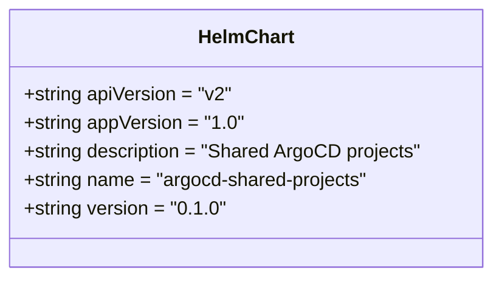

# Diagram: devops/k8s/argocd/projects/shared/helm/Chart.yaml

> Auto-generated by Obscura crawlers

## Mermaid

### SVG

<svg id="container" width="413.859375" xmlns="http://www.w3.org/2000/svg" class="classDiagram" height="232" viewBox="0 0 413.859375 232" role="graphics-document document" aria-roledescription="class"><g><defs><marker id="container_class-aggregationStart" class="marker aggregation class" refX="18" refY="7" markerWidth="190" markerHeight="240" orient="auto"><path d="M 18,7 L9,13 L1,7 L9,1 Z"></path></marker></defs><defs><marker id="container_class-aggregationEnd" class="marker aggregation class" refX="1" refY="7" markerWidth="20" markerHeight="28" orient="auto"><path d="M 18,7 L9,13 L1,7 L9,1 Z"></path></marker></defs><defs><marker id="container_class-extensionStart" class="marker extension class" refX="18" refY="7" markerWidth="190" markerHeight="240" orient="auto"><path d="M 1,7 L18,13 V 1 Z"></path></marker></defs><defs><marker id="container_class-extensionEnd" class="marker extension class" refX="1" refY="7" markerWidth="20" markerHeight="28" orient="auto"><path d="M 1,1 V 13 L18,7 Z"></path></marker></defs><defs><marker id="container_class-compositionStart" class="marker composition class" refX="18" refY="7" markerWidth="190" markerHeight="240" orient="auto"><path d="M 18,7 L9,13 L1,7 L9,1 Z"></path></marker></defs><defs><marker id="container_class-compositionEnd" class="marker composition class" refX="1" refY="7" markerWidth="20" markerHeight="28" orient="auto"><path d="M 18,7 L9,13 L1,7 L9,1 Z"></path></marker></defs><defs><marker id="container_class-dependencyStart" class="marker dependency class" refX="6" refY="7" markerWidth="190" markerHeight="240" orient="auto"><path d="M 5,7 L9,13 L1,7 L9,1 Z"></path></marker></defs><defs><marker id="container_class-dependencyEnd" class="marker dependency class" refX="13" refY="7" markerWidth="20" markerHeight="28" orient="auto"><path d="M 18,7 L9,13 L14,7 L9,1 Z"></path></marker></defs><defs><marker id="container_class-lollipopStart" class="marker lollipop class" refX="13" refY="7" markerWidth="190" markerHeight="240" orient="auto"><circle stroke="black" fill="transparent" cx="7" cy="7" r="6"></circle></marker></defs><defs><marker id="container_class-lollipopEnd" class="marker lollipop class" refX="1" refY="7" markerWidth="190" markerHeight="240" orient="auto"><circle stroke="black" fill="transparent" cx="7" cy="7" r="6"></circle></marker></defs><g class="root"><g class="clusters"></g><g class="edgePaths"></g><g class="edgeLabels"></g><g class="nodes"><g class="node default" id="classId-HelmChart-0" transform="translate(206.9296875, 116)"><g class="basic label-container"><path d="M-198.9296875 -108 L198.9296875 -108 L198.9296875 108 L-198.9296875 108" stroke="none" stroke-width="0" fill="#ECECFF" style=""></path><path d="M-198.9296875 -108 C-112.88139447657689 -108, -26.833101453153773 -108, 198.9296875 -108 M-198.9296875 -108 C-61.63380242663243 -108, 75.66208264673514 -108, 198.9296875 -108 M198.9296875 -108 C198.9296875 -39.9905086572374, 198.9296875 28.018982685525202, 198.9296875 108 M198.9296875 -108 C198.9296875 -26.053870670973964, 198.9296875 55.89225865805207, 198.9296875 108 M198.9296875 108 C83.01863272489487 108, -32.89242205021026 108, -198.9296875 108 M198.9296875 108 C52.91537794175599 108, -93.09893161648802 108, -198.9296875 108 M-198.9296875 108 C-198.9296875 25.101427543340463, -198.9296875 -57.79714491331907, -198.9296875 -108 M-198.9296875 108 C-198.9296875 51.61775028440429, -198.9296875 -4.764499431191425, -198.9296875 -108" stroke="#9370DB" stroke-width="1.3" fill="none" stroke-dasharray="0 0" style=""></path></g><g class="annotation-group text" transform="translate(0, -84)"></g><g class="label-group text" transform="translate(-38.703125, -84)"><g class="label" style="font-weight: bolder" transform="translate(0,-12)"><foreignObject width="77.40625" height="24">

HelmChart

</foreignObject></g></g><g class="members-group text" transform="translate(-186.9296875, -36)"><g class="label" style="" transform="translate(0,-12)"><foreignObject width="175.3125" height="24">

+string apiVersion = "v2"

</foreignObject></g><g class="label" style="" transform="translate(0,12)"><foreignObject width="184.03125" height="24">

+string appVersion = "1.0"

</foreignObject></g><g class="label" style="" transform="translate(0,36)"><foreignObject width="335.15625" height="24">

+string description = "Shared ArgoCD projects"

</foreignObject></g><g class="label" style="" transform="translate(0,60)"><foreignObject width="293.15625" height="24">

+string name = "argocd-shared-projects"

</foreignObject></g><g class="label" style="" transform="translate(0,84)"><foreignObject width="166.4375" height="24">

+string version = "0.1.0"

</foreignObject></g></g><g class="methods-group text" transform="translate(-186.9296875, 108)"></g><g class="divider" style=""><path d="M-198.9296875 -60 C-77.12014804509566 -60, 44.68939140980868 -60, 198.9296875 -60 M-198.9296875 -60 C-77.24601805582361 -60, 44.437651388352776 -60, 198.9296875 -60" stroke="#9370DB" stroke-width="1.3" fill="none" stroke-dasharray="0 0" style=""></path></g><g class="divider" style=""><path d="M-198.9296875 84 C-94.33686790450002 84, 10.25595169099995 84, 198.9296875 84 M-198.9296875 84 C-53.682489240033334 84, 91.56470901993333 84, 198.9296875 84" stroke="#9370DB" stroke-width="1.3" fill="none" stroke-dasharray="0 0" style=""></path></g></g></g></g></g></svg>
