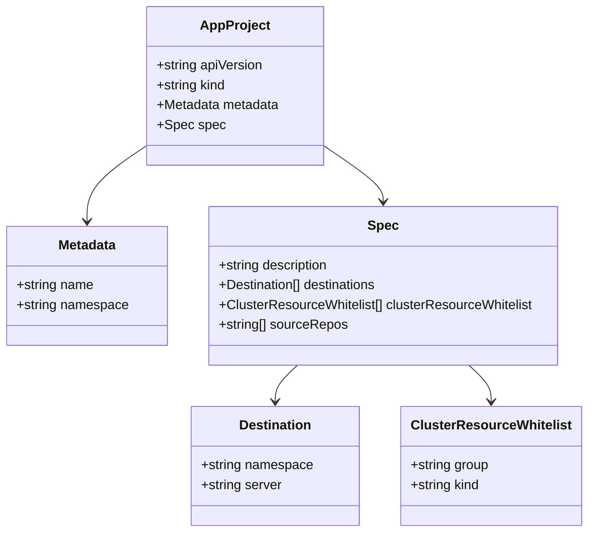
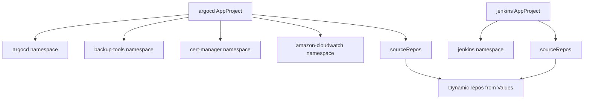
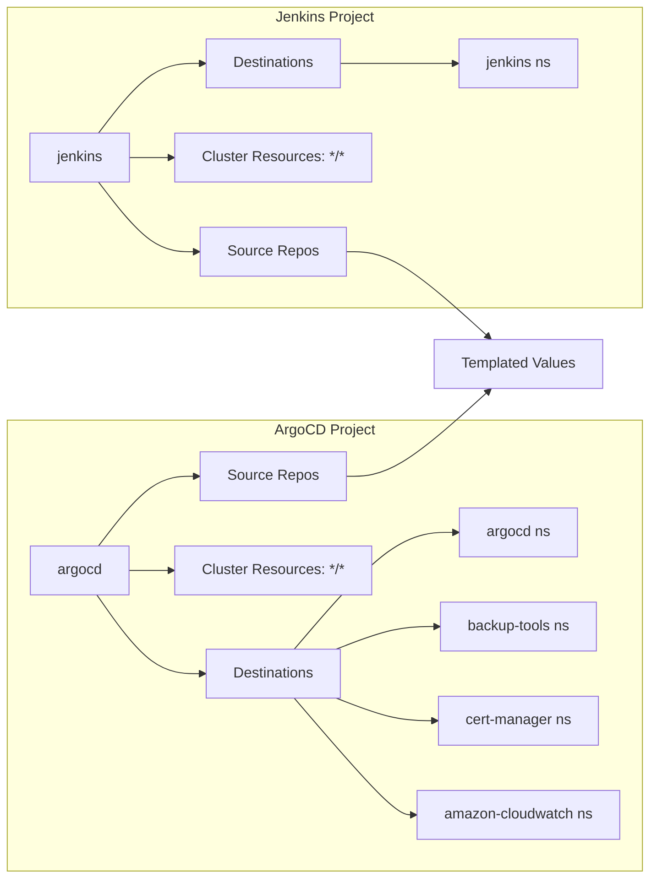

# Diagram: devops/k8s/argocd/projects/shared/helm/templates/projects.yaml

> Auto-generated by Obscura crawlers

## Diagram 1

### SVG

<svg id="container" width="707.173828125" xmlns="http://www.w3.org/2000/svg" class="classDiagram" height="644" viewBox="0 0 707.173828125 644" role="graphics-document document" aria-roledescription="class"><g><defs><marker id="container_class-aggregationStart" class="marker aggregation class" refX="18" refY="7" markerWidth="190" markerHeight="240" orient="auto"><path d="M 18,7 L9,13 L1,7 L9,1 Z"></path></marker></defs><defs><marker id="container_class-aggregationEnd" class="marker aggregation class" refX="1" refY="7" markerWidth="20" markerHeight="28" orient="auto"><path d="M 18,7 L9,13 L1,7 L9,1 Z"></path></marker></defs><defs><marker id="container_class-extensionStart" class="marker extension class" refX="18" refY="7" markerWidth="190" markerHeight="240" orient="auto"><path d="M 1,7 L18,13 V 1 Z"></path></marker></defs><defs><marker id="container_class-extensionEnd" class="marker extension class" refX="1" refY="7" markerWidth="20" markerHeight="28" orient="auto"><path d="M 1,1 V 13 L18,7 Z"></path></marker></defs><defs><marker id="container_class-compositionStart" class="marker composition class" refX="18" refY="7" markerWidth="190" markerHeight="240" orient="auto"><path d="M 18,7 L9,13 L1,7 L9,1 Z"></path></marker></defs><defs><marker id="container_class-compositionEnd" class="marker composition class" refX="1" refY="7" markerWidth="20" markerHeight="28" orient="auto"><path d="M 18,7 L9,13 L1,7 L9,1 Z"></path></marker></defs><defs><marker id="container_class-dependencyStart" class="marker dependency class" refX="6" refY="7" markerWidth="190" markerHeight="240" orient="auto"><path d="M 5,7 L9,13 L1,7 L9,1 Z"></path></marker></defs><defs><marker id="container_class-dependencyEnd" class="marker dependency class" refX="13" refY="7" markerWidth="20" markerHeight="28" orient="auto"><path d="M 18,7 L9,13 L14,7 L9,1 Z"></path></marker></defs><defs><marker id="container_class-lollipopStart" class="marker lollipop class" refX="13" refY="7" markerWidth="190" markerHeight="240" orient="auto"><circle stroke="black" fill="transparent" cx="7" cy="7" r="6"></circle></marker></defs><defs><marker id="container_class-lollipopEnd" class="marker lollipop class" refX="1" refY="7" markerWidth="190" markerHeight="240" orient="auto"><circle stroke="black" fill="transparent" cx="7" cy="7" r="6"></circle></marker></defs><g class="root"><g class="clusters"></g><g class="edgePaths"><path d="M177.959,176.058L165.847,184.215C153.736,192.372,129.512,208.686,117.401,224.01C105.289,239.333,105.289,253.667,105.289,260.833L105.289,268" id="id_AppProject_Metadata_1" class="edge-thickness-normal edge-pattern-solid relation" style=";;;" data-edge="true" data-et="edge" data-id="id_AppProject_Metadata_1" data-points="W3sieCI6MTc3Ljk1ODk4NDM3NSwieSI6MTc2LjA1Nzc5MDc3NDc4MzR9LHsieCI6MTA1LjI4OTA2MjUsInkiOjIyNX0seyJ4IjoxMDUuMjg5MDYyNSwieSI6Mjc0fV0=" marker-end="url(#container_class-dependencyEnd)"></path><path d="M391.943,176.058L404.055,184.215C416.167,192.372,440.39,208.686,452.502,220.01C464.613,231.333,464.613,237.667,464.613,240.833L464.613,244" id="id_AppProject_Spec_2" class="edge-thickness-normal edge-pattern-solid relation" style=";;;" data-edge="true" data-et="edge" data-id="id_AppProject_Spec_2" data-points="W3sieCI6MzkxLjk0MzM1OTM3NSwieSI6MTc2LjA1Nzc5MDc3NDc4MzR9LHsieCI6NDY0LjYxMzI4MTI1LCJ5IjoyMjV9LHsieCI6NDY0LjYxMzI4MTI1LCJ5IjoyNTB9XQ==" marker-end="url(#container_class-dependencyEnd)"></path><path d="M362.593,442L358.165,446.167C353.737,450.333,344.881,458.667,340.453,466C336.025,473.333,336.025,479.667,336.025,482.833L336.025,486" id="id_Spec_Destination_3" class="edge-thickness-normal edge-pattern-solid relation" style=";;;" data-edge="true" data-et="edge" data-id="id_Spec_Destination_3" data-points="W3sieCI6MzYyLjU5MzEzNjYyMTkwMDg0LCJ5Ijo0NDJ9LHsieCI6MzM2LjAyNTM5MDYyNSwieSI6NDY3fSx7IngiOjMzNi4wMjUzOTA2MjUsInkiOjQ5Mn1d" marker-end="url(#container_class-dependencyEnd)"></path><path d="M566.633,442L571.061,446.167C575.489,450.333,584.345,458.667,588.773,466C593.201,473.333,593.201,479.667,593.201,482.833L593.201,486" id="id_Spec_ClusterResourceWhitelist_4" class="edge-thickness-normal edge-pattern-solid relation" style=";;;" data-edge="true" data-et="edge" data-id="id_Spec_ClusterResourceWhitelist_4" data-points="W3sieCI6NTY2LjYzMzQyNTg3ODA5OTIsInkiOjQ0Mn0seyJ4Ijo1OTMuMjAxMTcxODc1LCJ5Ijo0Njd9LHsieCI6NTkzLjIwMTE3MTg3NSwieSI6NDkyfV0=" marker-end="url(#container_class-dependencyEnd)"></path></g><g class="edgeLabels"><g class="edgeLabel"><g class="label" data-id="id_AppProject_Metadata_1" transform="translate(0, 0)"><foreignObject width="0" height="0">

</foreignObject></g></g><g class="edgeLabel"><g class="label" data-id="id_AppProject_Spec_2" transform="translate(0, 0)"><foreignObject width="0" height="0">

</foreignObject></g></g><g class="edgeLabel"><g class="label" data-id="id_Spec_Destination_3" transform="translate(0, 0)"><foreignObject width="0" height="0">

</foreignObject></g></g><g class="edgeLabel"><g class="label" data-id="id_Spec_ClusterResourceWhitelist_4" transform="translate(0, 0)"><foreignObject width="0" height="0">

</foreignObject></g></g></g><g class="nodes"><g class="node default" id="classId-AppProject-0" transform="translate(284.951171875, 104)"><g class="basic label-container"><path d="M-106.9921875 -96 L106.9921875 -96 L106.9921875 96 L-106.9921875 96" stroke="none" stroke-width="0" fill="#ECECFF" style=""></path><path d="M-106.9921875 -96 C-32.67477382624942 -96, 41.64263984750116 -96, 106.9921875 -96 M-106.9921875 -96 C-38.606575316860344 -96, 29.779036866279313 -96, 106.9921875 -96 M106.9921875 -96 C106.9921875 -47.87410490999145, 106.9921875 0.2517901800170961, 106.9921875 96 M106.9921875 -96 C106.9921875 -53.97222716669543, 106.9921875 -11.944454333390865, 106.9921875 96 M106.9921875 96 C44.78451411018198 96, -17.42315927963604 96, -106.9921875 96 M106.9921875 96 C23.136352500651483 96, -60.71948249869703 96, -106.9921875 96 M-106.9921875 96 C-106.9921875 53.383446208264786, -106.9921875 10.766892416529572, -106.9921875 -96 M-106.9921875 96 C-106.9921875 20.346806089613096, -106.9921875 -55.30638782077381, -106.9921875 -96" stroke="#9370DB" stroke-width="1.3" fill="none" stroke-dasharray="0 0" style=""></path></g><g class="annotation-group text" transform="translate(0, -72)"></g><g class="label-group text" transform="translate(-40.140625, -72)"><g class="label" style="font-weight: bolder" transform="translate(0,-12)"><foreignObject width="80.28125" height="24">

AppProject

</foreignObject></g></g><g class="members-group text" transform="translate(-94.9921875, -24)"><g class="label" style="" transform="translate(0,-12)"><foreignObject width="130.4375" height="24">

+string apiVersion

</foreignObject></g><g class="label" style="" transform="translate(0,12)"><foreignObject width="85.515625" height="24">

+string kind

</foreignObject></g><g class="label" style="" transform="translate(0,36)"><foreignObject width="149.84375" height="24">

+Metadata metadata

</foreignObject></g><g class="label" style="" transform="translate(0,60)"><foreignObject width="79.53125" height="24">

+Spec spec

</foreignObject></g></g><g class="methods-group text" transform="translate(-94.9921875, 96)"></g><g class="divider" style=""><path d="M-106.9921875 -48 C-29.673448203091553 -48, 47.645291093816894 -48, 106.9921875 -48 M-106.9921875 -48 C-33.18804903872807 -48, 40.616089422543865 -48, 106.9921875 -48" stroke="#9370DB" stroke-width="1.3" fill="none" stroke-dasharray="0 0" style=""></path></g><g class="divider" style=""><path d="M-106.9921875 72 C-58.145388378314095 72, -9.29858925662819 72, 106.9921875 72 M-106.9921875 72 C-57.94060134370947 72, -8.889015187418934 72, 106.9921875 72" stroke="#9370DB" stroke-width="1.3" fill="none" stroke-dasharray="0 0" style=""></path></g></g><g class="node default" id="classId-Metadata-1" transform="translate(105.2890625, 346)"><g class="basic label-container"><path d="M-97.2890625 -72 L97.2890625 -72 L97.2890625 72 L-97.2890625 72" stroke="none" stroke-width="0" fill="#ECECFF" style=""></path><path d="M-97.2890625 -72 C-55.041041872748146 -72, -12.793021245496291 -72, 97.2890625 -72 M-97.2890625 -72 C-40.2950191663593 -72, 16.699024167281394 -72, 97.2890625 -72 M97.2890625 -72 C97.2890625 -36.781319547175485, 97.2890625 -1.5626390943509705, 97.2890625 72 M97.2890625 -72 C97.2890625 -38.664605854761476, 97.2890625 -5.329211709522951, 97.2890625 72 M97.2890625 72 C36.52759588328876 72, -24.233870733422478 72, -97.2890625 72 M97.2890625 72 C39.5281403862423 72, -18.232781727515402 72, -97.2890625 72 M-97.2890625 72 C-97.2890625 39.79114095415005, -97.2890625 7.582281908300104, -97.2890625 -72 M-97.2890625 72 C-97.2890625 23.690366258558072, -97.2890625 -24.619267482883856, -97.2890625 -72" stroke="#9370DB" stroke-width="1.3" fill="none" stroke-dasharray="0 0" style=""></path></g><g class="annotation-group text" transform="translate(0, -48)"></g><g class="label-group text" transform="translate(-34.640625, -48)"><g class="label" style="font-weight: bolder" transform="translate(0,-12)"><foreignObject width="69.28125" height="24">

Metadata

</foreignObject></g></g><g class="members-group text" transform="translate(-85.2890625, 0)"><g class="label" style="" transform="translate(0,-12)"><foreignObject width="94.375" height="24">

+string name

</foreignObject></g><g class="label" style="" transform="translate(0,12)"><foreignObject width="135.9375" height="24">

+string namespace

</foreignObject></g></g><g class="methods-group text" transform="translate(-85.2890625, 72)"></g><g class="divider" style=""><path d="M-97.2890625 -24 C-22.676470594222707 -24, 51.93612131155459 -24, 97.2890625 -24 M-97.2890625 -24 C-42.69384349004452 -24, 11.901375519910957 -24, 97.2890625 -24" stroke="#9370DB" stroke-width="1.3" fill="none" stroke-dasharray="0 0" style=""></path></g><g class="divider" style=""><path d="M-97.2890625 48 C-31.207445204981852 48, 34.874172090036296 48, 97.2890625 48 M-97.2890625 48 C-54.931560894001 48, -12.574059288002005 48, 97.2890625 48" stroke="#9370DB" stroke-width="1.3" fill="none" stroke-dasharray="0 0" style=""></path></g></g><g class="node default" id="classId-Spec-2" transform="translate(464.61328125, 346)"><g class="basic label-container"><path d="M-212.03515625 -96 L212.03515625 -96 L212.03515625 96 L-212.03515625 96" stroke="none" stroke-width="0" fill="#ECECFF" style=""></path><path d="M-212.03515625 -96 C-120.86118628769485 -96, -29.6872163253897 -96, 212.03515625 -96 M-212.03515625 -96 C-74.40388054331365 -96, 63.227395163372705 -96, 212.03515625 -96 M212.03515625 -96 C212.03515625 -24.647455873132827, 212.03515625 46.705088253734345, 212.03515625 96 M212.03515625 -96 C212.03515625 -48.48540287897196, 212.03515625 -0.9708057579439213, 212.03515625 96 M212.03515625 96 C95.67458791610419 96, -20.685980417791626 96, -212.03515625 96 M212.03515625 96 C110.1724171672813 96, 8.309678084562591 96, -212.03515625 96 M-212.03515625 96 C-212.03515625 27.145349958255167, -212.03515625 -41.709300083489666, -212.03515625 -96 M-212.03515625 96 C-212.03515625 42.665314376213225, -212.03515625 -10.669371247573551, -212.03515625 -96" stroke="#9370DB" stroke-width="1.3" fill="none" stroke-dasharray="0 0" style=""></path></g><g class="annotation-group text" transform="translate(0, -72)"></g><g class="label-group text" transform="translate(-17.6015625, -72)"><g class="label" style="font-weight: bolder" transform="translate(0,-12)"><foreignObject width="35.203125" height="24">

Spec

</foreignObject></g></g><g class="members-group text" transform="translate(-200.03515625, -24)"><g class="label" style="" transform="translate(0,-12)"><foreignObject width="136.46875" height="24">

+string description

</foreignObject></g><g class="label" style="" transform="translate(0,12)"><foreignObject width="197.015625" height="24">

+Destination[] destinations

</foreignObject></g><g class="label" style="" transform="translate(0,36)"><foreignObject width="382.46875" height="24">

+ClusterResourceWhitelist[] clusterResourceWhitelist

</foreignObject></g><g class="label" style="" transform="translate(0,60)"><foreignObject width="156.515625" height="24">

+string[] sourceRepos

</foreignObject></g></g><g class="methods-group text" transform="translate(-200.03515625, 96)"></g><g class="divider" style=""><path d="M-212.03515625 -48 C-93.95530773189385 -48, 24.124540786212293 -48, 212.03515625 -48 M-212.03515625 -48 C-109.15429605638177 -48, -6.2734358627635345 -48, 212.03515625 -48" stroke="#9370DB" stroke-width="1.3" fill="none" stroke-dasharray="0 0" style=""></path></g><g class="divider" style=""><path d="M-212.03515625 72 C-77.73962377091132 72, 56.555908708177355 72, 212.03515625 72 M-212.03515625 72 C-70.15430479601031 72, 71.72654665797938 72, 212.03515625 72" stroke="#9370DB" stroke-width="1.3" fill="none" stroke-dasharray="0 0" style=""></path></g></g><g class="node default" id="classId-Destination-3" transform="translate(336.025390625, 564)"><g class="basic label-container"><path d="M-101.203125 -72 L101.203125 -72 L101.203125 72 L-101.203125 72" stroke="none" stroke-width="0" fill="#ECECFF" style=""></path><path d="M-101.203125 -72 C-29.143975070258165 -72, 42.91517485948367 -72, 101.203125 -72 M-101.203125 -72 C-42.15182877697336 -72, 16.89946744605328 -72, 101.203125 -72 M101.203125 -72 C101.203125 -27.22853644729679, 101.203125 17.54292710540642, 101.203125 72 M101.203125 -72 C101.203125 -30.688648560417285, 101.203125 10.62270287916543, 101.203125 72 M101.203125 72 C38.391420139316715 72, -24.42028472136657 72, -101.203125 72 M101.203125 72 C20.535616936501455 72, -60.13189112699709 72, -101.203125 72 M-101.203125 72 C-101.203125 40.20285887182758, -101.203125 8.40571774365516, -101.203125 -72 M-101.203125 72 C-101.203125 27.442116923750334, -101.203125 -17.115766152499333, -101.203125 -72" stroke="#9370DB" stroke-width="1.3" fill="none" stroke-dasharray="0 0" style=""></path></g><g class="annotation-group text" transform="translate(0, -48)"></g><g class="label-group text" transform="translate(-42.46875, -48)"><g class="label" style="font-weight: bolder" transform="translate(0,-12)"><foreignObject width="84.9375" height="24">

Destination

</foreignObject></g></g><g class="members-group text" transform="translate(-89.203125, 0)"><g class="label" style="" transform="translate(0,-12)"><foreignObject width="135.9375" height="24">

+string namespace

</foreignObject></g><g class="label" style="" transform="translate(0,12)"><foreignObject width="98.9375" height="24">

+string server

</foreignObject></g></g><g class="methods-group text" transform="translate(-89.203125, 72)"></g><g class="divider" style=""><path d="M-101.203125 -24 C-52.155694592650796 -24, -3.108264185301593 -24, 101.203125 -24 M-101.203125 -24 C-42.864227783530566 -24, 15.474669432938867 -24, 101.203125 -24" stroke="#9370DB" stroke-width="1.3" fill="none" stroke-dasharray="0 0" style=""></path></g><g class="divider" style=""><path d="M-101.203125 48 C-43.977821008056004 48, 13.247482983887991 48, 101.203125 48 M-101.203125 48 C-31.97857044962177 48, 37.24598410075646 48, 101.203125 48" stroke="#9370DB" stroke-width="1.3" fill="none" stroke-dasharray="0 0" style=""></path></g></g><g class="node default" id="classId-ClusterResourceWhitelist-4" transform="translate(593.201171875, 564)"><g class="basic label-container"><path d="M-105.97265625 -72 L105.97265625 -72 L105.97265625 72 L-105.97265625 72" stroke="none" stroke-width="0" fill="#ECECFF" style=""></path><path d="M-105.97265625 -72 C-31.00187907754423 -72, 43.96889809491154 -72, 105.97265625 -72 M-105.97265625 -72 C-55.712624761107115 -72, -5.45259327221423 -72, 105.97265625 -72 M105.97265625 -72 C105.97265625 -17.176851841541563, 105.97265625 37.646296316916875, 105.97265625 72 M105.97265625 -72 C105.97265625 -17.67778158838278, 105.97265625 36.64443682323444, 105.97265625 72 M105.97265625 72 C38.99623609375273 72, -27.980184062494544 72, -105.97265625 72 M105.97265625 72 C47.32715229683882 72, -11.318351656322363 72, -105.97265625 72 M-105.97265625 72 C-105.97265625 29.196007452109896, -105.97265625 -13.607985095780208, -105.97265625 -72 M-105.97265625 72 C-105.97265625 33.59453098665669, -105.97265625 -4.810938026686614, -105.97265625 -72" stroke="#9370DB" stroke-width="1.3" fill="none" stroke-dasharray="0 0" style=""></path></g><g class="annotation-group text" transform="translate(0, -48)"></g><g class="label-group text" transform="translate(-91.8984375, -48)"><g class="label" style="font-weight: bolder" transform="translate(0,-12)"><foreignObject width="183.796875" height="24">

ClusterResourceWhitelist

</foreignObject></g></g><g class="members-group text" transform="translate(-93.97265625, 0)"><g class="label" style="" transform="translate(0,-12)"><foreignObject width="96.046875" height="24">

+string group

</foreignObject></g><g class="label" style="" transform="translate(0,12)"><foreignObject width="85.515625" height="24">

+string kind

</foreignObject></g></g><g class="methods-group text" transform="translate(-93.97265625, 72)"></g><g class="divider" style=""><path d="M-105.97265625 -24 C-44.67457761107545 -24, 16.6235010278491 -24, 105.97265625 -24 M-105.97265625 -24 C-26.688884084021836 -24, 52.59488808195633 -24, 105.97265625 -24" stroke="#9370DB" stroke-width="1.3" fill="none" stroke-dasharray="0 0" style=""></path></g><g class="divider" style=""><path d="M-105.97265625 48 C-53.01979911599975 48, -0.06694198199950563 48, 105.97265625 48 M-105.97265625 48 C-24.77026009112376 48, 56.43213606775248 48, 105.97265625 48" stroke="#9370DB" stroke-width="1.3" fill="none" stroke-dasharray="0 0" style=""></path></g></g></g></g></g></svg>

## Diagram 2

### SVG

<svg id="container" width="1759.546875" xmlns="http://www.w3.org/2000/svg" class="flowchart" height="302" viewBox="0 0 1759.546875 302" role="graphics-document document" aria-roledescription="flowchart-v2"><g><marker id="container_flowchart-v2-pointEnd" class="marker flowchart-v2" viewBox="0 0 10 10" refX="5" refY="5" markerUnits="userSpaceOnUse" markerWidth="8" markerHeight="8" orient="auto"><path d="M 0 0 L 10 5 L 0 10 z" class="arrowMarkerPath" style="stroke-width: 1; stroke-dasharray: 1, 0;"></path></marker><marker id="container_flowchart-v2-pointStart" class="marker flowchart-v2" viewBox="0 0 10 10" refX="4.5" refY="5" markerUnits="userSpaceOnUse" markerWidth="8" markerHeight="8" orient="auto"><path d="M 0 5 L 10 10 L 10 0 z" class="arrowMarkerPath" style="stroke-width: 1; stroke-dasharray: 1, 0;"></path></marker><marker id="container_flowchart-v2-circleEnd" class="marker flowchart-v2" viewBox="0 0 10 10" refX="11" refY="5" markerUnits="userSpaceOnUse" markerWidth="11" markerHeight="11" orient="auto"><circle cx="5" cy="5" r="5" class="arrowMarkerPath" style="stroke-width: 1; stroke-dasharray: 1, 0;"></circle></marker><marker id="container_flowchart-v2-circleStart" class="marker flowchart-v2" viewBox="0 0 10 10" refX="-1" refY="5" markerUnits="userSpaceOnUse" markerWidth="11" markerHeight="11" orient="auto"><circle cx="5" cy="5" r="5" class="arrowMarkerPath" style="stroke-width: 1; stroke-dasharray: 1, 0;"></circle></marker><marker id="container_flowchart-v2-crossEnd" class="marker cross flowchart-v2" viewBox="0 0 11 11" refX="12" refY="5.2" markerUnits="userSpaceOnUse" markerWidth="11" markerHeight="11" orient="auto"><path d="M 1,1 l 9,9 M 10,1 l -9,9" class="arrowMarkerPath" style="stroke-width: 2; stroke-dasharray: 1, 0;"></path></marker><marker id="container_flowchart-v2-crossStart" class="marker cross flowchart-v2" viewBox="0 0 11 11" refX="-1" refY="5.2" markerUnits="userSpaceOnUse" markerWidth="11" markerHeight="11" orient="auto"><path d="M 1,1 l 9,9 M 10,1 l -9,9" class="arrowMarkerPath" style="stroke-width: 2; stroke-dasharray: 1, 0;"></path></marker><g class="root"><g class="clusters"></g><g class="edgePaths"><path d="M570.648,43.899L493.146,51.082C415.643,58.266,260.638,72.633,183.135,85.316C105.633,98,105.633,109,105.633,114.5L105.633,120" id="L_A_B_0" class="edge-thickness-normal edge-pattern-solid edge-thickness-normal edge-pattern-solid flowchart-link" style=";" data-edge="true" data-et="edge" data-id="L_A_B_0" data-points="W3sieCI6NTcwLjY0ODQzNzUsInkiOjQzLjg5ODc0ODEwMjY1ODM3fSx7IngiOjEwNS42MzI4MTI1LCJ5Ijo4N30seyJ4IjoxMDUuNjMyODEyNSwieSI6MTI0fV0=" marker-end="url(#container_flowchart-v2-pointEnd)"></path><path d="M570.648,52.065L537.891,57.887C505.133,63.71,439.617,75.355,406.859,86.677C374.102,98,374.102,109,374.102,114.5L374.102,120" id="L_A_C_0" class="edge-thickness-normal edge-pattern-solid edge-thickness-normal edge-pattern-solid flowchart-link" style=";" data-edge="true" data-et="edge" data-id="L_A_C_0" data-points="W3sieCI6NTcwLjY0ODQzNzUsInkiOjUyLjA2NDg2NTAwOTIxMzAyfSx7IngiOjM3NC4xMDE1NjI1LCJ5Ijo4N30seyJ4IjozNzQuMTAxNTYyNSwieSI6MTI0fV0=" marker-end="url(#container_flowchart-v2-pointEnd)"></path><path d="M666.656,62L666.656,66.167C666.656,70.333,666.656,78.667,666.656,88.333C666.656,98,666.656,109,666.656,114.5L666.656,120" id="L_A_D_0" class="edge-thickness-normal edge-pattern-solid edge-thickness-normal edge-pattern-solid flowchart-link" style=";" data-edge="true" data-et="edge" data-id="L_A_D_0" data-points="W3sieCI6NjY2LjY1NjI1LCJ5Ijo2Mn0seyJ4Ijo2NjYuNjU2MjUsInkiOjg3fSx7IngiOjY2Ni42NTYyNSwieSI6MTI0fV0=" marker-end="url(#container_flowchart-v2-pointEnd)"></path><path d="M762.664,51.547L796.949,57.455C831.234,63.364,899.805,75.182,934.09,84.591C968.375,94,968.375,101,968.375,104.5L968.375,108" id="L_A_E_0" class="edge-thickness-normal edge-pattern-solid edge-thickness-normal edge-pattern-solid flowchart-link" style=";" data-edge="true" data-et="edge" data-id="L_A_E_0" data-points="W3sieCI6NzYyLjY2NDA2MjUsInkiOjUxLjU0NjU1NjE4ODUwMzM3fSx7IngiOjk2OC4zNzUsInkiOjg3fSx7IngiOjk2OC4zNzUsInkiOjExMn1d" marker-end="url(#container_flowchart-v2-pointEnd)"></path><path d="M762.664,43.949L839.646,51.124C916.628,58.299,1070.591,72.65,1147.573,85.325C1224.555,98,1224.555,109,1224.555,114.5L1224.555,120" id="L_A_F_0" class="edge-thickness-normal edge-pattern-solid edge-thickness-normal edge-pattern-solid flowchart-link" style=";" data-edge="true" data-et="edge" data-id="L_A_F_0" data-points="W3sieCI6NzYyLjY2NDA2MjUsInkiOjQzLjk0ODU5MzM1Mzk2NTA3fSx7IngiOjEyMjQuNTU0Njg3NSwieSI6ODd9LHsieCI6MTIyNC41NTQ2ODc1LCJ5IjoxMjR9XQ==" marker-end="url(#container_flowchart-v2-pointEnd)"></path><path d="M1504.145,62L1495.114,66.167C1486.084,70.333,1468.022,78.667,1458.992,88.333C1449.961,98,1449.961,109,1449.961,114.5L1449.961,120" id="L_G_H_0" class="edge-thickness-normal edge-pattern-solid edge-thickness-normal edge-pattern-solid flowchart-link" style=";" data-edge="true" data-et="edge" data-id="L_G_H_0" data-points="W3sieCI6MTUwNC4xNDUxMzIyMTE1Mzg2LCJ5Ijo2Mn0seyJ4IjoxNDQ5Ljk2MDkzNzUsInkiOjg3fSx7IngiOjE0NDkuOTYwOTM3NSwieSI6MTI0fV0=" marker-end="url(#container_flowchart-v2-pointEnd)"></path><path d="M1621.183,62L1630.214,66.167C1639.244,70.333,1657.306,78.667,1666.336,88.333C1675.367,98,1675.367,109,1675.367,114.5L1675.367,120" id="L_G_I_0" class="edge-thickness-normal edge-pattern-solid edge-thickness-normal edge-pattern-solid flowchart-link" style=";" data-edge="true" data-et="edge" data-id="L_G_I_0" data-points="W3sieCI6MTYyMS4xODI5OTI3ODg0NjE0LCJ5Ijo2Mn0seyJ4IjoxNjc1LjM2NzE4NzUsInkiOjg3fSx7IngiOjE2NzUuMzY3MTg3NSwieSI6MTI0fV0=" marker-end="url(#container_flowchart-v2-pointEnd)"></path><path d="M1224.555,178L1224.555,184.167C1224.555,190.333,1224.555,202.667,1241.966,212.85C1259.378,223.034,1294.202,231.067,1311.614,235.084L1329.025,239.101" id="L_F_J_0" class="edge-thickness-normal edge-pattern-solid edge-thickness-normal edge-pattern-solid flowchart-link" style=";" data-edge="true" data-et="edge" data-id="L_F_J_0" data-points="W3sieCI6MTIyNC41NTQ2ODc1LCJ5IjoxNzh9LHsieCI6MTIyNC41NTQ2ODc1LCJ5IjoyMTV9LHsieCI6MTMzMi45MjMwNzY5MjMwNzcsInkiOjI0MH1d" marker-end="url(#container_flowchart-v2-pointEnd)"></path><path d="M1675.367,178L1675.367,184.167C1675.367,190.333,1675.367,202.667,1657.955,212.85C1640.544,223.034,1605.72,231.067,1588.308,235.084L1570.896,239.101" id="L_I_J_0" class="edge-thickness-normal edge-pattern-solid edge-thickness-normal edge-pattern-solid flowchart-link" style=";" data-edge="true" data-et="edge" data-id="L_I_J_0" data-points="W3sieCI6MTY3NS4zNjcxODc1LCJ5IjoxNzh9LHsieCI6MTY3NS4zNjcxODc1LCJ5IjoyMTV9LHsieCI6MTU2Ni45OTg3OTgwNzY5MjMsInkiOjI0MH1d" marker-end="url(#container_flowchart-v2-pointEnd)"></path></g><g class="edgeLabels"><g class="edgeLabel"><g class="label" data-id="L_A_B_0" transform="translate(0, 0)"><foreignObject width="0" height="0">

</foreignObject></g></g><g class="edgeLabel"><g class="label" data-id="L_A_C_0" transform="translate(0, 0)"><foreignObject width="0" height="0">

</foreignObject></g></g><g class="edgeLabel"><g class="label" data-id="L_A_D_0" transform="translate(0, 0)"><foreignObject width="0" height="0">

</foreignObject></g></g><g class="edgeLabel"><g class="label" data-id="L_A_E_0" transform="translate(0, 0)"><foreignObject width="0" height="0">

</foreignObject></g></g><g class="edgeLabel"><g class="label" data-id="L_A_F_0" transform="translate(0, 0)"><foreignObject width="0" height="0">

</foreignObject></g></g><g class="edgeLabel"><g class="label" data-id="L_G_H_0" transform="translate(0, 0)"><foreignObject width="0" height="0">

</foreignObject></g></g><g class="edgeLabel"><g class="label" data-id="L_G_I_0" transform="translate(0, 0)"><foreignObject width="0" height="0">

</foreignObject></g></g><g class="edgeLabel"><g class="label" data-id="L_F_J_0" transform="translate(0, 0)"><foreignObject width="0" height="0">

</foreignObject></g></g><g class="edgeLabel"><g class="label" data-id="L_I_J_0" transform="translate(0, 0)"><foreignObject width="0" height="0">

</foreignObject></g></g></g><g class="nodes"><g class="node default" id="flowchart-A-0" transform="translate(666.65625, 35)"><rect class="basic label-container" style="" x="-96.0078125" y="-27" width="192.015625" height="54"></rect><g class="label" style="" transform="translate(-66.0078125, -12)"><rect></rect><foreignObject width="132.015625" height="24">

argocd AppProject

</foreignObject></g></g><g class="node default" id="flowchart-B-1" transform="translate(105.6328125, 151)"><rect class="basic label-container" style="" x="-97.6328125" y="-27" width="195.265625" height="54"></rect><g class="label" style="" transform="translate(-67.6328125, -12)"><rect></rect><foreignObject width="135.265625" height="24">

argocd namespace

</foreignObject></g></g><g class="node default" id="flowchart-C-3" transform="translate(374.1015625, 151)"><rect class="basic label-container" style="" x="-120.8359375" y="-27" width="241.671875" height="54"></rect><g class="label" style="" transform="translate(-90.8359375, -12)"><rect></rect><foreignObject width="181.671875" height="24">

backup-tools namespace

</foreignObject></g></g><g class="node default" id="flowchart-D-5" transform="translate(666.65625, 151)"><rect class="basic label-container" style="" x="-121.71875" y="-27" width="243.4375" height="54"></rect><g class="label" style="" transform="translate(-91.71875, -12)"><rect></rect><foreignObject width="183.4375" height="24">

cert-manager namespace

</foreignObject></g></g><g class="node default" id="flowchart-E-7" transform="translate(968.375, 151)"><rect class="basic label-container" style="" x="-130" y="-39" width="260" height="78"></rect><g class="label" style="" transform="translate(-100, -24)"><rect></rect><foreignObject width="200" height="48">

amazon-cloudwatch namespace

</foreignObject></g></g><g class="node default" id="flowchart-F-9" transform="translate(1224.5546875, 151)"><rect class="basic label-container" style="" x="-76.1796875" y="-27" width="152.359375" height="54"></rect><g class="label" style="" transform="translate(-46.1796875, -12)"><rect></rect><foreignObject width="92.359375" height="24">

sourceRepos

</foreignObject></g></g><g class="node default" id="flowchart-G-10" transform="translate(1562.6640625, 35)"><rect class="basic label-container" style="" x="-97.59375" y="-27" width="195.1875" height="54"></rect><g class="label" style="" transform="translate(-67.59375, -12)"><rect></rect><foreignObject width="135.1875" height="24">

jenkins AppProject

</foreignObject></g></g><g class="node default" id="flowchart-H-11" transform="translate(1449.9609375, 151)"><rect class="basic label-container" style="" x="-99.2265625" y="-27" width="198.453125" height="54"></rect><g class="label" style="" transform="translate(-69.2265625, -12)"><rect></rect><foreignObject width="138.453125" height="24">

jenkins namespace

</foreignObject></g></g><g class="node default" id="flowchart-I-13" transform="translate(1675.3671875, 151)"><rect class="basic label-container" style="" x="-76.1796875" y="-27" width="152.359375" height="54"></rect><g class="label" style="" transform="translate(-46.1796875, -12)"><rect></rect><foreignObject width="92.359375" height="24">

sourceRepos

</foreignObject></g></g><g class="node default" id="flowchart-J-15" transform="translate(1449.9609375, 267)"><rect class="basic label-container" style="" x="-128.3515625" y="-27" width="256.703125" height="54"></rect><g class="label" style="" transform="translate(-98.3515625, -12)"><rect></rect><foreignObject width="196.703125" height="24">

Dynamic repos from Values

</foreignObject></g></g></g></g></g></svg>

## Diagram 3

### SVG

<svg id="container" width="710.1875" xmlns="http://www.w3.org/2000/svg" class="flowchart" height="970" viewBox="0 0 710.1875 970" role="graphics-document document" aria-roledescription="flowchart-v2"><g><marker id="container_flowchart-v2-pointEnd" class="marker flowchart-v2" viewBox="0 0 10 10" refX="5" refY="5" markerUnits="userSpaceOnUse" markerWidth="8" markerHeight="8" orient="auto"><path d="M 0 0 L 10 5 L 0 10 z" class="arrowMarkerPath" style="stroke-width: 1; stroke-dasharray: 1, 0;"></path></marker><marker id="container_flowchart-v2-pointStart" class="marker flowchart-v2" viewBox="0 0 10 10" refX="4.5" refY="5" markerUnits="userSpaceOnUse" markerWidth="8" markerHeight="8" orient="auto"><path d="M 0 5 L 10 10 L 10 0 z" class="arrowMarkerPath" style="stroke-width: 1; stroke-dasharray: 1, 0;"></path></marker><marker id="container_flowchart-v2-circleEnd" class="marker flowchart-v2" viewBox="0 0 10 10" refX="11" refY="5" markerUnits="userSpaceOnUse" markerWidth="11" markerHeight="11" orient="auto"><circle cx="5" cy="5" r="5" class="arrowMarkerPath" style="stroke-width: 1; stroke-dasharray: 1, 0;"></circle></marker><marker id="container_flowchart-v2-circleStart" class="marker flowchart-v2" viewBox="0 0 10 10" refX="-1" refY="5" markerUnits="userSpaceOnUse" markerWidth="11" markerHeight="11" orient="auto"><circle cx="5" cy="5" r="5" class="arrowMarkerPath" style="stroke-width: 1; stroke-dasharray: 1, 0;"></circle></marker><marker id="container_flowchart-v2-crossEnd" class="marker cross flowchart-v2" viewBox="0 0 11 11" refX="12" refY="5.2" markerUnits="userSpaceOnUse" markerWidth="11" markerHeight="11" orient="auto"><path d="M 1,1 l 9,9 M 10,1 l -9,9" class="arrowMarkerPath" style="stroke-width: 2; stroke-dasharray: 1, 0;"></path></marker><marker id="container_flowchart-v2-crossStart" class="marker cross flowchart-v2" viewBox="0 0 11 11" refX="-1" refY="5.2" markerUnits="userSpaceOnUse" markerWidth="11" markerHeight="11" orient="auto"><path d="M 1,1 l 9,9 M 10,1 l -9,9" class="arrowMarkerPath" style="stroke-width: 2; stroke-dasharray: 1, 0;"></path></marker><g class="root"><g class="clusters"><g class="cluster" id="subGraph1" data-look="classic"><rect style="" x="8" y="8" width="694.1875" height="332"></rect><g class="cluster-label" transform="translate(301.3828125, 8)"><foreignObject width="107.421875" height="24">

Jenkins Project

</foreignObject></g></g><g class="cluster" id="subGraph0" data-look="classic"><rect style="" x="8" y="464" width="694.1875" height="498"></rect><g class="cluster-label" transform="translate(301.765625, 464)"><foreignObject width="106.65625" height="24">

ArgoCD Project

</foreignObject></g></g></g><g class="edgePaths"><path d="M108.271,657L118.583,671.5C128.894,686,149.517,715,167.78,729.5C186.042,744,201.943,744,209.893,744L217.844,744" id="L_A1_A2_0" class="edge-thickness-normal edge-pattern-solid edge-thickness-normal edge-pattern-solid flowchart-link" style=";" data-edge="true" data-et="edge" data-id="L_A1_A2_0" data-points="W3sieCI6MTA4LjI3MTE3NTk4Njg0MjExLCJ5Ijo2NTd9LHsieCI6MTcwLjE0MDYyNSwieSI6NzQ0fSx7IngiOjIyMS44NDM3NSwieSI6NzQ0fV0=" marker-end="url(#container_flowchart-v2-pointEnd)"></path><path d="M319.57,717L337.126,695.5C354.682,674,389.794,631,418.953,609.5C448.112,588,471.318,588,482.921,588L494.523,588" id="L_A2_A3_0" class="edge-thickness-normal edge-pattern-solid edge-thickness-normal edge-pattern-solid flowchart-link" style=";" data-edge="true" data-et="edge" data-id="L_A2_A3_0" data-points="W3sieCI6MzE5LjU3MDQ2Mjc0MDM4NDY0LCJ5Ijo3MTd9LHsieCI6NDI0LjkwNjI1LCJ5Ijo1ODh9LHsieCI6NDk4LjUyMzQzNzUsInkiOjU4OH1d" marker-end="url(#container_flowchart-v2-pointEnd)"></path><path d="M363.665,717L373.871,712.833C384.078,708.667,404.492,700.333,422.436,696.167C440.38,692,455.854,692,463.591,692L471.328,692" id="L_A2_A4_0" class="edge-thickness-normal edge-pattern-solid edge-thickness-normal edge-pattern-solid flowchart-link" style=";" data-edge="true" data-et="edge" data-id="L_A2_A4_0" data-points="W3sieCI6MzYzLjY2NDUxMzIyMTE1MzgsInkiOjcxN30seyJ4Ijo0MjQuOTA2MjUsInkiOjY5Mn0seyJ4Ijo0NzUuMzI4MTI1LCJ5Ijo2OTJ9XQ==" marker-end="url(#container_flowchart-v2-pointEnd)"></path><path d="M363.665,771L373.871,775.167C384.078,779.333,404.492,787.667,422.289,791.833C440.086,796,455.266,796,462.855,796L470.445,796" id="L_A2_A5_0" class="edge-thickness-normal edge-pattern-solid edge-thickness-normal edge-pattern-solid flowchart-link" style=";" data-edge="true" data-et="edge" data-id="L_A2_A5_0" data-points="W3sieCI6MzYzLjY2NDUxMzIyMTE1MzgsInkiOjc3MX0seyJ4Ijo0MjQuOTA2MjUsInkiOjc5Nn0seyJ4Ijo0NzQuNDQ1MzEyNSwieSI6Nzk2fV0=" marker-end="url(#container_flowchart-v2-pointEnd)"></path><path d="M319.57,771L337.126,792.5C354.682,814,389.794,857,410.85,878.5C431.906,900,438.906,900,442.406,900L445.906,900" id="L_A2_A6_0" class="edge-thickness-normal edge-pattern-solid edge-thickness-normal edge-pattern-solid flowchart-link" style=";" data-edge="true" data-et="edge" data-id="L_A2_A6_0" data-points="W3sieCI6MzE5LjU3MDQ2Mjc0MDM4NDY0LCJ5Ijo3NzF9LHsieCI6NDI0LjkwNjI1LCJ5Ijo5MDB9LHsieCI6NDQ5LjkwNjI1LCJ5Ijo5MDB9XQ==" marker-end="url(#container_flowchart-v2-pointEnd)"></path><path d="M143.547,630L147.979,630C152.411,630,161.276,630,169.208,630C177.141,630,184.141,630,187.641,630L191.141,630" id="L_A1_A7_0" class="edge-thickness-normal edge-pattern-solid edge-thickness-normal edge-pattern-solid flowchart-link" style=";" data-edge="true" data-et="edge" data-id="L_A1_A7_0" data-points="W3sieCI6MTQzLjU0Njg3NSwieSI6NjMwfSx7IngiOjE3MC4xNDA2MjUsInkiOjYzMH0seyJ4IjoxOTUuMTQwNjI1LCJ5Ijo2MzB9XQ==" marker-end="url(#container_flowchart-v2-pointEnd)"></path><path d="M110.117,603L120.121,590.167C130.125,577.333,150.133,551.667,167.547,538.833C184.961,526,199.781,526,207.191,526L214.602,526" id="L_A1_A8_0" class="edge-thickness-normal edge-pattern-solid edge-thickness-normal edge-pattern-solid flowchart-link" style=";" data-edge="true" data-et="edge" data-id="L_A1_A8_0" data-points="W3sieCI6MTEwLjExNzQxMjg2MDU3NjkyLCJ5Ijo2MDN9LHsieCI6MTcwLjE0MDYyNSwieSI6NTI2fSx7IngiOjIxOC42MDE1NjI1LCJ5Ijo1MjZ9XQ==" marker-end="url(#container_flowchart-v2-pointEnd)"></path><path d="M110.117,147L120.121,134.167C130.125,121.333,150.133,95.667,168.087,82.833C186.042,70,201.943,70,209.893,70L217.844,70" id="L_B1_B2_0" class="edge-thickness-normal edge-pattern-solid edge-thickness-normal edge-pattern-solid flowchart-link" style=";" data-edge="true" data-et="edge" data-id="L_B1_B2_0" data-points="W3sieCI6MTEwLjExNzQxMjg2MDU3NjkyLCJ5IjoxNDd9LHsieCI6MTcwLjE0MDYyNSwieSI6NzB9LHsieCI6MjIxLjg0Mzc1LCJ5Ijo3MH1d" marker-end="url(#container_flowchart-v2-pointEnd)"></path><path d="M373.203,70L381.82,70C390.438,70,407.672,70,427.628,70C447.583,70,470.26,70,481.599,70L492.938,70" id="L_B2_B3_0" class="edge-thickness-normal edge-pattern-solid edge-thickness-normal edge-pattern-solid flowchart-link" style=";" data-edge="true" data-et="edge" data-id="L_B2_B3_0" data-points="W3sieCI6MzczLjIwMzEyNSwieSI6NzB9LHsieCI6NDI0LjkwNjI1LCJ5Ijo3MH0seyJ4Ijo0OTYuOTM3NSwieSI6NzB9XQ==" marker-end="url(#container_flowchart-v2-pointEnd)"></path><path d="M145.141,174L149.307,174C153.474,174,161.807,174,169.474,174C177.141,174,184.141,174,187.641,174L191.141,174" id="L_B1_B4_0" class="edge-thickness-normal edge-pattern-solid edge-thickness-normal edge-pattern-solid flowchart-link" style=";" data-edge="true" data-et="edge" data-id="L_B1_B4_0" data-points="W3sieCI6MTQ1LjE0MDYyNSwieSI6MTc0fSx7IngiOjE3MC4xNDA2MjUsInkiOjE3NH0seyJ4IjoxOTUuMTQwNjI1LCJ5IjoxNzR9XQ==" marker-end="url(#container_flowchart-v2-pointEnd)"></path><path d="M110.117,201L120.121,213.833C130.125,226.667,150.133,252.333,167.547,265.167C184.961,278,199.781,278,207.191,278L214.602,278" id="L_B1_B5_0" class="edge-thickness-normal edge-pattern-solid edge-thickness-normal edge-pattern-solid flowchart-link" style=";" data-edge="true" data-et="edge" data-id="L_B1_B5_0" data-points="W3sieCI6MTEwLjExNzQxMjg2MDU3NjkyLCJ5IjoyMDF9LHsieCI6MTcwLjE0MDYyNSwieSI6Mjc4fSx7IngiOjIxOC42MDE1NjI1LCJ5IjoyNzh9XQ==" marker-end="url(#container_flowchart-v2-pointEnd)"></path><path d="M376.445,526L384.522,526C392.599,526,408.753,526,434.408,510.278C460.063,494.556,495.22,463.111,512.799,447.389L530.378,431.667" id="L_A8_C_0" class="edge-thickness-normal edge-pattern-solid edge-thickness-normal edge-pattern-solid flowchart-link" style=";" data-edge="true" data-et="edge" data-id="L_A8_C_0" data-points="W3sieCI6Mzc2LjQ0NTMxMjUsInkiOjUyNn0seyJ4Ijo0MjQuOTA2MjUsInkiOjUyNn0seyJ4Ijo1MzMuMzU4OTk2OTc1ODA2NSwieSI6NDI5fV0=" marker-end="url(#container_flowchart-v2-pointEnd)"></path><path d="M376.445,278L384.522,278C392.599,278,408.753,278,434.408,293.722C460.063,309.444,495.22,340.889,512.799,356.611L530.378,372.333" id="L_B5_C_0" class="edge-thickness-normal edge-pattern-solid edge-thickness-normal edge-pattern-solid flowchart-link" style=";" data-edge="true" data-et="edge" data-id="L_B5_C_0" data-points="W3sieCI6Mzc2LjQ0NTMxMjUsInkiOjI3OH0seyJ4Ijo0MjQuOTA2MjUsInkiOjI3OH0seyJ4Ijo1MzMuMzU4OTk2OTc1ODA2NSwieSI6Mzc1fV0=" marker-end="url(#container_flowchart-v2-pointEnd)"></path></g><g class="edgeLabels"><g class="edgeLabel"><g class="label" data-id="L_A1_A2_0" transform="translate(0, 0)"><foreignObject width="0" height="0">

</foreignObject></g></g><g class="edgeLabel"><g class="label" data-id="L_A2_A3_0" transform="translate(0, 0)"><foreignObject width="0" height="0">

</foreignObject></g></g><g class="edgeLabel"><g class="label" data-id="L_A2_A4_0" transform="translate(0, 0)"><foreignObject width="0" height="0">

</foreignObject></g></g><g class="edgeLabel"><g class="label" data-id="L_A2_A5_0" transform="translate(0, 0)"><foreignObject width="0" height="0">

</foreignObject></g></g><g class="edgeLabel"><g class="label" data-id="L_A2_A6_0" transform="translate(0, 0)"><foreignObject width="0" height="0">

</foreignObject></g></g><g class="edgeLabel"><g class="label" data-id="L_A1_A7_0" transform="translate(0, 0)"><foreignObject width="0" height="0">

</foreignObject></g></g><g class="edgeLabel"><g class="label" data-id="L_A1_A8_0" transform="translate(0, 0)"><foreignObject width="0" height="0">

</foreignObject></g></g><g class="edgeLabel"><g class="label" data-id="L_B1_B2_0" transform="translate(0, 0)"><foreignObject width="0" height="0">

</foreignObject></g></g><g class="edgeLabel"><g class="label" data-id="L_B2_B3_0" transform="translate(0, 0)"><foreignObject width="0" height="0">

</foreignObject></g></g><g class="edgeLabel"><g class="label" data-id="L_B1_B4_0" transform="translate(0, 0)"><foreignObject width="0" height="0">

</foreignObject></g></g><g class="edgeLabel"><g class="label" data-id="L_B1_B5_0" transform="translate(0, 0)"><foreignObject width="0" height="0">

</foreignObject></g></g><g class="edgeLabel"><g class="label" data-id="L_A8_C_0" transform="translate(0, 0)"><foreignObject width="0" height="0">

</foreignObject></g></g><g class="edgeLabel"><g class="label" data-id="L_B5_C_0" transform="translate(0, 0)"><foreignObject width="0" height="0">

</foreignObject></g></g></g><g class="nodes"><g class="node default" id="flowchart-A1-0" transform="translate(89.0703125, 630)"><rect class="basic label-container" style="" x="-54.4765625" y="-27" width="108.953125" height="54"></rect><g class="label" style="" transform="translate(-24.4765625, -12)"><rect></rect><foreignObject width="48.953125" height="24">

argocd

</foreignObject></g></g><g class="node default" id="flowchart-A2-1" transform="translate(297.5234375, 744)"><rect class="basic label-container" style="" x="-75.6796875" y="-27" width="151.359375" height="54"></rect><g class="label" style="" transform="translate(-45.6796875, -12)"><rect></rect><foreignObject width="91.359375" height="24">

Destinations

</foreignObject></g></g><g class="node default" id="flowchart-A3-3" transform="translate(563.546875, 588)"><rect class="basic label-container" style="" x="-65.0234375" y="-27" width="130.046875" height="54"></rect><g class="label" style="" transform="translate(-35.0234375, -12)"><rect></rect><foreignObject width="70.046875" height="24">

argocd ns

</foreignObject></g></g><g class="node default" id="flowchart-A4-5" transform="translate(563.546875, 692)"><rect class="basic label-container" style="" x="-88.21875" y="-27" width="176.4375" height="54"></rect><g class="label" style="" transform="translate(-58.21875, -12)"><rect></rect><foreignObject width="116.4375" height="24">

backup-tools ns

</foreignObject></g></g><g class="node default" id="flowchart-A5-7" transform="translate(563.546875, 796)"><rect class="basic label-container" style="" x="-89.1015625" y="-27" width="178.203125" height="54"></rect><g class="label" style="" transform="translate(-59.1015625, -12)"><rect></rect><foreignObject width="118.203125" height="24">

cert-manager ns

</foreignObject></g></g><g class="node default" id="flowchart-A6-9" transform="translate(563.546875, 900)"><rect class="basic label-container" style="" x="-113.640625" y="-27" width="227.28125" height="54"></rect><g class="label" style="" transform="translate(-83.640625, -12)"><rect></rect><foreignObject width="167.28125" height="24">

amazon-cloudwatch ns

</foreignObject></g></g><g class="node default" id="flowchart-A7-11" transform="translate(297.5234375, 630)"><rect class="basic label-container" style="" x="-102.3828125" y="-27" width="204.765625" height="54"></rect><g class="label" style="" transform="translate(-72.3828125, -12)"><rect></rect><foreignObject width="144.765625" height="24">

Cluster Resources: <em>/</em>

</foreignObject></g></g><g class="node default" id="flowchart-A8-13" transform="translate(297.5234375, 526)"><rect class="basic label-container" style="" x="-78.921875" y="-27" width="157.84375" height="54"></rect><g class="label" style="" transform="translate(-48.921875, -12)"><rect></rect><foreignObject width="97.84375" height="24">

Source Repos

</foreignObject></g></g><g class="node default" id="flowchart-B1-14" transform="translate(89.0703125, 174)"><rect class="basic label-container" style="" x="-56.0703125" y="-27" width="112.140625" height="54"></rect><g class="label" style="" transform="translate(-26.0703125, -12)"><rect></rect><foreignObject width="52.140625" height="24">

jenkins

</foreignObject></g></g><g class="node default" id="flowchart-B2-15" transform="translate(297.5234375, 70)"><rect class="basic label-container" style="" x="-75.6796875" y="-27" width="151.359375" height="54"></rect><g class="label" style="" transform="translate(-45.6796875, -12)"><rect></rect><foreignObject width="91.359375" height="24">

Destinations

</foreignObject></g></g><g class="node default" id="flowchart-B3-17" transform="translate(563.546875, 70)"><rect class="basic label-container" style="" x="-66.609375" y="-27" width="133.21875" height="54"></rect><g class="label" style="" transform="translate(-36.609375, -12)"><rect></rect><foreignObject width="73.21875" height="24">

jenkins ns

</foreignObject></g></g><g class="node default" id="flowchart-B4-19" transform="translate(297.5234375, 174)"><rect class="basic label-container" style="" x="-102.3828125" y="-27" width="204.765625" height="54"></rect><g class="label" style="" transform="translate(-72.3828125, -12)"><rect></rect><foreignObject width="144.765625" height="24">

Cluster Resources: <em>/</em>

</foreignObject></g></g><g class="node default" id="flowchart-B5-21" transform="translate(297.5234375, 278)"><rect class="basic label-container" style="" x="-78.921875" y="-27" width="157.84375" height="54"></rect><g class="label" style="" transform="translate(-48.921875, -12)"><rect></rect><foreignObject width="97.84375" height="24">

Source Repos

</foreignObject></g></g><g class="node default" id="flowchart-C-23" transform="translate(563.546875, 402)"><rect class="basic label-container" style="" x="-93.8515625" y="-27" width="187.703125" height="54"></rect><g class="label" style="" transform="translate(-63.8515625, -12)"><rect></rect><foreignObject width="127.703125" height="24">

Templated Values

</foreignObject></g></g></g></g></g></svg>
