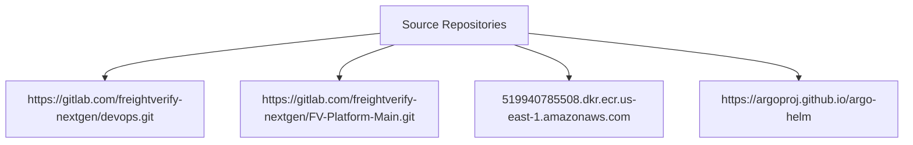
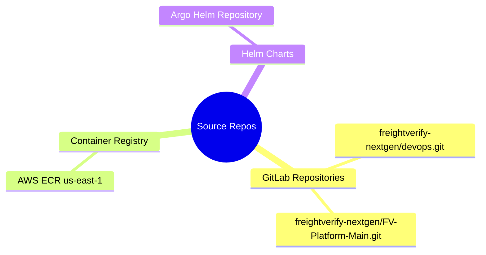

# Diagram: devops/k8s/argocd/projects/shared/helm/values.yaml

> Auto-generated by Obscura crawlers

## Diagram 1

### SVG

<svg id="container" width="1303.625" xmlns="http://www.w3.org/2000/svg" class="flowchart" height="198" viewBox="0 0 1303.625 198" role="graphics-document document" aria-roledescription="flowchart-v2"><g><marker id="container_flowchart-v2-pointEnd" class="marker flowchart-v2" viewBox="0 0 10 10" refX="5" refY="5" markerUnits="userSpaceOnUse" markerWidth="8" markerHeight="8" orient="auto"><path d="M 0 0 L 10 5 L 0 10 z" class="arrowMarkerPath" style="stroke-width: 1; stroke-dasharray: 1, 0;"></path></marker><marker id="container_flowchart-v2-pointStart" class="marker flowchart-v2" viewBox="0 0 10 10" refX="4.5" refY="5" markerUnits="userSpaceOnUse" markerWidth="8" markerHeight="8" orient="auto"><path d="M 0 5 L 10 10 L 10 0 z" class="arrowMarkerPath" style="stroke-width: 1; stroke-dasharray: 1, 0;"></path></marker><marker id="container_flowchart-v2-circleEnd" class="marker flowchart-v2" viewBox="0 0 10 10" refX="11" refY="5" markerUnits="userSpaceOnUse" markerWidth="11" markerHeight="11" orient="auto"><circle cx="5" cy="5" r="5" class="arrowMarkerPath" style="stroke-width: 1; stroke-dasharray: 1, 0;"></circle></marker><marker id="container_flowchart-v2-circleStart" class="marker flowchart-v2" viewBox="0 0 10 10" refX="-1" refY="5" markerUnits="userSpaceOnUse" markerWidth="11" markerHeight="11" orient="auto"><circle cx="5" cy="5" r="5" class="arrowMarkerPath" style="stroke-width: 1; stroke-dasharray: 1, 0;"></circle></marker><marker id="container_flowchart-v2-crossEnd" class="marker cross flowchart-v2" viewBox="0 0 11 11" refX="12" refY="5.2" markerUnits="userSpaceOnUse" markerWidth="11" markerHeight="11" orient="auto"><path d="M 1,1 l 9,9 M 10,1 l -9,9" class="arrowMarkerPath" style="stroke-width: 2; stroke-dasharray: 1, 0;"></path></marker><marker id="container_flowchart-v2-crossStart" class="marker cross flowchart-v2" viewBox="0 0 11 11" refX="-1" refY="5.2" markerUnits="userSpaceOnUse" markerWidth="11" markerHeight="11" orient="auto"><path d="M 1,1 l 9,9 M 10,1 l -9,9" class="arrowMarkerPath" style="stroke-width: 2; stroke-dasharray: 1, 0;"></path></marker><g class="root"><g class="clusters"></g><g class="edgePaths"><path d="M559.426,45.473L491.973,52.394C424.521,59.315,289.616,73.158,222.163,83.579C154.711,94,154.711,101,154.711,104.5L154.711,108" id="L_A_B_0" class="edge-thickness-normal edge-pattern-solid edge-thickness-normal edge-pattern-solid flowchart-link" style=";" data-edge="true" data-et="edge" data-id="L_A_B_0" data-points="W3sieCI6NTU5LjQyNTc4MTI1LCJ5Ijo0NS40NzI1NDc4ODYwNzU0Nn0seyJ4IjoxNTQuNzEwOTM3NSwieSI6ODd9LHsieCI6MTU0LjcxMDkzNzUsInkiOjExMn1d" marker-end="url(#container_flowchart-v2-pointEnd)"></path><path d="M576.669,62L563.58,66.167C550.49,70.333,524.312,78.667,511.222,86.333C498.133,94,498.133,101,498.133,104.5L498.133,108" id="L_A_C_0" class="edge-thickness-normal edge-pattern-solid edge-thickness-normal edge-pattern-solid flowchart-link" style=";" data-edge="true" data-et="edge" data-id="L_A_C_0" data-points="W3sieCI6NTc2LjY2OTA5NTU1Mjg4NDYsInkiOjYyfSx7IngiOjQ5OC4xMzI4MTI1LCJ5Ijo4N30seyJ4Ijo0OTguMTMyODEyNSwieSI6MTEyfV0=" marker-end="url(#container_flowchart-v2-pointEnd)"></path><path d="M746.307,62L759.397,66.167C772.486,70.333,798.665,78.667,811.754,86.333C824.844,94,824.844,101,824.844,104.5L824.844,108" id="L_A_D_0" class="edge-thickness-normal edge-pattern-solid edge-thickness-normal edge-pattern-solid flowchart-link" style=";" data-edge="true" data-et="edge" data-id="L_A_D_0" data-points="W3sieCI6NzQ2LjMwNzQ2Njk0NzExNTQsInkiOjYyfSx7IngiOjgyNC44NDM3NSwieSI6ODd9LHsieCI6ODI0Ljg0Mzc1LCJ5IjoxMTJ9XQ==" marker-end="url(#container_flowchart-v2-pointEnd)"></path><path d="M763.551,45.859L827.998,52.716C892.445,59.573,1021.34,73.286,1085.787,83.643C1150.234,94,1150.234,101,1150.234,104.5L1150.234,108" id="L_A_E_0" class="edge-thickness-normal edge-pattern-solid edge-thickness-normal edge-pattern-solid flowchart-link" style=";" data-edge="true" data-et="edge" data-id="L_A_E_0" data-points="W3sieCI6NzYzLjU1MDc4MTI1LCJ5Ijo0NS44NTg5MTAzMTczNzc4NTV9LHsieCI6MTE1MC4yMzQzNzUsInkiOjg3fSx7IngiOjExNTAuMjM0Mzc1LCJ5IjoxMTJ9XQ==" marker-end="url(#container_flowchart-v2-pointEnd)"></path></g><g class="edgeLabels"><g class="edgeLabel"><g class="label" data-id="L_A_B_0" transform="translate(0, 0)"><foreignObject width="0" height="0">

</foreignObject></g></g><g class="edgeLabel"><g class="label" data-id="L_A_C_0" transform="translate(0, 0)"><foreignObject width="0" height="0">

</foreignObject></g></g><g class="edgeLabel"><g class="label" data-id="L_A_D_0" transform="translate(0, 0)"><foreignObject width="0" height="0">

</foreignObject></g></g><g class="edgeLabel"><g class="label" data-id="L_A_E_0" transform="translate(0, 0)"><foreignObject width="0" height="0">

</foreignObject></g></g></g><g class="nodes"><g class="node default" id="flowchart-A-0" transform="translate(661.48828125, 35)"><rect class="basic label-container" style="" x="-102.0625" y="-27" width="204.125" height="54"></rect><g class="label" style="" transform="translate(-72.0625, -12)"><rect></rect><foreignObject width="144.125" height="24">

Source Repositories

</foreignObject></g></g><g class="node default" id="flowchart-B-2" transform="translate(154.7109375, 151)"><rect class="basic label-container" style="" x="-146.7109375" y="-39" width="293.421875" height="78"></rect><g class="label" style="" transform="translate(-116.7109375, -24)"><rect></rect><foreignObject width="233.421875" height="48">

https://gitlab.com/freightverify-nextgen/devops.git

</foreignObject></g></g><g class="node default" id="flowchart-C-4" transform="translate(498.1328125, 151)"><rect class="basic label-container" style="" x="-146.7109375" y="-39" width="293.421875" height="78"></rect><g class="label" style="" transform="translate(-116.7109375, -24)"><rect></rect><foreignObject width="233.421875" height="48">

https://gitlab.com/freightverify-nextgen/FV-Platform-Main.git

</foreignObject></g></g><g class="node default" id="flowchart-D-6" transform="translate(824.84375, 151)"><rect class="basic label-container" style="" x="-130" y="-39" width="260" height="78"></rect><g class="label" style="" transform="translate(-100, -24)"><rect></rect><foreignObject width="200" height="48">

519940785508.dkr.ecr.us-east-1.amazonaws.com

</foreignObject></g></g><g class="node default" id="flowchart-E-8" transform="translate(1150.234375, 151)"><rect class="basic label-container" style="" x="-145.390625" y="-39" width="290.78125" height="78"></rect><g class="label" style="" transform="translate(-115.390625, -24)"><rect></rect><foreignObject width="230.78125" height="48">

https://argoproj.github.io/argo-helm

</foreignObject></g></g></g></g></g></svg>

## Diagram 2

### SVG

<svg id="container" width="100%" xmlns="http://www.w3.org/2000/svg" class="mindmapDiagram" style="max-width: 909.3017578125px;" viewBox="5 5 909.3017578125 454.6590576171875" role="graphics-document document" aria-roledescription="mindmap"><g><marker id="container_mindmap-pointEnd" class="marker mindmap" viewBox="0 0 10 10" refX="5" refY="5" markerUnits="userSpaceOnUse" markerWidth="8" markerHeight="8" orient="auto"><path d="M 0 0 L 10 5 L 0 10 z" class="arrowMarkerPath" style="stroke-width: 1; stroke-dasharray: 1, 0;"></path></marker><marker id="container_mindmap-pointStart" class="marker mindmap" viewBox="0 0 10 10" refX="4.5" refY="5" markerUnits="userSpaceOnUse" markerWidth="8" markerHeight="8" orient="auto"><path d="M 0 5 L 10 10 L 10 0 z" class="arrowMarkerPath" style="stroke-width: 1; stroke-dasharray: 1, 0;"></path></marker><g class="subgraphs"></g><g class="edgePaths"><path d="M400.149,253.914L409.112,259.361C418.075,264.807,436,275.7,453.926,286.593C471.851,297.486,489.776,308.379,498.739,313.825L507.702,319.272" id="edge_0_1" class="edge-thickness-normal edge-pattern-solid edge section-edge-0 edge-depth-1" style="undefined;;;undefined" data-edge="true" data-et="edge" data-id="edge_0_1" data-points="W3sieCI6NDAwLjE0OTM2Mzk0MzgxMDksInkiOjI1My45MTQzOTQ3OTEwMzczOH0seyJ4Ijo0NTMuOTI1NjIxOTI2MjQ1NSwieSI6Mjg2LjU5MzA4NzEwNDc2NDJ9LHsieCI6NTA3LjcwMTg3OTkwODY4MDE2LCJ5IjozMTkuMjcxNzc5NDE4NDkxMDZ9XQ=="></path><path d="M535.309,324.553L554.826,321.242C574.343,317.932,613.377,311.311,652.411,304.689C691.445,298.068,730.479,291.447,749.996,288.137L769.513,284.826" id="edge_1_2" class="edge-thickness-normal edge-pattern-solid edge section-edge-0 edge-depth-3" style="undefined;;;undefined" data-edge="true" data-et="edge" data-id="edge_1_2" data-points="W3sieCI6NTM1LjMwOTM5NTAyNDY4NjMsInkiOjMyNC41NTI5MTcxNTAyNzEwN30seyJ4Ijo2NTIuNDExMjA3ODAzMjg5OCwieSI6MzA0LjY4OTQzMDQzMDcyOTAzfSx7IngiOjc2OS41MTMwMjA1ODE4OTMzLCJ5IjoyODQuODI1OTQzNzExMTg3fV0="></path><path d="M527.617,340.277L530.623,345.874C533.629,351.471,539.64,362.666,545.652,373.86C551.663,385.055,557.675,396.249,560.681,401.847L563.686,407.444" id="edge_1_3" class="edge-thickness-normal edge-pattern-solid edge section-edge-0 edge-depth-3" style="undefined;;;undefined" data-edge="true" data-et="edge" data-id="edge_1_3" data-points="W3sieCI6NTI3LjYxNzIwNTI3Mzk5ODgsInkiOjM0MC4yNzY1Njg3MDY4NDIxfSx7IngiOjU0NS42NTE3ODc4NjIwMjQ0LCJ5IjozNzMuODYwMjY3MjYzOTA4M30seyJ4Ijo1NjMuNjg2MzcwNDUwMDUsInkiOjQwNy40NDM5NjU4MjA5NzQ1NH1d"></path><path d="M373.177,251.092L362.376,254.882C351.576,258.672,329.975,266.252,308.374,273.832C286.774,281.412,265.173,288.993,254.372,292.783L243.572,296.573" id="edge_0_4" class="edge-thickness-normal edge-pattern-solid edge section-edge-1 edge-depth-1" style="undefined;;;undefined" data-edge="true" data-et="edge" data-id="edge_0_4" data-points="W3sieCI6MzczLjE3NjgwMDkwNzQyOSwieSI6MjUxLjA5MTU5MTIyNzI3NDQ4fSx7IngiOjMwOC4zNzQzNTQyMDA2NTYxLCJ5IjoyNzMuODMyMjMyOTU1MjY0OX0seyJ4IjoyNDMuNTcxOTA3NDkzODgzMiwieSI6Mjk2LjU3Mjg3NDY4MzI1NTN9XQ=="></path><path d="M215.627,307.44L207.203,311.045C198.778,314.65,181.929,321.859,165.08,329.068C148.231,336.277,131.382,343.486,122.957,347.091L114.533,350.696" id="edge_4_5" class="edge-thickness-normal edge-pattern-solid edge section-edge-1 edge-depth-3" style="undefined;;;undefined" data-edge="true" data-et="edge" data-id="edge_4_5" data-points="W3sieCI6MjE1LjYyNzQzMjUzMDM2MzI1LCJ5IjozMDcuNDQwMzc3MzM1NDcyM30seyJ4IjoxNjUuMDgwMTQ3OTgxOTQ2OTQsInkiOjMyOS4wNjgwMzg0MDg5NzU4fSx7IngiOjExNC41MzI4NjM0MzM1MzA2MSwieSI6MzUwLjY5NTY5OTQ4MjQ3OTI2fV0="></path><path d="M388.387,231.162L388.971,222.882C389.556,214.603,390.725,198.044,391.894,181.485C393.063,164.926,394.232,148.367,394.816,140.088L395.401,131.808" id="edge_0_6" class="edge-thickness-normal edge-pattern-solid edge section-edge-2 edge-depth-1" style="undefined;;;undefined" data-edge="true" data-et="edge" data-id="edge_0_6" data-points="W3sieCI6Mzg4LjM4Njg1OTM2MDI3MjMsInkiOjIzMS4xNjE5MzkyNTAyNjUyfSx7IngiOjM5MS44OTM2ODA4OTUyMzc4LCJ5IjoxODEuNDg0OTkxNTI1OTE4NDd9LHsieCI6Mzk1LjQwMDUwMjQzMDIwMzM1LCJ5IjoxMzEuODA4MDQzODAxNTcxNzZ9XQ=="></path><path d="M391.784,102.592L390.245,97.897C388.706,93.202,385.628,83.812,382.549,74.423C379.471,65.033,376.393,55.643,374.854,50.948L373.315,46.254" id="edge_6_7" class="edge-thickness-normal edge-pattern-solid edge section-edge-2 edge-depth-3" style="undefined;;;undefined" data-edge="true" data-et="edge" data-id="edge_6_7" data-points="W3sieCI6MzkxLjc4NDAzNDY1MzA1NTEsInkiOjEwMi41OTE2NjE2NzkzMDIzNn0seyJ4IjozODIuNTQ5NDU1OTc5MDE2OCwieSI6NzQuNDIyNjM5NzQxODU5MDl9LHsieCI6MzczLjMxNDg3NzMwNDk3ODUsInkiOjQ2LjI1MzYxNzgwNDQxNTgxfV0="></path></g><g class="edgeLabels"><g class="edgeLabel"><g class="label" data-id="edge_0_1" transform="translate(0, 0)"><foreignObject width="0" height="0">

</foreignObject></g></g><g class="edgeLabel"><g class="label" data-id="edge_1_2" transform="translate(0, 0)"><foreignObject width="0" height="0">

</foreignObject></g></g><g class="edgeLabel"><g class="label" data-id="edge_1_3" transform="translate(0, 0)"><foreignObject width="0" height="0">

</foreignObject></g></g><g class="edgeLabel"><g class="label" data-id="edge_0_4" transform="translate(0, 0)"><foreignObject width="0" height="0">

</foreignObject></g></g><g class="edgeLabel"><g class="label" data-id="edge_4_5" transform="translate(0, 0)"><foreignObject width="0" height="0">

</foreignObject></g></g><g class="edgeLabel"><g class="label" data-id="edge_0_6" transform="translate(0, 0)"><foreignObject width="0" height="0">

</foreignObject></g></g><g class="edgeLabel"><g class="label" data-id="edge_6_7" transform="translate(0, 0)"><foreignObject width="0" height="0">

</foreignObject></g></g></g><g class="nodes"><g class="node mindmap-node section-root section--1" id="node_0" transform="translate(387.33059993741836, 246.12470356811878)"><circle class="basic label-container" style="" r="58.921875" cx="0" cy="0"></circle><g class="label" style="" transform="translate(-48.921875, -12)"><rect></rect><foreignObject width="97.84375" height="24">

Source Repos

</foreignObject></g></g><g class="node mindmap-node section-0" id="node_1" transform="translate(520.5206439150727, 327.06147064140964)"><path id="node-1" class="node-bkg node-0" style="" d="M-90.703125 12
    v-24
    q0,-5 5,-5
    h171.40625
    q5,0 5,5
    v24
    q0,5 -5,5
    h-171.40625
    q-5,0 -5,-5
    Z"></path><line class="node-line-" x1="-90.703125" y1="17" x2="90.703125" y2="17"></line><g class="label" style="" transform="translate(-70.703125, -12)"><rect></rect><foreignObject width="141.40625" height="24">

GitLab Repositories

</foreignObject></g></g><g class="node mindmap-node section-0" id="node_2" transform="translate(784.3017716915069, 282.3173902200484)"><path id="node-2" class="node-bkg node-0" style="" d="M-120 24
    v-48
    q0,-5 5,-5
    h230
    q5,0 5,5
    v48
    q0,5 -5,5
    h-230
    q-5,0 -5,-5
    Z"></path><line class="node-line-" x1="-120" y1="29" x2="120" y2="29"></line><g class="label" style="" transform="translate(-100, -24)"><rect></rect><foreignObject width="200" height="48">

freightverify-nextgen/devops.git

</foreignObject></g></g><g class="node mindmap-node section-0" id="node_3" transform="translate(570.7829318089762, 420.659063886407)"><path id="node-3" class="node-bkg node-0" style="" d="M-120 24
    v-48
    q0,-5 5,-5
    h230
    q5,0 5,5
    v48
    q0,5 -5,5
    h-230
    q-5,0 -5,-5
    Z"></path><line class="node-line-" x1="-120" y1="29" x2="120" y2="29"></line><g class="label" style="" transform="translate(-100, -24)"><rect></rect><foreignObject width="200" height="48">

freightverify-nextgen/FV-Platform-Main.git

</foreignObject></g></g><g class="node mindmap-node section-1" id="node_4" transform="translate(229.41810846389387, 301.539762342411)"><path id="node-4" class="node-bkg node-0" style="" d="M-86.5234375 12
    v-24
    q0,-5 5,-5
    h163.046875
    q5,0 5,5
    v24
    q0,5 -5,5
    h-163.046875
    q-5,0 -5,-5
    Z"></path><line class="node-line-" x1="-86.5234375" y1="17" x2="86.5234375" y2="17"></line><g class="label" style="" transform="translate(-66.5234375, -12)"><rect></rect><foreignObject width="133.046875" height="24">

Container Registry

</foreignObject></g></g><g class="node mindmap-node section-1" id="node_5" transform="translate(100.7421875, 356.59631447554057)"><path id="node-5" class="node-bkg node-0" style="" d="M-85.7421875 12
    v-24
    q0,-5 5,-5
    h161.484375
    q5,0 5,5
    v24
    q0,5 -5,5
    h-161.484375
    q-5,0 -5,-5
    Z"></path><line class="node-line-" x1="-85.7421875" y1="17" x2="85.7421875" y2="17"></line><g class="label" style="" transform="translate(-65.7421875, -12)"><rect></rect><foreignObject width="131.484375" height="24">

AWS ECR us-east-1

</foreignObject></g></g><g class="node mindmap-node section-2" id="node_6" transform="translate(396.4567618530573, 116.84527948371817)"><path id="node-6" class="node-bkg node-0" style="" d="M-64.2734375 12
    v-24
    q0,-5 5,-5
    h118.546875
    q5,0 5,5
    v24
    q0,5 -5,5
    h-118.546875
    q-5,0 -5,-5
    Z"></path><line class="node-line-" x1="-64.2734375" y1="17" x2="64.2734375" y2="17"></line><g class="label" style="" transform="translate(-44.2734375, -12)"><rect></rect><foreignObject width="88.546875" height="24">

Helm Charts

</foreignObject></g></g><g class="node mindmap-node section-2" id="node_7" transform="translate(368.6421501049763, 32)"><path id="node-7" class="node-bkg node-0" style="" d="M-98.4609375 12
    v-24
    q0,-5 5,-5
    h186.921875
    q5,0 5,5
    v24
    q0,5 -5,5
    h-186.921875
    q-5,0 -5,-5
    Z"></path><line class="node-line-" x1="-98.4609375" y1="17" x2="98.4609375" y2="17"></line><g class="label" style="" transform="translate(-78.4609375, -12)"><rect></rect><foreignObject width="156.921875" height="24">

Argo Helm Repository

</foreignObject></g></g></g></g></svg>
