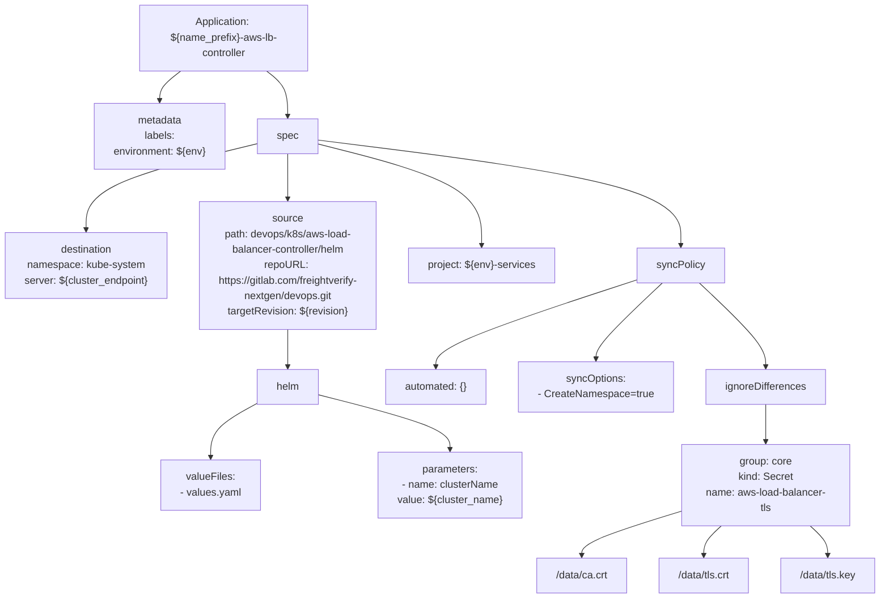

# Diagram: devops/k8s/aws-load-balancer-controller/argocd/application.yaml

> Auto-generated by Obscura crawlers

## Mermaid

### SVG

<svg id="container" width="1391.90625" xmlns="http://www.w3.org/2000/svg" class="flowchart" height="926" viewBox="0 0 1391.90625 926" role="graphics-document document" aria-roledescription="flowchart-v2"><g><marker id="container_flowchart-v2-pointEnd" class="marker flowchart-v2" viewBox="0 0 10 10" refX="5" refY="5" markerUnits="userSpaceOnUse" markerWidth="8" markerHeight="8" orient="auto"><path d="M 0 0 L 10 5 L 0 10 z" class="arrowMarkerPath" style="stroke-width: 1; stroke-dasharray: 1, 0;"></path></marker><marker id="container_flowchart-v2-pointStart" class="marker flowchart-v2" viewBox="0 0 10 10" refX="4.5" refY="5" markerUnits="userSpaceOnUse" markerWidth="8" markerHeight="8" orient="auto"><path d="M 0 5 L 10 10 L 10 0 z" class="arrowMarkerPath" style="stroke-width: 1; stroke-dasharray: 1, 0;"></path></marker><marker id="container_flowchart-v2-circleEnd" class="marker flowchart-v2" viewBox="0 0 10 10" refX="11" refY="5" markerUnits="userSpaceOnUse" markerWidth="11" markerHeight="11" orient="auto"><circle cx="5" cy="5" r="5" class="arrowMarkerPath" style="stroke-width: 1; stroke-dasharray: 1, 0;"></circle></marker><marker id="container_flowchart-v2-circleStart" class="marker flowchart-v2" viewBox="0 0 10 10" refX="-1" refY="5" markerUnits="userSpaceOnUse" markerWidth="11" markerHeight="11" orient="auto"><circle cx="5" cy="5" r="5" class="arrowMarkerPath" style="stroke-width: 1; stroke-dasharray: 1, 0;"></circle></marker><marker id="container_flowchart-v2-crossEnd" class="marker cross flowchart-v2" viewBox="0 0 11 11" refX="12" refY="5.2" markerUnits="userSpaceOnUse" markerWidth="11" markerHeight="11" orient="auto"><path d="M 1,1 l 9,9 M 10,1 l -9,9" class="arrowMarkerPath" style="stroke-width: 2; stroke-dasharray: 1, 0;"></path></marker><marker id="container_flowchart-v2-crossStart" class="marker cross flowchart-v2" viewBox="0 0 11 11" refX="-1" refY="5.2" markerUnits="userSpaceOnUse" markerWidth="11" markerHeight="11" orient="auto"><path d="M 1,1 l 9,9 M 10,1 l -9,9" class="arrowMarkerPath" style="stroke-width: 2; stroke-dasharray: 1, 0;"></path></marker><g class="root"><g class="clusters"></g><g class="edgePaths"><path d="M288.489,110L283.026,114.167C277.564,118.333,266.639,126.667,261.177,134.333C255.715,142,255.715,149,255.715,152.5L255.715,156" id="L_App_Metadata_0" class="edge-thickness-normal edge-pattern-solid edge-thickness-normal edge-pattern-solid flowchart-link" style=";" data-edge="true" data-et="edge" data-id="L_App_Metadata_0" data-points="W3sieCI6Mjg4LjQ4ODc5NTIzMDI2MzIsInkiOjExMH0seyJ4IjoyNTUuNzE0ODQzNzUsInkiOjEzNX0seyJ4IjoyNTUuNzE0ODQzNzUsInkiOjE2MH1d" marker-end="url(#container_flowchart-v2-pointEnd)"></path><path d="M422.207,110L427.669,114.167C433.131,118.333,444.056,126.667,449.518,138.333C454.98,150,454.98,165,454.98,172.5L454.98,180" id="L_App_Spec_0" class="edge-thickness-normal edge-pattern-solid edge-thickness-normal edge-pattern-solid flowchart-link" style=";" data-edge="true" data-et="edge" data-id="L_App_Spec_0" data-points="W3sieCI6NDIyLjIwNjUxNzI2OTczNjgsInkiOjExMH0seyJ4Ijo0NTQuOTgwNDY4NzUsInkiOjEzNX0seyJ4Ijo0NTQuOTgwNDY4NzUsInkiOjE4NH1d" marker-end="url(#container_flowchart-v2-pointEnd)"></path><path d="M408.301,222.097L362.798,232.914C317.294,243.731,226.288,265.366,180.785,287.683C135.281,310,135.281,333,135.281,344.5L135.281,356" id="L_Spec_Destination_0" class="edge-thickness-normal edge-pattern-solid edge-thickness-normal edge-pattern-solid flowchart-link" style=";" data-edge="true" data-et="edge" data-id="L_Spec_Destination_0" data-points="W3sieCI6NDA4LjMwMDc4MTI1LCJ5IjoyMjIuMDk2ODU2MTc1ODQ4ODd9LHsieCI6MTM1LjI4MTI1LCJ5IjoyODd9LHsieCI6MTM1LjI4MTI1LCJ5IjozNjB9XQ==" marker-end="url(#container_flowchart-v2-pointEnd)"></path><path d="M456.503,238L456.963,246.167C457.424,254.333,458.345,270.667,458.805,282.333C459.266,294,459.266,301,459.266,304.5L459.266,308" id="L_Spec_Source_0" class="edge-thickness-normal edge-pattern-solid edge-thickness-normal edge-pattern-solid flowchart-link" style=";" data-edge="true" data-et="edge" data-id="L_Spec_Source_0" data-points="W3sieCI6NDU2LjUwMjgyNjg5MTQ0NzM0LCJ5IjoyMzh9LHsieCI6NDU5LjI2NTYyNSwieSI6Mjg3fSx7IngiOjQ1OS4yNjU2MjUsInkiOjMxMn1d" marker-end="url(#container_flowchart-v2-pointEnd)"></path><path d="M459.266,510L459.266,514.167C459.266,518.333,459.266,526.667,459.266,536.333C459.266,546,459.266,557,459.266,562.5L459.266,568" id="L_Source_Helm_0" class="edge-thickness-normal edge-pattern-solid edge-thickness-normal edge-pattern-solid flowchart-link" style=";" data-edge="true" data-et="edge" data-id="L_Source_Helm_0" data-points="W3sieCI6NDU5LjI2NTYyNSwieSI6NTEwfSx7IngiOjQ1OS4yNjU2MjUsInkiOjUzNX0seyJ4Ijo0NTkuMjY1NjI1LCJ5Ijo1NzJ9XQ==" marker-end="url(#container_flowchart-v2-pointEnd)"></path><path d="M411.016,624.849L399.147,631.208C387.279,637.566,363.542,650.283,351.673,664.142C339.805,678,339.805,693,339.805,700.5L339.805,708" id="L_Helm_Values_0" class="edge-thickness-normal edge-pattern-solid edge-thickness-normal edge-pattern-solid flowchart-link" style=";" data-edge="true" data-et="edge" data-id="L_Helm_Values_0" data-points="W3sieCI6NDExLjAxNTYyNSwieSI6NjI0Ljg0OTQ1MzkyNzE0Njd9LHsieCI6MzM5LjgwNDY4NzUsInkiOjY2M30seyJ4IjozMzkuODA0Njg3NSwieSI6NzEyfV0=" marker-end="url(#container_flowchart-v2-pointEnd)"></path><path d="M507.516,611.009L542.331,619.674C577.146,628.339,646.776,645.67,681.591,659.835C716.406,674,716.406,685,716.406,690.5L716.406,696" id="L_Helm_Parameters_0" class="edge-thickness-normal edge-pattern-solid edge-thickness-normal edge-pattern-solid flowchart-link" style=";" data-edge="true" data-et="edge" data-id="L_Helm_Parameters_0" data-points="W3sieCI6NTA3LjUxNTYyNSwieSI6NjExLjAwODk5MzEzMzYyMX0seyJ4Ijo3MTYuNDA2MjUsInkiOjY2M30seyJ4Ijo3MTYuNDA2MjUsInkiOjcwMH1d" marker-end="url(#container_flowchart-v2-pointEnd)"></path><path d="M501.66,222.25L546.437,233.042C591.214,243.834,680.767,265.417,725.544,291.708C770.32,318,770.32,349,770.32,364.5L770.32,380" id="L_Spec_Project_0" class="edge-thickness-normal edge-pattern-solid edge-thickness-normal edge-pattern-solid flowchart-link" style=";" data-edge="true" data-et="edge" data-id="L_Spec_Project_0" data-points="W3sieCI6NTAxLjY2MDE1NjI1LCJ5IjoyMjIuMjUwMjYzMjMyODcxMjh9LHsieCI6NzcwLjMyMDMxMjUsInkiOjI4N30seyJ4Ijo3NzAuMzIwMzEyNSwieSI6Mzg0fV0=" marker-end="url(#container_flowchart-v2-pointEnd)"></path><path d="M501.66,216.726L597.146,228.438C692.633,240.15,883.605,263.575,979.092,290.788C1074.578,318,1074.578,349,1074.578,364.5L1074.578,380" id="L_Spec_SyncPolicy_0" class="edge-thickness-normal edge-pattern-solid edge-thickness-normal edge-pattern-solid flowchart-link" style=";" data-edge="true" data-et="edge" data-id="L_Spec_SyncPolicy_0" data-points="W3sieCI6NTAxLjY2MDE1NjI1LCJ5IjoyMTYuNzI1NzQxODgxMzg3MjV9LHsieCI6MTA3NC41NzgxMjUsInkiOjI4N30seyJ4IjoxMDc0LjU3ODEyNSwieSI6Mzg0fV0=" marker-end="url(#container_flowchart-v2-pointEnd)"></path><path d="M1007.086,433.064L955.118,450.054C903.15,467.043,799.214,501.021,747.245,523.511C695.277,546,695.277,557,695.277,562.5L695.277,568" id="L_SyncPolicy_Automated_0" class="edge-thickness-normal edge-pattern-solid edge-thickness-normal edge-pattern-solid flowchart-link" style=";" data-edge="true" data-et="edge" data-id="L_SyncPolicy_Automated_0" data-points="W3sieCI6MTAwNy4wODU5Mzc1LCJ5Ijo0MzMuMDY0MzY1OTY5NDU0NDZ9LHsieCI6Njk1LjI3NzM0Mzc1LCJ5Ijo1MzV9LHsieCI6Njk1LjI3NzM0Mzc1LCJ5Ijo1NzJ9XQ==" marker-end="url(#container_flowchart-v2-pointEnd)"></path><path d="M1045.965,438L1028.832,454.167C1011.699,470.333,977.434,502.667,960.301,522.333C943.168,542,943.168,549,943.168,552.5L943.168,556" id="L_SyncPolicy_SyncOptions_0" class="edge-thickness-normal edge-pattern-solid edge-thickness-normal edge-pattern-solid flowchart-link" style=";" data-edge="true" data-et="edge" data-id="L_SyncPolicy_SyncOptions_0" data-points="W3sieCI6MTA0NS45NjQ2MjMyMzU4ODcsInkiOjQzOH0seyJ4Ijo5NDMuMTY3OTY4NzUsInkiOjUzNX0seyJ4Ijo5NDMuMTY3OTY4NzUsInkiOjU2MH1d" marker-end="url(#container_flowchart-v2-pointEnd)"></path><path d="M1103.192,438L1120.324,454.167C1137.457,470.333,1171.723,502.667,1188.856,524.333C1205.988,546,1205.988,557,1205.988,562.5L1205.988,568" id="L_SyncPolicy_IgnoreDiffs_0" class="edge-thickness-normal edge-pattern-solid edge-thickness-normal edge-pattern-solid flowchart-link" style=";" data-edge="true" data-et="edge" data-id="L_SyncPolicy_IgnoreDiffs_0" data-points="W3sieCI6MTEwMy4xOTE2MjY3NjQxMTMsInkiOjQzOH0seyJ4IjoxMjA1Ljk4ODI4MTI1LCJ5Ijo1MzV9LHsieCI6MTIwNS45ODgyODEyNSwieSI6NTcyfV0=" marker-end="url(#container_flowchart-v2-pointEnd)"></path><path d="M1205.988,626L1205.988,632.167C1205.988,638.333,1205.988,650.667,1205.988,660.333C1205.988,670,1205.988,677,1205.988,680.5L1205.988,684" id="L_IgnoreDiffs_SecretDiff_0" class="edge-thickness-normal edge-pattern-solid edge-thickness-normal edge-pattern-solid flowchart-link" style=";" data-edge="true" data-et="edge" data-id="L_IgnoreDiffs_SecretDiff_0" data-points="W3sieCI6MTIwNS45ODgyODEyNSwieSI6NjI2fSx7IngiOjEyMDUuOTg4MjgxMjUsInkiOjY2M30seyJ4IjoxMjA1Ljk4ODI4MTI1LCJ5Ijo2ODh9XQ==" marker-end="url(#container_flowchart-v2-pointEnd)"></path><path d="M1075.988,789.27L1047.834,797.559C1019.68,805.847,963.371,822.423,935.217,834.212C907.063,846,907.063,853,907.063,856.5L907.063,860" id="L_SecretDiff_JP1_0" class="edge-thickness-normal edge-pattern-solid edge-thickness-normal edge-pattern-solid flowchart-link" style=";" data-edge="true" data-et="edge" data-id="L_SecretDiff_JP1_0" data-points="W3sieCI6MTA3NS45ODgyODEyNSwieSI6Nzg5LjI3MDM2OTE2MDQwNTJ9LHsieCI6OTA3LjA2MjUsInkiOjgzOX0seyJ4Ijo5MDcuMDYyNSwieSI6ODY0fV0=" marker-end="url(#container_flowchart-v2-pointEnd)"></path><path d="M1133.813,814L1129.039,818.167C1124.266,822.333,1114.719,830.667,1109.945,838.333C1105.172,846,1105.172,853,1105.172,856.5L1105.172,860" id="L_SecretDiff_JP2_0" class="edge-thickness-normal edge-pattern-solid edge-thickness-normal edge-pattern-solid flowchart-link" style=";" data-edge="true" data-et="edge" data-id="L_SecretDiff_JP2_0" data-points="W3sieCI6MTEzMy44MTI4OTk1MDI4NDEsInkiOjgxNH0seyJ4IjoxMTA1LjE3MTg3NSwieSI6ODM5fSx7IngiOjExMDUuMTcxODc1LCJ5Ijo4NjR9XQ==" marker-end="url(#container_flowchart-v2-pointEnd)"></path><path d="M1278.164,814L1282.937,818.167C1287.711,822.333,1297.258,830.667,1302.031,838.333C1306.805,846,1306.805,853,1306.805,856.5L1306.805,860" id="L_SecretDiff_JP3_0" class="edge-thickness-normal edge-pattern-solid edge-thickness-normal edge-pattern-solid flowchart-link" style=";" data-edge="true" data-et="edge" data-id="L_SecretDiff_JP3_0" data-points="W3sieCI6MTI3OC4xNjM2NjI5OTcxNTksInkiOjgxNH0seyJ4IjoxMzA2LjgwNDY4NzUsInkiOjgzOX0seyJ4IjoxMzA2LjgwNDY4NzUsInkiOjg2NH1d" marker-end="url(#container_flowchart-v2-pointEnd)"></path></g><g class="edgeLabels"><g class="edgeLabel"><g class="label" data-id="L_App_Metadata_0" transform="translate(0, 0)"><foreignObject width="0" height="0">

</foreignObject></g></g><g class="edgeLabel"><g class="label" data-id="L_App_Spec_0" transform="translate(0, 0)"><foreignObject width="0" height="0">

</foreignObject></g></g><g class="edgeLabel"><g class="label" data-id="L_Spec_Destination_0" transform="translate(0, 0)"><foreignObject width="0" height="0">

</foreignObject></g></g><g class="edgeLabel"><g class="label" data-id="L_Spec_Source_0" transform="translate(0, 0)"><foreignObject width="0" height="0">

</foreignObject></g></g><g class="edgeLabel"><g class="label" data-id="L_Source_Helm_0" transform="translate(0, 0)"><foreignObject width="0" height="0">

</foreignObject></g></g><g class="edgeLabel"><g class="label" data-id="L_Helm_Values_0" transform="translate(0, 0)"><foreignObject width="0" height="0">

</foreignObject></g></g><g class="edgeLabel"><g class="label" data-id="L_Helm_Parameters_0" transform="translate(0, 0)"><foreignObject width="0" height="0">

</foreignObject></g></g><g class="edgeLabel"><g class="label" data-id="L_Spec_Project_0" transform="translate(0, 0)"><foreignObject width="0" height="0">

</foreignObject></g></g><g class="edgeLabel"><g class="label" data-id="L_Spec_SyncPolicy_0" transform="translate(0, 0)"><foreignObject width="0" height="0">

</foreignObject></g></g><g class="edgeLabel"><g class="label" data-id="L_SyncPolicy_Automated_0" transform="translate(0, 0)"><foreignObject width="0" height="0">

</foreignObject></g></g><g class="edgeLabel"><g class="label" data-id="L_SyncPolicy_SyncOptions_0" transform="translate(0, 0)"><foreignObject width="0" height="0">

</foreignObject></g></g><g class="edgeLabel"><g class="label" data-id="L_SyncPolicy_IgnoreDiffs_0" transform="translate(0, 0)"><foreignObject width="0" height="0">

</foreignObject></g></g><g class="edgeLabel"><g class="label" data-id="L_IgnoreDiffs_SecretDiff_0" transform="translate(0, 0)"><foreignObject width="0" height="0">

</foreignObject></g></g><g class="edgeLabel"><g class="label" data-id="L_SecretDiff_JP1_0" transform="translate(0, 0)"><foreignObject width="0" height="0">

</foreignObject></g></g><g class="edgeLabel"><g class="label" data-id="L_SecretDiff_JP2_0" transform="translate(0, 0)"><foreignObject width="0" height="0">

</foreignObject></g></g><g class="edgeLabel"><g class="label" data-id="L_SecretDiff_JP3_0" transform="translate(0, 0)"><foreignObject width="0" height="0">

</foreignObject></g></g></g><g class="nodes"><g class="node default" id="flowchart-App-0" transform="translate(355.34765625, 59)"><rect class="basic label-container" style="" x="-130" y="-51" width="260" height="102"></rect><g class="label" style="" transform="translate(-100, -36)"><rect></rect><foreignObject width="200" height="72">

Application: ${name_prefix}-aws-lb-controller

</foreignObject></g></g><g class="node default" id="flowchart-Metadata-2" transform="translate(255.71484375, 211)"><rect class="basic label-container" style="" x="-102.5859375" y="-51" width="205.171875" height="102"></rect><g class="label" style="" transform="translate(-72.5859375, -36)"><rect></rect><foreignObject width="145.171875" height="72">

metadata labels: environment: ${env}

</foreignObject></g></g><g class="node default" id="flowchart-Spec-4" transform="translate(454.98046875, 211)"><rect class="basic label-container" style="" x="-46.6796875" y="-27" width="93.359375" height="54"></rect><g class="label" style="" transform="translate(-16.6796875, -12)"><rect></rect><foreignObject width="33.359375" height="24">

spec

</foreignObject></g></g><g class="node default" id="flowchart-Destination-6" transform="translate(135.28125, 411)"><rect class="basic label-container" style="" x="-127.28125" y="-51" width="254.5625" height="102"></rect><g class="label" style="" transform="translate(-97.28125, -36)"><rect></rect><foreignObject width="194.5625" height="72">

destination namespace: kube-system server: ${cluster_endpoint}

</foreignObject></g></g><g class="node default" id="flowchart-Source-8" transform="translate(459.265625, 411)"><rect class="basic label-container" style="" x="-146.703125" y="-99" width="293.40625" height="198"></rect><g class="label" style="" transform="translate(-116.703125, -84)"><rect></rect><foreignObject width="233.40625" height="168">

source path: devops/k8s/aws-load-balancer-controller/helm repoURL: https://gitlab.com/freightverify-nextgen/devops.git targetRevision: ${revision}

</foreignObject></g></g><g class="node default" id="flowchart-Helm-10" transform="translate(459.265625, 599)"><rect class="basic label-container" style="" x="-48.25" y="-27" width="96.5" height="54"></rect><g class="label" style="" transform="translate(-18.25, -12)"><rect></rect><foreignObject width="36.5" height="24">

helm

</foreignObject></g></g><g class="node default" id="flowchart-Values-12" transform="translate(339.8046875, 751)"><rect class="basic label-container" style="" x="-77.484375" y="-39" width="154.96875" height="78"></rect><g class="label" style="" transform="translate(-47.484375, -24)"><rect></rect><foreignObject width="94.96875" height="48">

valueFiles: - values.yaml

</foreignObject></g></g><g class="node default" id="flowchart-Parameters-14" transform="translate(716.40625, 751)"><rect class="basic label-container" style="" x="-111.4375" y="-51" width="222.875" height="102"></rect><g class="label" style="" transform="translate(-81.4375, -36)"><rect></rect><foreignObject width="162.875" height="72">

parameters: - name: clusterName   value: ${cluster_name}

</foreignObject></g></g><g class="node default" id="flowchart-Project-16" transform="translate(770.3203125, 411)"><rect class="basic label-container" style="" x="-114.3515625" y="-27" width="228.703125" height="54"></rect><g class="label" style="" transform="translate(-84.3515625, -12)"><rect></rect><foreignObject width="168.703125" height="24">

project: ${env}-services

</foreignObject></g></g><g class="node default" id="flowchart-SyncPolicy-18" transform="translate(1074.578125, 411)"><rect class="basic label-container" style="" x="-67.4921875" y="-27" width="134.984375" height="54"></rect><g class="label" style="" transform="translate(-37.4921875, -12)"><rect></rect><foreignObject width="74.984375" height="24">

syncPolicy

</foreignObject></g></g><g class="node default" id="flowchart-Automated-20" transform="translate(695.27734375, 599)"><rect class="basic label-container" style="" x="-78.765625" y="-27" width="157.53125" height="54"></rect><g class="label" style="" transform="translate(-48.765625, -12)"><rect></rect><foreignObject width="97.53125" height="24">

automated: {}

</foreignObject></g></g><g class="node default" id="flowchart-SyncOptions-22" transform="translate(943.16796875, 599)"><rect class="basic label-container" style="" x="-119.125" y="-39" width="238.25" height="78"></rect><g class="label" style="" transform="translate(-89.125, -24)"><rect></rect><foreignObject width="178.25" height="48">

syncOptions: - CreateNamespace=true

</foreignObject></g></g><g class="node default" id="flowchart-IgnoreDiffs-24" transform="translate(1205.98828125, 599)"><rect class="basic label-container" style="" x="-93.6953125" y="-27" width="187.390625" height="54"></rect><g class="label" style="" transform="translate(-63.6953125, -12)"><rect></rect><foreignObject width="127.390625" height="24">

ignoreDifferences

</foreignObject></g></g><g class="node default" id="flowchart-SecretDiff-26" transform="translate(1205.98828125, 751)"><rect class="basic label-container" style="" x="-130" y="-63" width="260" height="126"></rect><g class="label" style="" transform="translate(-100, -48)"><rect></rect><foreignObject width="200" height="96">

group: core kind: Secret name: aws-load-balancer-tls

</foreignObject></g></g><g class="node default" id="flowchart-JP1-28" transform="translate(907.0625, 891)"><rect class="basic label-container" style="" x="-73.578125" y="-27" width="147.15625" height="54"></rect><g class="label" style="" transform="translate(-43.578125, -12)"><rect></rect><foreignObject width="87.15625" height="24">

/data/ca.crt

</foreignObject></g></g><g class="node default" id="flowchart-JP2-30" transform="translate(1105.171875, 891)"><rect class="basic label-container" style="" x="-74.53125" y="-27" width="149.0625" height="54"></rect><g class="label" style="" transform="translate(-44.53125, -12)"><rect></rect><foreignObject width="89.0625" height="24">

/data/tls.crt

</foreignObject></g></g><g class="node default" id="flowchart-JP3-32" transform="translate(1306.8046875, 891)"><rect class="basic label-container" style="" x="-77.1015625" y="-27" width="154.203125" height="54"></rect><g class="label" style="" transform="translate(-47.1015625, -12)"><rect></rect><foreignObject width="94.203125" height="24">

/data/tls.key

</foreignObject></g></g></g></g></g></svg>
