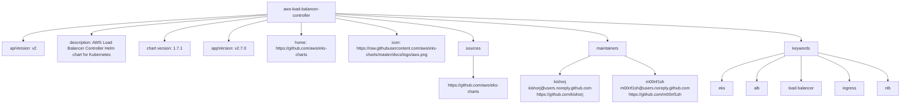

# Diagram: devops/k8s/aws-load-balancer-controller/helm/Chart.yaml

> Auto-generated by Obscura crawlers

## Mermaid

### SVG

<svg id="container" width="4065.71875" xmlns="http://www.w3.org/2000/svg" class="flowchart" height="374" viewBox="0 0 4065.71875 374" role="graphics-document document" aria-roledescription="flowchart-v2"><g><marker id="container_flowchart-v2-pointEnd" class="marker flowchart-v2" viewBox="0 0 10 10" refX="5" refY="5" markerUnits="userSpaceOnUse" markerWidth="8" markerHeight="8" orient="auto"><path d="M 0 0 L 10 5 L 0 10 z" class="arrowMarkerPath" style="stroke-width: 1; stroke-dasharray: 1, 0;"></path></marker><marker id="container_flowchart-v2-pointStart" class="marker flowchart-v2" viewBox="0 0 10 10" refX="4.5" refY="5" markerUnits="userSpaceOnUse" markerWidth="8" markerHeight="8" orient="auto"><path d="M 0 5 L 10 10 L 10 0 z" class="arrowMarkerPath" style="stroke-width: 1; stroke-dasharray: 1, 0;"></path></marker><marker id="container_flowchart-v2-circleEnd" class="marker flowchart-v2" viewBox="0 0 10 10" refX="11" refY="5" markerUnits="userSpaceOnUse" markerWidth="11" markerHeight="11" orient="auto"><circle cx="5" cy="5" r="5" class="arrowMarkerPath" style="stroke-width: 1; stroke-dasharray: 1, 0;"></circle></marker><marker id="container_flowchart-v2-circleStart" class="marker flowchart-v2" viewBox="0 0 10 10" refX="-1" refY="5" markerUnits="userSpaceOnUse" markerWidth="11" markerHeight="11" orient="auto"><circle cx="5" cy="5" r="5" class="arrowMarkerPath" style="stroke-width: 1; stroke-dasharray: 1, 0;"></circle></marker><marker id="container_flowchart-v2-crossEnd" class="marker cross flowchart-v2" viewBox="0 0 11 11" refX="12" refY="5.2" markerUnits="userSpaceOnUse" markerWidth="11" markerHeight="11" orient="auto"><path d="M 1,1 l 9,9 M 10,1 l -9,9" class="arrowMarkerPath" style="stroke-width: 2; stroke-dasharray: 1, 0;"></path></marker><marker id="container_flowchart-v2-crossStart" class="marker cross flowchart-v2" viewBox="0 0 11 11" refX="-1" refY="5.2" markerUnits="userSpaceOnUse" markerWidth="11" markerHeight="11" orient="auto"><path d="M 1,1 l 9,9 M 10,1 l -9,9" class="arrowMarkerPath" style="stroke-width: 2; stroke-dasharray: 1, 0;"></path></marker><g class="root"><g class="clusters"></g><g class="edgePaths"><path d="M1009.398,54.914L855.857,64.262C702.315,73.61,395.232,92.305,241.69,109.152C88.148,126,88.148,141,88.148,148.5L88.148,156" id="L_Chart_API_0" class="edge-thickness-normal edge-pattern-solid edge-thickness-normal edge-pattern-solid flowchart-link" style=";" data-edge="true" data-et="edge" data-id="L_Chart_API_0" data-points="W3sieCI6MTAwOS4zOTg0Mzc1LCJ5Ijo1NC45MTQzODc2MzM3NjkzMn0seyJ4Ijo4OC4xNDg0Mzc1LCJ5IjoxMTF9LHsieCI6ODguMTQ4NDM3NSwieSI6MTYwfV0=" marker-end="url(#container_flowchart-v2-pointEnd)"></path><path d="M1009.398,57.517L899.215,66.431C789.031,75.345,568.664,93.172,458.48,105.586C348.297,118,348.297,125,348.297,128.5L348.297,132" id="L_Chart_Desc_0" class="edge-thickness-normal edge-pattern-solid edge-thickness-normal edge-pattern-solid flowchart-link" style=";" data-edge="true" data-et="edge" data-id="L_Chart_Desc_0" data-points="W3sieCI6MTAwOS4zOTg0Mzc1LCJ5Ijo1Ny41MTY5ODA4NzEyMTM5OX0seyJ4IjozNDguMjk2ODc1LCJ5IjoxMTF9LHsieCI6MzQ4LjI5Njg3NSwieSI6MTM2fV0=" marker-end="url(#container_flowchart-v2-pointEnd)"></path><path d="M1009.398,63.102L944.947,71.085C880.495,79.068,751.591,95.034,687.139,110.517C622.688,126,622.688,141,622.688,148.5L622.688,156" id="L_Chart_ChartVersion_0" class="edge-thickness-normal edge-pattern-solid edge-thickness-normal edge-pattern-solid flowchart-link" style=";" data-edge="true" data-et="edge" data-id="L_Chart_ChartVersion_0" data-points="W3sieCI6MTAwOS4zOTg0Mzc1LCJ5Ijo2My4xMDE4NDYxMTE5NzYyOX0seyJ4Ijo2MjIuNjg3NSwieSI6MTExfSx7IngiOjYyMi42ODc1LCJ5IjoxNjB9XQ==" marker-end="url(#container_flowchart-v2-pointEnd)"></path><path d="M1009.398,76.86L984.626,82.55C959.854,88.24,910.31,99.62,885.538,112.81C860.766,126,860.766,141,860.766,148.5L860.766,156" id="L_Chart_AppVersion_0" class="edge-thickness-normal edge-pattern-solid edge-thickness-normal edge-pattern-solid flowchart-link" style=";" data-edge="true" data-et="edge" data-id="L_Chart_AppVersion_0" data-points="W3sieCI6MTAwOS4zOTg0Mzc1LCJ5Ijo3Ni44NjAwODY5MTk5NDk1NH0seyJ4Ijo4NjAuNzY1NjI1LCJ5IjoxMTF9LHsieCI6ODYwLjc2NTYyNSwieSI6MTYwfV0=" marker-end="url(#container_flowchart-v2-pointEnd)"></path><path d="M1139.398,86L1139.398,90.167C1139.398,94.333,1139.398,102.667,1139.398,110.333C1139.398,118,1139.398,125,1139.398,128.5L1139.398,132" id="L_Chart_Home_0" class="edge-thickness-normal edge-pattern-solid edge-thickness-normal edge-pattern-solid flowchart-link" style=";" data-edge="true" data-et="edge" data-id="L_Chart_Home_0" data-points="W3sieCI6MTEzOS4zOTg0Mzc1LCJ5Ijo4Nn0seyJ4IjoxMTM5LjM5ODQzNzUsInkiOjExMX0seyJ4IjoxMTM5LjM5ODQzNzUsInkiOjEzNn1d" marker-end="url(#container_flowchart-v2-pointEnd)"></path><path d="M1269.398,69.018L1310.71,76.015C1352.021,83.012,1434.643,97.006,1475.954,107.503C1517.266,118,1517.266,125,1517.266,128.5L1517.266,132" id="L_Chart_Icon_0" class="edge-thickness-normal edge-pattern-solid edge-thickness-normal edge-pattern-solid flowchart-link" style=";" data-edge="true" data-et="edge" data-id="L_Chart_Icon_0" data-points="W3sieCI6MTI2OS4zOTg0Mzc1LCJ5Ijo2OS4wMTgzMTgyNzQ4NTY4Mn0seyJ4IjoxNTE3LjI2NTYyNSwieSI6MTExfSx7IngiOjE1MTcuMjY1NjI1LCJ5IjoxMzZ9XQ==" marker-end="url(#container_flowchart-v2-pointEnd)"></path><path d="M1269.398,59.263L1360.81,67.886C1452.221,76.509,1635.044,93.754,1726.456,109.877C1817.867,126,1817.867,141,1817.867,148.5L1817.867,156" id="L_Chart_Sources_0" class="edge-thickness-normal edge-pattern-solid edge-thickness-normal edge-pattern-solid flowchart-link" style=";" data-edge="true" data-et="edge" data-id="L_Chart_Sources_0" data-points="W3sieCI6MTI2OS4zOTg0Mzc1LCJ5Ijo1OS4yNjI5MDgyMDMyMTQ5Nn0seyJ4IjoxODE3Ljg2NzE4NzUsInkiOjExMX0seyJ4IjoxODE3Ljg2NzE4NzUsInkiOjE2MH1d" marker-end="url(#container_flowchart-v2-pointEnd)"></path><path d="M1817.867,214L1817.867,222.167C1817.867,230.333,1817.867,246.667,1817.867,258.333C1817.867,270,1817.867,277,1817.867,280.5L1817.867,284" id="L_Sources_Source1_0" class="edge-thickness-normal edge-pattern-solid edge-thickness-normal edge-pattern-solid flowchart-link" style=";" data-edge="true" data-et="edge" data-id="L_Sources_Source1_0" data-points="W3sieCI6MTgxNy44NjcxODc1LCJ5IjoyMTR9LHsieCI6MTgxNy44NjcxODc1LCJ5IjoyNjN9LHsieCI6MTgxNy44NjcxODc1LCJ5IjoyODh9XQ==" marker-end="url(#container_flowchart-v2-pointEnd)"></path><path d="M1269.398,52.585L1496.029,62.321C1722.66,72.056,2175.922,91.528,2402.553,108.764C2629.184,126,2629.184,141,2629.184,148.5L2629.184,156" id="L_Chart_Maintainers_0" class="edge-thickness-normal edge-pattern-solid edge-thickness-normal edge-pattern-solid flowchart-link" style=";" data-edge="true" data-et="edge" data-id="L_Chart_Maintainers_0" data-points="W3sieCI6MTI2OS4zOTg0Mzc1LCJ5Ijo1Mi41ODQ2OTc4Nzc0NzI4OX0seyJ4IjoyNjI5LjE4MzU5Mzc1LCJ5IjoxMTF9LHsieCI6MjYyOS4xODM1OTM3NSwieSI6MTYwfV0=" marker-end="url(#container_flowchart-v2-pointEnd)"></path><path d="M2555.832,203.719L2512.485,213.599C2469.138,223.479,2382.444,243.24,2339.097,258.62C2295.75,274,2295.75,285,2295.75,290.5L2295.75,296" id="L_Maintainers_M1_0" class="edge-thickness-normal edge-pattern-solid edge-thickness-normal edge-pattern-solid flowchart-link" style=";" data-edge="true" data-et="edge" data-id="L_Maintainers_M1_0" data-points="W3sieCI6MjU1NS44MzIwMzEyNSwieSI6MjAzLjcxOTEyNzQ0OTk0Njd9LHsieCI6MjI5NS43NSwieSI6MjYzfSx7IngiOjIyOTUuNzUsInkiOjMwMH1d" marker-end="url(#container_flowchart-v2-pointEnd)"></path><path d="M2702.535,203.719L2745.882,213.599C2789.229,223.479,2875.923,243.24,2919.27,258.62C2962.617,274,2962.617,285,2962.617,290.5L2962.617,296" id="L_Maintainers_M2_0" class="edge-thickness-normal edge-pattern-solid edge-thickness-normal edge-pattern-solid flowchart-link" style=";" data-edge="true" data-et="edge" data-id="L_Maintainers_M2_0" data-points="W3sieCI6MjcwMi41MzUxNTYyNSwieSI6MjAzLjcxOTEyNzQ0OTk0Njd9LHsieCI6Mjk2Mi42MTcxODc1LCJ5IjoyNjN9LHsieCI6Mjk2Mi42MTcxODc1LCJ5IjozMDB9XQ==" marker-end="url(#container_flowchart-v2-pointEnd)"></path><path d="M1269.398,50.271L1671.693,60.392C2073.987,70.514,2878.576,90.757,3280.87,108.378C3683.164,126,3683.164,141,3683.164,148.5L3683.164,156" id="L_Chart_Keywords_0" class="edge-thickness-normal edge-pattern-solid edge-thickness-normal edge-pattern-solid flowchart-link" style=";" data-edge="true" data-et="edge" data-id="L_Chart_Keywords_0" data-points="W3sieCI6MTI2OS4zOTg0Mzc1LCJ5Ijo1MC4yNzA3NDE1ODAyMTE0Mn0seyJ4IjozNjgzLjE2NDA2MjUsInkiOjExMX0seyJ4IjozNjgzLjE2NDA2MjUsInkiOjE2MH1d" marker-end="url(#container_flowchart-v2-pointEnd)"></path><path d="M3619.094,202.993L3579.029,212.994C3538.964,222.996,3458.833,242.998,3418.768,258.499C3378.703,274,3378.703,285,3378.703,290.5L3378.703,296" id="L_Keywords_K1_0" class="edge-thickness-normal edge-pattern-solid edge-thickness-normal edge-pattern-solid flowchart-link" style=";" data-edge="true" data-et="edge" data-id="L_Keywords_K1_0" data-points="W3sieCI6MzYxOS4wOTM3NSwieSI6MjAyLjk5MzMyODM3MjM3OTQ3fSx7IngiOjMzNzguNzAzMTI1LCJ5IjoyNjN9LHsieCI6MzM3OC43MDMxMjUsInkiOjMwMH1d" marker-end="url(#container_flowchart-v2-pointEnd)"></path><path d="M3622.439,214L3604.072,222.167C3585.704,230.333,3548.969,246.667,3530.602,260.333C3512.234,274,3512.234,285,3512.234,290.5L3512.234,296" id="L_Keywords_K2_0" class="edge-thickness-normal edge-pattern-solid edge-thickness-normal edge-pattern-solid flowchart-link" style=";" data-edge="true" data-et="edge" data-id="L_Keywords_K2_0" data-points="W3sieCI6MzYyMi40MzkwNDE5NDA3ODk2LCJ5IjoyMTR9LHsieCI6MzUxMi4yMzQzNzUsInkiOjI2M30seyJ4IjozNTEyLjIzNDM3NSwieSI6MzAwfV0=" marker-end="url(#container_flowchart-v2-pointEnd)"></path><path d="M3683.164,214L3683.164,222.167C3683.164,230.333,3683.164,246.667,3683.164,260.333C3683.164,274,3683.164,285,3683.164,290.5L3683.164,296" id="L_Keywords_K3_0" class="edge-thickness-normal edge-pattern-solid edge-thickness-normal edge-pattern-solid flowchart-link" style=";" data-edge="true" data-et="edge" data-id="L_Keywords_K3_0" data-points="W3sieCI6MzY4My4xNjQwNjI1LCJ5IjoyMTR9LHsieCI6MzY4My4xNjQwNjI1LCJ5IjoyNjN9LHsieCI6MzY4My4xNjQwNjI1LCJ5IjozMDB9XQ==" marker-end="url(#container_flowchart-v2-pointEnd)"></path><path d="M3747.234,213.283L3767.434,221.569C3787.633,229.855,3828.031,246.428,3848.23,260.214C3868.43,274,3868.43,285,3868.43,290.5L3868.43,296" id="L_Keywords_K4_0" class="edge-thickness-normal edge-pattern-solid edge-thickness-normal edge-pattern-solid flowchart-link" style=";" data-edge="true" data-et="edge" data-id="L_Keywords_K4_0" data-points="W3sieCI6Mzc0Ny4yMzQzNzUsInkiOjIxMy4yODMwMzk1NTQ2OTM0M30seyJ4IjozODY4LjQyOTY4NzUsInkiOjI2M30seyJ4IjozODY4LjQyOTY4NzUsInkiOjMwMH1d" marker-end="url(#container_flowchart-v2-pointEnd)"></path><path d="M3747.234,201.633L3792.017,211.861C3836.799,222.089,3926.365,242.544,3971.147,258.272C4015.93,274,4015.93,285,4015.93,290.5L4015.93,296" id="L_Keywords_K5_0" class="edge-thickness-normal edge-pattern-solid edge-thickness-normal edge-pattern-solid flowchart-link" style=";" data-edge="true" data-et="edge" data-id="L_Keywords_K5_0" data-points="W3sieCI6Mzc0Ny4yMzQzNzUsInkiOjIwMS42MzI5NTI5OTgwNzQ4NH0seyJ4Ijo0MDE1LjkyOTY4NzUsInkiOjI2M30seyJ4Ijo0MDE1LjkyOTY4NzUsInkiOjMwMH1d" marker-end="url(#container_flowchart-v2-pointEnd)"></path></g><g class="edgeLabels"><g class="edgeLabel"><g class="label" data-id="L_Chart_API_0" transform="translate(0, 0)"><foreignObject width="0" height="0">

</foreignObject></g></g><g class="edgeLabel"><g class="label" data-id="L_Chart_Desc_0" transform="translate(0, 0)"><foreignObject width="0" height="0">

</foreignObject></g></g><g class="edgeLabel"><g class="label" data-id="L_Chart_ChartVersion_0" transform="translate(0, 0)"><foreignObject width="0" height="0">

</foreignObject></g></g><g class="edgeLabel"><g class="label" data-id="L_Chart_AppVersion_0" transform="translate(0, 0)"><foreignObject width="0" height="0">

</foreignObject></g></g><g class="edgeLabel"><g class="label" data-id="L_Chart_Home_0" transform="translate(0, 0)"><foreignObject width="0" height="0">

</foreignObject></g></g><g class="edgeLabel"><g class="label" data-id="L_Chart_Icon_0" transform="translate(0, 0)"><foreignObject width="0" height="0">

</foreignObject></g></g><g class="edgeLabel"><g class="label" data-id="L_Chart_Sources_0" transform="translate(0, 0)"><foreignObject width="0" height="0">

</foreignObject></g></g><g class="edgeLabel"><g class="label" data-id="L_Sources_Source1_0" transform="translate(0, 0)"><foreignObject width="0" height="0">

</foreignObject></g></g><g class="edgeLabel"><g class="label" data-id="L_Chart_Maintainers_0" transform="translate(0, 0)"><foreignObject width="0" height="0">

</foreignObject></g></g><g class="edgeLabel"><g class="label" data-id="L_Maintainers_M1_0" transform="translate(0, 0)"><foreignObject width="0" height="0">

</foreignObject></g></g><g class="edgeLabel"><g class="label" data-id="L_Maintainers_M2_0" transform="translate(0, 0)"><foreignObject width="0" height="0">

</foreignObject></g></g><g class="edgeLabel"><g class="label" data-id="L_Chart_Keywords_0" transform="translate(0, 0)"><foreignObject width="0" height="0">

</foreignObject></g></g><g class="edgeLabel"><g class="label" data-id="L_Keywords_K1_0" transform="translate(0, 0)"><foreignObject width="0" height="0">

</foreignObject></g></g><g class="edgeLabel"><g class="label" data-id="L_Keywords_K2_0" transform="translate(0, 0)"><foreignObject width="0" height="0">

</foreignObject></g></g><g class="edgeLabel"><g class="label" data-id="L_Keywords_K3_0" transform="translate(0, 0)"><foreignObject width="0" height="0">

</foreignObject></g></g><g class="edgeLabel"><g class="label" data-id="L_Keywords_K4_0" transform="translate(0, 0)"><foreignObject width="0" height="0">

</foreignObject></g></g><g class="edgeLabel"><g class="label" data-id="L_Keywords_K5_0" transform="translate(0, 0)"><foreignObject width="0" height="0">

</foreignObject></g></g></g><g class="nodes"><g class="node default" id="flowchart-Chart-0" transform="translate(1139.3984375, 47)"><rect class="basic label-container" style="" x="-130" y="-39" width="260" height="78"></rect><g class="label" style="" transform="translate(-100, -24)"><rect></rect><foreignObject width="200" height="48">

aws-load-balancer-controller

</foreignObject></g></g><g class="node default" id="flowchart-API-2" transform="translate(88.1484375, 187)"><rect class="basic label-container" style="" x="-80.1484375" y="-27" width="160.296875" height="54"></rect><g class="label" style="" transform="translate(-50.1484375, -12)"><rect></rect><foreignObject width="100.296875" height="24">

apiVersion: v2

</foreignObject></g></g><g class="node default" id="flowchart-Desc-4" transform="translate(348.296875, 187)"><rect class="basic label-container" style="" x="-130" y="-51" width="260" height="102"></rect><g class="label" style="" transform="translate(-100, -36)"><rect></rect><foreignObject width="200" height="72">

description: AWS Load Balancer Controller Helm chart for Kubernetes

</foreignObject></g></g><g class="node default" id="flowchart-ChartVersion-6" transform="translate(622.6875, 187)"><rect class="basic label-container" style="" x="-94.390625" y="-27" width="188.78125" height="54"></rect><g class="label" style="" transform="translate(-64.390625, -12)"><rect></rect><foreignObject width="128.78125" height="24">

chart version: 1.7.1

</foreignObject></g></g><g class="node default" id="flowchart-AppVersion-8" transform="translate(860.765625, 187)"><rect class="basic label-container" style="" x="-93.6875" y="-27" width="187.375" height="54"></rect><g class="label" style="" transform="translate(-63.6875, -12)"><rect></rect><foreignObject width="127.375" height="24">

appVersion: v2.7.0

</foreignObject></g></g><g class="node default" id="flowchart-Home-10" transform="translate(1139.3984375, 187)"><rect class="basic label-container" style="" x="-134.9453125" y="-51" width="269.890625" height="102"></rect><g class="label" style="" transform="translate(-104.9453125, -36)"><rect></rect><foreignObject width="209.890625" height="72">

home: https://github.com/aws/eks-charts

</foreignObject></g></g><g class="node default" id="flowchart-Icon-12" transform="translate(1517.265625, 187)"><rect class="basic label-container" style="" x="-192.921875" y="-51" width="385.84375" height="102"></rect><g class="label" style="" transform="translate(-162.921875, -36)"><rect></rect><foreignObject width="325.84375" height="72">

icon: https://raw.githubusercontent.com/aws/eks-charts/master/docs/logo/aws.png

</foreignObject></g></g><g class="node default" id="flowchart-Sources-14" transform="translate(1817.8671875, 187)"><rect class="basic label-container" style="" x="-57.6796875" y="-27" width="115.359375" height="54"></rect><g class="label" style="" transform="translate(-27.6796875, -12)"><rect></rect><foreignObject width="55.359375" height="24">

sources

</foreignObject></g></g><g class="node default" id="flowchart-Source1-16" transform="translate(1817.8671875, 327)"><rect class="basic label-container" style="" x="-134.9453125" y="-39" width="269.890625" height="78"></rect><g class="label" style="" transform="translate(-104.9453125, -24)"><rect></rect><foreignObject width="209.890625" height="48">

https://github.com/aws/eks-charts

</foreignObject></g></g><g class="node default" id="flowchart-Maintainers-18" transform="translate(2629.18359375, 187)"><rect class="basic label-container" style="" x="-73.3515625" y="-27" width="146.703125" height="54"></rect><g class="label" style="" transform="translate(-43.3515625, -12)"><rect></rect><foreignObject width="86.703125" height="24">

maintainers

</foreignObject></g></g><g class="node default" id="flowchart-M1-20" transform="translate(2295.75, 327)"><rect class="basic label-container" style="" x="-292.9375" y="-27" width="585.875" height="54"></rect><g class="label" style="" transform="translate(-262.9375, -12)"><rect></rect><foreignObject width="525.875" height="24">

kishorj\nkishorj@users.noreply.github.com\nhttps://github.com/kishorj

</foreignObject></g></g><g class="node default" id="flowchart-M2-22" transform="translate(2962.6171875, 327)"><rect class="basic label-container" style="" x="-323.9296875" y="-27" width="647.859375" height="54"></rect><g class="label" style="" transform="translate(-293.9296875, -12)"><rect></rect><foreignObject width="587.859375" height="24">

m00nf1sh\nm00nf1sh@users.noreply.github.com\nhttps://github.com/m00nf1sh

</foreignObject></g></g><g class="node default" id="flowchart-Keywords-24" transform="translate(3683.1640625, 187)"><rect class="basic label-container" style="" x="-64.0703125" y="-27" width="128.140625" height="54"></rect><g class="label" style="" transform="translate(-34.0703125, -12)"><rect></rect><foreignObject width="68.140625" height="24">

keywords

</foreignObject></g></g><g class="node default" id="flowchart-K1-26" transform="translate(3378.703125, 327)"><rect class="basic label-container" style="" x="-42.15625" y="-27" width="84.3125" height="54"></rect><g class="label" style="" transform="translate(-12.15625, -12)"><rect></rect><foreignObject width="24.3125" height="24">

eks

</foreignObject></g></g><g class="node default" id="flowchart-K2-28" transform="translate(3512.234375, 327)"><rect class="basic label-container" style="" x="-41.375" y="-27" width="82.75" height="54"></rect><g class="label" style="" transform="translate(-11.375, -12)"><rect></rect><foreignObject width="22.75" height="24">

alb

</foreignObject></g></g><g class="node default" id="flowchart-K3-30" transform="translate(3683.1640625, 327)"><rect class="basic label-container" style="" x="-79.5546875" y="-27" width="159.109375" height="54"></rect><g class="label" style="" transform="translate(-49.5546875, -12)"><rect></rect><foreignObject width="99.109375" height="24">

load balancer

</foreignObject></g></g><g class="node default" id="flowchart-K4-32" transform="translate(3868.4296875, 327)"><rect class="basic label-container" style="" x="-55.7109375" y="-27" width="111.421875" height="54"></rect><g class="label" style="" transform="translate(-25.7109375, -12)"><rect></rect><foreignObject width="51.421875" height="24">

ingress

</foreignObject></g></g><g class="node default" id="flowchart-K5-34" transform="translate(4015.9296875, 327)"><rect class="basic label-container" style="" x="-41.7890625" y="-27" width="83.578125" height="54"></rect><g class="label" style="" transform="translate(-11.7890625, -12)"><rect></rect><foreignObject width="23.578125" height="24">

nlb

</foreignObject></g></g></g></g></g></svg>
