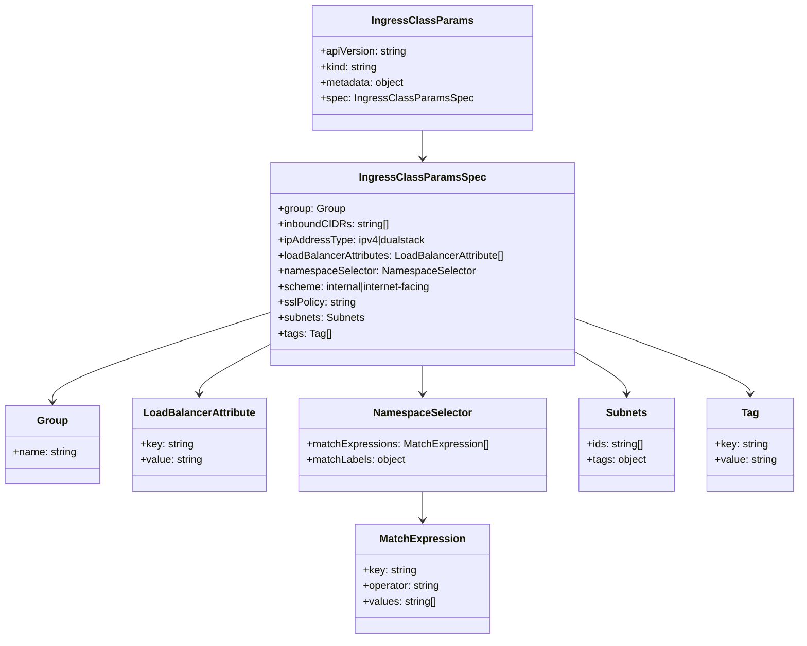

# Diagram: devops/k8s/aws-load-balancer-controller/helm/crds/crds.yaml

> Auto-generated by Obscura crawlers

## Diagram 1

### SVG

<svg id="container" width="1217.09375" xmlns="http://www.w3.org/2000/svg" class="classDiagram" height="982" viewBox="0 0 1217.09375 982" role="graphics-document document" aria-roledescription="class"><g><defs><marker id="container_class-aggregationStart" class="marker aggregation class" refX="18" refY="7" markerWidth="190" markerHeight="240" orient="auto"><path d="M 18,7 L9,13 L1,7 L9,1 Z"></path></marker></defs><defs><marker id="container_class-aggregationEnd" class="marker aggregation class" refX="1" refY="7" markerWidth="20" markerHeight="28" orient="auto"><path d="M 18,7 L9,13 L1,7 L9,1 Z"></path></marker></defs><defs><marker id="container_class-extensionStart" class="marker extension class" refX="18" refY="7" markerWidth="190" markerHeight="240" orient="auto"><path d="M 1,7 L18,13 V 1 Z"></path></marker></defs><defs><marker id="container_class-extensionEnd" class="marker extension class" refX="1" refY="7" markerWidth="20" markerHeight="28" orient="auto"><path d="M 1,1 V 13 L18,7 Z"></path></marker></defs><defs><marker id="container_class-compositionStart" class="marker composition class" refX="18" refY="7" markerWidth="190" markerHeight="240" orient="auto"><path d="M 18,7 L9,13 L1,7 L9,1 Z"></path></marker></defs><defs><marker id="container_class-compositionEnd" class="marker composition class" refX="1" refY="7" markerWidth="20" markerHeight="28" orient="auto"><path d="M 18,7 L9,13 L1,7 L9,1 Z"></path></marker></defs><defs><marker id="container_class-dependencyStart" class="marker dependency class" refX="6" refY="7" markerWidth="190" markerHeight="240" orient="auto"><path d="M 5,7 L9,13 L1,7 L9,1 Z"></path></marker></defs><defs><marker id="container_class-dependencyEnd" class="marker dependency class" refX="13" refY="7" markerWidth="20" markerHeight="28" orient="auto"><path d="M 18,7 L9,13 L14,7 L9,1 Z"></path></marker></defs><defs><marker id="container_class-lollipopStart" class="marker lollipop class" refX="13" refY="7" markerWidth="190" markerHeight="240" orient="auto"><circle stroke="black" fill="transparent" cx="7" cy="7" r="6"></circle></marker></defs><defs><marker id="container_class-lollipopEnd" class="marker lollipop class" refX="1" refY="7" markerWidth="190" markerHeight="240" orient="auto"><circle stroke="black" fill="transparent" cx="7" cy="7" r="6"></circle></marker></defs><g class="root"><g class="clusters"></g><g class="edgePaths"><path d="M643.094,200L643.094,204.167C643.094,208.333,643.094,216.667,643.094,224C643.094,231.333,643.094,237.667,643.094,240.833L643.094,244" id="id_IngressClassParams_IngressClassParamsSpec_1" class="edge-thickness-normal edge-pattern-solid relation" style=";;;" data-edge="true" data-et="edge" data-id="id_IngressClassParams_IngressClassParamsSpec_1" data-points="W3sieCI6NjQzLjA5Mzc1LCJ5IjoyMDB9LHsieCI6NjQzLjA5Mzc1LCJ5IjoyMjV9LHsieCI6NjQzLjA5Mzc1LCJ5IjoyNTB9XQ==" marker-end="url(#container_class-dependencyEnd)"></path><path d="M408.18,481.536L353.514,499.113C298.849,516.69,189.518,551.845,134.853,574.589C80.188,597.333,80.188,607.667,80.188,612.833L80.188,618" id="id_IngressClassParamsSpec_Group_2" class="edge-thickness-normal edge-pattern-solid relation" style=";;;" data-edge="true" data-et="edge" data-id="id_IngressClassParamsSpec_Group_2" data-points="W3sieCI6NDA4LjE3OTY4NzUsInkiOjQ4MS41MzU1NzE1MzE2NzE1Nn0seyJ4Ijo4MC4xODc1LCJ5Ijo1ODd9LHsieCI6ODAuMTg3NSwieSI6NjI0fV0=" marker-end="url(#container_class-dependencyEnd)"></path><path d="M408.18,531.354L390.799,540.628C373.419,549.903,338.659,568.451,321.279,580.892C303.898,593.333,303.898,599.667,303.898,602.833L303.898,606" id="id_IngressClassParamsSpec_LoadBalancerAttribute_3" class="edge-thickness-normal edge-pattern-solid relation" style=";;;" data-edge="true" data-et="edge" data-id="id_IngressClassParamsSpec_LoadBalancerAttribute_3" data-points="W3sieCI6NDA4LjE3OTY4NzUsInkiOjUzMS4zNTM4NzA2MDM2ODA1fSx7IngiOjMwMy44OTg0Mzc1LCJ5Ijo1ODd9LHsieCI6MzAzLjg5ODQzNzUsInkiOjYxMn1d" marker-end="url(#container_class-dependencyEnd)"></path><path d="M643.094,562L643.094,566.167C643.094,570.333,643.094,578.667,643.094,586C643.094,593.333,643.094,599.667,643.094,602.833L643.094,606" id="id_IngressClassParamsSpec_NamespaceSelector_4" class="edge-thickness-normal edge-pattern-solid relation" style=";;;" data-edge="true" data-et="edge" data-id="id_IngressClassParamsSpec_NamespaceSelector_4" data-points="W3sieCI6NjQzLjA5Mzc1LCJ5Ijo1NjJ9LHsieCI6NjQzLjA5Mzc1LCJ5Ijo1ODd9LHsieCI6NjQzLjA5Mzc1LCJ5Ijo2MTJ9XQ==" marker-end="url(#container_class-dependencyEnd)"></path><path d="M878.008,543.023L890.574,550.353C903.139,557.682,928.271,572.341,940.837,582.837C953.402,593.333,953.402,599.667,953.402,602.833L953.402,606" id="id_IngressClassParamsSpec_Subnets_5" class="edge-thickness-normal edge-pattern-solid relation" style=";;;" data-edge="true" data-et="edge" data-id="id_IngressClassParamsSpec_Subnets_5" data-points="W3sieCI6ODc4LjAwNzgxMjUsInkiOjU0My4wMjMwOTk0ODUxMzk1fSx7IngiOjk1My40MDIzNDM3NSwieSI6NTg3fSx7IngiOjk1My40MDIzNDM3NSwieSI6NjEyfV0=" marker-end="url(#container_class-dependencyEnd)"></path><path d="M878.008,491.129L922.101,507.107C966.194,523.086,1054.38,555.043,1098.473,574.188C1142.566,593.333,1142.566,599.667,1142.566,602.833L1142.566,606" id="id_IngressClassParamsSpec_Tag_6" class="edge-thickness-normal edge-pattern-solid relation" style=";;;" data-edge="true" data-et="edge" data-id="id_IngressClassParamsSpec_Tag_6" data-points="W3sieCI6ODc4LjAwNzgxMjUsInkiOjQ5MS4xMjg2NzQ3NzQxNzU5fSx7IngiOjExNDIuNTY2NDA2MjUsInkiOjU4N30seyJ4IjoxMTQyLjU2NjQwNjI1LCJ5Ijo2MTJ9XQ==" marker-end="url(#container_class-dependencyEnd)"></path><path d="M643.094,756L643.094,760.167C643.094,764.333,643.094,772.667,643.094,780C643.094,787.333,643.094,793.667,643.094,796.833L643.094,800" id="id_NamespaceSelector_MatchExpression_7" class="edge-thickness-normal edge-pattern-solid relation" style=";;;" data-edge="true" data-et="edge" data-id="id_NamespaceSelector_MatchExpression_7" data-points="W3sieCI6NjQzLjA5Mzc1LCJ5Ijo3NTZ9LHsieCI6NjQzLjA5Mzc1LCJ5Ijo3ODF9LHsieCI6NjQzLjA5Mzc1LCJ5Ijo4MDZ9XQ==" marker-end="url(#container_class-dependencyEnd)"></path></g><g class="edgeLabels"><g class="edgeLabel"><g class="label" data-id="id_IngressClassParams_IngressClassParamsSpec_1" transform="translate(0, 0)"><foreignObject width="0" height="0">

</foreignObject></g></g><g class="edgeLabel"><g class="label" data-id="id_IngressClassParamsSpec_Group_2" transform="translate(0, 0)"><foreignObject width="0" height="0">

</foreignObject></g></g><g class="edgeLabel"><g class="label" data-id="id_IngressClassParamsSpec_LoadBalancerAttribute_3" transform="translate(0, 0)"><foreignObject width="0" height="0">

</foreignObject></g></g><g class="edgeLabel"><g class="label" data-id="id_IngressClassParamsSpec_NamespaceSelector_4" transform="translate(0, 0)"><foreignObject width="0" height="0">

</foreignObject></g></g><g class="edgeLabel"><g class="label" data-id="id_IngressClassParamsSpec_Subnets_5" transform="translate(0, 0)"><foreignObject width="0" height="0">

</foreignObject></g></g><g class="edgeLabel"><g class="label" data-id="id_IngressClassParamsSpec_Tag_6" transform="translate(0, 0)"><foreignObject width="0" height="0">

</foreignObject></g></g><g class="edgeLabel"><g class="label" data-id="id_NamespaceSelector_MatchExpression_7" transform="translate(0, 0)"><foreignObject width="0" height="0">

</foreignObject></g></g></g><g class="nodes"><g class="node default" id="classId-IngressClassParams-0" transform="translate(643.09375, 104)"><g class="basic label-container"><path d="M-160.50390625 -96 L160.50390625 -96 L160.50390625 96 L-160.50390625 96" stroke="none" stroke-width="0" fill="#ECECFF" style=""></path><path d="M-160.50390625 -96 C-86.80146903105381 -96, -13.099031812107626 -96, 160.50390625 -96 M-160.50390625 -96 C-77.39267505034569 -96, 5.718556149308625 -96, 160.50390625 -96 M160.50390625 -96 C160.50390625 -27.85851878753857, 160.50390625 40.28296242492286, 160.50390625 96 M160.50390625 -96 C160.50390625 -43.6017284765785, 160.50390625 8.796543046842999, 160.50390625 96 M160.50390625 96 C78.83967316376206 96, -2.824559922475885 96, -160.50390625 96 M160.50390625 96 C94.91937148183547 96, 29.33483671367094 96, -160.50390625 96 M-160.50390625 96 C-160.50390625 48.303192279866686, -160.50390625 0.606384559733371, -160.50390625 -96 M-160.50390625 96 C-160.50390625 29.979363328179915, -160.50390625 -36.04127334364017, -160.50390625 -96" stroke="#9370DB" stroke-width="1.3" fill="none" stroke-dasharray="0 0" style=""></path></g><g class="annotation-group text" transform="translate(0, -72)"></g><g class="label-group text" transform="translate(-71.9609375, -72)"><g class="label" style="font-weight: bolder" transform="translate(0,-12)"><foreignObject width="143.921875" height="24">

IngressClassParams

</foreignObject></g></g><g class="members-group text" transform="translate(-148.50390625, -24)"><g class="label" style="" transform="translate(0,-12)"><foreignObject width="134.046875" height="24">

+apiVersion: string

</foreignObject></g><g class="label" style="" transform="translate(0,12)"><foreignObject width="89.359375" height="24">

+kind: string

</foreignObject></g><g class="label" style="" transform="translate(0,36)"><foreignObject width="130.984375" height="24">

+metadata: object

</foreignObject></g><g class="label" style="" transform="translate(0,60)"><foreignObject width="225.046875" height="24">

+spec: IngressClassParamsSpec

</foreignObject></g></g><g class="methods-group text" transform="translate(-148.50390625, 96)"></g><g class="divider" style=""><path d="M-160.50390625 -48 C-38.04017700102142 -48, 84.42355224795716 -48, 160.50390625 -48 M-160.50390625 -48 C-93.92902861832147 -48, -27.354150986642935 -48, 160.50390625 -48" stroke="#9370DB" stroke-width="1.3" fill="none" stroke-dasharray="0 0" style=""></path></g><g class="divider" style=""><path d="M-160.50390625 72 C-36.173355329527936 72, 88.15719559094413 72, 160.50390625 72 M-160.50390625 72 C-34.975605741663216 72, 90.55269476667357 72, 160.50390625 72" stroke="#9370DB" stroke-width="1.3" fill="none" stroke-dasharray="0 0" style=""></path></g></g><g class="node default" id="classId-IngressClassParamsSpec-1" transform="translate(643.09375, 406)"><g class="basic label-container"><path d="M-234.9140625 -156 L234.9140625 -156 L234.9140625 156 L-234.9140625 156" stroke="none" stroke-width="0" fill="#ECECFF" style=""></path><path d="M-234.9140625 -156 C-94.50558058274137 -156, 45.90290133451725 -156, 234.9140625 -156 M-234.9140625 -156 C-104.3944271388309 -156, 26.125208222338188 -156, 234.9140625 -156 M234.9140625 -156 C234.9140625 -82.58359409836882, 234.9140625 -9.16718819673764, 234.9140625 156 M234.9140625 -156 C234.9140625 -35.01721608721128, 234.9140625 85.96556782557744, 234.9140625 156 M234.9140625 156 C130.1800553549034 156, 25.446048209806804 156, -234.9140625 156 M234.9140625 156 C51.874719580004495 156, -131.164623339991 156, -234.9140625 156 M-234.9140625 156 C-234.9140625 65.75610861034892, -234.9140625 -24.487782779302165, -234.9140625 -156 M-234.9140625 156 C-234.9140625 66.6599594459692, -234.9140625 -22.680081108061586, -234.9140625 -156" stroke="#9370DB" stroke-width="1.3" fill="none" stroke-dasharray="0 0" style=""></path></g><g class="annotation-group text" transform="translate(0, -132)"></g><g class="label-group text" transform="translate(-89.5625, -132)"><g class="label" style="font-weight: bolder" transform="translate(0,-12)"><foreignObject width="179.125" height="24">

IngressClassParamsSpec

</foreignObject></g></g><g class="members-group text" transform="translate(-222.9140625, -84)"><g class="label" style="" transform="translate(0,-12)"><foreignObject width="102.203125" height="24">

+group: Group

</foreignObject></g><g class="label" style="" transform="translate(0,12)"><foreignObject width="170.140625" height="24">

+inboundCIDRs: string[]

</foreignObject></g><g class="label" style="" transform="translate(0,36)"><foreignObject width="227.734375" height="24">

+ipAddressType: ipv4|dualstack

</foreignObject></g><g class="label" style="" transform="translate(0,60)"><foreignObject width="356.265625" height="24">

+loadBalancerAttributes: LoadBalancerAttribute[]

</foreignObject></g><g class="label" style="" transform="translate(0,84)"><foreignObject width="300.890625" height="24">

+namespaceSelector: NamespaceSelector

</foreignObject></g><g class="label" style="" transform="translate(0,108)"><foreignObject width="242.421875" height="24">

+scheme: internal|internet-facing

</foreignObject></g><g class="label" style="" transform="translate(0,132)"><foreignObject width="120.125" height="24">

+sslPolicy: string

</foreignObject></g><g class="label" style="" transform="translate(0,156)"><foreignObject width="132.578125" height="24">

+subnets: Subnets

</foreignObject></g><g class="label" style="" transform="translate(0,180)"><foreignObject width="80.515625" height="24">

+tags: Tag[]

</foreignObject></g></g><g class="methods-group text" transform="translate(-222.9140625, 156)"></g><g class="divider" style=""><path d="M-234.9140625 -108 C-93.271571496083 -108, 48.370919507834 -108, 234.9140625 -108 M-234.9140625 -108 C-103.7743786428598 -108, 27.365305214280397 -108, 234.9140625 -108" stroke="#9370DB" stroke-width="1.3" fill="none" stroke-dasharray="0 0" style=""></path></g><g class="divider" style=""><path d="M-234.9140625 132 C-128.93067967061086 132, -22.947296841221686 132, 234.9140625 132 M-234.9140625 132 C-107.30480349023932 132, 20.304455519521355 132, 234.9140625 132" stroke="#9370DB" stroke-width="1.3" fill="none" stroke-dasharray="0 0" style=""></path></g></g><g class="node default" id="classId-Group-2" transform="translate(80.1875, 684)"><g class="basic label-container"><path d="M-72.1875 -60 L72.1875 -60 L72.1875 60 L-72.1875 60" stroke="none" stroke-width="0" fill="#ECECFF" style=""></path><path d="M-72.1875 -60 C-37.993926422146714 -60, -3.8003528442934282 -60, 72.1875 -60 M-72.1875 -60 C-35.32636856482512 -60, 1.5347628703497662 -60, 72.1875 -60 M72.1875 -60 C72.1875 -31.75725353003414, 72.1875 -3.514507060068283, 72.1875 60 M72.1875 -60 C72.1875 -16.021111288949413, 72.1875 27.957777422101174, 72.1875 60 M72.1875 60 C27.43286374037919 60, -17.32177251924162 60, -72.1875 60 M72.1875 60 C24.314195493219565 60, -23.55910901356087 60, -72.1875 60 M-72.1875 60 C-72.1875 21.456436610185172, -72.1875 -17.087126779629656, -72.1875 -60 M-72.1875 60 C-72.1875 13.755160488740252, -72.1875 -32.489679022519496, -72.1875 -60" stroke="#9370DB" stroke-width="1.3" fill="none" stroke-dasharray="0 0" style=""></path></g><g class="annotation-group text" transform="translate(0, -36)"></g><g class="label-group text" transform="translate(-22.15625, -36)"><g class="label" style="font-weight: bolder" transform="translate(0,-12)"><foreignObject width="44.3125" height="24">

Group

</foreignObject></g></g><g class="members-group text" transform="translate(-60.1875, 12)"><g class="label" style="" transform="translate(0,-12)"><foreignObject width="98.21875" height="24">

+name: string

</foreignObject></g></g><g class="methods-group text" transform="translate(-60.1875, 60)"></g><g class="divider" style=""><path d="M-72.1875 -12 C-43.23040485418971 -12, -14.273309708379415 -12, 72.1875 -12 M-72.1875 -12 C-20.211107107274202 -12, 31.765285785451596 -12, 72.1875 -12" stroke="#9370DB" stroke-width="1.3" fill="none" stroke-dasharray="0 0" style=""></path></g><g class="divider" style=""><path d="M-72.1875 36 C-25.162950226005748 36, 21.861599547988504 36, 72.1875 36 M-72.1875 36 C-35.26086967654814 36, 1.6657606469037205 36, 72.1875 36" stroke="#9370DB" stroke-width="1.3" fill="none" stroke-dasharray="0 0" style=""></path></g></g><g class="node default" id="classId-LoadBalancerAttribute-3" transform="translate(303.8984375, 684)"><g class="basic label-container"><path d="M-101.5234375 -72 L101.5234375 -72 L101.5234375 72 L-101.5234375 72" stroke="none" stroke-width="0" fill="#ECECFF" style=""></path><path d="M-101.5234375 -72 C-47.96227125238459 -72, 5.598894995230822 -72, 101.5234375 -72 M-101.5234375 -72 C-34.82813356260837 -72, 31.867170374783257 -72, 101.5234375 -72 M101.5234375 -72 C101.5234375 -36.376859037129364, 101.5234375 -0.7537180742587282, 101.5234375 72 M101.5234375 -72 C101.5234375 -18.20064022187625, 101.5234375 35.5987195562475, 101.5234375 72 M101.5234375 72 C42.00359694585806 72, -17.516243608283887 72, -101.5234375 72 M101.5234375 72 C27.265509333787946 72, -46.99241883242411 72, -101.5234375 72 M-101.5234375 72 C-101.5234375 19.639389096100963, -101.5234375 -32.721221807798074, -101.5234375 -72 M-101.5234375 72 C-101.5234375 39.804549453744784, -101.5234375 7.609098907489567, -101.5234375 -72" stroke="#9370DB" stroke-width="1.3" fill="none" stroke-dasharray="0 0" style=""></path></g><g class="annotation-group text" transform="translate(0, -48)"></g><g class="label-group text" transform="translate(-82.625, -48)"><g class="label" style="font-weight: bolder" transform="translate(0,-12)"><foreignObject width="165.25" height="24">

LoadBalancerAttribute

</foreignObject></g></g><g class="members-group text" transform="translate(-89.5234375, 0)"><g class="label" style="" transform="translate(0,-12)"><foreignObject width="82.34375" height="24">

+key: string

</foreignObject></g><g class="label" style="" transform="translate(0,12)"><foreignObject width="96.421875" height="24">

+value: string

</foreignObject></g></g><g class="methods-group text" transform="translate(-89.5234375, 72)"></g><g class="divider" style=""><path d="M-101.5234375 -24 C-39.6511081876832 -24, 22.2212211246336 -24, 101.5234375 -24 M-101.5234375 -24 C-52.672668229300534 -24, -3.821898958601068 -24, 101.5234375 -24" stroke="#9370DB" stroke-width="1.3" fill="none" stroke-dasharray="0 0" style=""></path></g><g class="divider" style=""><path d="M-101.5234375 48 C-40.26856298758427 48, 20.986311524831464 48, 101.5234375 48 M-101.5234375 48 C-27.997654586711064 48, 45.52812832657787 48, 101.5234375 48" stroke="#9370DB" stroke-width="1.3" fill="none" stroke-dasharray="0 0" style=""></path></g></g><g class="node default" id="classId-NamespaceSelector-4" transform="translate(643.09375, 684)"><g class="basic label-container"><path d="M-187.671875 -72 L187.671875 -72 L187.671875 72 L-187.671875 72" stroke="none" stroke-width="0" fill="#ECECFF" style=""></path><path d="M-187.671875 -72 C-82.93591792252288 -72, 21.80003915495425 -72, 187.671875 -72 M-187.671875 -72 C-40.26693464122812 -72, 107.13800571754376 -72, 187.671875 -72 M187.671875 -72 C187.671875 -26.30957908923333, 187.671875 19.380841821533338, 187.671875 72 M187.671875 -72 C187.671875 -25.49376550661765, 187.671875 21.012468986764702, 187.671875 72 M187.671875 72 C90.75714328154116 72, -6.157588436917678 72, -187.671875 72 M187.671875 72 C99.92503635233764 72, 12.178197704675284 72, -187.671875 72 M-187.671875 72 C-187.671875 15.044050247373612, -187.671875 -41.91189950525278, -187.671875 -72 M-187.671875 72 C-187.671875 39.84170340111482, -187.671875 7.683406802229641, -187.671875 -72" stroke="#9370DB" stroke-width="1.3" fill="none" stroke-dasharray="0 0" style=""></path></g><g class="annotation-group text" transform="translate(0, -48)"></g><g class="label-group text" transform="translate(-72.296875, -48)"><g class="label" style="font-weight: bolder" transform="translate(0,-12)"><foreignObject width="144.59375" height="24">

NamespaceSelector

</foreignObject></g></g><g class="members-group text" transform="translate(-175.671875, 0)"><g class="label" style="" transform="translate(0,-12)"><foreignObject width="279.046875" height="24">

+matchExpressions: MatchExpression[]

</foreignObject></g><g class="label" style="" transform="translate(0,12)"><foreignObject width="153.421875" height="24">

+matchLabels: object

</foreignObject></g></g><g class="methods-group text" transform="translate(-175.671875, 72)"></g><g class="divider" style=""><path d="M-187.671875 -24 C-40.994931839392876 -24, 105.68201132121425 -24, 187.671875 -24 M-187.671875 -24 C-104.85360926019115 -24, -22.0353435203823 -24, 187.671875 -24" stroke="#9370DB" stroke-width="1.3" fill="none" stroke-dasharray="0 0" style=""></path></g><g class="divider" style=""><path d="M-187.671875 48 C-88.17617300887318 48, 11.319528982253644 48, 187.671875 48 M-187.671875 48 C-49.09772640027339 48, 89.47642219945322 48, 187.671875 48" stroke="#9370DB" stroke-width="1.3" fill="none" stroke-dasharray="0 0" style=""></path></g></g><g class="node default" id="classId-MatchExpression-5" transform="translate(643.09375, 890)"><g class="basic label-container"><path d="M-103.28125 -84 L103.28125 -84 L103.28125 84 L-103.28125 84" stroke="none" stroke-width="0" fill="#ECECFF" style=""></path><path d="M-103.28125 -84 C-50.747989314619815 -84, 1.7852713707603698 -84, 103.28125 -84 M-103.28125 -84 C-44.162682905933714 -84, 14.955884188132572 -84, 103.28125 -84 M103.28125 -84 C103.28125 -25.300140108912224, 103.28125 33.39971978217555, 103.28125 84 M103.28125 -84 C103.28125 -46.28723273917659, 103.28125 -8.574465478353176, 103.28125 84 M103.28125 84 C28.1307759070651 84, -47.0196981858698 84, -103.28125 84 M103.28125 84 C49.15962429672043 84, -4.962001406559139 84, -103.28125 84 M-103.28125 84 C-103.28125 17.982416682676813, -103.28125 -48.03516663464637, -103.28125 -84 M-103.28125 84 C-103.28125 37.019707671177144, -103.28125 -9.960584657645711, -103.28125 -84" stroke="#9370DB" stroke-width="1.3" fill="none" stroke-dasharray="0 0" style=""></path></g><g class="annotation-group text" transform="translate(0, -60)"></g><g class="label-group text" transform="translate(-61.75, -60)"><g class="label" style="font-weight: bolder" transform="translate(0,-12)"><foreignObject width="123.5" height="24">

MatchExpression

</foreignObject></g></g><g class="members-group text" transform="translate(-91.28125, -12)"><g class="label" style="" transform="translate(0,-12)"><foreignObject width="82.34375" height="24">

+key: string

</foreignObject></g><g class="label" style="" transform="translate(0,12)"><foreignObject width="120.8125" height="24">

+operator: string

</foreignObject></g><g class="label" style="" transform="translate(0,36)"><foreignObject width="114.203125" height="24">

+values: string[]

</foreignObject></g></g><g class="methods-group text" transform="translate(-91.28125, 84)"></g><g class="divider" style=""><path d="M-103.28125 -36 C-48.08169684870074 -36, 7.1178563025985255 -36, 103.28125 -36 M-103.28125 -36 C-25.04665167849791 -36, 53.18794664300418 -36, 103.28125 -36" stroke="#9370DB" stroke-width="1.3" fill="none" stroke-dasharray="0 0" style=""></path></g><g class="divider" style=""><path d="M-103.28125 60 C-61.94573226466455 60, -20.6102145293291 60, 103.28125 60 M-103.28125 60 C-47.9928773570092 60, 7.295495285981602 60, 103.28125 60" stroke="#9370DB" stroke-width="1.3" fill="none" stroke-dasharray="0 0" style=""></path></g></g><g class="node default" id="classId-Subnets-6" transform="translate(953.40234375, 684)"><g class="basic label-container"><path d="M-72.63671875 -72 L72.63671875 -72 L72.63671875 72 L-72.63671875 72" stroke="none" stroke-width="0" fill="#ECECFF" style=""></path><path d="M-72.63671875 -72 C-43.46403952067986 -72, -14.291360291359716 -72, 72.63671875 -72 M-72.63671875 -72 C-37.00444461784557 -72, -1.372170485691143 -72, 72.63671875 -72 M72.63671875 -72 C72.63671875 -37.288126111134105, 72.63671875 -2.5762522222682094, 72.63671875 72 M72.63671875 -72 C72.63671875 -17.357285743454142, 72.63671875 37.285428513091716, 72.63671875 72 M72.63671875 72 C37.22983131498103 72, 1.8229438799620539 72, -72.63671875 72 M72.63671875 72 C25.73423872660525 72, -21.168241296789503 72, -72.63671875 72 M-72.63671875 72 C-72.63671875 40.742006721097155, -72.63671875 9.48401344219431, -72.63671875 -72 M-72.63671875 72 C-72.63671875 28.339026090798384, -72.63671875 -15.321947818403231, -72.63671875 -72" stroke="#9370DB" stroke-width="1.3" fill="none" stroke-dasharray="0 0" style=""></path></g><g class="annotation-group text" transform="translate(0, -48)"></g><g class="label-group text" transform="translate(-29.9140625, -48)"><g class="label" style="font-weight: bolder" transform="translate(0,-12)"><foreignObject width="59.828125" height="24">

Subnets

</foreignObject></g></g><g class="members-group text" transform="translate(-60.63671875, 0)"><g class="label" style="" transform="translate(0,-12)"><foreignObject width="89.5625" height="24">

+ids: string[]

</foreignObject></g><g class="label" style="" transform="translate(0,12)"><foreignObject width="91.359375" height="24">

+tags: object

</foreignObject></g></g><g class="methods-group text" transform="translate(-60.63671875, 72)"></g><g class="divider" style=""><path d="M-72.63671875 -24 C-29.712225365647633 -24, 13.212268018704734 -24, 72.63671875 -24 M-72.63671875 -24 C-20.310875877208225 -24, 32.01496699558355 -24, 72.63671875 -24" stroke="#9370DB" stroke-width="1.3" fill="none" stroke-dasharray="0 0" style=""></path></g><g class="divider" style=""><path d="M-72.63671875 48 C-19.63475629420755 48, 33.3672061615849 48, 72.63671875 48 M-72.63671875 48 C-41.82090417966978 48, -11.005089609339564 48, 72.63671875 48" stroke="#9370DB" stroke-width="1.3" fill="none" stroke-dasharray="0 0" style=""></path></g></g><g class="node default" id="classId-Tag-7" transform="translate(1142.56640625, 684)"><g class="basic label-container"><path d="M-66.52734375 -72 L66.52734375 -72 L66.52734375 72 L-66.52734375 72" stroke="none" stroke-width="0" fill="#ECECFF" style=""></path><path d="M-66.52734375 -72 C-19.332706396813606 -72, 27.861930956372788 -72, 66.52734375 -72 M-66.52734375 -72 C-16.25219676802233 -72, 34.02295021395534 -72, 66.52734375 -72 M66.52734375 -72 C66.52734375 -32.84321755719205, 66.52734375 6.313564885615904, 66.52734375 72 M66.52734375 -72 C66.52734375 -23.30030359941891, 66.52734375 25.39939280116218, 66.52734375 72 M66.52734375 72 C24.652358016167312 72, -17.222627717665375 72, -66.52734375 72 M66.52734375 72 C25.571291744384716 72, -15.384760261230568 72, -66.52734375 72 M-66.52734375 72 C-66.52734375 20.069659268138373, -66.52734375 -31.860681463723253, -66.52734375 -72 M-66.52734375 72 C-66.52734375 38.44684485129106, -66.52734375 4.893689702582122, -66.52734375 -72" stroke="#9370DB" stroke-width="1.3" fill="none" stroke-dasharray="0 0" style=""></path></g><g class="annotation-group text" transform="translate(0, -48)"></g><g class="label-group text" transform="translate(-12.6328125, -48)"><g class="label" style="font-weight: bolder" transform="translate(0,-12)"><foreignObject width="25.265625" height="24">

Tag

</foreignObject></g></g><g class="members-group text" transform="translate(-54.52734375, 0)"><g class="label" style="" transform="translate(0,-12)"><foreignObject width="82.34375" height="24">

+key: string

</foreignObject></g><g class="label" style="" transform="translate(0,12)"><foreignObject width="96.421875" height="24">

+value: string

</foreignObject></g></g><g class="methods-group text" transform="translate(-54.52734375, 72)"></g><g class="divider" style=""><path d="M-66.52734375 -24 C-25.63755818032658 -24, 15.252227389346842 -24, 66.52734375 -24 M-66.52734375 -24 C-22.99683635323771 -24, 20.533671043524578 -24, 66.52734375 -24" stroke="#9370DB" stroke-width="1.3" fill="none" stroke-dasharray="0 0" style=""></path></g><g class="divider" style=""><path d="M-66.52734375 48 C-24.362930907994787 48, 17.801481934010425 48, 66.52734375 48 M-66.52734375 48 C-32.50632982050812 48, 1.514684108983758 48, 66.52734375 48" stroke="#9370DB" stroke-width="1.3" fill="none" stroke-dasharray="0 0" style=""></path></g></g></g></g></g></svg>

## Diagram 2

```mermaid
classDiagram
class TargetGroupBinding {
  +apiVersion: string
  +kind: string
  +metadata: object
  +spec: TargetGroupBindingSpec
  +status: TargetGroupBindingStatus
}
class TargetGroupBindingSpec {
  +ipAddressType: ipv4|ipv6
  +networking: Networking
  +nodeSelector: NodeSelector
  +serviceRef: ServiceRef
  +targetGroupARN: string
  +targetType: instance|ip
}
class TargetGroupBindingStatus {
  +observedGeneration: integer
}
class Networking {
  +ingress: NetworkingIngressRule[]
}
class NetworkingIngressRule {
  +from: NetworkingPeer[]
  +ports: NetworkingPort[]
}
class NetworkingPeer {
  +ipBlock: IPBlock
  +securityGroup: SecurityGroup
}
class IPBlock {
  +cidr: string
}
class SecurityGroup {
  +groupID: string
}
class NetworkingPort {
  +port: int|string
  +protocol: TCP|UDP
}
class ServiceRef {
  +name: string
  +port: int|string
}
class NodeSelector {
  +matchExpressions: MatchExpression[]
  +matchLabels: object
}
class MatchExpression {
  +key: string
  +operator: string
  +values: string[]
}
TargetGroupBinding --> TargetGroupBindingSpec
TargetGroupBinding --> TargetGroupBindingStatus
TargetGroupBindingSpec --> Networking
TargetGroupBindingSpec --> ServiceRef
TargetGroupBindingSpec --> NodeSelector
Networking --> NetworkingIngressRule
NetworkingIngressRule --> NetworkingPeer
NetworkingIngressRule --> NetworkingPort
NetworkingPeer --> IPBlock
NetworkingPeer --> SecurityGroup
NodeSelector --> MatchExpression
```

### SVG

<svg id="container" width="1157.279296875" xmlns="http://www.w3.org/2000/svg" class="classDiagram" height="1298" viewBox="0 0 1157.279296875 1298" role="graphics-document document" aria-roledescription="class"><g><defs><marker id="container_class-aggregationStart" class="marker aggregation class" refX="18" refY="7" markerWidth="190" markerHeight="240" orient="auto"><path d="M 18,7 L9,13 L1,7 L9,1 Z"></path></marker></defs><defs><marker id="container_class-aggregationEnd" class="marker aggregation class" refX="1" refY="7" markerWidth="20" markerHeight="28" orient="auto"><path d="M 18,7 L9,13 L1,7 L9,1 Z"></path></marker></defs><defs><marker id="container_class-extensionStart" class="marker extension class" refX="18" refY="7" markerWidth="190" markerHeight="240" orient="auto"><path d="M 1,7 L18,13 V 1 Z"></path></marker></defs><defs><marker id="container_class-extensionEnd" class="marker extension class" refX="1" refY="7" markerWidth="20" markerHeight="28" orient="auto"><path d="M 1,1 V 13 L18,7 Z"></path></marker></defs><defs><marker id="container_class-compositionStart" class="marker composition class" refX="18" refY="7" markerWidth="190" markerHeight="240" orient="auto"><path d="M 18,7 L9,13 L1,7 L9,1 Z"></path></marker></defs><defs><marker id="container_class-compositionEnd" class="marker composition class" refX="1" refY="7" markerWidth="20" markerHeight="28" orient="auto"><path d="M 18,7 L9,13 L1,7 L9,1 Z"></path></marker></defs><defs><marker id="container_class-dependencyStart" class="marker dependency class" refX="6" refY="7" markerWidth="190" markerHeight="240" orient="auto"><path d="M 5,7 L9,13 L1,7 L9,1 Z"></path></marker></defs><defs><marker id="container_class-dependencyEnd" class="marker dependency class" refX="13" refY="7" markerWidth="20" markerHeight="28" orient="auto"><path d="M 18,7 L9,13 L14,7 L9,1 Z"></path></marker></defs><defs><marker id="container_class-lollipopStart" class="marker lollipop class" refX="13" refY="7" markerWidth="190" markerHeight="240" orient="auto"><circle stroke="black" fill="transparent" cx="7" cy="7" r="6"></circle></marker></defs><defs><marker id="container_class-lollipopEnd" class="marker lollipop class" refX="1" refY="7" markerWidth="190" markerHeight="240" orient="auto"><circle stroke="black" fill="transparent" cx="7" cy="7" r="6"></circle></marker></defs><g class="root"><g class="clusters"></g><g class="edgePaths"><path d="M650.389,219.594L642.173,224.495C633.956,229.396,617.524,239.198,609.308,247.266C601.092,255.333,601.092,261.667,601.092,264.833L601.092,268" id="id_TargetGroupBinding_TargetGroupBindingSpec_1" class="edge-thickness-normal edge-pattern-solid relation" style=";;;" data-edge="true" data-et="edge" data-id="id_TargetGroupBinding_TargetGroupBindingSpec_1" data-points="W3sieCI6NjUwLjM4ODY3MTg3NSwieSI6MjE5LjU5NDA4ODg5NDMzOTQyfSx7IngiOjYwMS4wOTE3OTY4NzUsInkiOjI0OX0seyJ4Ijo2MDEuMDkxNzk2ODc1LCJ5IjoyNzR9XQ==" marker-end="url(#container_class-dependencyEnd)"></path><path d="M951.964,224L956.899,228.167C961.833,232.333,971.703,240.667,976.638,258C981.572,275.333,981.572,301.667,981.572,314.833L981.572,328" id="id_TargetGroupBinding_TargetGroupBindingStatus_2" class="edge-thickness-normal edge-pattern-solid relation" style=";;;" data-edge="true" data-et="edge" data-id="id_TargetGroupBinding_TargetGroupBindingStatus_2" data-points="W3sieCI6OTUxLjk2NDA2NTQzNzAzMDEsInkiOjIyNH0seyJ4Ijo5ODEuNTcyMjY1NjI1LCJ5IjoyNDl9LHsieCI6OTgxLjU3MjI2NTYyNSwieSI6MzM0fV0=" marker-end="url(#container_class-dependencyEnd)"></path><path d="M438.318,484.276L421.873,493.397C405.428,502.518,372.538,520.759,356.093,535.046C339.648,549.333,339.648,559.667,339.648,564.833L339.648,570" id="id_TargetGroupBindingSpec_Networking_3" class="edge-thickness-normal edge-pattern-solid relation" style=";;;" data-edge="true" data-et="edge" data-id="id_TargetGroupBindingSpec_Networking_3" data-points="W3sieCI6NDM4LjMxODM1OTM3NSwieSI6NDg0LjI3NjMzNTU0NzEwNTUzfSx7IngiOjMzOS42NDg0Mzc1LCJ5Ijo1Mzl9LHsieCI6MzM5LjY0ODQzNzUsInkiOjU3Nn1d" marker-end="url(#container_class-dependencyEnd)"></path><path d="M628.174,514L629.115,518.167C630.055,522.333,631.936,530.667,632.876,538C633.816,545.333,633.816,551.667,633.816,554.833L633.816,558" id="id_TargetGroupBindingSpec_ServiceRef_4" class="edge-thickness-normal edge-pattern-solid relation" style=";;;" data-edge="true" data-et="edge" data-id="id_TargetGroupBindingSpec_ServiceRef_4" data-points="W3sieCI6NjI4LjE3NDIzMjIxOTgyNzYsInkiOjUxNH0seyJ4Ijo2MzMuODE2NDA2MjUsInkiOjUzOX0seyJ4Ijo2MzMuODE2NDA2MjUsInkiOjU2NH1d" marker-end="url(#container_class-dependencyEnd)"></path><path d="M763.865,461.87L794.696,474.725C825.526,487.58,887.187,513.29,918.017,529.312C948.848,545.333,948.848,551.667,948.848,554.833L948.848,558" id="id_TargetGroupBindingSpec_NodeSelector_5" class="edge-thickness-normal edge-pattern-solid relation" style=";;;" data-edge="true" data-et="edge" data-id="id_TargetGroupBindingSpec_NodeSelector_5" data-points="W3sieCI6NzYzLjg2NTIzNDM3NSwieSI6NDYxLjg2OTg3OTk3ODIwODV9LHsieCI6OTQ4Ljg0NzY1NjI1LCJ5Ijo1Mzl9LHsieCI6OTQ4Ljg0NzY1NjI1LCJ5Ijo1NjR9XQ==" marker-end="url(#container_class-dependencyEnd)"></path><path d="M339.648,696L339.648,702.167C339.648,708.333,339.648,720.667,339.648,732C339.648,743.333,339.648,753.667,339.648,758.833L339.648,764" id="id_Networking_NetworkingIngressRule_6" class="edge-thickness-normal edge-pattern-solid relation" style=";;;" data-edge="true" data-et="edge" data-id="id_Networking_NetworkingIngressRule_6" data-points="W3sieCI6MzM5LjY0ODQzNzUsInkiOjY5Nn0seyJ4IjozMzkuNjQ4NDM3NSwieSI6NzMzfSx7IngiOjMzOS42NDg0Mzc1LCJ5Ijo3NzB9XQ==" marker-end="url(#container_class-dependencyEnd)"></path><path d="M236.565,914L227.736,920.167C218.907,926.333,201.25,938.667,192.421,948C183.592,957.333,183.592,963.667,183.592,966.833L183.592,970" id="id_NetworkingIngressRule_NetworkingPeer_7" class="edge-thickness-normal edge-pattern-solid relation" style=";;;" data-edge="true" data-et="edge" data-id="id_NetworkingIngressRule_NetworkingPeer_7" data-points="W3sieCI6MjM2LjU2NTE1MTk0OTU0MTMsInkiOjkxNH0seyJ4IjoxODMuNTkxNzk2ODc1LCJ5Ijo5NTF9LHsieCI6MTgzLjU5MTc5Njg3NSwieSI6OTc2fV0=" marker-end="url(#container_class-dependencyEnd)"></path><path d="M442.732,914L451.561,920.167C460.39,926.333,478.047,938.667,486.876,948C495.705,957.333,495.705,963.667,495.705,966.833L495.705,970" id="id_NetworkingIngressRule_NetworkingPort_8" class="edge-thickness-normal edge-pattern-solid relation" style=";;;" data-edge="true" data-et="edge" data-id="id_NetworkingIngressRule_NetworkingPort_8" data-points="W3sieCI6NDQyLjczMTcyMzA1MDQ1ODcsInkiOjkxNH0seyJ4Ijo0OTUuNzA1MDc4MTI1LCJ5Ijo5NTF9LHsieCI6NDk1LjcwNTA3ODEyNSwieSI6OTc2fV0=" marker-end="url(#container_class-dependencyEnd)"></path><path d="M104.142,1120L99.544,1124.167C94.946,1128.333,85.75,1136.667,81.153,1144C76.555,1151.333,76.555,1157.667,76.555,1160.833L76.555,1164" id="id_NetworkingPeer_IPBlock_9" class="edge-thickness-normal edge-pattern-solid relation" style=";;;" data-edge="true" data-et="edge" data-id="id_NetworkingPeer_IPBlock_9" data-points="W3sieCI6MTA0LjE0MTU3MTM1OTUzNjA5LCJ5IjoxMTIwfSx7IngiOjc2LjU1NDY4NzUsInkiOjExNDV9LHsieCI6NzYuNTU0Njg3NSwieSI6MTE3MH1d" marker-end="url(#container_class-dependencyEnd)"></path><path d="M263.042,1120L267.64,1124.167C272.238,1128.333,281.433,1136.667,286.031,1144C290.629,1151.333,290.629,1157.667,290.629,1160.833L290.629,1164" id="id_NetworkingPeer_SecurityGroup_10" class="edge-thickness-normal edge-pattern-solid relation" style=";;;" data-edge="true" data-et="edge" data-id="id_NetworkingPeer_SecurityGroup_10" data-points="W3sieCI6MjYzLjA0MjAyMjM5MDQ2MzksInkiOjExMjB9LHsieCI6MjkwLjYyODkwNjI1LCJ5IjoxMTQ1fSx7IngiOjI5MC42Mjg5MDYyNSwieSI6MTE3MH1d" marker-end="url(#container_class-dependencyEnd)"></path><path d="M948.848,708L948.848,712.167C948.848,716.333,948.848,724.667,948.848,732C948.848,739.333,948.848,745.667,948.848,748.833L948.848,752" id="id_NodeSelector_MatchExpression_11" class="edge-thickness-normal edge-pattern-solid relation" style=";;;" data-edge="true" data-et="edge" data-id="id_NodeSelector_MatchExpression_11" data-points="W3sieCI6OTQ4Ljg0NzY1NjI1LCJ5Ijo3MDh9LHsieCI6OTQ4Ljg0NzY1NjI1LCJ5Ijo3MzN9LHsieCI6OTQ4Ljg0NzY1NjI1LCJ5Ijo3NTh9XQ==" marker-end="url(#container_class-dependencyEnd)"></path></g><g class="edgeLabels"><g class="edgeLabel"><g class="label" data-id="id_TargetGroupBinding_TargetGroupBindingSpec_1" transform="translate(0, 0)"><foreignObject width="0" height="0">

</foreignObject></g></g><g class="edgeLabel"><g class="label" data-id="id_TargetGroupBinding_TargetGroupBindingStatus_2" transform="translate(0, 0)"><foreignObject width="0" height="0">

</foreignObject></g></g><g class="edgeLabel"><g class="label" data-id="id_TargetGroupBindingSpec_Networking_3" transform="translate(0, 0)"><foreignObject width="0" height="0">

</foreignObject></g></g><g class="edgeLabel"><g class="label" data-id="id_TargetGroupBindingSpec_ServiceRef_4" transform="translate(0, 0)"><foreignObject width="0" height="0">

</foreignObject></g></g><g class="edgeLabel"><g class="label" data-id="id_TargetGroupBindingSpec_NodeSelector_5" transform="translate(0, 0)"><foreignObject width="0" height="0">

</foreignObject></g></g><g class="edgeLabel"><g class="label" data-id="id_Networking_NetworkingIngressRule_6" transform="translate(0, 0)"><foreignObject width="0" height="0">

</foreignObject></g></g><g class="edgeLabel"><g class="label" data-id="id_NetworkingIngressRule_NetworkingPeer_7" transform="translate(0, 0)"><foreignObject width="0" height="0">

</foreignObject></g></g><g class="edgeLabel"><g class="label" data-id="id_NetworkingIngressRule_NetworkingPort_8" transform="translate(0, 0)"><foreignObject width="0" height="0">

</foreignObject></g></g><g class="edgeLabel"><g class="label" data-id="id_NetworkingPeer_IPBlock_9" transform="translate(0, 0)"><foreignObject width="0" height="0">

</foreignObject></g></g><g class="edgeLabel"><g class="label" data-id="id_NetworkingPeer_SecurityGroup_10" transform="translate(0, 0)"><foreignObject width="0" height="0">

</foreignObject></g></g><g class="edgeLabel"><g class="label" data-id="id_NodeSelector_MatchExpression_11" transform="translate(0, 0)"><foreignObject width="0" height="0">

</foreignObject></g></g></g><g class="nodes"><g class="node default" id="classId-TargetGroupBinding-0" transform="translate(824.056640625, 116)"><g class="basic label-container"><path d="M-173.66796875 -108 L173.66796875 -108 L173.66796875 108 L-173.66796875 108" stroke="none" stroke-width="0" fill="#ECECFF" style=""></path><path d="M-173.66796875 -108 C-55.79133144971129 -108, 62.08530585057741 -108, 173.66796875 -108 M-173.66796875 -108 C-89.32178634228927 -108, -4.975603934578544 -108, 173.66796875 -108 M173.66796875 -108 C173.66796875 -26.72033686712065, 173.66796875 54.5593262657587, 173.66796875 108 M173.66796875 -108 C173.66796875 -25.762513971284605, 173.66796875 56.47497205743079, 173.66796875 108 M173.66796875 108 C65.50833178651845 108, -42.65130517696309 108, -173.66796875 108 M173.66796875 108 C43.805175663182126 108, -86.05761742363575 108, -173.66796875 108 M-173.66796875 108 C-173.66796875 54.70583535195179, -173.66796875 1.4116707039035816, -173.66796875 -108 M-173.66796875 108 C-173.66796875 25.168984968327507, -173.66796875 -57.662030063344986, -173.66796875 -108" stroke="#9370DB" stroke-width="1.3" fill="none" stroke-dasharray="0 0" style=""></path></g><g class="annotation-group text" transform="translate(0, -84)"></g><g class="label-group text" transform="translate(-73.1953125, -84)"><g class="label" style="font-weight: bolder" transform="translate(0,-12)"><foreignObject width="146.390625" height="24">

TargetGroupBinding

</foreignObject></g></g><g class="members-group text" transform="translate(-161.66796875, -36)"><g class="label" style="" transform="translate(0,-12)"><foreignObject width="134.046875" height="24">

+apiVersion: string

</foreignObject></g><g class="label" style="" transform="translate(0,12)"><foreignObject width="89.359375" height="24">

+kind: string

</foreignObject></g><g class="label" style="" transform="translate(0,36)"><foreignObject width="130.984375" height="24">

+metadata: object

</foreignObject></g><g class="label" style="" transform="translate(0,60)"><foreignObject width="228.09375" height="24">

+spec: TargetGroupBindingSpec

</foreignObject></g><g class="label" style="" transform="translate(0,84)"><foreignObject width="250.140625" height="24">

+status: TargetGroupBindingStatus

</foreignObject></g></g><g class="methods-group text" transform="translate(-161.66796875, 108)"></g><g class="divider" style=""><path d="M-173.66796875 -60 C-41.77537069592461 -60, 90.11722735815079 -60, 173.66796875 -60 M-173.66796875 -60 C-76.92554375584581 -60, 19.816881238308383 -60, 173.66796875 -60" stroke="#9370DB" stroke-width="1.3" fill="none" stroke-dasharray="0 0" style=""></path></g><g class="divider" style=""><path d="M-173.66796875 84 C-44.776313493325716 84, 84.11534176334857 84, 173.66796875 84 M-173.66796875 84 C-42.50828433196446 84, 88.65140008607108 84, 173.66796875 84" stroke="#9370DB" stroke-width="1.3" fill="none" stroke-dasharray="0 0" style=""></path></g></g><g class="node default" id="classId-TargetGroupBindingSpec-1" transform="translate(601.091796875, 394)"><g class="basic label-container"><path d="M-162.7734375 -120 L162.7734375 -120 L162.7734375 120 L-162.7734375 120" stroke="none" stroke-width="0" fill="#ECECFF" style=""></path><path d="M-162.7734375 -120 C-53.56559723988957 -120, 55.64224302022086 -120, 162.7734375 -120 M-162.7734375 -120 C-94.45972944067421 -120, -26.14602138134842 -120, 162.7734375 -120 M162.7734375 -120 C162.7734375 -49.09368437095924, 162.7734375 21.812631258081524, 162.7734375 120 M162.7734375 -120 C162.7734375 -54.470662799571926, 162.7734375 11.058674400856148, 162.7734375 120 M162.7734375 120 C65.47689021697767 120, -31.81965706604467 120, -162.7734375 120 M162.7734375 120 C73.57959713624945 120, -15.614243227501106 120, -162.7734375 120 M-162.7734375 120 C-162.7734375 34.98972653535242, -162.7734375 -50.020546929295165, -162.7734375 -120 M-162.7734375 120 C-162.7734375 42.664120175891966, -162.7734375 -34.67175964821607, -162.7734375 -120" stroke="#9370DB" stroke-width="1.3" fill="none" stroke-dasharray="0 0" style=""></path></g><g class="annotation-group text" transform="translate(0, -96)"></g><g class="label-group text" transform="translate(-90.796875, -96)"><g class="label" style="font-weight: bolder" transform="translate(0,-12)"><foreignObject width="181.59375" height="24">

TargetGroupBindingSpec

</foreignObject></g></g><g class="members-group text" transform="translate(-150.7734375, -48)"><g class="label" style="" transform="translate(0,-12)"><foreignObject width="188.296875" height="24">

+ipAddressType: ipv4|ipv6

</foreignObject></g><g class="label" style="" transform="translate(0,12)"><foreignObject width="180.15625" height="24">

+networking: Networking

</foreignObject></g><g class="label" style="" transform="translate(0,36)"><foreignObject width="210.75" height="24">

+nodeSelector: NodeSelector

</foreignObject></g><g class="label" style="" transform="translate(0,60)"><foreignObject width="166.0625" height="24">

+serviceRef: ServiceRef

</foreignObject></g><g class="label" style="" transform="translate(0,84)"><foreignObject width="174.21875" height="24">

+targetGroupARN: string

</foreignObject></g><g class="label" style="" transform="translate(0,108)"><foreignObject width="174.203125" height="24">

+targetType: instance|ip

</foreignObject></g></g><g class="methods-group text" transform="translate(-150.7734375, 120)"></g><g class="divider" style=""><path d="M-162.7734375 -72 C-85.31730123132611 -72, -7.861164962652225 -72, 162.7734375 -72 M-162.7734375 -72 C-52.4430830299239 -72, 57.887271440152205 -72, 162.7734375 -72" stroke="#9370DB" stroke-width="1.3" fill="none" stroke-dasharray="0 0" style=""></path></g><g class="divider" style=""><path d="M-162.7734375 96 C-39.04892747394673 96, 84.67558255210653 96, 162.7734375 96 M-162.7734375 96 C-86.96760063249646 96, -11.161763764992912 96, 162.7734375 96" stroke="#9370DB" stroke-width="1.3" fill="none" stroke-dasharray="0 0" style=""></path></g></g><g class="node default" id="classId-TargetGroupBindingStatus-2" transform="translate(981.572265625, 394)"><g class="basic label-container"><path d="M-167.70703125 -60 L167.70703125 -60 L167.70703125 60 L-167.70703125 60" stroke="none" stroke-width="0" fill="#ECECFF" style=""></path><path d="M-167.70703125 -60 C-64.33627569120249 -60, 39.034479867595024 -60, 167.70703125 -60 M-167.70703125 -60 C-69.01660156279404 -60, 29.673828124411926 -60, 167.70703125 -60 M167.70703125 -60 C167.70703125 -22.160321470560994, 167.70703125 15.679357058878011, 167.70703125 60 M167.70703125 -60 C167.70703125 -12.64594263014807, 167.70703125 34.70811473970386, 167.70703125 60 M167.70703125 60 C82.66874719723135 60, -2.369536855537291 60, -167.70703125 60 M167.70703125 60 C97.24781433914278 60, 26.788597428285556 60, -167.70703125 60 M-167.70703125 60 C-167.70703125 25.01095088377935, -167.70703125 -9.978098232441297, -167.70703125 -60 M-167.70703125 60 C-167.70703125 28.708390330339505, -167.70703125 -2.5832193393209906, -167.70703125 -60" stroke="#9370DB" stroke-width="1.3" fill="none" stroke-dasharray="0 0" style=""></path></g><g class="annotation-group text" transform="translate(0, -36)"></g><g class="label-group text" transform="translate(-96.6796875, -36)"><g class="label" style="font-weight: bolder" transform="translate(0,-12)"><foreignObject width="193.359375" height="24">

TargetGroupBindingStatus

</foreignObject></g></g><g class="members-group text" transform="translate(-155.70703125, 12)"><g class="label" style="" transform="translate(0,-12)"><foreignObject width="214.734375" height="24">

+observedGeneration: integer

</foreignObject></g></g><g class="methods-group text" transform="translate(-155.70703125, 60)"></g><g class="divider" style=""><path d="M-167.70703125 -12 C-80.8973645976485 -12, 5.912302054702991 -12, 167.70703125 -12 M-167.70703125 -12 C-86.69969415834349 -12, -5.692357066686981 -12, 167.70703125 -12" stroke="#9370DB" stroke-width="1.3" fill="none" stroke-dasharray="0 0" style=""></path></g><g class="divider" style=""><path d="M-167.70703125 36 C-41.39459083998919 36, 84.91784957002162 36, 167.70703125 36 M-167.70703125 36 C-69.76951125654571 36, 28.168008736908575 36, 167.70703125 36" stroke="#9370DB" stroke-width="1.3" fill="none" stroke-dasharray="0 0" style=""></path></g></g><g class="node default" id="classId-Networking-3" transform="translate(339.6484375, 636)"><g class="basic label-container"><path d="M-155.45703125 -60 L155.45703125 -60 L155.45703125 60 L-155.45703125 60" stroke="none" stroke-width="0" fill="#ECECFF" style=""></path><path d="M-155.45703125 -60 C-85.77368539937665 -60, -16.090339548753292 -60, 155.45703125 -60 M-155.45703125 -60 C-51.71172815821967 -60, 52.03357493356066 -60, 155.45703125 -60 M155.45703125 -60 C155.45703125 -15.168011601066993, 155.45703125 29.663976797866013, 155.45703125 60 M155.45703125 -60 C155.45703125 -21.331827293505086, 155.45703125 17.33634541298983, 155.45703125 60 M155.45703125 60 C53.759060615074816 60, -47.93891001985037 60, -155.45703125 60 M155.45703125 60 C64.80995092749242 60, -25.837129395015154 60, -155.45703125 60 M-155.45703125 60 C-155.45703125 24.856381577955617, -155.45703125 -10.287236844088767, -155.45703125 -60 M-155.45703125 60 C-155.45703125 20.996191119913114, -155.45703125 -18.007617760173773, -155.45703125 -60" stroke="#9370DB" stroke-width="1.3" fill="none" stroke-dasharray="0 0" style=""></path></g><g class="annotation-group text" transform="translate(0, -36)"></g><g class="label-group text" transform="translate(-42.3828125, -36)"><g class="label" style="font-weight: bolder" transform="translate(0,-12)"><foreignObject width="84.765625" height="24">

Networking

</foreignObject></g></g><g class="members-group text" transform="translate(-143.45703125, 12)"><g class="label" style="" transform="translate(0,-12)"><foreignObject width="244.53125" height="24">

+ingress: NetworkingIngressRule[]

</foreignObject></g></g><g class="methods-group text" transform="translate(-143.45703125, 60)"></g><g class="divider" style=""><path d="M-155.45703125 -12 C-67.12729571344684 -12, 21.202439823106317 -12, 155.45703125 -12 M-155.45703125 -12 C-31.460344750664106 -12, 92.53634174867179 -12, 155.45703125 -12" stroke="#9370DB" stroke-width="1.3" fill="none" stroke-dasharray="0 0" style=""></path></g><g class="divider" style=""><path d="M-155.45703125 36 C-62.07057256146814 36, 31.31588612706372 36, 155.45703125 36 M-155.45703125 36 C-73.54918138140437 36, 8.358668487191267 36, 155.45703125 36" stroke="#9370DB" stroke-width="1.3" fill="none" stroke-dasharray="0 0" style=""></path></g></g><g class="node default" id="classId-NetworkingIngressRule-4" transform="translate(339.6484375, 842)"><g class="basic label-container"><path d="M-143.32421875 -72 L143.32421875 -72 L143.32421875 72 L-143.32421875 72" stroke="none" stroke-width="0" fill="#ECECFF" style=""></path><path d="M-143.32421875 -72 C-65.44932196303077 -72, 12.425574823938462 -72, 143.32421875 -72 M-143.32421875 -72 C-41.04179917161278 -72, 61.24062040677444 -72, 143.32421875 -72 M143.32421875 -72 C143.32421875 -25.755462951349408, 143.32421875 20.489074097301184, 143.32421875 72 M143.32421875 -72 C143.32421875 -19.500250493238084, 143.32421875 32.99949901352383, 143.32421875 72 M143.32421875 72 C31.13590736176519 72, -81.05240402646962 72, -143.32421875 72 M143.32421875 72 C42.85448707155824 72, -57.61524460688352 72, -143.32421875 72 M-143.32421875 72 C-143.32421875 39.37360210808599, -143.32421875 6.74720421617198, -143.32421875 -72 M-143.32421875 72 C-143.32421875 42.18079798617235, -143.32421875 12.361595972344695, -143.32421875 -72" stroke="#9370DB" stroke-width="1.3" fill="none" stroke-dasharray="0 0" style=""></path></g><g class="annotation-group text" transform="translate(0, -48)"></g><g class="label-group text" transform="translate(-85.0703125, -48)"><g class="label" style="font-weight: bolder" transform="translate(0,-12)"><foreignObject width="170.140625" height="24">

NetworkingIngressRule

</foreignObject></g></g><g class="members-group text" transform="translate(-131.32421875, 0)"><g class="label" style="" transform="translate(0,-12)"><foreignObject width="175.5" height="24">

+from: NetworkingPeer[]

</foreignObject></g><g class="label" style="" transform="translate(0,12)"><foreignObject width="177.578125" height="24">

+ports: NetworkingPort[]

</foreignObject></g></g><g class="methods-group text" transform="translate(-131.32421875, 72)"></g><g class="divider" style=""><path d="M-143.32421875 -24 C-35.80298347915591 -24, 71.71825179168817 -24, 143.32421875 -24 M-143.32421875 -24 C-68.85857021224979 -24, 5.607078325500424 -24, 143.32421875 -24" stroke="#9370DB" stroke-width="1.3" fill="none" stroke-dasharray="0 0" style=""></path></g><g class="divider" style=""><path d="M-143.32421875 48 C-61.487914523380496 48, 20.348389703239008 48, 143.32421875 48 M-143.32421875 48 C-78.70232136705093 48, -14.080423984101856 48, 143.32421875 48" stroke="#9370DB" stroke-width="1.3" fill="none" stroke-dasharray="0 0" style=""></path></g></g><g class="node default" id="classId-NetworkingPeer-5" transform="translate(183.591796875, 1048)"><g class="basic label-container"><path d="M-151.34765625 -72 L151.34765625 -72 L151.34765625 72 L-151.34765625 72" stroke="none" stroke-width="0" fill="#ECECFF" style=""></path><path d="M-151.34765625 -72 C-69.59368103498443 -72, 12.160294180031144 -72, 151.34765625 -72 M-151.34765625 -72 C-39.646921056237716 -72, 72.05381413752457 -72, 151.34765625 -72 M151.34765625 -72 C151.34765625 -20.631070957127925, 151.34765625 30.73785808574415, 151.34765625 72 M151.34765625 -72 C151.34765625 -20.77243883862338, 151.34765625 30.45512232275324, 151.34765625 72 M151.34765625 72 C34.867205740459184 72, -81.61324476908163 72, -151.34765625 72 M151.34765625 72 C87.4690080701173 72, 23.59035989023461 72, -151.34765625 72 M-151.34765625 72 C-151.34765625 32.8068426415052, -151.34765625 -6.386314716989602, -151.34765625 -72 M-151.34765625 72 C-151.34765625 30.138365950203017, -151.34765625 -11.723268099593966, -151.34765625 -72" stroke="#9370DB" stroke-width="1.3" fill="none" stroke-dasharray="0 0" style=""></path></g><g class="annotation-group text" transform="translate(0, -48)"></g><g class="label-group text" transform="translate(-58.9765625, -48)"><g class="label" style="font-weight: bolder" transform="translate(0,-12)"><foreignObject width="117.953125" height="24">

NetworkingPeer

</foreignObject></g></g><g class="members-group text" transform="translate(-139.34765625, 0)"><g class="label" style="" transform="translate(0,-12)"><foreignObject width="123.203125" height="24">

+ipBlock: IPBlock

</foreignObject></g><g class="label" style="" transform="translate(0,12)"><foreignObject width="219.71875" height="24">

+securityGroup: SecurityGroup

</foreignObject></g></g><g class="methods-group text" transform="translate(-139.34765625, 72)"></g><g class="divider" style=""><path d="M-151.34765625 -24 C-75.31131955399051 -24, 0.7250171420189702 -24, 151.34765625 -24 M-151.34765625 -24 C-80.62836922276605 -24, -9.909082195532108 -24, 151.34765625 -24" stroke="#9370DB" stroke-width="1.3" fill="none" stroke-dasharray="0 0" style=""></path></g><g class="divider" style=""><path d="M-151.34765625 48 C-78.63158864606378 48, -5.915521042127551 48, 151.34765625 48 M-151.34765625 48 C-54.811746831220546 48, 41.72416258755891 48, 151.34765625 48" stroke="#9370DB" stroke-width="1.3" fill="none" stroke-dasharray="0 0" style=""></path></g></g><g class="node default" id="classId-IPBlock-6" transform="translate(76.5546875, 1230)"><g class="basic label-container"><path d="M-68.5546875 -60 L68.5546875 -60 L68.5546875 60 L-68.5546875 60" stroke="none" stroke-width="0" fill="#ECECFF" style=""></path><path d="M-68.5546875 -60 C-26.407856469099748 -60, 15.738974561800504 -60, 68.5546875 -60 M-68.5546875 -60 C-40.34008169263724 -60, -12.125475885274476 -60, 68.5546875 -60 M68.5546875 -60 C68.5546875 -28.284836324439077, 68.5546875 3.4303273511218464, 68.5546875 60 M68.5546875 -60 C68.5546875 -19.349198972495685, 68.5546875 21.30160205500863, 68.5546875 60 M68.5546875 60 C14.016834277905353 60, -40.521018944189294 60, -68.5546875 60 M68.5546875 60 C18.734370002888895 60, -31.08594749422221 60, -68.5546875 60 M-68.5546875 60 C-68.5546875 34.39006961637888, -68.5546875 8.780139232757769, -68.5546875 -60 M-68.5546875 60 C-68.5546875 32.70328687115291, -68.5546875 5.406573742305824, -68.5546875 -60" stroke="#9370DB" stroke-width="1.3" fill="none" stroke-dasharray="0 0" style=""></path></g><g class="annotation-group text" transform="translate(0, -36)"></g><g class="label-group text" transform="translate(-27.34375, -36)"><g class="label" style="font-weight: bolder" transform="translate(0,-12)"><foreignObject width="54.6875" height="24">

IPBlock

</foreignObject></g></g><g class="members-group text" transform="translate(-56.5546875, 12)"><g class="label" style="" transform="translate(0,-12)"><foreignObject width="85.765625" height="24">

+cidr: string

</foreignObject></g></g><g class="methods-group text" transform="translate(-56.5546875, 60)"></g><g class="divider" style=""><path d="M-68.5546875 -12 C-40.79787050877772 -12, -13.04105351755544 -12, 68.5546875 -12 M-68.5546875 -12 C-14.018564999263496 -12, 40.51755750147301 -12, 68.5546875 -12" stroke="#9370DB" stroke-width="1.3" fill="none" stroke-dasharray="0 0" style=""></path></g><g class="divider" style=""><path d="M-68.5546875 36 C-34.661364314354444 36, -0.7680411287088873 36, 68.5546875 36 M-68.5546875 36 C-37.089778843423986 36, -5.624870186847964 36, 68.5546875 36" stroke="#9370DB" stroke-width="1.3" fill="none" stroke-dasharray="0 0" style=""></path></g></g><g class="node default" id="classId-SecurityGroup-7" transform="translate(290.62890625, 1230)"><g class="basic label-container"><path d="M-95.51953125 -60 L95.51953125 -60 L95.51953125 60 L-95.51953125 60" stroke="none" stroke-width="0" fill="#ECECFF" style=""></path><path d="M-95.51953125 -60 C-51.4674396990954 -60, -7.415348148190802 -60, 95.51953125 -60 M-95.51953125 -60 C-54.8670387191981 -60, -14.214546188396199 -60, 95.51953125 -60 M95.51953125 -60 C95.51953125 -13.163466965419701, 95.51953125 33.6730660691606, 95.51953125 60 M95.51953125 -60 C95.51953125 -18.767884307256573, 95.51953125 22.464231385486855, 95.51953125 60 M95.51953125 60 C44.67446839186988 60, -6.1705944662602406 60, -95.51953125 60 M95.51953125 60 C21.503777695787207 60, -52.511975858425586 60, -95.51953125 60 M-95.51953125 60 C-95.51953125 27.87402841729513, -95.51953125 -4.251943165409742, -95.51953125 -60 M-95.51953125 60 C-95.51953125 13.070984504410944, -95.51953125 -33.85803099117811, -95.51953125 -60" stroke="#9370DB" stroke-width="1.3" fill="none" stroke-dasharray="0 0" style=""></path></g><g class="annotation-group text" transform="translate(0, -36)"></g><g class="label-group text" transform="translate(-52.1328125, -36)"><g class="label" style="font-weight: bolder" transform="translate(0,-12)"><foreignObject width="104.265625" height="24">

SecurityGroup

</foreignObject></g></g><g class="members-group text" transform="translate(-83.51953125, 12)"><g class="label" style="" transform="translate(0,-12)"><foreignObject width="114.90625" height="24">

+groupID: string

</foreignObject></g></g><g class="methods-group text" transform="translate(-83.51953125, 60)"></g><g class="divider" style=""><path d="M-95.51953125 -12 C-39.37759930406506 -12, 16.764332641869885 -12, 95.51953125 -12 M-95.51953125 -12 C-41.66743858674345 -12, 12.184654076513098 -12, 95.51953125 -12" stroke="#9370DB" stroke-width="1.3" fill="none" stroke-dasharray="0 0" style=""></path></g><g class="divider" style=""><path d="M-95.51953125 36 C-33.71222504784625 36, 28.095081154307493 36, 95.51953125 36 M-95.51953125 36 C-29.52823738506811 36, 36.46305647986378 36, 95.51953125 36" stroke="#9370DB" stroke-width="1.3" fill="none" stroke-dasharray="0 0" style=""></path></g></g><g class="node default" id="classId-NetworkingPort-8" transform="translate(495.705078125, 1048)"><g class="basic label-container"><path d="M-110.765625 -72 L110.765625 -72 L110.765625 72 L-110.765625 72" stroke="none" stroke-width="0" fill="#ECECFF" style=""></path><path d="M-110.765625 -72 C-42.69369062391817 -72, 25.378243752163655 -72, 110.765625 -72 M-110.765625 -72 C-32.601424480605516 -72, 45.56277603878897 -72, 110.765625 -72 M110.765625 -72 C110.765625 -19.51847045293696, 110.765625 32.96305909412608, 110.765625 72 M110.765625 -72 C110.765625 -32.524635585251, 110.765625 6.950728829498004, 110.765625 72 M110.765625 72 C51.09963578497182 72, -8.566353430056367 72, -110.765625 72 M110.765625 72 C54.658770728275904 72, -1.4480835434481918 72, -110.765625 72 M-110.765625 72 C-110.765625 19.3554785470634, -110.765625 -33.2890429058732, -110.765625 -72 M-110.765625 72 C-110.765625 38.76035517705523, -110.765625 5.520710354110463, -110.765625 -72" stroke="#9370DB" stroke-width="1.3" fill="none" stroke-dasharray="0 0" style=""></path></g><g class="annotation-group text" transform="translate(0, -48)"></g><g class="label-group text" transform="translate(-57.90625, -48)"><g class="label" style="font-weight: bolder" transform="translate(0,-12)"><foreignObject width="115.8125" height="24">

NetworkingPort

</foreignObject></g></g><g class="members-group text" transform="translate(-98.765625, 0)"><g class="label" style="" transform="translate(0,-12)"><foreignObject width="114.6875" height="24">

+port: int|string

</foreignObject></g><g class="label" style="" transform="translate(0,12)"><foreignObject width="139.625" height="24">

+protocol: TCP|UDP

</foreignObject></g></g><g class="methods-group text" transform="translate(-98.765625, 72)"></g><g class="divider" style=""><path d="M-110.765625 -24 C-58.12371585744981 -24, -5.481806714899619 -24, 110.765625 -24 M-110.765625 -24 C-56.5253476894986 -24, -2.2850703789972044 -24, 110.765625 -24" stroke="#9370DB" stroke-width="1.3" fill="none" stroke-dasharray="0 0" style=""></path></g><g class="divider" style=""><path d="M-110.765625 48 C-25.85154476248111 48, 59.06253547503778 48, 110.765625 48 M-110.765625 48 C-35.4615140161781 48, 39.8425969676438 48, 110.765625 48" stroke="#9370DB" stroke-width="1.3" fill="none" stroke-dasharray="0 0" style=""></path></g></g><g class="node default" id="classId-ServiceRef-9" transform="translate(633.81640625, 636)"><g class="basic label-container"><path d="M-88.7109375 -72 L88.7109375 -72 L88.7109375 72 L-88.7109375 72" stroke="none" stroke-width="0" fill="#ECECFF" style=""></path><path d="M-88.7109375 -72 C-44.598520317114755 -72, -0.48610313422950924 -72, 88.7109375 -72 M-88.7109375 -72 C-29.08738744761481 -72, 30.536162604770382 -72, 88.7109375 -72 M88.7109375 -72 C88.7109375 -17.539299765258633, 88.7109375 36.921400469482734, 88.7109375 72 M88.7109375 -72 C88.7109375 -15.643689482330807, 88.7109375 40.71262103533839, 88.7109375 72 M88.7109375 72 C35.29559485942014 72, -18.119747781159717 72, -88.7109375 72 M88.7109375 72 C53.1051468279176 72, 17.4993561558352 72, -88.7109375 72 M-88.7109375 72 C-88.7109375 40.32529713213296, -88.7109375 8.650594264265926, -88.7109375 -72 M-88.7109375 72 C-88.7109375 38.04641293488618, -88.7109375 4.092825869772355, -88.7109375 -72" stroke="#9370DB" stroke-width="1.3" fill="none" stroke-dasharray="0 0" style=""></path></g><g class="annotation-group text" transform="translate(0, -48)"></g><g class="label-group text" transform="translate(-38.734375, -48)"><g class="label" style="font-weight: bolder" transform="translate(0,-12)"><foreignObject width="77.46875" height="24">

ServiceRef

</foreignObject></g></g><g class="members-group text" transform="translate(-76.7109375, 0)"><g class="label" style="" transform="translate(0,-12)"><foreignObject width="98.21875" height="24">

+name: string

</foreignObject></g><g class="label" style="" transform="translate(0,12)"><foreignObject width="114.6875" height="24">

+port: int|string

</foreignObject></g></g><g class="methods-group text" transform="translate(-76.7109375, 72)"></g><g class="divider" style=""><path d="M-88.7109375 -24 C-29.617680110625464 -24, 29.47557727874907 -24, 88.7109375 -24 M-88.7109375 -24 C-19.858660025074798 -24, 48.993617449850404 -24, 88.7109375 -24" stroke="#9370DB" stroke-width="1.3" fill="none" stroke-dasharray="0 0" style=""></path></g><g class="divider" style=""><path d="M-88.7109375 48 C-25.948084969943473 48, 36.814767560113054 48, 88.7109375 48 M-88.7109375 48 C-51.12044652092432 48, -13.529955541848636 48, 88.7109375 48" stroke="#9370DB" stroke-width="1.3" fill="none" stroke-dasharray="0 0" style=""></path></g></g><g class="node default" id="classId-NodeSelector-10" transform="translate(948.84765625, 636)"><g class="basic label-container"><path d="M-176.3203125 -72 L176.3203125 -72 L176.3203125 72 L-176.3203125 72" stroke="none" stroke-width="0" fill="#ECECFF" style=""></path><path d="M-176.3203125 -72 C-98.18355697815603 -72, -20.046801456312068 -72, 176.3203125 -72 M-176.3203125 -72 C-73.05412176343461 -72, 30.212068973130783 -72, 176.3203125 -72 M176.3203125 -72 C176.3203125 -19.703258508182728, 176.3203125 32.593482983634544, 176.3203125 72 M176.3203125 -72 C176.3203125 -40.829706851503104, 176.3203125 -9.659413703006216, 176.3203125 72 M176.3203125 72 C82.73473758268564 72, -10.850837334628721 72, -176.3203125 72 M176.3203125 72 C96.32366576736361 72, 16.327019034727215 72, -176.3203125 72 M-176.3203125 72 C-176.3203125 39.314483096141224, -176.3203125 6.628966192282448, -176.3203125 -72 M-176.3203125 72 C-176.3203125 39.76604309514597, -176.3203125 7.532086190291935, -176.3203125 -72" stroke="#9370DB" stroke-width="1.3" fill="none" stroke-dasharray="0 0" style=""></path></g><g class="annotation-group text" transform="translate(0, -48)"></g><g class="label-group text" transform="translate(-49.59375, -48)"><g class="label" style="font-weight: bolder" transform="translate(0,-12)"><foreignObject width="99.1875" height="24">

NodeSelector

</foreignObject></g></g><g class="members-group text" transform="translate(-164.3203125, 0)"><g class="label" style="" transform="translate(0,-12)"><foreignObject width="279.046875" height="24">

+matchExpressions: MatchExpression[]

</foreignObject></g><g class="label" style="" transform="translate(0,12)"><foreignObject width="153.421875" height="24">

+matchLabels: object

</foreignObject></g></g><g class="methods-group text" transform="translate(-164.3203125, 72)"></g><g class="divider" style=""><path d="M-176.3203125 -24 C-100.89019073368148 -24, -25.460068967362957 -24, 176.3203125 -24 M-176.3203125 -24 C-105.34391296371118 -24, -34.36751342742235 -24, 176.3203125 -24" stroke="#9370DB" stroke-width="1.3" fill="none" stroke-dasharray="0 0" style=""></path></g><g class="divider" style=""><path d="M-176.3203125 48 C-77.00907033839177 48, 22.30217182321647 48, 176.3203125 48 M-176.3203125 48 C-101.77948725714329 48, -27.238662014286575 48, 176.3203125 48" stroke="#9370DB" stroke-width="1.3" fill="none" stroke-dasharray="0 0" style=""></path></g></g><g class="node default" id="classId-MatchExpression-11" transform="translate(948.84765625, 842)"><g class="basic label-container"><path d="M-103.28125 -84 L103.28125 -84 L103.28125 84 L-103.28125 84" stroke="none" stroke-width="0" fill="#ECECFF" style=""></path><path d="M-103.28125 -84 C-48.91900408736468 -84, 5.443241825270647 -84, 103.28125 -84 M-103.28125 -84 C-41.23374928904448 -84, 20.813751421911036 -84, 103.28125 -84 M103.28125 -84 C103.28125 -36.86578017625626, 103.28125 10.268439647487483, 103.28125 84 M103.28125 -84 C103.28125 -25.732555220200915, 103.28125 32.53488955959817, 103.28125 84 M103.28125 84 C41.538855218214074 84, -20.20353956357185 84, -103.28125 84 M103.28125 84 C28.236668642359362 84, -46.807912715281276 84, -103.28125 84 M-103.28125 84 C-103.28125 31.253136603261645, -103.28125 -21.49372679347671, -103.28125 -84 M-103.28125 84 C-103.28125 35.711891511408076, -103.28125 -12.576216977183847, -103.28125 -84" stroke="#9370DB" stroke-width="1.3" fill="none" stroke-dasharray="0 0" style=""></path></g><g class="annotation-group text" transform="translate(0, -60)"></g><g class="label-group text" transform="translate(-61.75, -60)"><g class="label" style="font-weight: bolder" transform="translate(0,-12)"><foreignObject width="123.5" height="24">

MatchExpression

</foreignObject></g></g><g class="members-group text" transform="translate(-91.28125, -12)"><g class="label" style="" transform="translate(0,-12)"><foreignObject width="82.34375" height="24">

+key: string

</foreignObject></g><g class="label" style="" transform="translate(0,12)"><foreignObject width="120.8125" height="24">

+operator: string

</foreignObject></g><g class="label" style="" transform="translate(0,36)"><foreignObject width="114.203125" height="24">

+values: string[]

</foreignObject></g></g><g class="methods-group text" transform="translate(-91.28125, 84)"></g><g class="divider" style=""><path d="M-103.28125 -36 C-48.870336702544506 -36, 5.540576594910988 -36, 103.28125 -36 M-103.28125 -36 C-60.06458305694018 -36, -16.84791611388036 -36, 103.28125 -36" stroke="#9370DB" stroke-width="1.3" fill="none" stroke-dasharray="0 0" style=""></path></g><g class="divider" style=""><path d="M-103.28125 60 C-25.14732543635199 60, 52.98659912729602 60, 103.28125 60 M-103.28125 60 C-47.96354268793795 60, 7.354164624124095 60, 103.28125 60" stroke="#9370DB" stroke-width="1.3" fill="none" stroke-dasharray="0 0" style=""></path></g></g></g></g></g></svg>
