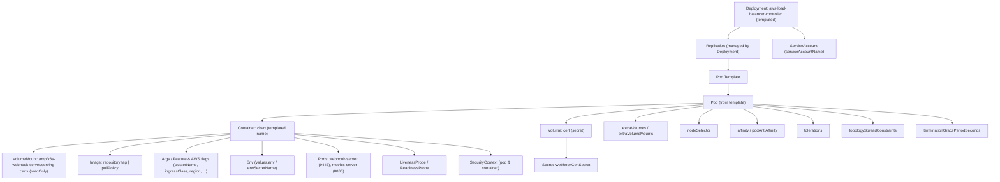
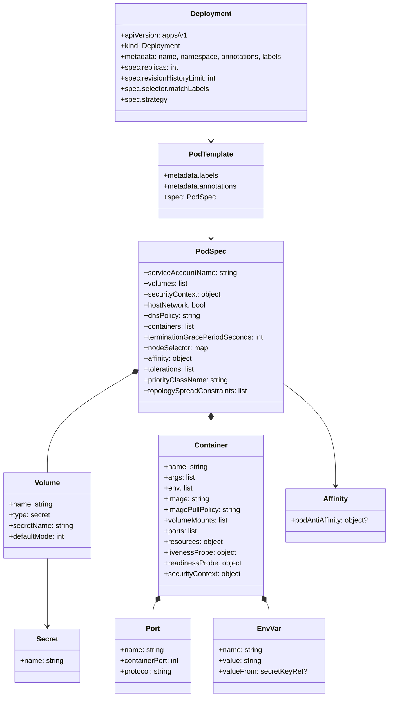

# Diagram: devops/k8s/aws-load-balancer-controller/helm/templates/deployment.yaml

> Auto-generated by Obscura crawlers

## Diagram 1

### SVG

<svg id="container" width="4059.515625" xmlns="http://www.w3.org/2000/svg" class="flowchart" height="734" viewBox="0 0 4059.515625 734" role="graphics-document document" aria-roledescription="flowchart-v2"><g><marker id="container_flowchart-v2-pointEnd" class="marker flowchart-v2" viewBox="0 0 10 10" refX="5" refY="5" markerUnits="userSpaceOnUse" markerWidth="8" markerHeight="8" orient="auto"><path d="M 0 0 L 10 5 L 0 10 z" class="arrowMarkerPath" style="stroke-width: 1; stroke-dasharray: 1, 0;"></path></marker><marker id="container_flowchart-v2-pointStart" class="marker flowchart-v2" viewBox="0 0 10 10" refX="4.5" refY="5" markerUnits="userSpaceOnUse" markerWidth="8" markerHeight="8" orient="auto"><path d="M 0 5 L 10 10 L 10 0 z" class="arrowMarkerPath" style="stroke-width: 1; stroke-dasharray: 1, 0;"></path></marker><marker id="container_flowchart-v2-circleEnd" class="marker flowchart-v2" viewBox="0 0 10 10" refX="11" refY="5" markerUnits="userSpaceOnUse" markerWidth="11" markerHeight="11" orient="auto"><circle cx="5" cy="5" r="5" class="arrowMarkerPath" style="stroke-width: 1; stroke-dasharray: 1, 0;"></circle></marker><marker id="container_flowchart-v2-circleStart" class="marker flowchart-v2" viewBox="0 0 10 10" refX="-1" refY="5" markerUnits="userSpaceOnUse" markerWidth="11" markerHeight="11" orient="auto"><circle cx="5" cy="5" r="5" class="arrowMarkerPath" style="stroke-width: 1; stroke-dasharray: 1, 0;"></circle></marker><marker id="container_flowchart-v2-crossEnd" class="marker cross flowchart-v2" viewBox="0 0 11 11" refX="12" refY="5.2" markerUnits="userSpaceOnUse" markerWidth="11" markerHeight="11" orient="auto"><path d="M 1,1 l 9,9 M 10,1 l -9,9" class="arrowMarkerPath" style="stroke-width: 2; stroke-dasharray: 1, 0;"></path></marker><marker id="container_flowchart-v2-crossStart" class="marker cross flowchart-v2" viewBox="0 0 11 11" refX="-1" refY="5.2" markerUnits="userSpaceOnUse" markerWidth="11" markerHeight="11" orient="auto"><path d="M 1,1 l 9,9 M 10,1 l -9,9" class="arrowMarkerPath" style="stroke-width: 2; stroke-dasharray: 1, 0;"></path></marker><g class="root"><g class="clusters"></g><g class="edgePaths"><path d="M3021.823,110L3013.325,114.167C3004.827,118.333,2987.832,126.667,2979.334,134.333C2970.836,142,2970.836,149,2970.836,152.5L2970.836,156" id="L_Deployment_ReplicaSet_0" class="edge-thickness-normal edge-pattern-solid edge-thickness-normal edge-pattern-solid flowchart-link" style=";" data-edge="true" data-et="edge" data-id="L_Deployment_ReplicaSet_0" data-points="W3sieCI6MzAyMS44MjI3Nzk2MDUyNjMzLCJ5IjoxMTB9LHsieCI6Mjk3MC44MzU5Mzc1LCJ5IjoxMzV9LHsieCI6Mjk3MC44MzU5Mzc1LCJ5IjoxNjB9XQ==" marker-end="url(#container_flowchart-v2-pointEnd)"></path><path d="M2970.836,238L2970.836,242.167C2970.836,246.333,2970.836,254.667,2970.836,262.333C2970.836,270,2970.836,277,2970.836,280.5L2970.836,284" id="L_ReplicaSet_PodTemplate_0" class="edge-thickness-normal edge-pattern-solid edge-thickness-normal edge-pattern-solid flowchart-link" style=";" data-edge="true" data-et="edge" data-id="L_ReplicaSet_PodTemplate_0" data-points="W3sieCI6Mjk3MC44MzU5Mzc1LCJ5IjoyMzh9LHsieCI6Mjk3MC44MzU5Mzc1LCJ5IjoyNjN9LHsieCI6Mjk3MC44MzU5Mzc1LCJ5IjoyODh9XQ==" marker-end="url(#container_flowchart-v2-pointEnd)"></path><path d="M2970.836,342L2970.836,346.167C2970.836,350.333,2970.836,358.667,2970.836,366.333C2970.836,374,2970.836,381,2970.836,384.5L2970.836,388" id="L_PodTemplate_Pod_0" class="edge-thickness-normal edge-pattern-solid edge-thickness-normal edge-pattern-solid flowchart-link" style=";" data-edge="true" data-et="edge" data-id="L_PodTemplate_Pod_0" data-points="W3sieCI6Mjk3MC44MzU5Mzc1LCJ5IjozNDJ9LHsieCI6Mjk3MC44MzU5Mzc1LCJ5IjozNjd9LHsieCI6Mjk3MC44MzU5Mzc1LCJ5IjozOTJ9XQ==" marker-end="url(#container_flowchart-v2-pointEnd)"></path><path d="M3229.849,110L3238.347,114.167C3246.845,118.333,3263.84,126.667,3272.338,134.333C3280.836,142,3280.836,149,3280.836,152.5L3280.836,156" id="L_Deployment_ServiceAccount_0" class="edge-thickness-normal edge-pattern-solid edge-thickness-normal edge-pattern-solid flowchart-link" style=";" data-edge="true" data-et="edge" data-id="L_Deployment_ServiceAccount_0" data-points="W3sieCI6MzIyOS44NDkwOTUzOTQ3MzY3LCJ5IjoxMTB9LHsieCI6MzI4MC44MzU5Mzc1LCJ5IjoxMzV9LHsieCI6MzI4MC44MzU5Mzc1LCJ5IjoxNjB9XQ==" marker-end="url(#container_flowchart-v2-pointEnd)"></path><path d="M2867.969,421.811L2567.974,430.009C2267.979,438.207,1667.99,454.604,1367.995,466.302C1068,478,1068,485,1068,488.5L1068,492" id="L_Pod_Container_0" class="edge-thickness-normal edge-pattern-solid edge-thickness-normal edge-pattern-solid flowchart-link" style=";" data-edge="true" data-et="edge" data-id="L_Pod_Container_0" data-points="W3sieCI6Mjg2Ny45Njg3NSwieSI6NDIxLjgxMTExNjYzMTAxNTR9LHsieCI6MTA2OCwieSI6NDcxfSx7IngiOjEwNjgsInkiOjQ5Nn1d" marker-end="url(#container_flowchart-v2-pointEnd)"></path><path d="M2867.969,427.033L2774.138,434.361C2680.307,441.689,2492.646,456.344,2398.815,469.172C2304.984,482,2304.984,493,2304.984,498.5L2304.984,504" id="L_Pod_VolCert_0" class="edge-thickness-normal edge-pattern-solid edge-thickness-normal edge-pattern-solid flowchart-link" style=";" data-edge="true" data-et="edge" data-id="L_Pod_VolCert_0" data-points="W3sieCI6Mjg2Ny45Njg3NSwieSI6NDI3LjAzMzQ2Mjc4ODQ4NzV9LHsieCI6MjMwNC45ODQzNzUsInkiOjQ3MX0seyJ4IjoyMzA0Ljk4NDM3NSwieSI6NTA4fV0=" marker-end="url(#container_flowchart-v2-pointEnd)"></path><path d="M2304.984,562L2304.984,568.167C2304.984,574.333,2304.984,586.667,2304.984,600.333C2304.984,614,2304.984,629,2304.984,636.5L2304.984,644" id="L_VolCert_SecretWebhook_0" class="edge-thickness-normal edge-pattern-solid edge-thickness-normal edge-pattern-solid flowchart-link" style=";" data-edge="true" data-et="edge" data-id="L_VolCert_SecretWebhook_0" data-points="W3sieCI6MjMwNC45ODQzNzUsInkiOjU2Mn0seyJ4IjoyMzA0Ljk4NDM3NSwieSI6NTk5fSx7IngiOjIzMDQuOTg0Mzc1LCJ5Ijo2NDh9XQ==" marker-end="url(#container_flowchart-v2-pointEnd)"></path><path d="M938,543.946L804.667,553.122C671.333,562.297,404.667,580.649,271.333,593.324C138,606,138,613,138,616.5L138,620" id="L_Container_VolMountCert_0" class="edge-thickness-normal edge-pattern-solid edge-thickness-normal edge-pattern-solid flowchart-link" style=";" data-edge="true" data-et="edge" data-id="L_Container_VolMountCert_0" data-points="W3sieCI6OTM4LCJ5Ijo1NDMuOTQ2MjM2NTU5MTM5OH0seyJ4IjoxMzgsInkiOjU5OX0seyJ4IjoxMzgsInkiOjYyNH1d" marker-end="url(#container_flowchart-v2-pointEnd)"></path><path d="M938,548.419L856.333,556.849C774.667,565.28,611.333,582.14,529.667,596.07C448,610,448,621,448,626.5L448,632" id="L_Container_Image_0" class="edge-thickness-normal edge-pattern-solid edge-thickness-normal edge-pattern-solid flowchart-link" style=";" data-edge="true" data-et="edge" data-id="L_Container_Image_0" data-points="W3sieCI6OTM4LCJ5Ijo1NDguNDE5MzU0ODM4NzA5Nn0seyJ4Ijo0NDgsInkiOjU5OX0seyJ4Ijo0NDgsInkiOjYzNn1d" marker-end="url(#container_flowchart-v2-pointEnd)"></path><path d="M938,561.839L908,568.032C878,574.226,818,586.613,788,596.306C758,606,758,613,758,616.5L758,620" id="L_Container_Args_0" class="edge-thickness-normal edge-pattern-solid edge-thickness-normal edge-pattern-solid flowchart-link" style=";" data-edge="true" data-et="edge" data-id="L_Container_Args_0" data-points="W3sieCI6OTM4LCJ5Ijo1NjEuODM4NzA5Njc3NDE5NH0seyJ4Ijo3NTgsInkiOjU5OX0seyJ4Ijo3NTgsInkiOjYyNH1d" marker-end="url(#container_flowchart-v2-pointEnd)"></path><path d="M1068,574L1068,578.167C1068,582.333,1068,590.667,1068,600.333C1068,610,1068,621,1068,626.5L1068,632" id="L_Container_EnvVars_0" class="edge-thickness-normal edge-pattern-solid edge-thickness-normal edge-pattern-solid flowchart-link" style=";" data-edge="true" data-et="edge" data-id="L_Container_EnvVars_0" data-points="W3sieCI6MTA2OCwieSI6NTc0fSx7IngiOjEwNjgsInkiOjU5OX0seyJ4IjoxMDY4LCJ5Ijo2MzZ9XQ==" marker-end="url(#container_flowchart-v2-pointEnd)"></path><path d="M1198,561.839L1228,568.032C1258,574.226,1318,586.613,1348,596.306C1378,606,1378,613,1378,616.5L1378,620" id="L_Container_Ports_0" class="edge-thickness-normal edge-pattern-solid edge-thickness-normal edge-pattern-solid flowchart-link" style=";" data-edge="true" data-et="edge" data-id="L_Container_Ports_0" data-points="W3sieCI6MTE5OCwieSI6NTYxLjgzODcwOTY3NzQxOTR9LHsieCI6MTM3OCwieSI6NTk5fSx7IngiOjEzNzgsInkiOjYyNH1d" marker-end="url(#container_flowchart-v2-pointEnd)"></path><path d="M1198,548.419L1279.667,556.849C1361.333,565.28,1524.667,582.14,1606.333,596.07C1688,610,1688,621,1688,626.5L1688,632" id="L_Container_Probes_0" class="edge-thickness-normal edge-pattern-solid edge-thickness-normal edge-pattern-solid flowchart-link" style=";" data-edge="true" data-et="edge" data-id="L_Container_Probes_0" data-points="W3sieCI6MTE5OCwieSI6NTQ4LjQxOTM1NDgzODcwOTZ9LHsieCI6MTY4OCwieSI6NTk5fSx7IngiOjE2ODgsInkiOjYzNn1d" marker-end="url(#container_flowchart-v2-pointEnd)"></path><path d="M1198,543.946L1331.333,553.122C1464.667,562.297,1731.333,580.649,1864.667,595.324C1998,610,1998,621,1998,626.5L1998,632" id="L_Container_Security_0" class="edge-thickness-normal edge-pattern-solid edge-thickness-normal edge-pattern-solid flowchart-link" style=";" data-edge="true" data-et="edge" data-id="L_Container_Security_0" data-points="W3sieCI6MTE5OCwieSI6NTQzLjk0NjIzNjU1OTEzOTh9LHsieCI6MTk5OCwieSI6NTk5fSx7IngiOjE5OTgsInkiOjYzNn1d" marker-end="url(#container_flowchart-v2-pointEnd)"></path><path d="M2867.969,433.027L2821.555,439.356C2775.141,445.684,2682.313,458.342,2635.898,468.171C2589.484,478,2589.484,485,2589.484,488.5L2589.484,492" id="L_Pod_ExtraVols_0" class="edge-thickness-normal edge-pattern-solid edge-thickness-normal edge-pattern-solid flowchart-link" style=";" data-edge="true" data-et="edge" data-id="L_Pod_ExtraVols_0" data-points="W3sieCI6Mjg2Ny45Njg3NSwieSI6NDMzLjAyNjY3MzIyMjI5NzM1fSx7IngiOjI1ODkuNDg0Mzc1LCJ5Ijo0NzF9LHsieCI6MjU4OS40ODQzNzUsInkiOjQ5Nn1d" marker-end="url(#container_flowchart-v2-pointEnd)"></path><path d="M2906.914,446L2897.049,450.167C2887.185,454.333,2867.456,462.667,2857.591,472.333C2847.727,482,2847.727,493,2847.727,498.5L2847.727,504" id="L_Pod_NodeSelector_0" class="edge-thickness-normal edge-pattern-solid edge-thickness-normal edge-pattern-solid flowchart-link" style=";" data-edge="true" data-et="edge" data-id="L_Pod_NodeSelector_0" data-points="W3sieCI6MjkwNi45MTM3NjIwMTkyMzEsInkiOjQ0Nn0seyJ4IjoyODQ3LjcyNjU2MjUsInkiOjQ3MX0seyJ4IjoyODQ3LjcyNjU2MjUsInkiOjUwOH1d" marker-end="url(#container_flowchart-v2-pointEnd)"></path><path d="M3034.758,446L3044.623,450.167C3054.487,454.333,3074.216,462.667,3084.081,472.333C3093.945,482,3093.945,493,3093.945,498.5L3093.945,504" id="L_Pod_Affinity_0" class="edge-thickness-normal edge-pattern-solid edge-thickness-normal edge-pattern-solid flowchart-link" style=";" data-edge="true" data-et="edge" data-id="L_Pod_Affinity_0" data-points="W3sieCI6MzAzNC43NTgxMTI5ODA3NjksInkiOjQ0Nn0seyJ4IjozMDkzLjk0NTMxMjUsInkiOjQ3MX0seyJ4IjozMDkzLjk0NTMxMjUsInkiOjUwOH1d" marker-end="url(#container_flowchart-v2-pointEnd)"></path><path d="M3073.703,433.834L3116.658,440.028C3159.612,446.223,3245.521,458.611,3288.475,470.306C3331.43,482,3331.43,493,3331.43,498.5L3331.43,504" id="L_Pod_Tolerations_0" class="edge-thickness-normal edge-pattern-solid edge-thickness-normal edge-pattern-solid flowchart-link" style=";" data-edge="true" data-et="edge" data-id="L_Pod_Tolerations_0" data-points="W3sieCI6MzA3My43MDMxMjUsInkiOjQzMy44MzQxMjc3NDA3MDU0fSx7IngiOjMzMzEuNDI5Njg3NSwieSI6NDcxfSx7IngiOjMzMzEuNDI5Njg3NSwieSI6NTA4fV0=" marker-end="url(#container_flowchart-v2-pointEnd)"></path><path d="M3073.703,427.791L3157.967,434.993C3242.232,442.194,3410.76,456.597,3495.025,469.299C3579.289,482,3579.289,493,3579.289,498.5L3579.289,504" id="L_Pod_Topology_0" class="edge-thickness-normal edge-pattern-solid edge-thickness-normal edge-pattern-solid flowchart-link" style=";" data-edge="true" data-et="edge" data-id="L_Pod_Topology_0" data-points="W3sieCI6MzA3My43MDMxMjUsInkiOjQyNy43OTEyOTk2NTg0NTc2Nn0seyJ4IjozNTc5LjI4OTA2MjUsInkiOjQ3MX0seyJ4IjozNTc5LjI4OTA2MjUsInkiOjUwOH1d" marker-end="url(#container_flowchart-v2-pointEnd)"></path><path d="M3073.703,424.729L3212.182,432.441C3350.661,440.152,3627.62,455.576,3766.099,468.788C3904.578,482,3904.578,493,3904.578,498.5L3904.578,504" id="L_Pod_Termination_0" class="edge-thickness-normal edge-pattern-solid edge-thickness-normal edge-pattern-solid flowchart-link" style=";" data-edge="true" data-et="edge" data-id="L_Pod_Termination_0" data-points="W3sieCI6MzA3My43MDMxMjUsInkiOjQyNC43Mjg2NjIzODg0MDY4Nn0seyJ4IjozOTA0LjU3ODEyNSwieSI6NDcxfSx7IngiOjM5MDQuNTc4MTI1LCJ5Ijo1MDh9XQ==" marker-end="url(#container_flowchart-v2-pointEnd)"></path></g><g class="edgeLabels"><g class="edgeLabel"><g class="label" data-id="L_Deployment_ReplicaSet_0" transform="translate(0, 0)"><foreignObject width="0" height="0">

</foreignObject></g></g><g class="edgeLabel"><g class="label" data-id="L_ReplicaSet_PodTemplate_0" transform="translate(0, 0)"><foreignObject width="0" height="0">

</foreignObject></g></g><g class="edgeLabel"><g class="label" data-id="L_PodTemplate_Pod_0" transform="translate(0, 0)"><foreignObject width="0" height="0">

</foreignObject></g></g><g class="edgeLabel"><g class="label" data-id="L_Deployment_ServiceAccount_0" transform="translate(0, 0)"><foreignObject width="0" height="0">

</foreignObject></g></g><g class="edgeLabel"><g class="label" data-id="L_Pod_Container_0" transform="translate(0, 0)"><foreignObject width="0" height="0">

</foreignObject></g></g><g class="edgeLabel"><g class="label" data-id="L_Pod_VolCert_0" transform="translate(0, 0)"><foreignObject width="0" height="0">

</foreignObject></g></g><g class="edgeLabel"><g class="label" data-id="L_VolCert_SecretWebhook_0" transform="translate(0, 0)"><foreignObject width="0" height="0">

</foreignObject></g></g><g class="edgeLabel"><g class="label" data-id="L_Container_VolMountCert_0" transform="translate(0, 0)"><foreignObject width="0" height="0">

</foreignObject></g></g><g class="edgeLabel"><g class="label" data-id="L_Container_Image_0" transform="translate(0, 0)"><foreignObject width="0" height="0">

</foreignObject></g></g><g class="edgeLabel"><g class="label" data-id="L_Container_Args_0" transform="translate(0, 0)"><foreignObject width="0" height="0">

</foreignObject></g></g><g class="edgeLabel"><g class="label" data-id="L_Container_EnvVars_0" transform="translate(0, 0)"><foreignObject width="0" height="0">

</foreignObject></g></g><g class="edgeLabel"><g class="label" data-id="L_Container_Ports_0" transform="translate(0, 0)"><foreignObject width="0" height="0">

</foreignObject></g></g><g class="edgeLabel"><g class="label" data-id="L_Container_Probes_0" transform="translate(0, 0)"><foreignObject width="0" height="0">

</foreignObject></g></g><g class="edgeLabel"><g class="label" data-id="L_Container_Security_0" transform="translate(0, 0)"><foreignObject width="0" height="0">

</foreignObject></g></g><g class="edgeLabel"><g class="label" data-id="L_Pod_ExtraVols_0" transform="translate(0, 0)"><foreignObject width="0" height="0">

</foreignObject></g></g><g class="edgeLabel"><g class="label" data-id="L_Pod_NodeSelector_0" transform="translate(0, 0)"><foreignObject width="0" height="0">

</foreignObject></g></g><g class="edgeLabel"><g class="label" data-id="L_Pod_Affinity_0" transform="translate(0, 0)"><foreignObject width="0" height="0">

</foreignObject></g></g><g class="edgeLabel"><g class="label" data-id="L_Pod_Tolerations_0" transform="translate(0, 0)"><foreignObject width="0" height="0">

</foreignObject></g></g><g class="edgeLabel"><g class="label" data-id="L_Pod_Topology_0" transform="translate(0, 0)"><foreignObject width="0" height="0">

</foreignObject></g></g><g class="edgeLabel"><g class="label" data-id="L_Pod_Termination_0" transform="translate(0, 0)"><foreignObject width="0" height="0">

</foreignObject></g></g></g><g class="nodes"><g class="node default" id="flowchart-Deployment-0" transform="translate(3125.8359375, 59)"><rect class="basic label-container" style="" x="-130" y="-51" width="260" height="102"></rect><g class="label" style="" transform="translate(-100, -36)"><rect></rect><foreignObject width="200" height="72">

Deployment: aws-load-balancer-controller (templated)

</foreignObject></g></g><g class="node default" id="flowchart-ReplicaSet-1" transform="translate(2970.8359375, 199)"><rect class="basic label-container" style="" x="-130" y="-39" width="260" height="78"></rect><g class="label" style="" transform="translate(-100, -24)"><rect></rect><foreignObject width="200" height="48">

ReplicaSet (managed by Deployment)

</foreignObject></g></g><g class="node default" id="flowchart-PodTemplate-2" transform="translate(2970.8359375, 315)"><rect class="basic label-container" style="" x="-79.4375" y="-27" width="158.875" height="54"></rect><g class="label" style="" transform="translate(-49.4375, -12)"><rect></rect><foreignObject width="98.875" height="24">

Pod Template

</foreignObject></g></g><g class="node default" id="flowchart-Pod-3" transform="translate(2970.8359375, 419)"><rect class="basic label-container" style="" x="-102.8671875" y="-27" width="205.734375" height="54"></rect><g class="label" style="" transform="translate(-72.8671875, -12)"><rect></rect><foreignObject width="145.734375" height="24">

Pod (from template)

</foreignObject></g></g><g class="node default" id="flowchart-ServiceAccount-4" transform="translate(3280.8359375, 199)"><rect class="basic label-container" style="" x="-130" y="-39" width="260" height="78"></rect><g class="label" style="" transform="translate(-100, -24)"><rect></rect><foreignObject width="200" height="48">

ServiceAccount (serviceAccountName)

</foreignObject></g></g><g class="node default" id="flowchart-VolCert-5" transform="translate(2304.984375, 535)"><rect class="basic label-container" style="" x="-104.5" y="-27" width="209" height="54"></rect><g class="label" style="" transform="translate(-74.5, -12)"><rect></rect><foreignObject width="149" height="24">

Volume: cert (secret)

</foreignObject></g></g><g class="node default" id="flowchart-SecretWebhook-6" transform="translate(2304.984375, 675)"><rect class="basic label-container" style="" x="-126.984375" y="-27" width="253.96875" height="54"></rect><g class="label" style="" transform="translate(-96.984375, -12)"><rect></rect><foreignObject width="193.96875" height="24">

Secret: webhookCertSecret

</foreignObject></g></g><g class="node default" id="flowchart-VolMountCert-7" transform="translate(138, 675)"><rect class="basic label-container" style="" x="-130" y="-51" width="260" height="102"></rect><g class="label" style="" transform="translate(-100, -36)"><rect></rect><foreignObject width="200" height="72">

VolumeMount: /tmp/k8s-webhook-server/serving-certs (readOnly)

</foreignObject></g></g><g class="node default" id="flowchart-Container-8" transform="translate(1068, 535)"><rect class="basic label-container" style="" x="-130" y="-39" width="260" height="78"></rect><g class="label" style="" transform="translate(-100, -24)"><rect></rect><foreignObject width="200" height="48">

Container: chart (templated name)

</foreignObject></g></g><g class="node default" id="flowchart-Image-9" transform="translate(448, 675)"><rect class="basic label-container" style="" x="-130" y="-39" width="260" height="78"></rect><g class="label" style="" transform="translate(-100, -24)"><rect></rect><foreignObject width="200" height="48">

Image: repository:tag | pullPolicy

</foreignObject></g></g><g class="node default" id="flowchart-Args-10" transform="translate(758, 675)"><rect class="basic label-container" style="" x="-130" y="-51" width="260" height="102"></rect><g class="label" style="" transform="translate(-100, -36)"><rect></rect><foreignObject width="200" height="72">

Args / Feature &amp; AWS flags (clusterName, ingressClass, region, ...)

</foreignObject></g></g><g class="node default" id="flowchart-EnvVars-11" transform="translate(1068, 675)"><rect class="basic label-container" style="" x="-130" y="-39" width="260" height="78"></rect><g class="label" style="" transform="translate(-100, -24)"><rect></rect><foreignObject width="200" height="48">

Env (values.env / envSecretName)

</foreignObject></g></g><g class="node default" id="flowchart-Ports-12" transform="translate(1378, 675)"><rect class="basic label-container" style="" x="-130" y="-51" width="260" height="102"></rect><g class="label" style="" transform="translate(-100, -36)"><rect></rect><foreignObject width="200" height="72">

Ports: webhook-server (9443), metrics-server (8080)

</foreignObject></g></g><g class="node default" id="flowchart-Probes-13" transform="translate(1688, 675)"><rect class="basic label-container" style="" x="-130" y="-39" width="260" height="78"></rect><g class="label" style="" transform="translate(-100, -24)"><rect></rect><foreignObject width="200" height="48">

LivenessProbe / ReadinessProbe

</foreignObject></g></g><g class="node default" id="flowchart-Security-14" transform="translate(1998, 675)"><rect class="basic label-container" style="" x="-130" y="-39" width="260" height="78"></rect><g class="label" style="" transform="translate(-100, -24)"><rect></rect><foreignObject width="200" height="48">

SecurityContext (pod &amp; container)

</foreignObject></g></g><g class="node default" id="flowchart-ExtraVols-15" transform="translate(2589.484375, 535)"><rect class="basic label-container" style="" x="-130" y="-39" width="260" height="78"></rect><g class="label" style="" transform="translate(-100, -24)"><rect></rect><foreignObject width="200" height="48">

extraVolumes / extraVolumeMounts

</foreignObject></g></g><g class="node default" id="flowchart-NodeSelector-16" transform="translate(2847.7265625, 535)"><rect class="basic label-container" style="" x="-78.2421875" y="-27" width="156.484375" height="54"></rect><g class="label" style="" transform="translate(-48.2421875, -12)"><rect></rect><foreignObject width="96.484375" height="24">

nodeSelector

</foreignObject></g></g><g class="node default" id="flowchart-Affinity-17" transform="translate(3093.9453125, 535)"><rect class="basic label-container" style="" x="-117.9765625" y="-27" width="235.953125" height="54"></rect><g class="label" style="" transform="translate(-87.9765625, -12)"><rect></rect><foreignObject width="175.953125" height="24">

affinity / podAntiAffinity

</foreignObject></g></g><g class="node default" id="flowchart-Tolerations-18" transform="translate(3331.4296875, 535)"><rect class="basic label-container" style="" x="-69.5078125" y="-27" width="139.015625" height="54"></rect><g class="label" style="" transform="translate(-39.5078125, -12)"><rect></rect><foreignObject width="79.015625" height="24">

tolerations

</foreignObject></g></g><g class="node default" id="flowchart-Topology-19" transform="translate(3579.2890625, 535)"><rect class="basic label-container" style="" x="-128.3515625" y="-27" width="256.703125" height="54"></rect><g class="label" style="" transform="translate(-98.3515625, -12)"><rect></rect><foreignObject width="196.703125" height="24">

topologySpreadConstraints

</foreignObject></g></g><g class="node default" id="flowchart-Termination-20" transform="translate(3904.578125, 535)"><rect class="basic label-container" style="" x="-146.9375" y="-27" width="293.875" height="54"></rect><g class="label" style="" transform="translate(-116.9375, -12)"><rect></rect><foreignObject width="233.875" height="24">

terminationGracePeriodSeconds

</foreignObject></g></g></g></g></g></svg>

## Diagram 2

### SVG

<svg id="container" width="873.576171875" xmlns="http://www.w3.org/2000/svg" class="classDiagram" height="1560" viewBox="0 0 873.576171875 1560" role="graphics-document document" aria-roledescription="class"><g><defs><marker id="container_class-aggregationStart" class="marker aggregation class" refX="18" refY="7" markerWidth="190" markerHeight="240" orient="auto"><path d="M 18,7 L9,13 L1,7 L9,1 Z"></path></marker></defs><defs><marker id="container_class-aggregationEnd" class="marker aggregation class" refX="1" refY="7" markerWidth="20" markerHeight="28" orient="auto"><path d="M 18,7 L9,13 L1,7 L9,1 Z"></path></marker></defs><defs><marker id="container_class-extensionStart" class="marker extension class" refX="18" refY="7" markerWidth="190" markerHeight="240" orient="auto"><path d="M 1,7 L18,13 V 1 Z"></path></marker></defs><defs><marker id="container_class-extensionEnd" class="marker extension class" refX="1" refY="7" markerWidth="20" markerHeight="28" orient="auto"><path d="M 1,1 V 13 L18,7 Z"></path></marker></defs><defs><marker id="container_class-compositionStart" class="marker composition class" refX="18" refY="7" markerWidth="190" markerHeight="240" orient="auto"><path d="M 18,7 L9,13 L1,7 L9,1 Z"></path></marker></defs><defs><marker id="container_class-compositionEnd" class="marker composition class" refX="1" refY="7" markerWidth="20" markerHeight="28" orient="auto"><path d="M 18,7 L9,13 L1,7 L9,1 Z"></path></marker></defs><defs><marker id="container_class-dependencyStart" class="marker dependency class" refX="6" refY="7" markerWidth="190" markerHeight="240" orient="auto"><path d="M 5,7 L9,13 L1,7 L9,1 Z"></path></marker></defs><defs><marker id="container_class-dependencyEnd" class="marker dependency class" refX="13" refY="7" markerWidth="20" markerHeight="28" orient="auto"><path d="M 18,7 L9,13 L14,7 L9,1 Z"></path></marker></defs><defs><marker id="container_class-lollipopStart" class="marker lollipop class" refX="13" refY="7" markerWidth="190" markerHeight="240" orient="auto"><circle stroke="black" fill="transparent" cx="7" cy="7" r="6"></circle></marker></defs><defs><marker id="container_class-lollipopEnd" class="marker lollipop class" refX="1" refY="7" markerWidth="190" markerHeight="240" orient="auto"><circle stroke="black" fill="transparent" cx="7" cy="7" r="6"></circle></marker></defs><g class="root"><g class="clusters"></g><g class="edgePaths"><path d="M471.51,272L471.51,276.167C471.51,280.333,471.51,288.667,471.51,296C471.51,303.333,471.51,309.667,471.51,312.833L471.51,316" id="id_Deployment_PodTemplate_1" class="edge-thickness-normal edge-pattern-solid relation" style=";;;" data-edge="true" data-et="edge" data-id="id_Deployment_PodTemplate_1" data-points="W3sieCI6NDcxLjUwOTc2NTYyNSwieSI6MjcyfSx7IngiOjQ3MS41MDk3NjU2MjUsInkiOjI5N30seyJ4Ijo0NzEuNTA5NzY1NjI1LCJ5IjozMjJ9XQ==" marker-end="url(#container_class-dependencyEnd)"></path><path d="M471.51,490L471.51,494.167C471.51,498.333,471.51,506.667,471.51,514C471.51,521.333,471.51,527.667,471.51,530.833L471.51,534" id="id_PodTemplate_PodSpec_2" class="edge-thickness-normal edge-pattern-solid relation" style=";;;" data-edge="true" data-et="edge" data-id="id_PodTemplate_PodSpec_2" data-points="W3sieCI6NDcxLjUwOTc2NTYyNSwieSI6NDkwfSx7IngiOjQ3MS41MDk3NjU2MjUsInkiOjUxNX0seyJ4Ijo0NzEuNTA5NzY1NjI1LCJ5Ijo1NDB9XQ==" marker-end="url(#container_class-dependencyEnd)"></path><path d="M294.089,837.183L262.655,855.82C231.22,874.456,168.35,911.728,136.915,948.531C105.48,985.333,105.48,1021.667,105.48,1039.833L105.48,1058" id="id_PodSpec_Volume_3" class="edge-thickness-normal edge-pattern-solid relation" style=";;;" data-edge="true" data-et="edge" data-id="id_PodSpec_Volume_3" data-points="W3sieCI6MzA4LjkyNzczNDM3NSwieSI6ODI4LjM4NjU0OTA2MTY2Nzl9LHsieCI6MTA1LjQ4MDQ2ODc1LCJ5Ijo5NDl9LHsieCI6MTA1LjQ4MDQ2ODc1LCJ5IjoxMDU4fV0=" marker-start="url(#container_class-compositionStart)"></path><path d="M471.51,941.25L471.51,942.542C471.51,943.833,471.51,946.417,471.51,951.875C471.51,957.333,471.51,965.667,471.51,969.833L471.51,974" id="id_PodSpec_Container_4" class="edge-thickness-normal edge-pattern-solid relation" style=";;;" data-edge="true" data-et="edge" data-id="id_PodSpec_Container_4" data-points="W3sieCI6NDcxLjUwOTc2NTYyNSwieSI6OTI0fSx7IngiOjQ3MS41MDk3NjU2MjUsInkiOjk0OX0seyJ4Ijo0NzEuNTA5NzY1NjI1LCJ5Ijo5NzR9XQ==" marker-start="url(#container_class-compositionStart)"></path><path d="M349.161,1348.604L348.072,1350.336C346.983,1352.069,344.804,1355.535,343.714,1361.434C342.625,1367.333,342.625,1375.667,342.625,1379.833L342.625,1384" id="id_Container_Port_5" class="edge-thickness-normal edge-pattern-solid relation" style=";;;" data-edge="true" data-et="edge" data-id="id_Container_Port_5" data-points="W3sieCI6MzU4LjM0MjY1NDM0NDUxMjIsInkiOjEzMzR9LHsieCI6MzQyLjYyNSwieSI6MTM1OX0seyJ4IjozNDIuNjI1LCJ5IjoxMzg0fV0=" marker-start="url(#container_class-compositionStart)"></path><path d="M593.858,1348.604L594.948,1350.336C596.037,1352.069,598.216,1355.535,599.305,1361.434C600.395,1367.333,600.395,1375.667,600.395,1379.833L600.395,1384" id="id_Container_EnvVar_6" class="edge-thickness-normal edge-pattern-solid relation" style=";;;" data-edge="true" data-et="edge" data-id="id_Container_EnvVar_6" data-points="W3sieCI6NTg0LjY3Njg3NjkwNTQ4NzgsInkiOjEzMzR9LHsieCI6NjAwLjM5NDUzMTI1LCJ5IjoxMzU5fSx7IngiOjYwMC4zOTQ1MzEyNSwieSI6MTM4NH1d" marker-start="url(#container_class-compositionStart)"></path><path d="M105.48,1250L105.48,1268.167C105.48,1286.333,105.48,1322.667,105.48,1348C105.48,1373.333,105.48,1387.667,105.48,1394.833L105.48,1402" id="id_Volume_Secret_7" class="edge-thickness-normal edge-pattern-solid relation" style=";;;" data-edge="true" data-et="edge" data-id="id_Volume_Secret_7" data-points="W3sieCI6MTA1LjQ4MDQ2ODc1LCJ5IjoxMjUwfSx7IngiOjEwNS40ODA0Njg3NSwieSI6MTM1OX0seyJ4IjoxMDUuNDgwNDY4NzUsInkiOjE0MDh9XQ==" marker-end="url(#container_class-dependencyEnd)"></path><path d="M634.092,857.822L653.728,873.018C673.364,888.215,712.636,918.607,732.272,956.97C751.908,995.333,751.908,1041.667,751.908,1064.833L751.908,1088" id="id_PodSpec_Affinity_8" class="edge-thickness-normal edge-pattern-solid relation" style=";;;" data-edge="true" data-et="edge" data-id="id_PodSpec_Affinity_8" data-points="W3sieCI6NjM0LjA5MTc5Njg3NSwieSI6ODU3LjgyMjAzMDU5MjYyNzd9LHsieCI6NzUxLjkwODIwMzEyNSwieSI6OTQ5fSx7IngiOjc1MS45MDgyMDMxMjUsInkiOjEwOTR9XQ==" marker-end="url(#container_class-dependencyEnd)"></path></g><g class="edgeLabels"><g class="edgeLabel"><g class="label" data-id="id_Deployment_PodTemplate_1" transform="translate(0, 0)"><foreignObject width="0" height="0">

</foreignObject></g></g><g class="edgeLabel"><g class="label" data-id="id_PodTemplate_PodSpec_2" transform="translate(0, 0)"><foreignObject width="0" height="0">

</foreignObject></g></g><g class="edgeLabel"><g class="label" data-id="id_PodSpec_Volume_3" transform="translate(0, 0)"><foreignObject width="0" height="0">

</foreignObject></g></g><g class="edgeLabel"><g class="label" data-id="id_PodSpec_Container_4" transform="translate(0, 0)"><foreignObject width="0" height="0">

</foreignObject></g></g><g class="edgeLabel"><g class="label" data-id="id_Container_Port_5" transform="translate(0, 0)"><foreignObject width="0" height="0">

</foreignObject></g></g><g class="edgeLabel"><g class="label" data-id="id_Container_EnvVar_6" transform="translate(0, 0)"><foreignObject width="0" height="0">

</foreignObject></g></g><g class="edgeLabel"><g class="label" data-id="id_Volume_Secret_7" transform="translate(0, 0)"><foreignObject width="0" height="0">

</foreignObject></g></g><g class="edgeLabel"><g class="label" data-id="id_PodSpec_Affinity_8" transform="translate(0, 0)"><foreignObject width="0" height="0">

</foreignObject></g></g></g><g class="nodes"><g class="node default" id="classId-Deployment-0" transform="translate(471.509765625, 140)"><g class="basic label-container"><path d="M-215.875 -132 L215.875 -132 L215.875 132 L-215.875 132" stroke="none" stroke-width="0" fill="#ECECFF" style=""></path><path d="M-215.875 -132 C-121.25222011218243 -132, -26.629440224364856 -132, 215.875 -132 M-215.875 -132 C-90.03740095153186 -132, 35.80019809693627 -132, 215.875 -132 M215.875 -132 C215.875 -63.6888124006759, 215.875 4.6223751986482, 215.875 132 M215.875 -132 C215.875 -39.588692053855, 215.875 52.82261589229, 215.875 132 M215.875 132 C47.45038850718808 132, -120.97422298562384 132, -215.875 132 M215.875 132 C75.15419339751523 132, -65.56661320496954 132, -215.875 132 M-215.875 132 C-215.875 37.65848325713087, -215.875 -56.683033485738264, -215.875 -132 M-215.875 132 C-215.875 40.86801652535344, -215.875 -50.26396694929312, -215.875 -132" stroke="#9370DB" stroke-width="1.3" fill="none" stroke-dasharray="0 0" style=""></path></g><g class="annotation-group text" transform="translate(0, -108)"></g><g class="label-group text" transform="translate(-44.375, -108)"><g class="label" style="font-weight: bolder" transform="translate(0,-12)"><foreignObject width="88.75" height="24">

Deployment

</foreignObject></g></g><g class="members-group text" transform="translate(-203.875, -60)"><g class="label" style="" transform="translate(0,-12)"><foreignObject width="150.390625" height="24">

+apiVersion: apps/v1

</foreignObject></g><g class="label" style="" transform="translate(0,12)"><foreignObject width="135.59375" height="24">

+kind: Deployment

</foreignObject></g><g class="label" style="" transform="translate(0,36)"><foreignObject width="363.375" height="24">

+metadata: name, namespace, annotations, labels

</foreignObject></g><g class="label" style="" transform="translate(0,60)"><foreignObject width="129.703125" height="24">

+spec.replicas: int

</foreignObject></g><g class="label" style="" transform="translate(0,84)"><foreignObject width="218.859375" height="24">

+spec.revisionHistoryLimit: int

</foreignObject></g><g class="label" style="" transform="translate(0,108)"><foreignObject width="198.0625" height="24">

+spec.selector.matchLabels

</foreignObject></g><g class="label" style="" transform="translate(0,132)"><foreignObject width="103.421875" height="24">

+spec.strategy

</foreignObject></g></g><g class="methods-group text" transform="translate(-203.875, 132)"></g><g class="divider" style=""><path d="M-215.875 -84 C-54.840837214378695 -84, 106.19332557124261 -84, 215.875 -84 M-215.875 -84 C-76.16243761841491 -84, 63.550124763170174 -84, 215.875 -84" stroke="#9370DB" stroke-width="1.3" fill="none" stroke-dasharray="0 0" style=""></path></g><g class="divider" style=""><path d="M-215.875 108 C-112.64524616276385 108, -9.415492325527708 108, 215.875 108 M-215.875 108 C-107.04907323053556 108, 1.77685353892889 108, 215.875 108" stroke="#9370DB" stroke-width="1.3" fill="none" stroke-dasharray="0 0" style=""></path></g></g><g class="node default" id="classId-PodTemplate-1" transform="translate(471.509765625, 406)"><g class="basic label-container"><path d="M-120.43359375 -84 L120.43359375 -84 L120.43359375 84 L-120.43359375 84" stroke="none" stroke-width="0" fill="#ECECFF" style=""></path><path d="M-120.43359375 -84 C-71.46928403831701 -84, -22.504974326634027 -84, 120.43359375 -84 M-120.43359375 -84 C-48.82463494799805 -84, 22.7843238540039 -84, 120.43359375 -84 M120.43359375 -84 C120.43359375 -24.926879010693632, 120.43359375 34.146241978612736, 120.43359375 84 M120.43359375 -84 C120.43359375 -40.12482145704545, 120.43359375 3.7503570859091013, 120.43359375 84 M120.43359375 84 C43.40723135117993 84, -33.61913104764014 84, -120.43359375 84 M120.43359375 84 C61.99079216310744 84, 3.547990576214886 84, -120.43359375 84 M-120.43359375 84 C-120.43359375 24.558192653591632, -120.43359375 -34.883614692816735, -120.43359375 -84 M-120.43359375 84 C-120.43359375 29.67221233980203, -120.43359375 -24.65557532039594, -120.43359375 -84" stroke="#9370DB" stroke-width="1.3" fill="none" stroke-dasharray="0 0" style=""></path></g><g class="annotation-group text" transform="translate(0, -60)"></g><g class="label-group text" transform="translate(-47.9453125, -60)"><g class="label" style="font-weight: bolder" transform="translate(0,-12)"><foreignObject width="95.890625" height="24">

PodTemplate

</foreignObject></g></g><g class="members-group text" transform="translate(-108.43359375, -12)"><g class="label" style="" transform="translate(0,-12)"><foreignObject width="124.96875" height="24">

+metadata.labels

</foreignObject></g><g class="label" style="" transform="translate(0,12)"><foreignObject width="168.921875" height="24">

+metadata.annotations

</foreignObject></g><g class="label" style="" transform="translate(0,36)"><foreignObject width="111.796875" height="24">

+spec: PodSpec

</foreignObject></g></g><g class="methods-group text" transform="translate(-108.43359375, 84)"></g><g class="divider" style=""><path d="M-120.43359375 -36 C-35.16207842007587 -36, 50.109436909848256 -36, 120.43359375 -36 M-120.43359375 -36 C-27.409977505159915 -36, 65.61363873968017 -36, 120.43359375 -36" stroke="#9370DB" stroke-width="1.3" fill="none" stroke-dasharray="0 0" style=""></path></g><g class="divider" style=""><path d="M-120.43359375 60 C-70.88200637531412 60, -21.33041900062824 60, 120.43359375 60 M-120.43359375 60 C-66.23224523770048 60, -12.03089672540095 60, 120.43359375 60" stroke="#9370DB" stroke-width="1.3" fill="none" stroke-dasharray="0 0" style=""></path></g></g><g class="node default" id="classId-PodSpec-2" transform="translate(471.509765625, 732)"><g class="basic label-container"><path d="M-162.58203125 -192 L162.58203125 -192 L162.58203125 192 L-162.58203125 192" stroke="none" stroke-width="0" fill="#ECECFF" style=""></path><path d="M-162.58203125 -192 C-70.05949592186326 -192, 22.46303940627348 -192, 162.58203125 -192 M-162.58203125 -192 C-54.33598805718685 -192, 53.910055135626294 -192, 162.58203125 -192 M162.58203125 -192 C162.58203125 -51.77003524342504, 162.58203125 88.45992951314992, 162.58203125 192 M162.58203125 -192 C162.58203125 -71.54407330438153, 162.58203125 48.911853391236946, 162.58203125 192 M162.58203125 192 C32.5471077000451 192, -97.4878158499098 192, -162.58203125 192 M162.58203125 192 C77.5321471878051 192, -7.517736874389811 192, -162.58203125 192 M-162.58203125 192 C-162.58203125 71.02927906139577, -162.58203125 -49.94144187720846, -162.58203125 -192 M-162.58203125 192 C-162.58203125 49.050526694580356, -162.58203125 -93.89894661083929, -162.58203125 -192" stroke="#9370DB" stroke-width="1.3" fill="none" stroke-dasharray="0 0" style=""></path></g><g class="annotation-group text" transform="translate(0, -168)"></g><g class="label-group text" transform="translate(-31.6328125, -168)"><g class="label" style="font-weight: bolder" transform="translate(0,-12)"><foreignObject width="63.265625" height="24">

PodSpec

</foreignObject></g></g><g class="members-group text" transform="translate(-150.58203125, -120)"><g class="label" style="" transform="translate(0,-12)"><foreignObject width="208.203125" height="24">

+serviceAccountName: string

</foreignObject></g><g class="label" style="" transform="translate(0,12)"><foreignObject width="99.421875" height="24">

+volumes: list

</foreignObject></g><g class="label" style="" transform="translate(0,36)"><foreignObject width="173.859375" height="24">

+securityContext: object

</foreignObject></g><g class="label" style="" transform="translate(0,60)"><foreignObject width="141.59375" height="24">

+hostNetwork: bool

</foreignObject></g><g class="label" style="" transform="translate(0,84)"><foreignObject width="127.0625" height="24">

+dnsPolicy: string

</foreignObject></g><g class="label" style="" transform="translate(0,108)"><foreignObject width="114.953125" height="24">

+containers: list

</foreignObject></g><g class="label" style="" transform="translate(0,132)"><foreignObject width="269.53125" height="24">

+terminationGracePeriodSeconds: int

</foreignObject></g><g class="label" style="" transform="translate(0,156)"><foreignObject width="144.625" height="24">

+nodeSelector: map

</foreignObject></g><g class="label" style="" transform="translate(0,180)"><foreignObject width="112.09375" height="24">

+affinity: object

</foreignObject></g><g class="label" style="" transform="translate(0,204)"><foreignObject width="117.453125" height="24">

+tolerations: list

</foreignObject></g><g class="label" style="" transform="translate(0,228)"><foreignObject width="190.296875" height="24">

+priorityClassName: string

</foreignObject></g><g class="label" style="" transform="translate(0,252)"><foreignObject width="235.125" height="24">

+topologySpreadConstraints: list

</foreignObject></g></g><g class="methods-group text" transform="translate(-150.58203125, 192)"></g><g class="divider" style=""><path d="M-162.58203125 -144 C-91.39734263481068 -144, -20.212654019621368 -144, 162.58203125 -144 M-162.58203125 -144 C-49.93637337887134 -144, 62.709284492257325 -144, 162.58203125 -144" stroke="#9370DB" stroke-width="1.3" fill="none" stroke-dasharray="0 0" style=""></path></g><g class="divider" style=""><path d="M-162.58203125 168 C-41.13986945997986 168, 80.30229233004027 168, 162.58203125 168 M-162.58203125 168 C-85.18755672189401 168, -7.793082193788024 168, 162.58203125 168" stroke="#9370DB" stroke-width="1.3" fill="none" stroke-dasharray="0 0" style=""></path></g></g><g class="node default" id="classId-Container-3" transform="translate(471.509765625, 1154)"><g class="basic label-container"><path d="M-116.73046875 -180 L116.73046875 -180 L116.73046875 180 L-116.73046875 180" stroke="none" stroke-width="0" fill="#ECECFF" style=""></path><path d="M-116.73046875 -180 C-56.15840643499138 -180, 4.413655880017245 -180, 116.73046875 -180 M-116.73046875 -180 C-26.303433056597683 -180, 64.12360263680463 -180, 116.73046875 -180 M116.73046875 -180 C116.73046875 -97.26808247232326, 116.73046875 -14.536164944646515, 116.73046875 180 M116.73046875 -180 C116.73046875 -55.6120871823679, 116.73046875 68.7758256352642, 116.73046875 180 M116.73046875 180 C61.29064959393909 180, 5.850830437878173 180, -116.73046875 180 M116.73046875 180 C39.07437937436846 180, -38.581710001263076 180, -116.73046875 180 M-116.73046875 180 C-116.73046875 67.957200069573, -116.73046875 -44.08559986085399, -116.73046875 -180 M-116.73046875 180 C-116.73046875 62.896101593297075, -116.73046875 -54.20779681340585, -116.73046875 -180" stroke="#9370DB" stroke-width="1.3" fill="none" stroke-dasharray="0 0" style=""></path></g><g class="annotation-group text" transform="translate(0, -156)"></g><g class="label-group text" transform="translate(-35.6015625, -156)"><g class="label" style="font-weight: bolder" transform="translate(0,-12)"><foreignObject width="71.203125" height="24">

Container

</foreignObject></g></g><g class="members-group text" transform="translate(-104.73046875, -108)"><g class="label" style="" transform="translate(0,-12)"><foreignObject width="98.21875" height="24">

+name: string

</foreignObject></g><g class="label" style="" transform="translate(0,12)"><foreignObject width="68.59375" height="24">

+args: list

</foreignObject></g><g class="label" style="" transform="translate(0,36)"><foreignObject width="64.4375" height="24">

+env: list

</foreignObject></g><g class="label" style="" transform="translate(0,60)"><foreignObject width="101.25" height="24">

+image: string

</foreignObject></g><g class="label" style="" transform="translate(0,84)"><foreignObject width="171.75" height="24">

+imagePullPolicy: string

</foreignObject></g><g class="label" style="" transform="translate(0,108)"><foreignObject width="145.671875" height="24">

+volumeMounts: list

</foreignObject></g><g class="label" style="" transform="translate(0,132)"><foreignObject width="76.796875" height="24">

+ports: list

</foreignObject></g><g class="label" style="" transform="translate(0,156)"><foreignObject width="131.296875" height="24">

+resources: object

</foreignObject></g><g class="label" style="" transform="translate(0,180)"><foreignObject width="162.390625" height="24">

+livenessProbe: object

</foreignObject></g><g class="label" style="" transform="translate(0,204)"><foreignObject width="173.703125" height="24">

+readinessProbe: object

</foreignObject></g><g class="label" style="" transform="translate(0,228)"><foreignObject width="173.859375" height="24">

+securityContext: object

</foreignObject></g></g><g class="methods-group text" transform="translate(-104.73046875, 180)"></g><g class="divider" style=""><path d="M-116.73046875 -132 C-39.535077720360405 -132, 37.66031330927919 -132, 116.73046875 -132 M-116.73046875 -132 C-57.23399797627614 -132, 2.262472797447714 -132, 116.73046875 -132" stroke="#9370DB" stroke-width="1.3" fill="none" stroke-dasharray="0 0" style=""></path></g><g class="divider" style=""><path d="M-116.73046875 156 C-59.74721921687119 156, -2.763969683742374 156, 116.73046875 156 M-116.73046875 156 C-63.848386408885965 156, -10.96630406777193 156, 116.73046875 156" stroke="#9370DB" stroke-width="1.3" fill="none" stroke-dasharray="0 0" style=""></path></g></g><g class="node default" id="classId-Volume-4" transform="translate(105.48046875, 1154)"><g class="basic label-container"><path d="M-97.48046875 -96 L97.48046875 -96 L97.48046875 96 L-97.48046875 96" stroke="none" stroke-width="0" fill="#ECECFF" style=""></path><path d="M-97.48046875 -96 C-28.379184767609758 -96, 40.722099214780485 -96, 97.48046875 -96 M-97.48046875 -96 C-32.47085265809072 -96, 32.53876343381856 -96, 97.48046875 -96 M97.48046875 -96 C97.48046875 -38.18063716506341, 97.48046875 19.638725669873182, 97.48046875 96 M97.48046875 -96 C97.48046875 -35.45200055133186, 97.48046875 25.095998897336287, 97.48046875 96 M97.48046875 96 C22.47731073101002 96, -52.52584728797996 96, -97.48046875 96 M97.48046875 96 C24.4812973019679 96, -48.5178741460642 96, -97.48046875 96 M-97.48046875 96 C-97.48046875 54.91452178939479, -97.48046875 13.82904357878958, -97.48046875 -96 M-97.48046875 96 C-97.48046875 32.600449089309656, -97.48046875 -30.799101821380688, -97.48046875 -96" stroke="#9370DB" stroke-width="1.3" fill="none" stroke-dasharray="0 0" style=""></path></g><g class="annotation-group text" transform="translate(0, -72)"></g><g class="label-group text" transform="translate(-27.1640625, -72)"><g class="label" style="font-weight: bolder" transform="translate(0,-12)"><foreignObject width="54.328125" height="24">

Volume

</foreignObject></g></g><g class="members-group text" transform="translate(-85.48046875, -24)"><g class="label" style="" transform="translate(0,-12)"><foreignObject width="98.21875" height="24">

+name: string

</foreignObject></g><g class="label" style="" transform="translate(0,12)"><foreignObject width="91.8125" height="24">

+type: secret

</foreignObject></g><g class="label" style="" transform="translate(0,36)"><foreignObject width="143.796875" height="24">

+secretName: string

</foreignObject></g><g class="label" style="" transform="translate(0,60)"><foreignObject width="127.59375" height="24">

+defaultMode: int

</foreignObject></g></g><g class="methods-group text" transform="translate(-85.48046875, 96)"></g><g class="divider" style=""><path d="M-97.48046875 -48 C-37.72559347869246 -48, 22.02928179261508 -48, 97.48046875 -48 M-97.48046875 -48 C-22.807710708748203 -48, 51.86504733250359 -48, 97.48046875 -48" stroke="#9370DB" stroke-width="1.3" fill="none" stroke-dasharray="0 0" style=""></path></g><g class="divider" style=""><path d="M-97.48046875 72 C-32.583140280374906 72, 32.31418818925019 72, 97.48046875 72 M-97.48046875 72 C-25.621821313439497 72, 46.236826123121006 72, 97.48046875 72" stroke="#9370DB" stroke-width="1.3" fill="none" stroke-dasharray="0 0" style=""></path></g></g><g class="node default" id="classId-Secret-5" transform="translate(105.48046875, 1468)"><g class="basic label-container"><path d="M-72.7578125 -60 L72.7578125 -60 L72.7578125 60 L-72.7578125 60" stroke="none" stroke-width="0" fill="#ECECFF" style=""></path><path d="M-72.7578125 -60 C-27.633791583488275 -60, 17.49022933302345 -60, 72.7578125 -60 M-72.7578125 -60 C-17.237204275761208 -60, 38.283403948477584 -60, 72.7578125 -60 M72.7578125 -60 C72.7578125 -14.809267053128416, 72.7578125 30.38146589374317, 72.7578125 60 M72.7578125 -60 C72.7578125 -34.622845353757505, 72.7578125 -9.24569070751501, 72.7578125 60 M72.7578125 60 C26.583368293384225 60, -19.59107591323155 60, -72.7578125 60 M72.7578125 60 C26.868081820963454 60, -19.021648858073092 60, -72.7578125 60 M-72.7578125 60 C-72.7578125 27.321309602405634, -72.7578125 -5.357380795188732, -72.7578125 -60 M-72.7578125 60 C-72.7578125 28.94159718803991, -72.7578125 -2.116805623920179, -72.7578125 -60" stroke="#9370DB" stroke-width="1.3" fill="none" stroke-dasharray="0 0" style=""></path></g><g class="annotation-group text" transform="translate(0, -36)"></g><g class="label-group text" transform="translate(-23.296875, -36)"><g class="label" style="font-weight: bolder" transform="translate(0,-12)"><foreignObject width="46.59375" height="24">

Secret

</foreignObject></g></g><g class="members-group text" transform="translate(-60.7578125, 12)"><g class="label" style="" transform="translate(0,-12)"><foreignObject width="98.21875" height="24">

+name: string

</foreignObject></g></g><g class="methods-group text" transform="translate(-60.7578125, 60)"></g><g class="divider" style=""><path d="M-72.7578125 -12 C-31.989572688752254 -12, 8.778667122495492 -12, 72.7578125 -12 M-72.7578125 -12 C-24.95174335787579 -12, 22.854325784248417 -12, 72.7578125 -12" stroke="#9370DB" stroke-width="1.3" fill="none" stroke-dasharray="0 0" style=""></path></g><g class="divider" style=""><path d="M-72.7578125 36 C-33.60524321765235 36, 5.547326064695298 36, 72.7578125 36 M-72.7578125 36 C-38.742954310256 36, -4.7280961205120065 36, 72.7578125 36" stroke="#9370DB" stroke-width="1.3" fill="none" stroke-dasharray="0 0" style=""></path></g></g><g class="node default" id="classId-Port-6" transform="translate(342.625, 1468)"><g class="basic label-container"><path d="M-87.3203125 -84 L87.3203125 -84 L87.3203125 84 L-87.3203125 84" stroke="none" stroke-width="0" fill="#ECECFF" style=""></path><path d="M-87.3203125 -84 C-20.967720282104167 -84, 45.384871935791665 -84, 87.3203125 -84 M-87.3203125 -84 C-46.720300953887005 -84, -6.12028940777401 -84, 87.3203125 -84 M87.3203125 -84 C87.3203125 -38.34742060315995, 87.3203125 7.305158793680107, 87.3203125 84 M87.3203125 -84 C87.3203125 -44.50000188950956, 87.3203125 -5.000003779019124, 87.3203125 84 M87.3203125 84 C35.56254125156173 84, -16.195229996876535 84, -87.3203125 84 M87.3203125 84 C21.657330567306303 84, -44.00565136538739 84, -87.3203125 84 M-87.3203125 84 C-87.3203125 17.554144444794957, -87.3203125 -48.891711110410085, -87.3203125 -84 M-87.3203125 84 C-87.3203125 49.712590876058606, -87.3203125 15.425181752117211, -87.3203125 -84" stroke="#9370DB" stroke-width="1.3" fill="none" stroke-dasharray="0 0" style=""></path></g><g class="annotation-group text" transform="translate(0, -60)"></g><g class="label-group text" transform="translate(-15.53125, -60)"><g class="label" style="font-weight: bolder" transform="translate(0,-12)"><foreignObject width="31.0625" height="24">

Port

</foreignObject></g></g><g class="members-group text" transform="translate(-75.3203125, -12)"><g class="label" style="" transform="translate(0,-12)"><foreignObject width="98.21875" height="24">

+name: string

</foreignObject></g><g class="label" style="" transform="translate(0,12)"><foreignObject width="135.109375" height="24">

+containerPort: int

</foreignObject></g><g class="label" style="" transform="translate(0,36)"><foreignObject width="118.640625" height="24">

+protocol: string

</foreignObject></g></g><g class="methods-group text" transform="translate(-75.3203125, 84)"></g><g class="divider" style=""><path d="M-87.3203125 -36 C-41.72272728754299 -36, 3.874857924914025 -36, 87.3203125 -36 M-87.3203125 -36 C-27.64889063212619 -36, 32.02253123574762 -36, 87.3203125 -36" stroke="#9370DB" stroke-width="1.3" fill="none" stroke-dasharray="0 0" style=""></path></g><g class="divider" style=""><path d="M-87.3203125 60 C-27.9451004452335 60, 31.430111609533 60, 87.3203125 60 M-87.3203125 60 C-29.81305870549602 60, 27.694195089007962 60, 87.3203125 60" stroke="#9370DB" stroke-width="1.3" fill="none" stroke-dasharray="0 0" style=""></path></g></g><g class="node default" id="classId-EnvVar-7" transform="translate(600.39453125, 1468)"><g class="basic label-container"><path d="M-120.44921875 -84 L120.44921875 -84 L120.44921875 84 L-120.44921875 84" stroke="none" stroke-width="0" fill="#ECECFF" style=""></path><path d="M-120.44921875 -84 C-36.203769371492115 -84, 48.04168000701577 -84, 120.44921875 -84 M-120.44921875 -84 C-53.613744123336346 -84, 13.221730503327308 -84, 120.44921875 -84 M120.44921875 -84 C120.44921875 -24.837968983615433, 120.44921875 34.324062032769135, 120.44921875 84 M120.44921875 -84 C120.44921875 -32.193049279803624, 120.44921875 19.613901440392752, 120.44921875 84 M120.44921875 84 C33.7301889944231 84, -52.988840761153796 84, -120.44921875 84 M120.44921875 84 C59.41137472284594 84, -1.6264693043081166 84, -120.44921875 84 M-120.44921875 84 C-120.44921875 20.45285354215794, -120.44921875 -43.09429291568412, -120.44921875 -84 M-120.44921875 84 C-120.44921875 47.77388120086578, -120.44921875 11.54776240173156, -120.44921875 -84" stroke="#9370DB" stroke-width="1.3" fill="none" stroke-dasharray="0 0" style=""></path></g><g class="annotation-group text" transform="translate(0, -60)"></g><g class="label-group text" transform="translate(-24.6328125, -60)"><g class="label" style="font-weight: bolder" transform="translate(0,-12)"><foreignObject width="49.265625" height="24">

EnvVar

</foreignObject></g></g><g class="members-group text" transform="translate(-108.44921875, -12)"><g class="label" style="" transform="translate(0,-12)"><foreignObject width="98.21875" height="24">

+name: string

</foreignObject></g><g class="label" style="" transform="translate(0,12)"><foreignObject width="96.421875" height="24">

+value: string

</foreignObject></g><g class="label" style="" transform="translate(0,36)"><foreignObject width="192.265625" height="24">

+valueFrom: secretKeyRef?

</foreignObject></g></g><g class="methods-group text" transform="translate(-108.44921875, 84)"></g><g class="divider" style=""><path d="M-120.44921875 -36 C-66.74345026663204 -36, -13.037681783264063 -36, 120.44921875 -36 M-120.44921875 -36 C-27.64285888105698 -36, 65.16350098788604 -36, 120.44921875 -36" stroke="#9370DB" stroke-width="1.3" fill="none" stroke-dasharray="0 0" style=""></path></g><g class="divider" style=""><path d="M-120.44921875 60 C-58.27416204921005 60, 3.900894651579904 60, 120.44921875 60 M-120.44921875 60 C-59.4015561671304 60, 1.6461064157391974 60, 120.44921875 60" stroke="#9370DB" stroke-width="1.3" fill="none" stroke-dasharray="0 0" style=""></path></g></g><g class="node default" id="classId-Affinity-8" transform="translate(751.908203125, 1154)"><g class="basic label-container"><path d="M-113.66796875 -60 L113.66796875 -60 L113.66796875 60 L-113.66796875 60" stroke="none" stroke-width="0" fill="#ECECFF" style=""></path><path d="M-113.66796875 -60 C-48.8861423838608 -60, 15.895683982278399 -60, 113.66796875 -60 M-113.66796875 -60 C-45.5121250135809 -60, 22.6437187228382 -60, 113.66796875 -60 M113.66796875 -60 C113.66796875 -27.990211096155484, 113.66796875 4.019577807689032, 113.66796875 60 M113.66796875 -60 C113.66796875 -12.909044644227393, 113.66796875 34.181910711545214, 113.66796875 60 M113.66796875 60 C27.765194916429493 60, -58.13757891714101 60, -113.66796875 60 M113.66796875 60 C59.67398968015265 60, 5.6800106103053025 60, -113.66796875 60 M-113.66796875 60 C-113.66796875 25.476400302790786, -113.66796875 -9.047199394418428, -113.66796875 -60 M-113.66796875 60 C-113.66796875 16.329425467427974, -113.66796875 -27.34114906514405, -113.66796875 -60" stroke="#9370DB" stroke-width="1.3" fill="none" stroke-dasharray="0 0" style=""></path></g><g class="annotation-group text" transform="translate(0, -36)"></g><g class="label-group text" transform="translate(-26.4296875, -36)"><g class="label" style="font-weight: bolder" transform="translate(0,-12)"><foreignObject width="52.859375" height="24">

Affinity

</foreignObject></g></g><g class="members-group text" transform="translate(-101.66796875, 12)"><g class="label" style="" transform="translate(0,-12)"><foreignObject width="176.90625" height="24">

+podAntiAffinity: object?

</foreignObject></g></g><g class="methods-group text" transform="translate(-101.66796875, 60)"></g><g class="divider" style=""><path d="M-113.66796875 -12 C-45.344059831526096 -12, 22.97984908694781 -12, 113.66796875 -12 M-113.66796875 -12 C-29.52918808870953 -12, 54.60959257258094 -12, 113.66796875 -12" stroke="#9370DB" stroke-width="1.3" fill="none" stroke-dasharray="0 0" style=""></path></g><g class="divider" style=""><path d="M-113.66796875 36 C-32.990920179750816 36, 47.68612839049837 36, 113.66796875 36 M-113.66796875 36 C-31.555684882059467 36, 50.55659898588107 36, 113.66796875 36" stroke="#9370DB" stroke-width="1.3" fill="none" stroke-dasharray="0 0" style=""></path></g></g></g></g></g></svg>
