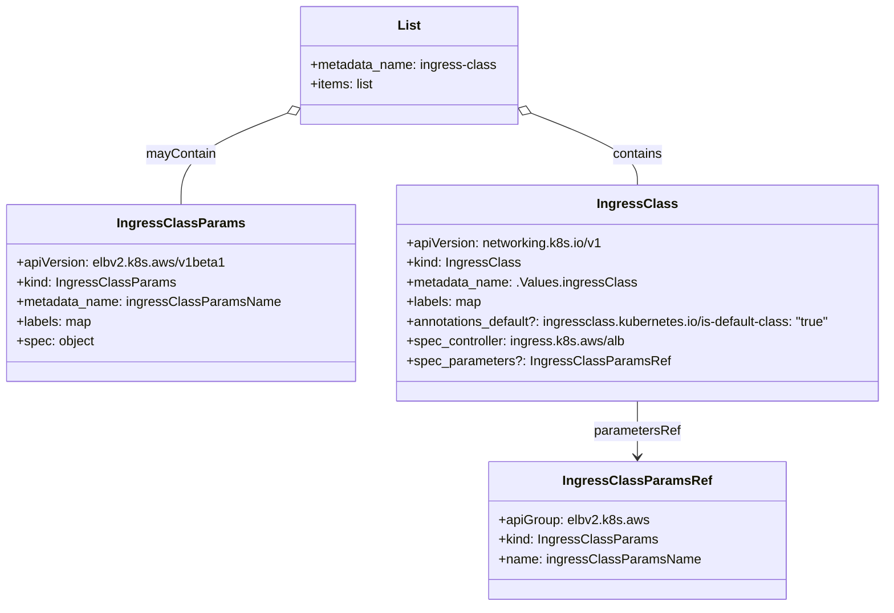

# Diagram: devops/k8s/aws-load-balancer-controller/helm/templates/ingressclass.yaml


> Auto-generated by Obscura crawlers

## Diagram 1

```mermaid
flowchart TD
Start([Start]) --> C{createIngressClassResource?}
C -- No --> End([No resources created])
C -- Yes --> L[List: ingress-class]
L --> P{ingressClassParams.create?}
P -- Yes --> ICP[IngressClassParams\napiVersion: elbv2.k8s.aws/v1beta1\nname: ingressClassParamsName]
P -- No --> NoICP([Skip IngressClassParams])
ICP --> IC
NoICP --> IC
IC[IngressClass\napiVersion: networking.k8s.io/v1\nname: .Values.ingressClass\ncontroller: ingress.k8s.aws/alb]
IC --> PARAMS{parameters present?\n(.Values.ingressClassParams.name || (create && spec))}
PARAMS -- Yes --> PARAMREF[parameters -> IngressClassParamsRef\napiGroup: elbv2.k8s.aws\nkind: IngressClassParams\nname: ingressClassParamsName]
PARAMS -- No --> NOPARAMS([No parameters])
IC --> DEFAULT{ingressClassConfig.default?}
DEFAULT -- Yes --> ANNO[annotation: ingressclass.kubernetes.io/is-default-class: "true"]
DEFAULT -- No --> NOANNO([no default annotation])
ANNO --> End2([IngressClass created])
NOPARAMS --> End2
NOANNO --> End2
End2 --> End
```

> SVG rendering failed for this diagram.

## Diagram 2



### SVG

<svg id="container" width="1078.921875" xmlns="http://www.w3.org/2000/svg" class="classDiagram" height="740" viewBox="0 0 1078.921875 740" role="graphics-document document" aria-roledescription="class"><style>#container{font-family:"trebuchet ms",verdana,arial,sans-serif;font-size:16px;fill:#333;}@keyframes edge-animation-frame{from{stroke-dashoffset:0;}}@keyframes dash{to{stroke-dashoffset:0;}}#container .edge-animation-slow{stroke-dasharray:9,5!important;stroke-dashoffset:900;animation:dash 50s linear infinite;stroke-linecap:round;}#container .edge-animation-fast{stroke-dasharray:9,5!important;stroke-dashoffset:900;animation:dash 20s linear infinite;stroke-linecap:round;}#container .error-icon{fill:#552222;}#container .error-text{fill:#552222;stroke:#552222;}#container .edge-thickness-normal{stroke-width:1px;}#container .edge-thickness-thick{stroke-width:3.5px;}#container .edge-pattern-solid{stroke-dasharray:0;}#container .edge-thickness-invisible{stroke-width:0;fill:none;}#container .edge-pattern-dashed{stroke-dasharray:3;}#container .edge-pattern-dotted{stroke-dasharray:2;}#container .marker{fill:#333333;stroke:#333333;}#container .marker.cross{stroke:#333333;}#container svg{font-family:"trebuchet ms",verdana,arial,sans-serif;font-size:16px;}#container p{margin:0;}#container g.classGroup text{fill:#9370DB;stroke:none;font-family:"trebuchet ms",verdana,arial,sans-serif;font-size:10px;}#container g.classGroup text .title{font-weight:bolder;}#container .nodeLabel,#container .edgeLabel{color:#131300;}#container .edgeLabel .label rect{fill:#ECECFF;}#container .label text{fill:#131300;}#container .labelBkg{background:#ECECFF;}#container .edgeLabel .label span{background:#ECECFF;}#container .classTitle{font-weight:bolder;}#container .node rect,#container .node circle,#container .node ellipse,#container .node polygon,#container .node path{fill:#ECECFF;stroke:#9370DB;stroke-width:1px;}#container .divider{stroke:#9370DB;stroke-width:1;}#container g.clickable{cursor:pointer;}#container g.classGroup rect{fill:#ECECFF;stroke:#9370DB;}#container g.classGroup line{stroke:#9370DB;stroke-width:1;}#container .classLabel .box{stroke:none;stroke-width:0;fill:#ECECFF;opacity:0.5;}#container .classLabel .label{fill:#9370DB;font-size:10px;}#container .relation{stroke:#333333;stroke-width:1;fill:none;}#container .dashed-line{stroke-dasharray:3;}#container .dotted-line{stroke-dasharray:1 2;}#container #compositionStart,#container .composition{fill:#333333!important;stroke:#333333!important;stroke-width:1;}#container #compositionEnd,#container .composition{fill:#333333!important;stroke:#333333!important;stroke-width:1;}#container #dependencyStart,#container .dependency{fill:#333333!important;stroke:#333333!important;stroke-width:1;}#container #dependencyStart,#container .dependency{fill:#333333!important;stroke:#333333!important;stroke-width:1;}#container #extensionStart,#container .extension{fill:transparent!important;stroke:#333333!important;stroke-width:1;}#container #extensionEnd,#container .extension{fill:transparent!important;stroke:#333333!important;stroke-width:1;}#container #aggregationStart,#container .aggregation{fill:transparent!important;stroke:#333333!important;stroke-width:1;}#container #aggregationEnd,#container .aggregation{fill:transparent!important;stroke:#333333!important;stroke-width:1;}#container #lollipopStart,#container .lollipop{fill:#ECECFF!important;stroke:#333333!important;stroke-width:1;}#container #lollipopEnd,#container .lollipop{fill:#ECECFF!important;stroke:#333333!important;stroke-width:1;}#container .edgeTerminals{font-size:11px;line-height:initial;}#container .classTitleText{text-anchor:middle;font-size:18px;fill:#333;}#container .label-icon{display:inline-block;height:1em;overflow:visible;vertical-align:-0.125em;}#container .node .label-icon path{fill:currentColor;stroke:revert;stroke-width:revert;}#container :root{--mermaid-font-family:"trebuchet ms",verdana,arial,sans-serif;}</style><g><defs><marker id="container_class-aggregationStart" class="marker aggregation class" refX="18" refY="7" markerWidth="190" markerHeight="240" orient="auto"><path d="M 18,7 L9,13 L1,7 L9,1 Z"></path></marker></defs><defs><marker id="container_class-aggregationEnd" class="marker aggregation class" refX="1" refY="7" markerWidth="20" markerHeight="28" orient="auto"><path d="M 18,7 L9,13 L1,7 L9,1 Z"></path></marker></defs><defs><marker id="container_class-extensionStart" class="marker extension class" refX="18" refY="7" markerWidth="190" markerHeight="240" orient="auto"><path d="M 1,7 L18,13 V 1 Z"></path></marker></defs><defs><marker id="container_class-extensionEnd" class="marker extension class" refX="1" refY="7" markerWidth="20" markerHeight="28" orient="auto"><path d="M 1,1 V 13 L18,7 Z"></path></marker></defs><defs><marker id="container_class-compositionStart" class="marker composition class" refX="18" refY="7" markerWidth="190" markerHeight="240" orient="auto"><path d="M 18,7 L9,13 L1,7 L9,1 Z"></path></marker></defs><defs><marker id="container_class-compositionEnd" class="marker composition class" refX="1" refY="7" markerWidth="20" markerHeight="28" orient="auto"><path d="M 18,7 L9,13 L1,7 L9,1 Z"></path></marker></defs><defs><marker id="container_class-dependencyStart" class="marker dependency class" refX="6" refY="7" markerWidth="190" markerHeight="240" orient="auto"><path d="M 5,7 L9,13 L1,7 L9,1 Z"></path></marker></defs><defs><marker id="container_class-dependencyEnd" class="marker dependency class" refX="13" refY="7" markerWidth="20" markerHeight="28" orient="auto"><path d="M 18,7 L9,13 L14,7 L9,1 Z"></path></marker></defs><defs><marker id="container_class-lollipopStart" class="marker lollipop class" refX="13" refY="7" markerWidth="190" markerHeight="240" orient="auto"><circle stroke="black" fill="transparent" cx="7" cy="7" r="6"></circle></marker></defs><defs><marker id="container_class-lollipopEnd" class="marker lollipop class" refX="1" refY="7" markerWidth="190" markerHeight="240" orient="auto"><circle stroke="black" fill="transparent" cx="7" cy="7" r="6"></circle></marker></defs><g class="root"><g class="clusters"></g><g class="edgePaths"><path d="M344.267,138.188L322.65,146.657C301.033,155.126,257.8,172.063,236.183,190.698C214.566,209.333,214.566,229.667,214.566,239.833L214.566,250" id="id_List_IngressClassParams_1" class="edge-thickness-normal edge-pattern-solid relation" style=";;;" data-edge="true" data-et="edge" data-id="id_List_IngressClassParams_1" data-points="W3sieCI6MzYwLjMyODEyNSwieSI6MTMxLjg5NjE2Mjk3MTkwNjczfSx7IngiOjIxNC41NjY0MDYyNSwieSI6MTg5fSx7IngiOjIxNC41NjY0MDYyNSwieSI6MjUwfV0=" marker-start="url(#container_class-aggregationStart)"></path><path d="M641.327,138.188L662.944,146.657C684.56,155.126,727.794,172.063,749.411,186.698C771.027,201.333,771.027,213.667,771.027,219.833L771.027,226" id="id_List_IngressClass_2" class="edge-thickness-normal edge-pattern-solid relation" style=";;;" data-edge="true" data-et="edge" data-id="id_List_IngressClass_2" data-points="W3sieCI6NjI1LjI2NTYyNSwieSI6MTMxLjg5NjE2Mjk3MTkwNjczfSx7IngiOjc3MS4wMjczNDM3NSwieSI6MTg5fSx7IngiOjc3MS4wMjczNDM3NSwieSI6MjI2fV0=" marker-start="url(#container_class-aggregationStart)"></path><path d="M771.027,490L771.027,496.167C771.027,502.333,771.027,514.667,771.027,526C771.027,537.333,771.027,547.667,771.027,552.833L771.027,558" id="id_IngressClass_IngressClassParamsRef_3" class="edge-thickness-normal edge-pattern-solid relation" style=";;;" data-edge="true" data-et="edge" data-id="id_IngressClass_IngressClassParamsRef_3" data-points="W3sieCI6NzcxLjAyNzM0Mzc1LCJ5Ijo0OTB9LHsieCI6NzcxLjAyNzM0Mzc1LCJ5Ijo1Mjd9LHsieCI6NzcxLjAyNzM0Mzc1LCJ5Ijo1NjR9XQ==" marker-end="url(#container_class-dependencyEnd)"></path></g><g class="edgeLabels"><g class="edgeLabel" transform="translate(214.56640625, 189)"><g class="label" data-id="id_List_IngressClassParams_1" transform="translate(-42.8359375, -12)"><foreignObject width="85.671875" height="24"><div xmlns="http://www.w3.org/1999/xhtml" class="labelBkg" style="display: table-cell; white-space: nowrap; line-height: 1.5; max-width: 200px; text-align: center;"><span class="edgeLabel"><p>mayContain</p></span></div></foreignObject></g></g><g class="edgeLabel" transform="translate(771.02734375, 189)"><g class="label" data-id="id_List_IngressClass_2" transform="translate(-30.890625, -12)"><foreignObject width="61.78125" height="24"><div xmlns="http://www.w3.org/1999/xhtml" class="labelBkg" style="display: table-cell; white-space: nowrap; line-height: 1.5; max-width: 200px; text-align: center;"><span class="edgeLabel"><p>contains</p></span></div></foreignObject></g></g><g class="edgeLabel" transform="translate(771.02734375, 527)"><g class="label" data-id="id_IngressClass_IngressClassParamsRef_3" transform="translate(-52.9921875, -12)"><foreignObject width="105.984375" height="24"><div xmlns="http://www.w3.org/1999/xhtml" class="labelBkg" style="display: table-cell; white-space: nowrap; line-height: 1.5; max-width: 200px; text-align: center;"><span class="edgeLabel"><p>parametersRef</p></span></div></foreignObject></g></g></g><g class="nodes"><g class="node default" id="classId-List-0" transform="translate(492.796875, 80)"><g class="basic label-container"><path d="M-132.46875 -72 L132.46875 -72 L132.46875 72 L-132.46875 72" stroke="none" stroke-width="0" fill="#ECECFF" style=""></path><path d="M-132.46875 -72 C-42.15347302573137 -72, 48.161803948537255 -72, 132.46875 -72 M-132.46875 -72 C-48.872435423948446 -72, 34.72387915210311 -72, 132.46875 -72 M132.46875 -72 C132.46875 -41.367411099704924, 132.46875 -10.734822199409848, 132.46875 72 M132.46875 -72 C132.46875 -20.941253059573114, 132.46875 30.11749388085377, 132.46875 72 M132.46875 72 C26.979093594937268 72, -78.51056281012546 72, -132.46875 72 M132.46875 72 C45.80354778061576 72, -40.86165443876848 72, -132.46875 72 M-132.46875 72 C-132.46875 40.62086513252653, -132.46875 9.241730265053057, -132.46875 -72 M-132.46875 72 C-132.46875 24.710448247096956, -132.46875 -22.57910350580609, -132.46875 -72" stroke="#9370DB" stroke-width="1.3" fill="none" stroke-dasharray="0 0" style=""></path></g><g class="annotation-group text" transform="translate(0, -48)"></g><g class="label-group text" transform="translate(-13.3125, -48)"><g class="label" style="font-weight: bolder" transform="translate(0,-12)"><foreignObject width="26.625" height="24"><div xmlns="http://www.w3.org/1999/xhtml" style="display: table-cell; white-space: nowrap; line-height: 1.5; max-width: 76px; text-align: center;"><span class="nodeLabel markdown-node-label" style=""><p>List</p></span></div></foreignObject></g></g><g class="members-group text" transform="translate(-120.46875, 0)"><g class="label" style="" transform="translate(0,-12)"><foreignObject width="227.625" height="24"><div xmlns="http://www.w3.org/1999/xhtml" style="display: table-cell; white-space: nowrap; line-height: 1.5; max-width: 285px; text-align: center;"><span class="nodeLabel markdown-node-label" style=""><p>+metadata_name: ingress-class</p></span></div></foreignObject></g><g class="label" style="" transform="translate(0,12)"><foreignObject width="78.46875" height="24"><div xmlns="http://www.w3.org/1999/xhtml" style="display: table-cell; white-space: nowrap; line-height: 1.5; max-width: 136px; text-align: center;"><span class="nodeLabel markdown-node-label" style=""><p>+items: list</p></span></div></foreignObject></g></g><g class="methods-group text" transform="translate(-120.46875, 72)"></g><g class="divider" style=""><path d="M-132.46875 -24 C-28.72563967666538 -24, 75.01747064666924 -24, 132.46875 -24 M-132.46875 -24 C-34.87287361860528 -24, 62.723002762789434 -24, 132.46875 -24" stroke="#9370DB" stroke-width="1.3" fill="none" stroke-dasharray="0 0" style=""></path></g><g class="divider" style=""><path d="M-132.46875 48 C-79.06925160972983 48, -25.669753219459665 48, 132.46875 48 M-132.46875 48 C-54.21844318629405 48, 24.031863627411894 48, 132.46875 48" stroke="#9370DB" stroke-width="1.3" fill="none" stroke-dasharray="0 0" style=""></path></g></g><g class="node default" id="classId-IngressClassParams-1" transform="translate(214.56640625, 358)"><g class="basic label-container"><path d="M-206.56640625 -108 L206.56640625 -108 L206.56640625 108 L-206.56640625 108" stroke="none" stroke-width="0" fill="#ECECFF" style=""></path><path d="M-206.56640625 -108 C-109.70208883017793 -108, -12.837771410355856 -108, 206.56640625 -108 M-206.56640625 -108 C-109.02977977025635 -108, -11.493153290512709 -108, 206.56640625 -108 M206.56640625 -108 C206.56640625 -30.242046622557837, 206.56640625 47.51590675488433, 206.56640625 108 M206.56640625 -108 C206.56640625 -40.00006463795462, 206.56640625 27.999870724090755, 206.56640625 108 M206.56640625 108 C95.68796028577614 108, -15.190485678447715 108, -206.56640625 108 M206.56640625 108 C58.06455914542815 108, -90.4372879591437 108, -206.56640625 108 M-206.56640625 108 C-206.56640625 55.60641387684239, -206.56640625 3.2128277536847776, -206.56640625 -108 M-206.56640625 108 C-206.56640625 60.79235774414807, -206.56640625 13.58471548829614, -206.56640625 -108" stroke="#9370DB" stroke-width="1.3" fill="none" stroke-dasharray="0 0" style=""></path></g><g class="annotation-group text" transform="translate(0, -84)"></g><g class="label-group text" transform="translate(-71.9609375, -84)"><g class="label" style="font-weight: bolder" transform="translate(0,-12)"><foreignObject width="143.921875" height="24"><div xmlns="http://www.w3.org/1999/xhtml" style="display: table-cell; white-space: nowrap; line-height: 1.5; max-width: 191px; text-align: center;"><span class="nodeLabel markdown-node-label" style=""><p>IngressClassParams</p></span></div></foreignObject></g></g><g class="members-group text" transform="translate(-194.56640625, -36)"><g class="label" style="" transform="translate(0,-12)"><foreignObject width="252.140625" height="24"><div xmlns="http://www.w3.org/1999/xhtml" style="display: table-cell; white-space: nowrap; line-height: 1.5; max-width: 310px; text-align: center;"><span class="nodeLabel markdown-node-label" style=""><p>+apiVersion: elbv2.k8s.aws/v1beta1</p></span></div></foreignObject></g><g class="label" style="" transform="translate(0,12)"><foreignObject width="188.703125" height="24"><div xmlns="http://www.w3.org/1999/xhtml" style="display: table-cell; white-space: nowrap; line-height: 1.5; max-width: 246px; text-align: center;"><span class="nodeLabel markdown-node-label" style=""><p>+kind: IngressClassParams</p></span></div></foreignObject></g><g class="label" style="" transform="translate(0,36)"><foreignObject width="317.171875" height="24"><div xmlns="http://www.w3.org/1999/xhtml" style="display: table-cell; white-space: nowrap; line-height: 1.5; max-width: 375px; text-align: center;"><span class="nodeLabel markdown-node-label" style=""><p>+metadata_name: ingressClassParamsName</p></span></div></foreignObject></g><g class="label" style="" transform="translate(0,60)"><foreignObject width="91.6875" height="24"><div xmlns="http://www.w3.org/1999/xhtml" style="display: table-cell; white-space: nowrap; line-height: 1.5; max-width: 149px; text-align: center;"><span class="nodeLabel markdown-node-label" style=""><p>+labels: map</p></span></div></foreignObject></g><g class="label" style="" transform="translate(0,84)"><foreignObject width="94.953125" height="24"><div xmlns="http://www.w3.org/1999/xhtml" style="display: table-cell; white-space: nowrap; line-height: 1.5; max-width: 153px; text-align: center;"><span class="nodeLabel markdown-node-label" style=""><p>+spec: object</p></span></div></foreignObject></g></g><g class="methods-group text" transform="translate(-194.56640625, 108)"></g><g class="divider" style=""><path d="M-206.56640625 -60 C-51.31199864075032 -60, 103.94240896849936 -60, 206.56640625 -60 M-206.56640625 -60 C-43.607396599116555 -60, 119.35161305176689 -60, 206.56640625 -60" stroke="#9370DB" stroke-width="1.3" fill="none" stroke-dasharray="0 0" style=""></path></g><g class="divider" style=""><path d="M-206.56640625 84 C-62.66180934931387 84, 81.24278755137226 84, 206.56640625 84 M-206.56640625 84 C-115.02353838202613 84, -23.480670514052264 84, 206.56640625 84" stroke="#9370DB" stroke-width="1.3" fill="none" stroke-dasharray="0 0" style=""></path></g></g><g class="node default" id="classId-IngressClass-2" transform="translate(771.02734375, 358)"><g class="basic label-container"><path d="M-299.89453125 -132 L299.89453125 -132 L299.89453125 132 L-299.89453125 132" stroke="none" stroke-width="0" fill="#ECECFF" style=""></path><path d="M-299.89453125 -132 C-72.33155724832005 -132, 155.2314167533599 -132, 299.89453125 -132 M-299.89453125 -132 C-70.73823868965135 -132, 158.4180538706973 -132, 299.89453125 -132 M299.89453125 -132 C299.89453125 -32.74962045761751, 299.89453125 66.50075908476498, 299.89453125 132 M299.89453125 -132 C299.89453125 -52.13391355554461, 299.89453125 27.73217288891078, 299.89453125 132 M299.89453125 132 C147.3889175575923 132, -5.116696134815413 132, -299.89453125 132 M299.89453125 132 C126.66648503941647 132, -46.56156117116706 132, -299.89453125 132 M-299.89453125 132 C-299.89453125 29.216820407510923, -299.89453125 -73.56635918497815, -299.89453125 -132 M-299.89453125 132 C-299.89453125 37.403609769616295, -299.89453125 -57.19278046076741, -299.89453125 -132" stroke="#9370DB" stroke-width="1.3" fill="none" stroke-dasharray="0 0" style=""></path></g><g class="annotation-group text" transform="translate(0, -108)"></g><g class="label-group text" transform="translate(-45.2578125, -108)"><g class="label" style="font-weight: bolder" transform="translate(0,-12)"><foreignObject width="90.515625" height="24"><div xmlns="http://www.w3.org/1999/xhtml" style="display: table-cell; white-space: nowrap; line-height: 1.5; max-width: 138px; text-align: center;"><span class="nodeLabel markdown-node-label" style=""><p>IngressClass</p></span></div></foreignObject></g></g><g class="members-group text" transform="translate(-287.89453125, -60)"><g class="label" style="" transform="translate(0,-12)"><foreignObject width="242.484375" height="24"><div xmlns="http://www.w3.org/1999/xhtml" style="display: table-cell; white-space: nowrap; line-height: 1.5; max-width: 300px; text-align: center;"><span class="nodeLabel markdown-node-label" style=""><p>+apiVersion: networking.k8s.io/v1</p></span></div></foreignObject></g><g class="label" style="" transform="translate(0,12)"><foreignObject width="136.078125" height="24"><div xmlns="http://www.w3.org/1999/xhtml" style="display: table-cell; white-space: nowrap; line-height: 1.5; max-width: 193px; text-align: center;"><span class="nodeLabel markdown-node-label" style=""><p>+kind: IngressClass</p></span></div></foreignObject></g><g class="label" style="" transform="translate(0,36)"><foreignObject width="276.359375" height="24"><div xmlns="http://www.w3.org/1999/xhtml" style="display: table-cell; white-space: nowrap; line-height: 1.5; max-width: 334px; text-align: center;"><span class="nodeLabel markdown-node-label" style=""><p>+metadata_name: .Values.ingressClass</p></span></div></foreignObject></g><g class="label" style="" transform="translate(0,60)"><foreignObject width="91.6875" height="24"><div xmlns="http://www.w3.org/1999/xhtml" style="display: table-cell; white-space: nowrap; line-height: 1.5; max-width: 149px; text-align: center;"><span class="nodeLabel markdown-node-label" style=""><p>+labels: map</p></span></div></foreignObject></g><g class="label" style="" transform="translate(0,84)"><foreignObject width="530.53125" height="24"><div xmlns="http://www.w3.org/1999/xhtml" style="display: table-cell; white-space: nowrap; line-height: 1.5; max-width: 588px; text-align: center;"><span class="nodeLabel markdown-node-label" style=""><p>+annotations_default?: ingressclass.kubernetes.io/is-default-class: "true"</p></span></div></foreignObject></g><g class="label" style="" transform="translate(0,108)"><foreignObject width="270.03125" height="24"><div xmlns="http://www.w3.org/1999/xhtml" style="display: table-cell; white-space: nowrap; line-height: 1.5; max-width: 327px; text-align: center;"><span class="nodeLabel markdown-node-label" style=""><p>+spec_controller: ingress.k8s.aws/alb</p></span></div></foreignObject></g><g class="label" style="" transform="translate(0,132)"><foreignObject width="311.5625" height="24"><div xmlns="http://www.w3.org/1999/xhtml" style="display: table-cell; white-space: nowrap; line-height: 1.5; max-width: 371px; text-align: center;"><span class="nodeLabel markdown-node-label" style=""><p>+spec_parameters?: IngressClassParamsRef</p></span></div></foreignObject></g></g><g class="methods-group text" transform="translate(-287.89453125, 132)"></g><g class="divider" style=""><path d="M-299.89453125 -84 C-149.18704985769423 -84, 1.5204315346115322 -84, 299.89453125 -84 M-299.89453125 -84 C-130.75212390152063 -84, 38.39028344695873 -84, 299.89453125 -84" stroke="#9370DB" stroke-width="1.3" fill="none" stroke-dasharray="0 0" style=""></path></g><g class="divider" style=""><path d="M-299.89453125 108 C-173.53842250014333 108, -47.18231375028668 108, 299.89453125 108 M-299.89453125 108 C-117.59769324391371 108, 64.69914476217258 108, 299.89453125 108" stroke="#9370DB" stroke-width="1.3" fill="none" stroke-dasharray="0 0" style=""></path></g></g><g class="node default" id="classId-IngressClassParamsRef-3" transform="translate(771.02734375, 648)"><g class="basic label-container"><path d="M-173.734375 -84 L173.734375 -84 L173.734375 84 L-173.734375 84" stroke="none" stroke-width="0" fill="#ECECFF" style=""></path><path d="M-173.734375 -84 C-93.16946060707973 -84, -12.604546214159456 -84, 173.734375 -84 M-173.734375 -84 C-101.29114775448528 -84, -28.84792050897056 -84, 173.734375 -84 M173.734375 -84 C173.734375 -32.26351912627298, 173.734375 19.472961747454036, 173.734375 84 M173.734375 -84 C173.734375 -42.61194055598156, 173.734375 -1.2238811119631237, 173.734375 84 M173.734375 84 C45.44950914273414 84, -82.83535671453171 84, -173.734375 84 M173.734375 84 C77.06082665657915 84, -19.612721686841695 84, -173.734375 84 M-173.734375 84 C-173.734375 34.36468650966864, -173.734375 -15.270626980662726, -173.734375 -84 M-173.734375 84 C-173.734375 32.04381525924776, -173.734375 -19.912369481504484, -173.734375 -84" stroke="#9370DB" stroke-width="1.3" fill="none" stroke-dasharray="0 0" style=""></path></g><g class="annotation-group text" transform="translate(0, -60)"></g><g class="label-group text" transform="translate(-84.046875, -60)"><g class="label" style="font-weight: bolder" transform="translate(0,-12)"><foreignObject width="168.09375" height="24"><div xmlns="http://www.w3.org/1999/xhtml" style="display: table-cell; white-space: nowrap; line-height: 1.5; max-width: 216px; text-align: center;"><span class="nodeLabel markdown-node-label" style=""><p>IngressClassParamsRef</p></span></div></foreignObject></g></g><g class="members-group text" transform="translate(-161.734375, -12)"><g class="label" style="" transform="translate(0,-12)"><foreignObject width="180.71875" height="24"><div xmlns="http://www.w3.org/1999/xhtml" style="display: table-cell; white-space: nowrap; line-height: 1.5; max-width: 238px; text-align: center;"><span class="nodeLabel markdown-node-label" style=""><p>+apiGroup: elbv2.k8s.aws</p></span></div></foreignObject></g><g class="label" style="" transform="translate(0,12)"><foreignObject width="188.703125" height="24"><div xmlns="http://www.w3.org/1999/xhtml" style="display: table-cell; white-space: nowrap; line-height: 1.5; max-width: 246px; text-align: center;"><span class="nodeLabel markdown-node-label" style=""><p>+kind: IngressClassParams</p></span></div></foreignObject></g><g class="label" style="" transform="translate(0,36)"><foreignObject width="239.421875" height="24"><div xmlns="http://www.w3.org/1999/xhtml" style="display: table-cell; white-space: nowrap; line-height: 1.5; max-width: 297px; text-align: center;"><span class="nodeLabel markdown-node-label" style=""><p>+name: ingressClassParamsName</p></span></div></foreignObject></g></g><g class="methods-group text" transform="translate(-161.734375, 84)"></g><g class="divider" style=""><path d="M-173.734375 -36 C-59.52681243614343 -36, 54.68075012771314 -36, 173.734375 -36 M-173.734375 -36 C-77.60000155872108 -36, 18.53437188255785 -36, 173.734375 -36" stroke="#9370DB" stroke-width="1.3" fill="none" stroke-dasharray="0 0" style=""></path></g><g class="divider" style=""><path d="M-173.734375 60 C-95.65670210753136 60, -17.579029215062718 60, 173.734375 60 M-173.734375 60 C-91.28225965198072 60, -8.830144303961447 60, 173.734375 60" stroke="#9370DB" stroke-width="1.3" fill="none" stroke-dasharray="0 0" style=""></path></g></g></g></g></g></svg>
