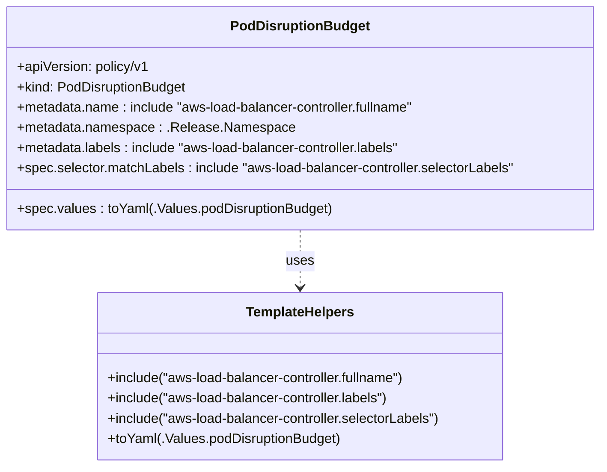

# Diagram: devops/k8s/aws-load-balancer-controller/helm/templates/pdb.yaml


> Auto-generated by Obscura crawlers

## Diagram 1

```mermaid
flowchart TD
  Start([Start]) --> CheckPDB{.Values.podDisruptionBudget?}
  CheckPDB -- No --> EndNo[PDB not created]
  CheckPDB -- Yes --> CheckReplicas{int(.Values.replicaCount) > 1?}
  CheckReplicas -- No --> EndNo
  CheckReplicas -- Yes --> Create[Create PodDisruptionBudget]
  Create --> Metadata[metadata]
  Metadata --> Name[name: include "aws-load-balancer-controller.fullname"]
  Metadata --> Namespace[namespace: .Release.Namespace]
  Metadata --> Labels[labels: include "aws-load-balancer-controller.labels"]
  Create --> Spec[spec]
  Spec --> Selector[selector]
  Selector --> MatchLabels[matchLabels: include "aws-load-balancer-controller.selectorLabels"]
  Spec --> ValuesYaml[toYaml(.Values.podDisruptionBudget)]
```

> SVG rendering failed for this diagram.

## Diagram 2



### SVG

<svg id="container" width="719.2109375" xmlns="http://www.w3.org/2000/svg" class="classDiagram" height="552" viewBox="0 0 719.2109375 552" role="graphics-document document" aria-roledescription="class"><style>#container{font-family:"trebuchet ms",verdana,arial,sans-serif;font-size:16px;fill:#333;}@keyframes edge-animation-frame{from{stroke-dashoffset:0;}}@keyframes dash{to{stroke-dashoffset:0;}}#container .edge-animation-slow{stroke-dasharray:9,5!important;stroke-dashoffset:900;animation:dash 50s linear infinite;stroke-linecap:round;}#container .edge-animation-fast{stroke-dasharray:9,5!important;stroke-dashoffset:900;animation:dash 20s linear infinite;stroke-linecap:round;}#container .error-icon{fill:#552222;}#container .error-text{fill:#552222;stroke:#552222;}#container .edge-thickness-normal{stroke-width:1px;}#container .edge-thickness-thick{stroke-width:3.5px;}#container .edge-pattern-solid{stroke-dasharray:0;}#container .edge-thickness-invisible{stroke-width:0;fill:none;}#container .edge-pattern-dashed{stroke-dasharray:3;}#container .edge-pattern-dotted{stroke-dasharray:2;}#container .marker{fill:#333333;stroke:#333333;}#container .marker.cross{stroke:#333333;}#container svg{font-family:"trebuchet ms",verdana,arial,sans-serif;font-size:16px;}#container p{margin:0;}#container g.classGroup text{fill:#9370DB;stroke:none;font-family:"trebuchet ms",verdana,arial,sans-serif;font-size:10px;}#container g.classGroup text .title{font-weight:bolder;}#container .nodeLabel,#container .edgeLabel{color:#131300;}#container .edgeLabel .label rect{fill:#ECECFF;}#container .label text{fill:#131300;}#container .labelBkg{background:#ECECFF;}#container .edgeLabel .label span{background:#ECECFF;}#container .classTitle{font-weight:bolder;}#container .node rect,#container .node circle,#container .node ellipse,#container .node polygon,#container .node path{fill:#ECECFF;stroke:#9370DB;stroke-width:1px;}#container .divider{stroke:#9370DB;stroke-width:1;}#container g.clickable{cursor:pointer;}#container g.classGroup rect{fill:#ECECFF;stroke:#9370DB;}#container g.classGroup line{stroke:#9370DB;stroke-width:1;}#container .classLabel .box{stroke:none;stroke-width:0;fill:#ECECFF;opacity:0.5;}#container .classLabel .label{fill:#9370DB;font-size:10px;}#container .relation{stroke:#333333;stroke-width:1;fill:none;}#container .dashed-line{stroke-dasharray:3;}#container .dotted-line{stroke-dasharray:1 2;}#container #compositionStart,#container .composition{fill:#333333!important;stroke:#333333!important;stroke-width:1;}#container #compositionEnd,#container .composition{fill:#333333!important;stroke:#333333!important;stroke-width:1;}#container #dependencyStart,#container .dependency{fill:#333333!important;stroke:#333333!important;stroke-width:1;}#container #dependencyStart,#container .dependency{fill:#333333!important;stroke:#333333!important;stroke-width:1;}#container #extensionStart,#container .extension{fill:transparent!important;stroke:#333333!important;stroke-width:1;}#container #extensionEnd,#container .extension{fill:transparent!important;stroke:#333333!important;stroke-width:1;}#container #aggregationStart,#container .aggregation{fill:transparent!important;stroke:#333333!important;stroke-width:1;}#container #aggregationEnd,#container .aggregation{fill:transparent!important;stroke:#333333!important;stroke-width:1;}#container #lollipopStart,#container .lollipop{fill:#ECECFF!important;stroke:#333333!important;stroke-width:1;}#container #lollipopEnd,#container .lollipop{fill:#ECECFF!important;stroke:#333333!important;stroke-width:1;}#container .edgeTerminals{font-size:11px;line-height:initial;}#container .classTitleText{text-anchor:middle;font-size:18px;fill:#333;}#container .label-icon{display:inline-block;height:1em;overflow:visible;vertical-align:-0.125em;}#container .node .label-icon path{fill:currentColor;stroke:revert;stroke-width:revert;}#container :root{--mermaid-font-family:"trebuchet ms",verdana,arial,sans-serif;}</style><g><defs><marker id="container_class-aggregationStart" class="marker aggregation class" refX="18" refY="7" markerWidth="190" markerHeight="240" orient="auto"><path d="M 18,7 L9,13 L1,7 L9,1 Z"></path></marker></defs><defs><marker id="container_class-aggregationEnd" class="marker aggregation class" refX="1" refY="7" markerWidth="20" markerHeight="28" orient="auto"><path d="M 18,7 L9,13 L1,7 L9,1 Z"></path></marker></defs><defs><marker id="container_class-extensionStart" class="marker extension class" refX="18" refY="7" markerWidth="190" markerHeight="240" orient="auto"><path d="M 1,7 L18,13 V 1 Z"></path></marker></defs><defs><marker id="container_class-extensionEnd" class="marker extension class" refX="1" refY="7" markerWidth="20" markerHeight="28" orient="auto"><path d="M 1,1 V 13 L18,7 Z"></path></marker></defs><defs><marker id="container_class-compositionStart" class="marker composition class" refX="18" refY="7" markerWidth="190" markerHeight="240" orient="auto"><path d="M 18,7 L9,13 L1,7 L9,1 Z"></path></marker></defs><defs><marker id="container_class-compositionEnd" class="marker composition class" refX="1" refY="7" markerWidth="20" markerHeight="28" orient="auto"><path d="M 18,7 L9,13 L1,7 L9,1 Z"></path></marker></defs><defs><marker id="container_class-dependencyStart" class="marker dependency class" refX="6" refY="7" markerWidth="190" markerHeight="240" orient="auto"><path d="M 5,7 L9,13 L1,7 L9,1 Z"></path></marker></defs><defs><marker id="container_class-dependencyEnd" class="marker dependency class" refX="13" refY="7" markerWidth="20" markerHeight="28" orient="auto"><path d="M 18,7 L9,13 L14,7 L9,1 Z"></path></marker></defs><defs><marker id="container_class-lollipopStart" class="marker lollipop class" refX="13" refY="7" markerWidth="190" markerHeight="240" orient="auto"><circle stroke="black" fill="transparent" cx="7" cy="7" r="6"></circle></marker></defs><defs><marker id="container_class-lollipopEnd" class="marker lollipop class" refX="1" refY="7" markerWidth="190" markerHeight="240" orient="auto"><circle stroke="black" fill="transparent" cx="7" cy="7" r="6"></circle></marker></defs><g class="root"><g class="clusters"></g><g class="edgePaths"><path d="M359.605,272L359.605,278.167C359.605,284.333,359.605,296.667,359.605,308C359.605,319.333,359.605,329.667,359.605,334.833L359.605,340" id="id_PodDisruptionBudget_TemplateHelpers_1" class="edge-thickness-normal edge-pattern-dashed relation" style=";;;" data-edge="true" data-et="edge" data-id="id_PodDisruptionBudget_TemplateHelpers_1" data-points="W3sieCI6MzU5LjYwNTQ2ODc1LCJ5IjoyNzJ9LHsieCI6MzU5LjYwNTQ2ODc1LCJ5IjozMDl9LHsieCI6MzU5LjYwNTQ2ODc1LCJ5IjozNDZ9XQ==" marker-end="url(#container_class-dependencyEnd)"></path></g><g class="edgeLabels"><g class="edgeLabel" transform="translate(359.60546875, 309)"><g class="label" data-id="id_PodDisruptionBudget_TemplateHelpers_1" transform="translate(-16.4921875, -12)"><foreignObject width="32.984375" height="24"><div xmlns="http://www.w3.org/1999/xhtml" class="labelBkg" style="display: table-cell; white-space: nowrap; line-height: 1.5; max-width: 200px; text-align: center;"><span class="edgeLabel"><p>uses</p></span></div></foreignObject></g></g></g><g class="nodes"><g class="node default" id="classId-PodDisruptionBudget-0" transform="translate(359.60546875, 140)"><g class="basic label-container"><path d="M-351.60546875 -132 L351.60546875 -132 L351.60546875 132 L-351.60546875 132" stroke="none" stroke-width="0" fill="#ECECFF" style=""></path><path d="M-351.60546875 -132 C-150.72817653363353 -132, 50.14911568273294 -132, 351.60546875 -132 M-351.60546875 -132 C-174.29841868697508 -132, 3.008631376049834 -132, 351.60546875 -132 M351.60546875 -132 C351.60546875 -45.59039944977603, 351.60546875 40.81920110044794, 351.60546875 132 M351.60546875 -132 C351.60546875 -78.52854620953582, 351.60546875 -25.057092419071623, 351.60546875 132 M351.60546875 132 C100.92987272262255 132, -149.7457233047549 132, -351.60546875 132 M351.60546875 132 C177.91034899401237 132, 4.215229238024733 132, -351.60546875 132 M-351.60546875 132 C-351.60546875 69.09280015184514, -351.60546875 6.185600303690279, -351.60546875 -132 M-351.60546875 132 C-351.60546875 33.26227978774622, -351.60546875 -65.47544042450755, -351.60546875 -132" stroke="#9370DB" stroke-width="1.3" fill="none" stroke-dasharray="0 0" style=""></path></g><g class="annotation-group text" transform="translate(0, -108)"></g><g class="label-group text" transform="translate(-78.6015625, -108)"><g class="label" style="font-weight: bolder" transform="translate(0,-12)"><foreignObject width="157.203125" height="24"><div xmlns="http://www.w3.org/1999/xhtml" style="display: table-cell; white-space: nowrap; line-height: 1.5; max-width: 205px; text-align: center;"><span class="nodeLabel markdown-node-label" style=""><p>PodDisruptionBudget</p></span></div></foreignObject></g></g><g class="members-group text" transform="translate(-339.60546875, -60)"><g class="label" style="" transform="translate(0,-12)"><foreignObject width="158.78125" height="24"><div xmlns="http://www.w3.org/1999/xhtml" style="display: table-cell; white-space: nowrap; line-height: 1.5; max-width: 216px; text-align: center;"><span class="nodeLabel markdown-node-label" style=""><p>+apiVersion: policy/v1</p></span></div></foreignObject></g><g class="label" style="" transform="translate(0,12)"><foreignObject width="202.90625" height="24"><div xmlns="http://www.w3.org/1999/xhtml" style="display: table-cell; white-space: nowrap; line-height: 1.5; max-width: 260px; text-align: center;"><span class="nodeLabel markdown-node-label" style=""><p>+kind: PodDisruptionBudget</p></span></div></foreignObject></g><g class="label" style="" transform="translate(0,36)"><foreignObject width="483.578125" height="24"><div xmlns="http://www.w3.org/1999/xhtml" style="display: table-cell; white-space: nowrap; line-height: 1.5; max-width: 541px; text-align: center;"><span class="nodeLabel markdown-node-label" style=""><p>+metadata.name : include "aws-load-balancer-controller.fullname"</p></span></div></foreignObject></g><g class="label" style="" transform="translate(0,60)"><foreignObject width="322.890625" height="24"><div xmlns="http://www.w3.org/1999/xhtml" style="display: table-cell; white-space: nowrap; line-height: 1.5; max-width: 380px; text-align: center;"><span class="nodeLabel markdown-node-label" style=""><p>+metadata.namespace : .Release.Namespace</p></span></div></foreignObject></g><g class="label" style="" transform="translate(0,84)"><foreignObject width="466.046875" height="24"><div xmlns="http://www.w3.org/1999/xhtml" style="display: table-cell; white-space: nowrap; line-height: 1.5; max-width: 523px; text-align: center;"><span class="nodeLabel markdown-node-label" style=""><p>+metadata.labels : include "aws-load-balancer-controller.labels"</p></span></div></foreignObject></g><g class="label" style="" transform="translate(0,108)"><foreignObject width="600.609375" height="24"><div xmlns="http://www.w3.org/1999/xhtml" style="display: table-cell; white-space: nowrap; line-height: 1.5; max-width: 658px; text-align: center;"><span class="nodeLabel markdown-node-label" style=""><p>+spec.selector.matchLabels : include "aws-load-balancer-controller.selectorLabels"</p></span></div></foreignObject></g></g><g class="methods-group text" transform="translate(-339.60546875, 108)"><g class="label" style="" transform="translate(0,-12)"><foreignObject width="373" height="24"><div xmlns="http://www.w3.org/1999/xhtml" style="display: table-cell; white-space: nowrap; line-height: 1.5; max-width: 430px; text-align: center;"><span class="nodeLabel markdown-node-label" style=""><p>+spec.values : toYaml(.Values.podDisruptionBudget)</p></span></div></foreignObject></g></g><g class="divider" style=""><path d="M-351.60546875 -84 C-107.88693537145446 -84, 135.8315980070911 -84, 351.60546875 -84 M-351.60546875 -84 C-208.7124870896888 -84, -65.81950542937761 -84, 351.60546875 -84" stroke="#9370DB" stroke-width="1.3" fill="none" stroke-dasharray="0 0" style=""></path></g><g class="divider" style=""><path d="M-351.60546875 84 C-83.90175716820852 84, 183.80195441358296 84, 351.60546875 84 M-351.60546875 84 C-151.10485651860685 84, 49.3957557127863 84, 351.60546875 84" stroke="#9370DB" stroke-width="1.3" fill="none" stroke-dasharray="0 0" style=""></path></g></g><g class="node default" id="classId-TemplateHelpers-1" transform="translate(359.60546875, 445)"><g class="basic label-container"><path d="M-245.28125 -99 L245.28125 -99 L245.28125 99 L-245.28125 99" stroke="none" stroke-width="0" fill="#ECECFF" style=""></path><path d="M-245.28125 -99 C-85.31222717027282 -99, 74.65679565945436 -99, 245.28125 -99 M-245.28125 -99 C-98.37522544036548 -99, 48.530799119269034 -99, 245.28125 -99 M245.28125 -99 C245.28125 -41.993104170078986, 245.28125 15.013791659842028, 245.28125 99 M245.28125 -99 C245.28125 -42.33050951976928, 245.28125 14.338980960461441, 245.28125 99 M245.28125 99 C66.92575737803716 99, -111.42973524392568 99, -245.28125 99 M245.28125 99 C52.14546274994436 99, -140.99032450011129 99, -245.28125 99 M-245.28125 99 C-245.28125 36.42245185017217, -245.28125 -26.155096299655654, -245.28125 -99 M-245.28125 99 C-245.28125 34.35680678574843, -245.28125 -30.286386428503135, -245.28125 -99" stroke="#9370DB" stroke-width="1.3" fill="none" stroke-dasharray="0 0" style=""></path></g><g class="annotation-group text" transform="translate(0, -75)"></g><g class="label-group text" transform="translate(-62.203125, -75)"><g class="label" style="font-weight: bolder" transform="translate(0,-12)"><foreignObject width="124.40625" height="24"><div xmlns="http://www.w3.org/1999/xhtml" style="display: table-cell; white-space: nowrap; line-height: 1.5; max-width: 173px; text-align: center;"><span class="nodeLabel markdown-node-label" style=""><p>TemplateHelpers</p></span></div></foreignObject></g></g><g class="members-group text" transform="translate(-233.28125, -27)"></g><g class="methods-group text" transform="translate(-233.28125, 3)"><g class="label" style="" transform="translate(0,-12)"><foreignObject width="363.59375" height="24"><div xmlns="http://www.w3.org/1999/xhtml" style="display: table-cell; white-space: nowrap; line-height: 1.5; max-width: 421px; text-align: center;"><span class="nodeLabel markdown-node-label" style=""><p>+include("aws-load-balancer-controller.fullname")</p></span></div></foreignObject></g><g class="label" style="" transform="translate(0,12)"><foreignObject width="342.875" height="24"><div xmlns="http://www.w3.org/1999/xhtml" style="display: table-cell; white-space: nowrap; line-height: 1.5; max-width: 400px; text-align: center;"><span class="nodeLabel markdown-node-label" style=""><p>+include("aws-load-balancer-controller.labels")</p></span></div></foreignObject></g><g class="label" style="" transform="translate(0,36)"><foreignObject width="404.359375" height="24"><div xmlns="http://www.w3.org/1999/xhtml" style="display: table-cell; white-space: nowrap; line-height: 1.5; max-width: 462px; text-align: center;"><span class="nodeLabel markdown-node-label" style=""><p>+include("aws-load-balancer-controller.selectorLabels")</p></span></div></foreignObject></g><g class="label" style="" transform="translate(0,60)"><foreignObject width="277.546875" height="24"><div xmlns="http://www.w3.org/1999/xhtml" style="display: table-cell; white-space: nowrap; line-height: 1.5; max-width: 335px; text-align: center;"><span class="nodeLabel markdown-node-label" style=""><p>+toYaml(.Values.podDisruptionBudget)</p></span></div></foreignObject></g></g><g class="divider" style=""><path d="M-245.28125 -51 C-138.7751421360797 -51, -32.26903427215936 -51, 245.28125 -51 M-245.28125 -51 C-142.38646092102255 -51, -39.49167184204512 -51, 245.28125 -51" stroke="#9370DB" stroke-width="1.3" fill="none" stroke-dasharray="0 0" style=""></path></g><g class="divider" style=""><path d="M-245.28125 -27 C-116.57561029261834 -27, 12.130029414763328 -27, 245.28125 -27 M-245.28125 -27 C-60.785549554881555 -27, 123.71015089023689 -27, 245.28125 -27" stroke="#9370DB" stroke-width="1.3" fill="none" stroke-dasharray="0 0" style=""></path></g></g></g></g></g></svg>
