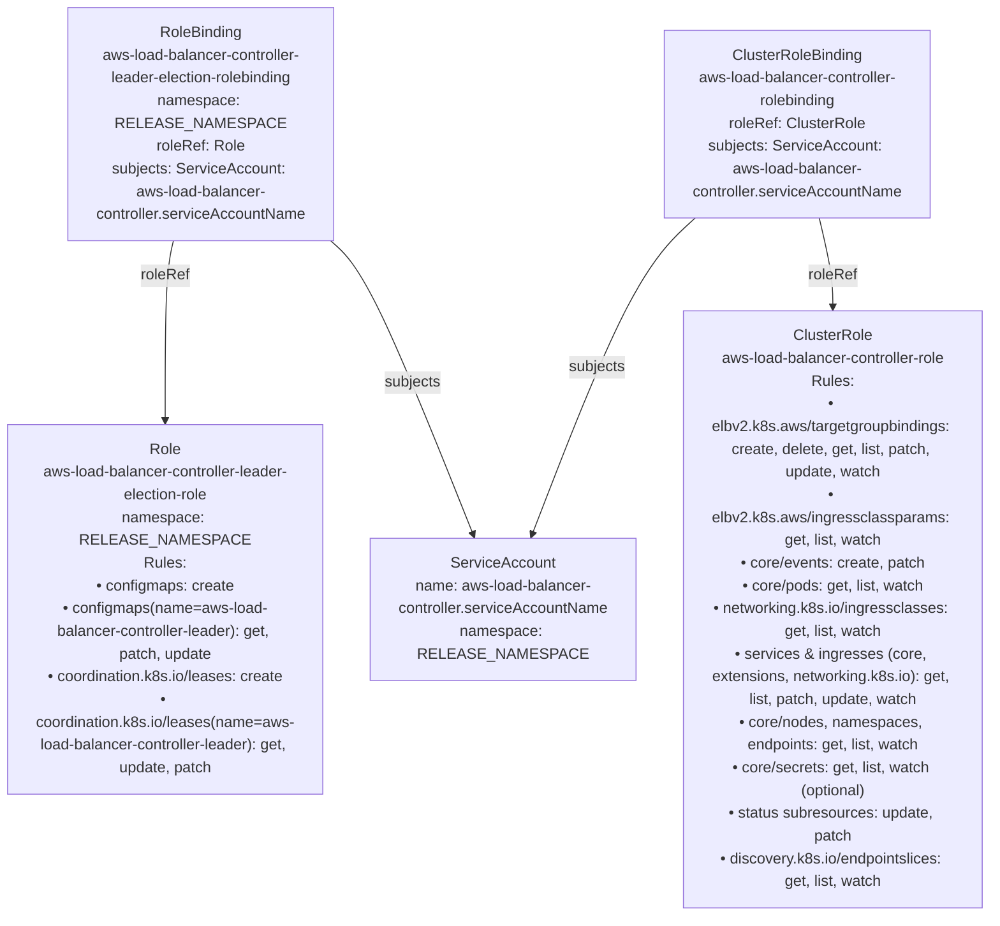
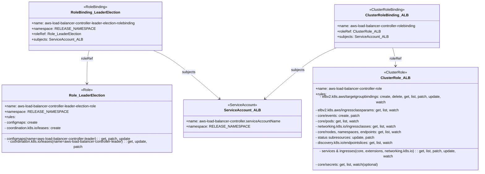

# Diagram: devops/k8s/aws-load-balancer-controller/helm/templates/rbac.yaml

> Auto-generated by Obscura crawlers

## Diagram 1

### SVG

<svg id="container" width="1061.765625" xmlns="http://www.w3.org/2000/svg" class="flowchart" height="966" viewBox="0 0 1061.765625 966" role="graphics-document document" aria-roledescription="flowchart-v2"><g><marker id="container_flowchart-v2-pointEnd" class="marker flowchart-v2" viewBox="0 0 10 10" refX="5" refY="5" markerUnits="userSpaceOnUse" markerWidth="8" markerHeight="8" orient="auto"><path d="M 0 0 L 10 5 L 0 10 z" class="arrowMarkerPath" style="stroke-width: 1; stroke-dasharray: 1, 0;"></path></marker><marker id="container_flowchart-v2-pointStart" class="marker flowchart-v2" viewBox="0 0 10 10" refX="4.5" refY="5" markerUnits="userSpaceOnUse" markerWidth="8" markerHeight="8" orient="auto"><path d="M 0 5 L 10 10 L 10 0 z" class="arrowMarkerPath" style="stroke-width: 1; stroke-dasharray: 1, 0;"></path></marker><marker id="container_flowchart-v2-circleEnd" class="marker flowchart-v2" viewBox="0 0 10 10" refX="11" refY="5" markerUnits="userSpaceOnUse" markerWidth="11" markerHeight="11" orient="auto"><circle cx="5" cy="5" r="5" class="arrowMarkerPath" style="stroke-width: 1; stroke-dasharray: 1, 0;"></circle></marker><marker id="container_flowchart-v2-circleStart" class="marker flowchart-v2" viewBox="0 0 10 10" refX="-1" refY="5" markerUnits="userSpaceOnUse" markerWidth="11" markerHeight="11" orient="auto"><circle cx="5" cy="5" r="5" class="arrowMarkerPath" style="stroke-width: 1; stroke-dasharray: 1, 0;"></circle></marker><marker id="container_flowchart-v2-crossEnd" class="marker cross flowchart-v2" viewBox="0 0 11 11" refX="12" refY="5.2" markerUnits="userSpaceOnUse" markerWidth="11" markerHeight="11" orient="auto"><path d="M 1,1 l 9,9 M 10,1 l -9,9" class="arrowMarkerPath" style="stroke-width: 2; stroke-dasharray: 1, 0;"></path></marker><marker id="container_flowchart-v2-crossStart" class="marker cross flowchart-v2" viewBox="0 0 11 11" refX="-1" refY="5.2" markerUnits="userSpaceOnUse" markerWidth="11" markerHeight="11" orient="auto"><path d="M 1,1 l 9,9 M 10,1 l -9,9" class="arrowMarkerPath" style="stroke-width: 2; stroke-dasharray: 1, 0;"></path></marker><g class="root"><g class="clusters"></g><g class="edgePaths"><path d="M186.874,254L185.407,260.167C183.939,266.333,181.005,278.667,179.538,312.333C178.07,346,178.07,401,178.07,428.5L178.07,456" id="L_RB_LE_R_LE_0" class="edge-thickness-normal edge-pattern-solid edge-thickness-normal edge-pattern-solid flowchart-link" style=";" data-edge="true" data-et="edge" data-id="L_RB_LE_R_LE_0" data-points="W3sieCI6MTg2Ljg3NDA3MjI2NTYyNSwieSI6MjU0fSx7IngiOjE3OC4wNzAzMTI1LCJ5IjoyOTF9LHsieCI6MTc4LjA3MDMxMjUsInkiOjQ2MH1d" marker-end="url(#container_flowchart-v2-pointEnd)"></path><path d="M355.344,254L362.323,260.167C369.303,266.333,383.261,278.667,408.745,330.382C434.229,382.098,471.24,473.196,489.745,518.745L508.251,564.294" id="L_RB_LE_SA_0" class="edge-thickness-normal edge-pattern-solid edge-thickness-normal edge-pattern-solid flowchart-link" style=";" data-edge="true" data-et="edge" data-id="L_RB_LE_SA_0" data-points="W3sieCI6MzU1LjM0NDQzMzU5Mzc1LCJ5IjoyNTR9LHsieCI6Mzk3LjIxODc1LCJ5IjoyOTF9LHsieCI6NTA5Ljc1NjE0NzkwNDgyOTU2LCJ5Ijo1Njh9XQ==" marker-end="url(#container_flowchart-v2-pointEnd)"></path><path d="M878.525,230L880.944,240.167C883.363,250.333,888.201,270.667,890.62,286.333C893.039,302,893.039,313,893.039,318.5L893.039,324" id="L_CRB_CR_0" class="edge-thickness-normal edge-pattern-solid edge-thickness-normal edge-pattern-solid flowchart-link" style=";" data-edge="true" data-et="edge" data-id="L_CRB_CR_0" data-points="W3sieCI6ODc4LjUyNDc1NTg1OTM3NSwieSI6MjMwfSx7IngiOjg5My4wMzkwNjI1LCJ5IjoyOTF9LHsieCI6ODkzLjAzOTA2MjUsInkiOjMyOH1d" marker-end="url(#container_flowchart-v2-pointEnd)"></path><path d="M745.817,230L734.608,240.167C723.399,250.333,700.981,270.667,671.872,326.38C642.763,382.092,606.964,473.185,589.064,518.731L571.165,564.277" id="L_CRB_SA_0" class="edge-thickness-normal edge-pattern-solid edge-thickness-normal edge-pattern-solid flowchart-link" style=";" data-edge="true" data-et="edge" data-id="L_CRB_SA_0" data-points="W3sieCI6NzQ1LjgxNzM4MjgxMjUsInkiOjIzMH0seyJ4Ijo2NzguNTYyNSwieSI6MjkxfSx7IngiOjU2OS43MDE1NDkxODMyMzg2LCJ5Ijo1Njh9XQ==" marker-end="url(#container_flowchart-v2-pointEnd)"></path></g><g class="edgeLabels"><g class="edgeLabel" transform="translate(178.0703125, 291)"><g class="label" data-id="L_RB_LE_R_LE_0" transform="translate(-25.9453125, -12)"><foreignObject width="51.890625" height="24">

roleRef

</foreignObject></g></g><g class="edgeLabel" transform="translate(442.97118, 403.61521)"><g class="label" data-id="L_RB_LE_SA_0" transform="translate(-30.1953125, -12)"><foreignObject width="60.390625" height="24">

subjects

</foreignObject></g></g><g class="edgeLabel" transform="translate(893.0390625, 291)"><g class="label" data-id="L_CRB_CR_0" transform="translate(-25.9453125, -12)"><foreignObject width="51.890625" height="24">

roleRef

</foreignObject></g></g><g class="edgeLabel" transform="translate(640.73744, 387.24701)"><g class="label" data-id="L_CRB_SA_0" transform="translate(-30.1953125, -12)"><foreignObject width="60.390625" height="24">

subjects

</foreignObject></g></g></g><g class="nodes"><g class="node default" id="flowchart-SA-0" transform="translate(540.2265625, 643)"><rect class="basic label-container" style="" x="-142.0859375" y="-75" width="284.171875" height="150"></rect><g class="label" style="" transform="translate(-112.0859375, -60)"><rect></rect><foreignObject width="224.171875" height="120">

ServiceAccount name: aws-load-balancer-controller.serviceAccountName namespace: RELEASE_NAMESPACE

</foreignObject></g></g><g class="node default" id="flowchart-R_LE-1" transform="translate(178.0703125, 643)"><rect class="basic label-container" style="" x="-170.0703125" y="-183" width="340.140625" height="366"></rect><g class="label" style="" transform="translate(-140.0703125, -168)"><rect></rect><foreignObject width="280.140625" height="336">

Role aws-load-balancer-controller-leader-election-role namespace: RELEASE_NAMESPACE Rules: • configmaps: create • configmaps(name=aws-load-balancer-controller-leader): get, patch, update • coordination.k8s.io/leases: create • coordination.k8s.io/leases(name=aws-load-balancer-controller-leader): get, update, patch

</foreignObject></g></g><g class="node default" id="flowchart-RB_LE-2" transform="translate(216.140625, 131)"><rect class="basic label-container" style="" x="-142.0859375" y="-123" width="284.171875" height="246"></rect><g class="label" style="" transform="translate(-112.0859375, -108)"><rect></rect><foreignObject width="224.171875" height="216">

RoleBinding aws-load-balancer-controller-leader-election-rolebinding namespace: RELEASE_NAMESPACE roleRef: Role subjects: ServiceAccount: aws-load-balancer-controller.serviceAccountName

</foreignObject></g></g><g class="node default" id="flowchart-CR-3" transform="translate(893.0390625, 643)"><rect class="basic label-container" style="" x="-160.7265625" y="-315" width="321.453125" height="630"></rect><g class="label" style="" transform="translate(-130.7265625, -300)"><rect></rect><foreignObject width="261.453125" height="600">

ClusterRole aws-load-balancer-controller-role Rules: • elbv2.k8s.aws/targetgroupbindings: create, delete, get, list, patch, update, watch • elbv2.k8s.aws/ingressclassparams: get, list, watch • core/events: create, patch • core/pods: get, list, watch • networking.k8s.io/ingressclasses: get, list, watch • services &amp; ingresses (core, extensions, networking.k8s.io): get, list, patch, update, watch • core/nodes, namespaces, endpoints: get, list, watch • core/secrets: get, list, watch (optional) • status subresources: update, patch • discovery.k8s.io/endpointslices: get, list, watch

</foreignObject></g></g><g class="node default" id="flowchart-CRB-4" transform="translate(854.96875, 131)"><rect class="basic label-container" style="" x="-142.0859375" y="-99" width="284.171875" height="198"></rect><g class="label" style="" transform="translate(-112.0859375, -84)"><rect></rect><foreignObject width="224.171875" height="168">

ClusterRoleBinding aws-load-balancer-controller-rolebinding roleRef: ClusterRole subjects: ServiceAccount: aws-load-balancer-controller.serviceAccountName

</foreignObject></g></g></g></g></g></svg>

## Diagram 2

### SVG

<svg id="container" width="2147.3046875" xmlns="http://www.w3.org/2000/svg" class="classDiagram" height="714" viewBox="0 0 2147.3046875 714" role="graphics-document document" aria-roledescription="class"><g><defs><marker id="container_class-aggregationStart" class="marker aggregation class" refX="18" refY="7" markerWidth="190" markerHeight="240" orient="auto"><path d="M 18,7 L9,13 L1,7 L9,1 Z"></path></marker></defs><defs><marker id="container_class-aggregationEnd" class="marker aggregation class" refX="1" refY="7" markerWidth="20" markerHeight="28" orient="auto"><path d="M 18,7 L9,13 L1,7 L9,1 Z"></path></marker></defs><defs><marker id="container_class-extensionStart" class="marker extension class" refX="18" refY="7" markerWidth="190" markerHeight="240" orient="auto"><path d="M 1,7 L18,13 V 1 Z"></path></marker></defs><defs><marker id="container_class-extensionEnd" class="marker extension class" refX="1" refY="7" markerWidth="20" markerHeight="28" orient="auto"><path d="M 1,1 V 13 L18,7 Z"></path></marker></defs><defs><marker id="container_class-compositionStart" class="marker composition class" refX="18" refY="7" markerWidth="190" markerHeight="240" orient="auto"><path d="M 18,7 L9,13 L1,7 L9,1 Z"></path></marker></defs><defs><marker id="container_class-compositionEnd" class="marker composition class" refX="1" refY="7" markerWidth="20" markerHeight="28" orient="auto"><path d="M 18,7 L9,13 L1,7 L9,1 Z"></path></marker></defs><defs><marker id="container_class-dependencyStart" class="marker dependency class" refX="6" refY="7" markerWidth="190" markerHeight="240" orient="auto"><path d="M 5,7 L9,13 L1,7 L9,1 Z"></path></marker></defs><defs><marker id="container_class-dependencyEnd" class="marker dependency class" refX="13" refY="7" markerWidth="20" markerHeight="28" orient="auto"><path d="M 18,7 L9,13 L14,7 L9,1 Z"></path></marker></defs><defs><marker id="container_class-lollipopStart" class="marker lollipop class" refX="13" refY="7" markerWidth="190" markerHeight="240" orient="auto"><circle stroke="black" fill="transparent" cx="7" cy="7" r="6"></circle></marker></defs><defs><marker id="container_class-lollipopEnd" class="marker lollipop class" refX="1" refY="7" markerWidth="190" markerHeight="240" orient="auto"><circle stroke="black" fill="transparent" cx="7" cy="7" r="6"></circle></marker></defs><g class="root"><g class="clusters"></g><g class="edgePaths"><path d="M405.808,224L404.189,230.167C402.57,236.333,399.332,248.667,397.713,270C396.094,291.333,396.094,321.667,396.094,336.833L396.094,352" id="id_RoleBinding_LeaderElection_Role_LeaderElection_1" class="edge-thickness-normal edge-pattern-solid relation" style=";;;" data-edge="true" data-et="edge" data-id="id_RoleBinding_LeaderElection_Role_LeaderElection_1" data-points="W3sieCI6NDA1LjgwODI0MzUzNDQ4Mjc2LCJ5IjoyMjR9LHsieCI6Mzk2LjA5Mzc1LCJ5IjoyNjF9LHsieCI6Mzk2LjA5Mzc1LCJ5IjozNTh9XQ==" marker-end="url(#container_class-dependencyEnd)"></path><path d="M694.038,224L708.876,230.167C723.715,236.333,753.391,248.667,801.189,280.387C848.986,312.108,914.903,363.216,947.862,388.77L980.82,414.324" id="id_RoleBinding_LeaderElection_ServiceAccount_ALB_2" class="edge-thickness-normal edge-pattern-solid relation" style=";;;" data-edge="true" data-et="edge" data-id="id_RoleBinding_LeaderElection_ServiceAccount_ALB_2" data-points="W3sieCI6Njk0LjAzNzYwNzc1ODYyMDcsInkiOjIyNH0seyJ4Ijo3ODMuMDY4MzU5Mzc1LCJ5IjoyNjF9LHsieCI6OTg1LjU2MTg2Nzg2ODI1NzMsInkiOjQxOH1d" marker-end="url(#container_class-dependencyEnd)"></path><path d="M1758.596,212L1760.74,220.167C1762.884,228.333,1767.173,244.667,1769.317,258C1771.461,271.333,1771.461,281.667,1771.461,286.833L1771.461,292" id="id_ClusterRoleBinding_ALB_ClusterRole_ALB_3" class="edge-thickness-normal edge-pattern-solid relation" style=";;;" data-edge="true" data-et="edge" data-id="id_ClusterRoleBinding_ALB_ClusterRole_ALB_3" data-points="W3sieCI6MTc1OC41OTU3OTc0MTM3OTMyLCJ5IjoyMTJ9LHsieCI6MTc3MS40NjA5Mzc1LCJ5IjoyNjF9LHsieCI6MTc3MS40NjA5Mzc1LCJ5IjoyOTh9XQ==" marker-end="url(#container_class-dependencyEnd)"></path><path d="M1509.095,212L1490.015,220.167C1470.934,228.333,1432.773,244.667,1381.823,278.375C1330.873,312.083,1267.134,363.165,1235.265,388.706L1203.396,414.248" id="id_ClusterRoleBinding_ALB_ServiceAccount_ALB_4" class="edge-thickness-normal edge-pattern-solid relation" style=";;;" data-edge="true" data-et="edge" data-id="id_ClusterRoleBinding_ALB_ServiceAccount_ALB_4" data-points="W3sieCI6MTUwOS4wOTUzNjYzNzkzMTAyLCJ5IjoyMTJ9LHsieCI6MTM5NC42MTEzMjgxMjUsInkiOjI2MX0seyJ4IjoxMTk4LjcxMzc3Mzk4ODU4OTMsInkiOjQxOH1d" marker-end="url(#container_class-dependencyEnd)"></path></g><g class="edgeLabels"><g class="edgeLabel" transform="translate(396.09375, 261)"><g class="label" data-id="id_RoleBinding_LeaderElection_Role_LeaderElection_1" transform="translate(-25.9453125, -12)"><foreignObject width="51.890625" height="24">

roleRef

</foreignObject></g></g><g class="edgeLabel" transform="translate(846.21811, 309.96211)"><g class="label" data-id="id_RoleBinding_LeaderElection_ServiceAccount_ALB_2" transform="translate(-30.1953125, -12)"><foreignObject width="60.390625" height="24">

subjects

</foreignObject></g></g><g class="edgeLabel" transform="translate(1771.4609375, 261)"><g class="label" data-id="id_ClusterRoleBinding_ALB_ClusterRole_ALB_3" transform="translate(-25.9453125, -12)"><foreignObject width="51.890625" height="24">

roleRef

</foreignObject></g></g><g class="edgeLabel" transform="translate(1345.24902, 300.56089)"><g class="label" data-id="id_ClusterRoleBinding_ALB_ServiceAccount_ALB_4" transform="translate(-30.1953125, -12)"><foreignObject width="60.390625" height="24">

subjects

</foreignObject></g></g></g><g class="nodes"><g class="node default" id="classId-ServiceAccount_ALB-0" transform="translate(1093.90234375, 502)"><g class="basic label-container"><path d="M-259.71484375 -84 L259.71484375 -84 L259.71484375 84 L-259.71484375 84" stroke="none" stroke-width="0" fill="#ECECFF" style=""></path><path d="M-259.71484375 -84 C-113.74058693804216 -84, 32.23366987391569 -84, 259.71484375 -84 M-259.71484375 -84 C-139.83324153765187 -84, -19.951639325303773 -84, 259.71484375 -84 M259.71484375 -84 C259.71484375 -39.69604406279745, 259.71484375 4.607911874405104, 259.71484375 84 M259.71484375 -84 C259.71484375 -22.4622089667726, 259.71484375 39.0755820664548, 259.71484375 84 M259.71484375 84 C150.2159958021391 84, 40.71714785427821 84, -259.71484375 84 M259.71484375 84 C146.09640194972405 84, 32.47796014944811 84, -259.71484375 84 M-259.71484375 84 C-259.71484375 43.171513195703206, -259.71484375 2.3430263914064113, -259.71484375 -84 M-259.71484375 84 C-259.71484375 26.23156390078355, -259.71484375 -31.536872198432903, -259.71484375 -84" stroke="#9370DB" stroke-width="1.3" fill="none" stroke-dasharray="0 0" style=""></path></g><g class="annotation-group text" transform="translate(-63.96875, -60)"><g class="label" style="" transform="translate(0,-12)"><foreignObject width="127.9375" height="24">

«ServiceAccount»

</foreignObject></g></g><g class="label-group text" transform="translate(-73.5859375, -36)"><g class="label" style="font-weight: bolder" transform="translate(0,-12)"><foreignObject width="147.171875" height="24">

ServiceAccount_ALB

</foreignObject></g></g><g class="members-group text" transform="translate(-247.71484375, 12)"><g class="label" style="" transform="translate(0,-12)"><foreignObject width="421.84375" height="24">

+name: aws-load-balancer-controller.serviceAccountName

</foreignObject></g><g class="label" style="" transform="translate(0,12)"><foreignObject width="252.21875" height="24">

+namespace: RELEASE_NAMESPACE

</foreignObject></g></g><g class="methods-group text" transform="translate(-247.71484375, 84)"></g><g class="divider" style=""><path d="M-259.71484375 -12 C-118.39762195546024 -12, 22.919599839079524 -12, 259.71484375 -12 M-259.71484375 -12 C-53.74459609679869 -12, 152.22565155640262 -12, 259.71484375 -12" stroke="#9370DB" stroke-width="1.3" fill="none" stroke-dasharray="0 0" style=""></path></g><g class="divider" style=""><path d="M-259.71484375 60 C-72.3345200179154 60, 115.04580371416921 60, 259.71484375 60 M-259.71484375 60 C-93.10355114322189 60, 73.50774146355621 60, 259.71484375 60" stroke="#9370DB" stroke-width="1.3" fill="none" stroke-dasharray="0 0" style=""></path></g></g><g class="node default" id="classId-Role_LeaderElection-1" transform="translate(396.09375, 502)"><g class="basic label-container"><path d="M-388.09375 -144 L388.09375 -144 L388.09375 144 L-388.09375 144" stroke="none" stroke-width="0" fill="#ECECFF" style=""></path><path d="M-388.09375 -144 C-87.70495518698283 -144, 212.68383962603434 -144, 388.09375 -144 M-388.09375 -144 C-229.87979827208417 -144, -71.66584654416835 -144, 388.09375 -144 M388.09375 -144 C388.09375 -84.3884247798887, 388.09375 -24.77684955977739, 388.09375 144 M388.09375 -144 C388.09375 -83.9510667931998, 388.09375 -23.902133586399614, 388.09375 144 M388.09375 144 C183.57670381257265 144, -20.94034237485471 144, -388.09375 144 M388.09375 144 C153.52558168160334 144, -81.04258663679332 144, -388.09375 144 M-388.09375 144 C-388.09375 67.20760858557722, -388.09375 -9.584782828845562, -388.09375 -144 M-388.09375 144 C-388.09375 80.61988774461142, -388.09375 17.239775489222822, -388.09375 -144" stroke="#9370DB" stroke-width="1.3" fill="none" stroke-dasharray="0 0" style=""></path></g><g class="annotation-group text" transform="translate(-25.03125, -120)"><g class="label" style="" transform="translate(0,-12)"><foreignObject width="50.0625" height="24">

«Role»

</foreignObject></g></g><g class="label-group text" transform="translate(-74.640625, -96)"><g class="label" style="font-weight: bolder" transform="translate(0,-12)"><foreignObject width="149.28125" height="24">

Role_LeaderElection

</foreignObject></g></g><g class="members-group text" transform="translate(-376.09375, -48)"><g class="label" style="" transform="translate(0,-12)"><foreignObject width="420.421875" height="24">

+name: aws-load-balancer-controller-leader-election-role

</foreignObject></g><g class="label" style="" transform="translate(0,12)"><foreignObject width="252.21875" height="24">

+namespace: RELEASE_NAMESPACE

</foreignObject></g><g class="label" style="" transform="translate(0,36)"><foreignObject width="48.125" height="24">

+rules:

</foreignObject></g><g class="label" style="" transform="translate(0,60)"><foreignObject width="146.59375" height="24">

- configmaps: create

</foreignObject></g><g class="label" style="" transform="translate(0,84)"><foreignObject width="256.234375" height="24">

- coordination.k8s.io/leases: create

</foreignObject></g></g><g class="methods-group text" transform="translate(-376.09375, 96)"><g class="label" style="" transform="translate(0,-12)"><foreignObject width="568.078125" height="24">

- configmaps(name=aws-load-balancer-controller-leader) : : get, patch, update

</foreignObject></g><g class="label" style="" transform="translate(0,12)"><foreignObject width="677.546875" height="24">

- coordination.k8s.io/leases(name=aws-load-balancer-controller-leader) : : get, update, patch

</foreignObject></g></g><g class="divider" style=""><path d="M-388.09375 -72 C-144.0149317276847 -72, 100.06388654463058 -72, 388.09375 -72 M-388.09375 -72 C-97.96548231653827 -72, 192.16278536692346 -72, 388.09375 -72" stroke="#9370DB" stroke-width="1.3" fill="none" stroke-dasharray="0 0" style=""></path></g><g class="divider" style=""><path d="M-388.09375 72 C-206.75230175526013 72, -25.41085351052027 72, 388.09375 72 M-388.09375 72 C-225.28211290841836 72, -62.47047581683671 72, 388.09375 72" stroke="#9370DB" stroke-width="1.3" fill="none" stroke-dasharray="0 0" style=""></path></g></g><g class="node default" id="classId-RoleBinding_LeaderElection-2" transform="translate(434.1640625, 116)"><g class="basic label-container"><path d="M-301.17578125 -108 L301.17578125 -108 L301.17578125 108 L-301.17578125 108" stroke="none" stroke-width="0" fill="#ECECFF" style=""></path><path d="M-301.17578125 -108 C-98.96743391534253 -108, 103.24091341931495 -108, 301.17578125 -108 M-301.17578125 -108 C-94.85584012433327 -108, 111.46410100133346 -108, 301.17578125 -108 M301.17578125 -108 C301.17578125 -55.62606043525802, 301.17578125 -3.2521208705160376, 301.17578125 108 M301.17578125 -108 C301.17578125 -30.9256146231035, 301.17578125 46.148770753793, 301.17578125 108 M301.17578125 108 C164.03178354423136 108, 26.88778583846272 108, -301.17578125 108 M301.17578125 108 C91.95795965520404 108, -117.25986193959193 108, -301.17578125 108 M-301.17578125 108 C-301.17578125 48.79346478156346, -301.17578125 -10.413070436873085, -301.17578125 -108 M-301.17578125 108 C-301.17578125 27.05475838368966, -301.17578125 -53.89048323262068, -301.17578125 -108" stroke="#9370DB" stroke-width="1.3" fill="none" stroke-dasharray="0 0" style=""></path></g><g class="annotation-group text" transform="translate(-52.8828125, -84)"><g class="label" style="" transform="translate(0,-12)"><foreignObject width="105.765625" height="24">

«RoleBinding»

</foreignObject></g></g><g class="label-group text" transform="translate(-102.7578125, -60)"><g class="label" style="font-weight: bolder" transform="translate(0,-12)"><foreignObject width="205.515625" height="24">

RoleBinding_LeaderElection

</foreignObject></g></g><g class="members-group text" transform="translate(-289.17578125, -12)"><g class="label" style="" transform="translate(0,-12)"><foreignObject width="475.59375" height="24">

+name: aws-load-balancer-controller-leader-election-rolebinding

</foreignObject></g><g class="label" style="" transform="translate(0,12)"><foreignObject width="252.21875" height="24">

+namespace: RELEASE_NAMESPACE

</foreignObject></g><g class="label" style="" transform="translate(0,36)"><foreignObject width="215.890625" height="24">

+roleRef: Role_LeaderElection

</foreignObject></g><g class="label" style="" transform="translate(0,60)"><foreignObject width="221.3125" height="24">

+subjects: ServiceAccount_ALB

</foreignObject></g></g><g class="methods-group text" transform="translate(-289.17578125, 108)"></g><g class="divider" style=""><path d="M-301.17578125 -36 C-122.53862149633477 -36, 56.09853825733046 -36, 301.17578125 -36 M-301.17578125 -36 C-61.902675821597086 -36, 177.37042960680583 -36, 301.17578125 -36" stroke="#9370DB" stroke-width="1.3" fill="none" stroke-dasharray="0 0" style=""></path></g><g class="divider" style=""><path d="M-301.17578125 84 C-122.26158712112078 84, 56.652607007758434 84, 301.17578125 84 M-301.17578125 84 C-145.0640980032505 84, 11.047585243498986 84, 301.17578125 84" stroke="#9370DB" stroke-width="1.3" fill="none" stroke-dasharray="0 0" style=""></path></g></g><g class="node default" id="classId-ClusterRole_ALB-3" transform="translate(1771.4609375, 502)"><g class="basic label-container"><path d="M-367.84375 -204 L367.84375 -204 L367.84375 204 L-367.84375 204" stroke="none" stroke-width="0" fill="#ECECFF" style=""></path><path d="M-367.84375 -204 C-86.31643924289438 -204, 195.21087151421125 -204, 367.84375 -204 M-367.84375 -204 C-200.5116773942968 -204, -33.17960478859362 -204, 367.84375 -204 M367.84375 -204 C367.84375 -60.87415888862179, 367.84375 82.25168222275641, 367.84375 204 M367.84375 -204 C367.84375 -85.57998407505559, 367.84375 32.84003184988882, 367.84375 204 M367.84375 204 C204.05005322449927 204, 40.25635644899853 204, -367.84375 204 M367.84375 204 C166.03541083056493 204, -35.772928338870145 204, -367.84375 204 M-367.84375 204 C-367.84375 69.29987578253633, -367.84375 -65.40024843492733, -367.84375 -204 M-367.84375 204 C-367.84375 81.80728324990505, -367.84375 -40.38543350018989, -367.84375 -204" stroke="#9370DB" stroke-width="1.3" fill="none" stroke-dasharray="0 0" style=""></path></g><g class="annotation-group text" transform="translate(-50.3828125, -180)"><g class="label" style="" transform="translate(0,-12)"><foreignObject width="100.765625" height="24">

«ClusterRole»

</foreignObject></g></g><g class="label-group text" transform="translate(-59.90625, -156)"><g class="label" style="font-weight: bolder" transform="translate(0,-12)"><foreignObject width="119.8125" height="24">

ClusterRole_ALB

</foreignObject></g></g><g class="members-group text" transform="translate(-355.84375, -108)"><g class="label" style="" transform="translate(0,-12)"><foreignObject width="303.015625" height="24">

+name: aws-load-balancer-controller-role

</foreignObject></g><g class="label" style="" transform="translate(0,12)"><foreignObject width="48.125" height="24">

+rules:

</foreignObject></g><g class="label" style="" transform="translate(0,36)"><foreignObject width="590.515625" height="24">

- elbv2.k8s.aws/targetgroupbindings: create, delete, get, list, patch, update, watch

</foreignObject></g><g class="label" style="" transform="translate(0,60)"><foreignObject width="369.6875" height="24">

- elbv2.k8s.aws/ingressclassparams: get, list, watch

</foreignObject></g><g class="label" style="" transform="translate(0,84)"><foreignObject width="198.578125" height="24">

- core/events: create, patch

</foreignObject></g><g class="label" style="" transform="translate(0,108)"><foreignObject width="197.4375" height="24">

- core/pods: get, list, watch

</foreignObject></g><g class="label" style="" transform="translate(0,132)"><foreignObject width="361.40625" height="24">

- networking.k8s.io/ingressclasses: get, list, watch

</foreignObject></g><g class="label" style="" transform="translate(0,156)"><foreignObject width="385.390625" height="24">

- core/nodes, namespaces, endpoints: get, list, watch

</foreignObject></g><g class="label" style="" transform="translate(0,180)"><foreignObject width="263.34375" height="24">

- status subresources: update, patch

</foreignObject></g><g class="label" style="" transform="translate(0,204)"><foreignObject width="350.609375" height="24">

- discovery.k8s.io/endpointslices: get, list, watch

</foreignObject></g></g><g class="methods-group text" transform="translate(-355.84375, 156)"><g class="label" style="" transform="translate(0,-12)"><foreignObject width="651.78125" height="24">

- services &amp; ingresses(core, extensions, networking.k8s.io) : : get, list, patch, update, watch

</foreignObject></g><g class="label" style="" transform="translate(0,12)"><foreignObject width="284.5" height="24">

- core/secrets: get, list, watch(optional)

</foreignObject></g></g><g class="divider" style=""><path d="M-367.84375 -132 C-166.9614468074193 -132, 33.920856385161414 -132, 367.84375 -132 M-367.84375 -132 C-97.83321502916635 -132, 172.1773199416673 -132, 367.84375 -132" stroke="#9370DB" stroke-width="1.3" fill="none" stroke-dasharray="0 0" style=""></path></g><g class="divider" style=""><path d="M-367.84375 132 C-183.6055284976484 132, 0.6326930047031851 132, 367.84375 132 M-367.84375 132 C-172.76170944430444 132, 22.320331111391113 132, 367.84375 132" stroke="#9370DB" stroke-width="1.3" fill="none" stroke-dasharray="0 0" style=""></path></g></g><g class="node default" id="classId-ClusterRoleBinding_ALB-4" transform="translate(1733.390625, 116)"><g class="basic label-container"><path d="M-235.10546875 -96 L235.10546875 -96 L235.10546875 96 L-235.10546875 96" stroke="none" stroke-width="0" fill="#ECECFF" style=""></path><path d="M-235.10546875 -96 C-92.38832187151036 -96, 50.32882500697929 -96, 235.10546875 -96 M-235.10546875 -96 C-123.91134409220605 -96, -12.717219434412101 -96, 235.10546875 -96 M235.10546875 -96 C235.10546875 -27.27118109782937, 235.10546875 41.45763780434126, 235.10546875 96 M235.10546875 -96 C235.10546875 -29.123486394681507, 235.10546875 37.753027210636986, 235.10546875 96 M235.10546875 96 C75.31557377390436 96, -84.47432120219128 96, -235.10546875 96 M235.10546875 96 C107.41268238761783 96, -20.28010397476433 96, -235.10546875 96 M-235.10546875 96 C-235.10546875 29.27032205411001, -235.10546875 -37.45935589177998, -235.10546875 -96 M-235.10546875 96 C-235.10546875 54.783947892823136, -235.10546875 13.567895785646272, -235.10546875 -96" stroke="#9370DB" stroke-width="1.3" fill="none" stroke-dasharray="0 0" style=""></path></g><g class="annotation-group text" transform="translate(-78.234375, -72)"><g class="label" style="" transform="translate(0,-12)"><foreignObject width="156.46875" height="24">

«ClusterRoleBinding»

</foreignObject></g></g><g class="label-group text" transform="translate(-88.0234375, -48)"><g class="label" style="font-weight: bolder" transform="translate(0,-12)"><foreignObject width="176.046875" height="24">

ClusterRoleBinding_ALB

</foreignObject></g></g><g class="members-group text" transform="translate(-223.10546875, 0)"><g class="label" style="" transform="translate(0,-12)"><foreignObject width="358.1875" height="24">

+name: aws-load-balancer-controller-rolebinding

</foreignObject></g><g class="label" style="" transform="translate(0,12)"><foreignObject width="185.734375" height="24">

+roleRef: ClusterRole_ALB

</foreignObject></g><g class="label" style="" transform="translate(0,36)"><foreignObject width="221.3125" height="24">

+subjects: ServiceAccount_ALB

</foreignObject></g></g><g class="methods-group text" transform="translate(-223.10546875, 96)"></g><g class="divider" style=""><path d="M-235.10546875 -24 C-118.66705671613215 -24, -2.228644682264303 -24, 235.10546875 -24 M-235.10546875 -24 C-71.0944620875459 -24, 92.91654457490819 -24, 235.10546875 -24" stroke="#9370DB" stroke-width="1.3" fill="none" stroke-dasharray="0 0" style=""></path></g><g class="divider" style=""><path d="M-235.10546875 72 C-94.8713338431329 72, 45.362801063734196 72, 235.10546875 72 M-235.10546875 72 C-53.711202425474056 72, 127.68306389905189 72, 235.10546875 72" stroke="#9370DB" stroke-width="1.3" fill="none" stroke-dasharray="0 0" style=""></path></g></g></g></g></g></svg>
