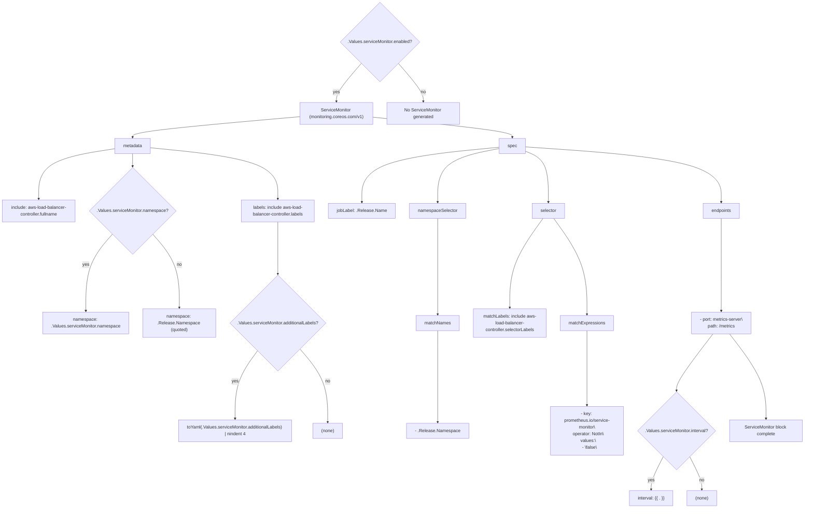

# Diagram: devops/k8s/aws-load-balancer-controller/helm/templates/servicemonitor.yaml

> Auto-generated by Obscura crawlers

## Mermaid

### SVG

<svg id="container" width="2869.48828125" xmlns="http://www.w3.org/2000/svg" class="flowchart" height="1815.953125" viewBox="0 0 2869.48828125 1815.953125" role="graphics-document document" aria-roledescription="flowchart-v2"><g><marker id="container_flowchart-v2-pointEnd" class="marker flowchart-v2" viewBox="0 0 10 10" refX="5" refY="5" markerUnits="userSpaceOnUse" markerWidth="8" markerHeight="8" orient="auto"><path d="M 0 0 L 10 5 L 0 10 z" class="arrowMarkerPath" style="stroke-width: 1; stroke-dasharray: 1, 0;"></path></marker><marker id="container_flowchart-v2-pointStart" class="marker flowchart-v2" viewBox="0 0 10 10" refX="4.5" refY="5" markerUnits="userSpaceOnUse" markerWidth="8" markerHeight="8" orient="auto"><path d="M 0 5 L 10 10 L 10 0 z" class="arrowMarkerPath" style="stroke-width: 1; stroke-dasharray: 1, 0;"></path></marker><marker id="container_flowchart-v2-circleEnd" class="marker flowchart-v2" viewBox="0 0 10 10" refX="11" refY="5" markerUnits="userSpaceOnUse" markerWidth="11" markerHeight="11" orient="auto"><circle cx="5" cy="5" r="5" class="arrowMarkerPath" style="stroke-width: 1; stroke-dasharray: 1, 0;"></circle></marker><marker id="container_flowchart-v2-circleStart" class="marker flowchart-v2" viewBox="0 0 10 10" refX="-1" refY="5" markerUnits="userSpaceOnUse" markerWidth="11" markerHeight="11" orient="auto"><circle cx="5" cy="5" r="5" class="arrowMarkerPath" style="stroke-width: 1; stroke-dasharray: 1, 0;"></circle></marker><marker id="container_flowchart-v2-crossEnd" class="marker cross flowchart-v2" viewBox="0 0 11 11" refX="12" refY="5.2" markerUnits="userSpaceOnUse" markerWidth="11" markerHeight="11" orient="auto"><path d="M 1,1 l 9,9 M 10,1 l -9,9" class="arrowMarkerPath" style="stroke-width: 2; stroke-dasharray: 1, 0;"></path></marker><marker id="container_flowchart-v2-crossStart" class="marker cross flowchart-v2" viewBox="0 0 11 11" refX="-1" refY="5.2" markerUnits="userSpaceOnUse" markerWidth="11" markerHeight="11" orient="auto"><path d="M 1,1 l 9,9 M 10,1 l -9,9" class="arrowMarkerPath" style="stroke-width: 2; stroke-dasharray: 1, 0;"></path></marker><g class="root"><g class="clusters"></g><g class="edgePaths"><path d="M1287.077,226.467L1272.236,243.627C1257.395,260.786,1227.713,295.104,1212.872,317.763C1198.031,340.422,1198.031,351.422,1198.031,356.922L1198.031,362.422" id="L_EN_SM_0" class="edge-thickness-normal edge-pattern-solid edge-thickness-normal edge-pattern-solid flowchart-link" style=";" data-edge="true" data-et="edge" data-id="L_EN_SM_0" data-points="W3sieCI6MTI4Ny4wNzY4MDk3MzcyNTQzLCJ5IjoyMjYuNDY3NDM0NzM3MjU0MjV9LHsieCI6MTE5OC4wMzEyNSwieSI6MzI5LjQyMTg3NX0seyJ4IjoxMTk4LjAzMTI1LCJ5IjozNjYuNDIxODc1fV0=" marker-end="url(#container_flowchart-v2-pointEnd)"></path><path d="M1418.986,226.467L1433.827,243.627C1448.668,260.786,1478.349,295.104,1493.19,317.763C1508.031,340.422,1508.031,351.422,1508.031,356.922L1508.031,362.422" id="L_EN_NO_0" class="edge-thickness-normal edge-pattern-solid edge-thickness-normal edge-pattern-solid flowchart-link" style=";" data-edge="true" data-et="edge" data-id="L_EN_NO_0" data-points="W3sieCI6MTQxOC45ODU2OTAyNjI3NDU3LCJ5IjoyMjYuNDY3NDM0NzM3MjU0MjV9LHsieCI6MTUwOC4wMzEyNSwieSI6MzI5LjQyMTg3NX0seyJ4IjoxNTA4LjAzMTI1LCJ5IjozNjYuNDIxODc1fV0=" marker-end="url(#container_flowchart-v2-pointEnd)"></path><path d="M1068.031,416.872L968.595,425.63C869.159,434.389,670.286,451.905,570.85,464.164C471.414,476.422,471.414,483.422,471.414,486.922L471.414,490.422" id="L_SM_MD_0" class="edge-thickness-normal edge-pattern-solid edge-thickness-normal edge-pattern-solid flowchart-link" style=";" data-edge="true" data-et="edge" data-id="L_SM_MD_0" data-points="W3sieCI6MTA2OC4wMzEyNSwieSI6NDE2Ljg3MjE5NTk0MzU4NDg3fSx7IngiOjQ3MS40MTQwNjI1LCJ5Ijo0NjkuNDIxODc1fSx7IngiOjQ3MS40MTQwNjI1LCJ5Ijo0OTQuNDIxODc1fV0=" marker-end="url(#container_flowchart-v2-pointEnd)"></path><path d="M406.688,531.517L361.906,538.501C317.125,545.485,227.563,559.454,182.781,587.007C138,614.56,138,655.698,138,676.267L138,696.836" id="L_MD_INCL_FULLNAME_0" class="edge-thickness-normal edge-pattern-solid edge-thickness-normal edge-pattern-solid flowchart-link" style=";" data-edge="true" data-et="edge" data-id="L_MD_INCL_FULLNAME_0" data-points="W3sieCI6NDA2LjY4NzUsInkiOjUzMS41MTY3NzM4OTE2NzQ3fSx7IngiOjEzOCwieSI6NTczLjQyMTg3NX0seyJ4IjoxMzgsInkiOjcwMC44MzU5Mzc1fV0=" marker-end="url(#container_flowchart-v2-pointEnd)"></path><path d="M471.414,548.422L471.414,552.589C471.414,556.755,471.414,565.089,471.414,572.755C471.414,580.422,471.414,587.422,471.414,590.922L471.414,594.422" id="L_MD_NS_CHK_0" class="edge-thickness-normal edge-pattern-solid edge-thickness-normal edge-pattern-solid flowchart-link" style=";" data-edge="true" data-et="edge" data-id="L_MD_NS_CHK_0" data-points="W3sieCI6NDcxLjQxNDA2MjUsInkiOjU0OC40MjE4NzV9LHsieCI6NDcxLjQxNDA2MjUsInkiOjU3My40MjE4NzV9LHsieCI6NDcxLjQxNDA2MjUsInkiOjU5OC40MjE4NzV9XQ==" marker-end="url(#container_flowchart-v2-pointEnd)"></path><path d="M399.84,833.676L384.015,851.772C368.189,869.867,336.538,906.059,320.712,952.02C304.887,997.982,304.887,1053.714,304.887,1081.579L304.887,1109.445" id="L_NS_CHK_NS_VAL_0" class="edge-thickness-normal edge-pattern-solid edge-thickness-normal edge-pattern-solid flowchart-link" style=";" data-edge="true" data-et="edge" data-id="L_NS_CHK_NS_VAL_0" data-points="W3sieCI6Mzk5Ljg0MDMwODcyNzg1Mjc0LCJ5Ijo4MzMuNjc2MjQ2MjI3ODUyN30seyJ4IjozMDQuODg2NzE4NzUsInkiOjk0Mi4yNX0seyJ4IjozMDQuODg2NzE4NzUsInkiOjExMTMuNDQ1MzEyNX1d" marker-end="url(#container_flowchart-v2-pointEnd)"></path><path d="M542.988,833.676L558.813,851.772C574.639,869.867,606.29,906.059,622.116,950.02C637.941,993.982,637.941,1045.714,637.941,1071.579L637.941,1097.445" id="L_NS_CHK_NS_REL_0" class="edge-thickness-normal edge-pattern-solid edge-thickness-normal edge-pattern-solid flowchart-link" style=";" data-edge="true" data-et="edge" data-id="L_NS_CHK_NS_REL_0" data-points="W3sieCI6NTQyLjk4NzgxNjI3MjE0NzMsInkiOjgzMy42NzYyNDYyMjc4NTI3fSx7IngiOjYzNy45NDE0MDYyNSwieSI6OTQyLjI1fSx7IngiOjYzNy45NDE0MDYyNSwieSI6MTEwMS40NDUzMTI1fV0=" marker-end="url(#container_flowchart-v2-pointEnd)"></path><path d="M536.141,527.898L611.973,535.485C687.806,543.073,839.471,558.247,915.304,588.404C991.137,618.56,991.137,663.698,991.137,686.267L991.137,708.836" id="L_MD_LABELS_0" class="edge-thickness-normal edge-pattern-solid edge-thickness-normal edge-pattern-solid flowchart-link" style=";" data-edge="true" data-et="edge" data-id="L_MD_LABELS_0" data-points="W3sieCI6NTM2LjE0MDYyNSwieSI6NTI3Ljg5Nzk4NTMwNTIyNTl9LHsieCI6OTkxLjEzNjcxODc1LCJ5Ijo1NzMuNDIxODc1fSx7IngiOjk5MS4xMzY3MTg3NSwieSI6NzEyLjgzNTkzNzV9XQ==" marker-end="url(#container_flowchart-v2-pointEnd)"></path><path d="M991.137,790.836L991.137,816.072C991.137,841.307,991.137,891.779,991.137,922.514C991.137,953.25,991.137,964.25,991.137,969.75L991.137,975.25" id="L_LABELS_ADDL_CHK_0" class="edge-thickness-normal edge-pattern-solid edge-thickness-normal edge-pattern-solid flowchart-link" style=";" data-edge="true" data-et="edge" data-id="L_LABELS_ADDL_CHK_0" data-points="W3sieCI6OTkxLjEzNjcxODc1LCJ5Ijo3OTAuODM1OTM3NX0seyJ4Ijo5OTEuMTM2NzE4NzUsInkiOjk0Mi4yNX0seyJ4Ijo5OTEuMTM2NzE4NzUsInkiOjk3OS4yNX1d" marker-end="url(#container_flowchart-v2-pointEnd)"></path><path d="M917.843,1252.347L904.357,1270.729C890.871,1289.112,863.898,1325.876,850.412,1366.618C836.926,1407.359,836.926,1452.078,836.926,1474.438L836.926,1496.797" id="L_ADDL_CHK_ADDL_YAML_0" class="edge-thickness-normal edge-pattern-solid edge-thickness-normal edge-pattern-solid flowchart-link" style=";" data-edge="true" data-et="edge" data-id="L_ADDL_CHK_ADDL_YAML_0" data-points="W3sieCI6OTE3Ljg0MzIxMzE4NzkyMzQsInkiOjEyNTIuMzQ3MTE5NDM3OTIzM30seyJ4Ijo4MzYuOTI1NzgxMjUsInkiOjEzNjIuNjQwNjI1fSx7IngiOjgzNi45MjU3ODEyNSwieSI6MTUwMC43OTY4NzV9XQ==" marker-end="url(#container_flowchart-v2-pointEnd)"></path><path d="M1070.416,1246.361L1086.776,1265.741C1103.136,1285.121,1135.855,1323.881,1152.215,1367.62C1168.574,1411.359,1168.574,1460.078,1168.574,1484.438L1168.574,1508.797" id="L_ADDL_CHK_ADDL_NONE_0" class="edge-thickness-normal edge-pattern-solid edge-thickness-normal edge-pattern-solid flowchart-link" style=";" data-edge="true" data-et="edge" data-id="L_ADDL_CHK_ADDL_NONE_0" data-points="W3sieCI6MTA3MC40MTYyMzg2MjIyMjEzLCJ5IjoxMjQ2LjM2MTEwNTEyNzc3ODd9LHsieCI6MTE2OC41NzQyMTg3NSwieSI6MTM2Mi42NDA2MjV9LHsieCI6MTE2OC41NzQyMTg3NSwieSI6MTUxMi43OTY4NzV9XQ==" marker-end="url(#container_flowchart-v2-pointEnd)"></path><path d="M1328.031,418.695L1410.837,427.149C1493.643,435.604,1659.255,452.513,1742.061,464.467C1824.867,476.422,1824.867,483.422,1824.867,486.922L1824.867,490.422" id="L_SM_SPEC_0" class="edge-thickness-normal edge-pattern-solid edge-thickness-normal edge-pattern-solid flowchart-link" style=";" data-edge="true" data-et="edge" data-id="L_SM_SPEC_0" data-points="W3sieCI6MTMyOC4wMzEyNSwieSI6NDE4LjY5NDg4NTUzMTU2MzU2fSx7IngiOjE4MjQuODY3MTg3NSwieSI6NDY5LjQyMTg3NX0seyJ4IjoxODI0Ljg2NzE4NzUsInkiOjQ5NC40MjE4NzV9XQ==" marker-end="url(#container_flowchart-v2-pointEnd)"></path><path d="M1778.188,525.955L1696.732,533.867C1615.277,541.778,1452.367,557.6,1370.912,590.08C1289.457,622.56,1289.457,671.698,1289.457,696.267L1289.457,720.836" id="L_SPEC_JOB_0" class="edge-thickness-normal edge-pattern-solid edge-thickness-normal edge-pattern-solid flowchart-link" style=";" data-edge="true" data-et="edge" data-id="L_SPEC_JOB_0" data-points="W3sieCI6MTc3OC4xODc1LCJ5Ijo1MjUuOTU1NDkwNDM3OTMxfSx7IngiOjEyODkuNDU3MDMxMjUsInkiOjU3My40MjE4NzV9LHsieCI6MTI4OS40NTcwMzEyNSwieSI6NzI0LjgzNTkzNzV9XQ==" marker-end="url(#container_flowchart-v2-pointEnd)"></path><path d="M1778.188,530.537L1741.583,537.684C1704.978,544.832,1631.768,559.127,1595.163,590.843C1558.559,622.56,1558.559,671.698,1558.559,696.267L1558.559,720.836" id="L_SPEC_NSSEL_0" class="edge-thickness-normal edge-pattern-solid edge-thickness-normal edge-pattern-solid flowchart-link" style=";" data-edge="true" data-et="edge" data-id="L_SPEC_NSSEL_0" data-points="W3sieCI6MTc3OC4xODc1LCJ5Ijo1MzAuNTM2NjUzMTQ0NDgxMX0seyJ4IjoxNTU4LjU1ODU5Mzc1LCJ5Ijo1NzMuNDIxODc1fSx7IngiOjE1NTguNTU4NTkzNzUsInkiOjcyNC44MzU5Mzc1fV0=" marker-end="url(#container_flowchart-v2-pointEnd)"></path><path d="M1558.559,778.836L1558.559,806.072C1558.559,833.307,1558.559,887.779,1558.559,944.88C1558.559,1001.982,1558.559,1061.714,1558.559,1091.579L1558.559,1121.445" id="L_NSSEL_MATCHNAMES_0" class="edge-thickness-normal edge-pattern-solid edge-thickness-normal edge-pattern-solid flowchart-link" style=";" data-edge="true" data-et="edge" data-id="L_NSSEL_MATCHNAMES_0" data-points="W3sieCI6MTU1OC41NTg1OTM3NSwieSI6Nzc4LjgzNTkzNzV9LHsieCI6MTU1OC41NTg1OTM3NSwieSI6OTQyLjI1fSx7IngiOjE1NTguNTU4NTkzNzUsInkiOjExMjUuNDQ1MzEyNX1d" marker-end="url(#container_flowchart-v2-pointEnd)"></path><path d="M1558.559,1179.445L1558.559,1209.978C1558.559,1240.51,1558.559,1301.576,1558.559,1356.467C1558.559,1411.359,1558.559,1460.078,1558.559,1484.438L1558.559,1508.797" id="L_MATCHNAMES_RELEASE_NS_0" class="edge-thickness-normal edge-pattern-solid edge-thickness-normal edge-pattern-solid flowchart-link" style=";" data-edge="true" data-et="edge" data-id="L_MATCHNAMES_RELEASE_NS_0" data-points="W3sieCI6MTU1OC41NTg1OTM3NSwieSI6MTE3OS40NDUzMTI1fSx7IngiOjE1NTguNTU4NTkzNzUsInkiOjEzNjIuNjQwNjI1fSx7IngiOjE1NTguNTU4NTkzNzUsInkiOjE1MTIuNzk2ODc1fV0=" marker-end="url(#container_flowchart-v2-pointEnd)"></path><path d="M1871.547,540.293L1885.205,545.814C1898.863,551.336,1926.18,562.379,1939.838,592.469C1953.496,622.56,1953.496,671.698,1953.496,696.267L1953.496,720.836" id="L_SPEC_SEL_0" class="edge-thickness-normal edge-pattern-solid edge-thickness-normal edge-pattern-solid flowchart-link" style=";" data-edge="true" data-et="edge" data-id="L_SPEC_SEL_0" data-points="W3sieCI6MTg3MS41NDY4NzUsInkiOjU0MC4yOTI3NzkwNjYzMjQ2fSx7IngiOjE5NTMuNDk2MDkzNzUsInkiOjU3My40MjE4NzV9LHsieCI6MTk1My40OTYwOTM3NSwieSI6NzI0LjgzNTkzNzV9XQ==" marker-end="url(#container_flowchart-v2-pointEnd)"></path><path d="M1933.974,778.836L1914.281,806.072C1894.588,833.307,1855.202,887.779,1835.509,940.88C1815.816,993.982,1815.816,1045.714,1815.816,1071.579L1815.816,1097.445" id="L_SEL_MLABELS_0" class="edge-thickness-normal edge-pattern-solid edge-thickness-normal edge-pattern-solid flowchart-link" style=";" data-edge="true" data-et="edge" data-id="L_SEL_MLABELS_0" data-points="W3sieCI6MTkzMy45NzM2MzAzNjgzODkyLCJ5Ijo3NzguODM1OTM3NX0seyJ4IjoxODE1LjgxNjQwNjI1LCJ5Ijo5NDIuMjV9LHsieCI6MTgxNS44MTY0MDYyNSwieSI6MTEwMS40NDUzMTI1fV0=" marker-end="url(#container_flowchart-v2-pointEnd)"></path><path d="M1973.019,778.836L1992.711,806.072C2012.404,833.307,2051.79,887.779,2071.483,944.88C2091.176,1001.982,2091.176,1061.714,2091.176,1091.579L2091.176,1121.445" id="L_SEL_MEXP_0" class="edge-thickness-normal edge-pattern-solid edge-thickness-normal edge-pattern-solid flowchart-link" style=";" data-edge="true" data-et="edge" data-id="L_SEL_MEXP_0" data-points="W3sieCI6MTk3My4wMTg1NTcxMzE2MTA4LCJ5Ijo3NzguODM1OTM3NX0seyJ4IjoyMDkxLjE3NTc4MTI1LCJ5Ijo5NDIuMjV9LHsieCI6MjA5MS4xNzU3ODEyNSwieSI6MTEyNS40NDUzMTI1fV0=" marker-end="url(#container_flowchart-v2-pointEnd)"></path><path d="M2091.176,1179.445L2091.176,1209.978C2091.176,1240.51,2091.176,1301.576,2091.176,1348.467C2091.176,1395.359,2091.176,1428.078,2091.176,1444.438L2091.176,1460.797" id="L_MEXP_PROM_EXPR_0" class="edge-thickness-normal edge-pattern-solid edge-thickness-normal edge-pattern-solid flowchart-link" style=";" data-edge="true" data-et="edge" data-id="L_MEXP_PROM_EXPR_0" data-points="W3sieCI6MjA5MS4xNzU3ODEyNSwieSI6MTE3OS40NDUzMTI1fSx7IngiOjIwOTEuMTc1NzgxMjUsInkiOjEzNjIuNjQwNjI1fSx7IngiOjIwOTEuMTc1NzgxMjUsInkiOjE0NjQuNzk2ODc1fV0=" marker-end="url(#container_flowchart-v2-pointEnd)"></path><path d="M1871.547,524.673L1988.191,532.798C2104.835,540.923,2338.122,557.172,2454.766,589.866C2571.41,622.56,2571.41,671.698,2571.41,696.267L2571.41,720.836" id="L_SPEC_EP_0" class="edge-thickness-normal edge-pattern-solid edge-thickness-normal edge-pattern-solid flowchart-link" style=";" data-edge="true" data-et="edge" data-id="L_SPEC_EP_0" data-points="W3sieCI6MTg3MS41NDY4NzUsInkiOjUyNC42NzMzMjA0NjQ3NzI1fSx7IngiOjI1NzEuNDEwMTU2MjUsInkiOjU3My40MjE4NzV9LHsieCI6MjU3MS40MTAxNTYyNSwieSI6NzI0LjgzNTkzNzV9XQ==" marker-end="url(#container_flowchart-v2-pointEnd)"></path><path d="M2571.41,778.836L2571.41,806.072C2571.41,833.307,2571.41,887.779,2571.41,942.88C2571.41,997.982,2571.41,1053.714,2571.41,1081.579L2571.41,1109.445" id="L_EP_EP_ITEM_0" class="edge-thickness-normal edge-pattern-solid edge-thickness-normal edge-pattern-solid flowchart-link" style=";" data-edge="true" data-et="edge" data-id="L_EP_EP_ITEM_0" data-points="W3sieCI6MjU3MS40MTAxNTYyNSwieSI6Nzc4LjgzNTkzNzV9LHsieCI6MjU3MS40MTAxNTYyNSwieSI6OTQyLjI1fSx7IngiOjI1NzEuNDEwMTU2MjUsInkiOjExMTMuNDQ1MzEyNX1d" marker-end="url(#container_flowchart-v2-pointEnd)"></path><path d="M2541.709,1191.445L2519.979,1219.978C2498.25,1248.51,2454.791,1305.576,2433.062,1339.608C2411.332,1373.641,2411.332,1384.641,2411.332,1390.141L2411.332,1395.641" id="L_EP_ITEM_INT_CHK_0" class="edge-thickness-normal edge-pattern-solid edge-thickness-normal edge-pattern-solid flowchart-link" style=";" data-edge="true" data-et="edge" data-id="L_EP_ITEM_INT_CHK_0" data-points="W3sieCI6MjU0MS43MDg5ODU0NjM5MDA3LCJ5IjoxMTkxLjQ0NTMxMjV9LHsieCI6MjQxMS4zMzIwMzEyNSwieSI6MTM2Mi42NDA2MjV9LHsieCI6MjQxMS4zMzIwMzEyNSwieSI6MTM5OS42NDA2MjV9XQ==" marker-end="url(#container_flowchart-v2-pointEnd)"></path><path d="M2363.81,1632.431L2356.583,1646.518C2349.356,1660.605,2334.903,1688.779,2327.676,1708.366C2320.449,1727.953,2320.449,1738.953,2320.449,1744.453L2320.449,1749.953" id="L_INT_CHK_INT_VAL_0" class="edge-thickness-normal edge-pattern-solid edge-thickness-normal edge-pattern-solid flowchart-link" style=";" data-edge="true" data-et="edge" data-id="L_INT_CHK_INT_VAL_0" data-points="W3sieCI6MjM2My44MDk4NzUwNzM3NzgsInkiOjE2MzIuNDMwOTY4ODIzNzc4MX0seyJ4IjoyMzIwLjQ0OTIxODc1LCJ5IjoxNzE2Ljk1MzEyNX0seyJ4IjoyMzIwLjQ0OTIxODc1LCJ5IjoxNzUzLjk1MzEyNX1d" marker-end="url(#container_flowchart-v2-pointEnd)"></path><path d="M2458.854,1632.431L2466.081,1646.518C2473.308,1660.605,2487.761,1688.779,2494.988,1708.366C2502.215,1727.953,2502.215,1738.953,2502.215,1744.453L2502.215,1749.953" id="L_INT_CHK_INT_NONE_0" class="edge-thickness-normal edge-pattern-solid edge-thickness-normal edge-pattern-solid flowchart-link" style=";" data-edge="true" data-et="edge" data-id="L_INT_CHK_INT_NONE_0" data-points="W3sieCI6MjQ1OC44NTQxODc0MjYyMjIsInkiOjE2MzIuNDMwOTY4ODIzNzc4MX0seyJ4IjoyNTAyLjIxNDg0Mzc1LCJ5IjoxNzE2Ljk1MzEyNX0seyJ4IjoyNTAyLjIxNDg0Mzc1LCJ5IjoxNzUzLjk1MzEyNX1d" marker-end="url(#container_flowchart-v2-pointEnd)"></path><path d="M2601.111,1191.445L2622.841,1219.978C2644.57,1248.51,2688.029,1305.576,2709.759,1356.467C2731.488,1407.359,2731.488,1452.078,2731.488,1474.438L2731.488,1496.797" id="L_EP_ITEM_COMPLETE_0" class="edge-thickness-normal edge-pattern-solid edge-thickness-normal edge-pattern-solid flowchart-link" style=";" data-edge="true" data-et="edge" data-id="L_EP_ITEM_COMPLETE_0" data-points="W3sieCI6MjYwMS4xMTEzMjcwMzYwOTkzLCJ5IjoxMTkxLjQ0NTMxMjV9LHsieCI6MjczMS40ODgyODEyNSwieSI6MTM2Mi42NDA2MjV9LHsieCI6MjczMS40ODgyODEyNSwieSI6MTUwMC43OTY4NzV9XQ==" marker-end="url(#container_flowchart-v2-pointEnd)"></path></g><g class="edgeLabels"><g class="edgeLabel" transform="translate(1198.03125, 329.421875)"><g class="label" data-id="L_EN_SM_0" transform="translate(-12.0078125, -12)"><foreignObject width="24.015625" height="24">

yes

</foreignObject></g></g><g class="edgeLabel" transform="translate(1508.03125, 329.421875)"><g class="label" data-id="L_EN_NO_0" transform="translate(-9.3671875, -12)"><foreignObject width="18.734375" height="24">

no

</foreignObject></g></g><g class="edgeLabel"><g class="label" data-id="L_SM_MD_0" transform="translate(0, 0)"><foreignObject width="0" height="0">

</foreignObject></g></g><g class="edgeLabel"><g class="label" data-id="L_MD_INCL_FULLNAME_0" transform="translate(0, 0)"><foreignObject width="0" height="0">

</foreignObject></g></g><g class="edgeLabel"><g class="label" data-id="L_MD_NS_CHK_0" transform="translate(0, 0)"><foreignObject width="0" height="0">

</foreignObject></g></g><g class="edgeLabel" transform="translate(304.88671875, 942.25)"><g class="label" data-id="L_NS_CHK_NS_VAL_0" transform="translate(-12.0078125, -12)"><foreignObject width="24.015625" height="24">

yes

</foreignObject></g></g><g class="edgeLabel" transform="translate(637.94140625, 942.25)"><g class="label" data-id="L_NS_CHK_NS_REL_0" transform="translate(-9.3671875, -12)"><foreignObject width="18.734375" height="24">

no

</foreignObject></g></g><g class="edgeLabel"><g class="label" data-id="L_MD_LABELS_0" transform="translate(0, 0)"><foreignObject width="0" height="0">

</foreignObject></g></g><g class="edgeLabel"><g class="label" data-id="L_LABELS_ADDL_CHK_0" transform="translate(0, 0)"><foreignObject width="0" height="0">

</foreignObject></g></g><g class="edgeLabel" transform="translate(836.92578125, 1362.640625)"><g class="label" data-id="L_ADDL_CHK_ADDL_YAML_0" transform="translate(-12.0078125, -12)"><foreignObject width="24.015625" height="24">

yes

</foreignObject></g></g><g class="edgeLabel" transform="translate(1168.57421875, 1362.640625)"><g class="label" data-id="L_ADDL_CHK_ADDL_NONE_0" transform="translate(-9.3671875, -12)"><foreignObject width="18.734375" height="24">

no

</foreignObject></g></g><g class="edgeLabel"><g class="label" data-id="L_SM_SPEC_0" transform="translate(0, 0)"><foreignObject width="0" height="0">

</foreignObject></g></g><g class="edgeLabel"><g class="label" data-id="L_SPEC_JOB_0" transform="translate(0, 0)"><foreignObject width="0" height="0">

</foreignObject></g></g><g class="edgeLabel"><g class="label" data-id="L_SPEC_NSSEL_0" transform="translate(0, 0)"><foreignObject width="0" height="0">

</foreignObject></g></g><g class="edgeLabel"><g class="label" data-id="L_NSSEL_MATCHNAMES_0" transform="translate(0, 0)"><foreignObject width="0" height="0">

</foreignObject></g></g><g class="edgeLabel"><g class="label" data-id="L_MATCHNAMES_RELEASE_NS_0" transform="translate(0, 0)"><foreignObject width="0" height="0">

</foreignObject></g></g><g class="edgeLabel"><g class="label" data-id="L_SPEC_SEL_0" transform="translate(0, 0)"><foreignObject width="0" height="0">

</foreignObject></g></g><g class="edgeLabel"><g class="label" data-id="L_SEL_MLABELS_0" transform="translate(0, 0)"><foreignObject width="0" height="0">

</foreignObject></g></g><g class="edgeLabel"><g class="label" data-id="L_SEL_MEXP_0" transform="translate(0, 0)"><foreignObject width="0" height="0">

</foreignObject></g></g><g class="edgeLabel"><g class="label" data-id="L_MEXP_PROM_EXPR_0" transform="translate(0, 0)"><foreignObject width="0" height="0">

</foreignObject></g></g><g class="edgeLabel"><g class="label" data-id="L_SPEC_EP_0" transform="translate(0, 0)"><foreignObject width="0" height="0">

</foreignObject></g></g><g class="edgeLabel"><g class="label" data-id="L_EP_EP_ITEM_0" transform="translate(0, 0)"><foreignObject width="0" height="0">

</foreignObject></g></g><g class="edgeLabel"><g class="label" data-id="L_EP_ITEM_INT_CHK_0" transform="translate(0, 0)"><foreignObject width="0" height="0">

</foreignObject></g></g><g class="edgeLabel" transform="translate(2320.44921875, 1716.953125)"><g class="label" data-id="L_INT_CHK_INT_VAL_0" transform="translate(-12.0078125, -12)"><foreignObject width="24.015625" height="24">

yes

</foreignObject></g></g><g class="edgeLabel" transform="translate(2502.21484375, 1716.953125)"><g class="label" data-id="L_INT_CHK_INT_NONE_0" transform="translate(-9.3671875, -12)"><foreignObject width="18.734375" height="24">

no

</foreignObject></g></g><g class="edgeLabel"><g class="label" data-id="L_EP_ITEM_COMPLETE_0" transform="translate(0, 0)"><foreignObject width="0" height="0">

</foreignObject></g></g></g><g class="nodes"><g class="node default" id="flowchart-EN-0" transform="translate(1353.03125, 150.2109375)"><polygon points="142.2109375,0 284.421875,-142.2109375 142.2109375,-284.421875 0,-142.2109375" class="label-container" transform="translate(-141.7109375, 142.2109375)"></polygon><g class="label" style="" transform="translate(-115.2109375, -12)"><rect></rect><foreignObject width="230.421875" height="24">

.Values.serviceMonitor.enabled?

</foreignObject></g></g><g class="node default" id="flowchart-SM-1" transform="translate(1198.03125, 405.421875)"><rect class="basic label-container" style="" x="-130" y="-39" width="260" height="78"></rect><g class="label" style="" transform="translate(-100, -24)"><rect></rect><foreignObject width="200" height="48">

ServiceMonitor (monitoring.coreos.com/v1)

</foreignObject></g></g><g class="node default" id="flowchart-NO-3" transform="translate(1508.03125, 405.421875)"><rect class="basic label-container" style="" x="-130" y="-39" width="260" height="78"></rect><g class="label" style="" transform="translate(-100, -24)"><rect></rect><foreignObject width="200" height="48">

No ServiceMonitor generated

</foreignObject></g></g><g class="node default" id="flowchart-MD-5" transform="translate(471.4140625, 521.421875)"><rect class="basic label-container" style="" x="-64.7265625" y="-27" width="129.453125" height="54"></rect><g class="label" style="" transform="translate(-34.7265625, -12)"><rect></rect><foreignObject width="69.453125" height="24">

metadata

</foreignObject></g></g><g class="node default" id="flowchart-INCL_FULLNAME-7" transform="translate(138, 751.8359375)"><rect class="basic label-container" style="" x="-130" y="-51" width="260" height="102"></rect><g class="label" style="" transform="translate(-100, -36)"><rect></rect><foreignObject width="200" height="72">

include: aws-load-balancer-controller.fullname

</foreignObject></g></g><g class="node default" id="flowchart-NS_CHK-9" transform="translate(471.4140625, 751.8359375)"><polygon points="153.4140625,0 306.828125,-153.4140625 153.4140625,-306.828125 0,-153.4140625" class="label-container" transform="translate(-152.9140625, 153.4140625)"></polygon><g class="label" style="" transform="translate(-126.4140625, -12)"><rect></rect><foreignObject width="252.828125" height="24">

.Values.serviceMonitor.namespace?

</foreignObject></g></g><g class="node default" id="flowchart-NS_VAL-11" transform="translate(304.88671875, 1152.4453125)"><rect class="basic label-container" style="" x="-153.0546875" y="-39" width="306.109375" height="78"></rect><g class="label" style="" transform="translate(-123.0546875, -24)"><rect></rect><foreignObject width="246.109375" height="48">

namespace: .Values.serviceMonitor.namespace

</foreignObject></g></g><g class="node default" id="flowchart-NS_REL-13" transform="translate(637.94140625, 1152.4453125)"><rect class="basic label-container" style="" x="-130" y="-51" width="260" height="102"></rect><g class="label" style="" transform="translate(-100, -36)"><rect></rect><foreignObject width="200" height="72">

namespace: .Release.Namespace (quoted)

</foreignObject></g></g><g class="node default" id="flowchart-LABELS-15" transform="translate(991.13671875, 751.8359375)"><rect class="basic label-container" style="" x="-130" y="-39" width="260" height="78"></rect><g class="label" style="" transform="translate(-100, -24)"><rect></rect><foreignObject width="200" height="48">

labels: include aws-load-balancer-controller.labels

</foreignObject></g></g><g class="node default" id="flowchart-ADDL_CHK-17" transform="translate(991.13671875, 1152.4453125)"><polygon points="173.1953125,0 346.390625,-173.1953125 173.1953125,-346.390625 0,-173.1953125" class="label-container" transform="translate(-172.6953125, 173.1953125)"></polygon><g class="label" style="" transform="translate(-146.1953125, -12)"><rect></rect><foreignObject width="292.390625" height="24">

.Values.serviceMonitor.additionalLabels?

</foreignObject></g></g><g class="node default" id="flowchart-ADDL_YAML-19" transform="translate(836.92578125, 1539.796875)"><rect class="basic label-container" style="" x="-204.828125" y="-39" width="409.65625" height="78"></rect><g class="label" style="" transform="translate(-174.828125, -24)"><rect></rect><foreignObject width="349.65625" height="48">

toYaml(.Values.serviceMonitor.additionalLabels) | nindent 4

</foreignObject></g></g><g class="node default" id="flowchart-ADDL_NONE-21" transform="translate(1168.57421875, 1539.796875)"><rect class="basic label-container" style="" x="-53.59375" y="-27" width="107.1875" height="54"></rect><g class="label" style="" transform="translate(-23.59375, -12)"><rect></rect><foreignObject width="47.1875" height="24">

(none)

</foreignObject></g></g><g class="node default" id="flowchart-SPEC-23" transform="translate(1824.8671875, 521.421875)"><rect class="basic label-container" style="" x="-46.6796875" y="-27" width="93.359375" height="54"></rect><g class="label" style="" transform="translate(-16.6796875, -12)"><rect></rect><foreignObject width="33.359375" height="24">

spec

</foreignObject></g></g><g class="node default" id="flowchart-JOB-25" transform="translate(1289.45703125, 751.8359375)"><rect class="basic label-container" style="" x="-118.3203125" y="-27" width="236.640625" height="54"></rect><g class="label" style="" transform="translate(-88.3203125, -12)"><rect></rect><foreignObject width="176.640625" height="24">

jobLabel: .Release.Name

</foreignObject></g></g><g class="node default" id="flowchart-NSSEL-27" transform="translate(1558.55859375, 751.8359375)"><rect class="basic label-container" style="" x="-100.78125" y="-27" width="201.5625" height="54"></rect><g class="label" style="" transform="translate(-70.78125, -12)"><rect></rect><foreignObject width="141.5625" height="24">

namespaceSelector

</foreignObject></g></g><g class="node default" id="flowchart-MATCHNAMES-29" transform="translate(1558.55859375, 1152.4453125)"><rect class="basic label-container" style="" x="-77.2578125" y="-27" width="154.515625" height="54"></rect><g class="label" style="" transform="translate(-47.2578125, -12)"><rect></rect><foreignObject width="94.515625" height="24">

matchNames

</foreignObject></g></g><g class="node default" id="flowchart-RELEASE_NS-31" transform="translate(1558.55859375, 1539.796875)"><rect class="basic label-container" style="" x="-108.953125" y="-27" width="217.90625" height="54"></rect><g class="label" style="" transform="translate(-78.953125, -12)"><rect></rect><foreignObject width="157.90625" height="24">
- .Release.Namespace
</foreignObject></g></g><g class="node default" id="flowchart-SEL-33" transform="translate(1953.49609375, 751.8359375)"><rect class="basic label-container" style="" x="-59.1171875" y="-27" width="118.234375" height="54"></rect><g class="label" style="" transform="translate(-29.1171875, -12)"><rect></rect><foreignObject width="58.234375" height="24">

selector

</foreignObject></g></g><g class="node default" id="flowchart-MLABELS-35" transform="translate(1815.81640625, 1152.4453125)"><rect class="basic label-container" style="" x="-130" y="-51" width="260" height="102"></rect><g class="label" style="" transform="translate(-100, -36)"><rect></rect><foreignObject width="200" height="72">

matchLabels: include aws-load-balancer-controller.selectorLabels

</foreignObject></g></g><g class="node default" id="flowchart-MEXP-37" transform="translate(2091.17578125, 1152.4453125)"><rect class="basic label-container" style="" x="-95.359375" y="-27" width="190.71875" height="54"></rect><g class="label" style="" transform="translate(-65.359375, -12)"><rect></rect><foreignObject width="130.71875" height="24">

matchExpressions

</foreignObject></g></g><g class="node default" id="flowchart-PROM_EXPR-39" transform="translate(2091.17578125, 1539.796875)"><rect class="basic label-container" style="" x="-130" y="-75" width="260" height="150"></rect><g class="label" style="" transform="translate(-100, -60)"><rect></rect><foreignObject width="200" height="120">
- key: prometheus.io/service-monitor\\n  operator: NotIn\\n  values:\\n    - \false\
</foreignObject></g></g><g class="node default" id="flowchart-EP-41" transform="translate(2571.41015625, 751.8359375)"><rect class="basic label-container" style="" x="-66.828125" y="-27" width="133.65625" height="54"></rect><g class="label" style="" transform="translate(-36.828125, -12)"><rect></rect><foreignObject width="73.65625" height="24">

endpoints

</foreignObject></g></g><g class="node default" id="flowchart-EP_ITEM-43" transform="translate(2571.41015625, 1152.4453125)"><rect class="basic label-container" style="" x="-130" y="-39" width="260" height="78"></rect><g class="label" style="" transform="translate(-100, -24)"><rect></rect><foreignObject width="200" height="48">
- port: metrics-server\\n  path: /metrics
</foreignObject></g></g><g class="node default" id="flowchart-INT_CHK-45" transform="translate(2411.33203125, 1539.796875)"><polygon points="140.15625,0 280.3125,-140.15625 140.15625,-280.3125 0,-140.15625" class="label-container" transform="translate(-139.65625, 140.15625)"></polygon><g class="label" style="" transform="translate(-113.15625, -12)"><rect></rect><foreignObject width="226.3125" height="24">

.Values.serviceMonitor.interval?

</foreignObject></g></g><g class="node default" id="flowchart-INT_VAL-47" transform="translate(2320.44921875, 1780.953125)"><rect class="basic label-container" style="" x="-78.171875" y="-27" width="156.34375" height="54"></rect><g class="label" style="" transform="translate(-48.171875, -12)"><rect></rect><foreignObject width="96.34375" height="24">

interval: {{ . }}

</foreignObject></g></g><g class="node default" id="flowchart-INT_NONE-49" transform="translate(2502.21484375, 1780.953125)"><rect class="basic label-container" style="" x="-53.59375" y="-27" width="107.1875" height="54"></rect><g class="label" style="" transform="translate(-23.59375, -12)"><rect></rect><foreignObject width="47.1875" height="24">

(none)

</foreignObject></g></g><g class="node default" id="flowchart-COMPLETE-51" transform="translate(2731.48828125, 1539.796875)"><rect class="basic label-container" style="" x="-130" y="-39" width="260" height="78"></rect><g class="label" style="" transform="translate(-100, -24)"><rect></rect><foreignObject width="200" height="48">

ServiceMonitor block complete

</foreignObject></g></g></g></g></g></svg>
