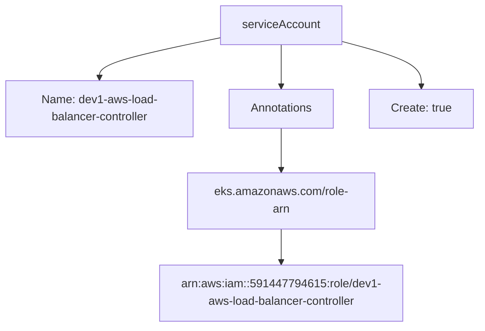

# Diagram: devops/k8s/aws-load-balancer-controller/helm/values.dev1.yaml

> Auto-generated by Obscura crawlers

## Mermaid

### SVG

<svg id="container" width="668.140625" xmlns="http://www.w3.org/2000/svg" class="flowchart" height="454" viewBox="0 0 668.140625 454" role="graphics-document document" aria-roledescription="flowchart-v2"><g><marker id="container_flowchart-v2-pointEnd" class="marker flowchart-v2" viewBox="0 0 10 10" refX="5" refY="5" markerUnits="userSpaceOnUse" markerWidth="8" markerHeight="8" orient="auto"><path d="M 0 0 L 10 5 L 0 10 z" class="arrowMarkerPath" style="stroke-width: 1; stroke-dasharray: 1, 0;"></path></marker><marker id="container_flowchart-v2-pointStart" class="marker flowchart-v2" viewBox="0 0 10 10" refX="4.5" refY="5" markerUnits="userSpaceOnUse" markerWidth="8" markerHeight="8" orient="auto"><path d="M 0 5 L 10 10 L 10 0 z" class="arrowMarkerPath" style="stroke-width: 1; stroke-dasharray: 1, 0;"></path></marker><marker id="container_flowchart-v2-circleEnd" class="marker flowchart-v2" viewBox="0 0 10 10" refX="11" refY="5" markerUnits="userSpaceOnUse" markerWidth="11" markerHeight="11" orient="auto"><circle cx="5" cy="5" r="5" class="arrowMarkerPath" style="stroke-width: 1; stroke-dasharray: 1, 0;"></circle></marker><marker id="container_flowchart-v2-circleStart" class="marker flowchart-v2" viewBox="0 0 10 10" refX="-1" refY="5" markerUnits="userSpaceOnUse" markerWidth="11" markerHeight="11" orient="auto"><circle cx="5" cy="5" r="5" class="arrowMarkerPath" style="stroke-width: 1; stroke-dasharray: 1, 0;"></circle></marker><marker id="container_flowchart-v2-crossEnd" class="marker cross flowchart-v2" viewBox="0 0 11 11" refX="12" refY="5.2" markerUnits="userSpaceOnUse" markerWidth="11" markerHeight="11" orient="auto"><path d="M 1,1 l 9,9 M 10,1 l -9,9" class="arrowMarkerPath" style="stroke-width: 2; stroke-dasharray: 1, 0;"></path></marker><marker id="container_flowchart-v2-crossStart" class="marker cross flowchart-v2" viewBox="0 0 11 11" refX="-1" refY="5.2" markerUnits="userSpaceOnUse" markerWidth="11" markerHeight="11" orient="auto"><path d="M 1,1 l 9,9 M 10,1 l -9,9" class="arrowMarkerPath" style="stroke-width: 2; stroke-dasharray: 1, 0;"></path></marker><g class="root"><g class="clusters"></g><g class="edgePaths"><path d="M307.844,52.237L279.536,58.031C251.229,63.825,194.615,75.412,166.307,84.706C138,94,138,101,138,104.5L138,108" id="L_SA_N_0" class="edge-thickness-normal edge-pattern-solid edge-thickness-normal edge-pattern-solid flowchart-link" style=";" data-edge="true" data-et="edge" data-id="L_SA_N_0" data-points="W3sieCI6MzA3Ljg0Mzc1LCJ5Ijo1Mi4yMzczOTIzNzM5MjM3NH0seyJ4IjoxMzgsInkiOjg3fSx7IngiOjEzOCwieSI6MTEyfV0=" marker-end="url(#container_flowchart-v2-pointEnd)"></path><path d="M392.063,62L392.063,66.167C392.063,70.333,392.063,78.667,392.063,88.333C392.063,98,392.063,109,392.063,114.5L392.063,120" id="L_SA_AN_0" class="edge-thickness-normal edge-pattern-solid edge-thickness-normal edge-pattern-solid flowchart-link" style=";" data-edge="true" data-et="edge" data-id="L_SA_AN_0" data-points="W3sieCI6MzkyLjA2MjUsInkiOjYyfSx7IngiOjM5Mi4wNjI1LCJ5Ijo4N30seyJ4IjozOTIuMDYyNSwieSI6MTI0fV0=" marker-end="url(#container_flowchart-v2-pointEnd)"></path><path d="M392.063,178L392.063,184.167C392.063,190.333,392.063,202.667,392.063,212.333C392.063,222,392.063,229,392.063,232.5L392.063,236" id="L_AN_K_0" class="edge-thickness-normal edge-pattern-solid edge-thickness-normal edge-pattern-solid flowchart-link" style=";" data-edge="true" data-et="edge" data-id="L_AN_K_0" data-points="W3sieCI6MzkyLjA2MjUsInkiOjE3OH0seyJ4IjozOTIuMDYyNSwieSI6MjE1fSx7IngiOjM5Mi4wNjI1LCJ5IjoyNDB9XQ==" marker-end="url(#container_flowchart-v2-pointEnd)"></path><path d="M392.063,318L392.063,322.167C392.063,326.333,392.063,334.667,392.063,342.333C392.063,350,392.063,357,392.063,360.5L392.063,364" id="L_K_V_0" class="edge-thickness-normal edge-pattern-solid edge-thickness-normal edge-pattern-solid flowchart-link" style=";" data-edge="true" data-et="edge" data-id="L_K_V_0" data-points="W3sieCI6MzkyLjA2MjUsInkiOjMxOH0seyJ4IjozOTIuMDYyNSwieSI6MzQzfSx7IngiOjM5Mi4wNjI1LCJ5IjozNjh9XQ==" marker-end="url(#container_flowchart-v2-pointEnd)"></path><path d="M476.281,57.336L494.923,62.28C513.565,67.224,550.849,77.112,569.491,87.556C588.133,98,588.133,109,588.133,114.5L588.133,120" id="L_SA_C_0" class="edge-thickness-normal edge-pattern-solid edge-thickness-normal edge-pattern-solid flowchart-link" style=";" data-edge="true" data-et="edge" data-id="L_SA_C_0" data-points="W3sieCI6NDc2LjI4MTI1LCJ5Ijo1Ny4zMzU3MzczMzkxMjQxOTR9LHsieCI6NTg4LjEzMjgxMjUsInkiOjg3fSx7IngiOjU4OC4xMzI4MTI1LCJ5IjoxMjR9XQ==" marker-end="url(#container_flowchart-v2-pointEnd)"></path></g><g class="edgeLabels"><g class="edgeLabel"><g class="label" data-id="L_SA_N_0" transform="translate(0, 0)"><foreignObject width="0" height="0">

</foreignObject></g></g><g class="edgeLabel"><g class="label" data-id="L_SA_AN_0" transform="translate(0, 0)"><foreignObject width="0" height="0">

</foreignObject></g></g><g class="edgeLabel"><g class="label" data-id="L_AN_K_0" transform="translate(0, 0)"><foreignObject width="0" height="0">

</foreignObject></g></g><g class="edgeLabel"><g class="label" data-id="L_K_V_0" transform="translate(0, 0)"><foreignObject width="0" height="0">

</foreignObject></g></g><g class="edgeLabel"><g class="label" data-id="L_SA_C_0" transform="translate(0, 0)"><foreignObject width="0" height="0">

</foreignObject></g></g></g><g class="nodes"><g class="node default" id="flowchart-SA-0" transform="translate(392.0625, 35)"><rect class="basic label-container" style="" x="-84.21875" y="-27" width="168.4375" height="54"></rect><g class="label" style="" transform="translate(-54.21875, -12)"><rect></rect><foreignObject width="108.4375" height="24">

serviceAccount

</foreignObject></g></g><g class="node default" id="flowchart-N-2" transform="translate(138, 151)"><rect class="basic label-container" style="" x="-130" y="-39" width="260" height="78"></rect><g class="label" style="" transform="translate(-100, -24)"><rect></rect><foreignObject width="200" height="48">

Name: dev1-aws-load-balancer-controller

</foreignObject></g></g><g class="node default" id="flowchart-AN-4" transform="translate(392.0625, 151)"><rect class="basic label-container" style="" x="-74.0625" y="-27" width="148.125" height="54"></rect><g class="label" style="" transform="translate(-44.0625, -12)"><rect></rect><foreignObject width="88.125" height="24">

Annotations

</foreignObject></g></g><g class="node default" id="flowchart-K-6" transform="translate(392.0625, 279)"><rect class="basic label-container" style="" x="-130" y="-39" width="260" height="78"></rect><g class="label" style="" transform="translate(-100, -24)"><rect></rect><foreignObject width="200" height="48">

eks.amazonaws.com/role-arn

</foreignObject></g></g><g class="node default" id="flowchart-V-8" transform="translate(392.0625, 407)"><rect class="basic label-container" style="" x="-162.9609375" y="-39" width="325.921875" height="78"></rect><g class="label" style="" transform="translate(-132.9609375, -24)"><rect></rect><foreignObject width="265.921875" height="48">

arn:aws:iam::591447794615:role/dev1-aws-load-balancer-controller

</foreignObject></g></g><g class="node default" id="flowchart-C-10" transform="translate(588.1328125, 151)"><rect class="basic label-container" style="" x="-72.0078125" y="-27" width="144.015625" height="54"></rect><g class="label" style="" transform="translate(-42.0078125, -12)"><rect></rect><foreignObject width="84.015625" height="24">

Create: true

</foreignObject></g></g></g></g></g></svg>
