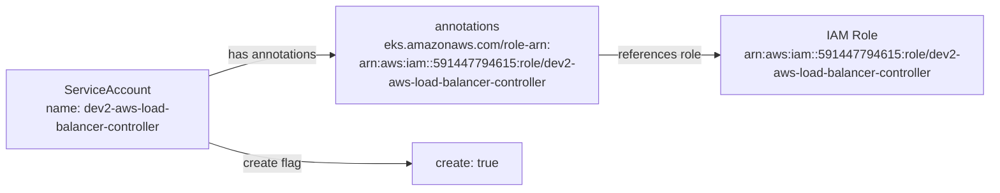

# Diagram: devops/k8s/aws-load-balancer-controller/helm/values.dev2.yaml

> Auto-generated by Obscura crawlers

## Mermaid

### SVG

<svg id="container" width="1348.21875" xmlns="http://www.w3.org/2000/svg" class="flowchart" height="222" viewBox="0 0 1348.21875 222" role="graphics-document document" aria-roledescription="flowchart-v2"><g><marker id="container_flowchart-v2-pointEnd" class="marker flowchart-v2" viewBox="0 0 10 10" refX="5" refY="5" markerUnits="userSpaceOnUse" markerWidth="8" markerHeight="8" orient="auto"><path d="M 0 0 L 10 5 L 0 10 z" class="arrowMarkerPath" style="stroke-width: 1; stroke-dasharray: 1, 0;"></path></marker><marker id="container_flowchart-v2-pointStart" class="marker flowchart-v2" viewBox="0 0 10 10" refX="4.5" refY="5" markerUnits="userSpaceOnUse" markerWidth="8" markerHeight="8" orient="auto"><path d="M 0 5 L 10 10 L 10 0 z" class="arrowMarkerPath" style="stroke-width: 1; stroke-dasharray: 1, 0;"></path></marker><marker id="container_flowchart-v2-circleEnd" class="marker flowchart-v2" viewBox="0 0 10 10" refX="11" refY="5" markerUnits="userSpaceOnUse" markerWidth="11" markerHeight="11" orient="auto"><circle cx="5" cy="5" r="5" class="arrowMarkerPath" style="stroke-width: 1; stroke-dasharray: 1, 0;"></circle></marker><marker id="container_flowchart-v2-circleStart" class="marker flowchart-v2" viewBox="0 0 10 10" refX="-1" refY="5" markerUnits="userSpaceOnUse" markerWidth="11" markerHeight="11" orient="auto"><circle cx="5" cy="5" r="5" class="arrowMarkerPath" style="stroke-width: 1; stroke-dasharray: 1, 0;"></circle></marker><marker id="container_flowchart-v2-crossEnd" class="marker cross flowchart-v2" viewBox="0 0 11 11" refX="12" refY="5.2" markerUnits="userSpaceOnUse" markerWidth="11" markerHeight="11" orient="auto"><path d="M 1,1 l 9,9 M 10,1 l -9,9" class="arrowMarkerPath" style="stroke-width: 2; stroke-dasharray: 1, 0;"></path></marker><marker id="container_flowchart-v2-crossStart" class="marker cross flowchart-v2" viewBox="0 0 11 11" refX="-1" refY="5.2" markerUnits="userSpaceOnUse" markerWidth="11" markerHeight="11" orient="auto"><path d="M 1,1 l 9,9 M 10,1 l -9,9" class="arrowMarkerPath" style="stroke-width: 2; stroke-dasharray: 1, 0;"></path></marker><g class="root"><g class="clusters"></g><g class="edgePaths"><path d="M268,84.056L281.94,79.88C295.88,75.704,323.76,67.352,350.974,63.176C378.188,59,404.734,59,418.008,59L431.281,59" id="L_SA_AN_0" class="edge-thickness-normal edge-pattern-solid edge-thickness-normal edge-pattern-solid flowchart-link" style=";" data-edge="true" data-et="edge" data-id="L_SA_AN_0" data-points="W3sieCI6MjY4LCJ5Ijo4NC4wNTYwOTU5NTU1MzI4MX0seyJ4IjozNTEuNjQwNjI1LCJ5Ijo1OX0seyJ4Ijo0MzUuMjgxMjUsInkiOjU5fV0=" marker-end="url(#container_flowchart-v2-pointEnd)"></path><path d="M806.609,59L819.798,59C832.987,59,859.365,59,885.076,59C910.786,59,935.831,59,948.353,59L960.875,59" id="L_AN_IAM_0" class="edge-thickness-normal edge-pattern-solid edge-thickness-normal edge-pattern-solid flowchart-link" style=";" data-edge="true" data-et="edge" data-id="L_AN_IAM_0" data-points="W3sieCI6ODA2LjYwOTM3NSwieSI6NTl9LHsieCI6ODg1Ljc0MjE4NzUsInkiOjU5fSx7IngiOjk2NC44NzUsInkiOjU5fV0=" marker-end="url(#container_flowchart-v2-pointEnd)"></path><path d="M268,161.944L281.94,166.12C295.88,170.296,323.76,178.648,370.007,182.824C416.253,187,480.865,187,513.171,187L545.477,187" id="L_SA_CREATE_0" class="edge-thickness-normal edge-pattern-solid edge-thickness-normal edge-pattern-solid flowchart-link" style=";" data-edge="true" data-et="edge" data-id="L_SA_CREATE_0" data-points="W3sieCI6MjY4LCJ5IjoxNjEuOTQzOTA0MDQ0NDY3Mn0seyJ4IjozNTEuNjQwNjI1LCJ5IjoxODd9LHsieCI6NTQ5LjQ3NjU2MjUsInkiOjE4N31d" marker-end="url(#container_flowchart-v2-pointEnd)"></path></g><g class="edgeLabels"><g class="edgeLabel" transform="translate(351.640625, 59)"><g class="label" data-id="L_SA_AN_0" transform="translate(-58.640625, -12)"><foreignObject width="117.28125" height="24">

has annotations

</foreignObject></g></g><g class="edgeLabel" transform="translate(885.7421875, 59)"><g class="label" data-id="L_AN_IAM_0" transform="translate(-54.1328125, -12)"><foreignObject width="108.265625" height="24">

references role

</foreignObject></g></g><g class="edgeLabel" transform="translate(351.640625, 187)"><g class="label" data-id="L_SA_CREATE_0" transform="translate(-37.6875, -12)"><foreignObject width="75.375" height="24">

create flag

</foreignObject></g></g></g><g class="nodes"><g class="node default" id="flowchart-SA-0" transform="translate(138, 123)"><rect class="basic label-container" style="" x="-130" y="-51" width="260" height="102"></rect><g class="label" style="" transform="translate(-100, -36)"><rect></rect><foreignObject width="200" height="72">

ServiceAccount\nname: dev2-aws-load-balancer-controller

</foreignObject></g></g><g class="node default" id="flowchart-AN-1" transform="translate(620.9453125, 59)"><rect class="basic label-container" style="" x="-185.6640625" y="-51" width="371.328125" height="102"></rect><g class="label" style="" transform="translate(-155.6640625, -36)"><rect></rect><foreignObject width="311.328125" height="72">

annotations\neks.amazonaws.com/role-arn:\narn:aws:iam::591447794615:role/dev2-aws-load-balancer-controller

</foreignObject></g></g><g class="node default" id="flowchart-IAM-2" transform="translate(1152.546875, 59)"><rect class="basic label-container" style="" x="-187.671875" y="-51" width="375.34375" height="102"></rect><g class="label" style="" transform="translate(-157.671875, -36)"><rect></rect><foreignObject width="315.34375" height="72">

IAM Role\narn:aws:iam::591447794615:role/dev2-aws-load-balancer-controller

</foreignObject></g></g><g class="node default" id="flowchart-CREATE-3" transform="translate(620.9453125, 187)"><rect class="basic label-container" style="" x="-71.46875" y="-27" width="142.9375" height="54"></rect><g class="label" style="" transform="translate(-41.46875, -12)"><rect></rect><foreignObject width="82.9375" height="24">

create: true

</foreignObject></g></g></g></g></g></svg>
