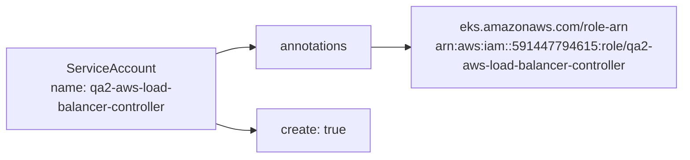
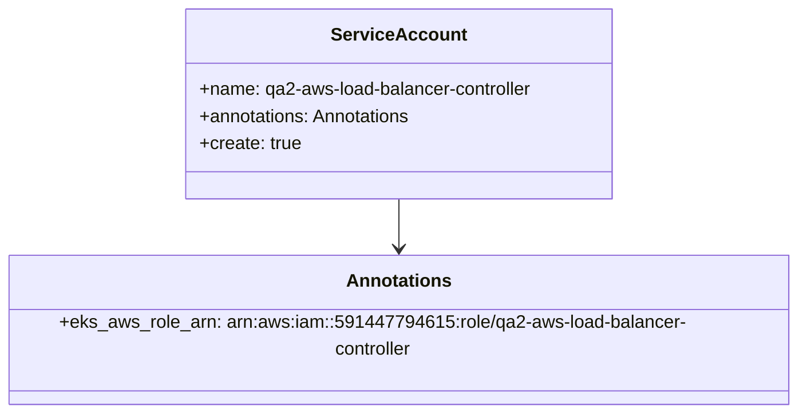

# Diagram: devops/k8s/aws-load-balancer-controller/helm/values.qa2.yaml

> Auto-generated by Obscura crawlers

## Diagram 1

### SVG

<svg id="container" width="883.71875" xmlns="http://www.w3.org/2000/svg" class="flowchart" height="198" viewBox="0 0 883.71875 198" role="graphics-document document" aria-roledescription="flowchart-v2"><g><marker id="container_flowchart-v2-pointEnd" class="marker flowchart-v2" viewBox="0 0 10 10" refX="5" refY="5" markerUnits="userSpaceOnUse" markerWidth="8" markerHeight="8" orient="auto"><path d="M 0 0 L 10 5 L 0 10 z" class="arrowMarkerPath" style="stroke-width: 1; stroke-dasharray: 1, 0;"></path></marker><marker id="container_flowchart-v2-pointStart" class="marker flowchart-v2" viewBox="0 0 10 10" refX="4.5" refY="5" markerUnits="userSpaceOnUse" markerWidth="8" markerHeight="8" orient="auto"><path d="M 0 5 L 10 10 L 10 0 z" class="arrowMarkerPath" style="stroke-width: 1; stroke-dasharray: 1, 0;"></path></marker><marker id="container_flowchart-v2-circleEnd" class="marker flowchart-v2" viewBox="0 0 10 10" refX="11" refY="5" markerUnits="userSpaceOnUse" markerWidth="11" markerHeight="11" orient="auto"><circle cx="5" cy="5" r="5" class="arrowMarkerPath" style="stroke-width: 1; stroke-dasharray: 1, 0;"></circle></marker><marker id="container_flowchart-v2-circleStart" class="marker flowchart-v2" viewBox="0 0 10 10" refX="-1" refY="5" markerUnits="userSpaceOnUse" markerWidth="11" markerHeight="11" orient="auto"><circle cx="5" cy="5" r="5" class="arrowMarkerPath" style="stroke-width: 1; stroke-dasharray: 1, 0;"></circle></marker><marker id="container_flowchart-v2-crossEnd" class="marker cross flowchart-v2" viewBox="0 0 11 11" refX="12" refY="5.2" markerUnits="userSpaceOnUse" markerWidth="11" markerHeight="11" orient="auto"><path d="M 1,1 l 9,9 M 10,1 l -9,9" class="arrowMarkerPath" style="stroke-width: 2; stroke-dasharray: 1, 0;"></path></marker><marker id="container_flowchart-v2-crossStart" class="marker cross flowchart-v2" viewBox="0 0 11 11" refX="-1" refY="5.2" markerUnits="userSpaceOnUse" markerWidth="11" markerHeight="11" orient="auto"><path d="M 1,1 l 9,9 M 10,1 l -9,9" class="arrowMarkerPath" style="stroke-width: 2; stroke-dasharray: 1, 0;"></path></marker><g class="root"><g class="clusters"></g><g class="edgePaths"><path d="M268,67.387L272.167,65.989C276.333,64.591,284.667,61.796,292.333,60.398C300,59,307,59,310.5,59L314,59" id="L_SA_AN_0" class="edge-thickness-normal edge-pattern-solid edge-thickness-normal edge-pattern-solid flowchart-link" style=";" data-edge="true" data-et="edge" data-id="L_SA_AN_0" data-points="W3sieCI6MjY4LCJ5Ijo2Ny4zODcwOTY3NzQxOTM1NX0seyJ4IjoyOTMsInkiOjU5fSx7IngiOjMxOCwieSI6NTl9XQ==" marker-end="url(#container_flowchart-v2-pointEnd)"></path><path d="M465.656,59L469.823,59C473.99,59,482.323,59,489.99,59C497.656,59,504.656,59,508.156,59L511.656,59" id="L_AN_ROLE_0" class="edge-thickness-normal edge-pattern-solid edge-thickness-normal edge-pattern-solid flowchart-link" style=";" data-edge="true" data-et="edge" data-id="L_AN_ROLE_0" data-points="W3sieCI6NDY1LjY1NjI1LCJ5Ijo1OX0seyJ4Ijo0OTAuNjU2MjUsInkiOjU5fSx7IngiOjUxNS42NTYyNSwieSI6NTl9XQ==" marker-end="url(#container_flowchart-v2-pointEnd)"></path><path d="M268,154.613L272.167,156.011C276.333,157.409,284.667,160.204,292.727,161.602C300.786,163,308.573,163,312.466,163L316.359,163" id="L_SA_CREATE_0" class="edge-thickness-normal edge-pattern-solid edge-thickness-normal edge-pattern-solid flowchart-link" style=";" data-edge="true" data-et="edge" data-id="L_SA_CREATE_0" data-points="W3sieCI6MjY4LCJ5IjoxNTQuNjEyOTAzMjI1ODA2NDZ9LHsieCI6MjkzLCJ5IjoxNjN9LHsieCI6MzIwLjM1OTM3NSwieSI6MTYzfV0=" marker-end="url(#container_flowchart-v2-pointEnd)"></path></g><g class="edgeLabels"><g class="edgeLabel"><g class="label" data-id="L_SA_AN_0" transform="translate(0, 0)"><foreignObject width="0" height="0">

</foreignObject></g></g><g class="edgeLabel"><g class="label" data-id="L_AN_ROLE_0" transform="translate(0, 0)"><foreignObject width="0" height="0">

</foreignObject></g></g><g class="edgeLabel"><g class="label" data-id="L_SA_CREATE_0" transform="translate(0, 0)"><foreignObject width="0" height="0">

</foreignObject></g></g></g><g class="nodes"><g class="node default" id="flowchart-SA-0" transform="translate(138, 111)"><rect class="basic label-container" style="" x="-130" y="-51" width="260" height="102"></rect><g class="label" style="" transform="translate(-100, -36)"><rect></rect><foreignObject width="200" height="72">

ServiceAccount\nname: qa2-aws-load-balancer-controller

</foreignObject></g></g><g class="node default" id="flowchart-AN-1" transform="translate(391.828125, 59)"><rect class="basic label-container" style="" x="-73.828125" y="-27" width="147.65625" height="54"></rect><g class="label" style="" transform="translate(-43.828125, -12)"><rect></rect><foreignObject width="87.65625" height="24">

annotations

</foreignObject></g></g><g class="node default" id="flowchart-ROLE-2" transform="translate(695.6875, 59)"><rect class="basic label-container" style="" x="-180.03125" y="-51" width="360.0625" height="102"></rect><g class="label" style="" transform="translate(-150.03125, -36)"><rect></rect><foreignObject width="300.0625" height="72">

eks.amazonaws.com/role-arn\narn:aws:iam::591447794615:role/qa2-aws-load-balancer-controller

</foreignObject></g></g><g class="node default" id="flowchart-CREATE-3" transform="translate(391.828125, 163)"><rect class="basic label-container" style="" x="-71.46875" y="-27" width="142.9375" height="54"></rect><g class="label" style="" transform="translate(-41.46875, -12)"><rect></rect><foreignObject width="82.9375" height="24">

create: true

</foreignObject></g></g></g></g></g></svg>

## Diagram 2

### SVG

<svg id="container" width="699.25" xmlns="http://www.w3.org/2000/svg" class="classDiagram" height="354" viewBox="0 0 699.25 354" role="graphics-document document" aria-roledescription="class"><g><defs><marker id="container_class-aggregationStart" class="marker aggregation class" refX="18" refY="7" markerWidth="190" markerHeight="240" orient="auto"><path d="M 18,7 L9,13 L1,7 L9,1 Z"></path></marker></defs><defs><marker id="container_class-aggregationEnd" class="marker aggregation class" refX="1" refY="7" markerWidth="20" markerHeight="28" orient="auto"><path d="M 18,7 L9,13 L1,7 L9,1 Z"></path></marker></defs><defs><marker id="container_class-extensionStart" class="marker extension class" refX="18" refY="7" markerWidth="190" markerHeight="240" orient="auto"><path d="M 1,7 L18,13 V 1 Z"></path></marker></defs><defs><marker id="container_class-extensionEnd" class="marker extension class" refX="1" refY="7" markerWidth="20" markerHeight="28" orient="auto"><path d="M 1,1 V 13 L18,7 Z"></path></marker></defs><defs><marker id="container_class-compositionStart" class="marker composition class" refX="18" refY="7" markerWidth="190" markerHeight="240" orient="auto"><path d="M 18,7 L9,13 L1,7 L9,1 Z"></path></marker></defs><defs><marker id="container_class-compositionEnd" class="marker composition class" refX="1" refY="7" markerWidth="20" markerHeight="28" orient="auto"><path d="M 18,7 L9,13 L1,7 L9,1 Z"></path></marker></defs><defs><marker id="container_class-dependencyStart" class="marker dependency class" refX="6" refY="7" markerWidth="190" markerHeight="240" orient="auto"><path d="M 5,7 L9,13 L1,7 L9,1 Z"></path></marker></defs><defs><marker id="container_class-dependencyEnd" class="marker dependency class" refX="13" refY="7" markerWidth="20" markerHeight="28" orient="auto"><path d="M 18,7 L9,13 L14,7 L9,1 Z"></path></marker></defs><defs><marker id="container_class-lollipopStart" class="marker lollipop class" refX="13" refY="7" markerWidth="190" markerHeight="240" orient="auto"><circle stroke="black" fill="transparent" cx="7" cy="7" r="6"></circle></marker></defs><defs><marker id="container_class-lollipopEnd" class="marker lollipop class" refX="1" refY="7" markerWidth="190" markerHeight="240" orient="auto"><circle stroke="black" fill="transparent" cx="7" cy="7" r="6"></circle></marker></defs><g class="root"><g class="clusters"></g><g class="edgePaths"><path d="M349.625,176L349.625,180.167C349.625,184.333,349.625,192.667,349.625,200C349.625,207.333,349.625,213.667,349.625,216.833L349.625,220" id="id_ServiceAccount_Annotations_1" class="edge-thickness-normal edge-pattern-solid relation" style=";;;" data-edge="true" data-et="edge" data-id="id_ServiceAccount_Annotations_1" data-points="W3sieCI6MzQ5LjYyNSwieSI6MTc2fSx7IngiOjM0OS42MjUsInkiOjIwMX0seyJ4IjozNDkuNjI1LCJ5IjoyMjZ9XQ==" marker-end="url(#container_class-dependencyEnd)"></path></g><g class="edgeLabels"><g class="edgeLabel"><g class="label" data-id="id_ServiceAccount_Annotations_1" transform="translate(0, 0)"><foreignObject width="0" height="0">

</foreignObject></g></g></g><g class="nodes"><g class="node default" id="classId-ServiceAccount-0" transform="translate(349.625, 92)"><g class="basic label-container"><path d="M-190.1953125 -84 L190.1953125 -84 L190.1953125 84 L-190.1953125 84" stroke="none" stroke-width="0" fill="#ECECFF" style=""></path><path d="M-190.1953125 -84 C-59.200706407511234 -84, 71.79389968497753 -84, 190.1953125 -84 M-190.1953125 -84 C-71.49953632629479 -84, 47.196239847410425 -84, 190.1953125 -84 M190.1953125 -84 C190.1953125 -21.802118172755407, 190.1953125 40.39576365448919, 190.1953125 84 M190.1953125 -84 C190.1953125 -20.723036061419776, 190.1953125 42.55392787716045, 190.1953125 84 M190.1953125 84 C51.29748478759038 84, -87.60034292481924 84, -190.1953125 84 M190.1953125 84 C83.5469227155665 84, -23.10146706886701 84, -190.1953125 84 M-190.1953125 84 C-190.1953125 22.600948857263127, -190.1953125 -38.798102285473746, -190.1953125 -84 M-190.1953125 84 C-190.1953125 22.963883408173757, -190.1953125 -38.072233183652486, -190.1953125 -84" stroke="#9370DB" stroke-width="1.3" fill="none" stroke-dasharray="0 0" style=""></path></g><g class="annotation-group text" transform="translate(0, -60)"></g><g class="label-group text" transform="translate(-55.671875, -60)"><g class="label" style="font-weight: bolder" transform="translate(0,-12)"><foreignObject width="111.34375" height="24">

ServiceAccount

</foreignObject></g></g><g class="members-group text" transform="translate(-178.1953125, -12)"><g class="label" style="" transform="translate(0,-12)"><foreignObject width="300.71875" height="24">

+name: qa2-aws-load-balancer-controller

</foreignObject></g><g class="label" style="" transform="translate(0,12)"><foreignObject width="191.59375" height="24">

+annotations: Annotations

</foreignObject></g><g class="label" style="" transform="translate(0,36)"><foreignObject width="90.921875" height="24">

+create: true

</foreignObject></g></g><g class="methods-group text" transform="translate(-178.1953125, 84)"></g><g class="divider" style=""><path d="M-190.1953125 -36 C-71.58147240539081 -36, 47.032367689218376 -36, 190.1953125 -36 M-190.1953125 -36 C-96.15213102828424 -36, -2.10894955656849 -36, 190.1953125 -36" stroke="#9370DB" stroke-width="1.3" fill="none" stroke-dasharray="0 0" style=""></path></g><g class="divider" style=""><path d="M-190.1953125 60 C-40.512075568848104 60, 109.17116136230379 60, 190.1953125 60 M-190.1953125 60 C-68.07103516727528 60, 54.05324216544943 60, 190.1953125 60" stroke="#9370DB" stroke-width="1.3" fill="none" stroke-dasharray="0 0" style=""></path></g></g><g class="node default" id="classId-Annotations-1" transform="translate(349.625, 286)"><g class="basic label-container"><path d="M-341.625 -60 L341.625 -60 L341.625 60 L-341.625 60" stroke="none" stroke-width="0" fill="#ECECFF" style=""></path><path d="M-341.625 -60 C-189.966469169157 -60, -38.30793833831399 -60, 341.625 -60 M-341.625 -60 C-72.3399781275906 -60, 196.9450437448188 -60, 341.625 -60 M341.625 -60 C341.625 -12.502509369292582, 341.625 34.994981261414836, 341.625 60 M341.625 -60 C341.625 -29.369718923772957, 341.625 1.260562152454085, 341.625 60 M341.625 60 C156.17711842595955 60, -29.270763148080903 60, -341.625 60 M341.625 60 C202.60700745554993 60, 63.589014911099866 60, -341.625 60 M-341.625 60 C-341.625 30.436050416688136, -341.625 0.8721008333762725, -341.625 -60 M-341.625 60 C-341.625 21.392786553243326, -341.625 -17.214426893513348, -341.625 -60" stroke="#9370DB" stroke-width="1.3" fill="none" stroke-dasharray="0 0" style=""></path></g><g class="annotation-group text" transform="translate(0, -36)"></g><g class="label-group text" transform="translate(-44.5, -36)"><g class="label" style="font-weight: bolder" transform="translate(0,-12)"><foreignObject width="89" height="24">

Annotations

</foreignObject></g></g><g class="members-group text" transform="translate(-329.625, 12)"><g class="label" style="" transform="translate(0,-12)"><foreignObject width="614.75" height="24">

+eks_aws_role_arn: arn:aws:iam::591447794615:role/qa2-aws-load-balancer-controller

</foreignObject></g></g><g class="methods-group text" transform="translate(-329.625, 60)"></g><g class="divider" style=""><path d="M-341.625 -12 C-145.65073382977084 -12, 50.323532340458314 -12, 341.625 -12 M-341.625 -12 C-185.2956247604085 -12, -28.966249520816973 -12, 341.625 -12" stroke="#9370DB" stroke-width="1.3" fill="none" stroke-dasharray="0 0" style=""></path></g><g class="divider" style=""><path d="M-341.625 36 C-170.9342355261423 36, -0.24347105228457622 36, 341.625 36 M-341.625 36 C-123.95462050549025 36, 93.71575898901949 36, 341.625 36" stroke="#9370DB" stroke-width="1.3" fill="none" stroke-dasharray="0 0" style=""></path></g></g></g></g></g></svg>
