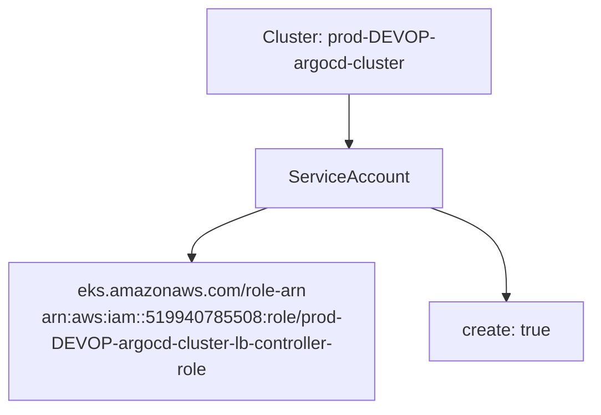
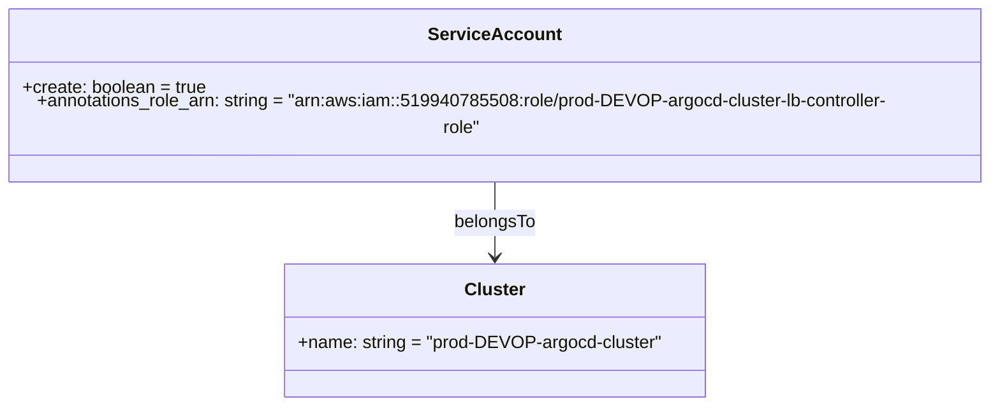

# Diagram: devops/k8s/aws-load-balancer-controller/helm/values.service.yaml

> Auto-generated by Obscura crawlers

## Diagram 1

### SVG

<svg id="container" width="582.296875" xmlns="http://www.w3.org/2000/svg" class="flowchart" height="350" viewBox="0 0 582.296875 350" role="graphics-document document" aria-roledescription="flowchart-v2"><g><marker id="container_flowchart-v2-pointEnd" class="marker flowchart-v2" viewBox="0 0 10 10" refX="5" refY="5" markerUnits="userSpaceOnUse" markerWidth="8" markerHeight="8" orient="auto"><path d="M 0 0 L 10 5 L 0 10 z" class="arrowMarkerPath" style="stroke-width: 1; stroke-dasharray: 1, 0;"></path></marker><marker id="container_flowchart-v2-pointStart" class="marker flowchart-v2" viewBox="0 0 10 10" refX="4.5" refY="5" markerUnits="userSpaceOnUse" markerWidth="8" markerHeight="8" orient="auto"><path d="M 0 5 L 10 10 L 10 0 z" class="arrowMarkerPath" style="stroke-width: 1; stroke-dasharray: 1, 0;"></path></marker><marker id="container_flowchart-v2-circleEnd" class="marker flowchart-v2" viewBox="0 0 10 10" refX="11" refY="5" markerUnits="userSpaceOnUse" markerWidth="11" markerHeight="11" orient="auto"><circle cx="5" cy="5" r="5" class="arrowMarkerPath" style="stroke-width: 1; stroke-dasharray: 1, 0;"></circle></marker><marker id="container_flowchart-v2-circleStart" class="marker flowchart-v2" viewBox="0 0 10 10" refX="-1" refY="5" markerUnits="userSpaceOnUse" markerWidth="11" markerHeight="11" orient="auto"><circle cx="5" cy="5" r="5" class="arrowMarkerPath" style="stroke-width: 1; stroke-dasharray: 1, 0;"></circle></marker><marker id="container_flowchart-v2-crossEnd" class="marker cross flowchart-v2" viewBox="0 0 11 11" refX="12" refY="5.2" markerUnits="userSpaceOnUse" markerWidth="11" markerHeight="11" orient="auto"><path d="M 1,1 l 9,9 M 10,1 l -9,9" class="arrowMarkerPath" style="stroke-width: 2; stroke-dasharray: 1, 0;"></path></marker><marker id="container_flowchart-v2-crossStart" class="marker cross flowchart-v2" viewBox="0 0 11 11" refX="-1" refY="5.2" markerUnits="userSpaceOnUse" markerWidth="11" markerHeight="11" orient="auto"><path d="M 1,1 l 9,9 M 10,1 l -9,9" class="arrowMarkerPath" style="stroke-width: 2; stroke-dasharray: 1, 0;"></path></marker><g class="root"><g class="clusters"></g><g class="edgePaths"><path d="M348.754,86L348.754,90.167C348.754,94.333,348.754,102.667,348.754,110.333C348.754,118,348.754,125,348.754,128.5L348.754,132" id="L_Cluster_SA_0" class="edge-thickness-normal edge-pattern-solid edge-thickness-normal edge-pattern-solid flowchart-link" style=";" data-edge="true" data-et="edge" data-id="L_Cluster_SA_0" data-points="W3sieCI6MzQ4Ljc1MzkwNjI1LCJ5Ijo4Nn0seyJ4IjozNDguNzUzOTA2MjUsInkiOjExMX0seyJ4IjozNDguNzUzOTA2MjUsInkiOjEzNn1d" marker-end="url(#container_flowchart-v2-pointEnd)"></path><path d="M268.754,190L256.408,194.167C244.062,198.333,219.371,206.667,207.025,214.333C194.68,222,194.68,229,194.68,232.5L194.68,236" id="L_SA_Annotation_0" class="edge-thickness-normal edge-pattern-solid edge-thickness-normal edge-pattern-solid flowchart-link" style=";" data-edge="true" data-et="edge" data-id="L_SA_Annotation_0" data-points="W3sieCI6MjY4Ljc1MzgzMTEyOTgwNzcsInkiOjE5MH0seyJ4IjoxOTQuNjc5Njg3NSwieSI6MjE1fSx7IngiOjE5NC42Nzk2ODc1LCJ5IjoyNDB9XQ==" marker-end="url(#container_flowchart-v2-pointEnd)"></path><path d="M428.754,190L441.1,194.167C453.445,198.333,478.137,206.667,490.482,218.333C502.828,230,502.828,245,502.828,252.5L502.828,260" id="L_SA_Create_0" class="edge-thickness-normal edge-pattern-solid edge-thickness-normal edge-pattern-solid flowchart-link" style=";" data-edge="true" data-et="edge" data-id="L_SA_Create_0" data-points="W3sieCI6NDI4Ljc1Mzk4MTM3MDE5MjMsInkiOjE5MH0seyJ4Ijo1MDIuODI4MTI1LCJ5IjoyMTV9LHsieCI6NTAyLjgyODEyNSwieSI6MjY0fV0=" marker-end="url(#container_flowchart-v2-pointEnd)"></path></g><g class="edgeLabels"><g class="edgeLabel"><g class="label" data-id="L_Cluster_SA_0" transform="translate(0, 0)"><foreignObject width="0" height="0">

</foreignObject></g></g><g class="edgeLabel"><g class="label" data-id="L_SA_Annotation_0" transform="translate(0, 0)"><foreignObject width="0" height="0">

</foreignObject></g></g><g class="edgeLabel"><g class="label" data-id="L_SA_Create_0" transform="translate(0, 0)"><foreignObject width="0" height="0">

</foreignObject></g></g></g><g class="nodes"><g class="node default" id="flowchart-Cluster-0" transform="translate(348.75390625, 47)"><rect class="basic label-container" style="" x="-130" y="-39" width="260" height="78"></rect><g class="label" style="" transform="translate(-100, -24)"><rect></rect><foreignObject width="200" height="48">

Cluster: prod-DEVOP-argocd-cluster

</foreignObject></g></g><g class="node default" id="flowchart-SA-1" transform="translate(348.75390625, 163)"><rect class="basic label-container" style="" x="-84.84375" y="-27" width="169.6875" height="54"></rect><g class="label" style="" transform="translate(-54.84375, -12)"><rect></rect><foreignObject width="109.6875" height="24">

ServiceAccount

</foreignObject></g></g><g class="node default" id="flowchart-Annotation-2" transform="translate(194.6796875, 291)"><rect class="basic label-container" style="" x="-186.6796875" y="-51" width="373.359375" height="102"></rect><g class="label" style="" transform="translate(-156.6796875, -36)"><rect></rect><foreignObject width="313.359375" height="72">

eks.amazonaws.com/role-arn\narn:aws:iam::519940785508:role/prod-DEVOP-argocd-cluster-lb-controller-role

</foreignObject></g></g><g class="node default" id="flowchart-Create-3" transform="translate(502.828125, 291)"><rect class="basic label-container" style="" x="-71.46875" y="-27" width="142.9375" height="54"></rect><g class="label" style="" transform="translate(-41.46875, -12)"><rect></rect><foreignObject width="82.9375" height="24">

create: true

</foreignObject></g></g></g></g></g></svg>

## Diagram 2

### SVG

<svg id="container" width="900.765625" xmlns="http://www.w3.org/2000/svg" class="classDiagram" height="354" viewBox="0 0 900.765625 354" role="graphics-document document" aria-roledescription="class"><g><defs><marker id="container_class-aggregationStart" class="marker aggregation class" refX="18" refY="7" markerWidth="190" markerHeight="240" orient="auto"><path d="M 18,7 L9,13 L1,7 L9,1 Z"></path></marker></defs><defs><marker id="container_class-aggregationEnd" class="marker aggregation class" refX="1" refY="7" markerWidth="20" markerHeight="28" orient="auto"><path d="M 18,7 L9,13 L1,7 L9,1 Z"></path></marker></defs><defs><marker id="container_class-extensionStart" class="marker extension class" refX="18" refY="7" markerWidth="190" markerHeight="240" orient="auto"><path d="M 1,7 L18,13 V 1 Z"></path></marker></defs><defs><marker id="container_class-extensionEnd" class="marker extension class" refX="1" refY="7" markerWidth="20" markerHeight="28" orient="auto"><path d="M 1,1 V 13 L18,7 Z"></path></marker></defs><defs><marker id="container_class-compositionStart" class="marker composition class" refX="18" refY="7" markerWidth="190" markerHeight="240" orient="auto"><path d="M 18,7 L9,13 L1,7 L9,1 Z"></path></marker></defs><defs><marker id="container_class-compositionEnd" class="marker composition class" refX="1" refY="7" markerWidth="20" markerHeight="28" orient="auto"><path d="M 18,7 L9,13 L1,7 L9,1 Z"></path></marker></defs><defs><marker id="container_class-dependencyStart" class="marker dependency class" refX="6" refY="7" markerWidth="190" markerHeight="240" orient="auto"><path d="M 5,7 L9,13 L1,7 L9,1 Z"></path></marker></defs><defs><marker id="container_class-dependencyEnd" class="marker dependency class" refX="13" refY="7" markerWidth="20" markerHeight="28" orient="auto"><path d="M 18,7 L9,13 L14,7 L9,1 Z"></path></marker></defs><defs><marker id="container_class-lollipopStart" class="marker lollipop class" refX="13" refY="7" markerWidth="190" markerHeight="240" orient="auto"><circle stroke="black" fill="transparent" cx="7" cy="7" r="6"></circle></marker></defs><defs><marker id="container_class-lollipopEnd" class="marker lollipop class" refX="1" refY="7" markerWidth="190" markerHeight="240" orient="auto"><circle stroke="black" fill="transparent" cx="7" cy="7" r="6"></circle></marker></defs><g class="root"><g class="clusters"></g><g class="edgePaths"><path d="M450.383,152L450.383,158.167C450.383,164.333,450.383,176.667,450.383,188C450.383,199.333,450.383,209.667,450.383,214.833L450.383,220" id="id_ServiceAccount_Cluster_1" class="edge-thickness-normal edge-pattern-solid relation" style=";;;" data-edge="true" data-et="edge" data-id="id_ServiceAccount_Cluster_1" data-points="W3sieCI6NDUwLjM4MjgxMjUsInkiOjE1Mn0seyJ4Ijo0NTAuMzgyODEyNSwieSI6MTg5fSx7IngiOjQ1MC4zODI4MTI1LCJ5IjoyMjZ9XQ==" marker-end="url(#container_class-dependencyEnd)"></path></g><g class="edgeLabels"><g class="edgeLabel" transform="translate(450.3828125, 189)"><g class="label" data-id="id_ServiceAccount_Cluster_1" transform="translate(-36.984375, -12)"><foreignObject width="73.96875" height="24">

belongsTo

</foreignObject></g></g></g><g class="nodes"><g class="node default" id="classId-Cluster-0" transform="translate(450.3828125, 286)"><g class="basic label-container"><path d="M-188.4765625 -60 L188.4765625 -60 L188.4765625 60 L-188.4765625 60" stroke="none" stroke-width="0" fill="#ECECFF" style=""></path><path d="M-188.4765625 -60 C-75.36860364372623 -60, 37.73935521254754 -60, 188.4765625 -60 M-188.4765625 -60 C-108.7634440311486 -60, -29.05032556229719 -60, 188.4765625 -60 M188.4765625 -60 C188.4765625 -23.383735182811698, 188.4765625 13.232529634376604, 188.4765625 60 M188.4765625 -60 C188.4765625 -23.336749411321534, 188.4765625 13.326501177356931, 188.4765625 60 M188.4765625 60 C109.90066687930391 60, 31.324771258607825 60, -188.4765625 60 M188.4765625 60 C46.48416915457952 60, -95.50822419084096 60, -188.4765625 60 M-188.4765625 60 C-188.4765625 32.95752381280713, -188.4765625 5.915047625614264, -188.4765625 -60 M-188.4765625 60 C-188.4765625 25.720017123057353, -188.4765625 -8.559965753885294, -188.4765625 -60" stroke="#9370DB" stroke-width="1.3" fill="none" stroke-dasharray="0 0" style=""></path></g><g class="annotation-group text" transform="translate(0, -36)"></g><g class="label-group text" transform="translate(-25.90625, -36)"><g class="label" style="font-weight: bolder" transform="translate(0,-12)"><foreignObject width="51.8125" height="24">

Cluster

</foreignObject></g></g><g class="members-group text" transform="translate(-176.4765625, 12)"><g class="label" style="" transform="translate(0,-12)"><foreignObject width="327.046875" height="24">

+name: string = "prod-DEVOP-argocd-cluster"

</foreignObject></g></g><g class="methods-group text" transform="translate(-176.4765625, 60)"></g><g class="divider" style=""><path d="M-188.4765625 -12 C-86.53695800729243 -12, 15.402646485415147 -12, 188.4765625 -12 M-188.4765625 -12 C-112.48659189777742 -12, -36.49662129555483 -12, 188.4765625 -12" stroke="#9370DB" stroke-width="1.3" fill="none" stroke-dasharray="0 0" style=""></path></g><g class="divider" style=""><path d="M-188.4765625 36 C-60.94327685877758 36, 66.59000878244484 36, 188.4765625 36 M-188.4765625 36 C-107.74797240319974 36, -27.01938230639948 36, 188.4765625 36" stroke="#9370DB" stroke-width="1.3" fill="none" stroke-dasharray="0 0" style=""></path></g></g><g class="node default" id="classId-ServiceAccount-1" transform="translate(450.3828125, 80)"><g class="basic label-container"><path d="M-442.3828125 -72 L442.3828125 -72 L442.3828125 72 L-442.3828125 72" stroke="none" stroke-width="0" fill="#ECECFF" style=""></path><path d="M-442.3828125 -72 C-138.7694649425897 -72, 164.8438826148206 -72, 442.3828125 -72 M-442.3828125 -72 C-176.44873267232077 -72, 89.48534715535845 -72, 442.3828125 -72 M442.3828125 -72 C442.3828125 -40.09890990614087, 442.3828125 -8.197819812281736, 442.3828125 72 M442.3828125 -72 C442.3828125 -17.806575198534986, 442.3828125 36.38684960293003, 442.3828125 72 M442.3828125 72 C264.77995081494936 72, 87.17708912989872 72, -442.3828125 72 M442.3828125 72 C219.0631369886573 72, -4.256538522685389 72, -442.3828125 72 M-442.3828125 72 C-442.3828125 24.555254716769667, -442.3828125 -22.889490566460665, -442.3828125 -72 M-442.3828125 72 C-442.3828125 35.99653108117372, -442.3828125 -0.006937837652557732, -442.3828125 -72" stroke="#9370DB" stroke-width="1.3" fill="none" stroke-dasharray="0 0" style=""></path></g><g class="annotation-group text" transform="translate(0, -48)"></g><g class="label-group text" transform="translate(-55.671875, -48)"><g class="label" style="font-weight: bolder" transform="translate(0,-12)"><foreignObject width="111.34375" height="24">

ServiceAccount

</foreignObject></g></g><g class="members-group text" transform="translate(-430.3828125, 0)"><g class="label" style="" transform="translate(0,-12)"><foreignObject width="166.84375" height="24">

+create: boolean = true

</foreignObject></g><g class="label" style="" transform="translate(0,12)"><foreignObject width="805.09375" height="24">

+annotations_role_arn: string = "arn:aws:iam::519940785508:role/prod-DEVOP-argocd-cluster-lb-controller-role"

</foreignObject></g></g><g class="methods-group text" transform="translate(-430.3828125, 72)"></g><g class="divider" style=""><path d="M-442.3828125 -24 C-243.5591662967282 -24, -44.73552009345639 -24, 442.3828125 -24 M-442.3828125 -24 C-95.51389018736575 -24, 251.3550321252685 -24, 442.3828125 -24" stroke="#9370DB" stroke-width="1.3" fill="none" stroke-dasharray="0 0" style=""></path></g><g class="divider" style=""><path d="M-442.3828125 48 C-248.22674308006435 48, -54.070673660128705 48, 442.3828125 48 M-442.3828125 48 C-107.6887262247759 48, 227.0053600504482 48, 442.3828125 48" stroke="#9370DB" stroke-width="1.3" fill="none" stroke-dasharray="0 0" style=""></path></g></g></g></g></g></svg>
