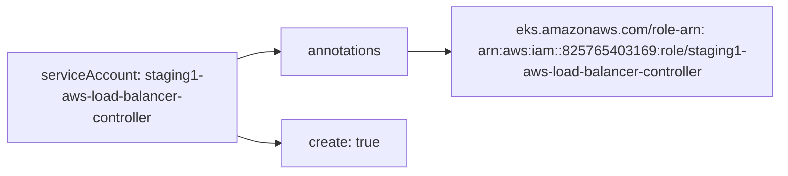

# Diagram: devops/k8s/aws-load-balancer-controller/helm/values.staging1.yaml

> Auto-generated by Obscura crawlers

## Mermaid

### SVG

<svg id="container" width="879.0625" xmlns="http://www.w3.org/2000/svg" class="flowchart" height="198" viewBox="0 0 879.0625 198" role="graphics-document document" aria-roledescription="flowchart-v2"><g><marker id="container_flowchart-v2-pointEnd" class="marker flowchart-v2" viewBox="0 0 10 10" refX="5" refY="5" markerUnits="userSpaceOnUse" markerWidth="8" markerHeight="8" orient="auto"><path d="M 0 0 L 10 5 L 0 10 z" class="arrowMarkerPath" style="stroke-width: 1; stroke-dasharray: 1, 0;"></path></marker><marker id="container_flowchart-v2-pointStart" class="marker flowchart-v2" viewBox="0 0 10 10" refX="4.5" refY="5" markerUnits="userSpaceOnUse" markerWidth="8" markerHeight="8" orient="auto"><path d="M 0 5 L 10 10 L 10 0 z" class="arrowMarkerPath" style="stroke-width: 1; stroke-dasharray: 1, 0;"></path></marker><marker id="container_flowchart-v2-circleEnd" class="marker flowchart-v2" viewBox="0 0 10 10" refX="11" refY="5" markerUnits="userSpaceOnUse" markerWidth="11" markerHeight="11" orient="auto"><circle cx="5" cy="5" r="5" class="arrowMarkerPath" style="stroke-width: 1; stroke-dasharray: 1, 0;"></circle></marker><marker id="container_flowchart-v2-circleStart" class="marker flowchart-v2" viewBox="0 0 10 10" refX="-1" refY="5" markerUnits="userSpaceOnUse" markerWidth="11" markerHeight="11" orient="auto"><circle cx="5" cy="5" r="5" class="arrowMarkerPath" style="stroke-width: 1; stroke-dasharray: 1, 0;"></circle></marker><marker id="container_flowchart-v2-crossEnd" class="marker cross flowchart-v2" viewBox="0 0 11 11" refX="12" refY="5.2" markerUnits="userSpaceOnUse" markerWidth="11" markerHeight="11" orient="auto"><path d="M 1,1 l 9,9 M 10,1 l -9,9" class="arrowMarkerPath" style="stroke-width: 2; stroke-dasharray: 1, 0;"></path></marker><marker id="container_flowchart-v2-crossStart" class="marker cross flowchart-v2" viewBox="0 0 11 11" refX="-1" refY="5.2" markerUnits="userSpaceOnUse" markerWidth="11" markerHeight="11" orient="auto"><path d="M 1,1 l 9,9 M 10,1 l -9,9" class="arrowMarkerPath" style="stroke-width: 2; stroke-dasharray: 1, 0;"></path></marker><g class="root"><g class="clusters"></g><g class="edgePaths"><path d="M268,67.387L272.167,65.989C276.333,64.591,284.667,61.796,292.333,60.398C300,59,307,59,310.5,59L314,59" id="L_SA_Annotations_0" class="edge-thickness-normal edge-pattern-solid edge-thickness-normal edge-pattern-solid flowchart-link" style=";" data-edge="true" data-et="edge" data-id="L_SA_Annotations_0" data-points="W3sieCI6MjY4LCJ5Ijo2Ny4zODcwOTY3NzQxOTM1NX0seyJ4IjoyOTMsInkiOjU5fSx7IngiOjMxOCwieSI6NTl9XQ==" marker-end="url(#container_flowchart-v2-pointEnd)"></path><path d="M465.656,59L469.823,59C473.99,59,482.323,59,489.99,59C497.656,59,504.656,59,508.156,59L511.656,59" id="L_Annotations_RoleARN_0" class="edge-thickness-normal edge-pattern-solid edge-thickness-normal edge-pattern-solid flowchart-link" style=";" data-edge="true" data-et="edge" data-id="L_Annotations_RoleARN_0" data-points="W3sieCI6NDY1LjY1NjI1LCJ5Ijo1OX0seyJ4Ijo0OTAuNjU2MjUsInkiOjU5fSx7IngiOjUxNS42NTYyNSwieSI6NTl9XQ==" marker-end="url(#container_flowchart-v2-pointEnd)"></path><path d="M268,154.613L272.167,156.011C276.333,157.409,284.667,160.204,292.727,161.602C300.786,163,308.573,163,312.466,163L316.359,163" id="L_SA_Create_0" class="edge-thickness-normal edge-pattern-solid edge-thickness-normal edge-pattern-solid flowchart-link" style=";" data-edge="true" data-et="edge" data-id="L_SA_Create_0" data-points="W3sieCI6MjY4LCJ5IjoxNTQuNjEyOTAzMjI1ODA2NDZ9LHsieCI6MjkzLCJ5IjoxNjN9LHsieCI6MzIwLjM1OTM3NSwieSI6MTYzfV0=" marker-end="url(#container_flowchart-v2-pointEnd)"></path></g><g class="edgeLabels"><g class="edgeLabel"><g class="label" data-id="L_SA_Annotations_0" transform="translate(0, 0)"><foreignObject width="0" height="0">

</foreignObject></g></g><g class="edgeLabel"><g class="label" data-id="L_Annotations_RoleARN_0" transform="translate(0, 0)"><foreignObject width="0" height="0">

</foreignObject></g></g><g class="edgeLabel"><g class="label" data-id="L_SA_Create_0" transform="translate(0, 0)"><foreignObject width="0" height="0">

</foreignObject></g></g></g><g class="nodes"><g class="node default" id="flowchart-SA-0" transform="translate(138, 111)"><rect class="basic label-container" style="" x="-130" y="-51" width="260" height="102"></rect><g class="label" style="" transform="translate(-100, -36)"><rect></rect><foreignObject width="200" height="72">

serviceAccount: staging1-aws-load-balancer-controller

</foreignObject></g></g><g class="node default" id="flowchart-Annotations-2" transform="translate(391.828125, 59)"><rect class="basic label-container" style="" x="-73.828125" y="-27" width="147.65625" height="54"></rect><g class="label" style="" transform="translate(-43.828125, -12)"><rect></rect><foreignObject width="87.65625" height="24">

annotations

</foreignObject></g></g><g class="node default" id="flowchart-RoleARN-4" transform="translate(693.359375, 59)"><rect class="basic label-container" style="" x="-177.703125" y="-51" width="355.40625" height="102"></rect><g class="label" style="" transform="translate(-147.703125, -36)"><rect></rect><foreignObject width="295.40625" height="72">

eks.amazonaws.com/role-arn: arn:aws:iam::825765403169:role/staging1-aws-load-balancer-controller

</foreignObject></g></g><g class="node default" id="flowchart-Create-6" transform="translate(391.828125, 163)"><rect class="basic label-container" style="" x="-71.46875" y="-27" width="142.9375" height="54"></rect><g class="label" style="" transform="translate(-41.46875, -12)"><rect></rect><foreignObject width="82.9375" height="24">

create: true

</foreignObject></g></g></g></g></g></svg>
